# Cooperative UAV-Mounted RISs-Assisted Energy-Efficient Communications

Hongyang Pan , Yanheng Liu , Geng Sun , Senior Member, IEEE, Qingqing Wu , Senior Member, IEEE, Tierui Gong , Member, IEEE, Pengfei Wang , Member, IEEE, Dusit Niyato , Fellow, IEEE, and Chau Yuen , Fellow, IEEE

Abstract—Cooperative reconfigurable intelligent surfaces (RISs) are promising technologies for 6G networks to support a great number of users. Compared with the fixed RISs, the properly deployed RISs may improve the communication performance with less communication energy consumption, thereby improving the energy efficiency. In this paper, we consider a cooperative uncrewed aerial vehicle-mounted RISs (UAV-RISs)-assisted cellular network, where multiple RISs are carried and enhanced by UAVs to serve multiple ground users (GUs) simultaneously such that achieving the three-dimensional (3D) mobility and opportunistic deployment. Specifically, we formulate an energy-efficient communication problem based on multi-objective optimization framework (EEComm-MOF) to jointly consider the beamforming vector of base station (BS), the location deployment and the discrete phase shifts of UAV-RIS system so as to simultaneously maximize the minimum available rate over all GUs, maximize the total available rate of all GUs, and Received 22 May 2024; revised 21 January 2025; accepted 10 June 2025. Date of publication 12 June 2025; date of current version 3 September 2025. This work was supported in part by the National Natural Science Foundation of China under Grant 62272194 and Grant 62471200, in part by the Science and Technology Development Plan Project of Jilin Province under Grant 20250101027JJ, and in part by the National Research Foundation, Singapore and Infocomm Media Development Authority under its Future Communications Research & Development Programme under Grant FCP-NTU-RG-2024-025. Recommended for acceptance by H. Yao. (Corresponding author: Geng Sun.)

Hongyang Pan is with the College of Computer Science and Technology, Jilin University, Changchun 130012, China, and also with the Information Science and Technology College, Dalian Maritime University, Dalian 116026, China (e-mail: panhongyang18@foxmail.com).

Yanheng Liu is with the College of Computer Science and Technology, Jilin University, Changchun 130012, China, also with the Key Laboratory of Symbolic Computation and Knowledge Engineering of Ministry of Education, Jilin University, Changchun 130012, China, and also with the School of Computer Science, Zhuhai College of Science and Technology, Zhuhai 519000, China (e-mail: yhliu@jlu.edu.cn).

Geng Sun is with the College of Computer Science and Technology, Jilin University, Changchun 130012, China, also with the Key Laboratory of Symbolic Computation and Knowledge Engineering of Ministry of Education, Jilin University, Changchun 130012, China, and also with the College of Computing and Data Science, Nanyang Technological University, Singapore 639798 (e-mail: sungeng@jlu.edu.cn).

Qingqing Wu is with the Department of Electronic Engineering, Shanghai Jiao Tong University, Shanghai 200240, China (e-mail: qingqingwu@sjtu.edu.cn).

Tierui Gong and Chau Yuen are with the School of Electrical and Electronics Engineering, Nanyang Technological University, Singapore 639798 (e-mail: trgterry1113@gmail.com; chau.yuen@ntu.edu.sg).

Pengfei Wang is with the School of Computer Science and Technology, Dalian University of Technology, Dalian 116024, China (e-mail: wangpf@dlut.edu.cn).

Dusit Niyato is with the School of Computer Science and Engineering, Nanyang Technological University, Singapore 639798 (e-mail: dniyato@ ntu.edu.sg).

This article has supplementary downloadable material available at https://doi.org/10.1109/TMC.2025.3579597, provided by the authors.

Digital Object Identifier 10.1109/TMC.2025.3579597

minimize the total energy consumption of the system, while the transmit power constraint of BS is considered. To comprehensively solve EEComm-MOF which is an NP-hard and non-convex problem with constraints, a non-dominated sorting genetic algorithm-II with a continuous solution processing mechanism, a discrete solution processing mechanism, and a complex solution processing mechanism (INSGA-II-CDC) is proposed. Simulations results demonstrate that the proposed INSGA-II-CDC can solve EEComm-MOF effectively and outperforms other benchmarks under different parameter settings. Moreover, the stability of INSGA-II-CDC and the effectiveness of the improved mechanisms are verified. Finally, the implementability analysis of the algorithm is given.

Index Terms—Cooperative reconfigurable intelligent surfaces, uncrewed aerial vehicles, available rate, energy-efficient communication, multi-objective optimization problem.

# I. INTRODUCTION

6G WIRELESS networks are facing the challenge of accommodating a large number of users while meeting their ever-increasing demands for spectral and energy efficiency [1], [2]. To address this issue, a revolutionary technology called reconfigurable intelligent surface (RIS) has emerged as a feasible solution for intelligently reconfiguring the wireless propagation environment to enable energy-efficient communication [3], [4], [5]. An RIS can be described as a meta-surface comprising numerous passive and cost-effective elements, where each element of the RIS can independently adjust its phase shifts of the impinging radio waves, thereby transforming the wireless environment from a highly unpredictable space to a partially deterministic one [6], [7]. In a cellular network equipped with an RIS, a base station (BS) transmits signals to the RIS controller, optimizing the characteristics of the incident waves. Consequently, the RIS acts as a reflector, enhancing service quality of users. When RIS is deployed properly, it has the potential to be more energy-efficient than the amplify-and-forward technology and backscatter technology [8]. Furthermore, compared with continuous phase shifts, it is practical to consider the discrete phase shifts of an RIS [9].

To establish a virtual line-of-sight (LoS) communication environment, RISs are commonly deployed in fixed locations, such as facades [3], [10], [11]. However, the location of RIS deployment can influence energy efficiency and service quality. In this regard, using mobile vehicles such as uncrewed aerial vehicles (UAVs) and balloons to deploy RISs is promising [12], [13], [14]. Compared to balloons-mounted RISs, UAV-mounted RISs (UAV-RISs) are more practical for flexible and opportunistic deployment to enhance the communication performance [15], [16], since UAVs generally have a faster speed than balloons. Moreover, using UAVs means more stable communication links, as balloons are vulnerable by the external disturbances like wind, causing them to shift from their intended locations and angles [17], while UAVs can use advanced control systems to counteract them. Although using tethered balloons can enhance communication stability [18], the deployment freedom of RISs will be correspondingly damaged. Moreover, due to the low costs of UAVs and RISs, UAV-RIS has good scalability. For example, when the ground users (GUs) in the network suffer from reduced signal reception due to changes in channel conditions, increasing the number of UAV-RISs can enhance the strength of the reflected signals. However, it is important to consider that the use of UAVs introduces additional energy consumption, which must also be taken into account during system design and operation.

With the increasing number of GUs, using a single RIS of limited size to simultaneously serve all GUs becomes challenging [19]. Moreover, expanding the reflection area of RIS is also not reasonable, since UAVs with limited hardware resources are hard to load a large enough size RIS, so as to satisfy the communication requirements [20]. To this end, the concept of cooperative RISs has emerged as a promising area to enhance system capacity [21]. By incorporating UAVs into the system, each UAV-RIS can be deployed properly, thereby boosting the received signal strength. However, there is mutual interference among different links, imposing higher requirements on the location deployment of UAV-RISs.

This work considers a ground BS and several GUs, while the direct links from the BS to GUs are entirely unavailable. Thus, several cooperative UAV-RISs are employed in a threedimensional (3D) space to serve all GUs simultaneously. Different from the previous works that focused on a single UAV-RIS to serve the GUs [22], [23], or investigated two-dimensional (2D) mobility of UAV-RISs [24], [25], the considered scenario of this work is more intricate. Moreover, the proposed framework can be extended to some scenarios, such as mountain disaster rescue scenario and urban communication scenario. In these cases, UAV-RISs-assisted cellular network can efficiently utilize the 3D mobility and the opportunistic deployment to achieve low-delay communications, which can further improve rescue efficiency and user experience, respectively. The primary contributions of this paper are as follows:

. Cooperative UAV-RISs-assisted Energy-efficient Communication System: We consider a cooperative UAV-RISsassisted cellular network, where UAVs mount and enhance multiple RISs to simultaneously serve a number of GUs. This setup enables 3D mobility and allows for opportunistic deployment of RISs, providing a flexible and adaptive coverage. Such a communication system is widely used and can be extended to a range of practical scenarios, such as mountain disaster rescue communications and urban communications. These practical scenarios are closely aligned with real-world requirements, where traditional communication links may be unavailable or unreliable, and

the system can effectively address the challenges posed by unavailable links.

Energy-efficient Communication Problem based on Multiobjective Optimization Framework Formulation: In the considered system, three optimization objectives are maximizing the minimum available rate over all GUs, maximizing the total available rate of all GUs, and minimizing the total energy consumption of the system, which correspond to fair service, system capacity, and system cost, respectively, while there are trade-offs among them. Thus, an energy-efficient communication problem based on multi-objective optimization framework (EEComm-MOF) is formulated. To the best of our knowledge, it is the first work to jointly take into account deploying multiple UAV-RISs to serve multiple GUs by adjusting 3D locations of UAV-RISs, discrete phase shifts of UAV-RISs and beamforming vector of BS, while simultaneously considering different optimization objectives, making the problem non-trivial.

Multi-objective Optimization with Improved Nondominated Sorting Genetic Algorithm-II: Given the NP-hardness and non-convexity of EEComm-MOF, we propose an improved non-dominated sorting genetic algorithm-II with a continuous solution processing mechanism, a discrete solution processing mechanism, and a complex solution processing mechanism (INSGA-II-CDC) to solve the problem. Specifically, the continuous solution processing mechanism can exploit the better deployed locations of UAV-RISs, so as to improve the convergence rate. In addition, the discrete solution processing mechanism as well as the complex solution processing mechanism enable the algorithm to handle discrete phase shifts of UAV-RISs and beamforming vector of BS, respectively, thereby achieving a better solution set distribution. Thus, these three improved mechanisms can jointly enhance the search capability of the algorithm in the limited iterations.

Performance Evaluations and Analyses: Through simulations, we evaluate the performance of the proposed INSGA-II-CDC for solving the formulated EEComm-MOF under different settings. Specifically, the performance of the INSGA-II-CDC in terms of the convergence and optimality, stability, effectiveness of improved mechanisms, and CPU running time is verified. For a cellular network with 5 GUs, compared to the suboptimal value obtained by other benchmarks on the corresponding objective, the minimum available rate of the proposed approach can be enhanced by 74.62%, and the total available rate can be improved by 64.45%, while the corresponding energy consumption is saved by 10.55%. Similarly, compared to the suboptimal value obtained by other benchmarks on the corresponding objective for a cellular network with 10 GUs, the minimum available rate, the total available rate, and the energy consumption of the proposed approach can be increased by 43.75%, increased by 89.57%, and reduced by 13.60%, respectively. Finally, the implementability analysis of the algorithm is given.

TABLE I MAIN CONTRIBUTIONS OF RELATED WORKS 

<table><tr><td></td><td colspan="2">Scenario complexity</td><td colspan="3">Decision variable</td><td colspan="4">Optimization objective</td><td>Method</td></tr><tr><td>Reference</td><td>Multiple RISs</td><td>Multiple GUs</td><td>3D location deployment of RIS</td><td>Discrete phase shifts of RIS</td><td>Beamforming vector of BS</td><td>Minimum available rate</td><td>Total available rate</td><td>UAV flight energy consumption</td><td>Communication energy consumption</td><td>Multi-objective evolutionary algorithm</td></tr><tr><td>[3]</td><td>X</td><td>√</td><td>X</td><td>X</td><td>√</td><td>X</td><td>X</td><td>X</td><td>√</td><td>X</td></tr><tr><td>[21]</td><td>√</td><td>X</td><td>X</td><td>X</td><td>X</td><td>X</td><td>√</td><td>X</td><td>X</td><td>X</td></tr><tr><td>[22]</td><td>X</td><td>√</td><td>X</td><td>X</td><td>X</td><td>X</td><td>√</td><td>X</td><td>X</td><td>X</td></tr><tr><td>[9]</td><td>X</td><td>X</td><td>X</td><td>√</td><td>√</td><td>X</td><td>X</td><td>X</td><td>√</td><td>X</td></tr><tr><td>[23]</td><td>X</td><td>√</td><td>√</td><td>X</td><td>X</td><td>X</td><td>√</td><td>X</td><td>X</td><td>X</td></tr><tr><td>[26]</td><td>X</td><td>√</td><td>X</td><td>√</td><td>√</td><td>X</td><td>√</td><td>X</td><td>X</td><td>X</td></tr><tr><td>[27]</td><td>X</td><td>√</td><td>√</td><td>X</td><td>√</td><td>X</td><td>√</td><td>X</td><td>X</td><td>X</td></tr><tr><td>[28]</td><td>X</td><td>X</td><td>√</td><td>X</td><td>√</td><td>X</td><td>√</td><td>X</td><td>X</td><td>X</td></tr><tr><td>[29]</td><td>X</td><td>X</td><td>X</td><td>X</td><td>√</td><td>X</td><td>√</td><td>√</td><td>√</td><td>X</td></tr><tr><td>[30]</td><td>X</td><td>√</td><td>X</td><td>X</td><td>X</td><td>X</td><td>√</td><td>X</td><td>X</td><td>X</td></tr><tr><td>[31]</td><td>X</td><td>√</td><td>X</td><td>X</td><td>X</td><td>√</td><td>X</td><td>X</td><td>X</td><td>X</td></tr><tr><td>[32]</td><td>X</td><td>√</td><td>X</td><td>X</td><td>√</td><td>X</td><td>√</td><td>X</td><td>X</td><td>X</td></tr><tr><td>[33]</td><td>X</td><td>√</td><td>X</td><td>X</td><td>X</td><td>X</td><td>√</td><td>X</td><td>X</td><td>X</td></tr><tr><td>[34]</td><td>X</td><td>√</td><td>X</td><td>√</td><td>√</td><td>X</td><td>X</td><td>X</td><td>√</td><td>X</td></tr><tr><td>[19]</td><td>√</td><td>√</td><td>X</td><td>X</td><td>√</td><td>X</td><td>√</td><td>X</td><td>√</td><td>X</td></tr><tr><td>[24]</td><td>√</td><td>√</td><td>X</td><td>√</td><td>√</td><td>X</td><td>√</td><td>√</td><td>√</td><td>X</td></tr><tr><td>[35]</td><td>X</td><td>√</td><td>X</td><td>X</td><td>X</td><td>X</td><td>√</td><td>√</td><td>√</td><td>X</td></tr><tr><td>[36]</td><td>X</td><td>√</td><td>X</td><td>X</td><td>X</td><td>X</td><td>√</td><td>√</td><td>√</td><td>X</td></tr><tr><td>[37]</td><td>X</td><td>√</td><td>X</td><td>X</td><td>√</td><td>√</td><td>√</td><td>X</td><td>√</td><td>X</td></tr><tr><td>[38]</td><td>√</td><td>√</td><td>X</td><td>X</td><td>√</td><td>X</td><td>√</td><td>X</td><td>X</td><td>X</td></tr><tr><td>[39]</td><td>X</td><td>√</td><td>√</td><td>X</td><td>√</td><td>X</td><td>√</td><td>X</td><td>X</td><td>X</td></tr><tr><td>[40]</td><td>√</td><td>X</td><td>X</td><td>X</td><td>√</td><td>X</td><td>√</td><td>X</td><td>X</td><td>X</td></tr><tr><td>[41]</td><td>X</td><td>√</td><td>X</td><td>X</td><td>X</td><td>X</td><td>√</td><td>X</td><td>√</td><td>X</td></tr><tr><td>[42]</td><td>√</td><td>√</td><td>X</td><td>X</td><td>X</td><td>X</td><td>X</td><td>X</td><td>X</td><td>X</td></tr><tr><td>This work</td><td>√</td><td>√</td><td>√</td><td>√</td><td>√</td><td>√</td><td>√</td><td>√</td><td>√</td><td>√</td></tr></table>

The remainder of the paper is organized as follows. The related work is reviewed in Section II. Section III presents the system model. The EEComm-MOF is formulated in Section IV. Section V gives the algorithm for EEComm-MOF. Section VI provides the simulation results and Section VII concludes the paper.

Notations: The space of $M \times N$ complex-valued matrices is denoted by $\mathbb { C } ^ { M \times N }$ . For a vector x, its euclidean norm is represented by $\| \mathbf { x } \|$ . The function diag(x) represents a diagonal matrix whose diagonal elements are given by the entries of x. The imaginary unit of a complex number is denoted by $j = \sqrt { - 1 }$ . The symbol $\mathbf { x } ^ { T }$ represents the transpose of the vector x, while the symbol $\mathbf { x } ^ { H }$ represents the conjugate transpose of the vector x. Finally, the Kronecker product operation is denoted as ⊗.

# II. RELATED WORK

In this section, we illustrate the differences between the previous works and this work from different perspectives, and the explicit details are highlighted in Table I.

# A. RIS-Enabled Communication Scenarios

There were some previous works considering RIS-assisted wireless communications including multiple RISs or multiple GUs. Specifically, Khisa et al. [3] considered an RIS-assisted cellular network with a BS, an RIS, and two GUs. With the goal of minimizing the network energy consumption, a joint optimization framework was proposed, subject to the power budget constraints at both of the BS and the relaying node. The authors in [21] used cooperative RISs to assist Internetof-Things (IoT) networks, which could adjust stand-alone or cooperative configurations of the IoT networks.

However, in the real scenarios, considering multiple RIS service and multiple GUs is practical, while the abovementioned works only considered either multiple RISs or multiple GUs. Once both of these two factors are considered simultaneously, the complexity of the problem will be increased.

In addition, some works considered UAV-RISs-assisted wireless communications. Specifically, Zhao et al. in [22] utilized a UAV-RIS to maximize the available rate between BS and a mobile vehicle. For this purpose, they proposed a position prediction strategy that could adjust UAV-RIS trajectory and phase shifts in time. In [12], Zhang et al. proposed a novel approach that used a UAV-RIS to enhance the millimeter wave networks. For this purpose, they formulated an optimization problem to maximize the total downlink transmission by adjusting the location and reflection parameter of UAV-RIS. Liu et al. in [13] considered a UAV-RIS-assisted wireless networks with non-orthogonal multiple access (NOMA) technique to improve the spectrum efficiency, while harvesting energy from millimeter wave signals to power the UAV-RIS. To this end, a decaying deep Q-network was proposed to design the movement, phase shifts of the UAV-RIS system, and power allocation policy of UAV-RIS system. However, only a single UAV-RIS was considered in [12], [13]. Thus, we utilized multiple UAV-RISs to assist multiple GUs in our work.

# B. Decision Variables in RIS Systems

Some previous works considered 3D location deployment of RIS, discrete phase shift of RIS or beamforming vector of BS. For example, the authors in [9] optimized the transmit beamforming at BS and discrete phase shifts at RIS to minimize the transmission power of BS in an RISassisted wireless communication system. Moreover, the authors in [23] investigated the applications of UAV-RIS for millimeterwave BS in covering GUs in hotspot areas, and they maximized the available rate of GUs while minimizing the energy consumption of UAV flight from one hotspot to another over the time span of its battery life. Song et al. in [26] regarded 2D location deployment of UAV-RIS, the discrete phase shifts of UAV-RIS, and the beamforming vector of BS as their decision variables, so as to achieve emergency coverage requirements and dynamic environments for UAV-RIS. The authors in [27] considered 3D location deployment of UAV-RIS, the continuous phase shifts of UAV-RIS, and the beamforming vector of BS, and they optimized these decision variables to maximize the secure rate with channel uncertainty constraints. In [28], the transmit beamforming at the BS, the coefficient matrix and 3D location of the UAV-RIS were optimized to maximize the secure rate. Xiao et al. in [29] investigated a solar-powered UAV-RIS system, where the beamforming vector at BS, phase shifts, 2D hovering location, flying speed, number of reflecting elements, flying time, and hovering time of UAV-RIS are jointed adjusted to maximize the energy efficiency of the system.

However, in this paper, we considered the 3D location deployment of UAV-RISs, the discrete phase shifts of UAV-RISs, and the beamforming vector of BS as our decision variables, which is more comprehensive. Specifically, the 3D location deployment of UAV-RIS provides a significant advantage over 2D deployment, which allows for a better LoS link and coverage compared to 2D configurations. Additionally, the discrete phase shifts of UAV-RIS are more practical and suitable for the hardware constraints of UAVs, which makes the system more feasible for real-world UAV-RIS deployments, where hardware resources are often limited. In addition, considering beamforming vector enables more precise and flexible signal steering, focusing energy on the GUs while reducing interference in other directions.

# C. Optimization Objectives and Metrics in RIS-Assisted Communications

Some previous works only considered a single optimization objective. For instance, the authors in [30] aimed to optimize the average available rate in a UAV-RIS-assisted underlay cognitive radio network. The authors in [31] were dedicated to maximizing the minimum data rate, taking into account mobility, GU scheduling, and UAV-RIS power consumption constraints. The authors in [32] aimed to maximize the total available rate of the uplink and downlink for multiple GUs in an RIS-assisted communication system. The authors in [33] considered an RIS-assisted downlink NOMA scenario to maximize the total available rate of GUs, then proposing a novel deep reinforcement learning (DRL) method. Moreover, Wang et al. [34] considered an RIS-assisted NOMA system, and they aimed at minimizing the power consumption by designing the power allocation at the BS and passive beamforming at the RIS jointly. In [14], the authors investigated a heterogeneous network supported by dual connectivity with multiple UAV-RISs, wherein minimizing the total transmit power by jointly optimizing the trajectory of UAV-RISs, phase shifts of UAV-RISs, sub-carrier allocation, and active beamformers at each BS. Then, they adopted deep Q-network and successive convex approximation to solve the problem.

However, we considered the minimum available rate over all GUs, the total available rate of all GUs, and the total energy consumption of the system simultaneously. Such a consideration was more comprehensive for actual scenarios, as it addressed the diverse requirements of real-world applications. Specifically, improving the minimum available rate and the total available rate will reduce the complaints from GUs and increase the overall rating of this communication system, respectively, while saving the energy consumption is helpful to control the costs of the system.

Moreover, there were also some works considering several optimization objectives. For example, a wireless communication network with several cooperative RISs was studied in [19], where the authors aimed to maximize the total available rate and communication energy consumption by dynamically scheduling the on-off status of each RIS and optimizing the phase shifts of the RISs. Wu et al. in [24] considered optimizing the total available rate, UAV flight energy consumption, and communication energy consumption, so as to take over signal strength degradation over long transmission distances and limited spectrum resources. The authors in [35] investigated a secure and energy-efficient mobile edge computing with UAV-RIS assistance, where they also aimed to optimize the total available rate, UAV flight energy consumption, and communication energy consumption. Zhai et al. [36] also considered a UAV-RIS-assisted mobile edge computing system, where they optimized the energy efficiency of the system by optimizing the communication rate and total energy consumption. Moreover, the authors in [37] considered an RIS-assisted millimeter-wave communication system, and they optimized the total available rate, minimum available rate, and communication energy consumption by a two-stage method.

Although [19], [24], [35], [36], [37] aimed to optimize multiple objectives in their consideration, we formulated the optimization problem based on Pareto dominance. Such a consideration was practical but challenging. Specifically, these works transformed the multiple optimization objectives into a single optimization objective using a linear weighting method or a quotient method, while introducing Pareto dominance to deal with all optimization objectives is more efficient. The reason is that the algorithm with Pareto dominance can provide several solutions when iteration terminates, and they can be chosen for the decision-makers according to different requirements, which means that the decision-makers do not need to rerun the algorithm when facing different applications. Thus, such a consideration can further enhance the dynamics of the scenario and the scalability of the system, which is more practical.

# D. Optimization Approaches for RIS-Assisted Communications

To solve the complex optimization problem for RIS-assisted wireless communications, many researchers designed several effective algorithms. Specifically, Ma et al. [38] considered a multi-hop cooperative RISs to maximize the total available rate of all GUs. Since the formulated problem was non-convex and there were interactions among the decision variables, they first decoupled the problem into three subproblems. Then, they adopted the conventional convex optimization methods to solve these subproblems. Liu et al. [39] exploited a DRL method to solve RIS deployment, phase shift design, as well as power allocation in an NOMA system. Simulations verified that their algorithm was capable of striking a trade-off between the prediction accuracy and computational complexity. Moreover, the authors in [40] proposed a DRL method empowered by a generative adversarial network. Then, the joint optimization problem for RIS deployment and reflecting beamforming matrix was addressed. Lin et al. in [41] adopted an improved DRL to maximize the system energy efficiency considering jamming noise and quality of service constraints for maritime users. The authors in [42] solved a convex problem to minimize the total number of UAV-RISs while satisfying the user signal-to noise ratio.

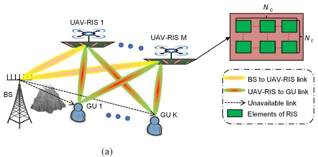

flowchart

```mermaid
graph TD
    A["BS"] --> B["LUAV-RIS 1"]
    B --> C["UAV-RIS M"]
    C --> D["LUAV-RIS 1"]
    C --> E["UAV-RIS M"]
    D --> F["LUAV-RIS 1"]
    D --> G["UAV-RIS M"]
    E --> H["LUAV-RIS 1"]
    E --> I["UAV-RIS M"]
    F --> J["LUAV-RIS 1"]
    F --> K["UAV-RIS M"]
    G --> L["LUAV-RIS 1"]
    G --> M["UAV-RIS M"]
    H --> N["LUAV-RIS 1"]
    H --> O["UAV-RIS M"]
    I --> P["LUAV-RIS 1"]
    I --> Q["UAV-RIS M"]
    J --> R["LUAV-RIS 1"]
    J --> S["UAV-RIS M"]
    K --> T["LUAV-RIS 1"]
    K --> U["UAV-RIS M"]
    L --> V["LUAV-RIS 1"]
    L --> W["UAV-RIS M"]
    M --> X["LUAV-RIS 1"]
    M --> Y["UAV-RIS M"]
    N --> Z["LUAV-RIS 1"]
    N --> AA["UAV-RIS M"]
    O --> AB["LUAV-RIS 1"]
    O --> AC["UAV-RIS M"]
    P --> AD["LUAV-RIS 1"]
    P --> AE["UAV-RIS M"]
    Q --> AF["LUAV-RIS 1"]
    Q --> AG["UAV-RIS M"]
    R --> AH["LUAV-RIS 1"]
    R --> AI["UAV-RIS M"]
    S --> AJ["LUAV-RIS 1"]
    S --> AK["UAV-RIS M"]
    T --> AL["LUAV-RIS 1"]
    T --> AM["UAV-RIS M"]
    U --> AN["LUAV-RIS 1"]
    U --> AO["UAV-RIS M"]
    V --> AP["LUAV-RIS 1"]
    V --> AQ["UAV-RIS M"]
    W --> AR["LUAV-RIS 1"]
    W --> AS["UAV-RIS M"]
    X --> AT["LUAV-RIS 1"]
    X --> AU["UAV-RIS M"]
    Y --> AV["LUAV-RIS 1"]
    Y --> AW["UAV-RIS M"]
    Z --> AX["LUAV-RIS 1"]
    Z --> AY["UAV-RIS M"]
    AA --> AZ["LUAV-RIS 1"]
    AA --> BA["UAV-RIS M"]
    AB --> BB["LUAV-RIS 1"]
    AB --> BC["UAV-RIS M"]
    AC --> BD["LUAV-RIS 1"]
    AC --> BE["UAV-RIS M"]
    AD --> BF["LUAV-RIS 1"]
    AD --> BG["UAV-RIS M"]
    AE --> BH["LUAV-RIS 1"]
    AE --> BI["UAV-RIS M"]
    AF --> BJ["LUAV-RIS 1"]
    AF --> BK["UAV-RIS M"]
    AG --> BL["LUAV-RIS 1"]
    AG --> BM["UAV-RIS M"]
    AH --> BN["LUAV-RIS 1"]
    AH --> BO["UAV-RIS M"]
    BI --> BP["LUAV-RIS 1"]
    BI --> BQ["UAV-RIS M"]
    AD --> BR["LUAV-RIS 1"]
    AD --> BS["UAV-RIS M"]
    AE --> BT["LUAV-RIS 1"]
    AE --> BU["UAV-RIS M"]
```

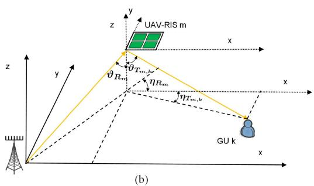

text_image

UAV-RIS m
θTm,k
ηRm
θRm
ηTm,k
GU k
x
y
z
y
z
(b)

Fig. 1. System structure diagram. (a) A cooperative UAV-RISs-assisted cellular network. (b) Information flow from BS to GU via a UAV-RIS.

However, the conventional convex optimization methods can only solve the convex problems. Furthermore, the DRL methods typically require a substantial number of samples or interactions with the environment in order to learn and acquire optimal policies. This process can be time-consuming and computationally expensive, as it often involves trial and error, and the model may take a long time to converge to a good solution. Additionally, when the application scenario changes such as a shift in network conditions, the decision-makers would need to retrain the model. This retraining process not only increases the execution time but also reduces the adaptability of the algorithm in dynamic environments. Given these challenges, our goal is to design a more efficient algorithm that could handle multiple optimization objectives simultaneously while being robust to changes in the application scenario.

# III. SYSTEM MODEL

In this section, the system overview and the corresponding models are introduced.

# A. System Overview

As depicted in Fig. 1, we illustrate the considered cellular network configuration in this work. Specifically, the network consists of a ground BS equipped with $N _ { \mathrm { B S } }$ antennas and K static GUs1, and each of which is equipped with a single antenna. However, the direct links from the BS to GUs are entirely unavailable. Thus, several cooperative UAV-RISs are employed in a 3D space to reflect the signals from BS to $\mathrm { G U s } ^ { 2 }$ . Note that the cooperative UAV-RIS scheme performs better than a single UAV-RIS scheme [45] in terms of the energy efficiency of the system, and hence we consider different UAV-RISs to serve several GUs simultaneously. Without loss of generality, we assume that the data size Q for each GU is identical.

Specifically, the sets of UAV-RISs and GUs are denoted as $\mathcal { M } = \{ 1 , 2 , . . . , M \}$ and ${ \cal K } = \{ 1 , 2 , . . . , K \}$ , respectively. The BS employs a half-wavelength uniform linear array, while each RIS adopts a uniform planar array, comprising $N _ { \mathrm { R I S } }$ passive reflection elements, where $N _ { \mathrm { R I S } } = N _ { \mathrm { r } } \times N _ { \mathrm { c } } . N _ { \mathrm { r } }$ and $N _ { \mathrm { c } }$ represent the element numbers along the y- and x-axes, respectively, as shown in Fig. 1(a).

Signals reflected by RISs two or more times can be neglected due to the significant path loss of multi-hop links [19]. Moreover, we consider a horizontal square area with minimum and maximum ranges of $L _ { \mathrm { m i n } }$ and $L _ { \mathrm { m a x } }$ , respectively, and the heights can be adjusted within the range $[ Z _ { \mathrm { m i n } } , Z _ { \mathrm { m a x } } ]$ . It should be noted that all UAV-RISs initially have the position [0, 0, 0] and then fly to their hovering positions at a constant speed for passive reflection. Moreover, we assume that all UAV-RISs are deployed and recalled simultaneously. In other words, the UAV-RISs performing other tasks can be deployed in batches after completing tasks, so as to achieve the opportunistic deployment in 3D space. In the 3D Cartesian coordinate system, the 3D coordinates of the BS, the kth GU, and the m-th UAV-RIS are denoted as $\mathbf { q } _ { \mathrm { B } } = [ x _ { \mathrm { B } } , y _ { \mathrm { B } } , 0 ]$ , $\mathbf { q } _ { \mathrm { G } k } = [ x _ { \mathrm { G } k } , y _ { \mathrm { G } k } , 0 ]$ , and $\begin{array} { r } { \mathbf q _ { \mathrm { U } m } = [ x _ { \mathrm { U } m } , y _ { \mathrm { U } m } , z _ { \mathrm { U } m } ] , } \end{array}$ , respectively. Furthermore, $\mathbf { w } _ { \mathrm { B } } = [ x _ { \mathrm { B } } , y _ { \mathrm { B } } ]$ , $\mathbf { w } _ { \mathrm { G } k } = [ x _ { \mathrm { G } k } , y _ { \mathrm { G } k } ]$ , and $\mathbf { w } _ { \mathrm { U } m } = \left[ x _ { \mathrm { U } m } , y _ { \mathrm { U } m } \right]$ represent the horizontal coordinates of the BS, k-th GU, and m-th UAV-RIS. Then, the transmitted signal at the BS is as follows:

$$
\boldsymbol {s} = \sum_ {k = 1} ^ {K} \boldsymbol {w} _ {k} s _ {k}, \tag {1}
$$

where $s _ { k }$ is the unit-power information symbol [46], [47] and $\pmb { w } _ { k } \in \mathbb { C } ^ { N _ { \mathrm { B S } } \times 1 }$ is the beamforming vector for GU k ∈ K.

The phase shift matrix of m-th UAV-RIS can be optimized using a diagonal matrix $\Theta _ { m } =$ diag $\cdot ( \mathrm { e } ^ { \dot { j } \theta _ { m , 1 } } , \dots , \mathrm { e } ^ { j \theta _ { m , n _ { m } } } , \dots , \mathrm { e } ^ { \dot { j } \theta _ { m , N _ { \mathrm { R I S } } } } ) \in \mathbb { C } ^ { N _ { \mathrm { R I S } } \times N _ { \mathrm { R I S } } }$ ,

where $\theta _ { m , n _ { m } } \in [ 0 , 2 \pi )$ and $n _ { m } \in \{ 1 , 2 , . . . , N _ { \mathrm { R I S } } \}$ , $\Theta _ { m }$ represents the effective phase shifts applied by all passive reflecting elements of m-th UAV-RIS. However, the lightweight UAVs limit their load capability, and the size of RISs is restricted, which poses greater challenges for the hardware design [20]. Thus, the discrete phase shift design is more practical than the continuous phase shift design [48]. For simplicity, the phase shift of each RIS element is assumed to be one of $C = 2 ^ { c }$ discrete values, where c represents the number of bits used for quantizing the phase shift levels [49]. Specifically, the set of discrete phase shift of each RIS element can be given as follows:

$$
\mathcal {C} = \{0, \Delta \theta_ {m, n _ {m}}, \dots , (C - 1) \Delta \theta_ {m, n _ {m}} \}, \tag {2}
$$

where $\Delta \theta _ { m , n _ { m } } = 2 \pi / C$ . Then, the received signal at k-th GU can be expressed as follows [19]:

$$
y _ {k} = \left(\sum_ {m = 1} ^ {M} \boldsymbol {h} _ {k, m} ^ {H} \boldsymbol {\Theta} _ {m} \boldsymbol {G} _ {m}\right) \boldsymbol {s} + n _ {k}, \tag {3}
$$

where $G _ { m } \in \mathbb { C } ^ { N _ { \mathrm { { R I S } } } \times N _ { \mathrm { { B S } } } }$ , and $h _ { k , m } ^ { H } \in \mathbb { C } ^ { 1 \times N _ { \mathrm { R I S } } }$ are the channel G hmatrix from the BS to the m-th UAV-RIS and the channel vector from the m-th UAV-RIS to k-th GU, respectively. Moreover, $n _ { k }$ is the zero mean additive white Gaussian noise (AWGN) with entries of variance $\sigma ^ { 2 }$ .

According to (1) and (3), the received signal-to-interferenceplus-noise ratio (SINR) of k-th GU can be expressed as follows [50]:

$$
\mathrm{SINR} _ {k} = \frac {\left| \left(\sum_ {m = 1} ^ {M} \boldsymbol {h} _ {k , m} ^ {H} \boldsymbol {\Theta} _ {m} \boldsymbol {G} _ {m}\right) \boldsymbol {w} _ {k} \right| ^ {2}}{\sum_ {i = 1 , i \neq k} ^ {K} \left| \left(\sum_ {m = 1} ^ {M} \boldsymbol {h} _ {k , m} ^ {H} \boldsymbol {\Theta} _ {m} \boldsymbol {G} _ {m}\right) \boldsymbol {w} _ {i} \right| ^ {2} + \sigma^ {2}}. \tag {4}
$$

Then, the available rate of k-th GU can be expressed as follows:

$$
R _ {k} = B \log_ {2} (1 + \mathrm{SINR} _ {k}), \tag {5}
$$

where B is the bandwidth of the channel.

# B. Channel Model

Without loss of generality, we assume that all the channels follow Rician fading, and $G _ { m }$ can be expressed as follows [38], [51]:

$$
\boldsymbol {G} _ {m} = \sqrt {\frac {\beta_ {0}}{d _ {\mathrm{B} , m}}} \left(\sqrt {\frac {\mathcal {A}}{1 + \mathcal {A}}} \boldsymbol {g} _ {\text { LoSB }, m} + \sqrt {\frac {1}{1 + \mathcal {A}}} \boldsymbol {g} _ {\text { NLoSB }, m}\right), \tag {6}
$$

where $\beta _ { 0 }$ denotes the reference channel coefficient, $d _ { \mathrm { B } , m } = \lVert \mathbf { q } _ { \mathrm { U } m } - \mathbf { q } _ { \mathrm { B } } \rVert$ is the distance between BS and m-th UAV-RIS, A denotes Rician factor, and LoS , and NLoS , $g _ { \mathrm { L o S B } , m } \mathrm { a n d } g _ { \mathrm { N L o S B } , m }$ g gare the LoS and non-LoS (NLoS) components of the channel. When the height of UAV-RIS is high enough, the channel can be regarded as LoS channel [52]. As the Rician factor increases, the channel coefficients become more dependent on the free-space path loss. When the value of the Rician factor satisfies $\begin{array} { r } { A \geq 2 0 , \quad \sqrt { A / ( 1 + A ) } g _ { \mathrm { L o S B } , m } \gg \sqrt { 1 / ( 1 + A ) } g _ { \mathrm { N L o S B } , } } \end{array}$ m , g gand then the channel can be approximated as LoS channel. Thus, (6) can be simplified as follows:

$$
\boldsymbol {G} _ {m} = \sqrt {\frac {\beta_ {0}}{d _ {\mathrm{B} , m} ^ {2}}} \left(\sqrt {\frac {\mathcal {A}}{1 + \mathcal {A}}} \boldsymbol {g} _ {\text { LoSB }, m}\right), \tag {7}
$$

where $g _ { \mathrm { L o S B } , m }$ can be further expressed as follows [38]:

$$
\boldsymbol {g} _ {\mathrm{LoSB}, m} = \mathbf {a} _ {R _ {m}} \left(\eta_ {R _ {m}}, \vartheta_ {R _ {m}}\right) \mathbf {a} _ {T} ^ {H} \left(\vartheta_ {R _ {m}}\right), \tag {8}
$$

where $\mathbf { a } _ { R _ { m } } ( \eta _ { R _ { m } } , \vartheta _ { R _ { m } } ) \in \mathbb { C } ^ { N _ { \mathrm { R I S } } \times 1 }$ is the receiving array response of m-th UAV-RIS, and $\mathbf { a } _ { T } ^ { H } ( \vartheta _ { R _ { m } } ) \in \mathbb { C } ^ { N _ { \mathrm { B S } } \times 1 }$ is the transmit array response of the BS. Specifically, $\mathbf { a } _ { R _ { m } }$ can be expressed as follows [38]:

$$
\begin{array}{l} \mathbf {a} _ {R _ {m}} = \left[ 1, \ldots , \mathrm{e} ^ {\frac {j 2 \pi (N _ {\mathrm{c}} - 1) d \phi_ {R _ {m}}}{\lambda}} \right] ^ {T} \\ \otimes \left[ 1, \dots , \mathrm{e} ^ {\frac {j 2 \pi (N _ {\mathrm{r}} - 1) d \Omega_ {R m}}{\lambda}} \right] ^ {T}, \tag {9} \\ \end{array}
$$

where $d = \lambda / 2$ is the distance between two adjacent elements on one RIS, and λ is the signal wavelength. $\phi _ { R _ { m } } = $ sin $\left( \vartheta _ { R _ { m } } \right) \cos ( \eta _ { R _ { m } } )$ and $\Omega _ { R _ { m } } = \sin ( \vartheta _ { R _ { m } } ) \sin ( \eta _ { R _ { m } } )$ are the angle parameters. It can be seen from Fig. 1(b) that $\vartheta _ { R _ { m } } =$ arcsin -wUm−wB-d is the zenith angle of arrival (AoA), and $\frac { \| \mathbf { w } _ { \mathrm { U } m } - \mathbf { w } _ { \mathrm { B } } \| } { d _ { \mathrm { B } , m } }$ B,m ηRm = arccos $\begin{array} { r } { \frac { \| x _ { \mathrm { U } m } - x _ { \mathrm { B } } \| } { \| \mathbf { w } _ { \mathrm { U } m } - \mathbf { w } _ { \mathrm { B } } \| } } \end{array}$ is the azimuth AoA at m-th UAV-RIS. Similarly, we can have the transmit array response $\mathbf { a } _ { T } ( \vartheta _ { R _ { m } } ) = [ \bar { 1 } , \mathrm { e } ^ { j \pi \sin \vartheta _ { R _ { m } } } , \ldots , \mathrm { e } ^ { j \pi ( N _ { \mathrm { B S } } - 1 ) \sin \vartheta _ { R _ { m } } } ] ^ { \dagger }$ , in which $\vartheta _ { R _ { m } }$ is the angle of departure (AoD) from BS to m-th UAV-RIS.

Then, we can also obtain $\boldsymbol { h _ { k , m } }$ following the similar process, hwhich can be expressed as follows:

$$
\boldsymbol {h} _ {k, m} = \sqrt {\frac {\beta_ {0}}{d _ {m , k} ^ {2}}} \left(\sqrt {\frac {\mathcal {A}}{1 + \mathcal {A}}} \boldsymbol {g} _ {\mathrm{LoSR}, m, k}\right), \tag {10}
$$

where $d _ { \mathrm { B } , m } = \lVert \mathbf { q } _ { \mathrm { U } , m } - \mathbf { q } _ { \mathrm { G } , k } \rVert$ is the distance between m-th UAV-RIS and k-th $\mathrm { G U } , g _ { \mathrm { L o S R } , m , k } = \mathbf { a } _ { T _ { m , k } } ^ { T } ( \eta _ { T _ { m , k } } , \vartheta _ { T _ { m , k } } )$ , and $\mathbf { a } _ { T _ { m , k } }$ represents the transmit array response of m-th UAV-RIS. Following the similar definition $\phi _ { T _ { m , k } } = \sin ( \vartheta _ { T _ { m , k } } )$ cos $\left( \eta _ { T _ { m , k } } \right)$ and $\Omega _ { T _ { m , k } } = \sin ( \vartheta _ { T _ { m , k } } ) \sin ( \eta _ { T _ { m , k } } )$ with AoDs $\vartheta _ { T _ { m , k } } =$ arcsin $\frac { \| \mathbf { w } _ { \mathrm { U } m } - \mathbf { w } _ { \mathrm { G } k } \| } { d _ { m , k } }$ dm,k and $\begin{array} { r } { \eta _ { T _ { m , k } } = \arcsin { \frac { \| y _ { \mathrm { U } _ { m } - y _ { \mathrm { G } _ { k } } } \| } { \| \mathbf { w } _ { \mathrm { U } _ { m } - \mathbf { w } _ { \mathrm { G } _ { k } } } \| } } } \end{array}$ n -yUm−yGk--wUm−wGk-  we have , $\mathbf { a } _ { T _ { m , k } }$ as follows:

$$
\begin{array}{l} \mathbf {a} _ {T _ {m, k}} \left(\eta_ {T _ {m, k}}, \vartheta_ {T _ {m, k}}\right) = \left[ 1, \ldots , \mathrm{e} ^ {\frac {j 2 \pi (N _ {\mathrm{c}} - 1) d \phi_ {T _ {m , k}}}{\lambda}} \right] ^ {T} \\ \otimes \left[ 1, \dots , \mathrm{e} ^ {\frac {j 2 \pi (N _ {\mathrm{r}} - 1) d \Omega_ {T _ {m , k}}}{\lambda}} \right] ^ {T}. \tag {11} \\ \end{array}
$$

# C. Energy Consumption Model

As mentioned previously, all UAV-RISs are first deployed from their initial position to hovering positions before reflecting signals. Therefore, the total energy consumption can be divided into two parts: the energy consumption during location deployment and the energy consumption during hovering. The latter includes the energy consumed by the UAV-RISs against gravity, the energy consumption by the BS for transmission, the circuit energy consumption by both the BS and GUs, and the energy consumption for reflection by the RIS. Assuming that UAV-RISs fly at a constant velocity V , then the energy consumption during deployment can be expressed as follows [53]:

$$
\begin{array}{l} E _ {\mathrm{pro}} \approx \sum_ {m = 1} ^ {M} \left(P _ {\mathrm{pro} _ {m}} T _ {\mathrm{pro} _ {m}} + M _ {\mathrm{UR}} g (z _ {\mathrm{U} m} - z _ {\mathrm{U} 0})\right) \\ + M \frac {M _ {\mathrm{UR}} (V ^ {2} - V _ {0} {} ^ {2})}{2} \tag {12} \\ \end{array}
$$

where $T _ { \mathrm { p r o } _ { m } } = d _ { \mathrm { B } , m } / V$ is the flight time of the m-th UAV-RIS, $M _ { \mathrm { U R } }$ is the mass and g is the gravitational factor, $z _ { \mathrm { U 0 } }$ is the initial height of m-th UAV-RIS, and $V _ { 0 }$ is an initial velocity. Moreover, $P _ { \mathrm { p r o } _ { m } }$ is the propulsion power of m-th UAV-RIS, which is given as follows [54]:

$$
\begin{array}{l} P _ {\mathrm{pro} m} (V) = P _ {\mathrm{B}} \left(1 + \frac {3 V ^ {2}}{U _ {\mathrm{tip}} ^ {2}}\right) + P _ {\mathrm{I}} \left(\sqrt {1 + \frac {V ^ {4}}{4 v _ {0} ^ {4}}} - \frac {V ^ {2}}{2 v _ {0} ^ {4}}\right) ^ {\frac {1}{2}} \\ + \frac {1}{2} d _ {0} \rho s A V ^ {3}, \tag {13} \\ \end{array}
$$

where $P _ { \mathrm { B } } , P _ { \mathrm { I } } , U _ { \mathrm { t i p } } , v _ { 0 } , d _ { 0 } , \rho _ { \mathrm { \Omega } }$ , s and A are constant parameters related to UAV, which can be found in [54]. Note that when $V = 0 , P _ { \mathrm { B } } + P _ { \mathrm { I } }$ is the power required to overcome gravity.

To analyze the energy consumption during hovering, we first calculate the transmission time $T _ { k }$ of k-th GU, which is given by $T _ { k } = Q / R _ { k }$ . Since all UAV-RISs are assumed to be deployed and recalled simultaneously, the hovering time of the UAV-RISs is determined by the maximum transmission time of k-th GU, denoted as $T _ { \mathrm { h o v } } = \operatorname* { m a x } \{ T _ { k } \}$ . The energy consumption during hovering can then be expressed as follows:

$$
E _ {\mathrm{hov}} = \left(\sum_ {m = 1} ^ {M} (P _ {\mathrm{B}} + P _ {\mathrm{I}}) + P _ {\mathrm{com}}\right) T _ {\mathrm{hov}}, \tag {14}
$$

where $P _ { \mathrm { c o m } }$ is the communication power during hovering, which can be expressed as follows [19]:

$$
\begin{array}{l} P _ {\text { com }} = \underbrace {\sum_ {k = 1} ^ {K} \frac {\boldsymbol {w} _ {k} ^ {H} \boldsymbol {w} _ {k}}{\mu}} _ {\text { circuit   power   of   BS }} + \underbrace {P _ {\text { BS }}} _ {\text { circuit   power   of   BS }} \\ + \underbrace {\sum_ {k = 1} ^ {K} P _ {k}} + \underbrace {\sum_ {m = 1} ^ {M} N _ {\mathrm{RIS}} P _ {\mathrm{R}}} , \\ \end{array}
$$

where $\mu$ is the power amplifier efficiency of BS, $P _ { \mathrm { B S } }$ is the circuit power consumption of BS, $P _ { k }$ is the circuit power consumption of k-th GU, and $P _ { \mathrm { R } }$ is the power consumption of each reflecting element in the RIS.

# IV. FORMULATED EECOMM-MOF

In the real world, the cases usually contain three optimization objectives, which are maximizing the minimum available rate, maximizing the total available rate, and minimizing the total energy consumption of the system. First, maximizing the minimum available rate can ensure that the worst-performing GU is guaranteed for a satisfactory service level, which is particularly relevant in mission-critical applications, such as disaster rescue, where a minimum level of performance must be guaranteed to ensure fairness among GUs. Second, maximizing the total available rate focuses on improving overall throughput in the system, which makes GUs receive as much information (e.g., video) as possible. Third, minimizing the total energy consumption can influence the lifetime of the service, preventing the system from terminating service due to energy exhaustion. Thus, these three optimization objectives should be jointly optimized, and the details are as follows.

Optimization objective 1: maximize the minimum available rate over all GUs. To ensure the fair service of the UAV-RIS system, we aim to optimize the minimum available rate over all GUs. Hence, the first objective function can be formulated as follows:

$$
f _ {1} = \min \{R _ {k} \}. \tag {16}
$$

Optimization objective 2: maximize the total available rate of all GUs. The total available rate of all GUs reflects the system capacity. Thus, the second objective function can be expressed as follows:

$$
f _ {2} = \sum_ {k = 1} ^ {K} R _ {k}. \tag {17}
$$

Remark 1: Considering the abovementioned two optimization objectives in a multi-objective optimization framework is meaningful, and the reasons are as follows. Since the these two optimization objectives are conflict (the detailed analysis is shown in Appendix C, available online), we can obtain the Pareto front (PF) for these two optimization objectives. The PF offers a range of trade-offs between these two optimization objectives, which is essential in providing a flexible and adaptable solution. Thus, such a formulation can enhance the portability for the optimization framework to different deployment scenarios. Specifically, when extending EEComm-MOF to mountain disaster rescue, ensuring minimum available rates for each GU is crucial to maintain communication, even at the cost of some system throughput, especially for GUs at the network edge that need critical information. In this case, maximizing the minimum available rate becomes essential to ensure that each GU is served during an emergency. Instead, when EEComm-MOF is extended to urban communication scenario with a high concentration of GUs, total network performance and throughput are often prioritized, as GUs in urban environments typically have more robust signal coverage, although the communication fairness is still important to avoid significant disparities in service quality. By formulating these two optimization objectives in a multiobjective optimization framework, decision-makers can obtain a PF that contains a range of feasible solutions. These solutions provide decision-makers with the flexibility to select the optimal trade-off based on the specific scenario. In other words, decisionmakers can dynamically choose the solution that best matches the unique requirements of each scenario without rerunning the algorithm, providing a more adaptable solution for the scenario.

Optimization objective 3: minimize the total energy consumption of the UAV-RIS system. The total energy consumption of the UAV-RIS system contains the energy consumed for the deployment and hovering. Thus, the third objective function can be formulated as follows:

$$
f _ {3} = E _ {\mathrm{pro}} + E _ {\mathrm{hov}}. \tag {18}
$$

Since the first and second optimization objectives are to obtain the maximums, while the third optimization objective is to obtain the minimum, we take the negative values of the first and second optimization objectives to unify the optimization direction. Thus, the ultimate EEComm-MOF can be formulated as follows:

$$
\min _ {\theta , w, \mathbf {q} _ {\mathrm{U}}} F = \left\langle - f _ {1}, - f _ {2}, f _ {3} \right\rangle \tag {19a}
$$

$\mathrm { s . t . } \qquad L _ { \operatorname* { m i n } } \leqslant x _ { \mathrm { U } m } \leqslant L _ { \operatorname* { m a x } } , \forall m \in \mathcal { M } ,$ (19b)

$$
L _ {\min} \leqslant y _ {\mathrm{U} m} \leqslant L _ {\max}, \forall m \in \mathcal {M}, \tag {19c}
$$

$$
Z _ {\min} \leqslant z _ {U m} \leqslant Z _ {\max}, \forall m \in \mathcal {M}, \tag {19d}
$$

$$
\theta_ {m, n _ {m}} \in \mathcal {C}, \forall n _ {m} \in \{1, 2, \dots , N _ {\mathrm{RIS}} \}, \forall m \in \mathcal {M}, \tag {19e}
$$

$$
\boldsymbol {w} ^ {H} \boldsymbol {w} \leq P _ {\max}, \tag {19f}
$$

where 
· is to consider all three optimization objectives using Pareto dominance, instead of using linear weighting or penalty functions to transform all objectives into a single optimization objective. $\pmb { \theta } = [ \theta _ { 1 , 1 } ; \ldots ; \theta _ { 1 , N _ { \mathrm { R I S } } } ; \ldots ; \theta _ { M , N _ { \mathrm { R I S } } } ]$ , and θthe dimension of  is $M \times N _ { \mathrm { R I S } } . \pmb { w } = [ \pmb { w } _ { 1 } ; . . . ; \pmb { w } _ { K } ] .$ qU = $[ \mathbf { q } _ { \mathrm { U 1 } } ; \dots ; \mathbf { q } _ { \mathrm { U } M } ] ,$ θ, and $P _ { \mathrm { m a x } }$ w w wis the maximum transmit power of BS. Equations (19b)–(19d) limit the flight range of UAV-RISs. The phase shift constraint for each reflecting element is provided in (19e), and (19f) represents the transmit power constraint. As can be seen, the decision variables are coupled, which means that the optimization of one decision variable affects the optimization of others. Specifically, the 3D location deployment of the UAV-RIS system influences the channel conditions between the UAV-RIS and BS, which in turn determines the optimal beamforming vector of the BS. Additionally, the beamforming vector affects the signal quality at the GUs, which requires adjusting the UAV-RIS phase shifts to optimize the transmission. Thus, changing one variable impacts the other variables, creating a coupling effect. This mutual interaction increases the complexity of EEComm-MOF, since solving for one variable without considering the others is not possible, thus requiring joint optimization of all the decision variables in an integrated manner.

Proposition 1: The formulated EEComm-MOF is NP-hard.

Proof: Please see Appendix A, available online.

Proposition 2: The formulated EEComm-MOF is nonconvex.

Proof: Please see Appendix B, available online.

Remark 2: There are trade-offs among the three optimization objectives of EEComm-MOF, and the detailed analysis is shown in Appendix C, available online.

Remark 3: EEComm-MOF is a large-scale optimization problem, and the details are analyzed in Appendix D, available online.

# V. ALGORITHM FOR EECOMM-MOF

Due to the complexity of the formulated EEComm-MOF, it is challenging to obtain the optimal solution in polynomial time. Solving this kind of problems can be roughly divided into three categories, which are the conventional convex optimization methods, DRL, and evolutionary multi-objective optimization algorithms. First, owing to the non-convexity of the EEComm-MOF, conventional convex optimization methods are not applicable. The key characteristic of non-convex optimization problems is that the objective function or constraints may have multiple local optimums, which makes it impossible to guarantee that conventional convex optimization methods will find the global optimum. In this context, conventional convex optimization methods, such as gradient descent or Lagrangian dual methods, typically rely on convexity assumptions to ensure convergence and optimality. However, for EEComm-MOF, these methods may fail to provide effective solutions and can get stuck in local optimum. Second, there are two reasons that we do not choose DRL to solve EEComm-MOF: One reason is that DRL will convert the optimization objectives as a single reward function [55], while it is difficult to determine the weight ratio due to the trade-offs among optimization objectives. Such a conversion will impact the optimization direction of the problem. Another reason is that DRL is typically employed in scenarios with continuous time slots [56], allowing UAV-RISs to make decisions through real-time training. However, the formulated EEComm-MOF is a problem with a moment, where the obtained solution can be used for a while. In this case, using DRL would introduce unnecessary overhead due to the training process, which is not suitable for the considered scenario.

Evolutionary multi-objective optimization algorithms, such as non-dominated sorting genetic algorithm-II (NSGA-II) [57], are a kind of algorithms based on iterations, and they are suitable for solving EEComm-MOF. First, evolutionary multiobjective optimization algorithms can solve the non-convex and constraint optimization problem in polynomial time [58]. Second, evolutionary multi-objective optimization algorithms use PF to judge the quality of a solution in a multi-objective optimization problem, which means that the decision-makers can ultimately obtain a Pareto set and then select one proper solution according to the scenario. Once the requirements change, the decision-makers only need to re-select the solution instead of rerunning the algorithm, which enhances the transferability of the algorithm. Finally, the formulated EEComm-MOF is a deployment optimization problem based on a single time-slot, and the evolutionary multi-objective optimization algorithms are classic random search method with strong robustness and global search capabilities, which can solve the optimization problem at the single time-slot.

Among evolutionary multi-objective optimization algorithms, NSGA-II is chosen as the basic framework to solve EEComm-MOF, and the motivations are as follows.

Capability to Solve Large-scale Optimization Problem: NSGA-II has a higher computational efficiency when dealing with large-scale optimization problems. According to Remark 3, EEComm-MOF is a large-scale optimization problem, and the computational efficiency of NSGA-II is relatively high [59], which enables us to solve more intricate multi-objective optimization problems in a reasonable time, ensuring the practicality of the algorithm.   
- Crowding Distance Sorting for Maintaining Population Diversity: NSGA-II uses crowding distance to maintain the diversity of the solution set and avoid solutions from becoming overly concentrated. Due to the mutual coupling among decision variables, EEComm-MOF exists a large solution space. The crowding distance sorting enables NSGA-II to select solutions that are evenly distributed along the PF [60], ensuring the transferability of the algorithm and providing more practical solutions for real-world deployment.   
- Simple and efficient implementation: NSGA-II is easy to implement with only a few parameters to tune, such as population size and crossover/mutation rates. This simplicity is especially beneficial for practical applications like UAV-RISs-assisted cellular network, where computational resources are limited.

In the following, the conventional NSGA-II is briefly introduced.

# A. Conventional NSGA-II

The conventional NSGA-II is a typical evolutionary multiobjective optimization algorithm, whose basic concept is similar to genetic algorithm (GA) [61]. Specifically, NSGA-II employs the chromosome to represent a solution, and then utilizes the crossover and mutation to generate offspring solutions. Different from GA, NSGA-II is specifically designed for multiobjective optimization problems, and hence it is difficult to judge the quality of solutions by directly comparing the value of single objective function. Instead, Pareto optimality concept is introduced.

Moreover, NSGA-II incorporates an elitist mechanism including non-dominated sorting and a crowding distance sorting to maintain the population size, which can be described in detail as follows: first, parent population $\mathcal { P } _ { i t }$ and offspring population $\boldsymbol { S } _ { i t }$ will be combined to form a new population $\mathcal { N } _ { i t }$ , and then a non-dominated sorting mechanism ranks $\mathcal { N } _ { i t }$ into different fronts $\{ \mathcal { F } _ { 1 } , \mathcal { F } _ { 2 } , \ldots \}$ according to their non-domination levels. Second, the solution with the top non-dominated levels will be transplanted into the next generation population until the next generation population size is not less than the preset value P op for the first time. If the next generation population size is larger than P op for the first time, NSGA-II will determine which solutions to exclude based on the crowding distance. The explicit outline of NSGA-II is shown in Fig. 2.

Algorithm 1: INSGA-II-CDC.   
1 Input: $Pop, G_{max}$ , etc.
2 Output: The non-dominated set $F_{1}$ .
3 $P_{0} \Leftarrow \varnothing$ ;
4 Initialize the UAV-RIS locations in the boundary randomly;
5 Initialize the phase shifts of UAV-RISs using Algorithm 2;
6 Initialize the beamforming vector randomly and then normalize it using Algorithm 4;
7 for it=1 to $G_{max}$ do
8 Update UAV-RIS locations to generate the offspring $S_{1it}$ using crossover [57] and mutation [57];
9 Modify $S_{1it}$ using Eq. (20);
10 Update phase shifts of UAV-RISs to generate the offspring $S_{2it}$ using Algorithms 2 and 3;
11 Update beamforming vector and then normalize it to generate the offspring $S_{3it}$ according to Eq. (21) and Algorithm 4;
12 $P_{it+1} \Leftarrow P_{it} \cup S_{1it} \cup S_{2it} \cup S_{3it};$ 13 Calculate the objective functions according to Eqs. (1)-(19);
14 Execute elitist filter to maintain the population size;
15 end

# B. Proposed INSGA-II-CDC

The conventional NSGA-II cannot handle the discrete and complex solutions due to its unique crossover and mutation operators. Accordingly, we propose INSGA-II-CDC for a cooperative UAV-RISs-assisted cellular network, which means that it is more suitable for solving the formulated EEComm- MOF. Specifically, we embed an opposition-based learning operator into continuous solution processing mechanism of NSGA-II to exploit the search space for better deployed locations of UAV-RISs. Then, a discrete solution processing mechanism and a complex solution processing mechanism are embedded into NSGA-II to deal with discrete and complex solutions, respectively, so as to learn the discrete phase shifts of UAV-RISs from population, and efficiently update the beamforming vector of BS. Assume $G _ { \mathrm { m a x } }$ is the maximum iteration. Then, the overall structure of INSGA-II-CDC is illustrated in Algorithm 1, and the details of the continuous solution processing mechanism, discrete solution processing mechanism, and complex solution processing mechanism are as follows.

1) Continuous Solution Processing Mechanism: The continuous solution of the formulated problem is the deployed locations of UAV-RISs. Note that the location deployment has to satisfy the boundary constraints, i.e., (19b)–(19d). In the conventional NSGA-II, the algorithm utilizes crossover and mutation operators to generate new solutions. However, when using the mutation operator, there is a risk of the UAV-RISs flying outside the boundary. Facing this situation, the conventional NSGA-II only simply set the locations at the boundaries. Obviously, such a setting is unreasonable because UAV-RISs may be far from some GUs, adversely affecting the first optimization objective $f _ { 1 }$ . Thus, we introduce an opposition-based learning operator when UAV-RISs are out of the boundaries [62], which can be expressed as follows:

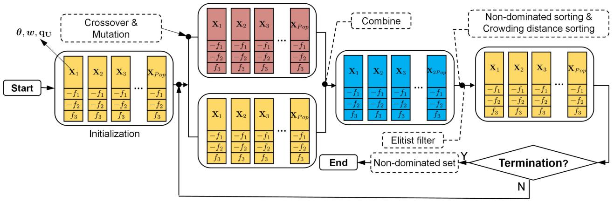

flowchart

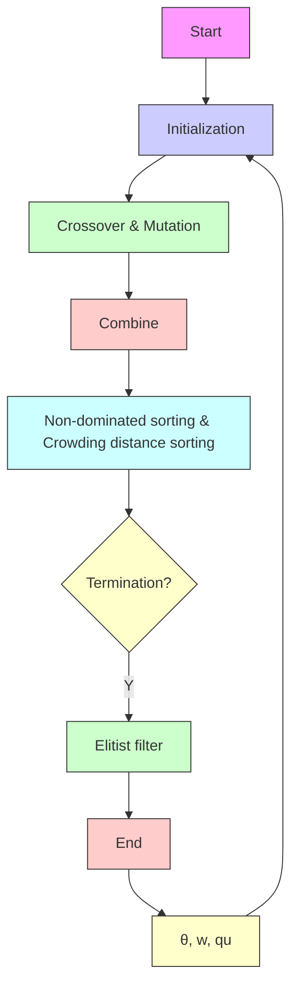

Fig. 2. Outline of NSGA-II.

$$
x _ {\mathrm{U} m} = \left\{ \begin{array}{l l} 2 L _ {\max} - x _ {\mathrm{U} m}, & \text { if } x _ {\mathrm{U} m} \geq L _ {\max}. \\ L _ {\min} - x _ {\mathrm{U} m}, & \text { if } x _ {\mathrm{U} m} \leq L _ {\min}. \end{array} \right. \tag {20a}
$$

$$
y _ {\mathrm{U} m} = \left\{ \begin{array}{l l} 2 L _ {\max} - y _ {\mathrm{U} m}, & \text { if } \quad y _ {\mathrm{U} m} \geq L _ {\max}. \\ L _ {\min} - y _ {\mathrm{U} m}, & \text { if } \quad y _ {\mathrm{U} m} \leq L _ {\min}. \end{array} \right. \tag {20b}
$$

$$
z _ {\mathrm{U} m} = \left\{ \begin{array}{l l} 2 Z _ {\max} - z _ {\mathrm{U} m}, & \text { if } \quad z _ {\mathrm{U} m} \geq Z _ {\max}. \\ Z _ {\min} - z _ {\mathrm{U} m}, & \text { if } \quad z _ {\mathrm{U} m} \leq Z _ {\min}. \end{array} \right. \tag {20c}
$$

It can be seen from (20), more potential deployed locations of UAV-RISs can be exploited instead of only the boundaries, when the UAV-RISs fly outside the boundary. Thus, the search efficiency of the algorithm is enhanced.

2) Discrete Solution Processing Mechanism: According to the constraint (19e), the set of permissible phase shifts can be viewed as a set of points, where the cardinality of the set is determined by the number of bits used for quantizing the phase shift levels c. Moreover, the dimension of discrete solution is $M \times N _ { \mathrm { R I S } }$ . With increases in the number of UAV-RISs and the number of RIS elements, the dimension will be increased. Thus, we propose two phase shift adjustment operators to adaptively and iteratively update the phase shifts. Assume that randi[C] is to randomly generate an integer from $\{ 0 , 1 , \ldots , C - 1 \}$ . Then, Algorithm 2 presents the first operator, known as the random phase shift operator. Due to the nature of randomness, random search is more likely to explore different regions during the search and thus more likely to find a globally optimal solution.

However, such randomness will have no learning ability, and will not adjust future search directions based on the results of previous searches, which can lead to waste of search time. Thus, we propose a phase shift learning operator to update a discrete solution, whose main idea is to learn from the best solution currently obtained. Specifically, assume that $n _ { \mathcal { F } _ { 1 } }$ is the number of solutions in $\mathcal { F } _ { 1 }$ with the maximum crowding distance. We first select a discrete solution from $\mathcal { F } _ { 1 }$ according to crowding

Algorithm 2: Random Phase Shift Operator.   
1 Input: $C = 2^{c}$ .
2 for pop= 1 to Pop do
3    for m= 1 to M do
4    for $n_{m}=1$ to $N_{RIS}$ do
5 $\theta_{m,n_{m}}=\frac{2\pi}{C}$ randi[C];
6    end
7    end
8 end
9 Record the generated offspring as $S_{2it}'$ .

Algorithm 3: Phase Learning Operator.   
1 Input: $\mathcal{F}_1$ and $S_{2it}'$ .
2 if $n_{\mathcal{F}_1} = 1$ then
3    Select the only discrete solution with the maximum crowding distance;
4 else    /* $n_{\mathcal{F}_1} > 1$ */
5    Select a discrete solution randomly from $\mathcal{F}_1$ with maximum crowding distance;
6 end
7 for pop= 1 to Pop do
8    Replace the discrete solution of pop-th solution with the selected discrete solution;
9 end
10 Record the generated offspring as $S_{2it}''$ ;
11 $S_{2it} = S_{2it}' \cup S_{2it}''$ .

distance, and then use this discrete solution to construct a new offspring ${ S _ { 2 } } { _ { i t } } ^ { \prime \prime } .$ . The detailed process is given in Algorithm 3.

3) Complex Solution Processing Mechanism: As shown in (19), the beamforming vector is a complex solution, and it must satisfy the constraint (19f). However, the conventional NSGA-II can only deal with the continuous solution. Although we can convert each beamforming vector to transmit power by calculating the euclidean norm, so that the complex solution is converted to the continuous form which can be coped with by the algorithm, the important phase information of the beamforming vector will be missing. Thus, utilizing crossover and mutation operators to update such a continuous form will decrease the search efficiency. Not only that, using mutation will also lead to violation of (19f), and the conventional method of dealing with out-of-bounds is difficult to effectively deal with both the amplitude information and phase information. In addition, using a penalty function to deal with (19f) may change the search direction, which can further reduce the search efficiency. Thus, it is also necessary to introduce an efficient complex solution processing mechanism for solving it.

Algorithm 4: Beamforming Vector Normalization Operator.   
1 Input: w and $P_{max}$ .
2 for pop=1 to Pop do
3    if $w^{H}w \leq P_{max}$ then
4    Do nothing;
5    else /* Eq. (19f) is not satisfied */
6 $w = \frac{\sqrt{P_{max}} * w}{\|w\| * (1 + r_3)}$ ;
7    end
8 end

Multi-objective particle swarm optimization (MOPSO) is an efficient approach and can trace individual historical optimal solution P best [63]. Thus, the solution update method in MOPSO is embedded to update the beamforming vector. Specifically, an external archive is used for storing and retrieving the nondominated solutions obtained. Then, a roulette-wheel method is used to select a solution Gbest from the external archive [64]. To save space complexity, we simply use $\mathcal { F } _ { 1 }$ instead of an external archive in this work. Afterward, update the beamforming vector as follows:

$$
\begin{array}{l} V e _ {i, k} = \epsilon * V e _ {i, k} + c _ {1} * r _ {1} * (P b e s t _ {i, k} - w _ {i, k}) \\ + c _ {2} * r _ {2} * (G b e s t _ {i, k} - w _ {i, k}), (21a) \\ w _ {i, k} = V e _ {i, k} + w _ {i, k}, (21b) \\ \end{array}
$$

where $V e _ { i , k }$ is the velocity of MOPSO. $w _ { i , k } \in { \boldsymbol { w } } _ { k } , \ i =$ $1 , 2 , \ldots , N _ { \mathrm { B S } }$ , and $k = 1 , 2 , \ldots , K . P b e s t _ { i , k }$ and $G b e s t _ { i , k }$ correspond to the special dimension {i, k} of individual historical optimal solution and obtained optimal solution, respectively. $r _ { 1 }$ and $r _ { 2 }$ are two random numbers generated between (0, 1), and is the inertia factor. Moreover, $c _ { 1 }$ and $c _ { 2 }$ are learning factors, which can refer to [63]. However, using (21) may lead to the constraint violation, i.e., (19 f). Thus, we propose a beamforming vector normalization operator shown in Algorithm 4, in which $r _ { 3 }$ is also a random number generated between (0, 1).

# C. Algorithm Analysis

In this section, the complexity, convergence and drawbacks of the proposed algorithm are analyzed.

1) Computation Complexity: The computation complexity mainly depends on the computations of the objective functions and sorting the solutions in each objective function. Let Obj represent the number of objective functions, which is 3 in this work. Referred to [65], the computation complexity of the conventional NSGA-II is $O ( O b j \cdot P o p ^ { 2 } \cdot G _ { \mathrm { m a x } } )$ , when the dimension of decision variables is ignored. Moreover, [65] assumes that the time to calculate each objective function is equal, while it is inapplicable for this work. Considering the dimensional changes, the computation complexity is $O ( P o p ^ { 2 }$ · $G _ { \mathrm { m a x } } \cdot ( M \cdot N _ { \mathrm { R I S } } + N _ { \mathrm { B S } } + 3 M ) )$ , where M , $N _ { \mathrm { R I S } }$ and $N _ { \mathrm { B S } }$ are the number of UAV-RISs, RIS elements and the antennas of the BS, respectively. According to the proposed INSGA-II-CDC, the number of newly generated offspring is $4 P o p ,$ and hence the computation complexity of INSGA-II-CDC is $O ( 1 6 P o p ^ { 2 } \cdot G _ { \mathrm { m a x } } \cdot ( M \cdot N _ { \mathrm { R I S } } + N _ { \mathrm { B S } } + 3 M ) )$ . When P op is sufficiently large, the computation complexity of INSGA-II-CDC is the same as the conventional NSGA-II.

2) Convergence: The formulated EEComm-MOF with three optimization objectives is a multi-objective optimization problem, which is inherently more intricate than the single-objective optimization problems because of the trade-offs and conflicts among optimization objectives. Faced with a multi-objective optimization problem with Pareto dominance, a common situation is that a solution is better on the first objective but worse on the second objective. Under these circumstances, it is hard to say whether this solution is better or worse. Thus, it is difficult to ensure that all optimization objectives converge simultaneously. In other words, it is challenging to derive the convergence of INSGA-II-CDC theoretically. Instead, we give the simulation results to verify the convergence, which is shown in Section VI-D1.

3) Drawbacks: As mentioned above, INSGA-II-CDC is based on the framework of evolutionary multi-objective optimization algorithm, hence it has the drawbacks of evolutionary multi-objective optimization algorithms. Specifically, these algorithms cannot guarantee to obtain the global optimal solution when the problem is complex. Moreover, the optimality of these algorithms are difficult to be analyzed theoretically. However, they are still feasible methods to solve NPhard optimization problems for the practical scenarios, since these problems always contains a large number of decision variables, and using evolutionary multi-objective optimization algorithms can obtain an acceptable solution in polynomial time.

# VI. SIMULATION RESULTS

In this section, simulation results are provided based on Matlab to illustrate the effectiveness of the proposed INSGA-II-CDC. First, the main parameter settings of the considered scenario are given. Then, we exploit INSGA-II-CDC and several benchmarks to solve the formulated EEComm-MOF. Afterward, we show the optimization results and evaluate the algorithm performance under different parameter settings. Finally, the implementability analysis is given.

# A. Parameter Settings

The horizontal simulation scenario is set as 200 m ×200 m, and the maximum and minimum heights of the UAV-RISs are set as 200m and 50m, respectively. The parameters about UAV can refer to [54]. Other key parameters can be found in Table II.

# B. Benchmarks

Several benchmark strategies are introduced in this paper.

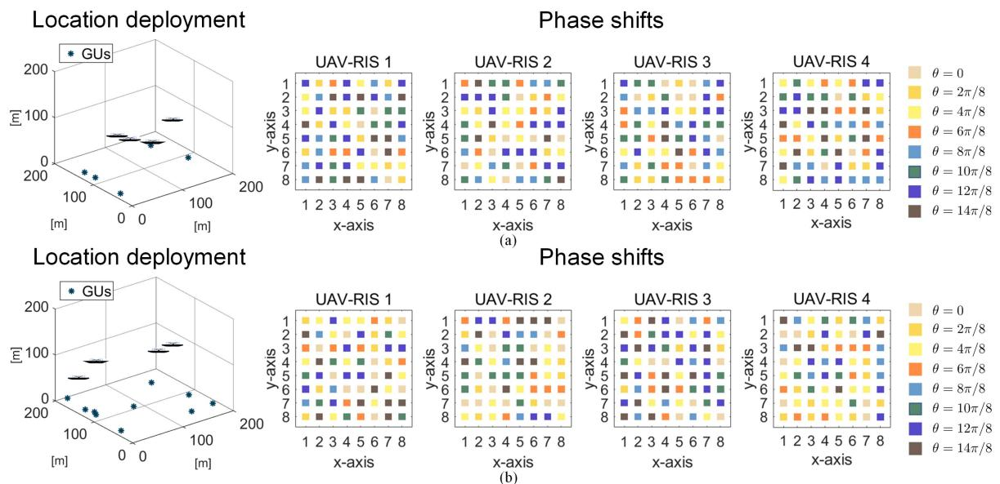

Fig. 3. Location deployment and phase shifts obtained by the proposed INSGA-II-CDC when M = 4. (a) 5 GUs. (b) 10 GUs.   
TABLE II KEY SIMULATION PARAMETERS 

<table><tr><td>Notation</td><td>Meaning</td><td>Value</td></tr><tr><td> $B$ </td><td>Bandwidth</td><td>1 MHz</td></tr><tr><td> $P_{\text{max}}$ </td><td>Maximum transmit power of BS</td><td>50 dBm</td></tr><tr><td> $P_{\text{BS}}$ </td><td>Circuit power of BS</td><td>39 dBm</td></tr><tr><td> $\sigma^{2}$ </td><td>Noise power</td><td>-104 dBm</td></tr><tr><td> $M_{\text{UR}}$ </td><td>The weight of UAV-RIS</td><td>2 kg</td></tr><tr><td> $P_{k}$ </td><td>Circuit power of each GU</td><td>10 dBm</td></tr><tr><td> $P_{\text{R}}$ </td><td>Circuit power of each RIS element</td><td>10 dBm</td></tr><tr><td> $Q$ </td><td>Data size</td><td>10 Mb</td></tr><tr><td> $M$ </td><td>Number of UAV-RISs</td><td>{2, 4, 6, 8}</td></tr><tr><td> $K$ </td><td>Number of GUs</td><td>{5, 10}</td></tr><tr><td> $c$ </td><td>Number of bits for quantizing the phase shift levels</td><td>3</td></tr><tr><td> $N_{\text{BS}}$ </td><td>Number of BS antennas</td><td>32</td></tr><tr><td> $N_{\text{r}}$ </td><td>Number of RIS elements along  $x$ -axis</td><td>8</td></tr><tr><td> $N_{\text{c}}$ </td><td>Number of RIS elements along  $y$ -axis</td><td>8</td></tr><tr><td> $\mathbf{q}_{\text{B}}$ </td><td>Location of BS</td><td>[0, 0, 0]</td></tr><tr><td> $\beta_{0}$ </td><td>Reference channel coefficient</td><td>-30 dB</td></tr><tr><td> $\mathcal{A}$ </td><td>Rician factor</td><td>20 dB</td></tr><tr><td> $\mu$ </td><td>Power amplifier efficiency of BS</td><td>0.8</td></tr><tr><td> $Pop$ </td><td>Population size</td><td>50</td></tr><tr><td> $G_{\text{max}}$ </td><td>Maximum iteration</td><td>200</td></tr></table>

Random Deployment (RD): In RD strategy, the UAV-RIS location deployment, phase shifts, and beamforming vector are randomly generated.   
Uniform Deployment (UD): In UD strategy, the horizontal UAV-RIS locations are deployed uniformly, while the height of UAV-RISs is set as Zmax+Zmin . The phase shifts $\frac { \dot { Z } _ { \mathrm { m a x } } + Z _ { \mathrm { m i n } } } { 2 }$ of all elements is set as π, while the beamforming vector is randomly generated.   
Discrete Fourier Transform Design (DFT-Design): In DFT-design, the UAV-RIS location deployment and beamforming vector are randomly generated, while the phase shifts will be determined by discrete Fourier transform.   
Classic Discrete Phase Shift Design (CDPS-Design): In CDPS-design, the UAV-RIS location deployment and beamforming vector are also randomly generated, while the phase shifts will be iteratively optimized dimension by dimension, and the detailed process can be found in [66].

Baseline Algorithms: Several evolutionary multi-objective optimization algorithms, which are MOPSO [63], multiobjective evolutionary algorithm based on decomposition (MOEA/D) [67], NSGA-II [57], and non-dominated sorting genetic algorithm-III (NSGA-III) [68] are employed as baseline algorithms. In addition, Algorithm 2 is used to handle with the discrete phase shifts, while Algorithm 4 is adopted to satisfy the transmit power constraint for all baseline algorithms.

# C. Optimization Results

In this section, we show the visualization results and test the effectiveness of INSGA-II-CDC for different number of UAV-RISs.

1) Visualization Results: Fig. 3(a) and (b) show the location deployment and phase shifts obtained by the proposed INSGA-II-CDC when M = 4 for 5 GUs and 10 GUs, respectively. As shown in the figures for phase shifts, different colors mean different phase shifts. For the ease of presentation, the Pareto solution distributions obtained by the proposed INSGA-II-CDC and other baseline algorithms when M = 4 are shown in Fig. 5(a) and (b), for 5 GUs and 10 GUs, respectively. Apparently, the solutions obtained by INSGA-II-CDC are much closer to the ideal PF, i.e., the optimal values of the three optimization objectives. The reason can be that the continuous solution processing mechanism enhances the population diversity, hence improving the search efficiency, while the discrete and complex solution processing mechanisms improve the quality of solutions iteratively. Thus, the proposed INSGA-II-CDC is more suitable to solve the formulated EEComm-MOF.

2) Effectiveness of INSGA-II-CDC for Different Values of M : Moreover, we test the results of different algorithms under different values of M for 5 GUs which can be seen in Fig. 4(a)–(c), while the similar results for 10 GUs are shown in Fig. 4(d)–(f). To ensure the fairness, we select the median of the obtained PF to plot these figures. As can be seen, the proposed INSGA-II-CDC performs better than other baseline algorithms. Overall, as the number of UAV-RISs increases, INSGA-II-CDC achieves improvements in both the minimum available rate over all GUs and the total available rate of GUs. However, the total energy consumption of the system also increases. This can be attributed to the fact that more UAV-RISs result in stronger reflected signals but also require additional energy. Interestingly, in Fig. 4(e), the value of $f _ { 2 }$ obtained by INSGA-II-CDC decreases when transitioning from M = 6 to M = 8. The reason for this phenomenon is that the case with M = 8 is more complex due to more decision variables. Moreover, there are inherent trade-offs among the three optimization objectives. As a result, the search process encounters greater difficulties, and INSGA-II-CDC may discard different solutions in the elitist filter, as described in Algorithm 1. This discrepancy may cause a slight deviation in the direction of the obtained PF, and the fluctuation obtained by other baseline algorithms in Fig. 4 also follows this reason.

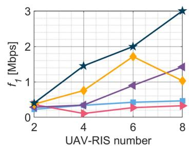

line

| UAV-RIS number | f1 [Mbps] (Line 1) | f1 [Mbps] (Line 2) | f1 [Mbps] (Line 3) | f1 [Mbps] (Line 4) |
| -------------- | ------------------- | ------------------- | ------------------- | ------------------- |
| 2              | 0.5                 | 0.5                 | 0.5                 | 0.5                 |
| 4              | 1.5                 | 0.8                 | 0.5                 | 0.2                 |
| 6              | 2.0                 | 1.8                 | 1.0                 | 0.3                 |
| 8              | 3.0                 | 1.0                 | 1.5                 | 0.4                 |

(a)

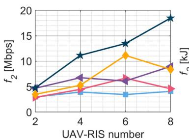

line

| UAV-RIS number | f₂ [Mbps] | f₂ [kJ] |
| -------------- | --------- | ------- |
| 2              | 5         | 3       |
| 4              | 11        | 5       |
| 6              | 13        | 6       |
| 8              | 19        | 4       |

(b)

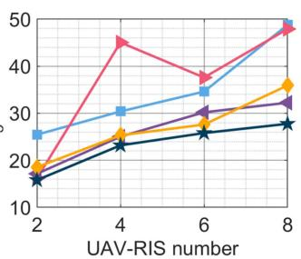

line

| UAV-RIS number | Series 1 | Series 2 | Series 3 | Series 4 | Series 5 |
| -------------- | -------- | -------- | -------- | -------- | -------- |
| 2              | 18       | 25       | 17       | 19       | 16       |
| 4              | 45       | 30       | 25       | 26       | 23       |
| 6              | 38       | 35       | 30       | 27       | 26       |
| 8              | 48       | 45       | 35       | 33       | 28       |

(c)

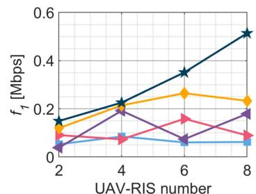

line

| UAV-RIS number | f1 [Mbps] (Line 1) | f1 [Mbps] (Line 2) | f1 [Mbps] (Line 3) | f1 [Mbps] (Line 4) |
| -------------- | ------------------- | ------------------- | ------------------- | ------------------- |
| 2              | 0.15                | 0.10                | 0.05                | 0.05                |
| 4              | 0.25                | 0.20                | 0.15                | 0.10                |
| 6              | 0.35                | 0.25                | 0.10                | 0.15                |
| 8              | 0.50                | 0.20                | 0.15                | 0.10                |

(d)

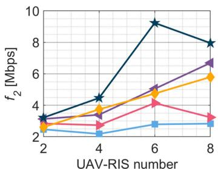

line

| UAV-RIS number | f2 [Mbps] (Line 1) | f2 [Mbps] (Line 2) | f2 [Mbps] (Line 3) | f2 [Mbps] (Line 4) |
| -------------- | ------------------ | ------------------ | ------------------ | ------------------ |
| 2              | 3.0                | 2.5                | 2.8                | 2.7                |
| 4              | 4.5                | 3.5                | 3.8                | 2.8                |
| 6              | 9.5                | 5.0                | 4.5                | 3.0                |
| 8              | 8.0                | 6.5                | 5.5                | 3.0                |

(e)

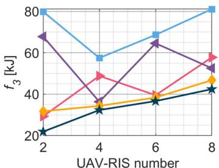

line

| UAV-RIS number | Series 1 | Series 2 | Series 3 | Series 4 |
| -------------- | -------- | -------- | -------- | -------- |
| 2              | 80       | 70       | 30       | 20       |
| 4              | 60       | 35       | 50       | 30       |
| 6              | 70       | 65       | 40       | 35       |
| 8              | 80       | 55       | 60       | 45       |

(f)

text_image

MOPSO → MOEA/D ← NSGA-II ◆ NSGA-III ★ INSGA-II-CDC

Fig. 4. Value of the objective functions versus UAV-RIS number. (a) $f _ { 1 }$ versus UAV-RIS number for 5 GUs. (b) $f _ { 2 }$ versus UAV-RIS number for 5 GUs. (c) $f _ { 3 }$ versus UAV-RIS number for 5 GUs. (d) $f _ { 1 }$ versus UAV-RIS number for 10 GUs. (e) $f _ { 2 }$ versus UAV-RIS number for 10 GUs. (f) $f _ { 3 }$ versus UAV-RIS number for 10 GUs.

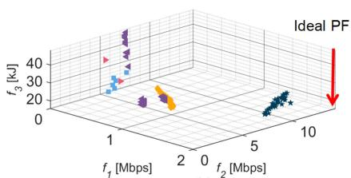

scatter

| f₁ [Mbps] | f₂ [Mbps] | f₃ [kJ] |
| --------- | --------- | ------- |
| 1         | 0         | 20      |
| 1         | 5         | 25      |
| 1         | 10        | 30      |
| 2         | 0         | 25      |
| 2         | 5         | 30      |
| 2         | 10        | 35      |
| 5         | 0         | 30      |
| 5         | 5         | 35      |
| 5         | 10        | 40      |
| Ideal PF  | -         | -       |

(a)

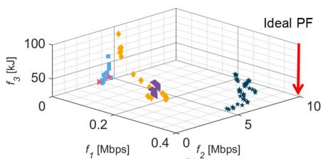

scatter

| f₁ [Mbps] | f₂ [Mbps] | f₃ [kJ] |
| --------- | --------- | ------- |
| 0.2       | 0.2       | 50      |
| 0.4       | 0.4       | 50      |
| 0.6       | 0.6       | 50      |
| 0.8       | 0.8       | 50      |
| 1.0       | 1.0       | 50      |

  
Fig. 5. Pareto solution distributions obtained by the proposed INSGA-II-CDC and other baseline algorithms when M = 4. (a) 5 GUs. (b) 10 GUs.

# D. Algorithm Performance Evaluation

In this section, we first verify the convergence and the optimality. Then, the stability of INSGA-II-CDC and effectiveness of improved mechanisms are evaluated. Finally, the CPU running time of different baseline algorithms is given.

1) Convergence and Optimality Verification: As mentioned, proving the convergence of INSGA-II-CDC theoretically is challenging. Thus, it is reasonable to use the advanced process of PF to verify the convergence of the algorithm by introducing the concept of Pareto dominance [69]. Specifically, Fig. 6(a) shows the advanced process of PF in different iterations for the case of 5 GUs, while Fig. 6(b) shows the corresponding results for the case of 10 GUs. It can be seen from Fig. 6(a) that the obtained PF on 200th iteration is better than that on 150th iteration, which means that the obtained solution qualities are getting better with more iterations, while the improvement in solution qualities decreases gradually. Thus, the algorithm gradually converges. Moreover, the similar result can also be found in Fig. 6(b), while the magnitude of the advance on PF from 50th iteration to 100th iteration is less obvious than the case of 5 GUs. The reason may be that the solution space of the case of 10 GUs is more complex, which means that the algorithm needs more searches to find a better PF.

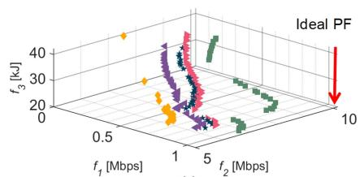

scatter

| f₁ [Mbps] | f₂ [Mbps] | f₃ [kJ] |
| --------- | --------- | ------- |
| 0.5       | 1         | 20      |
| 1         | 5         | 30      |
| 5         | 10        | 40      |

(a)

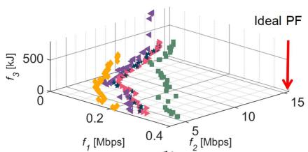

scatter

| f₁ [Mbps] | f₂ [Mbps] | f₃ [kJ] |
| --------- | --------- | ------- |
| 0.2       | 0.4       | 500     |
| 0.4       | 0.6       | 500     |
| 0.6       | 0.8       | 500     |
| 0.8       | 1.0       | 500     |
| 1.0       | 1.2       | 500     |
| 1.2       | 1.4       | 500     |
| 1.4       | 1.6       | 500     |
| 1.6       | 1.8       | 500     |
| 1.8       | 2.0       | 500     |
| 2.0       | 2.2       | 500     |
| 2.2       | 2.4       | 500     |
| 2.4       | 2.6       | 500     |
| 2.6       | 2.8       | 500     |
| 2.8       | 3.0       | 500     |
| 3.0       | 3.2       | 500     |
| 3.2       | 3.4       | 500     |
| 3.4       | 3.6       | 500     |
| 3.6       | 3.8       | 500     |
| 3.8       | 4.0       | 500     |
| 4.0       | 4.2       | 500     |
| 4.2       | 4.4       | 500     |
| 4.4       | 4.6       | 500     |
| 4.6       | 4.8       | 500     |
| 4.8       | 5.0       | 500     |
| 5.0       | 5.2       | 500     |
| 5.2       | 5.4       | 500     |
| 5.4       | 5.6       | 500     |
| 5.6       | 5.8       | 500     |
| 5.8       | 6.0       | 500     |
| 6.0       | 6.2       | 500     |
| 6.2       | 6.4       | 500     |
| 6.4       | 6.6       | 500     |
| 6.6       | 6.8       | 500     |
| 6.8       | 7.0       | 500     |
| 7.0       | 7.2       | 500     |
| 7.2       | 7.4       | 500     |
| 7.4       | 7.6       | 500     |
| 7.6       | 7.8       | 500     |
| 7.8       | 8.0       | 500     |
| 8.0       | 8.2       | 500     |
| 8.2       | 8.4       | 500     |
| 8.4       | 8.6       | 500     |
| 8.6       | 8.8       | 500     |
| 8.8       | 9.0       | 500     |
| 9.0       | 9.2       | 500     |
| 9.2       | 9.4       | 500     |
| 9.4       | 9.6       | 500     |
| 9.6       | 9.8       | 500     |
| 9.8       | 10.0      | 500     |
| Ideal PF   | -         | -       |
| Ideal PF   | -         | -       |
| Ideal PF   | -         | -       |
| Ideal PF   | -         | -       |
| Ideal PF   | -         | -       |
| Ideal PF   | -         | -       |
| Ideal PF   | -         | -       |
| Ideal PF   | -         | -       |
| Ideal PF   | -         | -       |
| Ideal PF   | -         | -       |

(b)

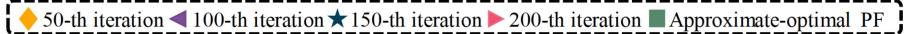  
Fig. 6. Advanced progress of PF and gap with the approximate-optimal PF obtained by INSGA-II-CDC. (a) 5 GUs. (b) 10 GUs.

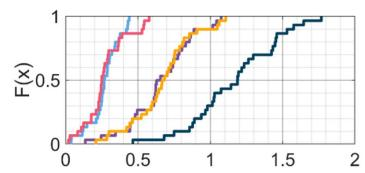

line

| x    | F(x) - Red | F(x) - Orange | F(x) - Yellow | F(x) - Blue |
| ---- | ---------- | ------------- | ------------- | ----------- |
| 0.0  | 0.0        | 0.0           | 0.0           | 0.0         |
| 0.5  | 0.8        | 0.3           | 0.2           | 0.1         |
| 1.0  | 1.0        | 0.9           | 0.7           | 0.4         |
| 1.5  | 1.0        | 1.0           | 1.0           | 0.8         |
| 2.0  | 1.0        | 1.0           | 1.0           | 1.0         |

X (a)

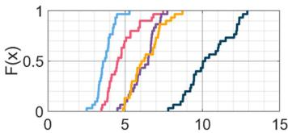

line

| x  | Blue Line | Red Line | Purple Line | Yellow Line | Dark Blue Line |
|----|-----------|----------|-------------|-------------|----------------|
| 0  | 0         | 0        | 0           | 0           | 0              |
| 5  | 1         | 0.5      | 0.2         | 0.3         | 0.1            |
| 10 | 1         | 1        | 0.8         | 0.9         | 0.5            |
| 15 | 1         | 1        | 1           | 1           | 1              |

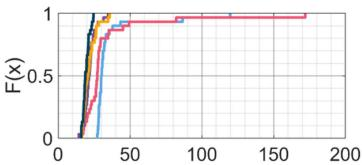

line

| x   | F(x) - Black | F(x) - Blue | F(x) - Red |
| --- | ------------ | ----------- | ---------- |
| 0   | 0.0          | 0.0         | 0.0        |
| 20  | 0.8          | 0.7         | 0.6        |
| 40  | 0.95         | 0.85        | 0.8        |
| 60  | 0.98         | 0.9         | 0.85       |
| 80  | 0.99         | 0.95        | 0.9        |
| 100 | 0.995        | 0.98        | 0.95       |
| 120 | 0.998        | 0.99        | 0.98       |
| 140 | 0.999        | 0.995       | 0.99       |
| 160 | 0.9995       | 0.998       | 0.995      |
| 180 | 0.9998       | 0.999       | 0.998      |
| 200 | 1.0          | 1.0         | 1.0        |

X (c)

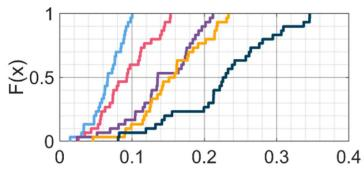

line

| x    | F(x) - Blue | F(x) - Red | F(x) - Purple | F(x) - Orange | F(x) - Dark Blue |
|------|-------------|------------|---------------|---------------|------------------|
| 0.00 | 0.0         | 0.0        | 0.0           | 0.0           | 0.0              |
| 0.05 | 0.2         | 0.1        | 0.05          | 0.05          | 0.0              |
| 0.10 | 0.6         | 0.3        | 0.2           | 0.1           | 0.0              |
| 0.15 | 0.8         | 0.5        | 0.4           | 0.2           | 0.1              |
| 0.20 | 0.9         | 0.7        | 0.6           | 0.4           | 0.2              |
| 0.25 | 0.95        | 0.8        | 0.7           | 0.6           | 0.3              |
| 0.30 | 0.98        | 0.9        | 0.8           | 0.7           | 0.4              |
| 0.35 | 0.99        | 0.95       | 0.9           | 0.8           | 0.5              |
| 0.40 | 1.0         | 1.0        | 1.0           | 1.0           | 1.0              |

(d)

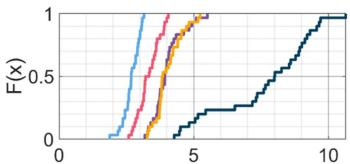

line

| x  | F(x) - Blue | F(x) - Red | F(x) - Yellow | F(x) - Dark Blue |
|----|-------------|------------|---------------|------------------|
| 0  | 0           | 0          | 0             | 0                |
| 1  | 0           | 0          | 0             | 0                |
| 2  | 0           | 0          | 0             | 0                |
| 3  | 0           | 0          | 0             | 0                |
| 4  | 0           | 0          | 0             | 0                |
| 5  | 0           | 0          | 0             | 0                |
| 6  | 0           | 0          | 0             | 0                |
| 7  | 0           | 0          | 0             | 0                |
| 8  | 0           | 0          | 0             | 0                |
| 9  | 0           | 0          | 0             | 0                |
| 10 | 1           | 1          | 1             | 1                |

X （e)

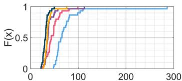

line

| x   | F(x) - Black | F(x) - Red | F(x) - Green | F(x) - Blue |
| --- | ------------ | ---------- | ------------ | ----------- |
| 0   | 0.0          | 0.0        | 0.0          | 0.0         |
| 50  | 0.8          | 0.7        | 0.6          | 0.4         |
| 100 | 1.0          | 0.9        | 0.8          | 0.7         |
| 150 | 1.0          | 1.0        | 1.0          | 0.9         |
| 200 | 1.0          | 1.0        | 1.0          | 1.0         |
| 250 | 1.0          | 1.0        | 1.0          | 1.0         |
| 300 | 1.0          | 1.0        | 1.0          | 1.0         |

text_image

MOPSO — MOEA/D — NSGA-II — NSGA-III — INSGA-II-CDC

Fig. 7. CDFs obtained by the proposed INSGA-II-CDC and other baseline algorithms when M = 4. (a) f1 for 5 GUs. (b) f2 for 5 GUs. (c) $f _ { 3 }$ for 5 GUs. (d) f1 for 10 GUs. (e) f2 for 10 GUs. (f) f3 for 10 GUs.

Moreover, since the three optimization objectives contain trade-offs, it is difficult to find the optimal values for each optimization objective simultaneously. Thus, finding the approximate-optimal solution for the problem may be more reasonable, which is also a common way for the multi-objective optimization optimization problems in wireless systems and experimentations [69]. To analyze the approximate gap in a feasible way, we first set the number of iterations of INSGA-II-CDC to 1000, which is a much larger value than the normal simulations. Then, the obtained optimization result is regarded as the approximate-optimal PF, and we compare the gap between the result of the normal simulations and the approximate-optimal PF, and the corresponding results are shown in Fig. 6(a) and (b). As can be seen, the PF obtained by 200th iteration is close to the approximate-optimal PF, which mean that the optimality of the algorithm can be verified.

2) Stability of INSGA-II-CDC: To verify the stability of INSGA-II-CDC, we visualize the cumulative distribution functions (CDFs) obtained by INSGA-II-CDC and the baseline algorithms when M = 4 in Fig. 7. Obviously, the optimization results obtained by INSGA-II-CDC dominate other baseline algorithms, which means that INSGA-II-CDC can obtain a better stability whether for 5 GUs or 10 GUs. The abovementioned results exactly correspond to the numerical statistical results in Tables III and IV, respectively, where “Mean”, “Std.”, “Max” and “Min” represent the mean value, standard deviation, maximum value and minimum value of 30 independent trials, respectively3. Moreover, “Improvement” refers to the improvement ratio of INSGA-II-CDC on the corresponding objectives compared with the suboptimal benchmarks. Specifically, for a cellular network with 5 GUs, we can increase the minimum available rate by 74.62%, while increasing the total available rate by 64.45%, when the energy consumption is saved by 10.55%. Similarly, for a cellular network with 10 GUs, we can increase the minimum available rate by 43.75%, while increasing the total available rate by 89.57%, when the energy consumption is saved by 13.60%.

3) Effectiveness of Improved Mechanisms: In this section, we conduct tests to verify the effectiveness of the introduced improved mechanisms. Specifically, the improved NSGA-II with a continuous solution processing mechanism (INSGA-II-C1), the improved NSGA-II with a discrete solution processing mechanism (INSGA-II-D), and the improved NSGA-II with a complex solution processing mechanism (INSGA-II-C2) are used to solve EEComm-MOF, respectively. Tables V and VI

3According to the central limit theorem [70], taking 30 independent trials is generally accepted by statisticians and researchers to assume the distribution of sample mean approximated to normal distribution.

TABLE III NUMERICAL STATISTICAL RESULTS OBTAINED BY DIFFERENT BENCHMARKS WHEN M = 4 FOR 5 GUS 

<table><tr><td></td><td>Benchmarks</td><td>Mean</td><td>Std.</td><td>Max</td><td>Min</td><td>Improvement</td></tr><tr><td rowspan="9"> $f_1$  [Mbps]</td><td>RD</td><td>0.06</td><td>0.06</td><td>0.28</td><td>0.00</td><td>—</td></tr><tr><td>UD</td><td>0.03</td><td>0.04</td><td>0.23</td><td>0.00</td><td>—</td></tr><tr><td>DFT-Design</td><td>0.25</td><td>0.09</td><td>0.47</td><td>0.12</td><td>—</td></tr><tr><td>CDPS-Design</td><td>0.54</td><td>0.17</td><td>0.89</td><td>0.26</td><td>—</td></tr><tr><td>MOPSO</td><td>0.27</td><td>0.10</td><td>0.44</td><td>0.04</td><td>—</td></tr><tr><td>MOEA/D</td><td>0.27</td><td>0.14</td><td>0.58</td><td>0.02</td><td>—</td></tr><tr><td>NSGA-II</td><td>0.66</td><td>0.22</td><td>1.07</td><td>0.14</td><td>—</td></tr><tr><td>NSGA-III</td><td>0.67</td><td>0.22</td><td>1.11</td><td>0.21</td><td>—</td></tr><tr><td>INSGA-II-CDC</td><td>1.17</td><td>0.30</td><td>1.77</td><td>0.46</td><td>74.62%</td></tr><tr><td rowspan="9"> $f_2$  [Mbps]</td><td>RD</td><td>1.85</td><td>0.58</td><td>3.38</td><td>0.94</td><td>—</td></tr><tr><td>UD</td><td>0.83</td><td>0.41</td><td>1.90</td><td>0.35</td><td>—</td></tr><tr><td>DFT-Design</td><td>2.27</td><td>0.62</td><td>4.23</td><td>1.16</td><td>—</td></tr><tr><td>CDPS-Design</td><td>3.49</td><td>0.75</td><td>5.60</td><td>2.35</td><td>—</td></tr><tr><td>MOPSO</td><td>3.71</td><td>0.56</td><td>5.28</td><td>2.51</td><td>—</td></tr><tr><td>MOEA/D</td><td>4.78</td><td>1.02</td><td>7.45</td><td>3.46</td><td>—</td></tr><tr><td>NSGA-II</td><td>6.21</td><td>0.83</td><td>7.73</td><td>4.50</td><td>—</td></tr><tr><td>NSGA-III</td><td>6.33</td><td>1.05</td><td>8.70</td><td>4.86</td><td>—</td></tr><tr><td>INSGA-II-CDC</td><td>10.41</td><td>1.49</td><td>12.90</td><td>7.79</td><td>64.45%</td></tr><tr><td rowspan="9"> $f_3$  [kJ]</td><td>RD</td><td>159.77</td><td>198.24</td><td>922.55</td><td>27.41</td><td>—</td></tr><tr><td>UD</td><td>548.50</td><td>2069.38</td><td>11479.60</td><td>27.20</td><td>—</td></tr><tr><td>DFT-Design</td><td>31.20</td><td>3.68</td><td>36.31</td><td>23.14</td><td>—</td></tr><tr><td>CDPS-Design</td><td>25.01</td><td>3.58</td><td>37.14</td><td>19.11</td><td>—</td></tr><tr><td>MOPSO</td><td>35.61</td><td>19.16</td><td>119.64</td><td>27.18</td><td>—</td></tr><tr><td>MOEA/D</td><td>33.62</td><td>28.90</td><td>171.93</td><td>16.20</td><td>—</td></tr><tr><td>NSGA-II</td><td>21.97</td><td>4.23</td><td>34.76</td><td>14.29</td><td>—</td></tr><tr><td>NSGA-III</td><td>21.80</td><td>4.91</td><td>35.83</td><td>16.36</td><td>—</td></tr><tr><td>INSGA-II-CDC</td><td>19.50</td><td>2.40</td><td>24.60</td><td>16.03</td><td>10.55%</td></tr></table>

TABLE IV NUMERICAL STATISTICAL RESULTS OBTAINED BY DIFFERENT BENCHMARKS WHEN M = 4 FOR 10 GUS 

<table><tr><td></td><td>Benchmarks</td><td>Mean</td><td>Std.</td><td>Max</td><td>Min</td><td>Improvement</td></tr><tr><td rowspan="9"> $f_1$  [Mbps]</td><td>RD</td><td>0.02</td><td>0.02</td><td>0.08</td><td>0.00</td><td>—</td></tr><tr><td>UD</td><td>0.01</td><td>0.01</td><td>0.04</td><td>0.00</td><td>—</td></tr><tr><td>DFT-Design</td><td>0.07</td><td>0.01</td><td>0.10</td><td>0.04</td><td>—</td></tr><tr><td>CDPS-Design</td><td>0.14</td><td>0.06</td><td>0.28</td><td>0.02</td><td>—</td></tr><tr><td>MOPSO</td><td>0.07</td><td>0.02</td><td>0.10</td><td>0.01</td><td>—</td></tr><tr><td>MOEA/D</td><td>0.09</td><td>0.04</td><td>0.15</td><td>0.03</td><td>—</td></tr><tr><td>NSGA-II</td><td>0.14</td><td>0.05</td><td>0.21</td><td>0.02</td><td>—</td></tr><tr><td>NSGA-III</td><td>0.16</td><td>0.05</td><td>0.23</td><td>0.05</td><td>—</td></tr><tr><td>INSGA-II-CDC</td><td>0.23</td><td>0.07</td><td>0.35</td><td>0.09</td><td>43.75%</td></tr><tr><td rowspan="9"> $f_2$  [Mbps]</td><td>RD</td><td>1.57</td><td>0.36</td><td>2.26</td><td>0.93</td><td>—</td></tr><tr><td>UD</td><td>0.87</td><td>0.29</td><td>1.50</td><td>0.35</td><td>—</td></tr><tr><td>DFT-Design</td><td>1.68</td><td>0.32</td><td>2.26</td><td>1.15</td><td>—</td></tr><tr><td>CDPS-Design</td><td>2.35</td><td>0.58</td><td>3.75</td><td>1.35</td><td>—</td></tr><tr><td>MOPSO</td><td>2.69</td><td>0.30</td><td>3.15</td><td>1.88</td><td>—</td></tr><tr><td>MOEA/D</td><td>3.32</td><td>0.41</td><td>4.05</td><td>2.59</td><td>—</td></tr><tr><td>NSGA-II</td><td>4.00</td><td>0.55</td><td>5.51</td><td>3.18</td><td>—</td></tr><tr><td>NSGA-III</td><td>4.03</td><td>0.51</td><td>5.23</td><td>3.27</td><td>—</td></tr><tr><td>INSGA-II-CDC</td><td>7.64</td><td>1.82</td><td>10.64</td><td>4.27</td><td>89.57%</td></tr><tr><td rowspan="9"> $f_3$  [kJ]</td><td>RD</td><td>381.75</td><td>587.05</td><td>2569.60</td><td>43.72</td><td>—</td></tr><tr><td>UD</td><td>1877.57</td><td>5521.91</td><td>30434.78</td><td>72.08</td><td>—</td></tr><tr><td>DFT-Design</td><td>56.27</td><td>9.00</td><td>81.46</td><td>45.99</td><td>—</td></tr><tr><td>CDPS-Design</td><td>43.43</td><td>23.94</td><td>155.78</td><td>28.52</td><td>—</td></tr><tr><td>MOPSO</td><td>74.82</td><td>42.79</td><td>286.04</td><td>48.13</td><td>—</td></tr><tr><td>MOEA/D</td><td>46.70</td><td>15.89</td><td>99.10</td><td>25.36</td><td>—</td></tr><tr><td>NSGA-II</td><td>39.48</td><td>15.47</td><td>112.81</td><td>26.78</td><td>—</td></tr><tr><td>NSGA-III</td><td>36.24</td><td>8.72</td><td>75.93</td><td>26.99</td><td>—</td></tr><tr><td>INSGA-II-CDC</td><td>31.31</td><td>6.00</td><td>49.81</td><td>22.12</td><td>13.60%</td></tr></table>

show the optimization results obtained by NSGA-II with part of improved mechanisms. As can be seen, INSGA-II-C1, INSGA-II-D, and INSGA-II-C2 obtain better optimization results on most of the optimization objectives, respectively, which means that each of improved mechanisms is necessary, Moreover, the proposed INSGA-II-CDC which combines all the advantages of these improved mechanisms can improve the results of all different optimization objectives, and hence it is effective.

4) CPU Running Time: The numerical results of the CPU running times of INSGA-II-CDC and other baseline algorithms when M = 4 are shown in Table VII. It can be seen from the

TABLE V NUMERICAL STATISTICAL RESULTS OBTAINED BY NSGA-II WITH PART OF IMPROVED MECHANISMS WHEN M = 4 FOR 5 GUS 

<table><tr><td></td><td>Algorithm</td><td>Mean</td><td>Std.</td><td>Max</td><td>Min</td></tr><tr><td rowspan="5"> $f_{1}$  [Mbps]</td><td>NSGA-II</td><td>0.66</td><td>0.22</td><td>1.07</td><td>0.14</td></tr><tr><td>INSGA-II-C1</td><td>0.67</td><td>0.23</td><td>1.09</td><td>0.12</td></tr><tr><td>INSGA-II-D</td><td>0.71</td><td>0.21</td><td>1.08</td><td>0.29</td></tr><tr><td>INSGA-II-C2</td><td>0.61</td><td>0.25</td><td>1.02</td><td>0.10</td></tr><tr><td>INSGA-II-CDC</td><td>1.17</td><td>0.30</td><td>1.77</td><td>0.46</td></tr><tr><td rowspan="5"> $f_{2}$  [Mbps]</td><td>NSGA-II</td><td>6.21</td><td>0.83</td><td>7.73</td><td>4.50</td></tr><tr><td>INSGA-II-C1</td><td>6.50</td><td>0.66</td><td>7.76</td><td>5.02</td></tr><tr><td>INSGA-II-D</td><td>6.80</td><td>1.08</td><td>9.00</td><td>5.11</td></tr><tr><td>INSGA-II-C2</td><td>7.06</td><td>0.95</td><td>9.24</td><td>5.48</td></tr><tr><td>INSGA-II-CDC</td><td>10.41</td><td>1.49</td><td>12.90</td><td>7.79</td></tr><tr><td rowspan="5"> $f_{3}$  [kJ]</td><td>NSGA-II</td><td>21.97</td><td>4.23</td><td>34.76</td><td>14.29</td></tr><tr><td>INSGA-II-C1</td><td>22.88</td><td>4.89</td><td>39.85</td><td>17.03</td></tr><tr><td>INSGA-II-D</td><td>21.58</td><td>3.02</td><td>30.44</td><td>15.07</td></tr><tr><td>INSGA-II-C2</td><td>21.39</td><td>4.92</td><td>37.81</td><td>16.73</td></tr><tr><td>INSGA-II-CDC</td><td>19.50</td><td>2.40</td><td>24.60</td><td>16.03</td></tr></table>

TABLE VI NUMERICAL STATISTICAL RESULTS OBTAINED BY NSGA-II WITH PART OF IMPROVED MECHANISMS WHEN M = 4 FOR 10 GUS 

<table><tr><td></td><td>Algorithm</td><td>Mean</td><td>Std.</td><td>Max</td><td>Min</td></tr><tr><td rowspan="5"> $f_{1}$  [Mbps]</td><td>NSGA-II</td><td>0.14</td><td>0.05</td><td>0.21</td><td>0.02</td></tr><tr><td>INSGA-II-C1</td><td>0.15</td><td>0.05</td><td>0.22</td><td>0.06</td></tr><tr><td>INSGA-II-D</td><td>0.14</td><td>0.05</td><td>0.24</td><td>0.05</td></tr><tr><td>INSGA-II-C2</td><td>0.15</td><td>0.05</td><td>0.23</td><td>0.07</td></tr><tr><td>INSGA-II-CDC</td><td>0.23</td><td>0.07</td><td>0.34</td><td>0.08</td></tr><tr><td rowspan="5"> $f_{2}$  [Mbps]</td><td>NSGA-II</td><td>4.00</td><td>0.55</td><td>5.51</td><td>3.18</td></tr><tr><td>INSGA-II-C1</td><td>4.12</td><td>0.42</td><td>4.96</td><td>3.41</td></tr><tr><td>INSGA-II-D</td><td>4.14</td><td>4.33</td><td>5.44</td><td>3.38</td></tr><tr><td>INSGA-II-C2</td><td>4.29</td><td>0.35</td><td>4.92</td><td>3.50</td></tr><tr><td>INSGA-II-CDC</td><td>7.64</td><td>1.82</td><td>10.64</td><td>4.27</td></tr><tr><td rowspan="5"> $f_{3}$  [kJ]</td><td>NSGA-II</td><td>39.48</td><td>15.47</td><td>112.80</td><td>26.78</td></tr><tr><td>INSGA-II-C1</td><td>36.94</td><td>8.06</td><td>55.31</td><td>26.90</td></tr><tr><td>INSGA-II-D</td><td>39.89</td><td>11.16</td><td>81.19</td><td>27.86</td></tr><tr><td>INSGA-II-C2</td><td>38.63</td><td>8.24</td><td>64.40</td><td>28.89</td></tr><tr><td>INSGA-II-CDC</td><td>31.31</td><td>6.00</td><td>49.81</td><td>22.12</td></tr></table>

TABLE VII NUMERICAL STATISTICAL RESULTS OF CPU RUNNING TIMES OBTAINED BY INSGA-II-CDC AND OTHER BASELINE ALGORITHMS WHEN M = 4 

<table><tr><td>Different K value</td><td>MOPSO</td><td>MOEA/D</td><td>NSGA-II</td><td>NSGA-III</td><td>INSGA-II-CDC</td></tr><tr><td>K=5 [s]</td><td>27.30</td><td>29.40</td><td>49.42</td><td>50.52</td><td>113.20</td></tr><tr><td>K=5 [s]</td><td>29.40</td><td>53.33</td><td>77.64</td><td>77.79</td><td>161.96</td></tr></table>

table that INSGA-II-CDC takes longer CPU running time, since it takes additional calculations as the abovementioned analysis in Section V-C1. However, the gaps of CPU running times are not very large. Moreover, due to the fixed location of GUs, all UAV-RISs can be deployed and recalled synchronously once the energy is exhausted or the transmission task is completed. In other words, the algorithm can be run off-line, and the CPU running time is not a primary consideration. Thus, we may say that INSGA-II-CDC has the overall best performance for dealing with the formulated EEComm-MOF.

# E. Implementability Analysis

To verify the implementability of the system, we use the Raspberry Pi 4B to conduct experiments for the baseline algorithms. Generally, Raspberry Pi 4B platform is a processor commonly utilized in a practical UAV flight control system [71]. Similar to a small-sized minicomputer, it can also transmit the commands to the RIS controller so as to control RIS phase shifts [72]. The schematic diagram depicting the autonomous UAV-RIS system, based on the Raspberry Pi, is illustrated in Fig. 8. Since the

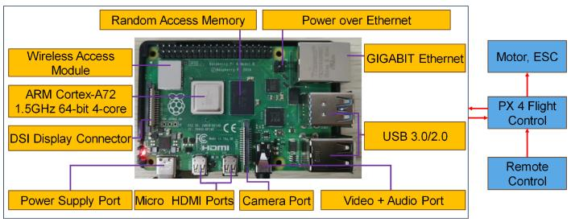

text_image

Random Access Memory
Power over Ethernet
Wireless Access Module
ARM Cortex-A72
1.5GHz 64-bit 4-core
DSI Display Connector
Power Supply Port
Micro HDMI Ports
Camera Port
Video + Audio Port
GIGABIT Ethernet
USB 3.0/2.0
Motor, ESC
PX 4 Flight Control
Remote Control

Fig. 8. Schematic diagram for the controller of UAV-RIS system based on Raspberry Pi.

Raspberry Pi 4B platform is not compatible with Matlab, we translate the Matlab-programmed INSGA-II-CDC into Python. We neglect the computations of optimization objective values, as proxy models can effectively take their place in practical scenarios [73].

In addition, we implement other baseline algorithms, including MOPSO, MOEA/D, NSGA-II, and NSGA-III. Specifically, the execution times obtained by MOPSO, MOEA/D, NSGA-II, NSGA-III, and INSGA-II-CDC are 35.50 s, 47.75 s, 195.59 s, 317.64 s, and 779.67 s, respectively. Despite the longer execution time of INSGA-II-CDC due to more calculations, it is still reasonable [74]. The reasons can be summarized as follows: First, this work explores the simultaneous deployment of all UAV-RISs to assist the cellular network. To ensure seamless coverage, all UAV-RISs are recalled and a new batch is deployed when one UAV-RIS exhausts its energy. Thus, if the maximum hovering time of the UAV-RIS is greater than the computation time of the algorithm, the solution remains viable, since the algorithm can be run in advance when the last batch of UAV-RISs starts service. According to [75], the UAV-RIS can hover for over 15 minutes in dense urban environments, well surpassing the required computation time. Second, during actual deployment, the computation time is expected to be lower than the obtained results due to a lower code execution efficiency of Python compared to C/C++. Hence, deploying the C/C++ version of the algorithm would further enhance execution efficiency in real-world scenarios. Moreover, the computation power is also insignificant compared to the propulsion power of the UAV-RISs [74], which can be easily tackled.

# VII. CONCLUSION

In this paper, a cooperative UAV-RISs-assisted cellular network is investigated, where multiple RISs are carried and enhanced by UAVs to serve multiple GUs simultaneously, thereby achieving 3D mobility and opportunistic deployment. Specifically, EEComm-MOF is formulated to jointly consider the beamforming vector of BS, the location deployment, and the discrete phase shifts of UAV-RISs so as to maximize the minimum available rate over all GUs, maximize the total available rate of all GUs, and minimize the total energy consumption of the system simultaneously, while satisfying the transmit power constraint of BS. Then, we propose an INSGA-II-CDC with several specific designs to solve the problem directly. Simulations results demonstrate that the proposed INSGA-II-CDC is better than other benchmarks under different parameter settings. Moreover, the performance of the INSGA-II-CDC in terms of the convergence and optimality, stability, effectiveness of improved mechanisms, and CPU running time is verified. In addition, the implementability of the proposed algorithm in practical system is evaluated. In the future work, we will consider the mobile GUs instead of fixed GUs, which means that the trajectories of UAV-RISs will be investigated.

# REFERENCES

[1] C. Huang et al., “Holographic MIMO surfaces for 6G wireless networks: Opportunities, challenges, and trends,” IEEE Wireless Commun., vol. 27, no. 5, pp. 118–125, Oct. 2020.   
[2] J. An et al., “Codebook-based solutions for reconfigurable intelligent surfaces and their open challenges,” IEEE Wireless Commun., vol. 31, no. 2, pp. 134–141, Apr. 2024.   
[3] S. Khisa, M. Elhattab, C. Assi, and S. Sharafeddine, “Energy consumption optimization in RIS-assisted cooperative RSMA cellular networks,” IEEE Trans. Commun., vol. 71, no. 7, pp. 4300–4312, Jul. 2023.   
[4] Q. Wu and R. Zhang, “Intelligent reflecting surface enhanced wireless network via joint active and passive beamforming,” IEEE Trans. Wireless Commun., vol. 18, no. 11, pp. 5394–5409, Nov. 2019.   
[5] G. Chen, Q. Wu, W. Chen, D. W. K. Ng, and L. Hanzo, “IRS-aided wireless powered MEC systems: TDMA or NOMA for computation offloading?,” IEEE Trans. Wireless Commun., vol. 22, no. 2, pp. 1201–1218, Feb. 2023.   
[6] J. An et al., “Stacked intelligent metasurfaces for efficient holographic MIMO communications in 6G,” IEEE J. Sel. Areas Commun., vol. 41, no. 8, pp. 2380–2396, Aug. 2023.   
[7] M. Misbah, Z. Kaleem, W. Khalid, C. Yuen, and A. Jamalipour, “Phase and 3D placement optimization for rate enhancement in RIS-assisted UAV networks,” IEEE Wireless Commun. Lett., vol. 12, no. 7, pp. 1135–1138, Jul. 2023.   
[8] M. Zeng, X. Ning, W. Wang, Q. Wu, and Z. Fei, “RIS aided NR-U and Wi-Fi coexistence in single cell and multiple cell networks on unlicensed bands,” IEEE Trans. Green Commun. Netw., vol. 7, no. 3, pp. 1528–1541, Sep. 2023.   
[9] H. Gao, K. Cui, C. Huang, and C. Yuen, “Robust beamforming for RIS-assisted wireless communications with discrete phase shifts,” IEEE Wireless Commun. Lett., vol. 10, no. 12, pp. 2619–2623, Dec. 2021.   
[10] Z. Ning et al., “Joint user association, interference cancellation, and power control for multi-IRS assisted UAV communications,” IEEE Trans. Wireless Commun., vol. 23, no. 10, pp. 13408–13423, Oct. 2024.   
[11] X. Cao et al., “Reconfigurable intelligent surface-assisted aerial-terrestrial communications via multi-task learning,” IEEE J. Sel. Areas Commun., vol. 39, no. 10, pp. 3035–3050, Oct. 2021.   
[12] Q. Zhang, W. Saad, and M. Bennis, “Reflections in the sky: Millimeter wave communication with UAV-carried intelligent reflectors,” in Proc. IEEE Glob. Commun. Conf., 2019, pp. 1–6.   
[13] X. Liu, Y. Liu, and Y. Chen, “Machine learning empowered trajectory and passive beamforming design in UAV-RIS wireless networks,” IEEE J. Sel. Areas Commun., vol. 39, no. 7, pp. 2042–2055, Jul. 2021.   
[14] A. Khalili, E. M. Monfared, S. Zargari, M. R. Javan, N. M. Yamchi, and E. A. Jorswieck, “Resource management for transmit power minimization in UAV-assisted RIS HetNets supported by dual connectivity,” IEEE Trans. Wireless Commun., vol. 21, no. 3, pp. 1806–1822, Mar. 2022.   
[15] Y. Cheng, W. Peng, C. Huang, G. C. Alexandropoulos, C. Yuen, and M. Debbah, “RIS-aided wireless communications: Extra degrees of freedom via rotation and location optimization,” IEEE Trans. Wireless Commun., vol. 21, no. 8, pp. 6656–6671, Aug. 2022.   
[16] Q. Wu et al., “A comprehensive overview on 5G-and-beyond networks with UAVs: From communications to sensing and intelligence,” IEEE J. Sel. Areas Commun., vol. 39, no. 10, pp. 2912–2945, Oct. 2021.   
[17] M. T. Dabiri, M. Hasna, S. Althunibat, K. Qaraqe, and M.-S. Alouini, “A balloon-based UAV-aided non-terrestrial sectorized network for post disaster cellular coverage: A dynamic environment perspective,” in Proc. 7th Int. Conf. Adv. Commun. Technol. Netw., 2024, pp. 1–7.   
[18] P. G. Sudheesh, M. Mozaffari, M. Magarini, W. Saad, and P. Muthuchidambaranathan, “Sum-rate analysis for high altitude platform (HAP) drones with tethered balloon relay,” IEEE Commun. Lett., vol. 22, no. 6, pp. 1240–1243, Jun. 2018.

[19] Z. Yang et al., “Energy-efficient wireless communications with distributed reconfigurable intelligent surfaces,” IEEE Trans. Wireless Commun., vol. 21, no. 1, pp. 665–679, Jan. 2022.   
[20] Y. Zhou, G. Qin, and F. Lin, “Development of nano UAV platform for navigation in GPS-denied environment using snapdragon,” in Proc. 44th Annu. Conf. IEEE Ind. Electron. Soc., 2018, pp. 5642–5647.   
[21] B. Sagir, E. Aydin, and H. Ilhan, “Deep-learning assisted IoT based RIS for cooperative communications,” IEEE Internet Things J., vol. 10, no. 12, pp. 10471–10483, Jun. 2023.   
[22] H. Zhao, W. Sun, Y. Ni, W. Xia, G. Gui, and C. Zhu, “Deep deterministic policy gradient-based rate maximization for RIS-UAV-assisted vehicular communication networks,” IEEE Trans. Intell. Transp. Syst., vol. 25, no. 11, pp. 15732–15744, Nov. 2024.   
[23] E. M. Mohamed, S. Hashima, and K. Hatano, “Energy aware multiarmed bandit for millimeter wave-based UAV mounted RIS networks,” IEEE Wireless Commun. Lett., vol. 11, no. 6, pp. 1293–1297, Jun. 2022.   
[24] M. Wu, K. Guo, Z. Lin, S. Garg, K. Kaur, and G. Kaddoum, “Energy efficiency optimization in RIS-assisted ISATRNs with RSMA: A federated deep reinforcement learning approach,” in Proc. IEEE Wireless Commun. Netw. Conf., 2024, pp. 1–6.   
[25] L. Ge, H. Zhang, and J. Wang, “Joint placement and beamforming design in multi-UAV-IRS assisted multiuser communication,” in Proc. IEEE Glob. Commun. Conf., 2021, pp. 1–6.   
[26] X. Song et al., “Enhancing cell-free network: Joint beamforming and location optimization via UAV-IRS,” IEEE Trans. Veh. Technol., vol. 74, no. 1, pp. 1196–1208, Jan. 2025.   
[27] A. B. M. Adam et al., “Secure communication in UAV-RIS-empowered multiuser networks: Joint beamforming, phase shift, and UAV trajectory optimization,” IEEE Syst. J., vol. 18, no. 2, pp. 1009–1019, Jun. 2024.   
[28] W. Wang, W. Ni, H. Tian, Y. C. Eldar, and D. Niyato, “UAV-mounted multi-functional RIS for combating eavesdropping in wireless networks,” IEEE Wireless Commun. Lett., vol. 12, no. 10, pp. 1667–1671, Oct. 2023.   
[29] Y. Xiao et al., “Solar powered UAV-mounted RIS networks,” IEEE Commun. Lett., vol. 27, no. 6, pp. 1565–1569, Jun. 2023.   
[30] X. Liang, Z. Zhang, Q. Deng, F. Shu, S. Liu, and J. Wang, “Joint trajectory and primary-secondary transmission design for UAV-carried-IRS assisted underlay CR networks,” IEEE Trans. Veh. Technol., vol. 73, no. 11, pp. 17848–17853, Nov. 2024.   
[31] D. Tyrovolas et al., “Energy-aware trajectory optimization for UAVmounted RIS and full-duplex relay,” IEEE Internet Things J., vol. 11, no. 13, pp. 24259–24272, Jul. 2024.   
[32] M. S. Abouamer and P. Mitran, “Joint uplink-downlink resource allocation for multiuser IRS-assisted systems,” IEEE Trans. Wireless Commun., vol. 21, no. 12, pp. 10918–10933, Dec. 2022.   
[33] M. J. Shehab, B. S. Ciftler, T. Khattab, M. M. Abdallah, and D. Trinchero, “Deep reinforcement learning powered IRS-assisted downlink NOMA,” IEEE Open J. Commun. Soc., vol. 3, pp. 729–739, 2022.   
[34] H. Wang, C. Liu, Z. Shi, Y. Fu, and R. Song, “On power minimization for IRS-aided downlink NOMA systems,” IEEE Wireless Commun. Lett., vol. 9, no. 11, pp. 1808–1811, Nov. 2020.   
[35] A. A. Nasir, “Secure and energy-efficient mobile edge computing with UAV-mounted- RIS assistance,” in Proc. 99th IEEE Veh. Technol. Conf., 2024, pp. 1–5.   
[36] Z. Zhai, X. Dai, B. Duo, X. Wang, and X. Yuan, “Energy-efficient UAVmounted RIS assisted mobile edge computing,” IEEE Wireless Commun. Lett., vol. 11, no. 12, pp. 2507–2511, Dec. 2022.   
[37] A. Magbool, V. Kumar, and M. F. Flanagan, “On energy efficiency and fairness maximization in RIS-assisted MU-MISO mmWave communications,” in Proc. IEEE Int. Conf. Commun., 2023, pp. 5364–5369.   
[38] X. Ma, Y. Fang, H. Zhang, S. Guo, and D. Yuan, “Cooperative beamforming design for multiple RIS-assisted communication systems,” IEEE Trans. Wireless Commun., vol. 21, no. 12, pp. 10949–10963, Dec. 2022.   
[39] X. Liu, Y. Liu, Y. Chen, and H. V. Poor, “RIS enhanced massive nonorthogonal multiple access networks: Deployment and passive beamforming design,” IEEE J. Sel. Areas Commun., vol. 39, no. 4, pp. 1057–1071, Apr. 2021.   
[40] F. Naeem, M. K. Qaraqe, and H. Celebi, “Joint deployment design and phase shift of IRS-assisted 6G networks: An experience-driven approach,” IEEE Internet Things J., vol. 10, no. 20, pp. 17647–17655, Oct. 2023.   
[41] K. Lin, H. Yang, M. Zheng, L. Xiao, C. Huang, and D. Niyato, “Penalized reinforcement learning-based energy-efficient UAV-RIS assisted maritime uplink communications against jamming,” IEEE Trans. Veh. Technol., vol. 73, no. 10, pp. 15768–15773, Oct. 2024.

[42] K. Zhao, H. Mei, S. Lyu, and L. Peng, “Joint optimization of multiple UAV-mounted RISs deployment and RIS elements allocation,” in Proc. 13th Int. Conf. Inf. Commun. Technol. Convergence, 2022, pp. 1193–1197.   
[43] T. Feng, L. Xie, J. Yao, and J. Xu, “UAV-enabled data collection for wireless sensor networks with distributed beamforming,” IEEE Trans. Wireless Commun., vol. 21, no. 2, pp. 1347–1361, Feb. 2022.   
[44] Y. Zhao, W. Xu, X. You, N. Wang, and H. Sun, “Cooperative reflection and synchronization design for distributed multiple-RIS communications,” IEEE J. Sel. Topics Signal Process., vol. 16, no. 5, pp. 980–994, Aug. 2022.   
[45] A. Faisal, I. Al-Nahhal, O. A. Dobre, and T. M. N. Ngatched, “Deep reinforcement learning for RIS-assisted FD systems: Single or distributed RIS?,” IEEE Commun. Lett., vol. 26, no. 7, pp. 1563–1567, Jul. 2022.   
[46] C. Huang, A. Zappone, G. C. Alexandropoulos, M. Debbah, and C. Yuen, “Reconfigurable intelligent surfaces for energy efficiency in wireless communication,” IEEE Trans. Wireless Commun., vol. 18, no. 8, pp. 4157–4170, Aug. 2019.   
[47] L. Wei, C. Huang, G. C. Alexandropoulos, C. Yuen, Z. Zhang, and M. Debbah, “Channel estimation for RIS-empowered multi-user MISO wireless communications,” IEEE Trans. Commun., vol. 69, no. 6, pp. 4144–4157, Jun. 2021.   
[48] T. Vu and S. Kim, “Performance analysis of full-duplex two-way RISbased systems with imperfect CSI and discrete phase-shift design,” IEEE Commun. Lett., vol. 27, no. 2, pp. 512–516, Feb. 2023.   
[49] J. An, C. Xu, L. Gan, and L. Hanzo, “Low-complexity channel estimation and passive beamforming for RIS-assisted MIMO systems relying on discrete phase shifts,” IEEE Trans. Commun., vol. 70, no. 2, pp. 1245–1260, Feb. 2022.   
[50] S. Chen, J. Zhang, E. Björnson, J. Zhang, and B. Ai, “Structured massive access for scalable cell-free massive MIMO systems,” IEEE J. Sel. Areas Commun., vol. 39, no. 4, pp. 1086–1100, Apr. 2021.   
[51] X. Song, Y. Zhao, Z. Wu, Z. Yang, and J. Tang, “Joint trajectory and communication design for IRS-assisted UAV networks,” IEEE Wireless Commun. Lett., vol. 11, no. 7, pp. 1538–1542, Jul. 2022.   
[52] M. A. Al-Jarrah, A. Al-Dweik, E. Alsusa, Y. Iraqi, and M. Alouini, “On the performance of IRS-assisted multi-layer UAV communications with imperfect phase compensation,” IEEE Trans. Commun., vol. 69, no. 12, pp. 8551–8568, Dec. 2021.   
[53] Y. Zeng, Q. Wu, and R. Zhang, “Accessing from the sky: A tutorial on UAV communications for 5G and beyond,” Proc. IEEE, vol. 107, no. 12, pp. 2327–2375, Dec. 2019.   
[54] Y. Zeng, J. Xu, and R. Zhang, “Energy minimization for wireless communication with rotary-wing UAV,” IEEE Trans. Wireless Commun., vol. 18, no. 4, pp. 2329–2345, Apr. 2019.   
[55] H. Pan, Y. Liu, G. Sun, J. Fan, S. Liang, and C. Yuen, “Joint power and 3D trajectory optimization for UAV-enabled wireless powered communication networks with obstacles,” IEEE Trans. Commun., vol. 71, no. 4, pp. 2364–2380, Apr. 2023.   
[56] Z. Feng, D. Wu, M. Huang, and C. Yuen, “Graph-attention-based reinforcement learning for trajectory design and resource assignment in multi-UAV-assisted communication,” IEEE Internet Things J., vol. 11, no. 16, pp. 27421–27434, Aug. 2024.   
[57] K. Deb, S. Agrawal, A. Pratap, and T. Meyarivan, “A fast and elitist multiobjective genetic algorithm: NSGA-II,” IEEE Trans. Evol. Comput., vol. 6, no. 2, pp. 182–197, Apr. 2002.   
[58] C. Zhang et al., “UAV swarm-enabled collaborative secure relay communications with time-domain colluding eavesdropper,” IEEE Trans. Mobile Comput., vol. 23, no. 9, pp. 8601–8619, Sep. 2024.   
[59] X. Zhang, Y. Tian, R. Cheng, and Y. Jin, “An efficient approach to nondominated sorting for evolutionary multiobjective optimization,” IEEE Trans. Evol. Comput., vol. 19, no. 2, pp. 201–213, Apr. 2015.   
[60] C. Yue, B. Qu, and J. Liang, “A multiobjective particle swarm optimizer using ring topology for solving multimodal multiobjective problems,” IEEE Trans. Evol. Comput., vol. 22, no. 5, pp. 805–817, Oct. 2018.   
[61] K. Zhi, C. Pan, H. Ren, and K. Wang, “Power scaling law analysis and phase shift optimization of RIS-aided massive MIMO systems with statistical CSI,” IEEE Trans. Commun., vol. 70, no. 5, pp. 3558–3574, May 2022.   
[62] S. Long, Y. Zhang, Q. Deng, T. Pei, J. Ouyang, and Z. Xia, “An efficient task offloading approach based on multi-objective evolutionary algorithm in cloud-edge collaborative environment,” IEEE Trans. Netw. Sci. Eng., vol. 10, no. 2, pp. 645–657, Mar./Apr. 2023.   
[63] C. A. C. Coello, G. T. Pulido, and M. S. Lechuga, “Handling multiple objectives with particle swarm optimization,” IEEE Trans. Evol. Comput., vol. 8, no. 3, pp. 256–279, Jun. 2004.

[64] S. Mirjalili, S. Saremi, S. M. Mirjalili, and L. dos Santos Coelho, “Multiobjective grey wolf optimizer: A novel algorithm for multi-criterion optimization,” Expert Syst. Appl., vol. 47, pp. 106–119, 2016.   
[65] M. T. Jensen, “Reducing the run-time complexity of multiobjective EAs: The NSGA-II and other algorithms,” IEEE Trans. Evol. Comput., vol. 7, no. 5, pp. 503–515, Oct. 2003.   
[66] Q. Wu and R. Zhang, “Beamforming optimization for wireless network aided by intelligent reflecting surface with discrete phase shifts,” IEEE Trans. Commun., vol. 68, no. 3, pp. 1838–1851, Mar. 2020.   
[67] C. Zhang, L. Gao, X. Li, W. Shen, J. Zhou, and K. C. Tan, “Resetting weight vectors in MOEA/D for multiobjective optimization problems with discontinuous pareto front,” IEEE Trans. Cybern., vol. 52, no. 9, pp. 9770–9783, Sep. 2022.   
[68] Y. Zhou, Y. Ren, M. Xu, and G. Feng, “An improved NSGA-III algorithm based on deep Q-networks for cloud storage optimization of blockchain,” IEEE Trans. Parallel Distrib. Syst., vol. 34, no. 5, pp. 1406–1419, May 2023.   
[69] M. T. Mehari et al., “Efficient identification of a multi-objective pareto front on a wireless experimentation facility,” IEEE Trans. Wireless Commun., vol. 15, no. 10, pp. 6662–6675, Oct. 2016.   
[70] M. Antonoyiannakis, “Impact factors and the central limit theorem: Why citation averages are scale dependent,” J. Informetrics, vol. 12, no. 4, pp. 1072–1088, 2018.   
[71] J. Li et al., “Multi-objective optimization approaches for physical layer secure communications based on collaborative beamforming in UAV networks,” IEEE/ACM Trans. Netw., vol. 31, no. 4, pp. 1902–1917, Aug. 2023.   
[72] H. Zhou, F. Hu, M. Juras, A. B. Mehta, and Y. Deng, “Real-time video streaming and control of cellular-connected UAV system: Prototype and performance evaluation,” IEEE Wireless Commun. Lett., vol. 10, no. 8, pp. 1657–1661, Aug. 2021.   
[73] S. Jeong, M. Murayama, and K. Yamamoto, “Efficient optimization design method using Kriging model,” J. Aircr., vol. 42, no. 2, pp. 413–420, 2005.   
[74] H. Pan, Y. Liu, G. Sun, P. Wang, and C. Yuen, “Resource scheduling for UAVs-aided D2D networks: A multi-objective optimization approach,” IEEE Trans. Wireless Commun., vol. 23, no. 5, pp. 4691–4708, May 2024.   
[75] S. T. Muntaha, S. A. Hassan, H. Jung, and M. S. Hossain, “Energy efficiency and hover time optimization in UAV-based HetNets,” IEEE Trans. Intell. Transp. Syst., vol. 22, no. 8, pp. 5103–5111, Aug. 2021.

natural_image

Portrait of a man in formal business attire (suit and tie), no visible text or symbols

Hongyang Pan received the BS degree in process equipment and control engineering from the Dalian University of Technology, in 2017, and the PhD degree in computer science from Jilin University, in 2024. He is currently postdoctoral researcher with Information Science and Technology College, Dalian Maritime University. His research interests include the UAV communications and optimizations.

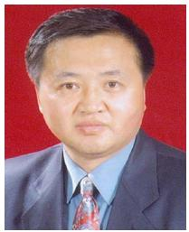

natural_image

Portrait of a man in formal suit and tie against red background (no text or symbols visible)

Yanheng Liu received the MS and PhD degrees in computer science from Jilin University, China, where he is currently a professor. His primary research interests include network security, network management, mobile computing network theory, and applications, etc.

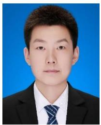

natural_image

Portrait photo of a man in formal attire against a blue background (no text or symbols visible)

Geng Sun (Senior Member, IEEE) received the BS degree in communication engineering from Dalian Polytechnic University, in 2011, and the PhD degree in computer science and technology from Jilin University, in 2018. He was a visiting researcher with the School of Electrical and Computer Engineering, Georgia Institute of Technology, USA. He is a professor with the College of Computer Science and Technology, Jilin University, and his research interests include wireless networks, UAV communications, collaborative beamforming, and optimizations.

natural_image

Portrait of a smiling man wearing glasses and a suit (no text or symbols visible)

Qingqing Wu (Senior Member, IEEE) received the BEng degree in electronic engineering from the South China University of Technology, in 2012, and the PhD degree in electronic engineering from Shanghai Jiao Tong University (SJTU), in 2016. From 2016 to 2020, he was a research fellow with the Department of Electrical and Computer Engineering, National University of Singapore. He is currently an associate professor with Shanghai Jiao Tong University. His current research interests include intelligent reflecting surface (IRS), unmanned aerial vehicle (UAV)

communications, and MIMO transceiver design.

natural_image

Portrait of a man wearing glasses and a gray shirt (no text or symbols visible)

Tierui Gong (Member, IEEE) received the PhD degree from the University of Chinese Academy of Sciences (UCAS), Beijing, China, in 2020. From June 2018 to March 2019, he was a visiting student with the Faculty of Electrical Engineering, Technion—Israel Institute of Technology, Haifa, Israel. From April 2019 to May 2019, he was a visiting student with the Faculty of Mathematics and Computer Science, Weizmann Institute of Science (WIS), Rehovot, Israel. He is currently a research fellow with the School of Electrical and Electronic Engineering, Nanyang

Technological University (NTU), Singapore. His research interests include holographic MIMO communications, massive MIMO communications, cognitive radios, full-duplex communications, and signal processing for communications.

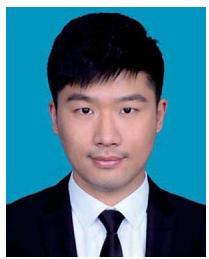

natural_image

Portrait photo of a man in formal attire against a blue background (no text or symbols visible)

Pengfei Wang (Member, IEEE) received the BS, MS, and PhD degrees in software engineering from Northeastern University (NEU), China, in 2013, 2015, and 2020, respectively. From 2016 to 2018, he was a visiting PhD student with the Department of Electrical Engineering and Computer Science, Northwestern University, IL, USA. He is currently an associate professor with the School of Computer Science and Technology, Dalian University of Technology, China. He has authored more than 30 papers on high-quality journals and conferences, such as IEEE INFOCOM,

the IEEE/ACM Transactions on Networking, IEEE ICNP, IEEE ICDCS, DAC, and IEEE Internet of Things Journal, etc. He also holds a series of patents in US and China. His research interests include the area of intelligent computing, Big Data analysis, and AIoT.

natural_image

Portrait of a person wearing glasses and a dark jacket (no visible text or symbols)

Dusit Niyato (Fellow, IEEE) received the BEng degree from the King Mongkuts Institute of Technology Ladkrabang (KMITL), Thailand, in 1999, and the PhD degree in electrical and computer engineering from the University of Manitoba, Canada, in 2008. He is currently a professor with the School of Computer Science and Engineering, Nanyang Technological University, Singapore. His research interests include the Internet of Things (IoT), machine learning, and incentive mechanism design.

natural_image

Portrait of a man wearing glasses and a striped shirt (no text or symbols visible)

Chau Yuen (Fellow, IEEE) received the BEng and PhD degrees from Nanyang Technological University, Singapore, in 2000 and 2004, respectively. He was a post-doctoral fellow with the Lucent Technologies Bell Laboratories, Murray Hill, in 2005. From 2006 to 2010, he was with the Institute for Infocomm Research, Singapore. From 2010 to 2023, he was with the Engineering Product Development Pillar, Singapore University of Technology and Design. Since 2023, he has been with the School of Electrical and Electronic Engineering, Nanyang Technological

University. Currently, he is the Provost’s chair of wireless communications, the assistant dean with the Graduate College, and the cluster director for Sustainable Built Environment at ER@IN.