# Cooperative UAV Enabled Relaying Systems: Joint Trajectory and Transmit Power Optimization

Guangchi Zhang , Xiaoqi Ou, Miao Cui , Qingqing Wu , Member, IEEE, Shaodan Ma , Member, IEEE, and Wei Chen

Abstract—Unmanned aerial vehicles (UAVs) can be used as aerial relays to provide quick and on-demand wireless connections for the area without network coverage. Since a UAV’s onboard energy is limited, how to prolong the duration of UAV relaying communication is challenging. In this paper, we consider applying multiple UAVs to extend the duration of communication via UAV collaboration. We first propose a UAV collaboration scheme, namely heuristic UAV substitution, which lets the UAV relays work one by one individually. Then, we propose another scheme called spectral efficient UAV substitution to improve the spectrum efficiency. Furthermore, under these two proposed schemes, we jointly design the trajectories of the UAV relays and the transmit power of the source and the UAV relays, with the goal of end-to-end throughput maximization. Although the considered optimization problem is non-convex and difficult to solve, we propose an efficient algorithm to find a suboptimal solution to it by applying the block coordinate ascent and successive convex approximation methods. Simulation results show that the proposed UAV substitution schemes can effectively extend the relaying communication duration, and the throughput performance of the proposed joint trajectory optimization and transmit power control algorithm outperforms some benchmark algorithms without considering joint design.

Index Terms—UAV relaying, UAV collaboration, transmit power control, trajectory optimization.

## I. INTRODUCTION

D UE TO the advantages of high mobility, swift deploy-ment, and ease of use, unmanned aerial vehicles (UAVs)

Manuscript received March 6, 2021; revised June 8, 2021; accepted August 20, 2021. Date of publication August 27, 2021; date of current version February 16, 2022. This work was supported in part by the Science and Technology Plan Project of Guangdong Province under Grant 2017B090909006, Grant 2019B010119001, Grant 2020A050515010, and Grant 2021A0505030015; in part by the Special Support Plan for High-Level Talents of Guangdong Province under Grant 2019TQ05X409; in part by the Science and Technology Development Fund of Macau SAR under Grant 0032/2019/AGJ, Grant SKL-IOTSC-2021-2023, Grant 0119/2020/A3, and Grant 0108/2020/A; and in part by the Guangdong NSF under Grant 2021A1515011900. The editor coordinating the review of this article was H. Suraweera. (Corresponding authors: Miao Cui; Qingqing Wu.)

Guangchi Zhang, Xiaoqi Ou, and Miao Cui are with the School of Information Engineering, Guangdong University of Technology, Guangzhou 510006, China (e-mail: gczhang@gdut.edu.cn; 2295585636@qq.com; cuimiao@gdut.edu.cn).

Qingqing Wu and Shaodan Ma are with the State Key Laboratory of Internet of Things for Smart City and the Department of Electrical and Computer Engineering, University of Macau, Macau, China (e-mail: qingqingwu@um.edu.mo; shaodanma@um.edu.mo).

Wei Chen is with the Institute of Environmental Geology Exploration of Guangdong Province, Guangzhou 510080, China (e-mail: 834563830@qq.com).

Digital Object Identifier 10.1109/TGCN.2021.3108147 can be used to improve communication performance and to expand the application range of wireless communication systems [1]–[4]. Generally speaking, there are three typical ways to use UAVs as communication platforms in wireless communications [5]: 1) UAV base station coverage [6]–[11]; 2) UAV relaying [12]–[14]; and 3) UAV data releasing and collection [15]–[17]. This paper focuses on UAV relaying. Compared with fixed relays on the ground, UAV relays have the following advantages. First, on-demand UAV relays can be more quickly and swiftly deployed, which makes them particularly suitable for temporary or emergency events, such as disaster rescue, emergency response, etc. Second, the high mobility of UAV relays offers new opportunities for performance enhancement through the dynamic optimizing of UAV relays’ locations to suit the communication environment. Third, UAV relays can establish a long-distance high-quality wireless connection between distant nodes without wireless network coverage.

A few research works on UAV relaying consider applying one single UAV relay. Parts of these works focus on the static UAV relay scenario [14], [18]–[22], where the UAV relay remains at a fixed location during the whole relaying process. Reference [19] considers an ultra-reliable and lowlatency communication (URLLC)-enabled UAV relay system, and investigates optimizing the transmission blocklength and the placement of the UAV relay to minimize decoding error probability. In [20], amplify-and-forward (AF) UAV relaying is considered for URLLC systems, and the UAV relay’s location and power are jointly optimized to minimize decoding error probability. In [21], a URLLC-enabled UAV system has been considered and its average achievable data rate performance has been investigated. In [22], an energy harvesting UAV relay system is considered, where the UAV relay employs the power splitting (PS) scheme to receive information and harvest energy from the source and uses the time switching (TS) scheme to perform information relaying. The worstcase secrecy rate maximization problem is investigated, which jointly optimizes the location and transmit power of the UAV relay and the PS and TS ratios. On the other hand, other works on UAV relaying focus on the mobile UAV relay scenario [13], [23], [24], where the trajectory of the UAV, as well as the corresponding communication resource, can be optimized to improve communication performance by exploiting the high mobility advantage of a UAV. Reference [13] considers maximizing the communication throughput of a decode-and-forward (DF) UAV relaying system by jointly optimizing the trajectory of the UAV relay and the transmit power of all transmitters. Reference [23] considers minimizing the outage probability of an AF UAV relaying system by optimizing the UAV relay’s trajectory and transmit power. In [24], maximizing the secrecy energy efficiency of a UAV relaying system by jointly optimizing the communication scheduling, power allocation, and UAV trajectory is considered. The above works show that joint trajectory optimization and communication resource allocation can effectively improve the communication performance of mobile UAV relay systems.

Moreover, some research works consider relaying communication with multiple UAV relays [25]–[30]. Through trajectory optimization (or deployment location optimization) and communication resource allocation on multiple UAV relays, the reliability of relaying communication can be improved, since more UAVs can provide more degree of freedom for performance optimization and for resolving the link blockage issue caused by mountains, tall buildings or other obstacles. Thus, multiple UAV-assisted relaying usually has longer relaying distance or larger communication range than single UAV-assisted relaying. In [25], two protocols of using multiple UAV relays, i.e., multi-hop single link and multiple dual-hop links, have been compared, where theoretical communication performance analysis has been conducted for the comparison. In [26], a load-carry-and-deliver paradigm for the multi-UAV relaying network has been proposed and the corresponding throughput maximization problem is investigated. Reference [27] proposes to use multiple UAVs to set up a multi-hop UAV relaying system and investigates maximizing the throughput of the system by joint trajectory optimization and transmit power control. Reference [28] considers allocating appropriate bandwidth to each hop in the multi-hop UAV relaying system to further improve its spectrum efficiency, where the problem of joint bandwidth allocation, transmit power control and trajectory optimization is investigated. Reference [29] considers joint UAV deployment location optimization and power control for energyefficient communication in a multi-UAV network. In [30], a multi-link UAV relaying system is considered, where multiple UAV relays are applied to assist the communications of multiple source-destination pairs, and the UAV trajectories and transmit power are optimized to maximize the system throughput.

In the above works on single UAV relaying, the relaying communication duration is no longer than the flight duration of a UAV. Even in the works on multiple UAV relaying, the relaying communication duration is still no longer than the flight duration of a UAV, since these works assume that all UAVs work together simultaneously. As the flight duration of a UAV is limited due to its limited onboard energy, the communication duration of the systems considered in the aforementioned works is also limited. However, in practice, there are scenarios where the required communication duration of a UAV relay system may be longer than the maximum fly duration of a UAV relay. For example, if the relaying communication from the source to the destination is a long-lasting live data stream transmission or a transmission with an extremely large data amount, the required relaying duration is expected to be longer than the maximum flight duration of a UAV relay. Therefore, how to prolong the communication duration of a UAV relaying system for such scenarios is worthy of investigating. In this paper, we focus on resolving this issue and consider the situation that the required communication duration of a UAV relaying connection is longer than the flight duration of a UAV. In particular, we apply multiple UAV relays to extend the communication duration. Instead of applying all UAVs simultaneously, we propose UAV substitution schemes that let the UAV relays work one after another successively. Furthermore, we investigate joint three-dimension (3D) trajectory optimization and transmit power control design for the proposed UAV substitution schemes to improve their throughput performance. The main contributions of this paper are summarized as follows.

• A UAV substitution scheme called heuristic UAV substitution (HUS) scheme has been proposed to prolong the duration of relaying communication. To improve the throughput performance of the HUS scheme, we jointly design the UAV trajectory optimization and transmit power control to maximize its end-to-end throughput.

• Since the complexity of the full-duplex relaying scheme may be too high and costly to be implemented on a UAV typically with limited payload, we assume that the half-duplex relaying scheme is adopted on each UAV relay. However, the half-duplex constraint on the UAV relays limits the spectrum efficiency of the HUS scheme, since the source can only transmit data in one half of the total relaying communication duration. To overcome the low spectrum efficiency issue caused by the half duplex constraint, a spectral efficient UAV substitution (SEUS) scheme is further proposed. The SEUS scheme allows one UAV relay to transmit data to the destination and another UAV relay to receive data from the source at the same time by applying the successive relaying scheme, so it enables the source to transmit data continuously over almost the whole relaying duration and is expected to achieve higher spectrum efficiency, as compared to the HUS scheme. However, the technical challenge of the SEUS scheme is that during the successive relaying process of two UAV relays, the transmission of one UAV relay may interfere with the reception of the other UAV relay, and the interference may degrade the throughput performance of the SEUS scheme. To tackle such a challenge, we jointly design the trajectories of the UAV relays and the transmit powers of all transmitting nodes to coordinate the UAV relaying link interference and to maximize the end-to-end throughput of the SEUS scheme. The considered design problem is difficult to solve due to its coupling variables and specific non-convex structure. To solve this difficult problem, we propose an algorithm that applies the block coordinate ascent method to divide it into two subproblems, namely the trajectory optimization subproblem and the transmit power control subproblem. However, these two subproblems are still non-convex and difficult to solve. As such, the successive convex approximation (SCA) method and the introducing slack variable method are jointly applied to solve these two subproblems in a new way, as detailed in Section IV.

• Simulation results show that the proposed UAV substitution schemes can effectively extend the relaying communication duration, and with joint trajectory optimization and transmit power control design, the throughput of the UAV relaying system can be greatly improved, thus the reliability of the UAV relaying can be guaranteed. Furthermore, the proposed joint trajectory optimization and transmit power control design algorithm can achieve higher throughput, as compared to some benchmark algorithms without such joint design.

The rest of this paper is organized as follows. Section II introduces the system model and proposes two UAV substitution schemes. Section III and Section IV present the joint trajectory optimization and transmit power control design algorithms for the two proposed schemes, respectively. Section V shows computer simulation results. Section VI concludes this paper.

## II. SYSTEM MODEL

We consider a UAV relaying system, where the source and the destination both locate on the ground and the direct link between them has been blocked. There are M UAVs relays, and their set is denoted by $\mathcal { M } \triangleq \{ 1 , \dots , M \}$ . As the full-duplex relaying technique requires high signal processing capability to cancel self-interference and thus may result in high energy consumption and heavy hardware weight, which may be not affordable for a UAV with limited energy and carrying capability, we assume that all UAV relays are half-duplex. Furthermore, we assume that the relays apply the DF relaying scheme.

We express location in a 3D Cartesian coordinate system, where the coordinates of the source and the destination are $\mathbf { w _ { s } } \triangleq [ x _ { \mathrm { s } } , y _ { \mathrm { s } } , z _ { \mathrm { s } } ] ^ { \mathrm { T } }$ and $\mathbf { w } _ { \mathrm { d } } \triangleq [ x _ { \mathrm { d } } , y _ { \mathrm { d } } , z _ { \mathrm { d } } ] ^ { \mathrm { T } }$ , respectively. The coordinate of $\mathrm { U A V } _ { m }$ at time $t , \ m \ \in \ { \mathcal { M } }$ , is expressed as $\begin{array} { r } { \mathbf { q } _ { m } ( t ) \triangleq [ x _ { m } ( t ) , y _ { m } ( t ) , z _ { m } ( t ) ] ^ { \mathrm { T } } } \end{array}$ . Due to building avoidance and/or government policy regulations, the flying altitude $z _ { m } ( t )$ is subject to the constraint $H _ { \operatorname* { m i n } } \ \leq \ z _ { m } ( t ) \ \leq \ H _ { \operatorname* { m a x } }$ where $H _ { \mathrm { m i n } }$ and $H _ { \mathrm { m a x } }$ are $\mathrm { U A V } _ { m } \mathrm { \ ' } _ { \mathrm { s } }$ minimum and maximum allowed flying altitudes, respectively. To facilitate trajectory optimization for the UAVs, which will be shown in the next section, we discretize their trajectories. In particular, we divide the flight duration of a $\mathrm { U } \mathrm { \bar { A } V , ^ { 1 } }$ denoted by $T _ { \mathrm { f } }$ , into $N _ { \mathrm { f } }$ time slots with equal length, where $T _ { \mathrm { f } } ~ = ~ N _ { \mathrm { f } } d _ { t }$ and $d _ { t }$ denotes the length of a time slot. Here, the value of $d _ { t }$ is determined by ensuring that the distance from the source to a UAV and that from a UAV to the destination can be regarded as unchanged within each time slot and that $N _ { \mathrm { f } }$ is an even number. In this way, the trajectory of $\mathrm { U A V } _ { m }$ can be approximated by a sequence $\{ \mathbf { q } _ { m } [ n ] , \forall n \}$ , where $\mathbf { q } _ { m } [ n ] \ \triangleq \ [ x _ { m } [ n ] , y _ { m } [ n ] , z _ { m } [ n ] ] ^ { T }$ denotes the coordinate of $\mathrm { U A V } _ { m }$ at time slot n. The flying altitude constraint of $\mathrm { U A V } _ { m }$ thus becomes

$$
H _ { \operatorname* { m i n } } \leq z _ { m } [ n ] \leq H _ { \operatorname* { m a x } } , \forall m , n .\tag{1}
$$

1The flight duration $T _ { \mathrm { f } }$ is determined by the energy consumption of a UAV, the mission requirement of a UAV, and other factors.

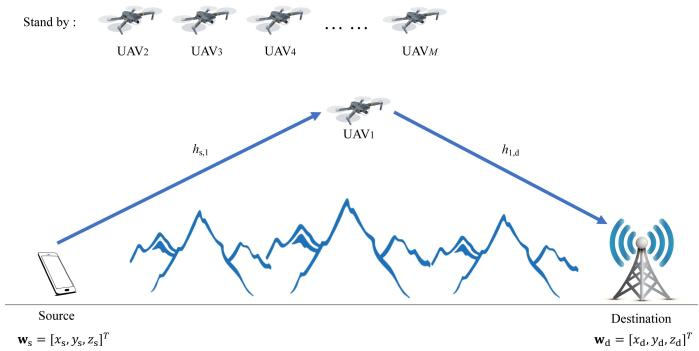  
Fig. 1. A UAV relaying system with the HUS scheme.

<table><tr><td colspan="5">K</td><td colspan="5">MNf slots</td></tr><tr><td colspan="5"></td><td></td><td colspan="3"></td></tr><tr><td></td><td>*</td><td></td><td>1</td><td>I 米</td><td>1</td><td>Nf</td><td></td><td></td></tr><tr><td colspan="2">Nf slots K 2</td><td>Nf slots 2</td><td colspan="2"></td><td>Nf slots</td><td>2</td><td>slots</td><td>Nf</td><td>slots 2</td></tr><tr><td></td><td></td><td></td><td></td><td>f slots 2</td><td>2</td><td></td><td></td><td>2</td><td></td></tr><tr><td>S→UAV1</td><td></td><td>UAV1→D</td><td></td><td>S→UAV2</td><td>UAV2→D</td><td></td><td>S→UAVM</td><td>UAVM→D</td><td></td></tr></table>

Fig. 2. Time slot diagram of the HUS scheme, where S and D denote the source and the destination, respectively.

We consider the scenario that the required communication duration from the source to the destination is longer than the flight duration of one UAV $T _ { \mathrm { f } }$ . One example of the considered scenario can be a long-lasting live data streaming service from the source to the destination. Another example can be the scenario that the data amount needed to transmit from the source to the destination is extremely large. In both examples, the required relaying communication duration is expected to be longer than the flight duration of a UAV. In this scenario, we consider extend the communication duration by UAV substitution, which uses the UAV relays one after another but not all simultaneously. In the next two subsections, we propose two UAV substitution schemes, respectively.

## A. HUS Scheme

As shown in Fig. 1, the HSU scheme lets the UAVs work one by one in the order of their indices successively from 1 to M. When one UAV is working, the other M−1 relays stand by at their bases. Specifically, $\mathrm { U A V _ { 1 } }$ starts to work first. As each UAV adopts the half-duplex relaying scheme, during $\mathrm { U A V _ { 1 } } ^ { \prime } \mathrm { s }$ working period, the source sends data to it from slot 1 to slot $\mathrm { { \frac { { N _ { f } } } { 2 } } } ^ { \mathbf { { \mathsf { \^ { \prime } } } } }$ , and it forwards the received data to the destination from slot $\begin{array} { r } { \frac { N _ { \mathrm { f } } } { 2 } + 1 } \end{array}$ to slot $N _ { \mathrm { f } }$ . Next, at time slot $N _ { \mathrm { f } } + 1 , \mathrm { U A V _ { 2 } }$ substitutes $\mathrm { U A V _ { 1 } }$ and starts to work. During $\mathrm { U A V _ { 2 } ^ { \ } s }$ working period, the source sends data to it in its first $\frac { N _ { \mathrm { f } } } { 2 }$ time slots, and it forwards its received data to the destination in the other $\frac { N _ { \mathrm { f } } } { 2 }$ time slots. The UAV substitution goes on until $\mathrm { U A V } _ { M }$ substitutes $\mathrm { U A V } _ { M - 1 }$ , and $\mathrm { U A V } _ { M }$ completes its relaying work at time slot $M N _ { \mathrm { f } }$ . The time slot diagram of the HUS scheme is shown in Fig. 2. Note that the HUS scheme can be extended to a rotation version. Specifically, each UAV returns to its base and replenishes its energy after work. Thus, after $\mathrm { U A V } _ { M }$ finishes its work, the HUS scheme can start all over again by letting the re-energized $\mathrm { U A V _ { 1 } }$ substitute $\mathrm { U A V } _ { M }$ , the reenergized $\mathrm { U A V _ { 2 } }$ substitute $\mathrm { U A V _ { 1 } }$ , and so on.

In Fig. 2, we can observe that the communication duration with the HUS scheme is $M T _ { \mathrm { f } }$ , i.e., $M N _ { \mathrm { f } }$ time slots, and the working period of $\mathrm { U A V } _ { m } , ~ m ~ \in ~ \mathcal { M }$ , is from time slot $( m - 1 ) N _ { \mathrm { f } } + 1$ to time slot $m N _ { \mathrm { f } }$ . We assume that the initial and final points of $\mathrm { U A V } _ { m } \mathrm { \ ' } _ { \mathrm { s } }$ trajectory are at ${ \bf q } _ { 0 , m }$ and ${ \bf q } _ { \mathrm { f } , m } ,$ respectively, and the UAVs’ maximum speed is $v _ { \mathrm { m a x } } .$ . Thus, in the HUS scheme, the UAVs need to satisfy the following mobility constraints.

$$
\mathbf { q } _ { m } [ ( m - 1 ) N _ { \mathrm { f } } + 1 ] = \mathbf { q } _ { 0 , m } , \ \forall m \in \mathcal { M } ,\tag{2a}
$$

$$
\mathbf { q } _ { m } [ m N _ { \mathrm { f } } ] = \mathbf { q } _ { \mathrm { f } , m } , \ \forall m \in \mathcal { M } ,\tag{2b}
$$

$$
\| \mathbf { q } _ { m } [ ( m - 1 ) N _ { \mathrm { f } } + n + 1 ] - \mathbf { q } _ { m } [ ( m - 1 ) N _ { \mathrm { f } } + n ] \| \leq V ,
$$

$$
\forall m \in \mathcal { M } , \ n = 1 , \dots , N _ { \mathrm { f } } - 1 ,\tag{2c}
$$

where $V = v _ { \operatorname* { m a x } } d _ { t }$ . Since the source does not transmit from time slot $( m - \textstyle { \frac { 1 } { 2 } } ) N _ { \mathrm { f } } + 1$ to time slot $m N _ { \mathrm { f } } , \forall m .$ , and the UAV relays do not transmit in the other time slots, the transmit powers of the source and $\mathrm { U A V } _ { m }$ at time slot $n ,$ denoted by $P _ { \mathrm { s } } [ n ]$ and $P _ { m } [ n ]$ , respectively, should satisfy the following constraints.

$$
P _ { \mathrm { s } } [ n ] = 0 , n \in \left\{ \left( m - \frac { 1 } { 2 } \right) N _ { \mathrm { f } } + 1 , \ldots , m N _ { \mathrm { f } } \right\} , \forall m ,\tag{3a}
$$

$$
P _ { m } [ n ] = 0 , \ n \not \in \left\{ \left( m - \frac { 1 } { 2 } \right) N _ { \mathrm { f } } + 1 , \ldots , m N _ { \mathrm { f } } \right\} , \ \forall m .\tag{3b}
$$

Besides, $P _ { \mathrm { s } } [ n ]$ and $P _ { m } [ n ]$ should also satisfy the average and maximum value constraints given in (4) and (5), respectively.

$$
\frac { 2 } { N _ { \mathrm { f } } } \sum _ { n = ( m - 1 ) N _ { \mathrm { f } } + 1 } ^ { \left( m - \frac { 1 } { 2 } \right) N _ { \mathrm { f } } } P _ { \mathrm { s } } [ n ] \leq \bar { P } _ { \mathrm { s } } , \forall m ,\tag{4a}
$$

$$
\frac { 2 } { N _ { \mathrm { f } } } \sum _ { n = ( m - \frac { 1 } { 2 } ) N _ { \mathrm { f } } + 1 } ^ { m N _ { \mathrm { f } } } P _ { m } [ n ] \leq \bar { P } _ { m } , \forall m ,\tag{4b}
$$

and

$$
0 \leq P _ { \mathrm { s } } [ n ] \leq P _ { \mathrm { s , m a x } } , \forall n ,\tag{5a}
$$

$$
0 \leq P _ { m } [ n ] \leq P _ { m , \operatorname* { m a x } } , \forall n , m ,\tag{5b}
$$

where $\bar { P } _ { \mathrm { s } }$ and $\hat { P } _ { m }$ denote the average transmit power of the source and $\mathrm { U A V } _ { m } .$ , respectively, and $P _ { \mathrm { s , m a x } }$ and $P _ { m , \mathrm { m a x } }$ denote the maximum transmit powers of the source and $\mathrm { U A V } _ { m }$ , respectively. To make (4) non-trivial, we assume $\bar { P } _ { \mathrm { s } } \leq P _ { \mathrm { s , m a x } }$ and $\bar { P } _ { m } \leq P _ { m , \operatorname* { m a x } }$

According to the measurement results in [31], we adopt the line-of-sight (LoS) model to approximate the ground-toair and air-to-ground channels for its analytical tractability.2 Specifically, the channel power gain from the source to $\mathrm { U A V } _ { m }$ and that from $\mathrm { U A V } _ { m }$ to the destination at time slot n can be respectively expressed as

$$
h _ { \mathrm { s } , m } [ n ] = \beta _ { 0 } d _ { \mathrm { s } , m } ^ { - 2 } [ n ] = \frac { \beta _ { 0 } } { \left\| \mathbf { q } _ { m } [ n ] - \mathbf { w } _ { \mathrm { s } } \right\| ^ { 2 } } ,\tag{6}
$$

$$
h _ { m , \mathrm { d } } [ n ] = \beta _ { 0 } d _ { m , \mathrm { d } } ^ { - 2 } [ n ] = \frac { \beta _ { 0 } } { \lvert \lvert \mathbf { w } _ { \mathrm { d } } - \mathbf { q } _ { m } [ n ] \rvert \rvert ^ { 2 } } ,\tag{7}
$$

where $\beta _ { 0 }$ denotes power gain of a wireless channel at the reference distance $d _ { 0 } = 1$ meter (m), and $d _ { \mathrm { s } , m } [ n ]$ and $d _ { m , \mathrm { d } } [ n ]$ denote the distance from the source to $\mathrm { U A V } _ { m }$ and that from $\mathrm { U A V } _ { m }$ to the destination at time slot n. The achievable data rates from the source to $\mathrm { U A V } _ { m }$ and from $\mathrm { U A V } _ { m }$ to the destination in bits/second/Hertz (bps/Hz) at time slot n can be respectively expressed as

$$
R _ { \mathrm { s } , m } ^ { \mathrm { H U S } } [ n ] = \log _ { 2 } \bigg ( 1 + \frac { P _ { \mathrm { s } } [ n ] h _ { \mathrm { s } , m } [ n ] } { \sigma ^ { 2 } } \bigg )
$$

$$
= \log _ { 2 } \left( 1 + \frac { P _ { \mathrm { s } } [ n ] \gamma _ { 0 } } { \| \mathbf { q } _ { m } [ n ] - \mathbf { w } _ { s } \| ^ { 2 } } \right) ,\tag{8}
$$

and

$$
\begin{array} { r } { R _ { m , \mathrm { d } } ^ { \mathrm { H U S } } [ n ] = \log _ { 2 } \biggr ( 1 + \frac { P _ { m } [ n ] h _ { m , \mathrm { d } } [ n ] } { \sigma ^ { 2 } } \biggr ) } \\ { = \log _ { 2 } \biggr ( 1 + \frac { P _ { m } [ n ] \gamma _ { 0 } } { \| \mathbf { w } _ { \mathrm { d } } - \mathbf { q } _ { m } [ n ] \| ^ { 2 } } \biggr ) , } \end{array}\tag{9}
$$

where $\sigma ^ { 2 }$ is the power of the additive white Gaussian noise (AWGN) at the receiver and $\begin{array} { r } { \gamma _ { 0 } = \frac { \beta _ { 0 } } { \sigma ^ { 2 } } } \end{array}$

With the half-duplex DF relaying scheme, the average throughput from the source to the destination via $\mathrm { U A V } _ { m }$ equals to the minimum of the average data rate from the source to $\mathrm { U A V } _ { m }$ and that from $\mathrm { U A V } _ { m }$ to the destination, which can be expressed as

$$
R _ { \mathrm { s } , m , \mathrm { d } } ^ { \mathrm { H U S } } = \frac { 1 } { N _ { \mathrm { f } } } \operatorname* { m i n } _ { \mathrm { \Omega } } \begin{array} { c } { \left( \begin{array} { c } { \left( m - \frac { 1 } { 2 } \right) N _ { \mathrm { f } } } \\ { \displaystyle \sum } \\ { n = ( m - 1 ) N _ { \mathrm { f } } + 1 } \end{array} \right. R _ { \mathrm { s } , m } ^ { \mathrm { H U S } } [ n ] , } \end{array}
$$

$$
\sum _ { n = ( m - \frac { 1 } { 2 } ) N _ { \mathrm { f } } + 1 } ^ { m N _ { \mathrm { f } } } R _ { m , \mathrm { d } } ^ { \mathrm { H U S } } [ n ] \Bigg ) .\tag{10}
$$

Thus, the average end-to-end throughput via all UAV relays with the HUS scheme can be expressed as

$$
R ^ { \mathrm { H U S } } = \frac { 1 } { M } \sum _ { m = 1 } ^ { M } R _ { \mathrm { s } , m , \mathrm { d } } ^ { \mathrm { H U S } } .\tag{11}
$$

As shown in Fig. 2, the HUS scheme does not efficiently use the spectrum due to the half-duplex constraint on the relays, since the source only transmits data in one half of the total communication duration and remains silent in the other half. To overcome this drawback and further improve the spectrum efficiency, we then propose the following SEUS scheme.

## B. SEUS Scheme

The SEUS scheme lets the UAV relays work in their index order and allows the working periods of two UAV relays to overlap, as shown in Figs. 3 and 4. In particular, from time slot $\frac { ( \dot { m } - 1 ) N _ { \mathrm { f } } } { 2 } + 1$ to time slot $\frac { m N _ { \mathrm { f } } } { 2 }$ , ∀m, the source sends data to $\mathrm { U A V } _ { m }$ . From time slot $\frac { m N _ { \mathrm { f } } } { 2 } + 1$ to time slot $\frac { ( m + 1 ) N _ { \mathrm { f } } } { \mathrm { 2 } }$ $\mathrm { U A V } _ { m }$ forwards its received data to the destination and the source sends data to $\mathrm { U A V } _ { m + 1 }$ at the same time. As shown in Fig. 4, since the SEUS scheme lets the source transmit data all the time except the last $\frac { N _ { \mathrm { f } } } { 2 }$ time slots, the portion of the source transmission over the whole communication duration in the SEUS scheme is longer than that in the HUS scheme.

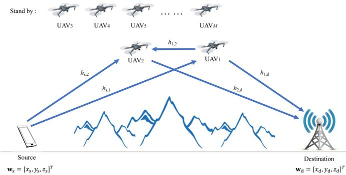

Fig. 3. A UAV relaying system with the SEUS scheme.  
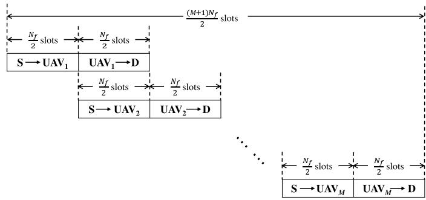  
Fig. 4. Time slot diagram of the SEUS scheme, where S and D denote the source and the destination, respectively.

From Fig. 4, we can observe that the communication duration with the SEUS scheme is $\begin{array} { r } { { \frac { \left( M + 1 \right) T _ { \mathrm { f } } } { 2 } } , \mathrm { i . e . , } { \frac { \left( M + 1 \right) N _ { \mathrm { f } } } { 2 } } } \end{array}$ time slots. Since the source does not transmit data from time slot $\small \frac { M \bar { N } _ { \mathrm { f } } } { 2 } + 1$ to time slot $\underbrace { \overline { { ( M + 1 ) } } \dot { N _ { \mathrm { f } } } } _ { \mathrm { ~ \textc ~ { ~ } ~ } }$ and $\mathrm { U A V } _ { m }$ only transmits data from time slot $\frac { ( m - 1 ) \bar { N _ { \mathrm { f } } } } { 2 } + 1$ to time slot $\frac { m N _ { \mathrm { f } } } { 2 }$ , the following transmit power constraints of the source and the UAV relays should be satisfied.

$$
\begin{array} { l } { { P _ { \mathrm { s } } [ n ] = 0 , \forall n \in \displaystyle \left\{ \frac { M N _ { \mathrm { f } } } { 2 } + 1 , \dots , \frac { ( M + 1 ) N _ { \mathrm { f } } } { 2 } \right\} , \quad { \mathrm { ( } } 1 } } \\ { { P _ { m } [ n ] = 0 , \forall n \not \in \displaystyle \left\{ \frac { m N _ { \mathrm { f } } } { 2 } + 1 , \dots , \frac { ( m + 1 ) N _ { \mathrm { f } } } { 2 } \right\} , \forall m . } } \end{array}\tag{2a}
$$

(12b)

Besides, the source and the UAV relays have the following average and maximum transmit power constraints:

$$
\begin{array} { r l } & { \frac { 2 } { M N _ { \mathrm { f } } } \displaystyle \sum _ { n = 1 } ^ { \frac { M N _ { \mathrm { f } } } { 2 } } P _ { \mathrm { s } } [ n ] \leq \bar { P } _ { \mathrm { s } } , } \\ & { \frac { 2 } { N _ { \mathrm { f } } } \displaystyle \sum _ { n = \frac { m N _ { \mathrm { f } } } { 2 } + 1 } ^ { \frac { ( m + 1 ) N _ { \mathrm { f } } } { 2 } } P _ { m } [ n ] \leq \bar { P } _ { m } , \ \forall m , } \end{array}\tag{13a}
$$

(13b)

and

$$
0 \leq P _ { \mathrm { s } } [ n ] \leq P _ { \mathrm { s , m a x } } , \forall n ,\tag{14a}
$$

$$
0 \leq P _ { m } [ n ] \leq P _ { m , \operatorname* { m a x } } , \forall n , m .\tag{14b}
$$

The mobility constraints of the UAVs in the SEUS scheme are given below, where the difference from (2) is in the indices

of time slots.

$$
\ P m \left[ \frac { ( m - 1 ) N _ { \mathrm { f } } } { 2 } + 1 \right] = \ P 0 , m , \forall m \in \mathcal { M } ,\tag{15a}
$$

$$
\mathbf { q } _ { m } \bigg [ \frac { ( m + 1 ) N _ { \mathrm { f } } } { 2 } \bigg ] = \mathbf { q } _ { \mathrm { f } , m } , \ \forall m \in \mathcal { M } ,\tag{15b}
$$

$$
\begin{array} { r l r } {  { \| { \mathbf { q } } _ { m } \bigg [ \frac { ( m - 1 ) N _ { \mathrm { f } } } { 2 } + n + 1 \bigg ] - { \mathbf { q } } _ { m } \bigg [ \frac { ( m - 1 ) N _ { \mathrm { f } } } { 2 } + n \bigg ] \| \le V , } } \\ & { } & { \forall m \in \mathcal { M } , 4 n = 1 , \ldots , N _ { \mathrm { f } } - 1 , \qquad ( 1 5 \mathrm { c } ) } \end{array}
$$

In addition, there is an anti-collision constraint on $\mathrm { U A V } _ { m }$ and $\mathrm { U A V } _ { m - 1 }$ during their overlapped working period, which is given below.

$$
\begin{array} { l } { \displaystyle \| \mathbf { q } _ { m } [ n ] - \mathbf { q } _ { m - 1 } [ n ] \| \geq d _ { \operatorname* { m i n } } , \ m = 2 , \dots , M , } \\ { \displaystyle n = \frac { ( m - 1 ) N _ { \mathrm { f } } } { 2 } + 1 , \dots , \frac { m N _ { \mathrm { f } } } { 2 } , } \end{array}\tag{16}
$$

where $d _ { \mathrm { m i n } }$ is the minimum safe distance between two UAVs. Since the channel between two UAVs is usually dominated by a LoS link, we use the free space propagation model to approximate it. Thus, the channel power gain between $\mathrm { U A V } _ { m - 1 }$ and $\mathrm { U A V } _ { m }$ at time slot $n , m = 2 , \ldots , M .$ can be written as

$$
h _ { m - 1 , m } [ n ] = \frac { \beta _ { 0 } } { \left\| \mathbf { q } _ { m } [ n ] - \mathbf { q } _ { m - 1 } [ n ] \right\| ^ { 2 } } ,\tag{17}
$$

Since the data transmission from the source to $\mathrm { U A V } _ { m }$ is interfered by the transmission of $\mathrm { U A V } _ { m - 1 }$ , the achievable rate from the source to $\mathrm { U A V } _ { m }$ at time slot n can be written as

$$
\begin{array} { c } { { R _ { \mathrm { s } , m } ^ { \mathrm { S E U S } } [ n ] = \log _ { 2 } \left( 1 + \frac { P _ { \mathrm { s } } [ n ] h _ { \mathrm { s } , m } [ n ] } { P _ { m - 1 } [ n ] h _ { m - 1 , m } [ n ] + \sigma ^ { 2 } } \right) } } \\ { { = \log _ { 2 } \left( 1 + \frac { P _ { \mathrm { s } } [ n ] \gamma _ { 0 } } { \frac { \left\| \mathbf { q } _ { m } [ n ] - \mathbf { w } _ { \mathrm { s } } [ n ] \right\| ^ { 2 } } { \left\| \mathbf { q } _ { m } [ n ] - \mathbf { q } _ { m - 1 } [ n ] \right\| ^ { 2 } } + 1 } \right) , } } \\ { { m = 2 , \ldots , M . } } \end{array}\tag{18}
$$

Note that since the data transmission from the source to $\mathrm { U A V _ { 1 } }$ is interference free, the data rate $R _ { \mathrm { s } , 1 } ^ { \mathrm { S E U S } } [ n ]$ is equal to $R _ { \mathrm { s } , 1 } ^ { \mathrm { H U S } } [ n ]$ given in (8). Furthermore, since the data transmission from the UAV relays to the destination are also interference free, the achievable data rate from $\mathrm { U A V } _ { m }$ to the destination at time slot n, denoted by $R _ { m , \mathrm { d } } ^ { \mathrm { S E U S } } [ n ]$ , is equal to $R _ { m . \mathrm { d } } ^ { \mathrm { H U S } } [ n ]$ given in (9).

With the half-duplex DF relaying, the average throughput from the source to the destination via $\mathrm { U A V } _ { m }$ equals to the minimum of the average data rate from the source to $\mathrm { U A V } _ { m }$ and that from $\mathrm { U A V } _ { m }$ to the destination and can be written as

$$
R _ { \mathrm { s } , m , \mathrm { d } } ^ { \mathrm { S E U S } } = \frac { 1 } { N _ { \mathrm { f } } } \operatorname* { m i n } _ { \mathrm { m i n } } \begin{array} { c } { \displaystyle \left( \sum _ { n = \frac { ( m - 1 ) N _ { \mathrm { f } } } { 2 } + 1 } ^ { \frac { m N _ { \mathrm { f } } } { 2 } } R _ { \mathrm { s } , m } ^ { \mathrm { S E U S } } [ n ] , \right. } \end{array}
$$

$$
\begin{array} { r l } & { \frac { ( m + 1 ) N _ { \mathrm { f } } } { 2 } } \\ & { \quad \displaystyle \sum _ { n = \frac { m N _ { \mathrm { f } } } { 2 } + 1 } ^ { \frac { ( m + 1 ) N _ { \mathrm { f } } } { 2 } } R _ { m , \mathrm { d } } ^ { \mathrm { S E U S } } [ n ] \Bigg ) , \forall m . } \end{array}\tag{19}
$$

Thus, the average end-to-end throughput via all UAV relays with the SEUS scheme can be expressed as

$$
R ^ { \mathrm { S E U S } } = \frac { 1 } { M } \sum _ { m = 1 } ^ { M } R _ { \mathrm { s } , m , \mathrm { d } } ^ { \mathrm { S E U S } } .\tag{20}
$$

It can be observed from (11) and (20) that the trajectories of the UAV relays and the transmit power of the source and the relays have a great impact on the values of the end-toend throughputs of the HUS and SEUE schemes. In the next two sections, we design the UAV trajectories and the transmit powers of the source and the UAV relays to improve the throughput performance of the two schemes, respectively.

## III. JOINT TRAJECTORY OPTIMIZATION AND TRANSMIT POWER CONTROL DESIGN FOR THE HUS SCHEME

To improve the throughput of the HUS scheme, we consider jointly optimizing the 3D trajectories of the UAVs $\{ \mathbf { q } _ { m } \} \triangleq \{ \mathbf { q } _ { m } [ n ] , \forall n \}$ , the transmit power of the source $\mathbf { P } _ { s } \triangleq \{ P _ { \mathrm { s } } [ n ] , \forall n \}$ , and the transmit powers of all UAVs $\{ \mathbf { P } _ { m } \} \triangleq \{ P _ { m } [ n ] , \forall n \}$ . Our goal is to maximize the average end-to-end throughput $R ^ { \mathrm { H U S } }$ in (11) subject to the mobility constraints of the UAVs given in (1)–(2) and the constraints of transmit power given in (3)–(5). The problem can be formulated as

$$
\operatorname* { m a x } _ { \{ \eta _ { m } \} , \mathbf { P } _ { \mathrm { s } } , \{ \mathbf { P } _ { m } \} , \{ \mathbf { q } _ { m } \} } ~ { \frac { 1 } { M } } \sum _ { m = 1 } ^ { M } \eta _ { m }\tag{21a}
$$

$$
\mathrm { s . t . } \qquad \eta _ { m } \leq \frac { 1 } { N _ { \mathrm { f } } } \sum _ { n = ( m - 1 ) N _ { \mathrm { f } } + 1 } ^ { \left( m - \frac { 1 } { 2 } \right) N _ { \mathrm { f } } } R _ { \mathrm { s } , m } ^ { \mathrm { H U S } } [ n ] ,\tag{∀m}
$$

(21b)

$$
\eta _ { m } \leq \frac { 1 } { N _ { \mathrm { f } } } \sum _ { n = \left( m - \frac { 1 } { 2 } \right) N _ { \mathrm { f } } + 1 } ^ { m N _ { \mathrm { f } } } R _ { m , \mathrm { d } } ^ { \mathrm { H U S } } [ n ] ,\tag{∀m}
$$

$$
( 1 ) - ( 5 ) .\tag{21c}
$$

The only constraint that may cause the feasibility issue of problem (21) is the mobility constraint (2), thus problem (21) is feasible as long as for all $m \in \mathcal { M } , \mathrm { U A V } _ { m }$ can fly from its initial point ${ \bf q } _ { 0 } , m$ to its final point ${ \bf q } _ { \mathrm { f } , m }$ at its maximum speed in a straight line within its flight duration $T _ { \mathrm { f } } ,$ , since under this condition there always exists a feasible solution that satisfies (2). Problem (21) can be solved by dividing it into M independent subproblems and then solving them in parallel, where the mth independent subproblem optimizes $\mathrm { U A V } _ { m } \mathrm { \ ' } _ { \mathrm { s } }$ trajectory and transmit power, as well as the source’s transmit power during the work period of $\mathrm { U A V } _ { m } ,$ i.e., ${ \bf q } _ { m } , { \bf P } _ { m }$ , and $\{ P _ { \mathrm { s } } [ n ] \}$ for $n \in \{ ( m { - } 1 ) N _ { \mathrm { f } } { + } 1 , \ldots , m N _ { \mathrm { f } } \}$ and $m \in \mathcal { M }$ . Since each subproblem can be solved by the method proposed for a single UAV relaying system in [13], the procedure of solving it is omitted here for brevity.

## IV. JOINT TRAJECTORY OPTIMIZATION AND TRANSMIT POWER CONTROL DESIGN FOR THE SEUS SCHEME

To suppress the interference from $\mathrm { U A V } _ { m - 1 }$ to $\mathrm { U A V } _ { m }$ and to maximize the average end-to-end throughput of the SEUS scheme in (20), we consider jointly optimizing the 3D trajectories of the UAVs $\left\{ \mathbf { q } _ { m } \right\}$ , the transmit power of the source $\mathbf { P } _ { s } ,$ and the transmit power of all UAVs $\left\{ \mathbf { P } _ { m } \right\}$ . The optimization is subject to the UAVs’ mobility and anti-collision constraints given in (1), (15), and (16), and the transmit power constraints given in (12)–(14). The considered problem can be formulated as

$$
\operatorname* { m a x } _ { \{ \mu _ { m } \} , \mathbf { P } _ { \mathrm { s } } , \{ \mathbf { P } _ { m } \} , \{ \mathbf { q } _ { m } \} } { \frac { 1 } { M } \sum _ { m = 1 } ^ { M } \mu _ { m } }\tag{22a}
$$

$$
\mathrm { s . t . } \mu _ { m } \leq \frac { 1 } { N _ { \mathrm { f } } } \sum _ { n = \frac { ( m - 1 ) N _ { \mathrm { f } } } { 2 } + 1 } ^ { \frac { m N _ { \mathrm { f } } } { 2 } } R _ { \mathrm { s } , m } ^ { \mathrm { S E U S } } [ n ] , \forall m\tag{22b}
$$

$$
\begin{array} { r l } & { \mu _ { m } \leq \displaystyle \frac { 1 } { N _ { \mathrm { f } } } \sum _ { n = \frac { m N _ { \mathrm { f } } } { 2 } + 1 } ^ { \frac { ( m + 1 ) N _ { \mathrm { f } } } { 2 } } R _ { m , \mathrm { d } } ^ { \mathrm { S E U S } } [ n ] , \ \forall m } \\ & { ( 1 ) , ( 1 2 ) { - } ( 1 6 ) . } \end{array}\tag{22c}
$$

Since the left-hand side (LHS) of (16) is not concave (but convex) with respect to $\left\{ \mathbf { q } _ { m } \right\}$ , the right-hand sides (RHSs) of (22b) and $( 2 2 \mathrm { c } )$ are non-convex with respect to $\left\{ \mathbf { q } _ { m } \right\}$ , and the term $R _ { \mathrm { s } , m } ^ { \mathrm { S E U S } } [ n ]$ , m = 2, . . . , M in (22b) is not jointly concave with respect to ${ \bf P } _ { \mathrm { s } }$ and $\{ \mathbf { P } _ { m } \}$ , problem (22) is a nonconvex optimization problem. Furthermore, the optimization variables couple in constraints (22b) and (22c). Therefore, the optimal solution to problem (22) is difficult to obtain. Nevertheless, we propose an efficient algorithm to obtain its suboptimal solution.

First, to decouple the optimization variables of problem (22), the proposed algorithm divides the optimization variables into two blocks, where one block includes the UAV trajectory variables $\left\{ \mathbf { q } _ { m } \right\}$ and the other block includes the transmit power variables ${ \bf P } _ { \mathrm { s } }$ and $\left\{ \mathbf { P } _ { m } \right\}$ . Then, problem (22) can be solved by the block coordinate ascent method [32], which divides problem (22) into two subproblems and solves them alternately until its objective value converges. The first subproblem optimizes the transmit power of the source and the UAVs, i.e., ${ \bf P } _ { \mathrm { s } }$ and $\{ \mathbf { P } _ { m } \}$ , under given UAV trajectories $\left\{ \mathbf { q } _ { m } \right\}$ , and the other subproblem optimizes the UAV trajectories $\left\{ \mathbf { q } _ { m } \right\}$ under given transmit power ${ \bf P } _ { \mathrm { s } }$ and $\{ \mathbf { P } _ { m } \}$ . The procedures for solving the two subproblems will be presented in the next two subsections. After that, the overall algorithm will be summarized.

## A. Transmit Power Control Under Given UAV Trajectories

Under given UAV trajectories $\left\{ \mathbf { q } _ { m } \right\}$ , the first subproblem optimizes the transmit power of the source and the UAVs, and it can be formulated as

$$
\operatorname* { m a x } _ { \{ \mu _ { m } \} , \mathbf { P } _ { s } , \{ \mathbf { P } _ { m } \} } { \frac { 1 } { M } } \sum _ { m = 1 } ^ { M } \mu _ { m }\tag{23a}
$$

$$
\mathrm { s . t . } \mu _ { 1 } \leq \frac { 1 } { N _ { \mathrm { f } } } \sum _ { n = 1 } ^ { \frac { N _ { \mathrm { f } } } { 2 } } \log _ { 2 } \biggl ( 1 + \frac { P _ { \mathrm { s } } [ n ] h _ { \mathrm { s } , 1 } [ n ] } { \sigma ^ { 2 } } \biggr )\tag{23b}
$$

$$
\begin{array} { r l r } {  { \mu _ { m } \leq \frac { 1 } { N _ { \mathrm { f } } } \sum _ { \substack { n = \frac { ( m - 1 ) N _ { \mathrm { f } } } { 2 } + 1 } } ^ { \frac { m N _ { \mathrm { f } } } { 2 } } \log _ { 2 } } } \\ & { } & { \times ( 1 + \frac { P _ { \mathrm { s } } [ n ] h _ { \mathrm { s } , m } [ n ] } { P _ { m - 1 } [ n ] h _ { m - 1 , m } [ n ] + \sigma ^ { 2 } } ) , \ ~ ( 2 3 4 ) } \\ & { } & { m = 2 , . . . , M } \\ & { } & { \mu _ { m } \leq \frac { 1 } { N _ { \mathrm { f } } } \sum _ { \substack { n = \frac { m N _ { \mathrm { f } } } { 2 } + 1 } } ^ { \frac { ( m + 1 ) N _ { \mathrm { f } } } { 2 } } \log _ { 2 } ( 1 + \frac { P _ { m } [ n ] h _ { m , \mathrm { d } } [ n ] } { \sigma ^ { 2 } } ) , \ \forall m } \\ & { } & { ( 1 2 ) - ( 1 4 ) . } \end{array}
$$

Since the RHS of (23c) is non-concave with respect to ${ \bf P } _ { s }$ and $\{ \mathbf { P } _ { m } \}$ , the optimal solution to problem (23) is difficult to obtain. We tackle such a difficulty as follows.

First, we write the logarithmic term in the RHS of (23c) into the following form:

$$
\begin{array} { r l r } {  { \log _ { 2 } \biggl ( 1 + \frac { P _ { \mathrm { s } } [ n ] h _ { \mathrm { s } , m } [ n ] } { P _ { m - 1 } [ n ] h _ { m , m - 1 } [ n ] + \sigma ^ { 2 } } \biggr ) } } \\ & { = \log _ { 2 } \biggl ( P _ { \mathrm { s } } [ n ] h _ { \mathrm { s } , m } [ n ] + P _ { m - 1 } [ n ] h _ { m , m - 1 } [ n ] + \sigma ^ { 2 } \biggr ) } \\ & { - \ \hat { R } _ { m , m - 1 } ^ { \mathrm { S E U S } } [ n ] , } & { ( \mathcal { D } _ { m } ^ { \mathrm { d r } } , } \end{array}\tag{24}
$$

where

$$
\hat { R } _ { m , m - 1 } ^ { \mathrm { S E U S } } [ n ] \triangleq \log _ { 2 } \Bigl ( P _ { m - 1 } [ n ] h _ { m , m - 1 } [ n ] + \sigma ^ { 2 } \Bigr ) .\tag{25}
$$

Note that $\hat { R } _ { m , m - 1 } ^ { \mathrm { S E U S } } [ n ]$ is concave with respect to $P _ { m - 1 } [ n ]$

Then, we apply the SCA method to obtain a suboptimal solution to problem (23), which is executed in an iterative manner. The SCA method constructs and solves an approximate problem of problem (23) in each iteration, and it stops when the objective value of the approximate problem converges. Without loss of generality, we denote $\{ \mathbf { { \hat { P } } } _ { m } ^ { l } \} \triangleq$ $\{ P _ { m } ^ { l } [ n ] , \forall n , m \}$ as the obtained transmit power solution of the UAVs in the lth iteration, $l > 0 ,$ , and we present how to construct and solve an approximate problem in the (l+1)th iteration.

Since $\hat { R } _ { m , m - 1 } ^ { \mathrm { S E U S } } [ n ]$ is concave with respect to $P _ { m - 1 } [ n ]$ and the first-order Taylor expansion of a concave function is its global over-estimator, we can find an upper bound of $\hat { R } _ { m , m - 1 } ^ { \mathrm { S E U S } } [ n ]$ , which is denoted by $\hat { R } _ { m , m - 1 } ^ { \mathrm { u b , S E U S } } [ n ]$ and can be written as

$$
\begin{array} { r l } & { \hat { R } _ { m , m - 1 } ^ { \mathrm { S E U S } } [ n ] \leq \log _ { 2 } \Bigl ( P _ { m - 1 } ^ { l } [ n ] h _ { m , m - 1 } [ n ] + \sigma ^ { 2 } \Bigr ) } \\ & { \phantom { h } + A _ { m , m - 1 } ^ { l } [ n ] \Bigl ( P _ { m - 1 } [ n ] - P _ { m - 1 } ^ { l } [ n ] \Bigr ) } \\ & { \phantom { h } \triangleq \hat { R } _ { m , m - 1 } ^ { \mathrm { u b } , \mathrm { S E U S } } [ n ] , } \end{array}\tag{26}
$$

where

$$
A _ { m , m - 1 } ^ { l } [ n ] = \frac { \log _ { 2 } ( e ) h _ { m , m - 1 } [ n ] + 1 } { P _ { m - 1 } ^ { l } [ n ] h _ { m , m - 1 } [ n ] + \sigma ^ { 2 } } .\tag{27}
$$

By substituting (26) into (24) and (23c), an approximate problem of problem (23) can be constructed as

$$
\operatorname* { m a x } _ { \{ \mu _ { m } \} , \mathbf { P } _ { \mathrm { s } } , \{ \mathbf { P } _ { m } \} } ~ { \frac { 1 } { M } } \sum _ { m = 1 } ^ { M } \mu _ { m }\tag{28a}
$$

$$
\begin{array} { r l r } {  { \mu _ { m } \leq \frac { 1 } { N _ { \mathrm { f } } } \frac { \frac { m N _ { \mathrm { f } } } { 2 } } { n } } } \\ & { } & \\ & { } & { \times \ \Bigl [ - \hat { h } _ { m , m - 1 } ^ { \mathrm { u b , S E B , \dagger } } [ n ] } \\ & { } & { \quad + \ \log _ { 2 } \Bigl ( P _ { \mathrm { s } } [ n ] h _ { \mathrm { s } , m } [ n ] } \\ & { } & { \quad + \ P _ { m - 1 } [ n ] h _ { m , m - 1 } [ n ] + \sigma ^ { 2 } \Bigr ) \Bigr ] , } \\ & { } & \\ & { } & { \quad m = 2 , \ldots , M } \\ & { } & { ( 1 2 ) - ( 1 4 ) , \ ( 2 3 8 ) , \ ( 2 3 4 ) . } \end{array}
$$

Since the RHSs of the constraints (23b), (23d), and (28b) are concave with respect to ${ \bf P } _ { \mathrm { s } }$ and $\{ \mathbf { P } _ { m } \}$ , and the objective function (28a) and the constraints (12)–(14) are linear, problem (28) is a convex optimization problem, which can be solved by a standard convex optimization solver, such as the CVX [33].

Remark 1: Since the constraint (28b) implies the constraint (23c), the solution to problem (28) is guaranteed to be a feasible solution to problem (23).

Remark 2: Furthermore, since the solution obtained in the lth iteration is a feasible solution to problem (28) in the (l+1)th iteration and problem (28) is solved optimally in each iteration, the objective value of problem (23) must be non-decreasing over iterations.

## B. UAV Trajectory Optimization Under Given Transmit Power

The second subproblem optimizes the UAV trajectories under given transmit power of the source and the UAVs. We define $\bar { \gamma _ { \mathrm { s } } } [ n ] \triangleq P _ { \mathrm { s } } [ n ] \bar { \gamma _ { 0 } }$ and $\gamma _ { m } [ n ] \triangleq P _ { m } [ n ] \gamma _ { 0 }$ , ∀n, m, and formulate the subproblem as

$$
\operatorname* { m a x } _ { \{ \mu _ { m } \} , \{ { \bf q } _ { m } \} } ~ { \frac { 1 } { M } } \sum _ { m = 1 } ^ { M } \mu _ { m }\tag{29a}
$$

$$
\mathrm { s . t . } \mu _ { 1 } \leq \frac { 1 } { N _ { \mathrm { f } } } \sum _ { n = 1 } ^ { \frac { N _ { \mathrm { f } } } { 2 } } \log _ { 2 } \left( 1 + \frac { \gamma _ { \mathrm { s } } [ n ] } { \left. \mathbf { q } _ { 1 } [ n ] - \mathbf { w } _ { s } \right. ^ { 2 } } \right)\tag{29b}
$$

$$
\begin{array} { c } { { \mu _ { m } \leq \displaystyle \frac { 1 } { N _ { \mathrm { f } } } \sum _ { n = \frac { ( m - 1 ) N _ { \mathrm { f } } } { 2 } + 1 } ^ { \frac { m N _ { \mathrm { f } } } { 2 } } \log _ { 2 } } } \\ { { \times \left( 1 + \displaystyle \frac { \frac { \gamma _ { \mathrm { s } } [ n ] } { \| { \bf q } _ { m } [ n ] - { \bf w } _ { \mathrm { s } } \| ^ { 2 } } } { \frac { \gamma _ { m - 1 } [ n ] } { \| { \bf q } _ { m } [ n ] - { \bf q } _ { m - 1 } [ n ] \| ^ { 2 } } + 1 } \right) , } } \\ { { m = 2 , . . . , N } } \end{array}\tag{29c}
$$

$$
\begin{array} { l } { \displaystyle \mu _ { m } \leq \frac { 1 } { N _ { \mathbf { f } } } \sum _ { n = \frac { m N _ { \mathbf { f } } } { 2 } + 1 } ^ { \frac { ( m + 1 ) N _ { \mathbf { f } } } { 2 } } \log _ { 2 } } \\ { \displaystyle \qquad \times \left( 1 + \frac { \gamma _ { m } [ n ] } { \| { \mathbf { w } _ { \mathbf { d } } } - { \mathbf { q } _ { m } [ n ] } \| ^ { 2 } } \right) , \forall m } \\ { \displaystyle ( 1 ) , ( 1 5 ) , ( 1 6 ) . } \end{array}\tag{29d}
$$

Since the RHSs of (29b), (29c), and (29d) and the LHS of (16) are not concave with respect to $\left\{ \mathbf { q } _ { m } \right\}$ , problem (29) is a non-convex optimization problem, whose optimal solution is difficult to obtain. Nevertheless, we proposed an efficient method to obtain its suboptimal solution, as presented as follows.

First, we introduce slack variables $\begin{array} { r l } { \mathbf { S } ^ { \mathrm { S E U S } } \quad } & { { } \triangleq } \end{array}$ $\{ S _ { \mathrm { s } , m } ^ { \mathrm { S E U S } } [ n ] , S _ { m , \mathrm { d } } ^ { \mathrm { S E U S } } [ n ] , S _ { m , m - 1 } ^ { \mathrm { S E U S } } [ n ] , \forall m \}$ into problem (29) and formulate the following problem

$$
\operatorname* { m a x } _ { \{ \mu _ { m } \} , \{ \mathbf { q } _ { m } \} , \mathbf { S } ^ { \mathrm { S E U S } } } ~ \frac { 1 } { M } \sum _ { m = 1 } ^ { M } \mu _ { m }\tag{30a}
$$

$$
\mathrm { s . t . } \ \mu _ { 1 } \leq \frac { 1 } { N _ { \mathrm { f } } } \sum _ { n = 1 } ^ { \frac { N _ { \mathrm { f } } } { 2 } } \log _ { 2 } \left( 1 + \frac { \gamma _ { \mathrm { s } } [ n ] } { S _ { \mathrm { s , 1 } } ^ { \mathrm { S E U S } } [ n ] } \right)\tag{30b}
$$

$$
\begin{array} { r l } & { \mu _ { m } \leq \cfrac { 1 } { N _ { \mathrm { f } } } \underset { n = \frac { ( m - 1 ) N _ { \mathrm { f } } } { 2 } + 1 } { \overset { m N _ { \mathrm { f } } } { \sum } } \log _ { 2 } } \\ & { \times \left( 1 + \frac { \frac { \gamma _ { \mathrm { s } } [ n ] } { S _ { \mathrm { s } } ^ { \mathrm { s } } \pi \mathrm { U } } } { \frac { \gamma _ { \mathrm { m } - 1 } [ n ] } { S _ { \mathrm { m } , \mathrm { m } - 1 } ^ { \mathrm { s } } [ n ] } + 1 } \right) , } \\ & { m = 2 , . . . , M } \end{array}\tag{30c}
$$

$$
\mu _ { m } \leq \frac { 1 } { N _ { \mathrm { f } } } \sum _ { n = \frac { m N _ { \mathrm { f } } } { 2 } + 1 } ^ { \frac { ( m + 1 ) N _ { \mathrm { f } } } { 2 } } \log _ { 2 }
$$

$$
\times \left( 1 + \frac { \gamma _ { m } [ n ] } { S _ { m , \mathrm { d } } ^ { \mathrm { S E U S } } [ n ] } \right) , \forall m\tag{30d}
$$

$$
S _ { \mathrm { s } , m } ^ { \mathrm { S E U S } } [ n ] \geq \| \mathbf { q } _ { m } [ n ] - \mathbf { w } _ { \mathrm { s } } \| ^ { 2 } , \ \forall m ,
$$

$$
n = { \frac { ( m - 1 ) N _ { \mathrm { f } } } { 2 } } + 1 , \ldots , { \frac { m N _ { \mathrm { f } } } { 2 } }
$$

$$
S _ { m , \mathrm { d } } ^ { \mathrm { S E U S } } [ n ] \geq \| \mathbf { w } _ { \mathrm { d } } - \mathbf { q } _ { m } [ n ] \| ^ { 2 } , \forall m ,\tag{30e}
$$

$$
n = { \frac { m N _ { \mathrm { f } } } { 2 } } + 1 , \ldots , { \frac { ( m + 1 ) N _ { \mathrm { f } } } { 2 } }\tag{30f}
$$

$$
\begin{array} { l } { { \displaystyle S _ { m , m - 1 } ^ { \mathrm { S E U S } } [ n ] \leq \| { \bf q } _ { m } [ n ] - { \bf q } _ { m - 1 } [ n ] \| ^ { 2 } } , } \\ { { \displaystyle m = 2 , . . . , M } , } \\ { { \displaystyle n = \frac { ( m - 1 ) N _ { \mathrm { f } } } { 2 } + 1 , . . . , \frac { m N _ { \mathrm { f } } } { 2 } } } \\ { { \displaystyle ( 1 ) , ~ ( 1 5 ) , ~ ( 1 6 ) } . } \end{array}\tag{30g}
$$

Note that problems (29) and (30) have the same optimal solution on $\left\{ \mathbf { q } _ { m } \right\}$ . To show this fact, we can prove by contradiction that the optimal solution to problem (30) satisfies constraints $( 3 0 \mathrm { e } ) \mathrm { - } ( 3 0 \mathrm { g } )$ with equality. Assume that for some $m ^ { \prime }$ and $n ^ { \prime } , \bar { S } _ { \mathrm { s } , m ^ { \prime } } ^ { \mathrm { S E U S } } [ n ^ { \prime } ]$ is an optimal solution to problem (30) such that the constraint (30e) is satisfied with a strict inequality. We can always find another solution $\tilde { S } _ { \mathrm { s } , m ^ { \prime } } ^ { \mathrm { S E U S } } [ n ^ { \prime } ]$ with $\tilde { S } _ { \mathrm { s } , m ^ { \prime } } ^ { \mathrm { S E U S } } [ n ^ { \prime } ] ~ < ~ S _ { \mathrm { s } , m ^ { \prime } } ^ { \mathrm { S E U S } } [ n ^ { \prime } ]$ such that the constraint (30e) is satisfied with equality. For $m ^ { \prime } = 1$ , the RHS of (30b) with $\tilde { S } _ { \mathrm { s } , m ^ { \prime } } ^ { \mathrm { S E U S } } [ n ^ { \prime } ]$ is strictly greater than that with $S _ { \mathrm { s } , m ^ { \prime } } ^ { \mathrm { S E U S } } [ n ^ { \prime } ]$ , and for $m ^ { \prime } \ = \ 2 , \ldots , M$ , the RHS of (30c) with $\tilde { S } _ { \mathrm { s } , m ^ { \prime } } ^ { \mathrm { S E U S } } [ n ^ { \prime } ]$ is strictly greater than that with $S _ { \mathrm { s } . m ^ { \prime } } ^ { \mathrm { S E U S } } [ n ^ { \prime } ]$ . Furthermore, the optimal solution to problem (30) must satisfy constraints (30b) and (30c) with equality. Thus, the objective value of problem (30) with $\tilde { S } _ { \mathrm { s } , m ^ { \prime } } ^ { \mathrm { S E U S } } [ n ^ { \prime } ]$ is greater than that with $S _ { \mathrm { s } . m ^ { \prime } } ^ { \mathrm { S E U S } } [ n ^ { \prime } ]$ , which contradicts with the assumption that $S _ { \mathrm { s } , m ^ { \prime } } ^ { \mathrm { S E U S } } [ n ^ { \prime } ]$ is an optimal solution. Therefore, the optimal solution to problem (30) satisfies constraint (30e) with equality. Similar proof can be applied on constraints (30f) and (30g). As a result, we can focus on solving problem (30) to find the solution of $\{ \mathbf { q } _ { m } \}$ in the following.

Next, for expression convenience, we define

$$
\hat { R } _ { m , \mathrm { d } } ^ { \mathrm { S E U S } } [ n ] \triangleq \log _ { 2 } \Bigl ( S _ { m , \mathrm { d } } ^ { \mathrm { S E U S } } [ n ] \Bigr ) , \ \forall m ,\tag{31a}
$$

$$
\hat { R } _ { \mathrm { s } , 1 } ^ { \mathrm { S E U S } } [ n ] \triangleq \log _ { 2 } \Big ( S _ { \mathrm { s } , 1 } ^ { \mathrm { S E U S } } [ n ] \Big ) ,\tag{31b}
$$

$$
\begin{array} { c } { \hat { R } _ { \mathrm { s } , m } ^ { \mathrm { S E U S } } [ n ] \triangleq \log _ { 2 } \left( 1 + \frac { \gamma _ { m - 1 } [ n ] } { S _ { m , m - 1 } ^ { \mathrm { S E U S } } [ n ] } + \frac { \gamma _ { \mathrm { s } } [ n ] } { S _ { \mathrm { s } , m } ^ { \mathrm { S E U S } } [ n ] } \right) , } \\ { m = 2 , \dots , M . } \end{array}\tag{31c}
$$

Then we substitute (31) into problem (30) and write it as

$$
\operatorname* { m a x } _ { \{ \mu _ { m } \} , \{ \mathbf { q } _ { m } \} , \mathbf { S } ^ { \mathrm { S E U S } } } ~ \frac { 1 } { M } \sum _ { m = 1 } ^ { M } \mu _ { m }\tag{32a}
$$

$$
\mathrm { ~ s . t . ~ } \mu _ { 1 } \leq \frac { 1 } { N _ { \mathrm { f } } } \sum _ { n = 1 } ^ { \frac { N _ { \mathrm { f } } } { 2 } } \log _ { 2 } \Bigl ( S _ { \mathrm { s } , 1 } ^ { \mathrm { S E U S } } [ n ] + \gamma _ { \mathrm { s } } [ n ] \Bigr ) - \hat { R } _ { \mathrm { s } , 1 } ^ { \mathrm { S E U S } } [ n ]\tag{32b}
$$

$$
\begin{array} { l } { \displaystyle \mu _ { m } \leq \frac { 1 } { N _ { \mathrm { f } } } \sum _ { n = \frac { ( m - 1 ) N _ { \mathrm { f } } } { 2 } + 1 } ^ { \frac { m N _ { \mathrm { f } } } { 2 } } \hat { R } _ { \mathrm { s } , m } ^ { \mathrm { S E U S } } [ n ] } \\ { \displaystyle ~ - ~ \log _ { 2 } \left( \frac { \gamma _ { m - 1 } [ n ] } { S _ { m , m - 1 } ^ { \mathrm { S E U S } } [ n ] } + 1 \right) , m = 2 , \ldots , M } \end{array}
$$

$$
\begin{array} { c } { \displaystyle \mu _ { m } \leq \frac { 1 } { N _ { \mathrm { f } } } \sum _ { n = \frac { m N _ { \mathrm { f } } } { 2 } + 1 } ^ { \frac { ( m + 1 ) N _ { \mathrm { f } } } { 2 } } \log _ { 2 } \Bigl ( S _ { m , \mathrm { d } } ^ { \mathrm { S E U S } } [ n ] + \gamma _ { m } [ n ] \Bigr ) } \\ { \displaystyle - \left. \hat { R } _ { m , \mathrm { d } } ^ { \mathrm { S E U S } } [ n ] , \ : \forall m \right. } \end{array}\tag{32c}
$$

$$
S _ { \mathrm { s } , m } ^ { \mathrm { S E U S } } [ n ] \geq \| \mathbf { q } _ { m } [ n ] - \mathbf { w } _ { \mathrm { s } } \| ^ { 2 } , \forall m ,\tag{32d}
$$

$$
n = { \frac { ( m - 1 ) N _ { \mathrm { f } } } { 2 } } + 1 , \ldots , { \frac { m N _ { \mathrm { f } } } { 2 } }\tag{32e}
$$

$$
S _ { m , \mathrm { d } } ^ { \mathrm { S E U S } } [ n ] \geq \| \mathbf { w } _ { \mathrm { d } } - \mathbf { q } _ { m } [ n ] \| ^ { 2 } , \forall m ,
$$

$$
n = { \frac { m N _ { \mathrm { f } } } { 2 } } + 1 , \ldots , { \frac { ( m + 1 ) N _ { \mathrm { f } } } { 2 } }\tag{32f}
$$

$$
S _ { m , m - 1 } ^ { \mathrm { S E U S } } [ n ] \leq \| \mathbf { q } _ { m } [ n ] - \mathbf { q } _ { m - 1 } [ n ] \| ^ { 2 } , \ m = 2 , \ldots , M ,
$$

$$
n = { \frac { ( m - 1 ) N _ { \mathrm { f } } } { 2 } } + 1 , \ldots , { \frac { m N _ { \mathrm { f } } } { 2 } }\tag{32g}
$$

$$
d _ { \operatorname* { m i n } } ^ { 2 } \leq \| \mathbf { q } _ { m } [ n ] - \mathbf { q } _ { m - 1 } [ n ] \| ^ { 2 } , \ m = 2 , \ldots , M
$$

(1), (15).

(32h)

The difficulty of solving problem (32) lies in the fact that the terms $- \hat { R } _ { \mathrm { s } , 1 } ^ { \mathrm { S E U S } } [ n ]$ in (32b), $\hat { R } _ { \mathrm { s } , m } ^ { \mathrm { S E U S } } [ n ]$ in (32c), $- \hat { R } _ { m , \mathrm { d } } ^ { \mathrm { S E U S } } [ n ]$ in (32d), and the RHSs of (32g) and (32h) are non-concave with respect to the optimization variables. We apply the SCA method to tackle such a difficulty. The SCA method constructs and solves an approximate problem of problem (32) over iterations until the objective value of problem (32) converges. Without loss of generality, we assume that $\begin{array} { r } { { \bf S } ^ { l , \mathrm { S E U S } } \triangleq \{ { \overleftarrow { S } } _ { \mathrm { s } , m } ^ { l , \mathrm { S E U S } } [ n ] , S _ { m , \mathrm { d } } ^ { l , \mathrm { S E U S } } [ n ] , S _ { m , m - 1 } ^ { l , \mathrm { S E U S } } [ n ] } \end{array}$ , ∀m} and ${ \bf q } _ { m } ^ { l } \triangleq \{ { \bf q } _ { m } ^ { l } [ n ] \}$ , ∀m, are the obtained solution in the lth iteration, and then we present how to obtain the solution in the (l+1)th iteration.

Since as defined in (31a) and (31b), $\hat { R } _ { m . d } ^ { \mathrm { S E U S } } [ n ]$ and $\hat { R } _ { \mathrm { s } . 1 } ^ { \mathrm { S E U S } } [ n ]$ are concave with respect to $S _ { m , \mathrm { d } } ^ { \mathrm { S E U S } } [ n ]$ and $S _ { \mathrm { s } , 1 } ^ { \mathrm { \tilde { S E } U S } } [ n ]$ , respectively, and the first-order Tayler expansion of a concave function is its global over-estimator, the upper bounds of $\hat { R } _ { m , \mathrm { d } } ^ { \mathrm { S E U S } } [ n ]$ and $\hat { R } _ { \mathrm { s } , 1 } ^ { \mathrm { S E U S } } [ n ] ,$ , denoted by $\hat { R } _ { m , \mathrm { d } } ^ { \mathrm { u b , S E U S } } [ n ]$ and $\hat { R } _ { \mathrm { s } . 1 } ^ { \mathrm { u b } , \mathrm { S E U S } } [ n ]$ , can be their first-order Tayler expansions at $S _ { m , \mathrm { d } } ^ { l , \mathrm { S E U S } } [ n ]$ and $S _ { \mathrm { s } , 1 } ^ { l , \mathrm { S E U S } } [ n ]$ , respectively:

$$
\begin{array} { r l } & { \hat { R } _ { m , \mathrm { d } } ^ { \mathrm { S E U S } } [ n ] \leq \log _ { 2 } \Bigl ( S _ { m , \mathrm { d } } ^ { l , \mathrm { S E U S } } [ n ] \Bigr ) } \\ & { \phantom { = } - \frac { \log _ { 2 } ( e ) \Bigl ( S _ { m , \mathrm { d } } ^ { \mathrm { S E U S } } [ n ] - S _ { m , \mathrm { d } } ^ { l , \mathrm { S E U S } } [ n ] \Bigr ) } { S _ { m , \mathrm { d } } ^ { l , \mathrm { S E U S } } [ n ] } } \\ & { \phantom { = } \triangleq \hat { R } _ { m , \mathrm { d } } ^ { \mathrm { u b , S E U S } } [ n ] } \end{array}\tag{33}
$$

and

$$
\begin{array} { r l } & { \hat { R } _ { \mathrm { s } , 1 } ^ { \mathrm { S E U S } } [ n ] \leq \log _ { 2 } \Bigl ( S _ { \mathrm { s } , 1 } ^ { l , \mathrm { S E U S } } [ n ] \Bigr ) } \\ & { \qquad - \ \frac { \log _ { 2 } ( e ) ( S _ { \mathrm { s } , 1 } ^ { \mathrm { S E U S } } [ n ] - S _ { \mathrm { s } , 1 } ^ { l , \mathrm { S E U S } } [ n ] ) } { S _ { \mathrm { s } , 1 } ^ { l , \mathrm { S E U S } } [ n ] } } \\ & { \qquad \triangleq \hat { R } _ { \mathrm { s } , 1 } ^ { \mathrm { u b , S E U S } } [ n ] . } \end{array}\tag{34}
$$

Furthermore, as defined in (31c), $\hat { R } _ { \mathrm { s } , m } ^ { \mathrm { S E U S } } [ n ]$ is convex with respect to $S _ { m , m - 1 } ^ { \mathrm { S E U S } } [ n ]$ and $S _ { \mathrm { s } , m } ^ { \mathrm { S E U S } } [ n ]$ , for $m = 2 , \ldots , M ,$ and the first-order Taylor expansion of a convex function is its global under-estimator, we can obtain a lower bound of $\hat { R } _ { \mathrm { s } , m } ^ { \mathrm { S E U S } } [ n ]$ , denoted by $\hat { R } _ { \mathrm { s } , m } ^ { \mathrm { i b } , \mathrm { S E U S } } [ n ]$ , by using its first-order Tayler expansion at $S _ { m , m - 1 } ^ { l , \mathrm { S E U S } } [ n ]$ and $S _ { \mathrm { s } , m } ^ { l , \mathrm { S E U S } } [ n ]$

$$
\begin{array} { r l r } { \hat { R } _ { \mathrm { s } , m } ^ { \mathrm { S E U S } } [ n ] \geq B ^ { l } [ n ] - C ^ { l } [ n ] \Big ( S _ { m , m - 1 } ^ { \mathrm { S E U S } } [ n ] - S _ { m , m - 1 } ^ { l , \mathrm { S E U S } } [ n ] \Big ) } & { } & \\ { - D ^ { l } [ n ] \Big ( S _ { \mathrm { s } , m } ^ { \mathrm { S E U S } } [ n ] - S _ { \mathrm { s } , m } ^ { l , \mathrm { S E U S } } [ n ] \Big ) } & { } & \\ { \triangleq \hat { R } _ { \mathrm { s } , m } ^ { \mathrm { l b } , \mathrm { S E U S } } [ n ] , } & { } & { ( \mathfrak { I } ^ { \mathrm { l } } \mathrm { e } ^ { 2 } ] } \end{array}\tag{5}
$$

where

$$
B ^ { l } [ n ] = \log _ { 2 } \left( 1 + \frac { \gamma _ { m - 1 } [ n ] } { S _ { m , m - 1 } ^ { l , \mathrm { S E U S } } [ n ] } + \frac { \gamma _ { \mathrm { s } } [ n ] } { S _ { \mathrm { s } , m } ^ { l , \mathrm { S E U S } } [ n ] } \right) ,\tag{36a}
$$

$$
C ^ { l } [ n ] = \frac { \frac { \log _ { 2 } ( e ) \gamma _ { m - 1 } [ n ] } { \left( S _ { m , m - 1 } ^ { l , \mathrm { S E U S } } [ n ] \right) ^ { 2 } } } { \frac { \gamma _ { m - 1 } [ n ] } { S _ { m , m - 1 } ^ { l , \mathrm { S E U S } } [ n ] } + \frac { \gamma _ { \mathrm { s } } [ n ] } { S _ { \mathrm { s } , m } ^ { l , \mathrm { S E U S } } [ n ] } + 1 } ,\tag{36b}
$$

$$
D ^ { l } [ n ] = \frac { \frac { \log _ { 2 } ( e ) \gamma _ { \mathrm { s } } [ n ] } { \left( S _ { \mathrm { s } , m } ^ { l , \mathrm { S E U S } } [ n ] \right) ^ { 2 } } } { \frac { \gamma _ { m - 1 } [ n ] } { S _ { m , m - 1 } ^ { l , \mathrm { S E U S } } [ n ] } + \frac { \gamma _ { \mathrm { s } } [ n ] } { S _ { \mathrm { s } , m } ^ { l , \mathrm { S E U S } } [ n ] } + 1 } .\tag{36c}
$$

Besides, since the term $\| { \bf q } _ { m } [ n ] \ - \ { \bf q } _ { m - 1 } [ n ] \| ^ { 2 }$ in (32g) and (32h) is convex with respect to ${ \bf q } _ { m } [ n ]$ and ${ \bf q } _ { m - 1 } [ n ]$

we can also find its lower bound via its first-order Taylor expansion at $\mathbf { q } _ { m } ^ { l } [ n ]$ and $\mathbf { q } _ { m - 1 } ^ { l } [ n ] \colon$

$$
\begin{array} { r } { \| \mathbf { q } _ { m } [ n ] - \mathbf { q } _ { m - 1 } [ n ] \| ^ { 2 } \geq - \Big \| \mathbf { q } _ { m } ^ { l } [ n ] - \mathbf { q } _ { m - 1 } ^ { l } [ n ] \Big \| ^ { 2 } } \\ { + \ : 2 \Big ( \mathbf { q } _ { m } ^ { l } [ n ] - \mathbf { q } _ { m - 1 } ^ { l } [ n ] \Big ) ^ { \mathrm { T } } ( \mathbf { q } _ { m } [ n ] - \mathbf { q } _ { m - 1 } [ n ] \Big ) . } \end{array}\tag{37}
$$

By replacing the terms $\hat { R } _ { m , \mathrm { d } } ^ { \mathrm { S E U S } } [ n ]$ and $\hat { R } _ { \mathrm { s } . 1 } ^ { \mathrm { S E U S } } [ n ]$ in problem (32) with their upper bounds in (33) and (34) and the terms $\hat { R } _ { \mathrm s , m } ^ { \mathrm { S E U S } } [ n ]$ and $\| \mathbf { q } _ { m } [ n ] - \mathbf { q } _ { m - 1 } [ n ] \| ^ { 2 }$ in problem (32) with their lower bounds in (35) and (37), an approximate problem of (32) can be constructed as

$$
\operatorname* { m a x } _ { \{ \mu _ { m } \} , \{ \mathbf { q } _ { m } \} , \mathbf { S } ^ { \mathrm { S E U S } } } ~ \frac { 1 } { M } \sum _ { m = 1 } ^ { M } \mu _ { m }\tag{38a}
$$

$$
\mathrm { s . t . } \ \mu _ { 1 } \leq \frac { 1 } { N _ { \mathrm { f } } } \sum _ { n = 1 } ^ { \frac { N _ { \mathrm { f } } } { 2 } } \log _ { 2 } \Bigl ( S _ { \mathrm { s } , m } ^ { \mathrm { S E U S } } [ n ] + \gamma _ { \mathrm { s } } [ n ] \Bigr ) - \hat { R } _ { \mathrm { s } , 1 } ^ { \mathrm { u b , S E U S } } [ n ]\tag{38b}
$$

$$
\begin{array} { c } { { \displaystyle \mu _ { m } \leq \frac 1 { N _ { \mathrm { f } } } \sum _ { n = \frac { ( m - 1 ) N _ { \mathrm { f } } } { 2 } 1 } ^ { \frac { m N _ { \mathrm { f } } } { 2 } } \hat { R } _ { \mathrm { s } , m } ^ { \mathrm { l b } , \mathrm { S E U S } } [ n ] } } \\ { { - \mathrm { \ l o g } _ { 2 } \left( \frac { \displaystyle \gamma _ { m - 1 } [ n ] } { \displaystyle S _ { m , m - 1 } ^ { \mathrm { S E U S } } [ n ] + 1 } \right) , ~ m = 2 , \ldots , M } } \end{array}\tag{38c}
$$

$$
\mu _ { m } \leq \frac { 1 } { N _ { \mathrm { f } } } \sum _ { n = \frac { m N _ { \mathrm { f } } } { 2 } + 1 } ^ { \frac { \iota ^ { m } \mathrm { ~ \wedge ~ } \iota ^ { \mathrm { ~ \tiny ~ 1 ~ } , \mathrm { ~ \tiny ~ 1 ~ } } } { 2 } } \log _ { 2 } ( S _ { m , \mathrm { d } } ^ { \mathrm { S E U S } } [ n ] + \gamma _ { m } [ n ] )
$$

$$
S _ { \mathrm { s } , m } ^ { \mathrm { S E U S } } [ n ] \geq \| \mathbf { q } _ { m } [ n ] - \mathbf { w } _ { \mathrm { s } } \| ^ { 2 } , \forall m ,\tag{38d}
$$

$$
S _ { m , \mathrm { d } } ^ { \mathrm { S E U S } } [ n ] \geq \| \mathbf { w } _ { \mathrm { d } } - \mathbf { q } _ { m } [ n ] \| ^ { 2 } , \forall m ,\tag{38e}
$$

$$
n = { \frac { m N _ { \mathrm { f } } } { 2 } } + 1 , \ldots , { \frac { ( m + 1 ) N _ { \mathrm { f } } } { 2 } }\tag{38f}
$$

$$
\begin{array} { l } { { S _ { m , m - 1 } ^ { \mathrm { S E U S } } [ n ] \leq - \| { \bf q } _ { m } ^ { l } [ n ] - { \bf q } _ { m - 1 } ^ { l } [ n ] \| ^ { 2 } \qquad } } \\ { { \displaystyle ~ + 2 \Big ( { \bf q } _ { m } ^ { l } [ n ] - { \bf q } _ { m - 1 } ^ { l } [ n ] \Big ) ^ { \mathrm { T } } ( { \bf q } _ { m } [ n ] - { \bf q } _ { m - 1 } [ n ] ) , } } \\ { { \displaystyle m = 2 , \dots , M , ~ n = \frac { ( m - 1 ) N _ { \mathrm { f } } } { 2 } + 1 , \dots , \frac { m N _ { \mathrm { f } } } { 2 } } } \end{array}\tag{38g}
$$

$$
\begin{array} { r l } & { d _ { \operatorname* { m i n } } ^ { 2 } \leq - \Big \| \mathbf { q } _ { m } ^ { l } [ n ] - \mathbf { q } _ { m - 1 } ^ { l } [ n ] \Big \| ^ { 2 } } \\ & { \phantom { \left( \frac { \eta } { m } \right) } + 2 \Big ( \mathbf { q } _ { m } ^ { l } [ n ] - \mathbf { q } _ { m - 1 } ^ { l } [ n ] \Big ) ^ { \mathrm { T } } } \\ & { \phantom { \left( \frac { \eta } { m } \right) } \times \left( \mathbf { q } _ { m } [ n ] - \mathbf { q } _ { m - 1 } [ n ] \right) , \ m = 2 , \dots , M , \ \forall n } \\ & { ( 1 ) , \ ( 1 5 ) . } \end{array}\tag{38h}
$$

It can be easily shown that problem (38) is a convex optimization problem, so it can be efficiently solved by a standard convex optimization solver like CVX [33]. Similar to Remarks 1 and 2, the obtained solution to problem (38) is a feasible solution to problem (30), and the objective value of problem (30) with the solution obtained by solving problem (38) is non-decreasing over iterations.

Algorithm 1 Proposed Joint Trajectory Optimization and   
Transmit Power Control Design Algorithm for the SEUS   
Scheme   
1: Find an initial solution $\mathbf { P } _ { s } ^ { 0 } , \ \{ \mathbf { P } _ { m } ^ { 0 } \}$ and $\{ \mathbf { q } _ { m } ^ { 0 } \}$ , and set   
$R ^ { \mathrm { { S E U S } , 0 } } = R ^ { \mathrm { { S E U S } } } ( { \bf P } _ { s } ^ { 0 } , \{ { \bf P } _ { m } ^ { \tilde { 0 } } \} , \{ { \bf q } _ { m } ^ { 0 } \} )$ and $j = 0 .$   
2: repeat   
3: Update $j = j + 1 .$   
4: Set $\hat { \mathrm { \bf ~ P } } _ { s } ^ { 0 ^ { \scriptstyle * } } \mathrm { \bf ~ \stackrel { ~ \textstyle ~ - ~ } { ~ \textstyle ~ P } } _ { s } ^ { j - 1 } , \hat { \mathrm { \bf ~ P } } _ { m } ^ { 0 }  & { = \mathrm { \bf ~ P } _ { m } ^ { j - 1 } , \forall m , \alpha ^ { 0 } } &  = $   
$R ^ { \mathrm { S E U S } } ( \hat { \mathbf { P } } _ { s } ^ { 0 } , \{ \hat { \mathbf { P } } _ { m } ^ { 0 } \} , \{ \mathbf { q } _ { m } ^ { j - 1 } \} )$ , and $l = 0 .$   
5: repeat   
6: Update $l = l { + } 1 .$   
7: Under given $\{ \mathbf { q } _ { m } ^ { j - 1 } \}$ , update $\hat { \mathbf { P } } _ { s } ^ { l }$ and $\{ \hat { \mathbf { P } } _ { m } ^ { l } \}$ by solv  
ing problem (28).   
8: Set $\mathbf { \Delta } _ { \alpha } ^ { \mathbf { { i } } } = R ^ { \mathrm { { S E U S } } } ( \hat { \mathbf { P } } _ { s } ^ { l } , \{ \hat { \mathbf { P } } _ { m } ^ { l } \} , \{ \mathbf { q } _ { m } ^ { j - 1 } \} )$   
9: until $\begin{array} { r } { \frac { \alpha ^ { l } - \alpha ^ { l - 1 } } { \alpha ^ { l } } < \varepsilon . } \end{array}$   
10: Update $\mathbf { P } _ { s } ^ { j } = \hat { \mathbf { P } } _ { s } ^ { l }$ and $\mathbf { P } _ { m } ^ { j } = \hat { \mathbf { P } } _ { m } ^ { l } , \forall m$   
11: Set $\hat { \mathbf { q } } _ { m } ^ { 0 } = \mathbf { q } _ { m } ^ { j - 1 } , \forall m , \beta ^ { 0 } = R ^ { \ddot { \mathrm { S E U S } } } ( \mathbf { P } _ { s } ^ { j } , \{ \mathbf { P } _ { m } ^ { j } \} , \{ \hat { \mathbf { q } } _ { m } ^ { 0 } \} )$   
and $i = 0 .$   
12: repeat   
13: Update $i = i { + } 1 .$   
14: Under given $\mathbf { P } _ { s } ^ { j }$ and $\{ \mathbf { P } _ { m } ^ { j } \}$ , update $\{ \hat { \mathbf { q } } _ { m } ^ { i } \}$ by solving   
problem (38).   
15: Set $\beta ^ { i } = \dot { R } ^ { \mathrm { S E U S } } ( \mathbf { P } _ { s } ^ { j } , \{ \mathbf { P } _ { m } ^ { j } \} , \{ \hat { \mathbf { q } } _ { m } ^ { i } \} )$   
16: until The term ${ \frac { \beta ^ { i } - \dot { \beta } ^ { i - 1 } } { \beta ^ { i } } } < \varepsilon .$   
17: Update $\mathbf { q } _ { m } ^ { j } = \hat { \mathbf { { q } } } _ { m } ^ { i } , \top m .$   
18: Set $R ^ { \mathrm { { S E U S } } , j } = R ^ { \mathrm { { S E U S } } } ( { \bf P } _ { s } ^ { j } , \{ { \bf P } _ { m } ^ { j } \} , \{ { \bf q } _ { m } ^ { j } \} )$   
19: until $\begin{array} { r } { \frac { R ^ { \mathrm { S E U S } , j } - R ^ { \mathrm { S E U S } , j - 1 } } { R ^ { \mathrm { S E U S } , j } } < \varepsilon . } \end{array}$

## C. Overall Algorithm

The proposed joint trajectory optimization and transmit power control design algorithm solves the transmit power control subproblem and the UAV trajectory optimization subproblem alternately and iteratively, and the algorithm stops until achieving convergence. Its convergence is guaranteed because the end-to-end throughput with the solution obtained by solving the two subproblems is non-decreasing over iterations and the throughput must be upper bounded by a finite value. The overall proposed algorithm is summarized in Algorithm 1, where $\mathbf { \nabla } ^ { \mathrm { { s } } } R ^ { \mathrm { { S E U S } } } ( \mathbf { P } _ { s } , \mathbf { \bar { \{ P } }  _ { m } \mathbf  \} , \{ \mathbf { q } _ { m } \} )$ denotes the end-to-end throughput with variables $\mathbf { P } _ { s } , \ \{ \bf P  _ { m } \}$ and $\left\{ \mathbf { q } _ { m } \right\}$ and $\varepsilon > 0$ is a threshold indicating convergence. In Algorithm 1, problems (28) and (38) are solved by using the interior-point method, thus the complexity of the algorithm is $\mathcal { O } [ M N _ { \mathrm { f } } ^ { 3 . 5 } \log ( 1 / \eta ) ]$ [34], where $\eta > 0$ indicates the solution accuracy of Algorithm 1. The complexity is proportional to the UAV relay number M, so the complexity per UAV relay is $\mathcal { O } [ N _ { \mathrm { f } } ^ { 3 . 5 } \log ( 1 / \eta ) ]$ , which is similar to the algorithm complexities of [5] and [13]. Note that the only constraint that may cause the feasibility issue of problem (22) is the mobility constraint (15), thus Algorithm 1 is feasible as long as for all $m \in \mathcal { M } , \mathrm { U A V } _ { m }$ can fly from its initial point ${ \bf q } _ { 0 } , m$ to its final point ${ \bf q } _ { \mathrm { f } , m }$ at its maximum speed in a straight line within its flight duration $T _ { \mathrm { f } } ,$ since under this condition, there always exists a feasible solution to satisfy (15).

Inital point Final point UAV, , T=60 s   
UAV, T=60 s   
UAV\_g, T=60 s   
UAV, , T=90 s   
-40   
UAV₂, T=90 s   
UAV, T=90 s   
UAV1 , T=210 s   
UAV2, T=210 s   
UAVg, T=210 s   
-100   
Y((m)   
-160   
x   
Source Destination   
-220   
0 500 1000 1500 2000   
× (m)  
Fig. 5. UAV Trajectories obtained by the ${ } ^ { \circ \circ } \mathrm { T O }$ with $\mathrm { P C } ^ { \ast \ast }$ algorithm in the HUS scheme with different values of UAV flight duration $T _ { \mathrm { f } } \ \bar { ( P = 5 }$ dBm).

Remark 3: Note that the proposed algorithm is fit for the scenario with fixed system parameters. When the system parameters are dynamically changing, machine learning techniques, such as reinforcement learning and deep learning, are promising solutions to performance optimization in the considered system.

## V. SIMULATION RESULTS

In this section, we provided simulation results to show the performance of the HUS and SEUS schemes and to verify the performance of the proposed joint trajectory optimization and transmit power control design algorithm (denoted by “TO with PC”). In the simulations, the coordinates of the source and the destination are $\mathbf { w } _ { \mathrm { s } } ~ = ~ [ 0 , - 2 0 0 , 0 ] ^ { \mathrm { T } }$ m and $\mathbf { w } _ { \mathrm { d } } =$ $[ 2 0 0 0 , - 2 0 0 , 0 ] ^ { \mathrm { T } }$ m, respectively. There are $M = 3$ relays, whose minimum flying altitude, maximum flying altitude, and maximum speed are set as $H _ { \mathrm { m i n } } = 1 0 0 ~ \mathrm { m } , H _ { \mathrm { m a x } } = 5 0 0 ~ \mathrm { m }$ , and $\nu _ { \mathrm { m a x } } = 2 0$ m/s, respectively, unless specified otherwise. The coordinates of the initial point and the final point of all $\mathrm { U A V s } '$ trajectories are at $[ 5 0 0 , \ : \mathrm { \bar { 0 } } , \ : 1 0 0 ] ^ { \mathrm { T } }$ m and $[ 1 5 0 0 , 0 , 1 0 0 ] ^ { \mathrm { T } }$ m, respectively. The minimum distance between any two UAVs to avoid collision is set as $d _ { \operatorname* { m i n } } = 1 0 ~ \mathrm { m }$ . The reference SNR at the reference distance $d _ { 0 } = 1 \mathrm { ~ m ~ }$ is set as $\gamma _ { 0 } = 8 0$ dB. The average and maximum transmit power of the source and UAV relays are set to be equal, and in particular, we set $\bar { P } _ { \mathrm { s } } = \bar { P } _ { m } = \bar { P }$ and $P _ { \mathrm { s , m a x } } ~ = ~ P _ { m , \mathrm { m a x } } ~ = ~ 8 \bar { P }$ , ∀m. The length of one time slot is set as $d _ { \mathrm { t } } = 1 \ \mathrm { s } .$ The threshold in Algorithm 1 is set as $\varepsilon = 1 0 ^ { - 3 }$ . The initial UAV trajectory of the proposed “TO with $\mathrm { P C } ^ { \prime \prime }$ algorithm is a line-segment trajectory, where each UAV flies along a straight line from the initial point to the final point at a constant speed during its flight duration.

First, we show the UAV trajectories obtained by the proposed $^ { 6 6 } \mathrm { T O }$ with $\mathrm { P C } ^ { \prime \prime }$ algorithm in the HUS and SEUS schemes in Figs. 5 and 6, respectively, where the flight duration of the UAVs $T _ { \mathrm { f } }$ takes the values of 60, 90, and 210 s and the average transmit power P¯ equals to 5 dBm. Since the ground-to-air and air-to-ground channels are modeled by the LoS channels, the obtained optimal UAV altitude is always attained at the minimum altitude $H _ { \mathrm { m i n } } .$ , thus the UAV trajectories are given in the 2D horizontal plane in Figs. 5 and 6. In the figures, the locations of the source, the destination, as well as the initial and final points of the UAV trajectories are marked with $^ { * * } + ^ { , * } , \ ^ { * } \times ^ { , 9 } , \ ^ { * } \bigcirc ^ { , }$ , and $" \bigcirc \bigcirc \bigcirc , "$ , respectively. In Fig. 5, it is observed that no matter what value $T _ { \mathrm { f } }$ takes, all UAVs have similar trajectories in the HUS scheme. Specifically, when $T _ { \mathrm { f } } ~ = ~ 6 0$ and $^ { 9 0 \mathrm { ~ s } , }$ each UAV relay first flies towards the source, then flies towards the destination, and finally reaches the final point via an arc path. When $T _ { \mathrm { f } } = 2 1 0 \ \mathrm { s } .$ since the flight duration is long enough, the trajectory of each UAV is a broken line connecting the initial point, the point above the source, the point above the destination, and the final point, and each UAV hovers at the points above the source and the destination for some time. Since each UAV’s trajectory is optimized individually in the HUS scheme, the trajectories of all UAVs are similar and the trajectory of each UAV is consistent with that of [13].

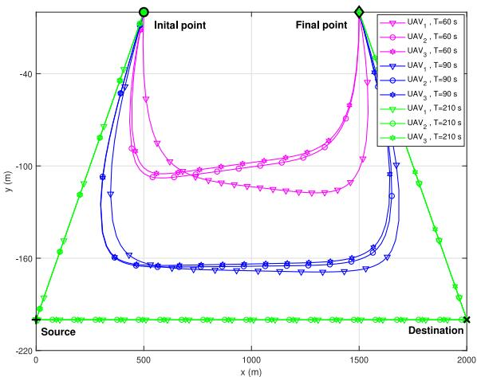  
Fig. 6. UAV Trajectories obtained by the $^ { 6 6 } \mathrm { T O }$ with $\mathrm { P C } ^ { \mathrm { * } }$ algorithm in the SEUS scheme with different values of UAV flight duration $T _ { \mathrm { f } } \ { \overline { { ( P } } } = 5$ dBm).

On the other hand, in Fig. 6, it can be observed that unlike the HUS scheme, the UAVs may have different trajectories in the SEUS scheme. In particular, the trajectory of $\mathrm { U A V _ { 1 } }$ is different from that of $\mathrm { U A V _ { 2 } }$ and $\mathrm { U A V _ { 3 } }$ when $T _ { \mathrm { f } } = 6 0 ~ \mathrm { s }$ and $T _ { \mathrm { f } } = 9 0 \ { \mathrm { s } } ,$ while the trajectories of $\mathrm { U A V _ { 2 } }$ and $\mathrm { U A V _ { 3 } }$ are similar. This is because the data receiving of $\mathrm { U A V _ { 2 } }$ and $\mathrm { U A V _ { 3 } }$ is interfered by the transmissions of $\mathrm { U A V _ { 1 } }$ and $\mathrm { U A V _ { 2 } }$ , respectively, each UAV needs to adjust its trajectory to decrease interference from/to other UAVs. With $T _ { \mathrm { f } }$ increasing, the trajectory difference becomes smaller and smaller. When $T _ { \mathrm { f } } = 2 1 0 \ \mathrm { s } ,$ the trajectories of all UAVs are similar. This is because when $T _ { \mathrm { f } }$ is sufficiently large, the distance between two UAVs is sufficiently large, so the interference effect on the trajectory optimization is negligible.

Second, we compare the proposed “TO with $\mathrm { P C } ^ { \prime \prime }$ algorithm to a benchmark algorithm called trajectory optimization without power control algorithm (denoted by “TO without PC”), which sets the transmit power of the source and the UAV relays equal to the average value, i.e., $P _ { \mathrm { { s } } } [ n ] = P _ { m } [ n ] = { \bar { P } } , \forall m , n ,$ and optimizes the UAV trajectories in the HUS and SEUS schemes by solving problems (21) and (29), respectively. The initial trajectory of the $^ { 6 6 } \mathrm { T O }$ without $\mathrm { P C } ^ { \prime \prime }$ algorithm is the linesegment trajectory, which is the same as that of the “TO with $\mathrm { P C } ^ { \prime \prime }$ algorithm. Fig. 7 shows the trajectory comparison in the HUS scheme when $T _ { \mathrm { f } } = 6 0 ~ \mathrm { s }$ and $2 1 0 \mathrm { ~ s ~ }$ and $\bar { P } = 5 \mathrm { d B m }$ . It is observed that when $T _ { \mathrm { f } } = 6 0 \ : \mathrm { s } ,$ the arc trajectories of the UAVs by the $^ { 6 6 } \mathrm { T O }$ without $\mathrm { P C } ^ { \prime \prime }$ algorithm are closer to the source and destination than that of the $^ { 6 6 } \mathrm { T O }$ with $\mathrm { P C } ^ { \prime \prime }$ algorithm. This is because the $^ { 6 6 } \mathrm { T O }$ without $\mathrm { P C } ^ { \prime \prime }$ algorithm can only adjust the UAV trajectories to increase throughput. When $T _ { \mathrm { f } } = 2 1 0 \mathrm { s } ,$ two algorithms obtain similar UAV trajectories. Fig. 8 shows the trajectory comparison in the SEUS scheme when $T _ { \mathrm { f } } = 6 0 \ { \mathrm { s } } ,$ $2 1 0$ s and $\bar { P } = 5$ dBm. It can be observed that the “TO without $\mathrm { P C } ^ { \prime \prime }$ algorithm obtains different trajectories for different UAV relays, and the trajectories of the $^ { 6 6 } \mathrm { T O }$ without $\mathrm { P C } ^ { \prime \prime }$ algorithm are different from that of the proposed “TO with $\mathrm { P C } ^ { \prime \prime }$ algorithm. In particular, when $T _ { \mathrm { f } }$ is short, i.e., $T _ { \mathrm { f } } ~ = ~ 6 0 ~ \mathrm { s } .$ the $^ { 6 6 } \mathrm { T O }$ without $\mathrm { P C } ^ { \prime \prime }$ algorithm lets the UAVs fly in three obviously different arc paths; even when $T _ { \mathrm { f } }$ is sufficiently long, i.e., $T _ { \mathrm { f } } = 2 1 0 \ \mathrm { s } .$ , the $^ { 6 6 } \mathrm { T O }$ without $\mathrm { P C } ^ { \prime \prime }$ algorithm lets $\mathrm { U A V _ { 3 } }$ fly in a straight path that is different from the arc paths of $\mathrm { U A V _ { 1 } }$ and $\mathrm { U A V _ { 2 } } .$ . The above result is because the $^ { 6 6 } \mathrm { T O }$ without PC” algorithm can only suppress the interference among the UAV relays by trajectory optimization.

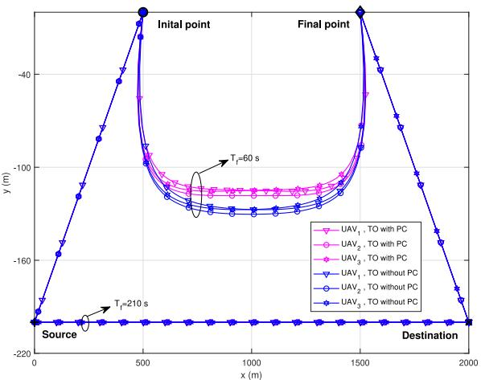  
Fig. 7. UAV Trajectory comparison in the HUS scheme when $T _ { \mathrm { f } } = 6 0 , 2 1 0 \mathrm { s }$ and $\bar { P } = 5$ dBm.

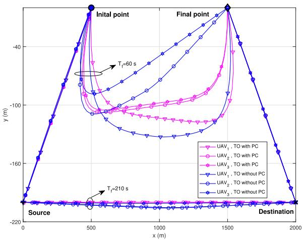  
Fig. 8. UAV Trajectory comparison in the SEUS scheme when $T _ { \mathrm { f } } = 6 0 , 2 1 0$ s and $\bar { \boldsymbol { P } } = 5$ dBm.

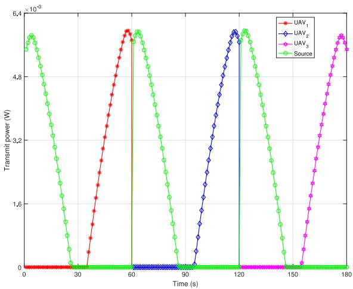  
Fig. 9. Transmit power of the source and the UAV relays obtained by the $\mathrm { { } ^ { \circ \circ } T O }$ with PC” algorithm in the HUS scheme when $T _ { \mathrm { f } } = \dot { 6 } 0$ s and $\bar { P } = \bar { 5 }$ dBm.

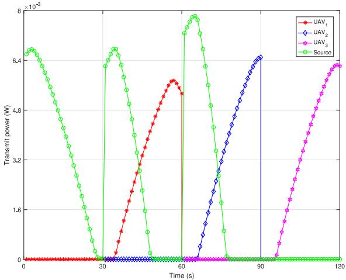  
Fig. 10. Transmit power of the source and the UAV relays obtained by the “TO with $\mathrm { P C } ^ { \ast \ast }$ algorithm in the SEUS scheme when $\dot { T _ { \mathrm { f } } } ~ = ~ 6 0 ~ \mathrm { s }$ and $\bar { P } = 5$ dBm.

Third, we show the transmit power control results obtained by the proposed “TO with $\mathrm { P C } ^ { \prime \prime }$ algorithm in the HUS and SEUS schemes. Fig. 9 shows the transmit power of the source and the UAV relays versus time in the HUS scheme when $T _ { \mathrm { f } } = 6 0 ~ \mathrm { s }$ and ${ \bar { P } } = 5 \ \mathrm { d B m }$ . Together with the trajectory result shown in Fig. 5, it is observed that the transmit power of the source decreases as the distance between it and its UAV relay decreasing, and the transmit power of a UAV relay increases as the distance between it and the destination increasing. This is because the transmit powers of the source and the UAV relays are jointly designed with the UAV trajectories. It is also observed that the three UAV relays’ transmit power variations over time are identical, which is because the transmit power of each UAV is designed individually as a single UAV in the HUS scheme.

Fig. 10 shows the transmit powers of the source and the UAV relays obtained by the proposed $^ { 6 6 } \mathrm { T O }$ with $\mathrm { P C } ^ { \prime \prime }$ algorithm versus time in the SEUS scheme when $T _ { \mathrm { f } } = 6 0 ~ \mathrm { s }$ and $\bar { P } = 5$ dBm. We can see that the transmit powers of the three UAV relays, as well as the transmit power of the source, are different from those in the HUS scheme. It is observed that when the source is transmitting data to $\mathrm { U A V _ { 1 } }$ during the period of [1, 30] s, since no interference exists, the transmit power of the source is non-zero over the whole period. It is also observed that when $\mathrm { U A V _ { 1 } }$ is transmitting data to the destination and the source is transmitting data to $\mathrm { U A V _ { 2 } }$ during the period of [31, 60] s, the transmit power of the source is higher than that of $\mathrm { U A V _ { 2 } }$ during the first half of the period and is lower in the second half. This is because to coordinate the interference from $\mathrm { U A V _ { 1 } }$ to $\mathrm { U A V _ { 2 } } .$ , the $^ { 6 6 } \mathrm { T O }$ with $\mathrm { P C } ^ { \prime \prime }$ algorithm focuses on the communication from the source to $\mathrm { U A V _ { 2 } }$ in the first half of the period [31, 60] s and focuses on that from $\mathrm { U A V _ { 1 } }$ to the destination in the second half. In addition, we can observe that during the first half of the period, the transmit power of the source reaches its maximum value and that of $\mathrm { U A V _ { 1 } }$ is low; while during the second half of the period, as shown in Fig. 6, the distance between $\mathrm { U A V _ { 1 } }$ and the destination keeps increasing, thus $\mathrm { U A V _ { 1 } }$ has to increase its transmit power to complete its data transmission to the destination with a satisfactory data rate, and the source stops its transmission to $\mathrm { U A V _ { 2 } }$ at about 50 s. The result in the period of [61, 90] s is similar to that in the period of [31, 60] s. During the period of [91, 120] s, since no interference exists, $\mathrm { U A V _ { 3 } }$ transmits data with non-zero power over the whole period.

Fourth, we compare the throughput performance of the proposed algorithm and some benchmark algorithms in both the HUS and SEUS schemes. The benchmark algorithms include the $^ { 6 6 } \mathrm { T O }$ without $\mathrm { P C } ^ { \prime \prime }$ algorithm and the following four algorithms. 1) Joint trajectory optimization and transmit power control algorithm with one single UAV (denoted by “Single UAV, TO with $\mathrm { P C } ^ { \prime \prime } ) { \mathrm { : } }$ this algorithm assumes that there is only one UAV relay, so no UAV substitution exists, and it jointly optimizes the UAV trajectory and transmit power by using the algorithm in [13]. 2) Line-segment trajectory with transmit power control algorithm (denoted by $\mathrm { ^ { 6 6 } L T }$ with $\mathrm { P C } ^ { \prime \prime } ) { : }$ in this algorithm, each UAV flies along a line trajectory connecting the initial point and the final point at a constant speed during its flight duration, and the transmit power control designs in the HUS and SEUS schemes are optimized by the transmit power control algorithm in [13] and by solving problem (28), respectively. 3) Line-segment trajectory without transmit power control algorithm (denoted by “LT without $\mathrm { P C } ^ { \prime \prime } ) { : }$ the UAV trajectory design of this algorithm is the same as that of the “LT with $\mathrm { P C } ^ { \prime \prime }$ algorithm, and its transmit power control design is the same with that of the $^ { 6 6 } \mathrm { T O }$ without $\mathrm { P C } ^ { \prime \prime }$ algorithm. 4) Static UAV relay algorithm (denoted by $^ { \mathrm { 6 6 } } \mathrm { S t a t i c } ^ { \mathrm { 7 } } ) \mathrm { : }$ it lets all UAVs remain static at the point $\frac { 1 } { 2 } \big ( \mathbf { w } _ { \mathrm { s } } + \mathbf { w } _ { \mathrm { d } } \big )$ for the HUS scheme, and lets the UAVs with odd indices and that with even indices remain static at the points $\frac { 1 } { 3 } ( \mathbf { w } _ { \mathrm { s } } + \mathbf { w } _ { \mathrm { d } } )$ and $\frac { 2 } { 3 } \big ( \mathbf { w } _ { \mathrm { s } } + \mathbf { w } _ { \mathrm { d } } \big )$ , respectively, for the SEUS scheme. The transmit powers of the source and relays are set as constant over time and equal to their average values.

Fig. 11 shows the end-to-end throughput of different algo rithms in the HUS and SEUS schemes versus the flight duration of each UAV $T _ { \mathrm { f } }$ when $\bar { P } = 5$ dBm. It is observed that the throughputs of all algorithms with trajectory optimization increase with $T _ { \mathrm { f } } ,$ but that of the algorithms with line-segment UAV trajectory or with static UAVs (without trajectory optimization) is almost unchanged with $T _ { \mathrm { f } }$ . The “TO with $\mathrm { P C } ^ { \prime \prime }$ algorithm in the HUS scheme has similar throughput performance with the “Single UAV, TO with $\mathrm { P C } ^ { \prime \prime }$ scheme, since each UAV in the HUS scheme is equivalent to a single UAV relay. It is also observed that the SEUS scheme achieves higher throughput than the HUS scheme, and that the “TO with $\mathrm { P C } ^ { \prime \prime }$ algorithm in the SEUS scheme achieves the best throughput performance. The “Static” algorithm has the poorest throughput performance, since it does not exploit the degree of freedom brought by the mobility of the UAVs to suppress interference and improve throughput.

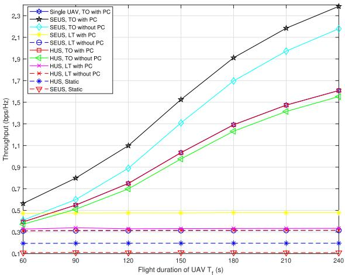  
Fig. 11. End-to-end throughput of different algorithms versus the flight duration of each UAV $T _ { \mathrm { f } }$ when $\bar { \boldsymbol { P } } = 5$ dBm.

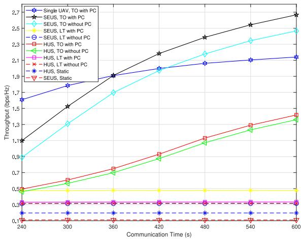  
Fig. 12. End-to-end throughput of different algorithms versus the communication duration when $\bar { P } = 5$ dBm.

Fig. 12 shows the end-to-end throughput of different algorithms in both the HUS and SEUS schemes versus the communication duration from the source to the destination when $\bar { P } = 5$ dBm. It can be observed that the throughput performance of most algorithms is similar to that shown in Fig. 11 except for the “Single UAV, TO with $\mathrm { P C } ^ { \prime \prime }$ scheme. When $T < 3 6 0 ~ \mathrm { s }$ , the throughput of the “Single UAV, TO with $\mathrm { P C } ^ { \prime \prime }$ scheme is higher than other algorithms. This is because each UAV relay has the initial process of flying towards the source from the initial point and the final process of flying towards the final point in the end, during which the distances from the UAV relay to the source and the destination may be long and thus the throughput may be low. The single UAV scheme does not have UAV substitution and thus spends fewer time portions on the initial and final processes, so it has a higher throughput than the HUS and SEUS schemes. On the other hand, when $T > 3 6 0$ s, the $^ { 6 6 } \mathrm { T O }$ with $\mathrm { P C } ^ { \prime \prime }$ algorithm in the SEUS scheme outperforms the “Single UAV, TO with $\mathrm { P C } ^ { \prime \prime }$ scheme, because the SEUS scheme uses the spectrum more efficiently when there are sufficiently large degrees of freedom for trajectory optimization and power control. These results show that the proposed SEUS scheme can effectively extend the communication duration, and the proposed “TO with PC” algorithm is efficient in improving throughput.

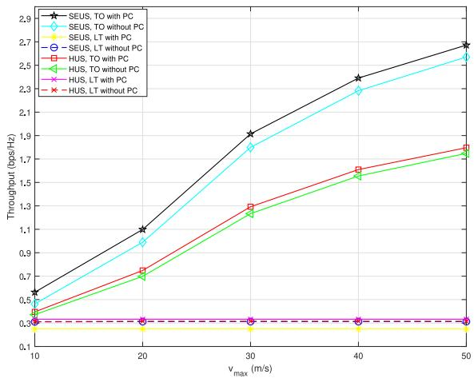  
Fig. 13. End-to-end throughput of different algorithms versus vmax when $\bar { P } = 5$ dBm and $T _ { \mathrm { f } } = 1 2 0$ s.

Fig. 13 shows the end-to-end throughput of different algorithms in both the HUS and SEUS schemes versus the maximum UAV speed $v _ { \mathrm { m a x } }$ when $\bar { P } = 5$ dBm and $T _ { \mathrm { f } } = 1 2 0 \ \mathrm { s } .$ It can be observed that the throughputs of all algorithms with optimized UAV trajectory increase with $v _ { \mathrm { m a x } }$ . This is expected, since with higher $v _ { \mathrm { m a x } }$ , the UAV relays can spend less portion of time in the initial process of flying towards the source from the initial point and the final process of flying towards the final point, and they can stay close to the source or the destination to maintain high-quality source-relay link or relay-destination link with a higher portion of time, and thus higher average throughput can be achieved. In contrast, the throughputs of the algorithms with line-segment UAV trajectory remain unchanged with increasing vmax, because these algorithms let the UAVs fly at a constant speed lower than 10 m/s and do not fully use the UAVs’ mobility to improve throughput.

Fig. 14 shows the end-to-end throughput of different schemes versus the average transmit power $\bar { P }$ when the communication duration is 420 s. It is observed that the throughputs of all algorithms increase with the average transmit power, and the “TO with $\mathrm { P C } ^ { \prime \prime }$ algorithm in the SEUS scheme achieves the highest throughput. It is also observed that when $\bar { P } \le 1 0$ dBm, the algorithms with transmit power control have higher throughput than their counterparts without transmit power control, and when $\bar { P } > 1 0$ dBm, the throughput of them are similar. This is because transmit power control is more effective when the average power is low and is less effective when the average power is high.

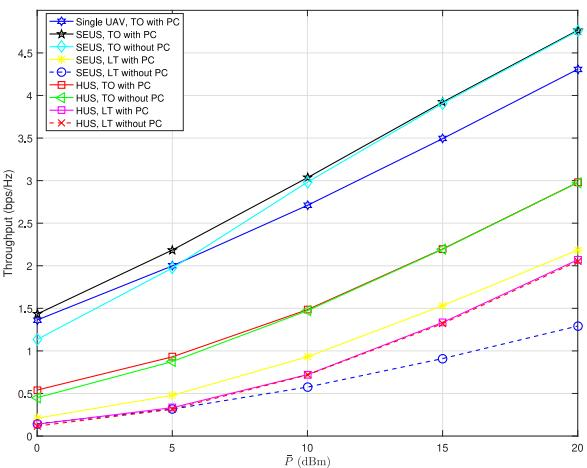  
Fig. 14. End-to-end throughput of different algorithms versus average transmit power $\bar { P }$ when the communication duration is 420 s.

The above simulation results show that the proposed UAV substitution schemes are efficient, and joint trajectory optimization and transmit power control are essential for throughput improvement in both the SEUS scheme and the HUS scheme.

## VI. CONCLUSION

In this paper, we propose two UAV substitution schemes, called the HUS scheme and the SEUS scheme, for the situation that the required relaying communication duration is longer than the flight duration of a single UAV relay in a multi-UAV relaying system. Furthermore, we propose efficient joint trajectory optimization and transmit power control design algorithms for the HUS and SEUS schemes, respectively, to maximize their end-to-end throughputs. Simulation results show that the proposed UAV substitution schemes can effectively prolong the relaying communication duration. Besides, it is found that trajectory optimization and transmit power control are necessary for the SEUS scheme to suppress the relay link interference, and the proposed joint design algorithms significantly improve the throughput performance of the HUS and SEUS schemes by sufficiently exploiting the degree of freedom brought by the UAVs’ mobility.

## REFERENCES

[1] Y. Zeng, R. Zhang, and T. J. Lim, “Wireless communications with unmanned aerial vehicles: Opportunities and challenges,” IEEE Commun. Mag., vol. 54, no. 5, pp. 36–42, May 2016.

[2] Y. Zeng, Q. Wu, and R. Zhang, “Accessing from the sky: A tutorial on UAV communications for 5G and beyond,” Proc. IEEE, vol. 107, no. 12, pp. 2327–2375, Dec. 2019.

[3] S. Zhang, Y. Zeng, and R. Zhang, “Cellular-enabled UAV communication: A connectivity-constrained trajectory optimization perspective,” IEEE Trans. Commun., vol. 67, no. 3, pp. 2580–2604, Mar. 2019.

[4] Q. Wu et al., “A comprehensive overview on 5G-and-beyond networks with UAVs: From communications to sensing and intelligence,” IEEE J. Sel. Areas Commun., early access, Jun. 15, 2021, doi: 10.1109/JSAC.2021.3088681.

[5] G. Zhang, Q. Wu, M. Cui, and R. Zhang, “Securing UAV communications via joint trajectory and power control,” IEEE Trans. Wireless Commun., vol. 18, no. 2, pp. 1376–1389, Feb. 2019.

[6] M. Cui, G. Zhang, Q. Wu, and D. W. K. Ng, “Robust trajectory and transmit power design for secure UAV communications,” IEEE Trans. Veh. Technol., vol. 67, no. 9, pp. 9042–9046, Sep. 2018.

[7] J. Lyu, Y. Zeng, and R. Zhang, “Cyclical multiple access in UAV-aided communications: A throughput-delay tradeoff,” IEEE Wireless Commun. Lett., vol. 5, no. 6, pp. 600–603, Dec. 2016.

[8] Q. Wu, Y. Zeng, and R. Zhang, “Joint trajectory and communication design for multi-UAV enabled wireless networks,” IEEE Trans. Wireless Commun., vol. 17, no. 3, pp. 2109–2121, Mar. 2018.

[9] Y. Huang, M. Cui, G. Zhang, and W. Chen, “Bandwidth, power and trajectory optimization for UAV base station networks with backhaul and user QoS constraints,” IEEE Access, vol. 8, pp. 67625–67634, 2020.

[10] D. Huang, M. Cui, G. Zhang, X. Chu, and F. Lin, “Trajectory optimization and resource allocation for UAV base stations under in-band backhaul constraint,” EURASIP J. Wireless Commun. Netw., vol. 2020, no. 1, pp. 1–17, Dec. 2020. [Online]. Available: https://jwcneurasipjournals.springeropen.com/articles/10.1186/s13638-020-01700-w

[11] Y. Gao, H. Tang, B. Li, and X. Yuan, “Robust trajectory and power control for cognitive UAV secrecy communication,” IEEE Access, vol. 8, pp. 49338–49352, 2020.

[12] M. F. J. Pinkney, D. Hampel, and S. DiPierro, “Unmanned aerial vehicle (UAV) communications relay,” in Proc. MILCOM, McLean, VA, USA, 1996, pp. 47–51.

[13] Y. Zeng, R. Zhang, and T. J. Lim, “Throughput maximization for UAV-enabled mobile relaying systems,” IEEE Trans. Commun., vol. 64, no. 12, pp. 4983–4996, Dec. 2016.

[14] Y. Chen, W. Feng, and G. Zheng, “Optimum placement of UAV as relays,” IEEE Commun. Lett., vol. 22, no. 2, pp. 248–251, Feb. 2018.

[15] C. Zhan, Y. Zeng, and R. Zhang, “Energy-efficient data collection in UAV enabled wireless sensor network,” IEEE Wireless Commun. Lett., vol. 7, no. 3, pp. 328–331, Jun. 2018.

[16] J. Zhang, Y. Zeng, and R. Zhang, “UAV-enabled radio access network: Multi-mode communication and trajectory design,” IEEE Trans. Signal Process., vol. 66, no. 20, pp. 5269–5284, Oct. 2018.

[17] M. Hua, Y. Wang, Z. Zhang, C. Li, Y. Huang, and L. Yang, “Powerefficient communication in UAV-aided wireless sensor networks,” IEEE Commun. Lett., vol. 22, no. 6, pp. 1264–1267, Jun. 2018

[18] J. Chen and D. Gesbert, “Optimal positioning of flying relays for wireless networks: A LOS map approach,” in Proc. IEEE ICC, Paris, France, May 2017, pp. 1–6.

[19] C. Pan, H. Ren, Y. Deng, M. Elkashlan, and A. Nallanathan, “Joint blocklength and location optimization for URLLC-enabled UAV relay systems,” IEEE Commun. Lett., vol. 23, no. 3, pp. 498–501, Mar. 2019.

[20] H. Ren, C. Pan, K. Wang, W. Xu, M. Elkashlan, and A. Nallanathan, “Joint transmit power and placement optimization for URLLC-enabled UAV relay systems,” IEEE Trans. Veh. Technol., vol. 69, no. 7, pp. 8003–8007, Jul. 2020.

[21] H. Ren, C. Pan, K. Wang, Y. Deng, M. Elkashlan, and A. Nallanathan, “Achievable data rate for URLLC-enabled UAV systems with 3-D channel model,” IEEE Wireless Commun. Lett., vol. 8, no. 6, pp. 1587–1590, Dec. 2019.

[22] W. Wang et al., “Energy-constrained UAV-assisted secure communications with position optimization and cooperative jamming,” IEEE Trans. Commun., vol. 68, no. 7, pp. 4476–4489, Jul. 2020.

[23] S. Zhang, H. Zhang, Q. He, K. Bian, and L. Song, “Joint trajectory and power optimization for UAV relay networks,” IEEE Wireless Commun. Lett., vol. 22, no. 1, pp. 161–164, Jan. 2018.

[24] L. Xiao, Y. Xu, D. Yang, and Y. Zeng, “Secrecy energy efficiency maximization for UAV-enabled mobile relaying,” IEEE Trans. Green Commun. Netw., vol. 4, no. 1, pp. 180–193, Mar. 2020.

[25] Y. Chen, N. Zhao, Z. Ding, and M.-S. Alouini, “Multiple UAVs as relays: Multi-hop single link versus multiple dual-hop links,” IEEE Trans. Wireless Commun., vol. 17, no. 9, pp. 6348–6359, Sep. 2018.

[26] C.-M. Cheng, P.-H. Hsiao, H. T. Kung, and D. Vlah, “Maximizing throughput of UAV-relaying networks with the load-carry-and-deliver paradigm,” in Proc. IEEE WCNC, Hong Kong, 2007, pp. 4417–4424.

[27] G. Zhang, H. Yan, Y. Zeng, M. Cui, and Y. Liu, “Trajectory optimization and power allocation for multi-hop UAV relaying communications,” IEEE Access, vol. 6, pp. 48566–48576, 2018.

[28] J. Fan, M. Cui, G. Zhang, and Y. Chen, “Throughput improvement for multi-hop UAV relaying,” IEEE Access, vol. 7, pp. 147732–147742, 2019.

[29] L. Ruan et al., “Energy-efficient multi-UAV coverage deployment in UAV networks: A game-theoretic framework,” China Commun., vol. 15, no. 10, pp. 194–209, Oct. 2018.

[30] T. Liu, M. Cui, G. Zhang, Q. Wu, X. Chu, and J. Zhang, “3D trajectory and transmit power optimization for UAV-enabled multi-link relaying systems,” IEEE Trans. Green Commun. Netw., vol. 5, no. 1, pp. 392–405, Mar. 2021.

[31] X. Lin et al., “The sky is not the limit: LTE for unmanned aerial vehicles,” IEEE Commun. Mag., vol. 56, no. 4, pp. 204–210, Apr. 2018.

[32] M. Hong, M. Razaviyayn, Z.-Q. Luo, and J.-S. Pang, “A unified algorithmic framework for block-structured optimization involving big data: With applications in machine learning and signal processing,” IEEE Signal Process. Mag., vol. 33, no. 1, pp. 57–77, Jan. 2016.

[33] M. Grant and S. Boyd. (2020). CVX: MATLAB Software for Disciplined Convex Programming, Version 2.1. [Online]. Available: http://cvxr.com/cvx

[34] I. Pólik and T. Terlaky, “Interior point methods for nonlinear optimization,” in Nonlinear Optimization, 1st ed., G. Di Pillo and F. Schoen, Eds. Berlin, Germany: Springer, 2010, ch. 4.

Guangchi Zhang received the B.S. degree in electronic engineering from Nanjing University, Nanjing, China, in 2004, and the Ph.D. degree in communication engineering from Sun Yat-sen University, Guangzhou, China, in 2009. He has been with the School of Information Engineering, Guangdong University of Technology, Guangzhou, China, since 2009, and is currently a Professor. He was a Senior Research Associate with the City University of Hong Kong from October 2011 to March 2012 and a Visiting Professor with the

National University of Singapore from January 2017 to January 2018. His research interests include multiple-input multiple-output, wireless relaying, wireless power transfer, unmanned aerial vehicle enabled communications, intelligent reflecting surface assisted communications, physical layer security, and artificial intelligence enabled communications. He was a recipient of the IEEE Communications Society 2014 Heinrich Hertz Award and the IEEE Communication Letters 2014 Exemplary Reviewer.

Xiaoqi Ou received the B.S. degree in communication engineering from Wuhan Institute of Technology, Wuhan, China, in 2018, and the M.S. degree in information and communication engineering from Guangdong University of Technology, Guangzhou, China, in 2021. Her research interest is in unmanned aerial vehicle communications.

Miao Cui received the B.E. degree in communication engineering and the M.S. degree in computer science from Northeast Electric Power University, Jilin, China, in 2001 and 2003, respectively, and the Ph.D. degree in circuit system from South China University of Technology, Guangzhou, China, in 2009. She is currently a Lecturer with Guangdong University of Technology, Guangzhou. Her research interests include analysis, optimization, and design of wireless networks.

Qingqing Wu (Member, IEEE) received the B.Eng. degree in electronic engineering from South China University of Technology in 2012, and the Ph.D. degree in electronic engineering from Shanghai Jiao Tong University (SJTU) in 2016.

He is currently an Assistant Professor with the State Key Laboratory of Internet of Things for Smart City, University of Macau. From 2016 to 2020, he was a Research Fellow with the Department of Electrical and Computer Engineering, National University of Singapore. His current research interest

includes intelligent reflecting surface, unmanned aerial vehicle communications, and MIMO transceiver design. He was a recipient of the IEEE Communications Society Young Author Best Paper Award in 2021, the Outstanding Ph.D. Thesis Award of China Institute of Communications in 2017, the Outstanding Ph.D. Thesis Funding in SJTU in 2016, the IEEE ICCC Best Paper Award in 2021, and the IEEE WCSP Best Paper Award in 2015. He was listed as a World’s Top 2% Scientist by Stanford University in 2020. He is the Workshop Co-Chair for IEEE ICC 2019-2021 workshop on Integrating UAVs into 5G and Beyond, and the IEEE GLOBECOM 2020 and ICC 2021 workshop on Reconfigurable Intelligent Surfaces for Wireless Communication for Beyond 5G. He serves as the Workshops and Symposia Officer of Reconfigurable Intelligent Surfaces Emerging Technology Initiative and Research Blog Officer of Aerial Communications Emerging Technology Initiative. He is the IEEE ComSoc Young Professional Chair in APB. He was the Exemplary Editor of IEEE COMMUNICATIONS LETTERS in 2019 and the exemplary reviewer of several IEEE journals. He serves as an Associate Editor for IEEE COMMUNICATIONS LETTERS, IEEE WIRELESS COMMUNICATIONS LETTERS, IEEE OPEN JOURNAL OF COMMUNICATIONS SOCIETY (OJ-COMS), and IEEE OPEN JOURNAL OF VEHICULAR TECHNOLOGY (OJVT). He is the Lead Guest Editor for IEEE JOURNAL ON SELECTED AREAS IN COMMUNICATIONS on “UAV Communications in 5G and Beyond Networks,” and the Guest Editor for IEEE OJVT on “6G Intelligent Communications” and IEEE OJ-COMS on “Reconfigurable Intelligent Surface-Based Communications for 6G Wireless Networks.”

Shaodan Ma (Member, IEEE) received the dual bachelor’s degrees in science and economics and the master’s degree in engineering from Nankai University, Tianjin, China, in 1999 and 2002, respectively, and the Ph.D. degree in electrical and electronic engineering from the University of Hong Kong, Hong Kong, in 2006, where she was a Postdoctoral Fellow from 2006 to 2011. Since August 2011, she has been with the University of Macau, where she is currently a Full Professor. Her research interests are in the general areas of sig-

nal processing and communications, particularly, transceiver design, resource allocation, and performance analysis.

Wei Chen received the B.S. degree in resource exploration engineering, the M.S. degree in geotechnical engineering, and the Ph.D. degree in geological engineering from Chengdu University of Technology, Chengdu, China, in 2002, 2006, and 2011, respectively. He worked with the Institute of Mountain Hazards and Environment, CAS, from July 2011 to December 2013. He has been with the Institute of Environmental Geology Exploration of Guangdong Province, Guangzhou, China, since 2014, and is currently a Senior Engineer. His research interests include the geological disaster monitoring and forewarning.