# Cooperative UAV Resource Allocation and Task Offloading in Hierarchical Aerial Computing Systems: A MAPPO-Based Approach

Hongyue Kang , Xiaolin Chang , Senior Member, IEEE, Jelena Mišic´ , Fellow, IEEE, Vojislav B. Mišic´ , Senior Member, IEEE, Junchao Fan , and Yating Liu

Abstract—This article investigates a hierarchical aerial computing system, where both high-altitude platforms (HAPs) and unmanned aerial vehicles (UAVs) provision computation services for ground devices (GDs). Different from the existing works which ignored UAV task offloading to HAPs and suffered long transmission delay between HAPs and GDs, in our system, UAVs are responsible for collecting the tasks generated by GDs. Considering limited resources and constrained coverage, UAVs need to cooperatively allocate their resources (including spectrum, caching, and computing) to GDs. After collecting GD tasks, UAVs are allowed to offload part of these tasks to the HAP, in order to minimize task processing delay and then better satisfy GD delay requirement. Our objective is to maximize the amount of computed tasks while satisfying tasks’ heterogeneous Qualityof-Service (QoS) requirements through the joint optimization of UAV resource allocation and task offloading. To this end, a joint optimization problem is first formulated as a partially observable Markov decision process (POMDP) under the constraints of available resources, UAV energy, and collision avoidance. Then, we design a multiagent proximal policy optimization (MAPPO)-based algorithm to solve the optimization problem. By introducing the centralized training with decentralized execution framework, UAVs acting as agents can cooperatively make decisions on GDs association, resource allocation, and task offloading according to their local observations. In addition, state normalization and action mask are also adopted to improve training efficiency. Experimental results verify the efficiency of the proposed algorithm and the system performance is also analyzed by the numerical results.

Index Terms—Hierarchical aerial computing, multiagent proximal policy optimization (MAPPO), multidimensional resource allocation, task offloading.

Manuscript received 20 August 2022; revised 29 December 2022; accepted 23 January 2023. Date of publication 27 January 2023; date of current version 7 June 2023. The work of Hongyue Kang, Xiaolin Chang, Junchao Fan, and Yating Liu was supported by the Laboratory Basic Research Project of Scientific and Technical Exploitation Program of CHIAN RAILWAY under Grant L2021S001. The work of Jelena Mišic and Vojislav B. Miši ´ c was ´ supported by the Natural Science and Engineering Research Council of Canada through their respective Discovery Grants. (Corresponding author: Xiaolin Chang.)

Hongyue Kang, Xiaolin Chang, Junchao Fan, and Yating Liu are with the Beijing Key Laboratory of Security and Privacy in Intelligent Transportation, Beijing Jiaotong University, Beijing 100044, China (e-mail: 19112051@bjtu.edu.cn; xlchang@bjtu.edu.cn; 20120468@bjtu.edu.cn; 21125200@bjtu.edu.cn).

Jelena Mišic and Vojislav B. Miši ´ c are with the Department of Computer ´ Science, Ryerson University, Toronto, ON M5B 2K3, Canada (e-mail: jmisic@scs.ryerson.ca; vmisic@ryerson.ca).

Digital Object Identifier 10.1109/JIOT.2023.3240173

# I. INTRODUCTION

N ATURAL catastrophes like floods, earthquakes, andbushfires frequently cause catastrophic losses in terms of bushfires frequently cause catastrophic losses in terms of both people’s lives and property. Effective and fast emergency communication is essential for quick disaster assessment and effective disaster relief in the affected areas[1]. Because there are not any infrastructures for terrestrial networks, unmanned aerial vehicles (UAVs)-aided communication method can be a feasible solution for their low cost, easy deployment, and flexible mobility [2], [3]. However, UAVs are unable to perform complex computation-intensive tasks in disaster areas, such as people detection and video recognition, because of their low battery and computation ability. These tasks have heterogeneous QoS requirements and may be beyond local processing capabilities of UAVs [4], [5]. As a result, it takes too long to complete rescue and search missions, which decreases the effectiveness of disaster rescue. Accordingly, hierarchical aerial systems are proposed where high-altitude platforms (HAPs) are introduced to relieve UAVs’ computation pressure [6].

A hierarchical aerial computing system consists of HAPs and UAVs. They have computation resources and function as efficient mobile-edge computing (MEC). HAPs and UAVs can both offer computation services but with differences in flight height, computation capability, and endurance time [7]. Generally, HAPs remain in their stable positions for several months at an altitude of about 20 km. Because of large coverage and powerful payload, they can act as reliable base stations in the air. Additionally, HAPs have the capacity to carry heavy loads like batteries and computing devices. However, the direct connection from IoT devices to HAPs suffers a long firsthop distance, leading to unaccepted delay [8]. In contrast, UAVs have the advantage of low-altitude flight flexibility over HAPs. However, due to their low carrying capacity, UAVs have limited resources and flight time, so the tasks offloaded to UAVs may not be completed within the allowable delay [9]. Therefore, it is necessary to utilize the combination of UAVs and HAPs to offer powerful computation services to IoTs.

Hierarchical aerial computing systems applications can be popularized in the future. As the development of sixth-generation wireless systems (6G), IoT devices will explode, such as smart framing, smart wearable devices, and IoT equipment in remote areas. These devices have computing requirements, which is hard, if not impossible, to be met locally. Hierarchical aerial computing systems can help IoT devices process computation tasks and are not limited to terrestrial cellular networks. Many efforts have been made recently to implement hierarchical aerial computing systems. The goal of Jia et al. [10] was to maximize the total data size by game theory and heuristic algorithms. A DDPG-based multiagent algorithm was designed in [11] to maximize the number of offloaded tasks by the cooperation of UAVs and HAPs. Zhang et al. [12] optimized UAV trajectory and transmit power to increase the secure capacity. However, the current research on hierarchical systems mostly assumed no overlapping between UAVs. Besides, in their scenarios, the tasks generated by GDs can only be computed by UAVs or HAPs. In that case, there exists a direct connection between IoT and HAPs, resulting in long transmission delay. Moreover, they ignored UAV task offloading (i.e., the combinative computing between UAVs and HAPs) causing long computing delay.

Motivated by these discussions, this article investigates a hierarchical aerial computing scenario, consisting of an HAP and multiple UAVs to together offer computing services for ground devices (GDs). Specifically, UAVs are responsible for collecting tasks generated by GDs. During the process, because of limited resources and constrained coverage, UAVs need to cooperatively allocate their resources (including spectrum, caching, and computing) to GDs. After collecting tasks, UAVs decide what part of tasks to offload (defined as the task offloading ratio) to the HAP, in order to minimize task processing delay and better satisfy the GD delay requirement. Hence, our goal is to maximize the amount of computed tasks [total successful computed data by the system, defined in (10a)], while ensuring GDs’ heterogeneous QoS requirement by jointly optimizing multidimensional resource allocation and task offloading ratio.

To deal with the nonconvex and highly complex target problem, we first formulate the problem of maximizing the amount of computed tasks as a partially observable Markov decision process (POMDP) [13], [14] under the constraints of available resources, UAV energy, and collision avoidance. Then, considering the dynamic GD association pattern and heterogeneous QoS requirements, we design a multiagent proximal policy optimization (MAPPO) algorithm to solve the POMDP. A centralized training and decentralized execution framework is also developed [15], where the UAVs (as agents) can make GD association, resource allocation, and task offloading decisions according to their local observations, which is more effective in complex and dynamic environments. The main contributions of this work can be summarized as follows.

1) We propose a hierarchical aerial computing system that make it possible for UAVs and HAPs to together provide computing services for GDs with heterogeneous QoS requirements. To the best of our knowledge, we are the first to utilize the combinative computing of UAVs and HAPs to better satisfy GDs’ QoS requirements in a hierarchical aerial computing system.

2) We establish the formulation of the highly complex nonconvex optimization problem as a POMDP, constrained by multidimension resource management, energy limitation, and collision avoidance. Specifically, UAVs cooperatively make decisions on GD association, resource allocation, and task offloading to maximize the amount of computed tasks.

3) We design an MAPPO-based algorithm to solve the POMDP by introducing the centralized training and decentralized execution framework (introduced in Section V-B). Namely, we use global information to train policies of each UAV. After the training is completed, each UAV obtains a decentralized policy, which enables UAVs make decisions only according to their local observations.

Extensive simulations are conducted for evaluation. State normalization and action mask are adopted to accelerate the training efficiency (illustrated in Section VI-C) [16]. The results demonstrate that the hierarchical aerial computing system outperforms other nonhierarchical ones. Besides, compared with other algorithms, our proposed MAPPO-based algorithm achieves good results in improving the GD QoS satisfaction ratio (defined as the proportion of successful processed tasks that satisfy their QoS requirements) [17].

This article organization is as follows. Section II presents the related works and Section III describes the system model. Sections IV and V give the problem formulation and an MAPPO algorithm to solve the joint optimization problem, respectively. Numerical results are presented in Section VI and then, Section VII concludes this article.

# II. RELATED WORK

In this section, the most recent and relevant existing studies are reviewed.

Many existing works aimed to ensure QoS satisfaction for GDs in UAV-aided networks. For example, Seid et al. [18] aimed to reduce the cost of computing and ensure user QoS requirements in a multi-UAV enabled IoT edge network. The objective of [19] was to enhance energy efficiency while satisfying users’ QoS requirements in a multi-UAV enabled communication network. Besides, Zhan et al. [20] investigated UAV-enabled aerial surveillance and their objective was to reduce energy consumption under the constraint of QoS assurance. However, most of them concentrated on UAVs networks, where UAVs have limited energy and computation capability. HAPs can be utilized to share the computing pressure of UAV networks. Therefore, this article considers a hierarchical aerial computing system, where the HAP has a powerful computation capability and UAVs can offload part of tasks to the HAP. In that case, both UAVs and the HAP can provide computing services for GDs to shorten the task processing delay.

To supplement the terrestrial connection, especially for users in distant, disaster-affected, or other hard-to-reach areas, hierarchical aerial computing systems have been employed to provide Internet access and computing resources [21], [22]. For example, Jia et al. [10] considered a hierarchical aerial computing framework to provide MEC services for IoTs.

TABLE I COMPARISON OF RELATED WORKS 

<table><tr><td>Work</td><td>Scenario</td><td>Task offloading</td><td>UAV overlapping</td><td>UAV collision avoidance</td><td>Energy capacity limit</td></tr><tr><td>[18], 2021</td><td>multi-UAV enabled IoT edge network</td><td>No</td><td>No</td><td>No</td><td>Yes</td></tr><tr><td>[19], 2020</td><td>UAVs-assisted vehicular network</td><td>No</td><td>Yes</td><td>No</td><td>No</td></tr><tr><td>[20], 2022</td><td>UAV enabled aerial surveillance</td><td>No</td><td>No</td><td>Yes</td><td>Yes</td></tr><tr><td>[10], 2022</td><td>hierarchical aerial computing systems</td><td>No</td><td>Yes</td><td>No</td><td>Yes</td></tr><tr><td>[11], 2022</td><td>hierarchical aerial computing systems</td><td>No</td><td>No</td><td>Yes</td><td>Yes</td></tr><tr><td>[12], 2020</td><td>hierarchical aerial computing systems</td><td>No</td><td>No</td><td>No</td><td>No</td></tr><tr><td>Our work</td><td>hierarchical aerial computing systems</td><td>Yes</td><td>Yes</td><td>Yes</td><td>Yes</td></tr></table>

\* Scenario indicates the considered scenario in the paper. \* Task offloading denotes whether UAV task offloading is considered in the paper.

\*UAVoverlapeUsevea\*UAlioceestssU

\* Energy capacity limit indicates whether the system takes UAV energy capacity constraint into account.

Binary computation offloading was adopted in their model, that is, a task was fully processed by UAVs or the HAP, ignoring UAV task offloading. A hierarchical model composed of an HAP and several UAVs was investigated in [11]. However, there was a direct connection between GDs and HAPs, leading to long transmission delay. Zhang et al. [12] proposed a UAV jamming approach where the HAP was used for the centralized training process, but the HAP still did not play a role as a computation server.

Table I compares and summarizes the related works. Different from the above works, we consider a hierarchical aerial computing system where both UAVs and the HAP can provide computing services for GDs, and UAVs are capable of performing task offloading to better satisfy GDs’ heterogeneous QoS requirements, detailed in Sections III and IV.

# III. SYSTEM MODEL

In this section, we first introduce the system description in Section III-A. Then, we present the task collection model and the delay computing model in Sections III-B and III-C, respectively. The energy consumption is discussed in Section III-D. Besides, the notations used in this article are listed in Table II.

# A. System Description

When a disaster happens, the communication infrastructures may be destroyed. To aid the people trapped in the disaster region, it is urgent to deploy temporary emergent communication services to help them out. As a promising solution, a hierarchical aerial computing architecture is constructed, as shown in Fig. 1. The system consists of $\mathcal { N } = \{ 1 , \dots , N \}$ GDs, $\mathcal { U } = \{ 1 , \dots , U \}$ UAVs, and an HAP. Since limited coverage of UAVs, let $N _ { u } ( t ) ( | N _ { u } ( t ) | )$ denote the set (number) of GDs under the coverage of $\mathrm { U A V } _ { u } .$ . Although both UAVs and HAPs serve as edge servers, HAPs have more powerful computing capability.

We consider a discrete time-slotted system $\Gamma = \{ 1 , 2 , \dots , t \}$ with equal length time slots [23], [24]. In each time slot, two phases need to be considered in our scenario, shown in Fig. 2: 1) task collecting phase and 2) task offloading and processing phase. During the task collecting phase, GDs generate computing tasks with distinct QoS requirements at the beginning of each time slot. Once a computation task is produced, $G D _ { n }$ first sends a resource request to the UAVs covering it. The UAVs hover over the GDs and cooperatively allocate

TABLE II DEFINITION OF VARIABLES 

<table><tr><td>Notation</td><td>Definition</td></tr><tr><td> $size_n(t)$ </td><td>Task size in bits of GDs in time slot  $t$ </td></tr><tr><td> $cyc_n(t)$ </td><td>The number of CPU cycles required to execute 1 bit data</td></tr><tr><td> $delay_n(t)$ </td><td>Maximum delay tolerated by GD&#x27;s task in time slot  $t$ </td></tr><tr><td> $S_u$ </td><td>Available spectrum resource of  $UAV_u$ </td></tr><tr><td> $C_u$ </td><td>Available computing resource of  $UAV_u$ </td></tr><tr><td> $C_h$ </td><td>Available computing resource of the HAP</td></tr><tr><td> $Ca_u$ </td><td>Available caching resource of  $UAV_u$ </td></tr><tr><td> $P_n$ </td><td>Transmit power of GDs</td></tr><tr><td> $P_u$ </td><td>Transmit power of UAVs</td></tr><tr><td> $r_{n,u}(t)$ </td><td>Transmission rate from  $GD_n$  to  $UAV_u$  in time slot  $t$ </td></tr><tr><td> $r_{u,h}$ </td><td>Transmission rate from  $UAV_u$  to HAP</td></tr><tr><td> $f_{n,u}(t)$ </td><td>The proportion of spectrum allocated to  $GD_n$  by  $UAV_u$  in time slot  $t$ </td></tr><tr><td> $f_{u,n}^{ca}(t)$ </td><td>The proportion of caching resources allocated to  $GD_n$  by  $UAV_u$  in time slot  $t$ </td></tr><tr><td> $f_{n,u}^{co}(t)$ </td><td>The proportion of computing resources allocated to  $GD_n$  by  $UAV_u$  in time slot  $t$ </td></tr><tr><td> $delay_n^{total}(t)$ </td><td>The total delay for processing the task generated by  $GD_n$ </td></tr><tr><td> $delay_n^{G2U}(t)$ </td><td>The time for collecting the task generated by  $GD_n$  in time slot  $t$ </td></tr><tr><td> $delay_n^{off}(t)$ </td><td>The time for computing the task generated by  $GD_n$  in time slot  $t$ </td></tr><tr><td> $g_{n,u}(t)$ </td><td>The average channel power gain between  $GD_n$  and  $UAV_u$  in time slot  $t$ </td></tr><tr><td> $b_{n,u}(t)$ </td><td> $b_{n,u}(t) \in \{0,1\}$  indicates whether  $UAV_u$  associates  $GD_n$ </td></tr></table>

resources to GDs. During the UAV flight period, the UAV can communicate with multiple GDs simultaneously, i.e., assigning each GD a fraction of the total spectrum. Each UAV decides on GD association and resource allocation based on the task information. After collecting the tasks, these tasks need to be computed by the UAVs if the overall delay (including collection delay and computation delay) can satisfy the GDs delay requirements. However, due to the heavy computing demand of GDs and UAV limited computing capability, part of a task needs to offload to the HAP to minimize the total processing delay.

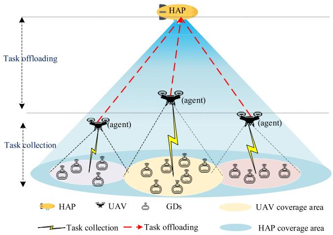

flowchart

Fig. 1. System model.   
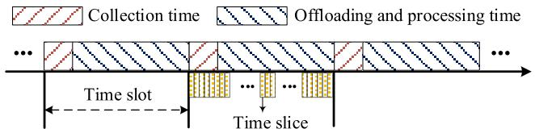

text_image

Collection time
Offloading and processing time
...
Time slot
...
...
Time slice

Fig. 2. Time slot structure.

Taking all of these issues into account, our goal is to maximize the amount of computed tasks by the joint optimization of UAV resource allocation and task offloading ratio, while meeting GDs’ heterogeneous QoS requirements. The system assumptions are as follows.

1) Each UAV only provides service for the GDs within its coverage and a GD under the overlapping area between different UAVs can only associate with one UAV.   
2) HAP hovers at a fixed height and has a wide coverage for all UAVs. Besides, it is assumed that the HAP has enough computing capability to process the tasks uploaded by UAVs.   
3) We assume that each UAV has the same available resources and coverage range. Besides, it is assumed that each task can be completed within a time slot [11].

# B. Task Collection Model

Due to GD task diversification, resource requirements are distributed differently over time, leading to timevarying resource demand from GDs. In this section, a multidimensional resource management model is constructed to assign appropriate amounts of spectrum and caching resources to each resource request in order to satisfy the QoS requirements of tasks.

The task generated by $G D _ { n }$ in time slot t is described as $\{ \mathrm { s i z e } _ { n } ( t ) , \mathrm { c y c } _ { n } ( t ) , \mathrm { d e l a y } _ { n } ( t ) \}$ , where $\mathrm { s i z e } _ { n } ( t ) , \ \mathrm { c y c } _ { n } ( t )$ , and $\mathrm { d e l a y } _ { n } ( t )$ are data size, the number of CPU cycles required to execute 1 bit data, and the maximum tolerated delay, respectively.

1) Spectrum Resource Management: The resource matrix for the $\mathrm { U A V } _ { u }$ is denoted by $( S _ { u } , C o _ { u } , C a _ { u } )$ , where $S _ { u } , C o _ { u } ,$ and $C a _ { u }$ are the amounts of available spectrum, computing, and caching resources, respectively. As in [11], we assume that the spectrum sensing is perfect. For $G D _ { n } ,$ , let $b _ { n , u } ( t )$ be the GD-UAV associate patterns, where $b _ { n , u } ( t ) = 1$ indicates that $G D _ { n }$ associates with $\mathrm { U A V } _ { u } ,$ and $b _ { n , u } ( t ) = 0$ otherwise.

Spectrum reusing is adopted among UAVs due to limited spectrum resources. The ground-to-air uplink reuse spectrum resource $S _ { u } .$ In this work, a probabilistic Line-of-Sight (LoS) channel model is employed to model both LoS and Non-LoS (NLoS) propagations by considering their occurrence probabilities. Besides, $( x _ { u } ( t ) , y _ { u } ( t ) )$ denotes the location of $\mathrm { U A V } _ { u }$ and $( x _ { n } ( t ) , y _ { n } ( t ) )$ is the location of $G D _ { n }$ in time slot t.

UAVs need ground-to-UAV channels to collect tasks generated by GDs. Let $g _ { n , u } ( t )$ denote the average channel power gain between $G D _ { n }$ and $\mathrm { U A V } _ { u }$ in time slot t, which includes both LoS and NLoS links [25]. According to [25], - $g _ { n , u } ( t )$ can be expressed as-

$$
g _ {n, u} (t) = \widehat {\beta} \big (\theta_ {u, n} (t) \big) \cdot d _ {n, u} (t) ^ {- \alpha} \tag {1a}
$$

$$
\widehat {\beta} \big (\theta_ {u, n} (t) \big) = \beta_ {0} \big [ P _ {\mathrm{LoS}} \big (\theta_ {u, n} (t) \big) + \kappa \big (1 - P _ {\mathrm{LoS}} \big (\theta_ {u, n} (t) \big) \big) \big ]. (1 \mathsf {b})
$$

In (1a), $\widehat { \beta } ( \theta _ { u , n } ( t ) )$ denotes the regularized attenuation factor and $d _ { n , u } ( t ) = \sqrt { \| ( x _ { u } ( t ) , y _ { u } ( t ) ) - ( x _ { n } ( t ) , y _ { n } ( t ) ) \| ^ { 2 } + H _ { u } ^ { 2 } }$ represents the distance between $G D _ { n }$ and $\mathrm { U A V } _ { u }$ in time slot t. In addition, $\theta _ { u , n } ( t ) = \tan ^ { - 1 } ( H _ { u } / [ d _ { u , n } ( t ) ] )$ is the elevation angle between those two in time slot t. α denotes the path-loss exponent $( 2 \leq \alpha \leq 4 )$ , and $\beta _ { 0 }$ is the path loss at the reference distance of $d _ { 0 } = 1$ m. Hu is the fixed flight height of $\mathrm { U A V } _ { u } .$ .

Also, $P _ { \mathrm { L o S } } ( \theta ( t ) )$ is determined by the environment and the elevation angle between UAVs and GDs, which can be calculated by (2) [26]. In (2), both $k _ { 1 }$ and k2 are environment dependent, and $k _ { 1 } ~ = ~ 9 . 6 1 , k _ { 2 } ~ = ~ 0 . 1 6$ in urban environments [27]

$$
P _ {\mathrm{LoS}} (\theta (t)) = \frac {1}{1 + k _ {1} \exp (- k _ {2} (\theta (t) - k _ {1}))}. \tag {2}
$$

Besides white noise, $\mathrm { U A V } _ { u }$ is also subject to the interference from the uplink transmission to $\mathrm { U A V } _ { \nu } , \nu \in M \backslash \{ u \}$ . Thus, the spectrum efficiency achieved at $\mathrm { U A V } _ { u }$ is given by $S e _ { n , u } ( t )$ in (3), where $P _ { n }$ is the $\mathrm { G D } ^ { \prime } \mathrm { s }$ transmit power and $\sigma ^ { 2 }$ is the power spectral density of the white noise

$$
S e _ {n, u} (t) = \log_ {2} \left(1 + \frac {P _ {n} \cdot g _ {n , u} (t)}{\sum_ {v \in \mathcal {U} \backslash \{u \}} P _ {n} \cdot g _ {n , v} (t) + \sigma^ {2}}\right). \tag {3}
$$

Let $f _ { n , u } ( t )$ be the proportion of spectrum allocated to $G D _ { n }$ by $\mathrm { U A V } _ { u }$ in time slot t. The uplink transmission rate from $G D _ { n }$ to $\mathrm { U A V } _ { u }$ is expressed

$$
r _ {n, u} (t) = S _ {u} f _ {n, u} (t) \cdot S e _ {n, u} (t). \tag {4}
$$

2) Caching Resource Management: Since UAVs’ caching resource is limited, each UAV needs to allocate an appropriate amount of caching resource to GDs so that all data related to this task can be cached for later processing. Let $f _ { u , n } ^ { \mathrm { c a } }$ be the proportion of caching resources allocated by $\mathrm { U A V } _ { u } .$ . Then, if $f _ { u , n } ^ { \mathrm { c a } } \cdot C a _ { u } \geq s i z e _ { n } ( t )$ , the QoS will be assured in terms of caching demand.

# C. Delay Computation Model

Task processing delay consists of task collection delay, UAV computation delay, HAP computation delay, and the transmission delay from UAVs to HAP (U2H). The time required to downlink the task process result to GDs is not taken into consideration in this case due to the high transmit power of the HAP and the small data size of each task’s process result [28].

1) Task Collection Delay: The task collection time from $G D _ { n }$ to UAVs is expressed in

$$
\text { delay } _ {n} ^ {G 2 U} (t) = \frac {\text { size } _ {n} (t) \cdot \text { cyc } _ {n} (t)}{r _ {n , u} (t)}. \tag {5}
$$

2) UAV Computing Delay: Since $\mathrm { U A V s } '$ computing capabilities are limited, part of tasks needs to be offloaded to the HAP. Let $\eta _ { n } ( t )$ denote the task offloading ratio of $\mathrm { U A V } _ { u }$ offloading to the HAP and $( 1 - \eta _ { n } ( t ) )$ represents the remaining task that needs to be executed locally in time slot t. We define $f _ { n , u } ^ { \mathrm { c o } } ( t )$ as the proportion of computing resources allocated by $\mathrm { U A V } _ { u } .$ . Therefore, for a task generated by $G D _ { n } ,$ the delay for $\mathrm { U A V } _ { u }$ locally computing in time slot t is given in

$$
\operatorname{delay} _ {n} ^ {\mathrm{UAV}} (t) = \frac {(1 - \eta_ {n} (t)) \cdot \operatorname{size} _ {n} (t) \cdot \operatorname{cyc} _ {n} (t)}{C _ {u} \cdot f _ {n , u} ^ {\mathrm{co}} (t)}. \tag {6}
$$

3) HAP Computation Delay: We define $C _ { h }$ as the computation capability of HAP and assume that HAP adopts roundrobin (RR) CPU scheduling algorithm [29], [30] to process the tasks uploaded by UAVs. We further assume their arrival time is same and their priority is $\{ G D _ { 1 } , G D _ { 2 } , . . . , G D _ { n } \}$ . We define W as the number of cycles within a time slice and $\sigma$ as the length of time slice. The relationship between the time slot and time slice is shown in Fig. 2. Assume $\sigma$ is much less than the required time to process the task. Given a special example, if HAP just needs to process one task, the time to compute the task uploaded by UAVs is expressed by $( [ \eta _ { n } ( t ) \cdot \mathrm { s i z e } _ { n } ( t ) \cdot \mathrm { c y c } _ { n } ( t ) ] / W ) \cdot \sigma$ . According to RR, for expressed as the task generated by $\mathrm { d e l a y } _ { n } ^ { \mathrm { H A P } } ( t )$ $G D _ { n } ,$ n, which is determined by the UAV the HAP computation delay is uploading task size $\eta _ { n } ( t ) \cdot \mathrm { s i z e } _ { n } ( t ) \mathrm { c y c } _ { n } ( t )$ and the number of tasks.

4) Transmission Delay From UAV to HAP: According to [10], the achievable data rate of U2H channel is expressed in (7), where $B _ { u 2 h }$ is U2H channel’s bandwidth, $P _ { u }$ is the transmit power of UAVs, $G _ { \mathrm { u h } }$ denotes the antenna power gain, $L _ { s } = ( c \dot { / } 4 \pi d _ { \mathrm { u h } } f _ { \mathrm { H A P } } ) ^ { 2 }$ is the free-space loss, and $L _ { l }$ denotes the total line loss. Specifically, c is the speed of light, $d _ { \mathrm { u h } }$ is the distance from UAVs to the HAP. In addition, $k _ { B }$ denotes the Boltzmann’s constant, and Tp is the system noise temperature. Moreover, the moving distance of the UAV is much shorter than the altitude of the HAP, so we can ignore the distance variation between the UAV and the HAP. Therefore, we assumed that the channel between the UAV and HAP is static. Note that the U2H channel can also use orthogonal frequency division to reduce congestion

$$
r _ {u, h} = B _ {u 2 h} \cdot \log_ {2} \left(1 + \frac {P _ {u} G _ {\mathrm{uh}} L _ {l} L _ {s}}{k _ {B} \cdot T p \cdot B _ {u 2 h}}\right). \tag {7}
$$

Hence, the delay for transmitting from a UAV to an HAP is defined as

$$
\mathrm{delay} _ {n} ^ {U 2 H} (t) = \frac {\eta_ {n} (t) \cdot \text { size } _ {n} (t) \mathrm{cyc} _ {n} (t)}{r _ {u , h}}. \tag {8}
$$

The total processing delay for $G D _ { n }$ in time slot t denoted by $\operatorname { d e l a y } _ { n } ^ { \mathrm { t o t a l } ^ { \bullet } } ( t )$ , can be summarized based on (6)–(9). Let $\begin{array} { r } { \mathsf { d e l a y } _ { n } ^ { \mathsf { o f f } } ( t ) = \mathsf { m a x } [ \mathsf { d e l a y } _ { n } ^ { \mathrm { U A V } } ( t ) , \mathsf { d e l a y } _ { n } ^ { \mathrm { H A P } } ( t ) + \mathsf { d e l a y } _ { n } ^ { U 2 H } ( t ) ] . } \end{array}$ then the total delay for processing the task generated by $G D _ { n }$ is expressed as

$$
\mathrm{delay} _ {n} ^ {\text { total }} (t) = \mathrm{delay} _ {n} ^ {\text { off }} (t) + \mathrm{delay} _ {n} ^ {G 2 U} (t). \tag {9}
$$

Based on the above discussions, a task can be considered to be completed under the condition of meeting QoS requirements, if: 1) at least $\mathrm { s i z e } _ { n } ( t )$ caching resource is allocated to cache $G D _ { n }$ task, $\mathrm { i . e . , } f _ { u , n } ^ { \mathrm { c a } } { \cdot } C a _ { u } \geq \mathrm { s i z e } _ { n } ( t )$ and 2) the task’s delay demand is satisfied, that is, the task completion time is less than its maximum tolerant delay, i.e., dela $\mathrm { y } _ { n } ^ { \mathrm { t o t a l } } ( t ) \leq \mathrm { d e l a y } _ { n } ( t )$

# D. Energy Consumption Model

The UAV energy consumption includes hovering energy, flying energy, computing energy, and transmission energy. These four types of energy support the UAV flying flexibly, processing tasks, and transmitting tasks to the HAP, respectively. In this article, UAVs are static in our system. Thus, if the UAV’s position is unchangeable in the next time slot, the flying energy consumption will be zero. Hence, UAV energy consumption is composed of hovering energy consumption, computation energy consumption, and transmission energy consumption.

1) Hovering Energy Consumption: The relationship between energy consumption of hovering for 1 s and altitude is given by $e _ { 1 } = 4 . 9 1 7 H _ { u } + 2 7 5 . 2 0 4$ [31], where $e _ { 1 }$ is the hovering energy demand for 1 s in joules and $H _ { u }$ is the relative hovering altitude in meters. Therefore, the energy consumption $e _ { \mathrm { h o v e r } }$ for hovering t s is given by $e _ { \mathrm { h o v e r } } = ( 4 . 9 1 7 H _ { u } + 2 7 5 . 2 0 4 ) \cdot t .$ .

2) Computation Energy Consumption: When a UAV processes tasks, the power consumption is expressed as Pcom $P _ { \mathrm { c o m } } ~ = ~ \mu C _ { u } ^ { 3 } ,$ where μ indicates the effective switched capacitance determined by the chip architecture and $C _ { u }$ is the computing capability of $\mathrm { U A V } _ { u }$ . Then, the energy consumption for computing at a UAV is denoted by $e _ { \mathrm { c o m } } ( t ) =$ $\begin{array} { r } { \sum _ { n \in N _ { u } ( t ) } P _ { \mathrm { c o m } } \cdot \mathrm { d e l a y } _ { n } ^ { \mathrm { U A } \mathbf { \bar { V } } } ( t ) } \end{array}$ .

3) Transmission Energy Consumption: When the UAV processes tasks, the power consumption is expressed as $P _ { \mathrm { c o m } } ~ = ~ \mu C _ { u } ^ { 3 }$ , where $\mu$ indicates the effective switched capacitance determined by the chip architecture and $C _ { u }$ is the computing capability of $\mathrm { U A V } _ { u } .$ . Then, the computing energy consumption at a UAV is denoted by $\begin{array} { r } { \sum _ { n \in N _ { u } ( t ) } P _ { \mathrm { c o m } } \cdot \mathrm { \dot { d e l a y } } _ { n } ^ { \mathrm { U A V } } ( t ) } \end{array}$ . $e _ { \mathrm { c o m } } ( t ) \ =$

Then, the total energy consumption can be denoted by $e _ { \mathrm { t o t a l } } ( t ) = e _ { \mathrm { h o v e r } } ( t ) + e _ { \mathrm { c o m } } ( t ) + e _ { \mathrm { t r a n s } } ( t )$ .

# IV. PROBLEM FORMULATION

In this section, we mainly present the problem formulation. Note that bold letters denote matrices. For example, $b _ { u } ( t ) =$ $[ b _ { 1 , u } ( t ) , \dotsc , b _ { n , u } ( t ) , \dotsc , b _ { N , u } ( t ) ]$ .

We use the unit step function denoted as $H [ * ]$ , which indicates whether the corresponding QoS requirements of GDs are satisfied. Then, the optimization problem is formulated as (10a), where $H _ { 1 } ( t ) ~ = ~ H [ f _ { n , u } ^ { \mathrm { c a } } C a _ { u } - \mathrm { s i z e } _ { n } ( t ) ] , ~ H _ { 2 } ( t ) ~ =$

$$
H [ \text { delay } _ {n} ^ {\text { total }} (t) - \text { delay } _ {n} (t) ]
$$

$$
\max_ {\substack {b _ {u} (t), f _ {u} ^ {\mathrm{ca}} (t), \\ f _ {u} (t), f _ {u} ^ {\mathrm{co}} (t), \\ \text {ratio} _ {u} (t)}} \sum_ {n \in N} b _ {n, u} (t) \cdot \text {size} _ {n} (t) \cdot H _ {1} (t) \cdot H _ {2} (t) \tag{10a}
$$

s.t. $b _ { n , u } ( t ) \in \{ 0 , 1 \} , n \in N ( t )$ (10b)

$$
b _ {n, u} (t) + b _ {n, v} (t) = 1, u \neq v \tag {10c}
$$

$$
f _ {n, u} (t), f _ {n, u} ^ {\mathrm{ca}} (t), f _ {n, u} ^ {\mathrm{co}} (t) \in [ 0, 1 ], n \in N _ {u} (t) \tag {10d}
$$

$$
\sum_ {n \in N _ {u} (t)} b _ {n, u} (t) \cdot f _ {n, u} (t) \leq 1 \tag {10e}
$$

$$
\sum_ {n \in N _ {u} (t)} b _ {n, u} (t) \cdot f _ {n, u} ^ {\mathrm{ca}} (t) \leq 1 \tag {10f}
$$

$$
\sum_ {n \in N _ {u} (t)} b _ {n, u} (t) \cdot f _ {n, u} ^ {\mathrm{co}} (t) \leq 1 \tag {10g}
$$

$$
\sum_ {t = 1} ^ {T} e _ {\text { total }} (t) \leq E _ {\mathrm{UAV}} \tag {10h}
$$

$$
\sqrt {\left\| \left(x _ {u} (t) , y _ {u} (t)\right) - \left(x _ {v} (t) , y _ {v} (t)\right) \right\|} \geq \text { dis }, u \neq v. \tag {10i}
$$

Specifically, $b _ { u } ( t )$ denotes the GD association pattern matrix between a GD and a UAV. $f _ { u } ( t ) . f _ { u } ^ { \mathrm { c o } } ( t ) , f _ { u } ^ { \mathrm { c a } } ( t )$ , and $\mathrm { r a t i o } _ { u } ( t )$ represents the spectrum, computing, and caching resource allocation matrices, and task offloading ratio matrices between GDs and UAVs. Equations (10b) and (10c) express that a GD can only connect to one UAV at most (10d) denotes the resource allocation fraction. Equations $( \mathrm { 1 0 e } ) { \mathrm { - } } ( \mathrm { 1 0 g } )$ constrain the total resources that can be allocated to GDs. Equation (10h) restricts the energy capacity of UAVs, where $E _ { \mathrm { U A V } }$ represents the energy capacity of UAVs. Equation (10i) avoids UAVs collision, where dis is the minimum distance between UAVs.

The problem of multi-UAV cooperative optimization problem is challenging because it requires a joint optimization of resource allocation and task offloading. Actually, the problem in (10a) is NP-hard even if we just consider a few optimization variables and the scenario of multiple UAVs makes it extremely difficult to use the approach of exhaustion. The computational complexity will rise as the number of UAVs increases. In that case, complex scenarios are challenging for traditional optimization techniques to handle [32].

To solve the above optimization problems, an RL approach is leveraged here. Since the UAV resource management and task offloading decisions only depend on the current system, the problem can be reformulated as a Markov decision process (MDP). Considering the coupled relation among the formulated problems and the absence of central controller, a multiagent RL algorithm is designed to solve the problem efficiently and accurately, where each UAV acts as an agent to tackle the corresponding formulated problem. All the UAVs cooperate to provide services for GDs in a decentralized way, i.e., the observation and action of each UAV cannot be shared among UAVs. In that case, each UAV can be regarded as an independent agent and their shared objective is to maximize the amount of computed tasks. Such a cooperative multiagent task is generally termed as a POMDP, which is described by $\{ S , { \mathcal { A } } , { \mathcal { O } } , r , { \mathcal { P } } \}$ . Here, S represents the global state space of the environment and $\mathcal { O } = \{ o _ { 1 } , \ldots , o _ { u } , . . . , o _ { U } \}$ is the partial observation of UAVs. The joint action space of all UAVs is denoted by $\mathcal { A } = \{ a _ { 1 } , \ldots , a _ { u } , \ldots , a _ { U } \}$ , where $a _ { u }$ denotes the individual action of $\mathrm { U A V } _ { u } .$ . In each time slot, each UAV chooses an action $a _ { u }$ by the policy $\pi _ { u } ( a _ { u } | o _ { u } )$ . The joint action of all UAVs leads to a global state transition from the current state $s \in { \mathcal { S } }$ to the next state $s ^ { \prime } \in \mathcal { S }$ following the state transition probability $\mathcal { P } .$ . One-step reward is expressed by r and the mutual objective of all UAVs is maximizing the cumulative discounted total return $\begin{array} { r } { G = \sum _ { t = 1 } ^ { T } \beta ^ { t - 1 } r _ { t } } \end{array}$ , where $\beta$ is the discount factor.

In order to adapt the resource allocation and task offloading problem to the RL framework, the essential elements of POMDP are given as follows.

1) Environment State: According to the resource management and task offloading problem formulated for our considered system, the environment state at time slot t is given by

$$
s (t) = \{\operatorname{loc} _ {u}, \operatorname{loc} _ {n}, (\text { size } (t), C a (t), d (t)) \}, u \in \mathcal {U}, n \in \mathcal {N}.
$$

2) Observation: The observations of $\mathrm { U A V } _ { u }$ at time slot t can be expressed as

$$
o _ {u} = \{\mathrm{loc} _ {u}, \mathrm{loc} _ {n}, (\mathrm{size} _ {n} (t), C a _ {n} (t), d _ {n} (t)) \}, n \in N _ {u} (t).
$$

3) Action: According to the current observations, each UAV needs to make decisions on GD association pat-  tern, resource allocation, and task offloading ratio. The actions of $\mathrm { U A V } _ { u }$ at time slot t can be given by

$$
a _ {u} (t) = \left\{b _ {u} (t), f _ {u} (t), f _ {u} ^ {\mathrm{co}} (t), f _ {u} ^ {\mathrm{ca}} (t), \operatorname{ratio} _ {u} (t) \right\}.
$$

4) Reward: The reward function is to measure the impact of actions taken by an agent at a given state. Specifically, in each time slot, the agent adopts an action according to its observations and obtains a reward and the next state [33]. Afterward, based on the reward, the agent updates its policy, establishing the mapping from the observed state to the action and guiding the agent to an optimal policy. Besides, considering the common goal of the formulated optimization problem, all UAVs should cooperate to maximize the total amount of tasks computed by the hierarchical aerial computing platforms, while limited by multiple resources and offloading decision constraints. Therefore, it is assumed that the same immediate reward is returned to each agent. The reward function is designed as 11a, where $R _ { n } ( t )$ is the reward obtained by $G D _ { n }$ and is formulated by

$$
R _ {\text { total }} (t) = \sum_ {n \in N} R _ {n} (t) \tag {11a}
$$

$$
R _ {n} (t) = H _ {1} (t) \cdot H _ {2} (t) \cdot b _ {n, u} (t) \cdot s i z e _ {n} (t). \tag {11b}
$$

In addition, $H _ { 1 } ( t )$ and $H _ { 2 } ( t )$ are used to evaluate the satisfaction of delay and cache requirements of the GDs, as shown in (12) and (13). For example,  $H _ { 1 } ( t )$ will return one if the task is completed within the maximum tolerable time; otherwise, it returns zero

$$
H _ {1} (t) = \left\{ \begin{array}{l l} 1, & \text { delay } _ {n} ^ {\text { total }} (t) \leq \text { delay } _ {n} (t) \\ 0, & \text { else } \end{array} \right. \tag {12}
$$

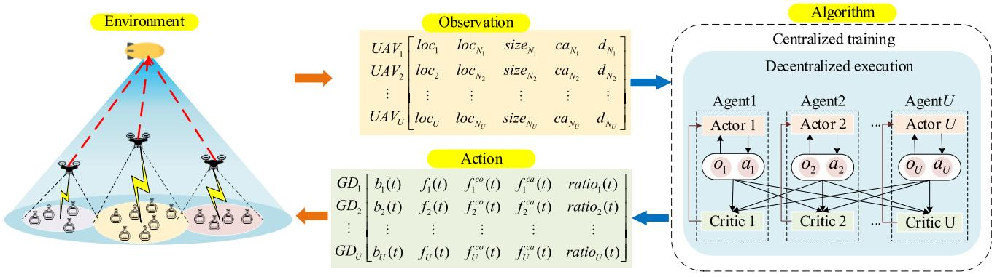

flowchart

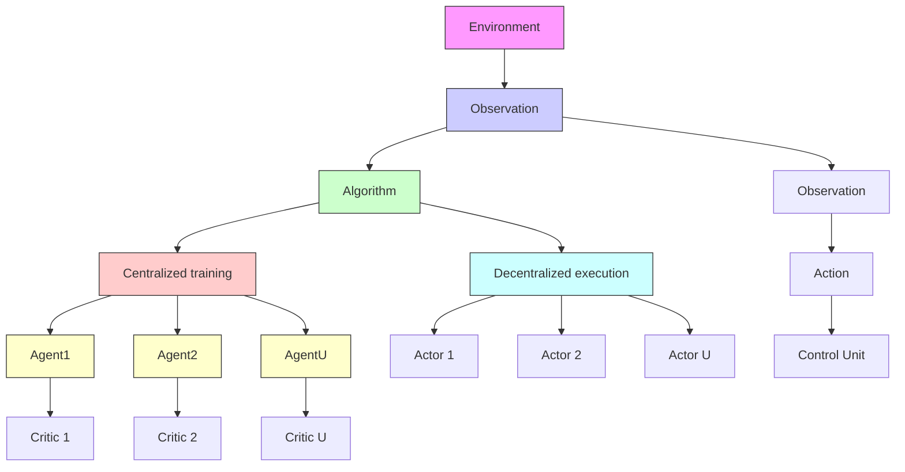

Fig. 3. MAPPO framework.

$$
H _ {2} (t) = \left\{ \begin{array}{l l} 1, & f _ {n, u} ^ {\mathrm{ca}} C a _ {u} \geq \operatorname{size} _ {n} (t) \\ 0, & \text { else }. \end{array} \right. \tag {13}
$$

# V. MAPPO-BASED ALGORITHM

In this section, PPO algorithm preliminary is introduced first. Then, a detailed MAPPO framework and algorithm is designed to solve the optimization problem.

# A. PPO

The PPO algorithm is an emerging policy gradient (PG) algorithm. It designs a novel objective function to achieve mini-batch updates, addressing the problem of the PG algorithm sensitive to step size and hard to determine a reasonable step size. Originated from the trust region policy optimization (TRPO) algorithm [34], [35], PPO introduces a clipped surrogate objective. Let $\pi _ { \theta }$ represent the actor network for approximating the policy, and $V _ { \phi }$ denote the critic network to approximate the value function, in which $\theta$ and $\phi$ denote the parameters of the actor network and the critic network, respectively.

The clipped surrogate objective function of PPO is formu- -  lated by

$$
L ^ {\mathrm{CLIP}} (\theta) = E _ {t} \left[ \min \left(\rho_ {t} (\theta), \operatorname{clip} \left(\rho_ {t} (\theta), 1 - \varepsilon , 1 + \varepsilon\right)\right) \widehat {A} (t) \right]. \tag {14}
$$

In (14), $\rho _ { t } ( \theta ) = \pi _ { \theta } ( a _ { t } | s _ { t } ) / \pi _ { \theta _ { \mathrm { 0 l d } } } ( a _ { t } | s _ { t } )$ is the ratio of the new policy to the old policy, and ε is a clip fraction. The clipping method function is to avoid the excessive modification of the objective value. - $\widehat { A } ( t )$ is the generalized advantage estimator (GAE) [36], as shown in

$$
\widehat {A} (t) \approx r (s, a) + \gamma V _ {\phi} (s _ {t + 1}) - V _ {\phi} (s _ {t}). \tag {15}
$$

The critic network is parameterized by  $\phi$ and is learned using gradient descent with the loss function as follows:

$$
L ^ {V F} (\phi) = E _ {t} \left[ \left(V _ {\phi} (s _ {t}) - y (t)\right) ^ {2} \right] \tag {16}
$$

where the target value $y ( t ) = r _ { t } + \gamma V _ { \phi } ( s _ { t + 1 } )$ .

The original work in single-agent PPO proposed an augmentation of the overall objective function with an entropy bonus $X [ \pi _ { \theta } ]$ to promote exploration [37]. Summing up the above-mentioned loss terms with the entropy bonus, the overall objective function is

$$
L ^ {\text { total }} = E _ {t} \left[ L ^ {\text { CLIP }} (\theta) - c _ {1} L ^ {V F} (\phi) + c _ {2} X [ \pi_ {\theta} ] (s _ {t}) \right] \tag {17}
$$

where $c _ { 1 }$ and $c _ { 2 }$ are coefficients, and $X [ \pi _ { \theta } ] ( s _ { t } )$ denotes the entropy of the policy when offered by the input state $s _ { t }$ .

# B. MAPPO Framework

Multiagent reinforcement learning is capable of offering a distributed perspective on the intelligent resource allocation and task offloading for hierarchical aerial computing systems especially when these UAVs only have local observation.

As illustrated in Fig. 3, the MAPPO framework includes $U$ agents and the environment, where each UAV as an agent performs PPO algorithm. Profiting by the actor and the critic compositions in the PPO algorithm, centralized training and decentralized execution framework is adopted in the MAPPO framework [38]. As shown in Fig. 3, each agent has two phases: 1) centralized training and 2) decentralized execution. Note that the training phase is offline, and the exploration is used to explore the optimal policy. In the execution phase, it only needs to forward propagation without a random exploration process. Next, we take an agent as an example to illustrate how to centrally train the MAPPO model and execute the learned model in a decentralized method.

In the centralized training stage, the critic acts as a central coordinator and calculates the centralized action–value function $Q ( s , a _ { 1 } , a _ { 2 } , \ldots , a _ { u } | \phi )$ based on the global state information including all agents’ actions and observations. The centralized Q function evaluates actor actions from a global perspective and guides it to choose better action. Then, the  critic network updates the parameters $\theta ^ { c }$ by minimizing the loss

$$
\operatorname{loss} \left(\theta^ {c}\right) = E \left[ Q (s, a _ {1}, a _ {2}, \dots , a _ {u} | \phi) - y ^ {\text { MAPPO }} \right] ^ {2}
$$

where

$$
y ^ {\text { MAPPO }} = r _ {t} + \gamma Q ^ {\prime} \left(s ^ {\prime}, a _ {1} ^ {\prime}, a _ {2} ^ {\prime}, \dots , a _ {u} ^ {\prime} | \phi^ {\prime}\right)
$$

in which $s = ( s _ { 1 } , s _ { 2 } , . . . , s _ { u } )$ and $\phi$ is the parameter of the critic network. $s ^ { \prime }$ denotes the updated states for the target network and $\phi ^ { \prime }$ is the updated parameters of the evaluation network. On the other hand, the actor network updates network parameters θ and outputs actions according to the centralized Q function calculated by the critic network and its own observation. In specific, the actor network is directly adjusting the network parameters θ at the direction of $\nabla _ { \boldsymbol { \theta } } J ( \boldsymbol { \theta } )$ , which is expressed in (18). The global state turns a partially observable MDP into a fully observable MDP by assuming a centralized value function, resulting in faster and simpler value learning

Algorithm 1 MAPPO-Based Algorithm   
1: Initialize policy network $\pi_{\theta}$ and value network $V_{\phi}$ , let $\pi_{\theta'} = \pi_{\theta}$ 2: Initialize a memory buffer D
3: for episode = 1, 2, ..., L do
4: $s_{1} = \text{initialize state}$ 5: for step = 1, 2, ..., T do
6: Each agent m executes action according to $\pi_{\theta'}(a_{t}^{\mu}|o_{t}^{\mu})$ 7: Get the reward $r_{t}$ , and the next state $s_{t+1}$ 8: end
9: Get a trajectory for each UAV $u:\tau^{u}=\{o_{t}^{u},a_{t}^{u},r_{t}^{u}\}_{t=1}^{T}$ 10: Compute $\{Q^{u}(s_{t},a_{t})\}_{t=1}^{T}$ according to Eq. (10a)
11: Compute advantages $\{A^{u}(s_{t}^{u},a_{t})\}_{t=1}^{T}$ according to Eq. (11a)
12: Store data $\{[o_{t}^{u},a_{t}^{u},Q^{u}(s_{t},a_{t}),A^{u}(s_{t}^{u},a_{t})]_{u=1}^{N}\}_{t=1}^{T}$ into D
13: for k = 1, 2, ..., K do
14: Shuffle and renumber the data's order
15: for j = 0, 1, 2, ..., T/B - 1 do
16: Select B group of data $D_{j}$ 17: $D_{j}=\{[o_{t}^{u},a_{t}^{u},Q^{u}(s_{t},a_{t}),A^{u}(s_{t}^{u},a_{t})]_{u=1}^{M}\}_{t=1}^{B}$ 18: for u = 1, 2, ..., M do
19: compute gradient according to Eq. (13)
20: Apply gradient ascent on $\theta^{u}$ using by Adam
21: Apply gradient descent on $\phi^{u}$ using by Adam
22: end
23: end
24: end
25: Update network parameters for each UAV
26: Empty D
27: end

$$
\nabla_ {\theta} J (\theta) \approx E [ \nabla_ {a} Q (s, a _ {1}, a _ {2}, \dots , a _ {u} | \phi) \nabla_ {\theta} \pi (s | \theta) ]. \tag {18}
$$

In the decentralized execution stage, the critic network is not included, and only the trained actor network works online. The decentralized actors make decisions only according to UAVs’ local observations [39], [40]. There is simply a forward propagation process going on throughout this execution, which greatly reduces time consumption and computation resource consumption compared with the training phase. Among the actors with well-trained parameters, each agent obtains a near global optimal action without knowing other agents’ information.

# C. MAPPO Algorithm

The PPO-based multiagent reinforcement learning algorithm for hierarchical aerial computing systems is summarized in Algorithm 1. Specifically, network training consists of two

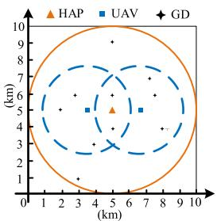

scatter

| Method | X (km) | Y (km) |
|--------|--------|--------|
| HAP    | 5      | 5      |
| UAV    | 6      | 4      |
| GD     | 7      | 3      |

Fig. 4. Coverage of the UAVs and HAP for GDs.

stages: 1) the experience collection stage and 2) policy update stage. In the first stage, each UAV chooses an action using the shared policy and collects experience until the maximum time step T is reached (lines 5–9). Then, the action–state function and advantage function are calculated based on (13) and (14), respectively (lines 10 and 11).

In the second stage, the policy network $\pi _ { \theta }$ is optimized K epochs with loss function $\dot { L } ^ { \mathrm { C L I P } } ( \theta )$ and state value network $V _ { \phi }$ is optimized K times with loss function $L ^ { V } ( \phi )$ on the same mini-batch data sampled from the memory buffer D. To ensure that the training process is steady, the data samples are randomly renumbered and shuffled in order to break any correlations between them (line 14). The network structure of the state value network $V _ { \phi }$ is identical to that of the policy network πθ , with the exception that there is only one output value in the last layer. The optimization tool used is Adam optimizer [41].

# VI. SIMULATION RESULTS

In this section, we first describe the setup and parameters employed in the simulation in Section VI-A. Then, we give the convergence performance of the algorithm in Section VI-B. Also, the hierarchical computing system is evaluated in Section VI-C and our proposed MAPPO based algorithm is compared with other multiagent algorithm in Section VI-D. Finally, the performance evaluation of our method is shown in Section VI-E.

# A. Simulation Setting

In the training process, we consider an environment of size 10 km×10 km, which consists of an HAP deployed in the network center with a fixed height of 20 km [11], two UAVs $( U = 2 )$ at the height of 2 km and 10 GDs. GDs are randomly distributed in the network area, as shown in Fig. 4. The maximum coverage radius of the HAP and UAVs are set to 5 and 2.5 km, respectively. GDs under the coverage of UAV can associate with the UAV, while the GDs under the overlapping area can only associate with one UAV. Each GD’s associate pattern is jointly determined by the association action elements of the UAVs.

In the training stage, we determine the amounts of spectrum, computing, and caching resources available for the HAP and UAVs to be {10 $\mathrm { M H z } , \breve { 5 } \times 1 0 ^ { 1 0 }$ cycles/s, 10 Gbit} and {2 MHz, $1 0 ^ { 9 }$ cycles/s, 2 Gbit}, respectively. It is assumed that the task generation rate of each GD is one task per time slot. We set the simulation parameters setting according to [10] and [11].

TABLE III SIMULATION PARAMETERS 

<table><tr><td>Para.</td><td>Value</td><td>Para.</td><td>Value</td></tr><tr><td> $P_n$ </td><td>0.5 W</td><td> $α_0$ </td><td> $1.42×10^{-4}$ </td></tr><tr><td> $σ^2$ </td><td>-100 dBm/Hz</td><td>cycle(t)</td><td>[500, 1000] cycles/bit</td></tr><tr><td> $P_u$ </td><td>10 W</td><td>size(t)</td><td>[10, 100] Mbit</td></tr><tr><td> $Ca_u$ </td><td>2 Gbit</td><td>delay(t)</td><td>[10, 200] s</td></tr><tr><td> $S_u$ </td><td>2 MHz</td><td> $C_h$ </td><td> $5×10^{10}$ cycles/s</td></tr><tr><td> $C_u$ </td><td> $10^9$ cycles/s</td><td> $H_h$ </td><td>20 km</td></tr></table>

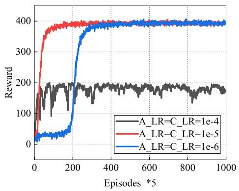

line

| Episodes *5 | A_LR=C_LR=1e-4 | A_LR=C_LR=1e-5 | A_LR=C_LR=1e-6 |
| ----------- | --------------- | --------------- | --------------- |
| 0           | 0               | 0               | 0               |
| 200         | 180             | 380             | 380             |
| 400         | 180             | 400             | 400             |
| 600         | 180             | 400             | 400             |
| 800         | 180             | 400             | 400             |
| 1000        | 180             | 400             | 400             |

Fig. 5. Convergence performance of MAPPO.

Unless otherwise specified, other parameters are set as the default settings given in Table III.

Three learning rates for the actor and critic networks are studied: $\mathrm { A \_ L R } / \mathrm { C \_ L R } \ = \ 1 e \mathrm { ~ - ~ } 4 / 1 e \mathrm { ~ - ~ } 4 , 1 e \mathrm { ~ - ~ } 5 / 1 e \mathrm { ~ - ~ } 5 ,$ $1 e - 6 / 1 e - 6$ . We set 5000 episodes with 500 steps in each episode. The simulation is implemented via Python 3.8 and Pytorch open-source machine learning library [41]. The training of DNNs is conducted on Intel Xeon CPUs and NVIDIA GTX 1080 Ti GPUs.

# B. Convergence Performance

Various learning rates for actor and critic is considered to evaluate the convergence performance of the proposed algorithm.

Since the learning rate is the most crucial hyperparameter affecting the learning performance, Fig. 5 shows the convergence performance of MAPPO for different actor learning rates (A\_LR) and critic learning rates (C\_LR). From the figure, we can see that the total reward becomes larger with the episode increasing and it can converge finally for all learning rates. This is because, during the training process, the actor and critic will adjust their network parameters to obtain the optimal policies. Besides, a higher total reward is achieved faster with $\mathrm { A \_ L R } / \mathrm { C \_ L R } = 1 e - 5 / 1 e - 5 ,$ , compared with other learning rates. Thus, we choose $\mathrm { A \_ L R } / \mathrm { C \_ L R } = 1 e - 5 / 1 e - 5$ for the remaining performance evaluations.

# C. Combinative Computing Evaluation

In this section, we compare our proposed hierarchical computing system with other nonhierarchical systems to highlight the advantage of hierarchical aerial computing systems. In Fig. 6, we explore the performance of different computing mechanisms. UAV-only means that the collected task can only be computed at UAVs. HAP-only denotes that UAVs upload all the collected tasks to the HAP, and the HAP will process the tasks. UAV–HAP represents the collected tasks that can be computed by the combination of UAVs and HAP, and UAVs will decide the optimal offloading ratio to reduce the task processing delay, as presented in Algorithm 1. From Fig. 6, we can see that the proposed hierarchical computing with the combination of UAVs and HAP outperforms both the UAV-only and HAP-only in terms of maximizing the total amount of computed tasks. As a component of the QoS, delay requirement is mainly influenced by the offloading mechanisms. Hence, we mainly analyze the impact of nonhierarchical systems on the delay. In our scenario, if all tasks are computed at the HAP, they must first be collected by UAVs and then offloaded to the HAP. Due to the long transmission delay of the UAV–HAP link, the time that all tasks are only finished at the HAP will be long, so the delay requirement cannot be satisfied, leading to lower reward. If the tasks are only computed at UAVs, the reward is larger than HAP-only, because the transmission rate of the IoT–UAV link is faster than that of the UAV–HAP link. That results in a lower delay than HAPonly, so the delay requirement can be ensured more easily. Therefore, it is verified that the advantage of hierarchical aerial computing architecture.

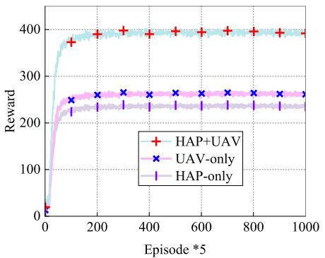

line

| Episode *5 | HAP+UAV | UAV-only | HAP-only |
| ---------- | ------- | -------- | -------- |
| 0          | 0       | 0        | 0        |
| 100        | 380     | 250      | 230      |
| 200        | 400     | 260      | 235      |
| 300        | 400     | 260      | 235      |
| 400        | 400     | 260      | 235      |
| 500        | 400     | 260      | 235      |
| 600        | 400     | 260      | 235      |
| 700        | 400     | 260      | 235      |
| 800        | 400     | 260      | 235      |
| 900        | 400     | 260      | 235      |
| 1000       | 400     | 260      | 235      |

Fig. 6. Reward with nonhierarchical systems.

# D. Algorithm Comparison

In this section, our proposed algorithm is compared from two perspectives: 1) training efficiency and 2) performance improvement. Namely, training tricks are added in our algorithm to accelerate the training speed and our proposed MAPPO-based algorithm is compared with multiagent deep deterministic PGs (MADDPG) to demonstrate the advantage of our proposed algorithm in terms of improving the amount of computed tasks.

Our algorithm integrates state (observation) normalization and action mask to improve the training efficiency. Specifically, state normalization is to address the problem of input variables’ magnitude difference and action mask can filter out the improper actions and avoid unnecessary exploration in RL. To reflect the differences, we make a comparison between the cases with and without observation normalization and action mask, shown in Fig. 7. “w.o. action\_mask” means that the proposed MAPPO algorithm is without action mask. Namely, the illegal actions cannot be canceled in the action space. “w.o. obs\_normal” indicates that the proposed MAPPO algorithm is without observation normalization. It can be observed from Fig. 7 that MAPPO without observation normalization will fall into a suboptimal solution and MAPPO without action mask will decelerate the convergence time. If the policy is trained without observation normalization, i.e., without introducing scale factor into the observation normalization, it will fall into a suboptimal solution. When the algorithm is without the observation normalization, the values of GD and UAV locations are too large compared to other dimensions, which leads to the random initialization of DNN to output a larger value. On the other hand, the action mask filters some unavailable actions, guiding the agent to the optimal solution faster.

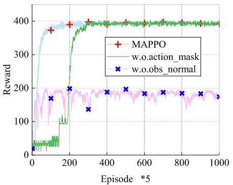

line

| Episode *5 | MAPPO | w.o.action_mask | w.o.obs_normal |
| ---------- | ----- | -------------- | -------------- |
| 0          | 0     | 0              | 0              |
| 100        | 380   | 50             | 180            |
| 200        | 400   | 100            | 200            |
| 300        | 400   | 350            | 150            |
| 400        | 400   | 400            | 180            |
| 500        | 400   | 400            | 180            |
| 600        | 400   | 400            | 180            |
| 700        | 400   | 400            | 180            |
| 800        | 400   | 400            | 180            |
| 900        | 400   | 400            | 180            |
| 1000       | 400   | 400            | 180            |

Fig. 7. Reward without observation normalization or action mask.

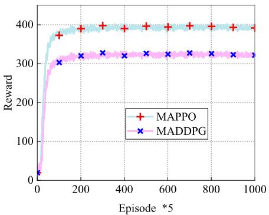

line

| Episode *5 | MAPPO | MADDPG |
| ---------- | ----- | ------ |
| 0          | 0     | 0      |
| 100        | 380   | 300    |
| 200        | 400   | 320    |
| 300        | 400   | 320    |
| 400        | 400   | 320    |
| 500        | 400   | 320    |
| 600        | 400   | 320    |
| 700        | 400   | 320    |
| 800        | 400   | 320    |
| 900        | 400   | 320    |
| 1000       | 400   | 320    |

Fig. 8. Rewards under different multiagent RL algorithms.

Fig. 8 compares the performance of different multiagent RL algorithms in the same system. MADDPGs, as a representative in multiagent RL algorithm, has been widely adopted. Besides, MADDPG also adopts a centralized training with decentralized execution framework, so we mainly compare our algorithm with MADDPG. It is shown that our MAPPO outperforms MADDPG. Although MADDPG also adopts a centralized training with decentralized execution framework, the deterministic policy has a poor exploration ability and it is easy to fall into the local optimal solution. Moreover, MADDPG is easy to cause overestimation of the Q function, leading to the fluctuation of the training curves [42], [43], [44]. Therefore,

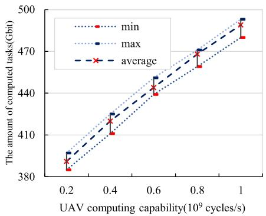

line

| UAV computing capability(10^9 cycles/s) | min   | max   | average |
| -------------------------------------- | ----- | ----- | ------- |
| 0.2                                    | 385   | 390   | 387     |
| 0.4                                    | 410   | 415   | 412     |
| 0.6                                    | 440   | 445   | 442     |
| 0.8                                    | 465   | 470   | 468     |
| 1.0                                    | 480   | 490   | 485     |

Fig. 9. Amount of computed tasks under different UAV computation capability.

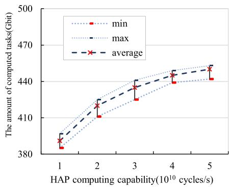

line

| HAP computing capability(10^10 cycles/s) | min   | max   | average |
| --------------------------------------- | ----- | ----- | ------- |
| 1                                       | 385   | 390   | 388     |
| 2                                       | 410   | 420   | 415     |
| 3                                       | 430   | 440   | 435     |
| 4                                       | 440   | 450   | 445     |
| 5                                       | 445   | 455   | 450     |

Fig. 10. Amount of computed tasks under different HAP’s computation capability.

it performs relatively poorly than MAPPO in the considered system. As a mainstream algorithm in the field of RL, MAPPO employs the critic network with global observation and the actor network with local observation to achieve the cooperation among UAVs, and the action entropy reward is added to encourage the exploration of UAVs. Hence, MAPPO can obtain the highest reward compared with MADDPG, which fully demonstrates the efficiency of our proposed algorithm in terms of improving the amount of computed tasks.

# E. Performance Evaluation

In this section, simulation experiments considering various parameters are conducted to evaluate the performance of our proposed method.

We further investigate the impacts of computation capability of UAVs and HAPs on the total amount of computed tasks in Figs. 9 and 10. It is observed that the increase of both UAV and HAP’s computation capability imposes positive impact on the total computed tasks. Differently, the variation of UAV’s computation capability has a more prominent influence on the computed task size than HAP’s computation capability. The reason is that UAVs are closer to the GDs and HAP is just a standby powerful MEC to process the tasks in order to decrease the computing delay. Besides, there exists transmission delay between UAVs and HAP, which cannot be ignored. Therefore, the impact of UAV’s computation capability variation is larger.

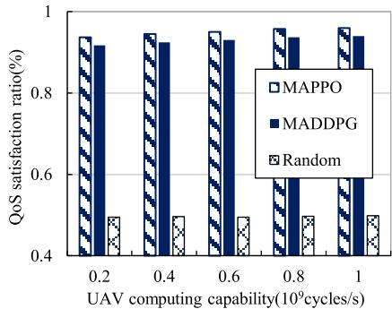

bar

| UAV computing capability(10^9cycles/s) | MAPPO | MADDPG | Random |
| ------------------------------------- | ----- | ------ | ------ |
| 0.2                                   | 0.95  | 0.92   | 0.48   |
| 0.4                                   | 0.96  | 0.93   | 0.49   |
| 0.6                                   | 0.97  | 0.94   | 0.49   |
| 0.8                                   | 0.98  | 0.95   | 0.49   |
| 1.0                                   | 0.98  | 0.95   | 0.49   |

Fig. 11. QoS satisfaction ratio under different UAV computation capability.   
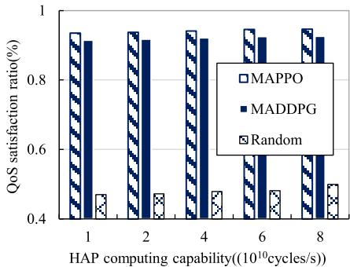

bar

| HAP computing capability((10^10 cycles/s)) | MAPPO | MADDPG | Random |
| ---------------------------------------- | ----- | ------ | ------ |
| 1                                        | 0.95  | 0.92   | 0.47   |
| 2                                        | 0.95  | 0.93   | 0.47   |
| 4                                        | 0.95  | 0.93   | 0.47   |
| 6                                        | 0.95  | 0.93   | 0.47   |
| 8                                        | 0.95  | 0.93   | 0.47   |

Fig. 12. Average satisfaction ratio under different HAP’s computation capability.

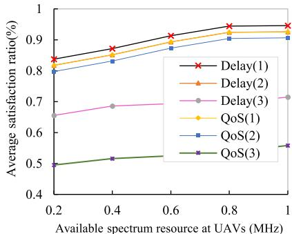

line

| Available spectrum resource at UAVs (MHz) | Delay(1) | Delay(2) | Delay(3) | QoS(1) | QoS(2) | QoS(3) |
| ----------------------------------------- | -------- | -------- | -------- | ------ | ------ | ------ |
| 0.2                                       | 0.85     | 0.83     | 0.67     | 0.81   | 0.80   | 0.50   |
| 0.4                                       | 0.88     | 0.86     | 0.69     | 0.84   | 0.83   | 0.52   |
| 0.6                                       | 0.91     | 0.89     | 0.70     | 0.87   | 0.86   | 0.53   |
| 0.8                                       | 0.94     | 0.92     | 0.71     | 0.90   | 0.89   | 0.55   |
| 1.0                                       | 0.95     | 0.93     | 0.72     | 0.91   | 0.90   | 0.56   |

Fig. 13. Average satisfaction ratio under different spectrum resources at UAVs.

Figs. 11 and 12 explore the influence of computation capability of UAVs and HAP on the QoS satisfaction ratio under different algorithms. “Random” means that UAVs randomly allocate the resources and offload the tasks to HAP. It can be observed that MAPPO achieves the highest QoS satisfaction ratio. And the QoS satisfaction ratio increases with increasing UAV and HAP computing capabilities. Besides, there is a gap between the random policy and the policies achieved by MAPPO and MADDPG, which denotes that the two reinforcement learning algorithms learned better policies. In addition, we can observe that the QoS satisfaction has an increment with the increase of HAP’s and UAVs’ computation capability.

Fig. 13 illustrates the average QoS/delay satisfaction ratio achieved by different algorithms with different UAV available spectrum resource. In Fig. 13, due to limited space, we use “1,” “2,” and “3” to represent MAPPO, MADDPG, and Random, respectively. Different from the random policy, both MAPPO and MADDPG jointly manage the resource and task offloading ratio in order to satisfy the GDs’ QoS requirements. Hence, under different available spectrum resource of UAVs, MAPPO and MADDPG can achieve more than double QoS satisfaction ratios than the Random one. Besides, it is observed that the QoS satisfaction ratio is always lower than the delay satisfaction ratio, because the delay requirement is a part of the QoS requirements. Also, with a large amount of spectrum, higher delay/QoS satisfaction ratios are achieved. The reason is that UAV can access to more GDs with large spectrum resource, but the UAVs’ computing and cache resources are unchangeable, so the growth of QoS/delay satisfaction ratios is not obvious.

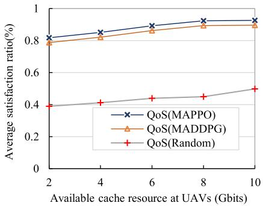

line

| Available cache resource at UAVs (Gbits) | QoS(MAPPO) | QoS(MADDPG) | QoS(Random) |
| ---------------------------------------- | ---------- | ----------- | ----------- |
| 2                                        | 0.8        | 0.78        | 0.4         |
| 4                                        | 0.85       | 0.8         | 0.42        |
| 6                                        | 0.9        | 0.85        | 0.45        |
| 8                                        | 0.92       | 0.88        | 0.47        |
| 10                                       | 0.93       | 0.9         | 0.5         |

Fig. 14. Average satisfaction ratio under different cache resources at UAVs.

Fig. 14 shows the average QoS satisfaction ratio achieved by different algorithms versus the amount of cache resource available to the UAVs. Since the delay satisfaction ratio is not influenced by the allocation of UAV caching resource, only the QoS satisfaction ratios are drawn in Fig. 14. We can see that the average satisfaction ratio increases with the increasing available cache resource. Also, MAPPO and MADDPG achieve more than doubled satisfaction ratio than the random policy. In addition, it is obvious that when the cache resource becomes large, UAVs can store more tasks and the cache requirement can be satisfied more easily, which results in the QoS can be satisfied more easily.

# VII. CONCLUSION AND FUTURE WORK

This article investigates a hierarchical aerial computing system where both UAVs and the HAP can provide computing services for GDs. We formulate an optimization problem with the goal of maximizing the amount of computed tasks while satisfying heterogeneous QoS requirements by jointly optimizing UAV multidimension resource allocation and task offloading. To deal with the high dynamics and complexity of the problem and support GDs’ heterogeneous QoS requirements, the problem was transformed as a POMDP problem. Then, we design a PPO-based multiagent algorithm to address the problem by cooperatively managing UAV association pattern, resource allocation, and task offloading. Extensive numerical experiments validate the advantage of the hierarchical aerial computing systems and the efficiency of our proposed algorithm in in-field applications.

In this article, the UAV trajectory optimization is not considered. Actually, the UAV trajectory also plays an important role in data collection and offloading. Our method will be extended to investigate this situation in our future work. Besides, it is assumed that the spectrum sensing is perfect in our system. However, in realistic applications, the perfect spectrum sensing is hard to achieve. Therefore, we will explore the influence of spectrum sensing on task offloading and resource allocation in our future work.

# ACKNOWLEDGMENT

The authors would like to thank the editors and anonymous reviewers for their helpful comments.

# REFERENCES

[1] Y. Wang, Z. Su, Q. Xu, R. Li, and T. H. Luan, “Lifesaving with RescueChain: Energy-efficient and partition-tolerant blockchain based secure information sharing for UAV-aided disaster rescue,” in Proc. IEEE INFOCOM Conf. Comput. Commun., Vancouver, BC, Canada, May 2021, pp. 1–10, doi: 10.1109/INFOCOM42981.2021.9488719.   
[2] R. W. L. Coutinho and A. Boukerche, “UAV-mounted cloudlet systems for emergency response in industrial areas,” IEEE Trans. Ind. Informat., vol. 18, no. 11, pp. 8007–8016, Nov. 2022, doi: 10.1109/TII.2022.3174113.   
[3] L. Oddi et al., “Using UAV imagery to detect and map woody species encroachment in a subalpine grassland: Advantages and limits,” Remote Sens., vol. 13, no. 7, p. 1239, Mar. 2021, doi: 10.3390/rs13071239.   
[4] Q. Chen, H. Zhu, L. Yang, X. Chen, S. Pollin, and E. Vinogradov, “Edge computing assisted autonomous flight for UAV: Synergies between vision and communications,” IEEE Commun. Mag., vol. 59, no. 1, pp. 28–33, Jan. 2021, doi: 10.1109/MCOM.001.2000501.   
[5] W. C. Ng, W. Y. B. Lim, J. S. Ng, S. Sawadsitang, Z. Xiong, and D. Niyato, “Optimal stochastic coded computation offloading in unmanned aerial vehicles network,” in Proc. IEEE Global Commun. Conf. (GLOBECOM), Madrid, Spain, Dec. 2021, pp. 1–6, doi: 10.1109/GLOBECOM46510.2021.9685988.   
[6] D. Wang, M. Giordani, M.-S. Alouini, and M. Zorzi, “The potential of multilayered hierarchical nonterrestrial networks for 6G: A comparative analysis among networking architectures,” IEEE Veh. Technol. Mag., vol. 16, no. 3, pp. 99–107, Sep. 2021, doi: 10.1109/MVT.2021.3085168.   
[7] P. Ramezani, B. Lyu, and A. Jamalipour, “Toward RIS-enhanced integrated terrestrial/non-terrestrial connectivity in 6G,” IEEE Netw., early access, Aug. 1, 2022, doi: 10.1109/MNET.116.2200060.   
[8] G. K. Kurt et al., “A vision and framework for the high altitude platform station (HAPS) networks of the future,” IEEE Commun. Surveys Tuts., vol. 23, no. 2, pp. 729–779, 2nd Quart., 2021, doi: 10.1109/COMST.2021.3066905.   
[9] M. M. Azari, S. Solanki, S. Chatzinotas, and M. Bennis, “THzempowered UAVs in 6G: Opportunities, challenges, and tradeoffs,” IEEE Commun. Mag., vol. 60, no. 5, pp. 24–30, May 2022, doi: 10.1109/MCOM.001.2100889.   
[10] Z. Jia, Q. Wu, C. Dong, C. Yuen, and Z. Han, “Hierarchical aerial computing for Internet of Things via cooperation of HAPs and UAVs,” IEEE Internet Things J., early access, Feb. 16, 2022, doi: 10.1109/JIOT.2022.3151639.   
[11] D. S. Lakew, A.-T. Tran, N.-N. Dao, and S. Cho, “Intelligent offloading and resource allocation in heterogeneous aerial access IoT networks,” IEEE Internet Things J., early access, Mar. 25, 2022, doi: 10.1109/JIOT.2022.3161571.   
[12] Y. Zhang, Z. Mou, F. Gao, J. Jiang, R. Ding, and Z. Han, “UAV-enabled secure communications by multi-agent deep reinforcement learning,” IEEE Trans. Veh. Technol., vol. 69, no. 10, pp. 11599–11611, Oct. 2020, doi: 10.1109/TVT.2020.3014788.   
[13] M. Wiering and M. van Otterlo, Eds., Reinforcement Learning, vol. 12. Berlin, Germany: Springer, 2012, doi: 10.1007/978-3-642-27645-3.   
[14] A. Doshi, S. Yerramalli, L. Ferrari, T. Yoo, and J. G. Andrews, “A deep reinforcement learning framework for contention-based spectrum sharing,” IEEE J. Sel. Areas Commun., vol. 39, no. 8, pp. 2526–2540, Aug. 2021, doi: 10.1109/JSAC.2021.3087254.   
[15] W. Kim, M. Cho, and Y. Sung, “Message-dropout: An efficient training method for multi-agent deep reinforcement learning,” in Proc. AAAI, vol. 33, Jul. 2019, pp. 6079–6086, doi: 10.1609/aaai.v33i01.33016079.   
[16] L. Chen et al., “Decision transformer: Reinforcement learning via sequence modeling,” 2021, arXiv:2106.01345.

[17] H. Peng and X. Shen, “Multi-agent reinforcement learning based resource management in MEC- and UAV-assisted vehicular networks,” IEEE J. Sel. Areas Commun., vol. 39, no. 1, pp. 131–141, Jan. 2021, doi: 10.1109/JSAC.2020.3036962.   
[18] A. M. Seid, G. O. Boateng, B. Mareri, G. Sun, and W. Jiang, “Multi-agent DRL for task offloading and resource allocation in multi-UAV enabled IoT edge network,” IEEE Trans. Netw. Service Manag., vol. 18, no. 4, pp. 4531–4547, Dec. 2021, doi: 10.1109/TNSM.2021.3096673.   
[19] J. Cui, Y. Liu, and A. Nallanathan, “Multi-agent reinforcement learning-based resource allocation for UAV networks,” IEEE Trans. Wireless Commun., vol. 19, no. 2, pp. 729–743, Feb. 2020, doi: 10.1109/TWC.2019.2935201.   
[20] C. Zhan, H. Hu, S. Mao, and J. Wang, “Energy-efficient trajectory optimization for aerial video surveillance under QoS constraints,” in Proc. IEEE INFOCOM Conf. Comput. Commun., London, U.K., May 2022, pp. 1559–1568, doi: 10.1109/INFOCOM48880.2022.9796696.   
[21] N. Zhang, S. Zhang, P. Yang, O. Alhussein, W. Zhuang, and X. S. Shen, “Software defined space–air–ground integrated vehicular networks: Challenges and solutions,” IEEE Commun. Mag., vol. 55, no. 7, pp. 101–109, Jul. 2017, doi: 10.1109/MCOM.2017.1601156.   
[22] N. Kato et al., “Optimizing space–air–ground integrated networks by artificial intelligence,” IEEE Wireless Commun., vol. 26, no. 4, pp. 140–147, Aug. 2019, doi: 10.1109/MWC.2018.1800365.   
[23] W. Yao et al., “Artificial intelligence-based load optimization in cognitive Internet of Things,” Neural Comput. Appl., vol. 32, no. 20, pp. 16179–16189, Oct. 2020, doi: 10.1007/s00521-020-04814-w.   
[24] H. Kang, X. Chang, J. Mišic, V. B. Miši ´ c, J. Fan, and J. Bai, ´ “Improving dual-UAV aided ground-UAV bi-directional communication security: Joint UAV trajectory and transmit power optimization,” IEEE Trans. Veh. Technol., vol. 71, no. 10, pp. 10570–10583, Oct. 2022, doi: 10.1109/TVT.2022.3184804.   
[25] M. Gapeyenko, D. Moltchanov, S. Andreev, and R. W. Heath, “Line-ofsight probability for mmWave-based UAV communications in 3D urban grid deployments,” IEEE Trans. Wireless Commun., vol. 20, no. 10, pp. 6566–6579, Oct. 2021, doi: 10.1109/TWC.2021.3075099.   
[26] J. López-Fernandez, P. R. Espinosa, J. M. Romero-Jerez, and F. J. López-Martínez, “A fluctuating line-of-sight fading model with double-Rayleigh diffuse scattering,” IEEE Trans. Veh. Technol., vol. 71, no. 1, pp. 1000–1003, Jan. 2022, doi: 10.1109/TVT.2021.3131060.   
[27] E. E. Haber, H. A. Alameddine, C. Assi, and S. Sharafeddine, “UAVaided ultra-reliable low-latency computation offloading in future IoT networks,” IEEE Trans. Commun., vol. 69, no. 10, pp. 6838–6851, Oct. 2021, doi: 10.1109/TCOMM.2021.3096559.   
[28] Z. Yu, Y. Gong, S. Gong, and Y. Guo, “Joint task offloading and resource allocation in UAV-enabled mobile edge computing,” IEEE Internet Things J., vol. 7, no. 4, pp. 3147–3159, Apr. 2020, doi: 10.1109/JIOT.2020.2965898.   
[29] M. U. Farooq, A. Shakoor, and A. B. Siddique, “An efficient dynamic round robin algorithm for CPU scheduling,” in Proc. Int. Conf. Commun. Comput. Digit. Syst. (C-CODE), Islamabad, Pakistan, Mar. 2017, pp. 244–248, doi: 10.1109/C-CODE.2017.7918936.   
[30] T. Balharith and F. Alhaidari, “Round robin scheduling algorithm in CPU and cloud computing: A review,” in Proc. 2nd Int. Conf. Comput. Appl. Inf. Security (ICCAIS), Riyadh, Saudi Arabia, May 2019, pp. 1–7, doi: 10.1109/CAIS.2019.8769534.   
[31] K. G. Panda, A. Wilson, and D. Sen, “Energy-efficient initial deployment and ML-based postdeployment strategy for UAV network with guaranteed QoS,” IEEE Trans. Aerosp. Electron. Syst., vol. 58, no. 6, pp. 5220–5239, Dec. 2022, doi: 10.1109/TAES.2022.3167386.   
[32] R. Zhang, M. Wang, L. X. Cai, and X. Shen, “Learning to be proactive: Self-regulation of UAV based networks with UAV and user dynamics,” IEEE Trans. Wireless Commun., vol. 20, no. 7, pp. 4406–4419, Jul. 2021, doi: 10.1109/TWC.2021.3058533.   
[33] D. Qiu, J. Wang, J. Wang, and G. Strbac, “Multi-agent reinforcement learning for automated peer-to-peer energy trading in double-side auction market,” in Proc. 30th Int. Joint Conf. Artif. Intell., Montreal, QC, Canada, Aug. 2021, pp. 2913–2920, doi: 10.24963/ijcai.2021/401.   
[34] S. Roostaie and M. M. Ebadzadeh, “EnTRPO: Trust region policy optimization method with entropy regularization,” 2021, arXiv:2110.13373.   
[35] N. Peng, Y. Lin, Y. Zhang, and J. Li, “AoI-aware joint spectrum and power allocation for Internet of Vehicles: A trust region policy optimization-based approach,” IEEE Internet Things J., vol. 9, no. 20, pp. 19916–19927, Oct. 2022, doi: 10.1109/JIOT.2022.3172472.

[36] J. Jin and Y. Xu, “Optimal policy characterization enhanced proximal policy optimization for multitask scheduling in cloud computing,” IEEE Internet Things J., vol. 9, no. 9, pp. 6418–6433, May 2022, doi: 10.1109/JIOT.2021.3111414.   
[37] C. Yu et al., “The surprising effectiveness of PPO in cooperative, multiagent games,” Nov. 2022, arXiv:2103.01955.   
[38] D. Guo, L. Tang, X. Zhang, and Y.-C. Liang, “Joint optimization of handover control and power allocation based on multi-agent deep reinforcement learning,” IEEE Trans. Veh. Technol., vol. 69, no. 11, pp. 13124–13138, Nov. 2020, doi: 10.1109/TVT.2020.3020400.   
[39] Z. Zong, M. Zheng, Y. Li, and D. Jin, “MAPDP: Cooperative multi-agent reinforcement learning to solve pickup and delivery problems,” in Proc. AAAI, vol. 36, Jun. 2022, pp. 9980–9988, doi: 10.1609/aaai.v36i9.21236.   
[40] Q. Fu, T. Qiu, J. Yi, Z. Pu, and S. Wu, “Concentration network for reinforcement learning of large-scale multi-agent systems,” in Proc. AAAI, vol. 36, Jun. 2022, pp. 9341–9349, doi: 10.1609/aaai.v36i9.21165.   
[41] A. Paszke et al., “PyTorch: An imperative style, high-performance deep learning library,” in Proc. 33rd Int. Conf. Neural Inf. Process. Syst., 2019, pp. 8026–8037.   
[42] J. Ackermann, V. Gabler, T. Osa, and M. Sugiyama, “Reducing overestimation bias in multi-agent domains using double centralized critics,” Dec. 2019, arXiv:1910.01465.   
[43] L. Pan, L. Huang, T. Ma, and H. Xu, “Plan better amid conservatism: Offline multi-agent reinforcement learning with actor rectification,” Nov. 2021, arXiv:2111.11188.   
[44] L. Pan, T. Rashid, B. Peng, L. Huang, and S. Whiteson, “Regularized softmax deep multi-agent Q-learning,” 2021, arXiv:2103.11883.

natural_image

Black-and-white portrait of a smiling woman with curly hair (no text or symbols visible)

Jelena Mišic´ (Fellow, IEEE) received the Ph.D. degree in computer engineering from the University of Belgrade, Belgrade, Serbia, in 1993.

She is a Professor of Computer Science with Ryerson University, Toronto, ON, Canada. She has published over 120 papers in archival journals and close to 200 papers at international conferences in the areas of wireless networks, in particular wireless personal area network and wireless sensor network protocols, performance evaluation, and security.

Prof. Mišic serves on editorial boards of IEEE ´

TRANSACTIONS ON VEHICULAR TECHNOLOGY, Computer Networks, Ad Hoc Networks, Security and Communication Networks, Ad Hoc & Sensor Wireless Networks, Int. Journal of Sensor Networks, and Int. Journal of Telemedicine and Applications. She is a member of ACM.

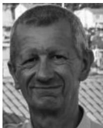

natural_image

Portrait of a smiling man outdoors (no text or symbols visible)

Vojislav B. Mišic´ (Senior Member, IEEE) received the Ph.D. degree in computer science from the University of Belgrade, Belgrade, Serbia, in 1993.

He is a Professor of Computer Science with Ryerson University, Toronto, ON, Canada. He has authored or coauthored six books, 20 book chapters, and over 280 papers in archival journals and at prestigious international conferences. His research interests include performance evaluation of wireless networks and systems and software engineering.

Prof. Mišic serves on the editorial boards of IEEE ´

TRANSACTIONS ON CLOUD COMPUTING, Ad Hoc Networks, Peer-to-Peer Networks and Applications, and International Journal of Parallel, Emergent and Distributed Systems. He is a member of ACM.

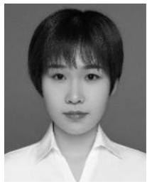

natural_image

Portrait photo of a person in a white collared shirt (no text or symbols visible)

Hongyue Kang is currently pursuing the Ph.D. degree with the School of Computer and Information Technology, Beijing Jiaotong University, Beijing, China.

Her interests include reinforcement learning and secure UAV communication.

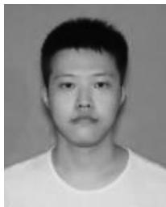

natural_image

Portrait photo of a young man with short hair and neutral expression (no text or symbols visible)

Junchao Fan is currently pursuing the master’s degree with the School of Computer and Information Technology, Beijing Jiaotong University, Beijing, China.

His interests include reinforcement learning and transfer learning.

natural_image

Portrait photo of a woman with shoulder-length dark hair (no text or symbols visible)

Xiaolin Chang (Senior Member, IEEE) received the Ph.D. degree in computer science from Hongkong University of Science and Technology, Hongkong, in 2005.

She is a Professor with the School of Computer and Information Technology, Beijing Jiaotong University, Beijing, China. Her current research interests include cloud-edge computing, network security, and secure and dependable machine learning.

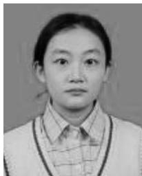

natural_image

Portrait of a young woman wearing a collared shirt and sweater (no visible text or symbols)

Yating Liu is currently pursuing the master’s degree with the School of Computer and Information Technology, Beijing Jiaotong University, Beijing, China.

Her research interests include reinforcement learning and multiagent system.