# Cost-Aware Dependent Task Offloading and Resource Allocation for Satellite Edge Computing: An Asynchronous Deep Reinforcement Learning Approach

Hualong Huang , Hancong Duan , Wenhan Zhan , Member, IEEE, Geyong Min , Member, IEEE, Kai Peng , Senior Member, IEEE, and Yuchuan Lei

Abstract—The integration of satellite communications with mobile edge computing (MEC) into space-air-ground integrated networks, known as satellite edge computing (SEC), has become a crucial research field for future communication systems to provide extensive global coverage services. This paper investigates the joint dependent task offloading and resource allocation problem for remote Internet-of-Things (IoT) applications within the SEC architecture. The proposed system leverages uncrewed aerial vehicles (UAVs) as mobile access points and edge servers and utilizes low-earth orbit (LEO) satellites and ground stations as cloud computing resources. Multiple applications with dependent tasks from IoT devices (IoTDs) are modeled as directed acyclic graphs (DAGs). To address the challenges of reducing the system cost in UAV-assisted SEC, we first propose a one-to-many matching algorithm to associate IoTDs with UAVs. Then, a multi-application task sequence algorithm is devoted to merging the multiple DAGs and sorting the task order. Finally, a graph-aware asynchronous multi-agent reinforcement learning approach empowers the agents to autonomously discover optimal offloading and resource allocation strategies. Extensive simulations based on real-world datasets demonstrate the effectiveness of the proposed approach in minimizing the system costs while meeting application latency requirements, outperforming other benchmark algorithms.

Index Terms—Satellite edge computing (SEC), task offloading, resource allocation, deep reinforcement learning, space-air-ground integrated network.

## I. INTRODUCTION

technologies. Despite their growth, IoT devices face significant challenges with limited energy and computational capabilities. Mobile cloud computing (MCC) and mobile edge computing (MEC) offer promising solutions by enabling computational task offloading to edge or cloud servers [1]. While edge servers (ESs) provide proximity and high data rates, cloud servers (CSs) offer extensive computational resources. Existing research has focused on optimizing these computing paradigms in terrestrial networks, targeting reduced latency, minimized energy consumption, and balancing these objectives [2].

With the global proliferation of remote IoTDs across various application scenarios, the lack of sufficient terrestrial access network infrastructure in suburban and rural regions results in affecting network access for IoTDs. To address this issue, satellite edge computing (SEC) has emerged as a solution, offering comprehensive computing support for IoTDs in remote areas by deploying edge computing resources on low-earth orbit (LEO) satellites [3]. Despite the SEC’s initiatives to extend computing support to remote areas using LEO satellites, direct communication between IoTDs and these LEO satellites continues to encounter several challenges in some regions. For instance, long-distance transmission and the presence of obstacles within the line of sight, such as urban canyons or densely vegetated areas, result in increased communication latency and reduced reliability [4]. Additionally, IoTDs require higher transmission power and specialized satellite antennas to establish direct communication with satellites, which consequently leads to increased energy consumption.

Fortunately, uncrewed aerial vehicles (UAVs) with the ability to adjust flight trajectories can improve coverage and offer low-latency edge computing services to IoTDs while serving as relay nodes that enhance connection stability, particularly when the signals between IoTDs and satellites are weak in some regions [5]. By integrating with UAVs, SEC develops a space-air-ground integrated network (SAGIN) to facilitate intelligent task offloading and resource allocation. This integrated network has become increasingly popular across various remote scenarios to provide edge computing capabilities that enhance the efficiency and robustness of task processing from IoTDs [6]. In this paper, we present a novel UAV-assisted SEC framework to provide seamless coverage for remote IoTDs. Specifically, in remote areas with dense obstacles, such as mountains or jungles, IoTDs can offload computational tasks to UAVs, LEO satellites, or CSs to overcome communication challenges. In contrast, in spacious areas like deserts or grasslands, where obstacles are minimal, IoTDs can establish direct communication with LEO satellites for efficient execution.

Although the SEC can provide IoTDs in remote areas with reliable communication services, in contrast to MEC and MCC within terrestrial networks, the SEC faces several primary challenges associated with multi-tier task offloading and resource allocation as follows:

1) Resource constraints across network tiers: The first challenge in developing adaptive strategies for task offloading and resource allocation in SEC stems from the power and computing constraints of IoTDs, UAVs, and satellites. These limitations hinder their ability to provide stable computing services for dynamic IoT applications. Additionally, the unique network conditions and resource constraints of different SEC tiers increase the complexity, making it difficult to design efficient computation offloading strategies that can adapt to dynamic conditions.

2) Intermittent connectivity caused by dynamic topology: The high mobility associated with LEO satellites and UAVs results in fluctuating channel conditions and changing coverage areas. This dynamic nature of aerial networks can lead to inconsistent and unpredictable communication latency and server availability, requiring meticulous and advanced management techniques to maintain the performance of the SEC. Additionally, the connectivity between LEO satellites and UAVs is intermittent, adding another layer of complexity to task scheduling and the computation offloading process.

3) Task dependencies in multi-application: In practical scenarios, mobile applications such as augmented reality and virtual reality involve a variety of dependent tasks that are often structured as directed acyclic graphs (DAGs). Existing research in SEC has rarely focused on optimizing task offloading and resource allocation while considering these dependencies. However, the complexity increases significantly when attempting to distribute multiple applications across various UAVs and LEO satellites with limited resources in the satellite environment.

Conventional approaches, such as heuristic algorithms and dynamic programming, encounter difficulties in handling realtime dependent task offloading and resource allocation in dynamic satellite environments. Multi-agent reinforcement learning (MARL) can make intelligent decisions together through interaction under the dynamic environment [7]. Typical MARL algorithms traditionally employ a synchronous model where agents collectively make decisions simultaneously at each time step [8]. However, this approach encounters significant challenges when applied to complex real-world multi-applications with heterogeneous task characteristics. In practical scenarios, dependent tasks exhibit varying execution durations and are complicated by network latency, making the strict synchronous framework problematic. The synchronous approach’s requirement of waiting for all agents to be ready before proceeding creates substantial inefficiencies, particularly for time-sensitive applications demanding immediate responses. Consequently, the ideal MARL framework for real-world applications should operate asynchronously, enabling agents to generate subsequent actions immediately upon completing their current tasks, with a learning strategy that can dynamically support such flexible, independent decision-making processes.

By considering the above issues, we investigate the joint dependent task offloading and resource allocation problem tailored for the remote IoT within the UAV-assisted SEC. In this proposed system, IoTDs are responsible for generating DAG applications, UAVs collect multiple applications from IoTDs and make intelligent decisions as agents, and LEO satellites and CS offer advanced orbital computing capabilities. The objective aims to minimize the overall system cost in terms of latency and energy consumption within specified latency constraints. To address this complex problem, we devise a graph-aware asynchronous MARL approach, which empowers the agents to autonomously discover optimal strategies through learning in an asynchronous manner. The main contributions of this article are summarized as follows.

We propose a four-tier UAV-assisted SEC framework with IoTDs, UAVs, LEO satellites and CS. Within the framework, we consider two distinct communication areas, e.g., the first scenario is that IoTDs can directly offload dependent tasks to LEO satellites in spacious regions, such as desert areas, while the second scenario is that IoTDs offload tasks via UAV relay to LEO satellites in obstructive areas, such as jungles. Moreover, we consider the variable time periods during which LEO satellites provide coverage.

In the framework of UAV-assisted SEC, we model multiple dependent tasks using the DAG and formulate the dependent task offloading and resource allocation problem as a mixed integer nonlinear programming (MINLP) problem. The objective is to minimize the overall system cost, including energy consumption and latency, by optimizing device association, transmitted power, offloading decision, communication, and computational resources.

To tackle the joint optimization problem, we decompose it into two subproblems: 1) the IoTDs association problem and 2) the dependent task offloading and resource allocation problem. Then, a one-to-many matching algorithm is developed for the IoTDs association problem to link each UAV with several IoTDs. For the second subproblem, a multi-application task sequence (MATS) algorithm is first proposed to merge multiple DAG applications and sort the task execution order of the multiple applications. To proceed, we devise an asynchronous graph neural network (GNN)-augmented multi-agent proximal policy optimization (AMAPPO) algorithm with a graph-aware encoderdecoder model to learn an efficient strategy.

We perform evaluations of our proposed method and other benchmark algorithms through extensive simulations based on real-world datasets. The numerical results demonstrate that our proposed algorithm outperforms other benchmark algorithms in terms of system cost.

The rest of this paper is organized as follows. The related work is introduced in Section II. The system model is presented in Section III. The one-to-many matching, MATS and asynchronous graph-aware AMAPPO algorithms are discussed in Section IV. In Section V, we evaluate the proposed algorithm. Section VI concludes this paper.

TABLE I COMPARISON BETWEEN OUR WORK AND EXISTING WORKS
<table><tr><td rowspan=1 colspan=1>Novelty</td><td rowspan=1 colspan=1>ours</td><td rowspan=1 colspan=1>[2]</td><td rowspan=1 colspan=1>[3]</td><td rowspan=1 colspan=1>[9]</td><td rowspan=1 colspan=1>[10]</td><td rowspan=1 colspan=1>[6]</td><td rowspan=1 colspan=1>[11]</td><td rowspan=1 colspan=1>[12]</td><td rowspan=1 colspan=1>[13]</td><td rowspan=1 colspan=1>[5]</td><td rowspan=1 colspan=1>[14]</td><td rowspan=1 colspan=1>[15]</td><td rowspan=1 colspan=1>[16]</td><td rowspan=1 colspan=1>[17]</td><td rowspan=1 colspan=1>[18]</td><td rowspan=1 colspan=1>[19]</td><td rowspan=1 colspan=1>[20]</td><td rowspan=1 colspan=1>[21]</td><td rowspan=1 colspan=1>[1]</td><td rowspan=1 colspan=1>[22]</td><td rowspan=1 colspan=1>[23]</td></tr><tr><td rowspan=1 colspan=1>Task offloading</td><td rowspan=1 colspan=1>√</td><td rowspan=1 colspan=1>√</td><td rowspan=1 colspan=1>√</td><td rowspan=1 colspan=1>√</td><td rowspan=1 colspan=1>√</td><td rowspan=1 colspan=1>了</td><td rowspan=1 colspan=1>√</td><td rowspan=1 colspan=1>√</td><td rowspan=1 colspan=1>√</td><td rowspan=1 colspan=1>√</td><td rowspan=1 colspan=1>√</td><td rowspan=1 colspan=1>√</td><td rowspan=1 colspan=1>√</td><td rowspan=1 colspan=1>√</td><td rowspan=1 colspan=1>√</td><td rowspan=1 colspan=1>√</td><td rowspan=1 colspan=1>√</td><td rowspan=1 colspan=1>√</td><td rowspan=1 colspan=1>√</td><td rowspan=1 colspan=1>√</td><td rowspan=1 colspan=1>√</td></tr><tr><td rowspan=1 colspan=1>Dynamic sat. coverage</td><td rowspan=1 colspan=1>√</td><td rowspan=1 colspan=1>√</td><td rowspan=1 colspan=1></td><td rowspan=1 colspan=1></td><td rowspan=1 colspan=1></td><td rowspan=1 colspan=1></td><td rowspan=1 colspan=1>√</td><td rowspan=1 colspan=1>√</td><td rowspan=1 colspan=1></td><td rowspan=1 colspan=1></td><td rowspan=1 colspan=1></td><td rowspan=1 colspan=1></td><td rowspan=1 colspan=1></td><td rowspan=1 colspan=1></td><td rowspan=1 colspan=1></td><td rowspan=1 colspan=1></td><td rowspan=1 colspan=1>√</td><td rowspan=1 colspan=1></td><td rowspan=1 colspan=1></td><td rowspan=1 colspan=1></td><td rowspan=1 colspan=1></td></tr><tr><td rowspan=1 colspan=1>Computational allocation</td><td rowspan=1 colspan=1>√</td><td rowspan=1 colspan=1></td><td rowspan=1 colspan=1>√</td><td rowspan=1 colspan=1>√</td><td rowspan=1 colspan=1></td><td rowspan=1 colspan=1>√</td><td rowspan=1 colspan=1>√</td><td rowspan=1 colspan=1></td><td rowspan=1 colspan=1>√</td><td rowspan=1 colspan=1>√</td><td rowspan=1 colspan=1>√</td><td rowspan=1 colspan=1>√</td><td rowspan=1 colspan=1>√</td><td rowspan=1 colspan=1></td><td rowspan=1 colspan=1>√</td><td rowspan=1 colspan=1></td><td rowspan=1 colspan=1>√</td><td rowspan=1 colspan=1>√</td><td rowspan=1 colspan=1>√</td><td rowspan=1 colspan=1>√</td><td rowspan=1 colspan=1>√</td></tr><tr><td rowspan=1 colspan=1>Power allocation</td><td rowspan=1 colspan=1>√</td><td rowspan=1 colspan=1></td><td rowspan=1 colspan=1>√</td><td rowspan=1 colspan=1>√</td><td rowspan=1 colspan=1></td><td rowspan=1 colspan=1></td><td rowspan=1 colspan=1>√</td><td rowspan=1 colspan=1></td><td rowspan=1 colspan=1></td><td rowspan=1 colspan=1></td><td rowspan=1 colspan=1></td><td rowspan=1 colspan=1></td><td rowspan=1 colspan=1>√</td><td rowspan=1 colspan=1></td><td rowspan=1 colspan=1>√</td><td rowspan=1 colspan=1></td><td rowspan=1 colspan=1></td><td rowspan=1 colspan=1>√</td><td rowspan=1 colspan=1></td><td rowspan=1 colspan=1></td><td rowspan=1 colspan=1></td></tr><tr><td rowspan=1 colspan=1>Bandwidth allocation</td><td rowspan=1 colspan=1>√</td><td rowspan=1 colspan=1></td><td rowspan=1 colspan=1></td><td rowspan=1 colspan=1></td><td rowspan=1 colspan=1></td><td rowspan=1 colspan=1></td><td rowspan=1 colspan=1></td><td rowspan=1 colspan=1></td><td rowspan=1 colspan=1></td><td rowspan=1 colspan=1>√</td><td rowspan=1 colspan=1></td><td rowspan=1 colspan=1></td><td rowspan=1 colspan=1></td><td rowspan=1 colspan=1>√</td><td rowspan=1 colspan=1></td><td rowspan=1 colspan=1></td><td rowspan=1 colspan=1></td><td rowspan=1 colspan=1></td><td rowspan=1 colspan=1></td><td rowspan=1 colspan=1></td><td rowspan=1 colspan=1></td></tr><tr><td rowspan=1 colspan=1>Task dependency</td><td rowspan=1 colspan=1>了</td><td rowspan=1 colspan=1></td><td rowspan=1 colspan=1></td><td rowspan=1 colspan=1></td><td rowspan=1 colspan=1></td><td rowspan=1 colspan=1></td><td rowspan=1 colspan=1></td><td rowspan=1 colspan=1></td><td rowspan=1 colspan=1></td><td rowspan=1 colspan=1></td><td rowspan=1 colspan=1></td><td rowspan=1 colspan=1></td><td rowspan=1 colspan=1></td><td rowspan=1 colspan=1></td><td rowspan=1 colspan=1></td><td rowspan=1 colspan=1>√</td><td rowspan=1 colspan=1>√</td><td rowspan=1 colspan=1></td><td rowspan=1 colspan=1></td><td rowspan=1 colspan=1></td><td rowspan=1 colspan=1></td></tr><tr><td rowspan=1 colspan=1>Device matching</td><td rowspan=1 colspan=1>√</td><td rowspan=1 colspan=1></td><td rowspan=1 colspan=1>√</td><td rowspan=1 colspan=1></td><td rowspan=1 colspan=1></td><td rowspan=1 colspan=1></td><td rowspan=1 colspan=1></td><td rowspan=1 colspan=1></td><td rowspan=1 colspan=1></td><td rowspan=1 colspan=1></td><td rowspan=1 colspan=1>√</td><td rowspan=1 colspan=1></td><td rowspan=1 colspan=1>√</td><td rowspan=1 colspan=1></td><td rowspan=1 colspan=1>√</td><td rowspan=1 colspan=1></td><td rowspan=1 colspan=1>√</td><td rowspan=1 colspan=1></td><td rowspan=1 colspan=1></td><td rowspan=1 colspan=1></td><td rowspan=1 colspan=1></td></tr><tr><td rowspan=1 colspan=1>UAV service</td><td rowspan=1 colspan=1>√</td><td rowspan=1 colspan=1></td><td rowspan=1 colspan=1></td><td rowspan=1 colspan=1></td><td rowspan=1 colspan=1></td><td rowspan=1 colspan=1></td><td rowspan=1 colspan=1></td><td rowspan=1 colspan=1>√</td><td rowspan=1 colspan=1></td><td rowspan=1 colspan=1></td><td rowspan=1 colspan=1>√</td><td rowspan=1 colspan=1></td><td rowspan=1 colspan=1></td><td rowspan=1 colspan=1></td><td rowspan=1 colspan=1></td><td rowspan=1 colspan=1>√</td><td rowspan=1 colspan=1>√</td><td rowspan=1 colspan=1>√</td><td rowspan=1 colspan=1>√</td><td rowspan=1 colspan=1>√</td><td rowspan=1 colspan=1>√</td></tr><tr><td rowspan=1 colspan=1>UAV trajectory</td><td rowspan=1 colspan=1>√</td><td rowspan=1 colspan=1></td><td rowspan=1 colspan=1></td><td rowspan=1 colspan=1></td><td rowspan=1 colspan=1></td><td rowspan=1 colspan=1></td><td rowspan=1 colspan=1></td><td rowspan=1 colspan=1></td><td rowspan=1 colspan=1></td><td rowspan=1 colspan=1></td><td rowspan=1 colspan=1></td><td rowspan=1 colspan=1></td><td rowspan=1 colspan=1></td><td rowspan=1 colspan=1></td><td rowspan=1 colspan=1></td><td rowspan=1 colspan=1></td><td rowspan=1 colspan=1>√</td><td rowspan=1 colspan=1>√</td><td rowspan=1 colspan=1></td><td rowspan=1 colspan=1>√</td><td rowspan=1 colspan=1>√</td></tr><tr><td rowspan=1 colspan=1>Cloud service</td><td rowspan=1 colspan=1>√</td><td rowspan=1 colspan=1>√</td><td rowspan=1 colspan=1></td><td rowspan=1 colspan=1></td><td rowspan=1 colspan=1>√</td><td rowspan=1 colspan=1></td><td rowspan=1 colspan=1>√</td><td rowspan=1 colspan=1></td><td rowspan=1 colspan=1> $\overline { { \checkmark } }$ </td><td rowspan=1 colspan=1>√</td><td rowspan=1 colspan=1></td><td rowspan=1 colspan=1></td><td rowspan=1 colspan=1>√</td><td rowspan=1 colspan=1></td><td rowspan=1 colspan=1>√</td><td rowspan=1 colspan=1>√</td><td rowspan=1 colspan=1>√</td><td rowspan=1 colspan=1></td><td rowspan=1 colspan=1></td><td rowspan=1 colspan=1></td><td rowspan=1 colspan=1></td></tr><tr><td rowspan=1 colspan=1>Conventional method</td><td rowspan=1 colspan=1></td><td rowspan=1 colspan=1>√</td><td rowspan=1 colspan=1> $\overline { { \checkmark } }$ </td><td rowspan=1 colspan=1>√</td><td rowspan=1 colspan=1>√</td><td rowspan=1 colspan=1>√</td><td rowspan=1 colspan=1>√</td><td rowspan=1 colspan=1>√</td><td rowspan=1 colspan=1></td><td rowspan=1 colspan=1></td><td rowspan=1 colspan=1></td><td rowspan=1 colspan=1></td><td rowspan=1 colspan=1></td><td rowspan=1 colspan=1></td><td rowspan=1 colspan=1></td><td rowspan=1 colspan=1></td><td rowspan=1 colspan=1></td><td rowspan=1 colspan=1></td><td rowspan=1 colspan=1>√</td><td rowspan=1 colspan=1>√</td><td rowspan=1 colspan=1>√</td></tr><tr><td rowspan=1 colspan=1>Centralized DRL</td><td rowspan=1 colspan=1></td><td rowspan=1 colspan=1></td><td rowspan=1 colspan=1></td><td rowspan=1 colspan=1></td><td rowspan=1 colspan=1></td><td rowspan=1 colspan=1></td><td rowspan=1 colspan=1></td><td rowspan=1 colspan=1></td><td rowspan=1 colspan=1>√</td><td rowspan=1 colspan=1> $\overline { { \checkmark } }$ </td><td rowspan=1 colspan=1>√</td><td rowspan=1 colspan=1></td><td rowspan=1 colspan=1></td><td rowspan=1 colspan=1>√</td><td rowspan=1 colspan=1>√</td><td rowspan=1 colspan=1>√</td><td rowspan=1 colspan=1>√</td><td rowspan=1 colspan=1>V</td><td rowspan=1 colspan=1></td><td rowspan=1 colspan=1></td><td rowspan=1 colspan=1></td></tr><tr><td rowspan=1 colspan=1>Synchronous MARL</td><td rowspan=1 colspan=1></td><td rowspan=1 colspan=1></td><td rowspan=1 colspan=1></td><td rowspan=1 colspan=1></td><td rowspan=1 colspan=1></td><td rowspan=1 colspan=1></td><td rowspan=1 colspan=1></td><td rowspan=1 colspan=1></td><td rowspan=1 colspan=1></td><td rowspan=1 colspan=1></td><td rowspan=1 colspan=1></td><td rowspan=1 colspan=1>√</td><td rowspan=1 colspan=1>√</td><td rowspan=1 colspan=1></td><td rowspan=1 colspan=1></td><td rowspan=1 colspan=1></td><td rowspan=1 colspan=1></td><td rowspan=1 colspan=1></td><td rowspan=1 colspan=1></td><td rowspan=1 colspan=1></td><td rowspan=1 colspan=1></td></tr><tr><td rowspan=1 colspan=1>Asynchronous MARL</td><td rowspan=1 colspan=1>√</td><td rowspan=1 colspan=1></td><td rowspan=1 colspan=1></td><td rowspan=1 colspan=1></td><td rowspan=1 colspan=1></td><td rowspan=1 colspan=1></td><td rowspan=1 colspan=1></td><td rowspan=1 colspan=1></td><td rowspan=1 colspan=1></td><td rowspan=1 colspan=1></td><td rowspan=1 colspan=1></td><td rowspan=1 colspan=1></td><td rowspan=1 colspan=1></td><td rowspan=1 colspan=1></td><td rowspan=1 colspan=1></td><td rowspan=1 colspan=1></td><td rowspan=1 colspan=1></td><td rowspan=1 colspan=1></td><td rowspan=1 colspan=1></td><td rowspan=1 colspan=1></td><td rowspan=1 colspan=1></td></tr><tr><td rowspan=1 colspan=1>GNN-augmented DRL</td><td rowspan=1 colspan=1>√</td><td rowspan=1 colspan=1></td><td rowspan=1 colspan=1></td><td rowspan=1 colspan=1></td><td rowspan=1 colspan=1></td><td rowspan=1 colspan=1></td><td rowspan=1 colspan=1></td><td rowspan=1 colspan=1></td><td rowspan=1 colspan=1></td><td rowspan=1 colspan=1></td><td rowspan=1 colspan=1></td><td rowspan=1 colspan=1></td><td rowspan=1 colspan=1></td><td rowspan=1 colspan=1></td><td rowspan=1 colspan=1></td><td rowspan=1 colspan=1></td><td rowspan=1 colspan=1></td><td rowspan=1 colspan=1></td><td rowspan=1 colspan=1></td><td rowspan=1 colspan=1></td><td rowspan=1 colspan=1></td></tr></table>

## II. RELATED WORK

Task offloading and resource allocation techniques significantly impact SEC system performance. We categorize existing work into three categories: UAV-assisted edge computing scenarios, task offloading and resource allocation in SEC, and solution methodologies. Table I summarizes the differences between our work and existing work.

## A. UAV-Assisted Edge Computing Scenario

Recent multi-UAV cooperative systems explore coordinated deployments for enhanced coverage. Sun et al. [23] formulated a multi-objective optimization problem for task offloading, computation resource allocation, and UAV trajectory control, and proposed the JTORATC algorithm that jointly minimizes delay, reduces energy consumption, and maximizes the number of offloaded tasks. Hao et al. [21] studied UAV-assisted MEC with task priority, modeling a long-term average optimization problem and optimizing UAV trajectories, task offloading, and computation resources to minimize task delay and energy consumption. In [1], the authors proposed a three-layer post-disaster computing architecture integrating vehicular fog nodes, UAV edge nodes, and UAV clients, and developed the JTRAOP algorithm to maximize time-average system utility. Chen et al. [12] analyzed multi-user offloading in UAV-assisted SEC, where multiple MDs compete for limited satellite-edge resources, and employed game theory to derive Nash equilibrium strategies. Zhu et al. [14] introduced the SAGIN-MEC architecture to reduce energy and latency, proposing algorithms for UAV computational resource allocation, satellite resource allocation, and task offloading decision. The integration of UAVs with LEO satellites extends SEC capabilities to remote and underserved areas.

## B. Task Offloading and Resource Allocation in SEC

A substantial body of research on SEC and UAV-assisted SEC focuses on the joint optimization of task offloading and resource allocation. Singhal et al. [24] provided a comprehensive survey of optimization techniques for next-generation mobile networks, laying the theoretical foundation for resource management in SEC. Zhang et al. [10] proposed a learning-based stochastic game framework that jointly optimizes UAV trajectory and task offloading strategies to minimize energy consumption while guaranteeing service quality. In [6], the authors designed a partial computation offloading strategy to reduce energy by selectively distributing computation between satellites and terrestrial ESs. Zhou et al. [17] investigated resource allocation under heterogeneous user demands and proposed ATO-SLA to optimize delay and energy consumption across diverse regions. Shi et al. [13] studied SEC in remote and disaster scenarios, formulating a weighted optimization problem that jointly considers offloading, power control, and computational resource allocation to minimize latency and energy consumption. More recent efforts have begun to address the additional complexity introduced by dependent tasks. Chai et al. [19] considered collaborative multi-task offloading in satellite IoT and applied an attention-based PPO algorithm to reduce latency. Huang et al. [20] investigated resource allocation and dependent task offloading in hybrid cloud–edge SAGIN, employing a hybrid action-space DRL method to reduce system cost. While prior works provide valuable insights, research that jointly optimizes offloading and multi-dimensional resource allocation under DAG dependencies and dynamic LEO satellite coverage remains limited, particularly with using the MARL framework.

## C. Solution Methodologies

Optimization-based approaches have played a pivotal role in task offloading and resource allocation in SEC. Sun et al. [22] proposed TJCCT, a two-timescale optimization method for short-timescale resource allocation and offloading in the UAV-Assisted MEC network, and a convex optimization-based method for long-timescale UAV trajectory control. Zhou et al. [2] developed an alternating direction multiplier method (ADMM)- based distributed algorithm for mobility-aware offloading with LEO satellites. In [9], the authors tackled the multi-tier hybrid offloading problem using generalized Benders decomposition and convex approximation. Li et al. [11] formulated a hierarchical game for joint offloading and resource allocation among LEO satellites, CSs, and MDs. These optimization-based methods provide robust solutions under specific constraints, making them well-suited for stable or predictable SEC scenarios. However, it lacks the flexibility of learning-based approaches in highly variable or unpredictable SEC environments.

DRL-based approaches, including centralized DRL and MARL, have shown strong adaptability to dynamic SEC environments. In [5], a state-enhanced deep double Q network (DDQN)-based DRL algorithm with a multi-level feedback queue reduced delay and enhanced resource allocation efficiency within SEC networks under mobility and heterogeneity. Peng et al. [16] designed hierarchical DRL methods for collaborative offloading and spectrum slicing in SEC-integrated vehicular networks. Research in [18] introduced a task utility model and a hybrid successive convex approximation (SCA)–DRL framework for efficient optimization in SEC. In [15], the authors proposed a multi-agent collaborative task offloading and resource allocation algorithm (MATORA) to mitigate queuing and tolerable delays in LEO satellites with ESs, aiming at solving the problems of dynamic channel environment changes and dynamic load changes in SEC. Overall, optimization approaches excel in structured scenarios, while DRL-based methods adapt better to uncertainty; however, existing MARL methods mostly assume synchronous communication and independent tasks, limiting their applicability to dynamic UAV-assisted SEC with DAG dependencies.

In contrast to the conventional synchronous MARL framework in SEC, in this paper, we propose a graph-aware asynchronous GNN-augmented AMAPPO framework to address the above joint optimization problem of multi-dimensional resource allocation and DAG task offloading, enabling each agent to update its strategy independently and capture the SEC topology dynamically, without directly relying on the strategies of other agents. This asynchronous mechanism allows the agents to quickly adapt to changes in satellite coverage, thereby improving the efficiency of the UAV-assisted SEC environment.

## III. SYSTEM MODEL

In this study, we explore two distinct communication scenarios within the context of UAV-assisted SEC, as shown in Fig. 1. The first scenario is that IoTDs can establish direct communication with an LEO satellite in spacious regions, such as desert areas. In this case, IoTDs can execute the task locally or directly transmit the task to the LEO satellite for execution. Conversely, the second scenario is that the IoTDs need to connect to a corresponding UAV in areas with dense obstacles, such as jungles, and then the UAVs relay the task from the IoTDs to an LEO satellite. The space layer comprises a LEO satellite constellation within the set ${ \cal K } = \{ 1 , 2 , . . . , K \}$ , where each LEO satellite $k \in K$ is equipped with ES to offer services to IoTDs within its range. In addition, the constellation is capable of facilitating connectivity between IoTDs and the CS via the satellite backbone network, which is denoted as C. The aerial layer includes a set of multiple UAVs with ESs $m \in \mathcal { M } = \{ 1 , 2 , . . . , M \}$ . These UAVs are positioned at a low altitude to ensure proximity to IoTDs. On the ground, a set of IoTDs $\boldsymbol { n } \in \mathcal { N } = \{ 1 , 2 , . . . , N \}$ generates computationally demanding applications. Each LEO satellite is visible in each area, providing connectivity for $N _ { k }$ IoTDs and $M _ { k }$ UAVs. The summary of key notations is listed in Table II.

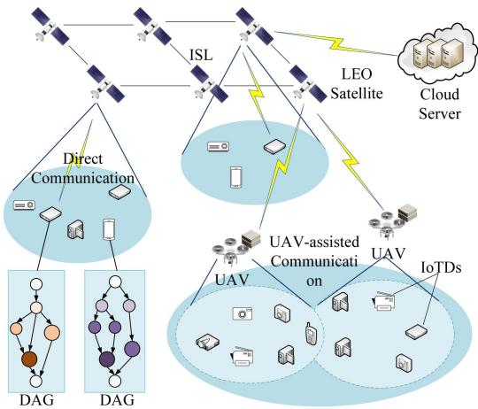  
Fig. 1. Illustration of the architecture of UAV-assisted SEC.

TABLE II  
SUMMARY OF NOTATIONS AND SYMBOLS
<table><tr><td>Symbol</td><td>Definition</td></tr><tr><td>N</td><td>Set of IoTDs</td></tr><tr><td>M</td><td>Set of UAVs</td></tr><tr><td>K</td><td>Set of LEO satellites</td></tr><tr><td> $G _ { n } = ( V _ { n } , E _ { n } )$ </td><td>DAG application of IoTD n</td></tr><tr><td> $P r e ( n , j ) , S u c ( n , j )$ </td><td>Predecessor and successor tasks of  $v _ { n , j }$ </td></tr><tr><td> $D _ { n , j } ^ { i n } , D _ { n , j } ^ { o }$ </td><td>Input and output data size of task  $v _ { n , j }$ </td></tr><tr><td> $C _ { n , j }$ </td><td>CPU cycles required for task  $v _ { n , j }$ </td></tr><tr><td> $f _ { n } ^ { l } , f _ { n , j } ^ { m } , f _ { n , j } ^ { k } , f ^ { c }$ </td><td>Computing capability of IoTD n, UAV m, LEO satel-</td></tr><tr><td> $b _ { n , m }$ </td><td>lite k, and CS Binary association indicator between IoTD and UAV</td></tr><tr><td> $q _ { m }$ </td><td>Position coordinate of UAV m</td></tr><tr><td> $H _ { m }$ </td><td>Altitude of UAV m</td></tr><tr><td> $d _ { n m }$ </td><td>Distance between IoTD n and UAV m</td></tr><tr><td> $B _ { \textrm { \tiny m a n } } ^ { \textrm { \tiny f f } 2 U } , \ B _ { \textrm { \tiny m a n } } ^ { U 2 G }$ </td><td>Bandwidth of G2U/U2G links</td></tr><tr><td> $B ^ { \tilde { G } 2 \tilde { S } } , \ B ^ { \tilde { S } 2 \tilde { G } }$ </td><td>Bandwidth of G2S/S2G links</td></tr><tr><td> $B ^ { U 2 S } , ~ B ^ { S 2 U }$ </td><td>Bandwidth of U2S/S2U links</td></tr><tr><td> $P _ { n } , P _ { m } , P _ { k }$ </td><td>Transmit power of IoTD n, UAV m, and satellite k</td></tr><tr><td> $h _ { n m } , h _ { n k } , h _ { m k }$ </td><td>Channel gain of G2U, G2S, and U2S links</td></tr><tr><td> $R _ { \infty } ^ { u p / d o w n }$ </td><td>Uplink/downlink rate between IoTD n and UAV m</td></tr><tr><td> $R ^ { \stackrel { \prime } { u } p / d o w n }$ </td><td>Uplink/downlink rate between IoTD n and satellite k</td></tr><tr><td> $\phi ^ { n \kappa } / d o w n$ </td><td>Uplink/downlink rate between UAV m and satellite k</td></tr><tr><td> $R _ { { \iota } _ { * } { \iota } _ { * } { \prime } } ^ { \mathcal { Y } _ { S } ^ { \mathcal { k } } }$ </td><td>Transmission rate of ISL</td></tr><tr><td> $R _ { k c } ^ { ' }$ </td><td>Transmission rate between satellite k and CS</td></tr><tr><td></td><td></td></tr><tr><td> $x _ { n , j } ^ { \tilde { D } ^ { - } } , x _ { n , j } ^ { m } , x _ { n , j } ^ { k } , x _ { n , j } ^ { C }$ </td><td>Offloading decision variables of task  $v _ { n , j }$ </td></tr><tr><td> $\eta _ { t } , \eta _ { e } .$ </td><td>Weighting factors for latency and energy</td></tr><tr><td> $T _ { - } ^ { e x e , * }$   $\boldsymbol { E } ^ { e x } { } ^ { e , * }$ </td><td>Execution latency of task  $_ { v _ { n , j } }$  on node *</td></tr><tr><td></td><td>Execution energy consumption of task  $v _ { n , j }$  on node *</td></tr><tr><td> $E S T _ { n , j } , F T _ { n , j }$ </td><td>Earliest start time and finish time of task  $v _ { n , j }$ </td></tr><tr><td> $T _ { n } ^ { c o m p }$ </td><td>Completion latency of IoTD n&#x27;s DAG application</td></tr><tr><td> ${ T } ^ { ' { o } t a l }$ </td><td>Average latency of all IoTD applications</td></tr><tr><td> $E _ { n } , E ^ { t o t a l }$ </td><td>Energy consumption of IoTD n and total system</td></tr></table>

In real-world scenarios, many applications are constructed from a variety of tasks using the DAG structure, each of which potentially depends on others. For example, a pose recognition application involves multiple tasks, which is illustrated in Fig. 2 [25]. We consider an application generated by the IoTD n with latency requirements, which is represented by a DAG $G _ { n } = ( V _ { n } , E _ { n } ) . \ V _ { n } = \{ v _ { n , j } | 1 \leq j \leq | V _ { n } | \}$ signifies the set of interdependent tasks, and $E _ { n }$ embodies the set of dependencies among the tasks within application n. The set of preceding and succeeding tasks for $v _ { n , j }$ are identified as $P r e ( n , j )$ and $S u c ( n , j )$ , respectively. Furthermore, each edge $( v _ { n , j - 1 } , v _ { n , j } ) \in E _ { n }$ within the graph $G _ { n }$ signifies that task $v _ { n , j }$ is dependent on the results of the prior task $v _ { n , j - 1 }$ . Hence, a task cannot be implemented until all its preceding tasks are fully completed and some tasks can be executed concurrently as they don’t rely on each other. We define the task attribute as $v _ { n , j } \triangleq \{ D _ { n , j } ^ { i } , D _ { n , j } ^ { o } , C _ { n , j } \} . D _ { n , j } ^ { i n }$ denotes the input data size of task, $D _ { n , j } ^ { o }$ signifies the output data size of task $v _ { n , j }$ and the number of CPU cycles required to compute task $v _ { n , j }$ is denoted as $C _ { n , j }$

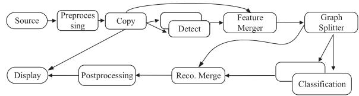  
Fig. 2. An example of the animal face recognition application that is split into multiple dependent tasks.

## A. Service Coverage Model

1) UAV Service Coverage: The UAV-assisted SEC architectures involve multiple UAVs that are responsible for delimited service areas, wherein the areas can be overlapped. Without loss of generality, we consider a three-dimensional (3-D) Euclidean coordinate system to model spatial relationships between the IoTDs, UAVs and LEO satellite. The UAV m is positioned at a fixed altitude of $H _ { m }$ and has a horizontal coordinate represented by $\pmb q _ { m } ( t ) = ( \ b q _ { m } ^ { x } ( t ) , \pmb q _ { m } ^ { y } ( t ) )$ at time step t. Similarly, the location of the nth IoTD is fixed in the remote area, which can be represented by $\boldsymbol { q } _ { n } = ( q _ { n } ^ { x } , q _ { n } ^ { y } )$ . Hence, the distance between the nth IoTD and the mth UAV can be calculated as

$$
d _ { n m } ( t ) = \sqrt { | | \pmb { q } _ { n } - \pmb { q } _ { m } ( t ) | | ^ { 2 } + H _ { m } ^ { 2 } } .\tag{1}
$$

Then, the trajectory optimization of UAV m is achieved by directly optimizing its position coordinates $\mathbf { } q _ { m } ( t ) =$ $( q _ { m } ^ { x } ( t ) , q _ { m } ^ { y } ( t ) )$ at each time step t. The UAV moves by updating its coordinates subject to velocity constraints, the velocity of the UAV m is computed as

$$
0 \leq v e _ { m } ( t ) = \frac { | | \pmb { q _ { m } ( t + 1 ) - q _ { m } ( t ) } | | } { \delta _ { t } } \leq v e _ { m } ^ { m a x } ,\tag{2}
$$

where $v e _ { m } ^ { m a x }$ is the maximum velocity of UAV m and $\delta _ { t }$ denotes the duration of each scheduling interval. This constraint ensures that the UAV movement between consecutive time steps is physically feasible.

To guarantee that UAVs move within the served rectangular area, the position of UAV m is restricted to a rectangular region defined by

$$
0 \leq q _ { m } ^ { x } ( t ) \leq Q _ { x } ^ { m a x } ,\tag{3}
$$

$$
0 \leq q _ { m } ^ { y } ( t ) \leq Q _ { y } ^ { m a x } ,\tag{4}
$$

where $Q _ { x } ^ { m a x }$ and $Q _ { y } ^ { m a x }$ are the maximum boundaries along the x-axis and y-axis directions, respectively.

Moreover, to avoid collisions between UAV m and UAV $m ^ { \prime }$ their positions should satisfy the following safety constraint:

$$
| | \pmb q _ { m } ( t ) - \pmb q _ { m ^ { \prime } } ( t ) | | \geq d _ { m i n } ,\tag{5}
$$

where $| | \pmb q _ { m } ( t ) - \pmb q _ { m ^ { \prime } } ( t ) | |$ represents the Euclidean distance between the positions of UAV m and UAV m at time step t, and $d _ { m i n }$ denotes the minimum safe distance to prevent collisions between UAVs.

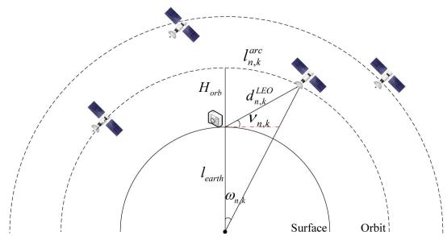  
Fig. 3. Geometric relationship of satellite links.

If IoTDs are located within the coverage of certain UAVs, each IoTD is limited to connecting with one UAV for offloading. The association indicator between IoTD n and UAV m is modeled as

$$
b _ { n , m } \in \{ 0 , 1 \} , \forall n \in \mathcal { N } , m \in \mathcal { M } ,\tag{6}
$$

where $b _ { n , m } = 1$ signifies that IoTD n is served by the UAV m, whereas $b _ { n , m } = 0$ indicates the opposite. The IoTD association constraint is $\textstyle \sum _ { m \in M } b _ { n , m } = 1$ , and each UAV m connects $N _ { m }$ IoTDs.

2) LEO Satellite Service Coverage: Due to the rapid and continuous orbital trajectory characteristic of LEO satellites, the temporal constraints inherent in satellite coverage significantly impede continuous data exchange. The geometric relationship between IoTDs and LEO satellites is depicted in Fig. 3. The figure specifies key parameters, where $l _ { e a r t h }$ denotes the earth’s radius, $\mathbf { \bar { \Gamma } } _ { d _ { n , k } ^ { L E O } }$ represents the distance between IoTD and satellite, $H _ { o r b }$ denotes the orbital altitude from the orbit to IoTD, $\omega _ { n , k }$ is the central angle and $\nu _ { n , k }$ indicates the elevation angle between the LEO satellite k and IoTD $n .$ . Then, we have the communication arc length $l _ { n , k } ^ { a r c }$ between the IoTD n and LEO satellite k, which can be computed by

$$
l _ { n , k } ^ { a r c } = 2 \cdot \left( l _ { e a r t h } + H _ { o r b } \right) \cdot \omega _ { n , k } ,\tag{7}
$$

where ωn,k $\frac { l _ { e a r t h } } { l _ { e a r t h } + H _ { o r b } }$ COS $\nu _ { n , k } - \nu _ { n , k } .$

To proceed, the upper limit of the communication period between LEO satellite k and IoTD n is given by

$$
T _ { n , k } ^ { L E O } = \frac { l _ { n , k } ^ { a r c } } { v _ { k } } ,\tag{8}
$$

where $v _ { k }$ denotes the linear velocity of the accessible LEO satellite k.

## B. Communication Model

In the UAV-assisted SEC environment, we utilize three communication models, including ground-to-UAV (G2U), groundto-satellite (G2S) and UAV-to-satellite (U2S) links.

1) G2U Link Model: The channel gain between the nth IoTD and the mth UAV, which is given as $\begin{array} { r } { h _ { n m } = \rho _ { 0 } ( d _ { n m } ) ^ { - 2 } \hat { h } _ { n m } , } \end{array}$ where $\rho _ { 0 }$ denotes the channel power gain at the reference distance of 1 m. Here $\hat { h } _ { n m }$ represents the small-scale fading, which is expressed as $\begin{array} { r } { \hat { h } _ { n m } = \sqrt { \frac { \xi } { \xi + 1 } \overline { { h } } _ { n m } + \frac { 1 } { \xi + 1 } \widetilde { h } _ { n m } } } \end{array}$ , where ξ represents the Rician factor. Moreover, in the Rician fading model, non-line-of-sight (NLoS) and line-of-sight (LoS) components are represented by $\widetilde { h } _ { n m }$ and $\overline { { h } } _ { n m } .$ , respectively. Here $\overline { { h } } _ { n m } = 1$ and $\widetilde { h } _ { n m } \sim \mathcal { C N } ( 0 , 1 )$ . Hence, the uplink data rate from nth IoTD to mth UAV can be defined as

$$
R _ { n m } ^ { u p } = B _ { n m } ^ { G 2 U } \log _ { 2 } \bigg ( 1 + \frac { P _ { n } | h _ { n m } | ^ { 2 } } { \sum _ { j = 1 , j \ne n } ^ { N } P _ { j } | h _ { j m } | ^ { 2 } + \sigma ^ { 2 } } \bigg ) ,\tag{9}
$$

where $B _ { n m } ^ { G 2 U }$ indicates the bandwidth between IoTD n and UAV m, $P _ { n }$ is the transmit power of IoTD n and $\sigma ^ { 2 }$ is the additive-white-Gaussian-noise. Conversely, the downlink data rate $R _ { n m } ^ { d o w n }$ from the mth UAV to the nth IoTD can be expressed as

$$
R _ { n m } ^ { d o w n } = B _ { n m } ^ { U 2 G } \log _ { 2 } \left( 1 + \frac { P _ { m } | h _ { n m } | ^ { 2 } } { \sum _ { k = 1 , k \neq m } ^ { M } P _ { k } | h _ { n k } | ^ { 2 } + \sigma ^ { 2 } } \right) ,\tag{10}
$$

where $P _ { m }$ is the transmit power of the mth UAV.

2) G2S and U2S Link Models: LEO satellites are placed at altitudes ranging from 500 to 1200 km above the Earth’s surface [5]. To ensure continuous communication coverage, LEO satellites are deployed in a constellation. To proceed, when the task is offloaded to the LEO satellite, the uplink transmission rate of the G2S link between IoTD n and its visible LEO satellite $k ,$ denoted by $R _ { n k } ^ { G 2 S }$ , is expressed as

$$
R _ { n k } ^ { u p } = z _ { n , k } ^ { u p } B ^ { G 2 S } \log _ { 2 } \left( 1 + \frac { P _ { n } | h _ { n k } | ^ { 2 } } { \sigma ^ { 2 } } \right) ,\tag{11}
$$

where $B ^ { G 2 S }$ is the bandwidth of the G2S link and $z _ { n , k } ^ { u p } \in [ 0 , 1 ]$ indicates the allocated ratio of the uplink bandwidth of IoTD’s visible LEO satellite k to IoTD $n . \ h _ { n k } \sim S R ( g , \Omega )$ indicates the channel gain from IoTD n to LEO satellite k by taking into account the large-scale fading and shadowed-Rician fading [26], where g represents the shadow fading parameters and is the average power of the LOS component. Correspondingly, the downlink data rate of the G2S link, denoted by $\bar { R } _ { n k } ^ { S 2 G }$ , is given by

$$
R _ { n k } ^ { d o w n } = z _ { n , k } ^ { d } B ^ { S 2 G } \log _ { 2 } \left( 1 + \frac { P _ { k } | h _ { n k } | ^ { 2 } } { \sigma ^ { 2 } } \right) ,\tag{12}
$$

where $B ^ { S 2 G }$ denotes the bandwidth of the satellite-to-ground (S2G) link and $z _ { n , k } ^ { d }$ represents the allocated ratio of the downlink bandwidth.

The uplink transmission rate between UAV m and its visible LEO satellite k can be given as

$$
R _ { m k } ^ { u p } = z _ { m , k } ^ { u p } B ^ { U 2 S } \log _ { 2 } \left( 1 + \frac { P _ { m } | h _ { m k } | ^ { 2 } } { \sigma ^ { 2 } } \right) ,\tag{13}
$$

where $B ^ { U 2 S }$ is the bandwidth of the U2S link and $z _ { m , k } ^ { u p }$ indicates the bandwidth allocated ratio of LEO satellite k to UAV m. Then, the downlink transmission rate between UAV m and its visible LEO satellite k is computed by

$$
R _ { m k } ^ { d o w n } = z _ { m , k } ^ { d } B ^ { S 2 U } \log _ { 2 } \left( 1 + \frac { P _ { k } | h _ { m k } | ^ { 2 } } { \sigma ^ { 2 } } \right) ,\tag{14}
$$

where $B ^ { S 2 U }$ is the bandwidth of the satellite-to-UAV link.

3) Multi-Hop Offloading Through ISL: LEO satellites can relay computing tasks from UAVs to other LEO satellites or the CS via inter-satellite links (ISL). The required number of hops for the LEO satellite k to another LEO satellite $k ^ { \prime } , k ^ { \prime } \in \mathcal { K } , j \neq$ k or the CS is represented $\mathsf { b y } \in \{ 0 , 1 , \cdots \}$ . The peak gain of the transceivers on satellite k aimed at satellite $k ^ { \prime }$ in each hop offloading is represented by $G _ { P }$ . Therefore, the transmission rate of the ISL can be computed by

$$
R _ { k k ^ { \prime } } ^ { I S L } = B _ { k k ^ { \prime } } \log _ { 2 } \left( 1 + \frac { P _ { k } G _ { P } ^ { 2 } } { \zeta _ { B } B _ { k k ^ { \prime } } W ( k k ^ { \prime } ) } \right) ,\tag{15}
$$

where $B _ { k k ^ { \prime } }$ represents the ISL bandwidth between LEO satellite k and $k ^ { \prime } , P _ { k }$ is the LEO satellite’s transmission power and $\zeta _ { B }$ denotes the Boltzmann coefficient. Here $W ( k k ^ { \prime } )$ represents the free-space loss [27].

The transmission rate between the LEO satellite k and the CS via the satellite backhaul network is determined by

$$
R _ { k c } = B _ { k c } \log _ { 2 } \left( 1 + \frac { P _ { k } | h _ { k c } | ^ { 2 } } { \sigma ^ { 2 } } \right) ,\tag{16}
$$

where $B _ { k c }$ and $h _ { k c }$ are the transmission bandwidth and channel gain between LEO satellite k and CS, respectively.

## C. Computing Model

Each DAG task from each IoTD is capable of local execution or can be offloaded to UAV, LEO satellite, or CS.

1) Offloading Decision Stage: For each task $v _ { n , j } ,$ we define the notation of offloading decision $\begin{array} { r } { x _ { n , j } ^ { D } , x _ { n , j } ^ { U } = \overset { \sim } { \sum } _ { m \in M } x _ { n , j } ^ { m } , } \end{array}$ $\begin{array} { r } { x _ { n , j } ^ { L } = \sum _ { m \in M } x _ { n , j } ^ { k } } \end{array}$ and $x _ { n , j } ^ { C }$ signifies the execution of task $v _ { n , j }$ =on the local IoTD, UAV, LEO satellite and CS, respectively. Among others, $x _ { n , j } ^ { D } = 1$ indicates the task is executed locally on $\mathrm { I o T D } , x _ { n , j } ^ { m } = 1$ = 1indicates if the task $v _ { n , j }$ is processed at UAV m, $x _ { n , j } ^ { k } = 1$ indicates if the task $v _ { n , j }$ is computed on LEO satellite k and $x _ { n , j } ^ { c } = 1$ if the task $v _ { n , j }$ is executed on CS, and otherwise.

= 12) Local Computing: If the task $v _ { n , j }$ is processed on the IoTD locally, it transitions directly to the processing stage once it is ready. Let $f _ { n } ^ { l }$ denote the computing capability of IoTD n. The execution latency on IoTD n for task $v _ { n , j }$ is given as

$$
T _ { n , j } ^ { e x e , l } = \frac { C _ { n , j } } { f _ { n } ^ { l } } .\tag{17}
$$

The energy consumption for the local computation on IoTD n is represented as

$$
E _ { n , j } ^ { e x e , l } = \kappa _ { D } ( f _ { n } ^ { l } ) ^ { 2 } C _ { n , j } ,\tag{18}
$$

where $\kappa _ { D }$ is the effective switched capacitance of the IoTD.

3) UAV Edge Computing: When remote execution on UAV is selected for the task $v _ { n , j }$ , the task undergoes a sequential process encompassing offloading, execution, and result stages.

Offloading Stage: In the offloading stage, the UAV needs to receive the result data of the immediate predecessor task $v _ { n , j ^ { \prime } } , j ^ { \prime } \in P r e ( n , j )$ of the task $v _ { n , j }$ from IoTD n. Hence, the uplink G2U transmission latency and energy consumption between IoTD n and UAV m for immediate predecessor task $v _ { n , j ^ { \prime } }$ can be given as

$$
T _ { n , j ^ { \prime } } ^ { u p , n , m } = \frac { D _ { n , j ^ { \prime } } ^ { o } } { R _ { n m } ^ { u p } } , E _ { n , j ^ { \prime } } ^ { u p , n , m } = P _ { n } T _ { n , j ^ { \prime } } ^ { u p , n , m } .\tag{19}
$$

Execution Stage: After receiving the immediate predecessor task’s data from the associated IoTD, the execution latency and energy consumption of task $v _ { n , j }$ on UAV m are calculated by

$$
T _ { n , j } ^ { e x e , m } = \frac { C _ { n , j } } { f _ { n , j } ^ { m } } , E _ { n , j } ^ { e x e , m } = \kappa _ { U } ( f _ { n , j } ^ { m } ) ^ { 2 } C _ { n , j } ,\tag{20}
$$

where $\kappa _ { U }$ represents the effective switched capacitance of UAV and $f _ { n , j } ^ { m }$ is the computational resource allocated to task $v _ { n , j }$ by the UAV m.

Result Stage: Upon completion of task $v _ { n , j }$ , if the successor of the result data is the IoTD, the result data is transmitted from UAV m to IoTD via the download U2G link. Hence, the download latency and energy consumption of task $v _ { n , j }$ are computed by

$$
T _ { n , j } ^ { d , n , m } = \frac { D _ { n , j } ^ { o } } { R _ { n m } ^ { d o w n } } , E _ { n , j } ^ { d , n , m } = P _ { m } T _ { n , j } ^ { d , n , m } .\tag{21}
$$

4) LEO Satellite Edge Computing: The LEO satellite edge computing consists of offloading, transfer, execution, and result stages.

Offloading Stage: The LEO satellite can receive the immediate predecessor task $v _ { n , j ^ { \prime } }$ of the task $v _ { n , j }$ from IoTD n or from UAV m through direct or indirect communication, respectively. Then, the uplink G2S and U2S transmission latency and energy consumption between IoTD n and visible satellite k, and between UAV m and visible satellite k for immediate predecessor task $v _ { n , j ^ { \prime } }$ including propagation latency can be expressed as

$$
T _ { n , j ^ { \prime } } ^ { u p , n , k } = \frac { D _ { n , j ^ { \prime } } ^ { o } } { R _ { n k } ^ { u p } } + \frac { d _ { n k } } { c } , \ : T _ { n , j ^ { \prime } } ^ { u p , m , k } = \frac { D _ { n , j ^ { \prime } } ^ { o } } { R _ { m k } ^ { u p } } + \frac { d _ { m k } } { c } ,\tag{22}
$$

$$
E _ { n , j ^ { \prime } } ^ { u p , n , k } = P _ { n } T _ { n , j ^ { \prime } } ^ { u p , n , k } , E _ { n , j ^ { \prime } } ^ { u p , m , k } = P _ { m } T _ { n , j ^ { \prime } } ^ { u p , m , k } ,\tag{23}
$$

where c represents the light speed of propagation.

Transfer Stage: Once the task is transmitted from the visible LEO satellite k to the targeted LEO satellite k through the multihop ISL way, the transfer latency and energy consumption for task $v _ { n , j ^ { \prime } }$ are defined as

$$
T _ { n , j ^ { \prime } } ^ { t r , k , k ^ { \prime } } = Q \frac { D _ { n , j ^ { \prime } } ^ { o } } { R _ { k k ^ { \prime } } ^ { I S L } } , E _ { n , j ^ { \prime } } ^ { t r , k , k ^ { \prime } } = P _ { k } T _ { n , v } ^ { t r , k , k ^ { \prime } } ,\tag{24}
$$

where $T _ { n , j ^ { \prime } } ^ { t r , k , k ^ { \prime } } = 0$ and $E _ { n , j ^ { \prime } } ^ { t r , k , k ^ { \prime } } = 0$ when $k = k ^ { \prime }$ , meaning the predecessor task and successor task are executed on the same LEO satellite.

Execution Stage: The execution latency and energy consumption on LEO satellite k for task $v _ { n , j }$ after receiving the output data of the direct predecessor of task $v _ { n , j }$ is computed as

$$
T _ { n , j } ^ { e x e , k } = \frac { C _ { n , j } } { f _ { n , j } ^ { k } } , E _ { n , j } ^ { e x e , k } = \kappa _ { L } ( f _ { n , j } ^ { k } ) ^ { 2 } C _ { n , j } ,\tag{25}
$$

where $\kappa _ { L }$ signifies the effective switched capacitance of LEO satellite and $f _ { n , j } ^ { k }$ is the computing resource allocated to task $v _ { n , j }$ by the LEO satellite k.

Result Stage: If the result data from task $v _ { n , j }$ is destined for the IoTD or UAV, the data is transmitted from LEO satellite k to UAV m or the IoTD n using the S2U and S2G link. The download latency and energy consumption for this transmission are calculated by

$$
T _ { n , j } ^ { d , n , k } = \frac { D _ { n , j } ^ { o } } { R _ { n k } ^ { d o w n } } , \ : E _ { n , j } ^ { d , n , k } = P _ { k } T _ { n , j } ^ { d , n , k } ,\tag{26}
$$

$$
T _ { n , j } ^ { d , m , k } = \frac { D _ { n , j } ^ { o } } { R _ { m k } ^ { d o w n } } , \ : E _ { n , j } ^ { d , m , k } = P _ { k } T _ { n , j } ^ { d , m , k } .\tag{27}
$$

5) Cloud Computing: Analogous to the edge computing mode, the task in the cloud computing model comprises offloading, execution, and result feedback stages.

Offloading Stage: When the output data of the immediate predecessor task $v _ { n , j ^ { \prime } }$ is transmitted from the LEO satellite to the CS on the ground via satellite backhaul network. The transmission latency and energy consumption between LEO satellite k and CS can be given by

$$
T _ { n , j ^ { \prime } } ^ { u p , k , c } = \frac { D _ { n , j ^ { \prime } } ^ { o } } { R _ { k c } } + \frac { d _ { k c } } { c } , \ E _ { n , j ^ { \prime } } ^ { u p , k , c } = P _ { k } T _ { n , j ^ { \prime } } ^ { d , k , c } .\tag{28}
$$

Execution Stage: The execution latency and energy consumption of task $v _ { n , j }$ on CS are computed as

$$
T _ { n , j } ^ { e x e , c } = \frac { C _ { n , j } } { f ^ { c } } , E _ { n , j } ^ { e x e , c } = \kappa _ { C } ( f _ { c } ^ { k } ) ^ { 2 } C _ { n , j } ,\tag{29}
$$

where $f ^ { c }$ is the commuting capability of CS.

Result Stage: The latency and energy consumption result data transmission between LEO satellite k and CS are

$$
T _ { n , j } ^ { d , k , c } = \frac { D _ { n , j } ^ { o } } { R _ { k c } } + \frac { d _ { k c } } { c } , \ E _ { n , j } ^ { d , k , c } = P _ { c } T _ { n , j } ^ { d , k , c } .\tag{30}
$$

## D. DAG Latency Model

To facilitate the description of the DAG application’s latency, we define the earliest start time (EST) and finish time (FT) for each task $v _ { n , j }$ , wherein the EST of a task represents the time at which a node receives input data required for execution. The FT of a task is the completion time of its execution.

Given the entry task, the earliest start time is $E S T _ { n , j } = 0$ . We denote $E S T _ { n , j } ^ { D } , E S T _ { n , j } ^ { U } , E S T _ { n , j } ^ { L }$ , and $E S T _ { n , j } ^ { C }$ = 0as the earliest start times for task $v _ { m , j }$ when executed on local, UAV, LEO satellite and CS, which are expressed as Eqs. (31), (32), (33) and (34) shown at the bottom of the next page, respectively.

Let $F T _ { n , j }$ denote the completion time of task $v _ { n , j }$ on each node in the SEC network. Hence, the FT for task $v _ { n , j }$ is calculated by

$$
F T _ { n , j } = E S T _ { n , j } + T _ { n , j } ^ { e x e , \ast } ,\tag{35}
$$

where $T _ { n , j } ^ { e x e , * }$ represents the execution latency on each node.

The total completion latency of the DAG applications of IoTD n is determined by the exit task set $v _ { n , e x i t }$ , which is calculated as

$$
T _ { n } ^ { c o m p } = \operatorname* { m a x } _ { j \in v _ { n , e x i t } } F T _ { n , j } .\tag{36}
$$

Thus, the average latency of all DAG applications can be expressed as

$$
T ^ { t o t a l } = \frac { 1 } { N } \sum _ { n = 1 } ^ { N } T _ { n } ^ { c o m p } .\tag{37}
$$

## E. Energy Consumption Model

Based on the computation model, the total energy consumption of the DAG application of IoTD n is calculated as

$$
E _ { n } = E _ { n } ^ { e x e } + E _ { n } ^ { t r a n } ,\tag{38}
$$

where $\begin{array} { r } { E _ { n } ^ { e x e } \ = \ \sum _ { j \in [ V _ { n } ] } x _ { n , j } ^ { D } E _ { n , j } ^ { e x e , l } \ + \ x _ { n , j } ^ { U } E _ { n , j } ^ { e x e , m } \ + \ x _ { n , j } ^ { L } } \end{array}$ $E _ { n , j } ^ { e x e , k } + x _ { n , j } ^ { C } E _ { n , j } ^ { e x e , c }$ , and $E _ { n } ^ { t r a n }$ is the total transmission energy consumption, including uplink, transfer and download during

the offloading stage as follows:

$$
\begin{array} { l } { { \displaystyle E _ { n } ^ { t r a n } = \sum _ { j = 1 } ^ { | V _ { n } | } \sum _ { j ^ { \prime } \in P r e ( v _ { n , j } ) } \sum _ { u = 1 } ^ { U } \left( \mathbf { 1 } ( x _ { n , j ^ { \prime } } ^ { D } = 1 , x _ { n , j } ^ { u } = 1 ) E _ { n , j ^ { \prime } } ^ { u p , n , u } \right. } } \\ { { \displaystyle \qquad + \left. \mathbf { 1 } ( x _ { n , j ^ { \prime } } ^ { u } = 1 , x _ { n , j } ^ { D } = 1 ) E _ { n , j ^ { \prime } } ^ { d , n , u } + \mathbf { 1 } ( x _ { n , j ^ { \prime } } ^ { k } \neq x _ { n , j } ^ { k } ) \right. } } \\ { { \displaystyle \qquad \times \left. E _ { n , j ^ { \prime } } ^ { d , n , u } \right) + \sum _ { j \in v _ { n , e x i t } } \sum _ { u = 1 } ^ { U } { x _ { n , j } ^ { u } } E _ { n , j } ^ { d , n , u } } , \qquad \displaystyle ( 3 9 ) }  \end{array}
$$

where $\mathbf { 1 } ( \cdot )$ is the indicator function and $u \in \mathcal { M } \cup \mathcal { K } \cup \mathcal { C }$ indicates the server including UAV, LEO satellite and CS.

Finally, the total system energy consumption consists of all DAG applications’ energy consumption and UAV flight energy consumption, which is calculated as

$$
E ^ { t o t a l } = \sum _ { n = 1 } ^ { N } E _ { n } + \sum _ { m = 1 } ^ { M } \operatorname* { m a x } _ { n \in N _ { m } } T _ { n } ^ { c o m p } p _ { m } ^ { f l y } ,\tag{40}
$$

where $p _ { m } ^ { f l y }$ denotes the flight power for UAV propulsion, which is a function of the UAV’s velocity $v e _ { m }$ [28].

## F. Problem Formulation

In this paper, the primary objective is to optimize the weighted sum of latency and energy consumption costs while satisfying the latency constraint of the applications. Let $\eta _ { t }$ and $\eta _ { e }$ denote the weight values of latency and energy consumption. The optimization problem can be formulated as

$$
\mathcal { P } _ { 1 } : \operatorname* { m i n } _ { { \bf z } , { \bf P } , { \bf X } , { \bf B } , { \bf F } , Q } \eta _ { t } T ^ { t o t a l } + \eta _ { e } E ^ { t o t a l }\tag{41}
$$

$$
\begin{array} { r } { \mathrm { s . t . } \quad T _ { n } ^ { c o m p } \leq T _ { n } ^ { m a x } , } \end{array}\tag{41a}
$$

$$
\sum _ { m = 1 } ^ { M } b _ { n , m } = 1 , \forall m \in M ,\tag{41b}
$$

$$
x _ { n , j } ^ { D } , x _ { n , j } ^ { u } , x _ { n , j } ^ { k } , x _ { n , j } ^ { C } \in \{ 0 , 1 \} ,\tag{41c}
$$

$$
x _ { n , j } ^ { D } + x _ { n , j } ^ { U } + x _ { n , j } ^ { K } + x _ { n , j } ^ { C } = 1 ,\tag{41d}
$$

$$
\sum _ { n = 1 } ^ { N _ { m } } \sum _ { j = 1 } ^ { | V _ { n } | } f _ { n , j } ^ { m } \leq F _ { m } ,\tag{41e}
$$

$$
\sum _ { n = 1 } ^ { N } \sum _ { j = 1 } ^ { | V _ { n } | } f _ { n , j } ^ { k } \leq F _ { k } ,\tag{41f}
$$

$$
0 \leq P _ { n } \leq P _ { n } ^ { m a x } , \forall n \in N ,\tag{41g}
$$

$$
\sum _ { m = 1 } ^ { M } z _ { m , k } ^ { u p } = 1 , \sum _ { m = 1 } ^ { M } z _ { m , k } ^ { d } = 1 , k \in K ,\tag{41h}
$$

$$
\sum _ { n = 1 } ^ { N } z _ { n , k } ^ { u p } = 1 , \sum _ { n = 1 } ^ { N } z _ { n , k } ^ { d } = 1 , k \in K ,\tag{41i}
$$

$$
( 2 ) { - } ( 5 ) .\tag{41j}
$$

The constraints in $\mathcal { P } _ { 1 }$ are detailed as follows: Constraint (41a) enforces application latency requirements. Constraint (41b) limits each IoTD to be associated with one UAV. Constraint (41c) represents the binary offloading decision. Constraint (41d) ensures tasks are offloaded to only one node. Constraints (41e) and (41f) manage computational resource allocation in UAVs and LEO satellites. Constraint (41g) limits IoTD transmission power. Constraints (41h) and (41i) ensure that the bandwidth allocated to UAVs/IoTDs does not exceed the visible LEO satellite’s capacity. Constraint (41j) describes the movement constraints of UAVs.

Due to the coupling of offloading decisions and resource allocation in the optimization objective, the formulated problem is a MINLP problem. This optimization problem is NP-hard [29], as demonstrated in Theorem 1. We address this complex optimization challenge in the following section.

Theorem $ { \boldsymbol { l } } :$ The optimization problem $\mathcal { P } _ { 1 }$ is an NP-Hard problem.

(31)

$$
\begin{array} { r l } { \delta ^ { ( 2 ) } \mathcal { R } _ { \mathcal { R } _ { \mathcal { R } _ { \mathcal { R } _ { \mathcal { R } _ { \mathcal { I } } ^ { \prime } } } } } ^ { ( 2 ) } = } &  \frac { \nu _ { 1 } \alpha ^ { 2 } \kappa ^ { 3 } } { \nu _ { 1 0 } \alpha ^ { 2 } \beta ^ { 3 } \nu _ { 1 0 } } \left\{ \frac { \mathcal { R } _ { \mathcal { R } _ { \mathcal { R } _ { \mathcal { R } _ { \mathcal { R } _ { \mathcal { I } } ^ { \prime } } } } ^ { ( 2 ) } } \mathcal { R } _ { \mathcal { R } _ { \mathcal { R } _ { \mathcal { R } _ { \mathcal { I } } ^ { \prime } } } } ^ { ( 2 ) } \nu _ { 1 0 } ^ { 4 } \mathcal { R } _ { \mathcal { R } _ { \mathcal { R } _ { \mathcal { I } _ { R } ^ { \prime } } } ^ { ( 2 ) } } ^ { ( 2 ) } - \mathcal { R } _ { \mathcal { R } _ { \mathcal { R } _ { \mathcal { I } _ { R } ^ { \prime } } } } ^ { ( 2 ) } \nu _ { 1 0 } ^ { 4 } \mathcal { R } _ { \mathcal { I } _ { R ^ { \prime } } } ^ { ( 2 ) } \nu _ { 1 0 } ^ { 4 } \mathcal { R } _ { \mathcal { R } _ { \mathcal { I } _ { R } ^ { \prime } } } ^ { ( 2 ) } + \mathcal { R } _ { \mathcal { R } _ { \mathcal { I } _ { R } ^ { \prime } } } ^ { ( 2 ) } \nu _ { 1 0 } ^ { 4 } \mathcal { R } _ { \mathcal { R } _ { \mathcal { I } _ { R } ^ { \prime } } } ^ { ( 2 ) } \right\} , } \\ & { \quad \quad \quad \quad \quad \quad \quad \quad \quad \quad \quad \quad \quad \quad \quad \quad \quad \quad \quad \quad \quad \quad \quad \quad \quad \quad \quad \quad \quad \quad \quad \quad \quad \quad \quad \quad \quad \quad \quad \quad \quad \quad \quad \quad \quad \quad \quad \quad \quad } \\  \frac  \mathcal { R } _  \mathcal { R } _  \mathcal { R } _  \mathcal { I } _ { R } ^  \prime  \end{array}\tag{32}
$$

(33)

(34)

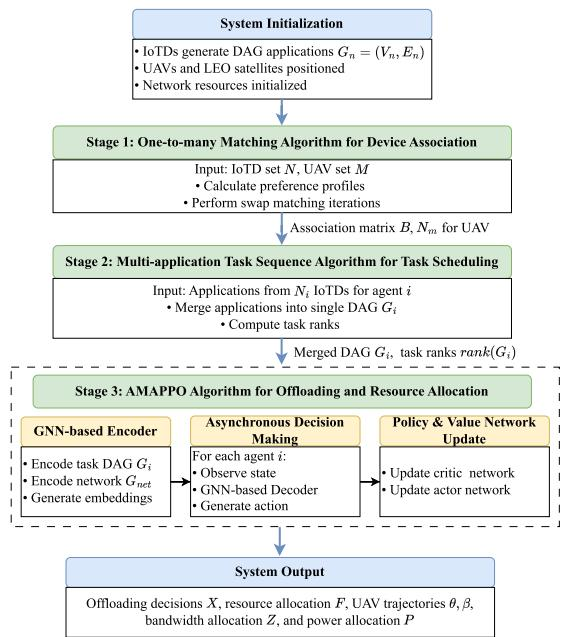  
Fig. 4. System flowchart of the proposed DRL-based algorithm for dependent task offloading and resource allocation in SEC.

Proof: Due to the limitation of pages, the proof of Theorem 1 is provided in Appendix A. 

## IV. DRL-BASED MULTI-UAV COOPERATIVE ALGORITHM

In this section, first, the device association problem is solved by a one-to-many matching algorithm. Then, we propose a MATS algorithm to merge the collected applications and obtain the optimal task execution order for all the tasks. The sequential decision-making process is modeled as a Markov decision process (MDP). Finally, an asynchronous graph neural networkaugmented MAPPO framework is employed. To present the overall structure and execution logic of the proposed algorithm more intuitively, Fig. 4 presents the complete system flowchart.

## A. One-to-Many Matching Theory for Device Association

Matching theory is preferred for device association due to its lower computational complexity compared to exhaustive search. The device association problem is modeled as a two-sided matching game between the IoTD set $\mathcal { N }$ and the UAV set M, where each IoTD matches with one UAV, while each UAV can match with multiple IoTDs. Consequently, a one-to-many matching setting is defined in the following.

Definition 1: The one-to-many matching game involves two distinct sets of players, i.e., IoTD and UAV sets, labeled $\mathcal { N }$ and M. The matching function, denoted as $y ,$ is a subset from $\mathcal { N } \times \mathcal { M }$ such that

$$
\begin{array} { l } { { \displaystyle | y ( n ) | = 1 , } } \\ { { \displaystyle | y ( m ) | \leq N , } } \end{array}
$$

where $y ( n ) = \{ m \in \mathcal { M } : ( n , m ) \in y \}$ and $y ( m ) = \{ n \in \mathcal { N }$ $( n , m ) \in y \}$

Algorithm 1: One-to-many Matching Algorithm for Device   
Association.   
Input : The set of MDs N, the set of UAVs M   
1 Initialization: Select a random matching y and perform   
calculations by Eqs. (43) and (44);   
2 while No swap matching $y _ { n } ^ { n ^ { \prime } }$ exists do   
3 Select IoTD $n \in \mathcal N , y ( n ) = m$ and IoTD   
$n ^ { \prime } \in y ( m ^ { \prime } )$   
4 if IoTDs pair $( n , n ^ { \prime } )$ is a swap matching then   
5 $y \gets y _ { n } ^ { n ^ { \prime } } ;$   
6 Compute Eqs. (43) and (44);   
7 end   
8 end   
9 Acquire optimal matching $y ^ { \ast } ;$   
10 Calculate the device association strategy via Eq. (42);   
Output: The number of IoTDs $N _ { m }$ for each UAV m   
and IoTD association vector B.

Correspondingly, the matching function y can represent the device matching indicator as

$$
b _ { n , m } = { \left\{ \begin{array} { l l } { 1 , } & { { \mathrm { i f ~ } } m = y ( n ) ; } \\ { 0 , } & { { \mathrm { o t h e r w i s e . } } } \end{array} \right. }\tag{42}
$$

IoTDs aim to connect to the UAVs and maximize their utilities. To achieve this, IoTDs rank their preferences for UAVs in descending order based on uplink data rate. Conversely, the preference profile for each UAV prioritizes MDs that minimize energy consumption, arranging these preferences in descending order based on the least energy used. Therefore, the preference profiles for IoTD n and UAV m are expressed through vectors of utility, respectively, which are defined as

$$
\Psi _ { n } ( y ) = R _ { n m } ^ { u p } ( y ) ,
$$

$$
\Psi _ { m } ( y ) = - E _ { n , j } ^ { d , n , m } ( y ) .\tag{43}
$$

(44)

The IoTDs’ preferences depend on uplink transmission rates and interference from others connected to the same UAV. These preferences dynamically change based on other IoTDs’ matching status, creating externalities. This one-to-many matching problem with externalities can be solved using swap matching techniques [30].

Definition 2: A swap matching $y _ { n } ^ { n ^ { \prime } } = \{ y \setminus \{ ( n , m )$ $( n ^ { \prime } , \bar { m ^ { \prime } } ) \} \cup \{ ( n , m ^ { \prime } ) , ( n ^ { \prime } , \bar { m ) } \}$ where $n ^ { \prime } \in y ( m ^ { \prime } ) , n ^ { \prime } \in$ $\mathcal { N } , m ^ { \prime } \in \mathcal { M }$

Swap matching enables a pair of IoTDs $( n , n ^ { \prime } )$ to exchange their UAVs $( m , m ^ { \prime } )$ ( )without altering the existing matches between other IoTDs and UAVs.

Definition 3 (Two-Sided Exchange Stability): A matching $y ^ { * }$ is two-sided exchange-stable if and only if there does not exist a pair of IoTDs $( n , n ^ { \prime } )$ such that:

$$
\begin{array} { r l } & { \mathrm { i ) } \forall i \in \{ n , n ^ { \prime } , y ( n ) , y ( n ^ { \prime } ) \} , { \Psi } _ { i } ( y _ { n } ^ { n ^ { \prime } } ) \geq { \Psi } _ { i } ( y ) \mathrm { a n d } } \\ & { \mathrm { i i ) } \exists i \in \{ n , n ^ { \prime } , y ( n ) , y ( n ^ { \prime } ) \} \mathrm { s u c h t h a t } { \Psi } _ { i } ( y _ { n } ^ { n ^ { \prime } } ) > { \Psi } _ { i } ( y ) . } \end{array}
$$

A swap between two IoTDs’ matched UAVs (a swap-blocking pair) is valid if it doesn’t reduce any involved party’s utility and increases it for at least one. Algorithm 1 iteratively performs such valid swaps until a two-sided exchange stable matching is reached, where no further swap can increase utility.

Algorithm 2: Multi-application Task Sequence Algorithm   
for Task Scheduling.   
Input : Application set G of agent $i ,$ available servers   
$U _ { i }$   
Output: Merged DAG $G _ { i }$ and task ranks ran $k ( G _ { i } )$   
1 Initialization: Add dummy entry/exit tasks to $G ^ { ' } { : }$   
2 for each application $G _ { r } \in G$ do   
3 Merge $V _ { r } , E _ { r }$ into $G ^ { \prime } ;$   
4 Record $D E [ r ] = T _ { r } ^ { m a x } , \ E N T [ r ] , \ E T [ r ] ;$   
5 end   
6 Compute $\begin{array} { r } { \boldsymbol { T } ^ { ' m a x } = \operatorname* { m a x } _ { \boldsymbol { r } } \boldsymbol { D } \boldsymbol { E } [ \boldsymbol { r } ] ; } \end{array}$   
7 for ${ \underline { { v } } } _ { i }$ from $\underline { { v _ { e x i t } } }$ down to $\underline { { v _ { 0 } } }$ do   
8 for $\underline { { u \in U _ { i } } }$ do   
9 if $\underline { { v _ { j } = v _ { e x i t } } }$ then   
10 $\overline { { E R R [ v _ { j } , u ] } } = 0 ;$   
11 else   
12 $E R R [ v _ { j } , u ] =$   
$\begin{array} { r } { \operatorname* { m a x } _ { v _ { j ^ { \prime } } \in S u c ( v _ { j } ) } \operatorname* { m i n } _ { u \in U _ { i } } \{ E R R [ v _ { j ^ { \prime } } , u ] + } \end{array}$   
$T _ { j ^ { \prime } , u } ^ { E x e ^ { \prime } } + T _ { j ^ { \prime } , j , u } ^ { T r a n s } \}$   
13 end   
14 end   
15 Compute ran $\mathfrak { k } ( v _ { j } )$ by Eq. (45);   
16 if ran $k ( v _ { j } ) \leq$ max ${ \underline { { v _ { j } } } } / { \in } S u c ( v _ { j } )$ ran $\underline { { \boldsymbol { \mathrm { \Pi } } } } ( \boldsymbol { v } _ { j ^ { \prime } } )$ then   
17 Adjust $\begin{array} { r } { E R R [ v _ { j } , u ] \gets E R R [ v _ { j } , u ] \cdot \frac { \operatorname* { m a x } r a n k + \varepsilon } { r a n k ( v _ { j } ) } ; } \end{array}$   
18 Recompute ran $k ( v _ { j } ) ;$   
19 end   
20 end

## B. Multi-Application Task Sequence Algorithm for Task Scheduling

The distribution of a single DAG application across multiple servers is typically an NP-hard problem, with added complexity when coordinating multiple applications. Recall that two communication areas are illustrated in Fig. 1, i.e., direct communication from IoTDs to LEO satellite and indirect communication via UAV relay. In the following, we consider agents set $I ,$ including visible LEO satellites for the direct communication area and all UAVs for the indirect communication area. For multiple applications, we merge all applications from $N _ { i }$ IoTDs to agent i into a single DAG application $G _ { i } = ( V _ { i } , E _ { i } )$ by adding dummy entry $( v _ { i , e n t r y } )$ and exit $( v _ { i , e x i t } )$ tasks, whose communication cost and execution cost are set to zero. The set $V _ { i } = \{ v _ { i , j } | 1 \leq j \leq | V _ { i } | \}$ includes all tasks in the merged DAG, where $| V _ { i } |$ is the total task count. This approach allows handling multiple applications using a single workflow method. For the merged DAG on agent $i ,$ we assign rank values to each task to establish the priority order for task sequencing.

Next, we discuss the MATS algorithm, including merging and ranking in detail. This MATS algorithm mainly calculates two parameters: expected relative residual workload $E R R [ v _ { m , j } , u ]$ and rank value, where $u \in U _ { i }$ is the set of available servers of agent i. By using the ERR metric, we can estimate the remaining workload along all paths from node $v _ { i , j }$ , after its execution on server u, to the terminal node, $v _ { i , e x i t } .$ . To assess ERR values for each task and server pair, we use the MATS algorithm, outlined in Algorithm 2, by tracing backward through the merged task graph $G _ { i }$ from $v _ { i , e x i t } \ t 0 \ v _ { i , 0 }$ . As specified in lines 12 and 13, we record the residual workload at the end task $v _ { i , e x i t }$ for any server u as zero, marked as $E R R [ v _ { i , e x i t } , u ] = 0$ . For the other tasks, the $\mathit { E R R } [ v _ { i , e x i t } , u ]$ is calculated recursively based on the lowest [ERR value for $v _ { i , e x i t }$ across all available servers, as shown in the equation in line 19. The ERR value for $v _ { i , j }$ on server u is determined by the maximum optimistic residual workload across all paths originating from $v _ { i , j }$ and leading to the exit task, defined as $( v _ { i , j ^ { \prime } } \in S u c c ( v _ { i , j } ) \{ \cdot \cdot \cdot \} )$ . This optimistic residual workload along paths through a specific successor, $v _ { i , j ^ { \prime } }$ (of $v _ { i , j } ) _ { \ i }$ , is computed as follows: We identify the minimum residual workload $m i n _ { u \in U } \{ \cdot \cdot \cdot \} , U = \{ i \} \cup \mathcal { K } \cup \mathcal { C }$ for the path through $v _ { i , j ^ { \prime } }$ by evaluating each possible server assignment for $v _ { i , j ^ { \prime } }$ . For any given server choice, $u ,$ for $v _ { i , j ^ { \prime } }$ , this residual workload is the sum of three terms: 1) $T _ { i , j ^ { \prime } , u } ^ { E x e }$ indicates the $v _ { i , j ^ { \prime } } \mathrm { { s } }$ execution latency on the server u; $2 ) \ T _ { i , j ^ { \prime } , j , u } ^ { T r a n s }$ indicates the transmission latency to server u; 3) $E R R [ v _ { i , j ^ { \prime } } , u ]$ indicates the expected relative residual workload of task $v _ { i , j ^ { \prime } }$ on server u.

The rank value of any task $v _ { i , j }$ is determined by calculating the average ERR value of the task across all servers, based on the given ERR values, which is calculated

$$
r a n k _ { m } ( v _ { i , j } ) = \sum _ { u = 1 } ^ { | U | } \frac { E R R [ v _ { i , j } , u ] } { | U | } ,\tag{45}
$$

where the rank assigns a priority value to a task, which dictates the task sequence order. Although a task’s priority value is typically determined by its rank, there are instances where a task’s rank is not higher than the highest rank among its successors. This means that the successors of a task $( v _ { i , j } )$ can be given priority for server offloading over $v _ { i , j }$ itself, which defeats the purpose of the priority value. To address this issue, lines 23-29 of Algorithm 2 introduce a small constant $( \varepsilon = 0 . 1 )$ that adjusts the ERR values for task $v _ { j }$ on various servers proportionally. This ensures that the priority value is not undermined by the prioritization of $\boldsymbol { v } _ { i , j } { } ^ { \prime } \boldsymbol { \mathrm { s } }$ successors.

## C. Asynchronous GNN-Augmented MARL Framework for Offloading and Resource Allocation

In this section, we introduce an asynchronous GNNaugmented MAPPO framework with an attention-based encoder-decoder for the graph embedding of applications and network resources.

1) Encoder: The architecture of the encoder-decoder model is improved to handle homogeneous and heterogeneous resources of SEC, which is shown in Fig. 5. Initially, the model encodes $G _ { i }$ and $G _ { r e s }$ into node embeddings separately. Here, $G _ { i }$ is obtained by the MATS algorithm of agent i, and $G _ { n e t } =$ $( U _ { n e t } , E _ { n e t } )$ is an undirected graph representing the resources of the SEC system, consisting of the available computation and communication resources.

The scalability of our model is achieved through the use of a GNN, which encodes graph information into a series of embedding vectors, allowing it to handle graphs of varying structures. The encoding processes for $G _ { i }$ and $G _ { n e t }$ differ due to the distinct graph types of each, i.e., $G _ { i }$ is the DAG and $G _ { n e t }$ is an undirected graph. For simplicity, the initial feature of each task $v \in V _ { i }$ is denoted as $h _ { v } .$ , and its embedding at the p-th step is represented as $h _ { v } ^ { p }$ following GraphSAGE [31], which is denoted as $h _ { v _ { i , j } } ^ { 0 } = \{ H _ { i , j } , C _ { i , j } , | P r e _ { i , j } | , | S u c _ { i , j } | \}$ , where $| P r e _ { i , j } |$ and $| S u c _ { i , j } |$ are the number of predecessors and successors of task $v _ { i , j }$ , respectively. Also, the initial feature of each server node $h _ { u } ^ { p } , u \in U _ { n e t }$ is expressed as $h _ { u } ^ { 0 } = \{ h _ { u } , f _ { u } ^ { a v a i l } \}$ $u \in U _ { n e t } ,$ where $h _ { u }$ and $f _ { u } ^ { a v a i l }$ =are the channel gain matrix and the available computation resource of server node $u ,$ respectively.

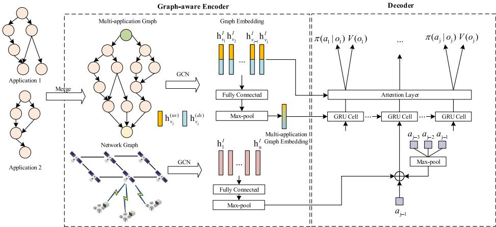  
Fig. 5. Illustration of the graph-aware encoder-decoder model in each RL agent.

In the DAG representing $G _ { i }$ , each task $\boldsymbol { v } _ { i , j } { } ^ { \prime } \mathbf { s }$ upstream and downstream neighbors’ information is respectively aggregated because they influence decision-making differently. The set of $\boldsymbol { v } _ { i , j } ^ { \ } \mathrm { : }$ s upstream neighbors is represented as $\mathcal { S } _ { u s } ( v _ { i , j } )$ , and its set of downstream neighbors $\boldsymbol { S } _ { d s } ( v _ { i , j } )$ . For instance, the embedding of a task in the $\bar { S } _ { u s } ( v _ { i , j } )$ at the pth step is $h _ { v ^ { \prime } } ^ { p }$ , where $v ^ { \prime } \in$ $\mathcal { S } _ { u s } ( v _ { i , j } )$ . Then, we feed it into non-linear transformation, which is computed by $\begin{array} { r } { \begin{array} { r } { h _ { v ^ { \prime } } ^ { ( u s ) } = \mathrm { R e L U } ( W _ { 1 } ^ { ( u s ) } h _ { v ^ { \prime } } ^ { p } ) } \end{array} } \end{array}$ , where $W _ { 1 } ^ { ( u s ) }$ is the transformation parameter.

Subsequently, when all the upstream tasks’ embeddings $h _ { v ^ { \prime } } ^ { ( u s ) }$ are computed, we take the mean-pooling of the vectors, and the upstream-view embedding of $v _ { i , j }$ is given by

$$
h _ { v _ { i , j } } ^ { ( u s ) } = \mathrm { R e L U } \left( W _ { 2 } ^ { ( u s ) } \left[ h _ { v ^ { \prime } } ^ { p } : \frac { \sum _ { v ^ { \prime } \in S _ { u s } ( v _ { i , j } ) } h _ { v ^ { \prime } } ^ { ( u s ) } } { | S _ { u s } ( v _ { i , j } ) | } \right] \right)\tag{46}
$$

where $W _ { 2 } ^ { ( u s ) }$ is the transformation parameter. As for the downstream, the downstream-view embedding $h _ { v _ { i , j } } ^ { ( d s ) }$ of $v _ { i , j }$ can be obtained in the same way as the upstream-view embedding with transformation parameters $W _ { 1 } ^ { ( d s ) }$ and $W _ { 2 } ^ { ( d s ) }$ . At the $p + 1$ -th step, the embedding of $v _ { i , j }$ is formed by concatenating the embeddings of downstream and upstream views, which is calculated by $\overline { { h _ { v _ { i , j } } ^ { i + 1 } } } = [ h _ { v _ { i , j } } ^ { ( u s ) } : h _ { v _ { i , j } } ^ { ( d s ) } ]$

= [ : ]As for dealing with embedding the undirected graph $G _ { n e t }$ without downstream and upstream links to each server. We first find the neighbor server nodes of $h _ { u } ^ { p } , u \in U _ { n e t }$ , and aggregate their information by the mean-pooling operation to get the features of neighbor nodes, which is defined as

$$
h _ { \mathcal { U } _ { n e t } ( u ) } ^ { p } = \mathrm { A G G R E G A T E } _ { i } ( \{ h _ { u ^ { \prime } } ^ { p - 1 } , \forall u ^ { \prime } \in \mathcal { U } _ { n e t } ( u ) \} ) ,\tag{47}
$$

where $\mathcal { U } _ { n e t } ( u )$ is the set of the server node u’s neighbors. Then, the updated feature of $h _ { u } ^ { p }$ can be obtained by concatenating the features of server node u at $p - 1 \mathtt { - } \mathtt { t h }$ step and the aggregated neighbor nodes at p-th step. Therefore, the server information for each node u at step p can be updated by

$$
h _ { u } ^ { p } = \mathrm { R e L U } ( W ^ { ( n e t ) } \Big [ h _ { u } ^ { p - 1 } : h _ { \mathcal { U } _ { n e t } ( u ) } ^ { p } \Big ] .\tag{48}
$$

For each task node, the process is repeated p iterations, concatenating its upstream and downstream hidden states $h _ { v _ { i , j } } ^ { ( u s ) }$ and $h _ { v _ { i , j } } ^ { ( d s ) }$ to form the final node representation $h _ { v _ { i , j } }$ . The server node representation is $h _ { u }$ . The graph encoding is derived by passing each task node embedding through a fully connected layer and max-pooling, which then serves as input to the decoder.

2) Markov Decision Process: We first formulate the optimization problem as an MDP for each agent i (encompassing visible LEO satellite k for the direct communication area and UAV m for the indirect communication area), defining its observation space, action space, and reward function as

\- State Space: A series of decision steps indexed by t is taken, where each step t corresponds to a task in the DAG Gi of ( )agent i. When determining the decisions of offloading and allocating resources for tasks, it is crucial to consider the impact of the upstream tasks’ strategies. The observation space $o _ { i } ^ { t }$ of agent i is defined as follows:

$$
o _ { i } ^ { t } = \{ \mathcal { L } ^ { ( u s ) } ( v _ { i , t } ) , h _ { v _ { i , t } } , a _ { i } ^ { t - 1 } , \{ h _ { u } ^ { t } \} _ { u \in U _ { i } } , T _ { n , k } ^ { L E O } \} ,\tag{49}
$$

where $\mathcal { L } ^ { ( u s ) } ( v _ { i , t } )$ is the set of upstream tasks’ decisions, $h _ { v _ { i , t } }$ is the task embedding of task $v _ { i , t } , a _ { i } ^ { t - 1 }$ is the decision of $( t - 1 )$ -th task, $h _ { u } ^ { t } , u \in U _ { m }$ represents the embedding features of server nodes and $T _ { n , k } ^ { L \bar { E } O }$ is the coverage time of LEO satellites. The global state of agent i at decision step t is defined as $G S _ { i } ^ { t }$ , which is concatenated by the local observations from all agents.

\- Action Space: At each decision step t, the decision of agent i to task $v _ { i , t }$ is decided based on the observation state $o _ { i } ^ { t }$ Specifically, for the current task $v _ { i , t }$ at decision step t, let $a _ { i } ^ { \bar { t } } = \{ a _ { k } ^ { t } , \bar { a } _ { m } ^ { t } \}$ denote the action space of agent i. Thus, the action space of the LEO satellite agent k is defined as

$$
a _ { k } ^ { t } = \{ z _ { n , k } ^ { t } , P _ { n } ^ { t } , x _ { k , t } , f _ { k , t } ^ { k } \} _ { n \in N _ { k } } .\tag{50}
$$

Similarly, at each decision step t, the action space $a _ { m } ^ { t }$ of UAV agent m is expressed as

$$
a _ { m } ^ { t } = \{ z _ { n , m } ^ { t } , P _ { n } ^ { t } , x _ { m , t } , f _ { m , t } ^ { m } , f _ { m , t } ^ { k } , q _ { m } ^ { t } \} _ { n \in N _ { m } } .\tag{51}
$$

Reward Function: At each decision step t, agent i takes action based on the current state and receives the feedback reward. To minimize the overall system cost while enforcing constraints, the reward function is defined as

$$
r _ { i } ^ { t } ( o _ { i } ^ { t } , a _ { i } ^ { t } ) = - \eta _ { t } T _ { i , t } - \eta _ { e } E _ { i , t } - \sum _ { \iota = 1 } ^ { 5 } \lambda _ { \iota } \cdot \Phi _ { \iota } ,\tag{52}
$$

where $\lambda _ { \iota }$ are penalty coefficients and $\Phi _ { \iota }$ represents the violation degree of constraint ι in problem $\mathcal { P } _ { 1 }$ . Specifically, $\Phi _ { \iota } = \operatorname* { m a x } ( 0 , f _ { \iota } )$ for inequality constraints, where $f _ { \iota }$ includes latency violations $( T _ { n } ^ { c o m p } - T _ { n } ^ { m a x } )$ , UAV resource overutilization $\begin{array} { r } { ( \sum _ { n , j } f _ { n , j } ^ { m } - F _ { m } ) } \end{array}$ , LEO satellite resource overutilization $\begin{array} { r } { ( \sum _ { n , j } f _ { n , j } ^ { k } - F _ { k } ) } \end{array}$ , UAV velocity violations $( v e _ { m } - v e _ { m } ^ { m a x } )$ ( ), and UAV collision violations $( d _ { m i n } -$ $| | \pmb q _ { m } ( t ) - \pmb q _ { m ^ { \prime } } ( t ) | | )$ , respectively. The penalty terms guide agents to learn feasible policies that satisfy the hard constraints in problem $\mathcal { P } _ { 1 }$

3) Graph-Aware Decoder: In the decoder stage, we apply the chain rule of probability for the following approximation:

$$
\pi ( \boldsymbol { A } _ { i } | { G } _ { i } , \boldsymbol { G } _ { n e t } ) = \prod _ { t = 1 } ^ { | { G } _ { i } | } \pi ( a _ { i } ^ { t } | \mathcal { L } ^ { ( u s ) } ( v _ { i , t } ) , \boldsymbol { G } _ { i } , \boldsymbol { G } _ { n e t } ) .\tag{53}
$$

To capture dependencies, the Gated Recurrent Unit (GRU) [32] is used to learn a state representation $h _ { v _ { i , t } }$ , which contains information connected to $\mathscr { L } ^ { ( u s ) } ( v _ { i , t } )$ and $G _ { i }$ . Specifically, during each decision step $t ,$ the input vector $h _ { v _ { i , } }$ and decision embedding of the last task $v _ { i , t - 1 }$ are combined with embeddings from the set $\mathscr { L } ^ { ( u s ) } ( v _ { i , t } )$ into the GRU cell, so as to improve the understanding of relevant placements for $v _ { i , t }$ and assist in its action. Correspondingly, the state of the proposed decoder is expressed as

$$
\begin{array} { r l } & { w _ { v _ { i , t } } = \mathrm { G R U } ( h _ { v _ { i , t } } , \mathcal { L } ^ { ( u s ) } ( v _ { i , t } ) , \qquad w _ { v _ { i , t - 1 } } , } \\ & { \quad a _ { i } ^ { t - 1 } , \{ h _ { u } ^ { t } \} _ { u \in U _ { i } } ) . } \end{array}\tag{54}
$$

The attention mechanism is employed to create a context vector $c _ { i , t }$ for task $v _ { i , t }$ . Specifically, this mechanism assigns an attention score to each $h _ { v _ { i , t ^ { \prime } } }$ at task t, which is given as $h _ { t t ^ { \prime } } = w _ { v _ { i , t } } h _ { v _ { i , t ^ { \prime } } } .$ To proceed, these attention scores, $h _ { t t ^ { \prime } }$ , are then processed through a softmax layer to compute the score $\alpha _ { t t ^ { \prime } }$ The context vector of the decoder component is concatenated as $\begin{array} { r } { c _ { i , t } = [ w _ { { v } _ { i , t } } : \sum _ { t ^ { \prime } } \alpha _ { t t ^ { \prime } } h _ { { v } _ { i , t ^ { \prime } } } ] } \end{array}$

4) Training With Asynchronous Multi-Agent Proximal Policy Optimization: Our research departs from the traditional synchronized action in MARL, shifting to asynchronous multiagent scenarios with shared rewards and dynamic transitions, better suited to UAV-assisted SEC environments. We modify MAPPO into AMAPPO, enabling independent agent actions without synchronized policy execution or data collection [8]. In AMAPPO, agents act independently, storing transitions in individual caches before periodically transferring them to a centralized buffer, improving flexibility and reducing redundant data storage. The comparison of the asynchronous buffer of AMAPPO and the synchronous buffer of MAPPO is shown in Fig. 6. Moreover, the architecture shares parameters between policy and value networks in the encoder and decoder, with each agent’s policy network adding a fully connected layer and GRU layer to the decoder output. The centralized value network also shares parameters with the context vector, enhancing feature extraction from DAGs and network systems.

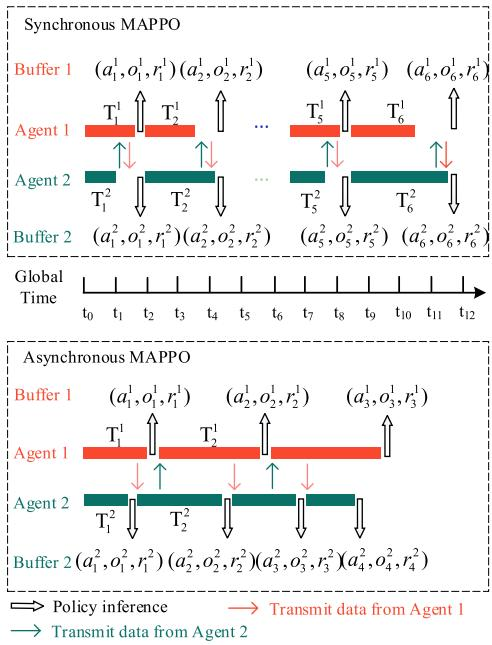  
Fig. 6. The comparison of the asynchronous MAPPO and the synchronous MAPPO in terms of action-making and buffer.

The critic network utilizes the temporal-difference (TD) scheme to minimize the difference between the value function and the critic network itself. Consequently, the loss function of the critic network can be given as

$$
L _ { i } ^ { C } ( \theta ) = \mathbb { E } _ { t } \bigg [ r _ { i } ^ { t } + \gamma V _ { i } ( o _ { i } ^ { t + 1 } ; \theta ) - V _ { i } ( o _ { i } ^ { t } ; \theta ) \bigg ] ^ { 2 } ,\tag{55}
$$

where θ represents the parameter of the critic network.

For the actor network, the clipped target function is utilized to prevent significant updates to the policy:

$$
\begin{array} { r l } & { L _ { i } ^ { A } ( \phi ) = \mathbb { E } _ { t } \bigg [ \operatorname* { m i n } \big ( p p ^ { t } ( \phi ) , \operatorname { c l i p } ( p p ^ { t } ( \phi ) , 1 - \epsilon _ { c l i p } , } \\ & { ~ 1 + \epsilon _ { c l i p } ) \big ) \cdot \hat { A } ^ { t } ( a _ { i } ^ { t } , o _ { i } ^ { t } ) \bigg ] , } \end{array}\tag{56}
$$

where $\begin{array} { r } { p p ^ { t } ( \phi ) = \frac { \pi _ { i } ( a _ { i } ^ { t } | o _ { i } ^ { t } ; \phi ) } { \pi _ { i } ( a _ { i } ^ { t } | o _ { i } ^ { t } ; \phi _ { o l d } ) } } \end{array}$ indicates the policy probability ratio over new and old policies, and $\epsilon _ { c l i p }$ is a hyperparameter that regulates the clip range. Here $\hat { A } ^ { t } ( a _ { i } ^ { t } , o _ { i } ^ { t } )$ represents the acquired advantage function via the generalized advantage estimator (GAE) [33], which is calculated as

$$
\hat { A } ^ { t } ( a _ { i } ^ { t } , o _ { i } ^ { t } ) = \sum _ { j = 1 } ^ { | V _ { i } | - t + 1 } ( \gamma \varphi ) ^ { j } ( r ^ { t + j } + \gamma V _ { i } ( o _ { m } ^ { t + j + 1 } ) - V _ { m } ( o _ { m } ^ { t + j } ) ) ,\tag{57}
$$

where $\varphi \in [ 0 , 1 ]$ is the smoothing parameter to balance the trade-off between the accuracy and stability of the estimation. The training process of AMAPPO is presented in Algorithm 3. During the training process, our AMAPPO method is similar to MAPPO as it updates both the actor network $\pi _ { i }$ and the critic network $V _ { i }$ . The key difference, however, lies in the critic network update, where the gradient is constrained to flow only through the kernel that processes the decision-making agent’s own observation. Furthermore, to manage asynchronous operations, the algorithm defines two types of clocks: a global system clock that operates on fixed, short time slots $( t ^ { \prime } \in G T )$ for all agents to synchronize, and each agent’s own local clock $( t ^ { i } )$ which has variable-length time steps. This dual-clock structure enables all agents to operate on a unified global timeline while accommodating the individual progress differences caused by the asynchronicity of their DAG tasks, as seen in Fig. 6.

Algorithm 3: AMAPPO.   
Input : A set of I agents   
1 Set memory buffer size $M B = \{ \} ;$   
2 Initialize transition buffer for each agent $\xi _ { 1 } , ~ . . . , \xi _ { I } ;$   
3 Initialize parameters $\phi$ and θ for the actor and critic   
networks;   
4 Initialize RNN states $h _ { \underline { { { 1 } } } , \pi } ^ { 0 } , \ . . . , h _ { I , \pi } ^ { 0 }$ for actor network;   
5 Initialize RNN states $h _ { 1 , V } ^ { 0 ^ { \prime } } , \ . . . , h _ { I , V } ^ { 0 ^ { \prime } }$ for critic network;   
6 for each epoch = 1 → ep do   
7 for each time slot $\overline { { t ^ { \prime } = 1 , 2 , . . . , G T } }$ do   
8 for each available agent i do   
9 Acquire $\overline { { \hat { \xi } _ { i } = ( s _ { i } ^ { t ^ { \prime } } , o _ { i } ^ { t ^ { \prime } } , } r _ { i } ^ { t ^ { \prime } } ) } \mathrm { ; }$   
10 $\xi _ { i } ^ { t ^ { \prime } - 1 } \gets \hat { \xi } _ { i } \cup \overline { { \xi } } _ { i } ;$   
11 $\xi _ { i } \gets \xi _ { i } \cup \xi _ { i } ^ { t ^ { \prime } - 1 } ;$   
12 $a _ { i } ^ { t ^ { \prime } } , h _ { i , \pi } ^ { t ^ { \prime } } = \bar { \pi _ { i } } ( o _ { i } ^ { t ^ { \prime } } , h _ { i , \pi } ^ { t ^ { \prime } - 1 } ; \phi ) ;$   
13 $h _ { i , V } ^ { t ^ { \prime } } = V _ { i } ( o _ { i } ^ { t ^ { \prime } } , h _ { i , V } ^ { t ^ { \prime } - 1 } ; \theta ) ;$   
14 Acquire ${ \overline { { \xi } } } _ { i } = ( s _ { i } ^ { t ^ { \prime } } , o _ { i } ^ { t ^ { \prime } } , h _ { i , \pi } ^ { t ^ { \prime } } , h _ { i , V } ^ { t ^ { \prime } } , a _ { i } ^ { t ^ { \prime } } ) ;$   
15 end   
16 Execute action $a _ { i } ^ { t ^ { \prime } } \mathrm { . }$   
17 end   
18 for all agents i do   
19 $M B \gets M B \cup \xi _ { i }$   
20 end   
21 Calculate rewards-to-go $\begin{array} { r } { \hat { R } = \sum _ { i = 1 } ^ { | V _ { i } | - t ^ { \prime } + 1 } \gamma ^ { i } r ^ { t ^ { \prime } + i } } \end{array}$ on   
M B;   
22 Calculate advantage estimate $\hat { A } ^ { t }$ by Eq. (57) on   
M B;   
23 Update θ by minimizing the loss function in Eq.   
(55);   
24 Update $\phi$ using PPO-clip with the objective   
function in Eq. (56);   
25 end   
Output: The trained collaborative policy network $\pi _ { i }$   
and critic network Vi for all the agents.

5) Complexity Analysis of AMAPPO and IoTD Association: The computational complexity of the proposed one-to-many matching algorithm is analyzed, which consists of two main phases: initialization and swap-matching. In the initialization phase, the algorithm computes the utility functions for all possible IoTD-UAV pairs, resulting in a computational complexity of O MN . In the swap-matching phase, the maximum number of possible swap operations $2 \times \binom { N } { 2 }$ , and thus the computational complexity of the swap phase is upper bounded by $\mathcal { O } ( N ^ { 2 } )$ , as each pair of IoTDs may form a swap-blocking pair at most once. Consequently, the overall complexity of the IoTD association algorithm is $\dot { \mathcal { O } } ( M N ) + \mathcal { O } ( N ^ { 2 } ) = \dot { \mathcal { O } } ( N ^ { 2 } )$ when $M \ll N$ remaining significantly more efficient than exhaustive search methods with complexity of $\mathcal { O } ( M ^ { N } )$

( )Moreover, the time complexity of the AMAPPO algorithm includes the training update phase and inference phase. Here, ep represents the number of training epochs, I is the number of agents, $G T$ denotes the number of global time slots, $C _ { L }$ is the number of layers in the neural network, and $C _ { N }$ is the number of neurons per layer. This complexity stems from network updates that process trajectory data through forward and backward passes. For each epoch, the computation scales with $\mathcal { O } ( I \cdot G T \cdot C _ { L } \cdot C _ { N } ^ { 2 } )$ due to the processing of data and the network parameter updates. Over ep training epochs, this results in a total time complexity of $\mathcal { O } ( e p \cdot I \cdot G T \cdot C _ { L } \cdot C _ { N } ^ { 2 } )$ for the training phase. Correspondingly, the time complexity of the inference phase is $\mathcal { O } ( I \cdot G T \cdot C _ { L } \cdot C _ { N } ^ { 2 } )$ . Since IoTD association is performed once per system setup while AMAPPO inference runs continuously, the total time complexity is $O ( N ^ { 2 \sim } M + I$ $G T \cdot C _ { L } \cdot C _ { N } ^ { 2 } )$ ( ˜ +. This demonstrates favorable scalability with polynomial-time preprocessing and linear scaling in agents and time horizons, enabling real-time decisions in dynamic UAVassisted SEC environments.

6) Theoretical Analysis on Convergence Time and Solution Loss: We provide a theoretical analysis of the AMAPPO algorithm, focusing on its convergence properties and solution loss. The basic lemma on asynchronous updates is introduced.

Lemma 1: Under certain conditions, for a learning rate sequence $\{ \alpha _ { t } \}$ satisfying $\textstyle \sum _ { t } \alpha _ { t } = \infty$ and $\textstyle \sum _ { t } \alpha _ { t } ^ { 2 } < \infty$ , the asynchronous gradient descent algorithm converges to a local optimum [34].

Proof: Please refer to Appendix B.

Based on the above lemma, we can derive the convergence time bound for the AMAPPO algorithm.

Theorem 2 (AMAPPO Convergence Time Bound): Suppose $F ( \theta )$ is L-smooth, and there exists a constant $\varpi ^ { 2 }$ such that the asynchronous gradient satisfies $\mathbb { E } [ \lVert g _ { t } - \nabla F ( \theta _ { t } ) \rVert ^ { 2 } ] \leq \varpi ^ { 2 } \mathbb { E } [ \bar { \tau } _ { t } ]$ where $\begin{array} { r } { \bar { \tau } _ { t } = \frac { 1 } { | I | } \sum _ { i = 1 } ^ { | I | } \tau _ { i } ^ { t } } \end{array}$ denotes the average delay at time step t. In AMAPPO, with a learning rate $\textstyle \alpha _ { t } = { \frac { \alpha } { \sqrt { t } } }$ , the expected convergence time complexity is given by:

$$
\mathbb { E } \left[ \operatorname* { m i n } _ { t = 1 , \dots , T } \left\| \nabla F ( \theta _ { t } ) \right\| ^ { 2 } \right] \leq \mathcal { O } \left( \frac { L \Delta _ { 0 } + \varpi ^ { 2 } \bar { \tau } _ { \operatorname* { m a x } } } { \sqrt { T } } \right) ,
$$

where $\bar { \tau } _ { \mathrm { m a x } }$ is the maximum expected average delay, and $\Delta _ { 0 } =$ $F ( \theta _ { 0 } ) - F ^ { * }$ is the initial optimization gap, with $F ^ { * }$ being the optimal value of $F .$

Proof: Please refer to Appendix C.

Corollary 1 (Asymptotic Convergence of AMAPPO): Under the same assumptions as in Lemma 1 and Theorem 2, the AMAPPO algorithm with learning rate $\begin{array} { r } { \alpha _ { t } = \frac { \alpha } { \sqrt { t } } } \end{array}$ asymptotically converges to a stationary point:

$$
\operatorname* { l i m } _ { T \to \infty } \mathbb { E } [ \| \nabla F ( \theta _ { T } ) \| ^ { 2 } ] = 0 .
$$

Proof: Please refer to Appendix D.

The above convergence analysis indicates that the asynchronous nature of AMAPPO introduces an additional factor $\bar { \tau } _ { \mathrm { m a x } }$ in the convergence bound. Next, the theoretical analysis of the solution loss for the AMAPPO is described as follows:

TABLE III SIMULATION PARAMETERS
<table><tr><td rowspan=1 colspan=1>Parameter</td><td rowspan=1 colspan=1>Value</td><td rowspan=1 colspan=1>Parameter</td><td rowspan=1 colspan=1>Value</td></tr><tr><td rowspan=1 colspan=1>N</td><td rowspan=1 colspan=1>100</td><td rowspan=1 colspan=1> $\overline { { M } }$ </td><td rowspan=1 colspan=1>4</td></tr><tr><td rowspan=1 colspan=1> $\overline { { K } }$ </td><td rowspan=1 colspan=1>8</td><td rowspan=1 colspan=1> $\overline { { J } }$ </td><td rowspan=1 colspan=1>20</td></tr><tr><td rowspan=1 colspan=1> $\overline { { D _ { n , j } ^ { i } } }$ </td><td rowspan=1 colspan=1>[0.8, 4] MB</td><td rowspan=1 colspan=1> $D _ { n . i } ^ { o }$ </td><td rowspan=1 colspan=1>[0.4, 1.0] MB</td></tr><tr><td rowspan=1 colspan=1> $C _ { n , j }$ </td><td rowspan=1 colspan=1>[1, 3] Gcycles</td><td rowspan=1 colspan=1> $\overline { { T _ { n } ^ { m a x } } }$ </td><td rowspan=1 colspan=1>[50, 60] s</td></tr><tr><td rowspan=1 colspan=1> $d _ { m i n }$ </td><td rowspan=1 colspan=1>3 m</td><td rowspan=1 colspan=1> $\overline { { d _ { f l y } ^ { m a x } } }$ </td><td rowspan=1 colspan=1>30 m</td></tr><tr><td rowspan=1 colspan=1> $\overline { { G _ { P } } }$ </td><td rowspan=1 colspan=1>1</td><td rowspan=1 colspan=1> $\zeta _ { B }$ </td><td rowspan=1 colspan=1>2</td></tr><tr><td rowspan=1 colspan=1> $\overline { { W ( k k ^ { \prime } ) } }$ </td><td rowspan=1 colspan=1>1</td><td rowspan=1 colspan=1> $\overline { { B _ { k c } } }$ </td><td rowspan=1 colspan=1>1 GHz</td></tr><tr><td rowspan=1 colspan=1>σ</td><td rowspan=1 colspan=1>-100 dBm</td><td rowspan=1 colspan=1> $B _ { k k ^ { \prime } }$ </td><td rowspan=1 colspan=1>1 GHz</td></tr><tr><td rowspan=1 colspan=1> $\overline { { B ^ { G 2 U } , B ^ { U 2 G } } }$ </td><td rowspan=1 colspan=1>20 MHz</td><td rowspan=1 colspan=1> $\overline { { B ^ { U 2 S } , B ^ { S 2 U } } }$ </td><td rowspan=1 colspan=1>15MHz</td></tr><tr><td rowspan=1 colspan=1> $\overline { { B ^ { G 2 S } , B ^ { S 2 G } } }$ </td><td rowspan=1 colspan=1>15 MHz</td><td rowspan=1 colspan=1> $\overline { { P _ { c } } }$ </td><td rowspan=1 colspan=1>5W</td></tr><tr><td rowspan=1 colspan=1> $\overline { { F _ { n } } }$ </td><td rowspan=1 colspan=1>0.8 GHz</td><td rowspan=1 colspan=1> $F _ { m }$ </td><td rowspan=1 colspan=1>3GHz</td></tr><tr><td rowspan=1 colspan=1> $F _ { k }$ </td><td rowspan=1 colspan=1>[4, 5] GHz</td><td rowspan=1 colspan=1> $F _ { C }$ </td><td rowspan=1 colspan=1>10 GHz</td></tr><tr><td rowspan=1 colspan=1> $\kappa _ { D }$ </td><td rowspan=1 colspan=1> $\overline { { 5 \times 1 0 } }$ -27</td><td rowspan=1 colspan=1> $\kappa _ { U } , \kappa _ { L } , \kappa _ { C }$ </td><td rowspan=1 colspan=1>10−28</td></tr><tr><td rowspan=1 colspan=1> $\overline { { P _ { n } ^ { m a x } } }$ </td><td rowspan=1 colspan=1>1 W</td><td rowspan=1 colspan=1> $\underline { P } _ { m }$ </td><td rowspan=1 colspan=1>2W</td></tr><tr><td rowspan=1 colspan=1> $P _ { k }$ </td><td rowspan=1 colspan=1>5W</td><td rowspan=1 colspan=1>mini batch size</td><td rowspan=1 colspan=1>128</td></tr><tr><td rowspan=1 colspan=1> $\gamma$ </td><td rowspan=1 colspan=1>0.99</td><td rowspan=1 colspan=1> $\underline { { \varphi } }$ </td><td rowspan=1 colspan=1>0.95</td></tr><tr><td rowspan=1 colspan=1> $\epsilon$ </td><td rowspan=1 colspan=1>0.2</td><td rowspan=1 colspan=1>Learning rate</td><td rowspan=1 colspan=1>5 × 10−4</td></tr><tr><td rowspan=1 colspan=1>GRU hidden layer</td><td rowspan=1 colspan=1>64</td><td rowspan=1 colspan=1>Activation function</td><td rowspan=1 colspan=1>ReLU</td></tr></table>

Theorem 3 (AMAPPO Solution Loss Upper Bound): The solution loss of the AMAPPO algorithm can be decomposed into five key components, with the total loss upper bounded by:

$$
L ( \pi _ { \phi } ) \leq L _ { r e p } + L _ { a s y n c } + L _ { o b s } + L _ { c l i p } + L _ { e s t } .
$$

Proof: Please refer to Appendix E.

The analysis bounds the total solution loss by combining all individual error terms.

## V. PERFORMANCE EVALUATION

## A. Experiments Setup

In the experiments, we consider two areas, including the spacious area of direct communication and the obstructive area of indirect communication. In the obstructive area, 80 IoTDs and 4 UAVs are randomly distributed in a km × km square area, and UAVs are flying at a variable altitude of $H _ { m } = [ 4 0 , 6 0 ] \mathrm { m }$ In the spacious area, 20 IoTDs are randomly distributed. Among others, IoTDs move at different global system clocks, such that the channel gains between IoTDs and UAVs are changed. There are two orbits in the SEC scenario based on the structure of LEO satellite constellations of Iridium II and Starlink, where the number of LEO satellites in each orbit is 4, and the orbit altitude is set as $H _ { S } = 5 0 0 k m$ . Table III lists all simulation and AMAPPO hyperparameters. The hyperparameters in Table III for the AMAPPO algorithm are selected through a systematic approach combining grid search, sensitivity analysis, and guidance from widely used settings in the MAPPO/PPO literature [8], [35].

We utilize Alibaba’s cluster-trace-v2018 dataset, which encompasses information from 4000 machines spanning an 8-day period. The Alibaba dataset contains numerous applications comprised of multiple tasks, with dependencies being expressed by a DAG [36]. While sampling DAGs from this dataset, we specifically modeled the number of subtasks to simulate the task quantities found in remote IoTD applications as described in [25]. These applications include face recognition, object and pose recognition, and gesture recognition, which represent typical computational workloads encountered by remote IoTDs. Moreover, the satellite constellation visualization software tool SaVi” is utilized to construct the LEO satellite network [37]. The simulations are conducted on a platform with an Intel(R) Xeon(R) Platinum 8370C CPU @ 2.80GHz and an NVIDIA GeForce GTX 4090 graphics card.

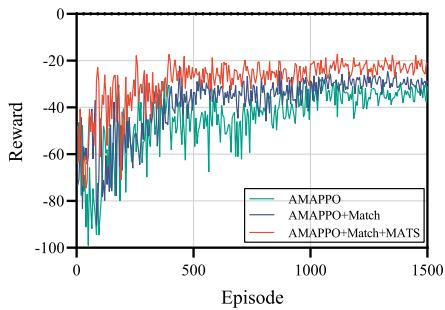  
Fig. 7. Comparison of convergence performance between AMAPPO, AMAPPO+Match and AMAPPO+Match+MATS.

Benchmark algorithms: We evaluate AMAPPO and its variants, AMAPPO+Match and AMAPPO+Match+MATS, against the following algorithms: synchronous MAPPO with graphaware encoder-decoder (MAPPO) [8], synchronous MADDPG with graph-aware encoder-decoder (MADDPG), Attention-PPO (A-PPO) [19], and Independent-PPO with S2S neural network (IPPO) [38]. The above comparative DRL algorithms employ random matching and HEFT-based task priority for each DAG [39]. To demonstrate the effectiveness of MATS and one-to-many matching to AMAPPO’s performance, we compare AMAPPO+Match and AMAPPO+Match+MATS with the AMAPPO algorithm.

## B. Numerical Results

Fig. 7 depicts the learning curves for MAPPO, AMAPPO, AMAPPO+Match, and AMAPPO+Match+MATS. The results indicate that AMAPPO achieves a faster and more stable convergence compared to the other methods. Notably, AMAPPO exhibits a slower convergence rate than AMAPPO+Match, which can be attributed to suboptimal connections between IoTDs and UAVs. Similarly, AMAPPO+Match demonstrates suboptimal performance, with both slower convergence and reduced final policy quality. Without the advantages of the MATS algorithm, such as the integration of multiple DAG applications and task prioritization, AMAPPO+Match and MAPPO struggle to manage the complexities of scheduling tasks across different DAG applications, resulting in increased latency and energy consumption. In contrast, the fully realized AMAPPO+Match+MATS algorithm exhibits superior training stability and efficiency, achieving faster and more consistent convergence.

Fig. 8 presents the convergence performance of the proposed AMAPPO algorithm under different hyperparameter settings of learning rates and mini-batch size. As illustrated in Fig. 8(a), three learning rates are examined: 0.0001, 0.0005, and 0.001. With a relatively large learning rate of 0.001, the training process of the algorithm exhibits pronounced fluctuation, indicating instability induced by overly aggressive parameter updates. In contrast, a learning rate of 0.0005 achieves favorable convergence speed and stability, yielding consistently high rewards with smoother trajectories. When the learning rate is reduced to 0.0001, the convergence becomes significantly slower, requiring more than 900 episodes to stabilize, and the final reward is inferior. These results empirically demonstrate that a learning rate of 0.0005 provides the most effective convergence. In Fig. 8(b), the effect of different mini-batch sizes is investigated. When the mini-batch size is set to 64, the algorithm converges more slowly and stabilizes at a lower reward level, which can be attributed to the higher variance introduced by smaller sample updates. In contrast, a larger mini-batch size of 128 yields faster convergence and higher rewards with smoother training curves, highlighting the benefit of more stable gradient estimation. Based on these observations, we adopt a learning rate of 0.0005 and a mini-batch size of 128in the following experiments to ensure both convergence efficiency and stability.

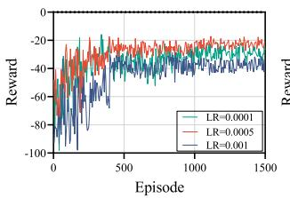  
(a)

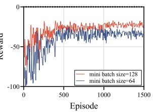  
(b)

Fig. 8. Comparison of convergence performance under different hyperparameters.  
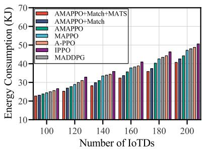  
(a)

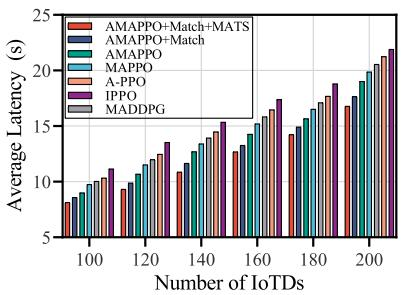  
(b)  
Fig. 9. Comparison of total energy consumption and average latency per DAG with varying numbers of IoTDs.

We next evaluate the performance of the proposed AMAPPO+Match+MATS algorithm by comparing the total energy consumption and average latency against various benchmark algorithms, as depicted in Fig. 9. As the number of IoTDs increases, the total energy consumption and average latency for all methods rise due to the greater volume of tasks and increased computational and communication demands. Nonetheless, AMAPPO+Match+MATS consistently surpasses all other methods in both metrics. Fig. 9(a) shows that AMAPPO+Match+MATS is more energy-efficient than its counterparts across all IoTD counts. Notably, with 200 IoTDs, it consumes approximately 10.3% less energy than MAPPO. MADDPG performs worse than MAPPO and AMAPPO in energy efficiency. This efficiency can be attributed to the MATS mechanism and one-to-one matching, which enhance coordination and resource allocation. Regarding average latency per DAG, Fig. 9(b) illustrates that AMAPPO+Match+MATS maintains consistent performance. Although the IPPO method occasionally records lower latency, its performance lacks stability and tends to fluctuate significantly as the number of IoTDs increases. This inconsistency stems from the complex information exchange among multiple agents and the increased demands placed on UAVs. AMAPPO+Match+MATS outperforms the MADDPG, which shows moderate latency performance of MADDPG due to the difficulty of accurately estimating Q-values and coordinating decisions under complex DAG dependencies and mixed action spaces. In contrast, AMAPPO+Match+MATS effectively utilizes asynchronous information exchange and the MATS mechanism to tackle these challenges, leading to more reliable and consistent latency.

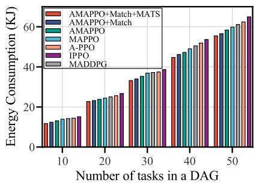  
(a)

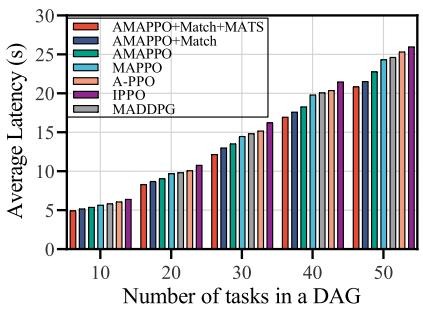  
(b)  
Fig. 10. Comparison of total energy consumption and average latency per DAG with varying number of tasks.

Fig. 10 compares the performance in terms of total energy consumption and average latency per DAG under six different algorithms across varying numbers of tasks in a DAG from 10 to 50 tasks. The results consistently demonstrate that the proposed AMAPPO+Match+MATS scheme significantly outperforms all other algorithms in both metrics. For example, when the number of tasks is 50, AMAPPO+Match+MATS consumes approximately 16.3% less energy than the IPPO method. Moreover, AMAPPO+Match+MATS is about 10.9% faster than the MAPPO algorithm at the highest task load. This performance advantage is maintained across all task sizes, with the performance gap becoming more significant as the task count increases. MADDPG exhibits higher energy and latency compared to MAPPO, primarily because its critic network struggles to accurately estimate Q-values in environments with complex DAG dependencies and increasing task complexity. This superior performance stems from the GNN-augmented AMAPPO, which enables the system to balance computational loads and communication paths efficiently.

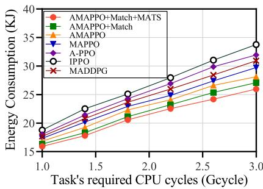  
(a)

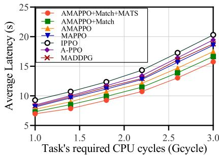  
(b)  
Fig. 11. Comparison of total energy consumption and average latency per DAG with varying tasks required CPU cycles.

Fig. 11 depicts that as tasks’ CPU cycles increase from 1 to 3 Gcycles, both total energy consumption and average latency rise due to greater computational demands. The AMAPPO+ Match+MATS algorithm consistently outperforms other methods. This increase reflects the growing computational burden, with tasks either executed on UAVs or offloaded to LEO satellites and CS, demanding more resources. For example, at 1.6 Gcycles, our proposed approach achieves an 11.3% reduction in energy consumption compared to MAPPO, due to the combination of a graph-aware encoderdecoder, MATS scheduling, and a matching mechanism for efficient resource utilization. IPPO exhibits unstable energy consumption and latency due to its uncoordinated, agent-specific policies. MADDPG shows better stability than IPPO but higher overall costs than AMAPPO+Match+MATS. In contrast, AMAPPO+Match+MATS maintains a superior latency, driven by MATS’s dependency-aware scheduling, which prevents the inconsistent behavior in IPPO. Overall,

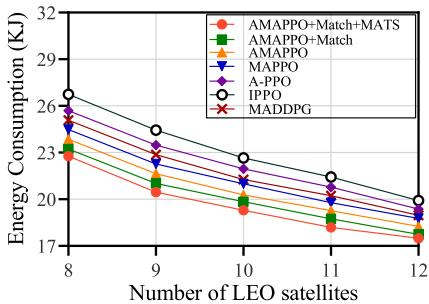  
(a)

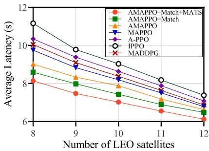  
(b)  
Fig. 12. Comparison of total energy consumption and average latency per DAG with varying number of LEO satellites.

TABLE IV  
SHADOWED-RICIAN PARAMETERS FITTED FROM MEASUREMENTS [26]
<table><tr><td rowspan=1 colspan=1>Shadow Level</td><td rowspan=1 colspan=1>Light</td><td rowspan=1 colspan=1>Average</td><td rowspan=1 colspan=1>Heavy</td></tr><tr><td rowspan=1 colspan=1>g</td><td rowspan=1 colspan=1>19.4</td><td rowspan=1 colspan=1>10.1</td><td rowspan=1 colspan=1>0.739</td></tr><tr><td rowspan=1 colspan=1>Ω</td><td rowspan=1 colspan=1>1.29</td><td rowspan=1 colspan=1>0.835</td><td rowspan=1 colspan=1> $\overline { { 8 . 9 7 \times 1 0 ^ { - 4 } } }$ </td></tr></table>

AMAPPO+Match+MATS strikes an excellent balance between energy consumption and latency.

Fig. 12 illustrates how total energy consumption and average latency per DAG decrease as the number of LEO satellites increases. Among all the algorithms evaluated, AMAPPO+ Match+MATS consistently achieves the lowest values for both metrics, demonstrating at least an 11.6% reduction in energy consumption when compared to benchmark algorithms such as MAPPO, MADDPG, A-PPO, IPPO, AMAPPO and AMAPPO+Match, while also significantly decreasing latency. This notable improvement can be attributed to its effective utilization of the computational and communication resources provided by the additional LEO satellites, which optimizes task allocation to minimize energy consumption. The presence of more LEO satellites facilitates greater task parallelism, which in turn reduces queuing and execution times. In contrast, MAD-DPG exhibits poorer performance as the satellite count increases. While MAPPO surpasses MADDPG, it still lags behind AMAPPO+Match+MATS, particularly in resource-rich scenarios. Although MAPPO can manage distributed dependent tasks, its strategies lack the flexibility when compared to AMAPPO’s asynchronous framework.

To simulate the different environmental conditions, we introduce three different shadowing intensities [26] in Table IV, including light shadowing, average shadowing, and heavy, which correspond to sunny, mist, and thunderstorm scenarios, respectively. Fig. 13 illustrates the total energy consumption and average latency per DAG under different shadow levels (light, average, heavy). AMAPPO+Match+MATS consistently achieves the lowest energy consumption and latency across all shadow conditions among the evaluated algorithms. Specifically, in extreme environmental scenarios with heavy shadow, AMAPPO+Match+MATS reduces energy consumption by at least 12.1% compared to benchmarks like MAPPO and IPPO, while maintaining a 13.9% lower latency than A-PPO. This superior performance stems from its adaptive resource allocation strategy, which dynamically balances task offloading between UAVs and satellites to mitigate shadowing effects under poor transmission conditions. MADDPG shows increased vulnerability to different shadowing conditions compared to AMAPPO+Match+MATS. Meanwhile, MAPPO struggles with resource coordination in dynamic environments. Although A-PPO improves over IPPO by leveraging attention mechanisms, it fails to exploit the multi-hop ISL capabilities of LEO constellations fully, highlighting the necessity of AMAPPO+Match+MATS’s integrated optimization framework for robust performance in varying weather conditions.

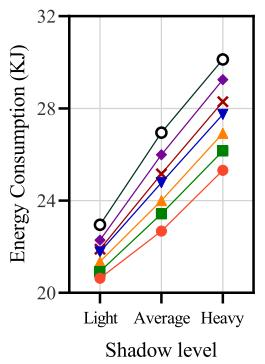  
(a)

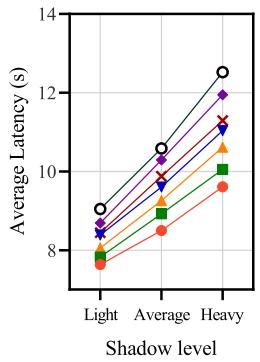  
(b)  
Fig. 13. Comparison of total energy consumption and average latency per DAG with varying environmental conditions.

## VI. CONCLUSION

In this paper, we study the joint dependent task offloading and resource allocation problem for remote IoT applications within the UAV-assisted SEC architecture. Multiple applications with dependent tasks of IoTDs collected by agents are represented as DAGs. To minimize the total system cost in SEC, a oneto-many matching algorithm is initially introduced to associate IoTDs with UAVs. Subsequently, a MATS algorithm is proposed to consolidate multiple applications and arrange the task order. Finally, a graph-aware AMAPPO approach is utilized to enable agents to independently discover optimal strategies. Extensive simulations based on real datasets demonstrate that the approach effectively reduces the total system cost while meeting latency requirements, surpassing the performance of other benchmark algorithms.

## REFERENCES

[1] G. Sun et al., “Joint task offloading and resource allocation in aerialterrestrial UAV networks with edge and fog computing for post-disaster rescue,” IEEE Trans. Mobile Comput., vol. 23, no. 9, pp. 8582–8600, Sep. 2024.

[2] J. Zhou, Q. Yang, L. Zhao, H. Dai, and F. Xiao, “Mobility-aware computation offloading in satellite edge computing networks,” IEEE Trans. Mobile Comput., vol. 23, no. 10, pp. 9135–9149, Oct. 2024.

[3] S. Xi, B. Shang, H. Zhang, J. Ma, and P. Fan, “Energy optimization in multisatellite-enabled edge computing systems,” IEEE Internet Things J., vol. 11, no. 12, pp. 21715–21726, Jun. 2024.

[4] S. Barick and C. Singhal, “UAV-assisted MEC architecture for collaborative task offloading in urban IoT environment,” IEEE Trans. Netw. Service Manag., vol. 22, no. 1, pp. 732–743, Feb. 2025.

[5] B. Xie, H. Cui, I. W.-H. Ho, Y. He, and M. Guizani, “Computation offloading and resource allocation in leo satellite-terrestrial integrated networks with system state delay,” IEEE Trans. Mobile Comput., vol. 24, no. 3, pp. 1372–1385, Mar. 2025.

[6] J. Bi et al., “Energy-minimized partial computation offloading in satellite– terrestrial edge computing networks,” IEEE Internet Things J., vol. 12, no. 5, pp. 5931–5944, Mar. 2025.

[7] H. Guo, Y. Wang, J. Liu, and C. Liu, “Multi-UAV cooperative task offloading and resource allocation in 5G advanced and beyond,” IEEE Trans. Wireless Commun., vol. 23, no. 1, pp. 347–359, Jan. 2024.

[8] C. Yu et al., “The surprising effectiveness of PPO in cooperative multiagent games,” in Proc. Adv. Neural Inf. Process. Syst., Nov. 2022, vol. 35, pp. 24611–24624.

[9] Q. Chen, W. Meng, T. Q. S. Quek, and S. Chen, “Multi-tier hybrid offloading for computation-aware IoT applications in civil aircraft-augmented sagin,” IEEE J. Sel. Areas Commun., vol. 41, no. 2, pp. 399–417, Feb. 2023.

[10] C. Zhang and J. Yang, “An energy-efficient collaborative offloading scheme with heterogeneous tasks for satellite edge computing,” IEEE Trans. Netw. Sci. Eng., vol. 11, no. 6, pp. 6396–6407, Nov.–Dec. 2024.

[11] P. Li, Y. Wang, Z. Wang, T. Wang, and J. Cheng, “Joint task offloading and resource allocation strategy for hybrid MEC-enabled leo satellite networks: A hierarchical game approach,” IEEE Trans. Commun., vol. 73, no. 5, pp. 3150–3166, May 2025.

[12] Y. Chen, J. Zhao, Y. Wu, J. Huang, and X. S. Shen, “Multi-user task offloading in UAV-assisted leo satellite edge computing: A game-theoretic approach,” IEEE Trans. Mobile Comput., vol. 24, no. 1, pp. 363–378, Jan. 2025.

[13] J. Shi, X. Chen, Y. Zhang, X. Chen, and C. Pan, “Joint optimization of task offloading and resource allocation in satellite-assisted IoT networks,” IEEE Internet Things J., vol. 11, no. 21, pp. 34337–34348, Nov. 2024.

[14] W. Zhu, X. Deng, J. Gui, H. Zhang, and G. Min, “Cost-effective task offloading and resource scheduling for mobile edge computing in 6G space-air-ground integrated network,” IEEE Internet Things J., vol. 12, no. 12, pp. 19428–19442, Jun. 2025.

[15] M. Jia, L. Zhang, J. Wu, Q. Guo, G. Zhang, and X. Gu, “Deep multiagent reinforcement learning for task offloading and resource allocation in satellite edge computing,” IEEE Internet Things J., vol. 12, no. 4, pp. 3832–3845, Feb. 2025.

[16] H. Peng, Z. Su, Z. Zhang, B. Hua, T. H. Luan, and N. Cheng, “Intelligent and collaborative computing offloading and resource management in satellite-cloud-MEC integrated IoVs,” IEEE Trans. Cogn. Commun. Netw., vol. 11, no. 6, pp. 4267–4280, Dec. 2025, doi: 10.1109/TCCN.2025.3548630.

[17] J. Zhou, Y. Zhao, L. Zhao, H. Cai, and F. Xiao, “Adaptive task offloading with spatiotemporal load awareness in satellite edge computing,” IEEE Trans. Netw. Sci. Eng., vol. 11, no. 6, pp. 5311–5322, Nov.–Dec. 2024.

[18] L. Zhong, Y. Li, M.-F. Ge, M. Feng, and S. Mao, “Joint task offloading and resource allocation for leo satellite-based mobile edge computing systems with heterogeneous task demands,” IEEE Trans. Commun., vol. 74, no. 7, pp. 11337–11352, Jul. 2025.

[19] F. Chai, Q. Zhang, H. Yao, X. Xin, R. Gao, and M. Guizani, “Joint multi-task offloading and resource allocation for mobile edge computing systems in satellite IoT,” IEEE Trans. Veh. Technol., vol. 72, no. 12, pp. 15476–15489, Dec. 2023.

[20] C. Huang, G. Chen, P. Xiao, Y. Xiao, Z. Han, and J. A. Chambers, “Joint offloading and resource allocation for hybrid cloud and edge computing in sagins: A decision assisted hybrid action space deep reinforcement learning approach,” IEEE J. Sel. Areas Commun., vol. 42, no. 5, pp. 1029–1043, May 2024.

[21] H. Hao, C. Xu, W. Zhang, S. Yang, and G.-M. Muntean, “Joint task offloading, resource allocation, and trajectory design for multi-UAV cooperative edge computing with task priority,” IEEE Trans. Mobile Comput., vol. 23, no. 9, pp. 8649–8663, Sep. 2024.

[22] Z. Sun et al., “TJCCT: A two-timescale approach for UAV-assisted mobile edge computing,” IEEE Trans. Mobile Comput., vol. 24, no. 4, pp. 3130–3147, Apr. 2025.

[23] G. Sun et al., “Multi-objective optimization for multi-UAV-assisted mobile edge computing,” IEEE Trans. Mobile Comput., vol. 23, no. 12, pp. 14803–14820, Dec. 2024.

[24] C. Singhal and S. De, Resource Allocation in Next-Generation Broadband Wireless Access Networks. Hershey, PA, USA: IGI Global, Jan. 2017.

[25] M.-R. Ra, A. Sheth, L. Mummert, P. Pillai, D. Wetherall, and R. Govindan, “ODESSA: Enabling interactive perception applications on mobile devices,” in Proc. 9th Int. Conf. Mobile Syst., Appl., Serv., New York, NY, USA, Jun. 2011, pp. 43–56.

[26] A. Abdi, W. C. Lau, M.-S. Alouini, and M. Kaveh, “A new simple model for land mobile satellite channels: First-and second-order statistics,” IEEE Trans. Wireless Commun., vol. 2, no. 3, pp. 519–528, May 2003.

[27] Y. Li, X. Wang, X. Gan, H. Jin, L. Fu, and X. Wang, “Learning-aided computation offloading for trusted collaborative mobile edge computing,” IEEE Trans. Mobile Comput., vol. 19, no. 12, pp. 2833–2849, Dec. 2020.

[28] B. Xu, Z. Kuang, J. Gao, L. Zhao, and C. Wu, “Joint offloading decision and trajectory design for UAV-enabled edge computing with task dependency,” IEEE Trans. Wireless Commun., vol. 22, no. 8, pp. 5043–5055, Aug. 2023.

[29] M. R. Garey and D. S. Johnson, Computers and Intractability: A Guide to the Theory of NP-Completeness. San Francisco, CA, USA: Freeman, Jan. 1979.

[30] E. Bodine-Baron, C. Lee, A. Chong, B. Hassibi, and A. Wierman, “Peer effects and stability in matching markets,” in Proc. Int. Symp. Algorithmic Game Theory, Oct. 2011, pp. 117–129.

[31] W. Hamilton, Z. Ying, and J. Leskovec, “Inductive representation learning on large graphs,” in Proc. Adv. Neural Inf. Process. Syst., Dec. 2017, vol. 30, pp. 1024–1034.

[32] J. Chung, C. Gulcehre, K. Cho, and Y. Bengio, “Empirical evaluation of gated recurrent neural networks on sequence modeling,” 2014, arXiv:1412.3555.

[33] J. Schulman, P. Moritz, S. Levine, M. I. Jordan, and P. Abbeel, “Highdimensional continuous control using generalized advantage estimation,” in Proc. 4th Int. Conf. Learn. Representations, May 2016, pp. 1–14.

[34] T. T. Doan, S. T. Maguluri, and J. Romberg, “On the convergence of stochastic gradient descent with adaptive stepsizes,” in Proc. Int. Conf. Artif. Intell. Statist., Apr. 2018, pp. 983–992.

[35] J. Schulman, F. Wolski, P. Dhariwal, A. Radford, and O. Klimov, “Proximal policy optimization algorithms,” 2017, arXiv:1707.06347.

[36] A. Group, “cluster-trace-v2018,” May 2018. Accessed: May 4, 2024. [Online]. Available: https://github.com/alibaba/clusterdata/tree/master/ cluster-trace-v2018

[37] L. Wood and P. Worfolk, “SaVi - Satellite constellation visualization software,” 2023. Accessed: Apr. 20, 2025. [Online]. Available: http: //savi.sf.net/

[38] J. Wang, J. Hu, G. Min, W. Zhan, A. Y. Zomaya, and N. Georgalas, “Dependent task offloading for edge computing based on deep reinforcement learning,” IEEE Trans. Comput., vol. 71, no. 10, pp. 2449–2461, Oct. 2022.

[39] H. Topcuoglu, S. Hariri, and M.-Y. Wu, “Performance-effective and lowcomplexity task scheduling for heterogeneous computing,” IEEE Trans. Parallel Distrib. Syst., vol. 13, no. 3, pp. 260–274, Mar. 2002.

  
Hualong Huang is currently working toward the PhD degree in computer science and technology from the University of Electronic Science and Technology of China (UESTC), Chengdu, China. He has authored or co-authored several peer-reviewed articles in international journals and conferences. His research interests include mobile edge computing, IoT, cloud computing, and service computing.

Hancong Duan received the BS degree in computer science from Southwest Jiaotong University, in 1995, the ME degree in computer architecture in 2005, and the PhD degree in computer system architecture from the University of Electronic Science and Technology of China (UESTC), Chengdu, China, in 2007. He is currently a professor of computer science with UESTC. His research interests include deep learning, large-scale P2P content delivery network, distributed storage, and mobile edge computing.

Wenhan Zhan (Member, IEEE) received the BE, MSc, and PhD degrees from the University of Electronic Science and Technology of China (UESTC), Chengdu, China, in 2010, 2013, and 2020, respectively. He is currently a senior experimentalist of computer science with the University of Electronic Science and Technology of China, Chengdu, China. From 2018 to 2019, he was a visiting scholar with the Department of Computer Science, University of Exeter, U.K. His research interests mainly include distributed system, cloud computing, and edge computing.

Geyong Min (Member, IEEE) received the BSc degree in computer science from the Huazhong University of Science and Technology, Wuhan, China, in 1995, and the PhD degree in computing science from the University of Glasgow, Glasgow, U.K., in 2003. He is currently a professor of high performance computing and networking with the Department of Computer Science, College of Engineering, Mathematics and Physical Sciences, University of Exeter, U.K. His research interests include computer networks, wireless communications, parallel and dis-

tributed computing, ubiquitous computing, multimedia systems, modeling, and performance engineering.

Kai Peng (Senior Member, IEEE) received the PhD degree in computer science from the State Key Laboratory of Network and Switching Technology, Beijing University of Posts and Telecommunications, Beijing, China. He is currently an associate professor with the College of Engineering, Huaqiao University, China. He has coauthored more than 60 journal/conference papers, among them two papers are selected as the ESI Highly Cited Papers or ESI Hot Paper. His research interests include service computing and mobile edge computing. He was recipient of the scholarship under the Stated Scholarship Fund to work as a Visiting Faculty with the Department of Electrical and Computer Engineering, The University of British Columbia, Vancouver, Canada, from 2017 to 2018. He has been TPC members for more than 30 conferences and reviewers of more than 30 Journals. He is also a CCF senior member.

Yuchuan Lei received the BE and ME degrees in 2007, 2019, respectively, from the University of Electronic Science and Technology of China (UESTC), Chengdu, China, where is currently working toward the PhD degree. He is also working with China Telecom Sichuan Branch. He research interests mainly include edge computing and blockchain research, and applies the research results to actual production.