# Cost-Aware UAV-Enabled Computation Offloading for Green Internet of Things

Fereidoun H. Panahi and Farzad H. Panahi

Abstract—Uncrewed aerial vehicles (UAVs) are widely used in various applications, including computation offloading (COF) for Internet of Things (IoT) devices. However, their limited battery life presents a major challenge. We propose a novel energy management system allowing a UAV to procure energy— at a given price—from locally deployed laser beam directors (LBDs) and renewable energy (RE) sources. To offset energy procurement costs (EPCs), the UAV earns revenue by providing COF services and wirelessly charging low-power IoT devices at a fixed price. A lightweight reinforcement learning (RL)- based trajectory design approach is developed to maximize the number of offloaded IoT devices by selecting an optimal sequence of regions to visit within a limited mission time. We then formulate a minimization problem to manage the UAV’s EPC while ensuring sufficient energy for COF along the optimized path. The proposed system and trajectory design aim to enhance UAV efficiency in IoT COF applications and reduce EPCs. Local RE sources further improve system sustainability. Simulation results show that over 28% of IoT devices (32% of regions) can offload tasks within a 180-second mission, while UAV EPC is significantly reduced compared to baseline energy procurement without service pricing.

Index Terms—Computation offloading, UAV energy management, Internet of Things, reinforcement learning, energy cost optimization, sustainable energy procurement.

## I. INTRODUCTION

resource-intensive tasks to more powerful infrastructure. A common approach is deploying servers at small base stations (BSs) to offer localized COF services [1], [2]. While this improves nearby processing capabilities, it can struggle with mobility and scalability in dynamic or large-scale settings. Mobile edge computing (MEC) generalizes this by using distributed computing at the network edge [3]. MEC enables low-latency, localized processing but requires carefully planned infrastructure for consistent coverage and efficiency. Other COF options include cloud computing [4], [5], [6] and fog computing [7], which offload tasks to remote servers. However, these often face high latency and limited bandwidth, particularly in dense IoT environments.

To address these challenges, researchers have explored the use of uncrewed aerial vehicles (UAVs) for COF [8], [9], [10], [11], [12], [13], [14], [15], [16]. However, most existing UAV-based COF systems do not explicitly address key challenges such as sustainable energy procurement (EP), energy cost optimization, or monetary compensation mechanisms for UAVs, which are essential for long-term operational viability. In this paper, we propose a novel energy management system that enables a UAV dedicated to COF to procure energy from locally deployed laser beam directors (LBDs) and local renewable energy (RE) sources at a predetermined price, ensuring reliable and sustainable energy supply for extended flight duration and uninterrupted COF services. The proposed system also allows the UAV to receive payment from IoT devices in exchange for COF services and for wirelessly charging low-power IoT devices on the ground at a given price. This compensation model helps offset the UAV’s energy procurement costs (EPCs), with greater compensation as the number of served IoT devices increases. To manage the UAV’s energy cost while ensuring sufficient energy for COF services across all regions, we formulate a cost minimization problem. In addition, to address the challenge of maximizing the number of offloaded ground IoT devices within a limited mission time, we develop a lightweight reinforcement learning (RL)-based trajectory design that is well-suited to the high energy demands of UAV-based COF services. This approach ensures efficient task offloading while respecting the UAV’s mission time constraints. Overall, the integration of RL-based trajectory optimization, cost-aware energy management, and a pricing-based compensation model enables a scalable, energy-efficient, and economically viable UAV COF system suitable for long-term deployment in dynamic IoT environments.

## A. Related Work

UAVs for COF have been investigated in various contexts [8], [9], [10], [11], [12], [13], [14], [15], [16]. For example, [11] explores how UAVs can offload traffic from existing wireless networks by collecting data from time-constrained IoT devices while ensuring performance guarantees. The article proposes joint optimization of the trajectory of a UAV and radio resource allocation to maximize the number of served IoT devices, each with its own target data upload deadline. Reference [10] proposes a UAV-aided MEC network for COF, in which mobile users (MUs) can offload their tasks to the edge service provider (ESP) to reduce their pressure and cost, and the ESP can sell computational resources to make a profit. The interaction among the ESP and

MUs is modeled as a Stackelberg game, and a unique Nash equilibrium is proved to exist.

Reference [12] proposes a scheme to optimize energy efficiency (EE) in providing computational support to large-scale IoT nodes using multiple UAVs. The scheme includes a realtime intelligent positioning algorithm, a distributed COF and path planning algorithm, and a theoretical analysis model. The proposed scheme addresses challenges faced by UAV-enabled edge computing and is shown to improve system utility and EE in extensive simulations. Reference [13] proposes a joint optimization scheme for multi-UAV assisted MEC systems that maximizes computation efficiency while considering energy consumption. The proposed algorithm achieves higher computation efficiency than baseline schemes while ensuring computation service quality. The article highlights the significance of MEC and UAVs for IoT development and suggests the proposed scheme as a potential solution for optimizing computation efficiency in energy-limited smart mobile devices. In [14], a UAV-aided MEC system is proposed to address the challenge of limited computation capacity and battery lifetime of IoT devices. The system jointly minimizes energy consumption at both IoT devices and UAVs during task execution by optimizing task offloading decision, resource allocation mechanism, and UAV trajectory while considering communication and computation latency requirements. Reference [15] considers a UAV-enabled MEC system for IoT COF with limited or no common cloud/edge infrastructure. It studies the joint design of COF, resource allocation, and UAV trajectory to minimize the energy consumption and completion time of the UAV, subject to task and energy budget constraints of IoT devices. A solution for maximizing the EE of UAV-assisted MEC while considering fairness of offloading is proposed in [16]. The optimization problem involves joint consideration of UAV flight time, 3D trajectory, terminal device (TD) binary offloading decisions, and time allocated to TDs, which is a mixed-integer nonlinear programming problem.

The cited works, along with many others (e.g., [17], [18]), either overlook the UAV energy issue entirely or focus on UAV-based COF without explicitly addressing UAV energy management or sustainable EP. While some of them may consider UAV energy consumption in their optimization models or focus on UAV trajectories for energy minimization, they do not propose a dedicated energy management system that enables sustainable EP and significantly extends UAV flight duration— an essential requirement for UAVs in COF scenarios. More importantly, none of the existing studies on UAV-based COF account for the UAV’s EPCs or determine the optimal amount of energy to procure from each energy source. Additionally, they fail to consider service pricing for the COF services that UAVs provide.

## B. Contributions

The key contributions of our cost-efficient, sustainable energy management system for UAV-enabled COF are:

Energy Management System: We propose a dedicated energy management system for UAV-based COF that leverages EP from local LBDs and RE sources. Unlike existing works that overlook UAV energy management or fail to address sustainable EP, our system ensures a reliable energy supply. While some studies consider UAV energy in optimization or trajectory design, they lack a system capable of significantly extending UAV flight duration. Our approach provides both sustainable EP and continuous COF services, addressing key energy challenges in UAV-based COF scenarios.

Cost Compensation Model: Building on our energy management system, we address the critical challenge of managing the UAV’s EPCs, which include energy sourced from LBDs and RE systems. To offset these costs, we propose a dual compensation model that allows UAVs to recover expenses by charging IoT devices for both COF services and recharging them wirelessly. Unlike existing works, which overlook EPCs, fail to determine the optimal amount of energy to be procured from each source, and neglect service pricing for COF, our model addresses these issues entirely. By balancing EPCs with service pricing, it ensures the UAV system’s financial sustainability, supporting both economic viability and uninterrupted operation in UAV-based COF scenarios.

Optimized EP and Allocation: Building upon the cost compensation model, we formulate an EP optimization problem to determine the optimal amount of energy required for UAV operations. This includes not only the energy needed for UAV operations but also for COF services and recharging IoT devices. The optimization ensures that the UAV procures energy from each source in the most cost-effective manner, while accounting for procurement costs. This approach guarantees sufficient energy to support IoT devices across all regions, a critical factor often overlooked in existing UAV-based COF systems. By balancing energy needs for computation, wireless recharging, and UAV operations, our model enables efficient energy management and cost minimization, ensuring continuous and effective service delivery.

Optimized Trajectory Design: We develop a lightweight RL-based trajectory design to optimize the UAV’s path across K regions, maximizing the number of offloaded IoT devices within the limited mission time. The more IoT devices the UAV serves, the greater the compensation for its EPCs through COF services and wireless charging. Consequently, the optimization of EP and allocation for cost minimization is built upon our tailored RL-based trajectory design, ensuring both efficient operation and cost-effective service delivery. This lightweight approach minimizes additional energy use, suiting the high energy demands of UAV-based COF services.

The rest of the paper is structured as follows: Section II details the system, communication, and energy models. Section III formulates the optimization problems, starting with UAV trajectory planning to maximize offloaded devices, then minimizing UAV energy cost. Simulation results and final conclusions follow.

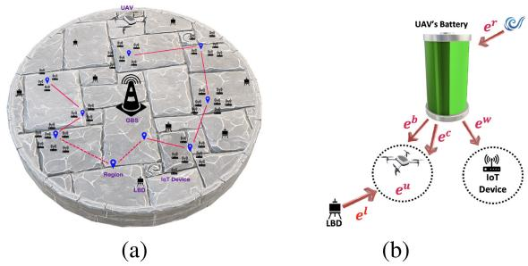  
Fig. 1. (a) A cellular network with a UAV, ground base station (GBS), IoT devices, and laser beam directors (LBDs), covering K regions and N IoT devices. (b) The UAV harnesses energy from its nearest LBD and wind, storing it in an onboard battery.

## II. SYSTEM MODEL

We consider a cellular network with a ground base station (GBS), a UAV, and N stationary wireless IoT/mobile devices ${ \cal S } = \{ s _ { 1 } , s _ { 2 } , . . . , s _ { N } \}$ divided into K ground regions, along with LBDs, as shown in Fig. 1. The edge layer allows IoT devices to offload computations, improving speed and energy efficiency. A single UAV, equipped with an edge server, provides COF services to ensure low latency. It flies at a fixed height $H _ { u }$ with a communication coverage radius of $r _ { u }$ . The UAV follows a learned trajectory across K regions, starting from a predefined position. It hovers over each region $k \in$ $\{ 1 , \ldots , K \}$ to process the offloaded tasks scheduled there. The fixed ground coordinates of IoT device $s _ { i }$ are given by $s _ { i } =$ $\{ x _ { i } , y _ { i } \}$ . The UAV’s position in region k is $u _ { k } = \{ x _ { k } , y _ { k } \}$ , and its distance to $s _ { i }$ is calculated using the Euclidean distance:

$$
\mathrm { D } _ { i k } = \Bigl [ ( x _ { k } - x _ { i } ) ^ { 2 } + ( y _ { k } - y _ { i } ) ^ { 2 } + H _ { u } ^ { 2 } \Bigr ] ^ { \frac { 1 } { 2 } } ,\tag{1}
$$

where IoT device $s _ { i }$ must lie within the UAV’s coverage radius $r _ { u } ,$ , i.e., $\mathrm { D } _ { i k } ~ < ~ r _ { u }$ . Device $s _ { i }$ requests to offload task $t _ { i } =$ $\{ t _ { i } ^ { c } , t _ { i } ^ { \tau } , L _ { i } ^ { I _ { \mathrm { d a t a } } } \}$ , where $t _ { i } ^ { c } , \ t _ { i } ^ { \tau }$ , and $L _ { i } ^ { I _ { \mathrm { d a t a } } }$ denote the required computing cycles, task delay, and input data size, respectively. The UAV hovers over each region to process tasks, and $\delta _ { i k } = 1$ indicates that $s _ { i }$ offloads $t _ { i }$ = 1when the UAV is above region k.

The LBDs, placed on the ground following a Poisson point process (PPP) $\Phi _ { l }$ with density $\lambda _ { l } ,$ , act as power sources for Φthe UAV. Each LBD transmits energy at a constant power pl . At any time, the UAV draws power from the nearest LBD. Assuming the UAV flies at or above a minimum altitude $H _ { u , \mathrm { m i n } }$ , line-of-sight (LoS) links with LBDs and IoT devices are expected. This is ensured by $H _ { u , \operatorname* { m i n } } ~ \leq ~ H _ { u } ~ \leq$ $H _ { u , \operatorname* { m a x } } .$ , where $H _ { u , \mathrm { m a x } }$ is the UAV’s maximum altitude. In addition to harvesting energy and processing offloaded tasks, the UAV also uses wireless power transfer (WPT) to recharge a subset of IoT devices [19]. Another PPP $\Phi _ { g }$ with density $\lambda _ { g }$ Φmodels the spatial distribution of IoT devices. Besides drawing power from the nearest LBD, the UAV also harvests energy from an RE source, with wind energy used in this study. A combination of RE sources can be considered to reduce fluctuations from a single source [20]. The objective is to minimize the UAV’s EPC in each region k during a mission cycle of $T ^ { m }$ seconds. In the UAV-enabled MEC system, the mission time $T ^ { m }$ is set to the minimum task delay $t ^ { \tau }$ among all IoT devices, ensuring basic delay awareness by meeting the tightest deadline. Low-latency scheduling— such as task prioritization, dynamic queuing, or delay-aware offloading—can further enhance UAV responsiveness in realtime or mission-critical scenarios.

The energy received from an LBD to power the UAV in region $k \in \{ 1 , \ldots , T \}$ is denoted by $e _ { k } ^ { l }$ (see Fig. 1), 1and is calculated using the FSO range equation via laser connection [21], [22]. The corresponding unit cost is $\rho _ { k } ^ { l }$ . This energy is used immediately upon request and not stored. The UAV also has a built-in RE generator that produces a costfree energy amount $e _ { k } ^ { r }$ in each region k, which is stored in its internal battery (Fig. 1). The battery has a maximum capacity $B _ { u } .$ and the energy drawn from it in region k is $e _ { k } ^ { b }$ . To offset EPC, the UAV can wirelessly recharge IoT devices with energy $e _ { k } ^ { w }$ in region k at a rate $\rho _ { k } ^ { w }$ , effectively selling energy via WPT. Additionally, when the UAV uses computation energy $\boldsymbol { e } _ { k } ^ { c }$ to provide COF services, it charges IoT devices at a rate $\rho _ { k } ^ { c }$ The UAV offers COF and recharging services at fixed, nonnegotiable prices; IoT devices opt in autonomously. Security threats and malicious demands are excluded here but noted for future work. The UAV’s energy consumption in region k is denoted by $e _ { k } ^ { u }$ (see Fig. 1) and will be detailed in Section II-B. The energies $e _ { k } ^ { b }$ and $e _ { k } ^ { l }$ together satisfy this consumption, i.e., $e _ { k } ^ { b } + e _ { k } ^ { l } = { \ ' e } _ { k } ^ { u }$ for all $k \in \{ 1 , \ldots , K \}$ . EP decisions are managed by an energy control unit (ECU), which gathers data from the UAV and LBDs. Specifically, the ECU determines how much energy the UAV should draw from each source throughout the mission, based on inputs like LBD energy pricing, RE data, and UAV’s energy consumption.

## A. Communication Model

The data transmission rate between the i-th IoT device $( s _ { i } )$ and the UAV in region $k ,$ located at $u _ { k } = \{ x _ { k } , y _ { k } \}$ , is as:

$$
R _ { i k } ^ { \left( q \right) } = { B \log _ { 2 } } \Bigg ( 1 + \frac { { P ^ { \left( q \right) } h _ { i k } } } { { N _ { 0 } } } \Bigg ) ,\tag{2}
$$

for $\textit { q } = \{ U , D \}$ , where U and D denote the uplink and downlink channels, respectively. B is the channel bandwidth, and $N _ { 0 }$ is the noise power. When $q = U , P ^ { ( q ) }$ is the uplink transmit power of each IoT device; for $q = D ,$ it is the UAV’s downlink transmit power. The channel gain is $\begin{array} { r } { h _ { i k } = \frac { \rho _ { 0 } } { D _ { i k } ^ { 2 } } } \end{array}$ , with $\rho _ { 0 }$ being the received power at a reference distance of . The total time the UAV spends in region k (i.e., the offloading delay) comprises both transmission and computation delays:

$$
T _ { k } ^ { d } ( x _ { k } , y _ { k } ) = T _ { k } ^ { \mathrm { t x } } ( x _ { k } , y _ { k } ) + T _ { k } ^ { \mathrm { c o m p } } ( x _ { k } , y _ { k } ) .\tag{3}
$$

The total computation time in region k when the UAV hovers at $\{ x _ { k } , y _ { k } \}$ is given by:

$$
T _ { k } ^ { \mathrm { c o m p } } ( x _ { k } , y _ { k } ) = \sum _ { i = 1 } ^ { N } \delta _ { i k } T _ { i k } ^ { \mathrm { c o m p } } ,\tag{4}
$$

where $\begin{array} { r } { T _ { i k } ^ { \mathrm { c o m p } } = \frac { t _ { i } ^ { c } } { f _ { u } } } \end{array}$ is the time to process task $t _ { i }$ at the $\mathrm { U A V } ,$ and $f _ { u }$ denotes the $\mathrm { U A V } _ { \mathrm { \Delta } }$ processing capacity [23]. The total transmission time in region k at position $\{ x _ { k } , y _ { k } \}$ is:

$$
T _ { k } ^ { \mathrm { t x } } ( x _ { k } , y _ { k } ) = T _ { k } ^ { \mathrm { t x } , U } ( x _ { k } , y _ { k } ) + T _ { k } ^ { \mathrm { t x } , D } ( x _ { k } , y _ { k } ) ,\tag{5}
$$

TABLE I MAJOR MATHEMATICAL NOTATIONS
<table><tr><td rowspan=1 colspan=2>Notation</td><td rowspan=1 colspan=1>Description</td><td rowspan=1 colspan=1>Notation</td><td rowspan=1 colspan=1>Description</td></tr><tr><td rowspan=1 colspan=2> $\overline { { B _ { u } } }$ </td><td rowspan=1 colspan=1>Upper limit of the UAV&#x27;s battery storage capacity</td><td rowspan=1 colspan=1>Bl</td><td rowspan=1 colspan=1>Minimum permissible energy storage in the UAV&#x27;s battery</td></tr><tr><td rowspan=1 colspan=2> $\overline { { K } }$ </td><td rowspan=1 colspan=1>Total number of regions</td><td rowspan=1 colspan=1></td><td rowspan=1 colspan=1>Amount of energy to charge the IoT devices in region k</td></tr><tr><td rowspan=1 colspan=2>tc</td><td rowspan=1 colspan=1>Required computation cycles for the task of IoT device si</td><td rowspan=1 colspan=1></td><td rowspan=1 colspan=1>Unit price of charging the IoT devices in region k</td></tr><tr><td rowspan=1 colspan=2> $\frac { \circ } { t _ { i } ^ { \tau } }$ </td><td rowspan=1 colspan=1>Task delay of IoT device si</td><td rowspan=1 colspan=1>ek</td><td rowspan=1 colspan=1>UAV&#x27;s energy consumption in region k</td></tr><tr><td rowspan=1 colspan=2> $\overline { { L _ { i } ^ { I _ { \mathrm { d a t a } } } } }$ </td><td rowspan=1 colspan=1>Task data size of IoT device si</td><td rowspan=1 colspan=1>B</td><td rowspan=1 colspan=1>Uplink/Downlink channel bandwidth</td></tr><tr><td rowspan=1 colspan=2> $\frac { \upsilon } { L _ { i } ^ { O _ { \mathrm { d a t a } } } }$ </td><td rowspan=1 colspan=1>Size of the computed task result for IoT device si</td><td rowspan=1 colspan=1> $\rho _ { k } ^ { c }$ </td><td rowspan=1 colspan=1>Unit price of COF in region k</td></tr><tr><td rowspan=1 colspan=2> $\boldsymbol { \underline e { } } _ { k } ^ { l }$ </td><td rowspan=1 colspan=1>Energy procured from an LBD across region k</td><td rowspan=1 colspan=1> $\overline { { \boldsymbol { T } _ { k } ^ { d } } }$ </td><td rowspan=1 colspan=1>Total offloading delay in region k</td></tr><tr><td rowspan=1 colspan=2> ${ \underline { { \rho _ { k } ^ { \iota } } } }$ </td><td rowspan=1 colspan=1>Unit price of procuring energy from an LBD in region k</td><td rowspan=1 colspan=1> $\overbrace { T _ { k } ^ { \mathrm { u x } } } ^ { \mathrm { . . . } }$ </td><td rowspan=1 colspan=1>Total transmission time in region k</td></tr><tr><td rowspan=1 colspan=2> $\boldsymbol { e } _ { k } ^ { o }$ </td><td rowspan=1 colspan=1>UAV&#x27;s battery-derived energy in region k</td><td rowspan=1 colspan=1>Tcomp</td><td rowspan=1 colspan=1>Total computation delay in region k</td></tr><tr><td rowspan=1 colspan=2> $\overline { { \delta } }$ </td><td rowspan=1 colspan=1>Task offloading indicator</td><td rowspan=1 colspan=1> $\frac { \kappa } { T ^ { m } }$ </td><td rowspan=1 colspan=1>UAV&#x27;s mission time limit</td></tr><tr><td rowspan=1 colspan=2> $f _ { u }$ </td><td rowspan=1 colspan=1>UAV&#x27;s processing capacity</td><td rowspan=1 colspan=1> $\overline { { T _ { k } ^ { f } } }$ </td><td rowspan=1 colspan=1>UAV&#x27;s flight time from region k — 1 to region k</td></tr><tr><td rowspan=1 colspan=2> $\overline { { R _ { \boldsymbol { k } } ^ { ( q ) } } }$ </td><td rowspan=1 colspan=1>Uplink (U) and downlink (D) rates in region k, $\underline { { q } } = \{ U , D \}$ </td><td rowspan=1 colspan=1> $\underline { { e _ { k } ^ { c } } }$ </td><td rowspan=1 colspan=1>UAV&#x27;s computation energy consumption in region k (optimal value)</td></tr><tr><td rowspan=1 colspan=2> $\frac { \not { D } } { P ^ { ( q ) } }$ </td><td rowspan=1 colspan=1>Uplink (U) and downlink (D) transmit powers, $\underline { { q } } = \{ U , D \}$ </td><td rowspan=1 colspan=1>c,req $\underline { { e } } _ { k } ^ { \mathrm { c } }$ </td><td rowspan=1 colspan=1>UAV&#x27;s computation energy consumption in region k (actual value)</td></tr><tr><td rowspan=1 colspan=1> $\frac { \ d ^ { \prime } } { \ d { \bf { e } } _ { k</td><td rowspan=1 colspan=1>} ^ { t } }$ </td><td rowspan=1 colspan=1>UAV&#x27;s transmission-related energy consumption in region k</td><td rowspan=1 colspan=1> $\underline { e } _ { k } ^ { r }$ </td><td rowspan=1 colspan=1>Generated RE of the UAV&#x27;s internal retailer in region k</td></tr><tr><td rowspan=1 colspan=1> $\underline { { e _ { k } ^ {</td><td rowspan=1 colspan=1>n } } }$ </td><td rowspan=1 colspan=1>UAV&#x27;s propulsion energy consumption hovering in region k</td><td rowspan=1 colspan=1> $\overline { { p ^ { f } } }$ </td><td rowspan=1 colspan=1>UAV&#x27;s propulsion power consumption when flying</td></tr><tr><td rowspan=1 colspan=2> $_ v$ </td><td rowspan=1 colspan=1>UAV&#x27;s flying speed</td><td rowspan=1 colspan=1> $\overline { { p _ { k } ^ { h } } }$ </td><td rowspan=1 colspan=1>UAV&#x27;s propulsion power consumption when hovering at region k</td></tr><tr><td rowspan=1 colspan=2> $\overline { { H _ { u } } }$ </td><td rowspan=1 colspan=1>UAV&#x27;s flying height</td><td rowspan=1 colspan=1> $\overline { { D _ { i k } } }$ </td><td rowspan=1 colspan=1>Euclidean distance between the UAV and IoT device si in region k</td></tr></table>

where the uplink transmission time is:

$$
T _ { k } ^ { \mathrm { t x } , U } ( x _ { k } , y _ { k } ) = \sum _ { i = 1 } ^ { N } \delta _ { i k } \frac { L _ { i } ^ { I _ { \mathrm { d a t a } } } } { R _ { i k } ^ { ( U ) } } ,\tag{6}
$$

with $\frac { L _ { i } ^ { I _ { \mathrm { d a t a } } } } { R _ { i k } ^ { ( U ) } }$ being the time to offload a task of size $L _ { i } ^ { I _ { \mathrm { d a t a } } }$ from the i-th IoT device $( i \in \{ 1 , \ldots , N \} )$ to the UAV. Similarly, ( 1 )the downlink time for returning computed results is:

$$
T _ { k } ^ { \mathrm { t x } , D } ( x _ { k } , y _ { k } ) = \sum _ { i = 1 } ^ { N } \delta _ { i k } \frac { L _ { i } ^ { O _ { \mathrm { d a t a } } } } { R _ { i k } ^ { ( D ) } } ,\tag{7}
$$

where $\frac { L _ { i } ^ { O _ { \mathrm { d a t a } } } } { R _ { i n } ^ { ( D ) } }$ is the time to transmit a result of size $L _ { i } ^ { O _ { \mathrm { d a t a } } }$ to the i-th IoT device in region k.

## B. UAV Energy Consumption Model

The UAV’s total energy consumption in region k (Eq. (8)) includes the sum of energies for: (i) computing offloaded tasks, (ii) wireless communication with IoT devices for result exchange, (iii) propulsion while hovering over region k, and (iv) constant on-board processing, i.e.,

$$
e _ { k } ^ { u } ( x _ { k } , y _ { k } ) = e _ { k } ^ { c } ( x _ { k } , y _ { k } ) + e _ { k } ^ { t } ( x _ { k } , y _ { k } ) + e _ { k } ^ { h } ( x _ { k } , y _ { k } ) + e _ { k } ^ { \mathrm { c o n s t } } .\tag{8}
$$

The computation-related energy consumption in region k is given by:

$$
0 \leq e _ { k } ^ { c } ( x _ { k } , y _ { k } ) \leq e _ { k } ^ { c , \mathrm { r e q } } ( x _ { k } , y _ { k } ) ,\tag{9}
$$

where

$$
e _ { k } ^ { c , \mathrm { r e q } } ( x _ { k } , y _ { k } ) = \kappa _ { 1 } \sum _ { i = 1 } ^ { N } \delta _ { i k } t _ { i } ^ { c } f _ { u } ^ { 2 } ,\tag{10}
$$

with $\kappa _ { 1 }$ denoting the computation energy factor. The term $e _ { k } ^ { c } ( x _ { k } , y _ { k } )$ represents the optimal energy allocated for computing offloaded tasks in region k, obtained by solving the UAV’s EPC minimization problem in Eq. (20). Meanwhile, $e _ { k } ^ { c , \mathrm { r e q } } ( x _ { k } , y _ { k } )$ indicates the actual energy required to process all tasks in region k, calculated via Eq. (10). This optimal value $e _ { k } ^ { c } ( x _ { k } , y _ { k } )$ determines whether the UAV can fully or partially complete the tasks. The ratio $\begin{array} { r } { \mu _ { k } = \frac { e _ { k } ^ { c } } { e _ { k } ^ { c , \mathrm { r e q } } } } \end{array}$ quantifies this, representing the portion of required energy met by the optimization. If $\mu _ { k } \ = \ 1$ , the UAV can fully execute all offloaded tasks in region k. The energy consumed for transmission in region k is:

$$
e _ { k } ^ { t } ( x _ { k } , y _ { k } ) = T _ { k } ^ { \mathrm { t x } , D } ( x _ { k } , y _ { k } ) P ^ { D } ,\tag{11}
$$

where $P ^ { D }$ is the UAV’s downlink transmission power, and $T _ { k } ^ { \mathrm { t x } , D } ( x _ { k } , y _ { k } )$ is defined in Eq. (7). For straight-and-level flight at speed v, the UAV’s propulsion power consumption is given by [24], [25]:

$$
\begin{array} { r } { p ^ { f } = \underbrace { c _ { 1 } \Big ( 1 + c _ { 2 } v ^ { 2 } \Big ) } _ { \mathrm { b l a d e p r o f i l e } } + \underbrace { c _ { 3 } \Bigg ( \sqrt { 1 + \frac { v ^ { 4 } } { c _ { 4 } ^ { 2 } } } - \frac { v ^ { 2 } } { c _ { 4 } } \Bigg ) ^ { 1 / 2 } } _ { \mathrm { i n d u c e d } } + \underbrace { c _ { 5 } v ^ { 3 } } _ { \mathrm { p a r a s i t e } } , } \end{array}\tag{12}
$$

where constants $c _ { i } ( i = 1 , \ldots , 5 )$ depend on UAV parameters such as weight, air density, and rotor disc area [25]. The blade profile, induced, and parasite terms account for drag from blade rotation, lift generation, and friction, respectively. During hovering $( \mathrm { i } . \mathrm { e } . , v = 0 )$ , Eq. (12) simplifies to a constant propulsion power: $p _ { k } ^ { h } = c _ { 1 } + c _ { 3 }$ . Hence, the propulsion energy consumed while hovering over region k is:

$$
e _ { k } ^ { h } ( x _ { k } , y _ { k } ) = p _ { k } ^ { h } T _ { k } ^ { d } ( x _ { k } , y _ { k } ) ,\tag{13}
$$

where $T _ { k } ^ { d } ( x _ { k } , y _ { k } )$ (see Eq. (3)) denotes the UAV’s hovering (time in region k.

## III. PROBLEM FORMULATIONS

## A. Optimal UAV Flight Trajectory

As previously indicated, the UAV follows a trajectory across a collection of K regions, originating from a pre-determined starting point. It hovers above each region $k \in \{ 1 , \ldots , K \}$ to handle the scheduled offloaded tasks within that region. Given the constrained mission time of the UAV, the trajectory should be optimized across various regions to maximize the number of offloaded IoT devices. The total elapsed time since the initiation of the UAV mission, denoted as $T _ { k } ^ { e } ( x _ { k } , y _ { k } )$ , is defined as follows:

$$
T _ { k } ^ { e } ( x _ { k } , y _ { k } ) = \sum _ { i = 1 } ^ { k } \Bigl ( T _ { k } ^ { d } ( x _ { k } , y _ { k } ) + T _ { k } ^ { f } ( x _ { k } , y _ { k } ) \Bigr ) ,\tag{14}
$$

in which, $T _ { k } ^ { d } ( x _ { k } , y _ { k } )$ is specified in Eq. (3), and $T _ { k } ^ { f } ( x _ { k } , y _ { k } ) =$ $\begin{array} { r } { \underline { { \Vert u _ { k } - u _ { k - 1 } \Vert ^ { 2 ^ { \prime } } } } } \end{array}$ is the UAV’s flight time from point $u _ { k - 1 } =$ $( x _ { k - 1 } , y _ { k - 1 } )$ to $u _ { k } ~ = ~ ( x _ { k } , y _ { k } )$ when flying with speed v. Accordingly, the mission residual time at region k can be defined as:

$$
T _ { k } ^ { r } ( x _ { k } , y _ { k } ) = T ^ { m } - T _ { k } ^ { e } ( x _ { k } , y _ { k } ) ,\tag{15}
$$

where $T ^ { m }$ is the $\mathrm { U A V } \mathbf { \hat { s } }$ mission time, assumed to align with the minimum task delay among all IoT devices. Here, we set up the optimization problem for the RL-equipped UAV. The main aim is to maximize the number of offloaded IoT devices $\left( I _ { \mathrm { o f f } } \right)$ while staying within the mission time limit of $T ^ { m }$

$$
\begin{array} { l } { \displaystyle \operatorname* { m a x } _ { V } \sum _ { k \in V } I _ { \mathrm { o f f } } ^ { k } ( x _ { k } , y _ { k } ) } \\ { \mathrm { s . t . } T _ { k } ^ { r } ( x _ { k } , y _ { k } ) \geq 0 , } \end{array}\tag{16}
$$

where V denotes the order in which the regions (from the available K regions) are visited in each mission of the UAV, subject to $T _ { k } ^ { r } ( x _ { k } , y _ { k } )$ . In simpler terms, V signifies the sequence of regions visited by the UAV in its mission. The solution to this optimization problem is achieved by identifying the optimal sequence of states (regions) for the UAV to visit, thus maximizing the total count of offloaded IoT devices. Essentially, we are tackling the challenge of determining the optimal flight trajectory for the UAV to traverse a set of regions within a limited mission time. Given the timeintensive nature of evaluating all potential permutations of visit orders in V to identify the best trajectory, it is imperative to employ a learning approach that can significantly reduce processing time. To tackle the maximization problem stated in Eq. (16), we propose an RL framework that leverages the well-established QL technique, as discussed in [26]. The use of less complex algorithms, such as QL, can be beneficial for UAVs engaged in IoT COF, as it can help reduce energy consumption. We provide specific definitions for the core components of QL in the following:

Agent: The UAV is modeled as the RL agent.

State: The current state s of the learning agent can be understood as the region currently being visited, i.e., at each decision step, the state is defined as $s \in$ $\{ 1 , 2 , \ldots , K \}$ , which corresponds to the index of the currently visited region. The total number of states is K, representing the entire set of regions.

Action: We develop an action candidate-based estimator for the general Q-learning (QL) framework. Specifically, at each region, the agent perceives the current state and selects an action denoted as a, using an exploration–exploitation policy (EEP) similar to the approach in [26], [27]. The selected action determines the next region to be visited. For example, if $a = k$ (where $k \in \{ 1 , 2 , \ldots , K \} )$ , it indicates that the UAV’s next destination will be the k-th region. Importantly, the UAV is not allowed to choose from all $K - 1$ remaining regions. Instead, the chosen region must lie within a reduced and adaptive action space, centered around the currently visited region. This reduction reflects practical mobility and time constraints. In particular, we assume that the RL-enabled UAV is restricted to selecting its next region from a feasible subset rather than the full set of unvisited regions. The action space A k for a UAV currently at region k is defined to include only those regions $j \in$ $\{ 1 , 2 , \ldots , K \} \setminus \{ k \}$ that satisfy: $\mathrm { ( i ) } \ \| u _ { j } - u _ { k } \| \leq r _ { u } , \mathrm { i . e . }$ region j lies within the UAV’s communication and flight coverage from region k, and (ii) $T _ { j } ^ { r } ( x _ { j } , y _ { j } ) ~ \geq ~ 0 ,$ i.e., the region can be reached within the remaining mission time. Accordingly, the reduced and adaptive action set is defined as:

$$
\begin{array} { r } { A ( k ) = \{ j \in \{ 1 , \dots , K \} \setminus \{ k \} \ : | \| u _ { j } - u _ { k } \| \leq r _ { U } ,   } \\ {   T _ { j } ^ { r } \big ( x _ { j } , y _ { j } \big ) \geq 0 \} ( 1 } \end{array}\tag{7}
$$

Reward: After executing an action a in state s, the agent receives an immediate reward based on the number of IoT devices within the UAV’s coverage if region k is selected next $( \mathrm { i } . \mathrm { e } . , \ a = k )$ . The reward function is defined as:

$$
\mathcal { R } ( s , a ) \equiv Z _ { k } , \quad \forall k \in \{ 1 , \ldots , K \} ,\tag{18}
$$

where $Z _ { k }$ is the number of IoT devices covered in region k. This reward reflects the system-level objective of maximizing service coverage. Although EPC is not directly encoded, the reward function indirectly promotes EPC minimization (in Eq. (20)): serving more IoT devices increases the UAV’s revenue from COF and wireless charging, thus offsetting its EPCs and enabling costeffective operation.

## B. UAV Energy Cost Minimization

Drawing from the previously outlined explanations, the EPC of the UAV for region k is represented as:

$$
C _ { k } = \rho _ { k } ^ { l } \eta _ { l } e _ { k } ^ { l } - ( \rho _ { k } ^ { w } \eta _ { w } e _ { k } ^ { w } + \rho _ { k } ^ { c } e _ { k } ^ { c } ) , \quad k \in \{ 1 , \dots , K \} . ( 1 9 )
$$

Here, $\begin{array} { r } { \eta _ { l } = \frac { 1 } { \sigma _ { l } } } \end{array}$ with $\sigma _ { l } \in ( 0 , 1 ]$ denoting the laser-to-electricity conversion efficiency at the UAV receiver. $\eta _ { w } \in ( 0 , 1 ]$ denotes the RF-to-DC conversion efficiency at the IoT receivers. To effectively store $e _ { k } ^ { l }$ units of usable energy, the UAV must procure $e _ { k } ^ { l } \eta _ { l }$ units of energy from the corresponding LBD. Accordingly, the cost associated with EP from the LBD is given by $\dot { \rho } _ { k } ^ { l } e _ { k } ^ { l } \eta _ { l }$ . Conversely, since only a fraction $\eta _ { w }$ of the UAV’s transmitted energy $e _ { k } ^ { w }$ is effectively harvested by IoT devices, the credit for selling energy to these devices is $\rho _ { k } ^ { w } \eta _ { w } e _ { k } ^ { w }$ . The objective is to minimize the EPC within each region, with the ultimate aim of minimizing the aggregate cost over the optimal sequence of regions (i.e., $\begin{array} { r } { \bar { C } _ { T } = \bar { \sum _ { k = 1 } ^ { K } } \zeta _ { k } C _ { k } . } \end{array}$ in which $\zeta _ { k } = 1$ =if the k-th region is in the optimal sequence; otherwise, $\zeta _ { k } = 0 )$ . It is worth noting that the value of $C _ { k } ,$ which represents the cost of the UAV’s energy exchange with

LBDs and IoT devices in region k, can vary—either positive or negative—based on multiple factors, including the quantities of energy received (from LBDs), provided (to IoT devices), and used for COF within region k. To grasp the intricate energy pricing dynamics, note that $\rho _ { k } ^ { w }$ and $\rho _ { k } ^ { c }$ differ across regions due to a complex interplay. Factors like energy source availability, including laser and renewables, play a pivotal role. Varying abundance and access impact pricing, coupled with local policies, infrastructure, and economic conditions. This mix leads to nuanced pricing variations, aligning $\rho _ { k } ^ { w }$ and $\rho _ { k } ^ { c }$ with each region’s unique energy landscape. Given that laser energy typically has more stable characteristics and costs associated with its production and deployment, it is reasonable to assume that $\rho _ { k } ^ { l }$ remains constant across all regions.

The minimization of $C _ { k }$ must satisfy the following constraints: (i) The ECU must adhere to the UAV’s energy consumption limit within each region k (Eq. (21)). (ii) For the UAV and region k, the combined energy from the internal battery $( e ^ { b } )$ , the energy consumed for computing the offloaded tasks $( e ^ { c } )$ , and the energy transferred to the IoT devices $( e ^ { w } )$ up to the k-th region should not surpass the generated RE from the internal retailer up to that point (the left inequality of Eq. (22)). Here, $B _ { l }$ signifies the minimum permissible energy stored in the UAV’s battery. (iii) It is essential to ensure that the stored energy in the internal battery does not exceed its capacity $B _ { u }$ (expressed as the right inequality of Eq. (22)). (iv) Lastly, the suggested energy consumption for computation within region $k \ ( \mathrm { i } . { \mathrm { e } } . , \ e _ { k } ^ { c } )$ must not exceed the actual energy required for computation in the same region $( e _ { k } ^ { c , \mathrm { r e q } } )$ . To sum up, the minimization problem can be expressed as:

(P)

$$
\begin{array} { r l } { \operatorname* { m i n } _ { \mathbf { \epsilon } } } & { { } C _ { k } } \\ { \{ e _ { k } ^ { w } , e _ { k } ^ { b } , e _ { k } ^ { l } , e _ { k } ^ { c } \} } & { { } } \end{array}\tag{20}
$$

$$
\mathrm { s . t . } e _ { k } ^ { b } + e _ { k } ^ { l } = e _ { k } ^ { u } , \forall k\tag{21}
$$

$$
B _ { l } \leq \sum _ { i = 1 } ^ { k } e _ { i } ^ { r } - \sum _ { i = 1 } ^ { k } \Bigl ( e _ { i } ^ { b } + e _ { i } ^ { w } + e _ { i } ^ { c } \Bigr ) \leq B _ { u } ,
$$

$$
0 \leq e _ { k } ^ { c } \leq e _ { k } ^ { c , \mathrm { r e q } } , \forall k\tag{22}
$$

$$
e _ { k } ^ { b } , e _ { k } ^ { w } , e _ { k } ^ { l } \ge 0 , \forall k\tag{23}
$$

(24)

To address the optimization problem described above, we can use linear programming algorithms [28]. While the YALMIP toolbox in MATLAB [29] is widely used for modeling and optimization tasks, and its effectiveness in simplifying complex problems is demonstrated in [29], we formulate problem (P) as a linear optimization problem involving the variables $e _ { k } ^ { w } , e _ { k } ^ { c } , e _ { k } ^ { b }$ , and $e _ { k } ^ { l }$ This approach enables us to derive the optimal solution, as outlined in the following proposition:

Proposition 1: The optimal UAV’s EPC $C _ { k } ^ { * }$ in  is

$$
\begin{array} { r } { C _ { k } ^ { * } = \rho ^ { \Omega } \eta _ { \Omega } ( B _ { l } - \Delta E _ { k } ) , \quad \Omega \in \{ q , l \} , } \end{array}\tag{25}
$$

where $q = \mathbf { 1 } _ { x } c + \mathbf { 1 } _ { ( 1 - x ) } w .$ , wherein $x = \mathcal { H } ( \rho ^ { c } - \rho ^ { w } )$ with $\mathcal { H } ( \boldsymbol { \theta } )$ being the Heaviside step function. Here, ${ \bf 1 } _ { x }$ is an indicator function equal to 1 if $x = 1$ , and 0 if $x = 0$ . Also $\begin{array} { r } { \Delta E _ { k } \ = \ \sum _ { i = 1 } ^ { k } e _ { i } ^ { r } \ - } \end{array}$ $\begin{array} { r } { \sum _ { i = 1 } ^ { k - 1 } ( e _ { i } ^ { b } + e _ { i } ^ { w } + e _ { i } ^ { c } ) - e _ { k } ^ { u } } \end{array}$ , and $\eta _ { c } = 1$

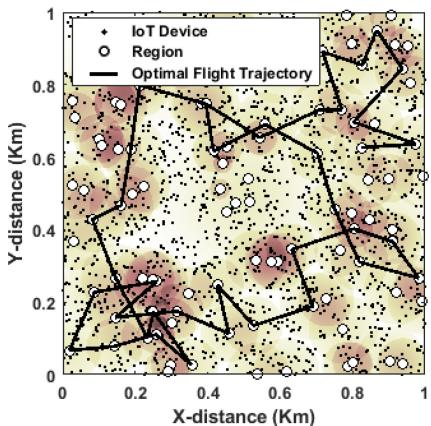  
Fig. 2. Optimized trajectory (solid black line) of the UAV using the tailored QL strategy for $T ^ { m } \stackrel { = } { = } 1 8 0 \stackrel { \cdot } { s }$ . White circles: regions; black dots: IoT devices.

Proof: By simplifying the constraints in Eqs. (21) and (22), the problem (P) can be solved solely under the following constraint:

$$
B _ { l } - \Delta E _ { k } \le e _ { k } ^ { l } - e _ { k } ^ { w } - e _ { k } ^ { c } \le B _ { u } - \Delta E _ { k } ,\tag{26}
$$

where $e _ { k } ^ { b } , e _ { k } ^ { w } , e _ { k } ^ { l } \ge 0 , \forall k , 0 \le e _ { k } ^ { c } \le e _ { k } ^ { c , \mathrm { r e q } } , \forall k$ , and $B _ { u } \gg \Delta E _ { k }$ Therefore, due to the linearity of $( \mathrm { P } )$ and the sign of the aforementioned lower bound, the optimal variables can be easily determined $\mathrm { a s } \colon \left\{ \begin{array} { l } { e _ { k } ^ { b ^ { * } } = e _ { k } ^ { u } , } \\ { e _ { k } ^ { w ^ { * } } = \mathbf { 1 } _ { ( 1 - x ) } ( \Delta E _ { k } - B _ { l } ) , } \\ { e _ { k } ^ { c ^ { * } } = \mathbf { 1 } _ { x } ( \Delta E _ { k } - B _ { l } ) , } \\ { e _ { k } ^ { l ^ { * } } = 0 } \end{array} \right\}$ , for $B _ { l } \ \le \ \Delta E _ { k }$ . Moreover,

when $B _ { l } > \Delta E _ { k }$ , we have $\left\{ \begin{array} { l l } { e _ { k } ^ { \boldsymbol { b } ^ { * } } = e _ { k } ^ { \boldsymbol { u } } - B _ { l } + \Delta E _ { k } , } \\ { \boldsymbol { e } _ { k } ^ { \boldsymbol { w } ^ { * } } = 0 , } \\ { e _ { k } ^ { c ^ { * } } = 0 , } \\ { \boldsymbol { e } _ { k } ^ { l ^ { * } } = B _ { l } - \Delta E _ { k } } \end{array} \right\}$ . Thus, = Δutilizing the optimal energy values, we derive $C _ { k } ^ { * }$ as specified in Eq. (25). It is worth noting that while this work adopts fixed region-specific prices $\rho _ { k } ^ { c }$ and $\rho _ { k } ^ { w }$ for analytical tractability, incorporating dynamic pricing based on real-time energy availability and demand conditions could enhance economic efficiency. Future work may consider game-theoretic or learning-based pricing models to enable adaptive service cost optimization.

## IV. SIMULATION RESULTS

We consider a km × km area containing one GBS and a UAV serving ground IoT devices (see Fig. 2). The UAV’s depicted flight path reflects the optimal visiting sequence of regions, derived via the QL strategy in order to maximize the offloading of IoT devices. This trajectory is based on the latest training mission, where the optimal policy is determined, and does not include earlier training runs. Unless stated otherwise, simulations use default parameters. A use-and-store policy is adopted, where energy is used before storage, i.e., $B _ { l } = 0$ . The UAV’s downlink transmit power is $P ^ { U } = 1 \mathrm { W }$ . Wind speed $v _ { w }$ is uniformly distributed over [0, 20] m/s per time interval $\tau ,$ and the wind energy harvesting model (formulated as $\textstyle { \frac { 1 } { 2 } } \rho A v _ { w } ^ { 3 } C _ { p } \tau )$ from [30] is used to compute the average value of $e _ { k } ^ { r }$ . Parameters are set as: air density $\rho =$ 1.225 $\mathrm { k g / m ^ { 3 } }$ , blade area $A = 0 . 2 5 \pi \mathrm { { m } ^ { 2 } }$ , and conversion coefficient $C _ { p } = 0 . 9$ . Unless specified, conversion efficiencies $\eta _ { l }$ and $\eta _ { w }$ are set to 1. Additional simulation parameters are provided in Table II.

TABLE II MAJOR SIMULATION PARAMETERS
<table><tr><td rowspan=1 colspan=1>Parameter</td><td rowspan=1 colspan=1>Value</td><td rowspan=1 colspan=1>Parameter</td><td rowspan=1 colspan=1>Value</td></tr><tr><td rowspan=1 colspan=1>K</td><td rowspan=1 colspan=1>100</td><td rowspan=1 colspan=1>Tm</td><td rowspan=1 colspan=1>180s</td></tr><tr><td rowspan=1 colspan=1> $\overline { { N } }$ </td><td rowspan=1 colspan=1>2000</td><td rowspan=1 colspan=1> $\overline { { f _ { u } } }$ </td><td rowspan=1 colspan=1> $\overline { { 4 0 0 \mathrm { M H z } } }$ </td></tr><tr><td rowspan=1 colspan=1>B</td><td rowspan=1 colspan=1>1MHz</td><td rowspan=1 colspan=1> $\overline { { t _ { i } ^ { c } , \forall i } }$ </td><td rowspan=1 colspan=1> $\overline { { 1 0 ^ { 9 } } }$ </td></tr><tr><td rowspan=1 colspan=1> $\overline { { \boldsymbol { L } _ { i } ^ { \mathrm { \scriptsize ~ d a t a } } } }$ </td><td rowspan=1 colspan=1>∈ [10 MB, 100 MB]</td><td rowspan=1 colspan=1> $\rho _ { k } ^ { l } , \forall k$ </td><td rowspan=1 colspan=1>1</td></tr><tr><td rowspan=1 colspan=1> $\underline { { C _ { p } } }$ </td><td rowspan=1 colspan=1>0.9</td><td rowspan=1 colspan=1> $\underline { { \boldsymbol { \rho } } }$ </td><td rowspan=1 colspan=1> $\overline { { 1 . 2 2 5 \mathrm { k g } / \mathrm { m } ^ { 3 } } }$ </td></tr><tr><td rowspan=1 colspan=1> $\overline { { B _ { l } } }$ </td><td rowspan=1 colspan=1>0Wh</td><td rowspan=1 colspan=1> $\overline { { B _ { u } } }$ </td><td rowspan=1 colspan=1> $\overline { { 1 0 0 \mathrm { W h } } }$ </td></tr><tr><td rowspan=1 colspan=1> $\overline { { \boldsymbol { H } _ { u } } }$ </td><td rowspan=1 colspan=1>50 m</td><td rowspan=1 colspan=1> $\overline { { v } }$ </td><td rowspan=1 colspan=1> $\overline { { 2 0 \mathrm { ~ m } / \mathrm { s } } }$ </td></tr></table>

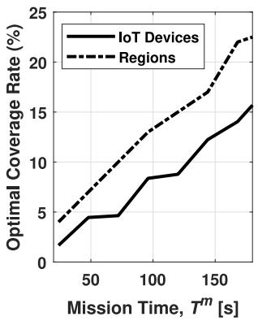

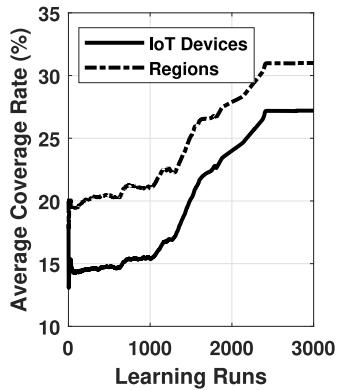  
(a) coverage rate vs mission time  
(b) coverage rate vs learning runs  
Fig. 3. UAV coverage rate as a function of (a) mission time and (b) learning runs (for $T ^ { m } = 1 8 \check { 0 } s )$ .

As mentioned, solving the UAV trajectory optimization requires finding the optimal sequence of regions for the UAV to visit. This maximizes the total offloaded IoT devices while respecting the mission time limit $T ^ { m }$ , which aligns with the minimum task delay among all IoT devices. Fig. 3(a) shows the optimal coverage rate (percentage) versus mission time. The optimal coverage rate is defined as the number of visited regions in the optimal sequence over the total regions K. This coverage rate increases with $T ^ { m }$ since the UAV can visit more regions during a longer flight. Alternatively, it can be defined as the total IoT devices visited (offloaded) in the optimal sequence over the total IoT devices N. This ratio also rises with $T ^ { m }$ as shown in the figure. Notably, when the UAV visits a region, all IoT devices within its coverage radius are counted as visited. Fig. 3(b) plots the average coverage rate (considering both definitions) against the number of learning runs for a fixed mission time, demonstrating algorithm convergence. The UAV serves about 28% of IoT devices and 32% of regions within the mission time.

In Fig. 4(a), the terms $E _ { u } , \ C _ { T }$ , and $\mu _ { T }$ are defined and plotted against the unit COF price $\rho ^ { c }$ , assuming $\rho _ { k } ^ { c } = \rho ^ { c }$ for all regions. Top of Fig. 4(a) shows the UAV’s total energy consumption over the optimal sequence of visited regions, where $\begin{array} { r } { E u = \bar { \sum _ { k = 1 } ^ { K } } \zeta _ { k } e _ { k } ^ { u } } \end{array}$ and $\zeta _ { k } ~ = ~ 1$ if the k-th region is selected, otherwise $\zeta _ { k } ~ = ~ 0$ As $\rho ^ { c }$ increases, the RL-enabled UAV allocates more energy to computation $( e ^ { c } )$ , since this reduces the UAV’s EPC C in each region, as given in Eq. (19). This trend is confirmed in Mid of Fig. 4(a), where the total EPC over the optimal sequence $( C _ { T } =$ $\textstyle \sum _ { k = 1 } ^ { K } \zeta _ { k } C _ { k } )$ is shown to decrease as $\rho ^ { c }$ increases. A higher $e ^ { c }$ enables the UAV to offload more tasks from IoT devices, leading to longer transmission and hovering times, and thus higher transmission and hovering energy consumption. Therefore, an increase in $\rho ^ { c }$ results in higher $e ^ { u }$ in each region, increasing the overall $E _ { u }$ (also evident from Eq. (8)). As $e ^ { c }$ increases with $\rho ^ { c }$ , the COF rate $\mu ~ = ~ { \frac { e ^ { c } } { e ^ { c , \mathrm { r e q } } } } ~ ( 0 ~ \leq ~ \mu ~ \leq ~ 1 )$ also rises in each region. This ratio reflects the proportion of computation energy the UAV can provide (optimization-suggested value) relative to what is required. A higher $\mu _ { k }$ means more tasks can be completed in region k. The total COF rate, defined as $\begin{array} { r } { \mu _ { T } = \sum _ { k = 1 } ^ { K } \zeta _ { k } \mu _ { k } } \end{array}$ , also increases with $\rho ^ { c }$ . In Fig. 4(b), I, X, and Pr denote the UAV’s total income, expenses, and profit over the optimal sequence of visited regions. The total income is $\begin{array} { r } { I = \sum _ { k = 1 } ^ { K } \dot { \varsigma } _ { k } ( \rho _ { k } ^ { w } e _ { k } ^ { \bar { w } } + \rho _ { k } ^ { c } e _ { k } ^ { c } ) } \end{array}$ , where $\zeta _ { k } = 1$ if region k is selected; otherwise, $\zeta _ { k } = 0$ . This income comes from computing offloaded tasks and recharging IoT devices via WPT. The total expense is $\begin{array} { r } { X = \sum _ { k = 1 } ^ { K } \zeta _ { k } \rho _ { k } ^ { l } \bar { e } _ { k } ^ { l } } \end{array}$ , representing the cost of energy procured from LBDs in the selected regions. The UAV’s total profit is given by:

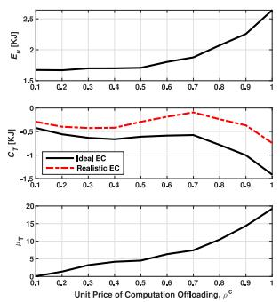

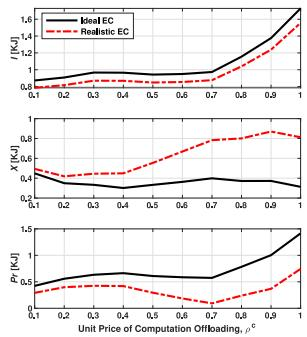  
(a) $E _ { u }$ $C _ { T }$ , and $\mu _ { T }$ VS. $\rho ^ { c } .$  
(b) I, X, and $P r$ VS. $\rho ^ { c } .$  
Fig. 4. Impact of unit COF price $\rho ^ { c }$ (with $\rho _ { k } ^ { c } = \rho ^ { c }$ for all regions) on key UAV metrics over the optimal sequence. (a) shows total energy consumption $\left( E _ { u } \right)$ , energy cost $( C _ { T } )$ , and computing rate $\left( \mu _ { T } \right)$ . (b) presents total income $( I ) ,$ , expenses (X), and profit $( \hat { P r } )$ . Solid black curves: the Ideal energy conversion (EC) scenario; red dashed curves: the Realistic EC case with EC losses.

$$
P r = I - X = - C _ { T } = - \sum _ { k = 1 } ^ { K } \zeta _ { k } C _ { k } ,\tag{27}
$$

where $C _ { k }$ is defined in Eq. (19), and $\zeta _ { k } = 1$ if region k is part of the optimal sequence; otherwise, $\zeta _ { k } = 0$ . Clearly, as the unit price for computation increases, the UAV’s profit also increases. The red dashed curves in Figs. 4(a) and 4(b) depict the more practical Realistic energy conversion (EC) scenario, which accounts for nonideal EC efficiencies: $\eta _ { w } < 1$ for WPT to IoT devices and $\sigma _ { l } < 1$ $( \mathrm { i } . \mathrm { e } . , \eta _ { l } > 1 )$ for laser-based energy harvesting from LBDs. These inefficiencies do not affect the UAV’s internal energy allocation, as it is defined in terms of usable energy, resulting in no impact on $E _ { u }$ and $\mu _ { T }$ . However, they significantly impact monetary metrics by increasing EPCs and decreasing income from recharging IoT devices. Compared to the Ideal EC case $( \eta _ { l } ~ = ~ \eta _ { w } ~ = ~ 1 )$ , the Realistic EC scenario results in higher $C _ { T }$ and X, and a lower $I ,$ thereby reducing the UAV’s profit Pr across all $\rho ^ { c }$ values.

In Fig. 5, Eq for $q \in \{ w , b , l , c \}$ is defined as $\begin{array} { r } { E q = \sum _ { k = 1 } ^ { K } \zeta _ { k } e _ { k } ^ { q } ; } \end{array}$ where $\zeta _ { k } = 1$ if region k is in the optimal sequence; otherwise, $\zeta _ { k } ~ = ~ 0$ . The optimal values of $E _ { w } , \ E _ { b } , \ E _ { l }$ , and $E _ { c }$ are shown for different values of $\rho ^ { c }$ , assuming $\rho _ { k } ^ { c } = \rho ^ { c }$ across all regions. As $\rho ^ { c }$ increases, the UAV allocates more energy for IoT task offloading, reflected by the rise in $E _ { c } .$ . It is intuitive that $E _ { b } ,$ the total energy drawn from the UAV’s internal battery across the

Unit Price of Computation Offloading $\rho ^ { \mathsf { c } }$

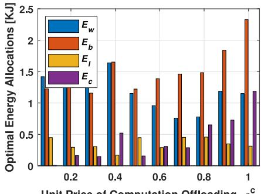

Fig. 5. Optimal allocation of total energies drawn from the UAV battery $\left( E _ { b } \right)$ and LBDs $( E _ { l } )$ , and allocated to IoT charging $\left( E _ { w } \right)$ and COF $( E _ { c } )$ over the optimal sequence of visited regions.  
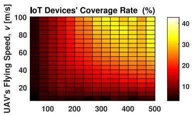

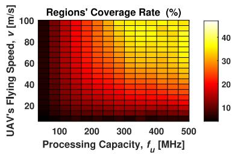  
Fig. 6. Impact of UAV parameters—flying speed (v) and processing capacity $( f _ { u } ) \mathrm { - } 0 \mathrm { n }$ the coverage rates of IoT devices and regions along the optimal path, depicted in upper and lower figures respectively.

optimal sequence of visited regions, is high when both $E _ { c }$ and E —which indicate the $\mathrm { U A V } _ { \mathrm { } } \mathrm { { s } }$ inclination for charging and COF of IoT devices, respectively—are high across the regions in the optimal sequence. In this figure, $\rho _ { k } ^ { l }$ is assumed constant across regions, while $\rho _ { k } ^ { w }$ varies. In Fig. 6, we examine how the UAV’s flying speed (v) and processing capacity $\left( f _ { u } \right)$ affect the coverage rates of IoT devices and regions along its optimal path (optimal sequence of visited regions). A higher v increases the number of visited regions, while a higher $f _ { u }$ reduces computation time per region, allowing more time for additional visits. In other words, faster flight and quicker COF task handling enable the UAV to cover more regions and IoT devices within its mission time, as shown in the figure.

In Fig. 7, we examine two scenarios to assess the impact of UAV flying speed on the results. In the first scenario (Fig. 7(a)), consistent with previous assumptions, the UAV hovers over each region to manage the scheduled offloaded tasks. In the second scenario (Fig. 7(b)), the UAV processes these tasks while flying, without pausing over each region. In the first case, the UAV’s speed does not affect the optimization results in Eq. (20), since tasks/optimization are handled while hovering. However, higher speed increases the number of visited regions within the mission time, potentially resulting in more offloaded IoT devices. $\mathbf { A } \mathbf { s }$ shown in Fig. 7(a), this leads to a lower $C _ { T }$ and a higher $\mu _ { T }$

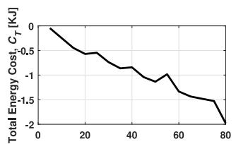

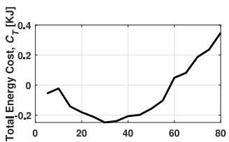

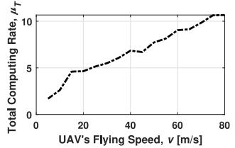  
(a)

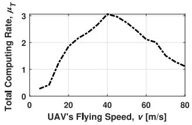  
(b)

Fig. 7. $C _ { T }$ and $\mu _ { T } \ \mathbf { V } \mathbf { S } .$ UAV flying speed in two scenarios: (a) UAV hovers over each region to manage tasks (default), and (b) UAV handles tasks in flight without pausing.  
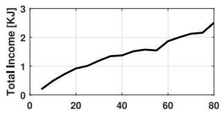

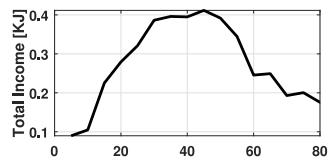

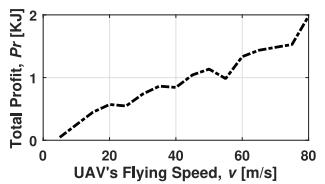  
(a)

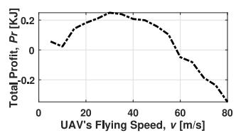  
(b)  
Fig. 8. Effect of UAV flying velocity on total income (I) and profit $( P r )$ over the optimal sequence of visited regions in two scenarios: (a) UAV hovers over each region to manage tasks (default), and (b) UAV manages tasks while flying without stopping.

In the second case, UAV speed directly impacts the optimization results, since tasks/optimization are handled in-flight. In this case, the $\mathrm { U A V } _ { \mathrm { } } \mathrm { { s } }$ energy consumption $e ^ { u }$ includes an additional component—its propulsion energy during inter-region flight. As described in Eq. (12) and supported by [24], [25], propulsion power consumption is significantly high at both low and high UAV speeds. Therefore, based on Eq. (21), more energy must be procured from the LBDs to accommodate the increase in $e ^ { u }$ , which raises the energy cost $C _ { T }$ in each region. Additionally, when $e ^ { u }$ is high, the UAV becomes less inclined to perform recharging and COF, leading to lower $e ^ { c }$ and $\mu _ { T }$ values at both low and high speeds. As shown in Fig. 7(b), there exists an optimal flying speed that allows the UAV to traverse the optimal sequence of regions while optimizing $C _ { T }$ and $\mu _ { T }$

In Fig. 8, the effect of UAV speed on total income (I) and profit Pr  over its optimal path is evaluated for the two scenarios from Fig. 7. In the first scenario (Fig. 8(a)), the UAV hovers to manage tasks. As previously explained, its speed does not impact optimization results but affects how many regions/IoT devices it can visit during the mission. Higher speeds allow more visits, potentially increasing income I, and thus profit $P r ,$ as shown in the figure. Since the rise in income exceeds the increase in expenses (X), profit $P r$ grows with speed. In the second scenario (Fig. 8(b)), UAV speed influences the optimization in Eq. (20) since it flies while performing tasks. Here, propulsion energy affects overall energy consumption $( e ^ { u } )$ , which is high at both low and high speeds. This requires more energy from LBDs, raising costs and reducing Pr. When $e ^ { u }$ is high, the UAV is also less likely to charge IoT devices or offload computation, lowering both I and Pr at both low and high speeds. Thus, an optimal speed exists that maximizes both I and Pr during flight through the chosen regions.

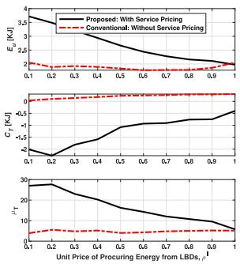

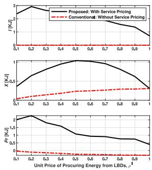  
(a) $E _ { u }$ $C _ { T }$ , and $\mu _ { T }$ VS. $\rho ^ { l } .$  
(b) I, X, and $P r$ VS. $\rho ^ { l } .$  
Fig. 9. Impact of unit energy price $\rho ^ { l }$ (with $\rho _ { k } ^ { l } = \rho ^ { l }$ for all regions) on key UAV metrics over the optimal sequence. (a) shows total energy consumption $\left( E _ { u } \right)$ , energy cost $( C _ { T } ) .$ , and computing rate $( \mu _ { T } )$ . (b) presents total income (I), expenses (X), and profit $( P r )$ . Solid black lines: proposed model with cost-compensation; red dashed lines: conventional baseline without service pricing.

In Fig. 9, the impact of varying the unit EP price $\rho ^ { l }$ on key UAV metrics is analyzed. The solid black curves represent our proposed method, which incorporates a cost-compensation model that enables the UAV to recover its EPCs through revenues from COF and WPT services. In contrast, the red dashed curves correspond to conventional baseline approaches that do not consider such pricing models. As $\rho ^ { l }$ increases, the UAV’s energy cost $C _ { T }$ rises, resulting in reduced profit Pr in both the proposed and conventional models. However, our proposed method consistently outperforms the conventional one across all values of $\rho ^ { l } .$ , maintaining a significantly higher profit. This advantage stems from the fact that, unlike the baseline, the proposed cost-compensation strategy allows the UAV to offset the increasing energy expenses through income generated by providing COF and WPT services, thereby ensuring a more sustainable operation even under high energy prices.

## V. CONCLUSION, CHALLENGES, AND FUTURE WORKS

This work proposes a cost-aware and sustainable UAV-based COF framework that integrates energy procurement from LBDs and RE sources with a compensation model from IoT devices. A lightweight RL-based trajectory design maximizes offloading within mission constraints. Simulation results confirm improved UAV efficiency and reduced EPCs, highlighting the system’s viability for real-world deployment. Building on this, several practical considerations can enhance LBD–UAV alignment during energy transfer. To maintain alignment with typical laser beam widths, the UAV—hovering at predefined region centers during harvesting—can be equipped with GPS-assisted control and inertial navigation for sub-meter accuracy. LBDs can employ dynamic beam steering (e.g., gimbals or adaptive optics) to track UAV movement in real time. Simultaneously, UAVs can self-align with the beam using onboard sensors such as infrared detectors or vision systems. Since UAV trajectories and hovering locations are pre-optimized via RL, LBDs can be pre-configured for expected arrivals, minimizing alignment delays. Future work may model beam tracking errors probabilistically to assess their impact on energy transfer reliability.

Future research can also explore mobile recharging stations— such as ground vehicles or aerial charging platforms—to further improve UAV endurance and mission continuity in environments lacking fixed energy sources. Our model assumes ideal LoS UAV– IoT links for simplicity; however, real-world networks may suffer from latency, interference, or link disruptions. The proposed RLbased trajectory design indirectly accounts for such conditions: degraded link quality results in lower observed rewards, prompting the UAV to avoid these regions over time. Moreover, transmission and computation delays are explicitly modeled and affect residual mission time, inherently discouraging visits to high-delay areas. Nevertheless, future extensions may include probabilistic channel models and interference-aware constraints for improved robustness.

Beyond trajectory design, this work introduces a region-level energy management strategy that minimizes EPC deterministically. While effective, it lacks real-time adaptivity. Future work can incorporate AI-based power control to dynamically manage energy harvesting, propulsion, and task scheduling under varying environmental and task conditions. From an algorithmic perspective, we employ QL due to its simplicity, fast convergence, and low computational overhead—attributes well-matched to energy-constrained UAVs. While more advanced methods like Deep Q-learning (DQL) could support continuous trajectories or large-scale regions, and Meta-RL could help UAVs rapidly adapt to changing environments, QL is well-suited to our current setting. Exploring these alternatives in future work may improve adaptability and scalability. Looking ahead, extending this framework to multi-UAV systems using coordination mechanisms such as multi-agent RL (MARL) could also improve distributed COF performance and scalability, though this introduces new challenges in coordination and communication. Finally, real-world deployment of UAVenabled COF must contend with regulatory and integration hurdles. These include airspace restrictions, beyond-visual-line-of-sight (BVLOS) regulations, and spectrum licensing. Seamless integration with existing infrastructure (e.g., MEC servers, BSs) also demands robust interoperability and handover support. Ongoing standardization efforts by 3GPP, ITU, and IEEE will be critical in enabling practical adoption.

## REFERENCES

[1] P. Mach and Z. Becvar, “Mobile edge computing: A survey on architecture and computation offloading,” IEEE Commun. Surveys Tuts., vol. 19, no. 3, pp. 1628–1656, 3rd Quart., 2017.

[2] Y. Mao, C. You, J. Zhang, K. Huang, and K. B. Letaief, “A survey on mobile edge computing: The communication perspective,” IEEE Commun. Surveys Tuts., vol. 19, no. 4, pp. 2322–2358, 4th Quart., 2017.

[3] N. Abbas, Y. Zhang, A. Taherkordi, and T. Skeie, “Mobile edge computing: A survey,” IEEE Internet Things J., vol. 5, no. 1, pp. 450–465, Feb. 2018.

[4] M. Satyanarayanan, “The emergence of edge computing,” Computer, vol. 50, no. 1, pp. 30–39, 2017.

[5] J. Zheng, Y. Cai, Y. Wu, and X. Shen, “Dynamic computation offloading for mobile cloud computing: A stochastic game-theoretic approach,” IEEE Trans. Mob. Comput., vol. 18, no. 4, pp. 771–786, Apr. 2019.

[6] S. E. Mahmoodi, R. N. Uma, and K. P. Subbalakshmi, “Optimal joint scheduling and cloud offloading for mobile applications,” IEEE Trans. Cloud Comput., vol. 7, no. 2, pp. 301–313, 2019.

[7] M. Mukherjee, L. Shu, and D. Wang, “Survey of fog computing: Fundamental, network applications, and research challenges,” IEEE Commun. Surveys Tuts., vol. 20, no. 3, pp. 1826–1857, 3rd Quart., 2018.

[8] L. Zhang and N. Ansari, “Optimizing the operation cost for UAV-aided mobile edge computing,” IEEE Trans. Veh. Technol., vol. 70, no. 6, pp. 6085–6093, Jun. 2021.

[9] H. He, X. Yang, F. Huang, H. Shen, and H. Tian, “Enhancing QoE in large-scale U-MEC networks via joint optimization of task offloading and UAV trajectories,” IEEE Internet Things J., vol. 11, no. 21, pp. 35710–35723, Nov. 2024.

[10] H. Zhou, Z. Wang, G. Min, and H. Zhang, “UAV-aided computation offloading in mobile-edge computing networks: A Stackelberg game approach,” IEEE Internet Things J., vol. 10, no. 8, pp. 6622–6633, Apr. 2023.

[11] M. Samir, S. Sharafeddine, C. M. Assi, T. M. Nguyen, and A. Ghrayeb, “UAV trajectory planning for data collection from time-constrained IoT devices,” IEEE Trans. Wireless Commun., vol. 19, no. 1, pp. 34–46, Jan. 2020.

[12] X. Chen et al., “Distributed computation offloading and trajectory optimization in multi-UAV-enabled edge computing,” IEEE Internet Things J., vol. 9, no. 20, pp. 20096–20110, Oct. 2022.

[13] J. Zhang et al., “Computation-efficient offloading and trajectory scheduling for multi-UAV assisted mobile edge computing,” IEEE Trans. Veh. Technol., vol. 69, no. 2, pp. 2114–2125, Feb. 2020.

[14] Y. K. Tun, Y. M. Park, N. H. Tran, W. Saad, S. R. Pandey, and C. S. Hong, “Energy-efficient resource management in UAVassisted mobile edge computing,” IEEE Commun. Lett., vol. 25, no. 1, pp. 249–253, Jan. 2021.

[15] C. Zhan, H. Hu, X. Sui, Z. Liu, and D. Niyato, “Completion time and energy optimization in the UAV-enabled mobile-edge computing system,” IEEE Internet Things J., vol. 7, no. 8, pp. 7808–7822, Aug. 2020.

[16] N. Lin, H. Tang, L. Zhao, S. Wan, A. Hawbani, and M. Guizani, “A PDDQNLP algorithm for energy efficient computation offloading in UAV-assisted MEC,” IEEE Trans. Wireless Commun., vol. 22, no. 12, pp. 8876–8890, Dec. 2023.

[17] Y. Chen, Y. Yang, Y. Wu, J. Huang, and L. Zhao, “Joint trajectory optimization and resource allocation in UAV-MEC systems: A Lyapunov-assisted DRL approach,” IEEE Trans. Serv. Comput., vol. 18, no. 2, pp. 854–867, Mar./Apr. 2025.

[18] F. Pervez, A. Sultana, C. Yang, and L. Zhao, “Energy and latency efficient joint communication and computation optimization in a multi-UAV-assisted MEC network,” IEEE Trans. Wireless Commun., vol. 23, no. 3, pp. 1728–1741, Mar. 2024.

[19] L. Xie, X. Cao, J. Xu, and R. Zhang, “UAV-enabled wireless power transfer: A tutorial overview,” IEEE Trans. Green Commun. Netw., vol. 5, no. 4, pp. 2042–2064, Dec. 2021.

[20] M. Boukoberine, Z. Zhou, and M. Benbouzid, “A critical review on unmanned aerial vehicles power supply and energy management: Solutions, strategies, and prospects,” Appl. Energy, vol. 255, pp. 1–22, Dec. 2019.

[21] F. H. Panahi and F. H. Panahi, “Reliable and energy-efficient UAV communications: A cost-aware perspective,” IEEE Trans. Mob. Comput., vol. 23, no. 5, pp. 4038–4049, May 2024.

[22] D. Killinger, “Free space optics for laser communication through the air,” Opt. Photon. News, vol. 13, no. 10, pp. 36–42, Oct. 2002. [Online]. Available: http://www.optica-opn.org/abstract.cfm?URI=opn-13-10-36

[23] M. H. Mousa and M. K. Hussein, “Efficient UAV-based mobile edge computing using differential evolution and ant colony optimization,” PeerJ Comput. Sci., vol. 8, p. e870, Feb. 2022. [Online]. Available: https://doi.org/10.7717/peerj-cs.870

[24] F. H. Panahi, F. H. Panahi, and T. Ohtsuki, “Intelligent cellular offloading with VLC-enabled unmanned aerial vehicles,” IEEE Internet Things J., vol. 10, no. 20, pp. 17718–17733, Oct. 2023.

[25] Y. Zeng, J. Xu, and R. Zhang, “Energy minimization for wireless communication with rotary-wing UAV,” IEEE Trans. Wireless Commun., vol. 18, no. 4, pp. 2329–2345, Apr. 2019.

[26] F. H. Panahi, F. H. Panahi, and T. Ohtsuki, “A reinforcement learningbased fire warning and suppression system using unmanned aerial vehicles,” IEEE Trans. Instrum. Meas., vol. 72, pp. 1–16, 2023.

[27] F. H. Panahi, F. H. Panahi, and T. Ohtsuki, “An intelligent path planning mechanism for firefighting in wireless sensor and actor networks,” IEEE Internet Things J., vol. 10, no. 11, pp. 9646–9661, Jun. 2023.

[28] S. Boyd and L. Vandenberghe, Convex Optimization. Cambridge, U.K.: Cambridge Univ. Press, 2004.

[29] J. Lofberg, “YALMIP: A toolbox for modeling and optimization in MATLAB,” in Proc. IEEE Int. Conf. Robot. Autom., 2004, pp. 284–289.

[30] N. Ben Rached, H. Ghazzai, A. Kadri, and M.-S. Alouini, “Energy management optimization for cellular networks under renewable energy generation uncertainty,” IEEE Trans. Green Commun. Netw., vol. 1, no. 2, pp. 158–166, Jun. 2017.

  
Fereidoun H. Panahi received the M.S. and Ph.D. degrees in electrical engineering from Keio University, Yokohama, Japan, in 2013 and 2016, respectively. From September 2016 to March 2019, he was a Visiting Postdoctoral Researcher with Keio University and the Department of Electrical Engineering, University of California at Los Angeles. He is currently an Assistant Professor with the University of Kurdistan, Sanandaj, Iran. His research interests include green and intelligent wireless communications, and the Internet of Things.

Farzad H. Panahi received the M.Sc. and Ph.D. degrees in electrical engineering from the Iran University of Science and Technology in 2009 and 2015, respectively. Since 2012, he has been with the University of Kurdistan, Sanandaj, Iran, where he is currently an Assistant Professor with the Department of Electronics and Communication Engineering. His research interests include the Internet of Things and intelligent sensor networks, robotics and autonomous systems, and intelligent communication systems.