# Cost-Effective Parallel Cooperative Charging Scheduling for UAVs

Sixu Wu , Yun Yang , Senior Member, IEEE, Haipeng Dai , Senior Member, IEEE, Linfeng Liu , Member, IEEE, Fu Xiao , Senior Member, IEEE, and Jia Xu , Senior Member, IEEE

Abstract—Uncrewed Aerial Vehicles (UAVs) have recently been widely used in various fields. However, both cooperative charging scheduling and insufficient charging facility problems in UAV charging scenarios have been rarely studied. This paper studies parallel cooperative charging scheduling of UAVs. We adopt cooperative charging to reduce the total cost and parallel scheduling to enable UAVs can be charged even if the number of UAVs is more than the number of charging facilities. We formulate the Parallel Cooperative Charging Scheduling for UAVs Problem (PCCSUP) for optimizing the total cost of whole charging system. We first investigate the special case of PCCSUP with single charging station, and use the approximation algorithm for Uniform Parallel Machines Scheduling Problem (UPMSP) to solve the special case. Then, a greedy approach based approximation algorithm is proposed to solve the PCCSUP, where we use the approximation algorithm for UPMSP to obtain the charging arrangements and the Set Covering Problem (SCP) optimization framework to obtain the charging groups. The results of extensive simulations demonstrate that our algorithm can reduce up to 59.81% total cost compared with the benchmark algorithms. Finally, we discuss and design the algorithms for three related problems: PCCSUP with different arrival times, PCCSUP with K-anonymity, and charging arrangements for excluded UAVs.

Index Terms—Wireless charging, UAV, cooperative charging service, uniform machine scheduling.

## I. INTRODUCTION

ment, Uncrewed Aerial Vehicles (UAVs) can provide services for various users quickly and flexibly. In special scenarios such as the wilderness, where ground infrastructure cannot be deployed, UAVs can serve as important substitutes. So far,

UAVs have been applied in fields such as disaster monitoring [1], sensing [2], [3], and mobile edge computing [4], [5], [6], [7], [8].

Some work has already involved the problem of reducing energy consumption [6], [7], [8]. Since the battery capacity of a UAV is limited, the problem of energy supplementation for UAVs still cannot be ignored. Wireless charging technology, which enables the wireless chargers to transmit power to the rechargeable devices across the air gap, has drawn increasing attention from both industry and academia due to its merits of no wiring, reliability, ease of maintenance, etc [9]. Wireless charging technology has been widely used in many fields, such as UAVs [10], [11], [12], electric vehicles [13], [14], building structure monitoring [15], and industrial robots [16].

The Radio Frequency (RF) charging technology [17], [18], [19] can provide the energy supply for multiple rechargeable devices in the near open field simultaneously without additional discharging cost, i.e., the charging cost is only related to the charging time of charging station and not to the number of rechargeable devices. Therefore, the rechargeable devices can charging cooperatively and share the charging cost in the common charging time, reducing the individual rechargeable device’s charging cost. Such charging model with cost sharing mechanism is called cooperative charging. In addition, combined with the base fare pricing structure [19], cooperative wireless charging can ensure the revenue of Charging Service Providers (CSPs) while increasing the market competitiveness of CSPs. Overall, cooperative paid model can integrate some scattered charging demands to a huge charging demand, forming a model similar to group purchasing, which can improve the economic scheduling structure and guarantee the interests of both supply and demand sides. Therefore, cooperative wireless charging is important in commercial wireless charging. Different from traditional wireless charging systems, the commercial wireless charging system needs to provide the paid wireless charging service with specific pricing rule. The key to further promoting wireless charging technology depends on how to model commercial cooperative services and optimize the wireless charging cost.

However, in existing work of cost optimization cooperative wireless charging based on RF wireless charging technology [17], [18], [19], a practical problem has been ignored: what should we do if there are too many UAVs that need to be charged, but not enough charging facilities at charging stations? As shown in Fig. 1, in scenarios such as pesticide spraying of agriculture [20] and urban delivery [21], a large number of UAVs are needed to complete tasks in large-scale scenarios. On the other hand, the UAVs need to occupy certain space to replenish energy in the charging stations. Thus, the charging stations cannot provide the charging services at one time. In order to solve this problem, the following improvement is put forward. The UAVs can move from the initial positions to the charging facilities of charging stations to obtain the charging service. If the number of UAVs is more than the number of charging facilities that the charging stations can provide, we can involve parallel scheduling. As shown in Fig. 2, when the number of UAVs is large and it is impossible to complete all charging services at once, UAVs are allowed to charge through parallel charging queues of charging facilities.

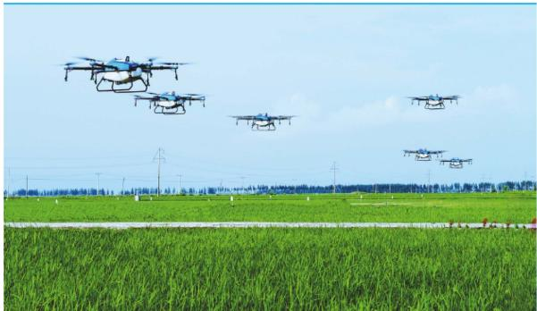

(a)  
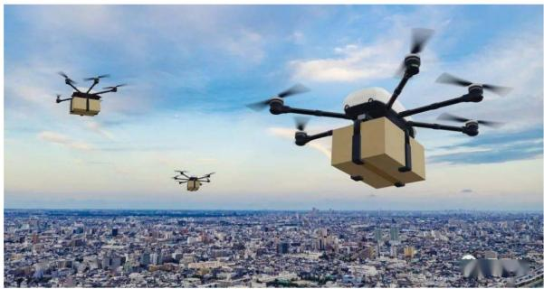  
(b)

Fig. 1. UAV demand scenarios. (a) Pesticide spraying [20]. (b) Urban delivery [21].  
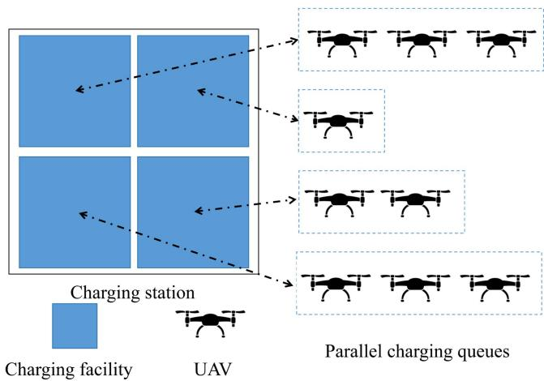  
Fig. 2. Illustration of parallel charging scheduling.

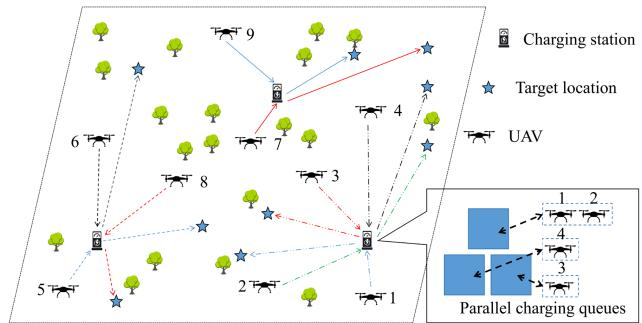  
Fig. 3. Illustration of parallel cooperative charging system.

This paper aims to study parallel cooperative charging scheduling of UAVs. We use Fig. 3 to illustrate our parallel cooperative charging system. We consider a set of charging stations with charging facilities. In each charging station, the number and locations of charging facilities are fixed. However, the charging stations are operated by different CSPs, and may have different charging prices and different number of charging facilities with different charging power. There are some UAVs whose energy need to be replenished at charging stations before arriving to the target locations. Then, the UAVs can be responsible for tasks near the target locations for the next period of time. These UAVs belong to the same enterprise or organization. The UAVs assigned to the same charging station form a charging group, in which the UAVs can reduce total charging cost by sharing the charging cost in the common charging hours. A charging group can be divided into multiple parallel queues for charging based on the charging facilities in the charging station. The objective is to find an assignment of UAVs and the parallel scheduling of charging group to minimize the total charging cost (payment to the charging stations) such that all UAVs’ energy demands can be satisfied.

The problem of parallel cooperative charging scheduling of UAVs is very challenging. First, in order to optimize the cost, we not only need to allocate UAVs to charging stations, but also need to determine the corresponding charging facilities for the allocated UAVs. These two problems are tightly coupled. Second, even if the charging group is known, it is impossible to find the optimal parallel scheduling that can minimize the cost of the charging group in polynomial time. Because Uniform Parallel Machines Scheduling Problem (UPMSP) [22], which is a well-known NP-hard problem, is a special case of this problem.

The main contributions of this paper are as follows:

\- To the best of our knowledge, this is the first work to study the parallel cooperative charging scheduling of UAVs, which can reduce the cost by cooperative charging and satisfy the charging demands of more UAVs by parallel charging.

\- We model the system for parallel cooperative charging scheduling of UAVs and formulate the Parallel Cooperative Charging Scheduling for UAVs Problem (PCCSUP). We show that PCCSUP is NP-hard.

\- We use the approximation algorithm for Uniform Parallel Machines Scheduling Problem (UPMSP) to solve the special case of PCCSUP where there is only one charging station, and show that the algorithm has the same approximation ratio $\gamma$ for the special case, where $\gamma$ is the approximation ratio of any approximation algorithm for UPMSP.

\- Based on the solution for the special case of PCCSUP and referring to the approximation algorithm for Set Covering Problem (SCP), we propose the greedy approach based Charging Scheduling Algorithm for UAVs (CSAU). We show that CSAU is $\gamma ( \ln n + 1 )$ -approximation for PCC-(ln + 1)SUP, where n is the number of UAVs, and $\gamma$ is the approximation ratio of algorithm for UPMSP.

\- Through extensive simulations, we demonstrate that the proposed algorithm can reduce up to 59.81% total cost compared with the benchmark algorithms.

\- We discuss three important related problems and design the corresponding algorithms to solve them respectively.

The rest of the paper is organized as follows. Section II presents the brief review on the state-of-the-art research. Section III presents the system model and formulates PCCSUP. Section IV presents the details of our solution. The simulations are presented in Section V. We discuss three important related problems in Section VI. We conclude this paper in Section VII.

## II. RELATED WORK

In this section, we briefly review the related work. In recent years, charging scheduling for UAVs [10], [11], [12], [23], [24] have attracted extensive attention and research. In addition, since our problem involves charging cost optimization [25], [26], [27], paid charging [28], [29], cooperative charging [17-19], and parallel machine scheduling [22], [30], we will also briefly review the related work on these problems.

Charging scheduling for UAVs: Jin et al. [10] studied the scheduling of UAVs that could fly to the buses to replenish energy, and aimed to minimize the total time. Wang et al. [11] proposed a secure and privacy-preserving vehicle-assisted wireless rechargeable UAV network framework for UAVs and ground vehicles based on Differential Privacy (DP). Within this framework, an online double auction mechanism was developed for optimal charging scheduling, and a two-phase DP algorithm was devised to preserve the sensitive bidding and energy trading information of participants. The above research utilized vehicles to charge UAVs. However, as mobile charging devices, the total energy of a vehicle is much less than the charging station. Therefore, the supply method based on mobile vehicles is not suitable for large charging demands. Song et al. [12] studied a coverage problem in Internet of Things (IoT) networks using UAVs supported by the solar-powered charging platforms. They aimed to design UAV assignment solutions that could yield the longest K-coverage lifetime. Lv et al. [23] adopted renewable energy production and storage equipment to reduce the power purchase from the distribution network as much as possible. The authors proposed an online algorithm based on Lyapunov optimization to schedule the charging of UAVs and the energy management of the charging station. They also used the contract theory to design the optimal charging strategy in the case of information asymmetry. However, none of the above studies has optimized the charging scheduling from the perspective of cooperation charging. In [24], the charging towers were considered for plug-and-play charging during run-time operations. Furthermore, the towers should be cooperative for more cost-effectiveness by intelligent energy sharing. The authors scheduled UAVs and charging towers to maximize charging energy amounts. They re-formulated the non-convex to convex for guaranteeing optimal solutions. Lastly, the cooperative energy sharing among towers was designed and implemented with multi-agent deep reinforcement learning, and then the intelligent energy sharing could be realized. The authors studied the sharing of energy resources between charging towers, rather than the charging cost sharing of UAVs within the same charging station. In addition, the optimization objective of [24] is to maximize the charging energy amounts.

Charging cost optimization: Wang et al. [25] studied the energy minimization problem of wireless charging in a dense Wireless Sensor Network (WSN). They solved the problem in two steps: The initial charging clusters and charging path were first found, and then the charging path was improved to reduce the energy consumption. However, the cost defined in this work was the proportion of the energy consumption rather than the actual charging expenditure. In order to minimize the energy spent on traveling and maximize the network lifetime, Priyadarshani et al. [26] proposed a multi-node charging vehicle scheduling scheme, which followed a partial charging model. First, the authors generated the charging schedules of multiple charging vehicles through optimal halting points by integrating non-dominated sorting genetic algorithm and multi-attribute decision making approach. Then, they used a partial charging timer to determine the charging time of the sensor node at each stop point. Given a set of rechargeable sensors, Jia et al. [27] designed the Mobile Charger’s (MC’s) charging path to minimize the energy cost, which depended on the wireless charging and the MC’s movement. However, they scheduled the trajectory of the MC rather than the trajectory of the rechargeable devices.

Paid charging: Fan et al. [28] proposed a dynamic pricing mechanism to maximize the long-term profit of the charging platform by jointly controlling the demand queues of multiple charging stations. Gupta et al. [29] proposed a pricing model for dedicated charging of rechargeable sensor devices. The authors used the game theory approach to find the Nash equilibrium price as well as the individual profit for each charger. However, in the above studies, the cooperative scheduling for paid charging was not considered.

Cooperative charging: Xu et al. [17] presented a wireless charging service model and proposed the algorithm for joint optimization of rechargeable devices’ charging cost and moving cost. Xu et al. [18] aimed to find a spatio-temporal cooperative charging scheduling strategy to minimize the total charging service cost subject to the constraints that the out-of-service time of each device did not exceed a given upper bound. A greedy-based charging service cost optimization algorithm with n -approximation was proposed, where n was the number of devices. However, they did not consider the spatial occupation issue. In their model, one charger can theoretically satisfy the charging demands of an infinite number of devices.

Wu et al. [19] studied the cooperative scheduling for directional wireless charging with spatial occupation. In order to minimize the total cost, a $( \ln n + 1 ) ( 1 + \varepsilon )$ -approximation algorithm was proposed to schedule the devices, where n was the number of devices and ε was the search precision. However, in this paper, when the number of devices was large, there was not enough space to charge all devices.

Uniform Parallel Machines Scheduling Problem: Uniform Parallel Machines Scheduling Problem (UPMSP) is a wellknown NP-hard problem, and many approximation algorithms have been proposed [22], [30]. However, the existing approximation algorithms for UPMSP cannot be applied straightforwardly to solve our problem since the charging group of each charging station is unknown, which is an important input of UPMSP.

Overall, there is no parallel cooperative RF charging scheduling of UAVs in the literature.

## III. SYSTEM MODEL AND PROBLEM FORMULATION

## A. System Model

We consider a set $M = \{ s _ { 1 } , s _ { 2 } , . . . , s _ { m } \}$ of m charging stations. These charging stations are operated by different CSPs, and have different charging prices and different charging facilities.

In RF wireless charging model, the received power will be different due to the different locations of the charging facilities. For each charging station $s _ { j } \in M$ , we use $F _ { j } = \overline { { \{ f _ { j } ^ { 1 } , f _ { j } ^ { 2 } , . . . , f _ { j } ^ { q _ { j } } \} } }$ and $P _ { j } = \{ p _ { j } ^ { 1 } , p _ { j } ^ { 2 } , . . . , p _ { j } ^ { q _ { j } } \}$ to denote the set of its charging facilities and the set of corresponding charging powers, respectively, where $q _ { j }$ is the number of the charging facilities of charging station $s _ { j }$

Suppose that there are a set $N = \{ o _ { 1 } , o _ { 2 } , . . . , o _ { n } \}$ of n UAVs and a set $L = \{ l _ { 1 } , l _ { 2 } , . . . , l _ { n } \}$ of n corresponding target locations. Each UAV $o _ { i } \in N$ has the energy demand $E _ { i }$ , the residual energy $E _ { i } ^ { r e }$ , the unit moving energy consumption $b _ { i } ,$ and the energy capacity $E _ { i } ^ { \mathrm { M A X } }$ . Note that the energy demand $E _ { i }$ is not the actual replenished energy from the charging station, but the increased energy of $o _ { i }$ after it arrives to its target location $l _ { i }$ comparing to the residual energy $E _ { i } ^ { r e }$ . The UAVs are usually deployed in large-scale scenarios. Therefore, the moving distance within the charging station can be omitted when we calculate the moving distance of UAVs. Specifically, the moving distance from any $\mathrm { U A V } \ : o _ { i } ^ { , } \mathrm { s }$ location to any charging station $s _ { j }$ is denoted by the euclidean distance $d ( o _ { i } , s _ { j } )$ . In the same way, when a ( )UAV flies from the charging station $s _ { j }$ to the target location $l _ { i } .$ its moving distance is $d ( s _ { j } , l _ { i } )$

Then the actual replenished energy of $o _ { i }$ from charging station $s _ { j }$ is the sum of energy demand and total moving energy consumption, which can be calculated by

$$
E _ { i } ( s _ { j } ) = E _ { i } + b _ { i } ( d ( o _ { i } , s _ { j } ) + d ( s _ { j } , l _ { i } ) ) .\tag{1}
$$

Let $G _ { j }$ be the charging group of $s _ { j }$ , i.e., the set of UAVs charged by charging station $s _ { j }$ . We use $\phi _ { j } = \{ \pi _ { j } ^ { 1 } , \pi _ { j } ^ { 2 } , . . . , \pi _ { j } ^ { q _ { j } } \}$ to denote the charging arrangement of UAVs in ${ \bf \bar { \it G } } _ { j }$ , where $\pi _ { j } ^ { k } , k = 1 , 2 , . . . , q _ { j }$ is the set of UAVs charged by charging facility $f _ { j } ^ { k }$ . Obviously, $\cup _ { k = 1 } ^ { q _ { j } } \pi _ { j } ^ { k } = G _ { j }$ . The charging time of

$f _ { j } ^ { k }$ is

$$
T ( \pi _ { j } ^ { k } ) = \frac { \sum _ { o _ { i } \in \pi _ { j } ^ { k } } E _ { i } ( s _ { j } ) } { p _ { j } ^ { k } } .\tag{2}
$$

For any charging group $G _ { j }$ and the corresponding charging arrangement $\phi _ { j }$ , the charging time of the charging group is the maximum charging time of all charging facilities in the charging arrangement:

$$
T ( \phi _ { j } ) = \operatorname* { m a x } _ { \pi _ { j } ^ { k } \in \phi _ { j } } T ( \pi _ { j } ^ { k } ) .\tag{3}
$$

Based on the principle of RF wireless charging technology [17], [18], [19], we know that when the transmitting power is fixed, the energy consumption of the RF wireless charger is only related to the charging time. In our charging model, one charging station can provide the energy supply for all UAVs in the corresponding charging group simultaneously. Instead of separately calculating the charging energy of each UAV and then summing them up, in this paper, we calculate the cost of charging group based on the charging time of charging station, and the UAVs in the charging group can share the cost.

The arrival time of UAVs may be different due to the different moving time. The charging starts as the last UAV in the charging group has arrived the charging station to reduce the charging time, thus, the charging cost is reduced further. This is because the charging cost is depended on the charging time of the charging station. The UAVs arrive early need to wait for the other UAVs in the same charging group until the last UAV arrives. The waiting time is acceptable since the UAVs can fly several kilometers in a few minutes, while the charging time often take several hours [12].

Moreover, in order to motivate CSPs, we introduce the base fare pricing structure to ensure their revenue. The base fare pricing structure has been adopted in the charging scheduling for mobile rechargeable sensor devices [19], and also widely used in many fields, such as taxi pricing [31] and express delivery industry [32]. The cost of charging group $G _ { j }$ with arrangement $\phi _ { j }$ is defined as

$$
c ( \phi _ { j } ) = \left\{ \begin{array} { l l } { A _ { j } , } & { T ( \phi _ { j } ) \leq T _ { j } } \\ { A _ { j } + a _ { j } ( T ( \phi _ { j } ) - T _ { j } ) , } & { \mathrm { o t h e r w i s e } , } \end{array} \right.\tag{4}
$$

where $A _ { j }$ and $a _ { j }$ are the base fare and unit additional charging price of $s _ { j } ,$ respectively. $T _ { j }$ is the charging time threshold of $s _ { j }$ These pricing parameters are determined by the CSPs based on the charging market, and the detail is not of academic interest. Following the realistic base fare models, there is

$$
A _ { j } \geq a _ { j } T _ { j } .\tag{5}
$$

We list the frequently used notations in Table I.

## B. Problem Formulation

The problem is to find an assignment of UAVs and the charging arrangements of charging groups to minimize the total cost of all charging groups such that each UAV is assigned to exactly one charging facility. To simplify the expression, we define 0-1 variable $x _ { i j } ^ { k }$ to indicate whether $o _ { i }$ belongs to $\pi _ { j } ^ { k } , \mathrm { i } . \mathrm { e } . , x _ { i j } ^ { k } = 1$ if $o _ { i }$ belongs to $\pi _ { j } ^ { k } , x _ { i j } ^ { k } = 0$ otherwise. We refer to this problem as Parallel Cooperative Charging Scheduling for UAVs Problem (PCCSUP), which can be formulated as

TABLE I FREQUENTLY USED NOTATIONS
<table><tr><td>Symbol</td><td>Description</td></tr><tr><td> $M , m$ </td><td>Set of charging stations, Number of charging stations</td></tr><tr><td></td><td>Number of charging facilities of charging station  $s _ { j }$   $\mathrm { U A V s }$ </td></tr><tr><td> $N , \overset { q _ { j } } { L } , n$ </td><td>Set of UAVs, Set of target locations, Number of</td></tr><tr><td> $E _ { i }$ </td><td>Energy demand of  $\mathrm { U A V } \ o _ { i }$ </td></tr><tr><td> $E _ { i } ^ { r e }$ </td><td>Residual energy of  $\mathrm { U A V } \ o _ { i }$ </td></tr><tr><td> $E _ { \ i } ^ { \mathrm { { M A X } } }$  2</td><td>Energy capacity of  $\mathrm { U A V } \ o _ { i }$ </td></tr><tr><td> $b _ { i }$ </td><td>Unit moving energy consumption of  $\mathrm { U A V } \ o _ { i }$ </td></tr><tr><td> $d ( o _ { i } , s _ { j } )$ </td><td>Moving distance from  $\mathrm { U A V } \stackrel { * } { o } _ { i }$  to charging station</td></tr><tr><td> $F _ { j }$ </td><td>Set of charging facilities of charging station  $s _ { j }$ </td></tr><tr><td> $P _ { j }$ </td><td>Set of charging powers of charging facilities of charging station  $s _ { j }$ </td></tr><tr><td> $E _ { i } ( s _ { j } )$ </td><td>Actual replenished energy from charging station  $s _ { j }$  required by  $\mathrm { U A V } \ o _ { i }$ </td></tr><tr><td> $G _ { j }$ </td><td>Charging group of charging station  $s _ { j }$ </td></tr><tr><td> $a _ { j }$ </td><td>Unit additional charging price of charging station</td></tr><tr><td> $A _ { j }$ </td><td>Base fare of charging station  $s _ { j }$ </td></tr><tr><td> $\dot { T _ { j } }$ </td><td>Charging time threshold of charging station  $s _ { j }$ </td></tr><tr><td> $\phi _ { j }$ </td><td>Charging arrangement of charging group  $G _ { j }$ </td></tr><tr><td> $\pi _ { i } ^ { k }$ </td><td>Set of UAVs charged by charging facility  $f _ { j } ^ { k }$ </td></tr><tr><td> $T ( \stackrel { \sim } { \pi } _ { i } ^ { k } )$ </td><td>Charging time of charging facility  $f _ { j } ^ { k }$ </td></tr><tr><td> $T ( \phi _ { j } ^ { \prime } )$ </td><td>Charging time of charging group  $\bar { G _ { j } }$  with charging</td></tr><tr><td> $\underline { { c ( \phi _ { j } ) } }$ </td><td>arrangement  $\phi _ { j }$  Cost of charging group  $\underline { { G _ { j } } }$  with charging arrangement</td></tr></table>

$$
( P C C S U P ) : \operatorname* { m i n } \sum _ { s _ { j } \in M } c ( \phi _ { j } ) ,\tag{6}
$$

$$
{ \mathrm { s . t . } } \sum _ { s _ { j } \in M } \sum _ { k = 1 } ^ { q _ { j } } { x _ { i j } ^ { k } } = 1 , \forall o _ { i } \in N\tag{6-1}
$$

$$
x _ { i j } ^ { k } = \{ 0 , 1 \} , \forall o _ { i } \in N , \forall s _ { j } \in M , k = \{ 1 , 2 , . . . , q _ { j } \} .\tag{6-2}
$$

The constraint (6-1) ensures that each UAV can be scheduled to exact one charging facility. In view of the commercial feasibility of charging economy, we consider that each UAV can only obtain the charging service from one charging facility every time. The constraint (6-2) ensures that $x _ { i j } ^ { k }$ is the binary variable.

To guarantee the existence of feasible solution of PCCSUP, two conditions should be satisfied. First, the residual energy of any UAV $o _ { i }$ should be sufficient to reach any charging station, i.e.,

$$
E _ { i } ^ { r e } \ge \operatorname* { m a x } _ { s _ { j } \in M } b _ { i } d ( o _ { i } , s _ { j } ) , \forall o _ { i } \in N .\tag{7}
$$

Assume that the UAV $o _ { i }$ is charged by charging station $s _ { j }$ Then, the actual replenished energy of $o _ { i }$ cannot exceed the maximum energy can be replenished, i.e.,

$$
E _ { i } \left( s _ { j } \right) \leq E _ { i } ^ { M A X } - \left( E _ { i } ^ { r e } - b _ { i } d \left( o _ { i } , s _ { j } \right) \right) .\tag{8}
$$

Substitute formula (1) into formula (8), we have

$$
E _ { i } \leq E _ { i } ^ { M A X } - E _ { i } ^ { r e } - b _ { i } d \left( s _ { j } , l _ { i } \right) .\tag{9}
$$

To guarantee that formula (9) can be satisfied for all $s _ { j } \in M$ ， the following condition should be complied:

$$
E _ { i } \leq E _ { i } ^ { M A X } - E _ { i } ^ { r e } - \underset { s _ { j } \in M } { \operatorname* { m a x } } b _ { i } d \left( s _ { j } , l _ { i } \right) , \forall o _ { i } \in N .\tag{10}
$$

If the above condition (7) and condition (10) cannot be satisfied, we can conduct the preprocessing before solving the problem by simply removing the UAVs that do not satisfy formula (7) or formula (10).

After the preprocessing, there must be a feasible solution to the problem. Some UAVs may be excluded by the preprocessing. For UAVs, which do not satisfy formula (10), are suggested to reduce their charging demands. We will discuss how to determine charging arrangements for UAVs that do not satisfy formula (7) in Section VI.

## IV. SOLUTION OF PCCSUP

In this section, we present the approximation algorithm of PCCSUP. We first show the hardness of PCCSUP and introduce the design rationale of solution. Then, we consider using an approximation algorithm for UPMSP to solve the special case of PCCSUP where there is only one charging station. We prove that the algorithm has the same approximation ratio for the special case of PCCSUP. Finally, we give the details of algorithm and analysis for PCCSUP.

## A. Hardness

First, we attempt to find an optimal solution of PCCSUP. However, the following theorem shows that PCCSUP is NP-hard.

Theorem $ { \boldsymbol { l } } :$ The PCCSUP is NP-hard.

Proof: We first introduce an instance of the special case of PCCSUP with single charging station: We assume that there is only one charging staton $s _ { j }$ . Given a set of UAVs N , a set of charging facilities $F _ { j }$ . The actual replenished energy of $o _ { i }$ from charging station $s _ { j }$ is $E _ { i } ( s _ { j } )$ , and the charging power of $f _ { j } ^ { k }$ is $p _ { j } ^ { k }$ . Therefore, for each $o _ { i } \in N$ and $f _ { j } ^ { k } \in F _ { j } ^ { \bar { } }$ , the time taken to charge UAV $o _ { i }$ in charging facility $f _ { j } ^ { k }$ is $\frac { E _ { i } ( s _ { j } ) } { p _ { j } ^ { k } } ,$ $\phi _ { j } = \{ \pi _ { j } ^ { 1 } , \pi _ { j } ^ { 2 } , . . . , \pi _ { j } ^ { q _ { j } } \}$ is the charging arrangement of UAVs in charging group $G _ { j }$ , where $\pi _ { j } ^ { k } , k = 1 , 2 , . . . , q _ { j }$ is the set of UAVs charged by the charging facility $f _ { j } ^ { k }$ . The charging time of $f _ { j } ^ { k }$ is $T ( \pi _ { j } ^ { k } ) = \frac { \sum _ { o _ { i } \in \pi _ { j } ^ { k } } E _ { i } ( s _ { j } ) } { p _ { j } ^ { k } }$ . The problem is to assign the UAVs to the charging facilities to minimize the cost $c ( \phi _ { j } )$ we set $A _ { j } = 0 , T _ { j } = 0$ and $a _ { j } = 1$ . According to (4), we have $c ( \phi _ { j } ) = \overset { \cdot } { T } ( \phi _ { j } ) = \operatorname* { m a x } _ { \pi _ { i } ^ { k } \in \phi _ { j } } \overset { \cdot } { T } ( \pi _ { j } ^ { k } )$

Then we consider a corresponding instance of UPMSP: Given a set of jobs $N ,$ a set of machines $F _ { j }$ , and for each $o _ { i } \in N$ and $f _ { j } ^ { k } \in F _ { j }$ , the work load of $o _ { i }$ processed by machine $s _ { j }$ is $E _ { i } ( s _ { j } )$ , and the unit processing capacity of $f _ { j } ^ { k }$ is $p _ { j } ^ { k }$ . Then, the time taken to process job $o _ { i }$ on machine $f _ { j } ^ { k }$ is ${ \frac { E _ { i } ( s _ { j } ) } { p _ { j } ^ { k } } } . \ \phi _ { j } =$ $\{ \pi _ { j } ^ { 1 } , \pi _ { j } ^ { 2 } , . . . , \pi _ { j } ^ { q _ { j } } \}$ is the processing arrangement of jobs, where $\pi _ { j } ^ { k } , k = 1 , 2 , . . . , q _ { j }$ is the set of jobs processed by the machine $f _ { j } ^ { k }$ . The processing time of $f _ { j } ^ { k } \mathrm { i s } T ( \pi _ { j } ^ { k } ) = \frac { \sum _ { o _ { i } \in \pi _ { j } ^ { k } } E _ { i } ( s _ { j } ) } { p _ { j } ^ { k } }$ . The problem is to assign the jobs to the machines to minimize the makespan $\begin{array} { r } { T ( \phi _ { j } ) = \mathrm { m a x } _ { \pi _ { j } ^ { k } \in \phi _ { j } } T ( \pi _ { j } ^ { k } ) } \end{array}$

Obviously, the special case of PCCSUP is equivalent to UPMSP. If PCCSUP can obtain the optimal solution in polynomial time, UPMSP can also obtain the optimal solution in polynomial time. However, this contradicts the fact that UPMSP is NP-hard. Therefore, PCCSUP is NP-hard. -

## B. Design Rationale

Since PCCSUP is NP-hard, it is impossible to compute the optimal solution in polynomial time. We turn our attention to the approximation algorithm design.

Overall, PCCSUP is similar with Set Covering Problem (SCP): For a set of UAVS and a set of charging stations, each charging station’s charging group can cover (charge) a subset of UAVs. The problem is decide the charging groups for charge stations to cover all UAVs such that the total cost of all charging groups is minimized.

We try to use the greedy approach for Set Covering Problem (SCP) [33] to solve our problem. In each step of the greedy approach, a subset of uncovered UAVs with minimum average marginal cost is assigned to one of the charging groups. Referring to [33], the average marginal cost is defined in Definition 1.

Definition 1: (Average marginal cost): We define the average marginal cost of a charging group as the ratio of marginal cost to the number of new covered UAVs.

For example, considering the original charging group of charging station $s _ { j }$ is $G _ { j }$ , in current step, a subset of uncovered UAVs is added to $G _ { j }$ , and the new charging group of $s _ { j }$ is $G ^ { \prime } { } _ { j }$ Let $\phi _ { j }$ and $\phi _ { j } ^ { \prime }$ are the charging arrangements corresponding to $G _ { j }$ and $G ^ { \prime } { } _ { j }$ , respectively. Then the average marginal cost of charging group $G _ { j }$ in current step is $\frac { c ( \phi ^ { \prime } { } _ { j } ) - c ( \phi _ { j } ) } { | G ^ { \prime } { } _ { j } \backslash G _ { j } | }$

However, it is impossible to find the charging group with the minimum average marginal cost in polynomial time. Even if the charging group is known, it is impossible to find a charging arrangement in polynomial time that can minimize the cost of the charging group.

Therefore, we first consider the special case with single charging station. We consider using the approximation algorithm for UPMSP to solve the special case of PCCSUP, and show that the algorithm has the same approximation for the special case. Then, we propose the greedy approach based Charging Scheduling Algorithm for UAVs (CSAU) to solve the PCCSUP. Essentially, we use the approximation algorithm for UPMSP [22], [30] to obtain the charging arrangements and the SCP optimization framework to obtain the charging groups.

## C. A Special Case With Single Charging Station

In this sub-section, we consider a special case of PCCSUP that there is only one charging station. We refer to the special case of PCCSUP as P , which can be formulated as follows:

$$
( P 1 ) : \operatorname* { m i n } c ( \phi _ { j } ) ,\tag{11}
$$

$$
\mathrm { s . t . } \sum _ { k = 1 } ^ { q _ { j } } { x _ { i j } ^ { k } } = 1 , \forall o _ { i } \in N\tag{11-1}
$$

$$
x _ { i j } ^ { k } = \{ 0 , 1 \} , \forall o _ { i } \in N , \forall k = \{ 1 , 2 , . . . , q _ { j } \} .\tag{11-2}
$$

According to Theorem 1, P is NP-hard, it is impossible to compute the optimal solution in polynomial time unless P NP. However, because the only difference between UPMSP and P is the objective function, we can consider using the approximation algorithm for UPMSP to solve P . According to Theorem 2, such an algorithm has the same approximation ratio for P .

Theorem 2: Given any γ-approximation algorithm for UPMSP, the approximation ratio of this algorithm for P is still $\gamma .$

Proof: We denote the optimal solution of P by $\phi _ { j } ^ { * }$ . The charging time and the charging cost of $\phi _ { j } ^ { * }$ are $T ( \phi _ { j } ^ { * } )$ and $\mathbf { \bar { \rho } } _ { c } ( \phi _ { j } ^ { * } )$ respectively. We denote the solution of the approximation algorithm for UPMSP by $\phi _ { j }$ . The charging time and the charging cost of $\phi _ { j }$ are $T ( \phi _ { j } )$ and $c ( \phi _ { j } )$ , respectively.

We have

$$
T ( \phi _ { j } ^ { * } ) \leq T ( \phi _ { j } ) \leq \gamma T ( \phi _ { j } ^ { * } ) .\tag{12}
$$

Then, we consider the following three cases:

Case 1: $T ( \phi _ { j } ^ { * } ) \leq T ( \phi _ { j } ) \leq T _ { j }$

( ) (Based on (4), we have

$$
c ( \phi _ { j } ^ { * } ) = c ( \phi _ { j } ) = A _ { j } .\tag{13}
$$

Case 2: $T ( \phi _ { j } ^ { * } ) \leq T _ { j } < T ( \phi _ { j } )$

We have

$$
\begin{array} { r l } & { \frac { c ( \phi ) } { c ( \phi _ { j } ^ { * } ) } } \\ & { = \frac { A _ { j } + a _ { j } ( T ( \phi _ { j } ) - T _ { j } ) } { A _ { j } } } \\ & { \leq 1 + \frac { a _ { j } ( T ( \phi _ { j } ) - T _ { j } ) } { a _ { j } T _ { j } } } \\ & { = \frac { T ( \phi _ { j } ) } { T _ { j } } } \\ & { \leq \frac { T ( \phi _ { j } ) } { T ( \phi _ { j } ^ { * } ) } } \\ & { \leq \gamma _ { r } , } \end{array}\tag{14}
$$

where the first inequality relies on (5), the second inequality relies on $T ( \phi _ { i } ^ { * } ) \leq T _ { j }$ , and the last inequality relies on (12).

Case $3 \colon T _ { j } < T ( \phi _ { j } ^ { * } ) \leq T ( \phi _ { j } )$

We have

$$
\begin{array} { r l } & { \frac { c ( \phi ) } { c ( \phi _ { j } ^ { * } ) } } \\ & { = \frac { A _ { j } + a _ { j } ( T ( \phi _ { j } ) - T _ { j } ) } { A _ { j } + a _ { j } ( T ( \phi _ { j } ^ { * } ) - T _ { j } ) } } \\ & { \leq \frac { A _ { j } + a _ { j } ( \gamma T ( \phi _ { j } ^ { * } ) - T _ { j } ) } { A _ { j } + a _ { j } ( T ( \phi _ { j } ^ { * } ) - T _ { j } ) } } \end{array}
$$

$$
= 1 + \frac { a _ { j } ( \gamma - 1 ) T ( \phi _ { j } ^ { * } ) } { A _ { j } + a _ { j } ( T ( \phi _ { j } ^ { * } ) - T _ { j } ) }
$$

$$
\leq \gamma ,\tag{15}
$$

Algorithm 1: Charging Scheduling Algorithm for UAVs   
(CSAU).   
Input: M , $N , E _ { i } , b _ { i } , \forall o _ { i } \in N , a _ { j } , T _ { j } , A _ { i } , F _ { j } , P _ { j } , \forall s _ { j } \in M$   
Output: $( G _ { j } , \phi _ { j } ) , \forall s _ { j } \in M$   
(1: foreach $s _ { j } \in M$ do   
2: $G _ { j } \gets \dot { \emptyset } ;$   
3: foreach $f _ { j } ^ { k } \in F _ { j }$ do   
4: $\pi _ { j } ^ { k }  \varnothing ;$   
5: end   
6: end   
7: $N ^ { \prime } \gets N ;$   
8: while $N ^ { \prime } \neq \emptyset$ do   
9: foreach $s _ { j } \in M$ do   
10: $( G _ { j } ^ { \prime } , \phi _ { j } ^ { \prime } ) ^ { \circ }  \mathrm { A M C A M } ( s _ { j } , G _ { j } , E _ { i } , b _ { i } , P _ { j } , N ^ { \prime } ) ;$   
(11: end   
$c ( \phi _ { j ^ { \prime } } ^ { \prime } ) - c ( \phi _ { j ^ { \prime } } ) _ { . }$   
12: sj ← $s _ { j ^ { \prime } } { \in } M , G _ { j ^ { \prime } } { \subset } G _ { j ^ { \prime } } ^ { \prime }$ $\overline { { | G _ { j ^ { \prime } } ^ { \prime } \backslash G _ { j ^ { \prime } } | } } ^ { \prime } ;$   
13: $G _ { j } \gets G _ { j } ^ { \prime } ; \phi _ { j } \gets \phi _ { j } ^ { \prime } ; N ^ { \prime } \gets N ^ { \prime } \backslash G _ { j } ^ { \prime } ;$   
14: end

where the first inequality relies on (12), and the last inequality relies on (5).

Based on (13), (14) and (15), we obtain the theorem.

## D. Algorithm Design

Our algorithm follows the SCP optimization framework to obtain charging groups and executes the approximation algorithm for UPMSP to find the charging arrangement with the approximate minimum average marginal cost.

CSAU outputs the charging group $G _ { j }$ and the charging arrangement of UAVs $\phi _ { j }$ for each charging station $s _ { j } \in M . \ \mathrm { A s }$ illustrated in Algorithm 1, we first initialize $G _ { j } , \pi _ { j } ^ { k }$ and $N ^ { \prime }$ (Lines 1-7). When $N ^ { \prime } \neq \emptyset .$ , we call the function AMCAM (Average Marginal Cost Approximation Minimization) to find the UAV set $G _ { j } ^ { \prime }$ and the corresponding charging arrangement $\phi _ { j } ^ { \prime }$ for each $s _ { j }$ that can approximately minimize the average marginal cost over $\boldsymbol { s } _ { j } \mathrm { \widetilde { s } }$ current charging group $G _ { j }$ (Lines 8-11). Then we find the extended charging group ${ \bar { G _ { j } ^ { \prime } } }$ with minimum average marginal cost among all charging stations (Line 12), and update the charging group, charging arrangement of UAVs of $s _ { j }$ , and the unassigned UAV set $N ^ { \prime }$ (Line 13). The iteration terminates when all UAVs are assigned.

As illustrated in Algorithm 2, the function AMCAM(·) returns the charging group and the corresponding charging arrangement with the approximate minimum average marginal cost. Let w be the number of UAVs added into the charging group. We define $N ^ { * }$ and $G _ { J } ( w )$ to represent the set of unassigned UAVs in the iteration of Algorithm 2 and the charging group of $s _ { j }$ after w UAVs are added, respectively. After initialization (Line 1), we traverse all possible values of w. If there are unassigned UAVs, which can be added to the charging group of $s _ { j }$ (Line 2), we find the UAV with the lowest actual replenished energy from the unassigned UAV set $N ^ { * }$ (Line 3), and assign it to the charging group (Line 4). Then, we use an approximation algorithm for UPMSP to find the charging arrangement $\phi _ { j } ( w )$ (Line 5). Finally, we return the extended charging group $\bar { G _ { j } ^ { \prime } }$ and the corresponding charging arrangement $\phi _ { i } ^ { \prime }$ with the minimum average marginal cost from all $G _ { j } ( w )$ and $\phi _ { j } ( w )$ for possible values of w, $w = 1 , 2 , . . . , \left| N ^ { \prime } \right| ( \mathrm { l }$ Line 7).

Algorithm 2: Average Marginal Cost Approximation Min  
imization (AMCAM).   
Input: $s _ { j } , G _ { j } , E _ { i } , b _ { i } , P _ { j } , N ^ { \prime }$   
Output: $( G _ { j } ^ { \prime } , \phi _ { j } ^ { \prime } )$   
1: w $ 0 ; \check { G } _ { j } ( \check { w } )  G _ { j } ; N ^ { * }  N ^ { \prime } ;$   
2: while $w < | N ^ { \prime } |$ do   
3: $\begin{array} { r } { o _ { i } \gets \arg \operatorname* { m i n } _ { o _ { i ^ { \prime } } \in N ^ { * } } E _ { i ^ { \prime } } ( s _ { j } ) ; N ^ { * } \gets N ^ { * } \backslash \{ o _ { i } \} } \end{array}$   
4: w $ w + 1 ; G _ { j } ( w )  G _ { j } ( w - 1 ) \cup \{ o _ { i } \} ;$   
5: call the approximation algorithm for UPMSP to obtain   
$\phi _ { j } ( w )$ based on $G _ { j } ( w )$ and $P _ { j }$ ;   
6: end   
$c ( \phi _ { j } ( w ) ) - c ( \phi _ { j } ) _ { , }$   
7: $( G _ { j } ^ { \prime } , \phi _ { j } ^ { \prime } )  \mathrm { a r g }$ min   
$( G _ { j } ( w ) , \overbrace { \phi _ { j } ( w } ) ) { : } w > 0$ w

= 1 2Theorem 3: The time complexity of CSAU is $O ( m n ^ { 2 } \Gamma )$ where O is the time complexity of the approximation algorithm for UPMSP.

Proof: We first analyze the time complexity of AMCAM (·). The running time of AMCAM (·) is dominated by finding the charging arrangement with approximate minimum charging time of charging group (Line 5). If the time complexity of the approximation algorithm for UPMSP is O , AMCAM (·) takes O n . The running time of CSAU is dominated by executing AMCAM (·) (Line 10) and AMCAM (·) is executed at most mn times. Therefore, the time complexity of CSAU is $O ( m n ^ { 2 } \Gamma )$ -

Theorem 4: CSAU is a γ n -approximation algorithm for PCCSUP, where γ is the approximation ratio of algorithm for UPMSP.

Proof: For any charging group $G _ { j } .$ , we can obtain a charging arrangement $\phi _ { j }$ by using a γ-approximation algorithm for UPMSP. There is an optimal charging arrangement $\phi _ { j } ^ { * }$ , which can minimize the charging time of $G _ { j }$ . We define the function $\widetilde c ( G _ { j } )$ and $c ^ { * } ( G _ { j } )$ to represent the cost of $\phi _ { j }$ and $\phi _ { j } ^ { * }$ , respectively, i.e., $\tilde { c } ( G _ { j } ) = c ( \phi _ { j } )$ and $c ^ { * } ( G _ { j } ) = c ( \bar { \phi } _ { j } ^ { * } )$ . According to Theorem 2, we have

$$
\widetilde c ( G _ { j } ) \leq \gamma c ^ { * } ( G _ { j } ) .\tag{16}
$$

Then we consider the following two problems:

$$
( P 2 ) : \operatorname* { m i n } \sum _ { s _ { j } \in M } \widetilde c ( G _ { j } ) ,\tag{17}
$$

$$
{ \mathrm { s . t . } } \bigcup _ { s _ { j } \in M } G _ { j } = N ,\tag{17-1}
$$

$$
G _ { j } \cap G _ { j ^ { \prime } } = \emptyset , \forall s _ { j } \neq s _ { j ^ { \prime } } , s _ { j } , s _ { j ^ { \prime } } \in M .\tag{17-2}
$$

$$
( P 3 ) : \operatorname* { m i n } \sum _ { s _ { j } \in M } c ^ { * } ( G _ { j } ) ,\tag{18}
$$

$$
{ \mathrm { s . t . } } \bigcup _ { s _ { j } \in M } G _ { j } = N ,\tag{18-1}
$$

$$
G _ { j } \cap G _ { j ^ { \prime } } = \emptyset , \forall s _ { j } \neq s _ { j ^ { \prime } } , s _ { j } , s _ { j ^ { \prime } } \in M .\tag{18-2}
$$

Obviously, the optimal total cost of $P 3$ is equivalent to the optimal total cost of PCCSUP. We denote the optimal total cost of PCCSUP by OP T . We have

$$
O P T = \sum _ { s _ { j } \in M } c ^ { * } ( G _ { j } ^ { * } ) ,\tag{19}
$$

where $G _ { j } ^ { * }$ is the charging group of $s _ { j }$ in the optimal solution of $P 3$

3We denote the optimal total cost of the $P 2$ by $\widetilde { O P T }$

According to (16), we have

$$
\sum _ { s _ { j } \in M } \widetilde { c } ( G _ { j } ^ { * } ) \leq \sum _ { s _ { j } \in M } \gamma c ^ { * } ( G _ { j } ^ { * } ) = \gamma O P T .\tag{20}
$$

Because $\widetilde { O P T }$ is the optimal total cost of $P 2 ,$ we have

$$
\widetilde { O P T } \leq \sum _ { s _ { j } \in M } \widetilde { c } ( G _ { j } ^ { * } ) \leq \gamma O P T .\tag{21}
$$

Next, we prove that CSAU is a  n -approximation algorithm of $P 2$ (ln + 1). Number the UAVs of N in the order in which they were covered by CASU resolving ties arbitrarily. Let $o _ { 1 }$ $O _ { 2 } , \ O _ { 3 } , . . . , o _ { n }$ be the numbering. Assume $o _ { k } , k = 1 , 2 , . . . , n$ is covered by the extended charging group $G _ { j } ^ { \prime }$ of charging station $s _ { j }$ over $G _ { j }$ . Then the average marginal cost of $o _ { k }$ is defined as

$$
c o s t ( o _ { k } ) = \frac { c ( \phi _ { j } ^ { \prime } ) - c ( \phi _ { j } ) } { | G _ { j } ^ { \prime } \backslash G _ { j } | } = \frac { \widetilde { c } ( G _ { j } ^ { \prime } ) - \widetilde { c } ( G _ { j } ) } { | G _ { j } ^ { \prime } \backslash G _ { j } | } .\tag{22}
$$

Considering the iteration in which $o _ { k }$ was covered, the charging groups of optimal solution can cover the remaining UAVs- in $N ^ { \prime } { \mathrm { w i t h } }$ cost at most $\widetilde { O P T }$ . Therefore, among all charging groups in the optimal solution, there must be one having average marginal cost at most $\widetilde { O P T } / | N ^ { \prime } |$ , where $\left| N ^ { \prime } \right| \geq n - k + 1$ Since $o _ { k }$ was covered by set $G _ { j } ^ { \prime }$ of charging station $s _ { j }$ with minimum average marginal cost in this iteration, it follows

$$
c o s t ( o _ { k } ) \leq \widetilde { \frac { O P T } { | N ^ { \prime } | } } \leq \frac { \widetilde { O P T } } { n - k + 1 } .\tag{23}
$$

Since the cost of each charging group is distributed among the new UAVs covered, the total cost of the charging groups obtained by CSAU is equal to

$$
\begin{array} { l } { { \displaystyle \sum _ { k = 1 } ^ { n } c o s t ( o _ { k } ) } } \\ { { \le \displaystyle \sum _ { k = 1 } ^ { n } \widetilde { \frac { O P T } { n - k + 1 } } } } \\ { { = \displaystyle \left( 1 + \frac { 1 } { 2 } + \cdots + \frac { 1 } { n } \right) \widetilde { O P T } } } \\ { { \le \left( \ln n + 1 \right) \widetilde { O P T } . } } \end{array}\tag{24}
$$

Combining (21) and (24), we obtain the theorem.

## V. SIMULATION RESULTS

In this section, we conduct thorough simulations to verify the performance of our algorithm in terms of total cost. We also

TABLE II  
DEFAULT SETTINGS OF PARAMETERS
<table><tr><td>Parameter</td><td>Default value</td></tr><tr><td>m</td><td>5</td></tr><tr><td> $q _ { j }$ </td><td>[4, 6]</td></tr><tr><td> $p _ { j } ^ { k }$ </td><td>[40, 50]W</td></tr><tr><td>n</td><td>40</td></tr><tr><td> $E _ { i }$ </td><td>[50,60]Wh</td></tr><tr><td> $b _ { i }$ </td><td>[220, 230]J/m</td></tr><tr><td> $a _ { j }$ </td><td>[0.0015, 0.002]</td></tr><tr><td> $\mathring { A _ { j } }$ </td><td>[40,50]</td></tr><tr><td> $\check { T _ { j } }$ </td><td>[16000, 18000]/s</td></tr><tr><td> $\varepsilon$ </td><td>4</td></tr></table>

conduct a complete example to show the scheduling details of proposed algorithm.

## A. Simulation Setup

For the simulations, we randomly distribute the initial locations of UAVs, the target locations and the charging stations in a km ∗ km square area. Because the charging facilities are 2 2determined by the CSPs, we randomly generate the charging facilities for each charging station.

In our simulations, we use the approximation algorithm for UPMSP in [30] to obtain the charging arrangement, and the approximation ratio of CSAU is $2 ( 1 + \varepsilon ) ( \ln n + 1 )$ , where ε is the search precision and $\varepsilon > 0$ , based on Theorem 5.

In [12], the flying energy consumption rate of the UAV is 224 J/m. Considering the diversity of actual scenarios, we set appropriate intervals to randomly select values for obtaining the results under various situations.

Referring to [12], [19], the default values of parameters are given in Table II. We will vary the value of the key parameters to explore the impacts on the algorithms. All the simulations are run on a Windows machine with 13th Gen Intel(R) Core(TM) i7- 13650HX and 16.0 GB memory. Each measurement is averaged over 100 instances.

We compare our algorithm with the following three benchmark algorithms:

IAASA (Improved AASA): We modify the Adaptive Anchor Selection Algorithm (AASA) in [34] to fit the scenario given in this paper. The overall steps of IAASA are similar to CSAU, but there are two differences. First, for each $s _ { j } \in$ M, based on N and $P _ { j }$ , a heuristic greedy schedule for UPMSP is used to obtain $\phi _ { j } ,$ where each UAV is assigned to the charging facility, which has the smallest charging time, i.e., the Line 10 of Algorithm 1 is different from that of CSAU. Second, the charging station with lowest average cost (the ratio of charging cost to the size of group) is selected, i.e., the Line 12 of Algorithm 1 is different from that of CSAU.

\- IAASAU (Improved AASA based on UPMSP): The IAASAU is also a modified AASA [34]. For each $s _ { j } \in M$ based on N and $P _ { j }$ , IAASAU executes the $2 ( 1 + \varepsilon )$ approximation algorithm for UPMSP in [30] to obtain $\phi _ { j }$ i.e., the Line 10 of Algorithm 1 is different from that of CSAU. In IAASAU, the charging station with lowest average cost is selected. Therefore, The Line 12 of Algorithm 1 is also different from that of CSAU.

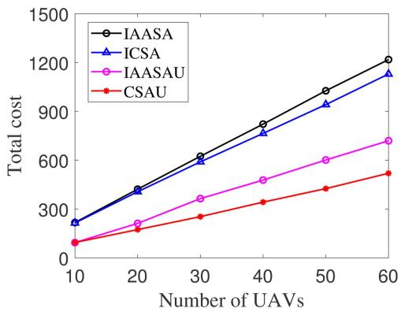  
Fig. 4. Total cost vs. n.

ICSA (Improved CSA): We modify the Charging Scheduling Algorithm (CSA) in [19] to fit the scenario given in this paper. Because ICSA also follows the SCP optimization framework to obtain charging groups, the overall steps of ICSA are similar to CSAU. However, to obtainφj w , a heuristic greedy schedule for UPMSP is used, where each UAV is assigned to the charging facility, which has the smallest charging time, i.e., the Line 5 of Algorithm 2 is different from that of CSAU.

## B. Total Cost

Impact of Number of UAVs: To test the scalability of our algorithm, we increase the number of UAVs from 10 to 60. As shown in Fig. 4, the total cost of all algorithms increases with the increasing number of UAVs. Both IAASA and ICSA use the greedy scheduling to obtain the charging arrangement rather than the approximation algorithm for UPMSP, thus, the charging arrangement of them also has high total cost. In addition, as the number of UAVs increases, the advantage of our algorithm becomes more obvious, which shows the superiority of our algorithm in large-scale scenarios. Specifically, CSAU reduces 58.17% , 55.74% , and 22.16% of total cost on average compared with IAASA, ICSA, and IAASAU, respectively.

Impact of Number of Charging Stations: Then, we increase the number of charging stations from 3 to 8. As shown in Fig. 5, the total cost of all algorithms decreases with the increasing number of charging stations. This is because with more charging stations, the UAVs can move to closer or cheaper charging stations. On average, CASU reduces the total cost by 58.61% , 55.72% , and 29.02% compared with IAASA, ICSA, and IAASAU, respectively.

Impact of Number of Charging Facilities of Each Charging Station: We now change the number of charging facilities of each charging station. As shown in Fig. 6, with the increase of $q _ { j } .$ , the total cost of all algorithms decreases. This is because with more charging facilities, the number of charging queues increases, resulting in a decrease in maximum charging time. CSAU reduces

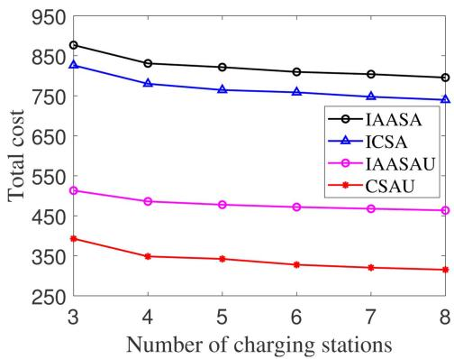  
Fig. 5. Total cost vs. m.

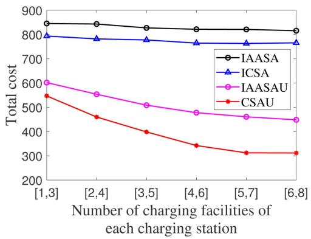

Fig. 6. Total cost vs. $q _ { j } .$  
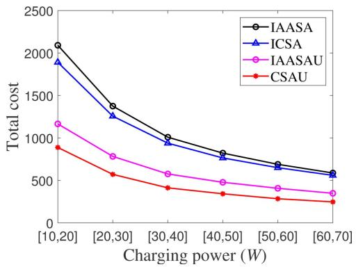  
Fig. 7. Total cost vs. $p _ { j } ^ { k } .$

52.45% , 49.22% , and 23.14% of total cost on average compared with IAASA, ICSA, and IAASAU, respectively.

Impact of Charging Power: Fig. 7 shows the impact of charging power on the total cost. With the increase of charging power, the total cost of all algorithms decreases. This is because the higher the charging power, the shorter the charging time for charging the same energy. On average, CASU reduces the total cost by 58.38% , 55.18% , and 27.83% compared with IAASA, ICSA, and IAASAU, respectively.

Impact of Energy Demand: Fig. 8 shows the impact of energy demand on the total cost. With the increase in energy demand, the total cost of all algorithms increase accordingly and CSAU always incurs the lowest total cost. On average, CASU reduces the total cost by 58.95% , 55.88% , and 29.74% compared with IAASA, ICSA, and IAASAU, respectively.

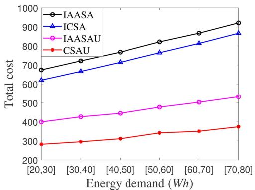  
Fig. 8. Total cost vs. $E _ { i } .$

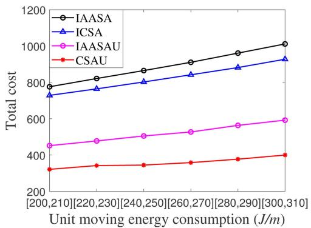

Fig. 9. Total cost vs. $b _ { i }$  
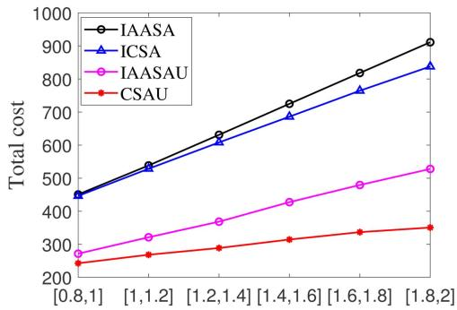  
Unit additional charging price $( { 1 0 } ^ { - 3 } / s )$  
Fig. 10. Total cost vs. $a _ { j }$

Impact of Unit Moving Energy Consumption: Fig. 9 shows the impact of unit moving energy consumption on the total cost. With the increase in unit moving energy consumption, the total cost of all algorithms increases. On average, CASU reduces the total cost by 59.81% , 56.60% , and 31.07% compared with IAASA, ICSA, and IAASAU, respectively.

Impact of Unit Additional Charging Price: Fig. 10 shows the impact of unit additional charging price on the total cost. With the increase in unit additional charging price, the total cost of all algorithms increase accordingly. CSAU reduces 54.60% , 52.61% , and 23.10% of total cost on average compared with IAASA, ICSA, and IAASAU, respectively. In addition, we can also see from Fig. 10 that when the value range of $a _ { j }$ increases from $[ 0 . 0 0 0 8 , 0 . 0 0 1 ] / s \mathrm { t o } [ 0 . 0 0 1 8 , 0 . 0 0 2 ] / s .$ the total cost of our algorithm has the minimum growth rate among all algorithms. Specifically, when $a _ { j } \in [ 0 . 0 0 1 8 , 0 . 0 0 2 ] / s$ , the total cost of CSAU increases 44.50% by compared with the total cost when $a _ { j } \in [ 0 . 0 0 0 8 , 0 . 0 0 1 ] / s .$ . As a contrast, the growth rates of IAASA, ICSA, and IAASAU, are 102.12% , 87.69% , and 94.36% , respectively. This means that our algorithm has good resistance to market price fluctuations. Even if the charging price increases significantly, our algorithm can also suppress the increase in total cost as much as possible. Different from other benchmark algorithms, CSAU does not experience uncontrollable total cost surge. Therefore, from an economic perspective, the experimental results in Fig. 10 show that our algorithm is very economically adaptable.

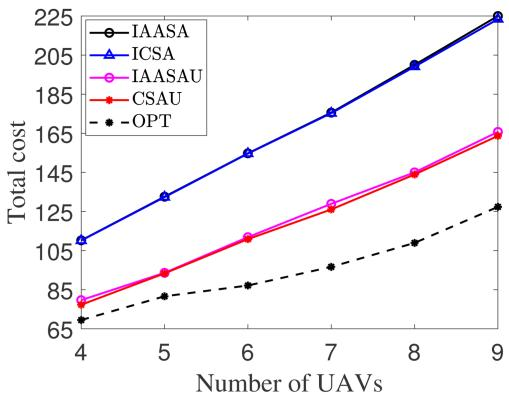  
(a)

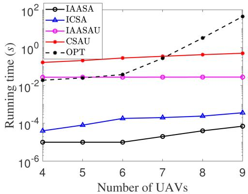  
(b)  
Fig. 11. Comparison with OPT. (a) total cost (b) running time.

Comparison with OPT: We compare the performance of four algorithms with the optimal solution in the same small-scale network mentioned above. To realize the OPT, we traverse all possible assignments between UAVs and charging facilities. We conducted simulation experiments in a small-scale network, where $m = 2$ , and $q _ { j } \in [ 1 , 3 ]$ . The settings of other parameters = 2 [1 3]are same with those in Table II.

As shown in Fig. 11(a), the total cost of CSAU is only higher than that of OPT. On average, the total cost of IAASA, ICSA, IAASAU and CSAU are 73.41% , 72.91% , 25.72% , and 23.98% higher than that of OPT, respectively. However, as shown in

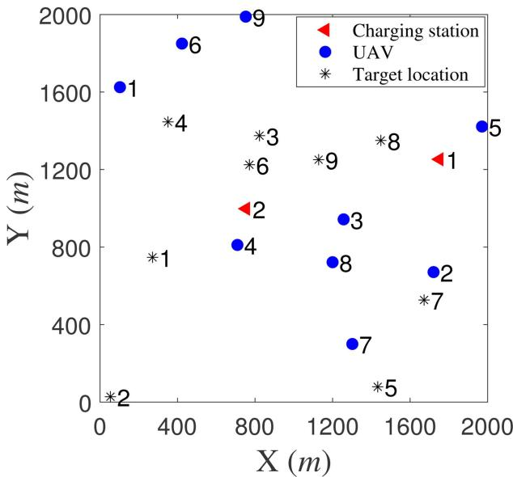  
Fig. 12. Illustration of the example.

TABLE III  
PARAMETERS OF ALL UAVS AND TARGET LOCATIONS
<table><tr><td>UAV</td><td> $E _ { i } ( W h )$ </td><td> $b _ { i } ( J / m )$ </td><td>Target location</td></tr><tr><td>o1 (103, 1625)</td><td>50.4</td><td>221</td><td> $l _ { 1 }$  (271, 747)</td></tr><tr><td>o2 (1721, 671)</td><td>57.2</td><td>229</td><td>l2 (54, 28)</td></tr><tr><td>o3 (1257, 943)</td><td>53.4</td><td>222</td><td> $l _ { 3 }$  (823, 1735)</td></tr><tr><td>o4 (709, 811)</td><td>56.6</td><td>229</td><td> $l _ { 4 }$  (351, 1446)</td></tr><tr><td>05 (1971, 1422)</td><td>53.8</td><td>222</td><td> $l _ { 5 }$  (1433, 79)</td></tr><tr><td>06 (423, 1850)</td><td>56.2</td><td>223</td><td> $l _ { 6 }$  (771, 1225)</td></tr><tr><td>07 (1302, 300)</td><td>50.2</td><td>220</td><td> $l _ { 7 }$  (1672, 527)</td></tr><tr><td>08 (1200, 722)</td><td>59.1</td><td>226</td><td> $l _ { 8 }$  (1449, 1350)</td></tr><tr><td>09 (752, 1989)</td><td>58.0</td><td>221</td><td>l9 (1128, 1251)</td></tr></table>

Fig. 11(b), OPT takes 44.06 seconds even for only 9 UAVs, and is much slower than CSAU. We can see from Fig. 11(a) that the total cost of CSAU is close to that of IAASAU. This is because that the network scale of this experiment is small due to the time complexity of OPT. When the scale is large, the performance of CSAU is obviously better than that of IAASAU. As shown in Fig. 4, CSAU reduces 22.16% of total cost on average compared with IAASAU.

## C. A Complete Example

In order to express the scheduling details of the algorithms more clearly, we execute the above five algorithms on a complete example and give the relevant details.

As shown in Fig. 12, there are 9 UAVs, 9 target locations, and 2 charging stations distributed in a 2km∗2 km square area. The triangles represent the charging stations. The dots represent the UAVs. The asterisks represent the target locations. The numbers represent the indices of UAVs, target locations, and charging stations. The coordinates of UAVs, target locations, charging stations, and related parameters are given in Tables III and IV. The scheduling results and total cost of all algorithms are summarized in Table V. Fig. 13 shows the scheduling results in

TABLE IV  
PARAMETERS OF CHARGING STATIONS
<table><tr><td>Charging station</td><td> $A _ { j }$ </td><td> $a _ { j }$ </td><td> $T _ { j } ( s )$ </td><td> $p _ { j } ^ { k } ( W )$ </td></tr><tr><td> $s _ { 1 }$  (1751, 1253)</td><td>46.9</td><td>0.00178</td><td>17491.1</td><td> $p _ { 1 } ^ { 1 } = 5 0 ,$ </td></tr><tr><td> $s _ { 2 } ~ ( 7 5 3 , 9 9 8 )$ </td><td>48.1</td><td>0.00176</td><td>17626.3</td><td> $p _ { 1 } ^ { 2 } = 4 8$   $p _ { 2 } ^ { 1 } = 4 3 ,$   $p _ { 2 } ^ { 2 } = 4 0$ </td></tr></table>

TABLE V  
SCHEDULING RESULTS OF ALL ALGORITHMS
<table><tr><td>UAV</td><td>IAASA</td><td>ICSA</td><td>IAASAU</td><td>CSAU</td><td>OPT</td></tr><tr><td>01</td><td></td><td></td><td></td><td></td><td></td></tr><tr><td>02</td><td></td><td></td><td></td><td></td><td></td></tr><tr><td>03</td><td></td><td></td><td></td><td></td><td></td></tr><tr><td>04</td><td></td><td></td><td></td><td></td><td>fffffffff</td></tr><tr><td>05</td><td></td><td></td><td></td><td>fffffffff</td><td></td></tr><tr><td>06</td><td>はおf</td><td></td><td>2525</td><td></td><td></td></tr><tr><td>07</td><td></td><td>fffffffff</td><td></td><td></td><td></td></tr><tr><td>08</td><td></td><td></td><td></td><td></td><td></td></tr><tr><td>09</td><td></td><td>210.6</td><td>142.2</td><td>137.2</td><td>120.4</td></tr></table>

2D plane. In order to make the figures more concise, we only draw the paths from the UAVs to the charging stations. In this example, the total cost of CSAU is also only higher than that of OPT, and lower that the total cost of three benchmark algorithms. CSAU reduces 37.75% , 34.86% , and 3.54% total cost compared with IAASA, ICSA, and IAASAU in this example, respectively.

## VI. DISCUSSION

Although we have designed an approximation algorithm to solve PCCSUP, there are still more practical factors that need to be investigated further. For example, the moving time of UAVs can be ignored because it is very small compared to the charging time. However, if the departure times are very different from each other, the differences of arrival times cannot be ignored. In addition, if there are external trackers that constantly track the trajectory of UAVs, the security and privacy are worth noting. Moreover, how to determine charging arrangements for UAVs, whose residual energy is not sufficient to reach any charging station,also should be investigated. In order to improve the usability of our algorithm, we discuss these three problems in this section.

## A. PCCSUP With Different Arrival Times

We consider the following case. Each UAV $o _ { i } \in N$ has a departure time $T _ { i } ^ { d e }$ and moving speed $v _ { i }$ . Therefore, the $\mathrm { U A V } \ o _ { i }$ cannot be charged at a charging station earlier than $T _ { i } ^ { d e } + v _ { i } d ( o _ { i } , s _ { j } )$ . We use $\sigma _ { j } = \{ h _ { j } ^ { 1 } , h _ { j } ^ { 2 } , . . . , h _ { j } ^ { q _ { j } } \}$ to denote the charging arrangement of UAVs in $G _ { j }$ , where $h _ { j } ^ { k } , k = 1 , 2 , . . . , q _ { j }$ is the sequence of UAVs charged by the charging facility $f _ { j } ^ { k }$ . We use $h _ { j } ^ { k } ( u )$ to denote the uth UAV charged by the charging facility $f _ { j } ^ { k }$

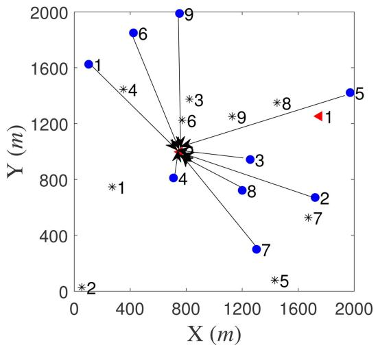  
(a)

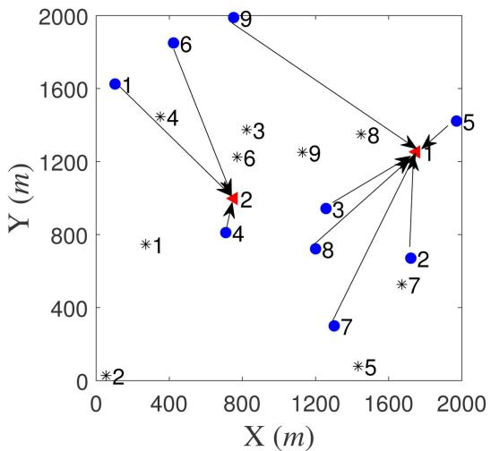  
(b)

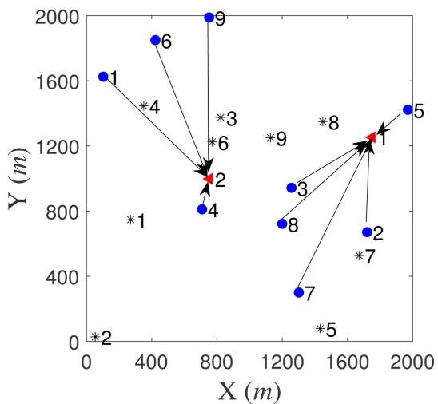  
(c)

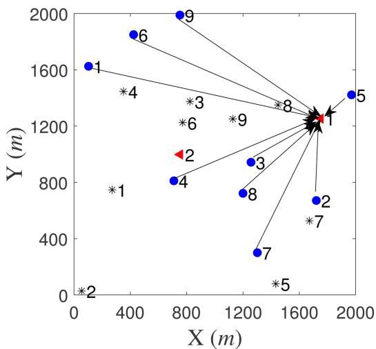  
(d)  
Fig. 13. Scheduling results in 2D plane. The triangles represent the charging stations. The dots represent the UAVs. The asterisks represent the target locations The numbers represent the indices of UAVs, target locations, and charging stations. (a) scheduling results of IAASA and IAASAU (b) scheduling results of ICSA (c) scheduling results of CSAU (d) scheduling results of OPT.

Let $o _ { i ^ { \prime } } = h _ { j } ^ { k } ( u - 1 ) , o _ { i } = h _ { j } ^ { k } ( u )$ . The charging start time of $h _ { j } ^ { k } ( u )$ can be calculated as follows:

$$
\begin{array} { c } { { T ^ { s t } ( h _ { j } ^ { k } ( u ) ) = \displaystyle \operatorname* { m a x } \Bigg \{ T ^ { s t } ( o _ { i ^ { \prime } } ) + \frac { E _ { i ^ { \prime } } ( s _ { j } ) } { p _ { j } ^ { k } } , T _ { i } ^ { d e } } } \\ { { + v _ { i } d ( o _ { i } , s _ { j } ) \Bigg \} . } } \end{array}\tag{25}
$$

Therefore, the charging time of $f _ { j } ^ { k }$ is the charging completion time of the last UAV in the sequence:

$$
T ( h _ { j } ^ { k } ) = T ^ { s t } ( h _ { j } ^ { k } ( | h _ { j } ^ { k } | ) ) + \frac { E _ { i } ( s _ { j } ) } { p _ { j } ^ { k } } , o _ { i } = h _ { j } ^ { k } ( | h _ { j } ^ { k } | ) .\tag{26}
$$

The other parts are the same as those in Section III.

Then, the problem can be formulated as:

$$
( P 4 ) : \operatorname* { m i n } \sum _ { s _ { j } \in M } c ( \sigma _ { j } ) ,\tag{27}
$$

$$
{ \mathrm { s . t . } } \sum _ { s _ { j } \in M } \sum _ { k = 1 } ^ { q _ { j } } { x _ { i j } ^ { k } } = 1 , \forall o _ { i } \in N\tag{27-1}
$$

$$
x _ { i j } ^ { k } = \{ 0 , 1 \} , \forall o _ { i } \in N , \forall s _ { j } \in M , k = \{ 1 , 2 , . . . , q _ { j } \} .\tag{27-2}
$$

Since P is more difficult than PCCSUP, referring to Theorem 1, we can easily conclude that P is also NP-hard and cannot obtain the optimal solution in polynomial time. However, we can design a heuristic method. When the charging group is known, the sub-problem of obtaining charging arrangement in this case is similar to uniform parallel machines scheduling problem with release times [35]. Therefore, we can call the algorithm for this problem to obtain the charging arrangement at Line 5 in Algorithm 2. The other parts of CSAU remain unchanged. However, in such a situation, the charging group determined by actual replenished energy may not be the optimal.

## B. PCCSUP With K-Anonymity

Security and privacy are very important for the UAVs. When UAVs are in flight, they may be tracked. However, in some confidential and important missions, such as reconnaissance, delivery of valuables, etc., the paths and target locations of UAVs should be hidden. In order to help UAVs get rid of tracking, we introduce K-anonymity into the parallel cooperative charging scheduling.

K-anonymity [36], [37] is an attempt to solve the problem “Given person-specific field-structured data, produce a release of the data with scientific guarantees that the individuals who are the subjects of the data cannot be re-identified while the data remain practically useful.” A release of data is said to have the K-anonymity property if the information for each person contained in the release cannot be distinguished from at least K − individuals whose information also appear in the release.

1In our model, when UAVs enter the charging stations, they are already anonymous. Therefore, in order to achieve K-anonymity in our model, we only need to ensure that the number of UAVs charging at the same charging station is greater than or equal to K. Even if a tracker has been following the target UAV before, when the UAV enters the charging station, the tracker cannot distinguish which UAV is its target when the UAVs leave the charging station.

Therefore, the problem can be formulated as:

$$
( P 5 ) : \operatorname* { m i n } \sum _ { s _ { j } \in M } c ( \phi _ { j } ) ,\tag{28}
$$

$$
{ \mathrm { s . t . } } \sum _ { s _ { j } \in M } \sum _ { k = 1 } ^ { q _ { j } } { x _ { i j } ^ { k } } = 1 , \forall o _ { i } \in N\tag{28-1}
$$

$$
\sum _ { o _ { i } \in N } \sum _ { k = 1 } ^ { q _ { j } } x _ { i j } ^ { k } \geq K , \forall s _ { j } \in M , \sum _ { o _ { i } \in N } \sum _ { k = 1 } ^ { q _ { j } } x _ { i j } ^ { k } \neq 0\tag{28-2}
$$

$$
x _ { i j } ^ { k } = \{ 0 , 1 \} , \forall o _ { i } \in N , \forall s _ { j } \in M , k = \{ 1 , 2 , . . . , q _ { j } \} .\tag{28-3}
$$

Obviously, P is also NP-hard, and the optimal solution cannot be obtained in polynomial time. However, since this problem is modified from PCCSUP, we can modify the heuristic algorithm of CSAU to obtain an algorithm for $P 5$

It is also necessary to ensure that the number of UAVs in the charging group is greater than or equal to K. A simple modification can be performed to satisfy the K-anonymity constraint. We set the cost of any non-empty charging group including less than K UAVs to infinity. When all possible situations are traversed, these charging groups with infinite cost will not be selected. The final charging groups will satisfy the K-anonymity constraint definitely.

Remark: We can also study the PCCSUP with different arrival times and guarantee the K-anonymity simultaneously. We only need to replace $\phi _ { j }$ with $\sigma _ { j }$ , and use the algorithm of [35] to obtain the charging arrangement in the designed algorithm for P .

## C. Charging Arrangements for Excluded UAVs

In the system model, we perform preprocessing to ensure that PCCSUP has feasible solutions. For the UAVs which are excluded in preprocessing because they do not satisfy formula (7), we also need to provide corresponding charging arrangements. We use vehicles to carry UAVs and the cost calculation will be different from that of PCCSUP. We consider the following case. There are a set $M = \{ s _ { 1 } , s _ { 2 } , . . . , s _ { m } \}$ of m charging stations, a set $N ^ { \# } = \{ o _ { 1 } , o _ { 2 } , . . . , o _ { n ^ { \# } } \}$ of $n ^ { \# }$ excluded UAVs and a set $L ^ { \# } = \{ l _ { 1 } , l _ { 2 } , . . . , l _ { n \# } \}$ of $n ^ { \# }$ corresponding target locations. The unit moving cost of each vehicle is $b _ { 0 }$ . Because the UAVs do not need to fly to the charging station by themself, we do not need to calculate the moving energy consumption from the locations of UAVs to the charging stations. Then the actual replenished energy from charging station $s _ { j }$ required by $o _ { i }$ is

$$
E _ { i } ( s _ { j } ) = E _ { i } + b _ { i } d ( s _ { j } , l _ { i } ) .\tag{29}
$$

And the new cost of charging group $G _ { j }$ with arrangement $\phi _ { j }$ is defined as

$$
c ^ { \# } ( \phi _ { j } ) = c ( \phi _ { j } ) + \sum _ { o _ { i } \in \pi _ { j } ^ { k } , \pi _ { j } ^ { k } \in \phi _ { j } } b _ { 0 } d ( o _ { i } , s _ { j } ) .\tag{30}
$$

The other parts are the same as those in Section III. Then, the problem can be formulated as:

$$
( P 6 ) : \operatorname* { m i n } \sum _ { s _ { j } \in M } c ^ { \# } ( \phi _ { j } ) ,\tag{31}
$$

$$
{ \mathrm { s . t . } } \sum _ { s _ { j } \in M } \sum _ { k = 1 } ^ { q _ { j } } { x _ { i j } ^ { k } } = 1 , \forall o _ { i } \in N ^ { \# }\tag{31-1}
$$

$$
\begin{array} { r } { x _ { i j } ^ { k } = \{ 0 , 1 \} , \forall o _ { i } \in N ^ { \# } , \forall s _ { j } \in M , k = \{ 1 , 2 , . . . , q _ { j } \} . } \end{array}\tag{31-2}
$$

Since P is also NP-hard, and the optimal solution cannot be obtained in polynomial time. We can use CSAU to solve $P 6$ However, due to the change of the objective function, CSAU does not have approximation ratio for $P 6$

6In the cases of P and P , there may also be UAVs that are 4 5excluded because they do not satisfy formula (7). Refer to the above steps, we can also determine the charging arrangements for the excluded UAVs in these two cases.

## VII. CONCLUSION

In this paper, we have presented a parallel cooperative charging scheduling of UAVs and have formulated parallel cooperative charging scheduling for UAVs problem for optimizing the total charging cost. We have proposed a $\gamma ( \ln n + 1 ) .$ approximation algorithm based on the greedy approach, where n is the number of UAVs, and γ is the approximation ratio of any approximation algorithm for UPMSP. The key technical depth of this paper is to prove the approximation of the proposed algorithm. We prove that the approximation of algorithm for UPMSP has the same approximation ratio $\gamma$ for the special case where there is only one charging station. Then, based on the above proven conclusion and referring to the approximation algorithm for set covering problem, we propose the greedy approach based charging scheduling algorithm for UAVs and prove the approximation ratio γ n . The simulation results demonstrate that our algorithm can reduce up to 59.81% total cost compared with the benchmark algorithms. In addition, through discussing three related problems and proposing corresponding algorithms to solve them, we solve the problems with real-world requirements and improve the usability of our algorithm.

## REFERENCES

[1] Q. Guo et al., “Minimizing the longest tour time among a fleet of UAVs for disaster area surveillance,” IEEE Trans. Mobile Comput., vol. 21, no. 7, pp. 2451–2465, Jul. 2022.

[2] H. Gao, J. Feng, Y. Xiao, B. Zhang, and W. Wang, “A UAV-Assisted multitask allocation method for mobile crowd sensing,” IEEE Trans. Mobile Comput., vol. 22, no. 7, pp. 3790–3804, Jul. 2023.

[3] Y. Yang, Z. Hu, K. Bian, and L. Song, “ImgSensingNet: UAV vision guided aerial-ground air quality sensing system,” in Proc. IEEE Conf. Comput. Commun., 2019, pp. 1207–1215.

[4] R. Zhou, R. Zhang, Y. Wang, H. Tan, and K. He, “Online incentive mechanism for task offloading with privacy-preserving in UAV-assisted mobile edge computing,” in Proc. 23rd Int. Symp. Theory, Algorithmic Found., Protoc. Des. Mobile Netw. Mobile Comput., 2022, pp. 211–220.

[5] R. Zhou, X. Wu, H. Tan, and R. Zhang, “Two time-scale joint service caching and task offloading for UAV-assisted mobile edge computing,” in Proc. IEEE Conf. Comput. Commun., 2022, pp. 1189–1198.

[6] D. Yang, J. Wang, F. Wu, L. Xiao, Y. Xu, and T. Zhang, “Energy efficient transmission strategy for mobile edge computing network in UAV-based patrol inspection system,” IEEE Trans. Mobile Comput., vol. 23, no. 5, pp. 5984–5998, May 2024.

[7] F. Song et al., “Evolutionary multi-objective reinforcement learning based trajectory control and task offloading in UAV-Assisted mobile edge computing,” IEEE Trans. Mobile Comput., vol. 22, no. 12, pp. 7387–7405, Dec. 2023.

[8] F. Shan, J. Huang, R. Xiong, F. Dong, J. Luo, and S. Wang, “Energyefficient general PoI-Visiting by UAV with a practical flight energy model,” IEEE Trans. Mobile Comput., vol. 22, no. 11, pp. 6427–6444, Nov. 2023.

[9] H. Dai et al., “ROSE: Robustly safe charging for wireless power transfer,” IEEE Trans. Mobile Comput., vol. 21, no. 6, pp. 2180–2197, Jun. 2022.

[10] Y. Jin, J. Xu, S. Wu, L. Xu, D. Yang, and K. Xia, “Bus network assisted drone scheduling for sustainable charging of wireless rechargeable sensor network,” J. Syst. Archit., vol. 116, 2021, Art. no. 102059, doi: 10.1016/j.sysarc.2021.102059.

[11] Y. Wang, Z. Su, N. Zhang, and R. Li, “Mobile wireless rechargeable UAV networks: Challenges and solutions,” IEEE Commun. Mag., vol. 60, no. 3, pp. 33–39, Mar. 2022.

[12] Z. Song, K. W. Chin, C. Yang, and M. Ros, “Methods to assign UAVs for K-coverage and recharging in IoT networks,” IEEE Trans. Mobile Comput., vol. 23, no. 4, pp. 2504–2519, Apr. 2024.

[13] Y. Jin, J. Xu, S. Wu, L. Xu, and D. Yang, “Enabling the wireless charging via bus network: Route scheduling for electric vehicles,” IEEE Trans. Intell. Transp. Syst., vol. 22, no. 3, pp. 1827–1839, Mar. 2021.

[14] R. K. R. Chaganti, P. M. Amruth, V. R. Devarinti, B. V. J. Chandra, and H. Victor DuJohn, “RFID based wireless charging system for electric car,” in Proc. 6th Int. Conf. Devices, Circuits Syst., 2022, pp. 403–406.

[15] S. Wu, H. Dai, L. Xu, L. Liu, F. Xiao, and J. Xu, “Comprehensive cost optimization for charger deployment in multi-hop wireless charging,” IEEE Trans. Mobile Comput., vol. 22, no. 8, pp. 4563–4577, Aug. 2023.

[16] Z. Kou, Z. Kong, G. Jing, N. Wang, F. Xin, and X. Cui, “Research and design of wireless charging system for inspection robot,” in Proc. IEEE 6th Inf. Technol., Netw., Electron. Automat. Control Conf., 2023, pp. 824–827.

[17] J. Xu, S. Hu, S. Wu, K. Zhou, H. Dai, and L. Xu, “Cooperative charging as service: Scheduling for mobile wireless rechargeable sensor networks,” in Proc. IEEE 41st Int. Conf. Distrib. Comput. Syst., 2021, pp. 685–695.

[18] L. Xu, H. Sha, M. Da, J. Xu, and H. Dai, “Spatio-temporal mobile cooperative charging for low-power wireless rechargeable devices,” in Proc. IEEE 19th Int. Conf. Mobile Ad Hoc Smart Syst., 2022, pp. 40–48.

[19] S. Wu, H. Dai, L. Liu, L. Xu, F. Xiao, and J. Xu, “Cooperative scheduling for directional wireless charging with spatial occupation,” IEEE Trans. Mobile Comput., vol. 23, no. 1, pp. 286–301, Jan. 2024.

[20] A swarm of drones protects thousands of acres of rice fields, 2020. Accessed: Mar. 13, 2024. [Online]. Available: http://epaper.hljnews.cn/ hljrb/20200715/479707.html

[21] Shenzhen has developed drones to the level of infrastructure, 2022. Accessed: Mar. 14, 2024. [Online]. Available: https://news.sohu.com/a/ 524573064\_610300

[22] D. S. Hochbaum and D. B. Shmoys, “A polynomial approximation scheme for scheduling on uniform processors: Using the dual approximation approach,” SIAM J. Comput., vol. 17, no. 3, pp. 539–551, 1988.

[23] L. Lv et al., “Contract and lyapunov optimization-based load scheduling and energy management for UAV charging stations,” IEEE Trans. Green Commun. Netw., vol. 5, no. 3, pp. 1381–1394, Sep. 2021.

[24] S. Jung, W. J. Yun, M. Shin, J. Kim, and J. H. Kim, “Orchestrated scheduling and multi-agent deep reinforcement learning for cloud-assisted Multi-UAV charging systems,” IEEE Trans. Veh. Technol., vol. 70, no. 6, pp. 5362–5377, Jun. 2021.

[25] N. Wang, J. Wu, and H. Dai, “Bundle charging: Wireless charging energy minimization in dense wireless sensor networks,” in Proc. IEEE 39th Int. Conf. Distrib. Comput. Syst., 2019, pp. 810–820.

[26] S. Priyadarshani, A. Tomar, and P. K. Jana, “An efficient partial charging scheme using multiple mobile chargers in wireless rechargeable sensor networks,” Ad Hoc Netw., vol. 113, no. 1, 2021, Art. no. 102407.

[27] R. Jia, J. Wu, J. Lu, M. Li, F. Lin, and Z. Zheng, “Energy saving in heterogeneous wireless rechargeable sensor networks,” in Proc. IEEE Conf. Comput. Commun., 2022, pp. 1838–1847.

[28] G. Fan, Z. Yang, H. Jin, X. Gan, and X. Wang, “Enabling optimal control under demand elasticity for electric vehicle charging systems,” IEEE Trans. Mobile Comput., vol. 21, no. 3, pp. 955–970, Mar. 2022.

[29] A. K. Gupta, S. Ghosh, and M. R. Bhatnagar, “Pricing scheme for UAVenabled charging of sensor network,” in Proc. IEEE 18th India Council Int. Conf., 2021, pp. 1–6.

[30] J. K. Lenstra, D. B. Shmoys, and É. Tardos, “Approximation algorithms for scheduling unrelated parallel machines,” Math. Program., vo1. 46, no. 3, pp. 259–271, 1990.

[31] J. Li, T. Huang, S. Chen, and Y. Yang, “Optimization based on taxi carpooling preferences and pricing,” in Proc. Int. Conf. Natural Comput., Fuzzy Syst. Knowl. Discov, 2018, pp. 108–112.

[32] L. Jiang, P. Sun, J. Xu, D. Yang, L. Xu, and Y. Shi, “Cooperative package assignment for heterogeneous express stations,” IEEE Trans. Intell. Transp. Syst., vol. 23, no. 7, pp. 8467–8476, Jul. 2022.

[33] U. Feige, “A threshold of LNN for approximating set cover,” J. ACM, vol. 45, no. 4, pp. 634–652, 1998.

[34] C. Wang, J. Li, F. Ye, and Y. Yang, “A novel framework of multi-hop wireless charging for sensor networks using resonant repeaters,” IEEE Trans. Mobile Comput., vol. 16, no. 3, pp. 617–633, Mar. 2017.

[35] C. Koulamas and G. J. Kyparisis, “Makespan minimization on uniform parallel machines with release times,” Eur. J. Oper. Res., vol. 157, no. 1, pp. 262–266, 2004.

[36] P. Samarati, “Protecting respondents identities in microdata release,” IEEE Trans. Knowl. Data Eng., vol. 13, no. 6, pp. 1010–1027, Nov./Dec. 2001.

[37] M. E. Nergiz, C. Clifton, and A. E. Nergiz, “Multirelational k-anonymity,” IEEE Trans. Knowl. Data Eng., vol. 21, no. 8, pp. 1104–1117, Aug. 2009.

  
Sixu Wu received the bachelor’s degree in the School of Computer Science from Nanjing University of Posts and Telecommunications, Jiangsu, China, in 2019. He is currently a doctoral student in the School of Computer Science with the Nanjing University of Posts and Telecommunications. His main research interest is wireless rechargeable sensor network.

Yun Yang (Senior Member, IEEE) received the PhD degree from the University of Queensland, Australia, in 1992, in computer science. He is currently a full professor with the Swinburne University of Technology, Melbourne, Australia. His research interests include software technologies, cloud and edge computing, workflow systems, and service computing.

Haipeng Dai (Senior Member, IEEE) received the BS degree in the Department of Electronic Engineering from Shanghai Jiao Tong University, Shanghai, China, in 2010, and the PhD degree in the Department of Computer Science and Technology in Nanjing University, Nanjing, China, in 2014. He is an associate professor in the Department of Computer Science and Technology in Nanjing University. He is an an ACM member. He received Best Paper Award from IEEE ICNP’15, Best Paper Award Runner-up from IEEE SECON’18, and Best Paper Award Candidate from IEEE INFOCOM’17.

Fu Xiao (Senior Member, IEEE) received the PhD degree in computer science and technology from the Nanjing University of Science and Technology, Nanjing, China, in 2007. He is currently a professor in the Jiangsu Key Laboratory of Big Data Security and Intelligent Processing, Nanjing University of Posts and Telecommunications. His main research interests are wireless sensor networks and mobile computing. He is a member of the Association for Computing Machinery.

Linfeng Liu (Member, IEEE) received the BS and PhD degrees in computer science from the Southeast University, Nanjing, China, in 2003 and 2008, respectively. At present, he is a professor in the School of Computer Science and Technology, Nanjing University of Posts and Telecommunications, China. His main research interests include the areas of vehicular ad hoc networks, wireless sensor networks and multi-hop mobile wireless networks. He has published more than 80 peer-reviewed papers in some technical journals or conference proceedings, such as

IEEE Transactions on Mobile Computing, IEEE Transactions on Parallel and Distributed Systems, IEEE Transactions on Parallel and Distributed Systems, IEEE Transactions on Services Computing, IEEE Transactions on Vehicular Technology, IEEE Internet of Things Journal, Computer Networks, Elsevier JPDC.

Jia Xu (Senior Member, IEEE) received the MS degree in School of Information and Engineering from Yangzhou University, Jiangsu, China, in 2006 and the PhD degree in the School of Computer Science and Engineering from Nanjing University of Science and Technology, Jiangsu, China, in 2010. He is currently a professor in the School of Computer Science, Nanjing University of Posts and Telecommunications. He was a visiting scholar in the Department of Electrical Engineering & Computer Science, Colorado School of Mines from Nov. 2014 to May. 2015. His main

research interests include crowdsourcing, edge computing and wireless sensor networks. Dr. Xu has served as the PC Co-Chair of SciSec 2019, Publicity Co-Chair of SciSec 2021 and SciSec 2022, Organizing Chair of ISKE 2017, TPC member of IEEE Globecom, IEEE ICC, IEEE MASS, IEEE ICNC, and IEEE EDGE.