# Cost Optimization of UAV Swarm Network for Persistent Emergency Communication

Changtong Liu , Student Member, IEEE, Xin Xin, Yueyue Dai , Member, IEEE, and Du Xu

Abstract—Unmanned aerial vehicles (UAVs) are a promising solution for emergency communications due to their rapid deployment and capability of flexible network formation. This flexibility enables UAVs to dynamically adjust their positions and link configurations to form stable multi-hop networks, thereby establishing resilient data links from isolated disaster areas to remote base stations. However, sustaining such a persistent UAV swarm network is challenging due to limited onboard energy, the scarcity of available UAVs, and complex coordination in emergencies. This paper aims to minimize the number of UAVs required while ensuring continuous multi-hop connectivity for all target areas under energy constraints. We propose a UAV swarm planning strategy based on non-fixed relay points (USP-NFRP), jointly optimizing UAV-to-target associations, trajectories, and the backhaul topology connecting target areas to the base station. First, we propose a periodic rotation path (PRP) method to eficiently manage UAV replacements and assignments at disaster sites. We also provide a mathematical proof of its efectiveness. Second, we propose a dynamic tree backhaul link (DTBL) method that ensures persistent and seamless network connectivity. It is achieved by adjusting the positional roles of relay nodes (fixed or non-fixed) during path planning and dynamically configuring tree-based backhaul links during UAV missions. Finally, we develop a max-min ant system-based path planning algorithm (MMAS-PP) to optimize UAV trajectories and the sequence of task executions. Simulation results show that the proposed strategy reduces the number of UAVs by up to 30.9% compared with baselines.

Index Terms—Unmanned aerial vehicles (UAVs), UAV swarm planning, emergency communication, persistent communication service, eficient resource utilization.

## I. INTRODUCTION

N RECENT years, UAV technology has advanced rapidly and matured significantly, attracting widespread attention   
in the fields of wireless communication, remote sensing and   
emergency response [1], [2]. Compared to traditional ground   
base stations, UAV-based stations ofer advantages for cooper  
ative communications, including low cost, rapid deployment,   
extensive coverage, high mobility, and high adaptability. Con  
sequently, UAV-based stations have been widely deployed in   
wireless communications, public safety, and disaster relief [3].

During natural disasters or public emergencies, the ground communication infrastructure often becomes partially or fully non-functional. In such situations, deploying a fleet of UAVs equipped with airborne base station payloads can quickly restore basic connectivity to afected or isolated areas [4]. Real-world incidents, such as Hurricane Harvey [5] and the Australian bushfires [6], have demonstrated the efectiveness of UAV communication systems in providing critical support for rescue operations. According to various research and standardization reports, aerial base stations can reduce communication blind spots and improve link stability and quality in challenging environments [7].

Despite these benefits, maintaining a persistent and seamless multi-hop UAV swarm network remains challenging, particularly under limited UAV resources. A primary challenge arises from the limited energy capacity of UAVs, requiring careful scheduling to balance flight operations and communication tasks. Another major challenge is the scarcity of UAV resources during emergency scenarios. With limited UAVs available, it becomes critical to develop eficient scheduling strategies that can maintain persistent coverage for all target areas while minimizing the required fleet size. Therefore, developing an eficient planning strategy that ensures persistent coverage while minimizing the UAV fleet size has emerged as a key research focus.

## A. Related Work

Maintaining UAV-based communication networks in emergency scenarios is a typical application of persistent UAV swarm operations within specific contexts. Existing studies on persistent UAV missions can be categorized into three groups based on their treatment of energy constraints and communication requirements. The first group addresses energy-limited persistent missions but assumes ofline data collection without real-time connectivity needs. The second group incorporates local or short-range communication during missions but does not address long-range multi-hop links to remote infrastructure. The third group, most relevant to our work, jointly considers energy constraints and persistent multi-hop connectivity to distant base stations.

The first category focuses on persistent missions under energy constraints, primarily addressing flight duration and recharging needs. Scenarios involving few target points (even a single site) are examined in [8] and [9], where basic scheduling methods are employed to minimize waiting times at each task site. In contrast, scenarios involving multiple targets are addressed in [10] and [11], where variants of the vehicle routing problem (VRP) are proposed to reduce

UAV revisit intervals at the same sites. Subsequent studies have extended these models to include multiple charging stations. For example, in [12] and [13], the authors formulate the persistent service as a variant of the traveling salesman problem (TSP) to minimize the UAV fleet size required for continuous operations. Some studies utilized area partitioning methods for continuous coverage of numerous task points [14], while others addressed heterogeneous target distributions [15] or employed the eternal vertex cover model to analyze long-duration monitoring under battery constraints [16]. Although these approaches efectively address flight duration and charging needs, they have critical limitations for emergency communications. They assume ofline data collection: UAVs gather data locally and deliver it after returning to the base station, rather than transmitting in real time. This eliminates the need for continuous communication links during flight, ignoring the requirements for multi-hop relay. Consequently, they cannot guarantee network service in scenarios requiring persistent real-time connectivity, such as emergency communications.

The second category integrates communication requirements during persistent missions, moving beyond the first group’s ofline assumption. In [17], UAVs maintained network connectivity during area coverage tasks through satisfiabilitymodulo-convex (SMC) optimization. In [18], decentralized reinforcement learning supports continuous communication services for multiple users in large-scale areas, balancing energy consumption and preserving inter-UAV connectivity. The authors in [19] emphasized fairness in persistent service while ensuring communication link stability during UAV flight. Additionally, cooperative surveillance in urban environments using UAVs and unmanned ground vehicles (UGVs) was investigated in [20]. It proposes a hybrid algorithm to optimize coverage paths. Similarly, a distributed cooperative control strategy for UAV swarms was introduced in [21]. Decisions are based on local sensing and inter-UAV communication to achieve sustained coverage in unknown environments. However, these studies typically focus on local or shortrange transmissions among nearby UAVs or ground users. They do not address long-range multi-hop connectivity to distant infrastructure, which is critical in emergency scenarios where base stations may be kilometers away from disaster sites.

The third category, most relevant to our work, addresses both energy constraints and multi-hop connectivity to remote infrastructure. Unlike the first two, these methods require maintaining stable relay chains to base stations throughout missions. Studies in this category include [22], [23], [24], [25]. These studies ensured that UAVs remain connected to ground stations either directly or via relay nodes during multi-point and regional monitoring tasks. In [22], greedy and partitionbased strategies were proposed for persistent surveillance. However, it focuses on minimizing target revisit intervals rather than continuous coverage, and uses fixed relay points. In [23], short-horizon greedy and full-horizon tour-based planning algorithms were compared for connectivity-constrained persistent surveillance, assuming fixed relay points. In [24], a “safe path” strategy combined with partitioning was introduced for persistent multi-UAV surveillance, relying on fixed relay positions. Energy constraints and persistent communication in disaster scenarios were addressed in [25], but a linear network topology was assumed, limiting its applicability to 2D scenarios. Although the third category addresses both energy constraints and multi-hop connectivity, these methods still have notable limitations. Although the approaches in [22], [23], and [24] are designed for persistent surveillance, they do not ensure seamless continuity of coverage. Moreover, all these methods ([22], [23], [24], [25]) rely on fixed relay positions, requiring relay UAVs to remain stationary at predetermined waypoints. In contrast, our work guarantees continuous communication throughout missions. Furthermore, we introduce non-fixed relay points, enhancing relay eficiency and energy utilization. This combination of continuous coverage and relay mobility is absent in prior fixed-relay approaches.

Existing works on UAV-based emergency communications and persistent mission planning fail to fully address the requirements of mountainous and rural scenarios. These disaster-stricken areas are characterized by long distances and extended rescue durations, necessitating emergency communication systems that ensure timely energy replenishment, stable long-range connectivity, and sustained mission operation. However, current approaches address only a subset of these requirements. Since energy supply, coverage range, and communication connectivity are tightly coupled, a unified scheduling framework is required to address multiple constraints. To this end, we propose a UAV swarm planning scheme that integrates these diverse constraints into a single framework.

## B. Contributions

Most studies of UAV-assisted communication networks rely on static relay points to schedule UAV movements [22], [24], [25], underutilizing the mobility advantages of UAVs. In disaster scenarios with dispersed relay points and limited UAV resources, employing non-fixed relay points can significantly enhance scheduling flexibility and reduce the required number of UAVs.

This paper focuses on reducing the number of UAVs through efective swarm planning while providing persistent and seamless communication services to multiple ground sites. We propose a UAV swarm scheduling scheme based on non-fixed relay points, which jointly optimizes UAV-tosite association, network topology, and flight trajectories. The main contributions of this paper are summarized as follows:

We propose a multi-hop UAV network model for postdisaster environments in mountainous and rural areas, which are characterized by long distances and prolonged rescue operations. Based on this model, we introduce a UAV swarm planning strategy with non-fixed relay points (USP-NFRP) to ensure continuous and stable communication for all target areas with the minimum swarm size, formulate it as a joint optimization problem.

• We propose a periodic rotation path (PRP) method that innovatively integrates periodic task scheduling with dynamic relay points. This approach optimizes UAV paths and task allocation while enhancing relay flexibility and utilization, thereby reducing the required fleet size. Furthermore, we prove its efectiveness mathematically and show that it transforms the original optimization problem into an extended vehicle routing problem.

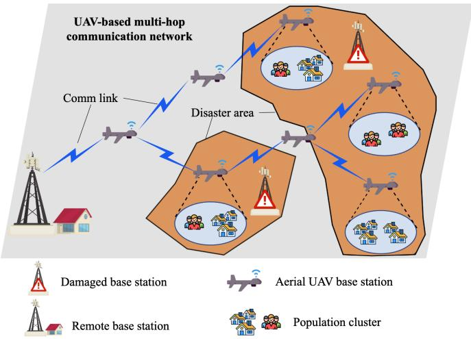  
Fig. 1. Multi-hop UAV network in post-disaster scenarios.

• We introduce a dynamic tree backhaul link (DTBL) method to address potential link interruptions caused by non-fixed relay points, representing a significant improvement over existing static-topology approaches. Furthermore, we develop a Max-Min Ant System-based path planning algorithm to solve the joint optimization problem. Simulation results show the proposed strategy significantly reduces the required UAV swarm size.

The remainder of this paper is organized as follows. Section II presents the system model and problem formulation. Section III describes our UAV swarm planning scheme. Section IV provides simulation results, and Section V concludes the paper.

## II. SYSTEM MODEL AND PROBLEM FORMULATION

The scenario considered in this study is illustrated in Fig. 1. We assume K population clusters distributed across a wide area and located far from a single ground base station (hereafter the base station). Such scenarios commonly occur in complex terrains, such as mountainous or valley regions, as well as rural areas where villages are scattered across expansive farmlands. During natural disasters such as floods, hurricanes, or earthquakes, these clusters may become isolated due to the destruction of the ground communication infrastructure [26]. In such cases, deploying a UAV swarm can rapidly establish a multi-hop aerial wireless network. This network enables communication with isolated populations, providing critical support for disaster assessments and rescue decisionmaking processes.

## A. Network Model

Table I summarizes the key symbols used throughout this paper. Each population cluster is treated as a target area requiring communication coverage. A multi-hop communication network is formed by deploying M homogeneous UAVs to satisfy the communication access demands of all target areas. Let $\mathcal { M } = \{ 1 , \ldots , M \}$ and ${ \mathcal { K } } = \{ 1 , . . . , K \}$ denote the sets of UAVs and target areas, respectively. For simplicity, we assume that the base station and the UAV charging station are treated as a single entity, denoted as station. All UAVs are assumed to fly at a fixed altitude and provide communication access to ground users by hovering above the center of each target area. At time t, the access relationship between UAV m and target area k is defined as $\alpha _ { m , k } ( t )$ , as detailed below:

TABLE I  
SUMMARY OF NOTATIONS
<table><tr><td rowspan=1 colspan=1>Symbol</td><td rowspan=1 colspan=1>Description</td></tr><tr><td rowspan=1 colspan=1>M,K</td><td rowspan=1 colspan=1>Sets of UAVs and target areas</td></tr><tr><td rowspan=1 colspan=1> ${ \mathcal { A } } , { \mathcal { R } }$ </td><td rowspan=1 colspan=1>Sets of access and relay points</td></tr><tr><td rowspan=1 colspan=1> $L _ { k } , L _ { m } ( t )$ </td><td rowspan=1 colspan=1>Position of area k and UAV m at time t</td></tr><tr><td rowspan=1 colspan=1> $z _ { p , q } ( t )$ </td><td rowspan=1 colspan=1>Indicates link existence between nodes p and q at time t</td></tr><tr><td rowspan=1 colspan=1> $\mu _ { p , q } ( t )$ </td><td rowspan=1 colspan=1>Indicates if link (p, q) is in the tree topology at time t</td></tr><tr><td rowspan=1 colspan=1> $\alpha _ { m , k } ( t )$ </td><td rowspan=1 colspan=1>Indicates if UAV m serves area k at time t</td></tr><tr><td rowspan=1 colspan=1> $\mathcal { T } _ { r } , \Delta t _ { r }$ </td><td rowspan=1 colspan=1>Task period and UAV departure interval on path r</td></tr><tr><td rowspan=1 colspan=1> $E _ { m } ( t )$ </td><td rowspan=1 colspan=1>Remaining energy of UAV m at time t</td></tr><tr><td rowspan=1 colspan=1> $T _ { m } ( t )$ </td><td rowspan=1 colspan=1>Elapsed time since last recharge of UAV m at time t</td></tr><tr><td rowspan=1 colspan=1> $\Gamma _ { n }$ </td><td rowspan=1 colspan=1>One-way flight time from point n to station</td></tr><tr><td rowspan=1 colspan=1> $t _ { r , i } ^ { \mathrm { f i x } }$ </td><td rowspan=1 colspan=1>Hover time at fixed point i on path r</td></tr><tr><td rowspan=1 colspan=1>fnonfixr,j</td><td rowspan=1 colspan=1>Hover time at non-fixed relay point j on path r</td></tr><tr><td rowspan=1 colspan=1> $\overline { { T _ { r } ^ { \mathrm { H y } } } }$ </td><td rowspan=1 colspan=1>Non-hover flight time of UAVs on path r per cycle</td></tr><tr><td rowspan=1 colspan=1> $M _ { r }$ </td><td rowspan=1 colspan=1>Number of UAVs required on path r</td></tr><tr><td rowspan=1 colspan=1> $D$ </td><td rowspan=1 colspan=1>Maximum relay distance between UAVs</td></tr><tr><td rowspan=1 colspan=1>V</td><td rowspan=1 colspan=1>Constant UAV flight speed</td></tr><tr><td rowspan=1 colspan=1> $P _ { \mathrm { c } }$ </td><td rowspan=1 colspan=1>Per-UAV communication power</td></tr><tr><td rowspan=1 colspan=1> $P _ { \mathrm { f } }$ </td><td rowspan=1 colspan=1>Per-UAV propulsion power</td></tr><tr><td rowspan=1 colspan=1> $E _ { \mathrm { m a x } }$ </td><td rowspan=1 colspan=1>Maximum energy capacity of UAV</td></tr></table>

$$
\alpha _ { m , k } ( t ) = \left\{ \begin{array} { l l } { 1 } & { \mathrm { i f } \ \| L _ { m } ( t ) - L _ { k } \| = 0 } \\ { 0 } & { \mathrm { o t h e r w i s e } } \end{array} \right.\tag{1}
$$

Here, $L _ { m } ( t )$ and $L _ { k }$ denote the two-dimensional horizontal coordinates of UAV m at time t and the center of target area k, respectively. To minimize the required number of UAVs, we impose the following constraints: at any time, each target area can be served by at most one UAV, and each UAV can serve at most one target area. Formally, these constraints are expressed as follows:

$$
\sum _ { k \in \mathcal { K } } \alpha _ { k , m } \left( t \right) \leq 1 , \forall m \in \mathcal { M } , \forall t\tag{2}
$$

$$
\sum _ { m \in \mathcal { M } } \alpha _ { k , m } \left( t \right) = 1 , \forall k \in \mathcal { K } , \forall t\tag{3}
$$

To transmit data from distant target areas to the base station, information must be relayed through the UAV network multiple times. This relay process depends on communication links among UAVs and between UAVs and the base station. To unify the representation of all network nodes, we define the node set as $\mathcal { T } = \mathcal { M } \cup$ station, encompassing all UAVs and the base station. At any time $t ,$ the binary variable $z _ { p , q } ( t )$ indicates whether a communication link exists between nodes $p$ and $q ,$ defined as follows:

$$
z _ { p , q } \left( t \right) = \left\{ \begin{array} { l l } { 1 } & { \mathrm { i f } \left. L _ { p } ( t ) - L _ { q } ( t ) \right. \leq D } \\ { 0 } & { \mathrm { o t h e r w i s e } } \end{array} \right.\tag{4}
$$

Here, $L _ { p } ( t )$ and $L _ { q } ( t )$ denote the two-dimensional horizontal coordinates of nodes $p$ and $q$ at time t, respectively, and D denotes the maximum relay distance within which a stable bidirectional link can be established between UAVs. If $p ~ = ~ s t a t i o n$ , then $L _ { p } ( t ) \ = \ B ,$ where B represents the fixed planar location of the base station (charging station). To ensure that all target areas are continuously connected to the base station via the UAV network, we adopt a tree structure. Specifically, the network must maintain a tree topology that connects all serving UAVs to the base station at any time. We define a binary variable $\mu _ { p , q } ( t )$ , which indicates whether the communication link between nodes $p$ and $q$ at time t is included in the tree topology; it equals 1 if the link is part of the tree, and 0 otherwise.

## B. Energy Consumption Model

UAV energy consumption primarily consists of communication and propulsion energy. In this paper, we model these two types of energy consumption separately, as described below:

1) Communication Energy Consumption: Communication energy consumption includes several components [27], [28], such as communication circuitry, signal processing, and signal transmission/reception. For simplicity, we represent the communication-related power consumption of each UAV by a constant $P _ { \mathrm { c } }$ (in W).

2) Propulsion Energy Consumption: We adopt a propulsion energy model for fixed-wing UAVs, based on both velocity and acceleration. The corresponding propulsion power is given by [29], as shown below:

$$
\begin{array} { r l } & { \bar { P } ( t ) = c _ { 1 } \| V ( t ) \| ^ { 3 } } \\ & { \qquad + \frac { c _ { 2 } } { \| V ( t ) \| } \left( 1 \frac { \| A ( t ) \| ^ { 2 } - \frac { ( A ^ { T } ( t ) V ( t ) ) ^ { 2 } } { \| V ( t ) \| ^ { 2 } } } { g ^ { 2 } } \right) } \\ & { \qquad + m _ { 0 } A ^ { T } ( t ) V ( t ) } \end{array}\tag{5}
$$

Here, $V ( t )$ and A(t) denote the UAV’s velocity and acceleration vectors at time t, respectively. The gravitational acceleration $g$ is $9 . 8 \ m / \mathrm { s } ^ { 2 }$ , and $m _ { 0 }$ denotes the mass . /of the UAV, including its payload. The coeficients $c _ { 1 }$ and $c _ { 2 }$ are the parasitic and induced drag coeficients, respectively, obtained from the aerodynamic parameters in [29].

To characterize UAV energy consumption during task execution, we assume that each UAV operates in one of two states: active or charging. This is represented by a binary variable $S _ { m } ( t )$ , defined as follows:

$$
S _ { m } \left( t \right) = \left\{ \begin{array} { l l } { 0 } & { \mathrm { i f } \ \| L _ { m } ( t ) - B \| = 0 } \\ { 1 } & { \mathrm { o t h e r w i s e } } \end{array} \right.\tag{6}
$$

In the active state, the UAV consumes power for propulsion and communication. In the charging state at the base station, we assume negligible battery replacement time, with energy instantly restored to $E _ { \mathrm { m a x } }$ . During active operations, UAV mobility comprises two modes: forward flight and hovering. Since fixed-wing UAVs cannot hover in place, we model hovering as constant-speed flight along small circular paths. To simplify the model, we assume that the UAV flies at a constant velocity V for the entire mission, neglecting the energy consumed during takeof and acceleration. Under these assumptions, the UAV propulsion power $P _ { \mathrm { f } }$ is approximated by:

$$
P _ { \mathrm { f } } = c _ { 1 } V ^ { 3 } + { \frac { c _ { 2 } } { V } }\tag{7}
$$

Since UAVs need to maintain communication capability while in the active state, the total power consumption of UAV m at time t is given by $P _ { m } ( t ) = S _ { m } ( t ) \bigl ( P _ { \mathrm { c } } + P _ { \mathrm { f } } \bigr )$ , where $S _ { m } ( t ) = 1$ in the active state and 0 otherwise, ensuring power is drawn only when the UAV is active.

Let $E _ { \mathrm { m a x } }$ be the total energy capacity of a UAV, and let $T _ { m } ( t )$ be the time elapsed since UAV m last departed from the charging station at time t. The remaining energy of UAV m at time t is given by:

$$
E _ { m } ( t ) = E _ { \mathrm { m a x } } - \int _ { 0 } ^ { T _ { m } ( t ) } P _ { m } ( t ) d t\tag{8}
$$

To ensure UAVs can return to the charging station safely during missions, each $\mathrm { U A V } ^ { \ , } \mathbf { s }$ remaining energy at any time must sufice to return to the charging station at a constant speed. We express this constraint as:

$$
E _ { m } ( t ) \geq \left( \frac { \| L _ { m } ( t ) - B \| } { V } \right) \cdot ( P _ { \mathrm { c } } + P _ { \mathrm { f } } )\tag{9}
$$

## C. Problem Formulation

This paper aims to schedule a UAV swarm within a given multi-hop network, ensuring persistent and seamless communication for all target areas while minimizing UAV fleet size to reduce overall system costs. This problem is formulated as a joint optimization over three key decision variables: the UAV-to-target area association matrix $\mathbf { A } = \left\{ \alpha _ { k , m } ( t ) , \forall k , m , t \right\}$ the UAV trajectory planning $\textbf { Q } = \{ L _ { m } \left( t \right) , \forall m , t \} .$ , , ,, and the tree topology selection in the communication network ${ \textbf { U } } =$ $\left\{ \mu _ { p , q } \left( t \right) , \forall p , q , t \right\}$ . The optimization problem is formulated as follows:

min |M| A Q U

(10)

$$
\mathrm { s . t . } \ \sum _ { k \in \mathcal { K } } \alpha _ { k , m } \left( t \right) \leq 1 , \forall m \in \mathcal { M } , \forall t\tag{11}
$$

$$
\sum _ { m \in \mathcal { M } } \alpha _ { k , m } \left( t \right) = 1 , \forall k \in \mathcal { K } , \forall t\tag{12}
$$

$$
\mu _ { p , q } \left( t \right) \leq z _ { p , q } \left( t \right) , \forall p , q \in \mathcal { T } , p \neq q , \forall t\tag{13}
$$

$$
\sum _ { m \in \mathcal { M } } \mu _ { m , s t a t i o n } \left( t \right) \geq 1 , \forall t\tag{14}
$$

$$
\sum _ { m \in \mathcal { M } } \mu _ { m , n } \left( t \right) \geq \sum _ { n \in \mathcal { M } } \alpha _ { k , n } \left( t \right) , \forall k \in \mathcal { K } , \forall t\tag{15}
$$

$$
\sum _ { p , q \in \mathcal { T } } \mu _ { p , q } \left( t \right) \geq \left| \mathcal { T } ^ { \prime } \left( t \right) \right| - 1 , \forall t ,
$$

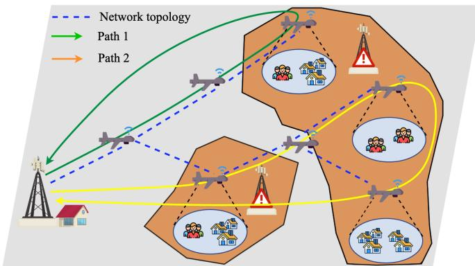  
Fig. 2. Illustration of periodic rotation paths.

$$
\mathcal { T } ^ { \prime } \left( t \right) = \left\{ p \in \mathcal { T } | \sum _ { p , q \in \mathcal { T } } \mu _ { p , q } \left( t \right) \geq 1 , p \neq q \right\}\tag{16}
$$

$$
\sum _ { p , q \in S } \mu _ { p , q } \left( t \right) \leq \left| S \right| , \forall S \subseteq \mathcal { T } ^ { \prime } \left( t \right) , \left| S \right| \geq 1 , \forall t\tag{17}
$$

$$
E _ { m } ( t ) \geq \left( \frac { \| L _ { m } ( t ) - B \| } { V } \right) \cdot ( P _ { \mathrm { c } } + P _ { \mathrm { f } } ) , \forall m \in \mathcal { M } , \forall t\tag{18}
$$

$$
\alpha _ { k , m } \left( t \right) \in \left\{ 0 , 1 \right\} , \forall k \in \mathcal { K } , \forall m \in \mathcal { M } , \forall t\tag{19}
$$

$$
\mu _ { p , q } \left( t \right) , z _ { p , q } \left( t \right) \in \left\{ 0 , 1 \right\} , \forall p , q \in \mathcal { T } , p \neq q , \forall t\tag{20}
$$

Constraints (11) and (12) define the UAV-to-target area association. Specifically, they ensure that each UAV can serve at most one target area at any time and that each target area must be served by exactly one UAV at all times. The constraints (13) state the feasibility of the tree network topology. The constraints (14) and (15) state that the network topology at all times includes both the back-end base station and the UAVs providing communication services to the target area. Constraints (16) and (17) impose the fundamental requirements for constructing a valid tree topology: constraint (16) ensures connectivity of the network, and constraint (17) guarantees acyclicity of the tree. Constraint (18) ensures that each UAV can return to the charging station before exhausting its energy.

Solving this joint optimization problem yields the minimum UAV swarm size required to maintain continuous communication for all target areas under resource constraints, along with the optimal access assignments, trajectory plans, and network topology connections.

## III. UAV SWARM PLANNING SCHEME

The optimization problem (10) simultaneously optimizes UAV trajectories, access assignments, and network topology under multiple constraints, enabling eficient UAV replacement and continuous connectivity. This problem presents computational challenges due to several factors: (i) joint optimization over three interdependent decision variables (A, Q, U) creates a highly coupled solution space; (ii) continuous-time constraints (11)-(18) require infinite-dimensional feasibility verification; (iii) tree topology constraints (16)-(17) introduce combinatorial NP-hard complexity; (iv) energy-trajectory coupling in constraint (18) forms a mixed-integer nonlinear program (MINLP). These characteristics make global optimization computationally prohibitive for practical network sizes.

To address this optimization problem with tightly coupled constraints, we propose a UAV swarm planning strategy (USP-NFRP). This strategy introduces the periodic rotation path (PRP) method for constructing UAV routes, addressing trajectory planning and access assignments, and transforms problem (10) into an extended vehicle routing problem (VRP). We then propose the dynamic tree backhaul link (DTBL) method to adjust the relay roles and the UAV backhaul links, thereby addressing the network topology selection problem. Finally, we design a max-min ant system-based path planning algorithm (MMAS-PP) to solve the resulting VRP.

## A. Periodic Rotation Path Method

To ensure persistent and seamless communication services, we develop the PRP method, coordinating UAV trajectories with replacement cycles during missions. This method aims to generate a set of periodic UAV operational paths, denoted as R, based on a pre-constructed multi-hop communication network. These paths spatially overlap with parts of the network topology. For example, Fig. 2 illustrates two representative rotation paths, labeled “Path 1” and “Path 2”.

The task points along each route fall into two categories: access points and relay points. Access points are positioned above target areas to provide ground users with communication access. Relay points establish multi-hop links between UAVs, maintaining the overall network connectivity. Conventional methods treat task points as fixed and rely on static UAV replacements to sustain network operations [15]. However, such approaches restrict UAV mobility and fail to fully exploit their relaying potential. To overcome these limitations, we introduce non-fixed relay points, allowing relay nodes to move flexibly along paths, thus enhancing relay eficiency and overall communication performance.

Fig. 3 illustrates a comparison between the UAV replacement strategy proposed in this paper and the conventional replacement method. Conventional methods deploy fully charged UAVs from the base station to replace and take over the tasks of active UAVs at fixed locations when their energy is near depletion. By contrast, our method constructs each periodic rotation path as a UAV replacement loop. After hovering at the current task point for a designated period, the UAV retains suficient energy and proceeds along the loop to the next task point, where it replaces the UAV operating there and takes over its task. The replaced UAV then moves to the following point on the loop, repeating this process continuously. Ultimately, after completing all tasks along the entire loop, each UAV returns to the charging station with energy fully depleted, forming a closed loop with the station as both start and end.

The introduction of non-fixed relay points complicates the coordination of their positions and movements during replacement to ensure uninterrupted communication. To address this, we adopt a synchronized forward-shifting strategy as the core mechanism for non-fixed relay point replacement scheduling. As shown in Fig. 3, under the proposed strategy, a UAV executing a relay task at a non-fixed relay point does not remain stationary awaiting the next UAV. Instead, the UAV proactively advances along the path, maintaining communication reachability with the successor UAV at the maximum relay distance D. This method enables a seamless and persistent replacement process, enhancing relay eficiency and minimizing energy waste.

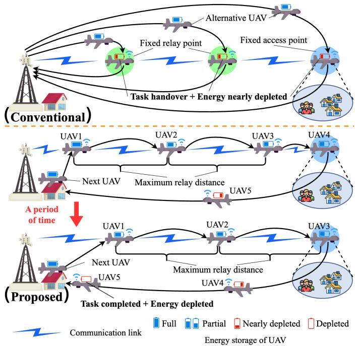  
Fig. 3. Comparison of UAV replacement methods.

Building on the above path structure and replacement strategy, we derive the relationship between the task scheduling period and the required number of UAVs for each path. This relationship provides a theoretical basis for subsequent pathoptimization modeling. For each periodic rotation path $r \in R ,$ ensuring persistent communication requires the deployment of multiple UAVs along the path. These UAVs depart the charging station sequentially at fixed intervals $\Delta t _ { r }$ . We define the task period $\mathcal { T } _ { r }$ as the elapsed time from a UAV’s departure from the charging station to its return after completing the assigned path r. With the task’s periodic nature and fixed departure interval, the required number of UAVs for stable operation on path r is given by:

$$
M _ { r } = \left\lceil \frac { \mathcal { T } _ { r } } { \Delta t _ { r } } \right\rceil\tag{21}
$$

Therefore, the total number of UAVs required by the system equals sum of UAVs required for each path:

$$
| \mathcal { M } | = \sum _ { r \in R } M _ { r }\tag{22}
$$

To maximize energy eficiency, we assume each UAV fully depletes its energy upon return to the charging station, and operates at a constant power level $P _ { \mathrm { c } } + P _ { \mathrm { f } }$ throughout the mission. Under this assumption, the task period $\mathcal { T } _ { r }$ for any path r equals the UAV’s maximum operating duration $T _ { \mathrm { m a x } } .$ defined as:

$$
\mathcal { T } _ { r } = T _ { \mathrm { m a x } } = \frac { E _ { \mathrm { m a x } } } { P _ { \mathrm { c } } + P _ { \mathrm { f } } } , \quad \forall r \in R\tag{23}
$$

By combining these relationships, the objective of minimizing the total number of UAVs can be reformulated as minimizing the sum of reciprocals of the scheduling intervals for each path:

$$
\begin{array} { l } { \displaystyle \operatorname* { m i n } _ { \mathbf { A } , \mathbf { Q } , \mathbf { U } } | \mathcal { M } | \Rightarrow \ \underset { \mathbf { A } , \mathbf { Q } , \mathbf { U } } { \operatorname* { m i n } } \sum _ { r \in R } \left\lceil \frac { T _ { \operatorname* { m a x } } } { \Delta t _ { r } } \right\rceil \Rightarrow \ \underset { \mathbf { A } , \mathbf { Q } , \mathbf { U } } { \operatorname* { m i n } } \sum _ { r \in R } \left\lceil \frac { 1 } { \Delta t _ { r } } \right\rceil } \\ { \mathrm { s . t . } \ \mathrm { E q . } ( 1 1 ) \mathrm { - E q . } ( 2 0 ) } \end{array}\tag{24}
$$

To further model $\Delta t _ { r }$ , we introduce two time variables: $t ^ { \mathrm { f i x } } r , i$ and $t ^ { \mathrm { n o n f i x } } r , j ,$ representing the hovering time at the i-th fixed and j-th non-fixed task points on path r, respectively. Let $I _ { r }$ and $J _ { r }$ denote the sets of fixed and non-fixed task points on the path r. Here, $I _ { r }$ comprises access points and fixed relay points, while $J _ { r }$ contains only non-fixed relay points. Since a UAV at a non-fixed relay point cannot move forward until the task at the previous point is completed, it must temporarily hover and wait to ensure that the distance between consecutive UAVs does not exceed the maximum communication range D. Otherwise, the link would break and network connectivity would be lost. To guarantee continuous relaying, a waiting period is introduced at each non-fixed point. Thus, the task period $\mathcal { T } _ { r }$ for path r can be expressed as:

$$
\mathcal { T } _ { r } = T _ { r } ^ { \mathrm { f l y } } + \sum _ { i \in I _ { r } } t _ { r , i } ^ { \mathrm { f i x } } + \sum _ { j \in J _ { r } } t _ { r , j } ^ { \mathrm { n o n f i x } }\tag{25}
$$

Here, $T _ { r } ^ { \mathrm { f l y } }$ denotes the total flight time along the non-hovering segments of path r. In steady state, the interval between one UAV’s arrival at any fixed point and its predecessor’s departure equals $\Delta t _ { r }$ , leading to $\Delta t _ { r } \ =$ min $\left\{ t _ { r , i } ^ { \mathrm { f i x } } \mid i \in I _ { r } \right\}$ . According to ,the arithmetic mean–geometric mean (AM–GM) inequality [30], we have $\Delta t _ { r } ~ = ~ t _ { r , 1 } ^ { \mathrm { f i x } } ~ = ~ t _ { r , 2 } ^ { \mathrm { f i x } } ~ = ~ \cdot \cdot ~ = ~ t _ { r , i } ^ { \mathrm { f i x } }$ . To maintain , , ,communication connectivity, the distance between any nonfixed relay point and its connected task point must not exceed D. Consequently, the maximum flight time between two connected task points is ${ \frac { D } { V } } .$ . If the flight time from a non-fixed point to the next task point equals $\Delta t _ { r } ,$ , no hovering is required at that point. If the flight time is less than $\Delta t _ { r } ,$ the UAV must temporarily hover to wait. In that case, the hovering duration at a non-fixed point equals $\Delta t _ { r } \gets \frac { D } { V }$ . Therefore, the hovering duration for all non-fixed points on path r is $t _ { r } ^ { \mathrm { n o n f i x } } = \mathrm { m a x } \left( 0 , \Delta t _ { r } - \frac { D } { V } \right)$ , and the scheduling interval $\Delta t _ { r }$ can be obtained by solving the following optimization problem:

$$
\begin{array} { r l } & { \operatorname* { m a x } \quad \Delta t _ { r } } \\ & { s . t . \ \Delta t _ { r } \cdot | I _ { r } | + t _ { r } ^ { \mathrm { n o n f i x } } \cdot | J _ { r } | = T _ { \operatorname* { m a x } } - T _ { r } ^ { \mathrm { f l y } } } \\ & { \qquad \Delta t _ { r } \ge T _ { \mathrm { i n t e r v a l } } } \\ & { \qquad t _ { r } ^ { \mathrm { n o n f i x } } \ge 0 } \\ & { \qquad t _ { r } ^ { \mathrm { n o n f i x } } \ge \Delta t _ { r } - \frac { D } { V } } \end{array}\tag{26}
$$

In the above formulation, $T _ { \mathrm { i n t e r v a l } }$ is a minimum time interval, manually set to prevent overly frequent UAV replacements along a path, which could undermine the stability of communication services. The constraints $t _ { r } ^ { \mathrm { n o n f i x } } \geq 0$ and $t _ { r } ^ { \mathrm { { \dot { m o n f i x } } } } \geq \Delta t _ { r } - \frac { D } { V }$ are derived from the linearization of the non-smooth function max $\begin{array} { r } { \left( 0 , \Delta t _ { r } - \frac { D } { V } \right) } \end{array}$ , enabling a direct solution via standard linear programming solvers.

From the above analysis, the number of UAVs required for a single rotation path can be computed explicitly. To validate the soundness and eficiency of our method, we compare it with a representative direct replacement approach from the literature and prove that our method never exceeds the theoretical lower bound of the direct replacement scheme.

First, under our method, the time interval $\Delta t _ { r }$ for any path r can be rewritten as:

$$
\Delta t _ { r } = \frac { T _ { \mathrm { m a x } } - t _ { r } ^ { \mathrm { n o n f i x } } \cdot | J _ { r } | - T _ { r } ^ { \mathrm { f l y } } } { | I _ { r } | }\tag{27}
$$

Accordingly, the number of UAVs required on path r, denoted by $M _ { r } ,$ can be expressed as:

$$
\begin{array} { c } { { M _ { r } = \left\lceil \frac { T _ { r } } { \Delta t _ { r } } \right\rceil = \left\lceil \frac { | I _ { r } | \cdot T _ { \mathrm { m a x } } } { T _ { \mathrm { m a x } } - t _ { r } ^ { \mathrm { n o n f i x } } \cdot | J _ { r } | - T _ { r } ^ { \mathrm { f l y } } } \right\rceil } } \\ { { = | I _ { r } | + \left\lceil \frac { | I _ { r } | \cdot \left( t _ { r } ^ { \mathrm { n o n f i x } } \cdot | J _ { r } | + T _ { r } ^ { \mathrm { f l y } } \right) } { T _ { \mathrm { m a x } } - t _ { r } ^ { \mathrm { n o n f i x } } \cdot | J _ { r } | - T _ { r } ^ { \mathrm { f l y } } } \right\rceil } } \end{array}\tag{28}
$$

In [15], it was shown that the lower bound of the number of UAVs required by a direct replacement method is given by:

$$
M _ { \mathrm { m i n } } = N + \left\lceil \sum _ { n = 1 } ^ { N } \frac { T _ { \mathrm { c h a r g e } } + 2 \Gamma _ { n } } { T _ { \mathrm { m a x } } - 2 \Gamma _ { n } } \right\rceil\tag{29}
$$

where $N = \left| I _ { r } \right| + \left| J _ { r } \right|$ denotes the total number of task points, $T _ { \mathrm { c h a r g e } }$ is the charging duration, and $\Gamma _ { n }$ is the one-way flight time between the n-th task point and the charging station. Having obtained the expressions for the number of UAVs required by both methods, we aim to prove that $M _ { r } \leq M _ { \operatorname* { m i n } } ;$

$$
\frac { | I _ { r } | \cdot \left( t _ { r } ^ { \mathrm { n o n f i x } } \cdot | J _ { r } | + T _ { r } ^ { \mathrm { f l y } } \right) } { T _ { \mathrm { m a x } } - t _ { r } ^ { \mathrm { n o n f i x } } \cdot | J _ { r } | - T _ { r } ^ { \mathrm { f l y } } } - | J _ { r } | \leq \sum _ { n = 1 } ^ { N } \frac { T _ { \mathrm { c h a r g e } } + 2 \Gamma _ { n } } { T _ { \mathrm { m a x } } - 2 \Gamma _ { n } }\tag{30}
$$

By ignoring the recharging time $T _ { \mathrm { c h a r g e } }$ to tighten the right hand side, the inequality becomes:

$$
\frac { | I _ { r } | \cdot \Big ( t _ { r } ^ { \mathrm { n o n f i x } } \cdot | J _ { r } | + T _ { r } ^ { \mathrm { f l y } } \Big ) } { T _ { \operatorname* { m a x } } - t _ { r } ^ { \mathrm { n o n f i x } } \cdot | J _ { r } | - T _ { r } ^ { \mathrm { f l y } } } - | J _ { r } | \leq \sum _ { n = 1 } ^ { N } \frac { 2 \Gamma _ { n } } { T _ { \operatorname* { m a x } } - 2 \Gamma _ { n } }\tag{31}
$$

By applying Jensen’s inequality [31], the right-hand side satisfies:

$$
\frac { \sum _ { n = 1 } ^ { N } 2 \Gamma _ { n } } { T _ { \mathrm { m a x } } - \frac { \sum _ { n = 1 } ^ { N } 2 \Gamma _ { n } } { N } } \leq \sum _ { n = 1 } ^ { N } \frac { 2 \Gamma _ { n } } { T _ { \mathrm { m a x } } - 2 \Gamma _ { n } }\tag{32}
$$

Hence, we can further tighten the right-hand side of the inequality:

$$
\frac { | I _ { r } | \cdot \Big ( t _ { r } ^ { \mathrm { n o n f i x } } \cdot | J _ { r } | + T _ { r } ^ { \mathrm { f l y } } \Big ) } { T _ { \mathrm { m a x } } - t _ { r } ^ { \mathrm { n o n f i x } } \cdot | J _ { r } | - T _ { r } ^ { \mathrm { f l y } } } - | J _ { r } | \leq \frac { \sum _ { n = 1 } ^ { N } 2 \Gamma _ { n } } { T _ { \mathrm { m a x } } - \frac { \sum _ { n = 1 } ^ { N } 2 \Gamma _ { n } } { N } }\tag{33}
$$

To complete the proof that $M _ { r } \le M _ { \operatorname* { m i n } }$ , it sufices to prove that the above inequality still holds after these two tightening steps. Rewriting the inequality yields:

$$
\begin{array} { l } { { \displaystyle t _ { r } ^ { \mathrm { n o n f i x } } \cdot | J _ { r } | \leq \frac { | J _ { r } | } { N } T _ { \mathrm { m a x } } + \frac { \sum _ { n = 1 } ^ { N } 2 \Gamma _ { n } } { N } } } \\ { { \displaystyle ~ - \frac { | J _ { r } | \sum _ { n = 1 } ^ { N } 2 \Gamma _ { n } } { N ^ { 2 } } - T _ { r } ^ { \mathrm { f l y } } } } \end{array}\tag{34}
$$

We denote $\begin{array} { r } { \frac { | J _ { r } | } { N } = \lambda , \frac { T _ { r } ^ { \mathrm { f l y } } } { T _ { \mathrm { m a x } } } = \omega , \frac { \sum _ { n = 1 } ^ { N } \Gamma _ { n } } { T _ { \mathrm { m a x } } } = \gamma . } \end{array}$ , and define $\begin{array} { r } { \frac { D } { V \cdot T _ { \mathrm { m a x } } } = \delta } \end{array}$ as a constant that depends solely on the chosen UAV model. Since $t _ { r } ^ { \mathrm { n o n f i x } }$ has two possible values depending on whether it is zero or positive, we analyze these two cases separately:

1) When $\begin{array} { r } { t _ { r } ^ { \mathrm { n o n f i x } } = \Delta t _ { r } - \frac { D } { V } = 0 } \end{array}$ , we obtain the relation:

$$
T _ { \mathrm { m a x } } - T _ { r } ^ { \mathrm { f l y } } = ( N - | J _ { r } | ) \frac { D } { V }\tag{35}
$$

which can be rewritten as:

$$
\delta ( 1 - \lambda ) N + \omega - 1 = 0\tag{36}
$$

In this case, inequality (34) becomes:

$$
0 \le \lambda + \frac { \gamma } { N } - \frac { \lambda \cdot \gamma } { N } - \omega\tag{37}
$$

As long as the path r satisfies both (36) and (37), the inequality $M _ { r } \leq M _ { \operatorname* { m i n } }$ holds strictly.

2) When $\begin{array} { r } { t _ { r } ^ { \mathrm { n o n f i x } } = \Delta t _ { r } - \frac { D } { V } > 0 . } \end{array}$ , and $\begin{array} { r } { \dot { \Delta t _ { r } } = \frac { T _ { \mathrm { m a x } } } { N } - \frac { T _ { r } ^ { \mathrm { f l y } } } { N } + \frac { | J _ { r } | D } { N V } , } \end{array}$ then we have:

$$
t _ { r } ^ { \mathrm { n o n f i x } } = \frac { T _ { \mathrm { m a x } } } { N } - \frac { T _ { r } ^ { \mathrm { f l y } } } { N } + \frac { | J _ { r } | D } { N V } - \frac { D } { V }\tag{38}
$$

which can be rewritten as:

$$
\delta ( \lambda - 1 ) N + 1 - \omega > 0\tag{39}
$$

In this case, inequality (34) becomes:

$$
0 \leq \lambda \cdot \delta \cdot N + \frac { \gamma } { N } - \omega .\tag{40}
$$

Similarly, as long as path r satisfies both (39) and (40), the inequality $M _ { r } \leq M _ { \operatorname* { m i n } }$ strictly holds.

According to [32] and [33], any planned polygonal path satisfies $\gamma \geq \omega$ and $\gamma \leq N \cdot \omega$ under all conditions. Based on this, Fig. 4 illustrates a subset of the feasible parameter region in both cases, providing a clearer understanding of the parameter relationships and further supporting the efectiveness of the proposed method.

In summary, under either condition, as long as the path design satisfies the corresponding constraints, the number of UAVs required by our proposed strategy is guaranteed to be no greater than that of the direct replacement method. This validates the inequality $M _ { r } \leq M _ { \operatorname* { m i n } }$ , thus ofering a theoretical justification for the resource eficiency of our approach.

The proposed method reformulates the original optimization problem as an extended vehicle routing problem (VRP) by representing the total number of UAVs as the sum required across all paths. Assuming a uniform task period across all paths, we assign a distinct scheduling interval to each path. The optimization objective is to select path configurations that minimize the sum of the reciprocals of these intervals, subject to seamless communication and energy constraints. This formulation efectively reduces the system’s overall resource consumption.

## B. Dynamic Tree Backhaul Link Method

The transformed extended VRP is a classical path planning problem. In a standard VRP, transitions between task points form the core of the path planning process. However, to ensure that the system maintains seamless communication, path planning must optimize both UAV movements among task points and ensure link connectivity during these transitions.

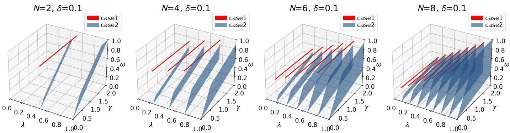

Fig. 4. Feasible regions of , , and  satisfying both constraints.  
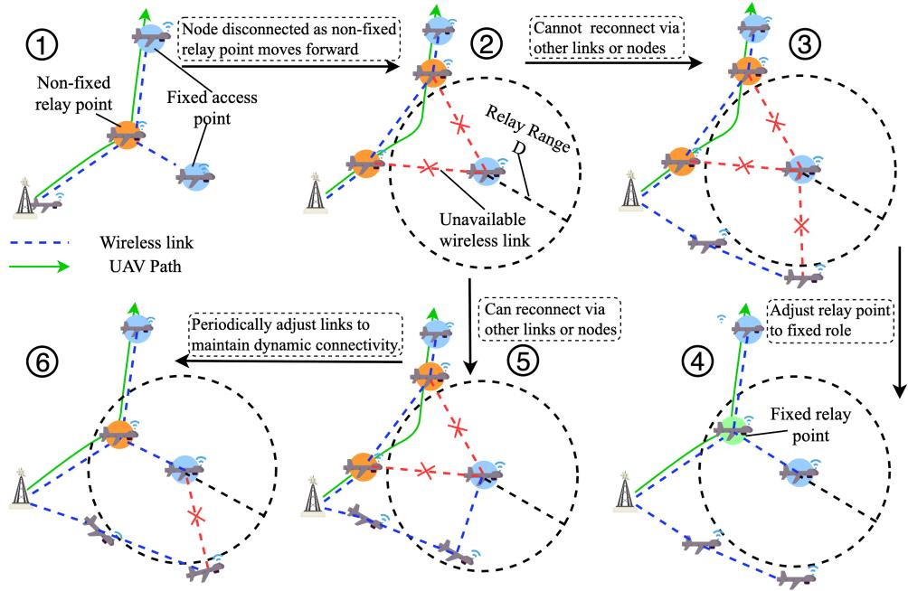  
Fig. 5. Illustration of the dynamic tree backhaul link method.

Connectivity issues occur during synchronized forwardshifting, when a UAV at a non-fixed relay point advances to the next task point. In such cases, task points on other paths may depend on that relay point to maintain their multi-hop backhaul to the base station. Premature movement of the relay point can break the communication links and compromise network connectivity. To maintain a stable tree topology and seamless communication during location changes of relay points, we propose the DTBL method. This method dynamically adjusts relay point roles—fixed or non-fixed—during path planning and updates task points’ backhaul links in real time.

Fig. 5 demonstrates the working principle of the Dynamic Tree-Based Link (DTBL) method. Specifically, when a UAV at a non-fixed relay point moves forward (O1 -O2 ), the backhaul connection to other task points may be disrupted (O2 ). In such cases, the system ensures that a valid and continuously connected communication structure is maintained throughout the operation. If the disconnection cannot be recovered through other links (O2 –O3 ), the relay point’s role is adjusted to fixed to ensure a stable connection (O4 ). If the disconnected node regains connectivity via an alternative link (O2 –O5 ), this link may not always provide stable connectivity. Therefore, the system periodically adjusts the node connections, either reverting to the previously used non-fixed relay link or establishing alternative available links (O5 –O6 ), to maintain dynamic connectivity. Through these periodic link adjustments or the relay point role change, the system maintains a stable tree topology and ensures seamless multi-hop communication during synchronized relay point movements.

Before adjusting a relay point’s role, its efect on network connectivity as a non-fixed node must be assessed. If a task point disconnects during a relay point’s forward shift and cannot be reconnected through link reconfiguration, that relay point is considered critical to network connectivity and cannot be treated as a non-fixed point. Therefore, the role adjustment of a relay point can proceed only after confirming that all disconnected task points can restore connectivity. There are two reconnection mechanisms: linking to a UAV on an existing stable backhaul link or connecting to a UAV at another relay point. These mechanisms are described in detail below. Method 1: Connection to a Stable Backhaul Link. We define a stable backhaul link (denoted as backhaul link) as a sequence of UAVs along an already planned path (including the completed portion of the current path under planning) that forms a multi-hop return link to the base station. These links lie on pre-established paths and remain unafected by subsequent path adjustments, ofering enhanced durability and stability. We denote the collection of all such stable backhaul links by backhaul list. When a task point may become disconnected due to forward shifting of a relay node, we first check if it is already part of an existing backhaul link. If so, we consider the task point still connected. Otherwise, we determine whether it can form a new link to any backhaul segment within the circular region C of radius D centered at that task point. Fig. 6 illustrates this process.

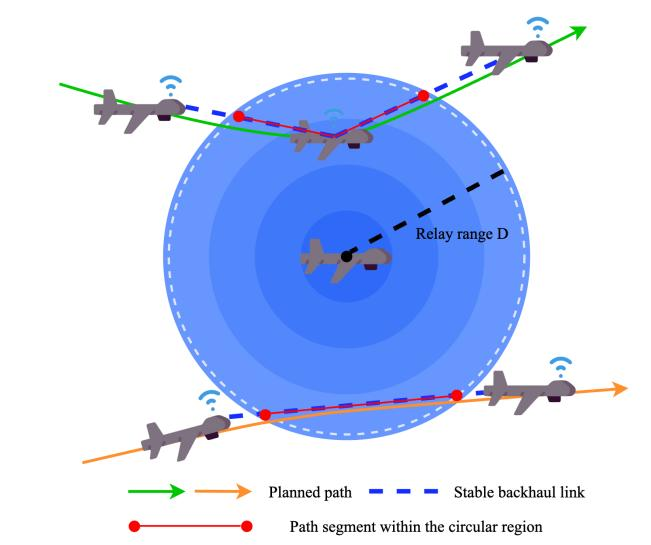  
Fig. 6. Connectivity recovery via stable backhaul link.

Algorithm 1 Evaluate Feasibility of Backhaul Links   
Input: Task node coordinates $C ( x _ { c } , y _ { c } ) _ { : }$ , node index,   
backhaul list, D   
Output: $i f \_ l i n k \in \{ 0 , 1 \}$   
1: Initialization: $i f \_ l i n k  0$   
2: Define region $\bar { \mathcal { C } } \triangleq \{ ( x , y ) | ( x - x _ { c } ) ^ { 2 } + ( y - y _ { c } ) ^ { 2 } \leq D ^ { 2 } \}$   
3: for all backhaul link ∈ backhaul list do   
4: if node index ∈ backhaul link then   
5: $i f \_ l i n k  1$   
6: break   
7: end if   
8: Extract sub-routes $S = \{ s \mid s \subseteq$ (backhaul link ∩ C)}   
9: for all s ∈ S do   
10: lengths ← Length(s)   
11: if $l e n g t h _ { s } \geq \Delta t _ { s } \cdot V \mathbf { 0 r } l e n g t h _ { s } \geq \Delta t _ { s } \cdot D$ then   
12: $i f \_ l i n k  1$   
13: break   
14: end if   
15: end for   
16: $\textbf { i f } i f \_ l i n k = 1$ then   
17: break   
18: end if   
19: end for   
20: return i f link

Algorithm 2 Evaluate Feasibility of Alternative Relay Nodes   
Input: last node, current node, next node, adjacency   
matrix H   
Output: $i f \_ l i n k \in \{ 0 , 1 \}$   
1: Initialization: $i f \_ l i n k  0 , { \mathcal L } _ { b r o k e n }  0$   
2: links ← {i | H[current node][i] = 1 i <   
{last node next node station}}   
3: for all one $l i n k \stackrel { - } { \subseteq } l i n k .$ matrix do   
4: if one link contains nodes that either remain connected   
to current node or are connected torelays (unassigned   
or fixed) then   
5: continue   
6: end if   
7: $\mathcal { L } _ { b r o k e n }  \mathcal { L } _ { b r o k e n } \cup$ one link   
8: end for   
9: if $\mathcal { L } _ { b r o k e n } = \emptyset$ then   
10: $i f \_ l i n k  1$   
11: end if   
12: return $i f \_ l i n k$

If at least one stable backhaul link lies within the circular region and its segment length inside the region is at least $\Delta t \times$ $V ,$ the task point can reconnect to that backhaul link. This procedure is detailed in Algorithm 1.

Method 2: Connection to Other Relay Task Points. Let the current relay node be denoted as current node, with its preceding and succeeding task nodes in the path planning process denoted as last node and next node, respectively. Based on the network adjacency matrix H, we identify the set of candidate nodes links that are connected to current node but do not belong to the set {last node next node station}. Next, we perform a connectivity analysis on the nodes in links to partition them into a collection of connected subsets, denoted as link matrix. For each connected subset one link, we examine whether there exists any node in the subset that can maintain a continuous connection with current node during its forward shift, or whether it links to another relay node whose role is still undetermined or already fixed. If all subsets in link matrix satisfy at least one of the above conditions, it indicates that the forward shifting of the current relay node will not cause a communication breakdown; or even if disconnections occur, the afected nodes can reestablish connectivity via alternative relay nodes. The detailed implementation of this process is described in Algorithm 2.

After selecting the next task point, we determine the role of the relay node using the results of Algorithms 1 and $^ { 2 , }$ ensuring that no other task point loses connectivity. If both algorithms return $i f \_ l i n k = 0 .$ , meaning that neither method can reconstruct the return link, the current relay point must be designated fixed. Otherwise, the relay node may be designated fixed or non-fixed, enabling more flexible and eficient path scheduling. Any task point disconnected by a non-fixed relay point regains connectivity by adjusting its backhaul link to the base station via one of the two recovery mechanisms. This evaluation and role-adjustment mechanism enables the DTBL method to handle link-disconnection risks during path optimization. It ensures the multi-hop UAV swarm network maintains high reliability and robustness during UAV replacements and along-route operations.

## C. Max-Min Ant System-Based Rotation Path Planning Algorithm

Ant colony optimization (ACO) is widely employed for path planning due to its parallelism and positive feedback characteristics [34]. Among its variants, the max-min ant system (MMAS) significantly improves global search capabilities and solution quality by introducing upper and lower bounds on pheromone concentration, demonstrating greater performance and robustness compared to classical ACO [35]. Based on MMAS, we develop a rotation path planning algorithm for UAV communication networks. Our algorithm incorporates tailored designs in the heuristic function, candidate-node selection, pheromone-matrix structure, transition-probability calculation, and pheromone-update rules to address relay-role switching and connectivity constraints in UAV-based multi-hop networks more efectively.

First, in designing the heuristic function, we use the change in a path’s interval ∆t as the evaluation metric and define the heuristic value as follows:

$$
\begin{array} { l } { \displaystyle \eta _ { n , n ^ { \prime } } = \frac { 1 } { \frac { 1 } { \Delta t _ { r ^ { \prime } } } - \frac { 1 } { \Delta t _ { r } } } = \frac { \Delta t _ { r } \cdot \Delta t _ { r ^ { \prime } } } { \Delta t _ { r } - \Delta t _ { r ^ { \prime } } } , } \\ { \displaystyle r = \{ 0 , \dots , n , 0 \} , \ : \ : r ^ { \prime } = \{ 0 , \dots , n , n ^ { \prime } , 0 \} } \end{array}\tag{41}
$$

Here, n denotes the current task point, and $n ^ { \prime }$ denotes a candidate for the next task point. r and $r ^ { \prime }$ denote the current and extended paths, respectively.

Second, to enable flexible switching of relay task points between “fixed” and “non-fixed” roles, we introduce a dualrole candidate mechanism. During path construction, the candidate set for the task point n is defined according to its current role. This mechanism ensures that the role of each relay task point is clearly identified and selectable during planning, enhancing the flexibility and adaptability of the algorithm. The candidate set allowedn for path r at relay point n is defined as:

$$
\begin{array} { r l } & { a l l o w e d _ { n } = \left\{ \mathcal { U } _ { f i x } ( t a b u _ { n } ) , \begin{array} { l } { \mathrm { i f ~ } n \mathrm { ~ i s ~ f i x e d ~ } } \\ { \mathcal { U } _ { b o t h } ( t a b u _ { n } ) , \begin{array} { l } { \mathrm { i f ~ } n \mathrm { ~ i s ~ n o n - f i x e d ~ } } \end{array} } \end{array} \right. } \\ & { \mathcal { U } _ { b o t h } ( t a b u _ { n } ) = \bigcup _ { n ^ { \prime } \in n e x t _ { - } ^ { - n o d e } } \left\{ ( n ^ { \prime } \mid n _ { f i x } ) , ( n ^ { \prime } \mid n _ { n o n f i x } ) \right\} , } \\ & { \mathcal { U } _ { f i x } ( t a b u _ { n } ) = \bigcup _ { n ^ { \prime } \in n e x t _ { - } ^ { n o d e } } \left\{ n ^ { \prime } \mid n _ { f i x } \right\} , } \\ & { n e x t \quad n o d e = \{ n ^ { \prime } \in \mathcal { N } \setminus t a b u _ { n } \mid n ^ { \prime } \mathrm { ~ s a t i s f i e s ~ E q . ~ } ( 1 8 ) \} } \end{array}\tag{42}
$$

(43)

Here, $\mathcal { N }$ denotes the set of all task points, $t a b u _ { n }$ is the tabu list for node $n ,$ and $n _ { \mathrm { f i x } } , n _ { \mathrm { n o n f i x } }$ represent the two possible role states of the relay task point n.

To capture pheromone levels for each relay task point $\gamma \in \mathcal R$ under both fixed and non-fixed roles, we introduce a dual-channel pheromone mechanism. Specifically, for each relay task point $\gamma ,$ the pheromone matrix includes two $\mathrm { e n t r i e s - } \tau ( \gamma _ { \mathrm { f i x } } )$ γ and $\tau ( \gamma _ { \mathrm { n o n f i x } } )$ —which record pheromone levels for the fixed and non-fixed roles, respectively. Thus, the pheromone matrix is structured as follows:

$$
\tau = [ \tau _ { n , n ^ { \prime } } ] \in \mathbb { R } ^ { ( | \mathcal { R } | + | \mathcal { N } | ) ( | \mathcal { R } | + | \mathcal { N } | ) } , \forall n , n ^ { \prime } \in \mathcal { N }\tag{44}
$$

To enhance solution diversity, the next task point is selected using a pseudo-random proportional rule. The transition probability for each candidate task point in the set allowed is computed by Eq. (45), and the next point $n ^ { \prime }$ is selected via roulette wheel selection:

$$
p _ { n , n ^ { \prime } } = \left\{ \begin{array} { l l } { \frac { \zeta _ { n , n } , } { \sum _ { l \in a l l o w e d _ { n } } \zeta _ { n , l } } } & { , \mathrm { i f } n ^ { \prime } \in a l l o w e d _ { n } } \\ { 0 } & { , \mathrm { o t h e r w i s e } } \end{array} \right.
$$

$$
\zeta _ { i , j } = \left\{ \begin{array} { l l } { \left( \tau _ { i , j } \right) ^ { \alpha } \left( \eta _ { i , j } \right) ^ { \beta } , } & { \mathrm { i f ~ } i \in \mathcal { A } , j \in \mathcal { A } } \\ { \left( \tau _ { i , j } ^ { \mathrm { a v g } } \right) ^ { \alpha } \left( \eta _ { i , j _ { \mathrm { t x } } } \right) ^ { \beta } , } & { \mathrm { i f ~ } i \in \mathcal { A } , j \in \mathcal { R } } \\ { \left( \tau _ { i _ { \mathrm { t x } } , j } \right) ^ { \alpha } \left( \eta _ { i _ { \mathrm { t x } } , j } \right) ^ { \beta } , } & { \mathrm { i f ~ } i \in \mathcal { R } , i \mathrm { ~ f x } , j \in \mathcal { A } } \\ { \left( \tau _ { i _ { \mathrm { m o t a r } } , j } \right) ^ { \alpha } \left( \eta _ { i _ { \mathrm { m o t a r } } , j } \right) ^ { \beta } , } & { \mathrm { i f ~ } i \in \mathcal { R } , i \mathrm { ~ n o n f i x } , j \in \mathcal { A } } \\ { \left( \tau _ { i _ { \mathrm { t x } } , j } ^ { \mathrm { a v g } } \right) ^ { \alpha } \left( \eta _ { i _ { \mathrm { t x } } , j _ { \mathrm { t x } } } \right) ^ { \beta } , } & { \mathrm { i f ~ } i \in \mathcal { R } , i \mathrm { ~ f x } , j \in \mathcal { R } } \\ { \left( \tau _ { i _ { \mathrm { m o t a r } } , j } ^ { \mathrm { a v g } } \right) ^ { \alpha } \left( \eta _ { i _ { \mathrm { m o t a r } } , j _ { \mathrm { f x } } } \right) ^ { \beta } , } & { \mathrm { i f ~ } i \in \mathcal { R } , i \mathrm { ~ n o n f i x } , j \in \mathcal { R } } \end{array} \right.
$$

$$
\tau _ { i , j } ^ { \mathrm { a v g } } = \left\{ \begin{array} { l l } { \frac { \tau _ { i , j _ { \mathrm { f i x } } } + \tau _ { i , j _ { \mathrm { n o n - f i x } } } } { 2 } } & { \mathrm { , i f } j \in \mathcal { R } } \\ { \tau _ { i , j } } & { \mathrm { , o t h e r w i s e } } \end{array} \right.\tag{45}
$$

(46)

In the transition probability function $p _ { n , n ^ { \prime } } ,$ the multi-branch structure in Eq. (46) precisely distinguishes the roles of relay points, ensuring pheromone levels and heuristic factors are applied correctly for diferent role combinations. Here, and $\beta$ weight the pheromone and heuristic terms, respectively; A denotes the set of access task points and R denotes the set of relay task points. In complex assignment scenarios, this design enhances the path selection accuracy while significantly improving the algorithm adaptability and solution quality.

During the pheromone update phase, the role combination of each task-point pair in the constructed path determines which pheromone index to update. For example, if both the relay point n and its successor $n ^ { \prime }$ are fixed, then $\tau _ { n _ { \mathrm { f i x } } , n _ { \mathrm { f i x } } ^ { \prime } }$ is updated.

Finally, we integrate the MMAS-based path search mechanism with the DTBL method. This integration enables the algorithm to simultaneously guide relay-role selection and path-structure optimization during the search, ensuring that the resulting routes meet the communication continuity constraint. The complete algorithmic procedure is summarized in Algorithm 3.

## D. Computational Complexity and Scalability Analysis

The computational complexity of the proposed UAV swarm planning framework is determined by the three core algorithmic components within the MMAS-PP scheme. We analyze each component separately and then derive the overall complexity.

Algorithm 1 (Evaluate Feasibility of Backhaul Links): The complexity is $O ( B \times R \times L )$ , where B is the number of backhaul links, R is the average number of route segments within a search area of radius $D ,$ and L is the cost of geometric intersection computations. Since both B and R are constrained by the density of the network, the complexity remains tractable in practical UAV scenarios.

Algorithm 2 (Evaluate Feasibility of Alternative Relay Nodes): The complexity is $O ( N ^ { 2 } )$ , where N is the total number of network nodes. This quadratic behavior results from the connectivity analysis using the adjacency matrix, which may require checking all possible node pairs in the worst case. Without additional data structures or approximation methods, this quadratic complexity is unavoidable.

Algorithm 3 Max-Min Ant System-Based Rotation Path Plan  
ning Algorithm   
Input: Environment information, m, Max iter,   
Output: Optimal path $R _ { b e s t }$ minimizing $\sum _ { r \in R } ^ { - } { \frac { 1 } { \Delta t _ { r } } }$   
1: Initialization: Set all pheromone matrix elements $\tau _ { i j } = \tau _ { 0 }$   
2: for $t = 1 \mathbf { t o } M a x _ { _ { - } }$ iter do   
3: Deploy all ants $i \in \{ 1 , 2 , . . . , m \}$ in parallel   
4: while tasks remain unvisited do   
5: if current node n is a relay then   
6: Execute Algorithm 1 and Algorithm 2   
7: if both algorithms return i f link = 0 then   
8: Set allow $\ g { d _ { n } } = \mathcal { U } _ { f i x } ( t a b u _ { n } )$   
9: else   
10: Set allowe $d _ { n } = \mathcal { U } _ { b o t h } ( t a b u _ { n } )$   
11: end if   
12: end if   
13: Select next task node n0 using transition probability   
$p _ { n , n ^ { \prime } }$   
14: ,Update path and tabu list for ant i   
15: end while   
16: Evaluate paths $R _ { i }$ and select top ants as elite, updating   
$R _ { b e s t }$   
17: Update pheromones for elite ants’ paths and adjust   
bounds   
18: end for

Algorithm 3 (MMAS-PP Algorithm): In each iteration, m ants construct complete paths by sequentially selecting nodes. At each decision point, Algorithms 1 and 2 are invoked to evaluate k feasible candidate nodes $( k < N )$ and to compute the periodic rotation interval via Eq. (27). This interval calculation reduces to a small linear program with two variables and four constraints, giving constant complexity O(1). Pheromone updates are then performed with complexity $O ( \sigma \cdot N )$ , where is the number of elite ants.

Considering the outer optimization loop with Max iter iterations, the overall computational complexity of the MMAS-PP framework is:

$$
\begin{array} { l } { O ( M a x \_ i t e r \times N \times k \times ( N ^ { 2 } + B \times R \times L + \sigma \cdot N ) ) } \\ { = O ( N ^ { 3 } ) } \end{array}\tag{47}
$$

Scalability Analysis for Larger Networks: For practical UAV communication scenarios with up to $N ~ \leq ~ 5 0$ nodes, the cubic complexity ensures computational feasibility. The analysis indicates that scalability is mainly limited by the $O ( N ^ { 2 } )$ connectivity analysis in Algorithm 2, which can be significantly improved through incremental state updates to avoid redundant connectivity checks. The larger network also can be partitioned based on spatial distribution or density, with the algorithm executed independently in each sub-network. These approaches can significantly enhance scalability, enabling the proposed framework to handle larger UAV swarm networks.

## IV. SIMULATION RESULTS

The simulation scenario covers a 20 km × 20 km square area. Seven target access points are distributed within the area, along with a base station located far from them and equipped with UAV recharging capabilities. The UAV swarm forms a multi-hop network connecting target access points to the base station. In these simulations, UAVs fly at a constant speed V = 15 m/s during missions, with propulsion power $P _ { \mathrm { ~ f ~ } } =$ 190 W and communication power $P _ { \mathrm { c } } = 1 0 ~ \mathrm { W }$ . To evaluate the generality of the proposed strategy, we conducted a series of simulations varying two key UAV parameters: communication capability, expressed by the maximum relay distance $D ,$ and endurance levels, expressed by the endurance time $T _ { \mathrm { m a x } }$

To validate the efectiveness of our proposed strategy, we compared it against three baseline strategies:

Genetic Algorithm-based Traditional VRP Routing Strategy (GA-VRP) [14]: This baseline treats all access points and relay points as fixed task locations, formulates the persistent-coverage task as an energy-constrained vehicle routing problem, and solves it with a genetic algorithm.

Theoretical Lower Bound Based on Direct Replacement (TLB-DRM): This method uses the model in [15] to calculate the theoretical minimum fleet size under a direct replacement policy, whereby depleted UAVs are immediately replaced by fully charged UAVs dispatched from the base station.

Partitioned Heterogeneous Rotating Resupply Strategy (PHRR) [15]: This strategy treats all task points as fixed, partitions them by heterogeneous distances to the base station, and employs a direct-replacement heuristic to schedule UAVs within each partition.

All methods operate under identical conditions: same UAV specifications (V = 15 m/s, $P _ { \mathrm { f } } = 1 9 0 ~ \mathrm { W } ,$ $P _ { \mathrm { c } } = 1 0 ~ \mathrm { W } )$ , network topology, target areas, and energy constraints. The primary diference lies in relay mobility and scheduling strategies: baseline methods use fixed relay positions with direct replacement scheduling, while USP-NFRP employs non-fixed relay points and periodic rotation paths (PRP) for dynamic scheduling. This isolates our core contribution, ensuring performance gains result from algorithmic innovation rather than diferent problem settings.

Fig. 7 illustrates the multi-hop network configurations constructed by UAVs for diferent maximum relay distances D ∈ {2 4 6 8} km. As the maximum relay distance D decreases, the number of relay points required to maintain the multihop network increases. This trend arises because a smaller D shortens the maximum link length between adjacent nodes, necessitating more relay points to preserve coverage. As the number of relay points increases, the total number of UAVs required for continuous network operation also increases.

Fig. 8 shows the required number of UAVs versus maximum endurance time for relay distances $D \in \{ 2 , 4 , 6 , 8 \}$ km. The horizontal axis represents UAV maximum endurance time, and the vertical axis represents the required number of UAVs. The results show that our proposed strategy, USP-NFRP, consistently outperforms all baseline methods (GA-VRP, PHRR,

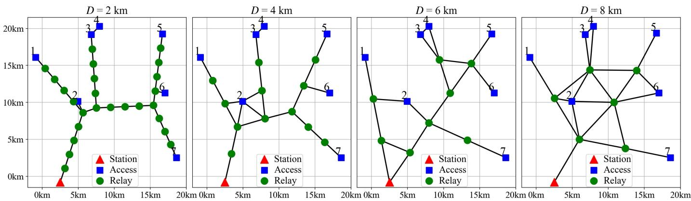  
Fig. 7. Multi-hop network topology with diferent maximum relay distances D.

GA-VRP PHRR TLB-DRMUSP-NFRP(the proposed strategy)  
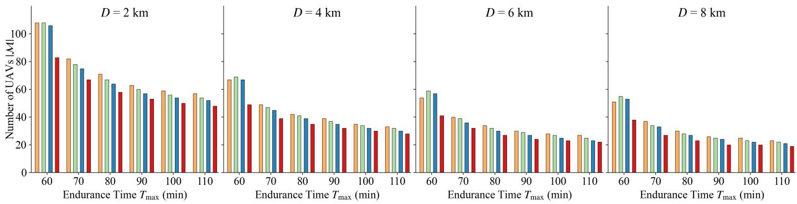  
Fig. 8. Required number of UAVs versus maximum onboard energy $E _ { \mathrm { m a x } }$ for $D \in \{ 2 , 4 , 6 , 8 \}$ km.

TLB-DRM) across all distances and endurance times. For example, at $D = 8$ km and $T _ { \mathrm { m a x } } = 6 0$ min, USP-NFRP requires only 38 UAVs, whereas PHRR and GA-VRP require 52 and 55 UAVs, corresponding to reductions of 26.9% and 30.9%, respectively. Across all tested scenarios, USP-NFRP achieves an average fleet size reduction of 21.6%, with improvements ranging from 11.7% (D = 2 km, $T _ { \mathrm { m a x } } = 1 1 0$ min) to 30.9% $\left( D \ = \ 8 \right.$ km, $T _ { \mathrm { m a x } } ~ = ~ 6 0$ min) compared to baseline methods. The performance advantage stems from a fundamental design diference. In GA-VRP and PHRR, UAVs act as relays only after reaching fixed positions. In contrast, USP-NFRP allows UAVs to serve as relays during transit, fully utilizing temporary links in flight. These results validate our approach from two perspectives. First, they provide empirical confirmation of our mathematical proof (Section III-A) that the PRP method requires fewer UAVs than the theoretical lower bound (TLB-DRM) of fixed-relay strategies. Notably, our approach outperforms this bound across all test conditions. Second, the results demonstrate the scalability of USP-NFRP to large networks. Even in the most demanding scenario (D = 2 km, 32 nodes, and over 50 UAVs), USP-NFRP maintains substantial eficiency gains, confirming its practical applicability in real-world deployments.

Fig. 9 illustrates the variation in the relative reduction rate of the required number of UAVs for all strategies with stepwise increases in the maximum endurance time $\left( T _ { \mathrm { m a x } } \right)$ under the distance setting of D = 4 km. As $T _ { \mathrm { m a x } }$ increases from 60 to 110 minutes, the relative reduction rate gradually decreases across all strategies, indicating diminishing returns from increasing endurance. An anomalous increase in the reduction rate is observed for the GA-VRP strategy when $T _ { \mathrm { m a x } }$ rises from 90 to 100 minutes. This abnormality may be caused by the rounding of discrete UAV numbers or by inherent fluctuations in the optimization process. Nevertheless, the overall trend remains decreasing. Similar patterns are observed under other distance settings. The analysis indicates that the required number of UAVs can be characterized as a decreasing convex function of $T _ { \mathrm { m a x } } .$ , as demonstrated in the Appendix.

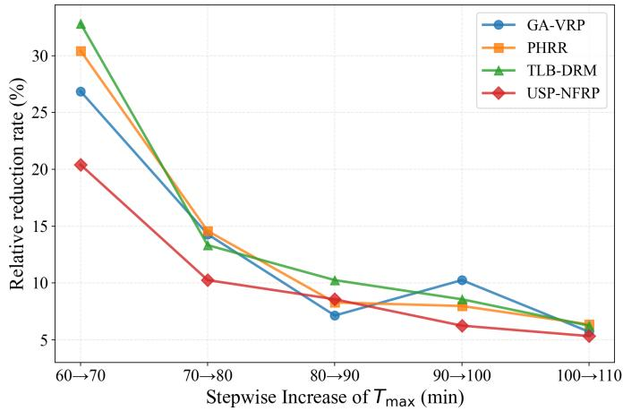  
${ \mathrm { F i g . } }$ 9. Relative UAV reduction with stepwise $T _ { \mathrm { m a x } }$ increase, $D = 4$ km.

Fig. 10 illustrates the UAV swarm planning results obtained by applying our proposed strategy to a multi-hop network with relay distance D = 8 km. Subfigure (a) displays the UAV cluster path planning results, and subfigure (b) presents the task schedule for UAVs on Path 1. Subfigure (a) indicates that the proposed method plans UAV paths into multiple closed-loop trajectories. These trajectories spatially overlap segments of the initial multi-hop network topology but do not intersect each other, avoiding wasted resources from UAVs revisiting the same task point. Subfigure (b) shows that Path 1 is maintained by 10 UAVs operating in a cyclic manner, each UAV’s task period being equal to the sum of its maximum endurance time and a brief base station dwell time. Although recharging times are neglected in our model, some UAVs still briefly remain at the base station. This is because the required fleet size must be an integer, leaving a small bufer. As a result, UAVs need not redeploy immediately after completing a cycle of tasks. Notably, from the moment the first UAV arrives at an access point, at least one UAV continuously remains there, ensuring uninterrupted communication coverage.

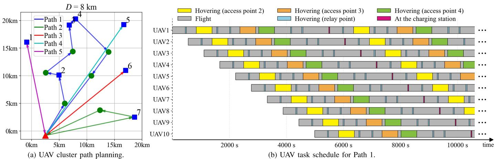

Fig. 10. UAV cluster planning and task scheduling for D = 8 km.  
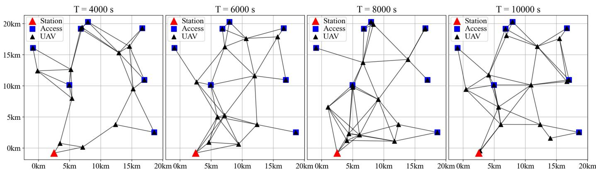  
Fig. 11. Time evolution of UAV-to-ground station link connectivity.

To verify the continuity of the network layer, Fig. 11 tracks the evolution of the UAV-to-Station link over time under the optimal path configuration shown in Fig. 10a. Despite UAV movements along planned paths and cyclic replacements, the DTBL method ensures the continuous existence of a spanning tree in the current connected graph, connecting all access points and the base station. Consequently, Consequently, there is no disruption in the link from the access point to the base station throughout the entire simulation. The figure also shows the number of UAVs used at diferent times, corroborating the resource saving efect of path planning. These results demonstrate that our proposed method reduces the usage of UAVs while ensuring seamless and persistent communication in dynamic environments.

In summary, our non-fixed-relay-point UAV swarm planning strategy ensures persistent and seamless connectivity, preventing communication interruptions. It significantly outperforms existing methods in terms of resource utilization eficiency. When implemented in real-world scenarios alongside advanced battery and recharge technologies, this strategy can reduce the required number of UAVs, providing an eficient, cost-efective, and sustainable solution for emergency disaster communications or remote area coverage.

## V. CONCLUSION

In this paper, we propose a UAV swarm planning framework for persistent multi-hop networks in emergency communication scenarios, ensuring long-term seamless network service while minimizing the size of UAV fleets. Firstly, we formulate persistent network coverage requirements and various practical constraints as a joint optimization problem. Subsequently, by introducing the PRP method, we reformulate the problem as a VRP with network connectivity constraints, addressed by the DTBL method. We then developed the MMAS-PP algorithm to solve the reformulated VRP. Simulation results demonstrated that our proposed strategy significantly outperformed conventional benchmark strategies.

## APPENDIX

PROOF OF DECREASING CONVEXITY OF UAV DEMAND

## A. GA-VRP

Under this strategy, the total number of $\mathrm { U A V s }$ is $M ^ { \mathrm { G A - V R P } } =$ $\begin{array} { r l } { \sum _ { r \in R _ { \mathrm { G A } } } M _ { r } ^ { \mathrm { G A - V R P } } } & { { } } \end{array}$ , where $M _ { r } ^ { \mathrm { G A - V R P } }$ is given by:

$$
M _ { r } ^ { \mathrm { G A - V R P } } = \left\lceil \frac { T _ { \mathrm { m a x } } \cdot N } { T _ { \mathrm { m a x } } - T _ { r } ^ { \mathrm { f l y } } } \right\rceil\tag{48}
$$

Let $\begin{array} { r } { f _ { \mathrm { G A } } ( T _ { \mathrm { m a x } } ) = \frac { T _ { \mathrm { m a x } } \cdot N } { T _ { \mathrm { m a x } } - T _ { r } ^ { \mathrm { f l y } } } } \end{array}$ . Then its first and second derivatives are as follows:

$$
f _ { \mathrm { G A } } ^ { \prime } ( T _ { \mathrm { m a x } } ) = \frac { - N T _ { r } ^ { \mathrm { f l y } } } { \left( T _ { \mathrm { m a x } } - T _ { r } ^ { \mathrm { f l y } } \right) ^ { 2 } } < 0\tag{49}
$$

$$
f _ { \mathrm { G A } } ^ { \prime \prime } ( T _ { \mathrm { m a x } } ) = \frac { 2 N T _ { r } ^ { \mathrm { f l y } } } { \left( T _ { \mathrm { m a x } } - T _ { r } ^ { \mathrm { f l y } } \right) ^ { 3 } } > 0\tag{50}
$$

Thus $f _ { \mathrm { G A } } ( T _ { \mathrm { m a x } } )$ is strictly decreasing and convex in $T _ { \mathrm { m a x } }$

## B. TLB–DRM

Appendix A gives the direct-replacement lower bound on the required number of UAVs $M _ { \mathrm { m i n } }$

$$
M _ { \mathrm { m i n } } = N + \left\lceil \sum _ { n = 1 } ^ { N } \frac { T _ { \mathrm { c h a r g e } } + 2 \Gamma _ { n } } { T _ { \mathrm { m a x } } - 2 \Gamma _ { n } } \right\rceil\tag{51}
$$

Set $\begin{array} { r } { f _ { \mathrm { T L B } } ( T _ { \mathrm { m a x } } ) ~ = ~ \sum _ { n = 1 } ^ { N } { \frac { T _ { \mathrm { c h a r g e } } + 2 \Gamma _ { n } } { T _ { \mathrm { m a x } } - 2 \Gamma _ { n } } } } \end{array}$ . Then its first and second derivatives are as follows:

$$
f _ { \mathrm { T L B } } ^ { \prime } ( T _ { \mathrm { m a x } } ) = \sum _ { n = 1 } ^ { N } \frac { - \left( T _ { \mathrm { c h a r g e } } + 2 \Gamma _ { n } \right) } { \left( T _ { \mathrm { m a x } } - 2 \Gamma _ { n } \right) ^ { 2 } } < 0\tag{52}
$$

$$
f _ { \mathrm { T L B } } ^ { \prime \prime } ( T _ { \mathrm { m a x } } ) = \sum _ { n = 1 } ^ { N } \frac { 2 \left( T _ { \mathrm { c h a r g e } } + 2 \Gamma _ { n } \right) } { \left( T _ { \mathrm { m a x } } - 2 \Gamma _ { n } \right) ^ { 3 } } > 0\tag{53}
$$

Hence $f _ { \mathrm { T L B } } ( T _ { \mathrm { m a x } } )$ is decreasing and convex in $T _ { \mathrm { m a x } }$

## C. PHRR

The number of UAVs $M ^ { \mathrm { P H R R } }$ is defined as:

$$
M ^ { \mathrm { P H R R } } = N + \left\lceil \frac { C } { T _ { \mathrm { m a x } } - 2 \Gamma _ { N } } \right\rceil , \Gamma _ { N } = \underset { 1 \leq n \leq N } { \mathrm { m a x } } \Gamma _ { n }\tag{54}
$$

where C is a constant independent of $T _ { \mathrm { m a x } }$ . Define fPHRR $\begin{array} { r } { ( T _ { \mathrm { m a x } } ) = \frac { C } { T _ { \mathrm { m a x } } - 2 \Gamma _ { N } } } \end{array}$ . Then its first and second derivatives are as follows:

$$
f _ { \mathrm { P H R R } } ^ { \prime } ( T _ { \mathrm { m a x } } ) = \frac { - C } { ( T _ { \mathrm { m a x } } - 2 \Gamma _ { n } ) ^ { 2 } } < 0\tag{55}
$$

$$
f _ { \mathrm { P H R R } } ^ { \prime \prime } ( T _ { \mathrm { m a x } } ) = \frac { 2 C } { \left( T _ { \mathrm { m a x } } - 2 \Gamma _ { n } \right) ^ { 3 } } > 0\tag{56}
$$

Thus $f _ { \mathrm { P H R R } } ( T _ { \mathrm { m a x } } )$ is decreasing and convex in $T _ { \mathrm { m a x } } .$

## D. Proposed

The total number of UAVs for our proposed method is $\begin{array} { r c l } { M ^ { \mathrm { P r o p o s e d } } } & { = } & { \sum _ { r \in R } { M _ { r } ^ { \mathrm { P r o p o s e d } } } } \end{array}$ . For each path r, the required number of UAVs $\dot { M } _ { r } ^ { \mathrm { P r o p o s e d } }$ is given by:

$$
M _ { r } ^ { \mathrm { P r o p o s e d } } = \left\lceil \frac { T _ { \mathrm { m a x } } } { \Delta t _ { r } } \right\rceil\tag{57}
$$

With $\begin{array} { r l r } { t _ { r } ^ { \mathrm { n o n f i x } } } & { { } = } & { \Delta t _ { r } - \frac { D } { V } . } \end{array}$ we have $\begin{array} { r } { \Delta t _ { r } ~ = ~ \frac { T _ { \mathrm { m a x } } - T _ { r } ^ { \mathrm { f l y } } + | J _ { r } | \cdot \frac { D } { V } } { N } } \end{array}$ , so $\begin{array} { r } { M _ { r } ^ { \mathrm { P r o p o s e d } } = \Bigg | \frac { N \cdot T _ { \mathrm { m a x } } } { T _ { \mathrm { m a x } } T _ { r } ^ { \mathrm { f l y } } + | J _ { r } | \cdot \frac { D } { V } } \Bigg | } \end{array}$ . Define $\begin{array} { r } { f _ { \mathrm { P r o p } } ( T _ { \mathrm { m a x } } ) = \frac { N \cdot T _ { \mathrm { m a x } } } { T _ { \mathrm { m a x } } T _ { r } ^ { \mathrm { f l y } } + | J _ { r } | \cdot \frac { D } { V } } } \end{array}$ Then its first and second derivatives are as follows:

$$
f _ { \mathrm { P r o p } } ^ { \prime } ( T _ { \mathrm { m a x } } ) = N \frac { \displaystyle \frac { | J _ { r } | D } { V } - T _ { r } ^ { \mathrm { f l y } } } { \left( T _ { \mathrm { m a x } } - T _ { r } ^ { \mathrm { f l y } } + \frac { | J _ { r } | D } { V } \right) ^ { 2 } }\tag{58}
$$

$$
f _ { \mathrm { P r o p } } ^ { \prime \prime } ( T _ { \mathrm { m a x } } ) = N \frac { 2 \left( T _ { r } ^ { \mathrm { f l y } } - \frac { | J _ { r } | D } { V } \right) } { \left( T _ { \mathrm { m a x } } - T _ { r } ^ { \mathrm { f l y } } + \frac { | J _ { r } | D } { V } \right) ^ { 3 } }\tag{59}
$$

Because every path includes at least one fixed or access point, $\frac { | J _ { r } | D } { V } < T _ { r } ^ { \mathrm { f l y } }$ . Therefore, $f _ { \mathrm { P r o p } } ^ { \prime } ( T _ { \mathrm { m a x } } ) < 0$ and $f _ { \mathrm { P r o p } } ^ { \prime \prime } ( T _ { \mathrm { m a x } } ) > 0$ , so $f _ { \mathrm { P r o p } } ( T _ { \mathrm { m a x } } )$ < is also decreasing and convex in $T _ { \mathrm { m a x } } .$

The four functions fGA fTLB fPHRR $f _ { \mathrm { P r o p } }$ are decreasing and convex in $T _ { \mathrm { m a x } }$ . After applying the ceiling operator to obtain integer numbers of UAVs, each becomes a stepwise decreasing function; although strict convexity is lost, the rate of reduction in required UAVs slows as $T _ { \mathrm { m a x } }$ increases.

## REFERENCES

[1] Y. Zeng, R. Zhang, and T. J. Lim, “Wireless communications with unmanned aerial vehicles: Opportunities and challenges,” IEEE Commun. Mag., vol. 54, no. 5, pp. 36–42, May 2016.

[2] H. Shakhatreh et al., “Unmanned aerial vehicles (UAVs): A survey on civil applications and key research challenges,” IEEE Access, vol. 7, pp. 48572–48634, 2019.

[3] M. Erdelj, E. Natalizio, K. R. Chowdhury, and I. F. Akyildiz, “Help from the sky: Leveraging UAVs for disaster management,” IEEE Pervasive Comput., vol. 16, no. 1, pp. 24–32, Jan. 2017.

[4] S. A. Owaid, A. H. Miry, and T. M. Salman, “A survey on UAV-assisted wireless communications: Challenges, technologies, and application,” in Proc. 11th Int. Conf. Electr. Electron. Eng. (ICEEE), Apr. 2024, pp. 333–340.

[5] Drones Are More Helpful Than Ever in Hurricane-Ravaged Texas and Florida. Accessed: Sep. 23, 2017. [Online]. Available: https://myfox8.com/news/drones-are-more-helpful-than-ever-inhurricane-ravaged-texas-and-florida/

[6] Send in the Drones: How to Transform Australia’s Fight Against Bushfires and Floods. Accessed: Nov. 12, 2022. [Online]. Available: https://www.theguardian.com/australia-news/2022/nov/13/send-in-thedrones-how-to-transform-australias-fight-against-bushfires-and-floods

[7] Study Enhanced LTE Support for Aerial Vehicles, document TR 36.777, 3GPP, 2017.

[8] O. Veligorskyi, A. Los, and R. Chakirov, “Persistent continuous surveillance of remote local objects by multirotor UAVs,” in Proc. IEEE 17th Int. Conf. Compat., Power Electron. Power Eng., Tallinn, Estonia, Jun. 2023, pp. 1–6.

[9] K. Priandana, M. K. D. Hardhienata, M. W. S. Atman, R. A. P. Lubis, and Wulandari, “Minimizing the global waiting time of swarm UAV network for eficient battery charging in persistent monitoring scenario,” in Proc. Int. Conf. Informat. Eng., Sci. Technol. (INCITEST), Bandung, Indonesia, Oct. 2023, pp. 1–8.

[10] R. Wang, D. Li, and K. Meng, “Rechargeable UAV trajectory optimization for Real- time persistent data collection of large-scale sensor networks,” in Proc. IEEE Int. Conf. Commun. Workshops (ICC Workshops), Denver, CO, USA, Jun. 2024, pp. 1481–1486.

[11] S. K. K. Hari, S. Rathinam, S. Darbha, K. Kalyanam, S. G. Manyam, and D. Casbeer, “Optimal UAV route planning for persistent monitoring missions,” IEEE Trans. Robot., vol. 37, no. 2, pp. 550–566, Apr. 2021.

[12] E. Hartuv, N. Agmon, and S. Kraus, “Scheduling spare drones for persistent task performance with several replacement stations—EXTENDED ABSTRACT,” in Proc. Int. Symp. Multi-Robot Multi-Agent Syst. (MRS), New Brunswick, NJ, USA, Aug. 2019, pp. 95–97.

[13] E. Hartuv, N. Agmon, and S. Kraus, “Spare drone optimization for persistent task performance with multiple homes,” in Proc. Int. Conf. Unmanned Aircr. Syst. (ICUAS), Athens, Greece, Sep. 2020, pp. 389–397.

[14] H. Shakhatreh, A. Khreishah, J. Chakareski, H. B. Salameh, and I. Khalil, “On the continuous coverage problem for a swarm of UAVs,” in Proc. IEEE 37th Sarnof Symp., Newark, NJ, USA, Sep. 2016, pp. 130–135.

[15] E. Arribas, V. Cholvi, and V. Mancuso, “Optimizing UAV resupply scheduling for heterogeneous and persistent aerial service,” IEEE Trans. Robot., vol. 39, no. 4, pp. 2639–2653, Aug. 2023.

[16] N. Dhawde, N. Chakraborty, and M. G. A. Husain Baig, “Sustainable drone surveillance system using eternal vertex cover and periodic charging,” in Proc. 17th Int. Conf. Commun. Syst. Netw. (COMSNETS), Bengaluru, India, Jan. 2025, pp. 1042–1046.

[17] P. Ghosh, P. Tabuada, R. Govindan, and G. S. Sukhatme, “Persistent connected power constrained surveillance with unmanned aerial vehicles,” in Proc. IEEE/RSJ Int. Conf. Intell. Robots Syst. (IROS), Las Vegas, NV, USA, Oct. 2020, pp. 1501–1508.

[18] C. Zhao, J. Liu, M. Sheng, W. Teng, Y. Zheng, and J. Li, “Multi-UAV trajectory planning for energy-eficient content coverage: A decentralized learning-based approach,” IEEE J. Sel. Areas Commun., vol. 39, no. 10, pp. 3193–3207, Oct. 2021.

[19] H. Qi, Z. Hu, H. Huang, X. Wen, and Z. Lu, “Energy eficient 3-D UAV control for persistent communication service and fairness: A deep reinforcement learning approach,” IEEE Access, vol. 8, pp. 53172–53184, 2020.

[20] Y. Wu, S. Wu, and X. Hu, “Cooperative path planning of UAVs & UGVs for a persistent surveillance task in urban environments,” IEEE Internet Things J., vol. 8, no. 6, pp. 4906–4919, Mar. 2021.

[21] Y. Jin, Y. Wu, and N. Fan, “Research on distributed cooperative control of swarm UAVs for persistent coverage,” in Proc. 33rd Chin. Control Conf., Nanjing, China, Jul. 2014, pp. 1162–1167.

[22] J. Scherer and B. Rinner, “Multi-robot persistent surveillance with connectivity constraints,” IEEE Access, vol. 8, pp. 15093–15109, 2020.

[23] J. Scherer and B. Rinner, “Short and full horizon motion planning for persistent multi-UAV surveillance with energy and communication constraints,” in Proc. IEEE/RSJ Int. Conf. Intell. Robots Syst. (IROS), Vancouver, BC, Canada, Sep. 2017, pp. 230–235.

[24] J. Scherer and B. Rinner, “Persistent multi-UAV surveillance with energy and communication constraints,” in Proc. IEEE Int. Conf. Autom. Sci. Eng. (CASE), Aug. 2016, pp. 1225–1230.

[25] T. Noguchi and Y. Komiya, “Persistent cooperative monitoring system of disaster areas using UAV networks,” in Proc. IEEE SmartWorld, Ubiquitous Intell. Comput., Adv. Trusted Comput., Scalable Comput. Commun., Cloud Big Data Comput., Internet People Smart City Innov., Aug. 2019, pp. 1595–1600.

[26] O. R. Broderick. (Sep. 2023). How Fires, Floods and Hurricanes Create Deadly Pockets of Information Isolation. [Online]. Available: https://www.scientificamerican.com/article/how-fires-floodsand-hurricanes-create-deadly-pockets-of-information-isolation/

[27] Y. Dai, Y. L. Guan, K. K. Leung, and Y. Zhang, “Reconfigurable intelligent surface for low-latency edge computing in 6G,” IEEE Wireless Commun., vol. 28, no. 6, pp. 72–79, Dec. 2021.

[28] Y. Dai, X. Rao, B. Gu, Y. Qu, H. Yang, and Y. Lu, “Graph learning-based multiuser multitask ofloading in wireless computing power networks,” IEEE Internet Things J., vol. 12, no. 15, pp. 29230–29239, Aug. 2025.

[29] Y. Zeng and R. Zhang, “Energy-eficient UAV communication with trajectory optimization,” IEEE Trans. Wireless Commun., vol. 16, no. 6, pp. 3747–3760, Jun. 2017.

[30] Z. Q. P. Wang, “Induction proofs and applications of the AM–GM inequality,” Nat. High Sch. J. Sci. (NHSJS), vol. 2023, no. 6, Sep. 2023. [Online]. Available: https://nhsjs.com/2023/induction-proofs-andapplications-of-the-am-gm-inequality/

[31] J. Bennish, “A proof of Jensen’s inequality,” Missouri J. Math. Sci., vol. 15, no. 1, pp. 33–35, 2003.

[32] A. Dumitrescu, “Metric inequalities for polygons,” J. Comput. Geom., vol. 4, no. 1, pp. 70–95, 2013.

[33] G. Larcher and F. Pillichshammer, “The sum of distances between vertices of a convex polygon with unit perimeter,” Amer. Math. Monthly, vol. 115, no. 4, pp. 350–355, Apr. 2008.

[34] A. Reshamwala and D. P. Vinchurkar, “Robot path planning using an ant colony optimization approach:A survey,” Int. J. Adv. Res. Artif. Intell., vol. 2, no. 3, pp. 58–63, 2013.

[35] T. Stutzle and H. H. Hoos, “Improvements on the ant-system: Introduc-¨ ing the MAX–MIN ant system,” in Artificial Neural Nets and Genetic Algorithms. Vienna, Austria: Springer, 1998, pp. 245–249.

  
Changtong Liu (Student Member, IEEE) received the B.S. degree in communication engineering from Henan University, China, in 2019. He is currently pursuing the Ph.D. degree with the School of Information and Communication Engineering, University of Electronic Science and Technology of China (UESTC). His research interests include UAV networks, intelligent networking, and network resource allocation.

Xin Xin is currently pursuing the Ph.D. degree with the School of Information and Communication Engineering, University of Electronic Science and Technology of China. His research interests include UAV emergency communications and network optimization.

Yueyue Dai (Member, IEEE) received the Ph.D. degree in communication and information system from the University of Electronic Science and Technology of China, Chengdu, China, in 2019.

She is currently an Associate Professor with the School of Cyber Science and Engineering, Huazhong University of Science and Technology, Wuhan, China. Her current research interests include mobile-edge computing, blockchain, and deep reinforcement learning. She serves/has served as a Technical Program Committee Member for ICDCS,

IWQoS, IEEE ICC, Globecom, and VTC. She was a recipient of the Excellent Doctoral Dissertation Award from China Education Society of Electronics in 2020 and the IEEE ICCT Best Paper Award in 2019. She was listed as the World’s Top 2 an Editor of China Communications.

Du Xu received the Ph.D. degree from the University of Electronic Science and Technology of China (UESTC), Chengdu, China, in 1998. He is currently a Professor with UESTC. He presided over many advanced research projects, including NSFC, National 863 Plans, and the National Key Research and Development Program of China. His research interests include network modeling and performance analysis, switching and routing, network virtualization, and security.