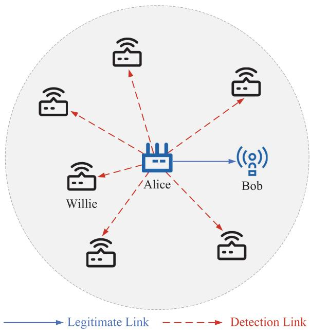
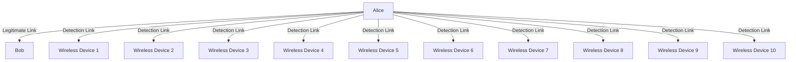
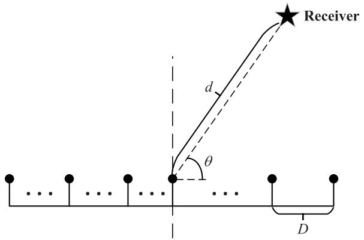
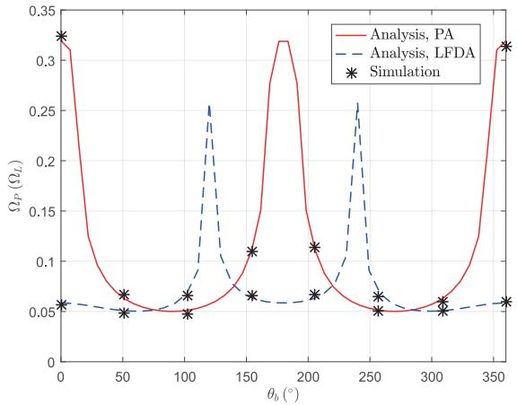
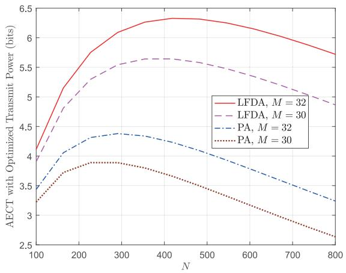
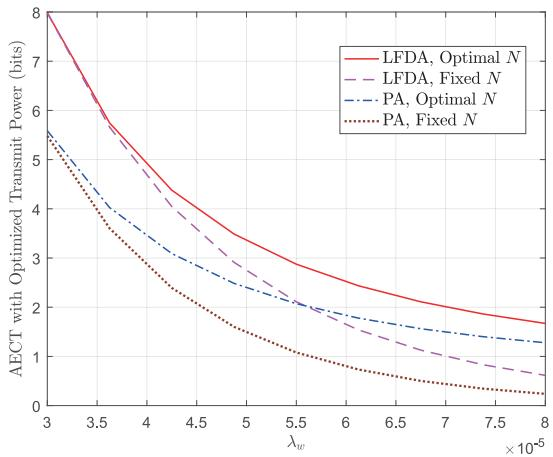
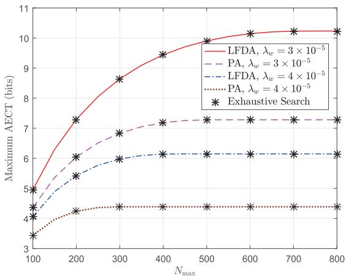
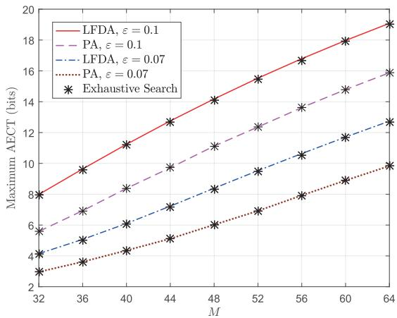
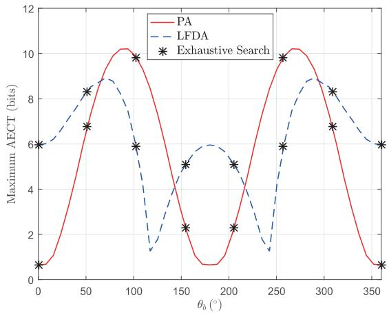

# Covert mmWave Communications With Finite Blocklength Against Spatially Random Wardens

Ruiqian Ma , Weiwei Yang , Xinrong Guan , Xingbo Lu , Yi Song , and Dechuan Chen

Abstract—In this article, we investigate covert millimeterwave (mmWave) communications with finite blocklength, where a multiantenna transmitter sends covert messages to a legitimate receiver in the presence of spatially random wardens. Both the phase array (PA) and linear frequency diverse array (LFDA) beamforming schemes, which are designed to maximize the antenna gain from the transmitter to the legitimate receiver, are investigated to improve the covert communication performance. First, the novel expressions of covert communication constraint and average effective covert throughput (AECT) are derived for both beamforming schemes. Then, taking into account the constraint of maximal available blocklength, the optimal transmit power and blocklength are determined for maximizing the AECT. Typically, comparing to the benchmark with fixed blocklength, the enhancement of AECT by utilizing the optimized blocklength enlarges as the density of wardens increases. In addition, it is observed that increasing the maximal available blocklength cannot always improve the maximum AECT due to the tradeoff between the transmit power and blocklength. Furthermore, it is

Manuscript received 11 January 2022; revised 24 November 2022, 6 February 2023, and 5 June 2023; accepted 14 July 2023. Date of publication 18 July 2023; date of current version 8 January 2024. This work was supported in part by the Key Research and Development Program of Jiangsu Province Key Project and Topics under Grant BE2021095; in part by the National Natural Science Foundation of China under Grant 62071486, Grant 62171461, and Grant 62171464; in part by the Natural Science Foundation on Frontier Leading Technology Basic Research Project of Jiangsu under Grant BK20212001; in part by the Young Elite Scientist Sponsorship Program of CAST under Grant 2021-JCJQ-QT-048; in part by the Doctoral Research Start-Up Funding of Nanyang Normal University under Grant 2022ZX017; in part by the Cultivating Fund Project for the National Natural Science Foundation of China of Nanyang Normal University under Grant 2022PY024; in part by the Open Research Fund of Key Laboratory of Broadband Wireless Communication and Sensor Network Technology, Ministry of Education under Grant JZNY202107; in part by the Key Scientific Research Projects of Colleges and Universities in Henan Province of China under Grant 23A510001; and in part by the Key Scientific and Technological Research Projects in Henan Province under Grant 232102210121. (Corresponding author: Xinrong Guan.)

Ruiqian Ma is with the College of Electronic Engineering, National University of Defense Technology, Hefei 230037, China (e-mail: mrq@ nudt.edu.cn).

Weiwei Yang and Xinrong Guan are with the College of Communications Engineering, Army Engineering University of PLA, Nanjing 230037, China (e-mail: yangww@aeu.edu.cn; geniusg2017@gmail.com).

Xingbo Lu is with the Academy of Military Sciences of PLA, Beijing 100091, China (e-mail: xingbo.lu@aeu.edu.cn).

Yi Song is with the College of Physics and Electronic Electrical Engineering, Huaiyin Normal University, Huaian 223001, China (e-mail: hysongyi@163.com).

Dechuan Chen is with the College of Physics and Electronic Engineering, Nanyang Normal University, Nanyang 473061, China, also with the Key Laboratory of Broadband Wireless Communication and Sensor Network Technology, Ministry of Education, Nanjing University of Posts and Telecommunications, Nanjing 210003, China, and also with the Henan Engineering Research Center for Radio Frequency Front End and Antenna of Millimeter Wave Wireless Communication System, Nanyang 473061, China (e-mail: chenchuan927@163.com).

Digital Object Identifier 10.1109/JIOT.2023.3296414 shown that the maximum AECT varies for different directions of the legitimate receiver under both the beamforming schemes, and the transmitter can adaptively choose the PA or LFDA beamforming scheme to improve the covertness performance against spatially random wardens.

Index Terms—Covert communications, finite blocklength, millimeter wave (mmWave), multiantenna, stochastic geometry.

# I. INTRODUCTION

# A. Background

D UE to the widespread applications of wirelesscommunications, the demand for communication communications, thedemand forcommunication security is growing, especially when the Internet of Things (IoT) has been penetrating into industry as well as our daily life [1], [2], [3]. Most of the existing works on wireless communication security focus on the protection of communication content against eavesdropping, e.g., encryption and physical-layer security [4]. However, in some situations, privacy of communication behavior is also critical, and private messages are required to be conveyed covertly. For example, in the Internet of Battlefield Things, the sensing devices collect and transmit the environmental information in battleground, and the exposure of the transmission between devices and soldiers may disclose the military operations. In this regard, covert communication, which shows the ability to shelter communication itself from being detected, has attracted increasing research attention [5].

As a pioneering work, Bash et al. [6] revealed the fundamental limit of covert communication over additive white Gaussian noise (AWGN) channels. After that, covert communication was extended into various scenarios by considering different practical issues, including noise uncertainty [7], channel uncertainty [8], cooperative jammer [9], age of information [10], relay network [11], and air–ground network [12], [13]. These works mainly considered the case of omnidirectional transmission over conventional radio frequency (RF) bands. By performing covert communication over millimeter-wave (mmWave) bands, a superior performance can be potentially achieved due to the directional beams. Also, the short wavelength of mmWave enables to deploy multiantenna into a compact size device, which greatly expands the applications of mmWave communications [15], [16], [17]. This highlights the importance of covert communication to face security threats in mmWave systems. However, the existing works on covert mmWave communications mainly focused on the situations with single warden [18], [19]. Considering a more general case with multiple wardens, the covertness performance may deteriorate dramatically when the wardens locate in the mmWave beams and obtain high antenna gain, of which the covertness framework needs further examinations. On the other hand, for low-energy and delay-sensitive communication scenarios, e.g., IoT and vehicular networks, it is practical to consider the impact of finite blocklength, which is always omitted in the existing works on covert mmWave communication. Against this background, in this article, we investigate the covert mmWave communications with finite blocklength against spatially random wardens, where the related literature and more specific motivations are detained in the following section.

# B. Related Works and Motivations

At the early stage of the study, people mainly focused on the enhancement of covert communication performance over RF bands [20], [21], [22], [23], [24]. Specifically, by considering noise uncertainty [20], the effective covert rate were examined under both the conventional and truncated channel inversion power control schemes, in which the location of transmitter can also be hidden. In [21], the detection error probability of the warden was derived and evaluated when the receivers have uncertainty about their channels. It is shown that the covertness performance can be improved when there exists channel estimation error at the warden. In addition to using the uncertainty caused by the randomness of noise and channel, the potential of artificial jamming was exploited for enhancing covertness performance in [22]. In the considered model, a full-duplex receiver was adopted to emit jamming signals, and the power control parameter was optimized to maximize the covert throughput. Furthermore, considering the abundance of communication links in the space, the public links can also be utilized as the cover to hide the existence of the covert links. In [23], covert communication was investigated in a nonorthogonal multiple access system, where the public transmission were utilized to provide a cover for the covert transmission. Considering a single-input–multi-output system with two users (one requires the concealment of message delivery and the other does not), the transmission rate was optimized subject to the covert communication constraint and the quality of service requirement [24]. However, the spectrum resource of conventional RF bands was becoming scarce, and people begin to focus on the higher frequency bands.

Recently, covert mmWave communications have attracted much attention due to its abundance of available spectrum and potential for enhancing covertness performance [18], [19], [25], [26]. In [18], the detection error performance at the warden was investigated by adopting a dual-beam mmWave transmitter, which can transmit message and jamming signals with two independent antenna arrays. Considering that a multiantenna transmitter sends signals to a full-duplex receiver over mmWave channels, the beamforming and jamming vectors were jointly designed in [19] for maximizing the covert rate. Zhang et al. [25] considered that an aerial transmitter adopt a beam sweeping scheme to transmit messages to a ground receiver in the presence of a ground warden. To maximize the covert throughput, the number of beams, the transmit power, and the height of transmitter were jointly optimized. It is worth mentioning that, these works on covert mmWave communication mainly considered the conventional phase array (PA) of multiantenna, in which the antenna beam has high directivity. In this regard, the exposure of only the user’s direction information may cause the failure of secure communication, e.g., the malicious nodes can be deployed in the direction of target receiver to obtain high antenna gain. Differing from the PA of multiantenna, the frequency diverse array can achieve the beam pattern depending on both direction and distance [27]. Considering the covert mmWave communication where one warden locates in the legitimate user’s direction, Ma et al. [26] adopted the frequency diverse array beamforming scheme to enhance the covertness performance via suppressing the antenna gain in user’s direction (but not the user’s location). However, in the case with multiple randomlydistributed wardens, it is still possible that the wardens locate within the beams and thus deteriorates the covertness performance. Although Zheng et al. [28] and Ma et al. [29] investigated the effect of spatially random wardens on covert communications over conventional RF bands, the results cannot be directly extended to covert mmWave communications due to the different properties of mmWave channels, e.g., the line-of-propagation links. Thus, the covert transmission design against spatially random wardens should be reconsidered over mmWave bands.

Most of the above works on covert communications are mainly based on the assumption of infinite blocklength. However, in many practical scenarios, the finite blocklength should be adopted to satisfy the strict power or latency constraint. Furthermore, finite blocklength also means that the warden can only collect limited observations, which naturally causes the uncertainty about the existence of transmission. In this regard, covert communication with finite blocklength has attracted extensive research interest in the literature, e.g., [30], [31], [32], [33], and [34]. Considering that a full-duplex receiver transmits jamming signals, Shu et al. [30] demonstrated that the performance of covert communications can still be improved when the blocklength is finite by adopting fixed jamming power. In [31], the covert communication with random transmit power was studied in the finite blocklength regime, and the optimal transmit power and blocklength maximizing the average effective covert throughput (AECT) were determined. Zhou et al. [32] investigated the covert communication aided by an intelligent reflecting surface, and the transmit power and reflect coefficient were jointly designed subject to the blocklength constraint. In order to hide both of transmitter location and communication behavior, Ma et al. [33] analyzed the covertness performance with finite blocklength under both the conventional and truncated channel inversion power control schemes. Besides, considering a covert mmWave communication system, the beam training duration, training power, and data transmission power that maximize the effective covert throughput were studied in [34]. From these works, we note that the blocklength is a key parameter influencing the covert communication performance, which necessitates blocklength design for covert communications.

As detailed above, performing covert communications on mmWave bands can offer potential for improving the covert communication performance due to the extra spatial degrees of freedom for beamforming design. However, in some specifical scenarios, there may exist multiple wardens performing the detection tasks. This implies that the wardens may locate within the mmWave beams, which will deteriorate the communication covertness. Meanwhile, the practical communication scenarios, such as IoT, require finite blocklength, of which the effect on decoding error probability and covertness performance is not negligible. Therefore, in the content of covert communication, the blocklength should be carefully designed by considering its joint effects on the communication covertness and effectiveness. These factors motivate this work to redesign the transmission for achieving enhanced covert mmWave communication against spatially random wardens.

# C. Contributions and Notations

In this article, we investigate the joint design of transmit power and blocklength to maximize the AECT in covert mmWave communication, where spatially random wardens attempt to detect the presence of transmission. Our principal contributions and results are summarized as follows.

1) Considering the case with spatially random wardens, the tools of stochastic geometry is adopted to describe the location randomness of wardens. Then, the tractable expressions of covert communication constraint are derived under both the PA and linear frequency diverse array (LFDA) beamforming schemes, where the derivations are operated based on the line-of-propagation characteristic of mmWave channels. Moreover, the expression of the AECT, as a function of transmit power, blocklength, antenna number, and warden’s density, is proposed to evaluate the covert mmWave performance for both the beamforming schemes.   
2) To facilitate the covert mmWave transmission design, the optimization problem to maximize the AECT is formulated, of which the optimal transmit power and blocklength are derived for both the PA and LFDA beamforming schemes. Our analysis demonstrates that there exists a nontrivial tradeoff between the transmit power and blocklength for improving the covert communication performance. Besides, it is revealed that the covert communication performance deteriorates as the density of wardens increases.   
3) The numerical results are presented to gain more insights. Specifically, for both the beamforming schemes, the AECT can be improved by adopting our proposed optimal blocklength comparing to the fixed blocklength case, and the gap becomes large as the density of wardens increases. Besides, increasing the maximal available blocklength cannot always improve the maximum AECT, but we can still adopt a larger number of antennas to improve it. Furthermore, the maximum AECT is related to the orientation of the legitimate receiver relative to the antenna array, and the transmitter can adaptively choose the PA or LFDA

TABLE I LIST OF MAIN SYMBOLS 

<table><tr><td>Symbol</td><td>Description</td></tr><tr><td>N</td><td>Number of channel uses in one block</td></tr><tr><td>M</td><td>Number of antennas at Alice</td></tr><tr><td> $\lambda_w$ </td><td>Density of Willie</td></tr><tr><td> $\Phi_w$ </td><td>Set of Willie</td></tr><tr><td> $\mathbf{h}_{ab}(\mathbf{h}_{aw_l})$ </td><td>Channel coefficient from Alice to Bob (l-th Willie)</td></tr><tr><td> $N_{\text{max}}$ </td><td>Maximum available blocklength</td></tr><tr><td> $P_a$ </td><td>Transmit power at Alice</td></tr><tr><td> $d_{ab}(d_{aw_l})$ </td><td>Distance from Alice to Bob (l-th Willie)</td></tr><tr><td> $\mathbf{a}_P(\mathbf{a}_L)$ </td><td>Array steering vector for the PA (LFDA) beamforming scheme</td></tr><tr><td> $a_b(a_{w_l})$ </td><td>Path gain from Alice to Bob (l-th Willie)</td></tr><tr><td> $\Psi_m^P(\Psi_m^L)$ </td><td>Phase difference of the m-th antenna</td></tr><tr><td> $\xi_{w_l}$ </td><td>Total detection error probability at l-th Willie</td></tr><tr><td> $\sigma^2$ </td><td>Variance of AWGN</td></tr><tr><td> $\gamma_b$ </td><td>Received signal to noise ratio (SNR) at Bob</td></tr><tr><td>R</td><td>Channel coding rate</td></tr><tr><td>δ</td><td>Decoding error probability</td></tr><tr><td>ε</td><td>Covertness tolerance</td></tr><tr><td> $\mathcal{V}_T$ </td><td>Total variation distance</td></tr><tr><td> $\mathcal{D}$ </td><td>Kullback-Leibler (KL) divergence</td></tr><tr><td> $\Omega_P(\Omega_L)$ </td><td>Average channel gain at the malicious Willie</td></tr><tr><td> $G_P(G_L)$ </td><td>Antenna gain</td></tr></table>

flowchart

Fig. 1. System model.

beamforming scheme according to the direction of the legitimate receiver to further enhance the covert mmWave communication performance.

Notations: We use the lowercase boldface letters for vectors. For a given vector x, x[i] denotes the ith elements of x, and $\mathbf { x } ^ { \ l _ { H } }$ denotes the conjugate transpose of x. The expectation operator is denoted by E(·), while · denotes the floor function. $\mathcal { C N } ( 0 , \sigma ^ { 2 } )$ denotes the circularly symmetric complex Gaussian distribution with zero mean and variance $\sigma ^ { 2 } .$ . The main symbols used in this article are listed in Table I.

# II. SYSTEM MODEL

# A. Network Description

As shown in Fig. 1, we consider a covert mmWave communication system. Specifically, a multiantenna transmitter (Alice) desires to send the privacy information to the receiver (Bob) in the presence of spatially random wardens (Willies), which attempt to detect whether Alice transmits or not. We assume that the finite blocklength with N channel uses and the Gaussian codebooks are adopted at Alice [31]. Alice is equipped with M antennas, and Bob and Willies are all equipped with single antenna. Besides, to characterize the randomness of Willies’ locations, the spatially random Willies are modeled as a homogeneous $\mathrm { P P P } \ \Phi _ { w }$ with density $\lambda _ { w }$ [35].

text_image

Receiver
d
θ
D

Fig. 2. Illustration of ULA with the reference point at its geometric center.

In this work, the channel coefficients from Alice to Bob and the lth Willie are denoted by $\mathbf { h } _ { a b }$ and $\mathbf { h } _ { a w _ { l } } .$ , respectively. Following the 3GPP model, the line-of-sight (LOS) and non-LOS (NLOS) mmWave channels can be modeled as a universal expression by considering different path losses [14]. Then, as suggested by [15], [16], [17], and [26], we adopt the single path model considering the dominant path due to the highly directivity and sparsity of mmWave channels, i.e.,

$$
\mathbf {h} _ {a i} = \frac {a _ {i} \mathbf {a} (\theta_ {i})}{d _ {a i} ^ {\alpha / 2}} \tag {1}
$$

where the subscript $i \in \{ b , w _ { l } \}$ denotes Bob or the lth Willie, $d _ { a i }$ denotes the distance from Alice to the receiver, α denotes the path-loss exponent with reference distance equaling to 1 m, $\theta _ { i }$ is the normalized direction of the path to the receiver, a(θi) denotes the array steering vector, and $a _ { i }$ is the path gain that follows circularly symmetric complex Gaussian distribution, i.e., $a _ { i } \sim \mathcal { C N } ( 0 , 1 )$ , which captures that the dominant path can be LOS or NLOS. Specifically, we assume the quasi-static fading channels, which means that $a _ { i }$ remains constant over one block of N channel uses [36].

# B. Antenna Array at Alice

As shown in Fig. 2, the uniform linear array (ULA) is adopted at Alice, and both the PA and LFDA beamforming schemes are considered as follows.

1) PA Beamforming Scheme: For the PA beamforming scheme, the frequency use at different antenna elements are the same. Set the reference point at the geometric center of array, and the array steering vector at direction $\theta _ { i } , i \in \{ b ,$ , wl} can be given by [37]

$$
\mathbf {a} _ {P} (\theta_ {i}) = \left[ e ^ {j \Psi_ {0} ^ {P} (\theta_ {i})}, \dots , e ^ {j \Psi_ {m} ^ {P} (\theta_ {i})}, \dots , e ^ {j \Psi_ {M - 1} ^ {P} (\theta_ {i})} \right] \tag {2}
$$

where $\Psi _ { m } ^ { P } ( \theta _ { i } )$ is the phase difference of the mth antenna element relative to the reference point, and it can be given by

$$
\Psi_ {m} ^ {P} (\theta_ {i}) = \left(m - \frac {M - 1}{2}\right) \frac {2 \pi f _ {c} D \cos (\theta_ {i})}{c} \tag {3}
$$

where $m = 0 , 1 , \ldots , M - 1$ denotes the index of antenna elements, D is the interval of contiguous antenna elements, c denotes the speed of light, and $f _ { c }$ is the carrier frequency.

Then, the channel coefficient from Alice to Bob and the lth Willie for the PA beamforming scheme can be obtained by substituting (2) into (1), i.e.,

$$
\mathbf {h} _ {P, a i} = \frac {a _ {i} \mathbf {a} _ {P} (\theta_ {i})}{d _ {a i} ^ {\alpha / 2}}. \tag {4}
$$

2) LFDA Beamforming Scheme: Differing from the PA beamforming scheme, the transmission frequency linearly increases from one antenna element to the next under the LFDA beamforming scheme [27]. Accordingly, the frequency allocated to the mth antenna element can be given by

$$
f _ {m} = f _ {c} + \left(m - \frac {M - 1}{2}\right) \Delta f \tag {5}
$$

where $\Delta f$ denotes the frequency increment. Similarly, we set the reference point at the geometric center of the array. Then, considering that the distance between antenna array and the receiver is always much lager than the antenna element interval, the distance from the mth antenna element to the receiver can be approximated as [38], [39]

$$
d _ {a i} ^ {m} = d _ {a i} - \left(m - \frac {M - 1}{2}\right) D \cos (\theta_ {i}) \tag {6}
$$

where $d _ { a i }$ denotes the distance from the reference point to the receiver, i.e., the distance from Alice to the receiver.

It is known that the phase of transmit signal is related to both the carrier frequency and transmission distance. Thus, from (6), the phase shift between two antenna elements depends on both $\theta _ { i }$ and $d _ { a i }$ due to the existence of frequency increment under the LFDA beamforming scheme. Denoting the array steering vector for the LFDA beamforming scheme as $\mathbf { a } _ { L } ( \theta _ { i } , d _ { a i } )$ , the expression of which can be given by

$$
\mathbf {a} _ {L} \left(\theta_ {i}, d _ {a i}\right) = \left[ e ^ {j \Psi_ {0} ^ {L} \left(\theta_ {i}, d _ {a i}\right)}, \dots , e ^ {j \Psi_ {m} ^ {L} \left(\theta_ {i}, d _ {a i}\right)}, \dots , e ^ {j \Psi_ {M - 1} ^ {L} \left(\theta_ {i}, d _ {a i}\right)} \right] \tag {7}
$$

where the phase shift of the mth antenna element relative to the reference point, i.e., $\Psi _ { m } ^ { L } ( \theta _ { i } , d _ { a i } )$ , can be derived as

$$
\begin{array}{l} \Psi_ {m} ^ {L} (\theta_ {i}, d _ {a i}) = 2 \pi f _ {m} \frac {d _ {a i} ^ {m}}{c} - 2 \pi f _ {c} \frac {d _ {a i}}{c} \\ = 2 \pi \left(f _ {c} + \left(m - \frac {M - 1}{2}\right) \Delta f\right) \\ \times \frac {d _ {a i} - \left(m - \frac {M - 1}{2}\right) D \cos (\theta_ {i})}{c} - \frac {2 \pi f _ {c} d _ {a i}}{c} \\ = \frac {2 \pi}{c} \left(- f _ {c} \left(m - \frac {M - 1}{2}\right) D \cos (\theta_ {i}) \right. \\ + d _ {a i} \left(m - \frac {M - 1}{2}\right) \Delta f \\ \left. - \left(m - \frac {M - 1}{2}\right) ^ {2} \Delta f D \cos \left(\theta_ {i}\right)\right) \\ \stackrel {a} {\approx} \frac {2 \pi}{c} \left(- f _ {c} \left(m - \frac {M - 1}{2}\right) D \cos (\theta_ {i}) \right. \\ \left. + d _ {a i} \left(m - \frac {M - 1}{2}\right) \Delta f\right) \tag {8} \\ \end{array}
$$

where step (a) is due to the fact that $M \Delta f \ \ll \ f _ { c }$ and $M D \ll d _ { a i } \ [ 3 9 ]$ , [40], [41].

Thus, the channel coefficient from Alice to Bob and the lth Willie for the LFDA beamforming scheme can be given by

$$
\mathbf {h} _ {L, a i} = \frac {a _ {i} \mathbf {a} _ {L} (\theta_ {i} , d _ {a i})}{d _ {a i} ^ {\alpha / 2}}. \tag {9}
$$

# C. Detection at Willies

In the considered system, there exist spatially random Willies detecting the presence of transmission from Alice. The noncolluding Willies, which perform the detection tasks separately [28], is considered. For an arbitrary Willie $w _ { l } \in \Phi _ { w }$ , it needs to distinguish the following hypotheses:

$$
\left\{ \begin{array}{l} \mathcal {H} _ {0}: \mathbf {y} _ {w _ {l}} [ i ] = \mathbf {n} _ {w _ {l}} [ i ], \\ \mathcal {H} _ {1}: \mathbf {y} _ {w _ {l}} [ i ] = \sqrt {P _ {a}} \mathbf {h} _ {j, a w _ {l}} \mathbf {w} _ {j} \mathbf {x} [ i ] + \mathbf {n} _ {w _ {l}} [ i ] \end{array} \right. \tag {10}
$$

where $P _ { a }$ is the transmit power at Alice, $\mathbf { w } _ { j }$ denotes the beamforming vector, ${ \bf y } _ { w _ { I } } [ i ]$ is the received signal at Willie $w _ { l }$ for the ith channel use, $\mathbf { x } [ i ] \sim \mathcal { C } \mathcal { N } ( 0 , 1 )$ is the Gaussian codeword, $\mathbf { n } _ { w _ { l } } [ i ] \sim \mathcal { C } \mathcal { N } ( 0 , \sigma ^ { 2 } )$ denotes the AWGN, $i = 1 , 2 , \ldots , N$ is the index of channel uses, and the subscript $j \in \{ P , L \}$ denotes the PA or LFDA beamforming scheme.

Considering equal prior probabilities, the total detection error probability at the lth Willie $w _ { l }$ is defined as [6], [31]

$$
\xi_ {w _ {l}} = P _ {w _ {l}} ^ {\mathrm{FA}} + P _ {w _ {l}} ^ {\mathrm{MD}} \tag {11}
$$

where $P _ { w _ { l } } ^ { \mathrm { F A } }$ is the false alarm probability that Willie wl accepts $\mathcal { H } _ { 1 }$ when $\mathcal { H } _ { 0 }$ is true, and $P _ { w _ { I } } ^ { \mathrm { M D } }$ denotes the miss detection probability that $w _ { l }$ accepts $\mathcal { H } _ { 0 }$ when $\mathcal { H } _ { 1 }$ is true. Naturally, wl wants to detect the transmission from Alice with the minimum total detection error probability $\xi _ { w _ { l } } ^ { * } .$ . According to [6], [7], and [42], the communication is deemed covert for Willie wl by satisfying the covert communication constraint $\xi _ { w _ { l } } ^ { * } \ge 1 - \varepsilon$ , where the tolerance ε is a predetermined value that represents the covertness level. The constraint $\xi _ { w _ { l } } ^ { * } \ge 1 - \varepsilon$ means that the detection behavior of Willie $w _ { l }$ is close to a random guess.

Due to the presence of multiple Willies, the communication is deemed covert only when the minimum total detection error probability of each Willie is lower bounded by 1−ε. Therefore, the covert communication constraint can be expressed as

$$
\min _ {w _ {l} \in \Phi_ {w}} \xi_ {w _ {l}} ^ {*} \geq 1 - \varepsilon \tag {12}
$$

where $\Phi _ { w }$ denotes the set of Willies. Remarkably, (12) can guarantee that each Willie cannot effectively determine the presence of transmission.

# D. Transmission From Alice to Bob

In order to maximize the antenna gain from Alice to Bob, the beamforming vectors for the PA and LFDA beamforming√ schemes are designed as √ $\mathbf { w } _ { P } = ( 1 / \sqrt { M } ) \mathbf { a } _ { P } ^ { H } ( \theta _ { b } )$ and $\mathbf { w } _ { L } =$ $( 1 / \sqrt { M } ) \mathbf { a } _ { L } ^ { H } ( \theta _ { b } , d _ { a b } )$ , respectively. Then, the received SNR at Bob can be given by

$$
\gamma_ {b} = \frac {P _ {a} M \left| a _ {b} \right| ^ {2} d _ {a b} ^ {- \alpha}}{\sigma^ {2}} \tag {13}
$$

where $\sigma ^ { 2 }$ denotes the noise power.

Due to the finite blocklength, the decoding error cannot be ignored. Thus, the effective throughput can be given by [30]

$$
\eta = N R (1 - \delta) \tag {14}
$$

where R is the channel coding rate, and δ is the decoding error probability. For a given R, the expression of δ can be written as [43]

$$
\delta = \mathcal {Q} \left(\frac {\ln 2 \sqrt {N} \left(\log_ {2} (1 + \gamma_ {b}) - R\right)}{\sqrt {1 - (\gamma_ {b} + 1) ^ {- 2}}}\right) \tag {15}
$$

where $\begin{array} { r } { \mathcal { Q } ( x ) = \int _ { x } ^ { \infty } ( 1 / \sqrt { 2 \pi } ) \mathrm { e } ^ { - ( t ^ { 2 } / 2 ) } d t } \end{array}$ denotes the Q-function.

Note that there exists a random variable $a _ { b }$ in (13), the average effective throughput is adopted in this article, i.e.,

$$
\bar {\eta} = N R (1 - \mathbb {E} (\delta)). \tag {16}
$$

# III. COVERT COMMUNICATIONS FOR PHASE ARRAY BEAMFORMING SCHEME

In this section, considering the PA beamforming scheme at Alice, we first derive a tractable expression of covert communication constraint. Then, the transmit power and blocklength are jointly optimized to maximize the AECT.

# A. Covertness Criteria

For robustness, we consider the worst case that Willies can obtain the complete information on the channel from Alice via the training signals. Specifically, during the beam training phase, Alice sequentially scans the transmit antennas to send pilot signals, and Bob conveys back the index of his quantized beamforming vector [44]. Then, Willies may estimate the channel by analyzing the training signals. This indicates that Willies can perform an optimal test, and the minimum total detection error probability can be calculated by [6]

$$
\min _ {w _ {l} \in \Phi_ {w}} \xi_ {P, w _ {l}} ^ {*} = 1 - \max _ {w _ {l} \in \Phi_ {w}} \mathcal {V} _ {T} \left(\mathbb {P} _ {1, w _ {l}} ^ {P}, \mathbb {P} _ {0, w _ {l}} ^ {P}\right) \tag {17}
$$

where $\mathbb { P } _ { 1 , w _ { l } } ^ { P }$ and $\mathbb { P } _ { 0 , w _ { I } } ^ { P }$ are the probability distributions of received signals at Willie wl under events $\mathcal { H } _ { 1 }$ and $\mathcal { H } _ { 0 } .$ , respectively, and $\mathcal { V } _ { T } ( \mathbb { P } _ { 1 , w _ { l } } ^ { P } , \mathbb { P } _ { 0 , w _ { l } } ^ { P } )$ is the total variation distance between PP $\mathbb { P } _ { 1 , w _ { I } } ^ { P }$ an d PP $\mathbb { P } _ { 0 , w _ { l } } ^ { P } .$ .

As discussed in [6] and [13], the total variation metric is unwieldy for the products of probability measures, which are used in the further analysis. Thus, we use Pinsker’s inequality to obtain a tractable upper bound as

$$
\mathcal {V} _ {T} \left(\mathbb {P} _ {1, w _ {l}} ^ {P}, \mathbb {P} _ {0, w _ {l}} ^ {P}\right) \leq \sqrt {\frac {1}{2} \mathcal {D} \left(\mathbb {P} _ {1 , w _ {l}} ^ {P} \| \mathbb {P} _ {0 , w _ {l}} ^ {P}\right)} \tag {18}
$$

where to the $\mathbb { P } _ { 0 , w _ { l } } ^ { P } ,$ $\mathcal { D } ( \mathbb { P } _ { 1 , w _ { l } } ^ { P } \Vert \mathbb { P } _ { 0 , w _ { l } } ^ { P } . )$ 1,wl 0,wl 1,wl and its expression is derived as (19), shown atom of the page. Accordingly, after some simple is the KL divergence from $\mathbb { P } _ { 1 , w _ { l } } ^ { P }$ algebraic manipulations, we know that (12) can be guaranteed by satisfying a stricter KL divergence constraint $\begin{array} { r } { \operatorname* { m a x } _ { w _ { l } \in \Phi _ { w } } \sqrt { ( 1 / 2 ) \mathcal { D } ( \mathbb { P } _ { 1 , w _ { l } } ^ { P } \Vert \mathbb { P } _ { 0 , w _ { l } } ^ { P } . ) } ~ \le ~ \varepsilon } \end{array}$ , which results in a robust transmission scheme.

Notably, from the perspective of Alice, it is difficult to obtain the instantaneous channel state information of Willie $( \mathrm { i } . \mathrm { e } . , \ \mathbf { h } _ { P , a w _ { l } } )$ , especially when Willies keep silent. Therefore, the average KL divergence is adopted to measure the covertness performance, which can be written as

$$
\mathbb {E} \left(\max _ {w _ {l} \in \Phi_ {w}} \sqrt {\frac {1}{2} \mathcal {D} \left(\mathbb {P} _ {1 , w _ {l}} ^ {P} \| \mathbb {P} _ {0 , w _ {l}} ^ {P}\right)}\right) \leq \varepsilon . \tag {20}
$$

Then, we derive the covert communication constraint in the following theorem.

Theorem 1: For the PA beamforming scheme, the covert communication constraint can be given by

$$
\frac {P _ {a} \sqrt {N} \Omega_ {P}}{2 \sigma^ {2}} \leq \varepsilon \tag {21}
$$

where the average channel gain at the most malicious Willie, i.e., $\Omega _ { P } ,$ can be expressed as

$$
\begin{array}{l} \Omega_ {P} = \frac {\pi \lambda_ {w}}{T} \sum_ {j = 1} ^ {T} \exp \left(- \frac {\lambda_ {w} \tan^ {- \frac {2}{\alpha}} (u _ {j}) \Xi_ {P} (u _ {j})}{\alpha}\right) \frac {\sqrt {u _ {j} (\frac {\pi}{2} - u _ {j})}}{\cos^ {2} (u _ {j})} \\ \times \left(\frac {\pi}{T \alpha} \sum_ {i = 1} ^ {T} e ^ {- \frac {\tan (u _ {j})}{G _ {P} (v _ {i})}} \sqrt {v _ {i} (2 \pi - v _ {i})} + \frac {2 \tan^ {- \frac {2}{\alpha}} (u _ {j}) \Xi_ {P} (u _ {j})}{\alpha^ {2}}\right) \tag {22} \\ \end{array}
$$

where T is an accuracy and complexity tradeoff parameter of Gaussian–Chebyshev quadrature, $\begin{array} { r l r l r l r } { \nu _ { i } } & { { } = } & { \pi ( 1 + \cos { ( [ ( 2 i - 1 ) \pi ] / 2 T ) } ) , } & { u _ { j } } & { { } = } & { } & { ( \pi / 4 ) } \end{array}$ $( 1 + \cos { ( [ ( 2 j - 1 ) \pi ] / 2 T ) } )$ ), the antenna gain $G _ { P } ( \cdot )$ can be calculated by

$$
G _ {P} (x) = \frac {\sin^ {2} \left(\frac {M \pi D f _ {c}}{c} (\cos (x) - \cos (\theta_ {b}))\right)}{M \sin^ {2} \left(\frac {\pi D f _ {c}}{c} (\cos (x) - \cos (\theta_ {b}))\right)} \tag {23}
$$

and $\Xi _ { P } ( \cdot )$ is given by

$$
\Xi_ {P} (x) = \frac {\pi}{T} \sum_ {i = 1} ^ {T} \Gamma \left(\frac {2}{\alpha}, \frac {\tan^ {- \frac {2}{\alpha}} (x)}{G _ {P} (v _ {i})}\right) (G _ {P} (v _ {i})) ^ {\frac {2}{\alpha}} \sqrt {v _ {i} (2 \pi - v _ {i})} \tag {24}
$$

where $\begin{array} { r } { \Gamma ( x , y ) = \int _ { v } ^ { \infty } e ^ { - t } t ^ { x - 1 } d t } \end{array}$ is the upper incomplete Gamma function [45, eq. (8.350.2)].

Proof: Refer to Appendix A.

Remark 1: From (21), it is clear that the increasing of Willie’s density $\lambda _ { w }$ causes the tighter covert communication constraint. This indicates that the covertness performance deteriorates as $\lambda _ { w }$ increases. To guarantee the communication covertenss, Alice can reduce the transmit power and blocklength to degrade the quality of Willies’ observation samples.

# B. Optimization of Average Effective Covert Throughput

In this work, the AECT is adopted to measure the performance of covert communications [29], [31], [33]. Specifically, the metric AECT is defined as the average amount of information that can be reliably transmitted subject to the covertness constraint, and the larger AECT means the better effectiveness performance while guaranteing covertness. Based on (16), the AECT for the PA beamforming scheme can be expressed as

$$
\bar {\eta} _ {P} = N R (1 - \mathbb {E} (\delta)), \quad \text { s.t. } \tag {25}
$$

where the detection error probability δ is given by (15). Note that δ is difficult to be calculated directly due to the existence of Q-function, and thus the linear approximation of

$$
\mathcal {D} \left(\mathbb {P} _ {1, w _ {l}} ^ {P} \| \mathbb {P} _ {0, w _ {l}} ^ {P}\right) = \int_ {X} f (\mathbf {x} | H _ {1}) \ln \frac {f (\mathbf {x} | H _ {1})}{f (\mathbf {x} | H _ {0})} d \mathbf {x}
$$

$$
= \int_ {- \infty} ^ {\infty} \prod_ {i = 1} ^ {N} \frac {\exp \left(- \frac {| x | ^ {2}}{P _ {a} | \mathbf {h} _ {P , a w _ {l}} \mathbf {w} _ {P} | ^ {2} + \sigma^ {2}}\right)}{\pi \left(P _ {a} | \mathbf {h} _ {P , a w _ {l}} \mathbf {w} _ {P} | ^ {2} + \sigma^ {2}\right)} \ln \left(\prod_ {i = 1} ^ {N} \frac {\pi \sigma^ {2} \exp \left(- \frac {| x | ^ {2}}{P _ {a} | \mathbf {h} _ {P , a w _ {l}} \mathbf {w} _ {P} | ^ {2} + \sigma^ {2}}\right)}{\pi \left(P _ {a} | \mathbf {h} _ {P , a w _ {l}} \mathbf {w} _ {P} | ^ {\textsf {2}} + \sigma^ {2}\right) \exp \left(- \frac {x ^ {2}}{\sigma^ {2}}\right)}\right) d | x | ^ {2}
$$

$$
= N \left[ \ln \frac {\sigma^ {2}}{P _ {a} \left| \mathbf {h} _ {P , a w _ {l}} \mathbf {w} _ {P} \right| ^ {2} + \sigma^ {2}} + \left(\frac {1}{\sigma^ {2}} - \frac {1}{P _ {a} \left| \mathbf {h} _ {P , a w _ {l}} \mathbf {w} _ {P} \right| ^ {2} + \sigma^ {2}}\right) \int_ {- \infty} ^ {\infty} \frac {| x | ^ {2} \exp \left(- \frac {| x | ^ {2}}{P _ {a} \left| \mathbf {h} _ {P , a w _ {l}} \mathbf {w} _ {P} \right| ^ {2} + \sigma^ {2}}\right)}{\pi \left(P _ {a} \left| \mathbf {h} _ {P , a w _ {l}} \mathbf {w} _ {P} \right| ^ {2} + \sigma^ {2}\right)} d | x | ^ {2} \right]
$$

$$
= N \left(\frac {P _ {a} \left| \mathbf {h} _ {P , a w _ {l}} \mathbf {w} _ {P} \right| ^ {2}}{\sigma^ {2}} - \ln \left(1 + \frac {P _ {a} \left| \mathbf {h} _ {P , a w _ {l}} \mathbf {w} _ {P} \right| ^ {2}}{\sigma^ {2}}\right)\right). \tag {19}
$$

δ is adopted [46], i.e.,

$$
\delta \approx \left\{ \begin{array}{l l} 1, & \gamma_ {b} <   \gamma_ {0} - \frac {\beta_ {b}}{2 \sqrt {N}}, \\ \frac {1}{2} - \frac {\sqrt {N}}{\beta_ {b}} (\gamma_ {b} - \gamma_ {0}), & \gamma_ {0} - \frac {\beta_ {b}}{2 \sqrt {N}} \leq \gamma_ {b} \leq \gamma_ {0} + \frac {\beta_ {b}}{2 \sqrt {N}}, \\ 0, & \gamma_ {b} > \gamma_ {0} + \frac {\beta_ {b}}{2 \sqrt {N}} \end{array} \right. \tag {26}
$$

where $\beta _ { b } = \sqrt { 2 \pi ( 2 ^ { 2 R } - 1 ) }$ , and $\gamma _ { 0 } = 2 ^ { R } - 1$ . Then, $\mathbb { E } ( \delta )$ can be approximated as (27), shown at the bottom of the page, where the probability distribution function (PDF) and cumulative distribution function (CDF) of $\gamma _ { b }$ are, respectively, given by

$$
f _ {\gamma_ {b}} (x) = \left\{ \begin{array}{l l} \frac {\sigma^ {2} d _ {a b} ^ {\alpha}}{P _ {a} M} e ^ {- \frac {x \sigma^ {2} d _ {a b} ^ {\alpha}}{P _ {a} M}}, & x \geq 0 \\ 0, & x <   0 \end{array} \right. \tag {28}
$$

and

$$
F _ {\gamma_ {b}} (x) = \left\{ \begin{array}{l l} 1 - e ^ {- \frac {x \sigma^ {2} d _ {a b} ^ {a}}{P _ {a} M}}, & x \geq 0 \\ 0, & x <   0. \end{array} \right. \tag {29}
$$

Considering that the blocklength is limited by a maximum value $N _ { \mathrm { m a x } }$ , the optimization problem of the transmit power and blocklength to maximize the AECT can be formulated as

$$
\max _ {N, P _ {a}} \bar {\eta} _ {P}, \text {   s.t.   (21),   } N \leq N _ {\max}, N \in \mathbb {N} ^ {+} \tag {30}
$$

where $\mathbb { N } ^ { + }$ denotes the set of positive integers.

To tackle (30), we first determine the optimal transmit power $P _ { a , P } ^ { + }$ Pa,P for a given blocklength N. Specifically, it is clear that $\bar { \eta } _ { P }$ is an increasing function of $P _ { a }$ and N. Thus, for a given N, the optimal transmit power $P _ { a , P } ^ { + }$ should be its maximal available value subject to the covert communication constraint, i.e.,

$$
P _ {a, P} ^ {+} = \frac {2 \varepsilon \sigma^ {2}}{\sqrt {N} \Omega_ {P}} \tag {31}
$$

where $\Omega _ { P }$ is given by (22). Then, we can derive the optimal transmit power and blocklength in the following theorem.

Theorem 2: Under the PA beamforming scheme, the optimal transmit power and blocklength maximizing the AECT, i.e., the solution of (30), can be given by

$$
P _ {a, P} ^ {*} = \frac {2 \varepsilon \sigma^ {2}}{\sqrt {N _ {P} ^ {*}} \Omega_ {P}} \tag {32}
$$

and

$$
N _ {P} ^ {*} = \left\{ \begin{array}{l l} \left\lfloor \left(\frac {\beta_ {b}}{2 \gamma_ {0}}\right) ^ {2} \right\rfloor , & N _ {P} ^ {0} \leq \left(\frac {\beta_ {b}}{2 \gamma_ {0}}\right) ^ {2} \\ \min (N _ {\max}, \left\lfloor N _ {P} ^ {0} \right\rfloor), & N _ {P} ^ {0} > \left(\frac {\beta_ {b}}{2 \gamma_ {0}}\right) ^ {2} \end{array} \right. \tag {33}
$$

where $N _ { P } ^ { 0 } = { ( 4 M \varepsilon / ( \gamma _ { 0 } \Omega _ { P } d _ { a b } ^ { \alpha } ) ) ^ { 2 } }$ .

Proof: Refer to Appendix B.

Remark 2: Based on (32) and (33), we know that the average channel gain at the most malicious Willie, i.e., $\Omega _ { P } ,$ is a significant factor influencing the AECT. From (23), we find that, for a given $M ,$ the antenna gain under the PA beamforming scheme is only related to $\theta ,$ and is maximized at the direction $\theta = \theta _ { b }$ . Besides, due to the existence of $\cos ( \theta )$ in (23), we find that the decay rates of antenna gain are various for different $\theta _ { b }$ when θ varies from $\theta _ { b }$ to $\theta _ { b } + \Delta \theta$ , where $\Delta \theta$ is a sufficiently small angle. For example, the absolute value of $\cos ( 9 0 ^ { \circ } + \Delta \theta ) - \cos ( 9 0 ^ { \circ } )$ is larger than the absolute value of $\cos ( 0 ^ { \circ } + \Delta \theta ) - \cos ( 0 ^ { \circ } )$ due to $( [ \partial \cos ( \theta ) ] / \partial \theta ) | _ { \theta = 9 0 ^ { \circ } } >$ $( [ \partial \cos ( \theta ) ] / \partial \theta ) | _ { \theta = 0 ^ { \circ } }$ . This indicates that the beam-width first decreases and then increases as $\theta _ { b }$ increases from $0 ^ { \circ }$ to $1 8 0 ^ { \circ }$ . Thus, $\Omega _ { P }$ initially decreases and then enlarges as $\theta _ { b }$ increases from $0 ^ { \circ }$ to $1 8 0 ^ { \circ }$ , since the probability that Willies locate within the beam varies. Most importantly, the maximum AECT first increases and then decreases as $\theta _ { b }$ enlarges from $0 ^ { \circ }$ to $1 8 0 ^ { \circ }$ , i.e., the covert communication performance for the PA beamforming scheme varies with $\theta _ { b }$ .

# IV. COVERT COMMUNICATIONS FOR LINEAR FREQUENCY DIVERSE ARRAY BEAMFORMING SCHEME

In this section, we consider that the LFDA beamforming scheme is adopted at Alice. First, we derive a tractable covert communication constraint for the LFDA beamforming scheme. Then, the transmit power and blocklength are jointly optimized to maximize the AECT.

# A. Covertness Criteria

Similar to the PA beamforming scheme in Section III-A, the average KL divergence constraint is adopted, and the covert communication constraint can be expressed as

$$
\mathbb {E} \left(\max _ {w _ {l} \in \Phi_ {w}} \sqrt {\frac {1}{2} \mathcal {D} \left(\mathbb {P} _ {1 , w _ {l}} ^ {L} \| \mathbb {P} _ {0 , w _ {l}} ^ {L}\right)}\right) \leq \varepsilon \tag {34}
$$

$$
\begin{array}{l} \mathbb {E} (\delta) = \int_ {0} ^ {\infty} \mathcal {Q} \left(\frac {\ln 2 \sqrt {N} \left(\log_ {2} (1 + x) - R\right)}{\sqrt {1 - (x + 1) ^ {- 2}}}\right) f _ {\gamma_ {b}} (x) d x \\ \approx F _ {\gamma_ {b}} \bigg (\gamma_ {0} - \frac {\beta_ {b}}{2 \sqrt {N}} \bigg) + \left(\frac {1}{2} + \frac {\gamma_ {0} \sqrt {N}}{\beta_ {b}} - \frac {P _ {a} M \sqrt {N}}{\sigma^ {2} \beta_ {b} d _ {a b} ^ {\alpha}}\right) \bigg (F _ {\gamma_ {b}} \bigg (\gamma_ {0} + \frac {\beta_ {b}}{2 \sqrt {N}} \bigg) - F _ {\gamma_ {b}} \bigg (\gamma_ {0} - \frac {\beta_ {b}}{2 \sqrt {N}} \bigg) \bigg) \\ \left. \right. - \left(- 1 + \left(\frac {\gamma_ {0} \sqrt {N}}{\beta_ {b}} + \frac {1}{2}\right) F _ {\gamma_ {b}} \left(\gamma_ {0} + \frac {\beta_ {b}}{2 \sqrt {N}}\right) - \left(\frac {\gamma_ {0} \sqrt {N}}{\beta_ {b}} - \frac {1}{2}\right) F _ {\gamma_ {b}} \left(\gamma_ {0} - \frac {\beta_ {b}}{2 \sqrt {N}}\right)\right) \\ = 1 - \frac {P _ {a} M \sqrt {N}}{\sigma^ {2} \beta_ {b} d _ {a b} ^ {\alpha}} \left(F _ {\gamma_ {b}} \left(\gamma_ {0} + \frac {\beta_ {b}}{2 \sqrt {N}}\right) - F _ {\gamma_ {b}} \left(\gamma_ {0} - \frac {\beta_ {b}}{2 \sqrt {N}}\right)\right) \tag {27} \\ \end{array}
$$

line

| θ_b (°) | Analysis, PA | Analysis, LFDA | Simulation |
| ------- | ------------ | -------------- | ---------- |
| 0       | 0.32         | 0.06           | 0.32       |
| 50      | 0.07         | 0.05           | 0.07       |
| 100     | 0.05         | 0.07           | 0.05       |
| 150     | 0.11         | 0.25           | 0.11       |
| 200     | 0.32         | 0.06           | 0.12       |
| 250     | 0.06         | 0.25           | 0.06       |
| 300     | 0.05         | 0.06           | 0.05       |
| 350     | 0.32         | 0.06           | 0.32       |

Fig. 3. Average channel gain at the most malicious Willie versus the direction of Bob, where $\lambda _ { w } = 5 \times \mathrm { ~ \ ' { l } 0 } ^ { - 3 }$ , α = 2.2, M = 32, and $\Delta f = 1 ~ \mathrm { M H z }$ .

where $\mathbb { P } _ { 1 , w _ { l } } ^ { L }$ PL1,wl an d PL $\mathbb { P } _ { 0 , w _ { l } } ^ { L }$ denote the probability distribution of the observations at the lth Willie wl for the LFDA beamforming scheme under events $\mathcal { H } _ { 1 }$ and ${ \mathcal { H } } _ { 0 } ,$ respectively. Then, the covert communication constraint can be further derived in the following theorem.

Theorem 3: For the LFDA beamforming scheme, the covert communication constraint can be given by

$$
\frac {P _ {a} \sqrt {N} \Omega_ {L}}{2 \sigma^ {2}} \leq \varepsilon \tag {35}
$$

where the average channel gain at the most malicious Willie, $\mathrm { i } . \mathrm { e } . , \Omega _ { L } .$ , can be expressed as (36), shown at the bottom of the page, $\begin{array} { r c l } { \nu _ { i } } & { = } & { \pi ( 1 + \cos { ( [ ( 2 i - 1 ) \pi ] / 2 T ) } ) } \end{array}$ , $\begin{array} { r l r l r l } { z _ { j } } & { { } = } & { [ ( 3 \pi ) / 8 ] \ + \ ( \pi / 8 ) \cos { ( [ ( 2 j - 1 ) \pi ] / 2 T ) } , } & { u _ { j } } & { { } = } & { } \end{array}$ $( \pi / 4 ) ( 1 + \cos { ( [ ( 2 j - 1 ) \pi ] / 2 T ) } )$ ), T is an accuracy and complexity tradeoff parameter, and the antenna gain $G _ { L } ( \cdot , \cdot )$ is given by

$$
G _ {L} (x, y) = \frac {\sin^ {2} \left(\frac {\pi M (f _ {c} D (\cos (x) - \cos (\theta_ {b})) - (y - d _ {a b}) \Delta f)}{c}\right)}{M \sin^ {2} \left(\frac {\pi (f _ {c} D (\cos (x) - \cos (\theta_ {b})) - (y - d _ {a b}) \Delta f)}{c}\right)}. \tag {37}
$$

Proof: Refer to Appendix C.

Remark 3: By comparing (21) and (35), we find that the covertness performance difference between the two beamforming schemes is mainly determined by the average channel gain at the most malicious Willie, i.e., P and $\Omega _ { L }$ . Specifically, the smaller $\Omega _ { P } ( \Omega _ { L } )$ means the weaker observation samples at the most malicious Willie and thus the better covertness performance. We recall that, in Remark 2, the effect of $\theta _ { b }$ on $\Omega _ { P }$ is characterized via analyzing the variation of beamwidth. This result helps to analyze the covertness performance while communicating with the receivers at different orientations for the PA beamforming scheme. However, under the LFDA beamforming scheme, the beam pattern depends on both angle and distance, which cannot intuitively reflect the effect on $\Omega _ { L }$ . Therefore, we analyze the effect of $\theta _ { b }$ on $\Omega _ { L }$ via simulating (36) versus $\theta _ { b }$ in Fig. 3, and the Monte Carlo simulations are presented to verify the accuracy of the derivations. It can be observed that $\Omega _ { P }$ first decreases and then increases as $\theta _ { b }$ increases from $0 ^ { \circ }$ to $1 8 0 ^ { \circ }$ , which verifies the analysis in Remark 2. Besides, Fig. 3 shows that the outperformance between $\Omega _ { L }$ and $\Omega _ { P }$ depends on the orientation of Bob. This means that Alice can properly adopt different beamforming schemes to obtain superior covert communication performance, in which the proposed theoretical analysis can provide guidelines for choosing the PA or LFDA beamforming scheme.

# B. Optimization of Average Effective Covert Throughput

As discussed above, we use the AECT to measure the performance of covert communications. Similar to (25), the AECT for the LFDA beamforming scheme can be written as

$$
\bar {\eta} _ {L} = N R (1 - \mathbb {E} (\delta)), \text {   s.t.   } (3 5) \tag {38}
$$

where the expectation E(δ) is given by (27).

Accordingly, the optimization problem to maximize the AECT for the LFDA beamforming scheme by considering the maximum available blocklength constraint can be written as

$$
\max _ {N, P _ {a}} \bar {\eta} _ {L},
$$

$$
\text { s.t. } \quad (3 5), N \leq N _ {\max}, N \in \mathbb {N} ^ {+}. \tag {39}
$$

Similar to (31), the optimal transmit power $P _ { a , L } ^ { + }$ for a given N can be written as

$$
P _ {a, L} ^ {+} = \frac {2 \varepsilon \sigma^ {2}}{\sqrt {N} \Omega_ {L}} \tag {40}
$$

where $\Omega _ { L }$ is given by (36). Then, the optimization problem (39) is tackled by resorting to the following theorem.

Theorem 4: Under the LFDA beamforming scheme, the optimal transmit power and blocklength maximizing the AECT, i.e., the solution of (39), can be given by

$$
P _ {a, L} ^ {*} = \frac {2 \varepsilon \sigma^ {2}}{\sqrt {N _ {L} ^ {*}} \Omega_ {L}} \tag {41}
$$

$$
\Omega_ {L} = \frac {\lambda_ {w} \pi^ {3}}{T ^ {3}} \sum_ {k = 1} ^ {T} \sum_ {i = 1} ^ {T} \sum_ {j = 1} ^ {T} \frac {e ^ {- \frac {\tan^ {\alpha} (z _ {j}) \tan (u _ {k})}{G _ {L} (v _ {i} , \tan (z _ {j}))}} \tan (u _ {k}) \tan^ {1 + \alpha} (z _ {j})}{G _ {L} (v _ {i} , \tan (z _ {j})) \cos^ {2} (u _ {k}) \cos^ {2} (z _ {j})} \sqrt {v _ {i} (2 \pi - v _ {i}) \left(z _ {j} - \frac {\pi}{4}\right) \left(\frac {\pi}{2} - z _ {j}\right) u _ {k} \left(\frac {\pi}{2} - u _ {k}\right)}
$$

$$
\times \exp \left(- \frac {\lambda_ {w} \pi^ {2}}{T ^ {2}} \sum_ {i} ^ {T} \sum_ {j} ^ {T} \frac {\tan (z _ {j}) e ^ {- \frac {\tan^ {\alpha} (z _ {j}) \tan (u _ {k})}{G _ {L} (v _ {i} , \tan (z _ {j}))}}}{\cos^ {2} (z _ {j})} \sqrt {(z _ {j} - \frac {\pi}{4}) (\frac {\pi}{2} - z _ {j}) v _ {i} (2 \pi - v _ {i})}\right). \tag {36}
$$

line

| N   | LFDA, M = 32 | LFDA, M = 30 | PA, M = 32 | PA, M = 30 |
| --- | ------------ | ------------ | ---------- | ---------- |
| 100 | 4.0          | 4.0          | 3.5        | 3.2        |
| 200 | 5.5          | 5.0          | 4.2        | 3.8        |
| 300 | 6.0          | 5.5          | 4.4        | 3.9        |
| 400 | 6.3          | 5.7          | 4.3        | 3.8        |
| 500 | 6.2          | 5.6          | 4.1        | 3.6        |
| 600 | 6.1          | 5.4          | 3.9        | 3.4        |
| 700 | 5.9          | 5.1          | 3.6        | 3.1        |
| 800 | 5.7          | 4.9          | 3.3        | 2.7        |

Fig. 4. AECT with the optimized transmit power versus the blocklength, where $d _ { a b } = 8 5$ m, $\theta _ { b } = 4 \hat { 5 ^ { \circ } } , \lambda _ { w } = 3 \times 1 0 ^ { - 5 } , \sigma ^ { 2 } = 0$ dBm, and $\varepsilon = 0 . 1$ .

line

| λw (×10⁻⁵) | LFDA, Optimal N | LFDA, Fixed N | PA, Optimal N | PA, Fixed N |
| ---------- | --------------- | ------------- | ------------- | ----------- |
| 3.0        | 8.0             | 5.5           | 5.5           | 5.0         |
| 3.5        | 6.0             | 4.5           | 4.0           | 3.5         |
| 4.0        | 4.5             | 3.5           | 3.0           | 2.5         |
| 4.5        | 3.5             | 2.5           | 2.0           | 1.5         |
| 5.0        | 3.0             | 2.0           | 1.5           | 1.0         |
| 5.5        | 2.5             | 1.5           | 1.0           | 0.5         |
| 6.0        | 2.0             | 1.0           | 0.5           | 0.2         |
| 6.5        | 1.5             | 0.5           | 0.2           | 0.1         |
| 7.0        | 1.0             | 0.2           | 0.1           | 0.05        |
| 7.5        | 0.5             | 0.1           | 0.05          | 0.02        |
| 8.0        | 0.2             | 0.05          | 0.02          | 0.01        |

Fig. 5. AECT with the optimized transmit power versus Willie’s density, where $d _ { a b } = 8 0$ m, θ = 45◦, Nmax = 500, M = 32, σ 2 = 0 dBm, and $\varepsilon = 0 . 1$ .

and

$$
N _ {L} ^ {*} = \left\{ \begin{array}{l l} \left\lfloor \left(\frac {\beta_ {b}}{2 \gamma_ {0}}\right) ^ {2} \right\rfloor , & N _ {L} ^ {0} \leq \left(\frac {\beta_ {b}}{2 \gamma_ {0}}\right) ^ {2} \\ \min (N _ {\max}, \left\lfloor N _ {L} ^ {0} \right\rfloor), & N _ {L} ^ {0} > \left(\frac {\beta_ {b}}{2 \gamma_ {0}}\right) ^ {2} \end{array} \right. \tag {42}
$$

where $N _ { L } ^ { 0 } = { ( 4 M \varepsilon / ( \gamma _ { 0 } \Omega _ { L } d _ { a b } ^ { \alpha } ) ) ^ { 2 } }$

Proof: The proof is similar to the proof for Theorem 2 but replacing $\Omega _ { P }$ with $\Omega _ { L }$ .

Remark 4: From both (31) and (40), we can observe that the optimized transmit power is a decreasing function of N for both beamforming schemes. Meanwhile, it is known that the AECT is an increasing function versus $P _ { a }$ and N, which demonstrates that there exists a tradeoff between $P _ { a }$ and N to maximize the AECT. Besides, according to (33) and (42), the optimal blocklength may not equal to the maximal available blocklength $N _ { \mathrm { m a x } }$ , and thus the maximum AECT cannot always be improved by increasing $N _ { \mathrm { m a x } }$ . Moreover, from Theorems 2 and 4, we find that the optimal transmit power and blocklength decrease as the average channel gain at the most malicious Willie $\Omega _ { P } ( \Omega _ { L } )$ increases. Since that the AECT becomes small as the transmit power and blocklength decrease, the performance difference of covert communication for the PA and LFDA beamforming schemes can be reflected on the variation of $\Omega _ { P } ( \Omega _ { L } )$ , and the larger $\Omega _ { P } ( \Omega _ { L } )$ means the smaller AECT and the worse covert communication performance.

# V. NUMERICAL RESULTS

In this section, the numerical results are presented by considering both the PA and LFDA beamforming schemes. In the simulations, the channel coding rate is set as $R \ : = \ : 0 . 1$ bits per channel use (bpcu), the carrier frequency is set as $f _ { c } ~ = ~ 2 8$ GHz, the path-loss exponent at 28 GHz is set as $\alpha = 2 . 2$ [47], the antenna interval is set as $D = c / ( 2 f _ { c } )$ , and the frequency increment for the LFDA beamforming scheme is set as $\Delta f = 1 ~ \mathrm { M H z }$ .

Fig. 4 shows the AECT with the optimized transmit power versus the blocklength N for different numbers of antennas M. The optimized transmit power for the PA and LFDA beamforming schemes are given by (31) and (40), respectively. First, it can be observed that the AECT with the optimized transmit power initially increases and then decreases as N becomes large for both of the PA and LFDA beamforming schemes. This is because that the AECT is influenced by the tradeoff between the transmit power and blocklength. For the small value of N, the AECT is mainly constrained by the blocklength, and the improvement by increasing N exceeds the performance reduction caused by the decreasing of transmit power. For a large value of N, the transmit power should be small due to the covert communication constraint, and thus the AECT is mainly constrained by the transmit power. Besides, we observe that the AECT with optimized transmit power is improved when M changes from 30 to 32 for both beamforming schemes. It can be explained by the fact that the received signals at Bob can be enhanced due to the larger antenna gain while the received signals at the most malicious Willie will not always be reinforced due to its random location.

Fig. 5 depicts the AECT with optimized transmit power versus Willie’s density $\lambda _ { w }$ under both the cases with optimal blocklength and fixed blocklength $( N = N _ { \operatorname* { m a x } } )$ . First, it can be observed that the curves of the AECT with optimized transmit power decreases as $\lambda _ { w }$ increases for both the PA and LFDA beamforming schemes. This is due to that larger $\lambda _ { w }$ means that there will be more Willies performing the detection tasks, and thus it is more likely to obtain the stronger detection channels for Willies. By comparing the optimized AECT between the cases with the fixed blocklength and the optimal blocklength, we can observe that the larger AECT can be achieved by adopting the optimal blocklength, which illustrates the effectiveness of our proposed transmission design for enhancing the covert communication performance. Also, the results show that the improvement of adopting the optimal blocklength becomes more significant when $\lambda _ { w }$ increases. The reason is that, when $\lambda _ { w }$ is small, the optimal N is constrained by $N _ { \mathrm { m a x } }$ . That is, $N _ { \mathrm { m a x } }$ locates at the left side of the optimal N in Fig. 4, and thus the optimal value of N equals to $N _ { \mathrm { m a x } }$ . For the large value of $\lambda _ { w }$ , the optimal value of N is smaller than $N _ { \mathrm { m a x } } .$ , and the difference between the optimal N and $N _ { \mathrm { m a x } }$ enlarges when $\lambda _ { w }$ increases. This observation reveals that it is more necessary and also more effective to optimize the blocklength when $\lambda _ { w }$ is large as compared to the case with small $\lambda _ { w } .$

line

| N_max | LFDA, λ_w = 3 × 10^-5 | PA, λ_w = 3 × 10^-5 | LFDA, λ_w = 4 × 10^-5 | PA, λ_w = 4 × 10^-5 | Exhaustive Search |
|-------|------------------------|----------------------|------------------------|----------------------|-------------------|
| 100   | 5.0                    | 4.5                  | 4.5                    | 3.5                  | 5.0               |
| 200   | 7.5                    | 6.0                  | 5.5                    | 4.0                  | 7.5               |
| 300   | 9.0                    | 6.5                  | 6.0                    | 4.5                  | 8.5               |
| 400   | 9.5                    | 7.0                  | 6.2                    | 4.5                  | 9.5               |
| 500   | 10.0                   | 7.2                  | 6.2                    | 4.5                  | 10.0              |
| 600   | 10.2                   | 7.3                  | 6.2                    | 4.5                  | 10.2              |
| 700   | 10.3                   | 7.3                  | 6.2                    | 4.5                  | 10.3              |
| 800   | 10.3                   | 7.3                  | 6.2                    | 4.5                  | 10.3              |

Fig. 6. Maximum AECT versus the maximal available blocklength, where $d _ { a b } = 7 5$ m, $\theta _ { b } = 4 5 ^ { \circ }$ , M = 32, σ 2 = 0 dBm, and ε = 0.1.

line

| M   | LFDA, ε = 0.1 | PA, ε = 0.1 | LFDA, ε = 0.07 | PA, ε = 0.07 | Exhaustive Search |
| --- | ------------- | ----------- | -------------- | ------------ | ----------------- |
| 32  | 8             | 6           | 4              | 3            | 8                 |
| 36  | 10            | 8           | 5              | 4            | 10                |
| 40  | 12            | 10          | 6              | 5            | 12                |
| 44  | 14            | 12          | 7              | 6            | 14                |
| 48  | 16            | 14          | 8              | 7            | 16                |
| 52  | 18            | 16          | 9              | 8            | 18                |
| 56  | 20            | 18          | 10             | 9            | 20                |
| 60  | 22            | 20          | 11             | 10           | 22                |
| 64  | 24            | 22          | 12             | 11           | 24                |

Fig. 7. Maximum AECT versus the number of antennas, where $d _ { a b } = 8 0$ m, $\dot { \theta _ { b } } = 4 5 ^ { \circ } , N _ { \mathrm { m a x } } = 5 0 0 , \sigma ^ { 2 } = 0$ dBm, and $\lambda _ { w } = 3 \times 1 0 ^ { - 5 }$ .

Fig. 6 plots the maximum AECT versus the maximal available blocklength $N _ { \mathrm { m a x } }$ for different Willie’s densities $\lambda _ { w }$ . The analysis results are obtained by adopting the optimal transmit power and blocklength, which are given by Theorem 2 and Theorem 4. First, it can observed that the analysis results agree with the exhaustive search results well, which verifies the accuracy of the derivations. Besides, it is shown that the maximum AECT increases and then remains constant as a function of $N _ { \mathrm { m a x } }$ for both the PA and LFDA beamforming schemes. This observation can be explained by the fact that, in the small $N _ { \mathrm { m a x } }$ regime, the maximum AECT mainly constrained by the value of $N _ { \mathrm { m a x } } .$ , and thus can be improved by enlarging $N _ { \mathrm { m a x } }$ . However, when $N _ { \mathrm { m a x } }$ is large, the optimal N is smaller than $N _ { \mathrm { m a x } }$ , and thus increasing $N _ { \mathrm { m a x } }$ will not influence the maximum AECT. Moreover, Fig. 6 shows that, for both the beamforming schemes, the maximum AECT with $\lambda _ { w } = 4 \times 1 0 ^ { - 5 }$ is smaller than that with $\lambda _ { w } = 3 \times 1 0 ^ { - 5 }$ due to the larger number of Willies.

In Fig. 7, we plot the maximum AECT versus the number of antennas M for different covertness tolerances ε. First, we can observe that the maximum AECT increases as M becomes large due to the stronger received signals at Bob, which is also shown in Fig. 4. Moreover, we find that, for both the PA and LFDA beamforming schemes, the maximum AECT enlarges as ε changes from 0.07 to 0.1. This is due to that the larger ε relaxes the covert communication constraint, and thus Alice can adopt the larger blocklength and transmit power to increase the maximum AECT.

line

| θb (°) | PA   | LFDA | Exhaustive Search |
| ------ | ---- | ---- | ----------------- |
| 0      | 0.5  | 6.0  | 0.5               |
| 50     | 8.0  | 8.5  | 6.5               |
| 100    | 10.0 | 1.0  | 10.0              |
| 150    | 2.0  | 5.0  | 2.0               |
| 200    | 2.0  | 5.5  | 2.0               |
| 250    | 10.0 | 1.0  | 10.0              |
| 300    | 8.0  | 8.5  | 8.0               |
| 350    | 0.5  | 6.0  | 0.5               |

Fig. 8. Maximum AECT versus the direction of Bob, where $d _ { a b } = 8 0 ~ \mathrm { m }$ , Nmax = 500, M = 32, λw = 3 × 10−5, σ 2 = 0 dBm, and $\varepsilon = 0 . 1$ .

In Fig. 8, we plot the maximum AECT versus the direction of Bob $\theta _ { b }$ for both the PA and LFDA beamforming schemes. First, we can observe that the curves are symmetric about the axis of $\theta _ { b } = 1 8 0 ^ { \circ }$ due to the symmetry of the ULA. Besides, the results also show that, for the PA beamforming scheme, the maximum AECT first increases and then decreases as $\theta _ { b }$ increases from $0 ^ { \circ }$ to 180◦. This is because that the beamwidth initially increases and then decreases as the orientation of beam changes from $0 ^ { \circ }$ to $1 8 0 ^ { \circ }$ (the reasons are detailed in Remark 2). Then, in the large beam-width regime, Willies have more chances to obtain the high antenna gain and thus the stronger received signals. Accordingly, when the beam is narrow, it is difficult for Willie to obtain the effective observations. On the other hand, the beam pattern for the LFDA beamforming scheme is different from that for the PA beamforming scheme due to the existence of frequency increment. In this regard, it can be observed that whether the PA or LFDA beamforming scheme is superior relates with the direction of Bob. This indicates that the transmitter can adaptively chose the PA or LFDA beamforming scheme according to the orientation of the legitimate receiver for the purpose of enhancing the covert communication performance.

# VI. CONCLUSION

In this article, we investigated the covert mmWave communication in the finite blocklength regime, while considering spatially random Willies trying to detect whether Alice transmits or not. For both the PA and LFDA beamforming schemes, the novel expressions of covert communication constraint were derived by using the tools of stochastic geometry. To facilitate the covert transmission design, the optimal transmit power and blocklength were derived to maximize the AECT for both beamforming schemes, which demonstrated that there exists a tradeoff between the transmit power and blocklength to maximize the AECT. Setting the fixed blocklength case as a benchmark, it was revealed that the enhancement of AECT by utilizing the optimal blocklength enlarges as Willie’s density increases. Besides, for both the beamforming schemes, the performance of covert communications may not be improved by increasing the maximal available blocklength, but it can be indeed enhanced by increasing the number of antennas. Furthermore, the numerical results showed that the transmitter can adaptively choose the PA or LFDA scheme according to the orientation of user to improve the covert mmWave communication performance against spatially random Willies.

# APPENDIX A PROOF OF THEOREM 1

Substituting (19) into (20), the covert communication constraint can be written as

$$
\begin{array}{l} \mathbb {E} \left(\max _ {w _ {l} \in \Phi_ {w}} \sqrt {\frac {N}{2}} \left(\frac {P _ {a} \left| \mathbf {h} _ {P , a w _ {l}} \mathbf {w} _ {P} \right| ^ {2}}{\sigma^ {2}} \right. \right. \\ \left. - \ln \left(1 + \frac {P _ {a} \left| \mathbf {h} _ {P , a w _ {l}} \mathbf {w} _ {P} \right| ^ {2}}{\sigma^ {2}}\right)\right) ^ {\frac {1}{2}} \leq \varepsilon . \tag {43} \\ \end{array}
$$

As suggested by [48], the received SNR is usually low in covert communications, and thus (43) can be further rewritten by using the bound ln $( 1 + x ) \geq x - x ^ { 2 } / 2 , x > 0$ [49], i.e.,

$$
\frac {P _ {a} \sqrt {N}}{2 \sigma^ {2}} \mathbb {E} \left(\underbrace {\max _ {w _ {l} \in \Phi_ {w}} \left| \mathbf {h} _ {P , a w _ {l}} \mathbf {w} _ {P} \right| ^ {2}} _ {\kappa_ {1}}\right) \leq \varepsilon \tag {44}
$$

where $| \mathbf { h } _ { P , a w _ { l } } \mathbf { w } _ { P } | ^ { 2 }$ can be derived as

$$
\left| \mathbf {h} _ {P, a w _ {l}} \mathbf {w} _ {P} \right| ^ {2} = \frac {\left| a _ {w _ {l}} \right| ^ {2}}{d _ {a w _ {l}} ^ {\alpha}} \left| \frac {1}{\sqrt {M}} \mathbf {a} _ {P} \left(\theta_ {w _ {l}}\right) \mathbf {a} _ {P} ^ {H} \left(\theta_ {b}\right) \right| ^ {2}
$$

$$
\begin{array}{l} = \frac {\left| a _ {w _ {l}} \right| ^ {2}}{d _ {a w _ {l}} ^ {\alpha} M} \left| \sum_ {m = 0} ^ {M - 1} e ^ {j \left(m - \frac {M - 1}{2}\right) \frac {2 \pi D f _ {c}}{c} \left(\cos \left(\theta_ {w _ {l}}\right) - \cos \left(\theta_ {b}\right)\right)} \right| ^ {2} \\ \stackrel {(a)} {=} \frac {\left| a _ {w _ {l}} \right| ^ {2}}{d _ {a w _ {l}} ^ {\alpha}} \frac {\sin^ {2} \left(\frac {M \pi D f _ {c}}{c} \left(\cos \left(\theta_ {w _ {l}}\right) - \cos \left(\theta_ {b}\right)\right)\right)}{M \sin^ {2} \left(\frac {\pi D f _ {c}}{c} \left(\cos \left(\theta_ {w _ {l}}\right) - \cos \left(\theta_ {b}\right)\right)\right)} \tag {45} \\ \end{array}
$$

and step (a) is due to the sum of geometric progression.

Then, similar to (47), the CDF of $\kappa _ { 2 }$ can be derived as

$$
\begin{array}{l} F _ {\kappa_ {2}} (t) = \operatorname * {P r} \left(\max _ {w _ {l} \in \Phi_ {w}} \left| \mathbf {h} _ {L, a w _ {l}} \mathbf {w} _ {L} \right| ^ {2} \leq t\right) \\ = \exp \left(- \lambda_ {w} \int_ {0} ^ {2 \pi} \int_ {1} ^ {\infty} \operatorname * {P r} \left(\left| a _ {w _ {l}} \right| ^ {2} \geq \frac {r ^ {\alpha} t}{G _ {L} (\theta , r)}\right) r d r d \theta\right) \\ = \exp \left(- \lambda_ {w} \int_ {0} ^ {2 \pi} \int_ {1} ^ {\infty} r e ^ {- \frac {r ^ {\alpha_ {t}}}{G _ {L} (\theta , r)}} d r d \theta\right) \tag {46} \\ \end{array}
$$

where $G _ { L } ( \cdot , \cdot )$ denotes the antenna gain under the LFDA beamforming scheme, which is expressed as (37).

In order to derive the expectation of $\kappa _ { 1 }$ , we first derive the CDF of $\kappa _ { 1 }$ as follows:

$$
\begin{array}{l} F _ {\kappa_ {1}} (t) = \operatorname * {P r} \left(\max _ {w _ {l} \in \Phi_ {w}} \left| \mathbf {h} _ {P, a w _ {l}} \mathbf {w} _ {P} \right| ^ {2} \leq t\right) \\ = \operatorname * {P r} \left(\min _ {w _ {l} \in \Phi_ {w}} \frac {1}{\left| \mathbf {h} _ {P , a w _ {l}} \mathbf {w} _ {P} \right| ^ {2}} \geq \frac {1}{t}\right) \\ \stackrel {(a)} {=} \exp \left(- \lambda_ {w} \int_ {\mathbb {R} ^ {2}} \operatorname * {P r} \left(\frac {1}{\left| \mathbf {h} _ {P , a w _ {l}} \mathbf {w} _ {P} \right| ^ {2}} \in \left[ 0, \frac {1}{t} \right]\right) d w _ {l}\right) \\ = \exp \left(- \lambda_ {w} \int_ {0} ^ {2 \pi} \int_ {1} ^ {\infty} \operatorname * {P r} \left(\left| a _ {w _ {l}} \right| ^ {2} \geq \frac {r ^ {\alpha} t}{G _ {P} (\theta)}\right) r d r d \theta\right) \\ = \exp \left(- \lambda_ {w} \int_ {0} ^ {2 \pi} \int_ {1} ^ {\infty} r e ^ {- \frac {r ^ {\alpha_ {t}}}{G P (\theta)}} d r d \theta\right) \\ \stackrel {(b)} {=} \exp \left(- \frac {\lambda_ {w} t ^ {- \frac {2}{\alpha}}}{\alpha} \int_ {0} ^ {2 \pi} \Gamma \left(\frac {2}{\alpha}, \frac {t}{G _ {P} (\theta)}\right) (G _ {P} (\theta)) ^ {\frac {2}{\alpha}} d \theta\right) \tag {47} \\ \end{array}
$$

$$
\begin{array}{l} \mathbb {E} (\kappa_ {1}) = \int_ {0} ^ {\infty} t f _ {\kappa_ {1}} (t) d t \\ = \int_ {0} ^ {\infty} \exp \left(- \frac {\lambda_ {w} t ^ {- \frac {2}{\alpha}}}{\alpha} \int_ {0} ^ {2 \pi} \Gamma \left(\frac {2}{\alpha}, \frac {t}{G _ {P} (\theta)}\right) (G _ {P} (\theta)) ^ {\frac {2}{\alpha}} d \theta\right) \left(\frac {\lambda_ {w}}{\alpha} \int_ {0} ^ {2 \pi} e ^ {- \frac {t}{G _ {P} (\theta)}} d \theta \right. \\ + \left. \frac {2 \lambda_ {w} t ^ {- \frac {2}{\alpha}}}{\alpha^ {2}} \int_ {0} ^ {2 \pi} \Gamma \left(\frac {2}{\alpha}, \frac {t}{G _ {P} (\theta)}\right) (G _ {P} (\theta)) ^ {\frac {2}{\alpha}} d \theta\right) d t \\ \stackrel {(a)} {=} \int_ {0} ^ {\frac {\pi}{2}} \exp \left(- \frac {\lambda_ {w} \tan^ {- \frac {2}{\alpha}} (u)}{\alpha} \int_ {0} ^ {2 \pi} \Gamma \left(\frac {2}{\alpha}, \frac {\tan (u)}{G _ {P} (\theta)}\right) (G _ {P} (\theta)) ^ {\frac {2}{\alpha}} d \theta\right) \left(\frac {\lambda_ {w}}{\alpha} \int_ {0} ^ {2 \pi} e ^ {- \frac {\tan (u)}{G _ {P} (\theta)}} d \theta \right. \\ \nu \frac {2 \lambda_ {w} \tan^ {- \frac {2}{\alpha}} (u)}{\alpha^ {2}} \int_ {0} ^ {2 \pi} \Gamma \left(\frac {2}{\alpha}, \frac {\tan (u)}{G _ {P} (\theta)}\right) \left(G _ {P} (\theta)\right) ^ {\frac {2}{\alpha}} d \theta \Bigg) \frac {d u}{\cos^ {2} (u)} \\ \end{array}
$$

$$
\stackrel {(b)} {=} \frac {\pi \lambda_ {w}}{T} \sum_ {j = 1} ^ {T} \exp \left(- \frac {\lambda_ {w} \tan^ {- \frac {2}{\alpha}} (u _ {j}) \Xi_ {P} (u _ {j})}{\alpha}\right) \left(\frac {\pi}{T \alpha} \sum_ {i = 1} ^ {T} e ^ {- \frac {\tan (u _ {j})}{G _ {P} (v _ {i})}} \sqrt {v _ {i} (2 \pi - v _ {i})} + \frac {2 \tan^ {- \frac {2}{\alpha}} (u _ {j}) \Xi_ {P} (u _ {j})}{\alpha^ {2}}\right) \frac {\sqrt {u _ {j} (\frac {\pi}{2} - u _ {j})}}{\cos^ {2} (u _ {j})}. \tag {48}
$$

where step (a) is due to the void probability of PPP [50], step (b) is obtained by using [45, eq. (2.33.10)], and $G _ { P } ( \cdot )$ denotes the antenna gain for the PA beamforming scheme, which is given by (23).

Then, the PDF of $\kappa _ { 1 }$ can be calculated by $f _ { \kappa _ { 1 } } ( t ) = d F _ { \kappa _ { 1 } } ( t ) / d t$ , and the expectation of $\kappa _ { 1 }$ can be derived as (48), shown at the bottom of the previous page, where $\Xi _ { P } ( \cdot )$ is given by (24), step (a) is due to the substitution $t = \tan ( u )$ , step (b) is obtained by using the Gaussian–Chebyshev quadrature [51], [52], vi = π(1 + cos $( [ ( 2 i - 1 ) \pi ] / 2 T ) )$ , $u _ { j } = ( \pi / 4 ) ( 1 + \cos { ( [ ( 2 j - 1 ) \pi ] / 2 T ) } )$ , and T is an accuracy and complexity tradeoff parameter.

Finally, substituting (48) into (44), the proof is completed.

# APPENDIX B

# PROOF OF THEOREM 2

Substituting (31) into $\bar { \eta } _ { P } .$ the optimization problem (30) can be converted into 1-D problem, and then we can derive the optimal blocklength as below.

According to (29), the CDF of $\gamma _ { b }$ is piecewise, and we consider two cases of $N \leq ( \beta _ { b } / ( 2 \gamma _ { 0 } ) ) ^ { 2 }$ and $N > ( \beta _ { b } / [ 2 \gamma _ { 0 } ] ) ^ { 2 }$ .

Case 1: When $N \leq ( \beta _ { b } [ 2 \gamma _ { 0 } ] ) ^ { 2 }$ , the AECT with $P _ { a } = P _ { a , P } ^ { + }$ can be expressed

$$
\begin{array}{l} \bar {\eta} _ {P} ^ {+} = N R \left(\frac {P _ {a , P} ^ {+} M \sqrt {N}}{\sigma^ {2} d _ {a b} ^ {\alpha} \beta_ {b}} F _ {\gamma_ {b}} \left(\gamma_ {0} + \frac {\beta_ {b}}{2 \sqrt {N}}\right)\right) \\ = N R \frac {2 \varepsilon M}{\Omega_ {P} d _ {a b} ^ {\alpha} \beta_ {b}} \left(1 - e ^ {- \frac {\left(\sqrt {N} \gamma_ {0} + \frac {\beta_ {b}}{2}\right) d _ {a b} ^ {\alpha} \Omega_ {P}}{2 \varepsilon M}}\right) \tag {49} \\ \end{array}
$$

where the CDF $F _ { \gamma _ { b } } ( \cdot )$ is given by (29).

Then, the first derivative for $\bar { \eta } _ { P } ^ { + }$ versus N can be derived as

$$
\begin{array}{l} \frac {\partial \bar {\eta} _ {P} ^ {+}}{\partial N} = \frac {2 \varepsilon R M}{\Omega_ {P} d _ {a b} ^ {\alpha} \beta_ {b}} \Bigg (1 - e ^ {- \frac {\left(\sqrt {N} \gamma_ {0} + \frac {\beta_ {b}}{2}\right) d _ {a b} ^ {\alpha} \Omega_ {P}}{2 \varepsilon M}} \\ \left. \times \left(1 - \frac {\sqrt {N} \gamma_ {0} d _ {a b} ^ {\alpha} \Omega_ {P}}{4 \varepsilon M}\right)\right). \tag {50} \\ \end{array}
$$

It is observed that $\bar { \eta } _ { P } ^ { + }$ increases as N becomes large due to $( \partial { \bar { \eta } } _ { P } ^ { + } / \partial N ) \geq 0$ . Then, considering that N is a positive integer, the optimal blocklength can be given by $\lfloor ( [ \beta _ { b } / ( 2 \gamma _ { 0 } ) ] ) ^ { 2 } \rfloor$ for case 1.

Case 2: When $N > ( \beta _ { b } / [ 2 \gamma _ { 0 } ] ) ^ { 2 }$ , the AECT with $P = P _ { a , P } ^ { + }$ is given by

$$
\bar {\eta} _ {P} ^ {+} = N R \frac {P _ {a , P} ^ {+} M \sqrt {N}}{\sigma^ {2} d _ {a b} ^ {\alpha} \beta_ {b}} \left(F _ {\gamma_ {b}} \left(\gamma_ {0} + \frac {\beta_ {b}}{2 \sqrt {N}}\right) - F _ {\gamma_ {b}} \left(\gamma_ {0} - \frac {\beta_ {b}}{2 \sqrt {N}}\right)\right)
$$

$$
= \frac {2 N R \varepsilon M}{\Omega_ {P} d _ {a b} ^ {\alpha} \beta_ {b}} \left(e ^ {- \frac {\left(\sqrt {N} \gamma_ {0} - \frac {\beta_ {b}}{2}\right) \Omega_ {P} d _ {a b} ^ {\alpha}}{2 M \varepsilon}} - e ^ {- \frac {\left(\sqrt {N} \gamma_ {0} + \frac {\beta_ {b}}{2}\right) \Omega_ {P} d _ {a b} ^ {\alpha}}{2 M \varepsilon}}\right)
$$

$$
= N e ^ {- \frac {\sqrt {N} \gamma_ {0} \Omega_ {P} d _ {a b} ^ {\alpha}}{2 M \varepsilon}} \frac {2 \varepsilon R M}{\Omega_ {P} d _ {a b} ^ {\alpha} \beta_ {b}} \left(e ^ {\frac {\Omega_ {P} d _ {a b} ^ {\alpha} \beta_ {b}}{4 M \varepsilon}} - e ^ {- \frac {\Omega_ {P} d _ {a b} ^ {\alpha} \beta_ {b}}{4 M \varepsilon}}\right). \tag {51}
$$

For simplicity, we denote the right two terms of (51), which do not contain N, as C. Then, the first derivative of η¯ +P versus N can be derived as

$$
\frac {\partial \bar {\eta} _ {P} ^ {+}}{\partial N} = C e ^ {- \frac {\sqrt {N} \gamma_ {0} \Omega_ {P} d _ {a b} ^ {\alpha}}{2 M \varepsilon}} \left(1 - \frac {\sqrt {N} \gamma_ {0} \Omega_ {P} d _ {a b} ^ {\alpha}}{4 M \varepsilon}\right). \tag {52}
$$

Based on (52), we can obtain the extreme point $N _ { P } ^ { 0 }$ , of which the expression can be given by

$$
N _ {P} ^ {0} = \left(\frac {4 M \varepsilon}{\gamma_ {0} \Omega_ {P} d _ {a b} ^ {\alpha}}\right) ^ {2}. \tag {53}
$$

$$
\begin{array}{l} \left| \mathbf {h} _ {L, a w _ {l}} \mathbf {w} _ {L} \right| ^ {2} = \frac {\left| a _ {w _ {l}} \right| ^ {2}}{d _ {a w _ {l}} ^ {\alpha}} \left| \frac {1}{\sqrt {M}} \mathbf {a} _ {L} \left(\theta_ {w _ {l}}, d _ {a w _ {l}}\right) \mathbf {a} _ {L} ^ {H} \left(\theta_ {b}, d _ {a b}\right) \right| ^ {2} \\ = \frac {\left| a _ {w _ {l}} \right| ^ {2}}{M d _ {a w _ {l}} ^ {\alpha}} \sum_ {m = 0} ^ {M - 1} \sum_ {m ^ {\prime} = 0} ^ {M - 1} e ^ {- j \frac {2 \pi}{c} \left(f _ {c} \left(m - \frac {M - 1}{2}\right) D \left(\cos (\theta_ {w _ {l}}) - \cos (\theta_ {b})\right) - (d _ {a w _ {l}} - d _ {a b}) \left(m - \frac {M - 1}{2}\right) \Delta f\right)} \\ \times e ^ {j \frac {2 \pi}{c} \left(f _ {c} \left(m ^ {\prime} - \frac {M - 1}{2}\right) D \left(\cos (\theta_ {w _ {l}}) - \cos (\theta_ {b})\right) - (d _ {a w _ {l}} - d _ {a b}) \left(m ^ {\prime} - \frac {M - 1}{2}\right) \Delta f\right)} \\ = \frac {\left| a _ {w _ {l}} \right| ^ {2}}{M d _ {a w _ {l}} ^ {\alpha}} \sum_ {m = 0} ^ {M - 1} \sum_ {m ^ {\prime} = 0} ^ {M - 1} e ^ {- j \frac {2 \pi m}{c} \left(f _ {c} D (\cos (\theta_ {w _ {l}}) - \cos (\theta_ {b})) - (d _ {a w _ {l}} - d _ {a b}) \Delta f\right)} e ^ {j \frac {2 \pi m ^ {\prime}}{c} \left(f _ {c} D (\cos (\theta_ {w _ {l}}) - \cos (\theta_ {b})) - (d _ {a w _ {l}} - d _ {a b}) \Delta f\right)} \\ \stackrel {(a)} {=} \frac {\left| a _ {w _ {l}} \right| ^ {2}}{M d _ {a w _ {l}} ^ {\alpha}} \left( \right.\frac {\sin \left(\frac {\pi M \left(f _ {c} D \left(\cos \left(\theta_ {w _ {l}}\right) - \cos (\theta_ {b})\right) - \left(d _ {a w _ {l}} - d _ {a b}\right) \Delta f\right)}{c}\right)}{\sin \left(\frac {\pi \left(f _ {c} D \left(\cos \left(\theta_ {w _ {l}}\right) - \cos (\theta_ {b})\right) - \left(d _ {a w _ {l}} - d _ {a b}\right) \Delta f\right)}{c}\right)} \frac {e ^ {- j \frac {\pi M \left(f _ {c} D \left(\cos \left(\theta_ {w _ {l}}\right) - \cos (\theta_ {b})\right) - \left(d _ {a w _ {l}} - d _ {a b}\right) \Delta f\right)}{c}}}{e ^ {- j \frac {\pi \left(f _ {c} D \left(\cos \left(\theta_ {w _ {l}}\right) - \cos (\theta_ {b})\right) - \left(d _ {a w _ {l}} - d _ {a b}\right) \Delta f\right)}{c}}} \\ \times \sum_ {m ^ {\prime} = 0} ^ {M - 1} e ^ {j \frac {2 \pi m ^ {\prime}}{c} \left(f _ {c} D \left(\cos \left(\theta_ {w _ {l}}\right) - \cos (\theta_ {b})\right) - \left(d _ {a w _ {l}} - d _ {a b}\right) \Delta f\right)} \\ = \frac {\left| a _ {w _ {l}} \right| ^ {2}}{d _ {a w _ {l}} ^ {\alpha}} \frac {\sin^ {2} \left(\frac {\pi M \left(f _ {c} D \left(\cos \left(\theta_ {w _ {l}}\right) - \cos \left(\theta_ {b}\right)\right) - \left(d _ {a w _ {l}} - d _ {a b}\right) \Delta f\right)}{c}\right)}{M \sin^ {2} \left(\frac {\pi \left(f _ {c} D \left(\cos \left(\theta_ {w _ {l}}\right) - \cos \left(\theta_ {b}\right)\right) - \left(d _ {a w _ {l}} - d _ {a b}\right) \Delta f\right)}{c}\right)}. \tag {56} \\ \end{array}
$$

$$
\begin{array}{l} \mathbb {E} (\kappa_ {2}) = \int_ {0} ^ {\infty} t f _ {\kappa_ {2}} (t) d t \\ = \lambda_ {w} \int_ {0} ^ {\infty} \int_ {0} ^ {2 \pi} \int_ {1} ^ {\infty} \frac {r ^ {1 + \alpha} t}{G _ {L} (\theta , r)} e ^ {- \frac {r ^ {\alpha} t}{G _ {L} (\theta , r)}} d r d \theta \exp \left(- \lambda_ {w} \int_ {0} ^ {2 \pi} \int_ {1} ^ {\infty} r e ^ {- \frac {r ^ {\alpha} t}{G _ {L} (\theta , r)}} d r d \theta\right) d t \\ \stackrel {{a}} {{=}} \lambda_ {w} \int_ {0} ^ {\frac {\pi}{2}} \int_ {0} ^ {2 \pi} \int_ {\frac {\pi}{4}} ^ {\frac {\pi}{2}} \frac {e ^ {- \frac {\tan^ {\alpha} (z) \tan (u)}{G _ {L} (\theta , \tan (z))} \tan^ {1 + \alpha} (z) \tan (u)}}{G _ {L} (\theta , \tan (z)) \cos^ {2} (z) \cos^ {2} (u)} d z d \theta \exp \left(- \lambda_ {w} \int_ {0} ^ {2 \pi} \int_ {\frac {\pi}{4}} ^ {\frac {\pi}{2}} \frac {\tan (z) e ^ {- \frac {\tan^ {\alpha} (z) \tan (u)}{G _ {L} (\theta , \tan (z))}}}{\cos^ {2} (z)} d z d \theta\right) d u \\ \stackrel {{b}} {{=}} \frac {\lambda_ {w} \pi^ {3}}{T ^ {3}} \sum_ {k = 1} ^ {T} \sum_ {i = 1} ^ {T} \sum_ {j = 1} ^ {T} \frac {e ^ {- \frac {\tan^ {\alpha} (z _ {j}) \tan (u _ {k})}{G _ {L} (v _ {i} , \tan (z _ {j}))}} \tan (u _ {k}) \tan^ {1 + \alpha} (z _ {j})}{G _ {L} (v _ {i} , \tan (z _ {j})) \cos^ {2} (u _ {k}) \cos^ {2} (z _ {j})} \sqrt {v _ {i} (2 \pi - v _ {i}) \left(z _ {j} - \frac {\pi}{4}\right) \left(\frac {\pi}{2} - z _ {j}\right) u _ {k} \left(\frac {\pi}{2} - u _ {k}\right)} \\ \times \exp \left(- \frac {\lambda_ {w} \pi^ {2}}{T ^ {2}} \sum_ {i} ^ {T} \sum_ {j} ^ {T} \frac {\tan (z _ {j}) e ^ {- \frac {\tan^ {\alpha} (z _ {j}) \tan (u _ {k})}{G _ {L} (v _ {i} , \tan (z _ {j}))}}}{\cos^ {2} (z _ {j})} \sqrt {\left(z _ {j} - \frac {\pi}{4}\right) \left(\frac {\pi}{2} - z _ {j}\right) v _ {i} (2 \pi - v _ {i})}\right). \tag {58} \\ \end{array}
$$

Next, we derive the second derivative of $\bar { \eta } _ { P } ^ { + }$ subject to $N ,$ i.e.,

$$
\begin{array}{l} \frac {\partial^ {2} \bar {\eta} _ {P} ^ {+}}{\partial N ^ {2}} = C \left(e ^ {- \frac {\sqrt {N} \gamma_ {0} \Omega_ {P} d _ {a b} ^ {\alpha}}{2 M \varepsilon}} \left(- \frac {\gamma_ {0} \Omega_ {P} d _ {a b} ^ {\alpha}}{4 \sqrt {N} M \varepsilon}\right) \left(1 - \frac {\sqrt {N} \gamma_ {0} \Omega_ {P} d _ {a b} ^ {\alpha}}{4 M \varepsilon}\right) \right. \\ + e ^ {- \frac {\sqrt {N} \gamma_ {0} \Omega_ {P} d _ {a b} ^ {\alpha}}{2 M \varepsilon}} \left(- \frac {\gamma_ {0} \Omega_ {P} d _ {a b} ^ {\alpha}}{8 \sqrt {N} M \varepsilon}\right) \\ = - \frac {\gamma_ {0} \Omega_ {P} d _ {a b} ^ {\alpha}}{4 \sqrt {N} M \varepsilon} \frac {\partial \bar {\eta} _ {P} ^ {+}}{\partial N} - \frac {C \gamma_ {0} \Omega_ {P} d _ {a b} ^ {\alpha}}{8 \sqrt {N} M \varepsilon} e ^ {- \frac {\sqrt {N} \gamma_ {0} \Omega_ {P} d _ {a b} ^ {\alpha}}{2 \varepsilon}}. \tag {54} \\ \end{array}
$$

As we can see, when $N = N _ { P } ^ { 0 }$ , we have $( \partial ^ { 2 } { \bar { \eta } } _ { P } ^ { + } / \partial N ^ { 2 } ) | _ { N = N _ { p } ^ { 0 } }$ $< 0$ . This means that $\bar { \eta } _ { P } ^ { + }$ is quasi-concave on $N \ [ 2 8 ] , \mathrm { i . e . , } \bar { \eta } _ { P } ^ { + }$ first increases and then decreases versus N and is maximized at $N = N _ { P } ^ { 0 }$ . Accordingly, recalling that N is a positive integer and limited by $N \leq N _ { \operatorname* { m a x } }$ , we can obtain the optimal blocklength $N _ { P } ^ { * } = \operatorname* { m i n } ( N _ { \operatorname* { m a x } } , \lfloor N _ { P } ^ { 0 } \rfloor )$ for Case 2.

Finally, combining cases 1 and 2, and substituting the result $N _ { P } ^ { * }$ into (31), the proof is completed.

# APPENDIX C

# PROOF OF THEOREM 3

Similar to (44), by using the inequality $\ln ( 1 + x ) \geq x - x ^ { 2 } / 2$ for any $x > 0 ,$ , the covert communication constraint for the LFDA beamforming scheme is further rewritten as

$$
\frac {P _ {a} \sqrt {N}}{2 \sigma^ {2}} \mathbb {E} \left(\underbrace {\max _ {w _ {l} \in \Phi_ {w}} \left| \mathbf {h} _ {L , a w _ {l}} \mathbf {w} _ {L} \right| ^ {2}} _ {\kappa_ {2}}\right) \leq \varepsilon \tag {57}
$$

where $| \mathbf { h } _ { L , a w _ { l } } \mathbf { w } _ { L } | ^ { 2 }$ can be derived as (56) shown at the bottom of the previous page, where step (a) follows the sum of geometric progression.

Based on (46), the PDF of $\kappa _ { 2 }$ can be obtained by $f _ { \kappa _ { 2 } } ( t ) ~ = ~ d F _ { \kappa _ { 2 } } ( t ) / d t$ . Thus, the expectation $\mathbb { E } ( \kappa _ { 2 } )$ can be derived as (58), shown at the top of the page, where step (a) is due to the substitutions $\begin{array} { r c l } { t } & { = } & { \tan ( u ) } \end{array}$ and $\begin{array} { r l r } { r } & { { } = } & { \tan ( z ) } \end{array}$ , step (b) follows the Gaussian–Chebyshev quadrature, $\begin{array} { r l } { \nu _ { i } } & { { } = } \end{array}$ $\pi ( 1 + \cos { [ ( 2 i - 1 ) \pi ] } / 2 T ) , z _ { j } = ( 3 \pi / 8 ) + ( \pi / 8 ) \cos  ( [ ( 2 j - 1 )$ $\pi ] / 2 T ) , u _ { j } = ( \pi / 4 ) ( 1 + \cos { ( [ ( 2 j - 1 ) \pi ] / 2 T ) } )$ , and T is an accuracy and complexity tradeoff parameter.

Finally, substituting (58) into (57), the proof is completed.

# REFERENCES

[1] M. Chernyshev, Z. Baig, O. Bello, and S. Zeadally, “Internet of Things (IoT): Research, simulators, and testbeds,” IEEE Internet Things J., vol. 5, no. 3, pp. 1637–1647, Jun. 2018.   
[2] M. Stoyanova, Y. Nikoloudakis, S. Panagiotakis, E. Pallis, and E. K. Markakis, “A survey on the Internet of Things (IoT) forensics: Challenges, approaches, and open issues,” IEEE Commun. Surveys Tuts., vol. 22, no. 2, pp. 1191–1221, 2nd Quart., 2020.   
[3] L. Chettri and R. Bera, “A comprehensive survey on Internet of Things (IoT) toward 5G wireless systems,” IEEE Internet Things J., vol. 7, no. 1, pp. 16–32, Jan. 2020.   
[4] Z. Lin et al., “SLNR-based secure energy efficient beamforming in multibeam satellite systems,” IEEE Trans. Aerosp. Electron. Syst., vol. 59, no. 2, pp. 2085–2088, Apr. 2023.   
[5] S. Yan, X. Zhou, J. Hu, and S. V. Hanly, “Low probability of detection communication: Opportunities and challenges,” IEEE Wireless Commun., vol. 26, no. 5, pp. 19–25, Oct. 2019.   
[6] B. A. Bash, D. Goeckel, and D. Towsley, “Limits of reliable communication with low probability of detection on AWGN channels,” IEEE J. Sel. Areas Commun., vol. 31, no. 9, pp. 1921–1930, Sep. 2013.   
[7] B. He, S. Yan, X. Zhou, and V. K. N. Lau, “On covert communication with noise uncertainty,” IEEE Commun. Lett., vol. 21, no. 4, pp. 941–944, Apr. 2017.   
[8] H. Q. Ta and S. W. Kim, “Covert communication under channel uncertainty and noise uncertainty,” in Proc. IEEE ICC, May 2019, pp. 1–6.   
[9] K. Huang, H. Deng, and H. Wang, “Jamming aided covert communication with multiple receivers,” IEEE Trans. Wireless Commun., vol. 20, no. 7, pp. 4480–4494, Jul. 2021.   
[10] W. Yang, X. Lu, S. Yan, F. Shu, and Z. Li, “Age of information for shortpacket covert communication,” IEEE Wireless Commun. Lett., vol. 10, no. 9, pp. 1890–1894, Sep. 2021.   
[11] C. Gao, B. Yang, X. Jiang, H. Inamura, and M. Fukushi, “Covert communication in relay-assisted IoT systems,” IEEE Internet Things J., vol. 8, no. 8, pp. 6313–6323, Apr. 2021.   
[12] X. Jiang et al., “Covert communication in UAV-assisted air–ground networks,” IEEE Wireless Commun., vol. 28, no. 4, pp. 190–197, Aug. 2021.   
[13] S. Yan, S. V. Hanly, and I. B. Collings, “Optimal transmit power and flying location for UAV covert wireless communications,” IEEE J. Sel. Areas Commun., vol. 39, no. 11, pp. 3321–3333, Nov. 2021.   
[14] “Further advancements for E-UTRA physical layer aspects (Release 9),” 3GPP, Sophia Antipolis, France, Rep. TR 36.814, 2010.

[15] G. Lee, Y. Sung, and J. Seo, “Randomly-directional beamforming in millimeter-wave multiuser MISO downlink,” IEEE Trans. Wireless Commun., vol. 15, no. 2, pp. 1086–1100, Feb. 2016.   
[16] D. Zhang, Z. Zhou, C. Xu, Y. Zhang, J. Rodriguez, and T. Sato, “Capacity analysis of NOMA with mmWave massive MIMO systems,” IEEE J. Sel. Areas Commun., vol. 35, no. 7, pp. 1606–1618, Jul. 2017.   
[17] Y. Zhou and S. Sun, “Performance analysis of opportunistic beam splitting NOMA in millimeter wave networks,” IEEE Trans. Veh. Technol., vol. 71, no. 3, pp. 3030–3043, Mar. 2022.   
[18] M. V. Jamali and H. Mahdavifar, “Covert millimeter-wave communication: Design strategies and performance analysis,” IEEE Trans. Wireless Commun., vol. 21, no. 6, pp. 3691–3704, Jun. 2022.   
[19] C. Wang, Z. Li, and D. W. K. Ng, “Covert rate optimization of millimeter wave full-duplex communications,” IEEE Trans. Wireless Commun., vol. 21, no. 5, pp. 2844–2861, May 2022.   
[20] J. Hu, S. Yan, X. Zhou, F. Shu, and J. Wang, “Covert communications without channel state information at receiver in IoT systems,” IEEE Internet Things J., vol. 7, no. 11, pp. 11103–11114, Nov. 2020.   
[21] J. Wang, W. Tang, Q. Zhu, X. Li, H. Rao, and S. Li, “Covert communication with the help of relay and channel uncertainty,” IEEE Wireless Commun. Lett., vol. 8, no. 1, pp. 317–320, Feb. 2019.   
[22] J. Hu, S. Yan, X. Zhou, F. Shu, and J. Li, “Covert wireless communications with channel inversion power control in Rayleigh fading,” IEEE Trans. Veh. Technol., vol. 68, no. 12, pp. 12135–12149, Dec. 2019.   
[23] L. Tao, W. Yang, S. Yan, D. Wu, X. Guan, and D. Chen, “Covert communication in downlink NOMA systems with random transmit power,” IEEE Wireless Commun. Lett., vol. 9, no. 11, pp. 2000–2004, Nov. 2020.   
[24] M. Forouzesh, P. Azmi, A. Kuhestani, and P. L. Yeoh, “Joint information-theoretic secrecy and covert communication in the presence of an untrusted user and warden,” IEEE Internet Things J., vol. 8, no. 9, pp. 7170–7181, May 2021.   
[25] J. Zhang, X. Chen, M. Li, and M. Zhao, “Optimized throughput in covert millimeter-wave UAV communications with beam sweeping,” IEEE Wireless Commun. Lett., vol. 10, no. 4, pp. 720–724, Apr. 2021.   
[26] R. Ma, W. Yang, J. Hu, and X. Lu, “Covert mmWave communication when the warden locates in the beam direction,” IEEE Wireless Commun. Lett., vol. 11, no. 12, pp. 2595–2599, Dec. 2022.   
[27] W.-Q. Wang, “Frequency diverse array antenna: New opportunities,” IEEE Antennas Propag. Mag., vol. 57, no. 2, pp. 145–152, Apr. 2015.   
[28] T. Zheng, H. Wang, D. W. K. Ng, and J. Yuan, “Multi-antenna covert communications in random wireless networks,” IEEE Trans. Wireless Commun., vol. 18, no. 3, pp. 1974–1987, Mar. 2019.   
[29] R. Ma, W. Yang, L. Tao, X. Lu, Z. Xiang, and J. Liu, “Covert communications with randomly distributed wardens in the finite blocklength regime,” IEEE Trans. Veh. Technol., vol. 71, no. 1, pp. 533–544, Jan. 2022.   
[30] F. Shu, T. Xu, J. Hu, and S. Yan, “Delay-constrained covert communications with a full-duplex receiver,” IEEE Wireless Commun. Lett., vol. 8, no. 3, pp. 813–816, Jun. 2019.   
[31] S. Yan, B. He, X. Zhou, Y. Cong, and A. L. Swindlehurst, “Delayintolerant covert communications with either fixed or random transmit power,” IEEE Trans. Inf. Forensics Security, vol. 14, pp. 129–140, 2019.   
[32] X. Zhou, S. Yan, Q. Wu, F. Shu, and D. W. K. Ng, “Intelligent reflecting surface (IRS)-aided covert wireless communications with delay constraint,” IEEE Trans. Wireless Commun., vol. 21, no. 1, pp. 532–547, Jan. 2022.   
[33] R. Ma, X. Yang, G. Pan, X. Guan, Y. Zhang, and W. Yang, “Covert communications with channel inversion power control in the finite blocklength regime,” IEEE Wireless Commun. Lett., vol. 10, no. 4, pp. 835–839, Apr. 2021.   
[34] J. Zhang et al., “Joint beam training and data transmission design for covert millimeter-wave communication,” IEEE Trans. Inf. Forensics Security, vol. 16, pp. 2232–2245, 2021.   
[35] M. Haenggi, J. Andrews, F. Baccelli, O. Dousse, and M. Franceschetti, “Stochastic geometry and random graphs for the analysis and design of wireless networks,” IEEE J. Sel. Areas Commun., vol. 27, no. 7, pp. 1029–1046, Sep. 2009.   
[36] X. Lu, W. Yang, S. Yan, Z. Li, and D. W. K. Ng, “Covertness and timeliness of data collection in UAV-aided wireless-powered IoT,” IEEE Internet Things J., vol. 9, no. 14, pp. 12573–12587, Jul. 2022.   
[37] Z. Lin et al., “Refracting RIS aided hybrid satellite-terrestrial relay networks: Joint beamforming design and optimization,” IEEE Trans. Aerosp. Electron. Syst., vol. 58, no. 4, pp. 3717–3724, Aug. 2022.

[38] J. Hu, S. Yan, F. Shu, J. Wang, J. Li, and Y. Zhang, “Artificial-noiseaided secure transmission with directional modulation based on random frequency diverse arrays,” IEEE Access, vol. 5, pp. 1658–1667, 2017.   
[39] X. Sun, W. Yang, and Y. Cai, “Secure communication in NOMA-assisted millimeter-wave SWIPT UAV networks,” IEEE Internet Things J., vol. 7, no. 3, pp. 1884–1897, Mar. 2020.   
[40] Z. Ding, P. Fan, and H. V. Poor, “Random beamforming in millimeterwave NOMA networks,” IEEE Access, vol. 5, pp. 7667–7681, 2017.   
[41] X. Sun, W. Yang, Y. Cai, and M. Wang, “Secure mmWave UAV-enabled SWIPT networks based on random frequency diverse arrays,” IEEE Internet Things J., vol. 8, no. 1, pp. 528–540, Jan. 2021.   
[42] J. Hu, S. Yan, X. Zhou, F. Shu, and J. Wang, “Covert communication in wireless relay networks,” in Proc. IEEE GLOBECOM, Dec. 2017, pp. 1–6.   
[43] Z. Xiang, W. Yang, Y. Cai, J. Xiong, Z. Ding, and Y. Song, “Secure transmission in a NOMA-assisted IoT network with diversified communication requirements,” IEEE Internet Things J., vol. 7, no. 11, pp. 11157–11169, Nov. 2020.   
[44] J. Hu, Y. Cai, N. Yang, X. Zhou, and W. Yang, “Artificial-noise-aided secure transmission scheme with limited training and feedback overhead,” IEEE Trans. Wireless Commun., vol. 16, no. 1, pp. 193–205, Jan. 2017.   
[45] I. S. Gradshteyn and I. M. Ryzhik, Table of Integrals, Series, and Products, 7th ed. New York, NY, USA: Academic, 2007.   
[46] B. Yu, Y. Cai, and D. Wu, “Joint access control and resource allocation for short-packet-based mMTC in status update systems,” IEEE J. Sel. Areas Commun., vol. 39, no. 3, pp. 851–865, Mar. 2021.   
[47] M. R. Akdeniz et al., “Millimeter wave channel modeling and cellular capacity evaluation,” IEEE J. Sel. Areas Commun., vol. 32, no. 6, pp. 1164–1179, Jun. 2014.   
[48] S. Sodagari, “Covert communications against an adversary with low-SNR sensing capability in Nakagami fading,” IEEE Sens. Lett., vol. 4, no. 5, pp. 1–4, May 2020.   
[49] R. Soltani, D. Goeckel, D. Towsley, B. A. Bash, and S. Guha, “Covert wireless communication with artificial noise generation,” IEEE Trans. Wireless Commun., vol. 17, no. 11, pp. 7252–7267, Nov. 2018.   
[50] C. Wang and H.-M. Wang, “Physical layer security in millimeter wave cellular networks,” IEEE Trans. Wireless Commun., vol. 15, no. 8, pp. 5569–5585, Aug. 2016.   
[51] Y. Liu, Z. Qin, M. Elkashlan, Y. Gao, and L. Hanzo, “Enhancing the physical layer security of non-orthogonal multiple access in largescale networks,” IEEE Trans. Wireless Commun., vol. 16, no. 3, pp. 1656–1672, Mar. 2017.   
[52] Z. Xiang, W. Yang, G. Pan, Y. Cai, and Y. Song, “Physical layer security in cognitive radio inspired NOMA network,” IEEE J. Sel. Topics Signal Processi, vol. 13, no. 3, pp. 700–714, Jun. 2019.

natural_image

Portrait of a young man in a collared shirt (no visible text or symbols)

Ruiqian Ma received the B.S. degree from the University of Electronic Science and Technology of China, Chengdu, China, in 2017, and the M.S. and Ph.D. degrees from the Army Engineering University of PLA, Nanjing, China, in 2019 and 2022, respectively.

He is currently a Lecturer with the College of Electronic Engineering, National University of Defense Technology, Hefei, China. His research interests include physical-layer security, cooperative communication, and covert communication.

natural_image

Portrait of a man wearing glasses and a collared shirt (no text or symbols visible)

Weiwei Yang received the B.S. and M.S. degrees and the Ph.D. degree in telecommunications from the PLA University of Science and Technology, Nanjing, China, in 2003, 2006, and 2011, respectively.

He is currently an Associate Professor with the College of Communication Engineering, Army Engineering University of PLA, Nanjing. He is a coauthor of the book Handbook of Cognitive Radio (Springer, 2017). His research interests include cooperative communications, cognitive radio, and physical-layer security.

Dr. Yang is also a co-recipient of the Best Paper Award from WCSP 2011. He also served as a Publication Co-Chair for WCSP 2015, the Track Chair for IEEE CIC ICCC 2017 and WCSP 2015, and a TPC Member for WCSP 2011/2014/2017/2018, GC 2016 Workshops, GC 2017 Workshops and ICC 2016-Workshops.

natural_image

Portrait photo of a man in a collared shirt (no text or symbols visible)

Xinrong Guan received the B.Eng. degree in communications engineering and the Ph.D. degree in communications and information systems from the College of Communications Engineering, PLA University of Science and Technology, Nanjing, China, in 2009 and 2014, respectively.

Since 2014, he has been working as a Lecturer with the College of Communications Engineering, Army Engineering University of PLA, Nanjing. His current research interests include physical-layer security, wireless key generation, and intelligent reflecting surface.

natural_image

Portrait photo of a man in a black shirt (no text or symbols visible)

Yi Song received the M.S. degree from Nanjing University of Aeronautics and Astronautics, Nanjing, China, in 2011, and the Ph.D. degree from the College of Communications Engineering, Army Engineering University of PLA, Nanjing, in 2020.

Since 2020, he has been an Associate Professor with the School of Physics and Electronic Electrical Engineering, Huaiyin Normal University, Huaian, China. His research interests include millimeterwave, nonorthogonal multiple access, physical-layer security, and cognitive radio.

natural_image

Portrait of a young man in formal attire (no text or symbols visible)

Xingbo Lu received the B.S. degree from Beijing Institute of Technology, Beijing, China, in 2017, and the Ph.D. degree from the Army Engineering University of PLA, Nanjing, China, in 2022.

He is currently a Research Associate with the Academy of Military Sciences of PLA, Beijing. His research interests include physical-layer security, short-packet communication, and covert communication.

Dr. Lu received the Best Paper Awards from the ICCCS 2022.

natural_image

Portrait photo of a young man in a white shirt (no text or symbols visible)

Dechuan Chen received the M.S. degree in information and communication engineering from the PLA University of Science and Technology, Nanjing, China, in 2017, and the Ph.D. degree in information and communications engineering from the Army Engineering University of PLA, Nanjing, in 2020.

His current research interests include Internet of Things, physical-layer security, energy harvesting, and cognitive radio systems.