# DDPG-Attention-based Resource Allocation and Trajectory Optimization in Hierarchical MEC

Ying Chen, Senior Member, IEEE, Zhihao Hu, Zhuoyue Chen, Jiwei Huang, Senior Member, IEEE, and Lian Zhao, Fellow, IEEE

Abstract—Multi-access Edge Computing (MEC) can effectively process Internet of Things (IoT) data by transferring computing intensive tasks to edge servers, and has become an effective mechanism to meet the growing demand for computing. The flexible Unmanned Aerial Vehicle (UAV) and High-Altitude Platform (HAP) with powerful resources working together can significantly improve the efficiency of edge computing system. This paper investigates the resource allocation and trajectory optimization problems in HAP-UAV-MEC system with a Non-Orthogonal Multiple Access (NOMA) communication scenario. By utilizing Wireless Power Transfer (WPT) technology to provide energy support for UAV, we jointly optimize UAV trajectories, resource allocation, and offloading decisions to minimize the energy cost of IoT devices and the energy cost of UAV. This problem is described as a multi-stage Mixed Integer Nonlinear Programming (MINLP) problem. A Deep Deterministic Policy Gradient (DDPG)-Attention-based Resource Allocation and Trajectory Optimization (DART) algorithm combining Deep Reinforcement Learning (DRL) and Lyapunov optimization techniques is proposed to address this issue. DART algorithm utilizes the Lyapunov technique to transform the multi-stage MINLP problem into a deterministic optimization problem, and decomposes the original problem into four parallel subproblems. Through DDPG-attention algorithm based on reinforcement learning and deep learning attention mechanisms, we solve the problems of trajectory optimization and offloading decision. Meanwhile, for remaining subproblems related to resource allocation, convex optimization is used to solve them. The experimental results verify that the DART algorithm can significantly reduce the total cost while ensuring system stability and performance.

Index Terms—Multi-Access Edge Computing, Hierarchical Aerial Computing, Unmanned Aerial Vehicle, Deep Reinforcement Learning, Resource Allocation.

## I. INTRODUCTION

6G technologies is promoting the arrival of the information age, generating many innovative applications and greatly changing the way of life [1] [2]. With the popularization of computationally applications such as autonomous driving and facial recognition, processing the generated task data poses a great challenge to the cost of IoT devices [3] [4]. Multiaccess Edge Computing (MEC) offers an effective approach to tackling the challenge [5] [6]. MEC deploys edge servers at cellular base stations that are closer to IoT devices, provides services for IoT devices, greatly reduces data transmission latency and energy costs of IoT devices, to improve Quality of Experience (QoE) [7].

Traditional MEC usually relies on the deployment of fixed communication facilities on the ground. However, when the terrain is complex or natural disasters occur, ground networks are difficult to deploy or provide computing services. In recent years, UAV receives widespread attention in the field of auxiliary MEC because of their flexible deployment capabilities. For example, in [8], UAV was used for providing task offloading and resource allocation for ground user equipment, but the flexible mobility of UAV was ignored, which causes a serious decline in the performance. In study such as [9], the use of UAV-assisted MEC computation without base station collaboration overlooked the issues of insufficient UAV computing resources and high energy costs. UAV and High Altitude Platform (HAP)-equipped edge server can work together to provide better services. HAP has powerful computing capabilities and sustained stable energy power, which can support large-scale data computing for a long time. Due to their long distance from the ground, IoT devices consume high energy costs or are difficult to establish direct connections with HAP. UAV is located between IoT devices and HAP, which can play a role in connecting and relaying, greatly facilitating the communication connection between the two. At the same time, the HAP with powerful computing resources can also collaborate with UAV, effectively alleviating the problems of computing resources and high energy costs of UAV.

The movement of UAV and the provision of MEC services have high energy requirements [10]. The emerging Wireless Power Transfer (WPT) technology can provide energy support for UAV’s long-term operation. In addition, with the large number of IoT devices, traditional Orthogonal Multiple Access (OMA) technology often struggles to meet communication needs. Non-Orthogonal Multiple Access (NOMA) is the solution for achieving efficient spectrum multiple access [11]. By using NOMA technology and utilizing Successive Interference Cancellation (SIC) technology to achieve correct demodulation, the resource utilization of communication networks can be greatly improved [12].

The dynamic communication conditions between UAVs and IoT devices, coupled with multi-layered computing offloading modes, make drone-assisted edge computing challenging. To address these challenges, we leverage the complementary advantages of Lyapunov optimization and Deep Reinforcement

Learning (DRL) to construct a decomposition and governance adaptation logic to ensure the applicability of online algorithms. Faced with challenges such as multi-stage randomness in task arrival and channel states, high-dimensional nonlinear coupling between UAV trajectory-offloading decisionsresource allocation, and making requirements in dynamic environments, a single method struggles to balance system stability, optimization efficiency, and high-dimensional decisionmaking capabilities.

To this end, we utilize Lyapunov optimization to transform the dynamic stochastic multi-stage mixed-integer nonlinear programming (MINLP) problem into a single-slot deterministic optimization problem. By defining a Lyapunov function and a drift penalty function, we embed queue stability constraints and decompose it into four subproblems that can be solved in parallel. This approach not only avoids the complexity of multi-stage decision-making but also ensures long-term system stability. Then, for the most complex subproblem of UAV trajectory and offloading decision coupling after decomposition, we leverage the advantages of DRL in handling continuous action spaces and dynamic decision-making, combined with an attention mechanism to focus on key states, compensating for the limitations of traditional mathematical methods in high-dimensional trajectory optimization. Finally, we solve the remaining resource allocation subproblems through convex optimization or analytical methods, forming a complementary framework that combines Lyapunov decomposition for complexity reduction, DRL for tackling high-dimensional coupling, and traditional methods for solving simple subproblems. This framework not only meets the real-time requirements of online algorithms but also adapts to the integer constraints, nonlinear characteristics, and stochastic dynamic scenarios of MINLP problems, ultimately achieving a balance between system cost minimization and stability.

In this paper, we research the joint trajectory optimization, resource allocation, and task offloading decision-making problems in the HAP-UAV-MEC system, which includes UAV and HAP equipped with edge servers to assist multiple IoT devices to compute tasks. IoT devices execute tasks locally and offload the remaining tasks to UAV or HAP. UAV makes decisions on the received tasks. Specifically, it chooses to process the tasks locally and offloads the remaining parts to HAP for execution. By optimizing UAV trajectory, offloading decisions, allocating communication and computing resources, we aim at reducing the energy of IoT devices and the energy cost of UAV. The main contributions of this paper are as follows.

1) We investigate the trajectory optimization, resource allocation, and task offloading issues of the HAP-UAV-MEC system. Considering the time-varying channel state and random task arrival, we consider the decision variables of the UAV location, offloading decision and computing resource allocation. In addition, we leverage NOMA communication and energy harvesting devices for WPTassisted UAV. We also propose the concept of fairness to ensure that UAV can provide services to more IoT devices. We formulate this problem as a MINLP problem to reduce the energy cost of IoT devices and UAV.

2) To solve the HAP-UAV-MEC system optimization problem, we design the Deep Deterministic Policy Gradient (DDPG)-Attention-based Resource Allocation and Trajectory Optimization (DART) algorithm, which combines Lyapunov optimization and DRL. Through Lyapunov stochastic optimization techniques, DART transforms the initial problem into a deterministic problem and decomposes it into multiple subproblems. Then, we propose the DDPG-A algorithm based on DDPG algorithm to solve the subproblems of trajectory optimization and offloading decision. Finally, we solve the subproblem of resource allocation. This combination enables DART algorithm to achieve faster convergence and stronger robustness.

3) We validate the performance of DART algorithm through parameter analysis and comparative experiments. Parameter analysis shows that by adjusting the compromise factor, DART algorithm can achieve adjustable balance between the total cost and performance. The experiment test the applicability of the DART with different task arrival rates. Finally, a series of comparative experiments show that DART can effectively reduce the cost compared to DDPG, Deep Q-Network (DQN), Random and GTGO 21 while ensuring the system efficiency.

We compare our work with existing works in Table I, which mainly demonstrates the novelty of our work through five aspects: trajectory optimization (T), fairness consideration (F), multi-tier offloading (O), resource allocation (A), and energy consumption optimization (C). Compared to existing works, our research has the following innovations: In contrast to the work reported in [16], [17], [20], [21]and [23], our research takes into account the mobility of UAV as well as communication modes at different hierarchical levels, thus making the proposed scheme more consistent with real-world scenarios. Compared to works [13] - [16], [18] - [20] and [22], we propose a multi-tier offloading model that can enhance the system computing capacity. However, the increased number of computing tiers upgrades the offloading mode from only offloading to UAV to multiple combinations of offloading to UAV and HAP respectively, thereby increasing the complexity of the task offloading problem. Unlike works [17] and [21], we optimize task offloading while rationally allocating system resources to improve resource utilization. In comparison with works [20] and [22], our work jointly optimizes the energy costs of UAV and IoT devices. Additionally, unlike all aforementioned works, our research proposes the fairness to ensure that each IoT device receives service opportunities from the UAV.

The remaining structure of this paper is as follows. Section II discusses related work. In Section III, we propose the system model and formulate the problems of trajectory optimization, resource allocation, and offloading decision. In Section IV, we transform the original problem into an upper bound optimization problem. Section V decouples the problem into four subproblems and solves them separately, and then proposes the DART algorithm based on DRL. In Section VI, we analyze the theoretical performance of the method, and in Section VII, we conduct simulation experiments to evaluate DART algorithm through parameter analysis and comparative experiments. Finally, in Section VIII, we summarize our work and discuss the future directions.

## II. RELATED WORK

Communication and resource allocation are key issues in MEC. Cai et al. [24] proposed a DRL-based algorithm for optimization of channel allocation and offloading decisions in NOMA environment to minimize system overhead. Chu et al. [25] proposed an algorithm to maximize user QoE by optimizing resource allocation and service caching. Wang et al. [26] proposed a caching framework for optimizing communication and computing resources in MEC to reduce system latency affected by dynamic cache capacity constraint. However, the above research is limited to base stations.

MEC can help alleviate the computational burden on IoT devices, especially in scenarios involving numerous users and large amounts of data. Deploying UAV and HAP with edge servers to handle computation offloading is a developing research. Many studies focus on UAV’s trajectory optimization and resource allocation in MEC environments.

UAV-assisted MEC is a hot topic. Du et al. [16] decreased UAV energy by optimizing task scheduling and resource allocation. Wang et al. [17] minimized service delay through optimization of UAV task offloading, scheduling, and computational resource allocation. Shah et al. [27] proposed a multi-stage algorithm, which jointly optimized the association, computing power and duration of user devices in UAV-assisted MEC, to maximize utility functions. Wang et al. [28] modeled the interaction between the UAV and users as a Stackelberg game and designed a Multi Round Iterative Game algorithm to achieve utility trade-offs. The above studies have overlooked the mobility of UAV, can not leverage the advantages of UAVassisted MEC fully.

UAV’s trajectory optimization is also a key issue. Liu et al. [29] optimized resource allocation, communication scheduling, and UAV flight trajectories together in UAVassisted NOMA-MEC communication network to improve energy efficiency. Li et al. [30] proposed an algorithm for UAV trajectory planning, application layout, and energy update to improve the long-term energy efficiency of UAV. Khurshid et al. [19] proposed an alternating direction iterative algorithm to effectively balance wireless power transfer and task offloading.

TABLE I: LITERATURE COMPARISON
<table><tr><td rowspan=1 colspan=1>Paper</td><td rowspan=1 colspan=1>Objective</td><td rowspan=1 colspan=1>T</td><td rowspan=1 colspan=1>F</td><td rowspan=1 colspan=1>0</td><td rowspan=1 colspan=1>A</td><td rowspan=1 colspan=1>C</td></tr><tr><td rowspan=1 colspan=1>[13]</td><td rowspan=1 colspan=1>Joint optimization of trajectory and resources to minimize mobile terminal energy</td><td rowspan=1 colspan=1> $\checkmark$ </td><td rowspan=1 colspan=1></td><td rowspan=1 colspan=1></td><td rowspan=1 colspan=1> $\checkmark$ </td><td rowspan=1 colspan=1> $\checkmark$ </td></tr><tr><td rowspan=1 colspan=1>[14]</td><td rowspan=1 colspan=1>Time/power allocation and UAV trajectory optimization for energy minimization</td><td rowspan=1 colspan=1> $\checkmark$ </td><td rowspan=1 colspan=1></td><td rowspan=1 colspan=1></td><td rowspan=1 colspan=1> $\checkmark$ </td><td rowspan=1 colspan=1> $\checkmark$ </td></tr><tr><td rowspan=1 colspan=1>[15]</td><td rowspan=1 colspan=1>Resource management and UAV trajectory optimization via iterative algorithms for energy efficiency</td><td rowspan=1 colspan=1> $\checkmark$ </td><td rowspan=1 colspan=1></td><td rowspan=1 colspan=1></td><td rowspan=1 colspan=1> $\checkmark$ </td><td rowspan=1 colspan=1> $\checkmark$ </td></tr><tr><td rowspan=1 colspan=1>[16]</td><td rowspan=1 colspan=1>Optimization of hover time, scheduling, and IoTD resource allocation for UAV energy minimization</td><td rowspan=1 colspan=1></td><td rowspan=1 colspan=1></td><td rowspan=1 colspan=1></td><td rowspan=1 colspan=1> $\checkmark$ </td><td rowspan=1 colspan=1> $\checkmark$ </td></tr><tr><td rowspan=1 colspan=1>[17]</td><td rowspan=1 colspan=1>Joint optimization of offloading decisions, scheduling, and resources for latency minimization</td><td rowspan=1 colspan=1></td><td rowspan=1 colspan=1></td><td rowspan=1 colspan=1> $\checkmark$ </td><td rowspan=1 colspan=1></td><td rowspan=1 colspan=1> $\checkmark$ </td></tr><tr><td rowspan=1 colspan=1>[18]</td><td rowspan=1 colspan=1>Trajectory and resource optimization ensuring queue stability and user energy minimization</td><td rowspan=1 colspan=1> $\checkmark$ </td><td rowspan=1 colspan=1></td><td rowspan=1 colspan=1></td><td rowspan=1 colspan=1> $\checkmark$ </td><td rowspan=1 colspan=1> $\checkmark$ </td></tr><tr><td rowspan=1 colspan=1>[19]</td><td rowspan=1 colspan=1>Alternating direction algorithm balancing wireless power supply and task offloading</td><td rowspan=1 colspan=1> $\checkmark$ </td><td rowspan=1 colspan=1></td><td rowspan=1 colspan=1></td><td rowspan=1 colspan=1> $\checkmark$ </td><td rowspan=1 colspan=1> $\checkmark$ </td></tr><tr><td rowspan=1 colspan=1>[20]</td><td rowspan=1 colspan=1>Collaborative particle swarm optimization for optimal resource allocation strategy</td><td rowspan=1 colspan=1></td><td rowspan=1 colspan=1></td><td rowspan=1 colspan=1></td><td rowspan=1 colspan=1> $\checkmark$ </td><td rowspan=1 colspan=1></td></tr><tr><td rowspan=1 colspan=1>[21]</td><td rowspan=1 colspan=1>Joint optimization of topology reconstruction and task scheduling for minimizing task completion time</td><td rowspan=1 colspan=1></td><td rowspan=1 colspan=1></td><td rowspan=1 colspan=1> $\checkmark$ </td><td rowspan=1 colspan=1></td><td rowspan=1 colspan=1> $\checkmark$ </td></tr><tr><td rowspan=1 colspan=1>[22]</td><td rowspan=1 colspan=1>Joint design of UAV trajectory, time allocation, and offloading decisions to improve computing power</td><td rowspan=1 colspan=1> $\checkmark$ </td><td rowspan=1 colspan=1></td><td rowspan=1 colspan=1></td><td rowspan=1 colspan=1> $\checkmark$ </td><td rowspan=1 colspan=1></td></tr><tr><td rowspan=1 colspan=1>[23]</td><td rowspan=1 colspan=1>Propose the game theory-based algorithm to solve the offloading decisions from IoT devices to UAV and HAP</td><td rowspan=1 colspan=1></td><td rowspan=1 colspan=1></td><td rowspan=1 colspan=1> $\checkmark$ </td><td rowspan=1 colspan=1> $\checkmark$ </td><td rowspan=1 colspan=1> $\checkmark$ </td></tr><tr><td rowspan=1 colspan=1>Ours</td><td rowspan=1 colspan=1>Joint optimization of UAV trajectory, energy cost, and fairness while ensuring queue performance andendurance</td><td rowspan=1 colspan=1> $\checkmark$ </td><td rowspan=1 colspan=1> $\checkmark$ </td><td rowspan=1 colspan=1> $\checkmark$ </td><td rowspan=1 colspan=1> $\checkmark$ </td><td rowspan=1 colspan=1> $\checkmark$ </td></tr></table>

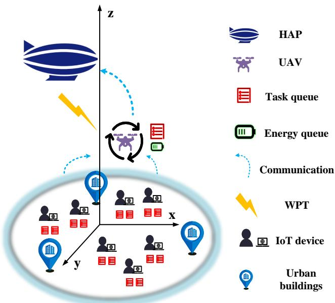  
Fig. 1: HAP-UAV-Assisted MEC System.

Ding et al. [22] enhanced average computational capability by optimizing UAV trajectory, time allocation, and offloading decisions.

However, these works lack comprehensive consideration of the limited computing and energy resources constraints of UAV, which lead to performance losses in practical applications. Our work fully consider all the above situations by adding HAP to enhance computing power and incorporating WPT technology to provide energy support for UAV.

## III. SYSTEM MODEL AND PROBLEM FORMULATION

## A. Network Model

We consider the system that supports NOMA in UAVassisted MEC networks. As shown in Fig. 1, the system consists of multiple IoT devices, the UAV capable of autonomous movement and performing computation and offloading tasks, and the HAP supporting high-performance computing for task processing in urban area. Each IoT device has two task queues, while the UAV maintains both a task queue and an energy queue. The IoT devices generate tasks, which can be computed locally or offloaded to UAV. The UAV can either execute the tasks or offload to HAP for processing. Furthermore, the HAP can wirelessly charge the UAV through WPT technology. In our model, N IoT devices are represented as $\mathcal { N } = \{ 1 , 2 , \cdots i \cdot \cdot \cdot N \}$ . We consider a discrete slot model, i.e., $t \in \{ 0 , 1 , \cdot \cdot \cdot t \cdot \cdot \cdot T - 1 \}$ . In addition, the length of each time slot is ι. The key notations are shown in Table II.

TABLE II: KEY NOTATIONS LIST
<table><tr><td rowspan=1 colspan=1>Notations</td><td rowspan=1 colspan=1>Descriptions</td></tr><tr><td rowspan=1 colspan=1>pi</td><td rowspan=1 colspan=1>Position of IoT device i</td></tr><tr><td rowspan=1 colspan=1> $\underline { { p _ { u } } }$ </td><td rowspan=1 colspan=1>Horizontal position of UAV</td></tr><tr><td rowspan=1 colspan=1> $z _ { u } , z _ { h }$ </td><td rowspan=1 colspan=1>Altitude of UAV, HAP</td></tr><tr><td rowspan=1 colspan=1> $\overline { { g _ { i } ( t ) } }$ </td><td rowspan=1 colspan=1>Channel gain from IoT device i to UAV</td></tr><tr><td rowspan=1 colspan=1> $\overline { { B _ { i } , \ B _ { u } } }$ </td><td rowspan=1 colspan=1>Bandwidth of IoT device i, Bandwidth of UAV</td></tr><tr><td rowspan=1 colspan=1> $\overline { { P _ { i } , P _ { u } } }$ </td><td rowspan=1 colspan=1>Transmit power from IoT device i to UAV, UAV to HAP</td></tr><tr><td rowspan=1 colspan=1> $\overline { { R _ { i } ( t ) } }$ </td><td rowspan=1 colspan=1>Transmission rate from IoT device i to UAV</td></tr><tr><td rowspan=1 colspan=1> $\overline { { R _ { u } ( t ) } }$ </td><td rowspan=1 colspan=1>Transmission rate from UAV to HAP</td></tr><tr><td rowspan=1 colspan=1> $\overline { { L ( t ) } }$ </td><td rowspan=1 colspan=1>Path loss from UAV to HAP</td></tr><tr><td rowspan=1 colspan=1> $\overline { { I _ { i } ( t ) } }$ </td><td rowspan=1 colspan=1>Offloading decision of Iot device i</td></tr><tr><td rowspan=1 colspan=1> $\overline { { D _ { i , o } ( t ) } }$ </td><td rowspan=1 colspan=1>Offloading task size of IoT device ¿</td></tr><tr><td rowspan=1 colspan=1> $\overline { { D _ { i , l } ( t ) } }$ </td><td rowspan=1 colspan=1>Local computing task size of IoT device ¿</td></tr><tr><td rowspan=1 colspan=1> $\overline { { D _ { i , u } ( t ) } }$ </td><td rowspan=1 colspan=1>Local computing task size of UAV</td></tr><tr><td rowspan=1 colspan=1> $\overline { { S _ { i , o } ( t ) } }$ </td><td rowspan=1 colspan=1>Offloading task size of UAV to HAP</td></tr><tr><td rowspan=1 colspan=1> $\overline { { Q _ { i , l } ( t ) } }$ </td><td rowspan=1 colspan=1>Local task queue of IoT device i</td></tr><tr><td rowspan=1 colspan=1> $\overline { { Q _ { i , o } ( t ) } }$ </td><td rowspan=1 colspan=1>Offloading task queue of IoT device i</td></tr><tr><td rowspan=1 colspan=1> $\overline { { H _ { i } ( t ) } }$ </td><td rowspan=1 colspan=1>Task queue of UAV</td></tr><tr><td rowspan=1 colspan=1> $\overline { { E _ { i , l } ( t ) } }$ </td><td rowspan=1 colspan=1>Local computing energy consumption of IoT device i</td></tr><tr><td rowspan=1 colspan=1> $\overline { { E _ { i , o } ( t ) } }$ </td><td rowspan=1 colspan=1>Offloading energy consumption of IoT device i</td></tr><tr><td rowspan=1 colspan=1> $\overline { { f _ { i , l } ( t ) } }$ </td><td rowspan=1 colspan=1>CPU frequency of IoT device ¿</td></tr><tr><td rowspan=1 colspan=1> $\overline { { \phi _ { i } } }$ </td><td rowspan=1 colspan=1>CPU cycles required to compute 1 bit data of task</td></tr><tr><td rowspan=1 colspan=1> $\overline { { E _ { s } ( t ) } }$ </td><td rowspan=1 colspan=1>Flight energy consumption of UAV</td></tr><tr><td rowspan=1 colspan=1> $\overline { { v ( t ) , \theta ( t ) } }$ </td><td rowspan=1 colspan=1>UAV flight speed, angle</td></tr><tr><td rowspan=1 colspan=1> $\overline { { X ( t ) } }$ </td><td rowspan=1 colspan=1>Energy queue of the UAV</td></tr></table>

## B. Communication Model

We consider IoT devices randomly generate tasks in a quasi stationary state, while UAV remains in motion at all times. Therefore, the channel status between IoT devices and UAV are also time-varying. We use a two-dimentional coordinate $p _ { i } ( t ) ~ = ~ [ x _ { i } ( t ) , ~ y _ { i } ( t ) ] ~ \in ~ \mathcal { L }$ to represent the coordinates of the IoT device $n \in \mathcal N$ on the ground at time slot t., and $p _ { u } ( t ) \ = \ [ x _ { u } ( t ) , y _ { u } ( t ) ] \ \in \ { \mathcal { L } }$ to represent the horizontal position of UAV, considering that the height $z _ { u }$ of the UAV and the height $z _ { h }$ of the HAP are fixed [31]. In our scenario, UAV can adjust its trajectory to move right above the IoT devices, so the IoT-UAV link is dominated by Line-Of-Sight (LoS) transmission. In contrast, due to the obstruction of buildings in urban scenarios, the UAV-HAP link adopts a hybrid transmission mode combining both LoS and Non-LoS (NLoS) propagation. The channel gain expression between IoT device i and UAV in t is:

$$
g _ { i } ( t ) = \omega _ { o } d _ { i } ^ { - 2 } ( t ) = \frac { \omega _ { o } } { ( p _ { u } ( t ) - p _ { i } ( t ) ) ^ { 2 } + z _ { u } ^ { 2 } } ,\tag{1}
$$

where $\omega _ { o }$ is the channel gain at $d _ { i } = 1 m , d _ { i } ( t )$ represents the Euclidean distance between the UAV and IoT device n. IoT devices communicate with UAV using NOMA technology. We consider that the channel gain is sorted in a non-increasing manner, i.e $g _ { 1 } ( t ) \geq . . . \geq g _ { i } ( t ) \geq . . . \geq g _ { N } ( t )$ , and the transmission power of IoT device i is $P _ { i } ( t )$ . We use SIC to iteratively decode signals according to the channel gain order of IoT devices. Therefore, the signal-to-noise ratio between IoT device i and UAV is [32]:

$$
\rho _ { i } ( t ) = \frac { P _ { i } ( t ) | g _ { i } ( t ) | ^ { 2 } } { \displaystyle \sum _ { j = i + 1 } ^ { N } P _ { j } ( t ) | g _ { j } ( t ) | ^ { 2 } + \delta _ { l } ^ { 2 } } ,\tag{2}
$$

where $\delta _ { l } ^ { 2 }$ represents the noise power.

Therefore, the transmission rate from IoT device i to UAV is represented as [33]:

$$
\begin{array} { l } { \displaystyle R _ { i } ( t ) = { B _ { i } } \log _ { 2 } ( 1 + \rho _ { i } ( t ) ) } \\ { = \displaystyle { { B _ { i } } \log _ { 2 } \left( 1 + \frac { P _ { i } ( t ) | g _ { i } ( t ) | ^ { 2 } } { \displaystyle \sum _ { j = i + 1 } ^ { N } P _ { j } ( t ) | g _ { j } ( t ) | ^ { 2 } + \delta _ { l } ^ { 2 } } \right) } , } \end{array}\tag{3}
$$

where $B _ { i }$ is the channel bandwidth from IoT device i to UAV. Referring to [34], the LoS connectivity probability between mobile relay UAV and quasi stationary HAP providing the server is :

$$
p ^ { L o s } ( t ) = \frac { 1 } { 1 + a \cdot \exp ( - b \cdot a r c s i n ( \frac { z _ { h } - z _ { u } } { d } ) - a ) } ,\tag{4}
$$

where a and b are environmental parameters, and d represents the Euclidean distance between UAV and HAP. The corresponding NLoS probability is $1 - p ^ { L o s } ( t )$ . The path loss expressions for the LoS and NLoS communication channels between UAV and HAP are as follows:

$$
\begin{array} { l } { { L ^ { L o s } ( t ) = L ^ { F S } ( t ) + \iota _ { L o s } , } } \\ { { \nonumber } } \\ { { L ^ { N L o s } ( t ) = L ^ { F S } ( t ) + \iota _ { N L o s } , } } \end{array}\tag{5}
$$

where $\begin{array} { r } { L ^ { F S } ( t ) = 2 0 \log ( \frac { 4 \pi d f _ { c } } { R _ { c } } ) } \end{array}$ is the free space path loss, $R _ { c }$ represents speed of light, and $f _ { c }$ is carrier frequency (Hertz). In addition, $\iota _ { L o s }$ and $\iota N L o s$ are the excessive path losses associated with LoS and NLoS communication channels, respectively. The expected expression for path loss is:

$$
L ( t ) = L ^ { F S } ( t ) + \iota _ { N L o s } + ( \iota _ { L o s } - \iota _ { N L o s } \cdot p ^ { L o s } ( t ) ) .\tag{6}
$$

Thus, the transmission rate of the UAV to HAP is:

$$
R _ { u } ( t ) = B _ { u } \log _ { 2 } \left( 1 + \frac { P _ { u } } { w _ { u } B _ { u } N _ { 0 } } \right) ,\tag{7}
$$

where $B _ { u }$ is uplink bandwidth from UAV to HAP, $P _ { u }$ is the transmission power, $w _ { u } = 1 0 ^ { \frac { L ( t ) } { 1 0 } }$ , and $N _ { 0 }$ represents the noise power spectral density [35].

## C. Task and Offloading Model

In each time slot t, task arrival rate $A _ { i } ( t )$ is randomly generated satisfies $A _ { i } ( t ) ~ \leq ~ A _ { i } ^ { m a x }$ . Each IoT device maintains two task queues, i.e., one computation queue and one offloading queue. IoT device i collaborates on excuting tasks through local computation and offloading to UAV or HAP [36]. Unlike traditional binary offloading and single partial offloading strategies, we combine partial offloading and binary offloading by adjusting the offloading resources and CPU frequency of IoT devices, which can help reduce the energy and improving the computing efficiency. We propose the model from two aspects, i.e., Task Processing and Energy Consumption, as follows:

1) Task Processing: We define coveri(t) to indicate whether IoT device i is within the UAV’s coverage area, satisfying:

$$
c o v e r _ { i } ( t ) = \left\{ \begin{array} { l l } { { 0 , } } & { { \mathrm { n o t ~ c o v e r e d ~ b y ~ U A V , } } } \\ { { 1 , } } & { { \mathrm { c o v e r e d ~ b y ~ U A V . } } } \end{array} \right.\tag{8}
$$

Additionally, we define $I _ { i } ^ { \prime } ( t )$ to represent whether IoT device i has a demand to offload tasks to the UAV, satisfying:

$$
I _ { i } ^ { ' } ( t ) = { \left\{ \begin{array} { l l } { 0 , } & { { \mathrm { t a s k ~ i n ~ l o c a l } } , } \\ { 1 , } & { { \mathrm { t a s k ~ t o ~ o f f l o a d } } . } \end{array} \right. }\tag{9}
$$

In summary, we use $I _ { i }$ to denote the offloading decision, where $I _ { i } ( t ) = 0$ indicates no offloading and $I _ { i } ( t ) = 1$ indicates offloading from IoT device i to UAV. For offloading to occur, both conditions should be satisfied: the device should be within coverage $( c o v e r _ { i } ( t ) \ = \ 1 )$ and have an offloading demand $( I _ { i } ^ { \prime } ( t ) = 1 )$ . The relationship is formally expressed as:

$$
I _ { i } ( t ) = I _ { i } ^ { ' } ( t ) \times c o v e r _ { i } ( t ) .\tag{10}
$$

In each slot, tasks process locally by IoT device i is $D _ { i , l } ( t )$ Define ϕ as the number of CPU cycles required for IoT device i to process 1-bit data. Then, $D _ { i , l } ( t )$ is:

$$
D _ { i , l } ( t ) = \frac { f _ { i , l } ( t ) \iota } { \phi _ { i } } ,\tag{11}
$$

where $f _ { i , l } ( t )$ is the CPU frequency of IoT device i, and satisfies $f _ { i , l } ( t ) \leq f _ { i , l } ^ { m a x }$

Let $Q _ { i , l } ( t )$ represent the locally calculated queue length. The change in $Q _ { i , l } ( t )$ is:

$$
Q _ { i , l } ( t + 1 ) = \operatorname* { m a x } \{ Q _ { i , l } ( t ) - D _ { i , l } ( t ) , 0 \} + ( 1 - I _ { i } ( t ) ) A _ { i } ( t ) .\tag{12}
$$

Let $D _ { i , o } ( t )$ represent offloading computation of IoT device i. Because of the limitation of data transmission rate, offloading calculations should meet the following requirements:

$$
D _ { i , o } ( t ) \leq R _ { i } ( t ) \iota .\tag{13}
$$

The length of offloading queue is $Q _ { i , o } ( t )$ . The evolution of $Q _ { i , o } ( t )$ satisfies:

$$
Q _ { i , o } ( t + 1 ) = \operatorname* { m a x } \{ Q _ { i , o } ( t ) - D _ { i , o } ( t ) , 0 \} + I _ { i } ( t ) A _ { i } ( t ) .\tag{14}
$$

When acting as a relay node, the UAV maintains a queue $H _ { i } ( t )$ for receiving task from IoT device i. The computing power is:

$$
D _ { i , u } ( t ) = \frac { f _ { u } ( t ) \iota } { \phi _ { u } } ,\tag{15}
$$

where $\phi _ { u }$ is the number of CPU cycles required for UAV to process 1-bit data, and $f _ { u } ( t )$ is the CPU frequency of UAV. We define $D _ { i , o } ( t )$ as the IoT device i task received by the UAV, and use $S _ { i , o } ( t )$ to represent the task offloading to HAP, which satisfies $S _ { i , o } ( t ) \leq R _ { s } ( t ) \iota$

For the task queue $H _ { i } ( t )$ maintained by the UAV for each IoT device i, its backlog evolution is expressed as the remaining queue from the previous time slot, plus newly received tasks from IoT device i in the current slot, minus both the tasks processed by the UAV and those offloaded to the HAP during this slot. Note that the task queue should remain non-negative. The specific representation is:

$$
H _ { i } ( t + 1 ) = \operatorname* { m a x } \{ H _ { i } ( t ) - D _ { i , u } ( t ) - S _ { i , o } ( t ) , 0 \} + D _ { i , o } ( t ) .\tag{16}
$$

It is worth noting that in order to achieve long-term optimization, the queue should remain in a stable state. The length of the queue has an upper limit. The sum of all queues $Q _ { t o t a l } ( t )$ is expressed as:

$$
Q _ { t o t a l } ( t ) = \sum _ { i = 1 } ^ { N } Q _ { i , l } ( t ) + Q _ { i , o } ( t ) + H _ { i } ( t ) ,\tag{17}
$$

and $Q _ { t o t a l } ( t )$ meets the following constraints:

$$
\operatorname* { l i m } _ { T \to + \infty } \frac { 1 } { T } \sum _ { t = 1 } ^ { T } \mathbb { E } \{ Q _ { t o t a l } ( t ) \} < \infty ,\tag{18}
$$

where ${ \mathbb E } \{ Q _ { t o t a l } ( t ) \}$ represents the expectation of $Q _ { t o t a l } ( t )$ From the above equation, it can be seen that the queue of all devices is limited.

2) Energy Consumption: We consider that HAP equipped with server, has sufficient energy to complete all tasks. Therefore, the energy cost of HAP is not considered. For IoT devices, they are divided into local computing energy and transmission energy. The computing energy is closely related to the CPU operation [37]. $\xi _ { i }$ represents the effective switching capacitor, and the local computing energy is:

$$
E _ { i , l } ( t ) = \boldsymbol { \xi } _ { i } \cdot \boldsymbol { f } _ { i , l } ^ { 2 } ( t ) \cdot \boldsymbol { \phi } _ { i } \cdot \boldsymbol { D } _ { i , l } ( t ) .\tag{19}
$$

The energy formula for offloading tasks to UAV by IoT device i is:

$$
E _ { i , o } ( t ) = \frac { D _ { i , o } ( t ) P _ { i } ( t ) } { R _ { i } ( t ) } .\tag{20}
$$

Finally, we get the total energy of IoT devices:

$$
e ( t ) = \sum _ { i = 1 } ^ { N } ( E _ { i , l } ( t ) + E _ { i , o } ( t ) ) .\tag{21}
$$

## D. UAV Movement and Energy Consumption Model

In our scenario, UAV provides services to IoT devices within their coverage area. Therefore, the location of UAV is one of the key decision variables. We consider it as a continuous variable and use flight velocity $v ( t ) \in [ 0 , v _ { m a x } ]$ and flight angle $\theta ( t ) \in [ 0 , 2 \pi ]$ to represent the UAV’s position changes as follows:

$$
\begin{array} { l } { { p _ { u } ( t + 1 ) = } } \\ { { \left[ x _ { u } ( t ) + v ( t ) t _ { f l y } \cos \theta ( t ) , y _ { u } ( t ) + v ( t ) t _ { f l y } \sin \theta ( t ) \right] , } } \end{array}\tag{22}
$$

where $t _ { f l y }$ is the fixed flight time of UAV.

A quadrotor UAV equipped with an integrated lightweight WPT receiver module is selected as the experimental platform, and its flight energy consumption can be expressed as [38]:

$$
\begin{array} { c } { { E _ { s } = C _ { 1 } \left( 1 + \displaystyle \frac { 3 v ^ { 2 } ( t ) } { v _ { h } ^ { 2 } } \right) + } } \\ { { C _ { 2 } \sqrt { \sqrt { C _ { 3 } + \displaystyle \frac { v ^ { 4 } ( t ) } { 4 } } - \displaystyle \frac { v ^ { 2 } ( t ) } { 2 } } + C _ { 4 } v ^ { 3 } ( t ) , } } \end{array}\tag{23}
$$

where $v _ { h } ^ { 2 }$ represents the square of the rotor tip velocity, C1 denotes the parameter associated with hovering power, C2 is related to air resistance and rotor area, C3 is the fourth power of the hovering power, and C4 is the fourth power of the velocity. This model fully considers the energy consumption of UAV in hovering and flying states. Compared to flight energy consumption, the calculation and transmission energy consumption of UAV is of a smaller order of magnitude, so it is not considered and flight energy consumption is taken as the total energy consumption of UAV.

Additionally, to enable the UAV to provide prolonged service, WPT technology and energy storage batteries are equipped on the UAV, while the HAP equipped with Energy Transmitter (ET) that can provide WPT service to UAV. And HAP possesses sufficiently powerful power resources, the energy supplied by its ET can adequately support the UAV’s flight, computation, and transmission [39]. To prevent interference between WPT and information transmission, a dedicated orthogonal channel is assigned to WPT. The WPT transmission power $P _ { W P T } ( t )$ from HAP to UAV, bounded by $P _ { W P T } ^ { m a x } ( t )$ , yields the transmitted energy during slot ι [40]:

$$
E _ { h , u } ^ { ' } ( t ) = \iota P _ { W P T } ( t ) .\tag{24}
$$

Accounting for efficiency loss with conversion factor $\eta ,$ the UAV’s received energy becomes:

$$
E _ { h , u } ( t ) = g _ { s } ( t ) \eta E _ { h , u } ^ { ' } ( t ) = \iota \eta g _ { s } ( t ) P _ { W P T } ( t ) ,\tag{25}
$$

under constraint $0 \leq E _ { h , u } ( t ) \leq E _ { h , u } ^ { m a x } ( t )$

The energy conversion to battery level considers capacity limits $E ^ { m a x }$ and current energy queue $X ( t )$ . The effective charging amount $E _ { h } ( t ) =$ min $\{ E ^ { m a x } - X ( t ) , E _ { h , u } ( t ) \}$ prevents overflow, leading to the queue update:

$$
\begin{array} { r }  X ( t + 1 ) = \operatorname* { m i n } \\{ \operatorname* { m a x } \{ X ( t ) - E _ { s } ( t ) + E _ { h } ( t ) , 0 \} , E ^ { m a x } \} , } \end{array}\tag{26}
$$

with $0 \leq X ( t ) \leq E ^ { m a x }$

Unlike IoT devices, for UAV, we consider the energy of the WPT charging part, is used in addition to its own battery, and convert it into electricity cost:

$$
\begin{array} { r } { c ( t ) = g ( t ) E _ { h } ^ { \prime } ( t ) , } \end{array}\tag{27}
$$

where $g ( t )$ is the unit price of electricity.

## E. Problem Formulation

Our goal is to reduce system’s total energy cost while ensuring queue performance, with simultaneous consideration of throughput and energy consumption. However, reducing energy costs may lead to throughput imbalance issues, manifested as the UAV tending to remain close to certain IoT devices while leaving others outside its coverage to rely solely on local computation. Since the combined computational capacity of the UAV and HAP far exceeds that of IoT devices’ local computing capabilities, offloading tasks to the UAV can significantly reduce the task queues maintained by the IoT devices themselves. If an IoT device fails to receive UAV service for an extended period and should rely on its limited computational capacity while new tasks continue to arrive in each time slot, the accumulation of unprocessed tasks and new arrivals will lead to excessive queue backlog. The incorporation of fairness enables each IoT device to simultaneously execute local computation while offloading partial tasks to UAV or HAP for parallel processing, which substantially improves system throughput and effectively mitigates queue congestion. To ensure each IoT device receives UAV service as equally as possible, maintain balanced queues across devices, and alleviate the problem of excessive queue backlog, we consider offloading fairness. The fairness metric is expressed as [41]:

$$
f a ( t ) = \frac { \left( \sum _ { i = 1 } ^ { N } c t _ { i } ( t ) \right) ^ { 2 } } { N \sum _ { i = 1 } ^ { N } c t _ { i } ^ { 2 } ( t ) } ,\tag{28}
$$

where $c t _ { i } ( t )$ is the number of times IoT device i be serviced by UAV for task offloading, initialized to 0. In each slot, if IoT device i offloads task to UAV, $c t _ { i } ( t )$ is incremented by 1. Each time slot allows at most one increment, with a minimum of 0. Thus, $c t _ { i } ( t )$ ranges over $[ 0 , \iota ] ,$ ι is the number of slots. According to the Cauchy-Schwarz inequality, we obtain $f _ { a } ( t ) \leq 1$ , with equality holding only if all $c t _ { i } ( t )$ are equal, i.e., $f _ { a } ( t ) = 1 ~ [ 4 2 ]$ . When $f _ { a } ( t )  1$ , it indicates that all $c t _ { i } ( t )$ converge to the same value, demonstrating that each IoT device i receives a similar number of service opportunities, thereby achieving better fairness performance.

We consider that the current optimization is to reduce the energy cost of IoT devices and UAV. And ensure queue stability and strive to provide relatively fair services for all IoT devices. The problem is:

$$
E _ { t o t a l } ( t ) = \mu e ( t ) + \lambda c ( t ) ,\tag{29}
$$

where $\mu , \lambda \in ( 0 , 1 )$ are the cost weights of IoT devices and UAV, respectively.

We solve the problem through designing a joint optimization of UAV trajectory, IoT device CPU frequency and transmission bandwidth, offloading decision and offloading allocation. Define the decision variables as $\chi = \{ I , f _ { l } , D _ { o } , S _ { o } \}$ , which respectively represent the offloading decision, local CPU frequency, IoT device offloading allocation, and UAV offloading allocation. This problem is expressed as the following multi-

stage MINLP problem:

$$
\mathbf { P 1 } : \operatorname* { m i n } _ { \boldsymbol { \chi } } \operatorname* { l i m } _ { T  + \infty } \frac { 1 } { T } \sum _ { t = 1 } ^ { T } \{ \frac { 1 } { f a ( t ) } E _ { t o t a l } ( t ) \} .\tag{30a}
$$

$$
s . t . \ I _ { i } ( t ) \in \{ 0 , 1 \} , f a ( t ) \in [ 0 , 1 ] ,\tag{30b}
$$

$$
0 \leq f _ { i , l } ( t ) \leq f _ { i , l } ^ { m a x } ,\tag{30c}
$$

$$
D _ { i , l } ( t ) \leq Q _ { i , l } ( t ) ,\tag{30d}
$$

$$
0 \leq D _ { i , o } ( t ) \leq R _ { i } ( t ) \iota , D _ { i , o } ( t ) \leq Q _ { i , o } ( t )\tag{30e}
$$

$$
0 \leq S _ { i , o } ( t ) \leq R _ { s } ( t ) \iota ,\tag{30f}
$$

$$
S _ { i , o } ( t ) + D _ { i , u } ( t ) \leq H _ { i } ( t ) ,\tag{30g}
$$

$$
0 \leq X ( t ) \leq E ^ { m a x } ,\tag{30h}
$$

$$
\operatorname* { l i m } _ { T \to + \infty } \frac { 1 } { T } \sum _ { t = 1 } ^ { T } \mathbb { E } \{ Q _ { t o t a l } ( t ) \} < \infty ,\tag{30i}
$$

where (30b) represents the offloading decision range. (30c) limits the maximum CPU frequency. (30d) indicates that the size of local computing tasks for IoT devices does not exceed the task queue. (30e) constrains the offloading data no more than the maximum transmission capacity. (30f) and (30g) constrain the offloading and computation data of UAV. (30h) represents the maximum energy of UAV. (30i) ensures the long-term stability of the queue.

Accurately predicting task arrival rates and channel gains in real-world scenarios is challenging. Existing research typically utilizes Lyapunov framework to transform stochastic optimization problems into deterministic optimization problems, but this approach has significant limitations when dealing with high-dimensional nonlinear problems such as UAV trajectory optimization problems. Directly applying DRL can make a sharp increase in the complexity of high-dimensional state and action spaces. To address the aforementioned issues, we design an algorithm that combines Lyapunov optimization and DRL.

## IV. PROBLEM TRANSFORMATION

We use Lyapunov method to transform the original dynamic stochastic optimization problem into a deterministic optimization problem. Meanwhile, we decompose the problem into four subproblems that can be solved in parallel online by decoupling the interdependence between decision variables.

To maintain the stability of task queue, we set $\Upsilon ( t ) \ =$ $[ Q _ { l } ( t ) , Q _ { o } ( t ) , H ( t ) ]$ to represent the queue backlog vector, and we define the Lyapunov function as:

$$
L ( \Upsilon ( t ) ) = \frac { 1 } { 2 } \sum _ { i = 1 } ^ { N } [ Q _ { i , l } ^ { 2 } ( t ) + Q _ { i , o } ^ { 2 } ( t ) + H _ { i } ^ { 2 } ( t ) ] ,\tag{31}
$$

and Lyapunov drift is:

$$
\Delta ( \Upsilon ( t ) ) = \mathbf { E } \{ L ( \Upsilon ( t + 1 ) ) - L ( \Upsilon ( t ) ) | \Upsilon ( t ) \} .\tag{32}
$$

We consider the total energy cost of IoT devices, UAV, and the stability of the queue. Therefore, the drif t−plus−penalty function is given:

$$
\Delta \nu ( \Upsilon ( t ) ) = \Delta ( \Upsilon ( t ) ) + \nu { \bf E } \big \{ E _ { t o t a l } ( t ) | ( \Upsilon ( t ) ) \big \} ,\tag{33}
$$

where $\nu \geq 0$ is trade-off coefficient to balance queue stability and cost. Then we optimize $E _ { t o t a l } ( t )$ and maintain the stability

of Υ(t) by optimizing the upper bound of the $\begin{array} { r } { d r i f t - p l u s - } \end{array}$ penalty.

Theorem 1 When $R _ { i } ^ { m a x } , R _ { s } ^ { m a x } , f _ { u } ^ { m a x }$ exist, the following inequality can be obtained:

$$
\Delta ( \Upsilon ( t ) ) + \nu { \bf E } \{ E _ { t o t a l } ( t ) | ( \Upsilon ( t ) ) \} \le
$$

$$
Z + \nu \mathbf { E } \left\{ E _ { t o t a l } ( t ) | ( \Upsilon ( t ) ) \right\}
$$

$$
+ \mathbf { E } \{ \sum _ { i = 1 } ^ { N } Q _ { i , l } ( t ) [ ( 1 - I _ { i } ( t ) ) A _ { i } ( t ) - D _ { i , l } ( t ) ] | ( \Upsilon ( t ) ) \}
$$

$$
+ \mathbf { E } \{ \sum _ { i = 1 } ^ { N } Q _ { i , o } ( t ) [ I _ { i } ( t ) A _ { i } ( t ) - D _ { i , o } ( t ) ] | ( \Upsilon ( t ) ) \}\tag{34}
$$

$$
+ \mathbf { E } \{ \sum _ { i = 1 } ^ { N } H _ { i } ( t ) [ D _ { i , o } ( t ) - ( D _ { i , u } ( t ) + S _ { i , o } ( t ) ) ] | ( \Upsilon ( t ) ) \} ,
$$

where $\begin{array} { r } { Z = \frac { 1 } { 2 } \sum _ { i = 1 } ^ { N } [ ( A _ { i } ^ { m a x } ) ^ { 2 } + ( \frac { f _ { i , l } ^ { m a x } \iota } { \phi _ { i } } ) ^ { 2 } + + 2 ( R _ { i } ^ { m a x } \iota ) ^ { 2 } + } \end{array}$ $\begin{array} { r } { \big ( \frac { f _ { u } ^ { m a x } \iota } { \phi _ { u } } + R _ { s } ^ { m a x } \iota \big ) ^ { 2 } \big ] } \end{array}$ is a constant. $A _ { i } ^ { m a x } , \ f _ { i , l } ^ { m a x }$ represent the maximum task and maximum local CPU frequency respectively.

Proof According to $( ( a - b ) ^ { 2 } + c ) ^ { 2 } \leq a ^ { 2 } + b ^ { 2 } + c ^ { 2 } + 2 a ( c - b )$ we can obtain:

$$
\begin{array} { r l } & { Q _ { i , l } ^ { 2 } ( t + 1 ) \leq Q _ { i , l } ^ { 2 } ( t ) + [ ( 1 - I _ { i } ( t ) ) A _ { i } ( t ) ] ^ { 2 } + D _ { i , l } ^ { 2 } ( t ) } \\ & { ~ + 2 Q _ { i , l } ( t ) [ ( 1 - I _ { i } ( t ) ) A _ { i } ( t ) - D _ { i , l } ( t ) ] , } \\ & { Q _ { i , o } ^ { 2 } ( t + 1 ) \leq Q _ { i , o } ^ { 2 } ( t ) + [ I _ { i } ( t ) A _ { i } ( t ) ] ^ { 2 } + D _ { i , o } ^ { 2 } ( t ) } \\ & { ~ + 2 Q _ { i , o } ( t ) [ I _ { i } ( t ) A _ { i } ( t ) - D _ { i , o } ( t ) ] , } \\ & { H _ { i } ^ { 2 } ( t + 1 ) \leq H _ { i } ^ { 2 } ( t ) + D _ { i , o } ^ { 2 } ( t ) + ( D _ { i , u } ( t ) + S _ { i , o } ( t ) ) ^ { 2 } } \\ & { ~ + 2 H _ { i } ( t ) [ D _ { i , o } ( t ) - ( D _ { i , u } ( t ) + S _ { i , o } ( t ) ] . } \end{array}\tag{35}
$$

Then, by combining the column vector, drift function, and the above four equations, we obtain:

$$
\begin{array} { l } { \displaystyle \Delta ( \Upsilon ( t ) ) + \nu E \{ E _ { t o t a l } ( t ) | ( \Upsilon ( t ) ) \} \leq } \\ { \displaystyle Z + \nu E \{ E _ { t o t a l } ( t ) | ( \Upsilon ( t ) ) \} } \\ { \displaystyle + E \{ \sum _ { i = 1 } ^ { N } Q _ { i , l } ( t ) [ ( 1 - I _ { i } ( t ) ) A _ { i } ( t ) - D _ { i , l } ( t ) ] | ( \Upsilon ( t ) ) \} } \\ { \displaystyle + E \{ \sum _ { i = 1 } ^ { N } Q _ { i , o } ( t ) [ I _ { i } ( t ) A _ { i } ( t ) - D _ { i , o } ( t ) ] | ( \Upsilon ( t ) ) \} } \\ { \displaystyle + E \{ \sum _ { i = 1 } ^ { N } H _ { i } ( t ) [ D _ { i , o } ( t ) - ( D _ { i , u } ( t ) + S _ { i , o } ( t ) ) ] | ( \Upsilon ( t ) ) \} , } \end{array}\tag{36}
$$

where $\begin{array} { r } { Z = \frac { 1 } { 2 } \sum _ { i = 1 } ^ { N } [ ( A _ { i } ^ { m a x } ) ^ { 2 } + ( \frac { f _ { i , l } ^ { m a x } \iota } { \phi _ { i } } ) ^ { 2 } + + 2 ( R _ { i } ^ { m a x } \iota ) ^ { 2 } + } \end{array}$ $\big ( \frac { f _ { u } ^ { m a x } \iota } { \phi _ { u } } + R _ { s } ^ { m a x } \iota \big ) ^ { 2 } \big ]$ is a constant.

After deriving the upper bound, we can achieve the optimization objective through Right Hand Side (RHS). Since Z is a constant, problem P1 is transformed into:

$$
\begin{array} { l } { \displaystyle \operatorname* { m i n } _ { \chi ( t ) } \frac { 1 } { f a ( t ) } ( \nu E _ { t o t a l } ( t ) - } \\ { \displaystyle \{ Q _ { i , l } ( t ) D _ { i , l } ( t ) + Q _ { i , o } ( t ) D _ { i , o } ( t ) + H _ { i } ( t ) ( D _ { i , u } ( t ) + S _ { i , o } ( t ) \} ) , } \\ { \displaystyle ( 3 7 ) } \end{array}
$$

further P1 is:

$$
\begin{array} { r l }   { \mathbb { P } 2 : \operatorname* { m i n } \{ \frac { 1 } { f a ( t ) } \underset { i = 1 } { \overset { N } { \sum } } [ Q _ { i , i } ( t ) ( 1 - I _ { i } ( t ) ) A _ { i } ( t ) } \\ & { + Q _ { i , o } ( t ) I _ { i } ( t ) A _ { i } ( t ) ] } \\ & { + \underset { i = 1 } { \overset { N } { \sum } } [ \nu \mu \xi f _ { i , i } ^ { \beta } ( t ) \nu - Q _ { i , i } ( t ) \frac { f _ { i , i } ( t ) \mu } { \phi _ { i } ( t ) } ] } \\ & { + \underset { i = 1 } { \overset { N } { \sum } } [ \nu \mu \frac { P _ { i } ( t ) } { R _ { i } ( t ) } - Q _ { i , o } ( t ) + H _ { i } ( t ) ] D _ { i , o } ( t ) } \\ & { + \nu \lambda g ( t ) \dot { R } _ { h } ^ { \prime } ( t ) - \underset { i = 1 } { \overset { N } { \sum } } ( D _ { i , n } ( t ) + S _ { i , o } ( t ) ) R _ { i } ( t ) \} \} } \\ & { \ \times \mathcal { L } \ ( 3 0 \beta ) - ( 3 0 h ) . } \end{array}\tag{38}
$$

In this problem, the constraint (30i) is incorporated into the queue-based formula. Compared to problem P1, it is simplified. However, P2 remains a nonconvex problem and is thus challenging to solve. As the UAV moves, the channel gain between it and IoT devices also changes in real time, and there is a coupling relationship between UAV trajectory and offloading decisions. In Section V, we shall combine the Lyapunov optimization framework with DRL technology to design a joint optimization algorithm. This algorithm optimizes the computing frequency, offloading allocation, offloading decisions, and UAV trajectories of IoT devices.

## V. DDPG-ATTENTION-BASED RESOURCE ALLOCATION AND TRAJECTORY OPTIMIZATION

By observing P2, it is found that certain decision variables such as $A _ { i } ( t ) , \ f _ { i , l } ( t )$ are decoupled. Therefore, the problem can be decomposed into four subproblems. For subproblems such as $A _ { i } ( t ) , \ f _ { i , l } ( t )$ , we perform pre-processing. For the remaining trajectory optimization and offloading allocationrelated problems, we propose the DDPG algorithm and attention mechanism. We combine the ideas of convex optimization theory and DRL to provide efficient and responsive solutions. Next, we provide solution for each subproblem.

## A. Subproblem Decomposition

Offloading decision: The offloading decisions of each device are independent and can be implemented simultaneously. By extracting the parts related to the offloading decision from P2, the offloading decision subproblem is represented as:

$$
\begin{array} { l } { \displaystyle \operatorname* { m i n } _ { I ( t ) } \{ \sum _ { i = 1 } ^ { N } [ Q _ { i , l } ( t ) ( 1 - I _ { i } ( t ) ) A _ { i } ( t ) + Q _ { i , o } ( t ) I _ { i } ( t ) A _ { i } ( t ) ] \} , } \\ { \displaystyle s . t . \quad I _ { i } ( t ) \in \{ 0 , 1 \} . } \end{array}\tag{39}
$$

This subproblem is a zero-one integer programming problem. And $I _ { i } ( t )$ is:

$$
I _ { i } ( t ) = \left\{ \begin{array} { l l } { 0 , } & { Q _ { i , o } ( t ) \geq Q _ { i , l } ( t ) , } \\ { 1 , } & { o t h e r w i s e . } \end{array} \right.\tag{40}
$$

Local CPU frequency allocation: Similarly, extract the items related to $f _ { i , l } ( t )$ from P2 and associate them with $0 \leq$ $f _ { i , l } ( t ) \leq f _ { i , l } ^ { m a x }$ , we obtain:

$$
\begin{array} { r l r } {  { \operatorname* { m i n } \{ \sum _ { i = 1 } ^ { N } [ \nu \mu \xi _ { i } f _ { i , l } ^ { 3 } ( t ) \iota - Q _ { i , l } ( t ) \frac { { f _ { i , l } ( t ) \iota } } { \phi _ { i } ( t ) } ] \} , } } \\ & { } & { \quad s . t . 0 \leq { f _ { i , l } ( t ) } \leq { f _ { i , l } ^ { m a x } } , } \end{array}\tag{41}
$$

By solving its first derivative and making it equal to 0, we can obtain $\begin{array} { r } { f _ { i , l } ( t ) = \sqrt { \frac { Q _ { i , l } ( t ) } { 3 \nu \mu \xi _ { i } \phi _ { i } ( t ) } } } \end{array}$ . Furthermore, the optimal solution can be obtained as:

$$
f _ { i , l } ( t ) = \left\{ \begin{array} { l l } { \sqrt { \frac { Q _ { i , l } ( t ) } { 3 \nu \mu \xi _ { i } \phi _ { i } ( t ) } } , } & { 0 \leq \sqrt { \frac { Q _ { i , l } ( t ) } { 3 \nu \mu \xi _ { i } \phi _ { i } ( t ) } } \leq f ^ { * } , } \\ { f ^ { * } , } & { o t h e r w i s e , } \end{array} \right.\tag{42}
$$

where $\begin{array} { r } { f ^ { * } = \operatorname* { m i n } \{ \frac { Q _ { i , l } ( t ) \phi _ { i } ( t ) } { \iota } , f _ { i , l } ^ { m a x } \} } \end{array}$

UAV data offloading allocation: By separating the part related to UAV data offloading calculation from P2, we can obtain:

$$
\begin{array} { r l } & { \underset { S _ { i , o } ( t ) } { \operatorname* { m i n } } \{ - \displaystyle \sum _ { i = 1 } ^ { N } ( D _ { i , u } ( t ) + S _ { i , o } ( t ) ) H _ { i } ( t ) \} , } \\ & { \quad \quad \quad s . t . ~ 0 \leq S _ { i , o } ( t ) \leq R _ { s } ( t ) \iota . } \end{array}\tag{43}
$$

Consider this problem as a knapsack problem, with a weight coefficient $S _ { i , o } ( t )$ of $[ - H _ { i } ( t ) ]$ ]. We provide solutions to the following problems.

1) The data that UAV can offload in a time slot is initialized to $C _ { s } ^ { o } = R _ { s } ( t ) \iota$

2) Sort IoT devices in ascending order based on $\left[ - H _ { i } ( t ) \right]$

3) UAV allocates the amount of data that can be transmitted to each IoT device based on the sorting results, as follows:

$$
S _ { i , o } ( t ) = \left\{ \begin{array} { l l } { \operatorname* { m i n } \{ H _ { i } ( t ) , C _ { s } ^ { o } \} , } & { i = i ^ { * } , - H _ { i } ( t ) < 0 , } \\ { 0 , } & { o t h e r w i s e , } \end{array} \right.
$$

where $i ^ { * } = a r g m i n _ { i \in N } \{ - H _ { i } ( t ) \}$

(44)

4) After completing the allocation of offloading data, update the UAV task queue $H _ { i } ^ { \prime } ( t ) = H _ { i } ( t ) - S _ { i , o } ( t )$ . The tasks that UAV can perform meet the requirements:

$$
D _ { i , u } ^ { * } ( t ) = \operatorname* { m i n } \left\{ H _ { i } ^ { \prime } ( t ) , \frac { f _ { u } ( t ) \iota } { \phi _ { u } ( t ) } \right\} ,\tag{45}
$$

the UAV queue after the completion of this time slot is updated to:

$$
\begin{array} { l } { { H _ { i } ^ { \prime \prime } ( t ) = H _ { i } ^ { \prime } ( t ) - D _ { i , u } ^ { * } ( t ) } } \\ { { = H _ { i } ( t ) - S _ { i , o } ( t ) - \operatorname* { m i n } \left\{ H _ { i } ( t ) - S _ { i , o } ( t ) , \frac { f _ { u } ( t ) \iota } { \phi _ { u } ( t ) } \right\} _ { A _ { c } } } } \end{array}\tag{46}
$$

The offloading calculation allocation $D _ { i , o } ( t )$ of the IoT device in the problem is coupled with the position $p _ { u } ( t )$ of the UAV. Traditional methods are difficult to provide effective solutions when solving the motion trajectory of UAV. We use DRL to solve the trajectory of UAV, then the trajectory is substituted to obtain the transmission bandwidth through convex optimization [43]. And finally we obtain the offloading allocation.

## B. DART Algorithm Description

We design the DDPG-Attention-based Resource Allocation and Trajectory Optimization (DART) algorithm in the part. As shown in Fig. 2, DART uses the DDPG-Attention to obtain the trajectory of UAV within a time slot. Then mathematical methods are applied to solve the location information to obtain analytical solutions for some of the problems. At the same time, the above information is fedback to Lyapunov to solve the subproblem. Subsequently, the information about the task queue for each IoT device obtained from the Lyapunov subproblem is mapped to the DART algorithm. The positions of UAV and IoT devices are constants within a single slot. Therefore, the combination of DDPG-A and Lyapunov methods enables us to determine the trajectory for joint optimization and allocate resources of communication and computing.

MDP: To solve the trajectory of UAV, we use UAV as the agent and construct a triplet (S, A, R) to represent Markov processes, where S is the state space, A is the action space, and R is the reward. The UAV interacts with environment to get appropriate action network outputs, which in turn determine the actions.

• State. We aim to reduce the energy of IoT devices and UAV energy costs by optimizing UAV’s trajectory while ensuring stable tasks and energy queues. This requires UAV to move to locations with more coverage of IoT devices as much as possible, providing services and better communication conditions for devices with long task queues. Therefore, in the state space, we consider factors such as the queue, location, task arrival rate, UAV position, and energy of all devices. State space is described as:

$$
\begin{array} { r l } & { S = \{ s ( t ) = } \\ & { ( A _ { i } ( t ) , p _ { i } ( t ) , p _ { u } ( t ) , Q _ { i , l } ( t ) , Q _ { i , o } ( t ) , H _ { i } ( t ) , X ( t ) ) , } \\ & { \forall i \in \mathcal { N } \} . } \end{array}\tag{47}
$$

• Action. We consider that UAV and HAP are horizontally stationary at height, and the motion of the UAV can be represented by continuous two-dimensional vectors of velocity and angle. The action space is:

$$
A = \{ a ( t ) = ( v ( t ) , \theta ( t ) ) \} .\tag{48}
$$

• Reward. We propose the solution obtained by Lyapunov into the problem and simplify it, obtain the reward function as:

$$
\begin{array} { l } { \displaystyle R = r ( t ) = } \\ { \displaystyle - \frac { 1 } { f a ( t ) } \left[ \mu \left( \sum _ { i = 1 } ^ { N } ( E _ { i , l } ( t ) + E _ { i , o } ( t ) ) \right) + \lambda g ( t ) E _ { h } ^ { \prime } ( t ) \right] , } \end{array}\tag{49}
$$

where $\mu , \lambda \ \in \ \mathsf { \Gamma } ( 0 , 1 )$ respectively represent the cost weights for balancing IoT devices and relay nodes. It can be seen that all values except for $D _ { i , o } ( t )$ in $E _ { i , o } ( t )$ can be regarded as constants solved from Lyapunov subproblems. Since the optimization objective is cost reduction, and in reinforcement learning, decisions tend to favor choices with larger reward functions, the two have an inverse relationship. Therefore, we perform a negative value operation in the reward function, meaning that the larger the inverse of the minimum cost, the better. The larger the fairness factor, the more ideal it is. Therefore, we take its reciprocal. For UAV out-of-bounds situations, we impose a significant negative penalty and correct its position. Every time the task queue is cleared, positive feedback is given.

DDPG: The DDPG algorithm is a reinforcement learning approach designed for continuous action spaces. It integrates deep learning with deterministic policy gradients to yield a deterministic action for every state. DDPG consists of two parts: 1) Actor (Policy Network): to output the actions that should be taken in a given state. 2) Critic (Value Network): to evaluate the quality of actors’ decision-making. The update of DDPG’s actor-network is based on policy gradient, with the aim of maximizing Q-value:

$$
\nabla _ { \theta ^ { \mu } } J \approx \mathbb { E } _ { \tau \sim \pi } [ \nabla _ { \theta ^ { \mu } } Q ( s , a | \theta ^ { Q } ) | _ { s = S _ { t } , a = \mu ( S _ { t } ) } ] ,\tag{50}
$$

where $\theta ^ { \mu }$ is the parameter of the actor-network, $\theta ^ { Q }$ is the parameter of the critic-network, J is the objective function, τ is the trajectory, and π is the strategy. The loss function of the critic-network is to minimize the difference between the predicted Q value and the target Q value:

$$
L ( \theta ^ { Q } ) = \frac { 1 } { N } \sum _ { i = 1 } ^ { N } ( y _ { i } - Q ( s , a | \theta ^ { Q } ) ) ^ { 2 } ,\tag{51}
$$

where $y _ { i } = r _ { i } + \imath Q ^ { \prime } ( s _ { i + 1 } , \mu ^ { \prime } ( s _ { i + 1 } | \theta ^ { \mu ^ { \prime } } ) | \theta ^ { Q ^ { \prime } } )$ is the target Q value, and $Q ^ { \prime }$ and $\mu ^ { \prime }$ are the critics and actors in the target network, respectively. The parameters of the target network are regularly updated to track the parameters of the online network:

$$
\begin{array} { r } { \theta ^ { Q ^ { \prime } }  \tau \theta ^ { Q } + ( 1 - \tau ) \theta ^ { Q ^ { \prime } } , } \\ { \theta ^ { \mu ^ { \prime } }  \tau \theta ^ { \mu } + ( 1 - \tau ) \theta ^ { \mu ^ { \prime } } , } \end{array}\tag{52}
$$

where $\tau$ is update rate.

Attenetion: Initially popularized in natural language processing, the attention mechanism allows models to dynamically focus on the most pertinent segments of input data by assigning appropriate weights. Its core concept involves using Query, Key, and Value to compute similarity scores and perform weighted feature fusion, thereby simulating human selective attention. We adopt a multi-constraint, cross-technology global dynamic feature adaptation attention mechanism, which takes global multi-dimensional state features as its action objects. It accurately identifies the most critical information for UAV trajectory optimization and offloading decision-making via dynamic weighting. Meanwhile, it deeply integrates Lyapunov optimization, where the update of attention weights is coupled with the queue stability constraints of Lyapunov theory. When certain features lead to an increase in Lyapunov drift, the attention mechanism will automatically enhance the weights of these features, ensuring that the decision-making achieves a balance between cost minimization and queue stability. The introduction of the attention mechanism into the DDPG algorithm can significantly enhance performance by effectively handling partially observable environments and highdimensional inputs through key information filtering to reduce redundant interference. Simultaneously, the dynamic relationship modeling capability of attention enables agents to better understand interactions between entities in the environment, while weight visualization enhances policy interpretability. Furthermore, attention’s ability to directly capture long-term temporal dependencies compensates for the shortcomings of traditional RNNs, making it particularly suitable for scenarios requiring historical state analysis. The feature focusing and adaptive capabilities of the attention mechanism in complex tasks provide DDPG with stronger generalization and stability. Since soft attention can be trained through backpropagation, we select soft attention as the attention model for reinforcement learning.

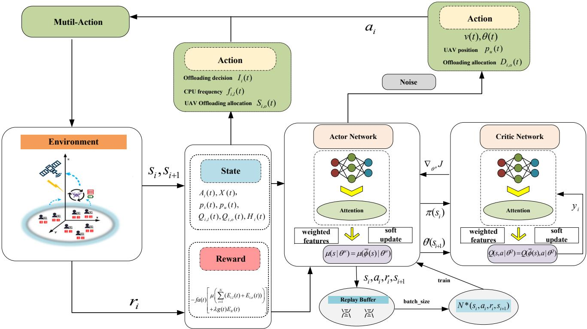  
Fig. 2: DART framework.

Algorithm 1: DDPG-Attention Algorithm (DDPG-A)   
for UAV’s Trajectory Optimization   
Input: Step number M; Learning rate l; Discount   
factor τ ; Weight vector w; Exploration noise ς;   
State space; Action space.   
Output: UAV’s flight angle θ(i); UAV’s flight speed   
$v ( i )$   
1 Initialization:   
2 Normalized state space.   
3 End Initialization   
4 for step ← 1 to M do   
5 Initialize environment parameters, get initial state   
s0.   
6 Obtain the output by convolution.   
7 Obtain attention weights using the softmax   
function via (53).   
8 Obtain the weighted features by $\textstyle \sum _ { i } \alpha _ { i } \phi _ { i } ( s )$   
9 Update Critic-network by   
$\bar { Q } ( s , a \vert \theta ^ { Q } ) = Q ( \bar { \phi } ( s ) , \bar { a } \vert \theta ^ { Q } ) .$   
10 Update Actor-network by $\mu ( s | \theta ^ { \mu } ) = \mu ( \bar { \phi } ( s ) | \theta ^ { \mu } )$   
11 Evaluate the loss function by   
$\begin{array} { r } { L ( \theta ^ { Q } ) = \frac { 1 } { N } \sum _ { i = 1 } ^ { N } ( y _ { i } - Q ( \bar { \phi } ( s _ { i } ) , a _ { i } | \theta ^ { Q } ) ) ^ { 2 } . } \end{array}$   
12 Perform gradient updates via   
$\begin{array} { r } { \nabla _ { \theta ^ { \mu } } J \approx \mathbb { E } _ { \tau \sim \pi } [ \overset { \cdot } { \nabla _ { \theta ^ { \mu } } } Q ( \bar { \phi } ( s ) , \mu ( \bar { \phi } ( s ) | \theta ^ { \mu } ) | \theta ^ { Q } ) ] . } \end{array}$   
13 Obtain action $a = \pi _ { \phi } ( s ) + \varsigma .$   
14 Update the experience replay buffer.   
15 end

As shown in Algorithm 1, we add attention layers after the final convolutional layer in actor networks and critic networks. This attention layer is a fully connected layer that generates attention weights. In the actor network, the addition of an attention layer after state feature extraction enables focusing on key state dimensions; in the critic network, attention-based fusion of state and action features contributes to more accurate Q-value estimation. We can calculate the attention weights α using the following formula:

$$
\alpha = \mathrm { s o f t m a x } ( \mathbf { w } ^ { T } \phi ( s ) ) ,\tag{53}
$$

where w is a learnable weight vector, and the softmax function ensures that the weights are positive and add up to 1. Then multiply these weights with the output of the last convolutional

layer to obtain the weighted features:

$$
\bar { \phi } ( s ) = \sum _ { i } \alpha _ { i } \phi _ { i } ( s ) ,\tag{54}
$$

where $\phi _ { i } ( s )$ is the ith feature element of state s. Using the weighted feature $\bar { \phi } ( s )$ as input to the critic-network and actornetwork, they are updated as follows:

$$
\begin{array} { l } { { { \cal Q } ( s , a | \theta ^ { \cal Q } ) = { \cal Q } ( \bar { \phi } ( s ) , a | \theta ^ { \cal Q } ) , } } \\ { { \mu ( s | \theta ^ { \mu } ) = \mu ( \bar { \phi } ( s ) | \theta ^ { \mu } ) . } } \end{array}\tag{55}
$$

The loss function and gradient update of the critic-network and actor-network are the same as the original DDPG, but here we use the weighted feature $\bar { \phi } ( s )$ to calculate:

$$
\begin{array} { l l l } { { { \displaystyle { \cal L } ( \theta ^ { Q } ) = \frac { 1 } { N } \sum _ { i = 1 } ^ { N } ( y _ { i } - Q ( \bar { \phi } ( s _ { i } ) , a _ { i } | \theta ^ { Q } ) ) ^ { 2 } , } } } \\  { { \displaystyle { \nabla _ { \theta ^ { \mu } } J \approx \mathbb { E } _ { \tau \sim \pi } [ \nabla _ { \theta ^ { \mu } } Q ( \bar { \phi } ( s ) , \mu ( \bar { \phi } ( s ) | \theta ^ { \mu } ) | \theta ^ { Q } ) ] } . } } \end{array}\tag{56}
$$

Finally, we flatten these weighted features and generate actions through a fully connected layer and noise processing.

We divide the problem into four parts and separate them to find their respective optimal solutions, and then combine them into a global solution. The resource allocation is solved by Lyapunov optimization techniques, the UAV position $p _ { u } ( t )$ is solved by DRL techniques, and for the offloading computation allocation $D _ { i , o } ( t )$ , we use traditional mathematical methods to analyze it:

$$
\begin{array} { l } { \displaystyle \operatorname* { m i n } _ { D _ { o } ( t ) } \{ \sum _ { i = 1 } ^ { N } [ \nu \mu \frac { P _ { i } ( t ) } { R _ { i } ( t ) } - Q _ { i , o } ( t ) + H _ { i } ( t ) ] D _ { i , o } ( t ) \} . } \\ { \displaystyle s . t . \quad 0 \leq D _ { i , o } ( t ) \leq R _ { i } ( t ) \iota , } \\ { \quad \quad D _ { i , o } ( t ) \leq Q _ { i , o } ( t ) . } \end{array}\tag{57}
$$

The problem is a linear programming problem. Assuming $\begin{array} { r } { G _ { i } ( t ) = \nu \mu \frac { P _ { i } ( t ) } { R _ { i } ( t ) } - Q _ { i , o } ( t ) + H _ { i } ( t ) } \end{array}$ , the optimal solution for offloading computation is:

$$
D _ { i , o } ( t ) = \left\{ \begin{array} { l l } { \operatorname* { m i n } \left\{ R _ { i } ( t ) \iota , Q _ { i , o } ( t ) \right\} , } & { G _ { i } ( t ) \leq 0 , } \\ { 0 , } & { o t h e r w i s e . } \end{array} \right.\tag{58}
$$

From the above equation, it can be seen that the offloading calculation allocation is related to the transmission rate. By using the DDPG-A algorithm, the trajectory of UAV in each slot is obtained to obtain transmission rate $R _ { i } ( t )$

By now, all subproblems are solved. According to Problem P2, the solution for resource allocation is completed. Combined with the UAV trajectory optimization decisions, we summarize the joint optimization of UAV trajectory, system resource allocation, and total cost in Algorithm 2. The complexity of DART consists of two parts: one part is composed of subproblems Eqn. (39), Eqn. (41), and Eqn. (43), which respectively solve the offloading decisions of IoT devices, local CPU frequency allocation, and UAV offloading allocation problems; the other part is the joint optimization subproblem Eqn. (57), which involves the UAV trajectory and IoT device offloading allocation.

For subproblems Eqn. (39), Eqn. (41), and Eqn. (43), each IoT device or UAV only needs to compute the solution according to Eqn. (40), Eqn. (42), and Eqn. (45), respectively.

Thus, the complexity of these subproblems in a single time slot is $O ( N )$ , where N is the number of IoT devices.

For subproblem Eqn. (57), it involves solving a nonlinear programming problem combined with the DDPG-A. In DDPG-A, each training result generation requires interaction, strategy generation, action selection, strategy evaluation, and network updates. We consider Actor and Critic networks are both feedforward neural network with L fully connected layers (excluding the input layer). Each layer has an input dimension of $n _ { l - 1 }$ and an output dimension of $n _ { l }$ (where $l = \{ 1 , 2 , . . . , L \}$ , and $n _ { 0 }$ represents the input layer dimension, i.e., the state dimension). The complexity of each layer is approximately $O ( n _ { l - 1 } \times n _ { l } )$ . Thus, the complexity for a single forward pass through the entire network is expressed as $\begin{array} { r } { \bar { O } ( \sum _ { l = 1 } ^ { L } n _ { l - 1 } \times n _ { l } ) } \end{array}$ . The total complexity for subproblem Eqn. (54) is $\begin{array} { r } { O ( N + \sum _ { l = 1 } ^ { L } n _ { l - 1 } \times n _ { l } ) } \end{array}$

Each episode of DART algorithm consists of M steps, and we set G episodes. At the end of each episode (after completing M steps), the results are summarized, and the model undergoes learning and training to achieve better performance in subsequent episodes. Four subproblems are solved sequentially in each time slot. Therefore, the complexity of DART algorithm is $O ( G \times ( M \times ( N + \sum _ { l = 1 } ^ { L } n _ { l - 1 } \times n _ { l } ) ) )$ . While for a episode, the complexity is $\begin{array} { r } { O ( M \times ( N + \sum _ { l = 1 } ^ { L } n _ { l - 1 } \times n _ { l } ) ) } \end{array}$ .

## VI. ALGORITHM ANALYSIS FOR DART

In this section we discuss the performance of DART mathematically, that is, to verify the applicability of DART in ensuring that the total cost is within a controllable range in different environments. Next, Lemma 1 is presented to demonstrate the performance of DART.

Lemma 1 No matter how the task arrival rate α changes, an offloading decision $\pi ^ { * }$ independent of the current queue can be obtained, and it satisfies:

$$
\begin{array} { r l } & { \mathbf { E } \{ E _ { t o t a l } ^ { \pi ^ { * } } ( t ) \} = E _ { t o t a l } ^ { * } ( \alpha ) , } \\ & { \mathbf { E } \{ 1 - { \cal I } _ { i } ^ { \pi ^ { * } } ( t ) { \cal A } _ { i } ^ { \pi ^ { * } } ( t ) \} \le \mathbf { E } \{ D _ { i , l } ^ { \pi ^ { * } } ( t ) \} , } \\ & { \mathbf { E } \{ { \cal I } _ { i } ^ { \pi ^ { * } } ( t ) { \cal A } _ { i } ^ { \pi ^ { * } } ( t ) \} \le \mathbf { E } \{ { \cal D } _ { i , o } ^ { \pi ^ { * } } ( t ) \} , } \\ & { \mathbf { E } \{ \displaystyle \sum _ { i = 1 } ^ { N } D _ { i , o } ^ { \pi ^ { * } } ( t ) \} \le \mathbf { E } \{ \displaystyle \sum _ { i = 1 } ^ { N } D _ { i , u } ^ { \pi ^ { * } } ( t ) + { \cal S } _ { i , o } ^ { \pi ^ { * } } ( t ) \} , } \end{array}\tag{59}
$$

where $E _ { t o t a l } ^ { * } ( \alpha )$ represents the minimum total cost.

Proof Here, Carathodory’s theorem is used to prove Lemma 1 [44]. Meanwhile, we omit the details of the proof. Due to the limited arrival rate, this means that the total cost is also limited. Here, we represent the upper total cost as $\hat { E _ { t o t a l } }$ and the lower total cost as $\boldsymbol { E _ { t o t a l } ^ { \check { } } }$ . Then, we represent $\begin{array} { r } { \bar { W } = \operatorname* { l i m } _ { T \to + \infty } \frac { 1 } { T } \sum _ { i = 1 } ^ { N } [ Q _ { i , l } ( t ) + Q _ { i , o } ( t ) + H _ { i } ( t ) ] } \end{array}$ ]. On the basis of Lemma 1, Theorem 2 provides upper bounds on the cost and queue length.

Theorem 2 For any ν and task arrival rate $\alpha + \beta ,$ , the average energy cost and average queue length satisfy:

$$
E _ { t o t a l } \leq E ^ { * } + \frac { Z + Y } { \nu } ,\tag{60a}
$$

$$
\bar { W } \leq \frac { Z + Y + \nu ( \overset { \cdot } { E _ { t o t a l } } - \overset { \triangledown } { E _ { t o t a l } } ) } { \beta } ,\tag{60b}
$$

Algorithm 2: DDPG-Attention-based Resource Allo- where $Y$ is the gap between the optimal result and the result   
cation and Trajectory Optimization Algorithm (DART) with DART algorithm. $\begin{array} { r } { Z = \frac { 1 } { 2 } \sum _ { i = 1 } ^ { \bar { N } } [ ( A _ { i } ^ { m a x } ) ^ { 2 } + ( \frac { f _ { i , l } ^ { m a x } \iota } { \phi _ { i } } ) ^ { 2 } + } \end{array}$   
Input: Step number $M ;$ Episode number $G ;$ Task size $\begin{array} { r l r } { \mathrm { ~ } } & { { } } & { + 2 ( R _ { i } ^ { m a x } \iota ) ^ { 2 } + ( \frac { f _ { u } ^ { m a x } \iota } { \phi _ { u } } + R _ { s } ^ { m a x } \iota ) ^ { 2 } ] } \end{array}$ is the constant defined in   
$A _ { i } ( t ) ;$ Task queues $Q _ { i , o } ( t ) , Q _ { i , l } ( t )$ and $H _ { i } ( t ) ;$ Eqn. (33).   
The position of IoT devices $p _ { i } ( t ) ;$ The position Proof According to Lemma 1, for any random decision $\pi$   
of the $\begin{array} { r } { { \bf U } { \bf A } { \bf V } { \bf \nabla } p _ { u } ( t ) ; } \end{array}$ ; Energy queue for UAV and task arrival rate $\alpha + \beta ,$ we have   
$X ( t ) .$   
Output: $\mathrm { U A V } \mathbf { \hat { s } }$ flight angle $\theta ( t ) ; \mathrm { U A V ^ { \prime } s }$ flight speed $E \{ \overline { { E _ { t o t a l } ^ { \pi } ( t ) } } \} = E _ { t o t a l } ^ { * } ( \alpha + \beta ) ,$   
$v ( t ) ;$ Offloading decision $I _ { i } ( t ) ;$ ; The CPU $\begin{array} { r } { E \{ 1 - I _ { i } ^ { \pi } ( t ) A _ { i } ^ { \pi } ( t ) \} + \beta \leq E \{ D _ { i , l } ^ { \pi } ( t ) \} , } \end{array}$   
frequency of IoT devices $f _ { i , l } ( t ) ;$ ; Data (61)   
offloading allocation $S _ { i , o } ( t )$ and $D _ { i , o } ( t )$ $\begin{array} { r } { E \{ I _ { i } ^ { \pi } ( t ) A _ { i } ^ { \pi } ( t ) \} + \beta \leq E \{ D _ { i , o } ^ { \pi } ( t ) \} , } \end{array}$   
1 Initialization: $\begin{array} { r } { E \{ D _ { i , o } ^ { \pi } ( t ) \} + \beta \le E \{ D _ { i , u } ^ { \pi ^ { * } } ( t ) + S _ { i , o } ^ { \pi ^ { * } } ( t ) \} . } \end{array}$   
2 Ai(t) ← random(); $p _ { i } ( t ) \gets$ random();   
$p _ { u } ( t ) \gets r a n d o m ( ) ; Q _ { i , o } ( t ) \gets 0 ; Q _ { i , l } ( t ) \gets 0 ;$ For any offloading decision π, we have   
$H _ { i } ( t ) \gets 0 ; X ( t ) \gets E ^ { \mathit { m a x } } .$   
3 End Initialization $\Delta \nu ( \Upsilon ( t ) ) \leq Z + Y + \nu E \big \{ E _ { t o t a l } ( t ) | ( \Upsilon ( t ) ) \big \} ,$   
4 for episode $ l$ to G do $+ E \{ \sum _ { i = 1 } ^ { N } Q _ { i , l } ( t ) [ ( 1 - I _ { i } ^ { \pi } ( t ) ) A _ { i } ^ { \pi } ( t ) - D _ { i , l } ^ { \pi } ( t ) ] | ( \Upsilon ( t ) ) \} ,$   
5 Initialize environment parameters, get initial state   
$s _ { 0 } .$   
6 for step $ l$ to M do $+ E \{ \sum _ { i = 1 } ^ { N } Q _ { i , o } ( t ) [ I _ { i } ^ { \pi } ( t ) A _ { i } ^ { \pi } ( t ) - D _ { i , o } ^ { \pi } ( t ) ] | ( \Upsilon ( t ) ) \} ,$   
7 if $X ( t ) > 0$ then   
8 for each $I o T$ device $i \in N$ do   
9 Set the $I _ { i } ( t )$ on the basis of (40). $+ E \{ \sum _ { i = 1 } ^ { N } H _ { i } ( t ) [ D _ { i , o } ^ { \pi } ( t ) - ( D _ { i , u } ^ { \pi ^ { * } } ( t ) + S _ { i , o } ^ { \pi ^ { * } } ( t ) ) ] | ( \Upsilon ( t ) ) \} .$   
10 Calculate the value of $\begin{array} { r } { \sqrt { \frac { Q _ { i , l } ( t ) } { 3 \nu \mu \xi _ { i } \phi _ { i } ( t ) } } . } \end{array}$   
11 Set the $f _ { i , l } ( t )$ on the basis of (42). (62)   
Substituting Eqn. (61) into Eqn. (62) yields:   
12 end   
13 Set the $\theta ( t )$ and $v ( t )$ on the basis of $E \{ U ( \Upsilon ( t + 1 ) ) - U ( \Upsilon ( t ) ) \} + \nu E ( E _ { t o t a l } ( t ) ) \le$   
Algorithm 1.   
14 Set the for ea $p _ { u } ( t )$ on the bT device (22).do $Z + Y + \nu E _ { t o t a l } ^ { * } ( \alpha + \beta ) -$ (63)   
$i \in N$ $\beta E \{ \sum _ { i = 1 } ^ { N } ( Q _ { i , l } ( t ) + Q _ { i , o } ( t ) + H _ { i } ( t ) ) \} ,$   
16 Calculate channel gain $g _ { i } ( t )$ according   
(1).   
17 Sort by the $\rho _ { i } ( t )$   
Since $Q _ { i , l } ( t ) , Q _ { i , o } ( t ) , H _ { i } ( t )$ , and $\beta$ are all non negative, we   
18 Calculate the value of   
can obtain:   
$\begin{array} { r } { \nu \mu \frac { P _ { i } ( t ) } { B _ { i } \log _ { 2 } ( 1 + \frac { P _ { i } ( t ) | \frac { \omega _ { 0 } } { ( p _ { u } ( t ) - p _ { i } ( t ) ) ^ { 2 } + z _ { u } ^ { 2 } } | ^ { 2 } } { \sum _ { j = i + 1 } ^ { N } P _ { j } ( t ) | \frac { \omega _ { 0 } } { ( p _ { u } ( t ) - p _ { j } ( t ) ) ^ { 2 } + z _ { u } ^ { 2 } } | ^ { 2 } + \delta _ { l } ^ { 2 } } } - } \\ { \infty \quad \cdots \quad \cdots \quad \frac { P _ { i } ( t ) } { \sum _ { j = i + 1 } ^ { N } \mathrm { ~ } ^ { j } ( t ) | \frac { \omega _ { 0 } } { ( p _ { u } ( t ) - p _ { j } ( t ) ) ^ { 2 } + z _ { u } ^ { 2 } } | ^ { 2 } + \delta _ { l } ^ { 2 } } } \end{array}$ $\nu \sum _ { t = 1 } ^ { T - 1 } E ( E _ { t o t a l } ( t ) ) \leq ( Z + Y ) T + \nu T E _ { t o t a l } ^ { \ast } ( \alpha + \beta ) .$ (64)   
$Q _ { i , o } ( t ) + H _ { i } \mathbf { \bar { ( } } t )$   
19 Set the $D _ { i , o } ( t )$ on the basis of (58).   
Then, divide both sides of the above equation by $\nu T .$ When   
20 end   
21 Initialize $C _ { s } ^ { o } = R _ { s } ( t ) \iota .$ $\beta \to 0 , T \to \infty ,$ , we can obtain Eqn. $6 0 ( a ) .$ According to   
Eqn. (63), we can obtain:   
22 Sort IoT devices from small to large on the   
23 for each basis of the value of $I o T$ device $- H _ { i } ( t )$ $i \in N$ do $\beta E \{ \sum _ { t = 1 } ^ { T - 1 } \sum _ { i = 1 } ^ { N } Q _ { i , l } ( t ) + Q _ { i , o } ( t ) + H _ { i } ( t ) \} \leq$   
24 if $[ - H _ { i } ( t ) ] < 0$ then   
25 26 Set Calculate the value of $S _ { i , o } ( t )$ on the basis of (44). $D _ { i , u } ( t )$ $( Z + Y ) T + \nu T E _ { t o t a l } ^ { * } ( \alpha + \beta ) - \nu \sum _ { t = 1 } ^ { T - 1 } E ( E _ { t o t a l } ( t ) ) .$ (65)   
27 end   
28 end   
29 Update the queues of $Q _ { i , o } ( t ) , Q _ { i , l } ( t )$ Since $E ( E _ { t o t a l } ( t ) )$ is non negative, we have:   
$H _ { i } ( t )$   
30 Update the battery energy of UAV $X ( t )$ $\beta E \{ \sum _ { t = 1 } ^ { T - 1 } \sum _ { i = 1 } ^ { N } Q _ { i , l } ( t ) + Q _ { i , o } ( t ) + H _ { i } ( t ) \} \leq$   
31 Calculate the reward. (66)   
32 Enter the new episode if $X ( t ) < 0 .$ $( Z + Y ) T + \nu T ( E _ { t o t a l } - E _ { t o t a l } ) .$   
33 end   
34 end Finally, divide the above equation by $\beta T ,$ , and obtain Eqn.   
35 end 60(b) when $T \to \infty .$

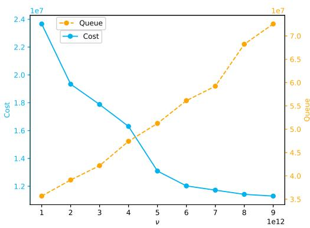  
Fig. 3: The cost and queue length with the different values of ν.

## VII. PERFORMANCE EVALUATION

## A. Experiment Settings

We validate the performance of DART through experiments. During the experiment, a data offloading system supporting NOMA in the HAP-UAV network is considered, including one HAP, one UAV, and 50 IoT devices. Task arrival in each slot satisfies a Poisson distribution, with $A _ { i } ( t ) \sim P [ 0 , 1 . 5 ] ~ M b ,$ transmission power $P _ { i } ( t ) = 0 . 1 ~ w ,$ and uplink bandwidth of $\lfloor M H z \ [ 4 5 ]$ . The maximum CPU frequency of IoT devices is $0 . 6 ~ G H z$ , the CPU frequency of UAV is $1 . 2 \ G H z .$ , assuming that processing one bit of data requires 1000 CPU cycles [38]. The channel noise power is $\bar { 1 0 } ^ { - 1 3 }$ w. The maximum flight speed of the UAV is 50 $m / s$ , with altitude of 100 m and coverage radius of 20 m. For the UAV flight energy consumption, $C 1 = 9 . 2 6 1 0 ^ { - 4 }$ and $C 2 = 2 2 5 0 J { \cdot } s / m$ , with the hovering power being 5w. In addition, the energy conversion efficiency $\eta = 0 . 7$ and the charging power $P _ { W P T } ( t ) = 5 w$ All devices are within an area of 100 m × 100 m [46]. Moreover, each time slot has length $\iota = 1 s ~ [ 3 2 ]$ . This setting can meet the transmission and computation needs of most tasks. Task that is not completed within the slot will be stored in the task queue and processed in the next slot.

The DART model consists of four neural networks: two Actors and two Critics. Each network has three hidden layers with 512, 128, and 64 neurons, respectively. We use ReLU as activation function, Adam optimizer, and set soft update parameter to 0.995.

## B. Parametric analysis

Balance parameter ν: In the penalty function of the Lyapunov optimization framework, ν represents the inverse proportion of energy cost in the optimization objective. We use different ν values ranging from $1 \times 1 0 ^ { 1 2 } \mathrm { ~ t o ~ } \dot { 9 } \times 1 0 ^ { 1 2 }$ to test the relationship between $\nu$ and cost and queue backlog. Under the same conditions, the larger the $\nu ,$ the lower the energy cost, but at the cost of increased queue backlog. Fig. 3 shows the trend of energy cost and queue variation with $\nu ,$ which is consistent with our theoretical analysis.

Learning rate lr: Learning rate is a crucial hyperparameter in the optimization process, which determines the steps that model parameters should take in the opposite direction of the loss function gradient during each update process. We compare the learning rates of $1 0 ^ { - 4 } , 1 0 ^ { - 5 }$ , and $1 0 ^ { - 6 }$ . We find through Fig. 4a that when the learning rate is $1 0 ^ { - 4 }$ , this function converges the fastest and yields the highest reward.

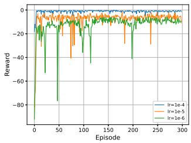  
(a) different learning rates lr.

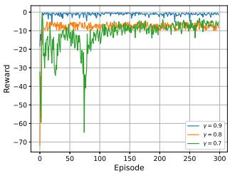  
(b) different discount factors γ.  
Fig. 4: The reward changes with different parameters.

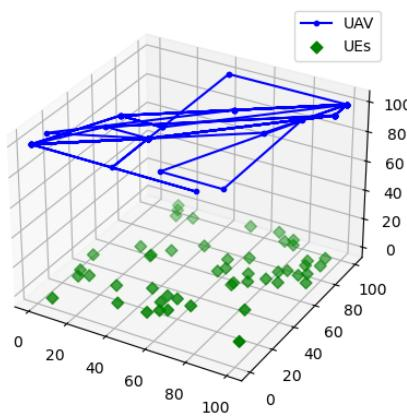  
Fig. 5: UAV trajectory.

Discount factor γ: Fig. 4b illustrates the impact of different discount factors γ on the convergence of the DART. We set γ to 0.9, 0.8, and 0.7. When the discount factor is 0.9, the convergence performance is the fastest and best. A lower discount coefficient leads to a greater emphasis on current rewards. On the contrary, when the discount factor γ approaches 1, the impact of future rewards is close to that of current rewards, resulting in greater long-term returns.

Therefore, we chose a learning rate of $1 0 ^ { - 4 }$ and $\gamma = 0 . 9$ for subsequent experiments. Under the premise of parameter determination and reward convergence, the trajectory of UAV is an important quantitative objective. Fig. 5 depicts the trajectory of the UAV in the final set, where the step size remains within the maximum constraint. When IoT devices generate tasks, UAV also moves back to better positions in pursuit of higher returns.

Task arrival rate α: We test the convergence of DART in terms of energy cost and queue under three different task arrival rates by setting different task arrival rates, as described in Figs. 6a and 6b, respectively. We find that as the task arrival rate increases, both queue and computational energy costs also increase. However, the DART algorithm can adaptively adjust and dynamically change the offloading decision based on different task arrival rates to achieve asymptotically optimal system performance.

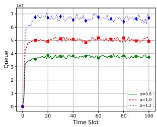  
(a) queue length.

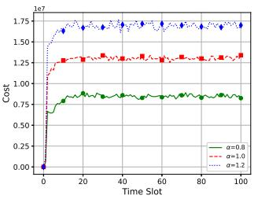

(b) cost.  
Fig. 6: The queue and cost with different task arrival rates α.  
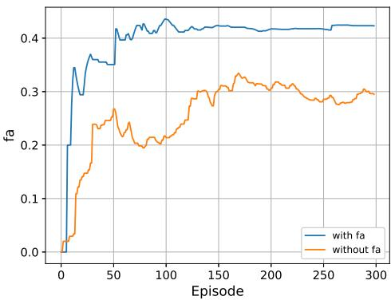  
Fig. 7: Fairness comparison.

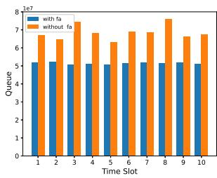  
(a) queue length.

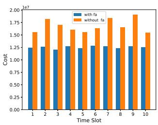  
(b) cost.  
Fig. 8: Comparison of queue length and cost with or without fairness.

Fairness factor $f a \colon$ We compare the performance of DART with and without fairness constraints. Fig. 7 shows the fairness values after adding fairness constraints. The fairness is worse without fairness constraints. This because if without the fairness of offloading, UAV may approach some IoT devices to provide services. Other IoT devices outside the coverage range of UAV being able to execute locally and not offload. In Fig. 8a and Fig. 8b, it can be clearly shown that the system has longer queues and energy costs without considering offloading fairness. For the sake of fairness, UAV tend to stay closer to more IoT devices to provide services. In addition, it is also difficult to reach 1, because the maximum coverage distance of UAV and battery limitations make it impossible for all IoT devices to obtain the same amount of coverage. From the above experiment, it is seen that fairness in offloading is a necessary consideration for balancing the service of all IoT devices.

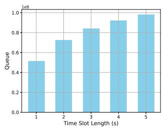  
(a) queue length.

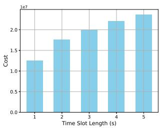  
(b) cost.  
Fig. 9: Average queue length and cost under different time slot length ι.

Time slot length ι: According to Little’s law, queuing delay is proportional to queue length. Therefore, we use queue length to reflect the queuing delay. We compare the average values of the converged queue length and energy consumption cost at time slot length ι = 1s, 2s, 3s, 4s, 5s, respectively. As shown Fig.9a and Fig.9b, as the time slot length increases, it becomes increasingly challenging to track system dynamics, since system variables may evolve significantly over extended time intervals, ultimately leading to elevated energy cost and queue length. However, the overall performance remains relatively stable, proving that the DART algorithm can adapt to different time slot lengths.

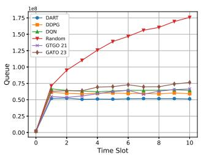  
(a) queue length.

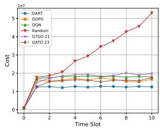  
(b) cost.  
Fig. 10: Comparison of queue length and cost with different algorithms.

We choose the following edge computing resource allocation algorithm and DRL algorithm as the comparison algorithm:

• GTGO 21. Adopting heuristic algorithms using game theory to select MEC servers, in order to minimize costs in each iteration [47]. However, the mobility of UAV was not considered.

GATO 23. The GATO 23 algorithm addresses subproblems by separately solving UAV scheduling and task offloading subproblems to optimize user satisfaction (comprising task processing latency and energy consumption), though it lacks consideration for system queue load [48].

• DDPG. DDPG is a DRL algorithm, which combines the efficiency of Q-learning with the stability of deterministic policy gradients.

• DQN. Deep Q-Network is a deep reinforcement learning framework that merges deep learning with Q-learning. It estimates the Q-value function using neural networks.

• Random. As a basic algorithm in the comparative experiment, resource allocation and trajectory are randomly within the range.

In addition, for the trajectory of UAV in the GTGO 21 algorithm and GATO 23 algorithm, we use the DDPG-A algorithm for simulation. For the resource allocation part in DDPG and DQN algorithms, we adopt the results of Lyapunov optimization.

We simulate five other algorithms and compare them with DART. For intuitive comparison, we divide the full time slots into 10 equal intervals. Fig. 10a and Fig. 10b show that all algorithms except Random effectively control energy costs and stabilize queues. Among them, DART achieves the best performance in both energy cost reduction and queue performance. The GTGO 21 algorithm shows relatively poorer performance in energy cost control and queue stabilization due to its resource scheduling mechanism not accounting for UAV mobility, relying instead on greedy strategies for resource allocation. The GATO 23 algorithm performs well in energy reduction since user satisfaction primarily depends on energy consumption. However, to reduce user energy cost, it offloads most tasks to UAV, whose limited computing capacity consequently increases queue load. The DDPG algorithm outperforms DQN by incorporating policy gradients to enhance stability, yet remains slightly inferior to DART, which further improves feature extraction through attention mechanisms. The Random algorithm yields the worst performance, confirming that Lyapunov optimization alone cannot effectively handle complex UAV mobility scenarios. In conclusion, the DART algorithm successfully reduces system energy costs while ensuring UAV endurance and system stability.

In Fig. 11a and Fig. 11b, comparative small-scale tests between DART and exhaustive-search-derived optimal solutions demonstrate DART’s near-optimal performance in queue length and energy cost. We adopt the real-world dataset from a 6.2km2 Melbourne CBD area of Australia to validate DART. The dataset includes the locations of 825 IoT devices in the area [49]. We employ an exhaustive search method to evaluate all possible decisions for maximal reward in order to verify the optimal solution. However, due to the inherent complexity of the problem—including the dynamic offloading behavior of IoT devices and the mobility of UAV—obtaining the globally optimal solution in large-scale scenarios is computationally intractable. Therefore, we conduct experimental validation in small-scale scenarios as a feasible alternative. We randomly select 100m×100m sampling areas from the dataset and conduct experiments using the spatial distribution of IoT devices within these regions. The results confirm DART’s marginal deviation from theoretical optima in constrained environments.

## VIII. CONCLUSION

This paper investigates the trajectory optimization and resource allocation problems in HAP-UAV-MEC system under dynamic NOMA communication conditions and task arrival rates. Considering the long-term constraints, the problem is transformed into a multi-stage problem to reduce the energy cost. We propose DART algorithm combining DRL and Lyapunov optimization techniques to solve this problem. DART algorithm utilizes Lyapunov techniques to decouple the problem into multiple subproblems to solve them separately, improving the efficiency of solving. DRL technology is used to solve UAV’s trajectory and resource allocation. With the support of WPT technology, UAV can provide long-term service. We also propose the concept of fairness to provide guarantees for every IoT device to receive services. Theoretical analysis and simulation results indicate that DART shows well in different task arrival rates and environmental changes. Compared with other algorithms, DART significantly improve in reducing energy consumption costs and maintaining queue stability. In future, we will work on multi-UAV collaborative MEC systems, developing models and algorithms that enable efficient scheduling and coordination among UAV swarms to enhance computational efficiency. Meanwhile, we will focus on considering the impact of imperfect CSI in dynamic UAVassisted communication environments due to factors such as rapid fading, mobility, and pilot overhead limitations. To address the high probability of channel imperfection in singleantenna systems, we also plan to conduct research on multiantenna MIMO systems.

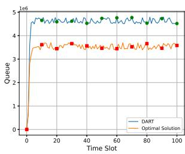  
(a) queue length.

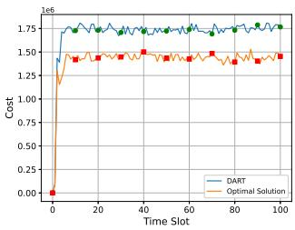  
(b) cost.  
Fig. 11: Comparison of queue length and cost with Optimization.

## REFERENCES

[1] Y. Xu, H. Li, C. Zhang, Z. Tang, X. Zhong, J. Ren, H. Jiang, and Y. Zhang, “Blockchain-enabled multiple sensitive task-offloading mechanism for mec applications,” IEEE Transactions on Mobile Computing, pp. 1–15, 2024.

[2] Y. He, P. Yang, T. Qin, J. Hou, and N. Zhang, “Joint encoding and enhancement for low-light video analytics in mobile edge networks,” IEEE Transactions on Mobile Computing, pp. 1–15, 2024.

[3] Y. Dong, S. Duan, F. Lyu, P. Zhao, Y. Zhang, J. Ren, and Y. Zhang, “Ncload: On-demand program loading and running for computing sharing among iot devices,” IEEE Internet of Things Journal, pp. 1–1, 2024.

[4] D. Yang, W. Zhang, Q. Ye, C. Zhang, N. Zhang, C. Huang, H. Zhang, and X. Shen, “Detfed: Dynamic resource scheduling for deterministic federated learning over time-sensitive networks,” IEEE Transactions on Mobile Computing, vol. 23, no. 5, pp. 5162–5178, 2024.

[5] C. Xu, S. Jiang, G. Luo, G. Sun, N. An, G. Huang, and X. Liu, “The case for fpga-based edge computing,” IEEE Transactions on Mobile Computing, vol. 21, no. 7, pp. 2610–2619, 2022.

[6] M. Xu, D. Xu, C. Lou, L. Zhang, G. Huang, X. Jin, and X. Liu, “Efficient, scalable, and sustainable dnn training on soc-clustered edge servers,” IEEE Transactions on Mobile Computing, vol. 23, no. 12, pp. 14 344–14 360, 2024.

[7] C. Zhang, J. Yin, and S. Deng, “Ensuring fairness in edge networks: A gnn-based media workload migration scheme with fairness guarantee,” IEEE Transactions on Services Computing, vol. 17, no. 3, pp. 934–948, 2024.

[8] Y. Chen, K. Li, Y. Wu, J. Huang, and L. Zhao, “Energy efficient task offloading and resource allocation in air-ground integrated mec systems: A distributed online approach,” IEEE Transactions on Mobile Computing, vol. 23, no. 8, pp. 8129–8142, 2024.

[9] X. Wei, L. Cai, N. Wei, P. Zou, J. Zhang, and S. Subramaniam, “Joint uav trajectory planning, dag task scheduling, and service function deployment based on drl in uav-empowered edge computing,” IEEE Internet of Things Journal, vol. 10, no. 14, pp. 12 826–12 838, 2023.

[10] Q. Li, S. Wang, X. Ma, A. Zhou, Y. Wang, G. Huang, and X. Liu, “Battery-aware energy optimization for satellite edge computing,” IEEE Transactions on Services Computing, vol. 17, no. 2, pp. 437–451, 2024.

[11] F. Fang, Y. Xu, Z. Ding, C. Shen, M. Peng, and G. K. Karagiannidis, “Optimal resource allocation for delay minimization in noma-mec networks,” IEEE Transactions on Communications, vol. 68, no. 12, pp. 7867–7881, 2020.

[12] B. Lu, S. Lin, J. Fang, X. Hong, and J. Shi, “Learning-assisted partial offloading for dynamic noma-mec systems with imperfect sic and reconfiguration energy cost,” IEEE Internet of Things Journal, vol. 10, no. 22, pp. 20 134–20 148, 2023.

[13] X. Diao, J. Zheng, Y. Wu, Y. Cai, and A. Anpalagan, “Joint trajectory design, task data, and computing resource allocations for noma-based and uav-assisted mobile edge computing,” IEEE Access, vol. 7, pp. 117 448–117 459, 2019.

[14] I. Budhiraja, N. Kumar, S. Tyagi, and S. Tanwar, “Energy consumption minimization scheme for noma-based mobile edge computation networks underlaying uav,” IEEE Systems Journal, vol. 15, no. 4, pp. 5724–5733, 2021.

[15] X. Zhang, J. Zhang, J. Xiong, L. Zhou, and J. Wei, “Energy-efficient multi-uav-enabled multiaccess edge computing incorporating noma,” IEEE Internet of Things Journal, vol. 7, no. 6, pp. 5613–5627, 2020.

[16] Y. Du, K. Wang, K. Yang, and G. Zhang, “Energy-efficient resource allocation in uav based mec system for iot devices,” in 2018 IEEE Global Communications Conference (GLOBECOM), 2018, pp. 1–6.

[17] J. Wang, C. Jin, Q. Tang, N. N. Xiong, and G. Srivastava, “Intelligent ubiquitous network accessibility for wireless-powered mec in uavassisted b5g,” IEEE Transactions on Network Science and Engineering, vol. 8, no. 4, pp. 2801–2813, 2021.

[18] Z. Yang, S. Bi, and Y.-J. A. Zhang, “Online trajectory and resource optimization for stochastic uav-enabled mec systems,” IEEE Transactions on Wireless Communications, vol. 21, no. 7, pp. 5629–5643, 2022.

[19] T. Khurshid, W. Ahmed, M. Rehan, R. Ahmad, M. M. Alam, and A. Radwan, “A drl strategy for optimal resource allocation along with 3d trajectory dynamics in uav-mec network,” IEEE Access, vol. 11, pp. 54 664–54 678, 2023.

[20] L. Sun, L. Wan, and X. Wang, “Learning-based resource allocation strategy for industrial iot in uav-enabled mec systems,” IEEE Transactions on Industrial Informatics, vol. 17, no. 7, pp. 5031–5040, 2021.

[21] Q. Luan, H. Cui, L. Zhang, and Z. Lv, “A hierarchical hybrid subtask scheduling algorithm in uav-assisted mec emergency network,” IEEE Internet of Things Journal, vol. 9, no. 14, pp. 12 737–12 753, 2022.

[22] Y. Ding, H. Han, W. Lu, Y. Wang, N. Zhao, X. Wang, and X. Yang, “Ddqn-based trajectory and resource optimization for uav-aided mec secure communications,” IEEE Transactions on Vehicular Technology, vol. 73, no. 4, pp. 6006–6011, 2024.

[23] Z. Jia, Q. Wu, C. Dong, C. Yuen, and Z. Han, “Hierarchical aerial computing for internet of things via cooperation of haps and uavs,” IEEE Internet of Things Journal, vol. 10, no. 7, pp. 5676–5688, 2023.

[24] C. Shang, Y. Sun, H. Luo, and M. Guizani, “Computation offloading and resource allocation in noma–mec: A deep reinforcement learning approach,” IEEE Internet of Things Journal, vol. 10, no. 17, pp. 15 464– 15 476, 2023.

[25] W. Chu, X. Jia, Z. Yu, J. C. Lui, and Y. Lin, “Joint service caching, resource allocation and task offloading for mec-based networks: A multilayer optimization approach,” IEEE Transactions on Mobile Computing, vol. 23, no. 4, pp. 2958–2975, 2024.

[26] D. Wang, Y. Bai, G. Huang, B. Song, and F. R. Yu, “Cache-aided mec for iot: Resource allocation using deep graph reinforcement learning,” IEEE Internet of Things Journal, vol. 10, no. 13, pp. 11 486–11 496, 2023.

[27] Z. Shah, U. Javed, M. Naeem, S. Zeadally, and W. Ejaz, “Mobile edge computing (mec)-enabled uav placement and computation efficiency maximization in disaster scenario,” IEEE Transactions on Vehicular Technology, vol. 72, no. 10, pp. 13 406–13 416, 2023.

[28] M. Wang, L. Zhang, P. Gao, X. Yang, K. Wang, and K. Yang, “Stackelberg-game-based intelligent offloading incentive mechanism for a multi-uav-assisted mobile-edge computing system,” IEEE Internet of Things Journal, vol. 10, no. 17, pp. 15 679–15 689, 2023.

[29] Z. Liu, J. Qi, Y. Shen, K. Ma, and X. Guan, “Maximizing energy efficiency in uav-assisted noma–mec networks,” IEEE Internet of Things Journal, vol. 10, no. 24, pp. 22 208–22 222, 2023.

[30] J. Li, C. Yi, J. Chen, K. Zhu, and J. Cai, “Joint trajectory planning, application placement, and energy renewal for uav-assisted mec: A triple-learner-based approach,” IEEE Internet of Things Journal, vol. 10, no. 15, pp. 13 622–13 636, 2023.

[31] Y. Chen, J. Zhao, Y. Wu, J. Huang, and X. S. Shen, “Multi-user task offloading in uav-assisted leo satellite edge computing: A game-theoretic approach,” IEEE Transactions on Mobile Computing, vol. 24, no. 1, pp. 363–378, 2025.

[32] Y. Xu, T. Zhang, D. Yang, Y. Liu, and M. Tao, “Joint resource and trajectory optimization for security in uav-assisted mec systems,” IEEE Transactions on Communications, vol. 69, no. 1, pp. 573–588, 2021.

[33] Y. Xu, T. Zhang, Y. Liu, D. Yang, L. Xiao, and M. Tao, “Uav-assisted mec networks with aerial and ground cooperation,” IEEE Transactions on Wireless Communications, vol. 20, no. 12, pp. 7712–7727, 2021.

[34] L. Wang, Q. Zhou, and Y. Shen, “Computation efficiency maximization for uav-assisted relaying and mec networks in urban environment,” IEEE Transactions on Green Communications and Networking, vol. 7, no. 2, pp. 565–578, 2023.

[35] J. Chu, X. Chen, C. Zhong, and Z. Zhang, “Robust design for nomabased multibeam leo satellite internet of things,” IEEE Internet of Things Journal, vol. 8, no. 3, pp. 1959–1970, 2021.

[36] Z. Chen, Y. Yang, J. Xu, Y. Chen, and J. Huang, “Task offloading and resource pricing based on game theory in uav-assisted edge computing,” IEEE Transactions on Services Computing, vol. 18, no. 1, pp. 440–452, 2025.

[37] J. Shi, Y. Zhou, Z. Li, Z. Zhao, Z. Chu, and P. Xiao, “Delay minimization for noma-mmw scheme-based mec offloading,” IEEE Internet of Things Journal, vol. 10, no. 3, pp. 2285–2296, 2023.

[38] Y. Zeng and J. Tang, “Mec-assisted real-time data acquisition and processing for uav with general missions,” IEEE Transactions on Vehicular Technology, vol. 72, no. 1, pp. 1058–1072, 2023.

[39] K. Nguyen, A.-N. Nguyen, G.-H. Nguyen, and M.-S. Nguyen, “Computation offloading analysis of iot networks with uav-enabled mec with noma and wpt,” in 2024 28th International Computer Science and Engineering Conference (ICSEC), 2024, pp. 1–6.

[40] Y. Zeng, S. Chen, Y. Cui, J. Yang, and Y. Fu, “Joint resource allocation and trajectory optimization in uav-enabled wirelessly powered mec for large area,” IEEE Internet of Things Journal, vol. 10, no. 17, pp. 15 705– 15 722, 2023.

[41] N. Lin, H. Tang, L. Zhao, S. Wan, A. Hawbani, and M. Guizani, “A pddqnlp algorithm for energy efficient computation offloading in uavassisted mec,” IEEE Transactions on Wireless Communications, vol. 22, no. 12, pp. 8876–8890, 2023.

[42] H.-H. Wu and S. Wu, “Various proofs of the cauchy-schwarz inequality,” in Octogon mathematical magazine, vol. 17, no. 1, 2009, pp. 221–229.

[43] Y. Chen, Y. Yang, Y. Wu, J. Huang, and L. Zhao, “Joint trajectory optimization and resource allocation in uav-mec systems: A lyapunovassisted drl approach,” IEEE Transactions on Services Computing, vol. 18, no. 2, pp. 854–867, 2025.

[44] W. D. Cook and R. J. Webster, “Caratheodory’s theorem,” ´ Canadian Mathematical Bulletin, vol. 15, no. 2, p. 293–293, 1972.

[45] W. Lu, Y. Ding, Y. Gao, Y. Chen, N. Zhao, Z. Ding, and A. Nallanathan, “Secure noma-based uav-mec network towards a flying eavesdropper,” IEEE Transactions on Communications, vol. 70, no. 5, pp. 3364–3376, 2022.

[46] X. Diao, J. Zheng, Y. Cai, Y. Wu, and A. Anpalagan, “Fair data allocation and trajectory optimization for uav-assisted mobile edge computing,” IEEE Communications Letters, vol. 23, no. 12, pp. 2357– 2361, 2019.

[47] Z. Luo and A. Huang, “Joint game theory and greedy optimization scheme of computation offloading for uav-aided network,” in 2021 31st International Telecommunication Networks and Applications Conference (ITNAC), 2021, pp. 198–203.

[48] J. Tian, D. Wang, H. Zhang, and D. Wu, “Service satisfaction-oriented task offloading and uav scheduling in uav-enabled mec networks,” IEEE Transactions on Wireless Communications, vol. 22, no. 12, pp. 8949– 8964, 2023.

[49] Q. Peng, Y. Xia, Z. Feng, J. Lee, C. Wu, X. Luo, W. Zheng, S. Pang, H. Liu, Y. Qin, and P. Chen, “Mobility-aware and migration-enabled

<table><tr><td colspan="2">online edge user allocation in mobile edge computing,&quot; in 2019 IEEE International Conference on Web Services (ICWS), 2019, pp. 91–98.</td></tr><tr><td></td><td>Ying Chen (Senior Member, IEEE) received the Ph.D. degree in 2017 from Tsinghua University, and was a joint Ph.D. student with the University of Waterloo, Canada from 2016 to 2017. She is cur- rently a Professor at Beijing Information Science and Technology University, China. Her current research interests include Internet of Things, mobile edge computing, machine learning, etc.</td></tr><tr><td></td><td>degree in computer science and technology, the Bei- jing Information Science and Technology University, China. His current research interests include edge computing, Internet of Things, stochastic optimiza- tion and reinforcement learning.</td></tr><tr><td></td><td>M.Eng. degree with the School of Computer Sci- ence, Beijing Information Science and Technology University, Beijing, China. His current research in- terests include edge computing and machine learn ing.</td></tr><tr><td></td><td>Jiwei Huang (Senior Member, IEEE) received the B.Eng. and Ph.D. degrees in computer science and technology from Tsinghua University, Beijing, China. He is currently a Professor and the vice dean with the Department of Computer Science and Technology, China University of Petroleum, Beijing. His research interests include services computing, Internet of Things, etc.</td></tr><tr><td></td><td>from the Department of Electrical and Computer En gineering, University of Waterloo, Canada, in 2002. She is currently a Professor at Toronto Metropolitan University (formerly Ryerson University), Canada. Her current research interests include wireless com- munications, mobile edge computing, and IoV net- works.</td></tr></table>