# DDRL: A Dual-Phase Deep Reinforcement Learning Approach for UAV-Assisted Content Delivery Across Multiple Base Stations

Xinshuai Hua, Long Chen , Xia Zhu, Xiaoping Li , Senior Member, IEEE, and Jingjing Li

Abstract—Uncrewed Aerial Vehicles (UAVs) with caching capabilities present a flexible and scalable approach for efficient content delivery in wireless communication environments with high demand. However, the challenges posed by the limited energy and storage capabilities of UAVs significantly affect content delivery efficiency. In this paper, we consider the problem of UAV-assisted content delivery across multiple base stations, with the aim of reducing content acquisition delays by jointly optimizing UAV trajectory, cache replacement, and transmission power. A Dual-phase Deep Reinforcement Learning (DDRL) framework is proposed, integrating real-time decision making with offline training to adapt dynamic user demands and multi-BS configurations. The Particle Swarm Optimization (PSO) algorithm is incorporated to improve UAV caching performance. The simulation results demonstrate that the DDRL framework achieves up to a 8% reduction in latency and a 5% improvement in cache hit rate compared to the best baseline algorithm, showcasing its efficiency in UAV-assisted content delivery.

Index Terms—UAV caching, trajectory design, cache replacement, energy constraint, deep reinforcement learning, particle swarm optimization.

## I. INTRODUCTION

U <sup>NCREWED</sup> <sup>Aerial</sup> <sup>Vehicles</sup> <sup>(UAVs)</sup> <sup>are</sup> <sup>emerged</sup> <sup>as</sup> <sup>a</sup> promising solution to improve wireless communication services, due to their mobility, cost effectiveness, and ability to provide coverage in areas with limited ground infrastructure [1]. In contrast to traditional base stations (BSs) or vehiclemounted mobile base stations [2], UAVs offer a flexible and scalable means to support communication in challenging environments, such as disaster-stricken areas or high-traffic regions where traditional BSs are either unavailable or congested. Furthermore, with the rapid increase in mobile devices and the escalating demand for high-quality content delivery, there is a pressing need for efficient content delivery strategies [3]. Equipping UAVs with caching capabilities enables the storage of popular content closer to end-users, significantly reducing latency and improving Quality of Experience (QoE) [4]. For example, with the growing popularity of virtual reality (VR) devices, the requirement for high-quality, low-latency content has increased significantly [5]. As immersive VR experiences are highly dependent on real-time data streaming and seamless interaction, any latency or drop in content quality can greatly detract the user experience [6]. This places additional pressure on the network infrastructure, as high bandwidth and low latency are critical to maintain seamless content delivery.

In this paper, we focus on optimizing UAV-assisted content delivery in multi-base station (multi-BS) environments, particularly during high-demand periods such as peak hours or urban hotspots. During these periods, BSs become congested due to the large number of simultaneous user requests, leading to delays and degradation in service quality. UAVs are deployed to offload traffic from congested BSs by providing content delivery directly to users. The UAVs can take off and land at different BSs, which also serve as charging hubs and content update points. The characteristics of the problem under consideration include: (1) User demand is highly dynamic and geographically distributed, with users located in different areas and requiring varying content in real-time. (2) UAVs have limited battery capacity, restricting their operational time and necessitating periodic returns to BSs for recharging. (3) UAVs have limited storage space, which constrains the amount of content they can cache locally, requiring frequent retrieval or updates from BSs. The objective is to jointly optimize the UAV’s trajectory, caching strategy, and transmission power, improving content delivery efficiency, and reducing BS congestion, while maintaining high-quality service for users.

These characteristics present several significant challenges for optimizing UAV-assisted content delivery. (1) Handling dynamic and diverse user demands: Users generate diverse, geographically dispersed requests with strict realtime requirements. UAVs must balance bandwidth, low-latency transmission, and throughput, while adapting to dynamic conditions, creating a rapidly changing and complex solution space. Optimal decisions must continuously adapt to real-time conditions, increasing the complexity of achieving robust and efficient solutions. (2) Trajectory optimization with multi-BS and energy constraints: Limited UAV battery life creates a fundamental conflict between maximizing user coverage and minimizing energy use. In multi-BS environments, UAVs must plan efficient paths to serve users and recharge timely. The trade-offs between extending operational time, maintaining low latency, and optimizing throughput result in a highly constrained and non-linear optimization problem. The constantly changing UAV trajectory decision variables and BS connectivity further complicate the solution space, making it dynamic and multi-dimensional. (3) Cache management with limited storage: Cache management with limited storage: The finite storage capacity of UAVs presents a trade-off between caching popular content to reduce BS retrievals and dynamically adapting to real-time user demand. This conflict intensifies as user pReferences evolve unpredictably, requiring UAVs to manage a continuously shifting cache strategy. Balancing cache hit rates with storage constraints amplifies the computational complexity, as the optimal solution space changes with every user request and content popularity update.

This paper proposes a Dual-phase Deep Reinforcement Learning (DDRL) framework to tackle the previously mentioned challenges. DDRL is combined with Particle Swarm Optimization (PSO) to optimize UAVs trajectories, caching strategies, and power allocation. The main contributions of this paper are summarized as follows:

• A novel framework is proposed for cache-enabled UAVs in multi-BS networks, aimed at improving content delivery in hotspot areas. Our approach jointly optimizes UAV trajectory, cache replacement, and transmission power to minimize the overall content acquisition delay.

• A DDRL framework is outlined to design UAVs trajectories and power allocation, integrating offline learning with online decision-making to boost UAV flexibility in multi-BS settings with fluctuating user demands. A GRUbased sequential model is introduced to capture temporal dependencies in user requests, UAV energy dynamics, and mobility patterns, enabling more coherent and foresighted trajectory planning.

• A PSO-optimized cache replacement strategy is integrated into the DRL framework. By using PSO to fine-tune the cache evaluation function and obtain the extrinsic reward, DDRL agents learn more effective caching policies, leading to higher cache hit rate and improved content delivery performance in UAV-assisted networks.

The remainder of the paper is organized as follows. Section II reviews related work on UAV-assisted wireless networks. In Section III, the system model and problem formulation are presented. Section IV outlines our proposed optimization approach for designing joint UAV trajectories and caching replacements. Section V provides simulation results and analysis, followed by the conclusion in Section VI.

## II. RELATED WORK

Many research efforts [7], [8] have proposed UAV-assisted frameworks aimed at improving network efficiency in hotsopt regions. UAV-assisted content delivery focuses on key issues such as trajectory planning, cache strategy development, and resource allocation for communication.

Some studies have concentrated on designing an optimal UAV trajectory to improve coverage and reduce energy usage. In our previous work [9], a two-stage heuristic (HMUR) has been proposed for the planning of UAV trajectory in mobile edge computing with time window constraints. Zeng et al. [10] optimized UAV trajectories to maximize data throughput in mobile relaying systems, considering the mobility and energy constraints of the UAV. Mozaffari et al. [11] developed a framework for optimizing the trajectory of UAVs to enhance energy efficiency in IoT communications. Lyu et al. [12] explored optimal UAV placement and trajectory planning to serve as mobile base stations, with the objective of maximizing coverage area while ensuring connectivity. Zhang et al. [13] investigated strategies for energy-efficient trajectory planning in UAVs supporting IoT devices, aiming to optimize both flight time and energy consumption. Nguyen et al. [14] proposed a deep reinforcement learning-based technique to optimize UAV trajectories and resource allocation in UAV-assisted IoT systems, with the objective of maximizing data collection efficiency while minimizing resource usage and flight time. Al-Hilo et al. [15] leveraged UAVs for content delivery in Internet of Vehicle scenarios by addressing challenges like dynamic vehicle requests, caching strategies, and energyefficient trajectory.

Caching strategy in mobile networks has been explored for its potential to improve data transmission efficiency. Fan et al. [16] investigated the role of cache-enabled UAVs in post-disaster communication networks, providing performance analysis using stochastic geometry. Zhang et al. [17] focused on network deployment and resource allocation for cacheenabled UAV communications, aiming to enhance quality of service for users. Ji et al. [18] combined UAV trajectory optimization with communication strategies to improve caching efficiency in cellular networks. Zhang et al. [19] explored the use of intelligent caching strategies for UAVs acting as flying base stations to improve content delivery performance. Wu et al. [20] investigated UAV-aided edge caching for vehicular networks, formulating a joint caching and trajectory optimization problem and proposing a deep supervised learning approach. Su et al. [21] proposed a content delivery mechanism between UAVs and the Internet of Connected Vehicles (IoCVs) in heterogeneous networks, with the objective of minimizing transmission delay and improving user QoE through a coalition game-based optimization strategy. Lam et al. [22] proposed a TCP-3DF framework that optimizes caching, power allocation, and 3D trajectory for UAV-assisted IoT networks using a modified Genetic Algorithm (GA) to achieve efficient multimedia delivery with minimized flight distance and service time.

Previous work has extensively explored the use of UAVs in communication networks, mainly focusing on improving wireless coverage and ensuring stable communication links. Zhou et al. [23] addressed the challenges of channel assignment and power allocation in multi-UAV communication, suggesting optimization techniques to enhance signal quality and minimize interference. Li et al. [24] concentrated on the integration of UAV trajectory planning with resource allocation to enhance the performance of the communication network. Zhou et al. [25] tackled interference issues in multi-UAV communication systems by jointly optimizing channel assignment and power allocation to maximize the minimum SINR and adapt resource allocation based on mission priority. Cui et al. [26] examined information security in UAV-ground communication by jointly optimizing the trajectory and transmission power to maximize the average worst-case secrecy rate.

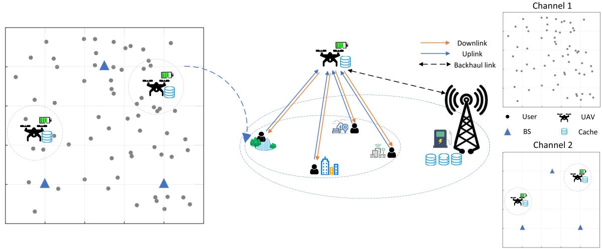  
Fig. 1. Framework of UAV-assisted content delivery in multi-BS.

Existing research on UAV-assisted content delivery has primarily focused on isolated aspects such as trajectory optimization or caching strategies, with limited work addressing their combined optimization alongside resource allocation. Ji et al. [27] investigated the joint optimization of the UAV trajectory, cache placement, and power allocation in single base station wireless networks. Their work did not consider cache replacement strategies. To the best of our knowledge, few studies have explored the joint optimization of UAVassisted content delivery across multi-BS. This research seeks to bridge this gap by proposing a integrated approach to UAV optimization. However, integrating these elements in such scenarios into a unified framework significantly complicates the problem but is essential to address real-world challenges.

## III. SYSTEM MODEL

As shown in Fig. 1, we consider a wireless communication system where cache-enabled UAVs are deployed to deliver content to ground users distributed within a multi-BS geographical area. The system is composed of three main components: (1) Base Stations: Denoted by the set $B ~ = ~ \{ b ~ \mid ~ b ~ = ~ 1 , 2 , 3 \}$ , each base station is located at ${ \bf L } _ { b } ~ = ~ [ x _ { b } , y _ { b } ]$ . The BS serves as a central hub, supplying UAVs with both power and content. (2) UAVs: Denoted by the set $\mathcal { U } = \{ u | u = 1 , 2 , . . . , U \}$ , each UAV starts its mission from the BS, serves user requests, and returns to the BS after completing its task. UAVs operate within a constant coverage radius R and fly at a fixed altitude H. Due to limited energy resources, effective trajectory planning for each UAV is crucial to maximize coverage and minimize energy consumption. (3) End users: Denoted by the set $\mathcal { G } ~ = ~ \{ g | g ~ = ~ 1 , 2 , . . . , G \}$ ground users are located at fixed positions within the service area. The horizontal coordinates for each user $g ~ \in ~ { \mathcal { G } }$ are specified as $\mathbf { L } _ { g } = [ x _ { g } , y _ { g } ]$ . A summary of the main notation used in the paper is presented in Table I.

TABLE I  
MAIN NOTATIONS USED IN THIS PAPER
<table><tr><td>Notation</td><td>Description</td></tr><tr><td> $\overline { { \boldsymbol { b } , \boldsymbol { B } } }$ </td><td>Index, set of base stations</td></tr><tr><td> $u , U , \mathcal { U }$ </td><td>Index, total number, set of UAVs</td></tr><tr><td> $g , G , { \mathcal { G } }$ </td><td>Index, total number, set of Users</td></tr><tr><td> $\setminus , N , \mathcal { N }$ </td><td>Index, total number, set of time slots</td></tr><tr><td> $q , Q , \mathcal { Q }$ </td><td>Index, total number, set of cache blocks</td></tr><tr><td> ${ v _ { \mathrm { u a v } } , v _ { \mathrm { t i p } } , v _ { 0 } }$ </td><td>UAV movement speed, tip speed, rotor speed</td></tr><tr><td> $E _ { u } ^ { u s e } [ n ]$   $ { \mathrm { P r } } _ { L o S } ,  { \mathrm { P r } } _ { N L o S }$ </td><td>Energy consumption of each UAV</td></tr><tr><td> $P L _ { L o S } , P L _ { N L o S }$ </td><td>Probability of LoS and NLoS links Average path loss for LoS and NLoS links</td></tr><tr><td> $\alpha _ { 1 } , \alpha _ { 2 }$ </td><td>Constants depend on environment settings</td></tr><tr><td> $\varphi _ { n , \mathrm { s n r } } , \varphi _ { n } , \varphi _ { \mathrm { n o i s e } }$ </td><td>Each user received SNR, transmission power, and noise power</td></tr><tr><td> $R _ { u , g } , R _ { u , b }$ </td><td>Data transmission rate from UAV to user and UAV to BS</td></tr><tr><td> $T _ { u , g } , T _ { u , b }$ </td><td>Data transmission delay from UAV to user and UAV to BS</td></tr><tr><td> $D _ { i , g }$ </td><td>The sum of the content acquisition delay for</td></tr><tr><td>C</td><td>all users The caching capacity of UAV</td></tr><tr><td> $S _ { q }$ </td><td>The data size of content q</td></tr></table>

In the multi-BS scenario, BSs are strategically deployed within the service area, and UAVs collaborate with these BSs to retrieval content and plan trajectory. Each user is located within the overlapping coverage area of both BSs and UAVs. All entities, including BSs, UAVs and users, operate within a fixed area defined by $[ 0 , x _ { \mathrm { m a x } } ] \times [ 0 , y _ { \mathrm { m a x } } ]$ . UAVs have limited cache capacity and can pre-load popular content for delivery to users upon request. When a requested content is not available in a UAV’s local cache, the UAV must fetch it from a BS over a wireless backhaul link, utilizing a cache replacement strategy to optimize storage. Users’ content requests are dynamic and stochastic, exhibiting a Zipf distribution as described in [28], which is a typical pattern for content popularity. In this paper, our objective is to jointly optimize UAV trajectory, cache replacement and transmission power to minimize the total content acquisition delay.

## A. UAV Mobility Model

We assume that all UAVs operate at a fixed altitude H above the ground and move within a two-dimensional plane. The mission duration T is divided into N uniform time slots with duration t, such that $\mathcal { N } = \{ n | n = 1 , 2 , . . . , N \}$ . We assume that t is sufficiently small, allowing the UAVs’ positions to be considered static within each time slot. At each time slot n, UAV u moves a distance $d _ { u } [ n ] \in [ 0 , d _ { \operatorname* { m a x } } ]$ in a direction specified by an angle $\alpha _ { u } [ n ] \in [ 0 , 2 \pi ]$ . Let $( \dot { x } _ { u } [ n ] , y _ { u } [ n ] )$ be the coordinates of UAV u at time slot n. The position of UAV u is updated using:

$$
\begin{array} { l } { { x _ { u } [ n + 1 ] = x _ { u } [ n ] + d _ { u } [ n ] \cos ( \alpha _ { u } [ n ] ) , \ } } \\ { { y _ { u } [ n + 1 ] = y _ { u } [ n ] + d _ { u } [ n ] \sin ( \alpha _ { u } [ n ] ) } } \end{array}\tag{1}
$$

Simultaneously, numerous constraints are set on UAV movements to guarantee their safe and effective operation:

(1) UAVs must remain within the predefined service area, which is represented as:

$$
0 \leq x _ { u } [ n ] \leq x _ { \operatorname* { m a x } } , \quad 0 \leq y _ { u } [ n ] \leq y _ { \operatorname* { m a x } } , \quad \forall u \in \mathcal { U } , n \in \mathcal { N }\tag{2}
$$

(2) The distance between any two UAVs must be at least $d _ { \mathrm { m i n } }$ to prevent collisions:

$$
\| \mathbf { L } _ { u } [ n ] - \mathbf { L } _ { k } [ n ] \| \geq d _ { \operatorname* { m i n } } , \quad u \neq k , \forall u , k \in \mathcal { U } , \forall n \in \mathcal { N }\tag{3}
$$

(3) UAV movements are constrained by maximum speed and energy availability. Each UAV has a limited initial energy reserve $E _ { 0 }$ . Following [29], the energy consumption of each UAV during movement is calculated using:

$$
\begin{array} { r } { E _ { u } ^ { u s e } [ n ] = ~ e _ { 1 } \left( 1 + \frac { 3 v _ { \mathrm { u u v } } ^ { 2 } } { v _ { \mathrm { t i p } } ^ { 2 } } \right) + \frac { 1 } { 2 } e _ { 3 } v _ { \mathrm { u a v } } ^ { 3 } } \\ { + e _ { 2 } \left( \sqrt { 1 + \frac { v _ { \mathrm { u u v } } ^ { 4 } } { 4 v _ { 0 } ^ { 4 } } - \frac { v _ { \mathrm { u a v } } ^ { 2 } } { 2 v _ { 0 } ^ { 2 } } } \right) ^ { 1 / 2 } } \end{array}\tag{4}
$$

The power consumption $E _ { u } ^ { u s e } [ n ]$ consists of three main components: blade profile power, induced power and parasite power. The constants $e _ { 1 } , \ e _ { 2 }$ , and $e _ { 3 }$ depend on factors such as the UAV’s power, rotor characteristics, and air density. The parameters $v _ { \mathrm { t i p } }$ and $v _ { 0 }$ refer to the rotor’s tip speed and the average velocity induced by the rotor, respectively. This formulation effectively captures the energy dynamics associated with the UAV’s power requirements during various flight conditions.

## B. Communication and Transmission Model

Given the altitude of the UAV and the complexity of its surrounding environment, the communication channels between the UAV and user, as well as between the UAV and BS, are characterized by probabilistic line-of-sight (LoS) and non-lineof-sight (NLoS) conditions [30]. These factors significantly influence the dynamics of the wireless channel. In this paper, the air-to-ground propagation channel is used to determine communication.

As referenced in [31], the probabilities of establishing a LoS connection from the UAV to the user and BS are given by:

$$
P r _ { L o S } = \frac { 1 } { 1 + \alpha _ { 1 } \exp \left( - \alpha _ { 2 } \left( \theta - \alpha _ { 1 } \right) \right) }\tag{5}
$$

where $\alpha _ { 1 }$ and $\alpha _ { 2 }$ are environment-specific constants, and $\theta =$ $\frac { 1 8 0 } { \pi }$ arcsin $\left( \frac { H } { d _ { u } } \right)$ is the elevation angle from UAV to user and UAV to BS, $d _ { u } = \left\{ d _ { u , g } ^ { n } , d _ { u , b } ^ { n } \right\}$ represents the distances from UAV u to user $^ { g , }$ and UAV u to BS b in time slot n.

The probability of a NLoS connection is $P r _ { N L o S } = 1 -$ $P r _ { L o S }$ . The overall path loss $\varphi _ { t }$ from UAV to user and UAV to BS is determined as a weighted sum of the LoS and NLoS path losses:

$$
\varphi _ { t } = P r _ { L o S } P L _ { L o S } + P r _ { N L o S } P L _ { N L o S }\tag{6}
$$

where $P L _ { L o S }$ and $P L _ { N L o S }$ are the average path losses for LoS and NLoS links.

For the UAV to BS connection, following [32], $P L _ { L o S } =$ $d _ { u } ^ { - \chi }$ and $P L _ { N L o S } = \kappa d _ { u } ^ { - \chi }$ . For the UAV to user connection, the LoS and NLoS are calculated as follows:

$$
\begin{array} { r l } { P L _ { L o S } = 2 0 \log \left( 4 \pi f _ { c } d _ { u } / v _ { c } \right) + \eta _ { L o S } , } & { { } } \\ { P L _ { N L o S } = 2 0 \log \left( 4 \pi f _ { c } d _ { u } / v _ { c } \right) + \eta _ { N L o S } } & { { } } \end{array}\tag{7}
$$

where $f _ { c }$ is the carrier frequency, and $\eta _ { L o S }$ and $\eta _ { N L o S }$ are the shadowing factors for the respective links, κ is the additional path loss factor of the NLoS link, $v _ { c }$ is the velocity of light.

We assume that content transmission from different users to UAVs will not interfere with each other, using Orthogonal Frequency Division Multiple Access (OFDMA) as outlined in 802.11ax [33]. Although more complex communication models are available, they are beyond the purview of this paper. Given a fixed transmission power $\varphi$ and an average noise power $\varphi _ { n o i s e } ,$ , the received signal-to-noise ratio (SNR) can be calculated as:

$$
\varphi _ { n , s n r } = \varphi - \varphi _ { t } - \varphi _ { n o i s e }\tag{8}
$$

Following [34], [35], we assume that the received SNR must exceed a threshold $\varphi _ { 0 }$ . Otherwise, transmission fails. Applying Shannon’s capacity, the maximum transmission rate between UAV and user in time slot n is:

$$
R _ { u , g } [ n ] = B _ { u } \log \left( 1 + \varphi _ { n , s n r } ^ { u , g } \right)\tag{9}
$$

where $B _ { u }$ denotes the bandwidth from UAV to user, $\varphi _ { t } ^ { u , g }$ is the overall path loss $\varphi _ { t , s n r } ^ { u , g }$ from UAV to user based on Eq. 6.

Similarly, the maximum transmission rate between UAV and BS in time slot n is:

$$
R _ { u , b } [ n ] = B _ { 0 } \log \left( 1 + \varphi _ { n , s n r } ^ { u , b } \right)\tag{10}
$$

where $B _ { 0 }$ denotes the bandwidth from UAV to BS, $\varphi _ { n } ^ { u , b }$ is the overall path loss $\varphi _ { n , s n r } ^ { u , g }$ from UAV to BS based on Eq. 6.

When a user connects to a UAV, the transmission delay consists of two primary components: the downlink transmission delay from the UAV to the user and the backhaul transmission delay from the UAV to the BS. At each time slot n, users request content from the UAV, the downlink transmission delay from UAV to user and the backhaul transmission delay from BS to UAV can be calculated by:

$$
T _ { u , g } [ n ] = \frac { S _ { q } } { R _ { u , g } [ n ] }\tag{11}
$$

$$
T _ { u , b } [ n ] = \frac { S _ { q } } { R _ { u , b } [ n ] }\tag{12}
$$

where $S _ { q }$ represents the bit-size of content $q ,$ and $R _ { u , g } [ n ]$ and $R _ { u , b } [ n ]$ denote the data transfer rates for the connection from UAV u to user g and from UAV u to BS b at time slot $n _ { \colon }$ respectively.

## C. Cache Distribution Model

In the cache-enabled UAVs network, UAVs distribute request content to the ground users, with each UAV pre-storing popular content derived from past user demand within the service zone. When a user asks for content that resides in the UAV’s local cache, the UAV can directly transmit it to the user via a downlink wireless link. Conversely, if the content is absent from the cache, the UAV retrieves it from the nearest BS through a wireless backhaul and forwards it to the user, simultaneously running a cache replacement algorithm.

Suppose that the BS possesses all the required contents, with each content assumed to be of size $S _ { q }$ Mbits and stored as a single block in the BS. The complete content library consists of $Q$ blocks, denoted by $\mathcal { Q } = \{ q \ | \ q = 1 , 2 , . . . , Q \}$ The content request matrix, expressed as $\mathbf { x } \in \{ 0 , 1 \} _ { G \times Q } ^ { N } ,$ is structured such that $x _ { g , q } [ n ] = 1$ indicates that user g requests content q during the time slot $n ;$ otherwise, $x _ { g , q } [ n ] = 0$

Due to the limited storage capacit of UAVs, their caching capacity is constrained. Let $C$ represents the caching capacity of the UAV. The total amount of content cached by each UAV must satisfy the constraint:

$$
\sum _ { q = 1 } ^ { Q } \beta _ { u , q } S _ { q } \leq C\tag{13}
$$

where $\beta _ { u , q } \in \{ 0 , 1 \}$ is a binary variable indicating whether UAV u caches content q. If $\beta _ { u , q } = 1$ , the content is cached; otherwise, $\beta _ { u , q } = 0$

Each user’s request pattern is influenced by content popularity, which follows a Zipf distribution characterized by the skewness parameter $\rho \colon$

$$
R e q _ { q } ( \rho , i ) = \frac { \frac { 1 } { i ^ { \rho } } } { \sum _ { i = 1 } ^ { I } \frac { 1 } { i ^ { \rho } } }\tag{14}
$$

where $\rho$ is the rank of the content based on popularity.

## D. Problem Formulation

The main objective is to minimize the total content acquisition delay for all users while maximizing the cache hit rate and improving energy efficiency.

This encompasses both the downlink transmission delay from the UAV to the user and the backhaul transmission delay

from the UAV to the BS when a cache miss occurs. The overall delay experienced is represented mathematically by the following:

$$
\operatorname* { m i n } \sum _ { g \in \mathcal { G } } \sum _ { i \in \mathcal { U } \cup B } D _ { i , g }\tag{15}
$$

where $D _ { i , g }$ denotes the delay experienced by user $g$ when retrieving content from source i.

The source could be a UAV $u \in \mathcal { U }$ or a BS $b \in B .$ In the scenario where i represents the UAV u, the user $g$ retrieves the cache directly from the UAV. In contrast, if not, the UAV u serves as an intermediary, first obtaining the cache from the BS b and subsequently delivering it to the user $g .$ The delay $D _ { i , g }$ for user $g$ is calculated as:

$$
D _ { i , g } = \sum _ { n \in \mathcal { N } } \sum _ { q \in \mathcal { Q } } x _ { g , q } [ n ] \left( T _ { i , g } [ n ] + ( 1 - \beta _ { i , q } [ n ] ) T _ { i , b } [ n ] \right)\tag{16}
$$

## IV. DUAL-PHASE DEEP REINFORCEMENT LEARNING FRAMEWORK

The joint optimization of UAV trajectory, transmission power and cache replacement presents significant challenges due to the highly non-convex decision space. To solve it, we adopt the Proximal Policy Optimization (PPO), a model-free, on-policy, policy-gradient, actor-critic based algorithm known for its robust convergence and sample efficiency [36]. PPO iteratively updates policies within a trust region to ensure stable and monotonic improvement. Compared to policy-based algorithms such as deep deterministic policy gradient (DDPG), it may not be suitable since it suffers from high variance and unstable convergence due to its fully off-policy nature. Among PPO variants, Clip-PPO maintains a balance between exploration and exploitation through its clip function by limiting the probability ratio within $( 1 - \epsilon , 1 + \epsilon )$ , which stabilizes the training process. It is crucial in our cache-enabled UAVassisted multi-BS network as excessive trajectory adjustments can lead to increased energy consumption and latency.

The proposed DDRL mainly includes two phases (Figure 2): offline training and online decision-making. The offline training phase involves training the actor-critic network using a deep neural network (DNN) to maximize PPO’s clipped objective while minimizing the value network’s loss. The online decision phase leverages a trained CNN-GRUbased network to process multi-channel inputs and make real-time decisions for trajectory and caching. Additionally, PSO is integrated into the environment for efficient cache replacement. This approach enhances the UAVs’ ability to balance trajectory optimization and caching efficiency, offering robust performance in complex, dynamic scenarios.

## A. DDRL Framework Design

In the proposed DDRL framework, each UAV operates as an agent within a dynamic environment. This environment includes ground users generating content requests, UAVs with limited energy and cache capacity, and BSs acting as content sources. We formulate our problem as a Markov Decision Process (MDP) which is denoted by a 5-tuple $\langle S , \mathcal { A } , \mathcal { P } , \mathcal { R } , \gamma \rangle$ where:

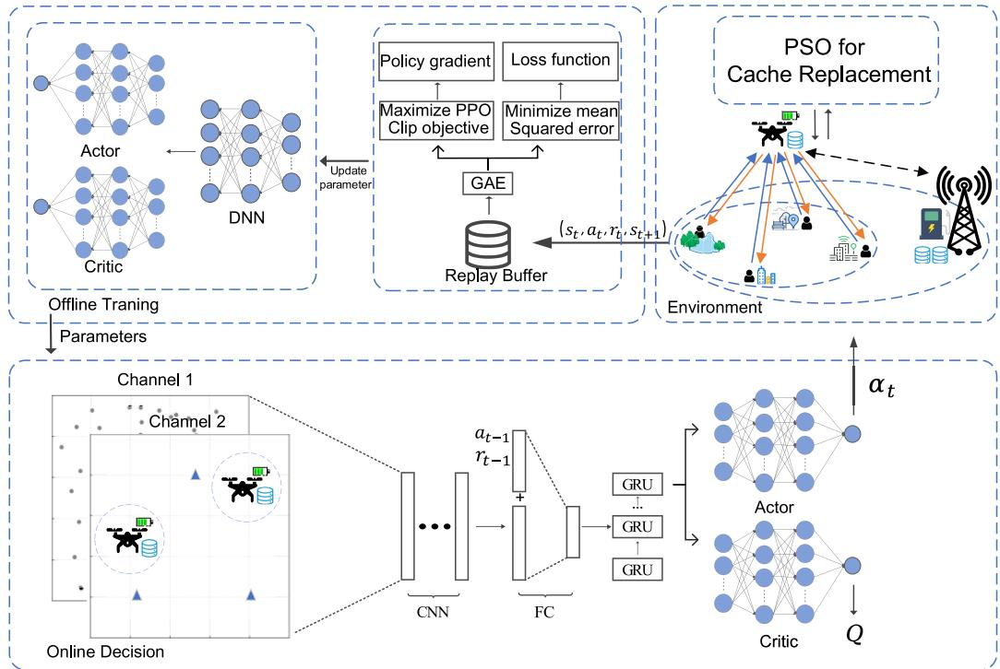  
Fig. 2. The architecture of the DDRL algorithm.

• S denotes the state space which encompasses all possible states obtained by an observation function. Each state S captures comprehensive information necessary for each UAV to make informed decisions. Specifically, the state includes: Locations and content request of the users; positions of all UAVs on the grid area, their remaining energy levels and the BSs’ locations at the current time slot. Mathematically, the state space in time slot n can be described as:

$$
\begin{array} { r l r } {  { \mathcal { S } = \{ ( x _ { u } [ n ] , y _ { u } [ n ] , E _ { u } ^ { r e s } [ n ] ) _ { u \in \mathcal { U } } , ( x _ { b } [ n ] , y _ { b } [ n ] ) _ { b \in \mathcal { B } } ,  } } \\ & { } & {  ( x _ { g } [ n ] , y _ { g } [ n ] , R e q _ { q } [ n ] ) _ { g \in \mathcal { G } } \} \qquad ( 1 7 } \end{array}
$$

• A is the action space which defines all possible actions UAV agent can take. Each action $a \ \in \ A$ is a vector consisting of UAV moving distance $d _ { u } [ n ]$ , direction $\alpha _ { u } [ n ]$ and power allocation $p _ { u } [ n ]$ for content delivery. Mathematically, the action space in time slot n can be described as:

$$
\mathcal { A } = \{ d _ { u } [ n ] , \alpha _ { u } [ n ] , p _ { u } [ n ] \}\tag{18}
$$

• P is the state transition probability characterizes the dynamics of the environment by specifying the probability of moving from one state to another given a particular action. Formally,

$$
\mathcal { P } ( s _ { t + 1 } \vert s , a ) = \operatorname* { P r } \left( s _ { t + 1 } \mid s _ { t } = s , a _ { t } = a \right)\tag{19}
$$

it represents the probability of transitioning to state $s _ { t + 1 }$ from state s when action a is taken.

• R is the discounted cumulative reward. Once an agent executes its chosen actions, it will receive an immediate reward in each time slot. Based on previous analysis,

similar to [18] and [37], the reward for each UAV agent in time slot n is composed of two parts, mathematically expressed as:

$$
R _ { n } = R _ { u } ^ { \mathrm { E x t r } } [ n ] + \epsilon R _ { u } ^ { \mathrm { I n t r } } [ n ] , \quad \forall u \in \mathcal { U }\tag{20}
$$

where $R _ { u } ^ { \mathrm { E x t r } } [ n ]$ is the extrinsic reward typically aligns with the system’s primary objective, $R _ { u } ^ { \mathrm { I n t r } } [ n ]$ is defined to incorporate the UAV energy consumption and served user cache requests.

Our goal is to minimize the total cache acquisition delay and maximum the cache hit rate under the UAV energy constraints. Hence the extrinsic reward is calculated by cache hit and delay rewards. According to Eq. 15, the delay rewards is expressed:

$$
R _ { u } ^ { \mathrm { { d e l a y } } } [ n ] = L - \sum _ { g \in \mathcal { G } } \sum _ { i \in \mathcal { U } \cup B } D _ { i , g } [ n ]\tag{21}
$$

where L is a large constant ensuring the delay reward remains positive. By reducing content acquisition delay, the system increases the overall reward, incentivizing efficient content delivery.

In this system, the reward for cache hits is based on the number of times the cache has been hit. If UAV u has a cache hit at time slot $n ,$ the reward is proportional to the number of times that specific cache has been hit. Conversely, if there is a cache miss, a fixed penalty is applied. The cache reward function is defined as:

$$
R _ { u } ^ { \mathrm { c a c h e } } [ n ] = \left\{ { \begin{array} { l l } { N _ { u } ^ { q } [ n ] , } & { { \mathrm { i f ~ t h e r e ~ i s ~ a ~ c a c h e ~ h i t } } } \\ { - r _ { \mathrm { m i s s } } , } & { { \mathrm { i f ~ t h e r e ~ i s ~ a ~ c a c h e ~ m i s s } } } \end{array} } \right.\tag{22}
$$

where $N _ { u } ^ { q } [ n ]$ represents the number of times the cache for content q in UAV u has been hit up to time slot n, $r _ { \mathrm { m i s s } }$ denotes the fixed penalty applied for a cache miss. To simplify the calculation, the variable $\beta _ { u , q }$ can still be used to indicate whether there is a cache hit, and the total number of hits $N _ { u } ^ { q } [ n ]$ is updated accordingly. The reward function can be rewritten as:

$$
R _ { u } ^ { \mathrm { { c a c h e } } } [ n ] = N _ { u } ^ { q } [ n ] \beta _ { u , q } - r _ { \mathrm { { m i s s } } } ( 1 - \beta _ { u , q } )\tag{23}
$$

Therefore, the extrinsic reward can be expressed as:

$$
R _ { u } ^ { \mathrm { { E x t r } } } [ n ] = R _ { u } ^ { \mathrm { { d e l a y } } } [ n ] + R _ { u } ^ { \mathrm { { c a c h e } } } [ n ]\tag{24}
$$

Given the UAV’s limited energy, it is essential to incorporate energy consumption into the reward design. Effective energy management enables the UAV to complete all user content requests while retaining enough energy to return the BS. To enforce this, a large penalty is applied if a UAV depletes its energy mid-mission. Additionally, an intrinsic reward is introduced to encourage efficient energy use, calculated based on the ratio of energy consumed to the number of users served:

$$
{ \cal R } _ { u } ^ { \mathrm { I n t r } } [ n ] = \frac { N u m _ { G _ { u } [ n ] } } { E _ { u } ^ { u e s } [ n ] }\tag{25}
$$

where $E _ { u } ^ { u s e } [ n ]$ is denoted UAV u has consumed the energy in time slot n which calculated by Eq. 4 and $N u m _ { G _ { u } [ n ] }$ is denoted the number of users of the UAV u has completed the user request in time slot n. By this way, the intrinsic reward function encourages UAVs to serve more users using less energy, promoting overall system energy efficiency.

The objective of the learning system is to identify an optimal policy π that maximizes the cumulative discounted reward over time, defined by:

$$
R _ { \mathrm { c u m } } = \sum _ { n = 1 } ^ { N } \gamma ^ { n } R _ { n }\tag{26}
$$

$\gamma$ is the reward discount factor between 0 and 1 that determines the importance of future rewards relative to immediate rewards.

## B. Online Decision-Making

In the initial phase of online decision-making, the policy and value networks, along with the Deep Neural Networks (DNNs) suggested in [38], start with random initialization. These DNNs encompass convolutional neural networks (CNN) and gated recurrent unit (GRU) networks. As training progresses and more epochs are completed, these networks are gradually updated, enhancing the UAV’s decision-making ability by leveraging accumulated experiences.

The details are shown in Algorithm 1. The input consists of two channels that are used to convey spatial and environmental details for CNN processing. Channel 1 represents a spatial map of user locations and users’ specific content request. This channel encodes the spatial distribution and user density, providing critical information on where communication demands are concentrated. Channel 2 incorporates the positions of each BS and UAV, along with the current remaining energy levels of each UAV.

Algorithm 1 Online Decision-Making Procedure   
Input: Policy network parameters θ, DNN network   
parameters   
Output: Experience buffer D   
1 Initialize experience buffer $\mathcal { D }  \emptyset ;$   
2 foreach episode $e \in \{ 1 , 2 , . . . , E _ { m a x } \}$ do   
3 Initialize state so;   
4 for time slot $n = 0 \ t o \ N _ { m a x }$ do   
5 Observe state st;   
6 Obtain feature representation ht using CNN from   
state st;   
7 Extract sequential joint features using GRU;   
8 Sample action $a _ { t } \sim \pi _ { \theta } ( a _ { t } | h _ { t } ) ;$   
9 foreach UAV agent $u \in \{ 1 , 2 , \ldots , U \}$ do   
10 Execute action $a _ { t } = \mathsf { \bar { ( } } d _ { u } [ n ] , \alpha _ { u } [ \bar { n } ] , p _ { u } [ n ] ) ;$   
11 Compute rewards $R _ { u } ^ { \mathrm { E x t r } } [ n ]$ and $\dot { R } _ { u } ^ { \mathrm { I n t } } [ n ]$ according   
to Eq. (24) and (25);   
12 Aggregate total reward for the time step   
$r _ { t } \gets R _ { u } ^ { \mathrm { E x t r } } [ n ] + R _ { u } ^ { \mathrm { I n t r } } [ n ] ;$   
13 Transition to the next state $s _ { t + 1 } ;$   
14 Store $\left( { { s _ { t } } , { a _ { t } } , { r _ { t } } , { s _ { t + 1 } } } \right)$ in D;   
15 return D;

At each time slot, the system gets the current environment state, processing this through the CNN to extract a feature representation. Traditional RL algorithms often suffer from limited exploration capabilities, which can lead to premature convergence to suboptimal policies. In addition to capturing spatial features, the CNN module proactively guides UAV agents towards unexplored or underserved regions, promoting efficient spatial coverage and reducing redundant movement to break the performance ceiling. This representation is then combined with the previous action, the last reward. Next, this combined feature vector is fed into the GRU to capture temporal dependencies over sequential time slots. Temporal information across adjacent time slots is inherently correlated, and capturing these dependencies enables the agent to predict spatial mobility patterns and less energy consumption trajectories. Finally, the GRU outputs the representation for the Actor-Critic model, the actor network generates an action distribution, and the critic network estimates the expected cumulative reward.

Each UAV agent independently performs the sampled action and receives an immediate reward. A new transition $\left( { { s _ { t } } , { a _ { t } } , { r _ { t } } , { s _ { t + 1 } } } \right)$ is stored in the experience buffer D for future offline training and policy improvement.

## C. Offline Training

The offline training phase focuses on improving the policy and value networks using the experiences collected during the online phase, the details are shown in Algorithm 2. At the beginning of this phase, the global policy network parameters θ and the value network parameters φ are initialized, along with setting the PPO hyperparameters. For each training iteration, experience data D is first collected from the buffer used to calculate the advantage estimate using Generalized Advantage Estimation (GAE). For each transition $\left( { { s _ { t } } , { a _ { t } } , { r _ { t } } , { s _ { t + 1 } } } \right)$ , the temporal difference (TD) error is computed as:

$$
\delta _ { t } = r _ { t } + \gamma V _ { \phi } ( s _ { t + 1 } ) - V _ { \phi } ( s _ { t } )\tag{27}
$$

```perl
Algorithm 2 Offline Training Procedure
Input: Global policy network parameters $\theta ,$ value network
parameters φ, PPO hyperparameters $\epsilon , \alpha , \gamma , \lambda$
Output: Updated policy and value network parameters θ and
$\phi$
1 foreach episode $e \in \{ 1 , 2 , \dots , E _ { m a x } \}$ do
2 Collect experience data from $\mathcal { D } ;$
3 Compute advantages using GAE;
4 foreach transition $\left( { { s _ { t } } , { a _ { t } } , { r _ { t } } , { s _ { t + 1 } } } \right)$ in D do
5 Compute TD error $\delta _ { t } \gets r _ { t } + \gamma V _ { \phi } ( s _ { t + 1 } ) - V _ { \phi } ( s _ { t } ) ;$
6 Compute advantage estimate $\hat { A } _ { t } \gets \delta _ { t } + \gamma \lambda \hat { A } _ { t + 1 } ;$
7 Compute target values: $V _ { t } ^ { \mathrm { t a r g e t } }  \hat { A } _ { t } + V _ { \phi } ( s _ { t } ) ;$
8 Update policy network parameters θ using Eq. (38);
9 Update $\mathsf { \bar { \theta } } \longleftarrow \mathsf { \bar { \theta } } + \alpha \nabla _ { \theta } L ^ { \mathrm { \bar { C } L I P } } ( \theta ) ;$
10 Update value network parameters $\phi$ using Eq. (32);
11 Update $\phi  \phi - \alpha \nabla _ { \phi } \bar { L } ^ { \mathrm { V F } } ( \phi ) ;$
12 Update old policy parameters $\theta _ { \mathrm { o l d } }  \theta ;$
13 Distribute updated parameters θ and φ to UAVs;
14 return θ, φ;
```

where $\gamma$ is the discount factor used in the cumulative discounted reward function (26), $\delta _ { t }$ reflects the discrepancy between the immediate reward plus future value and the current state value.

The advantage estimate $\hat { A } _ { t }$ is then computed recursively as:

$$
\hat { A } _ { t } = \delta _ { t } + \gamma \lambda \hat { A } _ { t + 1 }\tag{28}
$$

Using the advantage estimates, the target values are computed as:

$$
V _ { t } ^ { \mathrm { t a r g e t } } = \hat { A } _ { t } + V _ { \phi } ( s _ { t } )\tag{29}
$$

The policy network is then updated by maximizing the PPO objective function, which includes a clipped surrogate loss to prevent large policy changes that could destabilize training. This objective is expressed as:

$$
L ^ { \mathrm { C L I P } } ( \theta ) = \frac { 1 } { \vert \mathcal { D } \vert } \sum _ { t \in \mathcal { D } } \operatorname* { m i n } ( r ( \theta ) \hat { A } _ { t } , \mathrm { c l i p } ( r ( \theta ) , 1 - \epsilon , 1 + \epsilon ) \hat { A } _ { t } )\tag{30}
$$

where $\begin{array} { r l r } { r ( \theta ) } & { { } = } & { \frac { \pi _ { \theta } \left( a _ { t } | h _ { t } \right) } { \pi _ { \theta _ { \mathrm { o l d } } } \left( a _ { t } | h _ { t } \right) } } \end{array}$ denotes the probability ratio between the old policy and the new policy, $\pi _ { \theta }$ represents the current policy probability, $\pi _ { \theta _ { \mathrm { o l d } } }$ is the previous policy probability, and  is the clipping threshold, constraining policy updates within a limited range.

The policy parameters θ are updated via gradient ascent:

$$
\theta = \theta + \alpha \nabla _ { \theta } L ^ { \mathrm { C L I P } } ( \theta )\tag{31}
$$

Similarly, the value network parameters $\phi$ are updated by minimizing the value function loss:

$$
L ^ { \mathrm { V F } } ( \phi ) = \frac { 1 } { | \mathcal { D } | } \sum _ { t } \left( V _ { \phi } ( s _ { t } ) - V _ { t } ^ { \mathrm { t a r g e t } } \right) ^ { 2 }\tag{32}
$$

and adjusted via gradient descent:

$$
\phi = \phi - \alpha \nabla _ { \phi } L ^ { \mathrm { V F } } ( \phi )\tag{33}
$$

Once an iteration concludes, the updated parameters θ and φ are distributed to each UAV, providing them with refined policy and value estimates to improve trajectory optimization in future episodes. This iterative process of gathering experiences and updating the networks builds a robust learning system, enhancing the adaptability of UAVs and decision making in dynamic environments.

```perl
Algorithm 3 Cache Replacement Strategy Based on PSO
Input: Cache capacity C, request sequence L, particle count
N, max iterations T
Output: Optimal weights gBest for cache strategy
1 for $\bar { t } = 1$ to T do
2 foreach particle $i \in \mathcal { Z }$ do
3 $E ( q ) \gets s e t ( \gamma _ { 1 } ^ { i } , \gamma _ { 2 } ^ { i } , \gamma _ { 3 } ^ { i } ) ;$
4 foreach request $q \in L$ do
5 if q is in cache then
6 Cache hit: increment the hit count;
7 else
8 if cache not full then
9 Add q to the cache;
10 else
11 Compute evaluation metric $E ( q )$ for
each cached item q;
12 Replace the cached item with the
minimum $E ( q )$ by the new item q;
13 Compute the fitness (cache hit rate) of particle i;
14 Update pBesti and gBest;
15 foreach particle $i \in \mathcal { Z }$ do
16 Update velocity with Eq. (35);
17 Update position with Eq. (36);
18 return gBest;
```

## D. Cache Replacement Strategy

We propose a caching replacement strategy for cacheenabled UAVs that adapts dynamically according to user requests and environment conditions. Following the initial caching setup, we introduce an evaluation function [39], [40] to determine which cached content should be replaced. Efficient cache management is crucial to optimize the performance of the UAV-assisted content delivery network. To enhance the cache hit rate and thereby reduce the overall acquisition delay, we utilize a Particle Swarm Optimization (PSO)-inspired method to optimize the weight parameters of the cache evaluation function, which determines the priority of content items for replacement. By adjusting these weights, the algorithm seeks to maximize the cache hit rate over time. The cache evaluation function $E ( q )$ assesses the value of caching a content item q based on multiple factors:

$$
E ( q ) = \gamma _ { 1 } \mathrm { P o p } ( q ) + \gamma _ { 2 } \mathrm { S i z e R a t i o } ( q ) + \gamma _ { 3 } \mathrm { R e q F r e } ( q )\tag{34}
$$

where $\gamma _ { 1 } , \gamma _ { 2 } , \gamma _ { 3 }$ are the weight parameters satisfying $\gamma _ { 1 } +$ $\gamma _ { 2 } + \gamma _ { 3 } = 1$ . Pop(q) is the popularity for content q which is modeled using a Zipf distribution, SizeRatio(q) considers the impact of a content item’s size relative to the remaining cache capacity. and C is the capacity of each UAV and ReqFre(q) is the request frequency for content q within a specific time interval.

The PSO algorithm is used to optimize the weight parameters $\gamma _ { 1 } , \gamma _ { 2 }$ , and $\gamma _ { 3 }$ in order to maximize the cache hit rate. The optimization process is shown in Algorithm 3 which involves the following steps. Initially, a swarm of particles Z is randomly generated with both positions (weight parameters) and velocities, each representing a potential solution. The optimization process is carried out iteratively, where each particle applies its weight parameters to the evaluation function $E ( q )$ and simulates cache operations over the service request sequence L. During each simulation, caching decisions are made based on the evaluation function. The replacement process either adds new content to the cache or swaps out existing content with lower evaluation values when the cache reaches capacity. After simulating the cache operations, the cache hit rate is calculated for each particle, serving as its fitness value.

TABLE II  
SIMULATION PARAMETER SETTINGS
<table><tr><td>Description</td><td>Symbol</td><td>Value</td></tr><tr><td>Downlink link bandwidth</td><td> $B _ { u }$ </td><td>10 MHz</td></tr><tr><td>Backhaul link bandwidth</td><td> $B _ { 0 }$ </td><td>20 MHz</td></tr><tr><td>Fixed transmission power</td><td> $\varphi$ </td><td>20 dBm</td></tr><tr><td>Average noise power</td><td> $\varphi _ { n o i s e }$ </td><td>-104 dBm</td></tr><tr><td>SNR threshold</td><td> $\varphi _ { 0 }$ </td><td> $1 6 \ \mathrm { d B }$ </td></tr><tr><td>Velocity of light</td><td> $v _ { c }$ </td><td> $3 \times 1 0 ^ { 8 }$ </td></tr><tr><td>Carrier frequency</td><td> $f _ { c }$ </td><td> $2 \ \mathrm { G H z }$ </td></tr><tr><td>Shadowing factor</td><td> $\eta _ { \mathrm { L o S } } , \eta _ { \mathrm { N L o S } }$ </td><td> $6 \ \mathrm { d B } , 2 0 \ \mathrm { d B }$ </td></tr><tr><td>Environmental factor</td><td> $\alpha _ { 1 } , \alpha _ { 2 }$ </td><td> $1 1 . 9 , 0 . 1 3$ </td></tr><tr><td>Additional path loss factor</td><td> $\kappa$ </td><td>20 dB</td></tr><tr><td>Path loss exponent</td><td> $\chi$ </td><td>2</td></tr><tr><td>Coverage radius of each UAV</td><td> $R$ </td><td> $6 0 ~ \mathrm { m }$ </td></tr><tr><td>Blade profile power coefficient</td><td> $e _ { 1 }$ </td><td> $5 8 . 0 6 \mathrm { ~ W ~ }$ </td></tr><tr><td>Induced power coefficient</td><td> $e _ { 2 }$ </td><td> $7 9 . 7 6 \mathrm { ~ W ~ }$ </td></tr><tr><td>Parasite power coefficient</td><td> $e _ { 3 }$ </td><td> $0 . 0 0 6 ~ \mathrm { W \cdot s ^ { 3 } / m ^ { 3 } }$ </td></tr><tr><td>UAV speed parameters</td><td> $v _ { \mathrm { i } \mathrm { p } } , v _ { 0 }$ </td><td> $1 2 0 , 4 . 0 3 ~ \mathrm { m / s }$ </td></tr></table>

Particles update their personal best positions if their current fitness exceeds their previous best. Similarly, the global best position is also updated if any particle achieves a fitness superior to the current global best. Subsequently, the particles adjust their velocities and positions using the PSO update equations:

$$
v _ { i } ^ { t + 1 } = w v _ { i } ^ { t } + c _ { 1 } r _ { 1 } ( p B e s t _ { i } - \gamma _ { i } ^ { t } ) + c _ { 2 } r _ { 2 } ( g B e s t - \gamma _ { i } ^ { t } )\tag{35}
$$

$$
\gamma _ { i } ^ { t + 1 } = \gamma _ { i } ^ { t } + v _ { i } ^ { t + 1 }\tag{36}
$$

Here, $w$ is the inertia weight, $c _ { 1 }$ and $c _ { 2 }$ are cognitive and social coefficients, and $r _ { 1 }$ and $r _ { 2 }$ are random values between 0 and 1. The updated weight parameters are normalized to ensure they remain within [0, 1] and sum to 1. This iterative process continues for a predetermined number of iterations or until convergence criteria are met.

## V. PERFORMANCE EVALUATION

This section presents the results of experiments designed to evaluate the performance of the proposed DDRL algorithm. The experiments aim to compare the efficiency of the proposed algorithm with several baseline methods in terms of delay and cache hit rate.

## A. Simulation Setup

We consider a cache-enabled UAV-assisted multi-BS network with a set of users randomly distributed over a square area of 1.0 km ×1.0 km, similar to the datasets randomly generated in [18] and [38]. This network consists of three BSs and a set of UAVs, collaboratively providing content delivery services to users within the area. UAVs begin at BSs and head back to the closest BS once they have completed their tasks. UAVs operate at a flight altitude of $H = 1 0 0$ meters. To prevent collisions, UAVs must maintain a minimum safe separation of $d _ { \mathrm { m i n } } = 1 \ \mathrm { m e t e r } .$ , and their maximum speed, $v _ { \mathrm { u a v } } ,$ is capped at 20 m/s. The time slot duration is set to $n = 1 \mathrm { s } ,$ and each training episode consists of $T = 5 0 0$ time slots. The Zipf parameter $\rho$ is fixed to 1.3. Each UAV is equipped with a caching capacity of $C = 1 0 0 \mathrm { M b i t s }$ . The content size $S _ { q }$ for each request is assumed to follow a uniform distribution with a mean of 10 Mbits. Table II provides details on the communication settings. Table III summarizes the details of DDRL parameters. Simulations are executed on a server with an NVIDIA GTX 4090 Ti GPU, utilizing Python 3.8 and PyTorch to construct the simulation models.

TABLE III  
SUMMARY OF DDRL PARAMETERS
<table><tr><td>Parameter</td><td>Value</td></tr><tr><td>CNN Layer 1</td><td>32 channels, 8x8, stride 4 64 channels, 4x4, stride 2</td></tr><tr><td>CNN Layer 2 CNN Layer 3</td><td>32 channels, 3x3, stride 1</td></tr><tr><td>GRU Hidden Size</td><td>256</td></tr><tr><td>Learning Rate</td><td>3e-4</td></tr><tr><td>Training Episodes</td><td>2500</td></tr><tr><td>Batch Size</td><td>64</td></tr><tr><td>PPO Epochs</td><td>3</td></tr><tr><td>PPO CLIP factors</td><td>0.1</td></tr><tr><td>Discount Factor (γ)</td><td>0.99</td></tr><tr><td>GAE Lambda (λ)</td><td>0.95</td></tr></table>

## B. Convergence and Scalability Analysis

Initially, we demonstrate that our DDRL model converges. Fig. 3a indicates the total reward accumulated per episode. With more iterations, we observe a clear trend in the cumulative reward, which increases and eventually converges. This stabilization indicates that the algorithm successfully optimizes trajectory and caching decisions, enhancing service coverage and resource allocation efficiency. This consistent convergence demonstrates that our proposed framework is effective in addressing dynamic challenges associated with UAV trajectory and caching management, resulting in an optimized policy that maximizes performance in terms of accumulated reward.

Fig. 3b shows the energy consumption ratio across 2500 training episodes. The energy consumption ratio ζ is defined as the ratio of the total energy consumed by all UAVs in transmitting content relative to their initial energy reserves at the end of time slot $n ,$ mathematically, it can be expressed as:

$$
\zeta = \frac { 1 } { U \cdot E _ { 0 } } \sum _ { n = 1 } ^ { N } \sum _ { u = 1 } ^ { U } e _ { n } ^ { u }\tag{37}
$$

where U represents the number of UAVs, $E _ { 0 }$ is the initial energy per UAV, N is the total number of time slots, and $e _ { n } ^ { u }$ denotes the energy consumed by UAV u at time slot n. In the early stages of training, the energy consumption ratio is notably high, with values peaking around 0.25. This elevated consumption is indicative of inefficient energy usage, likely due to the model’s initial exploratory phase, where UAVs may not yet have optimized their decisions. However, as training progresses, the ratio consistently stabilizes with a lower level. This trend signifies that the DDRL algorithm has learned more energy-efficient strategy. The convergence energy consumption ratio reflects the efficient energy usage in the UAV-assisted content delivery networks.

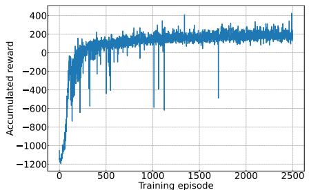  
(a)

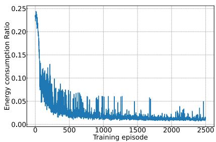  
(b)

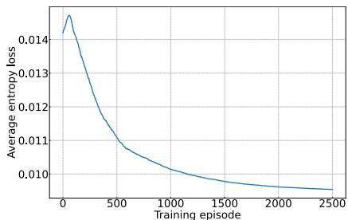  
(c)

Fig. 3. Convergence of DDRL: (a) Accumulated reward, (b) Energy consumption ratio, (c) Average entropy loss.  
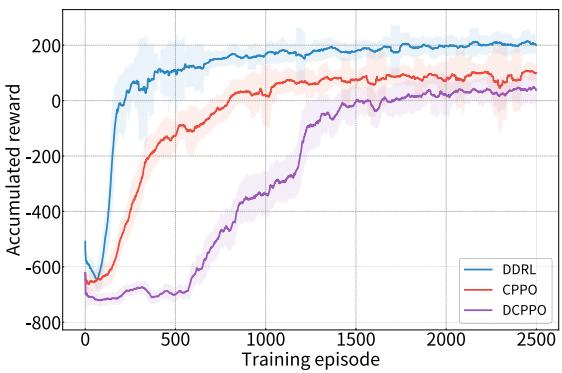  
(a)

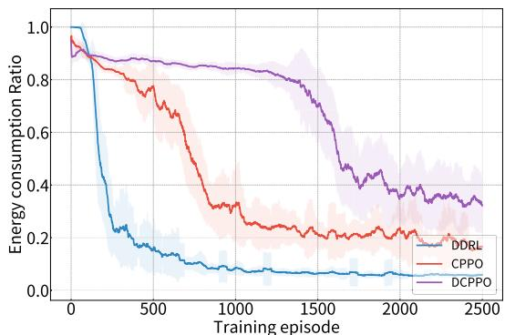  
(b)

Fig. 4. Comparison of convergence: (a) Accumulated reward, (b) Energy consumption ratio.  
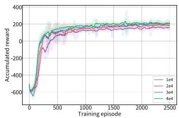  
(a)

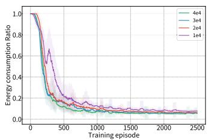  
(b)

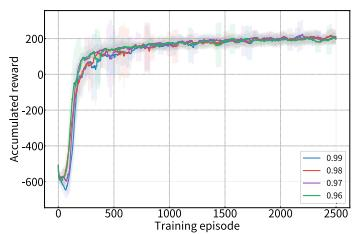  
(c)

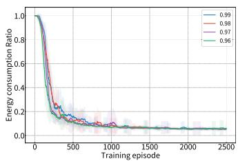  
(d)  
Fig. 5. Comparison of Accumulated reward and Energy consumption ratio under different learning rates and discount factors.

Fig. 3c illustrates the trend in average entropy loss across training episodes for the DRL. Entropy in reinforcement learning algorithms is often used as a measure of exploration in the action space. A higher entropy value encourages the agent to explore more diverse actions, while a decreasing entropy indicates that the agent is progressively focusing on more specific, optimal actions as it learns. By the end of training, the entropy loss reaches a low and stable level, implying that the UAV agents have largely optimized their actions.

The convergence of entropy loss to a lower and stable value indicates that UAVs have achieved a well-defined policy.

Fig. 5 compares the convergence of accumulated reward and energy consumption ratio under different learning rates and discount factors. The convergence speed of the learning rate 4e4 is slightly faster than 3e4; however, its training process exhibits larger fluctuations and higher variance across multiple runs. In contrast, 3e4 achieves optimal performance while demonstrating stronger convergence stability. Discount factor γ = 0.99 trades off short-term performance for improved long-term outcomes, it learns more slowly in the early stages but eventually achieves a higher and more stable final performance.

Fig. 6 illustrates the cache acquisition delay as the number of users increases under different numbers of UAVs. It can be observed that a single UAV cannot handle large-scale user requests, leading to unacceptable delay as user growth. Deploying two UAVs significantly alleviates this bottleneck, reducing the delay under the same load. Further increasing the fleet to three UAVs continues to improve scalability but with higher payment. These results highlight the effectiveness of UAV cooperation, while also revealing diminishing returns beyond a certain fleet size.

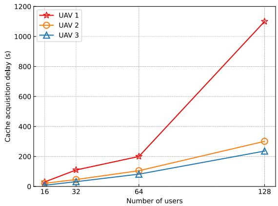  
Fig. 6. Cache Acquisition Delay versus number of users under different numbers of UAVs.

We compare the convergence of DDRL with two primary baselines: (i) CPPO: a DRL algorithm that integrates CNN for feature extraction with standard PPO (DDRL without GRU module); (ii) DCPPO [18]: a Dual-Clip Proximal Policy Optimization-based (DCPPO) algorithm, when $\hat { A } _ { t } ~ < ~ 0$ , the new clip function of the DCPPO is expressed as

$$
L _ { c l i p } ^ { \mathrm { { D C P P 0 } } } ( \theta ) = \frac { 1 } { \left| { \mathcal { D } } \right| } \sum _ { t \in \mathcal { D } } m a x ( \operatorname* { m i n } ( r ( \theta ) \hat { A } _ { t } ,  \\  \mathrm { { c l i p } } \left( r ( \theta ) , 1 - \epsilon , 1 + \epsilon \right) \hat { A } _ { t } ) , c \hat { A } _ { t } )\tag{38}
$$

For fair comparison, we add our proposed PSO-based cache replacement strategy for the two DRL baselines. The experiments conduct a comparative analysis of CPPO and DCPPO in terms of both cumulative reward and energy efficiency.

Fig. 4a shows the cumulative reward results, which demonstrate the clear advantage of the proposed DDRL framework over the baseline methods. DDRL consistently achieves higher cumulative rewards throughout the training process and converges more rapidly, typically stabilizing around 1500 episodes. In contrast, CPPO shows a steady improvement in accumulated reward over time but does not reach the same level of performance as DDRL, DCPPO underperforms both DDRL and CPPO, with slower convergence and lower cumulative reward, suggesting that the lack of spatial and sequential dependency information limits its ability to adapt to learn a more energy-efficient scheduling strategy. The results indicate that the proposed DDRL achieves a significantly higher cumulative reward compared to the baseline algorithms, underscoring its superior performance by learning a more optimal strategy that effectively maximizes long-term rewards.

Fig. 4b shows the energy consumption comparison results, which further demonstrate the benefits of DDRL’s design. Over the training duration, DDRL maintains a consistently lower energy consumption ratio compared to CPPO and DCPPO, with noticeable stability after 1500 episodes. This is a direct result of the GRU’s ability to model temporal dependencies, which facilitates a more energy-aware scheduling strategy and reduces redundant UAV movements, extending the overall mission duration while maintaining service quality. On the other hand, CPPO and DCPPO show higher energy usage due to their lack of time-aware decision-making, leading to less efficient flight paths.

Fig. 7 shows the optimized UAVs trajectories for scenarios with 16 users. In these experiments, two UAVs were deployed to serve users distributed across a target grid area in collaboration with three BSs. The red lines represent the path of UAV 1, while the blue lines indicate the path of UAV 2. The BSs locations are at coordinates [500,875], [125,125] and [875,125]. Black dots indicate the positions of users and blue triangles represent the positions of the BSs.

In Fig. 7a, we investigate a scenario where two UAVs provide content delivery services to 16 users. Each UAV starts from its designated BS located at [500,875]. The UAVs begin their trajectories from the BS and adjust their movements based on user locations and requests. The result shows that UAVs trajectories demonstrate a well-coordinated, adaptive strategy that optimizes coverage of users which can continuously to reduce energy consumption ratio and minimize the total transmission delay. Once the UAVs have completed all the users’ requests, they each select the nearest BS to return, with their final locations marked by the stars.

In Fig. 7b, we consider UAVs start from the different BSs in our multi-BS scenario. Specifically, one UAV starts from [500, 875] and the other from [125, 125]. This setup reflects a practical deployment strategy in the multi-BS environment where UAVs are assigned to different BSs. This experiment highlights the advantages of a multi-BS deployment in improving coverage, reducing energy usage and enhancing service efficiency in cache-enabled UAVs networks.

In Fig. 8, we compare the content acquisition delay by the CPPO and DCPPO algorithms. The cache acquisition delay result demonstrates that DDRL maintains significantly lower latency compared to CPPO and DCPPO across varying user densities. Moreover, the gap in content acquisition delay between the proposed algorithm and the other two baselines widens as the number of users increases. By capturing spatial and time sequential information, DDRL can make a more efficient policy, achieving significant reductions in content delivery delay compared to baseline methods.

In Fig. 9, we examine how different UAVs cache capacity impact content acquisition delay under different users. The result indicates that as the cache capacity of UAVs increases, the content acquisition delay decreases. As the number of users increases, the total content acquisition delay rises across all cache capacities due to a higher number of content requests. At any given user count, a higher cache capacity results in a lower content acquisition delay. When $C _ { U } ~ = ~ 1 0 0 M .$ content acquisition delay is significantly lower compared to when $C _ { U } = 4 0 M$ . This reduction is due to the larger cache capacity, which allows more content to be stored locally on the UAV. With a larger cache, the algorithm can store and replace content more effectively, reducing the need to retrieve data from the BSs, improving cache hit rate and thereby reducing the average acquisition delay.

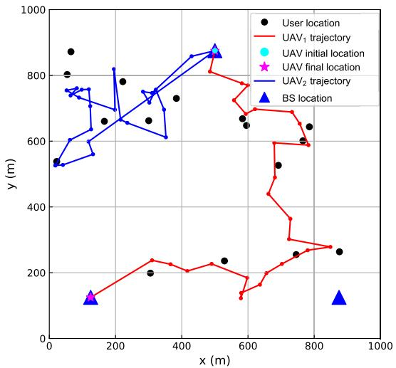  
(a)

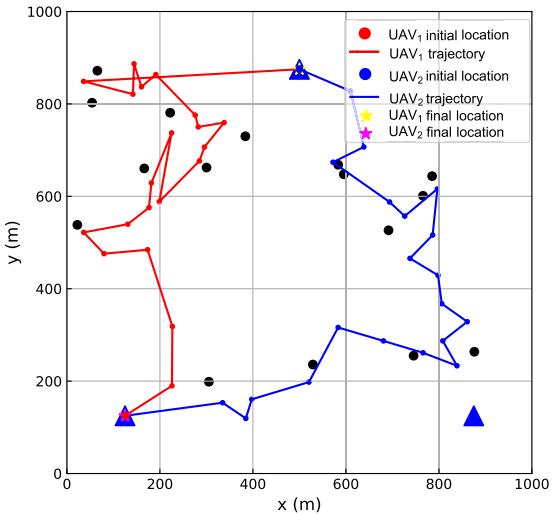  
(b)

Fig. 7. Optimized UAV trajectory for a two-UAV and 16-user multi-BS system with different start locations.  
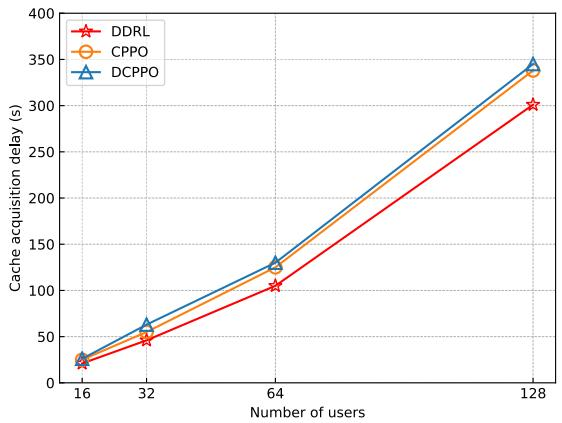  
Fig. 8. Comparison of content acquisition delay by different DRL algorithms.

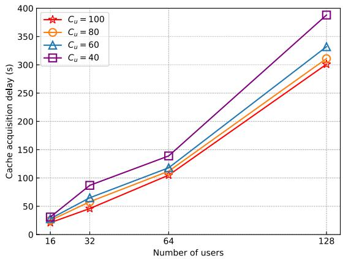  
Fig. 9. Comparison of content acquisition delay by our schemes for a two-UAV system with different UAV capacity.

Fig. 10 explores the impact of UAV downlink link bandwidth on content acquisition delay as the number of users increases. Downlink link bandwidth is used to calculate the transmission power through Shannon Capacity. Higher transmission power generally results in lower content acquisition delay, as greater power improves data transmission rates. This trend highlights that higher transmission power enables faster and more reliable content delivery, which is particularly beneficial in scenarios with high user demand. This analysis underscores the importance of optimizing transmission power in UAV systems to manage high user demand effectively, ensuring reduced acquisition delay and improved service quality.

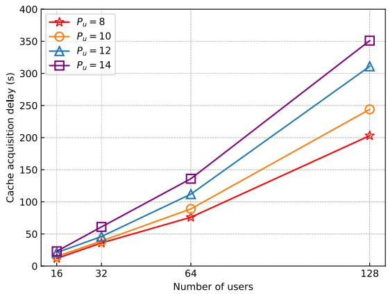  
Fig. 10. Comparison of content acquisition delay by our schemes for a two-UAV system with different UAV transmission power.

## C. Evaluation and Comparison With Baseline Algorithms

To illustrate the effectiveness of the proposed DDRL algorithm, we evaluate four baseline approaches:

• DDRS [40]: An evaluation function with fixed function parameters is presented to determine which content should be cached, according to the evaluation values for UAV using the DDQN-based Replacement Scheme (DDRS).

• POP [15]: Content is cached based on its popularity, with the least popular content being replaced to make space for new items.

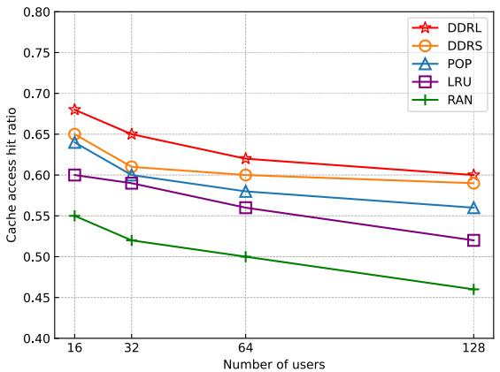  
Fig. 11. Comparison of cache hit ratio by different schemes for a two-UAV system.

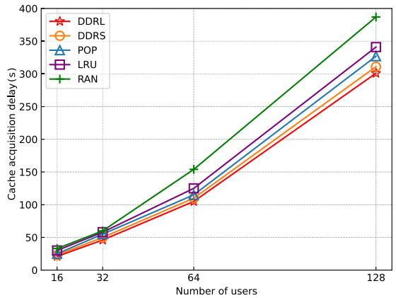  
Fig. 12. Comparison of content acquisition delay by different schemes for a two-UAV system.

• LRU: A traditional caching replacement strategy where the least recently accessed content is replaced when the cache is full.

• RAN: Content is randomly selected for replacement, with no prioritization based on relevance or frequency of access.

Fig. 11 illustrates the cache access hit ratio across different numbers of users ranging from 16 to 128 for five caching schemes. Our proposed strategy consistently outperforms the other methods across all user counts. The cache hit ratio gradually decreases as the user base expands, but the overall trend indicates that our proposed strategy is effective at maintaining a high cache hit ratio. The DDRS and POP strategies show relatively stable performance across all user counts, with cache hit ratios remaining close to 0.6. The LRU and RAN schemes show a noticeable drop in cache hit ratios as the number of users increases.

Fig. 12 presents the cache acquisition delay under five different caching schemes. In terms of cache acquisition delay, our proposed approach outperforms all the baselines across different user numbers. This is attributed to the optimization of UAV path planning and caching strategy. Notably, the gap between our method and the other methods widens as the number of users increases. The baseline strategies, such as RAN, show much higher delay, especially for larger user numbers, emphasizing the need for an intelligent cache placement strategy. The proposed method effectively reduces cache acquisition delay and enhances the system efficiency.

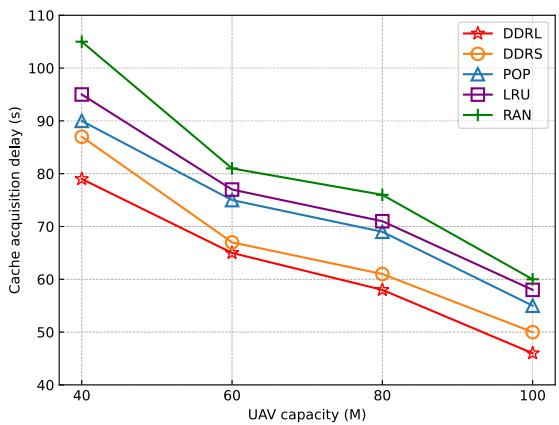  
Fig. 13. Comparison of content acquisition delay by different schemes for a two-UAV system with different UAV capacity.

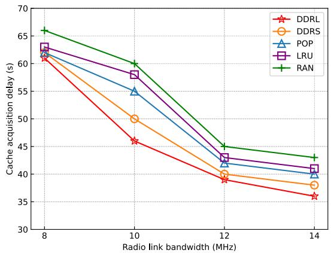  
Fig. 14. Comparison of content acquisition delay by different schemes for a two-UAV system with different UAV transmission power.

In Fig. 13, we compare content acquisition delay across different caching schemes with varying cache capacities for 32 users. As UAV cache capacity increases from 40M to 100M, all caching schemes show a reduction in content acquisition delay. The result indicates our scheme consistently outperforms other schemes across all capacity levels. This performance highlights the advantage of our caching strategy in utilizing UAV storage to minimize delay under constrained cache capacity. The improvement is especially noticeable when cache capacity is limited, emphasizing the strategy’s effectiveness in optimizing cache usage.

In Fig. 14, we analyze the impact of varying UAV downlink link bandwidth on content acquisition delay for different caching schemes for 32 users. As bandwidth increases from 8 to 14, content acquisition delay decreases across all schemes and our proposed scheme demonstrates higher performance. This improvement is particularly pronounced at lower transmission power levels, where efficient caching significantly reduces the need for additional data retrieval. This suggests that our proposed method effectively leverages both cache management and transmission power, providing a robust solution for minimizing delay under varying power conditions.

## VI. CONCLUSION

In this paper, we present a novel Dual-phase Deep Reinforcement Learning (DDRL) framework for UAV-assisted content delivery in multi-BS networks. By jointly optimizing UAV trajectories, caching strategies, and transmission power, the DDRL framework effectively reduces content acquisition delay, enhances cache hit rate, and conserves UAV energy. The integration of Particle Swarm Optimization (PSO) further refines the caching strategy, enabling adaptive and efficient content management. Extensive simulation results confirm that our proposed framework enhances the cache hit rate, reduces the total content acquisition delay, and conserves UAV energy.

While the current framework achieves promising results under controlled simulation settings, extending it to realworld scenarios introduces several challenges. The most notable one is dynamic user mobility, which can disrupt pre-optimized UAV trajectories and reduce cache efficiency in both urban (frequent commuting) and rural (randomly distributed) environments. In addition, real deployments must address environmental interference and the lack of large-scale, scenario-specific datasets. Future work will therefore focus on integrating realistic mobility models, developing robust optimization mechanisms, and validating the framework under diverse real-world conditions.

## REFERENCES

[1] R. Amer, W. Saad, and N. Marchetti, “Mobility in the sky: Performance and mobility analysis for cellular-connected UAVs,” IEEE Trans. Commun., vol. 68, no. 5, pp. 3229–3246, May 2020.

[2] X. Li, L. Chen, Z. Yuan, and G. Liu, “AIHO: Enhancing task offloading and reducing latency in serverless multi-edge-to-cloud systems,” Future Gener. Comput. Syst., vol. 165, Apr. 2025, Art. no. 107607.

[3] N. Cheng et al., “AI for UAV-assisted IoT applications: A comprehensive review,” IEEE Internet Things J., vol. 10, no. 16, pp. 14438–14461, Aug. 2023.

[4] M. Chen, M. Mozaffari, W. Saad, C. Yin, M. Debbah, and C. S. Hong, “Caching in the sky: Proactive deployment of cache-enabled unmanned aerial vehicles for optimized quality-of-experience,” IEEE J. Sel. Areas Commun., vol. 35, no. 5, pp. 1046–1061, May 2017.

[5] L. Zhang and J. Chakareski, “UAV-assisted edge computing and streaming for wireless virtual reality: Analysis, algorithm design, and performance guarantees,” IEEE Trans. Veh. Technol., vol. 71, no. 3, pp. 3267–3275, Mar. 2022.

[6] Y. Li, C. Dou, Y. Wu, W. Jia, and R. Lu, “NOMA assisted two-tier VR content transmission: A tile-based approach for QoE optimization,” IEEE Trans. Mobile Comput., vol. 23, no. 5, pp. 3769–3784, May 2024.

[7] J. Lyu, Y. Zeng, and R. Zhang, “UAV-aided offloading for cellular hotspot,” IEEE Trans. Wireless Commun., vol. 17, no. 6, pp. 3988–4001, Jun. 2018.

[8] Z. Liao, Y. Ma, J. Huang, J. Wang, and J. Wang, “HOTSPOT: A UAVassisted dynamic mobility-aware offloading for mobile-edge computing in 3-D space,” IEEE Internet Things J., vol. 8, no. 13, pp. 10940–10952, Jul. 2021.

[9] G. Liu, X. Zhu, L. Chen, and X. Li, “HMUR: A two-stage heuristic for UAV scheduling in mobile edge computing with time window constraints,” in Proc. IEEE Int. Conf. Web Services (ICWS), Jul. 2024, pp. 1400–1402.

[10] Y. Zeng, R. Zhang, and T. J. Lim, “Throughput maximization for UAV-enabled mobile relaying systems,” IEEE Trans. Commun., vol. 64, no. 12, pp. 4983–4996, Dec. 2016.

[11] M. Mozaffari, W. Saad, M. Bennis, and M. Debbah, “Mobile unmanned aerial vehicles (UAVs) for energy-efficient Internet of Things communications,” IEEE Trans. Wireless Commun., vol. 16, no. 11, pp. 7574–7589, Nov. 2017.

[12] J. Lyu, Y. Zeng, R. Zhang, and T. J. Lim, “Placement optimization of UAV-mounted mobile base stations,” IEEE Commun. Lett., vol. 21, no. 3, pp. 604–607, Mar. 2017.

[13] L. Zhang, A. Celik, S. Dang, and B. Shihada, “Energy-efficient trajectory optimization for UAV-assisted IoT networks,” IEEE Trans. Mobile Comput., vol. 21, no. 12, pp. 4323–4337, Dec. 2022.

[14] K. K. Nguyen, T. Q. Duong, T. Do-Duy, H. Claussen, and L. Hanzo, “3D UAV trajectory and data collection optimisation via deep reinforcement learning,” IEEE Trans. Commun., vol. 70, no. 4, pp. 2358–2371, Apr. 2022.

[15] A. Al-Hilo, M. Samir, C. Assi, S. Sharafeddine, and D. Ebrahimi, “UAV-assisted content delivery in intelligent transportation systems-joint trajectory planning and cache management,” IEEE Trans. Intell. Transp. Syst., vol. 22, no. 8, pp. 5155–5167, Aug. 2021.

[16] C. Fan, X. Zhou, T. Zhang, W. Yi, and Y. Liu, “Cache-enabled UAV emergency communication networks: Performance analysis with stochastic geometry,” IEEE Trans. Veh. Technol., vol. 72, no. 7, pp. 9308–9321, Jul. 2023.

[17] T. Zhang, Y. Wang, Y. Liu, W. Xu, and A. Nallanathan, “Cache-enabling UAV communications: Network deployment and resource allocation,” IEEE Trans. Wireless Commun., vol. 19, no. 11, pp. 7470–7483, Nov. 2020.

[18] J. Ji, K. Zhu, and L. Cai, “Trajectory and communication design for cache{-} enabled UAVs in cellular networks: A deep reinforcement learning approach,” IEEE Trans. Mobile Comput., vol. 22, no. 10, pp. 6190–6204, Oct. 2023.

[19] M. Zhang, E.-H. Mohammed, and S. X. Ng, “Intelligent caching in UAVaided networks,” IEEE Trans. Veh. Technol., vol. 71, no. 1, pp. 739–752, Jan. 2022.

[20] H. Wu, F. Lyu, C. Zhou, J. Chen, L. Wang, and X. Shen, “Optimal UAV caching and trajectory in aerial-assisted vehicular networks: A learning-based approach,” IEEE J. Sel. Areas Commun., vol. 38, no. 12, pp. 2783–2797, Dec. 2020.

[21] Z. Su, M. Dai, Q. Xu, R. Li, and H. Zhang, “UAV enabled content distribution for Internet of Connected Vehicles in 5G heterogeneous networks,” IEEE Trans. Intell. Transp. Syst., vol. 22, no. 8, pp. 5091–5102, Aug. 2021.

[22] T. C. Lam, N.-S. Vo, M.-P. Bui, C. D. T. Thai, H. Jung, and V.-C. Phan, “Service time-aware caching, power allocation, and 3D trajectory optimised multimedia content delivery in UAV-assisted IoT networks,” IEEE Trans. Veh. Technol., vol. 74, no. 4, pp. 6419–6432, Apr. 2025.

[23] L. Zhou, Y. Dong, M. Hong, and Q. Shi, “Joint channel assignment and power allocation for multi-UAVs communication systems,” in Proc. IEEE 21st Int. Workshop Signal Process. Adv. Wireless Commun. (SPAWC), May 2020, pp. 1–5.

[24] R. Li et al., “Joint trajectory and resource allocation design for UAV communication systems,” in Proc. IEEE Globecom Workshops (GC Wkshps), Dec. 2018, pp. 1–6.

[25] L. Zhou, X. Chen, M. Hong, S. Jin, and Q. Shi, “Efficient resource allocation for multi-UAV communication against adjacent and cochannel interference,” IEEE Trans. Veh. Technol., vol. 70, no. 10, pp. 10222–10235, Oct. 2021.

[26] M. Cui, G. Zhang, Q. Wu, and D. W. K. Ng, “Robust trajectory and transmit power design for secure UAV communications,” IEEE Trans. Veh. Technol., vol. 67, no. 9, pp. 9042–9046, Sep. 2018.

[27] J. Ji, K. Zhu, D. Niyato, and R. Wang, “Joint cache placement, flight trajectory, and transmission power optimization for multi-UAV assisted wireless networks,” IEEE Trans. Wireless Commun., vol. 19, no. 8, pp. 5389–5403, Aug. 2020.

[28] L. Breslau, P. Cao, L. Fan, G. Phillips, and S. Shenker, “Web caching and zipf-like distributions: Evidence and implications,” in Proc. 18th Annu. Joint Conf. IEEE Comput. Commun. Societies. Future Now, vol. 1, Oct. 1999, pp. 126–134.

[29] M. Mozaffari, W. Saad, M. Bennis, Y.-H. Nam, and M. Debbah, “A tutorial on UAVs for wireless networks: Applications, challenges, and open problems,” IEEE Commun. Surv. Tut., vol. 21, no. 3, pp. 2334–2360, 3rd Quart., 2019.

[30] Q. Feng, J. McGeehan, E. K. Tameh, and A. R. Nix, “Path loss models for air-to-ground radio channels in urban environments,” in Proc. IEEE 63rd Veh. Technol. Conf., vol. 6, Jul. 2006, pp. 2901–2905.

[31] M. Mozaffari, W. Saad, M. Bennis, and M. Debbah, “Unmanned aerial vehicle with underlaid device-to-device communications: Performance and tradeoffs,” IEEE Trans. Wireless Commun., vol. 15, no. 6, pp. 3949–3963, Jun. 2016.

[32] A. Al-Hourani, S. Kandeepan, and A. Jamalipour, “Modeling air-toground path loss for low altitude platforms in urban environments,” in Proc. IEEE Global Commun. Conf., Dec. 2014, pp. 2898–2904.

[33] B. Bellalta, “IEEE 802.11ax: High-efficiency WLANS,” IEEE Wireless Commun., vol. 23, no. 1, pp. 38–46, Feb. 2016.

[34] Y. Zeng, X. Xu, and R. Zhang, “Trajectory design for completion time minimization in UAV-enabled multicasting,” IEEE Trans. Wireless Commun., vol. 17, no. 4, pp. 2233–2246, Apr. 2018.

[35] H. Wang, C. H. Liu, H. Yang, G. Wang, and K. K. Leung, “Ensuring threshold AoI for UAV-assisted mobile crowdsensing by multi-agent deep reinforcement learning with transformer,” IEEE/ACM Trans. Netw., vol. 32, no. 1, pp. 566–581, Feb. 2024.

[36] J. Schulman, F. Wolski, P. Dhariwal, A. Radford, and O. Klimov, “Proximal policy optimization algorithms,” 2017, arXiv:1707.06347.

[37] T. Zhang et al., “BeBold: Exploration beyond the boundary of explored regions,” 2020, arXiv:2012.08621.

[38] Z. Dai, C. H. Liu, R. Han, G. Wang, K. K. Leung, and J. Tang, “Delaysensitive energy-efficient UAV crowdsensing by deep reinforcement learning,” IEEE Trans. Mobile Comput., vol. 22, no. 4, pp. 2038–2052, Apr. 2023.

[39] X. Li, J. Shen, Y. Sun, Z. Wang, and X. Zheng, “A smart content caching and replacement scheme for UAV-assisted fog computing network,” in Proc. Int. Conf. Wireless Commun. Signal Process. (WCSP), Oct. 2020, pp. 1040–1045.

[40] Y. Liu, C. Yang, X. Chen, and F. Wu, “Joint hybrid caching and replacement scheme for UAV-assisted vehicular edge computing networks,” IEEE Trans. Intell. Vehicles, vol. 9, no. 1, pp. 866–878, Jan. 2024.

  
Xinshuai Hua is currently pursuing the M.S. degree with the School of Computer Science and Engineering, Southeast University, Nanjing, China. His main research interests include edge computing and UAV wireless communications.


Long Chen received the B.Sc. and Ph.D. degrees in computer science and engineering from Southeast University, Nanjing, China, in 2009 and 2018, respectively. He is currently with the School of Computer Science and Engineering, Southeast University. He has published more than 30 papers in international journals and conferences, such as IEEE TRANSACTIONS ON SERVICES COMPUTING, IEEE TRANSACTIONS ON CLOUD COMPUTING, and IEEE TRANSACTIONS ON AUTOMATION SCIENCE AND ENGINEERING. His main research interests include cloud computing, edge computing, and service-oriented computing.


Xia Zhu received the B.Sc., M.Sc., and Ph.D. degrees from the School of Computer Science and Engineering, Southeast University, Nanjing, China, in 2004, 2006, and 2009, respectively. She is currently an Associate Professor with the School of Computer Science and Engineering, Southeast University. She is the author or co-author over more than 30 academic papers, some of which have been published in international journals and conferences, such as ICWS, European Journal of Operational Research, Omega, Integrated Computer-Aided Engi-

neering, Computers & Industrial Engineering, International Journal of Production Research, International Journal of Computer Integrated Manufacturing, Information Sciences, SMC, CASE, and CSCW. Her research interests include scheduling in cloud computing, service computing, big data, and machine learning.

China. He is the author or co-author over more than 100 academic papers, some of which have been published in international journals, such as IEEE TRANSACTIONS ON COMPUTERS, IEEE TRANSACTIONS ON PARALLEL AND DISTRIBUTED SYSTEMS, IEEE TRANSACTIONS ON SERVICES COM-PUTING, IEEE TRANSACTIONS ON CYBERNETICS, IEEE TRANSACTIONS ON AUTOMATION SCIENCE AND ENGINEERING, IEEE TRANSACTIONS ON CLOUD COMPUTING, IEEE TRANSACTIONS ON SYSTEMS, MAN AND CYBERNETICS: SYSTEMS, Information Sciences, Omega, European Journal of Operational Research, International Journal of Production Research, Expert Systems with Applications, and Journal of Network and Computer Applications. His research interests include scheduling in cloud computing, scheduling in cloud manufacturing, service computing, big data, and machine learning.


Xiaoping Li (Senior Member, IEEE) received the B.Sc. and M.Sc. degrees in applied computer science from Harbin University of Science and Technology in 1993 and 1999, respectively, and the Ph.D. degree in applied computer Science from Harbin Institute of Technology in 2002. He was a Distinguished Professor with the School of Computer Science and Engineering, Southeast University, Nanjing, China. He is currently a Full Professor and the Dean of the School of Computer Science and Technology, Guangdong University of Technology, Guangzhou,


Jingjing Li received the M.S. degree from the College of Engineering, The Pennsylvania State University, PA, USA, in 2025. She is currently pursuing the Ph.D. degree with the Bellini College of Artificial Intelligence, Cybersecurity, and Computing, University of South Florida. Her main research interests include deep reinforcement learning and human–robot interaction.