# DFF-SLAM: Dynamic Feature Filtering-Based Simultaneous Localization and Mapping for UAV Positioning in IoT-Enabled Complex Environments

Jinglei Li , Yiming Jia, Meng Qin , Member, IEEE, Qinghai Yang , Member, IEEE, Tony Q. S. Quek , Fellow, IEEE, Wen Gao , and Kyung Sup Kwak , Life Senior Member, IEEE

Abstract—The advent of the 5G RedCap, the upcoming 6G and the proliferation of the Internet of Things (IoT) have catalyzed the rapid advancement of unmanned aerial vehicle (UAV) technology while also promoting UAVs’ widespread application. In IoT-enabled environments where the global positioning system (GPS) signals are compromised, visual simultaneous localization and mapping (V-SLAM) technology has emerged as an effective positioning solution, valued for its reliability. However, the presence of dynamic elements in complex environments, such as pedestrians and vehicles, poses challenges to the positioning accuracy of UAVs employing V-SLAM for navigation. This paper proposes a dynamic feature filtering-based SLAM (DFF-SLAM) approach to eliminate the impact of dynamic factors in dynamic environments, thereby enhancing the positioning accuracy of UAVs in IoT-enabled complex environments. Firstly, a semantic detection thread is designed to identify semantic information in the scene and acquire prior dynamic targets, facilitating the filtering of prior dynamic feature points. Secondly, optical flow tracking conducted at each level of the image pyramid facilitates feature point matching across consecutive images. Finally, the epipolar geometry constraint is utilized to determine the motion status of remaining feature points, further filtering out dynamic feature points. Simulation results demonstrate that compared to traditional visual SLAM systems, the UAV equipped with the DFF-SLAM system achieves more accurate positioning and meets real-time positioning requirements when navigating through IoT-enabled complex environments.

Index Terms—Complex environments, dynamic objects, IoT, positioning method, UAV, visual SLAM.

## I. INTRODUCTION

exchange and information sharing [1]. It has been widely applied in various fields such as smart cities, intelligent transportation, smart factories and precision agriculture. The unmanned aerial vehicle (UAV) cluster system has brought new development opportunities to the IoT with its flexible deployment and high mobility. UAV-assisted data collection has garnered significant attention, as UAVs equipped with various sensors enable effective data collection for the IoT in complex and remote environments. Currently, UAVs are widely deployed in IoT scenarios, including smart transportation, agricultural environmental monitoring, emergency rescue, and military operations [2], [3]. It can be said that UAV clusters provide support for IoT applications.

For UAV formation flight, a primary concern is accurate positioning [4]. Despite the relative maturity of UAV formation navigation technology, ensuring reliable and accurate positioning remains crucial in IoT-enabled complex environments. When UAVs rely on the global positioning system (GPS) for positioning in complex environments, their accuracy is vulnerable to interference from buildings, particularly in densely populated areas where GPS signals may face significant disruptions or even become inaccessible indoors. Visual simultaneous localization and mapping (V-SLAM) technology has emerged as a solution for achieving accurate UAV positioning in unknown environments. However, complex environments often feature numerous dynamic objects, and the feature information captured by cameras contains a substantial amount of dynamic features, which can adversely affect the accuracy of the SLAM system and lead to positioning failures. Therefore, ensuring accurate UAV positioning in IoT-enable complex environments is paramount. To address these challenges, the scholars have conducted extensive research.

In environments where GPS signals are suppressed, the signal processing-based positioning methods are employed to address the positioning challenges of UAVs, including Bluetooth Low Energy (BLE) [5], WiFi [10], and Ultra-Wideband (UWB) [17] technologies. As a variant of bluetooth technology, BLE is designed for low-power and short-range communication, suitable for close-range UAV positioning tasks. WiFi-based technology often relies on pre-laid WiFi infrastructure, and while most indoor environments already have WiFi routers and mobile hotspot infrastructure deployed, it may not be suitable for some temporary missions for UAVs. UWB technology has been widely studied as an alternative in GPS constrained environments and can provide accurate positioning for UAV indoors, but UWB signals can be interfered with by multipath effects from walls and obstacles. And this method limits the flying environment of UAVs.

With the progress of camera sensors and the maturity of fundamental visual data processing algorithms, computer vision methods have become highly popular in the development of localization technology [21]. However, most of the existing methods cannot be achieved by visual sensors alone, usually with the help of additional auxiliary tags, and some visual positioning system needs to be fixed to the ground rather than directly connected to UAVs, which limits the applicability of UAVs, so that the UAVs can only perform tasks in fixed scenes.

The SLAM positioning technology aims to estimate the position and orientation of UAVs by utilizing environmental features observed in motion. SLAM typically is categorized into WiFi SLAM, laser-based SLAM and visual SLAM (V-SLAM) based on the sensors employed. The WiFi SLAM [27] uses the radio signal and motion data of the device for localization and signal strength mapping in unknown environments. Laser-based SLAM [28], [29], [30] has seen widespread use due to its early development and mature technologies. However, laser-based SLAM tends to be bulky, expensive, and less effective in extracting feature information in areas with rich texture, which poses challenges for lightweight UAVs.

The V-SLAM technology has a wide range of applications in the fields of robotics, autonomous driving and virtual reality, which mainly uses visual sensors connected to the UAV to sense the environment, achieve the estimation of its own position in the unknown environment and real-time construction of maps. However, in complex environments, many existing V-SLAM systems assume the external environment as a static scene, ignoring the impact of dynamic objects, resulting in a decline in the positioning accuracy. Some scholars solve this problem by traditional methods such as geometric constraints and optical flow tracking [34]. With the development of deep learning, the scholars try to solve the problem by using solely semantic information obtained based on neural networks to judge dynamic targets [36], which is easy to cause incomplete elimination of dynamic feature points.

Considering the limited computing power of the onboard computer carried by the UAV and the real-time requirement for UAV positioning, this paper adopts ORB-SLAM2 [44] rather than ORB-SLAM3 [45] to provide accurate positioning services for UAVs by filtering out dynamic features in complex environments where the GPS signals are suppressed. However, the ORB-SLAM2 system lacks the capability to filter out dynamic feature points. To tackle the challenges posed by dynamic targets in complex environments for V-SLAM systems, this paper proposes an improvement to ORB-SLAM2 that enables it to accurately identify and filter out dynamic feature points, thereby enhancing the positioning accuracy of UAVs employing V-SLAM systems for navigation in IoT-enabled complex environments.

Therefore, a DFF-SLAM system capable of effectively filtering out dynamic feature points in complex environments is constructed. This enhancement significantly improves the accuracy and robustness of UAV positioning in IoT-enabled complex environments. The primary contributions of this paper are outlined as follows:

\- An effective dynamic feature filtering mechanism is proposed by combining deep learning techniques with geometric methods, which can effectively filters out dynamic feature points. This mechanism enhances the robustness and accuracy of the ORB-SLAM2 algorithm in dynamic environments.

\- A multi-scale optical flow tracking method based on image pyramids is used for feature point matching, with the number of pyramid layers constrained to reduce computational complexity, which effectively overcomes the shortcomings of single-scale method in handling scale variations, lighting changes and complex backgrounds.

The DFF-SLAM system still meets the real-time requirements for UAV positioning when deployed on resourceconstrained onboard computers, compared to other computationally intensive improved SLAM systems.

Based on the above improvements, we obtain accurate positioning with satisfying performance. In addition, simulation experiments are conducted to demonstrate the effectiveness of the proposed DFF-SLAM system.

The structure of the paper is as follows: Section II introduces the relevant literature. Section III introduces the system model. The dynamic feature filtering mechanism is introduced in Section IV. Section V presents our proposed complete DFF-SLAM system. Section VI shows the simulation results, followed by the conclusion of this paper in Section VII.

## II. LITERATURE REVIEW

Recently, a large number of research studies on indoor accurate positioning of UAVs have been conducted. In this section, we will classify and analyze the relevant research.

Indoor positioning methods based on signal processing include BLE [5], [6], [7], [8], [9], WiFi [10], [11], [12], [13], [14] and UWB [15], [16], [17], [18], [19], [20], etc. The BLE technology is specifically designed for low-power communication to meet the demands of mobile devices requiring high battery life. Based on BLE, Huang et al. [6] proposed a BLE-based indoor positioning system, achieving precise localization by measuring the arrival of angle (AoA) and elevation of angle (EoA) of signals from the target to the low-power receivers. Ariante et al. [7] introduced an indoor positioning system based on Received Signal Strength Indicator (RSSI) and BLE beacons. Regarding WiFi technology, Azghadi et al. [10] present a method for creating WiFi fingerprinting datasets to enhance indoor localization systems. Wu et al. [11] utilized 4 G/WiFi-Mesh communication and Real-Time Kinematic Global Positioning System (RTK-GPS) for the remote monitoring and navigation system of a UAV swarm mission. Despite their low cost and

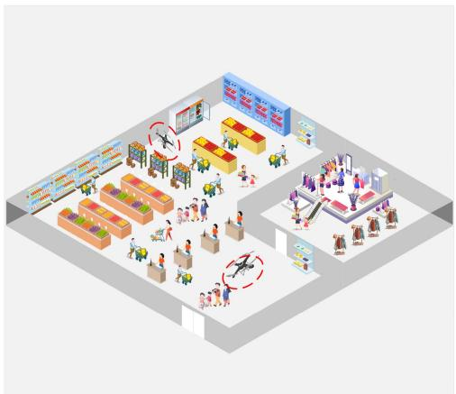  
(a) Indoor IoT-enabled environment

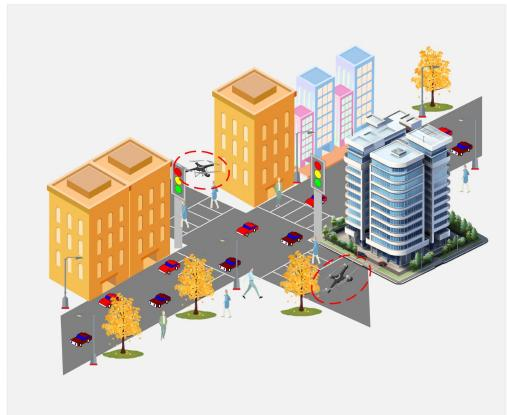  
(b) Outdoor IoT-enabled environment

Fig. 1. UAV positioning in IoT-enabled complex environments.

suitability for open spaces lacking sufficient features, these methods are susceptible to environmental interference. Noise and discontinuous measurements may lead to scattered results, limiting positioning accuracy.

Currently, low-cost UWB positioning technology is gaining significant attention. Bottigliero et al. [15] proposed a low-cost Real-Time Locating System (RTLS) that evaluates tag positions by calculating the Time Difference of Arrival (TDOA) of UWB pulse sequences received by at least three sensors. Premachandra et al. [16] proposed a novel method incorporating UWB Angle of Arrival (AOA) measurements into UWB radar-based SLAM systems to improve the accuracy and scalability of SLAM in feature-deficient environments. However, its performance depends on the deployment density and accuracy of UWB anchor-tag units, which may lead to challenges in deployment and stability in large-scale or dynamic environments. In recent research, Nguyen et al. [18] introduced a a tightly-coupled fusion scheme of a monocular camera, a 6-DoF IMU, and a single unknown UWB anchor to achieve accurate and drift-reduced localization. Liu et al. [19] propose an approach to position a group of users without any given infrastructure by integrating inertial and different peer-to-peer radio measurements (i.e., WiFi RSS and UWB ranging). Despite providing higher positioning accuracy, UWB systems may experience interference from multipath effects caused by walls and obstacles in indoor environments. Additionally, the deployment cost is high, and the high-frequency operation and complex signal processing of UWB devices result in increased energy consumption.

With the advancement of the camera systems and fundamental visual data processing algorithms, computer vision methods have gained momentum in the field of UAV positioning [21], [22], [23], [24], [25], [26]. Walter et al. [21] proposed a method that utilizes an ultraviolet camera to capture ultraviolet light emitted by markers for obtaining location information. Himawan et al. [22] investigated a monocular vision-based positioning system, where a ground-based monocular camera streams collected image data to an artificial intelligence algorithm to determine the UAV’s position and generate corresponding location and navigation solutions. Stuckey et al. [25] introduced a 3D positioning and attitude estimation system that captures LED circular flashing markers using dynamic visual sensors. Oh et al. [26] presented a ground-based monocular UAV positioning system capable of detecting and locating LED markers attached to the bottom of UAVs. These methods require the simultaneous use of visual sensors and auxiliary tags for UAV positioning. Some visual positioning systems need to be deployed on the ground rather than being directly connected to the UAVs, limiting the applicability of UAVs to fixed scenarios. And this method requires pre-deployment of positioning systems when UAVs fly in unknown environments, adding operational complexity.

For visual SLAM, it is a method that uses a camera as the sole external sensor to perceive external environmental information for localization and mapping. Recently, it has been widely researched in UAV positioning in the GPS-suppressed environments. However, the existing V-SLAM systems often assume the external environment as a static scene, neglecting the impact of dynamic objects in complex environments, resulting in decreased localization accuracy. Many scholars have conducted related research to solve this issue.

To mitigate the impact of dynamic objects on positioning, traditional methods involve addressing the issues in dynamic environments through geometric constraints and optical flow tracking [31], [32], [33], [34], [35]. Liu et al. [31] proposed a semantic-integrated feature detection method that adaptively adjusts the feature detection area, effectively addressing the scarcity of static features in dynamic environments. However, this method relies heavily on the accuracy of semantic segmentation, incurs high computational costs, and has limited generalization capability across different environments. By utilizing camera pose estimation and geometric constraints between adjacent frames [32], [33], these methods effectively remove dynamic features and demonstrate high reliability in low-dynamic environments. However, these methods are highly reliant on the accuracy of pose estimation and often encounter challenges in highly dynamic environments. Dai et al. [34] utilized Delaunay triangulation to generate a sparse graph, distinguishing dynamic from static points. Although effective, it may overlook static states within previously detected frames.

With the swift advancement of deep learning technology, many outstanding object detection models have emerged. Utilizing these models allows obtaining semantic information in the scene as prior knowledge for determining dynamic objects [36], [37], [38], [39], [40], [41]. Most existing dynamic SLAM methods [36], [37], [38] tend to remove all features from potential dynamic objects, which prevents effective utilization of the static information these objects may contain. Consequently, the fusion of deep learning and geometric methods has emerged as a prominent research direction, resulting in the development of several exceptional SLAM systems [39], [40], [41]. However, the object detection models employed by these methods exhibit limited accuracy, struggling to precisely assess dynamic objects using geometric methods. Instead, they rely on simplistic judgments based on semantic labels. Moreover, these systems demonstrate suboptimal real-time performance and are unsuitable for resource-constrained UAV devices.

In summary, a comprehensive analysis of existing literature reveals that current research often focuses on traditional geometric methods [31], [32], [33], [34] or simplistic semantic labels [36], [37], [42], [43] when evaluating dynamic objects. Depending solely on these methods can filter out only a limited number of dynamic feature points. However, we can draw inspiration from this that combining deep learning with geometric methods can effectively solve the problem of inaccurate positioning in dynamic environments for SLAM systems. However, existing works struggle to effectively integrate the aforementioned methods and are not suitable for UAV platforms.

Therefore, considering the real-time requirements of positioning algorithms for UAVs, we have deeply integrated a semantic detection model, multi-scale optical flow tracking, and epipolar geometry constraint to design a DFF-SLAM system. It effectively filters out dynamic feature points in the scene, significantly enhancing the accuracy and robustness of UAV positioning in IoT-enabled complex environments.

## III. V-SLAM FOR UAV POSITIONING

In this section, we introduce the complex flying environment of UAVs (Section III-A) and the relevant issues existing in current V-SLAM systems (Section III-B).

## A. Scene Description

Providing accurate positioning services for UAVs during missions in GPS-suppressed environments presents a significant challenge, as shown in Fig. 1. As depicted in Fig. 1(a), UAVs can serve as mobile devices responsible for collecting environmental data and transmitting the collected results back to the ground terminal. Fig. 1(b) illustrates the scenario of intelligent transportation including numerous large structures like trees and tall buildings, where UAVs utilize onboard cameras to monitor traffic violations in real-time and transmit the violation data back to the terminal. However, UAVs relying on GPS for positioning may face interference from these structures, particularly in densely built areas where GPS signals may encounter significant disruptions, and may not be received indoors. Consequently, traditional GPS positioning systems prove ineffective in complex environments. Currently, V-SLAM technology has emerged as an effective solution for UAV positioning in IoT-enabled complex environments.

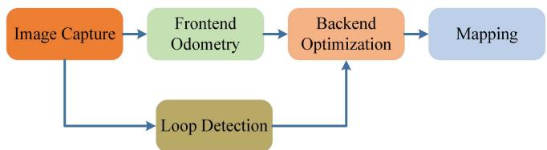  
Fig. 2. The positioning and mapping process of V-SLAM system.

The V-SLAM technology primarily relies on capturing images of the UAVs form the surroundings. However, the presence of dynamic objects in the scene can significantly impact the positioning accuracy of UAVs employing V-SLAM system, as these dynamic features affect the captured environmental information. Many V-SLAM systems operate under the assumption that the external environment is static, thus neglecting the influence of dynamic objects. As shown in Fig. 1, dynamic objects such as shoppers in supermarket scenes and pedestrians and vehicles in urban scenes can lead to failures when V-SLAM is employed for UAV positioning. Therefore, it is crucial to filter out dynamic features in the scene to enhance the accuracy and robustness of the V-SLAM system.

## B. Problem Description

This paper aims to employ a dynamic feature point filtering mechanism into the visual SLAM system to eliminate the influence of dynamic objects, thereby improving the positioning accuracy of UAVs in complex environments when applying V-SLAM. The V-SLAM frameworks typically consist of five modules: image capture, frontend odometry, backend optimization, loop detection and mapping, as shown in Fig. 2.

Firstly, the camera is used to capture continuous images in real time to provide environmental information to the V-SLAM system in the image capture module. As for frontend odometer, the core functions mainly involve feature point extraction, feature point matching and camera motion estimation. It starts by extracting prominent and easily matchable feature points from images, such as corners or regions with unique textures. It is worth noting that the extracted feature points are primarily used for subsequent camera motion estimation, loop detection, trajectory optimization and mapping. Visible feature points are the fundamental elements for achieving localization in the V-SLAM system, and their accuracy has a significant impact on the overall system performance.

Then, the loop detection determines whether the UAV has returned to a location it has visited before by finding feature points in current image that are similar to those in previously captured images. The backend optimization module receives camera poses at different time and loop detection information, achieving global optimization of the entire trajectory and map by eliminating redundant feature points, merging similar feature points. This process aims to improve the positioning accuracy and mapping consistency, correcting potential drift errors. In the end, the mapping module generates a three-dimensional sparse map based on feature points and camera pose information.

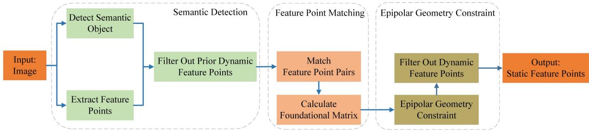  
Fig. 3. Dynamic feature filtering mechanism of the DFF-SLAM system.

Undoubtedly, feature points play a crucial role in the V-SLAM system, directly influencing the accuracy of position estimation in the frontend odometry. Accurate feature point matching is vital for loop detection, as it enables more precise identification of closed loops, effectively correcting drift. Conversely, inaccurate matching can lead to error accumulation. In scenarios with numerous dynamic targets, failure to match points correctly from previous frames can result in loop detection failures. Additionally, the position information of feature points is utilized to optimize the camera’s pose, thereby enhancing UAV trajectories by minimizing the reprojection error of feature points. Low-quality points directly impede the local or global optimization of the V-SLAM system, inevitably leading to decreased positioning accuracy. Generally, dynamic feature points are deemed low-quality. However, eliminating dynamic features from the scene poses a significant challenge. This issue is complex because existing systems struggle to differentiate dynamic targets in unknown environments, hindering UAVs from accurately estimating their positions.

Therefore, we integrate a dynamic feature filtering mechanism into the frontend odometry module (discussed in detail in Section IV). This mechanism filters out dynamic feature points from the extracted ones, preserving static feature points for UAV motion estimation. Section V will provide a comprehensive overview of the complete architecture of the DFF-SLAM system, based on the dynamic feature filtering mechanism. Section VI presents the experimental results and provides a detailed analysis. In Section VII, we provided a summary.

## IV. DYNAMIC FEATURE FILTERING MECHANISM

The UAV captures real-time images using a depth camera, which serves as input for the DFF-SLAM system. Subsequently, static feature points are obtained through the dynamic feature filtering mechanism, which includes semantic detection, feature point matching, and epipolar geometry constraint, as shown in Fig. 3. In the semantic detection module, a dedicated thread focuses on identifying semantic objects in the scene to acquire prior knowledge of dynamic targets. Meanwhile, the frontend odometry module extracts feature points from each frame, filtering out some prior dynamic feature points based on the identified dynamic targets. In the feature point matching module, we employ an optical flow method to track the remaining feature points across various levels of the image pyramid. In the epipolar geometry constraint module, the fundamental matrix is computed using matching point pairs, and the epipolar geometry constraint method is utilized to determine the motion status of the remaining feature points, thereby filtering out all dynamic feature points.

## A. Semantic Detection

Deep learning has experienced rapid development due to its robust data modeling and analysis capabilities. At present, the convolutional neural networks (CNNs) are widely used in image processing, showcasing excellent performance in tasks like object detection and semantic segmentation. The single-stage YOLO series of object detection algorithms, known for their performance of fast inference speed and high accuracy, have advanced to the YOLOv8 version. YOLOv3 achieves a good balance between real-time performance, multi-scale detection and accuracy. Its simple model structure and low computational overhead make it suitable for embedded devices. With a mature algorithm, it is easy to implement and deploy on embedded platforms, greatly simplifying practical applications. This paper chooses YOLOv3 as the semantic detection module of the DFF-SLAM system.

We design a semantic detection thread and add it to the original V-SLAM system. In this paper, persons and vehicles are considered as prior dynamic targets, and the semantic detection thread is responsible for identifying and recognizing these prior dynamic targets in the scene, saving the corresponding bounding box coordinates. After extracting feature points, the DFF-SLAM system filters out prior dynamic feature points based on the bounding boxes, meaning feature points located within the dynamic target areas are excluded. However, relying solely on semantic information to filter out dynamic feature points is a coarse method. This paper assumes prior dynamic targets but cannot identify all pedestrians and vehicles in the scene. Additionally, the motion status of non-a priori dynamic targets remains undetermined. For instance, stationary chairs in indoor environments may exhibit motion in certain situations. Therefore, a more accurate method is needed to determine the actual motion status of feature points.

## B. Feature Point Matching

After filtering out prior dynamic feature points, the next step involves matching the remaining feature points between adjacent images. To achieve this, the Lucas-Kanade optical flow method is employed to estimate the pixel motion in consecutive images for feature point matching. The fundamental principle is to infer the motion state of objects by analyzing changes in grayscale between consecutive frames. The method is based on the assumptions of grayscale constancy and spatial consistency, where the grayscale constancy assumption asserts that the intensity values of the same point remain constant between different frames, and the spatial consistency assumption suggests that neighboring pixels in a local region have similar motion.

In this method, the image is treated as a function of time, and the grayscale of a pixel located at $( x , y )$ at time t is denoted as $I ( x , y , t )$ . If the pixel moves to (x + dx, $y + d y )$ at time $t + d t$ the grayscale constancy assumption allows:

$$
I ( x , y , t ) = I ( x + d x , y + d y , t + d t ) .\tag{1}
$$

Then the right term in (1) is expanded by Taylor series and the first-order term is preserved, which is expressed as

$$
\begin{array} { l } { \displaystyle { I ( x + d x , y + d y , t + d t ) \approx I ( x , y , t ) } } \\ { \displaystyle { \qquad + \frac { \partial I } { \partial x } d x + \frac { \partial I } { \partial y } d y + \frac { \partial I } { \partial t } d t . } } \end{array}\tag{2}
$$

Based on the assumption of grayscale constancy, the grayscale value at the next moment remains constant, and (2) is further expressed as

$$
{ \frac { \partial I } { \partial x } } d x + { \frac { \partial I } { \partial y } } d y + { \frac { \partial I } { \partial t } } d t = \mathbf { 0 } .\tag{3}
$$

Meanwhile, (3) is also rewritten as

$$
{ \frac { \partial I } { \partial x } } { \frac { d x } { d t } } + { \frac { \partial I } { \partial y } } { \frac { d y } { d t } } = - { \frac { \partial I } { \partial t } } ,\tag{4}
$$

where $d x / d t$ and ${ d y / d t }$ are the velocities of the pixel’s motion along the x and $y$ axes, represented by $\pmb { \mu }$ and υ. $\partial I / \partial x$ and $\partial I / \partial y$ are the directional gradients of the image along the x and y axes, represented by $I _ { x }$ and $I _ { y }$ . The change in grayscale over time is denoted as $I _ { t } ,$ , and its matrix form is given by

$$
[ I _ { x } I _ { y } ] \left[ \begin{array} { l } { \mu } \\ { v } \end{array} \right] = - I _ { t } .\tag{5}
$$

Based on spatial consistency assumption to solve for $\pmb { \mu }$ and υ, considering a region of size $w \times w$ with $w ^ { 2 }$ pixels, each pixel can be represented as an equation in (5). Finally, these equations can be uniformly represented as

$$
[ I _ { x _ { i } } \ I _ { y _ { i } } ] \left[ { \pmb \mu } \right] = - I _ { t _ { i } } , i = 1 , . . . , w ^ { 2 } .\tag{6}
$$

Then (6) is further expressed as

$$
G \left[ { \pmb \mu } \right] = - I ,\tag{7}
$$

where

$$
\boldsymbol { G } = \left[ \begin{array} { c } { \left[ I _ { x _ { 1 } } \ I _ { y _ { 1 } } \right] } \\ { \vdots } \\ { \left[ I _ { x _ { w ^ { 2 } } } \ I _ { y _ { w ^ { 2 } } } \right] } \end{array} \right] , \boldsymbol { I } = \left[ \begin{array} { c } { \boldsymbol { I } _ { t _ { 1 } } } \\ { \vdots } \\ { \boldsymbol { I } _ { t _ { w ^ { 2 } } } } \end{array} \right] .\tag{8}
$$

Finally, the least square method [46] is used to compute the solution, which is expressed as

$$
{ \left[ \pmb { \mu } \right] } ^ { * } = - { \left( \pmb { G } ^ { T } \pmb { G } \right) } ^ { - 1 } \pmb { G } ^ { T } \pmb { I } .\tag{9}
$$

Calculating the pixel motion velocity allows us to estimate their positions in the image, thereby providing the motion trajectories of feature points in the image sequence. However, the single-layer optical flow method exhibits limitations when encountering challenges like scale changes, object occlusion, texture loss, and discontinuous motion. Specifically, it encounters difficulties in effectively capturing scale variations, resulting in inaccuracies in optical flow estimation, especially when objects in the image exhibit motion at different scales.

Therefore, we adopts a pyramid structure to divide the image into multiple levels with different resolutions [47]. By performing optical flow tracking at various levels, it is possible to more effectively handle motion across different scales, thereby enhancing the accuracy of optical flow estimation, especially when dealing with complex scenes. The specific steps of the optical flow tracking method based on the image pyramid are as follows:

Pyramid Construction: Downsample original image multiple times to generate lower-resolution images and construct an image pyramid, where the bottom layer of the pyramid is the original image.

Optical Flow Estimation: Compute the optical flow field between adjacent frames at each level of the pyramid.

Flow Propagation: Upsample the optical flow estimation results as the initial estimation for the higher-resolution layer.

Optimization: Minimize the grayscale variation between adjacent frames and the disparity in the optical flow field at the current level to enhance the accuracy of the matching.

Results Fusion: Combine the optical flow field results at different scales to obtain complete motion information.

After obtaining the matching point pairs, we use the Random Sample Consensus (RANSAC) [48] algorithm to calculate the fundamental matrix $F$ representing the relative transformation between two consecutive frames.

## C. Epipolar Geometry Constraint

Epipolar geometry constraint is used to estimate the relative motion between adjacent images. By selecting a feature point in one image, its corresponding point on the epipolar line can be found in the other image.

Assuming the spatial position of the feature point is ${ \pmb P } =$ $[ X , Y , Z ] ^ { T }$ , its projections in $I _ { t }$ and $I _ { t - 1 }$ are denoted as $\mathbf { \nabla } _ { \mathbf { \mathcal { P } } _ { t } }$ and $\mathbf { \nabla } _ { \mathbf { \mathcal { P } - 1 } }$ , written as

$$
\left\{ \begin{array} { l l } { s _ { t - 1 } p _ { t - 1 } = K P , } \\ { s _ { t } p _ { t } = K ( R P + T ) , } \end{array} \right.\tag{10}
$$

where K is the camera intrinsic matrix, R and $_ { \mathbf { T } }$ represent the camera motion from $I _ { t - 1 }$ to $I _ { t }$ , and $s _ { t - 1 }$ and $s _ { t }$ are the depth values of $P .$ . In general, the homogeneous coordinates can be used to represent the projection relationship, which a vector multiplied by any non-zero constant remains equal to itself. This equality relationship is referred to as equal up to a scale. Based on this, (10) can be represented as an equation multiplied by a non-zero constant, expressed as

$$
\left\{ \begin{array} { l l } { p _ { t - 1 } \simeq K P , } \\ { p _ { t } \simeq K ( R P + T ) , } \end{array} \right.\tag{11}
$$

where the symbol $" \simeq "$ denotes asymptotic equality. Then the normalized coordinates ${ \mathbf { } } _ { \mathbf { \delta } \mathbf { x } _ { t - 1 } }$ and $\mathbf { \Delta } _ { \mathbf { \mathcal { X } } _ { t } }$ on the normalized plane for pixel points $\mathbf { \nabla } _ { p _ { t - 1 } }$ and $\mathbf { \nabla } _ { \pmb { p } _ { t } }$ tare calculated as

$$
\left\{ \begin{array} { l l } { { \pmb x } _ { t - 1 } = { \pmb K } ^ { - 1 } { \pmb p } _ { t - 1 } , } \\ { { \pmb x } _ { t } = { \pmb K } ^ { - 1 } { \pmb p } _ { t } , } \end{array} \right.\tag{12}
$$

Based on $\mathbf { \nabla } x _ { t - 1 }$ and $\mathbf { \boldsymbol { x } } _ { t } , ( 1 1 )$ is further expressed as

$$
\pmb { x } _ { t } \simeq \pmb { R } \pmb { x } _ { t - 1 } + \pmb { T } .\tag{13}
$$

By multiplying both sides by $\pmb { T } ^ { \wedge }$ , (13) is written as

$$
\pmb { T } ^ { \wedge } \pmb { x } _ { t } \simeq \pmb { T } ^ { \wedge } \pmb { R } \pmb { x } _ { t - 1 } ,\tag{14}
$$

where $\pmb { T } ^ { \wedge }$ is the outer product with T .

Furthermore, the inner product is formed between (14) and $\mathbf { \Delta } \mathbf { x } _ { t } .$ , written as

$$
\begin{array} { r } { \pmb { x } _ { t } ^ { T } \pmb { T } ^ { \wedge } \pmb { x } _ { t } \simeq \pmb { x } _ { t } ^ { T } \pmb { T } ^ { \wedge } \pmb { R } \pmb { x } _ { t - 1 } . } \end{array}\tag{15}
$$

Since the vector $\pmb { T } ^ { \wedge } \pmb { x } _ { t }$ is perpendicular to both $_ { \mathbf { T } }$ and ${ \mathbf { } } _ { \mathbf { \lambda } \mathbf { x } _ { t } }$ , its dot product with $\mathbf { \Delta } _ { \mathbf { \mathcal { X } } _ { t } }$ results in $\pmb { x } _ { t } ^ { T } \pmb { T } ^ { \wedge } \pmb { x } _ { t } = \mathbf { 0 }$ . Further, (15) is simplified to

$$
\pmb { x } _ { t } ^ { T } \pmb { T } ^ { \wedge } \pmb { R } \pmb { x } _ { t - 1 } = \mathbf { 0 } .\tag{16}
$$

Then by substituting (12) into (16), we get

$$
p _ { t } ^ { T } K ^ { - T } T ^ { \wedge } R K ^ { - 1 } p _ { t - 1 } = \mathbf { 0 } .\tag{17}
$$

The central part of (17) is denoted as the fundamental matrix $\pmb { F }$ and is expressed as

$$
\pmb { F } = \pmb { K } ^ { - T } \pmb { T } ^ { \wedge } \pmb { R } \pmb { K } ^ { - 1 } ,\tag{18}
$$

Based on fundamental matrix F , (17) is simplified to

$$
p _ { t } ^ { T } F p _ { t - 1 } = \mathbf { 0 } .\tag{19}
$$

Equation (19) represents the constraint relationship that needs to be satisfied when two feature points are correctly matched. That is, when one pixel is correctly matched with another pixel, it must lie on the epipolar line corresponding to the image plane. However, in dynamic environments, the pixel coordinates of feature points may no longer satisfy the constraint relationship, leading to a certain distance deviation between pixel points and their corresponding epipolar lines.

The normalized coordinates ${ \mathbf { } } x _ { t - 1 }$ and $\mathbf { \Delta } _ { \mathbf { \mathcal { X } } _ { t } }$ is expressed as

$$
\left\{ \begin{array} { l l } { \boldsymbol { x } _ { t - 1 } = \left[ u _ { t - 1 } , v _ { t - 1 } , 1 \right] ^ { T } , } \\ { \boldsymbol { x } _ { t } = \left[ u _ { t } , v _ { t } , 1 \right] ^ { T } , } \end{array} \right.\tag{20}
$$

where u and v represent the pixel coordinates of $x _ { t - 1 }$ and $x _ { t }$ The epipolar line $\mathbf { \xi } _ { l _ { t } }$ of $I _ { t }$ is expressed as

$$
l _ { t } = \left[ \begin{array} { l } { x _ { t } } \\ { y _ { t } } \\ { z _ { t } } \end{array} \right] = F { \pmb x } _ { t } = F \left[ \begin{array} { l } { u _ { t } } \\ { v _ { t } } \\ { 1 } \end{array} \right] ,\tag{21}
$$

where $x _ { t } , y _ { t }$ and $z _ { t }$ are direction vectors of $\mathbf { \xi } _ { l _ { t } , \mathrm { ~ ~ } }$ , and the distance between the matching point $\mathbf { \nabla } _ { \pmb { p } _ { t } }$ and epipolar line $\mathbf { \xi } _ { l _ { t } }$ is expressed as

$$
D = \frac { \left| x _ { t } ^ { T } { \pmb { F } } { \pmb { x } } _ { t - 1 } \right| } { \sqrt { \left\| x \right\| ^ { 2 } + \left\| y \right\| ^ { 2 } } } .\tag{22}
$$

Finally, by setting a threshold $\delta$ to assess the status of the matching points, if $D > \delta , P$ is deemed a dynamic feature point. Otherwise, $_ { P }$ is classified as a static feature point.

## V. DFF-SLAM SYSTEM FOR UAV POSITIONING

In the DFF-SLAM positioning system, we substantially mitigate the impact of dynamic targets, thereby further enhancing the positioning accuracy of UAVs utilizing DFF-SLAM for navigation in complex environments. In this section, we provide a comprehensive overview of the complete architecture of the DFF-SLAM system and relevant evaluation metrics.

## A. Algorithm Architecture

The dynamic feature filtering mechanism is added into the ORB-SLAM2 system, as shown in Algorithm 1. This algorithm architecture mainly includes three parts: semantic detection, feature point matching and epipolar geometry constraint.

The DFF-SLAM system utilizes a depth camera carried by the UAV to capture a continuous sequence of images as input, illustrated with two consecutive frames $I _ { t - 1 }$ and $I _ { t } .$ . And the ultimate output is the real-time position and orientation information in an unknown environment, which can be used for UAV positioning. The detailed process is as follows: this mechanism firstly performs feature point extraction on $I _ { t } ,$ saving them in $\textstyle { \mathcal { K } } _ { t }$ (line 1). Subsequently, the semantic detection thread performs detection on $I _ { t } ,$ with the resulting bounding boxes saved in the set $\mathcal { M } _ { t } .$ . In this process, persons and vehicles are set as prior dynamic targets, and the dynamic feature points are filtered out based on prior information (lines 2-3). The remaining feature points are kept in $\mathcal { R } _ { t }$ (line 4).

Then the feature points in $\mathcal { R } _ { t }$ are matched using optical flow tracking. Firstly, $I _ { t - 1 }$ and $I _ { t }$ are scaled to construct image pyramids $\mathcal { P } _ { t - 1 }$ and $\mathcal { P } _ { t }$ based on the scaling factor α, where $L$ represents the number of layers and $\beta$ represents the set of scaling factors for feature points on each layer. This strategy initiates optical flow tracking from the lowest-resolution layer (top layer) of $\mathcal { P } _ { t } .$ , requiring the direct scaling of feature points from the original image (bottom layer) to the top layer of $\mathcal { P } _ { t }$ By computing $k _ { t } * \beta [ L ] , k _ { t } \in \mathcal { K } _ { t }$ , the scaled feature points are obtained and saved in $\mathcal { C } _ { t - 1 }$ and $\mathcal { C } _ { t }$ (lines 5-10). Based on $\mathcal { P } _ { t - 1 }$ and $\mathcal { P } _ { t }$ , the algorithm initializes level l and proceeds to perform optical flow tracking layer by layer, computing the optical flow field for the current layer. Simultaneously, the algorithm optimizes the optical flow field and the estimate of optical flow is upsampled to a higher-resolution layer as the initial estimate. Finally, the results from different scales are merged to obtain complete motion information (lines 11-23). Following this process, matching point pairs $\left( k _ { t - 1 } , k _ { t } \right)$ are acquired and saved in the set .

Algorithm 1: DFF-SLAM Algorithm Architecture.   
Input: Image frames: $I _ { t - 1 }$ and $I _ { t }$   
t tOutput: Positions and attitudes of $\mathrm { U A V s }$   
1: $/ *$ Semantic Detection $^ { * }$   
2: Extract feature points and keep them in $\textstyle { \mathcal { K } } _ { t }$   
3: tGenerate semantic information and keep them in $\mathcal { M } _ { t }$   
4: Filter out the prior dynamic feature points   
5: Keep remaining feature points in $\mathcal { R } _ { t }$   
6: Initialize $L ,$ α and $\beta$   
7: Build image pyramids $\mathcal { P } _ { t - 1 }$ and $\mathcal { P } _ { t }$ using α for $I _ { t - 1 }$   
and $I _ { t }$   
8: twhile each feature point $k _ { t }$ in $\mathcal { R } _ { t }$ do   
9: Scale feature points by $k _ { t } = k _ { t } * \beta \lceil L \rceil$   
10: Keep $k _ { t }$ in $\mathcal { C } _ { t - 1 }$ and $\mathcal { C } _ { t }$   
11: tend while   
12: $/ { * }$ Feature Point Matching $^ { * }$   
13: Initialize $l = L$   
14: while $l \geq 0$ do   
15: Calculate the optical flow field in level l   
16: Transmit optical flow information to level $l - 1$   
17: Refine and optimize optical flow field   
18: if $l \geq 0$ then   
19: $k _ { t - 1 } = k _ { t - 1 } / \alpha , k _ { t - 1 } \in \mathcal { C } _ { t - 1 }$   
20: $k _ { t } = k _ { t } / \alpha , k _ { t } \in \mathcal { C } _ { t }$   
21: tend if   
22: $l = l - 1$   
23: end while   
24: Merge tracking results at various scales   
25: Obtain matching point pairs $\left( k _ { t - 1 } , k _ { t } \right)$ and keep them   
in $\mathcal { X }$   
26: /\* Epipolar Geometry Constraint $^ { * }$   
27: Calculate the fundamental matrix $\pmb { F }$   
28: while $\left( k _ { t - 1 } , k _ { t } \right)$ in do   
29: t tCalculate the distance from $k _ { t }$ to its corresponding   
epipolar line based on (22)   
30: if $D \leq \delta$ then   
31: Add $k _ { t }$ in $\boldsymbol { s }$   
32: else   
33: Delete $k _ { t }$   
34: end if   
35: end while   
36: $/ { * }$ Localization and Mapping $^ { * }$   
37: Motion estimation based on $\boldsymbol { \mathcal { S } }$   
38: Loop closure detection   
39: Global pose optimization   
40: Mapping   
42: returnaccurate positioning information

After obtaining the matching feature point pairs, the fundamental matrix $\pmb { F }$ can be calculated (line 24). Then the motion status of feature points is determined using epipolar geometry constraint. By computing the distance D from the $k _ { t } .$ -component of the i-th element in $\mathcal { X }$ to its corresponding epipolar line using (23) on image $I _ { t - 1 }$ , and comparing D with a threshold δ, the motion status of the feature point is determined. If $D \leq \delta$ , the feature point is judged as the static feature point and kept in the set , otherwise it is considered a dynamic feature point and filtered out (lines 25-32). Thus, based on the above algorithm, almost all dynamic feature points are filtered out, leaving only static feature points for the subsequent motion estimation and mapping (lines 33-36).

## B. Complexity Analysis

In this subsection, we will provide a detailed analysis of the time complexity of the dynamic feature filtering mechanism within the DFF-SLAM system.

Firstly, the semantic detection thread is analyzed. The time complexity of the feature point extraction network is $O ( \sum _ { l = 1 } ^ { L } \dot { W } _ { l } \times \dot { H } _ { l } \times C _ { l } \times K ^ { 2 } \times \dot { N } _ { l } )$ , where L represents the lnumber of convolutional layers, $W _ { l } \times H _ { l }$ represents the size of the feature map for each convolutional layer, K represents the size of the convolutional kernel, and N represents the number of convolutional kernels. The time complexity of the upsampling layer is $O ( R ^ { 2 } \times W _ { u } \times H _ { u } \times C _ { u } )$ , where $W _ { u }$ and $H _ { u }$ represent the original size of the feature map and R represents the upsampling ratio, where each pixel is replicated into an area $R \times R .$ In multi-scale prediction, for a feature map of size $W _ { s } \times H _ { s } \times C _ { s }$ , each detection head predicts $B$ bounding boxes, with each bounding box containing 4 coordinate values, 1 confidence score, and $C$ category probabilities, resulting in a time complexity of $O ( W _ { s } \times H _ { s } \times B \times ( 5 + C ) )$ ). Therefore, the overall time complexity of the semantic detection algorithm is

$$
\begin{array} { r l } & { O \left( \sum _ { l = 1 } ^ { L } W _ { l } \times W _ { l } \times C _ { l } \times K ^ { 2 } \times N _ { l } \right) } \\ & { \quad + O ( R ^ { 2 } \times W _ { s } \times W _ { s } \times C _ { s } ) } \\ & { \quad + O ( W _ { s } \times W _ { s } \times B \times ( 5 + C ) ) } \end{array}\tag{23}
$$

In the multi-scale optical flow tracking method, the time complexity of building the pyramid is given by $O ( L \times W _ { l } \times H _ { l } )$ , where $W _ { l } \times H _ { l }$ represents the original image size, and L represents the number of levels in the pyramid. During the optical flow estimation process, the LK method utilizes information within a local neighborhood $N \times N$ to fit a motion model. $W _ { l }$ and $H _ { l }$ respectively represent the width and height of the feature map, resulting in a time complexity of $O ( L \times W _ { l } \times H _ { l } \times N ^ { 2 } )$ . Additionally, when solving the optical flow equations, the Gauss-Newton method is chosen as the optimization strategy, with a time complexity of $O ( N \times ( M + M ^ { 2 } + M ^ { 3 } ) )$ , where $N$ represents the number of iterations, $O ( M )$ represents the complexity of gradient computation, $O ( M ^ { 2 } )$ represents the complexity of Hessian matrix computation, and $O ( M ^ { 3 } )$ represents the time complexity of solving linear equations. Therefore, the overall time complexity of the optical flow tracking is

$$
\begin{array} { l } { O ( L \times W \times H ) + O ( L \times W \times H \times N ^ { 2 } ) } \\ { \quad + O ( N \times ( M ^ { 2 } + M + M ^ { 3 } ) ) } \end{array}\tag{24}
$$

The time complexity of the epipolar geometry constraint method primarily focuses on computing the fundamental matrix and the epipolar geometry constraints. For computing the fundamental matrix, the time complexity is $O ( N + N ^ { 2 } )$ , where $O ( N )$ denotes the time complexity of constructing the constraint matrix from matched point pairs, and $O ( N ^ { 2 } )$ represents the time complexity for singular value decomposition (SVD) of the constraint matrix to obtain the fundamental matrix. In the epipolar geometry constraints, M denotes the number of feature points. This method requires searching for points on the epipolar lines corresponding to each feature point in the other image, with a search range of D pixels and search precision P . The final time complexity is $O ( M \times D \times P )$ . Therefore, the time complexity for determining the motion status of feature points using epipolar geometry constraints is

$$
O ( N ) + O ( N ^ { 2 } ) + O ( M \times D \times P )\tag{25}
$$

## C. Performance Metrics

To evaluate accuracy of the DFF-SLAM system, we employ both the absolute trajectory error (ATE) and relative pose error (RPE). Additionally, we use evaluation metrics such as the root mean square error (RMSE), mean, median and standard deviation (STD) to reflect the robustness. The ATE and RPE can intuitively reflect accuracy by comparing the estimated trajectories with groundtruth (actual trajectory).

C1) Absolute Trajectory Error: ATE metric is used to measure the error between the output trajectory of SLAM system and actual trajectory. It is commonly assessed using the mean error. For all time steps t, the ATE can be written as

$$
A T E = \frac { 1 } { N } \sum _ { t = 1 } ^ { N } \left( A _ { E _ { T } } ( t ) + A _ { E _ { R } } ( t ) \right) ,\tag{26}
$$

where $A _ { E _ { T } } ( t ) = \Vert T _ { g t } ( t ) _ { t } - \hat { T } _ { e s t } ( t ) _ { t } \Vert$ and $A _ { E _ { R } } ( t ) = 2$ arccos $( | q _ { g t } ( t ) \cdot \hat { q } _ { e s t } ( t ) | )$ t trepresent the translation error and rotation er-gtror. In $E _ { T } ( t ) , T _ { g t } ( t )$ represents the actual translation vector and $\hat { T } _ { e s t } ( t ) _ { t }$ represents the estimated translation vector. In $E _ { R } ( t )$ $q _ { g t } ( t )$ and ${ \hat { q } } _ { e s t } ( t )$ represent the actual and estimated rotational poses. And N is the total time steps.

The smaller the value of ATE, the closer the output trajectory of SLAM system is to the actual trajectory, indicating better performance.

C2) Relative Pose Error: RPE metric is used to measure the estimation error of pose (rotation and translation) between adjacent frames in SLAM algorithms. The RPE is defined as

$$
\begin{array} { r } { R P E = R _ { E _ { T } ( t ) } + R _ { E _ { R } ( t ) } , } \end{array}\tag{27}
$$

where $R _ { E _ { T } ( t ) } = \Vert T _ { g t } ( t ) - \hat { T } _ { e s t } ( t ) \Vert$ and $R _ { E _ { R } ( t ) } = \operatorname { a r c c o s }$ $\Big ( \frac { t r a c e ( R _ { g t } ( t ) ^ { T } \hat { R } _ { e s t } ( t ) ) - 1 } { 2 } \Big )$ represents the relative translation error and relative rotation error, respectively. In $R _ { E _ { T } ( t ) } , \parallel \cdot \parallel$ represents the Euclidean norm, $T _ { g t } ( t )$ ET trepresents the actual translation vector and $\hat { T } _ { e s t } ( t )$ represents the estimated translation vector. And in $R _ { E _ { R } ( t ) } $ , trace( ) represents the trace operation of a matrix, $R _ { g t } ( t )$ represents the actual rotation matrix and $\hat { R } _ { e s t } ( t )$ represents the estimated rotation matrix.

RPE aids in evaluating pose estimation accuracy during motion processing between adjacent frames in SLAM systems.

TABLE I  
PARAMETERS OF DFF-SLAM ALGORITHM
<table><tr><td>Parameters</td><td>Value</td></tr><tr><td>the number of layers L</td><td>4</td></tr><tr><td>scaling ratio α</td><td>0.5</td></tr><tr><td>scaling factors β</td><td>[1,0.5,0.25,0.125]</td></tr><tr><td>threshold value δ</td><td>0.8</td></tr></table>

## VI. SIMULATION EXPERIMENTS

In this section, we first evaluated the performance of the proposed DFF-SLAM system through datasets simulation experiments, and then deployed this system onto a UAV platform for practical testing in the indoor dynamic environment.

## A. Simulation Environment

To evaluate the accuracy and robustness of DFF-SLAM system, we use the TUM RGBD [49] dataset that includes two typical dynamic scenarios: sitting and walking. Among them, fr3\_sitting is considered a low-dynamic sequence and fr3\_walking is considered a high-dynamic sequence. In both sequences, the camera exhibits four types of ego-motion: xyz (camera movement along the xyz axes), static (camera fixed at a certain position), halfsphere (camera movement along a halfsphere trajectory), and rpy (camera rotation along roll-pitch-yaw axes).

The simulation experiments are conducted on a computer equipped with a 1.80 GHz Intel i7-10510 U CPU, 12 GB of RAM, a NVIDIA GeForce MX250 graphics card, and running the Ubuntu 18.04 operating system. All tests were averaged over 5 runs.

In addition, the related parameters of DFF-SLAM algorithm are shown in Table I1 The parameters L, α and β is used in optical flow tracking, and the parameter δ is utilized in the epipolar geometry constraint method as a threshold for determining the motion status of feature points.

## B. Dynamic Feature Filtering Effects

Herein, we visually demonstrate the filtering effect of dynamic feature points in DFF-SLAM system in both low-dynamic and high-dynamic scenarios. We save the results every 30 frames for analysis, as shown in Fig. 4. And we use red bounding boxes to highlight the detected semantic information. For convenience, we adopt a naming convention “Sequence/Method/Frame”, where “O” represents the original ORB-SLAM2 system and “I” represents the improved DFF-SLAM system. For example, “s\_xyz/I/360” denotes the result of running the DFF-SLAM system on the 360th frame of the fr3\_walking\_xyz sequence.

TABLE II  
RESULTS OF THE ABSOLUTE TRAJECTORY ERROR EXPERIMENT (UNIT: m)
<table><tr><td rowspan="2">Sequence</td><td colspan="4">Original_SLAM</td><td colspan="4">DFF-SLAM</td><td colspan="4">Improvements(%)</td></tr><tr><td>rmse</td><td>mean</td><td>median</td><td>std</td><td>rmse</td><td>mean</td><td>median</td><td>std</td><td>rmse</td><td>mean</td><td>median</td><td>std</td></tr><tr><td>s_xyz</td><td>0.0139</td><td>0.0125</td><td>0.0111</td><td>0.0060</td><td>0.0117</td><td>0.0109</td><td>0.0102</td><td>0.0047</td><td>15.83%</td><td>12.80%</td><td>8.11%</td><td>21.67%</td></tr><tr><td>s_half</td><td>0.0421</td><td>0.0388</td><td>0.0344</td><td>0.0162</td><td>0.0262</td><td>0.0246</td><td>0.0232</td><td>0.0090</td><td>37.77%</td><td>36.60%</td><td>32.56%</td><td>44.44%</td></tr><tr><td>w_static</td><td>2.7275</td><td>2.7275</td><td>2.7378</td><td>0.0170</td><td>0.1849</td><td>0.1849</td><td>0.1847</td><td>0.0027</td><td>93.22%</td><td>93.22%</td><td>93.25%</td><td>84.12%</td></tr><tr><td>w_xyz</td><td>2.1054</td><td>2.0653</td><td>1.8907</td><td>0.4087</td><td>0.0214</td><td>0.0185</td><td>0.0157</td><td>0.0106</td><td>98.98%</td><td>99.10%</td><td>99.17%</td><td>97.41%</td></tr><tr><td>w_rpy</td><td>2.6087</td><td>2.6052</td><td>2.5583</td><td>0.1338</td><td>0.3684</td><td>0.3572</td><td>0.3290</td><td>0.0902</td><td>85.88%</td><td>86.29%</td><td>87.14%</td><td>32.59%</td></tr><tr><td>w_half</td><td>0.1477</td><td>0.6246</td><td>0.6101</td><td>0.1477</td><td>0.0336</td><td>0.0301</td><td>0.0269</td><td>0.0150</td><td>77.25%</td><td>95.18%</td><td>95.59%</td><td>89.84%</td></tr></table>

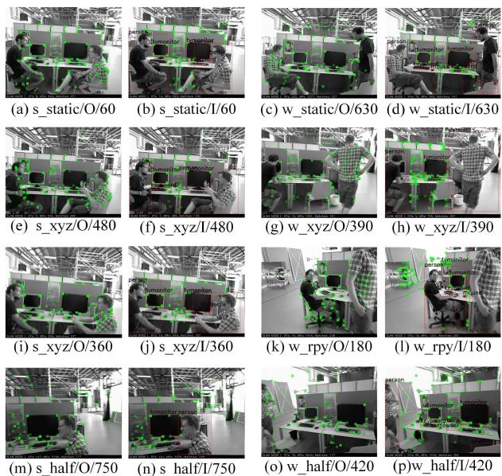  
Fig. 4. The effect of dynamic feature point filtering.

In low-dynamic sequences, certain regions of dynamic objects exhibit slow motion, which can be considered as low-speed motion within a small range. Fig. 4(b), (f), (j) and (n) illustrate the corresponding dynamic feature point filtering effects. In highdynamic sequences, compared to the original SLAM algorithm, the DFF-SLAM algorithm can effectively filter out dynamic feature points, as shown in Fig. 4(d), (g), (k) and (o). Specifically, Fig. 4(c) and (d) present the filtering results from the camera’s stationary viewpoint. In this case, most dynamic feature points are effectively filtered out, but a small portion of feature points is still retained. This is due to errors in pose matrix computation, causing some feature points not to be completely filtered out. On the other hand, Fig. 4(k) and (l) show the filtering results during camera rotation. It can be observed that even in the case of camera motion, the improved algorithm can still effectively filter out dynamic feature points. This result demonstrates the excellent performance of the proposed DFF-SLAM system.

## C. Performance Evaluation

We present the performance of DFF-SLAM system in Tables II, III and IV. The main evaluation metrics include REMSE, Mean, Median and STD. Additionally, we calculated the percentage improvement in performance of the DFF-SLAM compared to the original SLAM algorithm.

In terms of ATE, it can be seen that the improved system in this paper has achieved significant performance improvement, especially in high dynamic sequences, as shown in Table II. For example, in the high-dynamic sequence fr3\_walking\_xyz, the DFF-SLAM system reduces the RMSE and STD by 98.98% and 97.41%, respectively, compared to the original SLAM system. In contrast, the improvement of the DFF-SLAM system is relatively moderate in low-dynamic sequences. For example, the reductions in RMSE and STD are relatively small in the sequence fr3\_sitting\_xyz. This is because there are more static targets than dynamic ones in the low-dynamic sequences, and the number of dynamic feature points is limited. The original algorithm performs well with high accuracy, resulting in a smaller improvement for the DFF-SLAM system.

Tables III and IV present the results for RPE metric including translation and rotation of the DFF-SLAM system. Clearly, the DFF-SLAM achieves significant enhancement, especially in high-dynamic sequences. For instance, in the sequence fr3\_walking\_xyz in Table IV, the RSME and STD of the DFF-SLAM system decreased by 77.66% and 81.85%, respectively. Similarly, the performance improvement is relatively modest in low-dynamic sequences.

Fig. 5 depicts the plot of ATE metric in low-dynamic sequences, focusing on the sequences fr3\_sitting\_xyz and fr3\_sitting\_half. Similarly, due to the stable performance of the original SLAM system in low-dynamic sequences, both the original SLAM and DFF-SLAM closely align with the true trajectory, resulting in marginal improvement. In high-dynamic sequences, the adverse impact on the positioning accuracy of the original SLAM system is prominently observed, as shown in Fig. 6. Analysis reveals that high-dynamic sequences not only involve dynamic feature points but also encompass complex camera motions, including roll-pitch-yaw rotations, resulting in significant motion blur in the images. During feature point extraction, the original SLAM sustem tends to extract numerous low-quality feature points, leading to tracking failures. In contrast, the DFF-SLAM system exhibits significant improvement in terms of ATE, with a notable reduction in deviation from the actual trajectory, particularly in the sequences fr3\_walking\_xyz and fr3\_walking\_half.

TABLE III  
RESULTS OF THE RELATIVE TRANSLATION TRAJECTORY ERROR EXPERIMENT (UNIT: m)
<table><tr><td rowspan="2">Sequence</td><td colspan="4">Original_SLAM</td><td colspan="4">DFF-SLAM</td><td colspan="4">Improvements(%)</td></tr><tr><td>rmse</td><td>mean</td><td>median</td><td>std</td><td>rmse</td><td>mean</td><td>median</td><td>std</td><td>rmse</td><td>mean</td><td>median</td><td>std</td></tr><tr><td>s_xyz</td><td>0.0092</td><td>0.0074</td><td>0.0062</td><td>0.0054</td><td>0.0123</td><td>0.0103</td><td>0.0086</td><td>0.0068</td><td>25.20%</td><td>28.16%</td><td>27.91%</td><td>20.59%</td></tr><tr><td>s_half</td><td>0.0099</td><td>0.0082</td><td>0.0070</td><td>0.0055</td><td>0.0160</td><td>0.0132</td><td>0.0111</td><td>0.0089</td><td>38.13%</td><td>37.88%</td><td>36.94%</td><td>38.20%</td></tr><tr><td>w_static</td><td>0.0337</td><td>0.0173</td><td>0.0081</td><td>0.0289</td><td>0.0079</td><td>0.0064</td><td>0.0053</td><td>0.0046</td><td>76.56%</td><td>63.01%</td><td>34.57%</td><td>84.08%</td></tr><tr><td>w_xyz</td><td>0.0685</td><td>0.0472</td><td>0.0316</td><td>0.0496</td><td>0.0153</td><td>0.0124</td><td>0.0099</td><td>0.0090</td><td>77.66%</td><td>73.73%</td><td>68.67%</td><td>81.85%</td></tr><tr><td>w_rpy</td><td>0.0532</td><td>0.0382</td><td>0.0223</td><td>0.0370</td><td>0.0348</td><td>0.0257</td><td>0.0182</td><td>0.0235</td><td>34.59%</td><td>32.72%</td><td>18.39%</td><td>36.49%</td></tr><tr><td>w_half</td><td>0.0517</td><td>0.0335</td><td>0.0181</td><td>0.0394</td><td>0.0224</td><td>0.0164</td><td>0.0123</td><td>0.0152</td><td>56.67%</td><td>51.04%</td><td>32.04%</td><td>61.42%</td></tr></table>

TABLE IV

RESULTS OF THE RELATIVE ROTATION TRAJECTORY ERROR EXPERIMENT (UNIT: rad)
<table><tr><td rowspan="2">Sequence</td><td colspan="4">Original_SLAM</td><td colspan="5">DFF-SLAM</td><td colspan="4">Improvements(%)</td></tr><tr><td>rmse</td><td>mean</td><td>median</td><td>std</td><td>rmse</td><td>mean</td><td>median</td><td></td><td>std</td><td>rmse</td><td>mean</td><td>median</td><td>std</td></tr><tr><td>s_xyz</td><td>0.3577</td><td>0.2982</td><td>0.2557</td><td>0.1975</td><td>0.3797</td><td>0.3206</td><td>0.2797</td><td>0.2034</td><td>5.79%</td><td></td><td>6.99%</td><td>8.58%</td><td>2.90%</td></tr><tr><td>s_half</td><td>0.3892</td><td>0.3335</td><td>0.2871</td><td>0.2007</td><td></td><td>0.4814</td><td>0.4116</td><td>0.3514</td><td>0.2497</td><td>19.15%</td><td>18.97%</td><td>18.30%</td><td>19.62%</td></tr><tr><td>w_static</td><td>0.6280</td><td>0.3859</td><td>0.2445</td><td>0.4955</td><td>0.2277</td><td>0.1960</td><td>0.1738</td><td></td><td>0.1158</td><td>63.74%</td><td>49.21%</td><td>28.92%</td><td>76.63%</td></tr><tr><td>w_xyz</td><td>1.3405</td><td>0.9845</td><td>0.6931</td><td>0.9097</td><td>0.4690</td><td>0.3322</td><td>0.2731</td><td></td><td>0.3311</td><td>65.01%</td><td>66.26%</td><td>60.60%</td><td>63.60%</td></tr><tr><td>w_rpy</td><td>1.1155</td><td>0.8491</td><td>0.6003</td><td>0.7234</td><td>0.7589</td><td>0.5822</td><td>0.4487</td><td></td><td>0.4868</td><td>31.97%</td><td>31.43%</td><td>25.25%</td><td>32.71%</td></tr><tr><td>w_half</td><td>1.1458</td><td>0.8031</td><td>0.5322</td><td>0.8173</td><td>0.5356</td><td>0.4379</td><td></td><td>0.3685</td><td>0.3083</td><td>53.26%</td><td>45.47%</td><td>30.76%</td><td>62.28%</td></tr></table>

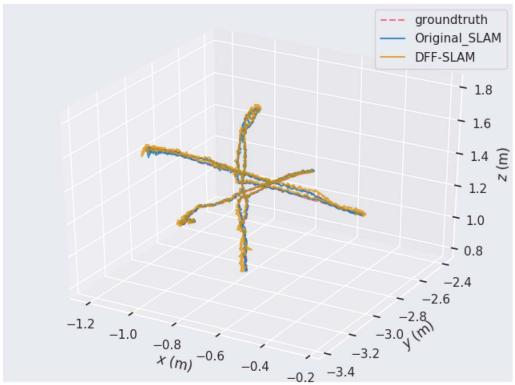  
(a) s\_xyz

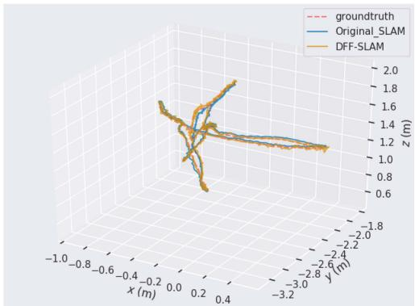  
(b) s\_halfsphere  
Fig. 5. Test results of low dynamic sequence ATE.

Then we present the RPE test results, as shown in Figs. 7 and 8. In high-dynamic sequences, it can be observed that the DFF-SLAM system exhibits better stability compared to the original SLAM system, with a smaller range of error fluctuations. However, the changes are not very significant in low-dynamic sequences. It is worth noting that when dynamic objects, such as persons, occupy the majority of the area in the image, especially when located on only one side of the image, errors in epipolar geometry constraint become more noticeable. The main reason is that this paper first filters out feature points on the priori dynamic targets and then uses the remaining feature points for matching and fundamental matrix calculation. In such situations, with a reduced number of feature points in the image, the calculation of the fundamental matrix relies on feature points in only a partial region, making it challenging to reflect the global information of the entire image, thereby increasing errors.

## D. Practical Testing on UAV Platform

In the above simulation experiments, we ran various datasets on the PC to validate the accuracy and robustness of the proposed DFF-SLAM system. However, it is important to note that the computer used has sufficient computing power, but the computing power of the onboard computer carried by the UAV is quite limited. And the DFF-SLAM system is designed to provide accurate positioning services for UAVs in complex flight environments. Therefore, we further validated the performance of this system on the UAV platform. Consequently, we transplanted the DFF-SLAM positioning system to the onboard computer to verify whether it meets the real-time requirements for UAV positioning. We also demonstrated the dynamic feature point filtering effects of the DFF-SLAM system during UAV flight.

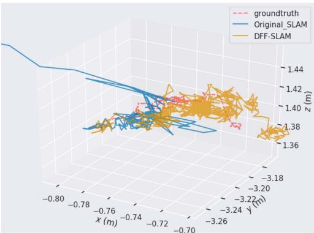

(a) w\_static  
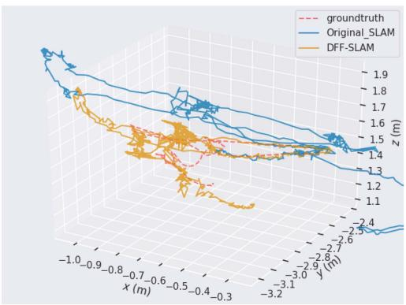  
(c) w\_rpy

Fig. 6. Test results of high dynamic sequence ATE.  
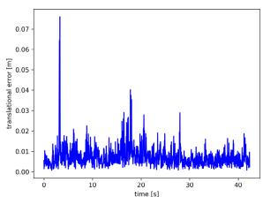  
(a) s xyz/Original-SLAM

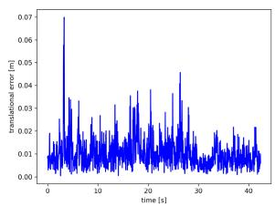  
(b) s\_xyz/DFF-SLAM

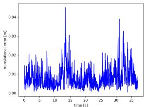  
(c) s half/Original-SLAM

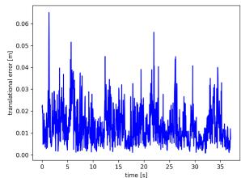  
(d) s\_half/DFF-SLAM  
Fig. 7. Test results of low dynamic sequence RPE.

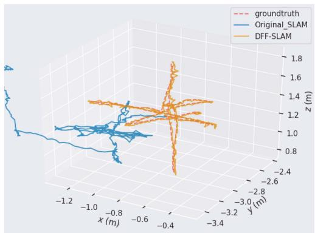

(b) w\_xyz  
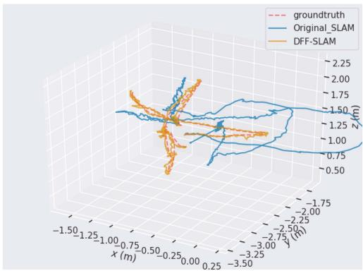  
(d) w\_halfsphere

TABLE V  
BASIC CONFIGURATIONS OF ONBOARD COMPUTER
<table><tr><td>Hardware</td><td>Specification</td><td>Max Frequency</td></tr><tr><td>CPU</td><td>6-core NVIDIA Carmel Arm v8.2</td><td>1.9 GHz</td></tr><tr><td>GPU</td><td>384-core NVIDIA Volta</td><td>1100 MHz</td></tr><tr><td>Memory</td><td>16GB 128-bit LPDDR4x 59.7GB/s</td><td></td></tr><tr><td>Storage</td><td>16GB eMMC</td><td></td></tr></table>

The UAV used in the practical testing was developed by AMOVLAB, with dimensions of 335 mm 335 mm 230 mm and a wheelbase of 410 mm. It is equipped with an Intel RealSense T265 stereo camera and an Intel RealSense D435i depth camera, with Pixhawk4 flight control system and the onboard computer is Jetson Xavier NX embedded artificial intelligence computing module developed by NVIDIA. This UAV can sustain flight for 13 minutes in indoor environments. For the Jetson Xavier NX, its specific performance configuration is outlined in Table V.

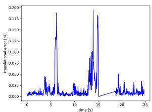  
(a) w static/Original-SLAM

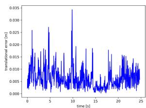  
(b) w static/DFF-SLAM

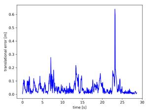  
(c) w\_xyz/Original-SLAM

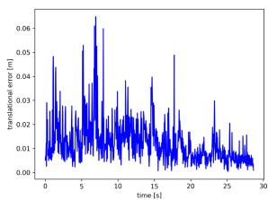

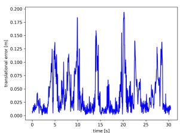  
(e) w\_rpy/Original-SLAM

(d) w\_xyz/DFF-SLAM  
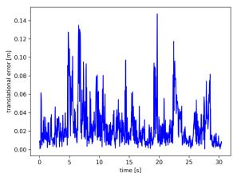  
(f) w\_rpy/DFF-SLAM

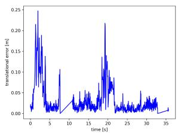  
(g) w\_half/O-SLAM

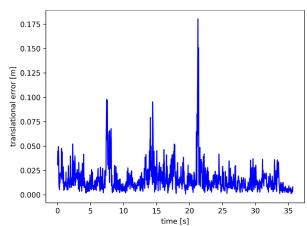  
(h) w\_half/DFF-SLAM

Fig. 8. Test results of high dynamic sequence RPE.  
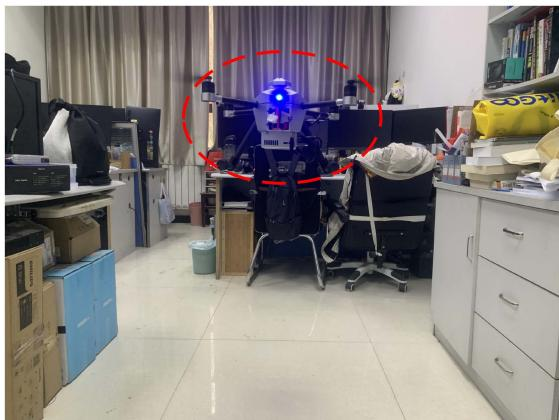  
Fig. 9. The validation scenario for dynamic feature filtering of the DFF-SLAM system, including stationary and moving experimental personnel.

Then we conducted validation experiments in our indoor dynamic environment, as shown in Fig. 9. In such scene, our primary focus was on persons, which are regarded as the priori dynamic targets. And the UAV moves at a speed of 0.5 m/s in a fixed space area.

TABLE VI  
THE USAGE OF HARDWARE DEVICES
<table><tr><td rowspan="2">Hardware</td><td colspan="2">Occupancy Rate(%)</td></tr><tr><td>Original_SLAM</td><td>DFF-SLAM</td></tr><tr><td>CPU Core 1</td><td>43.2%</td><td>55.6%</td></tr><tr><td>CPU Core 2</td><td>38.1%</td><td>56.6%</td></tr><tr><td>CPU Core 3</td><td>42.8%</td><td>54.1%</td></tr><tr><td>CPU Core 4</td><td>36.6%</td><td>78.0%</td></tr><tr><td>CPU Core 5</td><td>33.5%</td><td>60.2%</td></tr><tr><td>CPU Core 6</td><td>45.4%</td><td>72.4%</td></tr><tr><td>GPU</td><td>14%</td><td>21%</td></tr><tr><td>Memory</td><td>1.9GB</td><td>2.8GB</td></tr><tr><td>FPS</td><td>25</td><td>16</td></tr></table>

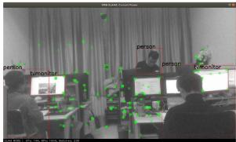

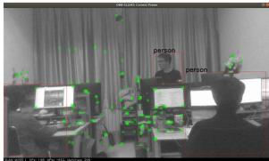

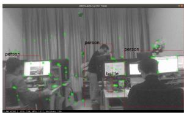

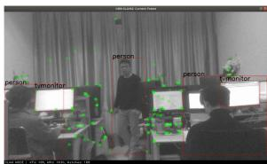

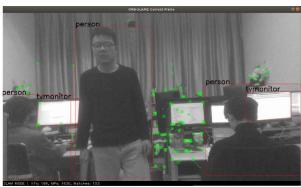

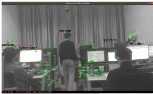

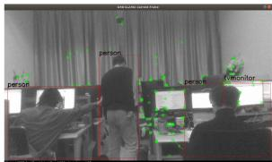

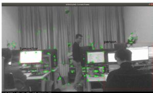  
Fig. 10. The filtering effect of dynamic feature points.

During the execution of the DFF-SLAM positioning system on the onboard computer, we monitored the real-time average usage of CPU, GPU and memory. Additionally, we calculated the time required for the DFF-SLAM system to process each image. The F P S metric represents the number of image frames the system can process per second. Ultimately, we comprehensively summarized the specific occupancy rate of computing resources, presenting the results in Table VI, and compared them with the utilization of the ORB-SLAM2 system. The Jetson Xavier NX onboard computer has 6 CPU cores, with an average utilization of 62.8% per core. The GPU utilization is 21% and the memory usage is 35%. Despite the DFF-SLAM system’s higher consumption of computational resources during runtime compared to the original SLAM system, it can process images at a rate of 16 frames per second, still meeting the real-time requirement for UAV positioning.

Finally, we demonstrated the dynamic feature filtering effects of DFF-SLAM system, as shown in Fig. 10. In the experimental scenario, one test participant walked to represent large-scale motion, while the other two remained seated, with localized body movements, to represent small-scale motion. The DFF-SLAM system could identify almost all prior dynamic targets and filter out feature points falling within these areas. Although some images still contained unrecognized prior dynamic targets, this does not seem to impact the filtering effect of feature points on the unrecognized dynamic targets. This is attributed to our approach, which relies not only on semantic information for dynamic feature filtering but also applies the epipolar geometry constraint method to determine the motion status of the remaining feature points, ensuring that feature points located on unrecognized prior dynamic targets are not retained.

## VII. CONCLUSION

In this paper, we study a UAV positioning problem in complex environments, where GPS signals are suppressed and there are many dynamic targets. To enhance the positioning accuracy of the UAV when applys V-SLAM technology in IoT-enabled complex environments, a DFF-SLAM system is proposed to eliminate the effects of dynamic targets in the scene. This system combines object detection technology, optical flow tracking method and epipolar geometry constraint method, which effectively filter out dynamic feature points in the scene, and further improves the accuracy and robustness of SLAM system. Simulation results demonstrate that our proposed DFF-SLAM system is excellent in terms of several performance metrics.

The DFF-SLAM system aims to filter out dynamic features in the scene to improve the positioning accuracy of UAVs. Its main challenges remain susceptibility to ambient lighting conditions and reliance on the computational resources of hardware devices. To address the above problem, future work will provide more accurate and robust positioning services for UAVs by model optimization and fusing positioning information of DFF-SLAM system with other sensor information.

## REFERENCES

[1] Y. Li et al., “Data collection maximization in IoT-Sensor networks via an energy-constrained UAV,” IEEE Trans. Mobile Comput., vol. 22, no. 1, pp. 159–174, Jan. 2023.

[2] Q. Guo et al., “Minimizing the longest tour time among a fleet of UAVs for disaster area surveillance,” IEEE Trans. Mobile Comput., vol. 21, no. 7, pp. 2451–2465, Jul. 2022.

[3] N. Ye, J. P. Walker, Y. Gao, I. PopStefanija, and J. Hills, “Comparison between thermal-optical and L-band passive microwave soil moisture remote sensing at farm scales: Towards UAV-Based near-surface soil moisture mapping,” IEEE J. Sel. Topics Appl. Earth Observ. Remote Sens., vol. 17, pp. 633–642, 2024.

[4] M. Alhafnawi et al., “A survey of indoor and outdoor UAV-Based target tracking systems: Current status, challenges, technologies, and future directions,” IEEE Access, vol. 11, pp. 68324–68339, 2023.

[5] X. Kong, C. Wu, Y. You, and Y. Yuan, “Hybrid indoor positioning method of BLE and PDR based on adaptive feedback EKF with low BLE deployment density,” IEEE Trans. Instrum. Meas., vol. 72, pp. 1–12, 2023.

[6] C. Huang, Z. Tian, W. He, K. Liu, and Z. Li, “Spotlight: A 3-D indoor localization system in wireless sensor networks based on orientation and RSSI measurements,” IEEE Sensors J., vol. 23, no. 21, pp. 26662–26676, Nov. 2023.

[7] G. Ariante, S. Ponte, and G. Del Core, “Bluetooth low energy based technology for small UAS indoor positioning,” in Proc. IEEE 9th Int. Workshop Metrol. AeroSpace, Pisa, Italy, Jun. 2022, pp. 113–118.

[8] Y. Yu et al., “A novel 3-D indoor localization algorithm based on BLE and multiple sensors,” IEEE Internet Things J., vol. 8, no. 11, pp. 9359–9372, Jun. 2021.

[9] K. Urano, K. Hiroi, T. Yonezawa, and N. Kawaguchi, “Basic study of BLE indoor localization using LSTM-based neural network,” in Proc. 17th Annu. Int. Conf. Mobile Syst., Appl., Serv., Jun. 2019, pp. 558–559.

[10] S. A. Rahimi Azghadi, A. N. Mih, A. Kawnine, M. Wachowicz, F. Palma, and H. Cao, “An adaptive indoor localization approach using WiFi RSSI fingerprinting with SLAM-Enabled robotic platform and deep neural networks,” in Proc. 34th Int. Conf. Collaborative Adv. Softw. Comput., Toronto, ON, Canada, Nov. 2024, pp. 1–10.

[11] C. H. Wu, S. H. Tu, S. W. Tu, L. H. Wang, and W. H. Chen, “Realization of remote monitoring and navigation system for multiple UAV swarm missions: Using 4 G/WiFi-Mesh communications and RTK GPS positioning technology,” in Proc. Int. Autom. Control Conf., Kaohsiung, Taiwan, Dec. 2022, pp. 1–6.

[12] S. El-Hennawey and M. S. El-Gendy, “New approach for indoor positioning with Wi-Fi using quadratic antenna arrays,” IEEE Commun. Lett., vol. 25, no. 3, pp. 845–849, Mar. 2021.

[13] B. Wei, M. Gao, F. Li, C. Luo, S. Wang, and J. Zhang, “rWiFiSLAM: Effective WiFi ranging based SLAM system in ambient environments,” IEEE Robot. Automat. Lett., vol. 9, no. 6, pp. 5362–5369, Jun. 2024.

[14] K. Ismail, R. Liu, A. Athukorala, B. K. K. Ng, C. Yuen, and U.-X. Tan, “WiFi similarity-based odometry,” IEEE Trans. Automat. Sci. Eng., vol. 21, no. 3, pp. 3092–3102, Jul. 2024.

[15] S. Bottigliero, D. Milanesio, M. Saccani, and R. Maggiora, “A low-cost indoor real-time locating system based on TDOA estimation of UWB pulse sequences,” IEEE Trans. Instrum. Meas., vol. 70, pp. 1–11, 2021.

[16] C. Premachandra, A. Athukorala, and U.-X. Tan, “All-UWB SLAM using UWB radar and UWB AOA,” IEEE Robot. Automat. Lett., vol. 10, no. 8, pp. 8171–8178, Aug. 2025.

[17] C. Hamesse, R. Vleugels, M. Vlaminck, H. Luong, and R. Haelterman, “Fast and cost-effective UWB anchor position calibration using a portable SLAM system,” IEEE Sensors J., vol. 24, no. 16, pp. 26496–26505, Aug. 2024.

[18] T. H. Nguyen, T.-M. Nguyen, and L. Xie, “Range-focused fusion of Camera-IMU-UWB for accurate and drift-reduced localization,” IEEE Robot. Automat. Lett., vol. 6, no. 2, pp. 1678–1685, Apr. 2021.

[19] R. Liu et al., “Cooperative positioning for emergency responders using self IMU and peer-to-peer radios measurements,” Inf. Fusion, vol. 56, pp. 93–102, Oct. 2019.

[20] Y. Xu, Y. S. Shmaliy, T. Shen, D. Chen, M. Sun, and Y. Zhuang, “INS/UWB-Based quadrotor localization under colored measurement noise,” IEEE Sensors J., vol. 21, no. 5, pp. 6384–6392, Mar. 2021.

[21] H. Cao, J. Xu, D. Li, L. Shangguan, Y. Liu, and Z. Yang, “Edge assisted mobile semantic visual SLAM,” IEEE Trans. Mobile Comput., vol. 22, no. 12, pp. 6985–6999, Dec. 2023.

[22] V. Walter, N. Staub, A. Franchi, and M. Saska, “UVDAR system for visual relative localization with application to leader-follower formations of multirotor UAVs,” IEEE Robot. Automat. Lett., vol. 4, no. 3, pp. 2637–2644, Jul. 2019.

[23] R. W. Himawan, P. B. A. Baylon, J. Sembiring, and Y. I. Jenie, “Development of an indoor visual-based monocular positioning system for multirotor UAV,” in Proc. IEEE Int. Conf. Aerosp. Electron. Remote Sens. Technol., Bali, Indonesia, Oct. 2023, pp. 1–7.

[24] Z. Wang, S. Liu, G. Chen, and W. Dong, “Robust visual positioning of the UAV for the under bridge inspection with a ground guided vehicle,” IEEE Trans. Instrum. Meas., vol. 71, 2022, Art. no. 5000610.

[25] H. Stuckey, A. Al-Radaideh, L. Sun, and W. Tang, “A spatial localization and attitude estimation system for unmanned aerial vehicles using a single dynamic vision sensor,” IEEE Sensors J., vol. 22, no. 15, pp. 15497–15507, Aug. 2022.

[26] X. Oh, R. Lim, L. Loh, C. H. Tan, S. Foong, and U.-X. Tan, “Monocular UAV localisation with deep learning and uncertainty propagation,” IEEE Robot. Automat. Lett., vol. 7, no. 3, pp. 7998–8005, Jul. 2022.

[27] R. Liu et al., “Collaborative SLAM based on WiFi fingerprint similarity and motion information,” IEEE Internet Things J., vol. 7, no. 3, pp. 1826–1840, Mar. 2020.

[28] S. Guo, Z. Rong, S. Wang, and Y. Wu, “A LiDAR SLAM with PCA-Based feature extraction and two-stage matching,” IEEE Trans. Instrum. Meas., vol. 71, 2022, Art. no. 8501711.

[29] J. Qian, K. Chen, Q. Chen, Y. Yang, J. Zhang, and S. Chen, “Robust visual-LiDAR simultaneous localization and mapping system for UAV,” IEEE Geosci. Remote Sens. Lett., vol. 19, 2022, Art. no. 8501711.

[30] L. Liang, H. Rao, G. Shen, C. Wang, and X. Wu, “A real-time framework for UAV indoor self-positioning and 3D mapping base on 2D LiDAR, stereo camera and IMU,” in Proc. IEEE Int. Conf. Real-time Comput. Robot., Datong, China, Jul. 2023, pp. 280–285.

[31] X. Liu, Y. Zhang, G. Lu, S. Li, and J. Liu, “DGO-VINS: A visualinertial SLAM for dynamic environments with geometric constraint and adaptive state optimization,” IEEE Robot. Automat. Lett., vol. 10, no. 8, pp. 8091–8098, Aug. 2025.

[32] S. Cheng, C. Sun, S. Zhang, and D. Zhang, “SG-SLAM: A realtime RGB-D visual SLAM toward dynamic scenes with semantic and geometric information,” IEEE Trans. Instrum. Meas., vol. 72, pp. 1–12, 2023.

[33] B. Song, X. Yuan, Z. Ying, B. Yang, Y. Song, and F. Zhou, “DGM-VINS: Visual-inertial SLAM for complex dynamic environments with joint geometry feature extraction and multiple object tracking,” IEEE Trans. Instrum. Meas., vol. 72, pp. 1–11, 2023.

[34] W. Dai, Y. Zhang, P. Li, Z. Fang, and S. Scherer, “RGB-D SLAM in dynamic environments using point correlations,” IEEE Trans. Pattern Anal. Mach. Intell., vol. 44, no. 1, pp. 373–389, Jan. 2022.

[35] Z. Zheng, S. Lin, and C. Yang, “RLD-SLAM: A robust lightweight VI-SLAM for dynamic environments leveraging semantics and motion information,” IEEE Trans. Ind. Electron., vol. 71, no. 11, pp. 14328–14338, Nov. 2024.

[36] Y. Gao, “Research on robot autonomous inspection visual perception system based on improved YOLO V11 and SLAM,” in Proc. 8th Int. Conf. Adv. Algorithms Control Eng., Shanghai, China, Mar., 2025, pp. 607–611.

[37] Y. Zhong, S. Hu, G. Huang, L. Bai, and Q. Li, “WF-SLAM: A robust VSLAM for dynamic scenarios via weighted features,” IEEE Sensors J., vol. 22, no. 11, pp. 10818–10827, Jun. 2022.

[38] J. Liu, X. Li, Y. Liu, and H. Chen, “RGB-D inertial odometry for a resourcerestricted robot in dynamic environments,” IEEE Robot. Automat. Lett., vol. 7, no. 4, pp. 9573–9580, Oct. 2022.

[39] M. Deng, J. Hu, J. Wen, X. Zhang, and Q. Jin, “Object detection-based visual SLAM optimization method for dynamic scene,” IEEE Sensors J., vol. 25, no. 9, pp. 16480–16488, May 2025.

[40] X. Long, W. Zhang, and B. Zhao, “PSPNet-SLAM: A semantic SLAM detect dynamic object by pyramid scene parsing network,” IEEE Access, vol. 8, pp. 214685–214695, 2020.

[41] C. Gong, Y. Sun, C. Zou, D. Jiang, L. Huang, and B. Tao, “SFD-SLAM: A novel dynamic RGB-D SLAM based on saliency region detection,” Meas. Sci. Technol., vol. 35, no. 10, Oct. 2024, Art. no. 106304.

[42] L. Zhou, B. Xu, M. Lu, X. Zhou, and J. Cong, “Real-time RGB-D SLAM system with semantic and depth information fusion in dynamic environment,” in Proc. 12th Int. Conf. Control, Automat. Inf. Sci., Hanoi, Vietnam, 2023, pp. 292–297.

[43] Q. Ji, Z. Zhang, Y. Chen, and E. Zheng, “DRV-SLAM: An adaptive real-time semantic visual SLAM based on instance segmentation toward dynamic environments,” IEEE Access, vol. 12, pp. 43827–43837, 2024.

[44] R. Mur-Artal and J. D. Tardos, “ORB-SLAM2: An open-source SLAM system for monocular, stereo, and RGB-D cameras,” IEEE Trans. Robot., vol. 33, no. 5, pp. 1255–1262, Oct. 2017.

[45] C. Campos, R. Elvira, J. J. G. Rodríguez, J. M. M. Montiel, and J. D. Tardós, “ORB-SLAM3: An accurate open-source library for visual, visual-inertial, and multimap SLAM,” IEEE Trans. Robot., vol. 37, no. 6, pp. 1874–1890, Dec. 2021.

[46] C. F. Gauss, Theoria Motus Corporum Coelestium. Germany: Dieterich, Göttingen, 1809.

[47] J. Y. Bouguet, “Pyramidal implementation of the affine Lucas Kanade feature tracker description of the algorithm,” Intel Corporation, vol. 5, no. 1-10, pp. 1–4, 2001.

[48] M. A. Fischler and R. C. Bolles, “Random sample consensus: A paradigm for model fitting with applications to image analysis and automated cartography,” Commun. ACM, vol. 24, no. 6, pp. 381–395, Jun. 1981.

[49] J. Sturm, N. Engelhard, F. Endres, W. Burgard, and D. Cremers, “A benchmark for the evaluation of RGB-D SLAM systems,” in Proc. IEEE/RSJ Int. Conf. Intell. Robots Syst., Vilamoura-Algarve, Portugal, Oct. 2012, pp. 573–580.

Jinglei Li received the BS degree in electronic information engineering from The Information Engineering University, in 2008, and the MS and PhD degrees in communication and information systems from Xidian University, Xidian University, in 2011 and 2016, respectively. He is currently with Xidian University. His research interests include wireless network connectivity and node-selfishness management.

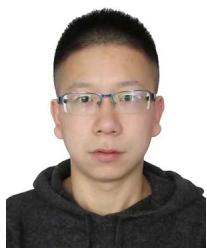

Yiming Jia received the BS degree from the Inner Mongolia University, Inner Mongolia Autonomous Region, China, in 2021. He is currently working toward the MS degree with the School of Telecommunication Engineering, Xidian University, Xi’an, China. His research focuses on vision-based indoor UAV positioning.

Meng Qin (Member, IEEE) received the BS degree in communication engineering from the Taiyuan University of Technology, China, in 2012, and the MS and PhD degrees in information and communication systems from Xidian University, Xi’an, China, in 2015 and 2018, respectively. He is currently a postdoctoral fellow with the Peng Cheng Laboratory, Shenzhen, China. His research interests include AI-aided self-organized wireless networks, edge intelligence in wireless networks, and green cloud storage.

Qinghai Yang (Member, IEEE) received the BS degree in communication engineering from the Shandong University of Technology, Zibo, China, in 1998, the MS degree in information and communication systems from Xidian University, Xi’an, China, in 2001, and the PhD degree in communication engineering from Inha University, South Korea, in 2007, with the University-President Award. From 2007 to 2008, he was a research fellow with UWB-ITRC, South Korea. Since 2008, he has been with Xidian University. His research interests include autonomic communication, LTE-A techniques, and mobile edge computing.

Tony Q. S. Quek (Fellow, IEEE) received the BE and ME degrees in electrical and electronics engineering from the Tokyo Institute of Technology, Tokyo, Japan, in 1998 and 2000, respectively, and the PhD degree in electrical engineering and computer science from the Massachusetts Institute of Technology, Cambridge, MA, USA, in 2008. He is currently the Cheng Tsang Man chair professor with the Singapore University of Technology and Design (SUTD), Singapore, and ST Engineering distinguished professor. He is also the director with Future Communications R&D Pro-

gramme, head with ISTD Pillar, and deputy director with SUTD-ZJU IDEA. His research interests include wireless communications and networking, network intelligence, non-terrestrial networks, open radio access network, and 6G. Dr. Quek has been actively involved in organizing and chairing sessions, and was a member of the Technical Program Committee as well as symposium chairs in a number of international conferences. He is an area editor for the IEEE Transactions on Wireless Communications. Dr. Quek was the recipient of the 2008 Philip Yeo Prize for Outstanding Achievement in Research, 2012 IEEE William R. Bennett Prize, 2015 SUTD Outstanding Education Awards-Excellence in Research, 2016 IEEE Signal Processing Society Young Author Best Paper Award, 2017 CTTC Early Achievement Award, 2017 IEEE ComSoc AP Outstanding Paper Award, 2020 IEEE Communications Society Young Author Best Paper Award, 2020 IEEE Stephen O. Rice Prize, 2020 Nokia Visiting Professor, and 2022 IEEE Signal Processing Society Best Paper Award. He is an IEEE Fellow, a WWRF Fellow, and a fellow of the Academy of Engineering Singapore.

Wen Gao received the B.S. degree in electronic information engineering from the Henan University of Technology, Zhengzhou, China, in 2011, and the PhD degree in cryptography from Xidian University, Xi’an, China, in 2017. She is currently a lecturer with the School of Cyberspace Security, Xi’an University of Posts and Telecommunications, Xi’an. Her research interest includes quantum computation and lattice-based cryptography.

Kyung Sup Kwak (Life Senior Member, IEEE) received the PhD degree from the University of California San Diego, San Diego, CA, USA. He was with Hughes Network Systems, Germantown, MD, USA, and the IBM Network Analysis Center, Armonk, NY, USA. Since then, he has been with the School of Information and Communication Engineering, Inha University, Incheon, South Korea, as a professor, and was the dean with the Graduate School of Information Technology and Telecommunications, and has been the director with UWB Wireless Communications

Research Center, IT Research Center, Incheon, South Korea, since 2003. In 2006 and 2009, he was the president with the Korean Institute of Communication Sciences (KICS), Seoul, South Korea, and the Korea Institute of Intelligent Transport Systems, Seoul, South Korea. He has authored or coauthored more than 200 peer-reviewed journal papers. His research interests include multiple access communication systems, mobile and UWB radio systems, the future IoT, and wireless body area network, which include nano networks and molecular communications. He was the TPC and the Track chair or Organizing chair for several IEEE related conferences. In 1993, he was the recipient of the Engineering College Achievement Award from Inha University, a Service Award from the Institute of Electronics Engineers of Korea, Distinguished Service Awards from the KICS in 1996 and 1999, LG Paper Award in 1998, Motorola Paper Award in 2000, official commendations for UWB Radio Technology Research and Development from the Ministry of Information and Communication, Prime Minister, and President of Korea, in 2005, 2006, and 2009, respectively, Haedong Paper Award in 2007, and Haedong Scientific Award of Research Achievement in 2009. In 2008, he was elected for Inha Fellow professor and is also an Inha Hanlim Fellow professor. He is a member of the IEICE, KICS, and KIEE.