# DNN Partitioning, Task Offloading, and Resource Allocation in Dynamic Vehicular Networks: A Lyapunov-Guided Diffusion-Based Reinforcement Learning Approach

Zhang Liu , Graduate Student Member, IEEE, Hongyang Du , Graduate Student Member, IEEE, Junzhe Lin, Student Member, IEEE, Zhibin Gao , Member, IEEE, Lianfen Huang , Member, IEEE, Seyyedali Hosseinalipour , Member, IEEE, and Dusit Niyato , Fellow, IEEE

Abstract—The rapid advancement of Artificial Intelligence (AI) has introduced Deep Neural Network (DNN)-based tasks to the ecosystem of vehicular networks. These tasks are often computation-intensive, requiring substantial computation resources, which are beyond the capability of a single vehicle. To address this challenge, Vehicular Edge Computing (VEC) has emerged as a solution, offering computing services for DNN-based tasks through resource pooling via Vehicle-to-Vehicle/Infrastructure (V2V/V2I) communications. In this paper, we formulate the problem of joint DNN partitioning, task offloading, and resource allocation in VEC as a dynamic long-term optimization. Our objective is to minimize the DNN-based task completion time while guaranteeing the system stability over time. To this end, we first leverage a Lyapunov optimization technique to decouple the original long-term optimization with stability constraints into a per-slot deterministic problem. Afterwards, we propose a Multi-Agent Diffusion-based Deep Reinforcement Learning

Received 23 May 2024; revised 2 October 2024; accepted 23 October 2024. Date of publication 28 October 2024; date of current version 5 February 2025. The work was supported in part by the National Natural Science Foundation of China under Grant 61971365, Grant 62371406, and Grant 62171392, in part by the Natural Science Foundation of Fujian Province of China under Grant 2021J01004, in part by the China Scholarship Council program under Grant 202206310094, in part by the National Research Foundation, Singapore, and in part by Infocomm Media Development Authority under its Future Communications Research & Development Programme, Defence Science Organisation (DSO) National Laboratories under the AI Singapore Programme under Grant FCP-NTU-RG-2022-010 and Grant FCP-ASTAR-TG-2022-003, in part by Singapore Ministry of Education (MOE) Tier 1 under Grant RG87/22, and in part by the NTU Centre for Computational Technologies in Finance (NTU-CCTF). Recommended for acceptance by L. Duan. (Corresponding author: Zhibin Gao.)

Zhang Liu, Junzhe Lin, and Lianfen Huang are with the Department of Informatics and Communication Engineering, Xiamen University, Fujian 361102, China (e-mail: zhangliu@stu.xmu.edu.cn; linjunzhe@stu.xmu.edu.cn; lfhuang@xmu.edu.cn).

Hongyang Du is with the Department of Electrical and Electronic Engineering, University of Hong Kong, Hong Kong (e-mail: duhy@eee.hku.hk).

Zhibin Gao is with Navigation Institute, Jimei University, Xiamen 361021, China (e-mail: gaozhibin@jmu.edu.cn).

Seyyedali Hosseinalipour is with the Department of Electrical Engineering, University at Buffalo-SUNY, Buffalo, NY 14260 USA (e-mail: alipour@buffalo.edu).

Dusit Niyato is with the College of Computing and Data Science, Nanyang Technological University, Singapore 639798 (e-mail: dniyato@ntu.edu.sg).

This article has supplementary downloadable material available at https://doi.org/10.1109/TMC.2024.3486728, provided by the authors.

Digital Object Identifier 10.1109/TMC.2024.3486728

(MAD2RL) algorithm, incorporating the innovative use of diffusion models to determine the optimal DNN partitioning and task offloading decisions. Furthermore, we integrate convex optimization techniques into MAD2RL as a subroutine to allocate computation resources, enhancing the learning efficiency. Through simulations under real-world movement traces of vehicles, we demonstrate the superior performance of our proposed algorithm compared to existing benchmark solutions.

Index Terms—DNN partitioning, deep reinforcement learning, diffusion model, Lyapunov optimization, resource allocation, task offloading, vehicular networks.

# I. INTRODUCTION

# A. Background Research

D RIVEN by recent breakthroughs in Artificial Intelligence(AI), Deep Neural Networks (DNNs) are now integrated into the ecosystem of vehicular networks, enabling a wide range of driving assistance applications. The DNN-based tasks, such as autonomous driving, simultaneous localization and mapping, and augmented reality navigation [1], [2], [3], [4] hold immense potential to enhance the drivers’ and passengers’ safety and comfort. Taking autonomous driving as an example, vast quantities of data collected through smart cars’ on-board camera and sensors are fed into pre-trained DNN models, such as VGG16 [5]. Subsequently, the VGG16 model processes this data to perform DNN inference, which for example leads to the recognition of traffic signs.

However, the limited computation capability of a single vehicle hinders the smooth processing of these DNN-based tasks [6]. For instance, image classification using ResNET152 [7] necessitates approximately 22.6 billion and 33 trillion computation operations to process a single 224 × 224 image and videos with 30 fps, respectively [8]. In practice, smart vehicles like Tesla Model X are equipped with 8 cameras and 12 ultrasonic radars, continuously collecting large volumes data to update their understanding of their surroundings and ensure safe driving, which calls for extensive computation demands. Given these considerations, providing low-latency computing services through effective task offloading polices for DNN-based tasks in vehicular networks is of paramount importance.

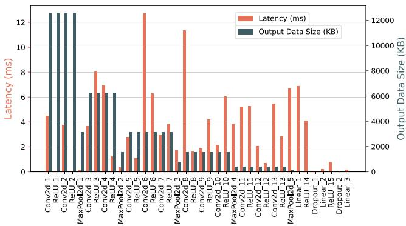  
Fig. 1. VGG16 layer-wise runtime and output data size.

To this end, cloud computing offers a viable solution for handling computation-intensive tasks through offloading them from the edge of the network to cloud servers for processing. However, continuous data transfer from vehicles to cloud servers can impose a prohibitive traffic congestion on backhaul links, leading to a high communication latency [9], [10]. As an alternative, Vehicular Edge Computing (VEC) [11], [12], [13] brings cloud computing capabilities closer to the edge of vehicular networks, facilitating real-time and low-latency processing of tasks. Specifically, VEC utilizes the computation resources of both moving vehicles and RoadSide Units (RSUs) equipped with edge servers, offering a scalable and flexible computing framework. Exploiting this technology, in this paper, we partition the computations of DNN-based tasks into two parts with one processed locally and the other offloaded to nearby edge nodes (i.e., other vehicles or the RSU), aiming to accelerate the inference process.

# B. Motivation and Main Challenges

Although VEC is a promising solution to process DNNbased tasks, there still remains noteworthy issues that need to be addressed. First, there exist non-uniformities in processing pipeline of DNN-based tasks. To demonstrate this, we conducted a pilot study on the layer-wise execution latency and the size of intermediate output data per layer for VGG16 [5] on the NVIDIA Jetson Xavier platform using JetPack 5.0.2 with CUDA 11.4 and PyTorch 1.13.0, utilizing GT-SRB dataset [14]. The results are illustrated in Fig. 1. By inspecting the results, a considerable heterogeneity in latency and output data size across different layers of VGG16 can be observed. This result further unveils the importance of choosing the optimal partitioning point for a DNN-based task, showcasing that arbitrary partitioning can fail to offload the computation-intensive part to edge nodes at a low transmission cost.

Second, when the computation of a DNN-based task is partitioned into two parts, with the intermediate data being offloaded to other edge nodes, the inherent mobility of vehicles introduces uncertainties into the offloading process due to the varying channel conditions. This in turn calls for the real-time decision making regarding the offloading/dispersion of the intermediate data across the edge nodes. However, existing approaches for offloading computation-intensive tasks, including heuristicbased [15], [16] and decomposition-oriented [17], [18] search algorithms, often require extensive iterations to converge to a relatively good/stable solution. This makes them less practical for implementation over dynamic vehicular networks.

The third challenge lies in ensuring the stability of the system1 during the execution of DNN-based tasks. In particular, the majority of existing research on task offloading primarily aims at enhancing performance indicators, including task execution delay and energy consumption, as highlighted in [9], [15], [16], [17]. However, such studies often neglect the critical need for ensuring reliable system operations. This common oversight potentially jeopardizes the operational stability of the system. As a result, the complex dynamics involved in handling of DNN-based tasks in VEC, including the decisions on DNN partitioning, task offloading, and resource allocation across consecutive time slots are non-trivial to address, which is the main motivation behind this work.

# C. Summary of Contributions

In this paper, we propose a novel VEC-assisted DNN-based task execution framework, where vehicles strategically partition and offload their tasks to other edge nodes through V2V and V2I links. We formulate the problem of joint DNN partitioning, task offloading, and resource allocation as a dynamic long-term optimization with the objective of minimizing the DNN-based task completion time while guaranteeing the system stability over time. Our main contributions are outlined as follows:

We formulate the long-term optimization problem of joint DNN partitioning, task offloading, and resource allocation in vehicular networks as a Mixed Integer NonLinear Program (MINLP). We discuss that the formulated MINLP is an NP-hard problem, and thus non-trivial to solve especially over large-scale dynamic vehicular networks.   
- To address this challenge, we first exploit a Lyapunov optimization technique. This strategy effectively decouples the long-term task completion time minimization with stability constraints into a per-slot deterministic problem. Following this transformation, we propose a Multi-Agent Diffusionbased Deep Reinforcement Learning (MAD2RL) algorithm to handle these per-slot problems. More importantly, our work is the first to integrate a diffusion model into the multi-agent reinforcement learning framework.   
The MAD2RL algorithm incorporates the innovative use of a diffusion model – initially invented for image generation – to determine the optimal DNN partitioning and task offloading decisions. Specifically, the diffusion model operates by progressively reducing noise through a series of denoising steps, effectively extracting the optimal decisions from an initial state of Gaussian noise. Also, we integrate MAD2RL with convex optimization techniques for the allocation of computing resources, aiming to boost the convergence of its learning process.   
- We validate the effectiveness of our proposed algorithm through simulations on a real-world vehicular network

obtained from OpenStreetMap [21], utilizing the Simulation of Urban MObility (SUMO) [22] for integrating moving vehicles. We further conduct comparative analysis across real-world DNN models under different simulation settings, showcasing the superior performance of our approach.

# D. Paper Organization

The remainder of this paper is structured as follows: Section II elaborates on the related works. Section III details the system model. In Section IV, we formulate the problem of DNN partitioning, task offloading, and resource allocation in vehicular networks. Section II-C proposes Lyapunov optimization to handle the original problem. In Section VI-B, we introduce the motivation of adopting the diffusion model. Our proposed MAD2RL algorithm is presented in Section VII. Simulation results are detailed in Section VIII, followed by concluding the paper in Section IX.

# II. RELATED WORKS

Henceforth, we summarize contributions of the related works and discuss the distinctions between our methodology and prior research.

# A. DNN Inference and Edge Computing

Researchers in [23] introduced an device-edge-cloud orchestration architecture, optimizing the assignment of inference tasks and deployment of DNN models for maximizing the DNN task inference accuracy. Researchers in [24] investigated collaborative DNN inference within industrial networks, addressing the sampling rate adaptation for sensing data, inference task offloading, and the allocation of edge computing resources. Researchers in [25] focused on a joint strategy for task partitioning and offloading for DNN-based tasks in mobile edge computing networks to minimize the computation cost incurred on the devices.

Despite their notable contributions, these studies overlook the unique characteristics of VEC systems, such as the mobility of vehicles and varying channel conditions. Besides, the aforementioned works neglect the use of computation resources of nearby vehicles through V2V links, rendering their approaches less applicable to the VEC paradigm.

# B. DRL for Resource Management

In response to addressing the complexities of dynamic computing environments, recent studies have explored learningbased approaches for a variety of networking problems, with Deep Reinforcement Learning (DRL) being a notable example [26], [27], [28]. Generally speaking, DRL employs DNNs to learn the relationship between state space of the problems (e.g., channel conditions and computational resource availability) and their action space (e.g., task offloading decisions) without requiring prior knowledge about the environment characteristics (e.g., vehicle mobility patterns). Researchers in [12] proposed a double deep Q-learning DRL algorithm to motivate vehicles to share their computing resources while guaranteeing the reliability of resource allocation in VEC. Researchers in [27] utilized a multi-agent soft actor-critic DRL approach with an attention mechanism to learn the strategic trading for each vehicle in a vehicular fog computing system. Researchers in [28] employed a joint offloading and resource allocation algorithm based on the Multi-Agent Deep Deterministic Policy Gradient (MAD-DPG) DRL algorithm to decrease the vehicle’s energy cost for executing tasks while increasing the revenue of the vehicle for processing tasks in a VEC network.

It is worth mentioning that the primary focus of DRL-based methodologies in aforementioned works is on enhancing the computation performance, failing to guarantee the system stability over time, which is vital in real-world networks. Moreover, the aforementioned studies overlook the importance of scheduling DNN-based tasks, which has been heightened by recent breakthroughs in AI, further motivating this work.

# C. Lyapunov Optimization for System Stability

Lyapunov optimization has been recognized as a promising approach for offering the dual benefits of maximizing the system utility while ensuring the stability of system operations. Researchers in [19] introduced a Lyapunov-based DDPG method for the joint optimization of computation task distribution and radio resource allocation within vehicular networks. Researchers in [20] developed a Lyapunov-guided DRL-based algorithm for making task offloading and system resource allocation decisions in a dynamic edge computing environment. Researchers in [29] employed a Lyapunov-guided DRL resource management strategy to reduce the average power consumption across the system. Researchers in [30] leveraged Lyapunov optimization in conjunction with a deep Q-network to select optimal task offloading actions that ensure long-term task queue stability.

However, the aforementioned works merely focus on bitstream computation tasks, overlooking the intricacies involved in DNN partitioning. In this work, we unveil an end-to-end framework, entailing the combination of Lyapunov optimization, diffusion models, and DRL techniques for efficient execution of DNN-based tasks in dynamic VEC environments.

# D. Footprints of Diffusion Models in Optimization

Recently, diffusion models [31] have emerged as powerful deep generative tools in machine learning, gaining prominence especially in image and video generation fields. These models often operate through incrementally introducing noise to an original image until it becomes indistinguishable from Gaussian noise (the forward process). Subsequently, they learn to invert this diffusion process, restoring the original image (the reverse process). The groundbreaking innovation of applying diffusion models in learning-based methods was achieved by works such as [32], which introduced a diffusion Q-learning method for behavior cloning and policy regularization within offline reinforcement learning frameworks. Researchers in [33] crafted a diffusion model-based DRL method for selecting optimal service providers for AI content creation in Metaverse. Researchers in [34] introduced an innovative diffusion modelbased algorithm for AI-generated contract design, facilitating information sharing in semantic communications.

We contribute to this literature via introducing a new application of diffusion-based models in DNN-task processing, entailing a Lyapunov-guided multi-agent diffusion-based deep reinforcement learning approach for VEC that can minimize the DNN-based task completion time while guaranteeing the system stability over time.

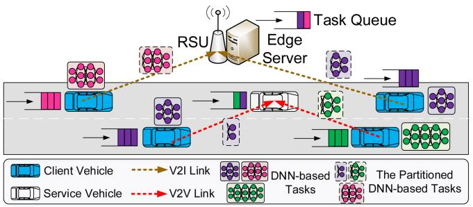

flowchart

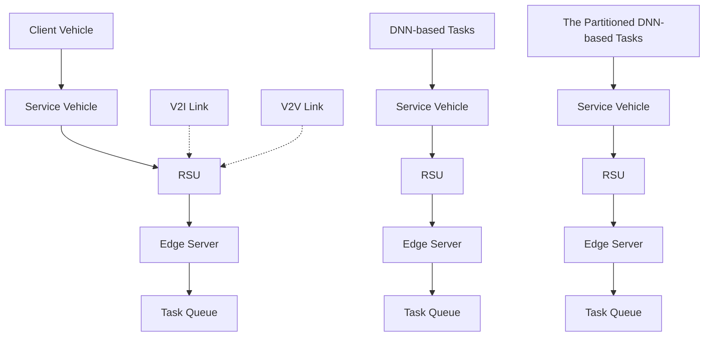

Fig. 2. A schematic of VEC-assisted DNN-based task partitioning and offloading.

# III. SYSTEM MODEL

# A. AI-Powered Vehicular Network Model

We consider an AI-powered vehicular network, in which vehicles possessing DNN-based tasks move on an unidirectional highway. Similar to [9], [35], and [36], our analysis are focused on the decision making and network control at an arbitrary ${ \mathrm { R S U } } ^ { 2 }$ as illustrated in Fig. 2. We adopt a discrete time slot representation of the system, where time slots are collected via the set $\mathcal { T } = \{ 1 , . . . , T \}$ , and the duration of each time slot is $\tau .$ The vehicles with DNN-based tasks are considered as Client Vehicles (CVs), collected by the set $\mathcal { T } = \{ 1 , . . . , I \}$ , while the RSU and the rest of vehicles, referred to as Service Vehicles (SVs) are considered as edge nodes, the set of which is represented as $\mathcal { I } = \{ 1 , 2 , . . . , J \}$ , where index $j = 1$ is for the RSU and indices $j \in \{ 2 , . . . , J \}$ are used for SVs. We assume that each CV i can generate a DNN-based task $b _ { i }$ at the beginning of each time slot t [37]. For example, in an intelligent transportation system, CVs (such as buses and taxis) need to monitor traffic conditions in real time to predict traffic flow and optimize route selection. These tasks are generated regularly to reflect changing traffic conditions. The same holds in the autonomous driving scenario: each CV needs to constantly process data from sensors for real-time path planning, obstacle detection, and traffic signal recognition.

Additionally, two key assumptions are made in our following system model: (i) The channel condition are stable during one time slot [38]; (ii) The DNN models are well-trained and preloaded in each vehicle and the RSU without the need for further deployment [39]. For ease of reference, key notations used in the article are summarized in Table I.

2Without loss of generality, in this paper, we focus solely on a single RSU, avoiding the additional complexity of vehicles frequently switching RSUs. This is because a road can be divided into several segments, each covered by different RSUs. Even with multiple RSUs, a vehicle can offload the DNN-based task to the RSU responsible for the segment the vehicle is currently in, suggesting that our system model can potentially be extended from a single RSU to multiple RSUs in the future by considering information exchange between the RSUs.

TABLE I SUMMARY OF KEY NOTATIONS 

<table><tr><td>Symbol</td><td>Description</td></tr><tr><td> $\mathcal{T}$ </td><td>Index set of time slots</td></tr><tr><td> $\mathcal{I}$ </td><td>Index set of CVs</td></tr><tr><td> $\mathcal{J}$ </td><td>Index set of edge nodes, including the RSU and SVs</td></tr><tr><td> $\mathcal{K}$ </td><td>Index set of DNN model types</td></tr><tr><td> $\mathcal{L}_{k}$ </td><td>Index set of layers of  $k$ th type DNN-based task</td></tr><tr><td> $\mathcal{I}_{k}$ </td><td>Index set of CVs possessing the  $k$ th type DNN model</td></tr><tr><td> $\varphi_{i}(t)$ </td><td>DNN partitioning decision of CV  $i$  at time slot  $t$ </td></tr><tr><td> $R_{i}^{\text{rsu}}(t)$ </td><td>The (maximum) transmission rate from CV  $i$  to the RSU at time slot  $t$ </td></tr><tr><td> $R_{i,j}^{\text{veh}}(t)$ </td><td>The (maximum) V2V transmission rate from CV  $i$  to SV  $j$  at time slot  $t$ </td></tr><tr><td> $d_{i,j}^{\text{rsu,tra}}(t)$ </td><td>Intermediate data transmission delay from CV  $i$  to the RSU at time slot  $t$ </td></tr><tr><td> $d_{i,j}^{\text{veh,tra}}(t)$ </td><td>Intermediate data transmission delay from CV  $i$  to SV  $j$  at time slot  $t$ </td></tr><tr><td> $\xi_{i,j}(t)$ </td><td>Offloading decision of DNN-based task  $b_{i}$  at time slot  $t$ </td></tr><tr><td> $d_{i}^{\text{loc}}(t)$ </td><td>Local processing latency of DNN-based task  $b_{i}$  at time slot  $t$ </td></tr><tr><td> $d_{i}^{\text{rsu}}(t)$ </td><td>Completion time of DNN-based task  $b_{i}$  on the RSU at time slot  $t$ </td></tr><tr><td> $d_{i,j}^{\text{veh}}(t)$ </td><td>Completion time of DNN-based task  $b_{i}$  on SV  $j$  at time slot  $t$ </td></tr><tr><td> $d_{i}(t)$ </td><td>Total delay for completing DNN-based task  $b_{i}$  at time slot  $t$ </td></tr><tr><td> $f_{k}^{\text{rsu}}(t)$ </td><td>Computation resources of the RSU allocated to the  $k$ th type DNN model at time slot  $t$ </td></tr><tr><td> $Q_{i}^{\text{loc}}(t)$ </td><td>Task queue length of client vehicle  $i$  at time slot  $t$ </td></tr><tr><td> $Q_{k}^{\text{rsu}}(t)$ </td><td>Task queue length of  $k$ th type DNN-based task at the RSU at time slot  $t$ </td></tr><tr><td> $Q_{j}^{\text{veh}}(t)$ </td><td>Task queue length of service vehicle  $j$  at time slot  $t$ </td></tr></table>

# B. DNN Partitioning Model

We consider a VEC with K types of DNN models, collected by the set ${ \mathcal { K } } = \left\{ { 1 , . . . , K } \right\} ( { \mathrm { e . g } }$ ., ResNet18 [7] and VGG16 [5]). Let $\mathcal { L } _ { k } = \{ 1 , . . . , L _ { k } \}$ denote the set of layers of kth type DNN-based task, which includes convolution/pooling layers for feature extraction, followed by a series of fully connected layers for classification. Specifically, let $L _ { k } ^ { \mathsf { c o n } }$ denote the index of the last convolution/pooling layer in $\mathcal { L } _ { k }$ . Each convolution/pooling layer $l _ { k } \left( 1 \leq l _ { k } \leq L _ { k } ^ { \mathsf { c o n } } \right)$ is characterized by a tuple k     value of input height, width and channel, and $( H _ { l _ { k } } , W _ { l _ { k } } , C _ { l _ { k } } ^ { \mathrm { i n } } , C _ { l _ { k } } ^ { \mathrm { o u t } } , k e r _ { l _ { k } } )$ lk , where $( H _ { l _ { k } } , W _ { l _ { k } } , C _ { l _ { k } } ^ { \mathrm { i n } } )$ $\left( C _ { l _ { k } } ^ { \mathrm { o u t } } , k e r _ { l _ { k } } \right)$ capture the represent the value of output channel, and kernel size of layer $l _ { k } .$ respectively. Also, each fully connected layer $l _ { k } \ \big ( L _ { k } ^ { \mathsf { c o n } } < l _ { k } \ \leq$ $L _ { k } )$ is represented by a tuple $( U _ { l _ { k } } ^ { \mathrm { i n } } , U _ { l _ { k } } ^ { \mathrm { o u t } } )$ , where $U _ { l _ { k } } ^ { \mathrm { i n } }$ lk and U outl $U _ { l _ { k } } ^ { \mathrm { o u t } }$ k denote the size of the unidimensional input, and output of layer $l _ { k }$ , respectively.

Let the set of CVs possessing the kth type DNN model be denoted by $ { \mathcal { T } _ { k } } ^ { 3 }$ , where $\begin{array} { r } { \mathcal { I } = \bigcup _ { k \in \mathcal { K } } \mathcal { Z } _ { k } } \end{array}$ . We model the DNN partitioning decision of CV i at time slot t through introducing an integer variable $\varphi _ { i } ( t ) \in \{ 1 , . . . , L _ { k } + 1 \} , i \in \mathcal { T } _ { k }$ . According to this controllable variable, the DNN-based task $b _ { i }$ is divided into two parts: if $2 \leq \varphi _ { i } ( t ) \leq L _ { k }$ , the first part of layers 1 to $\varphi _ { i } ( t ) - 1$ are processed locally on CV i; while the second part of layers $\varphi _ { i } ( t )$ to $L _ { k }$ are processed by an edge node (i.e., either the RSU or one of the SVs) after the transmission of input data of layer $\varphi _ { i } ( t )$ to that edge node. Also, when $\varphi _ { i } ( t ) = 1$ , it means

3Although there are several types of DNN models, such as AlexNet [40], ResNet18 [7], and VGG16 [5], each CV i is assumed to generate a single type DNN-based task [24].

that no layers are processed locally on CV i, indicating that we fully offload (i.e., raw data) to an edge node. Conversely, when $\varphi _ { i } ( t ) = L _ { k } + 1$ , it means that no layers are processed by an edge node, indicating that the whole DNN-based task $b _ { i }$ will be locally computed at CV i.

# C. Communication Model

In the VEC, we consider Vehicle-to-Infrastructure (V2I) and Vehicle-to-Vehicle (V2V) communication models concurrently. Since the communications between CVs, SVs, and the RSU can be facilitated using the Orthogonal Frequency Division Multiple Access (OFDMA) protocol, which effectively reduces the overlaps between the signals, we disregard the interference in the following discussions [19], [39]. Hereafter, we formulate the V2I and V2V communication models and then discuss the communication latency.

1) V2I Communications: The (maximum) transmission rate from CV i to the RSU at time slot t is given by

$$
R _ {i} ^ {\mathrm{rsu}} (t) = \mathcal {B} \log_ {2} \left(1 + \frac {p _ {i} h _ {i} ^ {\mathrm{rsu}} (t)}{\sigma^ {2}}\right), \tag {1}
$$

where B (in Hz) denotes the (sub-)channel bandwidth, $p _ { i }$ (in W) represents the transmit power of $\mathrm { C V } i ,$ and $\sigma ^ { 2 }$ (in W) is the noise power. Additionally, $h _ { i } ^ { \mathsf { r s u } } ( t ) = g _ { i } ^ { \mathsf { r s u } } ( t ) | u _ { i } ^ { \mathsf { r s u } } ( t ) | ^ { 2 }$ (in dB) [41] is the V2I channel gain, which captures both largescale and small-scale fading. Specifically, $g _ { i } ^ { \mathsf { r s u } } ( t ) = - 3 8 . 4 -$ $2 1 . 0 { \log _ { 1 0 } } d i s _ { i } ^ { \mathsf { r s u } } ( t )$ [42] represents the V2I path loss, where $d i s _ { i } ^ { \mathsf { r s u } } ( t )$ (in meters) indicates the euclidean distance between $\mathrm { C V } i$ and the RSU at time slot t, and $u _ { i } ^ { \mathsf { r s u } } ( t ) \sim \mathcal { C N } ( 0 , 1 )$ is the small-scale fading component, varying i.i.d. over time.

2) V2V Communications: Similarly, focusing on the V2V links, the (maximum) V2V transmission rate from CV i to SV j at time slot t, denoted by $R _ { i , j } ^ { \mathsf { v e h } } ( t )$ , can be given by

$$
R _ {i, j} ^ {\mathrm{veh}} (t) = \mathcal {B} \log_ {2} \left(1 + \frac {p _ {i} h _ {i , j} ^ {\mathrm{veh}} (t)}{\sigma^ {2}}\right), \tag {2}
$$

where $h _ { i , j } ^ { \mathsf { v e h } } ( t ) = g _ { i , j } ^ { \mathsf { v e h } } ( t ) | u _ { i , j } ^ { \mathsf { v e h } } ( t ) | ^ { 2 }$ (in dB) [41] is the V2V channel gain between $\mathrm { C V } ~ i$ and $\operatorname { s v } j$ at time slot t, which captures both large-scale and small-scale fading. Specifically, $g _ { i , j } ^ { \mathsf { v e h } } ( t ) =$ $- 4 4 . 2 3 - 1 6 . 7 { \log _ { 1 0 } } d i s _ { i , j } ^ { \mathsf { v e h } } ( t )$ [42] represents the V2V path loss, and $u _ { i , j } ^ { \mathsf { v e h } } ( t ) \sim \mathcal { C N } ( 0 , 1 )$ is the small-scale fading component, varying i.i.d. over time.

3) Communication Latency: Upon partitioning a DNNbased task into two parts, the corresponding input data size of layer $l _ { k }$ for transmitting the intermediate in-layer data is given by [8]

$$
D _ {l _ {k}} = \left\{ \begin{array}{l l} H _ {l _ {k}} W _ {l _ {k}} C _ {l _ {k}} ^ {\text { in }} \varrho , & 1 \leq l _ {k} \leq L _ {k} ^ {\text { con }} \\ U _ {l _ {k}} ^ {\text { in }} \varrho , & L _ {k} ^ {\text { con }} <   l _ {k} \leq L _ {k} \end{array} , \right. \tag {3}
$$

where $\varrho$ is the memory footprint for a unit data. Consequently, for DNN-based task $b _ { i }$ , when the DNN partitioning is made at layer $\varphi _ { i } ( t )$ , the time required for intermediate data transmission from CV i to the RSU can be calculated as

$$
d _ {i} ^ {\mathrm{rsu,tra}} (t) = \left\{ \begin{array}{l l} 0, & \varphi_ {i} (t) = L _ {k} + 1 \\ \xi_ {i, 1} (t) \frac {D _ {\varphi_ {i} (t)}}{R _ {i} ^ {\mathrm{rsu}} (t)}, & \text { otherwise } \end{array} \right., i \in \mathcal {I} _ {k}, \tag {4}
$$

where $\varphi _ { i } ( t ) = L _ { k } + 1$ means that the whole DNN-based task $b _ { i }$ will be locally processed without data transmission, and $\xi _ { i , j } ( t )$ denotes the offloading decision of DNN-based task $b _ { i }$ at time slot t. Specifically, $\xi _ { i , j } ( t ) = 1$ indicates that the remaining layers are offloaded to the RSU (j = 1) or $\operatorname { S V } j ( \forall j \in \mathcal { I } \setminus \{ 1 \} )$ for processing; $\xi _ { i , j } ( t ) = 0$ otherwise. Similarly, the time required for intermediate data transmission from CV i to $\operatorname { S V } j ,$ , denoted by di,j $d _ { i , j } ^ { \mathsf { v e h , t r a } } ( t )$ veh,tra , is given by

$$
d _ {i, j} ^ {\text { veh,tra }} (t) = \left\{ \begin{array}{l l} 0, & \varphi_ {i} (t) = L _ {k} + 1 \\ \xi_ {i, j} (t) \frac {D _ {\varphi_ {i} (t)}}{R _ {i , j} ^ {\text { veh }} (t)}, & \text { otherwise } \end{array} \right. i \in \mathcal {I} _ {k}. \tag {5}
$$

Since the transmission time of returning the inference result is much shorter than that of DNN inference and intermediate data transmission [37], we neglect the feedback time.

# D. Computing Model

To quantify the processing intensity of each DNN-based task, we denote the computation requirement of layer $l _ { k }$ by $B _ { l _ { k } }$ (in the number of floating-point operations), which is given by [8]

$$
B _ {l _ {k}} = \left\{ \begin{array}{l} 2 H _ {l _ {k}} W _ {l _ {k}} (C _ {l _ {k}} ^ {\text { in }} k e r _ {l _ {k}} ^ {2} + 1) C _ {l _ {k}} ^ {\text { out }}, 1 \leq l _ {k} \leq L _ {k} ^ {\text { con }} \\ (2 U _ {l _ {k}} ^ {\text { in }} - 1) U _ {l _ {k}} ^ {\text { out }}, L _ {k} ^ {\text { con }} <   l _ {k} \leq L _ {k} \end{array} . \right. \tag {6}
$$

We next divide DNN computing models into three parts: 1) local processing; 2) edge processing at the $R S U ; 3 )$ edge processing at the SVs, and discuss them in order.

1) Local Processing: At time slot t, the local processing latency of the first segment of layers $l _ { k } = 1 \mathrm { ~ t o ~ } \varphi _ { i } ( t ) - 1$ of DNN-based task $b _ { i }$ , denoted by $d _ { i } ^ { \mathsf { l o c } } ( t )$ , is given by

$$
d _ {i} ^ {\text { loc }} (t) = \left\{ \begin{array}{l l} 0, & \varphi_ {i} (t) = 1 \\ \frac {Q _ {i} ^ {\text { loc }} (t) + \sum_ {l _ {k} = 1} ^ {\varphi_ {i} (t) - 1} B _ {l _ {k}}}{f _ {i} ^ {\text { loc }}}, & \text { otherwise } \end{array} \right., i \in \mathcal {I} _ {k}, \tag {7}
$$

where $\varphi _ { i } ( t ) = 1$ means that the entire DNN-based task $b _ { i }$ is offloaded to a destination edge node without local computing, $f _ { i } ^ { \mathsf { l o c } }$ (in CPU cycle frequency) is the computation capacity of $\mathrm { C V } \ i ,$ and $Q _ { i } ^ { \mathsf { l o c } } ( t )$ is the backlogged computations in the local computing queue of CV i at time slot t, which can be formulated through the following update rule:

$$
Q _ {i} ^ {\mathrm{loc}} (t + 1) = \max \left\{Q _ {i} ^ {\mathrm{loc}} (t) - \overbrace {f _ {i} ^ {\mathrm{loc}} \tau} ^ {(\mathrm{I})} \right.
$$

$$
\left. + \overbrace {\mathbb {I} _ {\{\varphi_ {i} (t) \neq 1 \}} ^ {(\mathrm{II})} \left(\sum_ {l _ {k} = 1} ^ {\varphi_ {i} (t) - 1} B _ {l _ {k}}\right)} ^ {(\mathrm{II})}, 0 \right\}, i \in \mathcal {I} _ {k}. \tag {8}
$$

Here, the term (I) indicates the computations that are executed within time slot duration τ , and the term (II) signifies the newly arrived computations affected by the DNN partitioning decision $\varphi _ { i } ( t )$ , where $\mathbb { I } _ { \{ \cdot \} }$ is an indicator function with $\mathbb { I } _ { \{ \cdot \} } = 1$ , when the condition in the argument is met; otherwise $\mathbb { I } _ { \{ \cdot \} } = 0$ . Consequently, combining (7) and (8), we notice that when $Q _ { i } ^ { \mathsf { l o c } } ( t ) = 0$ , indicating no backlogged computations in the local computing queue, we have $\begin{array} { r } { d _ { i } ^ { \mathrm { l o c } } ( t ) = \frac { \sum _ { l _ { k } = 1 } ^ { \varphi _ { i } ( t ) - 1 } B _ { l _ { k } } } { f _ { i } ^ { \mathrm { l o c } } } } \end{array}$ Blk without waiting for resource release. On the other hand, when $Q _ { i } ^ { \mathsf { l o c } } ( t ) \neq 0 ,$ indicating backlogged computations in the local computing queue, we have $\begin{array} { r } { d _ { i } ^ { \mathrm { l o c } } ( t ) = \frac { Q _ { i } ^ { \mathrm { l o c } } ( t ) + \sum _ { l _ { k } = 1 } ^ { \varphi _ { i } ( t ) - 1 } B _ { l _ { k } } } { f _ { i } ^ { \mathrm { l o c } } } } \end{array}$ Qloci (t)+-ϕi(t)l =1 Blk , which accounts for the time f loci waiting for resource release. Same considerations can also be found in the expressions of task processing delay at the RSU and SVs formulated hereafter.

2) Edge Processing at the RSU: We assume that the computing resources and the task queue located in the RSU are allocated among different DNN model types, which can be realized via containerization techniques [43], indicating that the CVs with the same DNN type will be provided with the same computation resources at the RSU. When layers $l _ { k } = \varphi _ { i } ( t )$ to $L _ { k }$ are processed on the RSU, besides the V2I intermediate data transmission time in (4), the task completion time further consists of task processing time, and waiting time, which are formalized below.

Processing time: Similar to (7), the processing time of DNN-based task $b _ { i } , i \in \mathcal { T } _ { k }$ , at the RSU at time slot t, denoted by $d _ { i } ^ { \mathsf { r s u } , \mathsf { p r o } } ( t )$ , can be calculated as

$$
d _ {i} ^ {\mathrm{rsu,pro}} (t) = \left\{ \begin{array}{l} 0, \quad \varphi_ {i} (t) = L _ {k} + 1 \\ \xi_ {i, 1} (t) \frac {Q _ {k} ^ {\mathrm{rsu}} (t) + \sum_ {l _ {k} = \varphi_ {i} (t)} ^ {L _ {k}} B _ {l _ {k}}}{f _ {k} ^ {\mathrm{rsu}} (t)}, \text { otherwise }, \end{array} \right. \tag {9}
$$

where $\varphi _ { i } ( t ) = L _ { k } + 1$ implies that the entire DNN-based task $b _ { i }$ will be locally processed, $f _ { k } ^ { \mathsf { r s u } } ( t )$ is the computation resources of the RSU allocated to the kth type DNN model at time slot $t ^ { 4 }$ , and $Q _ { k } ^ { \mathsf { r s u } } ( t )$ indicates the backlogged computations at the task queue of the RSU for kth type DNN model at time slot $t ,$ which can be represented via the following update rule

$$
\begin{array}{l} Q _ {k} ^ {\mathrm{rsu}} (t + 1) = \max \left\{Q _ {k} ^ {\mathrm{rsu}} (t) - f _ {k} ^ {\mathrm{rsu}} (t) \tau \right. \\ \left. + \overbrace {\sum_ {i \in \mathcal {I} _ {k}} \xi_ {i , 1} (t) \mathbb {I} _ {\{\varphi_ {i} (t) \neq L _ {k} + 1 \}} \left(\sum_ {l _ {k} = \varphi_ {i} (t)} ^ {L _ {k}} B _ {l _ {k}}\right)} ^ {(I)}, 0 \right\}, \tag {10} \\ \end{array}
$$

where $Q _ { k } ^ { \mathsf { r s u } } ( 1 ) = 0 , \forall k \in \mathcal { K }$ , and the term (I) represents the newly arrived computations from all CV $i \in \mathcal { Z } _ { k }$ that chooses to offload their task to the RSU at time slot t.

Waiting time: The task waiting time, denoted by $d _ { i } ^ { \mathsf { r s u , w a i t } } ( t )$ consists of the average sojourn time among all newly

4In this paper, the computing resource is dynamically allocated among multiple DNN model types at the RSU, providing process isolation. This can be realized using containerization techniques such as Dockers and Kubernetes [43].

arrived tasks at the RSU until DNN-based task $b _ { i } , \ i \in \mathcal { I } _ { k }$ is processed, which can be calculated as follows:

$$
\frac {d _ {i} ^ {\mathrm{rsu,wait}} (t) =}{\frac {\sum_ {i ^ {\prime} \in \mathcal {I} _ {k} \backslash \{i \}} \xi_ {i ^ {\prime} , 1} (t) \mathbb {I} _ {\{\varphi_ {i ^ {\prime}} (t) \neq L _ {k} + 1 \}} \left(\sum_ {l _ {k} = \varphi_ {i ^ {\prime}} (t)} ^ {L _ {k}} B _ {l _ {k}}\right)}{2 f _ {k} ^ {\mathrm{rsu}} (t)}}. \tag {11}
$$

In (11), the numerator can be interpreted as 0 plus term (I), where 0 indicates that DNN-based task $b _ { i }$ arrives at the RSU before all newly arrived tasks (i.e., it will be ahead of all of them in the queue), while term (I) captures a scenario in which DNNbased task $b _ { i }$ arrives at the RSU after all the other tasks (i.e., it will be behind all the tasks in the queue). Meanwhile, the division by 2 indicates the average waiting time considering these two scenarios. As a result, the total completion time of DNN-based task $b _ { i }$ on the RSU, denoted by $d _ { i } ^ { \mathsf { r s u } } ( t )$ , can be calculated as follows:

$$
d _ {i} ^ {\mathrm{rsu}} (t) = d _ {i} ^ {\mathrm{rsu,tra}} (t) + d _ {i} ^ {\mathrm{rsu,pro}} (t) + d _ {i} ^ {\mathrm{rsu,wait}} (t). \tag {12}
$$

3) Edge Processing at the SVs: When remaining layers $l _ { k } =$ $\varphi _ { i } ( t )$ to $L _ { k }$ are offloaded and processed on a nearby SV, besides the V2V intermediate data transmission time in (5), the processing time of DNN-based task $b _ { i } , i \in \mathcal { I } _ { k }$ on $\operatorname { S V } j \in \mathcal { I } \setminus \{ 1 \}$ at time slot t, denoted by dveh,i,j pro (t), is given by $d _ { i , j } ^ { \mathsf { v e h , p r o } } ( t )$

$$
d _ {i, j} ^ {\text { veh,pro }} (t) = \left\{ \begin{array}{l l} 0, & \varphi_ {i} (t) = L _ {k} + 1 \\ \xi_ {i, j} (t) \frac {Q _ {j} ^ {\text { veh }} (t) + \sum_ {l _ {k} = \varphi_ {i} (t)} ^ {L _ {k}} B _ {l _ {k}}}{f _ {j} ^ {\text { veh }}}, & \text { otherwise }, \end{array} \right. \tag {13}
$$

where $f _ { j } ^ { \mathsf { v e h } }$ is the computation capability of SV j, and $Q _ { j } ^ { \mathsf { v e h } } ( t )$ represents the backlogged computations in the task queue of SV $j ,$ , which can be represented via the following update rule

$$
\begin{array}{l} Q _ {j} ^ {\mathrm{veh}} (t + 1) = \max \left\{Q _ {j} ^ {\mathrm{veh}} (t) - f _ {j} ^ {\mathrm{veh}} \tau \right. \\ \left. + \sum_ {k \in \mathcal {K}} \sum_ {i \in \mathcal {I} _ {k}} \xi_ {i, j} (t) \mathbb {I} _ {\{\varphi_ {i} (t) \neq L _ {k} + 1 \}} \left(\sum_ {l _ {k} = \varphi_ {i} (t)} ^ {L _ {k}} B _ {l _ {k}}\right), 0 \right\}, \tag {14} \\ \end{array}
$$

with $Q _ { i } ^ { \mathsf { v e h } } ( 1 ) = 0$ . Similar to (11), the average sojourn time among all newly arrived tasks at $\operatorname { s v } j$ until the DNN-based task bi is processed, denoted by dveh,i,j $b _ { i }$ wait (t), where i  ∈ Ik, is $d _ { i , j } ^ { \mathsf { v e h } , \mathsf { w a i t } } ( t )$ $i ^ { \prime } \in \mathcal { T } _ { k }$ given by

$$
\begin{array}{l} d _ {i, j} ^ {\text { veh,wait }} (t) = \\ \frac {\sum_ {i ^ {\prime} \in \mathcal {I} \backslash \{i \}} \xi_ {i ^ {\prime} , j} (t) \mathbb {I} _ {\left\{\varphi_ {i ^ {\prime}} (t) \neq L _ {k} + 1 \right\}} \left(\sum_ {l _ {k} = \varphi_ {i ^ {\prime}} (t)} ^ {L _ {k}} B _ {l _ {k}}\right)}{2 f _ {j} ^ {\mathrm{veh}}}. \tag {15} \\ \end{array}
$$

Finally, the completion time of DNN-based task $b _ { i }$ on $\mathrm { S V } ~ j$ can be calculated as

$$
d _ {i, j} ^ {\text { veh }} (t) = d _ {i, j} ^ {\text { veh,tra }} (t) + d _ {i, j} ^ {\text { veh,pro }} (t) + d _ {i, j} ^ {\text { veh,wait }} (t). \tag {16}
$$

In summary, taking the aforementioned three processing forms into consideration, the total delay for completing DNN-based task $b _ { i }$ at time slot t can be calculated by

$$
d _ {i} (t) = d _ {i} ^ {\text { loc }} (t) + d _ {i} ^ {\text { rsu }} (t) + d _ {i, j} ^ {\text { veh }} (t). \tag {17}
$$

# IV. PROBLEM FORMULATION

We next formulate the problem of joint DNN partitioning, task offloading, and resource allocation as a dynamic long-term optimization, aiming to minimize the DNN-based task completion time across all CVs while guaranteeing the system stability over time. Mathematically, we formulate this problem as optimization problem $\left( \mathcal { P } _ { 1 } \right)$ given below:

$$
\left(\mathcal {P} _ {1}\right): \min _ {\{\boldsymbol {\varphi} (t), \boldsymbol {\xi} (t), \boldsymbol {F} (t) \} _ {t \in \mathcal {T}}} \lim _ {T \rightarrow + \infty} \frac {1}{T} \sum_ {t \in \mathcal {T}} \sum_ {i \in \mathcal {I}} \mathbb {E} \left[ d _ {i} (t) \right] \tag {19}
$$

s.t.

$$
\lim _ {T \rightarrow + \infty} \frac {1}{T} \sum_ {t \in \mathcal {T}} \mathbb {E} \left[ Q _ {i} ^ {\text { loc }} (t) \right] <   \infty , \forall i \in \mathcal {I}, \tag {20}
$$

$$
\lim _ {T \rightarrow + \infty} \frac {1}{T} \sum_ {t \in \mathcal {T}} \mathbb {E} \left[ Q _ {k} ^ {\mathrm{rsu}} (t) \right] <   \infty , \forall k \in \mathcal {K}, \tag {21}
$$

$$
\lim _ {T \to + \infty} \frac {1}{T} \sum_ {t \in \mathcal {T}} \mathbb {E} \left[ Q _ {j} ^ {\mathrm{veh}} (t) \right] <   \infty ,   \forall j \in \mathcal {J} \setminus \{1 \}, \tag {22}
$$

$$
\varphi_ {i} (t) \in \{1, \dots , L _ {k} + 1 \}, \forall t \in \mathcal {T}, i \in \mathcal {I} _ {k}, \tag {23}
$$

$$
\xi_ {i, j} (t) \in \{0, 1 \}, \forall t \in \mathcal {T}, i \in \mathcal {I}, j \in \mathcal {J}, \tag {24}
$$

$$
\mathbb {I} _ {\{\xi_ {i, j} (t) = 1 \}} \mathbb {I} _ {\{d i s _ {i, j} ^ {\mathrm{veh}} (t) \leq d i s ^ {\mathrm{v2v}} \}} = 1,
$$

$$
\forall t \in \mathcal {T}, i \in \mathcal {I}, j \in \mathcal {J} \setminus \{1 \}, \tag {25}
$$

$$
0 \leq f _ {k} ^ {\mathrm{rsu}} (t) \leq f ^ {\mathrm{rsu,max}}, \forall t \in \mathcal {T}, k \in \mathcal {K}, \tag {26}
$$

$$
\sum_ {k \in \mathcal {K}} f _ {k} ^ {\mathrm{rsu}} (t) \leq f ^ {\mathrm{rsu}, \max}, \forall t \in \mathcal {T}, \tag {27}
$$

where the optimization variables are $( \mathrm { i } ) \varphi ( t ) = \{ \varphi _ { i } ( t ) \} _ { i \in \mathbb { Z } }$ is the DNN partitioning decision vector for all CVs at time slot t; (ii) $\pmb { \xi } ( t ) = \{ \xi _ { i , j } ( t ) \} _ { i \in \mathcal { T } , j \in \mathcal { I } }$ is a matrix describing the task offloading decisions for all CVs at time slot t; (iii) $\pmb { F } ( \bar { t } ) = \{ f _ { k } ^ {  } ( t ) \} _ { k \in \mathcal { K } }$ is the computation resource allocation vector for all DNN model types at time slot t.

In $\left( \mathcal { P } _ { 1 } \right)$ , constraints (20) (22) guarantee the task queue stability of CVs, the RSU, and $\operatorname { S V s } ^ { 5 }$ . Constraint (23) implies that the DNN partitioning decision is integer. Constraint (24) ensures that the task offloading decision is binary. Constraint (25) guarantees that CV i can only offload its DNN-based task

5Expectation is taken with respect to the system random events [20], e.g., vehicles’ mobility and channel fading considered in this paper.

to SVs within its V2V communication range, where $\mathop { d i s } ^ { \prime } { } ^ { 2 \mathrm v }$ represents the limited V2V connection radius. Besides, constraint (26) is the value range of the computation resources of the RSU allocated to different DNN model types, where $f ^ { \mathsf { r s u , m a x } }$ is the maximum computation capability of the RSU, and constraint (27) guarantees adherence to the limited computation resources at the RSU. Additionally, the coupled relationship between the offloading decision and the partitioning decision, where $\varphi _ { i } ( t ) = L _ { k } + 1$ means that the whole DNN-based task $b _ { i }$ will be locally processed without data transmission and $\varphi _ { i } ( t ) = 1$ means that the entire DNN-based task $b _ { i }$ is offloaded to a destination edge node without local computing, are captured during the formulation of the corresponding intermediate data transmission delay and task processing delay through piecewise functions derived earlier.

Remark 1: Due to the non-linearity and recursive nature of long-term constraints (20)–(22) – as shown in (8), (10), (14) – the DNN partitioning decisions, offloading decisions, and resource allocations among CVs are time coupled. Furthermore, due to the existence of both continues and discrete/binary variables as dictated by (23), (24), and (26), problem $\left( \mathcal { P } _ { 1 } \right)$ is a Mixed Integer NonLinear Program (MINLP), known to be NP-hard6. Thus, it is hard to efficiently solve problem $\left( \mathcal { P } _ { 1 } \right)$ .

In the following, since the long-term constraints (20)–(22) couple the DNN partitioning, task offloading, and resource allocation decisions at different time slots, we first develop a Lyapunov optimization technique to transform the long-term problem $\left( \mathcal { P } _ { 1 } \right)$ into a per-slot deterministic problem. This approach allows us to guarantee these long-term constraints without needing to know the state of the entire VEC environment in advance during the vehicle’s movement process.

# V. LYAPUNOV-BASED DYNAMIC LONG-TERM PROBLEM DECOUPLING

Henceforth, we first provide an overview of Lyapunov optimization related to our problem and then use the Lyapunov technique to decouple the formulated long-term MINLP problem $\left( \mathcal { P } _ { 1 } \right)$ into deterministic problems on a per-slot basis.

# A. Basics of Lyapunov Optimization

Lyapunov optimization [46] is recognized as a powerful technique for decoupling a long-term stochastic optimization problem into sequential per-slot deterministic problems, while offering theoretical assurances for long-term system stability.

Tailoring this technique to our problem setup, Lyapunov optimization initially makes use of a Lyapunov function, which

6Compared with the optimization problems in [44], [45], which have been proven to be NP-hard, our problem $( { \bar { \mathcal { P } } } _ { 1 } )$ not only further considers DNN partitioning decisions but also includes long-term task queue stability constraints, making it at least as hard as these problems, and thus NP-hard.

$$
\begin{array}{l} \chi = \frac {1}{2} \sum_ {i \in \mathcal {I}} \left(\sum_ {l _ {k} = 1} ^ {L _ {k}} B _ {l _ {k}}\right) ^ {2} + \frac {1}{2} \sum_ {i \in \mathcal {I}} (f _ {i} ^ {\mathrm{loc}} \tau) ^ {2} + \frac {1}{2} \sum_ {k \in \mathcal {K}} \left(\sum_ {i \in \mathcal {I} _ {k}} \sum_ {l _ {k} = 1} ^ {L _ {k}} B _ {l _ {k}}\right) ^ {2} + \frac {1}{2} \sum_ {k \in \mathcal {K}} (f _ {k} ^ {\mathrm{rsu}} (t) \tau) ^ {2} \\ + \frac {1}{2} \sum_ {j \in \mathcal {J} \backslash \{1 \}} \left(\sum_ {k \in \mathcal {K}} \sum_ {i \in \mathcal {I} _ {k}} \sum_ {l _ {k} = 1} ^ {L _ {k}} B _ {l _ {k}}\right) ^ {2} + \frac {1}{2} \sum_ {j \in \mathcal {J} \backslash \{1 \}} (f _ {j} ^ {\mathrm{veh}} \tau) ^ {2} \tag {18} \\ \end{array}
$$

we obtain in (29), to consolidate all the task queues. Following this, a Lyapunov drift function, which we obtain in (30), is used to capture queue updates between two consecutive time slots. Subsequently, by minimizing the upper bound of the driftplus-penalty expression, which we obtain in (32), for each time slot, we will be able to satisfy the dual goals of minimizing the long-term DNN-based task completion time while guaranteeing the system stability over time.

# B. Transformation of Problem $\left( \mathcal { P } _ { 1 } \right)$ Via Lyapunov Technique

First, we define a compact description of the backlog of task queues of $\mathrm { C V s } ,$ , the RSU, and SVs at time slot t as follows:

$$
\boldsymbol {Q} (t) = \left\{\left\{Q _ {i} ^ {\text { loc }} (t) \right\} _ {i \in \mathcal {I}}, \left\{Q _ {k} ^ {\text { rsu }} (t) \right\} _ {k \in \mathcal {K}}, \left\{Q _ {j} ^ {\text { veh }} (t) \right\} _ {j \in \mathcal {J} \backslash \{1 \}} \right\}. \tag {28}
$$

Then, given that DNN-based tasks are generated at the beginning of each time slot, we use the quadratic form of the Lyapunov function, known for its reduced complexity in managing dynamic systems [19], to collectively capture the status of all the task queues in $Q ( t )$ , which is specified by

$$
\boldsymbol {L} (\boldsymbol {Q} (t)) = \frac {1}{2} \left[ \sum_ {i \in \mathcal {I}} Q _ {i} ^ {\text { loc }} (t) ^ {2} + \sum_ {k \in \mathcal {K}} Q _ {k} ^ {\text { rsu }} (t) ^ {2} + \sum_ {j \in \mathcal {J} \backslash \{1 \}} Q _ {j} ^ {\text { veh }} (t) ^ {2} \right]. \tag {29}
$$

Subsequently, we use the quadratic Lyapunov function in (29) across two consecutive time slots to obtain the Lyapunov drift function that captures the updates in the states of the queues across consecutive time slots, which is given by

$$
\Delta (\boldsymbol {Q} (t)) = \mathbb {E} \left[ \boldsymbol {L} (\boldsymbol {Q} (t + 1)) - \boldsymbol {L} (\boldsymbol {Q} (t)) \mid \boldsymbol {Q} (t) \right]. \tag {30}
$$

Here, a high value of the drift function implies a higher chance of instability in the task queues, and vice versa [46].

To combine the objective function of problem $\left( \mathcal { P } _ { 1 } \right)$ with the stability of the system captured via (30), we obtain the Lyapunov drift-plus-penalty function as

$$
\Lambda (\boldsymbol {Q} (t)) = \Delta (\boldsymbol {Q} (t)) + V \mathbb {E} \left[ \sum_ {i \in \mathcal {I}} d _ {i} (t) \mid \boldsymbol {Q} (t) \right], \tag {31}
$$

where V is a tunable weight, representing the relative importance of task completion time compared to queue stability. We next obtain an upper-bound on (31), which we will later use to transform the time-coupled problem $\left( \mathcal { P } _ { 1 } \right)$ to a series of per time-slot problems.

Lemma 1: For any feasible set of $\{ \varphi ( t ) , \pmb { \xi } ( t ) , \pmb { F } ( t ) \} _ { t \in \mathcal { T } }$ , which satisfies constraints (20) to (27), the Lyapunov drift-pluspenalty function $\Lambda ( Q ( t ) )$ can be upper bounded as follows:

$$
\begin{array}{l} \Lambda (\boldsymbol {Q} (t)) = \Delta (\boldsymbol {Q} (t)) + V \mathbb {E} \left[ \sum_ {i \in \mathcal {I}} d _ {i} (t) \mid \boldsymbol {Q} (t) \right] \\ \leq \mathbb {E} \left[ \sum_ {i \in \mathcal {I}} Q _ {i} ^ {\mathrm{loc}} (t) \left[ \mathbb {I} _ {\{\varphi_ {i} (t) \neq 1 \}} \left(\sum_ {l _ {k} = 1} ^ {\varphi_ {i} (t) - 1} B _ {l _ {k}}\right) - f _ {i} ^ {\mathrm{loc}} \tau \right] \right. \\ + \sum_ {k \in \mathcal {K}} Q _ {k} ^ {\mathrm{rsu}} (t) \left[ \sum_ {i \in \mathcal {I} _ {k}} \xi_ {i, 1} (t) \mathbb {I} _ {\{\varphi_ {i} (t) \neq L _ {k} + 1 \}} \right. \\ \end{array}
$$

$$
\begin{array}{l} \times \left. \left(\sum_ {l _ {k} = \varphi_ {i} (t)} ^ {L _ {k}} B _ {l _ {k}}\right) - f _ {k} ^ {\mathrm{rsu}} (t) \tau \right] \\ + \sum_ {j \in \mathcal {J} \backslash \{1 \}} Q _ {j} ^ {\mathrm{veh}} (t) \left[ \sum_ {k \in \mathcal {K}} \sum_ {i \in \mathcal {I} _ {k}} \xi_ {i, j} (t) \mathbb {I} _ {\{\varphi_ {i} (t) \neq L _ {k} + 1 \}} \right. \\ \times \left. \left(\sum_ {l _ {k} = \varphi_ {i} (t)} ^ {L _ {k}} B _ {l _ {k}}\right) - f _ {j} ^ {\mathrm{veh}} \tau \right] \\ \left. + V \sum_ {i \in \mathcal {I}} d _ {i} (t) \mid \boldsymbol {Q} (t) \right] + \chi , \tag {32} \\ \end{array}
$$

where $d _ { i } ( t )$ is given in (17), and $\chi$ is a constant given in (18), which is shown at the bottom of the previous page.

Proof: The proof is provided in Appendix A, available online

By omitting the constant component $\chi ,$ which is not impacted by the task queues, we transform the original problem $\left( \mathcal { P } _ { 1 } \right)$ into the subsequent per-slot deterministic optimization problem $\left( \mathcal { P } _ { 2 } ( t ) \right)$ which can be solved at each time slot without the need of knowing the future realizations of random channel conditions and vehicles’ mobility, while satisfying the long-term constraints and ensuring the stable system operation:

$$
\begin{array}{l} \left(\mathcal {P} _ {2} (t)\right): \min _ {\{\boldsymbol {\varphi} (t), \boldsymbol {\xi} (t), \boldsymbol {F} (t) \}} V \sum_ {i \in \mathcal {I}} d _ {i} (t) \\ + \sum_ {i \in \mathcal {I}} Q _ {i} ^ {\text { loc }} (t) \left[ \mathbb {I} _ {\{\varphi_ {i} (t) \neq 1 \}} \left(\sum_ {l _ {k} = 1} ^ {\varphi_ {i} (t) - 1} B _ {l _ {k}}\right) - f _ {i} ^ {\text { loc }} \tau \right] \\ + \sum_ {k \in \mathcal {K}} Q _ {k} ^ {\mathrm{rsu}} (t) \left[ \sum_ {i \in \mathcal {I} _ {k}} \xi_ {i, 1} (t) \mathbb {I} _ {\{\varphi_ {i} (t) \neq L _ {k} + 1 \}} \right. \\ \times \left. \left(\sum_ {l _ {k} = \varphi_ {i} (t)} ^ {L _ {k}} B _ {l _ {k}}\right) - f _ {k} ^ {\mathrm{rsu}} (t) \tau \right] \\ + \sum_ {j \in \mathcal {J} \backslash \{1 \}} Q _ {j} ^ {\mathrm{veh}} (t) \left[ \sum_ {k \in \mathcal {K}} \sum_ {i \in \mathcal {I} _ {k}} \xi_ {i, j} (t) \mathbb {I} _ {\{\varphi_ {i} (t) \neq L _ {k} + 1 \}} \right. \\ \times \left(\sum_ {l _ {k} = \varphi_ {i} (t)} ^ {L _ {k}} B _ {l _ {k}}\right) - f _ {j} ^ {\mathrm{veh}} \tau \Bigg ] \\ \end{array}
$$

$\mathrm { s . t . ~ C o n s t r a i n t s } \left( 2 3 \right) { - } ( 2 7 ) \mathrm { i n } \left( \mathcal { P } _ { 1 } \right) ,$ (33)

where $d _ { i } ( t )$ is given in (17). Our subsequent aim is thus to solve $\left( \mathcal { P } _ { 2 } ( t ) \right)$ for each time slot. Note that problem $\left( \mathcal { P } _ { 2 } ( t ) \right)$ is a mixedinteger programming problem because: (i) $\{ \varphi ( t ) , \pmb { \xi } ( t ) , \pmb { F } ( t ) \}$ are a mixture of discrete and continuous variables; (ii) the objective function is non-convex. Existing approaches, which include heuristic-based [15], [16] and decomposition-oriented search algorithms [17], are either time consuming to solve $\left( \mathcal { P } _ { 2 } ( t ) \right)$ due to their high complexity or lead to a relatively weak solution especially as the problem size grows. To this end, in the following, we introduce a Multi-Agent Diffusion-based

Deep Reinforcement Learning (MAD2RL) algorithm to tackle $\left( \mathcal { P } _ { 2 } ( t ) \right)$ .

# VI. BASIC IDEA OF DIFFUSION MODELS

Henceforth, before delving into the Multi-Agent Diffusionbased Deep Reinforcement Learning (MAD2RL) algorithm, we first give our motivation of adopting the diffusion model. We then elaborate on the diffusion model customization for generating optimal decisions regarding DNN partitioning and task offloading. Note that a closed-form for resource allocation will be obtained through convex optimization techniques once the above decisions are known (details will be provided in Section VII-C).

# A. Motivation of Adopting Diffusion Model

Recently, DRL has been recognized as a promising approach to tackle a variety of networking problems in dynamic computing environments [26], [27], [28], [47]. Generally speaking, DRL utilizes DNNs to learn the optimal action given the state of the system. The Multi-Layer Perceptron (MLP), a type of fully connected DNN that comprises various hidden layers with nonlinear activation functions, has been extensively employed in the DRL architecture. However, in this paper, problem $\left( \mathcal { P } _ { 2 } ( t ) \right)$ presents several unique challenges: (i) the inherent mobility of vehicles introduces uncertainties into DRL environments, making the state space complex and highly dynamic across different time slots; (ii) the discrete variables, specifically $\{ \varphi ( t ) , \pmb { \xi } ( t ) \}$ , are intertwined. This combinatorial nature of variables can cause the solution space to expand exponentially as the number of CVs increases. Consequently, the performance of MLP may diminish in environments characterized by complex and highdimensional state and action spaces [48], [49].

Diffusion models offer several compelling advantages over MLPs [50], especially valuable in uncertain and complex DRL environments such as those encountered in VEC. Specifically, the generative capabilities of diffusion models not only enhance the action sample efficiency by gradually removing noise across various denoising steps (to be introduced later), providing a more stable training process, but also offer a richer understanding of the environmental state through their superior feature representation capabilities. Additionally, considering the dynamic nature of vehicles, the instantaneous location of vehicles and dynamic task queues (i.e., state in reinforcement learning, which is formulated in Section VII-D1) can be used as conditioning information in the denoising process. After sufficient training, the denoising network should be able to generate the optimal solution given any dynamic wireless environment condition. As a result, these abilities demonstrate that the relationship between diffusion models and DRL is not just a matter of substitution or competition but rather a compliment and/or supplement to each other, allowing for mutual enhancement and learning.

# B. Preliminaries of Diffusion Model

Drawing inspiration from the Denoising Diffusion Probabilistic Model (DDPM) [31], we aim to design a framework for generating optimal decisions regarding DNN partitioning and task offloading. Specifically, DDPM encompasses two pivotal processes: the forward process, which gradually introduces noise to the optimization solution at each noising step until it becomes indistinguishable from Gaussian noise, and the reverse process, which gradually removes noise at each denoising step to reconstruct the optimization solution from its noisy counterpart.

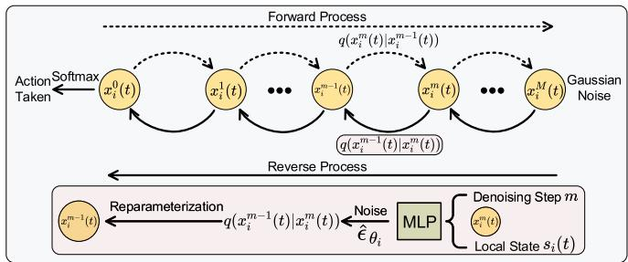

flowchart

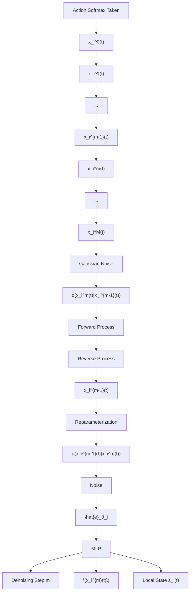

Fig. 3. Illustration of the diffusion model tailored for generating the optimal decisions of DNN partitioning and task offloading for CV i at time slot t.

In this study, the optimal DNN partitioning decision $\varphi _ { i } ^ { * } ( t ) \in \{ 1 , . . . , L _ { k } + 1 \}$ and task offloading decision $\xi _ { i } ^ { * } ( t ) \in$ $\{ 1 , . . . , J \} ^ { 7 } \mathrm { o f } \mathrm { C V } i \in \bar { \mathcal { T } } _ { k }$ at time slot t are integrated into $( L _ { k } +$ $1 ) J$ elements. The probability distribution $\mathbf { \Delta } \mathbf { x } _ { i } ^ { 0 } ( t ) \sim \mathbb { R } ^ { ( L _ { k } + 1 ) J }$ of each decision being selected is regarded as the optimization solution in the context of DDPM (the index i is kept in the notation as different vehicles may hold different DNN models with different number of layers). Then, according to the DDPM, ${ \pmb x } _ { i } ^ { 0 } ( t )$ will be gradually added with noise at each noising step until it becomes Gaussian noise, known as the forward process. Subsequently, in the reverse process, the optimal decision generation network $\mathcal { Q } _ { \boldsymbol { \theta } _ { i } } ( \cdot )$ with different parameters $\theta _ { i }$ for various CVs/agents i is viewed as a denoiser. This network starts from Gaussian noise and gradually recovers $x _ { i } ^ { 0 } ( t )$ with local state $s _ { i } ( t )$ (will be formulated later in Section VII-D) as the input.

1) Forward Process: A schematic of our method using diffusion model tailored for generating the optimal decisions of DNN partitioning and task offloading for CV i at time slot t is depicted in Fig. 3. Let $\mathcal { M } = \{ 1 , . . . , M \}$ denote the set of noising/denoising steps, at each time slot t, for $\mathrm { C V } \ i ,$ given the probability distribution ${ \pmb x } _ { i } ^ { 0 } ( t )$ , the forward process adds a sequence of Gaussian noises at each noising step to obtain $\pmb { x } _ { i } ^ { 1 } ( t ) , . . . , \pmb { x } _ { i } ^ { M } ( t )$ . The transition from $\pmb { x } _ { i } ^ { m - 1 } ( t ) \ \bar { \mathrm { t o } } \ x _ { i } ^ { m } ( t )$ is defined as a normal distribution with mean $\sqrt { 1 - \beta _ { m } } \dot { \mathbf { x } } _ { i } ^ { m - 1 } ( t )$ and variance $\beta _ { m } \mathbf { I }$ given by [31]

$$
\begin{array}{l} q \left(\boldsymbol {x} _ {i} ^ {m} (t) \mid \boldsymbol {x} _ {i} ^ {m - 1} (t)\right) \\ = \mathcal {N} (\boldsymbol {x} _ {i} ^ {m} (t); \sqrt {1 - \beta_ {m}} \boldsymbol {x} _ {i} ^ {m - 1} (t), \beta_ {m} \mathbf {I}), \tag {34} \\ \end{array}
$$

where $\beta _ { m }$ is the diffusion rate at noising step m [31] calculated by $\beta _ { m } = 1 - e ^ { - \frac { \beta ^ { \mathrm { m i n } } } { M } - \frac { 2 m - 1 } { 2 M ^ { 2 } } ( \beta ^ { \mathrm { m a x } } - \beta ^ { \mathrm { m i n } } ) }$ βmin 2M 2 , with $\beta ^ { \mathrm { { m i n } } }$ and $\beta ^ { \mathsf { m a x } }$ are the predetermined minimum and maximum diffusion rates, respectively, and I is an identity matrix.

Since $\pmb { x } _ { i } ^ { m } ( t ) \qquad \mathrm { i s }$ sampled from the normal distribution $\mathcal { N } ( \sqrt { 1 - \beta _ { m } } x _ { i } ^ { m - 1 } ( t ) , \beta _ { m } \mathbf { I } )$ , i.e., $\mathcal { N } ( \pmb { x } _ { i } ^ { m } ( t ) ; \sqrt { 1 - \beta _ { m } } \pmb { x } _ { i } ^ { m - 1 } ( t ) , \beta _ { m } \mathbf { I } ) \equiv \acute { \pmb { x } } _ { i } ^ { m } ( t ) \sim$

7We make a slight adjustment to the DNN task offloading decision in our simulation. Here, $\forall i \in \mathcal { \breve { T } } , \ \xi _ { i } ( t ) \in \{ 1 , . . . , J \}$ , where $\xi _ { i } ( t ) \overset { \mathbf { \bar { \mathbf { \alpha } } } } { = } j$ signifies that $\xi _ { i , j } ( t ) = 1$ within our proposed system model.

$\mathcal { N } ( \sqrt { 1 - \beta _ { m } } x _ { i } ^ { m - 1 } ( t ) , \beta _ { m } \mathbf { I } )$ , we can obtain the mathematical relationship between $\pmb { x } _ { i } ^ { m - 1 } ( t )$ and $\pmb { x } _ { i } ^ { m } ( t )$ via reparameterization technique as follows [31]:

$$
\boldsymbol {x} _ {i} ^ {m} (t) = \sqrt {1 - \beta_ {m}} \boldsymbol {x} _ {i} ^ {m - 1} (t) + \sqrt {\beta_ {m}} \boldsymbol {\epsilon} _ {m - 1}, \tag {35}
$$

where $\epsilon _ { m - 1 }$ is the Gaussian noise sampled from the standard normal distribution $\mathcal { N } ( 0 , \bf { I } )$ . Finally, based on (35), the mathematical relationship between $\pmb { x } _ { i } ^ { 0 } ( t )$ and $\pmb { x } _ { i } ^ { m } ( t )$ at any noising step m can be calculated as

$$
\boldsymbol {x} _ {i} ^ {m} (t) = \sqrt {\hat {\alpha} _ {m}} \boldsymbol {x} _ {i} ^ {0} (t) + \sqrt {1 - \hat {\alpha} _ {m}} \boldsymbol {\epsilon} _ {m}, \tag {36}
$$

where $\begin{array} { r } { \hat { \alpha } _ { m } = \prod _ { u = 1 } ^ { m } \alpha _ { u } } \end{array}$ is the cumulative product of $\alpha _ { u }$ over previous nosing steps $m , \alpha _ { u } = 1 - \beta _ { u }$ , and $\epsilon _ { m } \sim \mathcal { N } ( 0 , \mathbf { I } )$ . As observed from $( 3 6 ) , \pmb { x } _ { i } ^ { M } ( t )$ transitions to pure noise following a normal distribution $\mathcal { N } ( 0 , \bf { I } )$ , starting from the initial probability distribution ${ \pmb x } _ { i } ^ { 0 } ( t )$ as the noising step increases.

However, since the optimization problems in wireless networks often lack a dataset of optimal decision solutions – obtaining which requires brute-force search method with extremely high computational complexity – the forward process in this paper serves solely to establish the relationship between ${ \pmb x } _ { i } ^ { 0 } ( t )$ and $\pmb { x } _ { i } ^ { m } ( t )$ as presented in (36), which is essential for the reverse process described below. As such, the forward process is not performed in this work and thus is depicted with a dotted line in Fig. 3.

2) Reverse Process: At each time slot t, for CV i, the reverse process aims to infer the probability distribution $x _ { i } ^ { 0 } ( t ) \sim$ $\mathbb { R } ^ { ( L _ { k } + 1 ) J }$ of each decision being selected from a noise sample $\pmb { x } _ { i } ^ { M } ( t ) \sim \mathcal { N } ( 0 , \mathbf { I } )$ . Specifically, according to (36), we reconstruct the relationship between ${ \pmb x } _ { i } ^ { 0 } ( t )$ and $\pmb { x } _ { i } ^ { m } ( t )$ as

$$
\boldsymbol {x} _ {i} ^ {0} (t) = \frac {1}{\sqrt {\hat {\alpha} _ {m}}} (\boldsymbol {x} _ {i} ^ {m} (t) - \sqrt {1 - \hat {\alpha} _ {m}} \hat {\boldsymbol {\epsilon}} _ {m}). \tag {37}
$$

Here, $\hat { \epsilon } _ { m }$ represents a new source of noise at each denoising step $m ,$ leveraged to reconstruct the probability distribution ${ \pmb x } _ { i } ^ { 0 } ( t )$ , which is independent of the noise $\epsilon _ { m }$ introduced in the forward process.

As a result, $\hat { \epsilon } _ { m }$ can be learned by a deep neural network using ${ \pmb x } _ { i } ^ { m } ( t )$ , denoising step $m .$ , and local state $s _ { i } ( t )$ as inputs. In DDPM, the optimization objective is the Mean Squared Error (MSE) loss between the noise $\epsilon _ { m }$ introduced during the forward process and the noise $\hat { \epsilon } _ { m }$ learned by a deep model at each step. However, since the forward process is not conducted in this paper, the training objective of the reverse process will experience a shift towards minimizing the objective function given in (33) in an exploratory manner through the deep reinforcement learning framework (as detailed in Section VII-E).

To infer the probability distribution ${ \pmb x } _ { i } ^ { 0 } ( t )$ through various denoising steps, we establish the transition from $\mathbf { \mathfrak { c } } _ { i } ^ { m } ( \bar { t } ) \operatorname { t o } \mathbf { \mathfrak { x } } _ { i } ^ { m - 1 } ( t )$ , which has been proven to follow a Gaussian distribution as follows [31]:

$$
q (\boldsymbol {x} _ {i} ^ {m - 1} (t) | \boldsymbol {x} _ {i} ^ {m} (t)) = \mathcal {N} (\boldsymbol {x} _ {i} ^ {m - 1} (t); \boldsymbol {\mu} _ {i} ^ {m} (t), \hat {\beta} _ {m} \mathbf {I}), \tag {38}
$$

where through the Bayesian formula as follows [31]: $\begin{array} { r } { \hat { \beta } _ { m } = \frac { 1 - \hat { \alpha } _ { m - 1 } } { 1 - \hat { \alpha } _ { m } } \beta _ { m } , } \end{array}$ 1−αˆm , and mean $\pmb { \mu } _ { i } ^ { m } ( t )$ can be obtained

$$
\boldsymbol {\mu} _ {i} ^ {m} (t) = \frac {\sqrt {\alpha_ {m}} (1 - \hat {\alpha} _ {m - 1})}{1 - \hat {\alpha} _ {m}} \boldsymbol {x} _ {i} ^ {m} (t) + \frac {\sqrt {\hat {\alpha} _ {m - 1}} \beta_ {m}}{1 - \hat {\alpha} _ {m}} \boldsymbol {x} _ {i} ^ {0} (t). \tag {39}
$$

Subsequently, incorporating (37) into (39) and utilizing a deep model to learn $\hat { \epsilon } _ { m }$ , the mean $\pmb { \mu } _ { i } ^ { m } ( t )$ can be obtained as follows (hereafter we change the form of $\pmb { \mu } _ { i } ^ { m } ( t )$ accordingly)

$$
\begin{array}{l} \boldsymbol {\mu} _ {\boldsymbol {\theta} _ {i}} ^ {m} (\boldsymbol {x} _ {i} ^ {m} (t), m, \boldsymbol {s} _ {i} (t)) \\ = \frac {1}{\sqrt {\alpha_ {m}}} \left[ \boldsymbol {x} _ {i} ^ {m} (t) - \frac {1 - \alpha_ {m}}{\sqrt {1 - \hat {\alpha} _ {m}}} \hat {\epsilon} _ {\boldsymbol {\theta} _ {i}} (\boldsymbol {x} _ {i} ^ {m} (t), m, \boldsymbol {s} _ {i} (t)) \right]. \tag {40} \\ \end{array}
$$

Then, based on (38), by employing the reparameterization technique, the mathematical relationship between $\pmb { x } _ { i } ^ { m } ( t )$ and $\pmb { x } _ { i } ^ { m - 1 } ( \hat { t } )$ can be obtained as

$$
\boldsymbol {x} _ {i} ^ {m - 1} (t) = \boldsymbol {\mu} _ {\boldsymbol {\theta} _ {i}} ^ {m} (\boldsymbol {x} _ {i} ^ {m} (t), m, \boldsymbol {s} _ {i} (t)) + \sqrt {\hat {\beta} _ {m}} \boldsymbol {\epsilon} _ {m}, \tag {41}
$$

where $\epsilon _ { m } \sim \mathcal { N } ( 0 , \mathbf { I } )$ . By iteratively applying the reverse update rule in $( 4 1 )$ , we can obtain the probability distribution $\bar { \pmb { x } } _ { m } ^ { 0 } ( t )$ after M denoising steps.

Finally, the softmax function is leveraged to convert ${ \pmb x } _ { m } ^ { 0 } ( t )$ into a probability distribution as

$$
\begin{array}{l} \mathcal {Q} _ {\boldsymbol {\theta} _ {i}} (\boldsymbol {s} _ {i} (t)) \\ = \left\{\frac {e ^ {\boldsymbol {x} _ {i} ^ {0 , u} (t)}}{\sum_ {v = 1} ^ {(L _ {k} + 1) J} e ^ {\boldsymbol {x} _ {i} ^ {0 , v} (t)}}, \forall u \in \{1, \dots , (L _ {k} + 1) J \} \right\}, \tag {42} \\ \end{array}
$$

where the elements in $\mathcal { Q } _ { \boldsymbol { \theta } _ { i } } ( s _ { i } ( t ) )$ indicate the corresponding probability of selecting each action.

# VII. MULTI-AGENT DIFFUSION-BASED DEEP REINFORCEMENT LEARNING (MAD2RL) ALGORITHM

Henceforth, we first provide an overview of the proposed MAD2RL algorithm followed by the motivation of adopting the MAD2RL algorithm based on the QMIX framework [51]. Subsequently, we propose an optimization subroutine for resource allocation that is based on convex optimization techniques. We next model the problem as a Markov Decision Process (MDP). We then present the architecture of our MAD2RL algorithm. Finally, we provide an analysis of the computational complexity associated with the proposed method.

# A. Overview of the Proposed MAD2RL Algorithm

Generally speaking, our MAD2RL algorithm is based on the QMIX [51] framework, one of the state-of-the-art Multi-Agent Deep Reinforcement Learning (MADRL) schemes. In this framework, each CV is considered an agent that makes local action decisions based on its local observation. However, rather than directly optimizing discrete and continuous variables simultaneously, we further enhance the MAD2RL by incorporating a convex optimization technique as a subroutine, thereby improving its learning efficiency. This approach involves decoupling the optimization variables into two categories, which are then solved separately.

Specifically, we decompose the optimization variables $\{ \varphi ( t ) , \pmb { \xi } ( t ) , \pmb { F } ( t ) \}$ of problem $\left( \mathcal { P } _ { 2 } ( t ) \right)$ into two categories: $\{ \varphi ( t ) , \pmb { \xi } ( t ) \}$ and $\mathbf { } F ( t )$ . The variables $\{ \varphi ( t ) , \pmb { \xi } ( t ) \}$ are subsequently determined through an exploratory process using the diffusion model (to be discussed in Section VII-E). With $\{ \varphi ( t ) , \pmb { \xi } ( t ) \}$ known, we find that determining of $F ( t )$ entails solving a convex optimization problem, for which a closedform solution can be derived (details will be provided in Section VII-C).

# B. Motivation of Adopting QMIX Framework

Recently, numerous edge computing and network optimization solutions have been proposed [47], [52], [53], utilizing single agent DRL techniques such as Double Deep Q-Network (DDQN), DDPG, and Proximal Policy Optimization (PPO). However, these methods are challenging to apply in this study due to several reasons: (i) a single agent often struggles to show a satisfactory performance within environments with large state-action spaces. If single-agent DRL techniques are employed, the action space is of $( ( L _ { k } + 1 ) J ) ^ { I }$ dimensions that expands exponentially as the number of CVs increases; (ii) a single agent will need to have the perfect information about the environment of all CVs (e.g., their channel conditions and task queues) to make an action, obtaining of which will impose notable overheads.

As a result, we propose our MAD2RL algorithm, which is based on the QMIX [51] framework. Benefiting from MADRL techniques, MAD2RL algorithm not only effectively addresses the issue of action space explosion by decomposing the multiple objectives among different CVs (agents), but also facilitates the cooperative learning of DNN partitioning, task offloading, and resource allocation policy across different CVs (agents).

# C. Optimization Subroutine for Resource Allocation

After a close observation of problem $\left( \mathcal { P } _ { 2 } ( t ) \right)$ , we notice that only the edge processing delay at the RSU, i.e., $d _ { i } ^ { \mathsf { r s u } } ( t )$ and the task queue at the RSU, i.e., $Q _ { k } ^ { \mathsf { r s u } } ( t )$ are impacted by the computing resource allocation. Additionally, the aggregated delay from the perspective of all CVs is equivalent to the aggregated delay from the perspective of all DNN model types, $\begin{array} { r } { \mathrm { i . e . , } \ \sum _ { i \in \mathcal { I } } d _ { i } ( t ) \dot { \equiv } \sum _ { k \in \mathcal { K } } \dot { \sum _ { i \in \mathcal { I } _ { k } } } d _ { i } ( t ) } \end{array}$ . Then, given DNN partitioning decisions $\varphi ^ { * } ( t )$ and task offloading decisions $\pmb { \xi } ^ { * } ( t )$ , which will be later obtained by our MAD2RL method, the optimal computation resource allocation problem $\left( \mathcal { P } _ { 3 } ( t ) \right)$ can be deducted from $\left( \mathcal { P } _ { 2 } ( t ) \right)$ as follows:

$$
\begin{array}{l} (\mathcal {P} _ {3} (t)): \min _ {\boldsymbol {F} (t)} V \sum_ {k \in \mathcal {K}} \sum_ {i \in \mathcal {I} _ {k} ^ {*} (t)} \left[ \frac {Q _ {k} ^ {\mathrm{rsu}} (t) + \sum_ {l _ {k} = \varphi_ {i} ^ {*} (t)} ^ {L _ {k}} B _ {l _ {k}}}{f _ {k} ^ {\mathrm{rsu}} (t)} \right. \\ \left. + \frac {\sum_ {i ^ {\prime} \in \mathcal {I} _ {k} ^ {*} (t) \backslash \{i \}} \left(\sum_ {l _ {k} = \varphi_ {i ^ {\prime}} ^ {*} (t)} ^ {L _ {k}} B _ {l _ {k}}\right)}{2 f _ {k} ^ {\mathrm{rsu}} (t)} \right] \\ - \sum_ {k \in \mathcal {K}} Q _ {k} ^ {\mathrm{rsu}} (t) f _ {k} ^ {\mathrm{rsu}} (t) \tau \tag {43} \\ \end{array}
$$

s.t.

$$
0 \leq f _ {k} ^ {\mathrm{rsu}} (t) \leq f ^ {\mathrm{rsu}, \max}, \forall t \in \mathcal {T}, k \in \mathcal {K}, \tag {44}
$$

$$
\sum_ {k \in \mathcal {K}} f _ {k} ^ {\mathrm{rsu}} (t) \leq f ^ {\mathrm{rsu,max}}, \forall t \in \mathcal {T}, k \in \mathcal {K}, \tag {45}
$$

where $\mathcal { T } _ { k } ^ { * } ( t )$ is the set of CVs i with the kth type DNN model who offload their tasks to the RSU at time slot t with $\varphi _ { i } ( t ) \neq L _ { k } + 1 .$ . Notice that the constraints in (44) and (45) are linear. Denoting the objective function in (43) as $\Psi ( \pmb { F } ( t ) )$ , by calculating its corresponding second-order derivatives w.r.t. $f _ { k } ^ { \mathsf { r s u } } ( t )$ , we can obtain

$$
\frac {\partial^ {2} \Psi (\boldsymbol {F} (t))}{\partial f _ {k} ^ {\mathrm{rsu}} (t) ^ {2}} = \frac {2 \Gamma_ {k} (t)}{f _ {k} ^ {\mathrm{rsu}} (t) ^ {3}} > 0, \tag {46}
$$

where

$$
\begin{array}{l} \Gamma_ {k} (t) = V Q _ {k} ^ {\mathrm{rsu}} (t) + V \sum_ {i \in \mathcal {I} _ {k} ^ {*} (t)} \left(\sum_ {l _ {k} = \varphi_ {i} ^ {*} (t)} ^ {L _ {k}} B _ {l _ {k}}\right) \\ + \frac {V}{2} \sum_ {i \in \mathcal {I} _ {k} ^ {*} (t)} \sum_ {i ^ {\prime} \in \mathcal {I} _ {k} ^ {*} (t) \backslash \{i \}} \left(\sum_ {l _ {k} = \varphi_ {i ^ {\prime}} ^ {*} (t)} ^ {L _ {k}} B _ {l _ {k}}\right). \tag {47} \\ \end{array}
$$

Thus, $\left( \mathcal { P } _ { 3 } ( t ) \right)$ is a convex optimization problem and can be efficiently solved by Karush-Kuhn-Tucker (KKT) conditions [17] as below.

First, taking constraint (45) into account, the Lagrangian function of problem $\left( \mathcal { P } _ { 3 } ( t ) \right)$ can be calculated $\mathsf { b y } ^ { 8 }$

$$
\begin{array}{l} \mathcal {L} (\Psi (\boldsymbol {F} (t)), \eta (t)) = \sum_ {k \in \mathcal {K}} \left(\frac {\Gamma_ {k} (t)}{f _ {k} ^ {\mathrm{rsu}} (t)} - Q _ {k} ^ {\mathrm{rsu}} (t) f _ {k} ^ {\mathrm{rsu}} (t) \tau\right) \\ + \eta (t) \left(\sum_ {k \in \mathcal {K}} f _ {k} ^ {\mathrm{rsu}} (t) - f ^ {\mathrm{rsu,max}}\right), \tag {48} \\ \end{array}
$$

where η(t) is the Lagrangian multiplier at time slot t. Taking the derivatives of the Lagrangian w.r.t. $f _ { k } ^ { \mathsf { r s u } } ( t )$ , we obtain

$$
\frac {\partial \mathcal {L} (\Psi (\boldsymbol {F} (t)) , \eta (t))}{\partial f _ {k} ^ {\mathrm{rsu}} (t)} = - \frac {\Gamma_ {k} (t)}{f _ {k} ^ {\mathrm{rsu}} (t) ^ {2}} - Q _ {k} ^ {\mathrm{rsu}} (t) \tau + \eta (t). \tag {49}
$$

Then, by equating (49) to be zero and solving for $f _ { k } ^ { \mathsf { r s u } } ( t )$ , the optimal computation resource allocation can be obtained by

$$
f _ {k} ^ {\mathrm{rsu}, *} (t) = \sqrt {\frac {\Gamma_ {k} (t)}{\eta^ {*} (t) - Q _ {k} ^ {\mathrm{rsu}} (t) \tau}}, \tag {50}
$$

where $\eta ^ { \ast } ( t ) > Q _ { k } ^ { \mathsf { r s u } } ( t ) \tau$ is a constant satisfying

$$
\eta^ {*} (t) \left(\sum_ {k \in \mathcal {K}} f _ {k} ^ {\mathrm{rsu}, *} (t) - f ^ {\mathrm{rsu}, \max}\right) = 0. \tag {51}
$$

Subsequently, by substituting (50) into (51), we have

$$
\sum_ {k \in \mathcal {K}} \sqrt {\frac {\Gamma_ {k} (t)}{\eta^ {*} (t) - Q _ {k} ^ {\mathrm{rsu}} (t) \tau}} = f ^ {\mathrm{rsu,max}}. \tag {52}
$$

Consequently, the optimal Lagrangian multiplier $\eta ^ { * } ( t )$ can be determined with low computational complexity using the bisection method [17], considering (51) and (52), and the closed-form of the computation resource allocation $f _ { k } ^ { \mathsf { r s u } , * } ( t )$ fk can be deduced from (50).

Therefore, when $\{ \varphi ^ { * } ( t ) , \xi ^ { * } ( t ) \}$ are efficiently solved by the MAD2RL (will be introduced later), the aforementioned subroutine can significantly decrease the associated training complexity by eliminating the need to search for $f _ { k } ^ { \mathsf { r s u } } ( t )$ within the solution space of the MAD2RL.

8Here, we slightly abuse index L, initially leveraged to represent the set of DNN layers, to denote the Lagrangian.

# D. Formulation of MDP

We first formulate the sequential decision making process in our problem of interest as a Markov Decision Process (MDP), which includes the state space, action space, and reward function. Each element of the MDP is described next.

1) State Space: Each CV is controlled by a dedicated agent. At each time slot t, the local state $s _ { i } ( t )$ of agent i includes the status of the local task queue of $\operatorname { C V } i { \mathrm { : } } Q _ { i } ^ { \mathsf { l o c } } ( t )$ , the task queue of the RSU regarding current DNN model type $i \in \mathcal { T } _ { k } \colon Q _ { k } ^ { \mathsf { r s u } } ( t )$ , the task queue of each SV: $Q ^ { \mathsf { v e h } } ( t ) = \{ Q _ { j } ^ { \mathsf { v e h } } ( t ) \} _ { j \in \mathcal { T } \backslash \{ 1 \} }$ , the instantaneous location of CV i: poloci (t), and the instantaneous location of each SV: $P ^ { \mathsf { v e h } } ( t ) = \{ \bar { p } o _ { j } ^ { \mathsf { v e h } } ( t ) \} _ { j \in \mathcal { I } \backslash \{ 1 \} }$ . Therefore, the local state $s _ { i } ( t )$ contains 2J + 1 elements, and is defined as follows:

$$
\boldsymbol {s} _ {i} (t) = \left\{Q _ {i} ^ {\text { loc }} (t), Q _ {k} ^ {\text { rsu }} (t), \boldsymbol {Q} ^ {\text { veh }} (t), p o _ {i} ^ {\text { loc }} (t), \boldsymbol {P} ^ {\text { veh }} (t) \right\}. \tag {53}
$$

Then, the joint state of all agents is defined as below:

$$
\boldsymbol {S} (t) = \{\boldsymbol {s} _ {1} (t), \dots , \boldsymbol {s} _ {i} (t), \dots , \boldsymbol {s} _ {I} (t) \}. \tag {54}
$$

2) Action Space: After obtaining local state $s _ { i } ( t )$ , agent $i \in$ $\mathcal { T } _ { k }$ will take its local action $a _ { i } ( t )$ according to the probability distribution $\pmb { x } _ { i } ^ { 0 } ( t ) \sim \mathbb { R } ^ { ( L _ { k } + 1 ) J }$ , which can be given by9

$$
a _ {i} (t) = \underset {u} {\operatorname{argmax}} \left\{\mathcal {Q} _ {\boldsymbol {\theta} _ {i}} ^ {u} \left(\boldsymbol {s} _ {i} (t)\right), \forall u \in \{1, \dots , (L _ {k} + 1) J \} \right\}, \tag {55}
$$

where $\begin{array} { r } { \varphi _ { i } ( t ) = \lfloor \frac { a _ { i } ( t ) } { J } \rfloor , } \end{array}$ , and $\xi _ { i } ( t ) = a _ { i } ( t )$ mod J . Then, joint action of all agents is defined as below:

$$
\boldsymbol {A} (t) = \{a _ {1} (t), \dots , a _ {i} (t), \dots , a _ {I} (t) \}. \tag {56}
$$

3) Reward Function: After agent i executes action $a _ { i } ( t )$ at state $s _ { i } ( t )$ , the environment transitions to a new state $s _ { i } ( t + 1 )$ and provides a feedback in the form of a reward. Given that our problem of interest is situated within a fully cooperative multi-agent scenario [51], a group of agents collaboratively work towards optimizing a common reward. Consequently, as the goal of this paper is to minimize the objective function presented in (33), we obtain the explicit formulation of the common reward function $r ( t )$ for each agent i as

$$
\begin{array}{l} r (t) = - \sum_ {i \in \mathcal {I}} Q _ {i} ^ {\mathrm{loc}} (t) \left[ \mathbb {I} _ {\{\varphi_ {i} (t) \neq 1 \}} \left(\sum_ {l _ {k} = 1} ^ {\varphi_ {i} (t) - 1} B _ {l _ {k}}\right) - f _ {i} ^ {\mathrm{loc}} \tau \right] \\ - \sum_ {k \in \mathcal {K}} Q _ {k} ^ {\mathrm{rsu}} (t) \left[ \sum_ {i \in \mathcal {I} _ {k}} \xi_ {i, 1} (t) \mathbb {I} _ {\{\varphi_ {i} (t) \neq L _ {k} + 1 \}} \right. \\ \times \left. \left(\sum_ {l _ {k} = \varphi_ {i} (t)} ^ {L _ {k}} B _ {l _ {k}}\right) - f _ {k} ^ {\mathrm{rsu}} (t) \tau \right] \\ \end{array}
$$

9Throughout the training process of MAD2RL, SV indexes that fail to meet constraint (25) are considered infeasible. To capture this, we apply the action mask technique [47] to prevent the agent from selecting infeasible actions. This is achieved by assigning a significantly negative Q-value to any action containing infeasible SV indexes, ensuring that the condition for $\xi _ { i , j } ( t ) \dot { = } 1 , j \in \mathcal { I } \setminus \{ 1 \}$ is that the distance between CV i and SV j at time slot t is less than the corresponding V2V connection radius.

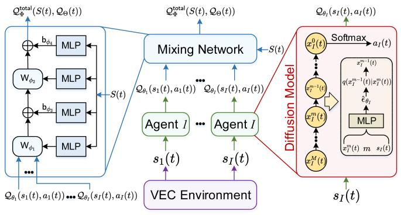

flowchart

```mermaid
graph TD
    subgraph VEC Environment
        A["Input wφ1"] --> B["MLP"]
        C["Input wφ2"] --> D["MLP"]
        E["Input wφ3"] --> F["MLP"]
        G["Input wφ4"] --> H["MLP"]
        I["Input wφ5"] --> J["MLP"]
        K["Input wφ6"] --> L["MLP"]
        M["Input wφ7"] --> N["MLP"]
        O["Input wφ8"] --> P["MLP"]
        Q["Input wφ9"] --> R["MLP"]
        S["Input wφ10"] --> T["MLP"]
        U["Input wφ11"] --> V["MLP"]
        W["Input wφ12"] --> X["MLP"]
        Y["Input wφ13"] --> Z["MLP"]
        AA["Input wφ14"] --> AB["MLP"]
        AC["Input wφ15"] --> AD["MLP"]
        AE["Input wφ16"] --> AF["MLP"]
        AG["Input wφ17"] --> AH["MLP"]
        AI["Input wφ18"] --> AJ["MLP"]
        AK["Input wφ19"] --> AL["MLP"]
        AM["Input wφ20"] --> AN["MLP"]
        AO["Input wφ21"] --> AP["MLP"]
        AQ["Input wφ22"] --> AR["MLP"]
        AS["Input wφ23"] --> AT["MLP"]
        AU["Input wφ24"] --> AV["MLP"]
        AW["Input wφ25"] --> AX["MLP"]
        AY["Input wφ3"] --> AZ["bφ1"]
        BA["Input wφ4"] --> BB["bφ2"]
        BC["Input wφ5"] --> BD["bφ3"]
    end

    subgraph Diffusion Model
        AD["Agent I"] --> AE
        AE --> AF
        AF --> AG
        AG --> AH
        AH --> AI
    end

    subgraph Output vcolates
        AJ["xI(t)"] --> AK
        AK --> AL["xI^M(t)"]
    end

    subgraph Output sT
        AM["xI(t)"] --> AN
        AN --> AO
    end

    subgraph Output sT_t
        AP["xI(t)"] --> AQ
        AQ --> AR
    end

    subgraph Output sT_t_t
        AS["xI(t)"] --> AT
    end

    subgraph Output sT_t_t_t
        AT["xI(t)"] --> AU
    end

    subgraph Output sT_t_t_t_t
        AU["xI(t)"] --> AV
    end

    subgraph Output sT_t_t_t_t_t
        AV["xI(t)"] --> AW
    end

    subgraph Output sT_t_t_t_t_t
        AW["xI(t)"] --> AX
    end

    subgraph Output sT_t_t_t_t_t
        AX["xI(t)"] --> AO
    end

    subgraph Output sT_t_t_t_t_t
        AO["xI(t)"] --> AP
    end

    subgraph Output sT_t_t_t_t_t
        AP["xI(t)"] --> AN
    end

    subgraph Output sT_t_t_t_t_t
        AN["xI(t)"] --> AO
    end

    subgraph Output sT_t_t_t_t_t
        AO["xI(t)"] --> AP
    end

    subgraph Output sT_t_t_t_t_t
        AP["xI(t)"] --> AN
    end

    subgraph Output sT_t_t_t_t_t
        AN["xI(t)"] --> AO
    end

    subgraph Output sT_t_t_t_t_t
        AO["xI(t)| Softmax<br>    end<br><br>    subgraph Output sT_t_t_t_t<br>        AP[xI(t)| Softmax<br>    end<br><br>    subgraph Output sT_t_t_t_t<br>        AN[xI(t)| Softmax<br>    end<br><br>    subgraph Output sT_t_t_t_t<br>        AO[xI(t)| Softmax<br>    end<br><br>    subgraph Output sT_t_t_t_t<br>        AP[xI(t)| Softmax<br>    end<br><br>    subgraph Output sT_t_t_t_t<br>        AN[xI(t)| Softmax<br>    end<br><br>    subgraph Output sT_t_t_t_t<br>        AO[xI(t)| Softmax<br>    end<br><br>    subgraph Output sT_t_t_t_t<br>        AP [Softmax"] --> AN
    end

    subgraph Output sT_t_t_t
        AN["Softmax"] --> AO
    end

    subgraph Output sT_t_t_t
        AO["Softmax"] --> AP
    end

    subgraph Output sT_t_t_t
        AP["Softmax"] --> AN
    end

    subgraph Output sT_t_t
        AN["Softmax"] --> AO
    end

    subgraph Output sT_t_t
        AO["Softmax"] --> AP
    end

    subgraph Output sT_t_t
        AP["Softmax"] --> AN
    end

    subgraph Output sT_t_t
        AN["Softmax"] --> AO
    end

    subgraph Output sT_t_t
        AO["Softmax"] --> AP
    end

    subgraph Output sT_t_t
        AP["Softmax"] --> AN
    end

    subgraph Output sT_t_t
        AN["Softmax"] --> AO
    end
```

Fig. 4. The overall architecture of the MAD2RL algorithm.

$$
\begin{array}{l} - \sum_ {j \in \mathcal {J} \backslash \{1 \}} Q _ {j} ^ {\mathrm{veh}} (t) \left[ \sum_ {k \in \mathcal {K}} \sum_ {i \in \mathcal {I} _ {k}} \xi_ {i, j} (t) \mathbb {I} _ {\{\varphi_ {i} (t) \neq L _ {k} + 1 \}} \right. \\ \times \left. \left(\sum_ {l _ {k} = \varphi_ {i} (t)} ^ {L _ {k}} B _ {l _ {k}}\right) - f _ {j} ^ {\mathrm{veh}} \tau \right] \\ - V \sum_ {i \in \mathcal {I}} d _ {i} (t). \tag {57} \\ \end{array}
$$

# E. Algorithm Architecture

The architecture of our proposed MAD2RL is depicted in Fig. 4, utilizing the QMIX framework for network training. Specifically, each CV is regarded an agent that makes local action decisions based on its local observation. As a result, MAD2RL comprises I online agent networks based on diffusion models, each responsible for evaluating the local q-values for each agent, and an online centralized mixing network that assesses the quality of the integrated decisions. Both online agent networks and the mixing network are paired with respective target networks, designed to address the issue of training instability. Additionally, a replay buffer is employed to diminish sample correlation through random sampling.

1) Diffusion Model-Based Agent Network: In MAD2RL, the core of the agent network $\mathcal { Q } _ { \pmb { \theta } _ { i } } ( \cdot )$ of agent i, parameterized by $\theta _ { i } ,$ is the diffusion model detailed in Section VI-B (depicted in red in Fig. 4). Additionally, a target agent network $\hat { \mathcal { Q } } _ { \hat { \theta _ { i } } } ( \cdot )$ , parameterized by $\hat { \theta } _ { i } .$ , is leveraged to stabilize the learning process and improve learning efficiency, which has the same network structure as $\mathcal { Q } _ { \pmb { \theta } _ { i } } ( \cdot )$ .   
2) Mixing Network: The feed-forward mixing network $\mathcal { Q } _ { \Phi } ^ { \mathrm { t o t a l } } ( S ( t ) , \mathcal { Q } _ { \Theta } ( t ) )$ takes the joint state $S ( t )$ and the joint action-value $\pmb { \mathcal { Q } } _ { \Theta } ( t ) = \{ \mathcal { Q } _ { \pmb { \theta } _ { 1 } } ( \pmb { \mathscr { s } } _ { 1 } ( t ) , a _ { 1 } ( t ) ) , \dots , \mathcal { Q } _ { \pmb { \theta } _ { l } }$ $( s _ { I } ( t ) , a _ { I } ( t ) \}$ as inputs to evaluate the quality of the integrated decisions:

$$
\mathcal {Q} _ {\Phi} ^ {\mathrm{total}} (S (t), \mathcal {Q} _ {\Theta} (t))
$$

$$
= \mathbf {W} _ {\phi_ {2}} (\boldsymbol {S} (t)) \left[ \mathbf {W} _ {\phi_ {1}} (\boldsymbol {S} (t)) \boldsymbol {\mathcal {Q}} _ {\Theta} (t) + \mathbf {b} _ {\phi_ {3}} (\boldsymbol {S} (t)) \right]
$$

$$
+ \mathbf {b} _ {\phi_ {4}} (S (t)), \boldsymbol {\Phi} = \{\phi_ {1}, \phi_ {2}, \phi_ {3}, \phi_ {4} \}, \boldsymbol {\Theta} = \{\theta_ {i} \} _ {i = 1} ^ {I}, \tag {58}
$$

where $\mathbf { W } _ { \phi _ { 1 } } ( S ( t ) ) , \mathbf { W } _ { \phi _ { 2 } } ( S ( t ) ) , \mathbf { b } _ { \phi _ { 3 } } ( S ( t ) )$ , and $ { \mathbf { b } } _ { \phi _ { 4 } } ( S ( t ) )$ represent the weights and biases provided by hypernetworks, parameterized by $\phi _ { 1 } , \phi _ { 2 } , \phi _ { 3 }$ , and $\phi _ { 4 } ,$ , respectively, with the joint state $S ( t )$ as input. Similarly, a target mixing network $\hat { \mathcal { Q } } _ { \hat { \Phi } } ^ { \mathrm { t o t a l } } ( \cdot )$ Φˆ parameterized by $\hat { \Phi }$ , is proposed with the same network structure as $\mathcal { Q } _ { \Phi } ^ { \sf t o t a l } ( \cdot )$ .

3) Replay Buffer: During the training process, a replay buffer $\mathcal { E }$ is employed to diminish sample correlation through random sampling. To simplify the presentation, we employ ${ \check { S } } , A .$ , and r to denote the joint state, joint action, and common reward in the current time slot, respectively, while $S ^ { \prime } , A ^ { \prime } ;$ , and $r ^ { \prime }$ correspond to the joint state, joint action, and common reward in the subsequent time slot. Then, at each time slot, MAD2RL stores the transition tuple < S, A, r, S > into $\mathcal { E } _ { : }$ , where it awaits sampling for the development of network policies.   
4) Policy Improvement: After the initial phase of $\mathbf { \vec { e } X \tilde { \mathbf { \theta } } } ^ { }$ ploration, we sample a random mini-batch of $E$ samples $\mathsf { \bar { \{ ( } }  S _ { e } , A _ { e } , r _ { e } , S _ { e } ^ { \prime } ) \} _ { e = 1 } ^ { \bar { E } }$ from the replay buffer $\mathcal { E }$ to update agent networks and the mixing network simultaneously. Note that QMIX employs a centralized training approach, where it has access to all agents’ observations and actions during the training phase. However, during execution, each agent operates independently based on its own local observation, making the approach scalable and practical for real-world applications where individual agents may not have access to complete global information. Specifically, we minimize the average Temporal Difference (TD) error between the target $\mathrm { Q } \mathrm { - }$ value $\hat { y } _ { e }$ and the Q-value of the mixing network $\mathcal { Q } _ { \Phi } ^ { \mathrm { t o t a l } } ( \cdot )$ , which is given by

$$
\min _ {\{\boldsymbol {\Phi}, \boldsymbol {\Theta} \}} \frac {1}{E} \sum_ {e = 1} ^ {E} \left[ \frac {1}{2} (\hat {y} _ {e} - \mathcal {Q} _ {\boldsymbol {\Phi}} ^ {\mathrm{total}} (\boldsymbol {S} _ {e}, \mathcal {Q} _ {\boldsymbol {\Theta}})) ^ {2} \right], \tag {59}
$$

$$
\text { s.t. } \hat {y} _ {e} = r _ {e} + \omega \hat {\mathcal {Q}} _ {\hat {\Phi}} ^ {\text { total }} (S _ {e} ^ {\prime}, \hat {\mathcal {Q}} _ {\hat {\Theta}}), \forall e \in \{1, 2, \dots , E \}. \tag {60}
$$

Here, ω denotes the discount factor for future rewards, and the target Q-value $\hat { y } _ { e }$ is calculated through the target mixing network $\hat { \mathcal { Q } } _ { \hat { \Phi } } ^ { \sf t o t a l } ( \cdot )$ , where $\begin{array} { r } { \hat { \mathcal { Q } } _ { \hat { \Theta } } = \{ \operatorname* { m a x } _ { a } \hat { \mathcal { Q } } _ { \hat { \pmb { \theta } } _ { 1 } } ( \pmb { s } _ { 1 } ^ { \prime } , a ) , \dots , } \end{array}$ maxa $\hat { \mathcal { Q } } _ { \hat { \theta } _ { I } } ( s _ { I } ^ { \prime } , a ) \}$ . Then, the estimation accuracy of both $\mathcal { Q } _ { \pmb { \theta } _ { i } } ( \cdot )$ and $\mathcal { Q } _ { \Phi } ^ { \mathrm { t o t a l } } ( \cdot )$ will be improved through iteratively minimizing the loss in (59) using standard gradient descent-based optimizers, such as Adam [33].

During the training phase of each time step in MAD2RL, the parameters of the target networks are only partially updated, ensuring that the changes in the value functions are smooth over time. Following this phase, the parameters of the target networks are softly updated towards those of the corresponding online networks as follows:

$$
\hat {\boldsymbol {\theta}} _ {i} \leftarrow \varepsilon \boldsymbol {\theta} _ {i} + (1 - \varepsilon) \hat {\boldsymbol {\theta}} _ {i}, \forall i \in \mathcal {I}, \tag {61}
$$

$$
\hat {\Phi} \leftarrow \varepsilon \Phi + (1 - \varepsilon) \hat {\Phi}, \tag {62}
$$

where $\varepsilon \in ( 0 , 1 ]$ ] determines the target network update rate. A smaller value of ε results in slower updates, which can stabilize the learning; however, it comes with the cost of a longer training time. By adjusting $\varepsilon ,$ the stability of the target networks and the learning speed are tuned.

Algorithm 1: MAD2RL Algorithm.   
1 Initialize agent networks $\mathcal{Q}_{\theta_{i}}(\cdot)$ and the mixing network $\mathcal{Q}_{\Phi}^{\mathrm{total}}(\cdot)$ , the discount factor $\omega$ , the maximum learning episode H, the maximum training steps T per episode.
2 Initialize the target agent networks $\{\hat{\boldsymbol{\theta}}_{i}\}_{i=1}^{I} \leftarrow \{\boldsymbol{\theta}_{i}\}_{i=1}^{I}$ and the mixing network $\hat{\boldsymbol{\Phi}} \leftarrow \boldsymbol{\Phi}$ , the replay buffer E.
3 for episode = 1 to H do
4 Receive initial local state $\{s_{i}(1)\}_{i=1}^{I}$ for each agent.
5 for t = 1 to T do
6 // The following loop is run on each agent:
7 for i = 1 to I do
8 Initialize a distribution $x_{i}^{M}(t) \sim \mathcal{N}(0, \mathbf{I})$ .
9 for m = M to 1 do
10 Use a deep neural network to infer the noise $\hat{\epsilon}_{\theta_{i}}(x_{i}^{m}(t), m, s_{i}(t))$ .
11 Calculate the mean $\mu_{\theta_{i}}^{m}(x_{i}^{m}(t), m, s_{i}(t))$ and the distribution $q(x_{i}^{m-1}(t)|x_{i}^{m}(t))$ by (40) and (38), respectively.
12 Calculate the distribution $x_{i}^{m-1}(t)$ using the reparameterization technique by (41).
13 end
14 Calculate the probability distribution $\mathcal{Q}_{\theta_{i}}(s_{i}(t))$ based on (42) and determine the local action $a_{i}(t)$ based on (55).
15 Determine the DNN partitioning decision $\varphi_{i}(t) = \lfloor \frac{a_{i}(t)}{J} \rfloor$ and task offloading decision $\xi_{i}(t) = a_{i}(t) \mod J$ , then obtain $\{f_{k}^{rsu}\}_{k=1}^{K}$ by (50) and (52).
16 Execute $\{\varphi_{i}(t), \xi_{i}(t), f_{k}^{rsu}\}$ in the environment, receive the common reward $r(t)$ , and transfer to next state $s_{i}(t+1)$ .
17 end
18 Store the transition $(\boldsymbol{S}(t), \boldsymbol{A}(t), r(t), \boldsymbol{S}(t+1))$ in the replay buffer E.
19 Randomly sample a batch of E transitions $\{(S_{e}, A_{e}, r_{e}, S_{e}')\}_{e=1}^{E}$ from replay buffer E.
20 Simultaneously update agent networks' parameters $\Theta = \{\theta_{i}\}_{i=1}^{I}$ and mixing network's parameters $\Phi = \{\phi_{1}, \phi_{2}, \phi_{3}, \phi_{4}\}$ by minimizing (59) using the sampled batch of data.
21 Update the target networks' parameters $\{\hat{\theta}_{i}\}_{i=1}^{I}$ and $\hat{\Phi}$ by (61) and (62), respectively.
22 end
23 end

# F. Algorithm Complexity

Algorithm 1 outlines the pseudocode of our proposed MAD2RL. According to the analysis in [54], since MAD2RL adopts centralized training with decentralized execution, where the observations, actions, and rewards of different agents/CVs are collected at a central server (e.g., an RSU) with sufficient computing resources, our primary focus is on the computational complexity of the execution process on the CVs. Additionally, various CVs deployed by different DRL agents run in parallel across the VEC network, so the overall complexity of the multi-agent system can be determined by the complexity of a single agent on an CV. Specifically, at time slot t, for CV/agent $i \in \mathcal { Z } _ { k }$ , we consider the MLP in the diffusion model contains $F$ fully connected layers, then the computational complexity of online execution (i.e., the reverse process of the diffusion model with a total of M denoising steps) can be calculated as $\begin{array} { r } { \mathcal { O } ( M ( | s _ { i } ( t ) | f _ { 0 } + \sum _ { h = 1 } ^ { F } f _ { h - 1 } f _ { h } + f _ { F } ( L _ { k } + 1 ) J ) ) } \end{array}$ , where $f _ { h }$ represents the number of neurons in hidden layer h.

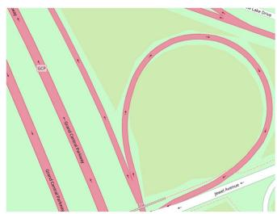

text_image

GCP
Pond Entrance

(a): Real-world traffic region.

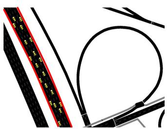

natural_image

Abstract diagram of black and red curved lines with yellow dots, no text or symbols present

(b): Import moving vehicles.   
Fig. 5. Vehicular network visualization.

# VIII. PERFORMANCE EVALUATION

In this section, we first outline the parameter settings for simulations and subsequently evaluate the performance of our proposed MAD2RL by comparing it against three benchmarks.

# A. Simulation Parameters

1) Vehicular Networks: We consider a real-world traffic region in New York, USA as shown in Fig. 5(a) obtained from OpenStreetMap [21]. Subsequently, SUMO [22] is leveraged to import moving vehicles10 in an unidirectional highway (highlighted in red) and form a realistic vehicular network as shown in Fig. 5(b). We consider the bandwidth B = 10 (in MHz), and the noise power $\sigma ^ { 2 } = - 1 1 4$ (in dBm).   
2) Parameters of CVs and SVs: We assume that the computation capability of CVs and SVs is uniformly distributed in the range of [4, 6] (in GHz) and [6, 8] (in GHz) [8], respectively. The computation capability of the RSU is 30 (in GHz). The transmit power of CV is chosen to be 23 (in dBm). Also, the distance between different CVs and SVs at different time slots are captured by SUMO [22], and the V2V contact radius, $d i s ^ { \mathsf { v 2 v } }$ , is set to 150 meters [8].   
3) DNN Model Types: We adopt three classical DNN models, including AlexNet [40], ResNet18 [7], and VGG16 [5], where the parameters of the convolution, pooling and fully-connected layers are extracted accordingly11. These models are capable of utilizing traffic pictures captured by on-board cameras as inputs to recognize traffic signs and signals, enhancing driving safety and efficiency. The memory footprint  for a unit data is set to 4

10In our simulation scenario, we do not consider the vehicle arrival/departure [35]. Specifically, at the beginning of the simulation, all vehicles are present at different positions and operate at an average speed of 25m/s [35], with the set of CVs/SVs assumed to remain within the RSU coverage throughout the simulation. We then use SUMO to capture the positions of the vehicles at different time slots, modeling the dynamic nature of the vehicular networks.   
11Although AlexNet, VGG16, and ResNet18 are not the latest state-of-the-art architectures in the broader machine learning area, they remain highly relevant and widely used in the field of vehicular networks [8], [39]. Considering state-ofthe-art DNN models such as Transformers, their large number of parameters and significant computational complexity could make them impractical for real-time applications in current vehicular networks. This further calls for a new trend of research focused on the implementation and execution of transformer models in vehicular networks, delving into the nuances and unique challenges that need to be addressed.

(in Byte) [8]. The total number of time slots is set as T = 30 (in second)12, and the duration of each time slot τ is 1 (in second) [8].

4) Parameters of Neural Networks: We implement MAD2RL using PyTorch 2.0 and Python 3.8.1 platforms. For the diffusion model of each agent, we configure the deep neural network to learn noise with 3 Fully Connected (FC) hidden layers, each consisting of 256 neurons. Additionally, we employ 2 FC hidden layers for each hypernetwork, each containing 64 neurons. The learning rate is set to $5 \times 1 0 ^ { - 4 }$ for the Adam optimizer [33]. We set the maximum number of episodes H to 1000, and the maximum steps per episode to 30 (i.e., total 30 time slots). The reward discount factor and the target network update rate are 0.99 and 0.001, respectively.

# B. Benchmark Solutions

To study the performance of MAD2RL, we have proposed three benchmark solutions, including both DRL-based and heuristic-based methods as detailed below. Note that the computation resource allocation for these benchmark solutions is also determined by the convex techniques proposed in this work, following the acquisition of the corresponding DNN partitioning and task offloading decisions.

Pure QMIX (P-QMIX) [51]: Contrasting with our proposed MAD2RL, P-QMIX utilizes an MLP-based agent network for each agent to make the optimal decisions on DNN partitioning and task offloading. This method is employed to highlight the substantial benefits of the diffusion model leveraged in this work.   
Genetic algorithm: Drawing inspiration from [16], at the beginning of each time slot, genetic algorithm generates several chromosomes. Each chromosome encompasses the DNN partitioning and task offloading decisions for all CVs, constituting the initial population. These chromosomes are then refined through a series of hybridizations and mutations until the maximum number of iterations is reached. Finally, the chromosome that yields the lowest value of (33) is selected.   
Greedy algorithm: This is a rule-based algorithm, where at the start of each time slot, each CV chooses the DNN layer with the smallest transmission data size as its DNN partitioning decision. Subsequently, the CVs select the edge node with the shortest task queue as their task offloading decision. This approach establishes a lower-bound baseline for evaluating scheduling performance.

# C. Simulation Results

1) Convergence Performance: Fig. 6(a) illustrates the episodic reward curves as training episodes proceed for our proposed MAD2RL under various denoising steps. This experiment was conducted with 7 CVs, 5 SVs, and V = 10. We observe that the reward initially increases but then decreases with an

12Note that although Lyapunov optimization is typically associated with infinite-horizon problems, its principles are also effective in finite-horizon scenario, such as the case of T = 30 considered in this work, as supported by [55]. Specifically, we use Lyapunov optimization technique detailed in Section V-B to minimize the bound of the Lyapunov drift-plus-penalty function given in (32) at each time slot based on the current system state, rather than relying on an infinite time horizon.

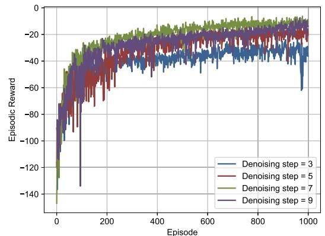

line

| Episode | Denoising step = 3 | Denoising step = 5 | Denoising step = 7 | Denoising step = 9 |
| ------- | ------------------ | ------------------ | ------------------ | ------------------ |
| 0       | -140               | -140               | -140               | -140               |
| 100     | -60                | -70                | -50                | -80                |
| 200     | -40                | -50                | -30                | -40                |
| 300     | -30                | -40                | -20                | -30                |
| 400     | -25                | -35                | -15                | -25                |
| 500     | -20                | -30                | -10                | -20                |
| 600     | -15                | -25                | -5                 | -15                |
| 700     | -10                | -20                | 0                  | -10                |
| 800     | -5                 | -15                | 0                  | -5                 |
| 900     | 0                  | -10                | 0                  | 0                  |
| 1000    | 0                  | 0                  | 0                  | 0                  |

(a): Denoising step impact on the reward.   
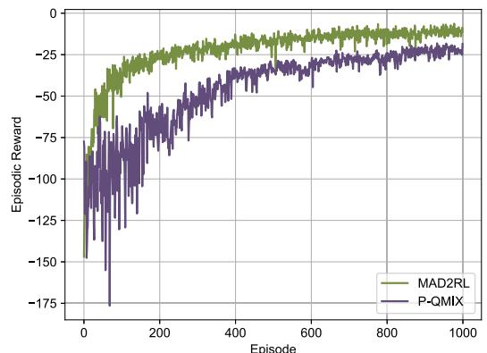

line

| Episode | MAD2RL | P-QMIX |
| ------- | ------ | ------ |
| 0       | -150   | -175   |
| 100     | -50    | -100   |
| 200     | -25    | -75    |
| 300     | -25    | -60    |
| 400     | -25    | -50    |
| 500     | -25    | -45    |
| 600     | -25    | -40    |
| 700     | -25    | -35    |
| 800     | -25    | -30    |
| 900     | -25    | -25    |
| 1000    | -25    | -25    |

(b): Comparison of reward curves of MAD2RL and P-QMIX.   
Fig. 6. Convergence performance analysis.

increasing number of denoising steps. This occurs because as the number of denoising steps increases, the training process generally becomes more stable, reducing high-frequency oscillations and helping the diffusion model learn more general features. However, more denoising steps can lead to poorer performance. The reason is that too many denoising steps can cause the diffusion model to remove excessive noise, eliminating valuable details from the data. Additionally, the errors introduced in each denoising step can continuously accumulate, resulting in an increasing deviation between the final result and the real distribution, thereby compromising the output quality of the model. Consequently, we fix the denoising steps of MAD2RL to 7 when comparing it with the benchmark in subsequent analyses.

As shown in Fig. 6(b), we illustrate the convergence behavior of both our proposed MAD2RL and P-QMIX as the number of training episodes increases. This experiment was conducted with 7 CVs, 5 SVs, and V = 10. Overall, our proposed MAD2RL is more stable and achieves a higher episodic reward during the training phase, demonstrating substantial benefits from the diffusion mode. This improvement is due to the generative capabilities of diffusion models, which significantly enhance action sample efficiency by progressively reducing noise through various denoising steps. Specifically, MAD2RL has achieved about 52% improvement in the reward compared with P-QMIX.

2) Stability of the Involved Queues: We evaluate the system stability achieved via the integration of Lyapunov technique in our methodology in Fig. 7 by depicting the task queue length as the number of training episodes increases. This experiment was conducted with 5 CVs, 3 SVs, and V = 10. Specifically, Fig. 7(a) illustrates the task queue stability of different CVs, demonstrated by the rapid convergence of the task queue length. Similarly, Fig. 7(b) and (c) show the task queue stability for different DNN model types and SVs, respectively. Consequently, the convergence behavior of these time-evolving task queues indicates a stable task assignment, thereby guaranteeing the stable system operation considered in this work.

3) Effect of the Number of Client Vehicles: The results shown in Fig. 8(a) illustrate the effect of incrementally increasing the number of CVs from 3 to 7 on the overall task completion time13. This experiment was conducted with 5 SVs, and V = 10. We observe that as the number of CVs increases, the overall task completion time grows. The reason is that while the available computation resources of edge nodes remain unchanged, the number of DNN tasks requiring inference increases with the increase in CVs, leading to a longer task queue and thus an increase in task completion time. Overall, our proposed MAD2RL method outperforms other algorithms. Its performance is 54.59% better than the greedy algorithm, 21.23% better than the genetic algorithm, and 19.14% better than P-QMIX at 3 CVs; it is 60.06% better than the greedy algorithm, 43.94% better than the genetic algorithm, and 19.93% better than P-QMIX at 7 CVs.

4) Effect of the Number of Service Vehicles: Fig. 8(b) shows the effect of the number of SVs on the overall task completion time. This experiment was conducted with 5 CVs, and V = 10. We observe that as the number of SVs increases, the task completion time decreases significantly at first, but then flattens out when the number of SVs exceeds that of CVs. The reason is that, initially, as the number of SVs increases, CVs tend to offload tasks to idle SVs to avoid backlogs in the task queues. However, when the number of SVs surpasses that of CVs, increasing the number of SVs leads to redundancy in computing resources, and the task completion time does not improve significantly thereafter. Overall, MAD2RL outperforms other algorithms. Its performance is 50.1% better than the greedy algorithm, 39.79% better than the genetic algorithm, and 22.8% better than P-QMIX at 3 SVs; it is 41.65% better than the greedy algorithm, 29.15% better than the genetic algorithm, and 21.58% better than P-QMIX at 7 SVs.

5) Effect of the Lyapunov Control Parameter V : In Fig. 9(a) and (b), we further illustrate the impact of the Lyapunov control parameter V in (31) on the performance of task queue stability and overall task completion time. This experiment was conducted with 7 CVs, and 5 SVs. Generally, as the weight of the Lyapunov control parameter V increases (i.e., more emphasis is placed on task completion time), the average backlog in different task queues exhibits an increase with the control parameter, while the overall task completion time remains unchanged. Although the delay remains unchanged when a larger control parameter is employed, it becomes comparatively more prominent as the overhead for guaranteeing stability increases.

13Considering that the computation capabilities of vehicles in this paper are generally in the range of [4, 6] GHz (i.e., [4, 6] GFLOPS), which is significantly smaller than that of the Jetson Xavier NX platform (21 TOPS) or NVIDIA Jetson TX2 (1.3 TFLOPS), and the possible backlogged computations in different task queues caused by periodically arrival of DNN-based tasks, the average completion time per vehicle falls within the second range, as observed in Fig. 8.

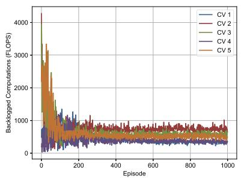

line

| Episode | CV 1 | CV 2 | CV 3 | CV 4 | CV 5 |
| ------- | ---- | ---- | ---- | ---- | ---- |
| 0       | 4000 | 4000 | 4000 | 4000 | 4000 |
| 100     | 800  | 800  | 800  | 800  | 800  |
| 200     | 600  | 600  | 600  | 600  | 600  |
| 300     | 500  | 500  | 500  | 500  | 500  |
| 400     | 450  | 450  | 450  | 450  | 450  |
| 500     | 400  | 400  | 400  | 400  | 400  |
| 600     | 350  | 350  | 350  | 350  | 350  |
| 700     | 300  | 300  | 300  | 300  | 300  |
| 800     | 250  | 250  | 250  | 250  | 250  |
| 900     | 200  | 200  | 200  | 200  | 200  |
| 1000    | 150  | 150  | 150  | 150  | 150  |

(a): Task queue length of different CVs.

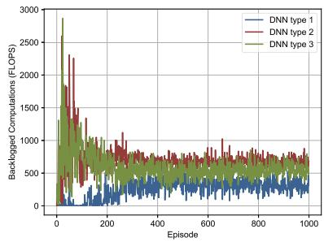

line

| Episode | DNN type 1 | DNN type 2 | DNN type 3 |
| ------- | ---------- | ---------- | ---------- |
| 0       | 2800       | 2900       | 1300       |
| 100     | 500        | 1400       | 1000       |
| 200     | 300        | 1000       | 800        |
| 300     | 400        | 900        | 700        |
| 400     | 350        | 850        | 650        |
| 500     | 300        | 800        | 600        |
| 600     | 350        | 850        | 650        |
| 700     | 300        | 800        | 600        |
| 800     | 350        | 850        | 650        |
| 900     | 300        | 800        | 600        |
| 1000    | 350        | 850        | 650        |

(b): Task queue length of different DNNs.

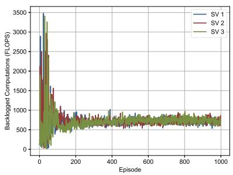

line

| Episode | SV 1 | SV 2 | SV 3 |
| ------- | ---- | ---- | ---- |
| 0       | 3500 | 3200 | 3300 |
| 100     | 500  | 600  | 700  |
| 200     | 800  | 900  | 1000 |
| 300     | 700  | 800  | 900  |
| 400     | 600  | 700  | 800  |
| 500     | 550  | 650  | 750  |
| 600     | 500  | 600  | 700  |
| 700     | 450  | 550  | 650  |
| 800     | 400  | 500  | 600  |
| 900     | 350  | 450  | 550  |
| 1000    | 300  | 400  | 500  |

(c): Task queue length of different SVs.

Fig. 7. Stability of the involved queues.   
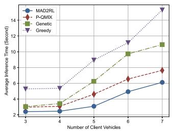

line

| Number of Client Vehicles | MAD2RL | P-QMIX | Genetic | Greedy |
| ------------------------- | ------ | ------ | ------- | ------ |
| 3                         | 2.0    | 3.0    | 3.0     | 5.0    |
| 4                         | 2.5    | 3.5    | 3.5     | 5.5    |
| 5                         | 3.0    | 4.5    | 6.0     | 9.0    |
| 6                         | 4.5    | 6.5    | 10.0    | 11.0   |
| 7                         | 6.0    | 8.0    | 11.0    | 15.0   |

(a): Effect of the number of CVs.

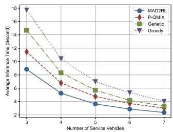

line

| Number of Service Vehicles | MAD2RL | P-QMIX | Genetic | Greedy |
| -------------------------- | ------ | ------ | ------- | ------ |
| 3                          | 9.0    | 11.5   | 14.5    | 18.0   |
| 4                          | 6.0    | 7.0    | 8.5     | 10.5   |
| 5                          | 4.5    | 5.5    | 6.0     | 7.5    |
| 6                          | 3.5    | 4.5    | 4.5     | 5.5    |
| 7                          | 3.0    | 3.5    | 3.5     | 4.0    |

(b): Effect of the number of SVs.

Fig. 8. Performance evaluations upon considering different numbers of vehicles.   
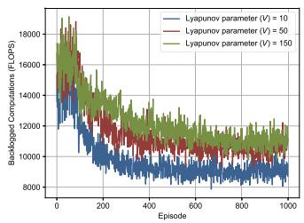

line

| Episode | Lyapunov parameter (V) = 10 | Lyapunov parameter (V) = 50 | Lyapunov parameter (V) = 150 |
| ------- | --------------------------- | --------------------------- | ---------------------------- |
| 0       | 18000                       | 18000                       | 18000                        |
| 100     | 12000                       | 13000                       | 14000                        |
| 200     | 10000                       | 11000                       | 12000                        |
| 300     | 9500                        | 10500                       | 11500                        |
| 400     | 9200                        | 10200                       | 11200                        |
| 500     | 9000                        | 10000                       | 11000                        |
| 600     | 8800                        | 9800                        | 10800                        |
| 700     | 8700                        | 9700                        | 10700                        |
| 800     | 8600                        | 9600                        | 10600                        |
| 900     | 8500                        | 9500                        | 10500                        |
| 1000    | 8400                        | 9400                        | 10400                        |

(a): Total task queue length.

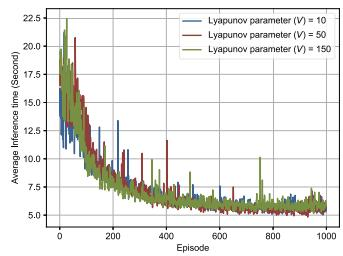

line

| Episode | Lyapunov parameter (V) = 10 | Lyapunov parameter (V) = 50 | Lyapunov parameter (V) = 150 |
| ------- | --------------------------- | --------------------------- | ---------------------------- |
| 0       | 22.5                        | 22.5                        | 22.5                         |
| 100     | 15.0                        | 16.0                        | 17.0                         |
| 200     | 8.0                         | 9.0                         | 10.0                         |
| 300     | 6.5                         | 7.5                         | 8.5                          |
| 400     | 6.0                         | 7.0                         | 8.0                          |
| 500     | 5.5                         | 6.5                         | 7.5                          |
| 600     | 5.0                         | 6.0                         | 7.0                          |
| 700     | 4.5                         | 5.5                         | 6.5                          |
| 800     | 4.0                         | 5.0                         | 6.0                          |
| 900     | 3.5                         | 4.5                         | 5.5                          |
| 1000    | 3.0                         | 4.0                         | 5.0                          |

(b): Total task completion time.   
Fig. 9. Effect of the Lyapunov control parameter.

6) The MAD2RL Algorithm Running Time Analysis: To verify the real-time applicability of the proposed MAD2RL algorithm in dynamic vehicular networks, we conducted numerical experiments with an increasing number of SVs,14 while keeping the number of CVs fixed at I = 5. The experimental results are illustrated in Table II, where the number of SVs varies from 3 to 7. We observed that the genetic algorithm has the longest running time, as it requires extensive iterations to converge to a relatively stable solution. The running time of the proposed MAD2RL algorithm is longer than that of P-QMIX, primarily due to the additional reverse process (M = 7) in the diffusion model. However, given the MAD2RL’s lowest task completion

14Since MAD2RL uses centralized training and distributed execution, where each agent/CV operates independently based on its own local observation, we focus solely on the influence of the number of SVs on the algorithm’s running time. Additionally, the greedy algorithm is excluded from comparison due to its poor performance in terms of task completion time.

TABLE II COMPARISON OF ALGORITHM RUNNING TIME PER STEP (SECOND) 

<table><tr><td>Number of SVs</td><td>3</td><td>4</td><td>5</td><td>6</td><td>7</td></tr><tr><td>P-QMIX</td><td>0.023</td><td>0.027</td><td>0.035</td><td>0.041</td><td>0.052</td></tr><tr><td>MAD2RL</td><td>0.089</td><td>0.097</td><td>0.118</td><td>0.151</td><td>0.183</td></tr><tr><td>Genetic</td><td>0.301</td><td>0.453</td><td>0.623</td><td>0.915</td><td>1.338</td></tr></table>

latency (as shown in Fig. 8) and its short running time relative to the time slot interval (τ = 1 second), we can conclude that MAD2RL is relatively time-efficient and suitable for real-time online decision-making.

# IX. CONCLUSION AND FUTURE WORKS

In this paper, we addressed the problem of joint DNN partitioning, task offloading, and resource allocation in VEC as a dynamic long-term optimization. Our objective was to minimize the DNN-based task completion time while guaranteeing the system stability over time. To achieve this, we first employed a Lyapunov optimization technique to decouple the original long-term optimization problem with stability constraints into a per-slot deterministic problem. Afterwards, we proposed a MAD2RL algorithm, incorporating the innovative use of a diffusion model, to determine the optimal DNN partitioning, and task offloading decisions. Furthermore, we integrated convex optimization techniques into MAD2RL as a subroutine for allocating computation resources. Through numerical simulations, we demonstrated the superior performance of our proposed MAD2RL algorithm compared to existing benchmark solutions. Future research could further explore the potential of utilizing an expert dataset which can be obtained offline through the brute-force search method, to conduct the forward process of diffusion models.

# REFERENCES

[1] Z. Ning et al., “Intelligent edge computing in Internet of Vehicles: A joint computation offloading and caching solution,” IEEE Trans. Intell. Transp. Syst., vol. 22, no. 4, pp. 2212–2225, Apr. 2021.   
[2] J. Zhang and K. B. Letaief, “Mobile edge intelligence and computing for the Internet of Vehicles,” inProc. IEEE, vol. 108, no. 2, pp. 246–261, Feb. 2020.   
[3] X. Hou, J. Wang, C. Jiang, Z. Meng, J. Chen, and Y. Ren, “Efficient federated learning for Metaverse via dynamic user selection, gradient quantization and resource allocation,” IEEE J. Sel. Areas Commun., vol. 42, no. 4, pp. 850–866, Apr. 2024.

[4] Z. Wang et al., “A tutorial on extremely large-scale MIMO for 6G: Fundamentals, signal processing, and applications,” IEEE Commun. Surv. Tut., vol. 26, no. 3, pp. 1560–1605, Third Quarter, 2024.   
[5] K. Simonyan and A. Zisserman, “Very deep convolutional networks for large-scale image recognition,” 2015, arXiv:1409.1556.   
[6] Y. Xu, H. Zhou, T. Ma, J. Zhao, B. Qian, and X. Shen, “Leveraging multiagent learning for automated vehicles scheduling at nonsignalized intersections,” IEEE Internet Things J., vol. 8, no. 14, pp. 11 427–11 439, Jul. 2021.   
[7] K. He, X. Zhang, S. Ren, and J. Sun, “Deep residual learning for image recognition,” in Proc. IEEE Conf. Comput. Vis. Pattern Recognit., 2016, pp. 770–778.   
[8] K. Liu, C. Liu, G. Yan, V. C. S. Lee, and J. Cao, “Accelerating DNN inference with reliability guarantee in vehicular edge computing,” IEEE/ACM Trans. Netw., vol. 31, no. 6, pp. 3238–3253, Dec. 2023.   
[9] Z. Liu, M. Liwang, S. Hosseinalipour, H. Dai, Z. Gao, and L. Huang, “RFID: Towards low latency and reliable DAG task scheduling over dynamic vehicular clouds,” IEEE Trans. Veh. Technol., vol. 72, no. 9, pp. 12 139–12 153, Sep. 2023.   
[10] Z. Liu, Y. Zhao, S. Hosseinalipour, Z. Gao, L. Huang, and H. Dai, “TDRA: A truthful dynamic reverse auction for DAG task scheduling over vehicular clouds,” IEEE Trans. Veh. Technol., vol. 73, no. 3, pp. 4337–4351, Mar. 2024.   
[11] Z. Nan, S. Zhou, Y. Jia, and Z. Niu, “Joint task offloading and resource allocation for vehicular edge computing with result feedback delay,” IEEE Trans. Wirel. Commun., vol. 22, no. 10, pp. 6547–6561, Oct. 2023.   
[12] J. Shi, J. Du, Y. Shen, J. Wang, J. Yuan, and Z. Han, “DRL-based V2V computation offloading for blockchain-enabled vehicular networks,” IEEE Trans. Mobile Comput., vol. 22, no. 7, pp. 3882–3897, Jul. 2023.   
[13] P. Abdisarabshali, M. Liwang, A. Rajabzadeh, M. Ahmadi, and S. Hosseinalipour, “Decomposition theory meets reliability analysis: Processing of computation-intensive dependent tasks over vehicular clouds with dynamic resources,” IEEE/ACM Trans. Netw., vol. 32, no. 1, pp. 475–490, Feb. 2024.   
[14] D. Tabernik and D. Skoˇcaj, “Deep learning for large-scale traffic-sign detection and recognition,” IEEE Trans. Intell. Transp. Syst., vol. 21, no. 4, pp. 1427–1440, Apr. 2020.   
[15] J. Yan, S. Bi, Y. J. Zhang, and M. Tao, “Optimal task offloading and resource allocation in mobile-edge computing with inter-user task dependency,” IEEE Trans. Wirel. Commun., vol. 19, no. 1, pp. 235–250, Jan. 2020.   
[16] F. Sun et al., “Cooperative task scheduling for computation offloading in vehicular cloud,” IEEE Trans. Veh. Technol., vol. 67, no. 11, pp. 11 049–11 061, Nov. 2018.   
[17] T. X. Tran and D. Pompili, “Joint task offloading and resource allocation for multi-server mobile-edge computing networks,” IEEE Trans. Veh. Technol., vol. 68, no. 1, pp. 856–868, Jan. 2019.   
[18] X. Hou, J. Wang, C. Jiang, X. Zhang, Y. Ren, and M. Debbah, “UAVenabled covert federated learning,” IEEE Trans. Wirel. Commun., vol. 22, no. 10, pp. 6793–6809, Oct. 2023.   
[19] A. S. Kumar, L. Zhao, and X. Fernando, “Task offloading and resource allocation in vehicular networks: A Lyapunov-based deep reinforcement learning approach,” IEEE Trans. Veh. Technol., vol. 72, no. 10, pp. 13 360–13 373, Oct. 2023.   
[20] S. Bi, L. Huang, H. Wang, and Y.-J. A. Zhang, “Lyapunov-guided deep reinforcement learning for stable online computation offloading in mobileedge computing networks,” IEEE Trans. Wirel. Commun., vol. 20, no. 11, pp. 7519–7537, Nov. 2021.   
[21] M. Haklay and P. Weber, “OpenStreetMap: User-generated street maps,” IEEE Pervasive Comput., vol. 7, no. 4, pp. 12–18, Fourth Quarter, 2008.   
[22] P. A. Lopez et al., “Microscopic traffic simulation using SUMO,” in Proc. Int. Conf. Intell. Transp. Syst., 2018, pp. 2575–2582.   
[23] W. Zhang et al., “Deep reinforcement learning based resource management for DNN inference in Industrial IoT,” IEEE Trans. Veh. Technol., vol. 70, no. 8, pp. 7605–7618, Aug. 2021.   
[24] W. Wu, P. Yang, W. Zhang, C. Zhou, and X. Shen, “Accuracy-guaranteed collaborative DNN inference in Industrial IoT via deep reinforcement learning,” IEEE Trans. Ind. Inform., vol. 17, no. 7, pp. 4988–4998, Jul. 2021.   
[25] M. Gao, R. Shen, L. Shi, W. Qi, J. Li, and Y. Li, “Task partitioning and offloading in DNN-task enabled mobile edge computing networks,” IEEE Trans. Mobile Comput., vol. 22, no. 4, pp. 2435–2445, Apr. 2023.

[26] Y. Sun, S. Zhou, and Z. Niu, “Distributed task replication for vehicular edge computing: Performance analysis and learning-based algorithm,” IEEE Trans. Wirel. Commun., vol. 20, no. 2, pp. 1138–1151, Feb. 2021.   
[27] Z. Wei, B. Li, R. Zhang, X. Cheng, and L. Yang, “Many-to-many task offloading in vehicular fog computing: A multi-agent deep reinforcement learning approach,” IEEE Trans. Mobile Comput., vol. 23, no. 3, pp. 2107–2122, Mar. 2024.   
[28] X. Huang, L. He, X. Chen, L. Wang, and F. Li, “Revenue and energy efficiency-driven delay-constrained computing task offloading and resource allocation in a vehicular edge computing network: A deep reinforcement learning approach,” IEEE Internet Things J., vol. 9, no. 11, pp. 8852–8868, Jun. 2022.   
[29] L. T. Hoang, C. T. Nguyen, and A. T. Pham, “Deep reinforcement learningbased online resource management for UAV-assisted edge computing with dual connectivity,” IEEE/ACM Trans. Netw., vol. 31, no. 6, pp. 2761–2776, Dec. 2023.   
[30] G. Ma, X. Wang, M. Hu, W. Ouyang, X. Chen, and Y. Li, “DRL-based computation offloading with queue stability for vehicular-cloud-assisted mobile edge computing systems,” IEEE Trans. Intell. Veh., vol. 8, no. 4, pp. 2797–2809, Apr. 2023.   
[31] J. Ho, A. Jain, and P. Abbeel, “Denoising diffusion probabilistic models,” in Proc. Int. Conf. Neural Inf. Process. Syst., 2020, pp. 6840–6851.   
[32] Z. Wang, J. J. Hunt, and M. Zhou, “Diffusion policies as an expressive policy class for offline reinforcement learning,” 2022, arXiv:2208.06193.   
[33] H. Du et al., “Diffusion-based reinforcement learning for edge-enabled AI-generated content services,” 2023, arXiv:2303.13052.   
[34] H. Du, J. Wang, D. Niyato, J. Kang, Z. Xiong, and D. I. Kim, “AIgenerated incentive mechanism and full-duplex semantic communications for information sharing,” IEEE J. Sel. Areas Commun., vol. 41, no. 9, pp. 2981–2997, Sep. 2023.   
[35] J. Du, F. R. Yu, X. Chu, J. Feng, and G. Lu, “Computation offloading and resource allocation in vehicular networks based on dual-side cost minimization,” IEEE Trans. Veh. Technol., vol. 68, no. 2, pp. 1079–1092, Feb. 2019.   
[36] L. Liang, S. Xie, G. Y. Li, Z. Ding, and X. Yu, “Graph-based resource sharing in vehicular communication,” IEEE Trans. Wirel. Commun., vol. 17, no. 7, pp. 4579–4592, Jul. 2018.   
[37] C. Li, L. Chai, K. Jiang, Y. Zhang, J. Liu, and S. Wan, “DNN partition and offloading strategy with improved particle swarm genetic algorithm in VEC,” IEEE Trans. Intell. Veh., early access, Dec. 25, 2023, doi: 10.1109/TIV.2023.3346506.   
[38] J. Wang, C. Jiang, K. Zhang, T. Q. S. Quek, Y. Ren, and L. Hanzo, “Vehicular sensing networks in a smart city: Principles, technologies and applications,” IEEE Trans. Wirel. Commun., vol. 25, no. 1, pp. 122–132, Feb. 2018.   
[39] Y. Wu, J. Wu, M. Yao, B. Liu, L. Chen, and S. K. Lam, “Two-level scheduling algorithms for deep neural network inference in vehicular networks,” IEEE Trans. Intell. Transp. Syst., vol. 24, no. 9, pp. 9324–9343, Sep. 2023.   
[40] A. Krizhevsky, I. Sutskever, and G. E. Hinton, “ImageNet classification with deep convolutional neural networks,” Commun. ACM, vol. 60, no. 6, pp. 84–90, 2017.   
[41] F. P.-C. Lin, S. Hosseinalipour, S. S. Azam, C. G. Brinton, and N. Michelusi, “Semi-decentralized federated learning with cooperative D2D local model aggregations,” IEEE J. Sel. Areas Commun., vol. 39, no. 12, pp. 3851–3869, Dec. 2021.   
[42] X. Zhang, M. Peng, S. Yan, and Y. Sun, “Deep-reinforcement-learningbased mode selection and resource allocation for cellular V2X communications,” IEEE Internet Things J., vol. 7, no. 7, pp. 6380–6391, Jul. 2020.   
[43] D. Bernstein, “Containers and cloud: From LXC to Docker to Kubernetes,” IEEE Cloud Comput., vol. 1, no. 3, pp. 81–84, Sep. 2014.   
[44] J. Zhou and X. Zhang, “Fairness-aware task offloading and resource allocation in cooperative mobile-edge computing,” IEEE Internet Things J., vol. 9, no. 5, pp. 3812–3824, Mar. 2022.   
[45] T. Q. Dinh, J. Tang, Q. D. La, and T. Q. S. Quek, “Offloading in mobile edge computing: Task allocation and computational frequency scaling,” IEEE Trans. Commun., vol. 65, no. 8, pp. 3571–3584, Aug. 2017.   
[46] M. Neely, Stochastic Network Optimization With Application to Communication and Queueing Systems. Berlin, Germany: Springer Nature, 2022.   
[47] Z. Liu, L. Huang, Z. Gao, M. Luo, S. Hosseinalipour, and H. Dai, “GA-DRL: Graph neural network-augmented deep reinforcement learning for DAG task scheduling over dynamic vehicular clouds,” IEEE Trans. Netw. Service Manage., vol. 21, no. 4, pp. 4226–4242, Aug. 2024.

[48] K. Arulkumaran, M. P. Deisenroth, M. Brundage, and A. A. Bharath, “Deep reinforcement learning: A brief survey,” IEEE Signal Process. Mag., vol. 34, no. 6, pp. 26–38, Nov. 2017.   
[49] Y. Liu et al., “ProSecutor: Protecting mobile AIGC services on two-layer blockchain via reputation and contract theoretic approaches,” IEEE Trans. Mobile Comput., early access, Apr. 17, 2024, doi: 10.1109/TMC.2024.3390208.   
[50] J. Wang et al., “A unified framework for guiding generative AI with wireless perception in resource constrained mobile edge networks,” IEEE Trans. Mobile Comput., vol. 23, no. 11, pp. 10344–10360, Nov. 2024.   
[51] T. Rashid, M. Samvelyan, C. S. De Witt, G. Farquhar, J. Foerster, and S. Whiteson, “Monotonic value function factorisation for deep multi-agent reinforcement learning,” J. Mach. Learn. Res., vol. 21, no. 178, pp. 1–51, 2020.   
[52] X. Ren et al., “Dual-level resource provisioning and heterogeneous auction for mobile Metaverse,” IEEE Trans. Mobile Comput., vol. 23, no. 11, pp. 10329–10343, Nov. 2024.   
[53] R. Zhang, K. Xiong, Y. Lu, P. Fan, D. W. K. Ng, and K. B. Letaief, “Energy efficiency maximization in RIS-assisted SWIPT networks with RSMA: A PPO-based approach,” IEEE J. Sel. Areas Commun., vol. 41, no. 5, pp. 1413–1430, May 2023.   
[54] D. C. Nguyen, M. Ding, P. N. Pathirana, A. Seneviratne, J. Li, and H. V. Poor, “Cooperative task offloading and block mining in blockchain-based edge computing with multi-agent deep reinforcement learning,” IEEE Trans. Mobile Comput., vol. 22, no. 4, pp. 2021–2037, Apr. 2023.   
[55] Y. Li, S. Xia, M. Zheng, B. Cao, and Q. Liu, “Lyapunov optimization-based trade-off policy for mobile cloud offloading in heterogeneous wireless networks,” IEEE Trans. Cloud Comput., vol. 10, no. 1, pp. 491–505, First Quarter, 2022.

natural_image

Portrait photo of a young man with short dark hair wearing a black shirt (no text or symbols visible)

Zhang Liu (Graduate Student Member, IEEE) received the BS degree from the East China University of Science and Technology, Shanghai, China, in 2019. He is currently working toward the PhD degree with the School of Informatics and Communication Engineering, Xiamen University, Xiamen, China. He was a visiting PhD degree with the College of Computing and Data Science, Nanyang Technological University, Singapore, from 2023 to 2024. His research interests include generative AI, reinforcement learning, and edge intelligence.

natural_image

Portrait of a man wearing glasses and a blazer (no text or symbols visible)

Hongyang Du (Graduate Student Member, IEEE) received the PhD degree from the Interdisciplinary Graduate Program, the College of Computing and Data Science, Energy Research Institute at NTU, Nanyang Technological University, Singapore, in 2024. He is the editor-in-chief assistant of IEEE Communications Surveys & Tutorials (2022-2024). He is the recipient of the IEEE Daniel E. Noble Fellowship Award from the IEEE Vehicular Technology Society in 2022, the IEEE Signal Processing Society Scholarship from the IEEE Signal Processing Society

in 2023, the Chinese Government Award for Outstanding Students Abroad in 2023, and the Singapore Data Science Consortium (SDSC) Dissertation Research Fellowship in 2023. He was recognized as an exemplary reviewer of IEEE Transactions on Communications and IEEE Communications Letters in 2021. His research interests include edge intelligence, generative AI, semantic communications, and network management.

natural_image

Portrait photo of a young man in formal attire (no text or symbols visible)

Junzhe Lin (Student Member, IEEE) received the BS degree from Fujian Normal University, Fuzhou, China, in 2022. He is currently working toward the graduate degree with the School of Informatics, Xiamen University, Xiamen, China. His research interests include internet of vehicles, wireless communication, and resource allocation, etc.

natural_image

Portrait of a man wearing glasses and a suit (no text or symbols visible)

Zhibin Gao (Member, IEEE) received the BS degree in communication engineering, the MS degree in radio physics, and the PhD degree in communication engineering from Xiamen University, Xiamen, China, in 2003, 2006, and 2011, respectively. He is a professor of Navigation Institute, Jimei University, Xiamen, China. Previously, he worked with Xiamen University, as a senior engineer of Communication Engineering. His research interests include Internet of Vehicles, wireless network resource management, and signal processing.

natural_image

Portrait photo of a woman with long dark hair wearing a blue turtleneck against a red background (no text or symbols visible)

Lianfen Huang (Member, IEEE) received the BS degree in radio physics and the PhD degree in communication engineering from Xiamen University, Xiamen, China, in 1984 and 2008, respectively. She was a visiting scholar with Tsinghua University, Beijing, China, in 1997. She is a professor with the Department of Communication Engineering, Xiamen University. Her current research interests include wireless communication, wireless network, and signal processing.

natural_image

Portrait of a man in business attire (no visible text or symbols)

Seyyedali Hosseinalipour (Member, IEEE) received the PhD degree in electrical engineering from NC State University in 2020. He is currently an assistant professor with the Department of Electrical Engineering, University at Buffalo, SUNY, Buffalo, NY, USA. His research interests include 6G, machine learning, federated learning, fog and edge computing, and network optimization.

natural_image

Portrait of a person wearing glasses and a dark jacket (no visible text or symbols)

Dusit Niyato (Fellow, IEEE) received the BEng from the King Mongkuts Institute of Technology Ladkrabang (KMITL), Thailand and the PhD degree in electrical and computer engineering from the University of Manitoba, Canada. He is a professor with the College of Computing and Data Science, Nanyang Technological University, Singapore. His research interests are in the areas of mobile generative AI, edge intelligence, decentralized machine learning, and incentive mechanism design.