# DRL-Based Wireless-Powered UAVs Trajectories Planning for Fair Communication

Peixiang Wang , Xiaoyu Wang , Member, IEEE, He Huang , Senior Member, IEEE, and Haipeng Dai , Senior Member, IEEE

Abstract—While unmanned aerial vehicle base stations (UAV-BSs) offer transformative potential for enhancing terrestrial networks, their deployment faces dual challenges of limited onboard energy and dynamic channel conditions that compromise longterm fair communication coverage. In this paper, we investigate the problem of Wireless-powered UAVs Trajectories planning for Fair communication (WUTF), that is, navigating multiple UAV-BSs powered by wireless charging towers (WCTs), to provide fair communication services for ground users. To address the problem, we first formulate the original optimization problem as a Partially Observable Markov Decision Process (POMDP), and propose a Deep Reinforcement Learning (DRL) based trajectory planning algorithm. The proposed approach incorporates a novel reward function that balances multiple objectives and adopts a Centralized Training with Executed Decentralization (CTED) framework. Furthermore, a sequential policy update scheme is introduced to enhance multi-UAV coordination and reduce policy conflicts. Simulation results show that our proposed algorithm significantly improves the communication fairness, total throughput, and communication efficiency, as compared to state-of-the-art DRL-based methods up to 32.01% on average.

Index Terms—UAV control, communication coverage, deep reinforcement learning, wireless charging.

## I. INTRODUCTION

W ITH the advancement of technologies such as wirelesscommunication [1], onboard computers [2], and wire- communication [1], onboard computers [2], and wireless power transfer [3], it has become feasible to control largescale intelligent Unmanned Aerial Vehicles (UAVs) to complete complex and long-term tasks. Using UAVs as aerial base stations (UAV-BSs) is a promising solution for enhancing terrestrial communication infrastructure, leveraging high-altitude flight to increase Line-of-Sight (LoS) link probability with Ground

Users (GUs), thus improving service quality and coverage. Additionally, UAV-BSs’ high mobility and rapid deployment allow quick, dynamic positioning in emergencies where terrestrial infrastructure is damaged or unavailable (e.g., disaster areas or remote regions), significantly enhancing wireless communication performance. Consequently, UAV-BSs are widely viewed as flexible, cost-efficient stations [4].

However, the limited onboard energy of UAVs poses a critical challenge, with market rotary-wing UAVs typically offering only 30-60 minutes of flight endurance [5], insufficient for long-term tasks. While existing studies minimize energy consumption as a constraint [6], [7] through energy-efficient trajectory or task scheduling, these methods improve shortterm efficiency but fail to sustain long-term UAV operation. Recent Wireless Power Transfer (WPT) developments have spurred research into laser/RF-powered UAVs [8], [9], [10], yet these studies often focus on simplified scenarios or adopt static strategies pre-planning trajectories and service areas based on fixed WCTs/user distributions. Although addressing energy replenishment, such approaches lead to uncovered GUs failing to connect and are inapplicable in dynamic, time-varying complex environments.

In this paper, we consider the problem of Wireless-powered UAVs Trajectories Planning for Fair Communication (WUTF). Formally, given a number of ground users with fixed positions in the 2D target area where obstacles and pre-deployed WCTs exist, our goal is to navigate wireless-powered UAV-BSs flying at a fixed height under limited initial energy reserve to provide long-term and fair communication services to GUs, i.e., determining their movement trajectory in each timeslot such that communication fairness among GUs is maximized.

There are four main challenges in this problem. First, WCTs are introduced into the scenario to enable energy replenishment for UAV-BSs, so energy consumption is no longer a simple constraint. Second, there are diverse flight states during UAV flights, each associated with distinct energy consumption characteristics. Therefore, based on a more practical UAV energy consumption model [11], it is necessary to characterize energy usage under different flight conditions, including hovering, constant-speed flight, and linear acceleration or deceleration. Third, the dynamic environment makes it difficult to balance multiple objectives such as throughput, fairness, obstacle avoidance, and UAV energy management, which increases problem complexity. Finally, there are infinite candidate trajectory strategies for each UAV to choose, which means the solution space is unlimited. Moreover, in each timeslot, each UAV must make real-time decisions based on the observation from the dynamic environment, further increasing the complexity of the decision-making process.

Motivated by the success of Deep Reinforcement Learning (DRL) in solving high-dimensional and dynamic decisionmaking problems [12], [13], we adopt a DRL-based framework to address these challenges. In RL, an agent interacts with the environment to learn optimal actions that maximize cumulative rewards, enabling efficient control in complex environments. Therefore, we formulate the problem as a POMDP and propose a DRL-based trajectory planning algorithm to achieve efficient and reliable multi-UAV communication. The main contributions and novelty can be summarized as follows:

We consider a more practical scenario and introduce WCTs to enable energy replenishment for UAV-BSs. We formulate an optimization problem that aims to achieve the optimal communication fairness among GUs and total throughput by designing the UAVs’ trajectories in each timeslot.

\- Given the time-varying nature, complex constraints and multi-objective characteristics of thE optimization problem, we propose an effective DRL-based UAVs trajectory planning algorithm, called WUTF. We introduce a sequential policy update scheme, allowing each UAV to consider others’ policy updates during training. This design mitigates potential policy conflicts, enhances cooperation efficiency, and improves training stability.

\- In the proposed WUTF algorithm, we present a novel metric called communication value, which quantifies the contribution of UAV-BSs to regional communication fairness. Unlike conventional reward shaping that only provides auxiliary signals to accelerate convergence, communication value is a problem-driven metric and a key element of the optimization objective. This metric is further integrated into a carefully designed reward function, which balances long-term communication fairness, total system throughput, and communication efficiency.

\- We evaluate effectiveness, robustness, and superiority of the proposed algorithm WUTF in terms of different metrics. We analyze the underlying reasons for the superior performance of WUTF by visualizing the trajectories of the UAVs.

## II. RELATED WORK

## A. UAV Trajectory Planning With Energy Constraints

Some studies consider the energy consumption of UAVs, usually integrating energy consumption minimization as an optimization constraint. Specifically, these works focus on optimizing UAV trajectories to accomplish mission objectives such as communication coverage or data transmission while minimizing energy consumption. The authors in [14] proposed an energy-efficient UAV communication framework by jointly optimizing the UAV’s trajectory. In [15], the authors proposed an approach for jointly optimizing UAV trajectory planning and user connectivity to maximize energy efficiency in post-disaster communication scenarios. Another work in [16] also focuses on disaster or burst traffic scenarios, where the authors proposed a hierarchical framework for the energy-efficient deployment of coverage-aimed and capacity-aimed UAV-BSs. The authors in [17] investigated a UAV-assisted MEC task offloading framework, formulating an energy efficiency maximization problem and proposing a MADRL-based DSPAC-MN algorithm with tailored actor–critic modules to jointly optimize UAV mobility, resource allocation, and computation capabilities. The authors of [18] studied joint resource allocation and UAV trajectory optimization to maximize the total energy efficiency under QoS constraints. In [19], the authors proposed a joint optimization method for user scheduling, UAV trajectory planning and bandwidth allocation to maximize energy efficiency. However, these studies mainly focus on the energy-constrained UAV optimization problem in an energy efficiency way. They do not consider energy replenishment mechanisms for UAVs, which are critical for providing long-term communication services.

## B. Wireless-Powered UAV Deployment

To overcome the energy limitations of conventional UAVassisted communication systems, wireless-powered UAV deployment offers a promising solution that allows UAVs to replenish energy and sustain long-term communication services. The authors in [9] proposed a novel laser-powered UAV deployment strategy and presented a comprehensive analysis of the system’s wireless coverage performance. In [10], the authors studied UAV-mounted small cell networks powered by solar panels and grid connections. Based on this, they proposed a comprehensive optimization framework to jointly optimize area throughput and energy exchange costs. The authors of [20] proposed a joint optimization of charging time, trajectory, and transmit power to maximize the secrecy rate in a wireless-powered UAV communication system. In [21], the authors proposed a system efficiency maximization problem for a UAV-enabled mobile relaying system. In [22], the authors studied cooperative path planning for mutiple UAVs to serve dynamic user demands, achieving provable approximation guarantees. To prolong the battery life of UAVs, the authors in [23] proposed a wireless rechargeable UAV network, where static wireless chargers provide non-disruptive wireless power transfer to UAVs. They developed baseline and improved algorithms to optimize the charging schedule and enhance energy efficiency. Another work in [24] studied wirelesspowered UAV-BSs deployment to maximize system throughput and proposed a primal-dual approximation algorithm based on piecewise charging modeling. However, as discussed above, most existing works either focus on simplified scenarios or adopt static deployment strategies, where UAV trajectories and service areas are pre-planned based on specified environments. These static deployment strategies are unable to cope with dynamic and time-varying environments. Consequently, these solutions cannot be applied to our problem.

## C. DRL for UAV-Assisted Communication Systems

Deep reinforcement learning is a powerful tool that leverages deep neural networks (DNNs) to learn optimal policies for solving complex decision-making problems. Compared with traditional optimization methods, DRL-based approaches utilize

TABLE I  
COMPARISON OF OUR CONTRIBUTIONS WITH STATE-OF-THE-ART RELATED WORKS
<table><tr><td rowspan=1 colspan=1></td><td rowspan=1 colspan=1>[14]</td><td rowspan=1 colspan=1>[15]</td><td rowspan=1 colspan=1>[16]</td><td rowspan=1 colspan=1>[17]</td><td rowspan=1 colspan=1>[18]</td><td rowspan=1 colspan=1>[20]</td><td rowspan=1 colspan=1>[21]</td><td rowspan=1 colspan=1>[22]</td><td rowspan=1 colspan=1>[23]</td><td rowspan=1 colspan=1>[24]</td><td rowspan=1 colspan=1>[25]</td><td rowspan=1 colspan=1>[26]</td><td rowspan=1 colspan=1>[27]</td><td rowspan=1 colspan=1>[28]</td><td rowspan=1 colspan=1>[29]</td><td rowspan=1 colspan=2>ours</td></tr><tr><td rowspan=1 colspan=1>Multi-UAV Trajectory Optimization</td><td rowspan=1 colspan=1></td><td rowspan=1 colspan=1></td><td rowspan=1 colspan=1>√</td><td rowspan=1 colspan=1>V</td><td rowspan=1 colspan=1></td><td rowspan=1 colspan=1></td><td rowspan=1 colspan=1></td><td rowspan=1 colspan=1>V</td><td rowspan=1 colspan=1>V</td><td rowspan=1 colspan=1></td><td rowspan=1 colspan=1>√</td><td rowspan=1 colspan=1></td><td rowspan=1 colspan=1></td><td rowspan=1 colspan=1></td><td rowspan=1 colspan=1>√</td><td rowspan=1 colspan=1>√</td><td rowspan=1 colspan=1></td></tr><tr><td rowspan=1 colspan=1>Energy Efficiency Maximization</td><td rowspan=1 colspan=1>√</td><td rowspan=1 colspan=1>√</td><td rowspan=1 colspan=1>√</td><td rowspan=1 colspan=1>√</td><td rowspan=1 colspan=1>V</td><td rowspan=1 colspan=1></td><td rowspan=1 colspan=1>√</td><td rowspan=1 colspan=1>√</td><td rowspan=1 colspan=1>√</td><td rowspan=1 colspan=1></td><td rowspan=1 colspan=1></td><td rowspan=1 colspan=1></td><td rowspan=1 colspan=1></td><td rowspan=1 colspan=1>√</td><td rowspan=1 colspan=1></td><td rowspan=1 colspan=1>V</td><td rowspan=1 colspan=1></td></tr><tr><td rowspan=2 colspan=1>Long-Term Communication CoverageMulti-Agent Deep Reinforcement Learning</td><td rowspan=1 colspan=1></td><td rowspan=1 colspan=1></td><td rowspan=1 colspan=1></td><td rowspan=1 colspan=1></td><td rowspan=1 colspan=1>√</td><td rowspan=1 colspan=1></td><td rowspan=1 colspan=1></td><td rowspan=1 colspan=1></td><td rowspan=1 colspan=1></td><td rowspan=1 colspan=1>√</td><td rowspan=1 colspan=1></td><td rowspan=1 colspan=1></td><td rowspan=1 colspan=1></td><td rowspan=1 colspan=1></td><td rowspan=1 colspan=1>√</td><td rowspan=1 colspan=1>V</td><td rowspan=1 colspan=1></td></tr><tr><td rowspan=1 colspan=1></td><td rowspan=1 colspan=1></td><td rowspan=1 colspan=1></td><td rowspan=1 colspan=1>V</td><td rowspan=1 colspan=1></td><td rowspan=1 colspan=1></td><td rowspan=1 colspan=1></td><td rowspan=1 colspan=1></td><td rowspan=1 colspan=1></td><td rowspan=1 colspan=1></td><td rowspan=1 colspan=1>√</td><td rowspan=1 colspan=1>V</td><td rowspan=1 colspan=1>√</td><td rowspan=1 colspan=1>√</td><td rowspan=1 colspan=1>√</td><td rowspan=1 colspan=1>V</td><td rowspan=1 colspan=1></td></tr><tr><td rowspan=5 colspan=1>Artificial Intelligence-Driven ApproachEnergy-Constrained UAV OperationWireless Energy HarvestingFair Communication CoverageTrajectory Planning with Obstacle Avoidance</td><td rowspan=1 colspan=1></td><td rowspan=1 colspan=1></td><td rowspan=1 colspan=1>V</td><td rowspan=1 colspan=1>√</td><td rowspan=1 colspan=1></td><td rowspan=1 colspan=1></td><td rowspan=1 colspan=1></td><td rowspan=1 colspan=1></td><td rowspan=1 colspan=1></td><td rowspan=1 colspan=1></td><td rowspan=1 colspan=1>V</td><td rowspan=1 colspan=1>√</td><td rowspan=1 colspan=1>√</td><td rowspan=1 colspan=1>V</td><td rowspan=1 colspan=1>V</td><td rowspan=1 colspan=1>V</td><td rowspan=1 colspan=1></td></tr><tr><td rowspan=1 colspan=1>V</td><td rowspan=1 colspan=1>√</td><td rowspan=1 colspan=1>√</td><td rowspan=1 colspan=1>V</td><td rowspan=1 colspan=1>V</td><td rowspan=1 colspan=1>√</td><td rowspan=1 colspan=1></td><td rowspan=1 colspan=1>V</td><td rowspan=1 colspan=1>V</td><td rowspan=1 colspan=1></td><td rowspan=1 colspan=1></td><td rowspan=1 colspan=1></td><td rowspan=1 colspan=1></td><td rowspan=1 colspan=1>V</td><td rowspan=1 colspan=1></td><td rowspan=1 colspan=1>V</td><td rowspan=1 colspan=1></td></tr><tr><td rowspan=1 colspan=1></td><td rowspan=1 colspan=1></td><td rowspan=1 colspan=1></td><td rowspan=1 colspan=1></td><td rowspan=1 colspan=1></td><td rowspan=1 colspan=1>√</td><td rowspan=1 colspan=1>√</td><td rowspan=1 colspan=1>V</td><td rowspan=1 colspan=1>V</td><td rowspan=1 colspan=1>√</td><td rowspan=1 colspan=1></td><td rowspan=1 colspan=1></td><td rowspan=1 colspan=1></td><td rowspan=1 colspan=1></td><td rowspan=1 colspan=1></td><td rowspan=1 colspan=1>V</td><td rowspan=1 colspan=1></td></tr><tr><td rowspan=1 colspan=1></td><td rowspan=1 colspan=1></td><td rowspan=1 colspan=1></td><td rowspan=1 colspan=1></td><td rowspan=1 colspan=1></td><td rowspan=1 colspan=1></td><td rowspan=1 colspan=1></td><td rowspan=1 colspan=1></td><td rowspan=1 colspan=1></td><td rowspan=1 colspan=1></td><td rowspan=1 colspan=1></td><td rowspan=1 colspan=1></td><td rowspan=1 colspan=1></td><td rowspan=1 colspan=1></td><td rowspan=1 colspan=1>√</td><td rowspan=1 colspan=1>V</td><td rowspan=1 colspan=1></td></tr><tr><td rowspan=1 colspan=1></td><td rowspan=1 colspan=1></td><td rowspan=1 colspan=1></td><td rowspan=1 colspan=1></td><td rowspan=1 colspan=1></td><td rowspan=1 colspan=1></td><td rowspan=1 colspan=1></td><td rowspan=1 colspan=1></td><td rowspan=1 colspan=1></td><td rowspan=1 colspan=1></td><td rowspan=1 colspan=1></td><td rowspan=1 colspan=1></td><td rowspan=1 colspan=1></td><td rowspan=1 colspan=1></td><td rowspan=1 colspan=1></td><td rowspan=1 colspan=1></td><td rowspan=1 colspan=1></td></tr></table>

DNNs to extract complex features from dynamic environments and leverage them to make more effective decisions for optimizing overall system performance. With the improvement of onboard computing capabilities, many studies have tried to use DRL models to control UAVs in UAV-assisted communication systems. For example, the authors in [30] studied the joint problem of decoupled uplink and downlink association and UAV trajectory design in full-duplex multi-UAV networks. In [25], the authors focused on the navigation problem in cellular-connected UAV networks and proposed a DRL solution with a quantuminspired experience replay (QiER) to make a better trade-off between sampling priority and diversity. The authors in [26] studied the radio resource management problem in cellularconnected UAV networks and proposed a hybrid D3QN–TD3 solution to deal with resource block coordination in discrete action space and beamforming design in continuous action space. In [27], the authors also utilized DRL to optimize the trajectory of UAVs in a UAV-assisted communication system, aiming to minimize latency and improve communication performance. The authors of [28] proposed a DRL-based algorithm to optimize UAV control for energy-efficient wireless service provisioning under dynamic channel conditions. In [29], a DDPG-based algorithm was proposed to address long-term communication coverage by jointly optimizing multi-UAV deployment and user association. Regarding the above references, most existing studies focus on maximizing total system throughput, with few addressing fair communication in UAV-assisted systems. Moreover, existing studies rarely consider more realistic models of UAV energy consumption or energy replenishment strategies, such as deploying WCTs. This is because these settings would significantly increase the uncertainty and complexity of the environment, which poses additional challenges to algorithm design. To clearly highlight these differences, Table I provides a detailed comparison between our contributions and the stateof-the-art related works. In summary, this paper proposes a DRL-based framework that jointly optimizes UAV deployment and user association to achieve fair communication in complex environments with obstacles and WCTs.

## III. SYSTEM MODEL AND PROBLEM FORMULATION

## A. System Model

As shown in Fig. 1, we define a time-slotted UAV-BS communication system that provides long-term communication services to GUs in areas lacking terrestrial communication infrastructure. At the beginning, N GUs, denoted as $\mathcal { U } = u _ { 1 } , u _ { 2 } , . . . , u _ { N }$ , are randomly distributed within an $L \times L \mathrm { m } ^ { 2 }$ task area. Our objective is to control M UAV-BSs (or simply “UAVs”), represented as $\mathcal { F } = \{ f _ { 1 } , f _ { 2 } , \dots , f _ { M } \}$ , to provide fair communication services to GUs over multiple timeslots $t = 1 , 2 , \dots , T$ . In addition, = 1 2there are some obstacles (e.g., tall buildings, trees, power lines, etc.) which UAVs should avoid, and K WCTs with the height of $H _ { c }$ , denoted as $\mathcal { C } = \{ c _ { 1 } , c _ { 2 } , . . . , c _ { K } \}$ . The UAVs receive energy wirelessly from WCTs, which are omnidirectional, and their flight altitude is fixed at $H > H _ { c }$ . We divide the task into T equal timeslots. In each timeslot t, each UAV spends time $t _ { d } , \ t _ { m } , \ t _ { c }$ for decision-making, movement, and providing communication services to GUs, respectively. Since the decision-making phase is based on a pre-trained network model, the UAV’s decision time $t _ { d }$ is very short and can be neglected. Therefore, each timeslot t can be approximately represented as $t \approx t _ { m } + t _ { c } .$

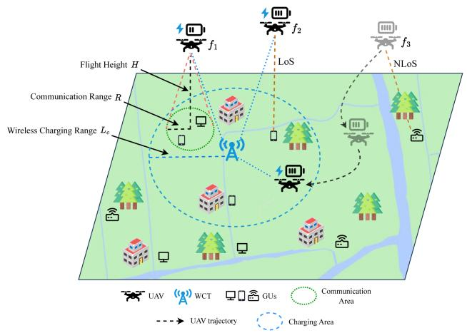  
Fig. 1. Wireless-powered multi-UAV communication coverage scenario.

1) UAV Energy Consumption Model: The UAV consumes energy for various maneuvers (i.e., flight, acceleration, deceleration, and hovering), so an energy consumption model is needed to characterize its usage. In [11], the authors derived a theoretical model to calculate the propulsion power of rotary-wing UAVs when flying at a velocity $V$ as:

$$
\begin{array} { l } { { P ( V ) = P _ { 0 } \left( 1 + \displaystyle \frac { 3 V ^ { 2 } } { U _ { t i p } ^ { 2 } } \right) + P _ { i } \left( \sqrt { 1 + \displaystyle \frac { V ^ { 4 } } { 4 v _ { 0 } ^ { 4 } } } - \displaystyle \frac { V ^ { 2 } } { 2 v _ { 0 } ^ { 2 } } \right) ^ { \frac { 1 } { 2 } } } } \\ { { + \displaystyle \frac { d _ { 0 } \rho s A V ^ { 3 } } { 2 } , } } \end{array}\tag{1}
$$

where $P _ { 0 }$ and $P _ { i }$ are two constants that correspond to the blade profile power and the induced power during hovering, respectively, $v _ { 0 }$ denotes the mean rotor induced velocity in hovering status, $U _ { t i p }$ is the tip speed of the rotor blade, s and $\rho$ denote the rotor solidity and air density, respectively, $d _ { 0 }$ and A are the fuselage drag ratio and rotor disc area, respectively.

Based on the above model, the UAV’s energy consumption can be calculated for hovering, steady flight, acceleration, and deceleration, denoted as $E _ { \mathrm { h o v e r } } , E _ { V } , E _ { \mathrm { a c c } }$ , and $E _ { \mathrm { d e c } }$ , respectively. When the UAV flies at speed $V .$ , its total energy consumption is expressed as:

$$
E _ { V } = P ( V ) \cdot T _ { V } ,\tag{2}
$$

where $T _ { V }$ is the flying time. For hovering, where the speed is $V = 0$ , one has

$$
E _ { h o v e r } = P ( 0 ) \cdot T _ { h o v e r } ,\tag{3}
$$

where $T _ { h o v e r }$ denotes the hovering time. For linear acceleration or deceleration, the relationship between velocity and time can be expressed as:

$$
V = v _ { 0 } + a _ { \mathrm { a c c } } t ,\tag{4}
$$

where $v _ { 0 }$ denotes the initial velocity, $a _ { \mathrm { a c c } }$ and t are the acceleration and time, respectively. Since the UAV accelerates from hovering to speed $V$ at the beginning of a timeslot, its energy consumption during this phase is:

$$
E _ { a c c } = \int _ { 0 } ^ { \frac { V } { a _ { \mathrm { a c c } } } } P ( a _ { \mathrm { a c c } } t ) d t ,\tag{5}
$$

where $\frac { V } { a _ { \mathrm { a c c } } }$ represents the acceleration time, as $v _ { 0 } = 0 , P ( a _ { \mathrm { a c c } } t )$ is the energy consumption of the UAV at velocity $a _ { \mathrm { a c c } } t .$ . For the linear deceleration phase, the UAV slows from speed $V$ to $0 ,$ which is symmetric to the acceleration phase. Thus, its energy consumption is identical, i.e., $E _ { \mathrm { d e c } } = E _ { \mathrm { a c c } }$

Based on the above equations, we denote the total energy consumption of UAV $f _ { i }$ in timeslot t as $E _ { t } ^ { f _ { i } }$ i. At the beginning, UAV $f _ { i }$ starts from hovering and accelerates linearly with $a _ { \mathrm { a c c } }$ until reaching speed V . As it approaches the destination, it decelerates with the same $a _ { \mathrm { a c c } }$ until stopping to hover. The movement phase lasts $t _ { m }$ , and the corresponding energy consumption $E _ { m , t } ^ { \bar { f } _ { i } }$ is given by:

$$
E _ { m , t } ^ { f _ { i } } = 2 \int _ { 0 } ^ { \frac { V } { a _ { \mathrm { a c c } } } } P ( a _ { \mathrm { a c c } } t ) d t + P ( V ) \cdot \left( t _ { m } - 2 \cdot { \frac { V } { a _ { \mathrm { a c c } } } } \right) .\tag{6}
$$

After the movement phase, the UAV remains hovering and begins providing communication services to ground users within its communication range. The corresponding hovering energy consumption is denoted as:

$$
E _ { h , t } ^ { f _ { i } } = P ( 0 ) \times t _ { c } ,\tag{7}
$$

and the communication energy consumption is given by:

$$
E _ { c , t } ^ { f _ { i } } = P _ { c o m } \times t _ { c } ,\tag{8}
$$

where $P _ { c o m }$ is the power required to maintain communication services.

2) UAV Charging Model: We have constructed a wireless charging model based on [31], which ensures that UAVs can provide long-term communication services for GUs. In this model, the distance between UAV $f _ { i }$ and WCT $c _ { k }$ is expressed as:

$$
l _ { c _ { k } , f _ { i } } = \sqrt { ( X _ { f _ { i } } - X _ { c _ { k } } ) ^ { 2 } + ( Y _ { f _ { i } } - Y _ { c _ { k } } ) ^ { 2 } + ( H - H _ { c } ) ^ { 2 } } ,\tag{9}
$$

where $( X _ { f _ { i } } , Y _ { f _ { i } } )$ and $( X _ { c _ { k } } , Y _ { c _ { k } } )$ represent the 2D coordinates of UAV $f _ { i }$ and WCT $c _ { k }$ , respectively. Accordingly, the charging power received by UAV $f _ { i }$ from $\mathbf { W } { \mathbf { C T } } c _ { k }$ is calculated as follows:

$$
\begin{array} { r } { P _ { c _ { k } , f _ { i } } = \left\{ \begin{array} { c c } { \frac { \eta } { ( \theta \cdot l _ { c _ { k } , f _ { i } } + \mu ) ^ { 2 } } , } & { l _ { c _ { k } , f _ { i } } \leq L _ { c } , } \\ { 0 , } & { \mathrm { o t h e r w i s e } , } \end{array} \right. } \end{array}\tag{10}
$$

where η and $\mu$ are two constants determined by the environment and the hardware of the charging station, $L _ { c }$ represents the charging range of the WCT, θ denotes the angular spread of the WCT. Therefore, the charging coverage of a WCT is modeled as a spherical region with radius $L _ { c }$

Additionally, we assume that the charging power from different WCTs is additive, allowing a UAV to simultaneously receive power from multiple WCTs. Therefore, the charging power received by UAV $f _ { i }$ in timeslot t is given by:

$$
P _ { t } ^ { f _ { i } } = \sum _ { j = 1 } ^ { K } P _ { c _ { j } , f _ { i } } .\tag{11}
$$

However, in practical scenarios, the charging power accepted by a UAV is constrained by an upper threshold $P _ { t h }$ . The actual charging efficiency is proportional to the received charging power until it reaches $P _ { t h }$ . Therefore, the actual charging power $\bar { P } _ { t , i n } ^ { f _ { i } }$ received by UAV $f _ { i }$ in timeslot t is calculated as:

$$
P _ { t , \mathrm { i n } } ^ { f _ { i } } = \left\{ { P _ { t } ^ { f _ { i } } , \mathrm { \quad } 0 \leq P _ { t } ^ { f _ { i } } \leq P _ { t h } , } \right.\tag{12}
$$

Moreover, the charging capability of each WCT is also limited, which implies that a single WCT cannot charge an unlimited number of UAVs simultaneously. Specifically, the total charging power delivered by WCT $c _ { k }$ in timeslot t is constrained by its maximum output power $P _ { \mathrm { m a x } }$

$$
\sum _ { f _ { i } \in \mathcal { U } _ { t } ^ { c _ { k } } } P _ { c _ { k } , f _ { i } } \leq P _ { \operatorname* { m a x } } ,\tag{13}
$$

where $\boldsymbol { \mathcal { U } } _ { t } ^ { c _ { k } }$ represents the set of UAVs served by WCT $c _ { k }$ at timeslot t.

To ensure safe and efficient wireless charging, UAVs are assumed to receive power only while hovering. In each timeslot t, UAV $f _ { i }$ spends $t _ { m }$ moving to the target area and the remaining $t _ { c }$ hovering to serve GUs. Therefore, based on the aforementioned charging model, the energy received by UAV $f _ { i }$ from WCTs at timeslot t is:

$$
E _ { t , \mathrm { i n } } ^ { f _ { i } } = P _ { t , \mathrm { i n } } ^ { f _ { i } } \cdot t _ { c } .\tag{14}
$$

3) UAV-to-GU Channel Model: In the UAV-BSs communication system, our goal is to control multiple UAVs to provide communication services to GUs. To achieve this, we consider the communication channel model between the UAVs and GUs. Despite the high-altitude deployment of UAVs, their links may experience additional path loss from obstacles (e.g., tall buildings, trees), resulting in either line-of-sight (LoS) or non-lineof-sight (NLoS) conditions depending on relative positions. To determine whether a UAV-to-GU link has LoS or NLoS, it is necessary to consider not only the precise locations of both the UAV and the GU but also the distribution of obstacles in the environment [25], [26]. However, obtaining complete obstacle information to accurately determine whether a UAV-to-GU link is LoS or NLoS is a significant challenge. To address this difficulty, we adopt a probabilistic LoS channel model [32]. We assume that the probability of forming an LoS link between the UAV $f _ { i }$ and the GU $u _ { j }$ can be approximated as follows:

$$
P _ { f _ { i } , u _ { j } } ^ { \mathrm { L o S } } = \frac { 1 } { 1 + m e ^ { - n ( \beta - m ) } } ,\tag{15}
$$

1 +where m and n are environment-dependent parameters, β represents the elevation angle between the UAV $f _ { i }$ and the GU $u _ { j }$

Accordingly, the probability of an NLoS link between them is given by:

$$
P _ { f _ { i } , u _ { j } } ^ { \mathrm { N L o S } } = 1 - P _ { f _ { i } , u _ { j } } ^ { \mathrm { L o S } } .\tag{16}
$$

Thus, the channel gain $g _ { f _ { i } , u _ { j } }$ between them can be expressed as:

$$
g _ { f _ { i } , u _ { j } } = K _ { 0 } ^ { - 1 } d _ { f _ { i } , u _ { j } } ^ { - \alpha } ( P _ { \mathrm { L o S } } \mu _ { \mathrm { L o S } } + P _ { \mathrm { N L o S } } \mu _ { \mathrm { N L o S } } ) ^ { - 1 } ,\tag{17}
$$

where $\begin{array} { r } { K _ { 0 } = ( \frac { 4 \pi f _ { c } } { c } ) ^ { 2 } , f _ { c } } \end{array}$ denotes the carrier frequency, c represents the speed of light, α is a constant known as the path loss exponent, $\mu _ { \mathrm { L o S } }$ and $\mu _ { \mathrm { N L o S } }$ represent the path loss factors for LoS and NLoS links, respectively.

We assume that UAVs employ the OFDMA technique to provide communication services to multiple GUs simultaneously, where each GU can connect to at most one UAV in a timeslot. Additionally, for the UAV $f _ { i }$ , the communication range in timeslot t is denoted as:

$$
R _ { t } ^ { f _ { i } } = \operatorname* { m a x } \left( R _ { \mathrm { t h } } , \ R _ { \mathrm { m a x } } \cdot \frac { B _ { t } ^ { f _ { i } } } { B _ { \mathrm { m a x } } } \right) ,\tag{18}
$$

where $B _ { \mathrm { m a x } }$ denote the maximum battery capacity of the UAV, $R _ { \mathrm { m a x } }$ denotes the maximum communication range. According to the Shannon capacity formula, the expected data transmission rate $\chi _ { t , u _ { \bar { t } } } ^ { f _ { i } }$ for the GU $u _ { j }$ served by UAV $f _ { i }$ in timeslot t is given by:

$$
\chi _ { t , u _ { j } } ^ { f _ { i } } = \left\{ \begin{array} { c c } { B \log _ { 2 } ( 1 + \gamma _ { f _ { i } , u _ { j } } ) , } & { \gamma _ { f _ { i } , u _ { j } } \geq \gamma _ { \mathrm { t h } } , } \\ { 0 , } & { \gamma _ { f _ { i } , u _ { j } } < \gamma _ { \mathrm { t h } } , } \end{array} \right.\tag{19}
$$

where B is the channel bandwidth, $\gamma _ { f _ { i } , u _ { j } }$ represents the signalto-interference-plus-noise ratio (SINR) between UAV $f _ { i }$ and GU $u _ { j }$ . The SINR $\gamma _ { f _ { i } , u _ { j } }$ is expressed as:

$$
\gamma _ { f _ { i } , u _ { j } } = \frac { p _ { \mathrm { t x } } ^ { f _ { i } } g _ { f _ { i } , u _ { j } } } { \sum _ { m = 1 , m \ne i } ^ { M } \kappa _ { f _ { m } , u _ { j } } p _ { \mathrm { t x } } ^ { f _ { m } } g _ { f _ { m } , u _ { j } } + N _ { \delta } ^ { 2 } } ,\tag{20}
$$

where $\kappa _ { f _ { m } , u _ { j } }$ indicates whether user $u _ { j }$ is within the communication range of UAV $f _ { m }$ (1 for within range, 0 for out of range), $p _ { \mathrm { t x } } ^ { f _ { i } }$ is the transmission power of UAV $f _ { i } ,$ $N _ { \delta } ^ { 2 }$ represents the power spectral density of the additive white Gaussian noise in the channel. Moreover, to meet the user’s QoS requirements, a communication link between UAV $f _ { i }$ and GU $u _ { j }$ can only be established when $\gamma _ { f _ { i } , u _ { j } } \geq \gamma _ { \mathrm { t h } }$

## B. Problem Formulation

In this subsection, we consider the long-term communication coverage problem, which is to navigate M UAVs over $T$ timeslots to provide fair and efficient communication services for GUs. We use a binary variable $b _ { f _ { i } , u _ { j } } ^ { t }$ to represent whether UAV $f _ { i }$ can be associated to GU $u _ { j }$ at timeslot t, i.e., $b _ { f _ { i } , u _ { j } } = 1$ denote that UAV $f _ { i }$ provides communication service to user $u _ { j } ;$ otherwise, $b _ { f _ { i } , u _ { j } } = 0$ . When a task is completed, the total throughput can be expressed as:

$$
P _ { T } = \sum _ { t = 1 } ^ { T } \sum _ { i = 1 } ^ { M } \sum _ { j = 1 } ^ { N } b _ { f _ { i } , u _ { j } } \cdot \chi _ { t , u _ { j } } ^ { f _ { i } } .\tag{21}
$$

Then, one of our objectives is to maximize the total throughput $P _ { T }$ . However, this may result in an unfair communication coverage, where some GUs are under-served or ignored. Therefore, in a time-slotted UAV-BSs communication system, our goal is to ensure fair communication coverage for GUs while maximizing the total throughput. We use the Jain’s fairness index [33] to characterize the geographical fairness among all GUs in communication, which is defined as:

$$
F _ { T } = \frac { ( \sum _ { j = 1 } ^ { N } P _ { T } ^ { u _ { j } } ) ^ { 2 } } { N \sum _ { j = 1 } ^ { N } P _ { T } ^ { u _ { j } 2 } } ,\tag{22}
$$

where $P _ { T } ^ { u _ { j } }$ denotes the total throughput of GU $u _ { j }$ over $T$ timeslots. Obviously, if the throughput is evenly achieved by GUs, the value of $F _ { T }$ will be closer to 1. Another objective is to maximize the fairness $F _ { T }$

Based on the above formula and models, our optimization problem can be described as:

$$
( \mathbf { P 1 } ) \quad \operatorname* { m a x } _ { \mathbf { v } , \psi , \mathbf { b } } \ \frac { P _ { T } \cdot F _ { T } } { \sum _ { t = 1 } ^ { T } \sum _ { i = 1 } ^ { M } E _ { t , \mathrm { o u t } } ^ { f _ { i } } }\tag{23}
$$

$$
\mathrm { s . t . ~ 0 } < B _ { t } ^ { f _ { i } } \le B _ { \operatorname* { m a x } } ,
$$

$$
\forall f _ { i } \in { \mathcal { F } } ,\tag{23a}
$$

$$
b _ { f _ { i } , u _ { j } } ^ { t } \in \{ 0 , 1 \} , \qquad \forall f _ { i } \in \mathcal { F } \forall u _ { j } \in \mathcal { U } ,\tag{23b}
$$

$$
\sum _ { i = 1 } ^ { M } b _ { f _ { i } , u _ { j } } ^ { t } \le 1 ,
$$

$$
\forall u _ { j } \in \mathcal { U } ,\tag{23c}
$$

$$
0 \leq v _ { f _ { i } } ^ { t } \leq v _ { \operatorname* { m a x } } ,
$$

$$
\forall f _ { i } \in { \mathcal { F } } ,\tag{23d}
$$

$$
0 \leq \psi _ { f _ { i } } ^ { t } \leq 2 \pi ,
$$

$$
\forall f _ { i } \in { \mathcal { F } } ,\tag{23e}
$$

$$
0 \leq X _ { f _ { i } } ^ { t } \leq L ,
$$

$$
0 \leq Y _ { f _ { i } } ^ { t } \leq L ,
$$

$$
\forall f _ { i } \in { \mathcal { F } } ,\tag{23f}
$$

$$
\forall f _ { i } \in { \mathcal { F } } ,\tag{23g}
$$

where $\mathbf { v } = \{ v _ { f _ { i } } ^ { t } | f _ { i } \in \mathcal { F } \} , \psi = \{ \psi _ { f _ { i } } ^ { t } | f _ { i } \in \mathcal { F } \} , \mathbf { b } = \{ b _ { f _ { i } , u _ { i } } ^ { t } | f _ { i } \in$ $\mathcal { F } , u _ { j } \in \mathcal { U } \} , E _ { t , \mathrm { o u t } } ^ { f _ { i } } = E _ { m , t } ^ { f _ { i } } + E _ { h , t } ^ { f _ { i } } + E _ { c , t } ^ { f _ { i } }$ denotes the total energy consumption of UAV $f _ { i }$ at timeslot $t , v _ { f _ { i } } ^ { t }$ and $\psi _ { f _ { i } } ^ { t }$ denote the speed and the angle of the UAV $f _ { i }$ at timeslot $t ,$ respectively, $X _ { f _ { i } } ^ { t }$ and $Y _ { f _ { i } } ^ { t }$ represent the 2D coordinates of UAV $f _ { i }$ at timeslot t. In this optimization problem P1, constraint (23a) ensures that the UAV maintains its energy until the task is completed. Constraints (23b) and (23c) impose that each GU can be served by at most one UAV. Constraints (23d) and (23e) impose limits on the maximum flight speed and yaw angle of the UAV in order to comply with practical flight requirements. Constraints (23f) and (23g) impose the boundaries of the task area and ensure that the UAV is within the area.

The problem P1 is difficult to solve with traditional or heuristic optimization methods. The time-varying nature of the UAV-BS system requires dynamic optimization of each UAV’s speed and angle at every timeslot, increasing the dimensionality and computational complexity. Then, it is obvious that the objective function in P1 is a non-convex mixed-integer nonlinear programming (MINLP), which cannot be efficiently solved by heuristic methods and imposes a heavy computational burden on resource-limited UAVs. Moreover, limited energy and task duration further challenge global optimization. To address these challenges, we propose a distributed multi-agent DRL approach that optimizes UAVs’ policies by maximizing cumulative rewards, enabling effective decision-making under dynamic and uncertain conditions.

## IV. SOLUTION

## A. Partially Observable Markov Decision Process

We model the considered problem P1 as a POMDP, defined as:

$$
\mathcal { M } = < { \mathcal { S } } , \mathcal { A } , \mathcal { P } , \mathcal { R } , \mathcal { O } , \Omega , \gamma > ,\tag{24}
$$

where $\boldsymbol { s }$ and A denote the state and action spaces, $\mathcal { P }$ is the state-transition function mapping $s _ { t } \ \mathrm { t o } \ s _ { t + 1 } , \ R$ is the reward function, and O is the observation set describing the information received by the agent. Since the environment is partially observable, the agent cannot directly get the environment state $s _ { t }$ , but instead receives an observation $o _ { t }$ from ${ \mathcal { O } } ,$ and denotes the observation function, which defines the probability distribution of observations given the current state and action, and $\gamma \in [ 0 , 1 ]$ is the discount factor. The detailed POMDP formulation is presented below.

1) State and Observation Space: At each timeslot, each agent observes the information on the state of the environment in order to make the corresponding policy. The state at timeslot t is defined as $s _ { t }$ and consists of five elements, which can be expressed as:

$$
\begin{array} { r l } & { s _ { t } = \{ ( X _ { f } ^ { t } , Y _ { f } ^ { t } ) , ( X _ { u } , Y _ { u } ) , ( X _ { c } , Y _ { c } ) , P _ { u } ^ { t } , B _ { s } ^ { t } | f \in \mathcal { F } , } \\ & { } \\ & { \quad \quad \quad u \in \mathcal { U } , c \in \mathcal { C } \} , } \end{array}\tag{25}
$$

where $( X _ { t } ^ { t } , Y _ { t } ^ { t } ) , ( X _ { u } , Y _ { u } ) , ( X _ { c } , Y _ { c } )$ are the 2D coordinates ( ) ( ) ( )of the UAV f, GU u and WCT c at timeslot t, respectively, $P _ { u } ^ { t }$ denotes the total throughput of user u over t timeslots, and $B _ { s } ^ { t }$ represents the battery level of the UAV d. Due to the partial observability, at timeslot $t ,$ each agent cannot get the full environment state, including other UAVs’ positions and battery levels. Therefore, the observation of the UAV $f _ { i }$ at timeslot t is defined as:

$$
o _ { t } ^ { f _ { i } } = \{ ( X _ { f _ { i } } ^ { t } , Y _ { f _ { i } } ^ { t } ) , ( X _ { u } , Y _ { u } ) , ( X _ { c } , Y _ { c } ) , P _ { u } ^ { t } , B _ { f _ { i } } ^ { t } | u \in \mathcal { U } , c \in \mathcal { C } \} .\tag{26}
$$

Accordingly, at timeslot t, the joint observations of all agents is defined as $\pmb { o } _ { t } = \{ o _ { t } ^ { f _ { i } } | f _ { i } \in \mathcal { F } , o _ { t } ^ { f _ { i } } \in \mathcal { O } \}$

2) Action Space: As mentioned above, we divide each time slot into three phases. During the decision-making phase $t _ { d } .$ UAV $f _ { i }$ takes its current observation $o _ { t } ^ { f _ { i } }$ as the input to get the current action $a _ { t } ^ { f _ { i } }$ , which is defined as:

$$
a _ { t } ^ { f _ { i } } = \{ v _ { t } ^ { f _ { i } } , \psi _ { t } ^ { f _ { i } } | v _ { t } ^ { f _ { i } } \in [ 0 , v _ { \operatorname* { m a x } } ] , \psi _ { t } ^ { f _ { i } } \in [ 0 , 2 \pi ) \} ,\tag{27}
$$

where $v _ { t } ^ { f _ { i } }$ and $\psi _ { t } ^ { f _ { i } }$ represent the speed and yaw angel of UAV $f _ { i }$ respectively. Based on $a _ { t } ^ { f _ { i } } , \mathrm { U A V } \ f _ { i }$ flies during the movement phase $t _ { m }$ and then hovers to serve GUs within its communication range. Accordingly, we define the joint actions of all agents at timeslot t as $\pmb { a } _ { t } = \{ a _ { t } ^ { f _ { i } } | f _ { i } \in \mathcal { F } , a _ { t } ^ { f _ { i } } \in \mathcal { A } \}$

3) Reward Function: In POMDP, each agent interacts with the environment by taking actions. After each interaction, the current state st will transition from $s _ { t } \mathrm { t o } s _ { t + 1 }$ with the probability $\textstyle P ( s _ { t + 1 } | s _ { t } , a _ { t } )$ , and the environment will provide feedback to each agent by an immediate reward $r _ { t }$ . In RL-based approaches, reward design plays a crucial role for solving problems, as it directly affects the performance of the system. In the joint user association and multi-UAV trajectory design problem P1, the goal is to achieve fair and efficient communication coverage in a long term. This problem can be reformulated as a cumulative reward maximization task using a reward function composed of three components, namely: communication value, communication fairness, and energy consumption. The designed reward is defined as follows:

Communication value: To maximize user throughput in the target region, [29] directly incorporated the sum of all users’ throughput into the reward design. However, this caused UAVs to prioritize high-density areas, thereby reducing communication fairness across the region. Therefore, we incorporate communication value as an important component of our reward design. Specifically, for the UAV $f _ { i } ,$ , the communication value at timeslot t is defined as:

$$
\varphi _ { t } ^ { f _ { i } } = \sum _ { j = 1 } ^ { M } b _ { f _ { i } , u _ { j } } ^ { t } \cdot \frac { \kappa _ { \operatorname* { m a x } } ^ { t } - \kappa _ { u _ { j } } ^ { t } } { \kappa _ { \operatorname* { m a x } } ^ { t } - \kappa _ { \operatorname* { m i n } } ^ { t } } \cdot P _ { u _ { j } } ( t ) ,\tag{28}
$$

where $\kappa _ { \mathrm { m a x } } ^ { t } , ~ \kappa _ { \mathrm { m i n } } ^ { t }$ denote the maximum and minimum counts of timeslots for the user to communicate with UAVs over t timeslots, respectively, $\kappa _ { u _ { j } } ^ { t }$ is the count of timeslots for the user $u _ { j }$ to communicate with UAVs over t timeslots, $P _ { u _ { j } } ( t )$ represents the throughput of the user $u _ { j }$ at the ( )timeslot $t .$

\- Communication fairness: According to the objectives of our optimization problem P1, we incorporate communication fairness $F _ { t }$ as the second component of our reward function to further enhance fairness in the target region.

$$
F _ { t } = \frac { \left( \sum _ { j = 1 } ^ { N } P _ { t } ^ { u _ { j } } \right) ^ { 2 } } { N \sum _ { j = 1 } ^ { N } P _ { t } ^ { u _ { j } 2 } } ,\tag{29}
$$

where $P _ { t } ^ { u _ { j } }$ denotes the total throughput of GU $u _ { j }$ over t timeslots. Similarly, if the communication resources are more evenly allocated among all GUs over t timeslots, the value of $F _ { t }$ will be closer to 1.

\- Energy consumption: Due to the limited energy of UAVs, efficient energy management is crucial for maintaining communication performance. Ignoring energy constraints may cause premature task termination. To address this, we incorporate UAV energy consumption into the reward function, encouraging agents to minimize unnecessary energy use while sustaining communication quality and ensuring sufficient energy for task completion. The weighted sum of the propulsion, hovering, and communication energy consumption of UAV at timeslot t is defined as:

$$
\begin{array} { r } { E _ { t } ^ { f _ { i } } = \varrho ( E _ { m , t } ^ { f _ { i } } + E _ { h , t } ^ { f _ { i } } ) + E _ { c , t } ^ { f _ { i } } . } \end{array}\tag{30}
$$

where $\varrho$ denotes the energy regulation coefficient, ensuring that the propulsion and hovering costs are comparable to the communication cost [17].

According to the above components of our reward function, the reward for UAV $f _ { i }$ at timeslot t is defined as:

$$
r _ { t } ^ { f _ { i } } = F _ { t } \frac { \varphi _ { t } ^ { f _ { i } } } { E _ { t } ^ { f _ { i } } } - p _ { t } ^ { f _ { i } } ,\tag{31}
$$

where $p _ { t } ^ { f _ { i } }$ denotes the penalty applied to UAV $f _ { i }$ at timeslot t, when it runs out of energy or hits an obstacle.

We consider a fully cooperative multi-agent system in which all UAVs share a common objective and jointly optimize system performance. Accordingly, we define the global reward at

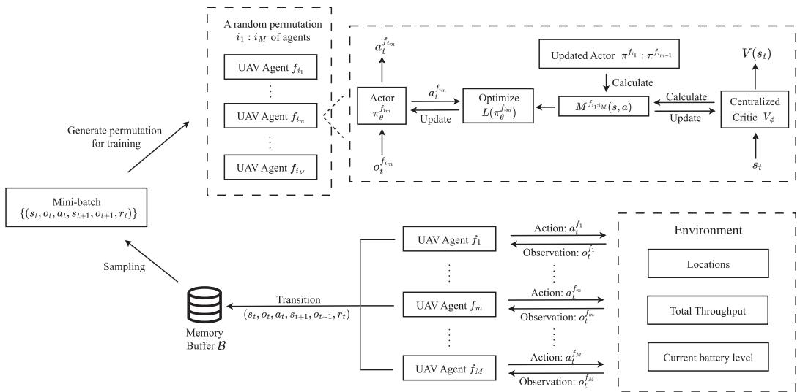  
Fig. 2. The framework of the proposed WUTF algorithm.

timeslot t as the average reward of all UAVs:

$$
r _ { t } = \frac { 1 } { M } \sum _ { i = 1 } ^ { M } r _ { t } ^ { f _ { i } } .\tag{32}
$$

Accordingly, based on the above definitions, we reformulate the original optimization problem P1 as a POMDP, which is then addressed using DRL. In this framework, each UAV independently trains a policy network $\pi ^ { f _ { i } }$ , which maps its local observation $o _ { t } ^ { f _ { i } }$ to an action $a _ { t } ^ { f _ { i } }$ . The joint policy of all UAVs is denoted as $\pmb { \pi } = ( \pi ^ { f _ { 1 } } , \pi ^ { f _ { 2 } } , \dots , \pi ^ { f _ { M } } )$ , and the objective is to optimize to maximize the total discounted expected reward, expressed as:

$$
\begin{array} { r } { ( \mathbf { P 2 } ) \underset { \pi } { \operatorname* { m a x } } \ \mathbb { E } [ \displaystyle \sum _ { t = 0 } ^ { T - 1 } \gamma ^ { t } r _ { t } ]  \ } \\ { \mathrm { s . t . } \ \pi ^ { f _ { i } } ( o _ { t } ^ { f _ { i } } ) \in \mathcal { A } , \ P ( s _ { t } , a _ { t } ) \in \mathcal { S } , \forall f _ { i } \in \mathcal { F } , } \end{array}\tag{33}
$$

where $\gamma \in [ 0 , 1 ]$ is the discount factor. In this optimization problem P2, we aim to jointly optimize each agent’s policy to maximize the cumulative discounted reward. However, directly applying MAPPO may fail to account for the interdependence and dynamic changes in other agents’ policies during training, leading to suboptimal updates or training instability. To address this, we adopt a sequential policy update scheme to reduce policy conflicts and ensure monotonic improvement. Moreover, to handle partial observability in the POMDP, the policy network is enhanced with a GRU module to capture temporal dependencies from past observations. Based on these improvements, we propose the WUTF algorithm. The framework of the proposed algorithm is illustrated in Fig. 2.

## B. WUTF Algorithm

1) Architecture of WUTF Algorithm: As shown in Fig. $^ { 2 , }$ each UAV $f _ { i }$ employs an actor network $\pi ^ { f _ { i } }$ with $| \theta _ { A } |$ parameters, which maps its local observation $o _ { t } ^ { f _ { i } }$ to an action $a _ { t } ^ { f _ { i } }$ to maximize long-term return. Due to strong spatial correlations among UAVs, obstacles, GUs, and WCTs, as well as partial observability in the POMDP, each UAV cannot directly obtain the full environmental state or other UAVs’ statuses. Therefore, we employ a CNN with layer normalization to extract spatial features $\hat { x _ { t } ^ { f _ { i } } }$ from the observation $o _ { t } ^ { f _ { i } }$ . For the l-th layer, the kernel size is $k _ { l }$ , the output feature map size is $a _ { l } ,$ and the input and output channels are $n _ { l - 1 }$ and $n _ { l } ,$ respectively. Specifically, the actor network consists of two convolutional layers with ReLU activations, each followed by layer normalization, and a fully connected layer that outputs the final spatial features $\boldsymbol { x } _ { t } ^ { f _ { i } }$ The z-th layer of the fully connected layers has $n _ { z }$ neurons. Moreover, considering the limited energy of the UAVs and the requirement for regional communication fairness, it is insufficient to optimize the UAV’s behavior in one timeslot. Thus, we employ a GRU to capture temporal dependencies from adjacent timeslots. Correspondingly, the input size is denoted as $U _ { i n } ,$ and the hidden layer size is $U _ { h }$ . The GRU module effectively integrates sequential observations, enabling the agent to learn long-term dependencies under partial observability. The hidden state of GRU is updated as follows:

$$
h _ { t } ^ { f _ { i } } = \mathrm { G R U } ( x _ { t } ^ { f _ { i } } , h _ { t - 1 } ^ { f _ { i } } ) ,\tag{34}
$$

where $h _ { t - 1 } ^ { f _ { i } }$ is the previous hidden state and $h _ { t } ^ { f _ { i } }$ is the current state, serving as input to the policy network at timeslot t. As we consider a fully cooperative multi-agent system based on the Actor-Critic design, all agents share a centralized Critic network $V ( s _ { t } )$ , which evaluates the value of the global state [17]. While agent makes decisions from local observations, the critic network with $| \phi _ { C } |$ parameters uses full state information to estimate state values and guide actor optimization. Therefore, the critic network is used only during training, and once trained, each agent independently makes decisions based on its own actor network, using only local observations.

2) Training Process Based on Sequential Policy Update Scheme: We begin by randomly initializing the parameters of actor networks $\bar { \{ \pi _ { \theta _ { 0 } } ^ { f _ { i } } \} } \forall f _ { i } \in \mathcal { F } \}$ for each UAV and the centralized critic network $\mathrm { ~ \ i ~ } \dot { V } _ { \phi _ { 0 } }$ . In addition, an empty rollout memory buffer B is created to store historical interaction data. Each training episode is divided into two phases: the exploration phase and the exploitation phase.

Algorithm 1: WUTF: Exploration Phase Algorithm.   
Input:The position of WCTs, GUs and obstacles, Action   
Space A, Observation Space O.   
Output:Trained actor networks for each UAV.   
1: Initialize the actor networks $\{ \pi _ { \theta } ^ { f _ { i } } | \ \forall f _ { i } \in \mathcal { F } \}$ of each   
UAV, critic network $V _ { \phi } ,$ , and the memory buffer B.   
2: for Episode in $1 , 2 , \ldots , N ^ { \mathrm { e p s } }$ do   
3: for UAV $f _ { i }$ 1in $f _ { 1 } , f _ { 2 } , \ldots , f _ { M _ { e } }$ do   
4: Reset GRU hidden state $h _ { 0 } ^ { f _ { i } }$ for actor network $\pi _ { \theta } ^ { f _ { i } }$   
5: end for   
6: Initialize the local environment and current state $s _ { 0 } .$   
clear up buffer B.   
7: for t in $1 , 2 , \cdots , T$ do   
8: for UAV $f _ { i }$ in $f _ { 1 } , f _ { 2 } , \dots , f _ { M }$ do   
9: Get the current observation $o _ { t } ^ { f _ { i } }$ from local   
environment;   
10: Get spatial feature $\boldsymbol { x } _ { t } ^ { f _ { i } }$ from CNN;   
11: Get current hidden state $h _ { t } ^ { f _ { i } }$ from GRU;   
12: Sample action $a _ { t } ^ { f _ { i } }$ from its policy $\pi _ { \theta } ^ { f _ { i } }$   
13: end for   
14: Execute $\pmb { a } _ { t } : = ( a _ { t } ^ { f _ { 1 } } , a _ { t } ^ { f _ { 2 } } , \ldots , a _ { t } ^ { f _ { M } } )$ in local   
environment;   
15: Get rewards $( r _ { t } ^ { f _ { 1 } } , r _ { t } ^ { f _ { 2 } } , \ldots , r _ { t } ^ { f _ { M } } )$ and next   
environment state $s _ { t + 1 } ;$   
16: Calculate the global reward $r _ { t }$ using (32);   
17: Store transition $\left( s _ { t } , \pmb { o } _ { t } , \pmb { a } _ { t } , s _ { t + 1 } , \pmb { o } _ { t + 1 } , r _ { t } \right)$ to the   
memory buffer B;   
18: end for   
19: Refer to Algorithm 2 to update actor networks   
$\{ \pi _ { \theta } ^ { f _ { i } } | \ \forall f _ { i } \in \mathcal { F } \}$ and the centralized critic network $V _ { \phi } ;$   
20: end for

During the exploration phase, we employ multiple parallel exploration threads that independently interact with the environment to improve sample collection efficiency. In each exploration thread, each UAV inputs its current observation $o _ { t } ^ { f _ { i } }$ into its actor network $\pi _ { \theta _ { k } } ^ { f _ { i } }$ , where the CNN and GRU modules extract spatial and temporal features to generate the current action $a _ { t } ^ { f _ { i } }$ At the beginning of timeslot t, each UAV samples an action from the probability distribution given by its actor network and executes it during the movement phase $t _ { m }$ , then hovers over the target area. In the communication phase $t _ { c } ,$ each UAV serves ground users within its coverage range. Afterward, each UAV computes its individual reward using (28), and the global reward $r _ { t }$ is calculated by (32). The environment then transitions to the next state $s _ { t + 1 }$ and provides new observations $o _ { t + 1 } ^ { f _ { i } }$ . Finally, a new transition $\{ \left( s _ { t } , o _ { t } ^ { f _ { i } } , a _ { t } ^ { f _ { i } } , o _ { t + 1 } ^ { f _ { i } } , s _ { t + 1 } , r _ { t } \right) | \ \forall f _ { i } \in \mathcal { F } \}$ is stored in the replay buffer B. We assume the complexity of interacting with the environment is ξ. This process continues for T timeslots, and the detailed procedure is shown in Algorithm 1.

As mentioned earlier, the problem of MAPPO is that when actor network parameters are not shared, each agent’s policy update ignores changes in others’ policies [34]. This can cause update conflicts, degrading performance and hindering convergence to the joint optimum. To address this, WUTF adopts a sequential update scheme [34] that ensures monotonic improvement of the joint policy, where each agent updates its policy sequentially based on the latest updates of other agents. We define the state-action advantage function $A ( s _ { t } , a _ { t } )$ , which represents the advantage of taking action $a _ { t }$ in state $s _ { t } .$ . To better estimate $A ( s _ { t } , a _ { t } )$ , we employ the Generalized Advantage Estimation (GAE) method [35] to approximate it as $\hat { A } ( s _ { t } , a _ { t } )$ The following is defined as:

$$
\hat { A } ( s _ { t } , a _ { t } ) = \sum _ { l = 0 } ^ { T - t } ( \gamma \lambda ) ^ { l } \delta _ { t + l } ,\tag{35}
$$

where $\delta _ { t } = r _ { t } + \gamma V ( s _ { t + 1 } ) - V ( s _ { t } )$ is TD-error, representing the difference between the immediate reward and the expected future rewards, $r _ { t }$ is the immediate reward, $\gamma$ is the discount factor, $V ( s _ { t } )$ and $V ( s _ { t + 1 } )$ are the state values estimated by the ( ) (critic network at states $s _ { t }$ and $s _ { t + 1 }$ , respectively, and λ is the GAE parameter controlling the trade-off between variance and bias. Based on the above definition, for a given agent policy update sequence $f _ { i _ { 1 } : i _ { M } }$ , the optimization objective $\bar { L } ( \pi _ { \theta _ { k } ^ { i _ { m } } } ^ { f _ { i _ { m } } } )$ for agent $f _ { i } { } ^ { : }$ ’s current policy $\pi _ { \theta _ { k } ^ { i _ { m } } } ^ { f _ { i _ { m } } }$ can be expressed as:

$$
\begin{array} { r l } & { L ( \pi _ { \theta _ { k } ^ { i _ { m } } } ^ { f _ { i _ { m } } } ) = \mathbb { E } _ { a ^ { f _ { i _ { m } } } \sim \pi _ { \theta _ { k } ^ { i _ { m } } } ^ { f _ { i _ { m } } } , o ^ { f _ { i _ { m } } } \sim \Omega ( s , a ^ { f _ { i _ { m } } } ) } \operatorname* { m i n } } \\ & { \qquad \left[ \frac { \pi _ { \theta _ { k } ^ { i _ { m } } } ^ { f _ { i _ { m } } } \left( a ^ { f _ { i _ { m } } } \left| o ^ { f _ { i _ { m } } } \right. \right) } { \pi _ { \theta _ { k } ^ { i _ { m } } } ^ { f _ { i _ { m } } } \left( a ^ { f _ { i _ { m } } } \left| o ^ { f _ { i _ { m } } } \right. \right) } M ^ { f _ { i _ { 1 } : i _ { m } } } ( s , a ) , \right. } \\ & { \qquad \left. \mathrm { c l i p } \left( \frac { \pi _ { \theta _ { k } ^ { i _ { m } } } ^ { f _ { i _ { m } } } \left( a ^ { f _ { i _ { m } } } \left| o ^ { f _ { i _ { m } } } \right. \right) } { \pi _ { \theta _ { k } ^ { i _ { m } } } ^ { f _ { i _ { m } } } \left( a ^ { f _ { i _ { m } } } \left| o ^ { f _ { i _ { m } } } \right. \right) } , 1 \pm \epsilon \right) M ^ { f _ { i _ { 1 } : i _ { m } } } ( s , a ) \right] , } \end{array}\tag{36}
$$

where $\pi _ { \theta _ { 0 } ^ { i _ { m } } } ^ { f _ { i _ { m } } }$ represents the old policy of agent $i _ { m }$ , the clipping function cli $\mathrm { p } ( \cdot , 1 \pm \epsilon )$ is used to control the magnitude of policy updates, ensuring that if the input exceeds $1 \pm \epsilon$ , it is clipped to that value, and $M ^ { f _ { i _ { 1 } : i _ { m } } } \left( s , { \pmb a } \right)$ 1is defined as:

$$
M ^ { f _ { i _ { 1 } : i _ { m } } } ( s , { \pmb a } ) = \frac { \pi _ { \theta _ { k + 1 } ^ { i _ { 1 } : i _ { m - 1 } } } ^ { f _ { i _ { 1 } : i _ { m - 1 } } } ( { \pmb a } | o ) } { \pi _ { \theta _ { 0 } ^ { i _ { 1 } : i _ { m - 1 } } } ^ { f _ { 1 } : f _ { i _ { m - 1 } } } ( { \pmb a } | o ) } \hat { A } _ { \pi } ( s , { \pmb a } ) ,\tag{37}
$$

where $\begin{array} { r } { \pi _ { \theta _ { 0 } ^ { i _ { 1 } ; i _ { m - 1 } } } ^ { f _ { i _ { 1 } ; i _ { m - 1 } } } ( a | o ) = \prod _ { j = 1 } ^ { m - 1 } \pi _ { \theta _ { 0 } ^ { i _ { j } } } ^ { f _ { i _ { j } } } ( a ^ { f _ { i _ { j } } } | o ^ { f _ { i _ { j } } } ) } \end{array}$ denotes the joint policy probability computed from the previously updated $m - 1$ agents. Therefore, thanks to the sequential policy update method, each agent can account for the updates of preceding agents, ensuring monotonic improvement of the final joint policy.

During the exploitation phase, a small batch of transitions is sampled from the replay buffer $B ,$ and actor networks are sequentially updated based on (36). The critic network is then optimized by minimizing the following loss function:

$$
L = \frac { 1 } { B T } \sum _ { b = 1 } ^ { B } \sum _ { t = 0 } ^ { T } ( \hat { R } _ { t } - V _ { \phi } ( s _ { t } ) ) ^ { 2 } ,\tag{38}
$$

Algorithm 2: WUTF: Exploitation Phase Algorithm.   
Input: Actor networks $\{ \pi _ { \theta _ { 0 } } ^ { f _ { i } } | \ \forall f _ { i } \in \mathcal { F } \}$ , the centralized   
critic $V _ { \phi _ { 0 } }$ , and replay buffer $B .$   
Output: Updated actor networks $\{ \pi _ { \theta _ { k } } ^ { f _ { i } } | \ \forall f _ { i } \in \mathcal { F } \}$ and   
centralized critic network $V _ { \phi _ { 1 } }$   
1: Compute advantage function $\hat { A } ( s , a )$ using (35);   
2: Generate a random permutation of agents $f _ { i _ { 1 } : i _ { M } } ;$   
3: for UAV $f _ { i _ { m } } = f _ { i _ { 1 } } , f _ { i _ { 2 } } , . . . , f _ { i _ { M } }$ do   
4: for k in $0 , \ldots , K - 1$ do   
5: Sample a minibatch of size B from $\begin{array} { r } { B ; { } } \end{array}$   
6: Update the actor network $\pi _ { \theta _ { k } } ^ { f _ { i _ { m } } }$ using (36);   
7: end for   
8: Compute $M ^ { f _ { i _ { 1 } : i _ { m + 1 } } }$ using (37);   
9: end for   
10: Sample a random minibatch of B from B;   
11: Update the centralized critic network $V _ { \phi _ { 0 } }$ by minimizing   
the loss function (38);

where B represents the batch size of the sampled transitions, and $\hat { R } _ { t } = r _ { t } + \gamma r _ { t + 1 } + \cdot \cdot \cdot + \gamma ^ { T - t - 1 } r _ { T - 1 } + \gamma ^ { T - t } V _ { \phi _ { k } } ( s _ { T } )$ denotes the expected total reward up to T timeslots. The detailed procedure for the exploitation phase is provided in Algorithm 2.

After the exploitation phase, the next round of the training episode begins based on the newly updated networks.

Theorem 1: The computational complexity of our model during the training phase is

$$
O ( M | \theta _ { A } | + | \phi _ { C } | + N ^ { \mathrm { e p s } } T | \theta _ { A } | + N ^ { \mathrm { e p s } } T \xi + K ( M | \theta _ { A } | + | \phi _ { C } | ) ) ,
$$

where M is the number of UAVs, K is the update frequency, and the other notations are defined in Section IV-B.

Proof: The proof is provided in Appendix A, online available. -

3) Testing Process and Computational Complexity: After adequate training, the parameters of the actor network for each UAV are saved for testing, while the critic network, used solely to guide actor network training, is not needed during the testing phase. In our testing process, each UAV $f _ { i }$ selects its corresponding action $a _ { t } ^ { f _ { i } }$ based on its trained actor network $\pi _ { \theta ^ { i } } ^ { f _ { i } }$ and its current observation $o _ { t } ^ { f _ { i } }$ . Once all UAVs have executed their actions, the environment transitions to the next state $s _ { t + 1 }$ , and UAV $f _ { i }$ observes the next timeslot’s observation $o _ { t + 1 } ^ { f _ { i } }$ . Therefore, our algorithm is fully decentralized, where each UAV makes decisions based on its own observations during execution, without relying on information from other UAVs.

The computational complexity during testing can be considered as the time cost for each UAV to make a decision in a timeslot. Then, we have the following theorem to indicate the computational complexity of our model.

Theorem 2: The computational complexity of our model for each UAV’s decision-making is

$$
O \left( \sum _ { l = 1 } ^ { L } k _ { l } ^ { 2 } a _ { l } ^ { 2 } n _ { l - 1 } n _ { l } + U _ { i n } \cdot U _ { h } + U _ { h } ^ { 2 } + \sum _ { z = 1 } ^ { Z } n _ { z - 1 } \cdot n _ { z } \right) ,
$$

where the notations are defined in Section IV-B.

TABLE II SYSTEM PARAMETER SETTINGS
<table><tr><td>Parameter</td><td>Value</td></tr><tr><td>Task area length L</td><td>800 m</td></tr><tr><td>Time of each timeslot τ</td><td>60s</td></tr><tr><td>Move time in each timeslot  $\tau _ { m }$ </td><td>20s</td></tr><tr><td>Service time in each timeslot  $\tau _ { c }$ </td><td>40s</td></tr><tr><td>The acceleration of UAV  $a _ { \mathrm { a c c } }$ </td><td> $\overline { { 4 \ m / s ^ { 2 } } }$ </td></tr><tr><td>Number of UAVs M</td><td>1 - 5</td></tr><tr><td>Number of GUs N</td><td>300</td></tr><tr><td>Height of UAVs H</td><td>70 m</td></tr><tr><td>Height of WCTs  $H _ { c }$ </td><td>50 m</td></tr><tr><td>Constants in the charging model  $( \eta , \mu , \theta )$ </td><td>500, 1.2, 0.01</td></tr><tr><td>Initial energy reserve  $\overline { { E _ { 0 } \ [ 5 ] } }$ </td><td>277.2 kJ</td></tr><tr><td>LoS attenuation factor µLos [36]</td><td>1 dB</td></tr><tr><td>NLoS attenuation factor µNLos [36]</td><td>20 dB</td></tr><tr><td>Propagation environment parameters  $( m , n )$  [36]</td><td>9.61, 0.16</td></tr><tr><td>Carrier frequency fc</td><td>2 GHz</td></tr><tr><td>Noise power  $\overline { { { \sigma } ^ { 2 } } }$ </td><td>-90 dBm</td></tr><tr><td>Transmit power of UAV  $p _ { \mathrm { t x } }$ </td><td>1W</td></tr><tr><td>Number of timeslots in each episode (T)</td><td>500</td></tr><tr><td>Episode for training</td><td>2000</td></tr><tr><td>Learning rate</td><td>0.0005</td></tr><tr><td>Discount factor</td><td>0.99</td></tr></table>

Proof: The proof is provided in Appendix B, online available. -

## V. SIMULATION RESULTS

## A. Setting

In our simulation, 300 GUs are randomly distributed within an m × m task area, and 8 WCTs are pre-deployed at 800 800fixed locations with an altitude of $H _ { c } = 5 0 \mathrm { m }$ . All UAVs start = 50from the center of the area, flying at a fixed altitude of $H = 7 0$ m and a maximum speed of  m/s. Each UAV starts with . kJ of energy reserve (full battery), according to the setting of DJI Mavic 3 Pro [5]. The total task duration is $T = 5 0 0$ timeslots, each lasting 60 seconds, with $t _ { m } = 2 0 ~ \mathrm { s }$ s for movement and $t _ { c } =$ s for communication.

In the WUTF framework, each actor network and the centralized critic network are constructed with independent CNN and GRU modules. Specifically, for the CNN, we use two hidden layers, where the i-th layer contains $3 2 \times 2 ^ { ( i - 1 ) }$ filters with a kernel size of $3 \times 3$ and stride 2. Then, the extracted convo-3 3lutional features are processed by a fully connected layer with 128 neurons to get spatial representations. The GRU module adopts a single-layer architecture with a hidden size of 128 to capture the temporal dependencies from past observations. To avoid overfitting, we use ReLU function for activation and layer normalization in all hidden layers. All experiments are conducted on a CentOS 7 server with a 32 GB NVIDIA Tesla V100 GPU and using Python 3.8. The main system parameters are listed in Table II.

We use the following four metrics to measure the performance.

\- Communication Fairness $( F _ { T } ) .$ : defined in (22) to show geographically how evenly the data transmission is distributed across all GUs when a task completes. This metric also serves as one of the optimization objectives in Problem (23).

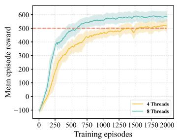  
(a)

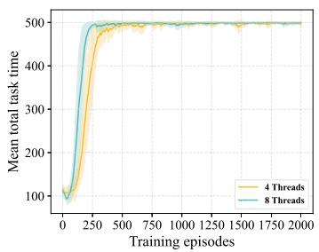  
(b)

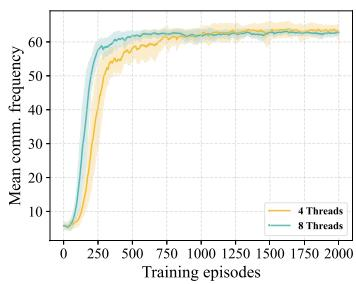  
(c)  
Fig. 3. (a) Accumulated reward, (b) total task time, and (c) average communication frequency over training under different exploration threads.

\- Low-Communication User Ratio $( \eta _ { T } )$ : computed as $\eta _ { T } =$ $\frac { n _ { T } } { M }$ , where $n _ { T }$ is the number of low communication GUs that have communicated fewer than 20 timeslots by the end of the task, and M is the total number of GUs. It shows the proportion of users with poor service quality in the system, and characterizes the communication fairness from the perspective of communication frequency.

\- Total Throughput $( P _ { T } )$ : calculated according to (21) to ( )show the total amount of data successfully transmitted between all UAVs and GUs when a task completes (T timeslots). It is one of the objectives in the original optimization problem (23).

Communication Efficiency $\left( \zeta _ { T } \right) .$ : defined similarly to the reward function as $\begin{array} { r } { \zeta _ { T } = \frac { { F } _ { T } \cdot { P } _ { T } ^ { * } } { E _ { T } } } \end{array}$ , where $E _ { T }$ denotes the average energy consumption of UAVs at the end of the task. This metric evaluates the system’s ability to balance throughput, fairness, and energy consumption, and reflects the overall efficiency of the policy. Therefore, it is used as the primary evaluation metric in our experiments.

## B. Training Convergence

We first show the change of accumulated reward (see Fig. 3(a)), total task time (see Fig. 3(b)), and average communication frequency (see Fig. 3(c)) over time during training under different exploration threads. In this simulation, we set the number of UAVs N , the maximum communication range $R _ { \mathrm { m a x } } = 1 2 0 ^ { \circ } \mathrm { m }$ , and the minimum communication range $R _ { \mathrm { t h } } = 6 0 ^ { \circ }$ m. Each experiment is repeated with 3 random seeds, and the curves represent the mean values, while the shaded areas denote the standard deviations.

As shown in Fig. 3(a), we observe that the accumulated reward increases very quickly at the beginning. This is because each UAV continually explores the area at the beginning and gradually improves its actor network by the sequential update scheme, which enhances the overall system collaboration and performance. Moreover, it can be observed that using more exploration threads accelerates the convergence speed. Taking the episode reward reaching 500 as a reference, convergence is achieved within about 600 episodes under 8 exploration threads, while it requires approximately 1300 episodes under 4 exploration threads.

In Fig. 3(b), we can see that the total task time often fail to reach 500 timeslots (the specified task duration) at the beginning. This occurs because the incomplete optimization of UAV’s policies, which results in UAVs running out of energy and early terminating the task. However, as training progresses, the UAVs quickly learn how to effectively utilize WCTs to maintain their energy levels. With 4 exploration threads, for example, after 300 episodes, the UAVs have mastered energy scheduling and the total task time stabilizes around 500 timeslots, which significantly improves task completion rates and system stability. In emergency scenarios, even before the reward fully converges, the UAVs are already able to operate until the specified task duration. Accordingly, the learned policies may be temporarily deployed to provide preliminary task support. Similarly, as shown in Fig. 3(c), the average communication frequency of GUs is low at the beginning. This is because the shorter total task time at the start limits the time GUs can connect to UAVs for communication, resulting in a lower average communication frequency. As UAVs improve their policies, the total task time increases to 500 timeslots, and the average communication frequency of GUs increases rapidly and eventually stabilizes, indicating that the UAVs have learned to complete long-term communication tasks effectively.

## C. Comparing With State-of-The-Art and Baseline Approaches

To evaluate the algorithm’s performance, we use six approaches to compare our algorithm as follows.

\- MAPPO [37]: It is one of the state-of-the-art multiagent reinforcement learning algorithms. It extends PPO algorithm with some adjustments to make it applicable to multi-agent scenarios. Moreover, it adopts an independent policy update for each agent.

\- LTCC-UDUA [29]: It is a DDPG-based algorithm designed to address long-term communication coverage challenges by jointly optimizing the multi-UAV deployment and user association. However, it ignores obstacle avoidance, energy constraints, and the presence of WCTs. Furthermore, they use throughput as one component of their designed reward function and do not consider the impact of communication value on communication fairness. For our simulations, we modified it based on the WUTF design to ensure compatibility with our system model and reward function.

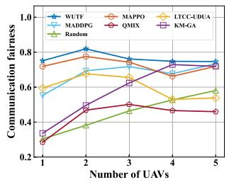  
(a)

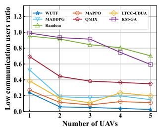  
(b)

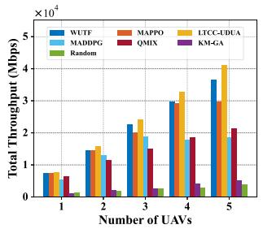  
(c)

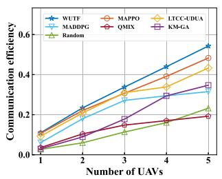  
(d)  
Fig. 4. Impact of number of UAVs on four metrics. (a) Communication fairness; (b) Low communication user ratio; (c) Total throughput; (d) Communication efficiency.

\- MADDPG [38]: It is a multi-agent extension of the DDPG algorithm, designed to address the challenges of continuous action spaces in multi-agent environments. MADDPG adopts a deterministic policy, where each actor directly outputs corresponding actions instead of sampling from a probability distribution.

QMIX [39]: It is a value-based multi-agent reinforcement learning algorithm that extends the deep Q-learning to cooperative multi-agent settings. Since QMIX is only applicable to discrete action spaces, we discretize the action space in our experiments to make it compatible with our system.

KM-GA [40]: It is designed to address the path planning and task allocation problem for multiple UAVs in a UAVaided MCS system. Similar to LTCC-UDUA approach, it does not consider the obstacles or WCTs. We first use K-means method to divide the GUs into several task areas based on the number of UAVs. When obstacles exist between two GUs, their distance is set to infinity to prevent paths from crossing them. For each area, a GA-based path planning mechanism [40] is then applied to generate UAV flight routes.

\- Random: All UAVs follow random policies, i.e., in each timeslot t, for each UAV, its flight speed and direction are randomly selected within the ranges $[ 0 , { v _ { \mathrm { m a x } } } ]$ and , π , respectively.

During testing, all algorithms are running for T times-= 500lots in an episode, and repeat 20 episodes to take an average. We conduct three sets of simulations by varying the number of UAVs M, maximum communication range $R _ { \mathrm { m a x } }$ and charging range $L _ { c } .$ We show their results in terms of total throughput, communication fairness, low-communication user ratio, and communication efficiency.

1) Impact of Number of UAVs: We first show the impact of the number of UAVs on communication fairness, lowcommunication user ratio, total throughput, and communication efficiency, as shown in Fig. 4. We fix $R _ { \mathrm { m a x } } = 1 2 0 , R _ { \mathrm { t h } } = 6 0$ $L _ { \mathrm { c } } = 1 0 0$ , while we change M from 1 to 5.

a) Communication Fairness: On average, WUTF significantly improves 5.85%, 28.65%, 14.45%, 82.62%, 43.40%, and 79.28% over MAPPO, LTCC-UDUA, MADDPG, QMIX, KM-GA, and Random, respectively, as shown in Fig. 4(a). We can see from Fig. 4(a), WUTF consistently outperforms all baselines and maintains the fairness index above 0.7. This indicates that

WUTF can efficiently schedule UAVs, ensuring fair communication services for all GUs. In contrast, LTCC-UDUA performs poorly in terms of communication fairness because its reward function pays more attention to total throughput. For example, in Fig. 4(a), when $M = 4 ,$ , WUTF achieves a communication fairness of 0.748, compared to 0.529 given by LTCC-UDUA, with a 41.4% improvement. These results show the importance of incorporating communication fairness as a key component of the reward function.

b) Low-Communication User Ratio: WUTF achieves average reductions of 49.05%, 65.24%, 71.23%, 84.18%, 90.88%, and 90.78% compared to MAPPO, LTCC-UDUA, MADDPG, QMIX, KM-GA, and Random, respectively, as shown in Fig. 4(b). In Fig. 4(b), the low-communication user ratio of KM-GA and Random is much higher than that of the other three algorithms, indicating poor performance. This is because KM-GA fails to adequately consider the relationship between WCT locations and UAV energy levels, making it difficult for UAVs to complete the task $( T = 5 0 0 )$ . Random suffers from the same issue, resulting in noticeably inferior performance. In contrast, WUTF, LTCC-UDUA, and MAPPO, as DRL-based methods, have learned during training to plan UAV movement paths based on the geographic distribution of WCTs, ensuring that all UAVs can work until $T = 5 0 0 \mathrm { : }$ , which enhances task stability and reduces the low-communication user ratio. Consequently, DRL-based algorithms consistently achieve lower ratios under different UAV numbers. A similar phenomenon can also be observed in Fig. 4(c).

c) Total Throughput: On average, WUTF significantly improves 7.36%, 46.55%, 44.51%, 612.96%, and 720.86% over MAPPO, MADDPG, QMIX, KM-GA, and Random, respectively, as shown in Fig. 4(c). From Fig. 4(c), LTCC-UDUA consistently maintains the highest throughput across different UAV numbers. To further explain why LTCC-UDUA outperforms WUTF in terms of throughput, Fig. 5 shows the UAV trajectories over one hour (60 timeslots) for $M = 4$ . It can be observed that LTCC-UDUA tends to make UAVs stay longer in areas with high user density to maximize throughput. This is why LTCC-UDUA maintains a high throughput with varying numbers of UAVs in Fig. 4(c). In contrast, WUTF not only strives to improve throughput but also takes communication fairness into account, preventing certain areas from remaining in low-quality communication states for extended periods. Although WUTF slightly underperforms LTCC-UDUA in throughput, it excels in fairness, achieving only a 7.44% throughput decrease while improving fairness by 43.40%. Moreover, Fig. 7 presents the worst-case user throughput under different numbers of UAVs. It can be observed that in LTCC-UDUA the worst-case user throughput is nearly zero. This is also because LTCC-UDUA tends to keep UAVs in high-density user regions to maximize overall throughput. In contrast, WUTF focuses on fairness, ensuring that even the worst-case users have the opportunity to communicate with UAVs. These results indicate that WUTF achieves a more balanced trade-off between throughput and communication fairness, making it more suitable for practical scenarios.

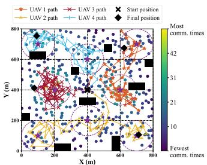

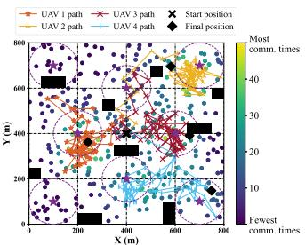  
(a) 4 UAVs, WUTF  
(b) 4 UAVs, LTCC-UDUA  
Fig. 5. UAV trajectories over 1 h (60 timeslots, colored dots for GUs, black blocks for obstacles and blue stars for WCTs).

d) Communication efficiency: On average, WUTF outperforms MAPPO, LTCC-UDUA, MADDPG, QMIX, GA, and Random, with improvements of 8.78%, 18.98%, 51.47%, 159.75%, 125.01%, and 220.91%, respectively, as shown in Fig 4(d). It can be observed from Fig. 4(d) that WUTF maintains high communication efficiency under different numbers of UAVs. This indicates that WUTF is more effective at balancing the trade-off between total throughput, communication fairness, and average energy consumption.

2) Impact of Communication Range: Next, we present the impact of communication range in Fig. 6. We fixed M , L , $\begin{array} { r } { R _ { \mathrm { t h } } = \frac { R _ { \mathrm { m a x } } } { 2 } } \end{array}$ , while we change the maximum communication range $R _ { \mathrm { m a x } }$ from 60 to 200 with a step size of 20.

a) Communication fairness: On average, WUTF significantly achieves improvements of 10.01%, 19.32%, 14.51%, 62.96%, 53.91%, and 114.03% compared to MAPPO, LTCC-UDUA, MADDPG, QMIX, GA, and Random, respectively, as shown in Fig. 6(a). Besides, we see that all algorithms increase communication fairness with increasing $R _ { \mathrm { m a x } }$ from Fig. 6(a). This is because a larger communication range allows UAVs to serve more GUs simultaneously, thereby increasing the number of GUs in communication per timeslot and then improving overall communication fairness.

b) Low-communication user ratios: On average, WUTF achieves reductions of 34.49%, 63.71%, 63.72%, 75.35%, 82.99%, and 82.64% compared to MAPPO, LTCC-UDUA, MADDPG, QMIX, KM-GA, and Random, respectively, as shown in Fig. 6(b). Meanwhile, Fig. 6(b) shows a similar trend as the maximum communication range increases, the lowcommunication user ratio of each algorithm gradually declines. This trend is also attributed to the increased communication range, which enables UAVs to cover more GUs and thus reduce the low-communication users ratio. These results highlight WUTF’s effectiveness in improving communication fairness.

c) Communication efficiency: On average, WUTF significantly improves 12.23%, 12.51%, 25.09%, 108.35%, 135.99%, and 274.77% over MAPPO, LTCC-UDUA, MADDPG, QMIX, KM-GA, and Random, respectively, as shown in Fig. 6(d). We can see from Fig. 6(d), WUTF consistently outperforms all other baselines for any $R _ { \mathrm { m a x } }$ . This demonstrates that WUTF is more effective at optimizing UAV policies under different communication ranges, thereby achieving a more effective trade-off among communication fairness, total throughput, and energy consumption.

3) Impact of Charging Range: Finally, we show the impact of charging range in Fig. 8. We fix $R _ { \mathrm { m a x } } = 1 2 0 , R _ { \mathrm { t h } } = 6 0 , M = 2 .$ while we changed the charging range of WCTs from 60 to 140 with a step size of 20. This reflects the effective area within which a UAV can receive wireless charging power.

a) Communication fairness: On average, WUTF significantly improves 3.54%, 32.01%, 18.69%, 78.21%, 61.44%, and 174.22% compared to MAPPO, LTCC-UDUA, MADDPG, QMIX, KM-GA, and Random, respectively, as shown in Fig. 8(a). As shown in Fig. 8(a), communication fairness increases with the charging range. This is because a wider charging range of WCTs allows UAVs to recharge more frequently while hovering, helping them sustain energy levels and expand coverage, thereby improving fairness. Moreover, an interesting observation is that the fairness achieved by the KM-GA algorithm remains unaffected as the charging range increases. This is because KM-GA clusters GUs using the K-means method and then applies GA to generate fixed UAV trajectories within each subarea, without considering WCT locations. As a result, even with an expanded charging range, UAVs following fixed paths have limited chances to reach WCTs and cannot improve from the wider coverage.

b) Low-communication user ratio: On average, WUTF achieves a reduction of 32.40%, 64.05%, 67.89%, 85.42%, 92.12%, and 92.14% in the low-communication user ratio compared to MAPPO, LTCC-UDUA, MADDPG, QMIX, KM-GA, and Random, respectively, as shown in Fig. 8(b). As shown in Fig. 8(b), WUTF consistently achieves the lowest ratio across different charging ranges. In contrast, KM-GA and Random perform significantly worse than the three DRL-based algorithms in terms of the low-communication user ratio, mainly because they lack effective UAV scheduling mechanisms, causing premature task termination due to energy depletion. The same trend can also be observed from Fig. 8(c).

c) Communication efficiency: On average, WUTF significantly improves 5.97%, 22.23%, 21.41%, 123.62%, 150.99%, and 693.93% over MAPPO, LTCC-UDUA, MADDPG, QMIX, GA, and Random, respectively, as shown in Fig. 8(d). These results demonstrate the strong adaptability of WUTF, as it consistently maintains high communication efficiency under varying WCT charging ranges. Moreover, communication efficiency increases with larger charging coverage, since broader ranges allow UAVs to recharge more flexibly and provide longer service times for GUs.

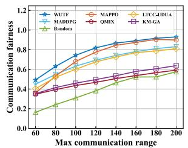  
(a)

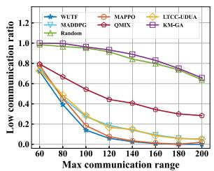  
(b)

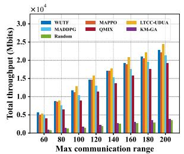  
(c)

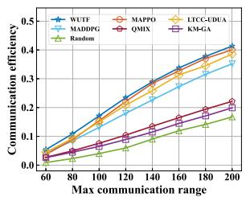  
(d)  
Fig. 6. Impact of communication range on four metrics. (a) Communication fairness; (b) Low communication user ratio; (c) Total throughput; (d) Communication efficiency.

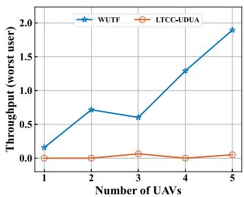  
Fig. 7. Comparison of worst-case user throughput under different numbers of UAVs.

## D. WUTF Analysis

1) WUTF Trajectories: We first show moving trajectories over 1 h for 2 and 3 UAVs in Fig. 9. All UAVs start from the center of the map, and we can observe clear cooperative behaviors between them during task execution. For example, Fig. 9(b) shows three UAVs cooperating, each primarily serving distinct subareas while continuously adjusting its position to meet user demands. They are also avoid obstacles and do not go beyond the map boundaries. Moreover, each UAV plans its trajectory to approach nearby WCTs when its energy level decreases, effectively maintaining energy sustainability over the long-term task. Besides, comparing Fig. 9(a) and Fig. 9(b), the average movement distance of two UAVs is noticeably longer because maintaining fair communication with only two UAVs requires frequent back and forth movement In contrast, with more UAVs, the area can be divided into smaller subregions, allowing each UAV to focus locally and reduce movement.

2) Extension to New Environments: To show the performance of WUTF in different scenarios, we vary the number and distribution of GUs as well as the spatial layout of obstacles, as shown in Fig. 10. The results indicate that WUTF performs effectively across different scenarios. Fig. 10(a) presents the moving trajectories under 400 GUs with 2 UAVs. In this case, WUTF achieves a communication fairness of 0.78 and a communication efficiency of 0.45, which means that WUTF has a satisfactory system performance under different numbers of GUs. Fig. 10(b) further illustrates trajectories under different obstacle and user distributions, showing that WUTF adaptively adjusts UAV flight paths to avoid obstacles. Despite different obstacle layouts, UAVs complete the tasks and maintain effective communication coverage, confirming WUTF’s adaptability to complex environments.

3) Performance in Large-Scale UAV Networks: To further evaluate the scalability of WUTF, we conducted experiments with 12 UAVs under different numbers of GUs. As shown in Fig. 11, the communication fairness remains consistently high across all scenarios, while the low communication ratio is maintained at a low level. These results show that WUTF is able to provide fair communication for GUs even in large-scale networks. Moreover, since WUTF adopts the CTED architecture, each UAV operates independently during testing. As a result, the testing computational complexity does not increase significantly with the number of UAVs.

## VI. DISCUSSIONS

## A. Experience Buffer Sampling Efficiency

The experience buffer is a key component and its sampling efficiency has a direct impact on the training stability and performance. In the current framework, transitions are sampled uniformly at random, which may limit the effective utilization of stored experiences. A potential solution is to set a priority to each transition stored in the buffer, such that during mini-batch updates, transitions are sampled according to their priorities. Following [25], we adopt a quantum-inspired experience replay (QiER) framework to enhance sampling efficiency. Specifically, when a new transition $\tau _ { t }$ is stored in the QiER buffer, its position k is associated with a qubit $\left| { \Psi _ { k } } \right.$ that represents its sampling priority as:

$$
| \Psi _ { k } \rangle = \alpha _ { k } | 0 \rangle + \beta _ { k } | 1 \rangle ,\tag{39}
$$

where $\alpha _ { k }$ and $\beta _ { k }$ are the complex-valued probability amplitudes follow the normalization constraint $\bar { | } \alpha _ { k } | ^ { 2 } + | \dot { \beta } _ { k } | ^ { 2 } \overset { \cdot } { = } 1$ | 	 denotes accepting this transition and | 	 denotes denying it. As in [25], the qubit of each newly inserted transition is initialized as the eigenstate | 	, since these transitions have not been sampled and may provide valuable information for learning environmental characteristics. Therefore, setting them the highest priority encourages the agent to be more likely to learn from these newly recorded transitions. After training, their priorities are updated to account for both the TD error and aging effect. In detail, the associated qubit state is reset to a uniform superposition and then adjusted via one time of Grover iteration with flexible parameters, which adaptively modifies the collapse probability of $\left| { \Psi _ { k } } \right.$ onto | 	. When the mini-batch sampling process begins, quantum measurement is performed on the associated qubits to determine the probability of each stored transition being selected. The probability of the k-th qubit collapsing onto eigenstate | 	 is calculated as $| \langle 0 | \Psi _ { k } \rangle | ^ { 2 } = | \bar { \alpha _ { k } } | ^ { 2 }$ and the probability of the corresponding transition being selected during the mini-batch sampling process is then defined as:

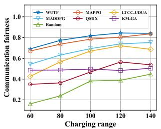  
(a)

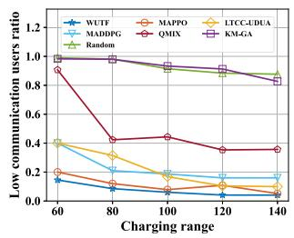  
(b)

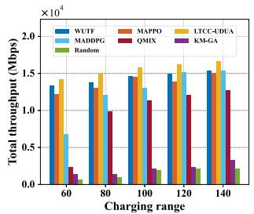  
(c)

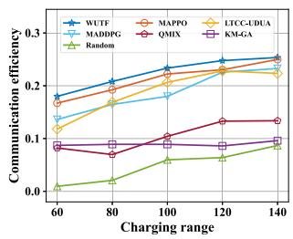  
(d)  
Fig. 8. Impact of charging range on four metrics. (a) Communication fairness; (b) Low communication user ratio; (c) Total throughput; (d) Communication efficiency.

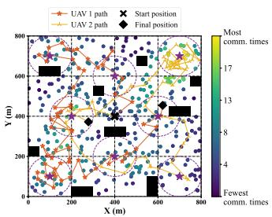  
(a) 2 UAVs, WUTF

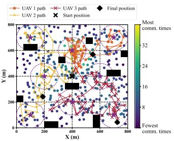  
(b) 3 UAVs, WUTF

Fig. 9. UAV trajectories over 1 h (60 timeslots, colored dots for GUs, black blocks for obstacles and blue stars for WCTs).  
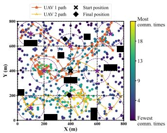  
(a)

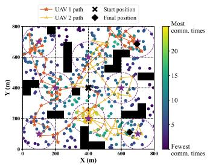  
(b)  
Fig. 10. Moving trajectories of different environments: (a) different number of GUs. (b) different obstacles and user distributions.

$$
b p _ { k } = \frac { | \alpha _ { k } | ^ { 2 } } { \sum _ { e = 1 } ^ { B } | \alpha _ { e } | ^ { 2 } } .\tag{40}
$$

Thus, the sampling probabilities of all stored transitions can be collected into a picking probability vector $\vec { b p } =$ $\left[ b p _ { 1 } , b p _ { 2 } , \ldots , b p _ { B } \right]$ . During the mini-batch sampling process, transitions are repeatedly sampled according to this distribution until the desired batch size is reached. This ensures that transitions with higher priorities are more likely to be selected while maintaining sufficient diversity in the sampled experiences.

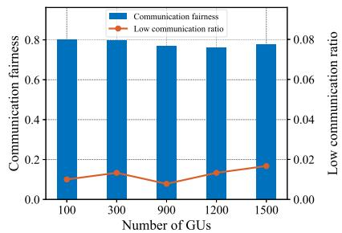  
Fig. 11. Comparison of communication fairness and low communication ratio under different numbers of GUs with 12 UAVs.

## B. Reward Sparsity and Exploration Challenges

Although the proposed reward function in (31) can generally guide UAVs toward effective cooperative strategies in most practical scenarios, exploration inefficiency may still occur in scenarios with sparsely distributed users or WCTs. In such cases, UAVs may struggle to reach users or recharge during training, resulting in long periods without positive feedback and reduced exploration efficiency.

To address this initial exploration inefficiency, a potential solution is to adopt reward shaping technique [17]. Based on the original reward function in (31), three additional feedback components are introduced to provide more informative learning signals. Firstly, two direction-aware components are added to address sparse rewards, preventing UAVs from failing to serve users or neglecting to move toward WCTs when energy is low. Specifically, for UAV $f _ { i } ,$ , its velocity direction vector is defined as $\vec { \psi } _ { t } ^ { f _ { i } } = \left( \cos \psi _ { t } ^ { f _ { i } } , \sin \psi _ { t } ^ { f _ { i } } \right)$ , while the direction vector from its position $\pmb { q } _ { t } ^ { f _ { i } } = ( X _ { t } ^ { f _ { i } } , Y _ { t } ^ { f _ { i } } )$ towards the centroid of the user set U with coordinate $\mathbf { \Delta } q _ { \mathbb { k } }$ is given by $( q _ { \mathbb { k } } - q _ { t } ^ { f _ { i } } ) / \lvert | q _ { \mathbb { k } } - q _ { t } ^ { f _ { i } } \rvert |$ Therefore, the first direction-aware reward is formulated as the inner product of these two vectors:

$$
\varpi _ { f _ { i } } ^ { \mathbb { k } } ( t ) = \vec { \psi } _ { t } ^ { f _ { i } } \cdot \frac { q _ { \mathbb { k } } - q _ { t } ^ { f _ { i } } } { | | q _ { \mathbb { k } } - q _ { t } ^ { f _ { i } } | | } .\tag{42}
$$

Moreover, the current battery level of UAV at timeslot t is denoted by $B _ { t } ^ { f _ { i } }$ . The nearest WCT to UAV $f _ { i }$ is expressed as $q _ { t } ^ { c _ { f _ { i } } ^ { \star } } = a r g m i n _ { c _ { j } \in \mathcal { C } } | | q _ { t } ^ { f _ { i } } - q _ { t } ^ { c _ { j } } | |$ . When the UAV’s energy falls below the threshold, i.e., $B _ { t } ^ { f _ { i } } \le B _ { t h }$ , a direction-aware charging penalty is triggered, which is formulated as:

$$
\varpi _ { f _ { i } } ^ { c _ { f _ { i } } ^ { \star } } ( t ) = \vec { \psi } _ { t } ^ { f _ { i } } \cdot \frac { q _ { t } ^ { c _ { f _ { i } } ^ { \star } } - q _ { t } ^ { f _ { i } } } { | | q _ { t } ^ { c _ { f _ { i } } ^ { \star } } - q _ { t } ^ { f _ { i } } | | } .\tag{43}
$$

Besides, to encourage communication efficiency, an additional throughput-aware reward component is introduced, which is given by:

$$
\Gamma _ { u _ { j } } ( t ) = F _ { t } P _ { t } ^ { u _ { j } } .\tag{44}
$$

Then, the original sparse reward is reformulated as (41), shown at the bottom of this page where $p _ { c }$ and $p _ { o }$ are penalties for energy depletion and boundary violations, respectively, and $\mathbb { 1 } ( \cdot )$ indicates constraint violations (1 · if true, 0 otherwise). In addition, the logarithmic function is applied to smooth the reward scale and stabilize training. Thus, in scenarios with sparse users or WCTs, reward shaping based on (41) can improve training efficiency.

## C. Potential Inter-UAV Communication

Although the POMDP formulation in this work assumes that UAVs cannot observe the states of other UAVs (e.g., positions, energy levels), centralized training combined with a sequential policy update scheme enables the UAVs to successfully learn reasonable cooperative strategies that are applicable in most practical scenarios. In reality, limited inter-UAV communication is often feasible, which could enable information sharing and improve coordination among agents. Therefore, we consider a potential inter-UAV communication mechanism, where UAVs are allowed to share their observations with their neighbors, thereby alleviating the suboptimal coordination that may arise from limited observability. Specifically, at timeslot t, the neighbor set of UAV $f _ { i }$ is denoted as $\mathcal { U } _ { t } ^ { f _ { i } }$ . Accordingly, UAV $f _ { i }$ obtains its individual observation $o _ { t } ^ { f _ { i } }$ from the environment, and then based on the inter-UAV communication mechanism, UAV $f _ { i }$ communicates with the UAVs in its neighbor set $\mathcal { U } _ { t } ^ { f _ { i } }$ to share their local observations. Consequently, UAV $f _ { i }$ updates its own observation, which is represented as

$$
\hat { o } _ { t } ^ { f _ { i } } = o _ { t } ^ { f _ { i } } \cup \{ o _ { t } ^ { f _ { j } } | f _ { j } \in \mathcal { U } _ { t } ^ { f _ { i } } \}\tag{45}
$$

This combined observation $\hat { o } _ { t } ^ { f _ { i } }$ integrates both the local and neighboring observations, thereby providing UAV $f _ { i }$ with richer information for subsequent decision-making and improving coordination under partial observability.

## D. More Practical Models

While the models adopted in this paper facilitate tractable analysis and effective algorithm design, they inevitably involve certain idealized assumptions. To address these limitations, we briefly introduce three more practical modeling alternatives.

To better reflect practical charging conditions and mitigate inefficiencies from overlapping charging zones, we model wave interference in concurrent WCT charging and adopt the practical charging model proposed in [41]. Firstly, the radiated wave arriving at UAV $f _ { i }$ from a single WCT $c _ { k }$ can be formulated as:

$$
a _ { f _ { i } } ^ { c _ { k } } ( t ) = \frac { A _ { 0 } } { \hat { l } _ { c _ { k } , f _ { i } } } \cos ( 2 \pi f t - \frac { 2 \pi } { \lambda } l _ { c _ { k } , f _ { i } } ) ,\tag{46}
$$

where $A _ { 0 }$ is the amplitude of the wave, $\begin{array} { r } { \hat { l } _ { c _ { k } , f _ { i } } = \frac { l _ { c _ { k } , f _ { i } + \varepsilon _ { 0 } } } { \sqrt { \varepsilon _ { 1 } } } } \end{array}$ is the attenuation factor for wave propagation. Consequently, the power arrived at UAV $f _ { i }$ from a single WCT $c _ { k }$ is:

$$
P _ { c _ { k } , f _ { i } } = \left\{ \begin{array} { c c } { \frac { A _ { 0 } ^ { 2 } } { 2 l _ { c _ { k } , f _ { i } } ^ { 2 } } , } & { l _ { c _ { k } , f _ { i } } \leq L _ { c } , } \\ { 0 , } & { \mathrm { o t h e r w i s e } , } \end{array} \right.\tag{47}
$$

Then, for UAV $f _ { i } ,$ the set of WCTs C is its potential providers. Similarly, the combined wave arrived at $f _ { i }$ can be expressed as $\begin{array} { r } { A _ { f _ { i } , \acute { c } } ( t ) = \sum _ { k = 1 } ^ { K } a _ { f _ { i } } ^ { c _ { k } } ( t ) } \end{array}$ . Therefore, the combined power arrived at $f _ { i }$ can be derived as follows:

$$
\begin{array} { l } { \displaystyle P _ { \mathcal { C } , f _ { i } } = \frac { 1 } { T } \int _ { - T / 2 } ^ { T / 2 } { [ A _ { f _ { i } , \mathcal { C } } ( t ) ] ^ { 2 } d t } } \\ { \displaystyle \quad = \frac { 1 } { T } \int _ { - T / 2 } ^ { T / 2 } { \left[ \sum _ { k = 1 } ^ { K } \frac { A _ { 0 } } { \widehat { l } _ { c _ { k } , f _ { i } } } \cos \left( 2 \pi f t - \frac { 2 \pi } { \lambda } l _ { c _ { k } , f _ { i } } \right) \right] ^ { 2 } d t } } \\ { \displaystyle \quad = \sum _ { k = 1 } ^ { K } { P _ { c _ { k } , f _ { i } } + 2 \sum _ { k = 1 } ^ { K } \sum _ { h = 1 } ^ { k - 1 } \sqrt { P _ { c _ { k } , f _ { i } } P _ { c _ { h } , f _ { i } } } \cos ( \Delta \varphi _ { k h } ) } , } \end{array}\tag{48}
$$

where $\begin{array} { r } { \Delta \varphi _ { k h } = 2 \pi \frac { l _ { c _ { k } , f _ { i } } - l _ { c _ { h } , f _ { i } } } { \lambda } } \end{array}$ . This model provides a detailed Δ = 2characterization of the inefficiencies induced by overlapping charging zones.

In order to capture environmental influences more accurately, we further consider an energy consumption model in the presence of wind. From [42], wind is first modeled as a random vector, and then a three-dimensional force analysis is conducted to establish the relationship between the thrust $F _ { t h r }$ and other relevant parameters. Specifically, the wind vector can be denoted as $\vec { v } _ { w } \triangleq | | \pmb { v } _ { w } | | \angle \varphi _ { w }$ , where $| | \vec { v } _ { w } | |$ and $\varphi _ { w }$ is the speed and the angle of the wind, respectively. For the wind speed, we model $| | \vec { v } _ { w } | |$ as a random variable. In detail, the average wind speed at the reference height $h _ { \mathrm { r e f } }$ is denoted by $v _ { \mathrm { r e f } }$ , which follows a Weibull distribution [43]. Then, according to [44], the wind speed at height $h _ { \mathrm { a c t } }$ can be expressed as $\begin{array} { r } { | | \bar { \vec { v } _ { w } } | | = v _ { r e f } ( \frac { h _ { \mathrm { a c t } } } { h _ { r e f } } ) ^ { \rho _ { 1 } } } \end{array}$ where $\rho _ { 1 }$ is environmental factor. Similarly, the direction angle

$$
\begin{array} { r } { r _ { t } = \left\{ \begin{array} { l l } { \frac { 1 } { M } \sum _ { i = 1 } ^ { M } \bigg ( \varpi _ { f _ { i } } ^ { \mathbb { E } } ( t ) + \varpi _ { f _ { i } } ^ { c _ { f _ { i } } ^ { \dagger } } ( t ) { \mathbb 1 } _ { ( B _ { t } ^ { f _ { i } ^ { c _ { g } } } B _ { t h } ) } \bigg ) + \log _ { 2 } \bigg ( 1 + \frac { F _ { i } } { M } \sum _ { i = 1 } ^ { M } \frac { \varphi _ { t } ^ { f _ { i } ^ { \prime } } } { E _ { t } ^ { \prime } } \bigg ) + \log _ { 2 } \bigg ( 1 + \frac { 1 } { N } \sum _ { j = 1 } ^ { N } \Gamma _ { u _ { j } } ( t ) \bigg ) , \mathrm { C o n s t r a i n t s ~ M e t } , } \\ { - \left[ p _ { c } { \mathbb { I } } _ { ( 2 3 a ) } + p _ { o } { \mathbb { I } } _ { ( 2 3 f , 2 3 g ) } \right] , \quad } & { \mathrm { O t h e r w i s e } . } \end{array} \right. } \end{array}\tag{41}
$$

$\varphi _ { w }$ can be modeled as a random variable following a Von-Mises distribution [45]. Therefore, the wind at the height $h _ { \mathrm { a c t } }$ can be derived as a vector:

$$
\vec { v } _ { w } = \left( \frac { h _ { \mathrm { a c t } } } { h _ { \mathrm { r e f } } } \right) ^ { \rho _ { 1 } } \left( v _ { \mathrm { r e f } } \cos \varphi , v _ { \mathrm { r e f } } \sin \varphi \right) .\tag{49}
$$

Considering this wind model, the UAV dynamics are primarily influenced by four forces: the rotor thrust $F _ { \mathrm { t h r } }$ , the gravity m , the wind drag $F _ { D w }$ , and the air drag $F _ { D a }$ gassociated with the UAV’s flight. Then, from Newton’s second law, we have m $F _ { \mathrm { t h r } } + F _ { D w } + F _ { D a } + m g$ a =. Therefore, following [42], the trust +of the UAV $f _ { i }$ + gcan be expressed as:

$$
| | F _ { \mathrm { t h r } } | | = | | m \pmb { a } - \frac { 1 } { 2 } \rho _ { \mathrm { a i r } } S _ { \mathrm { F P } } | | \vec { v } _ { f _ { i } } - \vec { v } _ { w } | | ( \vec { v } _ { f _ { i } } - \vec { v } _ { w } ) - m \pmb { g } | | ,\tag{50}
$$

where $\rho _ { \mathrm { a i r } }$ is the air density and $S _ { \mathrm { F P } }$ is fuselage equivalent flat area of the UAV. Then, the generalised propulsion energy consumption model (GPECM) for rotary-wing UAVs in the presence of wind proposed in [42] can be formulated as:

$$
P ( \vec { v } _ { f _ { i } } ) = P _ { b } + P _ { i } + m | | g | | | | \vec { v } _ { f _ { i } } | | \sin \tau _ { c } + \frac { 1 } { 2 } \rho _ { \mathrm { a i r } } S _ { \mathrm { F P } } | | \vec { v } _ { f _ { i } } - \vec { v } _ { w } | | ^ { 3 } ,\tag{51}
$$

where $P _ { b }$ and $P _ { i }$ are the blade profile power and the induced power, both of which depend on the current thrust $F _ { \mathrm { t h r } }$ and other parameters. Further details on their derivation and parameterization can be found in [42]. This model provides a realistic formulation of propulsion energy consumption under wind conditions, which enhances the practical relevance of the analysis.

To more accurately characterize the channel behavior in realistic environments, we extend the probabilistic LoS channel model by incorporating both small-scale and large-scale fading effects [46]. Specifically, the channel gain between UAV $f _ { i }$ and GU $u _ { j }$ can be expressed as:

$$
g _ { f _ { i } , u _ { j } } = P _ { f _ { i } , u _ { j } } ^ { L o S } l _ { f _ { i } , u _ { j } } ^ { L o S } + \left( 1 - P _ { f _ { i } , u _ { j } } ^ { L o S } \right) l _ { f _ { i } , u _ { j } } ^ { N L }\tag{52}
$$

where $P _ { f _ { i } , u _ { j } } ^ { L o S }$ is the probability of forming an LoS link between UAV $f _ { i }$ and GU $u _ { j } , l _ { f _ { i } , u _ { i } } ^ { L o S }$ and $l _ { f _ { i } , u _ { \it 1 } } ^ { N L }$ represent the corresponding channel gains under LoS and NLoS conditions. These gains incorporate both large-scale and small-scale fading, which are modeled as:

$$
l _ { f _ { i } , u _ { j } } ^ { L o S } = | \mathcal { H } _ { f _ { i } , u _ { j } } ^ { L o S } | ^ { 2 } ( \mathcal { L } _ { f _ { i } , u _ { j } } ^ { L o S } ) ^ { - 1 } 1 0 ^ { - \frac { \xi ^ { L o S } } { 1 0 } } ,\tag{53a}
$$

$$
l _ { f _ { i } , u _ { j } } ^ { N L } = | \mathcal { H } _ { f _ { i } , u _ { j } } ^ { N L } | ^ { 2 } ( \mathcal { L } _ { f _ { i } , u _ { j } } ^ { N L } ) ^ { - 1 } 1 0 ^ { - \frac { \xi ^ { N L } } { 1 0 } } .\tag{53b}
$$

where $\mathcal { L } _ { f _ { i } , u _ { \lambda } } ^ { L o S }$ and $\mathcal { L } _ { f _ { i } , u _ { \cdot } } ^ { N L }$ denote the path loss under LoS and NLoS conditions, $\mathcal { H } _ { f _ { i } , u _ { j } } ^ { L o S }$ and $\mathcal { H } _ { f _ { i } , u _ { \mathcal { I } } } ^ { N L }$ represent the corresponding small-scale fading, $\xi ^ { \stackrel { \cdot \cdot } { L } o S }$ and $\xi ^ { N L }$ denote the the corresponding large-scale shadowing effects. Based on Eq. (17), path loss for an LoS or NLoS link can be derived as:

$$
\mathcal { L } _ { f _ { i } , u _ { j } } ^ { L o S } = K _ { 0 } d _ { f _ { i } , u _ { j } } ^ { \alpha } \mu _ { L o S }\tag{54a}
$$

$$
\mathcal { L } _ { f _ { i } , u _ { j } } ^ { N L } = K _ { 0 } d _ { f _ { i } , u _ { j } } ^ { \alpha } \mu _ { N L o S }\tag{54b}
$$

Then, the small-scale fading is modeled as Nakagami fading and the corresponding fading power follows a Gamma distribution [47]:

$$
| \mathcal { H } _ { f _ { i } , u _ { j } } ^ { L o S } | ^ { 2 } \sim \Gamma \left( n _ { L o S } , \omega _ { L o S } \right) ,\tag{55a}
$$

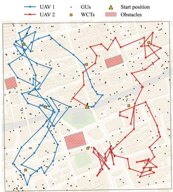  
Fig. 12. Moving trajectories of 2 UAVs in the real-world target region during 1 h (60 timeslots).

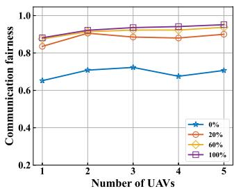

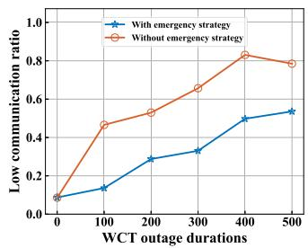  
(a) Communication fairness  
(b) Low communication ratio  
Fig. 13. Impact of user mobility and WCT outage on system performance.

$$
| \mathcal { H } _ { f _ { i } , u _ { j } } ^ { N L } | ^ { 2 } \sim \Gamma \left( n _ { N L } , \omega _ { N L } \right) ,\tag{55b}
$$

where $n _ { L o S }$ and $n _ { N L }$ are the Nakagami shape parameters and $\omega _ { L o S }$ and $\omega _ { N L }$ denote the corresponding scale parameters. Accordingly, the large-scale shadowing, caused by obstacles such as buildings and trees, is assumed to follow a zero-mean Gaussian distribution [46]:

$$
\begin{array} { r } { \xi ^ { L o S } \sim \mathcal { N } ( 0 , ( \sigma ^ { L o S } ) ^ { 2 } ) , } \end{array}\tag{56a}
$$

$$
\begin{array} { r } { \xi ^ { N L } \sim \mathcal { N } ( 0 , ( \sigma ^ { N L } ) ^ { 2 } ) , } \end{array}\tag{56b}
$$

where $\sigma ^ { L o S }$ and $\sigma ^ { N L o S }$ denote the standard deviations of the shadowing in LoS and NLoS conditions, respectively.

## E. Robustness Analysis Under Dynamic Conditions

To analyze the robustness of WUTF under dynamic conditions, simulations are performed based on a real-world map and dataset collected in Shanghai from the Mendeley open dataset [48], which contain 378 GUs distributed within the target region ( . ◦N - . ◦N, . ◦E - . ◦E). As illustrated in Fig. 12, we show the moving trajectories of 2 UAVs in the target task region during a 1-hour period (i.e., 60 timeslots). It can be observed that the UAVs continue to follow a cooperative and regionalized trajectory strategy.

Based on this, to further verify the robustness of WUTF under dynamic conditions, we first consider a scenario with moving users. It is assumed that each GU has a probability of movement in each timeslot to simulate real-world conditions.

As shown in Fig. 13(a), we evaluate the communication fairness under different user mobility probabilities. We can see that when users have a chance to move in each timeslot, the communication fairness increases significantly. This is because low-communication users have more opportunities to communicate with UAVs once they start moving.

In addition, we consider a scenario with intermittent WCT availability, where 2 WCTs are randomly deactivated for a specified duration to emulate potential charging failures in real-world. To avoid UAVs from running out of energy and terminating the task prematurely, we propose an emergency strategy in which a UAV pauses its task and flies to the nearest WCT for rapid charging when its remaining energy drops below 10%. Fig. 13(b) shows that the low-communication user ratio under different WCT outage durations. It can be seen that without the emergency strategy, the low communication users ratio increases rapidly as the WCT outage duration becomes longer, since UAVs are more likely to run out of energy and end the task early. By contrast, applying the emergency strategy effectively alleviates this issue. Similarly, this emergency strategy can also be applied to cases of WCTs failure (e.g., 500 timeslots) or sparse WCTs deployment.

## VII. CONCLUSION

In this paper, we consider a UAV-BSs communication system with multiple UAVs and WCTs, providing communication services to GUs. Our goal is to maximize communication fairness and total throughput among GUs while minimizing total energy consumption. To achieve this, we have formulated an optimization problem. The key novelty is modeling the complex, time-varying scenario involving multiple UAVs, WCTs, and obstacles as a POMDP model. The main technical depth is to design a distributed multi-agent DRL-based approach, called WUTF. Furthermore, we make two important improvements by incorporating communication value into the reward function and using the sequential policy updating scheme during training. In this way, WUTF effectively improves each UAV’s individual policy while ensuring joint policy optimization. Simulation results demonstrate that WUTF consistently outperforms six baseline algorithms and effectively improve communication fairness. For future work, we plan to explore scenarios with charging budget constraints and adaptive UAV altitude control.

## REFERENCES

[1] M. Mozaffari, W. Saad, M. Bennis, Y.-H. Nam, and M. Debbah, “A tutorial on UAVs for wireless networks: Applications, challenges, and open problems,” IEEE Commun. Surveys Tuts., vol. 21, no. 3, pp. 2334–2360, thirdquarter 2019.

[2] A. A. Süzen, B. Duman, and B. ¸Sen, “Benchmark analysis of jetson TX2, Jetson Nano and raspberry PI using deep-CNN,” in Proc. Int. Cong. Hum.- Comput. Int., Optim. Robot. Appl., 2020, pp. 1–5.

[3] A. Alabsi et al., “Wireless power transfer technologies, applications, and future trends: A review,” IEEE Trans. Sustain. Comput., vol. 10, no. 1, pp. 1–17, Jan./Feb. 2024.

[4] C.-C. Lai et al., “Adaptive and fair deployment approach to balance offload traffic in multi-UAV cellular networks,” IEEE Trans. Veh. Technol., vol. 72, no. 3, pp. 3724–3738, Mar. 2023.

[5] “DJI,” [Online], 2023, Available: https://www.dji.com/cn/mavic-3-pro

[6] M. Alzenad, A. El-Keyi, F. Lagum, and H. Yanikomeroglu, “3-D placement of an unmanned aerial vehicle base station (UAV-BS) for energyefficient maximal coverage,” IEEE Wireless Commun. Lett., vol. 6, no. 4, pp. 434–437, Aug. 2017.

[7] W. Mao, K. Xiong, Y. Lu, P. Fan, and Z. Ding, “Energy consumption minimization in secure multi-antenna UAV-assisted MEC networks with channel uncertainty,” IEEE Trans. Wireless Commun., vol. 22, no. 11, pp. 7185–7200, Nov. 2023.

[8] Y. Sun, D. Xu, D. W. K. Ng, L. Dai, and R. Schober, “Optimal 3Dtrajectory design and resource allocation for solar-powered UAV communication systems,” IEEE Trans. Commun., vol. 67, no. 6, pp. 4281–4298, Jun. 2019.

[9] M.-A. Lahmeri, M. A. Kishk, and M.-S. Alouini, “Laser-powered UAVs for wireless communication coverage: A large-scale deployment strategy,” IEEE Trans. Wireless Commun., vol. 22, no. 1, pp. 518–533, Jan. 2022.

[10] L. Chiaraviglio et al., “Multi-area throughput and energy optimization of UAV-aided cellular networks powered by solar panels and grid,” IEEE Trans. Mobile Comput., vol. 20, no. 7, pp. 2427–2444, Jul. 2021.

[11] Y. Zeng, J. Xu, and R. Zhang, “Energy minimization for wireless communication with rotary-wing UAV,” IEEE Trans. Wireless Commun., vol. 18, no. 4, pp. 2329–2345, Apr. 2019.

[12] Z. Dai, C. H. Liu, R. Han, G. Wang, K. K. Leung, and J. Tang, “Delaysensitive energy-efficient UAV crowdsensing by deep reinforcement learning,” IEEE Trans. Mobile Comput., vol. 22, no. 4, pp. 2038–2052, Apr. 2023.

[13] Y. Zhu, M. Chen, S. Wang, Y. Hu, Y. Liu, and C. Yin, “Collaborative reinforcement learning based unmanned aerial vehicle (UAV) trajectory design for 3D UAV tracking,” IEEE Trans. Mobile Comput., vol. 23, no. 12, pp. 10787–10802, Dec. 2024.

[14] Y. Zeng and R. Zhang, “Energy-efficient UAV communication with trajectory optimization,” IEEE Trans. Wireless Commun., vol. 16, no. 6, pp. 3747–3760, Jun. 2017.

[15] J. Tian, F. Zhou, P. Yu, and W. Li, “Energy-efficient multimedia services with UAV-BS intelligent trajectory planning for emergency communications in 6G networks,” in Proc. 2023 IEEE Int. Symp. Broadband Multimedia Syst. Broadcast., 2023, pp. 1–6.

[16] P. Yu et al., “Energy-efficient coverage and capacity enhancement with intelligent UAV-BSS deployment in 6G edge networks,” IEEE Trans. Intell. Transp. Syst., vol. 24, no. 7, pp. 7664–7675, Jul. 2023.

[17] Y. Li, A. S. Madhukumar, T. Z. H. Ernest, G. Zheng, W. Saad, and A. Hamid Aghvami, “Energy-efficient UAV-driven multi-access edge computing: A distributed many-agent perspective,” IEEE Trans. Commun., vol. 73, no. 9, pp. 8405–8420, Sep. 2025.

[18] Y. Li, H. Zhang, K. Long, C. Jiang, and M. Guizani, “Joint resource allocation and trajectory optimization with QoS in UAV-based noma wireless networks,” IEEE Trans. Wireless Commun., vol. 20, no. 10, pp. 6343–6355, Oct. 2021.

[19] F. Zeng et al., “Resource allocation and trajectory optimization for QoE provisioning in energy-efficient UAV-enabled wireless networks,” IEEE Trans. Veh. Technol., vol. 69, no. 7, pp. 7634–7647, Jul. 2020.

[20] G. Tang, P. Du, H. Lei, I. S. Ansari, and Y. Fu, “Trajectory design and communication resources allocation for wireless powered secure UAV communication systems,” IEEE Syst. J., vol. 16, no. 4, pp. 6300–6308, Dec. 2022.

[21] M.-M. Zhao, Q. Shi, and M.-J. Zhao, “Efficiency maximization for UAV-enabled mobile relaying systems with laser charging,” IEEE Trans. Wireless Commun., vol. 19, no. 5, pp. 3257–3272, May 2020.

[22] K. Wang, X. Zhang, L. Duan, and J. Tie, “Multi-UAV cooperative trajectory for servicing dynamic demands and charging battery,” IEEE Trans. Mobile Comput., vol. 22, no. 3, pp. 1599–1614, Mar. 2023.

[23] M. Li, L. Liu, Y. Gu, Y. Ding, and L. Wang, “Minimizing energy consumption in wireless rechargeable UAV networks,” IEEE Internet Things J., vol. 9, no. 5, pp. 3522–3532, Mar. 2022.

[24] X. Chen, X. Wang, H. Huang, and H. Dai, “Deploying wireless-powered UAV base stations for maximizing throughput,” in Proc. IEEE Wireless Commun. Netw. Conf., 2024, pp. 1–6.

[25] Y. Li, A. H. Aghvami, and D. Dong, “Path planning for cellularconnected UAV: A DRL solution with quantum-inspired experience replay,” IEEE Trans. Wireless Commun., vol. 21, no. 10, pp. 7897–7912, Oct. 2022.

[26] Y. Li and A. H. Aghvami, “Radio resource management for cellularconnected UAV: A learning approach,” IEEE Trans. Commun., vol. 71, no. 5, pp. 2784–2800, May 2023.

[27] Y. Liu, J. Yan, and X. Zhao, “Deep reinforcement learning based latency minimization for mobile edge computing with virtualization in maritime UAV communication network,” IEEE Trans. Veh. Technol., vol. 71, no. 4, pp. 4225–4236, Apr. 2022.

[28] T. M. Ho, K.-K. Nguyen, and M. Cheriet, “UAV control for wireless service provisioning in critical demand areas: A deep reinforcement learning approach,” IEEE Trans. Veh. Technol., vol. 70, no. 7, pp. 7138–7152, Jul. 2021.

[29] X. Cheng, R. Jiang, H. Sang, G. Li, and B. He, “Joint optimization of multi-UAV deployment and user association via deep reinforcement learning for long-term communication coverage,” IEEE Trans. Instrum. Meas., vol. 73, 2024, Art. no. 5503613.

[30] C. Dai, K. Zhu, and E. Hossain, “Multi-agent deep reinforcement learning for joint decoupled user association and trajectory design in full-duplex multi-UAV networks,” IEEE Trans. Mobile Comput., vol. 22, no. 10, pp. 6056–6070, Oct. 2023.

[31] X. Wang et al., “Practical heterogeneous wireless charger placement with obstacles,” IEEE Trans. Mobile Comput., vol. 19, no. 8, pp. 1910–1927, Aug. 2020.

[32] A. Al-Hourani, S. Kandeepan, and S. Lardner, “Optimal LAP altitude for maximum coverage,” IEEE Wireless Commun. Lett., vol. 3, no. 6, pp. 569–572, Dec. 2014.

[33] R. K. Jain et al., “A quantitative measure of fairness and discrimination,” Eastern Res. Lab., Digit. Equip. Corporation, Hudson, MA, USA, vol. 21, no. 1, pp. 2022–2023, 1984.

[34] J. G. Kuba et al., “Trust region policy optimisation in multi-agent reinforcement learning,” in Proc. Int. Conf. Learn. Representations, 2022, pp. 6569–6595.

[35] J. Schulman, P. Moritz, S. Levine, M. Jordan, and P. Abbeel, “Highdimensional continuous control using generalized advantage estimation,” in Proc. Int. Conf. Learn. Representations, 2016, pp. 1–14.

[36] R. I. Bor-Yaliniz, A. El-Keyi, and H. Yanikomeroglu, “Efficient 3-D placement of an aerial base station in next generation cellular networks,” in Proc. IEEE Int. Conf. Commun., 2016, pp. 1–5.

[37] C. Yu et al., “The surprising effectiveness of PPO in cooperative multiagent games,” in Proc. Adv. Neural Inf. Process. Syst., 2022, vol. 35, pp. 24611–24624.

[38] R. Lowe, Y. I. Wu, A. Tamar, J. Harb, O. Pieter Abbeel, and I. Mordatch, “Multi-agent actor-critic for mixed cooperative-competitive environments,” in Proc. Adv. Neural Inf. Process. Syst., 2017, vol. 30, pp. 6379–6390.

[39] T. Rashid, M. Samvelyan, C. S. De Witt, G. Farquhar, J. Foerster, and S. Whiteson, “Monotonic value function factorisation for deep multi-agent reinforcement learning,” J. Mach. Learn. Res., vol. 21, no. 178, pp. 1–51, 2020.

[40] Z. Zhou et al., “When mobile crowd sensing meets UAV: Energy-efficient task assignment and route planning,” IEEE Trans. Commun., vol. 66, no. 11, pp. 5526–5538, Nov. 2018.

[41] Y. Ma, D. Wu, J. Gao, W. Sun, J. Yang, and T. Liu, “Dynamic power distribution controlling for directional chargers,” in Proc. IEEE IEEE Conf. Comput. Commun., 2024, pp. 2059–2068.

[42] X. Dai, B. Duo, X. Yuan, and M. D. Renzo, “Energy-efficient UAV communications in the presence of wind: 3D modeling and trajectory design,” IEEE Trans. Wireless Commun., vol. 23, no. 3, pp. 1840–1854, Mar. 2024.

[43] G. Bowden, P. Barker, V. Shestopal, and J. Twidell, “The weibull distribution function and wind power statistics,” Wind Eng., vol. 7, pp. 85–98, 1983.

[44] T.-H. Yeh and L. Wang, “A study on generator capacity for wind turbines under various tower heights and rated wind speeds using weibull distribution,” IEEE Trans. Energy Convers., vol. 23, no. 2, pp. 592–602, Jun. 2008.

[45] J. A. Carta, C. Bueno, and P. Ramı´rez, “Statistical modelling of directional wind speeds using mixtures of von mises distributions: Case study,” Energy Convers. Manage., vol. 49, no. 5, pp. 897–907, 2008.

[46] B. Yang, G. Mao, M. Ding, X. Ge, and X. Tao, “Dense small cell networks: From noise-limited to dense interference-limited,” IEEE Trans. Veh. Technol., vol. 67, no. 5, pp. 4262–4277, May 2018.

[47] A. Boumaalif and O. Zytoune, “Power distribution of device-to-device communications under Nakagami fading channel,” IEEE Trans. Mobile Comput., vol. 21, no. 6, pp. 2158–2167, Jun. 2022.

[48] H. Tran, “Poi data sets,” Mendeley Data, version V1,2020, doi: 10.17632/t7fvdmfpzm.1.

Peixiang Wang received the BS degree from the School of Communication Engineering, Hangzhou Dianzi University, Hangzhou, China, in 2024. He is currently working toward the MS degree with the School of Computer Science and Technology, Soochow University, Suzhou, China. His research interests include wireless charging and deep reinforcement learning.

Xiaoyu Wang (Member, IEEE) received the BS degree from the School of Computer Science and Technology, Soochow University, Suzhou, China, in 2016, and the PhD degree from the Department of Computer Science and Technology, Nanjing University, Nanjing, China, in 2021. Her research interests include wireless charging and data mining. She is currently an associate professor with the School of Computer Science and Technology, Soochow University.

He Huang (Senior Member, IEEE) received the PhD degree from the School of Computer Science and Technology, University of Science and Technology of China, China, in 2011. From 2019 to 2020, he was a visiting research scholar with Florida University, Gainesville, FL, USA. He is currently a professor with the School of Computer Science and Technology, Soochow University, China. He has authored more than 100 papers in related international conference proceedings and journals. His research interests include traffic measurement, computer networks, and

algorithmic game theory. He is a member of Association for Computing Machinery (ACM). He was the recipient of the best paper awards from Bigcom 2016, IEEE MSN 2018, and Bigcom 2018. He has served as the technical program committee member of several conferences, such as IEEE INFOCOM, IEEE MASS, IEEE ICC, and IEEE Globecom.

Haipeng Dai (Senior Member, IEEE) received the BS degree from the Department of Electronic Engineering, Shanghai Jiao Tong University, Shanghai, China, in 2010, and the PhD degree from the Department of Computer Science and Technology, Nanjing University, Nanjing, China, in 2014. He is currently a professor with the School of Computer Science, Nanjing University. He has authored more than 300 papers in many prestigious conferences and journals, such as USENIX NSDI, ACM UbiComp, IEEE IN-FOCOM, USENIX ATC, ACM EuroSys, ACM SIG-

MOD, ACM VLDB, IEEE ICDE, ACM SIGMETRICS, ACM MobiSys, ACM MobiHoc, IEEE ICNP, IEEE IPSN, IEEE Transactions on Mobile Computing, IEEE Journal on Selected Areas in Communications, IEEE/ACM Transactions on Networking, IEEE Transactions on Parallel and Distributed Systems, and IEEE TOSN. His research interests include the areas of edge computing, mobile computing, and data mining. He is an IET Fellow and ACM senior member. He serves/ed as the leading program chair of IEEE ISPA’22-23, co-vice program chair of IEEE HPCC’21, track chair of ICCCN’19, ICPADS’21’25, and MSN’25. He served as TPC member of international conferences, such as INFOCOM, IJCAI, SC, VLDB, SIGKDD, MobiHoc, and ICNP. He was the recipient of the Best Paper Award from IEEE ICNP’15, Best Paper Award Runner-up from IEEE SECON’18, Best Paper Award Candidate from IEEE INFOCOM’17, Best Paper Award from IEEE HPCC’22, Best Paper Award from WASA’22, and Distinguished Paper Award from ACM UbiComp’22.