# DRUDM-CFG: A Fairness-Aware Multi-Agent DRL Algorithm for AMEC-Assisted Task Offloading in Post-Disaster Scenarios

Xiting Peng, Member, IEEE, Chuanqi Qin, Student Member, IEEE, Xiaoyu Zhang, Member, IEEE, Lexi Xu, Senior Member, IEEE, Xiaoling Zhang, Member, IEEE, and Li Jiang, Student Member, IEEE

Abstract—High-altitude airships (HAS) and unmanned aerial vehicles (UAVs) equipped with Multiaccess Edge Computing (MEC) servers have emerged as promising aerial MEC nodes for providing task offloading (TO) services to intelligent mobile devices (IMDs) in post-disaster scenarios. HAS offers robust computing and energy resources, while UAVs provide flexible, low-altitude coverage for rapid deployment. However, direct task offloading from IMDs to HAS often leads to task failures due to high transmission delays. UAVs with limited onboard resources require to minimize resource waste. Additionally, IMDs in sparse areas face insufficient TO services due to unfair UAV coverage. This paper defines these challenges as a joint optimization problem involving TO, RA, and UAV coverage fairness. It proposes a cooperative aerial Multiaccess Edge Computing (AMEC) framework integrating HAS and UAVs to address the issue. Within this framework, a hybrid TO scheme is first developed to mitigate the high transmission delay between IMDs and HAS. Second, a Distance, Resource, Urgency-based Decision Mechanism (DRUDM) is designed to enhance the accuracy of UAVs in selecting target IMDs for TO services. Third, a Coverage Fairness Guarantee (CFG) strategy is proposed to optimize UAV flight trajectories, ensuring IMDs in sparse areas receive fair TO services. Finally, the joint optimization problem is modeled as a Multi-Agent Partially Observable Markov Decision Process (MA-POMDP), and a DRUDM–CFG algorithm is presented to efficiently solve this complex nonconvex optimization problem. Experimental results demonstrate that the proposed algorithm outperforms other compared algorithms in task completion rate and average delay, benefiting from the DRUDM mechanism. Meanwhile, the CFG strategy effectively improves TO service fairness for IMDs in sparse areas.

Index Terms—Task offloading, high-altitude airship (HAS), unmanned aerial vehicles (UAVs), aerial Multiaccess edge computing (AMEC), coverage fairness Guarantee(CFG).

# 1 INTRODUCTION

W ITH the rapid development of 6G networks andIoT technology, various forms of intelligent mo- IoTtechnologyvariousfrmsofintelligent bile devices (IMDs) have emerged, including smartphones, tablets, VR/AR glasses and autonomous vehicles. These de-

Xiting Peng is with the School of Information Science and Engineering, Shenyang University of Technology, Shenyang 110870, China, Liaoning Liaohe Laboratory, Shenyang 110033, China, Shenyang Key Laboratory of Advanced Computing and Application Innovation, Shenyang 110870, China. E-mail: xt.peng@sut.edu.cn.   
Chuanqi Qin is with the School of Information Science and Engineering, Shenyang University of Technology, Shenyang 110870, China. E-mail: qinchuanqi@smail.sut.edu.cn.   
Xiaoyu Zhang is with the School of Artificial Intelligence, Shenyang University of Technology, Shenyang 110870, China, Liaoning Liaohe Laboratory, Shenyang 110033, China, Shenyang Key Laboratory of Industrial Intelligent Chip and Network System Innovation Application, Shenyang 110084, China. E-mail: xy.zhang@sut.edu.cn.   
Lexi Xu is with the Research Institute, China United Network Communications Corporation, Beijing 100048, China. E-mail: davidlexi@hotmail.com.   
Xiaoling Zhang is with the School of Artificial Intelligence, Shenyang University of Technology, Shenyang 110870, China. E-mail: zhangxiaoling@sut.edu.cn.   
Li Jiang is with the School of Information Science and Engineering, Shenyang University of Technology, Shenyang 110870, China. E-mail: jiangli@smail.sut.edu.cn.

(Corresponding author: Xiaoling Zhang)

vices generate many computationally intensive and latencysensitive tasks during operation, including real-time communication, image rendering and autonomous navigation [1]. However, constrained computational capability and limited battery capacity often prevent IMDs from executing these tasks efficiently, resulting in excessive delay and energy consumption. Task offloading (TO) has thus emerged as an effective solution [2]. Traditional cloud-based offloading leverages powerful centralized computing resources but suffers from long transmission latency. [3] Multiaccess edge computing (MEC) alleviates this limitation by deploying computation and storage resources at the network edge, e.g., base stations (BS) and roadside units (RSU), significantly reducing delay and improving task success rates [4]–[6]. Nevertheless, MEC performance relies heavily on terrestrial infrastructures, which are highly vulnerable to damage during disasters such as earthquakes and floods [7]. The destruction of ground infrastructure severely disrupts TO services, while reconstruction is typically time-consuming and costly.

To address this issue, aerial multiaccess edge computing (AMEC) has attracted considerable attention. In AMEC networks, unmanned aerial vehicles (UAVs) and high-altitude airships (HAS) act as rapidly deployable aerial MEC nodes, providing flexible communication coverage and computation support [8]. Owing to probabilistic line-of-sight (LoS) channels, AMEC offers lower path loss and reduced trans-

mission delay [9]. However, the overall performance of AMEC systems remains limited by the constrained endurance, computation capacity, and energy resources carried by UAVs, motivating further research on AMEC optimization for post-disaster environments.

Existing UAV-based AMEC studies can be broadly categorized into single-UAV and multi-UAV deployments. Single-UAV systems are easy to deploy but suffer from restricted coverage and vulnerability to failures [10], [11]. Multi-UAV collaboration enhances task completion rates, reduces latency, and mitigates single-point failures [12]–[14], yet the fundamental challenge of limited UAV resources remains unresolved. Some recent works have further explored HAS–UAV cooperation to relieve UAV resource pressure [15]–[18]. Despite these advances, several critical issues persist.

First, most studies adopt a binary TO model in which IMDs offload tasks either to a UAV or directly to the HAS. However, direct IMD–HAS offloading experiences long transmission distances and unstable channels in postdisaster environments, resulting in high transmission delay and task failure risk, particularly for delay-sensitive applications. This indicates the necessity of an intermediate relay layer to ensure timely task execution.

Second, TO strategies for post-disaster AMEC networks are predominantly designed using either distance-based or urgency-based criteria. Distance-based strategies prioritize IMDs close to the UAV but often overlook urgent tasks at the coverage boundary. Conversely, urgency-driven approaches favor tasks with short deadlines but rapidly exhaust UAV computation and energy when numerous urgent tasks arrive simultaneously. Neither scheme adequately balances TO accuracy with resource utilization, leading to inefficient service scheduling and wasted UAV resources.

Third, in post-disaster scenarios, the task offloading services provided by UAVs directly support rescue-related computations and decision-making. However, many existing optimization objectives primarily focus on maximizing the amount of completed task data or minimizing the overall energy consumption of the UAV. Such objectives often guide UAVs’ flight paths towards areas with dense IMDs, leading to unfair TO services. From a rescue utility perspective, providing services to sparsely distributed IMDs is just as important as providing services to densely distributed IMDs.

To address the above limitations, we investigate a hierarchical HAS–UAV AMEC architecture tailored for postdisaster environments, where the HAS provides wide-area umbrella coverage for UAVs. However, HAS-UAVs assisted task offloading involves tightly coupled decisions on TO, RA, and UAV trajectory control under time-varying channel conditions and energy constraints in post-disaster AMEC scenarios. These characteristics result in a large-scale, nonlinear, and mixed-integer optimization problem that is difficult to solve using traditional optimization or rulebased methods in real time. Deep reinforcement learning (DRL) utilizes deep neural networks to approximate policy and value functions, enabling effective decision-making in environments with high-dimensional, continuous, and stochastic state-action spaces. Unlike traditional reinforcement learning methods that use tabular representations,

DRL can directly learn control policies from raw system states and adapt to complex dynamic environments. This allows UAV to learn adaptive and collaborative decisionmaking strategies through continuous interaction with postdisaster scenarios. Moreover, HAS-UAVs assisted AMEC framework inherently exhibits a multi-agent nature, as multiple UAVs simultaneously provide task offloading services while sharing limited communication, computation, and energy resources. The decisions of one UAV inevitably influence the states of others, leading to strong inter-agent. Therefore, we use a Multi-agent DRL approach to address this issue. The main contributions of this work are summarized as follows:

1. We propose a cooperative HAS–UAV AMEC framework for post-disaster scenarios. The framework introduces a hybrid TO scheme allowing IMDs to offload tasks to UAVs, while UAVs further offload large-scale or non-urgent tasks to the HAS using a task-queue-based priority mechanism. This design effectively mitigates the excessive delay of direct IMD–HAS offloading while relieving UAV computation pressure.

2. We develop an improved TO decision mechanism termed the Distance–Resource–Urgency Decision Mechanism (DRUDM). By jointly considering distance distribution, UAV resource availability, and IMD task urgency, DRUDM enables UAVs to select the optimal set of IMDs based on their resource situation and provide TO services to them, effectively improving task completion rates and UAV clusters resource utilization rates.

3. To improve service fairness, we propose a coverage fairness index based on the Theil coefficient. This index acts as a fairness-oriented regularizer guiding UAV trajectory planning. By embedding the index into the reinforcement learning reward function, the UAVs achieve an adaptive balance between overall task efficiency and fair service distribution, ensuring that IMDs in sparse regions are not neglected.

4. We formulate the joint TO, resource allocation, and UAV coverage fairness optimization problem as a MA-POMDP and design a multi-agent DRL algorithm termed DRUDM-CFG. The algorithm incorporates an adaptive entropy-priority (AEP) experience replay mechanism, which enhances exploration efficiency, accelerates convergence, and improves training stability for multi-UAV cooperation in dynamic post-disaster scenarios.

The remainder of this paper is organized as follows. Section 2 reviews the related literature. Section 3 introduces the system model and formulates the optimization problem, incorporating both TO and RA decisions as well as UAV coverage fairness. Section 4 presents the architecture of the proposed DRUDM-CFG algorithm. Section 5 provides the simulation setup and performance evaluation of the algorithm. Finally, Section 6 concludes the paper and discusses future research directions.

# 2 RELATED WORK

In recent years, research on using AMEC network to provide TO services has become a hot topic in both industry and academia. The proposed TO methods are mainly divided into two parts: 1) traditional rule-based algorithms; 2) highly

automated and adaptable DRL algorithms. Next, we will introduce these two parts.

# 2.1 Traditional algorithms

In the environment where UAVs are introduced as Multiaccess edge computing nodes, many studies have used traditional rule-based algorithms to optimize TO decisions and RA decisions to reduce task delays and ensure user QoS. For example, Qi et al. [19] proposed a method using continuous convex optimization and branch-and-bound method to solve UAV-assisted TO decision and UAV location optimization problems. Experiments show that this method can minimize the total task delay of all UAVs. Gao et al. [20] proposed a two-stage method based on matching and game theory to solve the TO problem. The matching results are continuously adjusted through cooperative games until they converge to the Nash stable state. Experiments show that this method can reduce the total system delay. Sun et al. [21] combined game-theoretic modeling for TO with convex optimization and genetic algorithms for RA, demonstrating reductions in task delay and UAV energy consumption. In [22], a two-layer optimization framework was introduced, where the upper layer determines UAV deployment and the lower layer schedules tasks accordingly. Zhang et al. [23] examined three strategies—local execution, UAV computation, and UAV-assisted relaying to ground stations—and proposed an iterative scheme to minimize overall energy consumption. Wang et al. [24] proposed an iterative bilateral matching algorithm to solve the UAV’s TO problem, aiming at improving the utility of the UAV and reducing the average task delay. However, convex optimization is better suited for static, medium-scale problems and becomes computationally intractable in high-dimensional spaces; genetic algorithms require predefined operators and manual hyperparameter tuning, making them less adaptive and prone to local optima; game-theoretic approaches provide a principled framework for modeling interaction of decisions, their practical applicability in post-disaster AMEC scenarios is often limited by the iterative nature of equilibrium-seeking processes. In highly dynamic environments with rapidly changing network states and task demands, the convergence latency and associated computational overhead of gametheoretic methods may conflict with real-time decisionmaking requirements, thereby reducing their effectiveness in emergency response scenarios [25], [26].

# 2.2 DRL algorithms

By leveraging end-to-end learning, DRL extracts features from heterogeneous data and produces near-optimal decisions in high-dimensional settings. With algorithms like DDPG, TD3, and SAC that enhance exploration via noise or entropy, DRL demonstrates superior adaptability to dynamic environments and reduced risk of local optimality compared to traditional techniques. Building upon these advances, multi-agent DRL(MADRL) extends DRL to scenarios involving multiple interacting decision-makers. MADRL enables coordinated policy learning among agents and are well suited for modeling collaborative decision-making under strong inter-agent coupling.

Sacco et al. [27] proposed a MADRL-driven method to reduce both task delay and UAV energy consumption by deciding between cellular and Wi-Fi networks for offloading. However, the decision criterion relied solely on distance, without accounting for UAV resource availability or task urgency. Seid et al. [28] proposed a framework based on SDN controller and used MADDPG to solve the TO decision of ground IoT devices, aiming at decreasing the delay of tasks and the energy consumption of ground IoT devices. Yang et al. [29] achieved balanced workload distribution across UAVs with coverage and QoS guarantees, while applying DRL for single-UAV task scheduling. Typically, energy consumption is considered the main optimization target in communication and computation. Cui et al. [30] aimed to improve energy efficiency in multi-UAV communication systems while ensuring users’ QoS requirements. Wei et al. [31] proposed a DDRL-PER algorithm using prioritized experience replay to ensure the success rate of offloading tasks in post-disaster scenarios. Deng et al. [32] proposed an entropy-normalized SAC algorithm to minimize the task delay and UAV energy consumption, making the algorithm more stable in dynamic environmental changes. However, the above studies have ignored the introduction of HAS as an additional near-ground computing node in the disaster scenario to relieve the computing pressure of UAV, and they also ignored the optimization of UAV coverage fairness.

Lakew et al. [15] developed a MADDPG-based algorithm to address TO and RA from IoT devices to UAVs or HAS, aiming to enhance task completion while lowering IoT energy usage. Although their model incorporated HAS, it overlooked the excessive delay caused by directly offloading from IoT devices to HAS and did not include UAV-to-HAS offloading. Wang et al. [33] proposed a RAT algorithm using DRL to jointly optimize the TO, RA decisions and UAV trajectory, and this algorithm can adapt to the dynamic changes of UAV take-off points. Song et al. [34] used a combination of genetic algorithm and MAPPO algorithm to reduce task delay and UAV energy consumption, and to optimize UAV flight trajectory to increase the number of UAV task collections. Zhang et al. [35] introduced a UAV jamming scheme in which the HAP was employed for centralized training, yet it was not utilized as a computing server. Kang et al. [36] proposed a hierarchical aerial computing system, aiming to maximize the amount of computational workload while meeting the quality of service (QoS) requirements of heterogeneous tasks by jointly optimizing UAV resource allocation and task offloading. Although the above studies have considered the use of HAS, and some studies have considered the trajectory optimization of UAVs, they have ignored the requirements for UAV coverage fairness.

To address the above challenges, this paper proposes an AMEC network framework coordinated by HAS-UAVs for post-disaster scenarios. This framework leverages the persistent presence and high computational resources of HAS to alleviate the resource shortage of UAVs. Within this framework, a DRUDM-CFG algorithm is designed that optimizes both TO and RA decisions, as well as UAV coverage fairness. This allows multiple UAVs and HAS to collaborate to provide TO services for IMD.

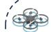  
UAV

  
MEC Server

  
Damaged Base Station

  
IMD Carrier

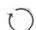  
Local Process

  
Task offloading from IMD to UAV

  
Task offloading from UAV to HAS

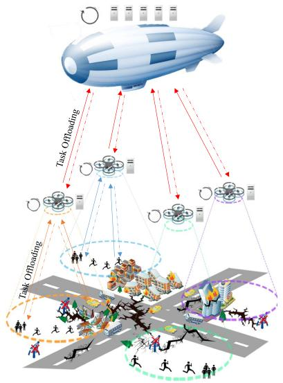

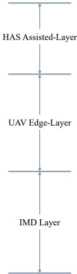  
Fig. 1. AMEC Network Framework

# 3 SYSTEM MODEL AND PROBLEM FORMULATION

In this section, we first introduce the AMEC network framework in Subsection 3.1. Then, we model the communication model, delay model, and energy consumption model in Subsections 3.2, 3.3, and 3.4, respectively. Next, in Subsection 3.5, we model the task offloading model, which includes our proposed DRUDM mechanism. Subsection 3.6 mainly describes the modeling of the coverage fairness index. Finally, we formulate the joint TO, RA, and UAV coverage fairness optimization problem in Subsection 3.7.

# 3.1 AMEC Network Framework

As shown in Fig. 1, we propose a hierarchical AMEC network framework comprising three layers: the IMD layer, the UAV layer, and the HAS layer. The IMD layer includes various IMDs that generate computation-intensive and delay-sensitive tasks. The UAV layer plays a central role. Each UAV in this layer searches for IMDs within its communication range and establishes transmission links. IMDs that successfully establish transmission links can completely offload tasks to the UAV’s task queue for processing. The HAS layer contains a HAS with powerful computing and energy resources, which serves as an upper-layer MEC node. In our framework, UAVs can establish transmission links with the HAS to offload tasks for processing.

In this paper, IMDs and UAVs are denoted as the set $i \in \{ 1 , 2 , . . . , I \} , u \in \{ 1 , 2 , . . . , U \} ,$ respectively, and the HAS is denoted as $h$ . The computing capacity of the HAS and UAVs is denoted as $f _ { h }$ and $f _ { u }$ , respectively, and we assume that the MEC server equipped by each UAV has the same computing power [15]. We use T to represent the entire flight cycle of a UAV, which is divided into several time slots, denoted as the set $t \in \{ 1 , 2 , . . . , T \} .$ , where each time slot $t$ has the same length [10]. The randomly generated task of the $I M D _ { i }$ in time slot $t$ is denoted as $\mathsf { \bar { M } } _ { i } ( t ) = \{ S _ { i } ( t ) , C _ { i } ( t ) , D _ { i } ( t ) \} ,$ where $S _ { i } ( t )$ represents the size of the task, $C _ { i } ( t )$ represents the number of CPU cycles

required per bit to execute the task, and $D _ { i } ( t )$ represents the tolerable delay for the task. In our system framework, each UAV can establish transmission links with multiple IMDs within its communication coverage within the same time slot based on its own offloading decisions,the single IMD and the subset of IMDs covered by $U A V _ { u }$ are expressed as $I M D _ { i } ^ { u }$ and $I M D ^ { u }$ , respectively. It is worth noting that when an IMD is covered by multiple UAVs simultaneously in time slot $\mathrm { t , }$ it can only establish a transmission link with one UAV.

# 3.2 Communication Model

In our proposed AMEC system framework, the communication link is primarily divided into two parts: 1) the UAVdetermined communication link from the IMD to the UAV, the IMD can use this link to offload computationally intensive or delay-sensitive tasks and receive the results returned from the UAV after task processing; 2) the UAV-determined communication link from the UAV to the HAS, the UAV can use this link to offload some tasks from its own task queue to the HAS for auxiliary processing, thereby reducing the UAV’s resource load, and this link also receives the results returned from the HAP after task processing. Since the former link is ground-to-air, the I2U communication is modeled using the probabilistic line-of-sight(LoS) channel model. The latter link is air-to-air, so it is modeled using the free-space path loss model based entirely on LoS.

# 3.2.1 I2U Communication

At time slot t, the positions of $U A V _ { u }$ and $I M D _ { i }$ are denoted as $\{ x _ { u } ( t ) , y _ { u } ( t ) , \bar { z _ { u } } \}$ (all UAVs are assumed to be at the same flight altitude $z _ { u }$ in this paper) and $\{ x _ { i } ( t ) , y _ { i } ( t ) , 0 \} ,$ respectively, and the distance between them is expressed as the Euclidean distance:

$$
d _ {i, u} (t) = \sqrt {\left(x _ {u} (t) - x _ {i} (t)\right) ^ {2} + \left(y _ {u} (t) - y _ {i} (t)\right) ^ {2} + z _ {u} ^ {2}}. \tag {1}
$$

The channel gain between $U A V _ { u }$ and $I M D _ { i }$ is expressed according to the Euclidean distance between them as:

$$
\operatorname {g a i n} _ {i, u} (t) = \frac {\beta \left[ \operatorname {p r o b} _ {i , u} ^ {L o S} (t) \epsilon_ {i , u} ^ {L o S} (t) + \operatorname {p r o b} _ {i , u} ^ {N L o S} (t) \epsilon_ {i , u} ^ {N L o S} (t) \right]}{d _ {i , u} (t) ^ {\varrho}}, \tag {2}
$$

where $\beta$ represents the channel gain per unit distance $\alpha =$ $1 m ^ { \dag } ,$ ), and $\varrho$ represents the path loss coefficient, which is typically 2 in a free-space channel and 4 in a multi-path fading channel. The additional path loss beyond the free-space path loss due to LoS and non-line-of-sight (NLoS) transmissions are represented as $\epsilon _ { g , u } ^ { L o S } ( t )$ and $\epsilon _ { g , u } ^ { \breve { N } L o S } ( t )$ , respectively [37]. NLoS scenarios must be considered when there is a line-ofsight obstruction between IMDs and UAVs. The probability of a LoS channel between $U A V _ { u }$ and $I M D _ { i } ^ { u }$ is represented as $p r o b _ { i , u } ^ { L o S } ( t ) ,$ and $p r o b _ { i , u } ^ { N L o S } ( t ) = 1 - p r o b _ { i , u } ^ { L o S } ( t )$ [30]. We express $p r o b _ { i , u } ^ { L o S } ( t )$ as:

$$
\operatorname {p r o b} _ {i, u} ^ {L o S} (t) = \frac {1}{1 + p _ {1} \exp \left\{- p _ {2} \left[ \arcsin \frac {z _ {u}}{d _ {i , u} (t)} - p _ {1} \right] \right\}}, \tag {3}
$$

where arcsin $\frac { z _ { u } } { d _ { i , u } ( t ) }$ zu represents the elevation angle of $U A V _ { u }$ and $I M D _ { i } ^ { u }$ at time slot $t ,$ and $p _ { 1 }$ and $p _ { 2 }$ are two constant parameters.

We use non-orthogonal multiple access (NOMA) as the wireless access mode for UAVs. NOMA serves multiple users simultaneously on the same resource block through non-orthogonal power reuse and serial interference cancellation, effectively improving spectrum efficiency and system connection capacity (allowing $I M D ^ { u }$ to share the $\phantom { } \ U A V _ { u }$ spectrum resources to improve TO efficiency). The wireless channel data transmission rate from $I M D _ { i } ^ { u }$ to the $U A V _ { u }$ serving it is expressed as:

$$
R _ {i, u} (t) = B _ {u} \log \left\{1 + \frac {\operatorname {g a i n} _ {i , u} (t) P _ {i , u} (t)}{\sum_ {i ^ {\prime} = 1 , i ^ {\prime} \neq i} I M D ^ {u}} \right\}, \tag {4}
$$

where $B _ { u }$ represents the bandwidth of the $U A V _ { u } , P _ { i , u } ( t )$ represents the transmit power of $I M D _ { i } ^ { u }$ when offloading $\sigma ^ { 2 }$ ks to, and $\begin{array} { r l } { ~ } & { { } \sum _ { i ^ { \prime } = 1 , i ^ { \prime } \neq i } ^ { I M D ^ { u } } g a i n _ { i ^ { \prime } , u } ( t ) P _ { i ^ { \prime } , u } ( t ) } \end{array}$ $U A V _ { u }$ power iresents ed asband $I M D ^ { u }$ $I M D _ { i } ^ { u }$ [38].

# 3.2.2 U2H Communication

At time slot $\mathrm { t , }$ the position of the HAS is represented as $\{ x _ { h } ( t ) , y _ { h } ( t ) , z _ { h } \}$ (HAS is assumed to be at the flight altitude $z _ { u }$ in this paper), and the distance between UAVs and HAS is also represented as the Euclidean distance. Due to the air-to-air nature of U2H communication, we do not need to consider the situation where the LoS channel between the HAS and UAVs is blocked, so the path loss exponent is set to 2. Although the HAS has abundant computing resources, the distance between the HAS and the UAV is far. In order to ensure high reliability and low collision transmission quality, we use orthogonal frequency division multiple access (OFDMA) as the wireless access mode of the

HAS [25]. At time slot t, the data transmission rate of the wireless channel between the HAS and UAVs is as follows:

$$
R _ {u, h} (t) = s p _ {u} ^ {h} (t) B _ {h} \log \left\{1 + \frac {\operatorname {g a i n} _ {u , h} (t) P _ {u , h} (t)}{\sigma^ {2}} \right\}, \tag {5}
$$

where $B _ { h }$ represents the total HAS channel bandwidth, and $s p _ { u } ^ { h } ( t )$ represents the sub-channel bandwidth ratio allocated by the HAS to $U A V _ { u }$ at the time slot t.

# 3.3 Delay Model

The delay model mainly describes the delay in transmission delay, computation delay and queuing delay. Since the size of task calculation results is usually very small, the delay in returning task calculation results can be ignored [39].

# 3.3.1 Transmission Delay

At time slot $t ,$ the I2U transmission delay from $I M D _ { i } ^ { u }$ uploading task $M _ { i } ( t )$ to $U A V _ { u }$ is denoted as:

$$
T _ {i, u} ^ {\text {t r a n s}} (t) = \frac {S _ {i} (t) C _ {i} (t)}{R _ {i , u} (t)}. \tag {6}
$$

The U2H transmission delay from $U A V _ { u }$ uploading task $M _ { i } ( t )$ to HAS is denoted as:

$$
T _ {T Q [ u, i ], h} ^ {\text {t r a n s}} (t) = \frac {\lambda_ {T Q [ u , i ]} (t) S _ {T Q [ u , i ]} (t) C _ {T Q [ u , i ]} (t)}{R _ {u , h} (t)}, \tag {7}
$$

where $T Q [ u , \cdot ]$ represents the task queue of $U A V _ { u }$ and $T Q [ u , i ]$ represents $M _ { i }$ being offloaded into this queue at time slot t. $\lambda _ { T Q [ u , i ] }$ is an offload flag, if it is equal to 1, the task $M _ { i } ( t )$ is offloaded to the HAS, otherwise it is left to be processed locally in the $U A V _ { u }$ . $S _ { T Q [ u , i ] } ( t )$ represents the size of task $M _ { i } ( t )$ that $I M D _ { i }$ offloads to the $U A V _ { u }$ task queue $T Q [ u , \cdot ] ,$ and $C _ { T Q [ u , i ] } ( t )$ represents the number of CPU cycles required per bit to execute the task $M _ { i } ( t )$ .

# 3.3.2 Computation Delay

At time slot $\mathrm { t , }$ if $M _ { i } ( t )$ is processed locally in $U A V _ { u } ,$ then its computation delay is expressed as:

$$
T _ {T Q [ u, i ]} ^ {\text {c o m p}} (t) = \frac {(1 - \lambda_ {T Q [ u , i ]} (t)) S _ {T Q [ u , i ]} (t) C _ {T Q [ u , i ]} (t)}{f _ {u}}. \tag {8}
$$

If $M _ { i } ( t )$ is offloaded to the HAS for processing, its computation delay is expressed as:

$$
T _ {T Q [ h, i ]} ^ {\text {c o m p}} (t) = \frac {S _ {T Q [ h , i ]} (t) C _ {T Q [ h , i ]} (t)}{f _ {h}}, \tag {9}
$$

where $T Q [ h , \cdot ]$ represents the task queue of HAS.

# 3.3.3 Queuing Delay

After being offloaded from the IMDs to the UAV’s queue for processing, tasks need to wait in the queue, this queuing delay is denoted as:

$$
T _ {T Q [ u, i ]} ^ {\text {q u e}} (t) = \max  \{0, \sum_ {k = 1} ^ {K _ {i} - 1} T _ {T Q [ u, i _ {k} ^ {\prime} ]} ^ {\text {c o m p}} (t) \}, \tag {10}
$$

where $( K _ { i } - 1 )$ represents the number of tasks preceding task $M _ { i }$ in queue ${ \bar { T } } Q [ u , \cdot ] , i _ { k } ^ { \prime }$ represents other IMD tasks. Similarly, the queuing delay of tasks in the HAS can be derived, which only requires replacing $T Q [ u , i ]$ and $T Q [ u , i _ { k } ^ { \prime } ]$ in formula (10) with ${ \bar { T } } Q [ h , i ]$ and $T Q [ h , i _ { k } ^ { \prime } ]$ .

Hence, the total delay for completing task $M _ { i } ( t )$ is:

$$
\begin{array}{l} T _ {i} ^ {\text {t o t a l}} (t) = T _ {i, u} ^ {\text {t r a n s}} (t) + \\ \left\{ \begin{array}{l l} T _ {T Q [ u, i ]} ^ {q u e} (t) + T _ {T Q [ u, i ]} ^ {c o m p} (t), & \text {i n} U A V _ {u}, \\ T _ {T Q [ u, i ]} ^ {q u e} (t) + T _ {T Q [ u, i ], h} ^ {t r a n s} (t) \\ + T _ {T Q [ h, i ]} ^ {q u e} (t) + T _ {T Q [ h, i ]} ^ {c o m p} (t), & \text {i n} H A S. \end{array} \right. \tag {11} \\ \end{array}
$$

Then, we use $o _ { i } ( t )$ as the flag to indicate whether task $M _ { i } ( t )$ is completed, which is calculated as follows:

$$
o _ {i} (t) = \left\{ \begin{array}{l l} 1, & T _ {i} ^ {\text {t o t a l}} (t) \leq D _ {i} (t), \\ 0, & \text {o t h e r w i s e .} \end{array} \right. \tag {12}
$$

# 3.4 Energy Consumption Model

In this paper, we only consider the energy consumption of UAVs, which consists of three parts: flight energy consumption, transmission energy consumption, and computation energy consumption.

# 3.4.1 UAV Flight Energy Consumption

At time slot t, $U A V _ { u }$ moves from position $\{ x _ { u } ( t ) , y _ { u } ( t ) , z _ { u } \}$ to new position $\{ x _ { u } ( t + 1 ) , y _ { u } ( t + 1 ) , z _ { u } \}$ by $\{ x _ { u } ( t ) +$ $\vartheta _ { u } ( t ) \cos \theta _ { u } ( t ) t _ { l e n } , y _ { u } ( t ) + \vartheta _ { u } ( t ) \sin \theta _ { u } ( t ) t _ { l e n } , z _ { u }$ } under the influence of flight angle $\theta _ { u } ( t ) \ \in \ [ 0 , 2 \pi ]$ and flight speed $\vartheta _ { u } ( t )$ , where $t _ { l e n }$ represents the length of a time slot [10]. The flight energy consumption for $U A V _ { u }$ is expressed as:

$$
E _ {u} ^ {\text {f l i g h t}} (t) = \frac {1}{2} \operatorname {L o a d} _ {u} t _ {\text {l e n}} \| \vartheta_ {u} (t) \| ^ {2}, \tag {13}
$$

where $L o a d _ { u }$ represents the payload of $U A V _ { u }$ . Note that constant altitude flight does not cause changes in gravitational potential energy, therefore only velocity kinetic energy is considered.

# 3.4.2 UAV Transmission Energy Consumption

This part mainly involves the energy consumption used to transfer partial tasks from $T Q _ { [ u , \cdot ] }$ to $T Q _ { [ h , \cdot ] } ,$ which is expressed as:

$$
E _ {T Q [ u, i ], h} ^ {\text {t r a n s}} (t) = P _ {u, h} (t) \operatorname {d e l a y} _ {T Q [ u, i ], h} ^ {\text {t r a n s}} (t). \tag {14}
$$

# 3.4.3 UAV Computation Energy Consumption

The computation energy consumption of the $U A V _ { u }$ in local processing tasks is expressed as:

$$
E _ {T Q [ u, i ]} ^ {\text {c o m p}} (t) = \kappa \left(f _ {u}\right) ^ {3} \operatorname {d e l a y} _ {T Q [ u, i ]} ^ {\text {c o m p}} (t), \tag {15}
$$

where $\kappa$ represents the effective switch capacitance coefficient determined by the hardware architecture of $U A V _ { u }$ [32].

# 3.5 Task Offloading Model

To maximize the task completion rate and improve the resource utilization of UAVs, we use a hybrid offloading approach: 1) the Distance-Resource-Urgency Decision Mechanism (DRUDM) based on dynamic weighting and sorting (from IMDs to UAVs); 2) the partial offloading mechanism based on task queue priority sorting (from UAVs to HAS).

# 3.5.1 DRUDM Model

DRUDM consists of a weighted sum of the distance factor, the UAV resource factor, and the IMD task urgency factor. The distance factor is expressed as:

$$
\operatorname {D i s t} _ {i, u} (t) = \frac {\mathrm {d} _ {u} ^ {\max } (t) - \mathrm {d} _ {i , u} (t)}{\mathrm {d} _ {u} ^ {\max } (t) - \mathrm {d} _ {u} ^ {\min } (t)}, \tag {16}
$$

where $d _ { u } ^ { m i n } ( t )$ and $d _ { u } ^ { m a x } ( t )$ represent the distances to the closest and farthest IMDs from $U A V _ { u } ,$ respectively. The UAV resource factor is expressed as:

$$
\begin{array}{l} R e s _ {i, u} (t) = - \frac {1}{2} \left[ 1 - \frac {C A _ {u} ^ {c u r} (t) - S _ {i} (t)}{C A _ {u} ^ {m a x} (t)} \right] \\ - \frac {1}{2} \left[ \frac {E _ {T Q [ u , i ]} ^ {c o m p} (t) - E _ {u , m i n} ^ {c o m p} (t)}{E _ {u , m a x} ^ {c o m p} (t) - E _ {u , m i n} ^ {c o m p} (t)} \right], \end{array} \tag {17}
$$

where maxim $C A _ { u } ^ { c u r } ( t )$ and  capa $C A _ { u } ^ { m a x } ( t )$ resent the cu respectively. $U A V _ { u } ,$ $E _ { u , m i n } ^ { c o m p } ( t )$ and $E _ { u , m a x } ^ { c o m p } ( t )$ represent the minimum and maximum computation energy consumption within the $U A V _ { u }$ coverage area during time slot $\mathrm { t , }$ respectively. The IMD task urgency factor is expressed as:

$$
U r g e _ {i, u} (t) = \frac {D _ {u} ^ {\max } (t) - D _ {i} (t)}{D _ {u} ^ {\max } (t) - D _ {u} ^ {\min } (t)}, \tag {18}
$$

where $D _ { u } ^ { m i n } ( t )$ and $D _ { u } ^ { m a x } ( t )$ represent the minimum and maximum tolerable delays within the UAVu coverage area, respectively.

Next, we calculate the weighted sum of the three factors above to obtain the DRU-Score for each IMD, which is expressed as:

$$
\begin{array}{l} D R U _ {i, u} ^ {S c o r e} (t) = w _ {u} ^ {d i s t} (t) D i s t _ {i, u} (t) \\ + w _ {u} ^ {\text {r e s}} (t) \operatorname {R e s} _ {i, u} (t) \tag {19} \\ + w _ {u} ^ {\text {u r g e}} (t) \operatorname {U r g e} _ {i, u} (t), \\ \end{array}
$$

where $w _ { u } ^ { d i s t } ( t )$ , $w _ { u } ^ { r e s } ( t )$ and $w _ { u } ^ { u r g e } ( t )$ denote the score weighting coefficients, which satisfy $w _ { u } ^ { d i s t } ( t ) + w _ { u } ^ { r e s } ( t ) +$ $w _ { u } ^ { u r \bar { g } e } ( t ) \stackrel { \cdot } { = } 1$ and $w _ { u } ^ { d i s t } ( t ) > 0 , w _ { u } ^ { r e \bar { s } } ( t ) > 0 , w _ { u } ^ { u r g e } \bar { ( t ) } > 0$ These weight coefficients are dynamically adjusted according to the current system state and UAV load conditions. Specifically, when a UAV experiences high computation or energy load, a larger weight is assigned to $w _ { u } ^ { r e s } ( t )$ to avoid excessive task assignment, whereas under relatively light load conditions, higher weights are given to urge $w _ { u } ^ { d i s t } ( t )$ and $w _ { u } ^ { u r g e } ( t )$ to improve service responsiveness. This adaptive weighting strategy enables the DRUDM mechanism to balance efficiency and resource sustainability under varying network states.

All IMDs within $I M D ^ { u }$ are sorted in descending order based on the calculated DRU-Score. We use $\widehat { I M D ^ { u } }$ to represent the set of TO services that the UAV is to provide. The size of $\widehat { I M D ^ { u } }$ is given by the following formula:

$$
N _ {i} ^ {u} (t) + = 1, \text {i f} \sum_ {i = 1} ^ {I M D _ {d s} ^ {u}} S _ {i} (t) <   = C A _ {u} ^ {c u r} (t), \tag {20}
$$

where $I M D _ { d s } ^ { u }$ is the set of $I M D ^ { u }$ after descending sorting. These IMDs in $\widehat { I M D ^ { u } }$ then offload their tasks to the UAV using the NOMA mode. Algorithm 1 illustrates the overall DRUDM process.

# Algorithm 1: DRUDM Algorithm

Input: IMDs set $\{ I M D ^ { 1 } , I M D ^ { 2 } , \ldots , I M D ^ { U } \} ,$ UAVs set $\{ 1 , 2 , \ldots , U \} ,$ , the score weighting coefficients set $\{ w ^ { d i s t } , w ^ { r e s } , w ^ { u r g e } \}$

Output: Offloading decision set $\widehat { I M D ^ { u } }$ for each UAV

1: for each UAV $u$ in $\{ 1 , 2 , \ldots , U \}$ do   
2: for each IMD $i$ in $I M D ^ { u }$ do   
3: Calculate the distance factor by formula (16)   
4: Calculate the UAV resource factor by formula (17)   
5: Calculate the task urgency factor by formula (18)   
6: Calculate the DRU-Score for each IMD by formula (19)   
7: Sort IMDs based on descending DRU-Score   
8: Select $\widehat { I M D ^ { u } }$ for offloading by formula (20)   
9: end for   
10: end for

# 3.5.2 Task Queue Priority Model

In this section, we use a modified Earliest Deadline First(EDF) scheduling algorithm to sort the UAV’s task queue. The reason is that tasks in the AMEC network have different levels of urgency and deadline constraints. The EDF-based priority strategy explicitly considers the task deadline, enabling more effective handling of time-sensitive tasks and improving the resource utilization efficiency of the AMEC network. First, we calculate the score of each task in the queue by:

$$
\begin{array}{l} Q S _ {T Q [ u, i ]} (t) = \psi_ {1} \frac {D _ {T Q [ u , \cdot ]} ^ {\max } (t) - D _ {T Q [ u , i ]} (t)}{D _ {T Q [ u , \cdot ]} ^ {\max } (t) - D _ {T Q [ u , \cdot ]} ^ {\min } (t)} \\ + \psi_ {2} \frac {S _ {T Q [ u , \cdot ]} ^ {m a x} (t) - S _ {T Q [ u , i ]} (t)}{S _ {T Q [ u , \cdot ]} ^ {m a x} (t) - S _ {T Q [ u , \cdot ]} ^ {m i n} (t)}, \\ \end{array}
$$

where $\psi _ { 1 }$ and $\psi _ { 2 }$ represent the score weighting coefsatisfand $\psi _ { 1 } + \psi _ { 2 } = 1$ and nt the $\psi _ { 1 } \quad >$ $0 , \psi _ { 2 } > 0$ $D _ { T Q [ u , \cdot ] } ^ { m a x } ( t )$ $D _ { T Q [ u , \cdot ] } ^ { m i n } ( t )$ $T Q [ u , \cdot ] ,$ $S _ { T Q [ u , \cdot ] } ^ { m a x } ( t )$ and $S _ { T Q \left[ u , \cdot \right] } ^ { m i n } ( t )$ represent the maximum and minimum task size in ${ \dot { T } } Q [ u , \cdot ] ,$ respectively. Then, we sort the tasks in $T Q [ u , \cdot ]$ in ascending order based on $P _ { T Q [ u , \cdot ] } ( t )$ . The number of tasks offloaded to the HAS is calculated by the partial offloading rate $\varphi ( t )$ and the length $K _ { u }$ of ${ \dot { T } } Q [ u , \cdot ] ,$ its calculation formula is as follows:

$$
N _ {u} (t) = \left\lfloor \varphi (t) K _ {u} \right\rfloor . \tag {22}
$$

Then, $N _ { u } ( t )$ tasks are offloaded to HAS sequentially according to the previously arranged order, which offload flag $\lambda _ { T Q [ u , i ] = 1 }$ .

# 3.6 Coverage Fairness Model

To ensure fair service to IMDs within the post-disaster scenarios and avoid the situation where UAVs only serve IMDs in a few densely populated areas, we propose a coverage fairness index $\bar { T } L ( t )$ based on the Theil coefficient. The Theil coefficient is a statistical indicator commonly used to quantify inequality in distributions. Based on the concept of entropy, it captures differences in resource allocation or coverage across different regions. The Theil

coefficient ranges from 0 to large values, and in the context of coverage equity, it is used to measure the fairness of UAVs providing TO services to IMD areas with varying densities. A lower Theil coefficient indicates greater fairness. The Theil coefficient is particularly suitable for measuring coverage fairness in post-disaster AMEC scenarios due to its sensitivity to disparities in resource allocation. Unlike commonly used metrics such as Jain’s Fairness Index, which provides a single aggregated fairness value, the Theil coefficient is additive and can decompose fairness into withingroup and between-group components. This allows for a more nuanced assessment of coverage imbalances, particularly in environments with significant disparities between IMD-dense areas and sparse regions. By emphasizing large inequalities in UAV coverage, the Theil coefficient helps identify underserved regions and ensures a more effective fairness evaluation in dynamic, resource-constrained settings.

First, we divide the scenario into grid areas of equal size, which denoted as set $g \in \{ 1 , 2 , . . . , G \}$ . We use $I _ { g }$ to represent the number of IMDs in each grid. At time slot t, the total number of time slots during which all IMDs in grid $g$ are served by UAVs is denoted as $G S _ { g } ( t ) ,$ , and the total number of time slots during which all IMDs across all grids are served is denoted as $\bar { G } S _ { t o t a l } ( t )$ . We then denote the cumulative values of $G S _ { g } ( t )$ and $G S _ { t o t a l } ( t )$ over $t$ time slots as $\overline { { G S } } _ { g } ( t )$ and $\overline { { G S } } _ { t o t a l } ( i )$ , respectively. The formula for $T L ( t )$ is as follows:

$$
\begin{array}{l} T L (t) = \phi \sum_ {g = 1} ^ {G} \frac {\overline {{G S}} _ {g} (t)}{\overline {{G S}} _ {t o t a l} (t)} \ln \frac {\overline {{G S}} _ {g} (t) / I _ {g}}{\overline {{G S}} _ {t o t a l} (t) / I} + \tag {23} \\ (1 - \phi) (1 - \frac {G S _ {t o t a l} (t)}{I}), I _ {g} \neq 0, \\ \end{array}
$$

where $\phi$ is a hyperparameter used to ensure that the UAV does not ignore the edge areas while maintaining a balanced service distribution. In this formula, the first term in the formula (before the plus sign) measures fairness among served areas, while the other term penalizes the UAV’s omission of IMD coverage. Considering the extreme case where there is only one IMD in a grid, and all UAVs serve only this one IMD throughout all time slots, we can deduce that the upper bound is $\ln \left( I \right)$ . Thus, the value of $T L ( t )$ ranges from $[ \bar { 0 } , \bar { \ln } ( I ) ]$ . The more equitable the TO service provided by the UAV to all devices in the scenarios, the closer this value approaches 0. The lower the level of fairness, the larger the value.

# 3.7 Problem Formulation

From the analysis above, the joint TO, RA, and UAV coverage fairness optimization problem is formulated, we aim to maximize the task completion rate of IMDs under UAV endurance constraints, while minimizing both the average task delay and the coverage fairness index of the AMEC network. The optimization problem in this paper is expressed as follows:

$$
\max  \sum_ {t = 1} ^ {T} \sum_ {u = 1} ^ {U} \sum_ {i = 1} ^ {\widehat {I M D ^ {u}}} o _ {i} (t) \left(\xi_ {1} S _ {T Q [ u, i ]} (t) - \xi_ {2} T _ {i} ^ {\text {t o t a l}} (t)\right) - \xi_ {3} T L (t), \tag {24}
$$

$$
s. t. \quad \left| \widehat {I M D ^ {u}} \right| \leq | I M D ^ {u} |, u \in U \tag {23a}
$$

$$
\sum_ {u = 1} ^ {U} s p _ {u} ^ {h} (t) \leq 1, t \in T \tag {23b}
$$

$$
0 \leq \vartheta_ {u} (t) \leq \vartheta_ {u} ^ {\max }, u \in U, t \in T \tag {23c}
$$

$$
\sum_ {t = 1} ^ {T} E _ {u} ^ {\text {t o t a l}} (t) \leq E _ {u} ^ {\max }, u \in U \tag {23d}
$$

$$
\widehat {I M D ^ {u}} \cap \widehat {I M D ^ {u ^ {\prime}}} = \varnothing , u \neq u ^ {\prime} \tag {23e}
$$

$$
0 \leq \varphi (t) \leq 1 \tag {23f}
$$

$$
\left\| U A V _ {u} ^ {\text {p o s}} (t) - U A V _ {u ^ {\prime}} ^ {\text {p o s}} (t) \right\| \geq d ^ {\text {s a f e}},
$$

$$
u \in U, u ^ {\prime} \in U, u \neq u ^ {\prime} \tag {23g}
$$

where $\xi _ { 1 } , \xi _ { 2 }$ and $\xi _ { 3 }$ denote the weights that balance the contribution of different items to the reward, and $\xi _ { 1 } \ >$ $0 , \xi _ { 2 } > 0 , \xi _ { 3 } > 0$ . Constraint (23a) indicates that the size of the set of IMDs served by $U A V _ { u }$ at time slot t cannot exceed the size of the set of IMDs within the communication range of $U A V _ { u }$ . Constraint (23b) prevents the sum of the OFDMA subchannel bandwidth occupied by each UAV from exceeding the total channel bandwidth of the HAS. Constraint (23c) restricts the flight speed of $U A V _ { u }$ to the range of $[ 0 , \vartheta _ { u } ^ { m a x } ]$ . Constraint (23d) represents the total energy consumption of the $U A V _ { u }$ during the entire flight cycle must be less than the maximum battery capacity $E _ { u } ^ { m a x } .$ , and $E _ { u } ^ { t o t a l } ( t ) ~ = ~ E _ { u } ^ { f l i g h t } ( t ) + \bar { E } _ { T Q [ u , \cdot ] , h } ^ { t r a n s } ( t ) \stackrel {  } { + } { E } _ { T Q [ u , \cdot ] } ^ { \bar { c o m p } ^ { \mathrm { ~ } } } ( t )$ . Constraint (23e) indicates that each IMD can only be served by one UAV in the same time slot. Constraint (23f) represents the range of the partial offloading rate of tasks in the queue $T Q [ u , \cdot ]$ at time slot t. Finally, constraint (23g) indicates that the distance between any two UAVs cannot be less than the safety distance [36]. Since the optimization problem (24) belongs to the category of a mixed integer nonlinear programming (MINLP) problem, which is known to be computationally challenging to solve. Therefore, we first formulate it as a partially observable Markov decision process, and then adopt Multi-Agent DRL to address it in the subsequent section.

# 4 ALGORITHM DESIGN

In this section, we first formulate the joint optimization problem involving TO, RA, and UAV coverage fairness in (24) as a multi-agent partially observable Markov decision process (MA-POMDP). Subsequently, a solution method named DRUDM-CFG is proposed, leveraging the MASAC algorithm to address the optimization challenges in the multi-UAV assisted AMEC network.

# 4.1 MA-POMDP Model

In our algorithm, each UAV is treated as a separate agent. The MDP of each agent consists of state, action, and reward function, which are expressed as:

# 4.1.1 State

The observed state of $U A V _ { u }$ at time slot t is modeled as:

$$
\begin{array}{l} s _ {u} (t) = \left\{p o s _ {u} (t), f _ {u}, C A _ {u} ^ {c u r} (t), E _ {u} ^ {c u r} (t), \right. \tag {25} \\ \left. \operatorname {p o s} _ {i} (t), M _ {i} (t), B _ {h} \right\}, i \in I M D ^ {u}, \\ \end{array}
$$

where $p o s _ { u } ( t )$ and $p o s _ { i } ( t )$ represent the position coordinates of $U A V _ { u }$ and $I M D _ { i } ,$ respectively. $f _ { u }$ represents the computing capacity of $U A V _ { u }$ . $C A _ { u } ^ { c u r } ( t )$ represents the current remaining battery power of the $U A V _ { u }$ . $E _ { u } ^ { c u r } ( t )$ represents the current remaining cache capacity of the $U A V _ { u }$ . ${ \mathrm { \bar { \boldsymbol { M } } } } _ { i } ( t )$ is the task of $I M D _ { i }$ . $B _ { h }$ is the bandwidth of HAS. The global state is modeled as $s ( t ) = \{ s _ { 1 } ( t ) , . . . , s _ { U } ( t ) \}$ .

# 4.1.2 Action

The action of $U A V _ { u }$ at time slot t is modeled as:

$$
\begin{array}{l} a _ {u} (t) = \left\{s p _ {u} ^ {h} (t), w _ {u} ^ {\text {d i s t}} (t), w _ {u} ^ {\text {r e s}} (t), w _ {u} ^ {\text {u r g e}} (t), \right. \tag {26} \\ \left. \varphi (t), \vartheta_ {u} (t), \theta_ {u} (t) \right\}, \\ \end{array}
$$

where $s p _ { u } ^ { h } ( t )$ represents the proportion of the $B _ { h }$ occupied by the $U A V _ { u }$ . $\hat { w } _ { u } ^ { d i s t } ( t ) , w _ { u } ^ { r e s } ( t )$ and $w _ { u } ^ { u r g e } ( t )$ represent the weight coefficients used to calculate the DRU-score. $\varphi ( t )$ is partial offloading rate. $\vartheta _ { u } ( t )$ and $\theta _ { u } ( t )$ represent the flight speed and angel of $U A V _ { u } ,$ respectively. The global action is modeled as $a ( t ) = \{ a _ { 1 } ( t ) , . . . , \bar { a } _ { U } ( t ) \}$ .

# 4.1.3 Reward

In multi-agent reinforcement learning, each agent selects the action to be performed based on the environmental state value it observes. Performing this action in the environment will receive a reward and transfer to the next state. In this process, the agent constantly adjusts its strategy according to the reward, so that it updates in the direction of high rewards, and gradually approaches the optimal strategy. Since the optimization objective in problem (24) is consistent with the reward optimization direction in reinforcement learning, the local reward function of each agent is designed directly based on problem (24). It consists of three components: the number of tasks completed by the UAV in real time, the task delay, and the UAV coverage fairness index, which are expressed as follows:

$$
r _ {u} (t) = \sum_ {i = 1} ^ {\widehat {I M D} ^ {u}} o _ {i} (t) \left(\xi_ {1} S _ {T Q [ u, i ]} (t) - \xi_ {2} T _ {i} ^ {t o t a l} (t)\right) - \xi_ {3} T L (t). \tag {27}
$$

The global reward function is the sum of rewards for all agents, which is expressed as follows:

$$
r (t) = \sum_ {u = 1} ^ {U} r _ {u} (t). \tag {28}
$$

# 4.2 DRUDM-CFG Algorithm

The proposed DRUDM-CFG is a multi-agent deep reinforcement learning algorithm that incorporates the maximum entropy reinforcement learning principle. This design allows the optimization objective to simultaneously maximize the expected cumulative reward and the policy entropy, thereby improving exploration and learning stability of multi-UAVs in post-disaster scenarios. The optimization formulation is given as: The optimization formulation is given as:

$$
J \left(\pi_ {1}, \dots , \pi_ {U}\right) = \mathbb {E} _ {\tau \sim \pi} \sum_ {t = 0} ^ {T} \gamma^ {t} \sum_ {u = 1} ^ {U} \left[ r _ {u} (t) + \alpha_ {u} \mathcal {H} \left(\pi_ {u} (\cdot | s _ {u} (t))\right) \right], \tag {29}
$$

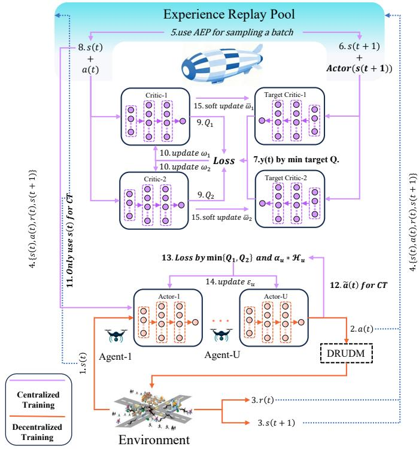  
Fig. 2. DRUDM-CFG Algorithm Architecture

where $J ( \pi _ { 1 } , . . . , \pi _ { u } )$ denotes the optimization objective of all agents, and $\tau = ( s _ { 0 } , a _ { 0 } ; . . . ; s _ { T } , a _ { T } )$ is the trajectory sampled by joint policy $\pi = ( \pi _ { 1 } , . . . , \pi _ { U } )$ . $\gamma$ is the discount factor, $\alpha _ { u }$ is the temperature coefficient balancing reward and entropy, and $\mathcal { H } ( \pi _ { u } ( \cdot | s _ { u } ( t ) ) )$ is the entropy of agent $U A V _ { u }$ . A higher entropy indicates stronger exploration [40]. This entropydriven objective prevents premature convergence and improves robustness in dynamic post-disaster scenarios.

As shown in Fig. 2, each UAV acts as an independent agent. The network framework consists of an actor network with parameters $\varepsilon _ { u }$ for each UAV, two global critic networks with parameters $\omega _ { 1 }$ and $\omega _ { 2 }$ , and two global target critics with parameters $\bar { \omega _ { 1 } }$ and $\bar { \omega _ { 2 } }$ for HAS. A shared experience replay buffer $\mathcal { D }$ is deployed on the HAS to support centralized training with decentralized execution(CTDE). During centralized training, the HAS computationally serves as the centralized critic, utilizing global state and joint action information to evaluate agent behaviors and update the parameters of global critic network and global target critic network.

In the CTDE framework, decentralized execution generates samples to populate $\mathcal { D } _ { \cdot }$ , which are then used for centralized training. At each time slot, agent $U A V _ { u }$ normalizes its local observation $s _ { u } ( t )$ and feeds it into its actor network, which outputs the policy distribution $\mathcal { N } ( \mu _ { \varepsilon _ { u } } ( s _ { u } ( t ) ) , \sigma _ { \varepsilon _ { u } } ^ { 2 } ( s _ { u } ( t ) ) )$ . To enable backpropagation, actions are sampled using reparameterization:

$$
\pi_ {u} ^ {\prime} = \mu_ {\varepsilon_ {u}} \left(s _ {u} (t)\right) + \sigma_ {\varepsilon_ {u}} \left(s _ {u} (t)\right) \odot \exists , \tag {30}
$$

where ϶ is standard Gaussian noise. The final action vector $a _ { u } ( t )$ is obtained by applying the softmax function to generate $\{ w _ { u } ^ { d i s t } ( t ) , w _ { u } ^ { \bar { r } e s } ( \acute { t } ) , \bar { w } _ { u } ^ { u r \breve { g } e } ( t ) \} ,$ and the sigmoid function to generate $\{ s p _ { u } ^ { h } ( t ) , \varphi ( t ) , \vartheta _ { u } ( t ) , \theta _ { u } ( t ) \}$ . The agent then interacts with the environment, receives reward $\dot { r _ { u } } ( t )$

and next local observation $s _ { u } ( t { + } 1 )$ , and stores the transition $\{ s ( t ) , a ( t ) , r ( t ) , s ( t + 1 ) \}$ in $\mathcal { D }$ .

Let $\mathcal { D } ^ { c u r }$ denote the number of samples currently in ${ \mathcal { D } } ,$ , and $\mathcal { D } ^ { t h r e }$ denote the threshold required for centralized training. When $\mathcal { D } ^ { c u r } ~ < ~ \mathcal { D } ^ { t h r e }$ , agents’ actor networks remain untrained, leading to limited exploration and homogeneous samples. To mitigate this, additional noise is added to $\{ s p _ { u } ^ { h } ( t ) , \varphi \dot { ( t ) } , \vartheta _ { u } ( t ) , \theta _ { u } \dot { ( t ) } \}$ :

$$
a _ {u} (t) = \operatorname {c l i p} \left(a _ {u} (t) + \mathcal {N} \left(0, \sigma_ {\text {d i s t u r b}} ^ {2}\right), 0, 1\right). \tag {31}
$$

This approach enhances the agent’s exploration capabilities and enables samples to cover a wider distribution.

Algorithm 2: DRUDM-CFG   
1: Initialize:The Actor network parameter $\varepsilon_{u}$ of each UAV, the parameter $\omega_{1},\omega_{2}$ of the centralized Critic network, the $\bar{\omega}_{1},\bar{\omega}_{2}$ of the Target Critic network, the experience replay pool $\mathcal{D}$ and $\mathcal{D}^{cur}$ 2: for each episode $n\in N$ do   
3: Initialize global state $s(t)$ 4: for each time slot $t\in T$ do   
5: for each UAV $u\in \{1,2,\dots ,U\}$ do   
6: if $\mathcal{D}^{cur} <   \mathcal{D}^{thre}$ then   
7: $UAV_{u}$ gets action $a_{u}(t)$ by formula (31)   
8: else   
9: $UAV_{u}$ gets action $a_{u}(t)$ by formula (30)   
10: end if   
11: Perform $a_{u}(t)$ in $s_u(t)$ and get $r_u(t)$ and $s_u(t + 1)$ 12: end for   
13: Save a four tuple $\{s(t),a(t),r(t),s(t + 1)\}$ in $\mathcal{D}$ and set $AEP_{t} = max\{AEP_{\mathcal{D}}\}$ $\mathcal{D}^{cur} + = 1$ 14: if $\mathcal{D}^{cur}\geq \mathcal{D}^{thre}$ then   
15: for $\mathfrak{d} <   \mathcal{D}^{batch}$ do   
16: Take a sample $\mathfrak{d}$ from $\mathcal{D}$ by formula (34)   
17: Calculate $ISW_{\mathfrak{d}}$ by formula (35)   
18: end for   
19: Calculate TD-Error $\delta$ for each sample in $\mathcal{D}^{batch}$ by formula (32)   
20: Update the parameter $\omega_{1},\omega_{2}$ according to formula (36)   
21: for each UAV $u\in \{1,2,\ldots ,U\}$ do   
22: Update the parameter $\varepsilon_{u}$ of $UAV_{u}$ according to formula (38)   
23: Update the temperature coefficient $\alpha_{u}$ of $UAV_{u}$ according to formula (39)   
24: end for   
25: Soft update $\bar{\omega}_1,\bar{\omega}_2$ by formula (40)   
26: Update the priority of each sample in $\mathcal{D}^{batch}$ by formula (33)   
27: end if   
28: end for   
29: end for

When $\mathcal { D } ^ { c u r } \ge \mathcal { D } ^ { t h r e } .$ , the algorithm enters centralized training. In this phase, critic and actor networks are updated by sampling batches from $\mathcal { D } _ { \cdot }$ , which stores global states, actions, rewards, and next states. Traditional MASAC employs random uniform sampling, which reduces correlation among samples and improves stability. However, this method overlooks the varying importance of samples, leading to inefficiency. To address this, we propose an adaptive

entropy priority (AEP) experience replay mechanism. For each sample d, the TD-error is computed as:

$$
\begin{array}{l} \delta_ {\mathfrak {d}} = r _ {\mathfrak {d}} (t) + \gamma \left[ \min  _ {j = 1, 2} Q _ {\bar {\omega} _ {j}} \left(s _ {\mathfrak {d}} (t + 1), a _ {\mathfrak {d}} (t + 1)\right) - \right. \\ \sum_ {u = 1} ^ {U} \alpha_ {u} \log \pi_ {u} \left(a _ {\mathfrak {d}} ^ {u} (t + 1) \mid s _ {\mathfrak {d}} ^ {u} (t + 1)\right) ] - \tag {32} \\ \frac {1}{2} [ Q _ {\omega_ {1}} (s _ {\mathfrak {d}} (t), a _ {\mathfrak {d}} (t)) + Q _ {\omega_ {2}} (s _ {\mathfrak {d}} (t), a _ {\mathfrak {d}} (t)) ]. \\ \end{array}
$$

Here, the minimum of the two target Q values is used to mitigate overestimation, and the entropy regularization term maintains exploration. To improve adaptability, an entropy factor $\Phi _ { \mathfrak { d } }$ is incorporated into the priority:

$$
A E P _ {\mathfrak {d}} = \left| \boldsymbol {\delta} _ {\mathfrak {d}} \right| \lambda \Phi_ {\mathfrak {d}} + \Psi , \tag {33}
$$

where $\lambda$ is a hyperparameter controlling exploration, $\Phi _ { 0 } = \mathcal { H } ( \pi ( a _ { \mathfrak { d } } ( t + 1 ) | s _ { \mathfrak { d } } ( t + 1 ) ) )$ is restricted to the range of $[ 0 , \Phi ^ { m a x } ]$ for training stability, and $\varPsi$ is a constant to prevent the priority from being 0.

The sampling probability of each sample is:

$$
C P _ {\mathfrak {d}} = \frac {(A E P _ {\mathfrak {d}}) ^ {\psi}}{\sum_ {\mathfrak {d} = 1} ^ {\mathcal {D} ^ {c u r}} (A E P _ {\mathfrak {d}}) ^ {\psi}}, \tag {34}
$$

where $\psi ~ \in ~ [ 0 , 1 ]$ adjusts between uniform and prioritybased sampling [41]. Since priority-based sampling alters the distribution, importance sampling weights are applied:

$$
I S W _ {\mathfrak {d}} = \frac {\left(D ^ {c u r} C P _ {\mathfrak {d}}\right) ^ {- \zeta}}{\max  _ {\mathfrak {d} ^ {\prime}} I S W _ {\mathfrak {d} ^ {\prime}}}, \tag {35}
$$

where $\zeta ~ \in ~ [ 0 , 1 ]$ controls the degree of correction to the sampling distribution, and its value is small at the beginning of training and gradually increases to 1. $m a x _ { \mathfrak { d } ^ { \prime } } I S W _ { \mathfrak { d ^ { \prime } } }$ is used to normalize the importance sampling weights to avoid excessive gradients and improve training stability. Each new sample will be assigned the highest $A E P$ value in the current $\mathcal { D }$ when stored in it, while each sampled d will have its $A E P _ { \mathfrak { d } }$ and $I S W _ { \mathfrak { d } }$ recalculated. Compared with standard uniform sampling, the AEP mechanism introduces an additional entropy evaluation and priority update for each sampled transition. The resulting computational complexity is $\mathcal { O } ( N )$ with respect to the current replay buffer size $\mathcal { D } ^ { c u r }$ , which is comparable to conventional prioritized sampling strategies. Since entropy calculation involves only lightweight arithmetic operations, the additional overhead is marginal relative to the overall training process, while providing more informative sample selection and improved learning efficiency.

We use the AEP sampling mechanism to sample $\mathcal { D } ^ { b a t c h }$ from $\mathcal { D }$ for centralized training. First, we train the global critic network, and this training process is also based on the TD-error principle. The loss function $L ( \omega _ { j } )$ is expressed as:

$$
\begin{array}{l} L \left(\omega_ {j}\right) = \mathbb {E} _ {s, a \sim \mathcal {D} ^ {b a t c h}} \left[ I S W _ {\mathfrak {d}} \left(Q _ {\omega_ {j}} (s (t), a (t)) - y (t)\right) ^ {2} \right], \\ \mathfrak {d} \in \mathcal {D} ^ {\text {b a t c h}}, j = 1, 2, \tag {36} \\ \end{array}
$$

where $Q _ { \omega _ { j } } ( s ( t ) , a ( t ) )$ represents the predicted Q value of the current j-th Q network, $y ( t )$ represents the target value as follows:

$$
\begin{array}{l} y (t) = r (t) + \gamma [ \min  _ {j = 1, 2} Q _ {\bar {\omega} _ {j}} (s (t + 1), a (t + 1)) - \\ \sum_ {u = 1} ^ {U} \alpha_ {u} \log \pi_ {u} \left(a _ {u} (t + 1) \mid s _ {u} (t + 1)\right) ]. \tag {37} \\ \end{array}
$$

The parameters of each critic network are updated using gradient descent on the loss function $L ( \omega _ { j } )$ .

After the critic network is updated, the actor network’s parameters of $U A V _ { u }$ are updated using the following loss function:

$$
\begin{array}{l} L \left(\varepsilon_ {u}\right) = \mathbb {E} _ {s _ {u} \sim \mathcal {D} ^ {b a t c h}} \left[ I S W _ {\mathfrak {d}} \alpha_ {u} \log \pi_ {\varepsilon_ {u}} \left(\tilde {a} _ {u} (t), s _ {u} (t)\right) - \right. \\ \min  _ {j = 1, 2} Q _ {\varepsilon_ {u}} (s (t), \tilde {a} (t)) ], \mathfrak {d} \in \mathcal {D} ^ {\text {b a t c h}}, \tag {38} \\ \end{array}
$$

where $\tilde { a } _ { u } ( t )$ is a new action sampled by the actor network using the current parameter $\varepsilon _ { u }$ from the state $s _ { u } ( t )$ in $\mathcal { D } ^ { b a t c h }$ via the reparameterization technique.

After updating the critic network and actor network, the temperature coefficient also needs to be updated to balance the agent’s exploration and exploitation. The loss function for $\alpha _ { u }$ of $U A V _ { u }$ is as follows:

$$
L \left(\alpha_ {u}\right) = \mathbb {E} _ {s _ {u} \sim \mathcal {D} ^ {\text {b a t c h}}} \left[ - \alpha_ {u} \log \pi_ {u} \left(\tilde {a} _ {u} (t), s _ {u} (t)\right) - \alpha_ {u} H ^ {\text {t a r g e t}} \right], \tag {39}
$$

where $H ^ { t a r g e t }$ is a constant representing the target entropy. When the SAC algorithm’s entropy weights are updated, the target entropy serves as a reference for the desired policy entropy level, guiding the adjustment of the entropy weights to achieve a better balance between exploration and exploitation.

Finally, the parameters of the target Critic network are soft-updated as follows:

$$
\bar {\omega} _ {j} \leftarrow \mathfrak {r} \omega_ {j} + (1 - \mathfrak {r}) \bar {\omega} _ {j}, j = 1, 2, \tag {40}
$$

where r is a hyperparameter that controls the degree of soft-update. The details of the DRUDM-CFG algorithm are presented in Algorithm 2.

During the training phase, each UAV maintains an independent actor network, while a single global critic network and its corresponding target critic network are employed to evaluate the joint state–action pairs. The computational complexity of updating all actor networks in one training iteration is given by:

$$
C _ {a c t o r} = \mathcal {O} (U \cdot \mathcal {D} ^ {\text {b a t c h}} \cdot \sum_ {l _ {a} = 1} ^ {L _ {a}} N _ {l _ {a} - 1} N _ {l _ {a}}), \tag {41}
$$

where $U$ denotes the number of UAVs, $\mathcal { D } ^ { b a t c h }$ is the sampling batch size, and $L _ { a }$ and $N _ { l _ { a } }$ represent the number of hidden layers and neurons per layer in the actor network, respectively. The global critic network processes the joint information of all UAVs and is updated once per iteration. Its computational complexity is:

$$
C _ {c r i t i c} = \mathcal {O} \left(\mathcal {D} ^ {\text {b a t c h}} \cdot \sum_ {l _ {c} = 1} ^ {L _ {c}} N _ {l _ {c} - 1} N _ {l _ {c}}\right), \tag {42}
$$

where $L _ { c }$ and $N _ { l _ { c } }$ represent the number of hidden layers and neurons per layer in the critic network, respectively. The

update of the target critic network involves only parameter soft updates and incurs negligible additional computational cost. In addition, the DRUDM-based user selection and the coverage fairness index computation mainly involve linear scanning and aggregation operations over UAVs and IMDs, resulting in a complexity of at most $\mathcal { O } ( U \cdot I ) ,$ , which is lower than the neural network training cost. Therefore, the overall computational complexity per training iteration of Algorithm 2 is $C _ { a c t o r } + C _ { c r i t i c }$ .

During the execution phase, only the actor networks are involved. Each UAV independently performs a forward pass through its actor network to obtain the offloading and trajectory decisions. Therefore, the computational complexity per time slot is only $\begin{array} { r l } { ~ } & { { } \mathcal { O } ( U \cdot \sum _ { l _ { a } = 1 } ^ { L _ { a } } { N _ { l _ { a } - 1 } \hat { N } _ { l _ { a } } } ) } \end{array}$ .

# 5 EVALUATION

In this section, we designed simulation experiments to verify the effectiveness of our proposed DRUDM-CFG algorithm in AMEC network under post-disaster scenarios. Firstly, we described the settings and parameters used for the simulation experiment. Then, we present a convergence analysis of the proposed DRUDM-CFG algorithm. Next, the following subsection compares our algorithm with other algorithms in terms of UAV task completion rate and average task delay. Finally, we analyze the coverage fairness and the UAV flight trajectories of our algorithm.

TABLE 1 Simulation Parameters   

<table><tr><td>Parameter</td><td>Value</td><td>Parameter</td><td>Value</td></tr><tr><td>β</td><td>1.42 × 10-4W</td><td>εi,uLoS(t)</td><td>[0dB,6dB]</td></tr><tr><td>p1</td><td>10</td><td>εi,uNLoS(t)</td><td>[10dB,30dB]</td></tr><tr><td>p2</td><td>0.6</td><td>fu</td><td>1Gcycle/s</td></tr><tr><td>Pi,u</td><td>0.5W</td><td>fh</td><td>50Gcycle/s</td></tr><tr><td>Pu,h</td><td>10W</td><td>Ch</td><td>5 × 1010cycles/s</td></tr><tr><td>Bu</td><td>5MHz</td><td>σ2</td><td>-130dBm/Hz</td></tr><tr><td>Bh</td><td>20MHz</td><td>Loadu</td><td>9.65KG</td></tr><tr><td>tlen</td><td>3s</td><td>κ</td><td>10-28</td></tr><tr><td>Eu max</td><td>100KJ</td><td>Si(t)</td><td>[1Mbit,10Mbit]</td></tr><tr><td>Ci(t)</td><td>[500,800]</td><td>Di(t)</td><td>[1s,3s]</td></tr></table>

# 5.1 Simulation Experimental Parameters

To evaluate the proposed DRUDM-CFG algorithm, we simulate an AMEC network with an area of $1 0 0 0 m \times 1 0 0 0 m$ . The HAS is deployed at $2 0 K M$ altitude at the network center, while three UAVs are deployed within its coverage at $2 0 0 m$ altitude with randomly generated initial positions [15]. 20 IMDs are randomly distributed in the environment [36]. The maximum ground coverage ranges of the HAS and UAVs are $5 0 0 \textrm { m }$ and $2 5 0 ~ \mathrm { m } ,$ respectively. UAV flight speeds are limited to $[ 0 , 5 0 ] m / s ,$ which is a commonly used configuration in UAV-assisted MEC simulations [10]. In each time slot, IMD positions move randomly within $[ 0 m , 1 0 m ] ,$ and tasks are randomly generated synchronously, following widely adopted mobility and task generation models. The actor network of each UAV consists of an input layer, three hidden layers of 256 neurons, and an output layer, with ReLU activation. The global critic network has an input layer, four hidden layers of 512 neurons, and an output

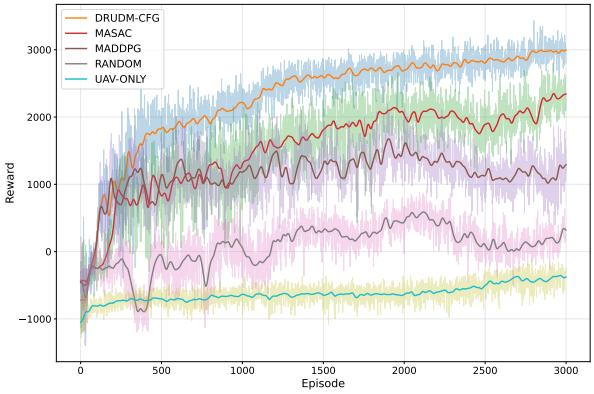  
Fig. 3. Comparison of rewards of different algorithms to measure convergence performance

layer, with layer normalization followed by ReLU activation. Hyperparameters are set as follows: actor learning rate is 1e-4, critic learning rate is 3e-4, soft update parameter r is 1e-3, discount factor is 0.95, replay buffer threshold $\mathcal { D } ^ { t h r e }$ is 2400, and sampling batch size is 256. Finally, we set the total number of training episodes to 3000, with each episode running for 50 steps. The training of DNNs is conducted on Intel i7-8750 CPU and NVIDIA GTX 1080Ti GPU. Other environment parameters follow the settings in [10], [15], [21], [36], [42], and are summarized in Table 1 .

The algorithms used for comparison with our algorithm are as follows:

(1) MASAC [25], [32], [41]: This algorithm does not utilize the DRUDM mechanism or the CFG mechanism proposed by us. Instead, the offloading decisions for IMDs are directly incorporated into the output actions of the agents.   
(2) MADDPG [28], [37], [43]: This is a classic multi-agent reinforcement learning algorithm that also uses the CTDE framework to train multi-agents. Instead of outputting probability distributions, actors in this algorithm directly output deterministic actions. This algorithm uses an action noise mechanism to balance exploration and exploitation between agents.   
(3) Only-UAV: Tasks offloaded from IMDs are processed only on the UAV and not to the HAS for further processing.   
(4) Random: The task offloading rate is randomly generated in the range from 0 to 1.

# 5.2 Convergence Performance Analysis

Fig. 3 shows the cumulative reward performance of different algorithms. All algorithms improve as training progresses, but their convergence behaviors differ. DRUDM-CFG achieves the fastest convergence and the highest steady-state reward, apparently outperforming alternatives. MASAC and MADDPG converge more slowly with larger oscillations, while Random and UAV-Only remain at low reward levels. MADDPG, despite using CTDE, suffers from limited exploration due to its deterministic policy and is prone to Q-function overestimation, leading to unstable training [25], [36].

The superior performance of DRUDM-CFG arises from two mechanisms. First, the Distance-Resource-Urgency Decision Mechanism balances channel quality, resource availability, and task urgency, enabling UAVs to select efficient

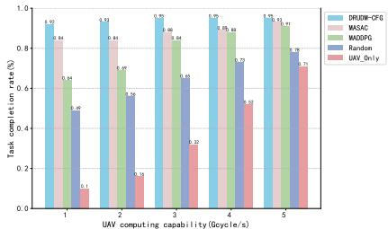  
(a) Comparison of task completion rates based on different UAV computing capabilities

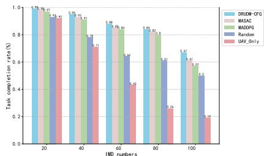  
(b) Comparison of task completion rates under different IMD numbers

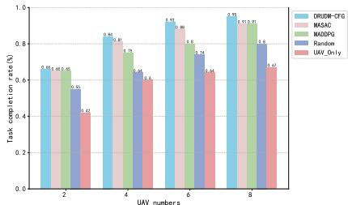  
(c) Comparison of task completion rates under different UAV numbers

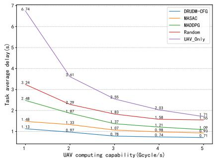  
Fig. 4. Comparison of UAV completion rates for offloaded tasks under different circumstances.   
(a) Comparison of average delay based on different UAV computing capabilities

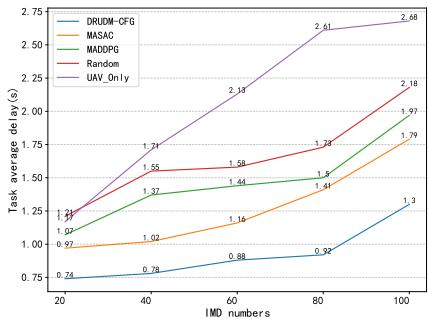  
(b) Comparison of average delay under different IMD numbers

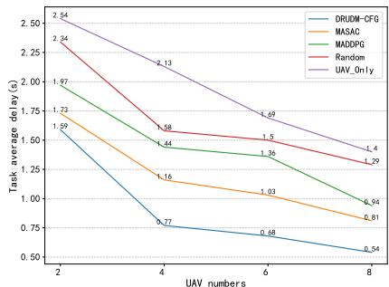  
(c) Comparison of average delay under different UAV numbers   
Fig. 5. Comparison of average delay for offloaded tasks under different circumstances.

offloading strategies and accelerate reward improvement in early training. Second, the Coverage Fairness Guarantee embedded in the reward function guides balanced UAV trajectory planning, avoiding convergence to policies that serve only dense regions. Together with the adaptive entropy priority sampling, these mechanisms enhance exploration, stabilize training, and improve overall system utility. Consequently, DRUDM-CFG not only converges earlier but also maintains consistently higher rewards than other algorithms, demonstrating robust cooperative strategies in post-disaster scenarios.

# 5.3 Task Completion Rate Analysis

To verify the effectiveness of the proposed DRUDM mechanism in improving TO efficiency and ensuring higher task success in post-disaster scenarios, we further compare their task completion rate under different experimental settings as shown in Fig. 4.

Fig. 4a shows the task completion rate under different UAV computing capabilities. All algorithms show improved performance as computing power increases. The performance of Only-UAV drops sharply under the same conditions, confirming that introducing the HAS as a collaborative computing node and supporting partial UAV–HAS offloading is essential for maintaining task completion rates under limited computing resources. DRUDM–CFG is obviously higher than other algorithms. This superior performance can be attributed to the DRUDM mechanism, which enables UAVs to perform real-time and accurate TO decisions by dynamically selecting the most appropriate IMDs according to their spatial distribution, task urgency, and the

UAV’s current resource state. This adaptive decision-making process allows UAVs to allocate computing resources more efficiently, thereby preventing resource waste and improving task completion rates.

Fig. 4b examines the impact of different numbers of IMDs on task completion rate. As the number of IMDs increases, the completion rates of all algorithms tend to decline due to increased workload and intensified resource contention. Nonetheless, DRUDM-CFG still achieved the highest completion rate among all algorithms. This demonstrates that DRUDM-CFG outperforms other algorithms in high-task density scenarios. At the same time, due to the influence of the CFG mechanism, coverage fairness constraints prevent UAVs from focusing solely on high-density areas, thereby improving the service hit rate in sparse areas and further boosting the overall completion rate.

Fig. 4c shows the task completion rate for different numbers of UAVs. As the number of UAVs increases, providing more computing and communication resources, the completion rates of all algorithms increase. DRUDM-CFG achieved the highest task completion rate among all algorithms, this is due to the DRUDM mechanism, which enables more rational selection of the most appropriate service target for each UAV as the number of UAVs increases, thereby reducing each UAV’s resource pressure.

# 5.4 Task Delay Analysis

To further evaluate the delay optimization capability of the proposed DRUDM–CFG algorithm, we analyze the average task delay under different computational and network configurations as shown in Fig. 5. The average delay for

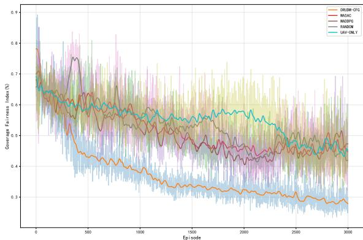

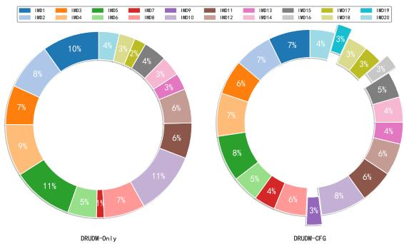  
Fig. 6. Comparison of Coverage Fairness Index of different algorithms   
Fig. 7. Comparison of Coverage Fairness between DRUDM-Only and DRUDM-CFG

different UAV computing powers as shown in Fig. 5a. As computational power increases, the delay of all algorithms generally decreases. Fig. 5b shows the average delay as the number of IMDs varies. As the number of IMDs increases, the average delay of all algorithms tends to increase due to network congestion and increased processing load. Fig. 5c shows the average delay for different numbers of UAVs. As the number of UAVs increases, providing greater distributed computing power, the delay of all algorithms decreases.

Overall, the proposed DRUDM–CFG algorithm exhibits the most stable and consistently lower delay compared with other algorithms. The superior delay performance of DRUDM–CFG primarily benefits from three design aspects. First, the hierarchical AMEC framework employs UAVs as relay computing nodes between IMDs and the HAS, effectively shortening the transmission path and reducing longdistance communication delay. Second, the DRUDM–CFG algorithm enables real-time and accurate TO decisions, allowing UAVs to dynamically select optimal service targets according to IMD distribution, task urgency, and available resources, thereby minimizing both transmission and processing delay. Finally, the DRUDM-CFG algorithm leverages the UAV-layer’s task queue priority algorithm to offload large and non-urgent tasks to the HAS for processing, further reducing task processing delay.

# 5.5 Coverage Fairness Analysis

Fig. 6 shows a comparison of the coverage fairness index of different algorithms during training. The overall trend of

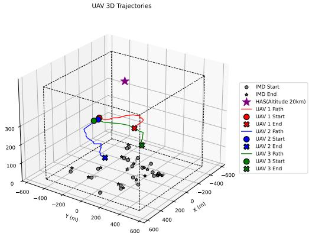  
Fig. 8. Flight trajectories of three UAVs under DRUDM-CFG algorithm

the experimental curves shows that DRUDM-CFG exhibits a faster decline in the coverage fairness index and a lower stable value during the training phase. Compared with baseline methods such as MASAC, MADDPG, Random, and Only-UAV, DRUDM-CFG not only effectively reduces coverage imbalance in the early stages but also exhibits smaller fluctuations in the middle and late stages. This indicates that it can more robustly allocate UAV flight and service resources to meet the needs of sparse grids while ensuring task completion rate and delay performance.

To further evaluate the effectiveness of the proposed coverage fairness mechanism, an ablation experiment is conducted in this subsection. Specifically, the fairness-aware component in DRUDM-CFG is removed while keeping other system settings unchanged, yielding a variant without coverage fairness optimization. By comparing the coverage fairness performance of DRUDM-CFG with this ablated variant, the contribution of the proposed fairness modeling to mitigating coverage imbalance can be clearly observed. Fig. 7 compares the DRUDM-Only algorithm, which uses only the DRUDM mechanism, with the DRUDM-CFG algorithm. It can be seen that while DRUDM-Only can improve the overall mission completion rate in the short term, its strategy tends to remain in high-density user areas for a long time, resulting in severe coverage imbalance. More notably, in some sparsely populated areas, due to the lack of explicit fairness constraints, some IMDs receive no service opportunities at all throughout their flight cycles. This highly unfair phenomenon is particularly unacceptable in disaster scenarios, as devices in sparsely populated areas often undertake critical tasks such as environmental monitoring and rescue dispatch. Long-term neglect significantly reduces the network’s overall emergency response capabilities. In contrast, DRUDM-CFG builds on DRUDM by embedding a coverage fairness index into the reward function, effectively penalizing UAVs that consistently focus on a single hotspot. Experimental results demonstrate that DRUDM-CFG not only maintains high system returns but also forces UAVs to consider IMDs in sparsely populated areas in their flight trajectories and service selection, allowing these previously overlooked nodes to receive service opportunities. This mechanism ensures long-term balanced resource allocation, resulting in a coverage curve that apparently outperforms DRUDM-Only after convergence, demonstrating improve-

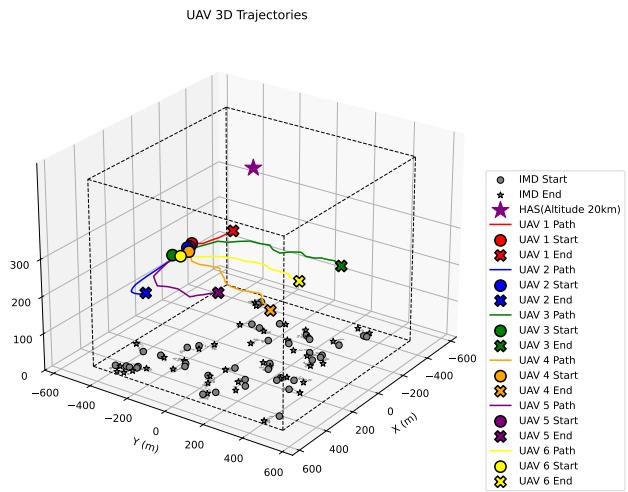  
Fig. 9. Flight trajectories of six UAVs under DRUDM-CFG algorithm

ments in fairness metrics.

# 5.6 UAV Flight Trajectory Analysis

We further validate the effectiveness of the proposed DRUDM-CFG algorithm in optimizing UAV trajectory planning and enhancing fairness in TO services through the 3D flight trajectories visualizations. As shown in Fig. 8, under the scenario with three UAVs and twenty IMDs, the UAV trajectories generated by DRUDM-CFG are able to adaptively cover both dense and sparse IMD regions within a single flight cycle. This demonstrates that the algorithm can drive UAVs to coordinate their movements and allocate service responsibilities efficiently, thereby mitigating the long-standing fairness issue in which IMDs located in sparse regions are unable to receive TO services.

Furthermore, as illustrated in Fig. 9, when the number of UAVs and IMDs is increased to six UAVs and forty IMDs, the DRUDM-CFG algorithm continues to produce wellstructured, non-overlapping trajectories that collectively achieve balanced spatial coverage. This result confirms that the proposed method maintains strong generalization capability under larger-scale deployments, enabling effective coordination among more UAV agents while consistently improving coverage fairness and TO efficiency. These observations collectively demonstrate that DRUDM-CFG not only optimizes UAV flight behaviors but also ensures fair and reliable TO services across diverse post-disaster AMEC scenarios.

When the number of UAVs increases, the proposed DRUDM-CFG framework generally benefits from improved spatial coverage and service capability due to enhanced cooperation among agents. Owing to decentralized execution, the online decision-making complexity at each UAV remains unchanged. However, a large number of UAVs may increase the coordination complexity and training overhead during centralized training, which can affect convergence efficiency. This limitation suggests that further optimization of training scalability may be required for extremely dense UAV deployments.

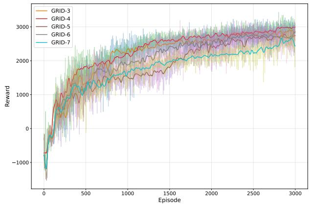  
Fig. 10. Comparison of rewards under different grid partitioning hyperparameters

# 5.7 Hyperparameter Experiment Analysis

This subsection analyzes the impact of grid division size in the coverage fairness model under the experimental settings of this study. The simulated post-disaster area is $1 0 0 0 \mathrm { m } { \times } 1 0 0 0 \mathrm { m } ,$ and each UAV has a communication coverage radius of $2 5 0 \mathrm { m }$ . Under this configuration, the grid resolution determines the spatial granularity at which coverage imbalance is evaluated and regulated. To investigate this effect, the grid size is set to $3 { \times } 3 ,$ , $4 { \times } 4 ,$ , $5 { \times } 5 ,$ $6 { \times } 6 ,$ and $7 { \times } 7 ,$ while keeping all other parameters unchanged. The results in Fig. 10 show that the $4 { \times } 4$ grid yields the highest cumulative reward. When a coarser grid $3 { \times } 3$ is used, each grid cell spans a spatial scale larger than the effective UAV coverage region, which tends to smooth out local coverage disparities and weakens the responsiveness of the fairness model. As a result, coverage imbalance at a finer spatial level cannot be effectively captured. Conversely, when the grid is further refined, the number of grid cells exceeds the effective coverage resolution imposed by the UAV communication range. This leads to increased computational overhead in fairness evaluation and reward computation, as well as longer training time, without providing proportional gains in coverage differentiation. Consequently, the overall learning efficiency and reward performance degrade as the grid size increases beyond $4 { \times } 4$ .

Furthermore, the parameter $\phi$ controls the relative importance between mitigating coverage imbalance and maintaining service efficiency at the network edge. A larger $\phi$ enforces stronger fairness regulation. To examine this tradeoff, $\phi$ is varied within the range [0.5,0.9] while keeping all other system parameters unchanged. As shown in Fig. 11, As shown in Fig. 11, the cumulative reward achieves its highest value when $\phi { = } 0 . 8$ . This result indicates that $\phi { = } 0 . 8$ provides the most effective balance between task offloading service fairness and UAV edge coverage under the considered system configuration. When $\phi$ is smaller, the influence of the fairness term in the reward function is limited, causing UAVs to preferentially serve IMD-dense regions and leading to coverage imbalance. In contrast, when $\phi$ becomes excessively large, the fairness constraint dominates the learning objective, which overly restricts UAV mobility and task offloading decisions, thereby reducing edge service efficiency. At $\phi { = } 0 . 8 ,$ , these two competing effects are prop-

erly balanced, enabling DRUDM-CFG to achieve optimal task offloading fairness while maintaining effective UAV edge coverage.

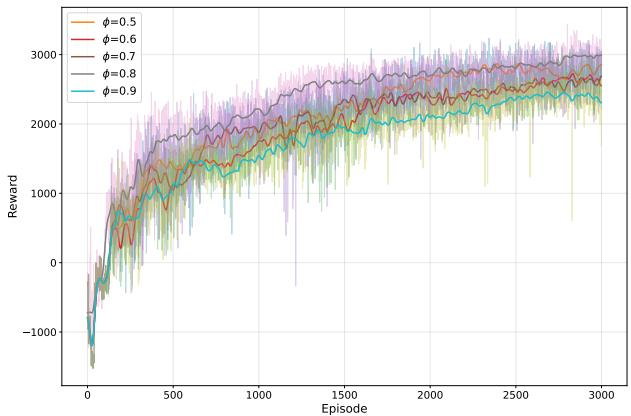  
Fig. 11. Comparison of rewards under different $\phi$ hyperparameters

# 6 CONCLUSION

In this paper, we propose a joint optimization problem involving TO, RA, and UAV coverage fairness in the AMEC system. To improve the completion rate of tasks offloaded from IMDs to UAVs in disaster scenarios, reduce average task delay, and enhance the fairness of TO services provided by UAVs to IMDs in disaster scenarios, we conduct detailed system modeling and propose a DRUDM mechanism to optimize each UAV’s TO and RA decisions regarding service targets. We also propose a CFG mechanism to drive UAVs in the AMEC system to maximize coverage of all IMDs within their flight cycles and incorporate this mechanism into the design of the DRL reward function. By formulating the problem as a MA-POMDP, we develop a DRUDM-CFG algorithm within the CTDE framework. Each UAV is modeled as an independent agent and, through centralized training, is enabled to learn collaborative TO, RA, and trajectory control policies. Simulation results demonstrate that compared to baseline methods, this approach achieves higher task completion rates and improved fairness while maintaining lower task delay. Future work will extend this study and focus on energy efficiency optimization of AMEC systems.

# ACKNOWLEDGMENTS

This study is supported in part by the Key Technologies Research and Development Program (grant no. 2024YFF0617200), Liaoning Science and Technology Major Project (grant no. 2024JH1/11700043), the Natural Science Foundation of Liaoning Province (grant no. 2024-bs-102, 2025-MSLH-539), the Basic Scientific Research Project of the Education Department of Liaoning Province (grant no. LJ222410142043).

# REFERENCES

[1] Wenchao Liu, Hao Wang, Xuhui Zhang, Huijun Xing, Jinke Ren, Yanyan Shen, and Shuguang Cui. Joint trajectory design and resource allocation in uav-enabled heterogeneous mec systems. IEEE Internet of Things Journal, 11(19):30817–30832, 2024.

[2] Binayak Kar, Widhi Yahya, Ying-Dar Lin, and Asad Ali. Offloading using traditional optimization and machine learning in federated cloud–edge–fog systems: A survey. IEEE Communications Surveys & Tutorials, 25(2):1199–1226, 2023.   
[3] Tian Wang, Yang Li, Weiwei Fang, Wenzheng ${ \mathrm { X u } } ,$ Junbin Liang, Yewang Chen, and Xuxun Liu. A comprehensive trustworthy data collection approach in sensor-cloud systems. IEEE transactions on big data, 8(1):140–151, 2018.   
[4] Jinshi Liu, Manzoor Ahmed, Muhammad Ayzed Mirza, Wali Ullah Khan, Dianlei Xu, Jianbo Li, Abdul Aziz, and Zhu Han. Rl/drl meets vehicular task offloading using edge and vehicular cloudlet: A survey. IEEE Internet of Things Journal, 9(11):8315–8338, 2022.   
[5] Tian Wang, Yaxin Mei, Xuxun Liu, Jin Wang, Hong-Ning Dai, and Zhijian Wang. Edge-based auditing method for data security in resource-constrained internet of things. Journal of Systems Architecture, 114:101971, 2021.   
[6] Yanqi Gong, Kun Bian, Fei Hao, Yifei Sun, and Yulei Wu. Dependent tasks offloading in mobile edge computing: A multi-objective evolutionary optimization strategy. Future generation computer systems, 148:314–325, 2023.   
[7] Yuntao Wang, Weiwei Chen, Tom H. Luan, Zhou Su, Qichao Xu, Ruidong Li, and Nan Chen. Task offloading for post-disaster rescue in unmanned aerial vehicles networks. IEEE/ACM Transactions on Networking, 30(4):1525–1539, 2022.   
[8] Siqi Zhang, Na Yi, and Yi Ma. A survey of computation offloading with task types. IEEE Transactions on Intelligent Transportation Systems, 25(8):8313–8333, 2024.   
[9] Demeke Shumeye Lakew, Anh-Tien Tran, Nhu-Ngoc Dao, and Sungrae Cho. Intelligent offloading and resource allocation in hap-assisted mec networks. In 2021 International Conference on Information and Communication Technology Convergence (ICTC), pages 1582–1587, 2021.   
[10] Haosheng Chen, Haixia Cui, Jiahuan Wang, Peng Cao, Yejun He, and Mohsen Guizani. Computation offloading optimization for uav-based cloud-edge collaborative task scheduling strategy. IEEE Transactions on Cognitive Communications and Networking, pages 1– 1, 2025.   
[11] Tan Deng, Yanping Wang, Jin Li, Ronghui Cao, Yongtong Gu, Jinming Hu, Xiaoyong Tang, Mingfeng Huang, Wenzheng Liu, and Shixue Li. Entropy normalization sac-based task offloading for uav-assisted mobile-edge computing. IEEE Internet of Things Journal, 11(15):26220–26233, 2024.   
[12] Nan Zhao, Zhiyang Ye, Yiyang Pei, Ying-Chang Liang, and Dusit Niyato. Multi-agent deep reinforcement learning for task offloading in uav-assisted mobile edge computing. IEEE Transactions on Wireless Communications, 21(9):6949–6960, 2022.   
[13] Xiaofan He, Richeng Jin, and Huaiyu Dai. Multi-hop task offloading with on-the-fly computation for multi-uav remote edge computing. IEEE Transactions on Communications, 70(2):1332–1344, 2022.   
[14] Hongzhi Guo, Yutao Wang, Jiajia Liu, and Chang Liu. Multiuav cooperative task offloading and resource allocation in 5g advanced and beyond. IEEE Transactions on Wireless Communications, 23(1):347–359, 2024.   
[15] Demeke Shumeye Lakew, Anh-Tien Tran, Nhu-Ngoc Dao, and Sungrae Cho. Intelligent offloading and resource allocation in heterogeneous aerial access iot networks. IEEE Internet of Things Journal, 10(7):5704–5718, 2023.   
[16] Peng Qin, Yang Fu, Xiongwen Zhao, Kui Wu, Jiayan Liu, and Miao Wang. Optimal task offloading and resource allocation for c-noma heterogeneous air-ground integrated power internet of things networks. IEEE Transactions on Wireless Communications, 21(11):9276–9292, 2022.   
[17] Tolga Ovatman, Gunes Karabulut Kurt, and Halim Yanikomeroglu. An accurate model for computation offloading in 6g networks and a haps-based case study. IEEE Open Journal of the Communications Society, 3:1963–1977, 2022.   
[18] Feng Wang, Jie Xu, Vincent K. N. Lau, and Shuguang Cui. Amplify-and-forward relaying for hierarchical over-theair computation. IEEE Transactions on Wireless Communications, 21(12):10529–10543, 2022.   
[19] Shuang Qi, Bin Lin, Yiqin Deng, Xianhao Chen, and Yuguang Fang. Minimizing maximum latency of task offloading for multiuav-assisted maritime search and rescue. IEEE Transactions on Vehicular Technology, 73(9):13625–13638, 2024.   
[20] Bin Gao, Zhi Zhou, Fangming Liu, Fei Xu, and Bo Li. An online framework for joint network selection and service placement in

mobile edge computing. IEEE Transactions on Mobile Computing, 21(11):3836–3851, 2022.   
[21] Geng Sun, Long He, Zemin Sun, Qingqing Wu, Shuang Liang, Jiahui Li, Dusit Niyato, and Victor C. M. Leung. Joint task offloading and resource allocation in aerial-terrestrial uav networks with edge and fog computing for post-disaster rescue. IEEE Transactions on Mobile Computing, 23(9):8582–8600, 2024.   
[22] Yong Wang, Zhi-Yang Ru, Kezhi Wang, and Pei-Qiu Huang. Joint deployment and task scheduling optimization for large-scale mobile users in multi-uav-enabled mobile edge computing. IEEE Transactions on Cybernetics, 50(9):3984–3997, 2020.   
[23] Tiankui Zhang, Yu Xu, Jonathan Loo, Dingcheng Yang, and Lin Xiao. Joint computation and communication design for uavassisted mobile edge computing in iot. IEEE Transactions on Industrial Informatics, 16(8):5505–5516, 2020.   
[24] Yuntao Wang, Weiwei Chen, Tom H. Luan, Zhou Su, Qichao Xu, Ruidong Li, and Nan Chen. Task offloading for post-disaster rescue in unmanned aerial vehicles networks. IEEE/ACM Transactions on Networking, 30(4):1525–1539, 2022.   
[25] Fan Zhang, Guangjie Han, Li Liu, Yu Zhang, Yan Peng, and Chao Li. Cooperative partial task offloading and resource allocation for iiot based on decentralized multiagent deep reinforcement learning. IEEE Internet of Things Journal, 11(3):5526–5544, 2024.   
[26] Hongli Lu, Guangping Xu, Chi Wan Sung, Salwa Mostafa, and Yulei Wu. A game theoretical balancing approach for offloaded tasks in edge datacenters. In 2022 IEEE 42nd International Conference on Distributed Computing Systems (ICDCS), pages 526–536. IEEE, 2022.   
[27] Alessio Sacco, Flavio Esposito, Guido Marchetto, and Paolo Montuschi. Sustainable task offloading in uav networks via multiagent reinforcement learning. IEEE Transactions on Vehicular Technology, 70(5):5003–5015, 2021.   
[28] Abegaz Mohammed Seid, Gordon Owusu Boateng, Bruce Mareri, Guolin Sun, and Wei Jiang. Multi-agent drl for task offloading and resource allocation in multi-uav enabled iot edge network. IEEE Transactions on Network and Service Management, 18(4):4531–4547, 2021.   
[29] Lei Yang, Haipeng Yao, Jingjing Wang, Chunxiao Jiang, Abderrahim Benslimane, and Yunjie Liu. Multi-uav-enabled loadbalance mobile-edge computing for iot networks. IEEE Internet of Things Journal, 7(8):6898–6908, 2020.   
[30] Jingjing Cui, Yuanwei Liu, and Arumugam Nallanathan. Multiagent reinforcement learning-based resource allocation for uav networks. IEEE Transactions on Wireless Communications, 19(2):729– 743, 2020.   
[31] Dawei Wei, Jianfeng Ma, Linbo Luo, Yunbo Wang, Lei He, and Xinghua Li. Computation offloading over multi-uav mec network: A distributed deep reinforcement learning approach. Computer Networks, 199:108439, 2021.   
[32] Tan Deng, Yanping Wang, Jin Li, Ronghui Cao, Yongtong Gu, Jinming Hu, Xiaoyong Tang, Mingfeng Huang, Wenzheng Liu, and Shixue Li. Entropy normalization sac-based task offloading for uav-assisted mobile-edge computing. IEEE Internet of Things Journal, 11(15):26220–26233, 2024.   
[33] Liang Wang, Kezhi Wang, Cunhua Pan, Wei Xu, Nauman Aslam, and Arumugam Nallanathan. Deep reinforcement learning based dynamic trajectory control for uav-assisted mobile edge computing. IEEE Transactions on Mobile Computing, 21(10):3536–3550, 2022.   
[34] Fuhong Song, Huanlai Xing, Xinhan Wang, Shouxi Luo, Penglin Dai, Zhiwen Xiao, and Bowen Zhao. Evolutionary multi-objective reinforcement learning based trajectory control and task offloading in uav-assisted mobile edge computing. IEEE Transactions on Mobile Computing, 22(12):7387–7405, 2023.   
[35] Yu Zhang, Zhiyu Mou, Feifei Gao, Jing Jiang, Ruijin Ding, and Zhu Han. Uav-enabled secure communications by multi-agent deep reinforcement learning. IEEE Transactions on Vehicular Technology, 69(10):11599–11611, 2020.   
[36] Hongyue Kang, Xiaolin Chang, Jelena Misiˇ c, Vojislav B. Mi ´ siˇ c,´ Junchao Fan, and Yating Liu. Cooperative uav resource allocation and task offloading in hierarchical aerial computing systems: A mappo-based approach. IEEE Internet of Things Journal, 10(12):10497–10509, 2023.   
[37] Jianbo Du, Ziwen Kong, Aijing Sun, Jiawen Kang, Dusit Niyato, Xiaoli Chu, and F. Richard Yu. Maddpg-based joint service placement and task offloading in mec empowered air–ground integrated networks. IEEE Internet of Things Journal, 11(6):10600– 10615, 2024.

[38] Juan Zhang, Yulei Wu, Geyong Min, and Keqin Li. Neural network-based game theory for scalable offloading in vehicular edge computing: A transfer learning approach. IEEE Transactions on Intelligent Transportation Systems, 25(7):7431–7444, 2024.   
[39] Bizheng Liang, Rongfei Fan, Han Hu, Hai Jiang, Jie Xu, and Ning Zhang. Joint task offloading and resource allocation in multi-user mobile edge computing with continuous spectrum sharing. IEEE Transactions on Vehicular Technology, 73(5):7234–7249, 2024.   
[40] Xiangyu Gao, Yaping Sun, Hao Chen, Xiaodong Xu, and Shuguang Cui. Joint computing, pushing, and caching optimization for mobile-edge computing networks via soft actor–critic learning. IEEE Internet of Things Journal, 11(6):9269–9281, 2024.   
[41] Yuya Cui, Honghu Li, Degan Zhang, Aixi Zhu, Yang Li, and Hao Qiang. Multiagent reinforcement learning-based cooperative multitype task offloading strategy for internet of vehicles in b5g/6g network. IEEE Internet of Things Journal, 10(14):12248–12260, 2023.   
[42] Junna Zhang, Guoxian Zhang, Xinxin Wang, Xiaoyan Zhao, Peiyan Yuan, and Hu Jin. Uav-assisted task offloading in edge computing. IEEE Internet of Things Journal, 12(5):5559–5574, 2025.   
[43] Yejun He, Youhui Gan, Haixia Cui, and Mohsen Guizani. Fairnessbased 3-d multi-uav trajectory optimization in multi-uav-assisted mec system. IEEE Internet of Things Journal, 10(13):11383–11395, 2023.

Xiting Peng (Member, IEEE) received Ph.D. degree in Electrical Engineering at Muroran Institute of Technology, Japan in 2020, B.S. in Mathematics and Software engineering and M.S. degree in mathematics from the University of Dalian Jiaotong, Dalian, China, in 2013 and 2017, respectively. She is currently an Assistant Professor with School of Information Science and Engineering, Shenyang University of Technology, China. She was supported by the China Scholarship Council (CSC) for the period

of her PH.D. Also, she was the chair of the IEEE Muroran IT Student Branch from Feb. to Oct. 2020. Her current research interests include computational intelligence, machine learning, and edge computing. Dr. Peng has received the best paper award from AICON 2019 and the Wireless Communication Letters Exemplary Reviewer Award 2019. She was awarded the Outstanding Contribution Award by The 8th International Conference on Signal and Information Processing, Networking and Computers (ICSINC) as Co-chair in 2021. And she was selected as a Workshop Chair of the 21st IEEE International Conference on Trust, Security and Privacy in Computing and Communications (IEEE TrustCom 2022). And she served as a Workshop Cochair of the 5th International Workshop on AI-driven Network 2023(AINet2023).

Chuanqi Qin (IEEE Student Member) received the B.S. degree in Computer Science and Technology from Shandong Jining University, Jining, China, in 2023. He is currently pursuing the M.S. degree with the School of Information Science and Engineering, Shenyang University of Technology, Shenyang, China. His current research interests include edge computing, reinforcement learning, and advanced air mobility.

Xiaoyu Zhang (Member, IEEE) received the bachelor’s degree in Information and Computing Science and software engineering from Dalian Jiaotong University, Dalian, China, in 2013 and the M.S. degree in Mathematics from the University of Dalian Jiaotong, Dalian, China, in 2017. He received Ph.D. degree in control theory and control engineering with the School of Control Science and Engineering, Dalian University of Technology, Dalian, China in 2023. Dr.Zhang joined the School of Artificial Intelligence at

Shenyang University of Technology in May 2023. He was supported by the China Scholarship Council to visit the Muroran Institute of Technology, Muroran, Hokkaido, Japan, for the period from October 2018 to October 2020. His current research interests include stability of neural networks, time-delay systems, switched systems, machine learning algorithms and edge computing.

Lexi Xu (Senior Member, IEEE) received the M.S. degree from the Bei-jing University of Posts and Telecommunications, Beijing, China, in 2009, and the Ph.D. degree from the Queen Mary University of London, London, U.K., in 2013. From 2013 to 2020, he was a Senior Engineer with the Network Technology Research Institute, China United Network Communications Corporation (China Unicom). Since 2020, he has been a Professor-Level Senior Engineer with the Research Institute, China Unicom. He is also a

China Unicom Delegate in ITU, ETSI, 3GPP, and CCSA. He also serves as a Professor (part-time) with the Beijing University of Posts and Telecommunications. His research interests include big data, self-organizing networks, satellite system, and radio resource management in wireless system.

Xiaoling Zhang (Member, IEEE) received Ph.D., Professor, Institute of Artificial Intelligence, Shenyang University of Technology. Director of Industrial Intelligence Autonomous Network Technology Innovation and Application Laboratory, leader of industrial intelligence chip and network discipline. The main directions include industrial intelligent chip and network technology, and standardization of intelligent manufacturing technology.

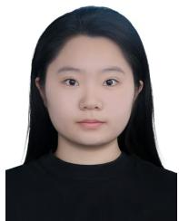

Li Jiang (IEEE Student Member) received the B.S degree in Jilin Normal University, China in 2025. She is currently pursuing her graduate studies at Shenyang University of Technology, focusing on edge computing and task offloading.