# Data Collection Maximization in IoT-Sensor Networks via an Energy-Constrained UAV

Yuchen Li , Weifa Liang , <sup>Senior Member, IEEE</sup>, Wenzheng Xu , <sup>Member, IEEE</sup>, Zichuan Xu , <sup>Member, IEEE</sup>, Xiaohua Jia , <sup>Fellow, IEEE</sup>, Yinlong Xu, and Haibin Kan , <sup>Member, IEEE</sup>

Abstract—In this paper, we study sensing data collection of IoT devices in a sparse IoT-sensor network, using an energy-constrained Unmanned Aerial Vehicle (UAV), where the sensory data is stored in IoT devices while the IoT devices may or may not be within the transmission range of each other. We formulate two novel data collection problems to fully or partially collect data stored from IoT devices using the UAV, by finding a closed tour for the UAV that consists of hovering locations and the sojourn duration at each of the hovering locations such that the accumulative volume of data collected within the tour is maximized, subject to the energy capacity on the UAV, where the UAV consumes energy on both hovering for data collection and flying from one hovering location to another hovering location. To this end. we first propose a novel data collection framework that enables the UAV to collect sensory data from multiple loT devices simultaneously if these loT devices are within the coverage range of the UAV, through adopting the orthogonal frequency division multiple access (OFDMA) technique. We then formulate two data collection maximization problems to deal with ful or partial data collection from IoT devices at each hovering location, and show that both defined problems are NP-hard. We instead devise approximation and heuristic algorithms for the problems. We finally evaluate the performance of the proposed algorithms through experimental simulations. Simulation results demonstrated that the proposed algorithms are promising.

Index Terms—Wireless sensor networks, a single UAV, approximation algorithms, energy-constrained optimization, UAV trajectory finding, collecting data from multiple sensors simultaneously, full and partial data collection, IoT applications, the orienteering problem

## 1 INTRODUCTION

D<sup>UE</sup> <sup>to</sup> <sup>its</sup> <sup>high</sup> <sup>flexibility,</sup> <sup>low</sup> <sup>cost</sup> <sup>and</sup> <sup>ease</sup> <sup>of</sup> <sup>deploy-</sup>ment, Unmanned Aerial Vehicle (UAV) has been a key enabling technology that has received significant attention recently, and it has been widely applied in civilian environments such as natural disaster rescuing, good deliveries, crop health assessment, and so on [11]. On the other hand, with the increasing popularity of Internet of Thing devices such as various sensors, wearable, traffic and other monitoring devices, more and more applications of smart homes/ smart cities, e-health care, and artificial transportations built upon IoT devices become part of our daily life. However, most IoT devices (e.g., mobile phones, security cameras, meter collection devices, temperature sensors) usually have very limited energy, computational and storage capacities due to their portable sizes. Sometimes, it is unrealistic to allow these devices to transmit or relay sensing data to a base station through multihop relays, due to the significant transmission energy consumptions, and in the worst case, they may not be in the transmission ranges of each other. Thus, it is very challenging to collect sensing data from these IoT devices for processing on time to better help human decision-making and respond to the monitoring scenarios.

In this paper, we study sensory data collection from IoT devices on the ground using a UAV. Specifically, we consider a sparse sensor network that consists of many IoT devices for sensing their surroundings. Some of the IoT devices serve as aggregate sensor nodes to store their own and neighbors’ sensing data. The stored data at an aggregate sensor node will then be collected periodically by a UAV for further processing. As the volume of data stored at different aggregate sensor nodes is significantly different, the hovering durations of the UAV for data collection at different hovering locations are different, and the amounts of energy consumed by the UAV at different hovering locations thus are different. In addition, it does incur the energy consumption when the UAV travels from one hovering location to another hovering location. As the energy capacity of the UAV is given, this poses a great challenge. That is, how to find a closed tour for the UAV including its depot for data collection such that the total volume of data collected by the UAV at different hovering locations in the tour is maximized, subject to its energy capacity. Furthermore, how long the UAV should stay at each of the hovering locations in the tour to ensure that the whole (or part of) data stored at the IoT devices coveraged by the UAV will be collected. To address this challenge, in this paper we aim to explore a non-trivial energy tradeoff between the amount of energy allocated to hovering and the amount of energy allocated to traveling of the UAV. We will focus on developing efficient heuristic and approximation algorithms for the data collection optimization problems.

The novelties of this work lie in the provisioning of a novel framework of data collection from multiple IoT sensor devices simultaneously, via an energy-constrained UAV. We formulate two data collection maximization problems and develop efficient approximation and heuristic algorithms for the problems that strive for a fine tradeoff between the energy usages of the UAV on hovering and traveling, respectively. To the best of our knowledge, this is the first time that the use of a UAV for full or partial data collection from multiple IoT devices simultaneously is studied. Efficient algorithms for finding a data collection trajectory for the UAV are developed.

The main contributions of this paper are summarized as follows. We study the full and partial data collection maximization problems, by deploying an energy-constrained UAV. We first propose a novel data collection framework that enables the UAV to collect data from multiple IoT devices simultaneously. We then formulate two data collection maximization problems that to fully or partially collect data stored from IoT devices based upon the proposed data collection framework, and show that the defined problems are NP-hard. We instead devise efficient approximation and heuristic algorithms for them. We finally evaluate the performance of the proposed algorithms through experimental studies. Simulation results reveal that the proposed algorithms are promising.

The rest of the paper is organized as follows. Section 2 reviews related work. Section 3 introduces the system model, notions, and notations. Section 4 presents the problem definitions and shows the NP-hardness of the defined problems. Section 5 devises approximation algorithms for the full and partial data collection maximization problems without hovering coverage overlapping when the problem size is large. Section 6 proposes efficient heuristic algorithms for the full and partial data collection maximization problems with hovering coverage overlapping. Section 7 evaluates the proposed algorithms empirically, and Section 8 concludes the paper.

## 2 RELATED WORK

The use of mobile charging vehicles or mobile data collection vehicles on the ground for sensor charging and sensory data collection has been widely studied in the past [13], [14], [16], [25], [26], [27]. Most of these studies focused on finding the trajectories of charging or data collection for one or multiple mobile vehicles. However, due to various obstacles in the sensor networks including ponds, buildings, rivers that block roads in the monitoring region, mobile vehicles cannot travel in the region for sensor charging or data collection smoothly. In recent years, there is growing interest in the employment of UAVs for sensory coverage and data collection for wireless sensor networks, as UAVs have freedoms for data collection while avoiding the mentioned obstacles by flying over them [15], [17], [18]. For example, Mozaffari et al. [17] considered trajectory path findings for multiple UAVs with the aim to minimize the total transmission energy consumption of IoT devices to upload their data to the UAVs, where the UAVs are treated as aerial base stations. They proposed a clustering method to cluster IoT devices into different clusters and then find trajectories for multiple UAVs that sojourn only at the cluster centers. However, the clustering method only minimizes the sum of distances between each sojourn location of the UAV and device locations, it does not consider the dis tances among sojourn locations. Zhan et al. [29] jointly considered working states of sensors and the trajectory of the UAV, by utilizing a fading channel model for the senor-UAV links to minimize the maximum energy consumption of sensors. Ghorbel et al. [9] focused on the identification of hovering locations of a single UAV for data collection from a cluster of sensors with the aim to minimize the energy consumption of the UAV. Liang et al. [15] considered a coverage quality problem via a UAV. They assumed that the hovering time of the UAV at each hovering location is identical, for which they proposed an approximation algorithm for the coverage quality maximization problem. Binol et al. [3] aimed at finding timeoptimal paths for multiple UAVs for data collection. Zhan and Zeng [28] studied the time minimization problem of data collection, using multiple UAVs. Sikeridis and Tsiropoulou et al. [21] proposed a novel framework that improves the energy efficiency in a UAV-supported Public Safety Networks. Guo et al. [10] considered the problem of a fleet of UAVs for disaster surveillance by finding trajectories for the UAVs such that the longest tour time among the UAVs is minimized. Recently Zhang et al. [30] investigated how to minimize the number of UAV deployment when the tour of each UAV is bounded by a given budget, for which they proposed constant approximation algorithms for the problem under different data collection models. Samir et al. [20] considered data collection with data uploading deadlines, where a UAV is dispatched for data collection from time-constrained devices and each device has a data uploading deadline, they aimed to maximize the network throughput. Chen et al. [5], [6] considered the data collection maximization problem without considering traveling energy consumption of a UAV, they devised approximation algorithms for the problem, they also considered the data collection under different data transmis sion rate by proposing a heuristic algorithm [7].

The essential differences between the work in the paper and the aforementioned studies lie in the following two aspects. One is that we consider the partial or full data collection from multiple IoT devices simultaneously by the deployment of a UAV that has not been considered previously. Another is that an approximate solution for the problem without hovering coverage overlapping is developed, which is the first algorithm with a provable performance guarantee for the problem. It must be mentioned that this paper is an extension of its conference version [12], which contains the approximate solution to the partial data collection maximization problem without hovering coverage overlapping that has not been covered in its conference version.

## 3 PRELIMINARIES

In this section, we first introduce the system model, notions and notations.

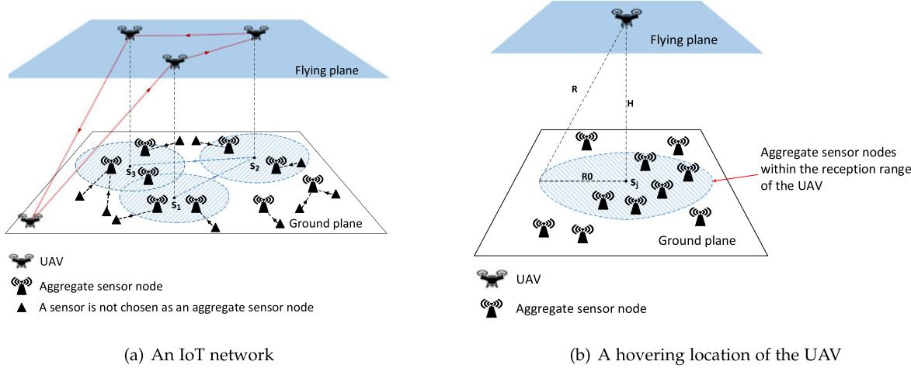  
Fig. 1. An example of an IoT sensor network <sup>G</sup> via a UAV for data collection.

## 3.1 System Model

We consider an IoT application scenario where many different types of IoT devices are deployed in a given region for monitoring purposes, some of the IoT devices (sensors) are chosen as aggregate sensor nodes that can store both their own sensing data and their neighbors’ sensory data, assuming those IoT devices that have not been chosen as aggregate sensor nodes can forward their sensory data to one of their neighboring aggregate sensor nodes. In case there are multiple aggregate sensor neighbors, it can choose one of such neighbors for the storage of its sensory data. Since aggregate sensor nodes are sparsely distributed, they may or may not be within the communication range with each other. The sensory data collected at each aggregate sensor node thus cannot be transferred to the base station through multi-hop relays, or there are obstacles between the aggregate sensor nodes, e.g., ponds, or buildings that prevent the relays. Furthermore, they are energy-constrained as relaying data will consume their considerable amounts of energy. To prolong the lifetime of each aggregate sensor node, a UAV is deployed for data collection from the aggregate sensor nodes. We assume that the UAV with a constant speed <sup>n</sup> is at a depot <sup>d</sup> initially and powered by a limited energy battery $\mathcal { E } .$ The UAV consumes energy at hovering locations for data collection from aggregate sensor nodes in its hovering coverage range and traveling (flying) from one hovering location to another hovering location. For the sake of convenience, in the rest of this paper we term the aggregate sensor nodes as IoT devices or sensor nodes interchangeably if no confusion arises. The aggregate sensor nodes in a monitoring region form a sparse sensor network $G = ( V \cup \{ d \} , E )$ where <sup>V</sup> is the set of aggregate sensor nodes, and there is an edge $e \in E$ between each pair of aggregate sensor nodes. The depot of the UAV is <sup>d</sup> in which the UAV will be recharged and its collected data will be downloaded for further processing.

To ensure that the UAV can return the depot <sup>d</sup> per tour,   
its data collection tour must be a closed tour including   
depot <sup>d</sup>. The duration of a tour of the UAV will be deter  
mined by the tour length and the volume of data stored in   
the IoT devices covered by the UAV at each hovering loca  
tion in the tour. Assume that the UAV takes <sup>T</sup> time units to   
finish its tou $^ { \mathrm { 1 r , } }$ in which $T _ { h }$ and $T _ { t }$ are the amounts of time   
spent on hovering and traveling respectively, then $T =$   
$\bar { T _ { h } } + T _ { t }$ and the total amount of energy consumed by the Authorized licensed use limited to: Guangxi University. Downloaded o

UAV in the tour must meet that $T _ { h } \cdot \eta _ { h } + T _ { t } \cdot \eta _ { t } \leq \mathcal { E } ,$ where $\eta _ { h }$ and $\eta _ { t }$ are the energy consumption rates of the UAV on hovering and traveling, respectively [22].

## 3.2 Data Collection Framework From IoT Devices Using a UAV

We assume that each aggregate sensor node in a monitoring region is labeled by its coordinates $( x _ { i } , y _ { i } , 0 )$ . Denote by $( x ^ { \prime } , y ^ { \prime } , H )$ <sup>0</sup>the coordinates of a hovering location of the UAV, where <sup>H</sup> is the flying altitude of the UAV, which is no greater than the transmission range <sup>R</sup> of each aggregate sensor node, and <sup>B</sup> is the data transmission rate of any aggregate sensor node. An aggregate sensor node $v \in V$ can transmit its stored data to the UAV with the data transmission rate <sup>B</sup> if the UAV is within its transmission range <sup>R</sup>. The hovering altitude <sup>H</sup> of the UAV for data collection thus is no greater than $R , { \mathrm { i . e . } } , H \leq R ,$ and we further assume that the altitude <sup>H</sup> of the UAV does not change [1].

Following the data collection model that if all IoT devices within the reception range of the UAV, then their transmitted data can be collected by the UAV, assuming that each IoT device uses a different communication channel [17]. We assume that the reception range of the UAV is a ball centralized at its hovering location, this ball is projected to the ground where the IoT devices are located to form a circle with the same radius of the ball, the data of all aggregate sensor nodes within the projected circle can be collected by the UAV when it hovers at the center of the ball, through the use of the orthogonal frequency division multiple access (OFDMA) technique [17].

Since there are infinite hovering locations for the UAV in the sky, to make the problem tractable, we assume that the hovering locations of the UAV are finite, by partitioning its hovering region into finite numbers of equal squares with edge length $\delta > 0 .$ . In the rest of discussion, we assume that <sup>0</sup>the measurement unit of the UAV movement in its hovering region is the edge length <sup>d</sup> of each square. Or the coordinates of potential hovering locations within a square are indistinguishable. For the sake of convenience, we further assume that the center of each square is the potential hovering location of the UAV within that square area. For a given data collection period $T ,$ assume that the volume $D _ { v }$ of data July 05,2026 at 12:38:43 UTC from IEEE Xplore. Restrictions apply.

stored at each aggregate sensor node $v \in V$ is given, which consists of its own sensory data and the data forwarded by its neighboring IoT devices that have not been chosen as aggregate sensor nodes. Fig. 1 is an illustrative example of an aggregate sensor network <sup>G</sup> with a UAV for data collection.

We assume that the hovering region of a UAV is partitioned into <sup>M</sup> squares: $s _ { 1 } , s _ { 2 } , \ldots , s _ { M } ,$ , and the UAV performs data collection at the centers of these squares $\boldsymbol { s } _ { j } = ( x _ { j } , y _ { j } , H )$ as its hovering locations, let $C ( s _ { j } )$ be the set of aggregate sensor nodes whose distances to the projected location $( x _ { j } , y _ { j } , 0 )$ of $s _ { j }$ <sup>0</sup>on the ground are no more than the data reception range $R _ { 0 }$ of the UAV, i.e., the data stored at an aggregate senor node $v _ { i } \in V$ with coordinates $( x _ { i } , y _ { i } , 0 )$ can be collected by the UAV <sup>0</sup>if it is within the ball of the UAV centered at hovering location $s _ { j } ,$ i.e., $\sqrt { \left( x _ { i } - x _ { j } \right) ^ { 2 } + \left( y _ { i } - y _ { j } \right) ^ { 2 } } \le R _ { 0 }$ and $R _ { 0 } = \sqrt { R ^ { 2 } - H ^ { 2 } }$ (see Fig. 1b). For any two potential hovering locations $s _ { i } \in M$ and $s _ { j } \in M$ with $i \neq j , \operatorname { i f } { \hat { C } } ( s _ { i } ) \cap C ( s _ { j } ) = \emptyset$ , we refer to the set <sup>M</sup> as a set of hovering locations without hovering coverage overlapping; otherwise, we refer to the set <sup>M</sup> as a set of hovering locations with hovering coverage overlapping. Notice that the data transmission duration of an aggregate sensor node from the ground to the UAV usually is determined by its distance to the UAV, its data volume, and its data transmission rate. Given two aggregate sensor nodes at different locations in the coverage circle of the UAV, it is well known that their data transmission durations and the data transmission rate will be different even if they have the same amounts of data to be transmitted. However, such differences between them are negligible if the UAV altitude <sup>H</sup> is relatively low (not too high). For the sake of discussion simplicity, in this paper we assume that all sensors within the hovering coverage range of the UAV will have the same data transmission rate <sup>B</sup>.

The hovering (sojourn) duration of the UAV for data collection at hovering location $s _ { j }$ thus is

$$
t ( s _ { j } ) = \operatorname* { m a x } _ { v _ { i } \in V } { \left\{ \frac { D _ { v _ { i } } } { B } \mid { \sqrt { { ( x _ { i } - x _ { j } ) } ^ { 2 } + { ( y _ { i } - y _ { j } ) } ^ { 2 } } } \leq R _ { 0 } \right\} } ,\tag{}
$$

the total volume of data collected at hovering location $s _ { j }$ is

$$
V ( s _ { j } ) = \sum _ { v _ { i } \in V } \bigg \{ D _ { v _ { i } } \mid \sqrt { ( x _ { i } - x _ { j } ) ^ { 2 } + ( y _ { i } - y _ { j } ) ^ { 2 } } \leq R _ { 0 } \bigg \} ,\tag{}
$$

and the total amount of energy consumption on data collection by the UAV at $s _ { j }$ is

$$
w _ { 1 } ( s _ { j } ) = t ( s _ { j } ) \cdot \eta _ { h } .\tag{}
$$

## 3.3 Approximation Ratio

Given an instance of a maximization optimization problem ${ \mathcal P } ,$ let <sup>A</sup> and $O P T$ be a feasible solution delivered by an approximation algorithm and the optimal solution of the problem respectively if $\begin{array} { r } { \frac { A } { O P T } \geq \frac { 1 } { \alpha } } \end{array}$ with $\alpha > 1$ , then $\textstyle { \frac { 1 } { \alpha } }$ is <sup>1</sup>referred to the approximation ratio of the approximation algorithm for $\mathcal { P } .$

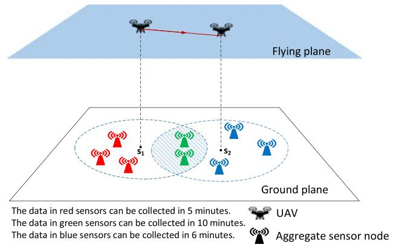  
Fig. 2. An illustration of partial data collection in an IoT sensor network <sup>G</sup> via a UAV.

## 4 PROBLEM FORMULATIONS AND NP-HARDNESS OF THE DEFINED PROBLEMS

In this section, we define two novel data collection maximization problems using a single UAV, under the assumptions that (i) sensory data from multiple IoT devices can be collected simultaneously by a UAV at a hovering location; and (ii) the data stored at each IoT device can be either fully collected or partially collected by the UAV at each hovering location. Both problems are defined as follows.

Definition 1. Given an aggregate sensor network $G ( V \cup \{ d \} , E )$ and a UAV with energy capacity $\mathcal { E } ,$ each aggregate sensor node $v \in V$ has a volume $D _ { v }$ of data for collection, the full data collection maximization problem is to find a closed tour for the UAV such that the accumulative volume of data collected by the UAV at all hovering locations in the closed tour is maximized, subject to the energy capacity $\mathcal { E }$ on the UAV, assuming that the data stored at each IoT device in the hovering coverage of the UAV will be fully collected.

We deal with the full data collection maximization problem under two different restrictions. That is, whether the hovering coverage ranges of the UAV at any two different hovering locations are allowed to be overlapping. We thus have two cases for the problem: the full data collection maximization problem without hovering coverage overlapping and the full data collection maximization problem with hovering coverage overlapping, respectively.

Sometimes, the UAV may not need to collect all stored data of IoT devices at its hovering location, this may help the UAV to save energy for collecting more data from other IoT devices when it hovers at other hovering locations. We here use an example (see Fig. 2) to illustrate this scenario. Assume that the UAV can stop at two hovering locations $s _ { 1 }$ and $s _ { 2 }$ <sup>1 2</sup>with hovering coverage overlapping. We further assume that it takes 10 minutes and 6 minutes to collect all data when it is located at $s _ { 1 }$ and $s _ { 2 } ,$ respectively. If it is allowed to <sup>1 2</sup>collect partial data from the IoT devices when it is located at $s _ { 1 }$ and $s _ { 2 } ,$ for example, it takes 5 minutes to collect partial <sup>1</sup>data at $s _ { 1 }$ and 6 minutes to collect partial data at $s _ { 2 }$ . The same <sup>1 2</sup>amount of data will be collected from both hovering locations in the end. However, its total energy consumption on full data collection at the two locations is $( 1 0 + 6 ) \eta _ { h }$ energy <sup>10 6</sup>units, while the total energy consumption on the partial data collection at the two locations is $( 5 + 6 ) \eta _ { h }$ energy units, thereby saving energy of the UAV. Motivated by this example, given a positive integer $K \geq 1$ , we can partition the sojourn duration $t ( s _ { j } )$ <sup>1</sup>of the UAV at each hovering location $s _ { j }$ into <sup>K</sup> equal sojourn durations: $t ( s _ { j } ) / K , 2 \cdot t ( s _ { j } ) / K , \ldots ,$ $K \cdot t ( s _ { j } ) / K$ <sup>2 . . .</sup>, respectively. In other words, for each hovering location $s _ { j } \in S ,$ there are <sup>K</sup> corresponding virtual hovering locations $s _ { j , 1 } , s _ { j , 2 } , \ldots , s _ { j , K }$ with sojourn durations $t ( s _ { j } ) / K , ~ 2$ $t ( s _ { j } ) / K ,$ $K \cdot t ( s _ { j } ) / K ,$ <sup>2</sup>respectively. The maximum amount $V ( s _ { j , k } )$ <sup>.</sup>of data collected by the UAV at a virtual hovering location $s _ { j , k }$ with sojourn duration $k \cdot t ( s _ { j } ) / K$ is

$$
\begin{array} { l } { { \displaystyle V ( s _ { j , k } ) = \sum _ { v \in C ( s _ { j } ) } \left\{ \frac { B \cdot k \cdot t ( s _ { j } ) } { K } \mid \frac { D _ { v } } { B } \geq k \cdot t ( s _ { j } ) / K \right\} } } \\ { { \displaystyle ~ + \sum _ { v ^ { \prime } \in C ( s _ { j } ) } \left\{ D _ { v ^ { \prime } } \mid \frac { D _ { v ^ { \prime } } } { B } < k \cdot t ( s _ { j } ) / K \right\} } , }  \end{array}\tag{}
$$

where $C ( s _ { j } )$ is the set of IoT devices within the hovering coverage range of the UAV at hovering location $s _ { j } ,$ and the IoT devices in $C ( s _ { j } )$ can further be partitioned into two subsets: their data transmission time is no less than $k \cdot t ( s _ { j } ) / K ,$ and strictly less than $k \cdot t ( s _ { j } ) / K$ with $1 \leq k \leq K$ , respectively

$$
t ( s _ { j , k } ) = k \cdot t ( s _ { j } ) / K .\tag{}
$$

That is, the amount of data collected by the UAV at each hovering location $s _ { j }$ can be from the partial volume of data to the full volume of data, i.e., $\bar { V ( s _ { j , 1 } ) } \leq V ( s _ { j , 2 } ) \leq \cdots \leq$ $V ( s _ { j , K } )$ with $t ( s _ { j , 1 } ) < t ( s _ { j , 2 } ) < \cdots < t ( s _ { j , K } )$ <sup>2</sup>. We define this <sup>1 2</sup>partial data collection via a UAV as follows.

Definition 2. Given an aggregate sensor network $G ( V \cup$ $\{ d \} , E )$ and a UAV with energy capacity E located at a depot <sup>d</sup> initially, each IoT device $v \in V$ has a volume $D _ { v }$ of data for collection, the partial data collection maximization problem in <sup>G</sup> is to find a closed tour including the depot <sup>d</sup> for the UAV such that the accumulative volume of data collected by the UAV at hovering locations in the tour is maximized, subject to the energy capacity E of the UAV, assuming that the UAV is allowed to collect partial data at each hovering location.

It can be seen that the full data collection maximization problem is a special case of the partial data collection maximization problem when $K = 1$ , and unfortunately, both prob-<sup>1</sup>lems are NP-hard, which are stated by the following theorem.

Theorem 1. Both the full data collection maximization problem and the partial data collection maximization problem in an aggregate sensor network $G ( V \cup \{ d \} , E )$ are NP-hard.

Proof. We show that the full data collection maximization problem without hovering coverage overlapping is NPhard, by a reduction from a well-known NP-hard problem - the orienteering problem [24]. We consider a special case of the data collection maximization problem where the potential hovering location of the UAV is on top of each aggregate sensor node, and there is not any energy consumption on data collection at each hovering location. We further assume that there is not any hovering coverage overlapping between any two hovering locations. Even for this special data collection maximization problem, we show that it is equivalent to an orienteering problem in <sup>G</sup> as follows.

Given a node- and edge-weighted, undirected graph $G ( V , E )$ , in which each node $v \in V$ has a positive award $p ( v ) = D _ { v }$ and each edge $( u , v ) \in E$ has a positive integral length $\frac { l ( u , v ) \eta _ { t } } { \nu }$ , and a given integral length $L ,$ the orienteering problem is to find a closed tour in <sup>G</sup> including a specified node (the depot $d )$ such that the total award collected from the nodes in the closed tour is maximized, subject to the tour length no greater than <sup>L</sup> [2], [4], [24].

We reduce the orienteering problem in <sup>G</sup> to this special full data collection maximization problem as follows. The award collected at each hovering location $s _ { j } \in S$ (the coordinates of $s _ { j }$ are $( x _ { j } , y _ { j } , H )$ assuming that the coordinates of $v _ { j } \in V$ are $( x _ { j } , y _ { j } , 0 ) )$ is $\begin{array} { r } { V ( s _ { j } ) = \breve { D } _ { v _ { j } } , L = \lceil \frac { \mathcal { E } } { \eta _ { t } } \rceil } \end{array}$ , and <sup>0</sup>the hovering energy consumption at each potential hovering location $s _ { j } \in S \ ( S = V $ by the assumption)is zero. $\mathrm { A s }$ the orienteering problem is NP-hard [24], the data collection maximization problem is NP-hard.

The full data collection maximization problem is a special case of the partial data collection maximization problem when $K = { \bar { 1 } } .$ , the latter is NP-hard, too. tu

## 5 APPROXIMATION ALGORITHMS FOR THE FULL AND PARTIAL DATA COLLECTION MAXIMIZATION PROBLEMS WITHOUT HOVERING COVERAGE OVERLAPPING

In this section, we deal with the full and partial data collection maximization problems without hovering coverage overlapping. We first formulate an Integer Programming solution for the problem when the problem size is small or moderate. We then propose approximation algorithms for the problems under the assumption that different hovering locations of the UAV within each square are indistinguishable. We finally analyze the correctness of the solutions and the time complexity of the proposed algorithms.

## 5.1 ILP Formulation

In the following we formulate an integer programming solution (ILP) to the full data collection maximization problem without hovering coverage overlapping. Given the aggregate sensor network $\check { G } = ( V , \check { E } )$ and the UAV, we partitioned the hovering region of the UAV into M squares, denoted by $S =$ $\{ s _ { 1 } , s _ { 2 } , \ldots , s _ { M } \} \cup d .$ Let $x _ { j }$ be the indicator variables which <sup>1 2 . . .</sup>determine whether the UAV will hover at the square $s _ { j }$ and collect the data, and let $y _ { i , j }$ be the indicator variables which determine whether the UAV flies from square <sup>s</sup>i to $s _ { j } ,$ and $y _ { 0 , i }$ and $y _ { j , 0 }$ indicates if the UAV flies from the depot <sup>d</sup> to $s _ { i }$ <sup>0</sup>and if <sup>0</sup>the UAV flies from $s _ { j }$ to depot <sup>d</sup> respectively, where $1 \leq i , j \leq$ <sup>M</sup> and $i \neq j .$ <sup>1</sup>. We formulate the ILP solution as follows:

$$
\mathrm { M a x i m i z e } \sum _ { j = 1 } ^ { M } V ( s _ { j } ) \cdot x _ { j } ,
$$

subject to:

$$
( 1 ) , ( 2 )\tag{}
$$

$$
x _ { j } = \sum _ { i = 0 } ^ { M } y _ { i , j }\tag{}
$$

$$
\sum _ { i = 1 } ^ { M } y _ { i , j } \leq 1 , \quad \forall j\tag{}
$$

$$
\sum _ { j = 1 } ^ { M } y _ { i , j } \leq 1 , \quad \forall i\tag{}
$$

$$
\sum _ { i = 0 } ^ { M } y _ { i , j } = \sum _ { i ^ { \prime } = 0 } ^ { M } y _ { j , i ^ { \prime } } \quad j \neq 0\tag{}
$$

$$
\sum _ { i = 0 } ^ { M } \sum _ { j = 0 } ^ { M } y _ { i , j } \cdot \frac { l ( s _ { i } , s _ { j } ) } { \nu } \cdot \eta _ { t } + \sum _ { j ^ { \prime } = 1 } ^ { M } t ( s _ { j } ^ { \prime } ) \cdot \eta _ { h } \leq \mathcal { E }\tag{}
$$

$$
\sum _ { i = 1 } ^ { M } y _ { i , 0 } = 1\tag{}
$$

$$
\sum _ { j = 1 } ^ { M } y _ { 0 , j } = 1\tag{}
$$

$$
\sum _ { s _ { i } , s _ { j } \in S ^ { \prime } } y _ { i , j } \leq | S ^ { \prime } | - 1 , \forall S ^ { \prime } \subseteq S \setminus \{ d \} , S ^ { \prime } \neq \emptyset\tag{}
$$

$$
x _ { j } \in \{ 0 , 1 \} \qquad \forall s _ { j } \in S\tag{}
$$

$$
y _ { i , j } \in \{ 0 , 1 \} \quad \forall s _ { i } , s _ { j } \in S \cup \{ d \} ,\tag{}
$$

where $V ( s _ { j } )$ and $t ( s _ { j } )$ are defined in Eqs. (2). and $( 1 ) , l ( s _ { i } , s _ { j } )$ is the euclidean distance between $s _ { i }$ and $s _ { j }$

The objective (6) is to maximize the sum of profits of nodes on the data collection tour. Constraint (7) restricts that the UAV can only hover at $s _ { j }$ if $s _ { j }$ is on the flying path. Constraints (8) and (9) ensure that each hovering location can be reached or left by once. Constraint (10) ensures that if the UAV arrives at node $s _ { j } ,$ it must left from node $s _ { j } .$ . Constraint (11) enforces that the sum of the energy consumption is no greater than the UAV energy capacity $\mathcal { E } .$ Constraints (12) and (13) enforce that the UAV must start from the depot <sup>d</sup> and end at <sup>d</sup>. Constraint (14) prevents subtours disconnected from the depot <sup>d</sup>. Constraints (15) and (16) restrict the ranges of decision variable $x _ { j }$ and $y _ { i , j }$ to be either 0 or 1.

## 5.2 Approximation Algorithm for the Full Data Collection Maximization Problem Without Hovering Coverage Overlapping

The basic idea behind the proposed algorithm is to reduce the problem to the orienteering problem [24]. The challenge of such a reduction lies in that the hovering energy consumptions of the UAV at different hovering locations are different, we aim to find a closed tour including depot <sup>d</sup> such that the accumulative volume of data collected by the UAV at all hovering locations in the tour is maximized, while the total amount of energy consumed of the UAV on both hovering and traveling is no greater than its energy capacity $\mathcal { E } , \ : \mathsf { W e }$ address this challenge by finding a closed tour in an auxiliary graph in which each edge is assigned an energy weight for both hovering at the endpoints of the edge and traveling along the edge as follows.

Since there are infinite numbers of potential hovering locations in the hovering plane of the UAV, to enable the problem to be tractable, we partition the hovering region of the UAV (or the corresponding IoT device deployment region) into a number of squares with edge length $\delta > 0$ <sup>0</sup>We assume that the distance differences among potential hovering locations in each square are negligible if the value of <sup>d</sup> is sufficiently small. We further assume that the center of each square is a potential hovering location for the UAV when it is in the square.

Having partitioned the hovering region of the UAV into <sup>M</sup> squares, we now construct a node and edge weighted, undirected graph $G _ { s } = ( S , E _ { s } ; ~ p ( \cdot ) , w _ { 1 } ( \cdot ) , w _ { 2 } ( \cdot , \cdot ) )$ as follows. <sup>; 1 2S</sup> is the set of potential hovering locations of the UAV, and $E _ { s }$ is the set of edges that the UAV hovering from one hovering location to another hovering location. The functions related to nodes and edges in $G _ { s }$ are defined as follows. $p :$ $S \mapsto \mathbb { R } ^ { \geq 0 }$ is the award function, $w _ { 1 } : S \mapsto \mathbb { R } ^ { > 0 }$ <sup>:</sup>is the hover-<sup>1 :</sup>ing energy consumption function, and $\boldsymbol { w } _ { 2 } : \boldsymbol { E } _ { s } \mapsto \mathbb { R } ^ { \geq 0 }$ is the <sup>2 :</sup>energy consumption function on both hovering and traveling. There is an edge $( s _ { i } , s _ { j } ) \in E _ { s }$ between each pair of nodes <sup>s</sup>i and $s _ { j }$ in <sup>S</sup>.

For each potential hovering location $s _ { j } \in S ,$ the award (the amount of data collected) is

$$
p ( s _ { j } ) = \sum _ { v _ { i } \in C ( s _ { j } ) } D _ { v _ { i } } ,\tag{}
$$

where $C ( s _ { j } )$ is the set of IoT devices in the hovering coverage range of the UAV when it hovers at hovering location $s _ { j } ,$ ${ \mathrm { i . e . , ~ } } \quad C ( s _ { j } ) = \{ v _ { i } \mid v _ { i } \in V \ \& \ { \sqrt { { ( x _ { i } - x _ { j } ) } ^ { 2 } + { ( y _ { i } - y _ { j } ) } ^ { 2 } } } \leq R _ { 0 } \} ,$ assuming that the UAV is at location $\boldsymbol { s } _ { j } = ( x _ { j } , y _ { j } , H )$ . If $C ( s _ { j } ) = \varnothing$ , then $p ( s _ { j } ) = 0 , t ( s _ { j } ) = 0$ and $w _ { 1 } ( s _ { j } ) = 0 . ~ D _ { v _ { i } }$ is the <sup>0 0</sup>volume of data stored at IoT device $v _ { i }$ <sup>1 0</sup>that is a function of the monitoring duration $T$ and the sensing data generation rates of neighboring sensors of <sup>v</sup> within the monitoring period.

The hovering duration $t ( s _ { j } )$ of the UAV at hovering location $s _ { j }$ for collecting data from IoT devices in $C ( s _ { j } )$ is

$$
t ( s _ { j } ) = \operatorname* { m a x } _ { v _ { i } \in C ( s _ { j } ) } \bigg \{ \frac { D _ { v _ { i } } } { B } \bigg \} ,\tag{}
$$

where $B$ is the data transmission rate of an aggregate sensor node (an IoT device).

The amount of energy consumption of data collection by the UAV at hovering location $s _ { j }$ thus is

$$
w _ { 1 } ( s _ { j } ) = t ( s _ { j } ) \cdot \eta _ { h } .\tag{}
$$

We assign a weight $w _ { 2 } ( s _ { j } , s _ { k } )$ to each edge $( s _ { j } , s _ { k } ) \in E _ { s }$ as follows:

$$
w _ { 2 } ( s _ { j } , s _ { k } ) = \frac { w _ { 1 } ( s _ { j } ) + w _ { 1 } ( s _ { k } ) } { 2 } + \frac { l ( s _ { j } , s _ { k } ) \cdot \eta _ { t } } { \nu } ,\tag{}
$$

where the first term in the right hand side of Eq. (20) is half the sum of the amounts of hovering energy consumed by the UAV for data collection at locations $s _ { j }$ and $s _ { k }$ respectively, the second term is the amount of traveling energy consumption of the UAV along edge $( s _ { j } , s _ { k } )$ , and $l ( s _ { j } , s _ { k } )$ is the euclidean distance between locations $s _ { j }$ and $s _ { k } .$

Having the constructed auxiliary graph $G _ { s } ( S , E _ { s } ; \ p ( \cdot )$ $w _ { 1 } ( \cdot ) , \ w _ { 2 } ( \cdot , \cdot ) )$ , the orienteering problem in $G _ { s }$ <sup>;</sup>is to find a <sup>1 2</sup>closed tour including depot <sup>d</sup> such that the total award collected from the hovering locations in the tour is maximized, subject to that the tour length (measured in terms of energy) is no greater than the energy capacity E of the UAV. It can be seen that a solution to the orienteering problem in $G _ { s }$ returns a solution to the full data collection maximization problem in <sup>G</sup> without hovering coverage overlapping.

The detailed algorithm for the full data collection maximization problem is given in 1.

```latex
Algorithm 1. Approximation Algorithm for the Full Data
Collection Maximization Problem Without Hovering
Coverage Overlapping
Input: An aggregate sensor network $G = ( V , E )$ with a set $V$ of
aggregate sensor nodes, a UAV with energy capacity $\mathcal { E }$ at
depot $d ,$ and each node $v \in V$ has data volume $D _ { v } ,$ and a
given constant $\delta > 0$ but $\delta \leq R _ { 0 }$
<sup>0 0</sup>Output: Find a closed tour including the depot <sup>d</sup> for the UAV
such that the volume of data collected from all aggregate
sensor nodes covered by the UAV at hovering locations in
the tour is maximized, subject to the energy capacity of
the UAV.
1: Partition the monitoring region into <sup>M</sup> squares $s _ { 1 } , s _ { 2 } , \ldots , s _ { M }$
with the edge length of each square being <sup>d</sup>; let
${ \cal S } = \{ d , s _ { 1 } , \bar { s _ { 2 } } , \ldots , \bar { s _ { M } } \} ;$
2: Compute $t ( s _ { j } ) , p ( s _ { j } )$ , and $w _ { 1 } ( s _ { j } )$ for each $s _ { j } \in S$ with
$1 \leq j \leq M ;$
<sup>1</sup>3: Construct an auxiliary graph $G _ { s } = ( S \cup \{ d ^ { \prime } \} , E _ { s } \cup \{ ( v , d ^ { \prime } ) \ |$
$( v , d ) \in E _ { s } \} ; p ( \cdot ) , w _ { 1 } ( \cdot ) \overset { \cdot } { , } w _ { 2 } ( \cdot , \cdot ) )$ , where $d ^ { \prime }$ is a dummy depot;
<sup>; 1</sup>4: Find a simple path $P$ <sup>2</sup>in $G _ { s }$ between the depot <sup>d</sup> and the
dumpy depot $\dot { d } ^ { \prime }$ such that the total award collected in the
path is maximized (as there is no coverage overlapping
between any two hovering locations by the assumption),
subject to the energy capacity $\mathcal { E }$ of the UAV, by the approxi
mation algorithm for the orienteering problem in metric
graphs [2];
5: return A closed tour $C$ derived from $P$ for the UAV, which
contains the hovering locations and the sojourn time at each
of the hovering locations.
```

## 5.3 Approximation Algorithm for the Partial Data Collection Maximization Problem Without Hovering Coverage Overlapping

We now deal with the partial data collection maximization problem by reducing the problem to the orienteering problem as well, and by adopting the proposed algorithm 1 with minor modifications. Specifically, for a <sup>Algorithm</sup>given integer $K \geq 1$ and each potential hovering location of <sup>1</sup>the UAV, the <sup>K</sup> virtual hovering locations are created for the potential hovering location, $\mathrm { i . e . , } K$ virtual hovering locations $s _ { j , 1 } , s _ { j , 2 } , \ldots , s _ { j , K }$ are generated for each potential hovering location $s _ { j } \in S .$ Recall that $t ( s _ { j } )$ the hovering duration at $s _ { j }$ for all sensor data collection of sensors under this hovering coverage, we divide this duration into <sup>K</sup> equal time durations, and assign a hovering duration $\begin{array} { r } { t ( s _ { j , k } ) \dot { { = } } \frac { t ( s _ { j } ) } { K } } \end{array}$ at virtual hovering location $s _ { j , k } ,$ , i.e.,

$$
t ( s _ { j , k } ) = \frac { t ( s _ { j } ) } { K } , \quad \forall k \in \{ 1 , 2 , \ldots , K \} .\tag{}
$$

The volume $V ^ { \prime } ( s _ { j , k } )$ of data collected by the UAV at $s _ { j , k }$ with duration $t ( s _ { j , k } )$ is

$$
\left. \begin{array} { l } { { V ^ { \prime } ( s _ { j , k } ) = \displaystyle \sum _ { v \in C ( s _ { j } ) } \operatorname* { m i n } \Biggl \{ \displaystyle \frac { B \cdot t ( s _ { j } ) } { K } , ~ D _ { v } - \displaystyle \frac { B \cdot ( k - 1 ) \cdot t ( s _ { j } ) } { K } \Biggr \} ~ \mid } } \\ { { \displaystyle \phantom { \frac { D _ { v } } { D _ { v } } } \frac { D _ { v } } { B } > ( k - 1 ) \cdot t ( s _ { j } ) / K \} . } } \end{array} \right.\tag{}
$$

It can be seen that $V ^ { \prime } ( s _ { j , 1 } ) \geq V ^ { \prime } ( s _ { j , 2 } ) \geq \cdots \geq V ^ { \prime } ( s _ { j , K } )$ because some sensors in $C ( s _ { j } )$ <sup>1 2</sup>have no data for transmissions with the time progress.

```latex
Algorithm 2. Approximation Algorithm for the Partial
Data Collection Maximization Problem Without Hover
ing Coverage Overlapping
Input: An aggregate sensor network $G = ( V , E )$ with a set <sup>V</sup> of
aggregate sensor nodes, a UAV with energy capacity $\mathcal { E }$ at
depot $d ,$ and each node $v \in V$ has data volume $D _ { v } ,$ and a
given constant $\delta > 0$ but $\delta \leq R _ { 0 } .$
<sup>0 0</sup>Output: Find a closed tour including the depot <sup>d</sup> for the UAV
such that the volume of data collected from all aggregate
sensor nodes covered by the UAV at hovering locations in
the tour is maximized, subject to the energy capacity of
the UAV.
1: Partition the monitoring region into <sup>M</sup> squares
$s _ { 1 } , s _ { 2 } , \ldots , s _ { M }$ with the edge length of each square being <sup>d</sup>;
<sup>1</sup>let ${ \cal S } = \{ d , s _ { 1 } , s _ { 2 } , \ldots , s _ { M } \} ;$
2: $S ^ { \prime } \gets \cup _ { k = 1 } ^ { \hat { K } } \{ s _ { j , k } ~ | ~ s _ { j } \in S \} ;$
<sup>1</sup>3: Compute $t ( s _ { j , k } ) , p ( s _ { j , k } ) ,$ , and $w _ { 1 } ( s _ { j , k } )$ for each $s _ { j , k } \in S$ with
$1 \leq \bar { j } \leq M ;$
<sup>1</sup>4: Construct an auxiliary graph $G _ { s } ^ { \prime } = ( S ^ { \prime } \cup \{ d ^ { \prime } \} , E _ { s } \cup \{ ( v , d ^ { \prime } ) \ | $
$( v , d ) \in E _ { s } \} ; p ( \cdot ) , w _ { 1 } ( \cdot ) , \overset { \cdot } { w _ { 2 } } ( \cdot , \cdot ) )$ , where $d ^ { \prime }$ is a dummy depot;
<sup>; 1</sup>5: Find a simple path $P$ <sup>2</sup>in $G _ { s } ^ { \prime }$ between the depot <sup>d</sup> and the
dumpy depot $\bar { d } ^ { \prime }$ such that the total award collected in the
path is maximized (as there is no coverage overlapping
between any two hovering locations by the assumption),
subject to the energy capacity E of the UAV, by the approx
imation algorithm for the orienteering problem in metric
graphs [2];
6: for each <sup>j</sup> from 1 to <sup>M</sup> do
7: <sub>if 9</sub>k; k0 s:t: $k > k ^ { \prime } , s _ { j , k } \in P , s _ { j , k ^ { \prime } } \notin P$ then
8: replace node $s _ { j , k }$ by node $s _ { j , k ^ { \prime } }$
9: end if
10: end for
11: return A closed tour $C$ derived from $P$ for the UAV, which
contains the hovering locations and the sojourn duration at
each of the hovering locations.
```

Let $S ^ { \prime }$ be the set of all virtual potential hovering locations derived from all potential hovering locations, while the latter is obtained the partitioning of the hovering region into a July 05,2026 at 12:38:43 UTC from IEEE Xplore. Restrictions apply.

tu

number of squares as we did for the full data collection maximization problem. An auxiliary graph $G _ { s } ,$ similar to $G _ { s }$ in the previous subsection, is then constructed. It can be shown that $G _ { s }$ is a metric graph as well, an approximate solution to the corresponding orienteering problem in $G _ { S ^ { \prime } }$ can be found, by applying 1, and an approxi-<sup>A</sup>mate solution - a closed tour $C ^ { \prime }$ <sup>orithm</sup>then is delivered. However, tour $C ^ { \prime }$ may not be a feasible solution to the partial data collection maximization problem, since there is very likely to have a node $s _ { j , k } \in C ^ { \prime }$ but $s _ { j , k ^ { \prime } } \notin C ^ { \prime }$ with $k > k ^ { \prime }$ . Meanwhile, we know that there are no distinctions between node $s _ { j , k }$ and $\boldsymbol { s } _ { j , \boldsymbol { k } ^ { \prime } }$ in terms of their locations and hovering durations as both of them are derived from the same node $s _ { j } .$ . We also know that $V ^ { \prime } ( s _ { j , k } ) \leq V ^ { \prime } ( s _ { j , k ^ { \prime } } )$ . Thus, a better solution $C ^ { \prime \prime }$ to the problem can be obtained, by replacing node $s _ { j , k }$ in $C ^ { \prime }$ with node $s _ { j , k ^ { \prime } }$ . Now, assume that there are $\bar { l } \ge 2$ nodes from $s _ { j }$ included in tour $C ^ { \prime }$ , denoted by $s _ { j , j _ { 1 } } , s _ { j , j _ { 2 } } , \ldots , s _ { j , j _ { l } }$ with $1 \leq$ $j _ { l } \le K$ and $1 \leq l \leq K$ <sup>1 2 . . . 1</sup>, they will be replaced by nodes $s _ { j , 1 } , s _ { j , 2 } , \ldots , s _ { j , l }$ respectively, and the resulting solution still <sup>1 2 . . .</sup>is a feasible solution to the problem, this node replacement procedure continues until no further replacement is needed. An approximate solution to the problem is obtained in the end. We term this algorithm as 2.

## 5.4 Algorithm Analysis

In the following we show the correctness and time complexity of the proposed algorithms. We first show that the auxiliary graph $G _ { s }$ is a metric graph, as the given approximation algorithm for the orienteering problem is only applicable to metric graphs, we then analyze the time complexity of the two proposed approximation algorithms and their approximation ratios. Notice that both 1 and 2 are <sup>Algorithms</sup>approximation algorithms under the assumption that there is no distinction among different hovering locations in each square; otherwise, the problems are intractable due to infinite numbers of potential hovering locations even for a small square area.

## Lemma 1. The auxiliary graph <sup>G</sup>s is a metric graph.

Proof. Since there is an edge for each pair of nodes in $G _ { s } ,$ we show that the edge weights in $G _ { s }$ meet the triangle inequality. For the three edges formed by any three nodes $s _ { j } , s _ { k } ,$ and $s _ { l }$ in $S ,$ we have

$$
\begin{array} { r l } & { w _ { 2 } ( s _ { j } , s _ { k } ) + w _ { 2 } ( s _ { k , k } , s _ { l } ) } \\ & { = \bigg ( \frac { w _ { 1 } ( s _ { j } ) + w _ { 1 } ( s _ { k } ) } { 2 } + \frac { l ( s _ { j } , s _ { k } ) } { \nu } + \frac { l ( s _ { j } , s _ { k } ) \cdot \eta _ { t } } { \nu } \bigg ) + \bigg ( \frac { w _ { 1 } ( s _ { k } ) + w _ { 1 } ( s _ { l } ) } { 2 } } \\ & { \qquad + l ( s _ { k } , s _ { l } ) \cdot \eta _ { t } \bigg ) } \\ & { = \frac { w _ { 1 } ( s _ { j } ) + w _ { 1 } ( s _ { j } ) } { 2 } + w _ { 1 } ( s _ { k } ) + \frac { ( l ( s _ { j } , s _ { k } ) + l ( s _ { k } , s _ { l } ) ) \cdot \eta _ { t } } { \nu } } \\ & { \geq \frac { w _ { 1 } ( s _ { j } ) + w _ { 1 } ( s _ { l } ) } { 2 } + w _ { 1 } ( s _ { k } ) + \frac { l ( s _ { j } , s _ { k } ) \cdot \eta _ { t } } { \nu } } \\ & { \geq \frac { w _ { 1 } ( s _ { j } ) + w _ { 1 } ( s _ { l } ) } { 2 } + \frac { l ( s _ { j } , s _ { k } ) \cdot \eta _ { t } } { \nu } } \\ & { = w _ { 2 } ( s _ { j } , s _ { k } ) . } \end{array}
$$

$$
G _ { s }\tag{}
$$

Theorem 2. Given an aggregate sensor network $G ( V , E )$ with each node $v \in V$ having a data volume $D _ { v }$ for collection, and a UAV with energy capacity E and its depot $d ,$ assuming that the moving unit of the UAV is measured by a value of $\delta > 0$ and <sup>0</sup>its coverage range at each hovering location is a circle with radius $R _ { 0 } ,$ there is a -approximation algorithm, <sup>0 3 Algo-</sup>1, for the full data collection maximization problem in $G$ <sup>thm</sup>without hovering coverage overlapping, assuming that the distance difference among potential hovering locations within each square is negligible. The algorithm takes $\begin{array} { r l } { \mathcal { O } ( T _ { o r t } ( \frac { \pi \cdot R _ { 0 } ^ { 2 } } { \delta ^ { 2 } } } & { { } } \end{array}$ $\begin{array} { r l } { | V | , } & { { } \frac { \pi ^ { 2 } \cdot R _ { 0 } ^ { 4 } } { \delta ^ { 4 } } \cdot | V | ^ { 2 } ) \big ) } \end{array}$ time, where $T _ { o r t } ( | V ^ { \prime } | , ~ | E ^ { \prime } | )$ is the time com-<sup>4</sup>plexity of the approximation algorithm of Bansal et al. [2] for the orienteering problem in a graph with $| V ^ { \prime } |$ nodes and $| E ^ { \prime } |$ edges.

Proof. We first show that the solution obtained by <sup>Al</sup>1 is feasible. It can be seen that the closed tour $C$ <sup>-</sup>is <sup>rithm</sup>a simple closed tour including the depot <sup>d</sup>. We show that the total energy consumption of the UAV on the closed tour $C$ is no greater than E. As the total length of <sup>C</sup> is no greater than $\mathcal { E } ,$ the energy consumption of the UAV on <sup>C</sup> (hovering at nodes and traveling on edges) is the weighted sum of edges in $C ,$ which is no greater than its energy capacity. Furthermore, for each hovering location $s _ { j }$ in $C ,$ , assume that $s _ { i }$ and $s _ { k }$ are its two neighboring hovering locations in $C ,$ then the hovering energy consumption $w ( s _ { j } )$ of the UAV at location $s _ { j }$ is distributed to its two incident edges $( s _ { i } , s _ { j } )$ and $( s _ { j } , s _ { k } )$ as part of their weights, i.e., the energy weights of the two edges are $\begin{array} { r } { w _ { 2 } ( s _ { i } , s _ { j } ) = \frac { w _ { 1 } ( s _ { i } ) + w _ { 1 } ( s _ { j } ) } { 2 } + \frac { l ( s _ { i } , s _ { j } ) \cdot \eta _ { t } } { \nu } } \end{array}$ and $\begin{array} { r } { w _ { 2 } ( s _ { j } , s _ { k } ) = \frac { w _ { 1 } ( s _ { j } ) + w _ { 1 } ( s _ { k } ) } { 2 } + } \end{array}$ $\frac { l ( s _ { j } , s _ { k } ) { \cdot } \eta _ { t } } { \nu }$ , respectively. Thus, the UAV has sufficient energy at each hovering location $s _ { j }$ to collect all data from the IoT devices in $C ( s _ { j } )$

We then analyze the time complexity of the proposed algorithm, 1. We notice that the number of squares, $M ,$ <sup>Algorithm</sup>is a linear function of the number of aggregate sensor nodes in <sup>V</sup> . For example, assume that the coverage range of the UAV at a hovering location is a circle with radius $R _ { 0 } ,$ then, the number of its potential hov-<sup>0</sup>ering locations for collecting data from an IoT device $v \in V$ will be no greater than $\lceil \frac { \pi \cdot R _ { 0 } ^ { 2 } } { \delta ^ { 2 } } \rceil$ in terms of the num-<sup>2</sup>ber of squares covering <sup>v</sup>. Thus, the maximum number of squares in $G _ { s }$ is no greater than $\begin{array} { r } { \sum _ { v \in V } \lceil \frac { \pi \cdot R _ { 0 } ^ { 2 } } { \delta ^ { 2 } } \rceil \leq ( \frac { \pi R _ { 0 } ^ { 2 } } { \delta ^ { 2 } } + 1 ) } \end{array}$ $| V |$ as both $R _ { 0 }$ and <sup>d</sup> usually are constants. There exists an edge between every pair of the node in $G _ { s } ,$ therefore, $G _ { s }$ contains $\begin{array} { r } { | E _ { s } | = \mathcal { O } \dot { ( } | \dot { S } | ^ { 2 } ) = \mathcal { O } ( \frac { \pi ^ { 2 } \cdot R _ { 0 } ^ { 4 } } { \delta ^ { 4 } } \cdot | V | ^ { 2 } ) } \end{array}$ edges. Find-<sup>4</sup>ing a -approximate solution (a closed tour <sup>C</sup>) for the ori-<sup>3</sup>enteering problem in $G _ { s }$ starting at node <sup>d</sup> takes $\mathcal { O } ( T _ { o r t }$ $( \frac { \pi \cdot R _ { 0 } ^ { 2 } } { \delta ^ { 2 } } \cdot | V | , \frac { \pi ^ { 2 } \cdot R _ { 0 } ^ { 4 } } { \delta ^ { 4 } } \cdot | V | ^ { 2 } ) )$ time, by the approximation algo-<sup>2 4</sup>rithm due to Bansal et al. [2], assuming that the distances of hovering locations within each square are negligible, where $T _ { o r t } ( | V ^ { \prime } | , | E ^ { \prime } | )$ is the time complexity of the approximation algorithm of Bansal et al. [2] for the orienteering problem in a graph with j<sup>V 0</sup>j nodes and j<sup>E0</sup>j edges. tu

We finally show that the solution delivered by <sup>Algo-</sup>2 for the partial data collection maximization prob-<sup>rithm</sup>lem is feasible, and analyze its approximation ratio as follows.

Theorem 3. Given an aggregate sensor network $G ( V , E )$ with each node $v \in V$ having a data volume $D _ { v }$ for collection, and a UAV with energy capacity $\mathcal { E }$ and its depot <sup>d</sup>, assuming that the moving unit of the UAV is measured by a value of $\delta > 0$ and <sup>0</sup>its coverage range at each hovering location is a circle with radius $R _ { 0 } ,$ , there is a <sub>1</sub>-approximation algorithm, <sup>0 3 Algo-</sup>2, for the partial data collection maximization problem <sup>rithm</sup>in <sup>G</sup> without hovering coverage overlapping, assuming that the distance difference among potential hovering locations within each square is negligible. The algorithm takes $\mathcal { O } ( T _ { o r t } ( \frac { \pi \cdot R _ { 0 } ^ { 2 } } { \delta ^ { 2 } } \cdot | K$ $\begin{array} { r l r } { V \vert , } & { { } \frac { \pi ^ { 2 } \cdot R _ { 0 } ^ { 4 } } { \delta ^ { 4 } } \cdot \vert K \cdot V \vert ^ { 2 } ) ) } \end{array}$ time, where $T _ { o r t } ( | V ^ { \prime } | , ~ | E ^ { \prime } | )$ is the time <sup>4</sup>complexity of the approximation algorithm of Bansal et al. $[ 2 ] f o r$ the orienteering problem in a graph with $\vert V ^ { \prime } \vert$ nodes and $| E ^ { \prime } |$ edges.

Proof. The proof of Theorem 3 is almost identical to the one for Theorem $^ { 2 , }$ and it can be shown that the auxiliary graph $G _ { s }$ is also a metric graph. The only difference lies in the analysis of the approximation ratio of the approximation algorithm. Assume that there is an optimal solution for the partial data collection maximization problem $O P T _ { K } ,$ , as the solution $A _ { K }$ delivered by the approximation algorithm is $O P T _ { K } / 3 ,$ while a feasible solution to the <sup>3</sup>problem is a solution by replacing all <sup>l</sup> virtual nodes derived from a hovering location node with its first <sup>l</sup> virtual nodes, and the accumulative volume of the removed virtual nodes is no more than the accumulative volume of the <sup>l</sup> added virtual nodes, and the total volume of data collected in the resulting tour is no less than that of the initial solution. Thus, the solution is no less than one third of the optimal one.

The proof of time complexity is similar to the one in the proof body of Theorem 3, omitted. tu

## 6 HEURISTIC ALGORITHM FOR THE FULL AND PARTIAL DATA COLLECTION MAXIMIZATION PROBLEMS WITH HOVERING COVERAGE OVERLAPPING

In this section, we deal with the full and partial data collection maximization problems with hovering coverage overlapping, by proposing efficient heuristic algorithms for them. We also conduct the computing complexity analysis of the proposed algorithms.

## 6.1 Algorithm for the Full Data Collection Maximization Problem With Hovering Coverage Overlapping

The basic idea behind the proposed algorithm is to find a closed tour for the UAV iteratively. Initially, the closed tour consists of only the depot. Within each iteration, a new hovering location is added to the tour. For the sake of convenience, we assume that a partially closed tour that consists of hovering locations $s _ { 0 } , s _ { 1 } , \ldots , s _ { j - 1 }$ has been constructed. Let $S _ { j - 1 } = \{ s _ { 0 } , s _ { 1 } , s _ { 2 } , \ldots , s _ { j - 1 } \}$ <sup>. . 1</sup>be the set of chosen hovering <sup>1 0 1 2 . . . 1</sup>locations for the UAV so far and $s _ { 0 } = d ,$ which implies that <sup>0</sup>the sum of energy consumptions on these $j$ hovering locations and traveling along the closed tour $T S P ( S _ { j - 1 } )$ is no more than $\mathcal { E } ,$ where $T S P ( S _ { j - 1 } )$ <sup>1</sup>is the length (energy) of <sup>1</sup>the closed tour induced by the nodes in set $S _ { j - 1 } ,$ which <sup>1</sup>is obtained by applying Christofides’s algorithm for the Authorized licensed use limited to: Guangxi University. Downloaded o

Travelling Salesman Problem [8]. Recall that the coordinates of location $s _ { j }$ are $( x _ { j } , y _ { j } , H )$ , and $C ( s _ { j } ) = \{ v _ { i } \ | \ v _ { i } \in$ $V \ \& \ { \sqrt { ( x _ { i } - x _ { j } ) ^ { 2 } + ( y _ { i } - y _ { j } ) ^ { 2 } } } \leq R _ { 0 } \}$ is the set of IoT devi-<sup>&</sup>ces covered by the $\mathrm { U A V }$ <sup>0</sup>at hovering location $s _ { j } , \mathsf { i . e . } ,$ , each IoT device in $C ( s _ { j } )$ is able to transmit its data to the UAV located at $s _ { j }$ . The rest is to determine the next hovering location $s _ { j }$ as follows.

The volume of data collected by the UAV when it is located at $s _ { j }$ is

$$
V ^ { \prime } ( s _ { j } ) = \sum \{ D _ { v } \mid v \in C ( s _ { j } ) \setminus \cup _ { j ^ { \prime } = 0 } ^ { j - 1 } C ( s _ { j ^ { \prime } } ) \} ,\tag{}
$$

$\mathrm { i . e . , }$ if the stored data of an aggregate sensor node has been fully collected in any of the previous $j - 1$ hovering <sup>1</sup>locations, then the aggregate sensor node will not contribute any award to the optimization objective.

Algorithm 3. A Heuristic Algorithm for the Full Data   
Collection Maximization Problem With Hovering Cover  
age Overlapping   
Input: An aggregate sensor network $G = ( V , E )$ with a set <sup>V</sup> of   
aggregate sensor nodes, a UAV with energy capacity E at   
depot $d ,$ and each node $v \in V$ has data volume $D _ { v } ,$ and a   
given constant $\delta > 0 .$   
<sup>0</sup>Output: Find a closed tour including depot <sup>d</sup> for the UAV such   
that the volume of data collected from all aggregate sen  
sor nodes covered by it at its hovering locations in the   
tour is maximized, subject to the energy capacity of the   
UAV.   
1: Partition the monitoring region into <sup>M</sup> squares $s _ { 0 } , s _ { 1 } , \ldots , s _ { M } ,$   
let ${ \cal S } = \{ s _ { 0 } , s _ { 1 } , . . . , s _ { M } , \bar { d ^ { \prime } } \} ;$   
<sup>0 1 . . .</sup>2: Construct the closed tour for the UAV iteratively, $S _ { 0 } = \{ d \}$   
initially;   
3: $j \gets 1 ;$   
<sup>1</sup>4: while $\begin{array} { r } { \sum _ { s _ { j ^ { \prime } } \in S _ { j - 1 } } t ^ { \prime } ( s _ { j ^ { \prime } } ) \cdot \eta _ { h } + \frac { T S P ( S _ { j - 1 } ) \cdot \eta _ { t } } { \nu } < \mathcal { E } } \end{array}$ do   
5: Choose the next hovering location $s _ { j } \in S \backslash S _ { j - 1 }$ such that   
the ratio $\rho ( s _ { j } )$ is the maximum one, i.e.,   
$\begin{array} { r } { s _ { j } = \operatorname { a r g m a x } \{ \frac { V ^ { \prime } ( s _ { j ^ { \prime } } ) \cdot \nu } { t ^ { \prime } ( s _ { j ^ { \prime } } ) \cdot \eta _ { h } \cdot \nu + ( T S P ( S _ { j } ) - T S P ( S _ { j - 1 } ) ) \cdot \eta _ { t } } } \end{array}$   
$\begin{array} { r } { s _ { j ^ { \prime } } \in S \setminus S _ { j - 1 } , \ \sum _ { s _ { j ^ { \prime } } \in S _ { j - 1 } \cup \{ s _ { j } \} } t ^ { \prime } ( s _ { j ^ { \prime } } ) \cdot \eta _ { h } + \frac { T S P ( S _ { j } ) \cdot \eta _ { t } } { \nu } \le \mathcal { E } \} ; } \end{array}$   
6: $S _ { j } \gets S _ { j - 1 } \cup \{ s _ { j } \} ;$   
7: $j \gets j + 1 ;$   
8: end while ;   
9: return the closed tour with the hovering location sequence   
$s _ { 0 } , s _ { 1 } , \ldots , s _ { j } .$

The hovering duration of the UAV for data collection at hovering location $s _ { j }$ is

$$
t ^ { \prime } ( s _ { j } ) = \operatorname* { m a x } _ { s _ { j } \in S \backslash S _ { j - 1 } } \left\{ \frac { D _ { v } } { B } \ | \ v \in C ( s _ { j } ) \setminus \cup _ { l = 0 } ^ { j - 1 } C ( s _ { l } ) \right\} .\tag{}
$$

Denote by the ratio r s $\rho ( s _ { j } )$ of the volume of data collected to the total amount of energy consumed by the UAV on hovering and traveling to and from location $s _ { j }$ as follows: July 05,2026 at 12:38:43 UTC from IEEE Xplore. Restrictions apply.

$$
\begin{array} { r l r } {  { \rho ( s _ { j } ) = \frac { V ^ { \prime } ( s _ { j } ) \cdot \nu } { t ^ { \prime } ( s _ { j } ) \cdot \eta _ { h } \cdot \nu + ( T S P ( S _ { j } ) - T S P ( S _ { j - 1 } ) ) \cdot \eta _ { t } } } } \\ & { } & { \quad \mathrm { i f } \sum _ { s _ { j ^ { \prime } } \in S _ { j - 1 } \cup \{ s _ { j } \} } t ^ { \prime } ( s _ { j ^ { \prime } } ) \cdot \eta _ { h } + \frac { T S P ( S _ { j } ) \cdot \eta _ { t } } { \nu } \le \mathcal { E } , } \end{array}\tag{}
$$

where $S _ { j } = S _ { j - 1 } \cup \{ s _ { j } \}$ . Notice that $\sum _ { s _ { i ^ { \prime } } \in S _ { i - 1 } } t ^ { \prime } ( s _ { j ^ { \prime } } ) \cdot \eta _ { h } +$ $\begin{array} { r } { \frac { T S P ( S _ { j - 1 } ) \cdot \eta _ { t } } { \nu } \leq \mathcal { E } } \end{array}$ <sup>1</sup>holds, as $S _ { j - 1 }$ <sup>1</sup> is a feasible solution to the <sup>1</sup>problem, following the assumption. The hovering location $s _ { j }$ is chosen as the next hovering location of the UAV if its ratio $\rho ( s _ { j } )$ is the maximum one among all potential hovering locations in $S \setminus S _ { j - 1 } ,$ and the total energy consumption of <sup>1</sup>the UAV in the closed tour including $s _ { j }$ is no greater than its energy capacity. This procedure continues until no more hovering locations can be added to the closed tour without violating the energy capacity of the UAV.

The detailed algorithm for the full data collection maximization problem with hovering coverage overlapping is given in 3.

## 6.2 Algorithm for the Partial Data Collection Maximization Problem With Hovering Coverage Overlapping

In the following, we consider the partial data collection maximization problem with hovering coverage overlapping, by adopting the similar technique for the full data collection maximization problem with hovering coverage overlapping. We show how to modify 3 for <sup>Algorithm</sup>this purpose. Specifically, we treat each virtual hovering location derived from each (real) potential hovering location as a potential hovering location of the UAV as we did for 3. However, we only allow one virtual hovering location of each potential hovering location to be included in the closed tour, as the tour must be a simple closed tour. If two virtual hovering locations $\boldsymbol { s } _ { j , \boldsymbol { k } _ { 1 } }$ and ${ \mathit { s } } _ { j , k _ { 2 } }$ derived from the same hovering location $s _ { k }$ <sup>1 2</sup>are chosen to be included in the closed tour with $1 \leq k _ { 1 } < k _ { 2 } \leq K ,$ , then only location ${ s _ { j , k _ { 2 } } }$ <sup>1 1 2</sup>will be included while location $\boldsymbol { s } _ { j , \boldsymbol { k } _ { 1 } }$ will be <sup>2 1</sup>removed from the tour. Notice that all data that are supposed to be collected by the UAV at hovering location $\boldsymbol { s } _ { j , \boldsymbol { k } _ { 1 } }$ for sojourn duration $t ^ { \prime } ( \boldsymbol { s } _ { j , k _ { 1 } } )$ <sup>1</sup>will be collected by the UAV at location $s _ { j , k _ { 2 } } ,$ <sup>1</sup>since the UAV at ${ \mathit { s } } _ { { \mathit { j } } , k _ { 2 } }$ takes a longer sojourn duration $t ^ { \prime } ( s _ { j , k _ { 2 } } )$ <sup>2</sup>for data collection while $t ^ { \prime } ( s _ { j , k _ { 2 } } ) > t ^ { \prime } ( s _ { j , k _ { 1 } } )$ <sup>2 2</sup>It is also noted that the volume of data in a sensor $v \in V$ may be collected by the UAV at multiple hovering locations if the stored data in <sup>v</sup> has not been fully collected yet. We here use an example to illustrate this scenario. Assume that the duration of collecting all data from a sensor <sup>v</sup> is $t ( v ) =$ $D _ { v } / B$ time units. We further assume that <sup>v</sup> is covered by the UAV at three different hovering locations $s _ { j _ { 1 } } , ~ s _ { j _ { 2 } }$ and $s _ { j _ { 3 } }$ with sojourn time $t _ { 1 } , t _ { 2 }$ and $t _ { 3 } ,$ <sup>1</sup>respectively, i.e., $v \in C ( s _ { j _ { 1 } } )$ $v \in C ( s _ { j _ { 2 } } )$ , and $v \in C ( s _ { j _ { 3 } } ) . \operatorname { I f } t ( v ) \geq \bar { t } ^ { \prime } ( s _ { j _ { 1 } } ) + t ^ { \prime } ( s _ { j _ { 2 } } ) + t ^ { \prime } ( s _ { j _ { 3 } } ) =$ $t _ { 1 } + t _ { 2 } + t _ { 3 } ,$ <sup>3 1 2 3</sup>then the rest of data stored at sensor <sup>v</sup> can still <sup>1 2 3</sup>be collected by the UAV at these three hovering locations. Therefore, the residual data volume and the hovering duration at some virtual hovering locations must be recalculated after a virtual hovering location $s _ { j }$ is added to the closed tour, since the data of some aggregate sensor nodes in $C ( s _ { j } )$ are contained by these potential virtual hovering locations and their data have been partially collected in the previous hovering locations already, where node $s _ { j , k }$ is defined as follows:

$$
\begin{array} { r l } & { s _ { j , k } = \operatorname * { a r g m a x } \biggr \{ \frac { V ^ { \prime } ( s _ { j ^ { \prime } , k } ) \cdot \nu } { t ^ { \prime } ( s _ { j ^ { \prime } , k } ) \cdot \eta _ { h } \cdot \nu + ( T S P ( S _ { j } ^ { \prime } ) - T S P ( S _ { j - 1 } ^ { \prime } ) ) \cdot \eta _ { t } } } \\ & { \mid s _ { j ^ { \prime } , k } \in S ^ { \prime } \setminus S _ { j - 1 } ^ { \prime } , } \\ & { \qquad \quad \displaystyle \sum _ { s _ { j ^ { \prime } , k } \in S _ { j - 1 } ^ { \prime } \cup \{ s _ { j ^ { \prime } , k } \} } t ^ { \prime } ( s _ { j ^ { \prime } , k } ) \cdot \eta _ { h } + \frac { T S P ( S _ { j } ) \cdot \eta _ { t } } { \nu } < \varepsilon \biggr \} . } \end{array}\tag{}
$$

The detailed algorithm for the full data collection maximization problem with hovering coverage overlapping is given in 4.

Algorithm 4. A Heuristic Algorithm for the Partial Data   
Collection Maximization Problem With Hovering Cover  
age Overlapping   
Input: A sensor network $G = ( V , E )$ with a set <sup>V</sup> of aggregate   
sensor nodes, a UAV with energy capacity E at depot <sup>d</sup>, and   
each node $v \in V$ has data volume $D _ { v } ,$ , and a given constant   
$\delta > 0 .$   
<sup>0</sup>Output: Find a closed tour for the UAV including depot <sup>d</sup> such   
that the volume of data collected from aggregate sensor   
nodes within the hovering locations in the tour is maxi  
mized, subject to the energy capacity of the UAV.   
1: Partition the monitoring region into <sup>M</sup> squares   
s ; s ; ; s<sub>M ;</sub>   
2: $S ^ { \prime } \gets \cup _ { k = 1 } ^ { K } \{ s _ { j , k } ~ | ~ s _ { j } \in S \} ;$   
<sup>1</sup>3: Construct the closed tour for the $\mathrm { U A V } , S _ { 0 } ^ { \prime } = \{ d \}$ initially;   
4: <sup>j</sup> ;   
<sup>1</sup>5: while $\begin{array} { r } { \sum _ { s _ { i } ^ { \prime } \in S _ { i } ^ { \prime } } \operatorname { \# } ( s _ { j ^ { \prime } } ) \cdot \eta _ { h } + \frac { T S P ( S _ { j - 1 } ^ { \prime } ) \cdot \eta _ { t } } { \nu } < \mathcal { E } } \end{array}$ do   
6: <sup></sup>1Choose a location $s _ { j , k } \in S ^ { \prime } \setminus \overline { { S _ { i - 1 } ^ { \prime } } }$ by Eq. (27) such that   
the ratio $\rho ( s _ { j , k } )$ <sup>1</sup>is the maximum one;   
7: $S _ { j } ^ { \prime }  S _ { j - 1 } ^ { \prime } \cup \{ s _ { j , k } \} \backslash \{ s _ { j , k ^ { \prime } } \mid 1 \leq k ^ { \prime } < k \} ;$   
8: $\dot { S ^ { \prime } } \gets \dot { S ^ { \prime } } \setminus \{ s _ { j , k ^ { \prime } } \mid 1 \leq \dot { k ^ { \prime } } \leq k \} ; / ^ { * }$ as only one virtual hov  
ering location from each hovering location is added to   
the tour \*/   
9: $\mathbf { i f } \exists k ^ { \prime } : s _ { j , k ^ { \prime } } \in S _ { k - 1 } ^ { \prime }$ with $k ^ { \prime } <$ <sup>k</sup> then   
10: $S _ { j } ^ { \prime }  \bar { S } _ { j - 1 } ^ { \prime } \backslash \{ s _ { j , k ^ { \prime } } \} ;$   
11: Calculate the data volume $D _ { v } ^ { ( j ) }$ of each sensor   
$v \in C ( s _ { j , k } ) ;$   
12: Calculate $V ^ { \prime } ( s _ { j ^ { \prime } , k ^ { \prime } } )$ and $t ^ { \prime } ( s _ { j ^ { \prime } , k ^ { \prime } } )$ for each potential   
location <sup>s</sup>j ${ \bf \chi } _ { , k ^ { \prime } } \in S ^ { \prime } \left\backslash \right.$ <sup>S0</sup>j if $C \dot { ( } s _ { j ^ { \prime } , k ^ { \prime } } ) \cap C ( s _ { j , k } ) \neq \emptyset ;$   
13: end if ;   
14: $j \gets j + 1 ;$   
15: end while ;   
16: return the closed tour that consists of the hovering location   
sequence $s _ { 0 } , s _ { 1 } , \ldots , s _ { j }$ can be derived from $S _ { j } ^ { \prime } ,$

## 6.3 Analysis of the Proposed Algorithm

The rest is dedicated to the correctness proof and time complexity analysis of the proposed algorithms. In the following we first analyze the time complexity of the proposed algorithm, 3.

Theorem 4. Given an aggregate sensor network $G ( V , E )$ with each node $v \in V$ having a data volume $D _ { v }$ for collection, and a UAV with energy capacity $\mathcal { E }$ and depot $d ,$ assuming that the July 05,2026 at 12:38:43 UTC from IEEE Xplore. Restrictions apply.

moving unit of the UAV is measured by $\delta > 0$ and its hovering <sup>0</sup>coverage range of the UAV at each hovering location is a circle with radius $R _ { 0 } .$ , there is an efficient heuristic algorithm, <sup>0 Algo-</sup>3, for the full data collection maximization problem <sup>ri</sup><sub>in</sub> $G$ <sup>hm</sup>with hovering coverage overlapping. The algorithm takes $\mathcal { O } ( \frac { \pi ^ { 4 } \cdot R _ { 0 } ^ { 8 } } { \delta ^ { 8 } } \cdot \vert V \vert ^ { 4 } )$ time.

Proof. 3 proceeds iteratively, and the number <sup>Algorithm</sup>of iterations is bounded by $| S | = M .$ Within iteration $j$ with $1 \leq j \leq M ,$ , identifying the next hovering location $s _ { j }$ <sup>1</sup>is performed through the calculation of $\rho ( s _ { j } )$ for every location $s _ { j } \in S \backslash { \bar { S _ { j - 1 } } }$ . This takes $\mathcal { O } ( | S \setminus S _ { j - 1 } | \cdot | V | +$ $| S _ { j } | ^ { 3 } \big > = \mathcal { O } ( M \cdot | \dot { V } | + \dot { M } ^ { 3 } )$ <sup>1 1</sup>time, due to the fact that the calculation of $T S P ( S _ { j } )$ takes $\mathcal { O } ( | S _ { j } | ^ { 3 } )$ time by Christofides’ algorithm [8]. The proposed algorithm thus takes $\mathcal { O } ( M ^ { 2 }$ $\begin{array} { r } { | V | + \underline { { M ^ { 4 } } } ) = \mathcal { O } ( \frac { \pi ^ { 4 } \cdot R _ { 0 } ^ { 8 } } { \delta ^ { 8 } } \cdot | V | ^ { 4 } ) } \end{array}$ time, since we proved that $\begin{array} { r } { M \leq ( \frac { \pi R _ { 0 } ^ { \omega } } { \delta ^ { 2 } } + 1 ) \cdot | V | } \end{array}$ in Section 5.4. Notice that in practice, <sup>2</sup>the values of both <sup>d</sup> and $R _ { 0 }$ are constants, the time complexity of 3 thus is $\mathcal { O } ( | V | ^ { 4 } )$ tu

We then analyze the correctness of 4. To this <sup>Algorithm</sup>end, we show that the amount of data that is supposed to be collected by the UAV at $\boldsymbol { s } _ { j , \boldsymbol { k } _ { 1 } }$ will be collected by the UAV at $s _ { j , k _ { 2 } } \mathrm { i f } k _ { 1 } < k _ { 2 }$ <sup>1</sup>by the following lemma.

Lemma 2. For a given hovering location $s _ { j } ,$ if one of its virtual hovering locations $\boldsymbol { s } _ { j , \boldsymbol { k } _ { 1 } }$ is included in the closed tour and its <sup>1</sup>another virtual hovering location $s _ { j , k _ { 2 } }$ is chosen to be added to the tour later with $k _ { 2 } > k _ { 1 }$ , then $\boldsymbol { s } _ { j , \boldsymbol { k } _ { 1 } }$ will be removed from the <sup>2 1 1</sup>closed tour by the proposed algorithm, 4. By <sup>Algorithm</sup>doing so will not reduce the amount of data collected when the UAV at hovering location $s _ { j } ,$ and the correctness of the proposed algorithm holds.

Proof. We note that for each potential hovering location, at most one of its virtual hovering locations is included in the closed tour. Following 4, if at most one <sup>Algorithm</sup>virtual hovering location derived from a potential hovering location in $\bar { S }$ is included in the closed tour, the solution is feasible. Otherwise, assume that a virtual hovering location $\boldsymbol { s } _ { j , \boldsymbol { k } _ { 1 } }$ of $s _ { j } \in S$ at iteration $i _ { 1 }$ of the algorithm has <sup>1 1</sup>been added to the closed tour already, another virtual location $s _ { j , k _ { 2 } }$ of $s _ { j }$ at iteration $i _ { 2 }$ is added to the closed <sup>2</sup>tour again, where $1 \leq i _ { 1 } < i _ { 2 } \leq | S |$ To ensure that at <sup>1 1 2</sup>most one virtual hovering location for each hovering location is added to the closed tour, the hovering location $\boldsymbol { s } _ { j , \boldsymbol { k } _ { 1 } }$ will be removed while ${ \mathit { s } } _ { { \mathit { j } } , k _ { 2 } }$ <sup>1</sup>is added to the tour, and all <sup>2</sup>the other virtual hovering locations $s _ { j , k ^ { \prime } }$ of $s _ { j }$ with $k ^ { \prime } < k _ { 2 }$ will be removed from $S$ <sup>2</sup>for further consideration by the algorithm. Despite that the volume of data collected and sojourn durations at each hovering location from iterations $i _ { 1 } + 1$ to $i _ { 2 } - 1$ could be changed due to the removal of $\boldsymbol { s } _ { j , \boldsymbol { k } _ { 1 } }$ <sup>1 1 2 1</sup>from the closed tour, we will not update these hov-<sup>1</sup>ering locations and their sojourn durations as the residual volume of data at each IoT device in $C ( s _ { j , k _ { 1 } } )$ (iteration $i _ { 1 } )$ <sup>1 1</sup>in fact is larger than when the virtual hovering location $\boldsymbol { s } _ { j , \boldsymbol { k } _ { 1 } }$ is included in the tour. The volume of all data that <sup>1</sup>was supposed to be collected by the UAV at location ${ \mathit { s } } _ { { \mathit { j } } , k _ { 1 } }$ with sojourn duration $k _ { 1 } \cdot t ( s _ { j } ) { \dot { / } } K$ <sup>1</sup>will be later collected by the UAV at location ${ \mathit { s } } _ { { \mathit { j } } , k _ { 2 } }$ (iteration $i _ { 2 } )$ with sojourn duration $k _ { 2 } \cdot t ( s _ { j } ) / K$ <sup>2 2</sup>Thus, the total volume of data collected from the closed tour by the removal of $\boldsymbol { s } _ { j , \boldsymbol { k } _ { 1 } }$ does not change. tu

We then have the following theorem.

Theorem 5. Given an aggregate sensor network $G ( V , E )$ with each node $v \in V$ having a data volume $D _ { v }$ for collection, and a UAV with energy capacity E and depot <sup>d</sup>, assuming that the moving unit of the UAV is measured by $\delta > 0$ and its hovering <sup>0</sup>coverage range of the UAV at each hovering location is a circle with radius $R _ { 0 }$ , there is a heuristic algorithm, 4, <sup>0 Algorithm</sup>for the partial data collection maximization problem with hovering coverage overlapping, assuming that the distance differences among the potential hovering locations within each square are negligible. The algorithm takes $\mathcal { O } ( \frac { \pi ^ { 4 } { \cdot } R _ { 0 } ^ { 8 } } { \delta ^ { 8 } } \cdot K ^ { 4 } \cdot \vert V \vert ^ { 4 } )$ time, where <sup>K</sup> is a given integer with $K \geq 1$

Proof. The correctness of the solution delivered by <sup>Algo-</sup>4 is shown by Lemma 2, omitted. The time com-<sup>rithm</sup>plexity analysis of 4 is similar to the one in <sup>Algorithm</sup>the proof body of Theorem 4. The only difference between the two algorithms lies in the fact that we now have $M ^ { \prime } =$ <sup>K</sup>  <sup>M</sup> virtual squares instead of <sup>M</sup> squares in Theorem 4, omitted. tu

## 7 PERFORMANCE EVALUATION

In this section, we evaluate the performance of the proposed algorithms for the full and partial data collection maximization problems through experimental simulations. We also investigate the impact of important parameters on the algorithm performance.

## 7.1 Experimental Settings

We consider a sparse sensor network that consists of 500 aggregate sensor nodes randomly deployed in a 1,000 <sup>meters</sup>  1,000 <sup>meters</sup> square. The data volume of each aggregate sensor node is randomly drawn from 100 <sup>MB</sup> to 1,000 <sup>MB</sup>. Without loss of generality, we assume that the transmission range <sup>R</sup> of each aggregate sensor node is 70 <sup>meters</sup> and the data transmission rate of the sensor is 150 <sup>Mbps</sup> [23]. We assume that a UAV is deployed at a depot <sup>d</sup> initially. The UAV has energy capacity $\dot { \mathcal { E } } = \dot { 3 } \times 1 0 ^ { 5 }$ <sup>joules</sup> at constant flying speed $\nu = 1 0 ~ m / s$ <sup>3 10</sup>and the flying altitude $H = 5 0$ meters<sub>. The</sub> <sup>10 50</sup>energy consumption rates of the UAV on traveling and hovering are $\eta _ { t } = 1 0 0 \ J / s$ and $\eta _ { h } = 1 5 0 \ J / s ,$ , respectively [19]. The value in each figure is the mean of the results out of 50 network instances of the same size. The running time of an algorithm is obtained based on a machine with 3.6 <sup>GHz</sup> Intel i7 single-core CPU and 16 <sup>GB</sup> RAM. Unless otherwise specified, these parameters will be adopted in the default setting. Table 1 lists the default settings of the parameters in this paper.

To evaluate the performance of the proposed algorithms, we here introduce an iterative heuristic as fol-<sup>benchmark</sup>lows. It starts finding a closed tour <sup>C</sup> including all aggregate sensor nodes and the depot by the Christofides’ algorithm. If the total amount of energy consumed in <sup>C</sup> is no greater than the energy capacity of a UAV, done. Otherwise, a node in the tour is chosen if its removal will result in the minimum loss of data volume per unit energy consumption. This procedure continues until the total energy consumption of the resulting closed tour is no greater than E.

TABLE 1  
Table of Parameter Settings
<table><tr><td>Parameters</td><td>Values</td></tr><tr><td>Sensing field</td><td> $1 , 0 0 0 m \times 1 , 0 0 0 m$ </td></tr><tr><td>Network size</td><td>500 aggregate sensor nodes</td></tr><tr><td>Node data volume  $D _ { v }$ </td><td>100 MB - 1,000 MB</td></tr><tr><td>Transmission range R</td><td>70 m</td></tr><tr><td>Flying altitude H</td><td>50 m</td></tr><tr><td>Data rate B</td><td> $1 5 0 ~ M b p s$ </td></tr><tr><td>Energy capacity ε</td><td> $3 \times 1 0 ^ { 5 } j o u l e s$ </td></tr><tr><td>Flying speed ν</td><td>1</td></tr><tr><td>Traveling consumption rate  $\eta _ { t }$ </td><td>100  $J / s$ </td></tr><tr><td>Hovering energy rate  $\eta _ { h }$ </td><td>150  $J / s$ </td></tr></table>

## 7.2 Performance Evaluation of Different Algorithms for the Full and Partial Data Collection Maximization Problems Without Hovering Coverage Overlapping

We first investigate the performance of different algorithms for the full data collection maximization problems without hovering coverage overlapping. As shown in Fig. 3a, <sup>Algo-</sup>1 outperforms the benchmark algorithm, and col-<sup>rithm</sup>lects at least 80 percent of the data in the optimal solution. For example, when $\mathcal { E } = 3 \times 1 0 ^ { 5 }$ <sup>Joules</sup>, the volume of data <sup>3 10</sup>collected by 1 is around twice the amount by <sup>Algorithm</sup>the benchmark algorithm, and the volume gap between them becomes larger with the increase on the energy capacity of the UAV. Fig. 3b plots the running time curves of the two mentioned algorithms and ILP solver, from which it can be seen that the running time of 1 is much shorter than ILP solver.

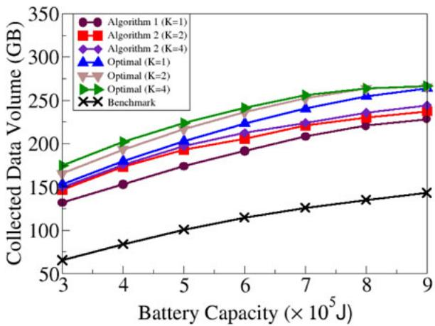  
(a) Collected data volume

We also study the performance of the proposed algorithm for the partial data collection maximization problem. Fig. 4a shows that with the increase on <sup>K</sup>, the UAV collects more data per tour. For instance, when $\mathcal { E } = 3 \times 1 0 ^ { 5 }$ Joules<sub>,</sub> <sup>3 10</sup>the volume of data collected by 2 when $K = 4$ <sup>Algorithm 4</sup>is 149.8 <sup>GB</sup>, while the volume of data collected by <sup>Algo-</sup>1 is 131.9 <sup>GB</sup>. However, the growth of <sup>K</sup> results in a <sup>rithm</sup>longer running time of 2 and ILP solver. $\mathrm { E . g . } ,$ when $K = 1$ <sup>Algorithm</sup>, the running time for 2 and ILP <sup>1 Algorithm</sup>solver is around <sup>ms</sup> and <sup>; ms</sup> respectively, but when $K = 1 6$ <sup>100 2 000</sup>, the time consuming is around 24,830 <sup>ms</sup> and $4 \times 1 0 ^ { 7 }$ <sup>16ms</sup> respectively. When $K \geq 3 2$ , ILP solver cannot <sup>4 10 32</sup>obtain the result within reasonable time.

## 7.3 Performance Evaluation of Algorithms for the Full and Partial Data Collection Maximization Problems With Hovering Coverage Overlapping

We then study the performance of 3 and 4 for <sup>Algorithms</sup>the full data collection maximization problem with hovering coverage overlapping against the benchmark algorithm. It can be seen from Fig. 5a that 3 and 4 outper-<sup>Algorithms</sup>form the benchmark algorithm significantly. Furthermore, 4 is superior to 3 as the latter is a <sup>Algorithm Al</sup>special case of the former when $K = 1$ <sup>hm</sup>. When $\delta = 5$ meters, <sup>1 5</sup>the collected data volume by 3 and 4 $\left( K = 2 \right)$ <sup>Algorithms 2</sup>are 132.8 <sup>GB</sup> and 147.7 <sup>GB</sup>, respectively, which are 79.1 and 99 percent higher than that of the solution delivered by the benchmark algorithm (74.14 <sup>GB</sup>).

We also study the performance of 4 by vary-<sup>Algorithm</sup>ing the value of <sup>K</sup>. It can be seen from Fig. 5a that a larger <sup>K</sup> will result in more data collected per tour, this is due to more accurate planning for data collection per unit energy consumption. For instance, the collected data volume increases from 147.7 <sup>GB</sup> to 150.7 <sup>GB</sup> when <sup>K</sup> increases from 2 to 4. Fig. 5b indicates that 4 takes a lon-<sup>Algorithm</sup>ger running time than that of 3 with the growth <sup>Algorithm</sup>of <sup>K</sup>. For example, the running time of 4 is about 54.1 minutes when $K = 4 ,$ <sup>Algorithm</sup>which is around 50 times <sup>4</sup>of the running time 1.61 minutes of 3.

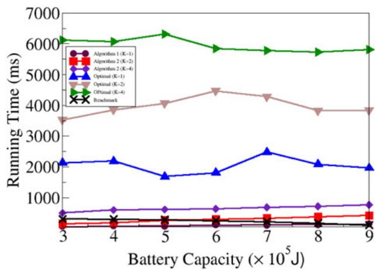  
(b) The running time  
Fig. 3. Performance of different algorithms for the full data collection maximization problems without hovering coverage overlapping by varying the energy capacity of the UAV.

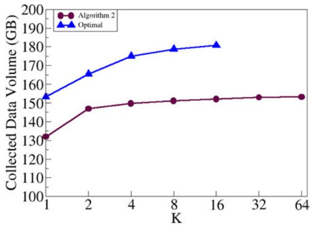  
(a) Collected data volume

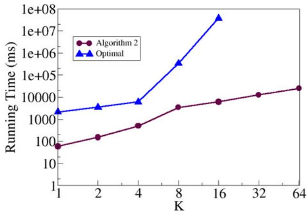  
(b) The running time  
Fig. 4. Performance of different algorithms for the data collection maximization problem without hovering coverage overlapping.

## 7.4 Impact of Important Parameters on the Performance of the Proposed Algorithms for the Full and Partial Data Collection Maximization Problems With and Without Hovering Coverage Overlapping

In the following we evaluate the impact of parameters <sup>d;</sup> E<sup>;</sup> j<sup>V</sup> j on the performance of the proposed algorithms for the full and partial data collection maximization problems without hovering coverage overlapping.

We start with the impact of the parameters on the performance of the proposed algorithms for the full data collection maximization problem without hovering coverage overlapping.

(a) We analyze the impact of energy capacity E of the UAV, by varying it from $\mathrm { 3 \times 1 0 ^ { 5 } }$ to $9 \times 1 0 ^ { 5 }$ <sup>Joules</sup> while fix-<sup>3 10 9 10</sup>ing other parameters. Fig. 3a shows that the volume of data collected by all algorithms increases with the growth of energy capacity. When $\mathcal { E } = 9 \times 1 0 ^ { 5 } .$ , 1 collects <sup>9 10 Algorithm:</sup> ð	 ð <sup>:</sup>  <sup>:</sup> Þ<sup>= :</sup> Þ more data than the one <sup>73 09</sup><sub>when</sub> $\mathcal { E } = \mathrm { 3 \times 1 0 ^ { 5 } }$ <sup>131 9 131 9</sup>. A larger battery capacity implies that the <sup>3 10</sup>UAV can visit more hovering locations and hovering longer at hovering locations, hence increasing the running time of the algorithm. On the other hand, from Fig. 3b, it can be seen that the running time of 1 and 2 increases with the growth of the UAV energy capacity, because more hovering locations needs planning. While the running time of the benchmark algorithm decreases with the growth of the UAV energy capacity, because less nodes will be pruned from the initial TSP tour as more energy can be consumed in the tour.

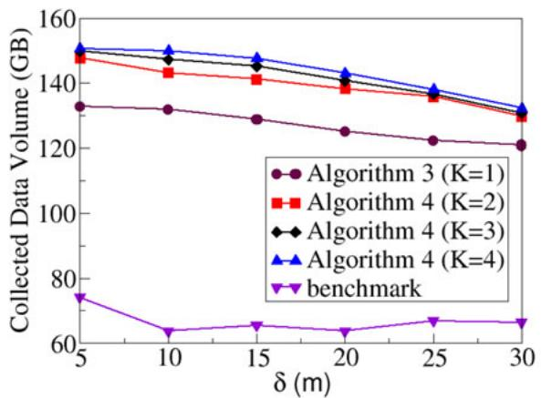  
(a) Collected data volume

(b) We study the impact of the number of aggregate sensor nodes j<sup>V</sup> j on the performance of 1 and 2. <sup>Algorithms</sup>Fig. 6a depicts the data collections of the UAV while varying the number of aggregate sensor nodes in the monitoring region from 500 to 1,000, which shows the amount of collected data goes up when there are more aggregate sensor nodes. When there are 1,000 nodes, 1 collects <sup>Algorithm</sup>196.3 <sup>GB</sup>, which is approximately <sup>: GB</sup> higher than that <sup>64 4</sup>when there are 500 nodes. Fig. 6b plots the running time curve of different algorithms. It can be seen that <sup>Algo-</sup>1 and 2 remain stable when the number of nodes <sup>rithms</sup>increases from 500 to 1000. The reason is that the hovering sojourn duration at each hovering location is determined by the sensor within the coverage range of the UAV with the maximum data volume.

We now evaluate the impact of parameters $\delta , \mathcal { E }$ and j<sup>V</sup> j on the performance of 3 and 4 for the full and <sup>Algorithms</sup>partial data collection maximization problems with hovering coverage overlapping.

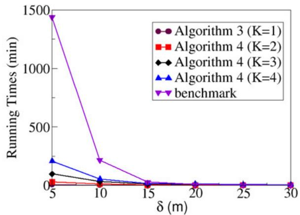  
(b) The running time  
Fig. 5. Performance of different algorithms for the full and partial data collection maximization problems with hovering coverage overlapping, by varying the value of <sup>d</sup> from 5 meters to 30 meters when $| V | = 5 0 0$ 500<sub>Authorized</sub> <sub>licensed</sub> <sub>use</sub> <sub>limited</sub> <sub>to:</sub> <sub>Guangxi</sub> <sub>University.</sub> <sub>Downloaded</sub> <sub>on</sub> <sub>July</sub> <sub>05,2026</sub> <sub>at</sub> <sub>12:38:43</sub> <sub>UTC</sub> <sub>from</sub> <sub>IEEE</sub> <sub>Xplore.</sub> <sub>Restrictions</sub> <sub>apply.</sub>

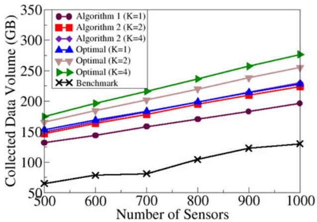  
(a) Collected data volume

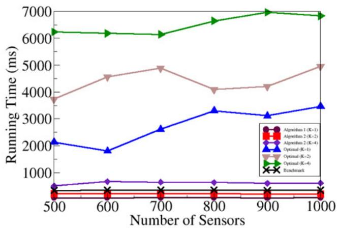  
(b) The running time  
Fig. 6. Performance of different algorithms for the data collection maximization problem without hovering coverage overlapping by varying the number of sensors from 500 to 1,000.

(a) We evaluate the impact of <sup>d</sup> on the performance of the two mentioned algorithms. It can be seen from Fig. 5a that for a fixed $K \geq 1$ of number of partitionings on the sojourn <sup>1</sup>duration at each hovering location, the total volume of data collected per tour reduces, so do the running times of the algorithms because the number of potential hovering locations for the UAV becomes smaller, and less data will be collected. $\mathrm { E . g . , }$ when $K = 4 ,$ it can be seen from Fig. 5a that when $\delta = 5$ <sup>4</sup>meters, the collected data volume is about 13.9 percent higher than that by itself when $\delta = 3 0$ meters. <sup>30</sup>Therefore, when <sup>d</sup> is sufficiently small, the total volume of data collected by the UAV is maximized. Fig. 5b depicts the running times of the two mentioned algorithms.

(b) We investigate the impact of the energy capacity E of the UAV on the performance of different algorithms, by varying it from $3 \bar { \times } 1 0 ^ { 5 }$ joules <sub>to</sub> $9 \times 1 0 ^ { 5 }$ <sup>joules</sup> while fixing <sup>3 10 9 10</sup>the value of <sup>d</sup> at 10 meters. Fig. 7a illustrates that the collected data volume goes up with the increase on the energy capacity of the UAV, since the UAV can visit more hovering locations with longer hovering durations to collect more data from its hovering locations. For example, when $K = 4 ,$ <sup>4</sup>the collected data is increased by 82 percent with the growth of the energy capacity of the UAV from $3 \times 1 0 ^ { 5 }$ joules <sub>to</sub> $9 \times$ $1 0 ^ { 5 }$ <sup>3 10 9joules</sup>. Fig. 7b demonstrates the impact of the battery <sup>10</sup>capacity of UAV on the running time of the algorithm. A larger battery capacity implies that 3 and 4 <sup>Algorithms</sup>can visit more hovering locations, hence increasing their running time. On the other hand, with more energy capacity, the benchmark algorithm will remove fewer nodes from the initial closed tour ${ \mathcal { C } } ,$ which leads to a shorter running time. 4 thus needs more running time com-<sup>Algorithm</sup>pared with that of the benchmark algorithm with the growth of the energy capacity on the UAV.

(c) We study the impact of aggregate sensor nodes j<sup>V</sup> j on the performance of 3 and 4, by varying the <sup>Algorithms</sup>number of aggregate sensor nodes from 500 to 1,000. Fig. 8a shows that volume of data collected grows with the increase on the number of aggregate sensor nodes. On the other hand, Fig. 8b depicts that the running time of each comparison algorithm does not change too much, by increasing the number of sensors. The rationale behind is that the hovering sojourn duration at each hovering location is determined by the sensor with the maximum data volume, due to the OFDMA technique.

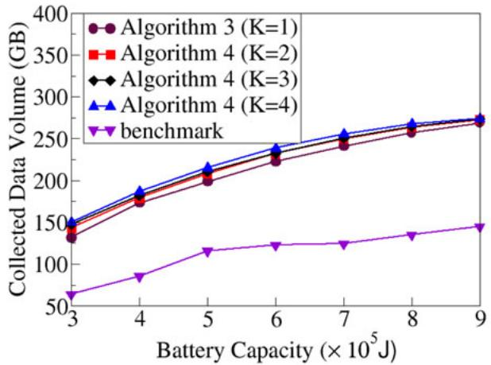  
(a) Collected data volume

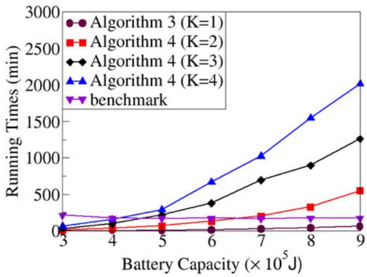  
(b) The running time  
Fig. 7. Performance of different algorithms, by varying the battery capacity of the UAV from $3 \times 1 0 ^ { 5 }$ joules <sub>to</sub> $9 \times 1 0 ^ { 5 }$ joules<sub>.</sub>

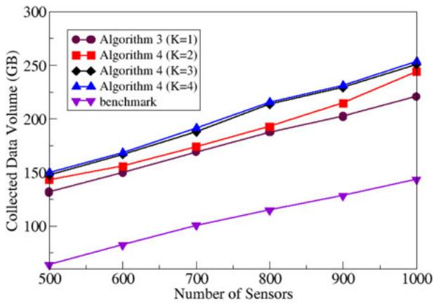  
(a) Collected data volume

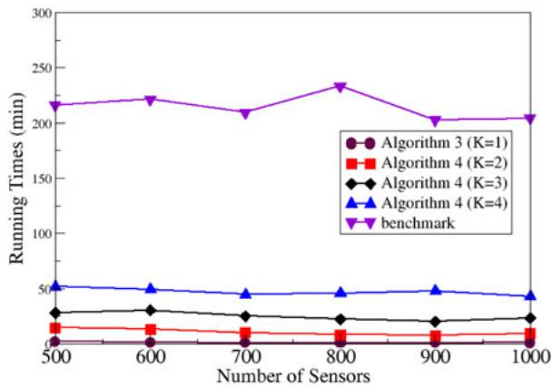  
(b) The running time  
Fig. 8. Performance of different algorithms by varying the number of sensors from 500 to 1,000.

## 8 CONCLUSION

In this paper, we studied the full or partial data collection maximization problem for IoT applications, using an energyconstrained UAV. We first proposed a novel data collection framework that enables the UAV to collect sensory data from multiple IoT devices simultaneously. We then formulated the full and partial data collection maximization problems that allow the UAV to fully or partially collect data from IoT devices at each of its hovering locations. We third showed that both problems are NP-hard, and instead devised efficient approximation and heuristic algorithms for the problems. We finally evaluated the performance of the proposed algorithms through experimental simulations. Simulation results demonstrate that the proposed algorithms are promising.

## ACKNOWLEDGMENTS

The authors would like to thank the associate editor and the three anonymous referees for their constructive comments and invaluable suggestions, which help the authors improve the quality and presentation of the paper greatly. The work of Yuchen Li and Weifa Liang was supported by the Australian Research Council through Discovery Project Scheme under Grant DP200101985, and a part of the work of Weifa Liang was conducted at Australian National University. The work of Wenzheng Xu was supported in part by the National Natural Science Foundation of China (NSFC) under Grant 61602330, in part by the Sichuan Science and Technology Program under Grants 2018GZDZX0010 and 2017GZDZX0003, and in part by the National Key Research and Development Program of China under Grant 2017YFB0202403. The work of Xiaohua Jia was supported by the Research Grants Council of Hong Kong under Grant CityU 11214316. The work of Yinlong Xu was supported by the NSFC under Grant 61772486. The work of Haibin Kan was supported in part by the National Natural Science Foundation of China under Grants 61672166 and U19A2066, and in part by the National Key Research and Development Plan under Grant 2019YFB2101703.

## REFERENCES

[1] A. Al-Hourani, S. Kandeepan, and S. Lardner, “Optimal LAP altitude for maximum coverage,” IEEE Wireless Commun. Lett., vol. 3, no. 6, pp. 569–572, Dec. 2014.

[2] N. Bansal, A. Blum, S. Chawla, and A. Meyerson, “Approximation algorithms for deadline-TSP and vehicle routing with time-windows,” in Proc. 36th Annu. ACM Symp. Theory Comput. (STOC), 2004, pp. 166–174.

[3] H. Binol, E. Bulut, K. Akkaya, and I. Guvenc, “Time optimal multi-UAV path planning for gathering its data from roadside units,” in Proc. 88th Veh. Technol. Conf. (VTC-Fall), 2018, pp. 1–5.

[4] A. Blum, S. Chawla, D. Karger, T. Lane, A. Meyerson, and M. Minkoff, “Approximation algorithms for orienteering and discounted-reward TSP,” in Proc. 44th Annu. IEEE Symp. Found. Comput. Sci. (FOCS), 2003, pp. 46–55.

[5] M. Chen, W. Liang, and Y. Li, “Data collection maximization for UAV-enabled wireless sensor networks,” in Proc. 29th Int. Conf. Comput. Commun. Netw., 2020, pp. 1–9.

[6] M. Chen, W. Liang, and S. Das, “Data collection utility maximization in wireless sensor networks via efficient determination of UAV hovering locations,” in Proc. 19th Int. Conf. Pervasive Comput. Commun., 2021, pp. 1–10.

[7] M. Chen, W. Liang, and J. Li, “Energy-efficient data collection maximization for UAV-assisted wireless sensor networks,” in Proc. IEEE Wirel. Commun. Netw. Conf., 2021, pp. 1–7.

[8] N. Christofides, “Worst-case analysis of a new heuristic for the travelling salesman problem,” Graduate Sch. Ind. Admin., Carnegie Mellon Univ., Tech. Rep. 388, 1976.

[9] M. B. Ghorbel, D. Rodriguez-Duarte, H. Ghazzai, M. J. Hossain, and H. Menouar, “Energy efficient data collection for wireless sensors using drones,” in Proc. of 87th Veh. Technol. Conf., 2018, pp. 1–5.

[10] Q. Guo et al., “Minimizing the longest tour time among a fleet of UAVs for disaster area surveillance,” IEEE Trans. Mobile Comput., early access, 2020, doi: 10.1109/TMC.2020.3038156.

[11] S. Hayat, E. Yanmaz, and R. Muzaffar, “Survey on unmanned aerial vehicle networks for civil applications: A communications viewpoint,” IEEE Commun. Surv. Tut., vol. 18, no. 4, pp. 2624–2661, Oct.– Dec. 2016.

[12] Y. Li, W. Liang, W. Xu, and X. Jia, “Data collection of IoT devices using an energy-constrained UAV,” in Proc. 34th IEEE Int. Parallel Distrib. Process. Symp. (IPDPS), 2020, pp. 644–653.

[13] W. Liang, W. Xu, X. Ren, X. Jia, and X. Lin, “Maintaining largescale rechargeable sensor networks perpetually via multiple mobile charging vehicles,” ACM Trans. Sensor Netw., vol. 12, no. 2, 2016, Art. no. 14.

[14] W. Liang, Z. Xu, W. Xu, J. Shi, G. Mao, and S. Das, “Approximation algorithms for charging reward maximization in rechargeable sensor networks via a mobile charger, ” IEEE/ACM Trans. Netw., vol. 25, no. 5, pp. 3161–3174, Oct. 2017.

[15] Y. Liang et al., “Nonredundant information collection in rescue applications via an energy-constrained UAV,” IEEE Internet Things J., vol. 6, no. 2, pp. 2945–2958, Apr. 2019.

[16] Y. Ma, W. Liang, and W. Xu, “Charging utility maximization in wireless rechargeable sensor networks by charging multiple sensors simultaneously,” IEEE/ACM Trans. Netw., vol. 26, no. 4, pp. 1591–1604, Aug. 2018.

[17] M. Mozaffari, W. Saad, M. Bennis, and M. Debbah, “Mobile Internet of Things: Can UAVs provide an energy-efficient mobile architecture?,” in Proc. IEEE Glob. Commun. Conf., 2016, pp. 1–6.

[18] M. Mozaffari, W. Saad, M. Bennis, and M. Debbah, “Mobile unmanned aerial vehicles (UAVs) for energy-efficient Internet of Things communications,” IEEE Trans. Wirel. Commun., vol. 16, no. 11, pp. 7574–7589, Nov. 2017.

[19] Phantom 4 pro V2 Specification, 2018. [Online]. Available: https://www.dji.com/au/phantom-4-pro-v2/info#specs

[20] M. Samir, S. Sharafeddine, C. Assi, T. Nguyen, and A. Ghrayeb, “UAV trajectory planning for data collection from time-constrained IoT devices,” IEEE Trans. Wirel. Commun., vol. 19, no. 1, pp. 34–46, Jan. 2020.

[21] D. Sikeridis, E.E. Tsiropoulou, M. Devetsikiotis, and S. Papavassiliou, “Wireless powered Public Safety IoT: A UAV-assisted adaptive-learning approach towards energy efficiency,” J. Netw. Comput. Appl., vol. 123, no. 1, pp. 69–79, 2018.

[22] M. F. Sohail, C.Y. Leow, and S. Won, “Energy-efficient nonorthogonal multiple access for UAV communication system,” IEEE Trans. Veh. Technol., vol. 68, no. 11, pp. 10834–10845, Nov. 2019.

[23] J. Theunissen, H. Xu, R. Y. Zhong, and X. Xu, “Smart AGV system for manufacturing shopfloor in the context of industry 4.0.,” in Proc. 25th Int. Conf. Mechatronics Mach. Vis. Pract. (M2VIP), 2018, pp. 1–6.

[24] P. Vansteenwegen, W. Souffriau, and D. Van Oudheusden, “The orienteering problem: A survey,” Eur. J. Oper. Res., vol. 209, pp. 1–10, 2011.

[25] W. Xu, W. Liang, H. Kan, Y. Xu, and X. Zhang, “Minimizing the longest charge delay of multiple mobile chargers for wireless rechargeable sensor networks by charging multiple sensors simultaneously,” in Proc. 39th IEEE Int. Conf. Distrib. Comput. Syst., 2019, pp. 881–890.

[26] W. Xu, W. Liang, X. Jia, H. Kan, Y. Xu, and X. Zhang, “Minimizing the maximum charging delay of multiple mobile chargers under the multi-node energy charging scheme,” IEEE Trans. Mobile Comput., vol. 20, no. 5, pp. 1846–1861, May 2021.

[27] W. Xu, W. Liang, X. Lin, and G. Mao, “Efficient scheduling of multiple mobile chargers for wireless sensor networks,” IEEE Trans. Veh. Technol., vol. 65, no. 9, pp. 7670–7683, Sep. 2016.

[28] C. Zhan and Y. Zeng, “Completion time minimization for multi-UAV-enabled data collection,” IEEE Trans. Wirel. Commun., vol. 18, no. 10, pp. 4859–4872, Oct. 2019.

[29] C. Zhan, Y. Zeng, and R. Zhang, “Energy-efficient data collection in UAV enabled wireless sensor network,” IEEE Wirel. Commun. Lett., vol. 7, no. 3, pp. 328–331, Jun. 2018.

[30] J. Zhang et al., “Minimizing the number of deployed UAVs for delaybounded data collection of IoT devices,” in Proc. INFOCOM’21, 2021, p. 10.

  
Yuchen Li received the BSc degree (first class Hons.), in 2018, in computer science from the Australian National University, where he is currently working toward the PhD degree at the Research School of Computer Science. His research interests include the Internet of Things, mobile edge computing, and algorithm design.


Weifa Liang (Senior Member, IEEE) received the BSc degree in computer science from Wuhan University, China, in 1984, the ME degree in computer science from the University of Science and Technology of China in 1989, and the PhD degree in computer science from the Australian National University in 1998. He is currently a professor at the Department of Computer Science, City University of Hong Kong, Hong Kong. Before that, he was a professor with the Australian National University. His research interests include design and analysis of energy efficient routing protocols for wireless ad hoc and sensor networks, the Internet of Things, mobile edge computing, network function virtualization, software-defined networking, design and analysis of parallel and distributed algorithms, approximation algorithms, combinatorial optimization, and graph theory. He is currently an associate editor for the <sup>IEEE</sup> Transactions on Communications<sub>.</sub>


Wenzheng Xu (Member, IEEE) received the BSc, ME, and PhD degrees in computer science from Sun Yat-Sen University, Guangzhou, China, in 2008, 2010, and 2015, respectively. He is currently an associate professor at Sichuan University. He was a visitor with the Australian National University and the Chinese University of Hong Kong. His research interests include wireless ad hoc and sensor networks, mobile computing, approximation algorithms, combinatorial optimization, online social networks, and graph theory.

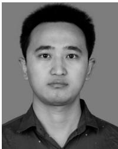

Zichuan Xu (Member, IEEE) received the BSc and ME degrees in computer science from the Dalian University of Technology, China, in 2011 and 2016, respectively, and the PhD degree from the Australian National University in 2016. From 2016 to 2017, he was a research associate with the Department of Electronic and Electrical Engineering, University College London, U.K. He is currently an associate professor at the School of Software, Dalian University of Technology. He is also a Xinghai Scholar with the Dalian University of Technology. His research interests include cloud computing, network function virtualization, software-defined networking, wireless sensor networks, routing protocol design for wireless networks, algorithmic game theory, and optimization problems.


Xiaohua Jia (Fellow, IEEE) received the BSc and MEng degrees from the University of Science and Technology of China in 1984 and 1987, respectively, and the DSc degree in information science from the University of Tokyo in 1991. He is currently a chair professor at the Department of Computer Science, City University of Hong Kong. His research interests include cloud computing and distributed systems, computer networks, wireless sensor networks, and mobile wireless networks. From 2006 to 2009, he <sub>was the editor of the</sub> IEEE Transactions on Parallel and Distributed Systems <sub>and the</sub> Journal of World Wide Web<sub>. He is the gen-</sub> eral chair of ACM MobiHoc 2008, the TPC co-chair of IEEE MASS 2009, the area-chair of IEEE INFOCOM 2010, the TPC co-chair of IEEE GlobeCom 2010, Ad Hoc and Sensor Networking Symposium, and the panel co-chair of IEEE INFOCOM 2011.

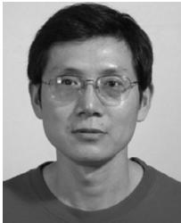

Yinlong Xu received the BS degree in mathematics from Peking University in 1983, and the MS and PhD degrees in computer science from the University of Science and Technology of China (USTC) in 1989 and 2004, respectively. He is currently a full professor at the School of Computer Science and Technology, USTC. Before that, he was an assistant professor, a lecturer, and an associate professor at the Department of Computer Science and Technology, USTC. His research interests include network coding, wireless networks, combinatorial

optimization, and design and analysis of parallel algorithms. He was the recipient of the Excellent PhDAdvisor Award of Chinese Academy of Sciences, in 2006.


Haibin Kan (Member, IEEE) received the PhD degree from Fudan University, Shanghai, China, in 1999. He was a faculty with Fudan University. From June 2002 to February 2006, he was an assistant professor with the Japan Advanced Institute of Science and Technology. He is currently a full professor at Fudan University. His research interests include coding theory, cryptography, and computation complexity.

" For more information on this or any other computing topic, please visit our Digital Library at www.computer.org/csdl.