# Data Offloading in UAV-Assisted Multi-Access Edge Computing Systems Under Resource Uncertainty

Pavlos Athanasios Apostolopoulos , Georgios Fragkos Eirini Eleni Tsiropoulou , and Symeon Papavassiliou D

Abstract—In this paper, a novel data offloading decision-making framework is proposed, where users have the option to partially offload their data to a complex Multi-access Edge Computing (MEC) environment, consisting of both ground and UAV-mounted MEC servers. The problem is treated under the perspective of risk-aware user behavior as captured via prospect-theoretic utility functions, while accounting for the inherent computing environment uncertainties. The UAV-mounted MEC servers act as a common pool of resources with potentially superior but uncertain payoff for the users, while the local computation and ground server alternatives constitute safe and guaranteed options, respectively. The optimal user task offloading to the available computing choices is formulated as a maximization problem of each user’s satisfaction, and confronted as a non-cooperative game. The existence and uniqueness of a Pure Nash Equilibrium (PNE) are proven, and convergence to the PNE is shown. Detailed numerical results highlight the convergence of the system to the PNE in few only iterations, while the impact of user behavior heterogeneity is evaluated. The introduced framework’s consideration of the user risk-aware characteristics and computing uncertainties, results to a sophisticated exploitation of the system resources, which in turn leads to superior users’ experienced performance compared to alternative approaches.

Index Terms—Data offloading, multi-access edge computing, unmanned aerial vehicles, risk-aware behavior, computing uncertainty, prospect theory, convex optimization

# 1 INTRODUCTION

UNMANNED Aerial Vehicles (UAVs) have gained increas-ing research and commercial popularity due to their strong line-of-sight connection links, low-cost, adjustable usage, maneuverability, and hovering ability. Their vital features have enabled them to support not only various military applications, but several civilian services as well, including transportation, industrial monitoring, agriculture services, forest fire monitoring, wireless services. For instance, focusing on the latter, the UAVs have been used among others to enhance the coverage and capacity of the wireless cellular networks, act as flying base stations, and support Internet of Things (IoT) communications in smart cities environments [1]. Also, over the last few years, the UAVs have been considered as means to provide computing support to the end-users by acting as UAV-mounted multi-access edge computing servers [2]. The concept of multi-access edge computing (MEC), formerly known as

mobile edge computing, is a network architecture concept, standardized by the European Telecommunications Standards Institute (ETSI), offering cloud-computing capabilities at the edge of the access network [3].

# 1.1 Related Work & Motivation

Very recently (2018), the use of UAV-mounted MEC servers has been proposed in combination with the ground MEC servers to support end-users’ applications’ offloading in order to perform computationally intensive tasks, thus, collectively creating a fog computing system [4]. In [5], the authors investigate the stability of a cloud-based UAV system consisting of UAV-mounted MEC servers, in relationship with the acquisition rate of sensors’ big data. An air-ground integrated MEC architecture is introduced in [6] consisting of both ground and UAV-mounted MEC servers. The authors highlight the benefits of the UAVassisted network in terms of edge caching and computing. In [7], the authors consider clusters of UAV-mounted MEC servers and the problem of opportunistic computational offloading is studied to determine the tasks that should be offloaded to the neighboring UAV clusters with sufficient computing resources, in order to increase the UAVs’ lifetime and decrease the overall computation time.

Focusing on the problem of users’ computation tasks offloading to UAV-mounted MEC servers, the authors in [8] propose an UAV-enabled MEC system, where the UAVs act jointly as relay and data processing nodes to facilitate the communication and computing demands of the ground devices. A joint optimization problem is formulated to minimize the service delay of the ground devices and the UAVs by determining the UAVs optimal position, the communication and computing resource allocation, and the devices’ task splitting. A centralized task offloading approach to the UAV-mounted and ground MEC servers is introduced in [9], where an intelligent centralized agent makes optimal decisions about the users’ task offloading strategies via sensing the communication and computing conditions of the environment towards optimizing the users’ Quality of Experience. The authors in [10] introduce an optimization algorithm to jointly optimize the task offloading, the bit allocation during transmission, and the UAV trajectory. A similar problem is studied in [11], where the amount of offloaded bits to be processed by the UAVs, as well as the number of output bits returned to the users in the downlink, are jointly optimized, while taking into consideration the users’ maximum latency constraints. This research work has been extended in [2] to consider orthogonal and non-orthogonal multiple access techniques to offload the users’ data to the UAV-mounted MEC servers, as well as to optimize the UAVs’ trajectory subject to their energy budget constraints.

In [12], the UAV-mounted MEC servers’ energy saving is studied by jointly optimizing the UAVs trajectory and data offloading to ground MEC servers based on a long short term memory prediction algorithm. In [13], the UAVs energy efficient operation is also studied by jointly optimizing the UAVs trajectory, the users transmission power, and the computation load allocation via introducing a heuristic method based on the successive convex approximation technique. Furthermore, the feature of wireless powered communication has been also incorporated in the UAVmounted MEC servers. For example in [14], [15] the UAVs are assumed to transmit energy to multiple ground users, who in turn exploit the harvested energy for local computing and computation tasks offloading.

All the aforementioned research works have examined the users computation tasks offloading problem to the UAVmounted MEC servers and have demonstrated accordingly significant benefits and advances, by making some key assumptions, which do not necessarily hold true in real-life networking scenarios. In particular, all the users are assumed to have rational characteristics and aim to maximize some form of their perceived utility, e.g., minimizing their energy consumption, or transmission and processing time overhead of the computation tasks. However, in reality the users demonstrate a risk-aware behavior, which is driven by their personal characteristics, the actions and behavior of the other users, and the conditions in the UAV-assisted network [16], [17]. Furthermore, when users make decisions regarding offloading and particularly in a distributed manner, the uncertainties introduced by the underlying computing resource availability are not properly accounted for.

Therefore, the users tend to exhibit risk-seeking or lossaversion behavior during their decision-making process under the presence of uncertainty stemming from the computation environment, which is an intrinsic characteristic of the MEC environment. As a result, the users computation tasks offloading problem needs to account for the human awareness and cognition within the MEC environment, capturing several underlying characteristics, e.g., risk-awareness, which are observed in real-life humans’ decision-making process. For that reason, in this work we leverage Prospect Theory [18], which has emerged as a realistic model to capture how people make decisions under uncertainty, by considering and modeling many of their standard biases. As it has been argued in [19], Prospect Theory was proposed as an alternative to pure expected utility theory in order to overcome the unrealistic assumption, typically made by the latter, that risk attitudes are constant across all levels of wealth. Prospect Theory asserts that the shape of the utility function differs in the gain and loss domains. An interesting indicative example, where the users’ risk-aware behavior needs to be considered for the successful design of complex systems, is the humanrobot interaction design [20], where the robots should predict the humans’ behavior based on the risk-aware characteristics of the latter, in order to collaborate with each other smoothly. Another example refers to the successful design of advertisement campaigns and products’ promotions based on the riskaware bias of the customers with respect to products’ negative reviews in their purchasing decision-making [21]. Regardless of the particular application domain (e.g., humanrobot interaction, advertisement campaigns, etc.), Prospect Theory evangelizes that the users’ payoff, resulting from their autonomous decisions under uncertainty, is determined in a probabilistic manner and deviates from the one received considering users’ risk-neutral behavior, as the Expected Utility Theory commonly assumes.

As far as the users computation task offloading problem in MEC servers is concerned, very recently [22], [23], Prospect Theory was utilized in a single MEC server environment to formulate the computation task offloading problem for resource-constrained IoT devices. The authors considered the human awareness, inherent cognitive biases and behavioral characteristics into the devices’ operation focusing on full [22] or partial task offloading [23] to the single MEC server. Several additional efforts have been reported in the literature where Prospect Theory has been adopted in various environments and application domains. Some of these applications include: dynamic resource management in 5G wireless networks [16], [24], public safety networks [17], anti-jamming communications in cognitive radio networks [25], users’ transmission power management and anti-jamming techniques in UAV-assisted networks [26], and Quality of Experience [27] in cyber-physical social systems.

# 1.2 Contributions & Outline

Despite the fact that several approaches, including game theoretic ones, have been proposed in the literature to study the offloading decisions in UAV-enabled MEC environments, our paper aims at exactly filling the aforementioned gap by incorporating users’ behavioral factors in the users’ computation task offloading problem. In particular, we consider the existence of two different types of MEC servers (i.e., ground MEC servers and UAV-mounted MEC servers, each type with different characteristics and capabilities), while taking into account users’ latency and energy requirements. Towards achieving this goal, we exploit the principles of Prospect Theory [18], motivated by the fact that the UAV-mounted MEC servers constitute a competitive resource-constrained environment, where the users make decisions under uncertainty of the available resources and they compete among each other for the shared limited resources. On the other hand, it is noted that the ground MEC servers provide a guaranteed slice of computation resources to each user, given their powerful computing capabilities and availability. This comes in contrast to the UAV-mounted MEC servers that offer an unpredictable slice of computation resources to each user, due to the fact that the UAV-mounted MEC servers confront the challenge of the constrained energy availability.

The main contributions of our work that differentiate it from the rest of the literature, are summarized below:

1. A heterogeneous complex multi-MEC system consisting of both ground and UAV-mounted MEC servers, that jointly considers the risk-aware behavior of the individual users and the risk of failure of the shared computing resources, is introduced. Given this uncertain environment, and in contrast to the majority of the existing literature that primarily addresses the problem of binary offloading where each user may offload its whole application to one MEC server, in this work we investigate the problem of partial offloading. In the considered setting each user can offload arbitrarily parts of its application to ground and/or UAV-mounted MEC servers for remote execution [28].

2. The choice of partially locally processing the tasks or offloading them to the ground MEC servers, where a guaranteed slice of computation resources is offered to each user, are considered as a safe and guaranteed option, respectively, offering predictable performance to the users. The difference between the safe and guaranteed options, mainly stems form the fact that in the local processing option (i.e., safe option) each user’s device computation capabilities depend solely on the user’s local characteristics and are known before the user’s decision-making and available only for its own explicit use. This differs from the ground MEC server option that, though it presents a powerful computation capability by offering a guaranteed slice of computation resource to each user that offloads parts of its data to it, still constitutes a shared resource among the users. The latter, comes in contrast to the UAV-mounted MEC servers that act as Common Pool of Resources (CPR), providing possibly superior but uncertain payoff to the users. The potential for superior expected payoff stems from the improved communication channel gains resulting from the UAVs proximity to the users compared to the ground MEC servers. On the other hand the uncertainty stems from the probability of over-exploitation of their limited computation resources as a natural outcome of the respective energy constraints, which in turn may drive the users to perceive lower satisfaction based on the principles of the Tragedy of Commons [29].

3. The users’ risk-aware behavior in their decision-making process is captured via properly formulated prospect-theoretic utility functions, considering the users’ actual utilities, their latency and energy requirements,

their computation task characteristics, and their perception of the gains and losses. The latter consideration comes in contrast to the majority of existing works and fundamentally differentiates our work from current literature body, since the users are not any more treated as blind utility maximizers, but their behavioral modeling is specifically designed to reflect real life human decision-making under uncertainty.

4. Each user’s overall perceived satisfaction is formulated by considering and exploiting all the different computation options available (i.e., UAV-mounted servers, ground MEC servers, local computing). In that respect, each user’s perceived satisfaction utility results from the overall expected prospect theoretic utility obtained from the UAV-mounted MEC servers, the corresponding overall time and energy overhead by offloading part of its data to the ground MEC servers, and from executing the remaining amount of data locally. It is noted that the prospect theoretic utility is of probabilistic nature, as it depends on the computing load and congestion at the UAV-mounted MEC servers, with the latter being considered as fragile computing resources that can fail to serve the users’ computation demands due to their constrained energy availability.

5. The user’s autonomous and optimal computation task allocation to the available computing alternatives (i.e., local, ground/UAV-mounted MEC servers), is formulated as a convex optimization problem of each user’s satisfaction utility. Due to users’ competition for shared resources, i.e., UAV-mounted and ground MEC servers, it is confronted as a noncooperative game among them. The existence and uniqueness of a Pure Nash Equilibrium (PNE) is proven, and a low complexity and distributed algorithm that converges to the PNE is proposed.

The remaining of the paper is organized as follows. In Section 2, the considered system model is presented, by introducing the communication and computing model, and defining the users’ experienced time and energy overheads from transmitting and processing their data to the available offloading options (i.e., ground and UAV-mounted MEC servers). In Section 3, the proposed prospect-theoretic utility function formalities are detailed, whereas in Section 4, the optimal user data offloading problem is formulated and analyzed. In Section 5, a distributed low-complexity algorithm exploiting the properties of convex optimization to determine the game’s PNE is introduced. The performance evaluation of the proposed framework is achieved via modeling and simulation, and numerical results are presented in Section 6. Section 7 concludes the paper.

# 2 SYSTEM MODEL

A UAV-assisted multi-MEC system is considered consisting of a set of ground MEC servers $\mathbb { G } = \{ 1 , \dots , g , \dots , G \}$ , a set of UAV-mounted MEC servers $\mathbb { F } = \{ 1 , \dots , f , \dots , F \}$ g, and a set of users $\mathbb { U } = \{ 1 , \dots , i , \dots , U \}$ ¼ f1 . . . . . . g. Let us also denote the set ¼ f1 . . . . . .of all available MEC servers by $\mathbb { S } = \{ 1 , \dots , s , \dots , S \} , \mathrm { i . e . , } \mathbb { S } =$ G F and $S = G + F .$ ¼ f1 . . . . . . g ¼. The ground MEC servers are attached [ ¼ þto base stations and access points located in different places on the ground. An indicative topology of the considered UAV-assisted multi-MEC system in Fig. 1.

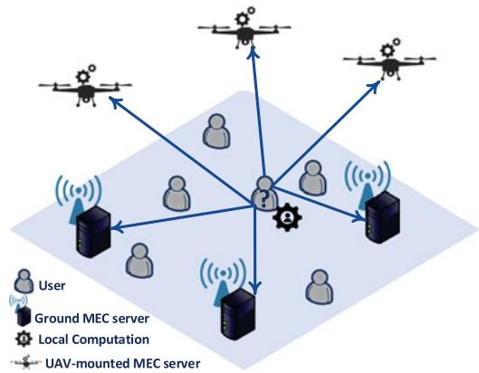

flowchart

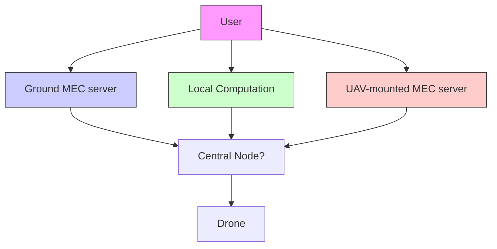

Fig. 1. UAV-assisted multi-MEC system.

We further denote by $T _ { i } = ( B _ { i } , t _ { i } , e _ { i } )$ the user’s i compu-¼ ð Þtation task, which is characterized by: a) the amount of the $B _ { i }$ [bits] input bits (i.e., data to be processed), b) the required $\phi * B _ { i }$ CPU-Cycles where $\phi \ > 0 \left[ \frac { \mathrm { C P U - C y c l e s } } { \mathrm { b i t } } \right]$ bitdescribes the level of the user’s computation task’s intensity (in the following, we consider that the users are requesting computation tasks with similar computation intensity and thus homogeneous computation intensity factors are confsidered, in alignment with current literature [30], [31]), and c) the user’s computation task’s latency and energy requirements, denoted by $t _ { i }$ [sec] and $e _ { i }$ [J], respectively. The latency requirement $t _ { i }$ is related with the user’s task and indicates that the latter has to be completed before this time deadline. Moreover, each user’s local device is characterized by a limited energy availability (associated with the actual device’s battery). For that reason, the user’s device’s energy requirement $e _ { i }$ is considered as well, and it constitutes an upper limit value for the user’s overall consumed energy to complete the task. Each user can arbitrarily partition its application into distinct parts and offload them to the ground MEC servers and the UAV-mounted MEC servers, which are capable of processing the users’ offloaded data in parallel, while the remaining amount of data is processed locally [15], [28]. Accordingly, the energy requirement, as used in this paper, practically reflects a threshold value that the user may set with respect to the use of its own energy resources for the execution of the specific task under consideration. It essentially refers to energy components consumed only at the user device, either for local execution or for transmission to the server.

The users’ communication overhead of associating with multiple UAV-mounted and/or ground MEC servers is assumed negligible compared to the corresponding data transmission and processing overhead. Nevertheless, it is noted that it can be easily incorporated in our model and framework, by considering an additional constant factor - which would typically be of smaller magnitude compared to the rest of the involved overhead factors - in the formulation of the corresponding communication overhead, each time that a user is associated with a sever.

We denote by $\mathbf { b _ { i } } = ( b _ { i , 1 } , \dots , b _ { i , s } , \dots , b _ { i , S } )$ the user’s i off-¼loading vector, where $b _ { i , s }$ 1 . . . . . . Þ[bits] is the amount of data that user i offloads to the MEC server s (either ground or UAVmounted MEC server). Accordingly, the total amount of data that user i offloads to the MEC servers equals to $\textstyle \sum _ { s \in \mathbb { S } } b _ { i , s } \leq$ $B _ { i } , \forall i \in \mathbb { U }$ , while the rest $\begin{array} { r } { L _ { i } = B _ { i } - \sum _ { s \in \mathbb { S } } \bar { b } _ { i , s } } \end{array}$ 2 amount of data 8 2 ¼  2 is processed locally at the user’s device. The data offloading strategy of all the users is $ { \mathbf { b } } = (  { \mathbf { b } } _ { 1 } , \dots ,  { \mathbf { b } } _ { \mathrm { U } } )$ . For practical pur-¼ ð . . . Þposes, and assuming single-communication interface at each user, we consider that each user transmits sequentially its data $b _ { i , s } , \forall s \in \mathbb { S } ,$ , and each MEC server has sufficient memory 8 2to store the received data. Each UAV-mounted MEC server’s $s , s \in \mathbb { F } ,$ energy availability is denoted as $E _ { s }$ [J], a part of 2which is used for the UAV’s operation $( \mathrm { e . g . }$ ., accurately maintaining its position above the ground) and the rest $E _ { s } ^ { p }$ is consumed for the users’ offloaded data processing.

# 2.1 Communication & Computing Model

A multi-channel interference limited wireless communication environment is considered, where the system’s bandwidth is divided in wireless communication channels, i.e., frequency bands. Each MEC server (ground or UAVmounted) is assigned and occupies one such wireless communication channel and receives the users’ offloaded data through it [32], [33], [34]. Thus, the users communicating with the same MEC server share the same channel and accordingly they experience intra-channel interference, while avoiding the inter-channel interference stemming from users offloading their data to other MEC servers. Thus, the user’s i uplink data rate to the MEC server s is $\begin{array} { r } { R _ { i , s } = W _ { s } * l o g \bigg ( 1 + \frac { p _ { i , s } * g _ { i , s } } { \sigma _ { o } ^ { 2 } + \sum _ { i \in U _ { s } , i \neq i } ^ { 2 } p _ { j , s } * g _ { j , s } } \bigg ) } \end{array}$  s2o þ P j Us;j i pj;sgj;s , where $W _ { s }$ is the 2 6¼MEC server’s s channel bandwidth, $p _ { i , s }$ is the user’s i transmission power to offload its amount of data to the MEC server $s , g _ { i , s }$ is the channel gain between the user i and the MEC server s, $\sigma _ { 0 } ^ { 2 }$ is the variance of the Additive White s0 Gaussian Noise, and $U _ { s } = \{ i \in \mathbb { U } : b _ { i , s } \neq 0 \}$ is the set of users ¼ f 2 : 6¼ 0gthat offload a non-zero amount of data to the MEC server s.

It should be noted that in practice some users may complete their data transmission earlier than others, which means that they may no longer contribute to the interference term $\begin{array} { r } { ( \mathrm { i . e . , } \sum _ { j \in U _ { s } , j \neq i } p _ { j , s } * g _ { j , s } ) } \end{array}$ ) of the rest users, i.e., $U _ { s } ,$ , who still 2 s 6¼ transmit their data to the MEC server s. To fully characterize each user’s perceived transmission rate when the user actually performs the data offloading to the MEC server s, would imply that during the decision-making process, the user i is aware of specific individual information about the rest of the users, both in terms of individual user offloading strategies as well as communication information $( \mathrm { i . e . }$ , transmission power, channel gain), such that the actual interference term is evaluated. Such an approach, though would be more accurate by fully exploiting the time dimension as well, it would be rather complex and impractical, or even infeasible in most cases. Moreover, the way that the user’s i uplink data rate $R _ { i , s }$ to the MEC server s is defined above constitutes a lower bound, $\mathrm { i . e . , }$ the worst-case, transmission rate that a user perceives by offloading $b _ { i , s }$ data to the MEC server s. This worstcase formulation of the transmission rate for the purposes of computation offloading, is well aligned with commonly assumed research efforts in the literature [34], [35].

The user i by offloading $b _ { i , s }$ data to the MEC server $s , s \in$ S experiences a transmission time overhead Oti;s tr $O _ { i , s } ^ { t } | _ { t r } = \frac { b _ { i , s } } { R _ { i , s } } ,$ Ri;s , b and a transmission energy overhead $\begin{array} { r } { O _ { i , s } ^ { e } | _ { t r } = \frac { b _ { i , s } } { R _ { i , s } } \cdot p _ { i , s } } \\ { { \mathrm { s t r i c t i o n s ~ a p p l y } } . } \end{array}$ bi;s . We May30,2026at11:12:33UTCfromTEEEXplore.Re

denote as $l _ { i } ^ { c } \left\lceil \frac { \mathrm { C P U - C y c l e s } } { \mathrm { s e c } } \right\rceil$ and $l _ { i } ^ { e } \left[ \frac { \mathrm { J o u l e s } } { \mathrm { C P U - C y c l e } } \right]$ the user’s i sec CPU-Cycledevice’s local computation capability and energy consumption, respectively. Thus, the user’s perceived local time overhead is $\begin{array} { r } { O _ { i } ^ { t } \vert _ { l } = \frac { L _ { i } * \phi } { l _ { * } ^ { c } } } \end{array}$ [sec] and its local energy consumption is $O _ { i } ^ { e } | _ { l } = \dot { L } _ { i } * \phi * \bar { \phi } _ { i } ^ { i } l _ { i } ^ { e } \left[ \mathrm { J } \right]$ . It should be noted here that in j ¼  f our setting, without loss of generality, we assume that both energy and time overheads are of equal and high importance. Accordingly, taking into account normalization aspects to guarantee the same order of magnitude of the jointly considered time and energy overhead [34], [35], the user’s i overall local overhead is formulated as follows.

$$
\left. O _ {i} \right| _ {l} = \frac {\left. O _ {i} ^ {t} \right| _ {l}}{t _ {i}} + \frac {\left. O _ {i} ^ {e} \right| _ {l}}{e _ {i}}. \tag {1}
$$

In Sections 2.2 and 2.3, the ground and UAV-mounted MEC server’s computing models are introduced. It should be clarified that in this research work, we assume that a MEC server is capable of parallel processing the users’ offloaded data. The latter is commonly considered in the literature [34], [35], [36], [37], where a MEC server is able of computing the users’ offloaded tasks independently through virtualization techniques.

# 2.2 Ground MEC Servers and Actual Overhead

Each ground MEC server $s , s \in \mathbb { G }$ has a powerful computa-2tion capability (e.g., high speed CPU). We consider that each ground MEC server offers a guaranteed slice of computation resources $f _ { s } ^ { G } \ \left\lceil \frac { \mathrm { C P U - C y c l e s } } { \mathrm { s e c } } \right\rceil$ to each user that offsecloads part of its data to the specific ground MEC server s. Thus, the ground MEC server acts as a guaranteed option for the user to process its data. Considering the user’s transmission time $\bar { O } _ { i , s } ^ { t } | _ { t r }$ and energy $O _ { i , s } ^ { e } | _ { t r }$ overhead, as well as the prserver, time for the , the user’s i $b _ { i , s }$ data at the ground MECual overhead for offloading $\begin{array} { r l } { \mathrm { i . e . , } \frac { b _ { i , s } \ast \phi } { f _ { \sigma } ^ { G } } } \end{array}$ $b _ { i , s }$ fsdata to the ground MEC server s is given as:

$$
\left. O _ {i, s} \right| _ {g r} = \frac {\left. O _ {i , s} ^ {t} \right| _ {t r} + \frac {b _ {i , s} * \phi}{f _ {s} ^ {G}}}{t _ {i}} + \frac {\left. O _ {i , s} ^ {e} \right| _ {t r}}{e _ {i}}. \tag {2}
$$

Thus, the user’s i overall actual overhead by the data offloading and processing to the ground MEC servers is given as:

$$
O _ {i} \bigg | _ {g r} = \sum_ {s \in \mathbb {G}} O _ {i, s} \bigg | _ {g r} = \sum_ {s \in \mathbb {G}} b _ {i, s} \left(\frac {1}{R _ {i , s} t _ {i}} + \frac {\phi}{f _ {s} ^ {G} t _ {i}} + \frac {p _ {i , s}}{R _ {i , s} e _ {i}}\right). \tag {3}
$$

# 2.3 UAV-Mounted MEC Servers and Expected Overhead

The UAV-mounted MEC servers offer an attractive choice to the users by possibly providing superior (compared to ground MEC servers) payoff to them, due to the potential establishment of better communication channel gains as an outcome of their closer proximity to the users. In this research work, we consider that the UAVs trajectory is a priori known and the UAVs have the ability to hover closer to the users, in comparison to the users’ corresponding distance from the ground MEC servers. However, each UAVmounted MEC server $s , s \in \mathbb { F }$ has limited energy availability $E _ { s } ^ { p }$ 2to be used for the processing of the users’ offloaded data.

Furthermore, each UAV-mounted MEC server is considered as a Common Pool of Resources (CPR) and its computation capability, which is shared among the users, is a decreasing function of the overall amount of received data, as the more data are offloaded to the UAV-mounted MEC server, the less computation capability is assigned to each user.

By denoting as $\begin{array} { r } { \boldsymbol { e _ { s } } \left[ \frac { \mathrm { J o u l e s } } { C P U - C y c l e } \right] } \end{array}$ each UAV-mounted MEC server’s s energy consumption, then based on the users’ level of computation task intensity $\phi ,$ the threshold data fvalue that each UAV-mounted MEC server can receive for remote processing is $\begin{array} { r } { \bar { B } _ { s } = \frac { E _ { s } ^ { p } / e _ { s } } { \phi } } \end{array}$ . Let $\begin{array} { r } { \bar { b } _ { s } = \sum _ { i \in U _ { s } } b _ { i , s } } \end{array}$ denote fthe UAV-mounted MEC server’s total received amount of data. Each UAV-mounted MEC server’s s computation resources slice, denoted by $f _ { s } ^ { U }$ , that is allocated to each user is a portion of the server’s overall computation capability $F _ { s } ^ { U } \ \mathrm { [ C P U - C y c l e s / s e c ] }$ to be shared among all users, and is formulated as follows.

$$
f _ {s} ^ {U} = \left(1 - \frac {\bar {b} _ {s}}{\bar {B} _ {s}}\right) F _ {s} ^ {U}. \tag {4}
$$

Each UAV-mounted MEC server $s , s \in \mathbb { F }$ constitutes a rival-2rous and subtractable resource, since all the users can arbitrarily offload part of their data for remote execution. This means that its utilization by one user reduces the degree that is exploited and utilized by another user. Thus, it is observed in Eq. (4) that each user computation resources slice $f _ { s } ^ { U }$ decreases as the overall data $\bar { b } _ { s }$ received by a UAVmounted MEC server s increases due to the fact that the server becomes more congested, especially given the UAVmounted MEC server’s limited energy availability. Also, based on Eq. (4), it is evident that if $\bar { b } _ { s } \geq \bar { B } _ { s } ,$ , then the UAV-mounted MEC server is unable to process the received amount of data due to its limited energy availability. It is worth mentioning that even in the case of $\bar { b } _ { s } \geq \bar { B } _ { s } ,$ , there may still exist users’ offloaded data that could be processed by the UAV-mounted MEC server s with an appropriate scheduling. However, this is not deterministically known by the users, when the latter ones are making their offloading decisions (Section 5). For that reason, in this research work, considering the importance of each user’s i latency $( t _ { i } )$ and energy $( e _ { i } )$ requirements’ fulfilment, we adopt a worst-case scenario approach, where each user considers that with probability $p _ { s } ( \bar { b } _ { s } )$ its offloaded data are unable to ð Þbe processed by the UAV-mounted MEC server s. This phenomenon is well known in the literature as the Tragedy of the Commons [29]. In the case of the UAV-mounted MEC server’s failure, it is more beneficial for the user to offload its data to another MEC server (ground or UAV-mounted) or to process them locally on its device. Moreover, each UAV’s overall energy availability $E _ { s }$ decreases over time, as part of it is consumed for the UAV’s operation, thus $\bar { E } _ { s } ^ { p } , \bar { B } _ { s }$ decrease over time as well. The latter constitutes a computing uncertainty for the users decision-making offloading, as the UAV-mounted MEC server’s capability to process the offloaded data by the users is not known in prior. As a result, the uncertainty of each UAV-mounted MEC server’s failure is captured by its probability of failure, thus, the users exhibit a risk-aware offloading behavior.

TABLE 1 Summary of Key Notations 

<table><tr><td>Notation</td><td>Description [Units]</td></tr><tr><td>S</td><td>Set of MEC servers</td></tr><tr><td>G</td><td>Set of ground MEC servers</td></tr><tr><td>F</td><td>Set of UAV-mounted MEC servers</td></tr><tr><td>U</td><td>Set of users</td></tr><tr><td> $T_i$ </td><td>User&#x27;s  $i$  computation task</td></tr><tr><td> $B_i$ </td><td>Total input bits of user  $i$  [bits]</td></tr><tr><td> $\phi$ </td><td>Computation task&#x27;s level of intensity of users [CPU-Cycles/bit]</td></tr><tr><td> $t_i,e_i$ </td><td>User&#x27;s  $i$  latency [sec] and energy [J] requirements</td></tr><tr><td> $b_{i,s}$ </td><td>Offloaded data of user  $i$  to MEC server  $s$  [bits]</td></tr><tr><td> $E_s$ </td><td>UAV-mounted MEC server&#x27;s energy availability [J]</td></tr><tr><td> $R_{i,s}$ </td><td>Uplink data rate of user  $i$  to MEC server  $s$ </td></tr><tr><td> $W_s$ </td><td>MEC server&#x27;s channel bandwidth [Hz]</td></tr><tr><td> $p_{i,s}$ </td><td>Transmission power of user  $i$  to MEC server  $s$ </td></tr><tr><td> $g_{i,s}$ </td><td>Channel gain between user  $i$  and MEC server  $s$ </td></tr><tr><td> $\sigma_0^2$ </td><td>Variance of the Additive White Gaussian Noise</td></tr><tr><td> $\mathbf{b_i}$ </td><td>User&#x27;s  $i$  data offloading vector</td></tr><tr><td> $L_i$ </td><td>User&#x27;s  $i$  amount of locally processed data [bits]</td></tr><tr><td> $\mathbf{b}$ </td><td>Data offloading strategy of all users</td></tr><tr><td> $U_s$ </td><td>Set of users offloading data to MEC server  $s$ </td></tr><tr><td> $O_{i,s}^t|_{tr}$ </td><td>User&#x27;s  $i$  transmission time overhead to offload data to MEC server  $s$  [sec]</td></tr><tr><td> $O_{i,s}^e|_{tr}$ </td><td>User&#x27;s  $i$  transmission energy overhead to offload data to MEC server  $s$  [J]</td></tr><tr><td> $l_i^c$ </td><td>User&#x27;s  $i$  local computation capability [CPU-Cycles/sec]</td></tr><tr><td> $l_i^e$ </td><td>User&#x27;s  $i$  local computation energy consumption [J/CPU-Cycles]</td></tr><tr><td> $O_{i}^t|_{l}$ </td><td>User&#x27;s  $i$  local time overhead [sec]</td></tr><tr><td> $O_{i}^e|_{l}$ </td><td>User&#x27;s  $i$  local energy consumption [J]</td></tr><tr><td> $O_{i}^l|_{l}$ </td><td>User&#x27;s  $i$  overall local overhead</td></tr><tr><td> $F_s^U$ </td><td>UAV-mounted MEC server&#x27;s computation capability [CPU-Cycles/sec]</td></tr><tr><td> $f_s^G$ </td><td>Guaranteed computation resources slice assigned to a user by the ground MEC server  $s$  [CPU-Cycles/sec]</td></tr><tr><td> $f_s^U$ </td><td>UAV-mounted MEC server&#x27;s  $s$  computation resources slice assigned to a user [CPU-Cycles/sec]</td></tr><tr><td> $O_{i,s}|_{gr}$ </td><td>User&#x27;s  $i$  overall overhead by a ground MEC server  $s$ </td></tr><tr><td> $O_{i}|_{gr}$ </td><td>User&#x27;s  $i$  overall overhead by the ground MEC servers</td></tr><tr><td> $e_s$ </td><td>UAV-mounted MEC server&#x27;s  $s$  energy consumption [J/CPU-Cycles]</td></tr><tr><td> $E_s^p$ </td><td>UAV-mounted MEC server&#x27;s data processing energy availability [J]</td></tr><tr><td> $\bar{b}_s$ </td><td>Overall data received by a UAV-mounted MEC server  $s$  [bits]</td></tr><tr><td> $\bar{B}_s$ </td><td>Threshold data value of a UAV-mounted MEC server  $s$  [bits]</td></tr><tr><td> $p_s(\bar{b}_s)$ </td><td>Probability of failure of UAV-mounted MEC server  $s$ </td></tr><tr><td> $\alpha_i,\gamma_i$ </td><td>Sensitivity to the gains and losses of user  $i$ , respectively</td></tr><tr><td> $k_i$ </td><td>Loss aversion parameter of user  $i$ </td></tr><tr><td> $u_{i,s}$ </td><td>User&#x27;s  $i$  prospect-theoretic utility</td></tr><tr><td> $O_i$ </td><td>User&#x27;s  $i$  total overhead</td></tr><tr><td> $O_{i,s}|_{fl}$ </td><td>User&#x27;s  $i$  overall overhead by a UAV-mounted MEC server</td></tr><tr><td> $O_{i}|_{fl}$ </td><td>User&#x27;s overall overhead by the UAV-mounted MEC servers</td></tr><tr><td> $q_{i,r}$ </td><td>User&#x27;s reference point</td></tr><tr><td> $s_i(\mathbf{b_i},\mathbf{b}_{-i})$ </td><td>User&#x27;s satisfaction utility</td></tr><tr><td> $\Gamma_i$ </td><td>User&#x27;s  $i$  strategy space</td></tr><tr><td> $\mathbf{b_i}^*$ </td><td>User&#x27;s  $i$  optimal data offloading vector</td></tr><tr><td> $\mathbf{b}^*$ </td><td>Pure Nash Equilibrium point</td></tr></table>

Assumption 1. Each UAV-mounted MEC server’s $s , s \in \mathbb { F }$ probability of failure $p _ { s } ( \bar { b } _ { s } )$ 2is strictly increasing, convex and ð Þtwice differentiable with respect to $\bar { b _ { s } } \in [ 0 , \bar { B } _ { s } )$ , with $p _ { s } ( \bar { b } _ { s } ) =$ $1 , \forall \bar { b } _ { s } \geq \bar { B } _ { s }$ .

In this paper, we consider a linear probability of failure function, thus $\begin{array} { r } { p _ { s } ( \bar { b } _ { s } ) = \bar { b } _ { s } / \bar { B } _ { s } , \ \forall \bar { b } _ { s } < \hat { \bar { B } } _ { s } , } \end{array}$ , while $p _ { s } ( \bar { b } _ { s } ) = 1 ,$ , $\forall \bar { b } _ { s } \geq \bar { B } _ { s }$ ð Þ ¼ - 8 - ð Þ ¼ 1. The physical meaning of this model is that the 8-  -UAV-mounted MEC server will deterministically fail to serve the users’ computation demands, if their total amount of offloaded data exceeds the server’s computation capacity, $\mathrm { i . e . , ~ } p _ { s } ( \bar { b } _ { s } ) = 1 , \forall \bar { b } _ { s } \geq \bar { B } _ { s }$ . In the case however, where the ð Þ ¼ 1 8 users’ total amount of offloaded data does not exceed the server’s computation capacity, i.e., $\forall \bar { b } _ { s } < \bar { B } _ { s } ,$ then, the 8UAV-mounted MEC server’s probability of failure is not zero, but probabilistically depends on the amount of offloaded data that it needs to process, $\mathrm { i . e . , } p _ { s } ( \bar { b } _ { s } ) = \bar { b } _ { s } / \bar { B } _ { s }$ . This ð Þ ¼holds true since each UAV-mounted MEC server’s actual threshold data value $\bar { B } _ { s }$ decreases over time, thus is not deterministically known by the users, when they make their data offloading decisions.

It is noted that the rest of the paper’s analysis still holds true for any other probability of failure function that follows the Assumption 1 and the selection of a linear probability of failure function is made for presentation purposes. Studying the behavior of additional probability of failure functions, such as the one resulting form a Poisson process regarding the arrival data from all users, is also of high research interest and part of our future work. The probability for the UAV-mounted MEC server to survive and process the users’ offloaded data is $( 1 - p _ { s } ( \bar { b } _ { s } ) )$ ). Thus, the user’s 1  ð Þexpected perceived overhead by offloading $b _ { i , s }$ s to the UAVmounted MEC server s is:

$$
\begin{array}{l} \mathbb {E} (O _ {i, s} | _ {f l}) = (1 - p _ {s} (\bar {b} _ {s})) O _ {i, s} | _ {f l} + p _ {s} (\bar {b} _ {s}) \\ \times \left(O _ {i} | _ {l} + \frac {O _ {i , s} ^ {t} | _ {t r}}{t _ {i}} + \frac {O _ {i , s} ^ {e} | _ {t r}}{e _ {i}}\right), \tag {5} \\ \end{array}
$$

where

$$
\left. O _ {i, s} \right| _ {f l} = \frac {\left. O _ {i , s} ^ {t} \right| _ {t r} + \frac {b _ {i , s} * \phi}{f _ {s}}}{t _ {i}} + \frac {\left. O _ {i , s} ^ {e} \right| _ {t r}}{e _ {i}}, \tag {6}
$$

is the actual overall overhead that user i experiences by offloading part of its data to a UAV-mounted MEC server $s ,$ where $\begin{array} { r } { \left. O _ { i , s } ^ { t } \right. _ { t r } = \frac { b _ { i , s } } { R _ { i \mathrm { ~ s ~ } } } } \end{array}$ Oi;s  tr Ri;s bi;s and $\begin{array} { r } { O _ { i , s } ^ { e } | _ { t r } = \frac { b _ { i , s } } { R _ { i \mathrm { ~ s ~ } } } \cdot p _ { i , s } , \forall s , s \in \mathbb { F } } \end{array}$ bi;sR pi;s, s; s  F. The last bi,s j ¼  j ¼ i;s  8 2two terms in Eq. (5) indicate the user’s additional time and energy overhead (accounting for the need to transmit the data before the UAV-mounted MEC server’s failure is finally observed). As a result, the user’s i overall expected overhead by the UAV-mounted MEC servers is ${ \mathbb E } ( \left. \bar { O } _ { i } \right| _ { f l } ) =$ $\textstyle \sum _ { s \in \mathbb { F } } \mathbb { E } ( O _ { i , s } { \ ' } | _ { f l } )$ ð j Þ ¼, and its overall overhead based on its off-2 ð j Þloading strategy $\bf { b _ { i } }$ is formulated as follows.

$$
\mathbb {E} (O _ {i}) = \mathbb {E} (O _ {i} | _ {f l}) + O _ {i} | _ {g r} + O _ {i} | _ {l}. \tag {7}
$$

# 3 THE PROSPECT OF DATA OFFLOADING

To address the users’ subjectivity in the data offloading decision-making under the uncertainty of each UAV-mounted MEC server failure, and considering that in real life users are not risk-neutral, we adopt the principles of Prospect Theory. Prospect Theory was introduced by Kahneman and Tversky [38], and it is a behavioral model where the users make decisions under risk and uncertainty of the associated payoff of their choices, which is estimated in a probabilistic manner. Prospect Theory captures users’ behavioral patterns, where a user perceives greater dissatisfaction from a potential loss compared to its satisfaction from gains of the same magnitude (loss aversion property). The user’s losses and gains are evaluated with respect to a reference point, which implies a safe outcome that the user can perceive (reference dependence property). Moreover, the users’ associated utility function is concave for gains (i.e., users are risk averse in gains) and convex for losses (i.e., users are risk seeking in losses), i.e., diminishing sensitivity property.

Some research works have focused on examining users’ behavior under the cases of observing only gains or losses in the examined system, i.e., concave and convex part of user’s utility function, respectively [22], [39]. However, in this research work, we examine the users risk-aware behavior (i.e., with respect to both gains and losses) under the principles of Prospect Theory, jointly with the risk of failure of the shared UAV-mounted MEC servers’ computing resources, as reflected by the theory of the Tragedy of the Commons. Following the prospect-theoretic behavioral model, each user’s perceived actual overhead (Eq. (6)) by offloading $b _ { i , s }$ data to the UAV-mounted MEC server is evaluated with respect to a reference point $q _ { i , r } .$ . In our work, the reference point expresses the corresponding overhead that the user would have obtained if processed locally the $b _ { i , s }$ data, i.e., $q _ { i , r } = O _ { i } | _ { l } ( b _ { i , s } )$ (Eq. (1)). Moreover, following the diminishing ¼ j ð Þsensitivity property, the user’s prospect-theoretic utility function is concave with respect to the user’s actual overhead (Eq. (6)) above the reference point $q _ { i , r } , \mathbf { i . e . }$ , gains curve, while it is convex bellow it, i.e., losses curve. Also, the prospect-theoretic utility function has a greater slope in the losses compared to the gains, as the user weighs more the losses (i.e., experiencing a higher actual overhead $O _ { i , s } | _ { f l }$ compared to its jreference point) compared to the gains (loss aversion property).

Based on the above analysis, we combine the properties of reference dependence, diminishing sensitivity, and loss aversion, and we define each user’s i prospect-theoretic utility function, following the general form of the prospect-theoretic utility function [18], as folows.

$$
u _ {i, s} (q _ {i, s}) = \left\{ \begin{array}{l l} (q _ {i, r} - q _ {i, s}) ^ {\alpha_ {i}} & , \text {   if   } q _ {i, s} \leq q _ {i, r} \\ - k _ {i} \cdot (q _ {i, s} - q _ {i, r}) ^ {\gamma_ {i}} & , \text {   if   } q _ {i, s} > q _ {i, r} \end{array} \right., \tag {8}
$$

where $q _ { i , s } = O _ { i , s } | _ { f l }$ if the UAV-mounted MEC server survives, otherwise $\begin{array} { r } { q _ { i , s } = O _ { i } | _ { l } + \frac { O _ { i , s } ^ { t } | _ { t r } } { t _ { i } } + \frac { O _ { i , s } ^ { e } | _ { t r } } { e _ { i } } } \end{array}$ Oti;s j tr , as the $b _ { i , s }$ data are executed locally, while an additional communication overhead is generated by their transmission to the UAV-mounted MEC server (despite its eventual failure). Each user aims to maximize its prospect-theoretic utility (Eq. (8)). If the UAVmounted MEC server survives, the user targets at its gains’ maximization (first branch of Eq. (8)), i.e., its actual overhead minimization, while in the opposite case, the maximization of the user’s prospect-theoretic utility indicates the user’s losses’ minimization (second branch of Eq. (8)).

The user’s risk seeking behavior in losses and risk averse behavior in gains are reflected by small values of the parameter $\alpha _ { i } \in [ 0 , 1 ]$ . Also, small values of the parameter $\gamma _ { i } \in [ 0 , 1 ]$

reflect a higher decrease in the user’s prospect-theoretic utility, when its actual overhead is close to the reference point. Without loss of generality, we consider that the users follow similar behavior both in losses and gains, i.e., $\alpha _ { i } = \gamma _ { i }$ , i U. Moreover, the parameter $k _ { i }$ a ¼ g 8 2captures the users’ loss aversion behavior. Specifically, a user weighs the losses more than $( k _ { i } > 1 )$ ) or equal to $( k _ { i } = 1 )$ ) the gains, while the opposite holds if $k _ { i } ~ < ~ 1$ .

1Considering the case that $\begin{array} { r } { \bar { b } _ { s } \leq \bar { B } _ { s } = \frac { E _ { s } ^ { p } / e _ { s } } { \phi } } \end{array}$ Eps =es , then the UAV- Φ  ¼mounted MEC server’s limited energy $E _ { s } ^ { p }$ is expected to be sufficient to process the users’ offloaded data $\bar { b } _ { s }$ . To this end, we assume that the user’s perceived actual overhead $q _ { i , s }$ is lower than the reference point $( q _ { i , s } \leq q _ { i , r } )$ , given that a UAV-mounted MEC server is considered to have significantly higher computation capability compared to the corresponding one of the users’ devices themselves [2], [11] (indicative realistic values are provided in Section 6) . Based on Eq. (6) and the first branch of Eq. (8), the user’s prospecttheoretic utility is ui;s  bi;s ft lc $\begin{array} { r } { u _ { i , s } = [ b _ { i , s } ( \frac { \phi } { t _ { i } \cdot l _ { i } ^ { c } } + \frac { l _ { i } ^ { e } \cdot \phi } { e _ { i } } - \frac { 1 } { t _ { i } \cdot R _ { i , s } } - \frac { \phi } { t _ { i } \cdot f _ { s } ^ { U } } - } \end{array}$ l ei $\frac { p _ { i , s } } { e _ { i } { \cdot } R _ { i , s } } ) ] ^ { a _ { i } }$ ¼ ½ ð i i þ ei  1tiRi;s  tifUs i . In the case of the UAV-mounted MEC server’s fail-ure $( \mathrm { i . e . , } \ \bar { b } _ { s } > \bar { B } _ { s } )$ , the user’s actual overhead $q _ { i , s }$ is greater than the reference point $q _ { i , r } ,$ as $q _ { i , s } = q _ { i , r } + \frac { O _ { i , s } ^ { t } | _ { t r } } { t _ { i } } + \frac { O _ { i , s } ^ { e } | _ { t r } } { e _ { i } }$ Oti;s j tr Oei;s  tr , so ei following the second branch of Eq. (8), the user’s prospecttheoretic utility is ui;s  ki  bi;s 1Ri;s ti $\begin{array} { r } { u _ { i , s } = - k _ { i } \cdot [ b _ { i , s } ( \frac { 1 } { R _ { i , s } \cdot t _ { i } } + \frac { p _ { i , s } } { R _ { i , s } \cdot e _ { i } } ) ] ^ { a _ { i } } } \end{array}$ . For nota-tional convenience, we set -i   1R t $\begin{array} { r } { \epsilon _ { i } = ( \frac { 1 } { R _ { i , s } \cdot t _ { i } } + \frac { p _ { i , s } } { R _ { i , s } \cdot e _ { i } } ) ^ { a _ { i } } } \end{array}$ 1  pi;s and $g _ { i , s } =$ $\begin{array} { r } { \big ( \frac { \phi } { t _ { i } \cdot l _ { i } ^ { c } } + \frac { l _ { i } ^ { e } \cdot \phi } { e _ { i } } - \frac { 1 } { t _ { i } \cdot R _ { i , s } } - \frac { \phi } { t _ { i } \cdot f _ { s } ^ { U } } - \frac { p _ { i , s } } { e _ { i } \cdot R _ { i , s } } \big ) ^ { a _ { i } } } \end{array}$ fti fUs ¼ ð   þ   Þ ¼pi;s  ai . Thus, the user’s prospect-theoretic utility can be re-written as follows.

$$
u _ {i, s} = \left\{ \begin{array}{l l} b _ {i, s} ^ {a _ {i}} \cdot g _ {i, s} (\bar {b} _ {s}) & , w i t h p r o b. (1 - p _ {s} (\bar {b} _ {s})) \\ - k _ {i} \cdot \epsilon_ {i} \cdot b _ {i, s} ^ {a _ {i}} & , w i t h p r o b. p _ {s} (\bar {b} _ {s}) \end{array} . \right. \tag {9}
$$

Therefore, each user’s expected prospect-theoretic utility by offloading $b _ { i , s }$ data to a UAV-mounted MEC server is formulated as follows.

$$
\mathbb {E} (u _ {i, s}) = b _ {i, s} ^ {a _ {i}} \cdot h _ {i, s} (\bar {b} _ {s}), \tag {10}
$$

where $h _ { i , s } ( \bar { b } _ { s } ) = g _ { i , s } ( 1 - p _ { s } ( \bar { b } _ { s } ) ) - k _ { i } \epsilon _ { i } p _ { s } ( \bar { b } _ { s } ) .$

# 4 OPTIMIZING USERS’ SATISFACTION: A GAME THEORETIC APPROACH

# 4.1 Problem Formulation

The goal of each user is to maximize its overall expected prospect-theoretic utility $\textstyle \sum _ { s \in \mathbb { F } } \mathbb { E } ( u _ { i , s } )$ that obtains from the 2 ð ÞUAV-mounted MEC servers, while at the same time to minimize its overall local overhead $O _ { i } | _ { l }$ and its overall actual overhead $O _ { i } | _ { g r }$ jby offloading part of its data to the ground jMEC servers. Thus, we introduce each user’s satisfaction utility, which is formulated as:

$$
s _ {i} (\mathbf {b} _ {\mathbf {i}}, \mathbf {b} _ {- \mathbf {i}}) = \sum_ {s \in \mathbb {F}} \mathbb {E} (u _ {i, s}) - O _ {i} | _ {l} - O _ {i} | _ {g r}, \tag {11}
$$

where b $\mathbf { \Phi } _ { - \mathbf { i } } = [ \mathbf { b _ { 1 } } , \dots , \mathbf { b _ { i - 1 } } , \mathbf { b _ { i + 1 } } , \dots , \mathbf { b _ { U } } ]$ is the users’ offload- ¼ ½ . . .  þ . . . 	ing strategy vector except of user i. The physical meaning of the user’s satisfaction utility is the user’s overall perceived satisfaction by processing its data in the UAV-assisted MEC system by jointly considering the local computation, as well as the computation at the ground MEC servers and the

UAV-mounted MEC servers. Based on Eqs. (1), (3), and (10), the user’s satisfaction utility is written as follows.

$$
\begin{array}{l} s _ {i} \left(\mathbf {b} _ {\mathbf {i}}, \mathbf {b} _ {- \mathbf {i}}\right) = \sum_ {s \in \mathbb {F}} b _ {i, s} ^ {\alpha_ {i}} \cdot h _ {i, s} (\bar {b} _ {s}) - L _ {i} \phi \left(\frac {1}{t _ {i} \cdot l _ {i} ^ {c}} + \frac {l _ {i} ^ {e}}{e _ {i}}\right) \\ - \sum_ {s \in \mathbb {G}} b _ {i, s} \left(\frac {1}{R _ {i , s} \cdot t _ {i}} + \frac {\phi}{f _ {s} ^ {G} \cdot t _ {i}} + \frac {p _ {i , s}}{R _ {i , s} \cdot e _ {i}}\right), \tag {12} \\ \end{array}
$$

where, as mentioned earlier, $\begin{array} { r } { L _ { i } = B _ { i } - \sum _ { s \in \mathbb { S } } b _ { i , s } } \end{array}$ s are the ¼  2user’s i data that remain to be processed locally.

Each user aims to autonomously determine its optimal data offloading $\mathbf { b _ { i } ^ { * } }$ by maximizing its satisfaction utility $s _ { i } ,$ , while at the same time it perceives a non-negative expected prospect-theoretic utility $\mathbb { E } ( u _ { i , s } )$ by each UAV-mounted ð ÞMEC server, since a negative value of the latter implies a high probability of failure for the UAV-mounted MEC server. Furthermore, each user’s optimal offloading strategy $\mathbf { b _ { i } ^ { * } }$ should satisfy its latency and energy requirements, $\mathrm { i . e . , }$ , $\bar { \mathbb { E } ( O _ { i } ) } | _ { t } \leq t _ { i } , \mathbb { E } ( \bar { O } _ { i } ) | _ { e } \leq e _ { i } ,$ , where $\mathbb { E } ( O _ { i } ) \bar { \rvert } _ { t }$ and $\mathbb { E } ( O _ { i } ) | .$ are the ð Þj  ð Þj  ð Þj ð Þjexpected overall time and energy overheads, as formulated in Eqs. (14) and (15), respectively. It is noted that the user’s overall time overhead (Eq. (14)) considers its aggregated transmission time that is required to sequentially transmit its offloaded data to the MEC servers. If we had considered that each user’s device supports a multi-communication interface , i.e., transmission to more than one MEC server at the same time through multiple channels, instead of the single-communication interface assumed here, then the user’s overall corresponding transmission time would be replaced by the maximum required transmission time. However, even in this case the provided mathematical analysis would follow the same line of thread.

Thus, each user’s satisfaction utility maximization problem can be formulated as follows.

$$
\begin{array}{l} \underset {\mathbf {b _ {i}} \in \Gamma_ {i}} {\text { maximize }} \quad s _ {i} (\mathbf {b _ {i}}, \mathbf {b _ {- i}}) \\ \text { subject   to } \quad \left. \begin{array}{l} \sum_ {s \in \mathbb {S}} b _ {i, s} \leq B _ {i}, \\ \mathbb {E} (u _ {i, s}) \geq 0, \forall s \in \mathbb {F}, \\ \mathbb {E} (O _ {i}) | _ {t} \leq t _ {i}, \\ \mathbb {E} (O _ {i}) | _ {e} \leq e _ {i} \end{array} \right\} (C _ {i}), \tag {13} \\ \end{array}
$$

where $\Gamma _ { i } = \overbrace { [ 0 , B _ { i } ] \times \ldots \times [ 0 , B _ { i } ] } ^ { } S$ , and Ci are the ¼ ½0 	  . . .  ½0 	 - times ð Þconstraints that each user’s optimal offloading strategy $\mathbf { b _ { i } ^ { * } }$ must satisfy.

The above maximization problem (Eq. (13)) can be confronted as a non-cooperative game among the users who aim to determine their optimal data offloading strategy in a distributed manner. Let $G = [ \mathbb { U } , \{ \Gamma _ { i } \} _ { i \in \mathbb { U } } , \{ s _ { i } \} _ { i \in \mathbb { U } } ]$ denote ¼ ½ f g 2 f g 2 	the non-cooperative game, where U is the users’ set, Gi is each user’s strategy space, and $s _ { i }$ is its satisfaction utility. The solution of the above maximization problem is captured by the Pure Nash Equilibrium (PNE), which is the users’ offloading vector $\mathbf { b } ^ { * } \hat { \mathbf { \theta } } = [ \mathbf { b } _ { 1 } ^ { * } , \ldots , \mathbf { b } _ { \mathbf { i } } ^ { * } , \ldots , \mathbf { b } _ { \mathbf { U } } ^ { * } ]$ , where no ¼ ½ . . . . . . 	user has the incentive to change its offloading strategy $\mathbf { b _ { i } ^ { * } }$ , given the strategies of the rest users $\mathbf { b _ { - i } ^ { * } } = [ \mathbf { b _ { 1 } ^ { * } } , \dots , \mathbf { b _ { i - 1 } ^ { * } }$ ; $\bf { \delta b _ { i + 1 } ^ { * } } , \hdots , \bf { b _ { U } ^ { * } } ]$ .

Definition 1. The vector $\mathbf { b } ^ { * } = [ \mathbf { b } _ { 1 } ^ { * } , \ldots , \mathbf { b } _ { \mathbf { i } } ^ { * } , \ldots , \mathbf { b } _ { \mathbf { U } } ^ { * } ] \in \Gamma _ { \phantom { } }$ , G $\Gamma _ { 1 } \times \ldots \times \Gamma _ { U }$ ¼ ½ . . . . . . 	 2 ¼, is a Pure Nash Equilibrium (PNE) of the non-1  . . . cooperative game $G , i f \forall i \in \mathbb { U }$ it holds true that $s _ { i } ( \mathbf { b _ { i } ^ { * } } , \mathbf { b _ { - i } ^ { * } } ) \geq$ $s _ { i } ( \mathbf { b _ { i } } , \mathbf { b _ { - i } ^ { * } } ) , \forall \mathbf { b _ { i } } \in \Gamma _ { i }$ .

It is noted that in principle, finding the PNE of a noncooperative game could be essentially considered as a complex combinatorial problem among the users, whose computation complexity makes it intractable [40]. To treat this issue, in this work we focus on investigating a distributed solution that overcomes the aforementioned limitations and inefficiencies. In particular, the existence and uniqueness of a PNE point of the non-cooperative game G is proven (Section 4.2). Moreover, capitilizing on the continuous Best Response (BR) dynamics methodology and properties, the convergence of a distributed-based method to the unique PNE is proven [41]. Specifically, following the BR principles, each time a user is selected to determine its optimal offloading data strategy by solving a convex optimization problem (Section 5).

# 4.2 Existence, Uniqueness and Convergence of PNE

We denote as $A _ { i } ,$ , each user’s set of strategies that satisfy the group of constraints Ci , thus $A _ { i } = \{ { \bf b _ { i } } \in \Gamma _ { i }$ $\bf { b _ { i } }$ satisfies $( C _ { i } ) \} , A _ { i } \subseteq \Gamma _ { i }$ ð Þ ¼ f 2 :i. Let us introduce the transformed satisfies ð Þg 
non-cooperative game $G ^ { \prime } = \{ \mathbb { U } , \{ A _ { i } \} _ { i \in \mathbb { U } } , \{ s _ { i } \} _ { i \in \mathbb { U } } \}$ .

$$
\begin{array}{l} \mathbb {E} (O _ {i}) | _ {t} = \mathbb {E} (O _ {i} | _ {f l}) | _ {t} + O _ {i} | _ {g r} | _ {t} + O _ {i} | _ {l l} | _ {t} \overset {p _ {s} = \bar {b} _ {s} / \bar {B} _ {s}, \bar {b} _ {s} = b _ {i, s} + \sum_ {i ^ {\prime} \in U _ {s} - \{i \}} b _ {i ^ {\prime}, s}} {\underset {f _ {s} ^ {U} = (1 - \frac {\bar {b} _ {s}}{\bar {B} _ {s}}) F _ {s} ^ {U}, \forall s \in \mathbb {F}} {\longrightarrow}} \sum_ {s \in \mathbb {F}} b _ {i, s} \left(\frac {1}{R _ {i , s}} + \frac {\phi}{F _ {s} ^ {U}}\right) + \sum_ {s \in \mathbb {F}} \frac {\phi}{l _ {i} ^ {c}} \left(\frac {b _ {i , s} ^ {2}}{\bar {B} _ {s}} + b _ {i, s} \frac {\sum_ {i ^ {\prime} \in U _ {s} - \{i \}} b _ {i ^ {\prime} , s}}{\bar {B} _ {s}}\right) \\ + \sum_ {s \in \mathbb {G}} b _ {i, s} \left(\frac {1}{R _ {i , s}} + \frac {\phi}{f _ {s} ^ {G}}\right) + \frac {\phi}{l _ {i} ^ {c}} \left(B _ {i} - \sum_ {s \in \mathbb {S}} b _ {i, s}\right) \tag {14} \\ \end{array}
$$

$$
\begin{array}{l} \mathbb {E} \left(O _ {i}\right) | _ {e} = \mathbb {E} \left(O _ {i} \mid_ {f l}\right) | _ {e} + O _ {i} \mid_ {g r} | _ {e} + O _ {i} \mid_ {l} | _ {e} \quad \frac {p _ {s} = \bar {b} _ {s} / \bar {B} _ {s} , \bar {b} _ {s} = b _ {i , s} + \sum_ {i ^ {\prime} \in U _ {s} - \{i \}} b _ {i ^ {\prime} , s}}{\text {一}} \sum_ {s \in \mathbb {S}} b _ {i, s} \frac {p _ {i , s}}{R _ {i , s}} + \sum_ {s \in \mathbb {F}} b _ {i, s} \phi l _ {i} ^ {e} \frac {b _ {i , s} + \sum_ {i ^ {\prime} \in U _ {s} - \{i \}} b _ {i ^ {\prime} , s}}{\bar {B} _ {s}} \tag {15} \\ + \phi l _ {i} ^ {e} \left(B _ {i} - \sum_ {s \in \mathbb {S}} b _ {i, s}\right) \\ \end{array}
$$

Theorem 1. The non-cooperative game $G ^ { \prime }$ among the users is an n-person concave game, where $n = U$ .

In order to prove the above theorem, we first state the following Lemmas $1 , 2 , 3 ,$ and 4.

Lemma 1. For each user i and each UAV-mounted MEC server $s , s \in \mathbb { F } = \mathbb { S } - \mathbb { G }$ , there exists a threshold value $\tilde { b } _ { i , s } \geq 0$ , such 2that $h _ { i , s } ( \tilde { b _ { i , s } } ) = 0 .$ , and $\mathbb { E } ( u _ { i , s } ) \geq 0 , \quad \forall b _ { i , s } \leq \tilde { b } _ { i , s } .$ 0, while $\mathbb { E } ( u _ { i , s } ) < 0 , \forall b _ { i , s } > \tilde { b } _ { i , s }$ .

Proof: See Appendix A, which can be found on the Computer Society Digital Library at http://doi.ieeecomputer society.org/10.1109/TMC.2021.3069911..

Consequently, based on Lemma 1 the maximization problem in Eq. (13) can be rewritten as follows:

$$
\begin{array}{l} \underset {\mathbf {b _ {i}} \in \Gamma_ {i}} {\text { maximize }} \quad s _ {i} (\mathbf {b _ {i}}, \mathbf {b _ {- i}}) \\ \text { subject   to } \quad \left. \begin{array}{l} \sum_ {s \in \mathbb {S}} b _ {i, s} \leq B _ {i}, \\ 0 \leq b _ {i, s} \leq \tilde {b} _ {i, s}, \forall s \in \mathbb {F}, \\ \mathbb {E} (O _ {i}) | _ {t} \leq t _ {i}, \\ \mathbb {E} (O _ {i}) | _ {e} \leq e _ {i} \end{array} \right\} (C _ {i}) \tag {16} \\ \end{array}
$$

where the second constraint Ci was replaced by the inequality $0 \leq b _ { i , s } \leq \tilde { b } _ { i , s }$ .

Lemma 2. For each user i and each UAV-mounted MEC server $s , s \in \mathbb { F }$ , the expected prospect-theoretic utility $\mathbb { E } ( u _ { i , s } )$ 2(Eq. (10)) is a strictly concave function $\forall b _ { i , s } \in ( 0 , \tilde { \bar { b } } _ { i , s } )$ ð Þ, where $\bar { b _ { i , s } }$ 8 2 ð0is the threshold value that was defined in Lemma 1.

Proof: See Appendix B, available in the online supplemental material.

Lemma 3. Each user’s group of constraints Ci is a set of convex functions.

Proof: See Appendix C, available in the online supplemental material.

Based on Lemma 3, each user’s set A is the intersection of the level sets of the convex functions in Eq. (C.1), available in the online supplemental material, thus $A _ { i } =$ $\begin{array} { r } { ( \bigcap _ { n _ { 1 } \in \{ 1 , 4 , 5 \} } L e v ( \mu _ { i } ^ { ( n _ { 1 } ) } , 0 ) ) \bigcap \hat { ( \bigcap _ { n _ { 2 } \in \{ 2 , 3 \} } } L e v ( \mu _ { i , s } ^ { ( n _ { 2 } ) } , 0 ) ) , \forall s \in \mathbb { F } _ { \boldsymbol { \mathcal { W } } } } \end{array}$ ð 12f1 4 5g ðm 0ÞÞ \ ð 22f2 3g ðm 0ÞÞ 8 2which are necessarily convex sets (see Section 3.1.6 of [42]). Therefore, each user’s set of strategies $A _ { i }$ is a convex set as an intersection of convex sets.

Lemma 4. Each user’s satisfaction utility $s _ { i }$ is a concave function over the strategy space $A _ { i }$ .

Proof: See Appendix D , available in the online supplemental material.

Based on Lemmas 1, 2, 3, and $^ { 4 , }$ each user’s strategy space $A _ { i }$ is a convex set, and each user’s i satisfaction utility $s _ { i } ( \mathbf { b _ { i } } , \mathbf { b _ { - i } } )$ is a concave function over the set $A _ { i }$ . Therefore, the ð  Þnon-cooperative game $G ^ { \prime }$ is an n-person concave game, where $n = U ,$ and the proof of Theorem 1 is completed. An n-person ¼concave game has at least one PNE point [43], thus, the existence of at least one PNE point for the non-cooperative game $G ^ { \prime }$ is guaranteed. Finally, based on Theorem 1, Lemma $^ { 4 , }$ and [43], the following Theorem proves the convergence of the users’ strategies to the PNE.

Theorem 2. Considering the user i and an $S \times S$ matrix function $\begin{array} { r } { \mathbb { X } _ { i } , \left( \mathbb { X } _ { i } \right) _ { s s ^ { \prime } } = \lambda _ { i } \frac { \smile \mathsf { \partial } ^ { 2 } s _ { i } } { \partial b _ { i } \dots \partial b _ { i } . s ^ { \prime } } , \forall s , s ^ { \prime } \in \mathbb { S } , } \end{array}$ @ s , and th ositive con-$\lambda _ { i } > 0 ,$ $\dot { G ^ { \prime } }$ $\mathbb { X } _ { i } + \mathbb { X } _ { i } ^ { T }$ 0is strictly negative definite. Also, starting from any þ initial offloading strategy vector $ { \mathbf { b } } = (  { \mathbf { b } } _ { 1 } , \dots ,  { \mathbf { b } } _ { \mathrm { U } } ) ,  { \mathbf { b } } \in A \bar { = }$ $A _ { 1 } \times \cdot \cdot \cdot A _ { i } \times \cdot \cdot \cdot \times A _ { U }$ ¼ ð . . . Þ 2 ¼, the continuous Best Response (BR) 1         dynamics converge to the unique PNE [41].

Proof: See Appendix E, available in the online supplemental material.

It is noted that, given that the user’s satisfaction utility $s _ { i } ( \mathbf { b _ { i } } , \mathbf { b _ { - i } } )$ is a concave function over its convex strategy ðspace $A _ { i }$ Þ(Lemma 4), it has a global maximum point. In the case that the global maximum point is beyond the user’s feasibility region, i.e., strategy space $A _ { i } ,$ then the user converges to its maximum data offloading strategy (see DCP algorithm’s line 13 in Section 5.2), in order to maximize its satisfaction utility.

# 5 DETERMINING THE EQUILIBRIUM

# 5.1 A Convex Optimization Approach

Each user’s best response offloading strategy ${ \bf b } _ { \bf i } ^ { * } ( { \bf b } _ { - \bf i } )$ $A _ { - i } { \Longrightarrow } A _ { i }$ can be formulated as follows.

$$
\mathbf {b} _ {\mathbf {i}} ^ {*} (\mathbf {b} _ {- \mathbf {i}}) = \underset {\mathbf {b} _ {\mathbf {i}} \in A _ {i}} {\arg \max} (s _ {i} (\mathbf {b} _ {\mathbf {i}}, \mathbf {b} _ {- \mathbf {i}})), \mathbf {b} _ {- \mathbf {i}} \in A _ {- i}, \tag {17}
$$

where $A _ { - i } = A _ { 1 } \times \cdots A _ { i - 1 } \times A _ { i + 1 } \times \cdots \times A _ { U }$ and equiva- ¼ 1     lently it can be written as:

$$
\mathbf {b} _ {\mathbf {i}} ^ {*} (\mathbf {b} _ {- \mathbf {i}}) = \underset {\mathbf {b} _ {\mathbf {i}} \in A _ {i}} {\arg \min} (s _ {i} ^ {'} (\mathbf {b} _ {\mathbf {i}}, \mathbf {b} _ {- \mathbf {i}})), \mathbf {b} _ {- \mathbf {i}} \in A _ {- i}. \tag {18}
$$

Therefore, each user should solve the following optimization problem to determine its optimal data offloading strategy.

$$
\begin{array}{l} \underset {\mathbf {b} _ {\mathbf {i}} \in A _ {i}} {\text { minimize }} \quad s _ {i} ^ {'} (\mathbf {b} _ {\mathbf {i}}, \mathbf {b} _ {- \mathbf {i}}) \\ \text { subject   to } \quad \left. \begin{array}{l} \sum_ {s \in \mathbb {S}} b _ {i, s} \leq B _ {i}, \\ 0 \leq b _ {i, s} \leq \tilde {b} _ {i, s}, \forall s \in \mathbb {F}, \\ \mathbb {E} (O _ {i}) | _ {t} \leq t _ {i}, \\ \mathbb {E} (O _ {i}) | _ {e} \leq e _ {i} \end{array} \right\} (C _ {i}). \tag {19} \\ \end{array}
$$

It is clarified that the non-offloading strategy $( \mathrm { i . e . , }$ $\mathbf { b _ { i } } = \mathbf { 0 } )$ corresponds to the worst case decision, as in that ¼ 0case the users would execute their tasks locally by using their own devices limited resources, which would conclude to lower perceived satisfaction, compared to the case where part of their tasks are offloaded to the MEC environment. Thus, under the assumption that the nonoffloading strategy, i.e., $\mathbf { b _ { i } } = \mathbf { 0 } .$ , constitutes a worst feasi-¼ 0ble solution of the optimization problem in Eq. (19) (that is $\mathbf { b _ { i } } = \mathbf { 0 } \in A _ { i } )$ , the proposed distributed algorithm (Sec-¼ 0 2tion 5.2) will examine and eventually converge to any alternative offloading strategy (if it exists) that satisfies the constraints in $\operatorname { E q . }$ . (19) and leads to a higher perceived satisfaction utility. As a result, the optimization problem in $\operatorname { E q } .$ . (19) is a non-linear feasible convex optimization problem, thus $A _ { i } \neq \varnothing$ .

Algorithm 1. DCP Algorithm   
1: Input/Initialization: F, G, U, $T_i$ , $b_i \in \Gamma_i$ , $\forall i \in U$ , $\bar{B}_s$ , $\bar{b}_s$ , $\sum_{j \in U_s, j \neq i} p_{j,s} g_{j,s}$ , $\forall s \in S$ , ite = 0
2: Output: PNE strategy $\mathbf{b}^* = (\mathbf{b}_1^*, \ldots, \mathbf{b}_U^*)$ 3: while Convergence == 0 do
4:    ite = ite + 1
5:    flag = 0
6:    for i = 1 to U do
7:    for s = 1 to S do
8:    user i calculates the transmission uplink rate $R_{i,s}$ 9:    if (s ∈ F) then
10: $r_{i,s} = \text{BinarySearch}([0, \bar{B}_s], \epsilon)$ ;
11:    end if
12:    if (s ∈ F) then
13: $\tilde{b}_{i,s} = min(r_{i,s}, B_i)$ ;
14:    end if
15:    end for
16: $b_i^* = fmincon()$ ;
17:    if ( $|b_{i,s}^* - b_{i,s}| \leq \epsilon'$ , $\forall s \in S$ ) then
18:    flag = flag + 1;
19:    end if
20: $b_i = b_i^*$ 21:    user i updates $\bar{b}_s$ , $\sum_{j \in U_s, j \neq i} p_{j,s} g_{j,s}$ , $\forall s \in S$ 22:    user i broadcasts the new values intra-channel
23: end for
24: if (flag == U) then
25: Convergence = 1, Ite = ite;
26: end if
27: end while

# 5.2 Algorithm & Complexity Analysis

In this section, the Distributed algorithm for Convergence to the PNE (DCP Algorithm) of the non-cooperative game $G ^ { \prime }$ is presented. First, each UAV-mounted MEC server evaluates its threshold data value ${ \bar { B } } _ { s } ,$ and the latter is shared with the users via a broadcasted signal, at the beginning of the users’ offloading decision-making process. As discussed in Section 2.3, each UAV-mounted MEC server’s threshold data value decreases over time, thus in practice it may deviate from the received threshold data value $\bar { B } _ { s }$ by the users at the beginning of their offloading decision-making. The latter uncertainty is captured through the UAV-mounted MEC server’s probability of failure function (Section 2.3). Following the principles of continues BR dynamics, at each round a user is selected to determine its optimal offloading strategy. Each user receives the $\bar { b } _ { s } , \bar { \forall } s \in \mathbb { F } .$ , and the factor $\begin{array} { r } { \sum _ { j \in U _ { s } , j \neq i } p _ { j , s } g _ { j , s } , \ \forall s \in \mathbb { S } } \end{array}$ 8 2via intra-channel broadcasted sig-2 6¼ 8 2nals [34] from the user that was selected on the previous round to determine its offloading strategy, thus avoiding any need for each user to receiving individual information about the rest of the users, both in terms of individual user offloading strategies as well as communication information (i.e., channel gains). Moreover, based on Lemma 1 the root $r _ { i , s }$ of the equation $h _ { i , s } = 0$ exists, and since the $h _ { i , s }$ is a ¼ 0strictly decreasing function, the root $r _ { i , s }$ is found via Binary Search in $[ 0 , \bar { B } _ { s } ] .$ , while $\tilde { b } _ { i , s }$ is obtained as: $\tilde { b } _ { i , s } = m i n ( r _ { i , s } , B _ { i } )$ . ½0 	 ¼ ð ÞMoreover, in order to solve the non-linear convex optimization problem in Eq. (19), a variety of known methods can be applied [44]. In this paper, the method of the sequential quadratic programming (SQP) [45] is adopted by using the

function fmincon() in the MATLAB Optimization Toolbox [46]. Finally, after the user i determines its offloading decision $\mathbf { b _ { i } } ,$ , then it appropriately updates and broadcasts the received $\bar { b } _ { s }$ and the factor $\begin{array} { r } { \sum _ { j \in U _ { s } , j \not = i } p _ { j , s } g _ { j , s } , \forall s \in \mathbb { S } } \end{array}$ .

2 6¼ 8 2Regarding the DCP algorithm’s complexity, each user applies a Binary Search routine in each interval $[ 0 , \bar { B } _ { s } ] ,$ , so as to determine the $r _ { i , s }$ and $\tilde { b } _ { i , s } , \ \forall s \in \mathbb { F } .$ ½0 	. Therefore, each user finds the $\widetilde { b } _ { i , s } , \ \forall s \in \mathbb { F } ,$ 8 2, with a complexity ${ \mathcal { O } } ( F $ $\log _ { 2 } ( { m a x } ( \bar { B } _ { s } ) )$ . By denoting as $\mathcal O ( \Delta )$ the complexity of the 2 2 fmincon() function, and since the rest operations involve only algebraic calculations, each user’s complexity to allocate its best response offloading strategy $\mathbf { b _ { i } ^ { * } }$ at each iteration ite of the Best Response (BR)-dynamics is $\mathcal { O } ( \Delta + F$ $\log _ { 2 } ( { m a x } ( \bar { B } _ { s } ) )$ . Considering that the DCP algorithm is exes F 2 cuted by U users, and denoting as Ite the required iterations for convergence to the PNE, the overall complexity of the DCP algorithm is $\mathcal { O } ( U \cdot I t e \cdot ( \Delta + F \cdot \mathrm { l o g } _ { 2 } ( m a x ( \bar { B } _ { s } ) ) ) )$ . Oð   ð þ  log 2ð s2F ð ÞÞÞÞFinally, since the complexity of the optimization problem 一 $\mathcal O ( \Delta )$ can be considered significantly greater than the com-Oð Þplexity $\mathcal { O } ( F \cdot \log _ { 2 } ( m a x ( \bar { B } _ { s } ) )$ , then, the overall complexity of Oð  log 2ðthe DCP algorithm $\mathbf { i } \mathbf { \mathbb { s } } ^ { \in } \mathcal { O } ( U \cdot I t e \cdot \Delta )$ .

# 6 NUMERICAL RESULTS

In this section, a detailed numerical evaluation is presented to study the performance and the inherent attributes of the proposed framework in the UAV-assisted network. Initially, we assume users exhibiting common risk averse behavior, in order to gain some insight about the process of optimal data offloading in each computing environment, as well as the corresponding utility obtained (Section 6.1), while subsequently, the impact of user heterogeneity on the data offloading process is investigated (Section 6.2). A comparative evaluation of our approach against alternative data offloading strategies is provided in Section 6.3, while in Section 6.4 the proposed framework’s performance is studied for different topologies with respect to the number of users and their position distribution. Finally, Section 6.5 summarizes the main observations derived, by providing meaningful insights about the overall operation and key features of the framework. The proposed framework’s evaluation was conducted in a MacBook Pro Laptop, 2.5GHz Intel Core i7, with 16GB LPDDR3 available RAM.

We consider a UAV-assisted network servicing $U = 2 0 0$ users, via a set of S MEC servers, i.e., $G = 7$ ¼ 200ground ¼ 10 ¼ 7MEC servers and F UAV-mounted MEC servers with ¼ 3each UAV having a coverage area of radius $R _ { s } = 1 0 0 m$ . ¼ 100Unless otherwise explicitly stated, the users are randomly and uniformly distributed in two-dimension grid m 1000  m. Each user’s channel gain is modeled as gi;s  1 , $\begin{array} { r } { g _ { i , s } = \frac { 1 } { d _ { i \mathrm { ~ c ~ } } ^ { \theta } } , } \end{array}$ 1000where $d _ { i , s }$ ¼ ui;sis the user’s i distance from the MEC server s and $\theta = 3$ is the distance loss exponent. In this research work, in u ¼ 3line with the corresponding models adopted in the majority of the related literature [47], [48], we consider the free-space path loss model regarding the users’ channel gain in communication with the MEC servers (ground or UAVmounted), as the line-of-sight links are much more dominant than other channel impairments such as shadowing or small-scale fading [49]. However, it is noted that the adopted channel model does not have an impact on the foundations and validity of the proposed distributed data offloading framework, which can be directly applied by adopting other channel models as well. Each MEC server’s channel bandwidth is $W _ { s } = 5 M H z ,$ , and each user’s trans-¼ 5mission power to the MEC server s is $p _ { i , s } = \frac { d _ { i , s } ^ { 2 } } { R _ { s } ^ { 2 } }$ d2i;sR so it is nor- , malized and proportional to its distance from the respective MEC server. Also, we set $\begin{array} { r } { l _ { i } ^ { c } \in [ 0 . 1 , 1 ] \cdot 1 0 ^ { 9 } \frac { C P U - C y c l e s } { s e c } , ~ l _ { i } ^ { e } = } \end{array}$ 9 JCPU Cycle $\begin{array} { r l } { 1 0 ^ { - 9 } \frac { J } { C P U - C y c l e } } & { { } \forall i \in U , \quad F _ { s } ^ { U } \in [ 4 , 1 0 ] \cdot 1 0 ^ { 9 } \frac { C P U - C y c l e s } { s e c } , \quad E _ { s } \in \mathbb { Z } _ { 0 } ^ { 1 } \times \mathbb { Z } _ { 0 } ^ { 1 } \times \mathbb { Z } _ { 0 } ^ { 1 } } \end{array}$ 2 ½0 1 1	  10i U , F U ; CPU Cycles , $\begin{array} { r } { \big [ 1 0 0 , 2 0 0 \big ] K J , \tilde { b } _ { s } \in [ 3 0 , 7 0 ] \mathcal { Y } _ { 0 } \cdot \sum _ { i = 1 } ^ { 2 0 0 } B _ { i } , B _ { i } \in [ 1 0 0 0 , 5 0 0 0 ] K B } \end{array}$ -C f ¼ 10 bit explicitly stated, we assume a homogeneous population with common risk preferences, i.e., $\alpha _ { i } = 0 . 2$ and $k _ { i } = 5 ,$ , $\forall i \in \mathbb { U }$ .

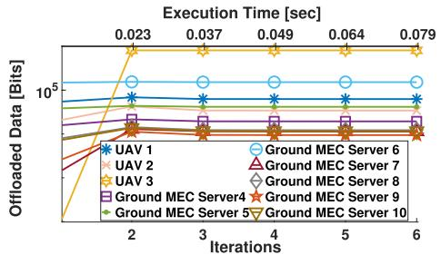

line

| Iterations | UAV 1     | UAV 2     | UAV 3     | Ground MEC Server 4 | Ground MEC Server 5 | Ground MEC Server 6 | Ground MEC Server 7 | Ground MEC Server 8 | Ground MEC Server 9 | Ground MEC Server 10 |
| ---------- | --------- | --------- | --------- | ------------------- | ------------------- | ------------------- | ------------------- | ------------------- | ------------------- | -------------------- |
| 2          | ~10^5     | ~10^5     | ~10^5     | ~10^5               | ~10^5               | ~10^5               | ~10^5               | ~10^5               | ~10^5               | ~10^5                |
| 3          | ~10^5     | ~10^5     | ~10^5     | ~10^5               | ~10^5               | ~10^5               | ~10^5               | ~10^5               | ~10^5               | ~10^5                |
| 4          | ~10^5     | ~10^5     | ~10^5     | ~10^5               | ~10^5               | ~10^5               | ~10^5               | ~10^5               | ~10^5               | ~10^5                |
| 5          | ~10^5     | ~10^5     | ~10^5     | ~10^5               | ~10^5               | ~10^5               | ~10^5               | ~10^5               | ~10^5               | ~10^5                |
| 6          | ~10^5     | ~10^5     | ~10^5     | ~10^5               | ~10^5               | ~10^5               | ~10^5               | ~10^5               | ~10^5               | ~10^5                |

Fig. 2. Convergence of an indicative user’s offloaded data to the ground and UAV-mounted MEC servers.

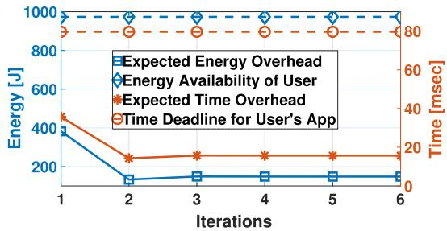

line

| Iterations | Expected Energy Overhead [J] | Energy Availability of User [J] | Expected Time Overhead [msec] | Time Deadline for User's App [msec] |
| ---------- | ----------------------------- | -------------------------------- | ------------------------------ | ------------------------------------ |
| 1          | 400                           | 1000                             | 30                             | 80                                   |
| 2          | 100                           | 1000                             | 20                             | 80                                   |
| 3          | 150                           | 1000                             | 20                             | 80                                   |
| 4          | 150                           | 1000                             | 20                             | 80                                   |
| 5          | 150                           | 1000                             | 20                             | 80                                   |
| 6          | 150                           | 1000                             | 20                             | 80                                   |

Fig. 3. Convergence of an indicative user’s energy and time overhead by offloading data to all the MEC servers.

# 6.1 Pure Operation of the Algorithm

In the following, we present the operational characteristics and performance of the proposed user-centric prospect-theoretic data offloading approach in a UAV-assisted network consisting of 3 UAV-mounted MEC servers and 7 ground MEC servers. Fig. 2 illustrates the evolution of a representative user’s data offloading $b _ { i , s }$ at each MEC server (either ground or UAV-mounted), as a function of the DCP algorithm’s iterations required for convergence to the PNE. It is clearly shown that the convergence is achieved in a few iterations (i.e., less than 4), starting from any feasible initial random value, while the corresponding average time that the user needs to determine its optimal offloading strategy till convergence is achieved, is relatively low as well, as demonstrated on the upper horizontal axis of Fig. 2 (for practical purposes less than 0.05 sec). Similarly, Fig. 3, presents the corresponding experienced energy and time overhead of a representative user, where we observe that the corresponding values at the PNE satisfy the user’s computation task’s latency and energy requirements. Fig. 4 presents the average satisfaction utility and corresponding expected overhead of all the users by offloading data to all the MEC servers. The results illustrate that after the convergence to the optimal data offloading point, the users experience high levels of satisfaction and low levels of expected overhead.

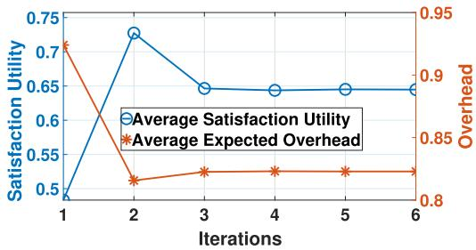

line

| Iterations | Average Satisfaction Utility | Average Expected Overhead |
| ---------- | ---------------------------- | -------------------------- |
| 1          | 0.5                          | 0.95                       |
| 2          | 0.73                         | 0.82                       |
| 3          | 0.65                         | 0.83                       |
| 4          | 0.65                         | 0.83                       |
| 5          | 0.65                         | 0.83                       |
| 6          | 0.65                         | 0.83                       |

Fig. 4. Convergence of users’ average expected overhead and satisfaction utility by offloading data to all the MEC servers.

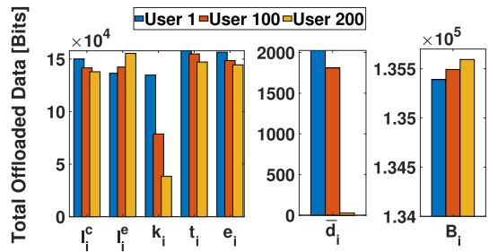

bar

| Category | User 1 (×10⁴ Bits) | User 100 (×10⁴ Bits) | User 200 (×10⁴ Bits) | User 1 (×10⁵ Bits) | User 100 (×10⁵ Bits) | User 200 (×10⁵ Bits) |
| :--- | :--- | :--- | :--- | :--- | :--- | :--- |
| i_c | 15 | 14.5 | 14 | 2000 | 1850 | 1355 |
| i_e | 14 | 13.5 | 16 | 1700 | 1800 | 1950 |
| k_i | 13.5 | 8.5 | 4 | 1350 | 1350 | 1350 |
| t_i | 16 | 16.5 | 15.5 | 1650 | 1650 | 1550 |
| e_i | 16.5 | 14.5 | 14.5 | 1650 | 1450 | 1450 |
| d̄_i | - | - | - | 1350 | 1350 | 1350 |
| B_i | - | - | - | 1700 | 1800 | 1950 |

Fig. 5. Three indicative users’ total offloaded data as a function of their personal parameters.

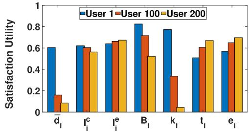

bar

|        | User 1 | User 100 | User 200 |
| ------ | ------ | -------- | -------- |
| d̄i     | 0.6    | 0.15     | 0.08     |
| īi     | 0.62   | 0.6      | 0.57     |
| īi     | 0.64   | 0.67     | 0.68     |
| B_i    | 0.83   | 0.72     | 0.52     |
| k_i    | 0.78   | 0.34     | 0.04     |
| t_i    | 0.51   | 0.6      | 0.67     |
| e_i    | 0.57   | 0.65     | 0.7      |

Fig. 6. Three indicative users’ satisfaction utility as a function of their personal parameters.

In Figs. 5 and $6 ,$ we present the total offloaded bits and the satisfaction utility respectively, of three representative users by examining the effect of seven different personal parameters, i.e., overall average distance from all the MEC servers $\bar { d } _ { i } ,$ , local computing capability $l _ { i } ^ { c }$ and energy consumption $l _ { i } ^ { e } ,$ , total amount of bits $B _ { i } ,$ , loss aversion parameter $k _ { i }$ and the latency $t _ { i }$ and energy $e _ { i }$ requirements. It is noted that every parameter’s value under examination is assigned in an ascending order to the users with ID ; ; and 200, while 1 100when we examine the impact of each one of these parameters, all other parameters’ values remain the same for all three users. The results reveal that the less distant is the user from the UAVs, the more data will offload to them, as less power is needed for its transmission resulting in lower energy overhead. For this reason, in Fig. 6 it is observed that the user with ID 200, who is the most distant from the MEC servers, experiences the lowest satisfaction utility, as it offloads the smallest amount of data and processes the majority of its data locally. Regarding the impact of the local computing capability user 1, who has the lowest $l _ { i } ^ { c } ,$ tends to offload the greatest amount of data compared to the other users, resulting to a greater satisfaction utility. The exact opposite impact is observed for the local energy consumption $\bar { l } _ { i } ^ { e }$ . With reference to the loss aversion parameter $k _ { i } ,$ , the greater its value is, the more loss-averse the users appear, thus user 200, who has the greatest $k _ { i }$ value, offloads the smallest amount of data and experiences a lower satisfaction utility. In addition, the more data $B _ { i }$ a user needs to process, the more data it will offload to the MEC servers and process locally, thus, it receives low satisfaction utility. Finally, if the user’s latency and energy requirements are relaxed, then the user will prefer to offload less data to the MEC servers, resulting to high levels of satisfaction utility, as the total local overhead is low and satisfies the users.

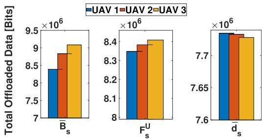

bar

| Metric | UAV 1 (×10⁶ Bits) | UAV 2 (×10⁶ Bits) | UAV 3 (×10⁶ Bits) |
| :--- | :--- | :--- | :--- |
| B_s | 8.4 | 8.9 | 9.1 |
| F_s^U | 8.9 | 8.4 | 8.4 |
| d_s | 7.75 | 7.73 | 7.72 |

Fig. 7. UAV-mounted MEC servers’ total received offloaded data by all the users as a function of the system’s parameters.

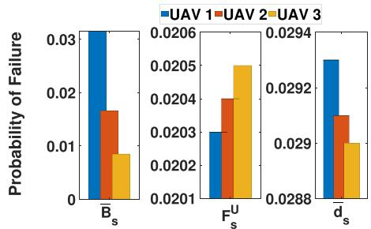

bar

| Category | UAV 1 | UAV 2 | UAV 3 |
|---|---|---|---|
| B_s | 0.031 | 0.017 | 0.009 |
| F_s^U | 0.0203 | 0.0204 | 0.0205 |
| d_s | 0.0296 | 0.0293 | 0.0289 |

Fig. 8. UAV-mounted MEC servers’ probability of failure as a function of the system’s parameters.

A study from the system’s perspective is also presented in Figs. 7, 8, and 9 considering the threshold data value ${ \bar { B } } _ { s } ,$ the UAV-mounted MEC server’s computation capability $F _ { s } ^ { U }$ , and the average distance $\bar { d } _ { s }$ of the UAV-mounted MEC server s from the users. It is noted that every examined parameter’s value is assigned in an ascending order to the UAV-mounted MEC servers with ID 1, 2, and 3, while when we examine the impact of each one of these parameters, all other parameters’ values remain the same for all three UAV-mounted MEC servers. In particular, it is observed that the greater the UAVmounted MEC servers’ computational capability $F _ { s } ^ { U }$ is, the more data it collects from the users (Fig. 7), as it appears as a more appealing choice, however its probability of failure increases (Fig. 8). Also, the greater is the UAV-mounted MEC server’s average distance $\bar { d } _ { s }$ from the users, the less data it collects, as the users must consume more energy to send their data. Moreover, for larger values of the UAV-mounted MEC server’s operational threshold ${ \bar { B } } _ { s } ,$ , the UAV appears more -robust in terms of the amount of data that it can process, thus, its probability of failure is lower (Fig. 8). Also, as expected the energy that each UAV-mounted MEC server consumes to process the users’ offloaded data increases with respect to the total amount of data (Fig. 9).

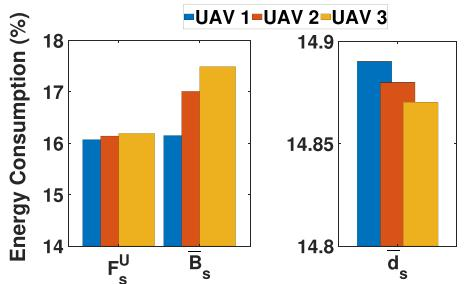

bar

| Metric | UAV 1 (%) | UAV 2 (%) | UAV 3 (%) |
| :--- | :--- | :--- | :--- |
| F_s^U | 16.0 | 16.1 | 16.2 |
| B_s^U | 16.1 | 17.0 | 17.5 |
| d_s^U | 14.9 | 14.85 | 14.82 |
The chart displays two side-by-side bar charts comparing energy consumption for each UAV category. The left chart shows the absolute values of F_s^U and B_s^U, while the right chart shows the corresponding d_s^U values. The legend indicates that blue represents UAV 1, orange represents UAV 2, and yellow represents UAV 3.

Fig. 9. UAV-mounted MEC servers’ energy consumption as a function of the system’s parameters.

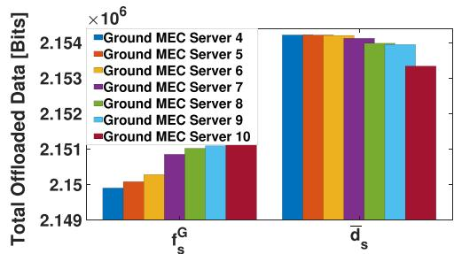

bar

| Metric | Ground MEC Server 4 | Ground MEC Server 5 | Ground MEC Server 6 | Ground MEC Server 7 | Ground MEC Server 8 | Ground MEC Server 9 | Ground MEC Server 10 |
| ------ | ------------------- | ------------------- | ------------------- | ------------------- | ------------------- | ------------------- | -------------------- |
| f_s^G  | 2.150               | 2.151               | 2.152               | 2.153               | 2.154               | 2.154               | 2.154                |
| d̄_s    | 2.154               | 2.154               | 2.154               | 2.154               | 2.154               | 2.154               | 2.153                |

Fig. 10. Ground MEC servers’ total received offloaded data as a function of their computation capability $F _ { s } ^ { U }$ and average distance $\bar { d } _ { s }$ from the users.

Finally, Fig. 10 presents the total offloaded bits that each ground MEC server received by studying the impact of its computational capability $f _ { s } ^ { G }$ and its average distance $\bar { d } _ { s }$ from the users (the values $f _ { s } ^ { G }$ and $\bar { d } _ { s }$ increase with respect to the ascending ID of the ground MEC server). A similar trend with the UAV-mounted MEC servers is observed, $\mathrm { i . e . , }$ , the greater $f _ { s } ^ { G }$ a ground MEC server has or the less distant is from the users, the more data it receives.

# 6.2 Heterogeneous Users - Loss Aversion

In this section, the impact of the users’ heterogeneous loss aversion behavior on their data offloading decisions and achieved satisfaction utility is evaluated. Specifically, a heterogeneous scenario, where the users are associated with different loss aversion parameters $k _ { i } ,$ , is compared against a homogeneous scenario, where all the users have the same exactly loss aversion parameter (equal to the average value of the corresponding $k _ { i }$ parameters in the heterogeneous scenario). It is reminded that the more loss averse is the user’s behavior, the greater is the loss aversion parameter $k _ { i }$ . Thus, those users offload less amount of data to the UAV-mounted MEC servers (Fig. 11), their satisfaction utility is lower and their expected overhead from the UAVmounted MEC servers is higher (Fig. 12). Regarding the risk seeking users, they tend to offload more data to the UAVmounted MEC servers resulting in high probability of failure (Fig. 11), thus making the overall system unstable and prone to failure.

Furthermore, in Fig. 11, it is observed that the heterogeneous population led to higher levels of UAV-mounted MEC servers’ congestion compared to the homogeneous population, as both the average amount of offloaded data to the UAV-mounted MEC servers and the corresponding average probability of failure of the latter ones increase. In Fig. 12, it is shown that the heterogeneous users, by offloading more data to the UAV-mounted MEC servers, they experience a greater satisfaction utility and a lower expected overhead.

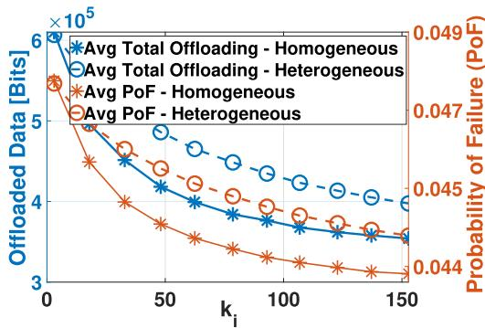

line

| ki   | Avg Total Offloading - Homogeneous (Offloaded Data [Bits] ×10⁵) | Avg Total Offloading - Heterogeneous (Offloaded Data [Bits] ×10⁵) | Avg PoF - Homogeneous (Probability of Failure (PoF)) | Avg PoF - Heterogeneous (Probability of Failure (PoF)) |
| ---- | ------------------------------------------------------------- | ------------------------------------------------------------------ | --------------------------------------------------- | ---------------------------------------------------- |
| 0    | 6.0                                                           | 6.0                                                                | 0.049                                               | 0.049                                                |
| 50   | 4.5                                                           | 4.8                                                                | 0.047                                               | 0.046                                                |
| 100  | 3.8                                                           | 4.2                                                                | 0.045                                               | 0.045                                                |
| 150  | 3.5                                                           | 3.8                                                                | 0.044                                               | 0.044                                                |

Fig. 11. Users’ average offloaded data and UAV-mounted MEC servers’ probability of failure as a function of their loss aversion parameter $k _ { i }$ .

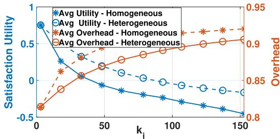

line

| ki   | Avg Utility - Homogeneous | Avg Utility - Heterogeneous | Avg Overhead - Homogeneous | Avg Overhead - Heterogeneous |
| ---- | -------------------------- | ---------------------------- | --------------------------- | ---------------------------- |
| 0    | 0.8                        | 0.8                          | 0.8                         | 0.8                          |
| 50   | 0.2                        | 0.2                          | 0.85                        | 0.85                         |
| 100  | -0.1                       | -0.1                         | 0.9                         | 0.9                          |
| 150  | -0.3                       | -0.3                         | 0.9                         | 0.9                          |

Fig. 12. Users’ average satisfaction utility and overhead as a function of their loss aversion parameter $k _ { i }$ .

# 6.3 Comparative Analysis

In this section, a detailed comparative evaluation of the proposed framework is performed against five other alternative data offloading strategies: (i) Non prospect-theoretic (Non-ProsTheor) - users minimize their expected overhead by the UAV-mounted MEC servers via determining their best response strategy b , (ii) Full Game-theoretic Offloading (FullGameOff) - each user offloads the whole amount of its data to one UAV-mounted MEC server through a formulation of a non-cooperative game in order to minimize its expected overhead, (iii) Single UAV-mounted MEC servers environment (SingleUAV) - characterized by the average capabilities of all the UAV-mounted MEC servers, (iv) Each user processes all its data locally (LocalExec), (v) Each user determines randomly its data offloading strategy (Random).

Figs. 13 and 14 illustrate the user’s average expected overhead and the UAV-mounted MEC servers’ average probability of failure, respectively, for each of the aforementioned approaches. It is evident that our proposed data offloading approach achieves the best results while the SingleUAV, LocalExec and Random demonstrate the worst performance. Specifically, in the LocalExec approach, the users experience the highest expected overhead, as they process their computation task locally. In the Random approach, the users offload partially their data to randomly selected MEC servers (UAV-mounted or ground MEC servers), thus, even if the users experience a lower expected overhead than the LocalExec approach, the probability of the UAV-mounted MEC servers’ failure remains high. Regarding the SingleUAV approach, the users offload their data to the single UAV-mounted MEC server and share its computational capabilities. Thus, they experience a higher expected overhead and a greater probability of failure (Figs. 13 and 14) compared to the non prospect-theoretic and the full game-theoretic data offloading approaches.

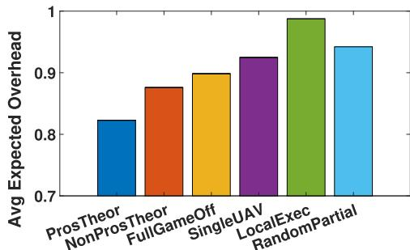

bar

| Method          | Avg Expected Overhead |
| --------------- | --------------------- |
| ProsTheor       | 0.82                  |
| NonProsTheor    | 0.88                  |
| FullGameOff     | 0.90                  |
| SingleUAV       | 0.93                  |
| LocalExec       | 0.99                  |
| RandomPartial   | 0.94                  |

Fig. 13. Users’ average expected overhead for different comparative scenarios.

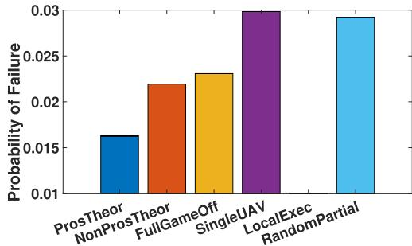

bar

| Method           | Probability of Failure |
| ---------------- | ---------------------- |
| ProsTheor        | 0.016                  |
| NonProsTheor     | 0.022                  |
| FullGameOff      | 0.023                  |
| SingleUAV        | 0.030                  |
| LocalExec        | 0.029                  |
| RandomPartial    | 0.029                  |

Fig. 14. UAVs’ probability of failure for different comparative scenarios.

The Non prospect-theoretic approach achieves the second best performance after our proposed framework, as the users partially offload their data to the UAV-mounted MEC servers and they aim to minimize their expected overhead. However, they do that in an agnostic manner with respect to the guaranteed performance that they could get if they execute their applications in the safe resources, i.e., in the ground MEC servers and in their mobile devices. On the contrary, our prospect-theoretic framework results in lower average probability of failure and average expected overhead, by taking these aspects into consideration during the decision-making process. Finally, in the Full Game-theoretic Offloading, the users select a UAV-mounted MEC server to offload their whole computation task, without taking advantage of the partial offloading to multiple UAVmounted MEC servers, thus concluding to a higher probability of failure compared to the Non prospect-theoretic approach.

# 6.4 Performance Analysis for Different User Topologies

In this section, we further examine the performance of the proposed framework for different and varying topological characteristics, and in particular with reference to the increasing number of users, as well as to their position distribution within the examined environment. Specifically, Fig. 15 shows the users’ average expected overhead and the corresponding actual execution time of the DCP algorithm as a function of the number of users in the examined system. The results reveal that for a five-fold increase in the number of users (i.e. from 200 to 1000 users), the corresponding average expected overhead that the users experience, increases by approximately 13 percent. This slight increase is owed to the fact that the ground and the UAV-mounted MEC servers are required to process more computation tasks (offloaded by the users), thus, they become more congested in terms of computation processing. Based on these results, we observe that the proposed framework achieves to serve the users in a satisfactory manner, even when considering a large scale computing environment. Moreover, it is noted that this is achieved while noticing approximately a five-fold increase in the corresponding execution time of the DCP algorithm, essentially demonstrating an almost linear increase of the execution time with respect to the number of users.

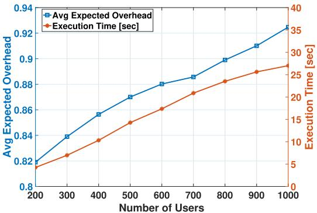

line

| Number of Users | Avg Expected Overhead | Execution Time [sec] |
| --------------- | --------------------- | -------------------- |
| 200             | 0.82                  | 5                    |
| 300             | 0.84                  | 7                    |
| 400             | 0.86                  | 10                   |
| 500             | 0.87                  | 15                   |
| 600             | 0.88                  | 20                   |
| 700             | 0.89                  | 25                   |
| 800             | 0.90                  | 28                   |
| 900             | 0.91                  | 30                   |
| 1000            | 0.93                  | 35                   |

Fig. 15. Avg. expected overhead and execution time with respect to increasing number of users.

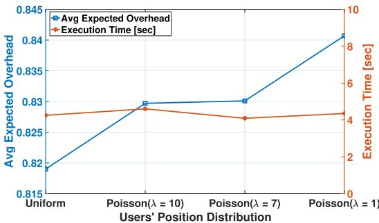

line

| Users' Position Distribution | Avg Expected Overhead | Execution Time [sec] |
| ---------------------------- | --------------------- | -------------------- |
| Uniform                      | 0.82                  | 4                    |
| Poisson(λ = 10)              | 0.83                  | 4                    |
| Poisson(λ = 7)               | 0.83                  | 4                    |
| Poisson(λ = 1)               | 0.84                  | 4                    |

Fig. 16. Avg. expected overhead and execution time with respect to the users’ position distribution.

Additionally, Fig. 16 illustrates the users’ average expected overhead and the execution time of the proposed framework, for different topological characteristics. We focus on investigating our proposed framework’s behavior with respect to different users’ position distributions within the two-dimensional grid, while still maintaining the aforementioned base experimental setting, i.e., $U = 2 0 0 , G =$ ¼ 200 ¼; F  . In particular, except from the users’ random and 7 ¼ 3uniform position distribution scenario, we also consider several Poisson distributions with different values of variance, i.e.,  parameter. The corresponding results reveal that the DCP algorithm execution presents a stable behavior and performance, as indicated by the fact that the execution time is rather insensitive to the users’ position distribution. Furthermore, it is observed that as the users are distributed more closely to each other, as reflected by lower values in the Poisson parameter , their average expected overhead increases. The latter phenomenon is due to the fact that the more closely among each other are the users distributed, they tend to have similar distances from the MEC servers, thus, making similar offloading decisions, and accordingly over-congesting the corresponding servers that are close to them. The opposite holds true for larger values of the Poisson parameter ,

# 6.5 Discussion and Guidelines

In this following, insights and guidelines regarding the operation and key features of the proposed framework are summarized, highlighting the user and system points of view.

1. (Users’ perspective) The proposed framework enables the users to satisfy their energy and latency requirements, maximize their satisfaction utility, and converge to a stable data offloading equilibrium within few iterations. It is demonstrated that the users’ physical and risk-aware characteristics have a significant impact on their data offloading decisions. Specifically, the users tend to offload more data to the UAV-mounted MEC servers, if they (i) are less distant from them; (ii) have stricter energy and latency requirements; (iii) present more risk seeking behavior; and (iv) have low local computing capability. The more data the users offload to the UAVmounted MEC servers, the greater is their satisfaction utility, except for the cases of (i) having relaxed latency and energy requirements, where the local processing is more beneficial, and (ii) having a large amount of data to process, where inevitably a large portion of them will be processed locally resulting in low satisfaction utility.   
2. (System’s perspective) The UAV-mounted and ground MEC servers receive more data, if they have high computation capability and small average distance from the users. Also, increased amount of data is received by the UAV-mounted MEC servers if their operational threshold (i.e., amount of data that they can concurrently process) is high, in which case they present high robustness to failure. The more data the UAV-mounted MEC servers receive, the higher is their probability of failure and the energy consumption to process them.   
3. The more loss averse the users are, the more data they process locally, the less satisfaction utility they perceive, the more overall overhead they experience, and the less they contribute to the UAV-mounted MEC servers’ failure, as they exhibit a conservative data offloading behavior.   
4. The users’ heterogeneity in their loss averse behavior increases the UAV-mounted MEC servers’ probability of failure.   
5. The combined consideration of the (i) users’ physical and risk-aware characteristics, (ii) UAV-mounted and ground MEC servers characteristics, (iii) users’ distributed and autonomous decision-making, and (iv) users’ ability to partially offload their data to multiple MEC servers (while process part of them locally on their devices), concludes to superior data offloading strategies, users’ satisfaction, and sophisticated system’s resources exploitation, compared to other alternative approaches.

# 7 CONCLUSION

In this paper, a novel approach towards determining the user optimal data offloading strategy within a complex MEC environment consisting of both ground MEC servers and UAV-mounted MEC servers is introduced. Given the inherent computing uncertainty introduced, the UAVmounted MEC servers are treated as CPRs, and the users act as prospect theoretic decision-makers, aiming to maximize their perceived prospect theoretic utility, while at the same time minimize the time and energy overhead by the ground MEC servers and the local execution. Accordingly, the risk-aware data offloading problem is formulated as a non-cooperative game among the users and the existence and uniqueness of the corresponding Pure Nash Equilibrium point (PNE) is proven. A low complexity distributed algorithm converging to the PNE is introduced, while detailed numerical results that demonstrate our framework’s operation and superiority are presented.

Our current and future work focuses on studying the task offloading computation problem under a variety of probability of failure functions, e.g., Poisson process of the arrival data from all users, that also capture the uncertainty stemming from the rapidly changing communication environment in a metropolitan area. Moreover, we are interested in investigating the combination of the aforementioned framework with the optimal placement of the UAVmounted and ground MEC servers, by considering several factors and aspects, such as coverage area, overall energy availability of the UAV-mounted MEC servers, computation capabilities, UAVs mobility, etc.

# ACKNOWLEDGMENTS

The research of Dr. Tsiropoulou and Mr. Fragkos was conducted as part of the NSF CRII-1849739. The research of Dr. Papavassiliou was supported by the Hellenic Foundation for Research and Innovation (H.F.R.I.) under the “1st Call for H.F.R.I. Research Projects to support Faculty members and Researchers and the procurement of high-cost research equipment grant” Project Number: HFRI-FM17-2436.

# REFERENCES

[1] M. Mozaffari, W. Saad, M. Bennis, Y.-H. Nam, and M. Debbah, “A tutorial on UAVs for wireless networks: Applications, challenges, and open problems,” IEEE Commun. Surv. Tuts., vol. 21, no. 3, pp. 2334–2360, Third Quarter 2019.   
[2] S. Jeong, O. Simeone, and J. Kang, “Mobile edge computing via a UAV-mounted cloudlet: Optimization of bit allocation and path planning,” IEEE Trans. Veh. Technol., vol. 67, no. 3, pp. 2049–2063, Mar.2018.   
[3] ETSI, Multi-access Edge Computing (MEC); Phase 2: Use Cases and Requirements. RGS/MEC-0002v211TechReq, ETSI, 2018.   
[4] D. He, Y. Qiao, S. Chan, and N. Guizani, “Flight security and safety of drones in airborne fog computing systems,” IEEE Commun. Mag., vol. 56, no. 5, pp. 66–71, May 2018.   
[5] F. Luo, C. Jiang, S. Yu, J. Wang, Y. Li, and Y. Ren, “Stability of cloud-based UAV systems supporting big data acquisition and processing,” IEEE Trans. Cloud Comput., vol. 7, no. 3, pp. 866–877, Third Quarter 2019.   
[6] N. Cheng et al., “Air-ground integrated mobile edge networks: Architecture, challenges, and opportunities,” IEEE Commun. Mag., vol. 56, no. 8, pp. 26–32, Aug. 2018.   
[7] R. Valentino, W.-S. Jung, and Y.-B. Ko, “Opportunistic computational offloading system for clusters of drones,” in Proc. 20th Int. Conf. Advanced Commun. Technol., 2018, pp. 303–306.

[8] Z. Yu, Y. Gong, S. Gong, and Y. Guo, “Joint task offloading and resource allocation in UAV-enabled mobile edge computing,” IEEE Internet of Things J., vol. 7, no. 4, pp. 3147–3159, Apr. 2020.   
[9] R. Wang, Y. Cao, A. Noor, T. A. Alamoudi, and R. Nour, “Agentenabled task offloading in UAV-aided mobile edge computing,” Comput. Commun., vol. 149, pp. 324–331, 2020.   
[10] J. Xiong, H. Guo, and J. Liu, “Task offloading in UAV-aided edge computing: Bit allocation and trajectory optimization,” IEEE Commun. Lett., vol. 23, no. 3, pp. 538–541, Mar. 2019.   
[11] S. Jeong, O. Simeone, and J. Kang, “Mobile cloud computing with an UAV-mounted cloudlet: Optimal bit allocation for communication and computation,” IET Commun., vol. 11, pp. 969–974, 2016.   
[12] G. Wu, Y. Miao, Y. Zhang, and A. Barnawi, “Energy efficient for UAV-enabled mobile edge computing networks: Intelligent task prediction and offloading,” Comput. Commun., vol. 150, pp. 556–562, 2020.   
[13] M. Li, N. Cheng, J. Gao, Y. Wang, L. Zhao, and X. Shen, “Energyefficient UAV-assisted mobile edge computing: Resource allocation and trajectory optimization,” IEEE Trans. Veh. Technol., vol. 69, no. 3, pp. 3424–3438, Mar. 2020.   
[14] F. Zhou, Y. Wu, H. Sun, and Z. Chu, “UAV-enabled mobile edge computing: Offloading optimization and trajectory design,” in Proc. IEEE Int. Conf. Commun., 2018, pp. 1–6.   
[15] F. Zhou, Y. Wu, R. Q. Hu, and Y. Qian, “Computation rate maximization in UAV-enabled wireless-powered mobile-edge computing systems,” IEEE J. Sel. Areas Commun., vol. 36, no. 9, pp. 1927–1941, Sep. 2018.   
[16] P. Vamvakas, E. E. Tsiropoulou, and S. Papavassiliou, “Dynamic spectrum management in 5G wireless networks: A real-life modeling approach,” in Proc. IEEE Conf. Comput. Commun., 2019, pp. 2134–2142.   
[17] P. Vamvakas, E. E. Tsiropoulou, and S. Papavassiliou, “On the prospect of UAV-assisted communications paradigm in public safety networks,” in Proc. IEEE Conf. Comput. Commun. Workshops, 2019, pp. 1–6.   
[18] D. Kahneman and A. Tversky, “Prospect theory: An analysis of decision under risk,” in Handbook of the Fundamentals of Financial Decision Making: Part I. Singapore: World Scientific, 2013, pp. 99–127.   
[19] M. Lewandowski, “Prospect theory versus expected utility theory: Assumptions, predictions, intuition and modelling of risk attitudes,” Central Eur. J. Econ. Modell. Econometrics, vol. 9, pp. 275–321, 2017.   
[20] M. Kwon, E. Biyik, A. Talati, K. Bhasin, D. P. Losey, and D. Sadigh, “When humans aren’t optimal: Robots that collaborate with risk-aware humans,” in Proc. ACM/IEEE Int. Conf. Hum.- Robot Interaction, 2020, pp. 43–52.   
[21] C. Zhang, Y.-X. Tian, L.-W. Fan, and Y.-H. Li, “Customized ranking for products through online reviews: A method incorporating prospect theory with an improved vikor,” Appl. Intell., vol. 50, pp. 1725–1744, 2020.   
[22] L. Tang and S. He, “Multi-user computation offloading in mobile edge computing: A behavioral perspective,” IEEE Netw., vol. 32, no. 1, pp. 48–53, Jan./Feb. 2018.   
[23] P. A. Apostolopoulos, E. E. Tsiropoulou, and S. Papavassiliou, “Cognitive data offloading in mobile edge computing for internet of things,” IEEE Access, vol. 4, pp. 55 736–55 749, 2020.   
[24] P. Vamvakas, E. E. Tsiropoulou, and S. Papavassiliou, “On controlling spectrum fragility via resource pricing in 5G wireless networks,” IEEE Netw. Lett., vol. 1, no. 3, pp. 111–115, Sep. 2019.   
[25] L. Xiao, J. Liu, Y. Li, N. B. Mandayam, and H. V. Poor, “Prospect theoretic analysis of anti-jamming communications in cognitive radio networks,” in Proc. IEEE Global Commun. Conf., 2014, pp. 746–751.   
[26] P. Vamvakas, E. E. Tsiropoulou, and S. Papavassiliou, “Exploiting prospect theory and risk-awareness to protect UAV-assisted network operation,” EURASIP J. Wireless Commun. Netw., vol. 2019, no. 1, 2019, Art. no. 286.   
[27] A. Thanou, E. E. Tsiropoulou, and S. Papavassiliou, “Quality of experience under a prospect theoretic perspective: A cultural heritage space use case,” IEEE Trans. Comput. Soc. Syst., vol. 6, no. 1, pp. 135–148, Feb. 2019.   
[28] F. Zhou, R. Q. Hu, Z. Li, and Y. Wang, “Mobile edge computing in unmanned aerial vehicle networks,” IEEE Wireless Commun., vol. 27, no. 1, pp. 140–146, Feb. 2020.   
[29] G. Hardin, “Extensions of the tragedy of the commons,” Science, vol. 280, no. 5364, pp. 682–683, 1998.

[30] J. Wang, D. Feng, S. Zhang, J. Tang, and T. Q. Quek, “Computation offloading for mobile edge computing enabled vehicular networks,” IEEE Access, vol. 7, pp. 62 624–62 632, 2019.   
[31] Y. Jin and H. Lee, “On-demand computation offloading architecture in fog networks,” Electronics, vol. 8, no. 10, 2019, Art. no. 1076.   
[32] F. Guo, H. Zhang, H. Ji, X. Li, and V. C. Leung, “An efficient computation offloading management scheme in the densely deployed small cell networks with mobile edge computing,” IEEE/ACM Trans. Netw., vol. 26, no. 6, pp. 2651–2664, Dec. 2018.   
[33] X. Diao, J. Zheng, Y. Wu, and Y. Cai, “Joint computing resource, power, and channel allocations for D2D-assisted and noma-based mobile edge computing,” IEEE Access, vol. 7, pp. 9243–9257, 2019.   
[34] X. Chen, L. Jiao, W. Li, and X. Fu, “Efficient multi-user computation offloading for mobile-edge cloud computing,” IEEE/ACM Trans. Netw., vol. 24, no. 5, pp. 2795–2808, Oct. 2016.   
[35] X. Chen, “Decentralized computation offloading game for mobile cloud computing,” IEEE Trans. Parallel Distrib. Syst., vol. 26, no. 4, pp. 974–983, Apr. 2015.   
[36] P. Barham et al., “Xen and the art of virtualization,” ACM SIGOPS Operating Syst. Rev., vol. 37, no. 5, pp. 164–177, 2003.   
[37] Y. Mao, C. You, J. Zhang, K. Huang, and K. B. Letaief, “Mobile edge computing: Survey and research outlook,” 2017, arXiv: 1701.01090.   
[38] A. Tversky and D. Kahneman, “Advances in prospect theory: Cumulative representation of uncertainty,” J. Risk Uncertainty, vol. 5, no. 4, pp. 297–323, 1992.   
[39] P. P. Wakker and J. Yang, “A powerful tool for analyzing concave/convex utility and weighting functions,” J. Econ. Theory, vol. 181, pp. 143–159, 2019.   
[40] C. H. Papadimitriou, “The complexity of finding nash equilibria,” Algorithmic Game Theory, vol. 2, 2007, Art. no. 30.   
[41] P. Dubey, O. Haimanko, and A. Zapechelnyuk, “Strategic complements and substitutes, and potential games,” Games Econ. Behav., vol. 54, no. 1, pp. 77–94, 2006.   
[42] S. Boyd and L. Vandenberghe, Convex Optimization. Cambridge, U.K.: Cambridge Univ. Press, 2004.   
[43] J. B. Rosen, “Existence and uniqueness of equilibrium points for concave n-person games,” Econometrica J. Econometric Soc., pp. 520–534, 1965.   
[44] C. Kao, “Performance of several nonlinear programming software packages on microcomputers,” Comput. Oper. Res., vol. 25, no. 10, pp. 807–816, 1998.   
[45] P. T. Boggs and J. W. Tolle, “Sequential quadratic programming,” Acta Numerica, vol. 4, pp. 1–51, 1995.   
[46] A. Grace, Optimization Toolbox: for Use with MATLAB: User’s Guide, November 1990. Natick, MA, USA: MathWorks Incorporated, 1990.   
[47] X. Hu, K. Wong, K. Yang, and Z. Zheng, “UAV-assisted relaying and edge computing: Scheduling and trajectory optimization,” IEEE Trans. Wireless Commun., vol. 18, no. 10, pp. 4738–4752, Oct. 2019.   
[48] M. Li, N. Cheng, J. Gao, Y. Wang, L. Zhao, and X. Shen, “Energyefficient UAV-assisted mobile edge computing: Resource allocation and trajectory optimization,” IEEE Trans. Veh. Technol., vol. 69, no. 3, pp. 3424–3438, Mar. 2020.   
[49] A. A. Khuwaja, Y. Chen, N. Zhao, M.-S. Alouini, and P. Dobbins, “A survey of channel modeling for UAV communications,” IEEE Commun. Surveys Tuts., vol. 20, no. 4, pp. 2804–2821, Fourth Quarter 2018.   
[50] M.-H. Chen, B. Liang, and M. Dong, “Joint offloading and resource allocation for computation and communication in mobile cloud with computing access point,” in Proc. IEEE Int. Conf. Acoust. Speech Signal Process., 2017, pp. 1–9.   
[51] A. P. Miettinen and J. K. Nurminen, “ Energy efficiency of mobile clients in cloud computing,” in Proc. 2nd USENIX Conf. Hot Topics Cloud Comput., 2010, Art. no. 19.   
[52] K. Sydsaeter, Mathematics for Economic Analysis. London, U.K.: Pearson, 2013.

text_image

1). Pgi
2) (1)
3) 1
4) -26a 1c
5) Poi
6) (Poi)

Pavlos Athanasios Apostolopoulos received the diploma degree in electrical and computer engineering from the National Technical University of Athens, in 2017. He is currently working toward the PhD degree and research assistant with the Department of Electrical and Computer Engineering, University of New Mexico. His main research interests include machine learning, deep learning, game theory, behavioral decision theory, and optimization.

natural_image

Portrait of a man with short dark hair and beard, wearing a textured sweater (no text or symbols visible)

Georgios Fragkos received the diploma degree in electrical and computer engineering from the National Technical University of Athens, in 2018. He is currently working toward the PhD degree and research assistant with the Department of Electrical and Computer Engineering, University of New Mexico. His main research interests include deep reinforcement learning, game theory, optimization, contract theory, and blockchain.

natural_image

Portrait of a smiling woman with curly hair, wearing a dark blazer (no text or symbols visible)

Eirini Eleni Tsiropoulou is currently an assistant professor with the Department of Electrical and Computer Engineering, University of New Mexico. Her main research interests include the area of cyber-physical social systems and wireless heterogeneous networks, with emphasis on network modeling and optimization, resource orchestration in interdependent systems, reinforcement learning, game theory, network economics, and Internet of Things. Five of her papers received the Best Paper Award at IEEE

WCNC in 2012, ADHOCNETS in 2015, IEEE IFIP WMNC 2019, INFO-COM 2019 by the IEEE Communications Systems Integration and Modeling Technical Committee, and IEEE/ACM BRAINS 2020. She was selected by the IEEE Communication Society - N2Women - as one of the top ten Rising Stars of 2017 in the communications and networking field. She has received the Early Career Award by the IEEE ComSoc Internet Technical Committee 2019.

natural_image

Portrait of a man wearing glasses and a suit (no text or symbols visible)

Symeon Papavassiliou is currently a professor with the School of Electrical and Computer Engineering, National Technical University of Athens. From 1995 to 1999, he was a senior technical staff member with AT&T Laboratories, New Jersey. In August 1999 he joined the Electrical and Computer Engineering Department, New Jersey Institute of Technology, where he was an associate professor until 2004. He has an established record of publications in his field of expertise, with more than 300 technical journal and confer-

ence published papers. His main research interests include the area of computer communication networks, with emphasis on the analysis, optimization, and performance evaluation of mobile and distributed systems, wireless networks, and complex systems. He received the Best Paper Award in IEEE INFOCOM 94, the AT&T Division Recognition and Achievement Award in 1997, the US National Science Foundation Career Award in 2003, the Best Paper Award in IEEE WCNC 2012, the Excellence in Research Grant in Greece in 2012 and the best paper awards in ADHOCNETS 2015, ICT 2016 and IFIP WMNC 2019. He also served on the board of the Greek National Regulatory Authority on Telecommunications and Posts from 2006 to 2009.

" For more information on this or any other computing topic, please visit our Digital Library at www.computer.org/csdl.