# Decentralized Learning for Multi-UAV Rail-Line Inspection With Imperfect Information: A Fictitious Self-Play Approach

Yin Jia , Li Zhu , Senior Member, IEEE, F. Richard Yu , Fellow, IEEE, Bo Ai , Fellow, IEEE, and Tao Tang , Senior Member, IEEE

Abstract—Rail-line inspection is essential for the stable operation of rail transit systems. Uncrewed Aerial Vehicle (UAV) swarms are increasingly deployed for large-scale rail-line inspection, where eficient coordination and intelligent resource management are critical. However, most existing methods unrealistically assume complete global information and centralized control, which fails to hold in practical rail transit inspection scenarios where imperfect information arises from limited communication bandwidth and private UAV states. To address this challenge, we model the cooperative rail-line inspection problem as a stochastic game with imperfect information and propose a decentralized learning framework, termed Uncrewed Aerial Vehicle Fictitious Self-Play (U-FSP). Each UAV models its decision process as a belief-augmented Markov Decision Process (MDP) and iteratively learns equilibrium strategies through alternating best-response learning and policy averaging. We theoretically prove that the formulated rail-line inspection game constitutes an exact potential game, guaranteeing convergence of U-FSP to the Nash equilibrium. Simulation results in rail-line inspection environments demonstrate that U-FSP significantly reduces UAV energy consumption and task completion delay, mitigates resource congestion while maximizing overall rewards under imperfect information. Furthermore, analytical experiments show that U-FSP drives the rail-line inspection system toward a Nash equilibrium.

Index Terms—Multi-UAV rail-line inspection, imperfect information, fictitious self-play, task ofloading, resource allocation.

## I. INTRODUCTION

AIL line inspection, as a crucial component of rail transit inspection [1], [2], is essential for ensuring the safety and reliability of rail transit systems. With their low cost and easy deployment, UAVs have become a preferred solution for such inspection tasks [3], [4]. In long-route rail line inspection tasks, traditional single-UAV operations [5], [6] are insuficient to meet complex monitoring and rapid response demands; consequently, cooperative multi-UAV inspection [7], [8], [9] has become the mainstream approach, where UAVs must jointly perform task ofloading and resource allocation across onboard, cooperative, and wayside edge nodes to balance computation eficiency, energy consumption, and real-time responsiveness under intermittent connectivity. However, the dynamic, corridor-shaped nature of rail-line environments and limited communication coverage make stable coordination among UAVs highly challenging.

Thus, some scheduling and task ofloading methods [10], [11], [12], [13], [14] have been proposed and have achieved promising results. For example, Guo et al. [10] proposed the multi-UAV cooperative communication and computation optimization scheme to minimize processing delay in an software-defined networking (SDN)-enhanced multi-UAV system, using partial ofloading and game-theoretic scheduling. Kuang et al. [12] developed a block coordinate descent (BCD)- based algorithm to jointly optimize task ofloading, UAV positioning, and resource allocation, aiming to reduce overall energy consumption. However, these methods predominantly rely on the overly idealized assumption of complete global information, where each UAV is assumed to have full visibility into the states and actions of all others under centralized control.

Although this assumption simplifies modeling and algorithmic analysis, it fundamentally contradicts the realities of rail-line inspection deployments. In practical cooperative rail-line inspection tasks, each UAV independently maintains key state variables such as battery level, computational load, and task progress, which are inherently local, and it cannot directly access the corresponding information of other UAVs. Moreover, due to limited communication bandwidth and the short operating window [15], [16], information delays often occur, making it impractical to maintain global information consistency in long-route rail-line inspection scenarios, as illustrated in Fig. 1. Overlooking this intrinsic characteristic of imperfect information often results in suboptimal or even conflicting behaviors. For example, multiple UAVs may simultaneously ofload tasks to the same wayside edge node that is nearly at full capacity, leading to severe congestion. Consequently, UAVs with more urgent workloads are forced to process tasks locally, resulting in excessive delays and higher energy consumption. Such coordination failures degrade mission eficiency and threaten the robustness of railline inspection operations. Although some studies [17], [18], [19] have considered the imperfect information characteristics of UAV systems, they have not addressed the challenges of task ofloading and resource allocation under such conditions, and thus cannot be efectively applied to rail-line inspection tasks.

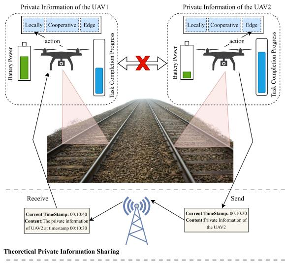  
Fig. 1. Private information between two UAVs (e.g., remaining battery, task progress, and actions) is not shared during railway inspection. Although transmittable in theory, communication delays make the received information outdated and useless for subsequent decisions.

To address these strategic deficiencies arising from informational asymmetry, a new modeling paradigm is required, one that explicitly captures the interactions among UAVs operating under imperfect information in rail-line inspection. Although multi-agent reinforcement learning (MARL) methods [20] such as the Multi-Agent Deep Deterministic Policy Gradient (MADDPG) [21] have demonstrated efectiveness in cooperative control, they typically rely on centralized training with access to global state information, which is incompatible with the imperfect-information nature of inspection tasks. Furthermore, MARL optimizes cumulative rewards to learn policies but fails to capture the strategic dependencies among UAVs.

Fortunately, game theory provides a natural and rigorous foundation to model the strategic interdependence among agents and to incorporate utility-based formulations (as opposed to cumulative-reward optimization) that penalize undesirable behaviors such as excessive energy consumption. While this framework provides a solid theoretical basis for decentralized decision-making, some classical solution concepts [22] typically assume full state observability, which

UAVs lack in practice. Therefore, customized game-theoretic approaches for imperfect information are required to enable UAVs to learn efective strategies through repeated interactions while balancing task eficiency and energy consumption.

Recent advances in decentralized game-theoretic learning have provided new insights into handling imperfectinformation challenges. In [23], the interaction among Electric Vehicles (EVs) in a vehicle-to-grid system is formulated as an imperfect-information game, where a Fictitious Self-Play (FSP) algorithm [24] is proposed to learn decentralized1 equilibrium strategies. By iteratively combining best-response learning and policy averaging, FSP achieves stable and convergent equilibrium learning even under partial observability. This line of research demonstrates the feasibility of decentralized equilibrium learning when agents operate with limited or partial information.

Inspired by these insights, we formally model the multi-UAV rail-line inspection problem as a stochastic game under imperfect information. Each UAV is treated as a strategic agent that, based on local observations (e.g.,energy, task load), selects among local processing, cooperative ofloading, or edge ofloading to maximize long-term cumulative utility while accounting for others’ actions. To address the challenges in equilibrium computation under imperfect information, we decompose the multi-agent game into individual decision problems by modeling each UAV’s behavior as an MDP augmented with a belief distribution over others’ behaviors and local observations. Following the FSP principle of alternating best-response updates and policy averaging, we propose a decentralized framework, U-FSP, tailored for rail-line UAV inspection systems. It adopts a two-stage learning strategy: (i) best-response learning, where each UAV uses Q-learning against its current belief to optimize expected return; and (ii) averaged-strategy learning, where actions are guided by empirical frequencies to improve stability and eficiency. The gradual shift from exploration to exploitation enables UAVs to learn robust equilibrium policies under imperfect information.

In summary, the main contributions of this paper are as follows.

To the best of our knowledge, we are the first to explicitly identify and model the intrinsic imperfect-information nature of cooperative UAV rail-line inspection, formulating it as a stochastic potential game. This formulation bridges the gap between real-world imperfect-information conditions and game-theoretic decision modeling.

• To solve the game formulated for multi-UAV railline inspection, we propose a decentralized belief-based framework, U-FSP, which enables each UAV to learn stable equilibrium strategies using only local observations and aggregated beliefs, with theoretical guarantees of convergence to a Nash equilibrium.

• Extensive simulations conducted in rail-line inspection scenarios validate the efectiveness of U-FSP. The comparison with benchmarks demonstrates that it efectively reduces energy consumption and delay, alleviates resource congestion, and converges to a Nash equilibrium.

The remainder of this paper is organized as follows: Section II reviews the related work. Section III formulates the multi-UAV rail-line inspection problem as a game under imperfect information. Section IV presents the proposed solution to the imperfect-information game formulated in Section III, including the proof of the exact potential game property and the detailed procedure of the U-FSP. Section V provides simulation experiments to validate the efectiveness of the U-FSP. Finally, Section VII concludes the paper.

## II. RELATED WORK

## A. Cooperative Task Ofloading and Resource Allocation for Multi-UAV Systems

Significant research has been dedicated to optimizing the operational eficiency of multi-UAV systems through cooperative task ofloading and resource allocation. These eforts primarily focus on developing sophisticated algorithms to solve complex, high-dimensional optimization problems. A prominent approach involves MARL to handle dynamic environments. For instance, Ju et al. [20] utilized the MADDPG algorithm to jointly optimize task ofloading and UAV pathing, while Zakaryia et al. [25] proposed a collaborative optimization framework integrating a Distance to Task Location and Capability Match mechanism with an MADDPG algorithm to jointly optimize UAV trajectories and resource management.

Beyond reinforcement learning, other optimization paradigms have been explored. Kuang et al. [26] presented a two-layer optimization method to maximize the number of ofloaded tasks by using a diferential evolution algorithm for UAV deployment and convex optimization for resource allocation. In the context of vehicular networks, Zhao et al. [27] constructed a task ofloading and resource allocation model for a UAV-assisted vehicle platoon system, leveraging Lyapunov optimization theory and a hybrid algorithm based on BCD and Deep Deterministic Policy Gradient to minimize system energy consumption. More recent studies have further extended this line of research. Liu et al. [28] investigated semantic task ofloading and resource allocation in UAV-assisted mobile edge computing for disaster rescue, highlighting the importance of task semantics in improving ofloading eficiency under emergency conditions. Liu et al. [29] studied service-capacity maximization in multi-UAV MEC systems by jointly considering UAV deployment, task ofloading, and resource allocation, further demonstrating the importance of integrated optimization across communication, computation, and spatial deployment dimensions.

Despite their success, these methods typically assume fully cooperative settings with centralized access to global information, which is unrealistic in rail-line inspection environments. This gap highlights the need for a new paradigm that supports strategic decision-making under local and private information constraints.

## B. Game-Theoretic Learning for UAV Systems Under Imperfect Information

In real-world intelligent transportation and autonomous inspection systems, the assumption of complete and perfectly reliable observations is often dificult to satisfy. Recent studies in the railway domain [30], [31] report significant performance degradation caused by missing or corrupted information. These findings reveal an important characteristic of cyber-physical systems: decision making often has to be conducted under imperfect information. To address the strategic challenges arising from informational asymmetry, game theory provides a rigorous mathematical framework for modeling interactions among rational, self-interested agents. When combined with machine learning, it becomes particularly potent for solving dynamic games where information is incomplete. FSP and other game-theoretic models have also emerged as the robust learning frameworks for finding approximate Nash equilibria in such environments. For instance, Li et al. [32] utilized Neural Fictitious Self-Play (NFSP) to find equilibrium strategies in an extensive-form game modeling the dynamic, multi-round interaction between a radar and a jammer. Game theory has also been applied to resource allocation and security incentive design. Chen et al. [33] modeled the interactions in a UAV-assisted MEC system by transforming the user allocation problem into a multi-user non-cooperative game and modeling the resource pricing and ofloading engagement as a Stackelberg game. Nabi and Moh [34] proposed a hierarchical aerial computing framework integrating UAVs and a highaltitude platform, where a matching-game algorithm manages user association and an enhanced soft actor-critic optimizes partial ofloading and resource allocation.

Beyond equilibrium seeking, game theory also provides tools for modeling sophisticated strategic behaviors. For example, McEnenaey and Singh [35] modeled purposeful deception in a stochastic game with extreme information asymmetry, demonstrating how such an imbalance can be leveraged for strategic advantage.

These studies highlight the efectiveness of game-theoretic learning for strategic decision-making under imperfect information. However, its application to cooperative task ofloading in multi-UAV rail-line inspection remains underexplored. To bridge this gap, we propose a decentralized learning framework that addresses the unique challenges of multi-UAV rail-line inspection without relying on complete global information.

## III. IMPERFECT-INFORMATION GAME FORMULATION FOR MULTI-UAV RAIL-LINE INSPECTION

We model the competitive and cooperative interactions among multiple UAVs engaged in rail-line inspection tasks as a non-cooperative game. Each UAV aims to optimize its own performance under limited resource constraints by strategically selecting its task processing mode, while considering the impact of other UAVs’ decisions on the shared environment. The non-cooperative game scenario among multiple UAVs in a typical long-route rail-line inspection process is illustrated in Fig. 2.

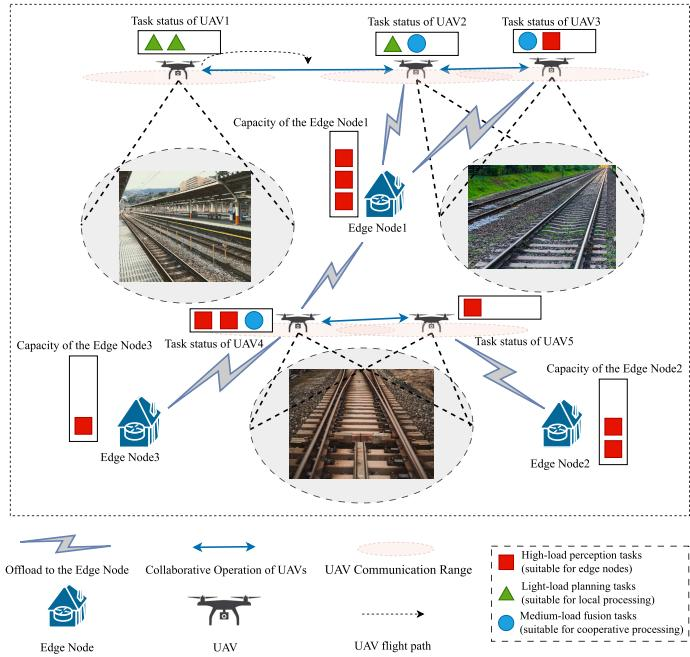  
Fig. 2. Non-cooperative game among multiple UAVs in long-route railway inspection, where each UAV makes independent decisions based on the inspection task dificulty of diferent track segments and limited information under imperfect information conditions.

## A. Players and Strategies

The players in this game are the N autonomous UAVs participating in the rail-line inspection, denoted by the set $\mathcal { N } ~ = ~ \{ 1 , 2 , . . . , N \}$ . Each UAV $i \in \mathcal N$ is an independent decision-maker.

At each decision epoch t, each UAV $i \in \mathcal { N } = \{ 1 , 2 , . . . , N \}$ observes its local state $s _ { i } ( t )$ and selects an action $a _ { i } ( t )$ from its discrete action set $\mathcal { A } _ { i } = \{ a ^ { ( 0 ) } , a ^ { ( 1 ) } , a ^ { ( 2 ) } \}$ , which is identical for all UAVs. Specifically, $\boldsymbol a ^ { ( 0 ) }$ represents local processing, where the UAV handles tasks using its onboard resources; $a ^ { ( 1 ) }$ denotes cooperative processing, where tasks are ofloaded to neighboring UAVs for assistance; and $a ^ { ( 2 ) }$ corresponds to wayside-edge ofloading, where tasks are delivered to a station or wayside edge node deployed along the line for remote processing.

Each UAV adopts a policy $\pi _ { i }$ that maps its observed state to a probability distribution over the available actions. The joint action profile of all UAVs at time t is denoted by $a ( t ) =$ $( a _ { 1 } ( t ) , a _ { 2 } ( t ) , . . . , a _ { N } ( t ) )$ .

## B. UAV Model: Dynamics and Utility

The operational behavior and task-driven objectives of each UAV i are determined by its dynamic model and the structure of its utility function, which together guide its autonomous decision-making process.

1) Operational Dynamics and Constraints: The behavior of each UAV in flight and during task execution is subject to several interrelated dynamic and environmental constraints:

a) Energy evolution: A UAV’s remaining energy $E _ { i } ( t )$ at each time step t is updated according to:

$$
E _ { i } ( t + 1 ) = E _ { i } ( t ) - \Delta E _ { i } ( a _ { i } ( t ) , s _ { i } ( t ) )\tag{1}
$$

The energy consumed, $\Delta E _ { i } ,$ , accounts not only for task processing but also for movement. Specifically, UAV i may need to travel to establish a communication link for cooperative or edge ofloading actions. This situation occurs when the UAV is initially located outside the predefined communication radius. In this case, the UAV incurs additional flight energy consumption determined by its flight power consumption rate. If the UAV remains stationary (e.g., during local computation) or is already within communication range for the selected ofloading action, it incurs a lower hovering energy cost based on its designated hover power rating.

To ensure operational viability, the UAV energy level must satisfy $E _ { i } ( t ) > 0$ at each time step. The system treats $E _ { i } ( t { + } 1 ) \leq$ 0 as energy depletion. In this case, the task fails immediately and the system imposes the corresponding penalty. This imposes a minimum operational energy threshold, $E _ { \mathrm { m i n } }$ , that must remain slightly above zero:

$$
E _ { i } ( t ) \geq E _ { m i n }\tag{2}
$$

b) Task processing: The remaining data load of UAV i evolves as:

$$
\begin{array} { r } { L _ { i } ( t + 1 ) = L _ { i } ( t ) - \rho _ { i } ( a _ { i } ( t ) , s _ { i } ( t ) ) \cdot \Delta t } \end{array}\tag{3}
$$

where $\rho _ { i } ( a _ { i } ( t ) , s _ { i } ( t ) )$ is the efective processing rate. This rate is determined by a base rate $\rho _ { \mathrm { b a s e } , i } ( a _ { i } ( t ) , \mathrm { t y p e } i ( t ) )$ , which reflects the selected action and task type, and may vary across processing modes $( \mathrm { e . g . }$ , edge servers may ofer higher rates for data-intensive tasks). For cooperative and edge ofloading actions, the base processing rate is modulated by a concurrency decay factor decF(a(t)), which captures the performance degradation caused by resource contention in shared computing modes. Specifically,decF(a(t)) is defined as

$$
\mathrm { d e c F } ( a ( t ) ) \triangleq \frac { 1 } { 1 + \alpha _ { a _ { i } ( t ) } \left( \operatorname* { m a x } \left\{ n _ { a _ { i } ( t ) } ( a ( t ) ) - C _ { a _ { i } ( t ) } , 0 \right\} \right) ^ { 2 } }\tag{4}
$$

where $a _ { i } ( t ) \in \{ 0 , 1 , 2 \}$ denotes the computing mode selected by UAV i at time t, corresponding to local, cooperative, and edge processing, respectively. The function $n _ { k } ( a ( t ) )$ denotes the number of UAVs that select computing mode k in the joint action profile $a ( t )$ . The parameters $C _ { a _ { i } ( t ) }$ and $\alpha _ { a _ { i } ( t ) }$ respectively represent the service capacity and congestion sensitivity associated with the computing mode selected by UAV i. Accordingly, the efective processing rate of UAV i is computed as

$$
\rho _ { i } ( a _ { i } ( t ) , s _ { i } ( t ) ) = \rho _ { \mathrm { b a s e } , i } ( a _ { i } ( t ) , \mathrm { t y p e } _ { i } ( t ) ) \cdot \mathrm { d e c F } ( a ( t ) )
$$

which implies that local processing is unafected by congestion, i.e., dec $\mathrm { F } ( a ( t ) ) = 1$ when $a _ { i } ( t ) = 0$

c) Communication constraints and fallback: Successful execution of cooperative or edge-based processing requires UAVs to operate within a designated communication range. When a UAV is out of range, it actively moves toward the target to establish connectivity. Once within range, a signal quality assessment is performed. If the link cannot be established due to excessive distance or poor signal strength, the UAV defaults to local task processing at a reduced rate. This fallback mechanism ensures continuous operation despite communication failures.

d) Task completion and deadline: Each task assigned to UAV i is associated with an initial data load $L _ { i , \mathrm { t o t a l } }$ and a deadline $T _ { \mathrm { d e a d } , i }$ ,. The task is considered successfully completed ,if the remaining data load satisfies $L _ { i } ( t ) = 0$ at or before the deadline, i.e., when the remaining time $T _ { \mathrm { r e m } , i } ( t ) = T _ { \mathrm { d e a d } , i } – t \geq 0$

2) Utility Function: The objective of each UAV i is to maximize its utility $U _ { i } ,$ which is equivalent to the immediate reward $r _ { i } ( t )$ received at each time step. The utility depends on the UAV’s state $s _ { i } ( t )$ , its chosen action $a _ { i } ( t )$ , and the joint action profile of the remaining UAVs, denoted by $a _ { - i } ( t ) ~ =$ $( a _ { 1 } ( t ) , \ldots , a _ { i - 1 } ( t ) , a _ { i + 1 } ( t ) , \ldots , a _ { N } ( t ) )$ . The notation -i follows the standard convention in game theory and refers to all players except player i. Formally,

$$
U _ { i } ( s _ { i } ( t ) , a _ { i } ( t ) , a _ { - i } ( t ) ) = r _ { i } ( t )\tag{5}
$$

The reward function $r _ { i } ( t )$ is a composite value that reflects multiple objectives:

$$
r _ { i } ( t ) = r _ { \mathrm { p r o g } } + r _ { \mathrm { s u c c } } - c _ { \mathrm { t i m e } } - c _ { \mathrm { e n e r g y } } - c _ { \mathrm { q u e u e } } ( a ( t ) )\tag{6}
$$

where the components are defined as follows:

a) Progress reward: $( r _ { \mathrm { p r o g } } ) \mathrm { ~ : ~ }$ : Weighted by $w _ { \mathrm { p r o g } }$ and proportional to the amount of data processed in the current time step, i.e., $L _ { i } ( t ) - L _ { i } ( t + 1 )$ . This term incentivizes eficient task execution.

b) Success reward: $( r _ { \mathrm { s u c c } } ) { : }$ Represents the outcome of the task. If the task is completed within the deadline, a base success reward is granted. If the task is not completed within the deadline, $r _ { \mathrm { s u c c } }$ becomes a substantial negative value. This value represents a predefined failure penalty caused by timeout, energy depletion, or other failures.

c) Time cost: $( c _ { \mathrm { t i m e } } ) \mathrm { : }$ : Weighted by $w _ { \mathrm { t i m e } }$ , this penalty reflects the time used to complete the task. For on-time completion, it is proportional to the time elapsed, $( T _ { \mathrm { d e a d } , i } { - } T _ { \mathrm { r e m } , i } ( t { + }$ 1)). For tasks still in progress, a per-step penalty proportional to the time increment ∆t is applied. Tasks completed late or not completed incur a larger penalty, and an additional non-linear penalty applies if projected completion exceeds the deadline.

d) Energy cost: $( c _ { \mathrm { e n e r g y } } ) { \mathrm { : } }$ Scaled by $w _ { \mathrm { e n e r g y } }$ , this term is proportional to the total energy consumed at time t, covering computation, communication (including transmission and reception), flight, and hovering. An additional penalty is imposed if the UAV’s energy is depleted during the step.

e) Queueing/congestion cost $( c _ { q u e u e } ( a ( t ) ) ) .$ : This cost term captures the negative externalities induced by contention over shared cooperative and edge computing resources and is uniformly weighted by a constant $w _ { \mathrm { q u e u e } } > 0$ for all UAVs. The coupling among UAVs arises through the aggregate system load, characterized by the numbers of UAVs simultaneously selecting cooperative processing and edge ofloading, denoted by $n _ { c } ( a ( t ) )$ and $n _ { e } ( a ( t ) )$ , respectively. Formally, the congestion cost is defined as

$$
c _ { \mathrm { q u e u e } } ( a ( t ) ) = f _ { \mathrm { c o n g } } ( n _ { c } ( a ( t ) ) , n _ { e } ( a ( t ) ) )\tag{7}
$$

where $f _ { \mathrm { c o n g } } ( \cdot )$ is a non-decreasing function of the system load.   
The definition of $f _ { \mathrm { c o n g } } ( \cdot )$ is given in Eq. 8.

$$
f _ { \mathrm { c o n g } } ( n _ { c } , n _ { e } ) \triangleq \beta _ { \mathrm { c o n g } } \left( [ n _ { c } - C _ { 1 } ] _ { + } ^ { 3 / 2 } + [ n _ { e } - C _ { 2 } ] _ { + } ^ { 3 / 2 } \right)\tag{8}
$$

where $n _ { c }$ and $n _ { e }$ denote the numbers of UAVs simultaneously selecting the cooperative processing mode and the edge ofloading mode, respectively, and $C _ { 1 }$ and $C _ { 2 }$ are the corresponding service capacities. The operator [·]+ denotes the positive-part function defined as $[ x ] _ { + } \triangleq \operatorname* { m a x } \{ x , 0 \}$ , which ensures that the congestion penalty is activated only when the aggregate load exceeds the available capacity. The coeficient $\beta _ { \mathrm { c o n g } } \geq 0$ controls the strength of the over-capacity congestion penalty.

This formulation enables each UAV to internalize the impact of its ofloading decision on shared system congestion, thereby balancing task completion, energy consumption, delay, and global resource eficiency in a decentralized manner.

## C. Game Definition and Objective

Given the UAV model and shared resource interactions, the decision-making process for each UAV i is formulated as an optimization problem. Considering the influence of other $\mathrm { U A V s } '$ actions $a _ { - i } ( t )$ and the resulting shared resource conditions (captured by the congestion cost $c _ { \mathrm { q u e u e } } )$ , UAV i seeks to select a policy i that maximizes its expected total discounted utility over a finite horizon H. The problem is defined as follows:

Problem $\mathcal { P } _ { i } \mathrm { : }$ :

$$
\operatorname* { m a x } _ { \pi _ { i } } \mathbb { E } _ { \pi _ { i } , \pi _ { - i } } \left[ \sum _ { k = 0 } ^ { H } \gamma ^ { k } U _ { i } \left( s _ { i } ( t + k ) , a _ { i } ( t + k ) , a _ { - i } ( t + k ) \right) \Bigg | s _ { i } ( t ) \right]\tag{9}
$$

subject to the operational constraints and dynamics defined in Eqs. 1–3, where $\gamma \in ( 0 , 1 ]$ is the discount factor and H is the planning horizon.

The collection of these N coupled decision problems defines the UAV Cooperative Rail-Line Inspection Game, denoted by:

$$
\mathcal { G } _ { u a \nu } = \langle \mathcal { N } , \{ A _ { i } \} _ { i \in \mathcal { N } } , \{ U _ { i } \} _ { i \in \mathcal { N } } \rangle\tag{10}
$$

This represents a stochastic game with imperfect information, characterized by the following uncertainties:

• Each UAV i lacks access to private state variables of other $\mathrm { U A V s } \ j \neq i ,$ such as their exact energy level $E _ { j } ( t )$ or task load $L _ { j } ( t )$

• Each UAV i does not know the decision policies $\pi _ { j }$ of other $\mathrm { U A V s } ~ j \neq i .$

The solution concept we adopt for this setting is the Nash Equilibrium (NE). A Nash Equilibrium is a policy profile $\pi ^ { * } = ( \pi _ { 1 } ^ { * } , . . . , \pi _ { N } ^ { * } )$ in which no UAV can improve its expected cumulative utility by unilaterally deviating from its policy, assuming all other UAVs follow their respective equilibrium policies:

$$
\forall i \in { \mathcal { N } } , { \mathbb { E } } _ { \pi _ { i } ^ { * } , \pi _ { - i } ^ { * } } [ U _ { i } ] \geq \mathbb { E } _ { \pi _ { i } , \pi _ { - i } ^ { * } } [ U _ { i } ] , \quad \forall \pi _ { i } \neq \pi _ { i } ^ { * }\tag{11}
$$

Theorem 1: For the game $\mathcal { G } _ { u a \nu }$ as defined, which has discrete action spaces and a finite number of players, the existence of at least one Nash equilibrium is guaranteed by the Nash existence theorem [36].

## IV. FORMULATION OF THE FSP-BASED FRAMEWORK UNDER IMPERFECT INFORMATION

The Section III formulated the multi-UAV cooperative railline inspection problem as a stochastic game with imperfect information. In this section, We first identify a key structural property of the formulated game to support theoretical analysis and ensure convergence. Then, to tackle the challenge of imperfect information, each UAV’s decision-making process is reformulated as a MDP. Finally, we present the FSP-based algorithm, which iteratively learns equilibrium-approximating policies within the multi-UAV environment.

## A. Game-Theoretic Properties: Exact Potential Game

To rigorously analyze the interactions among UAVs and ensure convergence guarantees for the learning algorithms, we first establish a key theoretical property: the multi-UAV cooperative rail-line inspection game defined in this paper constitutes an exact potential game. This property guarantees at least one pure-strategy Nash Equilibrium and supports the convergence of decentralized learning methods such as FSP.

Formally, consider the utility function for UAV i, defined in Eq. 5 and explicitly decomposed as:

$$
U _ { i } ( s , \mathbf { a } ) = R _ { i , \mathrm { i n d i v } } ( s , a _ { i } ) - C _ { \mathrm { s h a r e d \_ q u e u e } } ( s , \mathbf { a } )\tag{12}
$$

Here, $R _ { i , \operatorname { i n d i v } } ( s , a _ { i } )$ strictly depends only on UAV i’s individual action $a _ { i }$ and state s, incorporating progress reward, success reward (including task-specific bonuses), as well as individual energy and time costs. The shared queuing cost $C _ { \mathrm { s h a r e d \_ q u e u e } } ( s , \mathbf { a } ) ^ { 2 }$ captures penalties from congestion and resource contention across all UAVs, defined explicitly as a uniformly weighted shared cost.

Moreover, it is worth noting that although the task processing rates of individual UAVs and edge nodes may be scaled by the concurrency decay factor defined in Eq. 3, this factor represents a symmetric efect determined collectively by the number of concurrent users in the system. Therefore, in our theoretical formulation, the slowdown caused by such congestion is equivalently incorporated into the global shared cost term $C _ { \mathrm { s h a r e d ~ q u e u e } } ( s , a )$ . This modeling convention ensures that the individual reward function $R _ { i , \operatorname { i n d i v } } ( s , a _ { i } )$ depends solely on the local state and action of UAV i.

Theorem 2: The multi-UAV cooperative rail-line inspection game $\mathcal { G } _ { u a v }$ with utilities defined by Eq. 12 constitutes an exact potential game.

Proof: To qualify as an exact potential game, there must exist a global potential function $\Phi ( s , \mathbf { a } )$ satisfying:

$$
U _ { i } ( s , ( a _ { i } ^ { \prime } , \mathbf { a } _ { - i } ) ) - U _ { i } ( s , ( a _ { i } , \mathbf { a } _ { - i } ) ) = \Phi ( s , ( a _ { i } ^ { \prime } , \mathbf { a } _ { - i } ) ) - \Phi ( s , ( a _ { i } , \mathbf { a } _ { - i } ) )\tag{13}
$$

For any UAV $i ,$ state s, joint action profile $\mathbf { a } _ { - i }$ of other UAVs, and any two actions $a _ { i } , a _ { i } ^ { \prime } \in A _ { i }$

We propose the following potential function, defined as the sum of utilities of all UAVs:

$$
\Phi ( s , \mathbf { a } ) = \sum _ { j = 1 } ^ { N } R _ { j , \mathrm { i n d i v } } ( s , a _ { j } ) - C _ { \mathrm { s h a r e d ~ q u e u e } } ( s , \mathbf { a } )\tag{14}
$$

Consider a unilateral action deviation by UAV i from action $a _ { i }$ to $a _ { i } ^ { \prime }$ while actions of other UAVs remain fixed at a−i. Denoting the original joint action as $\textbf { a } = \left( a _ { i } , \mathbf { a } _ { - i } \right)$ and the deviated joint action as $\mathbf { a } ^ { \prime } = ( a _ { i } ^ { \prime } , \mathbf { a } _ { - i } )$ , we have:

$$
\begin{array} { r l } & { \Delta \Phi } \\ & { = \Phi ( s , \mathbf { a } ^ { \prime } ) - \Phi ( s , \mathbf { a } ) } \\ & { = \left[ \displaystyle \sum _ { j \neq i } R _ { j , \mathrm { i n d i v } } ( s , a _ { j } ) + R _ { i \mathrm { i n d i v } } ( s , a _ { i } ^ { \prime } ) - C _ { \mathrm { s h a r d \_ q u c u c } } ( s , \mathbf { a } ^ { \prime } ) \right] } \\ & { - \left[ \displaystyle \sum _ { j \neq i } R _ { j , \mathrm { i n d i v } } ( s , a _ { j } ) + R _ { i \mathrm { i n d i v } } ( s , a _ { i } ) - C _ { \mathrm { s h a r d \_ q u c u c } } ( s , \mathbf { a } ) \right] } \\ & { = R _ { i , \mathrm { i n d i v } } ( s , a _ { i } ^ { \prime } ) - R _ { i \mathrm { i n d i v } } ( s , a _ { i } ) } \\ & { - C _ { \mathrm { s h a r d \_ q u c u } } ( s , \mathbf { a } ^ { \prime } ) + C _ { \mathrm { s h a r d \_ q u c d \_ q u c } } ( s , \mathbf { a } ) \qquad ( \mathbf { a } } \end{array}\tag{5}
$$

Similarly, the change in UAV i’s utility is:

$$
\begin{array} { r l } & { \Delta U _ { i } = U _ { i } ( s , \mathbf { a } ^ { \prime } ) - U _ { i } ( s , \mathbf { a } ) } \\ & { \quad \quad = R _ { i , \mathrm { i n d i v } } ( s , a _ { i } ^ { \prime } ) - R _ { i , \mathrm { i n d i v } } ( s , a _ { i } ) } \\ & { \quad \quad \quad - \left[ C _ { \mathrm { s h a r e d \_ q u e u e } } ( s , \mathbf { a } ^ { \prime } ) - C _ { \mathrm { s h a r e d \_ q u e u e } } ( s , \mathbf { a } ) \right] } \end{array}\tag{16}
$$

Since $\Delta \Phi \ = \ \Delta U _ { i } ,$ the defined potential function satisfies the exact potential condition, completing the proof. Therefore, according to the proof of Theorem 2, when the sum of all UAVs’ utilities, namely the social welfare, is defined as the potential function, the game $\mathcal { G } _ { \mathrm { u a v } }$ can be characterized as an exact potential game. In this case, the optimal social welfare is achieved at the equilibrium point of $\mathcal { G } _ { \mathrm { u a v } }$

## B. MDP Reformulation for Individual UAV Learning Under Imperfect Information

Having established in Section IV-A that our multi-UAV cooperative rail-line inspection constitutes an exact potential game, we now address the challenge of learning equilibrium policies under imperfect information, where traditional gametheoretic methods become inapplicable.

As stated in Section III-C (Eq. 10), each UAV i lacks complete knowledge of other UAVs’ private states (e.g., $E _ { j } ( t ) , L _ { j } ( t ) )$ and their decision-making policies $\pi _ { j } .$ To enable each UAV to learn its strategy efectively in this decentralized setting with limited observability, we reformulate its individual decision-making problem as a MDP. This MDP, denoted as $\mathcal { M } _ { i } \ = \ \langle S _ { i } , A _ { i } , P _ { i } , R _ { i } , \gamma \rangle$ , is constructed from UAV i’s local perspective, where the “environment” implicitly includes the physical world dynamics and the aggregate, estimated behavior of all other UAVs.

• State Space (S ): The state $\mathbf { \boldsymbol { s } } _ { i } ( t ) \ \in \ S _ { i }$ for UAV i at time t encapsulates its locally observable information (e.g., its own remaining energy $E _ { i } ( t )$ , task data load $L _ { i } ( t )$ , remaining time $T _ { \mathrm { r e m } , i } ( t ) ,$ , task type $\mathrm { t y p e } _ { i } ( t )$ and ofloading eligibility ofloadable (t), as detailed in

Section III-B1), augmented with its belief $\mathbf { f } _ { - i } ( t )$ about the current aggregate action distribution of all other UAVs. Thus, a typical state representation is:

$$
s _ { i } ( t ) = [ L _ { i } ( t ) , ~ E _ { i } ( t ) , ~ T _ { \mathrm { r e m } , i } ( t ) , ~ \mathrm { t y p e } _ { i } ( t ) , ~ \mathrm { o f f l o a d a b l e } _ { i } ( t ) , ~ \mathbf { f } _ { - i } ( t ) ]\tag{17}
$$

The belief component $\mathbf { f } _ { - i } ( t )$ , formed from observing past system-level outcomes, is critical for adapting to the behavior of others under imperfect information.

• Action Space $( A _ { i } ) \colon$ The action space for UAV i is the discrete set $\begin{array} { r c l } { { A _ { i } } } & { { = } } & { { \{ a ^ { ( 0 ) } , a ^ { ( 1 ) } , a ^ { ( 2 ) } \} } } \end{array}$ as defined in Section III-A, corresponding to local processing, cooperative processing, and edge ofloading, respectively.

• Reward Function $( R _ { i } ) \colon$ The immediate reward $r _ { i } ( t )$ received by UAV i after taking action $a _ { i } ( t )$ in state $s _ { i } ( t )$ and transitioning to $s _ { i } ( t + 1 )$ is directly equivalent to its utility function $U _ { i } ( s _ { i } ( t ) , a _ { i } ( t ) , \mathbf { a } _ { - i } ( t ) )$ defined in Eq. 5 and , ,detailed in Eq. 6. Therefore,

$$
R _ { i } ( s _ { i } ( t ) , a _ { i } ( t ) , s _ { i } ( t + 1 ) ) = r _ { i } ( t ) .
$$

• Transition Probability Function $( P _ { i } ) \colon$ The transition probability $P _ { i } ( s _ { i } ^ { \prime } \mid s _ { i } , a _ { i } ) = \mathrm { P r } ( s _ { i } ( t + 1 ) = s _ { i } ^ { \prime } \mid s _ { i } ( t ) =$ $s _ { i } , a _ { i } ( t ) ~ = ~ a _ { i } )$ is implicitly determined by the UAV’s operational dynamics (Eqs. 1–3), the shared resource model (influencing $c _ { \mathrm { q u e u e } }$ as per Eq. 7), and, crucially, the unknown policies $\pi _ { - i }$ of other UAVs. Since UAV i does not have access to an explicit model of $P _ { i }$ due to these unknown factors and environmental complexities, modelfree reinforcement learning is employed. Conceptually, $P _ { i }$ represents an expectation over the joint actions of other UAVs, $\mathbf { a } _ { - i } ~ \in ~ A _ { - i }$ (where $A _ { - i }$ is the joint action space of all UAVs except i), weighted by the probability of those actions occurring under their respective policies $\pi _ { j } ( a _ { j } \mid s _ { j } )$

The objective for UAV i within its MDP $\mathcal { M } _ { i }$ remains to learn an optimal policy $\pi _ { i } ^ { * }$ that maximizes its expected sum of discounted rewards $V _ { i } ^ { \pi _ { i } ^ { * } , \pi _ { - i } ^ { * } } ( s _ { i } )$ , consistent with Problem $P _ { i }$

## C. U-FSP for Decentralized Learning in Rail-Line Inspection

To learn decentralized strategies for UAV rail-line inspection systems under imperfect information, we propose the U-FSP framework based on the FSP algorithm. This framework enables each UAV to iteratively approximate a Nash Equilibrium by alternating between best-response learning and adaptation based on a self-averaged policy. As established in Theorem 2, our setting constitutes an exact potential game, for which this approach is particularly efective.

The U-FSP framework decomposes the learning process for each UAV i into two interleaved phases. First, in the learnfrom-others phase, the UAV constructs a best-response policy $\beta _ { i }$ against its current belief $f _ { - i } ( t )$ about the mixed strategies of other UAVs. This policy is learned via model-free Q-learning. Second, in the learn-from-self phase, the UAV accumulates the empirical frequencies of its past actions into an average policy $\overline { { \pi } } _ { i } ,$ which represents a stable, mixed-strategy approximation of its long-term behavior.

To adapt to the behavior of others under imperfect information, each UAV must maintain and update its belief distribution $f _ { - i } ( t )$ regarding the aggregate actions of the other UAVs. This belief update process can be expressed in a single, consolidated exponential smoothing formula that incorporates lightweight observations of aggregate action-count feedback while implicitly updating a latent belief count vector. The update process is represented as:

$$
f _ { - i } ( t + 1 , a ) = \frac { ( 1 - \lambda ) S _ { i } ( t ) \cdot f _ { - i } ( t , a ) + \lambda C ( t , a ) } { ( 1 - \lambda ) S _ { i } ( t ) + \lambda N }\tag{18}
$$

Here, the aggregate signal $C ( t , a )$ represents a lightweight system-level feedback variable that denotes the number of UAVs selecting action a at time t. In this study, this signal can be obtained through information provided by wayside edge nodes along the railway. This belief update formulation describes how UAV i revises its belief $f _ { - i } ( t + 1 , a )$ regarding the probability that another agent will take action a at time $t + 1$ . It is computed as a convex combination of the prior belief $f _ { - i } ( t , a )$ and the newly observed $C ( t , a ) .$ , normalized by the corresponding weighted sum of historical and current observations. The learning rate determines the balance between historical memory and current feedback, while N denotes the total number of UAVs. The scalar variable $S _ { i } ( t )$ represents the cumulative weight of past belief evidence and is updated recursively by $S _ { i } ( t + 1 ) = ( 1 - \lambda ) S _ { i } ( t ) + \lambda N$ to ensure consistency over time. This compact update rule captures the core dynamics of belief accumulation and normalization in a single, elegant expression.

This belief $f _ { - i } ( t )$ is combined with the UAV’s locally observable variables to form a composite state $\begin{array} { r l } { s _ { i } ( t ) } & { { } = } \end{array}$ $( l _ { i } ( t ) , f _ { - i } ( t ) )$ . Based on this state, the UAV selects an action $a _ { i } ( t )$ using an -greedy strategy over its Q-function, which is updated as:

$$
\begin{array} { c } { { Q _ { i } ( s _ { i } ( t ) , a _ { i } ( t ) ) \gets ( 1 - \alpha ) Q _ { i } ( s _ { i } ( t ) , a _ { i } ( t ) ) + } } \\ { { \alpha \left[ r _ { i } ( t ) + \gamma \operatorname* { m a x } _ { a ^ { \prime } \in A _ { i } } Q _ { i } ( s _ { i } ( t + 1 ) , a ^ { \prime } ) \right] } } \end{array}\tag{19}
$$

where $\alpha$ is the learning rate and $\gamma$ is the discount factor. The greedy best-response action is given by:

$$
a _ { i } ^ { * } ( t ) = \arg \operatorname* { m a x } _ { a _ { i } \in \mathcal { A } _ { i } } { Q _ { i } ( s _ { i } ( t ) , a _ { i } ) }\tag{20}
$$

To stabilize learning, each UAV also maintains a timeaveraged policy $\overline { { \pi } } _ { i }$ based on the empirical frequencies of its πactions. Whenever an action $a _ { i } ( t )$ is chosen as part of the bestresponse policy, its count is incremented:

$$
N _ { i } ( s _ { i } ( t ) , a _ { i } ( t ) ) \gets N _ { i } ( s _ { i } ( t ) , a _ { i } ( t ) ) + 1\tag{21}
$$

The normalized average policy is then computed as:

$$
\overline { { \pi } } _ { i } ( a _ { i } | s _ { i } ) = \frac { N _ { i } ( s _ { i } , a _ { i } ) } { \sum _ { a ^ { \prime } \in \mathcal { A } _ { i } } N _ { i } ( s _ { i } , a ^ { \prime } ) }\tag{22}
$$

At each episode k, the decision-making is governed by a hybrid policy $\pi _ { i } ^ { k }$ , which is a probabilistic mixture of the bestresponse policy $\beta _ { i } ^ { k }$ and the time-averaged policy $\overline { { \pi } } _ { i } ^ { k - 1 }$ :

$$
\pi _ { i } ^ { k } = \eta _ { k } \beta _ { i } ^ { k } + ( 1 - \eta _ { k } ) \overline { { \pi } } _ { i } ^ { k - 1 }\tag{23}
$$

Algorithm 1 FSP-Based UAV Learning Algorithm   
1: Initialize for each UAV i: Q-table Qi, policy counts $N _ { i } .$   
belief counts $F _ { i } ,$ rates $\epsilon , \eta , \alpha , \lambda .$   
2: for episode $k = 1 , 2 , 3 , \ldots$ , α,do   
3: , , ,Initialize local state $l _ { i } ( 0 ) .$   
4: for each step $t = 0 , 1 , 2 , \ldots$ do   
5: , , , . . .Form belief distribution: $f _ { - i } ( t ) \gets F _ { i } ( t ) / \sum F _ { i } ( t )$   
6: Define composite state: $s _ { i } ( t ) \gets ( l _ { i } ( t ) , f _ { - i } ( t ) ) .$   
7: if $r a n d ( ) < \eta _ { k }$ then   
8: Choose $a _ { i } ( t )$ via -greedy on $Q _ { i } ( s _ { i } ( t ) , \cdot ) .$   
9: Set flag is br policy ← true.   
10: else   
11: Sample $\begin{array} { r } { a _ { i } ( t ) \sim N _ { i } ( s _ { i } ( t ) , \cdot ) / \sum N _ { i } ( s _ { i } ( t ) , \cdot ) . } \end{array}$   
12: Set flag is br policy false.   
13: end if   
14: Execute $a _ { i } ( t ) .$ , receive $r _ { i } ( t ) ,$ , next local state $l _ { i } ^ { \prime } ( t )$ , and   
lightweight aggregate action-count feedback C(t).   
15: Belief Update:   
$F _ { i } ( t + 1 ) \gets ( 1 - \lambda ) F _ { i } ( t ) + \lambda C ( t )$   
16: Form next belief and state: $\begin{array} { r l r } { f _ { - i } ^ { \prime } ( t ) } & { { }  } & { F _ { i } ( t \ + } \end{array}$   
$1 ) / \sum F _ { i } ( t + 1 ) , s _ { i } ^ { \prime } ( t ) \gets ( l _ { i } ^ { \prime } ( t ) , f _ { - i } ^ { \prime } ( t ) )$   
17: /Q-Update:   
$Q _ { i } ( s _ { i } , a _ { i } ) \gets Q _ { i } ( s _ { i } , a _ { i } ) + \alpha \big [ r _ { i } ( t )$   
$+ \gamma \operatorname* { m a x } _ { a ^ { \prime } } Q _ { i } ( s _ { i } ^ { \prime } , a ^ { \prime } ) - Q _ { i } ( s _ { i } , a _ { i } ) \big ]$   
18: if is br policy is true then   
19: Policy Count Update: $N _ { i } ( s _ { i } , a _ { i } ) \gets N _ { i } ( s _ { i } , a _ { i } ) + 1$   
20: end if   
21: Update state: $l _ { i } ( t ) \gets l _ { i } ^ { \prime } ( t ) , F _ { i } ( t ) \gets F _ { i } ( t + 1 )$   
22: end for   
23: Decay $\epsilon _ { k }$ and $\eta _ { k } .$   
24: end for

The anticipatory parameter $\eta _ { k }$ decays over time. Initially, UAVs rely more on the explorative best-response policy, but they gradually shift toward exploiting the stable average strategy as both $\eta _ { k }$ and the exploration rate $\epsilon _ { k }$ approach zero.

Theorem 3: If $\eta _ { k } \to 0$ as $k  \infty ,$ and for each $i \in \mathcal { N } , a _ { i } ( t )$ is an -best response to the strategies of the other UAVs with $\epsilon _ { k } \to 0$ as $k \to \infty$ , then Algorithm 1 constitutes a generalized weakened fictitious play process.

Theorem 4: Based on Theorem 3, any generalized weakened fictitious play process is guaranteed to converge to the set of Nash equilibria in a potential game [37].

Algorithm 1 outlines the overall procedure of U-FSP. According to Theorems 3 and 4, the proposed U-FSP ensures that the decentralized policies of the UAVs asymptotically converge to Nash equilibrium solutions, even under imperfect information and without centralized coordination.

## D. Complexity and Scalability Discussion

1) Complexity Analysis: The proposed U-FSP adopts a tabular implementation. Let M denote the total number of UAVs, |L| denote the size of the local state space for one UAV, and |A| denote the size of the action space. According

to Algorithm 1, the composite state of UAV i is defined as $s _ { i } ( t ) = ( l _ { i } ( t ) , f _ { - i } ( t ) )$ , where $l _ { i } ( t )$ is the local state and $f _ { - i } ( t )$ is the belief over the aggregate actions of the other UAVs. Therefore, the complexity depends on both the local state space and the belief space. Under the action-count feedback mechanism, the belief is constructed from the action-count vector of the other M − 1 UAVs. The number of possible belief states grows combinatorially with M and |A|. As a result, the composite state size can be written as $| S | = | L | | B | ,$ , where |B| denotes the number of belief states.   
In terms of storage complexity, each UAV maintains three types of data structures. The Q-table $Q _ { i } ( s _ { i } , a _ { i } )$ stores one value for each state–action pair. The policy statistics table $N _ { i } ( s _ { i } , a _ { i } )$ maintains a count for each state–action pair. The belief statis tics $F _ { i }$ are maintained over the action dimension. The storage complexity is primarily dominated by the state–action tables. For a single UAV, the complexity is $O ( | S | | A | )$ , while for the entire system, it is $O ( M | S \| A | )$ .   
In terms of computational complexity, one-step online decision-making for UAV i includes belief normalization, action selection, belief update, and Q-value update. Each of these operations involves processing over the action space. Therefore, the per-step computational complexity for a single UAV is $O ( | A | )$ , and for the entire system, it is $O ( M | A | )$   
2) Scalability Discussion: Based on the complexity analysis, U-FSP is suitable for decentralized rail-line inspection scenarios with moderate numbers of UAVs and discrete state and action spaces. However, as M increases, the number of aggregate belief states |B| grows combinatorially. This growth enlarges the Q-table and the policy-statistics table and reduces learning eficiency.   
For large-scale systems, an efective approach is to replace tabular representations with function approximation. For example, a parameterized value function can replace the Q-table by using deep Q networks or actor-critic methods. This design enables value generalization across similar local states and belief states. The average-policy component can also be modeled by a parameterized policy network instead of an explicit policy-count table. In addition, a belief encoder can map the aggregate belief over other UAVs’ actions into a compact continuous representation. This approach avoids explicit enumeration of all possible belief configurations. For homogeneous UAV swarms, parameter sharing across agents can further improve sample eficiency and reduce memory overhead. These ideas provide a practical direction for scaling U-FSP to larger systems, and we will explore this extension in future work

## V. SIMULATION RESULTS

In this section, we present and analyze the simulation results to evaluate the efectiveness of the proposed U-FSP framework in the multi-UAV rail-line inspection scenario.

## A. Simulation Setup

1) Simulation Environment Parameter Settings: We consider a three-dimensional simulation environment with dimensions of $1 0 0 0 \times 2 0 0 \times 1 0 0$ , representing a segment of a long-route rail-line inspection corridor, where ten UAVs collaboratively perform computational tasks. Five wayside edge nodes are deployed at fixed locations along the corridor, including the four corners and the center, with coordinates of (200 40 0), (800 40 0), (200 160 0), (800 160 0), (500 100 0), respectively. All edge nodes are positioned at ground level to emulate station-side or trackside computing facilities.

At the beginning of each episode, the UAVs are randomly initialized within the simulation corridor, and each UAV starts with 450 energy units.3 Each UAV is randomly assigned a task class from a predefined set that reflects diferent computational workloads for rail-line inspection data processing. The three task classes are sampled with equal probability, i.e., high-load, medium-load, and light-load tasks each occur with probability $1 / 3$ . The initial task data load is sampled from a task-specific uniform distribution: [90 110] Mb for high-load perception tasks, [50 70] Mb for medium-load fusion tasks, and [10 30] Mb for light-load planning tasks. To simulate the short working window in rail-line inspection, each task must be completed within 18 time steps; exceeding this limit is regarded as a failure and incurs a penalty.

UAVs travel at a constant speed of 10 M/s and consume 100 W while in flight and 80 W during hovering. The time step of the simulation is set to one second. UAV-to-UAV cooperative communication is possible within a 180-meter radius, while UAV-to-edge communication is allowed within 200 meters.

UAVs can process tasks using one of three modes: local, cooperative, or edge computing. Each mode has distinct processing rates, reflecting the heterogeneity of resources. Specifically, we set the local processing rate as $\rho _ { \mathrm { l o c a l } } = 5 ~ \mathrm { M b / s }$ the cooperative processing rate as $\rho _ { \mathrm { c o o p } } = 7$ Mb/s, and the wayside-edge processing rate as $\rho _ { \mathrm { e d g e } } = 1 2 \ \mathrm { M b / s }$

The energy consumption is modeled with corresponding coeficients. For high-, medium-, and light-load tasks, the energy coeficients for local processing are set to ([1.8, 1.5, 1.0]) J/Mb, while those for cooperative ofloading are set to ([1.2, 1.0, 0.6]) J/Mb. For edge ofloading, a uniform upload energy coeficient of 0.2 J/Mb is applied regardless of the task type. Resource capacities are constrained, with the cooperative and edge networks supporting a maximum of 6 and 10 concurrent users, respectively. Penalties for queueing and congestion are implemented to model resource contention realistically. In addition, for the weighting coeficients in the reward function, the coeficients of the progress reward, time cost, energy cost, and queueing congestion cost are set to wprog = 3, wtime = 0 05, $w _ { \mathrm { e n e r g y } } ~ = ~ 0 . 0 8$ , and $w _ { \mathrm { q u e u e } } \ = \ 3$ respectively.

The wireless communication model assumes Rayleigh fading with unit variance, a path loss exponent of 2.5, and UAV transmit power fixed at 0.1 W. Successful communication requires a minimum signal-to-interference-plus-noise ratio (SINR) of 10 dB. The additive white Gaussian noise power is set to $( 4 . 0 \times 1 0 ^ { - 2 1 } , \mathrm { W / H z } )$ , with a bandwidth of 20 MHz and a receiver noise figure of 5 dB. The total noise is calculated as $N _ { \mathrm { n o i s e } } = N _ { 0 } { \cdot } B { \cdot } F$ . Here, the Rayleigh fading model is adopted as a simplified and standardized communication abstraction for algorithm-level evaluation. It is intended to capture random small-scale channel fluctuations and moderate attenuation in the rail-line inspection corridor, while maintaining tractability and comparability across diferent baseline methods. For a more intuitive understanding of the considered simulation environment, Fig. 2 also illustrates the multi-UAV long-route railway inspection scenario, including the spatial deployment and representative task-processing relationships under imperfect information conditions. The simulation was conducted using MATLAB version 2021b. Table I summarizes the parameters of the simulation environment.

TABLE I  
SIMULATION PARAMETERS
<table><tr><td>Symbol</td><td>Parameter</td><td>Value</td></tr><tr><td> $L _ { s p a c e }$ </td><td>Simulation Space Dimensions</td><td> $1 0 0 0 \times 2 0 0 \times 1 0 0 ~ \mathrm { m ^ { 3 } }$ </td></tr><tr><td> $N$ </td><td>Number of UAVs</td><td>10</td></tr><tr><td> $N _ { e d g e }$ </td><td>Number of Wayside-Edge Nodes</td><td>5</td></tr><tr><td> $\mathbf { p } _ { e d g e }$ </td><td>Edge Node Coordinates</td><td>(200,40,0), (800,40,0), (200,160,0), (800,160,0),</td></tr><tr><td> $E _ { i n i t }$ </td><td>UAV Initial Energy</td><td>(500,100,0) 450 units (≈ 62.5Wh)</td></tr><tr><td> $r ^ { h i g h }$   $\mathscr { L } _ { i n i t }$ </td><td>High-load perception tasks</td><td>U[90, 110] Mb</td></tr><tr><td> $L _ { i  i } ^ { m e d i u m }$ </td><td>Medium-load fusion tasks</td><td>U[50, 70] Mb</td></tr><tr><td> $L _ { i n i t } ^ { l i g h t }$ </td><td>Light-load planning tasks</td><td>U[10, 30] Mb</td></tr><tr><td> $T _ { d e a d }$ </td><td>Task Deadline</td><td>18 steps</td></tr><tr><td> $v _ { u a v }$ </td><td>UAV Speed</td><td>10 m/s</td></tr><tr><td> $P _ { f l i g h t }$ </td><td>UAV Flight Power</td><td>100 W</td></tr><tr><td> $P _ { h o v e r }$ </td><td>UAV Hovering Power</td><td>80 W</td></tr><tr><td> $\Delta t$ </td><td>Simulation Time Step</td><td>1 s</td></tr><tr><td>du2u</td><td>UAV-to-UAV Comm. Radius</td><td>180 m</td></tr><tr><td>lcomm</td><td>UAV-to-Edge Comm. Radius</td><td>200 m</td></tr><tr><td> $d _ { c o m m } ^ { u 2 e }$ </td><td></td><td>5Mb/s</td></tr><tr><td> $\rho _ { l o c a l }$ </td><td>Local Processing Rates</td><td></td></tr><tr><td> $\rho _ { c o o p }$ </td><td>Cooperative Processing Rates</td><td>7Mb/s 12 Mb/s</td></tr><tr><td> $\rho _ { e d g e }$   $c ^ { l o c a l }$ </td><td>Edge Processing Rates</td><td></td></tr><tr><td> $c _ { e n g y }$   $\ r _ { c o o p }$ </td><td>Local Energy Coefficients</td><td>[1.8, 1.5, 1.0] J/Mb</td></tr><tr><td> $c _ { e f f }$ </td><td>Cooperative Energy Coefficients</td><td>[1.2, 1.0, 0.6] J/Mb</td></tr><tr><td> $\mathring { e d g e }$   $c _ { e n g y }$ </td><td>Edge Upload Energy Coeff.</td><td>0.2 J/Mb</td></tr><tr><td> $N _ { c o o p } ^ { m a x }$ </td><td>Max Cooperative Users</td><td>6</td></tr><tr><td> $N ^ { m a x }$ </td><td>Max Edge Users</td><td>10</td></tr><tr><td> $\omega _ { e d g e }$   $P _ { t x }$ </td><td>UAV Transmit Power</td><td>0.1 W</td></tr><tr><td></td><td>Path Loss Exponent</td><td>2.5</td></tr><tr><td> $\alpha _ { p l }$ </td><td></td><td>10 dB</td></tr><tr><td> $S I N R _ { m i n }$ </td><td>Minimum SINR Threshold</td><td></td></tr><tr><td> $N _ { 0 }$ </td><td>AWGN Power</td><td> $4 . 0 \times 1 0 ^ { - 2 1 } W / H z$ </td></tr><tr><td> $B$ </td><td>Channel Bandwidth</td><td>20MHz</td></tr><tr><td> $F$ </td><td>Receiver Noise Figure</td><td>5dB</td></tr></table>

2) Infrastructure-Assisted Aggregate Feedback and Communication Overhead: In the rail-line inspection scenario considered in this paper, the aggregate action-count signal is obtained via wayside edge nodes deployed along the track, rather than through direct full-state exchange among UAVs. Specifically, at each decision epoch, each UAV reports only its selected processing mode to its associated wayside edge node. The infrastructure then aggregates these reports and broadcasts a compact vector $C ( t ) = [ C ( t , a ^ { ( 0 ) } ) , C ( t , a ^ { ( 1 ) } ) , C ( t , a ^ { ( 2 ) } ) ]$ , where , , , , ,each entry represents the number of UAVs selecting a particular action. As a result, the proposed U-FSP framework relies solely on system-level aggregate feedback, while private local states, such as battery level, task progress, and computational load, remain undisclosed.

As indicated by Eq. 18, the communication overhead associated with the belief update mechanism is equivalent to the cost of acquiring the aggregate action-count signal C(t), while all remaining update operations are performed locally at each UAV. From a message-complexity perspective, for a system with M UAVs and an action space of size |A|, the uplink signaling at each decision epoch consists of M action reports, while the downlink signaling consists of one broadcast message carrying the aggregate vector C(t) with |A| entries. Accordingly, the total signaling scale per decision epoch is $O ( M + | A | )$ , and the control information received by each UAV scales as O(|A|). In the considered setting, $\vert A \vert ~ = ~ 3$ corresponding to local processing, cooperative processing, and edge ofloading, which makes the signaling structure highly compact.

From a bandwidth perspective, if each action index is encoded using $b _ { a }$ bits and each count entry is encoded using $b _ { c }$ bits, then the total uplink overhead per decision epoch is $M b _ { a }$ bits, while the downlink broadcast overhead is $| A | b _ { c }$ bits. Therefore, the total control signaling required by U-FSP per decision epoch is $M b _ { a } + | A | b _ { c }$ bits. Since the considered railline inspection problem involves only three discrete actions, the downlink feedback contains only three count entries, and the resulting bandwidth requirement remains very small in practice.

The primary impact of this signaling mechanism on system performance arises from potential feedback delay rather than computational burden. If the aggregate counts are received with delay, the belief update may rely on slightly outdated coordination information, which could afect decision quality. Nevertheless, since the exchanged information is highly compact and U-FSP is inherently designed for imperfectinformation decision-making based on aggregate statistics rather than precise instantaneous global states, the resulting performance degradation is expected to be limited.

## B. Benchmarks

To validate the efectiveness of the proposed U-FSP method, we establish the following baselines for comparison:

• Greedy Strategy-based Method (Greedy): Under this method, UAVs always select the action with the highest instantaneous processing rate when performing inspection tasks.

• Decentralized Q-learning-Based Method (DQM): In this approach, each UAV independently explores the environment using the Q-learning algorithm, with no information sharing among UAVs.

• U-FSP with Full Information (F-Info U-FSP): In this variant, each UAV has access to the complete state information of all other UAVs, including their energy levels, task selections, and other relevant attributes.

• Random Strategy (Random): Under this method, each UAV selects its next action randomly.

• MADDPG [21]: In this method, each UAV learns its policy under the centralized training and decentralized execution (CTDE) paradigm, using global information during training while relying solely on its own local observations to make action decisions during execution.

• Independent Proximal Policy Optimization (IPPO): In this method, each UAV independently learns and executes its policy in a fully decentralized manner using the Proximal Policy Optimization (PPO) algorithm.

## C. Evaluation Metrics

To comprehensively verify that the proposed U-FSP method can achieve low energy consumption, low latency (i.e., short queueing delay), and high overall reward through efective task scheduling and resource allocation, while guiding the UAV system toward a Nash equilibrium, we evaluate the following metrics:

1) Average Energy Consumption: The mean energy consumed by all UAVs, computed as the average diference between initial and remaining energy after task completion. Lower values indicate higher energy eficiency and sustainable operation.

2) Average Queue Length: The mean length of task queues across all processing nodes (including cooperative and edge nodes) over time. It reflects system load balance and resource allocation eficiency; smaller values imply balanced workloads and timely task processing, whereas larger values suggest potential bottlenecks and serious task backlogs.

3) Average Task Completion Time: The average duration for successfully completed tasks. Lower values represent faster response and higher processing eficiency.

4) Task Ofloading Ratio: The proportion of non-local task processing decisions (including cooperative and edge ofloading) among all decisions. It reflects the algorithm’s adaptability in resource utilization and load distribution.

5) Social Welfare: The sum of the utilities of all UAVs. Based on Theorem 2 and Eq. 12, we compute the social welfare of episode k as the accumulated sum of all UAV utilities: $\begin{array} { r } { \boldsymbol { W } ^ { ( k ) } = \sum _ { t = 0 } ^ { T _ { k } - 1 } \sum _ { i = 1 } ^ { N } \boldsymbol { U } _ { i } ( \boldsymbol { s } ( t ) , \boldsymbol { a } ( t ) ) } \end{array}$ . A larger value of $W ^ { ( k ) }$ indicates better global coordination among UAVs in balancing task completion, delay, energy consumption, and shared congestion.

6) System Throughput: The total number of successfully completed tasks within one episode, reflecting system processing capacity and eficiency.

7) Task Completion Ratio: The proportion of UAVs that complete assigned tasks. Higher values indicate greater reliability and efectiveness.

8) Policy Diversity: The average entropy of UAV action distributions, measuring decision diversity. Moderate values suggest adaptive yet stable learning behaviors.

9) Nash Gap: This metric is approximated in simulation by comparing the utility under the current action with that under the best-response action given the current estimate of the other

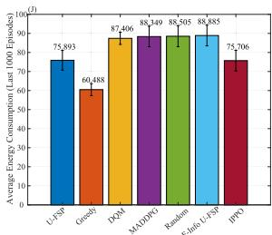

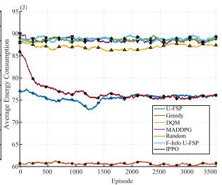  
(a) Average Energy Consumption

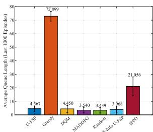

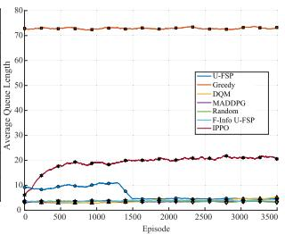  
(b) Average Queue Length

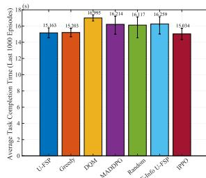

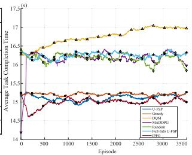  
(c) Average Task Completion Time

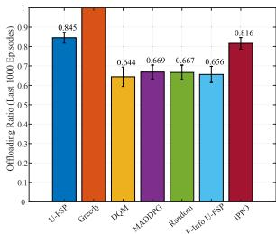

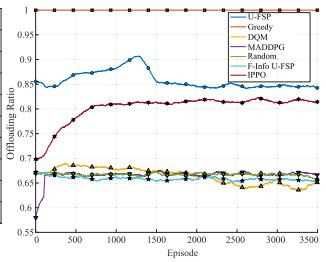  
(d) Task Offloading Ratio

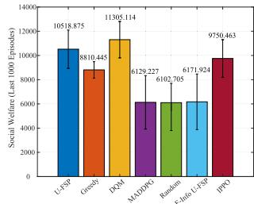

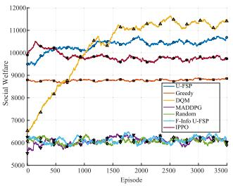  
(e) Social Welfare

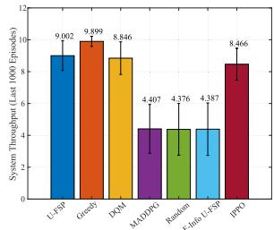

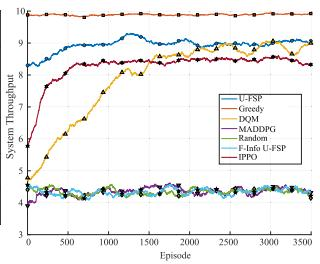  
(f) System Throughput

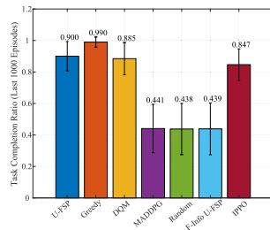

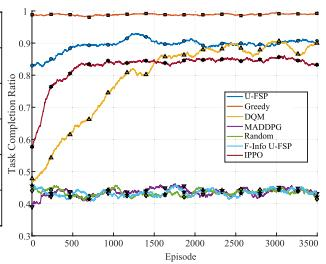  
(g) Task Completion Ratio

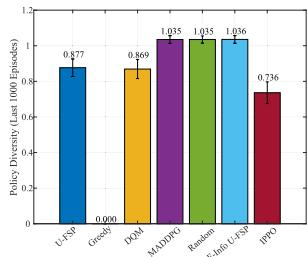

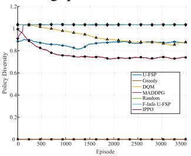  
(h) Policy Diversity  
Fig. 3. The performance of U-FSP is compared with baseline methods across multiple key metrics, including average energy consumption, average queue length, average task completion time, task ofloading ratio, social welfare, system throughput, task completion ratio, and policy diversity. For each metric, the bar chart (left) corresponds to the average over the last 1000 episodes, while the line chart (right) shows the variation across all episodes.

UAVs’ policies. Based on Eq. 11, we define the Nash Gap as $\begin{array} { r } { \mathbf { N G } ( \overline { { \boldsymbol { \pi } } } ) = \frac { 1 } { N } \sum _ { i = 1 } ^ { N } \left[ \operatorname* { m a x } _ { \pi _ { i } ^ { \prime } } \mathbb { E } _ { \pi _ { i } ^ { \prime } , \pi _ { - i } } [ U _ { i } ] - \mathbb { E } _ { \pi _ { i } , \pi _ { - i } } [ U _ { i } ] \right] } \end{array}$ . A smaller Nash Gap indicates that the learned joint policy is closer to equilibrium and is more stable against unilateral deviation.

## D. Comprehensive Performance Comparison With Baseline Methods

To gain deeper insights into the performance of each algorithm, we carried out a total of 3,500 simulation episodes. Furthermore, to facilitate a more comprehensive comparison across diferent dimensions, for selected evaluation metrics we report both the average performance of all UAVs over the final 1,000 episodes and the evolution of these metrics throughout the entire 3,500 episodes.

By conducting a comprehensive analysis of the line charts and bar charts across the eight metrics shown in Fig. 3, the comparison between the U-FSP algorithm and other baseline methods yields the following conclusions:

1) Compared with other methods, the Greedy approach enables the UAV system to achieve the lowest average energy consumption, the highest task completion ratio, and the second shortest task completion time, slightly behind U-FSP. However, as shown in Fig. 3b, it also causes the most severe system congestion, preventing it from achieving the highest social welfare (Fig. 3e). Combined with its highest task ofloading ratio (Fig. 3d), this indicates that each UAV under the Greedy policy always selects the fastest processing option.

As a result, UAVs rely solely on task ofloading without any local processing. This is confirmed by the policy diversity metric in Fig. 3h, where the Greedy method consistently remains at zero. The same behavior explains its lowest energy consumption (Fig. 3a) and highest system throughput (Fig. 3f), which make it appear optimal only superficially.

2) For the fully decentralized baselines DQM and IPPO, Fig. 3b and Fig. 3d show that neither method can fully utilize system-level computational resources under imperfect information. Since each UAV makes decisions based only on local observations and lacks access to the coordination status of other UAVs, both methods fail to align local decisions with global resource conditions, which hinders stable task allocation and eficient system-level cooperation.

Compared with DQM, IPPO exhibits a more aggressive tendency to utilize ofloading and cooperative resources, as reflected by its higher task ofloading ratio in Fig. 3d. This also leads to lower average energy consumption (Fig. 3a) and shorter average task completion time (Fig. 3c) than DQM. By contrast, DQM tends to adopt a more conservative decision pattern and relies more heavily on local processing, which results in the lowest task ofloading ratio and a relatively shorter average queue length, while also causing higher energy cost and longer task completion time.

However, these local improvements of IPPO do not translate into stronger overall system performance. As shown in Fig. 3e, DQM still achieves higher social welfare due to its lower queue penalty. Moreover, in Fig. 3f and Fig. 3g, DQM is still slightly better than IPPO, although the two remain at a similar level overall. This indicates that merely adopting a more flexible decentralized policy-learning mechanism is still insuficient for efective coordination when no explicit global coordination cue is available. In addition, the larger policy diversity of DQM in Fig. 3h does not translate into better coordination eficiency or stronger overall performance.

These results reveal that fully decentralized learning based only on local observations, whether implemented in a valuebased form or a policy-based form, is inadequate for the considered imperfect-information rail-line inspection scenario.

3) F-Info U-FSP is evaluated under a full-information setting. Each UAV can access the complete states of all other UAVs during decision making. In contrast, MADDPG uses global information during training but relies only on local observations during execution.

As shown in Fig. 3h, both methods exhibit action diversity comparable to the Random approach. This result indicates that UAVs do not converge to fixed action patterns. However, the underlying causes are diferent. For F-Info U-FSP, richer instantaneous observations increase the sensitivity of UAVs to short-term fluctuations in peer states and shared resource occupancy. The considered rail-line inspection scenario involves temporally continuous tasks and tightly coupled resources. High sensitivity therefore leads to frequent switching among processing modes. Such switching interrupts ongoing task execution and prevents the formation of a stable coordination pattern. For MADDPG, the dificulty mainly arises from the mismatch between training and execution information structures. During training, centralized learning uses global information.During execution, each UAV makes decisions based on its local observation rather than the full joint system state. As a result, the policy may lack suficient information to accurately infer the instantaneous global coordination status of peer UAVs and shared resources. In principle, richer information can support better decisions. However, in tightly coupled dynamic multi-agent systems, performance depends not only on information availability but also on whether the learning mechanism can convert information into stable coordination over time. As a result, both methods incur higher energy consumption (Fig. 3a) and longer completion times. They also achieve lower task completion ratios and lower system throughput than the U-FSP method under imperfect information and the DQM method under zero information (Figs. 3c, 3f, and 3g). Consequently, the overall performance of MADDPG and F-Info U-FSP remains close to the Random baseline on several metrics.

4) Based on the analysis of the baseline methods and the experimental results in Fig. 3, it can be concluded that the proposed U-FSP method achieves efective resource allocation and task ofloading in the UAV inspection system while maintaining low energy consumption and avoiding queue congestion.

Specifically, as shown in Fig. 3b and 3d, U-FSP attains a short average queue length, which is comparable to the DQM method that rarely ofloads tasks and significantly lower than that of IPPO, and a high task ofloading ratio, second only to the Greedy method that exclusively performs ofloading and higher than those of both DQM and IPPO. This demonstrates that U-FSP can efectively balance computation speed and resource utilization, avoiding the tendency to ofload tasks merely based on faster processing rates or to rely solely on local execution to bypass congestion.

In addition, Fig. 3a shows that U-FSP achieves lower average energy consumption than most baselines, surpassed only by the Greedy method that performs no local computation and being very close to IPPO among the decentralized learning methods. This indicates that U-FSP strategically executes lightweight tasks locally while ofloading more complex ones, thereby reducing overall energy consumption and achieving a short average task completion time, as shown in Fig. 3c, which is also very close to that of IPPO. Owing to its balanced task allocation, U-FSP attains a task completion ratio of about 90% (second only to Greedy), as well as high social welfare and system throughput. Moreover, its strong performance in policy diversity further confirms that U-FSP makes rational and adaptive action selections across varying system states.

## E. Convergence Analysis of the Nash Equilibrium

According to Theorem 2, when the sum of all UAVs utilities, that is, the social welfare, is defined as the potential function, the UAV cooperative inspection game is proven to be an exact potential game, and the optimal value of social welfare corresponds to the game’s equilibrium point. Furthermore, based on Theorems 3 and 4, the proposed U-FSP framework, modeled as a generalized weakened fictitious self-play process, is theoretically guaranteed to converge to the set of Nash equilibria under imperfect information.

To provide validation consistent with the above theoretical results, we set the number of UAVs in the system to 15 and jointly track the variation of two indicators during training, namely the Nash gap and the social welfare, as illustrated in Fig. 4.

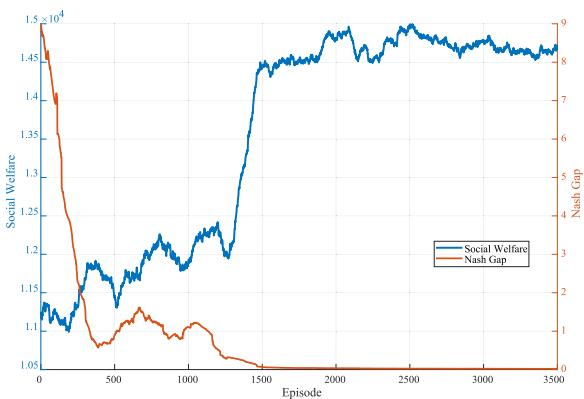

Fig. 4. The variation of the Nash gap and social welfare during training iterations.  
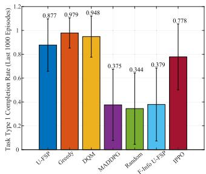  
(a)

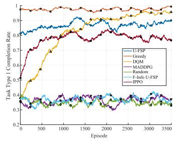  
(b)  
Fig. 5. Task type 1 completion rate: bar (left) and line (right) comparisons.

As shown in the Fig. 4, the Nash gap exhibits a sustained monotonic decline throughout the training process and eventually stabilizes at a low level, indicating that unilateral deviations by individual UAVs no longer yield noticeable gains. Meanwhile, the social welfare curve rises rapidly during the same period and then plateaus at a high value, suggesting that the overall system eficiency has reached a stable optimum. Notably, the inflection regions of the two curves are closely aligned, where the sharp decrease in the Nash gap coincides with the rapid increase in social welfare, indicating that improved stability of individual strategies leads to better global performance.

This inverse yet synchronized evolution between the Nash gap and social welfare provides strong empirical evidence that the U-FSP algorithm guides the UAV swarm toward a Nash equilibrium, where no individual UAV has a significant incentive to deviate and the system achieves maximized collective eficiency. These empirical findings are fully consistent with the theoretical results derived from the potential-game framework and the convergence properties of the FSP process.

## F. Performance Analysis of U-FSP Across Diferent Task Types

To further validate the efectiveness of U-FSP, we conduct a detailed comparative analysis between the baseline methods and U-FSP across three types of tasks, as illustrated in Figs. 5–7. Here, Task1 represents the high-load perception tasks, Task2 denotes the medium-load fusion tasks, and Task3 corresponds to the light-load planning tasks.

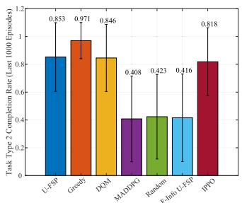  
(a)

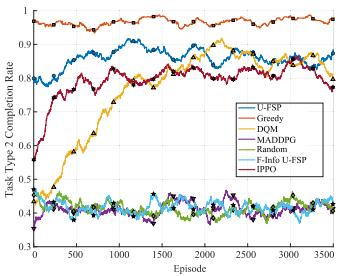  
(b)

Fig. 6. Task type 2 completion rate: bar (left) and line (right) comparisons.  
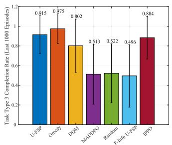  
(a)

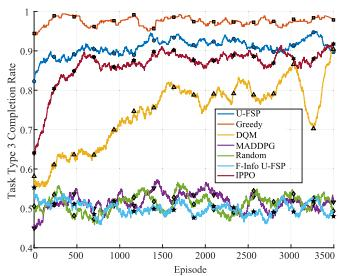  
(b)  
Fig. 7. Task type 3 completion rate: bar (left) and line (right) comparisons.

In Section V-D, we have already discussed several prominent deficiencies of the Greedy, MADDPG, and F-Info U-FSP methods. Therefore, this section focuses on comparing the performance of DQM, IPPO, and U-FSP.

For the Task1, Fig. 5a shows that U-FSP achieves a completion rate of 0.877 in the last 1,000 episodes, slightly lower than DQM’s 0.948 but higher than IPPO’s 0.778. As illustrated in Fig. 5b, U-FSP’s improvement trend is gradual, whereas DQM converges faster. IPPO exhibits a similar rising trend to DQM and converges slightly earlier, but its optimization trajectory is less stable than that of U-FSP. For the Task2, Fig. 6a shows that U-FSP reaches 0.853, outperforming both DQM’s 0.846 and IPPO’s 0.818. Moreover, in Fig. 6b, the optimization process of U-FSP is notably more stable than those of DQM and IPPO. Although IPPO rises faster than DQM and converges earlier, it still exhibits lower stability than U-FSP. For the Task3, Fig. 7a indicates that U-FSP achieves 0.915, exceeding both DQM’s 0.802 and IPPO’s 0.884. Meanwhile, Fig. 7b reveals that DQM’s optimization trajectory is highly unstable. IPPO performs better than DQM in this task and shows a faster convergence trend than U-FSP, but its final completion rate still remains below that of U-FSP.

Combining these results with the analysis in Section V-D, it can be inferred that DQM tends to prioritize completing the task that yields the highest immediate reward (Task1). However, because it often prefers to execute Task1 locally, it incurs excessive energy consumption (see Fig. 3a), which prevents it from completing the other two task types on time. Furthermore, DQM does not tend to ofload unfinished tasks, leading to the notably lower completion ratios observed in Figs. 6 and 7. Compared with DQM, IPPO improves the completion performance of Task2 and Task3 to some extent, indicating a stronger tendency to exploit ofloading and cooperative processing. However, its performance remains less stable than that of U-FSP across all three task types.

TABLE II  
ABLATION STUDY ON THE PROPOSED BELIEF-AWARE MECHANISM
<table><tr><td>Method</td><td>Social Welfare ↑</td><td>Task Completion ↑</td><td>Avg. Task Time ↓</td><td>Avg. Energy Used ↓</td><td>Nash Gap ↓</td></tr><tr><td>U-FSP</td><td>10518.88</td><td>0.900</td><td>15.16</td><td>75.89</td><td>0.034</td></tr><tr><td>U-FSP w/o Belief</td><td>8206.96</td><td>0.620</td><td>16.28</td><td>86.48</td><td>0.207</td></tr></table>

In contrast, the proposed U-FSP demonstrates a consistently stable and gradual improvement across all three task types, maintaining high completion ratios (all above 0.85) compared to DQM and IPPO. Combined with the results in Fig. 3, these findings further confirm that U-FSP efectively performs task ofloading and resource allocation while ensuring low energy consumption and low latency.

## G. Ablation Study on the Belief-Aware Mechanism

To further verify the efectiveness of the proposed beliefaware mechanism, we conduct an ablation study by removing the belief component from U-FSP. Specifically, the belief over the aggregate actions of other UAVs is excluded from the decision state, while the Q-learning-based learning framework is retained. In this way, the comparison can directly reveal whether the performance improvement of U-FSP is mainly brought by the proposed belief augmentation mechanism rather than by the conventional reinforcement learning backbone itself. The comparison results over the last 1000 training episodes are reported in Table II.

As shown in Table II, removing the belief component causes clear degradation in all selected metrics. Compared with U-FSP w/o Belief, the full U-FSP improves the social welfare by approximately 28.2% and the task completion ratio by approximately 45.2%. At the same time, it reduces the average task completion time by approximately 6.9%, the average energy consumption by approximately 12.2%, and the Nash gap by approximately 83.4%.

These results indicate that the superiority of U-FSP is not simply inherited from the conventional Q-learning backbone. Instead, the proposed belief-aware mechanism plays a critical role by enabling each UAV to exploit lightweight aggregateaction information when making decentralized decisions under imperfect information. This additional coordination awareness leads to better task execution eficiency, lower energy expenditure, and more stable strategic behavior.

## VI. SMALL-SCALE REAL-WORLD VALIDATION

To further validate the practical feasibility of the proposed U-FSP framework, we conducted a small-scale real-world experiment in a two-UAV rail-line inspection scenario.4 Through this experiment, we examine whether the key assumptions of U-FSP remain meaningful and feasible in a real deployment setting, including decentralized decision-making, imperfect information, and lightweight communication-assisted coordination.

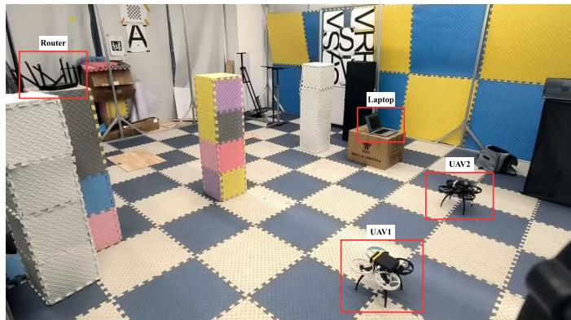  
Fig. 8. Real-world experimental setup.

## A. Experimental Setup Layout

We constructed a small-scale validation environment to emulate the corridor-shaped rail-line inspection scenario considered in this paper, as shown in Fig. 8.

Specifically, three foam columns were deployed to form a simplified corridor-like flight space, among which the middle column served as an obstacle. A router on the left side of Fig. 8 and a laptop on the right jointly constituted the groundside edge node. Due to site constraints, the two devices were physically separated but remained connected within the same local network. In this setup, the laptop distributes simulated task packets to the UAVs, which make corresponding decisions to process the tasks, while the edge-side system provides lightweight aggregate feedback for decentralized coordination. After takeof, the two UAVs moved forward sequentially within the corridor and finally landed in sequence.

## B. Validation of the Existence of Imperfect Information and Communication Constraints

The key frames of the UAV flight process in the experiment are shown in Fig. 9. Specifically, Figs. 9a and 9b depict the takeof of the two UAVs, Figs. 9c and 9d show the UAVs flying along the corridor, where one UAV performs basic obstacle avoidance, and Figs. 9e and 9f illustrate the landing process. During execution, each UAV makes decisions based on its own locally available information and the lightweight aggregate feedback provided by the ground-side edge node, which is consistent with the decentralized imperfect-information formulation of U-FSP in the paper.

To verify that the assumptions of imperfect information and communication constraints considered in this paper also arise in real-world deployment, we collected runtime logs from the real-flight experiment and organized representative time-step records, as summarized in Table III. In this table, “Aggregate feedback $C ( t ) ^ { , , }$ denotes the lightweight system-level coordination signal provided by the router-assisted edge side. “Peer private state directly accessible?” indicates whether a UAV can directly access the full private state of the other UAV, which remains false throughout the experiment. “Received peer-side information” denotes the peer packet actually available at the current step through router-mediated forwarding, whereas “Actual current peer private state” denotes the peer UAV’s true current state at the same step. In both columns, the four entries in brackets correspond to battery level, local queue length, normalized local computational load, and local task status, respectively. “Packet delivered this step?” indicates whether a new peer-state packet is successfully received at the current step. “Peer packet status” summarizes the communication condition of the currently available peer packet, including unavailable communication, delayed transmission, newly delivered packets, and stale cached packets. Finally, “Current info age / original packet delay” reports two temporal measures, namely the staleness of the currently available peer information relative to the present step and the forwarding delay experienced when that packet was first delivered.

TABLE III  
REPRESENTATIVE DATA EXTRACTED FROM REAL-WORLD FLIGHT LOGS
<table><tr><td rowspan="2">Step</td><td rowspan="2">UAV</td><td rowspan="2">Aggregate feedback C(t)</td><td rowspan="2">Peer private state directly accessible?</td><td rowspan="2">Received peer-side information</td><td rowspan="2">Actual current peer private state</td><td rowspan="2">Packet delivered this step?</td><td rowspan="2">Peer packet status</td><td rowspan="2">Current info age / original packet delay</td></tr><tr><td></td></tr><tr><td>1</td><td>UAV1</td><td>[1,0,1]</td><td>False</td><td>Unavailable</td><td>[95.0%, 0, 0.148, idle]</td><td>False</td><td>out_of_range</td><td> ${ \mathrm { a g e } } = - , { \mathrm { d e l a y } } = -$ </td></tr><tr><td>1</td><td>UAV2</td><td>[1,0,1]</td><td>False</td><td>Unavailable</td><td>[93.2%, 1, 0.141, processing]</td><td>False</td><td> $\mathrm { o u t \_ o f \_ r a n g e }$ </td><td>age = −, delay = –</td></tr><tr><td>39</td><td>UAV1</td><td>[0,2,0]</td><td>False</td><td>Unavailable</td><td>[93.2%, 0, 0.455, idle]</td><td>False</td><td>delayed_in_transit</td><td>age = −, delay = −</td></tr><tr><td>39</td><td>UAV2</td><td>[0,2,0]</td><td>False</td><td>Unavailable</td><td>[91.4%, 1, 0.504, processing]</td><td>False</td><td>delayed_in_transit</td><td>age = −, delay = −</td></tr><tr><td>42 42</td><td>UAV1</td><td>[0,2,0]</td><td>False</td><td>[93.1%, 0, 0.176, idle]</td><td>[93.0%, 1, 0.508, processing]</td><td>True</td><td>delivered_this_step</td><td>age = 2, delay = 2</td></tr><tr><td>43</td><td>UAV2</td><td>[0,2,0]</td><td>False</td><td>[91.4%, 1, 0.447, processing]</td><td>[91.3%, 1, 0.445, processing]</td><td>True</td><td>delivered_this_step</td><td>age = 1, delay = 1</td></tr><tr><td>43</td><td>UAV1</td><td>[0,1,1]</td><td>False</td><td>[93.1%, 0, 0.176, idle]</td><td>[93.0%, 1, 0.579, processing]</td><td>False</td><td>stale_cached_packet</td><td>age = 3, delay = 2</td></tr><tr><td>61</td><td>UAV2</td><td>[0,1,1]</td><td>False</td><td>[91.4%, 1, 0.447, processing]</td><td>[91.3%, 1, 0.549, processing]</td><td>False</td><td>stale_cached_packet</td><td>age = 2, delay = 1</td></tr><tr><td></td><td>UAV1</td><td>[1,0,1]</td><td>False</td><td>[92.2%, 0, 0.164, idle]</td><td>[92.1%, 0, 0.195, idle]</td><td>False</td><td>stale_cached_packet</td><td>age = 3, delay = 2</td></tr><tr><td>61</td><td>UAV2</td><td>[1,0,1]</td><td>False</td><td>[90.7%, 0, 0.162, idle]</td><td>[90.5%, 0, 0.167, idle]</td><td>False</td><td>stale_cached_packet</td><td>age = 3, delay = 2</td></tr></table>

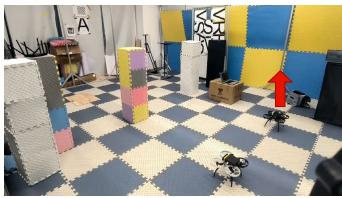

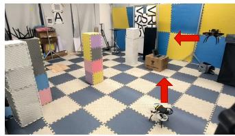

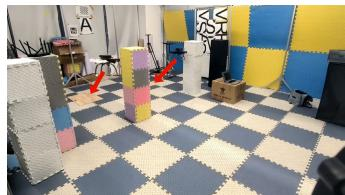

(a)  
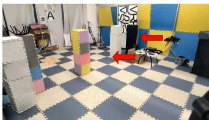  
(c)

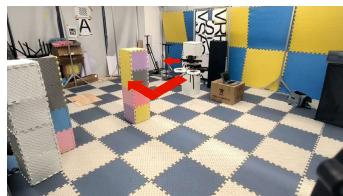  
(b)

(e)  
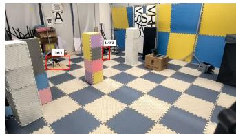  
(d)  
(f)  
Fig. 9. Key frames during the entire flight process, including takeof, forward corridor flight, basic obstacle avoidance, and landing. The red arrows indicate the flight direction of the UAVs.

Several representative observations can be drawn from the table. At step 1, the peer-side information available to both UAVs is “Unavailable,” and the packet status is marked as “out of range.” This indicates that, at the beginning of runtime, each UAV cannot directly access the peer UAV’s private state, and the decision process therefore does not rely on complete real-time global information. At step 39, the packet status becomes “delayed in transit,” while the available peer-side information remains unavailable. This shows that, even when communication is established through routerassisted forwarding, transmission delay and packet uncertainty may still prevent the latest peer-state information from being received in time. At step 42, the packet status changes to “delivered this step,” and each UAV obtains a peer-side packet. However, the received peer-side information is still not exactly identical to the peer UAV’s actual current private state, indicating that even successfully delivered information may exhibit a temporal mismatch relative to the peer UAV’s instantaneous state. At step 43, the packet status becomes “stale cached packet,” meaning that no new update is received at the current step and the UAV must rely on the most recently delivered peer packet. As a result, the available peer-side information becomes outdated relative to the peer UAV’s true current state. A similar phenomenon can also be observed at step 61, where the peer-side information remains marked as stale cached data and its recorded information age is greater than zero. This further confirms that, in real-world systems, the information available to each UAV may remain delayed or stale across consecutive decision steps.

These real-flight observations verify that the proposed U-FSP framework remains feasible under imperfect information and communication constraints. During execution, each UAV makes decisions based on local information and the lightweight aggregate feedback C(t), without direct access to the peer UAV’s private state. Even when peer-state information is forwarded through edge devices, it may be unavailable, delayed, or stale due to practical communication limitations. Therefore, the real-world implementation is consistent with the decentralized imperfect-information formulation adopted in this paper. We emphasize that these recorded peer-state discrepancies are used only for experimental analysis and are not used as real-time global state input for decision-making.

TABLE IV  
PERFORMANCE COMPARISON BETWEEN U-FSP AND DQM IN THE REAL-WORLD DEPLOYMENT EXPERIMENT
<table><tr><td>Method</td><td>Task completion rate↑</td><td>Average completion time (s)↓</td></tr><tr><td>DQM</td><td>61.3%</td><td>21.7</td></tr><tr><td>U-FSP</td><td>83.7%</td><td>17.7</td></tr></table>

## C. Performance Validation of U-FSP in Real-World Deployment

To further validate the feasibility of the proposed U-FSP in real-world deployment, we additionally implemented DQM as a baseline for performance comparison. For each method, five real-flight experiments were conducted, each consisting of 70 decision steps. To ensure fairness, both methods were evaluated on the same experimental platform under identical environmental settings, including the same task packet format and size, identical wireless communication configurations, and a consistent overall flight procedure. The averaged results over the five real-flight runs for both methods are reported in Table IV.

As shown in Table IV, U-FSP achieves a task completion rate of 83.7%, whereas DQM achieves 61.3%. In addition, the average task completion time of U-FSP is 17.7s, which is lower than the 21.7s of DQM. These results further demonstrate the feasibility of U-FSP in real-world deployment under imperfect information and communication constraints. Compared with the purely local decision-making approach of DQM, U-FSP provides more eficient decentralized coordination, which validates the efectiveness of the belief update mechanism based on lightweight aggregate feedback.

## D. Discussion on Practical Deployment Challenges

Although the above real-world validation demonstrates that U-FSP is practically executable under decentralized operation, several challenges remain for deployment in real rail-line inspection systems. First, unreliable communication links may further exacerbate the stale or incomplete peer-side information observed in the real-flight logs. Delayed packet forwarding or missed updates can increase the mismatch between available information and the true system state, thereby degrading coordination quality and task-processing eficiency.

Second, localization errors may afect practical deployment. Inaccurate position estimation can influence local state perception, communication-related decisions, and task processing, introducing additional uncertainty beyond the communication constraints considered in this study.

Third, real inspection tasks typically arrive dynamically rather than following a controlled release process. Although the current experiment uses sequentially distributed simulated task packets, it remains a simplified setting. In practice, dynamically arriving tasks would require extending the current framework toward a more online and event-driven decision process.

## VII. CONCLUSION

In this paper, we address the challenge of eficient task ofloading and resource coordination for multi-UAV cooperative rail-line inspection under imperfect information. To overcome the limitations of centralized approaches that rely on full observability, we formulate the rail-line inspection process as a stochastic potential game and propose a decentralized learning framework, U-FSP, which enables each UAV to learn equilibrium strategies through belief-based fictitious self-play.

Through extensive simulations conducted in a realistic rail transit line inspection environment, we demonstrate that our method efectively reduces UAV energy consumption and task completion delay, mitigates resource congestion, and achieves stable decentralized coordination to the Nash equilibrium. Compared with existing baselines, U-FSP exhibits superior eficiency, adaptability, and robustness in imperfectinformation scenarios representative of railway inspection operations. We also conducted a small-scale real-world experiment to further validate the feasibility of deploying U-FSP in practical environments, and demonstrated its efectiveness through comparison with a baseline method.

In future work, we will integrate adaptive communication mechanisms and decision-focused optimization techniques to further enhance the scalability and resilience of multi-UAV rail-line inspection systems operating in complex and dynamic environments. In addition, we adopt a simplified Rayleigh fading channel model in this study, which does not explicitly capture railway-specific propagation characteristics such as corridor efects along the track. In future work, we will incorporate more realistic railway-oriented channel models as well as more dynamic environmental factors into the decentralized learning framework.

## REFERENCES

[1] B. Zhou, W. Zeng, W. Liu, and H. Yang, “Scheduling UAV-assisted urban subway inspection services,” Transp. Res. B, Methodol., vol. 199, Sep. 2025, Art. no. 103287.

[2] P. Aela, H.-L. Chi, A. Fares, T. Zayed, and M. Kim, “UAV-based studies in railway infrastructure monitoring,” Autom. Construct., vol. 167, Nov. 2024, Art. no. 105714.

[3] Z. Zhao et al., “Automatic potential safety hazard evaluation system for environment around high-speed railroad using hybrid U-shape learning architecture,” IEEE Trans. Intell. Transp. Syst., vol. 26, no. 1, pp. 1071–1087, Jan. 2025.

[4] Y. Wu, P. Chen, Y. Qin, Y. Qian, F. Xu, and L. Jia, “Automatic railroad track components inspection using hybrid deep learning framework,” IEEE Trans. Instrum. Meas., vol. 72, pp. 1–15, 2023.

[5] L. Tong et al., “TriRNet: Real-time rail recognition network for UAVbased railway inspection,” IEEE Trans. Intell. Transp. Syst., vol. 25, no. 5, pp. 3927–3943, May 2024.

[6] Y. Tan, S. Li, H. Liu, P. Chen, and Z. Zhou, “Automatic inspection data collection of building surface based on BIM and UAV,” Autom. Construct., vol. 131, Nov. 2021, Art. no. 103881.

[7] C. He et al., “An adaptive heuristic algorithm with a collaborative search framework for multi-UAV inspection planning,” Appl. Soft Comput., vol. 174, Apr. 2025, Art. no. 112969.

[8] K. Li, X. Yan, and Y. Han, “Multi-mechanism swarm optimization for multi-UAV task assignment and path planning in transmission line inspection under multi-wind field,” Appl. Soft Comput., vol. 150, Jan. 2024, Art. no. 111033.

[9] K. Jia, D. Yang, Y. Wang, T. Shui, and C. Liu, “Energy eficient and balanced task assignment strategy for multi-AAV patrol inspection system in mobile edge computing network,” IEEE Trans. Netw. Sci. Eng., vol. 12, no. 1, pp. 210–222, Jan. 2025.

[10] H. Guo, Y. Wang, J. Liu, and C. Liu, “Multi-UAV cooperative task ofloading and resource allocation in 5G advanced and beyond,” IEEE Trans. Wireless Commun., vol. 23, no. 1, pp. 347–359, Jan. 2024.

[11] L. Tan, S. Guo, P. Zhou, Z. Kuang, S. Long, and Z. Li, “Multi-UAV-enabled collaborative edge computing: Deployment, ofloading and resource optimization,” IEEE Trans. Intell. Transp. Syst., vol. 25, no. 11, pp. 18305–18320, Nov. 2024.

[12] Z. Kuang, Y. Pan, F. Yang, and Y. Zhang, “Joint task ofloading scheduling and resource allocation in air–ground cooperation UAVenabled mobile edge computing,” IEEE Trans. Veh. Technol., vol. 73, no. 4, pp. 5796–5807, Apr. 2024.

[13] N. Zhao, Z. Ye, Y. Pei, Y.-C. Liang, and D. Niyato, “Multi-agent deep reinforcement learning for task ofloading in UAV-assisted mobile edge computing,” IEEE Trans. Wireless Commun., vol. 21, no. 9, pp. 6949–6960, Sep. 2022.

[14] G. Sun et al., “Joint task ofloading and resource allocation in aerialterrestrial UAV networks with edge and fog computing for post-disaster rescue,” IEEE Trans. Mobile Comput., vol. 23, no. 9, pp. 8582–8600, Sep. 2024.

[15] M. Mugnai, M. T. Lose, E. Herrera-Alarc´ on, G. Baris, M. Satler, and´ C. Avizzano, “An eficient framework for autonomous UAV missions in partially-unknown GNSS-denied environments,” Drones, vol. 7, no. 7, p. 471, Jul. 2023.

[16] P. Yue et al., “UAV autonomous navigation system based on air–ground collaboration in GPS-denied environments,” Drones, vol. 9, no. 6, p. 442, Jun. 2025.

[17] Y. Wang, Z. Su, A. Benslimane, Q. Xu, M. Dai, and R. Li, “Collaborative honeypot defense in UAV networks: A learning-based game approach,” IEEE Trans. Inf. Forensics Security, vol. 19, pp. 1963–1978, 2024.

[18] Z. Sheng, H. Fu, Z. Huang, A. A. Nasir, Q. Wu, and D. Zeng, “Outage-aware online prediction control for securing UAVaided communication,” IEEE Trans. Veh. Technol., vol. 74, no. 7, pp. 11039–11054, Jul. 2025.

[19] Z. Ye, K. Wang, Y. Chen, X. Jiang, and G. Song, “Multi-UAV navigation for partially observable communication coverage by graph reinforcement learning,” IEEE Trans. Mobile Comput., vol. 22, no. 7, pp. 4056–4069, Jul. 2023.

[20] T. Ju, L. Li, S. Liu, and Y. Zhang, “A multi-UAV assisted task ofloading and path optimization for mobile edge computing via multi-agent deep reinforcement learning,” J. Netw. Comput. Appl., vol. 229, Sep. 2024, Art. no. 103919.

[21] R. Lowe, Y. I. Wu, A. Tamar, J. Harb, O. P. Abbeel, and I. Mordatch, “Multi-agent actor-critic for mixed cooperative-competitive environments,” in Proc. Adv. Neural Inf. Process. Syst., vol. 30, 2017, pp. 6379–6390. [Online]. Available: https://proceedings.neurips.cc/ paper/2017/hash/68a9750337a418a86fe06c1991a1d64c-Abstract.html

[22] F. Facchinei and J.-S. Pang, “12 Nash equilibria: The variational approach,” in Convex Optimization in Signal Processing and Communications. Cambridge, U.K.: Cambridge Univ. Press, 2010, p. 443.

[23] X. Chen and K.-C. Leung, “Fictitious self-play for vehicle-to-grid game with imperfect information,” in Proc. IEEE Int. Conf. Commun. (ICC), May 2019, pp. 1–6.

[24] J. Heinrich, M. Lanctot, and D. Silver, “Fictitious self-play in extensiveform games,” in Proc. Int. Conf. Mach. Learn. (ICML), 2015, pp. 805–813.

[25] S. A. Zakaryia, M. Meaad, T. Nabil, and M. K. Hussein, “Task ofloading and resource allocation for multi-UAV asset edge computing with multi-agent deep reinforcement learning,” Computing, vol. 107, no. 5, pp. 1–31, May 2025.

[26] Z. Kuang, H. Wang, J. Li, and F. Hou, “Utility-aware UAV deployment and task ofloading in multi-UAV edge computing networks,” IEEE Internet Things J., vol. 11, no. 8, pp. 14755–14770, Aug. 2023.

[27] P. Zhao, Z. Kuang, Y. Guo, and F. Hou, “Task ofloading and resource allocation in UAV-assisted vehicle platoon system,” IEEE Trans. Veh. Technol., vol. 74, no. 1, pp. 1584–1596, Jan. 2025.

[28] S. Liu, Z. Zhang, and G. Han, “Semantic task ofloading and resource allocation in UAV-assisted mobile edge computing network for disaster rescue,” IEEE Trans. Veh. Technol., early access, Feb. 16, 2026, doi: 10.1109/TVT.2026.3665191.

[29] X. Liu et al., “Service capacity maximization in multi-UAV MEC: Deployment, ofloading, and resource allocation,” IEEE Trans. Veh. Technol., early access, Feb. 3, 2026, doi: 10.1109/TVT.2026.3660629.

[30] X. Hu et al., “Railway switch machine fault diagnosis considering sensor abnormality scenarios,” in Proc. IEEE 26th Int. Conf. Intell. Transp. Syst. (ITSC), Sep. 2023, pp. 4834–4839.

[31] X. Hu et al., “Simultaneous fault diagnosis for sensor and railway point machine for autonomous rail system,” in Proc. IEEE 27th Int. Conf. Intell. Transp. Syst. (ITSC), Sep. 2024, pp. 1011–1016.

[32] K. Li, B. Jiu, W. Pu, H. Liu, and X. Peng, “Neural fictitious self-play for radar antijamming dynamic game with imperfect information,” IEEE Trans. Aerosp. Electron. Syst., vol. 58, no. 6, pp. 5533–5547, Dec. 2022.

[33] Z. Chen, Y. Yang, J. Xu, Y. Chen, and J. Huang, “Task ofloading and resource pricing based on game theory in UAV-assisted edge computing,” IEEE Trans. Services Comput., vol. 18, no. 1, pp. 440–452, Jan. 2025.

[34] A. Nabi and S. Moh, “Joint ofloading decision, user association, and resource allocation in hierarchical aerial computing: Collaboration of UAVs and HAP,” IEEE Trans. Mobile Comput., vol. 24, no. 8, pp. 7267–7282, Aug. 2025.

[35] W. McEneaney and R. Singh, “Deception in autonomous vehicle decision making in an adversarial environment,” in Proc. AIAA Guid., Navigat., Control Conf. Exhibit, Aug. 2005, p. 6152.

[36] J. F. Nash, “Non-cooperative games,” in The Foundations of Price Theory, vol. 4. Evanston, IL, USA: Routledge, 2024, pp. 329–340.

[37] D. S. Leslie and E. J. Collins, “Generalised weakened fictitious play,” Games Econ. Behav., vol. 56, no. 2, pp. 285–298, Aug. 2006.

Yin Jia received the M.S. degree from Yanshan University, China, in 2024. He is currently pursuing the Ph.D. degree with the School of Automation and Intelligence, Beijing Jiaotong University, China.

His research interests include deep learning, data mining, and intelligent collaboration.

Li Zhu (Senior Member, IEEE) received the Ph.D. degree in trafic control and information engineering from Beijing Jiaotong University, Beijing, China, in 2012. He is currently a Faculty Member with Beijing Jiaotong University and a Visiting Scholar with Carleton University, Ottawa, ON, Canada, and The University of British Columbia, Vancouver, BC, Canada. His research interests include train-ground communication technology in communication base train ground communication (CBTC) systems and cross layer design in train-ground communication systems.

F. Richard Yu (Fellow, IEEE) received the Ph.D. degree in electrical engineering from The University of British Columbia (UBC) in 2003. From 2002 to 2006, he was with Ericsson, Lund, Sweden, and a start-up in CA, USA. He joined Carleton University in 2007, where he is currently a Professor. His research interests include crosslayer/crosssystem designs, security, green ICT, and QoS provisioning in wireless-based systems. He received the IEEE Outstanding Service Award in 2016, the IEEE Outstanding Leadership Award in 2013, the Carleton

Research Achievement Award in 2012, Ontario Early Researcher Award (formerly Premiers Research Excellence Award) in 2011, the Excellent Contribution Award at IEEE/IFIP TrustCom 2010, the Leadership Opportunity Fund Award from Canada Foundation of Innovation in 2009, and the Best Paper Awards at IEEE ICC 2014, Globecom 2012, IEEE/IFIP TrustCom 2009, and International Conference on Networking in 2005. He served as the technical program committee (TPC) co-chair for numerous conferences. He is a registered Professional Engineer in the Province of Ontario, Canada. He serves as the Vice-Chair for the IEEE Technical Committee on Green Communications and Computing and a member of the Board of Governors for the IEEE Vehicular Technology Society. He serves on the editorial boards of several journals, including the Co-Editor-in-Chief for Ad Hoc and Sensor Wireless Networks and a Lead Series Editor for IEEE TRANSACTIONS ON VEHICULAR TECHNOLOGY, IEEE TRANSACTIONS ON GREEN COMMUNI-CATIONS AND NETWORKING, and IEEE COMMUNICATIONS SURVEYS & TUTORIALS.

Bo Ai (Fellow, IEEE) received the master’s and Ph.D. degrees from Xidian University, China. He was a Visiting Professor with the Electrical Engineering Department, Stanford University, Stanford, CA, USA, in 2015. He is currently a Full Professor with Beijing Jiaotong University, where he is also the Dean of the School of Electronic and Information Engineering. He is one of the directors for Beijing “Urban Rail Operation Control System” International Science and Technology Cooperation Base and the Backbone Member of the Innovative

Engineering based jointly granted by Chinese Ministry of Education and the State Administration of Foreign Experts Afairs. He is the research team leader of 26 national projects. He holds 26 invention patents. His research interests include the research and applications of channel measurement and channel modeling and dedicated mobile communications for rail trafic systems. He has authored or co-authored eight books and authored over 300 academic research articles in his research areas. Five papers have been the ESI highly cited paper. He has won some important scientific research prizes. He has been notified by the Council of Canadian Academies that based on the Scopus database, he has been listed as one of the top 1% authors in his field all over the world. He has also been feature interviewed by the IET Electronics Letters. He is a fellow of The Institution of Engineering and Technology and an IEEE VTS Distinguished Lecturer. He received the Honor of Excellent Post-Doctoral Research Fellow from Tsinghua University in 2007. He received the Distinguished Youth Foundation and Excellent Youth Foundation from the National Natural Science Foundation of China, the Qiushi Outstanding Youth Award by the Hong Kong Qiushi Foundation, the New Century Talents by Chinese Ministry of Education, the Zhan Tianyou Railway Science and Technology Award by Chinese Ministry of Railways, and the Science and Technology New Star by Beijing Municipal Science and Technology Commission. He is an IEEE VTS Beijing Chapter Vice Chair and an IEEE BTS Xi’an Chapter Chair. He was the co-chair or the session/track chair of many international conferences. He is an Associate Editor of the IEEE ANTENNAS AND WIRELESS PROPAGATION LETTERS and IEEE TRANSACTIONS ON CONSUMER ELECTRONICS and an Editorial Committee Member of the Wireless Personal Communications journal. He is the Lead Guest Editor of Special Issues on IEEE TRANSACTIONS ON VEHICULAR TECHNOLOGY, the IEEE ANTENNAS AND PROPAGATIONS LETTERS, and the International Journal on Antennas and Propagations.

Tao Tang (Senior Member, IEEE) received the Ph.D. degree in engineering from Chinese Academy of Sciences, Beijing, China, in 1991. He is currently the Director with the School of Electronic and Information Engineering and also the Director of the State Key Laboratory of Rail Trafic Control and Safety, Beijing Jiaotong University, Beijing. He is a member of the Experts Group of High Technology Research and Development Program of China (863 Program) and the Leader in the Field of Modern Transportation Technology Experts Group. He is also a Specialist with the National Development and Reform Commission and Beijing Urban Trafic Construction Committee. His research interests include communication-based train control, high-speed train control systems, and intelligent transportation systems.