# Decentralized Intelligence for Energy-Eficient 6G TN–NTN: A Cooperative Multi-Agent DRL Framework for Active RIS-Aided UAV-NOMA Communications

Monzur Morshed , Student Member, IEEE, Mostafa Zaman Chowdhury , Senior Member, IEEE, and Yeong Min Jang , Member, IEEE

Abstract—Convergence between terrestrial networks (TN) and non-terrestrial networks (NTN) is one of the fundamental pillars of sixth generation (6G) connectivity. However, such joint integration gives rise to significant challenges in resource allocation, especially for the interference and blockage-aflicted cell-edge users. In this work, we investigate the deployment of active reconfigurable intelligent surfaces (RIS) mounted on unmanned aerial vehicles (UAV) for dynamically controlling the propagation environment. In contrast to classical centralized optimization, we model a joint optimization problem, including UAV trajectory, active RIS beamforming, amplification, phase shifts, and non-orthogonal multiple access power allocation, as a decentralized one. We propose a multi-agent reinforcement learning (MARL) framework based on the algorithm multi-agent proximal policy optimization with a paradigm called centralized training and decentralized execution. The Base Station, UAV, and RIS play the role of independent agents. They learn cooperative policies in order to maximize a multi-objective reward function, which combines network sum-rate, energy eficiency, and user fairness. Through extensive simulations, we demonstrate that our proposed MARL approach efectively learns complex cooperative strategies. It achieves better performance measures than a deterministic policy gradient baseline and also demonstrates better scalability than a centralized single-agent baseline. Numerical results demonstrate that the proposed MARL framework achieves a high spectral eficiency of 19.31 bps/Hz and a peak energy eficiency of 1.61 Mbits/Joule. This reflects an energy eficiency improvement of over 40% and a spectral eficiency improvement of 7.2% compared to the centralized SARL baseline. Furthermore, the decentralized architecture reduces the real-time parallel inference latency to approximately 2.85 ms, efectively decreasing the operational computational delay by 57%. Rigorous ablation studies explain the benefits of optimizing each system component, while performance analysis under varying interference conditions provides important insights for robust 6G TN-NTN deployments.

Index Terms—6G, active RIS, energy eficiency, fairness, multi-agent reinforcement learning (MARL), NOMA, resource allocation, TN-NTN, UAV.

## I. INTRODUCTION

seamless global connectivity, which represents a significant shift from today’s ground-based networks to those deeply integrated with space and air-based networks such as satellites and unmanned aerial vehicles (UAVs) [1]. This ensemble of technologies is called a terrestrial networks and non-terrestrial networks (TN-NTN). TN-NTN, in radio terminology, aimed at no longer having a “digital divide.” Clearly, the need for greater connectivity enables new technologies, but it also poses one important challenge in managing this complex mixture of networks. In particular, one of the most serious problems arises for users far from the base station (BS) in a cell, in general known as cell-edge users. They are subjected to both strong inter-cell interference and unfavorable channel conditions.

To address these issues, several technologies have been proposed. non-orthogonal multiple access (NOMA) [2] was identified as a strong technique to improve spectral eficiency [3] and user fairness [4]. Meanwhile, reconfigurable intelligent surfaces (RIS) are being studied for an innovative way to intelligently manipulate the wireless propagation environment [5], [6]. Passive RISs can only reflect signals passively due to the fact that their performance is fundamentally limited by the multiplicative fading efect. Active RISs with reflection-type amplifiers can solve the problem by active signal amplification at the expense of increasing power consumption and hardware complexity [7]. Additionally, deploying an active RIS on a mobile UAV introduces another degree of freedom and enables on-demand coverage and dynamic blockage mitigation.

The joint optimization of the UAV trajectory, BS power allocation, and the active RISs’ high-dimensional amplification and phase-shift matrices gives rise to a high-dimensional non-convex problem, which is well beyond the reach of conventional optimization techniques in real time. Deep reinforcement learning (DRL) has been applied to solve such complex problems. While DRL has been applied to overcome the high computation costs of traditional optimization for joint

UAV trajectory and RIS phase-shift design [8], these solutions still rely on a single agent to control the entire network. A salient limitation of this centralized paradigm is its catastrophic failure in scalability: the state-action space explodes as the network grows, and the requisite signaling overhead becomes prohibitive for practical deployment. Against this backdrop, this paper pivots towards a decentralized intelligence framework. Although multi-agent reinforcement learning (MARL) has been used in spectrum access and UAV-RIS scenarios, existing works do not address the TN–NTN integration challenges with mobile users and active RIS amplification. Therefore, our paper is the first to demonstrate a scalable multi-agent proximal policy optimization (MAPPO) based decentralized learning framework for this complex 6G architecture. The key contributions of this work are fourfold:

1) Unlike existing works that rely on a monolithic, centralized controller, we propose a fully decentralized cooperative framework specifically for an active RISaided UAV-NOMA network. This work reduces the massive joint action space into smaller, manageable sub-tasks, by decomposing the highly non-convex TN-NTN resource allocation problem into three physically motivated agents (BS, UAV, Active RIS). This architectural shift enables eficient decentralized execution while preserving coordination among agents.

2) This research proposes a customized MAPPO algorithm that operates under the centralized training with decentralized execution (CTDE) paradigm. This allows the agents to learn complex strategies ofline while keeping real-time execution simple and fast.

3) We design a composite reward function that balances the intrinsic trade-of between network sum-rate, energy eficiency (EE), Jain’s Fairness Index and a dynamic outage penalty, which is essential for protecting edge users in a NOMA system. The reward structure includes a dynamic penalty due to outage events that helps the agents to make robust and fair decisions.

4) Through extensive simulation, we prove that our decentralized agent decomposition efectively learns cooperative interference-mitigation strategies in highly non-stationary environments. Compared to centralized single-agent (SARL) approaches that sufers from the curse of dimensionality and fail as the network grows, our MARL framework exhibits near-linear scalability as the number of users increases. Furthermore, the proposed decentralized framework remains robust against random-walk mobility, which represent the worst-case non-deterministic scenario.

The remainder of this paper is structured as follows. Section II details the system model and formulates the multiobjective optimization problem. Section III introduces our decentralized MARL framework and baseline algorithms. Section IV presents the simulation results, and Section V concludes the paper.

## II. RELATED WORKS

The integration of UAVs and RIS into future wireless networks is an exciting and rapidly evolving area of research.

To highlight our contributions, the following section organizes state-of-the-art literature around key domains: DRL-based resource allocation for UAV-RIS systems, centralized versus decentralized control paradigms, and applications in advanced network architectures such as NOMA and NTN. Early studies have aimed at exploiting the power of DRL in solving complex non-convex optimization problems that naturally arise in jointly optimizing UAVs and RISs. Indeed, seminal works such as that by Mei et al. in [8] pioneered the use of centralized DRL agents that can optimize, in a concurrent manner, a UAV’s trajectory along with the passive phase shifts of a RIS, though such passive architectures are physically constrained by the double-fading efect. For instance, the evolution toward RIS, capable of reflecting signals, has been pursued in works such as [9], but most often within highly simplified static scenarios. As the field advanced, algorithms and more complex architectures were considered by the researchers. For instance, Wu et al. in [10] and Guo et al. in [11] considered complex satellite-UAV-terrestrial integrated networks; they use centralized DDPG agents for beamforming and trajectory optimization. Although these methods were efective, they were single-agent methods, which sufer from poor scalabilitya problem common to centralized control. One of the key issues in this field is pointed out in surveys like [12], this is the so-called “curse of dimensionality,” where the stateaction space grows exponentially with the number of network elements.

To address this scalability issue, MARL has emerged as the state-of-the-art paradigm [13]. The CTDE framework is particularly efective for cooperative tasks. While MARL has been applied to related problems, such as dynamic spectrum access Gbenga-Ilori et al. [14] and satellite edge computing Jiang et al. [15], its application to the specific, combined problem of UAV trajectory, active RIS configuration, and multi-objective NOMA power allocation in a dynamic environment with mobile users remains underexplored.

As summarized in Table I, existing works exhibit key limitations that our research directly addresses. Many studies either focus on diferent objectives (e.g., security [16]), consider simplified environments (e.g., RIS-assisted multi-UAV network optimization [17]), employ centralized agents that lack scalability [11], or investigate diferent network architectures (e.g., THz-band [18], [19]). Rate-Splitting Multiple Access (RSMA) has recently been recognized as a powerful strategy for interference management in integrated networks. For example, a recent study [20] utilized a DRL framework to optimize UAV trajectories and RIS beamforming in an RSMA-enabled system. While RSMA is highly flexible, it often requires more sophisticated signal processing at the receiver end to decode the signals. To keep the decoding process simple for the ground users, our work focuses on power-domain NOMA. We then leverage the active RIS to overcome NOMA’s interference challenges, allowing our system to achieve high data rates while keeping the hardware requirements for the ground users simple. To the best of our knowledge, no prior work has proposed and validated a MAPPO-based MARL framework with our specific agent decomposition (UAV, BS, RIS) in a challenging environment that combines a weak direct path and continuous user mobility. Our work fills this crucial gap by demonstrating that a properly designed MARL agent can learn a robust, coordinated policy that is superior to both centralized and uncoordinated baselines in a realistic, dynamic setting.

TABLE I  
COMPARISON OF THIS WORK WITH STATE-OF-THE-ART LITERATURE ON UAV-RIS COMMUNICATIONS
<table><tr><td>Reference</td><td>Year</td><td>Core Focus / Archi- tecture</td><td></td><td>Algorithm</td><td>Control</td><td>Key Contribution</td><td>Limitation Addressed</td></tr><tr><td>Mei et al. [8]</td><td>2022</td><td>RIS-Assisted System</td><td>UAV</td><td>DRL (Generic)</td><td>Centralized</td><td>A foundational work on joint trajectory and phase-shift de- sign.</td><td>Considers passive RIS and a centralized agent.</td></tr><tr><td>Guo et al. [11]</td><td>2023</td><td>NOMA-based Objective IS-UAV-TNs</td><td>1 Multi-</td><td>MO-DDPG</td><td>Centralized</td><td>Investigates multi-objective DDPG.</td><td>Relies on a single, centralized agent (scalability issues).</td></tr><tr><td>Li et al. [21]</td><td>2023</td><td>Multi-Cell RIS-Aided System</td><td></td><td>DDPG (DTDE)</td><td>Decentralized</td><td>Proposes distributed DDPG for static, multi-cell TN without UAV.</td><td>Addresses scenario without UAV mobility.</td></tr><tr><td>Wu et al. [10]</td><td>2024</td><td>RIS-assisted UAV IoT</td><td>Satellite-</td><td>DRL (Generic)</td><td>Centralized</td><td>Explores a complex satellite- based NTN.</td><td>Centralized agent; does not de- compose the problem.</td></tr><tr><td>Sharma et al. [18]</td><td>2024</td><td>RIS-aided THz munication</td><td>Com-</td><td>N/A</td><td>N/A</td><td>Focuses on channel modeling for THz bands.</td><td>No learning-based resource al- location.</td></tr><tr><td>Ayub et al. [22]</td><td>2025</td><td>High-Mobility NTN</td><td>UAV-</td><td>Joint Optimization</td><td>N/A</td><td>Proposes a general optimization framework.</td><td>Lacks scalable learning algo- rithm for execution.</td></tr><tr><td>Gbenga et al. [14]</td><td>2025</td><td>Dynamic Access</td><td>Spectrum</td><td>MARL</td><td>Multi-Agent</td><td>Applies MARL to spectrum sharing.</td><td>Does not address UAV trajec- tory or RIS.</td></tr><tr><td>Umar et al. [17]</td><td>2025</td><td>Multi-UAV, Multi-Cell MISO</td><td></td><td>PPO, DDPG</td><td>Centralized</td><td>Compares PPO and DDPG for multi-UAV system.</td><td>Assumes static users (no non- stationary challenge).</td></tr><tr><td>Fu et al. [23]</td><td>2025</td><td>RIS-Assisted Satellite</td><td>NOMA</td><td>PPO-DQN</td><td>Centralized</td><td>Hybrid PPO-DQN for mixed ac- tion spaces.</td><td>Satellite focus (no UAV mobil- ity); centralized agent.</td></tr><tr><td>Moghaddam [19]</td><td>2025</td><td>RIS-assisted THz with Transformer</td><td></td><td>DRL-Transformer</td><td>Centralized</td><td>Integrates Transformer with DRL for THz.</td><td>Centralized agent; THz specific.</td></tr><tr><td>Triwidyastuti [24]</td><td>2025</td><td>Physical Layer Secu- rity in Aerial RIS</td><td></td><td>Transfer Learning</td><td>Centralized</td><td>Focuses on security using trans- fer learning.</td><td>Different objective; centralized approach.</td></tr><tr><td>This Work</td><td></td><td>Joint Trajectory, Ac- tive RIS, NOMA</td><td></td><td>MAPPO</td><td>Multi-Agent (CTDE)</td><td>Novel Contribution: Proposes a specific MARL agent decom- position (UAV, BS, RIS) and demonstrates its superiority in a challenging environment with both a weak direct path and continuous user mobility. Proves scalability over centralized</td><td></td></tr></table>

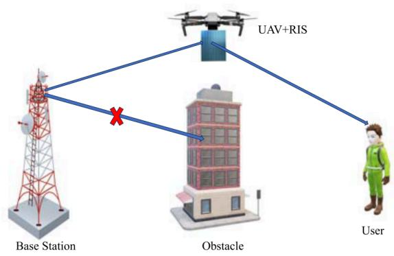  
Fig. 1. System architecture of active RIS-assisted UAV for coverage enhancement and interference mitigation (for simplicity, we have shown only one user).

## III. SYSTEM MODEL AND PROBLEM FORMULATION

## A. Network Architecture

We consider a downlink communication scenario centered around a single serving BS that provides coverage to $N _ { p } = 4$ pairs of NOMA users. Each pair consists of a cell-center user (CU), located closer to the BS, and a cell-edge user (EU), located at the periphery of the service area. The Fig. 1 represents the system architecture of active RIS-assisted UAV for coverage enhancement and interference mitigation.

The network operates in a challenging dynamic environment designed to stress-test the proposed framework. This environment includes two key features:

1) Interference: A fixed, external interfering BS is present, creating a persistent source of inter-cell interference for all users. This makes robust resource allocation a necessity.

2) Mobility: All ground users are mobile, constantly changing their positions over time.

To enhance connectivity and mitigate the challenges of interference, blockage, and user mobility, the network is augmented by an active RIS. This RIS is mounted on a mobile UAV, which functions as a dynamic, intelligent aerial relay.

The primary BS is located at a fixed position $\mathbf { p } _ { B S } \ \in \ \mathbb { R } ^ { 3 }$ The UAV’s trajectory is discretized into time steps t, with its position denoted by $\mathbf { p } _ { U A V } [ t ] \in \mathbb { R } ^ { 3 }$ . The ground users follow a random-walk mobility model, where each user moves in a randomly chosen direction at each time step. The UAV trajectory is not pre-defined; it is learned by the agent during optimization. This random-walk model is intentionally used as a worst-case scenario, creating a highly non-stationary environment with no predictable patterns. In practice, user mobility is more structured (e.g., pedestrian or vehicular), which would make learning easier. The random-walk assumption therefore, provides a conservative lower bound on the performance that the proposed framework can achieve in practice. The NTN component refers to the UAV-mounted RIS acting as a lowaltitude aerial platform with an optimized trajectory, rather than following a fixed orbital path. This aligns with 3GPP TR 38.811, where UAVs are included as NTN platforms. Extending this framework to more structured mobility models, such as LEO satellite trajectories, is identified as a direction for future work. The position of a user k at time t is denoted by $\mathbf { p } _ { k } [ t ] \in \mathbb { R } ^ { 3 }$ . This continuous movement creates a non-stationary environment that requires the DRL agents to learn adaptive policies rather than static solutions.

## B. Channel Model

The wireless links are characterized by a distance-dependent path loss model. The path loss gain between two points separated by a distance d with a path loss exponent is:

$$
L ( d , \alpha ) = C _ { 0 } d ^ { - \alpha } ,\tag{1}
$$

where $C _ { 0 } ~ = ~ 1 0 ^ { - 3 . 5 }$ is the path loss at a 1-meter reference distance. To create a challenging scenario that necessitates the use of the UAV-RIS, the path loss exponent for the direct BSto-user path is set to a moderately high value, $\alpha _ { d i r e c t } = 3 . 5$

## C. Active RIS Model

In our TN-NTN system, communication from the BS to each user k occurs via a direct path and a UAV-assisted reflected path. The total efective channel is their coherent superposition. The DRL agents learn to jointly optimize the UAV’s position and the RIS configuration to maximize the strength of this composite channel.

1) UAV-Assisted Reflected Path: The active RIS, mounted on the UAV, intercepts the BS signal and reflects it to the user, forming a two-hop channel. The RIS is characterized by an amplitude vector $\beta [ t ] = [ \beta _ { 1 } [ t ] , \ldots , \beta _ { M } [ t ] ]$ and a phase shift vector ${ \pmb { \phi } } [ t ] = [ \phi _ { 1 } [ t ] , \ldots , \phi _ { M } [ t ] ]$ , . . . , β. Each RIS element applies a complex reflection coeficient $\theta _ { m } [ t ] = \beta _ { m } [ t ] e ^ { j \phi _ { m } [ t ] }$ . Assuming a BS antenna array gain of $N _ { \mathrm { a n t } }$ θ β, the end-to-end efective gain of the RIS-assisted link is expressed as the cascade of the BS-to-RIS and RIS-to-user links [22]:

$$
G _ { \mathrm { R I S } , k } [ t ] = \ \sqrt { N _ { \mathrm { a n t } } L _ { b r } [ t ] L _ { r u , k } [ t ] } \left| \sum _ { m = 1 } ^ { M } \beta _ { m } [ t ] e ^ { j \phi _ { m } [ t ] } \right| ,\tag{2}
$$

where $L _ { b r } [ t ]$ and $L _ { r u , k } [ t ]$ are the path-loss gains of the BS-,RIS and RIS-user links, respectively. The term $\beta _ { m } [ t ]$ is the amplitude gain from the m-th active RIS element.

If all phases are perfectly aligned $( \phi _ { m } [ t ] = \phi _ { \mathrm { o p t } }$ for all m), the signals combine coherently, and the gain becomes [22]:

$$
G _ { \mathrm { R I S } , k } [ t ] = \sqrt { N _ { \mathrm { a n t } } L _ { b r } [ t ] L _ { r u , k } [ t ] } \sum _ { m = 1 } ^ { M } \beta _ { m } [ t ] .\tag{3}
$$

The DRL agent learns to align the phase shifts, approaching the coherent upper bound of $\operatorname { E q . } \ ( 3 )$ as an emergent optimal strategy rather than a hard constraint.

2) Direct Path: A direct non-line-of-sight (NLoS) path, assumed to be weak due to blockage or distance, may also exist between the BS and the user. Its gain is given by [22]:

$$
G _ { \mathrm { d i r e c t } , k } [ t ] = \sqrt { N _ { \mathrm { a n t } } L _ { b u , k } [ t ] } ,\tag{4}
$$

where $L _ { b u , k } [ t ]$ is the large-scale path-loss gain between the BS and user k.

3) Total Efective Channel: The total efective channel for user k is the coherent sum of the direct and RIS-assisted components [22]:

$$
h _ { \mathrm { e f f } , k } [ t ] = G _ { \mathrm { d i r e c t } , k } [ t ] + G _ { \mathrm { R I S } , k } [ t ] .\tag{5}
$$

The system objective is to optimize the UAV’s position and RIS configuration so that these signals add constructively, maximizing the received signal power.

## D. NOMA Transmission and SINR Model

The BS uses power-domain NOMA to serve a CU and an EU on the same resource block. The total BS transmit power, $P _ { T } ,$ is divided equally among the $N _ { p }$ user pairs. For each pair i, power is allocated based on a NOMA coeficient, $\alpha _ { i } \in [ 0 . 5 , 1 . 0 )$

$P _ { e , i }$ is the power allocated to the EU.

• $P _ { c , i }$ is the power allocated to the CU.

Per NOMA principles, the user with the weaker channel (the EU) receives more power. The specific power levels are given by [11]:

$$
P _ { e , i } = \alpha _ { i } ( P _ { T } / N _ { p } ) ,\tag{6}
$$

$$
P _ { c , i } = ( 1 - \alpha _ { i } ) ( P _ { T } / N _ { p } ) .\tag{7}
$$

In practice, $\alpha _ { i }$ is bounded away from unity by a small margin to ensure non-zero power allocation to the cell-center user at all times Each user k also experiences inter-cell interference power, $I _ { k } [ t ] = P _ { \mathrm { i n t } } L _ { \mathrm { i n t } , k } [ t ] N _ { \mathrm { a n t } }$ , from a neighboring external BS. Successive interference cancellation (SIC) is applied at the receivers. We model the signal-to-interference-plus-noise ratio (SINR) for each user as follows.

1) SINR for the Cell-Edge User (EU): The EU decodes its signal by treating the CU’s signal as interference. Its SINR is therefore [11]:

$$
\gamma _ { e , i } [ t ] = \frac { P _ { e , i } | h _ { \mathrm { e f f } , e , i } [ t ] | ^ { 2 } } { P _ { c , i } | h _ { \mathrm { e f f } , e , i } [ t ] | ^ { 2 } + I _ { e , i } [ t ] + \sigma ^ { 2 } } ,\tag{8}
$$

where $| h _ { \mathrm { e f f } , e , i } [ t ] | ^ { 2 }$ is the efective channel power gain, $I _ { e , i } [ t ]$ is , ,the inter-cell interference, and $\sigma ^ { 2 }$ ,is the thermal noise power. 2) SINR for the Cell-Center User (CU): The CU first decodes the EU’s signal, subtracts it via SIC, and then decodes its own. With perfect SIC, the interference from the EU is removed, and the CU’s SINR is [11]:

$$
\gamma _ { c , i } [ t ] = \frac { P _ { c , i } | h _ { \mathrm { e f f } , c , i } [ t ] | ^ { 2 } } { I _ { c , i } [ t ] + \sigma ^ { 2 } } .\tag{9}
$$

The achievable rates for the cell-center and cell-edge users in pair i are calculated using the Shannon capacity formula:

$$
R _ { c , i } [ t ] = \log _ { 2 } ( 1 + \gamma _ { c , i } [ t ] ) ,\tag{10}
$$

$$
R _ { e , i } [ t ] = \log _ { 2 } ( 1 + \gamma _ { e , i } [ t ] ) ,\tag{11}
$$

where $R _ { c , i } [ t ]$ and $R _ { e , i } [ t ]$ are the instantaneous data rates of the cell-center and cell-edge users in the i-th pair, respectively.

## E. Performance Metrics

We train agents to find a policy that maximizes a weighted utility of three key performance indicators.

1) Sum Rate (SR): The sum rate represents the total achievable network throughput at time step t. For our NOMA transmission model, the sum rate is expressed as [17].

$$
R _ { \mathrm { s u m } } [ t ] = \sum _ { i = 1 } ^ { N _ { p } } ( R _ { c , i } [ t ] + R _ { e , i } [ t ] ) ,\tag{12}
$$

where $N _ { p }$ denotes the total number of NOMA user pairs. 2) Energy Eficiency (EE): The ratio of bits transmitted per Joule of energy. The total power consumption $P _ { \mathrm { t o t a l } }$ is:

$$
P _ { \mathrm { t o t a l } } [ t ] = P _ { T } + P _ { \mathrm { U A V } } [ t ] + P _ { \mathrm { R I S , s t a t i c } } + P _ { \mathrm { R I S , a m p } } [ t ] ,\tag{13}
$$

where PUAV[t] represents the UAV propulsion power and $P _ { U A V } [ t ] ~ = ~ \kappa \cdot P _ { h o \nu e r ; }$ , with $\kappa \ = \ 1 . 5$ during movement and $\kappa = 1 . 0$ κ . when hovering. This linear approximation is adopted for tractability in lieu of a full rotary-wing aerodynamic model. Here, $P _ { T }$ is the transmit power of the source, $P _ { \mathrm { R I S , s t a t i c } }$ is the static circuit power of the RIS, and $P _ { \mathrm { R I S , a m p } } [ t ]$ denotes the dynamic amplifier power consumption of the active RIS elements. The latter is given by [7]:

$$
P _ { \mathrm { R I S , a m p } } [ t ] = P _ { \mathrm { a m p } } \sum _ { m = 1 } ^ { M } \beta _ { m } [ t ] ^ { 2 } ,\tag{14}
$$

with M being the number of active RIS elements and $\beta _ { m } [ t ]$ the amplitude reflection coeficient of the m-th element.

It is crucial to note that practical hardware overhead severely impacts the energy eficiency of active RIS deployments. Our model explicitly captures this by integrating both the static circuit power consumption $( P _ { \mathrm { R I S , s t a t i c } } )$ and the dynamic amplifier power overhead $( P _ { \mathrm { R I S , a m p } } [ t ] )$ . This ensures the agents learn an energyaware policy that avoids unnecessary amplification when the marginal sum-rate gain is outweighed by the power cost. Accordingly, the instantaneous energy eficiency is defined as:

$$
\eta _ { \mathrm { E E } } [ t ] = \frac { B \cdot R _ { \mathrm { s u m } } [ t ] } { P _ { \mathrm { t o t a l } } [ t ] } ,\tag{15}
$$

where B denotes the system bandwidth.

3) Jain’s Fairness Index (JFI): To ensure equitable service among all users, Jain’s Fairness Index is adopted. This metric evaluates how uniformly the data rates are distributed across the user set U . It is computed as:

$$
\mathcal { I } [ t ] = \frac { \left( \sum _ { k \in \mathcal { U } } R _ { k } [ t ] \right) ^ { 2 } } { | \mathcal { U } | \sum _ { k \in \mathcal { U } } R _ { k } [ t ] ^ { 2 } } ,\tag{16}
$$

where $R _ { k } [ t ]$ is the achieved rate of user k at time t, and |U | is the total number of users.

4) Outage Probability: Outage probability basically quantifies the reliability of the network. It measures the fraction of users whose instantaneous rate falls below

TABLE II  
REWARD FUNCTION WEIGHT JUSTIFICATION
<table><tr><td>Parameter</td><td>Value</td><td>Explanation</td></tr><tr><td> $w _ { r }$ </td><td>10.0</td><td>Prioritizes network throughput (sum-rate).</td></tr><tr><td> $w _ { e }$ </td><td>0.1</td><td>Encourages energy efficiency.</td></tr><tr><td> $w _ { f }$ </td><td>1.0</td><td>Promotes user fairness.</td></tr><tr><td> $w _ { \mathrm { o u t } }$ </td><td>5.0</td><td>Penalizes user outage.</td></tr></table>

a predefined threshold $R _ { \mathrm { t h } }$ . The outage probability is formulated as:

$$
P _ { \mathrm { o u t } } = \frac { 1 } { \vert \mathcal { U } \vert } \sum _ { k \in \mathcal { U } } \mathbb { I } ( R _ { k } < R _ { \mathrm { t h } } ) ,\tag{17}
$$

where I(·) is the indicator function.

The objective is to maximize the expected cumulative reward by jointly optimizing the UAV trajectory $\mathcal { P } = \{ \mathop { \bf p } _ { \mathrm { U A V } } [ t ] \}$ , RIS configurations $\mathcal { C } = \{ \beta [ t ] , \phi [ t ] \}$ , and NOMA power allocation factors $\mathcal { A } = \{ \alpha _ { i } [ t ] \}$ The reward function at step t is:

$$
\begin{array} { r l } & { r _ { t } = w _ { r } R _ { \mathrm { s u m } } [ t ] + w _ { e } ( \eta _ { \mathrm { E E } } [ t ] / 1 0 ^ { 6 } ) + w _ { f } \mathcal { T } [ t ] } \\ & { ~ - w _ { \mathrm { o u t } } P _ { \mathrm { o u t } } [ t ] - P _ { \mathrm { o o b } } [ t ] , } \end{array}\tag{18}
$$

where $w _ { r } , w _ { e } , w _ { f } , w _ { o u t }$ are objective weights, and $P _ { \mathrm { o o b } } [ t ]$ is a penalty for the UAV violating geographical constraints. This formulation defines a high-dimensional, non-convex problem well-suited for a MARL approach. The weights are chosen to balance competing objectives, as detailed in Table II.

5) Efective Sum Rate (ESR): To account for network reliability, we define the efective sum rate as the raw sum rate scaled by the probability of successful transmission. It is expressed as:

$$
R _ { \mathrm { e f f } } [ t ] = R _ { \mathrm { s u m } } [ t ] \times ( 1 - P _ { \mathrm { o u t } } [ t ] ) ,\tag{19}
$$

where $R _ { \mathrm { e f f } } [ t ]$ is the efective sum rate and $\mathcal { P } _ { \mathrm { o u t } } [ t ]$ is the outage probability.

## F. Problem Formulation

Our objective is to maximize a weighted utility function by jointly optimizing the UAV trajectory ${ \mathcal { P } } = \{ { \bf p } _ { U A V } [ t ] \}$ , RIS configurations $\mathcal { C } = \{ \beta [ t ] , \phi [ t ] \}$ , and NOMA power allocation factors $\mathcal { A } = \{ \alpha _ { i } [ t ] \}$

$$
\begin{array} { r l } & { \displaystyle \operatorname* { m a x } _ { \mathcal { P } , \mathcal { C } , \mathcal { A } } ~ \mathbb { E } \left[ \displaystyle \sum _ { t = 0 } ^ { T - 1 } w _ { r } R _ { \mathrm { s u m } } [ t ] + w _ { e } ( \eta _ { \mathrm { E E } } [ t ] / 1 0 ^ { 6 } ) \right. } \\ & { \left. \quad + w _ { f } \mathcal { T } [ t ] - w _ { \mathrm { o u t } } \mathcal { P } _ { \mathrm { o u t } } [ t ] - \mathcal { P } _ { \mathrm { o o b } } [ t ] \right] } \\ & { \mathrm { s . t . } ~ C 1 : \mathbb { P } _ { U A V } [ t ] ~ \in \mathrm { F e a s i b l e ~ A i r s p a c e } , } \\ & { \quad \quad \quad C 2 : - \pi \leq \phi _ { m } [ t ] \leq \pi , \quad \forall m , t , } \\ & { \quad \quad C 3 : 1 \leq \beta _ { m } [ t ] \leq a _ { \mathrm { m a x } } , \quad \forall m , t , } \\ & { \quad \quad \quad C 4 : 0 . 5 \leq \alpha _ { t } [ t ] < 1 . 0 , \quad \forall i , t . } \end{array}\tag{20}
$$

where $\mathcal { P } _ { \mathrm { o u t } } [ t ]$ is the outage probability, and $\mathcal { P } _ { \mathrm { o o b } } [ t ]$ is a penalty applied if the UAV violates geographic boundaries. This is a high-dimensional, non-convex stochastic optimization problem, well-suited for a MARL approach.

## IV. DECENTRALIZED MARL FRAMEWORK

To tackle the optimization problem (20) in a scalable and decentralized manner, we model the system as a cooperative MMDP. The proposed learning framework is summarized in Algorithms 1 Specifically, Algorithm 1 provides a high-level overview of the entire MAPPO with CTDE process.

## A. MMDP Formulation

An MMDP is defined by the tuple $\langle S , \{ \mathcal { A } _ { i } \} _ { i = 1 } ^ { N } , P , \{ \mathcal { R } _ { i } \} _ { i = 1 } ^ { N } , \gamma \rangle$ where N is the number of agents. In our system, $N = 3$ agents (1 BS, 1 UAV, 1 Active RIS).

• State Space (S): The global state $s _ { t } ~ \in ~ S$ at time t comprises all local observations.

• Action Spaces $( \{ { \mathcal { A } } _ { i } \} ) \colon$ Each agent i has its own action space.

1) BS Agent $( \mathcal { A } _ { \mathrm { B S } } ) \colon$ Selects the NOMA power allocation factor $\alpha _ { i } [ t ] \in [ 0 . 5 , 1 )$

2) UAV Agent $( { \mathcal { A } } _ { \mathrm { U A V } } ) { \ : } :$ Selects a discrete movement vector for trajectory.

3) RIS Agent $( \mathcal { A } _ { \mathrm { R I S } } ) \colon$ Selects the continuous control vectors for its onboard RIS—specifically, the amplification vector [t] and the phase shift vector [t].

• Observation Spaces $( \{ \mathcal { O } _ { i } \} ) \colon$ Each agent i perceives a local observation $o _ { i , t } \in \mathcal { O } _ { i }$ . For instance, a BS agent observes the channels of its associated users, while the UAV agent observes its position and its link channels.

• Reward Function (R): This is a cooperative setting where all agents strive to maximize a shared global reward signal at each step t:

$$
\begin{array} { r l } & { r _ { t } = w _ { r } R _ { \mathrm { s u m } } [ t ] + w _ { e } ( \eta _ { \mathrm { E E } } [ t ] / 1 0 ^ { 6 } ) + w _ { f } \mathcal { T } [ t ] } \\ & { ~ - ~ w _ { \mathrm { o u t } } P _ { \mathrm { o u t } } [ t ] - P _ { \mathrm { o o b } } [ t ] , } \end{array}\tag{21}
$$

where $P _ { \mathrm { o o b } } [ t ]$ is a penalty term if the UAV violates flight constraints. The weights $w _ { r } , w _ { e } , w _ { f } , w _ { o u t }$ are hyperparameters that can be tuned to prioritize diferent network objectives.

## B. MAPPO With Centralized Training and Decentralized Execution

We employ the MAPPO algorithm, a multi-agent variant of PPO, which is well-suited for its stability and sample eficiency. The CTDE paradigm is key to its success.

Centralized Training: During the training phase, a centralized critic network is utilized. This critic has access to the global state $s _ { t }$ and the joint action of all agents $\{ \mathbf { a } _ { i , t } \}$ . It learns a state-value function $V _ { \phi } ( s _ { t } )$ that accurately estimates φthe expected cumulative reward. The critic is updated by minimizing the loss:

$$
L ( \phi ) = \mathbb { E } _ { t } \left[ ( V _ { \phi } ( s _ { t } ) - \hat { R } _ { t } ) ^ { 2 } \right] ,\tag{22}
$$

where $\hat { R } _ { t }$ is the target value (e.g., from Generalized Advantage Estimation).

Decentralized Execution: Each agent i has its own actor network $\pi _ { \psi _ { i } } ( a _ { i , t } | o _ { i , t } )$ , which maps its local observation to an action. The actors are updated using the PPO clipped surrogate

Algorithm 1 MAPPO With CTDE for Joint Resource Allo  
cation   
1: Initialize: For each agent $i \in \{ 1 , \ldots , N \} ;$   
2: Actor network $\pi _ { \psi _ { i } }$ with random parameters $\psi _ { i } .$   
3: Initialize shared critic network $V _ { \phi }$ with random parameters   
$\phi .$   
φ4: Initialize experience replay bufer D.   
5: Note: Old log-probabilities log $\cdot \pi _ { \psi _ { i } } ( a _ { i , t } | o _ { i , t } )$ are stored   
directly in $\mathcal { D }$ πψ , ,during rollout and used as the old policy   
reference during PPO updates. No separate target actor   
network is maintained.   
6: for episode = 1 to $E _ { \mathrm { m a x } }$ do   
7: Reset environment and get initial global state $s _ { 0 } .$   
8: Receive initial local observations $\{ o _ { i , 0 } \} _ { i = 1 } ^ { N }$   
9: for timestep $t = 0$ to $T - 1$ do   
10: {— Decentralized Execution —}   
11: for each agent $i = 1$ to N do   
12: Sample action $a _ { i , t } \sim \pi _ { \psi _ { i } } ( \cdot | o _ { i , t } ) .$   
13: end for   
14: Execute joint action $\mathbf { a } _ { t } = \{ a _ { 1 , t } , \ldots , a _ { N , t } \}$ in the env.   
15: Observe global shared reward $r _ { t }$ and next global   
state $s _ { t + 1 } .$   
16: Receive next local observations $\{ o _ { i , t + 1 } \} _ { i = 1 } ^ { N } .$   
17: Store transition $( s _ { t } , \{ o _ { i , t } \} , \mathbf { a } _ { t } , r _ { t } , s _ { t + 1 } )$ in $\mathcal { D } .$   
18: $s _ { t } \gets s _ { t + 1 } .$   
19: end for   
20: {— Centralized Training Phase —}   
21: for update epoch $k = 1$ to K do   
22: Sample a mini-batch of transitions from $\mathcal { D } .$   
23: Calculate advantages $\hat { A } _ { t }$ for all agents using GAE   
and the current critic $V _ { \phi } .$   
24: φ{— Update Shared Critic —}   
25: Calculate critic loss: $\begin{array} { r } { L ( \phi ) = \frac { 1 } { | \boldsymbol { \mathcal { B } } | } \sum ( V _ { \phi } ( s _ { t } ) - \hat { R } _ { t } ) ^ { 2 } . } \end{array}$   
26: φUpdate critic parameters: $\phi \stackrel { . } {  } \phi - \eta _ { c } \nabla _ { \phi } L ( \phi ) .$   
27: φ φ η{— Update Decentralized Actors —}   
28: for each agent $i = 1$ to N do   
29: Compute importance ratio $\begin{array} { r } { \rho _ { i , t } = \frac { \pi _ { \psi _ { i } } ( a _ { i , t } | o _ { i , t } ) } { \pi _ { \psi _ { i , \mathrm { o l d } } } ( a _ { i , t } | o _ { i , t } ) } . } \end{array}$   
30: Compute actor loss $L ( \psi _ { i } )$ πψ , , , via PPO objective:   
31: $\overline { { L ( \psi _ { i } ) } } = - \mathbb { E } _ { t } \big [ \operatorname* { m i n } ( \rho _ { i , t } \hat { A } _ { t } , \operatorname { c l i p } ( \rho _ { i , t } , 1 - \epsilon , \bar { 1 } + \epsilon ) \hat { A } _ { t } ) \big ] -$   
$c _ { 1 } S [ \pi _ { \psi _ { i } } ] ( o _ { i , t } ) .$   
32: Update actor parameters: $\psi _ { i }  \psi _ { i } - \eta _ { a } \nabla _ { \psi _ { i } } L ( \psi _ { i } )$   
33: end for   
34: end for   
35: Clear replay bufer $\mathcal { D } .$   
36: end for

objective function, where the advantage term $A _ { t }$ is computed using the centralized critic’s value function. The objective for actor i is:

$$
\begin{array} { r } { L ( \psi _ { i } ) = \ - \mathbb { E } _ { t } \left[ \operatorname* { m i n } \left( \rho _ { i , t } ( \psi _ { i } ) A _ { t } , \right. \right. } \\ { \left. \left. \operatorname { c l i p } ( \rho _ { i , t } ( \psi _ { i } ) , 1 - \epsilon , 1 + \epsilon ) A _ { t } \right) \right] - c _ { 1 } S \left[ \pi _ { \psi _ { i } } \right] ( o _ { i , t } ) , } \end{array}\tag{23}
$$

where $\begin{array} { r } { \rho _ { i , t } ( \psi _ { i } ) = \frac { \pi _ { \psi _ { i } } ( a _ { i , t } | { o } _ { i , t } ) } { \pi _ { \psi _ { i , \mathrm { o l d } } } ( a _ { i , t } | o _ { i , t } ) } } \end{array}$ is the importance sampling ratio. ,Once training is complete, the centralized critic is discarded,

TABLE III  
MARL HYPERPARAMETERS FOR MAPPO ALGORITHM
<table><tr><td>Hyperparameter</td><td>Value</td></tr><tr><td>Algorithm framework Actor learning rate  $( \eta _ { a } )$  Critic learning rate Steps per rollout  $( N _ { - } S T E P S )$  Actor network structure Critic network structure Optimizer</td><td>MAPPO with CTDE  $3 \times 1 0 ^ { - 4 }$  128 250 MLP (128, 128), Tanh MLP (256, 256), Tanh</td></tr><tr><td> $( \eta _ { c } )$  Discount factor (γ) GAE parameter  $( \lambda _ { G A E } )$ </td><td> $1 \times 1 0 ^ { - 3 }$  0.99 0.95</td></tr><tr><td>PPO clipping epsilon (€)</td><td></td></tr><tr><td>Entropy coefficient  $\left( c _ { 1 } \right)$  Training epochs per data collection (K) Mini-batch size</td><td>0.2 0.01 10</td></tr></table>

TABLE IV

NETWORK AND SYSTEM PARAMETERS
<table><tr><td>Parameter</td><td>Value</td></tr><tr><td>Number of serving BS</td><td>1</td></tr><tr><td>Number of interfering BS</td><td>1</td></tr><tr><td>Number of NOMA User Pairs (Np)</td><td>4</td></tr><tr><td>Number of RIS elements (K)</td><td>16</td></tr><tr><td>System bandwidth (B)</td><td>10 MHz</td></tr><tr><td>BS transmit power (PT)</td><td>Varied from -10 dBm to 25 dBm</td></tr><tr><td>Interfering BS power</td><td>15 dBm</td></tr><tr><td>Noise power spectral density</td><td>-174 dBm/Hz</td></tr><tr><td>Path loss at 1m reference (β0)</td><td>-35 dB</td></tr><tr><td>Path loss exponent (BS to User)</td><td>3.5</td></tr><tr><td>Path loss exponent (BS to UAV)</td><td>2.2</td></tr><tr><td>Path loss exponent (UAV to Center User)</td><td>2.5</td></tr><tr><td>Path loss exponent (UAV to Edge User)</td><td>2.8</td></tr><tr><td>Path loss exponent (Interfering BS to Edge User)</td><td>3.8</td></tr><tr><td>UAV flight altitude</td><td>30 m</td></tr><tr><td>Maximum Active RIS amplitude gain</td><td>4.0 (Linear)</td></tr><tr><td>UAV Hover Power</td><td>100 W</td></tr><tr><td>RIS Static Power</td><td>5.0 W</td></tr><tr><td>Active RIS dynamic power per element  $( P _ { a m p } )$ </td><td>0.1 W</td></tr><tr><td>BS antenna height</td><td>25 m</td></tr><tr><td>User equipment height</td><td>1.5 m</td></tr></table>

and each agent’s actor policy is deployed for real-time, decentralized decision-making based solely on local observations.

## V. SIMULATION RESULTS AND ANALYSIS

In this section, we present a comprehensive evaluation of our proposed MARL framework. We compare its performance against a centralized Single-Agent Reinforcement Learning (SARL) baseline and a centralized DDPG baseline. The agents are trained and evaluated in a dynamic environment that includes continuous user mobility, forcing the agents to constantly adapt their policies. The results are analyzed across several key dimensions, including training convergence, performance under varying network conditions, system component synergy, and scalability.

## A. Simulation Setup

The hyperparameters used for training our MAPPO agent, critical for ensuring the reproducibility of our results, are listed in Table III. Gradient clipping with a global norm threshold of 0.5 and per-batch advantage normalization were applied during training for the ablation study (Fig. 8). The key parameters defining our simulated network environment and channel models are summarized in Table IV.

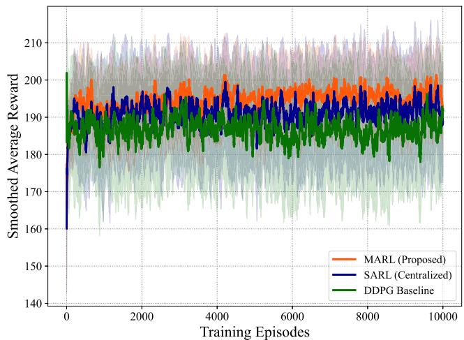  
Fig. 2. Convergence of the proposed optimization framework.

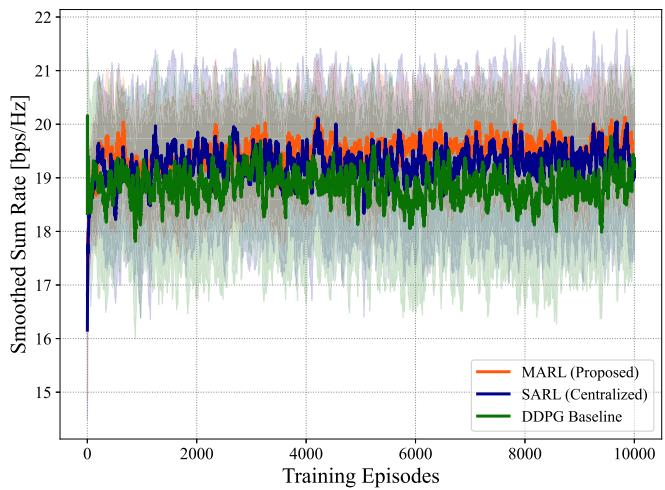  
Fig. 3. Smoothed network sum rate during training for all frameworks.

## B. Convergence Performance

We first analyze the learning dynamics of the agents during training. Figs. 2 and 3 illustrate the smoothed average reward and sum rate, respectively, over the course of 10000 training episodes.

Two key observations emerge. First, our proposed MARL framework achieves the fastest convergence and reaches the highest, most stable plateau compared to both the SARL and DDPG baselines. Specifically, MARL reaches a sum rate of approximately 20 bps/Hz, and throughout the training process it consistently outperforming the other methods. The primary reason for this is that the MARL framework decomposes the massive joint action space into three simpler sub-tasks for the BS, UAV, and RIS. This allows each agent to learn a specialized local policy more efectively. On the other hand, the centralized SARL agent sufers from the curse of dimensionality, where the complexity of exploring a single, monolithic action space limits its ability to find the global optimum. Furthermore, though the SARL agent is lower than MARL, it still maintains better stability and a higher plateau than the DDPG baseline. This is because SARL and MARL both utilize the PPO algorithm, which employs a clipping mechanism to prevent large, destructive updates to the policy. In contrast, the DDPG baseline, which relies on a deterministic policy gradient, exhibits the lowest performance and higher variance. Our environment is highly dynamic with continuous user mobility and interference. As a result, DDPG’s deterministic nature makes it more prone to getting stuck in local minima, which proves that our decentralized PPO-based approach is more robust for managing complex 6G system components.

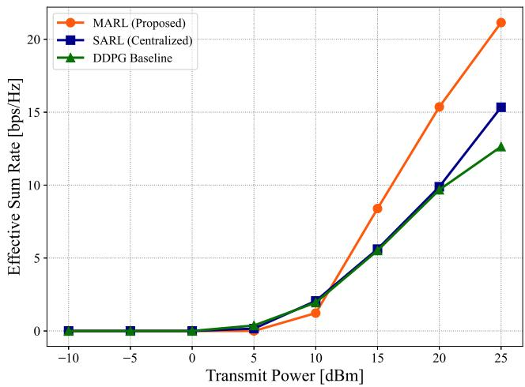

Fig. 4. Efective network sum rate as a function of BS transmit power.  
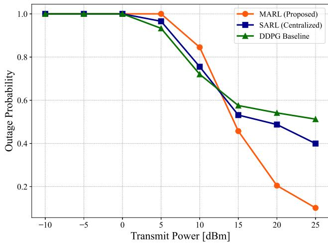  
Fig. 5. Outage probability as a function of BS transmit power.

## C. Performance Vs. Transmit Power

We evaluate the performance of the trained agents under varying BS transmit power, which gradually shifts the network from a noise-limited regime to an interference-limited regime. The results are presented in Figs. 4, 5, and 6. As shown in Fig. 4, our proposed MARL framework consistently outperforms both the centralized SARL and the DDPG baselines, especially at higher power levels (above 10 dBm), where interference becomes a major issue. This shows that the MARL agents have learned an efective cooperative strategy for managing interference. By jointly optimizing UAV position, RIS beamforming, and NOMA power allocation, the MARL approach handles complex trade-ofs much better. The weaker performance of the SARL agent is due to the “curse of dimensionality,” which means that its single, centralized controller struggles to search through the huge action space and ends up with a less eficient policy. In terms of reliability, the MARL agent achieves a much lower outage probability than both baselines across the power range above 10 dBm, as shown in Fig. 5. This is a very important result because it means the cooperative policy learned by the MARL agents is highly efective at protecting vulnerable edge users. The centralized critic has allowed the agents to learn the global consequences of their actions, such as sacrificing a small amount of sum rate to prevent user outages, which are penalized in the reward function. Consequently, the superiority of the MARL approach is further confirmed by Jain’s Fairness Index (JFI) in Fig. 6. The MARL agent maintains a significantly higher JFI than both baselines, a direct result of the low-outage policy. By ensuring that edge users maintain a baseline quality of service, the framework naturally achieves a more equitable distribution of network resources.

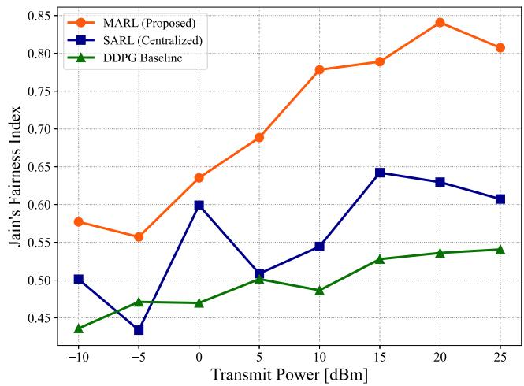  
Fig. 6. Jain’s Fairness Index (JFI) as a function of BS transmit power.

## D. Impact of RIS Size and Technology

To study the efect of the RIS size and the benefit of active versus passive RIS technology, we consider the network sum rate while changing the number of RIS elements. The results shown in Fig. 7 provide two important takeaways. First, active RIS designs perform much better than passive ones for both MARL and SARL agents. Since active elements can amplify incoming signals, they efectively reduce path loss, leading to a noticeable sum-rate improvement that increases with RIS size. Second, the performance gap between MARL and SARL widens with larger RIS sizes, highlighting that the proposed MARL framework can better manage the growing complexity of a larger RIS more efectively than a single centralized controller.

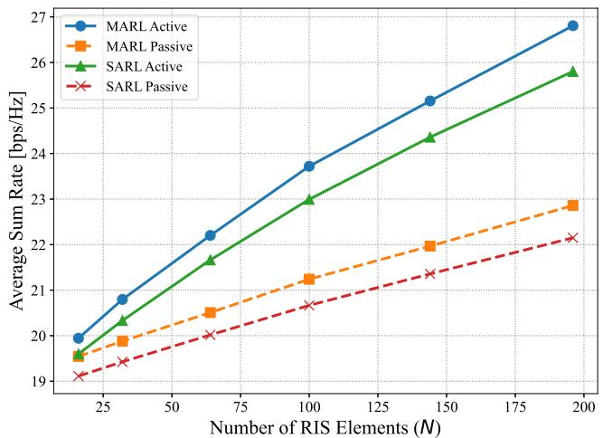  
Fig. 7. Network sum rate versus the number of RIS elements for active and passive RIS.

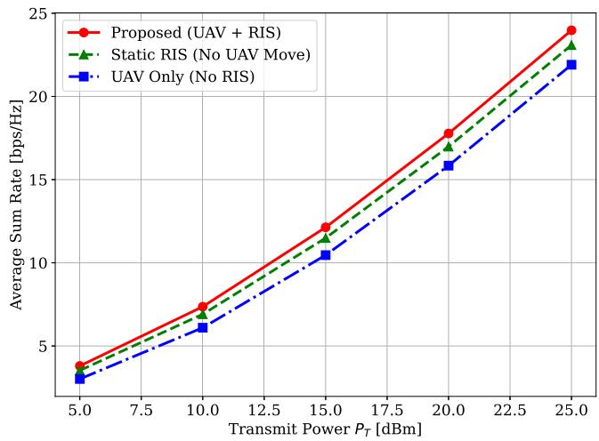  
Fig. 8. Ablation study showing the synergistic benefit of jointly optimizing the UAV trajectory and the RIS configuration, with mobility being the dominant factor.

## E. Ablation Study and Scalability Analysis

To better understand the sources of performance improvement and the practical advantages of the proposed approach, we conduct both an ablation study and a scalability analysis. Our ablation study, presented in Fig. 8, quantifies the contribution of each key technology. A mobile platform can dynamically position itself to avoid blockages and find favorable macro-scale channel conditions. The addition of the RIS provides a further, consistent performance improvement on top of this (“UAV+RIS” vs. “UAV only”). This result clearly proves that the best performance is achieved through the joint optimization of UAV mobility and RIS beamforming, where UAV mobility serves as the primary performance driver and the RIS ofers fine-grained channel enhancement.

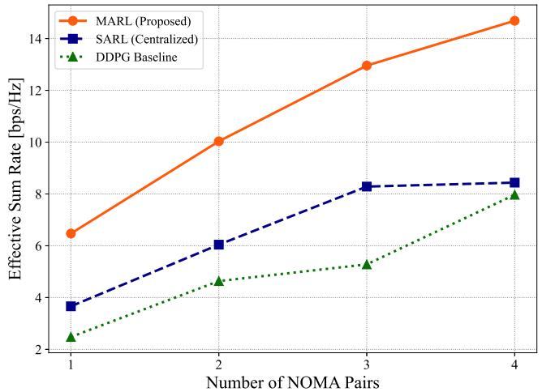  
Fig. 9. Scalability of efective sum rate with an increasing number of NOMA user pairs.

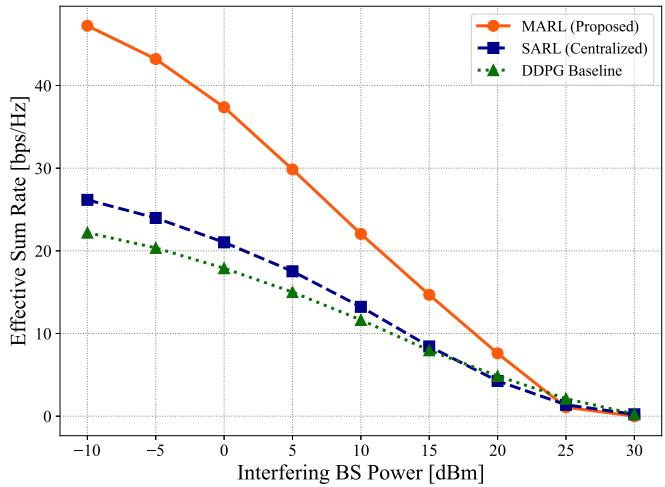  
Fig. 10. Impact of varying interference intensity on the network efective sum rate.

The scalability analysis in Fig. 9 clearly highlights the advantages of decentralization. As the number of NOMA pairs increases, the efective sum rate of the proposed MARL agent scales smoothly, showing a near-linear rise and consistently outperforming both baseline methods. In contrast, the centralized SARL agent struggles to scale and stops improving after a few user pairs. This demonstrates the “curse of dimensionality” in centralized control: as the number of users grows, the state-action space becomes too large, making learning slow and ineficient. The MARL framework avoids this by sharing decisions among several simple agents, making it much more scalable for larger networks.

## F. Performance Under Varying Interference Intensity

To evaluate the robustness of our framework against severe channel conditions, the transmit power of the external interfering BS was varied from −10 dBm to 30 dBm. Fig. 10 shows the efective sum rate of all three algorithms across these interference levels. As the interfering power increases, the efective sum rate naturally degrades across all methods. However, the proposed MARL framework demonstrates substantial superiority in the low-to-moderate interference regimes (−10 dBm to 15 dBm). By cooperatively adjusting the UAV’s spatial position and dynamically tuning the active RIS phase shifts, the decentralized agents successfully maximize the desired signal strength that efectively fights of the external interference. In contrast, the centralized SARL and DDPG baselines struggle to find optimal interference mitigation strategies within their massive, combined action spaces, resulting in significantly lower throughput. Finally, beyond 25 dBm, the interference power is simply too large for any algorithm to compensate. At this point, outages become unavoidable, and the efective sum rate for all algorithms collapses toward zero. This is not a failure of any particular algorithm. It is a physical boundary of wireless communication when the noise floor is too high.

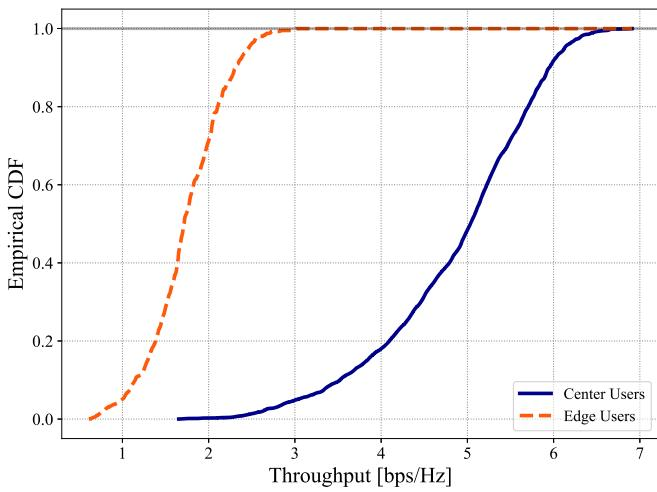  
Fig. 11. CDF of user throughput for cell-center and cell-edge users.

TABLE V  
ENERGY EFFICIENCY VS. SPECTRAL EFFICIENCY TRADE-OFF
<table><tr><td>Algorithm</td><td>Spectral Efficiency (bps/Hz)</td><td>Energy Efficiency (Mbits/Joule)</td></tr><tr><td>MARL (Proposed)</td><td>19.31</td><td>1.61</td></tr><tr><td>DDPG Baseline</td><td>19.54</td><td>1.13</td></tr><tr><td>SARL (Centralized)</td><td>18.00</td><td>1.15</td></tr></table>

## G. Eficiency and User-Level Throughput

Furthermore, the Cumulative Distribution Function (CDF) of user throughput in Fig. 11 provides granular insight into the user experience. As expected under the NOMA protocol, CUs achieve a statistically higher throughput than EUs. Crucially, the steep slope of the EU curve indicates that very few edge users experience near-zero throughput. This confirms that the learned MARL policy efectively guarantees a minimum quality of service for most edge users, confirming the low outage rate and the fairness of our MARL framework.

Finally, we analyze the system’s eficiency and the resulting quality of service delivered to the users. Table V summarizes the learned operating points for the diferent schemes, revealing the trade-of between energy eficiency and spectral eficiency. While the DDPG baseline reaches the highest raw spectral eficiency, it does so at the cost of very high power consumption. Interestingly, SARL achieves a slightly better energy eficiency than DDPG because it is less aggressive in its power usage, but MARL is clearly the best framework as it combines a high data rate with the most eficient use of UAV and RIS resources. As shown in Table V, our proposed MARL framework maintains a high spectral eficiency of 19.31 bps/Hz while delivering a peak energy eficiency of 1.61 Mbits/Joule. This confirms that the MARL agents discovered an intelligent, energy-aware strategy that avoids wasting power on unnecessary movements or excessive amplification, outperforming both centralized baselines.

## VI. ANALYSIS OF COMPUTATIONAL COMPLEXITY

We analyze the computational complexity of the proposed MARL framework and compare it against the centralized DDPG and SARL baselines. The analysis considers both the asymptotic complexity derived from the neural network architectures and the practical performance measured by average runtime per environment step. The neural networks for each agent consist of an actor and a critic. For DDPG, target networks with identical architectures are also maintained. Let $N _ { p }$ be the number of NOMA user pairs, Ne be the number of RIS elements, and H be the number of neurons in the hidden layers. For the centralized SARL and DDPG baselines, the actor network takes the full state as input, with a dimension of $2 + 4 N _ { p } + 2 N _ { e }$ . It has an output layer of size $5 + N _ { p } + 2 N _ { e } ,$ corresponding to the discrete UAV action, continuous NOMA power allocations, and RIS phase/amplitude shifts. The critic network takes the state as input, resulting in an input size of $2 + 4 N _ { p } + 2 N _ { e }$ for SARL, and the state-action concatenation for DDPG. Assuming hidden layers of size H, the computational complexity of one forward pass through the centralized actor is:

$$
\mathcal { O } \left( ( 4 N _ { p } + 2 N _ { e } ) \cdot H + H ^ { 2 } + H \cdot ( N _ { p } + 2 N _ { e } ) \right) .\tag{24}
$$

After omitting non-dominant terms, the overall asymptotic complexity for a full training step in the centralized models scales as:

$$
\mathcal { O } \left( N _ { p } H + N _ { e } H + H ^ { 2 } \right) .\tag{25}
$$

In our proposed MARL framework, the complexity is distributed. The centralized critic processes the global state (dimension $2 + 8 N _ { p } + 2 N _ { e } )$ , while each of the three agents (UAV, BS, RIS) maintains a smaller, specialized actor network that processes only local observations. The inference complexity which is critical for real-time performance, is the sum of parallelizable forward passes through these smaller actors. The UAV actor’s complexity is $\mathcal { O } ( N _ { p } H )$ the BS actor’s is $\mathcal { O } ( N _ { p } H )$ , and the RIS actor’s is O(N H). While the asymptotic complexity of a full training step remains theoretically similar, the decentralized structure fundamentally alters the practical runtime. Algorithmic factors, such as PPO’s on-policy updates versus DDPG’s replay bufer sampling and target network updates, also contribute to diferences in realworld performance.

TABLE VI  
REAL-TIME OPERATIONAL LATENCY PER STEP (MS)ON AN INTEL I7-7700 CPU
<table><tr><td>System Scale  $( N _ { p } , N _ { e } )$ </td><td>MARL (Parallel)</td><td>DDPG</td><td>SARL</td></tr><tr><td>(2, 16)</td><td>2.85 ms</td><td>3.51 ms</td><td>6.68 ms</td></tr><tr><td>(4, 32)</td><td>2.68 ms</td><td>3.41 ms</td><td>6.47 ms</td></tr><tr><td>(4, 64)</td><td>3.08 ms</td><td>3.70 ms</td><td>7.03 ms</td></tr></table>

To evaluate practical deployment feasibility, we measured its execution speed on a standard desktop computer. The testing environment consisted of an Intel Core i7-7700 CPU running at 3.60 GHz with 32 GB of RAM, utilizing Python 3.11 and TensorFlow 2.20.0. Notably, these tests were conducted using only the CPU to demonstrate that expensive GPUs are not required at the network edge nodes to run our models.

A major deployment challenge is the online decision delay. Because our framework uses the CTDE paradigm, the computationally heavy critic network is discarded after ofline training. During real-time operation, the network nodes (BS, UAV, RIS) only execute their lightweight local actor networks. Hardware profiling on an Intel i7-7700 CPU reveals that the decentralized agents achieve an ultra-low parallel inference latency of approximately 2.85 ms per step. This sub-5 ms response time is significantly faster than the centralized baselines, proving that our framework can easily support the real-time requirements of dynamic 6G networks. Latency measurements were obtained by averaging inference time over 1000 consecutive environment steps with TensorFlow graph execution enabled.

As shown in Table VI, the proposed MARL framework consistently delivers the lowest latency across all system scales. For our decentralized approach, we measure the parallel execution delay, which is the time required for the slowest individual agent to reach a decision. Because the MARL actors are small and specialized, they reach decisions much faster than the monolithic SARL and DDPG models. Furthermore, while the centralized models slow down as the number of users and RIS elements grows, our MARL framework maintains a nearly constant latency of around 3 ms. This demonstrates that decentralized intelligence is not only faster but also far more scalable for complex 6G environments.

## VII. CONCLUSION

This work develops and validates a decentralized intelligence framework to address the complex resource allocation problem in UAV-mounted active RIS-integrated TN-NTN systems. We modeled the problem as a cooperative multi-agent task and proposed a scalable and adaptive solution using a sophisticated MAPPO algorithm with CTDE. Our framework learns to jointly optimize UAV trajectory, active RIS configurations, and NOMA power allocation by navigating the complex multi-objective trade-ofs between sum-rate, energy eficiency, and user fairness. The results confirm that the proposed decentralized MARL approach outperforms centralized methods, especially in terms of scalability, reliability, and user fairness. Ablation studies highlight the benefits of optimizing all system components together. This analysis ofers network operators with a practical framework to optimize network performance and supports the development of intelligent, autonomous 6G networks. Ultimately, our framework demonstrates a viable pathway to create self-organizing communication systems that can adapt in real-time to user demands and environmental blockages, which is a cornerstone of the 6G vision. This work therefore not only validates a powerful new approach but also provides a foundational blueprint for engineering the scalable and autonomous intelligence required to manage the unprecedented complexity of future 6G networks.

Several directions remain open for future work. First of all, the current study is based on power-domain NOMA. But if we incorporate RSMA, it will further enhance interference management and spectral eficiency. In addition, the current framework assumes perfect CSI. In reality, estimation errors and signaling delays can significantly influence decentralized coordination. So, their impact should be carefully examined before real-world implementation. Moreover, expanding the proposed multi-agent framework to accommodate multi-UAV networks, along with operation in the high-frequency THz band, could enable more reliable and scalable coverage in future large-scale 6G systems.

## REFERENCES

[1] M. Z. Chowdhury, M. Shahjalal, S. Ahmed, and Y. M. Jang, “6G wireless communication systems: Applications, requirements, technologies, challenges, and research directions,” IEEE Open J. Commun. Soc., vol. 1, pp. 957–975, 2020.

[2] M. Shahjalal, M. H. Rahman, M. M. Alam, M. Z. Chowdhury, and Y. M. Jang, “DRL-assisted dynamic subconnected hybrid precoding for multi-layer THz mMIMO-NOMA system,” IEEE Trans. Veh. Technol., vol. 73, no. 9, pp. 12950–12961, Sep. 2024.

[3] M. Morshed and S. Salahuddin, “Comparative analysis of deep learning and traditional hybrid beamforming for spectral eficiency in mm wave massive MIMO,” in Proc. Int. Conf. Quantum Photon., Artif. Intell., Netw. (QPAIN), Jul. 2025, pp. 1–5.

[4] Z. Ding, X. Lei, G. K. Karagiannidis, R. Schober, J. Yuan, and V. K. Bhargava, “A survey on non-orthogonal multiple access for 5G networks: Research challenges and future trends,” IEEE J. Sel. Areas Commun., vol. 35, no. 10, pp. 2181–2195, Oct. 2017.

[5] M. Saiam, M. Z. Chowdhury, S. R. Hasan, and Y. M. Jang, “Reconfigurable intelligent surface assisted BackCom: An overview, analysis, and future research directions,” ICT Exp., vol. 9, no. 5, pp. 927–940, Oct. 2023.

[6] M. Di Renzo et al., “Smart radio environments empowered by reconfigurable intelligent surfaces: How it works, state of research, and the road ahead,” IEEE J. Sel. Areas Commun., vol. 38, no. 11, pp. 2450–2525, Nov. 2020.

[7] Z. Zhang et al., “Active RISs: Signal modeling, asymptotic analysis, and beamforming design,” in Proc. IEEE Global Commun. Conf., Dec. 2022, pp. 1618–1624.

[8] H. Mei, K. Yang, Q. Liu, and K. Wang, “3D-trajectory and phaseshift design for RIS-assisted UAV systems using deep reinforcement learning,” IEEE Trans. Veh. Technol., vol. 71, no. 3, pp. 3020–3029, Mar. 2022.

[9] A. Taha, Y. Zhang, F. B. Mismar, and A. Alkhateeb, “Deep reinforcement learning for intelligent reflecting surfaces: Towards standalone operation,” in Proc. IEEE 21st Int. Workshop Signal Process. Adv. Wireless Commun. (SPAWC), Atlanta, GA, USA, May 2020, pp. 1–5.

[10] M. Wu, K. Guo, X. Li, A. Nauman, K. An, and J. Wang, “Optimization design in RIS-assisted integrated satellite-UAV-served 6G IoT: A deep reinforcement learning approach,” IEEE Internet Things Mag., vol. 7, no. 1, pp. 12–18, Jan. 2024.

[11] K. Guo, M. Wu, X. Li, H. Song, and N. Kumar, “Deep reinforcement learning and NOMA-based multi-objective RIS-assisted IS-UAV-TNs: Trajectory optimization and beamforming design,” IEEE Trans. Intell. Transp. Syst., vol. 24, no. 9, pp. 10197–10210, Sep. 2023.

[12] N. C. Luong et al., “Applications of deep reinforcement learning in communications and networking: A survey,” IEEE Commun. Surveys Tuts., vol. 21, no. 4, pp. 3133–3174, 4th Quart., 2019.

[13] J. Foerster, G. Farquhar, T. Afouras, N. Nardelli, and S. Whiteson, “Counterfactual multi-agent policy gradients,” in Proc. AAAI Conf. Artif. Intell., 2018, vol. 32, no. 1, pp. 2974–2982.

[14] A. Gbenga-Ilori, A. L. Imoize, K. Noor, and P. O. Adebolu-Ololade, “Artificial intelligence empowering dynamic spectrum access in advanced wireless communications: A comprehensive overview,” AI, vol. 6, no. 6, p. 126, Jun. 2025.

[15] W. Jiang, Y. Zhan, and X. Fang, “Satellite edge computing for mobile multimedia communications: A multi-agent federated reinforcement learning approach,” ACM Trans. Auto. Adapt. Syst., vol. 20, no. 4, pp. 1–25, Dec. 2025.

[16] M. Ahmed et al., “A comprehensive survey on RIS-enhanced physical layer security in UAV-assisted networks,” IEEE Internet Things J., vol. 12, no. 16, pp. 32538–32562, Aug. 2025.

[17] A. R. Umar, H. Albinsaid, C.-P. Wei, and C.-P. Li, “Deep reinforcement learning for RIS-assisted multi-UAV MU-MISO communication networks: Sum-rate and energy eficiency maximization,” IEEE Open J. Veh. Technol., vol. 6, pp. 2033–2047, 2025.

[18] S. Sharma, K. Deka, and A. Mishra, “Reconfigurable intelligent surfaces aided terahertz communication for 6G: Challenges and potential solutions,” Wireless Pers. Commun., vol. 134, no. 3, pp. 1827–1841, Feb. 2024.

[19] P. S. Moghaddam, S. S. Khatami, F. Hernando-Gallego, and D. Mart´ın, “A novel DRL-transformer framework for maximizing the sum rate in reconfigurable intelligent surface-assisted THz communication systems,” Appl. Sci., vol. 15, no. 17, p. 9435, Aug. 2025.

[20] M. Wu et al., “RIS-assisted SATINs with RSMA and DRL: A trade-of between spectral, secrecy, and energy eficiency,” IEEE Trans. Commun., vol. 73, no. 11, pp. 12380–12395, Nov. 2025.

[21] L. Li, Y. Yang, L. Bao, Z. Gao, Y. Wu, and H. Xiang, “Deep reinforcement learning-based downlink beamforming and phase optimization for RIS-aided communication system,” IEEE Wireless Commun. Lett., vol. 12, no. 12, pp. 2263–2267, Dec. 2023.

[22] M. S. Ayub, M. Saadi, and I. Koo, “Optimization of RIS-assisted 6G NTN architectures for high-mobility UAV communication scenarios,” Drones, vol. 9, no. 7, p. 486, Jul. 2025.

[23] S. Fu, W. Wei, X. Feng, and L. Yin, “Average sum rate optimization in RIS-assisted NOMA satellite network: A deep reinforcement learning approach,” IEEE Wireless Commun. Lett., vol. 14, no. 6, pp. 1772–1776, Jun. 2025.

[24] Y. Triwidyastuti, T. N. Do, R. H. Y. Perdana, K. Shim, and B. An, “Transfer learning-empowered physical layer security in aerial reconfigurable intelligent surfaces-based mobile networks,” IEEE Access, vol. 13, pp. 5471–5490, 2025.

Monzur Morshed (Student Member, IEEE) is currently pursuing the degree with the Department of Electrical and Electronic Engineering (EEE), Khulna University of Engineering and Technology (KUET), Bangladesh. His research interests develop around next-generation wireless communications. His main areas of interest are non-terrestrial networks, reconfigurable intelligent surfaces, and UAV-assisted communication-enabling connectivity in complex and dynamic environments. He is specifically interested in applying DRL to introduce intelligence into frameworks for resource allocation, beam management, and overall network optimization.

Mostafa Zaman Chowdhury (Senior Member, IEEE) received the B.Sc. degree in EEE from KUET, Bangladesh, in 2002, and the M.Sc. and Ph.D. degrees in electronics engineering from Kookmin University, South Korea, in 2008 and 2012, respectively. In 2003, he joined the Electrical and Electronic Engineering Department, KUET, as a Lecturer, where he is currently a professor. His research interests include convergence networks, small-cell networks, the Internet of Things, 5G and beyond communications, and optical wireless communications. He has been an Executive Editor of ICT Express and an Associate Editor of IEEE ACCESS and Frontiers in Communications and Networks.

Yeong Min Jang (Member, IEEE) received the B.E. and M.E. degrees in electronics engineering from Kyungpook National University, South Korea, in 1985 and 1987, respectively, and the Ph.D. degree in computer science from the University of Massachusetts, USA, in 1999. Since 2002, he has been with the School of Electrical Engineering, Kookmin University, Seoul, South Korea. He has been granted more than 120 patents. His research interests include 5G/6G mobile communications, AI platform, optical wireless communications, AI mobility, and the Internet of Things. He was a recipient of the Young Scientist Award from Korean Government from 2003 to 2006 and the KICS Dr. Irwin Jacobs Award in 2018. He served as the Founding Chair for Korean Institute of Communications and Information Sciences (KICS) Technical Committee on Communication Networks in 2007 and 2008. He is the Editor-in-Chief of ICT Express (indexed by SCIE).