IEEE TRANSACTIONS ON MOBILE COMPUTING

# Decentralized Learning-Driven AoI Optimization in UAV-Assisted Wireless Powered Edge Networks

Xiaojie Wang, Jiameng Li, Zhaolong Ning, Fei Richard Yu, Fellow, IEEE, Song Guo, Fellow, IEEE

Abstract—Studies on the Age of Information (AoI) in Unmanned Aerial Vehicle (UAV)-assisted wireless powered edge networks have attracted increasing attention. To minimize the AoI, it is necessary to jointly schedule UAVs and sensors. However, the high-dimensional state space arising from the joint scheduling of multi-dimensional resources poses challenges to the effectiveness and convergence of conventional Deep Reinforcement Learning (DRL) methods in edge networks. Therefore, we propose a decentralized learning algorithm to jointly optimize UAV trajectories, charging time allocation, association and transmission scheduling of sensors in UAV-assisted wireless powered edge networks. First, by incorporating both UAV time constraints and sensor energy constraints, we formulate the AoI minimization problem. Second, we decompose it into two interdependent subproblems, each modeled as a decentralized partially observable Markov decision process. To solve these subproblems, we design an improved decentralized multi-agent DRL algorithm based on a dual-network sequential processing architecture and value function factorization, which fits the relationship between local and global action values and facilitates cooperation among agents. Finally, we derive the theoretical lower bound of average AoI, and extensive simulation results show that the proposed algorithm outperforms the other five representative algorithms.

Index Terms—Age of information, multi-agent deep reinforcement learning, unmanned aerial vehicle, wireless power transfer

## 1 INTRODUCTION

connection density as high as 10 million devices per square kilometer [1], [2]. The development of networking technology and the explosive growth of IoT devices have stimulated the growth of latency-sensitive applications such as smart factories, autonomous driving, and telemedicine [3], [4]. Considering the importance of data freshness in these real-time applications, many researchers employ Age of Information (AoI) as a metric to quantify the timeliness of data updates [5], [6]. Specifically, AoI is defined as the time elapsed since the most recent data update. In the era of IoT, ubiquitous sensor nodes collect data for environmental monitoring, and the freshness of collected data directly affects the performance of IoT-related applications. Therefore, sensor nodes must frequently transmit data packets to servers for information fusion, which challenges their limited energy reserves.

However, due to cost and size limitations, sensor nodes are typically energy-constrained. Wireless Power Transfer (WPT), as an emerging technology, can alleviate the energy limitations of sensors [7]. It allows sensors to harvest Radio Frequency (RF) signals transmitted by Access Points (APs), thereby providing a sustainable and controllable energy supply [8]. However, the high deployment overhead and the limited coverage of APs and servers pose challenges to real-time data collection, especially for IoT applications in geographically remote areas, such as border patrol and agricultural inspection [9], [10]. Unmanned Aerial Vehicles (UAVs), with their mobility and agility, can effectively address the above issues by providing real-time and flexible services to sensors in infrastructure-limited areas [11].

The integration of WPT and UAVs gives rise to a new paradigm, termed UAV-assisted wireless powered edge networks, where UAVs function as both APs and edge servers, delivering energy and data collection services to sensors. Although UAV-assisted wireless powered edge networks have received attention, they still face the following challenges in minimizing the AoI of sensors:

Due to half-duplex hardware limitations of sensors and time constraints associated with UAV moving, charging, and data collection, it is necessary to jointly optimize UAV trajectories and WPT time allocation to ensure data freshness in the system. However, most existing studies focus solely on the 2D coordinates of UAVs, highlighting the need for a flexible 3D trajectory design.

The joint scheduling and allocation of multidimensional resources result in interdependent optimization variables. To simplify problem solving, most existing studies adopt centralized scheduling

## IEEE TRANSACTIONS ON MOBILE COMPUTING

strategies. However, such approaches do not fit practical scenarios, particularly those involving multiple coexisting UAVs. Therefore, it is essential to develop a decentralized scheme to address this issue.

Recent studies use Deep Reinforcement Learning (DRL) approaches for the joint scheduling of UAV trajectories, data collection, and WPT time. However, the high-dimensional state space resulting from the joint scheduling of multi-dimensional resources poses challenges to the effectiveness and convergence of traditional DRL approaches in edge networks. It is necessary to design reasonable neural network models suitable for decentralized systems to enable information synchronization among multiple agents while reducing the search space.

To overcome the above challenges, we propose a multiagent deep reinforcement learning-based decentralized scheduling algorithm for UAV-assisted wireless powered edge networks, named GLINT. To the best of our knowledge, this is the first work to jointly optimize 3D deployment of UAVs, WPT time allocation, association and transmission scheduling of sensors to minimize the AoI in a decentralized manner. Our contributions are summarized as follows:

To ensure data freshness, we first formulate an AoI minimization problem by jointly considering 3D coordinates and projection coverage areas of UAVs, as well as Energy Harvesting (EH) and data transmission requirements of sensors. To make the optimization problem solvable, we decompose it into two subproblems, i.e., optimizing association scheduling and UAV trajectories as well as optimizing WPT time allocation and transmission scheduling within the association range of UAVs. We also derive closedform expressions for the above subproblems based on theoretical analysis.

To address the non-stationary environment, we model the two subproblems as two coupled cooperative stochastic games, each formulated as a Decentralized Partially Observable Markov Decision Process (Dec-POMDP). To address them, we propose GLINT, a multi-UAV cooperative online scheduling algorithm based on the Centralized Training with Decentralized Execution (CTDE) framework.

To reduce the search space dimensionality, we design a decentralized policy and value learning approach, enabling agents to adapt to dynamic environments and achieve good scalability. We also set up two actor networks for each UAV to learn the policies for the two subproblems, where the output of actor network 1 affects the input of actor network 2. Finally, to facilitate cooperation among UAVs, we utilize a mixing network to fit the relationship between local action values and the global action value.

We derive the theoretical lower bound of average AoI and evaluate the performance in terms of average AoI, average UAV energy consumption, and average transmission efficiency based on Manhattan and Lake Louise maps. Results show that GLINT algorithm outperforms the other five representative algorithms, and most closely approaches the theoretical lower bound of average AoI.

The rest of this paper is organized as follows. In Section 2, we review the related work. In Section 3, we describe the system model and formulate the optimization problem. In Section 4, we decompose the optimization problem. In Section 5, we propose the decentralized scheduling algorithm, GLINT. In Section 6, we conduct a performance evaluation and provide an in-depth discussion of the results. Finally, we conclude the work in Section 7.

## 2 RELATED WORK

## 2.1 AoI Minimization in Single UAV-Assisted Wireless Powered Edge Networks

Currently, some researchers focus on minimizing AoI with the assistance of a single UAV in wireless powered edge networks. With the assumption of fixed UAV positions, authors in [12] investigated average AoI performance in UAV-assisted wireless powered communication systems. Moreover, to exploit the trajectory controllability of UAVs, authors in [13] studied the average AoI minimization problem by jointly optimizing WPT time and UAV hovering positions. Considering the charging demand of UAVs, authors in [14] used greedy and convex optimization methods to design the charging station trajectories. These studies are based on traditional optimization approaches, which typically rely on accurate system modeling and prior information, making it difficult to ensure their effectiveness in complex practical environments. Moreover, they suffer from high computational complexity as the network scales and are not well suited for highly dynamic environments.

DRL-based approaches are applied in UAV-assisted wireless powered edge networks, which refine the control policy to achieve long-term AoI optimization by interacting with the environment. Authors in [15] addressed the AoI minimization issue by Deep Q-Network (DQN), which jointly optimizes UAV trajectories, WPT time allocation, and sensor scheduling. A safe DQN approach was proposed in [16] to jointly optimize task offloading, WPT power, and UAV trajectories for minimizing long-term average AoI. Authors in [17] utilized a twin delayed deep deterministic policy gradient algorithm based on the diffusion model to reduce AoI and UAV energy consumption. To mitigate UAV energy constraints, authors in [18] used a fixed groundbased charging station to recharge UAVs. Authors in [19] introduced an Unmanned Ground Vehicle (UGV) to provide flexible energy supply to the UAV, employing a multi-agent DQN approach to simultaneously learn the actions of both the UAV and the UGV. To improve transmission efficiency, authors in [20] investigated an intelligent reflecting surfaceenhanced UAV-assisted wireless powered IoT. Although the above studies optimize AoI in UAV-assisted wireless powered edge networks by DRL, they focus on single-UAV data collection scenarios, which are insufficient for multinode coordination and efficient information updating in large-scale networks.

IEEE TRANSACTIONS ON MOBILE COMPUTING

## 2.2 AoI Minimization in Multi-UAV Assisted Wireless Powered Edge Networks

Recently, several studies focus on AoI optimization in multi-UAV assisted wireless powered edge networks. Authors in [21] considered multiple UAVs providing charging and computing services to devices, while relaying processed results to low-orbit satellites. A Q-learning algorithm was applied to optimize UAV hovering locations for minimizing average AoI. Authors in [22] optimized UAV hovering points, charging time, and transmission scheduling by a K-means-based heuristic algorithm to maximize charging efficiency under AoI constraints. In addition, authors in [23] adopted a DQN approach to optimize multi-UAV trajectory design, aiming to minimize both device energy consumption and AoI. The above algorithms are centralized, with a single agent learning the joint actions of all UAVs, resulting in a large action space in multi-UAV scenarios, which reduces learning efficiency and limits scalability.

Some researchers employ multi-agent DRL approaches for transmission scheduling and EH in multi-UAV assisted wireless powered edge networks. Authors in [24] employed a multi-agent DQN approach to jointly optimize multi-UAV trajectory design and charging scheduling. Similar to [24], authors in [25] investigated a UAV-assisted wirelesspowered sensor network and utilized a multi-agent DQN method to maximize system energy efficiency while minimizing AoI. Authors in [26] employed a multi-agent DQN approach to optimize UAV trajectories and time allocation in an uplink UAV-enabled intelligent transportation system for average AoI minimization. In [27], the average AoI minimization problem for UAVs with heterogeneous energy was addressed by an attention-based multi-agent DRL algorithm. In [28], a decentralized multi-agent DRL algorithm was adopted to jointly optimize UAV trajectories and device scheduling for weighted AoI minimization. Authors in [29] studied a data collection scenario involving multiple UGVs and UAVs, applying a Multi-Agent Deep Deterministic Policy Gradient (MADDPG) algorithm to reduce energy consumption and AoI. In addition, authors in [5] adopted a Q-mixing (QMIX)-based approach to jointly optimize UAV trajectories and device scheduling for average total AoI minimization. Authors in [30] considered the charging requirements of both UAVs and devices, employing valuedecomposition networks and QMIX methods to minimize average AoI and UAV energy consumption. While these learning-based approaches have shown success in AoI optimization for multi-UAV assisted wireless powered edge networks, the high-dimensional action space arising from the joint scheduling of UAVs and sensors may lead to inefficient solutions. Therefore, it is necessary to develop efficient decentralized approaches to jointly optimize WPT time allocation, UAV trajectories, sensor association and transmission scheduling for AoI minimization.

In addition, our previous work presented in [31] focused on AoI optimization under the ideal linear EH models and perfect Line-of-Sight (LoS) channels, employing a traditional multi-agent DRL approach to optimize 2D coordinates of UAVs and sensor transmission scheduling. However, it ignored nonlinear EH effects, channel uncertainties, and the impact of the association between sensors and UAVs on AoI. In this work, we further propose an improved distributed scheduling algorithm based on multi-agent DRL for UAV-assisted wireless powered edge networks, termed GLINT. The extensions of this work are summarized as follows:

We investigate the average AoI minimization problem under a nonlinear EH model and channel models that consider Non-Line-of-Sight (NLoS) propagation characteristics. This problem is decomposed into two subproblems: optimizing association scheduling and UAV trajectories, and optimizing WPT time and transmission scheduling within the UAV coverage.

To solve these subproblems, we propose an improved decentralized multi-agent DRL algorithm based on a dual-network sequential processing architecture and value function factorization, which fits the relationship between local and global action values and facilitates cooperation among agents.

We derive the theoretical lower bound of average AoI. We also visualize 3D UAV trajectories and evaluate performance concerning average AoI, average UAV energy consumption, and average transmission efficiency on Manhattan and Lake Louise maps. Results demonstrate that GLINT algorithm outperforms five representative algorithms.

## 3 SYSTEM MODEL AND PROBLEM FORMULATION

In this section, we describe the system model and formulate the optimization problem. In addition, the list of main notations used in this paper is shown in Table 1.

## 3.1 System Model

As shown in Fig. 1, we consider a multi-UAV assisted wireless powered edge network, which consists of a set of rotarywing UAVs equipped with RF transmitters and communication modules, denoted by $\mathcal { U } \triangleq \{ u | u = 1 , 2 , . . . , U \}$ , and a set of ground sensor nodes, denoted by $\mathcal { S } \triangleq \{ s | s = 1 , 2 , . . . , S \}$ To enable long-term and real-time data collection, UAVs provide charging services to sensors apart from collecting data from them. Similar to [32], it is assumed that both UAVs and sensors are in the half-duplex mode, i.e., data transmission and EH by sensors cannot occur simultaneously. Similarly, UAVs cannot perform data collection and energy transmission at the same time. For simplicity and without loss of generality, we also assume perfect channel state information is available, since our focus is on UAV and sensor resource scheduling and AoI optimization [5].

To facilitate the analysis, as shown in Fig. 2, we divide the time horizon into a series of time slots with equal duration T . Meanwhile, we assume that the initial onboard energy of UAVs can support charging and data collection operations over a total of N time slots [5], [32], $\mathrm { i . e . , } \ N \ \triangleq \ \{ t | t = 1 , 2 , . . . , N \}$ . Specifically, the trajectory of UAV u can be represented as sequence $\{ q _ { u } ^ { t } \} _ { t \in \mathcal { N } } ,$ where $\pmb { q } _ { u } ^ { t } = ( x _ { u } ^ { t } , y _ { u } ^ { t } , z _ { u } ^ { t } )$ denotes the position of UAV u in time slot t within a 3D Cartesian coordinate system. UAV u takes off from its initial position $\pmb { q } _ { u } ^ { 1 }$ and returns to the same position after N time slots, i.e., $\mathbf { q } _ { u } ^ { 1 } \ = \ \mathbf { q } _ { u } ^ { N }$ . To meet

## IEEE TRANSACTIONS ON MOBILE COMPUTING

TABLE 1 Main Notations
<table><tr><td>Notation</td><td>Explanation</td></tr><tr><td>u, U,U</td><td>The index of a UAV, the total number of UAVs, and the set of UAVs</td></tr><tr><td>s, S, S</td><td>The index of a sensor, the total number of sensors, and the set of sensors</td></tr><tr><td> $t , N , \mathcal { N } , T$ </td><td>The index of a time slot, the total number of time slots, the set of time slots, and the length of a time slot</td></tr><tr><td> $\tau _ { u } ^ { t , m } , \tau _ { u } ^ { t } , \tau _ { u } ^ { t , d }$ </td><td>Normalized time allocation ratios of UAV u for moving, WPT, and data collection</td></tr><tr><td> $\phi$ </td><td>Data transmission time</td></tr><tr><td> $p _ { u , s } ^ { t }$ </td><td>Transmit power of sensor s to UAV u in time slot t</td></tr><tr><td> $\alpha _ { u , s } ^ { t } , \beta _ { u , s } ^ { t }$ </td><td>Association scheduling variable and transmission scheduling variable between UAV u and sensor s in time slot t</td></tr><tr><td> $\boldsymbol { q } _ { u } ^ { t } , \mathbb { E } _ { u } ^ { t } , \mathbb { R } _ { u } ^ { t }$ </td><td>Position, total energy consumption, and coverage area of UÁV u in time slot t</td></tr><tr><td> $\mathbb { E } _ { u } ^ { t , m } , \mathbb { E } _ { u } ^ { t , h } , \mathbb { E } _ { u } ^ { t , c }$ </td><td>Flying, hovering, and charging energy consumption of UAV u in time slot t</td></tr><tr><td> $E _ { s } ^ { t } , E _ { s } ^ { t , w } , E _ { s } ^ { t , r } , A _ { s } ^ { t }$ </td><td>Transmission energy consumption, EH, resid- ual energy, and AoI of sensor s in time slot t</td></tr><tr><td> $s ^ { 1 , t } , o ^ { 1 , t } , a ^ { 1 , t } , r ^ { 1 , t }$ </td><td>State, observation, action, and reward of Problem P1 in time slot t</td></tr><tr><td> $s ^ { 2 , t } , o ^ { 2 , t } , a ^ { 2 , t } , r ^ { 2 , t }$ </td><td>State, observation, action, and reward of Problem P2 in time slot t</td></tr><tr><td> $Q _ { t o t } ^ { 1 } , Q _ { t o t } ^ { 2 }$ </td><td>Global action values of Problems P1 and P2</td></tr><tr><td> $\pi ^ { 1 } , \pi ^ { 2 }$ </td><td>Stochastic policies of all UAVs base on Problems P1 and P2</td></tr><tr><td> $\theta ^ { 1 } , \theta ^ { 2 } , \varphi , \psi$ </td><td>Parameters for actor network 1, actor network 2, the critic network, and the mixing network</td></tr></table>

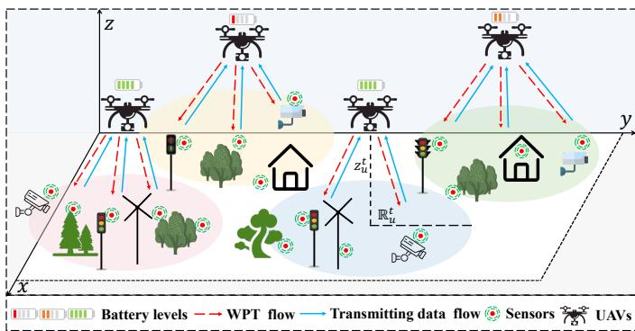  
Fig. 1. An illustrative scenario of multiple UAV-assisted wireless powered edge networks.

practical safety requirements, the flight altitude of UAVs is constrained by $\begin{array} { r } { \mathbf { \dot { H } } _ { \operatorname* { m i n } } \le z _ { u } ^ { t } \le H _ { \operatorname* { m a x } } , } \end{array}$ where $H _ { \mathrm { m i n } }$ and $H _ { \mathrm { m a x } }$ denote the minimum and maximum allowable flight altitudes, respectively. The coordinate of sensor s is fixed as $\pmb q _ { s } = ( x _ { s } , y _ { s } , 0 )$ . Similar to [33], the coverage area of UAV u is defined as a circle centered at its ground projection, with radius $\mathbb { R } _ { u } ^ { t } = z _ { u } ^ { t } / \tan \theta ^ { \ast }$ , where $\theta ^ { * }$ is the elevation angle with an optimal constant value. In addition, we introduce association scheduling variable $\alpha _ { u , s } ^ { t } \in \{ 0 , 1 \}$ to represent the association relationship between UAV u and sensor s. Specifically, $\alpha _ { u , s } ^ { t } = 1$ indicates that sensor s is associated with UAV u and lies within its coverage area, i.e., $\widehat { d } _ { u , s } ^ { t } \leq \mathbb { R } _ { u } ^ { t } .$ where $\begin{array} { r } { \widehat { d } _ { u , s } ^ { t } \ = \ \sqrt { \left( x _ { u } ^ { t } - x _ { s } \right) ^ { 2 } + \left( y _ { u } ^ { t } - y _ { s } \right) ^ { 2 } } } \end{array}$ is the distance between the ground projection of UAV u and sensor s. Conversely, $\alpha _ { u , s } ^ { \tilde { t } } = 0$ means sensor s is not associated with UAV u. Note that each sensor can be associated with at most one UAV in time slot t, i.e., $\begin{array} { r } { \sum _ { u = 1 } ^ { U } \alpha _ { u , s } ^ { t } \le 1 } \end{array}$

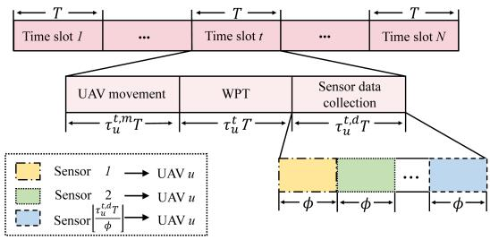  
Fig. 2. An illustrative time allocation model for UAV u.

## 3.2 Time Allocation Model

Note that to avoid interference among UAVs during both WPT and sensor data collection phases, Orthogonal Frequency Division Multiple Access (OFDMA) technology is employed to allocate mutually orthogonal frequency bands to different UAVs [21], [34]. Furthermore, to satisfy halfduplex constraints of both sensors and UAVs [13], [32], [35], we design a time allocation model for UAV u, as shown in Fig. 2. Specifically, in time slot $t ,$ variables $\tau _ { u } ^ { t , m } , \tau _ { u } ^ { t } ,$ and $\tau _ { u } ^ { t , d }$ denote the normalized time allocation ratios of UAV u for moving, WPT, and sensor data collection, respectively, which satisfy $\tau _ { u } ^ { t , m } + \tau _ { u } ^ { t } + \tau _ { u } ^ { t , d } \leq 1$ . In particular, at the beginning of time slot $t ,$ UAV u flies at constant speed V from position $\pmb q _ { u } ^ { t - 1 }$ to position $\pmb q _ { u } ^ { t }$ . Hence, the movement duration of UAV u is calculated as $\begin{array} { r } { \bar { \tau } _ { u } ^ { t , m } T = \left. \pmb { q } _ { u } ^ { t } - \pmb { q } _ { u } ^ { t - 1 } \right. / V , } \end{array}$ , which must satisfy constraint $\left\| \mathbfit { q } _ { u } ^ { t - 1 } - \mathbfit { q } _ { u } ^ { t - 1 } \right\| / \bar { V } \leq \mathrm { ~ T ~ }$ . During the WPT phase, UAV u transmits RF signals to charge its associated sensors within its coverage area. To avoid interference caused by simultaneous transmission from multiple sensors within the coverage area of UAV $u ,$ Time Division Multiple Access (TDMA) is employed during the sensor data collection phase [36]. Specifically, each sensor is allocated with an equal transmission time $\phi ,$ satisfying $\phi \leq \tau _ { u } ^ { t , d } T$ Therefore, at most $\lfloor \tau _ { u } ^ { t , d } T / \phi \rfloor$ sensors can transmit data in time slot $t ,$ where b·c is the floor operation. Furthermore, UAV u determines which sensors associated with it can transmit data [37]. We define transmission scheduling variable $\beta _ { u , s } ^ { t } ~ \in ~ \{ 0 , 1 \}$ , where $\beta _ { u , s } ^ { t } ~ = ~ 1$ indicates that sensor s transmits data to UAV u in time slot t, and $\beta _ { u , s } ^ { t } ~ = ~ 0$ otherwise.

## 3.3 Communication Model

Due to obstacles such as trees and buildings, communication links between UAVs and sensors may be blocked, resulting in NLoS links. The probability of a LoS link depends on the physical environment and the distance from sensors to UAVs. Similar to [5], [36], the probabilities of establishing a

## IEEE TRANSACTIONS ON MOBILE COMPUTING

LoS link and an NLoS link between sensor s and UAV u are $\mathcal { P } _ { \mathrm { L o S } } ^ { t }$ and $\mathcal { P } _ { \mathrm { N L o S } } ^ { t } ,$ respectively, and can be calculated by:

$$
\begin{array} { r } { \left\{ \begin{array} { l l } { \mathcal { P } _ { \mathrm { L o S } } ^ { t } = \displaystyle \frac { 1 } { 1 + C _ { 1 } \exp \left( - C _ { 2 } [ \theta _ { u , s } ^ { t } - C _ { 1 } ] \right) } ; } \\ { \mathcal { P } _ { \mathrm { N L o S } } ^ { t } = 1 - \displaystyle \frac { 1 } { 1 + C _ { 1 } \exp \left( - C _ { 2 } [ \theta _ { u , s } ^ { t } - C _ { 1 } ] \right) } , } \end{array} \right. } \end{array}\tag{1}
$$

where $C _ { 1 }$ and $C _ { 2 }$ are environment-dependent constants that reflect the density of specific obstacles. In addition, $\theta _ { u , s } ^ { t }$ denotes the elevation angle between sensor s and UAV $u ,$ which can be expressed as:

$$
\theta _ { u , s } ^ { t } = \frac { 1 8 0 } { \pi } \arcsin \left( \frac { z _ { u } ^ { t } } { d _ { u , s } ^ { t } } \right) ,\tag{2}
$$

where $d _ { u , s } ^ { t } = \lVert \pmb { q } _ { u } ^ { t } - \pmb { q } _ { s } \rVert$ is the Euclidean distance between sensor s and UAV u in time slot t.

Therefore, the path loss between sensor s and UAV u can be expressed as [5]:

$$
L _ { u , s } ^ { t } = \left\{ \begin{array} { l l } { \displaystyle { \left( \frac { 4 \pi f _ { c } d _ { u , s } ^ { t } } { c } \right) ^ { \varsigma } \nu _ { 0 } , } } & { \lambda = 0 ; } \\ { \displaystyle { \left( \frac { 4 \pi f _ { c } d _ { u , s } ^ { t } } { c } \right) ^ { \varsigma } \nu _ { 1 } , } } & { \lambda = 1 , } \end{array} \right.\tag{3}
$$

where $f _ { c }$ and c are the carrier frequency and the speed of light in vacuum, respectively. Symbols $\nu _ { 0 }$ and $\nu _ { 1 }$ are the excessive path loss coefficients for LoS and NLoS links, respectively, where $\nu _ { 1 } ~ > ~ \nu _ { 0 } ~ > ~ 1$ . Symbol ς is the path loss index. Symbol $\lambda \in \{ 0 , 1 \}$ indicates the channel type, with $\lambda = 0$ denoting a LoS link and $\lambda = 1$ denoting a NLoS link. Therefore, in time slot $t ,$ the transmission rate from sensor s to UAV u can be expressed by [38]:

$$
R _ { u , s } ^ { t } = B \mathrm { l o g } _ { 2 } \left( 1 + \frac { \xi _ { 0 } p _ { u , s } ^ { t } } { L _ { u , s } ^ { t } \sigma ^ { 2 } } \right) ,\tag{4}
$$

where $\xi _ { 0 }$ is the channel power gain at a reference distance of 1m. Symbols $B$ and $\sigma ^ { 2 ^ { \bullet } }$ are the communication bandwidth and the noise power, respectively. Variable $p _ { u , s } ^ { t }$ is the transmit power of sensor s to UAV u in time slot t. In addition, each sensor has maximum transmit power limit $p _ { \mathrm { m a x } }$

## 3.4 Energy Consumption Model

## 3.4.1 Energy Consumption Model of Sensors

Inspired by [39], this work focuses mainly on the transmission energy consumption of sensors, since their sensing energy consumption is relatively low and modeled as constant value $E _ { \mathrm { s e n s o r } }$ . Sensor s can transmit data to the UAV only when its stored energy exceeds the sum of transmission energy consumption $\begin{array} { r } { E _ { s } ^ { t } = \sum _ { u = 1 } ^ { U } \beta _ { u , s } ^ { t } p _ { u , s } ^ { t } \phi } \end{array}$ and sensing energy consumption $E _ { \mathrm { s e n s o r } } .$ . Suppose that the maximum battery capacity of sensors is $E _ { \mathrm { m a x } } .$ By considering a nonlinear EH model [21], [40], the energy harvested by sensor s from its associated UAV can be computed by:

$$
E _ { s } ^ { t , w } = \left\{ \begin{array} { l l } { 0 , } & { P _ { u , s } ^ { t } < P _ { \operatorname* { m i n } } ; } \\ { \sum _ { u = 1 } ^ { U } \alpha _ { u , s } ^ { t } \mu \tau _ { u } ^ { t } T P _ { u , s } ^ { t } , } & { P _ { \operatorname* { m i n } } \leq P _ { u , s } ^ { t } \leq P _ { \operatorname* { m a x } } ; } \\ { \sum _ { u = 1 } ^ { U } \alpha _ { u , s } ^ { t } \mu \tau _ { u } ^ { t } T P _ { \operatorname* { m a x } } , } & { P _ { u , s } ^ { t } > P _ { \operatorname* { m a x } } , } \end{array} \right.\tag{5}
$$

where $\mu$ and $\mathbb { P } _ { u } ^ { t , c }$ are the energy conversion efficiency of sensors and the charging power of UAV u, respectively.

TABLE 2  
Parameter Definition Related to Equation (8)
<table><tr><td rowspan=1 colspan=1>Parameter</td><td rowspan=1 colspan=1>Descriptions</td><td rowspan=1 colspan=1>Parameter</td><td rowspan=1 colspan=1>Descriptions</td></tr><tr><td rowspan=1 colspan=1>R</td><td rowspan=1 colspan=1>Rotor radius</td><td rowspan=1 colspan=1>d0</td><td rowspan=1 colspan=1>Fuselage drag radio</td></tr><tr><td rowspan=1 colspan=1>ρ</td><td rowspan=1 colspan=1>Air density</td><td rowspan=1 colspan=1>δ</td><td rowspan=1 colspan=1>Profile drag coefficient</td></tr><tr><td rowspan=1 colspan=1>A</td><td rowspan=1 colspan=1>Rotor disk area</td><td rowspan=1 colspan=1>Ω</td><td rowspan=1 colspan=1>Blade angular velocity</td></tr><tr><td rowspan=1 colspan=1>W</td><td rowspan=1 colspan=1>UAV weight</td><td rowspan=1 colspan=1>k</td><td rowspan=1 colspan=1>Induced power factor</td></tr><tr><td rowspan=1 colspan=1> $s _ { 0 }$ </td><td rowspan=1 colspan=1>Rotor solidity</td><td rowspan=1 colspan=1>v0</td><td rowspan=1 colspan=1>Rotor induced speed</td></tr></table>

Variables $P _ { \operatorname* { m i n } } , \ P _ { \operatorname* { m a x } } ,$ and $P _ { u , s } ^ { t } = \xi _ { 0 } \mathbb { P } _ { u } ^ { t , c } / L _ { u , s } ^ { t }$ denote EH sensitivity threshold, EH saturation threshold, and the input power received by sensor s from UAV u, respectively. Note that sensor s can harvest energy only if its input power $P _ { u , s } ^ { t }$ exceeds EH sensitivity threshold $P _ { \mathrm { m i n } }$ . In this case, the EH power equals input power $P _ { u , s } ^ { t }$ . If input power $P _ { u , s } ^ { t }$ exceeds EH saturation threshold $P _ { \mathrm { m a x } } ,$ the EH power is capped at $P _ { \mathrm { m a x } }$ . Finally, the remaining energy of sensor s at the end of time slot t can be computed as:

$$
\begin{array} { r } { E _ { s } ^ { t , r } = \operatorname* { m i n } \left\{ E _ { s } ^ { t - 1 , r } + E _ { s } ^ { t , w } - E _ { s } ^ { t } - E _ { \mathrm { s e n s o r } } , E _ { \mathrm { m a x } } \right\} . } \end{array}\tag{6}
$$

## 3.4.2 Energy Consumption Model of UAVs

Similar to [5], we assume all UAVs have an initial on-board energy $\mathbb { E } _ { \mathrm { m a x } }$ and their energy consumption mainly comprises flying, hovering, and charging energy consumption. In time slot $t ,$ the flying energy consumption of UAV u is expressed as:

$$
\mathbb { E } _ { u } ^ { t , m } = \tau _ { u } ^ { t , m } T \mathbb { P } _ { u } ^ { t , m } ,\tag{7}
$$

where $\mathbb { P } _ { u } ^ { t , m }$ is the propulsion power of UAV u [35], [41], i.e.,

$$
\begin{array} { l } { { \displaystyle { \mathbb P } _ { u } ^ { t , m } = { \mathbb P } _ { 0 } \left( 1 + \frac { 3 V ^ { 2 } } { \left( \Omega R \right) ^ { 2 } } \right) + { \mathbb P } _ { 1 } \left( \sqrt { 1 + \frac { V ^ { 4 } } { 4 v _ { 0 } ^ { 4 } } } - \frac { V ^ { 2 } } { 2 v _ { 0 } ^ { 2 } } \right) ^ { 1 / 2 } } } \\ { { \displaystyle ~ + \frac 1 2 d _ { 0 } \rho s _ { 0 } A V ^ { 3 } } , } \end{array}\tag{8}
$$

where $\mathbb { P } _ { 0 } = \delta \rho s _ { 0 } A \Omega ^ { 3 } R ^ { 3 } / 8$ and $\mathbb { P } _ { 1 } = ( 1 + k ) W ^ { 3 / 2 } / \sqrt { 2 \rho A }$ denote the blade profile power and the derived power when the UAV is hovering, respectively. The definition of parameters mentioned in equation (8) is shown in Table 2.

Note that UAVs hover during the subsequent WPT and sensor data collection phases. Therefore, the hovering energy consumption of UAV u is expressed as:

$$
\mathbb { E } _ { u } ^ { t , h } = ( 1 - \tau _ { u } ^ { t , m } ) T \mathbb { P } _ { u } ^ { t , h } = ( \tau _ { u } ^ { t } + \tau _ { u } ^ { t , d } ) T \mathbb { P } _ { u } ^ { t , h } ,\tag{9}
$$

where $\mathbb { P } _ { u } ^ { t , h } = \mathbb { P } _ { 0 } + \mathbb { P } _ { 1 }$ is the hovering power of UAV u.

Finally, during the WPT phase, UAV u transmits RF signals with power $\mathbb { P } _ { u } ^ { t , c }$ to charge its associated sensors within its coverage area. The charging energy consumption of UAV u can be computed by:

$$
\mathbb { E } _ { u } ^ { t , c } = \tau _ { u } ^ { t } T \mathbb { P } _ { u } ^ { t , c } .\tag{10}
$$

Therefore, in time slot $t ,$ the total energy consumption of UAV u is expressed as:

$$
\mathbb { E } _ { u } ^ { t } = \mathbb { E } _ { u } ^ { t , m } + \mathbb { E } _ { u } ^ { t , h } + \mathbb { E } _ { u } ^ { t , c } .\tag{11}
$$

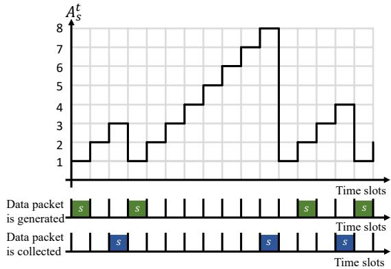  
Fig. 3. AoI evolution of sensor s. The green and blue rectangles represent the generation of a data packet by sensor s and its reception by any UAV, respectively.

## 3.5 AoI Model

It is assumed that sensor s generates a new data packet of size $D _ { s } ^ { t }$ with probability % in time slot $t ,$ when it does not have any data packet locally or the data packet has been transmitted to the UAV in time slot t − 1 [42]. The AoI of sensor s is defined as the time elapsed since its most recent data packet was received by any UAV [5], [14], [18]. Specifically, if sensor s is scheduled to transmit data in time slot t and the transmission is successful (i.e., its stored energy meets the requirements of data transmission and sensing, $\begin{array} { r } { p _ { u , s } ^ { t } \phi + E _ { \mathrm { s e n s o r } } \ ' \leq E _ { s } ^ { t , w } + E _ { s } ^ { t - 1 , r } ) . } \end{array}$ , then its AoI in time slot t + 1 is decreased to 1. Otherwise, its AoI is increased by 1. Therefore, the dynamic of the AoI of sensor s is expressed as [15], [20]:

$$
A _ { s } ^ { t + 1 } = \left\{ \begin{array} { l l } { 1 , } & { \mathrm { i f } ~ \exists u \in \mathcal { U } , \beta _ { u , s } ^ { t } = 1 \mathrm { ~ a n d } } \\ & { p _ { u , s } ^ { t } \phi + E _ { \mathrm { s e n s o r } } \leq E _ { s } ^ { t , w } + E _ { s } ^ { t - 1 , r } ; } \\ { A _ { s } ^ { t } + 1 , } & { \mathrm { o t h e r w i s e } . } \end{array} \right.\tag{12}
$$

Fig. 3 illustrates the AoI evolution of sensor s. Specifically, since the last update of sensor s, its AoI increases in each time slot until its latest data packet is received by any UAV, at which point the AoI is reset to 1. Note that the AoI of sensor s still increases even when no data packet is available locally. This is because AoI essentially reflects the staleness of sensor data as perceived by UAVs.

## 3.6 Problem Formulation

Our goal is to find the optimal solution for WPT time allocation, UAV locations, association and transmission scheduling of sensors to minimize the long term average AoI of all sensors. The optimization problem is formulated as follows:

$$
\begin{array} { r l r } { \mathrm { P 0 : } } & { { } } & { m i n \mathop { \sum } _ { t = 1 } ^ { N } \sum _ { s = 1 } ^ { S } \frac { A _ { s } ^ { t } } { N } , } \end{array}\tag{13}
$$

$$
\mathrm { s . t . } \qquad \alpha _ { u , s } ^ { t } \widehat { d } _ { u , s } ^ { t } \leq \frac { z _ { u } ^ { t } } { \tan \theta ^ { * } } , \forall t \in \mathcal { N } , s \in \mathcal { S } , u \in \mathcal { U } ,\tag{13a}
$$

$$
\begin{array} { r } { \sum _ { u = 1 } ^ { U } \alpha _ { u , s } ^ { t } \le 1 , \forall t \in \mathcal { N } , s \in \mathcal { S } , } \end{array}\tag{13b}
$$

$$
\beta _ { u , s } ^ { t } \le \alpha _ { u , s } ^ { t } , \forall t \in \mathcal { N } , s \in \mathcal { S } , u \in \mathcal { U } ,\tag{13c}
$$

$$
\begin{array} { r } { \tau _ { u } ^ { t , m } T + \tau _ { u } ^ { t } T + \sum _ { s = 1 } ^ { S } \beta _ { u , s } ^ { t } \phi \le T , \forall t \in N , u \in \mathcal { U } , } \end{array}\tag{13d}
$$

$$
E _ { s } ^ { t } + E _ { \mathrm { s e n s o r } } \leq E _ { s } ^ { t , w } + E _ { s } ^ { t - 1 , r } , \forall t \in N , s \in \mathcal { S } ,
$$

$$
\begin{array} { r } { \sum _ { t = 1 } ^ { N } \mathbb { E } _ { u } ^ { t } \le \mathbb { E } _ { \operatorname* { m a x } } , \forall u \in \mathcal { U } , } \end{array}\tag{13e}
$$

(13f)

$$
p _ { u , s } ^ { t } \leq p _ { \operatorname* { m a x } } , \forall t \in \mathcal { N } , u \in \mathcal { U } , s \in \mathcal { S } ,\tag{13g}
$$

$$
H _ { \operatorname* { m i n } } \leq z _ { u } ^ { t } \leq H _ { \operatorname* { m a x } } , \forall t \in \mathcal { N } , u \in \mathcal { U } ,\tag{13h}
$$

$$
\begin{array} { r } { \| \pmb q _ { u } ^ { t } - \pmb q _ { u ^ { \prime } } ^ { t } \| \geq d _ { \mathrm { s a f e } } , \forall t , u \neq u ^ { \prime } , u , u ^ { \prime } \in \mathcal { U } , } \end{array}\tag{13i}
$$

$$
\pmb { q } _ { u } ^ { 1 } = \pmb { q } _ { u } ^ { N } , \forall u \in \mathcal { U } ,\tag{13j}
$$

$$
\tau _ { u } ^ { t } \in \left( 0 , 1 \right) , \forall t \in \mathcal { N } , u \in \mathcal { U } ,\tag{13k}
$$

$$
\alpha _ { u , s } ^ { t } , \beta _ { u , s } ^ { t } \in \left\{ 0 , 1 \right\} , \forall t \in \mathcal { N } , s \in \mathcal { S } , u \in \mathcal { U } .\tag{13l}
$$

where constraint (13a) represents the relationship between UAV location $\pmb q _ { u } ^ { t }$ and association scheduling variable $\alpha _ { u , s } ^ { t } ,$ i.e., sensors associated with UAV u must lie within its coverage area. Constraint (13b) specifies the sensor association limit. Constraint (13c) ensures that transmission scheduling variable $\beta _ { u , s } ^ { t }$ is valid only when association scheduling variable $\alpha _ { u , s } ^ { t }$ is equal to 1. Constraint (13d) ensures that the total duration of UAV moving, WPT, and data collection does not exceed time slot length T . Constraint (13e) ensures that the energy consumption of sensor s in time slot t does not exceed its harvested energy plus residual energy. Constraint (13f) ensures that the initial on-board energy of UAV u can support its operation over N time slots. Constraint (13g) ensures that transmit power $p _ { u , s } ^ { t }$ of sensor s does not exceed its maximum transmit power p . Constraint (13h) is the height constraint of UAVs. Constraint (13i) guarantees a minimum spatial separation of $d _ { \mathrm { s a f e } }$ between any two UAVs to avoid in-flight collisions. Constraint (13j) ensures that UAV u returns to its initial position after N time slots. Constraints (13k) and (13l) specify the ranges of WPT time allocation $\boldsymbol { \tau } _ { u } ^ { t } ,$ transmission scheduling variable $\beta _ { u , s } ^ { t } ,$ and association scheduling variable $\alpha _ { u , s } ^ { t } ,$ respectively.

## 4 OPTIMIZATION PROBLEM TRANSFORMATION

Since Problem P0 is a mixed-integer nonlinear programming problem and is classified as NP-hard, finding its globally optimal solution in polynomial time is intractable.

Theorem 1. Problem P0 is an NP-hard mixed-integer nonlinear programming problem.

The detailed proof of Theorem 1 can be found in $\mathsf { A p - }$ pendix A.

In addition, the durations of UAV movement, WPT, and sensor data collection impose significant challenges on UAV scheduling. UAVs must avoid spending excessive time on movement; otherwise, they may not have enough time for charging and data collection. Meanwhile, it is essential to optimize WPT time allocation and data transmission scheduling within the association range of UAVs, while ensuring the rationality of association scheduling and trajectory design. Therefore, considering the complexity of Problem P0, we decompose it into multiple subproblems to obtain an approximate solution.

Since association scheduling variable $\alpha _ { u , s } ^ { t }$ is coupled with UAV location $\pmb q _ { u } ^ { t }$ in constraint (13a), and transmission scheduling variable $\beta _ { u , \varepsilon } ^ { t }$ is coupled with WPT time allocation $\boldsymbol { \tau } _ { u } ^ { t }$ in constraint (13d), we decompose Problem P0 into two subproblems. Specifically, subproblem 1 focuses on optimizing $\bar { \alpha } _ { u , s } ^ { t }$ and $\pmb q _ { u } ^ { t } ,$ while subproblem 2 aims to optimize $\boldsymbol { \tau } _ { u } ^ { t }$ and $\beta _ { u , s } ^ { t } ,$ under the given UAV association ranges.

## IEEE TRANSACTIONS ON MOBILE COMPUTING

However, since AoI is dependent on transmission scheduling variable $\beta _ { u , s } ^ { t } ,$ it cannot be accurately characterized in subproblem 1 solely based on $\alpha _ { u , s } ^ { t }$ and $\setminus ^ { t }$ . To address this issue, we first introduce the following proposition to present a closed-form expression for the transmit power of sensors.

Proposition 1. Given packet size $D _ { s } ^ { t }$ and transmission duration φ, required transmit power $p _ { u , s } ^ { t }$ of sensor s can be calculated by:

$$
p _ { u , s } ^ { t } = \sigma ^ { 2 } L _ { u , s } ^ { t } \bigg ( 2 ^ { \frac { D _ { s } ^ { t } } { \phi B } } - 1 \bigg ) \bigg / \xi _ { 0 } .\tag{14}
$$

The detailed proof of Proposition 1 can be found in Appendix B.

Based on Proposition 1, we further analyze the impact of association scheduling variable $\alpha _ { u , s } ^ { t }$ and UAV location $\pmb q _ { u } ^ { t }$ on the AoI of sensor s in the following theorem.

Theorem 2. Association scheduling variable $\alpha _ { u , s } ^ { t }$ and UAV location $\pmb q _ { u } ^ { t }$ indirectly influence the AoI of sensor s by affecting its transmit power $p _ { u , { \varepsilon } } ^ { t }$ and UAV movement duration $\bar { \tau } _ { u } ^ { t , \bar { m } } T$

The detailed proof of Theorem 2 can be found in $\mathsf { A p - }$ pendix C.

Based on Theorem 2, we further propose the following corollary.

Corollary 1. In subproblem 1, optimizing the average energy consumption of UAVs and sensors can achieve an approximate optimization of AoI.

The detailed proof of Corollary 1 can be found in $\mathsf { A p - }$ pendix D.

Based on Theorem 2 and Corollary 1, we adopt minimizing the average energy consumption of UAVs and sensors as an optimization objective in subproblem 1, aiming to indirectly optimize the AoI. However, as defined in subsection 3.5, not every sensor has a data packet in time slot t. Therefore, we introduce the concept of candidate sensors, defined as those sensors that have data transmission requirements and satisfy the corresponding conditions. Specifically, we define auxiliary variable $\eta _ { s } ^ { t } \in \ \{ 0 , 1 \}$ to indicate whether sensor s has a data packet in time slot $t ,$ where $\eta _ { s } ^ { t } = 1$ indicates the presence of a data packet, and $\eta _ { s } ^ { t } = 0$ otherwise. Moreover, auxiliary variable $\mathcal { \bar { X } } _ { u , s } ^ { t } \in \{ 0 , 1 \}$ indicates whether sensor s associated with UAV u satisfies the data transmission condition, i.e.,

$$
{ \chi } _ { u , s } ^ { t } = \left\{ \begin{array} { l l } { 1 , } & { p _ { u , s } ^ { t } \phi + E _ { \mathrm { s e n s o r } } \leq E _ { s } ^ { t , w } + E _ { s } ^ { t - 1 , r } ; } \\ { 0 , } & { \mathrm { e l s e } . } \end{array} \right.\tag{15}
$$

Similar to [43], we approximate WPT time allocation $\boldsymbol { \tau } _ { u } ^ { t }$ in $E _ { s } ^ { t , w }$ by $\tau _ { u } ^ { t - 1 }$ , thereby obtaining $E _ { s } ^ { t , w ^ { \prime } }$ , which can be expressed as:

$$
E _ { s } ^ { t , w ^ { \prime } } = \left\{ \begin{array} { l l } { 0 , } & { P _ { u , s } ^ { t } < P _ { \operatorname* { m i n } } ; } \\ { \sum _ { u = 1 } ^ { U } \alpha _ { u , s } ^ { t } \mu \tau _ { u } ^ { t - 1 } T P _ { u , s } ^ { t } , } & { P _ { \operatorname* { m i n } } \leq P _ { u , s } ^ { t } \leq P _ { \operatorname* { m a x } } ; } \\ { \sum _ { u = 1 } ^ { U } \alpha _ { u , s } ^ { t } \mu \tau _ { u } ^ { t - 1 } T P _ { \operatorname* { m a x } } , } & { P _ { u , s } ^ { t } > P _ { \operatorname* { m a x } } . } \end{array} \right.\tag{16}
$$

As a result, $\eta _ { s } ^ { t } \chi _ { u , s } ^ { t } = 1$ indicates that sensor s can be regarded as a candidate sensor. Then, we can obtain the following theorem.

Theorem 3. If sensor s is scheduled for data transmission in time slot t, it must be selected from candidate sensors satisfying $\eta _ { s } ^ { t } \chi _ { u , s } ^ { t } = 1$

The detailed proof of Theorem 3 can be found in $\mathsf { A p - }$ pendix E.

Since WPT time allocation $\boldsymbol { \tau } _ { u } ^ { t }$ and transmission scheduling variable $\beta _ { u , s } ^ { t }$ in time slot t are not available in subproblem 1, we consider approximating them by $\tau _ { u } ^ { t - 1 }$ and $\eta _ { s } ^ { \hat { t } } \chi _ { u , s } ^ { t } ,$ respectively, to obtain an approximate solution. Therefore, subproblem 1 is formulated by minimizing average estimated energy consumption (the sum of the average estimated energy consumption of UAVs and candidate sensors), i.e.,

$$
\mathrm { P 1 } : { \operatorname* { m i n } _ { \alpha _ { u , s } ^ { t } , \boldsymbol { q } _ { u } ^ { t } } } \sum _ { t = 1 } ^ { N } \frac { 1 } { N } \sum _ { u = 1 } ^ { U } \left( \frac { \mathrm { E } _ { u } ^ { t } } { U } + \frac { \sum _ { s = 1 } ^ { S } \eta _ { s } ^ { t } \chi _ { u , s } ^ { t } \left( p _ { u , s } ^ { t } \phi + E _ { \mathrm { s e n s o r } } \right) } { \sum _ { s = 1 } ^ { S } \eta _ { s } ^ { t } \chi _ { u , s } ^ { t } } \right) ,\tag{17}
$$

$$
\begin{array} { r } { \mathrm { s . t . ~ } \alpha _ { u , s } ^ { t } \in \{ 0 , 1 \} , \forall t \in \mathcal { N } , s \in \mathcal { S } , u \in \mathcal { U } , } \end{array}\tag{17a}
$$

$$
\tau _ { u } ^ { t , m } T + \tau _ { u } ^ { t - 1 } T + \sum _ { s = 1 } ^ { S } \alpha _ { u , s } ^ { t } \eta _ { s } ^ { t } \chi _ { u , s } ^ { t } \phi \leq T , \forall t \in \mathcal { N } , u \in \mathcal { U } ,\tag{17b}
$$

inequations (13a), (13b), (13g), (13h), (13i), (13j),

where $\mathbb { E } _ { u } ^ { t ^ { \prime } }$ is the estimated energy consumption of UAV u based on $\tau _ { u } ^ { t - 1 }$ , and can be computed as $\mathbb { E } _ { u } ^ { t ^ { \prime } } =$ $\left( \tau _ { u } ^ { t , m } \mathbb { P } _ { u } ^ { t , m } + ( 1 - \tau _ { u } ^ { t , m } ) \mathbb { P } _ { u } ^ { t , h } + \tau _ { u } ^ { t - 1 } \mathbb { P } _ { u } ^ { t , c } \right) T$ . In addition, by approximating $\boldsymbol { \tau } _ { u } ^ { t }$ and $\beta _ { u , s } ^ { t }$ with $\tau _ { u } ^ { t - 1 }$ and $\eta _ { s } ^ { t } \chi _ { u , s } ^ { t } ,$ respectively, constraint (13d) is relaxed to constraint (17b).

Subproblem 2 takes the solution of subproblem 1 as input and directly expresses the AoI by transmission scheduling variable $\beta _ { u , s } ^ { t }$ . Therefore, we formulate subproblem 2 by jointly optimizing WPT time allocation $\boldsymbol { \tau } _ { u } ^ { t }$ and transmission scheduling variable $\beta _ { u , s } ^ { t } ,$ , aiming to minimize the long term average AoI of all sensors, i.e.,

$$
\mathrm { P } 2 : \quad \underset { \beta _ { u , s } ^ { t } , \tau _ { u } ^ { t } } { m i n } \sum _ { t = 1 } ^ { N } \sum _ { s = 1 } ^ { S } \frac { A _ { s } ^ { t } } { N } ,
$$

$$
\mathrm { s . t . } \quad \tau _ { u } ^ { t } \in \left( 0 , 1 \right) , \forall t \in N , u \in \mathcal { U } ,\tag{18}
$$

$$
\beta _ { u , s } ^ { t } \in \left\{ 0 , 1 \right\} , \forall t \in \mathcal { N } , s \in \mathcal { S } , u \in \mathcal { U } ,\tag{18a}
$$

$$
\mathrm { i n e q u a t i o n s } \ ( 1 3 c ) - ( 1 3 g ) ,\tag{18b}
$$

where constraints (18a) and (18b) specify the ranges of WPT time allocation $\boldsymbol { \tau } _ { u } ^ { t }$ and transmission scheduling variable $\beta _ { u , s } ^ { t }$

However, solving Problems P1 and P2 remains challenging due to the dynamic environment, limited local observation by UAVs, and energy constraints of sensors. Traditional optimization methods fail to solve both problems in dynamic environments because global information is not available. Instead, we design an improved decentralized multiagent DRL algorithm to jointly optimize UAV coordinates, WPT time allocation, and sensor scheduling policies.

## 5 PROPOSED SOLUTION: GLINT

In this section, we design a decentralized scheduling algorithm based on multi-agent DRL to solve Problems P1 and P2 defined in Section 4. To handle the dynamic environment and enhance algorithm scalability, we adopt MADDPG [44] as the foundation of our design. It follows the CTDE paradigm, where each agent executes a decentralized policy, while value learning is assisted by centralized information during training. Specifically, we assume a global node during centralized training that has access to all agents’ local information, which is used to train the networks [5], [29]. This mechanism facilitates the capture of complex interagent interactions and accelerates the training process.

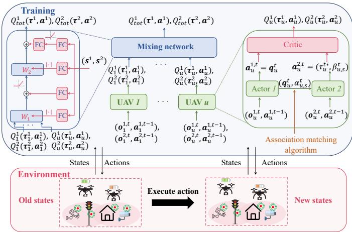  
Fig. 4. The framework of GLINT.

However, applying MADDPG directly to our problem poses several challenges due to a series of complex decisionmaking issues. For instance, the joint scheduling of UAVs and sensors leads to a high-dimensional state space, which may cause the algorithm not to converge or result in suboptimal or invalid solutions. In addition, solving the two subproblems sequentially is non-trivial, as they are temporally coupled and the result of subproblem 1 serves as the input to subproblem 2. Finally, handling the coupled variables in the subproblems and ensuring return consistency between individual UAVs and the overall UAV network remain challenging in a decentralized architecture. To address the above challenges, we propose “GLINT”, a multi-agent DRLbased decentralized scheduling algorithm, as illustrated in Fig. 4. GLINT algorithm employs a dual-network sequential processing architecture and value function factorization to fit the relationship between local and global action values, thereby facilitating cooperation among agents.

## 5.1 A Dual-Network Sequential Processing Architecture

Since Problems P1 and P2 are temporally correlated and must be solved sequentially, as illustrated in Fig. 4, we design two separate actor networks for each UAV to enable efficient policy learning for both problems, namely, actor network 1 and actor network 2. In this subsection, we first formulate the overall multi-agent cooperative stochastic game model. Then, we give specific Dec-POMDPs about Problems P1 and P2, denoted as tuples $\langle \mathcal { U } , \pmb { s } ^ { 1 } , \pmb { o } ^ { 1 } , \pmb { a } ^ { 1 } , \mathcal { P } ^ { 1 } , \boldsymbol { r } ^ { 1 } , \boldsymbol { \gamma } \rangle$ and $\langle \mathcal { U } , s ^ { 2 } , o ^ { 2 } , \dot { a } ^ { 2 } , \mathcal { P } ^ { 2 } , r ^ { 2 } , \gamma \rangle$ , respectively.

## 5.1.1 Game Statement

We model the multi-agent cooperative stochastic game for jointly optimizing UAV trajectories, WPT time allocation, association and transmission scheduling of sensors as a Dec-POMDP, consisting of tuple $\langle \mathcal { U } , s , o , \pmb { a } , \mathcal { P } , r , \gamma \rangle$ , whose elements are detailed as follows:

$\mathcal { U } \equiv \{ 1 , . . . , u , . . . , U \}$ denotes the finite set of agents.

$\begin{array} { r l r } { s } & { { } = } & { \left\{ s ^ { 1 } , s ^ { 2 } \right\} } \end{array}$ denotes the set of environment states regarding Problems P1 and P2, where $\begin{array} { r c l } { \pmb { \mathscr { s } } ^ { 1 } } & { \equiv } & { \left\{ \pmb { \mathscr { s } } ^ { 1 , 1 } , . . . , \pmb { \mathscr { s } } ^ { 1 , t } , . . . , \pmb { \mathscr { s } } ^ { 1 , N } \right\} } \end{array}$ and $\begin{array} { r l } { s ^ { 2 } } & { { } \equiv } \end{array}$ $\left\{ \pmb { s } ^ { 2 , 1 } , . . . , \pmb { s } ^ { 2 , t } , . . . , \overset { . } { \pmb { s } } ^ { 2 , N } \right\}$ . Symbols $s ^ { 1 , t }$ and $s ^ { 2 , t }$ represent the environment states for Problems P1 and P2 in time slot $t ,$ respectively.

${ \pmb o } = \left\{ { \pmb o } ^ { 1 } , { \pmb o } ^ { 2 } \right\}$ denotes the set of observations accessible to all agents for Problems P1 and P2, where $o ^ { 1 } =$ $\left\{ o _ { 1 } ^ { 1 } , . . . , o _ { u } ^ { 1 } , . . . , o _ { U } ^ { 1 } \right\}$ and $\begin{array} { r c l } { { { \pmb o } ^ { 2 } } } & { { = } } & { { \left\{ \pmb o _ { 1 } ^ { 2 } , . . . , \pmb o _ { u } ^ { 2 } , . . . , \pmb o _ { U } ^ { 2 } \right\} } } \end{array}$ Symbols $\mathbf { \bar { \partial } } _ { u } ^ { 1 } \ \equiv \ \left\{ \pmb { o } _ { u } ^ { 1 , 1 } , . . . , \pmb { o } _ { u } ^ { 1 , t } , . . . , \pmb { o } _ { u } ^ { \bar { 1 } , N } \right\}$ and $o _ { u } ^ { 2 } \equivq$ $\left\{ \mathbf { \tilde { o } } _ { u } ^ { 2 , 1 } , . . . , o _ { u } ^ { 2 , t } , . . . , \mathbf { \tilde { o } } _ { u } ^ { 2 , \tilde { N } } \right\}$ represent the sets of individual observations of agent u for Problems P1 and P2, respectively. Symbols $\mathbf { \delta } _ { o _ { u } ^ { 1 , t } } ^ { \phantom { 1 , t } }$ and $o _ { u } ^ { 2 , t }$ represent the individual observations of agent u in time slot t for Problems P1 and P2, respectively.

$a \ = \ \left\{ a ^ { 1 } , a ^ { 2 } \right\}$ denotes the set of actions taken by all agents for Problems P1 and P2, where $\begin{array} { r l } { \mathbf { { a } } ^ { 1 } } & { { } = } \end{array}$ $\{ \pmb { a } _ { 1 } ^ { 1 } , . . . , \pmb { a } _ { u } ^ { 1 } , . . . , \pmb { a } _ { U } ^ { 1 } \}$ and $\mathbf { \delta } \mathbf { a } ^ { 2 } \ = \ \{ \mathbf { a } _ { 1 } ^ { 2 } , . . . , \mathbf { a } _ { u } ^ { 2 } , . . . , \mathbf { a } _ { I J } ^ { 2 } \}$ Symbols $\mathbf { \bar { a } } _ { u } ^ { 1 } \equiv \bigl \{ \mathbf { a } _ { u } ^ { 1 , 1 } , . . . , \mathbf { a } _ { u } ^ { 1 , t } , . . . , \mathbf { \bar { a } } _ { u } ^ { \bar { 1 } , N } \bigr \}$ and $\pmb { a } _ { u } ^ { 2 } \equiv \tilde { = }$ $\left\{ \mathbf { \bar { \mathbf { a } } } _ { u } ^ { 2 , 1 } , . . . , \mathbf { a } _ { u } ^ { \bar { 2 } , t } , . . . , \mathbf { \dot { \mathbf { a } } } _ { u } ^ { 2 , \top N } \right\}$ denote the sets of individual actions of agent u for Problems P1 and P2, respectively. Symbols $\pmb { a } _ { u } ^ { 1 , t }$ and $\pmb { a } _ { u } ^ { 2 , t }$ represent the individual actions of agent u in time slot t for Problems P1 and P2, respectively.

$\mathcal { P } = \{ \dot { \mathcal { P } } ^ { 1 } , \mathcal { P } ^ { 2 } \}$ denotes the state transition possibility matrices corresponding to Problems P1 and P2.

$\begin{array} { r l r } { r } & { { } \ = \ } & { \left\{ r ^ { 1 } , \dot { r } ^ { 2 } \right\} } \end{array}$ denotes the reward functions of all agents for Problems P1 and P2, $\begin{array} { r l r l r } { \mathrm { w h e r e } } & { { } \ r ^ { 1 } } & { { } \equiv } & { } & { { } \left\{ r ^ { 1 , 1 } , . . . , r ^ { 1 , t } , . . . , r ^ { 1 , N } \right\} } \end{array}$ and $\begin{array} { r l r } { r ^ { 2 } } & { { } \equiv } & { \left\{ r ^ { 2 , 1 } , . . . , r ^ { 2 , t } , . . . , \dot { r } ^ { 2 , N } \right\} } \end{array}$ . Symbols $r ^ { 1 , \stackrel { \prime } { t } }$ and $r ^ { 2 , t }$ are the rewards of all agents for Problems P1 and P2 in time slot $t ,$ respectively.

$\gamma \in [ 0 , 1 )$ is a discount factor.

In the aforementioned Dec-POMDP, each UAV selects its actions independently while cooperating with others to achieve a common objective. Note that each UAV operates in a dynamic environment without prior knowledge of the state transition probabilities or reward functions. In the following, we develop specific Dec-POMDP frameworks for Problems P1 and P2.

## 5.1.2 Dec-POMDP of Problem P1

State: $\begin{array} { r l r } { s ^ { 1 } } & { \triangleq } & { \{ s ^ { 1 , t } = \operatorname { \arg } _ { u } ^ { t } , \tau _ { u } ^ { t - 1 } , \mathbb { E } _ { u } ^ { t - 1 , r } \} _ { u \in \mathcal { U } } } \end{array}$ $\{ E _ { s } ^ { t - 1 , r } \} _ { s \in \mathcal { S } } ) \}$ denotes the state set of Dec-POMDP of Problem P1. Here, $\boldsymbol q _ { u } ^ { t - 1 }$ and $\tau _ { u } ^ { t - 1 }$ denote the coordinate and WPT time allocation of UAV u in time slot t − 1, respectively. In addition, $\mathbb { E } _ { u } ^ { t - 1 , r }$ and $E _ { s } ^ { t - 1 , r }$ represent the remaining energy of UAV u and sensor s, respectively.

Observation: Each UAV observes only the state information related to itself and the sensors within its coverage area. Thus, the local observation of UAV u is defined as $\begin{array} { r c l } { o _ { u } ^ { 1 } } & { \triangleq } & { \{ o _ { u } ^ { 1 , t } \ = } \  \end{array}$ $\left( \pmb { q } _ { u } ^ { t - 1 } , \tau _ { u } ^ { t - 1 } , \mathbb { E } _ { u } ^ { t - 1 , r } , \{ \hat { E } _ { u , s } ^ { t - 1 , r } \} _ { s \in \mathcal { S } } \right) \}$ , where $\hat { E } _ { u , s } ^ { t - 1 , r }$ is the residual energy of sensor s in time slot $t - 1$ as observed by UAV u. Specifically, if sensor s is in the coverage area of UAV u, $\hat { E } _ { u , s } ^ { t - 1 , \check { r } } = E _ { s } ^ { t - 1 , r }$ holds; otherwise, $\hat { E } _ { u , s } ^ { t - 1 , r }$ is unavailable.

## IEEE TRANSACTIONS ON MOBILE COMPUTING

Action: In a network consisting of 20 sensors, modeling $\alpha _ { u , s } ^ { t }$ as discrete actions leads to a candidate action space of $2 ^ { 2 0 }$ for each UAV agent. This poses substantial challenges to the convergence and stability of learning algorithms [45], [46]. To address this issue, similar to [47], we design an association matching algorithm to determine $\alpha _ { u , s } ^ { t } .$ This algorithm utilizes the path loss between sensors and UAVs as the association preference to achieve matching between them, and the corresponding pseudocode can be found in Appendix F. Therefore, in time slot $t ,$ the joint action of agents is expressed as $\mathbf { } \mathbf { } a ^ { 1 , t } \ = \ ( \mathbf { } a _ { 1 } ^ { 1 , t } , . . . , \mathbf { } a _ { u } ^ { 1 , t } , . . . , \mathbf { } a _ { U } ^ { 1 , t } )$ , where $\mathbf { } a _ { u } ^ { 1 , \hat { t } } = \mathbf { } q _ { u } ^ { t }$ represents the action of UAV u.

State Transition: $\mathcal { P } ^ { 1 } : s ^ { 1 } \times a ^ { 1 } \to s ^ { 1 }$ is the state transition possibility matrix, and $\mathcal { P } ^ { 1 } \left( s ^ { 1 , t + 1 } | s ^ { 1 , t } , a ^ { 1 , t } \right)$ represents state transition possibility for Problem P1 when state $s ^ { 1 , t }$ shifts to state $s ^ { 1 , t + \mathbf { \check { 1 } } }$ by taking joint action $\mathbf { \Omega } _ { \mathbf { a } ^ { 1 , t } }$

Reward: $\pmb { s } ^ { 1 } \times \pmb { a } ^ { 1 }  r ^ { 1 }$ denotes the reward obtained by executing action $\mathbf { a } ^ { 1 }$ . For Problem P1, the total immediate reward in time slot t for all UAVs is defined as:

$$
\begin{array} { c } { { \displaystyle r ^ { 1 , t } = - \sum _ { u = 1 } ^ { U } \left( \displaystyle \frac { \mathbb { E } _ { u } ^ { t } } { U } + \frac { \sum _ { s = 1 } ^ { S } \eta _ { s } ^ { t } \chi _ { u , s } ^ { t } \left( p _ { u , s } ^ { t } \phi + E _ { \mathrm { s e n s o r } } \right) } { \displaystyle \sum _ { s = 1 } ^ { S } \eta _ { s } ^ { t } \chi _ { u , s } ^ { t } } \right) } } \\ { { - \sum _ { u = 1 } ^ { U } \left( \kappa _ { u \tau } ^ { t } \rho _ { u \tau } ^ { t } + \kappa _ { u h } ^ { t } \rho _ { u h } ^ { t } + \kappa _ { u c } ^ { t } \rho _ { u c } ^ { t } + \kappa _ { u q } ^ { t } \rho _ { u q } ^ { t } \right) } } \end{array}\tag{19}
$$

where the first term of $r ^ { 1 , t }$ corresponds to the optimization objective of Problem P1. Variables $\rho _ { u \tau } ^ { t } , \bar { \rho } _ { u h } ^ { t } ,$ $\rho _ { u c } ^ { t } ,$ and $\rho _ { u q } ^ { t }$ are the penalties imposed on UAV u for violating constraints (17b), (13h), (13i), and (13j), respectively. Symbols $\kappa _ { u \tau } ^ { t } , \kappa _ { u h } ^ { t } , \kappa _ { u c } ^ { t } ,$ and $\kappa _ { u q } ^ { t }$ are adjustment parameters used to scale these penalties.

## 5.1.3 Dec-POMDP of Problem P2

State: $\begin{array} { r c l l } { s ^ { 2 } } & { \triangleq } & { \{ s ^ { 2 , t } \ = \ \left( \{ q _ { u } ^ { t } , \mathbb { E } _ { u } ^ { t - 1 , r } \} _ { u \in \mathcal { U } } , \ \{ E _ { s } ^ { t - 1 , r } \} \right. } \end{array}$ $A _ { s } ^ { t - 1 } \bigr \} _ { s \in \cal S } , \{ \alpha _ { u , s } ^ { t } \bigr \} _ { s \in \cal S , u \in \cal U } \bigr ) \}$ denotes the state set of Dec-POMDP for Problem P2, where $A _ { s } ^ { t - 1 }$ is the AoI of sensor s in time slot t − 1.

Observation: Similarly, the local observation of UAV u for Problem P2 is $\begin{array} { r l r l } { \ o { o _ { u } ^ { 2 } } } & { { } \triangleq } & { \left\{ o _ { u } ^ { 2 , t } \right\} } & { { } = } \end{array}$ $\left( \pmb { q } _ { u } ^ { t } , \mathbb { E } _ { u } ^ { t - 1 , r } , \{ \hat { E } _ { u , s } ^ { t - 1 , r } , \hat { A } _ { u , s } ^ { t - 1 } , \alpha _ { u , s } ^ { t } \} _ { s \in \mathcal { S } } \right) \}$ , where $\hat { E } _ { u , s } ^ { t - 1 , r }$ and $\hat { A } _ { u , s } ^ { t - 1 }$ denote the remaining energy and AoI of sensor s in time slot t − 1 as observed by UAV $u ,$ respectively. If sensor s is in the coverage area of $\mathrm { U A V } u ,$ both $\hat { E } _ { u , s } ^ { t - 1 , r } = E _ { s } ^ { t - 1 , r }$ and $\hat { A } _ { u , s } ^ { t - 1 } = \check { A } _ { s } ^ { t - 1 }$ hold; otherwise, $\hat { E } _ { u , s } ^ { t - 1 , r }$ and $\hat { A } _ { u , s } ^ { t - 1 }$ are unavailable.

Action: In time slot t, the joint action for Problem P2 is expressed as $\begin{array} { l l l } { \bar { { \mathbf { } { \mathbf { } } } } ^ { 2 , t } } & { \stackrel { , } { = } } & { \left( { \pmb { a } } _ { 1 } ^ { 2 , t } , . . . , { \pmb { a } } _ { u } ^ { 2 , t } , . . . , { \pmb { a } } _ { U } ^ { 2 , t } \right) } \end{array}$ where $\pmb { a } _ { u } ^ { 2 , t } = ( \tau _ { u } ^ { t * } , \beta _ { u , s } ^ { t } )$ denotes the action of UAV u. Variable $\tau _ { u } ^ { t * } \ \in \ \{ 0 , \tau _ { \operatorname* { m a x } } / N _ { 1 } , 2 \tau _ { \operatorname* { m a x } } / N _ { 1 } , . . . , \tau _ { \operatorname* { m a x } } \}$ is a discretized version of WPT time allocation $\boldsymbol { \tau } _ { u } ^ { t } ,$ where $\tau _ { \mathrm { m a x } }$ and $N _ { 1 }$ are the maximum WPT time allocation and a positive integer, respectively. Variable $\beta _ { u , s } ^ { t }$ indicates the transmission scheduling decision of UAV u for sensor s in time slot t.

State Transition: $\mathcal { P } ^ { 2 } : s ^ { 2 } \times a ^ { 2 } \to s ^ { 2 }$ is the state transition possibility matrix, and $\mathcal { P } ^ { 2 } \left( s ^ { 2 , t + 1 } | s ^ { 2 , t } , a ^ { 2 , t } \right)$ denotes the probability of transitioning from state $s ^ { 2 , t }$ to state $s ^ { 2 , i + 1 }$ under joint action $\mathbf { \Delta } _ { \mathbf { { a } } ^ { 2 , \tilde { t } } }$ in Problem P2.

Reward: $s ^ { 2 } \times { \pmb a } ^ { 2 } \to { \acute { r } } ^ { 2 }$ denotes the reward obtained by taking joint action $\mathbf { } \mathbf { \delta } \mathbf { a } ^ { 2 }$ . The total immediate reward of UAVs for Problem P2 in time slot t is indicated as:

$$
r ^ { 2 , t } = - \sum _ { s = 1 } ^ { S } A _ { s } ^ { t } - \sum _ { u = 1 } ^ { U } \bigl ( \kappa _ { u \beta } ^ { t } \rho _ { u \beta } ^ { t } + \kappa _ { u e } ^ { t } \rho _ { u e } ^ { t } + \kappa _ { u m } ^ { t } \rho _ { u m } ^ { t } \bigr ) ,\tag{20}
$$

where $\rho _ { u \beta } ^ { t } , \ \rho _ { u e } ^ { t } ,$ and $\rho _ { u m } ^ { t }$ are penalties of UAV u corresponding to constraints (13d), (13e), and (13f), respectively. Symbols $\kappa _ { u \beta } ^ { t } , \kappa _ { u e } ^ { t } ,$ and $\kappa _ { u m } ^ { t }$ are adjustment parameters used to scale these penalties.

## 5.2 A Decentralized Multi-Agent DRL Algorithm Based on Value Function Factorization

Notably, all agents learn two stochastic policies, $\pi ^ { 1 } =$ $\{ \pi _ { 1 } ^ { 1 } , . . . , \pi _ { u } ^ { 1 } . . . , \bar { \pi } _ { U } ^ { 1 } \}$ and $\begin{array} { r l r } { \pi ^ { 2 } } & { { } = } & { \left\{ \pi _ { 1 } ^ { 2 } , . . . , \pi _ { u } ^ { 2 } , . . . , \pi _ { l J } ^ { 2 } \right\} } \end{array}$ parametrized by $\begin{array} { r l r } { \pmb { \theta } ^ { 1 } } & { { } = } & { \{ \theta _ { 1 } ^ { 1 } , . . . , \theta _ { u } ^ { 1 } . . . , \hat { \theta _ { U } ^ { 1 } } \} } \end{array}$ and $\theta ^ { 2 } \quad = \quad$ $\mathbf { \dot { \{ } }  \theta _ { 1 } ^ { 2 } , . . . , \theta _ { u } ^ { 2 } , . . . , \theta _ { U } ^ { 2 } \mathbf  \dot { \} }$ , respectively. Stochastic policy $\pi ^ { i }$ induces the global action value function as follows:

$$
Q ^ { i } ( s ^ { i , t } , a ^ { i , t } ) = \mathbb { E } _ { s ^ { i , t } : \infty , a ^ { i , t } : \infty } [ R ^ { i , t } | s ^ { i , t } , a ^ { i , t } ] , i \in \{ 1 , 2 \} ,\tag{21}
$$

where $\begin{array} { r } { R ^ { i , t } = \sum _ { k = 0 } ^ { \infty } \gamma ^ { k } r ^ { i , t + k } \ \mathrm { i s } } \end{array}$ the discounted return. Variable $\mathbf { } \mathbf { } \mathbf { } \mathbf { } \mathbf { } \mathbf { } \mathbf { } \mathbf { } \mathbf { } \mathbf { } \mathbf { } \mathbf { } \mathbf { } \mathbf { } \mathbf { } \mathbf { } \mathbf { } \mathbf { } \mathbf { } \mathbf { } \mathbf { } \mathbf { } \mathbf { } \mathbf { } \mathbf { } \mathbf { } \mathbf { } \mathbf { } \mathbf { } \mathbf { } \mathbf { } \mathbf { } \mathbf { } \mathbf { } \mathbf { } \mathbf { } \mathbf { } \mathbf { } \mathbf { } \mathbf { } \mathbf { } \mathbf { } \mathbf { } \mathbf { } \mathbf { } \mathbf { } \mathbf { } \mathbf { } \mathbf { } \mathbf { } \mathbf { } \mathbf { } \mathbf { } \mathbf { } \mathbf { } \mathbf { } \mathbf { } \mathbf { } \mathbf { } \mathbf { } \mathbf { } \mathbf { } \mathbf { } \mathbf { } \mathbf { } \mathbf { } \mathbf { } \mathbf { } \mathbf { } \mathbf { } \mathbf { } \mathbf { } \mathbf { } \mathbf { } \mathbf { } \mathbf { } \mathbf { } \mathbf { } \mathbf { } \mathbf { } \mathbf { } \mathbf { } \mathbf { } \mathbf { } \mathbf { } \mathbf { } \mathbf { } \mathbf { } \mathbf { } \mathbf { } \mathbf { } \mathbf { } \mathbf { } \mathbf { } \mathbf { } \mathbf { } \mathbf { } \mathbf { } \mathbf { } \mathbf { } \mathbf { } \mathbf { } \mathbf { } \mathbf { } \mathbf { } \mathbf { } \mathbf { } \mathbf { } \mathbf { } \mathbf { } \mathbf { } \mathbf { } \mathbf { } \mathbf { } \mathbf { } \mathbf { } \mathbf { } \mathbf { } \mathbf { } \mathbf { } \mathbf { } \mathbf { } \mathbf { } \mathbf { } \mathbf { } \mathbf { } \mathbf { } \mathbf { } \mathbf { } \mathbf { } \mathbf { } \mathbf { } \mathbf { } \mathbf { } \mathbf { } \mathbf { } \mathbf { } \mathbf { } \mathbf { } \mathbf { } \mathbf { } \mathbf { } \mathbf { } \mathbf { } \mathbf { } \mathbf { } \mathbf { } \mathbf { } \mathbf { } \mathbf { } \mathbf { } \mathbf { } \mathbf { } \mathbf { } \mathbf { } \mathbf { } \mathbf { } \mathbf { } \mathbf { } \mathbf { } \mathbf { } \mathbf { } \mathbf { } \mathbf { } \mathbf $ is the joint action of all agents in time slot t.

However, based on equations (19) and (20), it can be observed that since Problems P1 and P2 both correspond to Dec-POMDPs with shared rewards among agents, the action value function learned by each agent is in fact the global action value function. It evaluates the value of the joint observation-action pairs of all agents, and thus each agent cannot judge the impact of its own observation-action on the entire system [48]. Therefore, as shown in Fig. 4, we design a critic network for each agent that estimates the local action value functions for both actor network 1 and actor network 2. A mixing network then aggregates these local values to approximate the global action value function. By enforcing monotonicity between local and global action value functions, maximizing the global action value function can be approximated by maximizing each local actionvalue function. For Problems P1 and ${ \bar { \mathrm { P } } } 2 ,$ , all agents share global action value $Q _ { t o t } ^ { i } ,$ which can be computed by:

$$
Q _ { t o t } ^ { i } ( \tau ^ { i , t } , a ^ { i , t } , s ^ { i , t } ; \varphi , \psi ) = g _ { \psi } \left( s ^ { i , t } , \{ Q _ { u } ^ { i } ( \tau _ { u } ^ { i , t } , a _ { u } ^ { i , t } ; \varphi _ { u } ) \} _ { u = 1 } ^ { U } \right) ,\tag{22}
$$

where $\tau ^ { i , t }$ and $\tau _ { u } ^ { i , t }$ denote the historical observation-action trajectories from the initial time slot up to time slot t for all agents and agent u based on Problems P1 and P2, respectively. Variable $Q _ { u } ^ { i }$ denotes the local action value function of agent $u ,$ and $\varphi _ { u }$ is its parameter. Variable $\varphi$ is the parameter of the critic network. Similar to [49], $g _ { \psi }$ is the mixing network, which is a nonlinear monotonic function represented by a neural network with parameter ψ.

To evaluate policies $\left( \pi ^ { i } , i \in \{ 1 , 2 \} \right)$ for Problems P1 and P2, the critic network and the mixing network are jointly trained by the following loss function:

$$
\mathcal { L } ( \varphi , \psi ) = \sum _ { i = 1 } ^ { 2 } \zeta _ { i } \mathbb { E } _ { D } \big [ \big ( y _ { t o t } ^ { i , t } - Q _ { t o t } ^ { i } \big ( \tau ^ { i , t } , \mathbf { { a } } ^ { i , t } , \mathbf { { s } } ^ { i , t } ; \varphi , \psi \big ) \big ) ^ { 2 } \big ] ,\tag{23}
$$

## IEEE TRANSACTIONS ON MOBILE COMPUTING

where D is the replay buffer and the bootstrapping target is $y _ { t o t } ^ { i , t } = r ^ { i , t } + \gamma Q _ { t o t } ^ { i ^ { \setminus } } ( \bar { \tau } ^ { i , t + 1 } , \ \widetilde { \mathbf { a } } ^ { i , t + 1 } , s ^ { i , t + 1 } ; \varphi ^ { - } , \bar { \psi ^ { - } } )$ . Variables $\varphi ^ { - }$ and $\psi ^ { - }$ are the parameters of the target critic network and the target mixing network, respectively. In addition, $\widetilde { \mathbf { a } } ^ { i , t + 1 }$ is the action output of the target actor network parameterized by $\theta ^ { i - } . \mathsf { V a r i a b l e } \zeta _ { i } \in ( 0 , 1 )$ is the impact moderation parameter for actor network i. By adjusting $\zeta _ { 1 }$ and $\zeta _ { 2 } ,$ the contributions of respective actor networks to the training of both the critic network and the mixing network can be controlled, enabling a proper balance between different optimization objectives of two actor networks.

Similar to [49], actor network i of all agents shares parameters $\theta ^ { i }$ to learn policy $\pi ^ { i }$ , and update the global action in a centralized manner. The policy gradient is computed by sampling the actions of all agents from their current policies when evaluating $Q _ { t o t } ^ { i }$ . Therefore, the centralized policy gradient can be estimated as:

$$
\nabla _ { \theta ^ { i } } J ( \theta ^ { i } ) = \mathbb { E } _ { D } [ \nabla _ { \theta ^ { i } } \log \pi ^ { i } ( { { a } ^ { i , t } } { | { { s } ^ { i , t } } ) } Q _ { t o t } ^ { i } { ( \tau ^ { i , t } } , { { a } ^ { i , t } } , { { s } ^ { i , t } } ) ] .\tag{24}
$$

## 5.3 The Whole Algorithm

We use the CTDE framework to implement the proposed algorithm [49]. In the centralized training phase, agents share information through a shared experience pool and use the global information to optimize their policies. In contrast, during decentralized execution, each agent only has access to its own historical observation-action trajectories and makes decisions independently using local observations.

## 5.3.1 Centralized Training

In the GLINT algorithm, four neural networks are constructed for each agent to optimize the parameters defined in subsection 5.2, i.e., $\theta ^ { 1 }$ for actor network $1 , \theta ^ { 2 }$ for actor network $2 , \varphi$ for the critic network, and $\psi$ for the mixing network. To stabilize training, the corresponding target neural networks are created following the MADDPG paradigm. These include the target actor network 1 with parameter $\theta ^ { 1 - }$ , the target actor network 2 with parameter $\theta ^ { 2 - }$ , the target critic network with parameter $\varphi ^ { - }$ , and the target mixing network with parameter $\psi ^ { - }$ . Note that actor network 1 and actor network 2 generate policies $\pi ^ { 1 }$ and $\pi ^ { 2 }$ , while the critic and mixing networks jointly evaluate those policies, with their network weights updated in real time. The target neural networks estimate future action value functions, and their network weights have a delayed update.

In addition, we use an experience replay mechanism [44] and sample the overall experience of a whole episode, which allows hidden states of GRU (Gated Recurrent Unit) layers to capture temporal correlations across the full episode. Since the actions of policies $\pi ^ { 1 }$ and $\pi ^ { 2 }$ are discrete, we use the Gumbel-Softmax estimator [49] to generate differentiable approximations of discrete samples, thereby enabling efficient policy learning for the formulated problems. Finally, to better balance exploration and exploitation during training, we introduce the ε-greedy policy. Specifically, UAV agents select a random action with probability $\varepsilon ,$ and choose the optimal action otherwise. To ensure a smooth transition from extensive exploration in early training to stable policy execution in later stages, probability ε gradually decays as training progresses. The centralized training process of the GLINT algorithm is shown in Algorithm 1.

```latex
Algorithm 1: Centralized Training Process of
GLINT Algorithm
1 Initialize parameters $\theta ^ { 1 } , \theta ^ { 2 } , \varphi , \psi , \theta ^ { 1 - } , \theta ^ { 2 - } , \varphi ^ { - } , \psi ^ { - }$
and buffer $D ;$
2 for Episode in $1 , 2 , \ldots$ do
3 Initialize current state $s ^ { 1 , t }$ and agent observation
$( o _ { u } ^ { 1 , t } , u \in \mathcal { U } ) ;$
4 for t in $1 , 2 , . . . , N$ do
5 for $U A V u = 1 , 2 , . . . , U$ do
6 Action $\pmb { a } _ { u } ^ { 1 , t }$ is chosen according to
observation $\mathbf { \delta } _ { o _ { u } ^ { 1 , t } } ^ { 1 , t }$ and actor network 1
based on probability $\varepsilon ;$
7 end
8 Association matching algorithm outputs
association scheduling variable $\hat { \alpha } _ { u , s } ^ { t } \hat { \beta } _ { u , s } \hat { \prime }$
9 Get reward $r ^ { 1 , t }$ based on equation (19);
10 Update buffer D by storing $\left( { { s ^ { 1 , t } } , { a ^ { 1 , t } } , { r ^ { 1 , t } } , t } \right)$
11 Get state $s ^ { 2 , t }$ and observation $\left( o _ { u } ^ { 2 , t } , u \in \mathcal { U } \right)$
based on action $\mathbf { \Omega } _ { \mathbf { \Omega } _ { \mathbf { \Omega } } } \mathbf { \Omega } _ { \mathbf { \Omega } _ { \mathbf { \Omega } } } \mathbf { \Omega } _ { \mathbf { \Omega } _ { \mathbf { \Omega } } } \mathbf { \Omega } _ { \mathbf { \Omega } _ { \mathbf { \Omega } } } \mathrm { ~ \Omega ~ } _ { a } \mathrm { ~ \Omega ~ } _ { \mathbf { \Omega } _ { \mathbf { \Omega } } } \mathrm { ~ \Omega ~ } _ { \mathbf { \Omega } _ { \mathbf { \Omega } } }$ and state $\mathbf { \sigma } _ { s ^ { 1 , t } ; }$
12 for $U A V u = 1 , 2 , . . . , U$ do
13 Action $\pmb { a } _ { u } ^ { 2 , t }$ is chosen according to
observation $o _ { u } ^ { 2 , t }$ and actor network 2
based on probability $\varepsilon ;$
14 end
15 Get reward $r ^ { 2 , t }$ based on equation (20) ;
16 Get next state $s ^ { 1 , t + 1 }$ by executing actions $\mathbf { \Omega } _ { \pmb { a } } { } ^ { 1 , t }$
and $\boldsymbol { a } ^ { 2 , t } ;$
17 Update buffer $D$ by storing $\left( s ^ { 2 , t } , a ^ { 2 , t } , r ^ { 2 , t } , t \right)$
18 end
19 Sample a batch of episodes from buffer $D ;$
20 for $\ i = 1 , 2$ do
21 Compute global action value $Q _ { t o t } ^ { i }$ based on
equation (22);
22 Update actor network parameter $\theta ^ { i }$ according
to the gradient computed by equation (24);
23 end
24 Update critic network and mixing network
parameters $\varphi$ and ψ according to the gradient
computed by equation (23);
25 if t satisfies certain interval steps then
26 Update target network parameters by
$\begin{array} { r } { \dot { \theta } ^ { 1 - } = \theta ^ { 1 } , \check { \theta } ^ { 2 - } = \theta ^ { 2 } , \varphi ^ { \dot { - } } = \varphi , \mathrm { a n d } \check { \psi } ^ { - } = \psi . } \end{array}$
27 end
28 end
```

## 5.3.2 Decentralized Execution

During the decentralized execution phase, each UAV independently makes decisions based on its local observations and the trained actor networks 1 and 2. The decentralized execution process of the GLINT algorithm is detailed in Algorithm 2.

## 5.4 Computational Complexity

We perform the theoretical analysis of the computational complexity of GLINT algorithm in the execution phase as follows.

Theorem 4. The time complexity of GLINT algorithm in the execution phase is $\mathcal { O } \big ( N \big ( 2 U \big ( 2 F _ { i n } \big . \dot { F } _ { o u t } + U _ { i n } U _ { h } + U _ { h } \big ) + 2 S U \big ) \big )$ , where $F _ { i n }$ and $F _ { o u t }$ denote the input and output dimensions of fully connected layers, respectively. Variables $\dot { U } _ { i n }$ and $U _ { h }$ are the input size and the number of hidden neurons of GRU layers, respectively.

```latex
Algorithm 2: Decentralized Execution Process of
GLINT Algorithm
1 Initialize the environment;
2 for Episode in $1 , 2 , \ldots$ do
3 Initialize current state $s ^ { 1 , t }$ and agent observation
$( o _ { u } ^ { 1 , t } , u \in \mathcal { U } ) ;$
4 for t in $1 , 2 , . . . , N$ do
5 for $U A V u = 1 , 2 , . . . , U$ do
6 Select action $\pmb { a } _ { u } ^ { 1 , t }$ based on observation
$\mathbf { \delta } _ { o _ { u } ^ { 1 , t } } ^ { \phantom { 1 , t } }$ and the trained actor network 1;
7 end
8 Association matching algorithm outputs
association scheduling variable $\alpha _ { u , s } ^ { t } ;$
9 Get state $s ^ { 2 , t }$ and observation $\left( o _ { u } ^ { 2 , t } , u \in \mathcal { U } \right)$
based on action $\mathbf { \Omega } _ { \mathbf { a } ^ { 1 , t } }$ and state $\mathbf { \sigma } _ { s ^ { 1 , t } ; }$
10 for $U A V u = 1 , 2 , . . . , U$ do
11 Select action $\pmb { a } _ { u } ^ { 2 , t }$ based on observation
$\sigma _ { u } ^ { 2 , t }$ and the trained actor network $2 ;$
12 end
13 Get next state $s ^ { 1 , t + 1 }$ by executing actions $\mathbf { \Omega } _ { \mathbf { a } ^ { 1 , t } }$
and $\mathbf { \delta } _ { \mathbf { \alpha } \mathbf { \alpha } \mathbf { \alpha } \mathbf { \alpha } \mathbf { \alpha } } \mathbf { \delta } _  \mathbf { \alpha } \mathbf { \alpha } \mathbf { \alpha } \mathbf { \alpha } \mathbf { \alpha } \mathbf { \alpha } \mathbf { \alpha } \mathbf { \alpha } \mathbf { \alpha } \mathbf { \alpha } \mathbf { \alpha } \mathbf { \alpha } \mathbf { \alpha } \mathbf { \alpha } \mathbf { \alpha } \mathbf { \alpha } \mathbf { \alpha } \mathrm { \langle } \mathbf { \alpha } \mathbf { \alpha } \mathbf { \alpha } \mathbf { \alpha } \mathbf { \alpha } \mathbf { \alpha } \mathbf { \alpha } \mathbf { \alpha } \mathbf { \alpha } \mathbf { \alpha } \mathbf { \alpha \alpha } \mathbf { \alpha } \mathrm { \langle } \mathbf { \alpha } \mathbf { \alpha } \mathbf { \alpha } \mathbf { \alpha } \mathbf { \alpha \alpha } \mathbf { \alpha \alpha } \mathbf { \alpha \alpha } \mathbf { \alpha \alpha } \mathbf { \alpha \alpha }$
14 end
15 end
```

The detailed proof of Theorem 4 can be found in $\mathsf { A p - }$ pendix G.

Theorem 5. The space complexity of GLINT algorithm in the execution phase can be computed by $\mathcal { O } ( 2 U ( 2 ( F _ { i n } \breve { F } _ { o u t } + F _ { o u t } ) +$ $3 ( U _ { i n } + \dot { U } _ { o u t } ) U _ { o u t } + 3 \dot { U _ { o u t } } ) + \dot { S } U )$ , where $U _ { o u t }$ is the output size of GRU layers.

The detailed proof of Theorem 5 can be found in $\mathsf { A p - }$ pendix H.

## 5.5 Average AoI Lower Bound Derivation

Theorem 6. The lower bound of average AoI can be derived as:

$$
\hat { A } _ { \operatorname* { m i n } } = ( U - 1 ) A _ { \operatorname* { m i n } } ^ { 1 } + A _ { \operatorname* { m i n } } ^ { 2 } ,\tag{25}
$$

where $A _ { \operatorname* { m i n } } ^ { 1 }$ and $A _ { \operatorname* { m i n } } ^ { 2 }$ denote the theoretical minimum AoI in the coverage of former U − 1 UAVs and UAV U , respectively.

The detailed proof of Theorem 6 can be found in Appendix I.

## 6 PERFORMANCE EVALUATION

As shown in Fig. 5a and Fig. 5b, to verify the performance of the proposed GLINT algorithm, we perform extensive simulations based on the maps of Manhattan and Lake Louise with the support of PyTorch. At the beginning of the experiment, sensors are randomly distributed and UAVs are uniformly distributed within a 900m × 900m area framed by a red line on the Manhattan map. Similarly, along the boundary of Lake Louise (covering 0.8 square kilometers), represented by a red line, sensors and UAVs are distributed randomly and uniformly, respectively. The initial energy reserves of sensors and UAVs are set to 0.05 J and 20 kJ [5], respectively. During the sensor data collection and WPT phases, we use (11.95, 0.14; 1.6dB, 23dB) [5] and (4.88, 0.429; 0.1dB, 21dB) [50] to model environmentally relevant variables $C _ { 1 } , C _ { 2 }$ and excessive path loss coefficients $\nu _ { 0 } , \nu _ { 1 }$ for LoS and NLoS links in Manhattan map and Lake Louise map environments, respectively. Bandwidth $B ,$ noise power $\sigma ^ { 2 } ,$ carrier frequency $f _ { c } ,$ speed of light in vacuum $c ,$ channel power gain $\xi _ { 0 }$ at 1m and EH efficiency of sensors $\mu$ are set to 1MHz, $1 0 ^ { - 9 } \mathsf { W a t t , }$ 2GHz, 3 × 10<sup>8</sup>m/s, −60dB and 0.5 [51], respectively. The trajectory of each UAV is discretized into 11 actions [18]: 5m forward, 5m backward, 5m left, 5m right, 10m forward, 10m backward, 10m left, 10m right, 5m upward, 5m downward, stay in place, i.e., $\{ ( 0 , 5 , \breve { 0 } ) , ( 0 , - 5 , \dot { 0 } ) , ( - 5 , 0 , 0 ) , ( 5 , 0 , 0 ) , ( 0 , 1 \dot { 0 , } 0 ) , ( \dot { 0 } , - 1 0 , 0 )$ $( - 1 0 , 0 , 0 ) , ( 1 0 , 0 , 0 ) , ( 0 , 0 , 5 ) , ( 0 , 0 , - 5 ) , ( 0 , 0 , 0 ) \}$ For the setting of parameters related to propulsion and hovering power of UAVs, we refer to Table 1 in [35]. Additional simulation parameters are summarized in Table 3.

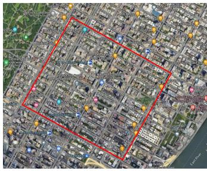

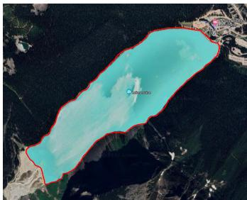  
(a) Manhattan  
(b) Lake Louise  
Fig. 5. Maps of Manhattan and Lake Louise.

In GLINT algorithm, actor network 1, actor network 2, and the critic network are each composed of two fully connected layers and a GRU layer with 256 hidden neurons. In addition, the mixing network consists of two fully connected layers. We use the leaky ReLU function to activate all hidden layers. The GLINT-based training hyperparameters are summarized in Table 4.

We use the following three metrics to measure the performance of GLINT algorithm:

• Average AoI: denoted as the average AoI of all sensors over N time slots, as specified in equation (13).

• Average UAV energy consumption: indicated by average energy consumption of single UAV over N time slots, computed as $\stackrel { \bullet } { \sum } _ { t = 1 } ^ { N } \sum _ { u = 1 } ^ { U } \mathbb { E } _ { u } ^ { t } / N U$

• Average transmission efficiency: defined as the ratio of the number of transmitted bits to sensor transmission energy consumption over N time slots. For better illustration, we plot it on a logarithmic scale, i.e., log $\begin{array} { r } { \big [ \big ( \sum _ { t = 1 } ^ { N } \sum _ { u = 1 } ^ { U } \sum _ { s = 1 } ^ { S } \beta _ { u , s } ^ { t } R _ { u , s } ^ { t } / p _ { u , s } ^ { t } \big ) / \big ( \sum _ { t = 1 } ^ { N } \sum _ { u = 1 } ^ { U } \beta _ { u , s } ^ { t } R _ { u , s } ^ { t } / p _ { u , s } ^ { t } \big ) \big ] \big ( \sum _ { t = 1 } ^ { N } \sum _ { u = 1 } ^ { U } \beta _ { u , s } ^ { t } / p _ { u , s } ^ { t } \big ) } \end{array}$ $\textstyle \mathbf { \boldsymbol { \mu } } \times \sum _ { s = 1 } ^ { S } \beta _ { u , s } ^ { t } { \big ) } \big ]$ . Note that its lower bound is $\log [ R _ { u , s } ^ { t } / p _ { \operatorname* { m a x } } ]$

## 6.1 Training Convergence and Scalability Analysis

Fig. 6a and Fig. 6b illustrate the convergence performance of GLINT algorithm under the Manhattan and Lake Louise maps. In this simulation, we set the number of $\mathrm { U A V s } U = 4 ,$ the number of sensors $\begin{array} { r l r } { S } & { { } = } & { 2 0 , } \end{array}$ , and data transmission time $\phi \ = \ 0 . 2$ . At the beginning of training, both average estimated energy consumption and average AoI are relatively high. This is due to initial inaccuracies in the approximations of the actor and critic networks, which lead to large losses. Over time, both average estimated energy consumption and average AoI decrease significantly. This is because the actor networks in GLINT gradually learn improved policies through interaction with the environment. With the assistance of the critic and mixing networks, the training loss is effectively reduced and gradually stabilized. After approximately 300 training episodes, both average estimated energy consumption and average AoI converge with reduced fluctuations, demonstrating that GLINT learns effective policies under both the Manhattan and Lake Louise maps. Furthermore, although the Lake Louise scenario exhibits a higher LoS probability, its irregular topology and sparse sensor distribution increase the complexity of UAV trajectory planning and cooperative scheduling, leading to slower convergence and larger fluctuations.

Parameters for GLINT Training  
TABLE 3 Simulation Parameters
<table><tr><td>Parameter</td><td>Value</td></tr><tr><td>The length of each time slot T</td><td>1s</td></tr><tr><td>Charging power of UAVs  $\mathbb { P } _ { u } ^ { t , c }$ </td><td>1Watt</td></tr><tr><td>Sensing energy consumption  $E _ { \mathrm { s e n s o r } }$ </td><td> $6 \times 1 0 ^ { - 4 } \mathrm { J } \left[ 3 9 \right]$ </td></tr><tr><td>Sensor maximum transmit power  $p _ { \mathrm { m a x } }$ </td><td>0.1Watt</td></tr><tr><td>Data packet size  $\underline { { D _ { s } ^ { t } } }$ </td><td>0.25Mbits</td></tr><tr><td>Data packet generation probability ρ</td><td>0.9 [42]</td></tr><tr><td>Elevation angle of UAVs θ*</td><td> $2 0 . 3 4 \mathrm { d e g } \left[ 3 3 \right]$ </td></tr><tr><td>EH sensitivity threshold  $\underline { { P _ { \mathrm { m i n } } } }$ </td><td> $1 0 ^ { - 1 . 2 } \mathrm { m W a t t } \ [ 4 0 ]$ </td></tr><tr><td>EH saturation threshold  $\underline { { P _ { \mathrm { m a x } } } }$ </td><td>10mWatt</td></tr><tr><td>Minimum flying altitude of UAVs  $\underline { { H _ { \mathrm { m i n } } } }$ </td><td>40m</td></tr><tr><td>Maximum flying altitude of UAVs  $H _ { \mathrm { m a x } }$ </td><td>150m</td></tr><tr><td>Minimum spatial distance of  $\mathrm { U A V s } d _ { \mathrm { s a f e } }$ </td><td>10m [5]</td></tr><tr><td>Flying speed of UAVs V</td><td> $2 5 \mathrm { m } / \mathrm { s } \ [ 5 2 ]$ </td></tr></table>

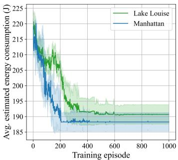  
(a)

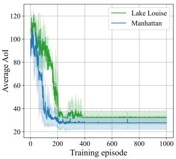  
(b)  
Fig. 6. Convergence comparison of GLINT under Manhattan and Lake Louise maps.

In addition, Fig. 7 illustrates the impact of varying numbers of UAVs on the convergence behavior of GLINT. It can be observed that, across all UAV scale settings, GLINT rapidly reduces average AoI and estimated energy consumption during the early training phase and achieves stable convergence after about 240 episodes. As the number of UAVs increases, average AoI exhibits a continuous downward trend, mainly because more UAVs offer greater spatial coverage and scheduling flexibility, thereby enhancing data update efficiency. When the number of UAVs is large, the fluctuation amplitude in the early training phase increases slightly, while the overall convergence process remains smooth, indicating good training stability of GLINT in multi-agent scenarios.

TABLE 4
<table><tr><td>Parameter</td><td>Value</td></tr><tr><td>Learning rate of actor network 1</td><td>0.0001</td></tr><tr><td>Learning rate of actor network 2</td><td>0.0001</td></tr><tr><td>Learning rate of critic network</td><td>0.0008</td></tr><tr><td>Penalties of Problem P1  $\rho _ { u \tau } ^ { t } , \rho _ { u h } ^ { t } , \rho _ { u c } ^ { t } , \rho _ { u q } ^ { t }$ </td><td>1.0</td></tr><tr><td>Penalties of Problem P2  $\rho _ { u \beta } ^ { t } , \rho _ { u e } ^ { t } , \rho _ { u m } ^ { t }$ </td><td>1.0</td></tr><tr><td>Penalty adjustment factors of Problems P1 and P2</td><td>[1-5]</td></tr><tr><td>The number of centralized training episodes</td><td>1000</td></tr><tr><td>The number of time slots in an episode N</td><td>100</td></tr><tr><td>Initial ε</td><td>0.5</td></tr><tr><td>ε-greedy decrement</td><td>9e-5</td></tr><tr><td>Minimum ε</td><td>0.05</td></tr><tr><td>Mini-batch size</td><td>128</td></tr><tr><td>Discount factor γ</td><td>0.99</td></tr></table>

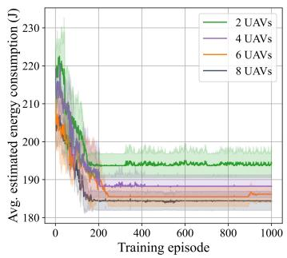  
(a)

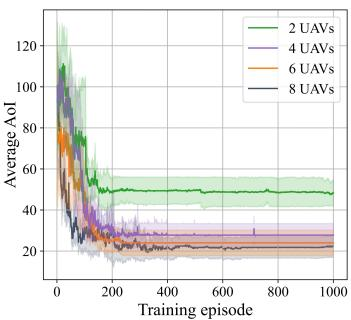  
(b)  
Fig. 7. Impact of UAV scale on the convergence behavior of GLINT.

## 6.2 Illustrative Multi-UAV Trajectories

Fig. 8 and Fig. 9 show 3D and 2D trajectories of UAVs for GLINT algorithm under Manhattan and Lake Louise maps, respectively. UAVs share the same initial and final positions, which are marked as black squares in the figures. Specifically, these positions are (225, 225, 50), (675, 225, 50), (225, 675, 50), and (675, 675, 50) under Manhattan map, and (420, 145, 50), (660, 887, 50), (1302, 763, 50), and (1519, 1360, 50) under Lake Louise map. We observe clear cooperation among UAVs, with each one moving back and forth mainly in its area of responsibility. This is because GLINT facilitates UAV cooperation, thereby reducing the average flight distance and enabling effective sensor coverage, which contributes to a lower average AoI. Moreover, due to the impact of the map size and LoS link probability, most UAVs tend to fly to a more suitable altitude at the beginning of the experiment to achieve better average AoI performance. In particular, under Lake Louise map, the average height of UAVs is larger than that of Manhattan map owing to the difference in sensor distribution density. This demonstrates that the proposed GLINT algorithm can adaptively adjust UAV trajectories according to environmental characteristics and sensor distribution, thereby optimizing system performance.

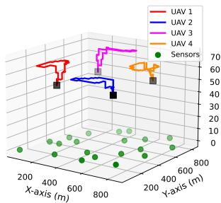  
(a) 3D UAV trajectories in Manhattan

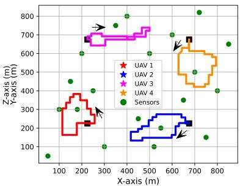  
(b) 2D UAV trajectories in Manhattan

Fig. 8. UAV trajectories for GLINT algorithm under Manhattan map.  
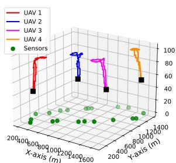  
(a) 3D UAV trajectories in Lake Louise

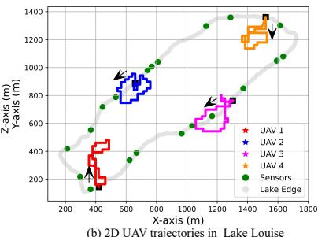  
Fig. 9. UAV trajectories for GLINT algorithm under Lake Louise map.

## 6.3 Comparison with Other Approaches

We use the following five approaches to compare with the proposed GLINT algorithm.

DMUCRL [53]: It is a multi-agent Q-learning approach that independently learns two multi-agent cooperative games. We apply it to solve subproblems 1 and 2 separately to evaluate the impact of explicitly modeling temporal coupling between subproblems.

DMASA: It is a single-actor variant of the GLINT framework, where each agent employs one actor network to jointly learn UAV location $\boldsymbol { q } _ { u } ^ { t } ,$ , WPT time allocation $\dot { \tau _ { u } ^ { t } } ,$ and transmission scheduling variable $\beta _ { u , s } ^ { t }$ . It is used to demonstrate the advantages of the dual-network sequential processing architecture in GLINT.

MODDPG [54]: It is a traditional actor-critic based DRL algorithm that optimizes data collection rate, device energy, and UAV energy consumption. We incorporate average AoI and UAV energy consumption into the reward and employ a single actor network to jointly learn $\ v q _ { u } ^ { t } , \tau _ { u } ^ { t } ,$ , and $\beta _ { u , s } ^ { t } .$ . This method is used to compare centralized strategies with the decentralized decision-making mechanism in GLINT.

• Nearby Scheduling (NS): It uses the same approach as GLINT to optimize $\ v q _ { u } ^ { t } , \tau _ { u } ^ { t } .$ , and $\alpha _ { u , s } ^ { t } ,$ but transmission scheduling variable $\beta _ { u , s } ^ { t }$ is determined by the UAV selecting the nearest sensor among its associated ones. We introduce it to evaluate the impact of the transmission scheduling strategy in GLINT.

Random Association (RA): It adopts the same solutions for $\mathbf { } q _ { u } ^ { t } , \ \tau _ { u } ^ { t } ,$ and $\beta _ { u , s } ^ { t }$ as GLINT, while sensors randomly select reachable UAVs for association. It is used to evaluate the effect of the association matching strategy.

• AoI Bound: It is derived from Theorem 6.

## 6.3.1 Impact of Data Transmission Time

We fix the number of sensors $S ~ = ~ 2 0$ and the number of UAVs $U \ = \ 4 ,$ while changing data transmission time φ in [0.1, 0.15, 0.2, 0.25, 0.3]. From Fig. 10a–Fig. 10c, we observe that average UAV energy consumption of GLINT is slightly larger than that of MODDPG, while it consistently outperforms the other five algorithms concerning average AoI and average transmission efficiency. This is because MODDPG aims to minimize both AoI and UAV energy consumption, resulting in the lowest energy usage. Second, DMUCRL uses two Q-networks to solve Problems P1 and P2, respectively, which reduces the action space and simplifies policy learning. In contrast, GLINT performs better than DMUCRL by fitting the global action value based on the mixing network to facilitate UAV cooperation. In addition, DMASA has a large search space as it must simultaneously optimize three variables. As a result, its performance is inferior to both GLINT and DMUCRL. Finally, RA leads to poor channel conditions because sensors randomly associate with UAVs, while NS only selects the nearest sensors without considering their AoI. As a result, both RA and NS perform poorly in terms of average AoI, average UAV energy consumption, and average transmission efficiency. Notably, the curve of the theoretical AoI bound only fluctuates slightly after $\phi \geq 0 . 2 0$ , since it does not consider the EH demand of sensors or whether they meet the transmission conditions. Similar trends are observed in Fig. 10d–Fig. 10f. Although the probability of obtaining LoS links in Lake Louise map is larger compared to that of Manhattan map, its sparser sensor distribution and irregular lake boundaries lead to more complex UAV trajectory planning. Therefore, compared to Manhattan map, there is a decline in performance regarding average AoI, average UAV energy consumption, and average transmission efficiency in Lake Louise map.

We observe from Fig. 10a and Fig. 10d that average AoI first decreases and then increases as φ increases. This is since the number of sensors that can be scheduled for data transmission decreases as φ increases. Meanwhile, the transmit power of sensors decreases, thereby increasing the number of sensors that satisfy the transmission condition. The number of sensors that can be scheduled for data transmission and those satisfying the transmission condition are balanced when $\phi = 0 . \overset { \cdot } { 2 }$ . Moreover, Fig. 10b and Fig. 10e show that average UAV energy consumption slightly decreases with increasing φ. This is because, with fewer sensors that can be scheduled for data transmission, UAVs no longer require complex trajectory design to satisfy the demands of multiple sensors. Finally, from Fig. 10c and Fig. 10f, we observe that average transmission efficiency of all algorithms improves as φ increases. This is because, according to equation (14), the transmit power of sensors decreases with increasing φ, leading to a substantial gain in average transmission efficiency. Moreover, average transmission efficiency approaches its lower bound when $\phi \leq 0 . 1 5$

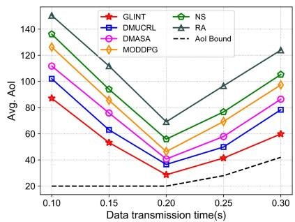  
(a) Manhattan

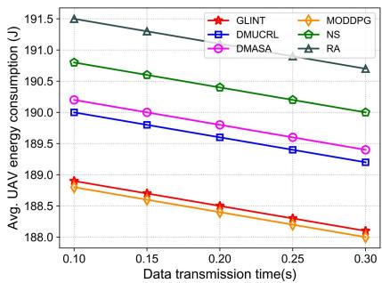

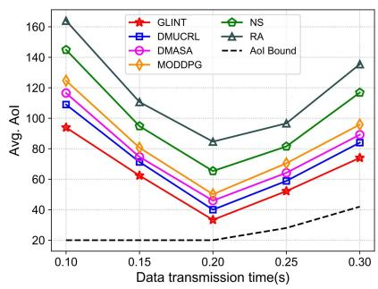  
(d) Lake Louise

(b) Manhattan  
(c) Manhattan  
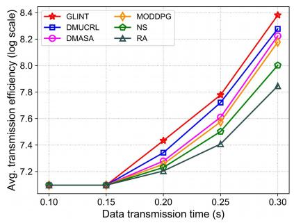

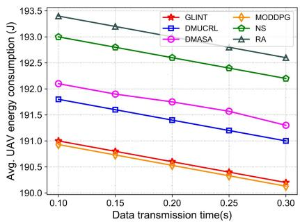  
(e) Lake Louise

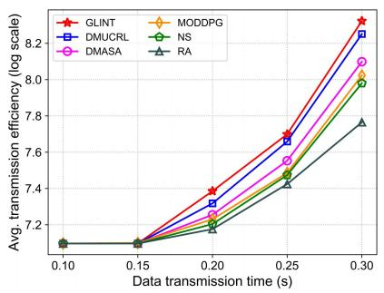  
(f) Lake Louise

Fig. 10. Impact of data transmission time φ.  
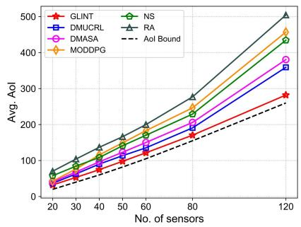  
(a) Manhattan

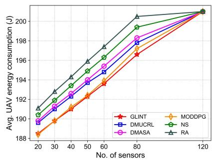  
(b) Manhattan

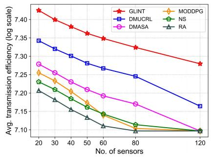  
(c) Manhattan

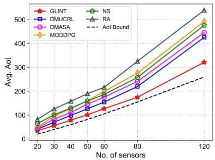  
(d) Lake Louise

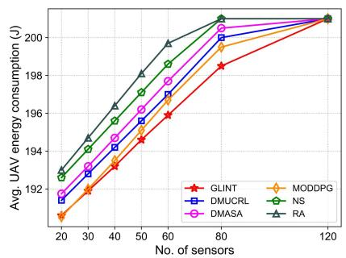  
(e) Lake Louise

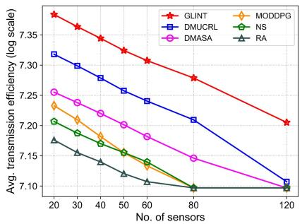  
(f) Lake Louise  
Fig. 11. Impact of the number of sensors S.

## 6.3.2 Impact of the Number of Sensors

We fix data transmission time $\phi = 0 . 2$ and the number of UAVs $U = 4 ,$ , while changing the number of sensors S from 20 to 120. From Fig. 11a–Fig. 11c, we observe that GLINT outperforms the other five algorithms in terms of average AoI, average UAV energy consumption, and average transmission efficiency when S increases. In addition, GLINT is very close to the theoretical AoI bound, indicating that it learns a long-term stable trajectory planning and sensor scheduling policy. Since MODDPG is a single-agent DRL approach, it struggles to optimize UAV energy consumption and AoI in high-dimensional spaces, and its performance degrades as $\breve { S }$ increases. Similar trends are observed in Fig. 11d–Fig. 11f.

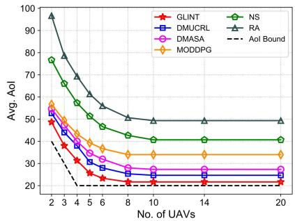  
(a) Manhattan

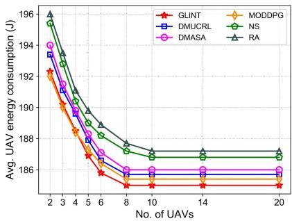  
(b) Manhattan

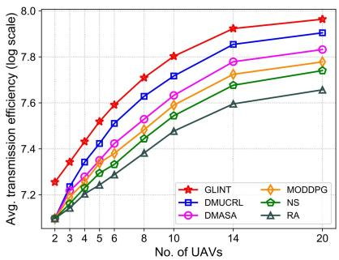  
(c) Manhattan

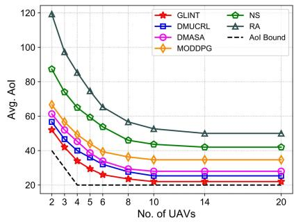  
(d) Lake Louise

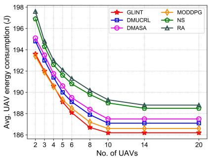  
(e) Lake Louise

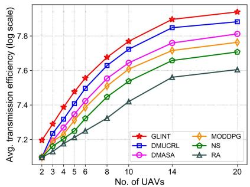  
(f) Lake Louise

Fig. 12. Impact of the number of UAVs U.  
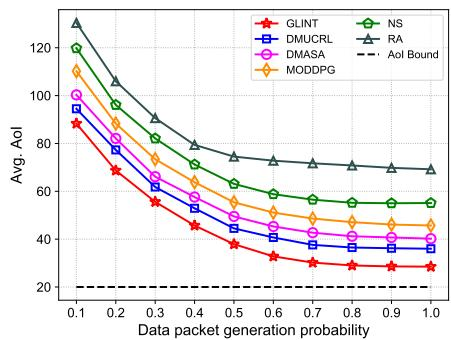

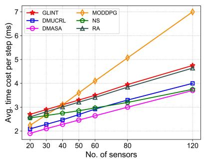  
(a)

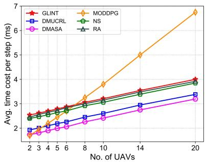  
(b)  
Fig. 13. Impact of packet generation probabil- Fig. 14. Impact of the number of sensors and UAVs on average time cost per step. ity % on average AoI.

We observe that average UAV energy consumption for all algorithms tends to stabilize, while fluctuations in average AoI become more pronounced when $S = 1 2 0 .$ . This is because a larger number of sensors increases the complexity of trajectory design and sensor scheduling, which in turn prolongs UAV flight time and increases energy consumption. Most algorithms exhaust the initial on-board energy of UAVs after approximately 100 time slots when $S = 1 2 0 _ { \circ }$ , resulting in UAV energy consumption to converge gradually. Furthermore, during the later stages of the execution phase at $S = 1 2 0$ , some UAVs cease operation due to early depletion of their initial energy, causing deterioration in both average AoI and average transmission efficiency. Notably, average transmission efficiency of DMASA, MODDPG, NS, and RA even approaches its theoretical lower bound.

## 6.3.3 Impact of the Number of UAVs

We fix data transmission time $\phi = 0 . 2$ and the number of sensors $S \ = \ 2 0$ , while changing the number of UAVs U from 2 to 20. As shown in Fig. 12a–Fig. 12c, as U increases, average UAV energy consumption and average AoI of all algorithms decrease, while average transmission efficiency increases. This is because, with fewer UAVs, they require more time to move to meet sensor scheduling demands, resulting in larger flying energy consumption and lower sensor data collection time. As U increases, the number of sensors that can be scheduled for data transmission increases under improved channel conditions, thereby reducing average AoI and enhancing transmission efficiency. Meanwhile, the gap between GLINT and the theoretical AoI bound becomes smaller as U increases. Similar trends can be observed in Fig. 12d–Fig. 12f.

In particular, average AoI in Fig. 12a and Fig. 12d saturates when $U \geq 1 0 ,$ indicating that ten UAVs are sufficient to meet real-time data freshness requirements. Similarly, Fig. 12b and Fig. 12e show that average UAV energy consumption of all algorithms achieves convergence when $U \geq 1 0$ . This is because there is a sufficient number of UAVs that can provide full coverage and ensure a good channel condition with candidate sensors. Moreover, as shown in Fig. 12c and Fig. 12f, when $U \geq 1 4$ , adding more UAVs brings negligible improvements in channel quality, leading to the convergence of average transmission efficiency.

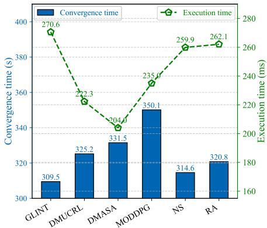  
Fig. 15. Convergence time and execution time for different algorithms.

## 6.4 Average AoI under Different Packet Generation Probabilities

Average AoI performance of all algorithms on the Manhattan map under different data packet generation probabilities % is illustrated in Fig. 13. It can be observed that, as % increases, average AoI of all algorithms generally decreases, since a higher packet generation probability provides more opportunities for sensor data updates. Moreover, compared with the other five algorithms, GLINT consistently achieves the lowest average AoI and exhibits more pronounced performance advantages in the medium-to-high packet generation probability region $( \mathbf { e . g . } , \varrho \ge 0 . 6 )$

## 6.5 Convergence and Execution Time Analysis

The average time cost per step of all algorithms in the execution phase is shown in Fig. 14. Since GLINT employs a mixing network to facilitate UAV cooperation and jointly optimizes UAV positions, WPT time allocation, transmission scheduling, and association scheduling variables, its execution time is slightly higher than that of DMUCRL, DMASA, NS, and RA (its order of magnitude is still within milliseconds and negligible in practice). From Fig. 14a, we observe that average time cost per step of GLINT and other multiagent DRL algorithms gradually increases as S increases, due to the expansion of the action candidate space and the increased complexity of association matching. In addition, as S increases, average time cost per step of MODDPG rises and even becomes the highest among all algorithms when $S \geq 5 0$ . This is because a larger number of sensors expands the action space for MODDPG, which learns all UAV actions by a policy network, thereby significantly increasing the time cost of MODDPG to compute each possible action. Moreover, from Fig. 14b, we find that average time cost per step of all multi-agent DRL approaches increases slowly with the growth of U . In contrast, average time cost per step of MODDPG, which relies on centralized control, increases significantly with U . This is due to centralized action generation requiring consideration of the joint action space of all UAVs, which grows exponentially with U.

In addition, the convergence time and execution time of all algorithms are illustrated in Fig. 15. It can be observed that, compared with the other five algorithms, GLINT achieves the best convergence performance. This is mainly attributed to the proposed dual-network sequential processing structure, which effectively reduces decision complexity and thus improves computational efficiency. In contrast, MODDPG performs policy search in a high-dimensional joint action space, which leads to significantly longer convergence time during training, despite its relatively lower execution time.

## 7 CONCLUSION

In this paper, we proposed a decentralized scheduling algorithm based on multi-agent DRL to jointly optimize UAV trajectories, WPT time allocation, association and transmission scheduling of sensors in a UAV-assisted wireless powered edge network, to minimize average AoI. First, by considering the energy constraints of sensors and the time constraints of UAVs, we formulated the average AoI minimization problem. Second, we decomposed it into two subproblems and modeled them as two coupled Dec-POMDPs. Then, to solve these subproblems, we designed an improved decentralized multi-agent DRL algorithm based on a dualnetwork sequential processing architecture and value function factorization, which fits the relationship between local and global action values and facilitates cooperation among agents. Finally, we derived the theoretical lower bound of average AoI. Extensive simulation results demonstrated that the proposed algorithm outperforms the other five representative algorithms, and its performance is closest to the theoretical lower bound of average AoI.

## REFERENCES

[1] X. Chen, D. W. K. Ng, W. Yu, E. G. Larsson, N. Al-Dhahir, and R. Schober, “Massive access for 5G and beyond,” IEEE J. Sel. Areas Commun., vol. 39, no. 3, pp. 615–637, Mar. 2021.

[2] F. Zhu, J. Chen, J. Wen, Y. Yang, C. Yi, Y. Tie, P. Zhang, J. Cai, D. Niyato, and M. Guizani, “From data mirror to smart copilot: A survey on NextG semantic communication for propelling digital twin world into cognitive stage,” IEEE Commun. Surveys Tuts., vol. 28, pp. 4915–4947, 1st Quart., 2026.

[3] J. Chen, C. Yi, S. D. Okegbile, J. Cai, and X. Shen, “Networking architecture and key supporting technologies for human digital twin in personalized healthcare: A comprehensive survey,” IEEE Commun. Surveys Tuts., vol. 26, no. 1, pp. 706–746, 1st Quart., 2024.

[4] X. Ai, W. Liang, and C. Liu, “Joint optimization of model retraining and inference services in DT-assisted edge computing,” IEEE Trans. Netw., vol. 34, pp. 1804–1819, Jan. 2026.

[5] X. Wang, M. Yi, J. Liu, Y. Zhang, M. Wang, and B. Bai, “Cooperative data collection with multiple UAVs for information freshness in the Internet of things,” IEEE Trans. Commun., vol. 71, no. 5, pp. 2740–2755, May 2023.

[6] J. Li, J. Wang, W. Liang, Q. Chen, S. K. Das, and X. Jia, “Digital twin freshness maximization in edge computing,” IEEE Trans. Services Comput., early access, Jan. 12, 2026, doi:10.1109/TSC.2026.3651602.

[7] X. Wang, J. Li, Z. Ning, Q. Song, L. Guo, S. Guo, and M. S. Obaidat, “Wireless powered mobile edge computing networks: A survey,” ACM Comput. Surv., vol. 55, no. 13s, pp. 1–37, Jul. 2023.

[8] X. Wang, Z. Ning, S. Guo, M. Wen, and H. V. Poor, “Minimizing the age-of-critical-information: An imitation learning-based scheduling approach under partial observations,” IEEE Trans. Mobile Comput., vol. 21, no. 9, pp. 3225–3238, Sep. 2022.

[9] J. Li, J. Wang, W. Liang, X. Jia, and A. Y. Zomaya, “Inference service fidelity maximization in DT-assisted edge computing,” IEEE Trans. Mobile Comput., vol. 25, no. 1, pp. 1352–1366, Jan. 2026.

[10] Y. Yang, Y. Shi, C. Yi, J. Cai, J. Kang, D. Niyato, and X. Shen, “Dynamic human digital twin deployment at the edge for task execution: A two-timescale accuracy-aware online optimization,” IEEE Trans. Mobile Comput., vol. 23, no. 12, pp. 12 262–12 279, Dec. 2024.

## IEEE TRANSACTIONS ON MOBILE COMPUTING

[11] Z. Ning, H. Hu, X. Wang, L. Guo, S. Guo, G. Wang, and X. Gao, “Mobile edge computing and machine learning in the Internet of unmanned aerial vehicles: A survey,” ACM Comput. Surv., vol. 56, no. 1, pp. 1–31, Aug. 2023.

[12] X. Lu, W. Yang, S. Yan, Z. Li, and D. W. K. Ng, “Covertness and timeliness of data collection in UAV-aided wireless-powered IoT,” IEEE Internet Things J., vol. 9, no. 14, pp. 12 573–12 587, Jul. 2022.

[13] H. Hu, K. Xiong, G. Qu, Q. Ni, P. Fan, and K. B. Letaief, “AoIminimal trajectory planning and data collection in UAV-assisted wireless powered IoT networks,” IEEE Internet Things J., vol. 8, no. 2, pp. 1211–1223, Jan. 2021.

[14] J. Liu, F. Yang, X. Wang, L. Qu, M. Jin, and H. Dai, “Joint optimization of charging station placement and UAV trajectory for fresh data collection,” IEEE Internet Things J., vol. 11, no. 14, pp. 25 057–25 073, Jul. 2024.

[15] L. Liu, K. Xiong, J. Cao, Y. Lu, P. Fan, and K. B. Letaief, “Average AoI minimization in UAV-assisted data collection with RF wireless power transfer: A deep reinforcement learning scheme,” IEEE Internet Things J., vol. 9, no. 7, pp. 5216–5228, Apr. 2022.

[16] H. Zhao, G. Lu, Y. Liu, Z. Chang, L. Wang, and T. Ham¨ al¨ ainen,¨ “Safe DQN-based AoI-minimal task offloading for UAV-aided edge computing system,” IEEE Internet Things J., vol. 11, no. 19, pp. 32 012–32 024, Oct. 2024.

[17] S. Liang, M. Yin, W. Xie, Z. Sun, J. Li, J. Wang, and H. Du, “UAV-enabled secure data collection and energy transfer in IoT via diffusion model-enhanced deep reinforcement learning,” IEEE Internet Things J., vol. 12, 2025.

[18] M. Yi, X. Wang, J. Liu, Y. Zhang, and R. Hou, “Multitask transfer deep reinforcement learning for timely data collection in rechargeable-UAV-aided IoT networks,” IEEE Internet Things J., vol. 10, no. 23, pp. 20 545–20 559, Dec. 2023.

[19] K. Messaoudi, O. S. Oubbati, A. Rachedi, and T. Bendouma, “UAV-UGV-based system for AoI minimization in IoT networks,” in Proc. IEEE Int. Conf. Commun. (ICC), May 2023, pp. 4743–4748.

[20] W. Xie, G. Sun, J. Li, X. Wang, J. Wang, H. Du, and D. Niyato, “IRS-enabled wireless power transfer and data collection in UAVassisted IoT,” in Proc. IEEE Global Commun. Conf. (GLOBECOM), Dec. 2024, pp. 3237–3242.

[21] J. Liu, X. Zhao, P. Qin, S. Geng, Z. Chen, and H. Zhou, “Learningbased multi-UAV assisted data acquisition and computation for information freshness in WPT enabled space-air-ground PIoT,” IEEE Trans. Netw. Sci. Eng., vol. 11, no. 1, pp. 48–63, Jan. 2024.

[22] Q. Guo, X. Liu, N. Ansari, and L. Huang, “AoI-constrained efficient 3D far-field wireless charging and data collection using multiple UAVs,” IEEE Internet Things J., vol. 12, no. 10, pp. 14 067– 14 079, May 2025.

[23] E. Eldeeb, J. M. d. S. Sant’Ana, D. E. Perez, M. Shehab, N. H.´ Mahmood, and H. Alves, “Multi-UAV path learning for age and power optimization in IoT with UAV battery recharge,” IEEE Trans. Veh. Technol., vol. 72, no. 4, pp. 5356–5360, Apr. 2023.

[24] Y. Wei, Y. Lu, P. Zhao, S. Leng, and K. Yang, “Minimizing age of information in UAV-assisted data collection with limited charging facilities,” IEEE Wireless Commun. Lett., vol. 13, no. 5, pp. 1463– 1467, May 2024.

[25] M. L. Betalo, S. Leng, H. N. Abishu, A. M. Seid, M. Fakirah, A. Erbad, and M. Guizani, “Multi-agent DRL-based energy harvesting for freshness of data in UAV-assisted wireless sensor networks,” IEEE Trans. Netw. Service Manag., vol. 21, no. 6, pp. 6527–6541, Dec. 2024.

[26] X. Li, J. Li, B. Yin, J. Yan, and Y. Fang, “Age of information optimization in UAV-enabled intelligent transportation system via deep reinforcement learning,” in Proc. IEEE 96th Veh. Technol. Conf. (VTC-Fall), Sep. 2022, pp. 1–5.

[27] L. Shi, X. Zhang, X. Xiang, Y. Zhou, and S. Sun, “Age of information optimization with heterogeneous UAVs based on deep reinforcement learning,” in Proc. 14th Int. Conf. Adv. Comput. Intell. (ICACI), 2022, pp. 239–245.

[28] M. N. Ndiaye, E. H. Bergou, and H. E. Hammouti, “Age-ofinformation in UAV-assisted networks: a decentralized multiagent optimization,” in Proc. IEEE Wireless Commun. Netw. Conf. (WCNC), Apr. 2024, pp. 1–6.

[29] K. Messaoudi, A. Baz, O. S. Oubbati, A. Rachedi, T. Bendouma, and M. Atiquzzaman, “UGV charging stations for UAV-assisted AoI-aware data collection,” IEEE Trans. Cogn. Commun. Netw., vol. 10, no. 6, pp. 2325–2343, Dec. 2024.

[30] K. Shi, J. Liu, L. Xie, Z. Zhou, H. Chen, and G. Feng, “AoI-aware data collection and energy replenishment for multi-UAV-enabled

IoT systems,” IEEE Trans. Green Commun. Netw., vol. 9, no. 4, pp. 1755–1768, 2025.

[31] J. Li, X. Wang, J. Wu, and Z. Ning, “Intelligent scheduling of UAVs and sensors for information age minimization at wireless powered Internet of things,” in Proc. IEEE 24th Int. Conf. Comput. Support. Coop. Work Des. (CSCWD), May 2024, pp. 3243–3248.

[32] Z. Dai, C. H. Liu, R. Han, G. Wang, K. K. Leung, and J. Tang, “Delay-sensitive energy-efficient UAV crowdsensing by deep reinforcement learning,” IEEE Trans. Mobile Comput., vol. 22, no. 4, pp. 2038–2052, Apr. 2023.

[33] X. Luo, J. Xie, L. Xiong, Z. Wang, and C. Tian, “3-D deployment of multiple UAV-mounted mobile base stations for full coverage of IoT ground users with different QoS requirements,” IEEE Commun. Lett., vol. 26, no. 12, pp. 3009–3013, Dec. 2022.

[34] J. Li, Y. Huang, J. Wu, X. Wang, and Z. Ning, “Energy-efficiency maximization for STAR-RIS and AAV-assisted IUA: A multiagent DRL approach,” IEEE Internet Things J., vol. 12, no. 21, pp. 43 936– 43 948, Nov. 2025.

[35] Y. Zeng, J. Xu, and R. Zhang, “Energy minimization for wireless communication with rotary-wing UAV,” IEEE Trans. Wireless Commun., vol. 18, no. 4, pp. 2329–2345, Apr. 2019.

[36] X. Gao, X. Zhu, and L. Zhai, “AoI-sensitive data collection in multi-UAV-assisted wireless sensor networks,” IEEE Trans. Wireless Commun., vol. 22, no. 8, pp. 5185–5197, Aug. 2023.

[37] C. Yi, J. Cai, and Z. Su, “A multi-user mobile computation offloading and transmission scheduling mechanism for delay-sensitive applications,” IEEE Trans. Mobile Comput., vol. 19, no. 1, pp. 29–43, Jan. 2020.

[38] J. Li, X. Wang, J. Wu, Z. Ning, and S. Guo, “STAR-RIS-assisted covert communications in RSMA networks: a quantum reinforcement learning approach,” IEEE Trans. Mobile Comput., early access, Feb. 20, 2026, doi:10.1109/TMC.2026.3666828.

[39] R. Zhang, J. Peng, W. Xu, W. Liang, Z. Li, and T. Wang, “Utility maximization of temporally correlated sensing data in energy harvesting sensor networks,” IEEE Internet Things J., vol. 6, no. 3, pp. 5411–5422, Jun. 2019.

[40] Y. Che, Y. Lai, S. Luo, K. Wu, and L. Duan, “UAV-aided information and energy transmissions for cognitive and sustainable 5G networks,” IEEE Trans. Wireless Commun., vol. 20, no. 3, pp. 1668– 1683, Mar. 2021.

[41] J. Li, J. Wu, and X. Wang, “Multi-agent DRL-driven age-energy efficiency optimization in STAR-RIS assisted consumer-grade unmanned vehicle applications,” IEEE Trans. Consum. Electron, early access, Nov. 20, 2025, doi:10.1109/TCE.2025.3635290.

[42] Z. Qin, Z. Wei, Y. Qu, F. Zhou, H. Wang, D. W. K. Ng, and C.-B. Chae, “AoI-aware scheduling for air-ground collaborative mobile edge computing,” IEEE Trans. Wireless Commun., vol. 22, no. 5, pp. 2989–3005, May 2023.

[43] X. Wang, J. Li, Z. Ning, Q. Song, L. Guo, and A. Jamalipour, “Wireless powered metaverse: Joint task scheduling and trajectory design for multi-devices and multi-UAVs,” IEEE J. Sel. Areas Commun., vol. 42, no. 3, pp. 552–569, Mar. 2024.

[44] R. Lowe, Y. Wu, A. Tamar, J. Harb, P. Abbeel, and I. Mordatch, “Multi-agent actor-critic for mixed cooperative-competitive environments,” in Proc. Neural Inf. Process. Syst. (NeurIPS), Dec. 2017, pp. 6382–6393.

[45] J. Chen, C. Yi, S. Gong, H. Du, W. Wu, J. Kang, and D. Niyato, “Generative AI-aided QoE-aware resource allocations for RlS-assisted digital twin interaction with uncertain evolution,” IEEE Trans. Mobile Comput., early access, Dec. 17, 2025, doi:10.1109/TMC.2025.36453062.

[46] S. D. Okegbile, J. Cai, H. Zheng, J. Chen, and C. Yi, “Differentially private federated multi-task learning framework for enhancing human-to-virtual connectivity in human digital twin,” IEEE J. Sel. Areas Commun., vol. 41, no. 11, pp. 3533–3547, Nov. 2023.

[47] H. El Hammouti, M. Benjillali, B. Shihada, and M.-S. Alouini, “Learn-as-you-fly: A distributed algorithm for joint 3D placement and user association in multi-UAVs networks,” IEEE Trans. Wireless Commun., vol. 18, no. 12, pp. 5831–5844, Dec. 2019.

[48] T. Rashid, M. Samvelyan, C. Schroeder, G. Farquhar, J. Foerster, and S. Whiteson, “QMIX: Monotonic value function factorisation for deep multi-agent reinforcement learning,” in Proc. Int. Conf. Mach. Learn. (ICML), Jul. 2018, pp. 4295–4304.

[49] B. Peng, T. Rashid, C. Schroeder de Witt, P. A. Kamienny, P. Torr, W. Boehmer, and S. Whiteson, “FACMAC: Factored multi-agent centralised policy gradients,” in Proc. Neural Inf. Process. Syst. (NeurIPS), Dec. 2021, pp. 12 208–12 221.

## IEEE TRANSACTIONS ON MOBILE COMPUTING

[50] Y. Nabil, H. ElSawy, S. Al-Dharrab, H. Attia, and H. Mostafa, “Ultra-reliable device-centric uplink communications in airborne networks: A spatiotemporal analysis,” IEEE Trans. Veh. Technol., vol. 72, no. 7, pp. 9484–9499, Jul. 2023.

[51] X. Wang, Z. Ning, L. Guo, S. Guo, X. Gao, and G. Wang, “Online learning for distributed computation offloading in wireless powered mobile edge computing networks,” IEEE Trans. Parallel Distrib. Syst., vol. 33, no. 8, pp. 1841–1855, Aug. 2022.

[52] Z. Dai, H. Wang, C. H. Liu, R. Han, J. Tang, and G. Wang, “Mobile crowdsensing for data freshness: A deep reinforcement learning approach,” in Proc. IEEE Conf. Comput. Commun. (INFOCOM), May 2021, pp. 1–10.

[53] C. Zhao, J. Liu, M. Sheng, W. Teng, Y. Zheng, and J. Li, “Multi-UAV trajectory planning for energy-efficient content coverage: A decentralized learning-based approach,” IEEE J. Sel. Areas Commun., vol. 39, no. 10, pp. 3193–3207, Oct. 2021.

[54] Y. Yu, J. Tang, J. Huang, X. Zhang, D. K. C. So, and K.-K. Wong, “Multi-objective optimization for UAV-assisted wireless powered IoT networks based on extended DDPG algorithm,” IEEE Trans. Commun., vol. 69, no. 9, pp. 6361–6374, Sep. 2021.


Xiaojie Wang (Senior Member, IEEE) received the PhD degree from Dalian University of Technology, Dalian, China, in 2019. After that, she was a postdoctor in the Hong Kong Polytechnic University. Currently, she is a full professor with the School of Communication and Information Engineering, the Chongqing University of Posts and Telecommunications, Chongqing, China. Her research interests are wireless networks, mobile edge computing and machine learning. She has published over 60 scientific papers in international journals and conferences, such as IEEE TMC, IEEE JSAC, IEEE TPDS and IEEE COMST. She is a Highly Cited Researcher (Web of Science) since 2023.


Jiameng Li received the M.S. degree from the School of Communications and Information Engineering, Chongqing University of Posts and Telecommunications, Chongqing, China, in 2024. She is currently working toward the Ph.D. degree with the Graduate School of Information, Production and Systems, Waseda University, Fukuoka, Japan. Her research interests include quantum machine learning, mobile edge computing, and unmanned aerial vehicles.


Zhaolong Ning (Senior Member, IEEE) received the Ph.D. degree from Northeastern University, China in 2014. He was a Research Fellow at Kyushu University from 2013 to 2014, Japan. Currently, he is a full professor with the School of Communication and Information Engineering, Chongqing University of Posts and Telecommunications, Chongqing, China. His research interests include mobile edge computing, 6G networks, machine learning, and resource management. He has published over 150 scien-

tific papers in international journals and conferences. Dr. Ning serves as an associate editor or guest editor of several journals, such as IEEE Transactions on Vehicular Technology, IEEE Transactions on Industrial Informatics, IEEE Transactions on Social Computational Systems, IEEE Internet of Things Journal and so on. He is a Highly Cited Researcher (Web of Science) since 2020, a fellow of the IET and a Distinguished Lecturer of the IEEE VTS.


Fei Richard Yu (Fellow, IEEE) received the Ph.D. degree in electrical engineering from The University of British Columbia (UBC) in 2003. His research interests include connected/autonomous vehicles, artificial intelligence, cyber security, and wireless systems. He has been named in the Clarivate Analytics list of Highly Cited Researchers, since 2019. He is an Elected Member of the Board of Governors of the IEEE VTS. He is a fellow of the Canadian Academy of Engineering (CAE), Engineering Institute of Canada (EIC), and IET. He received several best paper awards from some first-tier conferences. He is the Editor-in-Chief of the IEEE VTS Mobile World Newsletter. He is a Distinguished Lecturer of the IEEE in both VTS and ComSoc.


Song Guo (Fellow, IEEE) is a full professor in the Department of Computer Science and Engineering at Hong Kong University of Science and Technology. Prof. Guo made fundamental and pioneering contributions to the development of edge AI and cloud-edge computing. He published many papers in top venues and received over a dozen Best Paper Awards from IEEE/ACM conferences, journals and technical committees. He is the recipient of 2024 Edward J. Mc-Cluskey Technical Achievement Award,

Gold Medal in 2023 Geneva Inventions Expo, and Intellectual Property Ambassador Award in 2020 Hong Kong Social Enterprise Competition. Prof. Guo is a Fellow of the Canadian Academy of Engineering, Member of Academia Europaea, and Fellow of the IEEE.