# Decentralized Navigation With Heterogeneous Federated Reinforcement Learning for UAV-Enabled Mobile Edge Computing

Pengfei Wang , Member, IEEE, Hao Yang , Student Member, IEEE, Guangjie Han , Fellow, IEEE, Ruiyun Yu , Member, IEEE, Leyou Yang, Geng Sun , Senior Member, IEEE, Heng Qi , Senior Member, IEEE, Xiaopeng Wei , Member, IEEE, and Qiang Zhang , Senior Member, IEEE

Abstract—Unmanned Aerial Vehicle (UAV)-enabled mobile edge computing has been proposed as an efficient task-offloading solution for user equipments (UEs). Nevertheless, the presence of heterogeneous UAVs makes centralized navigation policies impractical. Decentralized navigation policies also face significant challenges in knowledge sharing among heterogeneous UAVs. To address this, we present the soft hierarchical deep reinforcement learning network (SHDRLN) and dual-end federated reinforcement learning (DFRL) as a decentralized navigation policy solution. It enhances overall task-offloading energy efficiency for UAVs while facilitating knowledge sharing. Specifically, SHDRLN, a hierarchical DRL network based on maximum entropy learning, reduces policy differences among UAVs by abstracting atomic actions into generic skills. Simultaneously, it maximizes the average efficiency of all UAVs, optimizing coverage for UEs and minimizing task-offloading waiting time. DFRL, a federated learning (FL) algorithm, aggregates policy knowledge at the cloud server and filters it at the UAV end, enabling adaptive learning of navigation policy knowledge suitable for the UAV’s performance parameters. Extensive simulations demonstrate that the proposed solution not

Manuscript received 25 November 2023; revised 23 April 2024; accepted 29 July 2024. Date of publication 7 August 2024; date of current version 5 November 2024. This work was supported in part by National Science and Technology Major Project under Grant 2021ZD0112400, in part by the National Natural Science Foundation of China under Grant 62202080, in part by China Postdoctoral Science Foundation under Grant 2023M733354, in part by the Science and Technology Project of Liaoning Province under Grant 2023JH1/10400083, in part by the Dalian Science and Technology Talent Innovation Support Plan for Outstanding Young Scholars under Grant 2023RY023, in part by the Open Project of Key Laboratory for Advanced Design and Intelligent Computing of the Ministry of Education under Grant ADIC20220001, in part by Xiaomi Young Talents Program, and in part by the Fundamental Research Funds for the Central Universities under Grant DUT23YG122. Recommended for acceptance by S. Misra. (Corresponding authors: Pengfei Wang; Qiang Zhang.)

Pengfei Wang, Hao Yang, Heng Qi, Xiaopeng Wei, and Qiang Zhang are with the School of Computer Science and Technology, key Laboratory of Social Computing and Cognitive Intelligence, Ministry of Education, Dalian University of Technology, Dalian 116024, China (e-mail: wangpf@dlut.edu.cn; hengqi@dlut.edu.cn; xpwei@dlut.edu.cn; zhangq@dlut.edu.cn; younghowkg @gmail.com).

Guangjie Han is with the Key Laboratory of Maritime Intelligent Network Information Technology, Ministry of Education, Hohai University, Nanjing, Jiangsu 210098, China (e-mail: hanguangjie@gmail.com).

Ruiyun Yu is with Software College, Northeastern University, Shenyang, Liaoning 110167, China (e-mail: yury@mail.neu.edu.cn).

Leyou Yang is with the School of Computer Science and Engineering, Northeastern University, Shenyang, Liaoning 110819, China (e-mail: yangleyou@gmail.com).

Geng Sun is with the College of Computer Science and Technology, Jilin University, Changchun 130012, China (e-mail: sungeng@jlu.edu.cn).

Digital Object Identifier 10.1109/TMC.2024.3439696

only outperforms other baseline algorithms in overall energy efficiency but also achieves more stable navigation policy learning under different levels of heterogeneity of different UAV performance parameters.

Index Terms—Communication coverage, energy efficiency, federated reinforcement learning, heterogeneous UAV, MEC.

# I. INTRODUCTION

W ITH the advancement of cutting-edge technologies suchas on-board computing [1], multi-agent reinforcement learning [2], and Flying Ad-hoc network (FANET) [3], controlling a swarm of UAVs to accomplish complex tasks intelligently is becoming more and more practical. With the support of these UAV technologies, UAV-enabled mobile edge computing (MEC) can dynamically deploy computational resources and achieving higher line-of-sight (LoS) communication probabilities, holding the promise of greatly enhancing user experience in the future. In UAV-enabled MEC, UAVs have limited battery capacity and often have different performance parameters from one another. Therefore, devising more energy-efficient and intelligent navigation solutions for each heterogeneous UAVs becomes a crucial issue for prolonging system lifecycles and enhancing user experiences.

The solution of navigation in UAV-enabled MEC has been extensively researched by recent works [4], [5], [6], [7]. The authors of [6] also demonstrate the significant potential of deep reinforcement learning (DRL) in the field of UAV navigation. In previous works, UAVs have often been equipped with network devices such as WiFi, NB-IoT, or LoRa to ensure communication between UAVs and provide network access for UEs. However, due to the limitations of maximum communication distances and the heterogeneity of UAVs, centralized DRL navigation for all UAVs is not feasible [8]. The decentralized DRL navigation framework for UAV-enabled MEC in our work is depicted in Fig. 1. Each UAV independently trains a policy network and shares knowledge through a cloud server to expedite the training process. The decentralized DRL navigation solution in our work aims to enhance task-offloading energy efficiency for all UAVs. It ensures each UAV learns navigation policies from heterogeneous UAVs with different performance parameters.

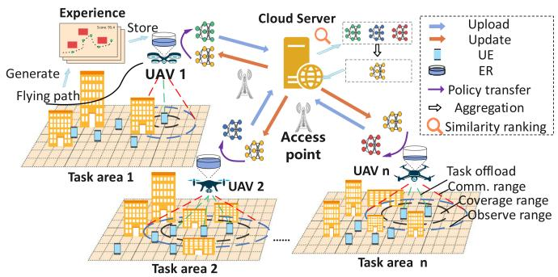

flowchart

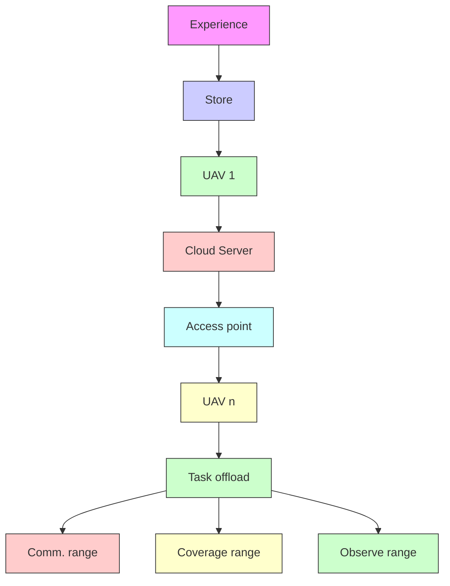

Fig. 1. Decentralized DRL navigation framework with knowledge sharing of heterogeneous UAVs.

Compared with previous works, Our considerations in the Multi-UAV navigation in MEC are more practical and challenging. First, we take into account the challenge of knowledge sharing among heterogeneous UAVs. Learning navigation policy from different policy networks of heterogeneous UAVs is particularly challenging [9]. Second, we assume that UEs are randomly distributed and mobile, rather than uniformly distributed and stationary [10], [11], which requires the navigation policy to have excellent robustness and exploration capabilities. Finally, we assume that the flight speed of UAVs during the task process is variable rather than fixed [12], [13]. Since UAVs consume different power at different flight speeds, this assumption is more realistic and makes the problem more challenging.

To address the challenge of knowledge sharing among heterogeneous UAVs in a decentralized DRL framework, we first tackle the issue of significant disparities in the navigation policy of heterogeneous UAVs. We employ a hierarchical deep reinforcement learning (HDRL) approach, dividing the UAV’s policy model into two layers, consisting of an upper-level skill policy network (SPN) and multiple lower-level deep skill networks (DSNs) [14] as shown in Fig. 2. By abstracting atomic actions into high-level generic skills among UAVs, we reduce the difference in the navigation policy of heterogeneous UAVs.

Furthermore, to address the challenge of knowledge sharing among heterogeneous policies, we employ federated learning (FL) [15] algorithms to aggregate the SPN parameters of multiple UAVs, which allows learning similar navigation policy from other SPN parameters. Based on the intuition that navigation policies for heterogeneous UAVs are different yet similar, we design a multi-agent deep reinforcement learning (MADRL) algorithm called dual-end federated reinforcement learning (DFRL). This algorithm can learn generic policies from the network parameters of other UAVs and filter out policies that are not suitable for the current UAV parameters. Finally, in conjunction with the task scenario of UAV-enabled MEC task offloading, we establish a decentralized framework for heterogeneous UAV navigation. This framework supports the adoption of different navigation policies suitable for their own performance parameters for UAVs with different performance parameters and supports UAVs to learn navigation policies suitable for their own parameters from other policies.

The main contributions of this paper are as follows:

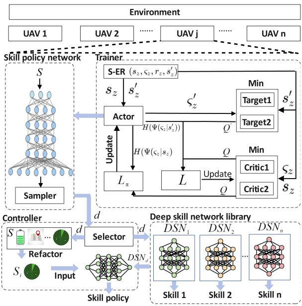

flowchart

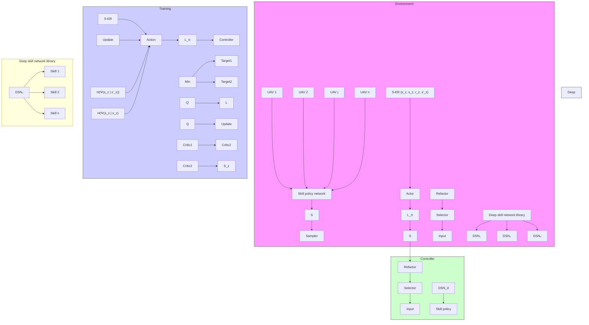

Fig. 2. The framework of SHDRLN.

1) Based on the simulation, we design a decentralized heterogeneous UAV navigation framework. In this framework, we propose a soft hierarchical deep reinforcement learning network (SHDRLN) to learn general upper-level navigation policy, thereby reducing the heterogeneity among policy networks of different UAVs.   
2) We propose a novel federated reinforcement learning algorithm for knowledge sharing among heterogeneous UAVs called DFRL. This algorithm aggregates similar UAV policy models on the server side and performs adaptive gradient aggregation on the local UAV side, enabling the acquisition of generic navigation policy knowledge from other UAVs. To our knowledge, this is the first application of FL methods for knowledge sharing in the field of heterogeneous UAV navigation.   
3) We establish a comprehensive simulation environment, taking into account factors such as the motion of heterogeneous UAVs, changes in flight energy consumption, variations in communication rates, movement of UEs, and local observability. This simulation environment ensures that the results closely reflect real-world scenarios.

# II. RELATED WORK

In this section, we first review relevant research on UAV navigation in MEC. Subsequently, we introduc the current application of DRL methods in multi-UAV navigation systems. Finally, we present research on the application of FL and DRL, revealing its potential in the context of heterogeneous multi-UAV navigation applications.

# A. UAV Navigation in UAV-Enabled MEC

Recent work delves deeply into the research of UAV-enabled MEC to make it more practical and usable in real-world applications. In [16], the authors conduct a study on the system security aspects of UAV-enabled MEC. They utilize two UAVs to assist in computation offloading tasks, with one UAV serving as an interference suppressor against malicious eavesdroppers. Through joint optimization of communication resources, computational resources, and UAV trajectories, they enhance the security computing capacity performance of the system. In [5], the authors combine the Dinkelbach algorithm and the successive convex approximation method to jointly optimize UAV trajectories, transmit power, and computation load allocation, thereby enhancing UAV energy efficiency. The authors in [4] propose an alternating optimization algorithm to make UAV trajectories more suitable for computation-intensive, delay-sensitive tasks. The authors in [17] introduce a swarm intelligence optimization algorithm and present novel pruning and filling encoding policies for multi-objective navigation optimization, to minimize UAV energy consumption and task urgency.

# B. DRL for Multi-UAV Navigation

DRL is a powerful tool that leverages deep neural network (DNN) to learn policy values for solving decision-making problems. With the potent feature extraction capabilities of DNNs, the DRL-based approach can handle higher-dimensional data [18]. Therefore, compared to traditional UAV navigation optimization methods, the DRL-based approach is suitable for more complex task scenarios and can dynamically adjust actions based on changes in the environment, providing greater flexibility and performance improvements. Furthermore, MADRL provides distributed navigation solutions for multi-UAV systems, enabling UAVs to make collaborative decisions to maintain the overall system optimally.

Regarding the problem of multi-UAV navigation, the authors in [19] introduce a novel distributed navigation framework where each UAV can contribute local gradients, supporting parallel training of DRL models. In [20], the authors propose a decentralized reinforcement learning algorithm that models the UAV navigation problem as two coupled stochastic games. This approach can lead to faster convergence of UAV DRL models. The authors in [11] apply the MADDPG method to address a group of UAVs’ navigation problems, treating UAVs as mobile base stations to provide fair and efficient communication coverage for the target area’s UEs. Since the MADDPG method typically requires global observation information during training, this can be infeasible in scenarios with explicit tasks. The authors in [8] introduce deep graph network (DGN) based on [11], leveraging graph attention network (GAT) to aggregate information from neighboring UAVs. This method enables multi-UAV navigation under partial observability conditions.

The distinctions between our approach and prior works are summarized as follows. Previous studies such as [11], [19] adopt the centralized training and decentralized execution (CTDE) approach for training DRL models, necessitating global observation information during training. However, this is often impractical in real-world scenarios. Generating global observational data entails transmitting and integrating information from all UAVs, incurring significant communication overhead and computational complexity, hindering scalability to larger UAV networks. On the other hand, the centralized navigation DRL can only provide the same policy for all UAVs and is not suitable for heterogeneous UAVs. In contrast, our decentralized DRL method involves each UAV making decisions during both training and application phases solely based on its local environment observations, without relying on environment observation from other UAVs. Previous works consider the impact of UAV flight speed on energy efficiency, but they all assume that the UAV maintains a constant flight speed during each task and attempt to find an optimal constant flight speed through multiple experiments. In contrast, our approach assumes that the UAV’s flight speed during the task process can vary. It can dynamically adjust to the most energy-efficient flight speed according to the task conditions, making it more practical. Previous works [8], [11], [20] do not leverage other UAVs’ decision-making experience to expedite the learning process. Although gradient-sharing methods are proposed in [19] to accelerate training, they assume homogeneity among UAVs, which is overly restrictive as realworld applications often involve various UAV specifications. In contrast, our approach considers heterogeneous UAV systems and tailors knowledge-sharing methods for them, thereby enhancing the learning efficiency of heterogeneous UAVs.

# C. Federated Reinforcement Learning in Edge UAV Network Scenarios

FL currently garners widespread attention from both industry and academia as a groundbreaking distributed deep learning paradigm. In a seminal work, the authors of [21] introduce a distributed learning algorithm called FedAvg. In this algorithm, each client only needs to upload its trained model parameters to the server for aggregation, thereby accelerating learning efficiency without the need to collect local datasets. This not only protects user data privacy but also significantly reduces communication overhead. These features make FL have tremendous potential applications in UAV edge AI scenarios. The authors in [22] develop an asynchronous federated learning (AFL) framework for multi-UAV-enabled networks, which can efficiently perform asynchronous distributed machine learning computations without requiring user privacy data. The authors in [23] propose a UAV-based covert federated learning framework, enhancing the security of UAV-assisted machine learning computations. Additionally, a considerable amount of research focuses on combining the advantages of FL and DRL, leading to the exploration of Federated Reinforcement Learning (FedRL) in UAV networks. The authors in [24] propose a multiagent federated reinforcement learning (MAFRL) algorithm, jointly optimizing resource allocation, user association, and power control to achieve more efficient policy learning while protecting user equipment privacy. The authors in [25] apply FedRL in the task scenario of dual-UAVs area target search, where UAVs exchange policy knowledge through FL methods to accelerate DRL learning speed and protect privacy information among UAVs. Recent research emphasizes combining FL and DRL for UAVs to speed up policy learning, but they overlook policy knowledge sharing among heterogeneous UAVs.

TABLE I MAJOR NOTATIONS EMPLOYED IN THIS PAPER 

<table><tr><td>Notation</td><td>Explanation</td></tr><tr><td> $i_j, K_j, \mathcal{K}_j$ </td><td>The index, number, set of UEs in area  $j$ .</td></tr><tr><td> $j, U, \mathcal{U}$ </td><td>The index, number, set of heterogeneous UAVs.</td></tr><tr><td> $d, D, \mathcal{D}$ </td><td>The index, number, set of DSNs or skills.</td></tr><tr><td> $\pi_d, \pi_t$ </td><td>The action policy of  $d$ th DSNs, the policy at t.</td></tr><tr><td> $t, T, \mathcal{T}$ </td><td>Timeslot index, maximum timeslot, set of time slot.</td></tr><tr><td> $R_j, R_j^*$ </td><td>The maximal observe and coverage radius of  $j$ th heterogeneous UAV.</td></tr><tr><td> $s_t^j, r_t^j, a_t^j$ </td><td>Observation state, reward and action of  $j$ th heterogeneous UAV at timeslot  $t$ .</td></tr><tr><td> $W_t(i), W_t$ </td><td>The waiting time of  $i$ th UE at time slot  $t$ , the average waiting time of all UEs at time slot  $t$ .</td></tr><tr><td> $e_j(t), e_T$ </td><td>The energy consumption of  $j$ th UAV at t, the total energy consumption of all UAV.</td></tr><tr><td> $\eta(j), \eta$ </td><td>The energy efficiency  $\eta$  of  $j$ th UAV, the average energy efficiency of all UAV.</td></tr><tr><td> $f_j^{\max}, f_j^{\min}$ </td><td>The maximum CPU resources that  $j$ th UAV can provide, the minimum CPU resources allocated to a task.</td></tr><tr><td> $\mathbb{O}_j$ </td><td>The set of obstacles in the  $j$ th area.</td></tr><tr><td> $\mathbf{V}_j(t), V_j^{\max}$ </td><td>The velocity vector and the magnitude of the maximum velocity of the  $j$ th UAV at time slot  $t$ .</td></tr><tr><td> $\varsigma_d$ </td><td>The skill of the  $d$ th DSN.</td></tr><tr><td> $\iota_d^j$ </td><td>The termination state of UAV  $j$  executing the  $d$ th skill.</td></tr><tr><td> $s_{t,d}^j$ </td><td>The state required for UAV  $j$  to execute the  $d$ th skill.</td></tr><tr><td> $\Psi(\cdot)$ </td><td>The skill policy of the SPN.</td></tr><tr><td> $Q_d^*(\cdot)$ </td><td>The action policy of  $d$ th DSN.</td></tr><tr><td> $G, \mathbb{G}^*$ </td><td>The number, set of SPNs used for FL.</td></tr><tr><td> $\mathcal{R}_{ij}(t)$ </td><td>The transmission rate of UAV  $j$  and UE  $i$  at time slot  $t$ .</td></tr><tr><td> $\mathcal{L}, n_l$ </td><td>The sum depth of SPN and DSN, the number of neural units of  $l$ th network layer.</td></tr><tr><td> $\mathcal{M}$ </td><td>The number of virtual states generated by cloud server.</td></tr><tr><td> $\mathcal{B}$ </td><td>The training data batch set in DFRL.</td></tr><tr><td> $\mathcal{E}_{max}$ </td><td>The maximum number of task episode.</td></tr><tr><td> $E$ </td><td>The number of epochs on the UAV side in DFRL.</td></tr><tr><td> $\mathcal{W}_j, \mathcal{W}_j^q$ </td><td>The maximum number of tasks that UAV  $j$  can process in parallel, The number of tasks in UAV&#x27;s queue.</td></tr><tr><td> $\mathcal{Z}$ </td><td>The batch size of sample in training stage.</td></tr><tr><td> $\Lambda_{ij}(t), \Lambda_j^*(t)$ </td><td>The data size of cumulative tasks of UE  $i_j$  at  $t$ , the data size of cumulative tasks collected by UAV  $j$  at  $t$ .</td></tr></table>

# III. SYSTEM MODEL AND PROBLEM FORMULATION

As shown in Fig. 1, we consider a scenario involving decentralized UAV navigation and knowledge-sharing. Let $\mathcal { U } =$ $\{ 1 , 2 , . . . , U \}$ =be a set of UAVs, each UAV conducts navigation 1 2and task offloading within its respective task area. All task areas are disjoint from each other. In the task area corresponding to UAV j, there are $K _ { j }$ UEs $( \forall j \in U , K _ { j } > 0 )$ , represented as the set $\boldsymbol { K } _ { j } = \{ 1 , 2 , . . . , K _ { j } \}$ 0. Simultaneously, we assume that = 1 2the map size for each task area is $L \left( m \right) \times L \left( m \right)$ , and within ( ) ( )these task areas, there are randomly distributed non-passable cells composed of multiple buildings. The non-passable cells of area j are represented as a point set $\mathbb { O } _ { j } .$ For clarity, the main notations used in this paper are listed in Table I.

# A. UAV Model

We assume that all UAVs fly at a fixed altitude of H. The jth UAV has a maximum communication distance of $L _ { j }$ and can establish communication link with UEs within communication radius $R _ { j } = \sqrt { L _ { j } ^ { 2 } - H ^ { 2 } }$ in a 2D map. Due to real-world conditions affecting communication quality, even if a communication connection can be established with a UAV, stable communication service may not be guaranteed. Therefore, we assume that UEs within the coverage radius $\begin{array} { r } { R _ { j } ^ { * } = \frac { 2 } { 3 } R _ { j } } \end{array}$ can obtain stable com-=munication service. If UEs are located within a distance less than $R _ { j } ^ { * }$ from UAV j on the 2D map, then UEs can offload their cached tasks to UAV j for execution. If the distance is greater than $R _ { j } ^ { * }$ but less than $R _ { j } , \mathrm { U A V } _ { \mathscr { j } }$ can observe the UEs but cannot perform task offloading.

The motion of UAV j is achieved by changing the acceleration $\alpha _ { c }$ in the direction $\bar { \mathrm { U } } _ { \alpha } \in [ 0 , 2 \pi ]$ . At time slot t, the coordinates of UAV j are denoted as $[ X _ { j } ( t ) , Y _ { j } ( t ) , H ]$ , satisfying the following constraints

$$
0 \leq X _ {j} (t), Y _ {j} (t) \leq L, \tag {1}
$$

and

$$
\left[ X _ {j} (t), Y _ {j} (t) \right] \notin \mathbb {O} _ {j}, \tag {2}
$$

where (1) represents $\mathrm { U A V } ~ j$ cannot cross the boundaries of the task area, and (2) indicates that UAV j cannot fly within nonpassable cells.

The velocity of $\mathrm { U A V } ~ j$ is denoted as

$$
\mathbf {V} _ {j} (t) = [ V _ {j} ^ {x} (t), V _ {j} ^ {y} (t) ], \tag {3}
$$

and the magnitude of the velocity $\| \mathbf { V } _ { j } ( t ) \| _ { 2 }$ is limited to be less than $V _ { j } ^ { \mathrm { m a x } }$ ( ). The formula for the velocity change of UAV j is given by

$$
\left[ V _ {j} ^ {x} (t + 1), V _ {j} ^ {y} (t + 1) \right] = \left[ V _ {j} ^ {x} (t) + \alpha_ {c} \cos \mathcal {U} _ {\alpha}, V _ {j} ^ {y} (t) + \alpha_ {c} \sin \mathcal {U} _ {\alpha} \right]. \tag {4}
$$

$\mathrm { I f } \| \mathbf { V } _ { j } ( t + 1 ) \| _ { 2 } > V _ { j } ^ { \operatorname* { m a x } }$ , then the velocity is adjusted according to

$$
\left\{ \begin{array}{l} V _ {j} ^ {x} (t + 1) \longleftarrow \frac {V _ {j} ^ {x} (t + 1)}{\| \mathbf {V} _ {j} (t + 1) \| _ {2}} V _ {j} ^ {\max}, \\ V _ {j} ^ {y} (t + 1) \longleftarrow \frac {V _ {j} ^ {y} (t + 1)}{\| \mathbf {V} _ {j} (t + 1) \| _ {2}} V _ {j} ^ {\max}. \end{array} \right. \tag {5}
$$

Thus, the coordinate transition formula for UAV j is obtained as

$$
[ X _ {j} (t + 1), Y _ {j} (t + 1) ] = [ X _ {j} (t) + V _ {j} ^ {x} (t), Y _ {j} (t) + V _ {j} ^ {y} (t) ]. \tag {6}
$$

If the obtained coordinates do not satisfy the constraints (1) and (2), then roll back to the coordinates at time slot t.

For UAV energy consumption, we primarily consider the energy expenditure associated with UAV flight and communication power. First, regarding flight energy consumption, different from [26], [27], we assume that the flight power consumption changes accordingly with the velocity V . Following [28], the flight consumption model for UAV j is given by

$$
\begin{array}{l} P _ {j} ^ {f} (V) = P _ {i} \left(\sqrt {1 + \frac {V ^ {4}}{4 v _ {0} ^ {4}}} - \frac {V ^ {2}}{2 v _ {0} ^ {2}}\right) ^ {1 / 2} \\ + \frac {1}{2} \mathfrak {d} \rho s A V ^ {3} + P _ {b} \left(1 + \frac {3 V ^ {2}}{F _ {\mathrm{b}} ^ {2}}\right), \tag {7} \\ \end{array}
$$

where $P _ { i }$ and $P _ { b }$ are induced and blade profile power in the hovering period. $v _ { 0 }$ is the mean rotor-induced velocity in hover, d, ρ, s, and A represent fuselage drag ratio, air density, rotor solidity, and rotor disc area respectively, $F _ { \mathrm { b } }$ denotes the tip speed of the rotor blade. To reflect the differences in energy consumption among heterogeneous UAVs, we assume that the rotor disc area A for each UAV is different in this paper.

The energy related to communication includes energy used for communication links, signal processing, and signal radiation/reception. Because communication power is significantly lower than flight power, we assume that the communicationrelated power for all UAVs is a constant, denoted as $P _ { c }$ . In summary, the total energy consumed by UAV $j$ at time slot t is given by

$$
e _ {j} (t) = \sum_ {t = 0} ^ {T} [ P _ {j} ^ {f} (\| V _ {j} (t) \| _ {2}) + P _ {c} ] \triangle t, \tag {8}
$$

where $\Delta t$ represents the length of a timeslot.

ΔIn this paper, the UAV involves communication processes with UEs and a cloud server. The UAV communicates directly with UEs, while communication between the UAV and the cloud server is indirectly facilitated through an Access Point (AP). Each task area center is deployed with an AP, similar to [29]. UAV can establish a connection with the AP through technologies such as WIFI, LoRa, and NB-IoT, and forward TCP messages through the $\mathbf { A P }$ to communicate with the cloud server. The UAV-UEs link and UAV-AP link adopt the same communication model. We assume there are enough frequency band resources for orthogonal frequency division multiplexing (OFDM) to assign distinct frequency bands to each UE and AP, while each UAV utilizes a unique spectrum. We presume that different communication connections do not interfere with each other.

# B. UE Model

For the ith UE $i _ { j }$ in area $j ,$ in this paper, we assume that the entire process lasts for $T$ time slots. Unlike prior works [11], [24], we assume that UEs move randomly. Denoting the coordinates of UE $i _ { j }$ at time slot t as $[ X _ { i _ { j } } ( t ) , Y _ { i _ { j } } ( t ) ]$ , the coordinate [ ( )transition equation for UEs is given by

$$
\left[ X _ {i _ {j}} (t + 1), X _ {i _ {j}} (t + 1) \right] = \left[ X _ {i _ {j}} (t) + \beta \cos \mathcal {U}, Y _ {i _ {j}} (t) + \beta \sin \mathcal {U} \right], \tag {9}
$$

where $\beta$ represents the UE’s stride length, and $\bar { \lambda } \in [ 0 , 2 \pi ]$ denotes the UE’s movement direction.

Simultaneously, in each time slot, a UE generates a task, and the cumulative tasks at time slot t are denoted as

$$
\{\Lambda_ {i _ {j}} (t), F _ {i _ {j}} (t) \}, \forall i _ {j} \in \mathcal {K} _ {j}, t \in T, \tag {10}
$$

Where $\Lambda _ { i _ { j } } ( t )$ denotes the data size of cumulative tasks, and $F _ { i _ { j } } ( t )$ Λ ( )represents the total CPU cycle count required to execute ( )the cumulative tasks.

UEs can accumulate a maximum task data size of $\Lambda ^ { \mathrm { m a x } }$ , and Λwhen the cumulative task data size reaches or exceeds this value, the UE will pause task generation. To meet QoS requirements, UEs should deliver tasks to UAVs for execution before the cumulative task data size exceeds $\Lambda ^ { \mathrm { m a x } }$ .

ΛIn this paper, we consider the free-space channel model. Following [30], we similarly assume that the Doppler effect caused by mobility can be fully compensated, meaning that we do not consider the effects of UAVs’ and UEs’ mobility on the communication channel. The upload link data transmission rate for UE $i _ { j }$ at time t is described as follows.

$$
\mathcal {R} _ {i _ {j}} (t) = \log_ {2} \left(1 + \frac {\alpha P _ {\mathrm{Tr}}}{H ^ {2} + R _ {i _ {j} j} ^ {2} (t)}\right), \tag {11}
$$

where B is the bandwidth of each communication channel, $R _ { i _ { j } j }$ is the 2D spatial distance between the UE and UAV, and $P _ { \mathrm { T r } }$ is the transmission power. $\begin{array} { r } { \alpha = \frac { \operatorname { I I } _ { 0 } \mathcal { G } _ { 0 } } { \sigma ^ { 2 } } } \end{array}$ σ2 , where 
 and σ represent the =channel power gain and noise power respectively, and $\mathcal { G } _ { 0 }$ is set to 2.2846 according to [30]. Note that we assume each UE uses OFDM channels, and they have no interference.

When UE $i _ { j }$ is within the coverage radius of the UAV, it needs to offload the cumulative tasks to the UAV for computation. We assume that the processor of UAV j can parallel process up to $w _ { j }$ tasks, with any surplus tasks queued in a Firt-In-First-Out (FIFO) manner awaiting resource allocation. At timeslot $t ,$ the computational resources allocated to each task being executed are represented as $\begin{array} { r } { f _ { t } = \frac { f _ { j } ^ { \operatorname* { m a x } } } { \mathcal { W } _ { i } ^ { t } } } \end{array}$ f jWt where Wtj denotes the number of tasks , ${ \mathcal W } _ { j } ^ { t }$ currently being executed for UAV $j .$ When the UE $i _ { j }$ start task offloading at time slot $t _ { 0 }$ respectively (i.e., either leaving the coverage radius of the UAV or after executing all accumulated tasks), the total task offloading time $T _ { i _ { j } } ^ { \mathrm { t a s k } } ( t )$ can be obtained as

$$
T _ {i _ {j}} ^ {\text { task }} (t) = T _ {\mathrm{w}} + T _ {r} + T _ {q} + T _ {c}, \forall t \in \mathcal {T}, \tag {12}
$$

where $T _ { \mathrm { w } }$ represents the time to wait for unloading after the UE task capacity is full, $T _ { \mathrm { w } } = t _ { 0 } - t _ { f u l l } , t _ { f u l l }$ represents the time =slot when the cumulative tasks of UE $i _ { j }$ reach the maximum $\begin{array} { r } { \Lambda _ { i _ { j } } ( t _ { 0 } ) = \sum _ { t _ { 0 } } ^ { t _ { 0 } + T _ { \mathrm { r } } } \mathcal { R } i _ { j } ( t ) } \end{array}$ $\Lambda ^ { \mathrm { m a x } } , T _ { r }$ $T _ { q }$ ission time, satisfyingiting time of tasks inrepresents the sum of $\begin{array} { r } { T _ { q } = \frac { F _ { \mathrm { s u m } } } { f _ { i } ^ { \mathrm { m a x } } } , F _ { \mathrm { s u m } } } \end{array}$ = Fsumf maxj , Fsum Fsum CPU cycles required for preexecution time, expressed as $\begin{array} { r } { F _ { i _ { j } } ( t _ { 0 } ) = \sum _ { t _ { 0 } } ^ { t _ { 0 } + T _ { c } } f _ { t } } \end{array}$ $T _ { c }$ otes the task.

# C. Evaluation Metrics

Next, we introduce several global performance metrics to evaluate the performance of the heterogeneous UAV swarm and then elucidate the objectives of this problem. We assess the effectiveness of the navigation policy based on three aspects: energy efficiency, offload waiting time, and coverage rate.

The primary metric is the energy efficiency of UAVs, i.e., how many tasks can be offloaded and executed per unit of energy consumed. The formula for the energy efficiency of UAVs is given by

$$
\eta = \frac {\sum_ {j = 1} ^ {U} \Lambda_ {j} ^ {*} (T)}{\sum_ {j = 1} ^ {U} e _ {j} (T)}, \tag {13}
$$

where $\textstyle \sum _ { j = 1 } ^ { U } e _ { j } ( T )$ epresents the total energy consumption of $\Lambda _ { j } ^ { * } ( T )$ by UAV j.

The second metric is the waiting time for each UE’s task offloading, which measures the overall QoS of UEs. Each UE should offload its tasks to UAVs as quickly as possible, so it is preferable to have a smaller average task offloading waiting time when the energy efficiency values are close in magnitude. The offload waiting time for each UE is given by

$$
W _ {T} = \frac {\sum_ {j = 1} ^ {U} \sum_ {i = 1} ^ {K _ {j}} \sum_ {t = 0} ^ {T} T _ {i _ {j}} ^ {\text {task}} (t) + T (\sum_ {j = 1} ^ {U} K _ {j} - \varrho_ {c})}{\sum_ {j = 1} ^ {U} K _ {j}}, \tag {14}
$$

where $\begin{array} { r } { \sum _ { j = 1 } ^ { U } K _ { j } > 0 , \sum _ { j = 1 } ^ { U } K _ { j } - \varrho } \end{array}$ represents the total number 0of UEs in all areas that have not been covered. We approximate the waiting time for these UEs as $T$ .

The last metric is the UE service coverage rate, which measures the probability that UE can enjoy UAV’s computing services throughout the entire task duration T . Throughout the entire task duration T , if UE $i _ { j }$ has been covered by a UAV, it is denoted as $\omega _ { T } ( i _ { j } ) = 1$ , otherwise, it is denoted as $\omega _ { T } ( i _ { j } ) = 0$ . ( ) = 1The coverage rate is given by

$$
\varrho_ {c} = \sum_ {j = 1} ^ {U} \sum_ {i = 1} ^ {K _ {j}} \omega_ {T} (i _ {j}). \tag {15}
$$

Specifically, the overall UE coverage rate can be represented as

$$
c _ {T} = \frac {\varrho_ {c}}{\sum_ {j = 1} ^ {U} K _ {j}}, \tag {16}
$$

wher e Uj=1 Kj >  represents the total number of UEs in all $\textstyle \sum _ { j = 1 } ^ { U } K _ { j } > 0$ areas.

# D. Optimization Goals and Constraints

Our problem can be described as an optimization problem aimed at maximizing the overall energy efficiency of UAVs. We define the trajectory of UAVs as the set $\mathbb { J } = \{ \mathcal { J } _ { j } ( t ) , \forall j \in \mathcal { U } , t \in$ $\pi \}$ , where $\mathcal { I } _ { j } ( t ) = [ X _ { j } ( t ) , Y _ { j } ( t ) , H ]$ = ( )represents the coordinates ( ) = [ ( ) ( ) ]of UAV j at time slot t. The set of velocity vectors for all UAVs at time slot t is represented as $\mathbb { V } = \{ V _ { j } ( t ) , \forall j \in \mathcal { U } , t \in \mathcal { T } \}$ . = ( )Specifically, the maximum energy efficiency for all UAVs is formulated as

$$
\min _ {\mathbb {J}, \mathbb {V}} \eta \tag {17a}
$$

$\begin{array} { r } { \mathrm { s . t . } 0 \leq X _ { j } ( t ) , Y _ { j } ( t ) \leq L , \forall j \in \mathcal { U } , t \in \mathcal { T } , } \end{array}$ (17b)

$$
\left[ X _ {j} (t), Y _ {j} (t) \right] \not \in \mathbb {O} _ {j}, \forall j \in \mathcal {U}, t \in \mathcal {T}, \tag {17c}
$$

$$
0 \leq \| \mathbf {V} _ {j} (t + 1) \| _ {2} \leq V _ {j} ^ {\max}, \forall j \in \mathcal {U}, t \in \mathcal {T}, \tag {17d}
$$

$$
0 \leq \mathcal {U} _ {\alpha}, \mathcal {U} \leq 2 \pi , \tag {17e}
$$

$$
0 \leq \Lambda_ {i _ {j}} (t) \leq \Lambda^ {\max}, \forall j \in \mathcal {U}, i _ {j} \in \mathcal {K} _ {j}, \tag {17f}
$$

$$
f _ {j} ^ {\min} \leq f _ {t} \leq f _ {j} ^ {\max}, \forall j \in \mathcal {U}, t \in \mathcal {T}, \tag {17g}
$$

$$
W _ {T} \leq W _ {T} ^ {\max}, \tag {17h}
$$

$$
c _ {T} ^ {\min} \leq c _ {T}. \tag {17i}
$$

# IV. NAVIGATION POLICY LEARNING AND SHARING

In this section, we propose a decentralized heterogeneous UAV navigation and knowledge-sharing solution based on FedRL to ensure that UAVs perform task offloading with high energy efficiency. Each heterogeneous UAV individually learns a policy in a decentralized manner for navigation and learns generic policy from other UAVs with the help of FL. Fig. 1 illustrates the training and knowledge-sharing process among heterogeneous UAVs, while Fig. 2 depicts the decision-making process within the hierarchical reinforcement learning network. We formulate our problem as a semi-markov decision process (SMDP) [31], which allows UAVs to execute skills composed of sequences of atomic actions.

# A. Hierarchical Deep Reinforcement Learning Network

Atomic actions are defined as actions that a UAV can perform within a single time slot. Due to the significant differences in policy trajectories on atomic actions for different heterogeneous UAVs, we abstract a set of atomic action sequences into a generic skill set for heterogeneous UAVs. This allows UAVs to execute a set of skills, rather than individual atomic actions, thereby reducing the disparity in policies among different UAVs. The skill ς is defined as a triplet $\varsigma = < \mathcal { T } , \pi _ { s } , \iota >$ , where I represents the initial state of the skill, $\pi _ { s }$ =denotes the intra-skill policy that generates the sequence of atomic actions, and ι is the set of termination states. For each skill $\varsigma ,$ we assume that the intra-skill policy $\pi _ { s }$ is the same for heterogeneous UAVs, but there are differences in the set of termination states ι. We define the vector composed of environment observation information required by each skill as the local state. For UAV j at time slot t, the local state required by skill $\varsigma _ { d }$ is denoted as $s _ { t , d } ^ { j } ,$ while the global variable is a vector composed of environment observation information required by all skills, represented as $s _ { t } ^ { j }$ .

We model the problem as an SMDP to execute it. SMDP is defined by a five-tuple $< S , { \mathcal { D } } , P , \Re , \gamma >$ , where S is the set of states, $\mathcal { D }$ is the set of skills, $P$ represents state transition probabilities, $\gamma$ is discount factor, and R represents the discounted sum of rewards received when executing a skill ς in state s. The SMDP problem aims to find a skill policy  that maximizes the accumulated rewards obtained during the task.

We construct the hierarchical deep reinforcement learning network as shown in Fig. 2. This framework consists of an SPN and D DSNs. Each DSN needs to undergo pretraining on its respective subtask. The dth DSN is the intra-skill policy network for skill $\varsigma _ { d } .$ , taking the local state $s _ { t , d } ^ { j }$ of $\mathrm { U A V } ~ j$ at time slot t as input and producing the atomic action policy for $\varsigma _ { d }$ until termination. For UAV $j ,$ the termination states for skill $\varsigma _ { d }$ are denoted as $\iota _ { d } ^ { j }$ . SPN is used to generate the skill policy , which Ψdecides when and which pre-learned skills to use. SPN can select the appropriate skill index d based on the current global state $s _ { t } ^ { j }$ of UAV j. Then, UAV j selects the environment observation information required by skill $\varsigma _ { d }$ from $s _ { t } ^ { j }$ in a specific order to compose the local state $s _ { t , d } ^ { j } .$ Finally, the decision control is handed over to the dth DSN until the corresponding termination state $\iota _ { d } ^ { j }$ is reached.

Each UAV has its own unique experience replay (ER). We extend it to form a Skill Experience Replay (S-ER) to make it suitable for the hierarchical reinforcement learning network. Unlike the regular ER, the sampling process in S-ER involves accumulating rewards and states after executing skill $\varsigma _ { d } ,$ rather than rewards and state transitions on a per-time slot basis. The S-ER for UAV j is represented as a tuple $( s _ { t } ^ { j } , d , R _ { * } ^ { j } , s _ { t + \mathfrak { X } } ^ { j } )$ , where

X is the duration of executing skill $\varsigma _ { d } .$ , and $R _ { * } ^ { j }$ is the accumulated reward obtained from executing skill $\varsigma _ { d } .$ .

# B. State Space and Action Space

For each $\mathrm { U A V } ~ j$ at time slot $t ,$ its state space $s _ { t } ^ { j }$ is composed of the following elements:

1) The coordinates $p _ { j } ( t ) = [ X _ { j } ( t ) , Y _ { j } ( t ) ]$ of UAV j.   
( ) = [2) Total energy consumption $e _ { j } ( t )$   
3) The velocity vector $\mathbf { V } _ { j } ( t ) \dot { = } \left[ V _ { x j } ( t ) , V _ { y j } ( t ) \right]$ of $\mathrm { U A V } \ j .$   
( ) = [ ( ) ( )]4) The information vector I t for UEs within the obser-( )vation radius is constructed by concatenating the coordinates, transmission speed and generated task sizes $[ X _ { i _ { j } } ( t ) , Y _ { i _ { j } } ( t ) , \Lambda _ { i _ { j } } ( t ) , \mathcal { R } _ { i _ { j } } ( t ) ]$ of UEs.   
[ ( ) ( ) Λ ( ) ( )]5) The obstacle perception vector $\mathbf { O } ( t ) \in \mathbb { R } ^ { 8 }$ . We assume ( )that UAVs deploy a distance sensor every 45 degrees, totaling eight sensors. Each sensor can detect the distance from the UAV to the nearest obstacle surface and the data from these eight sensors are combined into the vector O t .   
( )6) The task area of each UAV is evenly divided into $5 \times 5$ 5 5blocks on average. At time slot t, the following block information statistical vectors are constructed: $\mathbb { T } \left( t \right)$ is a ( )vector composed of the dwell time of the UAV in each block, C t is a binary vector indicating whether the ( )corresponding block has been covered, and M t is a ( )vector composed of the task processing quantity of the UAV in each block.

In summary, the global state space for UAV j at time slot t can be represented as follows:

$$
s _ {t} ^ {j} = (p _ {j} (t) | \mathbf {V} _ {j} (t) | e _ {j} (t) | \mathbb {I} (t) | \mathbf {O} (t) | \mathbb {T} (t) | \mathbb {C} (t) | \mathbb {M} (t)), \tag {18}
$$

where ·|· denotes the concatenation operation.

( )UAVs adjust their velocity magnitude and direction by altering the direction of acceleration, thus changing their motion trajectory. Therefore, we set the action space for UAV j as an acceleration vector in 2D space. Specifically, we divide the 2D plane into 8 directions evenly and set UAV $j ^ { \circ } \mathrm { s }$ maximum acceleration as $\alpha _ { c } .$ In each time slot, UAV j will apply an acceleration in one of the directions with a magnitude of 0, $\alpha _ { c } , 0 \mathrm { r }$ $0 . 5 \alpha _ { c } .$ . For $\mathrm { U A V } \ j$ , the action space consists of 17 atomic actions.

# C. Reward Function

For UAV j in time slot $t ,$ the reward function $r _ { t } ^ { j }$ consists of four components. The first component is the penalty term $p _ { t } ^ { j }$ , which is set to 1 when the UAV does not meet the constraint conditions during flight, and 0in other cases. The second component is the time-varying observable coverage rate, represented as $\Delta c _ { t } ^ { j } = c _ { t } ^ { j } - c _ { t - 1 } ^ { j }$ , where $c _ { t } ^ { j }$ represents the ratio of the number of UEs covered by UAV to the number of observed UEs. The third component is the time-varying energy efficiency, defined as

$$
\Delta \eta_ {t} ^ {j} = \frac {\Delta \Lambda_ {j} ^ {*} (t)}{\Delta e _ {j} (t)}, \tag {19}
$$

Algorithm 1: Training Procedure of SHDRLN.   
Input: Pre-trained DSNs parameter set $\{\theta_{1}^{*},\theta_{2}^{*},\ldots,\theta_{D}^{*}\}$ ;
Output: A set of SPN parameters $\{\theta_{1},\theta_{2},\ldots,\theta_{N}\}$ ;
1: For each UAV j, initialize the S-ER $B_{j}$ ;
2: for UAV $j := 1, \ldots, N$ do
3: Initialize actor-network $\Psi^{j}(\cdot|\theta_{j})$ , critic-network $Q_{j}^{1}(\cdot|\omega_{j}^{1})$ , $Q_{j}^{2}(\cdot|\omega_{j}^{2})$ , and target-network $Q_{j-}^{1}(\cdot|\omega_{j-}^{1})$ and $Q_{j-}^{2}(\cdot|\omega_{j-}^{2})$ ;
4: Initialize DSN array $\mathcal{D}=\{Q_{1}^{*}(\cdot),Q_{2}^{*}(\cdot),\ldots,Q_{D}^{*}(\cdot)\}$ with the pre-trained parameters $\{\theta_{1}^{*},\theta_{2}^{*},\ldots,\theta_{D}^{*}\}$ ;
5: end for
6: for episode := 1, ..., $E_{max}$ do
7: For each UAV j, initialize $s_{1}^{j}$ , set d=0, and reset $T_{*}^{j}=0$ , $R_{*}^{j}=0$ ;
8: for $t := 1, \ldots, T$ do
9: for UAV j := 1, ..., N do
10: Observe the environment and obtain $s_{t}^{j}$ ;
11: if $s_{t}^{j} \in \iota_{d}^{j}$ then
12: Store experience ( $s_{t-T_{*}}^{j},\varsigma_{d},R_{*}^{j},s_{t}^{j}$ ) into $B_{j}$ ;
13: Select DSN $\varsigma_{d} = \Psi^{j}(s_{t}^{j}|\theta_{j})$ ;
14: Reset $T_{*}^{j}=0$ , $R_{*}^{j}=0$ ;
15: else
16: Decompose state $s_{t}^{j}$ into substate $s_{t,d}^{j}$ ;
17: Select action $a_{t}^{j}=Q_{d}^{*}(s_{t,d}^{j})$ ;
18: Execute action $a_{t}^{j}$ , obtain reward $r_{t}^{j}$ from (20);
19: Update $T_{*}^{j}\leftarrow T_{*}^{j}+1$ , $R_{*}^{j}\leftarrow R_{*}^{j}+r_{t}^{j}$ ;
20: end if
21: if the experience buffer $B_{j}$ is full then
22: Get random samples ( $s_{z},\varsigma_{z},r_{z},s_{z}^{\prime}$ ) from $B_{j}$ ;
23: Update $\omega_{j}^{1},\omega_{j}^{2}$ by minimizing (24);
24: Update $\theta_{j}$ by policy gradient according to (25);
25: Update target network parameters $\omega_{j-}^{1},\omega_{j-}^{2}$ ;
26: end if
27: end for
28: end for
29: Execute Algorithm 2 to knowledge-sharing;
30: end for

where $\Delta \Lambda _ { j } ^ { * } = \Lambda _ { j } ^ { * } - \Lambda _ { j } ^ { * } ( t - 1 )$ is the increment in task size exe-ΔΛ = Λcuted by UAV, and $\Delta e _ { j } ^ { - } ( t ) = e _ { j } ( t ) - e _ { j } ( t - 1 )$ is the increment in energy consumption. The last component is the incremental user waiting time $\Delta t _ { w } ,$ representing the sum of incremental Δwaiting times for all UEs in the task area. Therefore,

$$
r _ {t} ^ {j} = \phi_ {1} \cdot \Delta c _ {t} ^ {j} + \phi_ {2} \cdot \Delta \eta_ {t} ^ {j} - \phi_ {3} \cdot \Delta t _ {w} - \phi_ {4} \cdot p _ {t} ^ {j}, \tag {20}
$$

where $\phi _ { 1 } , \ldots , \phi _ { 4 }$ represent parameter weights used to adjust the dimensions of rewards and penalties, $\Delta c _ { t } ^ { \check { j } }$ encourages UAV to Δcover as many UEs as possible within the observation range, $\Delta \eta _ { t } ^ { j }$ ensures efficient energy consumption by UAV, $\Delta t _ { w }$ guides ΔUAV to prioritize servicing more urgent UEs, and $\Delta t _ { w } , p _ { t } ^ { j }$ helps Δprevent UAV from flying out of the task area or colliding with obstacles.

Algorithm 2: Description of DFRL.   
Input: Target UAV j, all UAVs' SPN parameters $G = \{\theta_{1}, \theta_{2}, \ldots, \theta_{N}\}$ ;
Output: Optimized SPN parameters $\theta_{j}$ of jth UAV;
1: Cloud_server_executes(j, G):
2: For each SPN parameters $\theta_{p}$ , calculate $A_{p,j}$ according to (26);
3: Select the top G SPNs with the smallest $A_{p,j}$ to form a set $G^{*}$ ;
4: For all $\theta_{g}^{A} \in G^{*}$ , Calculate $\overline{\theta}_{j}$ according to (27);
5: return UAV_Update(j, $\overline{\theta}_{j}$ );
6:
7: UAV_Update(j, $\overline{\theta}_{j}$ ):
8: $B \leftarrow (\text{split } B_{j} \text{ into batches of size } Z)$ ;
9: for Epoch := 1, ..., E do
10: for bath $b \in B$ do
11: Update SPN parameters $\theta_{j}$ according to (28);
12: return $\theta_{j}$

# D. Training and Policy Sharing

In this section, we introduce the SHDRLN, which is a novel MADRL algorithm based on the maximum entropy theory. SHDRLN is designed for decentralized navigation of heterogeneous UAVs with differing policies and presented in Algorithm 1. Simultaneously, we propose the DFRL for learning a generic policy from the DRL models of other heterogeneous UAVs. The description of DFRL is presented in Algorithm 2.

Inspired by the soft actor-critic (SAC) [32], we differ from other DRL algorithms [33], [34] by using the cumulative reward with policy entropy as the objective function instead of maximizing the cumulative reward alone. For UAV $j ,$ the objective function formula for SHDRLN is given by

$$
\Psi^ {*} = \arg \max _ {\Psi} \mathbb {E} _ {\pi} \left[ \sum_ {t} r (s _ {t} ^ {j}, \varsigma_ {d}) + \alpha^ {*} H (\Psi (\cdot | s _ {t} ^ {j})) \right], \tag {21}
$$

where $r ( s _ { t } ^ { j } , d _ { t } )$ represents the cumulative reward obtained by ( )UAV j when executing skill $d _ { t }$ in state $s _ { t } ^ { j } , H ( \Psi ( \cdot | s _ { t } ^ { j } ) )$ represents (Ψ( ))the entropy of the policy, which reflects the level of randomness in the policy under state $s _ { t } ^ { j } , \alpha ^ { * }$ is the temperature factor used to control the exploratory nature of the policy. To balance policy exploration and maximize returns, the temperature factor is dynamically adjusted based on

$$
L (\alpha^ {*}) = \mathbb {E} _ {\varsigma_ {d} \sim \Psi (\cdot | s _ {t} ^ {j})} [ - \alpha^ {*} \log \Psi (\varsigma_ {d} | s _ {t}) - \alpha^ {*} \mathcal {H} _ {0} ], \tag {22}
$$

where $\mathcal { H } _ { \mathrm { 0 } }$ is the target entropy. When the policy entropy is lower than the target entropy, (22) increases $\alpha ^ { * }$ , thereby enhancing policy exploration. Conversely, it decreases $\alpha ^ { * }$ to prioritize maximizing returns.

SHDRLN also employs the actor-critic training framework. The difference is that for each UAV $j ,$ there are five deep neural networks (DNNs) used for learning skill policies: One SPN j serves as the actor-network (with parameters $\theta _ { j } ) ;$ two Ψskill value networks $Q _ { j } ^ { 1 }$ and $Q _ { j } ^ { 2 }$ (with parameters $\omega _ { j } ^ { 1 }$ and $\omega _ { j } ^ { 2 } ,$ respectively) as critic networks. The smaller output of the two critic networks is chosen as the skill value estimate to prevent a decrease in decision performance due to overly optimistic Q-value estimates [35]; two skill value target networks, $Q _ { j } ^ { 1 } .$ − and $Q _ { j } ^ { 2 } .$ − (with parameters ω1j− and $\omega _ { j - } ^ { 2 }$ −, respectively), are employed. Their parameters are updated by directly copying the skill value network parameters every few iterations. These target networks assist in updating the skill value networks and enhance training stability [36]. In addition to the DNN used for learning and training, each UAV is equipped with DSNs for executing skills.

The interaction process between UAV j and the environment can be summarized as follows: At timeslot t, UAV j receives an observation state $s _ { t } ^ { j }$ and inputs it into the SPN, which computes the probability distribution for all skills. Using a multinomial sampling policy, it selects the skill $\varsigma _ { d }$ to execute and then decomposes the observation state into local state $s _ { t , d } ^ { j } ,$ which is input into the dth DSN to generate atomic actions until reaching the termination state $\iota _ { d } ^ { j } .$ . This process last for $T _ { * } ^ { j }$ time slots. After executing the skill, update $t \gets t + T _ { * } ^ { j }$ and $s _ { t - T _ { * } ^ { j } } ^ { j }  s _ { t } ^ { j }$ . UAV $j$ obtains the cumulative reward $R _ { * } ^ { j }$ for that duration and the new observation state $s _ { t } ^ { j }$ . The acquired decision experience data $( s _ { t - T _ { * } ^ { j } } ^ { j } , \varsigma _ { d } , R _ { * } ^ { j } , s _ { t } ^ { j } )$ is then stored in the S-ER.

For each UAV j, a batch of $\mathcal { Z }$ decision experiences $\left( s _ { z } , \varsigma _ { z } , r _ { z } , s _ { z } ^ { \prime } \right) _ { z = 1 , \ldots , \mathcal { Z } }$ is sampled. Then, the target values are (computed by

$$
y _ {z} ^ {j} = r _ {z} + \gamma \min _ {f = 1, 2} Q _ {\omega_ {j -} ^ {f}} (s _ {z} ^ {\prime}, \varsigma_ {z} ^ {\prime}) - \alpha^ {*} \log \pi_ {\theta} (\varsigma_ {z} ^ {\prime} | s _ {z} ^ {\prime}), \tag {23}
$$

where $\gamma \in [ 0 , 1 ]$ is the discount factor, and $\varsigma _ { z } ^ { \prime } \sim \Psi ^ { j } ( \cdot | \theta _ { j } , s _ { z } ^ { \prime } )$

[0 1] Ψ ( )We update the parameters of the two critic networks by minimizing the loss function $L ( \omega _ { j } ^ { f } ) , f \in \{ 1 , 2 \}$ , which is defined as

$$
L (\omega_ {j} ^ {f}) = \frac {1}{\mathcal {Z}} \sum_ {z = 1} ^ {\mathcal {Z}} (y _ {z} ^ {j} - Q _ {j} ^ {f} (s _ {z}, \varsigma_ {z})) ^ {2}. \tag {24}
$$

We update the parameters $\theta _ { j }$ of the actor-network using the policy gradient method, and the formula is given as follows.

$$
L _ {\pi} \left(\theta_ {j}\right) = \frac {1}{\mathcal {Z}} \sum_ {z = 1} ^ {\mathcal {Z}} \left(\alpha^ {*} \log \Psi^ {j} \left(\varsigma_ {z} \mid \theta_ {j}, s _ {z}\right) - \min _ {f = 1, 2} Q _ {j} ^ {f} \left(s _ {z}, \varsigma_ {z}\right)\right). \tag {25}
$$

To expedite the training process, UAV j needs to learn the skill policy from other heterogeneous UAVs. DFRL is proposed for learning a generic skill policy from diverse SPNs. DFRL involves two stages of computation, one on the server and another on the UAVs.

In the DFRL process, UAV j periodically uploads its own SPN parameters to the cloud server. The cloud server maintains the latest copies of SPN parameters for all UAVs. When the cloud server receives the SPN parameters from UAV $j ,$ it randomly generates a set of M virtual states $S _ { m } ^ { v }$ . For each PSN copy $\Psi ^ { p }$ of UAV $p ,$ it computes the policy similarity between $\Psi ^ { p }$ and $\Psi ^ { j }$ using Kullback-Leibler (KL) divergence [37]

$$
A _ {p, j} = \frac {1}{\mathcal {M}} \sum_ {m = 1} ^ {\mathcal {M}} \sum_ {d = 1} ^ {D} \pi (\varsigma_ {d} | \theta_ {p}, S _ {m} ^ {v}) \log \frac {\pi (\varsigma_ {d} | \theta_ {p} , S _ {m} ^ {v})}{\pi (\varsigma_ {d} | \theta_ {j} , S _ {m} ^ {v})}, \tag {26}
$$

where $\pi ( \varsigma _ { d } | \theta _ { * } , S _ { m } ^ { v } )$ represents the probability of SPN outputting skill $\varsigma _ { d }$ ( m)when the SPN parameters are $\theta _ { * }$ , and the input state is $S _ { m } ^ { v }$ . The smaller the value of $A _ { p , j } \in [ 0 , \infty )$ , the greater the similarity [0 )between the skill policies corresponding to $\theta _ { p }$ and $\theta _ { j }$ .

Using (26), the cloud server can estimate the similarity between the skill policies of all UAVs. The server sorts all SPN parameter copies in ascending order based on $A _ { p , j }$ and selects the top G SPN parameters to form a set $\{ \theta _ { 1 } ^ { A } , \theta _ { 2 } ^ { \dot { A } } , \ldots , \theta _ { G } ^ { A } \}$ for parameter aggregation. The aggregation formula is given by

$$
\overline {{{\theta}}} _ {j} \leftarrow \frac {1}{G} \sum_ {g = 1} ^ {G} \theta_ {g} ^ {A}. \tag {27}
$$

UAV j receives the aggregated SPN parameters ${ \overline { { \theta } } } _ { j }$ . Because the aggregated parameters ${ \overline { { \theta } } } _ { j }$ may contain policy knowledge that does not apply to $\mathrm { U A V } \ j$ , directly replacing the local SPN parameters $\theta _ { j }$ with $\overline { { \theta } } _ { j }$ like FedAvg is not advisable. To ensure that UAV $j$ only learns suitable policies from ${ \overline { { \theta } } } _ { j } .$ , a gradient aggregation approach is used to update the local SPN parameters $\theta _ { j }$ on the UAV side. First, a batch of $\mathcal { Z }$ samples $\left( s _ { z } , \varsigma _ { z } , r _ { z } , s _ { z } ^ { \prime } \right) _ { z = 1 , \ldots , \mathcal { Z } } \mathrm { i s }$ ( )sampled from S-ER. Then, the local SPN parameters are updated according to

$$
\theta_ {j} \leftarrow \theta_ {j} - \tau (\nabla_ {\theta_ {j}} J _ {0} (\theta_ {j}, \overline {{{{\theta}}}} _ {j}) + \nabla_ {\overline {{{{\theta}}}} _ {j}} J _ {1} (\overline {{{{\theta}}}} _ {j})), \tag {28}
$$

where $\tau \in [ 0 , 1 ]$ is update rate, $\nabla _ { \theta _ { j } } J _ { 0 } ( \theta _ { j } , \overline { { \theta } } _ { j } ) = \nabla _ { \theta _ { j } } ( \theta _ { j } - \overline { { \theta } } _ { j } ) ^ { 2 }$ [0 1] ( ) = ( )is the update gradient used to learn the skill policy from parameters ${ \overline { { \theta } } } _ { j }$ , and $\mathsf { \bar { V } } _ { \overline { { \theta } } _ { i } } J _ { 1 } ( \overline { { \theta } } _ { j } ) = \nabla _ { \overline { { \theta } } _ { i } } L _ { \pi } ( \overline { { \theta } } _ { j } )$ is the policy difference ( ) = ( )gradient, which represents the evaluation of the policy parameters ${ \overline { { \theta } } } _ { j }$ using the local critic network and eliminates policy gradients that are not suitable for UAV j.

# E. Time Complexity Analysis

In this section, we analyze the time complexity of the training and testing phases of SHDRLN and DFRL. Considering the operations involving forward and backward propagation in neural networks, we assume the operation time complexity for forward propagation in a neural network as $\begin{array} { r } { O ( t _ { \mathrm { f p } } ) = O ( \sum _ { l = 1 } ^ { \mathcal { L } } n _ { l } \cdot n _ { l - 1 } ) } \end{array}$ , ( ) = ( )where nl is the number of neural units of lth network layer. Similarly, we assume the time complexity for backward propagation as $O ( t _ { \mathrm { b p } } )$ . Due to significant variations in $O ( t _ { \mathrm { b p } } )$ under different ( ) ( )GPU or computational framework conditions, this paper does not delve into further analysis of the complexity of backward propagation in a neural network.

The DFRL process is shown in Algorithm 2. On the cloud server side, the overall time complexity is $O ( \mathcal { M } \cdot D \cdot t _ { \mathrm { f p } } +$ $\begin{array} { r } { G \cdot \sum _ { l = 1 } ^ { L } n _ { l } ) } \end{array}$ ( +. On the UAV end, the parameters of the SPN )underwent E · ||B|| iterations, where ||B|| represents the number of elements in the set B. Hence, the time complexity on the UAV end is $O ( E \cdot | | B | | \cdot t _ { \mathrm { b p } } )$ . The total time complexity of the DFRL can denoted as

$$
\begin{array}{l} T _ {\mathrm{DFRL}} = O \left(\mathcal {M} \cdot D \cdot t _ {\mathrm{fp}} + G \cdot \sum_ {l = 1} ^ {L} n _ {l}\right) \\ + O \left(E \cdot | | \mathcal {B} | | \cdot t _ {\mathrm{bp}}\right), \tag {29} \\ \end{array}
$$

TABLE II SIMULATION PARAMETERS 

<table><tr><td>Parameters</td><td>Settings</td><td>Parameters</td><td>Settings</td></tr><tr><td> $U$ </td><td>20</td><td> $K_{j}$ </td><td>100</td></tr><tr><td> $T$ </td><td>150</td><td> $R_{j}^{*}$ </td><td> $50 + 0.5j$  m</td></tr><tr><td> $R_{j}$ </td><td> $75 + 0.75j$  m</td><td> $T$ </td><td>150</td></tr><tr><td> $V_{j}^{max}$ </td><td>20 m/s</td><td> $\alpha_{c}$ </td><td> $5 + 0.25j$  m/s $^{2}$ </td></tr><tr><td> $P_{i}$ </td><td>89 W</td><td> $P_{b}$ </td><td>79 W</td></tr><tr><td> $v_{0}$ </td><td>4.05</td><td> $\mathfrak{d}$ </td><td>0.6</td></tr><tr><td> $\rho$ </td><td>1.225</td><td> $s$ </td><td>0.05</td></tr><tr><td> $A$ </td><td> $0.5 + 0.03j$ </td><td> $F_{\text{b}}$ </td><td>120 m/s</td></tr><tr><td> $\beta$ </td><td>1 m</td><td> $D^{\text{max}}$ </td><td>1 MB</td></tr><tr><td> $B$ </td><td>1 MHz</td><td> $P_{\text{Tr}}$ </td><td>0.1 W</td></tr><tr><td> $g_{0}$ </td><td> $1.42 \times 10^{-4}$ </td><td> $\sigma^{2}$ </td><td>-90 dbm/HZ</td></tr><tr><td> $f_{j}^{max}$ </td><td>5 GHz</td><td> $H$ </td><td>75 m</td></tr><tr><td> $P_{c}$ </td><td>3 W</td><td> $\tau$ </td><td>0.1</td></tr><tr><td> $\vartheta$ </td><td>0.6</td><td> $\mathcal{W}_{j}$ </td><td>10</td></tr><tr><td> $W_{T}^{max}$ </td><td>50</td><td> $c_{T}^{min}$ </td><td>0.6</td></tr><tr><td> $\phi_{1}$ </td><td>0.003</td><td> $\phi_{2}$ </td><td>3.7</td></tr><tr><td> $\phi_{3}$ </td><td>0.001</td><td> $\phi_{4}$ </td><td>1.2</td></tr></table>

For the training phase of SHDRLN, U UAVs need to complete $\mathcal { E } _ { m a x }$ episodes and execute the FDRL algorithm after the task ends. In each time slot, each UAV needs to input the environment status into the SPN to obtain actions and update the SPN network parameters. Hence, the time complexity of the SHDRLN training phase is approximately expressed as $O ( \mathcal { E } _ { m a x } \cdot ( U \cdot ( t _ { \mathrm { f p } } + t _ { \mathrm { b p } } ) + T _ { \mathrm { D F R L } } ) )$ . Since SHDRLN only ( ( ( + ) + ))needs to input the observed environmental state into the SPN to obtain navigation policy actions during the testing phase, the same as [11], the time complexity of the SHDRLN in the testing phase is $O ( t _ { \mathrm { f p } } )$ .

# V. EVALUATION

# A. Scenario Settings

In this section, both SHDRLN and DFRL are evaluated with simulations implemented on an NVIDIA RTX 3070, AMD Ryzen 5600X CPU, with 32GB of RAM. In the simulation environment, 20 task areas are created, each with dimensions of $5 0 0 \mathrm { m } \times 5 0 0 \mathrm { m }$ . Within each task area, 10 to 20 non-passable 500 m 500 mrectangular areas are randomly generated, with the range of to in length and width. Each task area has 100 UEs, 30 m 50 mand the positions of the UEs are randomly generated within the task area for each simulation. During the simulation phase, each UAV is initialized at coordinates  ,   , and the initial [250 m 250 m]cumulative task size for UEs ranges from 300 to 500 KB. At each time slot, UEs generate tasks with a size of 10KB and require $1 \times 1 0 ^ { 7 }$ CPU cycles. Each timeslot has a duration of 1 s, and 1 10the episode length is 150 steps. Other simulation parameters are summarized in Table II.

Since we primarily focus on the energy efficiency of navigation policies, we mainly consider the differences in energy consumption among heterogeneous UAVs, with secondary consideration given to the differences in the coverage radius of heterogeneous UAVs. We assign different rotor disc area A values to different UAVs. Based on (7), we obtain the flight energy consumption for all heterogeneous UAVs at velocity V , as shown in Fig. 3(a).

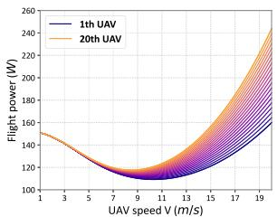

line

| UAV speed V (m/s) | 1st UAV (W) | 20th UAV (W) |
| ----------------- | ----------- | ------------ |
| 1                 | 150         | 150          |
| 3                 | 140         | 140          |
| 7                 | 120         | 120          |
| 9                 | 110         | 110          |
| 11                | 115         | 120          |
| 13                | 130         | 140          |
| 15                | 160         | 180          |
| 17                | 200         | 220          |
| 19                | 240         | 260          |

(a)

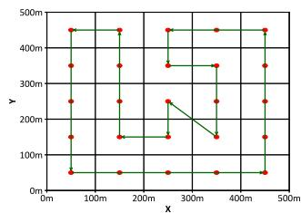

scatter

| X (in meters) | Y (in meters) |
|---|---|
| 0m | 0m |
| 50m | 50m |
| 100m | 100m |
| 150m | 150m |
| 200m | 200m |
| 250m | 250m |
| 300m | 300m |
| 350m | 350m |
| 400m | 400m |
| 450m | 450m |
| 500m | 500m |

(b)   
Fig. 3. (a) Flight power for all UAVs. (b) The route of manual policy.

For SHDRLN, the Actor and Critic networks are composed of three fully connected layers with 256 hidden units each. The output layer of the actor network utilizes a softmax activation function, and the learning rate of actor network is $1 \times 1 0 ^ { - 4 }$ . The learning rate for the critic network is set to $1 \times 1 0 ^ { - 3 }$ 10. The skill experience replay buffer size is $3 \times 1 0 ^ { 4 }$ 1 10, and the batch size Z 3 10is 128. The soft update rate of the target network is 0.05. The initial temperature factor $\alpha ^ { * }$ is set to 0.01. The target entropy $\mathcal { H } _ { 0 } \mathrm { ~ i s ~ } { - } 1$ . The reward discount factor is 0.98.

1For each case, we train the DRL models with 500 episodes. Each episode consists of 150 timeslots, with the training DRL model being updated once per time slot. In every 10 episodes, the average values of energy efficiency, offload waiting time, and coverage rate are calculated. At the same time, in every episode, all heterogeneous UAVs execute the DFRL for knowledge sharing.

# B. Baselines Algorithm

We compare SHDRLN with other state-of-the-art DRL baselines algorithms, including D3QN [38], and SAC [32]. These DRL baseline algorithms are discussed as follows:

1) D3QN combines the advantages of Double DQN [35] and Dueling DQN [39], effectively addressing the issue of overestimation of Q-values. It is a straightforward yet effective DRL algorithm that is widely applied in various UAV task scenarios with discrete action spaces, such as [40], [41], [42]. D3QN is only used as a baseline in the scenario where there is no navigation policy sharing in this paper.   
2) Soft Actor-Critic (SAC) is a model-free DRL algorithm based on maximum entropy learning. It can automatically adjust the temperature coefficient, thereby automatically adapting the exploratory nature of the policy. Currently, in model-free reinforcement learning algorithms, SAC stands out as an exceptionally efficient approach.   
3) Random policy: At each timeslot, all heterogeneous UAVs randomly select actions from the action space to execute.   
4) Manual policy: The entire task area is divided into a grid of × subareas, and actions are selected based on the 5 5route shown in Fig. 3(b).

For the sharing of UAV navigation policies, we compare the FedAvg as a baseline with our proposed DFRL. FedAvg and DFRL are applied in SAC and SHDRLN respectively, and the performance after navigation policy knowledge sharing is discussed.

# C. Neural Network Convergence and Heterogeneous UAV Adaptability Verification

To validate the effectiveness of SHDRLN, we design 6 different skill strategies for all heterogeneous UAVs. Each skill strategy has its objective function, and we train these skill strategies using SAC in the simulation environment. The trained model parameters for each skill strategy were saved and used as the corresponding parameters for the DSNs. To enable UAVs to simultaneously consider local task offloading and global service coverage during flight, we develop 6 skill strategies, with the following details:

1) Strategy 1: This skill aims to maximize the number of UEs within the coverage radius. The skill’s execution terminates when the execution step exceeds 5 or when the number of UEs within the UAV’s coverage radius exceeds 75% of all observed UEs. The local state includes: I t , O t .   
( )2) Strategy 2: This strategy aims to maximize the cumulative number of tasks for UEs within the coverage radius. The strategy’s execution terminates when the execution step exceeds 5 or when the cumulative task for UEs within the UAV’s coverage radius reaches 75% of the cumulative task for all observed UEs. The local state includes: I t , O t .   
( )3) Strategy 3: The objective of this strategy is to adjust the UAV’s flight speed to minimize energy costs. This strategy terminates after 5 steps of execution. The local state includes: $e _ { j } ( t ) , \mathbf { V } _ { j } ( t ) , \mathbf { O } ( t )$ .   
( ) ( ) ( )4) Strategy 4: The objective of this strategy is to maintain a balanced coverage time of covered area block, preventing UAVs from concentrating their activities in a small area block. The strategy terminates after 5 steps of execution. The local state includes: $\mathbb { T } ( t ) , \mathbb { M } ( t ) , p _ { j } ( t ) , { \bf V } _ { j } ( t ) , { \bf O } ( t )$ .   
( ) ( ) ( ) ( ) ( )5) Strategy 5: The objective of this strategy is to maintain the connectivity of uncovered area block. The strategy terminates after 5 steps of execution. The local state includes: $\mathbb { C } ( t ) , p _ { j } ( t ) , \mathbf { V } _ { j } ( t ) , \mathbf { O } ( t )$ .   
( ) ( ) ( ) ( )6) Strategy 6: This strategy aims to maximize the number of covered area block. The strategy terminates after 5 steps of execution. The local state includes: $\mathbb { C } ( t ) , p _ { j } ( t ) , \mathbf { V } _ { j } ( t )$ , O t .

( )After pretraining all DSNs, we conduct separate performance tests for each DSN. All UAVs used a single DSN for decisionmaking, running 100 episodes in the simulation environment. Subsequently, the average values of energy efficiency, task offloading waiting time, and coverage rate for all UAVs were recorded, as shown in Table III.

From Table III, we can observe that the strategy generated by a single DSN do not surpass the manual policy in all three performance metrics. Moreover, except for strategy 3, the skill strategies of the other DSNs are higher than the random policy. This is because the objective of strategy 3 is not directly related to the task objective. This suggests that these DSNs possess some prior knowledge, but using only a single skill strategy does not lead to excellent task performance. As indicated by the subsequent SHDRLN training curves, effective combinations of these skill strategies based on UAV states can lead to improved performance.

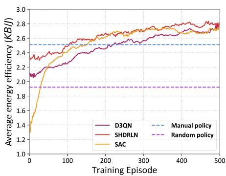

line

| Training Episode | D3QN  | SHDRLN | SAC   | Manual policy | Random policy |
| ---------------- | ----- | ------ | ----- | ------------- | ------------- |
| 0                | 2.1   | 2.3    | 1.3   | 2.5           | 1.9           |
| 50               | 2.2   | 2.4    | 2.0   | 2.5           | 1.9           |
| 100              | 2.3   | 2.5    | 2.2   | 2.5           | 1.9           |
| 150              | 2.4   | 2.6    | 2.4   | 2.5           | 1.9           |
| 200              | 2.5   | 2.7    | 2.5   | 2.5           | 1.9           |
| 250              | 2.6   | 2.7    | 2.6   | 2.5           | 1.9           |
| 300              | 2.6   | 2.8    | 2.7   | 2.5           | 1.9           |
| 350              | 2.7   | 2.8    | 2.7   | 2.5           | 1.9           |
| 400              | 2.7   | 2.8    | 2.8   | 2.5           | 1.9           |
| 450              | 2.8   | 2.8    | 2.8   | 2.5           | 1.9           |
| 500              | 2.8   | 2.8    | 2.8   | 2.5           | 1.9           |

(a) Energy efficiency index

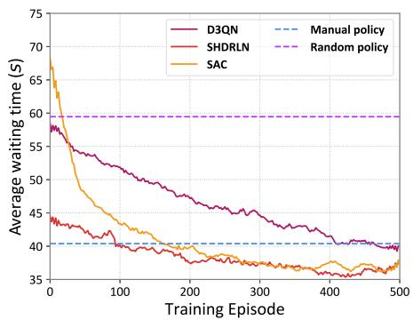

line

| Training Episode | D3QN  | SHDRLN | SAC   |
| ---------------- | ----- | ------ | ----- |
| 0                | 58.0  | 44.0   | 68.0  |
| 100              | 52.0  | 41.0   | 48.0  |
| 200              | 48.0  | 39.0   | 42.0  |
| 300              | 45.0  | 38.0   | 39.0  |
| 400              | 42.0  | 37.0   | 37.0  |
| 500              | 40.0  | 36.0   | 36.0  |

(b) Average waiting time index

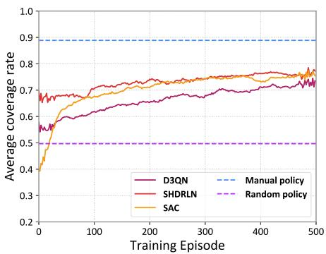

line

| Training Episode | D3QN  | SHDRLN | SAC   | Manual policy | Random policy |
| ---------------- | ----- | ------ | ----- | ------------- | ------------- |
| 0                | 0.55  | 0.65   | 0.40  | 0.9           | 0.5           |
| 100              | 0.60  | 0.70   | 0.65  | 0.9           | 0.5           |
| 200              | 0.65  | 0.72   | 0.70  | 0.9           | 0.5           |
| 300              | 0.68  | 0.75   | 0.72  | 0.9           | 0.5           |
| 400              | 0.70  | 0.76   | 0.74  | 0.9           | 0.5           |
| 500              | 0.72  | 0.78   | 0.76  | 0.9           | 0.5           |

(c) Coverage rate index   
Fig. 4. The learning curves of energy efficiency index, average waiting time index, and coverage rate index of the 20 UAVs during the training phase.

TABLE III PERFORMANCE TESTING OF EACH DSN 

<table><tr><td>Algorithm</td><td>Energy efficiency (KB/J)</td><td>Waiting time (s)</td><td>Coverage rate</td></tr><tr><td>Strategy 1</td><td>2.49 ± 0.111</td><td>45.78 ± 1.822</td><td>0.67 ± 0.023</td></tr><tr><td>Strategy 2</td><td>2.36 ± 0.145</td><td>44.76 ± 0.925</td><td>0.66 ± 0.010</td></tr><tr><td>Strategy 3</td><td>1.74 ± 0.074</td><td>63.96 ± 0.694</td><td>0.38 ± 0.009</td></tr><tr><td>Strategy 4</td><td>1.88 ± 0.197</td><td>49.20 ± 2.705</td><td>0.62 ± 0.030</td></tr><tr><td>Strategy 5</td><td>2.12 ± 0.147</td><td>46.69 ± 1.745</td><td>0.68 ± 0.022</td></tr><tr><td>Strategy 6</td><td>2.40 ± 0.095</td><td>41.50 ± 1.839</td><td>0.71 ± 0.032</td></tr><tr><td>Random policy</td><td>1.92 ± 0.135</td><td>59.46 ± 0.494</td><td>0.50 ± 0.007</td></tr><tr><td>Manual policy</td><td>2.51 ± 0.133</td><td>40.38 ± 2.085</td><td>0.89 ± 0.029</td></tr></table>

The best and second method is indicated by bold and underline,respectively.

Then, we test the convergence of SHDRLN. In the simulated environment, 20 heterogeneous UAVs are trained using SHDRLN, SAC, and D3QN, respectively. The average energy efficiency, offload waiting time, and coverage rate curves for all UAVs during the training process are shown in Fig. 4.

Fig. 4 illustrates the trends as training episodes increase for the 20 heterogeneous UAVs. The average energy efficiency and coverage rate exhibit a consistent upward convergence, while the task offloading waiting time decreases and converges. Notably, SHDRLN, SAC, and D3QN display distinct learning trajectories. Initially, SHDRLN performs closest to manual policy due to leveraging prior knowledge from the DSN. SAC initially lags, but learns rapidly, whereas D3QN shows steady incremental improvement. Energy efficiency metrics in Fig. 4(a) show SHDRLN and SAC reaching manual policy levels after 100 and 150 episodes respectively, and D3QN at around 230 episodes. Ultimately, all three DRL algorithms converge to approximately . ∼ . KB/J, 7.57% ∼ 11.55% higher than manual policy. 2 70 2 80Task offloading waiting time metrics in Fig. 4(b) show D3QN nearing manual policy ( s), while SHDRLN and SAC converge 40to around 37 s, a 7.5% reduction. Coverage rate metrics in Fig. 4(c) indicate SHDRLN and SAC converging to around 0.76, while D3QN converges to around 0.73. Despite the manual policy achieving a higher coverage rate(0.89), it sacrifices energy efficiency by around 9% compared to DRL methods. Over time, the coverage rate will approach 1, whereas energy efficiency directly impacts the system lifecycle.

In summary, the results show that SHDRLN possesses certain prior knowledge, exhibiting better performance during the early stages of training and faster learning of navigation policy and outperforming other baseline algorithms across all three performance metrics.

# D. Analysis of Policy Differences Among Heterogeneous UAVs

In this section, we investigate the performance differences among heterogeneous UAVs and the performance differences between different DRL algorithms. we ran 100 episodes in a simulation environment for all UAVs with different algorithms. We obtain the average values of the energy efficiency, offload waiting time, and coverage rate indicators for all UAVs, as shown in Fig. 5.

From Fig. 5, we can make the following observations:

1) From Fig. 5(a), (b), and (c), we can observe that as the UAV index increases, the energy efficiency and task offloading waiting time exhibit an overall decreasing trend, while the coverage rate shows an overall increasing trend for all algorithms. Although with the increase in UAV index, the coverage radius expands to cover more UEs, the inability to perform more precise velocity control due to larger accelerations, along with higher flight energy consumption, leads to a reduction in UAV energy efficiency.

2) From Fig. 5(a) and (b), the SHDRLN performs equally well or better than other algorithms in terms of energy efficiency and task offloading waiting time metrics. In terms of energy efficiency, the maximum values of SHDRLN, SAC, D3QN, random policy, and manual policy are 36.43%, 37.76%, 37.61%, 69.29%, and 47.19% greater than the minimum values, respectively. In terms of task offloading waiting time, the maximum values for SHDRLN, SAC, D3QN, random policy, and manual policy are 46.91%, 38.09%, 44.23%, 7.62%, and 48.23% greater than the minimum values, respectively. It can be observed that there are significant performance differences among heterogeneous UAVs. SHDRLN outperforms the manual policy in both energy efficiency and task offloading waiting time for all UAVs, while SAC and D3QN exhibit weaker performance in energy efficiency than the manual policy for certain UAVs. This suggests that SAC and D3QN have not learned better policies for all UAVs and may require more time to explore and iterate their policies.

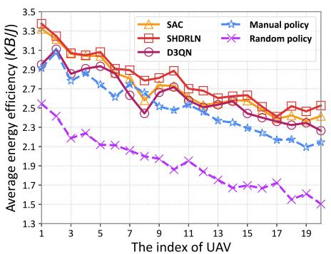

line

| The index of UAV | SAC   | SHDRLN | D3QN  | Manual policy | Random policy |
| ---------------- | ----- | ------ | ----- | ------------- | ------------- |
| 1                | 3.3   | 3.4    | 3.1   | 2.9           | 2.5           |
| 3                | 3.1   | 3.1    | 2.9   | 2.8           | 2.2           |
| 5                | 2.9   | 3.0    | 2.8   | 2.7           | 2.1           |
| 7                | 2.7   | 2.9    | 2.6   | 2.6           | 2.0           |
| 9                | 2.6   | 2.8    | 2.5   | 2.5           | 1.9           |
| 11               | 2.5   | 2.7    | 2.4   | 2.4           | 1.8           |
| 13               | 2.4   | 2.6    | 2.3   | 2.3           | 1.7           |
| 15               | 2.3   | 2.5    | 2.2   | 2.2           | 1.6           |
| 17               | 2.2   | 2.4    | 2.1   | 2.1           | 1.5           |
| 19               | 2.1   | 2.3    | 2.0   | 2.0           | 1.4           |

(a) Energy efficiency index

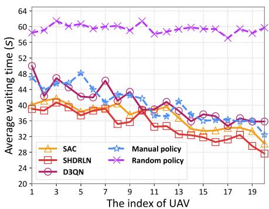

line

| The index of UAV | SAC  | SHDRLN | D3QN | Manual policy | Random policy |
| ---------------- | ---- | ------ | ---- | ------------- | ------------- |
| 1                | 40   | 38     | 50   | 48            | 60            |
| 3                | 42   | 37     | 48   | 46            | 62            |
| 5                | 40   | 36     | 46   | 48            | 60            |
| 7                | 38   | 35     | 44   | 44            | 60            |
| 9                | 36   | 34     | 42   | 42            | 60            |
| 11               | 34   | 33     | 40   | 40            | 60            |
| 13               | 32   | 32     | 38   | 38            | 60            |
| 15               | 30   | 31     | 36   | 36            | 60            |
| 17               | 28   | 30     | 34   | 34            | 60            |
| 19               | 26   | 28     | 32   | 32            | 60            |

(b) Average waiting time index

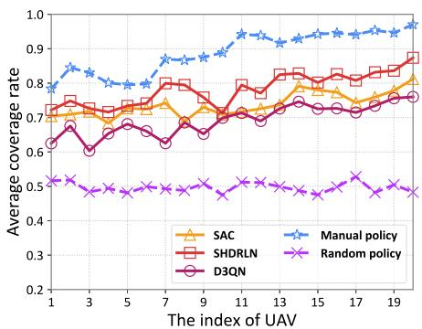

line

| The index of UAV | SAC   | SHDR LN | Manual policy | D3QN  | Random policy |
| ---------------- | ----- | ------- | ------------- | ----- | ------------- |
| 1                | 0.70  | 0.75    | 0.80          | 0.65  | 0.50          |
| 3                | 0.72  | 0.78    | 0.85          | 0.68  | 0.48          |
| 5                | 0.75  | 0.80    | 0.82          | 0.67  | 0.49          |
| 7                | 0.78  | 0.82    | 0.88          | 0.65  | 0.47          |
| 9                | 0.76  | 0.85    | 0.90          | 0.68  | 0.48          |
| 11               | 0.79  | 0.88    | 0.92          | 0.70  | 0.49          |
| 13               | 0.80  | 0.89    | 0.93          | 0.72  | 0.50          |
| 15               | 0.81  | 0.90    | 0.94          | 0.73  | 0.51          |
| 17               | 0.82  | 0.91    | 0.95          | 0.74  | 0.52          |
| 19               | 0.83  | 0.92    | 0.96          | 0.75  | 0.53          |

(c) Coverage rate index   
Fig. 5. The energy efficiency index, average waiting time index, and coverage rate index of each UAV in the testing phase.

3) From Fig. 5(c), SHDRLN exhibits higher coverage rate metrics compared to all algorithms except the manual policy. While the manual policy achieves the highest coverage rate, its energy efficiency is generally lower than other DRL algorithms, suggesting that maximizing user coverage rate does not necessarily lead to the highest energy efficiency. As UAV index increases, coverage rate generally rises for all algorithms. However, the rate of coverage rate increase for DRL methods is slower compared to the manual policy, indicating intentional restraint in coverage rate increment.

Next, we explore the congruence of policies among heterogeneous UAVs. Referring to [43], we use the KL divergence as a measure of policy similarity among heterogeneous UAVs. Because the model output of D3QN is the value estimation for each action, whereas SAC and SHDRLN output probability distributions for action selection. The similarity of navigation policies trained by D3QN cannot be measured by KL divergence. Moreover, considering the performance gap between D3QN and SAC/SHDRLN, comparisons with D3QN will no longer be considered in the subsequent analysis. We store copies of SPN parameters generated by all UAVs in each UAV and ran 100 episodes in the simulation environment. In the simulation test, each UAV uses the output of the corresponding index SPN for decision-making while calculating the average values of KL divergence with policies generated by other SPNs. We set the limits of KL divergence values to 0 and 10, mapping them to high similarity and low similarity, respectively. Then, in Fig. 6, we visualize the policy similarity among heterogeneous UAVs in the form of a heatmap. From this, we can make the following observations.

1) We observe that the colors in Fig. 6(a) are generally brighter than those in Fig. 6(b). Since the color blocks in

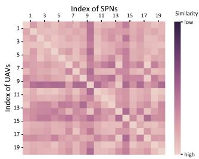

heatmap

Index of SPNs
| 1 | 3 | 5 | 7 | 9 | 11 | 13 | 15 | 17 | 19 |
|---|---|---|---|---|---|---|---|---|---|
| 1 | low | low | low | low | low | low | low | low | low |
| 3 | low | low | low | low | low | low | low | low | low |
| 5 | low | low | low | low | low | low | low | low | low |
| 7 | low | low | low | low | low | low | low | low | low |
| 9 | low | low | low | low | low | low | low | low | low |
| 11 | low | low | low | low | low | low | low | low | low |
| 13 | low | low | low | low | low | low | low | low | low |
| 15 | low | low | low | low | low | low | low | low | low |
| 17 | low | low | low | low | low | low | low | low | low |
| 19 | low | low | low | low | low | low | low | low | low |
The image contains a heatmap where darker shades represent higher similarity values. The x-axis and y-axis are labeled as 'Index of UAVs'. There is no legend categories or additional data series present.

(a) SHDRLN

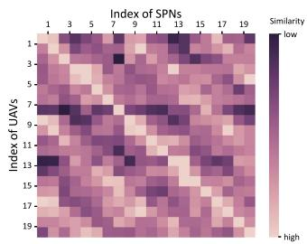  
(b) SAC   
Fig. 6. Navigation policy similarity between heterogeneous UAVs.

the figures represent the similarity of policies between two heterogeneous UAVs, this means that, on the whole, the policies of heterogeneous UAVs trained with SHDRLN have higher similarity than those trained with SAC. This confirms that SHDRLN can learn more generic UAV navigation policies based on the same prior knowledge, reducing policy differences among heterogeneous UAVs.

2) From Fig. 6(b), we notice that there is a certain pattern in the color block changes. As expected, the lightest color blocks are concentrated along the main diagonal of the graph, indicating higher policy similarity among UAVs with adjacent indices. This is because UAVs with adjacent indices have similar performance parameters, and therefore, it is reasonable for their generated policies to be more similar. However, unexpectedly, for a specific index of UAV, as the difference in SPN index increases, the color of the blocks does not necessarily become consistently darker; instead, it follows a cyclic pattern. This suggests that the difference in policies among heterogeneous UAVs does not infinitely increase with larger differences in UAV parameters, but instead follows a certain cyclic pattern.

3) From Fig. 6(a), we observe relatively dark bands in the rows and columns for indices 10 and 15. This indicates that the policies learned by the 10th and 15th UAVs significantly differ from those of other UAVs. We can observe the red line (SHDRLN) in Fig. 5(c) that the 10th and 15th UAVs exhibit two local minima and in Fig. 5(a), they show two local maxima. Therefore, we have reason to believe that the 10th and 15th UAVs learn a special navigation policy different from other UAVs, which sacrifice some coverage to improve efficiency. As for why only the 10th and 15th UAVs learn this policy, we speculate that only UAVs meeting specific flight parameter conditions can execute such policy actions.

TABLE IV HETEROGENEOUS POLICY TESTING OF EACH SCENARIO 

<table><tr><td>scenario</td><td>Energy efficiency (KB/J)</td><td>Waiting time (s)</td><td>Coverage rate</td></tr><tr><td>SHDRLN (1)</td><td>2.67 ± 0.144</td><td>40.10 ± 1.287</td><td>0.75 ± 0.012</td></tr><tr><td>SAC (1)</td><td>2.35 ± 0.171</td><td>44.20 ± 2.085</td><td>0.65 ± 0.027</td></tr><tr><td>SAC (2)</td><td>2.43 ± 0.117</td><td>47.16 ± 1.794</td><td>0.60 ± 0.019</td></tr><tr><td>SAC (3)</td><td>2.32 ± 0.097</td><td>50.19 ± 1.633</td><td>0.59 ± 0.015</td></tr><tr><td>Normal SHDRLN</td><td>2.79 ± 0.127</td><td>34.99 ± 1.784</td><td>0.78 ± 0.022</td></tr><tr><td>Normal SAC</td><td>2.72 ± 0.134</td><td>37.24 ± 1.531</td><td>0.74 ± 0.016</td></tr></table>

The bestand second method is indicated by bold and underline,respectively.

Finally, to investigate the preliminary impact of UAVs learning policies from other UAVs on their performance, we design four experimental scenarios. In each scenario, all UAVs store multiple SPN model parameters, and for each decision step, they randomly select one of the SPNs to make decisions. These scenarios are tested in a simulation environment over 100 episodes, and the average efficiency, waiting time, and coverage of all UAVs were recorded. These scenarios are described in detail as follows:

1) SHDRLN (1): For all UAVs, storing all SPN parameters trained with SHDRLN.   
2) SAC (1): For all UAVs, storing all SPN parameters trained with SAC.   
3) SAC (2): For each UAV, storing only the SPNs trained with SAC that have similarity with their own SPN policy in the top 50%.   
4) SAC (3): For each UAV, only the last 50% of SPNs trained by the SAC that exhibit similarity to its own SPN policy are selected and stored.

The results in Table IV show that the performance of UAVs in all four experimental scenarios declines to some extent, indicating that using policy from other UAVs can lead to performance degradation due to policy incompatibility. Specifically, the SHDRLN (1) shows a relatively small decrease in performance compared to the original SHDRLN, with average efficiency, waiting time, and coverage rate decreasing by approximately 4.3%, 14.6%, and 3.8%, respectively. In contrast, the SAC policy scenarios exhibit significant performance degradation. SAC (1) experiences a decrease of approximately 13.6%, 18.7%, and 12.2% in efficiency, waiting time, and coverage rate, respectively. SAC (2) shows a decrease of about 10.7%, 26.6%, and 18.9%, while SAC (3) exhibits the most significant decline with reductions of about 14.7%, 34.8%, and 20.3% in efficiency, waiting time, and coverage rate, respectively.

The results indicate that when a UAV learns from a heterogeneous navigation policy, it can reduce the performance of the original navigation policy. Moreover, the larger the differences, the more noticeable the decline in performance. This also indicates that the navigation policy learned by SHDRLN is more generically applicable.

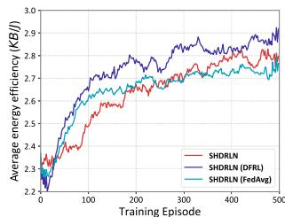

line

| Training Episode | SHDRLN | SHDRLN (DFRL) | SHDRLN (FedAvg) |
| ---------------- | ------ | ------------- | --------------- |
| 0                | 2.2    | 2.2           | 2.2             |
| 100              | 2.6    | 2.7           | 2.6             |
| 200              | 2.7    | 2.8           | 2.7             |
| 300              | 2.8    | 2.9           | 2.8             |
| 400              | 2.8    | 2.9           | 2.8             |
| 500              | 2.8    | 2.9           | 2.8             |

(a) SHDRLN

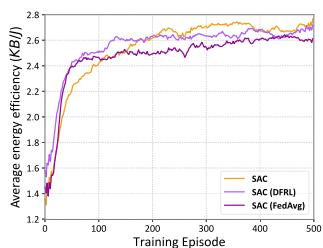

line

| Training Episode | SAC    | SAC (DFRL) | SAC (FedAvg) |
| ---------------- | ------ | ---------- | ------------ |
| 0                | 1.4    | 1.4        | 1.4          |
| 100              | 2.4    | 2.5        | 2.4          |
| 200              | 2.6    | 2.6        | 2.5          |
| 300              | 2.7    | 2.7        | 2.6          |
| 400              | 2.7    | 2.7        | 2.6          |
| 500              | 2.7    | 2.7        | 2.6          |

(b) SAC   
Fig. 7. The learning curves of energy efficiency of all UAVs with knowledge sharing.

# E. Heterogeneous UAV Policy Knowledge Sharing

In this section, we research knowledge sharing between heterogeneous UAVs, using FedAvg [21] and the DFRL proposed in this paper based on the SAC and SHDRLN respectively for knowledge sharing. The desired outcome is to expedite the learning of navigation policies without compromising convergence effectiveness through FL. Simultaneously, we aim to minimize the heterogeneity of navigation policies among heterogeneous UAVs. The test is performed on heterogeneous UAVs. The convergence of training after knowledge sharing between heterogeneous UAVs and the changes in navigation policy similarity between heterogeneous UAVs during the training process is demonstrated.

To verify the training convergence of heterogeneous UAVs after knowledge sharing, we configure the training process as follows: After the training for 1 episode, the UAV uploads its SPN model parameters to the cloud server. The cloud server aggregates all UAVs’ SPN model parameters to share policy knowledge using the FedAvg and DFRL, respectively. As shown in Fig. 7, we can make the following observations:

1) Compared to DRL training without knowledge sharing (the red line in Fig. 7(a) and the yellow line in Fig. 7(b)), both FedAvg and DFRL exhibit significantly better performance in the early stages of training. In Fig. 7(a), we observe that the SHDRLN, with the assistance of DFRL and FedAvg, achieves an average energy efficiency of 2.7 KB/J for all UAVs after training 100 and 200 episodes, respectively. This is equivalent to the performance of the original SHDRLN after training 300 episodes. In Fig. 7(b), the SAC, aided by DFRL and FedAvg, achieves an average energy efficiency of 2.4 KB/J after training 50 episodes, equivalent to the performance of the original SAC after training 100 episodes. This indicates that in the early stages of training when UAVs’ navigation policy knowledge is limited, federated learning algorithms effectively integrate navigation policy knowledge from all UAVs, reducing the number of training episodes required for random exploration. As a result, DRL algorithms with FL have better performance in the early stages of training.

2) DFRL and FedAvg exhibit inconsistent convergence effects. In Fig. 7(a), we observe that the energy efficiency of DFRL eventually surpasses that of the original SHDRLN, while the energy efficiency converged by FedAvg is slightly inferior to that of the original SHDRLN. This is because, after aggregation by FedAvg, all UAVs use the same navigation policy, making it challenging to learn a policy that is suitable for the individual performance characteristics of each UAV. In Fig. 7(b), we note that the final converged energy efficiency of both DFRL and FedAvg is slightly lower than that of the original SAC. However, DFRL performs slightly better than FedAvg in terms of energy efficiency. Combining this with the earlier conclusion that there is significant dissimilarity in navigation policy among different UAVs in SAC, it confirms that aggregating policy models with large differences can lead to a certain degree of performance degradation. The superior energy efficiency performance of DFRL compared to FedAvg is attributed to the fact that UAV can selectively learns navigation policies tailored to itself rather than learning all navigation policies in the aggregated SPN model.

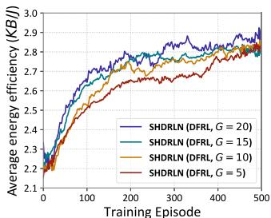

line

| Training Episode | SHDRLN (DFRL, G = 20) | SHDRLN (DFRL, G = 15) | SHDRLN (DFRL, G = 10) | SHDRLN (DFRL, G = 5) |
| ---------------- | ---------------------- | ---------------------- | ---------------------- | --------------------- |
| 0                | 2.2                    | 2.2                    | 2.2                    | 2.2                   |
| 100              | 2.7                    | 2.6                    | 2.6                    | 2.5                   |
| 200              | 2.8                    | 2.7                    | 2.7                    | 2.6                   |
| 300              | 2.85                   | 2.75                   | 2.75                   | 2.65                  |
| 400              | 2.9                    | 2.8                    | 2.8                    | 2.7                   |
| 500              | 2.95                   | 2.85                   | 2.85                   | 2.75                  |

(a)   
Energy eficiency curve of SHDRLN

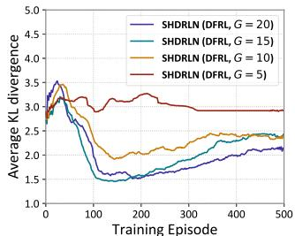

line

| Training Episode | SHDRLN (DFRL, G = 20) | SHDRLN (DFRL, G = 15) | SHDRLN (DFRL, G = 10) | SHDRLN (DFRL, G = 5) |
| ---------------- | --------------------- | --------------------- | --------------------- | -------------------- |
| 0                | 3.5                   | 3.5                   | 3.5                   | 3.5                  |
| 100              | 1.5                   | 1.5                   | 2.0                   | 3.0                  |
| 200              | 1.5                   | 1.5                   | 2.0                   | 3.0                  |
| 300              | 1.5                   | 1.5                   | 2.0                   | 3.0                  |
| 400              | 2.0                   | 2.0                   | 2.5                   | 3.0                  |
| 500              | 2.5                   | 2.5                   | 2.5                   | 3.0                  |

(b)   
KL divergence curve of SHDRLN

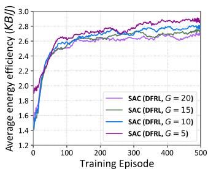

line

| Training Episode | SAC (DFRL, G = 20) | SAC (DFRL, G = 15) | SAC (DFRL, G = 10) | SAC (DFRL, G = 5) |
| ---------------- | ------------------ | ------------------ | ------------------ | ----------------- |
| 0                | 1.4                | 1.4                | 1.4                | 1.4               |
| 100              | 2.6                | 2.6                | 2.6                | 2.6               |
| 200              | 2.7                | 2.7                | 2.7                | 2.7               |
| 300              | 2.8                | 2.8                | 2.8                | 2.8               |
| 400              | 2.9                | 2.9                | 2.9                | 2.9               |
| 500              | 3.0                | 3.0                | 3.0                | 3.0               |

(c) Energy efficiency curve of SAC

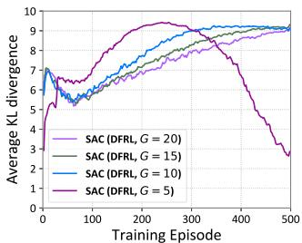

line

| Training Episode | SAC (DFRL, G = 20) | SAC (DFRL, G = 15) | SAC (DFRL, G = 10) | SAC (DFRL, G = 5) |
| ---------------- | ------------------ | ------------------ | ------------------ | ----------------- |
| 0                | 6.5                | 6.5                | 6.5                | 6.5               |
| 100              | 7.0                | 7.5                | 8.0                | 8.5               |
| 200              | 7.5                | 8.0                | 8.5                | 9.0               |
| 300              | 8.0                | 8.5                | 9.0                | 9.5               |
| 400              | 8.5                | 9.0                | 9.5                | 9.0               |
| 500              | 9.0                | 9.5                | 9.5                | 2.5               |

(d) KL divergence curve of SAC   
Fig. 8. The training process of DFRL with different G value.

While the above experiments validate a noticeable improvement in UAV navigation policy learning through federated reinforcement learning, aggregating SPN model parameters for all UAVs may not necessarily yield the best results. To investigate the impact of aggregating different numbers of SPN models on energy efficiency performance and the diversity of UAV navigation policies, we adjust the parameter G in (27) (representing the top G SPN models in similarity ranking to the target UAV’s policy). We conduct four experiments with G values set to 20, 15, 10, and 5, respectively. In each experiment, we utilize the DFRL for federated training of both SAC and SHDRLN. This results in energy efficiency curves for SAC (DFRL) and SHDRLN (DFRL) (Fig. 8(a) and (c)) as well as KL divergence curves (Fig. 8(b) and (d)). The expected outcome is for all UAVs to exhibit high energy efficiency while possessing more generic applicable navigation policies (ie, smaller KL divergence values). From Fig. 8, we can draw the following conclusions:

1) Comparing Fig. 8(a) with (c), we observe that the

overall energy efficiency of SHDRLN (DFRL) is superior to SAC (DFRL). The energy efficiency curves of SHDRLN (DFRL) under different G values mostly converge to 2.8 KB/J, and the distribution is relatively concentrated. In contrast, the energy efficiency curves of SAC (DFRL) are significantly influenced by G values, and the convergence is comparatively dispersed.

2) From Fig. 8(b), the KL divergence curves under different G values exhibit an overall increasing trend in the interval of 0 to 50 episodes. In the interval of 50 to 200 episodes, the KL divergence curves show a decreasing trend. In the range of 200 to 500 episodes, the KL divergence curves show an upward trend followed by convergence. This suggests that heterogeneous UAVs explore based on the learned common navigation policy, acquiring optimal policies applicable to UAVs’ performance parameters. Consequently, the KL divergence slightly increases and converges during this period.

3) From Fig. 8(b), we observe that when G , the KL = 20divergence curve reaches its peak most rapidly and eventually converges to the lowest value. This observation, combined with Fig. 8(a) showing that G  has the best energy efficiency performance, confirms that all UAVs learn more generic and efficient navigation policies. When G , the KL divergence curve exhibits slight fluctuations in the interval of 0 to 300 episodes, followed by a stable trend in the later period. The early fluctuations occur because the navigation policy differences obtained by different UAVs through the SHDRLN are small. A smaller G value leads to more similar aggregated model policies, making it challenging to learn different navigation policies to enhance decision generalization. In conclusion, we observe that SHDRLN, due to its smaller policy differences, can simultaneously choose more SPN models for aggregation, thereby enhancing the generic of the global navigation policy.

4) From Fig. 8(d), we observe that, except for G  , the = 5convergence trends of KL divergence curves for other G values are nearly consistent, with faster convergence as G decreases. The average KL divergence values at SAC convergence are significantly higher than those of the SHDRLN, indicating more pronounced differences in navigation policies learned by UAVs through the SAC. Unlike Fig. 8(b), when G takes values of 20, 15, and 10, the final converged KL divergence values of SAC (DFRL) are higher than the initial peak values, suggesting significant differences in navigation policies among heterogeneous UAVs after training convergence. No generic applicable navigation policy has been learned. However, when G is set to 5, the KL divergence value reaches its peak around 250 episodes and then gradually decreases to the level of the initial KL value. Combined with Fig. 8(c), it exhibits a high similarity in navigation policies between heterogeneous UAVs when G   , indicating the learning of more generic navigation policies. In conclusion, SAC is not suitable to aggregate all UAV models simultaneously. Although there are significant differences between the navigation policies of UAVs generated by SAC, DFRL can still ensure that heterogeneous UAVs learn a generic navigation policy to a certain extent.

TABLE V EXECUTING TIME (s) OF EACH ALGORITHM 

<table><tr><td rowspan="2">Case</td><td colspan="2">SAC</td><td colspan="2">SHDRLN</td><td colspan="2">SHDRLN (DFRL)</td></tr><tr><td>Training</td><td>Testing</td><td>Training</td><td>Testing</td><td>Training</td><td>Testing</td></tr><tr><td> $\mathcal{L} = 6$ </td><td>1021</td><td>275</td><td>1178</td><td>354</td><td>1731</td><td>372</td></tr><tr><td> $\mathcal{L} = 7$ </td><td>1241</td><td>278</td><td>1314</td><td>362</td><td>1837</td><td>385</td></tr><tr><td> $\mathcal{L} = 8$ </td><td>1410</td><td>294</td><td>1663</td><td>376</td><td>2036</td><td>392</td></tr></table>

# F. Comprehensive Analysis

To investigate the performance of the proposed algorithm in terms of execution time, we conduct experience with 50 episodes on the training and testing times of SAC, SHDRLN, and SHDRLN (DFRL) under different neural network scales. The results are shown in Table V. From the experimental results, it can be observed that increasing the depth of neural networks significantly enhances the training time of various DRL algorithms, but it does not have a notable impact on testing time. Although SHDRLN (DFRL) incurs approximately 36% and 53% longer training times compared to SHDRLN and SAC respectively, as shown in Fig. 7, it can be observed that SHDRLN (DFRL) generally outperforms SHDRLN and SAC in terms of energy efficiency. Moreover, the average energy efficiency of SHDRLN (DFRL) reaches the 2.7KB/J in only one-third of the episodes numbers compared to SHDLRN and SAC. In summary, the additional training time of each episodes in SHDLRN (DFRL) is worthwhile.

In real-world scenarios, various types of communication interferences often increase the probability of connection establishment failure. To investigate the impact of potential interferences during the communication process between UAVs and cloud servers on the DFRL, we assume the probability of successful execution of the DFRL algorithm in each episode, denoted as V , and set it to , . , . , . ,  for training. When V  , the 0 0 1 0 25 0 5 1 = 0algorithm degenerates into the regular SHDRLN algorithm. The training results are shown in Fig. 9. As the value of V decreases, the overall convergence speed of SHDRLN slows down during training, while the overall energy efficiency of convergence also decreases. When the success rate of DFRL algorithm execution V  . , the energy efficiency curve during the training process = 0 25is almost identical to that of the regular SHDRLN algorithm. However, as V further decreases to 0.1, DFRL begins to adversely affect the training process of SHDRLN, resulting in a significantly lower energy efficiency curve compared to regular SHDRLN $( \nu = 0 )$ . This is because as the success rate of DFRL = 0execution decreases, the time interval between two federated aggregations significantly increases. During this time interval, heterogeneous UAVs continuously update their navigation policies without being able to share knowledge, leading to an amplification of navigation policy differences among heterogeneous UAVs, thereby affecting overall energy efficiency. All in all, unless communication interference causes DFRL to execute with a very low probability of success, in most other cases DFRL will optimize the training process of SHDRLN.

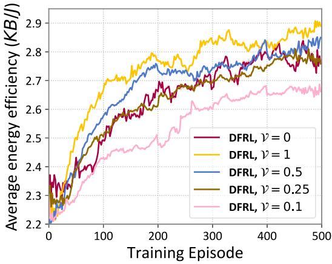

line

| Training Episode | DFRL, ν = 0 | DFRL, ν = 1 | DFRL, ν = 0.5 | DFRL, ν = 0.25 | DFRL, ν = 0.1 |
| ---------------- | ----------- | ----------- | ------------- | -------------- | ------------- |
| 0                | 2.3         | 2.3         | 2.3           | 2.3            | 2.2           |
| 100              | 2.5         | 2.7         | 2.6           | 2.5            | 2.4           |
| 200              | 2.7         | 2.8         | 2.7           | 2.6            | 2.5           |
| 300              | 2.8         | 2.9         | 2.8           | 2.7            | 2.6           |
| 400              | 2.8         | 2.9         | 2.8           | 2.7            | 2.6           |
| 500              | 2.8         | 2.9         | 2.8           | 2.7            | 2.6           |

Fig. 9. The performance of SHDRLN under different success rates of DFRL.

To verify the efficiency of the proposed algorithm in learning navigation policies across UAVs with various levels of heterogeneity, we reconstruct the performance parameters of UAVs. We set a standard UAV (SU) with the same performance parameter as UAV 1in previous experiments. The other UAVs with the same performance parameters but different from SU, are called homogeneous UAV group (HuG). There is only one performance parameter difference between HuG and SU. We control the performance gap between SU and HuG, train 500 episodes using different algorithms, and calculate the average energy efficiency of the entire training process. The four groups of experimental settings are as follows:

1) We set up 5 HuGs with 19 UAVs with different coverage radii. The coverage radii of these HuGs are set to 60 m, 70 m, 80 m, 90 m, and 100 m respectively. The coverage radius of the SU is m. The training results of the SU are 50depicted in Fig. 10(a).   
2) We set up 5 HuGs with a coverage radius of 100 m but different numbers of UAVs. The numbers of UAVs in these HuGs are set to 4, 9, 14, 19, and 24 respectively. The coverage radius of an SU is 50 m. The number G of SPNs used for FL is set to 5 for DFRL. The training results of the SU are depicted in Fig. 10(b).   
3) We set up 5 HuGs with 19 UAVs with different maximum flight speeds. The maximum flight speeds of these HuGs are set as 10m/s, 15m/s, 20m/s, 25m/s, and 30m/s respectively. The maximum flight speed of SU is 20m/s. The training results of the SU are depicted in Fig. 10(c).   
4) We set up 5 HuGs with 19 UAVs with different maximum compute resources. The maximum compute resources of these HuGs are set as 6GHz, 7GHz, 8GHz, 9GHz, and 10GHz respectively. The maximum compute resources of SU is 5GHz. The training results of the SU are depicted in Fig. 10(d).

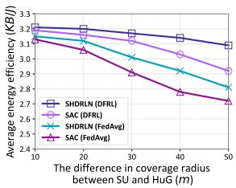

line

| Difference in coverage radius between SU and HuG (m) | SHDRLN (DFRL) | SAC (DFRL) | SHDRLN (FedAvg) | SAC (FedAvg) |
| -------------------------------------------------- | ------------- | ---------- | --------------- | ------------ |
| 10                                                 | 3.2           | 3.1        | 3.1             | 3.0          |
| 20                                                 | 3.1           | 3.0        | 3.0             | 2.9          |
| 30                                                 | 3.0           | 2.9        | 2.9             | 2.8          |
| 40                                                 | 2.9           | 2.8        | 2.8             | 2.7          |
| 50                                                 | 2.8           | 2.7        | 2.7             | 2.6          |

(a)

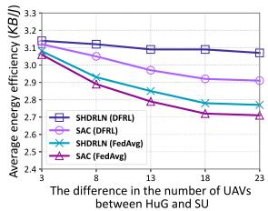

line

| Difference in number of UAVs between HuG and SU | SHDRLN (DFRL) | SAC (DFRL) | SHDRLN (FedAvg) | SAC (FedAvg) |
| ----------------------------------------------- | ------------- | ---------- | --------------- | ----------- |
| 3                                               | 3.1           | 3.1        | 3.1             | 3.1         |
| 8                                               | 3.0           | 2.9        | 2.9             | 2.8         |
| 13                                              | 2.9           | 2.8        | 2.8             | 2.7         |
| 18                                              | 2.8           | 2.7        | 2.7             | 2.6         |
| 23                                              | 2.7           | 2.6        | 2.6             | 2.5         |

(b)

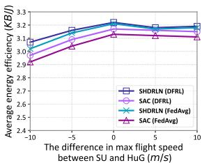

line

| The difference in max flight speed between SU and HuG (m/s) | SHDRLN (DFRL) | SAC (DFRL) | SHDRLN (FedAvg) | SAC (FedAvg) |
| --- | --- | --- | --- | --- |
| -10 | 3.05 | 2.95 | 3.08 | 2.98 |
| -5 | 3.15 | 3.05 | 3.18 | 3.08 |
| 0 | 3.20 | 3.10 | 3.22 | 3.12 |
| 5 | 3.18 | 3.12 | 3.20 | 3.10 |
| 10 | 3.15 | 3.10 | 3.18 | 3.08 |

(c)

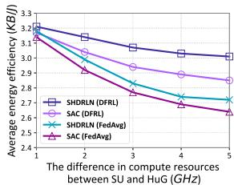

line

| Difference in compute resources between SU and HuG (GHz) | SHDRLN (DFRL) | SAC (DFRL) | SHDRLN (FedAvg) | SAC (FedAvg) |
| -------------------------------------------------------- | ------------- | ---------- | --------------- | ----------- |
| 1                                                        | 3.2           | 3.1        | 3.1             | 3.0         |
| 2                                                        | 3.1           | 3.0        | 2.9             | 2.8         |
| 3                                                        | 3.0           | 2.9        | 2.7             | 2.6         |
| 4                                                        | 2.9           | 2.8        | 2.6             | 2.5         |
| 5                                                        | 2.8           | 2.7        | 2.5             | 2.4         |

(d)   
Fig. 10. The average energy efficiency of SU during the training process across different UAV parameters of HuG. (a) Coverage radius. (b) The number of UAVs. (c) Max flight speed. (d) Compute resources.

From Fig. 10, it can be observed that when there are varying levels of differences between SU and HuG in coverage radius, quantity scale, flight speed, and compute resources, SHDRLN (DFRL) demonstrates superior stability in energy efficiency performance compared to other algorithms. As the performance parameter differences between SU and HuG increase, although the average energy efficiency of SHDRLN (DFRL) during training gradually decreases, the decreasing trend is more gradual than other algorithms. From Fig. 10(b), it can be observed that the difference in the number of UAVs has a minimal impact on SHDRLN (DFRL). This is because DFRL only shares knowledge with the G UAVs with the highest policy similarity. On the other hand, differences in coverage radius and computational resources of UAVs significantly affect the average energy efficiency during SU training. Observing Fig. 10(c), when the maximum flight speed of HuG is high, the performance difference between HuG and SU hardly affects the energy efficiency of SU. This is because higher flight speeds result in higher energy consumption, thereby reducing energy efficiency. Therefore, both HuG and SU will try to avoid flying at maximum speed during the navigation policy learning process. Overall, the proposed SHDLRN (DFRL) method exhibits good stability compared to other algorithms under different levels of heterogeneity with varying performance parameters.

# VI. CONCLUSION

In this paper, we propose a decentralized and energy-efficient heterogeneous UAV navigation solution based on FedRL, ensuring high-energy efficiency in task offloading while simultaneously achieving knowledge sharing among heterogeneous UAVs. Considering the navigation policy knowledge sharing of heterogeneous UAVs, we propose the SHDRLN navigation policy learning solution based on hierarchical reinforcement learning and propose a navigation policy knowledge sharing scheme named DFRL for heterogeneous UAVs. Through extensive simulations, we prove that our solution is superior to other baseline methods in terms of energy efficiency and more stable in knowledge sharing of navigation policy among UAVs with different levels of heterogeneity. As for future work, we aim to further enhance the generality of the policy model and explore extending the SHDRLN and DFRL algorithms to multi-task scenarios. UAVs could simultaneously undertake various edge network tasks such as task offloading, edge caching, and load balancing. Considering that UAV mobility also influences the communication channels, a more comprehensive communication channel model warrants consideration in future work.

# REFERENCES

[1] S. Mittal, “A survey on optimized implementation of deep learning models on the Nvidia Jetson platform,” J. Syst. Archit., vol. 97, pp. 428–442, Aug. 2019.   
[2] W. Du and S. Ding, “A survey on multi-agent deep reinforcement learning: From the perspective of challenges and applications,” Artif. Intell. Rev., vol. 54, pp. 3215–3238, Jun. 2021.   
[3] A. Srivastava and J. Prakash, “Future fanet with application and enabling techniques: Anatomization and sustainability issues,” Comput. Sci. Rev., vol. 39, Feb. 2021, Art. no. 100359.   
[4] X. Hu, K.-K. Wong, K. Yang, and Z. Zheng, “UAV-assisted relaying and edge computing: Scheduling and trajectory optimization,” IEEE Trans. Wirel. Commun., vol. 18, no. 10, pp. 4738–4752, Jul. 2019.   
[5] M. Li, N. Cheng, J. Gao, Y. Wang, L. Zhao, and X. Shen, “Energy-efficient UAV-assisted mobile edge computing: Resource allocation and trajectory optimization,” IEEE Trans. Veh. Technol., vol. 69, no. 3, pp. 3424–3438, Mar. 2020.   
[6] K. Arulkumaran, M. P. Deisenroth, M. Brundage, and A. A. Bharath, “Deep reinforcement learning: A brief survey,” IEEE Signal Process. Mag., vol. 34, no. 6, pp. 26–38, Nov. 2017.   
[7] S. F. Abedin, M. S. Munir, N. H. Tran, Z. Han, and C. S. Hong, “Data freshness and energy-efficient UAV navigation optimization: A deep reinforcement learning approach,” IEEE Trans. Intell. Transp. Syst., vol. 22, no. 9, pp. 5994–6006, Sep. 2021.   
[8] Z. Ye, K. Wang, Y. Chen, X. Jiang, and G. Song, “Multi-UAV navigation for partially observable communication coverage by graph reinforcement learning,” IEEE Trans. Mobile Comput., vol. 22, no. 7, pp. 4056–4069, Jul. 2023.   
[9] M. Ye, X. Fang, B. Du, P. C. Yuen, and D. Tao, “Heterogeneous federated learning: State-of-the-art and research challenges,” ACM Comput. Surv., vol. 56, pp. 1–44, Oct. 2023.   
[10] C. H. Liu, Z. Chen, J. Tang, J. Xu, and C. Piao, “Energy-efficient UAV control for effective and fair communication coverage: A deep reinforcement learning approach,” IEEE J. Sel. Areas Commun, vol. 36, no. 9, pp. 2059–2070, Sep. 2018.   
[11] C. H. Liu, X. Ma, X. Gao, and J. Tang, “Distributed energy-efficient multi-UAV navigation for long-term communication coverage by deep reinforcement learning,” IEEE Trans. Mobile Comput., vol. 19, no. 6, pp. 1274–1285, Jun. 2020.   
[12] Y. Li et al., “Data collection maximization in IoT-sensor networks via an energy-constrained UAV,” IEEE Trans. Mobile Comput., vol. 22, no. 1, pp. 159–174, May 2023.   
[13] Y. Zhu, M. Chen, S. Wang, Y. Hu, Y. Liu, and C. Yin, “Collaborative reinforcement learning based unmanned aerial vehicle (UAV) trajectory design for 3D UAV tracking,” IEEE Trans. Mobile Comput., early access, Mar. 28, 2024, doi: 10.1109/TMC.2024.3382913.   
[14] C. Tessler, S. Givony, T. Zahavy, D. Mankowitz, and S. Mannor, “A deep hierarchical approach to lifelong learning in Minecraft,” in Proc. AAAI Conf. Artif. Intell., 2017, pp. 1553–1561.

[15] T. Li, A. K. Sahu, A. Talwalkar, and V. Smith, “Federated learning: Challenges, methods, and future directions,” IEEE Signal Process. Mag., vol. 37, no. 3, pp. 50–60, May 2020.   
[16] Y. Xu, T. Zhang, D. Yang, Y. Liu, and M. Tao, “Joint resource and trajectory optimization for security in UAV-assisted MEC systems,” IEEE Trans. Commun., vol. 69, no. 1, pp. 573–588, Sep. 2021.   
[17] J. Lin and L. Pan, “Multiobjective trajectory optimization with a cutting and padding encoding strategy for single-UAV-assisted mobile edge computing system,” Swarm Evol. Comput., vol. 75, Dec. 2022, Art. no. 101163.   
[18] Z. Zhang, D. Zhang, and R. C. Qiu, “Deep reinforcement learning for power system applications: An overview,” CSEE J. Power Energy Syst., vol. 6, pp. 213–225, Mar. 2019.   
[19] S. Yin and F. R. Yu, “Resource allocation and trajectory design in UAVaided cellular networks based on multiagent reinforcement learning,” IEEE Internet Things J., vol. 9, no. 4, pp. 2933–2943, Jul. 2022.   
[20] C. Zhao, J. Liu, M. Sheng, W. Teng, Y. Zheng, and J. Li, “Multi-UAV trajectory planning for energy-efficient content coverage: A decentralized learning-based approach,” IEEE J. Sel. Areas Commun, vol. 39, no. 10, pp. 3193–3207, Oct. 2021.   
[21] B. McMahan, E. Moore, D. Ramage, S. Hampson, and B. A. Y. Arcas, “Communication-efficient learning of deep networks from decentralized data,” in Proc. Int. Conf. Artif. Intell. Statist., PMLR, 2017, pp. 1273–1282.   
[22] H. Yang, J. Zhao, Z. Xiong, K.-Y. Lam, S. Sun, and L. Xiao, “Privacypreserving federated learning for UAV-enabled networks: Learning-based joint scheduling and resource management,” IEEE J. Sel. Areas Commun, vol. 39, no. 10, pp. 3144–3159, Oct. 2021.   
[23] X. Hou, J. Wang, C. Jiang, X. Zhang, Y. Ren, and M. Debbah, “UAVenabled covert federated learning,” IEEE Trans. Wirel. Commun., vol. 22, no. 10, pp. 6793–6809, Oct. 2023.   
[24] Y. Nie, J. Zhao, F. Gao, and F. R. Yu, “Semi-distributed resource management in UAV-aided MEC systems: A multi-agent federated reinforcement learning approach,” IEEE Trans. Veh. Technol., vol. 70, no. 12, pp. 13162–13173, Dec. 2021.   
[25] H. Bany Salameh, M. Alhafnawi, A. Masadeh, and Y. Jararweh, “Federated reinforcement learning approach for detecting uncertain deceptive target using autonomous dual UAV system,” Inf. Process. Manage., vol. 60, Mar. 2023, Art. no. 103149.   
[26] Y. Li, A. H. Aghvami, and D. Dong, “Path planning for cellular-connected UAV: A DRL solution with quantum-inspired experience replay,” IEEE Trans. Wirel. Commun., vol. 21, no. 10, pp. 7897–7912, Oct. 2022.   
[27] H. Huang, Y. Yang, H. Wang, Z. Ding, H. Sari, and F. Adachi, “Deep reinforcement learning for UAV navigation through massive MIMO technique,” IEEE Trans. Veh. Technol., vol. 69, no. 1, pp. 1117–1121, Jan. 2020.   
[28] Y. Zeng, J. Xu, and R. Zhang, “Energy minimization for wireless communication with rotary-wing UAV,” IEEE Trans. Wirel. Commun., vol. 18, no. 4, pp. 2329–2345, Apr. 2019.   
[29] Z. Dai, C. H. Liu, R. Han, G. Wang, K. K. Leung, and J. Tang, “Delaysensitive energy-efficient UAV crowdsensing by deep reinforcement learning,” IEEE Trans. Mobile Comput., vol. 22, no. 4, pp. 2038–2052, Sep. 2023.   
[30] Z. Yang, C. Pan, K. Wang, and M. Shikh-Bahaei, “Energy efficient resource allocation in UAV-enabled mobile edge computing networks,” IEEE Trans. Wirel. Commun., vol. 18, no. 9, pp. 4576–4589, Sep. 2019.   
[31] R. S. Sutton, D. Precup, and S. Singh, “Between MDPs and Semi-MDPs: A framework for temporal abstraction in reinforcement learning,” Artif. Intell., vol. 112, pp. 181–211, Aug. 1999.   
[32] T. Haarnoja, A. Zhou, P. Abbeel, and S. Levine, “Soft actor-critic: Offpolicy maximum entropy deep reinforcement learning with a stochastic actor,” in Proc. Int. Conf. Mach. Learn., PMLR, 2018, pp. 1861–1870.   
[33] J. Schulman, F. Wolski, P. Dhariwal, A. Radford, and O. Klimov, “Proximal policy optimization algorithms,” 2017, arXiv: 1707.06347.   
[34] T. P. Lillicrap et al., “Continuous control with deep reinforcement learning,” 2015, arXiv:1509.02971.   
[35] H. Van Hasselt, A. Guez, and D. Silver, “Deep reinforcement learning with double Q-learning,” in Proc. AAAI Conf. Artif. Intell., 2016, pp. 2094–2100.   
[36] V. Mnih et al., “Human-level control through deep reinforcement learning,” Nature, vol. 518, pp. 529–533, Feb. 2015.   
[37] S. Kullback and R. A. Leibler, “On information and sufficiency,” Ann. Math. Statist., vol. 22, pp. 79–86, Mar. 1951.   
[38] M. Hessel et al., “Rainbow: Combining improvements in deep reinforcement learning,” in Proc. AAAI Conf. Artif. Intell., 2018, pp. 3215–3222.   
[39] Z. Wang, T. Schaul, M. Hessel, H. Hasselt, M. Lanctot, and N. Freitas, “Dueling network architectures for deep reinforcement learning,” in Proc. Int. Conf. Mach. Learn., PMLR, 2016, pp. 1995–2003.

[40] W. Zhou, Z. Liu, J. Li, X. Xu, and L. Shen, “Multi-target tracking for unmanned aerial vehicle swarms using deep reinforcement learning,” Neurocomputing, vol. 466, pp. 285–297, Nov. 2021.   
[41] Q. Liu, L. Shi, L. Sun, J. Li, M. Ding, and F. Shu, “Path planning for UAV-mounted mobile edge computing with deep reinforcement learning,” IEEE Trans. Veh. Technol., vol. 69, no. 5, pp. 5723–5728, May 2020.   
[42] W. Zhang, Q. Wang, X. Liu, Y. Liu, and Y. Chen, “Three-dimension trajectory design for multi-UAV wireless network with deep reinforcement learning,” IEEE Trans. Veh. Technol., vol. 70, no. 1, pp. 600–612, Dec. 2021.   
[43] Y. Zheng, Z. Meng, J. Hao, Z. Zhang, T. Yang, and C. Fan, “A deep Bayesian policy reuse approach against non-stationary agents,” in Proc. Adv. Neural Inf. Process. Syst., 2018, pp. 962–972.

natural_image

Portrait photo of a man in formal attire against a blue background (no text or symbols visible)

Pengfei Wang (Member, IEEE) received the BS, MS, and PhD degrees in software engineering from Northeastern University (NEU), China, in 2013, 2015 and 2020, respectively. From 2016 to 2018, He was a visiting PhD with the Department of Electrical Engineering and Computer Science, Northwestern University, IL, USA. He is currently an associate professor with the School of Computer Science and Technology, Dalian University of Technology (DUT), China. He has authored more than 60 papers on high-quality journals and conferences, such as IEEE

Transactions on Mobile Computing, IEEE/ACM Transactions on Networking, IEEE Journal on Selected Areas in Communications, IEEE Transactions on Services Computing, IEEE Transactions on Wireless Communications, IEEE Transactions on Intelligent Transportation Systems, ACM Transactions on Sensor Networks, IEEE Transactions on Network Science and Engineering, IEEE INFOCOM, IEEE ICNP, and IEEE ICDCS etc. He also holds a series of patents in US and China. His research interests are distributed artificial intelligence, computer networks, and IoT.

natural_image

Portrait of a young man in formal attire (no text or symbols visible)

Hao Yang (Student Member, IEEE) received the BS degree in computer science and technology from China University of Mining and Technology, Beijing in 2022. He is currently working towards the MS degree with the Dalian University of Technology with interests on multi-agent deep reinforcement learning and UAV trajectory planning.

natural_image

Portrait of a man in formal business attire (no visible text or symbols)

Guangjie Han (Fellow, IEEE) received the PhD degree from Northeastern University, Shenyang, China, in 2004. He is currently a professor with the Department of Internet of Things Engineering, Hohai University, Changzhou, China. In 2008, he finished his work as a postdoctoral researcher with the Department of Computer Science, Chonnam National University, Gwangju, Korea. From 2010 to 2011, he was a visiting research scholar with Osaka University, Suita, Japan. From January 2017 to February 2017, he was a visiting professor with City University of

Hong Kong, China. From 2017 to 2020, he was a distinguished professor with the Dalian University of Technology, China. His current research interests include Internet of Things, industrial internet, machine learning and artificial intelligence, mobile computing, security and privacy. He has more than 500 peerreviewed journal and conference papers, in addition to 160 granted and pending patents. Currently, his H-index is 69 and i10-index is 305 in Google Citation (Google Scholar). The total citation count of his papers raises above 17400+ times. He is a fellow of the U.K. Institution of Engineering and Technology (FIET). He has served on the Editorial Boards of up to 10 international journals, including IEEE Transactions on Industrial Informatics, IEEE Transactions on Cognitive Communications and Networking, IEEE Transactions on Vehicular Technology, IEEE Systems, etc. He has guest-edited several special issues in IEEE Journals and Magazines, including the IEEE Journal on Selected Areas in Communications, IEEE Communications, IEEE Wireless Communications, Computer Networks, etc. Dr. Han has also served as chair of organizing and technical committees in many international conferences. He has been awarded 2020 IEEE Systems Journal Annual Best Paper Award and the 2017-2019 IEEE ACCESS Outstanding Associate Editor Award.

natural_image

Portrait photo of a man in formal attire against a blue background (no text or symbols visible)

Ruiyun Yu (Member, IEEE) received the BS degree in mechanical engineering and the MS and PhD degrees in computer science from Northeastern University, Shenyang, China, in 1997, 2004, and 2009, respectively. He is currently a professor with the Software College, Northeastern University. He has authored more than 30 papers on high-quality journals and conferences, including ACM Transactions on Sensor Networks, Pervasive and Mobile Computing, INFOCOM, and ICCCN. His current research interests include urban sensing and computing, Big Data intelligence, and mixed reality technology.

natural_image

Portrait photo of a man wearing glasses and a collared shirt (no text or symbols visible)

Heng Qi (Senior Member, IEEE) received the BS degree from Hunan University in 2004 and the ME and PhD degrees from the Dalian University of Technology, China, in 2006 and 2012, respectively. He has been a JSPS Oversea research fellow with the Graduate School of Information Science, Nagoya University, Japan, from 2016 to 2017. He is currently an associate professor with the School of Computer Science and Technology, Dalian University of Technology. He has published more than 100 technical papers, such as IEEE/ACM Transactions on Networking, IEEE Transactions on Mobile Computing, IEEE Transactions on Multimedia, and INFOCOM. His research interests include computer networking and multimedia computing.

natural_image

Portrait of a man wearing glasses and a suit (no text or symbols visible)

Leyou Yang received the BS and MS degree in software engineering from Northeastern University, Shenyang, China, in 2015 and 2018, respectively. From 2021 to 2022, he was a visiting PhD student with the School of Computer Science and Engineering, Nanyang Technological University, Singapore. He is currently working toward the PhD degree in computer application technology with the School of Computer Science and Engineering, Northeastern University, Shenyang. His research interests include wireless communications, optimization theory, reinforcement

learning, and indoor localization.

natural_image

Portrait of a man in formal attire with glasses against a blue background (no text or symbols visible)

Xiaopeng Wei (Member, IEEE) received the BE degree in mechanical engineering from the School of Mechanical Engineering, Dalian University of Technology, Dalian, in 1982, and the ME and PhD degrees in CAD&CG from the School of Mechanical Engineering, Dalian University of Technology, in 1986 and 1993, respectively. He was a postdoctorate with the School of Mechanical Engineering, Dalian University of Technology, from 1993 to 1995. In September 1982, he joined the Dalian University of Technology as a teaching assistant, where he is

currently a professor. From February 1995 to June 1995, he was a visiting scholar with the University of Hong Kong, Hong Kong. From July 1997 to August 1997, he was a visiting professor with Alberta University, Canada. From April 1999 to August 1999, he was a visiting professor with the Queensland University of Technology, Australia. His current research interests are neural networks, artificial intelligence, DNA computing, mechanical design, and CAD&CG. He has published more than 150 papers in these areas.

natural_image

Portrait photo of a man in formal attire against a blue background (no text or symbols visible)

Geng Sun (Senior Member, IEEE) received the BS degree in communication engineering from Dalian Polytechnic University, and the PhD degree in computer science and technology from Jilin University, in 2011 and 2018, respectively. He was a visiting researcher with the School of Electrical and Computer Engineering, Georgia Institute of Technology, USA. He is an associate professor with the College of Computer Science and Technology, Jilin University, and His research interests include wireless networks, UAV communications, collaborative beamforming

and optimizations.

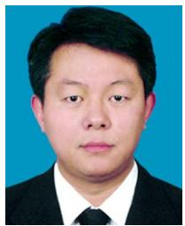

natural_image

Portrait photo of a man in formal attire against a blue background (no text or symbols visible)

Qiang Zhang (Senior Member, IEEE) received the BS degree in electronic engineering and MS and PhD degrees in circuits and systems from the School of Electronic Engineering, Xidian University, Xi’an, China, in 1994, 1999, and 2002, respectively. He is the Ministry of Education Yangtze River scholar professor and the dean with the school of computer science and Technology, Dalian University of Technology, Dalian, China. His research interests are artificial intelligence, neural networks, optimization and intelligent robots.