# Deep Lifelong Learning for Adaptive Semantic-Aware Content Reuse in UAV-Assisted Metaverse

Ning Wang , Graduate Student Member, IEEE, Yinxuan Wu , Member, IEEE, Beatriz Lorenzo , Senior Member, IEEE, Sumudu Samarakoon , Member, IEEE, and Bing Liu , Fellow, IEEE

Abstract—The vast amount of content generated in the Metaverse and unpredictable user demands make real-time optimization of communication, computing, and caching increasingly challenging. These issues highlight the need for intelligent mechanisms that reduce redundant content transmission and improve resource efficiency. To address this, joint semantic-aware caching and rendering schemes that leverage content similarity are proposed to enable reusability across Metaverse environments. The goal is to optimize user-server associations, caching, and rendering decisions to efficiently utilize network resources, thereby maximizing resource savings and service quality. Reusing content across heterogeneous Metaverse environments, however, requires a learning algorithm capable of adapting to diverse task settings. To this end, a lifelong learning–based algorithm, Deep-Centralized ELLA (DC-ELLA), incorporating dictionary learning is developed to accommodate diverse user requests by dynamically extracting knowledge from different semantic environments. Simulation results show that the proposed caching and rendering schemes significantly outperform traditional approaches, while DC-ELLA enhances convergence speed and stability, demonstrating superior performance in dynamic scenarios. By exploiting knowledge and content from prior requests, the approach achieves scalable adaptation to new Metaverse environments.

Index Terms—Caching, lifelong learning, Metaverse, edge rendering, resource allocation, semantic environment, UAV-swarm.

## I. INTRODUCTION

HE Metaverse [1] is emerging as a transformative mented reality (AR), virtual reality (VR), and immersive 3D environments [2]. However, delivering persistent, immersive, and interactive virtual experiences imposes significant challenges on existing communication and computing infrastructures. To meet these demands, Unmanned Aerial Vehicles (UAVs) [3] are becoming a powerful enabler, offering flexible, distributed computing, and caching capabilities at the network edge.

Several UAV-assisted architectures [4], [5] have been deployed to provide low-latency coverage and localized processing resources. Zheng et al. [4] analyze content delivery performance in a cache-enabled UAV base station for delay-sensitive Metaverse users. They develop analytical models for content delivery success probability and average delay. Zhang et al. [5] introduce a multi-UAV-assisted, edge-enabled Metaverse system for AIgenerated content as a service. To optimize complex resource management, they propose a diffusion-based soft actor-critic algorithm (Meta-DSAC), which demonstrates superior longterm performance and adaptability in complex environments. However, these works do not account for the heterogeneity of Metaverse environments.

Meanwhile, semantic communication [6] has emerged as a promising paradigm for improving network efficiency by exploiting the meaning of data rather than transmitting raw data. By sending high-level semantic descriptions instead of full images or videos [7], [8], communication overhead and latency can be significantly reduced through edge processing. Wang et al. [9] design a semantic transmission framework for sensing information using semantic bases to reduce transmission volume without data reconstruction. Xu et al. [10] integrate semantic communication with digital twin (DT) in a Metaverse-based UAV swarm to enable low-latency coordination with virtual service providers. Hoa et al. [11] investigate semantic communication and edge computing in a UAV-enabled network for Metaverse applications. Although semantic communication aligns well with the context-aware nature of Metaverse interactions, its potential to enable more intelligent caching, content delivery, and adaptation strategies across diverse Metaverse environments remains underexplored.

Accordingly, another critical challenge lies in the design of adaptive caching and rendering schemes. Chen and Yang [12] discuss the limitations of traditional caching policies that rely solely on content popularity, proposing instead a user preference-aware approach to improve caching efficiency. A user-centric, many-objective content delivery framework is proposed in [13], combining cooperative content caching and deep reinforcement learning-based routing to optimize user experience and network resource utilization. A cloud-edgeterminal collaborative caching and differentiated delivery mechanism is proposed in [14], combining user behavior-aware edge collaboration, pre-caching strategies for heterogeneous content, and D2D-assisted delivery. However, these works do not consider content reuse across different Metaverse environments. Given the overlapping and repetitive use of content across various virtual environments, traditional content caching strategies that treat each request in isolation are inefficient. Caching mechanisms that support content reuse across environments would enable shared rendering of semantically similar or partially matching content, reducing redundant data storage while improving rendering responsiveness and energy efficiency. These improvements are essential for delivering scalable and seamless immersive experiences.

Moreover, the dynamic nature of Metaverse environments necessitates intelligent, adaptive resource allocation. Machine learning (ML) enables network entities to learn user demand and content popularity patterns, optimizing caching, rendering, and resource allocation. Khan et al. [15] highlight ML for Metaverse-based wireless systems and present a deep reinforcement learning (DRL) case study for Metaverse sensing, while other works use DRL for computing resource allocation and task offloading [5], [11]. ML models are typically trained for static tasks and struggle to generalize in non-stationary environments. Lifelong (continual) learning addresses this challenge by enabling knowledge accumulation and transfer across related tasks [16]. In wireless networking, such approaches have been applied to adaptive resource management [17], but often require significant retraining and fail to exploit semantic and structural similarities across heterogeneous tasks. Within lifelong reinforcement learning, PG-ELLA [18] enables knowledge sharing via a shared latent basis, with extensions incorporating task descriptors [19], scalable implementations [20], [21], and faster task adaptation [22]. While recent deep continual learning approaches show promise [23], [24], most PG-ELLA-based methods rely on linear or shallow models and assume predefined tasks, limiting their applicability to dynamic, high-dimensional Metaverse environments. Moreover, existing deep continual learning solutions are rarely designed for latency and resource constrained edge computing.

To address these limitations, we propose a unified framework that integrates factorized lifelong policy gradients with DRL for semantic-aware caching in non-stationary Metaverse environments. By leveraging environment-aware task descriptors and a proximal policy optimization (PPO)-based neural network, the proposed approach enables efficient policy reuse and adaptation across evolving user preferences and content semantics. Our framework incorporates UAV-assisted edge computing and semantic-aware caching to serve user content requests across diverse Metaverse scenarios, achieving scalable, low-latency, and resource-efficient operation.

The main contributions of this paper are summarized as follows:

We design a UAV-assisted Metaverse architecture where user requests are converted into structured semantic descriptions and served via semantic-aware edge caching and UAV-assisted computation. To the best of our knowledge, this is the first framework to provide semantic-based content reuse across multiple Metaverse environments, enabling cross-environment sharing of content and computation.

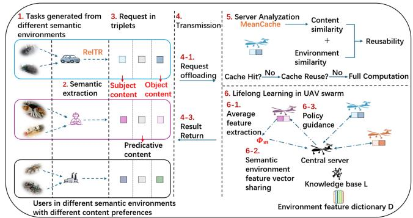  
Fig. 1. Semantic-Aware Caching Enabled by Deep Lifelong Learning.

\- A hierarchical caching and rendering strategy is developed that dynamically selects among exact cache hits, semantic reuse across similar scenes, and full recomputation. By exploiting semantic similarity and real-time network conditions, the framework reduces redundant computation and latency while improving rendering efficiency for heterogeneous users.

We propose Deep-Centralized ELLA (DC-ELLA), which extends PG-ELLA to deep reinforcement learning by integrating descriptor-based dictionary learning with a PPObased neural network. DC-ELLA enables rapid adaptation to new, unlabeled Metaverse environments by inferring environment characteristics from semantic task descriptors and reusing learned policies. A three-step policy acquisition routine links pretraining and online adaptation, describing how knowledge is accumulated and reused across environments.

Extensive simulations show that the proposed system significantly improves resource efficiency, computation latency, and rendering performance. DC-ELLA converges faster and achieves higher long-term rewards than PPO, PG-ELLA, and transfer learning baselines, effectively transferring knowledge and mitigating catastrophic forgetting in dynamic Metaverse scenarios.

## II. SYSTEM MODEL

A semantic-aware Metaverse architecture is illustrated in Fig. 1, where a set of I users $\mathcal { T } = \{ 1 , \dots , i , \dots , I \}$ locally generate rendering tasks based on real-world visual content from a set of E environments $\mathcal { E } = \{ 1 , \ldots , e , \ldots , E \}$ . User i generates image and video information based on their scene and semantic environment. A locally deployed semantic converter at each user transforms the frame task request v into a corresponding semantic text description, represented as a tuple consisting of the subject, predicate, and object components of the task. The user’s frame request preferences are modeled as a set of features, including the user’s environment source, task arrival rate, task delay requirements, and task rendering resolution requirements, respectively: $[ e , \lambda _ { i } , T _ { i , v } ^ { r e q } , s _ { i , v } ^ { r e q } ]$ . The user’s frame request preferences vary across different environments.

A UAV swarm consisting of a set of J UAV servers $\mathcal { I } =$ $\{ 1 , \ldots , j , \ldots , J \}$ offers frame rendering services of rate $r _ { j }$ per server $j$ for users’ requests and caches content to reduce redundant computation time. Users upload their frame requests to a server $j$ that meet their requirements for image or video rendering. The cached contents are the subject content and the object content corresponding to the frame request $v ,$ denoted uniformly as $v _ { 1 }$ and $v _ { 2 } .$ , respectively. Pre-rendering and caching these basic graphical content allows repeated reuse, reducing overall rendering time.

Three caching and rendering schemes are considered: (i) Cache hit is the simplest caching strategy in which the cached content can be directly used by the server during the rendering process, reducing rendering computation time; (ii) Cache reuse is adopted when the requested content is not cached, but another similar cached content can be reused, reducing computation time; and (iii) Full computation is used when the previous strategies are not applicable, the server must render the required content entirely from scratch, resulting in no computational time savings.

Caching decisions should consider the characteristics of different semantic environments and users’ latency and resolution requirements, given that they are diverse and dynamically changing. A semantic-aware caching model is integrated into the UAV swarm, aiming to effectively serve Metaverse users across various semantic environments. Lifelong learning is adopted as an effective approach to obtain caching and resource allocation policies dynamically and improve convergence speed and stability.

## A. Semantic Representation

RelTR [8] is adopted as a semantic symbol extractor from raw data (e.g., images or video) used to detect entities and their relationships in a scene, and generate a compact semantic representation [7]. By leveraging this technology, a semantic symbol encapsulates the images’ semantic contents for transmission. It includes bounding box coordinates and a scene graph representing relationships between subjects and objects within the image, expressed by the triplet format $< s u b j e c t -$ $p r e d i c a t e - o b j e c t >$ . The triplet is used to describe the relationship between the subject and the object content. Let $Q _ { i , j }$ denote the size of the semantic symbol of the image generated by user i and sent to UAV server $j \colon$

$$
Q _ { i , j } = \sum _ { n = 1 } ^ { N _ { i , j } ^ { s } } S _ { n } ^ { s } + \sum _ { k = 1 } ^ { N _ { i , j } ^ { o } } S _ { k } ^ { o } + \sum _ { m = 1 } ^ { N _ { i , j } ^ { t } } S _ { m } ^ { t }\tag{1}
$$

where $S _ { n } ^ { \mathrm { s } }$ and $S _ { k } ^ { \mathrm { o } }$ represent the sizes of the bounding boxes for subject n and object k in the image captured by user i and transmitted to UAV server j, respectively. $S _ { m } ^ { \mathrm { t } }$ denotes the size of the triplet m. $N _ { i , j } ^ { \mathrm { s } }$ and $N _ { i , j } ^ { \mathrm { o } }$ indicates the number of bounding boxes for subject n and object k contained in each image and $N _ { i , j } ^ { \mathrm { t } }$ represents how many triplets the semantic symbol contains.

## B. Communication Model

In our UAV-assisted Metaverse architecture, there are two types of transmissions: (i) uplink, which is used to transmit the semantic symbols of user i to UAV server $j ,$ , and (ii) downlink, used to transmit the rendered frames back to user i. These two connections can be seen as air-to-ground (A2G) communication channels.

The A2G channel contains line-of-sight (LoS) path loss and non-line-of-sight (NLoS) as [25], $\begin{array} { r } { P L _ { \xi } = ( \frac { 4 \pi f _ { c } } { c } ) ^ { 2 } \cdot d _ { i , j } ^ { 2 } \cdot \eta _ { \xi } } \end{array}$ where $d _ { i , j }$ is the distance between the Metaverse user i and the UAV server $j , \ f _ { c }$ is the carrier frequency and $c$ is the speed of light, $\eta _ { \xi }$ with $\xi = \{ 0 , 1 \}$ represents the path loss of LoS and NLoS cases. The average A2G path loss of the communication channel between user i and server j is $\overline { { L _ { i , j } } } =$ $p _ { 0 } \cdot P L _ { i , j } ^ { 0 } + p _ { 1 } \cdot P L _ { i , j } ^ { 1 }$ , where $p _ { 0 } , p _ { 1 }$ are the probability of LoS and NLoS [25], which can be closely approximated ${ \bf b y } \colon p _ { 0 } =$ $1 / ( 1 + a \cdot e x p ( - b ( \psi - a ) ) )$ , where $\begin{array} { r } { \psi = \tan ^ { - 1 } \big ( \frac { h } { \sqrt { x ^ { 2 } + y ^ { 2 } } } \big ) } \end{array}$ is the angle between i and $j ,$ a and b are parameters related to the environment. Therefore, the transmission rate between i and j is given by

$$
R _ { i , j } = B _ { i } l o g _ { 2 } \left( 1 + \frac { P _ { i } G _ { i , j } } { \overline { { L _ { i , j } } } N _ { 0 } B _ { i } } \right)\tag{2}
$$

where $B _ { i }$ is the bandwidth, $P _ { i }$ represents the transmission power of user i, $G _ { i , j }$ is the channel gain, and $N _ { 0 }$ is the noise power spectral density.

## C. Computing/Rendering Model

The UAV servers provide rendering services for the requested frames. Each frame v may contain multiple content requests n and k, and can be rendered at different resolutions. The possible resolutions $s _ { j }$ for server $j$ are {4096 × $2 1 6 0 , 3 0 7 2 \times 1 6 2 0 , 2 0 4 8 \times 1 0 8 0 , 1 9 2 0 \times 1 0 8 0 , 1 2 8 0 \times 7 2 0 \}$ corresponding to 4K, 3K, 2K, 1080p, and 720p resolutions, respectively. The data size of frame request v at server j is given by $w _ { j , v } = \boldsymbol \mu ^ { c } \times \boldsymbol s _ { j }$ , where $\mu ^ { c }$ is the number of bits needed per resolution. Then, the processing time $T _ { j , v } ^ { R e n }$ and the energy consumption $E _ { j , v } ^ { R e n }$ for frame v are as follows [26]:

$$
T _ { j , v } ^ { R e n } = \frac { w _ { j , v } } { Z _ { j } \cdot f _ { j } ^ { C P U } } , E _ { j , v } ^ { R e n } = P _ { j } ^ { R e n } \cdot T _ { j , v } ^ { R e n }\tag{3}
$$

where $f _ { j } ^ { C P U }$ is the CPU frequency of server j, $Z _ { j }$ (bits/cycle) represents the rendered data volume per CPU cycle, and $Z _ { j }$ $f _ { j } ^ { \dot { C } P U }$ (bits/second) is the rendering capacity. $P _ { j } ^ { \bar { R } e n }$ is the rendering power.

## III. SEMANTIC-AWARE CACHING AND RENDERING

In this section, we build a semantic-aware caching model that supports cache hits, semantic reuse, and full computation using the semantic representation introduced earlier. We then present the edge computing and rendering models and explain how reuse can save resources. In our framework, UAVs act as mobile semantic edge servers in Metaverse environments, providing flexible on-demand computing and communication services. Under a standard system energy decomposition, $E _ { \mathrm { t o t a l } } = E _ { \mathrm { f l y } } +$ $E _ { \mathrm { c o m m } } + E _ { \mathrm { c o m p } }$ , our framework keeps the propulsion term $E _ { \mathrm { f l y } }$ fixed by assuming a given mobility pattern (explicitly modeled in our prior work [16]) and focuses on reducing communication and computation energy. By transmitting compact semantic payloads of size ω, the communication energy follows $E _ { \mathrm { c o m m } } =$ $P _ { i } \omega / R _ { i , j } \ [ 1 0 ]$

## A. Semantic-Based Cache Hit Model

Unlike conventional caching models that store individual request frames or pre-rendered video files, a semantic symbol mechanism is adopted to build cached contents. In this system, cached contents are semantic components that represent entities described by subject and object contents n and k. The system integrates computation and caching strategies for rendering tasks, leveraging cached semantic components to generate frames in response to user requests.

Consider user i submits $\Lambda _ { i , j }$ frame rendering requests to UAV server j. A frame request v $( v \in \{ 1 , . . . , N _ { i , j } \} )$ may include multiple subject and object content requests. Let $\boldsymbol { n } ^ { n u m }$ and k<sup>num</sup> denote the number of them, across all frame requests received by server j. According to (1), the total number of requested subject and object contents at server j is expressed as: $\begin{array} { r } { N _ { j } ^ { s } = \sum _ { i = 1 } ^ { I } \bar { N } _ { i , j } ^ { s } } \end{array}$ and $\begin{array} { r } { N _ { j } ^ { o } = \sum _ { i = 1 } ^ { I } N _ { i , j } ^ { o } } \end{array}$ . The maximum number of subject and object contents that each server $j$ can cache is equal to $N _ { F }$ Therefore, the popularity is defined as the probability of semantic content n and k being requested in j with respect to all subject and object contents requested from the same server, which is obtained as $\begin{array} { r } { \rho _ { j , n } ^ { s } = \frac { n ^ { n u \hat { m } } } { N _ { j } ^ { s } } } \end{array}$ and $\begin{array} { r } { \rho _ { j , k } ^ { o } = \frac { k ^ { n u m } } { N _ { i } ^ { o } } } \end{array}$ , respectively. Unlike conventional popularity models based on fixed distributions (e.g., Zipf [27]), our frame requests are dynamically generated depending on semantic symbols derived from user-observed images across different environments. Hence, UAV server $j$ employs a dynamic caching policy that continuously adapts to incoming requests as popularity evolves.

## B. Cache Reuse Model

After the collected image-based user requests are converted into structured text queries via semantic processing, task-level semantic similarity can be evaluated using established natural language processing (NLP) techniques. Inspired by semantic text caching frameworks such as GPTCache [28] and its lightweight, edge-oriented extension MeanCache [29], we adopt a semantic similarity–driven caching paradigm that enables efficient content reuse across heterogeneous requests and environments. The core idea of semantic caching is to represent each request by a compact semantic feature vector and reuse cached content when semantically similar requests arrive. Specifically, for each subject or object text associated with content request n (or k), a semantic content feature vector ${ \boldsymbol { \varpi } } _ { n } ^ { c }$ (or -<sub>k</sub>) is extracted using a pre-trained sentence encoder.

The subject and object text pools are constructed first, whose ordering aligns with global content identifiers. Each text sequence is encoded using the open-source MPNet sentence encoder $f _ { \mathrm { t e x t } }$ (sentence-transformers/all-mpnetbase-v2) [30], [31]. The encoder produces token-level hidden states, which are aggregated via mean pooling to obtain a sentence embedding. The encoder operates in eval mode with

frozen parameters. Formally,

$$
\tilde { \pmb { \varpi } } _ { n } ^ { c } = \mathrm { P o o l } \Big ( f _ { \mathrm { t e x t } } \big ( \mathrm { t e x t } _ { n } ^ { ( s ) } \big ) \Big ) , \tilde { \pmb { \varpi } } _ { k } ^ { c } = \mathrm { P o o l } \Big ( f _ { \mathrm { t e x t } } \big ( \mathrm { t e x t } _ { k } ^ { ( o ) } \big ) \Big )\tag{4}
$$

followed by L2 normalization:

$$
\varpi _ { n } ^ { c } = \frac { \tilde { \varpi } _ { n } ^ { c } } { \| \tilde { \varpi } _ { n } ^ { c } \| _ { 2 } } , \ : \ : \ : \varpi _ { k } ^ { c } = \frac { \tilde { \varpi } _ { k } ^ { c } } { \| \tilde { \varpi } _ { k } ^ { c } \| _ { 2 } }\tag{5}
$$

Semantic content similarity between two subject requests n and $n ^ { \prime }$ (or object requests k and k<sup></sup>) is then measured using cosine similarity:

$$
S _ { n , n ^ { \prime } } ^ { c } = \frac { \varpi _ { n } ^ { c } \cdot \varpi _ { n ^ { \prime } } ^ { c } } { \| \varpi _ { n } ^ { c } \| \| \varpi _ { n ^ { \prime } } ^ { c } \| }\tag{6}
$$

In our processing pipeline, the dominant per-frame computational cost arises from a single forward pass of the RelTR scene-graph extractor. RelTR is a one-stage relation transformer that directly predicts sparse subject–predicate–object triplets without enumerating all $O ( n ^ { 2 } )$ object pairs, enabling efficient semantic extraction. The number of triplet queries $N _ { t }$ provides a controllable tradeoff between accuracy and latency. Once semantic symbols are extracted, only compact representations of size $\omega$ are transmitted, rather than raw image frames of size $\Omega _ { \mathrm { p x } }$ . As a result, the transmission delay $t _ { \mathrm { t x } } = \omega / R$ is orders of magnitude smaller than $\Omega _ { \mathrm { p x / } } R$ under the same link rate R. The overall per-frame latency can be approximated as

$$
T _ { \mathrm { f r a m e } } \approx T _ { \mathrm { R e l T R } } + T _ { \mathrm { e n c } } + T _ { \mathrm { c o s } } + { \frac { \omega } { R } }\tag{7}
$$

where $T _ { \mathrm { R e l T R } }$ is a single forward pass of RelTR, $T _ { \mathrm { e n c } }$ is lightweight feature/ID packing, and $T _ { \mathrm { c o s } }$ is a dot product over short vectors (negligible in practice). T is typically lower than raw-frame transmission whenever

$$
T _ { \mathrm { R e l T R } } + T _ { \mathrm { e n c } } + T _ { \mathrm { c o s } } < \frac { \Omega _ { \mathrm { p x } } - \omega } { R }\tag{8}
$$

Beyond content semantics, content reusability also depends on the surrounding communication and service context. To capture this effect, we define a semantic environment feature vector $\varpi _ { j , n } ^ { e } \left( \mathrm { o r } \varpi _ { j , k } ^ { e } \right)$ for each content request at server $j \colon$

$$
\boldsymbol { \varpi } _ { j , n } ^ { e } = \left[ F _ { j , n } , \rho _ { j , n } , \overline { { \lambda } } _ { j , n } , \overline { { T } } _ { j , n } ^ { r e q } , \overline { { s } } _ { j , n } ^ { r e q } \right]\tag{9}
$$

where $F _ { j , n }$ denotes request frequency, $\rho _ { j , n }$ content popularity, $\overline { { \lambda } } _ { j , n }$ average request arrival rate, $\bar { T } _ { j , n } ^ { r e q }$ and $\overline { { s } } _ { j , n } ^ { r e q }$ are average processing delay and resolution requirement. When a content item originates from a specific frame request $v ,$ these statistics are derived from the observed characteristics of v.

The semantic environment similarity between two requests is also computed via cosine similarity:

$$
S _ { j , n , n ^ { \prime } } ^ { e } = \frac { \varpi _ { j , n } ^ { e } \cdot \varpi _ { j , n ^ { \prime } } ^ { e } } { \| \varpi _ { j , n } ^ { e } \| \| \varpi _ { j , n ^ { \prime } } ^ { e } \| }\tag{10}
$$

After obtaining the semantic similarities for both content and environment, the content reuse probability for content n and $n ^ { \prime }$ (or k and $k ^ { \prime } )$ is defined as:

$$
P _ { j , n , n ^ { \prime } } ^ { r e } = \alpha _ { 1 } \cdot S _ { n , n ^ { \prime } } ^ { c } + ( 1 - \alpha _ { 1 } ) \cdot S _ { j , n , n ^ { \prime } } ^ { e }\tag{11}
$$

where $\alpha _ { 1 }$ is a weighting factor between the content similarity and environment similarity that can be adjusted depending on the use case. Note that for the feature vectors used, $S _ { n , n ^ { \prime } } ^ { c }$ and $S _ { j , n , n ^ { \prime } } ^ { e }$ are nonnegative. This model captures the characteristics of text requests from different semantic environments and is used to simulate real-life scenarios and estimate content reusability between requests with similar content or semantic contexts.

To intuitively evaluate the reusability of content request n on server $j$ with respect to all other requests $n ^ { \prime } ,$ , the average weighted content reuse probability is defined as:

$$
\begin{array} { r } { \overline { { P } } _ { j , n } ^ { r e } = \left\{ \begin{array} { l l } { 0 , } & { \mathrm { o t h e r w i s e } } \\ { \frac { 1 } { V _ { j } ^ { s } - 1 } \sum _ { n ^ { \prime } = 1 \atop n ^ { \prime } \neq n } ^ { V _ { j } ^ { s } } P _ { j , n , n ^ { \prime } } ^ { r e } , } & { V _ { j } ^ { s } > 1 } \end{array} \right. } \end{array}\tag{12}
$$

where $V _ { j } ^ { s }$ and $V _ { j } ^ { o }$ represent the number of subject and object content types requested in server $j$ . Replacing the index n with $k , n ^ { \prime }$ with $k ^ { \prime }$ , and $V _ { j } ^ { s }$ with $V _ { j } ^ { o }$ the average weighted content reuse probability $\overline { { P } } _ { j , k } ^ { r e }$ can be obtained as well. This metric is used by the server j to make caching decisions.

## C. Computational Saving Model

When the requested content is not available (no cache hit), the semantic similarity between new frame requests n or k and previously cached contents $n ^ { \prime }$ or $k ^ { \prime }$ is evaluated for potential cache reuse. The saving model estimates how much redundant rendering can be avoided. It captures both content-level and environment-level similarities, allowing the system to account for potential reuse opportunities. Let $n ^ { \prime } = \arg \operatorname* { m a x } _ { \hat { n } \in \mathcal { V } _ { j } ^ { s } } P _ { j , n , \hat { n } } ^ { r e }$ and $\boldsymbol { k } ^ { \prime } = \arg \operatorname* { m a x } _ { \hat { \boldsymbol { k } } \in \mathcal { V } _ { j } ^ { o } } P _ { j , \boldsymbol { k } , \hat { \boldsymbol { k } } } ^ { r e }$ be the contents with the highest reusability probability to serve contents n and $k ,$ respectively, given the available contents of each type $\mathcal { V } _ { j } ^ { s }$ and $\mathcal { V } _ { j } ^ { o }$ at server j. Let a denote the saving factor, which is related to the number of subject and object content requests in each frame request. Then, the computational savings for subject and object contents in each frame request v are given by:

$$
\begin{array} { r l r } {  { S _ { j , v } ^ { a v e } = \sum _ { n = 1 } ^ { V _ { j } ^ { s } } \sum _ { k = 1 } ^ { V _ { j } ^ { o } } ( \mathbb { 1 } _ { j , n } ^ { s } + \mathbb { 1 } _ { j , k } ^ { o } + ( 1 - \mathbb { 1 } _ { j , n } ^ { s } ) \cdot \mathbb { 1 } _ { j , n ^ { \prime } } ^ { s } \cdot P _ { j , n , n ^ { \prime } } ^ { r e }  } } \\ & { } & {  + ( 1 - \mathbb { 1 } _ { j , o } ^ { k } ) \cdot \mathbb { 1 } _ { j , k ^ { \prime } } ^ { o } \cdot P _ { j , k , k ^ { \prime } } ^ { r e } ) \cdot a \qquad } \end{array}\tag{13}
$$

where $1 _ { j , n } ^ { s }$ and $1 _ { j , k } ^ { o }$ indicate whether the requested contents n or k are directly cached (cache hits). In the case of cache misses, the terms $( 1 - 1 _ { j , n } ^ { s } ) \cdot 1 _ { j , n ^ { \prime } } ^ { s } \cdot P _ { j , n , n ^ { \prime } } ^ { r e }$ and $( 1 - 1 _ { j , k } ^ { o } ) \cdot 1 _ { j , k ^ { \prime } } ^ { o } \cdot P _ { j , k , k ^ { \prime } } ^ { r e }$ indicate the probability of reusing other similar cached contents $n ^ { \prime }$ or $k ^ { \prime }$ , thus reducing the computation.

Similarly, the computational saving time can be obtained as in (14) shown at the bottom of this page, where $\frac { w _ { j , v } } { Z _ { j } \cdot f _ { i } ^ { C P U } }$ is the time needed for full computation of a frame request $v ,$ $\frac { ( 1 _ { j , n } ^ { s } + 1 _ { j , k } ^ { o } ) \cdot a \cdot w _ { j , v } } { Z _ { j } \cdot f _ { j } ^ { C P U } }$ is the saving time if there is any cache hit for content n and k for the frame request v. $\frac { ( 1 _ { j , n ^ { \prime } } ^ { s } { \cdot } p _ { j , n , n ^ { \prime } } ^ { r e } ) a { \cdot } w _ { j , v } } { Z _ { j } { \cdot } f _ { j } ^ { C P U } }$ and $\frac { ( 1 _ { j , k ^ { \prime } } ^ { s } { \cdot } p _ { j , k , k ^ { \prime } } ^ { r e } ) a { \cdot } w _ { j , \iota } } { Z _ { j } { \cdot } f _ { j } ^ { C P U } }$ indicate that in the case of a not hit, the highest reusable content is selected.

## D. Task Completion Quality of UAV Servers

The task completion quality of each UAV server is defined based on its performance at each time step t. The task completion quality metric is defined by the latency and resolution quality satisfaction as:

$$
S a _ { j } ( t ) = \frac { \sum _ { i = 1 } ^ { I } \sum _ { v = 1 } ^ { \Lambda _ { i , j } ^ { r } ( t ) } \left( \alpha _ { 2 } \frac { T _ { i } ^ { r e q } } { T _ { v , j } } + \left( 1 - \alpha _ { 2 } \right) \frac { s _ { j } } { s _ { i } ^ { r e q } } \right) } { \sum _ { i = 1 } ^ { I } \Lambda _ { i , j } ^ { r } ( t ) }\tag{15}
$$

where $T _ { i } ^ { r e q }$ and $s _ { i } ^ { r e q }$ represent the user’s required latency and resolution, respectively, and $T _ { v , j }$ and $s _ { j }$ are the actual latency and resolution for completing request v at server $j . ~ \Lambda _ { i , j } ^ { r } ( t )$ denotes the number of requests from user i completed by server $j$ in time t. This metric ensures that UAV servers evaluate their services based on the service time and resolution. The upper bound for latency and resolution quality satisfaction is set to 1. After weighting with $\alpha _ { 2 } .$ , the value of $S a _ { j } ( t )$ lies in [0,1], reflecting service quality and is used as feedback for the server to assess current performance and make informed decisions.

## IV. SEMANTIC-AWARE USER-SERVER ASSOCIATION, CACHING, AND RENDERING OPTIMIZATION

Serving user requests in our Metaverse system requires joint consideration of user-server association, caching, and rendering strategies. In this section, a semantic-aware optimization problem is presented to associate users with UAV servers based on their content demands and semantic preferences. By leveraging cached semantic components and content reuse, network resource utilization, time savings, and task completion quality are jointly optimized.

The utility of each UAV server $j$ is defined to capture the tradeoff between resource savings and task completion quality when serving frame requests for each user i,

$$
U _ { j } ( t ) = \sum _ { i = 1 } ^ { I } \sum _ { v = 1 } ^ { \Lambda _ { i , j } } z _ { i , j } ^ { v } ( t ) ( \alpha _ { 3 } S _ { j , v } ^ { a v e } ( t ) + ( 1 - \alpha _ { 3 } ) S a _ { j } ( t ) )\tag{16}
$$

where $\alpha _ { 3 }$ is the weighting factor, and $z _ { i , j } ^ { v } ( t )$ is the user-server association to serve frame request v. If user i uploads its frame v to server $j , z _ { i , j } ^ { v } ( t ) = 1$ , otherwise 0.

$$
\begin{array} { l } { T _ { j , v } = \displaystyle \sum _ { n = 1 } ^ { V _ { j } ^ { \prime } } \sum _ { k = 1 } ^ { V _ { j } ^ { \prime } } \frac { w _ { j , v } - \left( 1 _ { j , n } ^ { s } + 1 _ { j , k } ^ { o } \right) \cdot a \cdot w _ { j , v } - \left( \left( 1 - 1 _ { j , n } ^ { s } \right) \cdot 1 _ { j , n ^ { \prime } } ^ { s } \cdot p _ { j , n , n ^ { \prime } } ^ { r e } + \left( 1 - 1 _ { j , k } ^ { o } \right) \cdot 1 _ { j , k } ^ { o } \cdot p _ { j , k , k ^ { \prime } } ^ { r e } \right) a \cdot w _ { j , v } } { Z _ { j } \cdot f _ { j } ^ { C F U } } } \\ { = \displaystyle \frac { w _ { j , v } } { Z _ { j } \cdot f _ { j } ^ { C F U } } \displaystyle \sum _ { n = 1 } ^ { V _ { j } ^ { s } } \sum _ { k = 1 } ^ { V _ { j } ^ { o } } \left[ 1 - a \left( 1 _ { j , n } ^ { s } + 1 _ { j , k } ^ { o } \right) - a \left( \left( 1 - 1 _ { j , n } ^ { s } \right) \cdot 1 _ { j , n ^ { \prime } } ^ { s } \cdot p _ { j , n , n ^ { \prime } } ^ { r e } + \left( 1 - 1 _ { j , k } ^ { o } \right) \cdot 1 _ { j , k ^ { \prime } } ^ { o } \cdot p _ { j , k , k ^ { \prime } } ^ { r e } \right) \right] } \end{array}\tag{14}
$$

The optimization problem P1 jointly determines the user– server association $z _ { i , j } ^ { v } ( t )$ , the caching decisions for object and subject contents ${ \bf 1 } _ { j , n } ^ { s } ( t )$ and $\mathbf { 1 } _ { j , k } ^ { o } ( t )$ , and the content reusability decisions for each content type $\boldsymbol { x } _ { j , n , n ^ { \prime } } ^ { s }$ and $y _ { j , k , k ^ { \prime } } ^ { o } \colon$

$$
\begin{array} { r l } & { \begin{array} { r l } { \langle \Gamma \| \Gamma \rangle _ { \mathcal { U } _ { 1 } } } & { \leq \frac { \rho _ { 1 } } { \rho _ { 1 } } , \sum _ { i = 1 } ^ { N } \frac { \rho _ { i } } { \rho _ { i } } , \sum _ { \ell = 1 } ^ { N } \frac { \rho _ { i } } { \rho _ { i } } , } \\ & { \leq \frac { \rho _ { 1 } } { \rho _ { i } } , \sum _ { \ell = 1 } ^ { N } \frac { \rho _ { i } } { \rho _ { i } } , \sum _ { \ell = 1 } ^ { N } \frac { \rho _ { i } } { \rho _ { i } } , } \end{array} } \\ & { \begin{array} { r l } { \mathcal { N } _ { 1 } : } & { = \mathcal { N } _ { 1 } , } \\ & { \leq \frac { \rho _ { 1 } } { \rho _ { 1 } } , \sum _ { \ell = 1 } ^ { N } ( \mathbb { E } - \mathbb { E } ) , \quad \forall \mathbb { E } \in \mathcal { N } _ { 1 } , } \\ & { \leq \frac { \rho _ { 1 } } { \rho _ { 1 } } , } \end{array} } \\ & { \begin{array} { r l } { \langle \Gamma \rangle _ { \mathcal { U } _ { 1 } } : } & { = \mathcal { L } _ { 1 } , } \\ & { \leq \frac { \rho _ { 1 } } { \rho _ { 1 } } , \sum _ { \ell = 1 } ^ { N } \langle \Gamma \rangle _ { \mathcal { U } _ { 1 } } , } \end{array} } \\ & { \begin{array} { r l } { \langle \Gamma \rangle _ { \mathcal { U } _ { 1 } } : } & { \mathrm { o r } \quad \Gamma \left( \Gamma \right) , } \\ & { \leq \frac { \rho _ { 1 } } { \rho _ { 1 } } , } \end{array} } \\ & { \begin{array} { r l } { \langle \Gamma \rangle _ { \mathcal { U } _ { 1 } } : } & { \mathrm { o r d e d } \quad \Gamma \left( \Gamma \right) , } \\ & { \leq \frac { \rho _ { 1 } } { \rho _ { 1 } } , } \end{array} } \\ &  \begin{array} { r l }  \langle \Gamma \rangle _  \mathcal \end{array} \end{array}\tag{17}
$$

where (17.a) indicates that each user can select only one UAV server at each time step t to provide rendering services based on their requirement. (17.b) ensures that the total number of users choosing servers at any time step is at most the maximum number of users, allowing for the possibility that some users may not have task requests. (17.c) states that the number of subjects and objects cached by each server j cannot exceed their storage capacities and each server will provide the same available space $N _ { F _ { j } }$ for subject and object content. (17.d) and (17.e) indicate that the reused contents $n ^ { \prime }$ and $k ^ { \prime }$ with the highest similarity should be chosen when selecting cached subjects and objects for reuse must be selected from those already cached. (17.f) specifies that exactly one cached item must be chosen to be reused for each content request.

This optimization problem is NP-hard, making it impractical to solve at each time step t due to the high computational complexity [25]. Additionally, the objective function is influenced not only by the strategies chosen at the current time but also by past decisions. Therefore, an iterative approach is necessary. In the next section, the problem is reformulated as a Markov Decision Process (MDP) and solved with a new lifelong learning algorithm.

## V. PROBLEM REFORMULATION

In this section, the joint optimization problem in (17) is reformulated as a sequential decision-making framework. We then develop a lifelong learning (LL) based algorithm that enables adaptive policy learning with effective knowledge transfer and retention across tasks. This approach supports continuous adaptation to evolving semantic environments, diverse content types, and time-varying network conditions, enabling efficient multi-task learning in dynamic and heterogeneous settings.

## A. Markov Decision Process (MDP)

We reformulate the joint optimization problem in (17) as a sequence of reinforcement learning (RL) tasks, where each task is modeled as an MDP. Each UAV server $j$ operates as an independent agent equipped with a base learner (e.g., PPO [32] or PG [16]) and interacts with a central server that provides LL capabilities. For each task m, the MDP is defined as $\mathscr { M } _ { m } \triangleq$ $\langle S , \mathcal { A } , \mathcal { P } , \mathcal { R } , \gamma \rangle$ , where the state space $s ,$ action space ${ \mathcal { A } } ,$ state transition probability $\mathcal { P } _ { \cdot }$ , reward function R, and discount factor γ are described below.

State: The state observed by server $j$ at time t is denoted by $s t _ { j } ( t ) \in S$ , where $s t _ { j } ( t ) = \{ ( \rho _ { j , n } ^ { s } ( t ) ) _ { n = 1 } ^ { N } , ( \rho _ { j , k } ^ { o } ( t ) ) _ { k = 1 } ^ { K } ,$ $( \overline { { P } } _ { j , n } ^ { r e } ( t ) ) _ { n = 1 } ^ { N } , ( \overline { { P } } _ { j , k } ^ { r e } ( t ) ) _ { k = 1 } ^ { K } \}$ . Here, $\rho _ { j , n } ^ { s } ( t )$ and $\rho _ { j , k } ^ { o } ( t )$ denote the popularity of subject and object contents, respectively, defined as the proportion of requests for each content relative to the total number of requests. $\overline { { P } } _ { j , n } ^ { r e } ( t )$ and $\overline { { P } } _ { j , k } ^ { r e } ( t )$ represent the corresponding average weighted content reuse probabilities computed according to (12). All state components are normalized to [0,1]. This state representation emphasizes frequently requested and highly reusable content to improve cache hit rate and reduce semantic redundancy.

Action: The action taken by server $j$ at time t is denoted by $a c _ { j } ( t ) \in { \mathcal { A } }$ , where $a c _ { j } ( t ) = \{ ( z _ { i , j } ^ { v } ( t ) ) _ { i = 1 } ^ { I } , ( \mathbf { 1 } _ { j , n } ^ { s } ( t ) ) _ { n = 1 } ^ { N } ,$ $( \mathbf { 1 } _ { j , k } ^ { o } ( t ) ) _ { k = 1 } ^ { K } \}$ , and $z _ { i , j } ^ { v } ( t )$ denotes the user–server association decision for each user i at time t, while $\mathbf { 1 } _ { j , n } ^ { s } ( t )$ and $\mathbf { 1 } _ { j , k } ^ { o } ( t )$ are binary variables indicating whether subject content n and object content k are cached at server $j ,$ , respectively.

The content reuse variables $\{ x _ { j , n , n ^ { \prime } } ^ { s } ( t ) \}$ and $\{ y _ { j , k , k ^ { \prime } } ^ { o } ( t ) \}$ are not treated as learnable actions; instead, they are deterministically obtained by selecting, within cached contents, the items with the largest reuse probabilities under feasibility constraints and per-block Top-k rules for each of them. This is further described in Sections V.D and VI.

Reward and transition: The reward function $R : { \mathcal { S } } \times { \mathcal { A } } $ R for each server agent is the same as their utility $U _ { j } ( t )$ given in (16) i.e., $R ( s t _ { j } ( t ) , a c _ { j } ( t ) ) \triangleq U _ { j } ( t )$ . Accordingly, the instantaneous reward observed by server j at time t is $r e _ { j } ( t ) = U _ { j } ( t )$ Thus, each server agent is trained to maximize its own utility. The environment evolves according to an unknown transition probability $\mathcal { P } ( s t _ { j } ( t + 1 ) \mid s t _ { j } ( t ) , a c _ { j } ( t ) )$ ), which captures the stochastic dynamics of content requests, semantic popularity evolution, and time-varying network conditions.

Discount factor: $\gamma \in ( 0 , 1 ]$ discounts future rewards and balances short-term performance with long-term stability.

Given the above MDP formulation, each server learns a decision-making policy that maps observed states to actions. For reinforcement learning task $m _ { : }$ , the parameterized policy set is defined as $\Pi _ { m } ^ { \prime } = \{ \pi _ { \pmb { \theta } _ { m } } \ | \ \pmb { \theta } _ { m } \in \mathbb { R } ^ { d } \}$ , where $\pi _ { \pmb { \theta } _ { m } } ( a c _ { j } ( t )$ $s t _ { j } ( t ) ) = \operatorname* { P r } \{ a c _ { j } ( t ) \mid s t _ { j } ( t ) , \pmb \theta _ { m } \}$ . The objective of each policy is to maximize the expected cumulative discounted reward.

Executing a policy in the environment produces interaction data that serves as the basis for both policy optimization and lifelong task identification, which we formalize as a trajectory $\tau _ { j } = \{ s t _ { j } ( t ) , a c _ { j } ( t ) , r e _ { j } ( t ) \} _ { t = 0 } ^ { T }$ where $T$ is the length of the trajectory. To support lifelong task identification, we construct a task feature vector $\phi _ { j } ( \tau _ { j } , t )$ from newly generated user tasks at time t. $\phi _ { j } ( \tau , t ) = \{ ( \rho _ { j , n } ^ { s , c o l } ( t ) ) _ { n = 1 } ^ { N }$ $( \rho _ { j , k } ^ { o , c o l } ( t ) ) _ { k = 1 } ^ { K } , ( \overline { { { P } } } _ { j , n } ^ { r e , c o l } ( t ) ) _ { n = 1 } ^ { N } , ( \overline { { { P } } } _ { j , k } ^ { r e , c o l } ( t ) ) _ { k = 1 } ^ { K } , s _ { j } , f _ { j } ^ { C P U } \}$ which is designed to be policy-independent. The semantic environment feature vector is $\begin{array} { r } { \Phi ( j , \tau _ { j } ) = \frac { 1 } { T } \sum _ { t = 1 } ^ { T } \phi _ { j } ( \tau _ { j } , t ) } \end{array}$ and a newly encountered Φ is regarded as a new RL task. This is used to capture the environment state for each reinforcement learning task at the beginning of time t based on the new task request arrivals. Specifically, rather than relying on data collected from the server’s queue, which may accumulate tasks when server performance temporarily declines, information from the most recently generated user tasks at each time step is used directly. This ensures the environment state representation remains stable and accurately reflects the actual conditions, free from the direct influence of the server’s actions. Previous lifelong learning studies [16], [19] typically rely on manually defined parameters, such as data arrival rate or latency, as the primary distinguishing features between tasks. A better approach implemented here is to monitor the average characteristics within a time interval T to determine whether a new task has emerged.

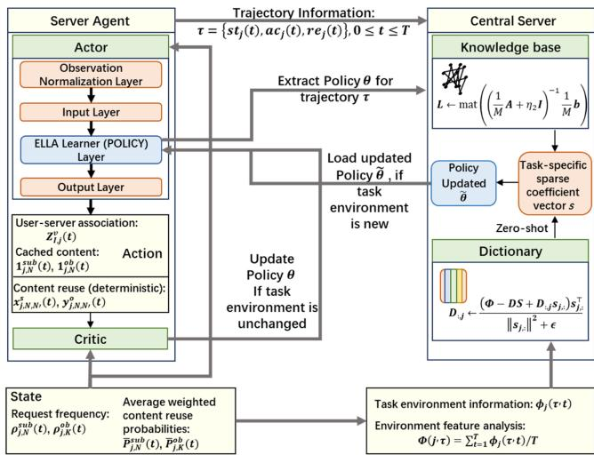  
Fig. 2. Deep-Centralized-ELLA Algorithm Design.

## B. The Role of the Central Agent

In the proposed UAV swarm architecture, each swarm includes a central server that serves as the LL agent, as illustrated in Fig. 2. The central agent collects environment interaction data and local policies from servers running local learners, and maintains a knowledge base and an environment dictionary. At the beginning of the learning process and upon detecting environmental changes, the central agent leverages this information to provide policy guidance to individual servers, enabling rapid adaptation to new conditions. In addition, the central server maintains a pool of known semantic environment feature vectors, $\mathcal { E } _ { \Phi } = \{ \Phi _ { 1 } , . . . , \Phi _ { M } \}$ , where each $\Phi _ { m }$ characterizes a previously encountered environment and M denotes the number of stored semantic environments.

## C. Server-Side Reinforcement Learning Model Based on LL

1) From Long-Term to Multi-Task Optimization: Initially, our goal is to find policies to optimize the long-term performance, defined by the expected cumulative reward:

$$
\operatorname* { m a x } _ { \pi } \operatorname* { l i m } _ { T  \infty } \frac { 1 } { T } \sum _ { t = 1 } ^ { T } \mathbb { E } _ { s , a \sim d _ { \pi } } [ r ( s t , a c ) ]\tag{18}
$$

However, since the environment continually evolves, maintaining a single policy π is impractical. Thus, the problem is transformed into a multi-task learning optimization, where each distinct RL task m is associated with its own policy parameters $\theta _ { m } \mathrm { : }$

$$
\operatorname* { m a x } _ { \{ \theta _ { m } \} } \frac { 1 } { M } \sum _ { m = 1 } ^ { M } J ( \theta _ { m } )\tag{19}
$$

where $\begin{array} { r } { \mathcal { I } ( \pmb { \theta } _ { m } ) = \int p \pmb { \theta } _ { m } ( \tau ) \Re _ { m } ( \tau ) \mathrm { d } \tau } \end{array}$ , Π<sup></sup> is the set of parameterized policies for all tasks, $p _ { \pmb { \theta } _ { m } } ( \tau )$ represents the probability distribution for trajectory τ , and each trajectory contains T time steps. $\Re _ { m } ( \tau )$ is the gain for a given training trajectory. In other words, it turns:

$$
p _ { \theta _ { m } } ( \tau ) = P _ { 0 } \left( s t _ { \tau } ( 0 ) \right) \prod _ { t = 0 } ^ { T } p \left( s t _ { \tau } ( t + 1 ) \mid s t _ { \tau } ( t ) , a c _ { \tau } ( t ) \right)
$$

$$
\pi _ { \pmb { \theta } _ { m } } \left( a c _ { \tau } ( t ) ~ | ~ s t _ { \tau } ( t ) \right)\tag{20}
$$

$$
\Re _ { m } ( \tau ) = \frac { 1 } { T } \sum _ { t = 0 } ^ { T } \gamma _ { m } ^ { t - 1 } R \left( s t _ { \tau } ( t ) , a c _ { \tau } ( t ) \right)\tag{21}
$$

where $p ( s t _ { \tau } ( t + 1 ) \mid s t _ { \tau } ( t ) , a c _ { \tau } ( t ) )$ is the unknown state transition probability that maps a state-action pair at time slot t onto a distribution of states at time slot t + 1 in training trajectory τ .

2) LL for Knowledge Sharing and Parameter Decomposition: To efficiently share and transfer knowledge across multiple tasks, a lifelong learning parameter decomposition framework is applied, representing each task-specific parameter $\theta _ { m } \in \mathbb { R } ^ { d }$ as: $\mathcal { \bar { \theta } } _ { m } = L \bar { s } _ { m } . \ L \in \bar { \mathbb { R } } ^ { d \times k }$ is the shared lifelong knowledge base. $s _ { m } \in \mathbb { R } ^ { k }$ is a task-specific sparse coefficient vector. The LL objective is then formulated, given the optimal local task parameters $\hat { \pmb { \theta } } _ { m }$

$$
\operatorname* { m i n } _ { L , \{ s _ { m } \} } \frac { 1 } { M } \sum _ { m = 1 } ^ { M } \left[ \| \hat { \pmb { \theta } } _ { m } - \pmb { L } \pmb { s } _ { m } \| _ { \pmb { H } _ { m } } ^ { 2 } + \mu _ { 1 } \| \pmb { s } _ { m } \| _ { 1 } \right] + \mu _ { 2 } \| \pmb { L } \| _ { F } ^ { 2 }\tag{22}
$$

where $H _ { m }$ is the Hessian or Fisher information matrix that captures the curvature information of the policy optimization. The term $\mu _ { 1 } \| s _ { m } \| _ { 1 }$ ensures sparsity of the coefficients $s _ { m }$ . The regularization term $\mu _ { 2 } \| \pmb { L } \| _ { F } ^ { 2 }$ prevents overfitting of the shared knowledge base L.

3) Incorporating Dictionary Learning for Semantic Environment Feature Vectors: To strengthen the connection between environmental features and the shared knowledge representation, a dictionary learning process is further incorporated. Specifically, a semantic environment feature dictionary $D \in \mathbb { R } ^ { \bar { f } \times k }$ is constructed, where $f$ is the dimension of environment task feature vectors, ensuring the environment task feature vector $\Phi _ { m }$ can be approximated as: $\Phi _ { m } \approx D s _ { m } .$ This leads to an extended lifelong learning optimization objective:

$$
\begin{array} { r l r } { \underset { L , D , \{ s _ { m } \} } { \operatorname* { m i n } } } & { \frac { 1 } { M } \underset { m = 1 } { \overset { M } { \sum } } \left[ \| \hat { { \pmb \theta } } _ { m } - { \pmb L } { \pmb s } _ { m } \| _ { { \pmb H } _ { m } } ^ { 2 } + \lambda \| { \pmb \Phi } _ { m } - D { \pmb s } _ { m } \| _ { 2 } ^ { 2 } \right. } \\ & { } & { \left. + \mu _ { 1 } \| { \pmb s } _ { m } \| _ { 1 } \right] + \mu _ { 2 } ( \| { \pmb L } \| _ { F } ^ { 2 } + \| { \pmb D } \| _ { F } ^ { 2 } ) \qquad ( 2 3 } \end{array}
$$

where $\hat { \pmb { \theta } } _ { m }$ denotes the task-specific policy parameters from the local learner, L is the shared lifelong learning knowledge base, D is the dictionary for task features, $s _ { m }$ is the latent representation for task $m ,$ and $\Phi _ { m }$ is the task feature vector. $\lambda , \mu _ { 1 }$ , and $\mu _ { 2 }$ are regularization parameters. Pairs of terms in (23) can be merged by defining:

$$
\beta _ { m } = { \left[ \begin{array} { l } { \theta _ { m } } \\ { \Phi _ { m } } \end{array} \right] } , \mathbf { K } = { \left[ \begin{array} { l } { \mathbf { L } } \\ { \mathbf { D } } \end{array} \right] } , \mathbf { C } _ { m } = { \left[ \begin{array} { l l } { H _ { m } } & { \mathbf { 0 } } \\ { \mathbf { 0 } } & { \lambda \mathbf { I } _ { f } } \end{array} \right] }\tag{24}
$$

where 0 is the zero matrix. Then, (23) can be rewritten as:

$$
\operatorname* { m i n } _ { \mathbf { K } , \mathbf { s } _ { \mathbf { m } } } \frac { 1 } { M } \sum _ { m } ^ { M } \left[ \left\| \beta _ { m } - \mathbf { K } \mathbf { s } _ { m } \right\| _ { C _ { m } } ^ { 2 } + \mu _ { 1 } \left\| \mathbf { s } _ { m } \right\| _ { 1 } \right] + \mu _ { 2 } \| \mathbf { K } \| _ { F } ^ { 2 }\tag{25}
$$

Our goal is to efficiently solve the optimization problem in (25). To this end, we adopt an iterative alternating-optimization approach, in which the subproblems associated with $\mathbf { \delta L } , \mathbf { \delta D } ,$ , and $s _ { m }$ are solved sequentially. The detailed optimization steps are described below.

4) Updating Task Representation $s _ { m } .$ : Given fixed matrices L and D, the latent task vector $s _ { m }$ is optimized individually for each task m. The optimization can be formulated as follows. For tasks from existing environments:

$$
s _ { m } ^ { * } = \arg \operatorname* { m i n } _ { \pmb { s } _ { m } } \| \pmb { \beta } _ { m } - \mathbf { K } \pmb { \mathbf { s } } _ { m } \| _ { C _ { m } } ^ { 2 } + \mu _ { 1 } \| \pmb { \mathbf { s } } _ { m } \| _ { 1 }\tag{26}
$$

For tasks from new environments, $\boldsymbol { s } _ { m } ^ { n e w }$ is inferred by dictionary D:

$$
s _ { m } ^ { n e w } = \arg \operatorname* { m i n } _ { \pmb { s } _ { m } } \| \pmb { \Phi } _ { m } - \pmb { D s } _ { m } \| _ { 2 } ^ { 2 } + \mu _ { 1 } \| \pmb { s } _ { m } \| _ { 1 }\tag{27}
$$

Both of these sub-problems are convex optimization problems involving <sub>1</sub>-regularization and can be solved efficiently using standard optimization libraries such as CVXPY or scikit-learn Lasso solvers [33], [34].

5) Updating Lifelong Knowledge Base l: The cumulative matrix A and vector b represent aggregated contributions from all tasks. For each task $m ,$ if it has been previously encountered (identified as an existing task), its previous contribution is first subtracted from A and b as follows:

$$
\mathbf { A } \gets \mathbf { A } - \left( s _ { m } ^ { \mathrm { o l d } } \left( \pmb { s } _ { m } ^ { \mathrm { o l d } } \right) ^ { \top } \right) \otimes \pmb { H } _ { m } ^ { \mathrm { o l d } }\tag{28}
$$

$$
{ \mathbf { b } } \gets  { \mathbf { b } } - \mathrm { v e c } \left( \left(  { \pmb { s } } _ { m } ^ { \mathrm { o l d } } \right) ^ { \top } \otimes \left( \left(  { \hat { \pmb { \theta } } } _ { m } ^ { \mathrm { o l d } } \right) ^ { \top } \pmb { H } _ { m } ^ { \mathrm { o l d } } \right) \right)\tag{29}
$$

where $s _ { m } ^ { \mathrm { o l d } } , \hat { \pmb { \theta } } _ { m } ^ { \mathrm { o l d } }$ , and $H _ { m } ^ { \mathrm { o l d } }$ are parameters from the last update of task m. After updating the task-specific latent representation $s _ { m }$ , the new contributions are added to A and b:

$$
\mathbf { A } \gets \mathbf { A } + \left( \pmb { \mathscr { s } } _ { m } \pmb { \mathscr { s } } _ { m } ^ { \top } \right) \otimes \pmb { H } _ { m }\tag{30}
$$

$$
\mathbf { b } \gets \mathbf { b } + \mathrm { v e c } \left( \pmb { s } _ { m } ^ { \top } \otimes \left( \hat { \pmb { \theta } } _ { m } ^ { \top } \pmb { H } _ { m } \right) \right)\tag{31}
$$

This incremental update ensures each task’s contribution is accurately represented exactly once within the centralized knowledge base.

Finally, L is updated by substituting the A and b:

$$
{ \pmb L } \gets \mathrm { m a t } \left( \left( \frac { 1 } { M } { \pmb A } + \eta _ { 2 } { \pmb I } \right) ^ { - 1 } \frac { 1 } { M } { \pmb b } \right)\tag{32}
$$

6) Updating Semantic Environment Feature Dictionary d: To update the dictionary D, the latent representations $s _ { m }$ and environment feature vectors $\Phi _ { m }$ are fixed. The dictionary learning problem is formulated as follows:

$$
\operatorname* { m i n } _ { \pmb { D } } \frac { 1 } { M } \sum _ { m = 1 } ^ { M } \| \Phi _ { m } - \pmb { D } \pmb { s } _ { m } \| _ { 2 } ^ { 2 } + \mu _ { 2 } \| \pmb { D } \| _ { F } ^ { 2 }\tag{33}
$$

An iterative block-coordinate descent method [35] is employed, updating one column of D at a time, leading to the following column-wise update formula for column $D _ { : , j } \colon$

$$
D _ { : , j } \gets \frac { ( \Phi - D S + D _ { : , j } s _ { j , : } ) s _ { j , : } ^ { \top } } { \| s _ { j , : } \| ^ { 2 } + \epsilon }\tag{34}
$$

where $\Phi = [ \Phi _ { 1 } , \Phi _ { 2 } , \ldots , \Phi _ { M } ] , S = [ s _ { 1 } , s _ { 2 } , \ldots , s _ { M } ]$ , and $\boldsymbol { s } _ { j , : }$ is the j-th row of S. The small constant ensures numerical stability. For detail proof of convergence using the dictionary see Appendix A, available online.

## D. Optimization Process and Implementation Details

Each episode follows a three-phase procedure. First, each server initializes its local PPO policy as $\tilde { \pmb { \theta } } _ { m } = \pmb { L } \boldsymbol { s } _ { m }$ , interacts with the environment for $T$ steps, and updates the task-specific policy $\hat { \pmb { \theta } } _ { m }$ while collecting trajectories and per-step feature vectors. Second, the central server aggregates these features into an episode-level descriptor $\Phi _ { j } ( \tau )$ for lifelong task detection; when a new semantic environment is identified, a latent code is initialized via sparse coding on $\scriptstyle D ,$ , and the representations $s _ { m }$ and dictionaries L and D are updated accordingly. Third, for newly detected tasks, an initial policy $ { \bar { \theta } } _ { m } = L  { \tilde { s } } _ { m }$ is regenerated and distributed to the corresponding server, while existing tasks continue PPO training without policy reset.

The local PPO actor network (Fig. 2) outputs user association and caching decisions, whereas reuse decisions are computed deterministically from the state and caching action under feasibility constraints, consistent with the MDP formulation. By integrating local PPO optimization with ELLA-style dictionary updates, DC-ELLA enables efficient knowledge transfer and rapid adaptation in dynamic and heterogeneous Metaverse environments.

1) How PPO Gradients Update L and D: PPO gradients are not backpropagated directly into L and D. Instead, for each environment m, a first–order gradient and a second–order curvature approximation are extracted from PPO: ${ \bf { \ell } } _ { { \bf { \mathit { g } } } _ { m } } =$ $\begin{array} { r l } { \nabla _ { \theta } \mathcal { L } _ { \mathrm { P P O } } ( \theta ) , } & { { } \quad H _ { m } \approx \mathbb { E } [ \nabla _ { \theta } \log \pi _ { \theta } ( a | o ) \nabla _ { \theta } \log \pi _ { \theta } ( a | o ) ^ { \top } ] } \end{array}$ (+value terms). With task-specific policy parameterized as $\hat { \pmb { \theta } } _ { m } \approx { \pmb { L } } s _ { m } .$ , the latent code $s _ { m }$ is obtained by solving the curvature–weighted normal equation $( L ^ { \top } H _ { m } L + \lambda I ) s _ { m } \ =$ $\pmb { L } ^ { \top } ( \pmb { H } _ { m } \pmb { \theta } _ { \mathrm { r e f } } - \pmb { g } _ { m } )$ . The shared knowledge base L is then updated via closed-form regularized least squares using accumulated sufficient statistics: $\begin{array} { r } { \pmb { A }  \sum _ { m } ( \pmb { H _ { m } } \otimes \pmb { s _ { m } } \pmb { s _ { m } ^ { \top } } ) \pmb { \bot } } \end{array}$ $\mu I .$ $\begin{array} { r } { \boldsymbol { b } \gets \sum _ { m } \operatorname { v e c } ( ( \boldsymbol { H } _ { m } \boldsymbol { \theta } _ { \mathrm { r e f } } - \boldsymbol { g } _ { m } ) \boldsymbol { s } _ { m } ^ { \top } ) } \end{array}$ $\mathrm { v e c } ( { L } ) = { A } ^ { - 1 } b$ Hence, PPO gradients influence the update of L through $( \pmb { g } _ { m } , \pmb { H } _ { m } )$ and the task codes $s _ { m }$

Algorithm 1: Deep-Centralized-ELLA.   
1: Initialize: Centralized knowledge base L, Dictionary   
D, matrices A, b.   
2: for each episode τ do   
3: Phase 1: Local PPO interaction and update   
4: for each time step t do   
5: for each server agent $j$ do   
6: Obtain RL task feature vector in each t:   
$\phi _ { j } ( \tau , t ) .$   
7: end for   
8: end for   
9: Phase 2: Lifelong task detection and update   
10: for each server agent j do   
11: Calculate average task feature:   
$\begin{array} { r } { \Phi _ { j } ( \tau ) = \frac { 1 } { T } \sum _ { t = 1 } ^ { T } \phi _ { j } ( \tau , t ) . } \end{array}$   
12: $\mathbf { i f } \ \Phi _ { j } ( \tau )$ is a new task then   
13: New task detected, index $m \gets M + 1$ , update   
M.   
14: Initialize new task vector:   
$\begin{array} { r } { \tilde { \pmb { s } } _ { m }  \arg \operatorname* { m i n } _ { \pmb { s } } \| \pmb { \Phi } _ { j } ( \tau ) - \pmb { D } \pmb { s } \| _ { 2 } ^ { 2 } + \mu \| \pmb { s } \| _ { 1 } . } \end{array}$   
15: else   
16: Existing task matched to task index m.   
17: end if   
18: Extract policy $\hat { \pmb { \theta } } _ { m }$ from ELLA Learner Layer   
19: Update task vector:   
$\begin{array} { r } { \pmb { s } _ { m } ^ { * } = \arg \operatorname* { m i n } _ { \pmb { s } _ { m } } \| \pmb { \beta } _ { m } - \mathbf { K } \pmb { \mathbf { s } } _ { m } \| _ { C _ { m } } ^ { 2 } + \mu _ { 1 } \| \pmb { \mathbf { s } } _ { m } \| _ { 1 } } \end{array}$   
20: Remove old contributions:   
21: $A  A - ( s _ { m } \pmb { s } _ { m } ^ { \top } ) \otimes \pmb { H } _ { m } .$   
22: $\begin{array} { r } { \pmb { b }  \pmb { b } - \mathrm { v e c } \big ( \pmb { s } _ { m } ^ { \top } \otimes \big ( \hat { \pmb { \theta } } _ { m } ^ { \top } \pmb { H } _ { m } \big ) \big ) . } \end{array}$   
23: Add new contributions:   
24: $A  A + ( s _ { m } s _ { m } ^ { \top } ) \otimes H _ { m } .$   
25: $\begin{array} { r } { b  b + \mathrm { v e c } ( s _ { m } ^ { \top } \otimes ( \hat { \pmb { \theta } } _ { m } ^ { \top } { \pmb { H } } _ { m } ) ) . } \end{array}$   
26: Update knowledge base:   
$\begin{array} { r } { \bar { L ^ { * } }  \operatorname* { m a t } ( ( \frac { 1 } { M } \bar { \pmb { A } } + \eta _ { 2 } \bar { \pmb { I } } ) ^ { - 1 } \frac { 1 } { M } \pmb { b } ) . } \end{array}$   
27: Update Dictionary:   
28: for each column $j$ in D do   
29: $\begin{array} { r } { D _ { : , j } \gets \frac { ( \Phi - D \check { S } + D _ { : , j } \pmb { s } _ { j , : } ) \pmb { s } _ { j , : } ^ { \top } } { \| \pmb { s } _ { i , : } \| ^ { 2 } + \epsilon } } \end{array}$   
30: end for   
31: end for   
32: Phase 3: Policy regeneration and distribution   
33: for each newly task index m in episode τ do   
34: Generate new policy parameters: $\tilde { \pmb { \theta } } _ { m } \gets \pmb { L } \tilde { \pmb { s } } _ { m }$   
35: Distribute $\tilde { \pmb { \theta } } _ { m }$ to the local PPO learner of j   
36: end for   
37: end for

TABLE I  
PLACEMENT, TRIGGER, AND PER-TRIGGER COST
<table><tr><td>Module</td><td></td><td>Where Trigger/Freq.</td><td>Cost</td></tr><tr><td>Policy inference &amp; data collection</td><td>UAV</td><td>each step</td><td> $O ( C _ { \mathrm { f w d } } )$ </td></tr><tr><td>PPO update (mini-batch)</td><td>UAV</td><td>per B; E epochs</td><td> $O ( C _ { \mathrm { b a c k } } )$ </td></tr><tr><td>Feat. avg./task det.</td><td>UAV →</td><td>per episode/env switch</td><td> $O ( T f )$ </td></tr><tr><td>Sparse coding  $( \widetilde { \pmb { s } } _ { m } )$ </td><td>Server</td><td>Central on new/changed task</td><td> $O ( I _ { \mathrm { { s c } } } ( f s + k ) )$ </td></tr><tr><td>Sufficient stats  $( S _ { 2 } , B )$ </td><td></td><td>Central with code updates</td><td> $O ( k ^ { 2 } { + } d ^ { 2 } )$ </td></tr><tr><td>KB solve (L)</td><td></td><td>Central batched/low freq.</td><td> $O ( { \cal I } _ { \mathrm { c g } } { \cal M } _ { \mathrm { a c t } } ( d ^ { 2 } k { + } d k ^ { 2 } ) ) ;$   $\mathrm { d i a g } { : } \^ { } O ( k ^ { 3 } { + } d k ^ { 2 } )$ </td></tr><tr><td>Dict. update (D)</td><td>Central every N</td><td></td><td> $O ( { \bar { f } } k N )$ </td></tr><tr><td> $( \tilde { \pmb \theta } = { \pmb L } \tilde { \bf s } )$ </td><td>→ UAV</td><td>descriptors Reconstruct &amp; push Central on (re)assignment O(dk)</td><td></td></tr></table>

The semantic feature dictionary D is updated by minimizing the reconstruction loss $\| \Phi _ { j } - D \widetilde { \pmb { s } } _ { m } \| _ { 2 } ^ { 2 } + \beta \| D \| _ { F } ^ { 2 }$ using a column-wise block coordinate descent with a small for numerical stability. This step uses reconstruction–loss gradients; PPO gradients do not directly update D, but affect it indirectly through the task descriptors $\Phi _ { j }$ and latent codes. By decoupling fast PPO updates from slow dictionary learning, this indirect update mechanism stabilizes learning and prevents nonstationary policy gradients from corrupting shared long-term knowledge.

2) Computational Complexity and Deployability of DC-ELLA: Let d be the number of policy parameters, k the number of shared components in $\pmb { L } \in \mathbb { R } ^ { d \times k }$ , f the task-feature dimension in $\pmb { D } \in \mathbb { R } ^ { f \times k }$ , J the number of UAV agents, and T the steps per episode. PPO uses mini-batch size B and E epochs. Task codes are s-sparse $( s \ll k ) ; I _ { \mathrm { s c } }$ and $I _ { \mathrm { c g } }$ denote the iterations of sparse coding and conjugate gradient, respectively, $M _ { \mathrm { { a c t } } }$ is the number of active tasks, M is the number of discovered tasks, and N is the number of descriptors per dictionary update. The per-episode cost is:

$$
\begin{array} { r l } & { \mathcal { C } _ { \mathrm { e p i s o d e } } = \underbrace { O \big ( J T C _ { \mathrm { f w o d } } + E \frac { J T } { B } C _ { \mathrm { b a c k } } \big ) } _ { \mathrm { P P O r o l l o u t \ : u p d a t e \ : ( U A V ) } } + \underbrace { O ( J T f ) } _ { \mathrm { f e a u r e \ : a v g , \ : f a s k \ : d e t . } } } \\ & { ~ + \underbrace { O \big ( J I _ { \mathrm { s c } } \big ( f s + k \big ) \big ) } _ { \mathrm { s p a r e \ : c o d i n g \ : f o r \ : n e w \ : c h a p e d \ : t a k s } } + \underbrace { O \big ( f k \ : N \big ) } _ { \mathrm { d i c t i o n a r y \ : u p d a t e \ : } D } } \\ & { ~ + \underbrace { O \big ( I _ { \mathrm { c g } } ^ { } M _ { \mathrm { a c t } } \big ( d ^ { 2 } k + d k ^ { 2 } \big ) \big ) } _ { \mathrm { s o l v e \ : f o r \ : L \ : ( g e n e r a l \ : c u r s a t u r e ) } } } \end{array}\tag{5}
$$

where $C _ { \mathrm { b a c k } }$ is the cost of one forward–backward pass on a mini-batch and $C _ { \mathrm { f w d } }$ is the cost of a single forward pass of the actor–critic network for one state, both typically scaling roughly linearly with d for MLPs. The terms for updating L and D are amortized per episode, as they are triggered in a batched/lowfrequency manner (Table I). The central server stores the shared knowledge base, semantic dictionary, sparse task codes, and sufficient statistics, requiring $\mathcal { M } _ { \mathrm { c e n t r a l } } = O ( d k + f k + s M + k ^ { 2 } )$ memory cost. Each UAV maintains only the PPO network and training buffers, with memory cost $\mathcal { M } _ { \mathrm { U A V } } = O ( d + B d + f )$

```latex
Algorithm 2: Three-Step Strategy Guidance from Pretrain
ing to Testing.
1: Input: Pretrained dictionary $( L , D )$ , server agents,
environment reset into TEST mode
2: Phase 1: Quick-Adapt Guidance
3: New task detected, index $m \gets M + 1$ , update M.
4: Initialize new task vector:
$\begin{array} { r } { \tilde { \pmb { s } } _ { m }  \mathrm { a r g } \operatorname* { m i n } _ { \pmb { s } } \| \pmb { \Phi } _ { j } ( \tau ) - \pmb { D } \pmb { s } \| _ { 2 } ^ { 2 } + \mu \| \pmb { s } \| _ { 1 } } \end{array}$
5: Generate policy parameters: $\tilde { \pmb { \theta } } _ { m } \gets \pmb { L } \tilde { \pmb { s } } _ { m } .$
6: Update ELLA-Learner Layer’s parameter
7: Phase 2: Full Update by Local Learner
8: Collect trajectory data τ using current policy $\tilde { \pmb { \theta } } _ { m } .$
9: Update policy parameters via PPO:
$\tilde { \pmb { \theta } } _ { m } \gets \tilde { \pmb { \theta } } _ { m } + \alpha \nabla _ { \tilde { \pmb { \theta } } _ { m } } J _ { \mathrm { P P O } } ( \tilde { \pmb { \theta } } _ { m } )$
10: Update critic parameters accordingly.
11: Phase 3: Fine-Grained Guidance by DC-ELLA
12: Update task vector:
$\begin{array} { r } { \pmb { s } _ { m } ^ { * } = \arg \operatorname* { m i n } _ { \pmb { s } _ { m } } \| \pmb { \beta } _ { m } - \mathbf { K } \pmb { \mathbf { s } } _ { m } \| _ { C _ { m } } ^ { 2 } + \mu _ { 1 } \| \pmb { \mathbf { s } } _ { m } \| _ { 1 } } \end{array}$
13: Update knowledge base and dictionary: $( L , D )$
14: Generate policy parameters: $\tilde { \pmb { \theta } } _ { m } \gets \pmb { L } \tilde { \pmb { s } } _ { m } .$
15: Update ELLA-Learner Layer’s parameter
```

Deployability on UAV servers: As shown in Table I, DC-ELLA preserves the on-board computational profile of standard PPO on UAVs, with per-step and per-mini-batch costs of $O ( C _ { \mathrm { f w d } } )$ and $O ( C _ { \mathrm { b a c k } } )$ , respectively, while offloading sparse coding and dictionary updates to the central server at coarse time scales. Crucially, the server-side knowledge-base update avoids explicitly constructing the Kronecker matrix $\pmb { A } \in \mathbb { R } ^ { ( k d ) \times ( k d ) }$ instead, it maintains sufficient statistics $\begin{array} { r } { S _ { 2 } = \sum _ { m = 1 } ^ { M _ { \mathrm { a c t } } } \pmb { s } _ { m } \pmb { s } _ { m } ^ { \top } \in \ d \qquad } \end{array}$ $\mathbb { R } ^ { k \times k }$ and $\begin{array} { r } { B = \sum _ { m = 1 } ^ { M _ { \mathrm { a c t } } } H _ { m } \hat { { \boldsymbol { \theta } } } _ { m } s _ { m } ^ { \top } \in \mathbb { R } ^ { d \times k } } \end{array}$ , where $s _ { m }$ is the (sparse) task code of task m, $H _ { m }$ denotes the (approximate) curvature for task $m ,$ , and $\hat { \pmb { \theta } } _ { m }$ is the corresponding task-specific policy parameter estimate, and leverages Kronecker-friendly matrix–vector products to solve the regularized linear system for L (e.g., via conjugate gradient (CG)), keeping both computation and memory tractable. Moreover, under diagonal curvature approximation (i.e., $\pmb { H } _ { m } \approx h _ { m } \pmb { I } _ { d } )$ , where $h _ { m } \geq 0$ is a scalar capturing the overall curvature magnitude for task m, the L update decouples into d independent k × k systems, reducing the centralized update cost to $O ( k ^ { 3 } + d k ^ { 2 } )$ ; policy reconstruction then requires only $O ( d k )$ . Consequently, policy parameters can be generated and distributed to UAVs on demand, ensuring real-time feasibility on resource-constrained platforms.

Next, we summarize the knowledge transfer process from the pretraining stage to the testing stage, as outlined in Algorithm 2. The procedure consists of three steps: (i) rapid adaptation, where the agent exploits the learned dictionary and task environment features to adapt to a new context; (ii) policy generation and local update, in which an initial policy is generated and refined by the local learner using PPO through trajectory collection and parameter updates; and (iii) fine-grained lifelong learning update, where a new latent vector $\widetilde { \pmb { s } } _ { m }$ is obtained for a newly encountered environment by solving an <sub>1</sub>-regularized sparse coding problem on the dictionary D. This latent representation directly enables knowledge transfer by generating initial policy parameters via the shared knowledge base L. Specifically, the update of $\widetilde { \pmb { s } } _ { m }$ in step (i) is given by (26), the PPO update in step (ii) follows the standard rule in [36], and the refinement of $\boldsymbol { s } _ { m } ^ { * }$ in step (iii) using $\beta _ { m } , K ,$ , and $C _ { m }$ is detailed in (23)–(25).

3) Bounded Dictionary and Knowledge-Base Growth: To prevent unbounded growth during long-term deployment, we adopt the ELLA/PG-ELLA shared latent parameterization and maintain a fixed-width latent space: $\pmb \theta _ { j } = \pmb L s _ { j }$ and $\Phi _ { j } = D s _ { j }$ where $s _ { j }$ is sparse and the latent dimension k is capped by $K _ { \mathrm { m a x } }$ [18]. As a result, long-term growth is confined to the task-code catalog $\pmb { S } = [ s _ { 1 } , \ldots ,  s _ { M } ]$ , whose size is bounded by a budget $M \leq B _ { \mathrm { t a s k } }$ . When a new task is encountered, an admit– merge–evict maintenance strategy [37] is applied: near-duplicate task codes in the feature space are merged based on cosine similarity (above a threshold $\tau _ { \mathrm { m e r g e } } ) ;$ otherwise, the new code is admitted if the budget allows, or the least-used code is evicted when the budget is exceeded. These constraints ensure bounded memory usage and keep the dictionaries compact throughout continual learning.

## VI. SIMULATION RESULTS

Extensive simulations are conducted using Python and Py-Torch to evaluate the proposed schemes. Each UAV server is equipped with a PPO-based local learner. The proposed semantic-aware caching and dictionary-based lifelong learning approach (DC-ELLA) is compared against traditional hit-based caching, standard PPO, and PG-ELLA [18], [32], [36]. Both static and dynamic semantic environments are considered to assess multi-task learning performance and adaptability under varying user preferences.

The PPO local learner adopts a compact actor–critic architecture consisting of two fully connected hidden layers (input\_mlp and policy\_mlp), each with 32 units, mapping the observation space as obs\_dim → 32→ 32. The output layer maps to an action dimension of action\_dim = 115, where the first $I =$ 15 dimensions correspond to user–server association decisions, followed by caching decisions for $N = 5 0$ subject contents and $K = 5 0$ object contents. A per-block Top-10 rule enforces cache capacity constraints. The PPO training parameters are set as follows: learning rate $1 0 ^ { - 4 }$ , discount factor $\gamma = 0 . 9 9$ , GAE parameter $\lambda = 0 . 9 5$ , clip ratio 0.4, entropy coefficient 0.1, and gradient clipping with a maximum norm of 0.5.

For DC-ELLA, the policy parameter dimension depends on the PPO network structure, with a task feature dimension of 202 and a latent dimension of 8. Both $\ell _ { 1 } ~ ( \mathrm { L A S S O ) }$ and Frobenius regularization coefficients are set to $1 0 ^ { - 5 }$ , and the learning rate for updating the shared knowledge base L is $1 0 ^ { - 3 }$ . Feature scaling and normalization are applied to improve training stability.

The simulated system consists of $J = 5 ~ \mathrm { U A V }$ servers serving I = 15 users in a $1 0 0 0 \mathrm { m } \times 1 0 0 0$ m area, with each UAV caching up to $N _ { F } = 1 0$ contents. Each training run includes $N _ { e } = 1 0 0$ episodes with $S _ { e } = 3 0$ decision steps per episode, which is sufficient for convergence in both PPO and DC-ELLA. User heterogeneity is modeled through diverse latency requirements $( T _ { i } ^ { \mathrm { r e q } } = 1 - 3 ~ \mathrm { s } )$ and rendering resolutions $( s _ { i } ^ { \mathrm { r e q } } =$ 0.72 k–4k), jointly constraining association, caching, and reuse decisions. Parameters are summarized in Table II.

TABLE II SIMULATION PARAMETERS [41], [42], [43], [44], [45]
<table><tr><td>Parameter</td><td>Description</td><td>Value</td></tr><tr><td>I</td><td>Number of users</td><td>15</td></tr><tr><td>J</td><td>Number of UAVs</td><td>5</td></tr><tr><td> $h$ </td><td>Height of UAV</td><td>50 m</td></tr><tr><td> $P _ { i }$ </td><td>User transmit power</td><td>0.1 W</td></tr><tr><td> $\dot { P _ { j } }$ </td><td>UAV transmit power</td><td>0.5 W</td></tr><tr><td> $G _ { i }$ </td><td>User antenna gain</td><td>1</td></tr><tr><td> $G _ { j }$ </td><td>UAV antenna gain</td><td>1</td></tr><tr><td> $B _ { i } ^ { ' }$ </td><td>User bandwidth available</td><td>30MHz</td></tr><tr><td> $B _ { j }$ </td><td>UAV bandwidth available</td><td>30 MHz</td></tr><tr><td> $f _ { c }$ </td><td>Carrier frequency</td><td>2.4 GHz</td></tr><tr><td> $N _ { 0 }$ </td><td>Noise power</td><td>10−20.4W</td></tr><tr><td> $u ^ { c }$ </td><td>Computational factor</td><td>4 bits</td></tr><tr><td> $M a p$ </td><td>Size of the map</td><td>1000 m</td></tr><tr><td> $u ^ { d }$ </td><td>Downlink compression rate</td><td>16 bits</td></tr><tr><td> $N _ { e }$ </td><td>Number of episodes</td><td>100</td></tr><tr><td> $S _ { e }$ </td><td>Steps per episode</td><td>30</td></tr><tr><td> $N _ { F }$ </td><td>Caching space</td><td>10</td></tr><tr><td> $T ^ { \hat { r } e q }$ </td><td>User time requirements</td><td>[2, 2.5, 3, 1.5, 1]</td></tr><tr><td> $s ^ { \tilde { \prime } ^ { k } e q }$   $\mathbf { \omega } _ { \rho } ^ { \circ } i$ </td><td>User resolution requirements</td><td>[2k, 3k, 4k, 0.72k, 1k]</td></tr><tr><td> $f _ { j }$ </td><td>CPU frequencies</td><td>[1, 1.5, 2, 2.5, 3] * 109Hz</td></tr><tr><td> $c a _ { j }$ </td><td>Computation capabilities</td><td>[67, 56, 40, 31, 21]</td></tr><tr><td> $P _ { . } ^ { \tilde { R } e n }$ </td><td>Rendering power</td><td>1.7 W</td></tr><tr><td> $Z _ { i } ^ { ' }$ </td><td>Data volume per CPU cycle</td><td>0.25</td></tr><tr><td> $\lambda ^ { p r e }$ </td><td>Pretraining task arrival rate</td><td>[100, 120, 80, 60, 40]</td></tr><tr><td> $\lambda ^ { t e s t }$ </td><td>Test task arrival rate</td><td>[200, 120, 100, 30, 20]</td></tr><tr><td> $M$ </td><td>Number of semantic env.</td><td>5 (static), 10 (dynamic)</td></tr></table>

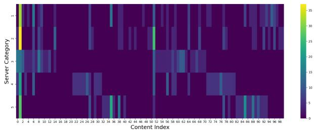  
Fig. 3. Distribution of content requests per server.

Semantic diversity is captured through multiple environments. In static experiments, M = 5 semantic environments are constructed by grouping 50 images from the Visual Genome dataset [38] into five preference sets. In dynamic experiments, M = 10 environments are considered under two configurations: (i) similar semantic preferences with different task arrival rates, and (ii) distinct semantic preferences with comparable arrival rates. These settings allow systematic evaluation of adaptation to both load and preference shifts. User task arrivals follow Poisson processes [39], [40], with environment-dependent arrival rates $\lambda _ { i } .$ A short pre-training phase (25 episodes) is first conducted to initialize the knowledge base and dictionary, during which tasks arrive at a rate λ<sup>pre</sup>. In the test phase, tasks arrive at a rate $\lambda ^ { \mathrm { t e s t } }$

Fig. 3 illustrates the average request frequency observed by all the servers from users belonging to different semantic environments during the test phase. Subject and object contents are represented using 50 indices each (the first 50 for subjects and the latter 50 for objects), where brighter colors indicate higher request frequencies. The requested contents are derived from 50 images in the open-source Visual Genome (VG) dataset [38]. VG provides large-scale, densely annotated scenes with diverse object and relation labels, which are crucial for emulating heterogeneous user contexts in our semantics-conditioned rendering and content-reuse pipeline. Moreover, our semantic extractor RelTR [8] is trained and well validated on VG, so using VG yields a stable and reproducible perception front-end without additional variability from dataset-domain adaptation. Although VG itself is not Metaverse-specific, our system operates only on the extracted semantic structures; thus any Metaverse trace that can be mapped to frame-level semantics (e.g., logs from VR applications) can be plugged into the same framework. We defer the evaluation on such real-world Metaverse traces to future work. To construct semantic-environment tasks, every 10 images are grouped into one preference set. Each image contains 1–3 subject contents and 1–3 object contents.

## A. Comparison of Caching and Rendering Schemes

In Fig. 4, the reward, loss function, and resource savings for four approaches are illustrated: two caching mechanisms (Hit and Hit + Similarity) implemented by our proposed DC-ELLA and local learner. The knowledge base L and dictionary D used by DC-ELLA obtained better policies from the beginning compared to the baseline local learner. This allows the server to apply briefly pre-trained knowledge to the new testing environment. Therefore, the reward and loss curves of DC-ELLA (red and orange lines) start from better positions and converge faster than the local learner, as shown in Fig. 4(b).

Compared to the traditional caching mode (Hit only), our content reuse (Hit + Similarity) mechanism achieves higher performance. As shown in Fig. 4(a) and (c), the reward and computational savings (due to caching) in the red and green learning curves are consistently higher than those of the orange and blue. This improvement stems from the content reuse mechanism, which serves requests by leveraging previously cached content when the desired content is not available. This explains why the loss curves in Fig. 4(b) indicate that the Hit + Similarity-DC-ELLA converges faster than Only-Hit-DC-ELLA, and the Hit+Similarity converges faster than the Only-Hit-Local-Learner. In both the content reuse mechanism and the DC-ELLA benefit the convergence of the learning process. Under the same caching and rendering mechanism, DC-ELLA and the local learner algorithms eventually converge to the same reward. As shown in Fig. 4(a) and (c), the difference between the red and green curves, as well as between the orange and blue curves, is caused by different learning efficiencies and convergence speeds of the algorithms, and does not affect the final convergence range.

Fig. 5 shows the average performance of servers with different computational capabilities and resources, which render tasks from different semantics environments with different task loads and rendering rates. By default, servers render tasks based on a first-in-first-out (FIFO) strategy. When a requested frame is already cached, a cache hit occurs. Otherwise, the system searches for the cached content that offers the highest possible reuse. Due to this mechanism, servers without cache that can render more tasks per unit time have greater potential to achieve higher computational savings. For illustration (values not from our simulations), if server 1 processes 100 frame requests per second without caching and server 2 processes only 10, after enabling caching, server 1’s performance might increase to 150 requests per second, while server 2 might only reach around 15. Thus, servers capable of completing more tasks without caching naturally obtain higher savings and rewards.

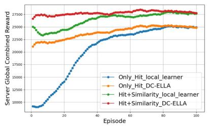

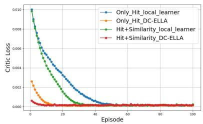  
Fig. 4. Comparison results of (a) reward, (b) loss curves, and (c) saving curves.

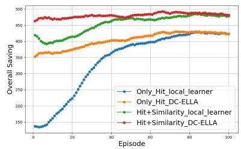

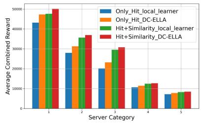

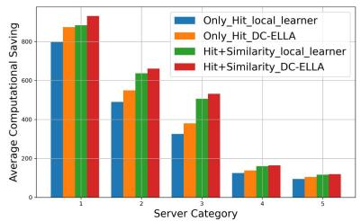  
Fig. 5. Comparison results of (a) reward, (b) saving, and (c) queue length by category.

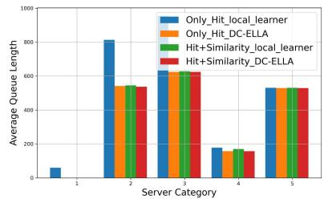

As the rendering rates required from servers gradually increase from server 1 to server 5, their computational capacities per unit time decrease correspondingly. Hence, their rewards and savings also decrease, explaining why reward and saving values from server 1 to server 5 follow a downward trend. The red bars in Fig. 5 illustrate the performance of our proposed DC-ELLA algorithm, consistently outperforming the local learner across different server categories. As shown in Fig. 5(a) and (b), the Hit + Similarity achieves higher savings and reward values compared to the traditional hit mechanism. This improvement arises from compensation provided by content reuse when cache misses occur. Overall, these results align with the pattern shown in Fig. 4, confirming that the content reuse mechanism outperforms traditional hit caching, and DC-ELLA achieves better learning gains compared to the neural network-based local learner.

Fig. 5(c) shows the average queue lengths for various servers. By comparing differences between Only-Hit and Hit + Similarity in the local learner, we observe that the Hit + Similarity generally reduces the original queue lengths. Comparing the differences between Only-Hit-Local-Learner and Only-Hit-DC-ELLA further indicates that our DC-ELLA algorithm also reduces queue lengths compared to the local learner. The Hit + Similarity-Local-Learner and Hit + Similarity-DC-ELLA mechanisms exhibit similar performance on the queue metric, as our content reuse scheme narrows the gap when the local learner’s policy lags.

In Fig. 6(a), the resource savings achieved over the first 20 test episodes are illustrated. The local learner achieves large savings by relying on content reuse. Without the content reuse mechanism, the gap between the two algorithms would be much larger, as shown by the solid parts of the red and green bars in the figure. DC-ELLA learns efficiently in a lifelong setting, shows stronger performance from the outset. In addition, the content reuse mechanism compensates for the immature caching policy of the local learner in the early stage. Reusing similar content achieves significant savings.

Fig. 6(b) illustrates the average computational time and energy savings enabled by the caching and content reuse mechanisms. Using the “Only Hit + PPO” method as a baseline, our proposed “Content Reuse + DC-ELLA” approach improves computational time savings by 20% to 65%. However, as indicated in Fig. 5(b), a higher number of saved tasks does not necessarily result in greater time and energy savings across different UAVs. Assuming constant computing power, the savings depend on the difference between the task rendering rate and the UAV server’s CPU frequency. Consequently, Category 2 and Category 3, which handle medium computing demands, show the most significant improvements, reaching approximately 30% and 65%, respectively. This indicates that resource savings are most beneficial for tasks and servers with moderate demands and capabilities. Compared to high-demand but low-quantity tasks, a medium number of tasks offers more opportunities for reuse; meanwhile, compared to low-demand but high-quantity tasks, they consume more energy per unit.

Fig. 6(c) shows the average service quality ratio for different numbers of users. The analysis focuses on Only-Hit and Hit + Similarity mechanisms with the local learner, since DC-ELLA already exhibits high performance from the start. As the number of users increases, the following behaviors are observed for the Only-Hit local learner: (i) Slower learning: As shown in the blue, green, and red curves, even if the system can reach high service quality, it needs more episodes to converge; and (ii) Lower service quality: From the red, orange, purple, and brown curves, the convergence upper bound drops from near 1.0 to 0.9, 0.83, and 0.77, because of a heavier rendering load without content reuse. Under the same conditions, the content reuse schemes achieve a service quality ratio above 0.9 from the start, which remains efficient in systems with larger user scales. As the number of users increases, the content reuse mechanism becomes more important for achieving good performance.

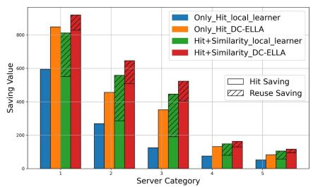

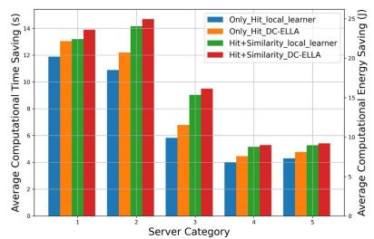

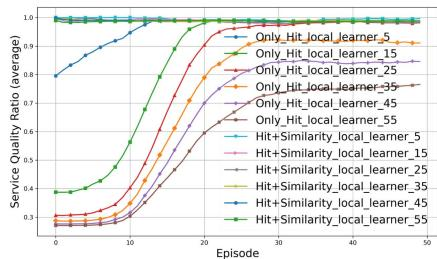  
Fig. 6. Comparison results of (a) the initial 20 episodes saving, (b) time and energy savings, and (c) service quality ratio.

## B. Comparison of Lifelong Learning Algorithms

To evaluate Algorithm 2, the performance of our proposed DC-ELLA algorithm is compared with the PG-ELLA and the transfer learning. All approaches used the same neural-networkbased local learner with the same pre-training stage, focusing on knowledge transfer from the pre-training stage to the testing stage. According to the principles of PG-ELLA, when encountering a new testing environment that differs from the pre-training environment, it needs to reinitialize the parameter s, while the transfer learning will use the same parameters from the pre-training local learner.

The differences between new environments are primarily characterized by two aspects. First, the system parameters vary, leading servers to receive different request volumes and arrival rates, even though the content preferences of these requests remain the same as in the previous environment. Second, the actual content of user requests received by the server may also change. In the next subsection, the proposed approach is evaluated under switching between multiple environments. Here, the first case is uniformly adopted when setting up both the pre-training and testing environments.

Relying on the knowledge base and the local learner’s policies, PG-ELLA gradually updates s for effective knowledge transfer. This requires a certain adaptation and initialization period. In contrast, our proposed algorithm incorporates the dictionary and feature mapping, enabling rapid identification of environmental features. When faced with a new task, it does not re-initialize s, but directly maps an initial s based on the dictionary and extracted features, providing an immediate strategy suitable for the new environment. Subsequently, the algorithm refines and updates s for deeper knowledge mining and strategy generation by simultaneously updating L and D based on interactive feedback from the local learner. Compared to transfer learning, which directly transfers all parameters from the pre-trained model to the new testing environment, DC-ELLA offers a more robust and efficient knowledge transfer process, which enables the algorithm to acquire useful strategic information right from the start and provides a stronger capability to adapt to new environments.

As illustrated by the red curves in Fig. 7(a) and (b), DC-ELLA maintains relatively higher initial performance, enabling faster adaptation and fine-tuning without needing to start learning from scratch compared with the PG-ELLA and local learner PPO algorithms. Unlike transfer learning, which starts with high rewards but degrades rapidly, DC-ELLA is less affected by the gap between pre-training and testing environments and converges significantly faster. Since all algorithms are trained in the same environment, their final convergence values should be similar. Fig. 7(c) shows the resource savings in the first 20 test episodes to illustrate that DC-ELLA can better extract and reuse knowledge than the normal PG-ELLA from the same pre-training. In most categories, the computational resource savings of DC-ELLA are comparable to transfer learning, yet it exhibits higher stability without similar drastic fluctuations. This superior performance is attributed to the more efficient and faster convergence, as well as the more stable knowledge extraction of DC-ELLA.

## C. Learning in a Dynamic Environment

Lifelong learning enables the utilization of prior learning experiences when encountering dynamic scenarios, accelerating the learning process and overcoming catastrophic forgetting. While designing the DC-ELLA algorithm, how its features could help neural-network-based local learners better adapt to new task environments is specifically considered. To verify this, the following simulations were performed:

\- The content preference of each user is fixed while changing the number and arrival rates of tasks in the new environment.

The users’ content preferences, task numbers, and arrival rates are simultaneously varied to create a new task environment. This scenario significantly changed the types of content requested from servers, forcing them to adapt to entirely new conditions.

\- Without using lifelong learning, a fixed caching strategy while changing user preferences is evaluated, demonstrating the advantages of the content reuse mechanism.

Two options for the distribution of contents received per server are considered: (i) option 1 as illustrated in Fig. 3; and (ii) Option 2 cyclically shifts the distribution of content requests: those received at server 1 are reassigned to server 5, 2 to 1, 3 to 2 and so on.

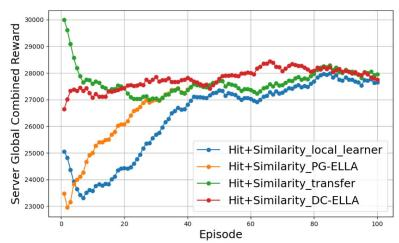

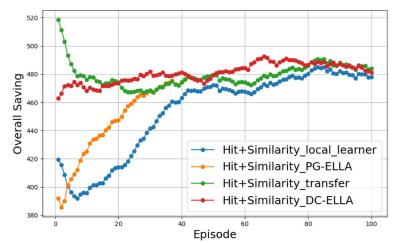

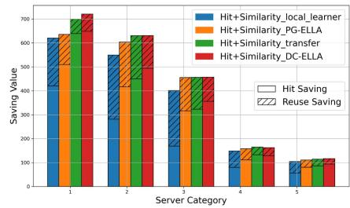  
Fig. 7. Comparison results of (a) reward, (b) saving, and (c) the initial 20 episodes saving with PG-ELLA and transfer learning.

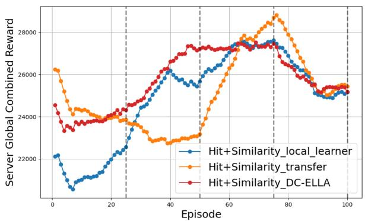  
Fig. 8. Multi-environment reward, similar preferences.

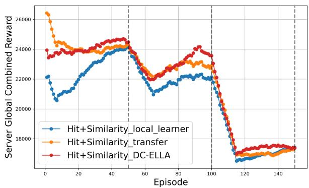  
Fig. 9. Multi-environment reward, different preferences.

In the first scenario, the pre-training and testing phases assumed that all user preferences were set to option 1. Each server faced users’ requests with different individual preferences, as Fig. 3 shows. In the testing phase, task generation rates and arrival rates were significantly changed to simulate a different environment. As shown in Fig. 8, the pre-trained lifelong learning algorithm acquired initial knowledge from the dictionary D and knowledge base L. During testing, environment parameters changed every 25 episodes, meaning each server faced new task arrival rates and quantities. The knowledge base and dictionary provided guidance every 25 episodes to help each server adapt to the new environment. From Fig. 8, between episodes 25 to 50, the local learner showed performance degradation rather than continuing to converge with the original preferences. The performance of transfer learning in adapting to the first two environments is not ideal and even shows a significant downward trend. This stems from the fact that inheriting all parameters from the pre-training phase cannot adapt well to these new environmental changes. In contrast, our proposed algorithm avoided this issue by leveraging prior knowledge of user preferences and applying it effectively to the new environment. Then, between episodes 50 to 75, while the local learner was still in the process of recovery and learning, our proposed DC-ELLA algorithm had already stabilized at a high-performance level. Transfer learning begins to recover quickly, indicating that it has temporarily adapted to the new environment and resumed normal parameter updates. However, such unstable fluctuations across different environments are not favorable for the system. It demonstrates a lack of stability and a higher susceptibility to environmental changes. At last, from 75 to 100, the DC-ELLA algorithm adapted more quickly than the local learner and transfer learning to the changed environment.

In the second scenario, the distribution of content preferences was significantly changed. In the pre-training phase, the user preference options were set to 1, 2, and 3 (each of them do one cyclically shift based on the previous one) training each option for only 25 episodes to establish an initial knowledge base. In the testing phase, task numbers and arrival rates differed entirely from pre-training, although the sequence of user preference shifts remained consistent. Thus, the testing phase represented several new task environments. Environment is switched every 50 episodes. When user preferences change, as shown in episodes 50–100 and 100–150 in Fig. 9, our DC-ELLA algorithm adapts to the new environments significantly faster than both transfer learning and the local learner. Although transfer learning outperforms the local learner by directly inheriting the complete set of pre-trained parameters, our DC-ELLA algorithm successfully filters and selects more effective knowledge via the dictionary D and knowledge base L. This selective knowledge reuse allows for the most rapid adaptation across all three environmental tasks, demonstrating the efficiency of using lifelong learning methods to guide neural-network-based strategies.

In the third scenario, we tested whether the system can mitigate negative impacts caused by sudden environmental changes by relying solely on its existing cache strategy and content reuse mechanism, without further learning updates. For this purpose, an experiment was designed as follows: the system learned under user preference option 1 for 100 episodes until convergence. Then, we disabled the local learner and fixed the caching strategy at episode 100. After this, user preferences were completely changed to option 2 for the next 50 episodes to observe if the system’s performance deteriorates or not. As shown in Fig. 10(a) and (b), the scenario utilizing the content reuse mechanism did not exhibit significant performance degradation after the shift in user preferences. In contrast, the scenario relying solely on a previously fixed caching strategy experienced a sharp performance decline immediately after the environment changed. In Fig. 10(c), it can be observed that when cache misses occurred due to changed user preferences, the content reuse mechanism effectively compensated for that by reusing similar content, successfully mitigating the decrease in computational savings.

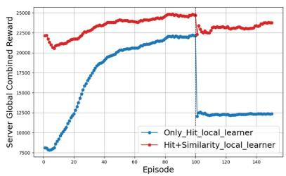

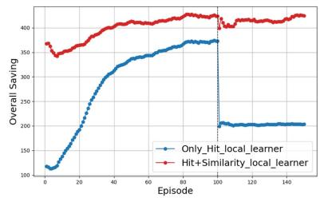  
Fig. 10. Comparison results of (a) reward, (b) saving, and (c) hit vs. similarity.

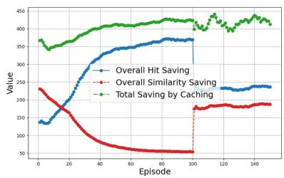

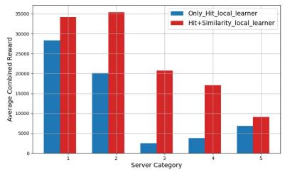

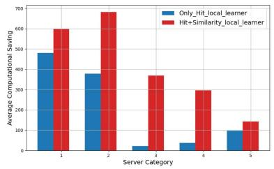

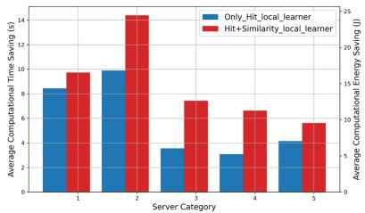  
Fig. 11. Comparison results of (a) reward, (b) saving, and (c) the time and energy savings with fixed caching.

Fig. 11 demonstrates the performance of different server types during the final 50 episodes following the environmental change. The content reuse mechanism provided substantial advantages in terms of both reward values and computational savings. Fig. 11(c) shows the average system computational time and energy savings provided by our proposed content reuse mechanism under conditions of fixed caching but sudden environmental changes. Despite the environmental changes, the content reuse mechanism effectively leverages the similarity of cached content to secure greater computational benefits, thereby maintaining the system at a more efficient level.

## VII. LIMITATIONS AND FUTURE WORK

L1. Dependence on semantic extraction accuracy. Our framework relies on the quality of scene-graph parsing to obtain semantic triplets. We adopt RelTR [8] as an off-the-shelf backbone and acknowledge that semantic extraction remains imperfect. A manual inspection of sampled scenes indicates that explicit semantic errors are relatively rare, while the dominant issue is missed semantics in cluttered scenes, which primarily reduces recall rather than introducing misleading information. As a result, the reported cache-reuse ratio and computation/latency gains should be interpreted as conservative lower bounds under imperfect parsing. Sensitivity experiments with degraded semantic reuse confirm that DC-ELLA still outperforms baselines relying solely on exact cache hits, although the performance gap narrows. As more robust scene-graph and vision–language models emerge, future work will incorporate improved semantic extractors and explicitly model parser uncertainty under diverse datasets [10].

L2. Centralized lifelong learning and edge-side scalability. This work extends PG-ELLA to neural-network-based policy guidance in a hierarchical architecture, where UAV-mounted edge servers perform local learning and a central server maintains shared knowledge. While this design simplifies coordination, it limits interaction among UAVs and does not fully exploit decentralized or on-device lifelong learning. Future work will investigate decentralized and cooperative UAV networks, where edge servers exchange lightweight semantic or policy summaries to enable privacy-preserving, peer-to-peer lifelong learning without relying on a single central knowledge base [46], [47].

L3. Small-scale UAV deployment and scalability. Our evaluation focuses on a regional deployment with a small UAV swarm, consistent with many existing multi-UAV studies [48], [49], [50]. While we stress scalability along the user and Metaverse dimensions, the extension of the architecture to larger and hierarchical systems that combine multiple UAV swarms will be explored in our future work.

L4. Trajectory and endurance awareness. The current design does not explicitly optimize UAV trajectories or propulsion energy, treating mobility and endurance constraints as exogenous while focusing on semantic reuse and caching to reduce communication and computation loads. The proposed semantic layer is complementary to existing trajectory- and energy-aware DRL frameworks [51], [52] and can be integrated modularly by replacing raw traffic with semantics-aware effective load. A full joint optimization of trajectory, endurance, and semantic-aware resource management is left for future work.

## VIII. CONCLUSION

A UAV-assisted, semantic-aware framework is proposed to jointly optimize caching, rendering, and user-server association for efficient content reuse across heterogeneous Metaverse environments. The framework includes caching and rendering schemes operating in three modes—cache hit, cache reuse, and full computation—leveraging semantic similarity to reduce redundant transmission and computation. To enhance adaptability, Deep-Centralized ELLA (DC-ELLA), a lifelong learning– based algorithm, is designed to transfer knowledge to neural network policies via dictionary learning. Simulation results demonstrate that the proposed schemes reduce resource usage, while DC-ELLA achieves faster convergence, improved stability, and superior performance compared with neural PPO and PG-ELLA. These results show that semanticaware content reuse combined with lifelong learning provides a scalable approach for dynamic, heterogeneous Metaverse environments.

## REFERENCES

[1] H. Sami et al., “The Metaverse: Survey, trends, novel pipeline ecosystem & future directions,” IEEE Commun. Surveys Tuts., vol. 26, no. 4, pp. 2914–2960, Fourth Quarter 2024.

[2] M. Yin, S. Sen, Y. Guan, X. Hou, T. Han, and N. Ansari, “Towards immersive Metaverse experience: A wireless adaptive 3D human modeling system,” IEEE Netw., 2025, doi: 10.1109/MNET.2025.3573906.

[3] W. Wu, F. Zhou, B. Wang, Q. Wu, C. Dong, and R. Q. Hu, “Unmanned aerial vehicle swarm-enabled edge computing: Potentials, promising technologies, and challenges,” IEEE Wireless Commun., vol. 29, no. 4, pp. 78–85, Aug. 2022.

[4] J. Zheng, Q. Zhu, and A. Jamalipour, “Content delivery performance analysis of a cache-enabled UAV base station assisted cellular network for Metaverse users,” IEEE J. Sel. Areas Commun., vol. 42, no. 3, pp. 643–657, Mar. 2024.

[5] Z. Zhang, J. Wang, J. Chen, H. Fu, Z. Tong, and C. Jiang, “Diffusion-based reinforcement learning for cooperative offloading and resource allocation in multi-UAV assisted edge-enabled Metaverse,” IEEE Trans. Veh. Technol., vol. 74, no. 7, pp. 11281–11293, Jul. 2025.

[6] W. Yang et al., “Semantic communications for future internet: Fundamentals, applications, and challenges,” IEEE Commun. Surveys Tuts., vol. 25, no. 1, pp. 213–250, First Quarter 2023.

[7] N. C. Luong, T. Le Van, S. Feng, H. Du, D. Niyato, and D. I. Kim, “Edge computing for Metaverse: Incentive mechanism versus semantic communication,” IEEE Trans. Mobile Comput., vol. 23, no. 5, pp. 6196–6211, May 2024.

[8] Y. Cong, M. Y. Yang, and B. Rosenhahn, “ReLTR: Relation transformer for scene graph generation,” IEEE Trans. Pattern Anal. Mach. Intell., vol. 45, no. 9, pp. 11169–11183, Sep. 2023.

[9] J. Wang, H. Du, Z. Tian, D. Niyato, J. Kang, and X. Shen, “Semanticaware sensing information transmission for Metaverse: A contest theoretic approach,” IEEE Trans. Wireless Commun., vol. 22, no. 8, pp. 5214–5228, Aug. 2023.

[10] J. Xu et al., “Semantic-aware UAV swarm coordination in the Metaverse: A reputation-based incentive mechanism,” IEEE Trans. Mobile Comput., vol. 23, no. 12, pp. 13821–13833, Dec. 2024.

[11] N. T. Hoa, C. T. T. Hai, H. L. Hung, N. C. Luong, and D. Niyato, “Joint edge computing and semantic communication in UAV-enabled networks,” IEEE Commun. Lett., vol. 29, no. 1, pp. 80–84, Jan. 2025.

[12] B. Chen and C. Yang, “Caching policy for cache-enabled D2D communications by learning user preference,” IEEE Trans. Commun., vol. 66, no. 12, pp. 6586–6601, Dec. 2018.

[13] Z. Hu, C. Fang, Z. Wang, J. Chen, S.-M. Tseng, and M. Dong, “Joint content caching and request routing for user-centric many-objective Metaverse services,” IEEE Trans. Netw. Sci. Eng., vol. 12, no. 3, pp. 1911–1925, May/Jun. 2025.

[14] S. Xu, Q. Fu, W. Li, P. Yu, Y. Yang, and L. Bai, “Cloud-edge-terminal collaborative proactive caching and differentiated delivery of heterogeneous content for AR in Metaverse,” in Proc. IEEE Symp. Comput. Commun., 2024, pp. 1–6.

[15] L. U. Khan et al., “Machine learning for wireless Metaverse: Fundamentals, use case, and future directions,” IEEE Internet Things Mag., vol. 8, no. 6, pp. 81–87, Nov. 2025.

[16] N. Wang, Y. Wu, B. Lorenzo, and B. Liu, “Semantic-aware architecture design for a lifelong swarm Metaverse,” IEEE Internet Things J., vol. 12, no. 9, pp. 12468–12482, May 2025.

[17] H. Mazandarani, M. Shokrnezhad, and T. Taleb, “A novel multiple access scheme for heterogeneous wireless communications using symmetryaware continual deep reinforcement learning,” IEEE Trans. Mach. Learn. Commun. Netw., vol. 3, pp. 353–368, 2025.

[18] H. B. Ammar, E. Eaton, P. Ruvolo, and M. Taylor, “Online multi-task learning for policy gradient methods,” in Proc. Int. Conf. Mach. Learn., 2014, pp. 1206–1214.

[19] D. Isele, M. Rostami, and E. Eaton, “Using task features for zero-shot knowledge transfer in lifelong learning,” in Proc. Int. Joint Conf. Artif. Intell., 2016, pp. 1620–1626.

[20] Y. Zhan, H. B. Ammar, and M. E. Taylor, “Scalable lifelong reinforcement learning,” Pattern Recognit., vol. 72, pp. 407–418, 2017.

[21] M. Rostami, S. Kolouri, K. Kim, and E. Eaton, “Multi-agent distributed lifelong learning for collective knowledge acquisition,” in Proc. 17th Int. Conf. Auton. Agents MultiAgent Syst., 2018, pp. 712–720.

[22] J. Mendez, B. Wang, and E. Eaton, “Lifelong policy gradient learning of factored policies for faster training without forgetting,” in Proc. Adv. Neural Inf. Process. Syst., 2020, pp. 14398–14409.

[23] W. Liao, Y. Wei, M. Jiang, Q. Zhang, and H. Ishibuchi, “Does continual learning meet compositionality? New benchmarks and an evaluation framework,” in Proc. Adv. Neural Inf. Process. Syst., 2023, pp. 33499–33513.

[24] J. A. Mendez and E. Eaton, “Lifelong learning of compositional structures,” in Proc. Int. Conf. Learn. Representations, 2021. [Online]. Available: https://openreview.net/forum?id=ADWd4TJO13G

[25] Z. Zhu, S. Wan, P. Fan, and K. B. Letaief, “Federated multiagent actor– critic learning for age sensitive mobile-edge computing,” IEEE Internet Things J., vol. 9, no. 2, pp. 1053–1067, Jan. 2022.

[26] Y. Li, G. Wu, and J. Tang, “Social-aware edge caching for UAVassisted Metaverse systems,” in Proc. IEEE Glob. Commun. Conf., 2023, pp. 6898–6903.

[27] L. Breslau, P. Cao, L. Fan, G. Phillips, and S. Shenker, “Web caching and Zipf-like distributions: Evidence and implications,” in Proc. Conf. Comput. Commun., Proc. 18th Annu. Joint Conf. IEEE Comput. Commun. Societies. Future Now, 1999, pp. 126–134.

[28] F. Bang, “GPTCache: An open-source semantic cache for LLM applications enabling faster answers and cost savings,” in Proc. 3rd Workshop Natural Lang. Process. Open Source Softw., Singapore, 2023, pp. 212–218.

[29] W. Gill, M. Elidrisi, P. Kalapatapu, A. Ahmed, A. Anwar, and M. A. Gulzar, “MeanCache: User-centric semantic cache for LLM web services,” in Proc. IEEE Int. Parallel Distrib. Process. Symp., 2025, pp. 1298–1310, doi: 10.1109/IPDPS64566.2025.00117.

[30] N. Reimers and I. Gurevych, “Sentence-BERT: Sentence embeddings using siamese bert-networks,” in Proc. Conf. Empirical Methods Natural Lang. Process., 2019, pp. 3982–3992.

[31] K. Song, X. Tan, T. Qin, J. Lu, and T.-Y. Liu, “MPNet: Masked and permuted pre-training for language understanding,” in Proc. Adv. Neural Inf. Process. Syst., 2020, pp. 16857–16867.

[32] J. Schulman, F. Wolski, P. Dhariwal, A. Radford, and O. Klimov, “Proximal policy optimization algorithms,” 2017, arXiv:1707.06347.

[33] S. Diamond and S. Boyd, “CVXPY: A python-embedded modeling language for convex optimization,” J. Mach. Learn. Res., vol. 17, no. 83, pp. 1–5, 2016.

[34] F. Pedregosa et al., “Scikit-Learn: Machine learning in Python,” J. Mach. Learn. Res., vol. 12, pp. 2825–2830, 2011.

[35] S. Ravishankar, R. R. Nadakuditi, and J. A. Fessler, “Efficient sum of outer products dictionary learning (SOUP-DIL) and its application to inverse problems,” IEEE Trans. Comput. Imag., vol. 3, no. 4, pp. 694–709, Dec. 2017.

[36] C. Yu et al., “The surprising effectiveness of PPO in cooperative multi-agent games,” in Proc. Adv. Neural Inf. Process. Syst., 2022, pp. 24611–24624.

[37] J. Mairal, F. Bach, J. Ponce, and G. Sapiro, “Online dictionary learning for sparse coding,” in Proc. 26th Annu. Int. Conf. Mach. Learn., 2009, pp. 689–696.

[38] R. Krishna et al., “Visual genome: Connecting language and vision using crowdsourced dense image annotations,” Int. J. Comput. Vis., vol. 123, pp. 32–73, May 2017. Accessed: Aug. 18, 2025. [Online]. Available: https: //homes.cs.washington.edu/ranjay/visualgenome/api.html

[39] N. Su and B. Li, “MLOps in the Metaverse: Human-centric continuous integration,” IEEE J. Sel. Areas Commun., vol. 42, no. 3, pp. 737–751, Mar. 2024.

[40] S. Li, X. Lin, J. Wu, W. Zhang, and J. Li, “Digital twin and artificial intelligence-empowered panoramic video streaming: Reducing transmission latency in the extended reality-assisted vehicular Metaverse,” IEEE Veh. Technol. Mag., vol. 18, no. 4, pp. 56–65, Dec. 2023.

[41] S. Zhang, H. Zhang, B. Di, and L. Song, “Cellular UAV-to-X communications: Design and optimization for multi-UAV networks,” IEEE Trans. Wireless Commun., vol. 18, no. 2, pp. 1346–1359, Feb. 2019.

[42] N. D. T. Thuy, D. N. Bui, M. D. Phung, and H. P. Duy, “Deployment of UAVs for optimal multihop ad-hoc networks using particle swarm optimization and behavior-based control,” in Proc. 11th Int. Conf. Control, Automat. Inf. Sci., 2022, pp. 304–309.

[43] Y. Wu, B. Lorenzo, and B. Liu, “Lifelong learning for AoI and energy tradeoff optimization in satellite-airborne-terrestrial edge computing networks,” in Proc. IEEE 34th Annu. Int. Symp. Pers., Indoor Mobile Radio Commun., 2023, pp. 1–7.

[44] J. Bush, M. A. Khasawneh, K. Z. Mahmoud, and T. N. Miller, “Nyuzi-Raster: Optimizing rasterizer performance and energy in the Nyuzi open source GPU,” in Proc. IEEE Int. Symp. Perform. Anal. Syst. Softw., 2016, pp. 204–213.

[45] J. Zhao, L. Qian, and W. Yu, “Human-centric resource allocation in the Metaverse over wireless communications,” IEEE J. Sel. Areas Commun., vol. 42, no. 3, pp. 514–537, Mar. 2024.

[46] X. Hou, J. Wang, J. Du, C. Jiang, and Y. Ren, “Distributed machine learning for autonomous agent swarm: A survey,” IEEE Commun. Surveys Tuts., vol. 28, pp. 1597–1636, 2026.

[47] M. Le, T. Huynh-The, T. Do-Duy, T.-H. Vu, W.-J. Hwang, and Q.-V. Pham, “Applications of distributed machine learning for the internet-of-things: A comprehensive survey,” IEEE Commun. Surveys Tuts., vol. 27, no. 2, pp. 1053–1100, Apr. 2025.

[48] A. Sivakumar and C. K.-Y. Tan, “UAV swarm coordination using cooperative control for establishing a wireless communications backbone,” in Proc. 9th Int. Conf. Auton. Agents Multiagent Syst., 2010, pp. 1157–1164.

[49] J. Wubben et al., “Providing resilience to UAV swarms following planned missions,” in Proc. 29th Int. Conf. Comput. Commun. Netw., 2020, pp. 1–6.

[50] D. Zhou, Z. Wang, and M. Schwager, “Agile coordination and assistive collision avoidance for quadrotor swarms using virtual structures,” IEEE Trans. Robot., vol. 34, no. 4, pp. 916–923, Aug. 2018.

[51] C. Wang, D. Deng, L. Xu, and W. Wang, “Resource scheduling based on deep reinforcement learning in UAV assisted emergency communication networks,” IEEE Trans. Commun., vol. 70, no. 6, pp. 3834–3848, Jun. 2022.

[52] Y. Huang, M. Dong, Y. Mao, W. Liu, and Z. Gao, “Distributed multiobjective dynamic offloading scheduling for air–ground cooperative MEC,” IEEE Trans. Veh. Technol., vol. 73, no. 8, pp. 12207–12212, Aug. 2024.

[53] P. Ruvolo and E. Eaton, “ELLA: An efficient lifelong learning algorithm,” in Proc. 30th Int. Conf. Mach. Learn., 2013, pp. 507–515.

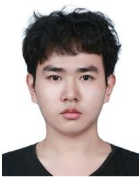  
Ning Wang (Student Member, IEEE) received the received the BS degree in communication engineering from the University of Electronic Science and Technology of China, Chengdu, China, in 2022, and the MS degree from the University of Massachusetts Amherst, MA, USA, in 2024, where he is currently working toward the PhD degree in electrical and computer engineering. His research interests include AI for wireless networks, mobile computing, lifelong/continual machine learning, and content delivery networks.


Yinxuan Wu (Student Member, IEEE) received the BS degree in communication engineering from the University of Electronic Science and Technology of China, Chengdu, China, in 2020, and the MS degree from the University of Massachusetts Amherst, MA, USA, in 2024, where he is currently working toward the PhD degree in electrical and computer engineering. His research interests include satellite networks, AI for wireless networks, software defined networks, lifelong/continual machine learning, and covert communications.


Beatriz Lorenzo (Senior Member, IEEE) received the PhD degree from the University of Oulu, Oulu, Finland, in 2012. She was a fulbright visiting scholar with the University of Florida, from 2016 to 2017, a Lilly teaching fellow from 2022 to 2023, and Sloan faculty fellow from 2024 to 2025 with UMass Amherst. Since 2019, she has been with the Department of Electrical and Computer Engineering, University of Massachusetts Amherst, where she is currently an associate professor and the director of the Network Science Laboratory. She was a faculty fellow with DEVCOM Army Research Laboratory, Adelphi, MD, USA, in 2025. Her research interests include network design, AI for wireless networks, B5G and 6G network architectures and protocol design, quantum computing, optimization, and network economics. She has authored or coauthored more than 70 papers and coauthored two books on advanced wireless networks.

She is an Associate Editor for IEEE Transactions On Networking. She was the general co-chair of the WiMob Conference in 2019.


Sumudu Samarakoon (Member, IEEE) received the BSc (Hons.) degree in electronic and telecommunication engineering from the University of Moratuwa, Sri Lanka, in 2009, the MEng degree from the Asian Institute of Technology, Thailand, in 2011, and the PhD degree in communication engineering from the University of Oulu, Finland, in 2017. He is currently an a ssistant professor with the Centre for Wireless Communications (CWC), University of Oulu, and a member of the Intelligent Connectivity and Networks/Systems Group. His main research interests

include heterogeneous networks, small cells, radio resource management, reinforcement learning, and game theory. He was the recipient of the Best Paper A ward from the European Wireless Conference and Excellence Awards for innovators and the Outstanding Doctoral Student in the Radio Technology Unit, CWC, University of Oulu, in 2016.


Bing Liu (Fellow, IEEE) received the PhD degree in artificial intelligence from the University of Edinburgh. He is currently a distinguished professor and Deborah K. Wexler professor of computing with the University of Illinois Chicago. His research interests include lifelong/ continual machine learning, sentiment analysis and opinion mining, data mining, machine learning, and natural language processing. He has authored or coauthored extensively in top conferences and journals in these areas. Two of his papers have received 10 year test of time awards from

KDD, the premier conference of data mining and data science. He has also authored five books: one on lifelong machine learning, one on Web data mining, two on sentiment analysis, and one on lifelong dialogue systems. Some of his work has been widely reported in the press, including a front page article in the New York Times. He was the chair of ACM SIGKDD from 2013 to 2017. He has was also the program chair of many leading data m ining conferences, including KDD, ICDM, CIKM, WSDM, SDM, and PAKDD. He is a fellow of the ACM, and AAAI.received the (Member, IEEE) received the BSc (Hons.) degree in electronic and telecommunication engineering from the University of Moratuwa, Sri Lanka, in 2009, the M Eng degree from the Asian Institute of Technology, Thailand, in 2011, and the PhD degree in communication engineering from the University of Oulu, Finland, in 2017. He is currently an a ssistant professor with the Centre for Wireless Communications (CWC), University of Oulu, and a member of the Intelligent Connectivity and Networks/Systems Group. His main research interests include heterogeneous networks, small cells, radio resource management, reinforcement learning, and game theory. He was the recipient of the Best Paper A ward from the European Wireless Conference and Excellence Awards for innovators and the Outstanding Doctoral Student in the Radio Technology Unit, CWC, University of Oulu, in 2016.