# Deep Reinforcement Learning-Based Task Ofloading With Collaborative Inference in UAV-Assisted Mobile Edge Computing Networks

Xiangping Bryce Zhai , Member, IEEE, Shuang Fu , Changyan Yi , Senior Member, IEEE, Zhiquan Liu , Member, IEEE, Chao Dong , Senior Member, IEEE, and Chee Wei Tan , Senior Member, IEEE

Abstract—Intelligent air-ground integration communication is an emerging technology. Uncrewed aerial vehicles (UAVs) serve as mobile edge computing (MEC) servers in large-scale Internet of Things (IoT) applications, alleviating the computational load on ground users. Existing multi-UAV MEC approaches struggle with the complex computation and large data sizes of deep neural network tasks. To address these challenges, we propose a Deep Reinforcement Learning (DRL)-based DNN Partitioning and Dynamic Trajectory Selection (DPDTS) method, which reduces end-to-end latency and system energy consumption through task ofloading and collaborative inference. Specifically, we propose an Optimal Partition Point Selection (OPPS) algorithm to minimize transmission overhead by selecting optimal partition points for DNN tasks. Then, we design a fairness-based matching algorithm to optimize user ofloading and resource allocation. Finally, OPPS and matching algorithms are integrated to optimize UAV flight trajectories and user transmission power via DRL. The simulation results show that DPDTS outperforms existing benchmark methods in terms of delay and energy eficiency.

Index Terms—Computation ofloading, mobile edge computing, multi-UAVs, collaborative inference, deep reinforcement learning.

## I. INTRODUCTION

N RECENT years, the proliferation of mobile smart devices and advances in wireless communication technologies such as 5G and 6G have spawned numerous computing-intensive applications with low latency and low energy consumption requirements, providing users with a better experience and more features. Mobile edge computing (MEC), an emerging technology that enables mobile ground users (GUs) to execute compute-sensitive applications at the network edge, has attracted a lot of attention [1]. By integrating MEC into the Internet of Things (IoT), computationally intensive and latency-sensitive tasks of IoT devices with limited computational power and energy can be ofloaded to the network edge, providing satisfactory Quality of Service (QoS) and Quality of Experience (QoE) for those highly demanding tasks of GUs. Edge intelligence (EI) combines edge computing and artificial intelligence (AI), allowing edge nodes to intelligently process data, optimize resources, and deploy deep learning models for real-time task processing. Recently, the deploy ment of MEC multi-Uncrewed aerial vehicles (UAVs) has attracted considerable interest due to the inherent flexibility and controllability of UAVs [2]. UAVs equipped with edge servers can continuously provide reliable computation ofloading services to users, overcoming geographic constraints and varying deployment environments [3]. Joint multi-dimensional resource management is needed to optimize in the practical implementation for large-scale systems [4].

Deep neural networks (DNNs), as the core technology in machine learning, excel in complex tasks such as image classification, speech recognition, and natural language understanding. However, DNNs typically contain millions of neurons and trillions of connections, which requires substantial computational resources. Their high-resolution raw inputs can also cause significant transmission delays during task ofloading [5]. The mobile edge computing framework with multi-user computation ofloading and transmission scheduling should be considered for delay-sensitive applications [6]. As a result, most existing approaches cannot scale to multi-UAV MEC for DNN tasks. Tasks are often either fully ofloaded, causing excessive transmission latency and energy consumption, processed entirely locally, leading to high computational latency and energy consumption, or arbitrarily partitioned, which is unsuitable for DNN tasks with strong inter-neuron dependencies. In multi-UAV MEC scenarios, the dynamics of UAV positions, limited computing resources, and changing network topologies further afect UAV service quality. Choosing the optimal ofloading decision for each GU, eficiently allocating UAV computational resources, and planning flight paths while minimizing system overhead is a typical NP-hard problem. Some existing solutions decompose this non-convex optimization problem into multiple convex subproblems and iteratively converge to a suboptimal solution [7], [8], [9].

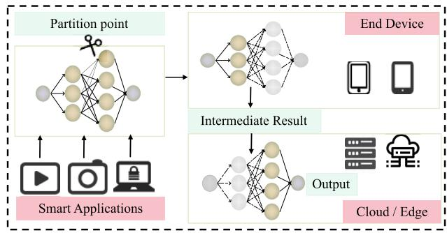  
Fig. 1. Collaborative DNN inference in MEC Systems.

In a multi-UAV MEC system, DRL enables UAVs not only to leverage powerful computational capabilities but also to make intelligent decisions. Each UAV can plan its next move based on factors such as the GU distribution, current channel conditions, its position, and other environmental factors. Additionally, UAVs’ high mobility allows them to quickly and flexibly provide computation ofloading services to multiple GUs in a given area. In [10], a deep reinforcement learning based trajectory control algorithm (RAT) based on Deep Deterministic Policy Gradient (DDPG) [11] was proposed to learn the optimal flight strategy of the UAV online and minimize total energy consumption. However, optimization focuses solely on energy consumption, neglecting delay considerations. In [12], an energy eficiency maximization method is introduced using Proximal Policy Optimization (PPO) to eficiently adjust task ofloading policies and resource allocation [13]. However, this method applies only to single UAV and sparse GU scenarios, which are not representative of more complex network environments.

In summary, existing multi-UAV MEC systems supporting DNN tasks face main challenges: 1) reducing transmission latency and processing energy consumption for DNN tasks, and 2) rationally allocating UAV computational resources in dynamic environments. Collaborative inference [14], [15] ofers a potential solution to reduce latency and energy consumption by partitioning the DNN into front-end and back-end components, as shown in Fig. 1. This division is based on the fact that the output data in the middle layers of the DNN model are much smaller than the initial inputs, allowing the front-end part to run on mobile devices and the back-end part to run on edge servers.

However, in dynamic multi-UAV MEC scenarios, eficient collaborative DNN inference faces three core challenges: 1) Conflict between Task Complexity and Resource Constraints: The strong inter-layer dependencies of DNNs require partition point selection to balance computational/transmission costs, while UAVs’ limited resources demand dynamic allocation among users. 2) Real-Time Adaptability Requirements: User mobility (e.g., sudden location changes) and fluctuating task arrival patterns require online adaptation of ofloading strategies and UAV trajectories. 3) Complexity of

Multi-Dimensional Coupled Optimization: Partitioning, resource allocation, and UAV trajectories are highly coupled (e.g., closer UAVs reduce transmission latency but increase energy consumption), making traditional decoupled approaches suboptimal. Existing DRL-based methods [10], [12] partially address these dimensions but fail to resolve their synergistic efects. To further reduce system overhead, we propose a DRL-based DNN Partitioning and Dynamic Trajectory Selection (DPDTS) algorithm. Compared with existing DRL methods, DPDTS pioneers three theoretical breakthroughs: hierarchical collaborative optimization, lightweight real-time decision-making, and environment-aware incremental learning. Our contributions are listed as follows:

• We propose the Optimal Partition Point Selection (OPPS) algorithm, which selects the optimal partition point for DNN models based on task hierarchy features and UAV edge computing capabilities.

• We design a fairness-based matching algorithm to optimize user ofloading decisions and allocate UAV computing resources, further reducing delay and energy consumption.

• We present the DPDTS optimization algorithm, which combines OPPS and matching algorithms to adapt to dynamic factors, reduce system costs, and improve UAV service quality.

The remainder of the paper is organized as follows. Section II summarizes some related works. Section III introduces the system model and the formulation of problems. Section IV details the architecture of the method proposed in this paper. In Section V, the simulation results are obtained by numerical experiments. Section VI concludes our work.

## II. RELATED WORKS

## A. Multi-UAV MEC

In a multi-UAV MEC scenario, the capacity of the UAV’s onboard battery and the battery capacity of the ground-user equipment are both limited. Therefore, [16] designed a method based on the Lyapunov optimization technique to analyze the task queue and optimize the ofloading decision and the UAV flight path. Reference [17] designed a two-stage online scheduling scheme that dynamically adjusts the CPU frequency and its transmission power of mobile users based on non-cooperative game, in order to minimize the energy consumption of UAVs in the process. In order to provide overall quality of service and user experience when tasks generated by ground equipment have high latency requirements, the authors in [18] investigated the eficient deployment and mobility of UAVs to minimize the maximum delay of all tasks in each time interval. When GU generates intensive tasks with high task volumes and high computational demands, the authors of [19] jointly optimized user associations, UAV paths, and user upload power while satisfying the energy constraints of the UAV and the QoS requirements of each user.

However, solving such optimization problems usually requires lots of computational resources and takes a long time in dynamic environments. The authors in [20] investigated a DRL-based optimization algorithm for joint UAV deployment and task scheduling to achieve optimal values for the number of UAVs, the hover position of each UAV, and the best strategy for ofloading and resource allocation. In [21], a DRL-based dynamic trajectory control algorithm was proposed to learn the optimal flight strategy of the UAV online, and it could also adapt to the dynamic communication conditions between GUs and UAVs to achieve adaptive adjustment of the task ofloading and resource allocation. The authors of [22] proposed an evolutionary Stackelberg diferential game approach for cloud edge resource allocation, which dynamically optimized computing resource pricing and allocation strategies based on user service selection patterns. This method efectively balances resource utilization and service latency in 5G environments. [23] developed a hybrid DRL-LP framework (PDDQNLP) to jointly optimize 3D trajectory, binary ofloading, and time allocation, achieving superior energy eficiency while ensuring fairness among ground users. For scenarios enhanced with RIS, [24] introduced a deep reinforcement learning algorithm that combines the design of the convex hull trajectory and the optimization of the hybrid action space, significantly improving energy eficiency in fixed-wing UAV communications through adaptive trajectory planning and resource scheduling.

## B. DNN Partitioning

For DNN models deployed in edge scenarios, traditional approaches usually use techniques such as model pruning [25], binarized neural networks [26], and early exit [27] to reduce the model parameters of the DNN model in order to achieve smaller resources and computational overhead on edge devices. However, the common disadvantage of the above techniques is that they can reduce the accuracy of the model.

To improve real-time partitioning performance in dynamic networks, the authors in [28] proposed a two-stage segmentation strategy to reduce model segmentation complexity. Furthermore, the authors in [29] designed a method that adapts to networks more quickly by using a graph search algorithm based on the neighbor efect. In contrast, the authors of [30] reduced the size of the directed graphs employing model compression, thus reducing the decision time. These studies ofer promising solutions for the practical application of collaborative inference in edge scenarios, and a growing body of research explores this field further. In particular, the authors of [31] explored distributed foundation models in 6G networks, integrating pipeline and data parallelism with multimodal learning to improve collaborative inference eficiency under wireless constraints. The authors in [32] introduced a fine-grained dynamic task scheduling mechanism based on model partitioning techniques, efectively reducing the total energy overhead of the system by applying collaborative inference in edge resource scheduling. For vehicular edge computing, [33] proposed XGBoost-based latency prediction and HLPP-based partitioning algorithms, demonstrating significant improvements in DNN task completion rates and energy eficiency through embedded system experiments.

## III. SYSTEM MODEL AND PROBLEM FORMULATION

Consider a multi-UAV assisted MEC system, where the network has K UAVs, each of which is equipped with the edge computing server and provides communication and computation services for M GUs. Denote ${ \mathcal { K } } = \{ 1 , 2 , \ldots , K \}$ as the set of UAVs and $\mathcal { M } = \{ 1 , 2 , \dots , M \}$ as the set of GUs, and we have $\forall j \in \mathcal { K } , \forall i \in \mathcal { M }$ <sup>, ,</sup> <sup>.</sup> <sup>.</sup> <sup>.</sup> <sup>,</sup>. To keep the position of UAVs relative to users roughly constant, the duration of each round $\tau$ is divided into N time slots with a slot length $\Delta = \tau / N _ { : }$ , and we have $\forall n \in \{ 1 , 2 , \ldots , N \}$

<sup>, ,</sup> <sup>.</sup> <sup>.</sup> <sup>.</sup> <sup>,</sup>We target DNN-intensive edge computing scenarios, and all tasks generated by ground users require deep neural network inference. Compared with conventional MEC tasks, the computational requirements of such DNN tasks are significantly higher. In time slot n, the ith GU generates some of the same types of DNN tasks $\{ w _ { i } , t _ { i } \}$ , where $w _ { i }$ represents the task arrival rate and follows the Poisson distribution $w _ { i } \sim \pi ( \lambda _ { i } )$ , and $t _ { i }$ represents the task type. Our system contains several pretrained DNN models with diferent layers and structures. Each type of task has the following attributes, $\{ L _ { t _ { i } } , C _ { l , t _ { i } } , D _ { l , t _ { i } } \} , \forall l$ ∈ $\{ 0 , 1 , 2 , \ldots , L _ { t _ { i } } \}$ , where l is the index of each layer, $L _ { t _ { i } }$ is the number of layers of DNN, $C _ { l , t _ { i } }$ is the number of CPU cycles required for the calculation of neurons in each layer, and $D _ { l , t _ { i } }$ is the output data size of each layer. When $l \ \mathrm { i s } \ 0 ,$ it represents the original input. Denote $l _ { i } ^ { * } ( n )$ as the best partition point for each task of i in the time slot n. Consider a Cartesian coordinate system, in which each GU i is scattered on the ground, and its horizon coordinate is given by $q _ { i } ( n ) = { \Big ( } x _ { i } ( n ) , y _ { i } ( n ) , 0 { \Big ) }$ . All UAVs are assumed to fly at a constant height H above the ground. The location of UAV j in the time slot n can be denoted as $p _ { j } ( n ) = { \Big ( } X _ { j } ( n ) , Y _ { j } ( n ) , H { \Big ) }$ . The UAVs circle in the air and cooperatively allocate resources to GUs. Each UAV can communicate with multiple GUs simultaneously during the UAV flight period.

Each UAV serves only GUs within its coverage area and can provide computing services to a maximum of Z users per time slot. The decision variable $\alpha _ { i } ( n )$ represents the task ofloading of the ith GU. If $\alpha _ { i } ( n ) = j ,$ <sup>α</sup>, it indicates that the tasks generated in this time slot are ofloaded to $\mathrm { U A V } \ j .$ Thus, the following two conditions must be satisfied:

$$
\alpha _ { i } ( n ) = \left\{ \begin{array} { l l } { { j , } } & { { \mathrm { i f ~ } i \mathrm { ~ o f f o a d s ~ t h e ~ t a s k ~ t o ~ } j , } } \\ { { 0 , } } & { { \mathrm { i f ~ } i \mathrm { ~ p r o c e s s e s ~ t h e ~ t a s k ~ l o c a l l y , } } } \end{array} \right.\tag{1}
$$

$$
\sum _ { i = 1 } ^ { M } \mathbb { I } ( \alpha _ { i } ( n ) = j ) \leq Z , \quad \forall j .\tag{2}
$$

<sup>I</sup> is the symbol of the indicator function, which is 1 when the expression following is true and 0 otherwise. In order to efectively reduce task transmission delay and energy consumption, we select the best partition point $l _ { i } ^ { * } ( n )$ for each task. The first half of each task of the ith GU is executed locally, while the second half of each task of the ith GU is ofloaded to the UAV for execution. $l _ { i } ^ { * } ( n ) = 0$ means that the task is completely ofloaded to the UAV for execution, while $l _ { i } ^ { * } ( n ) = L _ { t _ { i } }$ means executed locally. Each GU can match only one UAV in a time slot, and each UAV selects an appropriate number of user tasks for calculation based on its computing capabilities. We adopt the free space path loss model [34] and set the communication channel between GU and UAV to be mainly a line of sight link, and the communication between GU and UAV follows the TDMA protocol. Therefore, the ground-to-air channel gain between the ith GU and the jth UAV is expressed as:

$$
g _ { i , j } ( n ) = \frac { g _ { 0 } } { \lvert | q _ { i } ( n ) - p _ { j } ( n ) \rvert | ^ { 2 } } ,\tag{3}
$$

where $g _ { 0 }$ represents the channel power gain and $\| q _ { i } ( n ) - p _ { j } ( n ) \|$ is the distance between the ith GU and the jth UAV. According to Shannon theory, the uplink data rate is given by:

$$
r _ { i , j } ( n ) = \frac { B } { Z } \log _ { 2 } \left( 1 + \frac { P _ { i } ^ { o f f } ( n ) g _ { i , j } ( n ) } { \sigma ^ { 2 } } \right) ,\tag{4}
$$

where $B / Z$ indicates the fraction of system bandwidth allocated to the user $i ,$ and $P _ { i } ^ { o f f } ( n )$ represents the transmit power from the ith GU and the jth UAV in the time slot n, and $\sigma ^ { 2 }$ is the noise power.

Therefore, when the jth UAV handles ith GU’s tasks at the nth time slot, we derive the delay for the layers before the partition point of each task to be executed locally:

$$
T _ { i , j } ^ { l o c } ( n ) = \frac { \displaystyle \sum _ { l = 1 } ^ { l _ { i } ^ { * } ( n ) } C _ { l , t _ { i } } } { f _ { i } ( n ) } ,\tag{5}
$$

1\*(n) where $\sum _ { l = 1 } ^ { l _ { i } ( n ) } C _ { l , t _ { i } }$ is the number of CPU cycles required for local computation and $f _ { i } ( n )$ is the computation capability of the ith GU. The intermediate result transmission delay is:

$$
T _ { i , j } ^ { t r a n s } ( n ) = \frac { D _ { l _ { i } ^ { * } ( n ) , t _ { i } } } { r _ { i , j } ( n ) } ,\tag{6}
$$

where $D _ { l _ { i } ^ { * } ( n ) , t _ { i } }$ is the size of the data that is ofloaded to the <sup>,</sup>UAV for processing. Due to the limited computing resources of UAVs, some GUs have to handle their tasks entirely locally. At this time, the result does not need to be transmitted to the UAV, and the size of the result is negligible with $D _ { l _ { i } ^ { * } ( n ) , t _ { i } } = 0 .$ The delay for the second half of the task to be executed on the UAV is:

$$
T _ { i , j } ^ { o f f } ( n ) = \frac { \sum _ { l = l _ { i } ^ { * } ( n ) + 1 } ^ { L _ { t _ { i } } } C _ { l , t _ { i } } } { b _ { i , j } ( n ) f _ { j } ( n ) } ,\tag{7}
$$

where $\sum _ { l = l _ { i } ^ { * } ( n ) + 1 } ^ { L _ { t _ { i } } } C _ { l , t _ { i } }$ is the number of CPU cycles required by the UAV to calculate another part of the task, $f _ { j } ( n )$ is the computing frequency of the jth UAV, and $b _ { i , j } ( n )$ is the allocation ratio. The result return time is ignored, so the completion delay of each task is:

$$
T _ { i , j } ^ { p a r t } ( n ) = T _ { i , j } ^ { l o c } ( n ) + T _ { i , j } ^ { t r a n s } ( n ) + T _ { i , j } ^ { o f f } ( n ) .\tag{8}
$$

Meanwhile, the energy consumption for the layers before the partition point of each task to be executed locally is:

$$
E _ { i , j } ^ { l o c } ( n ) = \kappa f _ { i } ^ { 3 } ( n ) T _ { i , j } ^ { l o c } ( n ) ,\tag{9}
$$

where  is a constant that represents the efective switched capacitance on the CPU of the GU. The intermediate result transmission energy consumption is:

$$
E _ { i , j } ^ { t r a n s } ( n ) = P _ { i } ^ { o f f } ( n ) T _ { i , j } ^ { t r a n s } ( n ) ,\tag{10}
$$

The task processing energy consumption is:

$$
E _ { i , j } ^ { o f f } ( n ) = P _ { j } ^ { e x e c u } ( n ) T _ { i , j } ^ { o f f } ( n ) ,\tag{11}
$$

where $P _ { j } ^ { e x e c u } ( n )$ is the computing power of UAV, and the flight energy consumption of UAV is:

$$
E _ { i , j } ^ { f l y } ( n ) = P _ { j } ^ { f l y } ( n ) \Delta ,\tag{12}
$$

where the power of UAVs flight and hovering $P _ { j } ^ { f l y } ( n )$ is calculated according to the formula in [35]. So we derive the total energy consumption of each task in the nth time slot:

$$
E _ { i , j } ^ { p a r t } ( n ) = E _ { i , j } ^ { l o c } ( n ) + E _ { i , j } ^ { t r a n s } ( n ) + E _ { i , j } ^ { o f f } ( n ) + E _ { i , j } ^ { f l y } ( n ) .\tag{13}
$$

Therefore, the weighted sum of latency and energy consumption of each time slot is expressed as follows:

$$
e ( n ) = \sum _ { j = 1 } ^ { K } \sum _ { i = 1 } ^ { M } \Bigl ( \eta E _ { i , j } ^ { p a r t } ( n ) + ( 1 - \eta ) T _ { i , j } ^ { p a r t } ( n ) \Bigr ) w _ { i } ,\tag{14}
$$

where $\eta$ is a weight factor.

<sup>η</sup>We aim to minimize the system’s weighted latency and energy consumption, by jointly optimizing the DNN optimal partition point $L ^ { * } = \{ l _ { i } ^ { * } ( n ) , \forall i \in \mathcal { M } , \forall n \in \mathcal { N } \}$ , UAV trajectory $\mathcal { U } = \{ X _ { j } ( n ) , Y _ { j } ( n ) , V _ { j } ( n ) , \forall j \in \mathcal { K } , \forall n \in \mathcal { N } \}$ , computing resource allocation $\boldsymbol { b } ^ { \intercal } \ = \ \{ b _ { i , j } ( n ) , \forall i \ \in \ M , \forall j \ \in \ K , \forall n \ \in \ N \}$ , GU transmission power $\mathcal { P } \ = \ \{ P _ { i } ^ { o f f } ( n ) , \forall i \ \in \ \mathcal { M } , \forall n \ \in \ \mathcal { N } \}$ , and ofloading decision $\alpha ~ = ~ \{ \alpha _ { i } ( n ) , \forall i ~ \in ~ { \mathcal { M } } , \forall n ~ \in ~ { \mathcal { N } } \}$ . The optimization problem can be formulated as follows:

$$
\begin{array} { r l } { \varepsilon _ { \mathrm { P r a c } } ^ { \mathrm { R P } } } & { \sum _ { i = 1 } ^ { N } \varepsilon _ { i } ^ { \mathrm { R P } } } \\ { \varepsilon _ { \mathrm { P r a c } } ^ { \mathrm { R P } } } & { = \frac { 1 } { N } \varepsilon _ { i } ^ { \mathrm { R P } } } \\ & { \varepsilon _ { \mathrm { P r a c } } ^ { \mathrm { R P } } } \\ & { \varepsilon _ { \mathrm { P r a c } } ^ { \mathrm { R P } } } \\ & { \varepsilon _ { \mathrm { P r a c } } ^ { \mathrm { R P } } } \\ & { \varepsilon _ { \mathrm { P r a c } } ^ { \mathrm { R P } } } \\ & { \varepsilon _ { \mathrm { P r a c } } ^ { \mathrm { R P } } } \\ & { \varepsilon _ { \mathrm { P r a c } } ^ { \mathrm { R P } } } \\ & { \varepsilon _ { \mathrm { P r a c } } ^ { \mathrm { R P } } } \end{array}\tag{5}
$$

C2 indicates that the radius of coverage of the UAV signal is $d _ { m a x }$ . The constraints $C 3 - C 4$ limit the range and speed of the activity of the UAVs, where $D _ { m a x }$ is the boundary of the activity area, and V<sup>max</sup> is the maximum flight speed of each UAV. C5 limits each GU’s transmit power cannot exceed their respective thresholds $P _ { i } ^ { m a x }$ . C6 limits the optimal partition point not to exceed the number of layers of the DNN. C7 limits the power consumption of each UAV to not exceed the battery capacity $E _ { U A V } ^ { m a x }$ during service duration. The constraints C8−C9 indicate that the tasks generated by a GU in each time slot are either completely processed locally or partially ofloaded to the UAV and each UAV can handle tasks for at most Z GUs. The constraints C10 − C11 limit the proportion of resource allocation.

## IV. ALGORITHM DESIGN

Due to the non-convexity of (15), we adopt an Alternating Optimization framework and decompose it into three subproblems. The first sub-problem is to find the optimal partition point of each DNN task at every timeslot to reduce the task transmission latency significantly. The second subproblem is to optimize the ofloading strategy and computing resource allocation process, i.e., to find the optimal matching between UAVs and GUs. We propose a matching algorithm based on a fairness factor designed to minimize the energy consumption of the system and the completion time of the task. The third subproblem then is optimizing the trajectory of UAVs and transmitting power of GUs. We formulate UAV trajectory planning and GU transmit power selection as a Markov decision process (MDP), with the negative value of the system optimization objective as a reward. We design a DRL-based algorithm combined with the matching algorithm to solve the problem eficiently and accurately. UAVs act as agents to optimize their strategy and obtain the best action at each time step.

## A. Optimal Partition Point Selection Algorithm for DNN Tasks

UAVs can provide computational services to users within their signal coverage to alleviate the computational pressure of users, and diferent users generate diferent types of tasks, so the optimal partitioning points are diferent. Usually, there is a big diference between the computational capacity of UAV servers and user devices, so the selection of DNN task partitioning points is mainly related to the execution latency and energy consumption of user devices, as well as the transmission latency and energy consumption of intermediate data.

When the bandwidth condition is 10 MHz, and the computing frequencies of user devices and UAVs are 1 GHz and 15 GHz, respectively, the relationship between each optional partition point of AlexNet [36] and the end-to-end delay under diferent resource allocation ratios is demonstrated in Fig. 2(a). The end-to-end delay corresponding to diferent partition points shows an overall trend under the five resource allocation ratios. Fig. 2(b) demonstrates the selection of optimal partition points under diferent resource allocation ratios, and the optimal partitions of AlexNet, VGG-16 [37], and ResNet-34 [38] remain unchanged when the ratio is greater than 10%. Therefore, we use $f _ { j } ( n )$ to select the optimal partition point. We jointly combine collaborative reasoning and computational ofloading and design an Optimal Partition Point Selection (OPPS) algorithm to reduce the system delay and energy consumption. Its pseudo-code is shown in Algorithm 1.

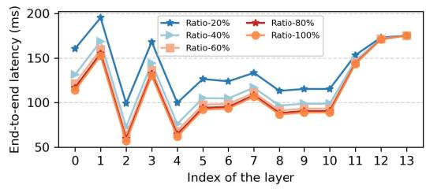  
(a) The end-to-end delay versus partition point of AlexNet under different resource allocation ratios.

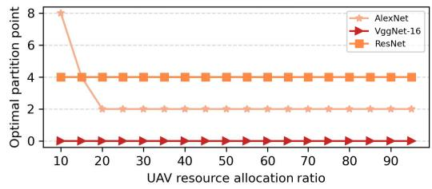  
(b) The optimal partition points of AlexNet, VGG16 and ResNet with different resource allocation ratios.

Fig. 2. The impact of the allocation ratio of UAV computing resources on selecting partition points for several common DNN models.  
```latex
Algorithm 1 Optimal Partition Point Selection (OPPS)
Input: Task arrival rate $w _ { i } ,$ task type $t _ { i } ,$ output data size of
each layer $D _ { l , t _ { i } } ,$ , and the number of CPU cycles required
<sup>,</sup>for the calculation of neurons in each layer $C _ { l , t _ { i } } , \forall i \in \mathcal { M } .$
$\forall t _ { i } , \forall l \in \{ 0 , 1 , 2 , \ldots , L _ { t _ { i } } \} .$
<sup>, , ,</sup> <sup>.</sup> <sup>.</sup> <sup>.</sup> <sup>,</sup>Output: Global partition policy $G .$
1: Initialize the global partition policy G as empty.
2: for UAV j = 1 → K do
3: Initialize the set of GUs H as empty.
4: Initialize partition policy $G _ { s u b }$ as empty.
5: for GU $i = 1  M$ do
6: if C2 and C7 is met then
7: Add index i into the set $H .$
8: end if
9: end for
10: Initialize $e ^ { m i n } ( n )$ asinfinite.
11: for GU i ∈ H do
12: for layer $l = 0  L _ { t _ { i } }$ do
13: Calculate e(n) based on (14).
14: if $e ( n ) \leq e ^ { m i n } ( n )$ then
15: $e ^ { m i n } ( n ) \gets e ( n ) .$
16: $l _ { i } ^ { * } ( n ) \gets l .$
17: end if
18: end for
19: Add the optimal partition $( i , l _ { i } ^ { * } ( n ) )$ into $G _ { j } .$
20: end for
21: Add $G _ { j }$ into the global partition policy G.
22: end for
```

Updated UAV trajectories alter signal coverage, dynamically adjusting the set of serviced users H, which in turn afects partition point selection $G _ { j } .$ The corresponding time complexity is $O ( K M L ^ { m a x } )$ , where $L ^ { m a x }$ is the maximum DNN layers.

Algorithm 2 Matching Algorithm Between UAV and GU   
Input: Position and speed of UAVs U, transmission power of   
GUs $\mathcal { P }$ at time slot n.   
Output: Ofloading decision , computing resource allocation   
strategy b.   
1: Initialize, $b = \{ b _ { i , j } ( n ) = 1 , \forall i , \forall j \} .$   
<sup>, , ,</sup>2: Obtain global partition policy G by Algorithm 1.   
3: for UAV $j = 1 \to K$ do   
4: Get the partition policy $G _ { s u b }$ from G.   
5: Initialize the selected GUs queue $Q _ { s u b }$   
6: for $( i , l _ { i } ^ { * } ) \in G _ { s u b }$ do   
7: Calculate $e _ { i , j } ^ { d i f } ( n )$ based on (16).   
8: Add $( i , e _ { i , j } ^ { d i f } ( n ) )$ into $Q _ { s u b }$   
9: end for   
10: Sort $Q _ { s u b }$ by the value $e _ { i , j } ^ { d i f } ( n )$ in descending order.   
11: for Element index $z = 1 \stackrel { } { \to } Z$ do   
12: Obtain $( i , e _ { i , j } ^ { d i f } ( n ) )$ from $Q _ { s u b }$   
13: $\alpha _ { i } ( n )  j .$   
14: <sup>α</sup>Calculate $\psi _ { i } ( n )$ and $b _ { i , j } ( n )$ based on (17) and (18).   
15: end for   
16: end for

This linear complexity arises from iterating over all possible partition points for each user. The space complexity is O(M), storing only optimal partition points of each user.

## B. Matching Algorithm Between UAVs and GUs

In every time slot, GUs within UAVs’ signal coverage can choose to ofload their tasks to UAV. Nevertheless, since their computational resources are limited, each UAV serves up to only Z GUs. Thus, we must select users for each matching UAV and dynamically allocate resources to obtain a minor system overhead. The matching algorithm between UAVs and GUs is described in Algorithm 2.

Lines 3-9 of Algorithm 2 indicate that for each UAV, it is necessary to first obtain the set of optimal partition points $G _ { j }$ of the tasks of the served users, and then calculate the weighted diference between the energy consumption and delay when the tasks are completely processed locally and ofloaded for processing, that is:

$$
e _ { i , j } ^ { d i f } ( n ) = w _ { i } \Big ( \eta E _ { i , j } ^ { d i f } ( n ) + ( 1 - \eta ) T _ { i , j } ^ { d i f } ( n ) \Big ) ,\tag{16}
$$

where $\begin{array} { r c l } { E _ { i , j } ^ { d i f } ( n ) } & { = } & { E _ { i , j } ^ { l o c } ( n ) | _ { l _ { i } ^ { * } ( n ) = L _ { t _ { i } } } \ - \ E _ { i , j } ^ { p a r t } ( n ) } \end{array}$ and $T _ { i , j } ^ { d i f } ( n ) =$ $T _ { i , j } ^ { l o c } ( n ) \vert _ { l _ { i } ^ { * } ( n ) = L _ { t _ { i } } } ~ - ~ T _ { i , j } ^ { p a r t } ( n )$ <sup>, ,</sup>. Then we allocate computation <sup>, ,</sup>resources for the current UAV, as shown in line 14, based on the CPU frequency required when the task is processed entirely locally, we set a priority-based allocation weight $\psi _ { i } ( n )$ indicating the urgency with which the task needs the resources, that is:

$$
\psi _ { i } ( n ) = \frac { \displaystyle \sum _ { l = 1 } ^ { l _ { i } ^ { * } ( n ) } C _ { l , t _ { i } } \Big | _ { l _ { i } ^ { * } ( n ) = L _ { t _ { i } } } } { \displaystyle \sum _ { i ^ { \prime } = 1 } ^ { M } \sum _ { l = 1 } ^ { l _ { i ^ { \prime } } ^ { * } ( n ) } C _ { l , t _ { i ^ { \prime } } } \Big | _ { l _ { i ^ { \prime } } ^ { * } ( n ) = L _ { t _ { i ^ { \prime } } } } } , \quad \forall i ^ { \prime } \in \mathcal { M } , \alpha _ { i } ( n ) = j ,\tag{17}
$$

and according to the fairness weight factor $\psi _ { i } ( n )$ , so we get the resource allocation ratios:

$$
b _ { i , j } ( n ) = \frac { \psi _ { i } ( n ) } { \displaystyle \sum _ { i ^ { \prime } = 1 } ^ { M } \mathbb { I } ( \alpha _ { i ^ { \prime } } ( n ) = j ) \psi _ { i ^ { \prime } } ( n ) } .\tag{18}
$$

The time complexity is dominated by sorting operations, i.e., $O ( K \cdot M l o g M )$ , while the space complexity is $O ( M \cdot K )$ for priority queues.

## C. Trajectory and Transmit Power Optimization Algorithm

After solving the DNN optimal partition point selection problem and the matching problem between UAVs and GUs, we obtain the ofloading decision and the UAV server resource allocation ratio for each time slot. Therefore, the simplified problem (15) can be constructed using MDP, consisting of state space S, action space A, state transition probability ${ \mathcal P } _ { : }$ and reward function R. In each time step, the environment is in state $S _ { n }$ , the agent takes action $A _ { n } ,$ gets a reward $\textstyle { \mathcal { R } } _ { n }$ from the environment, and the environment transitions to state $S _ { n + 1 }$ In our problem, UAVs act as agents that continuously interact with the dynamic environment to optimize their strategy to maximize the accumulated rewards, i.e., to minimize total energy consumption and reduce task completion latency.

1) State space $s \colon$ The state of the agent is formulated as:

$$
S _ { n } = \{ X _ { j } ( n ) , Y _ { j } ( n ) , w _ { i } , t _ { i } \} , \quad \forall j , \forall i ,\tag{19}
$$

which represent the current x-coordinate and y-coordinate of each UAV, task arrival rate, and task type of each GU, respectively.

2) Action space A: The action of the agent is defined as:

$$
\mathcal { A } _ { n } = \{ V _ { j } ( n ) , P _ { i } ^ { o f f } ( n ) \} , \quad \forall j , \forall i ,\tag{20}
$$

which contains the vector speed of each UAV and the transmission power of GU choosing to ofload its task in each time slot.

3) Reward function R: The reward of the agent is defined as:

$$
{ \mathcal { R } } _ { n } = - e ( n ) - \chi ( n ) ,\tag{21}
$$

where the former part is the negative of the system’s optimization goal, and the latter is the penalty for the UAVs approaching or exceeding the activity range.

DPDTS adopts a training mechanism for the twin delayed deep deterministic policy gradient (TD3) [39] with ofline replay bufers and delayed updates to address sample correlation and Q-value overestimation problems. The main network includes two critics and an actor, supported by a target network to ensure stability. The actor updates less frequently than the critics, allowing for error minimization before strategy adjustments. Our proposed DPDTS approach is summarized in Algorithm 3 and is shown in Fig. 3. DPDTS combines OPPS and the matching algorithm to optimize UAV trajectories and GU transmission power per time slot. It is divided into four steps: experience collection, ofline playback, updating the policy network, and updating the target network. First, through interaction with our mission scenario (the environment), experience samples $( S _ { n } , { \mathcal { A } } _ { n } , { \mathcal { R } } _ { n } , S _ { n + 1 } )$ are collected and stored in the replay bufer of the experience, as shown in lines 5-11. Then, a mini-batch $L _ { b }$ of experience samples is randomly sampled from the replay bufer and used to update the policy and target networks as shown in line 12. We first calculate $\tilde { \mathcal { A } } _ { n }$ in the state $S _ { n + 1 }$ of the target network:

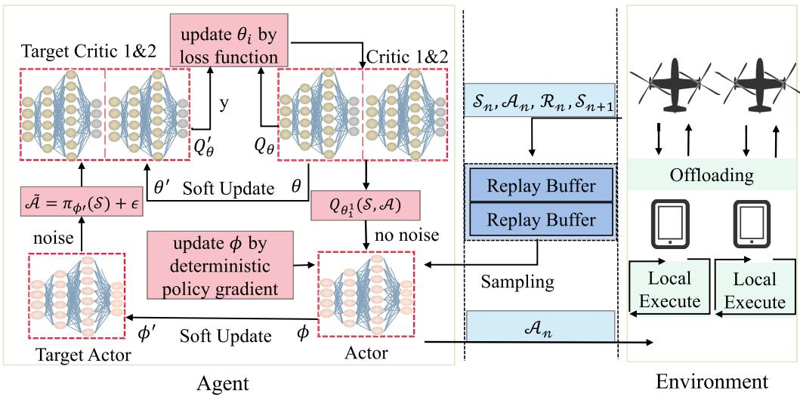

Fig. 3. Architecture of the proposed DPDTS scheme.  
Algorithm 3 DNN Partitioning and Dynamic Trajectory Selec  
tion (DPDTS)   
1: Initialize the agent’scritic network $Q _ { \theta _ { 1 } } , Q _ { \theta _ { 2 } }$ and actor   
network $\tau _ { \phi } ,$ <sup>θ θ</sup> and initializetarget networks’ parame-ters   
$\theta _ { 1 } ^ { \prime }  \theta _ { 1 } , \theta _ { 2 } ^ { \prime }  \theta _ { 2 } , \phi ^ { \prime }  \phi .$   
2: Initialize replay buferB, its size L, mini-batch sizeL .   
3: for episode = 1 → num do   
4: for time slot $n = 1  N$ do   
5: Obtain global partition policy G by Algorithm 1.   
6: Obtain the ofloading decision by Algorithm 2.   
7: Obtain state $S _ { n } .$   
8: Execute $\boldsymbol { A } _ { n }$ withexploration noise accord-ing to   
(22).   
9: Obtain next state $S _ { n + 1 }$   
10: Calculate the reward DELzz-DEL ${ \mathcal { R } } _ { n }$ based on G,   
and $\mathrm { U A V } ^ { \prime } \mathbf { s }$ loca-tions.   
11: Store the transition DELzz-DEL $( S _ { n } , \mathcal { A } _ { n } , \mathcal { R } _ { n } , S _ { n + 1 } )$   
into replay buferB.   
12: Sampling $L _ { b }$ of L transitions from B.   
13: Update critic parameters $\theta _ { 1 } , \theta _ { 2 }$ accord-ing to (23) and   
(24).   
14: if episode mod d then   
15: Update parameters of actornetwork according to   
(25).   
16: Update parameters of threetarget networks   
accordingto (26) and (27).   
17: end if   
18: end for   
19: end for

$$
\tilde { \mathcal { A } } _ { n } = \pi _ { \phi ^ { \prime } } ( S _ { n + 1 } ) + \epsilon , \epsilon \sim c l i p \Big ( N ( 0 , \tilde { \sigma } ) , - c , c \Big ) ,\tag{22}
$$

where is a Gaussian-distributed but clipped random exploration noise to smooth out the noise added earlier. Then, the critic networks can update their parameters with the temporal diference (TD) target [11]:

$$
y = \mathcal { R } _ { n } + \gamma \mathop { m i n } _ { i = 1 , 2 } \mathcal { Q } _ { \theta _ { i } ^ { \prime } } ( S _ { n + 1 } , \tilde { \mathcal { A } } _ { n } ) ,\tag{23}
$$

$$
\mathcal { L } _ { \theta _ { i ^ { \prime } } } = \frac { 1 } { L _ { b } } \sum _ { m = 1 } ^ { L _ { b } } \Bigl ( y _ { m } - Q _ { \theta _ { i ^ { \prime } } } ( S _ { m , n } , \mathcal { A } _ { m , n } ) \Bigr ) ^ { 2 } , i ^ { \prime } = 1 , 2 ,\tag{24}
$$

where $\gamma$ is the discount factor for the future Q-value, generally a number less than 1. Each parameter of the main critic network $\theta _ { i ^ { \prime } }$ is updated with the cost function $\mathcal { L } _ { \theta _ { i ^ { \prime } } }$ to minimize the error between the evaluation value and the target value, as shown in line 13.

The actor network uses delayed updates. For every d steps, the parameter $\phi$ in the actor network is updated with a deterministic policy gradient as shown in line 15:

$$
\nabla _ { \phi } ~ \mathcal { J } ( \phi ) = \frac { 1 } { L _ { b } } \sum _ { m = 1 } ^ { L _ { b } } \nabla _ { A _ { m } } Q _ { \theta _ { 1 } } ( S _ { m } , \mathcal { A } _ { m } ) \nabla _ { \phi } \pi _ { \phi } ( S _ { m } ) .\tag{25}
$$

Finally, the target network is updated using the soft update method as shown in line 16. Introduce a learning rate , make a weighted average of the old target network parameters and the new corresponding network parameters, and then assign them to the target network:

$$
\theta _ { i ^ { \prime } } ^ { \prime }  \tau \theta _ { i ^ { \prime } } + ( 1 - \tau ) \theta _ { i ^ { \prime } } ^ { \prime } , i ^ { \prime } = 1 , 2 ,
$$

$$
\phi ^ { \prime }  \tau \phi + ( 1 - \tau ) \phi ^ { \prime } .\tag{26}
$$

(27)

During the training phase, the of-line training cost depends on the structure of the Actor-Critic networks and is independent of the problem scale. In the online inference phase, the complexity of single-step decision-making is $O ( D _ { L } ^ { 2 } )$ , where $D _ { L }$ is the dimension of the hidden layer, and only forward propagation is required for real-time execution.

## V. SIMULATION RESULTS

In this section, numerical experiments are carried out to evaluate the performance of our proposed algorithm.

TABLE I  
SIMULATION AND TRAINING-RELATED PARAMETERS
<table><tr><td>Description</td><td>Parameter</td><td>Value</td></tr><tr><td>Serving time</td><td>T</td><td>900 s</td></tr><tr><td>Time slot</td><td>∆</td><td>0.6 s</td></tr><tr><td>Weight</td><td>η</td><td>0.5</td></tr><tr><td>Channel gain</td><td> $g _ { 0 }$ </td><td> $1 . 4 2 \times 1 0 ^ { - 4 }$ </td></tr><tr><td>Power of noise</td><td> $\sigma ^ { 2 }$ </td><td> $- 1 0 0 ~ \mathrm { d B m }$ </td></tr><tr><td>Chip parameter</td><td> $\kappa$ </td><td>10-28</td></tr><tr><td>Local computing frequency</td><td> $f _ { i }$ </td><td>1 GHz</td></tr><tr><td>Computing frequency in UAV</td><td> $f _ { j }$ </td><td>15 GHz</td></tr><tr><td>Task arrival rate</td><td> $\lambda _ { i }$ </td><td>[0, 5]</td></tr><tr><td>Task type</td><td> $t _ { i }$ </td><td>[0, 2]</td></tr><tr><td>Computing Power in UAV</td><td> $P _ { j } ^ { e x e c u }$ </td><td>0.1 W</td></tr><tr><td>Battery capacity</td><td> $\dot { E } _ { U A V } ^ { m a x }$ </td><td>600 J</td></tr><tr><td>Training numbers</td><td> $n u m$ </td><td> $3 \times 1 0 ^ { 6 }$ </td></tr><tr><td>Number of time slots</td><td> $N$ </td><td>1500</td></tr><tr><td>Discount factor</td><td> $\gamma$ </td><td>0.99</td></tr><tr><td>Learning rate</td><td> $\tau$ </td><td> $5 \times 1 0 ^ { - 3 }$ </td></tr><tr><td>Small batch size</td><td> $L _ { b }$ </td><td>256</td></tr><tr><td>Buffer size</td><td> $L$ </td><td> $1 0 ^ { 5 }$ </td></tr><tr><td>Delayed update frequency</td><td> $d$ </td><td>3</td></tr><tr><td>Maximum transmission power</td><td> $P _ { i } ^ { m a x }$ </td><td> $0 . 1 \mathrm { ~ W ~ }$ </td></tr><tr><td>Learning rate of Actor</td><td> $l r _ { a }$ </td><td> $3 \times 1 0 ^ { - 4 }$ </td></tr><tr><td>Learning rate of Critic</td><td> $l r _ { c }$ </td><td> $3 \times 1 0 ^ { - 4 }$ </td></tr></table>

## A. Simulation Settings

In multi-UAV assisted MEC system, GUs with certain computing capabilities are distributed on the ground in an area of 400m × 400m. The flying height H of four UAVs is 50m. The maximum flight speed $V ^ { m a x }$ is 2m s aligns with commercial UAV capabilities and ensures stable connectivity while covering 40% of the operational area per time slot, and their initial position is randomly generated at the active boundary. There are three types of DNN tasks generated by users, ResNet-34, VGG-16, and AlexNet, and the number of CPU cycles $C _ { l , t _ { i } }$ and the output data size $D _ { l , t _ { i } }$ required for each DNN layer are derived by combining the local device inference latency with computational power. Each UAV can provide computing services for up to $Z ~ = ~ 6$ users during the service duration. Diferent users have diferent task types and quantities, but the task types generated by the same user are determined. The actor and critic networks have the same network structure. Both consist of three layers, and the number of neurons in the hidden layer $D _ { L }$ is 128. The primary simulation and the settings of the training-related parameters of DPDTS are shown in Table I.

To validate the performance of the proposed DPDTS method, the following four algorithms are selected as benchmarks for comparison:

1) DTS: This method is the DPDTS algorithm without considering collaborative inference, where the computation tasks adopt a binary ofloading strategy, and the ofloading ratio can only be 1 or 0. This method validates the necessity of dynamic partitioning.

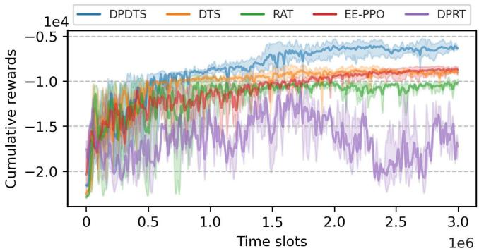  
Fig. 4. The cumulative rewards versus time slots.

2) RAT [10]: This method optimizes task ofloading for ground users and DDPG-based UAV trajectories, using a binary ofloading strategy for computation tasks and representing classic DRL approaches.

3) EE-PPO [12]: This method maximizes the average energy eficiency using PPO and enables dynamic adjustment of the task ofloading strategy.

4) DPRT: This method is a variation of the proposed DPDTS algorithm without dynamic trajectory planning, where the UAV trajectory and the ground users’ transmission power are randomly generated in each time slot, isolating the contribution of dynamic trajectory planning.

## B. Performance Evaluation

First, we evaluate the convergence performance of DPDTS and the other schemes. We set the number of GUs M to be 50, the signal coverage radius $d _ { m a x }$ of each UAV to be 50m, and the communication bandwidth to be 10 MHz. As shown in Fig. 4, as the number of training steps increases, the strategy of the DPDTS agent gradually improves, and the fluctuation in performance has a clear downward trend. Finally, it can obtain a relatively stable reward value, indicating that it has been trained as an agent to make the best real-time decisions. It is easy to see that DPDTS has the highest overall reward and a faster convergence speed. DTS, RAT, and EE-PPO have higher system costs since they do not partition the DNN tasks and have higher task transmission overheads, so the final converged reward is lower, and the performance is not as good as that of DPDTS. Moreover, DPRT has lower performance due to irregular exploration, which makes the reward curve constantly oscillate, making the performance worse.

Then, as shown in Fig. 5, we analyze the total energy consumption of the system as well as the average task processing latency per user obtained for DPDTS and other schemes when the radius of coverage of the UAV varies, and the evaluation data are the average values obtained by the diferent methods over 50 episodes. The larger the radius of the UAV signal, the more GUs can ofload tasks with high complexity to the UAV for execution. Thus, the system energy consumption and the average task latency show a decreasing trend. Fig. 5(a) shows that because DPDTS can eficiently perform collaborative inference and computation ofloading of tasks for GUs, it produces the lowest system energy consumption. Especially when the radius is 50, DPDTS consumes 1536.9J, which is reduced by 22.6%, 35.5%, 17.6%, and 54.2% compared to DTS, RAT, EE-PPO, and DPRT, respectively. Fig. 5(b) shows that because DPDTS employs DNN partitioning to significantly reduce the transmission delay of the task, the task is processed the fastest with the lowest average time per user. In particular, when the UAV signal coverage radius is 50, the average processing delay per user is 253.7ms, which is 24.8%, 36.8%, 19.26%, and 49.1% faster than the time used by the other schemes, respectively.

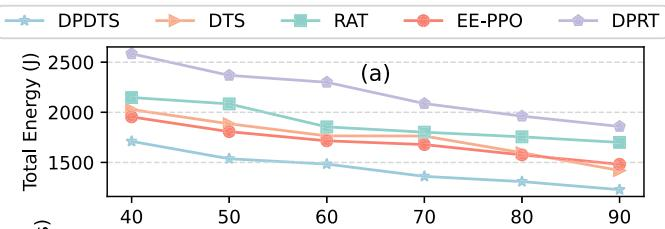

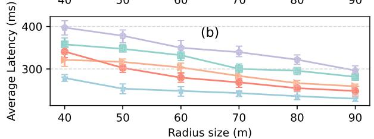  
Fig. 5. The total energy consumption and average task latency versus coverage radius size of UAVs.

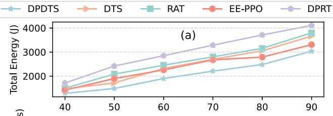

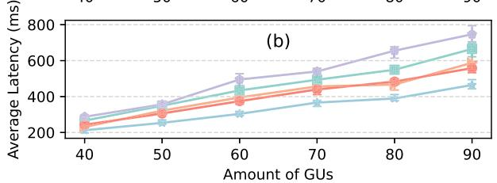  
Fig. 6. The total energy consumption and average task latency versus amount of GUs.

As shown in Fig. 6, we further analyze the total system energy consumption and the average task processing latency per user obtained for DPDTS and other schemes when the number of GUs increases. Since UAVs have limited computational resources, more GUs mean that more tasks must be processed locally. Thus, both the system energy consumption and the average task latency tend to increase. Fig. 6(a) shows that because DPDTS can dynamically obtain the partition point that minimizes the end-to-end delay, the energy consumption of the DPDTS system is the lowest, no matter how the number of users changes. Especially when the number of GUs is

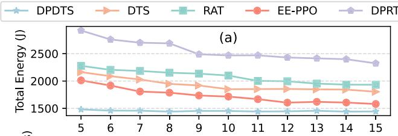

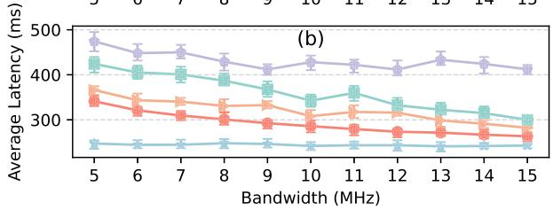  
Fig. 7. The total energy consumption and average task latency versus bandwidth.

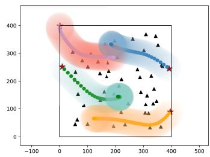  
(a) $d _ { m a x } = 5 0 m , M = 5 0 .$

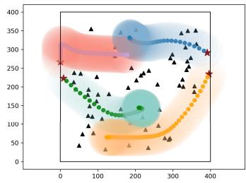  
(b) $d _ { m a x } = 5 0 m ,$ M = 60.

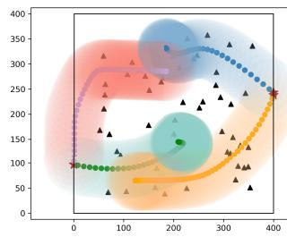  
(c) $d _ { m a x } = 6 0 m ,$ M = 50.

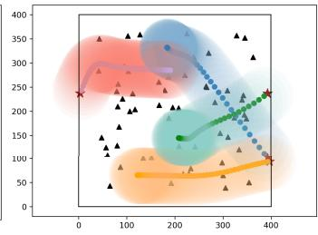  
(d) $d _ { m a x } = 6 0$ , M = 60.  
Fig. 8. Four situations of trajectories of four UAVs.

70, the energy consumption generated by DPDTS is 2209.0J, which is 21.3%, 26.7%, 17.8%, and 48.9% lower than that of DTS, RAT, EE-PPO, and DPRT, respectively. Fig. 6(b) shows that DPDTS has the lowest end-to-end delay with varying numbers of GUs, with an average user processing delay of 389ms for a user amount of 80, which is 20.0%, 41.2%, 24.2%, and 68.5% faster than the time used by the other schemes, respectively.

Fig. 7 shows the total system energy consumption and each user’s average task processing delay obtained by DPDTS and other schemes under diferent communication bandwidths. The larger the bandwidth, the higher the data transmission rate, and the transmission delay and transmission energy consumption required for task ofloading are reduced. Therefore, both energy consumption and delay show a downward trend. Under various bandwidth conditions, DPDTS performs better. Compared to DTS, RAT, EE-PPO, and DPRT, DPDTS reduces energy consumption by 35.1%, 49.2%, 23.9%, and 66.4% on average and reduces average delay by 27.5%, 31.7%, 18.2%, and 57.1% on average.

Fig. 8 shows the flight trajectories obtained by DPDTS in four test scenarios, where the four colored rings represent the flight paths of the four UAVs, the stars are randomly generated initial positions at the edges, and the triangles represent the GUs. The radius of coverage of the UAV signal are both 50 m in Figs. 8 (a) and (b), while are 60 m in Figs. 8 (c) and (d). In both Fig. 8(a) and Fig. 8(c), the number of ground users is 50, while there are 60 users in the scenarios of Fig. 8(b) and Fig. 8(d). As shown in Fig. 8, in the duration of service, UAVs departing from the edge tend to fly to the task-intensive area and then explore the best location so that more users can ofload tasks and the overall overhead of the system is less. At the same time, for the user equipment that is far away and sparsely distributed, considering the global energy consumption and delay, UAV will choose to continue to hover in the place with more GUs to reduce the path loss and ensure the eficiency of computing resource allocation.

## VI. CONCLUSION

In the research on multi-UAV-assisted task ofloading for ground users, existing solutions often exhibit poor performance when extended to scenarios of Deep Neural Network (DNN) tasks with high computational complexity and high transmission latency. Therefore, the trajectory optimization algorithm named DPDTS is proposed by combining collaborative inference and task ofloading based on user scheduling and task segmentation point selection. The aim is to achieve rational resource allocation and minimize system energy consumption and total latency. DPDTS is a reinforcement learning decision-making method based on the optimal segmentation points of DNNs and fairness factors. It can continuously increase rewards and efectively reduce the latency and energy consumption of DNN tasks in the MEC system. Simulation experiments are conducted to verify the superiority of the proposed scheme in terms of performance and complexity, and it is compared with some existing benchmark schemes based on reinforcement learning. The simulation results show that the proposed method performs better. However, there are still some issues in the current research, such as the insuficient scalability of the algorithm and the gap between the simulation experiments and the actual scenarios. In response to these problems, future research needs to conduct a comprehensive and in-depth analysis and actively explore potential solutions on this basis.

## REFERENCES

[1] A. Telikani, A. Sarkar, B. Du, and J. Shen, “Machine learning for UAVaided ITS: A review with comparative study,” IEEE Trans. Intell. Transp. Syst., vol. 25, no. 11, pp. 15388–15406, Nov. 2024.

[2] T. Gong, L. Zhu, F. R. Yu, and T. Tang, “Edge intelligence in intelligent transportation systems: A survey,” IEEE Trans. Intell. Transp. Syst., vol. 24, no. 9, pp. 8919–8944, Sep. 2023.

[3] G. Li and J. Cai, “An online incentive mechanism for collaborative task ofloading in mobile edge computing,” IEEE Trans. Wireless Commun., vol. 19, no. 1, pp. 624–636, Jan. 2020.

[4] C. Yi, S. Huang, and J. Cai, “Joint resource allocation for device-todevice communication assisted fog computing,” IEEE Trans. Mobile Comput., vol. 20, no. 3, pp. 1076–1091, Mar. 2021.

[5] A. Haydari and Y. Yilmaz, “Deep reinforcement learning for intelligent transportation systems: A survey,” IEEE Trans. Intell. Transp. Syst., vol. 23, no. 1, pp. 11–32, Jan. 2022.

[6] C. Yi, J. Cai, and Z. Su, “A multi-user mobile computation ofloading and transmission scheduling mechanism for delay-sensitive applications,” IEEE Trans. Mobile Comput., vol. 19, no. 1, pp. 29–43, Jan. 2020.

[7] J. Su, S. Yu, B. Li, and Y. Ye, “Distributed and collective intelligence for computation ofloading in aerial edge networks,” IEEE Trans. Intell. Transp. Syst., vol. 24, no. 7, pp. 7516–7526, Jul. 2023.

[8] L. Lyu, F. Zeng, Z. Xiao, C. Zhang, H. Jiang, and V. Havyarimana, “Computation bits maximization in UAV-enabled mobile-edge computing system,” IEEE Internet Things J., vol. 9, no. 13, pp. 10640–10651, Jul. 2022.

[9] G. Zheng, C. Xu, M. Wen, and X. Zhao, “Service caching based aerial cooperative computing and resource allocation in multi-UAV enabled MEC systems,” IEEE Trans. Veh. Technol., vol. 71, no. 10, pp. 10934–10947, Oct. 2022.

[10] L. Wang, K. Wang, C. Pan, W. Xu, N. Aslam, and A. Nallanathan, “Deep reinforcement learning based dynamic trajectory control for UAVassisted mobile edge computing,” IEEE Trans. Mobile Comput., vol. 21, no. 10, pp. 3536–3550, Oct. 2022.

[11] T. P. Lillicrap et al., “Continuous control with deep reinforcement learning,” 2015, arXiv:1509.02971.

[12] B. Li, W. Liu, W. Xie, and X. Li, “Energy-eficient task ofloading and trajectory planning in UAV-enabled mobile edge computing networks,” Comput. Netw., vol. 234, Oct. 2023, Art. no. 109940.

[13] J. Schulman, F. Wolski, P. Dhariwal, A. Radford, and O. Klimov, “Proximal policy optimization algorithms,” 2017, arXiv:1707.06347.

[14] Y. Kang et al., “Neurosurgeon: Collaborative intelligence between the cloud and mobile edge,” ACM SIGARCH Comput. Archit. News, vol. 45, no. 1, pp. 615–629, 2017.

[15] C. Hu, W. Bao, D. Wang, and F. Liu, “Dynamic adaptive DNN surgery for inference acceleration on the edge,” in Proc. IEEE Conf. Comput. Commun., Apr. 2019, pp. 1423–1431.

[16] J. Zhang et al., “Stochastic computation ofloading and trajectory scheduling for UAV-assisted mobile edge computing,” IEEE Internet Things J., vol. 6, no. 2, pp. 3688–3699, Apr. 2019.

[17] W. Lin, T. Huang, X. Li, F. Shi, X. Wang, and C.-H. Hsu, “Energyeficient computation ofloading for UAV-assisted MEC: A two-stage optimization scheme,” ACM Trans. Internet Technol., vol. 22, no. 1, pp. 1–23, Feb. 2022.

[18] Q. Wu, Y. Zeng, and R. Zhang, “Joint trajectory and communication design for multi-UAV enabled wireless networks,” IEEE Trans. Wireless Commun., vol. 17, no. 3, pp. 2109–2121, Mar. 2018.

[19] Y. Qian, F. Wang, J. Li, L. Shi, K. Cai, and F. Shu, “User association and path planning for UAV-aided mobile edge computing with energy restriction,” IEEE Wireless Commun. Lett., vol. 8, no. 5, pp. 1312–1315, Oct. 2019.

[20] D. Wei, J. Ma, L. Luo, Y. Wang, L. He, and X. Li, “Computation ofloading over multi-UAV MEC network: A distributed deep reinforcement learning approach,” Comput. Netw., vol. 199, Nov. 2021, Art. no. 108439.

[21] Q. Luo, T. H. Luan, W. Shi, and P. Fan, “Deep reinforcement learning based computation ofloading and trajectory planning for multi-UAV cooperative target search,” IEEE J. Sel. Areas Commun., vol. 41, no. 2, pp. 504–520, Feb. 2023.

[22] J. Du, C. Jiang, A. Benslimane, S. Guo, and Y. Ren, “SDN-based resource allocation in edge and cloud computing systems: An evolutionary Stackelberg diferential game approach,” IEEE/ACM Trans. Netw., vol. 30, no. 4, pp. 1613–1628, Aug. 2022.

[23] N. Lin, H. Tang, L. Zhao, S. Wan, A. Hawbani, and M. Guizani, “A PDDQNLP algorithm for energy eficient computation ofloading in UAV-assisted MEC,” IEEE Trans. Wireless Commun., vol. 22, no. 12, pp. 8876–8890, Dec. 2023.

[24] N. Lin et al., “Green communications: RIS-assisted fixed-wing UAV coverage scheme based on deep reinforcement learning,” IEEE Internet Things J., vol. 12, no. 4, pp. 4115–4127, Feb. 2025.

[25] A. E. Eshratifar, M. S. Abrishami, and M. Pedram, “JointDNN: An eficient training and inference engine for intelligent mobile cloud computing services,” IEEE Trans. Mobile Comput., vol. 20, no. 2, pp. 565–576, Feb. 2021.

[26] P. Wang, X. He, G. Li, T. Zhao, and J. Cheng, “Sparsity-inducing binarized neural networks,” in Proc. AAAI Conf. Artif. Intell., Apr. 2020, vol. 34, no. 7, pp. 12192–12199.

[27] J. Xin, R. Tang, J. Lee, Y. Yu, and J. Lin, “DeeBERT: Dynamic early exiting for accelerating BERT inference,” 2020, arXiv:2004.12993.

[28] S. Zhang et al., “Towards real-time cooperative deep inference over the cloud and edge end devices,” Proc. ACM Interact., Mobile, Wearable Ubiquitous Technol., vol. 4, no. 2, pp. 1–24, Jun. 2020.

[29] H. Wang, B. Guo, J. Liu, S. Liu, Y. Wu, and Z. Yu, “Context-aware adaptive surgery: A fast and efective framework for adaptative model partition,” Proc. ACM Interact., Mobile, Wearable Ubiquitous Technol., vol. 5, no. 3, pp. 1–22, Sep. 2021.

[30] R. Yang, Y. Li, H. He, and W. Zhang, “DNN real-time collaborative inference acceleration with mobile edge computing,” in Proc. Int. Joint Conf. Neural Netw. (IJCNN), Jul. 2022, pp. 1–8.

[31] J. Du, T. Lin, C. Jiang, Q. Yang, C. F. Bader, and Z. Han, “Distributed foundation models for multi-modal learning in 6G wireless networks,” IEEE Wireless Commun., vol. 31, no. 3, pp. 20–30, Jun. 2024.

[32] X. Wang, X. Li, N. Wang, and X. Qin, “Fine-grained cloud edge collaborative dynamic task scheduling based on DNN layer-partitioning,” in Proc. 18th Int. Conf. Mobility, Sens. Netw. (MSN), Dec. 2022, pp. 155–162.

[33] C. Li et al., “DNN inference acceleration based on adaptive task partitioning and ofloading in embedded VEC,” ACM Trans. Embedded Comput. Syst., vol. 24, no. 4, pp. 1–35, Jul. 2025.

[34] F. Zhou, Y. Wu, R. Q. Hu, and Y. Qian, “Computation rate maximization in UAV-enabled wireless-powered mobile-edge computing systems,” IEEE J. Sel. Areas Commun., vol. 36, no. 9, pp. 1927–1941, Sep. 2018.

[35] Y. Zeng, J. Xu, and R. Zhang, “Energy minimization for wireless communication with rotary-wing UAV,” IEEE Trans. Wireless Commun., vol. 18, no. 4, pp. 2329–2345, Apr. 2019.

[36] A. Krizhevsky, I. Sutskever, and G. E. Hinton, “Imagenet classification with deep convolutional neural networks,” Commun. ACM, vol. 60, no. 6, pp. 84–90, May 2017, doi: 10.1145/3065386.

[37] K. Simonyan and A. Zisserman, “Very deep convolutional networks for large-scale image recognition,” 2014, arXiv:1409.1556.

[38] K. He, X. Zhang, S. Ren, and J. Sun, “Deep residual learning for image recognition,” in Proc. IEEE Conf. Comput. Vis. Pattern Recognit. (CVPR), Jun. 2016, pp. 770–778.

[39] S. Fujimoto, H. van Hoof, and D. Meger, “Addressing function approximation error in actor-critic methods,” in Proc. Int. Conf. Mach. Learn., 2018, pp. 1587–1596.

  
Xiangping Bryce Zhai (Member, IEEE) received the B.Eng. degree in computer science and technology from Shandong University in 2006 and the Ph.D. degree in computer science from the City University of Hong Kong in 2013. Previously, he was a Post-Doctoral Fellow with the City University of Hong Kong. He is currently an Associate Professor with the College of Artificial Intelligence, Nanjing University of Aeronautics and Astronautics, China. His research interests include Internet of Flying Things, power control, edge computing, resource

optimization, and spatial analytics. He has been actively involved in organizing and chairing sessions and has served as a reviewer for several journals and TPC for several international conferences.

  
Shuang Fu is currently pursuing the master’s degree with the School of Artificial Intelligence, Nanjing University of Aeronautics and Astronautics, China, under the supervision of Asso. Prof. Xiangping Bryce Zhai. Her research interests include Uncrewed aerial vehicles and reinforcement learning for mobile edge computing.


Changyan Yi (Senior Member, IEEE) received the Ph.D. degree from the Department of Electrical and Computer Engineering, University of Manitoba, MB, Canada, in 2018. From 2018 to 2019, he was a Research Associate with the University of Manitoba. He is currently a Professor with the College of Computer Science and Technology, Nanjing University of Aeronautics and Astronautics (NUAA), Nanjing, China. His research interests include game theory, queueing theory, machine learning, and their applications in various wireless networks. He was awarded the Changkong Scholar of NUAA in 2018 and Chinese Government Award for Outstanding Students Abroad in 2017.


Zhiquan Liu (Member, IEEE) received the B.S. degree from the School of Science, Xidian University, Xi’an, China, in 2012, and the Ph.D. degree from the School of Computer Science and Technology, Xidian University, in 2017. He is currently an Associate Professor with the College of Cyber Security, Jinan University, Guangzhou, China. His current research interests include trust management, privacy preservation, and artificial intelligence in vehicular networks and UAV networks.


Chao Dong (Senior Member, IEEE) received the Ph.D. degree in communication engineering from the PLA University of Science and Technology, Nanjing, China, in 2007. From 2008 to 2011, he was a Post-Doctoral Researcher with the Department of Computer Science and Technology, Nanjing University, China. From 2011 to 2017, he was an Associate Professor with the Institute of Communications Engineering, PLA University of Science and Technology. He is currently a Full Professor with the College of Electronic and Information Engineering,

Nanjing University of Aeronautics and Astronautics, Nanjing, China. His current research interests include low-altitude intelligent networks, distributed collaborative intelligence, and electromagnetic large model. He is a member of ACM and IEICE.


Chee Wei Tan (Senior Member, IEEE) received the M.A. and Ph.D. degrees in electrical engineering from Princeton University. His research interests include networks, distributed optimization, and generative artificial intelligence (AI). He received the Princeton University Wu Prize for Excellence, the Google Faculty Award, the 2024 IEEE CAI Honorable Mention Award in Foundation Models and Generative AI, several teaching excellence awards, and was selected twice for U.S. National Academy of Engineering China–America Frontiers of Engineering Symposium. He served as an Editor for IEEE TRANSACTIONS ON SIGNAL AND INFORMATION PROCESSING, IEEE TRANSACTIONS ON COGNITIVE COMMUNICATIONS AND NETWORKING, IEEE/ACM TRANS-ACTIONS ON NETWORKING, IEEE TRANSACTIONS ON COMMUNICATIONS, TPC of IEEE INFOCOM, and ACM SIGMETRICS, and an IEEE ComSoc Distinguished Lecturer.