# Deep Learning-Based Predictive Bidirectional Beamforming in ISAC-Enabled UAV Networks

Jinghan Xu, Student Member, IEEE, Xiaotian Zhou , Member, IEEE, Haixia Zhang , Senior Member, IEEE, and Yueheng Li , Member, IEEE

Abstract—This paper investigates the Integrated Sensing and Communication (ISAC) empowered predictive beamforming design for Uncrewed Aerial Vehicle (UAV) assisted networks, where the ground Base Station (BS) explores the echoes of communication signal for real-time UAV tracking. To ensure practicality and generalizability, we establish a random UAV mobility model incorporating position fluctuations and attitude variations during flight, which poses challenges to accurate UAV tracking. To address this, we propose Historical Echoes-based Convolutional Time Attention Network (HECTA-Net), a novel deep learning framework for end-to-end beamforming prediction. The proposed HECTA-Net integrates Convolutional Neural Network (CNN) and Temporal Convolutional Network (TCN) to jointly extract the spatio-temporal features from historical ISAC echoes across multiple time slots, where the attention mechanism is also embedded to dynamically identify and weight the critical time slots. Thus it enables accurate prediction on the transmit and receive beamforming matrices. Extensive simulations are conducted to validate the robustness and performance of proposed scheme. Results demonstrate that the proposed HECTA-Net outperforms the other state-of-art baselines, with its performance closely approaching the theoretical upper bound even in the high randomized UAV motion patterns.

Index Terms—Integrated sensing and communication (ISAC), uncrewed aerial vehicle (UAV), predictive beamforming, deep learning (DL).

## I. INTRODUCTION

NTEGRATED Sensing and Communication (ISAC) unifies the functionalities of sensing and communication within the shared infrastructure, emerging as a promising technology for the Sixth Generation (6G) mobile communications [1]. In general, the ISAC systems follow two fundamental design paradigms, say, communication-centric and sensing-centric approaches [2]. Under the communication-centric approach, for instance, the transmitter can leverage ISAC echoes to localize the receivers, thereby facilitating precise beam alignment between transceiver ends to improve communication performance [3], [4]. Such paradigm is particularly valuable for the scenarios like vehicular networks and air-to-ground networks, where the dynamic beamforming can be achieved in real time to cope with the mobility of terminals.

There have been research works adopting ISAC for vehicular networks, where the Roadside Unit (RSU) can leverage ISAC echoes to extract motion parameters of vehicles, thereby guiding the beamforming design to compensate for mobility impacts [5], [6], [7], [8]. Early works employed Extended Kalman Filter (EKF) to predict vehicular angles for subsequent beamforming design [5]. However, this approach relies on idealized kinematic model and Jacobian matrix derivation, which inevitably introduces angular prediction errors. To further enhance the prediction accuracy, recent studies have adopted deep learning (DL) methods [6], [7], [8]. In [6], a Historical channels-based Convolutional Long Short-Term Memory (LSTM) Network (HCL-Net) was proposed, through which the predicted beamforming matrix can be obtained with the historical Channel State Information (CSI) extracted from ISAC echoes across multiple previous time slots. However, this method remains susceptible to CSI estimation errors incurred during echo processing. To overcome this limitation, the authors in [7] proposed an end-to-end framework employing an attention-based Long Short-Term Memory (LSTM) network. This method learns the temporal correlations directly from reflected echoes to obtain the beamforming matrix, thus eliminating the step of CSI estimation.

While the aforementioned studies primarily address Two-Dimensional (2D) scenarios, the evolution toward 6G networks has necessitated the development of Three-Dimensional (3D) network architectures, such as the Uncrewed Aerial Vehicle (UAV) enabled air-ground network [9]. By incorporating UAV as the key component, substantial advantages such as service coverage enhancement and on-demand deployment can be brought to the network [10]. In this context, [11] reported an ISAC based UAV network, where a single UAV is employed to provide communication service to ground users while sensing several ground targets. For this model, an energy-efficient framework was designed to minimize the power consumption of UAV while guaranteeing both S&C performance, achieved by the alternating optimization approach. Building upon this, [12] further considered the constraint of limited backhaul capacity. The study proposed an efficient UAV hovering and resource allocation scheme to balance the tradeoff between power consumption, sensing accuracy, and communication quality. Another critical application of ISAC in UAV network is to accommodate the unconstrained 3D mobility of UAV, where the ground Base Station (BS) can maintain persistent beam alignment via UAV tracking to ensure stable communication links. Following this idea, [13] developed a dual identity association-based ISAC approach to enable accurate beam alignment between BS and UAVs, where EKF is employed to track the physical identities of UAVs. Reference [14] considered the more complex scenario that incorporates multi-path fading channel and the elevation angle of UAV. To maximize the communication rate, a refined EKF based beam tracking method was designed to maintain dynamic beam alignment between BS and UAV. The authors in [15] considered the UAV enabled network in the urban scenario with frequent Line-of-Sight (LoS) blockages. A Channel Knowledge Map (CKM)-assisted predictive beamforming scheme, which combines LoS identification and UAV tracking via EKF, was proposed to reduce the communication outages.

Through literature review, it can be concluded that there have been research works addressing the predictive beamforming for UAV-aided networks, incorporating some unique architecture features of 3D networks such as elevation angles of UAV and LoS blockages. Though promising, most existing efforts assume regular mobility patterns of UAV, where the inherent randomness during flight is somehow underestimated. In fact, UAV usually exhibits complex and random in-flight patterns owing to both active and passive mobility. The active mobility is contributed by the flexibility of UAV movement in the 3D space, generating irregular flight trajectories. While the randomness in passive mobility comes from 3D drifts induced by environmental influences such as wind gusts. Furthermore, the randomness in dual-mobility of UAV also induces attitude variations, resulting in rotation dynamics of antenna array mounted at UAV that further complicates the receive beamforming design. All these factors should not be neglected as they increase the difficulty of precise beamforming design for ground to air communications. Current approaches, predominantly employing the EKF method, rely heavily on predefined kinematic models, which not only struggle to accurately capture the complex and random nature of active mobility but also fail to deal with the randomness induced by passive mobility. Therefore, such model-dependent approaches exhibit limited effectiveness when UAV motion deviates from expected patterns, making accurate tracking challenging. Consequently, these limitations highlight the need for robust predictive beamforming methods that are capable of handling both active and passive UAV dynamics.

To address these challenges, in this paper, we investigate the ISAC-enabled beamforming design, which takes into account both in-flight dual-mobility and attitude variation of the UAV. To cope with the randomness of UAV mobility, a DL-based predictive beamforming approach is proposed. The proposed approach employs neural networks to extract features from

ISAC echoes across multiple historical time slots, enabling prediction of bidirectional beamforming matrices to maximize communication performance under random mobility conditions. In general, the main contributions of this paper are summarized as follows:

• A practical model is established for the ISAC-enabled UAV network, where the ground BS employs historical ISAC echoes to predict the bidirectional beamforming toward UAV. The randomness inherent in both in-flight active and passive mobility of UAV is taken into account in the model. Furthermore, attitude variation is also considered. With respect to the model, the predictive beamforming design problem is formulated with the objective of maximizing the achievable rate.

• To solve the problem, a Historical Echoes-based Convolutional Time Attention Network (HECTA-Net) is proposed. The proposed HECTA-Net is able to comprehensively capture both local and global spatio-temporal information through integrating Convolutional Neural Network (CNN) [16] for spatial feature extraction, and Temporal Convolutional Network (TCN) [17] for temporal pattern learning. Furthermore, the attention mechanism [18] is also embedded, which can help dynamically adjust the weight of historical time slots to further suppress the drift and oscillation effects.

Extensive simulations are conducted to verify the performance and robustness of proposed scheme. The results reveal that the proposed scheme outperforms the benchmark methods, with the achievable rate approaching the theoretical upper bound. The robustness of the proposed scheme is also confirmed via the simulation results in two distinct scenarios with different randomness levels of UAV mobility.

The remainder of this paper is organized as follows. Section II introduces the ISAC-based UAV system model and formulates the optimization problem of predictive beamforming design. Section III illustrates the details of the proposed HECTA-Net. Then, simulation results are provided in Section IV to verify the effectiveness of the proposed approach. Finally, Section V concludes the paper.

Notations: Scalars, vectors and matrices are denoted by the lowercase, bold lowercase and bold uppercase letters, respectively. C and R represent the set of complex number and real number. T , \*, H denote the transpose, conjugate, and conjugate-transpose, respectively. E{·} is the statistical expectation. I denotes the identity matrix. ${ \mathcal { N } } ( \mu , \sigma ^ { 2 } )$ and $\mathcal { C N } ( \mu , \sigma ^ { 2 } )$ are the real and circular Gaussian distribution with mean µ and variance $\sigma ^ { 2 }$ , respectively. $\| \cdot \| _ { F }$ is the Frobenius norm. Re{·} and Im{·} denote the real and imaginary part of a complex-valued matrix, respectively. The definitions of parameters in this work are also summarized in Table I.

## II. SYSTEM MODEL AND PROBLEM FORMULATION

As shown in Fig. 1, an ISAC-enabled UAV network comprising one ground BS in communication with one UAV is considered. The UAV moves unconstrained within the 3D coverage region of BS, exhibiting continuous coordinate transitions in both horizontal and vertical dimensions. To cope with the mobility of UAV, ISAC is adopted to align the beam towards UAV. We assume that the BS employs an Uniform Planar Array (UPA) consisting of $N _ { t } = N _ { t x } \times N _ { t y }$ transmit antennas and $N _ { r } = N _ { r x } \times N _ { r y }$ receive antennas, enabling simultaneously signal transmission and echo reception. While the UAV is equipped with a ventral-mounted UPA with $N _ { u } = N _ { u x } \times N _ { u y }$ antenna elements arranged in rectangular formation, the function of which is solely for signal reception.

TABLE I  
SUMMARY OF NOTATIONS
<table><tr><td rowspan=1 colspan=1> $\overline { { T } }$ </td><td rowspan=1 colspan=1>Total transmission period</td><td rowspan=1 colspan=1> $\overline { { \Delta T } }$ </td><td rowspan=1 colspan=1>Duration of each time slot</td><td rowspan=1 colspan=1> $\overline { { N } }$ </td><td rowspan=1 colspan=1>Total number of time slots</td></tr><tr><td rowspan=1 colspan=1> $n , ~ m$ </td><td rowspan=1 colspan=1>Time slot indices</td><td rowspan=1 colspan=1> $\mathbf { p } _ { B }$ </td><td rowspan=1 colspan=1>Coordinates of the ground BS</td><td rowspan=1 colspan=1> $\underline { { \mathbf { p } _ { n } } }$ </td><td rowspan=1 colspan=1>UAV position at time slot n</td></tr><tr><td rowspan=1 colspan=1> $\mathbf { v } _ { n }$ </td><td rowspan=1 colspan=1>UAV velocity at time slot n</td><td rowspan=1 colspan=1> $\overline { { { \bf p } _ { n } ^ { \mathrm { a c t } } } }$ </td><td rowspan=1 colspan=1>Active mobility position component</td><td rowspan=1 colspan=1> $\overline { { { \bf p } _ { n } ^ { \mathrm { p a s } } } }$ </td><td rowspan=1 colspan=1>Passive drift position component</td></tr><tr><td rowspan=1 colspan=1> $\epsilon _ { i }$ </td><td rowspan=1 colspan=1>Random 3D drift</td><td rowspan=1 colspan=1> $\theta _ { n } , \varphi _ { n }$ </td><td rowspan=1 colspan=1>Elevation and azimuth angles</td><td rowspan=1 colspan=1> $d _ { n }$ </td><td rowspan=1 colspan=1>Distance between BS and UAV</td></tr><tr><td rowspan=1 colspan=1> $\underline { { \mathbf { q } _ { n } } }$ </td><td rowspan=1 colspan=1>UAV attitude</td><td rowspan=1 colspan=1> $\overline { { \mathbf { q } _ { n } ^ { \mathrm { a c t } } } }$ </td><td rowspan=1 colspan=1>Active attitude component</td><td rowspan=1 colspan=1> $\mathbf { \overline { { q } } } _ { n } ^ { \mathrm { p a s } }$ </td><td rowspan=1 colspan=1>Passive attitude oscillation</td></tr><tr><td rowspan=1 colspan=1>Rn</td><td rowspan=1 colspan=1>Rotation matrix of UAV</td><td rowspan=1 colspan=1> $\underline { { x _ { n } , y _ { n } } }$ </td><td rowspan=1 colspan=1>Direction of arrival angles at UAV</td><td rowspan=1 colspan=1> $\overline { { N _ { t } } }$ </td><td rowspan=1 colspan=1>Number of BS transmit antennas</td></tr><tr><td rowspan=1 colspan=1> $\overline { { N _ { r } } }$ </td><td rowspan=1 colspan=1>Number of BS receive antennas</td><td rowspan=1 colspan=1> $\overline { { N _ { \tau } } }$ </td><td rowspan=1 colspan=1>Number of UAV receive antennas</td><td rowspan=1 colspan=1> $\mathbf { a } _ { b t }$ </td><td rowspan=1 colspan=1>Transmit steering vector at BS</td></tr><tr><td rowspan=1 colspan=1> $\mathbf { a } _ { b r }$ </td><td rowspan=1 colspan=1>Receive steering vector at BS</td><td rowspan=1 colspan=1> $\mathbf { a } _ { u }$ </td><td rowspan=1 colspan=1>Receive steering vector at UAV</td><td rowspan=1 colspan=1> $s _ { n } ( t )$ </td><td rowspan=1 colspan=1>Intended signal</td></tr><tr><td rowspan=1 colspan=1>Fn</td><td rowspan=1 colspan=1>Transmit beamforming matrix at BS</td><td rowspan=1 colspan=1> $\overline { { \tilde { \bf s } _ { n } ( t ) } }$ </td><td rowspan=1 colspan=1>ISAC signal for transmission</td><td rowspan=1 colspan=1> $\mathbf { r } _ { n } ( t )$ </td><td rowspan=1 colspan=1>Received echo signal at BS</td></tr><tr><td rowspan=1 colspan=1> $P _ { T }$ </td><td rowspan=1 colspan=1>Transmit power of BS</td><td rowspan=1 colspan=1> $G _ { r }$ </td><td rowspan=1 colspan=1>Total antenna array gain for sensing</td><td rowspan=1 colspan=1> $\nu _ { n }$ </td><td rowspan=1 colspan=1>Time-delay of transmission</td></tr><tr><td rowspan=1 colspan=1> $\overline { { { \bf z } _ { r } ( t ) } }$ </td><td rowspan=1 colspan=1>AWGN in sensing channel</td><td rowspan=1 colspan=1> $\overline { { \mathbf { H } _ { r } } }$ </td><td rowspan=1 colspan=1>Sensing channel matrix</td><td rowspan=1 colspan=1> $\beta _ { n }$ </td><td rowspan=1 colspan=1>Reflection coefficient</td></tr><tr><td rowspan=1 colspan=1>ε</td><td rowspan=1 colspan=1>Radar cross-section (RCS)</td><td rowspan=1 colspan=1> $\mu _ { n }$ </td><td rowspan=1 colspan=1>Doppler frequency</td><td rowspan=1 colspan=1> $\tilde { \mathbf { r } } _ { n }$ </td><td rowspan=1 colspan=1>Matched-filtered echo signal</td></tr><tr><td rowspan=1 colspan=1> $\overline { { \Delta T _ { c } } }$ </td><td rowspan=1 colspan=1>Duration of received echo</td><td rowspan=1 colspan=1> $\overrightharpoon { \xi }$ </td><td rowspan=1 colspan=1>Matched-filtering gain</td><td rowspan=1 colspan=1> $\widetilde { \pmb { z } } _ { r }$ </td><td rowspan=1 colspan=1>Measured noise after matched filtering</td></tr><tr><td rowspan=1 colspan=1> $\tilde { \nu } _ { n } , \tilde { \mu } _ { n }$ </td><td rowspan=1 colspan=1>Estimated time-delay and Doppler</td><td rowspan=1 colspan=1> ${ \bf w } _ { n }$ </td><td rowspan=1 colspan=1>Receive beamforming matrix at UAV</td><td rowspan=1 colspan=1> $\overline { { c _ { n } ( t ) } }$ </td><td rowspan=1 colspan=1>Received signal at UAV</td></tr><tr><td rowspan=1 colspan=1> $\overline { { G _ { c } } }$ </td><td rowspan=1 colspan=1>Antenna array gain for communication</td><td rowspan=1 colspan=1> $\overline { { z _ { c } ( t ) } }$ </td><td rowspan=1 colspan=1>AWGN in communication channel</td><td rowspan=1 colspan=1> $\overline { { \mathbf { H } _ { c } } }$ </td><td rowspan=1 colspan=1>Communication channel matrix</td></tr><tr><td rowspan=1 colspan=1> $\tilde { \alpha } _ { n }$ </td><td rowspan=1 colspan=1>Path loss coefficient</td><td rowspan=1 colspan=1> $\alpha$ </td><td rowspan=1 colspan=1>Path loss at reference distance</td><td rowspan=1 colspan=1> $\phi _ { n }$ </td><td rowspan=1 colspan=1>Roll angle</td></tr><tr><td rowspan=1 colspan=1> $\gamma _ { n }$ </td><td rowspan=1 colspan=1>Pitch angle</td><td rowspan=1 colspan=1> $\overline { { \psi _ { n } } }$ </td><td rowspan=1 colspan=1>Yaw angle</td><td rowspan=1 colspan=1> $\underline { { \mathbf { e } _ { x , n } , \mathbf { e } _ { y , n } } }$ </td><td rowspan=1 colspan=1>x-axis and y-axis of UPA at UAV</td></tr><tr><td rowspan=1 colspan=1> $\operatorname { S N R } _ { n }$ </td><td rowspan=1 colspan=1>Signal-to-noise ratio</td><td rowspan=1 colspan=1> $R _ { n }$ </td><td rowspan=1 colspan=1>Achievable rate</td><td rowspan=1 colspan=1> $\tilde { \mathbf { F } } _ { n }$ </td><td rowspan=1 colspan=1>Predicted transmit beamforming matrix</td></tr><tr><td rowspan=1 colspan=1> $\tilde { \mathbf { w } } _ { n }$ </td><td rowspan=1 colspan=1>Predicted receive beamforming matrix</td><td rowspan=1 colspan=1> $\tilde { \mathbf { F } } _ { n } ^ { * }$ </td><td rowspan=1 colspan=1>Optimal transmit beamforming matrix</td><td rowspan=1 colspan=1> $\tilde { \mathbf { w } } _ { n } ^ { * }$ </td><td rowspan=1 colspan=1>Optimal receive beamforming matrix</td></tr><tr><td rowspan=1 colspan=1> $\overline { { \mathcal { F } ( \cdot ) } }$ </td><td rowspan=1 colspan=1>Mapping function of learning network</td><td rowspan=1 colspan=1> $\mathcal { X } _ { n } ^ { \tau }$ </td><td rowspan=1 colspan=1>Historical matched-filtered echoes</td><td rowspan=1 colspan=1> $\overline { { \Phi } }$ </td><td rowspan=1 colspan=1>Network parameters</td></tr><tr><td rowspan=1 colspan=1> $\tau$ </td><td rowspan=1 colspan=1>Number of historical time slots</td><td rowspan=1 colspan=1> $\mathcal { X } _ { n } ^ { \tau }$ </td><td rowspan=1 colspan=1>3D real-valued input tensor</td><td rowspan=1 colspan=1> $\mathcal { M } ( \cdot )$ </td><td rowspan=1 colspan=1>Complex-to-real conversion function</td></tr><tr><td rowspan=1 colspan=1> $\underline { { \mathbf { W } _ { c n n } } }$ </td><td rowspan=1 colspan=1>CNN kernel weights</td><td rowspan=1 colspan=1> $\underline { { \mathbf { b } _ { c n n } } }$ </td><td rowspan=1 colspan=1>CNN kernel biases</td><td rowspan=1 colspan=1> ${ \underline { { \mathbf { Y } _ { c n n } } } }$ </td><td rowspan=1 colspan=1>Output of CNN module</td></tr><tr><td rowspan=1 colspan=1> $\overline { { k } }$ </td><td rowspan=1 colspan=1>TCN filter size</td><td rowspan=1 colspan=1> $\overline { { d } }$ </td><td rowspan=1 colspan=1>TCN dilation factor</td><td rowspan=1 colspan=1></td><td rowspan=1 colspan=1>TCN residual block index</td></tr><tr><td rowspan=1 colspan=1> $\mathbf { Y } _ { t c n }$ </td><td rowspan=1 colspan=1>Output of TCN module</td><td rowspan=1 colspan=1> $\overline { { h } }$ </td><td rowspan=1 colspan=1>Number of attention heads</td><td rowspan=1 colspan=1> $\overline { { \mathbf { Q } _ { i } , \mathbf { K } _ { i } , \mathbf { V } _ { i } } }$ </td><td rowspan=1 colspan=1>Query, key, value matrices</td></tr><tr><td rowspan=1 colspan=1> $\mathbf { Y } _ { a t t n }$ </td><td rowspan=1 colspan=1>Output of attention module</td><td rowspan=1 colspan=1> $\overline { { \mathbf { W } _ { o } } }$ </td><td rowspan=1 colspan=1>Output projection matrix</td><td rowspan=1 colspan=1> $\overline { { \textbf { Y } _ { f c } } }$ </td><td rowspan=1 colspan=1>Output of fully connected layer</td></tr><tr><td rowspan=1 colspan=1> $\overline { { \mathcal { D } _ { t r } } }$ </td><td rowspan=1 colspan=1>Training dataset</td><td rowspan=1 colspan=1> $\mathcal { D } _ { t e }$ </td><td rowspan=1 colspan=1>Testing dataset</td><td rowspan=1 colspan=1> $\Gamma _ { t r } , \Gamma _ { t e }$ </td><td rowspan=1 colspan=1>Training and testing index sets</td></tr><tr><td rowspan=1 colspan=1> $\overline { { N _ { t r } , \ N _ { t e } } }$ </td><td rowspan=1 colspan=1>Number of training and testing samples</td><td rowspan=1 colspan=1> $i _ { e }$ </td><td rowspan=1 colspan=1>Training iteration index</td><td rowspan=1 colspan=1> $\overline { { N _ { e } } }$ </td><td rowspan=1 colspan=1>Maximum number of training iterations</td></tr><tr><td rowspan=1 colspan=1> $\tilde { \Phi }$ </td><td rowspan=1 colspan=1>Trained network parameters</td><td rowspan=1 colspan=1> $\overline { { \sigma _ { \epsilon } ^ { \mathrm { C M } } } }$ </td><td rowspan=1 colspan=1>Step size for CM scenario</td><td rowspan=1 colspan=1> $\overline { { \sigma _ { \scriptscriptstyle - } ^ { \mathrm { R M } } } }$ </td><td rowspan=1 colspan=1>Step size for RM scenario</td></tr><tr><td rowspan=1 colspan=1> $\alpha _ { \mathrm { { C M } } }$ </td><td rowspan=1 colspan=1>Path loss for CM scenario</td><td rowspan=1 colspan=1> $\underline { { \alpha _ { \mathrm { R M } } } }$ </td><td rowspan=1 colspan=1>Path loss for RM scenario</td><td rowspan=1 colspan=1> $\vec { \boldsymbol { R } }$ </td><td rowspan=1 colspan=1>Radius for circular motion</td></tr><tr><td rowspan=1 colspan=1> $\overline { { \mathbf { C } _ { i } } }$ </td><td rowspan=1 colspan=1>Control points for B-spline curve</td><td rowspan=1 colspan=1> $\overline { { N _ { i , p } ( \cdot ) } }$ </td><td rowspan=1 colspan=1>B-spline basis function</td><td rowspan=1 colspan=1> $\sigma _ { e }$ </td><td rowspan=1 colspan=1>Position fluctuation of control points</td></tr></table>

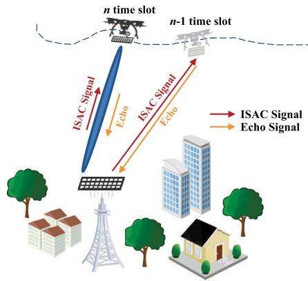  
Fig. 1. The system model of ISAC enabled UAV network.

To realize the predictive beamforming with ISAC, the whole transmission period T is divided into N time slots of equal length ∆T , i.e., $T = N \Delta T$ . Then each time slot is further partitioned into two phases [6]. The first phase is the signal transmission phase, where the BS utilizes the predicted transmit beamforming matrix to radiate signals towards the UAV while at the same time receiving the reflected echoes from the UAV. As for the UAV, it can also employ the predicted receive beamforming matrix to steer its receive beam with the direction of the transmit beam emitted by the BS for optimal signal reception. To enhance the performance, the bidirectional beamforming is adopted [19]. Note that both transmit and receive beamforming matrices are predicted by the BS, except that the latter needs to be transmitted to the UAV at the very beginning of signal transmission phase for immediate use. On the other hand, the second phase is the beamforming prediction phase. During this phase, the BS leverages the echoes received in current and previous multiple time slots to predict the transmit and receive beamforming matrices for the next time slot. The detailed methodology for such beamforming prediction is illustrated in Section III.

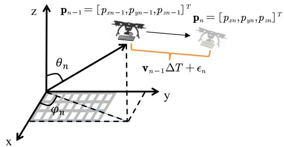  
Fig. 2. The mobility model of UAV.

## A. UAV Mobility Model

In this subsection, we establish the mobility model of UAV, where both the randomness during the flight, as well as attitude variations are involved.

As shown in Fig. 2, we employ the 3D Cartesian coordinate system to represent the mobility model of UAV. The BS is assumed to be placed at the origin with the coordinates expressed as $\mathbf { p } _ { B } = [ 0 , 0 , 0 ] ^ { T }$ . The position of UAV at time slot n is denoted as $\mathbf p _ { n } ~ = ~ [ p _ { x n } , p _ { y n } , p _ { z n } ] ^ { T }$ . On the other hand, the velocity of UAV at time slot n can be written as $\mathbf { v } _ { n } ~ = ~ [ v _ { x n } , v _ { y n } , v _ { z n } ] ^ { T }$ , which incorporates the 3D velocity components of UAV. Thus it can characterize not only the magnitude of speed but also the spatial orientation of flight. In this work, we consider that the position of UAV is affected by both active and passive mobility. Hence $\mathbf { p } _ { n }$ can be further decomposed as:

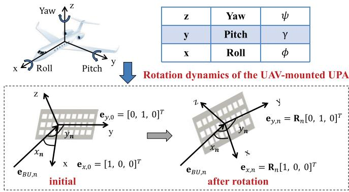  
Fig. 3. Rotation dynamics of the UAV-mounted UPA during attitude variation.

$$
\mathbf { p } _ { n } = \mathbf { p } _ { n } ^ { \mathrm { a c t } } + \mathbf { p } _ { n } ^ { \mathrm { p a s } } \ ,\tag{1}
$$

where $\mathbf { p } _ { n } ^ { \mathrm { a c t } }$ represents the position that the UAV is expected to reach through proactive flying. Thus it can be further written as:

$$
{ \bf p } _ { n } ^ { \mathrm { a c t } } = { \bf p } _ { n - 1 } ^ { \mathrm { a c t } } + { \bf v } _ { n - 1 } \Delta T .\tag{2}
$$

It can be found that $\mathbf { p } _ { n } ^ { \mathrm { a c t } }$ is solely determined by the flight intention of UAV, which from the aspect of ground BS, is the unknown information with uncertainty.

On the other hand, $\mathbf { p } _ { n } ^ { \mathrm { p a s } }$ represents the passive drift of UAV position induced by massive environmental forces such as wind gusts and turbulent airflow. According to the central limit theorem, the cumulative effect of these independent forces per time step can be modeled as the independent Gaussian random variable. In addition, such random positional increments would accumulate during the flight of UAV. Such behavior can be well modeled by Random Walk Process (RWP) [20], as the latter describes the stochastic process formed by the summation of successive random increments. Consequently, $\mathbf { p } _ { n } ^ { \mathrm { p a s } }$ can be expressed as:

$$
{ \bf p } _ { n } ^ { \mathrm { p a s } } = \sum _ { i = 1 } ^ { n } \epsilon _ { i } { { \bf \Psi } } ,\tag{3}
$$

where $\epsilon _ { i } = [ \epsilon _ { x i } , \epsilon _ { y i } , \epsilon _ { z i } ] ^ { T } \sim \mathcal { N } ( \mathbf { 0 } , \sigma _ { \epsilon } ^ { 2 } \mathbf { I } )$ represents the random 3D drifts in i-th time slot. With $\mathbf { p } _ { n }$ in hand, the elevation and azimuth angles between BS and UAV in the n-th time slot, say, $\theta _ { n }$ and $\varphi _ { n }$ , can be calculated as:

$$
\theta _ { n } = \arctan \frac { \sqrt { { p _ { x n } } ^ { 2 } + { p _ { y n } } ^ { 2 } } } { { p _ { z n } } } , \quad \varphi _ { n } = \arctan 2 ( p _ { y n } , p _ { x n } ) .\tag{4}
$$

The distance between BS and UAV in the n-th time slot can be written as:

$$
d _ { n } = | | { \bf p } _ { n } - { \bf p } _ { B } | | = \sqrt { p _ { x n } ^ { 2 } + p _ { y n } ^ { 2 } + p _ { z n } ^ { 2 } } .\tag{5}
$$

Besides the position fluctuations, we also consider the attitude variations of UAV during flight. We attribute this consideration to the ventral mounted UPA of UAV, where the changing attitude of UAV would bias Direction of Arrival (DOA). As shown in Fig. 3, we employ body-fixed coordinate system to describe the attitude of UAV, where the exact attitude can be represented by vector $\mathbf { q } _ { n } = [ \phi _ { n } , \gamma _ { n } , \psi _ { n } ] ^ { T }$ . Here, $\phi _ { n }$ is the roll angle, corresponding to the rotation about the xaxis. $\gamma _ { n }$ is the pitch angle, corresponding to the rotation about the $y \cdot$ -axis. $\psi _ { n }$ is the yaw angle, corresponding to the rotation about the z-axis. During the flight of UAV, the attitude of UAV is also changed, which is jointly determined by active control and passive oscillation, thus can be decoupled as:

$$
{ \bf q } _ { n } = { \bf q } _ { n } ^ { \mathrm { a c t } } + { \bf q } _ { n } ^ { \mathrm { p a s } } ,\tag{6}
$$

where $\mathbf { q } _ { n } ^ { \mathrm { a c t } }$ is the active attitude, resulting from the proactive flight and attitude control of UAV. It can be calculated with its kinematic state and dynamic model, with the position, velocity and flight direction as the input [21]. On the other hand, ${ \bf q } _ { n } ^ { \mathrm { p a s } } \sim$ $\mathcal { N } ( \mathbf { 0 } , \sigma _ { q } ^ { 2 } \mathbf { I } )$ models the passive attitude oscillation induced by environmental influences.

## B. Sensing Model

In this work, the echoes of communication signal are utilized to sense the real-time position of UAV. Denoting the intended signal at BS in the n-th time slot as $s _ { n } ( t )$ with $\mathbb { E } \{ | s _ { n } ( t ) | ^ { 2 } \} = 1$ , the ISAC signal to be readily transmitted via the $N _ { t }$ transmit antennas at BS can be expressed as:

$$
\tilde { \mathbf { s } } _ { n } ( t ) = \mathbf { F } _ { n } s _ { n } ( t ) ,\tag{7}
$$

where $\mathbf { F } _ { n } \in \mathbb { C } ^ { N _ { t } \times 1 }$ denotes the transmit beamforming matrix at time slot n. Consequently the received echo signal at the BS reflected from the airframe of UAV can be expressed as:

$$
\mathbf { r } _ { n } ( t ) = \sqrt { P _ { T } } G _ { r } \mathbf { H } _ { r } \tilde { \mathbf { s } } _ { n } ( t - \nu _ { n } ) + \mathbf { z } _ { r } ( t ) \ ,\tag{8}
$$

where $P _ { T }$ is the transmit power of BS. $G _ { r } ~ = ~ \sqrt { N _ { t } N _ { r } }$ is the total antenna array gain and $\nu _ { n }$ denotes the time-delay of transmission. $\mathbf z _ { r } ( t ) \sim \mathcal { C N } ( \mathbf 0 , \sigma _ { r } ^ { 2 } \mathbf I )$ is the Additive White Gaussian Noise (AWGN). $\mathbf { H } _ { r }$ denotes the sensing channel matrix between BS and UAV in the n-th time slot, given by:

$$
{ \bf H } _ { r } = \beta _ { n } e ^ { j 2 \pi \mu _ { n } t } { \bf a } _ { b r } ( \varphi _ { n } , \theta _ { n } ) { \bf a } _ { b t } ^ { H } ( \varphi _ { n } , \theta _ { n } ) \ ,\tag{9}
$$

where $\beta _ { n } = \varepsilon ( 2 d _ { n } ) ^ { - 2 }$ is the reflection coefficient, in which ε is Radar Cross-Section (RCS). $\mu _ { n }$ is the Doppler frequency caused by the relative movement of transceiver. $\mathbf { a } _ { b t } ( \varphi _ { n } , \theta _ { n } )$ and $\mathbf { a } _ { b r } ( \varphi _ { n } , \theta _ { n } )$ are the transmit steering vector and echo receive steering vector at BS, respectively, which are further defined as:

$$
\begin{array} { r l } { } & { { \bf a } _ { b t } \big ( \varphi _ { n } , \theta _ { n } \big ) } \\ { } & { { \bf \Omega } = \sqrt { \frac { 1 } { N _ { t } } } [ 1 , \cdots , e ^ { - j \pi \sin \theta _ { n } [ ( n _ { t x } - 1 ) \cos \varphi _ { n } + ( n _ { t y } - 1 ) \sin \varphi _ { n } ] } , } \\ { } & { { \bf \Omega } \cdot \cdot \cdot { \bf \Omega } , e ^ { - j \pi \sin \theta _ { n } [ ( N _ { t x } - 1 ) \cos \varphi _ { n } + ( N _ { t y } - 1 ) \sin \varphi _ { n } ] } ] ^ { T } \ , \qquad ( \frac { 1 } { 1 + \pi } ) ^ { - 1 } \sin \varphi _ { n } \big ( \varphi _ { n } , \varphi _ { n } \big ) } \end{array}\tag{10}
$$

and

$$
\begin{array} { l } { { \displaystyle { \bf a } _ { b r } \big ( \varphi _ { n } , \theta _ { n } \big ) } \ ~ } \\  { \displaystyle = \sqrt { \frac { 1 } { N _ { r } } } [ 1 , \cdots , e ^ { - j \pi \sin \theta _ { n } [ ( n _ { r x } - 1 ) \cos \varphi _ { n } + ( n _ { r y } - 1 ) \sin \varphi _ { n } ] } , } \end{array}
$$

$$
\therefore \cdot \cdot , e ^ { - j \pi \sin \theta _ { n } \left[ \left( N _ { r x } - 1 \right) \cos \varphi _ { n } + \left( N _ { r y } - 1 \right) \sin \varphi _ { n } \right] } ] ^ { T } \ .\tag{11}
$$

Upon reception, the echoes need to first undergo matched filtering. Due to the long round-trip propagation between BS and UAV, the reflected signals experience severe fading, which makes the received echoes weak and corrupted. Hence, matched filtering is essential to improve the signal power of the echoes, yielding higher Signal-to-Noise Ratio (SNR). It facilitates our proposed learning framework in Section III to better capture the features embedded in echoes for predictive beamforming [19]. The echo after matched filtering is written as:

$$
\begin{array} { l } { { \displaystyle { { \tilde { \bf r } } _ { n } } = \int _ { 0 } ^ { \Delta T _ { e } } { { \bf r } _ { n } } ( t ) s _ { n } ^ { * } ( t - \tilde { \nu } _ { n } ) e ^ { - j 2 \pi { \tilde { \mu } } _ { n } t } d t } \ ~ } \\ { { \displaystyle ~ = \sqrt { P _ { T } } G _ { r } \beta _ { n } { \bf a } _ { b r } ( \varphi _ { n } , \theta _ { n } ) { \bf a } _ { b t } ^ { H } ( \varphi _ { n } , \theta _ { n } ) { \bf F } _ { n } \int _ { 0 } ^ { \Delta T _ { e } } s _ { n } ( t - \nu _ { n } ) } } \\ { { \displaystyle ~ \times ~ s _ { n } ^ { * } ( t - \tilde { \nu } _ { n } ) e ^ { - j 2 \pi ( \tilde { \mu } _ { n } t - \mu _ { n } t ) } d t } \ ~ } \\ { { \displaystyle ~ + \int _ { 0 } ^ { \Delta T _ { e } } { { \bf z } _ { r } } ( t ) s _ { n } ^ { * } ( t - \tilde { \nu } _ { n } ) e ^ { - j 2 \pi \tilde { \mu } _ { n } t } d t } \ ~ } \\ { { \displaystyle ~ = \sqrt { P _ { T } } G _ { r } \beta _ { n } \xi { \bf a } _ { b r } ( \varphi _ { n } , \theta _ { n } ) { \bf a } _ { b t } ^ { H } ( \varphi _ { n } , \theta _ { n } ) { \bf F } _ { n } + { \bf \tilde { z } } _ { r } ~ , ~ } \ ~ ( 1 2 ) } \end{array}
$$

where $\Delta T _ { e }$ is the length of the received echo. ξ is the matchedfiltering gain. $\tilde { \mathbf { z } } _ { r } \sim \mathcal { C N } ( \mathbf { 0 } , \tilde { \sigma } _ { r } ^ { 2 } \mathbf { I } )$ is the measured noise at time slot $n , \tilde { \nu } _ { n }$ and ${ \tilde { \mu } } _ { n }$ are the estimates of $\nu _ { n }$ and $\mu _ { n } .$ , which are calculated via conventional matched filtering as [22]:

$$
\left\{ \tilde { \nu } _ { n } , \tilde { \mu } _ { n } \right\} = \arg \operatorname* { m a x } _ { \nu , \mu } \left\| \int _ { 0 } ^ { \Delta T _ { e } } \mathbf { r } _ { n } ( t ) s _ { n } ^ { * } ( t - \nu ) e ^ { - j 2 \pi \mu t } d t \right\| ^ { 2 } .\tag{13}
$$

## C. Communication Model

We then focus on the communication model. The signal received at UAV via a receive beamformer $\mathbf { w } _ { n } \in \mathbb { C } ^ { N _ { u } \times \overline { { 1 } } }$ at time slot n writes:

$$
c _ { n } ( t ) = \sqrt { P _ { T } } G _ { c } { \bf w } _ { n } ^ { H } { \bf H } _ { c } \tilde { \bf s } _ { n } ( t ) + z _ { c } ( t ) ,\tag{14}
$$

where $G _ { c } ~ = ~ \sqrt { N _ { t } N _ { u } }$ is the antenna array gain. $z _ { c } ( t ) \sim$ $\mathcal { C N } ( 0 , \sigma _ { c } ^ { 2 } )$ is the AWGN. $\mathbf { H } _ { c }$ denotes the LoS channel matrix from BS to UAV, which can be further expressed as [23]:

$$
\mathbf { H } _ { c } = \tilde { \alpha } _ { n } e ^ { j 2 \pi { \mu } _ { n } t } \mathbf { a } _ { u } ( x _ { n } , y _ { n } ) \mathbf { a } _ { b t } ^ { H } ( \varphi _ { n } , \theta _ { n } ) ,\tag{15}
$$

where $\widetilde { \alpha } = \sqrt { \alpha d _ { n } ^ { - 2 } }$ is the path loss coefficient and α denotes the path loss at reference distance, e.g., 1 meter. $\mathbf { a } _ { b t } ( \varphi _ { n } , \theta _ { n } )$ is the transmit steering vector of the BS, as defined in (10). $\mathbf { a } _ { u } ( x _ { n } , y _ { n } )$ is the receive steering vector of UAV, where $x _ { n }$ and $y _ { n }$ are the DOA, respectively. The former is defined as the angle between the beam direction and x-axis of UPA, while the latter is the angle between the beam direction and y-axis of UPA.

As shown in Fig. 3, since the UPA of UAV is mounted on its ventral surface, $x _ { n }$ and $y _ { n }$ are both influenced by the attitude variation of UAV. Therefore, ${ \mathbf a } _ { u } ( x _ { n } , y _ { n } )$ depends on its attitude rotation. To obtain ${ \mathbf a } _ { u } ( x _ { n } , y _ { n } )$ , we first analyze the attitude rotation model. Based on this model, $x _ { n }$ and $y _ { n }$ are derived through coordinate transformation, which ultimately yields ${ \bf a } _ { u } ( x _ { n } , y _ { n } )$ . The detailed mathematical derivation is provided below.

The attitude variation of UAV is represented using rotation matrices, where the elementary rotation matrices corresponding to $\phi _ { n } , \gamma _ { n }$ , and $\psi _ { n }$ are given by ${ \mathbf { R } } _ { \phi _ { n } } , { \mathbf { R } } _ { \gamma _ { n } }$ , and $\mathbf { R } _ { \psi _ { n } }$ as follows [24]:

$$
{ \bf R } _ { \phi _ { n } } = \left[ \begin{array} { c c } { { 1 } } & { { 0 } } \\ { { 0 \cos \phi _ { n } - \sin \phi _ { n } } } \\ { { 0 \sin \phi _ { n } } } & { { \cos \phi _ { n } } } \end{array} \right] \ ,\tag{16}
$$

$$
\mathbf { R } _ { \gamma _ { n } } = \left[ \begin{array} { c c c } { \cos \gamma _ { n } } & { 0 \sin \gamma _ { n } } \\ { 0 } & { 1 } & { 0 } \\ { - \sin \gamma _ { n } } & { 0 \cos \gamma _ { n } } \end{array} \right] ,\tag{17}
$$

$$
{ \bf R } _ { \psi _ { n } } = \left[ \begin{array} { c c c } { { \cos \psi _ { n } - \sin \psi _ { n } 0 } } \\ { { \sin \psi _ { n } \cos \psi _ { n } 0 } } \\ { { 0 0 1 } } \end{array} \right] .\tag{18}
$$

Thus for the n-th time slot, the rotation matrix of UAV can be given by:

$$
{ \bf R } _ { n } = { \bf R } _ { \psi _ { n } } { \bf R } _ { \gamma _ { n } } { \bf R } _ { \phi _ { n } } \mathrm { ~ . ~ }\tag{19}
$$

On the other hand, the unit vector in the direction of BSto-UAV path can be expressed as [25]:

$$
\mathbf { e } _ { B U , n } = \mathbf { p } _ { n } - \mathbf { p } _ { B } = \left[ \sin \theta _ { n } \cos \varphi _ { n } , \sin \theta _ { n } \sin \varphi _ { n } , \cos \theta _ { n } \right] ^ { T } \ .\tag{20}
$$

Without loss of generality, at the initial time, we define the x-axis and y-axis of UPA at UAV as ${ \bf e } _ { x , 0 } = [ 1 , 0 , 0 ] ^ { T }$ and ${ \bf e } _ { y , 0 } = [ 0 , 1 , 0 ] ^ { T }$ , which are assumed to be parallel with the corresponding axes of UPA at BS side. As shown in Fig. 3, upon completion of the rotational transformation from the ground coordinate system to the body-fixed coordinate system, the x-axis and y-axis of the UAV-mounted UPA can be expressed as:

$$
{ \bf e } _ { x , n } = { \bf R } _ { n } { \bf e } _ { x , 0 } \ , \quad { \bf e } _ { y , n } = { \bf R } _ { n } { \bf e } _ { y , 0 } \ .\tag{21}
$$

We further define $x _ { n }$ and $y _ { n }$ as the angles of $\mathbf { e } _ { x , n }$ , which is related to the x-axis and y-axis of the UAV-mouted UPA, respectively. with the derivation above, the two angles can be calculated as:

$$
x _ { n } = \operatorname { a r c c o s } ( { \mathbf { e } } _ { B U , n } ^ { T } { \mathbf { e } } _ { x , n } ) , y _ { n } = \operatorname { a r c c o s } ( { \mathbf { e } } _ { B U , n } ^ { T } { \mathbf { e } } _ { y , n } ) .\tag{22}
$$

With (22) in hand, the receive steering vector of UAV at the n-th time slot can be expressed as:

$$
\mathbf { a } _ { u } ( x _ { n } , y _ { n } ) = \mathbf { a } _ { u x } ^ { \prime } ( x _ { n } ) \otimes \mathbf { a } _ { u y } ^ { \prime } ( y _ { n } ) \ : ,\tag{23}
$$

where $\otimes$ is the Kronecker product. $\mathbf { a } _ { u x } ^ { \prime }$ and $\mathbf { a } _ { u y } ^ { \prime }$ are given by

$$
\mathbf { a } _ { u x } ^ { \prime } ( x _ { n } ) = \sqrt { \frac { 1 } { N _ { u x } } } [ 1 , e ^ { - j \pi \cos x _ { n } } , . . . , e ^ { - j \pi ( N _ { u x } - 1 ) \cos x _ { n } } ] ^ { T } \mathrm { ~ , ~ }
$$

and

(24)

$$
\mathbf { a } _ { u y } ^ { \prime } ( y _ { n } ) = \sqrt { \frac { 1 } { N _ { u y } } } [ 1 , e ^ { - j \pi \cos y _ { n } } , . . . , e ^ { - j \pi ( N _ { u y } - 1 ) \cos y _ { n } } ] ^ { T } \mathrm { ~ . ~ }\tag{25}
$$

With the derivations above, the received SNR during the n-th time slot can be finally calculated as:

$$
\begin{array} { r l } {  { \mathrm { S N R } _ { n } = \frac { P _ { T } | G _ { c } \mathbf { w } _ { n } ^ { H } \mathbf { H } _ { c } \mathbf { F } _ { n } | ^ { 2 } } { \sigma _ { c } ^ { 2 } } } \quad } & { } \\ & { = \frac { P _ { T } | k _ { n } \mathbf { w } _ { n } ^ { H } \mathbf { a } _ { u } ( x _ { n } , y _ { n } ) \mathbf { a } _ { b t } ^ { H } ( \varphi _ { n } , \theta _ { n } ) \mathbf { F } _ { n } | ^ { 2 } } { { \sigma _ { c } } ^ { 2 } } , } \end{array}\tag{26}
$$

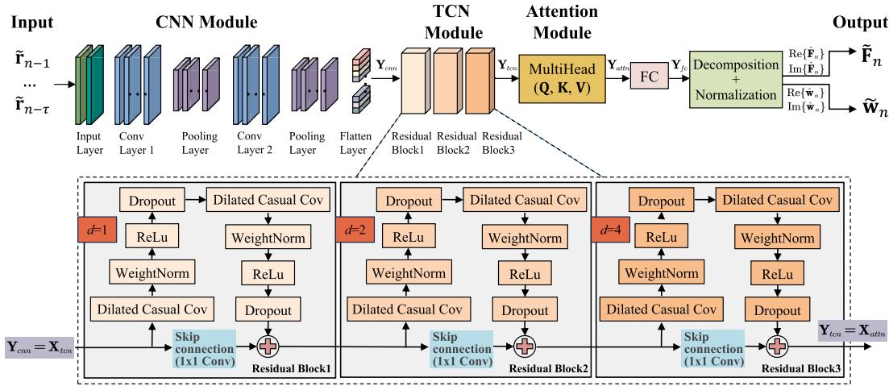  
Fig. 4. The proposed HECTA-Net architecture for predictive bidirectional beamforming in the ISAC-assisted UAV system.

where $k _ { n } = G _ { c } \tilde { \alpha } _ { n }$ . It can be found in (26) that SNR is not only impacted by the transmit beamforming $\mathbf { F } _ { n } ,$ but also by the receive beamforming $\mathbf { w } _ { n } .$ , due to the aforementioned random attitude variations of receive antenna array attached to the UAV. Consequently, even with ${ \bf F } _ { n }$ accurately concentrating the signal towards the UAV, the receive antenna array may remain misaligned with the incoming signal direction if ${ \bf w } _ { n }$ is absent, emphasizing the importance of bidirectional beamforming. The achievable rate can be correspondingly written as:

$$
R _ { n } = \log _ { 2 } ( 1 + \mathrm { S N R } _ { n } ) .\tag{27}
$$

## D. Problem Formulation

With the preliminaries above, we formulate the optimization problem, which is to maximize the achievable rate of system per time slot, via the predictive bidirectional beamforming at both transceiver sides. Thus, the problem can be formulated as:

$$
( \mathrm { P 1 } ) : \operatorname* { m a x } _ { \tilde { \mathbf { F } } _ { n } , \tilde { \mathbf { w } } _ { n } } \quad R _ { n } ( \tilde { \mathbf { F } } _ { n } , \tilde { \mathbf { w } } _ { n } )\tag{28a}
$$

$$
\mathrm { s . t . } : \quad \| \tilde { \mathbf { F } } _ { n } \| _ { F } ^ { 2 } \leq 1 ,\tag{28b}
$$

$$
\begin{array} { r } { \| \tilde { \mathbf { w } } _ { n } \| _ { F } ^ { 2 } \leq 1 , } \end{array}\tag{28c}
$$

where $\tilde { \mathbf { F } } _ { n }$ and $\tilde { \mathbf { w } } _ { n }$ are the predicted transmit and receive beamforming matrices, respectively. According to (26), the rate reaches maximum when $| \tilde { \mathbf { w } } _ { n } ^ { H } \mathbf { a } _ { u } ( x _ { n } , y _ { n } ) \mathbf { a } _ { b t } ^ { H } ( \varphi _ { n } , \theta _ { n } ) \tilde { \mathbf { F } } _ { n } | ^ { 2 } = 1$ That yields the fact that the optimal prediction on beamforming matrices should follow $\tilde { \mathbf { F } } _ { n } \quad \to \quad \mathbf { a } _ { b t } ( \varphi _ { n } , \theta _ { n } )$ and $\tilde { \mathbf { w } } _ { n }  \mathbf { a } _ { u } ( x _ { n } , y _ { n } )$ . Nevertheless, as aforementioned, it is hard to obtain accurate $\tilde { \mathbf { F } } _ { n }$ and $\tilde { \mathbf { w } } _ { n } .$ , due to the random mobility as well as the attitude variation of UAV. Hence we design a DL-based end-to-end predictive beamforming framework to solve it, where the bidirectional beamforming matrices at time slot n can be calculated through learning the features of echoes from previously multiple time slots.

## III. DEEP LEARNING-BASED ISAC PREDICTIVEBEAMFORMING

In this section, we introduce our proposed DL based predictive beamforming scheme. We expect to design a learning network to directly predict the bidirectional beamforming matrices for the subsequent time slot, by inputting the matched-filtered echo signals from previous multiple time slots. It can be regraded as finding the mapping relationship between the historical echoes and the beamforming matrices. Thus the learning network can be represented by a non-linear function $\mathcal F ( \cdot )$ as:

$$
\bigl \{ \tilde { \mathbf { F } } _ { n } , \tilde { \mathbf { w } } _ { n } \bigr \} = \mathcal { F } ( \pmb { \chi } _ { n } ^ { \tau } ; \pmb { \Phi } ) ,\tag{29}
$$

where $\pmb { \mathcal { X } } _ { n } ^ { \tau } = [ \tilde { \mathbf { r } } _ { n - \tau } , \tilde { \mathbf { r } } _ { n - \tau + 1 } , . . . , \tilde { \mathbf { r } } _ { n - 1 } ]$ is the matrix containing the vectors of match-filtered echoes from previous τ time slots. Φ denotes the network parameters, which are trained to establish the mapping relationship. In the following, we give details of our proposed network.

## A. Proposed Historical Echoes-Based Convolutional Time Attention Network (HECTA-Net)

The architecture of the proposed HECTA-Net is illustrated in Fig. 4, where the core components comprise a CNN module, a TCN module, and an attention module. The CNN module first extracts the local spatial features from the historical echoes per time slot. Then the TCN module helps capture the long-term temporal dependencies among the extracted spatial features, where these dependencies refer to the temporal correlations across different time slots. Finally, the attention module is utilized to synthesize the global spatio-temporal representations, further enhancing performance via dynamically adjusting the attention weights assigned to different time slots. It is noted that our proposed network is capable of extracting both spatial and temporal features at global-local levels from the historical echoes. These inherent capabilities enable the proposed network to stand out from other existing works. The detailed network architecture will be introduced in the following, with network hyperparameters listed in Table II.

1) CNN Module: The CNN module is primarily used to extract spatial features embedded in the echo signals of each time slot. As shown in Fig. 4, the CNN module is mainly composed of an input layer, two convolutional layers, two pooling layers, and a flatten layer. The function of the input layer is to convert the complex-valued matrix $\pmb { \mathcal { X } } _ { n } ^ { \tau } \in \mathbb { C } ^ { \tau \times N _ { r } }$ into a 3D real-valued tensor $\hat { \pmb x } _ { n } ^ { \tau } \in \mathbb { R } ^ { \tau \times N _ { r } \times 2 }$ , as the former cannot be processed by the CNN directly. Hence, the input layer first splits $\pmb { \mathcal { X } } _ { n } ^ { \tau }$ into two channels of real and imaginary parts, i.e., $\mathrm { R e } \{ \pmb { X } _ { n } ^ { \tau } \}$ and Im $\{ \pmb { X } _ { n } ^ { \tau } \}$ , and then concatenate these two parts to form the 3D tensor. This operation can be expressed as:

TABLE II  
HYPERPARAMETERS OF THE PROPOSED HECTA-NET
<table><tr><td>Input:  $\hat { \pmb x } _ { n } ^ { \tau }$  with the size of  $\tau \times N _ { r } \times 2$ </td><td></td><td></td></tr><tr><td>Modules/Layers</td><td>Parameters</td><td>Values</td></tr><tr><td>CNN module - Convolutional Layer 1</td><td>Kernel size</td><td> $8 \times 3 \times 2$ </td></tr><tr><td>CNN module - Convolutional Layer 2</td><td>Kernel size</td><td> $1 6 \times 3 \times 8$ </td></tr><tr><td>CNN module - Pooling Layer</td><td>Kernel size</td><td> $2 \times 1$ </td></tr><tr><td>CNN module - Flatten Layer</td><td>Output shape</td><td> $[ \tau , 6 4 ]$ </td></tr><tr><td>TCN module - Dilated causal convolution Layer</td><td>Kernel width</td><td> $^ 2$ </td></tr><tr><td>TCN module</td><td>Number of channels</td><td> $[ 3 2 , 6 4 , 1 2 8 ]$ </td></tr><tr><td>TCN module</td><td>Output shape</td><td> $\left[ \tau , 1 2 8 \right]$ </td></tr><tr><td>Attention module</td><td>Number of attention heads</td><td> $\bar { h } = 4 \bar { }$ </td></tr><tr><td>Attention module</td><td>Output shape</td><td>[τ, 128]</td></tr><tr><td colspan="3"> $\begin{array} { r } { \mathbf { O u t p u t } \colon \tilde { \mathbf { F } } _ { n } = \operatorname { R e } \{ \hat { \mathbf { F } } _ { n } \} + j \mathrm { I m } \{ \hat { \mathbf { F } } _ { n } \} \ \mathrm { a n d } \ \tilde { \mathbf { w } } _ { n } = \operatorname { R e } \{ \hat { \mathbf { w } } _ { n } \} + j \mathrm { I m } \{ \hat { \mathbf { w } } _ { n } \} } \end{array}$ </td></tr></table>

$$
\hat { \pmb x } _ { n } ^ { \tau } = \mathcal { M } ( { \pmb x } _ { n } ^ { \tau } ) ,\tag{30}
$$

where ${ \mathcal { M } } ( \cdot ) ~ : ~ \mathbb { C } ^ { \tau \times N _ { r } } ~ \to ~ \mathbb { R } ^ { \tau \times N _ { r } } \times \mathbb { R } ^ { \tau \times N _ { r } } ~ \to ~ \mathbb { R } ^ { \tau \times N _ { r } \times 2 }$ denotes the conversion function.

With $\hat { \pmb x } _ { n } ^ { \tau }$ in hand, the convolutional layers can extract local spatial information embedded within it and generate corresponding feature maps via convolutional kernels. Then the max pooling strategy is utilized by the pooling layers to reduce the size of the generated feature maps. Additionally, the Rectified Linear Unit (ReLU) activation function is used in the convolutional layers to introduce non-linearity into the CNN module, enabling it to capture more complex characteristics. The above operation can be expressed as:

$$
{ \bf Y } _ { c n n } ^ { \prime } = \mathrm { M a x P o o l } ( \mathrm { R e L u } ( \mathrm { C o n v } ( \hat { \pmb x } _ { n } ^ { \tau } , { \bf W } _ { c n n } , { \bf b } _ { c n n } ) ) ) ~ ,\tag{31}
$$

where $\mathbf { W } _ { c n n }$ and $\mathbf { b } _ { c n n }$ represent the kernel weights and biases, which are the trainable parameters of model. Finally, to convert the extracted features ${ \bf Y } _ { c n n } ^ { \prime }$ into a form suitable for the TCN module to process, a flatten layer is employed to further adjust the feature dimensions. The final output of the CNN, which is also the input of the TCN, can be written as:

$$
{ \bf Y } _ { c n n } = { \mathrm { F l a t t e n } } ( { \bf Y } _ { c n n } ^ { \prime } ) .\tag{32}
$$

Here, $\mathbf { Y } _ { c n n } \in \mathbb { R } ^ { \tau \times H C }$ , where H is the number of output channels, and C is the feature dimension per channel after convolutional and pooling operations.

2) TCN Module: The TCN module consists of three residual blocks, each of which incorporates two dilated causal convolution layers, two weight normalization layers, two ReLU layers, two dropout layers, and a skip connection to capture the temporal dependencies across time slots [17]. Critically, the core of the TCN lies in its use of dilated causal convolution, whose specific structure is illustrated in Fig. 5. This architecture ensures that predictions for the current time step depend solely on the past τ time steps, while expanding the receptive field to capture efficiently long-range temporal dependencies without the step-by-step information passing required in LSTM. The dilated causal convolution operation $F$ on sequence element s is expressed as [17]:

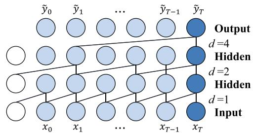  
Fig. 5. TCN dilated causal convolution structure with dilation factors $d \bar { = } \{ 1 , 2 , 4 \}$ and kernel size $k = 2 .$

$$
F ( s ) = \sum _ { i = 0 } ^ { k - 1 } f ( i ) \cdot { \bf x } _ { s - d \cdot i } \ ,\tag{33}
$$

where k is the filter size, and the subscript of input sequence $s - d \cdot i$ represents convolution using only past input. The dilation factor d in each residual block increases exponentially according to $d = 2 ^ { l - 1 }$ , where $l = \{ 1 , 2 , 3 \}$ denotes the serial number of the current residual block. The output of the l-th residual block can be expressed as [17]:

$$
\mathrm { R e s } _ { l } ( \mathbf { x } ) = \mathrm { A c t i v a t i o n } ( \mathbf { x } + \mathcal { F } ( \mathbf { x } ) ) \ : ,\tag{34}
$$

where $\mathcal { F }$ represents a series of nonlinear transformations within the residual block. Thus, the output of the TCN can be finally expressed as:

$$
{ \bf Y } _ { t c n } = \mathrm { R e s } _ { 3 } ( \mathrm { R e s } _ { 2 } ( \mathrm { R e s } _ { 1 } ( { \bf X } _ { t c n } ) ) ) \mathrm { ~ . ~ }\tag{35}
$$

Here, $\mathbf { Y } _ { t c n } \in \mathbb { R } ^ { \tau \times D }$ , where D indicates the feature dimension of the TCN output.

3) Attention Module: The attention module employs the multi-head attention mechanism to dynamically assign weights to each time slot, effectively capturing global dependencies. Specifically, the input ${ \mathbf { X } } _ { a t t n }$ is first linearly transformed through learnable projections to generate the query matrix Q, key matrix K, and value matrix V for each attention head. For the i-th head, the projections are computed as [18]:

$$
\mathbf { Q } _ { i } = \mathbf { X } _ { a t t n } \mathbf { W } _ { i } ^ { Q } , \mathbf { K } _ { i } = \mathbf { X } _ { a t t n } \mathbf { W } _ { i } ^ { K } , \mathbf { V } _ { i } = \mathbf { X } _ { a t t n } \mathbf { W } _ { i } ^ { V } \ ,\tag{36}
$$

where $\mathbf { W } _ { i } ^ { Q } , \ \mathbf { W } _ { i } ^ { K } , \ \mathbf { W } _ { i } ^ { V } \ \in \ \mathbb { R } ^ { D \times d }$ are parameter matrices obtained by training. $\begin{array} { r } { \dot { d } \ = \ \frac { D } { h } } \end{array}$ is the feature dimension per head, where $h$ is the number of heads. To compute the similarities among time slots and dynamically aggregate global information, the output for the i-th head is formulated as follows [18]:

$$
{ \mathrm { h e a d } } _ { i } = { \mathrm { A t t e n t i o n } } ( \mathbf { Q } _ { i } , \mathbf { K } _ { i } , \mathbf { V } _ { i } ) = { \mathrm { S o f t m a x } } \left( { \frac { \mathbf { Q } _ { i } \mathbf { K } _ { i } ^ { \top } } { \sqrt { d } } } \right) \mathbf { V } _ { i } ~ .\tag{37}
$$

Finally, the outputs of all heads are concatenated and projected to form the multi-head attention. Thus, the output of the attention module can be expressed as [18]:

$$
{ \bf Y } _ { a t t n } = \mathrm { C o n c a t ( h e a d _ { 1 } , . . . , h e a d _ { h } ) { \bf W } _ { o } ~ } ,\tag{38}
$$

where $\mathbf { W } _ { o } \in \mathbb { R } ^ { h d \times D }$ is the learnable output projection matrix. The output $\mathbf { Y } _ { a t t n } \in \mathbb { R } ^ { \tau \times D ^ { \prime } }$ preserves the original feature dimension, i.e., $D ^ { \prime } = D$

4) Fully Connected (FC) Layer: Based on the output of the attention ${ \mathbf { Y } } _ { a t t n } .$ , the time step τ representation $\mathbf { Y } _ { \tau } =$ $\mathbf { Y } _ { a t t n } [ - 1 , : ] \in \mathbb { R } ^ { 1 \times D ^ { \prime } }$ is extracted via temporal slicing. The FC layer maps $\mathbf { Y } _ { \tau }$ to the prescribed dimensional space of the bidirectional beamforming matrices, i.e., $\mathbf { Y } _ { \tau } \in \mathbb { R } ^ { \hat { 1 } \times D ^ { \prime } } $ $\mathbf { Y } _ { f c } \in \mathbb { R } ^ { ( N _ { t } + N _ { u } ) \times 2 }$

5) Decomposition: The output of the FC layer $\mathbf { Y } _ { f c }$ is decomposed into two predicted beamforming matrices $\hat { { \bf F } } _ { n } \in  $ $\mathbb { R } ^ { N _ { r } \times 2 ^ { \hat { \mathbf { \alpha } } } }$ and $\hat { \textbf { w } } _ { n } \in \mathbf { \bar { \mathbb { R } } } ^ { N _ { u } \times 2 }$ , both of which include the real and imaginary parts of the beamforming matrices, i.e., $[ \mathrm { R e } \{ \hat { \mathbf { F } } _ { n } \}$ , Im $\{ \hat { \mathbf { F } } _ { n } \} ]$ and $[ \mathrm { R e } \{ \hat { \mathbf { w } } _ { n } \} , \mathrm { I m } \{ \hat { \mathbf { w } } _ { n } \} ]$ . To combine the obtained real and imaginary parts, the predicted complexvalued transmit and receive beamforming matrices can be formed as follows:

$$
\tilde { \mathbf { F } } _ { n } = \mathrm { R e } \{ \hat { \mathbf { F } } _ { n } \} + j \mathrm { I m } \{ \hat { \mathbf { F } } _ { n } \} \ ,\tag{39}
$$

and

$$
\tilde { \bf w } _ { n } = \mathrm { R e } \{ \hat { \bf w } _ { n } \} + j \mathrm { I m } \{ \hat { \bf w } _ { n } \} .\tag{40}
$$

These beamforming matrices are further normalized to satisfy the power constraint.

## B. HECTA-Net-Based Predictive Beamforming Algorithm

In this section, the predictive beamforming algorithm based on HECTA-Net is proposed. The algorithm consists of offline training and online prediction. During offline training, HECTA-Net undergoes multiple training iterations, to ultimately learn the direct mapping relationship between historical echoes and the predictive beamforming matrices. When the offline training is complete, the proposed model can be readily employed for online prediction in real time. The specific algorithm details are described below.

1) Offline Training: First, a labeled training dataset is constructed, which contains the matched-filtered echoes for the first τ historical time slots, with corresponding labels being the optimal predictive beamforming matrices for the n-th time slot. The training dataset is denoted as:

$$
\mathcal { D } _ { t r } = \left\{ \left( \pmb { \mathscr { X } } _ { n } ^ { \tau ( i ) } , \{ \tilde { \mathbf { F } } _ { n } ^ { * ( i ) } , \tilde { \mathbf { w } } _ { n } ^ { * ( i ) } \} \right) \mid n \in \Gamma _ { t r } , i = 1 , 2 , \ldots , N _ { t r } \right\}\tag{41}
$$

Algorithm 1 HECTA-Net-Based Predictive Beamforming   
Algorithm   
Initialization: $i _ { e } ~ = ~ 0 , ~ E _ { t } ~ = ~ N _ { e } ,$ , and initialized network   
parameters Φ.   
Offline Training:   
1 Input: Training set $\mathcal { D } _ { t r }$   
2 while $i _ { e } \le E _ { t }$ do   
3 Update Φ using Adam optimizer to minimize   
$L O S S$ in (42).   
4 $i _ { e } = i _ { e } + 1 .$   
5 end while   
6 Output: Trained network parameters $\tilde { \Phi } .$   
Online Prediction:   
1 Input: Testing set $\mathcal { D } _ { t e } ,$ trained network $\mathcal { F } ^ { * } ( \cdot ; \tilde { \Phi } )$   
2 do Predictive beamforming using trained network   
$\mathcal { F } ^ { * } ( \cdot ; \tilde { \Phi } )$   
3 Output: $\tilde { \mathbf { F } } _ { m }$ and $\tilde { \mathbf { w } } _ { m } .$

where $\Gamma _ { t r }$ represents the index set of the training set, and $N _ { t r }$ is the number of training samples. $\pmb { \mathcal { X } } _ { n } ^ { \tau ( i ) }$ denotes the echoes from the historical τ time slots for the i-th sample, corresponding to the range from $n - \tau \ \mathrm { t o } \ n - 1 . \ \{ \tilde { \mathbf { F } } _ { n } ^ { * ( i ) } , \tilde { \mathbf { w } } _ { n } ^ { * \hat { ( } i ) } \}$ represents the optimal beamforming matrices for the n-th time slot in the i-th sample. To optimize the network, a loss function is defined to measure the discrepancy between $\{ \tilde { \mathbf { F } } _ { n } ^ { * ( i ) } , \tilde { \mathbf { w } } _ { n } ^ { * ( i ) } \}$ and $\{ \tilde { \mathbf { F } } _ { n } ^ { ( i ) } , \tilde { \mathbf { w } } _ { n } ^ { ( i ) } \}$ . The loss function is defined in the form of Mean Squared Error (MSE), formally expressed as:

$$
\begin{array} { r l r } & { } & { L O S S = \displaystyle \frac { 1 } { N _ { t r } } \sum _ { i = 1 } ^ { N _ { t r } } \left( \left\| \mathrm { R e } [ \{ \tilde { \mathbf { F } } _ { n } ^ { * ( i ) } , \tilde { \mathbf { w } } _ { n } ^ { * ( i ) } \} ] - \mathrm { R e } \left[ \{ \tilde { \mathbf { F } } _ { n } ^ { ( i ) } , \tilde { \mathbf { w } } _ { n } ^ { ( i ) } \} \right] \right\| ^ { 2 } \right. } \\ & { } & { \left. + \left\| \mathrm { I m } [ \{ \tilde { \mathbf { F } } _ { n } ^ { * ( i ) } , \tilde { \mathbf { w } } _ { n } ^ { * ( i ) } \} ] - \mathrm { I m } \left[ \{ \tilde { \mathbf { F } } _ { n } ^ { ( i ) } , \tilde { \mathbf { w } } _ { n } ^ { ( i ) } \} \right] \right\| ^ { 2 } \right) \mathrm { ~ . ~ } } \end{array}\tag{42}
$$

The Adam optimizer [26] is adopted to minimize the loss function and update the network parameters iteratively through the Backpropagation (BP) algorithm [27]. The trained HECTA-Net can ultimately be represented as:

$$
\bigl \{ \tilde { \mathbf { F } } _ { n } , \tilde { \mathbf { w } } _ { n } \bigr \} = \mathcal { F } ^ { * } ( \pmb { \mathcal { X } } _ { n } ^ { \tau } ; \tilde { \Phi } ) ,\tag{43}
$$

where $\mathcal { F } ^ { * } ( \cdot ; \tilde { \Phi } )$ represents the optimal mapping function with $\tilde { \Phi }$ denoting the trained network parameters.

2) Online prediction: The test set is denoted as:

$$
\mathcal { D } _ { t e } = \left\{ \left( \pmb { \mathscr { X } } _ { m } ^ { \tau ( i ) } , \{ \tilde { \mathbf { F } } _ { m } ^ { * ( i ) } , \tilde { \mathbf { w } } _ { m } ^ { * ( i ) } \} \right) \mid m \in \Gamma _ { t e } , i = 1 , 2 , \ldots , N _ { t e } \right\} , \ :\tag{44}
$$

where $\Gamma _ { t e }$ represents the index set of the test set, and $N _ { t e }$ denotes the number of test samples. $\Gamma _ { t e } \cap \Gamma _ { t r } = \emptyset$ , with $m \neq$ n. During the online prediction process, we set the model to evaluation mode, disabling BP and gradient updates. The test set is fed to the trained HECTA-Net for forward propagation, generating the optimized predictive beamforming matrices, as follows:

$$
\bigl \{ \tilde { \mathbf { F } } _ { m } , \tilde { \mathbf { w } } _ { m } \bigr \} = \mathcal { F } ^ { * } ( \pmb { \mathcal { X } } _ { m } ^ { \tau } ; \tilde { \pmb { \Phi } } ) .\tag{45}
$$

3) Algorithm Steps: The overall workflow of the proposed , algorithm is summarized in Algorithm 1, where $i _ { e }$ is the iteration index, and $N _ { e }$ is the maximum number of iterations.

TABLE III  
DEFAULT SIMULATION SETTINGS
<table><tr><td>Parameters</td><td>Default Values</td></tr><tr><td>Transmit power</td><td> $P _ { T } = 2 5 ~ \mathrm { d B m }$ </td></tr><tr><td>Speed of signal propagation</td><td> $c = 3 \times 1 0 ^ { 8 } ~ \mathrm { m / s }$ </td></tr><tr><td>Carrier frequency</td><td> $f _ { c } = 3 0 ~ \mathrm { G H z }$ </td></tr><tr><td>RCS</td><td> $\varepsilon = 5 \mathrm { { m } ^ { 2 } }$ </td></tr><tr><td>Covariance of AWGN</td><td> $\sigma _ { c } ^ { 2 } = - 8 0 ~ \mathrm { d B m }$ </td></tr><tr><td>Matched-filtering gain</td><td> $\xi = 2 0$ </td></tr><tr><td>Covariance of measure noise</td><td> $\tilde { \sigma } _ { r } ^ { 2 } = - 8 0 ~ \mathrm { d B m }$ </td></tr><tr><td>Standard deviation of the UAV attitude</td><td> $\sigma _ { q } = 0 . 0 2 \ \mathrm { r a d }$ </td></tr></table>

## C. Complexity Analysis

The complexity to train the proposed HECTA-Net is mainly contributed by the four modules it contains, namely CNN, TCN, attention, and FC. Regarding the CNN module, assuming that it contains $L _ { \mathrm { { c n n } } }$ convolutional layers with the kernel size and feature size of j-th layer been $S ^ { j }$ and $H ^ { j }$ , the corresponding computation complexity per sample can be calculated as $\begin{array} { r } { C _ { \mathrm { C N N } } = \mathcal { O } \left( \tau \sum _ { j = 1 } ^ { L _ { \mathrm { c n n } } } S ^ { j } H ^ { j } c _ { \mathrm { i n } } ^ { j } c _ { \mathrm { o u t } } ^ { j } \right) } \end{array}$ [28], where $c _ { \mathrm { i n } } ^ { j }$ and $c _ { \mathrm { o u t } } ^ { j }$ denote the number of input and output channels of j-th layer, respectively. As for TCN, assuming that each residual block contains $L _ { \mathrm { t c n } }$ dilated causal convolutions with the kernel width k, its complexity can be expressed as $\begin{array} { r } { C _ { \mathrm { T C N } } ~ = ~ \mathcal { O } \left( \tau k \sum _ { l = 1 } ^ { L } \sum _ { j = 1 } ^ { L _ { \mathrm { t c n } } } c _ { \mathrm { i n } } ^ { j , l } c _ { \mathrm { o u t } } ^ { j , l } \right) } \end{array}$ , where $L$ is the number of residual blocks. $c _ { \mathrm { i n } } ^ { j , l }$ and $c _ { \mathrm { o u t } } ^ { j , l }$ are the input and output channels of the $j \cdot$ -th convolutional layer in l-th residual block, respectively. The complexity of attention module can be calculated as $\dot { C } _ { \mathrm { A t t n } } = \mathcal { O } \dot { ( \tau D ^ { 2 } + \tau ^ { 2 } D ) }$ [29], where D is the feature dimension of the TCN output. On the other hand, the complexity of FC module is $C _ { \mathrm { F C } } = \mathcal { O } \left( D ( N _ { t } + N _ { u } ) \right)$ where $N _ { t }$ and $N _ { u }$ are the number of transmit antenna at BS and receive antenna at UAV, respectively. Finally, the offline training complexity of proposed HECTA-Net $C _ { \mathrm { o f f } }$ scales as:

$$
C _ { \mathrm { o f f } } = \mathcal { O } \left( N _ { \mathrm { t r } } N _ { e } ( C _ { \mathrm { C N N } } + C _ { \mathrm { T C N } } + C _ { \mathrm { A t t n } } + C _ { \mathrm { F C } } ) \right) ,\tag{46}
$$

where $N _ { t r }$ denotes the number of training samples per epoch, and $N _ { e }$ is the number of epochs.

## IV. SIMULATION RESULTS

In this section, we conduct simulations to validate the effectiveness of the proposed algorithm. Two different UAV motion scenarios are designed to construct corresponding datasets, with the purpose of evaluating the robustness of the proposed HECTA-Net. Unless specified otherwise, the BS is equipped with $N _ { t } = 1 6$ transmit antennas and $N _ { r } = 1 6$ receive antennas. The UAV is equipped with $N _ { u } ~ = ~ 1 6$ antennas at its ventral surface. In addition, the Normalized Mean Square Error (NMSE) of the historical predictive beamforming matrices is set to 0.01. The parameter settings corresponding to different UAV mobility randomness conditions are detailed in Sec. IV-A. Other default parameters are listed in Table III.

To evaluate the performance of the proposed scheme, we adopt the following five methods as benchmark comparisons:

• Upper bound: This represents the performance upper bound under idealized conditions, where the perfect CSI and the optimal beamforming matrices $\tilde { \mathbf { F } } _ { m } = \tilde { \mathbf { F } } _ { m } ^ { * }$ and $\tilde { \mathbf { w } } _ { m } = \tilde { \mathbf { w } } _ { m } ^ { * }$ are adopted.

• HCL-Net: This method is proposed in [6]. To make it applicable to our specific scenario, we extend it through processing historical CSIs into CNN and LSTM models for bidirectional beamforming prediction while retaining the original network parameters of both CNN and LSTM. To ensure fair comparison, we omit the sensing performance-related constraints from the optimization problem.

• HCL-no-attitude: As an ablation study of Benchmark 2, we deliberately disable UAV attitude rotation in HCL-Net for bidirectional beamforming prediction, thereby validating the importance of attitude on beamforming performance.

• EKF: the EKF method proposed in [14], and [15], estimates the kinematic parameters of UAV using the reflected echo, and subsequently predicts the angles between BS and UAV. specifically, $\varphi _ { m | m - 1 }$ and $\theta _ { m | m - 1 }$ are predicted based on the kinematic model, while $x _ { m | m - 1 }$ and $y _ { m | m - 1 }$ are derived from $\{ \varphi _ { m | m - 1 } , \theta _ { m | m - 1 } \}$ and the attitude of UAV. The beamforming design utilizes these predicted parameters, i.e., $\tilde { \textbf { F } } _ { m } ~ = ~ \textbf { a } _ { b t } \big ( \varphi _ { m | m - 1 } , \theta _ { m | m - 1 } \big )$ and $\begin{array} { r l } { \tilde { \mathbf { w } } _ { m } } & { { } = } \end{array}$ $\mathbf { a } _ { u } ( x _ { m | m - 1 } , y _ { m | m - 1 } )$ . Here, we assume that the attitude of UAV is perfectly known.

• EKF-no-attitude: As an ablation study of Benchmark 3, we deliberately neglect UAV attitude rotation in the EKF prediction to quantify its impact on beamforming performance. The bidirectional beamforming matrices are predicted using $\{ \varphi _ { m | m - 1 } , \theta _ { m | m - 1 } \}$ , i.e., $\begin{array} { r l } { \tilde { \mathbf { F } } _ { m } } & { { } = } \end{array}$ $\mathbf { a } _ { b t } ( \varphi _ { m | m - 1 } , \theta _ { m | m - 1 } )$ and $\tilde { \mathbf { w } } _ { m } = \mathbf { a } _ { u } ( \varphi _ { m | m - 1 } , \theta _ { m | m - 1 } )$

To better verify the effectiveness and robustness of the proposed algorithm, we consider two UAV motion scenarios with different randomness levels, namely Circular Motion (CM) and Random Motion (RM). These two mobility characteristics are detailed in Sec. IV-A. For these UAV motion scenarios, we generate corresponding CM and RM datasets, containing 2,000 and 2,500 samples respectively. The datasets are partitioned into training and testing sets at a ratio of 70% to 30%. For model training, we utilize the Adam optimizer with a learning rate of $2 \times 1 0 ^ { - 3 }$ . The CM and RM datasets are trained for 350 and 450 epochs, respectively. All simulation results represent averages over all test samples.

## A. UAV Mobility Characteristics

To better visualize the distinct mobility characteristics of UAV under two scenarios, this section presents comparative analyses of their trajectories, variations in elevation and azimuth angles, as well as the corresponding parameter settings.

1) UAV Circular Motion (CM): In this scenario, we assume the UAV performs circular flight with regular trajectory, superimposed with only random passive drift. Therefore, the overall motion randomness is relatively weak. Specifically, we first consider a circular path centered at coordinates [200 m, 50 m] with radius $R ~ = ~ 1 0 0$ m and constant altitude $z ~ = ~ 1 0 0$ m as the baseline trajectory of UAV. On this basis, a RWP with step size $\sigma _ { \epsilon } ^ { \mathrm { C M } } = 1 . 0$ m is employed to further simulate in-flight 3D passive drift, generating the final trajectory. To model the attitude of UAV, we assume that the yaw angle $\psi _ { n }$ aligned to the flight direction and the pitch angle $\gamma _ { n }$ is maintained at zero. The roll angle $\phi _ { n }$ is determined by centripetal force balance as $\phi _ { n } =$ arctan $\left( \frac { { v _ { x n } } ^ { 2 } + { v _ { y n } } ^ { 2 } } { R g } \right)$ , where $g = [ \mathrm { \ p e r - } m o d e = s y m b o l ] 9 . 8 1 \mathrm { m / s ^ { 2 } }$ is the gravitational acceleration. The number of historical time slots is $\tau = 6$ with the interval per slot $\Delta T = 0 . 0 4 \mathrm { ~ s ~ }$ . The initial position of UAV is [300 m, 50 m, 100 m], and the UAV speed ranges from {[ per − mode = symbol]20m/s, [ per − mode = symbol]25m/s}. Path loss at $d _ { 0 } = 1$ m is $\alpha _ { \mathrm { C M } } = - 6 5 ~ \mathrm { d B } .$

TABLE IV  
COMPARISON OF DIFFERENT METHODS
<table><tr><td rowspan=1 colspan=1>Method</td><td rowspan=1 colspan=1>Input representation</td><td rowspan=1 colspan=1>Predicted output</td><td rowspan=1 colspan=1>Key Algorithm</td><td rowspan=1 colspan=1>Attitude</td></tr><tr><td rowspan=1 colspan=1>Proposed HECTA-Net</td><td rowspan=1 colspan=1>Historical echoes ofprevious τ time slots</td><td rowspan=1 colspan=1>Bidirectional beamforming matrices</td><td rowspan=1 colspan=1>CNN, TCN, and attention modules</td><td rowspan=1 colspan=1>Predicted</td></tr><tr><td rowspan=1 colspan=1>HCL-NET [R6]</td><td rowspan=1 colspan=1>Historical CSIs ofprevious τ time slots</td><td rowspan=1 colspan=1>Bidirectional beamforming matrices</td><td rowspan=1 colspan=1>CNN and LSTM modules</td><td rowspan=1 colspan=1>Predicted</td></tr><tr><td rowspan=1 colspan=1>HCL-no-attitude</td><td rowspan=1 colspan=1>Historical CSIs ofprevious τ time slots</td><td rowspan=1 colspan=1>Bidirectional beamforming matrices</td><td rowspan=1 colspan=1>Ablation study of HCL-Net</td><td rowspan=1 colspan=1>Ignored</td></tr><tr><td rowspan=1 colspan=1>EKF [R7] [R8]</td><td rowspan=1 colspan=1>State vector and measuredvector at time slot $m - 1$ </td><td rowspan=1 colspan=1>The azimuth and elevation angles $\{ \varphi _ { m | m - 1 } , \theta _ { m | m - 1 } \}$ at time slot m</td><td rowspan=1 colspan=1>Recursive State Estimation</td><td rowspan=1 colspan=1>Perfectly known</td></tr><tr><td rowspan=1 colspan=1>EKF-no-attitude</td><td rowspan=1 colspan=1>State vector and measuredvector at time slot $m - 1$ </td><td rowspan=1 colspan=1>The azimuth and elevation angles $\{ \varphi _ { m | m - 1 } , \theta _ { m | m - 1 } \}$ at time slot m</td><td rowspan=1 colspan=1>Ablation study of EKF</td><td rowspan=1 colspan=1>Ignored</td></tr><tr><td rowspan=1 colspan=1>Upper Bound</td><td rowspan=1 colspan=3>The error of azimuth and elevation angles is 0. Perfect beam alignment, i.e., $\tilde { \mathbf { F } } _ { m } = \tilde { \mathbf { F } } _ { m } ^ { * }$ and $\tilde { \mathbf { w } } _ { m } = \tilde { \mathbf { w } } _ { m } ^ { * }$ </td><td rowspan=1 colspan=1>Perfectly known</td></tr></table>

2) UAV Random Motion (RM): The RM scenario constructs an irregular random trajectory of UAV within a defined region, compounded by both active movement dynamics and passive drifts. Therefore, the overall motion randomness is strong.

To generate the active UAV trajectory with high dynamics, we employ the B-spline curves [30], which is a parametric curve geometrically concatenated by multiple segment curves. It has numerous advantages such as continuity, local control ability and convex hull property, which makes itself a suitable framework to generate though high random, but physically realizable and smooth trajectories with gradual motion transitions. According to [30], the UAV trajectory generated by B-spline curve can be expressed as:

$$
{ \bf P } _ { n } = \sum _ { i = 0 } ^ { m } { \bf C } _ { i } N _ { i , p } ( t _ { n } ) , \quad n = 0 , \cdots , N ,\tag{47}
$$

where $\mathbf { P } _ { n }$ is the position of UAV at n-th time slot. $\left\{ \mathbf { C } _ { i } , \ i = \right.$ $0 , 1 , \cdots , m \}$ represents the control points, which guide the general shape and trend of trajectory. $N _ { i , p } ( \cdot )$ is the B-spline basis function of degree p. This function is defined on a knot vector $\textbf { U } = \ \{ u _ { 0 } , u _ { 1 } , \cdot \cdot \cdot \ , u _ { M } \}$ , a non-decreasing sequence that governs the smoothness and continuity of the trajectory. $\begin{array} { r } { t _ { n } = \frac { n \cdot \Delta T } { T } } \end{array}$ represents the normalized time parameter of the n-th time slot in UAV trajectory. Specifically for our model, we randomly generate $m + 1 = 1 5 0$ control points within the range of $- 3 0 ~ \mathrm { m } \leq x \leq 1 0 0 ~ \mathrm { m } , - 5 0 ~ \mathrm { m } \leq y \leq 9 0 ~ \mathrm { m }$ and 40 $\mathrm { ~ m ~ } \leq z \leq 7 0 \mathrm { ~ m ~ }$ . To further enhance the irregularity, the position fluctuation is padded to each control point, which is characterized by a uniformly distributed perturbation term $e \sim \mathcal { U } ( - \sigma _ { e } , \sigma _ { e } )$ with $\sigma _ { e } = 5$ m. The degree of basis function $p \ = \ 3 .$ , ensuring the smoothness in position, velocity and acceleration of UAV. In addition, the clamped uniform knot vector of length $m + p + 2 = 1 5 4$ is adopted. On the other hand, as for the passive drift we again employ the RWP with step size $\sigma _ { \epsilon } ^ { \mathrm { R M } } ~ = ~ 1 . 0$ m to model it. While regarding the UAV attitude rotation, we posit the following assumptions. $\psi _ { n }$ coincides with the positional azimuth angle, $\phi _ { n }$ follows a sinusoidal oscillation pattern, and $\gamma _ { n }$ alternates between $\pm 5 ^ { \circ }$ depending on the direction of $v _ { z } .$ Other parameters are set as follows. The total flight period is $T = { \mathrm { 1 0 0 0 ~ s } } ,$ with the time slot interval $\Delta T = 0 . 0 4 $ s and the number of historical time slots $\tau \ = \ 1 0$ . The speed of UAV ranges from [permode=symbol]0.849m/ s to [per-mode=symbol]29.363m/ s. Path loss at $d _ { 0 } = 1$ m is set to $\alpha _ { \mathrm { R M } } = - 7 0 ~ \mathrm { d B }$

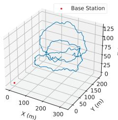

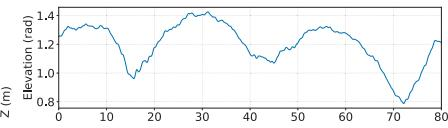

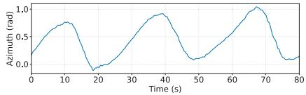  
(a)

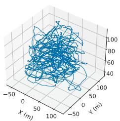

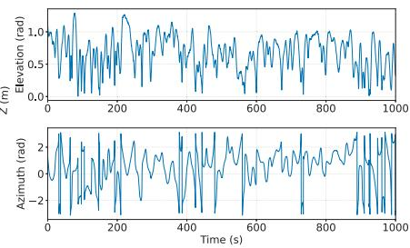  
(b)  
Fig. 6. UAV motion trajectories and corresponding angular variations. (a) UAV CM trajectory and angular variation; (b) UAV RM trajectory and angular variation.

3) Visualization of UAV trajectories in CM and RM scenarios: Following the above method and parameter configurations, in Fig. 6 we illustrate the UAV trajectory along with the corresponding variations in elevation and azimuth angles, for both CM and RM scenario, respectively. It can be observed that CM case exhibits weak random characteristics, with obvious trend regularity. In contrast, the mobility pattern in the RM scenario demonstrates stronger randomness, which makes it even harder to predict. These distinct mobility characteristics will be further illustrated through simulation analyses in the following section.

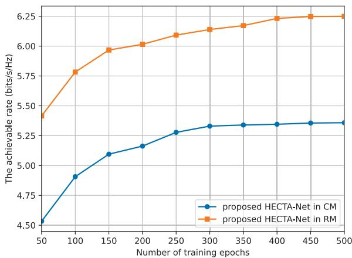  
Fig. 7. Effect of training epochs on the ISAC system performance under $\bar { N t } = \bar { N _ { r } } = \bar { N _ { u } } = 1 6$ and $\bar { P } _ { T } = 2 5 \mathrm { { d B m } }$ .

## B. Convergence Behavior

In this section, the relationship between training epochs and system communication performance is analyzed. As illustrated in Fig. 7, the proposed algorithm gradually converges to a stable communication rate with an increasing number of training epochs, demonstrating its feasibility. A comparative analysis of the convergence performance between CM and RM scenarios reveals that HECTA-Net achieves satisfactory performance at 300 and 400 epochs, respectively. Notably, when the UAV exhibits strong motion regularity, the network training process becomes faster and more efficient. Conversely, as mobility randomness increases and oscillation intensity strengthens, its regularity becomes more challenging to capture. Consequently, a greater number of training epochs are required to train the neural network model, enabling it to implicitly learn the underlying patterns of UAV mobility.

## C. Communication Performance

The average achievable communication rate is analyzed as a representative communication performance, with respect to the key parameters including the number of historical time slots $\tau ,$ transmit power, the number of transmit and receive antennas, the speed variation of UAV, the step size $\sigma _ { \epsilon } ^ { \mathrm { C M } }$ and $\sigma _ { \epsilon } ^ { \mathrm { R M } }$ of the random walk model, the number and position fluctuation $\sigma _ { e }$ of control points.

1) Number of historical time slots vs. average achievable communication rate: The impact of input time slot number on the proposed scheme is shown in Fig. 8. It can be observed that in both CM and RM scenarios, the performance initially improves remarkably with the increase in τ , then plateaus, and eventually experiences slight degradation as $\tau$ continues to grow. Specifically, in the CM scenario, the performance improves during the initial 6 time steps, and then remains nearly unchanged until $\tau = 8$ . Beyond this point, the performance slightly decreases. It indicates that excessive historical information may introduce irrelevant temporal dependencies, resulting in overfitting and reduced adaptability to the most recent UAV dynamics. On the other hand, the similar trend is observed in RM scenario, except that the optimal τ shifts to 10. That is due to the high randomness of UAV movement in RM scenario, where the TCN module requires more time slots to better capture the temporal dependencies. Considering the tradeoff between performance and complexity, we have selected τ = 6 for CM scenario and $\tau = 1 0$ for RM scenario in the following simulations.

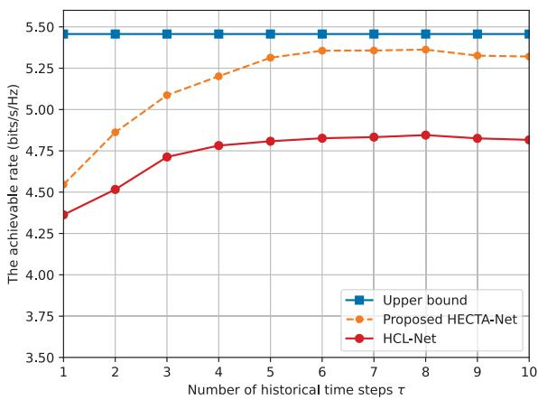  
(a)

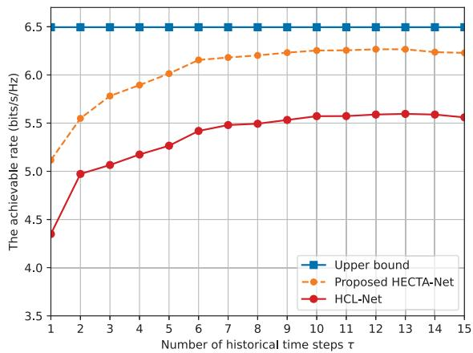  
(b)  
Fig. 8. Effect of the number of historical time slots τ on the ISAC system performance under $N _ { t } = N _ { r } = N _ { u } = 1 6$ and $P _ { T } = 2 5 ~ \mathrm { d B m }$ . (a) CM dataset; (b) RM dataset.

2) Transmit power vs. average achievable communication rate: As shown in Fig. 9(a), for the CM scenario, the proposed algorithm achieves performance closest to the theoretical upper bound, surpassing HCL-Net and EKF by 8.07% and 36.93% respectively at 30 dBm, due to full utilization of spatio-temporal features and dynamic weight allocation. In comparison, Fig. 9(b) shows that in the RM scenario, all methods exhibit performance degradation relative to CM because of increased mobility randomness as illustrated in Fig. 6(b). The performance ranking between EKF and HCL changes slightly, where EKF performs even worse than HCL-no-attitude, due to the reason that DL methods demonstrate superior capability to learn implicit UAV mobility pattern, exhibiting enhanced robustness against mobility randomness compared to model-dependent approach. Nevertheless, the proposed algorithm still maintains the best performance with minimal deviation from the theoretical optimum, achieved by comprehensively considering both local and global features while dynamically identifying and weighting critical spatio-temporal characteristics to effectively handle UAV mobility randomness. Furthermore, under both HCL-no-attitude and EKF-no-attitude conditions, significant degradation in communication rate is observed, indicating the critical role of UAV attitude in beamforming performance.

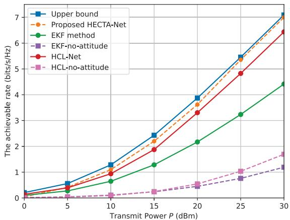  
(a)

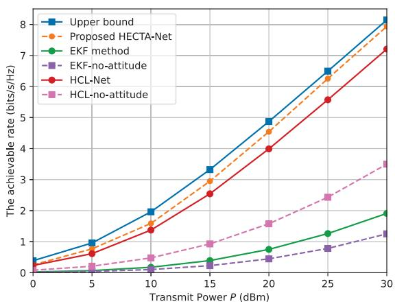  
(b)  
Fig. 9. Effect of transmit power on ISAC system performance under $\bar { N _ { t } } = N _ { r } = 1 6$ . (a) CM dataset; (b) RM dataset.

3) Number of antennas vs. average achievable communication rate: For the CM scenario shown in Fig. 10 (a), the proposed algorithm maintains its advantages while achieving proper performance with the increase of antenna numbers, unlike the saturation issues seen in HCL and EKF. This stems from the combination of CNN, TCN and attention in our scheme. The parallel convolution in TCN effectively harness the features extracted by CNN in multiple time slots, while attention mechanism preserving critical spatial information among them for further performance boost. Regarding the RM scenario in Fig. 10 (b), the proposed algorithm retains superior performance with only minor saturation effects owing to the higher random motion pattern of UAV.

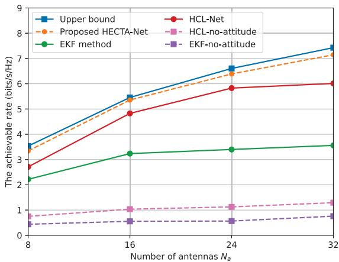  
(a)

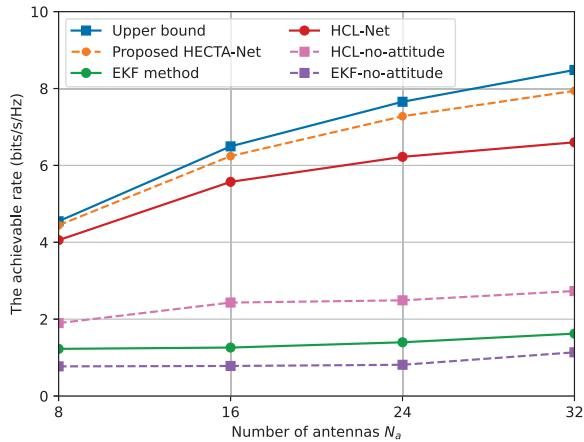  
(b)  
Fig. 10. Effect of number of antennas on the ISAC system performance under $\bar { N _ { t } } = N _ { r } = N _ { u } = N _ { a }$ and $P _ { T } = 2 5$ dBm. (a) CM dataset; (b) RM dataset.

4) Speed variation vs. average achievable communication rate: Fig. 11(a) illustrates the relationship between the speed variation range length and communication rate under CM condition. The speed variation range length is defined as $\Delta v _ { r a n g e } = ( v _ { m a x } - v _ { m i n } )$ , relative to the central reference speed of 30 m/s. Larger speed variation ranges indicate stronger active mobility randomness of UAV. The proposed algorithm maintains close-to-optimal performance across different speed variation range lengths, unlike the HCL and EKF methods which show significant degradation. This robustness stems from the ability of HECTA-Net to learn implicit UAV motion patterns from extracted spatio-temporal features. Fig. 11(b) shows the relationship between total movement duration and communication performance in RM scenario. As derived in (47) and the B-spline curve definition [30], shorter T values correspond to faster speed changes and larger variation ranges, indicating stronger randomness in UAV active mobility. The results demonstrate that all algorithms exhibit more pronounced performance degradation due to the increased difficulty in capturing complex mobility patterns, with the proposed algorithm consistently outperforming others. At $\begin{array} { r c l } { T } & { = } & { 6 5 0 ~ \mathrm { s } } \end{array}$ where speed variation ranges from [permode=symbol]0.828m/ s to [per-mode=symbol]43.479m/ s, the proposed algorithm achieves 24.1% higher communication rate than HCL-Net. The performance decline trends of HCL-no-attitude and EKF-no-attitude are basically consistent with those of HCL-Net and EKF. Overall, the proposed algorithm demonstrates strong generalization capability, maintaining robust performance across different speed variation ranges and motion conditions.

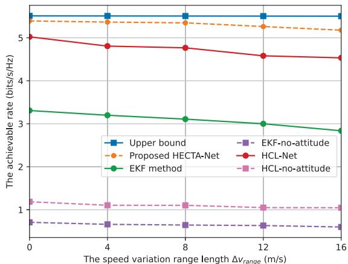  
(a)

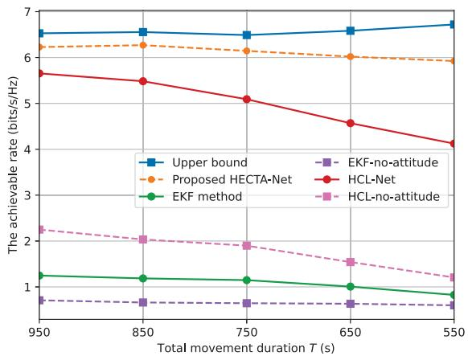  
(b)  
Fig. 11. Impact of UAV speed variation on ISAC system performance under $N _ { t } = N _ { r } = N _ { u } = 1 6$ and $P _ { T } = 2 5$ dBm. (a) The speed variation range length at CM dataset; (b) Total movement duration at RM dataset.

5) The step size of random walk model vs. average achievable communication rate: The step size $\sigma _ { \epsilon } ^ { \mathrm { C M } }$ and $\sigma _ { \epsilon } ^ { \mathrm { R M } }$ of the random walk model symbolizes the intensity of passive 3D drift. For CM scenario shown in Fig. 12(a), the proposed algorithm maintains close-to-optimal and stable performance despite slight degradation trend. This robustness originates from the capability of attention mechanism to dynamically weight historical time slots, distinguishing between active mobility and environmental effects while mitigating drift impacts. Furthermore, by combining with the advantages of CNN and TCN, the HECTA-Net demonstrates effective resistance to passive 3D drift. For RM scenario shown in Fig. 12(b), the downward trend of all algorithms is more obvious. This occurs due to the fact that the inherent irregularity of active mobility for RM, compounded by increasing drift intensity, creates more complex mobility pattern that is challenging to fully compensate. Nevertheless, the proposed algorithm maintains superior performance close to the upper bound across varying drift intensities, though with observable fluctuations.

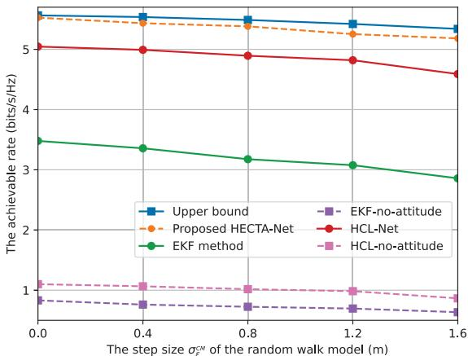  
(a)

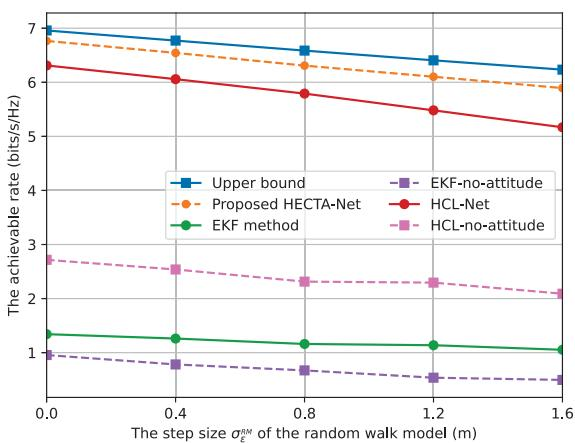  
(b)  
Fig. 12. The effect of the step size $\sigma _ { \epsilon } ^ { \mathrm { C M } }$ and $\sigma _ { \epsilon } ^ { \mathrm { R M } }$ of random walk model on ISAC system performance under $N _ { t } ~ = ~ \tilde { N _ { r } } ~ = ~ N _ { u } ~ = ~ 1 6$ and $P _ { T } = 2 5$ dBm. (a) CM dataset; (b) RM dataset.

6) Control point characteristic vs. average achievable communication rate: Fig. 13(a) and Fig. 13(b) show the relationship between the number and position fluctuation $\sigma _ { e }$ of control points and the communication rate. According to the B-spline curve principle [30], an increase in either the number or position fluctuation of control points leads to higher trajectory complexity, resulting in greater UAV active mobility randomness. The results reveal that all algorithms exhibit performance degradation with increasing control point quantity and position fluctuation. However, compared to HCL-Net and EKF, the proposed algorithm shows a more gradual decline trend and maintains superior communication rates, owing to its comprehensive integration the advantages of CNN, TCN, and attention modules. The proposed algorithm is more sensitive to the number of control points than to their position fluctuation, as the former introduces substantially more randomness that is difficult to overcome. The limited additional randomness from position fluctuation of control points can be effectively compensated by the proposed algorithm.

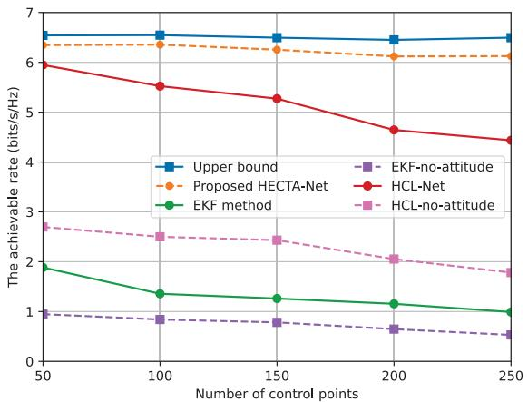  
(a)

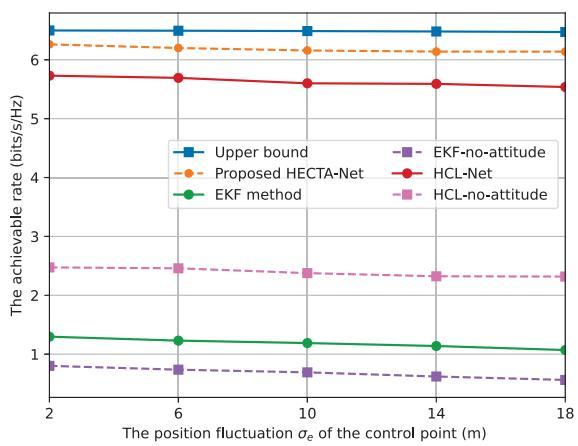  
(b)  
Fig. 13. The effect of control point characteristic on ISAC system performance at RM scenario under $\bar { N _ { t } } = N _ { r } = N _ { u } = 1 6$ and $P _ { T } = 2 5$ dBm. (a) the number of control point; (b) the position fluctuation $\sigma _ { e }$ of control point.

In summary, the proposed algorithm maintains robust average achievable communication rates even under conditions of high UAV mobility randomness and strong drifts, demonstrating its generalization and robustness in complex scenarios.

## D. Sensing Performance

In this subsection, the sensing performance of our proposed algorithm is analyzed, regarding the beam alignment and latency.

1) Beam alignment analysis: Besides a tool for echo collection, our sensing signal processing could also provide angular domain information, specifically, $\varphi _ { m }$ and $\theta _ { m }$ . These could be extracted from the beamforming matrix provided by the proposed sensing scheme at time slot m, using Multiple Signal Classification (MUSIC) algorithm from [31]. The angle error is then computed as the difference between the estimated angles $\left( \varphi _ { m } , \theta _ { m } \right)$ and the truth $( \varphi _ { m } ^ { \mathrm { r } } , \theta _ { m } ^ { \mathrm { r } } )$ . As depicted in Fig. 14, 80% of angle errors are below $1 . 4 ^ { \circ }$ with a mean of 0.958◦ for the CM scenario, while corresponding values for the RM scenario are $3 . 4 ^ { \circ }$ and $2 . 6 ^ { \circ }$ , respectively. Except the prediction difficulties to caused by more random UAV movement, the increased angular errors in Fig. 14 (b) are also attributed to higher likelihood of larger $\theta _ { m } ^ { \mathrm { r } }$ values. Under such conditions, a $N _ { t } ~ = ~ 4 \times 4 ~ \mathrm { U P A }$ struggles to properly align its mainlobe, prompting the proposed algorithm to utilize optimal side-lobes instead. This results in an apparent beamforming angle mismatch when reading from the main-lobe direction. Nevertheless, as this effect goes to all the benchmark schemes, the fairness is maintained among the benchmark algorithms for the comparisons in Section IV-C.

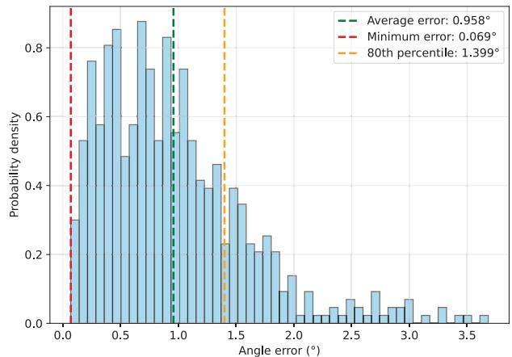  
(a)

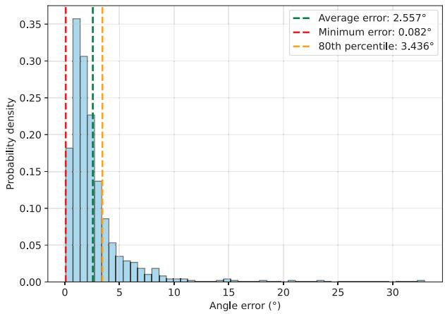  
(b)  
Fig. 14. Angular error histograms under $N _ { t } ~ = ~ N _ { r } ~ = ~ N _ { u } ~ = ~ 1 6$ and $P _ { T } = 2 5$ dBm. (a) CM dataset; (b) RM dataset.

To better visualize the angular error effect for signal propagation, two exemplary samples are selected from CM and RM scenarios to illustrate the beam alignment heatmap in Fig. 15. With the angular error between the target and predicted dot to be $0 . 9 7 ^ { \circ }$ and 2.88◦, the gain decreases by 0.997 dB and 0.986 dB for CM and RM case, respectively. Such degradations are minor and negligible, yielding a relatively accurate angle estimation or beam alignment to ensure our improved achievable rates for the results in Section IV-C.

2) Latency analysis: A potential concern of communicationoriented ISAC system is how much sensing may degrade communication performance due to resource trade-off. For our proposed algorithm, as sensing basically uses the echoes of communication signal for processing, the major issue is the latency for predictive beamforming derivation, during which the communication link may operate with suboptimal performance due to the delayed update of beamforming. To verify the real-time applicability of the proposed method, we measured the online inference latency on a computer equipped with an Intel Core i7-11700K CPU and an UHD Graphics 750 GPU. Under this setup, the average runtime was 2.073 ms for CM scenario and 2.891 ms for RM case by examining all test samples. The slightly longer latency in the RM case results from its larger number of historical time steps τ . Quantitatively, in such short duration, the UAV flies less than 10 cm at our fasted defined UAV speed of 30 m/s, yielding negligible beamforming direction imperfection for the BS and UAV tens or hundred meters away from each other.

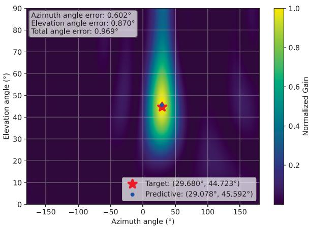  
(a)

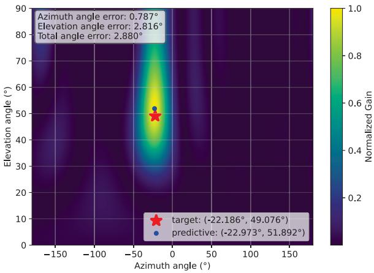  
(b)  
Fig. 15. Predicted beam heatmap under $N _ { t } ~ = ~ N _ { r } ~ = ~ N _ { u } ~ = ~ 1 6$ and $\bar { P _ { T } } = 2 5$ dBm. (a) 540-th test sample in CM dataset; (b) 260-th test sample in RM dataset.

In summary, our proposed sensing scheme provides relatively proper beam alignment and short processing latency, yielding reliable communication performance, supporting the superior performance of HECTA-Net in comparison to other algorithms in Section IV-C.

## V. CONCLUSION

This paper investigated the ISAC-based predictive beamforming design for UAV aided ground-air network, where the ground BS predicts future bidirectional beamforming matrices towards the UAV using ISAC echoes from previous time slots. We considered a practical UAV mobility model which incorporates the position fluctuations and attitude variations during flight, posing great challenge to the beamforming prediction. To this end, we proposed a learning-based end-to-end beamforming prediction framework termed as HECTA-Net, which integrates CNN, TCN, and attention mechanism. The proposed framework can well extract spatio-temporal features from historical echoes at both local and global levels while dynamically allocates attention weights to critical time slots, yielding more accurate beamforming design. Extensive simulations demonstrated that the proposed HECTA-Net achieved promising performance close to the theoretical upper bound and outperformed the other benchmark schemes. In the future, we consider to extend our work to the more complicated scenario with probabilistic LoS channels, where the LoS link between BS and UAV may be occasionally obstructed. In such a case, the predictive beamforming enabled by multi-BS cooperation deserves in-depth investigation. In addition, this work is based on the communication-centric ISAC design, where the UAV sensing is intended to improve the communication performance. In future, we will investigate the dual-functional UAV-ISAC framework, to explore the beamforming design that simultaneously meet the requirements of sensing-oriented and communication-oriented users.

## REFERENCES

[1] Y. Huang, “Challenges and opportunities of sub-6 GHz integrated sensing and communications for 5G-advanced and beyond,” Chin. J. Electron., vol. 33, no. 2, pp. 323–325, Mar. 2024.

[2] F. Liu et al., “Integrated sensing and communications: Toward dualfunctional wireless networks for 6G and beyond,” IEEE J. Sel. Areas Commun., vol. 40, no. 6, pp. 1728–1767, Jun. 2022.

[3] J. A. Zhang et al., “An overview of signal processing techniques for joint communication and radar sensing,” IEEE J. Sel. Topics Signal Process., vol. 15, no. 6, pp. 1295–1315, Nov. 2021.

[4] Z. Xiao, S. Chen, and Y. Zeng, “Simultaneous multi-beam sweeping for mmWave massive MIMO integrated sensing and communication,” IEEE Trans. Veh. Technol., vol. 73, no. 6, pp. 8141–8152, Jun. 2024.

[5] F. Liu, W. Yuan, C. Masouros, and J. Yuan, “Radar-assisted predictive beamforming for vehicular links: Communication served by sensing,” IEEE Trans. Wireless Commun., vol. 19, no. 11, pp. 7704–7719, Nov. 2020.

[6] C. Liu et al., “Learning-based predictive beamforming for integrated sensing and communication in vehicular networks,” IEEE J. Sel. Areas Commun., vol. 40, no. 8, pp. 2317–2334, Aug. 2022.

[7] Z. Wang and V. W. S. Wong, “Deep learning for ISAC-enabled end-toend predictive beamforming in vehicular networks,” in Proc. IEEE Int. Conf. Commun. (ICC), Rome, Italy, Mar. 2023, pp. 5713–5718.

[8] F. Xia et al., “Sensing-enabled predictive beamforming design for RISassisted V2I systems: A deep learning approach,” IEEE Trans. Wireless Commun., vol. 23, no. 6, pp. 5571–5586, Jun. 2024.

[9] J. Wang, X. Zhou, H. Zhang, and D. Yuan, “Joint trajectory design and power allocation for UAV assisted network with user mobility,” IEEE Trans. Veh. Technol., vol. 72, no. 10, pp. 13173–13189, Oct. 2023.

[10] J. Wang, H. Zhang, X. Zhou, W. Liu, and D. Yuan, “Joint resource allocation and trajectory design for energy-efficient UAV assisted networks with user fairness guarantee,” IEEE Internet Things J., vol. 11, no. 13, pp. 23835–23849, Jul. 2024.

[11] A. Khalili, A. Rezaei, D. Xu, and R. Schober, “Energy-aware resource allocation and trajectory design for UAV-enabled ISAC,” in Proc. IEEE Global Commun. Conf., Dec. 2023, pp. 4193–4198.

[12] A. Khalili, A. Rezaei, D. Xu, F. Dressler, and R. Schober, “Efficient UAV hovering, resource allocation, and trajectory design for ISAC with limited backhaul capacity,” IEEE Trans. Wireless Commun., vol. 23, no. 11, pp. 17635–17650, Nov. 2024.

[13] Y. Cui et al., “Specific beamforming for multi-UAV networks: A dual identity-based ISAC approach,” in Proc. IEEE Int. Conf. Commun. (ICC), Rome, Italy, May 2023, pp. 4979–4985.

[14] Y. Cui et al., “Seeing is not always believing: ISAC-assisted predictive beam tracking in multipath channels,” IEEE Wireless Commun. Lett., vol. 13, no. 1, pp. 14–18, Jan. 2024.

[15] S. Zeng, X. Xu, Y. Zeng, and F. Liu, “CKM-assisted LoS identification and predictive beamforming for cellular-connected UAV,” in Proc. IEEE Int. Conf. Commun., Rome, Italy, May 2023, pp. 2877–2882.

[16] A. Krizhevsky, I. Sutskever, and G. E. Hinton, “ImageNet classification with deep convolutional neural networks,” in Proc. Adv. Neural Inf. Process. Syst., vol. 60, 2012, pp. 84–90.

[17] S. Bai, J. Z. Kolter, and V. Koltun, “An empirical evaluation of generic convolutional and recurrent networks for sequence modeling,” 2018, arXiv:1803.01271.

[18] V. Mnih, N. Heess, A. Graves, and K. Kavukcuoglu, “Recurrent models of visual attention,” in Proc. Adv. Neural Inf. Process. Syst., vol. 27, 2014, pp. 2204–2212.

[19] Z. Wang, V. W. S. Wong, and R. Schober, “Integrated sensing and communications for end-to-end predictive beamforming design in vehicle-to-infrastructure networks,” IEEE J. Sel. Topics Signal Process., vol. 18, no. 5, pp. 933–949, Jul. 2024.

[20] K. K. Nguyen, T. Q. Duong, T. Do-Duy, H. Claussen, and L. Hanzo, “3D UAV trajectory and data collection optimisation via deep reinforcement learning,” IEEE Trans. Commun., vol. 70, no. 4, pp. 2358–2371, Apr. 2022.

[21] T. Dierks and S. Jagannathan, “Output feedback control of a quadrotor UAV using neural networks,” IEEE Trans. Neural Netw., vol. 21, no. 1, pp. 50–66, Jan. 2010.

[22] M. A. Richards et al., Fundamentals of Radar Signal Processing, vol. 1. New York, NY, USA: McGraw-Hill, 2005.

[23] Z. Xiao et al., “A survey on millimeter-wave beamforming enabled UAV communications and networking,” IEEE Commun. Surv. Tut., vol. 24, no. 1, pp. 557–610, 1st Quart., 2022.

[24] W. Wang and W. Zhang, “Jittering effects analysis and beam training design for UAV millimeter wave communications,” IEEE Trans. Wireless Commun., vol. 21, no. 5, pp. 3131–3146, May 2022.

[25] B. Lee, A. C. Marcum, D. J. Love, and J. V. Krogmeier, “Fusing channel and sensor measurements for enhancing predictive beamforming in UAVassisted massive MIMO communications,” IEEE Wireless Commun. Lett., vol. 13, no. 3, pp. 869–873, Mar. 2024.

[26] D. P. Kingma, “Adam: A method for stochastic optimization,” 2014, arXiv:1412.6980.

[27] D. E. Rumelhart, G. E. Hinton, and R. J. Williams, “Learning representations by back-propagating errors,” Nature, vol. 323, no. 6088, pp. 533–536, Oct. 1986.

[28] K. He and J. Sun, “Convolutional neural networks at constrained time cost,” in Proc. IEEE Conf. Comput. Vis. Pattern Recognit. (CVPR), Jun. 2015, pp. 5353–5360.

[29] A. Vaswani et al., “Attention is all you need,” in Proc. Adv. Neural Inf. Process. Syst., vol. 30, 2017, pp. 6000–6010.

[30] F. Stoican, I. Prodan, D. Popescu, and L. Ichim, “Constrained trajectory generation for UAV systems using a B-spline parametrization,” in Proc. 25th Medit. Conf. Control Autom. (MED). Valletta, Malta: IEEE, Jul. 2017, pp. 613–618.

[31] R. Schmidt, “Multiple emitter location and signal parameter estimation,” IEEE Trans. Antennas Propag., vol. AP-34, no. 3, pp. 276–280, Mar. 1986.

  
Jinghan Xu (Student Member, IEEE) received the B.E. degree in automation from Hainan University, Haikou, China, in 2023. She is currently pursuing the M.Eng. degree with the School of Control Science and Engineering, Shandong University, Jinan, China. Her research interests include integrated sensing and communication, space–air–ground integrated networks, and deep learning.

Xiaotian Zhou (Member, IEEE) received the B.E. degree in electronic information engineering and the Ph.D. degree in communication and information systems from Shandong University in 2007 and 2013, respectively. He is currently a Full Professor with Shandong University. His research interests include wireless communications, with a focus on space–air–ground integrated networks, edge computing, and multi-antenna technologies.

Haixia Zhang (Senior Member, IEEE) received the B.E. degree from the Department of Communication and Information Engineering, Guilin University of Electronic Technology, Guilin, China, in 2001, and the M.Eng. and Ph.D. degrees in communication and information systems from the School of Information Science and Engineering, Shandong University, Jinan, China, in 2004 and 2008, respectively. From 2006 to 2008, she was with the Institute for Circuit and Signal Processing, Munich University of Technology, Munich, Germany, as an Academic

Assistant. From 2016 to 2017, she was a Visiting Professor with the University of Florida, Gainesville, FL, USA. She is currently a Distinguished Professor with Shandong University. She is actively participating in many professional services. Her research interests include wireless communication and networks, the Industrial Internet of Things, wireless resource management, and mobile edge computing. She serves/served as the symposium chair, a TPC member, the session chair, and a keynote speaker for many conferences. She is/was an Editor of IEEE TRANSACTIONS ON WIRELESS COMMUNICATIONS, IEEE WIRELESS COMMUNICATIONS LETTERS, and China Communications.

Yueheng Li (Member, IEEE) received the B.Sc. degree in telecommunication science and technology from Shandong University, Jinan, China, in 2014, the M.Sc. degree in communication and information technology from the University of Bremen, Bremen, Germany, in 2018, and the Dr.-Ing. (Ph.D.E.E.) degree from the Institute of Radio Frequency Engineering and Electronics (IHE), Karlsruhe Institute of Technology (KIT), Karlsruhe, Germany, in 2023. From 2023 to 2024, he was a Post-Doctoral Researcher at KIT. He is currently a

Research Fellow with the Institute of Intelligent Communication Technology, Shandong University. His research interests include reconfigurable intelligent surface, 6G system design, and integrated sensing and communication.