# Deep Reinforcement Learning-Based Resource Management for UAV-Assisted Mobile Edge Computing Against Jamming

Ziling Shao , Graduate Student Member, IEEE, Helin Yang , Senior Member, IEEE, Liang Xiao , Senior Member, IEEE, Wei Su , Yifan Chen, Graduate Student Member, IEEE, and Zehui Xiong , Senior Member, IEEE

Abstract—In mobile edge computing (MEC) systems, multiple unmanned aerial vehicles (UAVs) can be utilized as aerial servers to provide computing, communication, and storage services for edge users, called UAV-assisted MEC, which has emerged as a promising technology to improve both the computing and communication performances. Unlike existing works without considering jamming attacks, we investigate a multi-UAV-assisted-MEC scenario under multiple malicious jammers and then propose a resource management approach with the objective of minimizing both the system energy consumption and latency. Due to the time-varying nature of communication environments, we design a multi-agent deep reinforcement learning (MADRL)-based resource management approach to dynamically adjust the CPU frequency, communication bandwidth, and channel access selection of UAVs to enhance the system performance against jamming attacks. On this basis, in order to enhance the algorithm learning efficiency, we propose a multi-agent twin-delayed deep deterministic policy algorithm in combination with the prioritized experience replay mechanism

Manuscript received 30 August 2023; revised 2 June 2024; accepted 7 July 2024. Date of publication 29 July 2024; date of current version 5 November 2024. This work was supported in part by the Fujian Provincial Natural Science Foundation of China under Grant 2024J09002, in part by the National Natural Science Foundation of China under Grant 62371408, Grant 62301467, Grant U21A20444, and Grant 62071400, in part by the Fundamental Research Funds for the Central Universities under Grant 20720220080, in part by Xiaomi Young Talents Program, in part by the Natural Science Foundation of Xiamen, China under Grant 3502Z202371010, in part by the National Key Research and Development Program of China under Grant 2023YFB3107603, in part by the National Research Foundation (NRF), in part by the Infocomm Media Development Authority, in part by the Future Communications Research Development Programme (FCP), in part by the SUTD-ZJU IDEA under Grant SUTD-ZJU (VP) 202102, in part by the Ministry of Education, Singapore, in part by the SMU-SUTD Joint under Grant 22-SIS-SMU-048, and in part by the SUTD Kickstarter Initiative under Grant SKI 20210204. An earlier version of this paper was presented in part at the IEEE Global Communications Conference (GLOBECOM), Kuala Lumpur, Malaysia, 2023 [DOI: 10.1109/GLOBECOM54140.2023.10437090]. Recommended for acceptance by C. H. Liu. (Corresponding author: Helin Yang.)

Ziling Shao, Helin Yang, and Liang Xiao are with the School of Informatics, Xiamen University, Xiamen 361005, China, also with the Key Laboratory of Multimedia Trusted Perception and Efficient Computing, Xiamen University, Xiamen 361005, China, and also with the Institute of Artificial Intelligence, Xiamen University, Xiamen 361005, China (e-mail: shaoziling@stu.xmu.edu.cn; helinyang066@xmu.edu.cn; lxiao@xmu.edu.cn).

Wei Su and Yifan Chen are with the School of Informatics, Xiamen University, Xiamen 361005, China (e-mail: suweixiamen@xmu.edu.cn; chenyifan1@stu.xmu.edu.cn).

Zehui Xiong is with the Pillar of Information Systems Technology and Design, Singapore University of Technology and Design, Singapore 487372 (e-mail: zehui\_xiong@sutd.edu.sg).

Digital Object Identifier 10.1109/TMC.2024.3432491

(PER-MATD3) to effectively search for the joint resource management strategy under high-dimensional state and action spaces, where the time-varying channel state information and imperfect attack behavior information are also effectively trained to improve the learning capacity and convergence speed. Simulation and experimental results verify that the proposed approach can significantly decrease the overall system latency (i.e., computing and communication latency) and energy consumption compared to other benchmark algorithms under different real-world settings.

Index Terms—Anti-jamming, deep reinforcement learning, energy and latency minimization, mobile edge computing, resource management, unmanned aerial vehicle.

# I. INTRODUCTION

U NMANNED aerial vehicles (UAVs) have gained increas-ing attention as they offer a variety of advantages over ing attention as they offer a variety of advantages over traditional ground-based systems [2]. UAVs are small, low-cost, and can be easily deployed in various communication environments, making them an attractive solution for numerous applications, such as search and rescue [3], data collection [4], and surveillance [5]. For example, UAVs can be used for data collection in wireless sensor networks (WSNs) by flying over the sensor nodes and collecting data from them [6]. UAVs can also serve as mobile relays for wireless communication systems, enhancing network coverage and capacity in areas with poor connectivity [7]. Furthermore, UAVs can be employed for extending the battery life of mobile devices by acting as mobile charging stations [8], while enabling devices to offload some of their tasks to the UAVs and to access more computing resources [9]. Overall, the application of UAVs has revolutionized many fields and has the potential to contribute to many more in the future.

Mobile edge computing (MEC) is a promising technology that brings cloud computing capabilities and services closer to mobile users, by placing servers and resources at the edge of the network [10]. It also facilitates the integration of emerging technologies, such as the Internet of Things (IoT), vehicular networks (VNs) [11], 5G/6G networks [12], and artificial intelligence (AI), by providing a distributed and heterogeneous computing infrastructure. To further enhance the efficiency and adaptability of MEC systems, some studies have leveraged deep reinforcement learning (DRL) techniques to achieve resource optimization, resulting in improved overall system performance and quality of service (QoS) [13], [14]. Since UAVs can provide flexible communication and mobile computing services, while MEC can enhance the computing capabilities of UAVs by providing edge computing and networking services, and thus lots of studies have explored the potential of using UAVs in MEC, called UAV-assisted MEC, which can effectively manage resource allocation [15], [16], [17], trajectory design [18], [19], [20], and computation offloading [21], [22], [23] to further improve the network performance.

# A. Related Work

In the UAV-assisted MEC scenario, resource allocation is a critical issue that needs to be addressed for network performance optimization, such as energy efficiency, network capacity, computing and communication latency. Efficient resource allocation can improve the QoS and maximize the system’s throughput, while inefficient allocation may lead to network congestion, excessive latency, and energy wastage. To optimize the performance of UAV-assisted MEC systems, various resource allocation schemes have been proposed in some papers. Some of these schemes focus on optimizing the energy efficiency of the system. For example, the authors in [24] aimed to reduce the average weighted energy consumption of all users under the constraints of UAV energy consumption and data queue stability. The authors of [25] minimized the total energy demand of the UAV by jointly optimizing CPU frequency, offloading, transmit power, and trajectory. In [26], the authors investigated UAVassisted MEC for energy reduction through intelligent offloading decisions, bit allocation, and UAV trajectory design. By jointly choosing optimal route planning and task allocation of UAVs, the authors of [27] aimed to obtain a high-quality near-optimal solution to minimize energy consumption. Also, there are other resource allocation schemes aimed at minimizing computing and communication latency. The authors in [28] studied response delay minimization for a swarm of 3D distributed UAVs by jointly optimizing communication and computation resources. With the partial offloading strategy, Hu et al. [19] optimized the UAV trajectory, offload task ratio, and the user scheduling variables to minimize the total maximum latency. In the maritime environment, the paper [29] investigated the problem of minimizing the latency of communication and computation in UAV-assisted MEC networks by optimizing the trajectory and virtual machine configuration of UAVs. However, the optimization of system latency may lead to an increase in system energy consumption, so the trade-off between energy consumption and latency has been the focus of some scholars’ research. They minimized the weighted cost of latency and energy consumption by optimizing UAV trajectories, task offload scheduling, and computation resource allocation [15], [30], [31], [32].

Some studies, such as [24], [25], [26], [27], [33], [34], [35], the authors proposed an optimization problem formulation that aims to minimize the resource consumption, and they used traditional optimization, heuristic or approximation algorithms to solve the nonconvexity of these problems. However, the resource allocation problem becomes more challenging in a dynamic environment where the location and communication requirements of UAVs change frequently, and traditional algorithms require a large number of iterations and are not suitable for the real-time changing environment of UAV-assisted MEC systems. To solve this problem, reinforcement learning (RL)-based methods have been investigated. An important advantage of RL is that it can adapt to dynamic environments and can learn adaptively in time. Therefore, RL may be more applicable in some UAV-assisted MEC scenarios that require timely response to environmental changes. In [36], the resource allocation problem was modeled as a complex decision process, and a deep Q-network (DQN) solution based on DRL is designed to solve this optimization problem. [29] and [32] used the DQN algorithm in addition to the deep deterministic policy gradient (DDPG) algorithm for continuous action space problems to reduce energy consumption and system latency. In [37], the authors suggested a collaborative computational offloading and resource allocation scheme based on model-free DRL (CCORA-DRL), with the goal of minimizing task execution latency and energy consumption and obtaining effective solutions through adaptive learning of dynamic networks. In [38], the authors formulated the resource allocation problem for MEC servers as a distributed optimization problem that maximizes the number of offloaded tasks while meeting heterogeneous QoS requirements, which is then solved using a multi-agent DDPG (MADDPG)-based approach.

Nevertheless, none of the above work takes into account the possible interference to the system from jamming devices. In UAV-assisted MEC, the use of jamming devices has become a significant issue due to the vulnerability of wireless communications. Jamming attacks can severely affect system resource allocation and degrade the performance of the UAV communication network by interrupting or blocking legitimate communication links, leading to disruptions in the operation of the entire network. Several corresponding studies have been conducted to counter the impact of jamming attacks on UAVassisted MEC networks. One approach to mitigate the impact of jamming attacks is to use physical layer security techniques such as beamforming [39], which can increase the signal-tonoise ratio (SNR) of legitimate communication links while minimizing the effect of jamming [40]. Some other scholars optimized the trajectory of UAVs to effectively resist jamming attacks [41], [42]. In addition, RL-based methods have also been widely used in UAV anti-jamming. The authors of [43] and [44] presented an energy-efficient framework based on RL for energy-constrained UAV networks subjected to jamming attacks, in order to improve the quality of communication while minimizing the overall energy consumption of the network. The purpose of [45] was to improve the communication performance of intelligent UAV swarm systems in the presence of interference by a proposed modified Q-Learning algorithm based on multi-parameter programming. RL-based approaches have also been applied for UAV anti-jamming video transmission schemes [46]. Meanwhile, the anti-jamming technology focusing on the channel has become one of the concerns of many scholars in the field of UAV anti-jamming. [47] proposed an Active Inference (Ain) framework as a new resource allocation strategy for anti-jamming, encoding the dynamic interactions between UAVs and jammers in the spectrum for anti-jamming purposes. In [48], the authors utilized a multiagent reinforcement learning (RL)-based UAV swarm communication scheme to optimize anti-jamming relay selection and power allocation to mitigate state quantization errors for rapidly changing channel states under high swarm moving speed, thereby further improving anti-jamming performance. A deep safe RL framework implemented in UAV enabled intelligent channel selection and power control for jam-resistant communication [49]. [50] addressed the problem of anti-jamming channel allocation through constructing a multi-layer Stackelberg game model. To investigate the anti-jamming problem of the joint channel and power allocation for UAV networks, [51] suggested a collaborative anti-jamming communication algorithm based on multi-agent hierarchical Q-learning (MALQL) to avoid mutual interference between UAVs and malicious interference from the outside, and to maximize the quality of experience (QoE) of the system. Compared to traditional optimization methods, reinforcement learning algorithms such as Q-learning [51] or DQN [49] that are more suitable for discrete action spaces, and the Steinberg game method [50] used in previous anti-jamming works, our proposed multi-agent twin-delayed deep deterministic policy algorithm (MATD3) with prioritized experience replay (PER) has advantages in dealing with high-dimensional continuous spaces, adapting to dynamic multi-UAV communication environments, and improving learning efficiency.

# B. Contributions and Organization

This paper focuses on resource management problem in a multi-UAV-assisted MEC system under jamming attacks. Specifically, we propose a learning-based algorithm to optimize the computing and communication resources to minimize the weighted system cost of latency and energy consumption in the presence of multiple jammers. The contributions of this work can be summarized as follows:

We investigate a joint computing and communication resource management problem for multi-UAV-assisted MEC systems in the presence of jamming attacks. In detail, the CPU frequency of UAVs, wireless bandwidth allocation, and communication channel selection are all jointly optimized to minimize the system latency and energy consumption under multiple jammers, where the system environment is dynamic with time-varying computational capabilities and channel state information (CSI).   
As the optimization problem is difficult to be addressed and the UAV-assisted MEC environments are highly dynamic complex, we propose a MATD3-based resource management algorithm, which can efficiently search for joint resource management policies in high-dimensional state and action spaces. In addition, the PER method is introduced into the MATD3 algorithm in order to further accelerate the convergence speed and improve the efficiency of the algorithm. In this context, the proposed learning approach can dynamically allocate computing and communication resources of UAVs based on the real-time performance of the system and the ever-changing environmental conditions to optimize system performance.   
- The performance of the proposed algorithm is evaluated in various practical scenarios through a large number

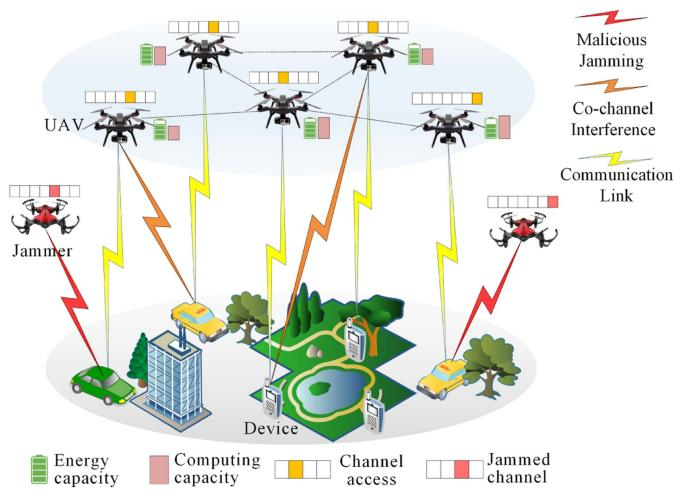

flowchart

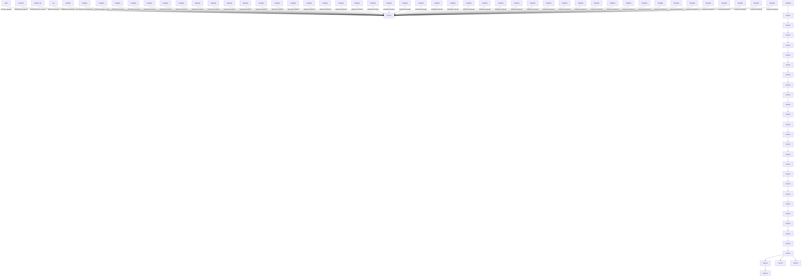

Fig. 1. The multi-UAV-assisted MEC system model under jamming attacks.

of simulations and experiments, and the simulation and experimental results show that the proposed resource management algorithm can effectively reduce system latency and energy consumption. Moreover, by comparing the convergence with other benchmark methods, the addition of the PER method can effectively improve the learning efficiency of the algorithm and accelerate the convergence speed.

The rest of this paper is organized as follows. The system model and problem formulation are presented in Section II. Section III gives a specific solution to the optimization problem using the MATD3 algorithm. Section IV and V show the simulation and experimental results and their corresponding analysis, respectively, and Section VI is the conclusion.

In this submitted manuscript, we further significantly improve the previously published version [1], which is summarized in the following three key points:

1) This study improves our previous work by introducing a spectrum-aware intelligent channel selection method for multi-UAV-assisted MEC systems, which effectively reduces the system latency and energy consumption under jamming attacks.   
2) In this study, we introduce an advanced MATD3 algorithm for optimizing the joint resource management strategy in dynamic multi-UAV-assisted MEC systems, which takes into account the time-varying CSI and imperfect attack behaviors, aiming to minimize the system latency and energy consumption.   
3) Unlike the preliminary simulations in previous work, this study conducts more simulations and extensive real-world experiments in different scenarios.

# II. SYSTEM MODEL AND PROBLEM FORMULATION

# A. System Overview

Fig. 1 illustrates a general multi-UAV-assisted MEC system model under malicious jamming attacks. The system consists of K UAVs, and J jammers, where each UAV provides computing and communication services for one ground mobile user.

Consequently, the system has a number of K air-to-ground communication pairs, where the k-th communication pair involves UAV k as the transmitter side and ground user k as the receiver side. As depicted in Fig. 1, the jammers can be UAVs with flexible deployment, strategically aiming to generate interference noise in an attempt to disrupt the communication quality of the ground mobile devices. Meanwhile, the system also takes into account the co-channel interference that occurs between UAVs if they occupy the same channel for communication. Here, we use the set $\mathcal { K } = \{ 1 , 2 , . . . , K \}$ and the set $\mathcal { I } = \{ 1 , 2 , . . . , J \}$ to denote the UAVs and jammers in the system, respectively. The total available bandwidth for communication in the system is $B .$

In multi-UAV-assisted MEC system, UAVs are limited in the computing and communication resources they can provide due to the factors such as size, weight, and power. That is why it becomes imperative to effectively allocate computing and communication resources in all stages of edge computing. Considering the complexity associated with bi-directional links, we chose to focus our research on the downlink part to better manage the experimental environment and to delve into resource management and anti-jamming issues in multi-UAV-assisted MEC systems. Therefore, this paper focuses on two main components of the downlink process in which UAVs act as edge devices to provide services to ground users: 1) computation on the UAVs; and 2) transmission from UAVs to users.

# B. Computation on the UAVs

In the proposed model, UAV k first completes its computing task based on the observed data before transmitting the relevant information to its served ground device, where the computing latency of UAV k at time slot t can be expressed as

$$
T _ {k, t} ^ {\text { comp }} = \frac {D _ {k , t} c _ {k , t}}{\eta_ {k , t} f _ {k , t}}, \tag {1}
$$

where $D _ { k , i }$ denotes the total amount of data for computing by the UAV $k ,$ t then the CPU cycles for processing each data sample is ${ c } _ { k , t }$ . Moreover, we set the base CPU frequency of each UAV k,k as $f _ { k , t }$ and introduce a frequency adjustment factor $\eta _ { k , t }$ to k,tcontrol its practical operating CPU frequency.

Then, considering the computing time $T _ { k , t } ^ { \mathrm { c o m p } }$ in the first stage, k,tthe computing energy consumption during this process can be calculated as

$$
E _ {k, t} ^ {\mathrm{comp}} = \vartheta_ {k} \left(\eta_ {k, t} f _ {k}\right) ^ {3} T _ {k, t} ^ {\mathrm{comp}} = \vartheta_ {k} c _ {k, t} D _ {k, t} \left(\eta_ {k, t} f _ {k}\right) ^ {2}, \tag {2}
$$

where $\vartheta _ { k }$ is the effective switched capacitance.

# C. Transmission From UAVs to Users

Upon completion of the task computing, each UAV proceeds to transmit the computing information or results to its served ground device. In consideration of the presence of malicious jammers and the possibility of co-channel interference, we use a spectrum sensing method based on energy detection to detect whether the spectrum is jammed by jammers as well as other UAVs, and then locate the approximate position of the jammer [52]. It is difficult for the model to obtain perfect channel state information due to observation errors and channel timevariation, so we add a certain amount of random perturbation to the channel gain to simulate channel instability and variations.

$$
h _ {k, t} = \hat {h _ {k , t}} + \Delta h _ {k, t}, \tag {3}
$$

$$
h _ {j, k, t} = h _ {\hat {j}, k, t} + \Delta h _ {j, k, t}, \tag {4}
$$

where $\hat { h _ { k , t } }$ and $\hat { h _ { j , k , t } }$ are the original channel gain, $\Delta h _ { k , t }$ and $\Delta { h } _ { j , k , t }$ k,t j,k,t k,treflects the uncertainty and randomness of the channel.

j,k,tWhen the communication pair k selects to access subchannel $\varphi _ { k }$ for data transmission, the formula for its received signal-tokinterference-plus-noise ratio (SINR) is

$$
S I N R _ {k, t} = \frac {P _ {k , t} \left| h _ {k , t} \right| ^ {2}}{\rho_ {k , t} P _ {j , t} \left| h _ {j , k , t} \right| ^ {2} + \sum_ {k ^ {\prime} = 1 , k ^ {\prime} \neq k} ^ {K} P _ {k ^ {\prime} , t} h _ {k ^ {\prime} , t} + \sigma_ {k , t} ^ {2}}, \tag {5}
$$

where $P _ { k , t }$ represents the transmit power of UAV k, $h _ { k , t }$ is the k,t k,tchannel gain between UAV k and its served ground user k. $P _ { j , t }$ denotes the transmit power of jammer j, and $h _ { j , k , t }$ is the channel gain from jammer $j$ to ground user k. $P _ { k ^ { \prime } , t }$ denotes the transmit k ,tpower of the other UAVs communicating on the channel $\varphi _ { k }$ at the same time, $h _ { k ^ { \prime } , t }$ kdenotes the channel gain between the other $\textstyle \sum _ { k ^ { \prime } = 1 , k ^ { \prime } \neq k } ^ { K } P _ { k ^ { \prime } , t } h _ { k ^ { \prime } , t }$ d user k of the communication pair k, andis the sum of the co-channel interference $\sigma _ { k , t } ^ { 2 }$ σ is the background noise power. $\rho _ { k , t }$ denotes a jammed k,tchannel access parameter, which indicates whether the k-th communication pair accesses a jammed subchannel attacked by jammer $j$ at time slot $t , \rho _ { k , t } \in \{ 0 , 1 \}$ . If the system fails to sense k,tthe jamming behavior and accesses the jammed subchannel for communication, it will receive the jamming noise, $\rho _ { k , t } = 1$ . In k,tcontrast, if the system successfully senses a subchannel status where the subchannel is jammed, it will access another available subchannel to avoid the jamming attack, $\rho _ { k , t } = 0$ .

k,tAs the spectrum sensing technique is adopted in this system to detect whether each spectrum subchannel is jammed by the jammers and other UAVs, it will occupy the packet transmission time. Here, let $\varepsilon _ { t } \in [ 0 , 1 ]$ denote a coefficient describing the weight of sensing and communication in one time slot period. For example, we normalize one time slot period as 1, a fraction of time is allocated for the system to sense the spectrum status is $\varepsilon _ { t } ,$ , while the remaining time period $\left( 1 - \varepsilon _ { t } \right)$ is used for commut tnication. In this context, the achievable communication capacity of the k-th air-to-ground communication pair on subchannel n at time slot t is expressed as follows

$$
C _ {k, t} = (1 - \varepsilon_ {t}) \beta_ {k, t} B \log_ {2} \left(1 + S I N R _ {k, t}\right), \tag {6}
$$

where $\beta _ { k , t } \in [ 0 , 1 ]$ denotes the bandwidth allocation indicator, k,tand thus the bandwidth allocated to the k-th UAV is $\beta _ { k , t } B$ . k,tHence, the latency required for task transmission of the k-th UAV is calculated by

$$
T _ {k, t} ^ {\text { tran }} = \frac {L _ {k , t}}{C _ {k , t}}, \tag {7}
$$

where $L _ { k , t }$ is the packet size of each workload task transmitted k,tfrom UAV k to its served ground user.

Similar to the first stage, the transmission energy consumption of UAV k during the second stage is given by

$$
E _ {k, t} ^ {\text { tran }} = P _ {k, t} T _ {k, t} ^ {\text { tran }} = \frac {P _ {k , t} L _ {k , t}}{C _ {k , t}}. \tag {8}
$$

# D. Problem Formulation

Considering the flight time limitation and energy constraint of UAVs and the communication quality requirement of users, the total computing and communication latency as well as energy consumption are considered important measures of the system cost.

When the transmission process of the air-to-ground communication pair is completed, the total energy consumption of UAV k is the sum of the computing energy consumption $E _ { k , t } ^ { \mathrm { c o m p } }$ Ecom and transmission energy consumption $E _ { k , t } ^ { \mathrm { t r a n } }$ k,t which can be obtained as

$$
E _ {k, t} = E _ {k, t} ^ {\mathrm{comp}} + E _ {k, t} ^ {\mathrm{tran}}. \tag {9}
$$

Similarly, the total latency for UAV k to complete one task is the sum of the latency for computing latenc y T comp $\cdot \mathrm { ~ \bar { ~ } { ~ T ~ } _ { \boldsymbol { k } , t } ^ { c o m p } ~ }$ and the k,tlatency for transmitting the packet to its served device $T _ { k , t } ^ { \mathrm { t r a n } }$ , which can be represented as

$$
T _ {k, t} = T _ {k, t} ^ {\mathrm{comp}} + T _ {k, t} ^ {\mathrm{tran}}. \tag {10}
$$

In order to achieve a better balance between the impact of latency and energy consumption on the overall system performance and efficiency, we utilize a linear combination of both factors to describe the total system cost, which is given by

$$
\Omega_ {k, t} = \xi T _ {k, t} + (1 - \xi) E _ {k, t}, \tag {11}
$$

where $\xi \in [ 0 , 1 ]$ is a coefficient describing the weight of latency and energy consumption in the system cost, and it can be adjusted to balance the trade-off between these two factors. To be specific, when ξ is 0, the linear combination reduces to the energy consumption part, and the system cost is determined solely by energy consumption. Conversely, when ξ is 1, the linear combination reduces to the latency part, and the system cost is determined by latency. The linear combination provides an effective solution to the multi-objective planning problem, allowing appropriate weighting coefficient to be assigned based on the importance of each factor. So, in this multi-objective problem discussed in this work, we can achieve the trade-off between latency and energy consumption simply and effectively by utilizing a linear combination.

As the system cost is particularly important for the performance and efficiency of UAVs, we seek to minimize the system cost determined by latency and energy consumption. Considering the above and in conjunction with the previous subsections, the objective of this work is to minimize system cost by adjusting the CPU frequency parameters $\pmb { \eta } _ { t } = \{ \eta _ { 1 , t } , \eta _ { 2 , t } , . . . , \eta _ { K , t } \}$ , bandwidth allocation parameters $\beta _ { t } = \{ \beta _ { 1 , t } , \beta _ { 2 , t } , . . . , \beta _ { K , t } \}$ , and channel selection parameters $\varphi _ { t } = \{ \varphi _ { 1 , t } , \varphi _ { 2 , t } , . . . , \varphi _ { K , t } \}$ . t ,t ,t K,tUltimately, the system optimization problem can formulated as

$$
\min _ {\{\boldsymbol {\eta} _ {t}, \boldsymbol {\beta} _ {t}, \boldsymbol {\varphi} _ {t} \}} \frac {1}{T} \sum_ {t = 1} ^ {T} \sum_ {k = 1} ^ {K} \Omega_ {k, t}
$$

(12)

In (12), constraints (a), (b), and (c) are the value range constraints for the CPU frequency parameter, the bandwidth allocation parameter, and channel selection parameter respectively. Constraint (d) indicates that the sum of all bandwidth allocation proportions should be less than 1.

# III. MATD3-BASED RESOURCE MANAGEMENT

It is difficult to address the optimization problem (12), as the objective function is non-convex for the optimization variables. Moreover, the multi-UAV-assisted MEC system is time-varying which is not easy for traditional techniques to search optimal solutions. Therefore, DRL-based methods are considered as a promising technique to solve such problems. However, most DRL-based methods for solving such problems only consider a single agent system, which may not be efficient when the number of UAVs increases and the actions are correlated. Here, we design a modified MADRL-based resource management method, PER-MATD3, which fully considers the relations and effects among multiple UAVs and incorporates a prioritized experience replay mechanism to improve the learning efficiency.

# A. Markov Decision Process

The basic optimal stochastic control problem for resource allocation is also a discrete-time Markov decision process (MDP) with continuous state space and action space, which can describe the evolution of this dynamic system, so we model the problem in the MADRL framework by applying multi-agent MDP.

In the MDP model, a set of decisions for resource management that learning agents make after interacting with the UAV network environment on a discrete time scale can be specified as a fivetuple using the notation $\{ S , { \mathcal { A } } , { \mathcal { P } } , { \mathcal { R } } , \gamma \}$ , where S represents the state space including all UAV states, A denotes the action space of all UAVs, P is the state transfer probability from the current state to the next state, R is the immediate reward obtained from the environment of all UAVs, and $\gamma \in [ 0 , 1 )$ is a reward discount factor.

State space: The current state for an agent $k \in \mathcal { K }$ at time slot t relates to a set of currently observed information. The relevant parameters or information in problem (12) are transformed into system states in the RL framework. The state $s _ { k , t }$ can be represented as

$$
s _ {k, t} = \left\{f _ {k, t}, h _ {k, t}, B _ {k, t}, U _ {k, t} \right\} _ {k \in \mathcal {K}}, \tag {13}
$$

where $f _ { k , t }$ denotes the current base CPU frequency of UAV k at k,ttime t. This reflects the processing power available to the UAV to handle computational tasks. $h _ { k , t }$ represents the imperfect CSI k,tobseved by UAV k at time t. The CSI in our state space consists mainly of the value of the channel gain of each UAV [53].

$B _ { k , t }$ is the total available bandwidth that can be allocated to k,teach UAV in the multi-UAV-assisted MEC system at time t. $U _ { k , t }$ represents the current jamming and co-channel interference k,tpower received by ground user k at time t, which is affected by the jamming strategy employed by the malicious jammer as well as the co-channel interference. It reflects the interference level of the communication channel.

Action space: In this problem, each agent will decide how much bandwidth should be allocated to each user, how to adjust the practical CPU frequency, and how to choose the appropriate channels for communication at each time slot. The parameter values in (12a) to (12c) are serialized, which are related to the actions of the multi-UAV-assisted MEC system, i.e., the UAV CPU frequency adjustment parameters $\boldsymbol { \eta } _ { k , t } ,$ , the bandwidth allocation parameters vector $\beta _ { k , i }$ k,tand the channel selection parameters vector $\eta _ { k , t } .$ k,t. For example, the CPU frequency adjustment k,tparameters can be serialized to be between the range of 0 and 1. Thus, the optimized values in problem (12) are transformed into available actions in the RL framework, and the action space for agent k at time slot t can be defined as

$$
a _ {k, t} = \{\boldsymbol {\eta} _ {k, t}, \boldsymbol {\beta} _ {k, t}, \varphi_ {k, t} \}, \tag {14}
$$

where $\eta _ { k , t }$ is the CPU frequency adjustment parameter of UAV k,tk at time t. This parameter affects the magnitude of the CPU frequency value and reflects the trade-off between computational performance and energy consumption. $\beta _ { k , t }$ is the bandwidth allocation parameter of UAV k at time t. It determines how the available bandwidth is allocated among UAVs, which in turn affects the efficiency of data transmission. $\varphi _ { k , t }$ is the channel k,tselection factor for UAV k at time t. It guides the selection of the communication channel, taking into account factors such as channel conditions and jamming.

Reward function: The reward function is related to the objective of the optimization problem (12) and the learning process is motivated by it. In the t-th time slot of computing and communication, when an action ${ a } _ { k , t }$ is selected under the current state $s _ { k , t }$ k,t, which is the observed information feedback from the k,tenvironment, and $s _ { k , t }$ will transit with a conditional probability $\mathcal { P }$ to $s _ { k , t + 1 }$ k,t. At the same time, the agent k will receive a k,tcorresponding immediate reward from the environment, which can be defined as

$$
\begin{array}{l} r _ {k, t} = - \Omega_ {k, t} \\ = - \left(\xi T _ {k, t} + (1 - \xi) E _ {k, t}\right). \tag {15} \\ \end{array}
$$

From the above reward Function (15), the objective of the learning agents is to search the optimal action parameters for optimizing both latency and energy consumption by maximizing the cumulative reward over a time span T .

Since the UAVs are fully cooperative with each other, we adopt a cooperative multi-UAV RL architecture to maximize the sum of the rewards of all UAVs, i.e.

$$
r _ {t} = \sum_ {k = 1} ^ {K} r _ {k, t}. \tag {16}
$$

Discount factor: The long-term accumulated reward of policy $R _ { t }$ is

$$
R _ {t} = \mathbb {E} \left[ \sum_ {i = 0} ^ {\infty} \gamma^ {i} r _ {t + i} \right], \tag {17}
$$

where the discount factor $\gamma \in [ 0 , 1 )$ indicates that when $\gamma$ approaches 1, agents are more concerned with long-term reward and vice versa with immediate reward.

Transition probability: In the context of reinforcement learning, transition function $T \{ s _ { t } , a _ { t } , r _ { t } , s _ { t + 1 } \}$ is the probability t t t tdistribution function for the system to move from the current state $s _ { t }$ to the next state $s _ { t + 1 }$ with the current action $a _ { t }$ taken t twhich is specified as follows

$$
T \left\{s _ {t}, a _ {t}, r _ {t}, s _ {t + 1} \right\} = \mathcal {P} \left(s _ {t + 1} \mid s _ {t}, a _ {t}\right). \tag {18}
$$

In other words, it quantifies the likelihood of transitioning to the next state based on the current state and action. It defines the dynamics of the environment and influences how the agents’ actions affect the evolution of the system’s state.

A policy $\pi _ { k }$ represents the available action learning agent k kselects based on its observations from the environment, which is a mapping from the state $s \in S$ to the probability of selecting an action $a \in A .$ The expected return is the expected value given all possible actions strategy under a policy, and RL aims to maximize the expected return by optimizing the policy. Given a reward function R and all possible action $a \in A .$ , the expected return $J ( \pi _ { k } )$ can be formulated as

$$
J \left(\pi_ {k}\right) = \int_ {a} \mathcal {P} \left(a \mid \pi_ {k}\right) R (a) = \mathbb {E} _ {a \sim \pi_ {k}} [ R (a) ], \tag {19}
$$

where $\mathcal { P }$ denotes the probability of an action occurring, and the higher the probability, the greater the weight given to the expected return calculation. The optimal policy $\pi _ { k } ^ { * }$ can be represented as

$$
\pi_ {k} ^ {*} = \arg \max _ {\pi_ {k}} J (\pi_ {k}). \tag {20}
$$

In the context of MDP, Q-function is a fundamental concept that captures the expected return of a state-action pair under a given policy. It takes into account the current state of the system as well as the action just performed, providing a measure of the value of taking the action ${ a } _ { k , t }$ in the state $s _ { k , t }$ . If the agent k k,t k,toperates a selected action according to an optimized policy $\pi _ { k } .$ , then the Q-function is written as $Q ^ { \pi _ { k } } ( s , a )$ k, which is expressed as

$$
Q ^ {\pi_ {k}} (s, a) = \mathbb {E} _ {a \sim \pi_ {k} (s, a)} \left[ \sum_ {t = 0} ^ {\infty} \gamma^ {t} R (s, a) | s = s _ {k, t}, a = a _ {k, t} \right]. \tag {21}
$$

Therefore, the expected return ${ \cal J } ( \pi _ { k } )$ can also be formulated as

$$
J (\pi_ {k}) = \mathbb {E} _ {\pi_ {k}} [ Q ^ {\pi_ {k}} (s, a) ] = \int_ {S} d (s) \int_ {A} \pi_ {k} (s, a) Q ^ {\pi_ {k}} (s, a) d a d s, \tag {22}
$$

where $d ( s )$ denotes the probability density function (PDF) of the state s, it gives the probability that the state will be selected when the state is sampled.

# B. Multi-Agent Twin-Delayed Deep Deterministic Policy Gradient Algorithm With Prioritized Experience Replay

The resource management problem can be addressed by applying Q-learning, deep Q-learning, and policy gradient methods. However, a continuous action space with continuous-valued stochastic variables is one of the characteristics of the UAV network, but Q-learning cannot learn stochastic strategies and Qfunctions or Q-function approximators in Q-learning networks converge slowly. Compared to Q-learning, using policy gradient methods converges faster in the policy space and enables good policies. Therefore, in order to solve the above multi-agent MDP, we propose a multi-agent two-delay deep deterministic policy gradient method with prioritize experience replay (PER-MATD3) considering the high-dimensional continuous action space of the multi-UAV-assisted MEC network optimization problem. Each UAV uses the TD3 algorithm [54] to find the optimal strategy for resource management with continuousvalued states and actions. TD3 has several advantages over traditional actor-critic methods, such as better exploration, improved stability and sample efficiency. In addition, MATD3 is particularly well-suited for environments with continuous action spaces and stochasticity, which is a perfect match for the multi-UAV-assisted MEC network.

TD3 algorithm is a variant of the original DDPG algorithm. To address the problem of overestimated Q-values, the TD3 agent, unlike DDPG, has two critic networks. Each actor network and critic network in TD3 contains two sub-networks, i.e., the main network and the target network. Similar to the DDPG algorithm, the actor network is responsible for defining the best policy to maximize the expected return based on the current observed state from the environment. The critic network evaluates the current policy based on the reward received from the environmental feedback and provides feedback to the actor network to improve the policy. Moreover, TD3 employs three key techniques to improve its performance: (1) Target policy smoothing: adding noise to the output action of the target policy to smooth the estimation of the Q-function and avoiding overfitting. (2) Clipped double Q-Learning: the critic network is updated in a similar way to double Q-Learning by learning two Q-functions. (3) Delayed policy update: the actor network is updated less frequently than the critic network during the learning process.

Experience replay (ER) technique stores historical data in a memory buffer and use random sampling to train the neural network. However, the value of data in real applications is different and traditional ER strategies cannot fully utilize this feature. The prioritized experience replay (PER) mechanism was first proposed in the Deep Q Network (DQN) algorithm [55]. In the experience replay, instead of simply random sampling, each sample is prioritized according to its importance, and the samples with higher importance can be accessed more times during the sampling, so that they can be learned effectively. The importance of the samples can be measured using the TD-error in the temporal-difference method, where samples with larger TD-error are given a higher priority, and on the contrary, samples with smaller TD-error are given a lower priority. In addition, PER introduces batch sampling technique to improve data utilization and ensure stability. The PER method performs well in the domain of single-agent and remains a research hotspot in multi-agent. Therefore, this study extends the PER method to the multi-agent domain and combines it with MATD3 algorithm to propose PER-MATD3 algorithm.

For each UAV, suppose a mini-batch sample from replay buffer D with size N is $\left\{ s ^ { m } , s ^ { \prime m } , a ^ { m } , r ^ { m } \right\}$ . TD3 mitigates the over-fitting problem of deterministic strategies in the value space by adding noise to the target action and fuzzy-fitting it over a small range of values to smooth the target policy properly, as shown in the following equation

$$
a ^ {\prime m} = \pi_ {k} ^ {\theta^ {\prime}} (s ^ {\prime m}) + \epsilon , \epsilon \sim c l i p (\mathcal {N} (0, \tilde {\sigma}), - \kappa , \kappa), \tag {23}
$$

where $\pi _ { k } ^ { \theta ^ { \prime } } ( s ^ { \prime m } )$ is the output of the actor target network, which kmaps the state to continuous action, $\mathcal { N } ( 0 , \tilde { \sigma } )$ is a Gaussian noise distribution, and  is the clipped noise sampled from the noise distribution. The constant κ is used to clip the noise values to ensure stability during the training process.

The maximum operation in the deep Q-network algorithm leads to an overestimation problem of $Q ( s , a )$ which also exists in the DDPG algorithm. TD3 algorithm introduces double Qlearning in the DDPG algorithm, by building two critic networks to estimate the value of the next state

$$
Q _ {\psi_ {k, 1} ^ {\prime}} (s _ {t + 1}, a ^ {\prime m}) = Q _ {\psi_ {k, 1} ^ {\prime}} \left(s _ {t + 1}, \pi_ {k} ^ {\theta^ {\prime}} (s ^ {\prime m}) + \epsilon\right), \tag {24}
$$

$$
Q _ {\psi_ {k, 2} ^ {\prime}} (s _ {t + 1}, a ^ {\prime m}) = Q _ {\psi_ {k, 2} ^ {\prime}} \left(s _ {t + 1}, \pi_ {k} ^ {\theta^ {\prime}} (s ^ {\prime m}) + \epsilon\right). \tag {25}
$$

And then using the minimum of the two Q-function values to calculate the Bellman equation

$$
y _ {k} ^ {m} = r ^ {m} + \gamma \min _ {i = 1, 2} Q _ {\psi_ {k, i} ^ {\prime}} (s ^ {\prime m}, a ^ {\prime m}). \tag {26}
$$

In order to break the random sampling criterion, PER defines the probability $P _ { k } ^ { m }$ that agent k draws the m-th sample to be

$$
P _ {k} ^ {m} = \frac {(p _ {k} ^ {m}) ^ {\alpha}}{\sum_ {m} (p _ {k} ^ {N}) ^ {\alpha}}, \tag {27}
$$

where N is a mini-batch size of the transitions extracted from the replay buffer; $\alpha \in [ 0 , 1 ]$ determines how much priority is used, with $\alpha = 0$ corresponding to uniform sampling and $\alpha =$ 1 corresponding to greedy sampling. $p _ { k } ^ { m }$ is the priority of the ksample m, defined by the following equation

$$
p _ {k} ^ {m} = \left| y _ {k} ^ {m} - \frac {Q _ {\psi_ {k , 1}} (s ^ {m} , a ^ {m}) + Q _ {\psi_ {k , 2}} (s ^ {m} , a ^ {m})}{2} \right|. \tag {28}
$$

Since the agent will continuously store new data during its interaction with the environment, it will be very computationally time-consuming if the samples in the experience pool are sorted from largest to smallest in terms of priority each time during the training phase. In order to solve this problem, the PER mechanism uses the ’sum-tree’ structure in the data structure, the data and priority of each sample are stored in the leaf node, while the parent node only needs to store the sum of the priorities of the 2 bifurcated child nodes, so that the root node of the tree is the sum of the priorities of all the samples. With this data structure, the time complexity can be changed to O(log N), which greatly simplifies the computation process [55].

Since the use of the PER method introduces bias, it is also necessary to incorporate the importance-sampling (IS) method. It ensures that the probability of each sample being selected is different, speeding up the training, but also makes each sample in the training subject to the same gradient descent, ensuring the convergence of the results. The IS weight is defined as

$$
\omega_ {k} ^ {m} = \left(\frac {1}{N _ {\mathcal {D}}} \cdot \frac {1}{P _ {k} ^ {m}}\right) ^ {\beta}, \tag {29}
$$

where $\omega _ { k } ^ { m }$ is the sampling weight of agent k for the m-th sample. $N _ { \mathcal { D } }$ kis the size of the replay buffer. β is used to control importance sampling weights. Typically, the value of $\beta$ is gradually increased from the initial value to 1 as training progresses, in order to focus more on exploration in the early stages of training and more on utilizing the experience that has been gained in the later stages of training.

Thus compared to the previous cirtic loss function of MATD3, the new loss functions are now considered to incorporate sample prioritization:

$$
\begin{array}{l} l o s s \left(\psi_ {k, i}\right) \\ = N ^ {- 1} \sum (\omega_ {k} ^ {m} * (y _ {k} ^ {m} - Q _ {\psi_ {k, i}} (s ^ {m}, a ^ {m}))) ^ {2}, i = 1, 2. \tag {30} \\ \end{array}
$$

Incorrect state estimates during policy updates can lead to divergent policy updates. Therefore, TD3 algorithm reduces the update frequency of the actor network, and the actor network is updated only after the critic network has been updated a finite number of iterations. This approach allows the estimation of the Q-function to have a smaller variance, resulting in a higher-quality policy update.

# C. PER-MATD3-Based Resource Management in UAV-Assisted MEC

We illustrate the framework of PER-MATD3-based resource management algorithm in Fig. 2. The framework considers the environment of multi-UAV-assisted MEC, where the environmental state parameters of the each UAV are used as state inputs to the every TD3 agent, and uses PER-MATD3 algorithm that incorporates a reward function and actor-critic network to dynamically allocate resources in response to changing system conditions. MATD3 uses a centralized training with decentralized execution (CTDE) approach to train actors and critics. This means that the critic function will use the other agents’ action strategies and the environment states, while the agents will make decisions independently using their own strategies and observations.

Prior to each round of computing and communication, each UAV observes the system states from the environment, which includes CPU frequency, CSI, bandwidth, and so on. This information is fed as input to the actor network to obtain actions for adjusting the actual CPU frequency, bandwidth allocation, and channel selection. In each learning step, the agent k generates an action ${ a } _ { k , t }$ based on a Gaussian policy, observes the next state $s _ { k , t + 1 }$ k,tand receives the immediate reward ${ r } _ { k , t }$ according to the current environment. When all UAVs have executed their actions, the current state $s _ { k , t } .$ next state $s _ { k , t + 1 }$ , joint action ${ \mathit { a } } _ { k , t } ,$ and immediate reward $r _ { k , t }$ t k,t k,tare added to the same experience replay buffer D. Then the critic part approximates the Q-value using Q-functions and updates its parameters by minimizing the loss function. The actor part uses the results from the critic part to compute the policy gradient and then updates its parameters toward that gradient. The target networks are updated with a soft update strategy, where these parameters are updated as a weighted sum of their current parameters and the corresponding parameters of the main network. When the algorithm converges to the optimal policy, it can find the optimal parameters of the actor part and the critic part. Algorithm 1 summarizes the whole process of PER-MATD3-based joint computing and communication resource management strategy.

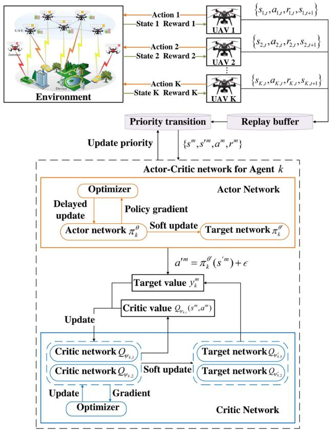

flowchart

Robot navigation and agent feedback flowchart showing Actor Network, Actor-Critic Network, and Critic Network interactions with state rewards, updates, and final target network outputs.

Fig. 2. The framework of PER-MATD3-based resource management algorithm.

# D. Complexity Analysis

In this subsection, we will briefly analyze the computational complexity of the proposed MATD3-based algorithm during the training process. Usually, the complexity of a neural network is typically described in terms of the number of operations of the network model, which depends on the dimensionality of the input states and actions, the number of neurons in each layer of the neural network, and the number of neural network layers. We evaluate the complexity of the actor network and the critic network separately for the TD3 model. Assume that the actor network has $G _ { a }$ layers and the g-th layer has $u _ { a } ^ { g }$ neurons $( g \leq G _ { a } )$ . The complexity of the g-th layer is $\mathcal { O } ( u _ { a } ^ { g - 1 } u _ { a } ^ { g } + u _ { a } ^ { g } u _ { a } ^ { g + 1 } )$ . Assume that the critic network has $G _ { a }$ a a a alayers and the g-th layer has $u _ { c } ^ { g }$ neurons $( g \leq G _ { c } )$ a. The complexity of the g-th layer is $\mathcal { O } ( u _ { c } ^ { g - 1 } u _ { c } ^ { g } +$ $u _ { c } ^ { g } u _ { c } ^ { g + 1 } )$ c c. When the TD3 neural network converges after T c ctime slots and F episodes, its total computational complexity is about $\begin{array} { r } { \mathcal { O } ( F T ( \sum _ { q = 0 } ^ { G _ { a } - 1 } u _ { a } ^ { g } u _ { a } ^ { g + 1 } + \sum _ { q = 0 } ^ { \hat { G } _ { c } - 1 } u _ { c } ^ { g } u _ { c } ^ { g + 1 } ) ) } \end{array}$ + [29]. g a a g c cTherefore, the computational complexity of K agents is $\begin{array} { r } { \mathcal { O } ( K F T ( \sum _ { q = 0 } ^ { G _ { a } - 1 } u _ { a } ^ { j } u _ { a } ^ { g + 1 } + \sum _ { q = 0 } ^ { G _ { c } - 1 } \dot { u } _ { c } ^ { g } u _ { c } ^ { g + 1 } ) ) } \end{array}$ .

Algorithm 1: PER-MATD3-Based Resource Management.   
Input: Replay buffer D, clip factor $\kappa$ , soft update factor $\tau$ , PER exponents $\alpha$ , $\beta$ , delay update frequency d and discount factor $\gamma \in [0,1)$ .
Initialize: Critic networks $Q_{\psi_{k,1}}$ , $Q_{\psi_{k,2}}$ with $\psi_{k,1}$ , $\psi_{k,2}$ and Actor network $\pi_k$ with $\theta_k$ .
Initialize: Target networks parameters $\psi'_{k,1} \leftarrow \psi_{k,1}$ , $\psi'_{k,2} \leftarrow \psi_{k,2}$ , $\theta_k' \leftarrow \theta_k$ .
1: for each episode do
2: Obtain the observation states of UAVs $s_{1,t}, s_{2,t}, \ldots, s_{K,t}$ ;
3: for t = 1 to T do
4: for k = 1 to K do
5: UAV k select action with exploration noise $a_{k,t} = \pi_k^\theta(s_{k,t}) + \epsilon, \epsilon \sim clip(\mathcal{N}(0,\sigma))$ ;
6: Observe state $s_{k,t+1}$ ;
7: Receive immediate reward $r_{k,t}$ ;
8: Store $\{s_{k,t}, a_{k,t}, r_{k,t}, s_{k,t+1}\}$ in the replay buffer D;
9: End for
10: Sample mini-batch $\{s^m, s'^m, a^m, r^m\}$ of size N of transition from D according to (27), and calculate $\omega_k^m$ according to (29).
11: $a'^m = \pi_k^{\theta'}(s'^m) + \epsilon, \epsilon \sim clip(\mathcal{N}(0,\tilde{\sigma}), -\kappa, \kappa)$ ;
12: $y_k^m = r^m + \gamma \min_{i=1,2} Q_{\psi'_k,i} (s'^m, a'^m)$ ;
13: Update transition priority $p_k^m$ ;
14: Update the critic network $\psi_{k,i} \leftarrow \arg\min_{\psi_{k,i}} N^{-1} \sum (\omega_k^m * (y_k^m - Q_{\psi_{k,i}}(s^m, a^m)))^2;$ 15: if t mod d then
16: Update actor network parameter by maximizing $\nabla_\theta_k J(\pi_\theta_k) = N^{-1} \sum \nabla_a Q_{\psi_{k,1}}(s^m, a^m)|_{a=\pi_\theta_k(s^m)} \nabla_\theta_k \pi_\theta_k(s^m);$ 17: Update target networks $\psi'_k_i \leftarrow \tau \psi_{k,i} + (1 - \tau) \psi'_k_i;$ $\theta_k' \leftarrow \tau \theta_k + (1 - \tau) \theta_k'$ ;
18: End if
19: End for
20: End for

g In MADQN, let $L , Z _ { 0 }$ and $Z _ { l }$ c cdenote the training layers, the lsize of the input layer (which is proportional to the number of states) and the number of neurons in the l-th layer, respectively. The computational complexity in each time step for the agent is $\begin{array} { r l } { O ( \dot { Z } _ { 0 } Z _ { l } + \sum _ { l = 1 } ^ { L - 1 } \dot { Z } _ { l } Z _ { l + 1 } ) } & { { } } \end{array}$ . In the training phase, leach mini-batch has $N ^ { \mathrm { e p i } }$ l l lepisodes with each episode having T time steps, each trained model is completed over I iterations until convergence. Hence, the total computational complexity of K agents in MADQN is $\begin{array} { r } { O ( K I T N ^ { \mathsf { e p i } } ( \dot { Z } _ { 0 } Z _ { l } + \sum _ { l = 1 } ^ { L - 1 } \dot { Z } _ { l } \dot { Z } _ { l + 1 } ) ) } \end{array}$ [56].

Since DDPG also uses actor-critic network, the computational complexity of MADDPG is similar to that of MATD3.

In summary, although the computational complexity of MADQN is relatively low, it is only suitable for simple discrete space problems and limited computational resources. MAD-DPG has similar computational complexity to MATD3, but MADDPG may receive overestimation effects as well as face stability challenges during training. Therefore, the choice of MATD3 is justified by its acceptable computational complexity, strong adaptation to continuous action space, and the stability and convergence improvement through the double Q-learning and delayed policy update. These properties make MATD3 a strong choice for dealing with complex reinforcement learning problems.

# E. Convergence of Algorithm

Theorem 1: The MATD3 algorithm can achieve convergence by using clipped double Q-learning in the critic network and policy enhancement in the actor network, even in the presence of external interference, making it suitable for applications in multi-UAV-assisted MEC systems with jamming attacks. It also needs to meet the following conditions: 1) Each state-action pair $( s , a )$ can be sampled indefinitely. 2) MDP meets $| S | < \infty ,$ $| A | < \infty$ and the instantaneous reward $r _ { t }$ is bounded. The sequence $\left( { { s _ { t } } , { a _ { t } } , { r _ { t } } } \right)$ thas uniformly bounded second moments t t tand is independent and identically distributed. 3) The learning rates $\alpha _ { a } ( t )$ and $\alpha _ { c } ( t )$ of the actor network and critic netawork admit: $\begin{array} { r } { \alpha _ { a } ( t ) \in [ 0 , 1 ] , \ \alpha _ { c } ( t ) \in [ 0 , 1 ] , \ \sum _ { t = 0 } ^ { \infty } \alpha _ { a } ( t ) = \infty } \end{array}$ $\begin{array} { r } { \sum _ { t = 0 } ^ { \infty } \alpha _ { c } ( t ) = \infty , \sum _ { t = 0 } ^ { \infty } \dot { \alpha } _ { a } ^ { 2 } ( t ) < \infty , \sum _ { t = 0 } ^ { \infty } \dot { \alpha } _ { c } ^ { 2 } ( t ) < \infty , } \end{array}$ , and lim $\mathsf { i } _ { t \to \infty } \alpha _ { a } ( t ) / \alpha _ { c } ( t ) = 1 ; 4 )$ t c The policy function $\pi _ { \boldsymbol { \theta } } ( s , a )$ is t a ccontinuously differentiable in θ.

Proof of Theorem 1: This proof focuses on the convergence of clipped double Q-learning and it borrows heavily TD3’s proof of convergence [54]. The proof of Lemma 1 can be found in [54], which builds on propositions from SARSA [57] and Double Q-learning [58].

Lemma 1: Consider a stochastic process $( \alpha _ { t } , \Delta _ { t } , F _ { t } ) , t \ge 0$ satisfy the equation:

$$
\begin{array}{l} \Delta_ {t + 1} = (1 - \alpha_ {t}) (Q _ {A} (s _ {t}, a _ {t}) - Q ^ {*} (s _ {t}, a _ {t})) \\ + \alpha_ {t} (r _ {t} + \gamma \min (Q _ {A} (s _ {t + 1}, \tilde {a} _ {t + 1}), \\ Q _ {B} (s _ {t + 1}, \tilde {a} _ {t + 1})) - Q ^ {*} (s _ {t}, a _ {t})) \\ = (1 - \alpha_ {t}) \Delta_ {t} + \alpha_ {t} F _ {t}, \tag {31} \\ \end{array}
$$

where

$$
\begin{array}{l} F _ {t} = r _ {t} + \gamma \min (Q _ {A} (s _ {t + 1}, \tilde {a} _ {t + 1}), Q _ {B} (s _ {t + 1}, \tilde {a} _ {t + 1})) - Q ^ {*} (s _ {t}, a _ {t}) \\ = r _ {t} + \gamma \min (Q _ {A} (s _ {t + 1}, \tilde {a} _ {t + 1}), Q _ {B} (s _ {t + 1}, \tilde {a} _ {t + 1})) \\ - Q ^ {*} (s _ {t}, a _ {t}) + \gamma Q _ {A} (s _ {t + 1}, \tilde {a} _ {t + 1}) - \gamma Q _ {A} (s _ {t + 1}, \tilde {a} _ {t + 1}) \\ = F _ {t} ^ {Q} + c _ {t}, \tag {32} \\ \end{array}
$$

where $( s _ { t } , a _ { t } ) \in S \times A , \alpha _ { t }$ is the learning rate, $\Delta _ { t } = Q _ { A } -$ $\boldsymbol { Q } ^ { * } , \ \boldsymbol { F } _ { t } ^ { Q }$ t t trepresents the value of $F _ { t }$ t Aunder standard Qtlearning and $c _ { t } = \gamma \operatorname* { m i n } ( Q _ { A } ( s _ { t + 1 } , \tilde { a } _ { t + 1 } ) , Q _ { B } ( s _ { t + 1 } , \tilde { a } _ { t + 1 } ) ) -$ $\gamma Q _ { A } ( s _ { t + 1 } , \tilde { a } _ { t + 1 } )$ A t t B t. Assume that the following hold:

A t t1. Each state-action pair is allowed to be sampled an infinite number of times.   
2. The MDP is finite.   
3. The learning rates satisfy $\begin{array} { r } { \alpha _ { t } \in [ 0 , 1 ] , \sum _ { t } \alpha _ { t } = \infty . } \end{array}$ $\textstyle \sum _ { t } \alpha _ { t } ^ { 2 } < \infty$ .   
t4. Var[r ] < ∞.

Then $\Delta _ { t }$ tconverges to 0 with probability 1, which means $Q _ { A } ( s _ { t } , a _ { t } )$ converges to $Q ^ { * } ( s _ { t } , a _ { t } )$ . Similarly, $Q _ { B } ( s _ { t } , a _ { t } )$ can A t t t t B t tbe made to converge to the optimal Q-function by choosing $\Delta _ { t } = Q _ { B } - Q ^ { * }$ .

t BWe apply Lemma 1 with $\Delta _ { t } = Q _ { \psi _ { i } } - Q ^ { * } , i = 1 , 2 , \alpha _ { t } =$ $\alpha _ { c } ( t )$ t ψ t. It can be noted that conditions 1, 2, and 4 of cLemma 1 hold by conditions 1 and 2 of the Theorem 1. By Theorem Condition 3 along with $\alpha _ { t } = \alpha _ { c } ( t )$ , Lemma Condition 3 t cholds. Thus, clipped double Q-learning in the critic will converge to the optimal Q-function $Q ^ { * }$ defined by the Bellman equation with probability 1. The approximation of the Q-function is then adopted in the actor step to estimate the policy gradient.

# IV. SIMULATION RESULTS AND ANALYSIS

This section presents simulation results to evaluate the performance of the proposed PER-MATD3-based resource management algorithm. The CPU model used for algorithm training in our simulations is 12th Gen Intel(R) Core(TM) i5-12400. The information about the system environment is obtained through real-world data collection and re-simulation. We consider a communication network that supports multiple UAVs, in which a number of UAVs are deployed in the air to offer computing and communication services to ground users over a square area of 1000m x 1000m. The minimum and maximum CPU frequencies of each UAV are 1GHz and 2GHz, respectively. The local data randomly ranges from 1 to 2 Mbits, and the minimum and maximum values of the CPU cycles are set to be 500 cycles/bit and 1000 cycles/bit, respectively. The energy consumption factor of CPU chips is set to be $1 0 ^ { - 2 \bar { 7 } }$ . The system bandwidth is 5MHz, and the transmission power of each UAV and jammer is 26dBm (0.4W). The packet size of each workload task for transmission is 500 kbits and the noise power is $1 0 ^ { - 9 }$ W. The number of UAVs varies from 4 to 12, and each UAV is set to participate in a maximum of 1000 rounds of computing and communication, considering battery power consumption limitation. To simulate the dynamic time-varying environment and to enable decision-making under imperfect CSI, we add a randomization factor to the base channel gain in each time slot. The simulation parameters are provided in Table I.

For the parameter setting of the PER-MATD3-based approach, the actor is designed with 2 hidden layers, with each layer having 128 and 256 nodes, respectively, and the critic network consists of 1 hidden layer with 32 nodes. The actor network and critic network have learning rates of $1 0 ^ { - 6 }$ and $1 0 ^ { - 2 }$ , respectively. The value of the reward discount factor is 0.999. In order to perform gradient descent and backpropagation

TABLE I SIMULATION PARAMETERS 

<table><tr><td>Parameters</td><td>Value</td></tr><tr><td>Area size</td><td>1000 m x 1000 m</td></tr><tr><td>CPU frequency of each UAV,  $f_k$ </td><td>1 ~ 2 GHz</td></tr><tr><td>Local data of each UAV,  $D_k$ </td><td>1 ~ 2 Mbits</td></tr><tr><td>CPU cycles of each UAV,  $c_k$ </td><td>500 ~ 1000 cycles/s</td></tr><tr><td>Energy consumption factor,  $\vartheta$ </td><td> $10^{-27}$ </td></tr><tr><td>System bandwidth, B</td><td>5 MHz</td></tr><tr><td>Transmission power of each UAV and jammer,  $P_k$ ,  $P_j$ </td><td>26 dBm (0.4W)</td></tr><tr><td>Packet size of each workload task for transmission,  $L_k$ </td><td>500 Kbits</td></tr><tr><td>Noise power,  $\sigma_\kappa^2$ </td><td> $10^{-9}$ </td></tr><tr><td>Number of UAVs</td><td>4, 6, 8, 10, 12</td></tr></table>

TABLE II HYPERPARAMETERS OF THE PER-MATD3-BASED ALGORITHM 

<table><tr><td>Parameters</td><td>Value</td></tr><tr><td>Learning rate for actor networks,  $\alpha_{a}$ </td><td> $10^{-6}$ </td></tr><tr><td>Learning rate for critic networks,  $\alpha_{c}$ </td><td> $10^{-2}$ </td></tr><tr><td>Discount factor,  $\gamma$ </td><td>0.999</td></tr><tr><td>Size of replay buffer,  $D$ </td><td>10000</td></tr><tr><td>Mini-batch size,  $N$ </td><td>128</td></tr><tr><td>Policy delay update frequency,  $d$ </td><td>2</td></tr><tr><td>Soft update factor,  $\tau$ </td><td> $10^{-3}$ </td></tr><tr><td>PER mechanism factor,  $\alpha, \beta$ </td><td>0.6, 0.4</td></tr></table>

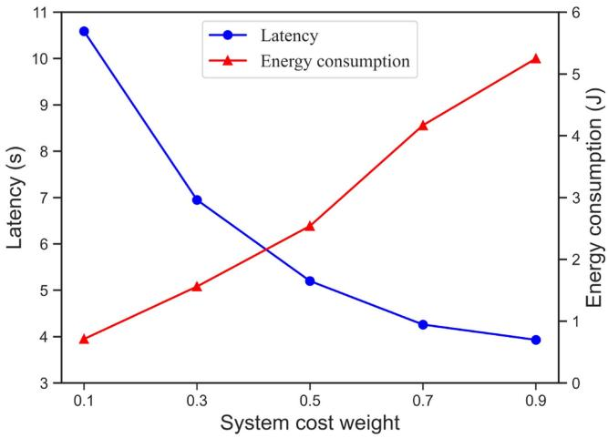

line

| System cost weight | Latency (s) | Energy consumption (J) |
| ------------------ | ----------- | ---------------------- |
| 0.1                | 10.5        | 0.7                    |
| 0.3                | 7.0         | 1.5                    |
| 0.5                | 5.2         | 2.5                    |
| 0.7                | 4.2         | 4.2                    |
| 0.9                | 3.8         | 5.2                    |

Fig. 3. Latency and energy consumption vs the trade-off weight ξ.

more efficiently, rectified linear unit (ReLU) is used as the activation function and Adam method is employed to optimize the loss function of the network. The Hyperparameters of the PER-MATD3-based Algorithm are provided in Table II.

Fig. 3 depicts the trade-off between latency and energy consumption, showing the dynamic focus affected by the weighting factor (denoted as ξ). Next, we analyze it in the context of the system cost equation $\Omega _ { k , t } = \xi T _ { k , t } + ( 1 - \xi ) E _ { k , t }$ . When $\xi > 0 . 5 ,$ k,t k,t k,tthe system focuses more on optimizing latency, prioritizing the reduction of latency during communication and computation. This design choice is particularly applicable when minimizing the time required for task processing and transmission is more important. Thus, as $\xi$ increases beyond the 0.5 threshold, the system latency is significantly reduced, indicating an increased priority on optimizing latency. Conversely, when $\xi < 0 . 5$ , the system shifts its focus to optimizing energy consumption. In this configuration, the system tends to conserve energy resources, and in order to achieve more energy-efficient operation, the system makes trade-offs that result in an increase in latency. As ξ decreases, the system’s energy consumption decreases accordingly, reflecting the adaptability of the system to prioritize energy efficiency when minimizing power consumption is a key consideration. Furthermore, since one purpose of our work is to optimize the weighted cost of the system, as shown in Fig. 3, we find that when $\xi = 0 . 5$ , the optimal balance between latency and energy consumption is achieved, the best trade-off choice can minimize the system cost and this trade-off weight value is selected for the following simulations.

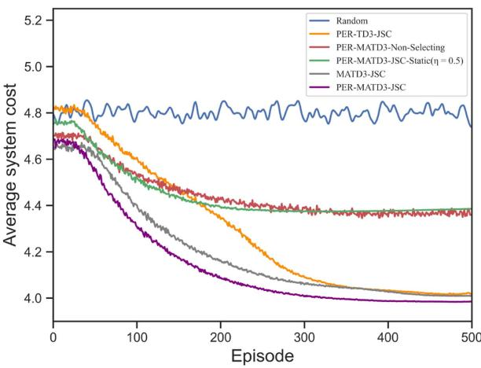

line

| Episode | Random | PER-TD3-JSC | PER-MATD3-Non-Selecting | PER-MATD3-JSC-Static(η = 0.5) | MATD3-JSC | PER-MATD3-JSC |
| ------- | ------ | ----------- | ------------------------ | ------------------------------ | --------- | ------------- |
| 0       | 4.8    | 4.8         | 4.8                      | 4.8                            | 4.8       | 4.7           |
| 100     | 4.8    | 4.6         | 4.6                      | 4.6                            | 4.5       | 4.3           |
| 200     | 4.8    | 4.4         | 4.4                      | 4.4                            | 4.3       | 4.1           |
| 300     | 4.8    | 4.2         | 4.2                      | 4.2                            | 4.1       | 4.0           |
| 400     | 4.8    | 4.1         | 4.1                      | 4.1                            | 4.0       | 4.0           |
| 500     | 4.8    | 4.0         | 4.0                      | 4.0                            | 4.0       | 4.0           |

Fig. 4. The convergence of the system cost.

We then compare the following six approaches in terms of latency, energy consumption, and system cost: 1) our proposed PER-MATD3-based resource management approach with integrated jamming sensing and communication (JSC), denoted by PER-MATD3-JSC; 2) The MATD3 method with ordinary uniform sampling, denoted by MATD3-JSC; 3) TD3 singleagent approach using PER, denoted by PER-TD3-JSC 4) the PER-MATD3-based resource management approach without channel selecting, denoted by PER-MATD3-Non-Selecting; 5) the approach adopts JSC, but each UAV has a fixed CPU frequency variable $( \eta = 0 . 5 )$ , denoted by PER-MATD3-JSC-Static $( \eta = 0 . 5 ) ; 6 )$ CPU frequency variable is randomly generated in [0.1, 1], the bandwidth is randomly allocated, and without using channel selection, denoted by Random.

Fig. 4 demonstrates the average system cost over 500 episodes and compares the convergence performance of different approaches. As expected, we can see that the system cost decreases slowly over time training episodes when we use the PER-MATD3-based algorithm. In contrast, the random approach always remains at a high cost with poor performance. Due to the PER mechanism its ability to improve the learning efficiency and speed up the convergence rate, the proposed method ends up with a slightly lower cost convergence result than MATD3 without using the PER mechanism. The PER-TD3-JSC method as a single-agent approach cannot handle the multi-UAV action relationship well compared to the multi-agent approach in a constrained environment where there is a co-channel interference between multiple UAVs, which leads to a higher cost convergence value. The static approach ends up with a higher weighted cost than the PER-MATD3-JSC approach, because it does not dynamically optimize the frequency adjustment parameter in dynamic MEC environments. Additionally, the system cost of the PER-MATD3-Non-Selecting approach eventually converges to a certain value which is higher than that of the PER-MATD3- JSC approach as it fails to exploit spectrum sensing to sense malicious jamming behavior and is unable to intelligently select an effective idle channel to avoid jamming noise generated by jammers and possible co-channel interference. We also recorded the following metrics in our experiments to evaluate the cost of the algorithm: 1) Training time: We measured the training time over 500 episodes of the proposed algorithm several times and averaged them to get a result of around 2380 seconds. This provides an intuitive understanding of the training speed of the algorithm. 2) CPU usage: We monitored the CPU utilization during the training of the algorithm to assess its demand on computational resources, which was around 80%. 3) Memory requirement: We recorded the memory occupied by the algorithm during training, which was approximately 150MB, to understand the model’s usage of system memory.

Fig. 5 shows the performance of the proposed algorithm compared to other approaches when using other different values of ξ. Fig. 5(a) is the system cost comparisons of the six approaches when ξ = 0, i.e. optimizing energy consumption only, Fig. 5(b) is the system cost comparisons of the six approaches when $\xi = 0 . 3 ,$ , i.e. more focus on optimizing energy consumption, Fig. 5(c) is the system cost comparisons of the six approaches when $\xi = 0 . 7 , \mathrm { i . e }$ . more focus on optimizing latency, and Fig. 5(d) is the system cost comparisons of the six approaches when $\xi = 1$ , i.e. optimizing latency only. From these four figures, it can be seen that the proposed approach is able to converge to the lowest system cost and achieve optimal performance with different ξ values, and also in scenarios with different optimization requirements.

Fig. 6 represents the latency, energy consumption, and system cost of the six compared approaches with varying numbers of users when the transmission power of UAVs and jammers is 26dBm and 2 jammers are considered to be involved in the system. We can observe that as the number of users increases, both the latency and energy consumption increase due to the limited wireless bandwidth resource, resulting in higher system cost, but the proposed approach can dynamically adjust the frequency adjustment factor according to the current environmental situation and the magnitude of latency and energy consumption to balance the latency and energy consumption and minimize the system cost. Combining Fig. 6(a) and Fig. 6(b), the magnitude of latency is obviously larger than the magnitude of energy consumption when the number of users gradually increases, but due to the dynamic focusing of the frequency adjustment factor, the proposed approach focuses on reducing the latency to maintain the real-time performance of the whole system while ensuring that the energy consumption is within a certain acceptable range. Static approach fixes the frequency factor and fails to weigh the effect of CPU frequency in a dynamic environment compared to the proposed learning approach, thus it cannot guarantee that the performance of both latency and energy consumption is at an acceptable level and leads to a higher system cost as shown in Fig. 6(c). In addition, due to the negative effect of jamming noise and co-channel interference on the communication performance, the PER-MATD3-Non-Selecting approach has higher latency, energy consumption, and system cost than that of the PER-MATD3-JSC approach. The reason lies in the fact that the UAV in the proposed approach successfully learns to adjust its channel selection strategy according to the observed jamming and interference patterns, effectively avoid jamming and co-interference channels and dynamically select the best channel to avoid additional noise, thus guaranteeing the achievable higher SINR value shown in (5) and maintaining a reliable communication quality. Compared to the PER-TD3- JSC approach, the proposed approach minimizes the system cost by sharing experience through collaboration and learning among multiple agents and facilitating the convergence of the strategies of multiple agents to the Nash equilibrium point. However, the PER-TD3-JSC approach of a single agent may fall into a local optimum in the process of optimizing latency and energy consumption, and does not effectively balance latency and energy consumption, resulting in a higher final system cost than the proposed approach. In addition, the proposed approach uses the PER mechanism to more effectively utilize experience and suppress empirical correlations to better adapt to complex multi-agent environments and learn better strategies, so its latency and energy consumption are less than that of the MATD3-JSC approach. It is obvious that the performance of Random approach is not satisfactory. In summary, the overall performance results clearly indicate that it is effective to adopt both the jamming sensing and PER-MATD3-based resource management to minimize the system cost against jamming attacks.

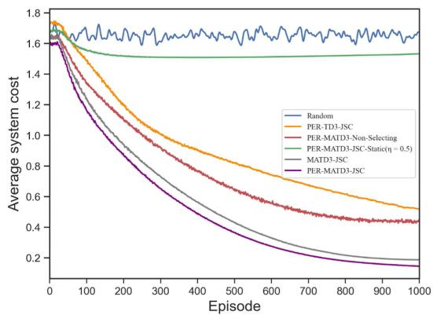

line

| Episode | Random | PER-TD3-JSC | PER-MATD3-Non-Selecting | PER-MATD3-JSC-Static(η = 0.5) | MATD3-JSC | PER-MATD3-JSC |
| ------- | ------ | ----------- | ------------------------ | ----------------------------- | --------- | ------------- |
| 0       | 1.7    | 1.7         | 1.7                      | 1.7                           | 1.7       | 1.7           |
| 100     | 1.65   | 1.5         | 1.4                      | 1.6                           | 1.4       | 1.2           |
| 200     | 1.65   | 1.3         | 1.2                      | 1.6                           | 1.2       | 0.9           |
| 300     | 1.65   | 1.1         | 1.0                      | 1.6                           | 1.0       | 0.6           |
| 400     | 1.65   | 0.9         | 0.8                      | 1.6                           | 0.8       | 0.4           |
| 500     | 1.65   | 0.8         | 0.7                      | 1.6                           | 0.7       | 0.3           |
| 600     | 1.65   | 0.7         | 0.6                      | 1.6                           | 0.6       | 0.25          |
| 700     | 1.65   | 0.65        | 0.55                     | 1.6                           | 0.55      | 0.2           |
| 800     | 1.65   | 0.6         | 0.5                      | 1.6                           | 0.5       | 0.18          |
| 900     | 1.65   | 0.55        | 0.45                     | 1.6                           | 0.45      | 0.15          |
| 1000    | 1.65   | 0.5         | 0.4                      | 1.6                           | 0.4       | 0.1           |

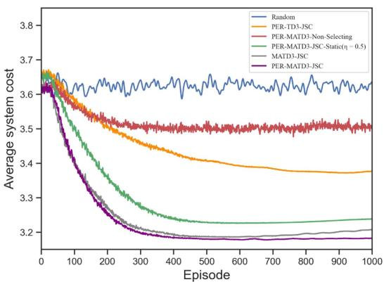

line

| Episode | Random | PER-TD3-JSC | PER-MATD3-Non-Selecting | PER-MATD3-JSC-Static(η = 0.5) | MATD3-JSC | PER-MATD3-JSC |
| ------- | ------ | ----------- | ------------------------ | ------------------------------ | --------- | -------------- |
| 0       | 3.65   | 3.65        | 3.65                     | 3.65                           | 3.65      | 3.65           |
| 100     | 3.60   | 3.55        | 3.55                     | 3.50                           | 3.45      | 3.40           |
| 200     | 3.60   | 3.50        | 3.50                     | 3.40                           | 3.35      | 3.25           |
| 300     | 3.60   | 3.45        | 3.45                     | 3.35                           | 3.30      | 3.20           |
| 400     | 3.60   | 3.40        | 3.40                     | 3.30                           | 3.25      | 3.15           |
| 500     | 3.60   | 3.40        | 3.40                     | 3.25                           | 3.25      | 3.15           |
| 600     | 3.60   | 3.40        | 3.40                     | 3.25                           | 3.25      | 3.15           |
| 700     | 3.60   | 3.40        | 3.40                     | 3.25                           | 3.25      | 3.15           |
| 800     | 3.60   | 3.40        | 3.40                     | 3.25                           | 3.25      | 3.15           |
| 900     | 3.60   | 3.40        | 3.40                     | 3.25                           | 3.25      | 3.15           |
| 1000    | 3.60   | 3.40        | 3.40                     | 3.25                           | 3.25      | 3.15           |

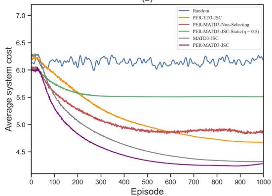

line

| Episode | Random | PER-TD3-JSC | PER-MATD3-Non-Selecting | PER-MATD3-JSC-Static(η = 0.5) | MATD3-JSC | PER-MATD3-JSC |
| ------- | ------ | ----------- | ------------------------ | ------------------------------ | --------- | ------------- |
| 0       | 6.2    | 6.2         | 6.2                      | 6.2                            | 6.2       | 6.2           |
| 100     | 6.1    | 5.8         | 5.7                      | 5.6                            | 5.5       | 5.3           |
| 200     | 6.1    | 5.5         | 5.4                      | 5.4                            | 5.2       | 4.9           |
| 300     | 6.1    | 5.2         | 5.1                      | 5.3                            | 4.9       | 4.5           |
| 400     | 6.1    | 5.0         | 4.9                      | 5.2                            | 4.7       | 4.3           |
| 500     | 6.1    | 4.9         | 4.8                      | 5.1                            | 4.5       | 4.2           |
| 600     | 6.1    | 4.8         | 4.7                      | 5.0                            | 4.4       | 4.1           |
| 700     | 6.1    | 4.7         | 4.6                      | 4.9                            | 4.3       | 4.0           |
| 800     | 6.1    | 4.6         | 4.5                      | 4.8                            | 4.2       | 3.9           |
| 900     | 6.1    | 4.5         | 4.4                      | 4.7                            | 4.1       | 3.8           |
| 1000    | 6.1    | 4.4         | 4.3                      | 4.6                            | 4.0       | 3.7           |

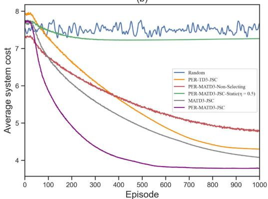

line

| Episode | Random | PER-TD3-JSC | PER-MATD3-Non-Selecting | PER-MATD3-JSC-Static(η = 0.5) | MATD3-JSC | PER-MATD3-JSC |
| ------- | ------ | ----------- | ------------------------ | ------------------------------ | --------- | ------------- |
| 0       | 7.8    | 7.8         | 7.8                      | 7.8                            | 7.8       | 7.8           |
| 100     | 7.6    | 7.2         | 7.0                      | 7.5                            | 7.0       | 6.5           |
| 200     | 7.5    | 6.8         | 6.5                      | 7.3                            | 6.5       | 5.5           |
| 300     | 7.4    | 6.4         | 6.0                      | 7.1                            | 6.0       | 4.8           |
| 400     | 7.3    | 6.0         | 5.5                      | 6.9                            | 5.5       | 4.2           |
| 500     | 7.2    | 5.6         | 5.0                      | 6.7                            | 5.0       | 4.0           |
| 600     | 7.1    | 5.2         | 4.8                      | 6.5                            | 4.8       | 3.9           |
| 700     | 7.0    | 4.9         | 4.6                      | 6.3                            | 4.6       | 3.8           |
| 800     | 6.9    | 4.6         | 4.4                      | 6.1                            | 4.4       | 3.7           |
| 900     | 6.8    | 4.3         | 4.2                      | 5.9                            | 4.2       | 3.6           |
| 1000    | 6.7    | 4.1         | 4.0                      | 5.7                            | 4.0       | 3.5           |

Fig. 5. The convergence of the system cost with different values of ξ.   
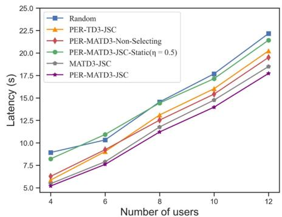

line

| Number of users | Random | PER-TD3-JSC | PER-MATD3-Non-Selecting | PER-MATD3-JSC-Static(η = 0.5) | MATD3-JSC | PER-MATD3-JSC |
| --------------- | ------ | ----------- | ------------------------ | ------------------------------ | --------- | ------------- |
| 4               | 9.0    | 6.0         | 6.5                      | 8.5                            | 5.5       | 5.0           |
| 6               | 10.5   | 9.0         | 9.5                      | 11.0                           | 7.5       | 7.0           |
| 8               | 14.5   | 12.5        | 13.0                     | 14.5                           | 11.0      | 10.5          |
| 10              | 18.0   | 16.0        | 16.5                     | 17.5                           | 14.5      | 14.0          |
| 12              | 22.5   | 20.0        | 19.5                     | 21.5                           | 18.5      | 17.5          |

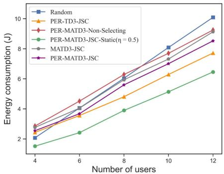

line

| Number of users | Random | PER-TD3-JSC | PER-MATD3-Non-Selecting | PER-MATD3-JSC-Static(η = 0.5) | MATD3-JSC | PER-MATD3-JSC |
| --------------- | ------ | ----------- | ------------------------ | ------------------------------ | --------- | ------------- |
| 4               | 2.0    | 2.5         | 2.8                      | 1.5                            | 2.7       | 2.6           |
| 6               | 4.0    | 3.5         | 4.5                      | 2.5                            | 4.2       | 3.8           |
| 8               | 6.0    | 4.8         | 6.2                      | 4.0                            | 6.0       | 5.5           |
| 10              | 8.0    | 6.2         | 7.5                      | 5.0                            | 7.8       | 7.0           |
| 12              | 10.0   | 7.8         | 9.0                      | 6.5                            | 9.2       | 8.5           |

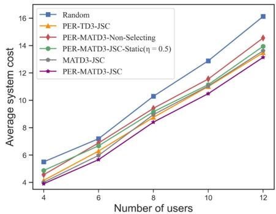

line

| Number of users | Random | PER-TD3-JSC | PER-MATD3-Non-Selecting | PER-MATD3-JSC-Static(η = 0.5) | MATD3-JSC | PER-MATD3-JSC |
| --------------- | ------ | ----------- | ------------------------ | ------------------------------ | --------- | ------------- |
| 4               | 5.5    | 4.8         | 4.7                      | 4.9                            | 4.6       | 4.0           |
| 6               | 7.2    | 6.5         | 6.3                      | 6.6                            | 6.2       | 5.8           |
| 8               | 10.5   | 9.2         | 9.0                      | 9.3                            | 8.8       | 8.2           |
| 10              | 13.0   | 11.5        | 11.2                     | 11.6                           | 11.0      | 10.2          |
| 12              | 16.0   | 13.5        | 13.2                     | 13.6                           | 13.0      | 12.2          |

Fig. 6. The performance comparisons of the five approaches with varying numbers of users.

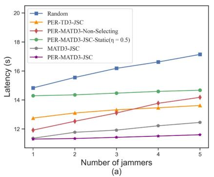

line

| Number of jammers | Random | PER-TD3-JSC | PER-MATD3-Non-Selecting | PER-MATD3-JSC-Static(η = 0.5) | MATD3-JSC | PER-MATD3-JSC |
| ------------------ | ------ | ----------- | ------------------------ | ------------------------------ | --------- | ------------- |
| 1                  | 14.8   | 12.8        | 11.8                     | 14.2                           | 11.2      | 11.2          |
| 2                  | 15.5   | 13.0        | 12.5                     | 14.3                           | 11.5      | 11.2          |
| 3                  | 16.2   | 13.2        | 13.0                     | 14.4                           | 11.8      | 11.2          |
| 4                  | 16.8   | 13.4        | 13.8                     | 14.5                           | 12.0      | 11.2          |
| 5                  | 17.2   | 13.6        | 14.2                     | 14.6                           | 12.2      | 11.2          |

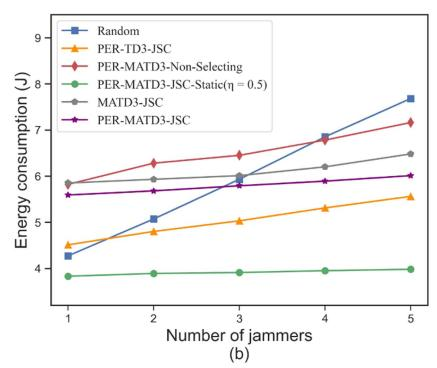

line

| Number of jammers | Random | PER-TD3-JSC | PER-MATD3-Non-Selecting | PER-MATD3-JSC-Static(η = 0.5) | MATD3-JSC | PER-MATD3-JSC |
| ----------------- | ------ | ----------- | ------------------------ | ----------------------------- | --------- | ------------- |
| 1                 | 4.2    | 4.5         | 5.8                      | 3.8                           | 5.9       | 5.6           |
| 2                 | 5.0    | 4.7         | 6.3                      | 3.8                           | 5.9       | 5.7           |
| 3                 | 6.0    | 5.0         | 6.5                      | 3.8                           | 6.0       | 5.8           |
| 4                 | 7.0    | 5.3         | 6.8                      | 3.8                           | 6.2       | 5.9           |
| 5                 | 7.8    | 5.5         | 7.2                      | 3.8                           | 6.5       | 6.0           |

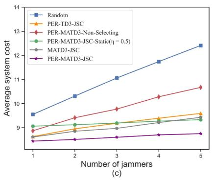

line

| Number of jammers | Random | PER-TD3-JSC | PER-MATD3-Non-Selecting | PER-MATD3-JSC-Static(η = 0.5) | MATD3-JSC | PER-MATD3-JSC |
| ------------------ | ------ | ----------- | ------------------------ | ------------------------------ | --------- | ------------- |
| 1                  | 9.5    | 8.8         | 9.0                      | 9.0                            | 8.7       | 8.6           |
| 2                  | 10.5   | 9.0         | 9.5                      | 9.2                            | 8.9       | 8.7           |
| 3                  | 11.0   | 9.2         | 9.8                      | 9.3                            | 9.0       | 8.8           |
| 4                  | 11.8   | 9.4         | 10.2                     | 9.4                            | 9.1       | 8.9           |
| 5                  | 12.5   | 9.6         | 10.7                     | 9.5                            | 9.2       | 9.0           |

Fig. 7. The performance comparisons of the five approaches with varying numbers of jammers.

It is also crucial to investigate the negative effect of different numbers of jammers on the system communication and computing performance. Fig. 7 shows the performance comparisons of all approaches under different numbers of jammers, where the number of UAVs and users is 8. The increase in the number of jammers indicates that more subchannels will be jammed by jammers and the achievable bandwidth allocated to the UAV users is reduced due to serious jamming noise on SINR, which in turn leads to a decrease in the transmission rate and an increase in the system latency and energy consumption, as shown in Fig. 7(a) and (b). The PER-MATD3-JSC approach and Static-JSC approach both use intelligent channel selection, and thus the increase of jamming only affects the bandwidth allocation, and the growth rate of latency and energy consumption is not significant. However, the PER-MATD3-Non-Selecting approach does not perform intelligent channel selection, so when the number of jammers increases, the number of channels jammed in the UAV communication process increases, and then the UAVs are more vulnerable to jamming from jammers, resulting in a significant decrease in communication capability and a large increase in the latency and energy consumption of the PER-MATD3-Non-Selecting approach. As the number of jammers increases, the environment becomes more complex and dynamic, and the interactions and collaborations between the agents become more important. The proposed approach is able to better utilize the synergies between the agents, which leads to a more effective optimization of the system performance, and the final system cost is better than that of the PER-TD3-JSC approach. The complexity of the environment increases, and the proposed approach with the addition of the PER mechanism is able to learn the dynamic properties of the environment more accurately, thus producing better optimization results compared to the MATD3-JSC approach. As shown in Fig. 7(c), similar to the results in Fig. 6(c), the proposed approach outperforms the other benchmark approaches for controlling the weighted cost of the system, keeping it at a minimum level.

Fig. 8 then evaluates the performance comparisons of all approaches varying different transmission data sizes, where the number of UAV users is 4 and the number of jammers is 2. Due to the increase of transmission data, the communication packet load of the UAV-assisted MEC system then gradually increases, leading to growing latency and energy consumption. Similar to the previous simulation results, when the number of UAVs is 4, although the energy consumption of the PER-MATD3-JSC approach is larger than that of the Static $( \eta = 0 . 5 )$ approach, its latency is much smaller than that of the Static $( \eta = 0 . 5 )$ , so the average system cost of the proposed approach always maintains an optimal state compared with that of the Static approach. Meanwhile, the PER-MATD3-Non-Selecting approach fails to realize the intelligent channel selection and leads to huge latency and energy consumption under jamming attacks, which makes its performance far less effective than the proposed approach. The proposed approach is also able to adapt better to changes in the complex environment of multiple agents than the MATD3- JSC approach and the PER-TD3-JSC approach, thus producing more accurate and stable optimization results.

# V. EXPERIMENTAL RESULTS AND ANALYSIS

In this section, experiments were conducted to evaluate the performances of the proposed approach. Here, Raspberry Pi 4B was mounted on each UAV to perform communication and computing performances, and ground devices (receive signal strength using usrp N210) under jammer interference (generate signal strength using usrp X310), where the jammer attacks one of the five UAV channels with a jamming power of about 25 dBm. We chose the 2.4 GHz band for UAV communication and jamming. In the experimental scenario diagram shown in Fig. 9, the vertical distances between the four UAVs (DJI Tello) and the ground device are 2.5 m. The CPU frequency of each Raspberry Pi at each UAV can be adjusted between 0.6 GHz and 1.5 GHz, and its transmission packet is sent by selecting one of the five channels with a transmit power of up to 20 dBm (about 100 mW) to the ground receiver. Fig. 10 shows an example of the spectrum of five channels under jammer attacks when the system performs spectrum sensing to sense jammed channels. Obviously, when the jammer chooses to attack channel 2, the received jamming power is about −30 dBm which has a severe interference impact on the communication latency. In addition, when more than one UAV selects channel 4 for communication at the same time, a certain degree of co-channel interference is generated, but the received co-channel interference power is smaller than the malicious jamming power, which is about −50 dBm.

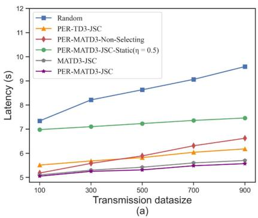

line

| Transmission datasize | Random | PER-TD3-JSC | PER-MATD3-Non-Selecting | PER-MATD3-JSC-Static(η = 0.5) | MATD3-JSC | PER-MATD3-JSC |
| --------------------- | ------ | ----------- | ------------------------ | ------------------------------ | --------- | ------------- |
| 100                   | 7.2    | 5.4         | 5.2                      | 7.0                            | 5.1       | 5.0           |
| 300                   | 8.2    | 5.6         | 5.6                      | 7.1                            | 5.2       | 5.1           |
| 500                   | 8.6    | 5.8         | 5.8                      | 7.2                            | 5.3       | 5.2           |
| 700                   | 9.0    | 6.0         | 6.2                      | 7.3                            | 5.4       | 5.3           |
| 900                   | 9.6    | 6.2         | 6.6                      | 7.4                            | 5.5       | 5.4           |

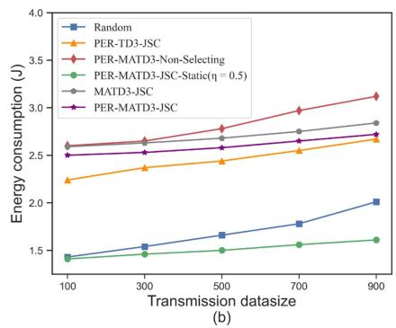

line

| Transmission datasize | Random | PER-TD3-JSC | PER-MATD3-Non-Selecting | PER-MATD3-JSC-Static(η = 0.5) | MATD3-JSC | PER-MATD3-JSC |
| --------------------- | ------ | ----------- | ------------------------ | ------------------------------ | --------- | ------------- |
| 100                   | 1.4    | 2.2         | 2.6                      | 1.4                            | 2.6       | 2.5           |
| 300                   | 1.5    | 2.3         | 2.7                      | 1.5                            | 2.7       | 2.5           |
| 500                   | 1.6    | 2.4         | 2.8                      | 1.6                            | 2.8       | 2.6           |
| 700                   | 1.7    | 2.5         | 3.0                      | 1.7                            | 2.9       | 2.7           |
| 900                   | 2.0    | 2.6         | 3.1                      | 1.8                            | 3.0       | 2.8           |

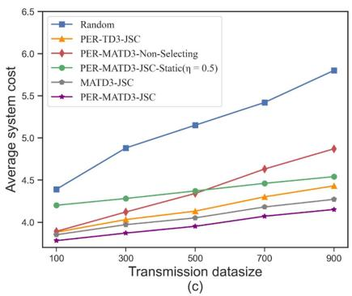

line

| Transmission datasize | Random | PER-TD3-JSC | PER-MATD3-Non-Selecting | PER-MATD3-JSC-Static(η = 0.5) | MATD3-JSC | PER-MATD3-JSC |
| --------------------- | ------ | ----------- | ------------------------ | ------------------------------ | --------- | ------------- |
| 100                   | 4.4    | 3.9         | 3.9                      | 4.2                            | 3.9       | 3.8           |
| 300                   | 4.9    | 4.1         | 4.2                      | 4.3                            | 4.0       | 3.9           |
| 500                   | 5.2    | 4.2         | 4.4                      | 4.4                            | 4.1       | 4.0           |
| 700                   | 5.5    | 4.4         | 4.6                      | 4.5                            | 4.2       | 4.1           |
| 900                   | 5.8    | 4.5         | 4.9                      | 4.6                            | 4.3       | 4.2           |

Fig. 8. The performance comparisons of the five approaches with different data sizes.   
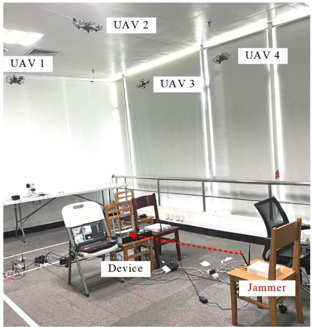

text_image

UAV 1
UAV 2
UAV 3
UAV 4
Device
Jammer

Fig. 9. Experimental setup of the UAV-assisted MEC system against jamming.   
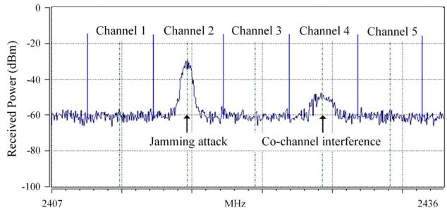

line

| Frequency (MHz) | Received Power (dBm) |
| --------------- | -------------------- |
| 2407            | -60                  |
| 2436            | -60                  |

Fig. 10. Spectrum of five channels under jammer attacks.

We also make the following assumptions: Since this experiment is mainly conducted indoors, it is assumed that the current experimental environment is in an ideal and stable state, i.e., free from interference from weather changes, the natural environment, and other unwanted external factors. Meanwhile, in order to better represent the effect of malicious jamming on communication and the correctness of the experimental results, we set a sufficiently large malicious jamming power for accurate sensing.

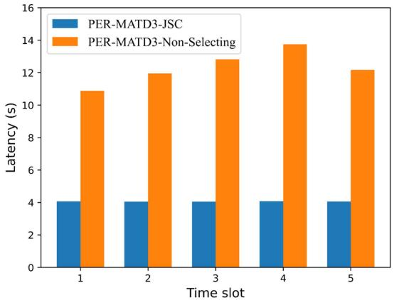

bar

| Time slot | PER-MATD3-JSC (s) | PER-MATD3-Non-Selecting (s) |
| :--- | :--- | :--- |
| 1 | 4.0 | 10.9 |
| 2 | 4.0 | 11.9 |
| 3 | 4.0 | 12.8 |
| 4 | 4.0 | 13.7 |
| 5 | 4.0 | 12.1 |

Fig. 11. Latency performance comparison in five selected consecutive time slots.

We compare the latency, throughput, and energy consumption of the two approaches (PER-MATD3-JSC and PER-MATD3- Non-Selecting) in real experimental scenarios over five consecutive time slots.

In Fig. 11, as we can observe, in the scenario of PER-MATD3- JSC approach with channel selection, the latency remains essentially constant and at a low level as each UAV avoids the jammed sub-channels attacked from the malicious jammers. However, in the scenario of PER-MATD3-Non-Selecting approach without channel selection, UAVs are subjected to significantly more jamming attacks, and the latency keeps changing according to the jamming state of the channels. This also demonstrates the advantages of channel selection in multi-UAV communication systems, which effectively reduces transmission latency and improves communication reliability.

The results in Fig. 12 represent the effect of channel selection on the throughput of different time slots. The PER-MATD3-JSC approach with channel selection can optimize the communication process by selecting the best available channels, and the throughput is relatively stable.

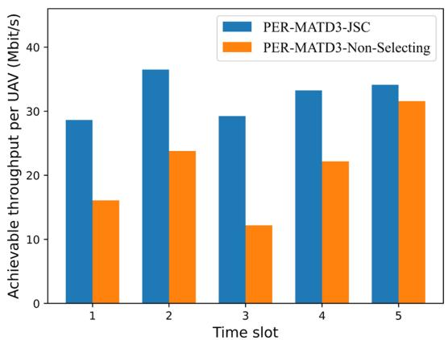

bar

| Time slot | PER-MATD3-JSC (Mbit/s) | PER-MATD3-Non-Selecting (Mbit/s) |
| :--- | :--- | :--- |
| 1 | 28.7 | 16.0 |
| 2 | 36.5 | 23.8 |
| 3 | 29.4 | 12.2 |
| 4 | 33.3 | 22.1 |
| 5 | 34.1 | 31.6 |

Fig. 12. Throughput performance comparison in five selected consecutive time slots.

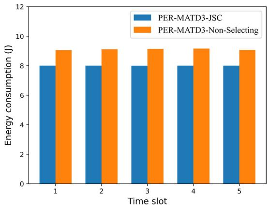

bar

| Time slot | PER-MATD3-JSC (J) | PER-MATD3-Non-Selecting (J) |
| :--- | :--- | :--- |
| 1 | 8.0 | 9.0 |
| 2 | 8.0 | 9.0 |
| 3 | 8.0 | 9.0 |
| 4 | 8.0 | 9.0 |
| 5 | 8.0 | 9.0 |

Fig. 13. Energy consumption performance comparison in five selected consecutive time slots.

On the contrary, using PER-MATD3-Non-Selecting approach without channel selection, the throughput fluctuates and decreases due to the interference from jamming attacks and other UAVs. In most cases, channel selection results in higher throughput because UAVs can avoid jammed sub-channels and efficiently utilize available spectrum resources.

Similarly, Fig. 13 shows the comparison of energy consumption of the two resource management approaches for different time slots. Since UAVs can avoid the jammed channel and access other jamming-free channels, the PER-MATD3-JSC approach with channel selection reduces unnecessary energy consumption and the overall energy saving can be improved, while the PER-MATD3-Non-Selecting approach consumes more energy compared to the PER-MATD3-JSC approach. This is because when one UAV accesses the jammed channel, it needs more time to complete the packet transmission due to the low received SINR at the ground user side, and thus leads to an increase in the overall system energy consumption.

# VI. CONCLUSION

In this paper, we have studied the resource allocation problem in a multi-UAV-assisted MEC scenario under jamming attacks. By proposing a MADRL-based resource management approach, we aim to minimize the weighted sum of total system latency and energy consumption while taking into account UAV resource constraints and time-varying environment characteristics. Our proposed algorithm is able to dynamically adjust the resource allocation of UAVs to maintain system performance under different practical settings. Simulation and experimental results demonstrated that our proposed algorithm outperforms the benchmark algorithms in terms of reducing system cost. Further research in this direction is warranted to develop more effective and robust algorithms that can address a wider range of resource allocation and security challenges in future MEC systems. In our subsequent work, we will also consider more realistic factors of multi-UAV-assisted MEC systems, such as outdoor environmental impacts, multi-UAV trajectory optimization and UAV scheduling, to enhance the integration with practical applications.

# REFERENCES

[1] Z. Shao, H. Yang, L. Xiao, W. Su, and Z. Xiong, “Energy and latency-aware resource management for UAV-assisted mobile edge computing against jamming,” in Proc. IEEE Glob. Commun. Conf., Kuala Lumpur, Malaysia, 2023, pp. 1848–1853.   
[2] F. Ahmed, J. Mohanta, A. Keshari, and P. S. Yadav, “Recent advances in unmanned aerial vehicles: A review,” Arabian J. Sci. Eng., vol. 47, no. 7, pp. 7963–7984, 2022.   
[3] Y. Naidoo, R. Stopforth, and G. Bright, “Development of an UAV for search & rescue applications,” in Proc. IEEE Africon, 2011, pp. 1–6.   
[4] M. Campion, P. Ranganathan, and S. Faruque, “UAV swarm communication and control architectures: A review,” J. Unmanned Veh. Syst., vol. 7, no. 2, pp. 93–106, 2018.   
[5] M. A. Ma’Sum et al., “Simulation of intelligent unmanned aerial vehicle (UAV) for military surveillance,” in Proc. Int. Conf. Adv. Comput. Sci. Inf. Syst., 2013, pp. 161–166.   
[6] C. Zhan, Y. Zeng, and R. Zhang, “Energy-efficient data collection in UAV enabled wireless sensor network,” IEEE Wireless Commun. Lett., vol. 7, no. 3, pp. 328–331, Jun. 2018.   
[7] P. Zhan, K. Yu, and A. L. Swindlehurst, “Wireless relay communications with unmanned aerial vehicles: Performance and optimization,” IEEE Trans. Aerosp. Electron. Syst., vol. 47, no. 3, pp. 2068–2085, Jul. 2011.   
[8] H. Pan, Y. Liu, G. Sun, J. Fan, S. Liang, and C. Yuen, “Joint power and 3D trajectory optimization for uav-enabled wireless powered communication networks with obstacles,” IEEE Trans. Commun., vol. 71, no. 4, pp. 2364–2380, Apr. 2023.   
[9] B. Li, Z. Fei, and Y. Zhang, “UAV communications for 5G and beyond: Recent advances and future trends,” IEEE Internet Things J., vol. 6, no. 2, pp. 2241–2263, Apr. 2019.   
[10] Y. Mao, C. You, J. Zhang, K. Huang, and K. B. Letaief, “A survey on mobile edge computing: The communication perspective,” IEEE Commun. Surv. Tutor., vol. 19, no. 4, pp. 2322–2358, Fourth Quarter 2017.   
[11] Z. Sun, G. Sun, Y. Liu, J. Wang, and D. Cao, “BARGAIN-MATCH: A game theoretical approach for resource allocation and task offloading in vehicular edge computing networks,” IEEE Trans. Mobile Comput., vol. 23, no. 2, pp. 1655–1673, Feb. 2024.   
[12] S. Dang, O. Amin, B. Shihada, and M.-S. Alouini, “What should 6G be?,” Nat. Electron., vol. 3, no. 1, pp. 20–29, Jan. 2020.   
[13] L. Xiao, X. Lu, T. Xu, X. Wan, W. Ji, and Y. Zhang, “Reinforcement learning-based mobile offloading for edge computing against jamming and interference,” IEEE Trans. Commun., vol. 68, no. 10, pp. 6114–6126, Oct. 2020.   
[14] Y. Xiao et al., “Reinforcement learning based energy-efficient collaborative inference for mobile edge computing,” IEEE Trans. Commun., vol. 71, no. 2, pp. 864–876, Feb. 2023.   
[15] Z. Yu, Y. Gong, S. Gong, and Y. Guo, “Joint task offloading and resource allocation in UAV-enabled mobile edge computing,” IEEE Internet Things J., vol. 7, no. 4, pp. 3147–3159, Apr. 2020.   
[16] Y. Liu, S. Xie, and Y. Zhang, “Cooperative offloading and resource management for UAV-enabled mobile edge computing in power iot system,” IEEE Trans. Veh. Technol., vol. 69, no. 10, pp. 12229–12239, Oct. 2020.   
[17] Y. Du, K. Wang, K. Yang, and G. Zhang, “Energy-efficient resource allocation in UAV based MEC system for IoT devices,” in Proc. IEEE Glob. Commun. Conf., 2018, pp. 1–6.

[18] J. Ji, K. Zhu, C. Yi, and D. Niyato, “Energy consumption minimization in UAV-assisted mobile-edge computing systems: Joint resource allocation and trajectory design,” IEEE Internet Things J., vol. 8, no. 10, pp. 8570–8584, May 2021.   
[19] Q. Hu, Y. Cai, G. Yu, Z. Qin, M. Zhao, and G. Y. Li, “Joint offloading and trajectory design for UAV-enabled mobile edge computing systems,” IEEE Internet Things J., vol. 6, no. 2, pp. 1879–1892, Apr. 2019.   
[20] Z. Wu, Z. Yang, C. Yang, J. Lin, Y. Liu, and X. Chen, “Joint deployment and trajectory optimization in UAV-assisted vehicular edge computing networks,” J. Commun. Netw., vol. 24, no. 1, pp. 47–58, Feb. 2022.   
[21] J. Zhang et al., “Stochastic computation offloading and trajectory scheduling for UAV-assisted mobile edge computing,” IEEE Internet Things J., vol. 6, no. 2, pp. 3688–3699, Apr. 2019.   
[22] C. Sun, W. Ni, and X. Wang, “Joint computation offloading and trajectory planning for UAV-assisted edge computing,” IEEE Trans. Wireless Commun., vol. 20, no. 8, pp. 5343–5358, Aug. 2021.   
[23] F. Zhou, Y. Wu, R. Q. Hu, and Y. Qian, “Computation rate maximization in UAV-enabled wireless-powered mobile-edge computing systems,” IEEE J. Sel. Areas Commun., vol. 36, no. 9, pp. 1927–1941, Sep. 2018.   
[24] Z. Yang, S. Bi, and Y.-J. A. Zhang, “Online trajectory and resource optimization for stochastic UAV-enabled MEC systems,” IEEE Trans. Wireless Commun., vol. 21, no. 7, pp. 5629–5643, Jul. 2022.   
[25] Y. Liu, K. Xiong, Q. Ni, P. Fan, and K. B. Letaief, “UAV-assisted wireless powered cooperative mobile edge computing: Joint offloading, CPU control, and trajectory optimization,” IEEE Internet Things J., vol. 7, no. 4, pp. 2777–2790, Apr. 2020.   
[26] H. Guo and J. Liu, “UAV-enhanced intelligent offloading for Internet of Things at the edge,” IEEE Trans. Ind. Inf., vol. 16, no. 4, pp. 2737–2746, Apr. 2020.   
[27] H. Xiao, Z. Hu, K. Yang, Y. Du, and D. Chen, “An energy-aware joint routing and task allocation algorithm in MEC systems assisted by multiple UAVs,” in Proc. Int. Wirel. Commun. Mobile Comput., 2020, pp. 1654– 1659.   
[28] Q. Zhang, J. Chen, L. Ji, Z. Feng, Z. Han, and Z. Chen, “Response delay optimization in mobile edge computing enabled UAV swarm,” IEEE Trans. Veh. Technol., vol. 69, no. 3, pp. 3280–3295, Mar. 2020.   
[29] Y. Liu, J. Yan, and X. Zhao, “Deep reinforcement learning based latency minimization for mobile edge computing with virtualization in maritime UAV communication network,” IEEE Trans. Veh. Technol., vol. 71, no. 4, pp. 4225–4236, Apr. 2022.   
[30] L. Zhang et al., “Task offloading and trajectory control for UAV-assisted mobile edge computing using deep reinforcement learning,” IEEE Access, vol. 9, pp. 53708–53719, 2021.   
[31] K. Zhang, X. Gui, D. Ren, and D. Li, “Energy–latency tradeoff for computation offloading in UAV-assisted multiaccess edge computing system,” IEEE Internet Things J., vol. 8, no. 8, pp. 6709–6719, Apr. 2021.   
[32] J. Chen et al., “Deep reinforcement learning based resource allocation in multi-UAV-aided MEC networks,” IEEE Trans. Commun., vol. 71, no. 1, pp. 296–309, Jan. 2023.   
[33] T. Zhang, Y. Xu, J. Loo, D. Yang, and L. Xiao, “Joint computation and communication design for UAV-assisted mobile edge computing in IoT,” IEEE Trans. Ind. Inf., vol. 16, no. 8, pp. 5505–5516, Aug. 2020.   
[34] M. Li, N. Cheng, J. Gao, Y. Wang, L. Zhao, and X. Shen, “Energy-efficient UAV-assisted mobile edge computing: Resource allocation and trajectory optimization,” IEEE Trans. Veh. Technol., vol. 69, no. 3, pp. 3424–3438, Mar. 2020.   
[35] X. Hu, K.-K. Wong, K. Yang, and Z. Zheng, “UAV-assisted relaying and edge computing: Scheduling and trajectory optimization,” IEEE Trans. Wireless Commun., vol. 18, no. 10, pp. 4738–4752, Oct. 2019.   
[36] L. Yang, H. Yao, J. Wang, C. Jiang, A. Benslimane, and Y. Liu, “Multi-UAV-enabled load-balance mobile-edge computing for IoT networks,” IEEE Internet Things J., vol. 7, no. 8, pp. 6898–6908, Aug. 2020.   
[37] A. M. Seid, G. O. Boateng, S. Anokye, T. Kwantwi, G. Sun, and G. Liu, “Collaborative computation offloading and resource allocation in multi-UAV-assisted IoT networks: A deep reinforcement learning approach,” IEEE Internet Things J., vol. 8, no. 15, pp. 12203–12218, Aug. 2021.   
[38] H. Peng and X. Shen, “Multi-agent reinforcement learning based resource management in MEC-and UAV-assisted vehicular networks,” IEEE J. Sel. Areas Commun., vol. 39, no. 1, pp. 131–141, Jan. 2021.   
[39] J. Li et al., “Multi-objective optimization approaches for physical layer secure communications based on collaborative beamforming in uav networks,” IEEE/ACM Trans. Netw., vol. 31, no. 4, pp. 1902–1917, Aug. 2023.   
[40] Y. Zhang, Z. Mou, F. Gao, J. Jiang, R. Ding, and Z. Han, “UAV-enabled secure communications by multi-agent deep reinforcement learning,” IEEE Trans. Veh. Technol., vol. 69, no. 10, pp. 11599–11611, Oct. 2020.

[41] Y. Wu, W. Yang, X. Guan, and Q. Wu, “Energy-efficient trajectory design for UAV-enabled communication under malicious jamming,” IEEE Wireless Commun. Lett., vol. 10, no. 2, pp. 206–210, Feb. 2021.   
[42] Y. Wu, W. Yang, X. Guan, and Q. Wu, “UAV-enabled relay communication under malicious jamming: Joint trajectory and transmit power optimization,” IEEE Trans. Veh. Technol., vol. 70, no. 8, pp. 8275–8279, Aug. 2021.   
[43] W. Wang, Z. Lv, X. Lu, Y. Zhang, and L. Xiao, “Distributed reinforcement learning based framework for energy-efficient UAV relay against jamming,” Intell. Converg. Netw., vol. 2, no. 2, pp. 150–162, Jun. 2021.   
[44] W. Wang, X. Lu, S. Liu, L. Xiao, and B. Yang, “Energy efficient relay in UAV networks against jamming: A reinforcement learning based approach,” in Proc. IEEE 91th Veh. Technol. Conf., 2020, pp. 1–5.   
[45] J. Peng, Z. Zhang, Q. Wu, and B. Zhang, “Anti-jamming communications in UAV swarms: A reinforcement learning approach,” IEEE Access, vol. 7, pp. 180532–180543, 2019.   
[46] L. Xiao, Y. Ding, J. Huang, S. Liu, Y. Tang, and H. Dai, “UAV anti-jamming video transmissions with QoE guarantee: A reinforcement learningbased approach,” IEEE Trans. Commun., vol. 69, no. 9, pp. 5933–5947, Sep. 2021.   
[47] A. Krayani, A. S. Alam, L. Marcenaro, A. Nallanathan, and C. Regazzoni, “A novel resource allocation for anti-jamming in cognitive-UAVs: An active inference approach,” IEEE Commun. Lett., vol. 26, no. 10, pp. 2272–2276, Oct. 2022.   
[48] Z. Lv, L. Xiao, Y. Du, G. Niu, C. Xing, and W. Xu, “Multi-agent reinforcement learning based UAV swarm communications against jamming,” IEEE Trans. Wireless Commun., vol. 22, no. 12, pp. 9063–9075, Dec. 2023.   
[49] X. Lu, L. Xiao, G. Niu, X. Ji, and Q. Wang, “Safe exploration in wireless security: A safe reinforcement learning algorithm with hierarchical structure,” IEEE Trans. Inf. Forensics Secur., vol. 17, pp. 732–743, 2022.   
[50] X. Yuan, Z. Xie, and X. Tan, “Anti-jamming channel allocation in UAVenabled edge computing: A Stackelberg game approach,” in Proc. Int. Conf. Mobility Sens. Netw., 2022, pp. 936–941.   
[51] Z. Yin, Y. Lin, Y. Zhang, Y. Qian, F. Shu, and J. Li, “Collaborative multiagent reinforcement learning aided resource allocation for UAV anti-jamming communication,” IEEE Internet Things J., vol. 9, no. 23, pp. 23995–24008, Dec. 2022.   
[52] S. Shao, A. Khreishah, and I. Khalil, “Enabling real-time indoor tracking of IoT devices through visible light retroreflection,” IEEE Trans. Mob. Comput., vol. 19, no. 4, pp. 836–851, Apr. 2020.   
[53] J. He, H. Wymeersch, and M. Juntti, “Channel estimation for ris-aided mmwave mimo systems via atomic norm minimization,” IEEE Trans. Wireless Commun., vol. 20, no. 9, pp. 5786–5797, Sep. 2021.   
[54] S. Fujimoto, H. Hoof, and D. Meger, “Addressing function approximation error in actor-critic methods,” in Pro. Int. Conf. Mach. Learn., Jul. 2018, pp. 1587–1596.   
[55] T. Schaul, J. Quan, I. Antonoglou, and D. Silver, “Prioritized experience replay,” in Pro. Int. Conf. Learn. Representations, 2016, pp. 1–23.   
[56] H. Yang, Z. Xiong, J. Zhao, D. Niyato, L. Xiao, and Q. Wu, “Deep reinforcement learning-based intelligent reflecting surface for secure wireless communications,” IEEE Trans. Wireless Commun., vol. 20, no. 1, pp. 375–388, Jan. 2021.   
[57] S. Singh, T. Jaakkola, M. L. Littman, and C. Szepesvári, “Convergence results for single-step on-policy reinforcement-learning algorithms,” Mach. Learn., vol. 38, pp. 287–308, Mar. 2000.   
[58] H. Hasselt, “Double q-learning,” in Proc. Adv. Neural Inf. Process. Syst., 2010, pp. 2613–2621.

natural_image

Portrait photo of a woman in business attire (no visible text or symbols)

Ziling Shao (Graduate Student Member, IEEE) received the BS degree in computer science and technology from Fujian Normal University, Fuzhou, China in 2022. She is currently working toward the MS degree with the Institute of Artificial Intelligence, Xiamen University. Her research interests include wireless communications, edge computing, and deep reinforcement learning.

natural_image

Portrait of a man in formal attire with a blue tie (no visible text or symbols)

Helin Yang (Senior Member, IEEE) is currently an associate professor with the Department of Information and Communication Engineering, Xiamen University, Xiamen, China, Singapore, in 2020. He has published more than 70 research papers and many of them are ESI Highly Cited Papers. He has won more than 2 Best Paper Awards in international conferences and is listed in the World’s Top 2% Scientists identified by Stanford University. His current research interests include wireless communication, edge computing, machine learning, and resource management.

natural_image

Portrait of a young man in formal attire (no text or symbols visible)

Yifan Chen (Graduate Student Member, IEEE) received the BS degree in communication engineering from the Wuhan University of technology, Wuhan, China, in 2022. He is currently working toward the MS degree with the Department of Information and Communication Engineering, Xiamen University. His research interests include wireless communications, and multiagent reinforcement learning.

natural_image

Portrait of a smiling woman with glasses and shoulder-length hair, wearing a pink top (no text or symbols visible)

Liang Xiao (Senior Member, IEEE) received the BS degree in communication engineering from the Nanjing University of Posts and Telecommunications, China, in 2000, the MS degree in electrical engineering from Tsinghua University, China, in 2003, and the PhD degree in electrical engineering from Rutgers University, NJ, in 2009. She is currently a professor with the Department of Information and Communication Engineering, Xiamen University, Xiamen, China. She has served as an associate editor of IEEE Transactions Information Forensics and Security and

guest editor of IEEE Journal of Selected Topics in Signal Processing. She is the recipient of the best paper award for 2016 INFOCOM Big Security WS and 2017 ICC. She was a visiting professor with Princeton University, Virginia Tech, and University of Maryland, College Park.

natural_image

Portrait photo of a man in formal attire (no visible text or symbols)

Zehui Xiong (Senior Member, IEEE) received the PhD degree from Nanyang Technological University (NTU), Singapore. He is currently an assistant professor with the Singapore University of Technology and Design, and also an honorary aajunct senior research scientist with Alibaba-NTU Singapore Joint Research Institute, Singapore. He was the visiting scholar with Princeton University and University of Waterloo. His research interests include wireless communications, Internet of Things, blockchain, edge intelligence, and Metaverse. Recognized as a Highly Cited researcher,

natural_image

Portrait of a man wearing glasses and a dark jacket (no text or symbols visible)

Wei Su received the PhD degree from the Department of Communication Engineering, Northwestern Polytechnical University, in 2009. He is currently an associate professor with the Key Laboratory of Underwater Acoustic Communication and Marine Information Technology, Ministry of Education, Xiamen University, Xiamen, China. His research interests include the general area of underwater acoustic communication and networking, spanning from the communication networks, multi-media signal processing, and communication.

he has published more than 200 research papers in leading journals, and he has won mpre than 10 Best Paper Awards in international flagship conferences. He is now serving as the editor or guest editor for many leading journals including IEEE Journal on Selected Areas in Communications, IEEE Transactions on Vehicular Technology, IEEE Internet of Things Journal, IEEE Transactions on Cognitive Communications and Networking, and IEEE Transactions on Network Science and Engineering. He is the recipient of many prestigious awards including Forbes Asia 30u30, IEEE Early Career Researcher Award for Excellence in Scalable Computing, IEEE Technical Committee on Blockchain and Distributed Ledger Technologies Early Career Award, IEEE Internet Technical Committee Early Achievement Award, IEEE TCSVC Rising Star Award, IEEE TCI Rising Star Award, IEEE TCCLD Rising Star Award, IEEE ComSoc Outstanding Paper Award, IEEE Best Land Transportation Paper Award, IEEE CSIM Technical Committee Best Journal Paper Award, IEEE SPCC Technical Committee Best Paper Award, and IEEE VTS Singapore Best Paper Award.