# Deep Reinforcement Learning Based Resource Allocation and Trajectory Planning in Integrated Sensing and Communications UAV Network

Yunhui Qin , Zhongshan Zhang , Senior Member, IEEE, Xulong Li , Wei Huangfu , Member, IEEE, and Haijun Zhang , Fellow, IEEE

Abstract— In this paper, multi-UAVs serve as mobile aerial ISAC platforms to sense and communicate with on-ground target users. To optimize the communication and sensing performance, we formulate a joint user association, UAV trajectory planning and power allocation problem to maximize the minimum weighted spectral efficiency among UAVs. This paper exploits the centralized and the decentralized deep reinforcement learning (DRL) solutions to solve the sequential decision-making problem. On one hand, we first introduce the centralized soft actor-critic (SAC) algorithm. Then, we explore the equivalent transformation of the optimization objective based on symmetric group, propose the random and the adaptive data augmentation schemes to design the replay memory buffer of SAC, and accordingly propose SAC algorithms assisted by data augmentation to tackle the transformed problem. On the other hand, the multi-agent soft actor-critic (MASAC), a decentralized solution, is also introduced to solve this sequential decision-making problem. The experiment results reveal the effectiveness of the centralized and the decentralized solutions in considered scenarios. Specifically, the SAC assisted by the adaptive scheme significantly outperforms other centralized solutions in the training speed and the weighted spectral efficiency. Meanwhile, the decentralized MASAC algorithm behaves best in the early training speed.

Index Terms— Integrated sensing and communications (ISAC), unmanned aerial vehicle (UAV), deep reinforcement learning, trajectory planning, power allocation.

Manuscript received 11 August 2022; revised 6 December 2022 and 8 March 2023; accepted 16 March 2023. Date of publication 28 March 2023; date of current version 13 November 2023. This work was supported in part by the National Natural Science Foundation of China under Grant 62071035; in part by the Beijing Natural Science Foundation under Grant L212004; and in part by the China University Industry-University-Research Collaborative Innovation Fund under Grant 2021FNA05001. The associate editor coordinating the review of this article and approving it for publication was J. Xu. (Corresponding author: Zhongshan Zhang.)

Digital Object Identifier 10.1109/TWC.2023.3260304

## I. INTRODUCTION

NTEGRATED sensing and communications (ISAC) system is promising in the next generation wireless network since it pursues a deeper integration paradigm, reduces both hardware and signaling costs, and has great potential to improve spectral and energy efficiencies [1], [2]. Moreover, with advantages in fully controllable mobility [3], on-demand deployment flexibility [4], and cost-effectiveness [5], unmanned aerial vehicles (UAVs) have been applied in ISAC systems. In particular, ISAC system engaging with UAVs has a good prospect and is becoming an appealing research topic [6], [7], [8], in which UAVs are capable of serving as mobile aerial ISAC platforms [9], sensing targets [10], and communication with users according to the different application scenarios.

To fully exploit UAV’s advantages, there appear some significant studies that aim at optimal design for ISAC-UAV networks, including trajectory planning [11], [12], beamforming design [13], [14], [15], resource allocation [16], [17], task scheduling [18], [19], as well as its potential application in association with other wireless technologies [4], [20], [21]. Most of the related studies depend on the deterministic optimization model of a system, which necessitates capturing the exact system information, such as channel conditions and network parameters. For example, the authors in [13] and [14] proposed integrated periodic sensing and communication mechanism, which deeply studied the maximization of the communication performance and the sensing requirements via joint optimization of the UAV trajectory, beamforming, and sensing instant. The authors in [15] discussed the UAV deployment for quasi-stationary scenario and trajectory design for a fully mobile scenario to maximize the weighted sum rate, the successive convex approximation and semidefinite relaxation are introduced to solve the transmit and sensing optimization problems. In [16], a joint UAV location and resource allocation problem for maximizing the total network utility with the localization accuracy constraint was extensively studied. Accordingly, the authors decompose the nondeterministic polynomial hard (NP-hard) optimization problem into three sub-problems and propose a sub-optimal method to effectively tackle it. To quantify the performance of data freshness, the authors in [18] not only considered the sensing and transmission time but also formulated the UAV trajectory and task scheduling for cellular internet of UAVs, where an iterative algorithm is introduced to settle the NP-hard problem.

However, it might not be practical due to the timevarying network environment and the limited communication resources, which makes it infeasible to solve such problems simply through traditional solutions. Deep reinforcement learning (DRL) and other machine learning technologies have been deemed the efficient solutions to tackle these sequential decision-making problems [22], [23], [24]. In the centralized DRL framework, the agent interacts with the environment and learns to make the best sequential decisions, which is unnecessary to explicitly know the exact environment information [25], [26]. For typical centralized DRL algorithms, such as deep deterministic policy gradient (DDPG) [27], [28], twindelayed deep deterministic policy gradient (TD3) [29] and soft actor-critic (SAC) [30], [31], their experience replay mechanism enables the agents to learn from past experiences and further determine the optimal policy. However, the collection of the empirical datasets is usually costly and time-consuming according to agent-to-environment interactions, which further retards the algorithm training speed. It is challenging to improve the training speed and the availability of the DRL algorithm [22]. It is worth mentioning that data augmentation techniques have attracted great attentions in deep learning, which is beneficial to training models by enhancing the size and quality of training datasets [32]. This paper designs the data augmentation scheme for the replay memory buffer of SAC algorithm. Moreover, the decentralized DRL frameworks are also exploited for solving the partially observed and distributed scenario problems in the existing studies [33], [34]. For example, the authors in [33] propose a decentralized solution, the multi-agent proximal policy optimization (PPO) algorithm, to minimize the age of information in the joint radar-communication system.

In this paper, multi-UAVs serve as mobile ISAC platforms to sense and communicate with target users. It is challenging for the sensing and communication performance optimization to effectively and properly design the optimal policy of trajectory, user association and power allocation. To be specific, the optimization objective involving the user association follows a mixed integer non-linear problem, and the trajectory planning of UAVs makes the user association dynamically change, which further increases the complexity of the optimization problem. This paper focuses on finding a feasible policy that can maximize the minimum weighted spectral efficiency among UAVs. Towards this end, we first formulate this optimization problem as a sequential decision making problems. Then, we exploit the centralized and the decentralized DRL solutions including the SAC algorithm and the multiagent soft actor-critic (MASAC) algorithm in the considered scenarios.

The main contributions of this paper are as follows,

• This paper first formulates the sensing and communication performance optimization as a sequential decision-making problem and aims to find feasible user association, UAV trajectory planning and power allocation policy that can maximize the minimum weighted spectral efficiency among UAVs.

• Then, this paper exploits the centralized SAC solutions to tackle the sequential decision-making problem. Meanwhile, the original optimization problem is equivalently transformed based on symmetric group and two data augmentation schemes including i) the random and ii) the adaptive are proposed to design the replay memory buffer of SAC, which effectively enriches the empirical dataset with lower complexity. Accordingly, data-augmentationassisted SAC algorithms are proposed to tackle the transformed problem. Inspired by the existing multi-agent DRL applications, the decentralized MASAC algorithm is also introduced to solve this optimization problem.

• The experiment results unveil the effectiveness and availability of the centralized and the decentralized solutions in optimizing communication and sensing performance. The proposed SAC algorithm, especially for the adaptively assisted scheme, significantly outperforms the other centralized solutions in terms of training speed and weighted spectral efficiency. Moreover, the decentralized MASAC algorithm performs best in the training speed during the initial stage.

The rest of the paper is organized as follows. Section II presents the system model and formulates the optimization objective. In Section III, the centralized deep reinforcement learning solutions are detailed. Section IV introduces the decentralized solution for the considered scenario. Simulation results are presented with discussion in Section V. We conclude this paper in Section VI.

## II. SYSTEM MODEL AND PROBLEM FORMULATION

In this section, we provide the system model by taking multi-UAV sensing, communication and trajectory planning into consideration. Multi-UAV serve as ISAC platforms to sense and communicate with on-ground target users. More specifically, UAVs are capable of sensing their associated target users according to echo signals and communicating with ground users.

## A. System Model

As shown in Fig.1, there are K UAVs and M target users, expressed as the set ${ \mathcal { K } } = \{ 1 , 2 , \cdots K \}$ and the set $\mathcal { M } =$ $\{ 1 , 2 , \cdots M \}$ , in the system. We consider that each UAV is equipped with single ominidirectional antenna. The flying or hovering altitude of each UAV is set as H, and the position of $\mathrm { U A V } _ { k }$ in timeslot t is denoted as $\Theta _ { k , t } = ( X _ { k , t } , Y _ { k , t } )$ . For the sake of simplicity, the horizontal positions of all UAVs are represented by $\mathbf { \bar { \Theta } } \mathbf { \Theta } \mathbf { \Theta } \Theta _ { t } = [ X _ { 1 , t } , \cdot \cdot \cdot X _ { K , t } ; Y _ { 1 , t } , \cdot \cdot \cdot Y _ { K , t } ] ^ { T }$ . Besides, the position of the target user m in timeslot t is $u _ { m , t } ~ =$ $( x _ { m , t } , y _ { m , t } )$ with 0 altitude.

Considering the UAVs’ speed and the collision risk, let V denote the UAVs’ maximum travel distance in one timeslot and D is the minimum collision avoidance distance between ${ \mathrm { U A V s } } ,$ and then we have the following constraints

$$
\begin{array} { r l } { \| \Theta _ { k , t } - \Theta _ { k , t - 1 } \| \le V , } & { \forall k \in \mathcal K } \\ { \| \Theta _ { i , t } - \Theta _ { j , t } \| \ge D , } & { \forall i , j \in \mathcal K } \end{array}\tag{1}
$$

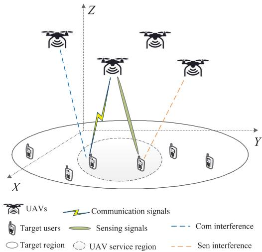  
Fig. 1. The deployment of the integrated sensing and communications UAV network.

The distance from $\mathrm { U A V } _ { k }$ to mth target user in timeslot t is calculated by

$$
\begin{array} { r l r } {  { d ( \Theta _ { k , t } , \pmb { u } _ { m , t } ) = \sqrt { H ^ { 2 } + \| \Theta _ { k , t } - \pmb { u } _ { m , t } \| ^ { 2 } } } } \\ & { } & { = \sqrt { H ^ { 2 } + ( X _ { k , t } - x _ { m , t } ) ^ { 2 } + ( Y _ { k , t } - y _ { m , t } ) ^ { 2 } } } \end{array}\tag{2}
$$

In this paper, the target users’ location remains unchanged, and all UAVs maintain level flight or hovering within the target area.

Let $\alpha _ { k , m , t } \in \{ 0 , 1 \}$ denote the association variable between the $\mathrm { U A V } _ { k }$ and the mth target user, where $\alpha _ { k , m , t } = 1$ indicates that target user m is served by $\mathrm { U A V } _ { k }$ in timeslot $t ;$ otherwise, $\alpha _ { k , m , t } ~ = ~ 0$ . Assume that each UAV is capable of serving multiple target users, and each target user is only served by one UAV, which satisfies the following constraint condition,

$$
\sum _ { k = 1 } ^ { K } \alpha _ { k , m , t } = 1 , \quad \forall m \in \mathcal { M }\tag{3}
$$

In this paper, the communication links from UAVs to their associative users are assumed to be the line-of-sight links, where the channel gains are mainly determined by the distance from the UAV to the target user [15], [35]. The channnel power gain of the $\mathrm { U A V } _ { k }$ to user m is given by

$$
g _ { k , m , t } = g _ { 0 } d ^ { - 2 } ( \Theta _ { k , t } , \pmb { u } _ { m , t } )\tag{4}
$$

where $g _ { 0 }$ denotes the channel power when the reference distance is 1 m.

Considering the limitation of spectrum resources, the spectrum reusing among UAVs with acceptable interference is adopted. $\mathbf { A } \mathbf { s }$ discussed in [28], the communications spectral efficiency achieved at kth UAV can be given by

$$
E _ { k , t } ^ { \mathrm { c o m } } = \sum _ { m \in \mathcal { M } } \alpha _ { k , m , t } \mathrm { l o g } ( 1 + \frac { p _ { k , t } g _ { k , m , t } } { \sum _ { k ^ { \prime } \in K \backslash k } p _ { k ^ { \prime } , t } g _ { k ^ { \prime } , m , t } + \sigma ^ { 2 } } )\tag{5}
$$

where $p _ { k , \ast }$ t represents the transmit power of $\mathrm { U A V } _ { k }$ , and $\sigma ^ { 2 }$ is the power of the additive white Gaussian noise (AWGN) at the receiver.

Moreover, UAVs are able to sense their associative users via echo signals to realize position, monitoring, service enhancement, etc. As discussed in [12], the channel power gain from $\mathrm { U A V } _ { k }$ to target user m and then back to $\Theta _ { k , t }$ t can be expressed as

$$
h _ { k , m , t } = \frac { g _ { t } g _ { r } \eta l ^ { 2 } } { ( 4 \pi ) ^ { 3 } } d ^ { - 4 } ( \Theta _ { k , t } , { \bf u } _ { m , t } )\tag{6}
$$

where $g _ { t }$ is the transmitting gain, $g _ { r }$ is the receiving gains of sensing signal, η denotes the mean of radar cross section of a target user, and l is the wavelength of the carrier transceiver.

The sensing information measure is represented by the estimation rate, which was originally introduced in [36]. Similar to the formulation of communication spectral efficiency, the sensing spectral efficiency of kth UAV in timeslot t can be written as

$$
E _ { k , t } ^ { \mathrm { r a d } } = \sum _ { m \in \mathcal { M } } \alpha _ { k , m , t } \mathrm { l o g } ( 1 + \frac { p _ { k , t } h _ { k , m , t } } { \sum _ { k ^ { \prime } \in K \backslash k } p _ { k ^ { \prime } , t } h _ { k ^ { \prime } , m , t } + \sigma ^ { 2 } } )\tag{7}
$$

Moreover, the energy consumption mainly considers the allocated energy to users. Thus, the energy consumption of each UAV should not exceed that of the maximum energy constraint

$$
\sum _ { t \in T } p _ { k , t } \leq e _ { k } ^ { \operatorname* { m a x } } .\tag{8}
$$

## B. Problem Formulation

According to the formulation of the communication and radar sensing model, the weighted spectral efficiency [37] of $\mathrm { U A V } _ { k }$ is given by

$$
E _ { k , t } = \frac { \omega _ { \mathrm { c } } E _ { k , t } ^ { \mathrm { c o m } } + \omega _ { \mathrm { s } } E _ { k , t } ^ { \mathrm { s e n } } } { \omega _ { \mathrm { c } } + \omega _ { \mathrm { s } } }\tag{9}
$$

where $\omega _ { \mathrm { c } }$ is the communications spectral efficiency weight, and $\omega _ { \mathrm { s } }$ is the sensing spectral efficiency weight. Therefore, the total weighted spectral efficiency of each UAV can be written as

$$
E _ { k } = \sum _ { t \in T } E _ { k , t }\tag{10}
$$

In this paper, we focus on finding a feasible user association, UAV trajectory planning and power allocation policy that can maximize the minimum weighted spectral efficiency among all UAVs. Therefore, the optimization objective can be formulated as

(P 0) max min Ek α,p,Θ k∈K

(11)

$$
\alpha _ { k , m , t } \in \{ 0 , 1 \} , \forall k \in \mathcal { K } , \quad \forall m \in \mathcal { M }\tag{11a}
$$

$$
\sum _ { k = 1 } ^ { K } \alpha _ { k , m , t } = 1 , \quad \forall m \in \mathcal { M }\tag{11b}
$$

$$
0 \leq p _ { k , t } \leq p _ { k } ^ { \operatorname* { m a x } } , \quad k \in \mathcal { K } ,\tag{11c}
$$

$$
\sum _ { t \in T } p _ { k , t } \leq e _ { k } ^ { \operatorname* { m a x } } , \quad k \in \mathcal { K }\tag{11d}
$$

$$
\| \Theta _ { k , t } - \Theta _ { k , t - 1 } \| \le V , \quad \forall k \in \mathcal { K }\tag{11e}
$$

$$
\begin{array} { r l } & { \| \Theta _ { i , t } - \Theta _ { j , t } \| \geq D , \quad \forall i , j \in \mathcal { K } \qquad ( 1 1 \mathrm { f } ) } \\ & { x ^ { 1 } \leq X _ { k , t } \leq x ^ { \mathrm { u } } , \quad y ^ { 1 } \leq Y _ { k , t } \leq y ^ { \mathrm { u } } , k \in \mathcal { K } } \end{array}\tag{11g}
$$

where α is the user association, p denotes the allocated power for communication and sensing in every timeslot, Θ denotes the UAVs’ trajectory information. The constraint conditions include the power constraints for communication and sensing, the maximum energy constraint of each UAV. The maximum travel distance in one timeslot and the collision avoidance distance between UAVs are formulated in (11e) and (11f).

The optimization objective (P 0) is a mixed integer nonlinear and non-convex problem. Intuitively, it is quite challenging to solve this complex and non-convex optimization problem, because to maximize the minimum weighted spectral efficiency among all UAVs, it is preferred to acquire the complete channel state information and utilize enumeration method such that the optimal user association, trajectory design and energy allocation policy can be obtained, however, it is unaccessible and nearly infeasible for obtaining the exact information and the optimal policy owing to the moving of UAVs. Hence, this optimization problem can be thought of as sequential decision-making problems, it is difficult for the traditional method to solve it, and the centralized and the decentralized DRL solutions are supposed to be introduced in this paper.

## III. CENTRALIZED DEEP REINFORCEMENT LEARNING SOLUTIONS

This section introduces the centralized DRL solutions in detail, we first introduce the single-agent SAC solution. Then, we discuss the equivalent transformation of the optimization objective. Last, we propose two SAC solutions assisted by the random and the adaptive data augmentation schemes.

## A. The Problem Solution of SAC

The centralized DRL algorithms, such as the single-agent SAC, mainly consist of the agent and environment, and their experience replay mechanism enables the agent to learn from past experiences and further determine the optimal policy. The interplay of agent and environment is as follows, the agent first acquires state $s _ { t }$ from the environment and selects policy $a _ { t }$ from action space during timeslot t in each training episode; Then, the environment updates the current state to $s _ { t + 1 }$ and obtains the corresponding reward $r _ { t }$ . The experience tuple $\left( { { s _ { t } } , { a _ { t } } , { r _ { t } } , { s _ { t + 1 } } } \right)$ is subsequently stored in replay memory buffer B.

The learning process of the SAC algorithm is to find the feasible and proper policy that maximizes the long-term cumulative discount reward as well as maximizes strategy entropy, this algorithm has better stability owing to encouraging exploration [38]. The corresponding elements are defined as follows,

• State space S: $s _ { t } \in \ S$ is defined as the state in timeslot $t ,$ which is mainly composed of the channel state information and the remaining energy of UAVs,

$$
\begin{array} { r } { s _ { t } = \{ g _ { 1 , 1 , t } , \cdot \cdot \cdot g _ { k , m , t } ; h _ { 1 , 1 , t } , \cdot \cdot \cdot h _ { k , m , t } ; } \\ { e _ { 1 , t } , \cdot \cdot \cdot , e _ { K , t } \} \qquad } \end{array}\tag{12}
$$

where $g _ { k , m , t }$ and $h _ { k , m , t }$ are channel gains, and $e _ { k , t }$ is the remaining energy of kth UAV.

• Action space A: $a _ { t } \in A$ is defined as the action in timeslot t, including the UAVs’ location, user association, and the allocated power for sensing and communication of each UAV,

$$
\begin{array} { r } { a _ { t } = \big \{ X _ { 1 , t } , \cdot \cdot \cdot X _ { k , t } ; Y _ { 1 , t } , \cdot \cdot \cdot Y _ { k , t } ; } \\ { \alpha _ { 1 , 1 , t } , \cdot \cdot \cdot , \alpha _ { k , m , t } ; p _ { 1 , t } , \cdot \cdot \cdot , p _ { k , t } \big \} } \end{array}\tag{13}
$$

where $\alpha _ { k , m , t }$ is the user association, $( X _ { k , t } , Y _ { k , t } )$ is the location of $\mathrm { U A V } _ { k } , p _ { k , i }$ t denotes the power allocated by the kth UAV.

Apparently, this involves a continuous-discrete hybrid action space. In order to leverage DRL algorithms in these hybrid space, the existing studies either relax the hybrid space into a continuous set, approximate it by discretization, or parametrize it without destroying its inherent structure [39]. To apply SAC algorithm with continuous action spaces, this paper simply introduces the relaxation idea to manage the discrete association variables. Specifically, we exploit a approximate space to deterministically select the discrete action [39].

• Reward function $r _ { t } \in R \mathrm { : }$ The reward function cannot be defined the same as (P0) since its objective as a sequential decision-making problem cannot be simply decomposed over time [40], i.e., maximizing the objective in (P0) is inequivalent to maximizing the minimum weighted spectral efficiency among all UAVs during each episode, min $\begin{array} { r } { ( \sum _ { t \in \mathcal T } E _ { k , t } ) \neq \sum _ { t = 1 } ^ { T } \underset { k \in \mathcal K } { \operatorname* { m i n } } \left( E _ { k , t } \right) } \end{array}$ , that is k∈K

$$
\begin{array} { c l } { \displaystyle \operatorname* { m i n } _ { k \in { \mathcal K } } } & { \displaystyle \left( \sum _ { t \in { \mathcal T } } \frac { \omega _ { \mathrm { c } } E _ { k , t } ^ { \mathrm { c o m } } + \omega _ { \mathrm { s } } E _ { k , t } ^ { \mathrm { s e n } } } { \omega _ { \mathrm { c } } + \omega _ { \mathrm { s } } } \right) } \\ { \displaystyle \neq \sum _ { t = 1 } ^ { T } \frac { \operatorname* { m i n } } { k \in { \mathcal K } } } & { \displaystyle \left( \frac { \omega _ { \mathrm { c } } E _ { k , t } ^ { \mathrm { c o m } } + \omega _ { \mathrm { s } } E _ { k , t } ^ { \mathrm { s e n } } } { \omega _ { \mathrm { c } } + \omega _ { \mathrm { s } } } \right) } \end{array}\tag{14}
$$

Therefore, we introduce Jain’s fairness index [41] to balance each UAV’s performance. Here, the corresponding fairness index is

$$
f _ { t } = \frac { \left( \sum _ { k \in \mathcal { K } } E _ { k , t } \right) ^ { 2 } } { K \sum _ { k \in \mathcal { K } } E _ { k , t } ^ { 2 } }\tag{15}
$$

where $f _ { t } ~ \in ~ [ 0 , 1 ]$ , the larger the fairness index, the fairer the weighted spectral efficiency of the system. Intuitively, all the UAVs are supposed to achieve almost equal weighted spectral efficiency when the fairness index attains the maximum, that is, $f _ { t } = 1$ when $E _ { i , t } = E _ { j , t } ,$ $\forall i , j \in K$ . Combining the fairness index and the original optimization objective (P0), the reward function can be defined as

$$
r _ { t } = \operatorname* { m i n } _ { k \in \mathcal K } ~ E _ { k } + \beta f _ { t }\tag{16}
$$

where $\beta$ denotes the weight of this term in the problem. The purpose of SAC algorithm is to maximize the long-term cumulative discount reward while maximizing the strategy

entropy, which is given by

$$
\operatorname* { m a x } \mathbb { E } \left[ \sum _ { t = 1 } ^ { T } \gamma ^ { t - 1 } [ r _ { t } ( s _ { t } , a _ { t } ) - \rho \mathrm { l o g } \pi _ { \phi } ( a _ { t } | s _ { t } ) ] \right]\tag{17}
$$

where $\gamma ~ \in ~ ( 0 , 1 )$ denotes the discount factor, $\rho$ is the temperature parameter, and $\pi _ { \phi }$ denotes policy network, which is discussed in detail below.

In SAC algorithm, the agent consists of the critic network and the policy network:

1) Critic Network: The critic network is used for fitting the soft Q-function of the agent. During training process, the critic network takes the state vector of all UAVs $s _ { t }$ and the action vector $a _ { t }$ as input. To mitigate the overestimation of the soft Q-function, the critic network includes two main critic networks $Q _ { \theta _ { - } }$ θ and $Q _ { \theta _ { 2 } }$ with network parameter vectors $\theta _ { 1 }$ and $\theta _ { 2 } .$ , and two target critic networks $Q _ { \theta _ { 1 } ^ { \prime } }$ and $Q _ { \theta _ { 2 } ^ { \prime } }$ with parameter vectors $\theta _ { 1 } ^ { \prime }$ and $\theta _ { 2 } ^ { \prime } .$ Moreover, the state-action value function $Q$ is described based soft Bellman equation [31].

2) The policy network $\pi _ { \phi }$ generates action according to the state of agent, which is a stochastic policy network and the network parameter vector is $\phi .$

According to the agent interacting with the environment in each timeslot, new experience tuple $\left( { { s _ { t } } , { a _ { t } } , { r _ { t } } , { s _ { t + 1 } } } \right)$ is generated and put into the replay memory buffer B. With the training of algorithm, the number of tuples in the replay memory buffer gradually increases until the number gets enough to be sampled. The parameter vectors of neural networks can be optimized according to sampling mini-batch experience tuple $B$ from replay memory buffer B, where $B \subset \mathbf { B }$ and the number of mini-batch is |B|.

Therefore, the main critic network parameter vectors are updated as

$$
J ( \theta _ { i } ) = \frac { 1 } { | B | } \sum _ { s _ { t } , a _ { t } \in B } ( y _ { t } - Q _ { \theta _ { i } } ( s _ { t } , a _ { t } ) ) ^ { 2 } , i = 1 , 2\tag{18}
$$

where $y _ { t }$ is the target value of main critic network, which can be expressed as

$$
\begin{array} { r l } & { y _ { t } = r _ { t } + \gamma ( \operatorname* { m i n } _ { i = 1 , 2 } Q _ { \theta _ { i } ^ { \prime } } \bigl ( s _ { t + 1 } , a _ { t + 1 } ) } \\ & { \qquad - \rho \mathrm { l o g } _ { \pi _ { \phi } } \bigl ( \tilde { a } _ { t + 1 } \vert s _ { t + 1 } \bigr ) ) , \tilde { a } _ { t + 1 } = \pi _ { \phi } ( \cdot \vert s _ { t + 1 } ) } \end{array}\tag{19}
$$

where $\rho$ is the temperature parameter, which reveals the relative importance of reward versus entropy term, brings the randomness of the optimal policy, and can be adaptively optimized according to $\nabla _ { \rho } J ( \rho ) [ 3 1 ] . \tilde { a } _ { t + 1 }$ emphasizes that the next action should be resampled from the policy.

The policy network parameter vector is updated according to

$$
J ( \phi ) = \frac { 1 } { | B | } \sum _ { s _ { t } , a _ { t } \in B } ( \operatorname* { m i n } _ { i = 1 , 2 } Q _ { \theta _ { i } } ( s _ { t } , a _ { t } )\tag{20}
$$

The target critic network is updated according to

$$
\theta _ { i } ^ { \prime }  \epsilon \theta _ { i } + ( 1 - \epsilon ) \theta _ { i } ^ { \prime } , \quad i = 1 , 2\tag{21}
$$

where ϵ is the soft update parameter.

## B. The Equivalent Transformation of Optimization Problem

In this non-convex optimization problem, the index of each UAV is artificially devised, if permute indexes of ${ \mathrm { U A V s } } ,$ for example, mark the ith UAV as $\sigma ( i ) \mathrm { t h }$ , the new optimization problem is equivalent to the original. The concrete analysis is as follows.

Consider the symmetric group $S _ { K }$ of finite integer set $Z _ { K } =$ $\{ 1 , 2 , \cdots K \}$ , where group elements are bijection of the set $Z _ { K }$ to itself. Assume $\sigma : Z _ { K }  Z _ { K }$ is a permutation, the group operation is defined as the combination of the mapping, and there are total $K !$ elements in $S _ { K }$

The group elements $S _ { K }$ can be written as two-line notation [42], if $Z _ { K } ~ = ~ \left\{ x _ { 1 } , x _ { 2 } , \cdot \cdot \cdot x _ { K } \right\}$ , the two-line notation for σ is

$$
\sigma = \left( \begin{array} { c c c c } { { x _ { 1 } } } & { { x _ { 2 } } } & { { \cdot \cdot \cdot } } & { { x _ { K } } } \\ { { \sigma _ { \left( x _ { 1 } \right) } } } & { { \sigma _ { \left( x _ { 2 } \right) } } } & { { \cdot \cdot \cdot } } & { { \sigma _ { \left( x _ { K } \right) } } } \end{array} \right)\tag{22}
$$

where the top row lists the elements of $Z _ { K }$ , and the bottom row lists, under each element of $Z _ { K }$ , its permutation under $\sigma .$ . Note that the two-line notation for a permutation is not unique. Given a different enumeration for $Z _ { K }$ , both rows change accordingly.

Take user association α as an example, if $K = 3 , M = 3$

$$
{ \pmb \alpha } = \left[ { \begin{array} { l l l } { \alpha _ { 1 , 1 } } & { \alpha _ { 1 , 2 } } & { \alpha _ { 1 , 3 } } \\ { \alpha _ { 2 , 1 } } & { \alpha _ { 2 , 2 } } & { \alpha _ { 2 , 3 } } \\ { \alpha _ { 3 , 1 } } & { \alpha _ { 3 , 2 } } & { \alpha _ { 3 , 3 } } \end{array} } \right] ,\tag{23}
$$

given a case of permutation $\sigma ~ = ~ \left( { 1 \atop 3 } 1 2 \right)$ then the user association can be transformed into

$$
{ \pmb \alpha } = \left[ { \begin{array} { l l l } { \alpha _ { 3 , 1 } } & { \alpha _ { 3 , 2 } } & { \alpha _ { 3 , 3 } } \\ { \alpha _ { 1 , 1 } } & { \alpha _ { 1 , 2 } } & { \alpha _ { 1 , 3 } } \\ { \alpha _ { 2 , 1 } } & { \alpha _ { 2 , 2 } } & { \alpha _ { 2 , 3 } } \end{array} } \right] .\tag{24}
$$

Therefore, the user association of this scenario can be written as

$$
\pmb { \alpha } ^ { ( \sigma ) } = \left[ \begin{array} { c c c } { \alpha _ { \sigma _ { ( 1 ) } , 1 } } & { \cdots } & { \alpha _ { \sigma _ { ( K ) } , 1 } } \\ { \vdots } & { \ddots } & { \vdots } \\ { \alpha _ { \sigma _ { ( K ) } , M } } & { \cdots } & { \alpha _ { \sigma _ { ( K ) } , M } } \end{array} \right] _ { K \times M } .\tag{25}
$$

Similarly, the decision variables, namely the allocated power vector $\pmb { p }$ for communication and sensing, and the UAVs’ location Θ should change indexes synchronously as the above permutation. Admittedly, other corresponding parameters, such as channel state information and the remaining energy of $\mathrm { U A V } _ { k }$ also change indexes according to the same permutation mapping $\sigma .$

The weighted spectral efficiency of $\mathrm { U A V } _ { k }$ can be rewritten as

$$
\mathit { E } _ { k , t } ^ { ( \sigma ) } = \frac { \omega _ { \mathrm { c } } E _ { \sigma ( k ) , t } ^ { \mathrm { c o m } } + \omega _ { \mathrm { s } } E _ { \sigma ( k ) , t } ^ { \mathrm { s e n } } } { \omega _ { \mathrm { c } } + \omega _ { \mathrm { s } } }\tag{26}
$$

Since the index of each UAV is artificially devised, the total weighted spectral efficiency unchanged, that is to say, $E _ { k } ^ { ( \sigma ) } =$ $\begin{array} { r } { \sum _ { t \in \mathcal { T } } E _ { k , t } ^ { ( \sigma ) } = E _ { k } } \end{array}$ , and it can be deduced that the fairness index of the system also remains unchanged.

In conclusion, the permutation $\sigma$ accomplishes the equivalent transformation of the optimization problem.

Therefore, the original optimization problem (P 0) is equivalently transformed into

$$
( P 1 ) \operatorname* { m a x } _ { \alpha ^ { ( \sigma ) } , p ^ { ( \sigma ) } , \Theta ^ { ( \sigma ) } } \operatorname* { m i n } _ { k \in \mathcal { K } } E _ { k } ^ { ( \sigma ) }\tag{27}
$$

$$
\alpha _ { \sigma ( k ) , m , t } \in \{ 0 , 1 \} , \ \forall k \in \mathcal { K } , \ \forall m \in \mathcal { M }\tag{27a}
$$

$$
\sum _ { k = 1 } ^ { K } \alpha _ { \sigma ( k ) , m , t } = 1 , \quad \forall m \in \mathcal { M }\tag{27b}
$$

$$
0 \leq p _ { \sigma ( k ) , t } \leq p _ { k } ^ { \operatorname* { m a x } } , \quad \forall k \in \mathcal { K } , \ \forall m \in \mathcal { M }\tag{27c}
$$

$$
\sum _ { t \in T } p _ { \sigma ( k ) , t } \leq e _ { \sigma ( k ) } ^ { \mathrm { m a x } } , \quad \forall k \in \mathcal { K }\tag{27d}
$$

$$
\begin{array} { r } { \| \Theta _ { \sigma ( k ) , t } - \Theta _ { \sigma ( k ) , t - 1 } \| \le V , \quad \forall k \in { \mathcal K } } \end{array}\tag{27e}
$$

$$
\| \Theta _ { i , t } - \Theta _ { j , t } \| \ge D , \forall i , j \in \mathcal { K }\tag{27f}
$$

$$
x ^ { \mathrm { l } } \leq X _ { \sigma ( k ) , t } \leq x ^ { \mathrm { u } } ,
$$

$$
y ^ { \mathrm { l } } \le Y _ { \sigma ( k ) , t } \le y ^ { \mathrm { u } } , \quad \forall k \in \mathcal { K }\tag{27g}
$$

## C. The Proposed Algorithms Assisted by Data Augmentation Schemes

In SAC algorithm, the generation of experience tuple incurs quite costly agent-to-environment interactions and further retards the learning speed. If $\left( { { s _ { t } } , { a _ { t } } , { r _ { t } } , { s _ { t + 1 } } } \right)$ can be generated by equivalent permutation σ based on symmetric group, the replay memory buffer B will effectuate data augmentation, which will greatly enrich the dataset with low complexity, accelerate learning speed and benefit the accuracy of model.

According to (22), the original action $a _ { t }$ can be transformed into

$$
\begin{array} { r l } & { a _ { t } ^ { ( \sigma ) } = \Bigl \{ X _ { \sigma ( 1 ) , t } , \cdots X _ { \sigma ( k ) , t } ; Y _ { \sigma ( 1 ) , t } , \cdots Y _ { \sigma ( k ) , t } ; } \\ & { \qquad \alpha _ { \sigma ( 1 ) , m , t } , \cdots \alpha _ { \sigma ( k ) , m , t } ; p _ { \sigma ( 1 ) , t } , \cdots p _ { \sigma ( k ) , t } \Bigr \} . } \end{array}\tag{28}
$$

Similarly, the original state can be written

$$
\begin{array} { r l } & { s _ { t } ^ { ( \sigma ) } = \Bigl \{ g _ { \sigma ( 1 ) , 1 , t } , \cdot \cdot \cdot g _ { \sigma ( k ) , m , t } ; h _ { \sigma ( 1 ) , 1 , t } , \cdot \cdot \cdot h _ { \sigma ( k ) , m , t } ; } \\ & { \qquad e _ { \sigma ( 1 ) , t } , \cdot \cdot \cdot e _ { \sigma ( k ) , t } \Bigr \} . } \end{array}\tag{29}
$$

Moreover, the reward function $r _ { t }$ is closely related to (P 1) and thus remains unchanged as (27), that is

$$
r _ { t } ( s _ { t } ^ { ( \sigma ) } , a _ { t } ^ { ( \sigma ) } ) = r _ { t } ( s _ { t } , a _ { t } )\tag{30}
$$

We can finally obtain $( s _ { t } ^ { ( \sigma ) } , a _ { t } ^ { ( \sigma ) } , r _ { t } , s _ { t + 1 } ^ { ( \sigma ) } )$ according to equivalent permutation σ.

Through the above subsection analysis of symmetric group, it can be deduced that the maximum number of permutation mapping is K! in this K UAVs scenario, and max K! experience tuples $( s _ { t } ^ { ( \sigma ) } , a _ { t } ^ { ( \sigma ) } , r _ { t } , s _ { t + 1 } ^ { ( \sigma ) } )$ ) will be generated according to permutation mapping.

Then, two data augmentation schemes based on equivalent permutation are designed for the SAC algorithm. The specific methods are as follows,

1) The Random Data Augmentation for Replay Memory Buffer: Randomly generate mini-batch λ experience tuples based on permutation mapping $\sigma ,$ and then put them into the replay memory buffer B, which updates as follows

$$
\begin{array} { r l } & { \mathbf { B } \gets \mathbf { B } \cup \{ ( s _ { t } , a _ { t } , r _ { t } , s _ { t + 1 } ) \} \cdot \cdot \cdot } \\ & { \qquad \cdot \cdot \cup \left\{ ( s _ { t } ^ { ( \sigma ) } ( \lambda ) , a _ { t } ^ { ( \sigma ) } ( \lambda ) , r _ { t } , s _ { t + 1 } ^ { ( \sigma ) } ( \lambda ) ) \right\} } \end{array}\tag{31}
$$

where $( s _ { t } ^ { ( \sigma ) } ( \lambda ) , a _ { t } ^ { ( \sigma ) } ( \lambda ) , r _ { t } , s _ { t + 1 } ^ { ( \sigma ) } ( \lambda ) )$ denotes λth permutation mapping. This scheme partly satisfies the demands of experience tuples diversity with comparatively low complexity in the initial stage of the algorithm. This random data augmentation scheme for SAC based on permutation equivalence is termed RSAC.

2) The Adaptive Data Augmentation for Replay Memory Buffer: In the initial algorithm training, there are L experience tuples that are randomly generated according to mapping σ and put into replay memory buffer B. The number of augmented experience tuples $\lambda _ { v }$ in every episode can be expressed as

$$
\lambda _ { v } = \lfloor L \omega ^ { \lfloor \frac { v } { N } \rfloor } \rfloor\tag{32}
$$

where ⌊·⌋ denotes floor to integer operation, $\omega \in \mathsf { \Gamma } ( 0 , 1 )$ is attenuation factor and v is training episode. $\left\lfloor { \frac { v } { N } } \right\rfloor$ denotes the decline of augmented experience tuples every N episode. This formula indicates that the number of the augmented experience tuples adaptively decreases with the training of algorithm until terminate it, which has the advantage of de-correlation for B in the later period of SAC.

Therefore, the update of replay memory buffer B in every episode is given by

$$
\begin{array} { r l } & { \mathbf { B } \gets \mathbf { B } \cup \left\{ \left( s _ { t } , a _ { t } , r _ { t } , s _ { t + 1 } \right) \right\} \ldots } \\ & { \qquad \ldots \cup \left\{ \left( s _ { t } ^ { ( \sigma ) } ( \lambda _ { v } ) , a _ { t } ^ { ( \sigma ) } ( \lambda _ { v } ) , r _ { t } , s _ { t + 1 } ^ { ( \sigma ) } ( \lambda _ { v } ) \right) \right\} } \end{array}\tag{33}
$$

where $( s _ { t } ^ { ( \sigma ) } ( \lambda _ { v } ) , a _ { t } ^ { ( \sigma ) } ( \lambda _ { v } ) , r _ { t } , s _ { t + 1 } ^ { ( \sigma ) } ( \lambda _ { v } ) )$ denotes $\lambda _ { \ i }$ vth permutation mapping. This adaptive data augmentation for SAC based on equivalent permutation is abbreviated as ASAC.

The pseudocode of the proposed algorithms is presented in Algorithm 1.

## IV. DECENTRALIZED DEEP REINFORCEMENT LEARNING SOLUTION

In this section, we introduce a decentralized deep reinforcement learning solution, MASAC, to realize the resource allocation and trajectory planning in the considered scenario. Inspired by the application of the other multiagent algorithms [33], each UAV corresponds to an agent of MASAC, and each agent is able to observe only its own state and local environment information.

Therefore, we reformulate the resource allocation and trajectory planning problem of UAVs in the MASAC framework, and the observation space, action space and reward function are presented below.

• Observation space $o _ { k } \in O \colon o _ { k , t }$ is defined as the local observation information of $\mathrm { U A V } _ { k }$ in time slot t, which mainly consists of the channel state information and the remaining energy,

$$
o _ { k , t } = \{ g _ { k , 1 , t } , \cdot \cdot \cdot g _ { k , m , t } , h _ { k , 1 , t } , \cdot \cdot \cdot h _ { k , m , t } , e _ { k , t } \}\tag{34}
$$

Algorithm 1 RSAC/ASAC Algorithm for Trajectory Planning   
and Resource Allocation   
1: Initialize critic and actor network parameter vector $\theta _ { i } , \theta _ { i } ^ { \prime }$   
and $\phi , i \in \{ 1 , 2 \}$   
2: Initialize replay memory buffer B   
3: for each episode do   
4: for $t \gets 1 , T$ do   
5: Select policy $a _ { t } \sim \pi _ { \phi } ( \cdot )$   
6: Update replay memory buffer B according to (31)   
7: for RSAC and (33) for ASAC   
8: Update the main critic network parameter vector:   
9: $\theta _ { i } \gets \nabla _ { \theta _ { i } } J ( \theta _ { i } ) , i \in \{ 1 , 2 \}$   
10: Update policy network parameter vector:   
11: $\phi  \nabla _ { \phi } J ( \phi )$   
12: Update target critic network parameter vector:   
13: $\theta _ { i } ^ { \prime }  \epsilon \theta _ { i } + ( 1 - \epsilon ) \theta _ { i } ^ { \prime } , i \in \{ 1 , 2 \}$   
14: Update temperature parameter:   
15: $\rho \gets \nabla _ { \rho } J ( \rho )$ [31]   
16: end for   
17: end for

Actually, the concatenation of all K agents’ observations represents the state of the entire system.

• Action space $a _ { k } \in A \colon a _ { k , t }$ is defined as the action of $\mathrm { U A V } _ { k }$ in time slot t, mainly including the location and the allocated power for sensing and communication,

$$
a _ { k , t } = \{ X _ { k , t } , Y _ { k , t } , \alpha _ { k , 1 , t } , \cdot \cdot \cdot \alpha _ { k , m , t } , p _ { k , t } \}\tag{35}
$$

The action decisions are decided in decentralized manner.

• Reward function $r _ { k } \in R \colon r _ { k , t }$ is defined as the immediate reward function after $\mathrm { U A V } _ { k }$ completing the resource allocation in time slot t. There are some difference for the reward function between the centralized and the distributed solution, here, the reward function includes the weighted spectral efficiency of $\mathrm { U A V } _ { k }$ and the fairness of the system, which is

$$
r _ { k , t } = E _ { k } + \beta _ { t }\tag{36}
$$

The experience tuple $( O , A , R , O ^ { \prime } )$ is gradually generated with the training process and is stored in the experience replay buffer B, where $O ^ { \prime }$ is the global observation of all agents in the next time slot. Then, a minibatch batch of experience tuples B of size |B| is randomly sampled from B to update the network parameters.

As mentioned in this section, each agent of MASAC corresponds to a UAV and includes two main critic networks such as $Q _ { \theta _ { k , 1 } } , Q _ { \theta _ { k , 2 } }$ and one policy network $\pi _ { \phi _ { k } }$ In time slot $i ,$ the agent k is designed to maximize the cumulative discount reward and the strategy entropy, that is E $\begin{array} { r } { \left[ \sum _ { t = i } ^ { T } \gamma ^ { t - i } [ r _ { k , t } - \rho _ { k } \mathrm { l o g } \pi _ { \phi _ { k } } ( a _ { k , t } | s _ { k , t } ) ] \right] } \end{array}$

The critic network and the policy network of the kth agent are as follows:

1) Critic network: The critic network takes the global observations of all UAVs $\textit { O } = \{ o _ { 1 , t } , \cdot \cdot \cdot o _ { K , t } \}$ and actions $A = \{ a _ { 1 , t } , \cdot \cdot \cdot a _ { K , t } \}$ as input. To mitigate the overestimation problem, the critic network includes two main critic networks $Q _ { \theta _ { k , 1 } } , Q _ { \theta _ { k , 2 } }$ with network parameters $\theta _ { k , 1 } , \theta _ { k , 2 }$ , and two target critic networks $Q _ { \theta _ { k , 1 } ^ { \prime } } , Q _ { \theta _ { k , 2 } ^ { \prime } }$ with parameters $\theta _ { k , 1 } ^ { \prime } , \theta _ { k , 2 } ^ { \prime }$

2) Policy network: In each time slot, $\pi _ { \phi _ { k } }$ can make the resource allocation decision $a _ { k }$ based on incomplete local observations $o _ { k }$ , then receive reward $r _ { k }$ and observation information $o _ { k } ^ { \prime }$ of the next time slot.

The critic network can be updated according to minimizing the soft Bellman residuals,

$$
J ( \theta _ { k , i } ) = \frac { 1 } { | B | } \sum _ { O , a _ { k , t } \in B } \left[ \left( Q _ { \theta _ { k , i } } \left( O , a _ { 1 , t } , \cdot \cdot a _ { K , t } \right) - y _ { k , t } \right) \right] ^ { 2 }\tag{37}
$$

where $i = 1 , 2$ and $y _ { k , t }$ is the target value of main critic network in time slot t, which is calculated as

$$
y _ { k , t } = \frac { 1 } { | B | } \sum _ { O ^ { \prime } \in B } \left[ r _ { k , t } + \gamma V ( Q ^ { \prime } ) \right]\tag{38}
$$

where $\begin{array} { r l r } { V ( Q ^ { \prime } ) } & { { } = } & { \operatorname* { m i n } _ { i = 1 , 2 } Q _ { \theta _ { k } \ , \ i } ^ { \prime } ( { \cal O } ^ { \prime } , \tilde { a } _ { 1 , t } , \cdot \cdot \cdot \tilde { a } _ { K , t } ) - } \end{array}$ $\rho _ { k } \log \pi _ { \phi _ { k } } ( \widetilde { a } _ { k , t } | \sigma _ { k , t } ^ { \prime } )$ and $\tilde { a } _ { k , t } \sim \pi ( \cdot | o _ { k , t } ^ { \prime } )$

The policy network takes the local information to updated, which is

$$
\begin{array} { l } { { \displaystyle { \cal J } ( \phi _ { k } ) = \frac { 1 } { | { \cal B } | } \sum _ { o _ { k , t } , a _ { k , t } \in { \cal B } } \left[ \operatorname* { m i n } _ { i = 1 , 2 } Q _ { \theta _ { k , i } } \left( \boldsymbol { O } , a _ { 1 , t } , \cdots a _ { K , t } \right) \right. } } \\ { { \displaystyle ~ - ~ \left. \rho _ { k } \log \pi _ { \phi _ { k } } \left( a _ { k , t } | o _ { k , t } \right) \right] } } \end{array}\tag{39}
$$

The target critic networks of each agent are updated as (21). The pseudocode of the MASAC is presented in Algorithm 2.

Algorithm 2 MASAC Algorithm for Trajectory Planning and   
Resource Allocation   
1: For each $\mathrm { U A V } _ { k } .$ , initial network parameters $\theta _ { k , 1 } , \theta _ { k , 2 } , \phi _ { k }$   
set target network parameters $\theta _ { k , 1 } ^ { \prime } \mathopen { } \mathclose \bgroup   \theta _ { k , 2 } ^ { \prime } \aftergroup \egroup   \theta _ { k , 1 } \mathopen { } \mathclose \bgroup  \theta _ { k , 1 } \aftergroup \egroup $   
2: for each episode do   
3: Reset initial observation O   
4: for $t \gets 1 , T$ do   
5: for $k \gets 1 , K$ do   
6: Select policy $a _ { k , t } \sim \pi _ { \phi _ { k } } ( \cdot )$   
7: end for   
8: Execute actions $A = ( a _ { k , t } , \cdot \cdot \cdot a _ { K , t } )$   
9: Observe reward R and next observation $O ^ { \prime }$   
10: Store the tuple $( O , A , R , O ^ { \prime } )$ in B   
11: $O  O ^ { \prime }$   
12: for $k \gets 1 , K$ do   
13: Sample minibatch B from B   
14: Update the main critic network parameter:   
15: $\theta _ { k , i }  \nabla _ { \theta _ { k , i } } J ( \theta _ { k , i } ) , i = 1 , 2$   
16: Update policy network parameter:   
17: $\phi _ { k } \gets \nabla _ { \phi _ { k } } J ( \phi _ { k } )$   
18: Update target critic network $\theta _ { k , i } ^ { \prime } , i = 1 , 2$   
19: Update temperature parameter $\rho _ { k }$ as [31]   
20: end for   
21: end for   
22: end for

TABLE I  
MAIN SIMULATION PARAMETERS
<table><tr><td>Parameter</td><td>Value</td></tr><tr><td>Predefined flying altitude of UAVs H</td><td>150m</td></tr><tr><td>Maximum power  $p _ { k } ^ { \mathrm { m a x } }$ </td><td>28dBm</td></tr><tr><td>Reference channel power go</td><td>-60dB</td></tr><tr><td>Transmitting gain of sensing signal gt</td><td>127.4</td></tr><tr><td>Receiving gain of sensing signal gr</td><td>127.4</td></tr><tr><td>The mean of the radar cross section η</td><td>1</td></tr><tr><td>The wavelength of the carrier transceiver l</td><td>10mm</td></tr><tr><td>Discount factor γ</td><td>0.99</td></tr><tr><td>Number of time slot  $T$ </td><td>50</td></tr><tr><td>Soft update parameter €</td><td>0.01</td></tr><tr><td>Number of mini-batch  $| B |$ </td><td>256</td></tr><tr><td>Attenuation factor ω</td><td>0.8</td></tr><tr><td>Learning rate</td><td> $1 \times 1 0 ^ { - 5 }$ </td></tr></table>

## V. SIMULATION RESULT

This section first presents the simulation parameter settings and then unveils the availability of the proposed algorithms with various numbers of UAVs and target users.

## A. Simulation Scenario and Parameter Setting

The simulation scenario considers the target region with a square, 500m on each side, in which the target users are randomly distributed. The main parameter settings are shown in Table I, where the flying altitude of UAVs is predefined as 150m, the minimum distance between UAVs is 10m, and the reference channel power $g _ { 0 }$ is −60dB. The values of simulation parameters referring to sense, such as the mean of the radar cross section, and the wavelength of the carrier transceiver are selected according to [9]. Besides, UAVs randomly take off from the initial positions of the target region, and each UAV and its target users are associated by their corresponding minimum distances.

The deep learning framework exploited in the simulation experiments is Pytorch. Both the critic network and the policy network are four-layer fully connected networks. The time slot number $T$ of each episode and mini-batch |B| is set as 50 and 256, respectively. The discount factor λ is 0.99, the learning rate is $1 \times 1 0 ^ { - 5 }$ , and the target network soft update parameter ϵ is 0.01.

## B. Performance of Proposed Algorithms and Baseline

To unveil the superiority of the proposed scheme for UAV trajectory planning, user association and resource allocation, we compare the centralized and decentralized algorithms: the ASAC, RSAC, SAC and MASAC. In this experiment, the number of UAVs and target users is set as K = 4 and M = 20, respectively.

Fig. 2 shows the cumulative discount return of the proposed algorithms and the baseline versus training episodes. The shaded regions correspond to the minimum and maximum value, while the curves to the average cumulative discount returns over the training. As can be observed that the training speed of the proposed ASAC algorithm performs better than that of the SAC in the early training stage, and its average cumulative discount return far exceeds that of the others in the whole training stage. This is because the ASAC algorithm not only increases the diversity of dataset in the early training stage but also features on good de-correlation for the replay memory buffer since the number of the augmented experience tuples adaptively decreases with the training of algorithm, which contributes to the better exploration of the SAC algorithm and effectively improves its training speed. Moreover, the MASAC behaves best in early training speed, since the decentralized execution is more suitable for this distributed UAVs scenario. However, its training speed is gradually inferior to others with the training episode increase, which attribute to the incomplete observations of MASAC.

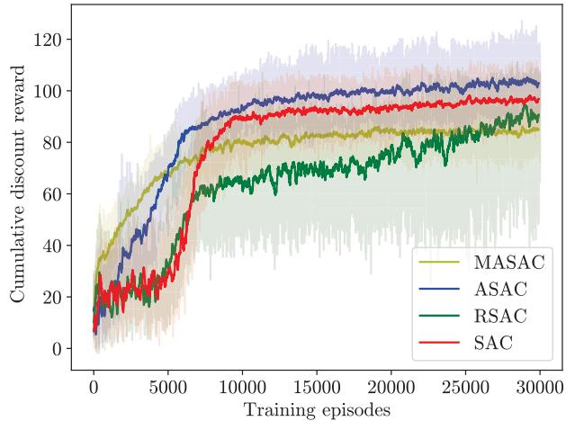  
Fig. 2. The cumulative discount reward versus training episodes. (with 4 UAVs).

It is worth noting that the decentralized MASAC is extremely time-comsuming compared with the centralized solutions owing to its centralized training and distributed execution process and the randomness of UAVs take-off points during each training episode.

This paper focuses on maximizing the weighted spectral efficiency and system fairness index while minimizing UAV’ power consumption, we investigate the relationship between each evaluation metric and the number of time slots in Fig. 3(a)-(c), which reveal the average performance after each algorithm training completed, that is to say, network parameter vectors $\theta _ { i } , \theta _ { i } ^ { \prime }$ and ϕ for centralized solutions and $\theta _ { k , i } , \theta _ { k , i } ^ { \prime }$ and $\phi _ { k }$ for decentralized solution are no longer updated.

It can be seen that the proposed ASAC algorithm achieves better weighted spectral efficiency in the whole time slots from Fig. 3(a), which is consistent with the average cumulative reward after convergence in Fig. 2. Moreover, the proposed ASAC algorithm has improved the weighted spectral efficiency by 14.3% compared with SAC algorithm. Fig. 3(b) reveals the average fairness index versus time slot, it can be seen that the SAC algorithm performs better in fairness index, and the proposed ASAC and the MASAC are inferior to the others. We can deduce that the proposed solutions and the randomness of the multi-agent algorithm bring negative influence on the fairness index. Meanwhile, there is no signif icant differences among their final fairness values. Fig. 3(c) shows the normalized power consumption versus time slot, where this metric considers the mean of power consumption among UAVs. As we can see the power consumption of the centralized solutions is gradually from rising to stable. While the MASAC appears to fluctuate with time slot, that is because its distributed execution mechanism and the randomness of the UAVs’ take-off position.

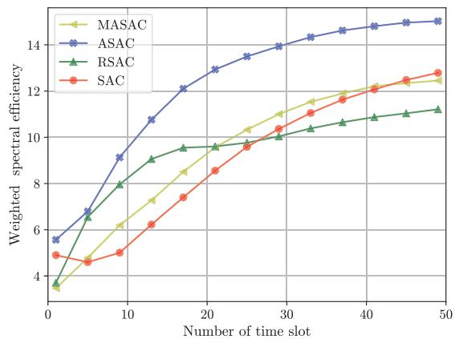

(a)  
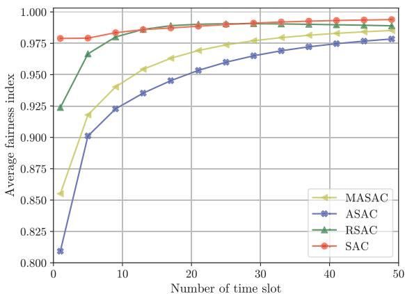

(b)  
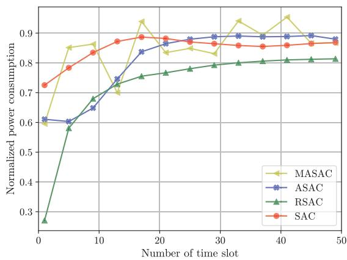  
(c)  
Fig. 3. Relationship between each evaluation metric and the number of time slots. (a) Weighted spectral efficiency. (b) Average fairness index. (c) Normalized power consumption.

Then, take the ARAC algorithm as an example, we explore the UAVs’ trajectory planning and user association policy, where the ASAC training has been completed and network parameters are no longer updated. Fig. 4 shows an example of the UAV trajectory planning and final user association policy with ASAC algorithm, where the number of UAVs and target users is set as K = 4 and $M \ : = \ : 2 0$ , respectively. It can be observed that Fig. 4 (a) reveals the trajectory planning of 4 UAVs from randomly initial positions ‘UAV-init’. Fig. 4 (b) shows the user association when trajectory planning have been completed.

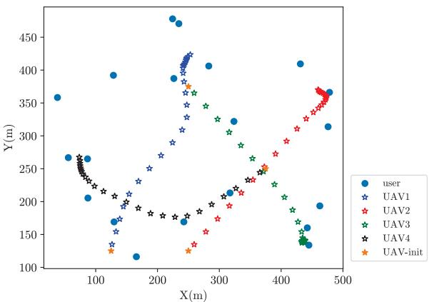

(a)  
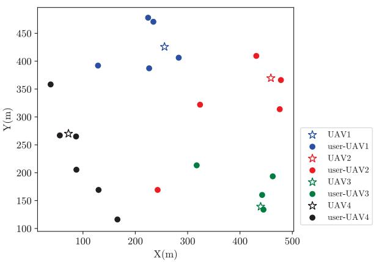  
(b)  
Fig. 4. An example of UAV trajectory planning and user associations with ASAC algorithm. (a) Trajectory planning. (b) User association.

In conclusion, the proposed adaptive scheme effectuates data augmentation, greatly enriches the dataset with lower complexity than only depending on agent-to-environment interaction, accelerates training speed and benefits the accuracy of model.

## C. Performance of Algorithms With Various Numbers of UAVs

In this subsection, experiments are designed to reveal the superiority of the proposed algorithms with various numbers of UAVs. The number of target users is set as M = 20, both the random scheme parameter λ and the adaptive scheme parameter L are equal to UAVs’ number K, and other parameter settings are listed in Table I.

First, the effectiveness of the proposed ASAC algorithm with various numbers of UAVs is verified.

The weighted spectral efficiency of the ASAC algorithm with various number of UAVs is shown in Fig. 5. It can be observed that the training speed of the proposed ASAC algorithm decreases with the UAVs’ number increasing, and the algorithm with K = 5, 6 is even not yet convergence after 30,000 training episodes. That is because the complexity of the exploration increases and it is very costly in terms of computation for the agent of ASAC algorithm to explore the optimal or near-optimal policy with the number of UAVs increasing. Moreover, the ASAC algorithm with different number of UAVs obtains the comparable weighted spectral efficiency after 30,000 training episodes, which further verifies the efficiency of ASAC algorithm in maximizing the minimum weighted spectral efficiency among UAVs.

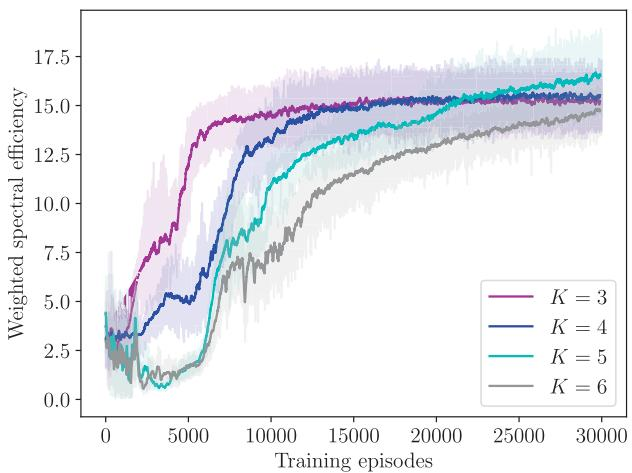  
Fig. 5. The weighted spectral efficiency of ASAC algorithm with various numbers of UAVs.

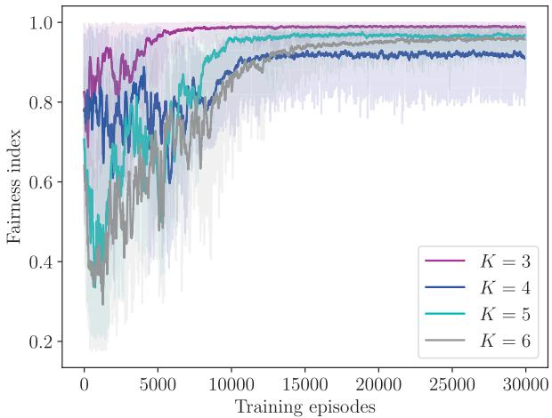  
Fig. 6. Fairness index of the proposed ASAC algorithm with various numbers of UAVs.

Fig. 6 shows the fairness index of the proposed ASAC algorithm with various numbers of UAVs. It can be observed that the curves of the fairness index tend to be stable with the training episodes increase, and the fluctuant mean values and their convergence speed during initial stage of training show downward trend with the UAVs’ number increasing. The main reason is that the more UAVs there are, the more complicated the corresponding policy exploration for user associations, UAV trajectory planning and power allocation, thus it leads to the fairness index values decrease.

Fig. 7 reveals the relationship between evaluation metrics and various numbers of UAVs for different algorithms after 30000 training episodes. It is observed that the average weighted spectral efficiency of each algorithm is increasing first and then decreasing as UAV numbers increase. In contrast, the average fairness index of each algorithm appears a decreasing trend. Moreover, the evaluation metrics for proposed ASAC algorithms usually outperform that of other algorithms with various numbers of UAVs, which is consistent with the mean of cumulative discount reward after convergence in Fig. 2.

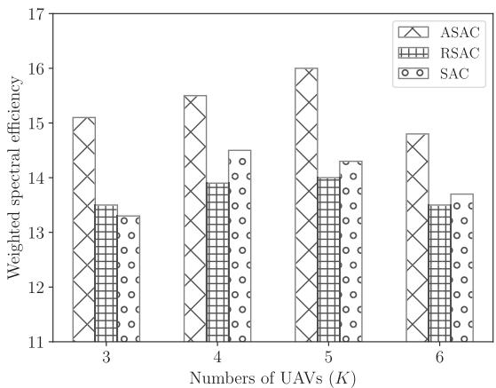

(a)  
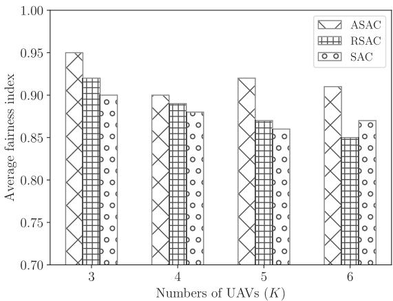  
(b)  
Fig. 7. Relationship between each evaluation metric and various numbers of UAVs. (a) Weighted spectral efficiency. (b) Average fairness index.

In conclusion, the proposed schemes have shown great advantages in various numbers of UAVs. The experiment results further verify the availability of the adaptive data augmentation in assisting SAC algorithm.

## D. Performance of Proposed ASAC Algorithm With Various Numbers of Target Users

In this subsection, we take the proposed ASAC algorithm as an example to verify the validity of data augmentation with various numbers of target users. Here, the number of UAVs is K = 4, and other parameter settings are listed in Table I.

The weighted spectral efficiency of ASAC algorithm is shown in Fig. 8. It can be observed that the curves correspond to the mean of weighted spectral efficiency gradually increases with training episodes increasing and also increases with the target users’ number increasing. The training speed of target user number M = 20 is lower than that of M = 25 in the early training stage and higher than that of values in the latter stage. Moreover, the stability of ASAC algorithm with the target user number M = 25 is slightly worse than that of others.

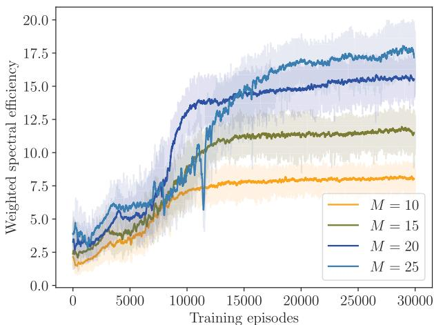  
Fig. 8. The weighted spectral efficiency of ASAC algorithm with various numbers of users.

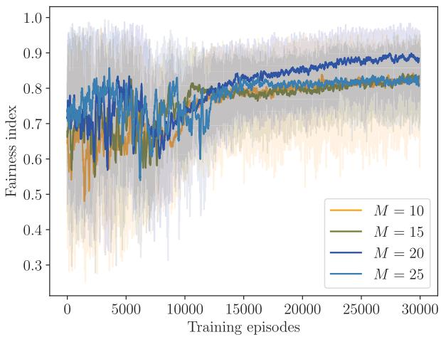  
Fig. 9. The fairness index of ASAC algorithm with various number of users.

Fig. 9 shows the fairness index of the proposed ASAC algorithm with the various numbers of the target users. It can be observed that the fairness index gradually comes to stability with the increase of training episodes. Besides, there is little difference in fairness index in the different numbers of users, and the fairness index of target user number M = 20 outperforms that of others.

## VI. CONCLUSION

In this paper, we investigate the communication and sensing performance optimization in multi-UAV integrated sensing and communications (ISAC) system. We formulate the joint user association, UAV trajectory planning and power allocation problem to optimize the minimum weighted spectral efficiency among UAVs, which is deemed as a sequential making-decision problem. We introduce the centralized and the decentralized DRL solutions for the problem. The centralized SAC algorithm is first introduced to solve the problem. And then, we get insight into the equivalence of the original optimization objective and transform it based on symmetric group. Subsequently, two data augmentation schemes, namely the random and the adaptive, are proposed to design the replay memory buffer of SAC, and accordingly the SAC algorithms assisted by data augmentation are introduced to tackle the transformed problem. Meanwhile, the decentralized MASAC is also introduced to solve this sequential making-decision problem. The experiment results verify the validity of the centralized and decentralized DRL solutions in our considered scenarios. The proposed ASAC algorithm has significant advantages on the training speed and the weighted spectral efficiency, and the proposed ASAC algorithm compared with SAC has improved the average weighted spectral efficiency by 14.3%. Besides, the MASAC algorithm achieves the best training speed in the early state with costly time-consuming.

## REFERENCES

[1] F. Liu et al., “Integrated sensing and communications: Towards dualfunctional wireless networks for 6G and beyond,” IEEE J. Sel. Areas Commun., vol. 40, no. 6, pp. 1728–1762, Mar. 2022.

[2] H. Hong, J. Zhao, T. Hong, and T. Tang, “Radar-communication integration for 6G massive IoT services,” IEEE Internet Things J., vol. 9, no. 16, pp. 14511–14520, Mar. 2021.

[3] A. Fotouhi et al., “Survey on UAV cellular communications: Practical aspects, standardization advancements, regulation, and security challenges,” IEEE Commun. Surveys Tuts., vol. 21, no. 4, pp. 3417–3442, 4th Quart., 2019.

[4] X. Liu, Y. Liu, and Y. Chen, “Machine learning empowered trajectory and passive beamforming design in UAV-RIS wireless networks,” IEEE J. Sel. Areas Commun., vol. 39, no. 7, pp. 2042–2055, Dec. 2020.

[5] D. Zorbas, L. D. P. Pugliese, T. Razafindralambo, and F. Guerriero, “Optimal drone placement and cost-efficient target coverage,” J. Netw. Comput. Appl., vol. 75, pp. 16–31, Nov. 2016.

[6] K. Meng et al., “UAV-enabled integrated sensing and communication: Opportunities and challenges,” 2022, arXiv:2206.03408.

[7] Q. Wu et al., “A comprehensive overview on 5G-and-beyond networks with UAVs: From communications to sensing and intelligence,” IEEE J. Sel. Areas Commun., vol. 39, no. 10, pp. 2912–2945, Oct. 2021.

[8] K. Zhang and C. Shen, “UAV aided integrated sensing and communications,” in Proc. IEEE 94th Veh. Tech. Conf., Sep. 2021, pp. 1–6.

[9] X. Chen, Z. Feng, Z. Wei, F. Gao, and X. Yuan, “Performance of joint sensing-communication cooperative sensing UAV network,” IEEE Trans. Veh. Technol., vol. 69, no. 12, pp. 15545–15556, Dec. 2020.

[10] X. Yang, K. Huo, W. Jiang, J. Zhao, and Z. Qiu, “A passive radar system for detecting UAV based on the OFDM communication signal,” in Proc. IEEE Prog. Electrom. Res. Symp. (PIERS), Nov. 2016, pp. 2757–2762.

[11] J. Hu, H. Zhang, L. Song, R. Schober, and H. V. Poor, “Cooperative Internet of UAVs: Distributed trajectory design by multi-agent deep reinforcement learning,” IEEE Trans. Commun., vol. 68, no. 11, pp. 6807–6821, Aug. 2020.

[12] X. Jing, F. Liu, C. Masouros, and Y. Zeng, “ISAC from the sky: UAV trajectory design for joint communication and target localization,” 2022, arXiv:2207.02904.

[13] K. Meng, Q. Wu, S. Ma, W. Chen, and T. Q. Quek, “UAV trajectory and beamforming optimization for integrated periodic sensing and communication,” IEEE Wireless Commun. Lett., vol. 11, no. 6, pp. 1211–1215, Mar. 2022.

[14] K. Meng, Q. Wu, S. Ma, W. Chen, K. Wang, and J. Li, “Throughput maximization for UAV-enabled integrated periodic sensing and communication,” IEEE Trans. Wireless Commun., vol. 22, no. 1, pp. 671–687, Aug. 2022.

[15] Z. Lyu, G. Zhu, and J. Xu, “Joint maneuver and beamforming design for UAV-enabled integrated sensing and communication,” IEEE Trans. Wireless Commun., early access, Oct. 11, 2022, doi: 10.1109/TWC.2022.3211533.

[16] X. Wang, Z. Fei, J. A. Zhang, J. Huang, and J. Yuan, “Constrained utility maximization in dual-functional radar-communication multi-UAV networks,” IEEE Trans. Commun., vol. 69, no. 4, pp. 2660–2672, Apr. 2021.

[17] M. Wang, P. Chen, Z. Cao, and Y. Chen, “Reinforcement learning-based UAVs resource allocation for integrated sensing and communication (ISAC) system,” Electronics, vol. 11, no. 3, p. 441, Feb. 2022.

[18] S. Zhang, H. Zhang, Z. Han, H. V. Poor, and L. Song, “Age of information in a cellular Internet of UAVs: Sensing and communication trade-off design,” IEEE Trans. Wireless Commun., vol. 19, no. 10, pp. 6578–6592, Jun. 2020.

[19] S. Zhang, H. Zhang, L. Song, Z. Han, and H. V. Poor, “Sensing and communication tradeoff design for AoI minimization in a cellular Internet of UAVs,” in Proc. IEEE Int. Conf. Commun. (ICC), Jul. 2020, pp. 1–6.

[20] W. Mei and R. Zhang, “UAV-sensing-assisted cellular interference coordination: A cognitive radio approach,” IEEE Wireless Commun. Lett., vol. 9, no. 6, pp. 799–803, Jan. 2020.

[21] B. Chang, W. Tang, X. Yan, X. Tong, and Z. Chen, “Integrated scheduling of sensing, communication, and control for mmWave/THz communications in cellular connected UAV networks,” IEEE J. Sel. Areas Commun., vol. 40, no. 7, pp. 2103–2113, Mar. 2022.

[22] R. S. Sutton and A. G. Barto, Reinforcement Learning: An Introduction. Cambridge, MA, USA: MIT Press, 2018.

[23] A. Huizing, M. Heiligers, B. Dekker, J. de Wit, L. Cifola, and R. Harmanny, “Deep learning for classification of mini-UAVs using micro-Doppler spectrograms in cognitive radar,” IEEE Aerosp. Electron. Syst. Mag., vol. 34, no. 11, pp. 46–56, Nov. 2019.

[24] Y. Emami, B. Wei, K. Li, W. Ni, and E. Tovar, “Joint communication scheduling and velocity control in multi-UAV-assisted sensor networks: A deep reinforcement learning approach,” IEEE Trans. Veh. Technol., vol. 70, no. 10, pp. 10986–10998, Oct. 2021.

[25] A. Feriani and E. Hossain, “Single and multi-agent deep reinforcement learning for AI-enabled wireless networks: A tutorial,” IEEE Commun. Surveys Tuts., vol. 23, no. 2, pp. 1226–1252, 2nd Quart., 2021.

[26] C. She et al., “A tutorial on ultrareliable and low-latency communications in 6G: Integrating domain knowledge into deep learning,” Proc. IEEE, vol. 109, no. 3, pp. 204–246, Mar. 2021.

[27] K. Feng, Q. Wang, X. Li, and C.-K. Wen, “Deep reinforcement learning based intelligent reflecting surface optimization for MISO communication systems,” IEEE Wireless Commun. Lett., vol. 9, no. 5, pp. 745–749, Jan. 2020.

[28] H. Peng and X. Shen, “Multi-agent reinforcement learning based resource management in MEC- and UAV-assisted vehicular networks,” IEEE J. Sel. Areas Commun., vol. 39, no. 1, pp. 131–141, Jan. 2021.

[29] Y. Wang et al., “Trajectory design for UAV-based Internet of Things data collection: A deep reinforcement learning approach,” IEEE Internet Things J., vol. 9, no. 5, pp. 3899–3912, Mar. 2022.

[30] J. Wu, Z. Wei, W. Li, Y. Wang, Y. Li, and D. U. Sauer, “Battery thermaland health-constrained energy management for hybrid electric bus based on soft actor-critic DRL algorithm,” IEEE Trans. Ind. Informat., vol. 17, no. 6, pp. 3751–3761, Jun. 2021.

[31] T. Haarnoja, A. Zhou, P. Abbeel, and S. Levine, “Soft actor-critic: Offpolicy maximum entropy deep reinforcement learning with a stochastic actor,” in Proc. Int. Conf. Mach. Learn. (ICML), Aug. 2018, pp. 1861–1870.

[32] C. Shorten and T. M. Khoshgoftaar, “A survey on image data augmentation for deep learning,” J. Big Data, vol. 6, no. 1, pp. 1–48, Dec. 2019.

[33] J. Lee, D. Niyato, Y. L. Guan, and D. I. Kim, “Learning to schedule joint radar-communication with deep multi-agent reinforcement learning,” IEEE Trans. Veh. Technol., vol. 71, no. 1, pp. 406–422, Jan. 2022.

[34] X. Liu, H. Zhang, K. Long, M. Zhou, Y. Li, and H. V. Poor, “Proximal policy optimization-based transmit beamforming and phase-shift design in an IRS-aided ISAC system for the THz band,” IEEE J. Sel. Areas Commun., vol. 40, no. 7, pp. 2056–2069, Jul. 2022.

[35] Q. Wu, Y. Zeng, and R. Zhang, “Joint trajectory and communication design for multi-UAV enabled wireless networks,” IEEE Trans. Wireless Commun., vol. 17, no. 3, pp. 2109–2121, Mar. 2018.

[36] D. W. Bliss, “Cooperative radar and communications signaling: The estimation and information theory odd couple,” in Proc. IEEE Radar Conf., May 2014, pp. 50–55.

[37] A. R. Chiriyath, B. Paul, and D. W. Bliss, “Radar-communications convergence: Coexistence, cooperation, and co-design,” IEEE Trans. Cogn. Commun. Netw., vol. 3, no. 1, pp. 1–12, Mar. 2017.

[38] T. Haarnoja et al., “Soft actor-critic algorithms and applications,” 2018, arXiv:1812.05905.

[39] J. Xiong et al., “Parametrized deep Q-networks learning: Reinforcement learning with discrete-continuous hybrid action space,” 2018, arXiv:1810.06394.

[40] S. Yin and F. R. Yu, “Resource allocation and trajectory design in UAVaided cellular networks based on multiagent reinforcement learning,” IEEE Internet Things J., vol. 9, no. 4, pp. 2933–2943, Feb. 2022.

[41] Y. Qin, Z. Zhang, W. Huangfu, H. Zhang, and K. Long, “Cooperative resource allocation based on soft actor-critic with data augmentation in cellular network,” IEEE Wireless Commun. Lett., vol. 12, no. 3, pp. 396–400, Mar. 2023.

[42] A. Seress, Permutation Group Algorithms, vol. 152. Cambridge, U.K.: Cambridge Univ. Press, 2003.

Yunhui Qin received the Ph.D. degree from the University of Science and Technology Beijing, Beijing, China, in 2022. She is currently a Post-Doctoral Research Fellow with the School of Cyberspace Science and Technology, Beijing Institute of Technology, Beijing. Her main research interests include UAV secure communication, integrated sensing and communications, self-organized networking, and computational intelligence.

Zhongshan Zhang (Senior Member, IEEE) received the B.E. and M.S. degrees in computer science and the Ph.D. degree in electrical engineering from the Beijing University of Posts and Telecommunications, Beijing, China, in 1998, 2001, and 2004, respectively.

He joined the DoCoMo Beijing Laboratories, Beijing, in August 2004, as an Associate Researcher, and was promoted to be a Researcher, in December 2005. In February 2006, he joined the University of Alberta, Edmonton, AB, Canada, as a Post-Doctoral

Fellow. In April 2009, he joined the Department of Research and Innovation, AlcatelLucent, Shanghai, China, as a Research Scientist. From August 2010 to July 2011, he was with the NEC China Laboratories, Beijing, as a Senior Researcher. He is currently a Professor with the School of Cyberspace Science and Technology, Beijing Institute of Technology, Beijing. His main research interests include statistical signal processing, self-organized networking, cognitive radio, and cooperative communications.

Dr. Zhang has served or is serving as a Guest Editor and/or an Editor for several technical journals, such as the IEEE Communications Magazine and KSII Transactions on Internet and Information Systems.

Xulong Li is currently pursuing the Ph.D. degree in information and communication engineering with the School of Computer and Communication Engineering, University of Science and Technology Beijing (USTB). His current research interests include mobile edge computing, the Internet of Things, and deep reinforcement learning.

Wei Huangfu (Member, IEEE) received the M.S. and Ph.D. degrees in electronic engineering from Tsinghua University, Beijing, China, in 1998 and 2001, respectively. He is currently a Full Professor with the School of Computer and Communication Engineering, University of Science and Technology Beijing (USTB). His main research interests include statistical signal processing, the Internet of Things, cooperative communications networks, and wireless sensor networks.

Haijun Zhang (Fellow, IEEE) is currently a Full Professor and the Associate Dean of the School of Computer and Communications Engineering, University of Science and Technology Beijing, China. He was a Post-Doctoral Research Fellow with the Department of Electrical and Computer Engineering, The University of British Columbia (UBC), Canada. He is a Distinguished Lecturer of IEEE. He received the IEEE ComSoc Young Author Best Paper Award in 2017, the IEEE CSIM Technical Committee Best Journal Paper Award in 2018, and the IEEE ComSoc

Asia–Pacific Best Young Researcher Award in 2019. He serves/served as the General Co-Chair for GameNets’16, the TPC Co-Chair for INFOCOM 2018 Workshop on Integrating Edge Computing, Caching, and Offloading in Next Generation Networks, the Symposium Chair for Globecom’19, and the Track Co-Chair for WCNC 2020/2021 and VTC Fall 2022. He serves/served as an Editor for IEEE TRANSACTIONS ON COMMUNICATIONS and IEEE TRANSACTIONS ON NETWORK SCIENCE AND ENGINEERING.