# Delay-Aware UAV Computation Offloading and Communication Assistance for Post-Disaster Rescue

Chengyi Zhou , Junyu Liu , Member, IEEE, Kaige Qu , Member, IEEE, Min Sheng , Senior Member, IEEE, Jiandong Li , Fellow, IEEE, and Weihua Zhuang , Fellow, IEEE

Abstract— In this paper, we consider an unmanned aerial vehicle (UAV)-assisted post-disaster rescue scenario, where UAV-mounted aerial base stations (ABSs) compute tasks related to post-disaster rescue operations while also providing communication services to ground users (GUs). With the limited computation capacity of ABSs, we aim to minimize the task computation queuing delay and ensure the GU communication rate by jointly optimizing ABS-GU association, task offloading, and ABS trajectory. The problem is formulated as a mixed-integer nonlinear program, and a solution is proposed by integrating Lyapunov optimization and actor-critic based deep reinforcement learning. We utilize a model-based successive convex approximation technique in a critic module to acquire an accurate evaluation of actor module output. Simulation results demonstrate the effectiveness of the proposed approach in reducing the task computation queuing delay.

Index Terms— Unmanned aerial vehicle (UAV), computation offloading, resource allocation, Lyapunov optimization.

# I. INTRODUCTION

ERRESTRIAL infrastructure damages bring severe communication outage when extreme weather or emergencies happen [1]. The communication between macro-cell base station (MBS) and local ground users (GUs) can be blocked in a disaster environment due to the sudden interruption of wireless services. In post-disaster rescue, emergency communications are required to support GUs sending disaster information for

Received 14 January 2024; revised 16 May 2024 and 9 September 2024; accepted 28 September 2024. Date of publication 21 October 2024; date of current version 12 December 2024. This work was supported in part by the Natural Science Foundation of China under Grant 62171344, Grant 62341111, and Grant 62121001; in part by the Key Industry Innovation Chain of Shaanxi under Grant 2022ZDLGY05-01 and Grant 2022ZDLGY05-06; and in part by the Major Key Project of PCL under Grant PCL2021A15. The associate editor coordinating the review of this article and approving it for publication was Y. Wu. (Corresponding author: Junyu Liu.)

Chengyi Zhou, Junyu Liu, and Min Sheng are with the State Key Laboratory of Integrated Service Networks, Institute of Information Science, Xidian University, Xi’an, Shaanxi 710071, China (e-mail: chengyizhou@ stu.xidian.edu.cn; junyuliu@xidian.edu.cn; msheng@mail.xidian.edu.cn).

Kaige Qu and Weihua Zhuang are with the Department of Electrical and Computer Engineering, University of Waterloo, Waterloo, ON N2L 3G1, Canada (e-mail: k2qu@uwaterloo.ca; wzhuang@uwaterloo.ca).

Jiandong Li is with the State Key Laboratory of Integrated Service Networks, Institute of Information Science, Xidian University, Xi’an, Shaanxi 710071, China, and also with the Department of Broadband Communication, Peng Cheng Laboratory, Shenzhen, Guangdong 518000, China (e-mail: jdli@mail.xidian.edu.cn).

Color versions of one or more figures in this article are available at https://doi.org/10.1109/TWC.2024.3479709.

Digital Object Identifier 10.1109/TWC.2024.3479709

timely and effective rescue operations. Meanwhile, computing capabilities are essential for using sensors to detect GUs’ location information through bio-signals or audio signals. Due to high mobility and flexible deployment, unmanned aerial vehicles (UAVs) embedded with on-board sensors can potentially enter the hard-to-reach and affected areas [2]. As such, UAVs are not only deployed to establish emergency communication infrastructure in the air, referred to as aerial base stations (ABSs), but also can provide situational awareness via sensing the post-disaster rescue environment. However, in current studies on ABS-assisted post-disaster rescue, it is common to provide either emergency communication or situational awareness services separately by an ABS, rather than simultaneously provisioning both services. Typically, communication targets and sensing targets are different, and the ABS must approach different targets to provide high-speed communication services or high-precision sensing services, resulting in different flight trajectories. As a result, the existing work will not be able to provide both services simultaneously. Nonetheless, combining two services can improve the timeliness and resource utilization of post-disaster rescue services. However, due to the limited onboard battery and computational capability of ABSs, real-time computation tasks based on collected sensing data, such as image processing, cannot be fully supported by the ABSs with performance satisfaction [2], [3], [4], [5], [6], [7], [8]. Consequently, the time required to execute search and rescue operations may be prolonged and the efficiency of disaster rescue may be degraded [9]. The MBS has stronger computing capabilities compared to ABS and can provide computing support for ABS. Therefore, the computation task of ABS can be partially offloaded to the MBS for timely rescue responses. The task computed at ABS or MBS has to wait for the service completion of its preceding tasks in the queue, resulting in a task queuing delay. In this paper, we consider an ABS-assisted post-disaster rescue system, in which the ABS flies according to a designed trajectory, while providing communication services for associated GUs and collecting sensing data of the rescue environment. Meanwhile, the ABS partially offloads its computation tasks to the MBS for queuing delay improvement.

There are several challenges in ABS-GU association, task offloading, and trajectory planning. First, GUs are not uniformly distributed and the number of GUs in the coverage area of an ABS varies quickly due to the mobility of

ABS [10], [11]. Hence, it is necessary to design an ABS-GU association strategy with the consideration of user distribution, ABS mobility, and ABS trajectory. Second, the channel state between ABS and MBS is time-varying due to the mobility of ABS [12]. It is difficult for the ABS to make optimal task offloading decisions based on time-varying channel state, which leads to undesired long task queuing delays. Third, the ABS simultaneously provides communication service to GUs and partially offloads computation tasks to MBS while flying. The onboard energy of an ABS is usually limited and a significant portion of ABS energy consumption stems from mechanical actions during flying. Providing communication services requires the ABS to get close to GUs to improve the throughput, while offloading tasks require the ABS to get close to the MBS to reduce the task offloading delay. Due to the inconsistent requirements between providing communication service to GUs and offloading computation tasks to the MBSs, the ABS trajectory design should strike a balance that accommodates both providing communication service and offloading computation tasks. Moreover, the ABS trajectory influences the channel states from the ABS to both GUs and MBSs, which are important factors in making the ABS-GU association and task offloading decisions. It can be seen that ABS-GU association, task offloading, and ABS trajectory are coupled in this system, which makes the system management even more complex. Therefore, we need to jointly optimize the ABS-GU association, ABS trajectory, and task offloading ratio under the ABS energy constraints to minimize task computation queuing delay and ensure the communication requirements of GUs.

Jointly optimizing the ABS-GU association, task offloading, and ABS trajectory planning is computationally complex, especially in a multi-GU and multi-ABS network [13]. Some existing studies based on optimization algorithms focus on designing sub-optimal solutions with reduced complexity, but this can lead to performance losses. Moreover, when the network environment changes, these algorithms recalculate the joint decisions based on the current conditions, which is time-consuming [14], [15], [16], [17]. The recent development of data-driven deep reinforcement learning (DRL) provides a promising alternative to reduce the computational complexity [18], [19]. Once the training of a DRL model is finished, real-time decisions can be made based on fast model inference as the environment changes [20], [21], [22], [23]. However, it is difficult to rely on only DRL-based methods for addressing the long-term performance requirements in a random environment.

In this work, we formulate the joint ABS-GU association, task offloading, and ABS trajectory planning problem as a long-term stochastic mixed integer nonlinear programming (MINLP) problem. To solve this problem, we propose a joint DRL and Lyapunov optimization (JDL) algorithm. We apply Lyapunov optimization to decouple the long-term stochastic MINLP into a series of deterministic MINLP problems. For each deterministic MINLP problem, we propose a solution that integrates model-based optimization and model-free DRL based on the actor-critic structure. The actor module is a deep neural network (DNN) that learns the optimal ABS-GU association action based on the channel gains of all GUs and task queuing delays of all ABSs. The critic module evaluates the ABS-GU association action by analytically solving a joint ABS trajectory planning and task offloading problem based on the successive convex approximation (SCA) technique. The joint ABS trajectory planning and task offloading problem is decoupled to an ABS trajectory planning subproblem and a task offloading subproblem. To reduce the computation complexity, the trajectory planning subproblem is optimized on a large timescale, and the task offloading subproblem is optimized on a small timescale. The main contributions of this work are summarized as follows.

1) We develop a model for a joint ABS-GU association, ABS trajectory planning, and task offloading optimization problem in the ABS-assisted post-disaster rescue system, which is formulated as a stochastic MINLP. The model incorporates GU communication service guarantee under ABS energy constraints with the objective of minimizing queuing delay of sensing-related computation tasks.   
2) We exploit Lyapunov optimization to decouple the longterm stochastic MINLP into a series of deterministic MINLP problems. For each deterministic MINLP problem, we propose a solution that integrates model-based optimization and model-free DRL based on the actorcritic structure. Compared to a conventional actor-critic structure that uses a model-free DNN in the critic module, we apply the SCA technique to acquire an accurate evaluation of an ABS-GU association action, which is the output of actor module.

The remainder of this paper is organized as follows. Related works are discussed in Section II. The system model is presented in Section III. Problem formulation and the solution are given in Sections IV and V, respectively. Finally, extensive simulations are discussed in Section VI, followed by conclusions in Section VII. For easy reference, Table I summarizes main mathematical symbols.

# II. RELATED WORK

# A. ABS-Assisted Communication for Post-Disaster Rescue

The ABS communication has been studied to assist postdisaster rescue. Zhao et al. establish a unified framework for an ABS-assisted emergency network in disasters, which jointly optimizes the trajectory and scheduling of ABSs to provide wireless service to ground devices [1]. In [24], a generic framework for disaster resilient communication is investigated, utilizing terrestrial edge nodes and ABSs to deal with the infrastructure disruption and surging workload. In [25], Dai et al. investigate the channel allocation and data delivery problems to provide communication and data delivery services for affected users. In [26], Wang et al. propose a joint MBS power allocation, ABS service zone selection, and user scheduling solution based on DRL to forward information from MBS to GUs through ABS, while enhancing the total spectrum efficiency. In [27], Feng et al. propose a joint ABS deployment and resource allocation scheme based on deep Q-network (DQN) for a multi-ABS enabled non-orthogonal multiple access system to extend the ABS coverage for GUs.

TABLE I   
SUMMARY OF SYMBOLS 

<table><tr><td>Symbol</td><td>Definition</td></tr><tr><td> $A_j, M_g, U_i$ </td><td>j-th ABS, g-th MBS, i-th GU</td></tr><tr><td> $\delta_t$ </td><td>Time interval length</td></tr><tr><td>T</td><td>Time slot length</td></tr><tr><td>N</td><td>Entire task period</td></tr><tr><td> $l_g(t)$ </td><td>Location of g-th MBS at time slot t</td></tr><tr><td> $l_j(t)$ </td><td>Location of j-th ABS at time slot t</td></tr><tr><td> $l_i(t)$ </td><td>Location of i-th GU at time slot t</td></tr><tr><td> $l_j^{init}$ </td><td>Initial location of j-th ABS</td></tr><tr><td> $D_{\min}$ </td><td>Minimum safe distance for any two ABSs</td></tr><tr><td> $v_{\max}$ </td><td>Maximum ABS flight velocity</td></tr><tr><td> $v_{\min}$ </td><td>Minimum ABS flight velocity</td></tr><tr><td> $v_j(t)$ </td><td>Velocity of j-th ABS at time slot t</td></tr><tr><td> $a_j(t)$ </td><td>Acceleration of j-th ABS at time slot t</td></tr><tr><td> $a_{\max}$ </td><td>Maximum ABS flight acceleration</td></tr><tr><td> $\gamma_j(t)$ </td><td>Task offloading ratio of ABS  $A_j$  at time slot t</td></tr><tr><td> $x_{ij}(t)$ </td><td>Association strategy between ABS  $A_j$  and GU  $U_i$  at time slot t</td></tr><tr><td> $N_A$ </td><td>Maximum GU association number of ABS in each time slot</td></tr><tr><td> $h_{ij}(t)$ </td><td>Channel gain from ABS  $A_j$  to the GU  $U_i$  at time slot t</td></tr><tr><td> $h_{jg}(t)$ </td><td>Channel gain from ABS  $A_j$  to the MBS  $M_g$  at time slot t</td></tr><tr><td> $r_{ij}(t)$ </td><td>Transmission rate of between the ABS  $A_j$  and GU  $U_i$  at time slot t</td></tr><tr><td> $r_{jg}(t)$ </td><td>Transmission rate of between the ABS  $A_j$  and MBS  $M_g$  at time slot t</td></tr><tr><td> $Y_j(t)$ </td><td>Computation task of ABS  $A_j$  at time slot t</td></tr><tr><td> $Y_j^L(t)$ </td><td>Computation task  $Y_j(t)$  executed locally at ABS at time slot t</td></tr><tr><td> $Y_j^O(t)$ </td><td>Computation task  $Y_j(t)$  offloaded to the MBS at time slot t</td></tr><tr><td> $C_j(t)$ </td><td>Data size of computation task  $Y_j(t)$  at time slot t</td></tr><tr><td> $C_j^L(t)$ </td><td>Data size of computation task  $Y_j^L(t)$  at time slot t</td></tr><tr><td> $C_j^O(t)$ </td><td>Data size of computation task  $Y_j^O(t)$  at time slot t</td></tr><tr><td> $Q_j^L(t)$ </td><td>Local sub-tasks computation queue ABS of  $A_j$  at time slot t</td></tr><tr><td> $Q_j^O(t)$ </td><td>Offloaded sub-tasks transmission queue of ABS  $A_j$  at time slot t</td></tr><tr><td> $Q_j^S(t)$ </td><td>Offloaded sub-tasks computation queue of ABS  $A_j$  at time slot t</td></tr><tr><td> $D_j^L(t)$ </td><td>Local computation bits of ABS  $A_j$ </td></tr><tr><td> $D_j^S(t)$ </td><td>Computation bits at MBS  $M_g$  for ABS  $A_j$ </td></tr><tr><td> $f_j(t)$ </td><td>CPU-cycle frequency of ABS  $A_j$ </td></tr><tr><td> $L_j$ </td><td>Required CPU cycles per bit for computation</td></tr><tr><td> $p_j(t)$ </td><td>Transmit power of ABS  $A_j$  at time slot t</td></tr><tr><td> $f_{jg}(t)$ </td><td>MBS  $M_g$  Allocated CPU-cycle frequency to ABS  $A_j$ at time slot t</td></tr><tr><td> $T_j^L(t)$ </td><td>Local task computation queuing delay of ABS  $A_j$ </td></tr><tr><td> $T_j^O(t)$ </td><td>Offloaded task transmission queuing delay of ABS  $A_j$ </td></tr><tr><td> $T_j^S(t)$ </td><td>Offloaded task computation queuing delay of ABS  $A_j$ </td></tr><tr><td> $E_j^{H}(t))$ </td><td>Flight energy consumption of ABS  $A_j$  at time slot t</td></tr><tr><td> $E_{\max}$ </td><td>Maximum flight energy consumption of the ABS</td></tr></table>

The existing works consider resource allocation and trajectory planning in an ABS-assisted communication network supported by hovering ABSs. To provide communication service for spatially distributed GUs, our work studies ABS-GU association and trajectory planning of constantly moving ABSs, while considering dynamic channel conditions and mechanical operation constraints. An uneven and unknown GU distribution is considered in this study.

# B. ABS Computation Offloading

The ABS computation offloading has been extensively investigated [3], [5], [13], [28], [29], [30], [31]. In [13], Bi et al. propose an online computation offloading algorithm to maximize the network data processing capability subject to the long-term data queue stability and average power constraints. In [5], Xu et al. focus on the computing delay issue in mobile edge computing (MEC) systems assisted by multiple ABSs with the goal of task completion time minimization. In [3], Zhang et al. consider the partial computation offloading, user association, and central processing unit (CPU) cycle frequency allocation for a multi-ABS assisted MEC system, in which the objective is to maximize computation efficiency for one GU. In [32], Messous et al. investigate the problem of offloading heavy computation tasks of ABSs to MBSs while achieving the best possible tradeoff between energy consumption, time delay, and computation cost. ABS computation offloading has been studied in post-disaster rescue scenarios, where ABSs generate rescue-related computation tasks and offload to MBSs [2], [9]. In [2] and [9], Wang et al. propose a tripartite dynamic cooperation framework among ABSs, unmanned ground vehicles (UGVs), and base stations, where multiple ABSs offload computation task to UGVs. In [18], Luo et al. propose a separated Q-network (SDQN) algorithm to jointly make optimal computation offloading decisions and flying orientation choices for multi-UAV cooperative target search in an emergency network. Jointly considering ABSassisted communication and ABS computation offloading is necessary for the ABS-assisted post-disaster rescue system. We investigate a joint ABS-GU association, ABS trajectory planning, and task offloading optimization problem with the objective to minimize the task computation queuing delay and ensure the GU communication rate.

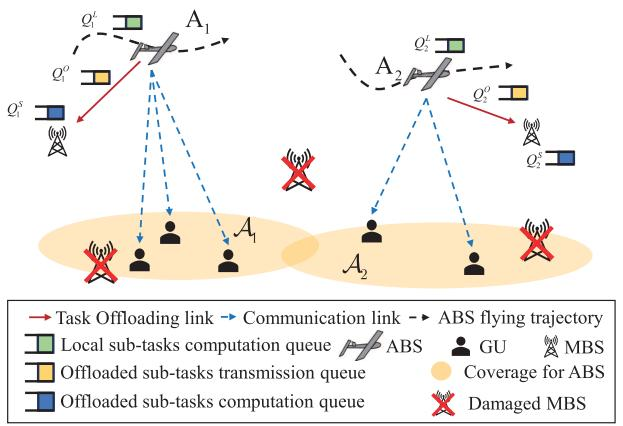

flowchart

```mermaid
graph TD
    A["Task Offloading link"] --> B["Communication link"]
    B --> C["ABS flying trajectory"]
    D["Local sub-tasks computation queue"] --> E["ABS"]
    F["Offloaded sub-tasks transmission queue"] --> G["GU"]
    H["Offloaded sub-tasks computation queue"] --> I["MBS"]
    J["Coverage for ABS"] --> K[" damaged MBS"]
    L["Q1^o"] --> M["A1"]
    N["Q2^o"] --> O["A2"]
    P["Q3^o"] --> Q["A3"]
    R["Q4^o"] --> S["A4"]
    T["Q5^o"] --> U["A5"]
    V["Q6^o"] --> W["A6"]
    X["Q7^o"] --> Y["A7"]
    Z["Q8^o"] --> AA["A8"]
    AB["Q9^o"] --> AC["A9"]
    AD["Q10^o"] --> AE["A10"]
    AF["Q11^o"] --> AG["A11"]
    AH["Q12^o"] --> AI["A12"]
    AJ["Q13^o"] --> AK["A13"]
    AL["Q14^o"] --> AM["A14"]
    AN["Q15^o"] --> AO["A15"]
    AP["Q16^o"] --> AQ["A16"]
    AR["Q17^o"] --> AS["A17"]
    AT["Q18^o"] --> AU["A18"]
    AV["Q19^o"] --> AW["A19"]
    AX["Q20^o"] --> AY["A20"]
    AZ["Q21^o"] --> BA["A21"]
    BB["Q22^o"] --> BC["A22"]
    BD["Q23^o"] --> BE["A23"]
    BF["Q24^o"] --> BG["A24"]
    BH["Q25^o"] --> BI["A25"]
    BJ["Q26^o"] --> BK["A26"]
    BL["Q27^o"] --> BM["A27"]
    BN["Q28^o"] --> BO["A28"]
    BP["Q29^o"] --> BQ["A29"]
    BR["Q30^o"] --> BS["A30"]
    BT["Q31^o"] --> BU["A31"]
    BV["Q32^o"] --> BW["A32"]
    BX["Q33^o"] --> BY["A33"]
    BZ["Q34^o"] --> CA["B34"]
    CB["Q35^o"] --> CD["B35"]
    CE["Q36^o"] --> CF["B36"]
    CG["Q37^o"] --> DH["B37"]
    DI["Q38^o"] --> DJ["B38"]
    DK["Q39^o"] --> DL["B39"]
    DV["Q40^o"] --> DW["B40"]
    DX["Q41^o"] --> DXB["X Damaged MBS"]
```

Fig. 1. An illustration of ABS-assisted communication network for post-disaster rescue.

# III. SYSTEM MODEL

# A. Network Model

We consider an operation cycle for ABS-assisted postdisaster rescue in a time duration of N seconds, which contains $T$ discrete time slots with equal length $\begin{array} { r } { \delta _ { t } ~ = ~ \frac { N } { T } } \end{array}$ . Let t = $1 , \ldots , T$ denote time slot index. The system is shown in Fig. 1, in which J ABSs have rescue-related computation tasks and provide communication services for I GUs. A number of G MBSs provide computation support for ABSs. Let $\mathrm { A } _ { j } ( j \in$ $\{ 1 , \ldots , J \} )$ denote j-th ABS, $\mathrm { U } _ { i } ( i \in \{ 1 , \dots , I \} )$ denote i-th GU, and $\mathrm { M } _ { g } ( g \in \{ 1 , \ldots , G \} )$ denote g-th MBS. Let $\mathbf { } \mathcal { A } _ { j } ( t )$ denote ABS $\mathrm { A } _ { j } \mathrm { \bar { s } }$ coverage area at time slot t, where the coverage areas of different ABSs may overlap. GUs in area $A _ { j } ( t )$ can connect to ABS $\mathrm { A } _ { j }$ at time slot t. Let $s _ { j g } ( t )$ denote the association state between ABS $\mathrm { A } _ { j }$ and MBS $\mathrm { M } _ { g }$ at time slot t. ABS $\mathrm { A } _ { j }$ is associated with MBS $\mathrm { M } _ { g }$ when the distance between ABS $\mathrm { A } _ { j }$ and MBS $\mathrm { M } _ { g }$ is shorter than its distance to any other MBSs. We have $s _ { j g } ( t ) = 1$ if ABS $\mathrm { A } _ { j }$ is associated with MBS $\mathrm { M } _ { g }$ at time slot t, and $s _ { j g } ( t ) = 0$ otherwise.

# B. ABS Trajectory Model

We consider a three-dimensional Cartesian coordinate system with MBS $\mathrm { M } _ { g }$ , ABS $\operatorname { A } _ { j } .$ , and GU $\mathrm { U } _ { i }$ at time slot t located at $l _ { g } ( t ) , l _ { j } ( t )$ , and $l _ { i } ( t )$ , respectively. In particular, the trajectory of ABS $\mathrm { A } _ { j }$ is subject to velocity ${ \pmb v } _ { j } ( t )$ and acceleration ${ \pmb a } _ { j } ( t )$ constraints. Minimum safe distance $D _ { \mathrm { m i n } }$ between ABSs must be kept to avoid collision. The trajectory coordinate of ABS $\mathrm { A } _ { j }$ is subject to the following constraints:

$$
\boldsymbol {l} _ {j} (t + 1) = \boldsymbol {l} _ {j} (t) + \boldsymbol {v} _ {j} (t) \delta_ {t} + \frac {1}{2} \boldsymbol {a} _ {j} (t) \delta_ {t} ^ {2}, \forall j, t \tag {1a}
$$

$$
\boldsymbol {v} _ {j} (t + 1) = \boldsymbol {v} _ {j} (t) + \boldsymbol {a} _ {j} (t) \delta_ {t}, \forall j, t \tag {1b}
$$

$$
\left\| \boldsymbol {l} _ {j} (t) - \boldsymbol {l} _ {w} (t) \right\| _ {2} ^ {2} \geq D _ {\min} ^ {2}, \forall j, w \in \{1, \dots , J \}, j \neq w, \forall t \tag {1c}
$$

$$
\left\| \boldsymbol {v} _ {j} (t) \right\| \leq v _ {\max}, \forall j, t \tag {1d}
$$

$$
\left\| \boldsymbol {v} _ {j} (t) \right\| \geq v _ {\min}, \forall j, t \tag {1e}
$$

$$
\left\| \boldsymbol {a} _ {j} (t) \right\| \leq a _ {\max}, \forall j, t \tag {1f}
$$

where $v _ { \mathrm { m a x } }$ and $v _ { \mathrm { m i n } }$ denote the maximum and minimum ABS flight velocity, respectively, $a _ { \mathrm { m a x } }$ denotes the maximum ABS flight acceleration, and ∥·∥ denotes the Euclidean norm. Constraints (1a)-(1f) represent ABS’s trajectory constraints, including the maximum velocity constraint, minimum velocity constraint, maximum acceleration constraint, and minimum safe distance between any two ABSs.

# C. ABS-GU Association Model

The ABS-GU association state between ABS $\mathrm { A } _ { j }$ and GU $\mathrm { U } _ { i }$ at time slot t is denoted as $x _ { i j } ( t )$ . We have $x _ { i j } ( t ) = 1$ if ABS $\mathrm { A } _ { j }$ serves GU $\mathrm { U } _ { i }$ at time slot t, and $x _ { i j } ( t ) = 0$ otherwise. The ABS-GU association strategy is subject to the following constraints:

$$
\sum_ {j = 1} ^ {J} x _ {i j} (t) = 1, \forall i, t \tag {2}
$$

$$
\sum_ {i = 1} ^ {I} x _ {i j} (t) \leq N _ {A}, \forall j, t. \tag {3}
$$

Constraint (2) indicates that each GU can be served by one ABS and constraint (3) indicates that each ABS can be associated with at most $N _ { A }$ GUs at each time slot t. Here, we assume $N _ { A } \times J \ge I$ to ensure that all GUs can obtain communication services.

# D. Communication Model

Let $G _ { 0 } , G _ { 1 } ,$ , and $G _ { 2 }$ denote the antenna gains of the ABS, GU, and MBS, respectively, $\beta _ { 0 }$ denote the channel gain at a reference distance 1m. The channel gains from GU $\mathrm { U } _ { i }$ to ABS $\mathrm { A } _ { j }$ and from ABS $\mathrm { A } _ { j }$ to MBS $\mathrm { M } _ { g }$ at time slot t are given respectively by

$$
h _ {i j} (t) = \frac {G _ {0} G _ {1} \beta_ {0}}{\left\| \boldsymbol {l} _ {i} (t) - \boldsymbol {l} _ {j} (t) \right\| _ {2} ^ {2}} \tag {4}
$$

$$
h _ {j g} (t) = \frac {G _ {0} G _ {2} \beta_ {0}}{\left\| \boldsymbol {l} _ {j} (t) - \boldsymbol {l} _ {g} (t) \right\| _ {2} ^ {2}}. \tag {5}
$$

Let $p$ denote the constant transmit power of all ABSs, B denote the channel bandwidth, and $N _ { 0 }$ denote the received noise power. The transmission rate (bit/s) between ABS $\mathrm { A } _ { j }$ and GU $\mathrm { U } _ { i }$ is expressed as

$$
r _ {i j} (t) = x _ {i j} (t) B \log_ {2} \left(1 + \frac {p \cdot h _ {i j} (t)}{N _ {0}}\right). \tag {6}
$$

The transmission rate (bit/s) between ABS $\mathrm { A } _ { j }$ and MBS $\mathrm { M } _ { g }$ is expressed as

$$
r _ {j g} (t) = s _ {j g} (t) B \log_ {2} \left(1 + \frac {p \cdot h _ {j g} (t)}{N _ {0}}\right). \tag {7}
$$

# E. Computation Model

ABS $\mathrm { A } _ { j }$ has a computation task, $Y _ { j } ( t )$ , and only a portion of the computation task, denoted as $\bar { Y } _ { j } ^ { L } ( t )$ , can be executed locally at ABS $\mathrm { A } _ { j }$ due to the limited computing capability of the ABS. For delay improvement, the remaining portion of the task, denoted as $\bar { Y } _ { j } ^ { O } ( t )$ , is offloaded to MBS $\mathrm { M } _ { g }$ that covers ABS $\mathrm { A } _ { j }$ for computation. Full granularity in task partition is considered, where the task can be arbitrarily divided for local and remote executions [33], [34]. Let $C _ { j } ( t )$ denote the input data size (in bit) of computation task $Y _ { j } ( t )$ , and $\gamma _ { j } ( t ) \in [ 0 , 1 ]$ denote the task offloading ratio of ABS $\mathrm { A } _ { j }$ . Then, the task data sizes for local sub-task $\bar { Y } _ { i } ^ { L } ( t )$ and offloaded sub-task $Y _ { i } ^ { O } ( t )$ are $C _ { j } ^ { \mathrm { L } } ( t ) ~ = ~ \left( 1 - \gamma _ { j } ( t ) \right) \check { C } _ { j } ( t )$ and $C _ { j } ^ { \mathrm { O } } ( t ) ~ = ~ \gamma _ { j } ( t ) \check { C } _ { j } ( t )$ , respectively. ABS $\mathrm { A } _ { j }$ has two queue buffers, where computation queue $Q _ { j } ^ { \mathrm { L } } ( t )$ stores the local sub-tasks and transmission queue $Q _ { j } ^ { \mathrm { O } } ( t )$ stores the offloaded sub-tasks. Let $f _ { j } ( t )$ denote the CPU-cycle frequency (in cycle/s) of ABS $\mathrm { A } _ { j }$ and $L _ { j }$ denote the required CPU cycles per bit for computation, i.e., the processing density. Then, the local processing rate (in bit/s) of ABS $\mathrm { A } _ { j }$ at time slot t is given by $\begin{array} { r } { D _ { j } ^ { \mathrm { L } } ( t ) \ = \ \frac { f _ { j } ( t ) } { L _ { j } } } \end{array}$ . The Lj queuing dynamics of $Q _ { j } ^ { \mathrm { L } } ( t )$ and $Q _ { j } ^ { \mathrm { O } } ( t )$ are modeled as

$$
\begin{array}{l} Q _ {j} ^ {\mathrm{L}} (t + 1) = \max \left\{Q _ {j} ^ {\mathrm{L}} (t) + (1 - \gamma_ {j} (t)) C _ {j} (t) \right. \\ \left. - D _ {j} ^ {\mathrm{L}} (t) \delta_ {t}, 0 \right\} \tag {8} \\ \end{array}
$$

$$
Q _ {j} ^ {\mathrm{O}} (t + 1) = \max \left\{Q _ {j} ^ {\mathrm{O}} (t) + \gamma_ {j} (t) C _ {j} (t) \right.
$$

$$
\left. - \sum_ {g = 1} ^ {G} r _ {j g} (t) \delta_ {t}, 0 \right\}. \tag {9}
$$

Let $f _ { j g } ( t )$ denote the allocated CPU-cycle frequency at MBS $\mathrm { M } _ { g }$ for processing offloaded sub-tasks from ABS $\mathrm { A } _ { j }$ . The corresponding processing rate (in bit/s) of MBS $\mathrm { M } _ { g }$ at time

slot t is given by $D _ { j } ^ { \mathrm { { S } } } ( t ) = \frac { \sum _ { g = 1 } ^ { G } s _ { j g } ( t ) f _ { j g } ( t ) } { L _ { i } }$ g=1 PG . MBS $\mathrm { M } _ { g }$ maintains Lj queue $Q _ { j } ^ { \mathrm { S } } ( t )$ to store offloaded sub-tasks from ABS $\mathrm { A } _ { j }$ with queuing state updated as

$$
Q _ {j} ^ {\mathrm{S}} (t + 1) = \max \left\{Q _ {j} ^ {\mathrm{S}} (t) + Z _ {j} (t) - D _ {j} ^ {\mathrm{S}} (t) \delta_ {t}, 0 \right\} \tag {10}
$$

where $Z _ { j } \left( t \right) \ = \ \operatorname * { m i n } \left( \sum _ { g = 1 } ^ { G } r _ { j g } ( t ) \delta _ { t } , Q _ { j } ^ { \mathrm { O } } \left( t \right) + \gamma _ { j } \left( t \right) C _ { j } ( t ) \right)$ g=1 represents the task offloading data size from ABS $\mathrm { A } _ { j }$ to MBS. Note that $Z _ { j } \left( t \right)$ depends on transmission data size $\sum _ { g = 1 } ^ { G } r _ { j g } ( t ) \delta _ { t }$ , transmission queue length $Q _ { j } ^ { \mathrm { O } } ( t )$ , and offloaded g=1 sub-task data size $\gamma _ { j } ( t ) C _ { j } ( t )$ . When transmission data size $\sum _ { g = 1 } ^ { G } \ r _ { j g } ( t ) \delta _ { t }$ is greater than the sum of transmission queue length $Q _ { j } ^ { \mathrm { O } } ( t )$ and offloaded sub-task data size $\gamma _ { j } ( t ) C _ { j } ( t )$ task offloading data size $Z _ { j } \left( t \right)$ is determined by the sum of the queue length and offloaded sub-task data size $\gamma _ { j } ( t ) C _ { j } ( t )$ otherwise, it depends on transmission data size $\sum _ { g = 1 } ^ { G } r _ { j g } ( t ) \delta _ { t }$ Specifically, if the sum of task offloading data size $Z _ { j } \left( t \right)$ and queue length $Q _ { j } ^ { \mathrm { S } } \left( t \right)$ is less than corresponding processing data size $D _ { j } ^ { \mathrm { S } } \left( t \right) \delta _ { t }$ , the queue length at MBS $\mathrm { M } _ { g }$ is 0.

Local sub-task $Y _ { i } ^ { L } ( t )$ experiences queuing delay for computation at ABS $\dot { \mathrm { A } _ { j } }$ . Offloaded sub-task $Y _ { j } ^ { O } ( t )$ experiences queuing delay for both transmission from ABS to MBS and computation at the MBS. According to Little’s law, the average computation queuing delay for local sub-task $Y _ { j } ^ { L } ( t )$ at ABS $\mathrm { A } _ { j }$ is given by

$$
T _ {j} ^ {\mathrm{L}} (t) = \frac {Q _ {j} ^ {\mathrm{L}} (t)}{D _ {j} ^ {\mathrm{L}} (t)}. \tag {11}
$$

The average transmission queuing delay for offloaded sub-task $Y _ { j } ^ { O } ( t )$ from ABS $\mathrm { A } _ { j }$ to MBS $\mathrm { M } _ { g }$ is given by

$$
T _ {j} ^ {\mathrm{O}} (t) = \frac {Q _ {j} ^ {\mathrm{O}} (t)}{\sum_ {g = 1} ^ {G} r _ {j g} (t)}. \tag {12}
$$

The average computation queuing delay for offloaded sub-task $Y _ { j } ^ { O } ( t )$ at MBS $\mathrm { M } _ { g }$ is expressed as

$$
T _ {j} ^ {\mathrm{S}} (t) = \frac {Q _ {j} ^ {\mathrm{S}} (t)}{D _ {j} ^ {\mathrm{S}} (t)}. \tag {13}
$$

Note that the delay needed for returning the results back from MBS to ABS is ignored, due to the small data size [35].

# F. Energy Consumption Model

The flight energy consumption of ABS $\mathrm { A } _ { j }$ at time slot t is given by

$$
E _ {j} ^ {f l} (t) = P (\boldsymbol {v} _ {j} (t)) \delta_ {t} \tag {14}
$$

where $P ( \pmb { v } _ { j } ( t ) )$ is the propulsion power consumption at speed ${ \pmb v } _ { j } ( t )$ and can be written as [36]

$$
P \left(\boldsymbol {v} _ {j} (t)\right) = c _ {1} \left\| \boldsymbol {v} _ {j} (t) \right\| ^ {3} + \frac {c _ {2}}{\left\| \boldsymbol {v} _ {j} (t) \right\|} \left(1 + \frac {\left\| \boldsymbol {a} _ {j} (t) \right\| ^ {2}}{\alpha^ {2}}\right) \tag {15}
$$

where $c _ { 1 }$ and $c _ { 2 }$ are two parameters related to factors such as ABS’s weight, wing area, and air density, and α is the acceleration of gravity [37]. Typically, the flight energy consumption by an ABS is much higher than that for computation and communication by two orders of magnitude [38]. By jointly considering the flight, computation, and communication energy consumption through weighting, some of existing studies consider energy consumption as the optimization objective [39], [40], [41], [42], while others use energy consumption as a part of the optimization objective [34], [43]. In our work, we focus on optimizing the average task queuing delay, while the total energy consumption is considered as a constraint. Hence, the energy consumption of computation and communication is not a focus here.

# IV. PROBLEM FORMULATION

For the joint ABS computation offloading and ABS-assisted communication problem, the objective is to minimize the average task queuing delay while satisfying GUs’ communication requirements subject to ABS-GU association constraints, computing constraints, and ABS mechanical constraints. Let $\mathcal { Z } _ { j } ( t )$ denote the set of GUs covered by ABS $\mathrm { A } _ { j }$ at time slot t. The association between ABS $\mathrm { A } _ { j }$ and GUs in $\mathcal { Z } _ { j } ( t )$ is represented by $\pmb { x } _ { j } ( t ) \ = \ \{ x _ { i j } ( t ) , i \in \mathcal { Z } _ { j } ( t ) \}$ . Let $X ~ = ~ \{ x _ { j } ( t ) , \forall j , t \}$ , $\pmb { D } = \{ \pmb { v } _ { j } ( t ) , \pmb { a } _ { j } ( t ) , \ \forall j , t \}$ , and $\gamma = \{ \gamma _ { j } \left( t \right) , \forall j , t \}$ denote the optimization variables corresponding to the ABS-GU association, ABS trajectory, and computation task offloading ratio, respectively. The optimization problem is formulated as

$$
\text {(P1)}: \min _ {\boldsymbol {X}, \boldsymbol {D}, \gamma} \quad \frac {1}{T} \sum_ {t = 1} ^ {T} \sum_ {j = 1} ^ {J} \left(T _ {j} ^ {\mathrm{L}} (t) + T _ {j} ^ {\mathrm{O}} (t) + T _ {j} ^ {S} (t)\right) \tag {16a}
$$

$\begin{array} { r l } { \mathrm { s . t . } \ } & { { } E _ { j } ^ { f l } ( t ) \leq E _ { \mathrm { m a x } } , \ \forall j , t } \end{array}$ (16b)

$$
R _ {\min} \leq \sum_ {j = 1} ^ {J} r _ {i j} (t), \forall i, t \tag {16c}
$$

$$
\lim _ {T \rightarrow \infty} \frac {\mathbb {E} \left[ Q _ {j} ^ {\mathrm{L}} (t) \right]}{T} = 0, \forall j \tag {16d}
$$

$$
\lim _ {T \rightarrow \infty} \frac {\mathbb {E} \left[ Q _ {j} ^ {\mathrm{O}} (t) \right]}{T} = 0, \forall j \tag {16e}
$$

$$
\lim _ {T \to \infty} \frac {\mathbb {E} \left[ Q _ {j} ^ {\mathrm{S}} (t) \right]}{T} = 0, \forall j
$$

$( 1 a ) - ( 1 f ) , ( 2 ) , ( 3 )$ (16f)

where $R _ { \mathrm { m i n } }$ denotes the minimum transmission rate requirement for each GU and $E _ { \mathrm { m a x } }$ denotes the per-slot flight energy budget of ABS $\mathrm { A } _ { j }$ for preventing instances of excessive energy consumption at certain times and shortages at others [44], [45]. Constraints (16d)-(16f) ensure the task queue stability. The constraints can be categorized into three types: 1) GU communication constraints including (2), (3), and (16c), 2) computing constraints including (16d)-(16f), and 3) ABS mechanical constraints including (1a)-(1f) and (16b). The optimization problem is a MINLP. In addition, due to the propulsion energy consumption for the ABS, functions (1c), (1e), (16b), and (16c) are non-convex. Therefore, solving optimization problem (P1) is challenging. It is time inefficient and even intractable to find the global optimizer of such a non-convex problem. In the following section, we propose an approach to efficiently find a local optimum.

# V. PROBLEM TRANSFORMATION AND SOLUTION

In this section, a joint DRL and Lyapunov optimization algorithm is presented to find a solution of problem (P1). Firstly, we transform problem (P1) into per-time-slot deterministic problems by using the Lyapunov-based method. Then, we adopt an actor-critic structure to solve the deterministic problem in each time slot. The actor module is a DNN that learns the optimal ABS-GU association action based on ABS-GU channel gains and queue backlogs of all ABSs. The critic module evaluates the ABS-GU association action by analytically solving a joint task offloading and trajectory planning problem.

# A. Problem Transformation

The optimization problem (P1) is a long-term stochastic MINLP problem, which requires prohibitively high computational complexity. The DRL-based method is computationally feasible and efficient in solving such problems. However, the DRL-based methods fail to address the long-term performance requirements. Therefore, we apply Lyapunov optimization to decouple the optimization problem (P1) into a series of shortterm deterministic MINLP problems, which can be solved by DRL. Solely relying on the model-free DRL solution can lead to unstable performance and suffers from slow convergence or even divergence [13], [20], [46]. One approach is to have the model-free DRL for the optimization of partial variables (e.g., for optimizing binary variables), while using modelbased optimization for the rest. Indeed, the integration of model-based optimization and model-free DRL can improve the robustness and convergence of the DRL framework [13], [47]. To solve a series of short-term deterministic MINLP problems, we propose a solution that integrates model-based optimization and model-free DRL based on the actor-critic structure.

Let $\pmb { Q } ( t ) = \left( Q _ { j } ^ { \mathrm { L } } ( t ) , Q _ { j } ^ { \mathrm { O } } ( t ) , Q _ { j } ^ { \mathrm { S } } ( t ) , \forall j \right)$ denote the combined queue vector of all ABSs. Define a Lyapunov function as

$$
L (\boldsymbol {Q} (t)) \triangleq \frac {1}{2} \sum_ {j = 1} ^ {J} \left[ Q _ {j} ^ {\mathrm{L}} (t) ^ {2} + Q _ {j} ^ {\mathrm{O}} (t) ^ {2} + Q _ {j} ^ {\mathrm{S}} (t) ^ {2} \right]. \tag {17}
$$

Accordingly, a Lyapunov drift, $\Delta L ( Q ( t ) )$ , is given by

$$
\Delta L \left(\boldsymbol {Q} (t)\right) \triangleq \mathbb {E} \left[ L \left(\boldsymbol {Q} (t + 1)\right) - L \left(\boldsymbol {Q} (t)\right) \mid \boldsymbol {Q} (t) \right]. \tag {18}
$$

The Lyapunov drift-plus-penalty function is expressed as

$$
\Delta L (\boldsymbol {Q} (t)) + V \mathbb {E} \left[ \sum_ {j = 1} ^ {J} \left(T _ {j} ^ {\mathrm{L}} (t) + T _ {j} ^ {\mathrm{O}} (t) + T _ {j} ^ {S} (t)\right) \mid \boldsymbol {Q} (t) \right] \tag {19}
$$

where $V \geq 0$ is a weighting factor to balance optimization objective and queue stability.

Let x(t) = $\{ \pmb { x } _ { 1 } ( t ) , \ldots , \pmb { x } _ { j } ( t ) , \ldots , \pmb { x } _ { J } ( t ) \}$ denote the ABS-GU association decision, v(t) = $\{ \pmb { v } _ { 1 } ( t ) , \ldots , \pmb { v } _ { j } ( t ) , \ldots , \pmb { v } _ { J } ( t ) \}$ denote the ABS flight velocity decision, $\begin{array} { l l l } { { \pmb a } ( t ) } & { = } & { \{ { \pmb a } _ { 1 } ( t ) , \ldots , { \pmb a } _ { j } ( t ) , \ldots , { \pmb a } _ { J } ( t ) \} } \end{array}$ denote the ABS flight acceleration decision, and $\begin{array} { r l r } { \gamma ( t ) } & { { } = } & { \left\{ \gamma _ { 1 } ( t ) , \ldots , \gamma _ { j } ( t ) , \ldots , \gamma _ { J } ( t ) \right\} } \end{array}$ denote the ABS task offloading ratio decision, at time slot t. The stochastic problem, (P1), can be converted into a series of deterministic problems for each time slot, given by

$$
\begin{array}{l} \text {(P2)}: \min _ {\boldsymbol {x} (t), \boldsymbol {v} (t), \boldsymbol {a} (t), \boldsymbol {\gamma} (t)} \quad \Delta L (\boldsymbol {Q} (t)) + V \mathbb {E} \left[ \sum_ {j = 1} ^ {J} \left(T _ {j} ^ {\mathrm{L}} (t) \right. \right. \\ \left. + \left. T _ {j} ^ {\mathrm{O}} (t) + T _ {j} ^ {S} (t)\right) \mid \boldsymbol {Q} (t) \right] \\ \end{array}
$$

Minimizing Lyapunov drift-plus-penalty function (19) needs the information of future time slots due to $\Delta L \left( Q \left( t \right) \right)$ . To avoid involving future information, we derive and minimize its upper bound. Invoking a fundamental inequality, max $\left\{ x , 0 \right\} ^ { 2 } \leq x ^ { 2 }$ , the upper bound of (19) is given by

$$
\Delta L (\boldsymbol {Q} (t)) + V \mathbb {E} \left\{T _ {j} ^ {\mathrm{L}} (t) + T _ {j} ^ {O} (t) + T _ {j} ^ {S} (t) | \boldsymbol {Q} (t) \right\}
$$

$$
\leq C + V \mathbb {E} \left\{T _ {j} ^ {\mathrm{L}} (t) + T _ {j} ^ {O} (t) + T _ {j} ^ {S} (t) \mid \boldsymbol {Q} (t) \right\}
$$

$$
+ \mathbb {E} \left\{\sum_ {j = 1} ^ {J} \frac {1}{2} C _ {j} ^ {L} (t) ^ {2} + \frac {1}{2} C _ {j} ^ {O} (t) ^ {2} | \boldsymbol {Q} (t) \right\}
$$

$$
\begin{array}{l} + \mathbb {E} \left\{\sum_ {j = 1} ^ {J} Q _ {j} ^ {L} (t) \left[ C _ {j} ^ {L} (t) - D _ {j} ^ {L} (t) \delta_ {t} \right] | \boldsymbol {Q} (t) \right\} \\ + \mathbb {E} \left\{\sum_ {j = 1} ^ {J} Q _ {j} ^ {O} (t) \left[ C _ {j} ^ {O} (t) - \sum_ {g = 1} ^ {G} r _ {j g} (t) \delta_ {t} \right] | \boldsymbol {Q} (t) \right\} \\ + \mathbb {E} \left\{\sum_ {j = 1} ^ {J} \left[ Q _ {j} ^ {S} (t) \left(Z _ {j} (t) - D _ {j} ^ {S} (t) \delta_ {t}\right) \right. \right. \\ \left. + \left. \frac {1}{2} Z _ {j} (t) ^ {2} \right] | \boldsymbol {Q} (t) \right\} \tag {21} \\ \end{array}
$$

where C is a positive constant expressed as

$$
C = \frac {1}{2} \sum_ {j = 1} ^ {J} \left[ \left(D _ {j} ^ {L} (t) \delta_ {t}\right) ^ {2} + \left(\sum_ {g = 1} ^ {G} r _ {j g} (t) \delta_ {t}\right) ^ {2} + \left(D _ {j} ^ {S} (t) \delta_ {t}\right) ^ {2} \right]. \tag {22}
$$

A solution to problem (P2) can be obtained by minimizing the upper bound on the right hand side of (21) in each time slot t.

# B. Problem Solutions

To minimize the upper bound in time slot t, we should find the optimal values of ABS-GU association decision ${ \mathbf { } } x ( t )$ , continuous trajectory planning decision $\{ \pmb { v } ( t ) , \pmb { a } ( t ) \}$ , and continuous task offloading ratio decision $\gamma \left( t \right)$ , based on current observation $\pmb { s } ( t ) ~ = ~ \{ \pmb { H } ( t ) , \pmb { Q } ( t ) \}$ , consisting of combined channel gains $\pmb { H } ( t ) = \{ h _ { i j } ( t ) , h _ { j g } ( t ) , \forall i , j , g \}$ and combined queue vector $Q ( t )$ . If ABS-GU association decision ${ \mathbf { } } { \mathbf { } } { \mathbf { } } { \mathbf { } } { \mathbf { } } { \mathbf { } } { \mathbf { } } { \mathbf { } } { \mathbf { } } { \mathbf { } } { \mathbf { } } { \mathbf { } } { \mathbf { } } { \mathbf { } } { \mathbf { } } { \mathbf { } } { \mathbf { } } { \mathbf { } } { \mathbf { } } { \mathbf { } } { \mathbf { } } { \mathbf { } } { \mathbf { } } { \mathbf { } } { \mathbf { } } { \mathbf { } } { \mathbf { } } { \mathbf { } } { \mathbf { } } { \mathbf { } } { \mathbf { } } { \mathbf { } } { \mathbf { } } { \mathbf { } } { \mathbf { } } { \mathbf { } } { \mathbf { } } { \mathbf { } } { \mathbf { } } { \mathbf { } } { \mathbf { } } { \mathbf { } } { \mathbf { } } { \mathbf { } } { \mathbf { } } { \mathbf { } } { \mathbf { } } { \mathbf { } } { \mathbf { } } { \mathbf { } } { \mathbf { } } { \mathbf { } } { \mathbf { } } { \mathbf { } } { \mathbf { } } { \mathbf { } } { \mathbf { } } { \mathbf { } } { \mathbf { } } { \mathbf { } } { \mathbf { } } { \mathbf { } } { \mathbf { } } { \mathbf { } } { \mathbf { } } { \mathbf { } } { \mathbf { } } { \mathbf { } } { \mathbf { } } { \mathbf { } } { \mathbf { } } { \mathbf } { \mathbf { } } { \mathbf { } } { \mathbf } { } \mathbf { }  { \mathbf { } \mathbf { } } { \mathbf { } \mathbf { } } { \mathbf } { \mathbf { } } { \mathbf } { \mathbf { } } { \mathbf } { \mathbf } { } \mathbf { } \mathbf { } \mathbf { } \mathbf { }  { \mathbf } { \mathbf } { \mathbf } { \mathbf } { \mathbf } { \mathbf } { \mathbf } { \mathbf } { \mathbf } { \mathbf } { \mathbf } { \mathbf } \mathbf { } \mathbf { } \mathbf { } \mathbf { } \mathbf { } \mathbf \mathbf { } \mathbf { } \mathbf { } \mathbf  { \mathbf \mathbf { } \mathbf } { \mathbf } \mathbf { \mathbf } { \mathbf } \mathbf { \mathbf } \mathbf$ is given, problem (P2) is reduced to a joint task offloading ratio and trajectory planning optimization problem with decisions variables, $\{ { \pmb v } ( t ) , { \pmb a } ( t ) , \gamma ( t ) \}$ , which is a continuous non-convex optimization problem. Let $R \left( { \pmb x } ( t ) , { \pmb s } ( t ) \right)$ denote the optimal objective value of (P2) given offloading decision ${ \mathbf { } } x ( t )$ and observation $s ( t )$ . We can find the optimal offloading decision ${ \pmb x } ( t ) ^ { * }$ as

$$
(\mathrm{P} 3): \boldsymbol {x} (t) ^ {*} = \arg \max \left[ - R (\boldsymbol {x} (t), \boldsymbol {s} (t)) \right]. \tag {23}
$$

In general, obtaining ${ \pmb x } ( t ) ^ { * }$ requires enumerating $2 ^ { I \times J }$ ABS-GU association decisions, which leads to significantly high computational complexity. To efficiently obtain ${ \pmb x } ( t ) ^ { * }$ , we leverage the DRL technique and construct a policy, $\pi \left( \pmb { x } ( t ) ^ { * } | \pmb { s } ( t ) \right)$ , that maps from observation $\mathbf { } s ( t )$ to ABS-GU association decision ${ \pmb x } ( t ) ^ { * }$ . To obtain $R \left( { \pmb x } ( t ) , { \pmb s } ( t ) \right)$ given ${ \pmb x } \left( t \right)$ , the joint task offloading ratio and trajectory planning optimization problem is decoupled into a task offloading ratio subproblem and a trajectory planning subproblem.

1) ABS-GU Association Optimization: As illustrated in Fig. 2, the proposed algorithm is built upon an actor-critic framework, which consists of an actor module, a critic module, and a policy update module. The actor module accepts input state $\mathbf { } s ( t )$ and generates a set of candidate ABS-GU association actions. The critic module evaluates the potential actions and selects the best ABS-GU association decision. The policy update module improves the policy of the actor module over time. Details of each modules are provided as follows.

Actor Module: The actor module consists of action generation and action quantization. Let $\theta ^ { \mu } ( t )$ denote the parameters of actor network $\mu _ { \theta } ( s )$ in the actor module at time slot t. In the actor operation process, state $\mathbf { } s ( t )$ is used as the input of actor network to produce ABS association decision action $\pmb { x } ^ { \prime } ( t ) \in [ 0 , 1 ] ^ { I \times J }$ , which is expressed as

$$
\boldsymbol {x} ^ {\prime} (t) = \mu_ {\theta} (\boldsymbol {s} (t) | \theta^ {\mu} (t)). \tag {24}
$$

Let $\mathcal { F } \left( t \right)$ denote the set of all feasible ABS-GU association actions. In the actor quantization process, we calculate the Euclidean distance between ${ \pmb x } ^ { \prime } ( t )$ and all ABS-GU association actions in $\mathcal { F } \left( t \right)$ , and select actions in $\mathcal { F } \left( t \right)$ corresponding to the top K smallest Euclidean distance as feasible candidate ABS-GU association actions $\hat { \pmb { x } } ( t ) ~ = ~ \{ { \pmb { x } } _ { 1 } ( t ) \} , ~ . ~ . ~ , { \pmb { x } } _ { K } ( t ) \}$ . The quantization function is given by

$$
\hat {\boldsymbol {x}} (t) = \underset {\boldsymbol {x} _ {k} (t) \in \mathcal {F} (t)} {\operatorname{argmin}} ^ {K} | \boldsymbol {x} _ {k} (t) - \boldsymbol {x} ^ {\prime} (t) |. \tag {25}
$$

Critic Module: The critic module evaluates the candidate ABS-GU association actions in ${ \hat { \mathbf { x } } } ( t )$ and select best ABS-GU association action ${ \pmb x } _ { k } ( t )$ . Actions ${ \pmb x } _ { k } ( t )$ with a high reward $- R ( { \pmb x } _ { k } ( t ) , { \pmb s } ( t ) )$ may occasionally sit closest to ${ \pmb x } ^ { \prime } ( t )$ even most ABS-GU association actions in ${ \hat { \mathbf { x } } } ( t )$ have a high reward [20], [48]. Different from a conventional actor-critic structure that uses a model-free DNN in the critic module to evaluate the actions, a model-based optimization method is used here to evaluate the actions in ${ \hat { \mathbf { x } } } ( t )$ by analytically solving a task offloading ratio subproblem and a trajectory planning subproblem. This enables the critic module to have an accurate evaluation of the ABS-GU association actions. We refine the choice of action by selecting the highest-reward ABS-GU association action according to

$$
\boldsymbol {x} (t) = \underset {\boldsymbol {x} _ {k} (t) \in \hat {\boldsymbol {x}} (t)} {\operatorname{argmax}} \left[ - R \left(\boldsymbol {x} _ {k} (t), \boldsymbol {s} (t)\right) \right] \tag {26}
$$

where $R \left( \pmb { x } _ { k } ( t ) , \pmb { s } ( t ) \right)$ is obtained by optimizing the task offloading and trajectory planning given ${ \pmb x } _ { k } ( t )$ in problem (P2). Notice that the calculation of $R \left( \pmb { x } _ { k } ( t ) , \pmb { s } ( t ) \right)$ is performed K times to obtain best action ${ \mathbf { } } { \mathbf { } } { \mathbf { } } { \mathbf { } } { \mathbf { } } { \mathbf { } } { \mathbf { } } { \mathbf { } } { \mathbf { } } { \mathbf { } } { \mathbf { } } { \mathbf { } } { \mathbf { } } { \mathbf { } } { \mathbf { } } { \mathbf { } } { \mathbf { } } { \mathbf { } } { \mathbf { } } { \mathbf { } } { \mathbf { } } { \mathbf { } } { \mathbf { } } { \mathbf { } } { \mathbf { } } { \mathbf { } } { \mathbf { } } { \mathbf { } } { \mathbf { } } { \mathbf { } } { \mathbf { } } { \mathbf { } } { \mathbf { } } { \mathbf { } } { \mathbf { } } { \mathbf { } } { \mathbf { } } { \mathbf { } } { \mathbf { } } { \mathbf { } } { \mathbf { } } { \mathbf { } } { \mathbf { } } { \mathbf { } } { \mathbf { } } { \mathbf { } } { \mathbf { } } { \mathbf { } } { \mathbf { } } { \mathbf { } } { \mathbf { } } { \mathbf { } } { \mathbf { } } { \mathbf { } } { \mathbf { } } { \mathbf { } } { \mathbf { } } { \mathbf { } } { \mathbf { } } { \mathbf { } } { \mathbf { } } { \mathbf { } } { \mathbf { } } { \mathbf { } } { \mathbf { } } { \mathbf { } } { \mathbf { } } { \mathbf { } } { \mathbf { } } { \mathbf { } } { \mathbf { } } { \mathbf } { \mathbf { } } { \mathbf { } } { \mathbf } { } \mathbf { }  { \mathbf { } \mathbf { } } { \mathbf { } \mathbf { } } { \mathbf } { \mathbf { } } { \mathbf } { \mathbf { } } { \mathbf } { \mathbf } { } \mathbf { } \mathbf { } \mathbf { } \mathbf { }  { \mathbf } { \mathbf } { \mathbf } { \mathbf } { \mathbf } { \mathbf } { \mathbf } { \mathbf } { \mathbf } { \mathbf } { \mathbf } { \mathbf } \mathbf { } \mathbf { } \mathbf { } \mathbf { } \mathbf { } \mathbf \mathbf { } \mathbf { } \mathbf { } \mathbf  { \mathbf \mathbf { } \mathbf } { \mathbf } \mathbf { \mathbf } { \mathbf } \mathbf { \mathbf } \mathbf$ . We introduce the detailed algorithm to obtain $R \left( \pmb { x } _ { k } ( t ) , \pmb { s } ( t ) \right)$ in Subsection IV.C.

Policy Update Module: We use $( \mathbf { \boldsymbol { s } } ( t ) , \mathbf { \boldsymbol { x } } ( t ) )$ as a labeled input-output sample for updating the policy of the DNN in the actor module. The replay memory D is established to store data samples. In practice, with an initially empty replay memory, we start training the DNN after collecting more than |D|2 data samples. We randomly select a batch of data samples $\left\{ \overline { { \left( \right)} } s \left( \tau \right) , \pmb { x } \left( \tau \right)  , \tau \in Z \left( t \right) \right\}$ , where $Z \left( t \right)$ denotes the indices set of the selected samples. The parameter of the DNN is updated by minimizing average cross-entropy loss function, which is expressed as

$$
\begin{array}{l} L S \left(\theta^ {\mu} (t)\right) = - \frac {1}{| Z (t) |} \sum_ {\tau \in Z (t)} \left[ \boldsymbol {x} (\tau) ^ {\mathrm{T}} \log \left(\mu_ {\theta} (\boldsymbol {s} (\tau) | \theta^ {\mu} (t))\right) \right. \\ \left. + (1 - \boldsymbol {x} (\tau)) ^ {\mathrm{T}} \log \left(1 - \mu_ {\theta} (\boldsymbol {s} (\tau) | \theta^ {\mu} (t))\right) \right] \tag {27} \\ \end{array}
$$

where $\left| Z \left( t \right) \right|$ denotes the size of the sample batch, $( \cdot ) ^ { \mathrm { T } }$ denotes the transpose operator, and the log function denotes the element-wise logarithm operation of a vector. When the training completes, we update the parameter of the actor module in the next time slot to $\theta ^ { \mu } ( t + 1 )$ . With the preceding actor-critic structure, the DNN consistently learns from the best and most recent state-action pairs, leading to a better policy that gradually approximates the optimal mapping to solve problem (P3). We summarize the pseudo-code of the algorithm for optimizing ABS-GU association in Algorithm 1.

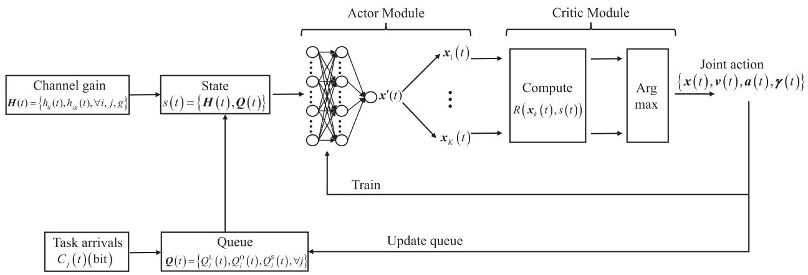

flowchart

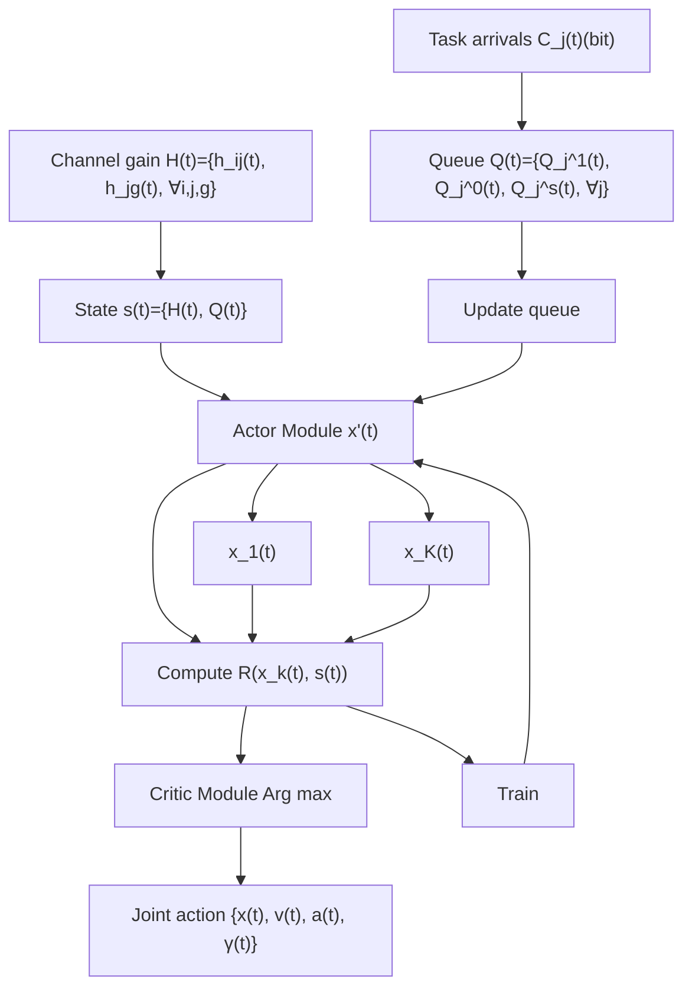

Fig. 2. The schematics of the proposed algorithm.

Algorithm 1 The Algorithm of JDL for Solving Problem   
Require: Initialize
    input: Parameters V, $N_{A}$ , T, $\delta_{t}$ , $D_{\min}$ , $v_{\max}$ , $v_{\min}$ , $a_{\max}$ , K
    output: Joint action $\{\boldsymbol{x}(t), \boldsymbol{v}(t), \boldsymbol{a}(t), \boldsymbol{\gamma}(t)\}$ Initialize actor network $\mu_{\theta}(s)$ with parameters $\theta^{\mu}(t)$ and empty replay memory D;
1: while each episode do
2: for $t = 1, 2, \ldots, T$ do
3: Obtain observations $s(t) = \{H(t), Q(t)\}$ ;
4: Generate ABS association decision action $\boldsymbol{x}'(t) \in [0, 1]^{I \times J}$ using (24);
5: Generate K feasible candidate ABS-GU association actions $\hat{\boldsymbol{x}}(t) = \{\boldsymbol{x}_{1}(t), \ldots, \boldsymbol{x}_{K}(t)\}$ using (25);
6: Compute $R(\boldsymbol{x}_{k}(t), \boldsymbol{s}(t))$ by optimizing task offloading ratio decision $\boldsymbol{\gamma}(t)$ and trajectory planning decision $\{\boldsymbol{v}(t), \boldsymbol{a}(t)\}$ in problem (P2) for each $\boldsymbol{x}_{k}(t)$ ;
7: Select the highest-reward ABS-GU association action $\boldsymbol{x}(t)$ using (26) and execute the joint action $\{\boldsymbol{x}(t), \boldsymbol{v}(t), \boldsymbol{a}(t), \boldsymbol{\gamma}(t)\}$ ;
8: Update the replay memory by adding $(\boldsymbol{s}(t), \boldsymbol{x}(t))$ ;
9: if Replay memory has exceeded halfway capacity then
10: Randomly select a batch of data samples from replay memory;
11: Train actor network and update $\theta^{\mu}(t)$ ;
12: end if
13: end for
14: end while

2) Task Offloading Ratio and Trajectory Planning Optimization: Given the value of ${ \pmb x } _ { k } ( t )$ , we can decouple the joint task offloading and trajectory planning problem to compute $R ( \pmb { x } _ { k } ( t ) , \pmb { s } ( t ) )$ .

Task Offloading Ratio Subproblem: Given values of $\{ { \pmb v } ( t ) , { \pmb a } ( t ) , { \pmb x } _ { k } ( t ) \}$ , computation task offloading ratio γ(t) can be obtained by minimizing the upper bound of (21), given by

$$
\begin{array}{l} (\mathrm{P} 2 - 1): \\ \min _ {\pmb {\gamma} ^ {(t)}} \sum_ {j = 1} ^ {J} \left[ \frac {1}{2} \gamma_ {j} (t) ^ {2} C _ {j} (t) ^ {2} + \frac {1}{2} \left(1 - \gamma_ {j} (t)\right) ^ {2} C _ {j} (t) ^ {2} \right. \\ + Q _ {j} ^ {L} (t) \left(1 - \gamma_ {j} (t)\right) C _ {j} (t) + Q _ {j} ^ {O} (t) \gamma_ {j} (t) C _ {j} (t) \\ - \left(1 - \gamma_ {j} (t)\right) C _ {j} (t) D _ {j} ^ {L} (t) \delta_ {t} \\ \left. - \sum_ {g = 1} ^ {G} \gamma_ {j} (t) C _ {j} (t) r _ {j g} (t) \delta_ {t} \right] \tag {28a} \\ \end{array}
$$

$$
\text { s.t. } \quad 0 \leq \gamma_ {j} (t) \leq 1, \forall j, t. \tag {28b}
$$

From (28a), we obverse that the computation task offloading ratios of all ABSs are independent. Hence, the task offloading ratios of different ABSs can be optimized separately. Accordingly, we obtain

$$
\gamma_ {j} (t) = \left\{ \begin{array}{l l} 0, & Q _ {j} ^ {O} (t) \geq Q _ {j} ^ {L} (t) + C _ {j} (t) \\ 1, & Q _ {j} ^ {L} (t) \geq Q _ {j} ^ {O} (t) + C _ {j} (t) \\ \frac {\phi_ {j}}{2 C _ {j} (t)}, & \text { otherwise } \end{array} \right. \tag {29}
$$

where $\phi _ { j } = Q _ { j } ^ { L } ( t ) + \sum _ { n = 1 } ^ { G } r _ { j } ( t ) \delta _ { t } - Q _ { j } ^ { O } ( t ) - C _ { j } ( t ) - D _ { j } ^ { L } ( t ) \delta _ { t }$ . g=1 In (29), $Q _ { j } ^ { o } ( t ) \geq Q _ { j } ^ { \bar { L } } ( t ) + C _ { j } ( t )$ indicates that the offloaded executed tasks queue is shorter than queue length of local executed tasks. In this case, computation task $Y _ { j } ( t )$ is computed on the ABS. Inequality $Q _ { j } ^ { L } ( t ) \geq Q _ { j } ^ { O } ( t ) + \bar { C } _ { j } ( t )$ indicates that computation task $Y _ { j } ( t ) ^ { ' }$ is computed on the MBS. When $Q _ { j } ^ { O } ( t ) - \overline { { \ u { U } } } _ { j } ( t ) < Q _ { j } ^ { L } ( t ) < Q _ { j } ^ { O } ( t ) + C _ { j } ( t )$ , computation task Yj (t) is allocated to the MBS with task offloading ratio ϕj2Cj(t) . $Y _ { j } ( t )$ $\frac { \phi _ { j } } { 2 C _ { j } ( t ) } .$

Trajectory Planning Subproblem: With given values of $\{ \gamma ( t ) , \pmb { x } _ { k } ( t ) \}$ , we optimize the ABS trajectories $\{ \pmb { v } _ { j } ( t ) , \pmb { a } _ { j } ( t ) \}$ and formulate the ABS trajectory planning subproblem as follows:

$$
\begin{array}{l} \text {(P2 - 2)}: \min _ {\boldsymbol {v} (t), \boldsymbol {a} (t)} \quad \sum_ {j = 1} ^ {J} \left[ Q _ {j} ^ {S} (t) Z _ {j} (t) - \sum_ {g = 1} ^ {G} Q _ {j} ^ {O} (t) r _ {j g} (t) \delta_ {t} \right. \\ \left. + \frac {1}{2} Z _ {j} (t) ^ {2} \right] + \sum_ {j = 1} ^ {J} V \left[ T _ {j} ^ {\mathrm{O}} (t) + T _ {j} ^ {S} (t) \right] \\ \end{array}
$$

$\begin{array} { r l } { \mathrm { s . t . } \quad } & { { } ( 1 a ) - ( 1 f ) , ( 1 6 b ) , ( 1 6 c ) . } \end{array}$ (30)

Problem (P2-2) is a non-convex problem due to the nonconvex constraints (1c), (1e), (16b), and (16c). To construct a solvable approximation, non-negative auxiliary parameters $s _ { j g } ( t )$ and $T _ { j } ( t )$ are introduced. Problem (P2-2) can be transformed to

$$
\begin{array}{l} \min _ {\boldsymbol {v} (t), \boldsymbol {a} (t), \{s _ {j g} (t) \}} \sum_ {j = 1} ^ {J} \sum_ {g = 1} ^ {G} \left[ \left(Q _ {j} ^ {S} (t) - Q _ {j} ^ {O} (t)\right) s _ {j g} (t) \delta_ {t} \right. \\ \left. + \frac {1}{2} \left(s _ {j g} (t) \delta_ {t}\right) ^ {2} \right] + \sum_ {j = 1} ^ {J} V T _ {j} (t) \tag {31a} \\ \end{array}
$$

$\begin{array} { r l } { \mathrm { s . t . } \ } & { { } s _ { j g } ( t ) \geq 0 , \ \forall j , g } \end{array}$ (31b)

$$
s _ {j g} (t) \leq r _ {j g} (t), \forall j, g \tag {31c}
$$

$$
\frac {Q _ {j} ^ {\mathrm{O}} (t)}{s _ {j g} (t)} + \frac {Q _ {j} ^ {\mathrm{S}} (t) \times L _ {j}}{f _ {j g} (t)} \leq T _ {j} (t), \forall j, g \tag {31d}
$$

$$
Q _ {j} ^ {\mathrm{O}} (t) + \gamma_ {j} (t) C _ {j} (t) \geq s _ {j g} (t) \delta_ {t}, \forall j
$$

$$
(1 a) - (1 f), (1 6 b), (1 6 c), (3 1 d) \tag {31e}
$$

where (31c) and (16c) are concave [37]. Two constrains, (16b) and (1e), are tackled by using slack variable $\eta _ { j } ( t )$ that satisfy

$$
E _ {j} ^ {f l} (t) \leq \delta_ {t} \left[ c _ {1} \| \boldsymbol {v} _ {j} (t) \| ^ {3} + \frac {c _ {2}}{\eta_ {j} (t)} \left(1 + \frac {\| \boldsymbol {a} (t) \| ^ {2}}{\alpha^ {2}}\right) \right] \tag {32}
$$

$$
\eta_ {j} (t) \geq v _ {\min}, \forall j, t \tag {33}
$$

$$
\left\| \boldsymbol {v} _ {j} (t) \right\| ^ {2} \geq \eta_ {j} ^ {2} (t), \forall j, t. \tag {34}
$$

It can be seen that (32) is convex, but (34) is a new non-convex constraint. To tackle this non-convex constraint, a local convex approximation is applied. Specifically, since $\| \boldsymbol { v } _ { j } ( t ) \| ^ { 2 }$ is a convex and differentiable function with respect to ${ \pmb v } _ { j } ( t )$ , for any local point ${ \pmb v } _ { j } ^ { ( r ) } ( t ) )$ obtained at the r-th iteration, we have

$$
\left\| \boldsymbol {v} _ {j} ^ {(r)} (t) \right\| ^ {2} + 2 (\boldsymbol {v} _ {j} ^ {(r)} (t)) ^ {T} (\boldsymbol {v} _ {j} (t) - \boldsymbol {v} _ {j} ^ {(r)} (t)) \geq \eta_ {j} ^ {2} (t), \forall j, t. \tag {35}
$$

It is obtained by the first-order Taylor expansion at the given points ${ \pmb v } _ { j } ^ { ( r ) } ( t )$ in the r-th iteration.

Considering the convexity of $\| l _ { j } ( t ) - l _ { w } ( t ) \| _ { 2 } ^ { 2 }$ , with ABS $\mathrm { A } _ { j }$ location $\boldsymbol { l } _ { j } ^ { ( r ) } ( t )$ and ABS $\mathrm { A } _ { w }$ location $\mathcal { l } _ { w } ^ { ( r ) } ( t )$ at the r-th iteration, we apply the SCA to reformulate (1c) to

$$
\begin{array}{l} D _ {\min} ^ {2} \leq \left(\left\| \boldsymbol {l} _ {j} ^ {(r)} (t) - \boldsymbol {l} _ {w} ^ {(r)} (t) \right\| _ {2} ^ {2} + 2 \left\| \boldsymbol {l} _ {j} ^ {(r)} (t) - \boldsymbol {l} _ {w} ^ {(r)} (t) \right\| _ {2}\right) \\ \times \left(\boldsymbol {l} _ {j} (t) - \boldsymbol {l} _ {j} ^ {(r)} (t) + \boldsymbol {l} _ {w} (t) - \boldsymbol {l} _ {w} ^ {(r)} (t)\right), \forall j \neq w. \tag {36} \\ \end{array}
$$

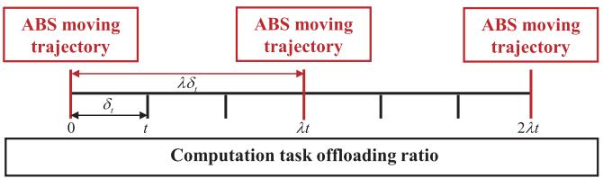

text_image

ABS moving trajectory
ABS moving trajectory
ABS moving trajectory
0 t λt λt 2λt
Computation task offloading ratio

Fig. 3. Timeline of the two-timescale mechanism.

By applying the SCA method at the given points $\begin{array} { r } { \left\| \dot { l } _ { j } ^ { ( r ) } ( t ) - l _ { g } ( t ) \right\| } \end{array}$ , constraint (31c) is converted to

$$
\begin{array}{l} s _ {j g} (t) \leq B \log_ {2} \left(1 + \frac {P G _ {0} G _ {2} \beta_ {0}}{N _ {0} \left\| \boldsymbol {l} _ {j} ^ {(r)} (t) - \boldsymbol {l} _ {g} (t) \right\| _ {2} ^ {2}}\right) \\ - \frac {\delta (t) B P G _ {0} G _ {2} \beta_ {0}}{N _ {0} \ln 2 \left\| \boldsymbol {l} _ {j} ^ {(r)} (t) - \boldsymbol {l} _ {g} (t) \right\| _ {2} ^ {2}} \\ \times \frac {1}{\left\| \boldsymbol {l} _ {j} ^ {(r)} (t) - \boldsymbol {l} _ {g} (t) \right\| _ {2} ^ {2} + \frac {P G _ {0} G _ {2} \beta_ {0}}{N _ {0}}} \\ \times \left(\left\| \boldsymbol {l} _ {j} ^ {(r)} (t) - \boldsymbol {l} _ {g} (t) \right\| _ {2} ^ {2} + \left\| \boldsymbol {l} _ {j} (t) - \boldsymbol {l} _ {g} (t) \right\| _ {2} ^ {2}\right). \tag {37} \\ \end{array}
$$

Based on the analysis above, problem (P2-2) is approximately transformed to

$$
\begin{array}{l} \text {(P2 - 2 - 1)} \min _ {\boldsymbol {v} (t), \boldsymbol {a} (t), \{s _ {j g} (t) \}} \sum_ {j = 1} ^ {J} \sum_ {g = 1} ^ {G} \left[ \left(Q _ {j} ^ {S} (t) - Q _ {j} ^ {O} (t)\right) s _ {j g} (t) \delta_ {t} \right. \\ \left. \left. + \frac {1}{2} \left(s _ {j g} (t) \delta_ {t}\right) ^ {2} \right] + \sum_ {j = 1} ^ {J} V T _ {j} (t) \right. \\ \end{array}
$$

$$
\text { s.t. } (1 a), (1 b), (1 d), (1 f), (1 6 c),
$$

$$
(3 1 b), (3 1 d), (3 1 e), (3 2), (3 3),
$$

$$
(3 5), (3 6), (3 7). \tag {38}
$$

Problem (P2-2) is a non-convex problem due to the nonconvex constraints (1c), (1e), (16b), and (16c). Constraint (1c) can be reformulated to (36), which is convex since it is linear with respect to $\boldsymbol { l } _ { j } ( t ) - \boldsymbol { l } _ { w } ( t )$ . By introducing slack variable $\eta _ { j } ( t )$ , constraints(1e) and (16b) can be rewritten as (32), (33), and (35), which are convex [49]. By using non-negative auxiliary parameters $s _ { j g } ( t )$ , (16c) can be rewritten as constraint (37), which is jointly convex of $\left\| l _ { j } ^ { ( r ) } ( t ) - l _ { g } ( t ) \right\|$ . Therefore, (P2-2-1) is a convex optimization problem, which can be solved effectively with standard convex optimization solvers such as CVX. Denote $t _ { m } = \lambda t$ , where $\lambda \geq 1$ is a constant. The ABS moving trajectory is determined at time slot $t _ { m } ,$ and the computation task offloading ratio is updated at time slot $t ,$ as shown in Fig. 3. Problem (P2-2-1) is a fractional minimization problem with a convex objective and convex constraints, which can be efficiently solved via the bisection method for fractional programming. Therefore, an efficient solution for problem (P2-2) can be achieved by successively updating the stationary point of problem (P2-2-1) at each iteration. We summarize the pseudo-code of the algorithm to solve task offloading ratio and trajectory planning problem in Algorithm 2. We consider a centralizedtraining-centralized-executing scheme to generate joint action $\{ \pmb { x } ( t ) , \pmb { v } ( t ) , \pmb { a } ( t ) , \pmb { \gamma } ( t ) \}$ of all ABSs. Therefore, we select an ABS as a central controller, while the subproblems are solved and the JDL is trained and executed. The training process is shown in Algorithm 1 and the execution process is shown in Algorithm 3.

Algorithm 2 The Algorithm for Optimizing Task Offloading Ratio and Trajectory Planning   
Require: Initialize   
input: ABS-GU association decision $\boldsymbol{x}_{k}(t)$ , $\boldsymbol{s}(t)$ , and iteration tolerance $\xi > 0$ ;
Initialize $\boldsymbol{l}^{(r)}(t)$ , $\boldsymbol{v}^{(r)}(t)$ , $R^{(r)}(\boldsymbol{x}_{k}(t), \boldsymbol{s}(t))$ , and iteration index r = 1;
1: repeat
2: Generate $\gamma^{*}(t)$ using (29);
3: Solve Problem (P2-2-1) with given $\{\gamma^{*}(t), \boldsymbol{x}_{k}(t)\}$ and obtain $\{\boldsymbol{v}^{*}(t), \boldsymbol{l}^{*}(t)\}$ $R^{*}(\boldsymbol{x}_{k}(t), \boldsymbol{s}(t))$ ;
4: Update $\boldsymbol{l}^{(r+1)}(t) = \boldsymbol{l}^{*}(t)$ $\boldsymbol{v}^{(r+1)}(t) = \boldsymbol{v}^{*}(t)$ and $R^{(r+1)}(\boldsymbol{x}_{k}(t), \boldsymbol{s}(t)) = R^{*}(\boldsymbol{x}_{k}(t), \boldsymbol{s}(t))$ ;
5: Update the iterative number $r = r + 1$ ;
6: until the stopping criterion $|R^{(r+1)}(\boldsymbol{x}_{k}(t), \boldsymbol{s}(t)) - R^{(r)}(\boldsymbol{x}_{k}(t), \boldsymbol{s}(t))| \leq \xi$ is met;
7: Obtain $\boldsymbol{v}^{*}(t)$ , $\boldsymbol{a}^{*}(t)$ , $\gamma^{*}(t)$ , and $R^{*}(\boldsymbol{x}_{k}(t), \boldsymbol{s}(t))$ .   
Algorithm 3 Execution Stage of JDL

Require: Initialize   
input: The weights of actor network and execution time T;
Output: Joint action $\{\boldsymbol{x}(t),\boldsymbol{v}(t),\boldsymbol{a}(t),\boldsymbol{\gamma}(t)\}$ ;
Initialize the task queue and locations of ABSs, MBSs, and GUs;
1: for $t = 1, 2, \ldots, T$ do
2: Obtain observations $s(t) = \{H(t), Q(t)\}$ ;
3: Execute ABS association decision action $\boldsymbol{x}'(t) \in [0, 1]^{I \times J}$ based on the weights of actor network;
4: Generate K feasible candidate ABS-GU association actions $\hat{\boldsymbol{x}}(t) = \{\boldsymbol{x}_1(t), \ldots, \boldsymbol{x}_K(t)\}$ using (25);
5: Compute $R(\boldsymbol{x}_k(t), \boldsymbol{s}(t))$ by optimizing task offloading ratio decision $\boldsymbol{\gamma}(t)$ and trajectory planning decision $\{\boldsymbol{v}(t), \boldsymbol{a}(t)\}$ in problem (P2) for each $\boldsymbol{x}_k(t)$ ;
6: Select the highest-reward ABS-GU association action $\boldsymbol{x}(t)$ using (26) and execute the joint action $\{\boldsymbol{x}(t), \boldsymbol{v}(t), \boldsymbol{a}(t), \boldsymbol{\gamma}(t)\}$ ;
7: end for

# C. Convergence and Complexity Analysis

Convergence Analysis: The proposed JDL algorithm contains inner and outer structures. The outer structure is a Lyapunov-based optimization framework that transforms the long-term stochastic MINLP into a series of short-term deterministic MINLP problems. The inner structure is an integration of model-based optimization and model-free DRL based on the actor-critic structure that is used to solve each deterministic MINLP problem. Hence, the convergence and complexity of the JDL mainly depend on the inner structure. The MINLP problem is decoupled into the ABS-GU association subproblem, ABS trajectory planning subproblem, and task offloading subproblem. The ABS-GU association subproblem is optimized in the actor module, and the ABS trajectory planning subproblem and task offloading subproblem are optimized in the critic module. In JDL, the outputs of ABS-GU association subproblem serve as the inputs of task offloading subproblem, and the outputs of task offloading subproblem serve as the inputs of ABS trajectory planning subproblem. The objective value is guaranteed to be nonincreasing in consecutive iterations. Hence, the proposed JDL converges [39], [50].

Complexity Analysis: The computation complexity of JDL mainly stems from the ABS-GU association optimization and ABS trajectory planning optimization. For ABS-GU association optimization, we use a fully-connected DNN to process the input state and generate a set of candidate ABS-GU association actions. The dimension of input layer is $3 J + ( I + G ) J$ and the dimension of output layer is IJ . Let $\rho$ denote the number of hidden layers of the DNN and Φ denote the number of neurons in each hidden layer. The complexity for optimizing ABS-GU association is $O \left( \left( 3 J + I J + G J \right) \times I J \times \rho \varPhi \right)$ . The computation complexity of solving ABS trajectory planning optimization problem (P2-2-1) mainly depends on the second-order cone (SOC) constraints in (1d), (1f), (32), (35), (36), and (37) [37]. Specifically, problem (P2-2-1) involves $4 J + J ^ { 2 } \ S O C$ constraints of dimension 3, JG SOC constraints of size 4, and $J ^ { 2 } + 3 J$ optimization variables [16], [51]. Therefore, the complexity of solving problem (P2-2-1) is roughly expressed as $\sqrt { 2 \left( 4 J + J ^ { 2 } + J G \right) } \left( J ^ { 2 } + 3 J \right) \left( 9 \left( 4 J + \overline { { J ^ { 2 } } } \right) \right) + 1 6 J G +$ ${ ( { J ^ { 2 } + 3 J } ) ^ { 2 } } ) , { \mathrm { i . e . , } O ( { \sqrt { 2 } J ^ { 7 } } ) \ [ 5 2 ] }$ .

# VI. EXPERIMENTAL RESULTS

In this section, we evaluate the performance of the proposed joint DRL and Lyapunov optimization (JDL) algorithm. We deploy J = 10 ABSs and I = 120 GUs in a square area of 3000m×3000m. We consider that an MBS is damaged with a certain probability after encountering disasters at the beginning of each cycle. This probability is contingent upon the severity of the disaster, which is set as 0.5 in the simulations. In the post-disaster scene, the surviving ground users are gathered in several safe areas. Accordingly, the GU distribution is obtained through a Poisson cluster process at the beginning of each cycle [10]. Setting G = 2 MBSs help execute tasks offloaded by ABSs and the flight altitude of ABS is 200m. Note that, one ABS offloaded task to one MBS in each time slot, and CPU frequency $f _ { g } \left( t \right)$ of MBS $\mathrm { M } _ { g }$ is evenly allocated for computing offloaded sub-task of ABSs in area $S _ { g } .$ . The remaining parameters are given in Table II.

We consider a fully connected DNN consisting of one input layer, three hidden layers, and one output layer, where the number of neurons in each layer are set to 400, 300, and 100, respectively. The learning rate is 0.001, the batch size is 128, the replay buffer size is 30000, the activation function is ReLu, and the Adam optimizer is used.

TABLE II SIMULATION PARAMETERS 

<table><tr><td>Parameters</td><td>Values</td></tr><tr><td>Entire task period N</td><td>50s</td></tr><tr><td>Time interval δt</td><td>0.5s</td></tr><tr><td>Constant λ</td><td>4</td></tr><tr><td>Bandwidth B</td><td>5MHz</td></tr><tr><td>Maximum speed of each ABS vmax</td><td>20m/s</td></tr><tr><td>Minimum speed of each ABS vmin</td><td>3m/s</td></tr><tr><td>Maximum acceleration of each ABS amin</td><td>5m/s2</td></tr><tr><td>Minimum secure distance Dmin</td><td>10m</td></tr><tr><td>ABS maximum available energy Emax</td><td>4J</td></tr><tr><td>Channel power gain β0</td><td>-21dBm [53]</td></tr><tr><td>Directional antenna gain of ABS G0</td><td>9dBi [53]</td></tr><tr><td>Directional antenna gain of GU G1</td><td>9dBi [53]</td></tr><tr><td>Directional antenna gain of MBS G2</td><td>9dBi [53]</td></tr><tr><td>Noise power N0</td><td>-169dBm/Hz</td></tr><tr><td>CPU frequency of ABS fj(t)</td><td>1GHz [39]</td></tr><tr><td>CPU frequency of MBS fg(t)</td><td>20GHz [54]</td></tr><tr><td>Required CPU cycles per bit Lj</td><td>1000 cycles/bit [39]</td></tr><tr><td>Parameter related to ABS c1</td><td>9.26 × 10-4[37]</td></tr><tr><td>Parameter related to ABS c2</td><td>2250 [37]</td></tr><tr><td>Acceleration of gravity α</td><td>9.8m/s2[37]</td></tr></table>

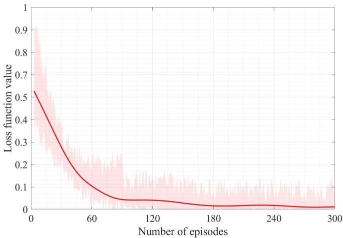

line

| Number of episodes | Loss function value |
| ------------------ | ------------------- |
| 0                  | 0.5                 |
| 60                 | 0.1                 |
| 120                | 0.05                |
| 180                | 0.03                |
| 240                | 0.02                |
| 300                | 0.01                |

Fig. 4. The loss function value versus the number of episodes of the JDL algorithm.

To show the effectiveness of the proposed algorithms, we consider the following benchmark algorithms for comparison.

SDQN: In [18], the authors propose a separated Q-network algorithm to jointly make optimal computation offloading decisions and trajectory planning for multi-UAV cooperative target search in an emergency network.

DTP-JDL: In [55], the authors propose a DRL-based trajectory planning method (DTP) to optimize the UAV trajectory in the UAV-assisted a post-disaster urban area with multiple mobile GUs for resilience scenario. We use the methods in JDL to optimize ABS-GU association and task offloading.

The loss function values during the training process are shown in Fig. 4. We have set multiple initialization values of DNN to obtain multiple loss function values during the training process. The red curve represents the average of loss function values, and the pink shadow indicates the range between the maximum and minimum loss function values. It can be seen that the loss function value of JDL gradually converges as the number of episodes increases. Specifically, the achieved loss function value is less than 0.05 when the number of episodes exceeds 60.

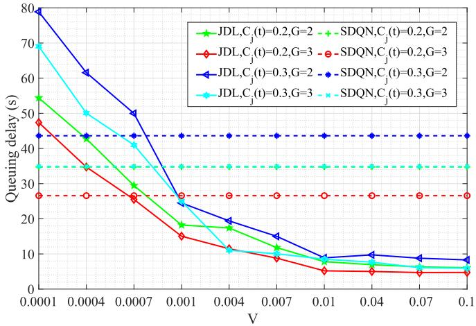

line

| V       | JDL,Cj(t)=0.2,G=2 | SDQN,Cj(t)=0.2,G=2 | JDL,Cj(t)=0.2,G=3 | SDQN,Cj(t)=0.2,G=3 | JDL,Cj(t)=0.3,G=2 | SDQN,Cj(t)=0.3,G=2 | JDL,Cj(t)=0.3,G=3 | SDQN,Cj(t)=0.3,G=3 |
| ------- | ----------------- | ------------------ | ----------------- | ------------------ | ----------------- | ------------------ | ----------------- | ------------------ |
| 0.0001  | 55                | 70                 | 48                | 35                 | 80                | 45                 | 70                | 35                 |
| 0.0004  | 45                | 60                 | 35                | 35                 | 65                | 45                 | 55                | 35                 |
| 0.0007  | 30                | 50                 | 25                | 35                 | 50                | 45                 | 45                | 35                 |
| 0.001   | 18                | 25                 | 15                | 35                 | 25                | 45                 | 25                | 35                 |
| 0.004   | 12                | 15                 | 10                | 35                 | 18                | 45                 | 12                | 35                 |
| 0.007   | 8                 | 12                 | 8                 | 35                 | 15                | 45                 | 8                 | 35                 |
| 0.01    | 6                 | 10                 | 6                 | 35                 | 10                | 45                 | 6                 | 35                 |
| 0.04    | 6                 | 8                  | 6                 | 35                 | 10                | 45                 | 6                 | 35                 |
| 0.07    | 6                 | 8                  | 6                 | 35                 | 8                 | 45                 | 6                 | 35                 |
| 0.1     | 6                 | 8                  | 6                 | 35                 | 8                 | 45                 | 6                 | 35                 |

Fig. 5. Queuing delay of objective function versus parameter V .

The queuing delay is shown in Fig. 5. With the increase of V , the queuing delay decreases and converges, since the increasing value of V identifies the weight of queuing delay increasing in the objective function. Given parameter V , the queuing delay increases with the growth of computation task data size and the decrease in the number of MBSs. This phenomenon can be ascribed to the fact that a higher data size of computation task and a fewer number of MBSs result in an increase in the computation queuing delay of offloaded sub-tasks at the MBS, which leads to an increase in queuing delay. From Fig. 5, the queuing delay of JDL is smaller than SDQN since the critic module in JDL evaluates the ABS-GU association action by analytically solving the optimal task offloading and trajectory planning problem. Compared to the conventional actor-critic structure that uses a model-free DNN in the critic module, the proposed approach takes advantage of the model-based method to acquire an accurate evaluation of the action.

The comparisons of the queuing delay with different input data sizes $C _ { j } ( t )$ are shown in Fig. 6 at $J = 1 0 , G = 2 ,$ and $V ~ = ~ 0 . 0 1$ . The JDL-Cir method means the trajectory planning of JDL using circular trajectory and the JDL-Ave means computation task offloading ratio ${ \gamma } _ { j } \left( t \right) = 0 . 5 , \ \forall j , t .$ . With the increase of computation task data size, the queuing delay increases. The task offloading ratio decreases with the increase of input data size $C _ { j } ( t )$ , leading to the growth of local computation task queue $Q _ { j } ^ { L } ( t )$ , thereby increasing the queue delay.

The comparisons of the queuing delay with different numbers of ABSs are shown in Fig. 7 at $C _ { j } ( t ) = 0 . 2 \mathrm { M b } , G = 2 .$ , and $V = 0 . 0 1$ . It is evident that the queuing delay increases proportionally with the growth in the number of ABSs under the specified parameter. The increase in the number of ABSs leads to an increase in offloaded sub-task data size, resulting in an increase in the computation queuing delay at the MBSs. Consequently, the higher number of ABSs leads to a noticeable increase in the queuing delay. Moreover, the DQN-based algorithms fail to obtain the ABS-GU association decision when $J = 2 0$ , since the action space of DQN needs to include $2 ^ { 2 0 }$ possible and available ABS association decisions to choose from. This is computationally infeasible.

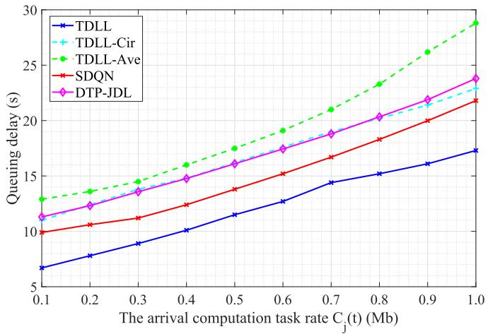

line

| The arrival computation task rate C_j(t) (Mb) | TDLL  | TDLL-Cir | TDLL-Ave | SDQN  | DTP-JDL |
| --------------------------------------------- | ----- | -------- | -------- | ----- | ------- |
| 0.1                                           | 6.5   | 11.0     | 12.5     | 10.0  | 11.5    |
| 0.2                                           | 7.5   | 12.0     | 13.5     | 10.5  | 12.5    |
| 0.3                                           | 8.5   | 13.0     | 14.5     | 11.0  | 13.5    |
| 0.4                                           | 9.5   | 14.0     | 15.5     | 12.0  | 14.5    |
| 0.5                                           | 10.5  | 15.0     | 16.5     | 13.0  | 15.5    |
| 0.6                                           | 11.5  | 16.0     | 17.5     | 14.0  | 16.5    |
| 0.7                                           | 12.5  | 17.0     | 18.5     | 15.0  | 17.5    |
| 0.8                                           | 13.5  | 18.0     | 19.5     | 16.0  | 18.5    |
| 0.9                                           | 14.5  | 19.0     | 20.5     | 17.0  | 19.5    |
| 1.0                                           | 15.5  | 20.0     | 21.5     | 18.0  | 20.5    |

Fig. 6. Queuing delay versus input data size of computation task $C _ { j } ( t )$ .

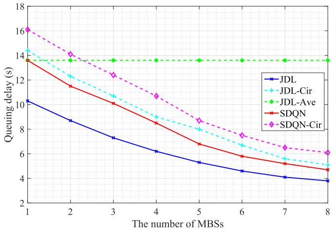

line

| The number of MBSs | JDL   | JDL-Cir | JDL-Ave | SDQN  | SDQN-Cir |
| ------------------ | ----- | ------- | ------- | ----- | -------- |
| 1                  | 10.5  | 14.2    | 13.8    | 13.7  | 16.2     |
| 2                  | 8.8   | 12.5    | 13.8    | 11.5  | 14.0     |
| 3                  | 7.5   | 10.8    | 13.8    | 10.2  | 12.5     |
| 4                  | 6.2   | 9.0     | 13.8    | 8.5   | 10.8     |
| 5                  | 5.2   | 7.5     | 13.8    | 6.8   | 8.8      |
| 6                  | 4.5   | 6.5     | 13.8    | 5.8   | 7.5      |
| 7                  | 4.0   | 5.5     | 13.8    | 5.0   | 6.5      |
| 8                  | 3.8   | 5.0     | 13.8    | 4.5   | 6.0      |

Fig. 8. Queuing delay versus the numbers of MBSs.

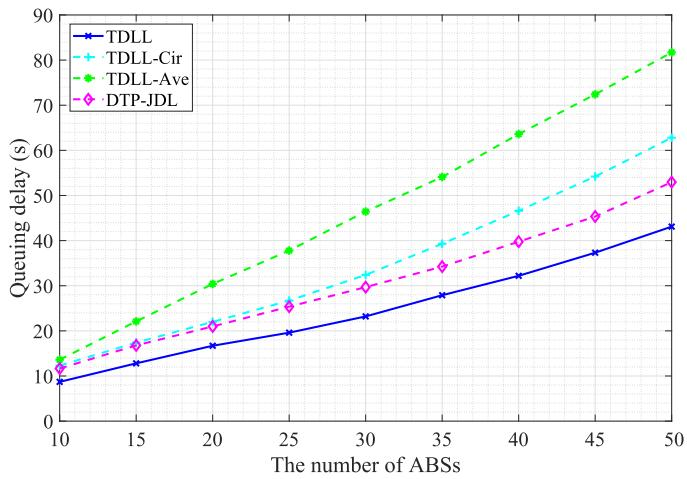

line

| The number of ABSs | TDLL  | TDLL-Cir | TDLL-Ave | DTP-JDL |
| ------------------ | ----- | -------- | -------- | ------- |
| 10                 | 10    | 12       | 14       | 11      |
| 15                 | 13    | 16       | 22       | 17      |
| 20                 | 16    | 20       | 30       | 21      |
| 25                 | 19    | 24       | 38       | 25      |
| 30                 | 22    | 28       | 46       | 29      |
| 35                 | 26    | 32       | 54       | 34      |
| 40                 | 30    | 36       | 62       | 39      |
| 45                 | 34    | 40       | 70       | 44      |
| 50                 | 38    | 44       | 78       | 49      |

Fig. 7. Queuing delay versus the number of ABSs.

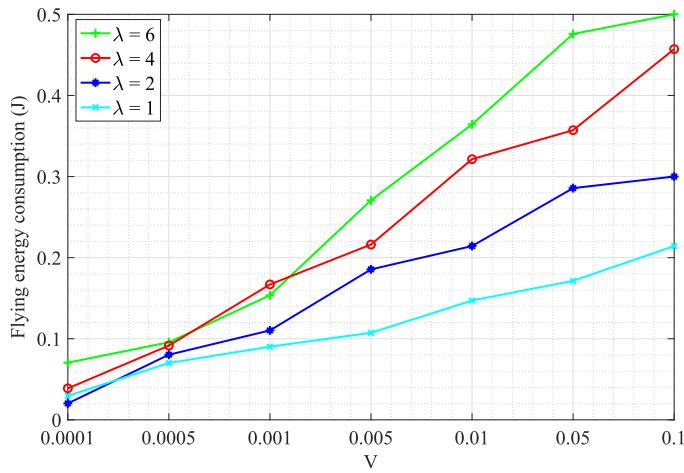

line

| V      | λ = 6  | λ = 4  | λ = 2  | λ = 1  |
| ------ | ------ | ------ | ------ | ------ |
| 0.0001 | 0.07   | 0.04   | 0.02   | 0.03   |
| 0.0005 | 0.10   | 0.10   | 0.08   | 0.07   |
| 0.001  | 0.15   | 0.17   | 0.11   | 0.09   |
| 0.005  | 0.27   | 0.22   | 0.19   | 0.11   |
| 0.01   | 0.37   | 0.32   | 0.22   | 0.15   |
| 0.05   | 0.48   | 0.36   | 0.29   | 0.17   |
| 0.1    | 0.50   | 0.46   | 0.30   | 0.22   |

Fig. 9. Flying energy consumption versus parameter V with different time scales.

The comparisons of the queuing delay with the different numbers of MBSs are shown in Fig. 8 at $C _ { j } ( t ) = 0 . 2 \mathrm { M b } ,$ $J = 1 0 .$ , and $V = 0 . 0 1$ . As the number of MBSs increases, there is a decrease in the queuing delay. With an increase in the number of MBSs, the task computing capability of all MBSs is enhanced, leading to a decrease in queuing delay $T _ { j } ^ { S } ( t )$ . Meanwhile, the reduction in queuing delay of JDL gradually slows down as the number of MBSs increases. The reason is that the offloaded task from ABS to MBS is limited with limited maximum communication power.

Fig. 9 and Fig. 10 show the flying energy consumption and queuing delay, respectively, with different time-scales at $C _ { j } ( t ) ~ = ~ 0 . 2 \mathrm { M b } ,$ , $J ~ = ~ 1 0$ , and $G \ = \ 2$ . From Fig. 9, the flying energy consumption is influenced by the time scale. When parameter V is smaller, the flying energy consumption increases with the increase in the time scale. Since the trajectory of ABS is not optimized in each time slot. Fig. 10 shows that the time scale has an impact on the queuing delay. As the time scale increases, the queuing delay also increases. With a larger time scale, the intervals for trajectory optimization become larger, leading to a greater deviation between the ABS’s trajectory and the optimal trajectory. Consequently, this results in an increase in the queuing delay.

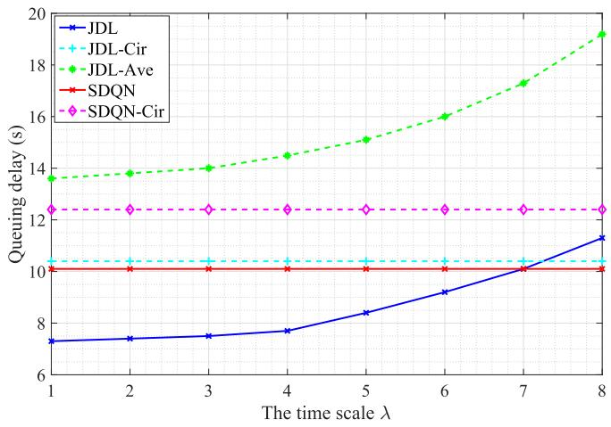

line

| The time scale λ | JDL   | JDL-Cir | JDL-Ave | SDQN  | SDQN-Cir |
| ---------------- | ----- | ------- | ------- | ----- | -------- |
| 1                | 7.3   | 10.2    | 13.7    | 10.0  | 12.5     |
| 2                | 7.4   | 10.2    | 13.9    | 10.0  | 12.5     |
| 3                | 7.5   | 10.2    | 14.0    | 10.0  | 12.5     |
| 4                | 7.7   | 10.2    | 14.5    | 10.0  | 12.5     |
| 5                | 8.3   | 10.2    | 15.0    | 10.0  | 12.5     |
| 6                | 9.2   | 10.2    | 16.0    | 10.0  | 12.5     |
| 7                | 10.0  | 10.2    | 17.5    | 10.0  | 12.5     |
| 8                | 11.2  | 10.2    | 19.2    | 10.0  | 12.5     |

Fig. 10. Queuing delay versus time scales.

Fig. 11 shows the average queuing length at ABSs and MBSs in a cycle at $C _ { j } ( t ) = 0 . 5 \mathrm { M b } , J = 1 0 $ , and $G = 2 \AA$ . The average queuing length at both ABSs and MBSs increases during the initialization phase and then gradually stabilizes, indicating the queue stability achieved by the JDL solution. Since the corresponding processing rate of MBS is faster than that of ABS, the task offloading ratio of ABS is large. Therefore, the average queuing length at MBS is longer than the average queuing length at ABS.

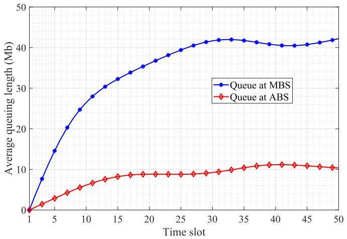

line

| Time slot | Queue at MBS | Queue at ABS |
| --------- | ------------ | ------------ |
| 1         | 0            | 0            |
| 5         | 15           | 3            |
| 10        | 28           | 6            |
| 15        | 33           | 8            |
| 20        | 37           | 9            |
| 25        | 40           | 9            |
| 30        | 42           | 10           |
| 35        | 42           | 11           |
| 40        | 41           | 11           |
| 45        | 41           | 11           |
| 50        | 42           | 11           |

Fig. 11. Average queuing length at ABSs and MBSs.

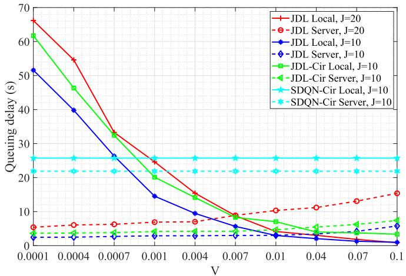

line

| V       | JDL Local, J=20 | JDL Server, J=20 | JDL Local, J=10 | JDL Server, J=10 | JDL-Cir Local, J=10 | JDL-Cir Server, J=10 | SDQN-Cir Local, J=10 | SDQN-Cir Server, J=10 |
| ------- | --------------- | ---------------- | --------------- | ---------------- | ------------------- | -------------------- | -------------------- | --------------------- |
| 0.0001  | 67              | 5                | 52              | 3                | 62                  | 4                    | 25                   | 22                    |
| 0.0004  | 55              | 6                | 40              | 3                | 47                  | 4                    | 25                   | 22                    |
| 0.0007  | 33              | 6                | 27              | 3                | 33                  | 4                    | 25                   | 22                    |
| 0.001   | 25              | 7                | 15              | 3                | 21                  | 4                    | 25                   | 22                    |
| 0.004   | 16              | 8                | 9               | 3                | 14                  | 4                    | 25                   | 22                    |
| 0.007   | 9               | 9                | 6               | 3                | 8                   | 4                    | 25                   | 22                    |
| 0.01    | 6               | 10               | 4               | 3                | 6                   | 4                    | 25                   | 22                    |
| 0.04    | 3               | 11               | 2               | 3                | 4                   | 4                    | 25                   | 22                    |
| 0.07    | 1               | 13               | 1               | 4                | 3                   | 5                    | 25                   | 22                    |
| 0.1     | 1               | 15               | 1               | 5                | 3                   | 6                    | 25                   | 22                    |

Fig. 13. Queuing delay at ABS and MBS versus parameter V .

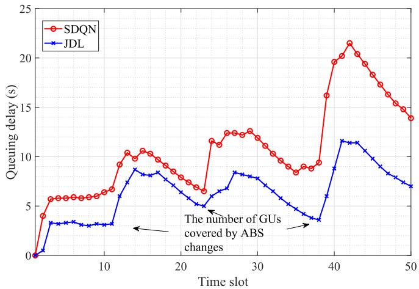

line

| Time slot | SDQN | JDL |
| --------- | ---- | --- |
| 0         | 0    | 0   |
| 5         | 6    | 3   |
| 10        | 7    | 3   |
| 15        | 10   | 9   |
| 20        | 8    | 7   |
| 25        | 12   | 8   |
| 30        | 13   | 7   |
| 35        | 9    | 4   |
| 40        | 21   | 12  |
| 45        | 18   | 10  |
| 50        | 14   | 7   |

Fig. 12. Queuing delay between SDQN and JDL.

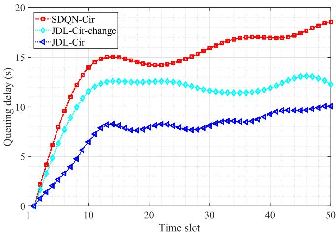

line

| Time slot | SDQN-Cir | JDL-Cir-change | JDL-Cir |
| --------- | -------- | -------------- | ------- |
| 1         | 0        | 0              | 0       |
| 5         | 8        | 6              | 4       |
| 10        | 14       | 12             | 7       |
| 15        | 15       | 13             | 8       |
| 20        | 14       | 12             | 8       |
| 25        | 15       | 12             | 8       |
| 30        | 16       | 12             | 9       |
| 35        | 17       | 12             | 9       |
| 40        | 17       | 13             | 10      |
| 45        | 18       | 13             | 10      |
| 50        | 19       | 12             | 10      |

Fig. 14. Queuing delay versus environment changes.

Fig. 12 shows the queuing delay between SDQN and JDL in a cycle. The queuing delay initially increases during the initialization phase and then stabilizes within a certain range. When the number of GUs covered by ABS changes, the queuing delay increases initially as the ABSs need to adjust the association strategy and plan new trajectory paths. Then, the queuing delay gradually decreases as the ABS-GU association, task offloading, and trajectory planning decisions gradually adjust. Compared to SDQN, the JDL combines model-based and DRL-based approaches, which can obtain ABS-GU association decisions by mapping Actor module output ${ \pmb x } ^ { \prime } ( t )$ to generated action set $\mathcal { F } \left( t \right)$ . Therefore, the JDL reduces the impact of the number of GUs associated with ABS on the model structure.

Fig. 13 shows the queuing delay at ABS and MBS with different methods at $C _ { j } ( t ) = 0 . 2 \mathrm { M b }$ and $G = 2 .$ . We consider the circular trajectory scheme as the benchmark, where the ABS moves around a circle within a cycle, with a radius of 2.5 km. The results in Fig. 13 show that the trajectory planning of JDL can reduce the queuing delay compared to the circular trajectory. Since the trajectory planning of ABS can shorten the distance between ABS and GU, and ABS and MBS, increase the task offloading transmission rate to reduce transmission. More portions of computation task data sizes $C _ { j } ^ { \mathrm { O } } ( t )$ can be offloaded to MBS to reduce queuing delay.

To demonstrate JDL’s capability on making real-time decisions based on fast model inference as the environment changes, we use the actual measured channel information in two scenarios [56]. The flight altitude and hover radius in the first and second scenarios are $( 2 . 5 \mathrm { k m } , 2 . 0 \mathrm { k m } )$ , and (2.7km, 2.5km), respectively. Fig. 14 shows the queuing delay in a cycle at $C _ { j } ( t ) = 0 . 3 \mathrm { M b }$ and $G = 3$ as the environment changes. We train JDL-Cir-change model in the first scenario and then use it for execution in the second scenario. It can be seen that JDL-Cir-change effectively reduces the queuing delay compared to SDQN-Cir. The JDL-Cir is regarded as a benchmark, which is trained and executed in the second scenario.

Some real-time applications, such as real-time status monitoring based on channel state information (CSI), have a higher demand for accuracy in CSI. To show the application of JDL can assist such delay-sensitive applications by minimizing queuing delay, we use the actual measurement data of correlation duration in [56]. The correlation duration is defined as the correlation coefficient between measured and outdated CSI is greater than a correlation coefficient threshold. Note that the queuing delay of ABS represents the delay when the CSI becomes outdated after the ABS completing task computation. If the queuing delay is shorter, the accuracy of the CSI for each ABS is higher. Conversely, if the queuing delay is longer, the accuracy of the CSI for each ABS is lower. In particular, CSI accuracy is manifested by the correlation coefficients of the channels. Compared to the queuing delay and correlation duration, we can obtain the CSI accuracy of each ABS. From Fig. 15, the JDL-Cir can minimize queuing delay with a high correlation coefficient compared with SDQN-Cir. Moreover, we test the performance of JDL-Cir in Fig. 16 under the parameter conditions where the height is 2500 meters and the radius is 2000 meters. Therefore, our proposed JDL can assist in real-time status monitoring based on CSI.

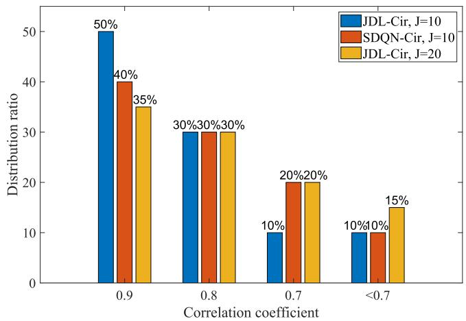

bar

| Correlation coefficient | JDL-Cir, J=10 (%) | SDQN-Cir, J=10 (%) | JDL-Cir, J=20 (%) |
| :--- | :--- | :--- | :--- |
| 0.9 | 50 | 40 | 35 |
| 0.8 | 30 | 30 | 30 |
| 0.7 | 10 | 20 | 20 |
| <0.7 | 10 | 10 | 15 |

Fig. 15. Real-time application performance with different methods when the height is 2700 meters and the radius is 2500 meters.

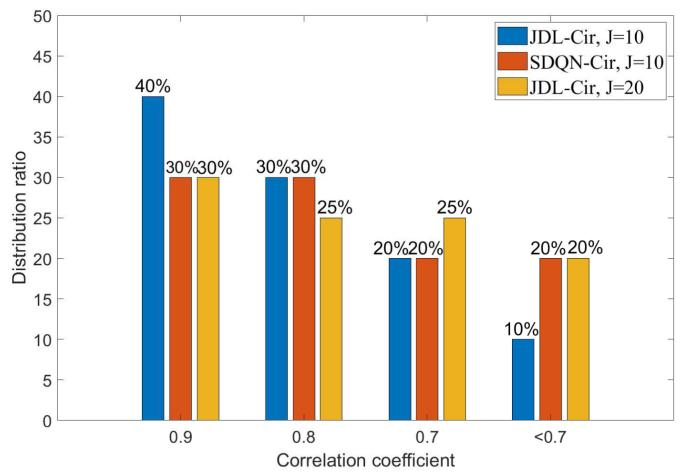

bar

| Correlation coefficient | JDL-Cir, J=10 (%) | SDQN-Cir, J=10 (%) | JDL-Cir, J=20 (%) |
| :--- | :--- | :--- | :--- |
| 0.9 | 40 | 30 | 30 |
| 0.8 | 30 | 30 | 25 |
| 0.7 | 20 | 20 | 25 |
| <0.7 | 10 | 20 | 20 |

Fig. 16. Real-time application performance with different methods when the height is 2500 meters and the radius is 2000 meters.

# VII. CONCLUSION

In this paper, we have presented a model for a joint ABS-GU association, ABS trajectory planning, and task offloading optimization problem in the ABS-assisted post-disaster rescue system, which is formulated as a stochastic MINLP. To minimize task computation queuing delay and ensure the GU communication rate, the MINLP minimization problem has been solved by integrating Lyapunov optimization and DRL based on actor-critic structure. Our research results provide valuable insights on joint ABS-GU association, ABS trajectory, and task offloading ratio design for computing rescue-related tasks and providing communication services to GUs. For future work, considering the uncertainty of user mobility and the time-variant ABS computation demand, we will investigate online resource management in an ABSassisted post-disaster rescue system with wireless channel dynamics.

# REFERENCES

[1] N. Zhao et al., “UAV-assisted emergency networks in disasters,” IEEE Wireless Commun., vol. 26, no. 1, pp. 45–51, Feb. 2019.   
[2] Y. Wang et al., “Task offloading for post-disaster rescue in unmanned aerial vehicles networks,” IEEE/ACM Trans. Netw., vol. 30, no. 4, pp. 1525–1539, Aug. 2022.   
[3] J. Zhang et al., “Computation-efficient offloading and trajectory scheduling for multi-UAV assisted mobile edge computing,” IEEE Trans. Veh. Technol., vol. 69, no. 2, pp. 2114–2125, Feb. 2020.   
[4] Z. Cheng, Z. Gao, M. Liwang, L. Huang, X. Du, and M. Guizani, “Intelligent task offloading and energy allocation in the UAV-aided mobile edge-cloud continuum,” IEEE Netw., vol. 35, no. 5, pp. 42–49, Sep. 2021.   
[5] Y. Xu, T. Zhang, J. Loo, D. Yang, and L. Xiao, “Completion time minimization for UAV-assisted mobile-edge computing systems,” IEEE Trans. Veh. Techol., vol. 70, no. 11, pp. 12253–12259, Nov. 2021.   
[6] X. Huang, X. Yang, Q. Chen, and J. Zhang, “Task offloading optimization for UAV-assisted fog-enabled Internet of Things networks,” IEEE Internet Things J., vol. 9, no. 2, pp. 1082–1094, Jan. 2022.   
[7] P. A. Apostolopoulos, G. Fragkos, E. E. Tsiropoulou, and S. Papavassiliou, “Data offloading in UAV-assisted multi-access edge computing systems under resource uncertainty,” IEEE Trans. Mobile Comput., vol. 22, no. 1, pp. 175–190, Mar. 2023.   
[8] W. Zhuang, Q. Ye, F. Lyu, N. Cheng, and J. Ren, “SDN/NFV-empowered future IoV with enhanced communication, computing, and caching,” Proc. IEEE, vol. 108, no. 2, pp. 274–291, Feb. 2020.   
[9] W. Chen, Z. Su, Q. Xu, T. H. Luan, and R. Li, “VFC-based cooperative UAV computation task offloading for post-disaster rescue,” in Proc. IEEE Conf. Comput. Commun., Toronto, ON, Canada, Jul. 2020, pp. 228–236.   
[10] J. Sun and C. Masouros, “Deployment strategies of multiple aerial BSs for user coverage and power efficiency maximization,” IEEE Trans. Commun., vol. 67, no. 4, pp. 2981–2994, Apr. 2019.   
[11] G. Yang, R. Dai, and Y. Liang, “Energy-efficient UAV backscatter communication with joint trajectory design and resource optimization,” IEEE Trans. Wireless Commun., vol. 20, no. 2, pp. 926–941, Feb. 2021.   
[12] H. Wu, J. Chen, T. Nguyen, and H. Tang, “Lyapunov-guided delayaware energy efficient offloading in IIoT-MEC systems,” IEEE Trans. Ind. Informat., vol. 19, no. 2, pp. 2117–2128, Feb. 2023.   
[13] S. Bi, L. Huang, H. Wang, and Y.-J. A. Zhang, “Lyapunov-guided deep reinforcement learning for stable online computation offloading in mobile-edge computing networks,” IEEE Trans. Wireless Commun., vol. 20, no. 11, pp. 7519–7537, Nov. 2021.   
[14] F. Sun, Z. Zhang, X. Chang, and K. Zhu, “Towards heterogeneous environment: Lyapunov-orientated ImpHetero reinforcement learning for task offloading,” IEEE Trans. Netw. Service Manage., vol. 20, no. 2, pp. 1572–1586, Apr. 2023.   
[15] X. Chen, Y. Cai, Q. Shi, M. Zhao, B. Champagne, and L. Hanzo, “Efficient resource allocation for relay-assisted computation offloading in mobile-edge computing,” IEEE Internet Things J., vol. 7, no. 3, pp. 2452–2468, Mar. 2020.   
[16] Q. Hu, Y. Cai, G. Yu, Z. Qin, M. Zhao, and G. Y. Li, “Joint offloading and trajectory design for UAV-enabled mobile edge computing systems,” IEEE Internet Things J., vol. 6, no. 2, pp. 1879–1892, Apr. 2019.

[17] G. Lee, W. Saad, and M. Bennis, “An online optimization framework for distributed fog network formation with minimal latency,” IEEE Trans. Wireless Commun., vol. 18, no. 4, pp. 2244–2258, Apr. 2019.   
[18] Q. Luo, T. H. Luan, W. Shi, and P. Fan, “Deep reinforcement learning based computation offloading and trajectory planning for multi-UAV cooperative target search,” IEEE J. Sel. Areas Commun., vol. 41, no. 2, pp. 504–520, Feb. 2023.   
[19] D. Han et al., “Two-timescale learning-based task offloading for remote IoT in integrated satellite–terrestrial networks,” IEEE Internet Things J., vol. 10, no. 12, pp. 10131–10145, Jun. 2023.   
[20] L. Huang, S. Bi, and Y.-J. A. Zhang, “Deep reinforcement learning for online computation offloading in wireless powered mobile-edge computing networks,” IEEE Trans. Mobile Comput., vol. 19, no. 11, pp. 2581–2593, Nov. 2020.   
[21] W. Wu et al., “Dynamic RAN slicing for service-oriented vehicular networks via constrained learning,” IEEE J. Sel. Areas Commun., vol. 39, no. 7, pp. 2076–2089, Jul. 2021.   
[22] R. Dong, C. She, W. Hardjawana, Y. Li, and B. Vucetic, “Deep learning for hybrid 5G services in mobile edge computing systems: Learn from a digital twin,” IEEE Trans. Wireless Commun., vol. 18, no. 10, pp. 4692–4707, Oct. 2019.   
[23] Q. Ye, W. Shi, K. Qu, H. He, W. Zhuang, and X. Shen, “Joint RAN slicing and computation offloading for autonomous vehicular networks: A learning-assisted hierarchical approach,” IEEE Open J. Veh. Technol., vol. 2, pp. 272–288, 2021.   
[24] X. Tang, F. Chen, F. Wang, and Z. Jia, “Disaster-resilient emergency communication with intelligent air–ground cooperation,” IEEE Internet Things J., vol. 11, no. 3, pp. 5331–5346, Feb. 2024.   
[25] M. Dai, T. H. Luan, Z. Su, N. Zhang, Q. Xu, and R. Li, “Joint channel allocation and data delivery for UAV-assisted cooperative transportation communications in post-disaster networks,” IEEE Trans. Intell. Transp. Syst., vol. 23, no. 9, pp. 16676–16689, Sep. 2022.   
[26] C. Wang, D. Deng, L. Xu, and W. Wang, “Resource scheduling based on deep reinforcement learning in UAV assisted emergency communication networks,” IEEE Trans. Commun., vol. 70, no. 6, pp. 3834–3848, Jun. 2022.   
[27] W. Feng et al., “NOMA-based UAV-aided networks for emergency communications,” China Commun., vol. 17, no. 11, pp. 54–66, Nov. 2020.   
[28] N. Lin, H. Tang, L. Zhao, S. Wan, A. Hawbani, and M. Guizani, “A PDDQNLP algorithm for energy efficient computation offloading in UAV-assisted MEC,” IEEE Trans. Wireless Commun., vol. 22, no. 12, pp. 8876–8890, Apr. 2023.   
[29] X. Wei, L. Cai, N. Wei, P. Zou, J. Zhang, and S. Subramaniam, “Joint UAV trajectory planning, DAG task scheduling, and service function deployment based on DRL in UAV-empowered edge computing,” IEEE Internet Things J., vol. 10, no. 14, pp. 12826–12838, Mar. 2023.   
[30] A. M. Seid, G. O. Boateng, S. Anokye, T. Kwantwi, G. Sun, and G. Liu, “Collaborative computation offloading and resource allocation in multi-UAV-assisted IoT networks: A deep reinforcement learning approach,” IEEE Internet Things J., vol. 8, no. 15, pp. 12203–12218, Aug. 2021.   
[31] W. Jiang, B. Ai, M. Li, W. Wu, Y. Pei, and X. Shen, “Aerial-IRSs-Assisted energy-efficient task offloading and computing,” IEEE Internet Things J., vol. 11, no. 11, pp. 20178–20193, Jun. 2024.   
[32] M. Messous, S. Senouci, H. Sedjelmaci, and S. Cherkaoui, “A game theory based efficient computation offloading in an UAV network,” IEEE Trans. Veh. Technol., vol. 68, no. 5, pp. 4964–4974, May 2019.   
[33] X. Chen and G. Liu, “Energy-efficient task offloading and resource allocation via deep reinforcement learning for augmented reality in mobile edge networks,” IEEE Internet Things J., vol. 8, no. 13, pp. 10843–10856, Jul. 2021.   
[34] M. Li, N. Cheng, J. Gao, Y. Wang, L. Zhao, and X. Shen, “Energyefficient UAV-assisted mobile edge computing: Resource allocation and trajectory optimization,” IEEE Trans. Veh. Technol., vol. 69, no. 3, pp. 3424–3438, Mar. 2020.   
[35] L. Wang, K. Wang, C. Pan, W. Xu, N. Aslam, and A. Nallanathan, “Deep reinforcement learning based dynamic trajectory control for UAVassisted mobile edge computing,” IEEE Trans. Mobile Comput., vol. 21, no. 10, pp. 3536–3550, Oct. 2022.   
[36] Y. Zeng, J. Xu, and R. Zhang, “Energy minimization for wireless communication with rotary-wing UAV,” IEEE Trans. Wireless Commun., vol. 18, no. 4, pp. 2329–2345, Apr. 2019.

[37] Y. Xu, T. Zhang, Y. Liu, D. Yang, L. Xiao, and M. Tao, “UAV-assisted MEC networks with aerial and ground cooperation,” IEEE Trans. Wireless Commun., vol. 20, no. 12, pp. 7712–7727, Dec. 2021.   
[38] R. Ding, F. Gao, and X. S. Shen, “3D UAV trajectory design and frequency band allocation for energy-efficient and fair communication: A deep reinforcement learning approach,” IEEE Trans. Wireless Commun., vol. 19, no. 12, pp. 7796–7809, Dec. 2020.   
[39] Y. Xu et al., “Cellular-connected multi-UAV MEC networks: An online stochastic optimization approach,” IEEE Trans. Commun., vol. 70, no. 10, pp. 6630–6647, Oct. 2022.   
[40] A. S. Kumar, L. Zhao, and X. Fernando, “Task offloading and resource allocation in vehicular networks: A Lyapunov-based deep reinforcement learning approach,” IEEE Trans. Veh. Technol., vol. 72, no. 10, pp. 13360–13373, Oct. 2023.   
[41] J. Ji, K. Zhu, C. Yi, and D. Niyato, “Energy consumption minimization in UAV-assisted mobile-edge computing systems: Joint resource allocation and trajectory design,” IEEE Internet Things J., vol. 8, no. 10, pp. 8570–8584, May 2021.   
[42] B. Zhu, E. Bedeer, H. H. Nguyen, R. Barton, and J. Henry, “UAV trajectory planning in wireless sensor networks for energy consumption minimization by deep reinforcement learning,” IEEE Trans. Veh. Technol., vol. 70, no. 9, pp. 9540–9554, Sep. 2021.   
[43] X. Dai, B. Duo, X. Yuan, and W. Tang, “Energy-efficient UAV communications: A generalized propulsion energy consumption model,” IEEE Wireless Commun. Lett., vol. 11, no. 10, pp. 2150–2154, Oct. 2022.   
[44] Z. Chang, L. Liu, X. Guo, and Q. Sheng, “Dynamic resource allocation and computation offloading for IoT fog computing system,” IEEE Trans. Ind. Informat., vol. 17, no. 5, pp. 3348–3357, May 2021.   
[45] L. Liu, X. Yuan, D. Chen, N. Zhang, H. Sun, and A. Taherkordi, “Multi-user dynamic computation offloading and resource allocation in 5G MEC heterogeneous networks with static and dynamic subchannels,” IEEE Trans. Veh. Technol., vol. 72, no. 11, pp. 14924–14938, Jun. 2023.   
[46] L. T. Hoang, C. T. Nguyen, and A. T. Pham, “Deep reinforcement learning-based online resource management for UAV-assisted edge computing with dual connectivity,” IEEE/ACM Trans. Netw., vol. 31, no. 6, pp. 2761–2776, Apr. 2023.   
[47] J. Yan, S. Bi, and Y. J. A. Zhang, “Offloading and resource allocation with general task graph in mobile edge computing: A deep reinforcement learning approach,” IEEE Trans. Wireless Commun., vol. 19, no. 8, pp. 5404–5419, Aug. 2020.   
[48] T. P. Lillicrap et al., “Continuous control with deep reinforcement learning,” 2015, arXiv:1509.02971.   
[49] Y. Zeng and R. Zhang, “Energy-efficient UAV communication with trajectory optimization,” IEEE Trans. Wireless Commun., vol. 16, no. 6, pp. 3747–3760, Jun. 2017.   
[50] W. Yu, T. J. Chua, and J. Zhao, “Asynchronous hybrid reinforcement learning for latency and reliability optimization in the metaverse over wireless communications,” IEEE J. Sel. Areas Commun., vol. 41, no. 7, pp. 2138–2157, Jul. 2023.   
[51] K. Xiong et al., “Joint optimization of trajectory, task offloading, and CPU control in UAV-assisted wireless powered fog computing networks,” IEEE Trans. Green Commun. Netw., vol. 6, no. 3, pp. 1833–1845, Sep. 2022.   
[52] K. Wang, A. M. So, T. Chang, W. Ma, and C. Chi, “Outage constrained robust transmit optimization for multiuser MISO downlinks: Tractable approximations by conic optimization,” IEEE Trans. Signal Process., vol. 62, no. 21, pp. 5690–5705, Nov. 2014.   
[53] Z. Na, Y. Liu, J. Shi, C. Liu, and Z. Gao, “UAV-supported clustered NOMA for 6G-enabled Internet of Things: Trajectory planning and resource allocation,” IEEE Internet Things J., vol. 8, no. 20, pp. 15041–15048, Oct. 2021.   
[54] T. X. Tran and D. Pompili, “Joint task offloading and resource allocation for multi-server mobile-edge computing networks,” IEEE Trans. Veh. Technol., vol. 68, no. 1, pp. 856–868, Nov. 2019.   
[55] Y. Gao, X. Yuan, D. Yang, Y. Hu, Y. Cao, and A. Schmeink, “UAVassisted MEC system with mobile ground terminals: DRL-based joint terminal scheduling and UAV 3D trajectory design,” IEEE Trans. Veh. Technol., vol. 73, no. 7, pp. 10164–10180, Jul. 2024.   
[56] J. Liu, H. Zhang, M. Sheng, Y. Su, S. Chen, and J. Li, “High altitude air-to-ground channel modeling for fixed-wing UAV mounted aerial base stations,” IEEE Wireless Commun. Lett., vol. 10, no. 2, pp. 330–334, Feb. 2021.

natural_image

Portrait of a young man wearing glasses and a white shirt against a blue background (no text or symbols visible)

Chengyi Zhou received the B.S. degree in telecommunications engineering from Xidian University, Xi’an, China, in 2018, where he is currently pursuing the Ph.D. degree in communication and information systems. His research interests include wireless resource control for UAV assisted cellular networks.

natural_image

Portrait photo of a man in formal suit and tie (no text or symbols visible)

Junyu Liu (Member, IEEE) received the B.S. and Ph.D. degrees in communication and information systems from Xidian University, Shaanxi, China, in 2011 and 2016, respectively. He is currently an Associate Professor with the State Key Laboratory of Integrated Service Networks, Institute of Information and Science, Xidian University. His research interests include interference management and performance evaluation of wireless heterogeneous networks and ultra-dense wireless networks.

natural_image

Portrait of a man wearing glasses and a white shirt with patterned tie (no text or symbols visible)

Jiandong Li (Fellow, IEEE) received the M.S. and Ph.D. degrees from Xidian University in 1985 and 1991, respectively. He has been a Faculty Member of the School of Telecommunications Engineering, Xidian University, since 1985, where he is currently a Professor. He was a Visiting Professor with the Department of Electrical and Computer Engineering, Cornell University, from 2002 to 2003. His major research interests include wireless communication theory, cognitive radio, and signal processing. He was awarded as a Distinguished Young Researcher from NSFC and a Changjiang Scholar from the Ministry of Education, China, respectively. He is a fellow of China Institute of Electronics (CIE) and of China Institute of Communication (CIC). He was a member of Personal Communications Networks (PCN), Specialist Group for China 863 Communication High Technology Program, from January 1993 to October 1994 and from 1999 to 2000. He is also a member of specialist group of the new generation of broadband wireless mobile communication networks for The Ministry of Industry and Information Technology and the Chair of Broadband Wireless IP Standard Work Group, China. He served as the General Vice Chair for ChinaCom 2009 and the TPC Chair for IEEE ICCC 2013.

natural_image

Portrait of a woman wearing glasses and formal attire (no text or symbols visible)

Kaige Qu (Member, IEEE) received the B.Sc. degree in communication engineering from Shandong University, Jinan, China, in 2013, the joint M.Sc. degree in integrated circuits engineering and in electrical engineering from Tsinghua University, Beijing, China, and KU Leuven, Leuven, Belgium, respectively, in 2016, and the Ph.D. degree in electrical and computer engineering from the University of Waterloo, Waterloo, ON, Canada, in 2021. From February 2021 to December 2023, she was a Post-Doctoral Fellow and then

a Research Associate with the Department of Electrical and Computer Engineering, University of Waterloo. Her research interests include connected and autonomous vehicles, network intelligence, network virtualization, and digital twin assisted network automation.

natural_image

Portrait of a woman wearing glasses and a dark blazer (no text or symbols visible)

Min Sheng (Senior Member, IEEE) received the M.S. and Ph.D. degrees in communication and information systems from Xidian University, Shaanxi, China, in 2000 and 2004, respectively. She is currently a Full Professor and the Director of the State Key Laboratory of Integrated Service Networks, Xidian University. Her general research interests include mobile ad hoc networks, 5G mobile communication systems, and satellite communications networks. She is a fellow of China Institute of Electronics (CIE). She was awarded as a Dis-

tinguished Young Researcher from NSFC and a Changjiang Scholar from Ministry of Education, China, respectively.

natural_image

Portrait of a smiling woman wearing glasses and a pink shirt (no text or symbols visible)

Weihua Zhuang (Fellow, IEEE) received the B.Sc. and M.Sc. degrees from Dalian Maritime University, China, and the Ph.D. degree from the University of New Brunswick, Canada. Since 1993, she has been a Faculty Member of the Department of Electrical and Computer Engineering, University of Waterloo, Canada, where she is currently an University Professor and an University Research Chair in wireless communication networks. Her current research focuses on network architecture, algorithms and protocols, and service provisioning in future commu-

nication systems. She was a recipient of Women’s Distinguished Career Award in 2021 from IEEE Vehicular Technology Society, R. A. Fessenden Award from IEEE Canada in 2021, Award of Merit in 2021 from the Federation of Chinese Canadian Professionals (Ontario), and Technical Recognition Award in Ad-Hoc and Sensor Networks in 2017 from IEEE Communications Society. She is a fellow of Royal Society of Canada (RSC), Canadian Academy of Engineering (CAE), and Engineering Institute of Canada (EIC). She is the President and an elected member of the Board of Governors (BoG) of the IEEE Vehicular Technology Society. She was the Editor-in-Chief of IEEE TRANSACTIONS ON VEHICULAR TECHNOLOGY (2007–2013), an Editor of IEEE TRANSACTIONS ON WIRELESS COMMUNICATIONS (2005–2009), the General Co-Chair of IEEE/CIC International Conference on Communications in China (ICCC) 2021, the Technical Program Committee (TPC) Chair/Co-Chair of IEEE Vehicular Technology Conference Fall 2017 and Fall 2016, the TPC Symposia Chair of the IEEE Globecom 2011, and an IEEE Communications Society Distinguished Lecturer (2008–2011).