# Demand-Aware Multi-Area Multi-UAV Empowered Mobile Edge Computing: A Joint Energy and Delay Optimization

Chaoda Peng, Member, IEEE, Yanglin Chen, Xumin Huang, Zexiong Wu, Yueting Xu, Yuan Wu, Senior Member, IEEE

Abstract—Multi-UAV-assisted mobile edge computing (MEC) has emerged as a promising paradigm for smart city infrastructures, where multiple uncrewed aerial vehicles (UAVs) collaboratively provide airborne computing services by bringing computational resources closer to end users, thereby reducing both communication costs and service latency. Existing multi-UAV-assisted MEC approaches typically employ fixed allocation schemes that predetermine the number of UAVs for a service area, failing to adapt to heterogeneous regional demands and leaving substantial UAV fleet capacity underutilized. To address this issue, we consider a multi-area multi-UAV-assisted MEC scenario where the control center jointly optimizes UAV deployment, user association, and resource allocation for each service area based on actual regional demands. This optimization enables multiple UAVs to be allocated to high-demand areas while assigning fewer UAVs to low-demand areas, thereby maximizing the service capacity of the entire UAV fleet. We formulate the optimization problem as a constrained multi-objective optimization problem (CMOP) that simultaneously minimizes the total system energy consumption and average user task completion delay, subject to deployment, user association, resource capacity, and task completion delay constraints. To effectively solve this CMOP, we propose a constrained multi-objective evolutionary algorithm that systematically reconstructs infeasible solutions into feasible ones through a constraint-guided solution reconstruction mechanism, thereby accelerating convergence toward feasible regions. Experimental evaluations demonstrate that our algorithm outperforms five state-of-the-art baseline methods in solution diversity and convergence performance. The results validate the effectiveness of flexible UAV allocation strategies, establishing a foundation for demand-aware resource provisioning in multi-UAV-assisted MEC systems.

Index Terms—UAV-enabled MEC, communication, constrained multi-objective optimization, evolutionary algorithm.

## I. INTRODUCTION

Mobile edge computing (MEC) has emerged as a promising paradigm to address the increasing computational demands and latency requirements in wireless networks [1]. By deploying computing resources at the network edge, MEC enables local data processing and reduces transmission overhead, particularly in smart city scenarios with massive Internet of Things (IoT) deployments [2, 3]. Despite these advantages, conventional terrestrial MEC infrastructure struggles with high deployment costs and limited mobility, motivating the exploration of alternative deployment strategies.

To overcome these constraints, uncrewed aerial vehicles (UAVs) serve as promising airborne platforms for MEC [4, 5]. With their high mobility and favorable channel conditions, UAVs can process real-time data closer to users, significantly reducing data transmission requirements and task response delays. For instance, single-UAV deployments have demonstrated effectiveness in providing flexible MEC services for disaster recovery scenarios [6] and secure communications against active aerial eavesdropping [7]. Recent studies have also explored UAV-assisted networks combined with digital twin and device-to-device (D2D) communications to enhance resource allocation efficiency [8]. For example, Zhang et al. jointly optimized UAV trajectory and resource allocation in a single-UAV D2D-enabled heterogeneous edge computing network to minimize total computation delay [9]. Nevertheless, MEC systems with the single-UAV assistance face inherent coverage limitations and computational capacity constraints, struggling to meet the demands of large-scale or geographically distributed users. Moreover, energy constraints further complicate UAV operations, as battery capacity degradation affects operational reliability across various UAV applications [10]. These limitations have motivated the development of multi-UAV collaborative approaches [11–14].

Current multi-UAV-assisted MEC systems have adopted various strategies to provide computing services across multiple areas [15], yet they typically predetermine the number of UAVs for each service area without considering heterogeneous demand patterns. Existing research can be broadly classified into two categories according to the UAV deployment strategies, namely, sequential deployment approaches where UAVs visit areas based on the predetermined or optimized schedules [16], and fixed deployment approaches where each area is assigned a predetermined number of UAVs [17, 18]. However, both approaches fix the number of deployed UAVs per area and fail to adapt to varying regional demands such as user densities and computational requirements. These rigid deployment schemes underutilize available UAV fleets, potentially leaving resources idle in low-demand areas while high-demand areas experience insufficient service capacity.

To address this issue, a more flexible allocation strategy can be designed to adaptively distribute UAVs across service areas according to actual regional demands, i.e., deploying multiple UAVs in high-demand areas while assigning fewer UAVs to low-demand regions. However, this flexibility also substantially increases the optimization complexity. On one hand, the deployment decisions (i.e., how many UAVs to allocate and where to position them) shape the available bandwidth, computing capacity, and channel conditions in each area, thereby constraining the feasible user-UAV associations and per-user resource allocations. On the other hand, the user demands and resource requirements across different areas in turn influence the optimal deployment decisions. These tightly coupled relationships require the deployment scale, positioning, user association, and resource allocation to be jointly optimized for each area according to its specific demand characteristics. Therefore, we are motivated to investigate this demand-aware deployment scenario in this study.

In this scenario, implementing the demand-aware flexible allocation requires joint optimization of multiple decisions: determining the optimal number of UAVs for each area, computing their positioning coordinates, establishing user-UAV associations, allocating bandwidth among the users, and distributing computational resources. To optimize these decisions, two critical objectives should be considered: energy consumption, which determines operational sustainability due to the limited battery capacity of UAVs, and task completion delay, which represents service quality in latency-sensitive smart city applications. However, these two objectives fundamentally conflict with each other: deploying more UAVs to high-demand areas reduces delays but increases energy consumption, while reducing UAV deployment saves energy but creates service bottlenecks. Therefore, we formulate this optimization problem as a constrained multi-objective optimization problem (CMOP), subject to deployment, user association, resource capacity, and task completion delay constraints, enabling diverse Pareto-optimal trade-off solutions between the energy efficiency and the service quality.

Solving the aforementioned CMOP requires specialized optimization approaches. Evolutionary algorithms represent a promising class of methods for such problems due to their ability to handle multiple objectives simultaneously and explore complex search spaces without gradient information [5]. However, the formulated CMOP poses unique challenges that make it difficult to solve effectively. The formulated problem exhibits a complex mixed-integer search space, due to the tightly coupled deployment, user association, and resource allocation decisions, along with the coexistence of discrete assignment variables and continuous resource allocation variables. Moreover, the constraints on deployment, user association, resource capacity, and task completion delay interact with each other, where satisfying one constraint may violate others (e.g., deploying additional UAVs to meet the coverage requirements may simultaneously violate the energy budget and safety distance constraints), making feasible solutions difficult to locate. These challenges pose significant difficulties for existing evolutionary algorithms, leading to slow convergence toward the feasible region. To address these challenges, we propose a constrained multi-objective evolutionary algorithm (CMOEA) that systematically reconstructs infeasible solutions into feasible ones through a constraint-guided solution reconstruction mechanism, thereby providing a more direct path toward constraint satisfaction while maintaining solution quality.

The main contributions of this paper are summarized as follows:

• We propose a flexible multi-area multi-UAV-assisted MEC framework that enables demand-aware resource provisioning by jointly minimizing energy consumption and average user task completion delay. Unlike existing fixed-allocation approaches that underutilize the available UAV fleets, this framework allocates UAVs across service areas according to actual demand patterns, maximizing system-wide service capacity and improving overall resource utilization efficiency.

• We formulate the joint UAV deployment, user association, and resource allocation optimization problem as a CMOP. This CMOP formulation captures the fundamental tradeoff between operational costs and service quality in multi-UAV-assisted MEC systems.

• We design a CMOEA based on a constraint-guided solution reconstruction mechanism. Experimental results demonstrate that the proposed algorithm achieves superior convergence and diversity compared to five state-ofthe-art baseline methods, validating its effectiveness for UAV-MEC deployment scenarios.

The remainder of this paper is organized as follows. Section II provides a comprehensive overview of recent works. Section III presents the multi-area multi-UAV-assisted MEC system model and formulates a CMOP for the model. Section IV introduces the proposed algorithm to solve the CMOP. Section V presents simulation results and performance analysis. Section VI concludes this paper.

## II. RELATED WORK

This section reviews existing literature on multi-UAVassisted MEC and CMOEAs. For multi-UAV-assisted MEC, current research can be grouped into two categories based on UAV deployment strategies: sequential deployment approaches and fixed deployment approaches.

## A. Review of Multi-UAV-Assisted MEC Systems

The first category employs trajectory-based deployment, where UAVs visit and serve multiple areas by following flight paths over time. In this deployment paradigm, the flight trajectories and visitation schedules can be predetermined, pre-computed through offline optimization algorithms, or dynamically adapted via online optimization. Wang et al. proposed a multi-UAV edge computing resource scheduling algorithm that jointly optimizes 3D UAV trajectories, computation modes, and resource allocation using multi-agent deep reinforcement learning to minimize task processing delay in dynamic MEC networks [19]. Hao et al. employed deep reinforcement learning to jointly optimize UAV trajectories, task offloading decisions, and resource allocation for serving users with different task priorities [20]. Li et al. maximized the weighted offloading revenue in a multi-UAV-assisted MEC system for video streaming by jointly optimizing power allocation, video transcoding strategies, and UAV trajectories [21]. He et al. developed an online joint optimization framework that adjusts UAV trajectories and resource allocation using Lyapunov optimization and game theory to maximize quality of experience [22]. Zhao et al. proposed a hierarchical deep reinforcement learning framework to jointly design multi-UAV trajectories and wireless energy transmission schedules for wireless powered communication [16]. Despite the flexibility in trajectory-based deployment, these approaches may not efficiently exploit the spatial heterogeneity of regional demands, as they focus on optimizing flight trajectories and visiting schedules rather than adjusting the allocation of UAV quantities across regions based on varying demand intensities.

The second category deploys a fixed number of UAVs to each service area, where the quantity of UAVs allocated to each region remains constant throughout the entire mission period. In this deployment paradigm, UAVs hover at predetermined or optimized locations to provide continuous coverage for their designated areas. Wu et al. investigated security-aware multi-UAV deployment using an optimizationembedding MATD3 algorithm to determine the optimal hovering positions [17]. Liu et al. employed a three-dimensionalstrategy iterative weakly acyclic game to optimize UAV deployment positions in air-ground integrated millimeter-wave networks for latency minimization [18]. Chen et al. proposed a blockchain-enabled multi-UAV MEC system, where UAVs are deployed at optimized locations jointly determined using a Stackelberg game-based approach to ensure secure task offloading while minimizing energy consumption and delay [23]. While position optimization enhances service quality within each area, these fixed deployment schemes predetermine the number of UAVs allocated to each service area regardless of actual regional demand variations. Such static allocation fails to exploit the heterogeneous demand patterns across different regions, possibly causing insufficient service capacity for high-demand areas and redundant resource provisioning for low-demand areas. This limitation motivates our flexible allocation approach that adjusts both the number of UAVs and their deployment across service areas based on actual regional demands.

## B. Review of Existing CMOEAs

Recent years have witnessed significant advances in CMOEAs for handling complex optimization problems with multiple conflicting objectives and constraints [24–31]. Zhang et al. developed a two-fold constraint-handling mechanism with a progressive weight vector strategy, demonstrating improved convergence in complex constraint scenarios through dynamic adjustment of search directions [24]. Ji et al. proposed an adaptive gradient-based repair method that systematically corrects constraint violations by identifying and adjusting the most critical decision variables, achieving faster convergence to feasible regions compared to traditional penalty-based approaches [25]. Other notable contributions include the dualpopulation framework with a self-adaptive epsilon mechanism [27] and the learning-based method for selecting constraint handling techniques during optimization [30].

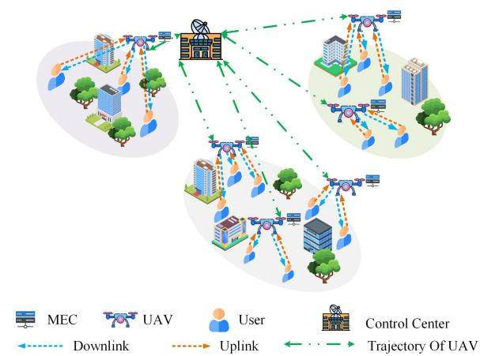  
Fig. 1. Illustration of the considered multi-area multi-UAV-assisted MEC system model.

While these CMOEAs have demonstrated effectiveness across various problem domains, the multi-area flexible allocation problem considered in this study presents distinct characteristics that pose significant challenges for existing methods. Specifically, existing CMOEAs tend to converge slowly or become trapped in infeasible regions due to the complex constrained mixed-integer search space where feasible solutions are difficult to locate. Notably, our previous work [5] designed a CMOEA with the improved genetic operators and the repairing constraint-handling technique for the UAV-task association problem. However, this method cannot be directly applied to the multi-area flexible allocation problem, since the coupled relationships among UAV-to-area assignments, deployment positions, user associations, and resource allocations require a tailored mechanism to systematically handle these interrelated structural constraints.

## III. SYSTEM MODEL AND PROBLEM FORMULATION

In this study, we consider a multi-area multi-UAV-assisted MEC system where a control center allocates UAVs to serve multiple service areas according to varying regional service requirements, as shown in Fig. 1. Note that the control center only requires lightweight control information (e.g., user locations and task size parameters) rather than raw task data for optimization. Such lightweight information can be efficiently collected through cellular control channels with negligible overhead. The system comprises M UAVs and N service areas, where $M > N$ to enable flexible allocation of multiple UAVs to high-demand areas. Each service area n is characterized by radius $R _ { n }$ and center coordinates $( x _ { n } , y _ { n } , 0 )$ , and $\vartheta _ { n } = ( x _ { n } , y _ { n } )$ denotes the horizontal center coordinates. The control center is located at ${ \boldsymbol { \varpi } } = ( x , y , 0 )$ . Within each service area $n , \ K _ { n }$ users are uniformly distributed, where the k-th user is positioned at $( x _ { n , k } , y _ { n , k } , 0 )$ for $k \in \{ 1 , 2 , \ldots , K _ { n } \}$ All UAVs operate at the same altitude h to simplify coordination and avoid collision risks. For a deployed UAV m, it is positioned at horizontal coordinates $\mathbf { q } _ { m } \ = \ ( x _ { m } , y _ { m } )$ corresponding to three-dimensional coordinates $( x _ { m } , y _ { m } , h )$

for $m \in \{ 1 , 2 , \ldots , M \}$ . For the undeployed UAVs, their positions remain at the control center location ϖ. The horizontal distance between UAV m and the n-th service area is given by:

$$
d _ { m , n } ^ { \mathrm { U } } = \sqrt { ( x _ { n } - x _ { m } ) ^ { 2 } + ( y _ { n } - y _ { m } ) ^ { 2 } } .\tag{1}
$$

## A. UAV Deployment Model

Once the control center determines the UAV allocation strategy, each UAV flies from the control center to its designated service area to provide MEC services.

We introduce a binary variable $a _ { m , n } \in \{ 0 , 1 \}$ to represent the UAV-to-area assignment, where $a _ { m , n } = 1$ if UAV m is assigned to serve area n, and $a _ { m , n } = 0$ otherwise. Upon the assignment, UAV m is deployed at horizontal position $\mathbf { q } _ { m } =$ $\left( x _ { m } , y _ { m } \right)$ within its designated service area. The flight distance from UAV m to the control center is:

$$
l _ { m } = \sqrt { ( x - x _ { m } ) ^ { 2 } + ( y - y _ { m } ) ^ { 2 } + h ^ { 2 } } .\tag{2}
$$

Assuming all UAVs fly at constant speed v, the flight time for UAV m is:

$$
t _ { m } ^ { \mathrm { f } } = { \frac { l _ { m } } { v } } .\tag{3}
$$

Based on the rotor UAV power model [32], the flight power for UAV m is:

$$
P _ { m } ^ { \mathrm { f } } = \psi _ { 1 } \left( 1 + \frac { 3 v ^ { 2 } } { U _ { \mathrm { t i p } } ^ { 2 } } \right) + \psi _ { 2 } \sqrt { \sqrt { \psi _ { 3 } + \frac { v ^ { 4 } } { 4 } } - \frac { v ^ { 2 } } { 2 } } + \psi _ { 4 } v ^ { 3 } ,\tag{4}
$$

where $\psi _ { 1 } , ~ \psi _ { 2 } , ~ \psi _ { 3 }$ , and $\psi _ { 4 }$ are constants related to UAV physical parameters, and $U _ { \mathrm { t i p } }$ denotes the rotor tip speed. Consequently, the flight energy consumption for UAV m is:

$$
E _ { m } ^ { \mathrm { f } } = P _ { m } ^ { \mathrm { f } } \cdot t _ { m } ^ { \mathrm { f } } .\tag{5}
$$

To ensure effective UAV deployment while considering operational safety and area coverage, we introduce the following four constraints: $C _ { 1 } , C _ { 2 } , C _ { 3 }$ , and $C _ { 4 }$ . Constraint $C _ { 1 }$ ensures that each service area is covered by at least one UAV:

$$
C _ { 1 } : \sum _ { m = 1 } ^ { M } a _ { m , n } \geq 1 , \quad \forall n .\tag{6}
$$

Constraint $C _ { 2 }$ ensures that each UAV serves at most one service area:

$$
C _ { 2 } : \sum _ { n = 1 } ^ { N } a _ { m , n } \leq 1 , \quad \forall m .\tag{7}
$$

Constraint $C _ { 3 }$ maintains safe separation distances between UAVs:

$$
C _ { 3 } : \| \mathbf { q } _ { m } - \mathbf { q } _ { m ^ { \prime } } \| \geq d ^ { \mathrm { s a f e } } , \quad \forall m \neq m ^ { \prime } ,\tag{8}
$$

where $d ^ { \mathrm { s a f e } }$ denotes the minimum safe distance. Constraint $C _ { 4 }$ restricts the UAVs to operate within their assigned service areas:

$$
C _ { 4 } : d _ { m , n } ^ { \mathrm { U } } \leq R _ { n } + \lambda ( 1 - a _ { m , n } ) , \quad \forall m , n ,\tag{9}
$$

where λ is a sufficiently large constant.

This deployment model establishes the foundation for subsequent communication and computing operations, with the flight energy constituting the initial component of the total UAV energy consumption.

## B. Communication and User Association Model

Upon the arrival at designated positions, the UAVs begin serving the users within their assigned service areas. We introduce a binary user association variable $u _ { m , n , k } \in \{ 0 , 1 \}$ to represent the association between UAV m and user k in area $n ,$ where $u _ { m , n , k } = 1$ if user k in area n is associated with UAV m for task offloading, and $u _ { m , n , k } = 0$ otherwise.

Based on user association decisions, we define $\mathcal { U } _ { m , n }$ as the set of the users in area n that are associated with UAV m:

$$
\mathcal { U } _ { m , n } = \left\{ k \ : | \ : k \in \left\{ 1 , 2 , \ldots , K _ { n } \right\} , \ : u _ { m , n , k } = 1 \right\} .\tag{10}
$$

Note that for the undeployed UAVs, we have $\mathcal { U } _ { m , n } = \emptyset$ for all n.

For user k in area n that is associated with UAV m, the airto-ground communication link follows the probabilistic lineof-sight (LoS) channel model [33]. The LoS and non-line-ofsight (NLoS) probabilities are given by:

$$
P _ { m , n , k } ^ { \mathrm { L o S } } = \left( 1 + a \exp ( - b ( \theta _ { m , n , k } - a ) ) \right) ^ { - 1 } ,\tag{11}
$$

$$
P _ { m , n , k } ^ { \mathrm { N L o S } } = 1 - P _ { m , n , k } ^ { \mathrm { L o S } } ,\tag{12}
$$

where $\begin{array} { r } { \theta _ { m , n , k } = \frac { 1 8 0 } { \pi } \arctan ( h / \| \mathbf { q } _ { m } - ( x _ { n , k } , y _ { n , k } ) \| ) } \end{array}$ represents the elevation angle (in degrees) between UAV m and user k, and $^ { a , }$ b are the environment-dependent parameters, respectively. Recall that h denotes the altitude of the UAV. According to [32], the channel power gain is:

$$
g _ { m , n , k } = \frac { \hat { P } _ { m , n , k } ^ { \mathrm { L o S } } g _ { 0 } } { ( d _ { m , n , k } ) ^ { \tilde { \iota } } } ,\tag{13}
$$

where $\begin{array} { r } { \hat { P } _ { m , n , k } ^ { \mathrm { L o S } } = P _ { m , n , k } ^ { \mathrm { L o S } } + \kappa P _ { m , n , k } ^ { \mathrm { N L o S } } } \end{array}$ denotes the regularized LoS probability with NLoS attenuation coefficient κ, g<sub>0</sub> represents the channel gain at reference distance $d _ { 0 } = 1$ m, ˜ι is the path loss exponent, and $d _ { m , n , k } = { \sqrt { \| \mathbf { q } _ { m } - ( x _ { n , k } , y _ { n , k } ) \| ^ { 2 } + h ^ { 2 } } }$ is the three-dimensional distance between UAV m and user k.

To support simultaneous multi-user access, we adopt the orthogonal frequency-division multiple access (OFDMA) protocol, which enables flexible bandwidth allocation among users while avoiding inter-user interference. Under OFDMA, the uplink transmission rate from user k in area n to its associated UAV m is:

$$
r _ { m , n , k } = b _ { m , n , k } \log _ { 2 } \left( 1 + \frac { p _ { k } ^ { \mathrm { t r a n s } } g _ { m , n , k } } { \sigma ^ { 2 } b _ { m , n , k } } \right) ,\tag{14}
$$

where $b _ { m , n , k }$ denotes the allocated bandwidth, $p _ { k } ^ { \mathrm { t r a n s } }$ is the transmission power, and $\sigma ^ { 2 }$ represents the noise power spectral density. Given task data size $C _ { n , k }$ and user association decisions $\mathbf { u } = \{ u _ { m , n , k } \}$ , the uplink transmission time and the energy consumption are:

$$
t _ { m , n , k } ^ { \mathrm { o f f } } = \frac { C _ { n , k } } { r _ { m , n , k } } , \quad E _ { m , n , k } ^ { \mathrm { o f f } } = p _ { k } ^ { \mathrm { t r a n s } } t _ { m , n , k } ^ { \mathrm { o f f } } .\tag{15}
$$

Similar to existing work [34], we do not consider the feedback downloading time because the size of the computation results is relatively small compared to the input task data.

The communication and user association model characterizes the data transmission process from the users to the UAVs, establishing the basis for subsequent task computing operations. To ensure valid user-UAV associations and efficient bandwidth utilization, we introduce the following three constraints: $C _ { 5 } , C _ { 6 } ,$ , and $C _ { 7 }$ . Constraint $C _ { 5 }$ ensures that each user is associated with exactly one UAV:

$$
C _ { 5 } : \sum _ { m = 1 } ^ { M } u _ { m , n , k } = 1 , \quad \forall n , 1 \leq k \leq K _ { n } .\tag{16}
$$

Constraint $C _ { 6 }$ ensures that the users can only be associated with the UAVs deployed in their service area:

$$
C _ { 6 } : u _ { m , n , k } \leq a _ { m , n } , \quad \forall m , n , 1 \leq k \leq K _ { n } .\tag{17}
$$

Constraint $C _ { 7 }$ limits the total bandwidth allocation per UAV:

$$
C _ { 7 } : \sum _ { n = 1 } ^ { N } \sum _ { k = 1 } ^ { K _ { n } } u _ { m , n , k } b _ { m , n , k } \leq B _ { m } ^ { \operatorname* { m a x } } , \quad \forall m ,\tag{18}
$$

where $B _ { m } ^ { \mathrm { m a x } }$ denotes the maximum bandwidth of UAV m.

## C. Task Computing Model

After receiving transmitted tasks, the UAVs allocate computing resources to process user requests. Let $f _ { m , n , k }$ denote the computing resources (measured in CPU cycles per second) allocated by UAV m to process the task from user $k$ in area n. Assuming each bit of data requires $\beta$ CPU cycles for processing, the computing time for user k’s task when associated with UAV m is:

$$
t _ { m , n , k } ^ { \mathrm { c } } = \frac { C _ { n , k } \beta } { f _ { m , n , k } } .\tag{19}
$$

Following the computing energy model in [35], the corresponding energy consumption is:

$$
\begin{array} { r } { E _ { m , n , k } ^ { \mathrm { c } } = \kappa _ { c } ( f _ { m , n , k } ) ^ { 3 } t _ { m , n , k } ^ { \mathrm { c } } , } \end{array}\tag{20}
$$

where $\kappa _ { c }$ represents the effective capacitance coefficient of the computing processor.

For a user k in area n associated with UAV m, with the bandwidth allocation $b _ { m , n , k }$ and the computing resource allocation $f _ { m , n , k }$ , the total task completion time comprises both the uplink transmission and computing phases:

$$
t _ { m , n , k } ^ { \mathrm { t o t a l } } = t _ { m , n , k } ^ { \mathrm { o f f } } + t _ { m , n , k } ^ { \mathrm { c } } .\tag{21}
$$

To prevent resource over-allocation, we introduce constraint $C _ { 8 }$ . Constraint $C _ { 8 }$ bounds the computing resource distribution per UAV:

$$
C _ { 8 } : \sum _ { n = 1 } ^ { N } \sum _ { k = 1 } ^ { K _ { n } } u _ { m , n , k } f _ { m , n , k } \leq F _ { m } ^ { \operatorname* { m a x } } , \quad \forall m ,\tag{22}
$$

where $F _ { m } ^ { \mathrm { m a x } }$ denotes the maximum computing capacity of UAV m.

## D. UAV Energy Consumption Model

During task processing, each UAV maintains a hovering state at its deployment position to ensure stable communication and computing services. The hovering duration for UAV m is the maximum task completion time among all users it serves:

$$
t _ { m } ^ { \mathrm { h } } = \operatorname* { m a x } _ { k \in \mathcal { U } _ { m , n } } \left\{ t _ { m , n , k } ^ { \mathrm { t o t a l } } \right\} .\tag{23}
$$

The hovering power consumption for UAV m can be obtained from Eq. (4) by setting $v = 0$ m/s:

$$
P _ { m } ^ { \mathrm { h } } = \psi _ { 1 } + \psi _ { 2 } \psi _ { 3 } ^ { \frac { 1 } { 4 } } .\tag{24}
$$

Therefore, the hovering energy consumption for UAV m is:

$$
E _ { m } ^ { \mathrm { h } } = P _ { m } ^ { \mathrm { h } } \cdot t _ { m } ^ { \mathrm { h } } .\tag{25}
$$

After completing all tasks, the UAVs return to the control center. The total energy consumption of UAV m is the sum of the flight, hovering, uplink transmission, and computing energy. For a deployed UAV m serving area n, the total energy is:

$$
E _ { m } = ( 2 E _ { m } ^ { \mathrm { f } } + E _ { m } ^ { \mathrm { h } } ) \times \omega + \sum _ { k \in \mathcal { U } _ { m , n } } \left( E _ { m , n , k } ^ { \mathrm { o f f } } + E _ { m , n , k } ^ { \mathrm { c } } \right) ,\tag{26}
$$

where $E _ { m }$ denotes the energy consumption of UAV m. For the undeployed UAVs, we have $E _ { m } = 0$ as they remain idle at the control center. The factor 2 accounts for the round-trip flight, and $\omega$ is a weighting coefficient that reflects the relatively lower significance of flight and hovering energy compared to task processing energy in practical UAV-MEC scenarios. Adopting a similar energy weighting approach as in [36], we set $\omega = 0 . 0 0 1$ to appropriately balance the contribution of the flight and hovering energy in the total energy consumption.

To ensure operational feasibility and quality-of-service requirements, we introduce the following two constraints: $C _ { 9 }$ and $C _ { 1 0 }$ . Constraint $C _ { 9 }$ restricts the individual UAV energy consumption within the available budget:

$$
C _ { 9 } : E _ { m } \leq E _ { \operatorname* { m a x } } , \quad \forall m ,\tag{27}
$$

where $E _ { \mathrm { m a x } }$ denotes the energy budget for each UAV. Constraint $C _ { 1 0 }$ ensures that all user tasks can be completed within the maximum allowable delay:

$$
C _ { 1 0 } : t _ { m , n , k } \leq t _ { \operatorname* { m a x } } \cdot u _ { m , n , k } , \quad \forall m , n , 1 \leq k \leq K _ { n } ,\tag{28}
$$

where $t _ { m , n , k } = t _ { m } ^ { \mathrm { f } } + t _ { m , n , k } ^ { \mathrm { t o t a l } }$ represents the total task completion time for user k in area n associated with UAV m, and $t _ { \mathrm { m a x } }$ denotes the maximum allowable task completion delay.

## E. Problem Formulation

Based on the models established above, we formulate the joint UAV deployment, user association, and resource allocation problem as a CMOP that simultaneously minimizes the total system energy consumption and the average user task completion delay.

Let ${ \bf x } = ( { \bf a } , { \bf q } , { \bf u } , { \bf b } , { \bf f } )$ denote the decision variables, where $\mathbf { a } = \{ a _ { m , n } \}$ represents the binary UAV-to-area assignment, $\mathbf { q } = \{ ( x _ { m } , y _ { m } ) \}$ denotes the UAV horizontal positions, u = $\{ u _ { m , n , k } \}$ represents the binary user-UAV associations, b = $\{ b _ { m , n , k } \}$ denotes the bandwidth allocations, and $\mathbf { f } = \{ f _ { m , n , k } \}$ represents the computing resource allocations. The proposed joint optimization problem is formulated as follows:

$$
\operatorname* { m i n } _ { \mathbf { x } } \quad \left\{ \begin{array} { l l } { E ( \mathbf { x } ) = \frac { \sum _ { m = 1 } ^ { M } E _ { m } } { M \sum _ { n = 1 } ^ { N } K _ { n } } , } \\ { T ( \mathbf { x } ) = \frac { \sum _ { m = 1 } ^ { M } \sum _ { n = 1 } ^ { N } \sum _ { k = 1 } ^ { K _ { n } } u _ { m , n , k } t _ { m , n , k } } { \sum _ { n = 1 } ^ { N } K _ { n } } , } \end{array} \right.
$$

subject to:

$$
C _ { 1 } - C _ { 1 0 } ,\tag{29}
$$

$$
C _ { 1 1 } : a _ { m , n } \in \{ 0 , 1 \} , \quad \forall m , n ,
$$

$$
C _ { 1 2 } : u _ { m , n , k } \in \{ 0 , 1 \} , \quad \forall m , n , 1 \leq k \leq K _ { n } ,
$$

$$
C _ { 1 3 } : 0 \leq x _ { m } , y _ { m } \leq L , \quad \forall m ,
$$

$$
C _ { 1 4 } : b _ { m , n , k } , f _ { m , n , k } \geq 0 , \quad \forall m , n , 1 \leq k \leq K _ { n } ,
$$

where $E ( \mathbf { x } )$ represents the normalized total system energy consumption, $T ( \mathbf { x } )$ represents the average user task completion delay, and L denotes the deployment area boundary. The constraints are categorized as follows:

• Deployment constraints $( C _ { 1 } { - } C _ { 4 } ) \colon C _ { 1 }$ ensures that each service area is covered by at least one $\mathrm { U A V } ; C _ { 2 }$ restricts each UAV to serve at most one area; $C _ { 3 }$ maintains safe separation distances between the UAVs; $C _ { 4 }$ restricts the UAVs to operate within their assigned service areas.

• User association constraints $( C _ { 5 } – C _ { 6 } ) \colon C _ { 5 }$ ensures that each user is associated with exactly one UAV; $C _ { 6 }$ ensures that users can only be associated with the UAVs deployed in their service area.

• Resource capacity constraints $( C _ { 7 } { - } C _ { 9 } ) \colon C _ { 7 }$ limits the total bandwidth allocation per UAV; $C _ { 8 }$ bounds the computing resource distribution per UAV; $C _ { 9 }$ restricts the individual UAV energy consumption within the available budget.

• Task completion delay constraint $( C _ { 1 0 } ) \colon C _ { 1 0 }$ ensures that all user tasks can be completed within the maximum allowable delay to guarantee quality-of-service requirements.

• Variable domain constraints $( C _ { 1 1 } \mathrm { - } C _ { 1 4 } ) \colon$ The decision variables are subject to binary constraints for assignment variables $a _ { m , n } \left( C _ { 1 1 } \right)$ and $u _ { m , n , k } \left( C _ { 1 2 } \right)$ , position boundary constraints for UAV deployment locations $x _ { m } , y _ { m } \ ( C _ { 1 3 } )$ and non-negativity constraints for resource allocations $b _ { m , n , k }$ and $f _ { m , n , k } ~ ( C _ { 1 4 } )$

Note that in the special case where $\begin{array} { r } { \sum _ { m = 1 } ^ { M } \sum _ { n = 1 } ^ { N } a _ { m , n } = 0 } \end{array}$ (i.e., no UAV is deployed), we define both $E ( \mathbf { x } ) = 0$ and $T ( \mathbf { x } ) = 0$

## IV. PROPOSED ALGORITHM

This section presents the methodology for solving the formulated problem (29). We first introduce the preliminaries of constrained multi-objective optimization, subsequently present our solution encoding scheme, followed by the overall algorithm framework, constraint-guided solution reconstruction mechanism, and complexity analysis. Following the standard constrained multi-objective optimization framework [37], a CMOP aims to minimize multiple conflicting objectives $\mathbf { G } ( \mathbf { x } ) \ = \ ( G _ { 1 } ( \mathbf { x } ) , G _ { 2 } ( \mathbf { x } ) , \cdot \cdot \cdot , G _ { \hat { m } } ( \mathbf { x } ) )$ subject to inequality constraints $g _ { i } ( \mathbf { x } ) ~ \leq ~ 0$ and equality constraints $h _ { i } ( { \bf x } ) = 0 ,$ where x represents the decision variables in the decision space <sup>D</sup>, and $\hat { m }$ denotes the number of objectives. For a solution $\mathbf { x } ,$ the constraint violation degree is quantified as $\begin{array} { r } { C V ( \mathbf { x } ) = \sum _ { i = 1 } ^ { p } c v _ { i } ( \mathbf { x } ) } \end{array}$ , where

$$
c v _ { i } ( \mathbf { x } ) = \left\{ \begin{array} { l l } { \operatorname* { m a x } \{ 0 , g _ { i } ( \mathbf { x } ) \} , } & { i = 1 , 2 , \cdots , q , } \\ { \operatorname* { m a x } \{ 0 , \left| h _ { i } ( \mathbf { x } ) \right| - \delta \} , } & { i = q + 1 , \cdots , p , } \end{array} \right.\tag{30}
$$

with δ being a tolerance parameter for equality constraints, typically set to $\delta ~ = ~ 0 . 0 0 0 1$ . A solution is feasible when $C V ( \mathbf { x } ) \ = \ 0 .$ , and infeasible otherwise. In multi-objective optimization, solution quality is assessed through Pareto dominance: a solution x dominates $\mathbf { y }$ (denoted $\mathbf x \prec \mathbf y )$ if x is no worse than y in all objectives and strictly better in at least one. The set of all non-dominated feasible solutions forms the Pareto optimal set, whose image in objective space constitutes the Pareto front. In our multi-area multi-UAV-assisted MEC system, the objective vector $\mathbf { G } ( \mathbf { x } ) = ( E ( \mathbf { x } ) , T ( \mathbf { x } ) )$ simultaneously minimizes the total energy consumption and the average task completion delay, where each Pareto optimal solution represents a distinct trade-off between the two conflicting objectives.

## A. Solution Encoding Scheme

To represent the joint UAV deployment, user association, and resource allocation decisions, we design a mixed-integer encoding scheme. Each solution comprises five components: the first part is the deployment decision $\mathbf { a } = \{ a _ { m , n } \}$ , where $a _ { m , n } = 1$ indicates UAV m is assigned to area n; the second part is the UAV position $\mathbf { q } = \{ ( x _ { m } , y _ { m } ) \}$ representing the horizontal coordinates of each $\mathrm { U A V } ;$ the third part is the bandwidth allocations $\mathbf { b } = \{ b _ { m , n , k } \}$ specifying the bandwidth allocated by UAV m to user k in area $n ;$ the fourth part is the computing resource allocations $\mathbf { f } = \{ f _ { m , n , k } \}$ denoting the CPU cycles allocated to each user; and the fifth part is the user association $\mathbf { u } = \{ u _ { n , k } \}$ , where $u _ { n , k } \in \{ 1 , 2 , \ldots , M \}$ indicates which UAV serves user k in area n for task offloading. Note that this compact encoding can be directly converted to the binary association matrix $\mathbf { u } = \{ u _ { m , n , k } \}$ used in the system model through the mapping: $u _ { m , n , k } ~ = ~ 1$ if and only if $u _ { n , k } = m$ , and $u _ { m , n , k } = 0$ otherwise.

This encoding scheme automatically satisfies several constraints. Constraint $C _ { 5 }$ is inherently satisfied as each user k in area n is explicitly assigned to a single UAV through the direct mapping structure of u. Constraint $C _ { 6 }$ is maintained by constructing user associations based on valid deployment decisions a. Besides, boundary constraints $C _ { 1 1 }$ to $C _ { 1 4 }$ are automatically satisfied as the genetic operators incorporate a boundary repair mechanism that projects any out-of-bound variables back to their feasible ranges after crossover and mutation operations. Therefore, the constraint handling mechanism in our algorithm focuses on addressing the remaining constraints $C _ { 1 }$ to $C _ { 4 }$ and $C _ { 7 }$ to $C _ { 1 0 }$ during the optimization process.

## B. Proposed Algorithm

The proposed algorithm is inspired by recent advances in multi-population constrained multi-objective evolutionary algorithms [27], where collaborative frameworks are employed to balance the objective optimization and the constraint satisfaction. We adopt the MTCMO framework [37] as the baseline, which maintains multiple populations with different selection strategies to enhance search diversity and convergence performance. Our key innovation lies in the constraintguided solution reconstruction mechanism, which systematically transforms infeasible solutions into feasible ones, thereby accelerating convergence toward the feasible region. The pseudocode is presented in Algorithm 1. In this work, we consider that the control center, as the central controller of the whole system, collect all the required information and execute Algorithm 1 afterwards.

The proposed algorithm maintains two solution sets $P _ { t }$ and $P _ { t } ^ { \prime } ,$ each containing $N _ { p }$ solutions (Lines 1 to 3). Each solution represents a complete decision plan specifying UAV-to-area assignments a, positioning coordinates q, user-UAV associations u, bandwidth allocations b, and computing resource allocations f. The control center evaluates each solution by its energy consumption $E ( \mathbf { x } )$ , task completion delay $T ( \mathbf { x } )$ , and constraint violation $C V ( \mathbf { x } )$

During each iteration (Lines 4 to 33), the proposed algorithm generates new solutions through genetic operations (Lines 6 to 18). Specifically, two parent solutions are selected from each solution set via binary tournament selection (Lines 8, 14), and then these selected parents are used to produce offspring solutions by applying simulated binary crossover (SBX) and polynomial mutation operators adopted from MTCMO [37] (Lines 9, 15). Each generated offspring undergoes boundary repair to ensure compliance with constraints $C _ { 1 1 }$ to $C _ { 1 4 }$ (Lines 10, 16).

The constraint-guided solution reconstruction mechanism processes infeasible solutions in $O _ { t }$ (Lines 19 to 25). For each solution x with $C V ( \mathbf { x } ) > 0$ , the reconstruction procedure (detailed in Algorithm 2) systematically adjusts the solution to satisfy the critical constraints $( C _ { 1 } , C _ { 2 } , C _ { 4 } , C _ { 7 } , C _ { 8 } )$ through hierarchical reconstruction operations.

Both solution sets exchange solutions to enable knowledge sharing (Lines 26 to 28). The proposed algorithm then selects solutions for the next iteration using different criteria (Lines 29 to 31). Set $P _ { t }$ employs the constraint-domination principle (CDP) [30], while set $P _ { t } ^ { \prime }$ uses an adaptive ϵ-constraint method [37]. The ϵ method uses a dynamic relaxation threshold:

$$
\epsilon _ { t } = \epsilon _ { 0 } \times \left( 1 - \frac { F E } { F E _ { \operatorname* { m a x } } } \right) ^ { c _ { p } } ,\tag{31}
$$

where $\begin{array} { r } { \epsilon _ { 0 } = \operatorname* { m a x } _ { \mathbf { x } \in P _ { 0 } ^ { \prime } } C V ( \mathbf { x } ) } \end{array}$ represents the maximum constraint violation in the initial auxiliary solution set, and $c _ { p } =$ $( - \ln ( \epsilon _ { 0 } ) - 6 ) / \ln ( 0 . 5 )$ controls the convergence rate. Given two solutions x and $\mathbf { y } ,$ solution x is preferred if any of the following conditions holds:

• Both solutions satisfy the relaxation threshold $( C V ( \mathbf { x } ) , C V ( \mathbf { y } ) \leq \epsilon _ { t } )$ and x Pareto-dominates ${ \bf y } ;$

• Solution x satisfies the threshold $( C V ( \mathbf { x } ) \leq \epsilon _ { t } )$ while $\mathbf { y }$ does not;

• Neither solution satisfies the threshold and $C V ( \mathbf { x } ) \ <$ $C V ( \mathbf { y } )$

As $\epsilon _ { t }$ gradually decreases to zero, the ϵ method converges to CDP, progressively tightening feasibility requirements. After completing all evaluations, the proposed algorithm returns $N _ { p }$ non-dominated solutions from $P _ { t } \cup P _ { t } ^ { \prime }$ using CDP (Line 34), representing Pareto optimal trade-offs between the energy efficiency and service quality.

## C. Constraint-Guided Solution Reconstruction Mechanism

The constraint-guided solution reconstruction mechanism systematically transforms infeasible solutions into feasible ones through hierarchical adjustments. As discussed in Section $\mathrm { { I V } } { \cdot } \mathrm { { A } } .$ , constraints $C _ { 5 } , C _ { 6 } ,$ , and $C _ { 1 1 }$ to $C _ { 1 4 }$ are automatically satisfied by the encoding scheme and boundary repair operations. This mechanism focuses on actively repairing the critical constraints $( C _ { 1 } , C _ { 2 } , C _ { 4 } , C _ { 7 } , C _ { 8 } )$ that can be directly addressed through reconstruction operations, while constraints $C _ { 3 } , C _ { 9 }$ and $C _ { 1 0 }$ are indirectly handled through evolutionary selection pressure.

The reconstruction procedure follows a hierarchical order as shown in Algorithm 2. When the area coverage constraints $C _ { 1 }$ or $C _ { 2 }$ are violated, the UAV-to-area assignments are first adjusted (Lines 2 to $7 ) \colon$ the control center selects $n u m \in [ N , M ]$ UAVs from the fleet, assigns one UAV to each of the N areas for complete coverage, then distributes the remaining $( n u m - N )$ UAVs to any arbitrary areas. If the positioning constraint $C _ { 4 }$ is violated, the UAV positions are adjusted accordingly (Lines 8 to 14): each UAV m assigned to area n is repositioned at ${ \bf q } _ { m } = \vartheta _ { n } + r a n d \times R _ { n } \times \nonumber$ loc, where $U ( \cdot )$ denotes the uniform distribution, rand $\sim U ( 0 , 1 )$ is a random scaling factor, and loc $\sim U ( [ - 1 , 1 ] ^ { 2 } )$ is a random direction vector, ensuring the UAV remains within the service area. Following any changes in the UAV assignments or positions, the user-UAV associations are updated (Lines 15 to 21): each user k connects to its nearest available UAV through $\begin{array} { r } { m ^ { * } = \arg \operatorname* { m i n } _ { m : a _ { m , n } = 1 } d _ { m , n , k } } \end{array}$

When the bandwidth or computing capacity constraints $( C _ { 7 }$ or $C _ { 8 } )$ are violated, resources are reallocated among users (Lines 22 to 35). For each UAV $m ,$ the bandwidth and computing resources are distributed among its associated users using randomly generated normalized weight vectors, scaled by rand $\sim U ( 0 , 1 )$ to ensure the allocations remain within the capacity limits $B _ { m } ^ { \mathrm { m a x } }$ and $F _ { m } ^ { \mathrm { m a x } }$ . After completing all adjustments, the reconstructed solution is re-evaluated (Line 36) and returned (Line 37).

## D. Complexity Analysis

The computational complexity of the baseline MTCMO framework is $O ( \hat { m } \cdot N _ { p } ^ { 2 } )$ per generation [37], where $\hat { m } = 2$ is the number of objectives and $N _ { p }$ is the population size. Compared to MTCMO, the proposed algorithm introduces an additional constraint reconstruction mechanism that processes up to $N _ { p } / 2$ infeasible offspring from population $P _ { t }$ in each generation (Algorithm 1, Lines 19 to 25). For each infeasible solution, the reconstruction procedure iteratively adjusts the UAV-to-area assignments $( O ( M ) )$ ), UAV positions $( O ( M ) )$ user-UAV associations $\textstyle ( O ( \sum _ { n = 1 } ^ { N } K _ { n } ) )$ , and resource allocations $\textstyle ( O ( M \times \sum _ { n = 1 } ^ { N } K _ { n } ) )$ , requiring $\begin{array} { r } { O ( M \times \sum _ { n = 1 } ^ { N } K _ { n } ) } \end{array}$ per reconstruction. Across all offspring, this adds $O ( N _ { p } \times M \times$ $\textstyle \sum _ { n = 1 } ^ { N } K _ { n } )$ complexity per generation, resulting in a total complexity of $\begin{array} { r } { O ( \hat { m } \cdot N _ { p } ^ { 2 } + N _ { p } \times M \times \sum _ { n = 1 } ^ { N } K _ { n } ) } \end{array}$ . As the population converges toward feasible regions during evolution, the number of infeasible solutions requiring reconstruction

```latex
Algorithm 1: Constraint-guided solution reconstruc Algorithm 2: Constraint-guided Solution Reconstruc
tion algorithm for multi-objective UAV deployment tion Mechanism
Input: Population size $N _ { p }$ Input: Infeasible solution $\mathbf { x } = \{ \mathbf { a } , \mathbf { q } , \mathbf { u } , \mathbf { b } , \mathbf { f } \}$
Maximum evaluations $F E _ { \mathrm { m a x } }$ Output: Reconstructed feasible solution $\mathbf { x } ^ { \prime }$
Output: Set of Pareto optimal solutions $\mathbb { P }$ 1 $\mathbf { x } ^ { \prime } \gets \mathbf { x } , f l a g \gets$ false;
1 Randomly initialize population $P$ with $N _ { p }$ candidate 2 if $C _ { 1 }$ or $C _ { 2 }$ is violated then
solutions; 3 Randomly select num $\in [ N , M ] \ \mathrm { U A V s } ;$
2 $P _ { 0 }  P , P _ { 0 } ^ { \prime }  P \ P ^ { \prime * }$ Main and auxiliary solution sets 4 Assign the first N UAVs to the $N$ areas
$^ { * } / ;$ (one-to-one);
3 $F E  N _ { p } , t  0 ;$ 5 Randomly assign remaining (num − N) UAVs to
4 while $F E < F E _ { \mathrm { m a x } }$ do the $N$ areas;
5 $t \gets t + 1 ;$ 6 Update a in $\mathbf { x } _ { \mathrm { ~ } } ^ { \prime }$ , flag ← true;
6 /* Generate new solutions $^ { * } / ;$ 7 end
7 for $i = 1$ to $N _ { p } / 2$ do 8 if $C _ { 4 }$ is violated then
8 Select parent solutions from $P _ { t - 1 }$ via binary 9 for each UAV m with $a _ { m , n } = 1$ in $\mathbf { x } ^ { \prime }$ do
tournament; 10 loc $\sim U ( [ - 1 , 1 ] ^ { 2 } ) \ / { } ^ { * }$ Random direction vector
9 $\mathbf { x } \gets$ the new solution generated by the selected $^ { * } / ;$
parents via crossover and mutation; 11 ${ \bf q } _ { m } \gets \vartheta _ { n } + r a n d \times R _ { n } \times $ loc;
10 Fix x back to boundary constraints $C _ { 1 1 } . . C _ { 1 4 } ;$ 12 end
11 $O _ { t } \gets O _ { t } \cup \{ { \bf x } \} ;$ 13 Update q in $\mathbf { x } _ { \mathrm { ~ } } ^ { \prime }$ , flag ← true;
12 end 14 end
13 for $i = 1$ to $N _ { p } / 2$ do 15 if $f l a g = t r u e$ then
14 Select parent solutions from $P _ { t - 1 } ^ { \prime }$ via binary 16 for each area n and user k in area n do
tournament; 17 $\begin{array} { r } { m ^ { * } \gets \arg \operatorname* { m i n } _ { m : a _ { m , n } = 1 } d _ { m , n , k } ; } \end{array}$
15 $\mathbf { x } \gets$ the new solution generated by the selected 18 Set $u _ { m ^ { * } , n , k } \gets 1 , u _ { m , n , k } \gets 0$ for m $\neq m ^ { * } ;$
parents via crossover and mutation; 19 end
16 Fix x back to boundary constraints $C _ { 1 1 } . . C _ { 1 4 } ;$ 20 Update u in $\mathbf { x } ^ { \prime } ;$
17 $O _ { t } ^ { \prime } \gets O _ { t } ^ { \prime } \cup \{ { \bf x } \}$ 21 end
18 end 22 if $C _ { 7 }$ is violated in $\mathbf { x } ^ { \prime }$ then
19 /* Reconstruct infeasible solutions in $O _ { t } \ast / ;$ 23 for each UAV m do
20 for each solution $\mathbf { x }$ in $O _ { t }$ do 24 $/ { * }$ Generate a weight vector w with $\textstyle \sum w _ { k } = 1$
21 if $C V ( \mathbf { x } ) > 0$ then $^ { * } / ;$
22 $\mathbf { x } \gets$ the solution x reconstructed via 25 $b _ { m , n , k } \gets w _ { k } \times$ rand $\times \ : B _ { m } ^ { \mathrm { m a x } }$ for $k \in \mathcal { U } _ { m , n } ;$
Algorithm $2 ;$ 26 end
23 $F E \gets F E + 1 ;$ 27 Update b in $\mathbf { x } ^ { \prime } ;$
24 end 28 end
25 end 29 if $C _ { 8 }$ is violated in $\mathbf { x } ^ { \prime }$ then
26 /* Exchange solutions between both sets $^ { * } / ;$ 30 for each UAV m do
27 $P _ { t }  P _ { t - 1 } \cup O _ { t } \cup O _ { t } ^ { \prime } ;$ 31 $/ { * }$ Generate a weight vector $\mathbf { w } ^ { \prime }$ with $\textstyle \sum w _ { k } ^ { \prime } = 1$
28 $P _ { t } ^ { \prime }  P _ { t - 1 } ^ { \prime } \cup O _ { t } ^ { \prime } \cup O _ { t } ;$ $^ { * } / ;$
29 $/ { } ^ { * }$ Select solutions for next iteration $^ { * }$ 32 $f _ { m , n , k } \gets w _ { k } ^ { \prime } \times$ rand $\times \ : F _ { m } ^ { \mathrm { m a x } }$ for $k \in \mathcal { U } _ { m , n } ;$
30 $P _ { t } \gets$ the best $N _ { p }$ solutions selected from $P _ { t }$ using 33 end
CDP; 34 Update f in $\mathbf { x } ^ { \prime } ;$
31 $P _ { t } ^ { \prime } \gets$ the best $N _ { p }$ solutions selected from $P _ { t } ^ { \prime }$ using 35 end
ϵ method; 36 Re-evaluate $\mathbf { x } ^ { \prime } ;$
32 $F E \gets F E + N _ { p } ;$ 37 return $\mathbf { x } ^ { \prime }$
33 end
34 $\mathbb { P } \gets$ the best $N _ { p }$ solutions selected from $P _ { t } \cup P _ { t } ^ { \prime }$ using
CDP;
35 return $\mathbb { P }$ diminishes rapidly, reducing the computational overhead in
later generations.
```

## V. EXPERIMENTAL STUDIES

This section evaluates the proposed demand-aware deployment framework and the proposed algorithm through a series of numerical experiments.

## A. Experimental Setup

This subsection presents the parameter configurations, test instances, and compared algorithms used in the experiments.

1) Problem Parameters and Test Instances: Table I lists the system parameters shared across all test scenarios, including the UAV flight characteristics, the communication parameters, and the computing specifications. To evaluate the algorithm performance under varying problem scales, three test instances (CMOP1, CMOP2, CMOP3) are designed with progressively increasing numbers of UAVs, service areas, deployment region sizes, and resource capacities, as detailed in Table II. Within each service area, users are uniformly distributed at the ground level.

TABLE I. System parameters across all test instances.
<table><tr><td>Parameter</td><td>Description</td><td>Value</td></tr><tr><td> $v$ </td><td>UAV flight velocity</td><td>10 m/s</td></tr><tr><td> $d ^ { \mathrm { s a f e } }$ </td><td>Minimum safe distance between UAVs</td><td>15 m</td></tr><tr><td> $h$ </td><td>UAV flight altitude</td><td>100 m</td></tr><tr><td> $p _ { k } ^ { \mathrm { t r a n s } }$ </td><td>Transmission power</td><td>0.1 W</td></tr><tr><td> $\sigma ^ { 2 }$ </td><td>Noise power spectral density</td><td>-140 dB/Hz</td></tr><tr><td> $^ { a }$ </td><td>LoS probability parameter</td><td>9.31</td></tr><tr><td> $^ { b }$ </td><td>LoS probability parameter</td><td>0.16</td></tr><tr><td> $\psi _ { 1 }$ </td><td>UAV power model constant</td><td>80</td></tr><tr><td> $\psi _ { 2 }$ </td><td>UAV power model constant</td><td>22</td></tr><tr><td> $\psi _ { 3 }$ </td><td>UAV power model constant</td><td>263.4</td></tr><tr><td> $\psi _ { 4 }$ </td><td>UAV power model constant</td><td>0.0092</td></tr><tr><td> $U _ { \mathrm { t i p } }$ </td><td>Rotor tip speed</td><td>120 m/s</td></tr><tr><td> $g _ { 0 }$ </td><td>Reference channel gain</td><td>-50 dB</td></tr><tr><td> $\tilde { \iota }$ </td><td>Path loss exponent</td><td>2.3</td></tr><tr><td> $\kappa$ </td><td>NLoS attenuation coefficient</td><td>0.2</td></tr><tr><td> $\kappa _ { c }$ </td><td>Effective capacitance coefficient</td><td> $1 \times 1 0 ^ { - 2 8 }$ </td></tr><tr><td> $\beta$ </td><td>CPU cycles per bit</td><td>100</td></tr><tr><td> $E _ { \mathrm { m a x } }$ </td><td>Maximum energy budget per UAV</td><td>1500 kJ</td></tr><tr><td> $t _ { \mathrm { m a x } }$ </td><td>Maximum allowable task completion delay</td><td>100 s</td></tr><tr><td> $\omega$ </td><td>Flight energy weighting coefficient</td><td>0.001</td></tr></table>

2) Compared Algorithms: The proposed algorithm is compared against five state-of-the-art CMOEAs:

• tDEA-CPBI [38]: Employs strengthened θ-dominance and penalty boundary intersection aggregation to enhance both convergence and diversity in constrained search spaces.

• MTCMO [37]: Maintains dual populations with different selection strategies and dynamic epsilon relaxation, balancing convergence toward feasible regions and diversity along the Pareto front.

• MSCEA [39]: Utilizes a multi-stage framework that progressively shifts search focus from infeasible to feasible regions through exponentially adjusted constraint boundaries.

• MOEA/D-CDP [40]: Combines decomposition-based optimization with CDP for constraint handling.

• CMOEA-TS [30]: Employs a learning-based method that adaptively selects constraint handling techniques during optimization through deep reinforcement learning.

All algorithms are configured with population size $N _ { p } =$ 100 and maximum function evaluations $F E _ { \mathrm { m a x } } = 1 0 0 .$ , 000.

Each algorithm is independently executed 30 times on each test instance to ensure statistical significance. The crossover and mutation operators follow the standard settings: SBX with distribution index $\eta _ { c } ~ = ~ 2 0$ and crossover probability $p _ { c } ~ = ~ 1 . 0$ , and polynomial mutation with distribution index $\eta _ { m } = 2 0$ and mutation probability $p _ { m } = 1 / n _ { d } ,$ , where $n _ { d }$ is the number of decision variables. Due to space limitations, additional experiments are provided in the supplementary materials, including the impact analysis of the energy weighting coefficient ω, ablation studies on the CGSR mechanism and its reconstruction order, scalability evaluation on large-scale scenarios, robustness evaluation under non-uniform user distributions, fairness analysis under different operational priorities, and runtime comparison across the compared algorithms.

## B. Impact of Regional Characteristics on Deployment Strategies

To validate the necessity of the demand-aware UAV deployment, we examine how regional characteristics affect optimal resource allocation through a controlled experiment. A single service area is served by varying numbers of UAVs (1, 3, 5, 7, and 10) selected from a fleet of $M = 1 0$ available UAVs. For each UAV quantity, we generate 1000 random feasible deployment schemes using the constraint-guided solution reconstruction mechanism proposed in Section IV-C. Only schemes satisfying all constraints $( C _ { 1 } \ 1 0 \ C _ { 8 } )$ are evaluated, and median performance is recorded. Two experimental settings isolate the impact of different factors through controlled variables:

• Setting 1 (User Density): We vary user quantity $K \in$ {4, 7, 10} while fixing D = 500 MB and R = 100 m.

• Setting 2 (Task Complexity): We vary data volume $D \in$ {200, 500, 800} MB while fixing $K = 7$ and $R = 1 0 0$ m.

Fig. 2 presents the results, where the x-axis represents the number of the deployed UAVs, the y-axis shows the objective values, and solid/dashed lines of the same color denote the energy consumption $E ( \mathbf { x } )$ and task completion delay $T ( \mathbf { x } )$ respectively.

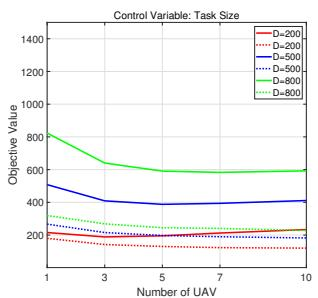

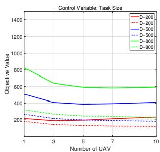  
(a) User density  
(b) Task complexity  
Fig. 2. Impact of regional characteristics on deployment performance.

Fig. 2(a) reveals that the user density significantly affects the number of UAVs needed to achieve acceptable performance. For low user density $( K = 4 )$ , the energy consumption and the task completion delay stabilize at around 300 kJ and 200 s with just 1 to 3 UAVs deployed. In contrast, areas with high user density (K = 10) exhibit substantially higher objective values across all UAV quantities, with the energy consumption exceeding 1000 kJ when only 1 UAV is deployed. To achieve comparable performance levels (energy around 600 kJ and delay around 200 s), the high-density areas need 5 to 10 UAVs. Across all user densities, a consistent pattern emerges: as the UAV quantity increases from 1 to 3–5 units, the energy consumption decreases sharply due to reduced hovering time from workload distribution, then stabilizes or even slightly increases beyond 5 UAVs as the additional flight costs outweigh the hovering savings. The task completion delay exhibits continuous reduction with more UAVs, showing rapid improvement from 1 to 5 UAVs followed by slower gains thereafter. Fig. 2(b) demonstrates similar trends for the task complexity. Areas with small tasks (D = 200 MB) stabilize at around 200 kJ energy and 150–200 s delay with 1 to 3 UAVs, while areas with large tasks (D = 800 MB) exhibit energy exceeding 800 kJ with only 1 UAV and require 5 to 7 UAVs to achieve energy around 600 kJ and delay around 200 s. Across all task sizes, the energy consumption follows the same pattern of sharp initial decrease followed by stabilization or slight increase, while the delay shows continuous but decelerating reduction. These results validate that the UAV allocation must adapt to the regional demand characteristics: low-demand areas perform well with 1 to 3 UAVs, while high-demand areas require 5 to 7 UAVs to achieve acceptable service quality. Since fixed uniform allocation cannot accommodate such diverse requirements, the proposed demand-aware deployment framework is necessary to maximize the system efficiency while maintaining the quality of service across heterogeneous regions.

TABLE II. Test instance configurations with varying problem scales.
<table><tr><td rowspan="2">Parameter</td><td rowspan="2">Description</td><td colspan="3">Test Instance</td></tr><tr><td>CMOP1</td><td>CMOP2</td><td>CMOP3</td></tr><tr><td>M</td><td>Number of UAVs</td><td>10</td><td>15</td><td>20</td></tr><tr><td>N</td><td>Number of service areas</td><td>3</td><td>5</td><td>7</td></tr><tr><td>K</td><td>Users per area</td><td>[7, 5,9]</td><td>[5, 6, 7, 5, 6]</td><td>[8, 6, 7, 5, 5, 7, 5]</td></tr><tr><td>L × L</td><td>Deployment region size (m2)</td><td>1000 × 1000</td><td>1500 × 1500</td><td>2000 × 2000</td></tr><tr><td>w</td><td>Control center location (m)</td><td>(500, 500, 0)</td><td>(750, 750, 0)</td><td>(1000, 1000, 0)</td></tr><tr><td>Rn</td><td>Service area radius (m)</td><td>[80, 120, 100]</td><td>[80, 120, 100, 110, 140]</td><td>[80, 120, 100, 90, 100, 110, 150]</td></tr><tr><td>θn</td><td>Area center coordinates (m)</td><td>[(100, 120), (400, 350), (600, 850)]</td><td>[(400, 400), (800, 400), (400, 800), (800, 800), (1200, 600)]</td><td>[(300, 300), (700, 300), (300, 700), (700, 700), (1100, 300), (1100, 700), (1500, 500)]</td></tr><tr><td>Bmax</td><td>Maximum bandwidth per UAV (MHz)</td><td>10</td><td>20</td><td>30</td></tr><tr><td>Fmax</td><td>Maximum computing capacity per UAV (GHz)</td><td>10</td><td>15</td><td>20</td></tr></table>

## C. Trade-off Analysis of the Obtained Solutions

To validate that the proposed algorithm can generate diverse Pareto-optimal solutions to accommodate different operational preferences in the multi-area deployment scenarios, we analyze three representative solutions obtained from the final population: the energy-oriented solution, the balanced solution, and the delay-oriented solution. The energy-oriented solution is the one with the minimum total system energy consumption, the delay-oriented solution is the one with the lowest average user task completion delay, and the balanced solution is selected as the median when all final solutions are sorted by the energy consumption, representing a compromise between the two conflicting objectives. These three solutions are extracted from the run achieving the median HV value across 30 independent executions of the proposed algorithm. Fig. 3 illustrates the UAV deployment patterns and the computing resource allocation schemes corresponding to these three solutions across the three CMOPs, demonstrating how different operational priorities result in distinct deployment configurations across the heterogeneous regions.

Figs. 3(a)-(c) present the UAV deployment schemes under the three solutions across the three CMOPs. The yellow bars represent the number of the deployed UAVs, while the green bars indicate the total system energy consumption. Figs. 3(d)- (f) demonstrate the computing resource allocation schemes under the three solutions across the three CMOPs. The black bars represent the total allocated computing resources, while the red bars indicate the average user task completion delay. As shown in Figs. 3(a), (b), (d), and (e) for CMOP1 and CMOP2, under the energy-oriented solution, the control center tends to dispatch fewer UAVs and allocate fewer computing resources for the users to reduce the energy consumption. However, this energy-oriented solution results in the higher average user task completion delay. In contrast, under the delay-oriented solution, the control center dispatches more UAVs and allocates more computing resources to the users, thereby reducing the average user task completion delay but at the cost of the increased energy consumption. The balanced solution achieves a trade-off between the two solutions. In the CMOP3, as shown in Figs. 3(c) and (f), all the three solutions deploy the same number of UAVs but differ in the computing resource allocation to achieve different trade-offs between the energy consumption and the latency. These results demonstrate that the proposed algorithm can generate diverse solutions that enable the control center to achieve various trade-offs between the two objectives.

## D. Overall Performance Comparison

This subsection compares the proposed algorithm against the five state-of-the-art CMOEAs across the three test instances with varying problem scales. The algorithm performance is evaluated using two widely adopted metrics [30]: Inverted Generational Distance (IGD) and Hypervolume (HV). IGD measures the average distance from the reference Pareto front to the obtained solution set, where lower values indicate better convergence. HV quantifies both the convergence and the diversity by measuring the volume of the objective space dominated by the solution set, where higher values indicate superior performance. Since the true Pareto front is unknown for the three problem instances, the reference front for IGD is constructed by collecting all non-dominated solutions from all algorithms across all runs. The reference points for HV calculation are set to (800, 200) for CMOP1, (1600, 200) for CMOP2, and (3000, 200) for CMOP3. The quantitative performance results are presented in Table III. The qualitative comparisons are illustrated through the Pareto front approximations and the convergence curves in Fig. 4, showing the median run (ranked by HV) of each algorithm.

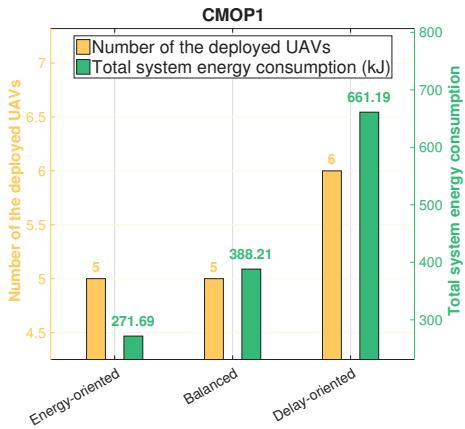  
(a) UAV deployment in CMOP1

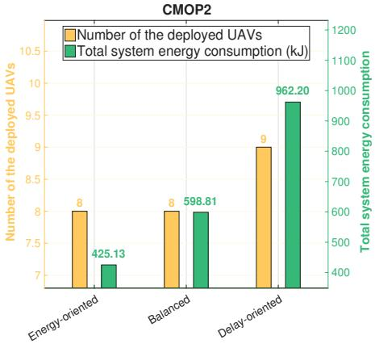  
(b) UAV deployment in CMOP2

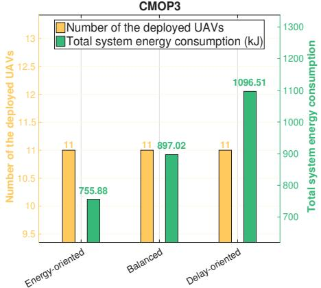  
(c) UAV deployment in CMOP3

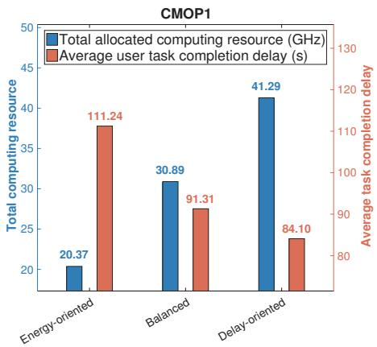  
(d) Computing resource allocation in CMOP1

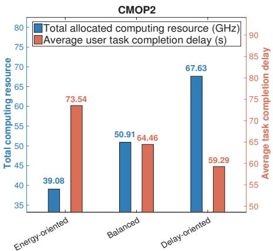  
(e) Computing resource allocation in CMOP2

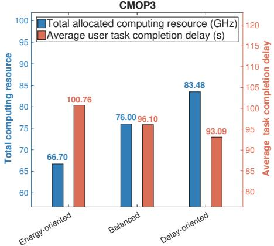  
(f) Computing resource allocation in CMOP3  
Fig. 3. UAV deployment (a-c) and computing resource allocation schemes (d-f) performed by the UAVs under the energy-oriented solution, balanced solution, and delay-oriented solution in the three CMOPs.

TABLE III. Performance comparison based on the mean and standard deviation (in parentheses) of the IGD and HV metrics.
<table><tr><td rowspan="2">Algorithm</td><td colspan="2">CMOP1</td><td colspan="2">CMOP2</td><td colspan="2">CMOP3</td></tr><tr><td>IGD</td><td>HV</td><td>IGD</td><td>HV</td><td>IGD</td><td>HV</td></tr><tr><td>tDEA-CPBI</td><td>1.03e+02(1.40e+01)</td><td>4.84e+04(4.61e+03)</td><td>8.40e+02(8.24e+02)</td><td>1.05e+05(2.08e+04)</td><td>4.13e+03(1.42e+03)</td><td>1.10e+04(0.00e+00)</td></tr><tr><td>MTCMO</td><td>1.02e+02(1.22e+01)</td><td>4.93e+04(4.96e+03)</td><td>2.90e+02(5.97e+01)</td><td>1.30e+05(9.54e+03)</td><td>1.71e+03(7.58e+02)</td><td>8.82e+04(4.19e+04)</td></tr><tr><td>MSCEA</td><td>3.81e+02(1.27e+02)</td><td>1.07e+04(1.12e+04)</td><td>0.00e+00(0.00e+00)</td><td>0.00e+00(0.00e+00)</td><td>0.00e+00(0.00e+00)</td><td>0.00e+00(0.00e+00)</td></tr><tr><td>MOEA/D-CDP</td><td>5.05e+02(3.21e+02)</td><td>2.15e+04(1.09e+04)</td><td>0.00e+00(0.00e+00)</td><td>0.00e+00(0.00e+00)</td><td>0.00e+00(0.00e+00)</td><td>0.00e+00(0.00e+00)</td></tr><tr><td>CMOEA-TS</td><td>1.82e+02(2.82e+02)</td><td>4.61e+04(2.11e+04)</td><td>1.05e+03(7.33e+02)</td><td>6.18e+04(8.29e+04)</td><td>0.00e+00(0.00e+00)</td><td>0.00e+00(0.00e+00)</td></tr><tr><td>Our Algorithm</td><td>8.61e+01(1.39e+01)</td><td>5.83e+04(2.77e+03)</td><td>1.55e+02(4.26e+01)</td><td>1.62e+05(5.02e+03)</td><td>3.96e+02(1.16e+02)</td><td>2.35e+05(1.57e+04)</td></tr></table>

Table III presents the statistical performance comparison across all test instances. The proposed algorithm consistently achieves the best performance, obtaining the lowest IGD and the highest HV values on all three problem instances.

On CMOP1, all algorithms find feasible solutions, but the proposed algorithm achieves the best IGD (8.61e+01) and HV (5.83e+04) with the smallest standard deviations, demonstrating superior convergence and stability. CMOEA-TS exhibits a notably large IGD standard deviation (2.82e+02), indicating unstable performance across independent runs. On CMOP2 and CMOP3, MSCEA and MOEA/D-CDP completely fail to find feasible solutions throughout the evolution. CMOEA-TS also fails on CMOP3 and achieves highly unstable results on CMOP2 with an extremely large HV standard deviation (8.29e+04). This result indicates that the reinforcement learning-based constraint handling strategy cannot effectively address the growing problem complexity. Compared to the baseline algorithms, the proposed algorithm demonstrates substantial superiority in both the convergence and the diversity metrics, with the performance gap becoming more pronounced as the problem complexity increases from CMOP1 to CMOP3. These results validate that the constraint-guided solution reconstruction mechanism provides a more effective path toward the constraint satisfaction and the Pareto optimality compared to these baselines.

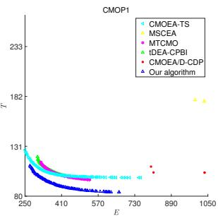  
(a) CMOP1 - Solution set

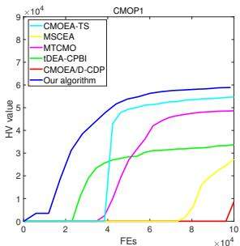  
(b) CMOP1 - Convergence curve

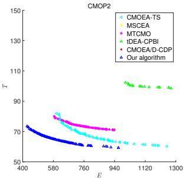  
(c) CMOP2 - Solution set

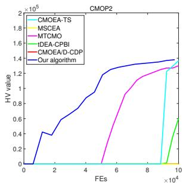  
(d) CMOP2 - Convergence curve

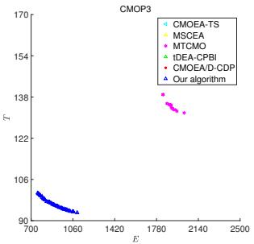  
(e) CMOP3 - Solution set

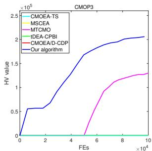  
(f) CMOP3 - Convergence curve  
Fig. 4. Obtained solutions (left column) and convergence curves (right column) for the three CMOPs from the run achieving the median HV value.

## VI. CONCLUSION

This paper addresses the joint energy consumption and task completion delay minimization problem in the multi-area multi-UAV-assisted MEC system through the demand-aware deployment framework. We formulate the joint optimization of the UAV deployment, the user association, and the resource allocation as a CMOP and design the constrained multi-objective evolutionary algorithm featuring the constraint-guided solution reconstruction mechanism. Experimental results demonstrate that the proposed algorithm outperforms the five state-of-theart baseline methods across the three test instances, achieving superior convergence and diversity. The ablation studies validate the effectiveness of the reconstruction mechanism and confirm that the proposed reconstruction order is reasonable without introducing significant bias toward particular regions of the Pareto front. The scalability evaluation on large-scale scenarios and the robustness evaluation under non-uniform user distributions further demonstrate the applicability of the proposed algorithm. The fairness analysis shows that all Pareto-optimal solutions maintain a high level of fairness under different operational priorities. The regional characteristic analysis confirms that the optimal UAV deployment strategies should adapt to the heterogeneous regional demands rather than employing the fixed allocation schemes. These findings demonstrate that the flexible UAV allocation significantly improves the system-wide resource utilization and provides the decision makers with balanced trade-off solutions between the energy efficiency and the service quality, advancing the development of intelligent UAV-MEC systems for smart city applications.

Future research directions include extending the framework to dynamic MEC scenarios with time-varying user demands. We will also investigate efficient algorithms to reduce computational runtime, and leverage fairness-aware objective formulations to better accommodate diverse operational priorities across heterogeneous service areas.

## REFERENCES

[1] H. Qiu, K. Zhu, N. C. Luong, C. Yi, D. Niyato, and D. I. Kim, “Applications of auction and mechanism design in edge computing: A survey,” IEEE Transactions on Cognitive Communications and Networking, vol. 8, no. 2, pp. 1034–1058, 2022.

[2] Z. Ning, H. Ji, X. Wang, E. C. H. Ngai, L. Guo, and J. Liu, “Joint optimization of data acquisition and trajectory planning for uav-assisted wireless powered internet of things,” IEEE Transactions on Mobile Computing, vol. 24, no. 2, pp. 1016– 1030, 2025.

[3] P. Wang, W. Sun, Y. Yang, D. Niyato, and D. O. Wu, “Mobisplit: Mobility-aware inference partitioning and offloading for efficient edge intelligence,” IEEE Transactions on Mobile Computing, pp. 1–15, 2025. DOI:10.1109/TMC.2025.3620438.

[4] P. Cao, L. Lei, S. Cai, G. Shen, X. Liu, X. Wang, L. Zhang, L. Zhou, and M. Guizani, “Computational intelligence algorithms for UAV swarm networking and collaboration: A comprehensive survey and future directions,” IEEE Communications Surveys & Tutorials, vol. 26, no. 4, pp. 2684–2728, 2024.

[5] C. Peng, Z. Wu, X. Huang, Y. Wu, J. Kang, Q. Huang, and S. Xie, “Joint energy and completion time difference minimization for UAV-enabled intelligent transportation systems: A constrained multi-objective optimization approach,” IEEE Transactions on Intelligent Transportation Systems, vol. 25, no. 10, pp. 14040–14053, 2024.

[6] Y. Deng, H. Zhang, X. Chen, and Y. Fang, “UAV-assisted multi-access edge computing with altitude-dependent computing power,” IEEE Transactions on Wireless Communications, vol. 23, no. 8, pp. 9404–9418, 2024.

[7] Y. Ding, Q. Zhang, W. Lu, N. Zhao, A. Nallanathan, X. Wang, and X. Yang, “Collaborative communication and computation for secure UAV-enabled MEC against active aerial eavesdropping,” IEEE Transactions on Wireless Communications, vol. 23, no. 11, pp. 15915–15929, 2024.

[8] Q. Guo, F. Tang, and N. Kato, “Resource allocation for aerial assisted digital twin edge mobile network,” IEEE Journal on Selected Areas in Communications, vol. 41, no. 10, pp. 3070– 3079, 2023.

[9] Y. Zhang, X. Hou, H. Du, L. Zhang, J. Du, and W. Men, “Joint trajectory and resource optimization for UAV and D2D-enabled heterogeneous edge computing networks,” IEEE Transactions on Vehicular Technology, vol. 73, no. 9, pp. 13816–13827, 2024.

[10] H. Chen, J. He, Y. Li, M. Zhao, F. Tang, and N. Kato, “Optimizing smart wireless charging and data acquisition for UAVs with battery life prediction,” IEEE Transactions on Vehicular Technology, pp. 1–13, 2025. DOI: 10.1109/TVT.2025.3598601.

[11] F. Zhou, R. Q. Hu, Z. Li, and Y. Wang, “Mobile edge computing in unmanned aerial vehicle networks,” IEEE Wireless Communications, vol. 27, no. 1, pp. 140–146, 2020.

[12] D. Ye, Z. Sun, W. Zhong, J. Kang, X. Huang, D. I. Kim, S. Xie, and C. Yuen, “Optimal flight speed scheduling and battery swapping in UAV-enabled mobile edge computing,” IEEE Transactions on Mobile Computing, pp. 1–13, 2025. DOI: 10.1109/TMC.2025.3601743.

[13] M. Zhao, R. Zhang, Z. He, and K. Li, “Joint optimization of trajectory, offloading, caching, and migration for UAV-assisted mec,” IEEE Transactions on Mobile Computing, vol. 24, no. 3, pp. 1981–1998, 2025.

[14] M. Tao, X. Li, J. Feng, D. Lan, J. Du, and C. Wu, “Multi-agent cooperation for computing power scheduling in UAVs empowered aerial computing systems,” IEEE Journal on Selected Areas in Communications, vol. 42, no. 12, pp. 3521–3535, 2024.

[15] P. Qin, M. Fu, Y. Fu, and J. Wang, “Cooperative UAV trajectory design and resource allocation in blockchainenabled secure aerial edge computing network,” IEEE Transactions on Wireless Communications, pp. 1–15, 2025. DOI: 10.1109/TWC.2025.3582151.

[16] Z. Y. Zhao, Y. L. Che, S. Luo, G. Luo, K. Wu, and V. C. M. Leung, “On designing multi-UAV aided wireless powered dynamic communication via hierarchical deep reinforcement learning,” IEEE Transactions on Mobile Computing, vol. 23, no. 12, pp. 13991–14004, 2024.

[17] M. Wu, H. Wu, W. Lu, L. Guo, I. Lee, and A. Jamalipour, “Security-aware designs of multi-UAV deployment, task offloading and service placement in edge computing networks,” IEEE Transactions on Mobile Computing, vol. 24, no. 10, pp. 11046–11060, 2025.

[18] Y. Liu, X. Fang, M. Xiao, F. Song, Y. Cui, Q. Xue, and C. Tang, “Latency optimization for multi-UAV-assisted task offloading in air-ground integrated millimeter-wave networks,” IEEE Transactions on Wireless Communications, vol. 23, no. 10, pp. 13359–13376, 2024.

[19] Z. Wang, T. Wei, G. Sun, X. Liu, H. Yu, and D. Niyato, “Multi-UAV enabled MEC networks: Optimizing delay through intelligent 3-D trajectory planning and resource allocation,” IEEE Transactions on Intelligent Transportation Systems, vol. 26, no. 11, pp. 20897–20911, 2025.

[20] H. Hao, C. Xu, W. Zhang, S. Yang, and G.-M. Muntean, “Joint task offloading, resource allocation, and trajectory design for multi-UAV cooperative edge computing with task priority,” IEEE Transactions on Mobile Computing, vol. 23, no. 9, pp. 8649–8663, 2024.

[21] B. Li and H. Shan, “Offloading revenue maximization in multi-UAV-assisted mobile edge computing for video stream,” IEEE Internet of Things Journal, vol. 12, no. 8, pp. 10866–10875, 2025.

[22] L. He, G. Sun, Z. Sun, Q. Wu, J. Kang, D. Niyato, Z. Han, and V. C. M. Leung, “QoE maximization for multiple-UAV-assisted multi-access edge computing via an online joint optimization approach,” IEEE Transactions on Networking, pp. 1–17, 2025. DOI: 10.1109/TON.2025.3581531.

[23] J. Chen, Z. Kuang, Y. Zhang, S. Lin, and A. Liu, “Blockchainenabled computing offloading and resource allocation in multi-UAVs MEC network: A stackelberg game learning approach,” IEEE Transactions on Information Forensics and Security, vol. 20, pp. 3632–3645, 2025.

[24] W. Zhang, C. Peng, Y. Yuan, J. Cui, and L. Qi, “A novel multi-

objective evolutionary algorithm with a two-fold constrainthandling mechanism for multiple UAV path planning,” Expert Systems with Applications, vol. 238, p. 121862, 2024.

[25] J.-Y. Ji, Z. Tan, S. Zeng, and M.-L. Wong, “An ε-constrained multiobjective differential evolution with adaptive gradientbased repair method for real-world constrained optimization problems,” Applied Soft Computing, vol. 152, p. 111202, 2024.

[26] Y. Li, W. Gong, Z. Hu, and S. Li, “A competitive and cooperative evolutionary framework for ensemble of constraint handling techniques,” IEEE Transactions on Systems, Man, and Cybernetics: Systems, vol. 54, no. 4, pp. 2440–2451, 2024.

[27] S. Song, K. Zhang, L. Zhang, and N. Wu, “A dual-population algorithm based on self-adaptive epsilon method for constrained multi-objective optimization,” Information Sciences, vol. 655, p. 119906, 2024.

[28] K. Qiao, J. Liang, K. Yu, M. Wang, B. Qu, C. Yue, and Y. Guo, “A self-adaptive evolutionary multi-task based constrained multi-objective evolutionary algorithm,” IEEE Transactions on Emerging Topics in Computational Intelligence, vol. 7, no. 4, pp. 1098–1112, 2023.

[29] F. Ming, W. Gong, L. Wang, and L. Gao, “Constrained multiobjective optimization via multitasking and knowledge transfer,” IEEE Transactions on Evolutionary Computation, vol. 28, no. 1, pp. 77–89, 2024.

[30] C. Peng, S. Yan, C. Zhong, Q. Huang, C. Wu, and H. Huang, “Learning-based temporal sequence of constrained handling selection for constrained multi-objective evolutionary optimization,” IEEE Transactions on Evolutionary Computation, pp. 1– 1, 2025. DOI: 10.1109/TEVC.2025.3584207.

[31] X. Huang, Z. Wu, C. Peng, Y. Wu, W. Zhong, J. Kang, and S. Xie, “Joint latency and charge cost minimization for reliable task offloading in dispersed computing: A multi-objective optimization approach,” IEEE Transactions on Mobile Computing, no. 01, pp. 1–16, 2026. DOI: 10.1109/TMC.2026.3679393.

[32] Z. Yang, S. Bi, and Y.-J. A. Zhang, “Online trajectory and resource optimization for stochastic UAV-enabled MEC systems,” IEEE Transactions on Wireless Communications, vol. 21, no. 7, pp. 5629–5643, 2022.

[33] L. Wang, H. Zhang, S. Guo, and D. Yuan, “Deployment and association of multiple UAVs in UAV-assisted cellular networks with the knowledge of statistical user position,” IEEE Transactions on Wireless Communications, vol. 21, no. 8, pp. 6553– 6567, 2022.

[34] X. Gao and L. Zhai, “Service experience oriented cooperative computing in cache-enabled UAVs assisted MEC networks,” IEEE Transactions on Mobile Computing, vol. 23, no. 10, pp. 9721–9736, 2024.

[35] M. Yan, L. Zhang, W. Jiang, C. A. Chan, A. F. Gygax, and A. Nirmalathas, “Energy consumption modeling and optimization of UAV-assisted MEC networks using deep reinforcement learning,” IEEE Sensors Journal, vol. 24, no. 8, pp. 13629– 13639, 2024.

[36] Y. Xu, T. Zhang, Y. Liu, D. Yang, L. Xiao, and M. Tao, “UAV-assisted MEC networks with aerial and ground cooperation,” IEEE Transactions on Wireless Communications, vol. 20, no. 12, pp. 7712–7727, 2021.

[37] K. Qiao, K. Yu, B. Qu, J. Liang, H. Song, C. Yue, H. Lin, and K. C. Tan, “Dynamic auxiliary task-based evolutionary multitasking for constrained multiobjective optimization,” IEEE Transactions on Evolutionary Computation, vol. 27, no. 3, pp. 642–656, 2023.

[38] F. Ming, W. Gong, L. Wang, and L. Gao, “A constraint-handling technique for decomposition-based constrained many-objective evolutionary algorithms,” IEEE Transactions on Systems, Man, and Cybernetics: Systems, vol. 53, no. 12, pp. 7783–7793, 2023.

[39] Y. Zhang, Y. Tian, H. Jiang, X. Zhang, and Y. Jin, “Design and analysis of helper-problem-assisted evolutionary algorithm for constrained multiobjective optimization,” Information Sciences, vol. 648, p. 119547, 2023.

[40] M. A. Jan and R. A. Khanum, “A study of two penaltyparameterless constraint handling techniques in the framework of MOEA/D,” Applied Soft Computing, vol. 13, no. 1, pp. 128– 148, 2013.