# Density-Aware 4-D Trajectory Planning for Urban Air Trafic With Diferent QoS Levels

Christian Vitale , Member, IEEE, Charalambos Menelaou , Panayiotis Kolios Stelios Timotheou , Senior Member, IEEE, Christos G. Panayiotou , Senior Member, IEEE, and Georgios Ellinas , Senior Member, IEEE

Abstract—In the coming years, unmanned aerial vehicles (UAVs) are expected to find applications in various new mobility concepts. However, current practical trajectory planning solutions for these vehicles in densely populated environments either inadequately address safety concerns, under-utilize available airspace, or rely on overly optimistic assumptions. To address these challenges, we introduce a novel Unmanned Trafic Management System (UTMS), which first partitions the airspace into cubic regions of equal size and employs a reservation mechanism to plan inter-cube paths from source to destination. In this way the proposed UTMS reservation mechanism can accommodate diferent quality-of-service (QoS) levels and admit UAVs within cubes up to a (tunable) maximum allowed density. Secondly, within each cube, an intra-cube planner robustly determines the trajectory of each UAV, ensuring a guaranteed safety level under realistic system state uncertainty. Extensive simulation results demonstrate that the proposed UTMS efectively manages the trade-of among the tunable UAV density and safety, thereby mitigating the design limitations observed in current state-ofthe-art approaches.

Index Terms—Unmanned aerial vehicles, reservation-based planning, location uncertainty, dense flying environment.

## I. INTRODUCTION

U AVS have attracted the interest of the research and industrial communities regarding numerous applications in both the private and governmental sectors [1], [2], [3]. Indeed, UAVs are envisioned to play a crucial role in future urban mobility, enabling on-demand goods delivery and passenger transport services in dense city environments [4]. At the same time, they will continue to support applications such as monitoring, search-and-rescue, and surveillance. As these services mature, a heterogeneous mix of vehicles and mission types is expected to share the same urban airspace, and scalable Air Trafic Management Systems (ATMSs) will be required to eficiently manage and exploit such dense, complex flying environments. In contrast, current ATMSs are primarily tailored to manned airplane trafic with relatively homogeneous fleets and mission profiles in a far less dynamic and dense environments than those envisioned for urban UAV operations. Hence, their tightly constrained configuration options, developed without fully exploiting autonomy and digitalization, limit their ability to eficiently accommodate the highly heterogeneous, high-volume trafic demand expected in future urban airspaces. State-of-the-art solutions [5], [6], [7], [8], [9], [10], [11] extend existing ATMSs by splitting the problem into two sub-problems: (i) strategic planning and (ii) tactical conflict resolution. In the former, path planning is performed prior to departure (by a centralized entity), aiming to achieve a pre-defined separation (in time and/or space) among UAVs. In the latter, UAVs take over the responsibility of detecting possible collisions in real-time (over the scheduled paths) and of choosing evasive maneuvers, when required. Typically, the separation in time or space enforced by the strategic planner is large, leading to an under-utilization of the airspace. In the few cases where a small distance between UAVs is imposed, tactical conflict resolution approaches assume that the system states of UAVs are known precisely, without consideration for uncertainties arising from model inaccuracies, measurement noise, or environmental factors such as wind. If applied in realistic airspaces, such approaches would not provide any safety guarantees, in particular when the density of admitted UAVs grows. To address this challenge, this work investigates the joint problem of strategic and tactical planning to achieve: (i) UAVs’ arrival times as close as possible to their desired arrival times; (ii) a guaranteed safety level under UAV system state uncertainty even in large-scale dense flying environments; and (iii) performance diferentiation depending on the UAVs desired QoS level.

First, our strategic path planner, namely the inter-cube path planner (ICPP), is designed, with the objective of allowing UAVs to reach their intended destinations “on time”, i.e., at the desired arrival time or before. Drawing inspiration from the sector-based partitioning adopted in traditional ATMSs and from simulation studies highlighting the efectiveness of stacked layered airspaces in achieving an excellent trade-of between complexity and safety/demand satisfaction [9], [12], the ICPP is developed on an extension of the so-called Air-

Matrix architecture [13]. In AirMatrix, the flying environment is partitioned into uniformly sized small cubes, and collision prevention is achieved by permitting only one UAV within each cube concurrently. However, due to the arbitrary nature of the cubes’ size and the inherent uncertainty in the UAVs’ system state, in realistic dense applications it is impossible to guarantee the UAVs’ precise location within the assigned cubes, hence it is impossible to guarantee safety. To address this limitation, our work extends AirMatrix to feature larger cubes capable of simultaneously accommodating multiple UAVs. The responsibility of collision avoidance in each cube is then delegated to the tactical planning phase. Based on this architecture, and assuming that UAVs declare beforehand their intent to reach specific destinations at specific times, the role of the ICPP is to select a path between the origin and destination points for each UAV, in terms of contiguous cubes to traverse, including starting and inter-cube crossing times. Towards this direction, a dynamic programming (DP)-based optimization is introduced, ofering two distinctive features in comparison to current solutions: (i) the ability to enforce a maximum number of UAVs per cube, thereby efectively constraining UAV density in the flying environment to a desired level, and (ii) the capability to facilitate the planning of UAVs with varying QoS levels (e.g., with diferent requirements on arrival time precision). It is noteworthy that the proposed ICPP approach has parallels in road transportation systems, as explored by [14] and [15]. These studies employ demand management methods to regulate vehicle routes and departure times, in order to maintain vehicle density below a critical threshold in individual road segments and even macroscopic regions. In transportation networks, this strategy efectively alleviates trafic congestion, enhancing overall network eficiency and reducing the total time spent by vehicles in the network.

Secondly, we design a tactical intra-cube trajectory planner utilizing a Model Predictive Control (MPC) optimization problem, referred to as the Intra-Cube Planner. Its primary objective is to ensure that the probability of any two UAVs experiencing a loss of separation, i.e., their pairwise distance falls below a specified safety threshold, remains bounded and small. Notably, in the state of the art various alternative trajectory planners exist for collision avoidance among UAVs in small/sparse flying environments. These planners rely on: (i) deterministic motion models, assuming exact knowledge of all present and future UAV states [16]; and (ii) distributed approaches that account for motion model uncertainties, e.g., [17], [18], and [19]. In our work, an adaptation of the latter planning approaches is considered. UAVs are assumed to follow linear-Gaussian motion models and a sphere of dynamic size (proportional to the associated uncertainty) is used to represent the area encompassing the barycenter of each UAV (in both the present and the future) with a specified target probability. Then, each UAV employs the Intra-Cube Planner to select future control profiles that ensure the spheres maintain at least the safety distance, thereby bounding the loss of separation probability, while navigating to path waypoints with minimal deviation from the expected traversal time, in alignment with the ICPP.

Overall, the contributions of this work are:

• it introduces the AirMatrix+ layered airspace infrastructure, based on large equally-sized cubes;

• it empirically computes the capacity of each cube in the AirMatrix+ layered airspace infrastructure, which will then limit the maximum allowed density in the AirMatrix+ airspace;

• it develops ICPP, a novel strategic path planner that takes as input the UAV’s desired arrival location and time, and outputs a spatiotemporal path that: (i) lets UAVs reach their destinations on time; (ii) respects the AirMatrix+ airspace maximum allowed density; and (iii) diferentiates performance based on varying QoS levels.

• it proposes the Intra-Cube trajectory planner, which plans the trajectory of each UAV within each cube to be traversed, under the assumption of linear-Gaussian motion. The Intra-Cube Planner simultaneously guarantees: (i) a bounded loss of separation probability for any pair of UAVs; and (ii) the minimization of the diference between the actual and the ICPP-based crossing times to the planned waypoints.

The remainder of the paper is organized as follows. Section II reviews the related literature, and Section III details the problem formulation solved in this work. Section IV introduces the AirMatrix+ architecture and the ICPP solution, while Section V presents the proposed Intra-Cube trajectory planner. Section VI discusses practical implementation aspects of the framework, including technological and regulatory considerations. Section VII provides an empirical estimation of the critical density in the AirMatrix+ airspace and rigorously evaluates the efectiveness of the proposed solution in various contexts. Finally, Section VIII concludes the work and proposes directions for future research.

## II. RELATED WORK

This section reviews existing architectures that align closely with the objectives of this work. For additional insights into large-scale urban advanced air mobility solutions, see the comprehensive survey in [20].

Traditional ATMS and Air Trafic Flow Management (ATFM) systems are designed for manned airline trafic operating in relatively homogeneous fleets and low-density en-route airspace. A key example is the seminal ATFM formulation in [21], where aircraft are routed through a network of airport and en-route sectors with fixed capacity limits, and largescale integer optimization is used to allocate ground-holding and airborne delays in order to minimize system-wide delay while respecting sector capacities. While highly efective for today’s trafic patterns, these solutions rely on assumptions of relatively low maneuverability and trafic volumes that are not representative of dense, low-altitude urban UAV operations, where thousands of heterogeneous vehicles and mission types may share the same 3D airspace.

Hence, state-of-the-art approaches aim to increase capacity and support future urban airspaces, typically exploiting a higher degree of automation and coordination among aircraft than classical ATMS solutions. Initially, the AirMatrix flying architecture was proposed in [13]. Small unitary-sized cubes divided the flying environment, and shortest path trajectories were calculated from sources to destinations [22]. An evolutionary approach was employed to schedule these trajectories with significant time separations between UAVs. An extension of this approach was proposed in [23], where, to achieve better performance, the time taken by a UAV to traverse each cube could be modified in real-time by controlling its speed. An alternative solution to the AirMatrix architecture was proposed in [6], where a structureless flying environment was envisioned in low-density scenarios. Therein, the shortest path to the destination was first computed for each UAV, and modifications to the paths were made only when the shortest paths intersected. Related architectures for urban air mobility trafic management have also been investigated in [5], where a network-wide departure and arrival scheduler is combined with the AutoResolver separation algorithm to maintain safe operations. While interesting, these approaches all rely on significant UAV separation to minimize conflicts. Although this provides a safe planning strategy even without explicit modeling of UAV location uncertainty, large separations come at the cost of substantial airspace underutilization, as shown in [9]. Furthermore, when these conservative assumptions do not hold, simulation studies such as [11] indicate that loss of-separation events may occur at high densities, revealing scalability limitations. More recent contributions, such as [10], attempt to reduce such conservatism, but do so without providing deterministic or stochastic guarantees of conflict-free operation, generally assuming perfect UAV state information and neglecting uncertainties stemming from sensing noise, modeling errors, or environmental disturbances. Compared to the above-mentioned body of work, and in line with the directions outlined in [7] and [8], our approach leverages accurate modeling and a high level of operational automation, employing a reservation algorithm for planning origin-todestination paths together with a robust trajectory planner. This enables safe and unprecedented UAV densities within confined airspaces, even under realistic operating conditions.

A few recent works include UAV location uncertainty. First, the AirMatrix architecture was extended in [24] to also include the UAV location uncertainty occurring due to wind and GPS measurement errors. To deal with uncertainty, the cube size was correlated to the worst-case deviation between the expected and the actual locations of a UAV. Nevertheless, contrary to our work, dynamic uncertainty modeling was not considered and the same scheduling approach as [13] was used, ultimately resulting in the same underutilization of the flying environment. An interesting alternative was proposed in [25], where trajectory planning was performed in structureless flying environments, while considering UAV location uncertainty. However, the problem was simplified by limiting maneuvers to 2D. Additionally, the focus was solely on tactical conflict resolution, omitting strategic planning. Consequently, to prevent multiple UAVs from occupying the same airspace simultaneously, fixed separation distances were enforced between aircraft, inevitably resulting in lower densities compared to our proposed solution. Moreover, unlike our work, tactical conflict resolution relied on constant uncertainty modeling, neglecting the dynamic growth of uncertainty over time when predicting the future location of UAVs.

Works in [26] and [27] propose an alternative simulation framework for managing urban mobility for low-altitude air transport systems. In [26], a simulation of UAVs operating in unstructured airspace reveals trafic congestion patterns that closely resemble those found in road networks. Specifically, the study identifies a linear decreasing relationship between UAVs’ density and speed. As UAVs’ density increases, the flow rate initially rises but eventually reaches a critical point where the system hits its maximum capacity, and congestion causes flow breakdown. Building on this concept, [27] extends this modeling approach by introducing a macroscopic fundamental diagram [15] for low-altitude air transport systems. Similarly to the work in [26] this macroscopic modeling approach captures trafic dynamics in 3D airspace by linking the relationship between flow, density, and speed variables. However, both models share a common limitation; despite operating in a 3D environment, they impose constraints analogous to traditional road networks. As a result, neither approach fully leverages the potential of 3D airspace to efectively increase capacity or reduce congestion.

Finally, the solution proposed in our work could serve as the underlying architecture for multiple large-scale urban advanced air mobility applications recently presented in the state of the art, where, instead of directly planning the trajectories of UAVs, the focus lies on the intricate task of scheduling UAVs across numerous origin/destination pairs. For instance, in [28] and [29], a framework was proposed to schedule a fleet of UAVs to cover a specific set of locations, potentially multiple times, while in [30] scheduling of aerial vehicles in an urban air mobility scheme was proposed. Additionally, [31] determined the optimal locations for vertiports in urban environments, which serve as landing and departure points for passenger-carrying UAVs, as well as the optimal departure spacing for aircraft. In a diferent approach, [32] manages UAVs in scenarios where they service complex areas with interdependent tasks, modeled as a directed acyclic graph with multiple subtasks. Scheduling is then optimized using DP.

## III. PROBLEM STATEMENT

In this work, the problem of eficient long-range autonomous UAV flight planning in dense low-altitude urban airspace under UAV state uncertainty is explored. In this setting, a broad range of mission types is considered: transportation-oriented operations (e.g., cargo and passenger mobility) are expected to coexist with applications such as monitoring, surveillance, and emergency response within a unified, shared environment. In the following, the overall objective of this work and the underlying assumptions on the UAVs’ flight requests and motion models are detailed.

Notation. Table I summarizes the notation used in the remainder of the paper. All boldface letters indicate vectors (lowercase) or matrices (upper case), whereas calligraphic letters denote sets. Finally, | · | represents the norm of a vector.

Problem Formulation. Let M denote the set of UAVs that request to operate within a given 3D airspace during a specified time interval. Let $O ^ { m } \in \mathcal { O }$ and $D ^ { m } \in \mathcal { D }$ denote the locations of the origin-destination pair for UAV m ∈ M , with $\mathcal { O }$ and $\mathcal { D }$ being the set of UAV requests’ origins and destinations, respectively. The objective of this work is to obtain trajectories from source to destination such that the probability of any two UAVs being within a minimum safe distance $d _ { \operatorname* { m i n } } .$ , referred to as the loss of separation probability, is bounded by a small value . Furthermore, during planning, as suggested by aviation agencies [33] and following lessons learned from transportation networks [14], [15], a maximum local density C of UAVs, less than the critical density, must be maintained in the airspace. Finally, each UAV aims to reach its destination safely on or before its desired arrival time $k _ { d e s } ^ { m }$ (“on-time arrival”). Nevertheless, it is assumed that UAVs exhibit diverse QoS requirements $q ^ { m }$ , depending on the task or UAV type. In particular, UAVs can be divided into two classes. The first class, represented by $q ^ { m } = 1$ , consists of UAVs that aim to arrive precisely on time. The second class, represented by $q ^ { m } = 2 ,$ , includes UAVs that also aim to arrive on time but are willing to accept arriving earlier than their desired arrival time.

TABLE I  
SUMMARY OF NOTATION
<table><tr><td>Symbol</td><td>Description</td></tr><tr><td> $\mathcal { M }$ </td><td>Set of UAVs operating in the airspace.</td></tr><tr><td> $O ^ { m } , D ^ { m }$ </td><td>Origin and destination cubes of UAV m.</td></tr><tr><td> ${ \mathcal { O } } , { \mathcal { D } }$ </td><td>Sets of all UAVs’ origins and destinations.</td></tr><tr><td> $q ^ { \dot { m } }$ </td><td> $\mathrm { Q o S }$  class of UAV m  $\left( q ^ { m } = 1 \right.$  for strict on-time,</td></tr><tr><td></td><td> $q ^ { m } { = } 2$  for relaxed).</td></tr><tr><td> $k _ { d e s } ^ { m }$ </td><td>Desired arrival time of UAV m.</td></tr><tr><td> $s _ { * } ^ { \mu \mathrm { { e } } }$ </td><td>Optimal departure time of UAV m (ICPP).</td></tr><tr><td> $p _ { * } ^ { m }$ </td><td>Optimal spatiotemporal path of UAV m (se-</td></tr><tr><td></td><td>quence of cubes and crossing times).</td></tr><tr><td> $d _ { \mathrm { m i n } }$ </td><td>Minimum safety distance.</td></tr><tr><td> $\epsilon$ </td><td>Maximum loss of separation probability.</td></tr><tr><td> $C$ </td><td>Maximum UAV density per cube.</td></tr><tr><td> $l$ </td><td>Side length of each AirMatrix+ cube.</td></tr><tr><td> $l ^ { \prime }$ </td><td>Side length of extended cube for neighbor de- tection.</td></tr><tr><td> $\mathcal { V } , \mathcal { E }$ </td><td>Sets of cubes (nodes) and inter-cube links (edges).</td></tr><tr><td> $G _ { T S } ( \mathcal { V } _ { T S } , \mathcal { E } _ { T S } )$ </td><td>Time-space DAG for DP.</td></tr><tr><td> ${ \mathcal { R } } _ { i }$ </td><td>Reachable time-slots for cube i in the DAG.</td></tr><tr><td> $\mathcal { J } _ { i }$ </td><td>Cubes directly adjacent to cube i.</td></tr><tr><td> $\dot { \boldsymbol { r } } _ { i } ( \boldsymbol { k } )$ </td><td> $\mathrm { U A V }$  reservations in cube i at time-slot k</td></tr><tr><td> $\psi _ { i } ^ { m } ( k )$ </td><td>Admissibility state of cube i for UAV m at time</td></tr><tr><td></td><td>k (1 if admissible).</td></tr><tr><td></td><td>UÀV m sojourn (crossing) time within cube i.</td></tr><tr><td> $\begin{array} { l } { \tau _ { i } ^ { m } } \\ { \tau _ { ( i , j ) } ^ { m } ( k ) } \end{array}$ </td><td>Travel-time cost from cube i to neighboring cube j at time  $k .$ </td></tr><tr><td> $\mathbf { x } _ { k }$ </td><td>State vector of a UAV at time k:</td></tr><tr><td> $\mathbf { u } _ { k }$ </td><td> $\left[ p _ { x } , p _ { y } , p _ { z } , \nu _ { x } , \nu _ { y } , \nu _ { z } \right] _ { k } ^ { \scriptscriptstyle | } .$  Control input (force) vector at time k:</td></tr><tr><td></td><td> $[ u _ { x } , u _ { y } , u _ { z } ] _ { k } ^ { \top }$ </td></tr><tr><td> $\delta T$ </td><td>Sampling interval of UAV dynamics.</td></tr><tr><td> $\phi$ </td><td>Velocity decay coefficient,  $\phi = \left( 1 - \eta \right)$ </td></tr><tr><td> $\gamma$ </td><td>Force-to-acceleration scaling  $\mathrm { f a c t o r } , \gamma = \delta T / \rho$ </td></tr><tr><td> $\rho$ </td><td>UAV mass.</td></tr><tr><td>η</td><td>Aerodynamic drag coefficient.</td></tr><tr><td> $\dot { \Phi } , \Gamma , \mathbf { G }$ </td><td>State, input, and disturbance matrices.</td></tr><tr><td> $\pmb { \Sigma }$ </td><td>Covariance matrix of the disturbance αk.</td></tr><tr><td>Q</td><td>Covariance of the process noise,  $\mathbf { Q } = \mathbf { G } \mathbf { \bar { \Sigma } } \mathbf { G } ^ { \top }$ </td></tr><tr><td> $\underline { { \mu } } _ { k + t }$ </td><td>Predicted mean UAV state at step k+t</td></tr><tr><td> $\Xi _ { k + t }$ </td><td>Predicted state covariance at time  $k { \mathrel { + { t } } } .$ </td></tr><tr><td> $\mathcal { U } _ { k } ^ { m }$ </td><td>Neighboring UAVs near UAV m at time k.</td></tr><tr><td> $T ^ { ^ { \kappa } }$ </td><td>Planning horizon of the Intra-Cube Planner.</td></tr><tr><td> $b _ { t } ^ { m }$ </td><td>Binary variable indicating UAV m still inside</td></tr><tr><td></td><td>its current cube at time  $t .$ </td></tr><tr><td> $\mathrm { u } _ { M A X }$ </td><td>Max input force magnitude.</td></tr><tr><td> $\mathbf { v } _ { M A X }$ </td><td>Max UAV velocity. Max change between consecutive control in-</td></tr><tr><td> $\Delta \mathbf { u }$ </td><td>puts.</td></tr><tr><td> $M$ </td><td>Large  $( \mathrm { b i g - M } )$  constant in logical constraints.</td></tr><tr><td> $\zeta _ { t } ^ { i , m }$ </td><td>Slack for temporary relaxation of safety con- straints.</td></tr><tr><td> $a _ { t , 1 : 3 } ^ { i }$ </td><td>Semi-axes of UAV i&#x27;s uncertainty ellipsoid at</td></tr><tr><td></td><td>time t.  $k { \mathrel { + { \vphantom { \varepsilon } } } } t .$ </td></tr><tr><td> $r _ { k + t } ^ { x }$ </td><td>Equivalent sphere radius of UAV x at time</td></tr><tr><td> $d _ { k + t } ^ { i , m }$ </td><td>Minimum distance between expected barycen-</td></tr><tr><td></td><td>ters of UAVs i and m.</td></tr><tr><td> $\lambda$ </td><td> $\mathrm { U A V }$  request rate (landings per second) in sim-</td></tr></table>

UAVs’ Demand. Similarly to current ATMSs [33], a UAV submits a request to the proposed central UTMS before departure. This request is for navigating the airspace safely, while ensuring its on-time arrival at the destination in accordance with its QoS requirements. Hence, the request of UAV m to the UTMS includes: (i) $k _ { d e s } ^ { m } \in k _ { D } ^ { d e s }$ , i.e., the desired arrival time; (ii) $q ^ { m } \in { \mathcal { Q } } ,$ , i.e., the QoS class to which the UAV belongs; (iii) $O ^ { m } \in \mathcal { O }$ and $D ^ { m } \in { \mathcal { D } } , { \mathrm { i . e . } }$ , the start and arrival locations.

Motion Model of the UAV. When flying from its start location to the designated arrival location, UAV m, m $\in \mathcal { M } ,$ is assumed to follow the discrete-time linear dynamics shown below [34]:

$$
\begin{array} { r } { { \bf x } _ { k } = \Phi { \bf x } _ { k - 1 } + \Gamma { \bf u } _ { k - 1 } + { \bf G } \alpha _ { k - 1 } , } \end{array}\tag{1}
$$

where $\mathbf { x } _ { k } = [ p _ { x } , p _ { y } , p _ { z } , \nu _ { x } , \nu _ { y } , \nu _ { z } ] _ { k } ^ { \top } \in \mathbb { R } ^ { 6 }$ denotes the state of the UAV at time $k ,$ which consists of the position $[ p _ { x } , p _ { y } , p _ { z } ] _ { k } \in \mathbb { R } ^ { 3 }$ and velocity $[ \nu _ { x } , \nu _ { y } , \nu _ { z } ] _ { k } \ \in \ \mathbb { R } ^ { 3 }$ components in 3D Cartesian coordinates and where index m is omitted to simplify the notation. Each UAV is controllable through $\mathbf { u } _ { k } = [ u _ { x } , u _ { y } , u _ { z } ] _ { k } ^ { \top } \ \in$ ∈ $\mathbb { R } ^ { 3 }$ , which denotes the applied force (control) vector at time k. Finally, $\alpha _ { k } \ = \ [ a _ { x } , a _ { y } , a _ { z } ] _ { k } ^ { \top } \ \in \ \mathbb { R } ^ { 3 } \ \sim \ { \mathcal N } ( \mathbf { 0 } , { \Sigma } )$ represents inaccuracies in the model, such as unwanted accelerations due to wind, measurement errors, or modeling approximation errors. This perturbing acceleration noise, representing various potential causes, is drawn from a zero-mean multivariate normal distribution with a covariance matrix Σ, as in [35]. The matrices Φ, Γ, and G are further given by:

$$
\begin{array} { r } { \Phi = \left[ \mathbf { I } _ { 3 } ~ \delta T \cdot \mathbf { I } _ { 3 } \right] , \Gamma = \left[ \mathbf { 0 } _ { 3 } \right] , \mathbf { G } = \left[ 0 . 5 \delta T ^ { 2 } \cdot \mathbf { I } _ { 3 } \right] , } \\ { \mathbf { 0 } _ { 3 } ~ \phi \cdot \mathbf { I } _ { 3 } } \end{array}\tag{2}
$$

where $\delta T$ denotes the sampling interval, ${ \bf I } _ { 3 }$ and $\mathbf { 0 } _ { 3 }$ are the iden-δtity matrix and zero matrix of dimension $3 \times 3 .$ , respectively, and parameters $\phi$ and $\gamma$ are given by $\phi = ( 1 - \eta )$ and $\begin{array} { r } { \gamma = \frac { \delta T } { \rho } } \end{array}$ where is used to model the air resistance and $\rho$ ρdenotes the ηmass of the UAV.

## IV. RESERVATION-BASED ON-TIME INTER-CUBE PATH PLANNING

This section introduces an innovative methodology for addressing the path allocation problem solved by ATMSs. It begins by presenting a structured flying environment, i.e., the AirMatrix+ flying environment, where equally-sized cubes are used to divide the available airspace (Sec. IV-A). Subsequently, an overview on the protocol used by the proposed solution is presented (Sec. IV-B). The mathematical formulation of the on-time inter-cube path planning (OIPP) problem is detailed in Sec. IV-C. The section then presents the ICPP, a systemwide solution that addresses the OIPP problem for each UAV request using DP to optimize flight scheduling, while ensuring compliance with cube density limits and UAV QoS requirements (Sec. IV-D).

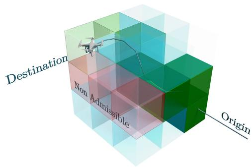  
Fig. 1. Sequence of cubes that constitutes an inter-cube path. Cubes that reached the pre-defined critical density are depicted in red. The sequence of cubes selected by the ICPP for a given UAV to reach its destination on time is depicted in green.

## A. The AirMatrix+ Flying Environment

In AirMatrix+, it is assumed that the flying environment is quantized into a set of cubes, each with a fixed side length l (illustrated in Fig. 1). This three-dimensional structure can efectively be represented in a two-dimensional space by modeling the environment as a graph $G = ( \mathcal { V } , \mathcal { E } )$ . Here, $\mathcal { V }$ denotes the set of nodes, corresponding to the cubes, and $\mathcal { E } ^ { \mathcal { O } }$ signifies the set of edges, representing all potential transitions between cubes.

Furthermore, each edge $( i , j ) \in \mathcal { E }$ represents the direct connection between two neighboring cubes $\{ i , j \} \in \mathcal { V }$ , with $j$ being part of ${ \mathcal { L } } _ { i } \subset { \mathcal { V } }$ denoting the set of all neighboring cubes of cube $i \in \mathcal { V }$ . At the graph level, each edge $( i , j )$ abstracts a generic transition between cubes and does not distinguish whether the physical adjacency is realized through a shared face or only along a common edge. Finally, to align with the objective of enforcing a maximum local UAV density, in this work, each cube $i \in \mathcal { V }$ in the airspace has a maximum allowed density, denoted as $C ,$ , which represents the maximum number of UAVs that can simultaneously traverse within the cube. C is set to a value close to the critical density of a cube in the AirMatrix+ airspace.

## B. The Path Planning Protocol

Prior to departure, a UAV intending to navigate the AirMatrix+ environment submits a request to a central UTMS. Upon receiving a batch of requests, i.e., all requests of UAVs in ${ \mathcal { M } } ,$ the UTMS processes them sequentially using the system-wide ICPP solution, which formulates and solves the OIPP problem for each request. As shown in the derivations that follow, by solving the OIPP problem, the “optimal” starting time $s _ { * } ^ { m }$ and the spatiotemporal path $p _ { * } ^ { m }$ for each UAV m is found. The flight path $p _ { * } ^ { m }$ comprises a sequence of cubes to be traversed on the way to the destination, along with the corresponding inter-cube crossing times. The selected spatiotemporal path is such that UAV m reaches its destination “on-time”, without overflowing the cube’s maximum densities C, $\forall i \in \mathcal { V } .$ . Once a path is identified, the ICPP reserves the necessary cubes in the path for the time-slots when the UAV is expected to traverse them. These reservations allow the ICPP to precisely estimate UAV numbers in each cube, ensuring compliance with maximum densities during flight request processing. Once all requests are processed, the UTMS communicates back the assigned departure time $s _ { * } ^ { m }$ and the spatiotemporal path $p _ { * } ^ { m }$ ∀m ∈ M . After receiving its path from the UTMS, each UAV autonomously adheres to the inter-cube crossing times, while maintaining a safe distance from other UAVs in the airspace (see Sec. V).

## C. Scheduling a UAV: The OIPP Problem Formulation

Similar to [14], the ICPP solution addresses the OIPP problem, for each request received, by determining two metrics associated with each cube in the flying environment: (i) the number of reservations for each cube per time-slot and (ii) the cubes’ admissibility state. The former, i.e., the number of reservations defined by the variable $r _ { i } ( k )$ , is used to track the accumulated number of UAVs traveling through a cube, for each cube $i \in \mathcal { V }$ and for all time-slots $k \in \mathcal { K }$ within the problem’s time horizon. Based on $r _ { i } ( k )$ , cube i is assumed to be admissible for UAV m at the discrete time-slot k if UAV m, arriving at cube i at time $k ,$ can traverse it without making the accumulated number of reservations exceed C during its sojourn time. To estimate the expected number of UAVs in each cube at any time, the number of time-slots UAV m spends traversing cube i towards any neighboring cube $j \in \mathcal { J } _ { i }$ is set to a fixed value equal to $\tau _ { i } ^ { m }$ . The value of $\tau _ { i } ^ { m }$ is chosen to be large enough to accommodate most UAV m trajectories between cubes i and any neighboring cube $j$ and is enforced by the ICPP solution through crossing time selection in the spatiotemporal path $p _ { * } ^ { m }$ . Hence, the admissibility state of cube i for UAV m at time $k ,$ denoted with the variable $\psi _ { i } ^ { m } ( k )$ , is equal to:

$$
\psi _ { i } ^ { m } ( k ) = \left\{ \begin{array} { c } { 1 , \mathrm { ~ i f ~ } r _ { i } ( t ) \leq C - 1 , \forall } \\ { g t \ t = k , . . . , k + \tau _ { i } ^ { m } } \\ { 0 , \mathrm { ~ o t h e r w i s e } . } \end{array} \right.\tag{3}
$$

and the travel-time cost of edge $( i , j ) \in \mathcal { E }$ at time k for UAV m traversing cube i toward neighboring cube j, i.e., $\tau _ { ( i , j ) } ^ { m } ( k )$ , is defined $\forall j \in { \mathcal { J } } _ { i }$ as:

$$
\tau _ { ( i , j ) } ^ { m } ( k ) = \left\{ \begin{array} { l l } { \tau _ { i } ^ { m } , \mathrm { i f } \psi _ { i } ^ { m } ( k ) = 1 \forall j \in \mathcal { J } _ { i } , } \\ { \infty , \mathrm { i f } \psi _ { i } ^ { m } ( k ) = 0 \forall j \in \mathcal { J } _ { i } . } \end{array} \right.\tag{4}
$$

Given reservations and admissibilities, the OIPP problem is formulated to minimize the diference $k _ { d e s } ^ { m } - s _ { * } ^ { m }$ , subject to the constraint that UAV m must arrive at its destination by $k _ { d e s } ^ { m } .$ In line with the problem formulation presented in Sec. III, in essence, the OIPP problem seeks to determine the latest departure time that allows for a feasible path for UAV m to arrive “on time”. Let $p ^ { h }$ denote the h-th available path between the source cube $O ^ { m }$ and the destination cube $D ^ { m }$ . Then, $p ^ { h }$ is defined as $p ^ { h } = ( 0 ^ { h } , 1 ^ { h } , . . . , j ^ { h } , . . . , ( L - 1 ) ^ { h } , L ^ { h } )$ , with $0 ^ { h } = O ^ { m }$ $( L - 1 ) ^ { h } = D ^ { m }$ , and $L ^ { h }$ the location of the destination within $D ^ { m }$

Algorithm 1 ICPP Algorithm   
1: Input: $G ( \mathcal { V } , \mathcal { S } ) , \mathcal { O } , \mathcal { D } , k _ { D } ^ { d e s } , \mathcal { Q } , \psi _ { i } ^ { m } ( k ) , r _ { i } ( k ) , \mathcal { T } _ { i } , \forall k$ ∈   
$\mathcal { H } , \forall m \in \mathcal { M } , \forall i \in \mathcal { V } ;$   
2: Algorithm Execution:   
3: for $\mathsf { q } = 1$ to 2 do   
4: Sort in descending order all requests with QoS equal   
to q based on the UAVs’ desired arrival times: $\begin{array} { r } { \overrightarrow { \mathcal { M } _ { q } } = } \end{array}$   
sort({m $| \forall q ^ { m } = q \}$ by $k _ { d e s } ^ { m } .$ descending).   
5: for $m ^ { \prime } \in \overrightarrow { \mathcal { M } _ { q } }$ do   
6: Run Algorithm $2 \Join$ (Solve the OIPP problem)   
7: .Reservations status Update:   
8: Update $r _ { i } ( k ) .$ based on $p _ { * } ^ { m ^ { \prime } }$ and $s _ { * } ^ { m ^ { \prime } }$ ∀k ∈   
$\mathcal { H } , \forall i \in \mathcal { V } ;$   
9: Admissibility status Update:   
10: Compute $\bar { \psi } _ { i } ^ { m ^ { \prime } + 1 } ( k ) , \forall \bar { k } \in \mathcal { H } , \forall i \in \mathcal { V } ;$   
11: end for   
12: end for   
13: Output: $p _ { * } ^ { m }$ and $s _ { * } ^ { m }$ ∀m $\in \mathcal { M } ;$

Note that L denotes the number of hops in $p ^ { h }$ . Additionally, let variable $k _ { j ^ { h } } ( s ^ { m } )$ be the arrival time at the j+1-th cube in path $p ^ { h } ,$ if UAV m departs at $s ^ { m } \in \mathcal { H }$ . Then, the arrival time at each cube along $p ^ { h } .$ , including the destination, is:

$$
k _ { 0 ^ { h } } ( s ^ { m } ) = s ^ { m } ,
$$

$$
k _ { 1 ^ { h } } ( s ^ { m } ) = k _ { 0 ^ { h } } ( s ^ { m } ) + \tau _ { ( 0 ^ { h } , 1 ^ { h } ) } ^ { m } \big ( k _ { 0 ^ { h } } ( s ^ { m } ) \big ) ,
$$

$$
k _ { L ^ { h } } ( s ^ { m } ) = k _ { ( L - 1 ) ^ { h } } ( s ^ { m } ) + \tau _ { ( ( L - 1 ) ^ { h } , L ^ { h } ) } ^ { m } \bigl ( k _ { ( L - 1 ) ^ { h } } ( s ^ { m } ) \bigr ) .\tag{5}
$$

Hence, the OIPP can be formulated as follows $( \mathrm { P } _ { 1 } ) { \mathrm { : } }$

$$
\begin{array} { r l } { ( { \mathbb P } _ { 1 } ) } & { \underset { s , p ^ { h } } { \operatorname* { m i n } } J _ { T } = k _ { d e s } ^ { m } - k _ { 0 ^ { h } } ( s ^ { m } ) } \\ & { \mathrm { s . t . } \mathrm { ~ M o d e l ~ D y n a m i c s ~ E q s . ~ } ( 3 ) - ( 5 ) } \\ & { \quad \quad k _ { L ^ { h } } ( s ^ { m } ) \leq k _ { d e s } ^ { m } , } \end{array}\tag{6a}
$$

(6b)

in which Eqs. (3) - (5) define the model dynamics and Eq. (6b) ensures that UAV m will reach its destination on or before the desired time. The considered model dynamics ensure that none of the UAVs will traverse cubes experiencing more than the maximum allowed density. Furthermore, in case all cubes are admissible, the model dynamics allow UAV m to follow the shortest path from $O ^ { m }$ to $D ^ { m } ,$ , departing at time $s _ { * } ^ { m } = k _ { d e s } ^ { m } - c _ { * } ^ { m } ,$ where $c _ { * } ^ { m }$ is the travel time of the shortest path. On the other hand, if there are cubes within the shortest path that are at their maximum allowed density (i.e., they are not admissible), then two alternatives exist for UAVs: (i) either to depart at an earlier time when all cubes of the shortest path are admissible (and arrive earlier than the desired time), or (ii) take a longer path through admissible cubes and arrive at the destination on time. Out of all possible solutions, $( \mathsf { P } _ { 1 } )$ will select the one that will allow the UAV to depart as late as possible from the origin and still make it to the destination on time (i.e. the best mixing strategy of the two aforementioned alternatives).

Algorithm 2 OIPP Algorithm   
1: Input: $G ( \mathcal { V } , \mathcal { E } ) , O ^ { m } , D ^ { m } , k _ { d e s } ^ { m } , \psi _ { i } ^ { m } ( k ) , \tau _ { i } ^ { m } , \ \forall k \in \mathcal { H } , i \in$   
$\mathcal { V } ;$   
2: Initialization:   
3: Construct $G _ { T S } ( \mathcal { V } _ { T S } , \mathcal { E } _ { T S } )$ with $\mathcal { E } _ { T S } ^ { o } = \{ \emptyset \}$   
4: $\mathcal { R } _ { i } = \{ \emptyset \} \ \forall i \in \mathcal { V } ;$   
5: $\mathcal { R } _ { D ^ { m } } \gets \mathcal { R } _ { D ^ { m } } \cup \{ k | \psi _ { D ^ { m } } ^ { m } ( k - \tau _ { D ^ { m } } ^ { m } ) = 1 \} , \ \forall k \in \mathcal { H }$   
6: $\theta = k _ { d e s } ^ { m }$   
7: $s _ { * } ^ { m } = - \infty$   
8: Algorithm Execution:   
9: while $\theta > s _ { * } ^ { m }$ do   
10: for $( i , j ) \in \mathcal { E }$ do   
11: if $\psi _ { i } ^ { m } ( \theta - \tau _ { i } ^ { m } ) = = 1 \mathbf { a n d } \theta \in \mathcal { R } _ { j }$ then   
12: $\dot { \mathcal { R } } _ { i } \gets \dot { \mathcal { R } _ { i } } \cup \{ \theta - \tau _ { i } ^ { m } \} ;$   
13: $\mathcal { E } _ { T S }  \mathcal { E } _ { T S } \cup \{ ( j _ { T S } , i _ { T S } ) \}$ , with $k _ { j _ { T S } } = \theta$ and $k _ { i _ { T S } } =$   
$\theta - \tau _ { i } ^ { m } ;$   
14: $\mathbf { i f } \ i = = O ^ { m } \mathbf { A } \mathbf { N } \mathbf { D } \theta - \tau _ { i } ^ { m } > s _ { * } ^ { m }$ then   
15: $s _ { * } ^ { m } = \theta - \tau _ { i } ^ { m } ;$   
16: end if   
17: end if   
18: end for   
19: $\theta = \theta - 1 ;$   
20: end while   
21: Find the spatiotemporal path $\begin{array} { r l r l } { p _ { * _ { * } } ^ { m } } & { { } } & { = } \end{array}$   
$( D _ { T S } ^ { m } , \hdots , \nu _ { T S } ^ { p } , \nu _ { T S } ^ { p + 1 } , \hdots , O _ { T S } ^ { m } )$ such that $( \nu _ { T S } ^ { p } , \nu _ { T S } ^ { \bar { p } + 1 } ) \in \mathcal { E } _ { T S }$   
$\forall p ,$ , . . . and $k _ { O _ { T S } ^ { m } } = s _ { * } ^ { m } ;$   
22: Output: $p _ { * } ^ { m } , s _ { * } ^ { m } ;$

## D. The ICPP Solution

This section presents the algorithmic methodology that is used by the ICPP to eficiently solve the OIPP problem for each received request. Specifically, Alg. 1 is executed. Initially, the ICPP collects all UAV requests, one per UAV, as input. The algorithm proceeds by iterating over all QoS UAV classes, commencing with UAVs requiring the tightest matching between the actual and the desired arrival times at destination (line 3). Within each group, requests are sorted in descending order based on their desired arrival times (line 4) and are then processed sequentially on a first-come, firstserved basis. For each request in the sorted set $\overrightarrow { \mathcal { M } } _ { q } .$ where $q$ is the QoS class under analysis, the ICPP tackles the OIPP problem, as per Algorithm 2 (line 6). The outcome of Algorithm 2 yields the assigned spatiotemporal path $p _ { * } ^ { m }$ and the departure time $s _ { * } ^ { m }$ for each UAV m. This data is subsequently employed to update the reservation (lines 7-8) and admissibility (lines 9-10) statuses of the cubes. The procedure is repeated for all UAV QoS classes. Interestingly, this approach gives precedence to UAVs requiring the tightest matching between the actual and the desired arrival times. An increase in reservations potentially limits cube availability, leading to UAVs starting/arriving earlier than necessary. Hence, prioritizing such UAV QoS classes first optimizes their chances of being scheduled to arrive precisely at their intended times.

OIPP Solution Approach: To eficiently solve the OIPP problem, a DP methodology is introduced. DP leverages the fact that the 3D environment is modeled as a graph, enabling the construction of a directed acyclic graph (DAG) on which the optimal solution can be computed, in line with the approach described in [36] and detailed in the following. In particular, the developed DAG is a time-space graph (i.e., $G _ { T S } ( \mathcal { V } _ { T S } , \mathcal { E } _ { T S } ) )$ where the space dimension contains all the indices of the cubes in $i \in \mathcal { V }$ and the time dimension includes consecutive time-slots in descending order, starting from the desired destination arrival time, $k _ { D ^ { m } } ^ { d e s }$ and going back in time. In this way, each node of the DAG, $i _ { T S } \in \mathcal { V } _ { T S }$ , denotes both a cube in the original graph $i \in \mathcal { V }$ and the arrival time at the cube of the UAV under analysis, with $k _ { i _ { T S } } \ \leq \ k _ { D ^ { m } } ^ { d e s } , k _ { i _ { T S } } \ \in \ \mathcal { H }$ . The goal of the proposed DP methodology is to connect, through the edges $( j _ { T S } , i _ { T S } ) \ \in \ \mathcal { E } _ { T S }$ , nodes in the DAG, respecting the following conditions: (a) $i _ { T S }$ and $j _ { T S } ~ \in ~ \mathcal { V } _ { T S }$ represent neighboring cubes i and $j$ in the original graph G; (b) the distance in time between the two nodes in the reverse direction of the DAG (i.e., backwards in time) corresponds to the finite travel time cost $\tau _ { i } ^ { m }$ , as computed in Eq. (4). Nevertheless, inserting edges between DAG’s nodes only based on Eq. (4) may produce edges that can never be reached from the destination (meaning that there is no admissible path that connects that specific cube and destination). Hence, the $\mathrm { D P }$ state of node reachability is introduced. A node $i _ { T S }$ is considered reachable if at least one edge $( j _ { T S } , i _ { T S } ) \in \mathcal { E } _ { T S }$ exists respecting conditions (a) and (b) mentioned above, and the starting node $j _ { T S }$ is reachable, i.e., an admissible spatiotemporal path exists from the destination to $j _ { T S }$ . Only edges connecting reachable nodes in the constructed DAG are actually inserted in the graph.

Based on the presented edge insertion rule, Alg. 2 presents the DAG algorithmic solution to the OIPP problem. The algorithm takes as input the request of UAV m (consisting of $O ^ { m } , D ^ { m }$ , and $k _ { D ^ { m } } ^ { d e s } )$ , the speed profile of the UAV $( \mathrm { i } . \mathrm { e } . , \tau _ { i } ^ { m }$ $\forall i \in \mathcal { V } )$ , the current admissibility status (i.e., m(k)), for all time instances $k \in \mathcal { H }$ and cubes $i \in \mathcal { V }$ (line 1). The DAGbased solution starts from the $\mathrm { U A V } ^ { \ , } \mathbf { s }$ desired arrival time (i.e., $k _ { d e s } ^ { m } )$ and works backwards in time until the UAV reaches the origin within cube $O ^ { m }$ for the first time. To begin, the algorithm initializes the time-space graph, i.e., $G _ { T S } ( \mathcal { V } _ { T S } , \mathcal { E } _ { T S } )$ without adding any edges, i.e., $\mathcal { E } _ { T S } ~ = ~ \{ \emptyset \}$ (line 3), which implies that no cubes are reachable at the initial stage. The set of time-slots for which cube $i \in \mathcal { V }$ is reachable, hereafter denoted as $\mathcal { R } _ { i } .$ , is set to an empty set, $\forall i \in \mathcal { V }$ (line 4). The destination cube, $D ^ { m }$ , is considered reachable during any time-slot in which it is admissible at time $k - \tau _ { D ^ { m } } ^ { m }$ , where $\tau _ { D ^ { m } } ^ { m }$ represents the time required for the UAV to reach the destination after entering the destination cube (line 5). Finally, the algorithm’s starting time is set to the desired arrival time (line 6), and the optimal departure time from the originating cube is initialized to −∞ (line 7), as the actual departure time is unknown at the beginning. The main part of the algorithm is an iterative procedure that inserts edges into the time-space graph (lines 9-20). In this iterative procedure, starting from the desired arrival time and going backwards one time-slot at a time, the edges of the original graph $( \mathrm { i . e . , ~ } ( i , j ) \in \mathcal { E } )$ are checked to ascertain whether at time (line 11): (i) the corresponding start node $i _ { T S }$ in the DAG, representing cube i with a UAV arrival time $k _ { i _ { T S } } = \theta - \tau _ { i } ^ { m }$ , is admissible $( \mathrm { i . e . }$ $\psi _ { i } ^ { m } ( \theta - \tau _ { i } ^ { m } ) = 1 )$ ; and (ii) the corresponding end node $j _ { T S }$ in the DAG, representing cube j with a UAV arrival time $k _ { j _ { T S } } = \theta$ is reachable from the destination $( \theta \in \mathcal { R } _ { j } )$ . In that case, $i _ { T S }$ θis θdeemed reachable (line 12), and the edge $( j _ { T S } , i _ { T S } )$ is inserted in the time-space graph (line 13). Every time i corresponds to the departure cube, i.e., $O ^ { m }$ , and the UAV start time at the corresponding node $i _ { T S }$ in the DAG, i.e., $k _ { i _ { T S } } = \theta - \tau _ { i } ^ { m }$ exceeds the currently stored departure time, $s _ { * } ^ { m }$ , a better path is identified between the start and arrival locations that minimizes Eq. (6a). Consequently, $s _ { * } ^ { m }$ is updated (lines 14-16). The entire process stops when $\theta$ corresponds to the current $s _ { * } ^ { m }$ , since this is the time that the starting location of UAV m is reached for the first time. In that case, the algorithm converges and returns the departure time $s _ { * } ^ { m }$ and the identified (on the DAG) spatiotemporal path $p _ { * } ^ { m }$ between the cubes $O ^ { m }$ and $D ^ { m }$ (lines 21-22). Using the notation in Eq. (5), Alg. 2 provides UAV m with the selected optimal path, in terms of cubes to traverse, and the corresponding crossing times $k _ { j ^ { * } } ( s _ { * } ^ { m } )$ between the j-th and j+1-th cube in the optimal path.

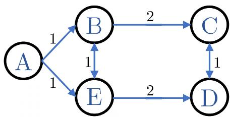  
Fig. 2. An example network.

Algorithm 2 obtains an optimal solution for the OIPP problem within the discretized space-time domain in a pseudopolynomial time (as the horizon $\mathcal { K }$ that is necessary for Alg. 2 to visit the originating cube $O ^ { m }$ is unknown beforehand). Specifically, the algorithm converges with complexity $O ( ( k _ { d e s } ^ { m } - s _ { * } ^ { m } ) | \mathcal { E } | )$

## E. Illustrative Example

To better understand the DAG procedure, consider the network example illustrated in Fig. 2, where the depicted graph represents an environment divided into 5 cubes (A B C D, and $E )$ and the edge lengths reflect the traversal time within each cube for every UAV, while the maximum allowed density of all cubes is 1 UAV/cube. To show that the ICPP approach can be applied to any type of flying environment, in the presented example, the sojourn time of a UAV in a cube depends on the cube that needs to be reached. The UTMS receives two requests from two UAVs belonging to the same QoS class. The two UAVs request a path from A to $D$ with desired arriving times $k _ { D } ^ { d e s } = 9$ and $\bar { k } _ { D } ^ { d e s } \ = \ 1 0 .$ , respectively (to simplify the description, in the example, the time required to reach the destination within D is considered equal to 0). Consequently, the requests are sorted in descending order according to Alg. 1, and thus the second request is executed first by Alg. 2, followed by the execution of the algorithm for the first request.

Figure 3a shows the DAG graph constructed by serving the first sorted request. Each node in the graph has two dimensions: (i) the space dimension of each node, indicating the cube index; and (ii) the arrival time of the UAV at the cube, starting from $k _ { D } ^ { d e s } = 1 0$ and moving backwards. Given that the flying environment is empty, $\mathcal { R } _ { D }$ includes all timeslots. In the constructed DAG shown in Fig. 3a, the black solid-line edges are those that are added to construct the DAG, i.e., edges starting from reachable nodes (from the destination) and arriving at admissible nodes. Applying recursively the OIPP algorithm, as shown in Fig. 3a, the fourth column is the first time index that the origin is reached, with the algorithm converging at this time index. In that way, the gridshaded nodes represent the optimal spatiotemporal path $p _ { * } ^ { 1 }$ (also denoted with the solid green line in the DAG) with the latest departure time being $s _ { * } ^ { 1 } = 7$ . Next, based on the obtained solution, Alg. 1 updates the reservations and the admissibility states of the edges for the second request. For what concerns the admissibility, since the flight time $\tau _ { i } ^ { m }$ depends on the next hop in the path, the definition in Eq. (3) is enhanced as follows:

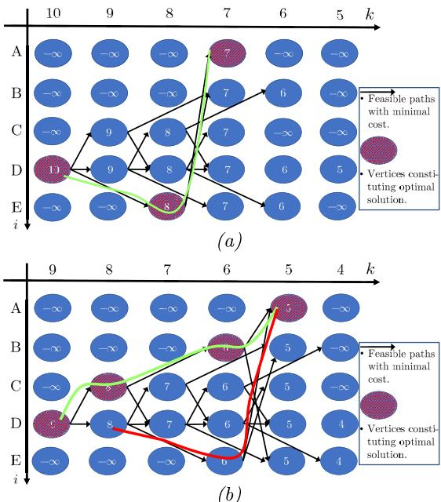  
Fig. 3. The direct acyclic graph generated to solve (a) the second UAV request (b) the first UAV request.

$$
\psi _ { i , j } ^ { m } ( k ) = \left\{ \begin{array} { c } { 1 , \mathrm { ~ i f ~ } r _ { i } ( t ) \leq C - 1 , \forall } \\ { g t \ t = k , . . . , k + \tau _ { i , j } ^ { m } } \\ { 0 , \mathrm { ~ o t h e r w i s e . } } \end{array} \right.\tag{7}
$$

As a consequence, $\psi _ { A . E } ^ { 2 } ( 7 ) = 0$ and $\psi _ { A , B } ^ { 2 } ( 7 ) = 0$ (considering $r _ { A } ( 7 ) = 1 )$ , while $\psi _ { E , D } ^ { 2 } ( 7 ) , \psi _ { E , D } ^ { 2 } ( 8 ) , \psi _ { E , D } ^ { 2 } ( 9 ) = 0$ and $\psi _ { E , B } ^ { 2 } ( 8 )$ $\psi _ { E . B } ^ { 2 } ( 9 ) = 0$ ψ , (considering $r _ { E } ( 8 ) = r _ { E } ( 9 ) = 1 )$ ,. Subsequently, ψ ,Alg. 2 re-executes the OIPP solution for the second request $( { \bf e . g . } , k _ { D } ^ { d e s } = 9 )$ where the associated DAG graph is depicted in Fig. 3b. For this case, the time index begins at the 9-th time-slot (according to the UAV’s request), while due to reservations made from the first UAV, it can be observed that the shortest path reaching the destination at the desired time-step is not a feasible solution, since $\psi _ { E , D } ^ { 2 } ( 7 ) = 0$ . Hence, the origin ,is reached for the first time at the 5-th time-slot (fifth column in the DAG) through two diferent alternative spatiotemporal paths (denoted with green and red solid lines). The algorithm then selects as a solution the green spatiotemporal path as $p _ { * } ^ { 2 }$ (i.e., the path $A \to B \to C \to D )$ , with $s _ { * } ^ { 2 } = 5$ . Note that both solutions have the same objective value for (P1) (i.e., $J _ { T } = 4 )$ but their lengths difer. More specifically, if the UAV follows the green spatiotemporal path then the duration of its travel time will be 4 time-slots and it will arrive at the destination exactly on time. On the other hand, if it follows the red spatiotemporal path, the duration of its travel time will be 3 time-slots and it will arrive at the destination 1 time-slot earlier, meaning that the UAV will wait at the destination for 1 time-slot (non-preferred solution).

## V. “INSIDE THE CUBE”

This section presents the trajectory planning of UAVs within each cube. The primary objective of this planning is to adhere safely to the spatiotemporal path defined by the reservation solution in Sec. IV, minimizing temporal deviations. The protocol used by the UAVs during cube traversal to ensure safe decision-making, not only for the UAV itself but also for neighboring UAVs, is introduced in Sec. V-A. Next, based on the UAV’s motion model and collected information, a stochastic optimization framework that seeks to adhere to the expected flight time within each cube, while maintaining a guaranteed level of safety (the Intra-Cube Optimum), is discussed in Sec. V-B. Finally, Sec. V-C presents the conversion of the Intra-Cube Optimum into a deterministic optimization, referred to as the Intra-Cube Planner, which the UAVs solve to navigate through the cubes.

## A. Protocol Overview

Following the approach outlined in [37], the UAVs compute their control inputs using a distributed method. This represents a standard distributed strategy for coordinated autonomous UAVs, well suited to the dense low-altitude urban operations envisioned in this work.

Given the spatiotemporal path $p _ { * } ^ { m }$ provided by the UTMS, UAV m navigates through the cubes, aiming to meet the expected crossing times. Specifically, upon entering the j-th cube in the optimal spatiotemporal path $p _ { * } ^ { m }$ , UAV m computes the control inputs to reach its next cube as close as possible to $k _ { j ^ { * } } ( s _ { * } ^ { m } )$ , using the predicted future trajectories of nearby UAVs to ensure safety. At each time-slot $k ,$ all UAVs use new sensor measurements to estimate their state $\mathbf { X } _ { k }$ , assuming, with no loss of generality, no associated error. Then, using $\mathbf { X } _ { k }$ and the controls selected upon entering their current cube, the UAVs compute their future expected trajectory and broadcast this information to neighboring UAVs. More precisely, given $T ^ { \prime }$ remaining time-slots before reaching its next cube, a UAV estimates its forthcoming trajectory by exploiting the Markov property of the UAV dynamics, i.e., according to Eq. (1), the future states depend only on the current state and control input. Denoting with $\mathbf { X } _ { k + t }$ the state of the UAV at time $k + t ,$ with $t \in [ 1 , . . , T ^ { \prime } ]$ , and applying Eq. (1) recursively, the following ,holds:

$$
\mathbf { x } _ { k + t } = \Phi ^ { t } \mathbf { x } _ { k } + \sum _ { n = 0 } ^ { t - 1 } \Phi ^ { n } \left[ \Gamma \mathbf { u } _ { k + t - n - 1 } + \mathbf { G } \alpha _ { k + t - n - 1 } \right] .\tag{8}
$$

Since $\pmb { \alpha } _ { k } \sim \mathcal { N } ( \pmb { 0 } , \pmb { \Sigma } ) , \forall k$ , the perturbation acting on the UAV α ,states follows an i.i.d. Gaussian distribution. Therefore, $\mathbf { X } _ { k + t }$ is distributed as $\mathbf { x } _ { k + t } \sim \mathcal { N } ( \pmb { \mu } _ { k + t } , \pmb { \Xi } _ { k + t } )$ with $\pmb { \mu } _ { k + t }$ and $\Xi _ { k + t }$ given by:

$$
\pmb { \mu } _ { k + t } = \Phi ^ { t } \mathbf { x } _ { k } + \sum _ { n = 0 } ^ { t - 1 } \Phi ^ { n } \mathbf { \Gamma } \mathbf { U } _ { k + t - n - 1 } ,
$$

$$
\boldsymbol { \Xi } _ { k + t } = \sum _ { n = 0 } ^ { t - 1 } \Phi ^ { n } \mathbf { Q } ( \Phi ^ { \top } ) ^ { n } ,\tag{9}
$$

where $\mathbf { Q } \ = \ \mathbf { G } \mathbf { Z } \mathbf { G } ^ { \top }$ is the covariance of the zero mean Gaussian disturbance acting on the system. At each timeslot $k ,$ the expected trajectory $\pmb { \mu } _ { T ^ { \prime } } = \{ \pmb { \mu } _ { k + t } \} , t \in [ 1 , . . , T ^ { \prime } ]$ and the associated uncertainty $\Xi _ { T ^ { \prime } } ~ = ~ \{ \Xi _ { k + t } \} , ~ t ~ \in ~ [ 1 , . . , T ^ { \prime } ]$ is the information broadcasted by the UAVs.

Based on the received $\pmb { \mu } _ { T } ,$ and $\Xi _ { T ^ { \prime } }$ from neighboring UAVs, µUAV m selects a subset of UAVs to avoid while traversing the next cube in its optimal path. Specifically, UAV m constructs a larger cube with a fixed side length $l ^ { \prime } > l ,$ centered at the same location as the cube it is about to traverse. This larger cube defines a region of airspace that includes the upcoming cube and a bufer zone of size $( l ^ { \prime } - l ) / 2$ in all directions. UAV m identifies all neighboring UAVs whose expected future trajectories lie (even partially) within this defined airspace, grouping them into a set denoted as $\mathcal { U } _ { k } ^ { m } \subseteq \mathcal { M }$ , and incorporates this information into its trajectory planning. This approach not only helps avoid UAVs traversing the same cube as UAV $m ,$ but also ensures a safe trajectory between cubes, minimizing the risk of conflicts in adjacent areas. UAV m determines its final trajectory by utilizing the Intra-Cube Planner, as described in Sec. V-C. To ensure consistent trajectory planning, all UAVs that need to update their controls at the same time-slot k agree on a predetermined order. Hence, once UAV $m$ has calculated its expected trajectory, represented by $\pmb { \mu } _ { T ^ { \prime } } ^ { m }$ and $\Xi _ { T ^ { \prime } } ^ { m }$ µit broadcasts this information to neighboring UAVs, enabling them to compute their new trajectories.

## B. A Stochastic Time-Based Optimization Framework for UAV Trajectory Planning

This section introduces the stochastic Intra-Cube Optimum framework, which uses a robust MPC approach to guide UAVs through the AirMatrix+ airspace. The main novelty of the present contribution does not lie in the stochastic modeling alone, but in the tight integration between the intercube and intra-cube planning layers. Under uncertainty, the Intra-Cube Planner is designed to satisfy the deadlines imposed by the ICPP while accounting for border efects between cubes. This ensures that local, uncertainty-aware trajectory planning remains fully consistent with the global four-dimensional (4-D) path assigned by the ICPP.

In the following, the framework is applied to UAV m, which, upon entering its j-th cube along its optimal spatiotemporal path $p _ { * } ^ { m }$ at time-slot $k ,$ aims to reach the next cube precisely at $k _ { j ^ { * } } ( s _ { * } ^ { m } )$ . Due to interactions with other UAVs and the assumption that sojourn times in cubes are equal to a fixed duration $\tau _ { i } ^ { m }$ , UAV m may in practice enter the j-th cube at a diferent time than the expected $k _ { j - 1 ^ { * } } ( s _ { * } ^ { m } )$ . As shown in the following, this efect is explicitly accounted for within the Intra-Cube Optimum framework, since timely cube crossing is of paramount importance. Furthermore, the framework determines the control inputs of UAV m, i.e., ${ \bf u } _ { [ k : k + T - 1 ] } ^ { m } ,$ over a suficiently large planning horizon T , ensuring that the probability of loss of separation with other UAVs remains below .

The framework is presented assuming that the j-th cube in the optimal path of UAV m is centered at [0 0 0] and that the next cube is reached through the top face. This choice is without loss of generality, as the same formulation can be adapted to any transition between neighboring cubes by redefining the local frame and the active face or edge constraints. Accordingly, the Intra-Cube Optimum can be expressed by:

## Problem Intra-Cube Optimum:

$$
\operatorname* { m i n } _ { \mathbf { u } _ { [ k : k + T - 1 ] } ^ { m } } \quad \sum _ { t = 1 } ^ { T } b _ { t } ^ { m }\tag{10a}
$$

subject to:

$$
\sum _ { t = 1 } ^ { T } b _ { t } ^ { m } \geq ( k _ { j } ^ { * } ( s _ { * } ^ { m } ) - k ) / \delta T - 1
$$

$$
b _ { t - 1 } ^ { m } - b _ { t } ^ { m } \geq 0 \quad \forall t\tag{10b}
$$

$$
b _ { t } ^ { m } \in \{ 0 , 1 \} \quad \forall t\tag{10c}
$$

$$
\mu _ { k + t } ^ { m } \mathrm { ~ a s ~ i n ~ E q . ~ } ( 6 ) \quad \forall t\tag{10d}
$$

$$
| [ \mu _ { x } ] _ { k + t } ^ { m } | \leq l / 2 \quad \forall t\tag{10e}
$$

$$
| [ \mu _ { y } ] _ { k + t } ^ { m } | \leq l / 2 \quad \forall t\tag{10f}
$$

$$
[ \mu _ { z } ] _ { k + t } ^ { m } \geq - l / 2 \quad \forall t\tag{10g}
$$

$$
[ \mu _ { z } ] _ { k + t } ^ { m } \geq l / 2 - b _ { t } ^ { m } M \quad \forall t\tag{10h}
$$

$$
| \mathbf { u } _ { k + t } ^ { m } | \leq \mathbf { u } _ { M A X } \quad \forall t\tag{10i}
$$

$$
| \mathbf { u } _ { k + t } ^ { m } - \mathbf { u } _ { k + t - 1 } ^ { m } | \leq \Delta \mathbf { u } \quad \forall t\tag{10j}
$$

$$
| [ \dot { \mu _ { x } } , \dot { \mu _ { y } } , \dot { \mu _ { z } } ] _ { k + t } ^ { m } | \le \mathbf { v } _ { M A X } ~ \forall t\tag{10k}
$$

$$
P ( | [ p _ { x } , p _ { y } , p _ { z } ] _ { k + t } ^ { m } - [ p _ { x } , p _ { y } , p _ { z } ] _ { k + t } ^ { i } | \leq d _ { \operatorname* { m i n } } ) < \epsilon ,\tag{10l}
$$

$$
\forall i \in \mathcal { U } _ { k } ^ { m } , \forall t\tag{10m}
$$

UAV m minimizes the diference between expected and actual crossing times by using auxiliary binary variables $b _ { t } ^ { m }$ $\forall t \in [ 1 : T ]$ . As described later, $b _ { t } ^ { m }$ is set by the Intra-Cube Optimum to 1 if UAV m is in the j-th cube along the optimal path at time-slot $k + t ,$ , and 0 otherwise. Therefore, minimizing the diference between expected and actual crossing times for UAV $m$ is achieved through concurrent minimization of time spent within the cube (objective function in Eq. (10a)) and enforcing that the earliest exit time from the cube is the deadline decided by the ICPP, i.e., $k _ { j } ^ { * } ( s _ { * } ^ { m } )$ (constraint in Eq. (10b)). In this way, the deadline imposed by the Intra-Cube Planner limits the propagation of any delays accumulated earlier along the trajectory of UAV m. Additionally, Eq. (10c) guarantees that, once it exits the j-th cube in its optimal path, UAV m does not return to it within the planning horizon T.

The Intra-Cube Optimum ensures that the binary variables $b _ { t } ^ { m } , \ \forall t \in [ 1 : T ]$ , assume the desired values using Eqs. (10e)- (10j). First, Eq. (10e) aligns the optimization with the UAV dynamics. In this context, Eq. (9) represents the linear relationship between the unknown controls ${ \bf u } _ { [ k : k + T - 1 ] } ^ { m }$ of

UAV m and its expected future states. Equations (10f)- (10h) constrain UAV m’s expected location within the lateral and the bottom boundaries of the traversed cube. Lastly, the constraint in Eq. (10i) uses a big-M approach to assign the correct values to the auxiliary binary variables. Specifically, $[ \mu _ { z } ] _ { k + t } ^ { m } \geq l / 2$ represents locations above the cube’s top side, where, as mentioned earlier, the next cube in UAV $m { \mathrm { : } } { \mathrm { s } }$ optimal path is located. If at time-slot $k + t ,$ the controls selected by the Intra-Cube Optimum keep UAV m within the current cube, to satisfy Eq. (10i), $b _ { t }$ is forced to 1. Once UAV m enters the next cube, Eq. (10i) is always satisfied, allowing $b _ { t } ^ { m }$ to take any value. However, since the objective function minimizes the sum of these binary variables, $b _ { t } ^ { m }$ is driven to 0, as desired. To have a realistic solution to the trajectory planning problem, in the Intra-Cube Optimum, applied forces and UAV speed respect specific valid bounds: (i) the module of the applied force $| \mathbf { u } _ { k + t } ^ { m } |$ is at most $\mathbf { u } _ { M A X }$ and consecutive controls cannot difer by more than ∆u (Eqs. (10j) and (10k), respectively); and (ii) the module of the expected UAVs’ speed takes values in the interval $[ 0 ,  { \mathrm { v } } _ { M A X } ]$ (Eq. (10l)).

Finally, Eq. (10m) establishes the minimum safety requirement that UAV m must adhere to. Specifically, the probability of loss of separation between any two UAVs must be constrained within a specified threshold, $\epsilon ,$ at all times t. This requirement categorizes the presented framework as a stochastic optimization problem. However, solving stochastic optimizations is generally impractical without suitable approximations. To address this challenge, Eq. (10m) is transformed into a deterministic constraint, as explained in the following section.

## C. Accounting for Loss of Separation Probability: The Deterministic Intra-Cube Planner

The goal of this section is to establish a deterministic constraint for each $i \in \mathcal { U } _ { k } ^ { m }$ and each time-slot $k + t , \ t \in [ 1 , . . , T ^ { \prime } ]$ , , ..,that bounds the loss of separation probability to a small value .

First, a 3D region is constructed that includes the barycenter of UAV i at time-slot $k + t$ with a probability of $_ { 1 - \epsilon / 2 }$ . Given /that UAV i has already decided its controls, its future states follows a Gaussian distribution with known mean $\mu _ { k + t } ^ { i } ,$ , and covariance $\Xi _ { k + t } ^ { i } ,$ as derived in Eq. (9). Leveraging established statistical results on the cumulative density function (CDF) associated with Gaussian distributions [38], this 3D region can be represented as an ellipsoid around the known mean $\mu _ { k + t } ^ { i } .$ Specifically, the three semi-axes of the ellipsoid containing the barycenter of UAV i with probability $_ { 1 - \epsilon / 2 }$ are:

$$
\begin{array} { r } { a _ { t , 1 } ^ { i } = \sqrt { K _ { \epsilon } \beta _ { t , 1 } ^ { i } } ; } \\ { a _ { t , 2 } ^ { i } = \sqrt { K _ { \epsilon } \beta _ { t , 2 } ^ { i } } ; } \\ { a _ { t , 3 } ^ { i } = \sqrt { K _ { \epsilon } \beta _ { t , 3 } ^ { i } } ; } \end{array}\tag{11}
$$

where $\beta _ { t , 1 } , \beta _ { t , 2 }$ , and $\beta _ { t , 3 }$ are the eigenvalues of the $3 \times 3$ submatrix of $\Xi _ { k + t } ^ { i }$ regarding the UAV location, and $K _ { \epsilon }$ is the inverse of the CDF of the chi-squared distribution having three degrees of freedom computed at $1 - \epsilon / 2$

of $1 - \epsilon / 2 .$ . Contrarily to UAV i, the expected location $\pmb { \mu } _ { k + t } ^ { m }$ / µof UAV m is unknown, since its controls have still to be decided. Nevertheless, as derived in Eq. (9), the covariance matrix $\Xi _ { k + 1 } ^ { m }$ does not depend on the applied controls ${ \bf u } _ { [ k : k + T - 1 ] } ^ { m } .$ As a consequence, even though the exact location of the 3D region containing UAV m is unknown, the semi-axes lengths of this ellipsoid can be easily pre-computed as in Eq. (11).

Given the location of the ellipsoid of UAV i and the size of the ellipsoid of UAV $m ,$ let us assume that, through the Intra-Cube Planner, UAV m selects a trajectory such that, at any time $k + t ,$ the two ellipsoids containing the two UAVs are always separated by at least $d _ { \mathrm { m i n } }$ meters. Then, a valid bound on the loss of separation probability can be obtained. Specifically, UAVs i and m may violate the imposed minimum distance if and only if at least one of them is outside its ellipsoid, i.e.:

$$
\begin{array} { r l r } & { P ( | [ p _ { x } , p _ { y } , p _ { z } ] _ { k + t } ^ { m } - [ p _ { x } , p _ { y } , p _ { z } ] _ { k + t } ^ { i } | \leq d _ { \operatorname* { m i n } } ) \leq 1 - ( 1 - \epsilon / 2 ) ^ { 2 } } & \\ & { \leq \epsilon - \displaystyle \frac { \epsilon ^ { 2 } } { 4 } \leq \epsilon . } & { ( \ln \mathrm { e } ) } \end{array}\tag{12}
$$

For any two points of the ellipsoids of UAVs i and m to respect the minimum distance $d _ { \mathrm { m i n } }$ , a suficient distance $d _ { k + l } ^ { i , m }$ between their expected barycenters’ locations is imposed. First, each ellipsoid is approximated with a sphere with radius $r _ { k + t } ^ { x }$ equal to:

$$
\boldsymbol { r } _ { k + t } ^ { x } = \operatorname* { m a x } ( a _ { t , 1 } ^ { x } , a _ { t , 2 } ^ { x } , a _ { t , 3 } ^ { x } ) ,\tag{13}
$$

where the apex defines the UAV. With this approximation, any point in the ellipsoid is also in the sphere, and the probability of having the barycenter of the UAV within the sphere is larger than $_ { 1 - \epsilon / 2 }$ . Subsequently, imposing between the expected locations of the UAVs $[ \mu _ { x } , \mu _ { y } , \mu _ { z } ] _ { k + i } ^ { m }$ and $[ \mu _ { x } , \mu _ { y } , \mu _ { z } ] _ { k + i } ^ { i }$ the distance:

$$
d _ { k + t } ^ { i , m } = r _ { k + t } ^ { i } + r _ { k + t } ^ { m } + d _ { \operatorname* { m i n } } , \quad \forall t\tag{14}
$$

ensures, as required, that any two points on the two spheres, hence on the ellipsoids as well, are at least $d _ { \mathrm { m i n } }$ away. The computation of $d _ { k + t } ^ { i , m }$ thus enables the transformation of the chance constraint on loss of separation probability into a minimum safe distance between the expected locations of the UAVs. It should be noted that, as the prediction horizon increases, the covariance matrices $\Xi _ { k + l } ^ { i }$ and $\Xi _ { k + t } ^ { m }$ grow, enlarging the associated uncertainty regions and thus increasing the required distance $d _ { k + t } ^ { i , m }$ . In dense airspace or under stringent bounds on loss of separation, this progressively tightens the set of feasible trajectories and may render some inter-cube transitions infeasible. This coupling between uncertainty growth, safety guarantees, and trajectory feasibility is a key aspect of the proposed framework.

Overall, the Intra-Cube Planner applied by UAV m for the same scenario introduced for the Intra-Cube Optimum can be expressed by the following mixed integer quadratically constrained program (MIQCP):

Problem Intra-Cube Planner:

$$
\operatorname* { m i n } _ { \mathbf { u } _ { [ k : k + T - 1 ] } ^ { m } } \quad \sum _ { t = 1 } ^ { T } b _ { t } ^ { m } + \sum _ { i \in \mathcal { U } _ { k } ^ { m } } \sum _ { t = 1 } ^ { T _ { i } ^ { \prime } } \zeta _ { t } ^ { i , m } M\tag{15a}
$$

Then, the 3D region can be computed that contains the barycenter of UAV m at time-slot $k + t$ with a probability subject to: Authorized licensed use limited to: Guangxi University. Downloaded on July 05,2026 at 11:47:12 UTC from IEEE Xplore. Restrictions apply.

$$
\sum _ { t = 1 } ^ { T } b _ { t } ^ { m } \geq ( k _ { j } ^ { * } ( s _ { * } ^ { m } ) - k ) / \delta T - 1\tag{15b}
$$

$$
b _ { t - 1 } ^ { m } - b _ { t } ^ { m } \geq 0 \quad \forall t\tag{15c}
$$

$$
b _ { t } ^ { m } \in \{ 0 , 1 \} \quad \forall t\tag{15d}
$$

$$
\mu _ { k + t } ^ { m } \mathrm { ~ a s ~ i n ~ E q . ~ } ( 6 ) \quad \forall t\tag{15e}
$$

$$
| [ \mu _ { x } ] _ { k + t } ^ { m } | \leq l / 2 \quad \forall t\tag{15f}
$$

$$
| [ \mu _ { y } ] _ { k + t } ^ { m } | \leq l / 2 \quad \forall t\tag{15g}
$$

$$
[ \mu _ { z } ] _ { k + t } ^ { m } \geq - l / 2 \quad \forall t\tag{15h}
$$

$$
[ \mu _ { z } ] _ { k + t } ^ { m } \geq l / 2 - b _ { t } ^ { m } M \quad \forall t\tag{15i}
$$

$$
| \mathbf { u } _ { k + t } ^ { m } | \leq \mathbf { u } _ { M A X } \quad \forall t
$$

$$
| \mathbf { u } _ { k + t } ^ { m } - \mathbf { u } _ { k + t - 1 } ^ { m } | \leq \Delta \mathbf { u } \quad \forall t\tag{15j}
$$

$$
| [ \dot { \mu _ { x } } , \dot { \mu _ { y } } , \dot { \mu _ { z } } ] _ { k + t } ^ { m } | \le \mathbf { v } _ { M A X } ~ \forall t\tag{15k}
$$

$$
| [ \mu _ { x } , \mu _ { y } , \mu _ { z } ] _ { k + t } ^ { m } - [ \mu _ { x } , \mu _ { y } , \mu _ { z } ] _ { k + t } ^ { i } | \geq d _ { k + t } ^ { i , m } - \zeta _ { t } ^ { i , m }\tag{15l}
$$

$$
\forall i , \forall t\tag{15m}
$$

$$
\zeta _ { t } ^ { i , m } \ge 0 \quad \forall i , \forall t\tag{15n}
$$

The Intra-Cube Planner optimization specifically replaces the chance constraint in Eq. (10m) with its deterministic counterpart in Eq. (15m), while keeping all other constraints unchanged. Additionally, the Intra-Cube Planner introduces slack variables $\zeta _ { t } ^ { i , m }$ to address rare instances where the distance $d _ { k + t } ^ { i , m }$ between UAVs cannot be maintained. To mitigate potential safety violations, the objective function of the Intra-Cube Planner is adjusted to include the summation of slack variables across all safety constraints. Specifically, these slack variables are multiplied by a large weight M, allowing their minimization regardless of their efect on UAV $m { \mathrm { : } } { \mathrm { s } }$ flying time. In cases where no slack variables are required, indicating that the original problem has a feasible solution, the sole objective shifts to minimizing the deviation between the actual and expected crossing times of UAV m between the j-th and the j+1-th cubes in the optimal path.

From [39] and substituting Eq. (9) into Eq. (15m), the minimum safe distance among UAVs can be easily transformed into a quadratic constraint in the control variables. However, due to the greater than or equal to sign in the constraint, the optimization results in an overall concave feasibility region for the unknown variables $\mathbf { u } _ { k + 1 } ^ { m }$ Nonetheless, the feasibility region of the Intra-Cube Planner can be transformed into a convex set through piecewise approximations, as demonstrated in [18].

VI. PRACTICAL IMPLEMENTATION CONSIDERATIONS

The proposed framework envisions a dense low-altitude urban environment in which transportation applications, such as cargo and passenger mobility, coexist with more traditional UAV missions including monitoring, surveillance, and emergency response. In such a setting, characterized by heterogeneous mission profiles and vehicle types operating in a shared, highly utilized airspace, a high degree of autonomy becomes essential, making the proposed coordination scheme particularly well-suited to this context. Assuming coordinated operations is therefore a natural evolution of today’s largely uncoordinated missions and is consistent with the direction envisioned by next-generation digital ATMS concepts [40].

Furthermore, the technological enablers required by the framework are already emerging. The Remote ID standard [41] allows each UAV to broadcast its current position and, optionally, its intended trajectory. If the same capability is used onboard modern UAVs to receive such broadcasts, no additional communication protocol or infrastructure is needed, and Remote ID messages can serve as the medium for exchanging expected trajectories among nearby UAVs. In addition, i-Conspicuity services [42], such as ADS-L currently under development in Europe for U-space, can complement this mechanism by providing information on manned aircraft operating in or near the same airspace, thereby further enhancing safety in mixed-trafic environments. Communication requirements are further mitigated by the local nature of the interactions; UAVs only need to exchange information with neighbors within the same cube. In credible setups, each cube would span a few hundred meters, which is well within the operational range of existing Remote ID technologies, and line-of-sight conditions are typically satisfied for airborne vehicles, supporting low-latency and reliable information exchange.

From a regulatory standpoint, the framework is consistent with concepts already foreseen in U-space/UTM. In the U-space paradigm, operators are required to declare UAV type, intent, and destination for each mission. The flight authorization service then operates in a semi-centralized fashion: operators submit flight authorization requests in the form of 4-D volumes within which their UAVs intend to operate, and the service cross-checks these against previously approved operations, authorizing the request only if no conflicts are detected and possibly suggesting alternative trajectories when needed (Article 10 in [43]). The proposed UTMS follows a similar advisory logic, providing operators (or autonomous agents) with suggested departure times and a coarse sequence of airspace volumes (cubes) to be traversed so as to keep local densities within capacity limits while meeting the requested arrival times. In this sense, the framework can be viewed as an extension of existing semicentralized reservation and conflict-detection mechanisms to fully autonomous, high-density UAV operations. Additionally, to accommodate diferent low-altitude urban airspace management configurations, parameters such as cube size, the number of vertical levels, the number of cubes per level, and their interconnections in the AirMatrix+ structure are treated as design variables that can be selected to comply with actual operational altitude limits and regulatory constraints.

Finally, it is acknowledged that some missions may involve time-varying or open-ended objectives (e.g., infrastructure monitoring or inspection with uncertain duration or flexible routes). Such operations are typically handled via temporary geo-fenced areas or dynamically activated restricted zones. Incorporating these cases into the proposed framework would primarily amount to adding extra spatial and temporal constraints to the reservation process, rather than changing its fundamental operation, and is therefore not explicitly treated in this work.

## VII. PERFORMANCE EVALUATION

This section evaluates the overall performance of the proposed framework through an extensive simulation campaign.

TABLE II  
PARAMETERS USED IN THE SIMULATIONS
<table><tr><td>Parameter</td><td>Value</td></tr><tr><td> $d _ { \mathrm { m i n } }$ </td><td> $^ { 2 0 \mathrm { ~ m ~ } }$ </td></tr><tr><td> $\delta T$ </td><td> $0 . 5 ~ \mathrm { s }$ </td></tr><tr><td> $\rho$ </td><td> $3 ~ \mathrm { k g }$ </td></tr><tr><td> $\eta$ </td><td> $0 . 8$ </td></tr><tr><td> $\mathrm { u } _ { M A X }$ </td><td> $1 0 ~ \mathrm { N }$ </td></tr><tr><td> $\Delta { \mathrm u }$ </td><td> $1 \mathrm { ~ N ~ }$ </td></tr><tr><td> $\mathrm { v } _ { M A X }$ </td><td> $1 4 ~ \mathrm { m / s }$ </td></tr><tr><td> $\epsilon$ </td><td> $0 . 0 0 0 \dot { 0 } 1$ </td></tr><tr><td> $\pmb { \Sigma }$ </td><td> $0 . 1 ~ \mathrm { I _ { 3 } ~ m / s ^ { 2 } }$ </td></tr><tr><td> $_ T$ </td><td> $^ { 6 0 }$ </td></tr><tr><td> $l ^ { \prime }$ </td><td>260 m</td></tr></table>

Section VII-A details the configuration of the simulation scenario, while Sec. VII-B outlines the procedures used to evaluate the capacity of the proposed AirMatrix+ airspace and to determine the maximum allowed density for each AirMatrix+ cube. Section VII-C then provides a comprehensive analysis of the framework’s performance, examining: (i) the ability of UAVs to reach their destinations on time; (ii) performance diferentiation across UAV priority levels; and (iii) the achieved safety guarantees. Finally, Sec. VII-D compares the performance of the proposed UTMS against an existing state-of-the-art Metropolis-based approach [9]. Simulations are performed in MATLAB, and the solutions to the Intra-Cube Planner are obtained using the GUROBI solver [44].

## A. Simulation Setup

To evaluate the proposed solution, the 3D flying environment is discretized into uniform cubes. Specifically, the airspace is organized into three stacked layers, each consisting of 9 cubes with a side length of $l = 1 6 0 \mathrm { ~ m ~ }$ . For a simulation scenario that captures the heterogeneity of the envisioned lowaltitude airspace, UAV starting points are uniformly assigned to cubes in the bottom layer of the AirMatrix+, while destination points are uniformly distributed across the entire environment to represent both landing pads and elevated locations used for transportation, monitoring, and surveillance tasks. In the UTMS framework, transitions between cubes can be modeled through both shared faces and edges; in the simulations, however, only face-adjacent cubes are used, so that UAVs move between cubes by crossing shared faces, which simplifies the implementation without loss of generality of the approach. For all the sebsequent simulation results, 6500 UAVs request a flight plan to the UTMS, out of which, 25% belong to the class of UAVs that would like to arrive as close as possible to their desired arrival time. To account for transient conditions in the airspace environment, the performance statistics of the first and last 500 UAVs are always excluded. Table II provides a summary of the simulation parameters used.

In the reservation approach used by the UTMS, the flight time $\tau _ { i } ^ { m }$ is defined based on two distinct scenarios: (i) when a $\mathrm { U A V }$ crosses the cube, and (ii) when a UAV lands in the cube. This distinction recognizes that landing necessitates a UAV to decelerate to a full stop, creating a markedly diferent speed profile compared to merely passing through the cube, and therefore, a significantly diferent flight time. Given the cube size and the UAVs’ maximum speed, $\tau _ { i } ^ { m }$ is calculated by simulating direct paths between various entry and exit/landing points within the cube. For both scenarios, $\tau _ { i } ^ { m }$ is set to the τ90-th percentile of the simulated flight times. This choice balances the risk of unnecessarily limiting airspace capacity by using overly large $\tau _ { i } ^ { m }$ for most of the UAVs (as would occur τwith the 100-th percentile) against the potential for significant diferences between reserved and actual airspace occupancy if smaller $\tau _ { i } ^ { m }$ values were used. In summary, $\tau _ { i } ^ { m }$ is set to 14 seconds when UAV m traverses cube $i \in \mathcal { V }$ , and to 16 seconds when UAV m lands in cube $i \in \mathcal { V }$

## B. Assessing the Capacity of the Introduced Airspace

To determine the capacity for each cube in the AirMatrix+, an extensive simulation campaign is conducted, with each simulation varying the maximum allowed cube density. This campaign evaluates the performance of the proposed framework when the airspace operates at maximum demand. Specifically, each simulation assumes a scenario in which all 6500 UAVs aim to reach their destinations simultaneously. Flights are scheduled by the UTMS based on the ICPP solution, which, even under extreme conditions, accommodates UAVs in the airspace while respecting maximum density and minimizing the gap between each UAV’s desired and actual arrival times. This choice of incorporating the ICPP solution into the simulation that estimates cube capacity, rather than isolating a single cube, is essential because accounting for transitions between cubes is a critical factor influencing the performance of the AirMatrix+ airspace.

For this set of simulations, Fig. 4 illustrates the diference between the actual crossing times of UAVs when entering their destination cubes (Fig. 4a) and at the destination (Fig. 4b) compared to the times scheduled by the ICPP solution. To assess the status of the entire airspace at a specific moment in time, UAVs are grouped into batches of 20 based on their start times. Hence, each point in Fig. 4 represents the average delay of a batch. Notably, the delay accumulated by UAVs before reaching the destination cube remains limited regardless of the cube’s maximum allowed density. This is largely because movement between cubes can often exploit multiple optimal or near-optimal trajectories, since any point on the shared boundary between consecutive cubes constitutes a feasible exit from the current cube. However, this flexibility is reduced within the destination cube, as landing must occur at a specific location. If another UAV is already in the vicinity of this landing spot, the approaching UAV must wait until the area is clear, causing a delay. As a result, the final maximum allowed density C of each cube in the airspace is determined based on the performance experienced by UAVs in the cube containing their destination, as this cube represents the true performance bottleneck. To set C, Fig. 4b compares the delay experienced by UAVs in the cube containing the destination with a linear regression model, assuming a maximum allowed density between 3 and 10 UAVs. As shown in the figure, the linear model fails to accurately capture the data when the number of UAVs increases, underestimating the delays experienced by UAVs approaching their destination. In contrast, a seconddegree polynomial regression, also using a maximum allowed density of 3 to 10 UAVs, provides a much better fit to the data. This indicates that when the maximum allowable density exceeds 10 UAVs, the cubes approach their capacity, causing delays to increase exponentially with the number of UAVs.

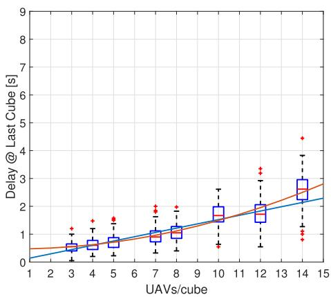  
(a) Delay of UAVs entering the destination cube.

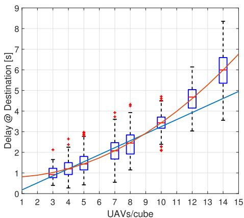  
(b) Delay of UAVs at destination.  
Fig. 4. Average delays experienced by batches of 20 UAVs departing at approximately the same time, compared to (a) the expected crossing times of the destination cube and (b) the expected landing times at the destination as scheduled by the UTMS. The 25th, 50th, and 75th percentiles of these delays are shown. The blue line represents the linear function that minimizes the Mean Squared Error (MSE) with the UAV delays, assuming a maximum allowed densit between 3 and 10 UAVs. The red line represents a second-degree polynomial function that minimizes the MSE with the UAV delays within the same densit range.

Another factor considered in setting the maximum allowed density of a cube is the ability of the AirMatrix+ airspace to adhere to this set density, even when accounting for realistic UAV mobility. Due to delays between scheduled and actual crossing times, both between cubes and at destinations, an occupancy exceeding the set density is sometimes present in a given cube. Figure 5 illustrates the average percentage of time a cube exceeds the prescribed density C. For values of $C \geq 1 1$ this percentage surpasses 10%, leading to local densities within AirMatrix+ that diverge from the intended nominal value.

Therefore, for these reasons, C is set to 10 in the simulations that follow, as delays increase linearly, and AirMatrix+ operates almost exclusively within or below the maximum allowed density, even under peak demand.

## C. Performance With Fixed Cube Maximum Allowed Density

This section evaluates the performance of the proposed framework when the maximum allowed density is set close to the capacity, i.e., when $C \ = \ 1 0 .$ . First, Fig. 6 illustrates an example trajectory selected by a UAV navigating through a cube in the AirMatrix+. The trajectory is sampled at different time-steps within the planning horizon, highlighting the Intra-Cube Planner’s capability to avoid other approaching UAVs. The UAV executing the Intra-Cube Planner (shown in red) enters the cube from one of its lateral faces and aims to exit through the bottom face. The other UAVs in the figure represent those that have already solved the Intra-Cube Planner optimization and are broadcasting their planned trajectories to nearby UAVs. Following the UAV’s motion model, regions outside the blue volumes have at most a probability $\epsilon / 2$ to be within a distance $d _ { \mathrm { m i n } }$ of any other UAV. Thus, the trajectory selected by the UAV using the Intra-Cube Planner ensures that the volume containing its barycenter with probability $1 - \epsilon / 2$ (shown in red at diferent time-steps), never intersects any blue volume. Notably, the blue and red volumes expand over time due to increasing uncertainty within the planning horizon, with the blue volumes being larger as they include the safety distance $d _ { \mathrm { m i n } }$ around UAVs. As shown in the figure, the UAV utilizing the Intra-Cube Planner leverages knowledge of the expected movements of other UAVs to follow a curved trajectory, successfully avoiding clusters of approaching UAVs. This enables the UAV to reach the desired face of the cube safely and within the deadline set by the ICPP algorithm.

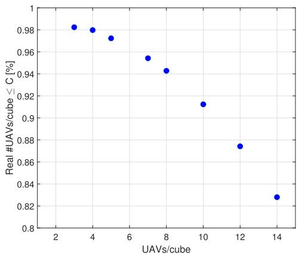  
Fig. 5. Average percentage of time a cube remains within the maximum allowed density C as the value of C varies.

Furthermore, in the following results, the performance of the proposed approach is evaluated by varying the demand (in terms of requested landings per second) received by the UTMS. Desired arrival times were generated using an exponential inter-arrival model. In particular, exponential samples were drawn and accumulated to form a sequence of desired arrivals (i.e., a stochastic demand profile). Three demand levels are considered: $\lambda _ { 5 } ~ = ~ 1 . 3 5 , ~ \lambda _ { 7 } ~ = ~ 2 .$ , and $\lambda _ { 9 } ~ = ~ 2 . 6 5$ landings per second. These values correspond to the landing rates achieved by the ICPP algorithm in Sec. VII-B, when all 6500 requests received by the UTMS require simultaneous landing, with maximum allowed densities $C = 5 , C = 7$ , and

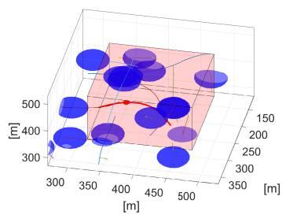  
(a) t=10.

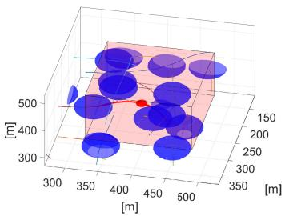  
(b) t=16.

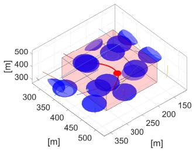  
(c) t=19.

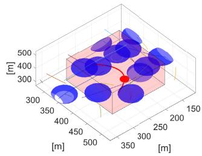  
(d) t=22.

Fig. 6. Example of a UAV’s trajectory as it navigates a cube, sampled over diferent time-steps within the planning horizon. Outside the blue spheres, the UAV maintains a distance of at least $d _ { \mathrm { m i n } }$ from any other UAV with a probability of $1 - \epsilon / 2 .$ The UAV’s chosen trajectory is shown in red, with the red sphere highlighting the region of the cube where the UAV is located with probability $\dot { 1 } - \epsilon / 2$ / at the depicted time-step.  
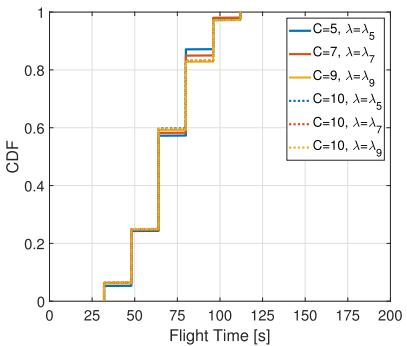  
(a) UAVs with priority.

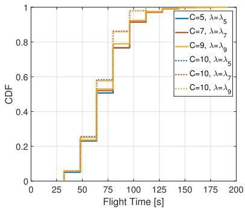  
(b) UAVs without priority.

Fig. 7. CDF of the UAVs’ flying time having diferent priorities. Flying time is computed based on the output of the ICPP solution, for diferent flight request demands received by the UTMS and for diferent capacities of the flying environment.  
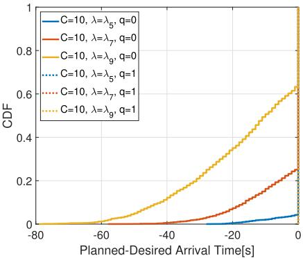  
Fig. 8. CDF of the diference between the arrival time planned by the ICPP solution and the desired arrival time by the UAVs. Time diferences are computed for diferent flight request demands received by the UTMS.

$C \ = \ 9 .$ , respectively. The analysis focuses on four metrics: (i) total flight time; (ii) the diference between desired and ICPP-planned landing times; (iii) the diference between ICPPplanned landing times and the actual landing times at the destination; and (iv) the distance to the five closest UAVs while reaching the destination.

Figure 7 shows the CDF of the expected flying time planned by the ICPP. For UAVs prioritizing landings as close as possible to their desired arrival times (Fig. 7a), the planned flying time is only marginally afected by the volume of flight requests received by the UTMS (dashed lines). A similar observation holds when comparing the case with $C = 1 0$ to the results obtained by varying the maximum allowed trafic density in the airspace (continuous lines). This aligns with the ICPP’s scheduling approach. Indeed, since UAVs with priority are always scheduled first, and due to the structured design of the AirMatrix+, essentially a 3D adaptation of the Manhattan grid, multiple shortest paths to the destinations are naturally ofered, allowing ICPP to consistently and eficiently schedule UAVs along optimal routes to their destinations.

Instead, for UAVs that accept deviations from their desired landing times, the ICPP algorithm exhibits a two-fold behavior. When reaches the maximum demand that the ICPP algorithm can handle, as indicated by the continuous lines for $C = 5 ,$ $C = 7 .$ , and $C = 9 ,$ the algorithm extends the flight times for a small fraction of non-priority UAVs (approximately 8% of the total). This adjustment allows these UAVs to avoid the need to wait for one of the available shortest paths to become free. However, this behavior changes when $C = 1 0$ and the demand is below the maximum that the ICPP algorithm can dispatch (e.g., $\lambda = \lambda _ { 5 } $ $\lambda = \lambda _ { 7 }$ , or $\lambda = \lambda _ { 9 } )$ . In this scenario, even for UAVs without priority, the algorithm schedules flights along the shortest paths, which in this case is the most efective choice: it allows UAVs to depart from their origins as late as possible while still reaching their destinations on time.

A detailed view of the trade-of between landing on time and flight duration achieved by the ICPP is presented in Fig. 8. The figure depicts the diference between the landing times planned by the ICPP algorithm and the desired landing times specified by the UAVs when $C = 1 0$ and with varying flying request demands. As previously discussed, when the maximum allowed density is $C ~ = ~ 1 0$ and the demand is below the maximum that the ICPP algorithm can handle, both priority and non-priority UAVs are scheduled along the shortest paths. However, this decision afects the two UAV classes diferently in terms of the gap between planned and desired landing times. Priority UAVs benefit from being scheduled first in the AirMatrix+ airspace, as they not only fly along the shortest paths but are also planned to land exactly at their desired landing times (dotted lines in Fig. 8). For non-priority UAVs, taking one of the shortest paths requires initiating their journey earlier than necessary, resulting in earlier-than-desired landing times. This diference between planned and desired landing times increases with the flight request demand received by the UTMS. As more UAVs operate simultaneously within the system, non-priority UAVs must anticipate their departures even more, since greater anticipation is needed to ensure the availability of one of the shortest paths. It is important to note that the ICPP achieves the optimal solution for the given scheduling problem. Therefore, any alternative involving longer paths would result in even earlier departures for nonpriority UAVs, leading to suboptimal performance.

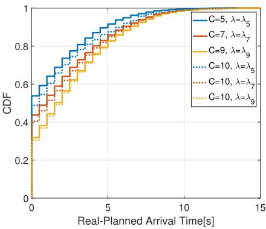  
Fig. 9. CDF of the diference between the actual landing times of UAVs and the arrival times planned by the ICPP solution. Time diferences are computed for diferent flight request demands received by the UTMS and for diferent capacities of the flying environment.

Figure 9 illustrates the diference between the arrival times planned by the ICPP and the actual arrival times of UAVs, as obtained using the Intra-Cube Planner. As previously discussed, this diference arises because of the stochastic nature of UAV flights, that is influenced by various factors such as the maximum allowed UAV density in each cube (see Fig. 4) and the number of cubes traversed by the UAVs. Interestingly, the delay between planned and actual landing times is not afected by a UAV’s priority class. This is because the Intra-Cube Planner treats UAVs of all classes identically, and the average number of cubes traversed to reach their destinations is nearly identical for UAVs of diferent priority classes (this however does not imply equal performance between the two classes, as the ICPP solution itself prioritizes UAVs based on their class, as shown in Fig. 8). As intuitively expected, the results show that the greater the demand accommodated within the AirMatrix+ airspace, the larger the diference between planned and actual landing times. A higher average number of UAVs in the airspace increases the frequency of avoiding maneuvers, thereby amplifying the deviation from planned landing times. Similarly, for the same demand received by the UTMS, a higher allowed density per cube results in a slightly greater diference between expected and actual landing times (e.g., comparing $C = 5$ and $\lambda = \lambda _ { 5 }$ with $C = 1 0$ and $\lambda = \lambda _ { 5 } )$ . This λ λ λ λoccurs because the increased density temporarily permits a greater number of UAVs within traversed cubes, occasionally resulting in more avoidance maneuvers and, consequently, longer flight times.

Finally, Fig. 10 highlights the safety performance achieved with the proposed solution. Specifically, Fig. 10a shows the CDF of the closest UAV to any given UAV within the AirMatrix+ airspace, while Fig. 10b presents the CDF of distance with the five closest UAVs. For both metrics, increasing the maximum allowed UAV density per cube, while operating at the maximum demand supported by the ICPP solution, leads to a reduction in average inter-UAV distances. This is because the cubes frequently operate near their maximum allowed density, resulting in closer spacing between UAVs as the allowed density increases. Interestingly, increasing the maximum allowed density per cube while keeping the demand received by the UTMS constant (e.g., comparing $C = 5$ with $\lambda ~ = ~ \lambda _ { 5 }$ to $C ~ = ~ 1 0$ with $\lambda ~ = ~ \lambda _ { 5 } )$ results in a decrease in the average inter-UAV distance for both the closest UAV and the five closest UAVs. This aligns with the intuition derived from Fig. 9: under similar demand, a higher maximum allowed density leads to the temporary coexistence of more UAVs within the same cube, which, in turn, reduces the average distance to nearby UAVs throughout the flight path at the cost of a marginally longer flight time. Furthermore, Fig. 10 shows that, across all simulations presented, the minimum distance of $d _ { \operatorname* { m i n } } = 2 0$ m is consistently respected. This confirms that the proposed approach efectively leverages the airspace to enable dense flying environments while ensuring safety, even under realistic UAV state uncertainties.

## D. Comparison With the Metropolis Baseline Approach

To further evaluate the proposed architecture, a comparative analysis was performed against the airspace structuring concept introduced in [9], which present the Metropolis framework. In the Metropolis framework, “Concept 4: Tubes” represents a structured airspace configuration, where tubes provide fixed, conflict-free routes connecting discrete nodes. Each tube can accommodate a single aircraft, ensuring predictability and safety through pre-planned non-intersecting corridors.

The performance of this concept was compared against the proposed ICPP. For a fair comparison, the Metropolis Tube concept was extended. Specifically, the original tubebased routing was reformulated as a time-dependent $A ^ { * }$ search, allowing dynamic evaluation of congestion along each edge while preserving the underlying tube structure. Moreover, the objective of the resulting routing technique was aligned with that of the ICPP by solving the same on-time arrival problem. To ensure a consistent setup, the diference between the flight times assigned to crossing and landing cubes was removed, so that all tube traversals share the same nominal duration. This avoids heavily penalizing the approach in [9], where the set of shortest paths identified by the $A ^ { * }$ search is evaluated at constant time intervals equal to the tube traversal time. Finally, instead of delaying departures as suggested in [9], shortest paths are tested starting from the desired arrival time and moving backward in time until a feasible path is found. Two capacity scenarios were considered: (i) each cube/tube admitting at most one UAV (as envisioned in [9]), and (ii) each cube/tube admitting up to 10 UAVs, as envisioned in our ICPP. In the second case, the presence of an Intra-‘‘Tube’’ Planner is assumed to ensure safe operations also in [9], since the one-UAV-per-tube assumption no longer holds. While the airspace structure used in these simulations matches that adopted in the rest of the paper, the demand considered in these tests was set to a high value, so to analyze how the two approaches handle a congested setup. Since the C = 1 setting significantly restricts capacity, the scenario was adjusted to still obtain a meaningful stress test under these tight constraints: the number of requests processed by the UTMS was limited to N = 3000 UAVs (instead of N = 6500), and the nominal tube traversal time was reduced to 7 seconds (compared to 14 seconds when C = 10).

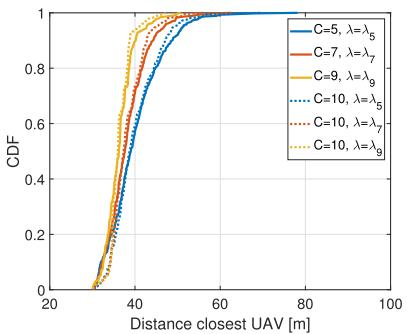  
(a) Closest UAV.

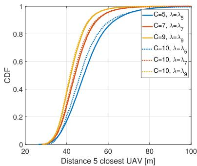  
(b) Five closest UAVs.  
Fig. 10. CDF of the distance between UAVs, varying the maximum allowed density C and flight request demand received from the UTMS . The closest UAV and the five closest UAVs perceived from each UAV in the AirMatrix+ are depicted.

TABLE III  
COMPARISON BETWEEN [9] AND PROPOSED ICPP
<table><tr><td>Method C</td><td>N</td><td colspan="7">MeanGap MedianGap P95_Gap MeanTravel MedianTravel MeanPathLen Early arrivals (%)</td></tr><tr><td>A*</td><td>1 3000</td><td>336.35</td><td>345</td><td>810</td><td>32.60</td><td>28</td><td>4.66</td><td>20.1</td></tr><tr><td>ICTP</td><td>1 3000</td><td>202.79</td><td>197</td><td>475</td><td>33.40</td><td>35</td><td>4.77</td><td>9.0</td></tr><tr><td>A*</td><td>10 6500</td><td>56.90</td><td>48</td><td>160</td><td>60.14</td><td>56</td><td>4.30</td><td>31.8</td></tr><tr><td>ICTP</td><td>10 6500</td><td>39.18</td><td>37</td><td>95</td><td>60.16</td><td>56</td><td>4.30</td><td>12.9</td></tr></table>

The performance comparison was based on:

• Mean/Median Gap (s): diference between desired and actual arrival times;

• 95th Percentile Gap (s): upper-tail delay measure indicating schedule adherence;

• Mean/Median Travel Time (s): total time spent along the planned trajectory;

• Mean/Median Path Length: number of traversed cubes;

• On-or-Early Arrival (%): percentage of UAVs before their desired time.

The results in Table III confirm that the proposed ICPP consistently outperforms the updated Metropolis-style A∗ approach across both capacity regimes. When the airspace is constrained to a single UAV per cube (C = 1), the ICPP achieves a reduction of about 40% in mean early arrivaltime deviation compared to the baseline (202.8 s vs. 336.4 s). Under higher capacity $\begin{array} { r l r } { ( C } & { { } = } & { 1 0 ) } \end{array}$ , the advantage remains substantial, with an approximately 31% reduction in mean arrival-time deviation (39.2 s vs. 56.9 s) and about a 41% lower 95th-percentile delay (95 s vs. 160 s). The ICPP and the Metropolis framework exhibit similar average travel times and path lengths, indicating that these improvements do not stem from shorter routes but from flexible temporal coordination and fine-grained congestion-aware planning. This highlights the strength of the proposed ICPP, which explicitly integrates temporal feasibility and density constraints to achieve balanced airspace utilization and higher throughput.

## VIII. CONCLUSION

Dense flying environments will be a reality in the near future. Nevertheless, existing ATMS solutions present various drawbacks in such scenarios, including underutilization of the available airspace, loss of separation, and insuficient diferentiation among UAVs. This work proposes a new UTMS framework that aims at solving existing drawbacks by jointly addressing strategic and tactical planning. Specifically, the work proposes a novel strategic path planner, namely the ICPP, that enforces a maximum UAV density and diferent priority levels within the flying environment. Furthermore, a tactical resolution strategy, the Intra-Cube Planner, is used to respect the ICPP decisions, while ensuring a pre-defined level of safety even in the presence of UAV location uncertainty. As showcased via simulation, the adopted solution improves scalability even in large-scale dense flying environments, while at the same time efectively reducing existing state-of-the-art safety and design drawbacks.

Future research avenues include the adoption of more complex UAV motion models and reservation-based approaches that explicitly account for stochastic sojourn times. An important direction is also to investigate the resilience of the proposed framework to non-compliant or non-authorized UAVs, for example arising from malicious behavior or spoofing attacks, and to quantify how such disruptions afect safety and capacity. Finally, it is of interest to study the trade-of between performance and allowable loss-of-separation probability in less dense operating regimes, which may constitute a natural intermediate deployment step before reaching the trafic densities envisioned in this work.

## ACKNOWLEDGMENT

Views and opinions expressed are however those of the author(s) only and do not necessarily reflect those of European Union or European Research Council Executive Agency. Neither European Union nor the granting authority can be held responsible for them.

## REFERENCES

[1] (2022). A Drone Strategy 2.0 for a Smart and Sustainable Unmanned Aircraft Eco-System in Europe. [Online]. Available: https://transport.ec.europa.eu/system/files/2022-11/ COM2022652dronestrategy2.0.pdf

[2] (2023). Urban Air Mobility Concept of Operations 2.0. [Online]. Available: https://www.faa.gov/sites/faa.gov/files/ UrbanAirMobility(UAM)ConceptofOperations2.00.pdf

[3] J. Holden and N. Goel. (2016). Fast-Forwarding to a Future of On-Demand Urban Air Transportation. [Online]. Available: https:// evtol.news/media/PDFs/UberElevateWhitePaperOct2016.pdf

[4] H. Shakhatreh et al., “Unmanned aerial vehicles (UAVs): A survey on civil applications and key research challenges,” IEEE Access, vol. 7, pp. 48572–48634, 2019.

[5] C. Bosson and T. A. Lauderdale, “Simulation evaluations of an autonomous urban air mobility network management and separation service,” in Proc. Aviation Technol., Integr., Oper. Conf., Jun. 2018, pp. 1–14.

[6] H. Tang, Y. Zhang, V. Mohmoodian, and H. Charkhgard, “Automated flight planning of high-density urban air mobility,” Transp. Res. C, Emerg. Technol., vol. 131, Oct. 2021, Art. no. 103324.

[7] K. H. Goodrich and C. R. Theodore, “Description of the NASA urban air mobility maturity level (UML) scale,” in Proc. AIAA Scitech Forum, Jan. 2021, pp. 1–12.

[8] N. Mohamed, J. Al-Jaroodi, I. Jawhar, A. Idries, and F. Mohammed, “Unmanned aerial vehicles applications in future smart cities,” Technol. Forecasting Social Change, vol. 153, Apr. 2020, Art. no. 119293.

[9] E. Sunil et al., “Metropolis: Relating airspace structure and capacity for extreme trafic densities,” in Proc. 11th USA/Europe Air Trafic Manage. (ATM) R&D Seminar, 2015, pp. 1–10.

[10] S. Bharadwaj, S. Carr, N. Neogi, and U. Topcu, “Decentralized control synthesis for air trafic management in urban air mobility,” IEEE Trans. Control Netw. Syst., vol. 8, no. 2, pp. 598–608, Jun. 2021.

[11] K. A. Moolchandani, L. Guillermo, H. Lee, and H. Arneson, “Simulation study for interoperability of urban air mobility scheduling and separation services in ideal conditions,” in Proc. AIAA AVIATION FORUM, Aug. 2021, pp. 1–12.

[12] C. Ramee and D. N. Mavris, “Development of a framework to compare low-altitude unmanned air trafic management systems,” in Proc. AIAA Scitech Forum, Jan. 2021, pp. 1–24.

[13] Q. Tan, Z. Wang, Y.-S. Ong, and K. H. Low, “Evolutionary optimizationbased mission planning for UAS trafic management (UTM),” in Proc. Int. Conf. Unmanned Aircr. Syst. (ICUAS), Jun. 2019, pp. 952–958.

[14] C. Menelaou, P. Kolios, S. Timotheou, C. G. Panayiotou, and M. P. Polycarpou, “Controlling road congestion via a low-complexity route reservation approach,” Transp. Res. C, Emerg. Technol., vol. 81, pp. 118–136, Aug. 2017.

[15] C. Menelaou, S. Timotheou, P. Kolios, and C. G. Panayiotou, “Convexification approaches for regional route guidance and demand management with generalized MFDs,” Transp. Res. C, Emerg. Technol., vol. 154, Sep. 2023, Art. no. 104245.

[16] B. Alrifaee, K. Kostyszyn, and D. Abel, “Model predictive control for collision avoidance of networked vehicles using Lagrangian relaxation,” IFAC-PapersOnLine, vol. 49, no. 3, pp. 430–435, 2016.

[17] H. Zhu and J. Alonso-Mora, “Chance-constrained collision avoidance for MAVs in dynamic environments,” IEEE Robot. Autom. Lett., vol. 4, no. 2, pp. 776–783, Apr. 2019.

[18] C. Vitale, S. Papaioannou, P. Kolios, and G. Ellinas, “Autonomous 4D trajectory planning for dynamic and flexible air trafic management,” J. Intell. Robotic Syst., vol. 106, no. 1, pp. 1–15, Sep. 2022.

[19] S. Exadaktylos, C. Vitale, P. Kolios, and G. Ellinas, “Urban air mobility trajectory planning,” in Proc. Int. Conf. Unmanned Aircr. Syst. (ICUAS), Jun. 2023, pp. 273–280.

[20] A. Straubinger, R. Rothfeld, M. Shamiyeh, K.-D. Buchter, J. Kaiser,¨ and K. O. Plotner, “An overview of current research and developments¨ in urban air mobility–setting the scene for UAM introduction,” J. Air Transp. Manage., vol. 87, Aug. 2020, Art. no. 101852.

[21] D. Bertsimas and S. S. Patterson, “The air trafic flow management problem with enroute capacities,” Operations Res., vol. 46, no. 3, pp. 406–422, Jun. 1998.

[22] M. Jones, S. Djahel, and K. Welsh, “Path-planning for unmanned aerial vehicles with environment complexity considerations: A survey,” ACM Comput. Surv., vol. 55, no. 11, pp. 1–39, Nov. 2023.

[23] W. Dai, B. Pang, and K. H. Low, “Conflict-free four-dimensional path planning for urban air mobility considering airspace occupancy,” Aerosp. Sci. Technol., vol. 119, Dec. 2021, Art. no. 107154.

[24] Q. Shao, R. Li, M. Dong, and C. Song, “An adaptive airspace model for quadcopters in urban air mobility,” IEEE Trans. Intell. Transp. Syst., vol. 24, no. 2, pp. 1702–1711, Feb. 2023.

[25] P. Wu, X. Yang, P. Wei, and J. Chen, “Safety assured online guidance with airborne separation for urban air mobility operations in uncertain environments,” IEEE Trans. Intell. Transp. Syst., vol. 23, no. 10, pp. 19413–19427, Oct. 2022.

[26] C. Cummings and H. Mahmassani, “Emergence of 4-D system fundamental diagram in urban air mobility trafic flow,” Transp. Res. Record: J. Transp. Res. Board, vol. 2675, no. 11, pp. 841–850, Nov. 2021.

[27] Y. Safadi, R. Fu, Q. Quan, and J. Haddad, “Macroscopic fundamental diagrams for low-altitude air city transport,” Transp. Res. C, Emerg. Technol., vol. 152, Jul. 2023, Art. no. 104141.

[28] E. S. Rigas, P. Kolios, and G. Ellinas, “Extending the multiple traveling salesman problem for scheduling a fleet of drones performing monitoring missions,” in Proc. IEEE 23rd Int. Conf. Intell. Transp. Syst. (ITSC), Sep. 2020, pp. 1–6.

[29] E. S. Rigas, P. Kolios, M. Mavrovouniotis, and G. Ellinas, “Scheduling a fleet of drones for monitoring missions with spatial, temporal, and energy constraints,” IEEE Trans. Intell. Transp. Syst., vol. 23, no. 9, pp. 15133–15145, Sep. 2022.

[30] E. S. Rigas, P. Kolios, and G. Ellinas, “Scheduling aerial vehicles in an urban air mobility scheme,” in Proc. IEEE Veh. Netw. Conf. (VNC), Nov. 2021, pp. 76–82.

[31] V. Bulusu, E. B. Onat, R. Sengupta, P. Yedavalli, and J. Macfarlane, “A trafic demand analysis method for urban air mobility,” IEEE Trans. Intell. Transp. Syst., vol. 22, no. 9, pp. 6039–6047, Sep. 2021.

[32] X. Wei, L. Cai, N. Wei, P. Zou, J. Zhang, and S. Subramaniam, “Joint UAV trajectory planning, DAG task scheduling, and service function deployment based on DRL in UAV-empowered edge computing,” IEEE Internet Things J., vol. 10, no. 14, pp. 12826–12838, Jul. 2023.

[33] (2022). Acceptable Means of Compliance (AMC) and Guidance Material (GM) to the U-Space Regulatory Package. [Online]. Available: https://www.easa.europa.eu/en/document-library/acceptable-means-ofcompliance-and-guidance-materials/amc-and-gm-implementing

[34] C. E. Luis, M. Vukosavljev, and A. P. Schoellig, “Online trajectory generation with distributed model predictive control for multi-robot motion planning,” IEEE Robot. Autom. Lett., vol. 5, no. 2, pp. 604–611, Apr. 2020.

[35] L. Lennart, System Identification: Theory for the User. Upper Saddle River, NJ, USA: Prentice-Hall, 1999.

[36] T. H. Cormen, C. E. Leiserson, R. L. Rivest, and C. Stein, Introduction to Algorithms. Cambridge, MA, USA: MIT Press, 2001.

[37] A. Richards and J. P. How, “Robust distributed model predictive control,” Int. J. Control, vol. 80, no. 9, pp. 1517–1531, Sep. 2007.

[38] M. I. Ribeiro. (2004). Gaussian Probability Density Functions: Properties and Error Characterization. [Online]. Available: http:// users.isr.ist.utl.pt/∼mir/pub/probability.pdf

[39] S. Prajna, A. Papachristodoulou, and P. A. Parrilo, “Introducing SOS-TOOLS: A general purpose sum of squares programming solver,” in Proc. 41st IEEE Conf. Decis. Control, Dec. 2002, pp. 741–746.

[40] (2020). European ATM Master Plan—2025 Edition. [Online]. Available: https://www.sesarju.eu/MasterPlan2025SupportingDocuments

[41] (2025). Remote Identification of Unmanned Aircraft. [Online]. Available: https://www.faa.gov/uas/gettingstarted/remoteid

[42] (2025). Standardised European Rules of the Air (SERA).6005(C)- Requirements for Communications, SSR Transponder, and Electronic Conspicuity in U-Space Airspace. [Online]. Available: https://www.easa.europa.eu/en/document-library/easy-access-rules/easyaccess-rules-standardised-european-rules-air-sera

[43] (2025). Easy Access Rules (EAR) for U-Space (Regulation (EU) 2021/664). [Online]. Available: https://www.easa.europa.eu/en/document-library/easy-access-rules/ easy-access-rules-u-space-regulation-eu-2021664

[44] Gurobi Optimization, LLC. (2022). Gurobi Optimizer Reference Manual. [Online]. Available: https://www.gurobi.com

  
Christian Vitale (Member, IEEE) received the B.S. and M.Sc. degrees from the Universita di Pisa and\` the Ph.D. degree in telematics engineering from the Universidad Carlos III de Madrid. He is currently a Senior Research Associate with the KIOS Research and Innovation Center of Excellence, University of Cyprus. His research interests primarily focus on the analytical modeling of complex systems, such as wireless networks and intelligent transportation systems, the design of robust optimization-based path planning for multi-agent systems, and machine  
learning approaches for autonomous vehicles.

Charalambos Menelaou received the B.Sc. and Ph.D. degrees in electrical and computer engineering from the University of Cyprus in 2013 and 2020, respectively. He is currently an Afiliate Research Associate with the KIOS Research and Innovation Center of Excellence, focusing on the control and optimization of large-scale urban networks and routing techniques for connected-autonomous vehicles using graph theory, AI, and mathematical programming. He is an active contributor to IEEE, working as a Treasurer of the IEEE ITS Society Cyprus

Chapter and participating in numerous activities, including the IEEE ITSS Podcast and ISO ITS standardization committees for Cyprus Standardization Organization. His research has been published in prestigious journals and conferences. He frequently reviews scientific works related with ITS systems.

Panayiotis Kolios received the B.Eng. and Ph.D. degrees in telecommunications engineering from the King’s College London in 2008 and 2011, respectively. He is currently an Assistant Professor with the Department of Computer Science and a Faculty Member of the KIOS Research and Innovation Center of Excellence, University of Cyprus. His research interests focus on both basic and applied research on networked intelligent systems. Examples of such systems include intelligent transportation systems, autonomous unmanned aerial systems, and the plethora of cyber-physical systems that arise within IoT.

Stelios Timotheou (Senior Member, IEEE) received the Dipl.-Ing. degree in electrical and computer engineering from the National Technical University of Athens and the M.Sc. degree in communications and signal processing and the Ph.D. degree in intelligent systems and networks from the Department of Electrical and Electronic Engineering, Imperial College London, in 2010. He is currently an Associate Professor with the Department of Electrical and Computer Engineering and a Faculty Member with the KIOS Research and Innovation Center

of Excellence, University of Cyprus. In previous appointments, he was a Research Associate with KIOS, a Visiting Lecturer with the Department of Electrical and Computer Engineering, University of Cyprus, and a Post-Doctoral Researcher with the Computer Laboratory, University of Cambridge. His research focuses on monitoring, control, and optimization of critical infrastructure systems, with emphasis on intelligent transportation systems and communication systems. He is a Senior Editor of IEEE TRANSACTIONS ON INTELLIGENT TRANSPORTATION SYSTEMS and IEEE TRANSACTIONS ON INTELLIGENT VEHICLES.

Christos G. Panayiotou (Senior Member, IEEE) received the B.Sc. and Ph.D. degrees in electrical and computer engineering from the University of Massachusetts at Amherst in 1994 and 1999, respectively, and the M.B.A. degree from the Isenberg School of Management, at the aforementioned university in 1999. He is currently a Professor with the Department of Electrical and Computer Engineering, University of Cyprus (UCY). He is also the Acting Director of the KIOS Research and Innovation Center of Excellence for which he is also a Founding

Member. Before joining UCY in 2002, he was a Research Associate with the Center for Information and System Engineering (CISE), Boston University (1999–2002). His research interests include modeling, control, optimization and performance evaluation of discrete event and hybrid systems, intelligent transportation systems, cyber-physical systems, event detection and localization, fault diagnosis, wireless, ad-hoc and sensor networks, smart camera networks, resource allocation, and intelligent buildings. He is a Senior Editor of IEEE TRANSACTIONS OF INTELLIGENT TRANSPORTATION SYSTEMS and the Discrete Event Dynamical Systems, while in the past, he served as an Associate Editor for the Conference Editorial Board of the IEEE Control Systems Society, IEEE TRANSACTIONS OF CONTROL SYSTEMS APPLICATIONS and European Journal of Control.

Georgios Ellinas (Senior Member, IEEE) received the B.S., M.Sc., M.Phil., and Ph.D. degrees in electrical engineering from Columbia University. He is currently a Professor and the past Chair (2014–2020) of the Department of Electrical and Computer Engineering and a Founding Member of the KIOS Research and Innovation Center of Excellence, University of Cyprus. Previously, he worked as an Associate Professor in electrical engineering with the City College of New York, a Senior Network Architect at Tellium Inc., and a Research

Scientist at Bell Communications Research. His research interests are in the areas of telecommunication networks, intelligent transportation systems, the IoT, and unmanned aerial systems.