# Deploying UAVs and Surveillance Cameras for Continuous Omnidirectional Monitoring

Haihan Zhang , Graduate Student Member, IEEE, Haipeng Dai , Senior Member, IEEE, Yuben Qu , Member, IEEE, Chaocan Xiang , Yongxi Sui, Shiju Zhao , Graduate Student Member, IEEE, Zhenzhe Zheng , Member, IEEE, and Guihai Chen , Fellow, IEEE

Abstract—This paper addresses the Joint deployment of Uncrewed aerial vehicles (UAVs) and surveillance caMeras with Path planning (JUMP), aiming to deploy a fixed number of UAVs and budget-limited surveillance cameras, to achieve continuous omnidirectional monitoring. Specifically, the objective is to maximize the monitoring durations of target objects in each of all horizontal directions within a given task duration. We propose an approach for JUMP, which is proved to be NP-hard. Our approach achieves a $\begin{array} { r l r } {  { \frac { 1 } { 6 } - \varepsilon _ { 1 } } } \end{array}$ approximation ratio in general and $\begin{array} { r } { \frac { 1 } { 4 } - \bar { \varepsilon _ { 1 } } } \end{array}$ when camera costs are uniform. Firstly, we introduce spatio-temporal discretization to approximate JUMP. Secondly, we partition the solution space of JUMP from spatial perspective and refine the space by addressing a variant of obstacle-avoiding shortest path problem spatio-temporal perspective. Thirdly, we reformulate the problem as a classical problem of Monotone Submodular set function Maximization with one partition Matroid and two Knapsack constraints (MSMMK). To address MSMMK, we propose a $\frac { \mathbf { 1 } } { \mathbf { 6 } ( \mathbf { 1 } + \varepsilon ) }$ approximation algorithm, which outperforms the state-of-the-art with the same time complexity in general. Specifically, our algorithm achieves a $\frac { \mathbf { 1 } } { 4 ( 1 + \varepsilon ) }$ approximation ratio for special cases. Simulation results demonstrate our proposed approach outperforms five benchmark algorithms, yielding enhancements 13%-1446%. Moreover, field experiment results indicate that our approach surpasses comparison algorithms, achieving enhancements 23%- 265%.

Received 29 May 2024; revised 27 August 2025; accepted 25 November 2025. Date of publication 9 December 2025; date of current version 6 April 2026. This work was supported in part by the National Key R&D Program of China under Grant 2023YFB4502400; in part by the National Natural Science Foundation of China under Grant 62272223, Grant U22A2031, and Grant 61872178; in part by the New Generation Information Technology Innovation Project 2023 under Grant 2023IT196; in part by the Fundamental Research Funds for the Central Universities under Grant 2024300349 and Grant 2025300309; in part by the Collaborative Innovation Center of Novel Software Technology and Industrialization, Nanjing University; and in part by the Jiangsu High-level Innovation and Entrepreneurship (Shuangchuang) Program. Recommended for acceptance by L. Bai. (Corresponding author: Haipeng Dai.)

Haihan Zhang, Haipeng Dai, Yongxi Sui, Shiju Zhao, and Guihai Chen are with the State Key Laboratory for Novel Software Technology, Nanjing University, Nanjing 210023, China (e-mail: zhh@smail.nju.edu.cn; haipengdai@ nju.edu.cn).

Chaocan Xiang is with the College of Computer Science, Chongqing University, Chongqing 400044, China.

Zhenzhe Zheng is with the Department of Computer Science, Shanghai Jiao Tong University, Shanghai 200240, China.

This article has supplementary downloadable material available at https://doi.org/10.1109/TMC.2025.3642129, provided by the authors.

Digital Object Identifier 10.1109/TMC.2025.3642129

Index Terms—Approximation algorithms, deployment problem, monitoring, path planing, submodular set function, UAVs.

## I. INTRODUCTION

## A. Background

M <sup>ONITORING</sup> <sup>tasks</sup> <sup>play</sup> <sup>a</sup> <sup>vital</sup> <sup>role</sup> <sup>in</sup> <sup>various</sup> <sup>domains</sup>including industrial safety production, traffic manage- including industrial safety production, traffic management, public security, and electric power [1], [2], [3]. For instance, in industrial safety production, the absence of full-time comprehensive monitoring and timely detection of non-standard operations, machine failures, and other hazardous events can result in significant casualties and economic losses. Statistics from reputable sources [4], [5] reveal that annually, approximately one million individuals perish due to industrial injuries, resulting in economic losses amounting to approximately 1.25 trillion US dollars. In 2022, the U.S. recorded over 2.8 million industrial accidents, claiming the lives of more than 5,400 individuals [5].

In monitoring tasks, the timing and observable field of view (FOV) of hazardous events are uncertain. The monitoring scenario for a event is illustrated in Fig. 1. So it is essential to maintain continuous monitoring in each subdivided direction (horizontal 360<sup>◦</sup>) of monitored objects for as long as possible throughout the task duration to achieve continuous omnidirectional monitoring.

Traditional monitoring tasks often depend on stationary surveillance cameras. However, their fixed viewpoints constrain the FOV and present challenges in deploying or maintaining them in harsh environments, such as high-altitude locations and remote isolated areas. Additionally, deploying fixed cameras for short-term monitoring tasks can be time-consuming and economically inefficient. Fortunately, uncrewed aerial vehicles (UAVs) have recently emerged as a promising alternative for monitoring tasks. They can overcome the limitations above of surveillance cameras thanks to their flexible maneuverability and capability to capture high vantage point views [6], [7].

Nevertheless, for safety reasons, UAVs not only have to keep a safe distance from objects, but also avoid radio interference sources to maintain communication functions [8], so there are no-fly areas. For instance, regulations [9] established by the British Civil Aviation Authority dictate minimum safe distances between each UAV and critical infrastructure (150 m), human (50 m), and other objects. Additionally, regulations prescribe the maximum altitude for UAV flights, prohibiting UAVs from flying directly over objects for safety concerns. In contrast, because safety distance restrictions do not constrain surveillance cameras, they can monitor no-fly areas, providing complementary FOV to UAVs. Fittingly, with the development of the sharing economy, companies such as China Tower also provide surveillance camera rental programs to serve various sectors [10], [11], [12]. Hence, integrating UAVs and surveillance cameras for joint monitoring has great potential, which remains largely unexplored so far.

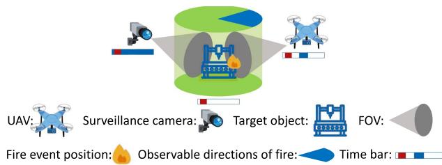  
Fig. 1. An example: A UAV and a surveillance camera monitor a target object, which is on fire at a certain position. The red segments in the time bars indicate the critical periods for timely detection of the fire, which are pivotal in averting fire outbreaks. The blue-filled segments in the time bars indicate monitoring periods. Although the UAV monitors the object within its FOV from an observable direction, it fails to detect the occurrence of the fire in a timely manner. The surveillance camera, despite its continuous monitoring, does not capture the fire within its FOV from observable directions.

## B. Motivation

Regarding related research on deployment, traditional noncamera sensor deployment schemes often neglect the FOV characteristics [13], as cameras from different positions can capture distinct views of the same object. In contrast, current surveillance camera deployment schemes [2], [3] typically overlook factors such as UAV energy constraints, flight duration, and obstacle-avoiding path planning [6]. Furthermore, existing approaches do not address the heterogeneity between UAVs and surveillance cameras.

For monitoring objective, existing studies on continuous monitoring [14], [15] mainly monitor one or a few views of objects, neglecting comprehensive viewpoints. While, works on omnidirectional monitoring [16], [17], [18], [19], [20] typically do not account for continuous monitoring. However, many practical scenarios, such as production sites [21], transportation hubs [22], and live sports events [23], demand thorough and sustained monitoring (continuous omnidirectional monitoring). Unfortunately, no current solution effectively meets these requirements. Existing methods often fail to identify optimal monitoring strategies as they overlook the coupling of monitoring utility across spatio-temporal dimensions.

This paper investigates the problem of Joint deployment of UAVs and surveillance caMeras with Path planning (JUMP). Specifically, we consider the monitoring scenario where multiple objects within the scene require to be monitored in task duration T . The objective is to deploy a limited number of UAVs and rent surveillance cameras within a constrained budget to maximize monitoring utility. The monitoring utility corresponds to the total monitoring duration for all target objects in all horizontal directions , π . Upon initiation of the monitoring task, each rented surveillance camera begins monitoring according to a specified monitoring strategy (a spatio-temporal deployment) until the task’s conclusion. While each UAV launches from the source point at a timing specified by its monitoring strategy. It then navigates around all no-fly areas with a predetermined strategy and reaches its designated position for monitoring. Each UAV monitoring continues until the end of the task or the UAV returns due to insufficient energy. Finally, the monitoring task ends after duration T .

The JUMP problem has three main technical challenges. The first challenge arises from the original problem’s NP-hardness (see Proposition 1 in Section II-G) and the objective function’s nonlinear nature, which includes integrals over both temporal and spatial dimensions, thereby complicating direct analysis and optimization efforts. The second challenge emerges from the intricate coupling of spatio-temporal dimensions within the continuous solution space of the deployment scheme. Since the monitoring utility encompass spatial coverage (object quantity and direction) and temporal persistence, merely optimizing spatial coverage may inadvertently affect spatio-temporal performance. This highlights the necessity of addressing spatiotemporal dependencies. Thus, there is a need to consider the spatio-temporal dimension collectively, so that the continuous solution space can be reduced effectively without sacrificing optimality. The third challenge is to develop an approximation algorithm, which needs to minimize the performance gap to the optimal one.

To tackle the first challenge, we convert the original monitoring utility from integral form to a sum of utilities for each discrete direction and time point via spatio-temporal discretization. This transformation ensures controllable error bounds relative to the original monitoring utility. To address the second challenge, we extract of surveillance camera and UAV dominating strategies to identify representative candidate monitoring strategies. Special focus is given to extracting UAV candidate strategies. Initially, from spatial perspective, the candidate positions of strategies are divided into multiple subareas. Subsequently, candidate strategies are determined by calculating the shortest path corresponding to each subarea and employing the Shortest Path Strategy from spatio-temporal perspective. To address the third challenge, we reformulate the problem as the classical problem of Monotone Submodular set function Maximization with one partition Matroid and two Knapsack constraints (MSMMK). For MSMMK, we propose an approximation algorithm outperforming the state-of-the-art (SOTA) algorithm [24] with the same time complexity. Besides, the performance loss during the transformation of the original problem is delimited, and the approximate ratio of the proposed approach is obtained.

## C. Contribution

The main contributions of this paper are as follows:

1) To the best of our knowledge, we are the first to study the deployment problem for continuous omnidirectional monitoring, which requires sustained coverage of all directions over time. We also pioneer the joint deployment of UAVs and surveillance cameras specifically for omnidirectional monitoring tasks.

2) According to the heterogeneity of UAVs and surveillance cameras in spatio-temporal deployment, we integrate them into a unified continuous omnidirectional monitoring utility model and formulate the JUMP problem, which is NP-hard (Proposition 1). We propose an approximate approach (Theorem 5) to JUMP.

3) We make three key theoretical contributions: $\begin{array} { r } { \mathbf { ( i ) } \mathrm { ~ a ~ } \frac { 1 } { 6 \left( 1 + \varepsilon \right) } } \end{array}$ approximation algorithm for the classical MSMMK problem, which outperforms SOTA [24] with the same time complexity (Theorem 4). Specifically, the approximation ratio is raised to $\frac { 1 } { 4 ( 1 + \varepsilon ) }$ when the weights in the knapsack constraint corresponding to each surveillance camera are equal (Theorem 3); (ii) a new variant of the obstacleavoiding shortest path problem. Unlike existing works, where the destinations are points, in our paper, they’re areas; (iii) the generalized Sector Coverage Enumeration problem (Definition 5), arising in various domains (Section VII), which we solve efficiently by limiting the analysis to combinations of at most three objects, thereby avoiding non-polynomial time complexity.

4) Extensive simulations and real-world experiments confirm the effectiveness of the proposed approach. In our experimental setup, we deploy 10 UAVs and 20 surveillance camera nodes to monitor 20 objects, each with 20 evenly distributed directions that need to be monitored. The results indicate that our algorithm substantially outperforms comparative algorithms, with 13%-1446% performance gains.

The rest of this paper unfolds as follows: Section II presents the mathematical model and problem statement. Sections III and IV detail the proposed approach. Sections V and VI conduct simulations and experiments. Section VII discusses pertinent extension problems and potential scenarios. Section VIII reviews related works. Section IX summarizes the paper.

## II. PROBLEM STATEMENT

In this section, we introduce related system models, based on which we formulate the JUMP problem as JUMP-P1. Table I lists the notations we use in this paper.

## A. Monitoring Task Scenario

In the task scenario, there are H objects $O = \{ o _ { 1 } , o _ { 2 } , . . . ,$ $O _ { H } \}$ , and a subset $O _ { t } \subseteq O$ of J target objects needs to be monitored. There are I camera-equipped UAVs $U = \{ u _ { 1 } , u _ { 2 }$ $\dots , u _ { I } \big \}$ . K fixed surveillance cameras $\boldsymbol { S } = \left\{ s _ { 1 } , s _ { 2 } , \ldots , s _ { K } \right\}$ are positioned with unchangeable coordinates. Surveillance cameras can be rented within the budget C, with each camera costing $c _ { s _ { k } }$

Safety regulations require maintaining a minimum distance of $d _ { \mathrm { m i n } }$ between UAVs and objects. Circular no-fly areas centered at object locations with radius $d _ { \mathrm { m i n } }$ are established to comply with UAV flight regulations. UAVs are prohibited from monitoring within or flying over these no-fly areas. Notice, the approach proposed in this paper can accommodate in no-fly areas with different radii and different shape, as detailed in Section VII. For the sake of analysis and description, this paper assumes that all no-fly areas have the same radius.

TABLE I NOTATIONS
<table><tr><td>Symbol</td><td>Description</td></tr><tr><td colspan="2">Task scenario related</td></tr><tr><td> $O , O _ { t } , U , S$ </td><td>Objects in area, target objects to be monitored, UAVs, surveillance cameras</td></tr><tr><td> $H , I , J , K$ </td><td>Numbers of objects, UAVs, target objects, surveillance cameras</td></tr><tr><td colspan="2">Strategy related</td></tr><tr><td> $\xi ^ { u } , \xi ^ { s } , \xi$ </td><td>position and orientation tuples of UAV, surveillance cam- era, and general position and orientation tuple</td></tr><tr><td> $\lambda ^ { u } , \lambda ^ { s } , \lambda$ </td><td>UAV strategy, surveillance camera strategy, general strat- egy</td></tr><tr><td> $\angles { \uparrow } { } _ { \left. \widehat { \Lambda } ^ { U } \right. , \left. \widehat { \Lambda } ^ { S } \right. } ^ { U }$ </td><td>UAV strategies, surveillance camera strategies</td></tr><tr><td></td><td>Candidate UAV strategies, surveillance camera strategies</td></tr><tr><td colspan="2">Monitoring related</td></tr><tr><td> $p _ { o } , p _ { u } , p _ { s } , p$ </td><td>Positions of object, UAV, surveillance camera, general</td></tr><tr><td> $\theta _ { o } , \theta$ </td><td>point Direction of object o, general monitored direction</td></tr><tr><td> $\alpha _ { s } , \alpha _ { u } , \alpha$ </td><td>Orientations of surveillance camera, UAV camera, general camera</td></tr><tr><td> $A _ { o }$ </td><td>Angle for monitored object direction</td></tr><tr><td> $A _ { u } , D _ { u }$ </td><td>Angle and radius of UAV sector monitoring area</td></tr><tr><td> $A _ { s } , D _ { s }$ </td><td>Angle and radius of surveillance camera sector monitor- ing area</td></tr><tr><td> $A , D$ </td><td>Angle and radius of general sector monitoring area</td></tr><tr><td> $\tau _ { s } , \tau _ { u }$ </td><td>Activation time of surveillance camera, departure time of UAV</td></tr><tr><td> $\tau _ { b } , \tau$ </td><td>Start time of monitoring task, general time point</td></tr><tr><td> $\begin{array} { l } { { T _ { m i n } } } \\ { { \quad } } \\ { { { \cal T } } } \end{array}$ </td><td>Minimum monitoring duration for UAVs</td></tr><tr><td>1</td><td>Total duration of monitoring task</td></tr><tr><td>v</td><td>Average UAV flight speed</td></tr><tr><td colspan="2">Constraint related</td></tr><tr><td> $c _ { s }$ </td><td>Cost for renting surveillance camera s</td></tr><tr><td> $C$ </td><td>Budget for renting surveillance cameras</td></tr><tr><td> $d _ { m i n }$ </td><td>Safe distance between objects and UAVs</td></tr><tr><td colspan="2">Energy related</td></tr><tr><td> $\mathcal { E }$   ${ \mathcal { Q } } _ { m } , { \mathcal { Q } } _ { h }$ </td><td>Initial total energy of each UAV UAV energy consumptions per unit time during move-</td></tr><tr><td></td><td>ment and monitoring</td></tr><tr><td colspan="2">Discretization related</td></tr><tr><td>∆A。</td><td>Angle interval between adjacent discrete directions</td></tr><tr><td>∆T</td><td>Interval between adjacent discrete time points</td></tr></table>

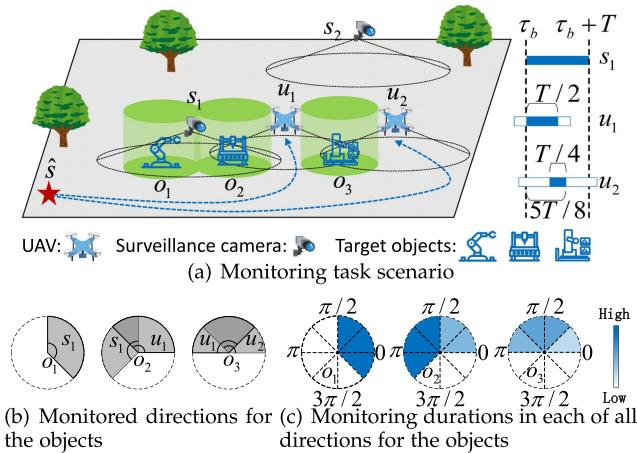  
Fig. 2. System model.

The monitoring task lasts for a total duration T , starting at time $\tau _ { b }$ . Rented surveillance cameras start monitoring immediately at $\tau _ { b }$ and continue until the task ends. While UAVs take off from a designated source point s at specified timings, fly around no-fly areas according to a predetermined strategy, and monitor at assigned locations until the task ends or returning to s due to insufficient energy.

The monitoring scenario is depicted in Fig. 2(a), where three objects $o _ { 1 } , ~ o _ { 2 }$ , and $o _ { 3 }$ need to be monitored for a duration of T . Surveillance cameras $s _ { 1 } , s _ { 2 }$ and $\mathrm { U A V s \ u _ { 1 } , u _ { 2 } }$ monitor the objects within their effective FOVs. The UAVs must maintain a safe distance from $o _ { 1 } , o _ { 2 }$ , and $o _ { 3 }$ (i.e. remaining outside the cylinders around the objects), while the surveillance cameras do not need to. The time bars on the right side of Fig. 2(a) represent the monitoring durations of $s _ { 1 } , \ u _ { 1 }$ , and $u _ { 2 }$ during $T ,$ , with blue shaded areas indicating monitoring periods. Surveillance cameras remain active throughout the task, while UAVs incur round-trip costs for monitoring. Different takeoff timings and path lengths result in varying round-trip (from and to s) costs, represented by hollow bar-shaped segments on the time bars.

Fig. 2(b) depicts the monitored directions for the three objects by s<sub>1</sub>, u<sub>1</sub>, and $u _ { 2 }$ . For example, $o _ { 3 }$ is monitored by both $u _ { 1 }$ and $u _ { 2 }$ in the directions within the gray sector. Fig. 2(c) shows the monitoring durations in each of all directions for the three objects, where varying shades of blue represent the monitoring durations in different directions. The monitoring duration for $o _ { 3 }$ in directions , <sup>π</sup> monitored solely by $u _ { 1 }$ is $\mathbf { \bar { \rho } } _ { 2 }$ , in directions $[ \frac { 3 \pi } { 4 } , \pi ]$ monitored solely by $u _ { 2 }$ is $\dot { \frac { T } { 4 } }$ , and in directions $\left[ { \frac { \pi } { 4 } } , { \frac { 3 \pi } { 4 } } \right]$ <sup>[ ]</sup>monitored jointly by $u _ { 1 }$ and $u _ { 2 } ,$ <sup>[ ]</sup> it corresponds to the union of the UAVs’ monitoring periods, which totals $\frac { 5 T } { 8 }$

## B. UAV Movement Model

During a monitoring task, each UAV departs from the given source point s at selected timing $\tau _ { u }$ and arrives at the position corresponding to its monitoring strategies to commence monitoring. In real-world monitoring scenarios, it’s common for the area to be extensive. As such, it’s reasonable to assume that UAVs can move at a relatively constant speed, denoted as v.

In order to promptly reach the monitoring position, initiate monitoring, and conserve energy, it is imperative to choose the shortest feasible path (avoiding all no-fly areas) from the source point s to the corresponding position $p _ { u }$ . This shortest path is denoted as $L _ { s h } ( p _ { u } )$ . Therefore, the duration of a UAV from the source point s to the corresponding position $p _ { u }$ is

$$
T _ { s h } ( p _ { u } ) = L _ { s h } ( p _ { u } ) / v .\tag{1}
$$

## C. UAV Energy Model

UAVs may need to return prematurely to s due to insufficient energy, preventing continuous monitoring until the monitoring task finish time. The initial total energy of each UAV is denoted as $\mathcal { E } ^ { \mathcal { C } }$ , which excludes any reserved emergency energy. ${ \mathcal { Q } } _ { m }$ denotes the energy consumption per unit time during movement, and ${ \mathcal { Q } } _ { h }$ represents the energy consumption per unit time during hovering for monitoring. Hence, the total energy consumption of a UAV from the source point to a position $p _ { u }$ is

$$
\mathcal { E } _ { m } ( p _ { u } ) = \mathcal { Q } _ { m } T _ { s h } ( p _ { u } ) .\tag{2}
$$

The total energy consumption for the return trip is also $\mathcal { E } _ { m } ^ { \mathrm { { } } } ( p _ { u } )$ Therefore, the energy that a UAV can use to hover for monitoring is

$$
\mathcal { E } _ { h } ( p _ { u } ) = \operatorname* { m a x } ( ( \mathcal { E } - 2 \mathcal { E } _ { m } ( p _ { u } ) ) , 0 ) .\tag{3}
$$

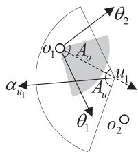  
Fig. 3. UAV monitoring model.

## D. Monitoring Model

Next, the monitoring model is established, with the analysis focusing from spatial perspective to evaluate whether a UAV or surveillance camera can monitor a specified direction of a target object from a designated monitoring position and orientation.

To highlight the main point of this paper, we adopt the monitoring model from previous studies [16], [18], [25] of keeping surveillance cameras in fixed positions and UAVs at relatively steady hovering altitudes. This allows us to simplify the representation of UAVs, surveillance cameras, and objects by projecting them onto a 2D plane. While 3D monitoring model is discussed in detail in Section VII.

For UAVs, for example, consider the scenario of UAV $u _ { 1 }$ monitoring objects $o _ { 1 }$ and $O _ { 2 }$ , as shown in Fig. 3. The camera orientation of UAV $u _ { 1 }$ , denoted as $\alpha _ { u 1 }$ , serves as the angle bisector for the sector representing $u _ { 1 } \mathrm { { ' } s }$ FOV. The central angle of the sector is $A _ { u }$ , and the radius is $D _ { u }$ . Objects in this sector can be monitored, so object $o _ { 1 }$ can be monitored by UAV $u _ { 1 }$ while object $O _ { 2 }$ cannot. Furthermore, the horizontal directions in , π of $o _ { 1 }$ need to be monitored, but only the directions (covered by the gray sector) within the detectable angle $A _ { o }$ facing $u _ { 1 }$ are allowed to be monitored by $u _ { 1 }$ . Consequently, the direction $\theta _ { 1 }$ of the target $o _ { 1 }$ can be monitored, whereas the direction $\theta _ { 2 }$ cannot.

Then we give the formula. For a given position and orientation tuple $\xi = \langle p , \alpha \rangle$ of UAV u or surveillance camera s, and an object $o \in O _ { t }$ (at position $p _ { o } )$ , the monitoring function for a specific direction $\theta _ { o }$ is defined when u or s is at p and monitoring towards α as follows:

$$
\begin{array} { r } { F ( \xi , p _ { o } , \theta _ { o } , A , D ) = \left\{ \begin{array} { l l } { 1 , \quad } & { 0 \leq | | \overrightarrow { p p _ { o } } | | \leq D , } \\ & { \frac { \overrightarrow { p p _ { o } } \cdot \overrightarrow { r _ { \alpha } } } { | | \overrightarrow { p p _ { o } } | | } \geq \cos \frac { A } { 2 } , } \\ & { \frac { \overrightarrow { p _ { o } } \cdot \overrightarrow { r _ { \theta _ { o } } } } { | | \overrightarrow { p _ { o } } \cdot \overrightarrow { p } | | } \geq \cos \frac { A _ { o } } { 2 } . } \\ { 0 , \quad } & { \mathrm { o t h e r w i s e } . } \end{array} \right. } \end{array}\tag{4}
$$

Here, $\overrightarrow { r _ { \alpha } } = ( \cos \alpha , \sin \alpha ) , \overrightarrow { r _ { \theta _ { o } } } = ( \cos \theta _ { o } , \sin \theta _ { o } )$ . For UAVs, use $\left( A , D \right) = \left( A _ { u } , D _ { u } \right)$ ; for surveillance cameras, use $( A , D ) =$ $( A _ { s } , D _ { s } )$ . When $F ( \xi , p _ { o } , \theta _ { o } , A , D ) = 1$ , it indicates that direction $\theta _ { o }$ of object o is monitored by u or s from spatial perspective; otherwise, direction $\theta _ { o }$ of object o is not monitored by u or s.

## E. Monitoring Utility for Single Direction and Moment

1) UAV Monitoring Utility: Next, we explore whether a direction of an object is monitored at a given moment, based on the chosen position and orientation tuple and the departure timing from s for a UAV. The tuple $\lambda ^ { u } = \langle \xi ^ { u } , \tau _ { u } \rangle = \langle p _ { u } , \alpha _ { u } , \tau _ { u } \rangle$ is denoted as the UAV spatio-temporal deployment (UAV strategy) of UAV $u \in U$ , where $\tau _ { u }$ represents the timing of UAV departure from the source point s.

For a UAV strategy $\lambda ^ { u } = \langle \xi ^ { u } , \tau _ { u } \rangle$ , a UAV u departs from the source point $\widehat { s }$ <sup>=</sup>at moment $\tau _ { u } .$ . According to Formula (1), the time point $\tau _ { 1 } ( \lambda ^ { u } )$ when the UAV reaches the position $p _ { u }$ corresponding to strategy $\lambda ^ { u }$ and initiates monitoring is given by

$$
\tau _ { 1 } ( \lambda ^ { u } ) = \tau _ { u } + T _ { s h } ( p _ { u } ) .\tag{5}
$$

Next, utilizing Formula (1) and (3), we can express the latest time point $\tau _ { 2 } ( \lambda ^ { u } )$ that can be continuously monitored by the UAV as

$$
\tau _ { 2 } ( \lambda ^ { u } ) = \tau _ { 1 } ( \lambda ^ { u } ) + \mathcal { O } _ { h } ( p _ { u } ) / \mathcal { Q } _ { h } .\tag{6}
$$

According to Formula (4), (5) and (6), for a given $U A V$ strategy $\lambda ^ { u } = \langle \xi ^ { u } , \tau _ { u } \rangle$ and an object $o \in O _ { t }$ (located at position $p _ { o } )$ , the <sup>=</sup>monitoring function for a direction $\theta _ { o }$ and a moment τ is defined as follows:

$$
\begin{array} { r l } & { \mathcal { F } _ { u } ( \lambda ^ { u } , p _ { o } , \theta _ { o } , \tau ) } \\ & { = \left\{ \begin{array} { l l } { F ( \xi ^ { u } , p _ { o } , \theta _ { o } , A _ { u } , D _ { u } ) , } & { \tau \in [ \tau _ { 1 } ( \lambda ^ { u } ) , \tau _ { 2 } ( \lambda ^ { u } ) ] . } \\ { 0 , } & { \tau \notin [ \tau _ { 1 } ( \lambda ^ { u } ) , \tau _ { 2 } ( \lambda ^ { u } ) ] . } \end{array} \right. } \end{array}\tag{7}
$$

When $\mathcal { F } _ { u } ( \lambda ^ { u } , p _ { o } , \theta _ { o } , \tau ) = 1$ , it indicates that direction $\theta _ { o }$ of object o is monitored by u at moment τ ; otherwise, direction $\theta _ { o }$ of o is not monitored by u at τ.

2) Surveillance Camera Monitoring Utility: The tuple $\lambda ^ { s } =$ $\langle \xi ^ { s } , \tau _ { s } \rangle = \langle p _ { s } , \alpha _ { s } , \tau _ { s } \rangle$ is designated as the surveillance camera spatio-temporal deployment (surveillance camera strategy) of $s \in S$ , where $\tau _ { s }$ represents the timing when surveillance cameras commence monitoring.

Unlike UAVs, surveillance cameras do not have energy and movement time constraints, allowing them to operate from the beginning until the completion of the monitoring task. Therefore, for a given surveillance camera strategy $\lambda ^ { s } = \langle \xi ^ { s } , \tau _ { s } \rangle$ and an object $o \in O _ { t }$ (located at $p _ { o } )$ <sup>=</sup>, the monitoring function for a direction $\theta _ { o }$ and a moment τ is defined as

$$
\mathcal { F } _ { s } ( \lambda ^ { s } , p _ { o } , \theta _ { o } , \tau ) = F ( \xi ^ { s } , p _ { o } , \theta _ { o } , A _ { s } , D _ { s } ) .\tag{8}
$$

## F. Continuous Omnidirectional Monitoring Utility

1) Monitoring Utility for Single Object: First, considering sets of UAV strategies $\dot { \mathrm { ~ \scriptsize ~ \Lambda ~ } ^ { U } }$ and surveillance camera strategies $\Lambda ^ { S }$ , we initially evaluate whether a specific direction $\theta _ { o }$ of an object o is monitored at a given time point τ . If, at time τ , the direction $\theta _ { o }$ of object o is monitored by any surveillance camera or UAV, then $\theta _ { o }$ is considered monitored. Therefore, according to Formula (7) and (8), its expression is given by

$$
\begin{array} { r l } & { \mathbb { F } ( \Lambda ^ { U } , \Lambda ^ { S } , p _ { o } , \theta _ { o } , \tau ) = \operatorname* { m a x } ( \underset { \lambda ^ { u } \in \Lambda ^ { U } } { \operatorname* { m a x } } \ \mathcal { F } _ { u } ( \lambda ^ { u } , p _ { o } , \theta _ { o } , \tau ) , } \\ & { \quad \quad \quad \quad \underset { \lambda ^ { s } \in \Lambda ^ { S } } { \operatorname* { m a x } } \ \mathcal { F } _ { s } ( \lambda ^ { s } , p _ { o } , \theta _ { o } , \tau ) ) . } \end{array}\tag{9}
$$

Then, the continuous monitoring function for direction $\theta _ { o }$ of object o during the task time period T is the normalized value of the cumulative monitoring function (Formula (9)) for $\theta _ { o }$ of o

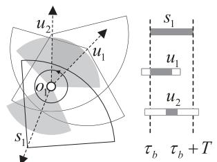  
(a) Spatio-temporal deployments (strategies) of s1, u1 and u2

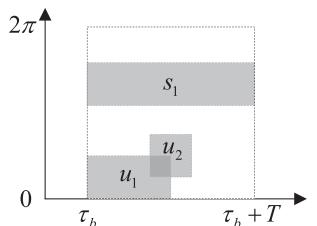  
(b) Monitoring utility for o1 corresponding to the strategies

Fig. 4. An example of continuous omnidirectional monitoring utility for single object.

in the duration $[ \tau _ { b } , \tau _ { b } + T ] \colon$

$$
\mathbb { U } ( \Lambda ^ { U } , \Lambda ^ { S } , p _ { o } , \theta _ { o } ) = \frac { 1 } { T } \int _ { \tau _ { b } } ^ { \tau _ { b } + T } \mathbb { F } ( \Lambda ^ { U } , \Lambda ^ { S } , p _ { o } , \theta _ { o } , \tau ) d \tau .\tag{10}
$$

The value of $\mathbb { U } ( \Lambda ^ { U } , \Lambda ^ { S } , p _ { o } , \theta _ { o } )$ represents the normalized monitoring duration for direction $\theta _ { o }$ of object o. Based on the above formula, the continuous omnidirectional monitoring function for a given object $o \in O _ { t }$ is the normalized value of the cumulative monitoring function for object o in directions of , π :

$$
\frac { 1 } { 2 \pi } \int _ { 0 } ^ { 2 \pi } \mathbb { U } ( \Lambda ^ { U } , \Lambda ^ { S } , p _ { o } , \theta _ { o } ) d \theta _ { o } .\tag{11}
$$

In the example illustrated in Fig. 4(a), surveillance camera $s _ { 1 }$ , along with two UAVs $u _ { 1 }$ and $u _ { 2 } .$ , monitor object $o _ { 1 }$ . The three time bars on the right of Fig. 4(a) depict non-monitoring periods (white hollow sections) and monitoring periods (gray sections) for $s _ { 1 } , \ u _ { 1 }$ , and u during the monitoring task, with their monitoring durations being $T , \frac { T } { 2 }$ , and $\textstyle { \frac { T } { 4 } }$ , respectively. On the left of Fig. 4(a), the multiple gray sectors centered on $o _ { 1 }$ have a central angle $\begin{array} { r } { A _ { o } = \frac { \pi } { 2 } } \end{array}$ , representing the successfully monitored directions. Notably, the two gray sectors facing $u _ { 1 }$ and $u _ { 2 }$ overlap (shown as the dark gray portion). According to Formula (10), the monitoring duration in the overlapping directions for $u _ { 1 }$ and $u _ { 2 }$ contributes to $\frac { 5 T } { 8 }$ , which is the union monitoring time for both UAVs. Consequently, by applying Formula (11), the continuous omnidirectional monitoring function for object $o _ { 1 }$ by $s _ { 1 } , u _ { 1 }$ , and $u _ { 2 }$ is calculated as $\begin{array} { r } { \frac { 1 } { T \cdot 2 \pi } \big ( \frac { \breve { T } } { 2 } \cdot \frac { \pi } { 4 } + \frac { 5 T } { 8 } \cdot \frac { \pi } { 4 } + \frac { T } { 4 } \cdot \frac { \pi } { 4 } + T \cdot \frac { \pi } { 2 } \big ) = } \end{array}$ $\frac { 2 7 } { 6 4 }$ <sup>( + + + ) =</sup>. The value is visually depicted in Fig. 4(b) as the ratio of the total gray areas to the area of the square enclosed by the dotted lines.

2) Monitoring Utility for Multiple Objects: Finally, we define the overall Continuous Omnidirectional Monitoring Utility as the average of monitoring utility for all J target objects, i.e.,

$$
\frac { 1 } { J } \sum _ { o \in O _ { t } } \frac { 1 } { 2 \pi } \int _ { 0 } ^ { 2 \pi } \mathbb { U } ( \Lambda ^ { U } , \Lambda ^ { S } , p _ { o } , \theta _ { o } ) d \theta _ { o } .\tag{12}
$$

## G. Problem Formulation

Due to the limited number of UAVs and budget used to rent the surveillance cameras, our task is to determine the strategies for all I UAVs and all K surveillance cameras to optimize overall monitoring utility for all J target objects. With all above, the

JUMP problem is defined as follows:

$$
( \mathbf { J U M P - P 1 } ) \operatorname* { m a x } _ { \Lambda ^ { U } , \Lambda ^ { S } } \ \frac { 1 } { 2 \pi J } \sum _ { o \in O _ { t } } \int _ { 0 } ^ { 2 \pi } \mathbb { U } ( \Lambda ^ { U } , \Lambda ^ { S } , p _ { o } , \theta _ { o } ) d \theta _ { o }\tag{13a}
$$

$$
\mathrm { s . t . } \quad | \Lambda ^ { U } | \leq I ,\tag{13b}
$$

$$
\sum \quad c _ { s } \leq C ,\tag{13c}
$$

$$
\langle p _ { s } , \alpha _ { s } \rangle { \in } \Lambda ^ { S }
$$

$$
\begin{array} { r } { | \langle p _ { s } , \alpha _ { s } \rangle \cap \Lambda ^ { S } | \leq 1 , \forall s \in S , } \end{array}\tag{13d}
$$

$$
| | \overrightarrow { p _ { u } p _ { o } } | | \geq d _ { \operatorname* { m i n } } , \forall u \in U \wedge o \in O ,\tag{13e}
$$

$$
\alpha _ { u } \in [ 0 , 2 \pi ) , \forall u \in U ,\tag{13f}
$$

$$
\alpha _ { s } \in [ 0 , 2 \pi ) , \forall s \in S .\tag{13g}
$$

Constraint (13b) ensures that the number of UAVs used does not exceed the limit I. Eq. (13c) specifies that the total cost of renting surveillance cameras must not exceed the budget. Eq. (13d) ensures that each monitoring surveillance camera strategy is executed at most once. Eq. (13e) mandates that the distances from UAVs to all objects must be greater than the specified minimum distance. Eqs. (13f) and (13g) state that the optional camera orientation for UAVs and surveillance cameras, respectively, should fall within the range , π . Then, we have the following proposition.

Proposition 1: JUMP-P1 problem is in general NP-hard.

Proof: Consider a special case of problem JUMP-P1 with the following parameters: $S = \emptyset , A _ { o } = A _ { u } = A _ { s } = 2 \pi , D _ { u } =$ $D _ { s } = 1 , \mathcal { E } > 0$ , and $\mathcal { Q } _ { m } = \mathcal { Q } _ { h } = 0$ . In this special case, the problem can be reformulated as a unit disk covering problem in 2D, which is NP-hard problem in general [26], [27]. Thus, JUMP-P1 is NP-hard in general. -

## H. Solution Overview

Then, we present the overview of our approach to address problem JUMP-P1. This approach achieves an approximation ratio of $\frac { 1 } { 6 ( 1 + \varepsilon ) }$ and improves to $\frac { 1 } { 4 ( 1 + \varepsilon ) }$ when surveillance camera costs are uniform. The approach (Fig. 5; detailed pipeline in Appendix N) consists of four steps.

Step 1. Spatio-Temporal Discretization: In order to effectively analyze candidate strategies, this step involves the uniform discretization of the directions and time periods associated with the objects. A new objective function is defined to approximate the original objective of JUMP-P1, with an upper bound on the gap between them, as demonstrated by the proof of Theorem 5.

Step 2. Strategies Reduction: In this step, strategies for UAVs and surveillance cameras are reduced without sacrificing performance. Two sub-steps are employed:

1) Dominating Strategies Extraction for Surveillance Cameras: This sub-step focuses solely on spatial dimensions, ignoring considerations like take-off timing and energy constraints. A dedicated method is devised for extracting dominating strategies.

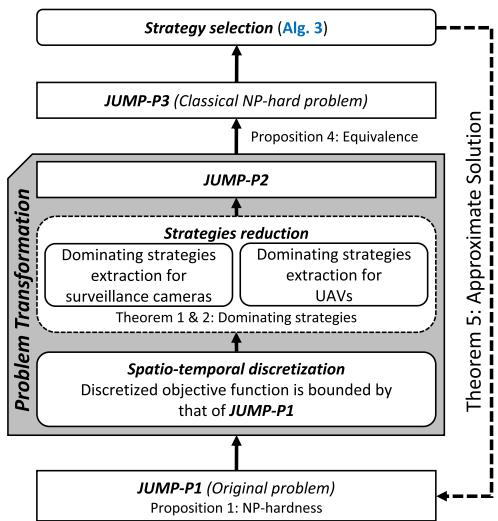  
Fig. 5. An illustration of our approach to JUMP.

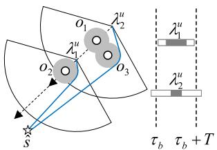  
(a) λ2 does not dominate λµ

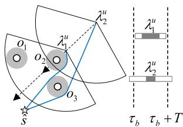  
(b) λµ dominates λu  
Fig. 6. Examples of dominating for UAV strategies by Definition 1.

2) Dominating Strategies Extraction for UAVs: Unlike surveillance cameras, UAV strategies must consider factors such as take-off timing, flight duration, and energy constraints. While spatial dimensions are important, overlooking temporal aspects may lead to suboptimal strategies. To address this, we adopt a comprehensive approach that ensures potentially dominating strategies are retained (for concrete differences from existing spatial-only methods, see Appendix O). In Fig. 6, each subfigure illustrates UAV strategies using sectors, monitored objects with hollow circles, and no-fly areas with gray circles. Blue lines represent the shortest UAV paths from the source point to the strategy positions. The time bars on the right side display UAVs hovering monitoring time in gray and round-trip flight time in white. For instance, in Fig. 6(a), while strategy $\lambda _ { 2 } ^ { u }$ spatially outperforms $\lambda _ { 1 } ^ { u }$ for all objects, $\lambda _ { 1 } ^ { u }$ exhibits longer monitoring duration. Focusing solely on spatial aspects may mistakenly exclude potentially dominating strategies like $\lambda _ { 2 } ^ { u }$ in Fig. 6(a). Meanwhile, in Fig. 6(b), λ<sup>u</sup> really dominates $\lambda _ { 2 } ^ { u }$ , showcasing superior monitoring performance of all objects from both spatial and temporal perspectives. The specific steps for extracting UAV dominating strategies are shown in Fig. 8.

Step 3. Problem Transformation: With the reduced strategies as the candidate strategies, JUMP-P1 is transformed into JUMP-P2 in combination with spatio-temporal discretization (the problems performance bounded with each other).

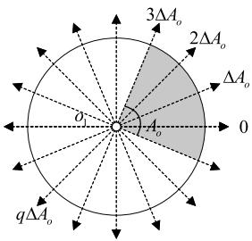  
(a) Spatial discretization

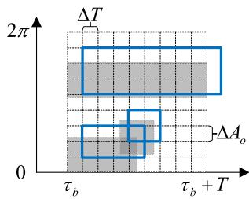  
(b) Spatio-temporal discretization

Fig. 7. Examples of discretization.  
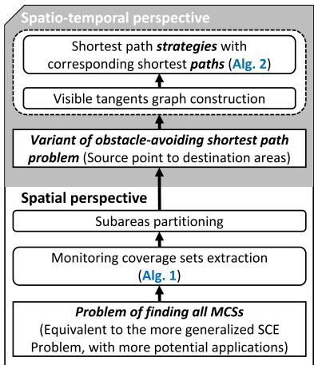  
Fig. 8. An illustration of dominating strategies extraction for UAVs.

Step 4. Strategy Selection: This step reformulates JUMP-P2 as a classical MSMMK problem (JUMP-P3). An approximate algorithm with performance guarantees is proposed to address this classical problem.

Overall, we provide a systematic approach for efficiently addressing JUMP-P1 while ensuring performance guarantees are upheld.

## III. PROBLEM TRANSFORMATION WITH SPATIO-TEMPORAL PERSPECTIVE

In this section, we transform JUMP-P1 into JUMP-P2 through discretization and dominating strategies extraction from spatio-temporal perspective.

## A. Spatio-Temporal Discretization

We perform spatio-temporal discretization to approximate the original problem.

1) Temporal Discretization: To initiate the discretization process, we utilize the task’s starting time point $\tau _ { b }$ as our reference. Here, T acts as the interval, ensuring the establishment of discrete time points at regular intervals both before and after $\tau _ { b } .$ . This approach effectively transforms the continuous time axis into a series of discrete time points, each precisely spaced apart by intervals of $\Delta T .$ . Accordingly, Formula (10) continuous monitoring function is transformed into the following form:

$$
\mathcal { U } ( \Lambda ^ { U } , \Lambda ^ { S } , p _ { o } , \theta _ { o } ) = \frac { 1 } { \lceil \frac { T } { \Delta T } \rceil } \sum _ { m = 1 } ^ { \lceil \frac { T } { \Delta T } \rceil } \mathbb { F } ( \Lambda ^ { U } , \Lambda ^ { S } , p _ { o } , \theta _ { o } , \tau _ { b } + m \Delta T ) .\tag{14}
$$

Furthermore, $T _ { \mathrm { m i n } }$ denotes the minimum monitoring duration for all UAVs, where $T _ { \mathrm { m i n } } > \Delta T > 0$ . The value of $T _ { \mathrm { m i n } }$ can be manually specified or obtained by iterating through the output of Algorithm 2 proposed in Section III-D4.

2) Spatial Discretization: Next, we perform spatial discretization. We use the monitored direction 0 of any object such as $o _ { 1 }$ as our reference within the range , π . Here, $\Delta A _ { o }$ serves as the interval, ensuring the establishment of discrete directions at regular intervals after direction 0 as shown in Fig. 7(a). This method effectively converts the continuous direction axis into a series of discrete directions, each precisely spaced apart by intervals of $\Delta A _ { o }$

Combining the two discretization processes, according to Formula (14), the original objective function in Formula (13a) can be approximated as

$$
\frac { 1 } { \big \lceil \frac { 2 \pi } { \Delta A _ { o } } \big \rceil } \sum _ { m = 1 } ^ { \lceil \frac { 2 \pi } { \Delta A _ { o } } \big \rceil } \mathcal { U } ( \Lambda ^ { U } , \Lambda ^ { S } , p _ { o } , m \Delta A _ { o } ) .\tag{15}
$$

In Fig. 7(b), the results of the original monitoring utility (as shown in Fig. 4(b)) after Spatio-Temporal Discretization are depicted. The gray filled rectangular area representing the original monitoring utility is discretized to the blue rectangular area. We note that though this discretization introduces approximation errors, we rigorously prove in Lemma 9 (Appendix M) that the resultant utility loss is strictly bounded. This bounded-error property serves as a critical prerequisite for establishing the approximation ratio guarantee in Theorem 5 (Appendix M).

## B. Preliminaries for Dominating Strategies Extraction

Then, we show that instead of enumerating all possible monitoring strategies, we only need to consider a limited number of representative strategies, which are defined as Dominating Strategies. To begin with, we give the following definitions to assist analysis. For the sake of convenience in definition, we unify Formula (7) and (8). For a UAV or surveillance camera strategy λ and object $^ { O , }$ the monitoring effect is as follows:

$$
\mathcal { F } ( \lambda , p _ { o } , \theta _ { o } , \tau ) = \left\{ \begin{array} { l l } { \mathcal { F } _ { u } ( \lambda , p _ { o } , \theta _ { o } , \tau ) } & { , \lambda \in \Lambda ^ { U } , } \\ { \mathcal { F } _ { s } ( \lambda , p _ { o } , \theta _ { o } , \tau ) } & { , \lambda \in \Lambda ^ { S } . } \end{array} \right.\tag{16}
$$

Then, in the context of the spatio-temporal discretization, the following definitions are introduced:

Definition 1: (DOMINATION) Given two strategies $\lambda _ { 1 }$ and $\lambda _ { 2 }$ that can be candidate strategies for a UAV or a surveillance camera. For all $\begin{array} { r } { o \in { \cal O } _ { t } , 1 \le n \le \lceil \frac { T } { \Delta T } \rceil } \end{array}$ and $\begin{array} { r } { 1 \leq m \leq \lceil \frac { 2 \pi } { \Delta A _ { \circ } } \rceil \colon \mathrm { I f } \quad \mathcal { F } ( \lambda _ { 1 } , p _ { o } , m \Delta A _ { o } , \tau _ { b } + n \Delta \bar { T } ) = } \end{array}$ $\mathcal { F } ( \lambda _ { 2 } , p _ { o } , m \Delta A _ { o } , \tau _ { b } + n \Delta T )$ , λ<sub>1</sub> is equivalent to $\begin{array} { r l r l r } { \lambda _ { 2 } , } & { { } \mathrm { ~ o r ~ } } & { \lambda _ { 1 } \equiv \lambda _ { 2 } ; } & { { } \mathrm { ~ I f ~ } } & { \mathcal { F } ( \lambda _ { 1 } , p _ { o } , m \Delta A _ { o } , \tau _ { b } + n \Delta T ) \geq } \end{array}$ $\mathscr { F } ( \lambda _ { 2 } , p _ { o } , m \Delta A _ { o } , \tau _ { b } + n \Delta T )$ , λ<sub>1</sub> dominates λ<sub>2</sub>, or $\lambda _ { 1 } \succeq \lambda _ { 2 }$ If $\lambda _ { 1 } \succeq \lambda _ { 2 }$ but $\lambda _ { 1 } \equiv \lambda _ { 2 }$ is not satisfied, $\lambda _ { 1 } \succ \lambda _ { 2 }$

Definition 2: (DOMINATING STRATEGY) Given a strategy $\lambda _ { 1 }$ if there does not exist a strategy $\lambda _ { 2 }$ such that $\lambda _ { 2 } \succ \lambda _ { 1 }$ , then $\lambda _ { 1 }$ is a dominating strategy.

Definition 3: (SECTOR MONITORING AREA) For a UAV (or surveillance camera) position and orientation tuple $\xi = \langle p , \alpha \rangle$ (or strategy $\lambda = \langle \xi , \tau \rangle )$ , the sector monitoring area (or sector) is the area formed by a circle with center $p ,$ radius $D _ { u }$ (or $D _ { s } )$ and central angle $A _ { u }$ (or $A _ { s } )$ with respect to the angle bisector direction α.

Definition 4: (MONITORING COVERAGE SET) Given a position and orientation tuple $\xi = \langle p , \alpha \rangle$ (or strategy $\lambda = \langle \xi , \tau \rangle )$ , the set $\widehat { O } \subseteq O _ { t }$ composed of all objects covered by the sector monitoring area of $\xi \left( \mathrm { o r } \lambda \right)$ is called the monitoring coverage set (MCS) of ξ (or λ).

## C. Dominating Strategies Extraction for Surveillance Cameras

Due to the fixity of surveillance cameras, we can just control the orientation of them. This subsection revolves around the concept of rotating each surveillance camera through π and extracting dominating strategies.

Below, we outline the steps of Dominating Strategies Extraction Method for Surveillance Cameras: We initialize the result set of strategies $\widehat { \Lambda } ^ { S } = \varnothing$ and iterate over each surveillance camera $s _ { k } \in S .$ , performing the following steps in each iteration: Step 1: Select objects $O _ { s _ { k } } = \{ | | \overrightarrow { p _ { s _ { k } } p _ { o } ^ { \prime } } | | \leq D _ { s } : o \in O _ { t } \}$ likely to be monitored by each $s _ { k } \in S .$ <sup>:</sup>, and sort these objects based on the angles between the objects and $s _ { k }$ . Step 2: Initialize the surveillance camera $s _ { k }$ with an orientation of 0 and add $\langle p _ { s _ { k } } , 0 , \tau _ { b } \rangle$ to $\widehat { \Lambda } ^ { S }$ . Step 3: Rotate $s _ { k }$ counterclockwise to alter the orientation of its strategy. Whenever an object enters or exits its monitoring area, the corresponding strategy $\langle p _ { s _ { k } } , \alpha _ { s _ { k } } , \tau _ { b } \rangle$ is added to $\widehat { \Lambda } ^ { S }$ . Step $4 { : }$ The next iteration commences when the surveillance camera has completed a full rotation of π.

For the output $\widehat { \Lambda } ^ { S }$ of the method, we have the theorem:

<sup>Λ</sup>Theorem 1: Given any surveillance camera strategy $\lambda _ { 1 }$ for any $s _ { k } \in S$ , there exists $\widehat { \lambda } _ { 2 } \in \widehat { \Lambda } ^ { S }$ such that $\lambda _ { 2 } \succeq \lambda _ { 1 }$ , where $\widehat { \Lambda } ^ { S }$ is the output of Dominating Strategies Extraction Method for Surveillance Cameras.

The proof can be found in Appendix A. Given our selection of heapsort as the sorting algorithm in Step 1 of the method, the time complexity of Dominating Strategies Extraction Method for Surveillance Cameras is determined to be $O ( K O _ { \operatorname* { m a x } } \log O _ { \operatorname* { m a x } } )$ where $O _ { \operatorname* { m a x } } = \operatorname* { m a x } _ { s _ { k } \in S } \left| O _ { s _ { k } } \right|$

## D. Dominating Strategies Extraction for UAVs

To extract dominating strategies for UAVs, it is imperative to not only assess the monitored objects by a strategy from spatial perspective but also to account for the duration during which the strategy monitors these objects from temporal perspective. Therefore, as shown in Fig. 8, our main ideas are as follows:

Spatial Perspective: Initially, we calculate all possible MCSs by enumerating combinations of sizes up to 3 (Algorithm 1), as opposed to exhaustively enumerating all possible combinations within the set of objects within the set of objects $O _ { t }$ . This problem of finding all MCSs based on . This problem of finding all MCSs is also reformulated as the equivalent of the SCE problem<sub>Authorized</sub> <sub>licensed</sub> <sub>use</sub> <sub>limited</sub> <sub>to:</sub> <sub>LNM</sub> <sub>Institute</sub> <sub>of</sub> <sub>Information</sub> <sub>Technology.</sub> <sub>Do</sub>

(Definition 5), which has broader implications and potential applications in various fields such as wireless charging and communication coverage. These applications are further explored in Discussion Section.

Subsequently, we identify a set of equivalent monitoring subareas (Definition 6) for each MCS (Subareas Partition Method). Regardless of the monitoring duration, the optimal strategy for any position in an equivalent monitoring subarea is equivalent for the corresponding MCS.

Spatio-Temporal Perspective: Ultimately, we compute the shortest path strategy (Definition 7) and corresponding shortest path within each equivalent monitoring subarea (Algorithm 2), characterized by the longest monitoring time. The set of these shortest path strategies constitutes the dominating strategies for UAVs.

1) Monitoring Coverage Sets Extraction: This subsection introduces the MCSs extraction algorithm. The algorithm aims to derive all possible MCSs, as defined in Definition 4. Consequently, for any feasible UAV position and orientation tuple, there exists a corresponding MCS within the set of MCSs (satisfying Lemma 1).

The details of the algorithm are provided in Algorithm 1. The primary process of Algorithm 1 consists of traversing all combinations of two (Lines 12-18) and three (Lines 5-11) objects. Each combination $\widehat { O }$ involves two steps:

Step 1. Determine Sector Monitoring Areas (Sectors): Identify sectors for the objects combination (Lines $_ { 7 - 1 0 }$ and 14-17). The centers of these sectors are recorded into $\widehat { P }$

Step 2. Extraction of MCSs from the Sectors: Utilizing $\widehat { P }$ and the positions of the ${ \widehat { O } } ,$ Sub-Alg. $C E P ( \widehat { P } , \widehat { O } )$ is invoked (Lines 11 and 18) to compute the corresponding MCSs. The main steps of $C E P ( \widehat { P } , \widehat { O } )$ are as follows:

1) Locate the sectors identified in Step 1 according to $\widehat { P }$ and $\widehat { O }$

2) For each sector, its corresponding MCSs is determined according to the boundary objects and the inside objects of the sector.

All MCSs are then aggregated and presented as output. The detail of $C E P ( \widehat { P } , \widehat { O } )$ can be found in Appendix B.

Fig. 9 provides an example of the sector determination process. Each sector corresponds to a position and orientation tuple. The gray objects are positioned at the borders of sectors, black objects are located within sectors, and white objects are outside the sectors. In each subfigure of Fig. $9 , o _ { 1 }$ corresponds to $o _ { i }$ in the algorithm (Line $2 ) , o _ { 2 }$ corresponds to $o _ { j }$ (Lines 5 and 12), and $o _ { 3 }$ to $o _ { k }$ (Line 5).

For instance, Fig. 9(a) shows two intersection points, $p _ { 1 }$ and $p _ { 2 } .$ , being added to $\hat { P }$ (Line 7). Subsequently, the corresponding MCSs are calculated by invoking the sub-algorithm CEP (Line 11). However, since $O 1 , O 2 , O 3$ are not all located on the boundary of sector corresponding to $\langle p _ { 2 } , \alpha _ { 2 } \rangle$ , the sector is excluded. Therefore, MCSs are calculated as

$$
\{ \{ o _ { 4 } , o _ { 5 } \} , \{ o _ { 1 } , o _ { 4 } , o _ { 5 } \} , \{ o _ { 2 } , o _ { 4 } , o _ { 5 } \} , \{ o _ { 3 } , o _ { 4 } , o _ { 5 } \} , \{ o _ { 1 } , o _ { 2 } , o _ { 4 } , o _ { 5 } \} , \{ o _ { 2 } , o _ { 3 } , o _ { 4 } , i _ { 5 } \} , \{ o _ { 3 } , o _ { 4 } , i _ { 5 } \} , \{ o _ { 2 } , o _ { 4 } , o _ { 5 } \} , \{ o _ { 3 } , o _ { 5 } , i _ { 5 } \} , \{ o _ { 2 } , o _ { 4 } , i _ { 5 } \} ,
$$

$$
\big \{ o _ { 1 } , o _ { 3 } , o _ { 4 } , o _ { 5 } \big \} , \big \{ o _ { 2 } , o _ { 3 } , o _ { 4 } , o _ { 5 } \big \} , \big \{ o _ { 1 } , o _ { 2 } , o _ { 3 } , o _ { 4 } , o _ { 5 } \big \} \big \} ,\tag{17}
$$

$\left\{ o _ { 4 } , o _ { 5 } \right\}$ and the power set of $\left\{ o _ { 1 } , o _ { 2 } , o _ { 3 } \right\}$ corresponding to p<sub>1</sub>, α<sub>1</sub>. The line references for other subfigures in Fig. 9 <sub>wnloaded</sub> <sub>on</sub> <sub>July</sub> <sub>05,2026</sub> <sub>at</sub> <sub>09:11:14</sub> <sub>UTC</sub> <sub>from</sub> <sub>IEEE</sub> <sub>Xplore.</sub> <sub>Restrictions</sub> <sub>apply.</sub>

(f) Line 17 of Alg. 1

Algorithm 1: MCSs Extraction:   
Input: The set of objects $O _ { t } ,$ along with the radius $D _ { u }$ and the   
central angle $A _ { u }$ defining the sector monitoring area   
Output: A set of MCSs M   
1 ${ \widehat { M } } \gets \emptyset ;$   
2 for each $o _ { i } \in O _ { t }$ do   
3 ${ \widehat { M } }  { \widehat { M } } \cup \{ o _ { i } \} ;$   
4 $\widehat { O } _ { i } \gets \{ | | \overrightarrow { p _ { o _ { i } } p _ { o } ^ { \prime } } | | \leq D _ { u } : o \in O _ { t } \setminus \{ o _ { i } \} \} ;$   
5 for each pairs $o f o _ { j } , o _ { k } \in \widehat { O } _ { i }$ do   
6 ${ \widehat { P } } \gets \emptyset ;$   
7 Draw a straight line passing through $o _ { j }$ and $o _ { k } ,$   
intersecting a circle with $o _ { i }$ as the center and $D _ { u }$ as   
the radius, and add the resulting intersection points   
to set ${ \widehat { P } } ;$   
8 Draw two arcs crossing $o _ { i }$ and $o _ { j }$ with circumferential   
angle 2 $\ d A _ { u } ,$ and intersect the straight line crossing ${ } _ { i }$   
and $\mathbf { \xi } _ { P k } ^ { O } ,$ and add the resulting intersection points to   
set ${ \widehat { P } } .$ Switch $o _ { j }$ and $o _ { k }$ and repeat this step again;   
9 Draw two arcs crossing $o _ { j }$ and $o _ { k }$ with circumferential   
angle $2 A _ { u } ,$ intersecting a circle with $o _ { i }$ as the center   
and $D _ { u }$ as the radius, and add the resulting   
intersection points to set ${ \widehat { P } } ;$   
10 Draw circles with $D _ { u }$ radius and centers $o _ { i } , o _ { j }$ and $o _ { k } ,$   
and add the resulting intersections between the circle   
corresponding to $o _ { i }$ and the other circles to set ${ \widehat { P } } ;$   
11 ${ \widehat { M } } \gets { \widehat { M } } \cup C E P ( { \widehat { P } } , \{ o _ { i } , o _ { j } , o _ { k } \} ) ;$   
12 for each $o _ { j } \in \widehat { O } _ { i }$ do   
13 ${ \widehat { M } }  { \widehat { M } } \cup \{ o _ { i } , o _ { j } \} ;$   
14 $\widehat { P } \gets \{ o _ { i } \} ;$   
15 Draw a straight line passing through oi and $o _ { j } ,$   
intersecting a circle with $o _ { i }$ as the center and $D _ { u }$ as   
the radius, and add the resulting intersection points   
to set ${ \widehat { P } } ;$   
16 Draw two circles with radius $D _ { u }$ and centers $o _ { i }$ and   
$o _ { j }$ respectively, and add the resulting intersection   
points to set ${ \hat { P } } ;$   
17 Draw two arcs crossing $o _ { i }$ and $o _ { j }$ with circumferential   
angle $2 A _ { u } ,$ intersecting a circle with oi as the center   
and $D _ { u }$ as the radius, and add the resulting   
intersection points to set ${ \widehat { P } } ;$   
18 ${ \widehat { M } } \gets { \widehat { M } } \cup { \dot { C } } { \widehat { E } } P ( { \widehat { P } } , \{ o _ { i } , o _ { j } \} ) ;$   
19 return M.

are noted similarly. Then, we present the following propositions and lemma:

Proposition 2: The time complexity of Algorithm 1 is $O ( J \widehat { O } _ { \operatorname* { m a x } } ^ { 2 } )$ , where $\widehat { O } _ { \mathrm { m a x } } = m a x _ { o _ { i } \in O _ { t } } | \widehat { O } _ { i } |$ in Algorithm 1.

The proof can be found in Appendix C.

Lemma 1: Given any feasible UAV position and orientation tuple $\xi = \langle p , \alpha \rangle$ (or strategy $\lambda = \langle \xi , \tau \rangle )$ , its MCS m satisfies $\widehat { m } \in \widehat { M }$ , where M is the output of Algorithm 1.

The proof can be found in Appendix D. Finally, we introduce a more generalized problem and can be solved by Algorithm 1. Additionally, we delve into potential applications of the problem in Discussion Section.

Definition 5: (SECTOR COVERAGE ENUMERATION PROB-LEM) Given a set of points $\mathcal { P }$ in a two-dimensional plane and a sector $\mathcal { S }$ of specified shape and size, the Sector Coverage Enumeration (SCE) Problem involves identifying and enumerating all possible subsets of points that can be entirely covered by sectors of identical shape and size, but with arbitrary positions.

Proposition 3: The SCE problem is equivalent to finding all Monitoring Coverage Sets (MCSs).

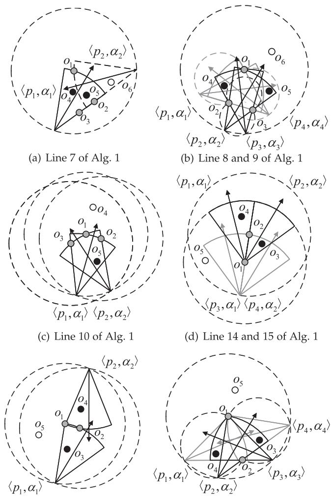  
Fig. 9. A toy example of MCSs extraction.

The proof can be found in Appendix E.

2) Subareas Partitioning: In this subsection, we introduce Subareas Partition Method designed to partition the equivalent monitoring subarea for each MCS. We begin by defining the subarea.

Definition 6: (EQUIVALENT MONITORING SUBAREA) Given a MCS $\widehat { m }$ and a subarea $\widehat { s u b }$ , the subarea $\widehat { s u b }$ is defined as the equivalent monitoring subarea for MCS m if, for any position $p \in { \widehat { s u b } } ,$ there exists a position and orientation tuple $\langle p , \alpha \rangle$ corresponding to m such that $F ( p , \alpha , p _ { o } , \theta _ { o } , A _ { u } , D _ { u } ) =$ may $\stackrel { \iota } { \iota } _ { p _ { 1 } \in \widehat { s u b } , \alpha _ { 1 } \in [ 0 , 2 \pi ) } F ( p _ { 1 } , \alpha _ { 1 } , p _ { o } , \theta _ { o } , A _ { u } , D _ { u } )$ for all $o \in { \widehat { m } }$ and $\theta _ { o } \in [ 0 , 2 \pi )$

<sup>[0 2 )</sup>Next, we present Subareas Partition Method execution steps, where subareas $\widehat { S u b }$ are initialized to ∅ and each MCS $\widehat { m } \in \widehat { M }$ is traversed to obtain corresponding equivalent monitoring subareas: Step 1: Draw circles with each object in m as the center and $D _ { u }$ as the radius. Find the intersection area of these circles, denoted as sub . Step 2: If there is only one object in ${ \widehat { m } } .$ proceed to the next step. If there are multiple objects in $\widehat { \boldsymbol { m } } .$ , for each pair of objects $o _ { i }$ and $o _ { j }$ in m: Draw two arcs crossing $o _ { i }$ and $o _ { j }$ with a circumferential angle of $2 A _ { u }$ . Denote the enclosed area as $\widehat { s u b } _ { 2 }$ . Remove $\widehat { s u b } _ { 2 }$ from $\hat { s u b _ { 1 } }$ . Step 3:

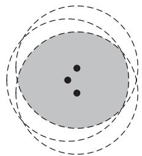  
(a) Areas for Du (Step 1)

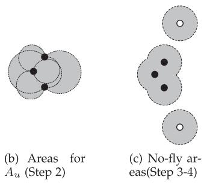

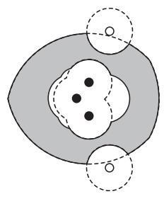

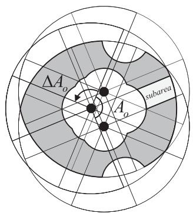  
(d) Combination of above  
(e) Final subareas (Step 5)  
Fig. 10. A toy example of subareas partitioning.

Initialize ${ \widehat { O } } = \varnothing$ . For each object $o _ { i }$ in $\widehat { m }$ , add objects o to $\widehat { O }$ if $| | \overrightarrow { p _ { o _ { i } } p _ { o } } | | \le D _ { u } + d _ { \operatorname* { m i n } }$ . Step 4: Draw circles with each object in $\widehat { O }$ as the center and $d _ { \mathrm { m i n } }$ as the radiu $s ,$ and consider the union area of these circles as $\bar { s u b } _ { 3 } .$ . Remove $\widehat { s u b } _ { 3 }$ from $\widehat { s u b } _ { 1 }$ . Step 5: Divide the remaining area $\bar { s u b _ { 1 } }$ into a set $\widehat { S u b _ { 1 } }$ of subareas. Use spatial discretization centered on each object in ${ \widehat { m } } ,$ with $\Delta A _ { o }$ as the increment. Add $\widehat { S u b } _ { 1 }$ to the set of subareas $\widehat { S u b } .$

After completing all traversals, the final subareas $\widehat { S u b }$ are obtained.

We elucidate the execution of each walk through an illustrative example (see Fig. 10) featuring a MCS m composed of three objects (black solid dots). In Fig. 10, the values of $A _ { o }$ and $\Delta A _ { o }$ in the example are $2 \pi / 3$ and $\pi / 2 ,$ <sup>Δ</sup>, respectively. In each traversal, we first obtain the area (Step 1 of Subareas Partition Method) that satisfies the first constraint in Formula (4) for the objects $o \in { \widehat { m } }$ , as shown in the gray area in Fig. 10(a). The area that does not satisfy the second condition in Formula (4) is then computed (Step 2), as shown by the gray area in Fig. 10(b). Next, the infeasible area (Step 3-4) is computed, as shown by the gray area in Fig. 10(c), where the hollow dots represent objects near $\widehat { m }$ that do not belong to $\widehat { m }$ . The combined results of the above three steps are shown in the gray area in Fig. 10(d). Finally, the area is divided into multiple equivalent monitoring subareas (Step 5), and the light gray area in Fig. 10(e) is one of the subareas. Next, we prove the following theorem.

Lemma 2: For any MCS $\widehat { m } \in \widehat { M }$ , all its feasible equivalent monitoring subareas belong to $\widehat { S u b } .$ , where $\widehat { S u b }$ is the output of the Subareas Partition Method.

The proof can be found in Appendix F. Finally, we provide the time complexity of Subareas Partition Method as<sup> </sup> $O ( | \widehat { M } | \operatorname* { m a x } _ { \widehat { m } \in \widehat { M } } | \widehat { m } | ^ { 2 } )$

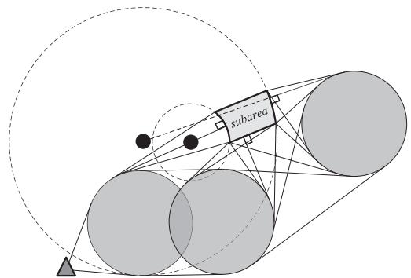  
Fig. 11. A toy example of visible tangents graph construction.

3) Visible Tangents Graph Construction: Based on the subareas output $\widehat { S u b }$ by Subareas Partition Method, our objective is to identify the strategies with the shortest paths from the source point to the subareas $\widehat { S u b }$ . Then, to find the strategies, we construct a visible tangents graph $\widehat { G } = ( \widehat { V } , \widehat { E } )$ and prove that $\widehat { G }$ satisfies Theorem 6.

Through the construction of the visible tangents graph, we can delineate the candidate destination points set $\widehat { P } _ { \widehat { s u b } }$ for each subarea ${ \widehat { s u b } } \in { \widehat { S u b } } .$ This construction is grounded in the source point s, ${ \widehat { P } } _ { \widehat { s u b } } , O$ , and $d _ { \operatorname* { m i n } } ,$ , as illustrated in Fig. 11. The figure depicts the source point s as a triangle, an example subarea sub in light gray, the endpoints of line segments on the subarea boundary as candidate destination points ${ \widehat { P } } _ { \widehat { s u b } } ,$ and light gray circles (circular obstacles) representing the no-fly area of UAVs. According to Fig. 11, we can get a set of arcs and line segments, as well as source points and candidate destination points, and generate graph $\widehat { G }$ based on them.

Next, we elucidate the Visible Tangents Graph Construction Method. Initially, we traverse each subarea $\widehat { s u b } \in \widehat { S u b }$ In the ensuing description, a visible segment is defined as a segment where both end points are visible to each other (if the two end points are obstructed by circular obstacles, they are considered not visible to each other):

Step 1: For each straight segment boundary of $\widehat { s u b } .$ , draw all line segments perpendicular to the segment boundary that are tangent to each circular obstacle. The intersection points of these line segments and the boundary are added to $\widehat { P } _ { s u b }$ . Step 2: For each arc boundary of $\widehat { s u b } ,$ , draw tangent segments to each circular obstacle from its corresponding center (depicted as the two solid black dots in Fig. 11). If these tangent segments intersect the arc boundary, the intersection points are included in $\widehat { P } _ { \widehat { s u b } }$ . Step 3: Draw tangent line segments from all vertices of the subarea boundaries to each circular obstacle and add these vertices to $\widehat { P } _ { \widehat { s u b } }$ . Step $4 { : }$ Draw a line segment from the source point $\widehat { s }$ to the point in the subarea $\widehat { s u b }$ with the shortest distance and add this point to $\widehat { P } _ { \widehat { s u b } }$ . Step $5 ;$ Iterate through each pair of circular obstacles and draw multiple visible tangent segments. Draw all visible tangent segments from the source point to each circular obstacle. Draw feasible arcs (no point on the arc is blocked by circular obstacles) between different points on each circle obstacle.

Finally, construct a graph $\widehat { G } = ( \widehat { V } , \widehat { E } )$ composed of vertices and edges based on these tangent points, ${ \widehat { s } } , \ { \widehat { P } } ,$ , visible line segments, and feasible arcs.

Then, we have the following theorem:

Lemma $3 \colon$ For any ${ \widehat { s u b } } \in { \widehat { S u b } } .$ , the feasible shortest path $\widehat { P a }$ from $\widehat { s }$ to $\widehat { s u b }$ comprises line segments and arcs. These line segments and arcs correspond to edges contained in ${ \widehat { E } } ,$ where $\widehat { E }$ is the edge set of $\widehat { G }$ constructed using the visible tangents graph construction method.

The proof can be found in Appendix $\mathbf { G } .$

4) The Shortest Path Strategies for Subareas: In this subsection, we propose the enhanced $\mathbf { A } ^ { * }$ algorithm for multiple overlapping destination areas that computes the shortest path strategy (Definition 7) and the corresponding shortest path emitted according to the given $\widehat { M }$ and $\widehat { S u b } .$

First, we establish the candidate timing set for UAV strategies by defining its range of values:

$$
\left\{ \begin{array} { l l } { \widehat { \tau } _ { 1 } ( p _ { u } ) = \tau _ { b } - T _ { s h } ( p _ { u } ) . } \\ { \widehat { \tau } _ { 2 } ( p _ { u } ) = \widehat { \tau } _ { 1 } ( p _ { u } ) + T - \mathcal { E } _ { h } ( p _ { u } ) / \mathbb { Q } _ { h } . } \end{array} \right.\tag{18}
$$

The candidate timing set $T _ { c a n } ( p _ { u } )$ for given $p _ { u }$ is defined as follows:

$$
\begin{array} { r } { T _ { c a n } ( p _ { u } ) = \{ \widehat { \tau } _ { 1 } ( p _ { u } ) \leq \tau \leq \widehat { \tau } _ { 2 } ( p _ { u } ) : } \\ { \tau = \widehat { \tau } _ { 1 } ( p _ { u } ) + k \Delta T , k \in \mathbb { N } \} . } \end{array}\tag{19}
$$

Then, the execution process of the algorithm is introduced. The algorithm first computes a set of candidate endpoints $\widehat { P } _ { \widehat { s u b } }$ for each subarea $\widehat { s u b } \in \widehat { S u b }$ and a visibility graph $\widehat { G } = ( \widehat { V } , \widehat { E } )$ Inspired by the $\mathbf { A } ^ { * }$ algorithm, it calculates the shortest path for each subarea and derives the corresponding shortest path strategy $\lambda \in \Lambda$ . Note that there may not be a feasible path if the source point s is not connected to the points in destination area sub (Line 32 of Algorithm 2).

In the algorithm, the function $\mathbb { L } ( \widehat { \boldsymbol { v } } )$ represents the estimated length of the shortest path passing through vertex v. $\mathbb { D } ( \widehat { v } , \widehat { t } )$ represents the distance between vertices v and t. $L ( \widehat { v } )$ represents the actual length of the shortest path starting from the source point $\widehat { s }$ and passing through v. $L ( \widehat { u } , \widehat { v } )$ represents the length of the shortest path from vertex u to v. $L ( e d g e ( \widehat { u } , \widehat { v } ) ,$ represents the length of the segment corresponding to $e d g e ( \widehat { u } , \widehat { v } )$ . Compared to the $\mathbf { A } ^ { * }$ <sup>( )</sup> algorithm, this paper proposes three improvements to the problem:

Firstly, utilizing the aggregate function min to evaluate path lengths among multiple candidate endpoints in $\widehat { P } _ { \overline { { s u b } } } \in \widehat { P }$ (Line 8 and 18 of Algorithm 2). Secondly, implementing consistency for overlapping destination subareas to reduce the number of visited nodes across multiple areas. This is achieved by evaluating the potential of the shortest paths and the length of calculated paths (Line 26-31). Thirdly, optimizing efficiency by reusing intermediate results from previous destination point calculations in multiple shortest paths. The algorithm updates values of specific vertices (Line 7-8), effectively reducing redundant computations for overlapping parts in multiple shortest paths.

```latex
Algorithm 2: Enhanced $\overline { { \mathrm { A } ^ { * } } }$ for Multiple Overlapping Des
tination Areas:
Input: Source point ${ \widehat { s } } ,$ subareas ${ \widehat { S u b } } ,$ MCSs $\widehat { M }$ and objects O
Output: Shortest paths $\widehat { P a }$ and shortest path strategies $\widehat { \Lambda } ^ { U }$ for
subareas $\widehat { S u b }$
1 Construct circular obstacles $\widehat { O b s }$ with objects in $O$ as centers
and $d _ { m i n }$ as radius;
2 Construct all sets of candidate destination points $\widehat { P } _ { \widehat { s u b } } \in \widehat { P }$
and the visible tangents graph $\widehat { G } = ( \widehat { V } , \widehat { E } )$ according to the
visible tangents graph construction method in subsection
$3 . 4 . 3 ,$ and $\widehat { O b s } , \widehat { s } ,$ and ${ \widehat { P } } ;$
3 ${ \widehat { \Lambda } } { \overset { U } { \longleftarrow } } \emptyset , { \widehat { P a } } \gets \emptyset , L ( { \widehat { s } } ) \gets 0 , L ( { \widehat { v } } ) \gets \infty \mathrm { f o r } { \widehat { v } } \in { \widehat { V } } \setminus \{ { \widehat { s } } \} ;$
4 $\widehat { F r o m } \gets \{ < s , n u l l > \} ;$
5 $\widehat { O p e n } \gets \{ \widehat { s } \} , \widehat { C l o s e d } \gets \emptyset ;$
6 for each $\widehat { P } _ { \widehat { s u b } } \in \widehat { P } _ { \frac { . } { . } }$ do
7 for each ${ \widehat { v } } \in { \widehat { O p e n } }$ do
8 Update the estimated length $\mathbb { L } ( \widehat { v } )$ of v to
$\begin{array} { r } { \hat { \mathbb L } ( \widehat { v } ) \gets L ( \widehat { v } ) + \operatorname* { m i n } _ { \widehat { t } \in \widehat { P } _ { s u b } } \mathbb D ( \widehat { v } , \widehat { t } ) ; } \end{array}$
9 while $\widehat { O p e n } \neq \varnothing$ do
10 best ← arg min ${ \widehat { v } } \in { \widehat { O p e n } }  { \mathbb { L } } ( { \widehat { v } } ) ;$
11 $\widehat { O p e n }  \widehat { O p e n } \setminus \{ \widehat { b e s t } \} , \widehat { C l o s e d }  \widehat { C l o s e d } \cup \{ \widehat { b e s t } \} ;$
12 for each $e d g e ( \widehat { b e s t } , \widehat { v } ) \in \widehat { E }$ do
13 $\mathbf { i f } \widehat { v } \in \widehat { C l o s e d }$ then
14 continue
15 $L _ { t e n t a t i v e } ( \widehat { v } ) \gets L ( \widehat { b e s t } ) + L ( e d g e ( \widehat { b e s t } , \widehat { v } ) ) ;$
16 if v ∉ Open or $L _ { t e n t a t i v e } ( \widehat { v } ) \leq L ( \widehat { v } )$ then
17 $\dot { L } ( \widehat { v } ) \gets L _ { t e n t a t i v e } ( \widehat { v } ) ;$
18 $\begin{array} { r } { \mathbb { L } ( \widehat { v } ) \gets L ( \widehat { v } ) + \operatorname* { m i n } _ { \widehat { t } \in \widehat { P } _ { s m b } } \mathbb { D } ( \widehat { v } , \widehat { t } ) ; } \end{array}$
19 i $\widehat { v } \notin \widehat { O p e n }$ then
20 $\widehat { F r o m } \gets \widehat { \ F r o m } \cup \{ < \widehat { v } , \widehat { b e s t } > \} ;$
21 ${ \widehat { O p e n } } \gets { \widehat { O p e n } } \cup \{ { \widehat { v } } \} ;$
22 if best $\in \widehat { P } _ { \widehat { s u b } }$ then
23 for each $\tau \in T _ { c a n } ( \widehat { b e s t } )$ do
24 Construct path $\widehat { \underline { { p } } a } _ { s u b }$ and strategy $\lambda _ { \widehat { s u b } }$
according to best, From and τ, and add
them to $\stackrel {  } { P a }$ and $\dot { \Lambda } ^ { U } ,$ , respectively;
25 break
26 if Closed ∪ $\widehat { P } _ { \widehat { s u b } } \neq \varnothing$ then
27 $\begin{array} { r } { \widehat { t } _ { m i n } \gets \arg \operatorname* { m i n } _ { \widehat { v } \in \widehat { C l o s e } d \cup \widehat { P } _ { \widehat { s u b } } } L ( \widehat { v } ) ; } \end{array}$
28 if $L ( \widehat { t } _ { m i n } ) \leq \mathbb { L } ( \widehat { b e s t } )$ then
29 for each $\tau \in T _ { c a n } ( \widehat { t } _ { m i n } )$ do
30 Construct path $\widehat { p a } _ { \widehat { s u b } }$ and strategy $\lambda _ { \widehat { s u b } }$
according to $\widehat { t } _ { m i n } , \widehat { F } _ { \ast }$ rom and $\tau ,$ and
add them to $\widehat { P a }$ and $\widehat { \Lambda } ^ { U }$ , respectively;
31 break
32 Record the result that no path is found for $\widehat { s u b } ;$
33 return ${ \widehat { P a } } , { \widehat { \Lambda } } ^ { U }$
```

Note: In Line 24 and 30 of Algorithm 2, the strategy $\lambda _ { \widehat { s u b } }$ among these paths is identified as the shortest path strategy. among these paths is identified as the shortest path strategy. selects the destination of the path as the position of the strategy, Lemma 4: Algorithm 2 can obtain the shortest path (if it exfollowing a calculation method similar to Step 3 of Dominating ists) and the corresponding shortest path strategy λ<sub>sub</sub>  p, α <sub>Authorized</sub> <sub>licensed</sub> <sub>use</sub> <sub>limited</sub> <sub>to:</sub> <sub>LNM</sub> <sub>Institute</sub> <sub>of</sub> <sub>Information</sub> <sub>Technology.</sub> <sub>Downloaded</sub> <sub>on</sub> <sub>July</sub> <sub>05,2026</sub> <sub>at</sub> <sub>09:11:14</sub> <sub>UTC</sub> <sub>from</sub> <sub>IEEE</sub> <sub>Xplore.</sub> <sub>Restrictions</sub> <sub>apply.</sub>

Strategies Extraction Method for Surveillance Cameras. Further details are omitted for brevity.

Definition 7: (SHORTEST PATH STRATEGY) For a given MCS ${ \widehat { m } } \subseteq { \widehat { M } }$ and its equivalent monitoring subarea ${ \widehat { s u b } } ,$ every strategy within sub possesses a shortest path from the source point s to its specific position. The strategy corresponding to the shortest for each subarea ${ \widehat { s u b } } \in { \widehat { S u b } } ,$ where $F ( p , \alpha , p _ { o } , \theta _ { o } , A _ { u } , D _ { u } ) =$ $\begin{array} { r } { \operatorname* { m a x } _ { \alpha _ { 1 } \in [ 0 , 2 \pi ) } F ( p , \alpha _ { 1 } , p _ { o } , \theta _ { o } , A _ { u } , D _ { u } ) } \end{array}$ <sup>(</sup>for all $o \in { \widehat { m } }$

<sup>ax ( )</sup>The proof can be found in Appendix H. The time com  
plexity of Algorithm 2 is $\begin{array} { r } { O ( | \overbrace { P } | \operatorname* { m a x } _ { \widehat { P } _ { \widehat { s u b } } \in \widehat { P } } | \widehat { P } _ { \widehat { s u b } } | ( | \widehat { V } | + } \end{array}$   
$| \widehat { E } | ) \widehat { m } _ { \mathrm { m a x } } \log ( | \widehat { V } | \widehat { m } _ { \mathrm { m a x } } ) )$ , where $\widehat { m } _ { \mathrm { m a x } } = \operatorname* { m a x } _ { \widehat { m } \in \widehat { \cal M } } | \widehat { m } | .$ Theorem 2: Given any UAV strategy $\lambda _ { 1 }$ , there exists $\lambda _ { 2 } \in \widehat { \Lambda } ^ { U }$   
such that $\lambda _ { 2 } \succeq \lambda _ { 1 }$ , where $\widehat { \Lambda } ^ { U }$ is the output of Algorithm 2. The proof can be found in Appendix I.

## E. Problem Transformation

Above, we get candidate surveillance camera strategies (denote as $\widehat { \Lambda } ^ { S } )$ and UAV strategies (denote as $\widehat { \Lambda } ^ { U } )$ from Dominating Strategies Extraction Method for Surveillance Cameras and Algorithm 2 respectively. We transform the problem JUMP-P1 into the following JUMP-P2:

$$
\begin{array} { r l } { ( \mathbf { J U M P - P 2 } ) \underset { \Lambda ^ { U } , \Lambda ^ { S } } { \operatorname* { m a x } } } & { \frac { 1 } { \left\lceil \frac { 2 \pi } { \Delta A _ { o } } \right\rceil J } \displaystyle \sum _ { o \in O _ { t } } \sum _ { m = 1 } ^ { \lceil \frac { 2 \pi } { \Delta A _ { o } } \rceil } } \\ & { \mathcal { U } ( \Lambda ^ { U } , \Lambda ^ { S } , p _ { o } , m \Delta A _ { o } ) } \\ & { \mathrm { s . t . } ~ ( 1 3 \mathfrak { b } ) , ( 1 3 \mathrm { c } ) , ( 1 3 \mathrm { d } ) , } \end{array}\tag{20a}
$$

$$
\Lambda ^ { U } \subseteq \widehat { \Lambda } ^ { U } ,\tag{20b}
$$

$$
\Lambda ^ { S } \subseteq { \widehat { \Lambda } } ^ { S } .\tag{20c}
$$

The objective function (20a) of JUMP-P2 is a discretized version of the objective function in JUMP-P1. Constraint (20b) corresponds to Constraints (13e) and (13f) in JUMP-P1, as the procedures of Subareas Partition Method and Algorithm 2 ensure solutions that would dissatisfy (13e) and (13f) are excluded. Similarly, (20c) corresponds to (13g) in JUMP-P1, as Dominating Strategies Extraction Method for Surveillance Cameras ensures solutions that would dissatisfy (13g) are excluded. Thus, solutions of JUMP-P2 satisfy all constraints of JUMP-P1.

Moreover, The proof of Theorem 5 utilizes the properties of the objective function (20a) and candidate strategies $\widehat { \Lambda } ^ { U }$ and $\widehat { \Lambda } ^ { S }$ to demonstrate that our approach can obtain an approximate solution of JUMP-P1 through an approximate solution of JUMP-P2.

## IV. SUBMODULAR-BASED STRATEGY SELECTION WITH MIXED CONSTRAINS

In this section, we reformulate JUMP-P2 as MSMMK (JUMP-P3), and propose an approximation algorithm for solving MSMMK to get the final strategies. Subsequently, we provide a proof demonstrating that our overview approach yields an approximate solution for JUMP-P1 (Theorem 5).

## A. Problem Reformulation

To find an approximate solution to JUMP-P2, we reformulate the problem as an MSMMK problem.

Now, we give the following definitions to assist further analysis before addressing JUMP-P2.

Definition 8: [28] (MONOTONE SUBMODULAR SET FUNC-TION) Let S be a finite ground set. A real-valued set function $f : 2 ^ { S } \to \mathbb { R }$ is normalized, monotonic, and submodular if and only if it satisfies the following conditions, respectively:(1) $\dot { f ( A \cup \{ e \} ) } - f ( A ) \geq 0 , \forall A \subseteq S \wedge e \in$ $S \backslash A ; ~ ( 2 ) ~ f ( A \cup \{ e \} ) - f ( \bar { A } ) \geq f ( \bar { B } \cup \{ e \} ) - f ( B ) , \forall A \subseteq$ $B \subseteq S \land e \in S \backslash B .$

Definition 9: [28] (MATROID) A Matroid M is a strategy $\mathcal { M } = ( S , L )$ where S is a finite ground set, $L \subseteq 2 ^ { S }$ is a collec-<sup>= ( )</sup>tion of independent sets, such that $( 1 ) \emptyset \in L ; ( 2 ) { \mathrm { i f } } X \subseteq Y \in L .$ then $X \in L ; ( 3 ) \mathrm { i f } X , Y \in L .$ , and $| X | < | Y |$ , then $\exists y \in Y \backslash X$ $X \cup \{ y \} \in L$

Definition 10: [28] (PARTITION MATROID) Given $S =$ $\textstyle \bigcup _ { i = 1 } ^ { k } S _ { i } ^ { \prime }$ is the disjoint union of k sets, $l _ { 1 } , l _ { 2 } , . . . . , l _ { k }$ are positive integers, a partition matroid $M = ( S , I )$ is a matroid where $I = \{ X \subseteq S : | X \cap S _ { i } ^ { \prime } | \leq l _ { i } , \forall i \in [ k ] \}$

As previously mentioned, we use $\langle p _ { u } , \alpha _ { u } \rangle \in \widehat { \Lambda } ^ { U }$ and $\langle p _ { s } , \alpha _ { s } \rangle \in \widehat { \Lambda } ^ { S }$ to denote the strategies of the UAV u and surveillance camera s, respectively. Since the elements of $\widehat { \Lambda } ^ { U }$ and $\widehat { \Lambda } ^ { S }$ are all composed of positions and orientations, and there <sup>Λ</sup>is no overlap between the two sets, i.e., $\widehat { \Lambda } ^ { U } \cap \widehat { \Lambda } ^ { S } = \varnothing$ , we can combine them to obtain a set of strategies $\Phi = \widehat { \Lambda } ^ { U } \cup \widehat { \Lambda } ^ { S }$ Let $\widehat { \Lambda } _ { p } ^ { U }$ be the strategy set for the $p _ { t h }$ position among all P positions of UAVs. We have $\widehat { \Lambda } ^ { U } = \cup _ { p = 1 } ^ { P } \widehat { \Lambda } _ { p } ^ { U }$ . Let $\Phi _ { r }$ be the strategy set for the r-th position among all R positions of UAVs and surveillance cameras. We define as the union of all $\Phi _ { r } ,$ such that $\begin{array} { r } { \Phi = \bigcup _ { r = 1 } ^ { R } \Phi _ { r } } \end{array}$ . Here, the first P positions correspond to the locations of the UAVs, while positions $P + 1$ to R correspond to the locations of the surveillance cameras. Let $N _ { r }$ be the number of strategies at the $r _ { t h }$ position among all R positions of UAVs and surveillance cameras. For UAVs, we only limit the total number of them, not the number at individual positions, $\mathrm { i . e . , } N _ { r } = I , 1 \leq r \leq P$ . For surveillance <sup>= 1</sup>cameras, we limit the number of them at all positions, i.e., $N _ { r } = 1 , P + 1 \leq r \leq R$ . We can define the partition matroid $( \Phi , L )$ , where $L = \left\{ \mathcal { X } \subseteq \Phi : | \mathcal { X } \cap \Phi _ { r } | \leq N _ { r } , \forall r \in [ R ] \right\}$

Besides, UAVs and surveillance cameras should satisfy the cardinality and knapsack constraints respectively, which can be converted to 2-knapsack constraint. Without loss of generality, we normalize the budget to 1. We define a $2 \times | \Phi |$ matrix $W = ( w _ { i , j } )$ . Where $w _ { i , j }$ denotes the weight of the $j _ { t h }$ element of the i dimensional knapsack. For $\begin{array} { r } { 1 \le j \le | \widehat { \Lambda } ^ { U } | , w _ { 1 , j } = \frac { 1 } { { \cal I } } } \end{array}$ $w _ { 2 , j } = 0$ , which denote UAV weights. For $| \widehat { \Lambda } ^ { U } | + 1 \leq j \leq | \Phi |$ $\begin{array} { r } { w _ { 1 , j } = 0 , w _ { 2 , j } = \frac { c _ { s _ { j } } } { C } } \end{array}$ , which denotes the weight of surveillance cameras. For $Z \subseteq { \bar { \Phi } }$ , an eigenvector of $Z$ is defined as $X _ { Z } =$ $( x _ { 1 } , x _ { 2 } , \ldots , x _ { | \Phi | }$ <sup>Φ</sup>. Where $x _ { j } = n$ indicates that n elements of $\Phi _ { j }$ are in Z. Then, our problem can be reformulated as

$$
\begin{array} { r l } { ( \mathbf { J } \mathbf { U } \mathbf { M } \mathbf { P } - \mathbf { P } \mathbf { 3 } ) \underset { Z } { \operatorname* { m a x } } } & { \frac { 1 } { \lceil \frac { 2 \pi } { \Delta A _ { o } } \rceil J } \sum _ { o \in O _ { t } } \sum _ { m = 1 } ^ { \lceil \frac { 2 \pi } { \Delta A _ { o } } \rceil } } \\ & { \mathcal { U } ( Z \cap \widehat { \Lambda } ^ { U } , Z \cap \widehat { \Lambda } ^ { S } , p _ { o } , m \Delta A _ { o } ) } \end{array}\tag{21a}
$$

$$
s . t . \quad Z \in L ,\tag{21b}
$$

$$
W \cdot X _ { Z } \leq 1 .\tag{21c}
$$

Algorithm 3: Submodular-Based Strategies Selection With   
Mixed Constrains.   
1 Input: $f : 2 ^ { \Phi }  \mathbb { R } , L , W , \varepsilon$   
2 Output: A set $\widehat { T } \in L$ satisfying $W \cdot X _ { \widehat { T } } \leq 1$   
3 $\widehat { T }  \{ \arg \operatorname* { m a x } _ { e \in \Phi } f ( e ) \} ;$   
4 $M \gets f ( \widehat { T } ) ;$   
5 $\begin{array} { r } { \Psi _ { 1 } \longleftarrow \{ \frac { M } { 4 } ^ { ' } \leq \psi < \frac { M } { 3 } : \psi = ( 1 + \varepsilon ) ^ { k } \frac { M } { 4 } , k \in \mathbb { N } \} ; } \end{array}$   
6 $\begin{array} { r } { \Psi _ { 2 }  \{ \frac { \hat { M } } { 3 } \leq \psi < \frac { 2 | \Phi | M } { 3 \ldots } : \psi = ( 1 + \varepsilon ) ^ { k } \frac { M } { 3 } , k \in \mathbb { N } \} . } \end{array}$   
7 $\begin{array} { r } { \Psi  \Psi _ { 1 } \cup \Psi _ { 2 } \cup \{ \frac { 2 | \Phi | ^ { } M } { 3 } \} , } \end{array}$   
8 for each ψ ∈ Ψ do   
9 $\begin{array} { r } { \Delta  M _ { \psi }  \operatorname* { m a x } \{ f ( e ) : \frac { f ( e ) } { w _ { 1 } ( e ) + w _ { 2 } ( e ) } \geq \psi \} ; } \end{array}$   
10 $Z \gets \emptyset , Z _ { \psi } ^ { \prime } \gets \emptyset , \tilde { Z } _ { \psi } \gets \emptyset .$ , condition\_to\_break ← False;   
11 while $\begin{array} { r } { \Delta \ge \frac { \varepsilon M _ { \psi } } { | \Phi | } } \end{array}$ do   
12 for each $e \in \Phi \ { \bf d o }$   
13 if $f _ { Z } ( e ) \geq$ max{ψ · (w1(e) + w2(e)), ∆} and   
$\check { Z } + e \in L$ then   
14 $Z \gets Z + e ;$   
15 if $\sum { _ { e \in Z } }$ w1(e) > 1 or $\textstyle \sum _ { e \in Z _ { * } }$ w2 $( e ) > 1$ then   
16 $\bar { Z _ { \psi } }  Z , Z _ { \psi } ^ { \prime }  Z \backslash \{ e \} , \tilde { Z } _ { \psi }  \{ e \} ;$   
17 for each e $\in \Phi \backslash Z$ do   
18 if w1 $( Z _ { \psi } ^ { \prime } + e ) \le 1$ and   
$w _ { 2 } ( Z _ { \psi } ^ { \prime } + e ) \le 1$ and $Z _ { \psi } ^ { \prime } + e \in L$   
then   
19 $Z _ { \psi } ^ { \prime }  Z _ { \psi } ^ { \prime } + e ;$   
20 if w $( \tilde { Z } _ { \psi } + e ) \le 1$ and   
w2 $( \tilde { Z } _ { \psi } + e ) \le 1$ and $\tilde { Z } _ { \psi } + e \in L$   
then   
21 $\tilde { Z } _ { \psi } \gets \tilde { Z } _ { \psi } + e ;$   
22 $T ^ { \prime } \gets \mathrm { a r g m a x } _ { \widehat { T } \in \{ Z _ { \psi } ^ { \prime } , \tilde { Z } _ { \psi } \} } f ( \widehat { T } ) ;$   
23 condition\_to\_break $\gets T$ rue;   
24 break   
25 if condition\_to\_break= True then   
26 break   
27 $\begin{array} { r } { \Delta  ( \frac { 1 } { 1 + \varepsilon } ) \cdot \Delta ; } \end{array}$   
28 if condition to break = False then   
29 $Z _ { \psi } ^ { \prime }  Z _ { \psi }  Z , \tilde { Z } _ { \psi }  \emptyset ;$   
30 $\begin{array} { r } { T ^ { ' }  \mathrm { a r g m a x } _ { \widehat { T } \in \{ Z _ { \psi } ^ { \prime } , \widetilde { Z } _ { \psi } \} } f ( \widehat { T } ) ; } \end{array}$   
31 if $f ( \widehat { T } ) < f ( T ^ { \prime } )$ then   
32 ${ \ L \ \widehat { T }  T ^ { \prime } } ;$   
33 return ${ \widehat { T } } .$

We define

$$
f ( Z ) = \frac { 1 } { \big \lceil \frac { 2 \pi } { \Delta A _ { o } } \big \rceil J } \sum _ { o \in O _ { t } } \sum _ { m = 1 } ^ { \lceil \frac { 2 \pi } { \Delta A _ { o } } \big \rceil } \mathcal { U } ( Z \cap \widehat { \Lambda } ^ { U } , Z \cap \widehat { \Lambda } ^ { S } , p _ { o } , m \Delta A _ { o } ) .\tag{22}
$$

Then, we have the following proposition:

Proposition 4: JUMP-P2 and JUMP-P3 are equivalent. JUMP-P3 is an MSMMK problem.

The proof can be found in Appendix J. Therefore, the reformulated problem falls into the scope of MSMMK.

## B. Strategies Selection Algorithm

We propose an approximation algorithm to solve the probem, inspired by the work of [24]. The pseudo code of this strategies selection algorithm is shown in Algorithm 3.

The general idea of the strategies selection algorithm is to get the approximate optimal solution through the idea of value density and greedy selection. For an element $e ,$ the value density is the ratio of the increment of the function $f ( \cdot )$ to the sum of the knapsack costs $w _ { 1 } ( e ) + w _ { 2 } ( e )$

The main steps of the strategies selection algorithm is to first set a set of thresholds (Line 5-7 of Algorithm 3). Then iterate through each $\psi \in \Psi ( \mathrm { I }$ Line 8-32 of the Algorithm 3) in turn and output the best result from it. Below, we describe the main steps in each iteration.

First, the initial value of $\Delta$ is set to the maximum value of the element whose value density is greater than or equal to $\psi$ (Line 9). It then starts iterating and gradually decreases $\Delta$ until it is less than the specified value to end the iteration (Line 11-27). In each iteration, each element $e \in \Phi$ is traversed(Line 12-24). If the value density of $f ( \cdot )$ meets the threshold $\Delta , \psi$ and matroid constraints, e is added to the alternative result set (Line 13-14).

There are two possible cases. The first case is if a knapsack constraint is violated by adding e, then e is excluded from the alternative result set (Line 15-16). The other elements that satisfy the knapsack constraints are then added to the alternative result set (Line 17-22). The second case is that the result set (Line 29-30) is obtained without violating any knapsack constraints until the end of the iteration (Line 13 always returns False).

Theorem 3: Algorithm 3 achieves an approximation ratio of $\frac { 1 } { 6 ( 1 + \varepsilon ) }$ to the problem JUMP-P3, and $\frac { 1 } { 4 ( 1 + \varepsilon ) }$ when the weights in knapsack constraint corresponding to each surveillance camera are equal. The time complexity of Algorithm 3 is $O ( \frac { | \Phi | } { \varepsilon ^ { 2 } } \log ^ { 2 } { \frac { | \Phi | } { \varepsilon } } )$

The proof can be found in Appendix K.

Theorem $4 { : }$ For any instance of problem JUMP-P3, the solution obtained by Algorithm 3 is always better than or equal to the solution obtained by Algorithm 10 in literature [24]. In other words, Algorithm 3 outperforms Algorithm 10 in terms of solution quality.

The proof can be found in Appendix L.

Theorem 5: The proposed approach achieves an approximation ratio of $\begin{array} { r l r } {  { } } & { { } } & { \frac { 1 } { 6 } - \varepsilon _ { 1 } } \end{array}$ to the problem JUMP-P1 and $\frac { 1 } { 4 } - \varepsilon _ { 1 }$ when each surveillance camera costs the same.

The proof can be found in Appendix M.

## V. SIMULATION RESULTS

## A. Evaluation Setup

Our approach is called JUMP in simulations and field experiments. In the simulations, objects are randomly distributed in a rectangular space of size m × m. If no specific instructions are provided, we set $H = 3 0 , I =$ $1 0 , J = 2 0 , K = 4 0 , C = 2 , D _ { u } = 4 0 m , D _ { s } = 5 0 m , d _ { \mathrm { m i n } } =$ <sup>10</sup><sub>m,</sub> $A _ { u } = 9 0 ^ { \circ } , A _ { s } = 6 0 ^ { \circ } , A _ { o } = 1 5 0 ^ { \circ } , \Delta A _ { o } = 1 5 ^ { \circ } , \widehat { v } =$ $2 m / s , T = 1 0 0 s , \varepsilon = 0 . 0 5$ <sup>= 150 Δ = 15 =</sup>. The cost for renting each surveillance camera is between 0 and 1. Each data point in the evaluation plot is calculated by averaging the results of 30 random topologies.

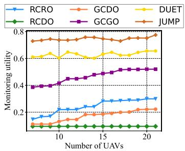  
Fig. 12. Impact of UAV number I.

## B. Baseline Setup

Since there is no existing method specifically designed for the JUMP problem, we opt 5 comparison algorithms:

1) DUET: The adaptation version of SOTA for joint deplotment (DUET) in [29] with Algorithm 10 in [24].

2) Random Coordinate with Random Orientation (RCRO): This method randomly generates the coordinates and directions of UAVs strategies and randomly selects camera strategies and Orientations. Randomly selects UAVs’ take off timing by Formula (19).

3) Randomized Coordinate with Discretized Orientation (RCDO): This method randomly generates UAVs strategies coordinates and chooses orientations from the set $\{ 0 , \alpha , \ldots , 2 \pi \}$ and randomly selects camera strategies and orientations from $\{ 0 , \alpha , \ldots , 2 \pi \}$ . Greedily selects UAVs’ <sup>0 2</sup>take off timing by Formula (19).

4) Grid Coordinate with Discretized Orientation (GCDO): GCDO improves upon RCDO by placing UAVs on grid points.

5) Greedy Coordinate with Greedy Orientation (GCGO): Building upon the foundation of GCDO, GCGO enhance strategies for maximizing monitoring utility through a greedy approach ensuring adherence to the number constraint. The selection of surveillance cameras and their orientations is also performed greedily, all while ensuring adherence to the budget.

## C. Performance Comparison

1) The Impact of UAV Numbers, Surveillance Camera Budget, and Target Object Numbers: Simulation results indicate that concerning UAV numbers, on average, JUMP outperforms DUET,GCGO,GCDO,RCDO,andRCROby19%,61%,363%, 609%, and 221%, respectively. Regarding surveillance camera budget, on average, JUMP surpasses DUET, GCGO, GCDO, RCDO, and RCRO by 13%, 215%, 261%, 128%, and 381%, respectively. In terms of target object numbers, on average, JUMP exceeds DUET, GCGO, GCDO, RCDO, and RCRO by 29%, 77%, 519%, 138%, and 289%, respectively. Figs. 12–14 depict how the monitoring utility of these algorithms gradually increases with the increase in the UAV number and the surveillance camera budget, while the monitoring utility remains relatively stable with an increase in the object number. This is because the monitoring utility is influenced by the distribution of objects as their number increases.

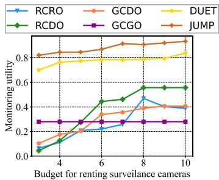  
Fig. 13. Impact of camera renting budget C.

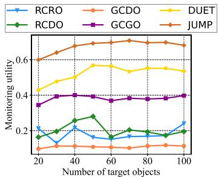  
Fig. 14. Impact of target object number J.

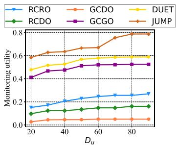  
Fig. 15. Impact of UAV monitoring radius $D _ { u }$

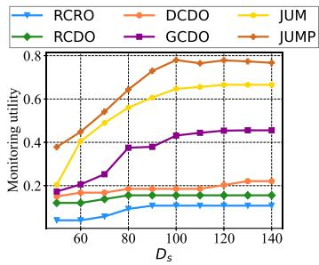  
Fig. 16. Impact of surveillance camera monitoring radius $D _ { s }$

2) Impact of Radius $( D _ { u } , D _ { s } )$ and Angles $( A _ { u } , A _ { s } ) o f S e c t o r s$ for UAV and Surveillance Camera Monitoring: Our simulation results indicate that concerning $D _ { u } ,$ on average, JUMP outperforms DUET, GCGO, GCDO, RCDO, and RCRO by 24%, 39%, 1446%, 366%, and 214%, respectively. Regarding $D _ { s } ,$ on average, JUMP surpasses DUET, GCGO, GCDO, RCDO, and RCRO by 22%, 87%, 249%, 96%, and 695%, respectively. In terms of $A _ { u } ,$ , on average, JUMP exceeds DUET, GCGO, GCDO, RCDO, and RCRO by 44%, 41%, 253%, 60%, and 660%, respectively. In terms of $A _ { s } ,$ , on average, JUMP exceeds DUET, GCGO, GCDO, RCDO, and RCRO by 27%, 143%,

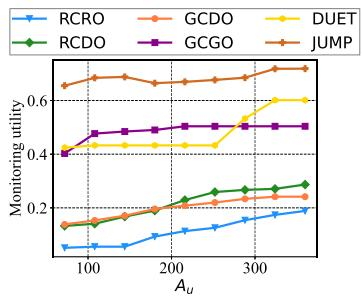  
Fig. 17. Impact of UAV monitoring angle $A _ { u }$

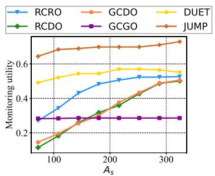  
Fig. 18. Impact of surveillance camera monitoring angle $A _ { s }$

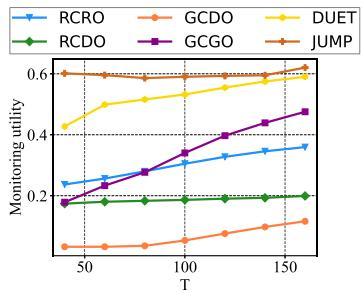  
Fig. 19. Impact of monitoring task duration $T .$

141%, 106%, and 60%, respectively. Figs. 15–18 depict how the monitoring utility of these algorithms gradually increases with the increase in $( D _ { u } , D _ { s } , A _ { u } , A _ { s } )$

3) Impact of Task Duration (T ) and UAV Speed (v): Our simulation results indicate that concerning T , on average, JUMP outperforms DUET, GCGO, GCDO, RCDO, and RCRO by 14%, 98%, 1095%, 134%, and 102%, respectively. Regarding v, on average, JUMP surpasses DUET, GCGO, GCDO, RCDO, and RCRO by 22%, 42%, 357%, 370%, and 291%, respectively. Figs. 19 and 20 depict how the monitoring utility of the algorithms gradually increases with the increase in $( T , v )$ Furthermore, as $T ,$ , v increase, the monitoring utility of JUMP approaches that of DUET and GOGO. Considering two extreme cases helps understand why the difference diminishes. When $T$ approaches infinity, the monitoring utility of UAVs tends toward zero due to limited monitoring time, and the monitoring utility is solely influenced by surveillance cameras without energy constraints. Then, if v approaches infinity, the time required for UAVs to reach any position becomes zero, and consequently, the monitoring utility is not influenced by time.

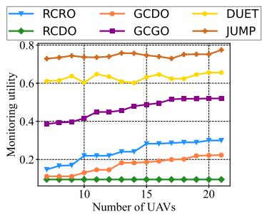  
Fig. 20. Impact of average UAV speed v.

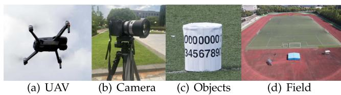  
Fig. 21. Testbed.

## VI. FIELD EXPERIMENTS

As depicted in Fig. 21, our test bench comprises 10 Mavic Air 2 UAVs shown in Fig. 21(a), 20 candidate surveillance camera nodes (recording experimental data using a Sony Alpha a6000 camera with Tamron 18-200 mm f/3.5-6.3 lens, shown in Fig. 21(b)), and 20 monitoring target objects represented by cylinders randomly distributed in a rectangular playground measuring  m ×  m (Fig. 21(d)). The target objects, as depicted in Fig. 21(c), are evenly divided into twenty orientations, each representing one of the discrete directions shown in Fig. 7(a).

In the experiment, we determine whether to monitor the corresponding direction of the object by observing the corresponding number in each direction. Then, through the corresponding monitoring time calculation of every direction, we compute the monitoring utility of objects by Formula (15). Specifically, we set $v = 2 \mathrm { m } / \mathrm { s } , \ \widehat { s } = ( 6 5 \mathrm { m } , 0 \mathrm { m } ) , \ D _ { u } = 2 5 \mathrm { m } , \ D _ { s } = 5 0 \mathrm { m }$ $d _ { \operatorname* { m i n } } = 1 0 \mathrm { m } , A _ { u } = 8 4 ^ { \circ } , A _ { s } = 6 0 ^ { \circ } , \Delta A _ { o } = 1 8 ^ { \circ } , A _ { o } = 1 6 2 ^ { \circ }$ according to the hardware parameters and experimental measurements. Due to the small size of the venue, we set a relatively small $d _ { \operatorname* { m i n } } , D _ { u }$ and $D _ { s }$

The monitoring scheme calculated by each algorithm is illustrated in Fig. 22. In each subfigure, the red and yellow dots represent the target $O _ { t }$ and other objects $O \backslash O _ { t }$ , respectively. The red disk, centered on these objects, indicates the no-fly areas for UAVs. The brown square and blue triangle indicate the monitoring positions of the surveillance cameras and UAVs, respectively, and their corresponding sectors indicate their monitoring sectors. The five-pointed star represents the source point $\widehat { s }$ of UAVs, and the blue dashed line indicates the shortest obstacle avoidance path for each UAV from the $\widehat { s }$ to the monitoring position.

Fig. 23 illustrates the images captured by cameras of UAVs and surveillance cameras for the four algorithms: JUMP, DUET, GCDO, and GCGO. The images show how many directions of how many objects are monitored spatially by each algorithm.

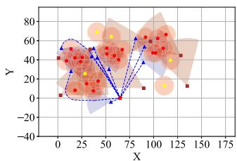  
(a) JUMP

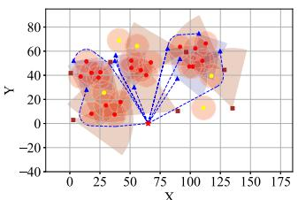  
(b) DUET

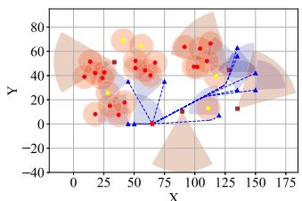  
(c) GCDO

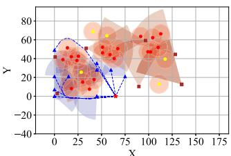  
(d) GCGO  
Fig. 22. UAVs and surveillance cameras deployment and objects distribution for four algorithms.

Combined with the monitoring duration in these directions, further analysis, as depicted in Fig. 24, reveals that JUMP offers 1.23 times the monitoring utility of DUET, 3.65 times that of GCDO, and 1.43 times that of GCGO.

## VII. DISCUSSION

Note: Due to page limitations, we have moved several extended discussions to Appendix O, as supplementary content to this section.

Dynamic Energy Consumption Model Adaptation: To capture realistic UAV energy usage under dynamic environments, we adopt an aerodynamic power model for rotary-wing UAVs, adapted from [30], [31]. The $\mathrm { U A V } _ { \mathrm { \Delta } }$ instantaneous propulsion power P depends on its ground-relative velocity $\mathbf { v _ { \mathrm { U A V } } }$ , altitude $h ,$ and the local wind velocity w. Specifically, we define the air-relative (effective) speed as $V _ { \mathrm { e f f } } = \| \mathbf { v } _ { \mathrm { U A V } } - \mathbf { w } \|$ , and model <sup>=</sup>the instantaneous power consumption as:

$$
\begin{array} { r } { P \mathrm { ( v _ { U A V } , } h , \mathbf { w ) } = P _ { 0 } \left( 1 + \frac { 3 V _ { \mathrm { e f f } } ^ { 2 } } { U _ { \mathrm { t i p } } ^ { 2 } } \right) + P _ { i } \left( \sqrt { 1 + \frac { V _ { \mathrm { e f f } } ^ { 4 } } { 4 v _ { 0 } ^ { 4 } } - \frac { V _ { \mathrm { e f f } } ^ { 2 } } { 2 v _ { 0 } ^ { 2 } } } \right) } \\ { + \displaystyle \frac { 1 } { 2 } d _ { 0 } \rho ( h ) s A V _ { \mathrm { e f f } } ^ { 3 } , \qquad ( 2 3 ) } \end{array}
$$

where $\rho ( h ) = \rho _ { 0 } e ^ { - \beta h }$ models the exponential decay of air density with altitude. $\mathbf { v _ { \mathrm { U A V } } }$ denotes the $\mathrm { U A V } _ { \mathrm { \Delta } }$ velocity vector in the ground frame, and w is the wind velocity vector. Their difference determines the effective airspeed $V _ { \mathrm { e f f } }$ that governs aerodynamic resistance and energy cost. $P _ { 0 }$ and $P _ { i }$ represent the blade profile power and induced power under hover, respectively. $U _ { \mathrm { t i p } }$ is the rotor tip speed, and $v _ { 0 }$ is the mean induced velocity in hovering. The coefficient $d _ { 0 }$ characterizes the UAV’s fuselage drag ratio, s denotes the rotor solidity (the ratio of blade area to rotor disc area), and A is the rotor disc area. The air density $\rho ( h )$ decreases exponentially with altitude h, controlled by a decay factor $\beta .$ This model captures wind compensation, altitude effects, and nonlinear increases in power with speed.

TABLE II  
COMPARISON OF APPROXIMATION ALGORITHMS $( p { = } 1 , l { = } 2 )$
<table><tr><td>Alg.</td><td>Approx. Ratio</td><td>Time Complexity</td><td>Remarks</td></tr><tr><td>Ours (Alg. 3)</td><td> $\frac { 1 } { 6 ( 1 + \varepsilon ) }$  (up to for special 4(1+ε)</td><td> $O \left( { \frac { | \Phi | } { \varepsilon ^ { 2 } } } \log ^ { 2 } { \frac { | \Phi | } { \varepsilon } } \right)$ </td><td>Better than [24] on all instances (Thm. 4)</td></tr><tr><td>[24]</td><td>cases)  $\frac { 1 } { 6 ( 1 + \varepsilon ) }$ </td><td> $O \left( \frac { | \Phi | } { \varepsilon ^ { 2 } } \log ^ { 2 } \frac { | \Phi | } { \varepsilon } \right)$ </td><td></td></tr><tr><td>[40]</td><td> $\approx \frac { 1 } { 9 ( 1 + \varepsilon ) }$ </td><td> $\begin{array} { r } { O \left( \frac { | \Phi | ^ { 2 } } { \varepsilon } \right) } \end{array}$ </td><td>Better when p, l are large</td></tr></table>

Under the constant energy rate assumption, our original path planning module addressed a standard obstacle-avoiding shortest path problem in Euclidean space, where the Visible Tangents Graph Construction Method was used to build a sparse geometric graph for $\mathbf { A } ^ { * }$ search.

With the introduction of the dynamic energy model, the objective shifts from minimizing geometric distance to minimizing total energy consumption, which varies with UAV speed, altitude, and wind. To reflect this non-uniform cost structure, we replace the tangents-based method with a grid-based directed weighted graph, where each edge encodes the estimated energy required under local conditions. This approach is inspired by lattice-based motion planning with precomputed motion primitives [32], which enables consistent discretization of feasible UAV maneuvers and supports efficient $\mathbf { A } ^ { * }$ search.

The resulting path is then passed to Algorithm 2 for downstream coordination. To ensure compatibility, we adapt the interface by converting the grid-based path segments into a format accepted by the module.

Comparison with Alternative Algorithms: 1) Spatio-temporal strategy construction: Algorithm 1 solves the Sector Coverage Enumeration (SCE) problem optimally in polynomial time, enabling feasible and complete spatio-temporal strategy generation. Unlike our method, Duet [25] considers only spatial deployment and lacks approximation guarantees. Methods [16], [18], [33], [34] cannot handle time-evolving or mobile scenarios, such as UAV-based monitoring, wireless sensing, or mobile robotics. 2) Path planning with area destinations: Algorithm 2 computes shortest paths to area-based destinations under overlapping circular obstacles. Existing methods [35], [36], [37], [38], [39] assume point targets or non-overlapping/polygonal obstacles and cannot guarantee optimality in our setting. 3) Submodular selection under constraints: Algorithm 3 achieves a $\frac { 1 } { 6 ( 1 + \varepsilon ) }$ approximation ratio (up to $\frac { 1 } { 4 ( 1 + \varepsilon ) }$ in special cases), matching the complexity of [24] while returning better solutions on all instances (Theorem 4). Compared to [40], it offers lower complexity and better trade-offs when $p$ and l are small (see Table II).

Evolving No-Fly Zones: In dynamic environments, it is primarily the UAV trajectory planning step that requires adaptation, whereas other components of our framework can typically remain unchanged. Two representative cases can be distinguished:

1) Predictably Expanding Obstacles: Certain dynamic nofly zones (e.g., due to hazard spread or crowd expansion) can be modeled as growing discs, where obstacle regions enlarge over time from known initial positions at bounded velocities. This model has been studied by van den Berg and Overmars [41], who proposed an efficient method to compute the shortest safe path between two points while avoiding these time-expanding regions. Their algorithm ensures that the UAV never intersects any growing disc during execution, and can generate such safe paths within milliseconds even for complex scenarios.

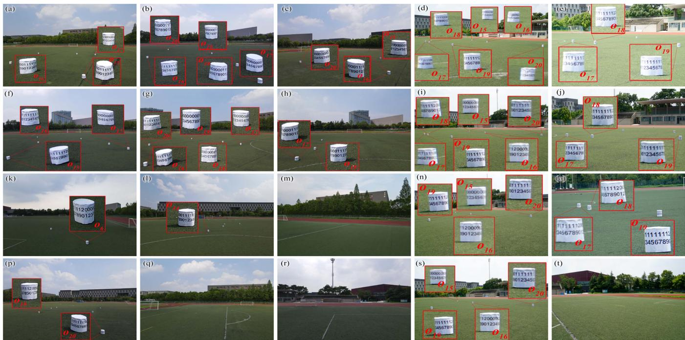  
Fig. 23. Experimental results of four algorithms. The resulting photos of the DUET, JUMP, GCDO, and GCGO algorithms are presented in 1-4 lines, respectively. Each row contains three UAVs monitoring images followed by two surveillance camera monitoring images. Taking o<sub>20</sub> in the first row as an example, from (b), (c), and (d), we can observe the numbers 06-12, 02-09, and 11-17 on cylinder o<sub>20</sub>, respectively. Therefore, a total of 16 directions (02-17) of this object are under surveillance. According to these directions and the corresponding monitoring duration, the final monitoring utility can be calculated.

<table><tr><td>01 </td><td>0.60</td><td>0.35</td><td>0.35</td><td>0.38</td><td rowspan="6">1.0 - 0.8 0.6</td></tr><tr><td>o2-</td><td>0.56</td><td>0.13</td><td>0.35</td><td>0.00</td></tr><tr><td>03</td><td>0.81</td><td>0.15</td><td>0.35</td><td>0.30</td></tr><tr><td>04-</td><td>0.90</td><td>0.62</td><td>0.21</td><td>0.46</td></tr><tr><td>05</td><td>0.97</td><td>0.43</td><td>0.21</td><td>0.42</td></tr><tr><td>06</td><td>0.75</td><td>0.70</td><td>0.00</td><td>0.70</td></tr><tr><td>07</td><td>0.70</td><td>0.95</td><td>0.24</td><td>0.85</td></tr><tr><td>08</td><td>0.79</td><td>0.65</td><td>0.28</td><td>0.35</td></tr><tr><td>09</td><td>0.85</td><td>0.95</td><td>0.28</td><td>0.76</td></tr><tr><td>010</td><td>0.78</td><td>0.56</td><td>0.00</td><td>0.70</td></tr><tr><td>011</td><td>0.47</td><td>0.65</td><td>0.00</td><td>0.70</td></tr><tr><td>012</td><td>0.92</td><td>0.76</td><td>0.22</td><td>0.70</td></tr><tr><td>013</td><td>0.55</td><td>0.65</td><td>0.00</td><td>0.80</td></tr><tr><td>014</td><td>0.94</td><td>0.68</td><td>0.22</td><td>0.84</td></tr><tr><td>015 </td><td>0.59</td><td>0.51</td><td>0.35</td><td></td></tr><tr><td>016</td><td>0.61</td><td>0.61</td><td>0.31</td><td>0.35</td></tr><tr><td>017</td><td>0.77</td><td></td><td></td><td>0.35</td></tr><tr><td>018</td><td></td><td>0.72</td><td>0.00</td><td>0.40</td></tr><tr><td>o19</td><td>0.82</td><td>0.73</td><td>0.00</td><td>0.35</td></tr><tr><td>020</td><td>0.70</td><td>0.58</td><td>0.35</td><td>0.40</td></tr><tr><td>Monitoring</td><td>0.60</td><td>0.48</td><td>0.36</td><td>0.35</td></tr><tr><td colspan="2">utility 0.73 JUMP</td><td>0.59 DUET</td><td>0.20 GCDO</td><td>0.51 GCGO</td></tr></table>

Fig. 24. Details of experimental results. Each column represents the monitoring utility of each algorithm for each object. The final monitoring utility of each algorithm is calculated and displayed in the last row of each column.

2) Abrupt Regulatory or Irregular Changes: In contrast, evolving no-fly zones caused by regulations or environmental factors (e.g., airspace closures or weather hazards) often exhibit non-continuous or unpredictable changes. In these cases, a spatio-temporal graph-based planning approach is more suitable. Specifically, Safe Interval Path Planning (SIPP) [42] improves upon traditional space-time graph search by representing each location with a set of time intervals during which it is safe to occupy. Instead of explicitly searching over all x, y, t triplets,

SIPP performs A\*-like search over these intervals, only expanding to neighboring nodes when the transition is collision-free in time. This significantly reduces the computational burden while still guaranteeing dynamic obstacle avoidance.

While our current implementation assumes static no-fly zones, the proposed framework is modular and can be extended to incorporate either of these models based on the nature of no-fly zone evolution.

## VIII. RELATED WORKS

## A. Research on Related Monitoring Problems

1) Surveillance Camera Monitoring: Wang et al. [16] proposed a full-view monitoring method for a single object or area, without considering possible cross-coverage between multiple objects and cameras. Yu et al. [34] proposed a scheme for area monitoring. Yue et al. [33] proposed a genetic algorithm to calculate optimal camera deployment positions. Du et al. [18] proposed a monitoring scheme from multiple perspectives. However, surveillance cameras, unlike UAVs, can be activated at any time to begin monitoring, thereby eliminating the need for round-trip travel times and no-fly areas, avoiding energy limitations, restricted monitoring durations, and path planning issues.

2) UAV Monitoring: Ko et al. [43] proposed a variable-speed path planning method for UAV to monitor multiple areas, while Wang et al. [25], [44] studied 3D deployment and truck-carried UAV schemes. Li et al. [45], [46] developed YOLO-based detectors for UAV imagery. However, these approaches do not allow continuous omnidirectional monitoring of target objects, and they do not account for the heterogeneity of UAVs and surveillance cameras.

3) Joint Monitoring of UAVs and Other Cameras: Han et al. [47] proposed a method for joint monitoring with UAVs and wearable cameras. Jinliang Lin et al. [48] presented a framework for UAV-satellite joint monitoring. Allu et al. [49] presented satellite–UAV fusion for crop monitoring. Atom et al. [23] proposed using UAVs and fisheye cameras for monitoring football games. However, these approaches focus on machine learning for analyzing video data from multiple sources, overlooking the deployment scheme for joint surveillance, particularly concerning UAVs and surveillance cameras’ monitoring.

## B. Research on Related Theoretical Problems

1) Submodular Set Function Maximization: The maximization of submodular set functions (Definition 8) has attracted significant attention due to its wide applicability. While early work focused on single constraint cases (e.g., cardinality [50], matroid [51], [52], [53], or knapsack [54], [55] constraints), real-world scenarios often involve combinations of different constraints. For problems with mixed constraints, Sarpatwar et al. [56] proposed a $\textstyle { \frac { 1 - e ^ { - 2 } } { 2 } }$ -approximation algorithm under matroid and knapsack constraints. Badanidiyuru et al. [24] introduced a ${ \frac { 1 } { p + 2 l + 1 + \varepsilon } } .$ -approximation algorithm for intersecting p matroids and l knapsack constraints. Additionally, they [57] presented an algorithm for intersecting p matroids and l knapsack constraints, with $l \leq p ,$ but this condition does not apply to our problem. Gu et al. [40] proposed $\mathrm { a } \frac { 1 } { p + l + 2 \sqrt { l + 1 } + 3 }$ approximate ratio algorithm, which exhibits superior performance particularly when both p and l are large.

In summary, the algorithm proposed by Badanidiyuru et al. [24] currently achieves the best approximation ratio for the discussed MSMMK problem. In this paper, we propose a new approximation algorithm to demonstrate its superiority over the algorithm in [24], yielding improved approximation ratio in certain cases with the same time complexity.

2) Obstacle-Avoiding Shortest Path Planning: The problem of finding the shortest path while avoiding obstacles has been extensively studied. Hershberger et al. [58] proposed a method based on continuous Dijkstra to address this problem. Wang [35], [36] introduced an algorithm for the shortest path problem with simple polygonal obstacles. Dai et al. [59] applied obstacleaware real flight paths to UAV distribution-center layout.

However, existing works primarily focus on polygonal obstacles, which differ from the problem studied in this paper. Gas et al. [60] addressed the problem with circular obstacles, while Kim et al. [61] proved properties of shortest paths in convex hulls. Gasilov et al. [37] proposed a Dijkstra-based algorithm, and Ibrahim et al. [38] presented an algorithm based on visible tangential graphs. Babel et al. [39] considered scenarios with circular and polygonal obstacles.

Our study differs fundamentally from existing literature in several aspects: (1) We consider the case where the destinations are areas, unlike previous studies focusing on point destinations. (2) We address scenarios with multiple overlap destination areas, which differ from previous studies. (3) We account for overlapping circular obstacles, enhancing the algorithm’s applicability to real-world scenarios.

## IX. CONCLUSION

In this paper, we tackle the novel problem of jointly deploying UAVs and surveillance cameras to maximize continuous omnidirectional monitoring utility. The paper’s innovation lies in being the first to explore this joint deployment scenario for continuous omnidirectional monitoring. The main contributions of the paper include establishing a practical joint monitoring model, developing an approximation algorithm, and conducting simulations and field experiments. The core technical depth of this paper involves converting the NP-hard continuous solution space problem into a classical problem of MSMMK. This transformation is facilitated through spatio-temporal discretization and the extraction of dominating strategies, initially in the spatial dimension followed by the spatio-temporal domain, all while ensuring controlled error. Our evaluation results not only include simulations but also incorporate actual experiments. The evaluation results demonstrate the clear superiority of our proposed algorithm, showcasing performance enhancements ranging from 13% to 44% when compared with DUET and from 39% to 1446% when compared with other comparison algorithms. This substantial enhancement validates the effectiveness and efficiency of our approach and demonstrates its potential for practical applications.

## REFERENCES

[1] X. Li, S. Zhang, Y. Huang, X. Ma, Z. Wang, and H. Luo, “Towards timely video analytics services at the network edge,” IEEE Trans. Mobile Comput., vol. 23, no. 11, pp. 10443–10459, Nov. 2024.

[2] J. E, L. He, Z. Li, and Y. Liu, “WiseCam: Wisely tuning wireless pan-tilt cameras for cost-effective moving object tracking,” in Proc. IEEE Conf. Comput. Commun., 2023, pp. 1–10.

[3] J. Li, L. Liu, H. Xu, S. Wu, and C. J. Xue, “Cross-camera inference on the constrained edge,” in Proc. IEEE Conf. Comput. Commun., 2023, pp. 1–10.

[4] “Work hazards kill millions, cost billions,” 2003. [Online]. Available: https://www.ilo.org/publications/ilo-work-hazards-kill-millions-costbillions

[5] “Bureau of labor statistics — Injuries, illnesses, and fatalities,” 2024. [Online]. Available: https://www.bls.gov/iif/home.htm

[6] Y. Yang, W. Wang, L. Liu, K. Dev, and N. M. F. Qureshi, “AoI optimization in the UAV-aided traffic monitoring network under attack: A Stackelberg game viewpoint,” IEEE Trans. Intell. Transp. Syst., vol. 24, no. 1, pp. 932–941, Jan. 2023.

[7] Z. Wang, J. Du, C. Jiang, Y. Ren, and X.-P. Zhang, “UAV-assisted target tracking and computation offloading in USV-based MEC networks,” IEEE Trans. Mobile Comput., vol. 23, no. 12, pp. 11389–11405, Dec. 2024.

[8] X. Liu et al., “A 3D REM-guided UAV path planning method under communication connectivity constraints,” Wireless Commun. Mobile Comput., vol. 2022, 2022, Art. no. 7410708.

[9] U.K. Civil Aviation Authority, “The drone and model aircraft code,” 2019. Accessed: Jan. 2023. [Online]. Available: https://register-drones.caa.co. uk/drone-code

[10] “China tower report,” 2023. [Online]. Available: https://zhuanlan.zhihu. com/p/616592795

[11] “Communication towers cameras,” 2024. [Online]. Available: https: //www.sentrypods.com/critical-infrastructure-security-surveillanceprotection/communication-towers-cameras/

[12] “Rentals video surveillance presentation,” 2024. [Online]. Available: https: //bearcom.com/rentals-video-surveillance-presentation

[13] C. Liu and G. Cao, “Distributed critical location coverage in wireless sensor networks with lifetime constraint,” in Proc. IEEE INFOCOM, 2012, pp. 1314–1322.

[14] Y. Hong, D. Kim, D. Li, W. Chen, A. O. Tokuta, and Z. Ding, “Targettemporal effective-sensing coverage in mission-driven camera sensor networks,” in Proc. Int. Conf. Comput. Commun. Netw., 2013, pp. 1–9.

[15] Y. Hong et al., “Maximizing target-temporal coverage of mission-driven camera sensor networks,” J. Combinatorial Optim., vol. 34, pp. 279–301, 2017.

[16] Y. Wang and G. Cao, “On full-view coverage in camera sensor networks,” in Proc. IEEE INFOCOM, 2011, pp. 1781–1789.

[17] H. Ma, M. Yang, D. Li, Y. Hong, and W. Chen, “Minimum camera barrier coverage in wireless camera sensor networks,” in Proc. IEEE INFOCOM, 2012, pp. 217–225.

[18] H. Du et al., “Full view maximum coverage of camera sensors: Moving object monitoring,” ACM Trans. Sensor Netw., vol. 20, pp. 1–23, 2024.

[19] J. Su et al., “Algorithms for full-view coverage of targets with group set cover,” in Computing and Combinatorics. Cham, Switzerland: Springer, 2023, pp. 198–209.

[20] E. Yildiz, K. Akkaya, E. Sisikoglu, and M. Y. Sir, “Optimal camera placement for providing angular coverage in wireless video sensor networks,” IEEE Trans. Comput., vol. 63, no. 7, pp. 1812–1825, Jul. 2014.

[21] P. Xie, L. Li, J. Wang, and Y. Liu, “Passive visible light tag system for localization and posture estimation,” IEEE Trans. Mobile Comput., vol. 23, no. 8, pp. 8541–8556, Aug. 2024.

[22] I. Bozcan and E. Kayacan, “AU-AIR: A multi-modal unmanned aerial vehicle dataset for low altitude traffic surveillance,” in Proc. IEEE Int. Conf. Robot. Automat., 2020, pp. 8504–8510.

[23] A. Scott, I. Uchida, M. Onishi, Y. Kameda, K. Fukui, and K. Fujii, “SoccerTrack: A dataset and tracking algorithm for soccer with fish-eye and drone videos,” in Proc. IEEE Conf. Comput. Vis. Pattern Recognit., 2022, pp. 3568–3578.

[24] A. Badanidiyuru et al., “Fast algorithms for maximizing submodular functions,” in Proc. ACM-SIAM Symp. Discrete Algorithms, 2014, pp. 1497–1514.

[25] L. Wang et al., “Joint deployment of truck-drone systems for camerabased object monitoring,” IEEE Trans. Mobile Comput., vol. 23, no. 10, pp. 9645–9662, Oct. 2024.

[26] M. Basappa et al., “Unit disk cover problem in 2D,” J. Discrete Algorithms, vol. 33, pp. 193–201, 2015.

[27] R. Fraser et al., “The within-strip discrete unit disk cover problem,” Theor. Comput. Sci., vol. 674, pp. 99–115, 2017.

[28] S. Fujishige, Submodular Functions and Optimization. Amsterdam, The Netherlands: Elsevier, 2005.

[29] L. Wang et al., “DUET: Joint deployment of trucks and drones for object monitoring,” in Proc. IEEE/ACM 30th Int. Symp. Qual. Service, 2022, pp. 1–10.

[30] Y. Zeng, Q. Wu, and R. Zhang, “Accessing from the sky: A tutorial on UAV communications for 5G and beyond,” Proc. IEEE, vol. 107, no. 12, pp. 2327–2375, Dec. 2019.

[31] A. I. Abubakar et al., “A survey on energy optimization techniques in UAV-based cellular networks: From conventional to machine learning approaches,” Drones, vol. 7, no. 3, 2023, Art. no. 214.

[32] M. Pivtoraiko and A. Kelly, “Kinodynamic motion planning with state lattice motion primitives,” in Proc. IEEE/RSJ Int. Conf. Intell. Robots Syst., 2011, pp. 2172–2179.

[33] T. Yue and Q Hu, “A genetic optimization method for spatial layout of cameras in video sensor networks,” in Proc. Int. Conf. Agro-Geoinformatics, 2023, pp. 1–6.

[34] Z. Yu, F. Yang, J. Teng, A. C. Champion, and D. Xuan, “Local face-view barrier coverage in camera sensor networks,” in Proc. IEEE Conf. Comput. Commun., 2015, pp. 684–692.

[35] H. Wang, “Shortest paths among obstacles in the plane revisited,” in Proc. ACM-SIAM Symp. Discrete Algorithms, 2021, pp. 810–821.

[36] H. Wang, “A new algorithm for euclidean shortest paths in the plane,” J. ACM, vol. 70, no. 2, pp. 1–62, 2023.

[37] N. Gasilov et al., “Two-stage shortest path algorithm for solving optimal obstacle avoidance problem,” IETE J. Res., vol. 57, no. 3, pp. 278–285, 2011.

[38] Z. Y. Ibrahim et al., “An algorithm for path planning with polygon obstacles avoidance based on the virtual circle tangents,” Iraqi J. Elect. Electron. Eng., vol. 12, no. 2, pp. 221–234, 2016.

[39] Babel et al., “Coordinated target assignment and UAV path planning with timing constraints,” J. Intell. Robotic Syst., vol. 94, no. 3, pp. 857–869, 2019.

[40] Y.-R. Gu et al., “Submodular maximization under the intersection of matroid and knapsack constraints,” in Proc. AAAI Conf. Artif. Intell., 2023, vol. 37, no. 4, pp. 3959–3967.

[41] J. Van Den Berg and M. Overmars, “Planning the shortest safe path amidst unpredictably moving obstacles,” in Algorithmic Foundation of Robotics VII. Berlin, Germany: Springer, 2008, pp. 103–118.

[42] M. Phillips and M. Likhachev, “SIPP: Safe interval path planning for dynamic environments,” in Proc. IEEE Int. Conf. Robot. Automat., 2011, pp. 5628–5635.

[43] Y.-C. Ko and R. -H. Gauet al., “UAV velocity function design and trajectory planning for heterogeneous visual coverage of terrestrial regions,” IEEE Trans. Mobile Comput., vol. 22, no. 10, pp. 6205–6222, Oct. 2023.

[44] W. Wang et al., “Placement of unmanned aerial vehicles for directional coverage in 3D space,” IEEE/ACM Trans. Netw., vol. 28, no. 2, pp. 888–901, Apr. 2020.

[45] Y. Li et al., “YOLO-Drone: A scale-aware detector for drone vision,” Chin. J. Electron., vol. 33, no. 4, pp. 1034–1045, 2024.

[46] Y. Li et al., “Lightweight object detection networks for UAV aerial images based on YOLO,” Chin. J. Electron., vol. 33, no. 4, pp. 997–1009, 2024.

[47] R. Han, Y. Gan, J. Li, F. Wang, W. Feng, and S. Wang, “Connecting the complementary-view videos: Joint camera identification and subject association,” in Proc. IEEE Conf. Comput. Vis. Pattern Recognit., 2022, pp. 2406–2415.

[48] J. Lin et al., “Joint representation learning and keypoint detection for cross-view GEO-localization,” IEEE Trans. Image Process., vol. 31, pp. 3780–3792, 2022.

[49] A. R. Allu and S. Mesapam, “Fusion of satellite and UAV imagery for crop monitoring,” ISPRS Ann. Photogrammetry, Remote Sens. Spatial Inf. Sci., vol. X-G-2025, pp. 71–79, 2025.

[50] G. L. Nemhauser et al., “An analysis of approximations for maximizing submodular set functions—I,” Math. Program., vol. 14, pp. 265–294, 1978.

[51] J. Vondrák, “Optimal approximation for the submodular welfare problem in the value oracle model,” in Proc. 40th Annu. ACM Symp. Theory Comput., 2008, pp. 67–74.

[52] J. Lee et al., “Submodular maximization over multiple matroids via generalized exchange properties,” Math. Operations Res., vol. 35, no. 4, pp. 795–806, 2010.

[53] N. Buchbinder and M. Feldman, “Extending the extension: Deterministic algorithm for non-monotone submodular maximization,” in Proc. 57th Annu. ACM Symp. Theory Comput., 2025, pp. 1130–1141.

[54] M. Sviridenko, “A note on maximizing a submodular set function subject to a Knapsack constraint,” Operations Res. Lett., vol. 32, no. 1, pp. 41–43, 2004.

[55] A. Kulik et al., “Maximizing submodular set functions subject to multiple linear constraints,” in Proc. 20th Annu. ACM-SIAM Symp. Discrete Algorithms, 2009, pp. 545–554.

[56] K. K. Sarpatwar et al., “Constrained submodular maximization via greedy local search,” Operations Res. Lett., vol. 47, no. 1, pp. 1–6, 2019.

[57] A. Badanidiyuru et al., “Submodular maximization through barrier functions,” in Proc. Adv. Neural Inf. Process. Syst., 2020, vol. 33, pp. 524–534.

[58] J. Hershberger et al., “An optimal algorithm for Euclidean shortest paths in the plane,” SIAM J. Comput., vol. 28, no. 6, pp. 2215–2256, 1999.

[59] L. Dai et al., “Research on real-path-based UAV distribution center layout in urban environments,” Aerospace, vol. 12, no. 8, 2025, Art. no. 703.

[60] S. Sundar and Z. Shiller, “Optimal obstacle avoidance based on the Hamilton–Jacobi–Bellman equation,” IEEE Trans. Robot. Automat., vol. 13, no. 2, pp. 305–310, Apr. 1997.

[61] D.-S. Kim et al., “Shortest paths for disc obstacles,” in Proc. Int. Conf. Comput. Sci. Its Appl., 2004, pp. 62–70.

[62] P. E. Hart, N. J. Nilsson, and B. Raphael, “A formal basis for the heuristic determination of minimum cost paths,” IEEE Trans. Syst. Sci. Cybern., vol. 4, no. 2, pp. 100–107, Jul. 1968.

[63] W. Wang et al., “PANDA: Placement of unmanned aerial vehicles achieving 3D directional coverage,” in Proc. IEEE Conf. Comput. Commun., 2019, pp. 1198–1206.

[64] O. Esrafilian, R. Gangula, and D. Gesbert, “3D-map assisted UAV trajectory design under cellular connectivity constraints,” in Proc. IEEE/CVF Int. Conf. Comput. Vis., 2020, pp. 1–6.

[65] J. Xu, K. Zhou, S. Wu, H. Dai, L. Xu, and L. Liu, “Robust fault-tolerant placement of wireless chargers for directional charging,” IEEE Trans. Mobile Comput., vol. 23, no. 5, pp. 5295–5309, May 2024.

[66] S. Kumar, S. Suman, and S. De, “Dynamic resource allocation in UAVenabled mmWave communication networks,” IEEE Internet Things J., vol. 8, no. 12, pp. 9920–9933, Jun. 2021.

[67] D. Tao et al., “Strong barrier coverage in directional sensor networks,” Comput. Commun., vol. 35, no. 8, pp. 895–905, 2012.

[68] K. Clarkson, “Approximation algorithms for shortest path motion planning,” in Proc Annu. ACM Symp. Theory Comput., 1987, pp. 56–65.

[69] C. Li, “Full-view coverage problems in camera sensor networks,” Ph.D. dissertation, Georgia State Univ., Atlanta, GA, USA, 2017.

[70] J. Peng et al., “SkyNet: Multi-drone cooperation for real-time person identification and localization,” in Proc. IEEE INFOCOM-Conf. Comput. Commun., 2023, pp. 1–10.

[71] Y. Tan et al., “Air-CAD: Edge-assisted multi-drone network for real-time crowd anomaly detection,” in Proc. ACM Web Conf., 2024, pp. 2817–2825.

[72] H. Dai, X. Wang, A. X. Liu, H. Ma, and G. Chen, “Optimizing wireless charger placement for directional charging,” in Proc. IEEE INFOCOM-Conf. Comput. Commun., 2017, pp. 1–9.


Yongxi Sui received the BE degree in computer science from Northeastern University. He is currently working toward the master’s degree in computer science with Nanjing University. His research interests include database system and index data structure.

  
Haihan Zhang (Graduate Student Member, IEEE) received the MS degree in computer science and technology from Guangxi University, Nanning, China, in 2022. He is currently working toward the PhD degree in computer science and technology with the Department of Computer Science and Technology, Nanjing University, Nanjing, China. His research interests include approximation algorithm, UAV, monitoring system, and edge computing.


Haipeng Dai (Senior Member, IEEE) received the Bachelor of Science degree from the Department of Electronic Engineering, Shanghai Jiao Tong University, Shanghai, China, in 2010, and the PhD from the Department of Computer Science and Technology, Nanjing University, Nanjing, China, in 2014. He is currently an associate professor with the Department of Computer Science and Technology, Nanjing University. His research interests include wireless charging, mobile computing, and data mining.


Yuben Qu (Member, IEEE) received the BS degree from Nanjing University, and the MS and PhD degrees from the Nanjing Institute of Communications, in 2009, 2012, and 2016, respectively. He is currently an associate research fellow with the College of Electronic and Information Engineering, Nanjing University of Aeronautics and Astronautics. His research interests include mobile edge computing, edge intelligence, and UAVs collaborative intelligence.


Shiju Zhao (Graduate Student Member, IEEE) received the BSc degree in statistics from Nanjing University. He is currently working toward the PhD degree in computer science with Nanjing University. His research interests include resilient network, traffic engineering, and congestion control.


Chaocan Xiang received the bachelor’s and PhD degrees from the Nanjing Institute of Communication Engineering, China, in 2009 and 2014, respectively. He is currently an associate professor with the College of Computer Science, Chongqing University. His research interests include artificial intelligence, UAVs/vehicles based crowdsensing, urban computing, Internet of Things, and Big Data.

Zhenzhe Zheng (Member, IEEE) received the BE degree in software engineering from Xidian University, in 2012, and the MS and PhD degrees in computer science and engineering from Shanghai Jiao Tong University, in 2015 and 2018, respectively. He is currently an assistant professor with the Department of Computer Science and Engineering, Shanghai Jiao Tong University. His research interests include game theory and mechanism design, networking and mobile computing, and online marketplaces.

Guihai Chen (Fellow, IEEE) received the BS degree in computer software from Nanjing University in 1984, the ME degree in computer applications from Southeast University in 1987, and the PhD degree in computer science from the University of Hong Kong in 1997. He is currently a professor and deputy chair of the Department of Computer Science with Nanjing University, China. His research interests include sensor networks, peer-to-peer computing, high-performance computing architecture, and combinatorics.