# Deployment Design for Multi-UAV-Assisted IoT Networks: A Digital Twin-Driven Deep Reinforcement Learning Approach

Le Zhao , Zesong Fei , Senior Member, IEEE, Jingxuan Huang , Xinyi Wang , Member, IEEE, Bin Li , Member, IEEE, and Weijie Yuan , Senior Member, IEEE

Abstract—In this paper, we address the multi-uncrewed aerial vehicles (UAVs)-assisted internet of things network (UAIoTN) in a partially-known 3-D urban environment. With randomly distributed and stationary ground nodes (GNs), the UAIoTN deployment is decoupled into two successive markov decision processes: the mission transfer stage (MTS) and the mission maintaining stage (MMS), forming a Bi-stage deployment (BiSD). We optimize UAV trajectories for data collection via a digital twin (DT)-empowered deep reinforcement learning approach. To achieve this, we propose a DT-driven double deep Q-learning network (DT-DDQN) and construct a novel DT-assisted training framework (DTTF) to enable model pre-training and updating. During mission execution, we enable obstacle avoidance and model the channel deterministically based on link blockage conditions. Furthermore, we streamline multi-UAV deployment through K-means-based mission division, assigning mission sub-regions and their GNs to UAVs, and integrating MTS and MMS for safe and efficient maneuvering and network coverage. Numerical results demonstrate that the proposed DT-DDQN-BiSD, operating in partially-known environments, outperforms baseline methods evaluated under ideal fully-known conditions, in terms of mission execution time, DRL model convergence, and generalization.

Index Terms—Uncrewed aerial vehicles (UAVs)-assisted network, digital twin, internet of things, deep reinforcement learning, trajectory design.

## I. INTRODUCTION

crucial elements in modern communication systems, demonstrating significant potential to enhance connectivity across diverse scenarios [1], [2]. Leveraging their high maneuverability and low power consumption, UAVs offer extensive wireless network coverage as aerial base stations (BSs) in the UAV-assisted internet of things network (UAIoTN), particularly through the multi-UAV collaborative deployment [3]. However, deploying multi-UAIoTN in complex 3-D urban environments presents various challenges, including construction blockages, obstacle threats, and evolving network demands [4]. To enhance mission execution efficiency and mitigate threats, trajectory design optimization for UAVs serving ground nodes (GNs) in the IoTN holds promise for multi-UAIoTN systems [5], [6].

Significant research has been conducted on optimizing multi-UAIoTN deployment [7]. Traditional methods, such as optimization theory, model UAV trajectory design as a convex optimization problem, aiming to minimize search time or maximize coverage [8]. For instance, Zhan et al. [9] focused on optimizing energy efficiency through UAV trajectories and sensor schedules, while Liu et al. [10] addressed UAV paths for communication and remote sensing. Similarly, swarm intelligence techniques, like ant colony optimization (ACO) and particle swarm optimization (PSO) have been used to coordinate UAVs for collective data gathering, mimicking biological systems [11], [12], [13]. However, these approaches struggle with scalability and increasing complexity, limiting their practicality in dynamic, large-scale environments. Deep reinforcement learning (DRL) has emerged as a promising approach, offering greater adaptability for UAV-based data collection [14]. DRL enables UAVs to learn strategies in real-time, dynamic environments, optimizing their behavior without requiring explicit environmental models. For example, Yang et al. [15] developed a DRL-based trajectory design for energy-efficient communication coverage. Yi et al. [16] used age of information (AoI) as a metric to optimize the trajectory and access scheduling for network coverage efficiency. Zhang et al. [17] introduced reconfigurable intelligent surface (RIS), and optimized the UAV trajectory to maximize the capacity of the RIS-UAV network. Despite these advancements, most studies only consider probabilistic line-of-sight (LoS) channels and overlook critical environmental factors, leading to performance limitations. Recently, authors in [18], [19], and [20] utilized channel knowledge maps (CKMs) to save the channel state. However, CKMs often struggle with the dynamic nature of urban environments and are computationally expensive to construct. Therefore, considering the deterministic LoS channels for UAV deployment has shown cost-effectiveness in [21]. Typically, authors in [22] encoded the LoS channel and AoI in [16] into states of MDP, achieving a 2D optimal trajectory for UAV data collection. However, the above methods only work in a precise environment. In practice, without the same ultra-fidelity simulated environment, the model trained in a simulated environment may not be available in the real world due to the time-changing factors, which brings the performance gap and crash threats of UAVs due to existing obstacles. We can train the model in the real world, but the training time and overhead are unacceptable.

Digital twin (DT) technology has emerged as a vital tool for addressing the above issues. Ideally, DT enables real-time monitoring that reflects the state of corresponding physical entities to a simulated virtual environment (VE), based on historical and real-time data [23], [24]. In DT-driven DRL-based applications, agents get ultra-fidelity state information of the physical entities in the real world for model training [25]. With DT, agents execute actions, infer states, and evaluate rewards in the DT layer. This enables the generation of large amounts of experience in the VE, which not only accelerates the convergence of DRL model training but also enhances the robustness of model evaluation. To date, DT has been applied across various fields, with extensive empirical research demonstrating its benefits. Shen et al. [26] proposed a DT-assisted QMIX [27] based multi-agent DRL framework with centralized training and decentralized execution, optimizing UAV search rates under random threats. Li et al. [28] utilized DT to enhance UAV performance in unpredictable edge computing environments, while Guo et al. [29] explored inter-twin communication to optimize resource allocation in aerial networks. DT has also been applied to aerial mobile edge computing networks for dynamic task assignment, improving energy efficiency and resource utilization [30], enhancing task assignment and DRL training in multi-UAV systems, significantly reducing training time and improving task completion efficiency [31]. In [32], DT enhances real-time monitoring and dynamic updates in UAV-assisted vehicle networks, improving the adaptability and performance of the decision model. In [33], the authors proposed a graph neural network-based spectrum allocation and power control method, where DT was utilized to generate noisy edge features for faster convergence. These studies demonstrated the significant improvements in model training time from DT with environment monitoring and experience enhancement.

While existing studies predominantly leverage high-fidelity DT to accelerate DRL model convergence, such approaches face significant limitations in real-world UAIoTN applications. Specifically, although static building structures can be premodeled using high-precision maps like Google Earth [34], DT cannot fully and accurately map unpredictable obstacles in real urban scenarios. This discrepancy leads to performance gaps when pre-trained models are deployed, potentially causing UAV crashes and degrading UAIoTN service performance [35]. Recent works such as Li et al. [36] and Tong et al. [37] address uncertainty by relying on one-step backward data or DRL-based trajectory optimization. However, they suffer from low training efficiency and slow convergence due to extensive real-world interaction requirements [38], and lack mechanisms to update the environment model with realtime UAV perception, limiting their deployment robustness. Moreover, these studies mainly focus on safety constraints while overlooking network coverage performance, which is critical for UAIoTN applications. Thus, a key challenge is how to effectively train and deploy DRL models using an initially inaccurate VE, while continuously refining it through UAV perception to enhance mission efficiency and maneuvering safety.

In this paper, we address the multi-UAIoTN deployment design problem in architectural urban scenarios. A DT-driven DDQN Bi-stage deployment (DT-DDQN-BiSD) scheme is proposed to optimize UAV trajectories, ensuring both mission safety and network coverage. Specifically, we design the DTbased training framework (DTTF) and decouple the mission flow for multi-UAIoTN, considering collision threats with obstacles and deterministic channels in urban scenarios. The proposed DTTF overcomes the aforementioned limitations by leveraging a high-fidelity DT to simulate partially-known urban environments, facilitates real-time VE updates by transmitting UAV perception data through the control link, allowing the DRL agent to adapt to unpredictable obstacles. Moreover, the framework supports online model optimization, continuously refining the DRL policy to maintain robustness in dynamic settings. The main contributions in this paper are as follows.

We construct a decoupling UAIoTN BiSD workflow, distinguishing between the mission transfer stage (MTS) and the mission maintaining stage (MMS). Two newly designed markov decision processes (MDPs) are formulated for multi-UAIoTN systems, where these MDPs work sequentially to complete the mission.

We enhance the DTTF, link twin layers with the real world, and facilitate detailed building, collision, occlusion detection, and a deterministic urban LoS channel. It not only accelerates the training process and mission security but also is a crucial paradigm for the deployment of DRL in the real world with unknown factors. Under the above setup, we propose a novel DT-DDQN, realized by DDQN [14], to obtain a better solution with some extra communication overhead.

We streamline the multi-UAV deployment with the K-means [39] based mission division (KMD), partitioning the mission area into mission sub-regions (MSRs) for efficient deployment initialization. With a segmented set of GNs, we facilitate the expansion of DT-DDQN-BiSD from a single-UAIoTN to a multi-UAIoTN configuration. Simulation results highlight the performance of our proposed DT-DDQN-BiSD.

The remainder of this paper is structured as follows. Section II defines the system model covering the urban environment, UAV, and channel model. Section III introduces the mission flow, DTTF, and problem formulation. Section IV illustrates the proposed DT-DDQN-BiSD scheme. Section V presents simulation results and the performance of the proposed algorithm. Conclusions are drawn in Section VI.

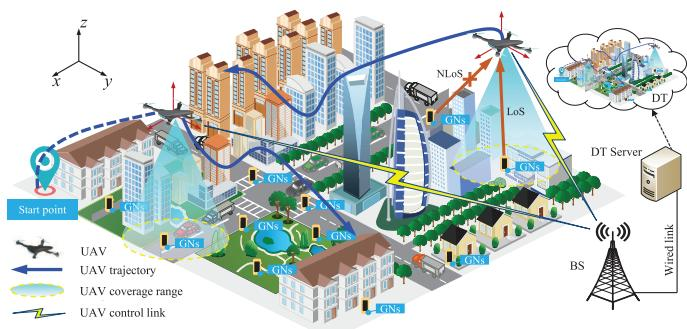  
Fig. 1. An illustration of a multi-UAIoTN system with DT server in the urban scenario.

## II. SYSTEM MODEL

In this section, we introduce the system model for UAIoTN deployment under a 3-D urban scenario.

## A. Environment Model

As shown in Fig. 1, we consider a multi-UAIoTN system where M UAVs perform both network coverage and data collection for GNs. A centralized BS, connected via wired link to a server hosting the DT, coordinates UAV deployment and control. The mission area is modeled as a 3D grid of size $L \times W \times H ( L , W , H \in \mathbb { N } ^ { + } )$ , with spatial resolutions $\Delta x .$ $\Delta y ,$ and $\Delta z ,$ resulting in a discretized space of $b _ { L } = L / \Delta x ,$ $b _ { W } = W / \Delta y ,$ and $b _ { H } = H / \Delta z$ . Buildings are represented as axis-aligned rectangular prisms defined by a 5-dimensional vector $\mathbf { b } _ { k _ { b } } = [ x _ { b } ^ { \operatorname* { m i n } } , x _ { b } ^ { \operatorname* { m a x } } , y _ { b } ^ { \operatorname* { m i n } } , y _ { b } ^ { \operatorname* { m a x } } , h _ { b } ] \in \mathbb { R } _ { + } ^ { 5 }$ . We define the environment topology as a binary tensor $\mathbf { S } \in \dot { \mathbb { N } } _ { \{ 0 , 1 \} } ^ { b _ { L } \times b _ { W } \times b _ { H } }$ where an entry of 1 indicates the presence of an obstacle. Buildings and random obstacles are encoded separately as $\mathbf { S } _ { b }$ and $\mathrm { \bf S } _ { o } ,$ respectively, satisfying $\begin{array} { r } { \mathbf { S } = \mathbf { S } _ { b } + \mathbf { S } _ { o } . } \end{array}$ The total occupied volume of the environment is given by vec $( \mathbf { S } ) ^ { T } \mathbf { 1 }$ To simulate real-world uncertainty, random obstacles appear with a probability $\begin{array} { r l r } { \varepsilon } & { { } = } & { \frac { \sum s _ { o } ^ { ( i , j , ^ { \star } ) } } { b _ { L } b _ { W } b _ { H } } } \end{array}$ , where $s _ { o } ^ { ( i , j , k ) }$ denotes the $( i , j , k )$ -th entry of $\mathbf { S } _ { o }$ . These obstacles, denoted by the set ${ \cal { S } } _ { o } ,$ cannot be pre-modeled and are only revealed when UAVs encounter them during the mission. The complete environmental topology is thus expressed as $S = S _ { b } \cup S _ { o }$ In this work, we assume that the set of buildings $\boldsymbol { S } _ { b }$ is known prior to UAV deployment, while the set of random obstacles $\scriptstyle { S _ { o } }$ remains unknown and must be discovered in real time.

Meanwhile, there are K GNs randomly distributed on the ground outside the building, whose coordinates are expressed as $\mathbf { p } _ { g } = [ x _ { g } , y _ { g } , z _ { g } ] \in \mathbb { R } _ { + } ^ { 3 } , g \in \mathcal { G }$ . A mission cycle completes when UAVs finish one full data collection round from all GNs with upload demands. UAVs consecutively execute data collection cycles for continuous coverage in the long-term deployment. The whole mission area $s$ is divided into $N _ { \mathrm { r e g } }$ square cells, GNs are also divided into $N _ { \mathrm { r e g } }$ subsets, denoted as $\mathcal { G } ~ = ~ \{ \mathcal { G } _ { 1 } , . . . \mathcal { G } _ { N _ { \mathrm { r e g } } } \}$ . As the number of UAVs changes,

TABLE I  
IMPORTANT ASSUMPTION NOTATIONS IN THIS PAPER
<table><tr><td>Variables L, W, H</td><td>Description</td></tr><tr><td> $\mathcal { U } , \mathcal { G } , \boldsymbol { S _ { b } } , \boldsymbol { S _ { o } }$   $s , s _ { \mathrm { D T } }$   $T$   $H$   $\mathbf { p } _ { u , t }$   $\mathbf { p } _ { g }$   $\mathbf { b } _ { k }$   $\mathbf { p } _ { r , n }$   ${ \bf a } _ { u , t }$   $_ { \mathbf { o } _ { u , t } }$   $c _ { g , t }$   $s _ { g , t }$   $\eta _ { g , t }$   $D _ { \mathrm { C o m . } }$   $v _ { h } , v _ { v }$   $\gamma _ { u , g }$   $\gamma _ { \mathrm { t h } }$   $N _ { \mathrm { m a x } }$ </td><td>The length, width, height of environment topology (m) The set of the UAVs, GNs, buildings, and obstacles The environment topology in reality and DT The mission execution time limitation The maneuvering height of UAVs The coordinate of UAV u ∈ U at time slot t The coordinate of GN  $g \in { \mathcal { G } }$  The coordinate vector of the building k The coordinate of n-th region in  $N _ { \mathrm { r e g } }$  regions The maneuvering direction of UAVs at time slot t The threat indicator vector of UAVs at time slot t The network connection of k-th GN at time slot t The network service time of k-th GN at time slot t The access indicator of k-th GN at time slot t The size of the offloading data package The horizontal and vertical speed of UAVs</td></tr></table>

S and $\mathcal { G }$ will be partitioned into the units of the abovementioned $N _ { \mathrm { r e g } }$ square cells, enabling the operation of multi-UAIoTN. Since $\scriptstyle { S _ { o } }$ is unpredictable, the DT environment $ { S _ { \mathrm { D T } } }$ in server initially have buildings $\boldsymbol { B }$ only, i.e., $\mathbf { S } _ { \mathrm { D T } } = \mathbf { S } _ { b } ,$ the $\scriptstyle { S _ { o } }$ is partially detected by real-time maneuvering of $\mathrm { U A V s } ,$ and then transform to server to update the DT environment $S _ { \mathrm { D T } } .$ , which will be detailed in Section III. For convenience, Table I summarizes the main assumptions used throughout this paper.

## B. UAV Model

For the sake of simplicity, UAVs maneuver with discrete time slots, and the movement decisions are made at the start of each time slot. The whole system is divided into discrete time slots of length $T _ { 0 }$ . Let ${ \bf a } _ { u , t }$ represent the maneuvering direction vector, and $v _ { h } , v _ { v }$ represent the horizontal and vertical velocity of UAVs. The coordinate of the UAV u at time t is denoted as: $\mathbf { p } _ { u , t } \ = \ T _ { 0 } \cdot { \bf a } _ { u , t } \odot \mathbf { v } + [ x _ { u , t - 1 } , y _ { u , t - 1 } , z _ { u , t - 1 } ]$ , where $\mathbf { v } = [ v _ { x } , v _ { y } , v _ { z } ]$ . We assume that the velocity $v _ { x } = v _ { y } = v _ { h }$ in the horizontal direction and $v _ { z } = v _ { v }$ in the vertical direction. Moreover, as shown in Fig. 2(a), we assume the UAV would sense the targets in the forward direction range, and recognize whether there are obstacles in the direction range that affect flight safety. Since both the UAV’s movement direction and obstacle sensing are defined in discrete space, a discreteaction DRL algorithm is naturally adopted, as detailed in Section IV. UAVs are equipped with a uniform planar antenna array that simultaneously detects obstacles during the sub-time slot for sensing. They utilize echo signals to sense obstacles, enabling position determination, monitoring, and service enhancement.

The UAV’s position update strategy follows the threecoordinate update rule, as shown in Fig. 2 (b). In each sub-time slot for UAV moving, the UAV selects a direction for each of the x, y, and z axes. The length of the moving unit for each time slot is $x _ { 0 } = v _ { h } \cdot T _ { 0 } , y _ { 0 } = v _ { h } \cdot T _ { 0 } , z _ { 0 } = v _ { v } \cdot T _ { 0 }$ Thus, the UAV selects three moving directions as forward, stationary, or backward, denoted as $\mathbf { a _ { t } } ~ = ~ [ a _ { x } , a _ { y } , a _ { z } ]$ . By controlling the values of $a _ { x } , a _ { y } , a _ { z } ,$ the UAV can move in 26 different directions or remain stationary, functioning as an aerial BS. It is assumed that each UAV can cover the mission area within an angular range of Θ and a radius of H · tan Θ, where H is the $\mathrm { U A V } ^ { \ , } \mathbf { s }$ altitude. The network will cover GNs meeting the signal-interference noise ratio (SINR) requirement.

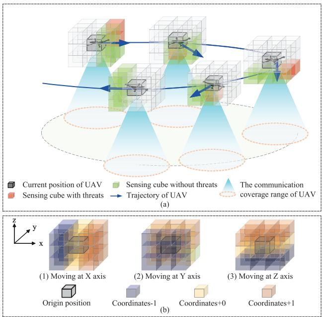  
Fig. 2. (a) Sensing and communication model of UAV: UAV senses the cube range in front of the moving direction, the cane in green is the clear space, and the cube in red is the space containing the obstacles. (b) Maneuvering model of UAV: UAV moves in 3 axes in coordinate (−1, 0, 1).

## C. Communication Model

We consider the channel gain with three major components: path loss, shadowing, and small-scale fading, accounting for the presence of buildings, random obstacles, and UAV maneuvering. Specifically, the determination of LoS connectivity is based on assessing whether the direct link $l _ { u , g } = \{ u , g \}$ is obstructed by a building, where $\{ u , g \}$ is the communication link between the UAV $u \in \mathcal { U }$ and GN $g \in { \mathcal { G } }$ . The LoS or non-LoS (NLoS) condition of a UAV-GN link is determined by checking whether any of the uniformly spaced sampling points along the link path intersect with 3D building structures. For a data link in the n-th sub-channel $l _ { u , g } ^ { n } ,$ we assume that the transmit power is $p _ { \mathrm { T X } }$ . Denote the channel gain of $l _ { u , g } ^ { n }$ by $h ( l _ { u , q } ^ { n } )$ , we have $\begin{array} { r } { h ( l _ { u , g } ^ { n } ) = h _ { \mathrm { P L } } ( l _ { u , g } ^ { n } ) h _ { \phi } ( l _ { u , g } ^ { n } ) h _ { \psi } ( l _ { u , g } ^ { n } ) } \end{array}$ , where hPL $( \check { l } _ { u , g } ^ { n } ) , h _ { \phi } ( l _ { u , g } ^ { n } )$ , and $h _ { \psi } ( l _ { u , g } ^ { n } )$ represent the effects of path loss, shadowing and multi-path fading, respectively. Referring to [40], with $\bar { h ^ { \mathrm { d B } } } ( l _ { u , g } ^ { n } ) = \bar { 1 0 } \log _ { 1 0 } ( \bar { h ( l _ { u , g } ^ { n } ) ) }$ being the channel gain in [dB], we have the channel gain in n-th sub-channel as

$$
\begin{array} { r } { h _ { k } ^ { \mathrm { d B } } ( l _ { u , g } ^ { n } ) = \Omega _ { k } + 1 0 \varpi _ { k } \log _ { 1 0 } \big ( d ( l _ { u , g } ^ { n } ) \big ) + \phi _ { k } ( l _ { u , g } ^ { n } ) } \\ { + \psi _ { k } ( l _ { u , g } ^ { n } ) , \qquad } \end{array}\tag{1}
$$

where $\Omega _ { k } , \varpi _ { k }$ account for the path loss intercept and the path loss exponent, $d _ { l _ { u . a } ^ { n } } = \| \mathbf { p } _ { u } - \mathbf { p } _ { g } \|$ denotes the distance from u-th UAV to g-th GN, $\phi _ { k } ( l _ { u , g } ^ { n } )$ is a zero-mean Gaussian

random variable that models the effect of shadowing, with variance $\sigma _ { \phi _ { k } } ^ { 2 }$ and satisfying a spatial correlation function

$$
\mathcal { F } _ { \mathrm { s c } } ( \| \mathbf { p } _ { g ^ { \prime } } - \mathbf { p } _ { g } \| ) = \sigma _ { \phi _ { k } } ^ { 2 } \exp \left( - \frac { \| \mathbf { p } _ { g ^ { \prime } } - \mathbf { p } _ { g } \| } { \nu _ { k } } \right) ,\tag{2}
$$

where $\nu _ { k }$ is the correlation distance for shadowing, typically related to environmental factors such as buildings [41]. The multi-path fading effect $\psi _ { k } ( l _ { u , g } )$ is modeled as a Rician fading with parameter $\{ K _ { \psi _ { 0 } } , \sigma _ { \psi _ { 0 } } ^ { 2 } \}$ in LoS and Rayleigh fading with variance $\sigma _ { \psi _ { 1 } } ^ { 2 }$ in NLoS. Note that $\psi _ { k } ( l _ { u , g } )$ spatially decorrelates faster as compared with the shadowing.

During mission execution, it is assumed that a BS maintains communication with the UAVs to achieve all LoS control links, which is facilitated by placing a BS on the roof. Intuitively, the channel between the UAV and the BS can be set as LoS, i.e., $k = 0 ,$ , and all UAVs are under the unified control of the BS. Different UAVs occupy different bandwidths to avoid mutual interference. We further consider that the control link has been allocated sufficient bandwidth to support the data transmission overhead required for UAV control [42]. For data link, there exits signal interference for link $l _ { u , g } ^ { n }$ from other links in the same frequency sub-channel. The signal interference is expressed as $\begin{array} { r } { I ( l _ { u , g } ^ { n } ) \ = \ \sum _ { g ^ { \prime } \neq g } ^ { | \mathcal { G } | } h _ { k } ( l _ { u , g ^ { \prime } } ^ { n } ) } \end{array}$ , where the sum is taken over all $g ^ { \prime } \neq g$ in the set of all GNs, and each $l _ { u , g ^ { \prime } } ^ { n }$ is a link that uses the same sub-channel n. The SINR of link $\varphi _ { u , g } ^ { n }$ is then $\gamma _ { u , g } = ( p \cdot h _ { u , g } ) / ( \sigma ^ { 2 } + I ( l _ { u , g } ^ { n } ) )$ , where $\sigma ^ { 2 }$ is the additivewhite-Gaussian-noise (AWGN) power, and the channel rate is then denoted as $C ( l _ { u , g } ) = B _ { g } \log _ { 2 } ( 1 + \gamma ( l _ { u , g } ) )$ .

## III. DEPLOYMENT DESIGN, DTTF FOR UAIOTN, AND PROBLEM FORMULATION

## A. UAIoTN Deployment Design

1) BiS-UAIoTN Deployment: The deployment procedure is designed in two distinct stages: MTS and MMS, as illustrated in Fig. 3 (a). Specifically, the UAV takes off from the designated starting point and initially navigates to the assigned MSR via the MTS. During this stage, the MTS ensures rapid arrival and collision avoidance. Following this, UAV concentrates on maintaining network coverage for GNs in MMS. Fig. 3 (b) illustrates the system’s time slot frame protocol, divided into three sub-time slots. In the beginning, the UAV performs environment perception, conducting echo-based sensing in its around to confirm the presence of obstacles within the perception space. Then, the UAV transmits its state and observation data to the DT server and selects the maneuvering direction with the trained DRL model. In the third sub-time slot, during MTS, the UAV moves in the direction corresponding to the selected action. In MMS, it begins data transmission with connected GNs, continuing until data collection for the currently accessed GNs is complete.

2) Multi-UAIoTN Extension: During the deployment of multi-UAIoTN, the system first observe the environment, UAV, and GN status, and perform KMD as detailed in Section IV-C. UAVs then enter the MTS, where the clustering center of GNs within each MSR serves as the target point. Once UAVs arrive at their assigned MSRs, they transition to the MMS to provide network coverage. For long-term multi-UAIoTN deployment, UAVs can re-execute KMD after completing the current mission cycle. Moreover, after completing the data collection from GNs within the assigned MSR, UAVs will continue patrolling and maintaining network services within their assigned MSRs until the next mission cycle start. The overall mission flow is illustrated in Fig. 4.

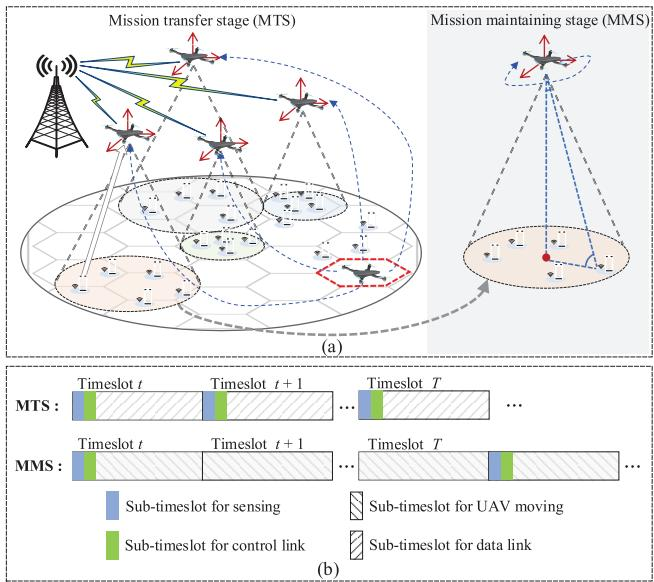

Fig. 3. (a) The decoupling mission design: Bi-stage mission execution containing MTS and MMS. (b) The time slot frame protocol of the mission: Each time slot is divided into 3 sub-time slots, for environment sensing, control link transmission, UAV moving in MTS, and data link transmission in MMS.  
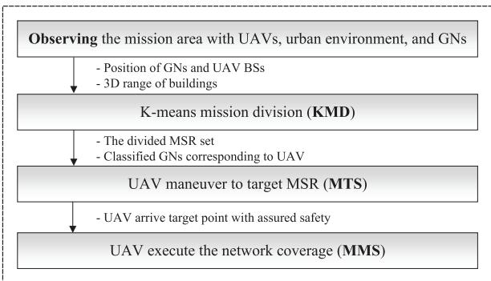  
Fig. 4. The complete mission workflow.

## B. DTTF for UAIoTN

As shown in Fig. 5, the DTTF for the multi-UAIoTN system is established, with three primary components: the physical entity, the twin layer, and the connections. The physical entity constitutes the real-world mission scenario, the connections serve as the control link, and the DT layer runs the VEs and DRL models. Next, each component will be examined in detail, followed by an illustration of the model pre-training and model updating during mission execution.

• Physical entity: The multi-UAV system for UAIoTN network coverage, and the mission environment with unpredictable obstacles, and the GNs waiting to be served. UAVs are considered for computation and storage to support the DRL model training. They only operate as agents, observe the environment state, choose the action with a loaded local DRL model, and collect the data from connected GNs.

Digital twin layer: The mirror of the static buildings, GNs, and the multi-UAV system constitutes the VE. As shown in Fig. 5, there are $N _ { \mathrm { D T } }$ VEs that can run simultaneously, obtaining the experience $\langle s , a , r , s ^ { \prime } \rangle$ for DRL model training. And, the DRL models for the UAIoTN system for both MTS and MMS are also stored in it. The twin layer operates on the DT server, which has abundant computation and storage to support both DRL model training and VEs running.

• Connections: The bidirectional interaction based on the control links between UAVs and the control BS wired-linked with the DT server. After training a DRL model within the initial VEs, the twin layer transmits the model to the physical entity, enabling the UAVs to select actions. The UAVs continuously monitor the environment and feed back the information—particularly binary obstacle detection result (present/absent)—to the twin layer through the connections. The DRL model, further trained in the twin layer, is then used to update the local model parameters of the physical entity. The control link will be allocated sufficient resources to ensure the stable communication of the connections.

During the model pre-training, the twin layer initiates the process of environment mapping, creating multiple VEs in the DT server that simulate the mission scenario and generate MDP-based experiences for training the DRL model. These experiences, represented as tuples of $\langle s , a , r , s ^ { \prime } \rangle$ , are stored in a replay buffer, enabling continuous policy refinement by the DRL model. The computational capabilities of the DT server expedite this training process, resulting in an optimized DRL model that is subsequently deployed to a UAV to support mission decision-making. Prior to mission commencement, the trained model is loaded onto the physical UAV, equipping it to execute optimized decision-making.

During mission execution, we implement an emergent halt mechanism to cancel actions from the currently deployed model if obstacles are detected in the next movement direction of the UAV determined by the model, thereby ensuring UAV safety by preventing potentially dangerous movements. UAVs synchronize their state and action data to the twin layer enriched with environment perception data, updating the VE to reflect real-time obstacle positions and other dynamic changes, ensuring high fidelity. When discrepancies arise between the synchronized states and those in the VE, or when decisions from the currently deployed model could potentially lead to a crash, the DTTF retrains the DRL model based on the updated VE. The retrained model parameters are then transmitted back to the UAVs via the control link, ensuring that the onboard models adapt to changes in the real-world environment. In summary, DTTF accelerates model pre-training in the DT server and ensures its adaptability during mission execution, maintaining high decision accuracy and generalization of the DRL model.

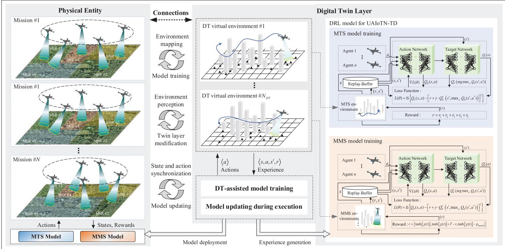  
Fig. 5. The digital twin-based training framework of Multi-UAIoTN.

## C. Problem Formulation

In this paper, we discretize the system’s state at discrete intervals of $T _ { 0 }$ time slots. During the sub-time slot for UAV moving of MTS, the destination point coordinate $\mathbf { p } _ { u , \mathrm { t a r } }$ represents the center of the MSR corresponding to UAV u. During the sub-time slot for data link of MMS, each discrete intervals is assigned a hovering time ${ \bar { \tau } } ,$ constrained by $\bar { \tau } \leq T _ { 0 }$ The duration of the hovering time is determined by the data package size and the SINR of link $l _ { u , g }$ . Assuming the time scale t is measured in units of $T _ { 0 }$ , we further define system variables as follows:

• GN coverage $c _ { g , t } \mathrm { : }$ If the SINR of the communication link between the GN and the UAV meets the requirements of $\gamma ( l _ { u , g } ) \ge \gamma _ { \mathrm { t h } }$ , then $c _ { g , t } = 1$ , otherwise $c _ { g , t } = 0$

• GN service $s _ { g , t } \colon$ If the GN has been served in the round of deployment, $s _ { g , t } = 1$ , otherwise $s _ { g , t } = 0$

• GN access $\eta _ { g , t } \colon$ If the first GN meets the SINR requirements and has not been serviced in the round of deployment, that is, $c _ { k } ( t ) ~ = ~ 1$ and $s _ { g , t } ~ = ~ 0$ , then $\eta _ { g , t } = 1$ , otherwise $\eta _ { g , t } = 0$

• Maximum access limitation $N _ { \mathrm { m a x } }$ : The maximum number of GNs that can be connected to a UAV.

• Mission period $T _ { \mathrm { m i s s i o n } } \mathrm { . }$ The mission execution time, which contains MTS and MMS.

Therefore, the deployment of multi-UAIoTN is simplified to the minimization of the mission execution time $T _ { \mathrm { m i s s i o n } } \mathrm { : }$

$$
\operatorname* { m i n } _ { \mathbf { p } _ { u , t } , \mathbf { a } _ { u , t } } \ T _ { \mathrm { m i s s i o n } } \left( \mathbf { p } _ { u , t } , \mathbf { a } _ { u , t } \right) \big | _ { u \in \mathcal { U } , g \in \mathcal { G } }\tag{3}
$$

$$
\begin{array} { r l } { s . t . } & { { } C _ { 1 } : \mathbf { p } _ { u , t } = [ x _ { u , t } , y _ { u , t } , z _ { u , t } ] , } \end{array}\tag{3a}
$$

$$
0 \leq x _ { u , t } \leq L , 0 \leq y _ { u , t } \leq W , 0 \leq z _ { u , t } \leq H
$$

$$
C _ { 2 } : { \bf { p } } _ { u , t } = T _ { 0 } \cdot { \bf { a } } _ { u , t } \odot { \bf { v } } + { \bf { p } } _ { u , t - 1 }
$$

$$
C _ { 3 } : \mathrm { { \bf ~ a } } _ { u , t } = [ a _ { x , t } , a _ { y , t } , a _ { z , t } ] ,\tag{3b}
$$

$$
a _ { x , t } , a _ { y , t } , a _ { z , t } \in \{ - 1 , 0 , 1 \}\tag{3c}
$$

$$
C _ { 4 } : \ t \leq T , \ \bar { \tau } \leq T _ { 0 }\tag{3d}
$$

$$
C _ { 5 } : \ \mathbf { p } _ { u , t } \not \in { \mathcal { S } }\tag{3e}
$$

$$
C _ { 6 } : \ \gamma _ { u , g } \geq \ \gamma _ { \mathrm { t h } } , \eta _ { g , t } = 1\tag{3f}
$$

$$
C _ { 7 } : \begin{array} { r } { \sum _ { g \in \mathcal { G } } \eta _ { g , t } \le N _ { \mathrm { m a x } } } \end{array}\tag{3g}
$$

$$
C _ { 8 } : et { } { ' } \sum _ { t = 0 } \sum _ { g \in \mathcal { G } } s _ { g , t } = | \mathcal { G } | ,\tag{3h}
$$

where the conditions $C _ { 1 } - C _ { 3 }$ are the location and maneuvering constraints of UAVs, $C _ { 4 }$ is the mission execution time constraint. $C _ { 5 }$ is the obstacle avoidance constraint for MTS, and $C _ { 6 } - C _ { 8 }$ are the constraints for MMS under the limitation of UAV network coverage and transmit power. Afterward, the air-to-ground (A2G) channel depends on the locations of UAVs, GNs, and buildings, while the obstacle avoidance constraint restricts mission’s safety. Therefore, problem (3) is intractable to solve by employing traditional optimization methods.

## IV. THE PROPOSED DT-DDQN-BISD SCHEME

## A. DT-DDQN Algorithm

As preliminary, RL stands at the forefront of artificial intelligence, representing a paradigm in which agents learn to make decisions through interaction with the environment. In discrete time slot t, the agent takes action $a _ { t } \in { \mathcal { A } }$ in state $s _ { t }$ with respect to policy π, with state transition probability $\mathcal { P } _ { t } = P ( s ^ { \prime } | s _ { t } )$ and the episode reward $r _ { t } = \mathcal { R } ( s _ { t } , a _ { t } )$ obtained by the action taken. The accumulated reward till t denotes as $\begin{array} { r } { \dot { R _ { t } } = \sum _ { n = 0 } ^ { t } \gamma ^ { ( t - n ) } r _ { n } } \end{array}$ is obtained, where γ is the discount factor, and the Q-value $Q ( s , a ) = \mathbb { E } \{ R _ { t } | s , a \}$ is derived. The primary objective is to find an optimal policy that maximizes the expected reward: $\pi ^ { * } ~ = ~ \arg \operatorname* { m a x } _ { \pi } \mathbb { E } \{ R _ { t } \}$ . In light of the findings from [16], [17], and [26], and with the aim of enhancing obstacle detection in specific directions as shown in Fig. 2, we adopt a discrete action space, the Q-value will be updated in time slot $t + 1$ by:

$$
Q ^ { t + 1 } ( s , a ) \gets Q ^ { t } ( s , a ) + \alpha \cdot \left[ q _ { t } ( s ^ { \prime } , a ^ { * } ) - Q ^ { t } ( s , a ) \right] ,\tag{4}
$$

where $\mathcal { Q } _ { f } ( s , a )$ is the Q-function with $\langle s , a ^ { * } \rangle$ as argument, $\begin{array} { r } { q _ { t } ( s ^ { \prime } , a ^ { * } ) { \stackrel { . . } { = } } r _ { t } + \gamma \cdot \operatorname* { m a x } _ { a ^ { \prime } \in \mathcal { A } } \mathcal { Q } _ { f } ^ { t } ( s ^ { \prime } , a ^ { \prime } ) } \end{array}$ , α is the learning rate, and m $\begin{array} { r } { \operatorname { t a x } _ { a ^ { \prime } \in \mathcal { A } } \mathcal { Q } _ { f } ^ { t } \left( s ^ { \prime } , a ^ { \prime } \right) } \end{array}$ represents that the greedy policy is applied to obtain action $a ^ { * }$ . DRL diverges by leveraging deep neural networks to approximate $\mathcal { Q } _ { f } ( s , a )$ , extends Q-learning into the deep learning realm, i.e., Q-network, updated by the Q-loss modeled as the mean squared error between Q-value and target value as

$$
L ( \theta ) = \mathbb { E } _ { \pi } \left\{ \left[ Q ^ { t } ( s , a ) - q _ { t } ( s ^ { \prime } , a ^ { * } ) \right] ^ { 2 } \right\} ,\tag{5}
$$

where $\boldsymbol { q } _ { t } ( s ^ { \prime } , a ^ { * } )$ is estimated by Q-network $\mathcal { Q } _ { \boldsymbol { \theta } } ( s , a )$ with parameter θ, updated using gradient descent with respect to $L ( \theta )$ , i.e. $\theta \gets \alpha \nabla _ { \theta } \{ L ( \theta ) \}$ . However, issues such as function approximation and bootstrapping bring instability and nonconvergence problems. In DDQN, two Q-networks, namely action and target networks, are employed, with parameters θ and $\theta ^ { \prime } { } .$ , denoted as $\mathcal { Q } _ { \theta }$ and $\mathcal { Q } _ { \theta ^ { \prime } } ^ { \prime }$ respectively. The target value is calculated by

$$
q _ { t } ( s ^ { \prime } , a ^ { * } ) = \gamma \cdot \mathcal { Q } _ { \theta ^ { \prime } } ^ { \prime t } ( s ^ { \prime } , \arg \operatorname* { m a x } _ { a ^ { \prime } \in \mathcal { A } } \mathcal { Q } _ { \theta } ^ { t } ( s ^ { \prime } , a ^ { \prime } ) ) ,\tag{6}
$$

where $a ^ { * }$ be the action selected by $\mathcal { Q } _ { \theta } ^ { t } ( s , a )$ for the next state $s ^ { \prime } ,$ the Q-value is updated with target value $Q ( s _ { t } , a _ { t } ) + \alpha$ $[ q _ { t } ( s ^ { \prime } , a ^ { * } ) - Q ( s _ { t } , a _ { t } ) ]$ , and the Q-loss is updated with (5). The parameters are updated then:

$$
\{ \begin{array} { l l } { \theta  \theta - \alpha \nabla _ { \theta } \big \{ Q ^ { t } ( s , a ) - q _ { t } ( s ^ { \prime } , a ^ { * } ) \big \} } \\ { \theta ^ { \prime }  \delta \cdot \theta + ( 1 - \delta ) \cdot \theta , } \end{array}\tag{7}
$$

where δ is a small constant controlling the update of the target Q-network. Moreover, a replay buffer is introduced and enables the agents to explore different trajectories, enhancing the diversity of the data used for training.

Subsequently, we combine DTTF in Fig. 5 with the DDQN training process. We construct a VE mirroring the real world, along with a replicated DDQN model in twin layers, including parameters $\theta _ { \mathrm { D T } }$ and $\theta _ { \mathrm { D T } } ^ { \prime }$ for DDQN in DT. Whenever the agent executes an action within the VE, it gains valuable experience from the process and updates model parameters using (7). Before the start of each round, we transfer parameters $\theta _ { \mathrm { D T } }$ and $\theta _ { \mathrm { D T } } ^ { \prime }$ from DT to the model in the real world. Parameters $\theta _ { \mathrm { D T } }$ and $\theta _ { \mathrm { D T } } ^ { \prime }$ of DT models are updated as

$$
\{ \begin{array} { l l } { \theta _ { \mathrm { D T } }  \theta _ { \mathrm { D T } } - \alpha \nabla L ( \theta _ { \mathrm { D T } } ) } \\ { \theta _ { \mathrm { D T } } ^ { \prime }  \delta \cdot \theta _ { \mathrm { D T } } + ( 1 - \delta ) \cdot \theta _ { \mathrm { D T } } , } \end{array}\tag{8}
$$

where the Q-loss in the DT model is

$$
L ( \theta _ { \mathrm { D T } } ) = \mathbb { E } _ { \boldsymbol \pi } \left\{ \left[ Q _ { \theta _ { \mathrm { D T } } } ^ { t } ( s , a ) - \boldsymbol { q } _ { t } ( s ^ { \prime } , a ^ { * } ) \right] ^ { 2 } \right\} ,\tag{9}
$$

and the target value is calculated by (6) with $\theta _ { \mathrm { D T } }$ and $\theta _ { \mathrm { D T } } ^ { \prime } .$

Algorithm 1 DT-DDQN for UAIoTN Deployment   
Input: UAVs $\mathcal { U } , \vert \mathcal { U } \vert = M ,$ GNs ${ \mathcal { G } } , | { \mathcal { G } } | = K ,$ buildings   
${ \mathit { S } } _ { b } ,$ unknown obstacles ${ \cal S } _ { o } ,$ number of regions   
$N _ { \mathrm { r e g } } , M _ { \mathrm { r e g } } ,$ greedy probability $\epsilon ,$ batch size $D _ { s }$   
Input: Parameter of DDQN in real world, $\theta , \theta ^ { \prime }$   
Input: Parameter of DDQN in DT, θDT, $\theta _ { \mathrm { D T } } ^ { \prime }$   
Output: Q-network $Q _ { \theta } ( s , a )$   
1 for $e p = 1$ to $E _ { \mathrm { m a x } }$ do   
2 Reset the gradients: $d \theta , \theta ^ { \prime } \gets 0 , d \theta _ { \mathrm { D T } } , \theta _ { \mathrm { D T } } ^ { \prime } \gets 0$   
3 Reset the DT environments with U, G, and B   
4 Synchronize network parameters: $\theta , \theta ^ { \prime }  \theta _ { \mathrm { D T } } , \theta _ { \mathrm { D T } } ^ { \prime }$   
5 Initialize $s _ { m } , r _ { m } , m \in | \mathcal { U } |$ for UAVs   
6 for $t = 1 : T$ do   
7 for UAV m = 1 : M in DT environment   
$n = 1 : N _ { e n v }$ do   
8 Select the action with greedy-probability e:   
$a _ { m , t } = \arg \operatorname* { m a x } _ { a \in \mathcal { A } } \mathcal { Q } _ { \theta } ^ { t } \big ( s _ { t } , a _ { t - 1 } \big )$   
9 Observe the state: $s _ { m , t }$ of MTS or MMS   
10 Obtain the reward: $r _ { m , t }$ of MTS or MMS   
11 Store the $\langle s _ { m , t } , a _ { m , t } , r _ { m , t } , s _ { m , t + 1 } \rangle$ into the   
replay buffer D   
12 end   
13 end   
14 Sample $D _ { s }$ experience vectors from D   
15 Calculate the target value by (6) with $\theta _ { \mathrm { D T } }$ and $\theta _ { \mathrm { D T } } ^ { \prime }$   
16 Calculate the Q-loss by (5)   
17 Update the parameters of DDQN by (9)   
18 end

The proposed DT-DDQN for UAIoTN is described in Algorithm 1. The input includes the DT environment, UAV set, GNs set, and the initial parameters of models in the real world and DT environment. The output is the well-trained DRL model with optimal parameters. Firstly, at the start of each episode, reset the network parameters and DT environment (lines 2-3), synchronize the thread-specific local parameters with the globally shared parameters (line 4), and initiate the environment state actions, and reward (line 5). Within each time slot, the UAVs sequentially select actions in the DT environment according to policies. They observe the postaction environment state, receive a reward based on the MDP designed in the next sub-section, and store the experience in the replay buffer (lines 6-13). Finally, samples are collected from the replay buffer to calculate the target values for the DDQN model. The Q-loss is computed, and the parameters of the DDQN behavioral network and target network are updated (lines 14-17). The proposed DT-DDQN is designed to train the DRL model both before and during mission execution, as detailed in Section III-B.

## B. MDP Formulation

Combining the system model and problem formulation, we define the action space, observation space, and reward quantification for MTS and MMS in Fig. 3.

1) MDP Formulation of MTS: During MTS, UAVs aim for a swift destination reach, prioritizing obstacle avoidance.

Algorithm 2 Action to Direction Mapping   
Input: Action ${ \boldsymbol { a } } _ { t } ,$ position $\mathbf { p } _ { u , t } ,$ , velocities $v _ { h } , \ v _ { v }$   
Output: Direction $\overrightarrow { \mathbf { a } _ { t } } ,$ , next position $\mathbf { p } _ { u , t + 1 }$   
1 Initialize: Mapping $f : [ 0 , 1 , 2 ] \to [ - 1 , 0 , 1 ] , n = 1$   
$c _ { 1 } , c _ { 2 } = 0 , a = a _ { t } , \overrightarrow { \mathbf { a } _ { t } } = [ 0 , 0 , 0 ]$   
2 for n = 1to3 do   
3 Compute $c _ { 1 } \gets a \mid 3$ and $c _ { 2 } \gets a \% 3$   
4 Update direction vector: $\overrightarrow { \mathbf { a } _ { t } } [ n ]  f ( c _ { 2 } )$   
5 if $c _ { 1 } \neq 0$ then   
6 |Update $a  c _ { 1 } , n = + 1$   
7 end   
8 Update position:   
$\bar { \mathbf { p } } _ { u , t } [ n ] \gets \mathbf { p } _ { u , t } [ n ] + ( n \leq 2 ? v _ { h } : v _ { v } ) \cdot \overrightarrow { \mathbf { a } _ { t } } [ n ]$   
9 end

State space of MTS: The state space of MTS is primarily composed of position information, distance information, and obstacle information for each UAV $u \in \mathcal { U } \mathrm { : }$

1) $\mathbf { p } _ { u , t } , \mathbf { p } _ { u , \mathrm { t a r } } \in \mathbb { R } ^ { 3 \times 1 }$ : The coordinates of UAV and target point in time slot t.

2) $d _ { t } , d _ { 0 } \in \mathbb { R } _ { + }$ : The distance between UAV and the target point in time slot t and $t = 0$ , which are calculated with position indicator $\mathbf { p } _ { u , t }$ and $\mathbf { p } _ { u , \mathrm { t a r } }$ by

$$
d _ { t } = \left\| \mathbf { p } _ { u , t } - \mathbf { p } _ { u , \operatorname { t a r } } \right\| _ { 2 } , \quad d _ { 0 } = \left\| \mathbf { p } _ { t = 0 } - \mathbf { p } _ { u , \operatorname { t a r } } \right\| _ { 2 } .\tag{10}
$$

3) $d _ { t } ^ { \mathrm { x y z } } \in \mathbb { R } _ { + } ^ { 3 \times 1 }$ : The cooperative distance indicator of UAV in time slot t, obatined by $d _ { t } ^ { \mathrm { x y z } } = \| \mathbf { p } _ { u , \mathrm { t a r } } - \mathbf { p } _ { u , t } \| _ { 1 }$

4) $\mathbf { o } _ { t } \in \{ 0 , 1 \} ^ { 2 6 \times 1 }$ : The theat indicator of UAV in time slot t. As shown in the Fig. 2 (b), the UAV has 27 possible forward directions in different movement directions on the x, y, and z axes. UAV detects whether there is an obstacle in the next moving direction $\mathbf { a } _ { t } ,$ then the element is 1 if there is an obstacle, otherwise, it is 0.

To sum up, the state in t-th time slot $s _ { t }$ is defined as

$$
s _ { t } = \left\{ \mathbf { p } _ { u , t } , \mathbf { p } _ { u , \mathrm { t a r } } , d _ { t } , d _ { t } ^ { \mathrm { x y z } } , d _ { 0 } , \mathbf { o } _ { t } \right\} .\tag{11}
$$

Action space of MTS: The action of UAV in time slot t is formally denoted as $a _ { t } = \{ 1 , 2 , \cdots , 2 7 \}$ . The action space of $a _ { t }$ is illustrated in Fig. 3 (b), where the different directions of UAV maneuvering are mapped from $a _ { t }$ . Algorithm 2 presents the mapping from different actions to directions. With the formal mapping, the UAV trajectory optimization is formulated as a direction control problem with discrete actions.

Reward function of MTS: The reward quantification under MTS is primarily conceived in three aspects: maneuver efficiency, safety, and penalty, specifically defined as follows:

1) $r _ { 1 , t } \colon$ Distance reward, whose main consideration is the change in distance between the UAV and the target point at each time slot after maneuvering action. The distance reward can be defined as

$$
r _ { 1 , t } = \omega _ { 1 } \cdot \frac { 2 d _ { 0 } \Delta d } { d _ { t } } = \frac { 2 d _ { 0 } \left( d _ { t + 1 } - d _ { t } \right) } { d _ { t } } ,\tag{12}
$$

where $\omega _ { 1 }$ is a positive constraint, $\Delta d$ indicates the change in distance and is smoothed by incorporating $\frac { 2 d _ { 0 } } { d _ { t } }$ . This operation allows the distance gain to vary more dramatically in places closer to the target point, making the model more adaptive.

2) $r _ { 2 , t } \colon$ Negative stationary penalty, in the MTS procedure, the UAV needs to keep moving continuously unless it has reached its destination. To prevent the UAV from remaining stationary at a certain point during the MTS, the stationary penalty is defined as

$$
r _ { 2 , t } = - \omega _ { 2 } \cdot 1 | _ { a _ { t } = 0 } ,\tag{13}
$$

where $\omega _ { 2 }$ is a positive constraint.

3) $r _ { 3 , t } \colon$ Crash penalty, which is designed based on the sensing capabilities of UAVs. If the UAV reaches the region where the element in ob has a value of 1, indicating the area where buildings are located, it implies that the UAV has crashed, and a penalty will be assigned by

$$
r _ { 3 , t } = - \omega _ { 3 } \cdot 1 | _ { \mathbf { p } _ { u , t + 1 } \in B } ,\tag{14}
$$

where $\omega _ { 3 }$ is a positive constraint.

4) $r _ { 4 , t } \colon$ UAV out-of-bounds penalty, ensures that the UAV always moves within the mission area, preventing it from maneuvering outside the designated mission area. The out-of-bounds penalty is represented as

$$
r _ { 4 , t } = - \omega _ { 4 } \cdot 1 | _ { \mathbf { p } _ { u , t + 1 } \notin S _ { 0 } } ,\tag{15}
$$

5) $r _ { 5 , t } \colon$ Reward for length of the execution time, as the number of executed actions increases, the cumulative negative values of the reward also grow. Similar to ${ \boldsymbol { r } } _ { 1 , t } ,$ the change in reward for a time slot is denoted as $\frac { d _ { 0 } } { d _ { t } }$ and the calculation expression is as follows

$$
r _ { 5 , t } = - \omega _ { 5 } \cdot \frac { d _ { 0 } } { d _ { t } } ,\tag{16}
$$

Overall, the whole reward of MTS is derived as

$$
r _ { t } = r _ { 1 , t } + r _ { 2 , t } + r _ { 3 , t } + r _ { 4 , t } + r _ { 5 , t } .\tag{17}
$$

2) MDP Formulation of MMS: In the MMS, the UAV arrives at the target point through the MTS and begins to perform the UAIoTN mission.

State space of MMS: The state space of MMS is composed of position, coverage information, and AoI:

1) $\mathbf { p } _ { u , t } \in \mathbb { R } ^ { 2 \times 1 }$ : The coordinate of UAV. In the MMS, the UAVs are deployed at a fixed altitude, resulting in the position vectors being two-dimensional $x - y$

2) $c _ { g , t } , s _ { g , t } , \eta _ { g , t } \in \{ 0 , 1 \}$ : The covering, served, and permission access indicator of the GNs $g \in { \mathcal { G } }$ in t-th time slot, which has already been mentioned in Section III-B.

3) $\chi _ { t } \colon$ The aggregated AoI of all GNs, which is like the pheromone of ants, represented as

$$
\chi _ { t } = \chi _ { t - 1 } + \kappa _ { c } \cdot K _ { c } + \sum _ { k = 1 } ^ { K - K _ { c } } \chi _ { \mathrm { l o s s } } ,\tag{18}
$$

where $\chi _ { t _ { 1 } }$ idenotes the residual AoI from the previous time slot $t - 1$ . The term $\kappa _ { c }$ is a positive coefficient reflecting the AoI accrued from GNs serviced by the UAV network during the current time slot, $K _ { c }$ calculated as $\textstyle \sum _ { k } ^ { K } c _ { g , t }$ represents the number of GNs served in the current time slot, where $c _ { g , t }$ is the coverage indicator.

Lastly, $\chi _ { \mathrm { l o s s } }$ quantifies the decrement in AoI per time slot.

4) $\mathbf { o } _ { t } ^ { \prime } \in \{ 0 , 1 \} ^ { 8 \times 1 }$ : The threat indicator of UAV in time slot t for crash avoidance from the threats from 8 different movement directions on the x and y axes. The element is 1 if there is an obstacle, otherwise, it is 0.

To sum up, the state of MMS is defined as:

$$
\begin{array} { r } { s _ { t } = \left\{ \mathbf { p } _ { u , t } , c _ { 1 , t } , \ldots , c _ { g , t } , s _ { 1 , t } , \ldots , s _ { g , t } , \chi _ { t } , \mathbf { o } _ { t } ^ { \prime } \right\} , } \end{array}\tag{19}
$$

and the dimension of $s _ { t }$ varies with the number of GNs, denoted as 2|G| + 11.

Action space of MMS: Compared with MTS, the action space of MMS is reduced from 26 dimensions to 8, and the action of the air node of the t time slot UAV is indicated by $a _ { t } = \{ 1 , 2 , \ldots , 8 \}$ , which means that UAV maneuvers only in $x _ { y }$ axis, the height is solid. The mapping relationship between the action value $a _ { t }$ and the movement direction of the x, and y axes is consistent with that of MTS, shown in Algorithm 2.

Reward function of MMS: In the MMS process, the accurate return of the round can only be obtained after the end of a single round. Thanks to the information freshness in the state space, referring to the practice in [14], a reward sparse function is designed:

$$
r _ { t } = \left\{ \begin{array} { l l } { \operatorname { t a n h } [ \chi _ { t } ] + T - t , } & { \mathrm { i f } \sum _ { g \in \mathcal { G } } s _ { g , t } = | \mathcal { G } | } \\ { \operatorname { t a n h } [ \chi _ { t } ] - p _ { \mathrm { b e y o n d } } , } & { \mathrm { i f } \mathbf { p } _ { u , t } \notin \mathcal { S } _ { 0 } } \\ { \operatorname { t a n h } [ \chi _ { t } ] , } & { \mathrm { o t h e r w i s e } . } \end{array} \right.\tag{20}
$$

Among them, T − t indicates that the remaining time slots are incorporated into the revenue $r _ { t }$ as the mission completion reward, and $p _ { \mathrm { b e y o n d } }$ represents the penalty received by the UAV for crossing the boundary. In addition, there is a penalty similar to that in (14) for collisions and to (15) for boundary violations, with parameters consistent with those used in the MTS setting. If the number of GNs changes, the state dimension in (19) adjusts accordingly. At the start of each mission, GNs requiring transmission are identified, while those not needing network coverage are marked with a served indicator, $s _ { g , t } = 1$ . During training, random transmission requirements are assigned to GNs to ensure adaptability to these changes. The results in Section V demonstrate the model’s effectiveness in adapting to the dynamic requirements of GNs.

## C. Multi-UAIoTN Extension

To adapt the UAV deployment model to multi-UAIoTN, we propose an efficient and sample-effective KMD method detailed in Algorithm 3. The input comprises the set of GNs, the square cells number $N _ { \mathrm { r e g } } .$ , and the mapping cells number $M _ { \mathrm { r e g } }$ . The output is the multi-regional mission area ${ \tilde { \mathcal { G } } } ,$ and GNs $\tilde { \mathcal { R } } _ { \mathrm { r e g } } .$ The process of Algorithm 3 comprises three sequential steps:

1) Initialization and clustering (IC): Initially, the GNs undergo initialization and clustering via the K-means algorithm, organizing them into distinct groups based on the position similarities (lines 1-2).

Algorithm 3 KMD for Multi-UAIoTN   
Input: UAVs $\mathcal { U } , | \mathcal { U } | = M , N _ { \mathrm { r e g } } , M _ { \mathrm { r e g } } ,$ GNs set   
$\mathcal { G } = \{ \mathcal { G } _ { 1 } , \ldots , \mathcal { G } _ { N _ { \mathrm { r e g } } } \}$   
Output: Calssified GNs and region set, $\tilde { \mathcal { G } } , \tilde { \mathcal { R } } _ { \mathrm { r e g } }$   
1 Initialize: The empty set $\tilde { \mathcal { G } } , \tilde { \mathcal { R } } _ { \mathrm { r e g } }$ with M subsets, and   
the number vector of GN class in $N _ { \mathrm { r e g } }$ region,   
denoted as $\mathbf { n } _ { c }$   
2 Cluster the GN with K-means in M, obtain the   
calssified GN set $\tilde { \mathcal { G } } = \{ \tilde { \mathcal { G } } _ { 1 } , \dots , \tilde { \mathcal { G } } _ { M } \}$   
3 for $n = 1 \pmb { \theta } N _ { r e g }$ do   
4 Find the GNs’ class set $\mathcal { C } _ { \operatorname* { m a x } } \in \{ 1 , \dots , M \}$ in n-th   
region.   
5 Save the number of GN class in n-th region:   
$\mathbf { n } _ { c } [ n ] \gets | \mathcal { C } _ { \operatorname* { m a x } } |$   
6 if $| \mathcal { C } _ { \operatorname* { m a x } } | = 1 , i . e . , \mathcal { C } _ { \operatorname* { m a x } } = \left\{ c _ { \operatorname* { m a x } } \right\}$ then   
7 Region n is classified as $c _ { \mathrm { m a x } ^ { - } }$ -th category, i.e.,   
n is saved into $\tilde { \mathcal { R } } _ { \mathrm { r e g } , \boldsymbol { c } _ { \mathrm { m a x } } }$   
8 end   
9 end   
10 for $n = 1 \pmb { \theta } N _ { r e g }$ do   
11 if $\mathbf { n } _ { c } [ n ] > 1$ then   
12 Find the class $\{ c _ { \operatorname* { m i n } } \} \in \{ 1 , \dots , M \}$ with the   
least GNs in the updated ${ \tilde { \mathcal { G } } } ,$ satisfying   
$| \mathcal { G } _ { n } \cap \tilde { \mathcal { G } } _ { c _ { \operatorname* { m i n } } } | \le | \mathcal { G } _ { n } \cap \tilde { \mathcal { G } } _ { c \in \{ 1 , \dots , M \} - c _ { \operatorname* { m a x } } } |$   
13 Region n is classified as $c _ { \operatorname* { m i n } } \in { \cdot } \mathrm { t h }$ category,   
i.e., n is saved into $\mathcal { \tilde { R } } _ { \mathrm { r e g } , c _ { \mathrm { m i n } } }$   
14 end   
15 Update the calssified GN set: $\tilde { \mathcal { G } } \gets \tilde { \mathcal { G } } - \tilde { \mathcal { G } } \cap \mathcal { G } _ { n } .$   
$\tilde { \mathcal { G } } _ { s \in S _ { \mathrm { i n d e x } ( s ) } }  \mathcal { G } _ { n }$   
16 end   
17 Calculate the class center of classified GNs, saved as   
$\mathbf { g } _ { m } , m \in \{ 1 , \ldots , M \}$   
18 Update the GNs set: $\dot { \mathcal { G } } ^ { \prime } = \{ \mathcal { G } _ { 1 } , \ldots , \mathcal { G } _ { M _ { \mathrm { r e g } } } \}$   
19 for $n = 1 \pmb { t o } M _ { r e g }$ do   
20 Find the most closed class center $c _ { m }$ from region   
n: $\tilde { \mathcal { G } } \gets \tilde { \mathcal { G } } - \tilde { \mathcal { G } } \cap \mathcal { G } _ { n } , \tilde { \mathcal { G } } _ { s \in S _ { \mathrm { i n d e x } ( s ) } } \gets \mathcal { G } _ { n }$   
21 Region n is classified as $c _ { m }$ -th category, i.e., n is   
saved into $\mathcal { \tilde { R } } _ { { \mathrm { r e g } } , c _ { m } }$   
22 Update the classified GN set with the regions'   
division: $\tilde { \mathcal { G } } \gets \tilde { \mathcal { G } } - \tilde { \mathcal { G } } \cap \mathcal { G } _ { n } , \tilde { \mathcal { G } } _ { s \in S _ { \mathrm { i n d e x } ( s ) } } \gets \mathcal { G } _ { n }$   
23 end

2) Region adjustment and mapping (RAM): Following IC, the predefined $N _ { \mathrm { r e g } }$ regions are assigned to the clustered GNs. Regions exclusively containing a single class of GNs are allocated accordingly (lines 3-9). For regions with non-unique GN categories, adjustments are made based on GN numbers in other categories. These regions are reassigned to the category with the lowest number (lines 10-16), ensuring a balanced result.

3) Mission region division (MRD): Lastly, clustering centers for each GN category are computed after the initial region assignment. Utilizing the updated $M _ { \mathrm { r e g } }$ as the minimum cluster cell, distances between regions and clustering centers are determined. Subsequently, each region is assigned to the GN category with the closest clustering center, refining the regional classification (lines 17-23). In multi-UAIoTN missions, UAVs initiate the mission by departing from the starting position, reaching MSR as MTS, and transferring to MMS for a communication coverage mission. Notably, the MDP design of MTS remains independent of the number of UAVs, as for MMS, we set the status of GNs without network requirement as $s _ { g , t } = 1$ before the mission start. This approach allows for flexible deployment of multi-UAIoTN trajectory design.

## V. EXPERIMENT RESULTS

## A. Simulation Settings

The simulation scenario developed to implement the proposed DT-DDQN-BiSD for multi-UAIoTN trajectory design consists of a two-dimensional rectangular grid, which is discretized into cells for classifying UAV mission regions. Within the mission area, buildings are generated with three parameters: 1) $l _ { 1 } \colon$ the ratio of the area covered by buildings to the whole land area; 2) $l _ { 2 } \colon$ the average number of buildings per square kilometer; 3) $l _ { 3 } \colon$ the mean value of the building height on Rayleigh distribution, referring to [43]. To evaluate across different environments, we’ve considered both an urban scenario (UrS) and a rural scenario (RuS). UrS features dense clusters of tall buildings, while RuS settings a sparse distribution of shorter structures. Specifically, the UrS defines a mission area of 500m × 500m × 200m with parameters $\{ l _ { 1 } , l _ { 2 } , l _ { 3 } \} \ = \ \{ 0 . 4 5 , 5 0 0 , 6 0 \}$ . In contrast, the RuS extends to a larger 2000m $\times \ 2 0 0 0 \mathrm { { m } \times 2 0 0 \mathrm { { m } } }$ area, with parameters $\{ l _ { 1 } , l _ { 2 } , l _ { 3 } \} ~ = ~ \{ 0 . 1 , 5 0 , 2 5 \}$ . For spatial resolution, we set $\Delta x = \Delta y = 2 0 \mathrm { m }$ in the UrS and $\Delta x = \Delta y = 5 \mathrm { m }$ in the RuS, while maintaining $\Delta z = 2 \mathrm { m }$ in both configurations. In terms of infrastructure, the number of generated buildings is set as 80. The building coverage, as defined in Section II, results in vec $( \mathbf { S } _ { b } ) ^ { T } \mathbf { 1 } \ = \ 1 . 4 \times 1 0 ^ { 5 }$ pixels in the RuS and $\mathrm { v e c } ( \mathbf { S } _ { b } ) ^ { T } \mathbf { 1 } \ = \ 1 . 5 6 \times 1 0 ^ { 4 }$ pixels in the UrS, as defined in Section II. In both RuS and UrS, 0.05% of the environment topology S is randomly distributed as obstacles, while GNs are randomly distributed across areas outside the building and obstacle-covered range.

The transmit power of GNs is $p _ { \mathrm { T X } } = 1 0 ~ \mathrm { d B m } .$ , the AWGN power is $\sigma ^ { 2 } = - 1 0 5 \mathrm { d B m }$ , and the SINR threshold of the communication link is $\gamma _ { \mathrm { t h } } ~ = ~ 0$ dB. The carrier frequency is $f _ { c } ~ = ~ 2 . 4$ GHz, and the data size to transmit is $D _ { \mathrm { C o m } } = 5$ MB. As [40], the channel path loss parameters in (1) are set as $\{ \Omega _ { 0 } , \varpi _ { 0 } \} = \{ - 7 7 . 9 2 , - 1 . 3 4 \} , \{ \Omega _ { 1 } , \varpi _ { 1 } \} =$ $\{ - 3 1 . 6 3 , - 4 . 9 2 \}$ . The channel shadowing fading parameters are set as $\{ \sigma _ { \phi _ { 0 } } ^ { 2 } , \nu _ { 0 } \} = \{ 0 , 0 \} , \{ \sigma _ { \phi _ { 1 } } ^ { 2 } , \nu _ { 1 } \} = \{ 3 3 9 . 5 9 , 7 5 . 9 6 \}$ in RuS and $\{ \sigma _ { \phi _ { 1 } } ^ { 2 } , \nu _ { 1 } \} = \{ 3 3 9 . 5 9 , 3 3 . 9 9 \}$ in UrS. And the multipath fading parameters are set as $\{ K _ { \psi _ { 0 } } , \sigma _ { \psi _ { 0 } } ^ { 2 } \} = \{ 6 . 3 , 2 \}$ $\sigma _ { \psi _ { 1 , \mathrm { R u S } } } ^ { 2 } ~ = ~ 4 . 0 2$ in RuS, and $\sigma _ { \psi _ { 1 , \mathrm { U r S } } } ^ { 2 } ~ = ~ 9 . 4 3$ in UrS. The maximal number of accessions of UAV is $N _ { \mathrm { m a x } } ~ = ~ 2 0 $ and the bandwidth allocated to each GN is 2.5 MHz. The horizontal and vertical speed of UAVs is $v _ { h } = 1 0$ m/s, $v _ { v } = 5$ m/s, the length of each time slot is $T _ { 0 } ~ = ~ 2 ~ \mathrm { s }$ in RuS and $T _ { 0 } ~ = ~ 0 . 5 ~ \mathrm { ~ s ~ }$ in UrS, the maneuvering height of UAV is a parameter to be optimized. The coverage degree of UAV is $\Theta = 4 5 ^ { \circ }$ . The parameters of MTS reward quantification is $\{ \omega _ { 1 } , \omega _ { 2 } , \omega _ { 3 } , \omega _ { 4 } , \omega _ { 5 } \} = \{ 1 0 , 1 0 , 2 5 , 2 0 , 2 0 0 \}$ . The parameters of AoI-based MMS reward quantification are designed as $\kappa _ { c } = 1 0$ and $\chi _ { \mathrm { l o s s } } = 1 .$ . As for Algorithm 1, all the policy and target networks are constructed by a 4-layers fully connected feedforward neural network, with small storage consumption. The number of activated VEs during the mission is set as $N _ { \mathrm { D T } } = 3$

TABLE II  
SIMULATION PARAMETERS SETTING
<table><tr><td>Simulation parameters</td><td>Value</td></tr><tr><td>Maximum number of episodes in MTS  $\left( E _ { \operatorname* { m a x } } \right) _ { * }$ </td><td>3500</td></tr><tr><td>Maximum number of episodes in MMS  $\left( E _ { \mathrm { m a x } } \right)$ </td><td>5000</td></tr><tr><td>Maximum number of time slots per episode in MTS (T)</td><td>500</td></tr><tr><td>Maximum number of time slots per episode in MMS  $\left( T _ { \mathrm { m a x } } \right)$ </td><td>200</td></tr><tr><td>Capacity of replay buffer (D)</td><td>500000</td></tr><tr><td>Disnumber factor (δ)</td><td>0.99</td></tr><tr><td>The sampling batch size  $( D _ { s } )$ </td><td>512</td></tr><tr><td>Learning rate (α)</td><td>0.0004</td></tr><tr><td>States&#x27; storage overhead of MTS and MMS (KB)</td><td>0.352, 0.84</td></tr><tr><td>Actions&#x27; storage overhead of MTS and MMS (KB) Models&#x27; storage overhead of MTS and MMS (KB)</td><td>0.028</td></tr></table>

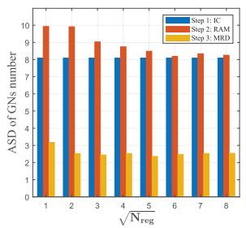  
(a)

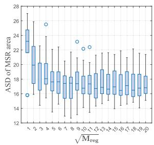  
(b)  
Fig. 6. Comparison of KMD result. (a) Standard Deviation of classified GNs number. (b) Standard Deviation of classified regions’ area.

The other simulation parameters are presented in Table II. The DT-DDQN-BiSD and the simulation scenario are implemented based on Pytorch and Python 3.8, trained on a Windows 11 server with 1 Nvidia 4090 graphics card. The initial position of the UAV is random for each episode during the model training and evaluation.

## B. Performance Analysis

In the context of the KMD method, optimization of input parameters $N _ { \mathrm { r e g } }$ and $M _ { \mathrm { r e g } }$ is crucial for determining their optimal values to reduce the standard deviation (SD) of the MSR area and the number of GNs in different UAVs composed of cells. Through 20 independent experiments with various GN distributions, Fig. 6 demonstrates the average SD (ASD) across 200 GNs, 5 UAVs mission division, with each step of KMD involving the number of cells $N _ { \mathrm { r e g } } , M _ { \mathrm { r e g } } ,$ as shown in line 10 and 19 in Algorithm 3, initiated as 49. As the process progresses from step 1 to step 3, the GNs’ ASD in Fig. 6 (a) decreases, stabilizing around a value of 2 as $N _ { \mathrm { r e g } }$ increases. Fig. 6 (b) displays a box plot of the ASD for MSR areas with $N _ { \mathrm { r e g } } = 4 9$ and varying values of $M _ { \mathrm { r e g } }$ . As the number of $M _ { \mathrm { r e g } }$ increases, the cells will become smaller, and the corresponding MSR division will become more even. Initially, increasing $M _ { \mathrm { r e g } }$ leads to a significant reduction in the area of ASD.

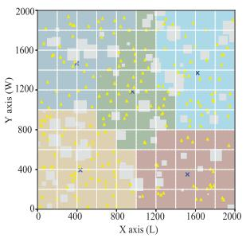  
(a)

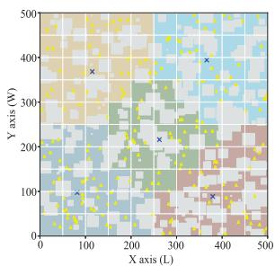  
(b)  
Fig. 7. (a) Mission area after Modified KMD in RuS $( M _ { \mathrm { r e g } } ~ = ~ 1 0 0 )$ (b) Mission area after Modified KMD in UrS $( M _ { \mathrm { r e g } } = 1 0 0 )$

However, further increments yield diminishing returns. The results led us to set $N _ { \mathrm { r e g } } = 4 9 , M _ { \mathrm { r e g } } = 1 0 0$

Fig. 7 represents the MSR of 5 UAVs for both UrS and RuS after KMD, where the colored squares represent cells assigned to different UAVs, the white squares represent cells not assigned to any UAV, the yellow triangles are GNs, and the blue crosses are the K-means clustering centers of different GNs. Fig. 7(a) and (b) show the results after steps 1 and 2. We can see that the cells are divided into the different MSRs.

As depicted in Fig. 8 and Fig. 9, a comparative presentation is conducted to assess the convergence performance of DT-DDQN-BiSD with DTTF with the baseline QMIX [27] and DDQN [14]. The results are derived from the MTS and MMS model pre-training procedure in both UrS and RuS as described in Section III-B, utilizing the parameters outlined in Table II. The results indicate that the episode reward of DT-DDQN-BiSD exhibits significantly faster convergence compared to baseline methods, as shown in Fig. 8 (a), (b) and Fig. 9 (a), (b). While all methods ultimately achieve convergence by the end of training, the lack of DT leads to significantly higher instability, as evidenced by greater fluctuations during the training process. Fig. 8 (c) illustrates the episode crash number during training in both UrS and RuS. Notably, the crash number with our proposed DT also converges more rapidly, with DT-DDQN achieving a nearzero crash number within 500 episodes, whereas the DDQN and DMIX fail to reach this level. Fig. 8 (d) presents the convergence performance of MTS sub-mission execution time in both scenarios. DT-DDQN converges much faster compared to the baselines. Please note that a higher number of obstacles in the UrS poses greater challenges to the training process compared to the RuS. Consequently, the crash number in UrS converges more slowly. However, because the area of UrS is smaller, the mission execution time is also smaller than that of RuS. The outcomes presented in Fig. 9 stem from the MMS model pre-training procedure, revealing a notable performance gap between DT-DDQN and compared DDQN and QMIX for MMS. Specifically, Fig. 9 (a) and Fig. 9 (b) demonstrate that DT-DDQN exhibits smoother convergence with reduced instability in episode rewards compared to the baselines without DT. Fig. 9 (c) shows the episode served GNs’ number in both UrS and RuS, with DT enabling faster approaching 200 GNs service. This trend aligns with the observations in Fig. 8 (c). In Fig. 9, DT-DDQN exhibits rapid and stable convergence performance, while models without DT experience significant fluctuations. This instability arises due to the higher complexity of the missions compared to MTS sub-missions, delayed reward feedback, and the limited temporal representation of the Q-learning-based agent. Regarding UrS and RuS, the higher density of buildings in UrS areas increases A2G link blockage, and a more prolonged training time is needed.

Fig. 10 illustrates the performance comparison of the DT-DDQN, QMIX, and DDQN methods over one episode under both RuS and UrS conditions, with the number of UAVs set as 5. In Fig. 10 (a), all methods demonstrate similar performance during the initial time slots. However, after fewer than 50 time slots, DT-DDQN begins to outperform QMIX and DDQN. Due to its multi-agent cooperative mechanism, QMIX shows better results than DDQN. As the time slots progress, the baseline methods plateau, indicating their inability to make no-crash decisions. In contrast, DT-DDQN continues to perform well due to the online model updates provided by the DTTF, enabling it to handle scenarios with unknown obstacles effectively. In Fig. 10 (b), the performance gap of DT-DDQN widens, clearly surpassing QMIX and DDQN after 20 time slots in both RuS and UrS. This is attributed to the increased likelihood of A2G link blockages caused by unknown obstacles, which impacts the baseline methods more severely. Overall, the proposed DT-DDQN method demonstrates superior performance in both MTS and MMS deployments, with the UrS environment, characterized by denser buildings, requiring more time slots to achieve optimal performance.

Fig. 11 illustrates the performance of the proposed DT-DDQN when UAVs face varying initialization conditions. These conditions include different initial distances from the target to the starting point in MTS and varying numbers of GNs to be served in MMS. As shown in Fig. 11 (a), DT-DDQN eventually reaches the target, while in Fig. 11 (b), it successfully completes the network coverage of all GNs. This demonstrates that DT-DDQN possesses well scalability and generalization capabilities, as well as robust performance in both RuS and UrS, as shown in Fig. 8–11.

A2G links are influenced by factors such as building density, height, and UAV altitude. A higher altitude increases the probability of a A2G LoS link but exacerbates large-scale fading. Conversely, a lower altitude reduces large-scale fading but significantly lowers the LoS probability. Thus, balancing large-scale fading and LoS probability is key to selecting an optimal altitude that maximizes coverage. In Fig. 12, we compare the average sub-mission execution time of 20 identical experiments with different start points of MMS across different UAVs’ altitudes to determine the optimal height for MMS. The results show that UAV heights of $H = 8 0$ m in RuS and H = 150 m in UrS yield the best performance for varying UAV numbers. Based on this, we select fixed UAV heights of H = 80 m for RuS and $H = 1 5 0$ m for UrS, with 5 UAVs, for the subsequent simulations.

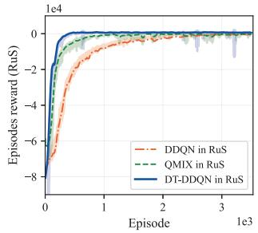  
(a)

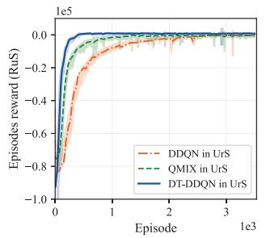  
(b)

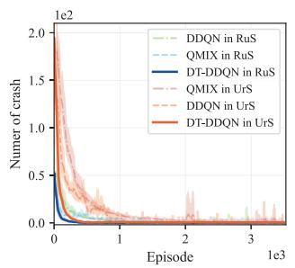  
(c)

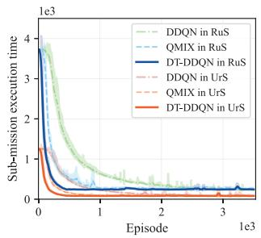  
(d)

Fig. 8. Comparison of convergence performance of MTS model pre-training procedure with DT-DDQN, QMIX, and DDQN, where UAVs take off from th starting point to a random KMD user center, with 5 UAVs in RuS and UrS. (a) The reward of episodes in RuS. (b) The reward of episodes in UrS. (c) Crash number of episodes. (d) Sub-mission execution time of episodes under MTS.  
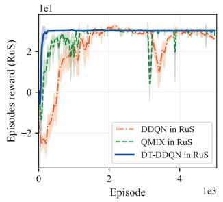  
(a)

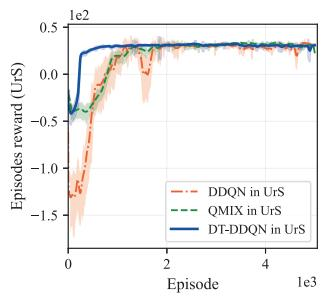  
(b)

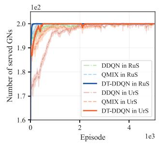  
(c)

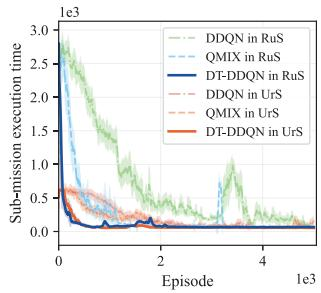  
(d)

Fig. 9. Comparison of convergence performance of MMS model pre-training procedure with DT-DDQN, QMIX, and DDQN, where UAVs start in a random location of MSRs to cover the GNs, with 5 UAVs, 200 GNs, H=80m in RuS and H=150m in UrS. (a) The reward of episodes in RuS. (b) The reward of episodes in UrS. (c) Served GNs number of episodes. (d) Sub-mission execution time of episodes under MMS.  
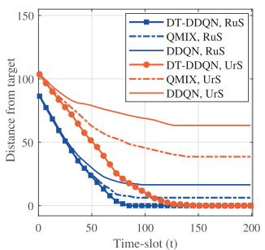  
(a)

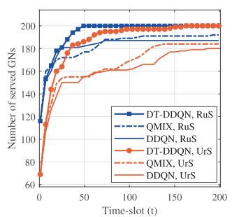  
(b)  
Fig. 10. Performance comparison in one episode length with DT-DDQN, QMIX, and DDQN methods. (a) MTS model in RuS and UrS, (b) MMS model in RuS and UrS.  
(a)

To evaluate the performance of mission execution time, we compare the proposed sub-mission execution time of MTS and MMS with baseline methods. For MTS model evaluation, we compare the following baseline methods:

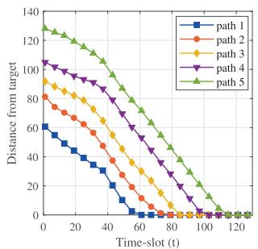  
(b)

1) Straight method: UAVs perform the MTS mission along a straight path, without crash avoidance considerations.

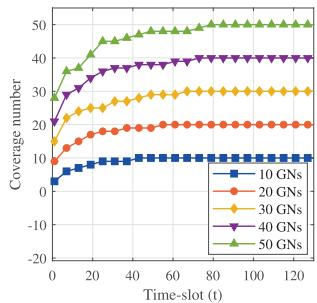  
Fig. 11. Performance of (a) different path with MTS model in UrS, (b) different GNs number with MMS model in UrS.

3) Parallel method: UAVs move in a row or column, first taking off from the start point, then translating horizontally toward the target.

2) PSO-based method: UAVs use PSO in [44] to optimize the potential trajectories updated iteratively, considering obstacles and distance.

For MMS model evaluation, we compare:

1) Scanning strategy: UAVs follow a rectangular trajectory starting from the lower-left corner and ending at the upper-left corner to ensure network coverage.

2) PSO-based method: UAVs employ PSO [44] to iteratively minimize the trajectory length, ensuring constant speed and complete the network coverage.

3) ACO-based method: For each GN, the start point is fixed, and the ACO algorithm [45] is used to solve the shortest path for routing each GN from the determined start point.

Note that all baselines are evaluated under ideal conditions, where buildings and obstacles are fully known in advance.

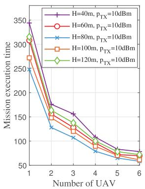  
(a)

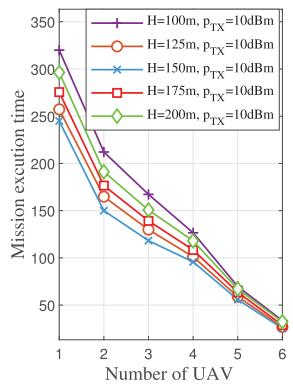  
(b)

Fig. 12. Average mission execution time with different UAV altitudes in (a) RuS, and (b) UrS.  
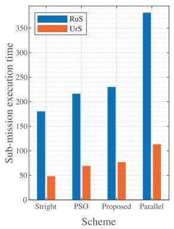  
(a)

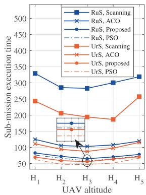  
(b)  
Fig. 13. Mission execution time comparison (a) MTS model, and (b) MMS model between proposed DT-DDQN scheme with baseline methods.

We first present the sub-mission execution time of MTS in Fig. 13 (a), comparing the average performance across 20 independent experiments with varying destination points. The results show that the proposed DT-DDQN-based model, which incorporates obstacle avoidance, leads to slightly longer mission duration compared to the straight-line and ideal PSO-based trajectory under the sub-mission for MTS. However, it significantly outperforms the fully safe parallel trajectory in terms of time efficiency. Furthermore, due to the higher building density and increased obstacles along the path in the UrS, the difference in mission duration relative to the straight-line optimal path is more pronounced in the UrS than in the RuS. Next, we evaluate the sub-mission execution time of MMS. We treat each GN as a node, with UAVs fixed at a starting point to design the shortest trajectory for covering all GNs. To further assess the MMS, we deploy five UAVs at random start positions within their MSR, conducting 20 independent experiments to compute the average mission execution time. The horizontal axis in Fig. 13 (b) shows various flight altitudes in RuS and UrS, with specific values detailed in Fig. 12. It can be observed that at the optimal altitude $H _ { 3 }$ the proposed DT-DDQN-BiSD MMS model outperforms both ACO and scanning strategy, reducing mission duration by 60% and 30% in the UrS, and by 75% and 58% in the RuS, respectively. However, similar to the MTS model performance shown in Fig. 13 (a), the PSO-based trajectory achieves a shorter mission duration than the proposed DT-DDQN model of MMS. Notably, while PSO-based trajectories excel in ideal conditions, they only act as inaccessible upper bounds.

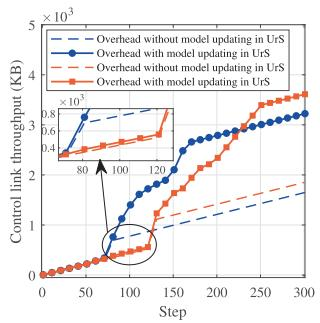  
(a)

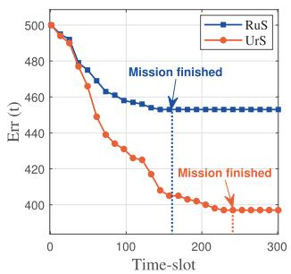  
(b)  
Fig. 14. Performance of (a) DTTF connection overhead, and (b) unknown obstacle perception, under RuS and UrS.

Next, we evaluate the communication overhead of the control link and the performance of DTTF during mission execution by comparing DT-DDQN-BiSD and ideal PSO-BiSD. The total communication overhead of control link is $C _ { \mathrm { t o t a l } } = C _ { \mathrm { s y n c } } + C _ { \mathrm { u p d a t e } }$ , where $C _ { \mathrm { s y n c } }$ is the cost for synchronizing information (states and actions), and $C _ { \mathrm { u p d a t e } }$ is the cost for transmitting the updated model parameters. The storage overhead of transmitting states, actions, and models are defined in Table II. The mission duration is the product of the number of mission time-slots and the time-slot length, with more mission time-slots in UrS but shorter $T _ { 0 }$ , resulting in longer mission duration than RuS.

In Fig. 14 (a), the communication overhead $C _ { \mathrm { t o t a l } }$ of DT-DDQN-BiSD is compared with ideal-PSO-BiSD synchronizing only states and actions. For DT-DDQN-BiSD, UAVs use the DT-DDQN models to generate trajectories in the partially known environment. For PSO-BiSD, UAVs follow trajectories optimized by PSO within fully-known environment. In both methods, UAVs first navigate to the MSR borders and then perform network coverage. The time of switching between MTS and MMS corresponds to the time slot at the inflection point of the curve in Fig. 14 (a). We can find that DT-DDQN maintains nearly the same communication overhead with $C _ { \mathrm { s y n c } }$ in both RuS and UrS during MTS due to the efficiency of the trained MTS model in making accurate decisions and avoiding obstacles. After MTS, the overhead increases significantly due to A2G link occlusions caused by unknown obstacles. The pre-trained MMS model struggles to adapt to changing MDP states, requiring frequent updates by DTTF, which adds overhead. However, this increase, resulting in 1.6 MB and 1.8 MB of additional control link data in RuS and UrS, respectively, is justified by the generalization performance of the models.

In Fig. 14 (b), we evaluate the fidelity of the DT. Let $N _ { O } ( t )$ denote the number of obstacles perceived by the UAV in time slot t. The error of $S _ { \mathrm { D T } }$ relative to the real environment is defined as $\mathrm { E r r } ( t ) = \mathrm { v e c } ( { \bf S } _ { O } ) ^ { T } { \bf 1 } - N _ { O } ( t )$ . It can be seen that the error Err(t) decreases by approximately 10% in RuS and

TABLE III  
COMPARISON OF THE TOTAL MISSION DURATION
<table><tr><td>Method</td><td colspan="2">DT-DDQN-BiSD</td><td colspan="2">Ideal PSO-BiSD</td></tr><tr><td rowspan="2">Scenario (5 UAVs) sub-duration for MTS (s)</td><td rowspan="2">RuS 220.4</td><td>UrS</td><td>RuS</td><td>UrS</td></tr><tr><td>62.2</td><td>210.8</td><td>58.1</td></tr><tr><td>sub-duration for MMS (s) Total mission duration (s)</td><td>64.9 285.3</td><td>55.7 117.9</td><td>57.4 268.2</td><td>46.6 104.7</td></tr></table>

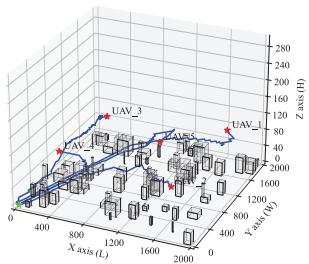  
(a)

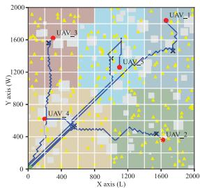  
(b)

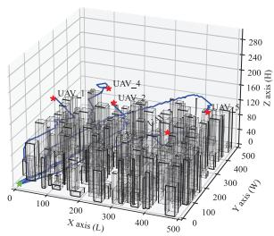  
(c)

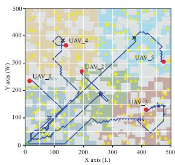  
(d)  
Fig. 15. The UAV’s maneuver trajectory on (a) 3-D and (b) 2-D views with the proposed DT-DDQN-BiSD in UrS, and (c) 3-D, (d) 2-D views in RuS, considering 5 UAVs and 200 GNs.

20% in UrS as the UAV continuously perceives obstacles with increasing time slots. Specifically, the VE is updated online by integrating newly perceived obstacles—including moving objects—through the UAVs’ control link. Combined with the building coverage range defined in Section II, we define the fidelity of the VE as $\begin{array} { r } { \mathrm { A c } ( t ) = 1 - \frac { \mathrm { E r r } ( t ) } { \mathrm { v e c } ( \mathbf { S } ) ^ { T } \mathbf { 1 } } } \end{array}$ , where $\mathrm { v e c } ( \mathbf { S } ) ^ { T } \mathbf { 1 }$ represents the coverage range of the environment topology. Upon mission completion, the fidelity reaches 99.72% for RuS and 97.2% for UrS, respectively.

In Table III, we compare the total mission duration—from UAV takeoff to network coverage completion—for all GNs between our proposed DT-DDQN-BiSD and the ideal PSO-BiSD, which integrates the results of PSO in both MTS and MMS missions under fully known environments. The results under RuS and UrS show that, while operating in partially known environments, our DT-DDQN-BiSD approach exhibits a performance gap compared to the ideal PSO-BiSD.

The trajectories in both UrS and RuS are shown in Fig. 15, where the UAV’s initial point is at the lower-left corner, and 5 UAVs are deployed to cover a communication network consisting of 200 GNs for data collection. Initially, we used KMD to determine the MSRs of the UAVs, followed by the DT-DDQN model of MTS and MMS. The blue line in Fig. 15, starting at the green point and ending at the red point, represents the UAV’s trajectory from takeoff to mission completion. Results for the proposed DT-DDQN-BiSD in RuS are shown in Fig. 15 (a) and Fig. 15 (b), while those for UrS are presented in Fig. 15 (c) and Fig. 15 (d). The results reveal that the UAV avoids obstacles and swiftly ascends to the MMS altitude after takeoff, then efficiently cover the GNs once within the MSR.

## VI. CONCLUSION

In this paper, we proposed a multi-UAIoTN trajectory design scheme, named DT-DDQN-BiSD, which effectively utilized DRL to design UAV trajectories and accelerated training through the DTTF. Specifically, the mission was divided into three components: KMD, MTS, and MMS. The KMD assigned MSRs to different UAVs, while MTS and MMS were modeled as MDPs and accelerated for training in the DTTF to obtain the optimal DDQN models. The MTS and MMS models effectively learned from both the real world and the VE in the DT through our DTTF, accounting for movement constraints, channel blockages caused by buildings and unknown obstacles, and crash avoidance. Simulation results demonstrated the proposed scheme ensured mission safety and enhanced mission execution efficiency, and achieved significant performance improvements over existing methods. Future work will focus on MSR alignment strategies, 3D trajectory design of UAVs, and the communication technologies required for DTTF operation.

## REFERENCES

[1] B. Li, Z. Fei, and Y. Zhang, “UAV communications for 5G and beyond: Recent advances and future trends,” IEEE Internet Things J., vol. 6, no. 2, pp. 2241–2263, Apr. 2019.

[2] Z. Fei, X. Wang, N. Wu, J. Huang, and J. A. Zhang, “Air-ground integrated sensing and communications: Opportunities and challenges,” IEEE Commun. Mag., vol. 61, no. 5, pp. 55–61, May 2023.

[3] K. Meng et al., “UAV-enabled integrated sensing and communication: Opportunities and challenges,” IEEE Wireless Commun., vol. 31, no. 2, pp. 97–104, Apr. 2023.

[4] Y. Su, N. Qi, Z. Huang, R. Yao, and L. Jia, “Cooperative anti-jamming and interference mitigation for UAV networks: A local altruistic game approach,” China Commun., vol. 21, no. 2, pp. 183–196, Feb. 2024.

[5] S. A. Haider, Y. B. Zikria, S. Garg, S. Ahmad, M. M. Hassan, and S. A. AlQahtani, “AI-based energy-efficient UAV-assisted IoT data collection with integrated trajectory and resource optimization,” IEEE Wireless Commun., vol. 29, no. 6, pp. 30–36, Dec. 2022.

[6] L. Zhao, Y. Yin, L. Yan, J. Lu, and Lihui-Feng, “A context-based long-term deployment algorithm for multiple relaying unmanned aerial vehicles,” in Proc. IEEE/CIC Int. Conf. Commun. China (ICCC), China, Aug. 2022, pp. 139–143.

[7] F. Qi, X. Zhu, G. Mang, M. Kadoch, and W. Li, “UAV network and IoT in the sky for future smart cities,” IEEE Netw., vol. 33, no. 2, pp. 96–101, Mar. 2019.

[8] Y. Zeng, J. Xu, and R. Zhang, “Energy minimization for wireless communication with rotary-wing UAV,” IEEE Trans. Wireless Commun., vol. 18, no. 4, pp. 2329–2345, Apr. 2019.

[9] C. Zhan, Y. Zeng, and R. Zhang, “Energy-efficient data collection in UAV enabled wireless sensor network,” IEEE Wireless Commun. Lett., vol. 7, no. 3, pp. 328–331, Jun. 2018.

[10] Z. Liu et al., “Integrated sensing and communication for UAV-borne SAR systems,” in Proc. 22nd Int. Symp. Commun. Inf. Technol. (ISCIT), Oct. 2023, pp. 1–6.

[11] W. Chen, B. Liu, H. Huang, S. Guo, and Z. Zheng, “When UAV swarm meets edge-cloud computing: The QoS perspective,” IEEE Netw., vol. 33, no. 2, pp. 36–43, Mar. 2019.

[12] Q. Zhang, M. Jiang, Z. Feng, W. Li, W. Zhang, and M. Pan, “IoT enabled UAV: Network architecture and routing algorithm,” IEEE Internet Things J., vol. 6, no. 2, pp. 3727–3742, Apr. 2019.

[13] L. Shen, N. Wang, D. Zhang, J. Chen, X. Mu, and K. M. Wong, “Energyaware dynamic trajectory planning for UAV-enabled data collection in mMTC networks,” IEEE Trans. Green Commun. Netw., vol. 6, no. 4, pp. 1957–1971, Dec. 2022.

[14] R. S. Sutton and A. G. Barto, Reinforcement Learning: An Introduction. Cambridge, MA, USA: MIT Press, 2018, pp. 163–192.

[15] P. Yang, X. Cao, X. Xi, W. Du, Z. Xiao, and D. Wu, “Three-dimensional continuous movement control of drone cells for energy-efficient communication coverage,” IEEE Trans. Veh. Technol., vol. 68, no. 7, pp. 6535–6546, Jul. 2019.

[16] M. Yi, X. Wang, J. Liu, Y. Zhang, and R. Hou, “Deep reinforcement learning for energy-efficient fresh data collection in rechargeable UAVassisted IoT networks,” in Proc. IEEE Wireless Commun. Netw. Conf. (WCNC), Mar. 2023, pp. 1–6.

[17] H. Zhang, M. Huang, H. Zhou, X. Wang, N. Wang, and K. Long, “Capacity maximization in RIS-UAV networks: A DDQN-based trajectory and phase shift optimization approach,” IEEE Trans. Wireless Commun., vol. 22, no. 4, pp. 2583–2591, Apr. 2023.

[18] Y. Dong, C. He, Z. Wang, and L. Zhang, “Radio map assisted path planning for UAV anti-jamming communications,” IEEE Signal Process. Lett., vol. 29, pp. 607–611, 2022.

[19] X. Xia, Y. Wang, K. Xu, and Y. Xu, “Toward digitalizing the wireless environment: A unified A2G information and energy delivery framework based on binary channel feature map,” IEEE Trans. Wireless Commun., vol. 21, no. 8, pp. 6448–6463, Aug. 2022.

[20] D. Romero, P. Q. Viet, and R. Shrestha, “Aerial base station placement via propagation radio maps,” IEEE Trans. Commun., vol. 72, no. 9, pp. 5349–5364, Sep. 2024.

[21] J. Wang, X. Gong, T. Su, and Y. Yang, “Channel allocation optimization of UAV based on intelligent ray tracing in urban outdoor environment,” in Proc. Int. Appl. Comput. Electromagn. Soc. Symp. (ACES-China), China, Aug. 2023, pp. 1–3.

[22] Y. Wang et al., “Trajectory design for UAV-based Internet of Things data collection: A deep reinforcement learning approach,” IEEE Internet Things J., vol. 9, no. 5, pp. 3899–3912, Mar. 2022.

[23] A. El Saddik, F. Laamarti, and M. Alja’Afreh, “The potential of digital twins,” IEEE Instrum. Meas. Mag., vol. 24, no. 3, pp. 36–41, May 2021.

[24] L. Lei, G. Shen, L. Zhang, and Z. Li, “Toward intelligent cooperation of UAV swarms: When machine learning meets digital twin,” IEEE Netw., vol. 35, no. 1, pp. 386–392, Jan. 2021.

[25] H. Xu, J. Wu, Q. Pan, X. Guan, and M. Guizani, “A survey on digital twin for Industrial Internet of Things: Applications, technologies and tools,” IEEE Commun. Surveys Tuts., vol. 25, no. 4, pp. 2569–2598, 4th Quart., 2023.

[26] G. Shen, L. Lei, X. Zhang, Z. Li, S. Cai, and L. Zhang, “Multi-UAV cooperative search based on reinforcement learning with a digital twin driven training framework,” IEEE Trans. Veh. Technol., vol. 72, no. 7, pp. 8354–8368, Jul. 2023.

[27] T. Rashid, M. Samvelyan, C. S. d. Witt, G. Farquhar, J. Foerster, and S. Whiteson, “Monotonic value function factorisation for deep multiagent reinforcement learning,” J. Mach. Learn. Res., pp. 1–51, Jun. 2020.

[28] B. Li, W. Liu, W. Xie, N. Zhang, and Y. Zhang, “Adaptive digital twin for UAV-assisted integrated sensing, communication, and computation networks,” IEEE Trans. Green Commun. Netw., vol. 7, no. 4, pp. 1996–2009, Dec. 2023.

[29] Q. Guo, F. Tang, and N. Kato, “Resource allocation for aerial assisted digital twin edge mobile network,” IEEE J. Sel. Areas Commun., vol. 41, no. 10, pp. 3070–3079, Oct. 2023.

[30] X. Tang et al., “Digital-twin-assisted task assignment in multi-UAV systems: A deep reinforcement learning approach,” IEEE Internet Things J., vol. 10, no. 17, pp. 15362–15375, Sep. 2023.

[31] X. Tang, Q. Chen, R. Yu, and X. Li, “Digital twin-empowered task assignment in aerial MEC network: A resource coalition cooperation approach with generative model,” IEEE Trans. Netw. Sci. Eng., vol. 12, no. 1, pp. 1–14, Jan. 2025.

[32] B. Hazarika, K. Singh, C.-P. Li, A. Schmeink, and K. F. Tsang, “RADiT: Resource allocation in digital twin-driven UAV-aided Internet of Vehicle networks,” IEEE J. Sel. Areas Commun., vol. 41, no. 11, pp. 3369–3385, Nov. 2023.

[33] J. Luo, Z. Fei, X. Wang, L. Zhao, B. Li, and Y. Zhou, “GNN-based resource allocation for digital twin-enhanced multi-UAV radar networks,” IEEE Wireless Commun. Lett., vol. 13, no. 11, pp. 3137–3141, Nov. 2024.

[34] Google.(2023). Google Earth. [Online]. Available: https:// www.google.com/earth/

[35] J. Li, X. Xiong, Y. Yan, and Y. Yang, “A survey of indoor UAV obstacle avoidance research,” IEEE Access, vol. 11, pp. 51861–51891, 2023.

[36] C. Li, Q. Liu, J. Qin, M. Buss, and S. Hirche, “Safe planning and control under uncertainty: A model-free design with one-step backward data,” IEEE Trans. Ind. Electron., vol. 71, no. 1, pp. 729–738, Jan. 2024.

[37] T. Guo, N. Jiang, B. Li, X. Zhu, Y. Wang, and W. Du, “UAV navigation in high dynamic environments: A deep reinforcement learning approach,” Chin. J. Aeronaut., vol. 34, no. 2, pp. 479–489, Feb. 2021.

[38] V. Mnih et al., “Human-level control through deep reinforcement learning,” Nature, vol. 518, no. 7540, pp. 529–533, Feb. 2015.

[39] D. Pelleg and A. Moore, “Accelerating exact k-means algorithms with geometric reasoning,” in Proc. 5th ACM SIGKDD Int. Conf. Knowl. Discovery Data Mining, Aug. 1999, pp. 277–281.

[40] X. Xu and Y. Zeng, “How much data is needed for channel knowledge map construction?,” IEEE Trans. Wireless Commun., vol. 23, no. 10, pp. 13011–13021, Oct. 2024.

[41] F. Graziosi and F. Santucci, “A general correlation model for shadow fading in mobile radio systems,” IEEE Commun. Lett., vol. 6, no. 3, pp. 102–104, Mar. 2002.

[42] O. Hayat, Z. Kaleem, M. Zafarullah, R. Ngah, and S. Z. M. Hashim, “Signaling overhead reduction techniques in device-to-device communications: Paradigm for 5G and beyond,” IEEE Access, vol. 9, pp. 11037–11050, 2021.

[43] Propagation Data and Prediction Methods Required for the Design of Terrestrial Broadband Radio Access Systems Operating in a Frequency Range From 3 To 60GHz, document P.1410-5, ITU, Genva, Switzerland, 2012.

[44] R. E. J. Kennedy, “Particle swarm optimization,” in Proc. Int. Conf. Neural Netw., Perth, WA, Australia, 1995, pp. 1942–1948.

[45] M. Dorigo, V. Maniezzo, and A. Colorni, “Ant system: Optimization by a colony of cooperating agents,” IEEE Trans. Syst., Man, Cybern., B, vol. 26, no. 1, pp. 29–41, Feb. 1996.

  
Le Zhao received the B.S. degree in electronic information engineering and the M.S. degree in communication engineering from Beijing Institute of Technology, Beijing, China, in 2020 and 2023, respectively, where he is currently pursuing the Ph.D. degree in communication engineering with the School of Information and Electronics. His research interests include integrated sensing and communication, UAV communications, AI-communications, and beam management.

Zesong Fei (Senior Member, IEEE) received the Ph.D. degree from Beijing Institute of Technology (BIT), Beijing, China, in 2004. He is currently a Professor with the Research Institute of Communication Technology, BIT. He has authored or co-authored more than 200 journal and conference papers. His research interests are in the area of wireless communications and signal processing, including integrated sensing and communications, physical layer security, UAV communications, intelligent reflecting surface, channel coding, and multiple access. He is a fellow

of China Institute of Communications. He was a co-recipient of the Best Paper Award in WCSP 2012, Chinacom 2012, Chinacom 2013, and PIMRC 2015. He serves as an Associate Editor for IEEE OPEN JOURNAL OF THE COMMUNICATIONS SOCIETY.

Jingxuan Huang received the B.S. and Ph.D. degrees in electronics engineering from Beijing Institute of Technology (BIT), Beijing, China, in 2016 and 2021, respectively. From 2021 to 2023, he was a Post-Doctoral Fellow with the School of Information and Electronics, BIT, where he is currently an Assistant Professor. His research interests include channel coding and modulation, semantic communications, and integrated sensing and communications. He serves as a Senior Reviewer for IEEE OPEN JOURNAL OF THE COMMUNICATIONS SOCIETY.

Xinyi Wang (Member, IEEE) received the B.Eng. and Ph.D. degrees in information and communication engineering from Beijing Institute of Technology (BIT) in 2017 and 2022, respectively. From 2023 to 2024, he was a Post-Doctoral Researcher at BIT, where he is currently an Associate Professor. His research interests include integrated sensing and communications, UAV communications, intelligent reflecting surface, and OTFS modulation. He has served as a TPC member for multiple IEEE flagship. He was a recipient of the Best Paper Award in

WOCC 2019 and a co-recipient of the Excellent Paper Award in ICSIDP 2024. He was also a recipient of the Nomination Award for Outstanding Doctoral Dissertation by China Education Society of Electronics (CESE). He has been recognized as an Exemplary Reviewer of IEEE TRANSACTIONS ON COMMUNICATIONS.

  
Bin Li (Member, IEEE) received the Ph.D. degree from Beijing Institute of Technology, Beijing, China, in 2019. From 2013 to 2014, he was a Research Assistant with Hong Kong Polytechnic University, Hong Kong, China. From 2017 to 2018, he was a Visiting Student with the University of Oslo, Oslo, Norway. In 2019, he joined Nanjing University of Information Science and Technology, Nanjing, China. His research interests include UAV communications, digital twin, and mobile edge computing.

Weijie Yuan (Senior Member, IEEE) is currently an Assistant Professor with Southern University of Science and Technology. His research interests include integrated sensing and communications (ISAC), orthogonal time frequency space (OTFS), and the low-altitude wireless networks (LAWN). He was a recipient of the Best Editor from IEEE CommL, the Best Paper Award from IEEE ICC 2023, IEEE/CIC ICCC 2023, and IEEE GlobeCom 2024, and the 2025 IEEE Communications Society & Information Theory Society Joint Paper Award.

He was the Track-Chair of IEEE ICC 2025 and IEEE VTC 2025-Spring. He served as an Organizer/the Chair of several workshops and special sessions in flagship IEEE and ACM conferences, including IEEE ICC, IEEE VTC, IEEE GlobeCom, IEEE/CIC ICCC, IEEE SPAWC, IEEE WCNC, IEEE ICASSP, and ACM MobiCom. He is the Founding Chair of the IEEE ComSoc Special Interest Group (SIG) on LAWN and the SIG on OTFS. He was listed among the World’s Top 2% Scientists by Stanford University for citation impact from 2021 to 2024, and among the Elsevier Highly-Cited Chinese Researchers. He currently serves as an Editor for IEEE TRANSACTIONS ON COMMUNI-CATIONS, IEEE TRANSACTIONS ON WIRELESS COMMUNICATIONS, IEEE TRANSACTIONS ON MOBILE COMPUTING, IEEE Communications Magazine, IEEE Communications Standards Magazine, IEEE TRANSACTIONS ON GREEN COMMUNICATIONS AND NETWORKING, IEEE COMMUNICATIONS LETTERS, and IEEE OPEN JOURNAL OF COMMUNICATIONS SOCIETY. He has led two special issues in IEEE TRANSACTIONS ON VEHICULAR TECHNOLOGY and IEEE TRANSACTIONS ON NETWORK SCIENCE AND ENGINEERING. He was a Guest Editor of IEEE INTERNET OF THINGS JOURNAL.