# Design, Modeling, and Implementation of Robust Migration of Stateful Edge Microservices

Antonio Calagna , Graduate Student Member, IEEE, Yenchia Yu , Graduate Student Member, IEEE, Paolo Giaccone , Senior Member, IEEE, and Carla Fabiana Chiasserini , Fellow, IEEE

Abstract—Stateful migration has emerged as the key solution to support latency-sensitive microservices at the edge while ensuring a satisfying experience for mobile users. In this paper, we address two relevant issues affecting stateful migration, namely, the migration of containerized microservices and that of the associated data connection. We do so by first introducing a novel network solution, based on OvS, that permits to preserve the established connection with mobile end users upon migrating a microservice. Then, using Podman and CRIU, we experimentally characterize the fundamental migration KPIs, i.e., migration duration and microservice downtime, and we devise an analytical model that, accounting for all the relevant real-world aspects of stateful migration, provides an accurate upper bound on such KPIs. We validate our model using real-world microservices, namely, MQTT Broker and Memcached, and show that it can predict KPIs values with an error that is up to 99.7% smaller than that yielded by the state of the art. Finally, we consider a UAV controller as relevant microservice use case and demonstrate how our model can be exploited to effectively configure the system parameters so that the required QoE level is met.

Index Terms—Migration, network function virtualization, microservices, experimental analysis, modeling.

## I. INTRODUCTION

ETWORK Function Virtualization (NFV) has been acknowledged as the pivotal technology to meet the challenges of placement, management, chaining, and orchestration of network services. According to NFV, network services and user applications are represented by service function chains, composed of a set of Virtual Network Functions (VNFs). Along with NFV, the concept of microservice (MS) has emerged with the aim to make VNFs cloud-oriented by design, thus being implemented through lightweight, general-purpose containers [1]. In this context, live migration has gathered momentum as a mean to enable container migration and, hence, ensure continuous proximity of latency-sensitive or bandwidth-consuming MSs to mobile end users. Additionally, live migration can be used as a dynamic resource management tool for load balancing and fault tolerance.

In this context, we focus on stateful migration, which is used whenever keeping track of the service state is essential to guarantee service continuity. In other words, in stateful migration, besides the service template image, the following pieces of information must be made available at the destination host: (i) the CPU-context state, e.g., registers, processes tree structure, and namespaces, (ii) the memory content, i.e., the pages allocated in the main memory, (iii) the network sockets, and (iv) the open file descriptors. It is worth noting that, despite the current trend favoring the development of stateless MSs, stateful MSs are extremely common due to the complexity in refactoring legacy monolithic applications [2]. Moreover, according to service-oriented architecture patterns [3], some essential stateful utility services will still be required, even if stateless service implementation will become dominant.

Motivation. While stateless migration has already been investigated thoroughly and implemented in relevant orchestration systems like Kubernetes, stateful migration is more challenging and still exhibits several open issues. Indeed, despite MS migration is supposed to be seamless, in practice, some service disruption must be accounted for, mainly due to (i) the traditional stateful container migration techniques that require freezing the MS state, and (ii) the need to migrate, along with the MS, the network connection between the server hosting the MS and the mobile end users. Although several recent studies have experimentally demonstrated the potential and effectiveness of stateful container migration techniques, just few of them have investigated the related connection migration issue. Moreover, such existing solutions are mostly application-specific and based on either kernel or protocol customization, thus making their integration with off-the-shelf container virtualization technologies impractical.

Our contribution. In this work, we tackle the above two causes of service disruption during stateful MS migration by proposing effective and efficient solutions. Specifically,

We propose a novel network solution, named Container OverlAy TCP (COAT), that is independent of the specific MS and enables MS migration while preserving its TCP (and, virtually, any transport-layer protocol) connection with the mobile end users. The benefit of COAT is threefold: (i) it migrates a generic MS container with an established transport-layer connection, avoiding reconnection procedures, (ii) it prevents data losses, and (iii) it performs MS stateful migration in an agnostic way with respect to either the server or the client side of the connection;

We assess experimentally the performance of container stateful migration controlled through off-the-shelf tools, under both the traditional and the COAT procedure;

• Using our experiments, we develop a Processing-Aware Migration (PAM) model that provides an accurate upper bound on the migration key performance indicators (KPIs), namely, migration duration and MS downtime. Importantly, PAM captures all the relevant real-world aspects of stateful migration. In particular, unlike stateof-the-art models (e.g., [4]), it accounts for the processing time overhead introduced by de-facto standard migration tools and its impact on the service disruption time. Our work demonstrates that such component, neglected in previous work, is often a dominant contribution to the latency of the migration process. Further, PAM encompasses both the traditional and the COAT migration process;

We validate PAM in a realistic scenario and using realworld MSs, like MQTT Broker and Memcached. Our results demonstrate that PAM can model the system behavior much more accurately than state-of-the-art models;

Finally, we exploit the PAM model to effectively control stateful migration latency, enabling a configuration of the system parameters that meets the target KPI values. In particular, we show how the PAM model is pivotal to guaranteeing a satisfying quality of experience (QoE) in the practical use case of an Unmanned Aerial Vehicle (UAV) controller migration.

Paper organization. The rest of the paper is organized as follows. Section II introduces stateful migration and the tools to implement it. Section III presents our COAT solution, while Section IV describes the testbed we developed to perform our experimental analysis of the migration process, which is then used in Section VI to derive the PAM model. We validate and exploit the PAM model in, respectively, Sections VII and VIII. Finally, Section IX discusses some relevant related work while highlighting the novelty of our study, and Section X draws our conclusions.

## II. OVERVIEW OF MS MIGRATION AND CONTAINER MANAGEMENT

This section gives an overview of container stateful migration (Section II-A), along with its KPIs, and it describes CRIU, the primary enabling tool to effectively implement it (Section II-B). Then it presents additional tools for container creation, execution, and management (Section II-C). Finally, it tackles the migration of MSs requiring an end-to-end data connection and highlights the issues that still need to be addressed to ensure a successful QoE-aware migration of such MSs (Section II-D).

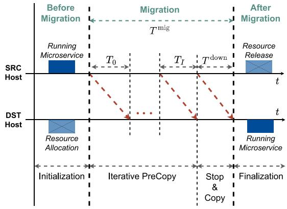  
Fig. 1. Live migration diagram under the Iterative PreCopy strategy.

## A. Stateful Container Migration

We consider MSs running on containers, whose internal state, i.e., CPU-context state, memory content, network sockets, and file descriptors, must be migrated. Since stateful migration involves transferring MS’s memory content, multiple strategies, namely, PreCopy, PostCopy, and HybridCopy, have been devised to minimize the time needed to perform such transfer by leveraging the MS dirty page rate concept, i.e., the number of memory pages the MS modifies per time unit. Since PostCopy and HybridCopy do not yet support container migration and are still at an early implementation stage [5], we focus on PreCopy. In particular, we tackle an extension of the PreCopy strategy, named Iterative PreCopy, which, to minimize the MS disruption time, transfers the dirty pages to the destination host iteratively while the MS is still running at the source and till the new user connection is established or a deadline is reached. As depicted in Fig. 1, this approach allows for the set-up of the destination host and for keeping it continuously up-to-date, before the final MS migration is executed. Such final procedure is known as Stop&Copy stage, during which the MS is stopped at the source host, and its state is transferred to the destination host where the service will eventually be resumed. After migration, the source host is notified about the successful restoration, and the resources reserved therein are released.

We remark that the duration of the Stop&Copy phase determines the service disruption experienced by the final user, which is commonly referred to as downtime $( T ^ { \mathrm { d o w n } } )$ . The total migration duration consists of the duration of both the Iterative PreCopy and the Stop&Copy stage, i.e.,

$$
T ^ {\mathrm{mig}} = \sum_ {i = 0} ^ {I} T _ {i} + T ^ {\mathrm{down}},\tag{1}
$$

where $T _ { i }$ is the generic iteration duration and I 1 indicates the number of iterations required for migration. Given that our study aims to characterize the migration cost for the network operator as well as the user’s QoE, we take both the overall migration duration and the downtime as migration KPIs.

Further, we write the amount of data to be transferred from source to destination host during the generic iteration i as:

$$
V _ {i} = \left\{ \begin{array}{l l} \rho (\tau_ {1} \cdot M + \varepsilon) & \text {if} i = 0 \\ \rho (\tau_ {2} \cdot N _ {i} \cdot \sigma + \varepsilon) & \text {if} i > 0 \end{array} \right.\tag{2}
$$

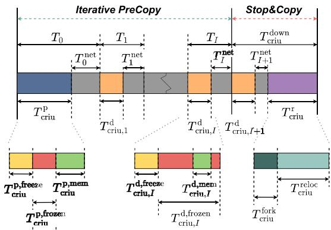  
Fig. 2. Live migration diagram: CRIU implementation.

where M is the MS state size, $N _ { i }$ is the number of dirty memory pages at iteration $i ,$ and $\sigma$ is the size of each page, which depends on the considered architecture and kernel settings. During the first iteration $( i = 0 )$ , the data volume consists of the whole memory content of the MS, while for i> , only the dirty memory pages, i.e., those that have been modified with respect to the previous iteration, are considered. Coefficients $\tau _ { 1 }$ and $\tau _ { 2 }$ account for the amount of transferred data, including the encapsulation overhead introduced by a migration tool (which, for any i> , depends upon the dirty page rate). Parameter $\rho$ accounts for data compression and is the ratio of the compressed data volume to the uncompressed one, while $\varepsilon$ is the additive volume contribution due to the CPU-context state and network socket state; being negligible, it will be omitted in the following.

## B. Migration Tool: CRIU

CRIU is considered the key tool to implement stateful migration. It defines: (i) a checkpoint procedure, which seizes a running process, collects its state, and encapsulates it into an image, and (ii) a restore procedure that leverages a previously created checkpoint image to create a process and resume its state at the destination host. To successfully retrieve the MS state, CRIU requires to temporarily freeze the MS at the source at every iteration during the Iterative PreCopy stage; this yields a service disruption period, named frozen time, that adds to the aforementioned downtime. Our aim is to characterize both such components that contribute to service disruption.

More specifically, CRIU provides two kinds of checkpoint procedures: predump and dump, corresponding to, respectively, the first and the generic iteration of the Iterative PreCopy. Dump leverages ptrace system call to inject CRIU’s parasite code into the running task and seize it (freezing period). During this inactivity period, CRIU extracts relevant memory pages, the content of CPU registers, the sockets currently being used, files currently open for I/O operations, and mount point-related information, and it eventually encapsulates them into a checkpoint image [6]. Thanks to the distinction between predump and dump, and the option for dirtiness tracking, CRIU allows for an effective implementation of the Iterative PreCopy migration.

Fig. 2 depicts the Iterative PreCopy and Stop&Copy phases from an implementation perspective, by leveraging CRIU functionalities. The predump duration, $T _ { \mathrm { c r i u } } ^ { \mathrm { p } } ,$ , consists of three major contributions: (i) the freezing time $\underbrace { T _ { \mathrm { c r i u } } ^ { \mathrm { p , f r e e z e } } } _ { \mathrm { c r i u } }$ , needed to seize a process, (ii) the frozen time $T _ { \mathrm { c r i u } } ^ { \mathrm { p , f r o z e n } }$ , during which the MS state and the memory pages to transfer are identified, and (iii) the memory time $\bar { T } _ { \mathrm { c r i u } } ^ { \mathrm { p , m e m } }$ , necessary to extract and encapsulate such memory pages. For the dump stage, instead, the memory time is already part of the frozen time $T _ { \mathrm { c r i u } , i } ^ { \mathrm { d , f r o z e n } }$ In summary, the predump and dump durations are given by:

$$
T _ {\mathrm{criu}} ^ {\mathrm{p}} = T _ {\mathrm{criu}} ^ {\mathrm{p,freeze}} + T _ {\mathrm{criu}} ^ {\mathrm{p,frozen}} + T _ {\mathrm{criu}} ^ {\mathrm{p,mem}}\tag{3}
$$

$$
T _ {\mathrm{criu}, i} ^ {\mathrm{d}} = T _ {\mathrm{criu}, i} ^ {\mathrm{d,freeze}} + T _ {\mathrm{criu}, i} ^ {\mathrm{d,frozen}}.\tag{4}
$$

Then, denoting with $T _ { i } ^ { \mathrm { n e t } }$ the time needed to transfer the dirty memory pages at each iteration and considering that the iterations in (1) correspond to a predump stage for $i = 0$ and to a generic dump iteration for $i { > } 0$ , we can write the iteration duration at CRIU layer, as:

$$
T _ {\mathrm{criu}, i} = \left\{ \begin{array}{l l} T _ {\mathrm{criu}} ^ {\mathrm{p}} + T _ {0} ^ {\mathrm{net}} & \text {if} i = 0 \\ T _ {\mathrm{criu}, i} ^ {\mathrm{d}} + T _ {i} ^ {\mathrm{net}} & \text {if} i > 0. \end{array} \right.\tag{5}
$$

Let $R _ { i }$ be the average MS dirty page rate at dump iteration $i ;$ the corresponding number of dirty memory pages then is:

$$
N _ {i} ^ {\mathrm{d}} = R _ {i - 1} \cdot \left(T _ {\mathrm{criu}, i - 1} - T _ {\mathrm{criu}, i - 1} ^ {\mathrm{x,frozen}}\right)\tag{6}
$$

where $T _ { \mathrm { c r i u } , i - 1 }$ is the duration of the previous iteration, and $T _ { \mathrm { c r i u } , i - 1 } ^ { \mathrm { x , f r o z e n } }$ is the corresponding frozen time.

Finally, Stop&Copy at the CRIU layer consists of (i) one last dump execution, which also stops the MS at the source host; (ii) the transfer of this final checkpoint image to the destination host, and (iii) the restoration of the MS state at the destination host. Thus, the overall downtime during Stop&Copy is:

$$
T _ {\mathrm{criu}} ^ {\mathrm{down}} = T _ {\mathrm{criu}, I + 1} ^ {\mathrm{d}} + T _ {I + 1} ^ {\mathrm{net}} + T _ {\mathrm{criu}} ^ {\mathrm{r}},\tag{7}
$$

where $T _ { \mathrm { c r i u } } ^ { \mathrm { r } }$ is the restore time during which CRIU forks a new process tree for the MS. Specifically, the restore time consists of relocating the MS state in terms of CPU state and memory content [6], i.e.,

$$
T _ {\mathrm{criu}} ^ {\mathrm{r}} = T _ {\mathrm{criu}} ^ {\mathrm{fork}} + T _ {\mathrm{criu}} ^ {\mathrm{reloc}}.\tag{8}
$$

C. Creation, Running, and Management of Containerized MSs

Besides CRIU, we leverage runC as container runtime and Podman as container engine.

runC [7] is an Open Container Initiative (OCI)-compliant container runtime at the basis of most container engines and orchestration systems, including Podman. One of the main perks of runC is its integration with CRIU. Although directly experimenting with runC is possible [8], [9], our aim is to analyze the migration duration and the downtime experienced at the MS layer. For this reason, our experimental setup takes a higher-layer perspective and focuses on the Podman container engine, to evaluate the performance of live migration in a realistic MS scenario.

Podman [10] is an open-source product, designed to develop, manage, and run containers and pods. It has been proposed by CRIU developers as a solid alternative to Docker, whose integration with CRIU is still at an experimental stage and almost deprecated. While Docker relies on a daemon as intermediate element to run containers, Podman directly leverages runC APIs, thus leading to better performance [11]. Also, Podman has been designed to organize containers in pods, allowing their definition to be exported into a Kubernetescompatible file. These features, along with the fact that it can be easily integrated with CRIU, strongly motivate the use of Podman as container engine. As for the migration latency, similarly to (5), we can write:

TABLE I NOTATION

<table><tr><td>Symbol</td><td>Unit</td><td>Meaning</td></tr><tr><td> $T^{mig}$ </td><td>ms</td><td>Total migration duration</td></tr><tr><td> $T_i$ </td><td>ms</td><td>Generic iteration duration</td></tr><tr><td> $T^{down}$ </td><td>ms</td><td>Stop&amp;Copy stage duration</td></tr><tr><td> $T^p, T^d, T^r$ </td><td>ms</td><td>Predump/dump/restore durations</td></tr><tr><td> $T^{freeze}, T^{frozen}, T^{mem}$ </td><td>ms</td><td>Freezing/frozen/memory times</td></tr><tr><td> $T^{fork}, T^{reloc}$ </td><td>ms</td><td>Forking/relocation times</td></tr><tr><td> $V_i$ </td><td>Bytes</td><td>Data volume to transfer</td></tr><tr><td> $N_i$ </td><td>-</td><td>Number of written memory pages</td></tr><tr><td> $T_i^{net}$ </td><td>ms</td><td>Network delay</td></tr><tr><td>M</td><td>Bytes</td><td>MS (memory) state size</td></tr><tr><td> $R_i$ </td><td> $s^{-1}$ </td><td>Dirty (memory) page rate</td></tr></table>

$$
T _ {\text { podman }, i} = \left\{ \begin{array}{l l} T _ {\text { podman }} ^ {\text { p }} + T _ {0} ^ {\text { net }} & \text { if } i = 0 \\ T _ {\text { podman }, i} ^ {\text { d }} + T _ {i} ^ {\text { net }} & \text { if } i > 0. \end{array} \right.\tag{9}
$$

Likewise, the downtime, corresponding to the Stop&Copy stage duration in (7), can be expressed at Podman layer as:

$$
T _ {\mathrm{podman}} ^ {\mathrm{down}} = T _ {\mathrm{podman}, I + 1} ^ {\mathrm{d}} + T _ {I + 1} ^ {\mathrm{net}} + T _ {\mathrm{podman}} ^ {\mathrm{r}}.\tag{10}
$$

As mentioned, our study also characterizes experimentally the processing time overhead introduced by runC and Podman, with respect to the underlying CRIU layer.

The main notation we used is summarized in Table I.

## D. End-to-End Data Connection Migration

Connection migration is a crucial issue whenever a data connection with the end user must be preserved during the migration of containerized MSs. While the migration process takes place in the network infrastructure that connects edge servers, we focus on preserving the network connection over the wireless link connecting the MS hosted at the edge and the mobile end user. Indeed, regardless of which transport layer protocol is adopted, multiple challenges related to connection migration still need to be properly addressed. Below, we focus on TCP as transport protocol, since it is the de-facto standard for legacy and modern edge applications [12], besides being the most challenging one due to its connection-oriented nature. Nevertheless, the considerations drawn in the following hold also for other transport protocols, such as UDP.

Notably, once a TCP connection is established, the protocol does not provide a way to modify or redirect such connection, unless through a complete re-connection procedure. To overcome this issue, a special option for the TCP socket has been introduced from Linux kernel version 3.5 onward, namely, TCP\_REPAIR [13]. When this option is used, the

TCP socket is switched into a special mode in which no native TCP action performed on the socket has any effect [14]. Importantly, to leverage such special mode, CRIU features the tcp-established option, which instructs CRIU to collect, along with the internal state of the container, the information related to the currently active TCP connection. This allows for a successful restoration of the TCP connection state during migration, with a probe packet being eventually sent to notify the other connection endpoint that the communication can be resumed. However, the TCP\_REPAIR option is not widely used, since the following conditions are required to attain a successful connection restoration: (i) address consistency, i.e., the MS container, when migrating from source to destination host, has to be assigned the same IP address, and (ii) network reachability, i.e., when moved to the destination host, the MS container must be able to directly reach the other end involved in the communication. In other words, the TCP\_REPAIR option only provides the possibility to freeze and collect the state of the TCP socket, but it does not tackle scenarios in which the IP address may change after migration. Moreover, to successfully resume the communication, the probe packet has to be correctly received at the destination, which is not trivial in the case of migration between distinct private networks.

Below, we address the above requirements by defining a proper logical overlay network in which traffic flows can be dynamically managed. To do so, we leverage Open vSwitch (OvS) [15], a multilayer virtual switch that provides two crucial functions: (i) overlay network creation, and (ii) network flow management. In fact, OvS creates overlay networks based on Virtual Extensible LAN (VXLAN) – a technique that encapsulates OSI layer 2 Ethernet frames within layer 4 UDP datagrams. Once the overlay network is established, the behavior of the virtual switches, e.g., forwarding rules, can be easily defined or changed through the OpenFlow protocol. It is worth remarking that our approach can cope with different communication technologies, both at the edge and over the wireless link.

## III. CONNECTION-AWARE MIGRATION OF STATEFUL MSS

This section presents COAT (Container OverlAy TCP), which migrates an MS container according to the Iterative PreCopy strategy, while preserving the associated end-toend data connection with the mobile end users. COAT encompasses both an effective, yet practical, network solution (Section III-A) and an enhanced stateful migration procedure (Section III-B), which, combined together, enable a connection-aware MS migration.

## A. The COAT Network Solution

The COAT network solution aims to support the simple, yet crucial, connection migration scenario depicted in Fig. 3. Therein, the mobile end device is a UAV, which connects to different base stations (BSs) as it moves across the network. Due to the UAV’s limited computational resources, some of its critical functions (e.g., flight control with collision avoidance algorithm) must be deployed at the edge in the form of MSs and connected to the UAV using the TCP protocol. We consider a service orchestrator at the edge that, to minimize the experienced latency, deploys such MSs on the nearest edge server, i.e., the one co-located with the BS the UAV is currently connected to. We thus consider stateful container migration (see Section II-A) as the key technology leveraged by the orchestrator, to address such mobility challenge and ensure continuous proximity of edge MSs with mobile end devices. As thoroughly discussed in Section II-D, the problem of migrating the established TCP connection along with the MS container is still to be properly addressed.

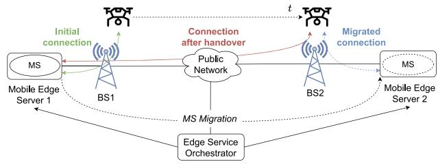  
Fig. 3. COAT migration scenario.

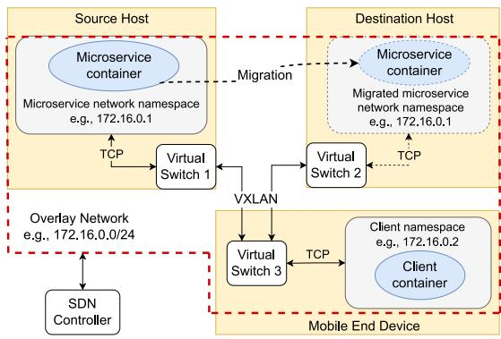  
Fig. 4. COAT network solution.

COAT supports connection migration and addresses the akin networking challenges by leveraging the tools introduced in Section II-D. Even if our solution can be applied to multiple transport layer protocols, in the following, we focus again on TCP, as it is the one that poses the major challenges in connection migration. The COAT network solution is depicted in Fig. 4, which includes three fundamental blocks: the source host, the destination host, and the mobile end device. Source and destination hosts run an MS, respectively, before and after the migration process. The mobile end device, instead, is the node hosting the containerized client application that generates requests to be served by the MS. The connectivity between the MS and the client container is enabled by an overlay network implemented using interconnected virtual switches and customized network namespaces, and operating under a generic software-defined network (SDN) controller.

Fig. 5 summarizes the interaction between the different system components. Specifically, by encompassing all the relevant aspects concerning user’s mobility, the edge service orchestrator is responsible for: (i) issuing the migration commands that have to be executed in the form of remote scripts by either the source or the destination edge host, and (ii) instructing the SDN controller on how to configure the overlay network. Importantly, we remark that the design and implementation of both the service orchestrator and the SDN controller are orthogonal to our work, as our solution is independent of the specific orchestration solution and SDN technology that are used.

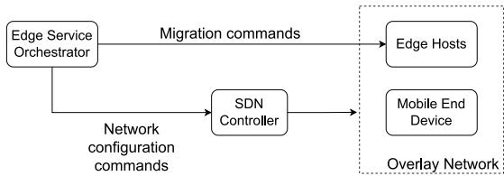  
Fig. 5. COAT control flow.

To effectively implement COAT, the SDN controller, by leveraging the features provided by OvS, firstly creates a virtual switch for each physical host and configures them to ensure their interconnection, thus defining the “backbone” of the overlay network. Secondly, the orchestrator creates two custom network namespaces, one for the MS at the source host and the other for the client container at the mobile end device. Both are then connected with the virtual switches, to complete the overlay network. Thirdly, the orchestrator deploys both the MS and the client, and binds them to their dedicated network namespaces, hence connecting them with the overlay network. Once this third step is completed, the MS and the client can communicate using the TCP protocol on top of the newly defined overlay network.

Note that, when an MS migration is performed, the TCP connection between the MS and the client is preserved by (i) leveraging the TCP\_REPAIR option to collect the connection state, and (ii) imposing an exact recreation of the MS namespace at the destination host, especially in terms of its IP address configuration. Thus, COAT effectively solves the network address consistency problem since, thanks to the overlay network, the same IP address can be easily replicated at the destination host. Further, since overlay networks enable the creation of a distributed network among multiple machines and to dynamically manage the traffic flows, direct reachability between the MS and the client is always guaranteed, even after the migration process is completed. However, to effectively integrate our solution with the traditional migration process (see Section II-A), additional operations are needed, which involve the creation and replication of customized network namespaces and the management of the flow control rules.

## B. The COAT Migration Procedure

To address the above issues, we introduce the COAT migration procedure, which includes an enhanced version of the Stop&Copy stage of the stateful container migration process. The steps of the COAT procedure are illustrated in Fig. 6 and detailed below.

Step 1: Checkpoint the running container at the source host using Podman with the tcp-established option. Both the MS state and the established TCP connection state are now dumped into the checkpoint image and the MS stops running.

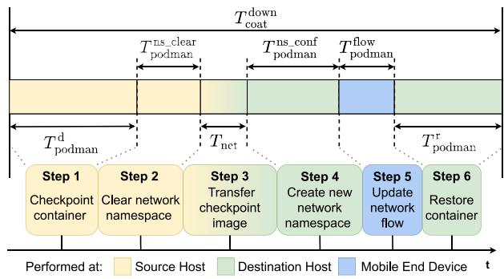  
Fig. 6. Enhanced Stop&Copy stage in the stateful MS migration procedure integrating the COAT network solution.

Step 2: Clear the network namespace, thus preventing network configuration conflicts in the following steps.

• Step 3: Transfer the checkpoint image from source to destination host.

Step 4: Re-create and configure the network namespace at the destination to match the original one, so that the later container restore procedure can successfully take place.

Step 5: Update the network flow of the TCP connection, i.e., the flow control rule in OvS. During the network namespace recreation, a new virtual network interface is generated, along with a new MAC address. The ARP table at the client host is then cleared, to ensure a successful ARP discovery process once the TCP connection is restored.

Step 6: Restore the container from the checkpoint image. The MS and its established TCP connection can resume from their previous working state.

Extending (10) with the additional time components related to COAT, the enhanced Stop&Copy stage duration at Podman layer can be rewritten as:

$$
T _ {\mathrm{coat}} ^ {\mathrm{down}} = T _ {\mathrm{podman}} ^ {\mathrm{down}} + T _ {\mathrm{podman}} ^ {\mathrm {ns\_clear}} + T _ {\mathrm{podman}} ^ {\mathrm {ns\_conf}} + T _ {\mathrm{podman}} ^ {\mathrm{flow}},\tag{11}
$$

where $T _ { \mathrm { p o d m a n } } ^ { \mathrm { d o w n } }$ is the downtime during the traditional Stop&Copy (encompassing Steps 1, 3, and 6), $T _ { \mathrm { p o d m a n } } ^ { \mathrm { n s \_ c l e a r } }$ is the time needed to clear the namespace at the source host (Step 2), $T _ { \mathrm { p o d m a n } } ^ { \mathrm { n s \_ c o n f } }$ is the time required to reconfigure the new namespace at the destination host (Step 4) and, finally, $T _ { \mathrm { p o d m a n } } ^ { \mathrm { f i o w } }$ is the time needed to update the network flow at the end device (Step 5).

Consequently, combining (1), (9), and (11), the total duration of the COAT migration procedure is given by:

$$
T _ {\mathrm{coat}} ^ {\mathrm{mig}} = \sum_ {i = 0} ^ {I} T _ {\mathrm{podman}, i} + T _ {\mathrm{coat}} ^ {\mathrm{down}}.\tag{12}
$$

To summarize, COAT makes it possible to define an enhanced stateful container migration procedure to effectively support MSs that rely on an already established end-to-end data connection. In particular, the proposed network solution (i) allows for the migration of the connection state, thus avoiding any reconnection procedure, (ii) preserves all the data queued inside the network socket, hence avoiding packet loss, and, (iii) does not require any modification at either the server or the client application to support a stateful migration.

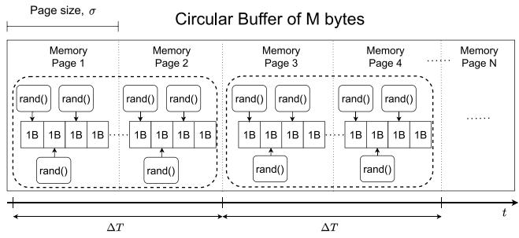  
Fig. 7. An example of how DPRGen works, with R = 2 pages/s and $\Delta T { = } 1 \mathrm { s } ,$ yielding $N _ { R } { = } 2 .$

With the aim to develop an analytical model that effectively characterizes the fundamental migration KPIs, below we perform a thorough experimental analysis of both COAT and the traditional stateful migration based on Iterative PreCopy.

## IV. COAT TESTBED AND EXPERIMENTAL SETTINGS

We now describe our testbed for the analysis of containerized MSs migration. While the testbed exploits CRIU, runC, and Podman, introduced in Sections II-B–II-C, here we present the testing software we developed to finely control our experiments (Section IV-A) and the settings we used (Section IV-B).

## A. Dirty Page Rate Generator

To run extensive, yet controlled, experiments, we developed a testing software, named Dirty Page Rate Generator (DPRGen), which mimics an actual MS with memory allocation and dirty page rate that can be finely controlled. DPRGen implements the MS state as a circular buffer of size M bytes whose content is continuously, yet properly, updated to achieve a given value of dirty page rate R.

We recall that CRIU identifies the memory pages that have been changed in the MS state with respect to the previous predump/dump checkpoint image. Thus, to achieve a target value of dirty page rate R, DPRGen sequentially selects $N _ { R } { = } R \cdot \Delta T$ pages over an arbitrary time interval $\Delta T$ , and, in each of them, modifies some bytes by replacing them with random values. Fig. 7 shows an example in which $\Delta T { = } 1 { \mathrm { s } }$ and the target dirty page rate is $R = 2$ pages/s, thus leading to $N _ { R } { = } 2 \mathrm { p a g e s }$ . Note that, within $\Delta T .$ , in each page bytes are modified continuously, to ensure that CRIU detects that the page has been changed. Indeed, predump and dump stages are performed just once within $\Delta T _ { \mathrm { { \cdot } } }$ , in an asynchronous way with respect to memory changes. Importantly, DPRGen can yield any discrete value of target dirty page rate, ranging from $R _ { \mathrm { m i n } } = 1 \mathrm { p a g e } / \Delta T \mathrm { t o } R _ { \mathrm { m a x } } = \lfloor M / \sigma \rfloor / \Delta T$ , with $\lfloor M / \sigma \rfloor$ =1 page Δ = Δbeing the total number of memory pages allocated in the memory.

We implemented DPRGen in C language, using malloc to allocate the circular buffer. To run the experiments presented in the following section, we considered a scratch container image and containerized DPRGen by encapsulating it along with its library dependencies. So doing, we obtain a synthetic

MS whose behavior in terms of memory allocation and dirty page rate can be finely controlled.1

## B. Testbed and Experimental Settings

We use a cloud computing architecture featuring Intel Xeon Skylake CPU and instantiate three identical virtual machines (VMs). VM1 and VM2 represent two edge servers, acting, respectively, as source and destination of the migration process. Further, as part of our COAT solution (Section III-A), VM3 acts as end device that interacts with the edge servers. The three VMs, with Ubuntu 20.4 LTS as operating system,2 are assigned 4 vCPUs and 16 GB of RAM each.

For any of the MSs that we consider in our experiments, we initialize their state to random values to maximize entropy and, hence, avoid compression during the MS state transfer from source to destination host. Also, we set the size of each memory page to $\sigma { = } 4 , 0 9 6 \mathbf { B }$ . To obtain the statistics characterizing the system behavior, we leverage the Podman print-stats command, which collects information on how long each stage of the checkpointing/restoring process takes to be completed. Such statistics can be classified into three groups, depending upon the actual tool responsible for the performance collection: Podman, runC, and CRIU, operating on engine, runtime, and process layer, respectively. The results shown in the following were obtained by averaging over 200 runs and computing the 90% confidence interval.

## V. EXPERIMENTAL ANALYSIS

We use our testbed to experimentally characterize the different stages of a stateful MS migration under the Iterative PreCopy strategy and the COAT migration process. Specifically, we focus on the duration of the predump, dump, and restore phases, and their internal components, accounting for the Podman and runC layers overhead, the impact of parasite-code injection and processing operations in memory, and the effectiveness of the memory-change tracking system.

Our analysis leverages the DPRGen tool we developed (see Section IV-A), to create two different scenarios, namely, with minimum dirty page rate $( R _ { i } { = } R _ { \mathrm { m i n } } , \forall i )$ and maximum dirty page rate $( R _ { i } { = } R _ { \mathrm { m a x } } , \forall i )$ , representing, respectively, the best and the worst-case scenario.

Predump, dump, and restore duration: To characterize the migration duration and the experienced downtime, we first analyze the duration of predump, dump, and restore, at Podman layer, as functions of the MS state size, for the maximum and minimum dirty page rate. It is interesting to observe that, as shown in Fig. 8, in almost all cases these phases exhibit an increasing duration, and their dependency on the state size can be well approximated by a linear relation. The only exception is represented by the duration of the dump phase at $R _ { \mathrm { m i n } } ,$ , which remains constant as the state size grows.

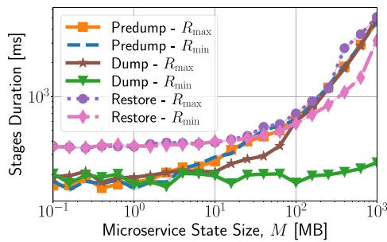  
Fig. 8. Predump, dump, and restore duration at Podman layer vs. the MS state size, for maximum and minimum dirty page rate.

Indeed, given the low value set for $R _ { \mathrm { m i n } }$ once the initial MS state is migrated, no significant additional state has to be transferred towards the destination in the subsequent dump phase. This leads to an increasing gap between the dump duration under $R _ { \mathrm { m i n } }$ and $R _ { \mathrm { m a x } }$ , which grows up to one order of magnitude. A similar gap can be observed between the restore duration at $R _ { \mathrm { m i n } }$ and at $R _ { \mathrm { m a x } } ,$ , due to a double fullsized checkpoint image processing, namely, the predump and the dump ones, which occurs at $R _ { \mathrm { m a x } }$

Next, to assess the processing time overhead introduced by runC and Podman with respect to the underlying CRIU layer, Fig. 9 compares the predump, dump, and restore duration at Podman and runC layers, and at runC and CRIU layer. For both predump and dump, such ratios are approximately constant as the state size varies. On the contrary, during restore, the Podman to runC time ratio increases abruptly for an MS state size greater than 100 MB, while the runC to CRIU ratio linearly decreases. However, as shown in the following, this effect, due to memory processing overloading the system, has no significant impact, and considering such ratio as constant still provides an accurate estimation of the migration latency components. In summary, the following holds:

Observation 1 (Linear Dependency and Layer Overhead): The behavior of the predump, dump, and restore duration are well approximated by a linear relation with respect to the MS state size, regardless of the value of dirty page rate. Moreover, the processing time overhead introduced by Podman and runC can be accounted for through multiplicative constants.

Checkpoint mechanism: Fig. 10 depicts the behavior of the time components appearing in (3) and (4). Specifically, Figures 10(left) and 10(center) present the freezing and frozen durations as functions of the MS state size in the predump and dump phases. Interestingly, for any phase and value of dirty page rate, the freezing time is always equal to 100 ms. As mentioned in Section II-B, this is because the predump and dump procedures currently use the same technique for process freezing (e.g., parasite code injection).

Observation 2 (Impact of the Parasite Code Injection on the Freezing Time): For any MS state size and migration phase, a constant processing time overhead is experienced when seizing a process that runs in a container.

Conversely, the frozen time exhibits a more complex behavior. At predump, it is practically independent of the dirty page rate, since the predump stage does not cope with the dirtiness produced by the MS. At dump, instead, a linear dependency on the state size emerges. Also, the gap between the behavior at $R _ { \mathrm { m a x } }$ and at $R _ { \mathrm { m i n } }$ is negligible for values of MS state size lower than 10 MB, but it then grows over one order of magnitude. This is due to the amount of memory pages to be extracted, which is minimum at $R _ { \mathrm { m i n } }$ , while it equals the whole MS state size at $R _ { \mathrm { m a x } }$ , thus requiring a higher processing time. Further, a significant difference can be observed when comparing the frozen time for predump to that for dump operations at $R _ { \mathrm { m a x } }$ (blue and orange curves in Fig. 10(center)). The reason is that the predump procedure (see Section II-B) has been designed to minimize the frozen time by performing memory copy after a process is resumed. During dump, instead, the process is resumed only after both the memory content and the system context state have been successfully retrieved and stored in the checkpoint image.

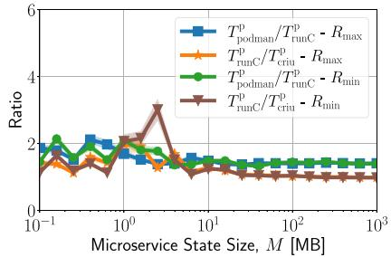  
(a) Predump

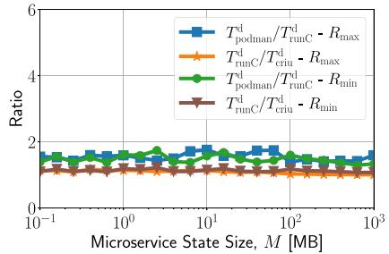  
(b) Dump

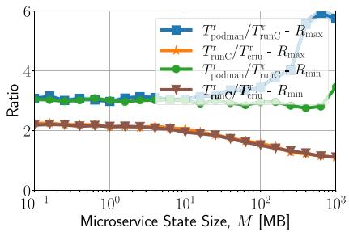  
(c) Restore

Fig. 9. Duration of the different migration phases at Podman, runC, and CRIU layer.  
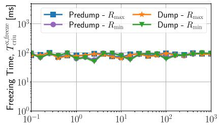  
Microservice State Size, M [MB]

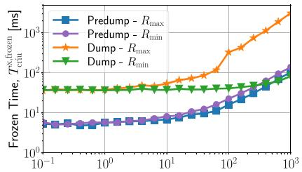  
Microservice State Size, M [MB]

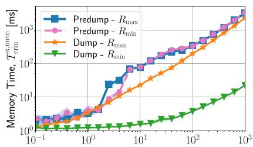  
Microservice State Size, M [MB]  
Fig. 10. Checkpoint time contributions at CRIU layer, namely, freezing time (left), frozen time (center), and memory time (right).

Observation 3 (Frozen Time During Checkpoint): The frozen time at predump is substantially shorter than at dump, with the value of the latter depending upon the dirty page rate. For both predump and dump, the frozen time exhibits a linear relationship with respect to the MS state size.

Next, Fig. 10(right) depicts the total contribution due to memory processing operations, as the state size varies, for both the predump and the dump phase. Firstly, it can be seen that at predump, the memory time is practically independent of the dirty page rate. Since predump performs a full memory copy regardless of the MS dirtiness, the amount of memory pages that must be extracted and copied is identical for $R _ { \mathrm { m i n } }$ and $R _ { \mathrm { m a x } }$ . Secondly, under $R _ { \mathrm { m a x } } ,$ predump and dump achieve identical performance. Indeed, for $R _ { \mathrm { m a x } }$ , the amount of memory pages that must be extracted and copied into a checkpoint image corresponds to the whole state size, hence no significant difference is observed between predump and dump in terms of memory processing.

Observation 4 (Impact of Memory Operations): The processing contribution to the predump/dump duration due to memory operations exhibits a linear dependency on the state size, whereas it depends on the dirty page rate only at dump. Also, under $R _ { \mathrm { m a x } } ,$ predump and dump show identical performance.

We then notice that, in a dump iteration, the memory time under $R _ { \mathrm { m i n } }$ and $R _ { \mathrm { m a x } }$ differs by up to two orders of magnitude. As mentioned, such gap is due to the dirtiness tracking mechanism (see Section II-B), i.e., the fact that at $R _ { \mathrm { m i n } }$ only a minimum amount of dirty pages is extracted and copied into the checkpoint image. To further highlight the effectiveness of the dirtiness tracking mechanism, Figures 11(a) and 11(b) present the total size of the pages that, after being scanned, are actually copied into the checkpoint image, and of those that are restored at the destination host.

Some relevant findings can be highlighted: (i) at predump, when a full memory copy is expected, the value of copied pages is lower than the reported memory usage, suggesting that CRIU recognizes and selects only meaningful pages; (ii) some overhead (additional memory pages) with respect to the actual state size is generated, due to page granularity and the way the operative system manages dynamic memory allocation; (iii) at dump, for $R _ { \mathrm { m i n } }$ and, especially, $R _ { \mathrm { m a x } }$ , the amount of copied pages closely approaches the state size, i.e., the overhead becomes negligible; (iv) the amount of pages written at dump for $R _ { \mathrm { m i n } }$ is extremely low and independent of the memory allocation, thus suggesting that the dirtiness tracking mechanism is working effectively, extracting the minimum amount of memory pages possible. We can therefore conclude the following:

Observation 5 (Effectiveness of the Memory Changes Tracking System): The amount of memory pages copied into the checkpoint image exhibits a linear dependency on the

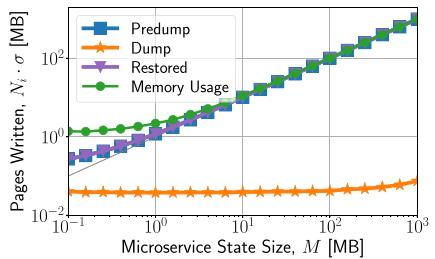  
(a) Pages Written - $R _ { \mathrm { m i n } }$

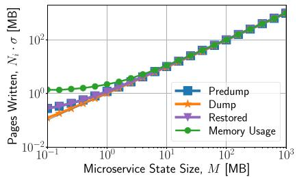  
(b) Pages Written - $R _ { \mathrm { m a x } }$

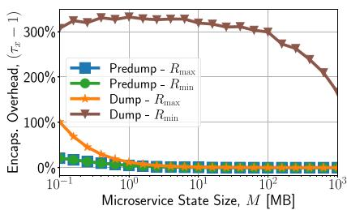  
(c) Encapsulation overhead

Fig. 11. Amount of memory pages written by CRIU in the final checkpoint image, for both $R _ { \mathrm { m i n } }$ (a) and $R _ { \mathrm { m a x } }$ (b) dirty page rate scenarios, along wit the overhead introduced by page encapsulation (c).  
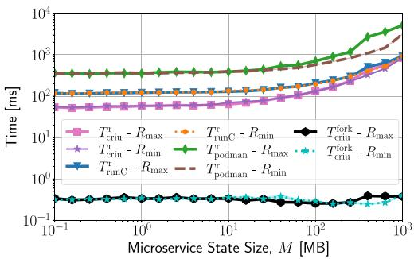  
Fig. 12. Restore operations time at CRIU, runC, and Podman layer.

MS state size. Moreover, during dump, such amount closely approaches the state size at $R _ { \mathrm { m a x } } .$ , while it is constant for $R _ { \mathrm { m i n } } .$ , and for small values of state size regardless of R.

Consistently with the intuition, the amount of pages restored is identical to that of pages copied during predump. This confirms that the MS state is successfully restored at the destination host, with no evident differences in the memory content with respect to the original instance.

Finally, Fig. 11(c) presents the encapsulation overhead that CRIU introduces after it extracts the relevant memory pages and copies them into the checkpoint image (see (2)). Importantly, such overhead is negligible at predump and it is independent of the dirty page rate. This is consistent with the fact that, regardless of the MS dirtiness, a number of memory pages corresponding to the whole state size are extracted at predump. On the contrary, in the dump phase, the encapsulation overhead strongly depends on the value of state size and dirty page rate. Thus, the following holds:

Observation 6 (Encapsulation Overhead): The memory page encapsulation overhead can be considered as constant at predump. On the contrary, at dump, it strongly depends on both state size and dirty page rate.

Restore mechanism: We now investigate the CRIU time performance in the restore phase, during which Podman uses the checkpoint image created during the Iterative PreCopy phase to instantiate a new container at the destination host and restore the previously acquired MS state. Fig. 12 presents the restore duration at the destination (see (8)), and assesses how relevant the forking time is to the restore time. As expected, both metrics can be considered to be independent of the dirty page rate, since the restore procedure does not address MS dirtiness, rather it simply relies on the previously created checkpoint images. Further, the forking time is also independent of the state size, and it is shorter than the restore time by at least two orders of magnitude. This is something expected because the forking time is only related to the capability of the operating system to start a new blank process, which depends on neither the MS nor its state.

TABLE II  
DURATION OF THE COAT MIGRATION STEPS (AVERAGE AND 90% CONFIDENCE INTERVAL)

<table><tr><td>Duration</td><td>Average Value</td><td>90% C.I.</td></tr><tr><td> $T_{podman}^{ns\_clear}$ </td><td>69 ms</td><td>[61.4, 76.6] ms</td></tr><tr><td> $T_{podman}^{ns\_conf}$ </td><td>101 ms</td><td>[98.3, 103.5] ms</td></tr><tr><td> $T_{podman}^{flow}$ </td><td>71 ms</td><td>[67.0, 74.2] ms</td></tr></table>

Observation 7 (Restore and Forking Times): Forking time is negligible when compared to the total restore duration.

Looking at the restore time, two interesting behaviors can be identified: (i) the restore duration at every layer, i.e., CRIU, runC and Podman, has the same linear trend with respect to the state size, and the mutual ratio of such durations is practically constant, as already discussed in Observation 1, (ii) the restore duration is essentially constant for any value of state size below 50 MB. This is due to the fact that, up to such state size value, the time needed to copy the checkpoint image content to the destination host memory space is dominated by the processing time required to first instantiate the MS and then restore its state and context.

Observation 8 (Impact of Restore Duration): The restore procedure is an intensive task that causes service disruption. Its duration linearly depends on the MS state size, while it is independent of the dirty page rate.

COAT migration: We now investigate the duration of the COAT migration procedure. We focus on the additional steps we defined to integrate the COAT network solution in the traditional Stop&Copy procedure, i.e., clear network namespace (Step 2), reconfigure network namespace (Step 4), and update network flow (Step 6), and we report in Table II the duration of such steps that we experimentally measured. Note that such duration values are independent of the considered MS, but they are affected by the number of established connections and the amount of data queued in the network sockets. Since we aim to characterize the stateful migration KPIs as functions of the state size and the dirty page rate, we considered a single connection scenario featuring negligible data queued in the network socket. From the obtained results, the following can be inferred:

Observation 9 (COAT Steps Duration): Regardless of the MS state size and dirty page rate, the steps introduced by the COAT solution for seamless connection migration imply limited additional overhead, roughly amounting to 240 ms.

## VI. PROCESSING-AWARE MIGRATION MODEL

We now leverage our experimental observations to model the duration of stateful container migration. The PAM model we obtain characterizes the checkpoint and restore duration (Sections VI-A–VI-B), and then provides an analytical expression for the migration KPIs (Section VI-C). Importantly, the PAM model holds for both the traditional stateful migration process and our COAT migration procedure.

## A. Checkpoint Duration

Observation 1 suggests that the overhead introduced by Podman with respect to the underlying runC and CRIU layers can be approximated through multiplicative constant factors, which we denote with α1 and α2 (resp.). Combining this observation with (3) and (4), we get:

$$
T _ {\text { podman }} ^ {\mathrm{p}} = \alpha_ {1} \alpha_ {2} \cdot \left(T _ {\text { criu }} ^ {\mathrm{p,freeze}} + T _ {\text { criu }} ^ {\mathrm{p,frozen}} + T _ {\text { criu }} ^ {\mathrm{p,mem}}\right)\tag{13}
$$

$$
T _ {\mathrm{podman}, i} ^ {\mathrm{d}} = \alpha_ {1} \alpha_ {2} \cdot \Big (T _ {\mathrm{criu}, i} ^ {\mathrm{d,freeze}} + T _ {\mathrm{criu}, i} ^ {\mathrm{d,frozen}} \Big).\tag{14}
$$

Looking at the CRIU level, for any MS state size and dirty page rate, process freezing at predump and at any dump iteration i implies a constant processing time overhead (Observation 2), i.e.,

$$
T _ {\mathrm{criu}} ^ {\mathrm{p,freeze}} = \beta ; T _ {\mathrm{criu}, i} ^ {\mathrm{d,freeze}} = T _ {\mathrm{criu}} ^ {\mathrm{freeze}} = \beta \forall i\tag{15}
$$

where $\beta$ is a constant. Also, Observation 3 provides experimental evidence that the frozen time has a linear relationship with the MS state size M, and such time component depends upon both the dirty page rate and the migration phase. Thus,

$$
T _ {\mathrm{criu}} ^ {\mathrm{p,frozen}} (M) = \varphi^ {\mathrm{p}} + \gamma^ {\mathrm{p}} \cdot M\tag{16}
$$

$$
T _ {\mathrm{criu}, i} ^ {\mathrm{d,frozen}} (M, R _ {i}) = \varphi^ {\mathrm{d}} + \gamma^ {\mathrm{d}} (R _ {i}) \cdot M\tag{17}
$$

$$
\gamma^ {\mathrm{p}} = \Gamma \cdot \zeta , \qquad \gamma^ {\mathrm{d}} = \Gamma \cdot \xi (R _ {i}).\tag{18}
$$

Note that the $\varphi ^ { \mathrm { p } }$ and $\varphi ^ { \mathrm { d } }$ constants act as lower bounds on the frozen time and that, according to the specific implementation of the CRIU algorithms, there may be additional contributions that depend on the state size. Specifically, $\gamma ^ { \mathrm { p } }$ and $\gamma ^ { \mathrm { d } }$ are sensitivity factors that relate the processing time to memory allocation; they consist of a constant scaled by parameters ζ and ξ (resp.), with the latter depending on the dirty page rate.

Next, as per Observation 4, the processing time due to memory operations, i.e., page selection and extraction, linearly depends upon M. Thus, we can write:

$$
T _ {\mathrm{criu}} ^ {\mathrm{p}, \mathrm{mem}} (M) = \delta + \Lambda \cdot M\tag{19}
$$

$$
T _ {\mathrm{criu}, i} ^ {\mathrm{d,mem}} (M, R _ {i}) = \delta + \Lambda \cdot \eta (R _ {i}) \cdot M\tag{20}
$$

$$
0 <   \eta (R _ {i}) \leq 1\tag{21}
$$

where δ and are constant, while $\eta ( R _ { i } )$ , as per Observation 4, models the impact of the dirtiness tracking system adopted in a dump iteration and its relationship with $R _ { i }$

According to the experimental behavior described by Observation 5, the number of memory pages copied into the checkpoint image linearly depends upon the MS state size:

$$
N ^ {\mathrm{p}} (M) = \mu^ {\mathrm{p}} + \nu^ {\mathrm{p}} \cdot M\tag{22}
$$

$$
N _ {i} ^ {\mathrm{d}} (M, R _ {i - 1}) = \mu^ {\mathrm{d}} + \nu^ {\mathrm{d}} (R _ {i - 1}) \cdot M\tag{23}
$$

where $\mu ^ { \mathrm { p } }$ and $\mu ^ { \mathrm { d } }$ , and slopes $\nu ^ { \mathrm { p } }$ and $\nu ^ { \mathrm { d } }$ , describe, respectively, the minimum number of pages extracted and the overhead with respect to the actual MS state size.

In addition, consistently with Observation 6, the amount of data to be transmitted from source to destination host at predump stage i is independent of the dirty page rate. ( =0)We thus enhance (2) by writing:

$$
V _ {0} (M) = \rho (\tau_ {1} (M) \cdot N ^ {\mathrm{p}} (M) \cdot \sigma + \varepsilon).\tag{24}
$$

Instead, for a generic dump iteration $( i \geq I )$ , such data volume depends upon both state size and dirty page rate:

$$
V _ {i} (M, R _ {i - 1}) = \rho \left(\tau_ {2} (M, R _ {i - 1}) \cdot N _ {i} ^ {\mathrm{d}} (M, R _ {i - 1}) \cdot \sigma + \varepsilon\right).\tag{25}
$$

All parameters in (24)–(25) have been introduced in Section II. Finally, we write the time needed to transfer $V _ { i }$ data over a link of capacity L as $T _ { i } ^ { \mathrm { n e t } } { = } V _ { i } / L$ . Although more complex models could be considered, we found that such an expression gives already a good approximation of the system realworld behavior, as shown by the excellent match between the analytical and experimental results presented in Section VII.

## B. Restore Duration

To model the restoration of the MS state at the destination host, we leverage the experimental evidence in Observation 1, which, similarly to what has been shown for the predump and dump phases, relates the restoration time to the duration at the runC layer, and the latter to the restore duration at the CRIU layer, through constant values (below denoted with $\alpha _ { 3 }$ and $\alpha _ { 4 } ,$ resp.).

Furthermore, considering (8), the restore duration at CRIU layer is due to the forking time and the context relocation time. Since the forking time can be neglected (as per Observation 7) and the context relocation time linearly depends upon M (as per Observation 8), we have:

$$
T _ {\mathrm{podman}} ^ {\mathrm{r}} \approx \alpha_ {3} \alpha_ {4} T _ {\mathrm{criu}} ^ {\mathrm{reloc}} = \alpha_ {3} \alpha_ {4} (\psi + \omega \cdot M).\tag{26}
$$

In (26), ψ denotes the minimum time needed to complete a restore procedure, regardless of the value of M, while ω models the impact of the state size on the total restore duration.

## C. Migration KPIs

We now derive the PAM model for the fundamental migration KPIs. Combining (9), (13), (14), and (15), the duration of the Iterative PreCopy stage at Podman layer, for iterations 0 and $i { > } 0 .$ , can be written as:

$$
T _ {0} = \alpha_ {1} \alpha_ {2} \cdot \left(T _ {\text { criu }} ^ {\text { freeze }} + T _ {\text { criu }} ^ {\text { p,frozen }} + T _ {\text { criu }} ^ {\text { p,mem }}\right) + T _ {0} ^ {\text { net }}\tag{27}
$$

$$
T _ {i} = \alpha_ {1} \alpha_ {2} \cdot \left(T _ {\mathrm{criu}} ^ {\mathrm{freeze}} + T _ {\mathrm{criu}, i} ^ {\mathrm{d,frozen}}\right) + T _ {i} ^ {\mathrm{net}}.\tag{28}
$$

Then, using (10), (14), and (26), the downtime, at Podman layer and according to the traditional stateful migration procedure, is given by:

$$
\begin{array}{r} T ^ {\mathrm{down}} = \alpha_ {1} \alpha_ {2} \cdot \left(T _ {\mathrm{criu}} ^ {\mathrm{freeze}} + T _ {\mathrm{criu}, I + 1} ^ {\mathrm{d,frozen}}\right) \\ + T _ {I + 1} ^ {\mathrm{net}} + \alpha_ {3} \alpha_ {4} T _ {\mathrm{criu}} ^ {\mathrm{reloc}}. \end{array}\tag{29}
$$

Next, let us focus on the worst case, i.e., let $R _ { i }$ take always the value of maximum dirty page rate of the considered MS, denoted with R . We underline that, so doing, we obtain an upper bound to the migration and downtime duration, and that in this case the duration of any dump iteration and of the data transfer time become constant, thus allowing us to drop subscript i from the corresponding notation. Then, combining (1), (27), (28), and (29), we obtain the total duration of the traditional migration procedure, as:

$$
\begin{array}{c} T ^ {\mathrm{mig}} = \alpha_ {1} \alpha_ {2} \Big (T _ {\mathrm{criu}} ^ {\mathrm{freeze}} + T _ {\mathrm{criu}} ^ {\mathrm{p,frozen}} + T _ {\mathrm{criu}} ^ {\mathrm{p,mem}} \Big) + T _ {0} ^ {\mathrm{net}} + (I + 1) \\ \cdot \Big (\alpha_ {1} \alpha_ {2} \cdot \Big (T _ {\mathrm{criu}} ^ {\mathrm{freeze}} + T _ {\mathrm{criu}} ^ {\mathrm{d,frozen}} \Big) + T ^ {\mathrm{net}} \Big) + \alpha_ {3} \alpha_ {4} T _ {\mathrm{criu}} ^ {\mathrm{reloc}}. \end{array}\tag{30}
$$

With regard to COAT, according to Observation 9, three additional components contribute to the downtime duration. Notably, they are independent of the MS state size and the dirty page rate. Hence, combining (11) and (29), the COAT migration procedure downtime is:

$$
\begin{array}{r} T _ {\mathrm{coat}} ^ {\mathrm{down}} = \alpha_ {1} \alpha_ {2} \cdot \left(T _ {\mathrm{criu}} ^ {\mathrm{freeze}} + T _ {\mathrm{criu}} ^ {\mathrm{d,frozen}}\right) + T ^ {\mathrm{net}} + \\ \alpha_ {3} \alpha_ {4} T _ {\mathrm{criu}} ^ {\mathrm{reloc}} + T _ {\mathrm{podman}} ^ {\mathrm {ns\_clear}} + T _ {\mathrm{podman}} ^ {\mathrm {ns\_conf}} + T _ {\mathrm{podman}} ^ {\mathrm{flow}}. \end{array}\tag{31}
$$

Similarly, using (12), (27), (28), and (31), the total migration duration under the COAT procedure is given by:

$$
\begin{array}{r l} & T _ {\mathrm{coat}} ^ {\mathrm{mig}} = \alpha_ {1} \alpha_ {2} \cdot \left(T _ {\mathrm{criu}} ^ {\mathrm{freeze}} + T _ {\mathrm{criu}} ^ {\mathrm{p,frozen}} + T _ {\mathrm{criu}} ^ {\mathrm{p,mem}}\right) + T _ {0} ^ {\mathrm{net}} \\ & \qquad + (I + 1) \cdot \left(\alpha_ {1} \alpha_ {2} \cdot \left(T _ {\mathrm{criu}} ^ {\mathrm{freeze}} + T _ {\mathrm{criu}} ^ {\mathrm{d,frozen}}\right) + T ^ {\mathrm{net}}\right) \\ & \qquad + \alpha_ {3} \alpha_ {4} T _ {\mathrm{criu}} ^ {\mathrm{reloc}} + T _ {\mathrm{podman}} ^ {\mathrm {ns\_clear}} + T _ {\mathrm{podman}} ^ {\mathrm {ns\_conf}} + T _ {\mathrm{podman}} ^ {\mathrm{flow}}. \end{array}\tag{32}
$$

We underline that the parameters appearing in PAM can be easily estimated for any scenario at hand, using DPRGen (Section IV-A) and the Podman native feature for statistics collection (Section IV-B). Table III presents the model parameter values measured through our testbed for $\scriptstyle \hat { R } = R _ { \mathrm { m i n } }$ and $\scriptstyle { \hat { R } } = R _ { \mathrm { m a x } } .$

## VII. MODEL VALIDATION

We now validate the PAM model using popular, real-world MSs, namely, MQTT Broker and Memcached. As shown below, our results demonstrate that PAM accurately describes the COAT migration performance and remarkably outperforms the state-of-the-art model in [4].

## A. Microservices Setup

MQTT [16] is a publish/subscribe protocol, commonly used for IoT applications, which involves three main logical entities: broker, publisher, and subscriber. An MQTT broker is an MS that receives publishers’ messages and distributes them among subscribers according to topic structures. In a mobile scenario in which both publishers and subscribers may dynamically change their location, the MQTT broker stateful migration can help minimize communication latency. Even more importantly, since the MQTT broker manages the connections between the system entities and stores in its internal queue the messages that have to be delivered, a stateful approach is fundamental to prevent information loss during migration.

EXPERIMENTAL PARAMETER SETTINGS IN THE PAM MODEL (WHEN TWO VALUES ARE SHOWN, THEY REFER TO $\scriptstyle { \hat { R } } = R _ { \mathrm { m i n } }$ AND Rˆ =Rmax (RESP.))  
TABLE III

<table><tr><td>Parameter</td><td>Value</td><td>Parameter</td><td>Value</td></tr><tr><td> $\alpha_1$ </td><td>1.6</td><td> $\alpha_2$ </td><td>1.2</td></tr><tr><td> $\alpha_3$ </td><td>3.3</td><td> $\alpha_4$ </td><td>1.9</td></tr><tr><td> $\sigma$ </td><td>4096 B</td><td> $\beta$ </td><td>84 ms</td></tr><tr><td> $\varphi^{\text{p}}$ </td><td>6.0 ms</td><td> $\varphi^{\text{d}}$ </td><td>40 ms</td></tr><tr><td> $\zeta$ </td><td>1.0</td><td> $\xi(R_{\text{min}}), \xi(R_{\text{max}})$ </td><td>0, 30</td></tr><tr><td> $\delta$ </td><td>1.8 ms</td><td> $\Lambda$ </td><td> $3 \cdot 10^{-6}$  ms/B</td></tr><tr><td> $\Gamma$ </td><td> $10^{-7}$  ms/B</td><td> $\eta(R_{\text{min}}), \eta(R_{\text{max}})$ </td><td>0.0075, 0.75</td></tr><tr><td> $\tau_1$ </td><td>1.0</td><td> $\tau_2(R_{\text{min}}), \tau_2(R_{\text{max}})$ </td><td>4.0,  $\tau_1$ </td></tr><tr><td> $\mu^{\text{p}}$ </td><td>45</td><td> $\mu^{\text{d}}$ </td><td>10</td></tr><tr><td> $\nu^{\text{p}}$ </td><td> $2.5 \cdot 10^{-4}$  1/B</td><td> $\nu^{\text{d}}(R_{\text{min}}), \nu^{\text{d}}(R_{\text{max}})$ </td><td>0,  $\nu^{\text{p}}$ </td></tr><tr><td> $\psi$ </td><td>60 ms</td><td> $\omega$ </td><td> $8 \cdot 10^{-7}$  ms/B</td></tr></table>

Memcached [17] is an in-memory, key-value store intended as user-defined, high-performance caching system. Besides speeding up applications by alleviating the load on the database, it is widely exploited to define distributed virtual pools of memory. Due to its memory-related nature, Memcached migration must be stateful to prevent information loss.

To thoroughly evaluate the migration performance, we define a validation setup that allows for a fine tuning of the MS state size and dirty page rate. While for Memcached this can be easily attained by leveraging its Python APIs and arbitrarily setting key-value pairs, an ad-hoc method needs to be envisioned for the MQTT broker. Our strategy to achieve precise and stable control of the MQTT state size consists in controlling the broker’s memory usage by maintaining the number of queued messages constant. To this end, in-flight messages (i.e., the messages yet to be delivered) have to be kept in the broker’s queue. This is done by making both publisher and subscriber ask for a reliable QoS level (i.e., level $^ { 2 ) , }$ which guarantees that in-flight messages are not discarded from the queue so as to enable re-transmissions. Additionally, we control the transmission time of the messages to slow down their delivery and keep them in the queue for a given time. To do so, we set the bandwidth of the broker network interface using Linux tool tc. Similarly, the dirty page rate is controlled by replacing the messages in the broker’s queue at a frequency that matches the desired value of dirty page rate.

## B. Experimental Results

Through the above setup, we validate our PAM model for the COAT migration process in terms of the main KPIs, namely, downtime and total migration duration (see (31) and (32), resp.). Specifically, we validate the upper bound we get on such KPIs by considering for each MS both the $\scriptstyle \hat { R } = R _ { \mathrm { m i n } }$ and the $\scriptstyle { \hat { R } } = R _ { \mathrm { m a x } }$ dirty page rate scenarios.

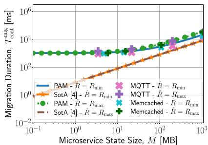  
(a) I = 1

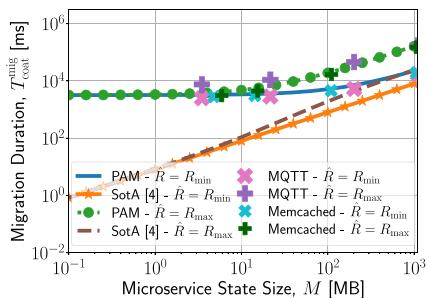  
(b) I = 10

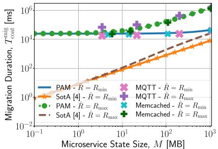  
(c) I = 100

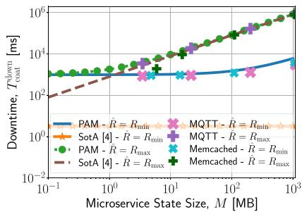  
(d) L = 10 Mbps

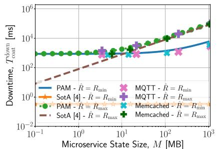  
(e) L = 100 Mbps

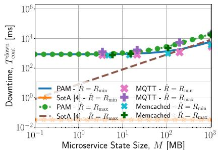  
(f) $L = 1 0 0 0$ Mbps  
Fig. 13. Model validation: migration duration vs. MS state size, for a varying no. of iterations I and L = 1 Gbps (top), and downtime vs. MS state size, for varying L (bottom). Note that the downtime is independent of I.

Figures 13(a)–13(c) present the total migration duration as a function of state size M and for different values of the number of dump iterations I. The experimental results obtained through real-world MSs are compared against those of our PAM model (under the settings reported in Table III) and the state-of-theart (SotA) model in [4]. Observe how PAM (blue and green curves for $R _ { \mathrm { m i n } }$ and $R _ { \mathrm { m a x } }$ , resp.) matches very closely the experimental results obtained with real-world MSs $( ^ { 6 6 } \mathbf { X } ^ { 9 }$ and “ ” markers) in all cases, while the SotA model (orange and brown curves) is unable to do so. Indeed, by averaging across all the considered samples and scenarios, our model yields a prediction error that is 99.7% smaller than that of the SotA model. The reason is that, not accounting for the processing contribution (as in [4]), the duration of each iteration consists of the network transfer time only. In this case, the number of pages to be transmitted decreases at each iteration, and so does the iteration duration. Instead, PAM accounts for the fact that the number of memory pages written during the i-th dump iteration depends upon both the processing overhead and the network transfer (see (5) and (6)), with the former being the dominant component, especially for large values of network bandwidth L.

Figures 13(d)–13(f) show the downtime values versus state size M, for varying values of L. Again, note how our model well approximates the migration performance, yielding a reduction of the prediction error of 64.4% with respect to the SotA model. Indeed, consistently with (31), the larger L, the more significant the processing contribution to the downtime, resulting in a gap with respect to the SotA model that increases very evidently with L. Also, looking at Figures 13(c) and 13(d), one can see that dirtiness has a noticeable impact for large values of M, while, for lower M, the KPIs are practically independent of the dirty page rate.

Finally, Fig. 14 underlines that also the components of the migration KPIs are well predicted by our model. Specifically, Figures 14(a)-14(c) present the main components of a generic dump iteration (namely, frozen time, memory time, and the data volume to be transmitted, described in (17), (20) and (25), resp.), while Figures 14(d)-14(f) show the predump, dump, and restore duration (modeled in (13), (14), and (26), resp.). The results highlight again (i) the significant dependency upon state size M and the maximum dirty page rate for the considered MS, as well as (ii) the excellent match between our model and the experimental results.

## VIII. MODEL EXPLOITATION

We now show how PAM can be used to assess whether and under which conditions the COAT migration is feasible and meets the target KPI values, and how our model helps configure MS migration events. We start by using PAM to determine the setting of the migration parameters that allows the process duration and the downtime to meet their target maximum values (Section VIII-A). Then, to demonstrate the benefits of using our solution in real-world scenarios, we consider an autopilot MS controlling UAVs that provide connectivity to users in a geographical area, and use the PAM model to properly configure the MS migration events (Section VIII-B).

## A. Configuring the Migration Parameters

We first show how the PAM model enables to analytically determine the system parameters that should be used to meet the target values of the migration KPIs. Let $\theta ^ { \mathrm { d o w n } }$ be the maximum downtime and let $T _ { \mathrm { c o a t } } ^ { \mathrm { a d d } }$ be the additional time contribution due to the COAT solution. Given (10) and (11), and imposing $T _ { \mathrm { c o a t } } ^ { \mathrm { d o w n } } { \leq } \theta ^ { \mathrm { d o w n } }$ , we can write:

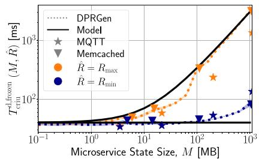  
(a) Frozen Time

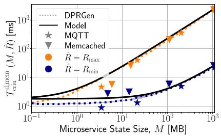

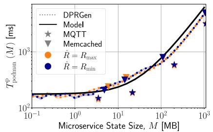

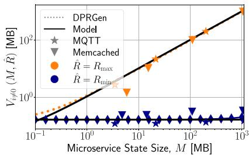

(d) Predump  
(b) Memory Time  
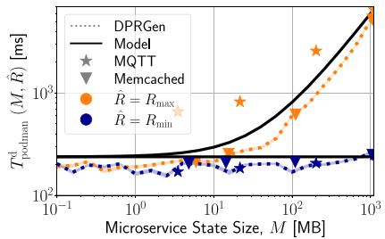  
(e) Dump

(c) Volume  
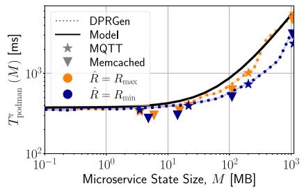  
(f) Restore  
Fig. 14. Model validation: components of the migration KPIs vs. MS state size, for both the $R _ { \mathrm { { m a x } } }$ and $R _ { \mathrm { m i n } }$ scenarios.

$$
L > \frac {V (M , \hat {R})}{\theta^ {\text {down}} - T _ {\text {podman}} ^ {\text {d}} (M , \hat {R}) - T _ {\text {podman}} ^ {\text {r}} (M) - T _ {\text {coat}} ^ {\text {add}}}.\tag{33}
$$

Similarly, using (12) and imposing a maximum migration duration $\theta ^ { \mathrm { m i g } }$ , we get $T _ { \mathrm { c o a t } } ^ { \mathrm { m i g } } { = } \bar { T _ { 0 } } { + } I \cdot T _ { i } { + } T _ { \mathrm { c o a t } } ^ { \mathrm { d o w n } } { \le } \bar { \theta ^ { \mathrm { m i g } } }$ 5 which, combined with (9), leads to:

$$
I = \left\lfloor \frac {\theta^ {\mathrm{mig}} - T _ {0} (M , L) - T _ {\mathrm{coat}} ^ {\mathrm{down}} (M , \hat {R} , L)}{T _ {\mathrm{podman}} ^ {\mathrm{d}} (M , \hat {R}) + T ^ {\mathrm{net}} (M , \hat {R} , L)} \right\rfloor .\tag{34}
$$

Figures 15 and 16 present the behavior of the migration KPIs obtained by applying (33) and (34). The results are shown as we vary the normalized dirty page rate, defined as $r = \frac { \hat { R } - R _ { \mathrm { m i n } } } { R _ { \mathrm { m a x } } - R _ { \mathrm { m i n } } }$ , and for different values of state size, M. In particular, in Fig. 15, we consider two different values for $\mathbf { \partial } _ { \theta } \mathrm { d o w n }$ , namely, 5 s and 30 s. While for small values of M (Fig. 15(a)) such targets can be met easily, for a larger state size (Fig. 15(c)), it is critical to carefully select the values of allocated network bandwidth L that allow the system to meet such constraints. Interestingly, Fig. 16, where $\theta ^ { \mathrm { m i g } } ~ = ~ 1 0 , 1 0 0 \mathrm { s } .$ , highlights that for small values of state size (Fig. 16(a)) the migration duration is almost independent of the dirty page rate, therefore Iterative PreCopy is not the most appropriate migration strategy under such conditions. On the other hand, the effectiveness of the Iterative PreCopy strategy becomes evident for larger values of M (Fig. 16(b)–Fig. 16(c)), since it can properly cope with the dirty pages of the MS.

## B. UAV Autopilot Migration

We now focus on an exemplary practical scenario, depicted in Fig. 17, featuring UAVs controlled by an autopilot MS residing at the network edge. The UAVs provide services with low latency requirements to the end users, whose QoE is monitored by an edge service. As the users’ QoE degrades because of the increased service network latency, the service orchestrator exploits the PAM model to properly configure the migration of the autopilot controller. Notice that, to minimize the impact of the migration process on the users’ QoE, during the downtime, a UAV can continue to travel according to the previous flight mission. However, if the UAV is on a course of collision with a moving obstacle (e.g., a bird), the flight mission must be promptly updated, e.g., by slowing down the UAV or changing the UAV’s moving direction. Considering that the autopilot MS leverages computer vision techniques (i.e., it takes the video stream from the UAV as input), it will transmit a stopping signal if an obstacle is detected, so that the UAV can stop and hover until the flight can be safely resumed. Given a UAV featuring maximum speed $\nu ,$ the required distance from an obstacle to safely stop the UAV, i.e., the worst-case stopping distance, is denoted by $D _ { \mathrm { s } } ( v )$ . Clearly, the larger the stopping distance, the larger the UAV collision zone, such that, if an obstacle appears within this zone, the UAV will not be able to dodge quickly enough to avoid the collision.3 As we consider safety to be the primary concern for the UAV, we take $D _ { \mathrm { s } } ( v )$ as the reference performance metric for the UAV migration, and impose that $D _ { \mathrm { { s } } } ( v ) { \leq } D _ { \mathrm { { s } } } ^ { * }$ , with $D _ { \mathrm { s } } ^ { * }$ being the safety threshold.

It is intuitive to see that $D _ { \mathrm { { s } } } ( v )$ is correlated with the MS downtime. Indeed, we have: $D _ { \mathrm { s } } ( v ) { = } D _ { \mathrm { r } } ( v ) { + } D _ { \mathrm { b } } ( v )$ where $D _ { \mathrm { r } }$ and $D _ { \mathrm { b } }$ are the reaction and braking distance (resp.). The former is the distance travelled by the UAV while an obstacle appears and a stopping signal is transmitted from the autopilot MS to the UAV; it can be written as:

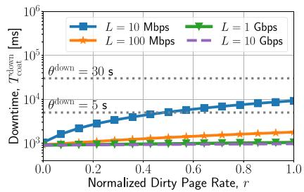  
(a) M = 10 MB

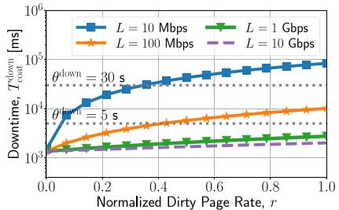  
(b) M = 100 MB

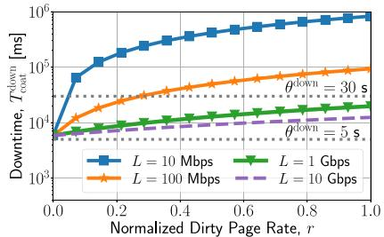  
(c) M = 1000 MB

Fig. 15. Model exploitation: downtime vs. dirty page rate.  
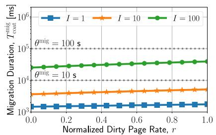  
(a) M = 10 MB

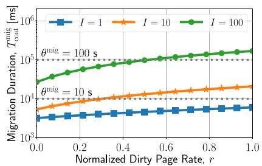  
(b) M = 100 MB

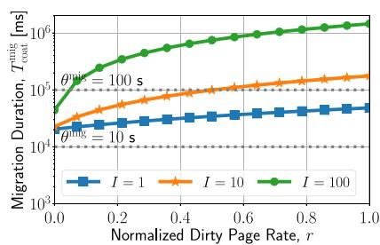  
(c) M = 1000 MB

Fig. 16. Model exploitation: migration duration vs. dirty page rate, for L = 1 Gbps.  
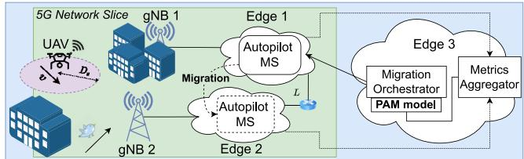  
Fig. 17. UAV controller migration scenario.

$$
D _ {\mathrm{r}} (v) = v \cdot \Big (T _ {\mathrm{coat}} ^ {\mathrm{down}} + T ^ {\mathrm{v}} + T ^ {\mathrm{proc}} \Big),\tag{35}
$$

where $T _ { \mathrm { c o a t } } ^ { \mathrm { d o w n } }$ denotes the downtime, $T ^ { \mathrm { v } }$ is the video streaming latency between the UAV and the autopilot MS, and $T ^ { \mathrm { p r o c } }$ is the processing time required by the autopilot MS to detect obstacles. The second component of $D _ { \mathrm { s } } ( v )$ is instead the distance travelled by the UAV from the activation of the braking procedure till its successful stop, which depends on both the mass of the UAV, $m _ { \mathrm { U A V } }$ , and the braking force, $F _ { \mathrm { b } } ,$ that can be produced. Hence,

$$
D _ {\mathrm{b}} (v) = \frac {v ^ {2} \cdot m _ {\mathrm{UAV}}}{2 \cdot F _ {\mathrm{b}}}.\tag{36}
$$

Clearly, the worst-case stopping distance $D _ { \mathrm { { s } } } ( v )$ is determined ( )by the worst-case values of both the reaction and the braking distance. Considering the worst case also for the dirty rate of the MS autopilot (i.e., $R _ { i } { = } \hat { R } \forall i )$ , the consequent upper bound on the downtime, (obtained by combining (33), (35), and (36)), and imposing $D _ { \mathrm { s } } ( v ) { \leq } D _ { \mathrm { s } } ^ { * }$ , we can derive the required network bandwidth between the edge servers involved in the migration process, as:

TABLE IV  
PARAMETER SETTING FOR THE UAV AUTOPILOT MS MIGRATION

<table><tr><td colspan="2">UAV</td><td colspan="2">Autopilot MS</td></tr><tr><td>Parameter</td><td>Value</td><td>Parameter</td><td>Value</td></tr><tr><td> $D_{s}^{*}$ </td><td>30 m</td><td>r</td><td>0.25</td></tr><tr><td> $m_{\text{UAV}}$ </td><td>3 kg</td><td>M</td><td>20 MB</td></tr><tr><td> $F_{b}$ </td><td>5 N</td><td> $T^{\text{proc}}$ </td><td>10 ms</td></tr><tr><td> $T^{\text{v}}$ </td><td>30 ms</td><td></td><td></td></tr></table>

$$
L \geq \frac {v \cdot V (M , \hat {R})}{D _ {\mathrm{s}} ^ {*} - D _ {\mathrm{b}} (v) - v \cdot (T ^ {\mathrm{v}} + T ^ {\mathrm{proc}} + T _ {\mathrm{coat}} ^ {\mathrm{down}} - T ^ {\mathrm{net}})}.\tag{37}
$$

Fig. 18 depicts the required values of L obtained using (37), as a function of the maximum UAV speed v, for varying values of both UAV and autopilot MS parameters. The default parameter setting for the UAV autopilot migration is given in Table IV, while the value of the parameters characterizing the COAT migration process are presented in Table III. The results highlight that, regardless of the specific settings, the required bandwidth always increases with v, which is mainly due to the reduction of the reaction distance margin. Moreover, by varying the normalized dirty page r of the autopilot MS, defined in Section VIII-A, the required network bandwidth has a positive correlation with r (see Fig. 18(a)). Hence, the higher the autopilot MS dirty page rate, the tighter the constraint on the value of L to ensure a safe UAV flight.

In Fig. 18(b), we vary the video streaming latency $T ^ { \mathrm { v } }$ Although this parameter strongly depends on many system features, e.g., video quality and the adopted source coding techniques, here we consider some typical values adopted in the literature [18], ranging from 30 ms to 300 ms. The results indicate that the streaming latency has negligible impact on the required value of L for values of maximum UAV speed lower than 7.5 m/s. On the contrary, for higher values of speed, i.e., when the UAV braking distance approaches the considered threshold, the effect of the streaming latency becomes significant. Finally, Fig. 18(c) refers to the case where a UAV may carry different loads, e.g., a camera or a package, and thus have a different mass. The effect on the required bandwidth is not significant when the UAV is moving at low speeds (i.e., less than 5 m/s); instead, for higher values of speed, the UAV total mass becomes relevant, with a non-negligible impact on the required value of L.

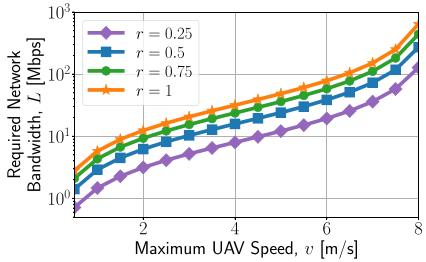  
(a)

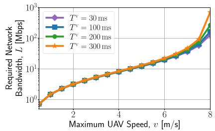  
(b)

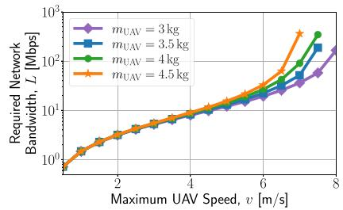  
(c)  
Fig. 18. Model exploitation: Required network bandwidth for safe UAV control vs. the maximum UAV speed, for varying normalized dirty page rate (a), video latency (b), UAV mass (c).

TABLE V  
LITERATURE COMPARATIVE REVIEW HIGHLIGHTING THE MOST RELEVANT REQUIREMENTS FOR EACH STUDY, AT APPLICATION, SERVER, AND NETWORK LEVEL

<table><tr><td>Solutions</td><td>Application Requirements</td><td>Server Requirements</td><td>Network Requirements</td></tr><tr><td>Bao et al. [19] and Bellavista et al. [20]</td><td>Reconnection procedures support</td><td>-</td><td>-</td></tr><tr><td>Qiu et al. [21] and Le et al. [22]</td><td>-</td><td>Kernel Customization</td><td>MPTCP protocol</td></tr><tr><td>Conforti et al. [9] and Puliafito et al. [23]</td><td>Server-side migration support</td><td>-</td><td>QUIC protocol</td></tr><tr><td>Junior et al. [24], Benjaponpitak et al. [8]</td><td>Proxy</td><td>-</td><td>-</td></tr><tr><td>Kassahun et al. [25], and Bernaschi et al. [26]</td><td>Proxy</td><td>-</td><td>-</td></tr><tr><td>Raad et al. [27]</td><td>-</td><td>-</td><td>LISP protocol</td></tr><tr><td>An et al. [28]</td><td>UAV controller specific</td><td>-</td><td>SDN-based</td></tr><tr><td>Yu et al. [29], i.e., our COAT Solution</td><td>-</td><td>-</td><td>Overlay Network</td></tr></table>

To conclude, we remark that our approach is independent of the specific MS and the underlying edge technology. Consequently, besides the UAV autopilot MS, other relevant scenarios could be considered, e.g., migrating MSs for connected cars or streaming applications.

## IX. RELATED WORK

A growing body of work has investigated container live migration. Below, we focus on the aspects that are most relevant to our study.

Starting with connection migration, many existing studies, e.g., [19], [20], have tackled re-connection after a container migration. From a practical perspective, such an approach implies a customization of the client application source code to let it support the reconnection procedure. Only few works discuss solutions to enable connection mobility in a completely transparent manner for the client. Such solutions, summarized in Table V, are mostly based on dedicated protocols, network proxy, overlay network tunneling, and SDN.

The studies in [21], [22] propose the Multi-Path TCP (MPTCP) protocol as an effective solution to implement connection migration, since it permits to define multiple sub-flows for the same connection in a transparent way with respect to the client application. However, MPTCP requires kernel customization, implying practical limitations in real-world scenarios and unfeasible integration with container virtualization technology. Similarly, [9], [23] thoroughly investigate the QUIC protocol and propose an extension thereof, to effectively support server-side connection migration. Despite being quite effective, this solution cannot be extended to other protocols, such as TCP. Other approaches [8], [24] leverage the cloud platform’s network proxy to hold and redirect active connections with external clients while performing intra-cloud or inter-cloud service migration. Likewise, [25], [26] design dedicated network proxies to redirect the network flows for general connection migration purposes. However, the use of centralized proxies is unfit for latency-critical edge computing scenarios since it breaks the proximity principle with mobile end users. Furthermore, [27] investigates the Locator/Identifier Separation Protocol (LISP), i.e., an overlay routing level on top of legacy IP, and suggests how to enhance it to effectively support VMs mobility management. This approach relies on a specific protocol customization, which limits the generality of the solution. As solution tightened to a specific use case, [28] addresses the connection migration issue by manipulating the MAC addresses and leveraging the SDN flow duplication functionality in an SDN-based testbed for UAV controller migration.

We recall that our work aims at enhancing the stateful migration process to effectively support MSs with an established transport-layer connection. To do so, we have defined an architectural solution that leverages an overlay network and, unlike previous work, is application independent, requires no dedicated protocol, and no modifications to the kernel or application source code.

As for service migration, there exists a large body of work on VNF placement and provisioning [30], [31], [32], [33], and on relevant applications of migration techniques, e.g., an SDN-based dynamic placement of mobile video streaming MSs [34], a solution for task roaming and offloading in IoT scenarios [35], and, a proactive algorithm to ensure service continuity for vehicular mobility [36]. Nevertheless, little attention has been paid to MS migration modeling. The recent work in [37] explores container orchestration in a hybrid computing environment and aims to achieve minimal downtime for fault recovery by either re-instantiating or migrating containers. Further, [38] proposes a priorityinduced migration algorithm to minimize service downtime and traffic congestion, while [39] defines a regression model for predicting delay values in SDN-based IoT-Fog networks. To address the lack of a migration model that characterizes the fundamental KPIs, [4] presents an ideal model that serves as a starting point for planning and scheduling of multiple VMs. Although it has been designed for VM-based VNFs, this model can be extended to containerized MSs. We recall that one of our main objectives is to enhance such model, by accounting for all relevant real-world aspects of MSs migration and, in particular, processing time.

At last, we mention that an initial version of this work has been presented in [29], [40], sketching stateful migration modeling and connection migration, respectively. Here, we have significantly enhanced our contribution on PAM and COAT, and showcased their effectiveness in practical scenarios.

## X. CONCLUSION

We tackled stateful MS migration with the aim to characterize and minimize the service disruption time. To this end, we first introduced COAT, a novel network solution based on overlay network technology, which permits to preserve the connection existing between the MS and the mobile end users. Then, leveraging our testbed and a thorough experimental analysis based on Podman and CRIU, we developed PAM, a novel processing-aware migration model that effectively characterizes the fundamental migration KPIs, i.e., downtime and migration duration, in the case of both the traditional and the COAT migration process. We validated the COAT approach and the PAM model using realistic settings and the MQTT Broker and Memcached MSs, and showed that our model accurately predicts the values of the downtime and the migration duration, reducing the prediction error by 64.6% and 99.7% (resp.), when compared to the state of the art. Furthermore, we demonstrated that PAM can be effectively used to configure the migration parameters so as to meet the requirements of latency-sensitive MSs, and we showed how to exploit our model in the practical scenario requiring the migration of the UAV autopilot.

## ACKNOWLEDGMENT

The findings herein reflect the work, and are solely the responsibility, of the authors.

## REFERENCES

[1] P. Jamshidi, C. Pahl, N. C. Mendonça, J. Lewis, and S. Tilkov, “Microservices: The journey so far and challenges ahead,” IEEE Softw., vol. 35, no. 3, pp. 24–35, May/Jun. 2018.

[2] A. Furda, C. Fidge, O. Zimmermann, W. Kelly, and A. Barros, “Migrating enterprise legacy source code to microservices: On multitenancy, statefulness, and data consistency,” IEEE Softw., vol. 35, no. 3, pp. 63–72, May/Jun. 2018.

[3] T. Erl, Service-Oriented Architecture: Analysis and Design for Services and Microservices, 2nd ed. Hoboken, NJ, USA: Prentice Hall Press, 2016.

[4] T. He, A. N. Toosi, and R. Buyya, “SLA-aware multiple migration planning and scheduling in SDN-NFV-enabled clouds,” J. Syst. Softw., vol. 176, Jun. 2021, Art. no. 110943.

[5] D. Fernando, J. Terner, K. Gopalan, and P. Yang, “Live migration ate my VM: Recovering a virtual machine after failure of post-copy live migration,” in Proc. IEEE Int. Conf. Comput. Commun. (INFOCOM), 2019, pp. 343–351.

[6] CRIU. “Checkpoint/restore.” 2017. [Online]. Available: https://criu.org/ Checkpoint/Restore

[7] Opencontainers. “RunC.” 2022. [Online]. Available: https://github.com/ opencontainers/runc

[8] T. Benjaponpitak, M. Karakate, and K. Sripanidkulchai, “Enabling live migration of containerized applications across clouds,” in Proc. IEEE Int. Conf. Comput. Commun. (INFOCOM), 2020, pp. 2529–2538.

[9] L. Conforti, A. Virdis, C. Puliafito, and E. Mingozzi, “Extending the QUIC protocol to support live container migration at the edge,” in Proc. IEEE Int. Symp. World Wireless Mobile Multimedia Netw. (WoWMoM), 2021, pp. 61–70.

[10] The Containers Organization. “Podman.” 2022. [Online]. Available: https://github.com/containers/podman/

[11] B. Dordevi ¯ c, V. Tim ´ cenko, M. Lazi ˇ c, and N. Davidovi ´ c, “Performance ´ comparison of docker and Podman container-based virtualization,” in Proc. IEEE Int. Symp. INFOTEH-JAHORINA, 2022, pp. 1–6.

[12] D. Lee, B. E. Carpenter, and N. Brownlee, “Observations of UDP to TCP ratio and port numbers,” in Proc. 5th Int. Conf. Internet Monit. Protect., 2010, pp. 99–104.

[13] J. Corbet. “TCP connection repair.” Accessed: Jun. 2023. [Online]. Available: https://lwn.net/Articles/495304/

[14] L. L. Peterson and B. S. Davie, Computer Networks, Fifth Edition: A Systems Approach. Burlington, MA, USA: Morgan Kaufmann Publ. Inc., 2011.

[15] (Linux Found., San Francisco, CA, USA). “Open vSwitch.” Accessed: Jun. 2023. [Online]. Available: https://www.openvswitch.org/

[16] (Eclipse Found., Brussels, Belgium), “Mosquitto.” Accessed: Jun. 2023. [Online]. Available: https://mosquitto.org/

[17] Memcached Community. “Memcached.” Accessed: Jun. 2023. [Online]. Available: https://memcached.org/

[18] G. Tang, Y. Hu, H. Xiao, L. Zheng, X. She, and N. Qin, “Design of real-time video transmission system based on 5G network,” in Proc. IEEE Conf. Ind. Electron. Appl. (ICIEA), 2021, pp. 522–526.

[19] W. Bao et al., “Follow me fog: Toward seamless handover timing schemes in a fog computing environment,” IEEE Commun. Mag., vol. 55, no. 11, pp. 72–78, Nov. 2017.

[20] P. Bellavista, A. Corradi, L. Foschini, and D. Scotece, “Differentiated service/data migration for edge services leveraging container characteristics,” IEEE Access, vol. 7, pp. 139746–139758, 2019.

[21] Y. Qiu, C.-H. Lung, S. Ajila, and P. Srivastava, “LXC container migration in cloudlets under multipath TCP,” in Proc. IEEE COMPSAC, 2017, pp. 31–36.

[22] F. Le and E. M. Nahum, “Experiences implementing live VM migration over the WAN with multi-path TCP,” in Proc. IEEE Int. Conf. Comput. Commun. (INFOCOM), 2019, pp. 1090–1098.

[23] C. Puliafito, L. Conforti, A. Virdis, and E. Mingozzi, “Server-side QUIC connection migration to support microservice deployment at the edge,” Pervasive Mobile Comput., vol. 83, Jul. 2022, Art. no. 101580.

[24] P. S. Junior, D. Miorandi, and G. Pierre, “Good shepherds care for their cattle: Seamless pod migration in geo-distributed kubernetes,” in Proc. IEEE Int. Conf. Fog Edge Comput. (ICFEC), 2022, pp. 26–33.

[25] S. Kassahun, A. Demessie, and D. Ilie, “A PMIPv6 approach to maintain network connectivity during VM live migration over the Internet,” in Proc. IEEE Int. Conf. Cloud Netw. (CloudNet), 2014, pp. 64–69.

[26] M. Bernaschi, F. Casadei, and P. Tassotti, “SockMi: A solution for migrating TCP/IP connections,” in Proc. EUROMICRO Int. Conf. Parallel Distrib. Netw.-Based Process. (PDP), 2007, pp. 221–228.

[27] P. Raad, S. Secci, D. C. Phung, A. Cianfrani, P. Gallard, and G. Pujolle, “Achieving sub-second downtimes in large-scale virtual machine migrations with LISP,” IEEE Trans. Netw. Service Manag., vol. 11, no. 2, pp. 133–143, Jun. 2014.

[28] N. An, S. Yoon, T. Ha, Y. Kim, and H. Lim, “Seamless virtualized controller migration for drone applications,” IEEE Internet Comput., vol. 23, no. 2, pp. 51–58, Mar./Apr. 2019.

Antonio Calagna (Graduate Student Member, IEEE) received the B.Sc. and M.Sc. degrees from the Politecnico di Torino, in 2019 and 2021, respectively, where he is currently pursing the Ph.D. degree. His main research interests are network function virtualization, microservices chains, and cloud and edge computing.

[29] Y. Yu, A. Calagna, P. Giaccone, and C. F. Chiasserini, “TCP connection management for stateful container migration at the network edge,” in Proc. IEEE Mediterr. Commun. Comput. Netw. Conf. (MedComNet), 2023, pp. 151–157.

[30] H. Moens and F. D. Turck, “VNF-P: A model for efficient placement of virtualized network functions,” in Proc. IEEE CNSM, 2014, pp. 418–423.

[31] F. Bari, S. R. Chowdhury, R. Ahmed, R. Boutaba, and O. C. M. Bandeira Duarte, “Orchestrating virtualized network functions,” IEEE Trans. Netw. Service Manag., vol. 13, no. 4, pp. 725–739, Dec. 2016.

[32] D. B. Oljira, K.-J. Grinnemo, J. Taheri, and A. Brunstrom, “A model for QoS-aware VNF placement and provisioning,” in Proc. IEEE Conf. Netw. Funct. Virtualizat. Softw. Defined Netw. (NFV-SDN), 2017, pp. 1–7.

[33] H. Hawilo, M. Jammal, and A. Shami, “Exploring microservices as the architecture of choice for network function virtualization platforms,” IEEE Netw., vol. 33, no. 2, pp. 202–210, Mar./Apr. 2019.

[34] J. Liu, Q. Yang, G. Simon, and W. Cui, “Migration-based dynamic and practical virtual streaming agent placement for mobile adaptive live streaming,” IEEE Trans. Netw. Service Manag., vol. 15, no. 2, pp. 503–515, Jun. 2018.

[35] C. Dupont, R. Giaffreda, and L. Capra, “Edge computing in IoT context: Horizontal and vertical linux container migration,” in Proc. Glob. Internet Things Summit (GIoTS), 2017, pp. 1–4.

[36] I. Labriji et al., “Mobility aware and dynamic migration of MEC services for the Internet of Vehicles,” IEEE Trans. Netw. Service Manag., vol. 18, no. 1, pp. 570–584, Mar. 2021.

[37] S. Aleyadeh, A. Moubayed, P. Heidari, and A. Shami, “Optimal container migration/re-instantiation in hybrid computing environments,” IEEE Open J. Commun. Soc., vol. 3, pp. 15–30, 2022.

[38] A. Mukhopadhyay, G. Iosifidis, and M. Ruffini, “Migration-aware network services with edge computing,” IEEE Trans. Netw. Service Manag., vol. 19, no. 2, pp. 1458–1471, Jun. 2022.

[39] D. M. Casas-Velasco, W. F. Villota-Jacome, N. L. S. da Fonseca, and O. M. Caicedo Rendon, “Delay estimation in fogs based on software-defined networking,” in Proc. IEEE Glob. Commun. Conf. (GLOBECOM), 2019, pp. 1–6.

[40] A. Calagna, Y. Yu, P. Giaccone, and C. F. Chiasserini, “Processing-aware migration model for stateful edge microservices,” in Proc. IEEE Int. Conf. Commun. (ICC), 2023, pp. 815–820.

Yenchia Yu (Graduate Student Member, IEEE) received the B.Sc. degree (dual) from Tongji University, China, and the Politecnico di Torino, Italy, in 2020, and the M.Sc. degree from the Politecnico di Torino in 2022, where he is currently pursing the Ph.D. degree. His main research interests include edge computing, 5G networks, and unmanned aerial vehicles.

Paolo Giaccone (Senior Member, IEEE) received the Dr.Ing. and Ph.D. degrees in telecommunications engineering from the Politecnico di Torino, Italy, in 1998 and 2001, respectively, where he is currently a Full Professor with the Department of Electronics. His main area of interest is the design of optimal network control algorithms.

Carla Fabiana Chiasserini (Fellow, IEEE) is a Full Professor with the Politecnico di Torino, Italy, and a Research Associate with the Italian National Research Council (CNR) and CNIT. Her research interests include 5G-andbeyond networks, NFV, mobile edge computing, connected vehicles, and distributed machine learning at the network edge.