# Diffusion-Based Trajectory and Semantic Resource Optimization in UAV-Assisted Edge Computing

Chen Wang , Ruonan Zhang , Member, IEEE, Zehui Xiong , Senior Member, IEEE, Daosen Zhai , Member, IEEE, Dusit Niyato , Fellow, IEEE, and Zhu Han , Fellow, IEEE

Abstract—As edge applications demand real-time processing with limited bandwidth and energy, traditional communication systems face challenges to meet performance requirements due to the centralized architecture and redundant data transmission. To address these challenges, we propose a UAV-assisted semantic edge computing network that leverages UAV mobility and semantic communication. We formulate a joint optimization problem involving UAV trajectory, data allocation, and semantic extraction to maximize the semantic processing rate. To solve this problem, we develop a hybrid deep deterministic policy gradient (H-DDPG) algorithm that integrates deep reinforcement learning (DRL) with convex optimization via block coordinate descent (BCD), thereby enabling efficient joint decision-making across tightly coupled variables. Furthermore, we propose a hybrid diffusion deep deterministic policy gradient (H-D3PG) algorithm, which incorporates denoising diffusion models into the DRL framework. By addressing the limited adaptability of deterministic strategies, this design enhances policy expressiveness and stability. As a result, the algorithm enables adaptive trajectory control under time-varying semantic tasks and wireless channel conditions in UAV-assisted edge networks. Simulations show that H-D3PG improves the semantic processing rate by up to 38.8% while reducing energy consumption compared to Raw Data Transmission.

Index Terms—Unmanned aerial vehicle, semantic communication, edge computing, diffusion models.

## I. INTRODUCTION

Received 19 April 2025; revised 11 September 2025 and 1 December 2025; accepted 19 January 2026. Date of publication 3 February 2026; date of current version 13 February 2026. This work was supported in part by the National Natural Science Foundation of China under Grant 62232013, Grant 62171385, and Grant 62271402; in part by NSF under Grant ECCS-2302469; and in part by Japan Science and Technology Agency (JST) Adopting Sustainable Partnerships for Innovative Research Ecosystem (ASPIRE) under Grant JPMJAP2326. The associate editor coordinating the review of this article and approving it for publication was J. Liu. (Corresponding authors: Ruonan Zhang; Daosen Zhai.)

Zehui Xiong is with the School of Electronics, Electrical Engineering and Computer Science (EEECS), Queen’s University Belfast, Belfast, BT7 1NN Northern Ireland, U.K. (e-mail: z.xiong@qub.ac.uk).

Daosen Zhai is with the School of Electronics and Information, Northwestern Polytechnical University, Xi’an, Shaanxi 710072, China, and also with the National Mobile Communications Research Laboratory, Southeast University, Nanjing, Jiangsu 211189, China (e-mail: zhaidaosen@nwpu.edu.cn).

Dusit Niyato is with the College of Computing and Data Science, Nanyang Technological University, Singapore 639798 (e-mail: dniyato@ntu.edu.sg).

Zhu Han is with the Department of Electrical and Computer Engineering, University of Houston, Houston, TX 77004 USA (e-mail: hanzhu22@gmail.com).

Digital Object Identifier 10.1109/TWC.2026.3657387 a growing demand for real-time transmission and processing of massive task data generated by sensor devices [2], brings growing pressure to the communication infrastructure, especially in the uplink. However, traditional cellular network architectures, constrained by centralized designs and resource allocation mechanisms, can hardly meet the performance requirements of efficient communication in large-scale uplink data scenarios [3]. In response to this issue, multi-access edge computing (MEC) leverages a distributed service architecture by deploying edge servers near end users, bringing computation closer to the data source [4]. This design effectively improves data processing rates and system responsiveness [5]. Nevertheless, conventional MEC deployments are typically static and limited in coverage, making it difficult for terminal devices located in remote or complex environments to access high-quality services.

To address these limitations, unmanned aerial vehicles (UAVs) have been introduced into MEC systems as flexible and mobile platforms [6]. With the rapid development of the low-altitude economy, UAVs can serve either as communication relays to assist data transmission [7] or as aerial edge servers to provide computing services, thereby enhancing the flexibility and accessibility of MEC networks [8]. However, terminal devices often upload large amounts of redundant data. For instance, in target monitoring or anomaly detection tasks, only a small portion of the data may con tain critical information. Given the limited communication and computation resources on UAVs, the transmission of such redundant data reduces overall task processing efficiency. Efficiently extracting and transmitting task-relevant information has become a pressing challenge. This necessitates the design of communication mechanisms that selectively extract and transmit task-relevant content to reduce resource consumption.

In this context, semantic communication has attracted growing attention as a novel communication paradigm [9], [10]. Unlike conventional bit communication, semantic communication aims to transmit semantic information while significantly reducing data volume and improving communication efficiency [11]. Combining semantic communication with UAV-assisted edge computing networks offers a promising solution to enhance overall data processing rates [12]. Although existing studies have investigated semantic extraction or UAV trajectory optimization individually, optimizing them separately may lead to suboptimal performance. For instance, high-quality semantic features cannot be effectively transmitted if the UAV trajectory results in poor link quality, while trajectory optimization alone still requires transmitting redundant bit-level information. Since trajectory design and semantic extraction are strongly coupled, a unified UAVassisted semantic edge computing framework that integrates trajectory, semantic extraction, and data allocation is needed to maximize the overall semantic processing rate. This framework involves multiple highly coupled variables, which poses significant challenges for traditional deep reinforcement learning (DRL) or optimization algorithms.

To address the above challenges, diffusion models have recently demonstrated strong potential in complex action modeling due to their ability to generate actions through a step-by-step denoising process [13]. By reformulating policy learning as a sequential generation task, diffusion models enhance policy expressiveness by capturing diverse action distributions and help avoid policy collapse in high-dimensional settings. In addition, the iterative denoising process allows actions to be progressively refined under coupled constraints, which improves adaptability in non-convex optimization problems such as joint trajectory, data allocation, and semantic extraction. Unlike conventional policy networks that directly output actions from a latent state, diffusion models learn this richer mapping from noise to actions through iterative refinement [14], [15]. However, existing diffusion-based reinforcement learning approaches mainly focus on lowdimensional or single-variable action optimization and lack in-depth exploration for temporally continuous and multivariable joint optimization tasks. Further exploration is needed to adapt diffusion models to structured, real-world decisionmaking problems involving coordination across multiple control variables. To address this gap, we explore how diffusion models can be integrated into multi-variable optimization within UAV-assisted semantic edge networks.

Motivated by the aforementioned challenges, we consider a UAV-assisted semantic edge computing system and formulate a joint optimization problem over UAV trajectory, data allocation, and semantic extraction to improve semantic processing rate. To address the complexity of coupled variables, we develop two hybrid learning algorithms that integrate DRL with convex optimization, where the second algorithm is further enhanced by diffusion-based policy learning to improve policy expressiveness and adaptability. The main contributions of this paper are summarized as follows:

• We propose a UAV-assisted semantic edge computing network that integrates both semantic extraction and transmission to reduce redundant data and enhance data processing efficiency.

• We formulate a joint optimization problem of UAV trajectory, data allocation, and semantic extraction to maximize the semantic processing rate under time and energy constraints, improving the efficiency of semantic communication beyond conventional decoupled designs.

• To solve this problem, an H-DDPG algorithm is developed by integrating DRL with convex optimization via block coordinate descent (BCD), enabling efficient joint decision-making of coupled variables.

• To improve policy expressiveness and adaptability, we design the H-D3PG algorithm by incorporating denoising diffusion models into the DRL framework. The diffusionbased action generation enables exploration of diverse UAV trajectories, while iterative denoising allows the policy to adapt decisions under energy–latency constraints.

• Extensive simulations demonstrate that the proposed algorithms significantly outperform baseline methods, with H-D3PG achieving up to 38.8% higher semantic processing rate compared to Raw Data Transmission.

The structure of this paper is organized as follows: Section II reviews and summarizes the related works. In Section III, we introduce the system model and problem formulation. Section IV presents the H-DDPG algorithm. In Section V, we provide our proposed H-D3PG algorithm. Section VI discusses the simulation results and performance analysis. Finally, Section VII concludes the paper.

## II. RELATED WORK

In this section, we review the existing literature from three perspectives relevant to our study: UAV-assisted edge computing, semantic communication, and diffusion models for wireless network optimization. We aim to identify the current limitations and highlight the research gap our work addresses.

## A. UAV-Assisted Edge Computing

In MEC networks, UAVs can serve as relays to assist data offloading and can also act as aerial servers to perform edge computing. In [16], the authors introduced a UAV cooperating with the base station (BS) in the MEC network to provide high-quality computing service under latency requirements. To maximize the energy efficiency, the authors in [17] designed an architecture that enables bi-directional offloading to both the UAV and BS concurrently. The authors in [18] considered a multi-UAV scenario and optimized UAV movement, user association, and power control to minimize energy consumption and latency. In [19], the authors optimized three-dimensional position and resource allocation of the aerial edge server to improve system computation efficiency. The authors in [20] proposed a UAV-assisted cloud-edge cooperative network to minimize processing delay under energy consumption constraints. In [21], the authors deployed multiple UAVs in terrestrial MEC network to minimize energy and latency cost. However, in UAV-assisted MEC networks, sensor devices often generate a large amount of redundant data, while UAVs are constrained by limited communication and computation resources. As a result, the system’s data processing efficiency still faces a significant challenge.

## B. Semantic Communication

Compared to traditional bit communication, semantic communication can significantly improve transmission efficiency through semantic transmission and extraction. Under the same communication conditions, semantic transmission can achieve a higher communication rate. The authors in [22] provided a closed-form expression of semantic similarity and proposed a heterogeneous semantic and bit communication framework. In [12], the authors investigated a UAV-assisted semantic communication framework to maximize the quality of experience (QoE) considering semantic entropy and semantic rate. The authors in [23] reduced task processing time under semantic similarity constraints in a UAV-assisted MEC network. In addition, semantic extraction can effectively compress the data to be transmitted and reduce communication resource consumption. The authors in [24] investigated energy efficient semantic communication network and quantified the extraction computation model. In [25], the authors studied dynamic semantic extraction and proposed a multi-time scale user association and resource allocation algorithm. The authors in [26] deployed a UAV for data aggregation and semantic extraction to minimize age-of-information. However, most existing studies only focus on optimizing a single aspect, lacking a joint optimization framework that considers both semantic extraction and semantic transmission.

## C. Diffusion Models for Wireless Network Optimization

By leveraging their denoising-based generative capabilities, diffusion models have shown great potential in solving complex optimization problems, especially when combined with DRL frameworks. The authors in [27] adopted the generative diffusion model to optimize power allocation and decoding error probability. In [28], the authors designed a two-layer DRL algorithm and optimized the resource blocks allocation by diffusion-based DRL. The authors in [29] proposed a diffusion model-based approach to optimize power allocations and precoding vectors in a semantic communication network. The generative diffusion model was integrated into the actor network to optimize excitation current weights and positions of UAVs in [30]. In [31], the authors investigated attentionbased diffusion DRL to solve the AI-generated content (AIGC) service association. Similarly, the authors in [32] designed the deep diffusion soft actor-critic algorithm to optimize AIGC task assignment. However, existing diffusion-based algorithms mainly focus on single-task or scalar-variable optimization, such as transmission power. There is still limited research on the joint optimization of complex and interdependent variables, especially in dynamic scenarios involving trajectory optimization, data allocation, and semantic extraction.

## III. SYSTEM MODEL

In this section, we first introduce the UAV-assisted semantic edge computing network model, then we propose the semantic communication model. Finally, we formulate a joint optimization problem of data allocation, UAV trajectory, and semantic extraction factor, aiming to maximize the average semantic processing rate under time and energy constraints.

## A. Network Model

We investigate a UAV-assisted semantic edge computing scenario, as illustrated in Fig. 1. The network comprises a UAV and M edge devices, where the edge devices (e.g., smart cameras and environmental sensors) perform complex tasks such as object detection and environmental perception. Instead of transmitting the complete raw data, each device extracts and communicates only the task-relevant semantic information, i.e., the essential features that preserve the meaning required for the intended application (e.g., the presence of humans, vehicles, or anomalies). Formally, the semantic representation is defined as the task-oriented latent feature vector $s = f _ { \theta } ( x )$ generated by the semantic encoder. In this work, the encoder is implemented as a compact Transformer model following the DeepSC framework, and it captures the task-level meaning of the raw input that is relevant to the downstream processing task. This notion of “semantic” adheres to the DeepSC principle of preserving meaning rather than bit-level accuracy. By transmitting semantic information, the devices can substantially reduce computation and communication overhead while maintaining application-level fidelity. We further note that this concept of semantics is distinct from informationtheoretic quantities such as semantic entropy, which are not adopted in this work.

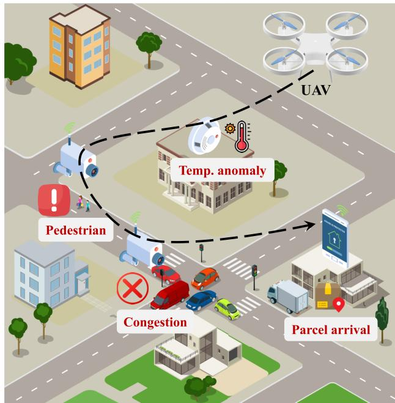  
Fig. 1. UAV-assisted semantic edge computing network.

The total semantic communication time is denoted as T , which is discretized into N time slots, each with a duration of δ. The position of edge device m is represented as $\mathbf { \delta q } _ { m } =$ $[ x _ { m } , y _ { m } , 0 ]$ . The UAV takes off from the initial position $\pmb q ^ { s t a r t }$ and its trajectory is discretized into $N { + 1 }$ points, with its position in the n-th time slot given by ${ \pmb q } [ n ] = [ x _ { u } [ n ] , y _ { u } [ n ] , H ]$ where H denotes the UAV’s altitude. The $\mathrm { U A V } \mathbf { \hat { s } }$ movement is constrained by

$$
\| \pmb { q } [ n ] - \pmb { q } [ n + 1 ] \| \leq d ^ { \operatorname* { m a x } } , \forall n \in \mathcal N ,\tag{1}
$$

where $d ^ { \mathrm { m a x } }$ represents the maximum flying distance per time slot. The distance between the UAV and the m-th edge device in time slot n is given by

$$
d _ { m } [ n ] = \lVert \pmb { q } _ { m } - \pmb { q } [ n ] \rVert .\tag{2}
$$

To characterize the communication link, we adopt a probabilistic path loss model [33], [34]. The probability of a

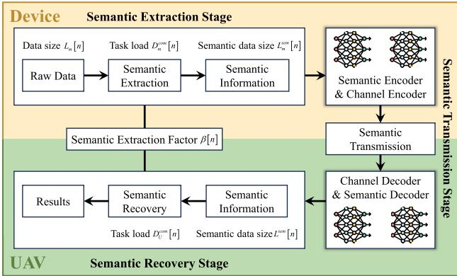  
Fig. 2. Semantic extraction, transmission, and recovery.

line-of-sight (LoS) link between the UAV and edge device m during time slot n is given by

$$
P _ { m } ^ { L o S } [ n ] = \frac { 1 } { 1 + \mathrm { A } \exp \left( - \mathrm { B } \left( \frac { 1 8 0 } { \pi } \mathrm { s i n } ^ { - 1 } \left( \frac { H } { d _ { m } [ n ] } \right) - \mathrm { A } \right) \right) } ,\tag{3}
$$

where A and B are environment-dependent S-curve parameters. Consequently, the probability of a non-line-of-sight (NLoS) link is expressed as

$$
P _ { m } ^ { N L o S } [ n ] = 1 - P _ { m } ^ { L o S } [ n ] .\tag{4}
$$

The path loss for an LoS link from the UAV to edge device m in time slot n is modeled as

$$
P L _ { m } ^ { L o S } [ n ] = 2 0 \mathrm { l o g } _ { 1 0 } \left( \frac { 4 \pi f d _ { m } [ n ] } { c } \right) + \eta ^ { L o S } ,\tag{5}
$$

where f is the carrier frequency, c denotes the speed of light, and $\eta ^ { L o S }$ represents the mean additional loss associated with LoS transmission. Similarly, the path loss for an NLoS link is given by

$$
P L _ { m } ^ { N L o S } [ n ] = 2 0 \mathrm { l o g } _ { 1 0 } \left( \frac { 4 \pi f d _ { m } [ n ] } { c } \right) + \eta ^ { N L o S } ,\tag{6}
$$

where $\eta ^ { N L o S }$ accounts for the mean additional loss in the NLoS scenario. Thus, the overall path loss between the UAV and edge device m in time slot n can be expressed as

$$
P L _ { m } [ n ] = P _ { m } ^ { N L o S } [ n ] P L _ { m } ^ { N L o S } [ n ] + P _ { m } ^ { L o S } [ n ] P L _ { m } ^ { L o S } [ n ] .\tag{7}
$$

Based on the path loss model, the corresponding channel gain is given by

$$
g _ { m } [ n ] = 1 0 ^ { - \frac { P L _ { m } [ n ] } { 1 0 } } .\tag{8}
$$

Then the signal-to-noise ratio (SNR) at edge device m in time slot n is expressed as

$$
\gamma _ { m } [ n ] = \frac { p _ { m } ^ { t } g _ { m } [ n ] } { \sigma ^ { 2 } } ,\tag{9}
$$

where $p _ { m } ^ { t }$ represents the transmit power of edge device m, and $\sigma ^ { 2 }$ denotes the noise power.

## B. Semantic Communication Model

The overall semantic communication process is illustrated in Fig. 2, which consists of three stages: extraction, transmission, and recovery. Specifically, each edge device processes its collected raw data using its onboard CPU to perform semantic extraction, which eliminates redundancy and compresses the data into semantic information. The semantic extraction factor $\beta [ n ]$ determines both the compression ratio and the amount of computational workload required for semantic extraction. Following semantic extraction, which is implemented by the semantic encoder, the extracted semantic information is further processed by a channel encoder before being transmitted to the UAV via semantic communication. Upon reception, the UAV first applies a channel decoder and then performs semantic recovery using the semantic decoder.1 The aggregated semantic information is then utilized for semantic recovery, where the computation task load is also influenced by the semantic extraction factor. To quantify the performance of the entire system, we introduce the semantic processing rate, which is defined as the amount of semantic data that is successfully extracted, transmitted, and recovered per unit time. It reflects the overall effectiveness of the semantic communication process across all stages. The detailed semantic communication process is described as follows.

1) Semantic Extraction Stage: The total data amount of user m is denoted by $Q _ { m }$ , and the data buffer size in the n-th time slot is denoted by $Q _ { m } [ n ]$ . Semantic information is extracted from the raw data at all devices using a common extraction factor $\beta [ n ]$ , which ensures consistency in the subsequent semantic recovery at the $\mathrm { U A V } . ^ { 2 }$ Denote the allocated data size of device m in time slot n as $L _ { m } [ n ]$ , then the bit size of the extracted semantic information is given by $L _ { m } ^ { s e m } [ n ] ~ = ~ \beta [ n ] L _ { m } [ n ]$ . Consequently, a smaller extraction factor implies that less semantic information needs to be transmitted. However, $\beta [ n ]$ also influences additional computation workload required for semantic extraction, expressed as

$$
D _ { m } ^ { c o m } [ n ] = \frac { a L _ { m } ^ { s e m } [ n ] } { \beta [ n ] ^ { k } } ,\tag{10}
$$

where $a \mathrm { ~ > ~ } 0$ and $k > 1$ are the constant parameters that characterize the computational complexity of the semantic extraction process [36]. The computation time for semantic extraction is given by

$$
T _ { m } ^ { c o m } [ n ] = \frac { C D _ { m } ^ { c o m } [ n ] } { f _ { m } } = \frac { a C L _ { m } ^ { s e m } [ n ] } { \beta [ n ] ^ { k } f _ { m } } ,\tag{11}
$$

where $f _ { m }$ represents the computation resources of device $m ,$ and C denotes the number of CPU cycles required per unit

task load. Furthermore, the energy consumption for semantic extraction is calculated as

$$
E _ { m } ^ { c o m } [ n ] = { \kappa { f _ { m } } ^ { 3 } } T _ { m } ^ { c o m } [ n ] = \frac { { \kappa { f _ { m } } ^ { 2 } } a C L _ { m } [ n ] } { \beta [ n ] ^ { k - 1 } } ,\tag{12}
$$

where κ denotes the energy consumption coefficient of device $m .$ Finally, the total computation time for semantic extraction in time slot n is determined by the maximum time among all edge devices, expressed as

$$
T ^ { c o m } [ n ] = \operatorname* { m a x } _ { m } \left\{ T _ { m } ^ { c o m } [ n ] \right\} .\tag{13}
$$

2) Semantic Transmission Stage: During the semantic transmission stage, we adopt text-based transmission with DeepSC [37]. To facilitate the representation of semantic transmission, we first define the following notations. Assume that the bit size of each symbol is given by $b ^ { s y m }$ bits/symbol, and the symbol transmission rate is denoted as $R ^ { s y m }$ symbols/s. Next, we define the semantic information representation. The average amount of semantic information per sentence is denoted as $I ^ { s e n }$ suts/sentence. Let K represent the average number of semantic symbols contained in each word (symbols/word), and let W denote the average number of words per sentence (words/sentence). Consequently, the amount of semantic information in each symbol is given by $\begin{array} { r } { I ^ { s y m } = \frac { I ^ { s e n } } { K W } } \end{array}$ suts/symbol, and the bit size of unit semantic information can be expressed as $\begin{array} { r } { \begin{array} { r c l } { b ^ { s u t } = } & { { } { \frac { b ^ { s y m } } { I ^ { s y m } } } } \end{array} } \end{array}$ bits/sut. Based on the above definitions, the amount of semantic information uploaded by device m in time slot n is given by

$$
I _ { m } [ n ] = \frac { L _ { m } ^ { s e m } [ n ] } { b ^ { s u t } } = \frac { \beta [ n ] L _ { m } [ n ] } { b ^ { s u t } } .\tag{14}
$$

Furthermore, the semantic transmission rate of device m in time slot n is defined as

$$
\mathcal { R } _ { m } [ n ] = \frac { I ^ { s e n } R ^ { s y m } } { K W } \varepsilon _ { m } [ n ] ,\tag{15}
$$

where $\varepsilon _ { m } [ n ]$ denotes the semantic similarity function. This function is given by

$$
\varepsilon _ { m } [ n ] = A _ { K , 1 } + \frac { A _ { K , 2 } - A _ { K , 1 } } { 1 - e ^ { - ( C _ { K , 1 } \gamma _ { m } [ n ] + C _ { K , 2 } ) } } ,\tag{16}
$$

where $A _ { K , 1 }$ and $A _ { K , 2 }$ represent the lower and upper asymptotes, respectively, while $C _ { K , 1 }$ determines the logistic growth rate and $C _ { K , 2 }$ controls the logistic mid-point. This logistic form, fitted to empirical semantic similarity data following [22], captures the intuitive S-shaped trend: rapid growth at low SNR and saturation at high SNR.

The semantic transmission time of edge device m in time slot n is given by

$$
T _ { m } ^ { t r } [ n ] = \frac { I _ { m } [ n ] } { \mathcal { R } _ { m } [ n ] } = \frac { L _ { m } ^ { s e m } [ n ] } { b ^ { s u t } \mathcal { R } _ { m } [ n ] } = \frac { \beta [ n ] L _ { m } [ n ] } { b ^ { s u t } \mathcal { R } _ { m } [ n ] } .\tag{17}
$$

We consider that each device accesses the UAV using Time Division Multiple Access (TDMA). Thus, the total transmission time in time slot n is given by $T ^ { t r } [ n ] = \sum _ { m = 1 } ^ { M } T _ { m } ^ { t r } [ n ]$ The transmission energy consumption of edge device m can be expressed as

$$
E _ { m } ^ { t r } [ n ] = p _ { m } T _ { m } ^ { t r } [ n ] = \frac { p _ { m } \beta [ n ] L _ { m } [ n ] } { b ^ { s u t } \mathcal { R } _ { m } [ n ] } ,\tag{18}
$$

where $p _ { m }$ represents the total power during transmission of edge device m. Furthermore, the total energy consumption of each user in each time slot should satisfy the following constraint:

$$
E _ { m } ^ { c o m } [ n ] + E _ { m } ^ { t r } [ n ] \leq E _ { m } ,\tag{19}
$$

where $E _ { m }$ represents the maximum energy consumption of edge device m in each time slot. The UAV energy is not explicitly modeled, as the UAV is assumed to have a more flexible energy supply. Moreover, the latency constraint on semantic processing inherently limits the flight duration, so propulsion energy does not dominate the optimization.

3) Semantic Recovery Stage: Denote the total allocated data size of all edge devices in time slot n as $L [ n ] = \sum _ { m = 1 } ^ { M } { L _ { m } [ n ] }$ The total bit size of semantic information collected by the UAV in time slot n is given by

$$
L ^ { s e m } [ n ] = \beta [ n ] L [ n ] .\tag{20}
$$

According to [36], the computation intensity ratio of semantic information to raw data is denoted as

$$
G [ n ] = \frac { 1 } { \beta [ n ] ^ { p } } ,\tag{21}
$$

where $p \geq 1$ is a constant that depends on the specific task characteristics. Thus, the computation task load required for semantic recovery in time slot n is expressed as

$$
D _ { U } ^ { c o m } [ n ] = G [ n ] L ^ { s e m } [ n ] = \frac { L ^ { s e m } [ n ] } { \beta [ n ] ^ { p } } = \frac { \sum _ { m = 1 } ^ { M } L _ { m } [ n ] } { \beta [ n ] ^ { p - 1 } } .\tag{22}
$$

The corresponding semantic recovery time is given by

$$
T _ { U } ^ { c o m } [ n ] = \frac { C D _ { U } ^ { c o m } [ n ] } { f _ { U } } = \frac { C \sum _ { m = 1 } ^ { M } { { L } _ { m } [ n ] } } { \beta [ n ] ^ { p - 1 } f _ { U } } ,\tag{23}
$$

where $f _ { U }$ represents the computation resources of the UAV. Finally, the total semantic processing time in each time slot, which includes semantic extraction, semantic transmission, and semantic recovery, must satisfy the constraint

$$
\operatorname* { m a x } _ { m } \left\{ T _ { m } ^ { c o m } [ n ] \right\} + T ^ { t r } [ n ] + T _ { U } ^ { c o m } [ n ] \leq \delta ,\tag{24}
$$

ensuring that all operations are completed within the time slot duration δ.

## C. Problem Formulation and Transformation

The data allocation directly determines local semantic extraction time at edge devices, semantic transmission time, and semantic recovery time at the UAV. The UAV trajectory influences channel gain of edge devices, thereby affecting semantic transmission rate. Meanwhile, the semantic extraction factor determines the compression ratio and introduces additional computation workloads in both semantic extraction and recovery stages. We jointly optimize data allocation, UAV trajectory, and semantic extraction factor to maximize the average semantic processing rate over all time slots, which reflects the total amount of semantic information successfully extracted, transmitted, and recovered per unit time. The optimization problem is formulated as

$$
\operatorname* { m a x } _ { L , q , \beta } \frac { 1 } { N } \sum _ { n = 1 } ^ { N } \frac { \sum _ { m = 1 } ^ { M } L _ { m } [ n ] } { \operatorname* { m a x } \left\{ T _ { m } ^ { c o m } [ n ] \right\} + T ^ { t r } [ n ] + T _ { U } ^ { c o m } [ n ] }\tag{25a}
$$

$$
\mathrm { s . t . } \mathrm { C 1 } : \operatorname* { m a x } _ { m } \{ T _ { m } ^ { c o m } [ n ] \} + T ^ { t r } [ n ] + T _ { U } ^ { c o m } [ n ] \leq \delta ,\tag{25b}
$$

$$
\forall n \in { \mathcal { N } } ,
$$

$$
\mathrm { C 2 } : E _ { m } ^ { c o m } [ n ] + E _ { m } ^ { t r } [ n ] \leq E _ { m } , \forall m \in \mathcal { M } , n \in \mathcal { N } ,\tag{25c}
$$

$$
{ \mathrm { C 3 : ~ } } 0 \leq L _ { m } [ n ] \leq Q _ { m } [ n ] , \forall m \in { \mathcal { M } } , n \in { \mathcal { N } } ,\tag{25d}
$$

$$
{ \mathrm { C } } 4 : { \pmb q } \left[ 0 \right] = { \pmb q } ^ { s t a r t } ,\tag{25e}
$$

$$
\mathrm { C } 5 : \| { \pmb q } [ n ] - { \pmb q } [ n + 1 ] \| \leq d ^ { \operatorname* { m a x } } , \forall n \in \mathcal { N } ,\tag{25f}
$$

$$
\mathrm { C 6 } : \mathrm { \beta } ^ { \mathrm { \ m i n } } \leq \beta [ n ] \leq 1 , \forall n \in N ,\tag{25g}
$$

where $\textbf { \textit { L } } = ~ \{ L _ { m } [ 1 ] , \dots , L _ { m } [ N ] ~ | ~ m ~ \in ~ \mathcal { M } \} , ~ q$ $\qquad q \quad =$ $\begin{array} { r c l } { { \{ \pmb q [ 1 ] , \ldots , \pmb q [ N ] \} , \beta } } & { { = } } & { { \{ \beta [ 1 ] , \ldots , \beta [ N ] \} } } \end{array}$ . The constraints reflect key system limitations, including the maximum allowable time per slot, energy budgets of edge devices, and UAV mobility constraints. Due to the complex structure and tightly coupled variables, the problem is challenging. First, the objective function has a fractional form that combines data allocation and processing delay, further complicated by a maximum operator over the semantic extraction time. This structure makes direct convex optimization methods inapplicable. Second, the system variables are strongly interdependent: data allocation determines semantic processing time while being constrained by energy consumption; the semantic extraction factor must balance extraction efficiency and computation workload; and the UAV trajectory affects the semantic rate, influencing transmission time and energy consumption. Additionally, the constraints are tightly coupled. That is, the delay constraint limits the available processing time, while the energy constraint simultaneously restricts both semantic extraction and transmission energy.

To handle the maximization term involving semantic extraction time, we introduce a set of relaxation variables t = $\{ t ^ { c o m } [ n ] \mid t ^ { c o m } [ n ] \geq T _ { m } ^ { c o m } [ n ] , \forall m \in \mathcal { M } , n \in \mathcal { N } \}$ . With these auxiliary variables, Problem (25) can be equivalently transformed into a more tractable form:

$$
\operatorname* { m a x } _ { L , q , \beta , t } \frac { 1 } { N } \sum _ { n = 1 } ^ { N } \frac { \sum _ { m = 1 } ^ { M } L _ { m } [ n ] } { t ^ { c o m } [ n ] + T ^ { t r } [ n ] + T _ { U } ^ { c o m } [ n ] }\tag{26a}
$$

$$
\mathrm { s . t . ~ C 1 : } t ^ { c o m } [ n ] + \beta [ n ] \sum _ { m = 1 } ^ { M } \frac { L _ { m } [ n ] } { b ^ { s u t } \mathcal { R } _ { m } [ n ] }\tag{26b}
$$

$$
\begin{array} { r l } & { \quad \displaystyle C \sum _ { m = 1 } ^ { M } L _ { m } [ n ] } \\ & { \quad \displaystyle + \frac { { C \sum _ { m = 1 } ^ { M } } } { \beta [ n ] ^ { p - 1 } f _ { U } } \le \delta , \forall n \in \mathcal { N } , } \\ & { \quad \displaystyle \mathrm { C 2 : ~ } \frac { { \kappa { f _ { m } } ^ { 2 } a C L _ { m } [ n ] } } { \beta [ n ] ^ { k - 1 } } + \frac { { p _ { m } \beta [ n ] L _ { m } [ n ] } } { b ^ { s u t } \mathcal { R } _ { m } [ n ] } } \\ & { \quad \displaystyle \le E _ { m } , \forall m \in \mathcal { M } , n \in \mathcal { N } , } \end{array}\tag{26c}
$$

$$
{ \mathrm { C 3 : ~ } } t ^ { c o m } [ n ] \geq \frac { a C L _ { m } [ n ] } { \beta [ n ] ^ { k - 1 } f _ { m } } , \forall m \in \mathcal { M } , n \in \mathcal { N } ,\tag{26d}
$$

$$
\mathrm { C 4 } : ( 2 5 d ) - ( 2 5 g ) .\tag{26e}
$$

It is worth noting that $t ^ { c o m } [ n ]$ , as an upper bound, always satisfies $t ^ { c o m } [ n ] \ \geq \ T _ { m } ^ { c o m } [ n ]$ for all $m$ . Consequently, constraint (26b) is stricter than constraint (25b). Moreover, when $t ^ { c o m } [ n ] = \operatorname* { m a x } _ { \omega \mathbf { \varepsilon } } \left\{ T _ { m } ^ { c o m } [ n ] \right\}$ , Problem (26) becomes equivalent to Problem (25). Therefore, introducing the relaxation variable facilitates optimization while ensuring that the optimal solution of Problem (25) is preserved.

$$
\begin{array} { r l } { { \mathrm { I V . } } } & { { \mathrm { H Y B R I D ~ D E E P ~ D E T E R M I N I S T I C ~ P O L I C Y ~ G R A D I E N T } } } \\ & { { \mathrm { A L G O R I T H M } } } \end{array}
$$

Although Problem (26) simplifies the original formulation, it remains non-convex and challenging due to the tight coupling between UAV trajectory, data allocation, and semantic extraction variables. Traditional optimization techniques are inadequate for globally optimizing UAV trajectories in dynamic environments. Moreover, data allocation and extraction ratio are strongly coupled with trajectory, making the joint optimization problem intractable for direct solution. To address this challenge, we propose an H-DDPG algorithm that integrates model-free reinforcement learning with model-based convex optimization, inspired by prior work on UAV control [38]. The convex optimization results are used as guidance for policy updates to improve convergence speed and stability. This hybrid design enables the algorithm to adapt effectively to dynamic semantic edge computing environments. In the following, we provide a detailed description of the H-DDPG algorithm.

## A. DDPG for UAV’s Trajectory Optimization

The UAV trajectory directly affects its distance to edge devices, thereby influencing the channel gain and semantic transmission rate, which are critical to the overall network performance. However, trajectory optimization requires global decision-making under complex and non-convex mathematical constraints, posing challenges for conventional optimization techniques. In contrast, the DDPG algorithm can learn global policies through interaction with the environment. Therefore, we formulate the UAV trajectory optimization as a Markov Decision Process (MDP), where the UAV is the agent and the semantic edge computing network serves as the environment. The MDP is represented by a tuple $\langle \cal { S } , \cal { A } , \mathcal { R } \rangle$ . The state space $\pmb { S } = \{ \pmb { s } _ { 1 } , \ldots , \pmb { s } _ { N } \}$ includes the $\mathrm { U A V } ^ { \ , } \mathbf { s }$ current position, channel gains to edge devices, and remaining data in each time slot. The action space is defined as $\mathcal { A } = \{ a _ { 1 } , . . . , a _ { N } \}$ where the action at each time slot $\mathbf { a } _ { n }$ consists of two parts: the learning-based action $\pmb { a } _ { n } ^ { d }$ and the optimization-based action $\mathbf { \Delta } _ { \mathbf { \alpha } ^ { a _ { n } ^ { o } } } ^ { \mathcal { o } } .$ The learning-based actions form the action space $\mathcal { A } ^ { d } =$ $\{ \ddot { \pmb { a } _ { 1 } ^ { d } } , . . . , \pmb { a } _ { N } ^ { d } \}$ , where each $\pmb { a } _ { n } ^ { d }$ represents the UAV’s flight angle and distance at time slot n. Similarly, the optimizationbased actions constitute the action space $\mathcal { A } ^ { o } = \{ a _ { 1 } ^ { o } , . . . , a _ { N } ^ { o } \}$ where each $\pmb { a } _ { n } ^ { o }$ includes data allocation, semantic extraction factor, and computation time at time slot n. The reward $\mathcal { R } = \{ r _ { 1 } , \ldots , r _ { n } \}$ quantifies effectiveness of the state-action pair $( s _ { n } , \pmb { a } _ { n } ^ { d } )$ . It encourages higher processing rates while penalizing excessive energy consumption and latency. Specifically, the reward at time slot n is defined as

$$
r _ { n } = \frac { w \sum _ { m = 1 } ^ { M } L _ { m } [ n ] } { t ^ { c o m } [ n ] + T ^ { t r } [ n ] + T _ { U } ^ { c o m } [ n ] } - w _ { 1 } r _ { 1 } [ n ] - w _ { 2 } r _ { 2 } [ n ] ,\tag{27}
$$

where w, w1, and $w _ { 2 }$ are weighting coefficients that balance semantic processing rate, energy consumption, and latency. They are selected according to the typical magnitudes of these terms so that the three components are on a comparable scale. The terms $r _ { 1 } [ n ]$ and $r _ { 2 } [ n ]$ represent energy and time penalties, respectively. The energy penalty is given by

$$
r _ { 1 } [ n ] = \operatorname* { m a x } \left\{ E _ { m } ^ { c o m } \left[ n \right] + E _ { m } ^ { t r } \left[ n \right] - E _ { m } , 0 \right\} ,\tag{28}
$$

which ensures that energy consumption remains within the available energy. Similarly, the time penalty is defined as

$$
r _ { 2 } [ n ] = \operatorname* { m a x } \left\{ T ^ { c o m } \left[ n \right] + T ^ { t r } \left[ n \right] + T _ { U } ^ { c o m } \left[ n \right] - \delta , 0 \right\}\tag{29}
$$

constrainting the total semantic processing time.

The training process is mainly implemented by a pair of actor and critic networks. Concretely, the actor network is denoted as $\pi _ { \theta }$ , where θ represents the weighting parameters. Based on the input state $s _ { n }$ , the actor network generates a deterministic policy $\textbf { \em a } _ { n } ^ { d } ~ = ~ \pi _ { \pmb { \theta } } ( \pmb { s } _ { n } )$ ) that maps $s _ { n }$ to the UAV’s action $\pmb { a } _ { n } ^ { d }$ (angle and distance). Then the critic network with weighting parameter φ evaluates the expected cumulative discounted reward $Q _ { \phi } ( s _ { n } , a _ { n } )$ for the given state-action pair $( s _ { n } , a _ { n } )$ . The actor network aims to maximize the expected Q-value estimated by the critic. Accordingly, the actor’s objective function is defined as

$$
J ( \pmb \theta ) = \mathbb E \left[ Q _ { \phi } \big ( \pmb s _ { n } , \{ \pi _ { \pmb \theta } \big ( \pmb s _ { n } \big ) , \pmb a _ { n } ^ { o } \} \big ) \right] .\tag{30}
$$

To optimize this objective, we use the deterministic policy gradient method to update the actor’s parameters, and the gradient of $J ( \pmb \theta )$ is computed as

$$
\begin{array} { r } { \nabla _ { \pmb { \theta } } J \left( \pmb { \theta } \right) = \mathbb { E } \left[ \nabla _ { a _ { n } ^ { d } } Q _ { \phi } ( s _ { n } , \{ a _ { n } ^ { d } , a _ { n } ^ { o } \} ) \Big | _ { a _ { n } ^ { d } = \pi _ { \pmb { \theta } } ( s _ { n } ) } \nabla _ { \pmb { \theta } } \pi _ { \pmb { \theta } } \big ( s _ { n } \big ) \right] . } \end{array}\tag{31}
$$

The critic network is trained by minimizing the temporal difference (TD) error, and the loss function is defined as

$$
\mathcal { L } ( \phi ) = \mathbb { E } \left[ \left( y _ { n } - Q _ { \phi } ( \pmb { s } _ { n } , \pmb { a } _ { n } ) \right) ^ { 2 } \right] .\tag{32}
$$

The TD error represents the difference between Q-value and the target Q-value $y _ { n } ,$ which provides a stable learning signal to guide the training of critic.

However, calculating the target Q-value $y _ { n }$ with current networks will cause instability due to rapid parameter changes. To solve this problem, target actor network $\pi _ { \theta ^ { \prime } }$ and target critic network $Q _ { \phi ^ { \prime } }$ are introduced to provide a more stable reference for computing the target Q-value. Instead of being directly optimized via gradient descent, they are updated gradually using a soft update mechanism as

$$
\pmb { \theta } ^ { \prime }  \tau \pmb { \theta } + ( 1 - \tau ) \pmb { \theta } ^ { \prime } , \quad \phi ^ { \prime }  \tau \phi + ( 1 - \tau ) \phi ^ { \prime } ,\tag{33}
$$

where τ is the soft update rate, determining the extent to which the target networks track the learned networks. This approach stabilizes training by preventing drastic updates to the target Q-values. Using the target networks, the target Q-value is computed as

$$
y _ { n } = r _ { n } + \gamma Q _ { \phi ^ { \prime } } ( s _ { n + 1 } , \{ \pi _ { \theta ^ { \prime } } ( s _ { n + 1 } ) , a _ { n + 1 } ^ { o } \} ) .\tag{34}
$$

Through the updates of the actor–critic networks and the target networks, the UAV is able to take better actions based on the current state of the semantic edge computing network.

## B. Data Allocation and Semantic Extraction

After determining the UAV’s action in each time slot, the data allocation and semantic extraction subproblems are subsequently optimized with convex methods based on the updated UAV position and network conditions. Specifically, we first optimize data allocation based on the current UAV trajectory, semantic extraction factor, and computation time, and then refine the semantic extraction configuration using the resulting data assignment and UAV state.

1) Data Allocation: Given the UAV’s position and the semantic extraction factor at the current time slot, the data allocation subproblem can be formulated as

$$
\begin{array} { l } { \displaystyle \operatorname* { m a x } _ { L ^ { ( n ) } } \frac { \displaystyle \sum _ { m = 1 } ^ { M } L _ { m } [ n ] } { \displaystyle t ^ { c o m } [ n ] + \beta [ n ] \sum _ { m = 1 } ^ { M } \frac { L _ { m } [ n ] } { b ^ { s u t } \mathcal { R } _ { m } [ n ] } + \frac { C \sum _ { m = 1 } ^ { M } L _ { m } [ n ] } { \beta [ n ] ^ { p - 1 } f _ { U } } } } \\ { \mathrm { s . t . ~ C l : ~ } t ^ { c o m } [ n ] + \beta [ n ] \sum _ { m = 1 } ^ { M } \frac { L _ { m } [ n ] } { b ^ { s u t } \mathcal { R } _ { m } [ n ] } + \frac { \displaystyle C \sum _ { m = 1 } ^ { M } L _ { m } [ n ] } { \beta [ n ] ^ { p - 1 } f _ { U } } \le \delta , } \end{array}\tag{35b}
$$

$$
\mathrm { C 2 } : \frac { \kappa { f _ { m } } ^ { 2 } a C L _ { m } [ n ] } { \beta [ n ] ^ { k - 1 } } + \frac { p _ { m } \beta [ n ] L _ { m } [ n ] } { b ^ { s u t } \mathcal { R } _ { m } [ n ] } \le E _ { m } ,
$$

$$
\forall m \in { \mathcal { M } } ,
$$

$$
\mathrm { C 3 } : 0 \leq L _ { m } [ n ] \leq Q _ { m } [ n ] , \forall m \in \mathcal { M } ,\tag{35c}
$$

(35d)

$$
\mathrm { C 4 } : t ^ { c o m } [ n ] \geq \frac { a C L _ { m } [ n ] } { \beta [ n ] ^ { k - 1 } f _ { m } } , \forall m \in \mathcal { M } ,\tag{35e}
$$

where $\pmb { L } ^ { ( n ) } = \{ L _ { m } [ n ] , \dots , L _ { m } [ n ] \mid m \in \mathcal { M } \}$ . Although all constraints are linear, the objective function is a quasi-concave fractional structure and complicates direct optimization. Thus, we apply the Charnes-Cooper transformation to linearize the objective and simplify constraint handling. Specifically, we define the numerator and denominator of the objective function as

$$
f \left( L ^ { \left( n \right) } \right) = \sum _ { m = 1 } ^ { M } L _ { m } [ n ] ,\tag{36}
$$

and

$$
g \left( { \pmb L } ^ { ( n ) } \right) = t ^ { c o m } [ n ] + \beta [ n ] \sum _ { m = 1 } ^ { M } \frac { L _ { m } [ n ] } { b ^ { s u t } \mathcal { R } _ { m } [ n ] } + \frac { C \sum _ { m = 1 } ^ { M } L _ { m } [ n ] } { \beta [ n ] ^ { p - 1 } f _ { U } } .\tag{37}
$$

To linearize the problem, we introduce auxiliary variables $\begin{array} { r } { \tau \ = \ \frac { 1 } { g \left( L ^ { ( n ) } \right) } } \end{array}$ and $\begin{array} { r } { \begin{array} { l } { \mathbf { \boldsymbol { y } } ~ = ~ \frac { \mathbf { \boldsymbol { L } } ^ { ( n ) } } { g \left( \mathbf { \boldsymbol { L } } ^ { ( n ) } \right) } } \end{array} } \\ { \qquad \quad . } \end{array}$ . These variables satisfy the normalization constraint

$$
\tau g \left( \frac { y } { \tau } \right) = \tau t ^ { c o m } [ n ] + \sum _ { m = 1 } ^ { M } \frac { \beta [ n ] y _ { m } [ n ] } { b ^ { s u t } \mathcal { R } _ { m } [ n ] } + \frac { C \sum _ { m = 1 } ^ { M } y _ { m } [ n ] } { \beta [ n ] ^ { p - 1 } f _ { U } } = 1 .\tag{38}
$$

Then Problem (35) is transformed as

$$
\operatorname* { m a x } _ { \pmb { y } , \tau } \sum _ { m = 1 } ^ { M } y _ { m } [ n ]\tag{39a}
$$

$$
\mathrm { s . t . } \mathrm { C 1 } : \tau \geq \frac { 1 } { \delta } ,\tag{39b}
$$

$$
\mathrm { C 2 } : [ t ] \frac { \kappa { f _ { m } } ^ { 2 } a C y _ { m } [ n ] } { \beta [ n ] ^ { k - 1 } } + \frac { p _ { m } \beta [ n ] y _ { m } [ n ] } { b ^ { s u t } \mathcal { R } _ { m } [ n ] }\tag{39c}
$$

$$
\leq E _ { m } \tau , \forall m \in \mathcal { M } ,\tag{39d}
$$

$$
\mathrm { C 3 } : 0 \leq y _ { m } [ n ] \leq Q _ { m } [ n ] \tau , \forall m \in \mathcal { M } ,
$$

$$
\mathrm { C 4 } : \tau t ^ { c o m } [ n ] \geq \frac { a C y _ { m } [ n ] } { \beta [ n ] ^ { k - 1 } f _ { m } } , \forall m \in \mathcal { M } ,\tag{39e}
$$

C5 : (38).

(39f)

This transformation converts the original fractional objective function into a linear form, allowing the application of standard convex optimization techniques for efficient solution problem solving. After obtaining the value of auxiliary variables, the data allocation can be calculated as $\begin{array} { r } { { \mathbf { { L } } } ^ { ( n ) } = \frac { \mathbf { \dot { y } } } { \tau } } \end{array}$

Algorithm 1 The H-DDPG Algorithm   
1: Initialize actor network $\pi _ { \pmb { \theta } }$ and critic network $Q _ { \phi }$ with   
parameters $\pmb { \theta }$ and $\phi ,$ initialize target networks $\pi _ { \pmb { \theta } ^ { \prime } }$ and   
$Q _ { \phi ^ { \prime } }$ with $\pmb { \theta } ^ { \prime }$ and $\phi ^ { \prime } ;$   
2: Initialize the replay buffer $\mathcal { D } ;$   
3: for episode = 1 to maxepisode do   
4: Reset the environment state and initialize the reward;   
5: for time slot $n = 1$ to N do   
6: Select the action $\pmb { a } _ { n } ^ { d } = \pi _ { \pmb { \theta } } ( \pmb { s } _ { n } ) + \mathcal { N }$ according to the   
current neural network;   
7: repeat   
8: Solve data allocation problem (39);   
9: Solve semantic extraction problem (41);   
10: until both optimization problems converge   
11: Execute $\mathbf { a } _ { n } = \{ \pmb { a } _ { n } ^ { d } , \pmb { a } _ { n } ^ { o } \}$ , observe next state $s _ { n + 1 }$   
and reward $r _ { n } ;$   
12: Store transition $( s _ { n } , \pmb { a } _ { n } , r _ { n } , \pmb { s } _ { n + 1 } )$ in replay buffer   
$\mathcal { D } ;$   
13: Sample mini-batch $( s _ { j } , \pmb { a } _ { j } , r _ { j } , \pmb { s } _ { j + 1 } )$ from $\mathcal { D } ;$   
14: Compute target Q-value using (34);   
15: Update critic network by minimizing the loss (32);   
16: Update actor network using policy gradient accord  
ing to (31);   
17: Update target networks via soft update (33);   
18: end for   
19: end for

2) Semantic Extraction: Given the UAV’s position and data allocation, we optimize the semantic extraction factor $\beta [ n ]$ and the introduced auxiliary variable $t ^ { c o m } [ n ]$ . The semantic extraction subproblem can be formulated as

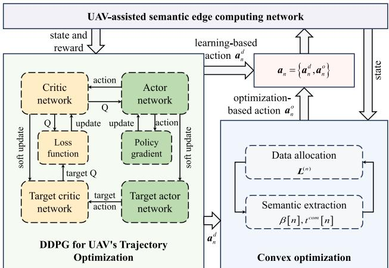  
Fig. 3. The H-DDPG Algorithm.

$$
\begin{array} { r l } & { \frac { \overline { { S } } _ { \mathrm { C } } ^ { \mathrm { B C } } } { \beta \beta _ { 0 } ^ { 2 } } , L _ { \mathrm { C } } \widetilde { \gamma } _ { \mathrm { e q \ell } } \widetilde { \gamma } _ { \mathrm { e q \ell } } \frac { \overline { { S } } _ { \mathrm { C } } ^ { \mathrm { B } } } { \beta \gamma } , } \\ & { \frac { \overline { { S } } _ { \mathrm { C } } ^ { \mathrm { B C } } } { \beta \beta _ { 0 } ^ { 2 } } , \langle \sigma \mathrm { e r e s u } \rangle _ { \mathrm { B i } } + \frac { L _ { \mathrm { C } } ^ { 2 } } { \beta \gamma } , L _ { \mathrm { C } } \widetilde { \gamma } _ { \mathrm { e q \ell } } \frac { \overline { { S } } _ { \mathrm { C } } ^ { \mathrm { B } } L _ { \mathrm { C } } \widetilde { \gamma } _ { \mathrm { e q \ell } } } { \beta \gamma } , } \\ & { + \frac { L _ { \mathrm { C } } L _ { \mathrm { C } } ^ { 2 } \operatorname { C } ^ { \mathrm { B C } } \operatorname { e r e s u } \overline { { S } } _ { \mathrm { C } } ^ { \mathrm { B } } } { \beta \gamma } , \frac { \overline { { S } } _ { \mathrm { C } } ^ { \mathrm { B } } } { \beta \gamma } \widetilde { \gamma } _ { \mathrm { e q \ell } } \frac { \overline { { S } } _ { \mathrm { C } } ^ { \mathrm { B } } L _ { \mathrm { C } } \widetilde { \gamma } _ { \mathrm { e q \ell } } } { \beta \gamma } , } \\ & { \frac { \overline { { S } } _ { \mathrm { C } } ^ { \mathrm { B C } } } { \beta \gamma } , \frac { L _ { \mathrm { C } } \overline { { B } } _ { \mathrm { C } } ^ { \mathrm { B D } } } { \beta \gamma } , } \\ & { + \frac { L _ { \mathrm { C } } ^ { 2 } } { \beta \gamma } , \frac { L _ { \mathrm { C } } \overline { { B } } _ { \mathrm { C } } ^ { \mathrm { B D } } } { \beta \gamma ^ { 2 } } \le \xi , } \\ &  \end{array}\tag{40a}
$$

(40b)

(40c)

(40d)

(40e)

Since the objective function of Problem (40) is non-convex with respect to $\beta [ n ]$ and $t ^ { c o m } [ n ]$ , it is challenging to solve this problem directly. To facilitate optimization, we equivalently reformulate it as a minimization problem:

$$
\operatorname* { m i n } _ { \beta \left[ n \right] , \atop t ^ { c o m } \left[ n \right] } { t ^ { c o m } [ n ] } + \sum _ { m = 1 } ^ { M } { \frac { \beta [ n ] L _ { m } [ n ] } { b ^ { s u t } \mathcal { R } _ { m } [ n ] } } + \frac { C \sum _ { m = 1 } ^ { M } L _ { m } [ n ] } { \beta [ n ] ^ { p - 1 } f _ { U } }\tag{41a}
$$

$$
\mathrm { s . t . } ( 4 0 b ) - ( 4 0 e ) .\tag{41b}
$$

The new objective function and all the constraints are convex, thereby transforming Problem (41) into a convex optimization problem, which can be efficiently solved using mathematical solvers such as CVX.

## C. Overall Algorithm

The flowchart of the H-DDPG algorithm is shown in Fig. 3. Specifically, we first employ the BCD method to decompose the original problem into three subproblems: UAV trajectory optimization, data allocation, and semantic extraction. The UAV trajectory is optimized using the DDPG algorithm based on fixed data allocation $L [ n ]$ and semantic extraction factor $\beta [ n ]$ , as illustrated by the green area in Fig. 3. The other two subproblems are addressed given the UAV’s action via convex optimization (blue area). Through repeated training across multiple episodes, the algorithm gradually converges to a high-quality policy that enables the UAV to make effective decisions in dynamic semantic edge computing environments. The training complexity of the H-DDPG algorithm includes the complexity of DRL and optimization. The DRL-related complexity per episode is given by $\mathcal { O } \left( N \left( ( b + 1 ) | \pmb \theta | + b | \phi | \right) \right)$ where |θ| and |φ| denote the number of parameters in the actor and critic networks, and b is the batch size. In addition, the optimization complexity per episode is calculated by $\mathcal { O } \left( \ln ( 1 / \varepsilon ) \left( ( M N + N ) ^ { 3 . 5 } + ( 2 N ) ^ { 3 . 5 } \right) \right)$ , where $\ln ( 1 / \varepsilon )$ indicates the maximum number of iterations to reach an accuracy of ε.

## V. HYBRID DIFFUSION DEEP DETERMINISTIC POLICY GRADIENT ALGORITHM

Conventional DDPG struggles with limited exploration capabilities and often converges to suboptimal policies due to the high-dimensional continuous action space. To enhance exploration efficiency and improve policy robustness, we introduce an H-D3PG algorithm, which integrates denoising diffusion models into DDPG for UAV trajectory optimization and resource allocation. The H-D3PG algorithm refines UAV movement decisions and generates more diverse policies by leveraging the generative capabilities of diffusion processes.

## A. Diffusion Process for Action Generation

Different from conventional DDPG, which generates UAV actions by directly training a policy network, we incorporate Denoising Diffusion Probabilistic Models (DDPMs) into the action generation process to construct actions in a stepwise manner. DDPMs employ a two-step generative process: a forward diffusion process that gradually corrupts the data by adding Gaussian noise, and a reverse denoising process that reconstructs the original data distribution through learned refinement. In UAV trajectory optimization where expert actions are not available, we omit the forward diffusion process and instead initialize the reverse process from pure Gaussian noise. The actor network directly learns to denoise this noise toward an optimal action under the guidance of Q-values from reinforcement learning.

The reverse process aims to recover the original action from the noisy sample by learning the inverse transformation. The generative process follows another Markov chain as

$$
p _ { \theta } ( \pmb { x } _ { t - 1 } | \pmb { x } _ { t } ) = \mathcal { N } ( \pmb { x } _ { t - 1 } ; \pmb { \mu } _ { \theta } ( \pmb { x } _ { t } , t ) , \sigma _ { t } ^ { 2 } \mathbf { I } ) ,\tag{42}
$$

where the mean function $\mu _ { \theta } ( x _ { t } , t )$ is parameterized by the neural network, while $\sigma _ { t } ^ { 2 }$ denotes the variance. The optimal mean function is derived as:

$$
{ \pmb \mu } _ { \theta } ( { \pmb x } _ { t } , t ) = \frac { 1 } { \sqrt { \alpha _ { t } } } \left( { \pmb x } _ { t } - \frac { \beta _ { t } } { \sqrt { 1 - \bar { \alpha } _ { t } } } { \pmb \epsilon } _ { \theta } ( { \pmb x } _ { t } , t ) \right) .\tag{43}
$$

Instead of directly predicting $\mu _ { \theta }$ , the neural network estimates the noise component $\epsilon _ { \theta }$ , which allows the model to recover the original data as

$$
\hat { x } _ { 0 } = \frac { x _ { t } - \sqrt { 1 - \bar { \alpha } _ { t } } \epsilon _ { \theta } ( x _ { t } , t ) } { \sqrt { \bar { \alpha } _ { t } } } .\tag{44}
$$

The predicted initial action $\scriptstyle { \hat { \mathbf { x } } } _ { 0 }$ serves as the denoised output of the diffusion process.

During inference, the model starts from Gaussian noise $\mathbf { \boldsymbol { x } } _ { T } ~ \sim ~ \mathcal { N } ( 0 , \mathbf { I } )$ and iteratively applies the learned reverse process:

$$
\begin{array} { r } { \pmb { x } _ { t - 1 } = \pmb { \mu } _ { \theta } ( \pmb { x } _ { t } , t ) + \sigma _ { t } \pmb { z } , \quad \pmb { z } \sim \mathcal { N } ( 0 , \mathbf { I } ) . } \end{array}\tag{45}
$$

The process continues until $t \ = \ 0 ,$ , at which point $\scriptstyle { \mathbf { { \mathit { x } } } } _ { 0 }$ is obtained as the generated action. This iterative refinement allows DDPMs to generate high-quality data samples while maintaining training stability through the Markovian structure.

## B. Diffusion-DDPG Framework

In H-D3PG, the actor network learns to predict the noise component in the diffusion process, refining a noisy action sample through multiple iterations. Given the current reinforcement learning state $s _ { n } .$ , a diffusion timestep t, and a noisy latent action ${ \mathbf { } } x _ { t } ,$ , the actor network $\pi _ { \theta }$ estimates the noise prediction term $\epsilon _ { \theta } ( s _ { n } , \pmb { x } _ { t } , t )$ . The reverse diffusion process starts from a latent action vector $\mathbf { \boldsymbol { x } } _ { T } \sim \mathcal { N } ( 0 , \mathbf { I } )$ , and iteratively refines it via denoising steps. At each timestep t, the update rule is

$$
\pmb { x } _ { t - 1 } = \frac { 1 } { \sqrt { \alpha _ { t } } } \left( \pmb { x } _ { t } - \frac { \beta _ { t } } { \sqrt { 1 - \bar { \alpha } _ { t } } } \epsilon _ { \theta } ( \pmb { s } _ { n } , \pmb { x } _ { t } , t ) \right) + \sigma _ { t } \pmb { z } ,\tag{46}
$$

where $\boldsymbol { z } \sim \mathcal { N } ( 0 , \mathbf { I } )$ is standard Gaussian noise. This denoising process is repeated for T steps until the final UAV movement action is obtained $\textbf { \textit { a } } _ { n } ^ { d } ~ = ~ \pmb { x } _ { 0 }$ . In addition, we set $\sigma _ { t } { = } 0$ only at the final step, which removes sampling randomness and improves stability; exploration is still provided by the stochastic denoising steps with $t > 1$

The number of diffusion steps T affects training efficiency and exploration capabilities. A larger T allows for more precise action refinement but increases computation cost, while a smaller T improves efficiency but may limit exploration. In our implementation, we adopt a moderate $T \ ( { \mathrm { e . g . , } } \ T { = } 5 ;$ see Fig. 8), which provides sufficient action diversity while keeping the per-decision overhead manageable. By structuring the actor as a diffusion-based denoising network, the policy benefits from improved trajectory diversity while mitigating the limitations of conventional deterministic policies.

In addition to enhancing exploration, diffusion-based action generation matches the structural characteristics of the UAVassisted semantic edge computing problem. The UAV’s movement jointly influences user coverage, channel gains, and semantic processing effectiveness, creating a highly non-convex decision landscape in which multiple movement directions may lead to comparable reward values. Conventional stochastic perturbation methods such as Gaussian or Ornstein–Uhlenbeck noise typically generate locally concentrated perturbations, which limits their ability to explore multiple candidate action regions in such multi-modal settings.

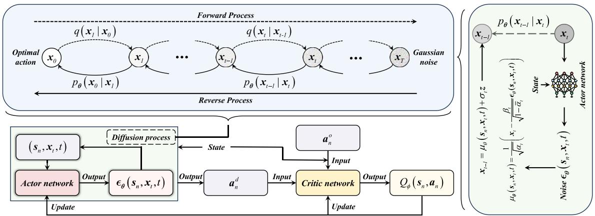  
Fig. 4. The H-D3PG Algorithm.

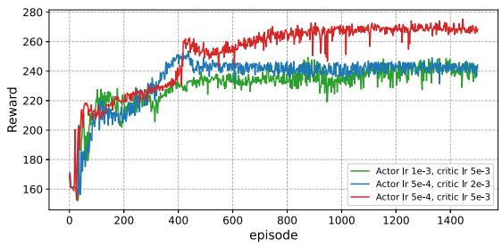

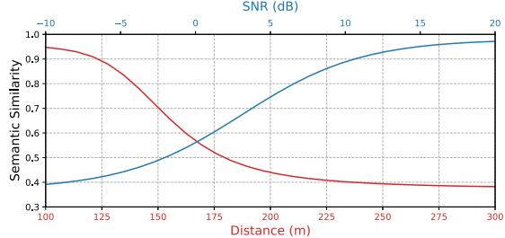  
Fig. 7. Semantic similarity as a function of distance and SNR.

(a) Convergence performance of H-DDPG.  
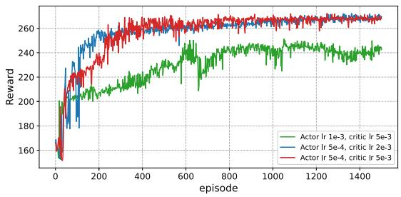  
(b) Convergence performance of H-D3PG.

Fig. 5. Convergence performance of H-DDPG and H-D3PG.  
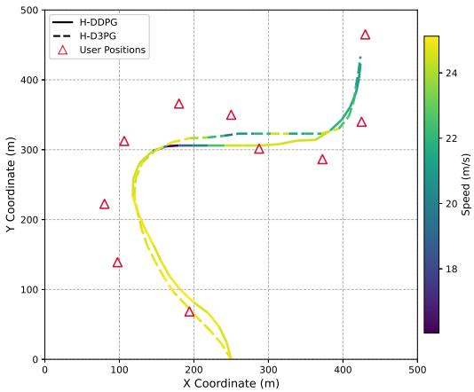  
Fig. 6. Distribution of edge devices and UAV’s trajectories.

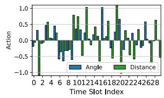  
(a) The 1st reverse diffusion step

By contrast, the multi-step refinement mechanism of diffusion models begins from a broad noise prior and progressively guides samples toward high-value regions preferred by the critic, enabling richer and more structured exploration. This property makes diffusion-based policies particularly suitable for problems where UAV mobility, communication quality, and semantic-processing performance are tightly coupled.

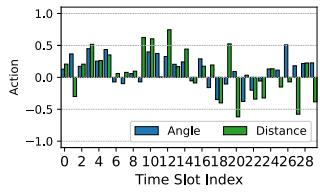  
(b) The 2nd reverse diffusion step

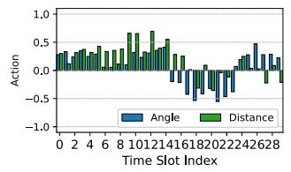  
(c) The 3rd reverse diffusion step

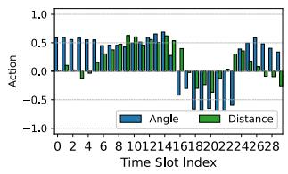  
(d) The 4th reverse diffusion step

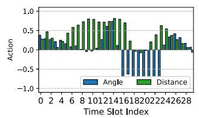  
(e) The 5th reverse diffusion step

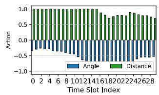  
(f) The optimal action  
Fig. 8. Visualization of the reverse diffusion process across different time steps.

During training, the actor network is optimized using the deterministic policy gradient method. The final denoised action $\pmb { a } _ { n } ^ { d }$ generated by the diffusion process is combined with the optimization-based action $\pmb { a } _ { n } ^ { o }$ to form the complete action ${ \bf a } _ { n } = \{ { \bf a } _ { n } ^ { d } , { \bf a } _ { n } ^ { o } \}$ , which is then evaluated by the critic $Q _ { \phi }$ The policy gradient is computed as:

$$
\begin{array} { r } { \nabla _ { \theta } J \left( \theta \right) = \mathbb { E } \left[ \nabla _ { a _ { n } ^ { d } } Q _ { \phi } ( s _ { n } , a _ { n } ) \cdot \nabla _ { \theta } \pi _ { \theta } ( s _ { n } , x _ { t } , t ) \right] . } \end{array}\tag{47}
$$

where $\pi _ { \pmb { \theta } } ( s _ { n } , \pmb { x } _ { t } , t )$ denotes the output of the actor network at diffusion step t, i.e., the predicted noise $\epsilon _ { \theta } ( s _ { n } , \pmb { x } _ { t } , t )$ Accordingly, $\nabla _ { \pmb { \theta } } \pi _ { \pmb { \theta } } ( \cdot )$ denotes the gradient of the predicted noise with respect to the actor parameters θ. Since the final denoised action ${ \pmb a } _ { n } ^ { d } = { \pmb x } _ { 0 }$ is obtained by iteratively applying the update rule in (46) for $\scriptstyle t = T , \ldots , 1$ , the gradient in (47) backpropagates through all diffusion steps via the chain rule. In this way, the critic’s evaluation $Q _ { \phi }$ is directly linked to the actor’s noise predictions, thereby establishing a connection between (46) and (47). During actor updates, the optimizationbased component $\pmb { a } _ { n } ^ { o }$ is kept fixed, so gradients propagate only through the denoised action $\pmb { a } _ { n } ^ { d }$ across the diffusion steps in (46). This diffusion-based policy design not only introduces structured stochasticity into action generation but also improves generalization to dynamic environments by mitigating deterministic overfitting, which is critical for adapting to dynamic channel conditions and varying semantic tasks in UAV-assisted edge computing.

## C. Overall Algorithm

The overall training workflow of the H-D3PG algorithm is illustrated in Fig. 4. H-D3PG integrates diffusion-based reinforcement learning with convex optimization. It consists of a diffusion-DDPG module for UAV trajectory optimization and a convex module for data allocation and semantic extraction. Concretely, the diffusion-DDPG component utilizes a denoising actor network to iteratively generate UAV movement decisions, while a critic network evaluates the quality of the generated actions through Q-value estimation. Given the UAV’s position, the convex optimization module determines the optimal data allocation and semantic processing variables. The H-D3PG algorithm is similar to the H-DDPG. The main difference lies in the action generation process: in H-D3PG, the final action is obtained through a reverse diffusion process, where the actor network estimates the noise term instead of directly outputting the $\mathrm { U A V } \mathbf { \hat { s } }$ action. The actual action is progressively recovered from Gaussian noise through multiple denoising steps. The combination of diffusion process and DDPG enhances the diversity of policy exploration, effectively alleviates the issues of overfitting or divergence commonly observed in DDPG, and provides stronger generalization potential in complex or non-stationary environments. It is worth noting that the proposed H-DDPG and H-D3PG schemes are trained offline. During deployment, the UAV only performs forward inference using the trained actor network to generate actions, without any additional online training or exploration.

Similar to H-DDPG, the DRL-related complexity of H-D3PG is given by $\mathcal { O } \left( N \left( T \left| \pmb { \theta } \right| + b \left| \pmb { \theta } \right| + b \left| \phi \right| \right) \right)$ ), where

$T \left| \boldsymbol { \theta } \right|$ accounts for the denoising-based action sampling process. The above expression shows that only the denoisingbased sampling component introduces a linear factor in $T ,$ whereas the other DRL costs are independent of T . Since $T$ is set to a small value in our design, the additional diffusion inference latency remains limited.

## VI. SIMULATION RESULTS

## A. Simulation Settings

In this section, we conduct simulations to evaluate the performance of the proposed algorithms. Specifically, we consider a scenario in which the UAV starts from the initial position [250, 0, 100] and collects data from 10 edge devices distributed within a $\mathrm { 5 0 0 \times 5 0 0 m ^ { 2 } }$ area,3 following a similar setup as in [23]. All experiments were conducted on a computer equipped with an Intel i9-13900HX CPU and an RTX 4060 GPU. The proposed schemes are trained offline in this simulated environment. With 1500 epochs and 30 steps per epoch (45,000 steps in total, 22,500 gradient updates), corresponding to an average of 0.48 seconds per step. The semantic communication part is configured following the setting in [22], which adopts a dataset described in [35] containing approximately 2.0 million sentences and 53 million words, pre-processed to retain sentence lengths between 4 and 30 words. The specific parameters used in each simulation are indicated in the corresponding figures, while other general parameters are summarized in Table I, consistent with the setting in [24]. We compare the performance of five different schemes under various parameter settings. The details of each scheme are described as follows:

• H-DDPG: This scheme utilizes our proposed H-DDPG algorithm, in which the UAV trajectory is optimized using the DDPG method, while data allocation and semantic extraction are solved via convex optimization techniques.

• H-D3PG: This scheme employs our proposed H-D3PG algorithm, which incorporates the D3PG method for UAV trajectory optimization.

• Uniform Computation Time: This scheme also uses the H-DDPG algorithm, but the semantic extraction time is fixed to the average value obtained from the H-DDPG results.

• Random Extraction: Based on the H-DDPG scheme, this approach randomly selects the semantic extraction factor at each time slot.

• Raw Data Transmission: This scheme directly transmits raw data without semantic extraction, serving as a baseline to highlight the benefits of semantic communication.

## B. Simulation Results and Analysis

In Fig. 5, we present the convergence curves of the reward versus the number of episodes for H-DDPG and H-D3PG under different actor and critic learning rates.

TABLE I  
MAIN PARAMETERS IN SIMULATION
<table><tr><td rowspan=1 colspan=1>Description of Specifications</td><td rowspan=1 colspan=1>Notation</td><td rowspan=1 colspan=1>Setting</td></tr><tr><td rowspan=1 colspan=1>Number of time slots</td><td rowspan=1 colspan=1>N</td><td rowspan=1 colspan=1>30</td></tr><tr><td rowspan=1 colspan=1>Duration of time slot</td><td rowspan=1 colspan=1>δ</td><td rowspan=1 colspan=1>1 s</td></tr><tr><td rowspan=1 colspan=1>UAV&#x27;s altitude</td><td rowspan=1 colspan=1> $\overline { { H } }$ </td><td rowspan=1 colspan=1>100 m</td></tr><tr><td rowspan=1 colspan=1>Maximum flying distance</td><td rowspan=1 colspan=1> $\overline { { d ^ { \mathrm { m a x } } } }$ </td><td rowspan=1 colspan=1> $^ { 2 5 \mathrm { ~ m ~ } }$ </td></tr><tr><td rowspan=1 colspan=1>Carrier frequency</td><td rowspan=1 colspan=1> $\overline { { f } }$ </td><td rowspan=1 colspan=1> $\overline { { 2 \times 1 0 ^ { 9 } ~ \mathrm { H z } } }$ </td></tr><tr><td rowspan=1 colspan=1>Transmit power of edge device</td><td rowspan=1 colspan=1> ${ p } _ { m } ^ { t }$ </td><td rowspan=1 colspan=1> $\overline { { 0 . 1 \mathrm { ~ W ~ } } }$ </td></tr><tr><td rowspan=1 colspan=1>Noise power</td><td rowspan=1 colspan=1> $\sigma ^ { 2 }$ </td><td rowspan=1 colspan=1> $\overline { { 4 \times 1 0 ^ { - 1 1 } \mathrm { ~ W ~ } } }$ </td></tr><tr><td rowspan=1 colspan=1>Semantic extraction parameter</td><td rowspan=1 colspan=1> $k$ </td><td rowspan=1 colspan=1>4</td></tr><tr><td rowspan=1 colspan=1>Required CPU cycles of unit task</td><td rowspan=1 colspan=1> $C$ </td><td rowspan=1 colspan=1>200 cycles/bit</td></tr><tr><td rowspan=1 colspan=1>Computation resources of device</td><td rowspan=1 colspan=1> $f _ { m }$ </td><td rowspan=1 colspan=1>109 cycles/s</td></tr><tr><td rowspan=1 colspan=1>Energy consumption coefficient</td><td rowspan=1 colspan=1> $\kappa$ </td><td rowspan=1 colspan=1> $\overline { { 2 ^ { - 2 6 } } }$ </td></tr><tr><td rowspan=1 colspan=1>Bit size of each symbol</td><td rowspan=1 colspan=1> $\overline { { b ^ { s y m } } }$ </td><td rowspan=1 colspan=1>4 bits/symbol</td></tr><tr><td rowspan=1 colspan=1>Symbol transmission rate</td><td rowspan=1 colspan=1> $\overline { { R ^ { s y m } } }$ </td><td rowspan=1 colspan=1>2 × $\overline { { 1 0 ^ { 6 } } }$ symbols/s</td></tr><tr><td rowspan=1 colspan=1>Semantic information of each sentence</td><td rowspan=1 colspan=1> $\overline { { I ^ { s e n } } }$ </td><td rowspan=1 colspan=1>800 suts/sentence</td></tr><tr><td rowspan=1 colspan=1>Semantic symbols in each word</td><td rowspan=1 colspan=1> $\overline { { K } }$ </td><td rowspan=1 colspan=1>5 symbols/word</td></tr><tr><td rowspan=1 colspan=1>Words in each sentence</td><td rowspan=1 colspan=1> $\overline { W }$ </td><td rowspan=1 colspan=1>15 words/sentence</td></tr><tr><td rowspan=1 colspan=1>Maximum energy consumption</td><td rowspan=1 colspan=1> $E _ { m }$ </td><td rowspan=1 colspan=1>10J</td></tr><tr><td rowspan=1 colspan=1>Computation resources of UAV</td><td rowspan=1 colspan=1> $f _ { U }$ </td><td rowspan=1 colspan=1> $\overline { { 3 0 \times 1 0 ^ { 9 } \mathrm { \ c y c l e s / s } } }$ </td></tr><tr><td rowspan=1 colspan=1>Weighting coefficients</td><td rowspan=1 colspan=1> $w , w _ { 1 } , w _ { 2 }$ </td><td rowspan=1 colspan=1> $\overline { { 1 \times 1 0 ^ { - 6 } , 1 0 , 1 0 } }$ </td></tr></table>

It can be observed that each configuration gradually converges as training progresses.4 In particular, when the actor learning rate is set to $5 ~ \times ~ 1 0 ^ { - 4 }$ and the critic learning rate to $5 ~ \times ~ 1 0 ^ { - 3 }$ , both methods converge relatively quickly to higher reward values. However, as the actor learning rate further increases to $1 \times 1 0 ^ { - 3 }$ , the performance of both methods degrades significantly. Moreover, H-D3PG consistently outperforms H-DDPG under most configurations, indicating that the training process incorporating the diffusion process exhibits better adaptability.

To evaluate the stability of the proposed H-D3PG algorithm, we provide empirical convergence evidence using the reward curves obtained under multiple learning-rate configurations. In Fig. 5, we present the reward evolution of H-DDPG and H-D3PG across different actor and critic learning rates. It can be observed that all configurations show clear convergent behavior as training progresses.5 Across all tested hyperparameter settings, the curves converge to stable reward regions without divergence, indicating that the diffusion-based denoising mechanism preserves the overall training stability of the actor–critic architecture. In particular, when the actor and critic learning rates are set to $5 \times 1 0 ^ { - 4 }$ and $5 \times 1 0 ^ { - 3 }$ , respectively, both algorithms converge rapidly to high reward levels. However, when the actor learning rate increases to $1 \times 1 0 ^ { - 3 }$ the performance of both methods deteriorates noticeably. Moreover, H-D3PG consistently achieves higher convergence levels than H-DDPG under most configurations, demonstrating that incorporating diffusion enhances the robustness of policy learning. These results collectively provide practical evidence of the convergence behavior and training stability of the proposed method.

TABLE II  
INFERENCE LATENCY VS. NUMBER OF USERS
<table><tr><td rowspan=1 colspan=1>Number of Users</td><td rowspan=1 colspan=1>10</td><td rowspan=1 colspan=1>15</td><td rowspan=1 colspan=1>20</td><td rowspan=1 colspan=1>25</td></tr><tr><td rowspan=1 colspan=1>Total Inference Time (s)</td><td rowspan=1 colspan=1>2.66</td><td rowspan=1 colspan=1>3.76</td><td rowspan=1 colspan=1>4.95</td><td rowspan=1 colspan=1>6.17</td></tr><tr><td rowspan=1 colspan=1>Per-Step Inference Time (ms)</td><td rowspan=1 colspan=1>88.64</td><td rowspan=1 colspan=1>125.27</td><td rowspan=1 colspan=1>165.10</td><td rowspan=1 colspan=1>205.99</td></tr></table>

TABLE III  
MOBILITY IMPACT ON SEMANTIC PROCESSING RATE
<table><tr><td rowspan=1 colspan=1>Mobility Level (m/step)</td><td rowspan=1 colspan=1>0</td><td rowspan=1 colspan=1>2.5</td><td rowspan=1 colspan=1>5</td><td rowspan=1 colspan=1>7.5</td><td rowspan=1 colspan=1>10</td></tr><tr><td rowspan=1 colspan=1>Semantic ProcessingRate (suts/s)</td><td rowspan=1 colspan=1>92.04</td><td rowspan=1 colspan=1>91.89</td><td rowspan=1 colspan=1>91.48</td><td rowspan=1 colspan=1>90.13</td><td rowspan=1 colspan=1>84.02</td></tr></table>

During inference, the online decision latency depends on the neural forward pass and the diffusion denoising steps. To further examine the scalability of the proposed method, we measure the inference latency of H-D3PG under different user numbers. Table II reports the total inference time for 30 decision steps as well as the corresponding per-step latency. When the number of users increases from 10 to 25, the total inference time increases from 2.66 s to 6.17 s, corresponding to 88–206 ms per decision, which is smaller than the slot duration (1 s). These results indicate that the proposed algorithm maintains practical online inference latency and scales well with the system size.

Fig. 6 illustrates edge devices’ spatial distribution, optimized UAV trajectories, and corresponding speed profiles. The solid line represents the trajectory obtained by the H-DDPG algorithm, while the dashed line corresponds to that of the H-D3PG scheme. Both trajectories generally follow the spatial layout of the edge devices. At the initial stage, where user density is low, the UAV flies at a relatively high speed; in contrast, it slows down in the central region where the edge devices are more densely distributed. Notably, the trajectory of H-DDPG exhibits an overly sharp reduction in speed in the central area. Although this enables the UAV to serve nearby edge devices more thoroughly, it also restricts its ability to reach other users within the limited time. In comparison, H-D3PG maintains a more moderate and consistent speed profile throughout the trajectory.

To further assess the robustness of the proposed framework, we evaluate system performance under stochastic user mobility. In this experiment, each user performs a random movement in both the x- and y-directions at every time slot, and the mobility level (average per-slot movement) is varied from 0 m/step to 10 m/step. Table III summarizes the resulting semantic processing rate. As the mobility level increases, the performance decreases gradually from 92.04 suts/s at 0 m/step to 84.02 suts/s at 10 m/step, corresponding to an overall degradation of approximately 8–9%. This decline is expected because user mobility perturbs the link geometry and task distribution. The relatively small degradation for mobility levels below 7.5 m/step demonstrates that the proposed H-D3PG policy maintains strong robustness against mobility-induced dynamics.

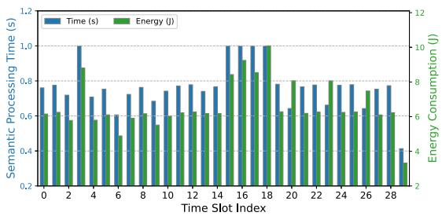  
Fig. 9. Semantic processing time and energy consumption over time slots.

In Fig. 7, we further illustrate the variation of semantic similarity with respect to distance and SNR to better demonstrate the impact of UAV trajectory on the semantic rate. Unlike conventional bit-level communication, the semantic similarity exhibits an S-shaped curve with respect to SNR, as shown in the equation (16). The curve tends to flatten at both high and low SNR regimes. This is because symbol errors dominate at low SNR, while semantic integrity is already maximized at high SNR, leading to saturation. Similarly, the variation of semantic similarity with distance follows a trend analogous to that of SNR. This explains why, in Fig. 6, the UAV can maintain a certain distance from the edge devices without hovering directly overhead.

Fig. 8 presents the evolution of the generated action distribution across different reverse diffusion steps, where the blue and green bars represent the UAV’s flight angle and distance, respectively. It can be observed that the actions exhibit high randomness at the early stages of the diffusion process, closely resembling Gaussian noise. As the denoising steps proceed, the actions gradually converge to a more structured and stable distribution. The convergence demonstrate the effectiveness of the diffusion-based policy generation. These results highlight the denoising capacity of the actor network and confirm that meaningful structure gradually emerges as noise is removed.

The variation of semantic processing time and energy consumption across different time slots under the H-D3PG scheme is depicted in Fig. 9. The blue bars represent the semantic processing time in each slot (corresponding to the left y-axis), while the green bars indicate the corresponding energy consumption (right y-axis). Notably, we find that there is a generally consistent trend between the two metrics, which indicates that the energy consumption is closely tied to the semantic processing time. These results demonstrate the effectiveness of H-D3PG in dynamically adjusting the data allocation and semantic extraction.

Fig. 10 compares the semantic processing rate and time of all schemes under different computing resources of edge devices $f _ { m } .$ . It can be observed that the H-D3PG scheme achieves the highest semantic processing rate, followed by the H-DDPG scheme. In contrast, the performance of Uniform Computation Time and Random Extraction schemes is substantially lower, while the Raw Data Transmission scheme performs the worst. Specifically, H-D3PG achieves a 38.8% higher semantic processing rate compared to Raw Data Transmission. As the computing capability increases, the processing rates of all schemes generally improve. However, for both H-D3PG and H-DDPG, a slight decline in rate is observed at the highest resource levels, accompanied by a corresponding increase in processing time. According to (12), higher computing resources result in increased computation energy consumption. Under the total energy constraint, this reduces the energy available for semantic transmission, which in turn limits the data volume that can be processed in time slots with high semantic rates.

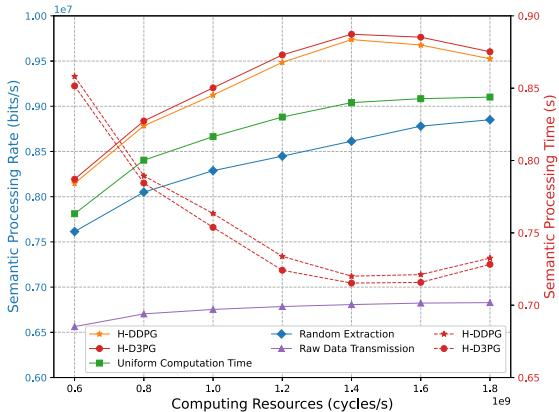

Fig. 10. Semantic processing rate and time under different computing resources of edge devices.  
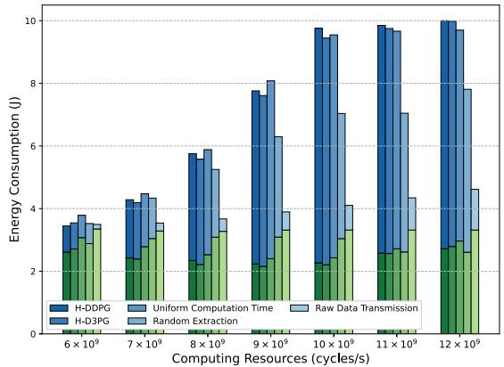  
Fig. 11. Energy consumption under different computing resources of edge devices.

Fig. 11 presents the total energy consumption and the composition as computing resources vary. In each bar, the upper blue portion represents the computation energy of edge devices, while the lower green portion corresponds to transmission energy. With the increase of computing resources, computation energy consumption steadily rises as shown in the equation (12), and the total energy consumption approximates to the maximum constraint. In contrast, transmission energy exhibits a non-monotonic trend, decreasing initially and then increasing. As more energy is consumed by computation at higher processing rates, the residual energy for transmission decreases, shifting data load to suboptimal time slots. This resource trade-off underscores the necessity of joint optimization to effectively balance computation and communication under energy constraints.

Fig. 12 illustrates the impact of the symbol rate Rsym on the semantic processing rate. The proposed H-D3PG scheme outperforms the other baselines across all tested symbol rate levels, followed by the H-DDPG scheme. Notably, all schemes exhibit significant improvement except for the Uniform Computation Time scheme. While its performance initially improves, the fixed local processing time eventually becomes a bottleneck. Once this upper limit is reached, further increases in transmission rate yield diminishing returns, as the volume of tasks that can be processed locally remains constrained.

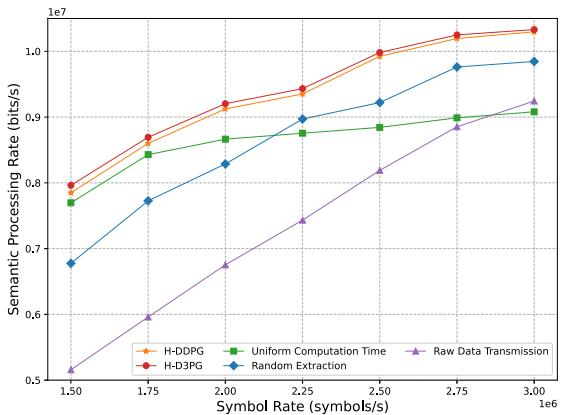  
Fig. 12. Impact of symbol rate on semantic processing rate.

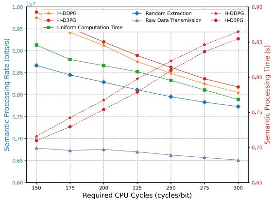  
Fig. 13. Impact of required CPU cycles on semantic processing rate and time.

Finally, the impact of the required CPU cycles C on the semantic processing rate and processing time is shown in Fig. 13. As the required CPU cycles increase, all schemes—except for Raw Data Transmission—exhibit a significant decline in semantic processing rate and a corresponding increase in processing time. The Raw Data Transmission scheme is less affected because it does not perform semantic extraction. Although H-D3PG and H-DDPG experience performance degradation as C increases, they consistently outperform the baseline schemes. This demonstrates their ability to allocate resources more effectively through the joint optimization of data allocation and semantic extraction, thereby maintaining relatively high efficiency even under substantial computational loads.

## VII. CONCLUSION

In this paper, we have proposed a UAV-assisted semantic edge computing network to address the limitations of traditional communication systems and reduce redundant data transmission. By leveraging UAV and semantic communication, the framework has improved the semantic processing rate in dynamic edge environments. We have formulated a joint optimization problem involving UAV trajectory, data allocation, and semantic extraction. To solve this problem, we have developed an H-DDPG algorithm that integrates convex optimization with DRL via the BCD method. Furthermore, we have introduced an H-D3PG algorithm that incorporates denoising diffusion models into the DRL framework to enable more expressive and diverse policy generation in high-dimensional decision spaces. Simulation results have demonstrated that H-D3PG improves the semantic processing rate by up to 38.8% while reducing energy consumption compared to raw transmission baselines, confirming its effectiveness in dynamic semantic edge environments.

This work primarily assumes static edge devices for tractability, with a supplementary experiment included to verify robustness under stochastic user mobility. Future extensions include (i) fully mobile scenarios, which introduce fast-varying channels and dynamic task arrivals, (ii) multimodal semantic data, which require heterogeneous encoders and new similarity metrics, and (iii) multi-UAV networks. Regarding the multi-UAV case, the proposed scheme can be extended in a structured manner. Each UAV may be equipped with its own diffusion-based actor for trajectory refinement and an optimization submodule for semantic extraction and data allocation, while an additional coordination layer is introduced to handle inter-UAV coupling. Such a layer would manage UAV–user association, mitigate inter-UAV interference, and enable cooperative trajectory planning or distributed resource allocation. These additions primarily affect the system-level coordination architecture, whereas the core components of the proposed H-D3PG framework remain directly applicable. These extensions represent promising directions for future research.

## REFERENCES

[1] E. Baccour et al., “Pervasive AI for IoT applications: A survey on resource-efficient distributed artificial intelligence,” IEEE Commun. Surveys Tuts., vol. 24, no. 4, pp. 2366–2418, 2022.

[2] M. Vaezi et al., “Cellular, wide-area, and non-terrestrial IoT: A survey on 5G advances and the road toward 6G,” IEEE Commun. Surveys Tuts., vol. 24, no. 2, pp. 1117–1174, 2nd Quart., 2022.

[3] M. M. Azari et al., “Evolution of non-terrestrial networks from 5G to 6G: A survey,” IEEE Commun. Surveys Tuts., vol. 24, no. 4, pp. 2633–2672, 4th Quart., 2022.

[4] Q. Luo, S. Hu, C. Li, G. Li, and W. Shi, “Resource scheduling in edge computing: A survey,” IEEE Commun. Surveys Tuts., vol. 23, no. 4, pp. 2131–2165, 4th Quart., 2021.

[5] Z. Chang, S. Liu, X. Xiong, Z. Cai, and G. Tu, “A survey of recent advances in edge-computing-powered artificial intelligence of things,” IEEE Internet Things J., vol. 8, no. 18, pp. 13849–13875, Sep. 2021.

[6] G. Geraci et al., “What will the future of UAV cellular communications be? A flight from 5G to 6G,” IEEE Commun. Surveys Tuts., vol. 24, no. 3, pp. 1304–1335, 3rd Quart., 2022.

[7] D. Zhai, H. Li, X. Tang, R. Zhang, and H. Cao, “Joint position optimization, user association, and resource allocation for load balancing in UAV-assisted wireless networks,” Digit. Commun. Netw., vol. 10, no. 1, pp. 25–37, Feb. 2024.

[8] C. Wang, D. Zhai, R. Zhang, L. Cai, L. Liu, and M. Dong, “Joint association, trajectory, offloading, and resource optimization in air and ground cooperative MEC systems,” IEEE Trans. Veh. Technol., vol. 73, no. 9, pp. 13076–13089, Sep. 2024.

[9] S. Meng, S. Wu, J. Zhang, J. Cheng, H. Zhou, and Q. Zhang, “Semantics-empowered space-air-ground-sea integrated network: New paradigm, frameworks, and challenges,” IEEE Commun. Surveys Tuts., vol. 27, no. 1, pp. 140–183, Feb. 2025.

[10] R. Zhang et al., “Semantic communication and security over cloudnetwork-end infrastructure: An effective architecture for intelligent mobile systems,” IEEE Veh. Technol. Mag., vol. 20, no. 4, pp. 104–113, Dec. 2025.

[11] W. Yang et al., “Semantic communications for future internet: Fundamentals, applications, and challenges,” IEEE Commun. Surveys Tuts., vol. 25, no. 1, pp. 213–250, 1st Quart., 2023.

[12] H. Hu, X. Zhu, F. Zhou, W. Wu, R. Q. Hu, and H. Zhu, “Resource allocation for multi-modal semantic communication in UAV collaborative networks,” IEEE Trans. Commun., vol. 73, no. 9, pp. 7599–7616, Sep. 2025.

[13] H. Du et al., “Enhancing deep reinforcement learning: A tutorial on generative diffusion models in network optimization,” IEEE Commun. Surveys Tuts., vol. 26, no. 4, pp. 2611–2646, 2024.

[14] M. Xu et al., “Unleashing the power of edge-cloud generative AI in mobile networks: A survey of AIGC services,” IEEE Commun. Surveys Tuts., vol. 26, no. 2, pp. 1127–1170, 2nd Quart., 2024.

[15] C. Liang et al., “Generative AI-driven semantic communication networks: Architecture, technologies, and applications,” IEEE Trans. Cognit. Commun. Netw., vol. 11, no. 1, pp. 27–47, Feb. 2025.

[16] M. Hui, J. Chen, L. Yang, L. Lv, H. Jiang, and N. Al-Dhahir, “UAVassisted mobile edge computing: Optimal design of UAV altitude and task offloading,” IEEE Trans. Wireless Commun., vol. 23, no. 10, pp. 13633–13647, Oct. 2024.

[17] H. Xiao, X. Hu, W. Zhang, W. Wang, K.-K. Wong, and K. Yang, “Energy-efficient STAR-RIS enhanced UAV-enabled MEC networks with bi-directional task offloading,” IEEE Trans. Wireless Commun., vol. 24, no. 4, pp. 3258–3272, Apr. 2025.

[18] J. Chen et al., “Deep reinforcement learning based resource allocation in multi-UAV-aided MEC networks,” IEEE Trans. Commun., vol. 71, no. 1, pp. 296–309, Jan. 2023.

[19] X. Yu, X. Zhang, Y. Rui, X. Dang, G. Jia, and M. Guizani, “Joint resource allocation and 3D-position optimization for UAV-assisted MEC network with NOMA,” IEEE Trans. Netw. Sci. Eng., vol. 12, no. 3, pp. 1–15, May 2025.

[20] H. Chen, H. Cui, J. Wang, P. Cao, Y. He, and M. Guizani, “Computation offloading optimization for UAV-based cloud-edge collaborative task scheduling strategy,” IEEE Trans. Cognit. Commun. Netw., vol. 11, no. 6, pp. 4240–4253, Dec. 2025.

[21] F. Pervez, A. Sultana, C. Yang, and L. Zhao, “Energy and latency efficient joint communication and computation optimization in a multi-UAV-assisted MEC network,” IEEE Trans. Wireless Commun., vol. 23, no. 3, pp. 1728–1741, Mar. 2024.

[22] X. Mu, Y. Liu, L. Guo, and N. Al-Dhahir, “Heterogeneous semantic and bit communications: A semi-NOMA scheme,” IEEE J. Sel. Areas Commun., vol. 41, no. 1, pp. 155–169, Jan. 2023.

[23] S. Liu, H. Yang, M. Zheng, L. Xiao, Z. Xiong, and D. Niyato, “UAVenabled semantic communication in mobile edge computing under jamming attacks: An intelligent resource management approach,” IEEE Trans. Wireless Commun., vol. 23, no. 11, pp. 17493–17507, Nov. 2024.

[24] Z. Yang, M. Chen, Z. Zhang, and C. Huang, “Energy efficient semantic communication over wireless networks with rate splitting,” IEEE J. Sel. Areas Commun., vol. 41, no. 5, pp. 1484–1495, May 2023.

[25] Y. Zheng, T. Zhang, and J. Loo, “Dynamic multi-time scale user admission and resource allocation for semantic extraction in MEC systems,” IEEE Trans. Veh. Technol., vol. 72, no. 12, pp. 16441–16453, Dec. 2023.

[26] Y. Long, S. Gong, S. Sun, G. C. F. Lee, L. Li, and D. Niyato, “Lyapunov-guided deep reinforcement learning for semantic-aware AoI minimization in UAV-assisted wireless networks,” IEEE Trans. Wireless Commun., vol. 24, no. 8, pp. 6351–6364, Aug. 2025.

[27] X. Wang, H. Du, L. Feng, F. Zhou, and W. Li, “Effective throughput maximization for NOMA-enabled URLLC transmission in industrial IoT systems: A generative AI-based approach,” IEEE Internet Things J., vol. 12, no. 10, pp. 13327–13339, May 2025.

[28] P. Ning et al., “Diffusion-based deep reinforcement learning for resource management in connected construction equipment networks: A hierarchical framework,” IEEE Trans. Wireless Commun., vol. 24, no. 4, pp. 2847–2861, Apr. 2025.

[29] D. Liu et al., “Generative AI-driven incentive mechanism for semantic communications in RSMA networks,” IEEE Trans. Cognit. Commun. Netw., vol. 11, no. 3, pp. 1708–1722, Jun. 2025.

[30] C. Zhang et al., “Multi-objective aerial collaborative secure communication optimization via generative diffusion model-enabled deep reinforcement learning,” IEEE Trans. Mobile Comput., vol. 24, no. 4, pp. 3041–3058, Apr. 2025.

[31] Y. Liu et al., “QoS-aware multi-AIGC service orchestration at edges: An attention-diffusion-aided DRL method,” IEEE Trans. Cognit. Commun. Netw., vol. 11, no. 2, pp. 1078–1090, Apr. 2025.

[32] H. Du et al., “Diffusion-based reinforcement learning for edge-enabled AI-generated content services,” IEEE Trans. Mobile Comput., vol. 23, no. 9, pp. 8902–8918, Sep. 2024.

[33] D. Zhai, Y. Jiang, Q. Shi, R. Zhang, H. Cao, and F. R. Yu, “Joint resource management and deployment optimization for heterogeneous aerial networks with backhaul constraints,” IEEE Trans. Commun., vol. 72, no. 1, pp. 348–360, Jan. 2024.

[34] J. Cui, Y. Liu, and A. Nallanathan, “Multi-agent reinforcement learningbased resource allocation for UAV networks,” IEEE Trans. Wireless Commun., vol. 19, no. 2, pp. 729–743, Feb. 2020.

[35] H. Xie, Z. Qin, G. Y. Li, and B.-H. Juang, “Deep learning enabled semantic communication systems,” IEEE Trans. Signal Process., vol. 69, pp. 2663–2675, 2021.

[36] Y. Cang et al., “Online resource allocation for semantic-aware edge computing systems,” IEEE Internet Things J., vol. 11, no. 17, pp. 28094–28110, Sep. 2024.

[37] L. Yan, Z. Qin, R. Zhang, Y. Li, and G. Y. Li, “Resource allocation for text semantic communications,” IEEE Wireless Commun. Lett., vol. 11, no. 7, pp. 1394–1398, Jul. 2022.

[38] S. Zhao et al., “Exploiting NOMA transmissions in multi-UAV-assisted wireless networks: From aerial-RIS to mode-switching UAVs,” IEEE Trans. Wireless Commun., vol. 24, no. 3, pp. 2530–2544, Mar. 2025.

[39] X. Tang, H. Zhang, R. Zhang, D. Zhou, Y. Zhang, and Z. Han, “Robust trajectory and offloading for energy-efficient UAV edge computing in industrial Internet of Things,” IEEE Trans. Ind. Informat., vol. 20, no. 1, pp. 38–49, Jan. 2024.

  
Chen Wang received the B.E. degree in telecommunication engineering from Northwestern Polytechnical University, Xi’an, China, in 2020, where he is currently pursuing the Ph.D. degree in communication and information systems. He was a Visiting Ph.D. Student with the Information Systems Technology and Design Pillar, Singapore University of Technology and Design, Singapore. His research interests focus on resource management in air-ground cooperative edge computing networks, semantic communication, and diffusion model.

Ruonan Zhang (Member, IEEE) received the B.S. and M.Sc. degrees in electrical and electronics engineering from Xi’an Jiaotong University, Xi’an, China, in 2000 and 2003, respectively, and the Ph.D. degree in electrical and electronics engineering from the University of Victoria, Victoria, BC, Canada, in 2010. He was an IC Design Engineer with Motorola Inc. and Freescale Semiconductor Inc., Tianjin, China, from 2003 to 2006. Since 2010, he has been with the Department of Communication Engineering, Northwestern Polytechnical University,

Xi’an, where he is currently a Professor. His research interests include wireless channel measurement and modeling, architecture and protocol design of wireless networks, and satellite communications. He was a recipient of the New Century Excellent Talent Grant from the Ministry of Education of China. He served as the Local Arrangement Co-Chair for the IEEE/CIC International Conference on Communications in China (ICCC) in 2013, the Industry Track and Workshop Chair for the IEEE International Conference on High Performance Switching and Routing (HPSR) in 2019. He served as an Associate Editor for Journal of Communications and Networks.

Zehui Xiong (Senior Member, IEEE) received the Ph.D. degree from Nanyang Technological University (NTU). He was with Singapore University of Technology and Design and NTU. He was a Visiting Scholar with Princeton University and the University of Waterloo. He is currently a Full Professor with the School of Electronics, Electrical Engineering and Computer Science, Queen’s University Belfast, U.K. He has published over 250 peer-reviewed research papers in leading journals, with numerous Best Paper Awards from international flagship conferences. He

was recognized as a Clarivate Highly Cited Researcher. His honors include the IEEE Asia–Pacific Outstanding Young Researcher Award, the IEEE VTS Early Career Award, the IEEE Early Career Award for Excellence in Scalable Computing, the IEEE Technical Committee on Blockchain and Distributed Ledger Technologies Early Career Award, the IEEE Internet Technical Committee Early Achievement Award, the IEEE TCSVC Rising Star Award, the IEEE TCI Rising Star Award, the IEEE TCCLD Rising Star Award, the IEEE ComSoc Outstanding Paper Award, the IEEE Best Land Transport Paper Award, the IEEE Asia–Pacific Outstanding Paper Award, the IEEE CSIM Technical Committee Best Journal Paper Award, the IEEE SPCC Technical Committee Best Paper Award, and the IEEE Big Data Best Influential Conference Paper Award. Featured in Forbes Asia 30U30, he serves as the editor for many leading journals and Chair for numerous international conferences.

  
applications in wireless communications.

Daosen Zhai (Member, IEEE) received the B.E. degree in telecommunication engineering from Shandong University, Weihai, China, in 2012, and the Ph.D. degree in communication and information systems from Xidian University, Xi’an, China, in 2017. He is currently an Associate Professor with the School of Electronics and Information, Northwestern Polytechnical University. His research interests focus on B5G and 6G key techniques, massive access techniques, air-and-ground integrated networks, and convex optimization and graph theory, and their

Dusit Niyato (Fellow, IEEE) received the B.Eng. degree from the King Mongkut’s Institute of Technology Ladkrabang (KMITL), Thailand, and the Ph.D. degree in electrical and computer engineering from the University of Manitoba, Canada. He is currently a Professor with the College of Computing and Data Science, Nanyang Technological University, Singapore. His research interests are in the areas of mobile generative AI, edge general intelligence, quantum computing and networking, and incentive mechanism design.

Zhu Han (Fellow, IEEE) received the B.S. degree in electronic engineering from Tsinghua University, in 1997, and the M.S. and Ph.D. degrees in electrical and computer engineering from the University of Maryland, College Park, in 1999 and 2003, respectively.

From 2000 to 2002, he was an Research and Development Engineer with JDSU, Germantown, Maryland. From 2003 to 2006, he was a Research Associate with the University of Maryland. From 2006 to 2008, he was an Assistant Professor with

Boise State University, ID, USA. He is currently a John and Rebecca Moores Professor with the Electrical and Computer Engineering Department and the Computer Science Department, University of Houston, Texas. His main research targets on the novel game-theory related concepts critical to enabling efficient and distributive use of wireless networks with limited resources. His other research interests include wireless resource allocation and management, wireless communications and networking, quantum computing, data science, smart grid, carbon neutralization, and security and privacy. He has been an AAAS Fellow since 2019 and an ACM Fellow since 2024. He received the NSF Career Award in 2010, the Fred W. Ellersick Prize of the IEEE Communication Society in 2011, the EURASIP Best Paper Award for the Journal on Advances in Signal Processing in 2015, the IEEE Leonard G. Abraham Prize in the field of Communications Systems (best paper award in IEEE JSAC) in 2016, the IEEE Vehicular Technology Society 2022 Best Land Transportation Paper Award, and several best paper awards in IEEE conferences. He is also the winner of the 2021 IEEE Kiyo Tomiyasu Award (an IEEE Field Award), for outstanding early to mid-career contributions to technologies holding the promise of innovative applications, with the following citation: “for contributions to game theory and distributed management of autonomous communication networks.” He was an IEEE Communications Society Distinguished Lecturer from 2015 to 2018 and an ACM Distinguished Speaker from 2022 to 2025.