# Diffusion-Based Reinforcement Learning for Edge-Enabled AI-Generated Content Services

Hongyang Du , Graduate Student Member, IEEE, Zonghang Li , Dusit Niyato , Fellow, IEEE, Jiawen Kang , Senior Member, IEEE, Zehui Xiong , Senior Member, IEEE, Huawei Huang , Senior Member, IEEE, and Shiwen Mao , Fellow, IEEE

Abstract—As Metaverse emerges as the next-generation Internet paradigm, the ability to efficiently generate content is paramount. AI-Generated Content (AIGC) emerges as a key solution, yet the resource-intensive nature of large Generative AI (GAI) models presents challenges. To address this issue, we introduce an AIGCas-a-Service (AaaS) architecture, which deploys AIGC models in wireless edge networks to ensure broad AIGC services accessibility for Metaverse users. Nonetheless, an important aspect of providing personalized user experiences requires carefully selecting AIGC Service Providers (ASPs) capable of effectively executing user tasks, which is complicated by environmental uncertainty and variability. Addressing this gap in current research, we introduce the AI-Generated Optimal Decision (AGOD) algorithm, a diffusion model-based approach for generating the optimal ASP selection decisions. Integrating AGOD with Deep Reinforcement Learning (DRL), we develop the Deep Diffusion Soft Actor-Critic

Manuscript received 26 June 2023; revised 21 November 2023; accepted 15 January 2024. Date of publication 19 January 2024; date of current version 6 August 2024. This work was supported in part by the NSFC under Grants 62102099 and U22A2054, in part by Guangzhou Basic Research Program under Grant SL2022A04J01471, in part by Pearl River Talent Recruitment Program under Grant 2021QN02S643, in part by the National Key Research and Development Program of China under Grant 2023YFB2904600, in part by the National Natural Science Foundation of China under Grant 62394324, in part by the National Research Foundation, Singapore, and Infocomm Media Development Authority under its Future Communications Research and Development Programme, DSO National Laboratories under the AI Singapore Programme under Grants AISG2-RP-2020-019 and FCP-ASTAR-TG-2022-003, in part by Energy Research Test-Bed and Industry Partnership Funding Initiative, Energy Grid (EG) 2.0 programme, DesCartes and the Campus for Research Excellence and Technological Enterprise (CREATE) programme, and MOE Tier 1 (RG87/22), in part by the SUTD SRG-ISTD-2021-165, and the Ministry of Education, Singapore, under its SMU-SUTD Joint under Grant 22-SIS-SMU-048, and in part by the NSF under Grant CNS-2148382. Recommended for acceptance by J. Ren. (Hongyang Du and Zonghang Li contributed equally to this work.) (Corresponding author: Zonghang Li.)

Hongyang Du and Dusit Niyato are with the School of Computer Science and Engineering, the Energy Research Institute @ NTU, Interdisciplinary Graduate Program, Nanyang Technological University, Singapore 639798 (e-mail: hongyang001@e.ntu.edu.sg; dniyato@ntu.edu.sg).

Zonghang Li is with the School of Information and Communication Engineering, University of Electronic Sciences and Technology of China, Chengdu 610054, China (e-mail: lizhuestc@gmail.com).

Jiawen Kang is with the School of Automation, Guangdong University of Technology, Guangzhou 510006, China (e-mail: kavinkang@gdut.edu.cn).

Zehui Xiong is with the Pillar of Information Systems Technology and Design, Singapore University of Technology and Design, Singapore 487372 (e-mail: zehui\_xiong@sutd.edu.sg).

Huawei Huang is with the School of Software Engineering, Sun Yat-Sen University, Zhuhai 519082, China (e-mail: huanghw28@mail.sysu.edu.cn).

Shiwen Mao is with the Department of Electrical and Computer Engineering, Auburn University, Auburn, AL 36849 USA (e-mail: smao@ieee.org).

The implementation of our proposed method is available at: https://github. com/Lizonghang/AGOD.

Digital Object Identifier 10.1109/TMC.2024.3356178

(D2SAC) algorithm, enhancing the efficiency and effectiveness of ASP selection. Our comprehensive experiments demonstrate that D2SAC outperforms seven leading DRL algorithms. Furthermore, the proposed AGOD algorithm has the potential for extension to various optimization problems in wireless networks, positioning it as a promising approach for future research on AIGC-driven services.

Index Terms—AI-generated content, and deep reinforcement learning, diffusion models, wireless networks, generative AI.

# I. INTRODUCTION

proposed by Alan Turing in his seminal paper [1] to assess the intelligence of machines, i.e., their ability to mimic human thinking and generate content that can interact with humans. Since then, the ability of Artificial Intelligence (AI) to create content has become a fundamental research goal, as it is believed to be a key enabler for an epoch-making intelligence society. This ambitious vision aligns with the requirements of Metaverse [2]. As we move towards a more immersive and interactive future Internet, the ability to generate vast amounts of high-quality digital content, e.g., user-defined avatars, becomes increasingly significant.

Fortunately, AI-Generated Content (AIGC) has emerged as a powerful force driving innovation. According to a study by PriceWaterhouseCoopers, AI can increase global GDP by 14% or approximately 15.7 trillion by 2030 [3]. This highlights the \$transformative impact of AIGC in driving economic growth and spurring technology adoption. For example, ChatGPT, a chatbot developed by OpenAI, has achieved remarkable success in generating human-like text [4]. Furthermore, Stable Diffusion, a text-to-image Generative AI (GAI) model launched in 2022 by Stability AI, can generate images in seconds conditioned on text descriptions [5]. With these capabilities, AIGC techniques are rapidly becoming essential for content creation and delivery, which is considered the “engine” in powering Metaverse [6], [7].

Despite the remarkable advances in AIGC techniques, several challenges are associated with deployment [8]. One of the most significant issues is the increasing cost of developing and deploying AIGC models in user devices, e.g., head-mounted displays. AIGC models require large datasets and complex architectures to achieve state-of-the-art performance, leading to massive resource consumption and longer training times [9].

Furthermore, these models require high-end hardware and specialized software for training and inference, making it difficult for individuals to access and utilize AIGC in Metaverse. As such, the high cost limits the widespread adoption of AIGC.

Another major obstacle stems from the diversity of users [10]. The Metaverse is expected to accommodate many user types, including those with varying cultural backgrounds, languages, and preferences. AIGC models must therefore be capable of generating content that is tailored to the individual user and meets their unique needs and expectations. Achieving this level of customization is challenging, as it requires a deep understanding of user behavior and online task scheduling mechanisms. In general, on the way to building a human-centric Metaverse with the AIGC technique, the following two goals exist:

G1) Make AIGC a Metaverse support technology accessible from any device, anywhere, at any time   
G2) Provide human-centric AIGC services, maximizing Metaverse user utilities while meeting users needs

To achieve the first goal (G1), one promising approach is to adopt the “everything-as-a-service” paradigm. Specifically, instead of distributing the trained AIGC models to user devices, they can be deployed on network edge servers, enabling the realization of “AIGC-as-a-Service” (AaaS) through the wireless edge networks. When a user requires AIGC services, the user can upload the demand to the network edge server, which executes the task through the AIGC model and sends the results back to the user. This approach has several advantages, including reducing the computational burden on user devices and providing flexible and scalable AIGC services. Furthermore, with the rapid advancement of wireless communication and computing technologies, the Sixth Generation (6 G) of wireless networks is emerging as the next frontier in mobile communication systems, which are expected to provide ultra-high data speeds, ultra-low latency, and ultra-high dependability, enabling real-time responses to user requests. As a result, the deployment of AaaS can provide an efficient and reliable solution for delivering AIGC services to users while also enabling the development of new applications and services.

However, the adoption of the AaaS approach poses a significant challenge to the second goal (G2), which is to provide human-centric AIGC services that maximize the utilities for the users. The challenge stems from the fact that various AIGC models possess different capabilities and are suited to specific tasks. For example, some AIGC models generate human-like images, while others perform better in producing natural scenery. Users also exhibit varying interests and preferences, and servers display varying computation capacities. Consequently, it becomes imperative to select the best AIGC Service Provider (ASP) for many users, considering their specific requirements, personality, the computing resources available on the edge servers, and the attributes of the deployed AIGC models. By utilizing an efficient scheduling algorithm, it is possible to optimize the benefits of AaaS services for the users, enhancing their immersive experience and augmenting their engagement with Metaverse [6], [11].

Thus, a well-designed ASP selection algorithm is essential to achieve the two goals of providing ubiquitous and human-centric AIGC services. However, the difficulty in mathematically modeling both user utilities and AIGC model capabilities poses a significant challenge. Deep Reinforcement Learning (DRL)-based methods are a promising solution, but may not be efficient due to their dependence on exploration-exploitation trade-offs and potential convergence to suboptimal policies [12]. To overcome these limitations, we propose a novel diffusion model-based AI-Generated Optimal Decision (AGOD) algorithm [13]. Similar to the AIGC technique in which diffusion models generate content, we adapt diffusion models to generate optimal decisions. The contributions of this paper are summarized as follows:

We propose an architecture for AaaS that deploys AIGC models in the edge network, providing ubiquitous AIGC functionality to users in Metaverse (For G1).   
- We propose the AGOD algorithm, empowered by diffusion models, to generate optimal decisions in the face of environmental uncertainty and variability (For G2).   
We apply our proposed AGOD to DRL, specifically in the form of the Deep Diffusion Soft Actor-Critic (D2SAC) algorithm, which achieves efficient and optimal ASP selection, thereby maximizing the user’s subjective experience (For G1 and G2).   
We demonstrate the effectiveness of the proposed algorithm through extensive experiments, showing that D2SAC outperforms seven representative DRL algorithms, i.e., Deep Q-Network (DQN) [14], Deep Recurrent Q-Network (DRQN) [15], Prioritized-DQN [16], Rainbow [17], RE-INFORCE [18], Proximal Policy Optimization (PPO) [19], and Soft Actor-Critic (SAC) [20] algorithms, not only in the studied ASP selection problem but also in various standard control tasks.

The rest of the paper is structured as follows: Section II reviews the related work. In Section III, we introduce the AaaS concept and formulate the ASP selection problem. In Section IV, we propose the diffusion model-based AGOD algorithm. Section V presents the novel deep diffusion reinforcement learning algorithm, e.g., D2SAC, by applying AGOD in DRL. We conduct a comprehensive evaluation of the proposed D2SAC in Section VI. Finally, Section VII concludes this paper.

# II. RELATED WORK

In this section, we provide a brief review of the related work, i.e., AIGC in Metaverse, diffusion model in optimization, and DRL.

# A. Artificial Intelligence-Generated Content in Metaverse

Metaverse has gained significant attention as a future Internet. However, creating digital content is a prerequisite for establishing a symbiotic Internet between the virtual and real worlds. Fortunately, AIGC technologies provide technical support for the rapid creation of digital content by leveraging the power of AI to automate the information creation process [21]. This innovative content generation method represents a paradigm shift from traditional User-Generated Content (UGC) and Professionally Generated Content (PGC). Recent research has explored the potential of AIGC in empowering Metaverse. For example, to promote the construction of a virtual transportation system, the authors in [7] propose a blockchain-aided semantic communication framework for AIGC services to facilitate interactions of the physical and virtual domains among virtual service providers and edge devices. Moreover, the authors in [22] present a blockchain-empowered framework to manage the life-cycle of edge AIGC products. Despite the significant potential of AIGC, the issue of enabling widespread access to huge AIGC models still needs to be solved [23].

# B. Diffusion Model in Optimization

Diffusion models, recognized as potent deep generative models, have become increasingly popular in machine learning, particularly in the image and video generation and molecule design [5], [13]. These models aim to learn a given dataset’s latent structure by modeling how data points diffuse through the latent space. In computer vision, neural networks have been trained to denoise images blurred with Gaussian noise by learning to reverse the diffusion process [5]. A groundbreaking approach called Diffusion Q-Learning (DQL) was introduced recently, using a conditional diffusion model to perform behavior cloning and policy regularization [24]. The authors demonstrate the superior performance of their method compared to prior works in a 2D bandit example with a multi-modal behavior policy. However, it should be noted that DQL can only be used in offline DRL tasks with imitation learning. This limitation makes obtaining open datasets for online communication scheduling tasks impractical. More recently, a novel AI-generated incentive mechanism algorithm was proposed by authors in [25] to solve the utility maximization problem by generating optimal contract designs. The proposed diffusion model-based algorithm has been shown to outperform two deep reinforcement learning algorithms, i.e., PPO and SAC. However, both methods in [24], [25] are designed for continuous action space problems and cannot be applied in environments with discrete action spaces.

# C. Deep Reinforcement Learning

DRL, an extension of Reinforcement Learning utilizing deep neural networks, excels at capturing state space representations. This capability empowers DRL agents to address complex and high-dimensional challenges, making it particularly effective for sequential decision-making problems [26]. The ASP selection problem, characterized by its online nature, presents a scenario where DRL’s adaptability is particularly advantageous. DRL’s dynamic learning framework allows it to efficiently adjust to unforeseen tasks that may emerge during operational processes, making it a highly suitable approach for the ASP selection challenge. However, there are limitations to this method that can impede its effectiveness. In particular, the high computational requirements of DRL algorithms can be a challenge, especially for problems with large state or action spaces [27]. In this case, the policy function in the DRL algorithm may not output optimal action decisions based on the current state. Therefore, an innovative approach is to incorporate the AIGC technique in generating optimal action decisions.

Building upon the limitations of existing research, we introduce an innovative solution to the ASP selection problem in the form of an AaaS approach. To this end, we leverage the power of the diffusion model and present the AGOD algorithm, which we then apply to DRL to propose the D2SAC algorithm.

# III. AIGC SERVICES IN WIRELESS NETWORKS

In this section, we introduce the AaaS in wireless edge networks, followed by the ASP selection problem formulation. Then, we introduce the human-aware utility function.

# A. Aigc-as-a-Service

AIGC techniques provide a fast and efficient content generation ability while reducing network resource consumption. AIGC models can help repair corrupted images, generate natural and realistic Augmented Reality/Virtual Reality/High-Definition (AR/VR/HD) video content for Metaverse users, and simplify the design of wireless transmission protocols. However, deploying AIGC models is typically challenging due to their large size and difficulty in training and deployment. To make AIGC services accessible from any device, anywhere, at any time, we propose deploying the AIGC model on network edge devices, as illustrated in Fig. 1 (Part B), to support AaaS. For instance, a Metaverse user can upload a generation request via the mobile device to an edge server. Then, the server sends the AIGC computation results after completing the task. Moreover, users can customize the computational resources required for their tasks when uploading them to the ASP. One example is given in Fig. 1 (Part A), the user interface of the stable diffusion model of the Hugging Face platform1 allows users to specify the number of denoising steps for the diffusion model. Thus, the AaaS approach provides a scalable and efficient solution for wireless users to access AIGC services on demand, even on resource-constrained devices. However, to deploy AaaS, the following challenges still need to be addressed:

C1) Users may access the AIGC service at their discretion and request customized computational resources, such as denoising steps of the diffusion model-based AIGC.   
C2) Performance evaluation of AIGC tasks is humansubjective and difficult to model mathematically.   
C3) The capacities of AIGC models deployed on network edge servers vary, as do the qualities of AIGC services offered by different ASPs and the computational resources available for each server, i.e., the maximum number of AIGC tasks that can be processed in a given time window.

Therefore, to improve the QoS of the entire AaaS system, an efficient and feasible algorithm for selecting an appropriate ASP is necessary. A high-quality AaaS system produces satisfactory results and reduces the likelihood of encountering problems or errors that could negatively impact the wireless network’s performance. By selecting the optimal ASP, users can benefit from high-quality content generation services and fully leverage

1The URL for Stable Diffusion v1-5 Demo in Hugging Face is https: //huggingface.co/spaces/runwayml/stable-diffusion-v1-5.

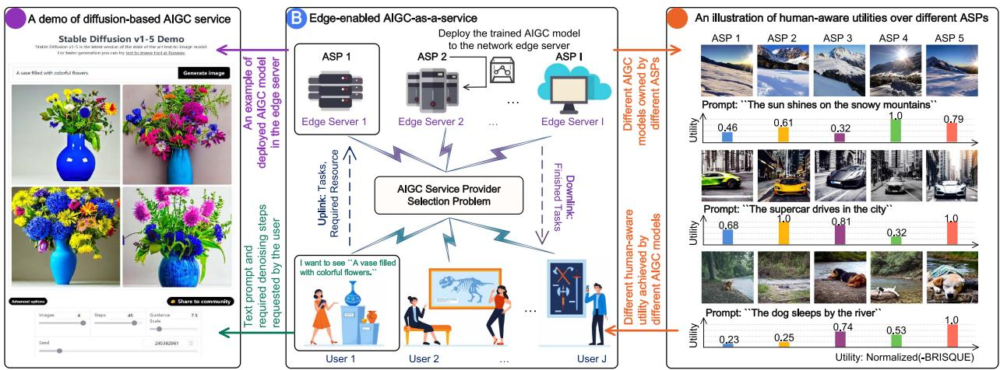

flowchart

```mermaid
graph TD
    A["Edge-enabled AIGC-as-a-service"] --> B["User 1: Image with vase fill, Edge Server 1, Edge Server 2, Edge Server I"]
    A --> C["User 2: Image with colorimetric image, Edge Server 2, Edge Server 3, Edge Server 4, Edge Server 5"]
    A --> D["User J: Image with 'A vase filled with colorful flowers'"]
    E["An example of deployed AIGC model in the edge server"] --> F["Edge Server 1"]
    E --> G["Edge Server 2"]
    E --> H["Edge Server I"]
    E --> I["Edge Server 3"]
    E --> J["Edge Server 4"]
    E --> K["Edge Server 5"]
    L["Text prompt and required denoising steps requested by the user"] --> M["User 1: Image with vase fill, Edge Server 1, Edge Server 2, Edge Server I"]
    N["I want to see 'A vase filled with colorful flowers'"] --> O["User 2: Image with vase fill, Edge Server 2, Edge Server I"]
    P["Share to community"] --> Q["User 1: Image with vase fill, Edge Server 1, Edge Server 2, Edge Server I"]
    R["An illustration of human-aware utilities over different ASPs"] --> S["Utility: Normalized(-BRISQUE)"]
    T["Output: Prompt: 'The sun shines on the snowy mountains'"] --> U["Utility: Normalized(-BRISQUE)"]
    V["Output: Prompt: 'The supercar drives in the city'"] --> W["Utility: Normalized(-BRISQUE)"]
    X["Output: Prompt: 'The dog sleeps by the river'"] --> Y["Utility: Normalized(-BRISQUE)"]
```

Fig. 1. Architecture of AIGC-as-a-Service in wireless edge networks. Part A is demo of AIGC service based on Stable Diffusion v1.5 as an example of deployable AIGC model for edge servers; Part B is network architecture of ASPs employing edge servers to deploy AIGC models for providing AaaS to users; Part C shows variation in user experience demonstrated by different outputs from the same text prompt on various AIGC models, highlighting the importance of ASP selection.

the potential of the wireless network with minimal errors and resource consumption.

# B. AIGC Service Provider Selection

The ASP selection problem is analogous to a resourceconstrained task assignment problem, where the aim is to allocate incoming tasks to available resources, satisfying resource constraints and maximizing overall utility. This problem is frequently encountered in wireless networks, where resources are scarce and their efficient utilization is crucial to achieving the desired performance, including task scheduling and resource allocation in wireless networks [28], [29], [30].

For the ASP selection, which can be framed as a resourceconstrained task assignment problem, a set of sequential tasks $\mathcal { I } = \{ j _ { 1 } , j _ { 2 } , \dots , j _ { J } \}$ , a set of available ASPs I $\{ i _ { 1 } , i _ { 2 } , \ldots , i _ { I } \}$ , and the unique utility function $u _ { i } ( \cdot )$ of the $i ^ { \mathrm { t h } }$ $\operatorname { A S P }$ ( )are given. The objective is to find an assignment of tasks to ASPs, i.e., users’ utility $\mathcal { A } = \{ a _ { 1 } , \ldots , a _ { j } , . . . , a _ { J } \}$ , such that the overallimized. Note that the $\begin{array} { r } { \mathcal { U } = \sum _ { j = 1 } ^ { J } u _ { i } ( T _ { j } ) } \end{array}$ utility $u _ { i } ( T _ { j } )$ =of the $j ^ { \mathrm { t h } }$ ( )task assigned to the $i ^ { \mathrm { t h } } \ \mathrm { \bf ~ A S P }$ i s a ( )function of the required resource $T _ { j }$ . Without loss of generality, we consider that $T _ { j }$ is the number of denoising steps of the diffusion model, which is positively correlated to the energy cost. The reason is that each step of the diffusion model has energy consumption as it involves running a neural network to remove Gaussian noise [31]. To empirically validate this relationship, we conducted experiments using a Dell Precision 5820 Tower equipped with an Intel Xeon W-2235 CPU. Power metrics were meticulously recorded via HWiNFO642 during the inference process of stable-diffusion-v1-4 model [32]. The results, illustrated in Fig. 2, confirm a consistent increase in energy cost corresponding to the number of denoising steps,

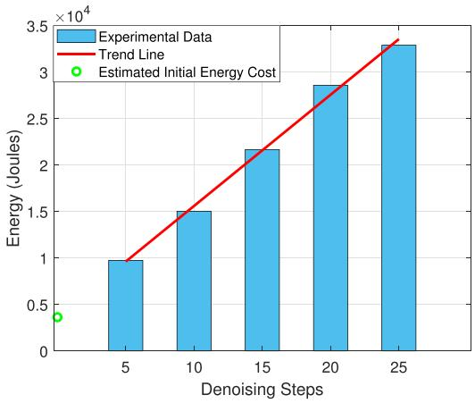

bar

| Denoising Steps | Experimental Data (×10⁴ Joules) | Estimated Initial Energy Cost |
| --------------- | ------------------------------- | ----------------------------- |
| 5               | 1.0                             | 0.4                           |
| 10              | 1.5                             | -                             |
| 15              | 2.2                             | -                             |
| 20              | 2.9                             | -                             |
| 25              | 3.3                             | -                             |

Fig. 2. Energy cost versus diffusion steps for stable-diffusion-v1-4 model inference.

alongside an initial energy expenditure likely due to model initialization.

Furthermore, the utility function is human-aware, which is discussed in Section III-C. The total availability of resources $\mathcal { T } _ { i }$ $( i = 1 , \ldots , I )$ for each ASP is considered. Note that, for illus-( = 1 )trative purposes, we consider image-based AIGC that utilizes the diffusion model. However, our research approach is generalizable to other types of AIGC services, including those based on natural language processing (e.g., ChatGPT). One can substitute the relevant resources to be scheduled (e.g., GPU resources) and corresponding user utility functions as appropriate. Mathematically, the ASP selection problem can be formulated as an integer programming problem with decision variables $a _ { j } ( \forall j \in \mathcal { I } )$ in ${ \mathcal { A } } ,$ ( )which represents the time series of task assignments to available ASPs. Additionally, $\hat { \mathcal { I } } _ { i }$ denotes the set of running tasks on the $i ^ { \mathrm { t h } }$ ASP at the time of assigning the current task. Thus, the problem can be formulated as

2HWiNFO64 (https://www.hwinfo.com/) is a hardware analysis and monitoring tool for Windows, presenting real-time information including fan speeds, voltages, power consumption, etc.

$$
\max _ {\mathcal {A}} \mathcal {U} = \sum_ {j \in \mathcal {J}} u _ {i} (T _ {j}), \tag {1}
$$

$$
\text { s   .   t   . } i = a _ {j}, \tag {2}
$$

$$
T _ {j} + \sum_ {j ^ {\prime} \in \hat {\mathcal {J}} _ {i}} T _ {j ^ {\prime}} \leqslant \mathcal {T} _ {i} (\forall i \in \mathcal {I}), \tag {3}
$$

$$
i = 1, \dots I, \text {   and   } j = 1, \dots J. \tag {4}
$$

In this formulation, the resource constraints are incorporated through the constraint (3), which specifies the limitations on the available resources. Note that failing to satisfy the constraint (3) can result in the crash of i th ASP, causing the termination and restart of its running tasks.

Remark 1: The resource-constrained task assignment problem, i.e., (1), is a well-known NP-complete problem [33], which implies that finding an optimal solution in polynomial time is computationally infeasible. Moreover, the user can access the AaaS at their discretion, and the user utility is human-aware without mathematical expressions. Traditional mathematical methods are difficult to be applied. To address this challenge, different techniques, including greedy algorithms, genetic algorithms, and (meta-)heuristics algorithms, have been proposed to find an approximate solution. However, these techniques often assume that all tasks and their corresponding utility values are known in advance [34], which is impractical in ASP selection, where tasks arrive dynamically and in real time.

In this case, the AaaS system scheduler must make real-time decisions while considering the current system state and the arrival of new tasks. Balancing the task assignments to available servers and reserving resources for future tasks is essential. Moreover, characteristics such as the utility value depend not only on the human-aware tasks but also on the assigned ASP’s ability, which is unknown at the time of scheduling, making the problem more challenging than the online resource-constrained task assignment [35].

# C. Human-Aware Utility Function

The utility value of a Metaverse user task is not known in advance. Instead, it is determined by considering human-aware content quality assessment techniques to the AIGC. Let us denote $\mathcal { F } _ { i } ( T _ { j } )$ as the forward function of the AIGC model of the $i ^ { \mathrm { t h } }$ (ASP and $\mathcal { G } ( \cdot )$ as the human-aware content quality assessment ( )function. Then, the utility value $u _ { i } ( T _ { j } )$ of the $\bar { j } ^ { \mathrm { t h } }$ task on the $i ^ { \mathrm { t h } }$ ASP can be expressed as

$$
u _ {i} (T _ {j}) = \mathcal {G} (\mathcal {F} _ {i} (T _ {j})), (i = 1, \dots I, \text {   and   } j = 1, \dots J). \tag {5}
$$

Taking the image-based AIGC service as an example, the AI model can generate images according to the text prompt uploaded by users or impair the distorted images. Without the loss of generality, the human-aware content quality assessment function G · could be the Blind/Referenceless Image Spatial Quality ( )Evaluator (BRISQUE), which is designed to be human-aware with aims to predict the image quality based on how humans perceive image quality. BRISQUE is trained on a dataset of natural images perceived as high quality by human observers, which can extract features relevant to human perception of image quality, such as contrast, sharpness, and texture. Therefore, BRISQUE is considered a no-reference (or blind) image quality assessment model that does not require a reference image to compare against. This makes BRISQUE more practical for realworld applications where a reference image may not be available or practical to use as the reference. By being human-aware, BRISQUE provides a reliable and objective measure of image quality.

An illustration of the utility distribution among different ASPs in our case is presented in Fig. 1 (Part C). We can observe that there is a significant variance in human-aware utility values between ASPs, highlighting the importance of users selecting a well-suited ASP.

# IV. AI-GENERATED OPTIMAL DECISION

In this section, we propose the AGOD algorithm that generates optimal discrete decisions starting from Gaussian noise with the help of the diffusion model.

# A. Motivation of AGOD

The discrete variables in the ASP selection problem present a unique challenge: the solution set is finite and discrete, making traditional optimization techniques for continuous variables ineffective [27]. In this scenario, unlike the gradual progression toward optimality offered by continuous variables, discrete variables necessitate jumping from one distinct solution to another. This characteristic turns the problem into a combinatorial one, where the solution space grows exponentially with each added variable, rendering exhaustive searches impractical for largescale problems [26], [27]. Resorting to continuous optimization by ignoring the discrete nature of decision variables only yields inaccurate and suboptimal results. This necessitates the development of novel optimization techniques adept at handling discrete variables and the complexity of combinatorial optimization, outperforming existing DRL algorithms in navigating this intricate and expansive solution space.

The Denoising Diffusion Probabilistic Model (DDPM), a framework originally for image generation, inspires our approach to optimize discrete decision solutions [13]. It involves gradually adding noise to the data until the data is entirely Gaussian noise (the forward process). Then, the model learns to reverse the diffusion process to recover the original image (the reverse process). Motivated by DDPM’s exceptional generative capabilities, we aim to develop a diffusion-based optimizer for generating discrete decision solutions. The diffusion model’s inherent ability to incorporate conditioning information into the denoising process enhances its applicability and precision [13]. More importantly, the potential interaction between the diffusion model and DRL represents a complementary and mutually enhancing relationship, allowing both methods to benefit, thereby broadening the effectiveness of discrete decision optimization in complex and dynamic environments.

In the decision-making problem, the decision scheme can be expressed as a set of discrete probabilities for choosing each decision. The constraints and task-related factors affecting the optimal decision scheme can be considered the environment. According to the diffusion model, an optimal decision solution under the current environment can keep increasing the noise until it becomes Gaussian, known as the forward process of probability noising [13]. Then, in the reverse process of probability inference, the optimal decision generation network, $\mathrm { i . e . , } \pi _ { \theta } ( \cdot )$ , ( )can be viewed as a denoiser that starts with Gaussian noise and recovers the optimal decision solution, i.e., $\scriptstyle { \mathbf { { \mathit { x } } } } _ { 0 }$ , based on the environment condition, i.e., s. An illustration of the diffusion process is provided in Fig. 3. In the following, we present the forward process and propose the AGOD algorithm as the reverse process.

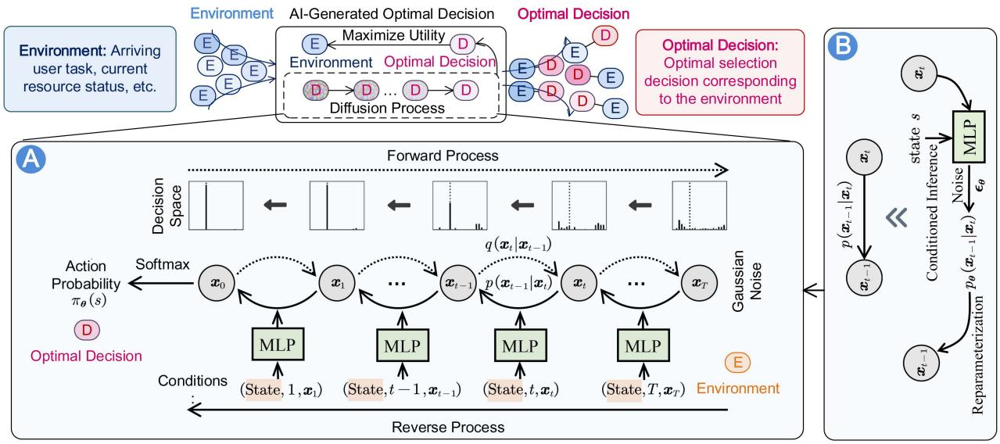

flowchart

```mermaid
graph TD
    subgraph_A["Environment: Arriving user task, current resource status, etc."]
        E1["E"] --> E2["E"] --> E3["E"] --> E4["E"] --> E5["E"] --> E6["E"] --> E7["E"] --> E8["E"] --> E9["E"] --> E10["E"] --> E11["E"] --> E12["E"] --> E13["E"] --> E14["E"] --> E15["E"] --> E16["E"] --> E17["E"] --> E18["E"] --> E19["E"] --> E20["E"] --> E21["E"] --> E22["E"] --> E23["E"] --> E24["E"] --> E25["E"] --> E26["E"] --> E27["E"] --> E28["E"] --> E29["E"] --> E30["E"] --> E31["E"] --> E32["E"] --> E33["E"] --> E34["E"] --> E35["E"] --> E36["E"] --> E37["E"] --> E38["E"] --> E39["E"] --> E40["E"] --> E41["E"] --> E42["E"] --> E43["E"] --> E44["E"] --> E45["E"] --> E46["E"] --> E47["E"] --> E48["E"] --> E49["E"] --> E50["E"] --> E51["E"] --> E52["E"] --> E53["E"] --> E54["E"] --> E55["E"] --> E56["E"] --> E57["E"] --> E58["E"] --> E59["E"] --> E60["E"] --> E61["E"] --> E62["E"] --> E63["E"] --> E64["E"] --> E65["E"] --> E66["E"] --> E67["E"] --> E68["E"] --> E69["E"] --> E70["E"] --> E71["E"] --> E72["E"] --> E73["E"] --> E74["E"] --> E75["E"] --> E76["E"] --> E77["E"] --> E78["E"] --> E79["E"] --> E80["E"] --> E81["E"] --> E82["E"] --> E83["E"] --> E84["E"] --> E85["E"] --> E86["E"] --> E87["E"] --> E88["E"] --> E89["E"] --> E90["E"] --> E91["E"] --> E92["E"] --> E93["E"] --> E94["E"] --> E95["E"] --> E96["E"] --> E97["E"] --> E98["E"] --> E99["E"]
    subgraph Forward Process
        direction LR
        A1["Decision Space"]
        A2["Action Probability πθ(s)"]
        A3["Softmax"]
        A4["Reverse Process"]
    end

    subgraph Gaussian Noise
        direction LR
        B1["xt"]
        B2["xt-1"]
        B3["xt-1"]
        B4["xt-1"]
        B5["xt-1"]
        B6["xt-1"]
        B7["xt-1"]
        B8["xt-1"]
        B9["xt-1"]
        B10["xt-1"]
        B11["xt-1"]
        B12["xt-1"]
        B13["xt-1"]
        B14["xt-1"]
        B15["xt-1"]
        B16["xt-1"]
        B17["xt-1"]
        B18["xt-1"]
        B19["xt-1"]
        B20["xt-1"]
        B21["xt-1"]
        B22["xt-1"]
        B23["xt-1"]
        B24["xt-1"]
        B25["xt-1"]
        B26["xt-1"]
        B27["xt-1"]
        B28["xt-1"]
        B29["xt-1"]
        B30["xt-1"]
        B31["xt-1"]
        B32["xt-1"]
        B33["xt-1"]
        B34["xt-1"]
        B35["xt-1"]
        B36["xt-1"]
        B37["xt-1"]
        B38["xt-1"]
        B39["xt-1"]
        B40["xt-1"]
        B41["xt-1"]
        B42["xt-1"]
        B43["xt-1"]
        B44["xt-1"]
        B45["xt-1"]
        B46["xt-1"]
        B47["xt-1"]
        B48["xt-1"]
        B49["xt-1"]
        B50["xt-1"]
        B51["xt-1"]
        B52["xt-1"]
        B53["xt-1"]
        B54["xt-1"]
        B55["xt-1"]
        B56["xt-1"]
        B57["xt-1"]
        B58["xt-1"]
        B59["xt-1"]
        B60["xt-1"]
    end

    subgraph Reparameterization
        direction LR
        P["Reparameterization: Conditioned Inference p(xt-1|xti) → MLP x(t)"] -->|State s| M["MLP x(t-1)"]
        M -->|Noise| N["Reparameterization: p(xt-1|xti) → MLP x(t)"] -->|εθ| O["Reparameterization: Conditioned Inference p(xt-1|xti) → MLP x(t)"] -->|State s| P
    end
```

Fig. 3. Illustration of the AGOD algorithm with the conditioned diffusion process.

# B. The Forward Process of Probability Noising

As the decision scheme output $\pmb { x } _ { 0 } = \pi _ { \pmb { \theta } } ( s ) \sim \mathbb { R } ^ { | \mathcal { A } | }$ is the = ( )probability distribution of each decision being selected under the observed environment state $s ,$ we represent the discrete vector of the distribution at step t in the forward process as ${ \mathbf { } } x _ { t } ,$ , which have the same dimensionality as $\scriptstyle { \mathbf { { \mathit { x } } } } _ { 0 }$ . Given a target probability distribution $\scriptstyle { \pmb x } _ { 0 } .$ , the forward process adds a sequence of Gaussian noises at each step to obtain $x _ { 1 } , x _ { 2 } , \ldots , x _ { T }$ . The transition from $\pmb { x } _ { t - 1 } \ \mathrm { t o } \ x _ { t }$ is defined as a normal distribution with mean $\sqrt { 1 - \beta _ { t } } \pmb { x } _ { t - 1 }$ and variance $\beta _ { t } \mathbf { I }$ as [31]

$$
q \left(\boldsymbol {x} _ {t} | \boldsymbol {x} _ {t - 1}\right) = \mathcal {N} \left(\boldsymbol {x} _ {t}; \sqrt {1 - \beta_ {t}} \boldsymbol {x} _ {t - 1}, \beta_ {t} \mathbf {I}\right), \tag {6}
$$

where $t = 1 , \ldots , T , \ \beta _ { t } = 1 - e ^ { - \frac { \beta _ { \operatorname* { m i n } } } { T } - \frac { 2 t - 1 } { 2 T ^ { 2 } } \left( \beta _ { \operatorname* { m a x } } - \beta _ { \operatorname* { m i n } } \right) }$ βmin 2 T 2 repre-= 1 = 1sents the forward process variance controlled by the Variational Posterior (VP) scheduler [31].

As $\mathbf { \Delta } _ { \mathbf { \mathcal { X } } _ { t } }$ depends only on $\mathbf { \nabla } x _ { t - 1 }$ at the previous step, the forward process can be considered a Markov process, and the distribution $\mathbf {  { x } } _ { T }$ given $\scriptstyle { \mathbf { { \mathit { x } } } } _ { 0 }$ can be formed as the product of transitions $q ( { \pmb x } _ { t } | { \pmb x } _ { t - 1 } )$ over denoising step as [31]

$$
q \left(\boldsymbol {x} _ {T} | \boldsymbol {x} _ {0}\right) = \prod_ {t = 1} ^ {T} q \left(\boldsymbol {x} _ {t} | \boldsymbol {x} _ {t - 1}\right). \tag {7}
$$

The forward process is not actually executed, but it establishes the mathematical relationship between $\scriptstyle { \mathbf { { \mathit { x } } } } _ { 0 }$ and any $\mathbf { \Delta } _ { \mathbf { \mathcal { X } } _ { t } }$ as

$$
\boldsymbol {x} _ {t} = \sqrt {\bar {\alpha} _ {t}} \boldsymbol {x} _ {0} + \sqrt {1 - \bar {\alpha} _ {t}} \boldsymbol {\epsilon}, \tag {8}
$$

where $\begin{array} { r } { \alpha _ { t } = 1 - \beta _ { t } , \bar { \alpha } _ { t } = \prod _ { k = 1 } ^ { t } \alpha _ { k } } \end{array}$ is the cumulative product of $\alpha _ { k }$ over previous denoising step $k \left( \forall k \leq t \right)$ , and $\mathbf { \epsilon } \gets \mathcal { N } ( \mathbf { 0 } , \mathbf { I } )$ ( ) ( )is a standard normal noise. As t increases, xT becomes purely noise with a normal distribution of $\mathcal { N } ( \mathbf { 0 } , \mathbf { I } )$ . However, note that ( )optimization problems in wireless network often lack a dataset of optimal decision solutions, i.e., ${ \mathbf { } } ^ { x } 0 ,$ to be used for the forward process. Consequently, the forward process is not performed in AGOD.

# C. The Reverse Process of Probability Inference

The reverse process, also called the sampling process, aims to infer the target $\scriptstyle { \mathbf { { \mathit { x } } } } _ { 0 }$ from a noise sample $\mathbf { \boldsymbol { x } } _ { T } \sim \mathcal { N } ( \mathbf { \boldsymbol { 0 } } , \mathbf { I } )$ by removing noise from it. In our AGOD algorithm, the purpose is to infer the optimal decision scheme from the noise sample. The transition from $\mathbf { x } _ { t } \ \mathrm { t o } \ x _ { t - 1 }$ is defined as $p ( \pmb { x } _ { t - 1 } | \pmb { x } _ { t } )$ , which ( )cannot be calculated directly. However, it follows a Gaussian distribution as given by

$$
p _ {\boldsymbol {\theta}} \left(\boldsymbol {x} _ {t - 1} | \boldsymbol {x} _ {t}\right) = \mathcal {N} \left(\boldsymbol {x} _ {t - 1}; \boldsymbol {\mu} _ {\boldsymbol {\theta}} \left(\boldsymbol {x} _ {t}, t, s\right), \tilde {\beta} _ {t} \mathbf {I}\right), \tag {9}
$$

where the mean $\mu _ { \theta }$ can be learned by a deep model, and $\tilde { \beta } _ { t } =$ ˜ =1−α¯t−11−α¯ βt is a deterministic variance amplitude that can be easily $\frac { 1 - \bar { \alpha } _ { t - 1 } } { 1 - \bar { \alpha } _ { t } } \beta _ { t }$ calculated [31].

By applying the Bayesian formula, we transform the calculation of the reverse process into the calculation of the forward process and reformat it into the form of a Gaussian probability density function. Then, we obtain the mean as follows,

$$
\boldsymbol {\mu} _ {\boldsymbol {\theta}} \left(\boldsymbol {x} _ {t}, t, s\right) = \frac {\sqrt {\alpha_ {t}} \left(1 - \bar {\alpha} _ {t - 1}\right)}{1 - \bar {\alpha} _ {t}} \boldsymbol {x} _ {t} + \frac {\sqrt {\bar {\alpha} _ {t - 1}} \beta_ {t}}{1 - \bar {\alpha} _ {t}} \boldsymbol {x} _ {0}, \tag {10}
$$

where $t = 1 , \dots , T$ . According to (8), the reconstructed sample $\scriptstyle { \mathbf { { \mathit { x } } } } _ { 0 }$ = 1can be directly obtained via

$$
\boldsymbol {x} _ {0} = \frac {1}{\sqrt {\bar {\alpha} _ {t}}} \boldsymbol {x} _ {t} - \sqrt {\frac {1}{\bar {\alpha} _ {t}} - 1} \cdot \tanh \left(\epsilon_ {\theta} (\boldsymbol {x} _ {t}, t, s)\right), \tag {11}
$$

where $\epsilon _ { \theta } ( x _ { t } , t , s )$ is a deep model parameterized by θ that generates denoising noises conditioned on the observation s. The generated noise is scaled to be small through the application of the hyperbolic tangent activation, as it may result in a high level of noise in ${ \mathbf { \mathit { x } } } _ { 0 } ,$ , making it difficult to identify the true underlying action probability.

The reverse process introduces a new source of noise $\epsilon _ { \theta }$ at each denoising step $t ,$ and they are independent of the noise - added in the forward process. This makes us unable to calculate $\scriptstyle { \mathbf { { \mathit { x } } } } _ { 0 }$ by directly using (11). Instead, we apply (11) into (10) to estimate the mean

$$
\boldsymbol {\mu} _ {\boldsymbol {\theta}} \left(\boldsymbol {x} _ {t}, t, s\right) = \frac {1}{\sqrt {\alpha_ {t}}} \left(\boldsymbol {x} _ {t} - \frac {\beta_ {t} \tanh \left(\epsilon_ {\boldsymbol {\theta}} (\boldsymbol {x} _ {t} , t , s)\right)}{\sqrt {1 - \bar {\alpha} _ {t}}}\right). \tag {12}
$$

Then, we can sample $\mathbf { \nabla } x _ { t - 1 }$ from the reverse transition distribution $p ( \pmb { x } _ { t } ) p _ { \pmb { \theta } } ( \pmb { x } _ { t - 1 } | \pmb { x } _ { t } )$ , and further use the cumulative product over $t = T , T - 1 , \dots , 1$ to obtain the generation distribution $p _ { \pmb { \theta } } ( \pmb { x } _ { 0 } )$ = 1as follows,

$$
p _ {\boldsymbol {\theta}} \left(\boldsymbol {x} _ {0}\right) = p \left(\boldsymbol {x} _ {T}\right) \prod_ {t = 1} ^ {T} p _ {\boldsymbol {\theta}} \left(\boldsymbol {x} _ {t - 1} | \boldsymbol {x} _ {t}\right), \tag {13}
$$

where $p ( { \pmb x } _ { T } )$ is a standard Gaussian distribution. Once we have ( )the generation distribution $p _ { \pmb { \theta } } ( \pmb { x } _ { 0 } )$ , we can sample the output $\scriptstyle { \mathbf { { \mathit { x } } } } _ { \mathrm { { 0 } } }$ from it.

It is a common challenge in training generative models with stochasticity that gradients cannot be back-propagated through the random variable in the operation of sampling from a distribution. To address this issue, we employ reparameterization, which decouples the randomness from the distribution parameters. Specifically, the following update rule is used instead,

$$
\boldsymbol {x} _ {t - 1} = \boldsymbol {\mu} _ {\boldsymbol {\theta}} \left(\boldsymbol {x} _ {t}, t, s\right) + \left(\tilde {\beta} _ {t} / 2\right) ^ {2} \odot \epsilon , \tag {14}
$$

where $\epsilon \sim \mathcal { N } ( \mathbf { 0 } , \mathbf { I } )$ . By iteratively applying the reverse update ( )rule, i.e., (14), we can obtain all ${ \pmb x } _ { t } ~ \left( \forall t , 0 \leq t < T \right)$ , and in particular, the output sample $\scriptstyle { \mathbf { { \mathit { x } } } } _ { 0 }$ ( 0 ), from a randomly generated normal noise.

Finally, we apply the softmax function to $\scriptstyle { \mathbf { { \mathit { x } } } } _ { 0 }$ to convert it into a probability distribution as

$$
\pi_ {\boldsymbol {\theta}} (s) = \left\{\frac {e ^ {\boldsymbol {x} _ {0} ^ {i}}}{\sum_ {k = 1} ^ {\mathcal {A}} e ^ {\boldsymbol {x} _ {0} ^ {k}}}, \forall i \in \mathcal {A} \right\}. \tag {15}
$$

The elements in $\pi _ { \pmb { \theta } } ( s )$ correspond to the probability of selecting each action.

When implementing AGOD in practical systems, we first compute the mean $\mu _ { \theta }$ of the reverse transition distribution $p _ { \pmb { \theta } } ( \pmb { x } _ { t - 1 } | \pmb { x } _ { t } )$ , as defined in (9) and (12), and then obtain the ( )distribution $\mathbf { \nabla } x _ { t - 1 }$ using the update rule in (14). Next, we can derive the probability distribution of the optimal decision $\scriptstyle { \mathbf { { \mathit { x } } } } _ { \mathrm { { 0 } } }$ using (15). However, in DDPM, the optimization objective is the Mean Squared Error (MSE) loss, which requires labeled images as targets [31]. This requirement poses significant challenges in real decision-making problems in wireless networks. Therefore, AGOD needs to learn in an exploratory manner, and the training goal of the denoising network shifts from minimizing the error with labeled data to maximizing the value of the decision scheme, i.e., being able to maximize the optimization objective. One possible approach proposed by authors in [25] is to construct a decision value network whose output assesses the utility resulting from the decision scheme, i.e., the output of the optimal decision generation network. Then, the two networks can be trained jointly. However, the approach in [25] is for the case when the decision valuables are continuous valuables.

Leveraging AGOD’s adaptability, we aim to enhance the optimization potential by integrating AGOD into advanced DRL algorithms, specifically within the SAC framework. The SAC’s efficiency and stable policy learning complement AGOD’s generative strengths. This integration enriches the SAC model with AGOD’s exploration and learning capabilities, leading to the development of D2SAC as a diffusion-based DRL algorithm.

# V. DIFFUSION-BASED REINFORCEMENT LEARNING

In this section, we model the ASP selection problem and present our innovative deep diffusion reinforcement learning algorithm, D2SAC, by applying the AGOD in the action policy.

# A. Problem Modeling

Recall that we have a series of tasks, ${ \mathcal { I } } ,$ and a set of available ASPs, I. The objective is to assign tasks to ASPs in a way that maximizes the overall utility, denoted as $u ,$ where the utility of each task assigned to an ASP is a function of the required resource $T _ { j }$ . We consider resource limitations of each ASP, acknowledging that an ASP can only handle a finite number of tasks due to its resource constraints. Exceeding these resources risks ASP failure and the potential restart of tasks. This reality makes the Markov Decision Process (MDP) framework particularly suitable for the ASP selection problem [36]. MDP captures the sequential nature of decision-making and how each task assignment influences future rewards and actions. The unpredictable nature of task arrivals further justifies an MDP-based approach. This method enables real-time decisionmaking, considering the current system state and the need to allocate resources for future tasks, ensuring a balanced and sustainable task distribution among ASPs.

Given an initial state $s _ { 0 } ,$ , the agent transitions from one state $s _ { l } \in S$ to the next $s _ { l + 1 } \in S$ at each step $l = 0 , 1 , \ldots , L$ , by taking an action $a _ { l } \in \mathcal { A }$ = 0and receiving a reward $r _ { l } \in \mathcal { R }$ in the environment. Here, the action decision is chosen according to the policy. We use the diffusion model in AGOD, i.e., πθ, as the action policy. The aim is to maximize the accumulated reward, $R ( s _ { 0 } , \pi _ { \theta } )$ , defined as the expected sum of discounted rewards as

$$
R \left(s _ {0}, \pi_ {\boldsymbol {\theta}}\right) = \mathbb {E} \left[ \sum_ {l = 0} ^ {L} \gamma^ {l} r _ {l} | s _ {0}, \pi_ {\boldsymbol {\theta}} \right], \tag {16}
$$

where θ are the parameters of the diffusion policy network, $\gamma \in [ 0 , 1 ]$ is the discount factor that determines the importance [0 1]of future rewards relative to immediate rewards, L is the number of transitions in an episode, and $\mathcal { P }$ is the transition probability of states. In this manner, the MDP model for our problem can be formally described as a tuple $( \mathcal { S } , \mathcal { A } , \mathcal { P } , \mathcal { R } )$ .

( )a) State Space: The state space S in our problem contains the environment information to make the decision. The state of the agent $s \in S$ is composed of two feature vectors, one representing the arriving user task, $s ^ { \mathrm { T } } .$ , and one representing the current resource status of all $\mathsf { A S P s } , s ^ { \mathrm { A } }$ . The feature vector $s ^ { \mathrm { T } }$ encodes the resources T , i.e., denoising step, required by the task and its estimated completion time $^ { O , }$ which is represented as $s ^ { \mathrm { T } } = [ T , o ]$ . The feature vector $s ^ { \mathrm { A } }$ includes the total available = [resources $\mathcal { T } _ { i }$ ]and the currently available resources $\tilde { \mathcal { T } } _ { i }$ of each of the I ASPs, which is defined as $s ^ { \mathrm { A } } = [ \mathcal { T } _ { i } , \tilde { \mathcal { T } } _ { i } | \forall i \in \mathcal { T } ]$ . Finally, = [ ]these two feature vectors are concatenated to form the state vector s as $s = [ s ^ { \mathrm { T } } , s ^ { \mathrm { A } } ]$ . The values of $T , o , \ T _ { i }$ , and $\tilde { \mathcal { T } } _ { i }$ are = [normalized to the range $( 0 , 1 )$ before being fed into the AGOD (0 1network, i.e., policy network $\pi _ { \pmb { \theta } } ( s )$ , to ensure stable training.

( )b) Action Space: The action space A is defined as the set of all possible decisions that can be made by the agent. In the ASP selection problem, the action taken by the agent, $a \in { \mathcal { A } }$ , represents the assignment of the current Metaverse user task to one of the I available ASPs. Specifically, the action space is an integer space with values ranging from 1 to I. The action a is determined by the AGOD network, i.e., $\pi _ { \boldsymbol { \theta } } ( s )$ , which generates ( )a vector of I elements with the current state s as the input. Each element of the vector represents the probability of selecting a particular ASP, i.e., $a \sim \pi _ { \theta } ( s )$ . Note that, during evaluation, ( )the ASP with the highest probability is selected, i.e.,

$$
a = \underset {i} {\arg \max} \left\{\pi_ {\boldsymbol {\theta}} ^ {i} (s), \forall i \in \mathcal {I} \right\}, \tag {17}
$$

where $\pi _ { \theta } ^ { i } ( s )$ represents the probability of selecting ASP i.

( )c) Reward Function: The reward $r \in \mathcal { R }$ is a scalar representing the immediate benefit received upon executing action a in state s. The reward function $r ( s , a )$ comprises two parts: the AIGC quality reward $r ^ { \mathrm { R } }$ ( )and the crash penalty $r ^ { \mathrm { P } }$ . Specifically, $r ^ { \mathrm { R } }$ reflects the generated content’s quality, determined using the content quality assessment methods detailed in (5). To discourage low-quality content, the utility value $u _ { i } ( T _ { j } )$ is adjusted by a baseline score $\hat { r } ^ { \mathrm { R } }$ ( )from a noise sample, resulting in $\mathbf { \bar { \rho } } _ { r ^ { \mathrm { R } } } = u _ { i } ( T _ { j } ) - \hat { r } ^ { \mathrm { R } }$ ˆ. The crash penalty $r ^ { \mathrm { P } }$ , imposed on actions = ( ) ˆthat overload the ASP causing task interruptions, consists of a fixed penalty $\hat { r } _ { \mathrm { F } } ^ { \mathrm { P } }$ and an additional penalty $\hat { r } _ { \mathrm { I } } ^ { \mathrm { P } }$ proportional to the progress of ongoing tasks $\hat { \mathcal { I } }$ as

$$
r ^ {\mathrm{P}} = \hat {r} _ {\mathrm{F}} ^ {\mathrm{P}} - \sum_ {j ^ {\prime} \in \hat {\mathcal {J}}} \hat {r} _ {\mathrm{I}} ^ {\mathrm{P}} (j ^ {\prime}). \tag {18}
$$

We set $\hat { r } _ { \mathrm { F } } ^ { \mathrm { P } } = 2$ by default and $\hat { r } _ { \mathrm { ~ I ~ } } ^ { \mathrm { P } } ( j ^ { \prime } )$ as the multiply of $\hat { r } _ { \mathrm { F } } ^ { \mathrm { P } }$ and the ˆ = 2remaining progress of task $j ^ { \prime }$ ˆ ( ) ˆwhen it was interrupted. Incorporating the fixed penalty value $\hat { r } _ { \mathrm { F } } ^ { \mathrm { P } }$ discourages the agent from tak-ˆing actions that may cause a crash. The additional penalty $\hat { r } _ { \mathrm { ~ I ~ } } ^ { \mathrm { P } } ( j ^ { \prime } )$ is associated with the interrupted task $j ^ { \prime }$ ˆ ( ), serving as incentive for the agent to refrain from disrupting ongoing tasks. Together, these penalties help to promote system stability. Finally, the reward r returned by the environment can be represented as the sum of the reward and penalty as $r = r ^ { \mathrm { R } } - r ^ { \mathrm { P } }$ . In Section VI, =we differentiate between ‘training reward,’ which affects the learning process and policy optimization during training, and ‘test reward,’ which evaluates the learned policy’s generalization and robustness in new environments.

d) Transition Function: The transition function, represented by $p ( s ^ { \prime } | s , a ) \in \mathcal { P }$ , defines the probability of transitioning from ( )the current state s to the next state $s ^ { \prime }$ after taking action a. The state transition model is intricate and cannot be mathematically formulated in our scenario. Instead, it relies on the unpredictable variables inherent in practical wireless network environments. The arrival of novel and unfamiliar tasks, the allocation of tasks to ASPs, and the successful or failed execution of tasks all influence state transitions.

e) Initialization and Termination: Every observation originates from the initial state $s _ { 0 } ,$ and the agent begins acting based on it. $s _ { 0 }$ is set as $( T _ { 0 } , o _ { 0 } , T _ { 1 } , 1 , T _ { 2 } , 1 , \dots , T _ { I } , 1 )$ , with $T _ { 0 }$ ( 1 1representing the required resources and $o _ { 0 }$ 1)denoting the estimated completion time of the first task. The repeated $( \mathcal { T } _ { i } , 1 )$ of I ASPs indicates that no ongoing tasks exist. The environment progresses from one state to another based on the actions taken by the agent until a termination criterion is met. To facilitate the policy network training, we introduce a termination condition by specifying a maximum number of transitions L for each episode.

Based on the above definitions, we present the overall goal of our problem, which is to train the parameters $\pmb { \theta } ^ { * }$ of the AGOD network that maximizes the expected cumulative reward defined in (16) as

$$
\boldsymbol {\theta} ^ {*} = \arg \max _ {\boldsymbol {\theta}} \mathbb {E} \left[ \sum_ {l = 0} ^ {L} \gamma^ {l} (r _ {l} + \alpha H (\pi_ {\boldsymbol {\theta}} (s _ {l}))) \right], \tag {19}
$$

where the expectation is taken over all initial states $s _ { 0 } ,$ , and $H ( \pi _ { \pmb { \theta } } ( s _ { l } ) )$ is called the action entropy regularization [20], with ( ( ))α known as the temperature. The $H ( \pi _ { \theta } ( s _ { l } ) )$ encourages the ( ( ))agent to explore more diverse actions. To take advantage of the efficient parallel computing capabilities of GPUs, we reverse the goal (19) by transforming the maximization problem into a minimization problem as

$$
\boldsymbol {\theta} ^ {*} = \arg \min _ {\boldsymbol {\theta}} - \mathbb {E} \left[ \sum_ {l = 0} ^ {L} \gamma^ {l} \left(r _ {l} + \alpha H (\pi_ {\boldsymbol {\theta}} (s _ {l}))\right) \right]. \tag {20}
$$

In solving the goal (20), the agent strives to balance the trade-off between achieving high utility of task assignment and avoiding crashes to ASPs. Thus, the agent continuously updates the AGOD network parameters θ based on the experience it gains during training.

# B. Algorithm Architecture

The algorithm architecture of D2SAC, as shown in Fig. 4, consists of several components that work together to optimize the policy, i.e., an actor-network, a double critic network, a target actor, a target critic, an experience replay memory, and the environment.

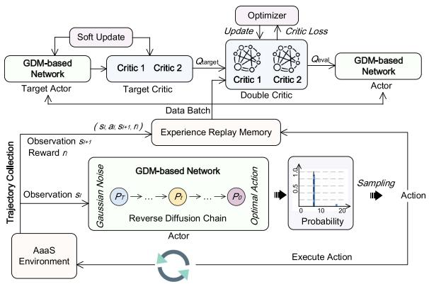

flowchart

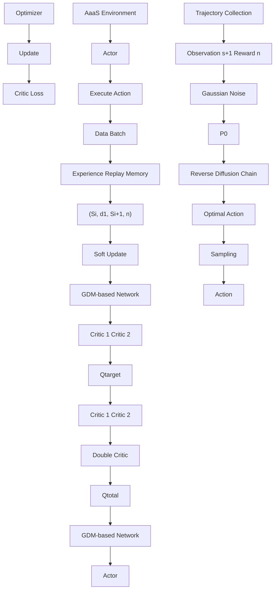

Fig. 4. Overall architecture of the D2SAC algorithm.

Trajectory Collection: In this process, the agent starts by observing the environment and obtaining the initial observation $s _ { 0 }$ . The agent then collects C transitions by iteratively generating and executing action decisions in the environment. These transitions are regarded as experiences and added to the experience replay memory D, which has a capacity of $D = | \mathcal { D } |$ |.

More specifically, at each environment step l, the actor takes in the observation $s _ { l }$ and outputs a discrete probability distribution $\pi _ { \pmb { \theta } } ( s _ { l } )$ over all possible actions ${ \mathcal { A } } .$ . The agent then samples an ( )action $a _ { l } \sim \pi _ { \pmb { \theta } } ( s _ { l } )$ from this distribution and feeds it into the environment. The environment takes action, transits to state $s _ { l + 1 }$ , and returns an immediate reward $r _ { \mathit { l } }$ as feedback to the agent. The agent records this experience with the transition tuple $( s _ { l } , a _ { l } , s _ { l + 1 } , r _ { l } )$ into the experience replay memory. These steps ( )are repeated C times before the policy improvement step.

Diffusion Model-based AGOD as the Policy: In D2SAC, the core of the actor-network $\pi _ { \boldsymbol { \theta } } ( s _ { l } )$ is the diffusion model-( )based AGOD, rather than a conventional Multi-Layer Perception (MLP). AGOD enables effective representation encoding of the observation $s _ { l } ,$ by utilizing $s _ { l }$ as the input condition. This way, the diffusion process can effectively capture the dependencies between the observation and the action space.

Experience Replay Memory: Experience replay memory is a key component of D2SAC, as it allows the algorithm to handle the delay in receiving reward feedback. This is in contrast to traditional scheduling algorithms that require immediate utility feedback. Experience replay memory allows D2SAC to store experiences $( s _ { l } , a _ { l } , s _ { l + 1 } )$ and fill in missing reward $r _ { l }$ at a later ( )time before updating the AGOD network. Off-policy training is used to further improve the algorithm’s ability to handle delayed feedback. Noted that, while the introduction of experience replay does bring a delay into the learning process, it does not impact the real-time performance in the decision process because the system’s policy can be updated and used in real time, while learning takes place concurrently in an asynchronous manner.

Double Critic Network: During the policy improvement process, AGOD $\pi _ { \theta }$ is optimized by sampling mini-batches of transitions from experience replay memory D. A double critic network is used as the Q function to reduce overestimation bias. Each critic network has its own set of parameters, denoted as $\phi ^ { 1 }$ and $\phi ^ { 2 }$ , respectively. Both networks are updated independently using the same optimization target. During training, the Q-value estimate used to update the actor-network is the minimum of the two Q-value estimates from the two critic networks. This approach ensures that the actor-network is updated based on a conservative estimate of the Q-value function, promoting stable and efficient training. In contrast to the Q function $Q _ { \phi } ( s _ { l } , a _ { l } )$ defined in the policy gradient theorem [37], ( )D2SAC employs a more efficient Q function, denoted $Q _ { \phi } ( s _ { l } )$ , where $\phi = \bar { \{ \phi ^ { 1 } , \phi ^ { 2 } \} }$ ( ). Instead of only outputting the Q-value =for a specific action, this Q function outputs a Q-value vector $q \in \mathbb { R } ^ { | \tilde { A } | }$ containing the Q-values of all possible actions $a _ { l } \in \mathcal { A }$ , $\mathrm { i . e . , } q = Q _ { \phi } ( s _ { l } ) = \operatorname* { m i n } \{ Q _ { \phi ^ { 1 } } ( s _ { l } ) , Q _ { \phi ^ { 2 } } ( s _ { l } ) \}$ .

= ( ) = min ( ) ( )Policy Improvement: The Q-values q estimate the expected cumulative reward for each action at the current state $s _ { l } .$ . Then, the actor can learn to maximize the expectation of $\pmb q$ over all actions to improve the policy, which is expressed as:

$$
\max _ {\boldsymbol {\theta}} \pi_ {\boldsymbol {\theta}} (s _ {l}) ^ {T} Q _ {\phi} (s _ {l}). \tag {21}
$$

Maximizing (21) encourages the current policy $\pi _ { \theta }$ to update in the direction where the actions with higher Q-values can increase their probabilities of being selected, while the others are suppressed. This maximization problem is solved using the gradient ascent algorithm, which can be transformed into a minimization problem expressed as

$$
\min _ {\boldsymbol {\theta}} - \pi_ {\boldsymbol {\theta}} (s _ {l}) ^ {T} Q _ {\phi} (s _ {l}). \tag {22}
$$

The standard gradient descent algorithm, such as Adam, can be used to solve this problem. Specifically, the gradient of (22) with respect to the policy parameters $\theta$ can be computed as the expectation over a mini-batch of transitions of size b sampled from the experience replay memory D at the eth training step, denoted by $\boldsymbol { B } _ { e }$ . Therefore, the gradient is given by

$$
\mathbb {E} _ {s _ {l} \sim \mathcal {B} _ {e}} \left[ - \nabla_ {\boldsymbol {\theta} _ {e}} \pi_ {\boldsymbol {\theta} _ {e}} (s _ {l}) ^ {T} Q _ {\phi_ {e}} (s _ {l}) \right], \tag {23}
$$

where $\pmb { \theta } _ { e }$ and $\phi _ { e }$ are the policy and Q-function parameters at the eth training step, respectively. The actor is then updated by performing gradient descent with respect to the above gradient, as follows,

$$
\boldsymbol {\theta} _ {e + 1} \leftarrow \boldsymbol {\theta} _ {e} - \eta_ {\mathrm{a}} \cdot \left(\mathbb {E} _ {s _ {l} \sim \mathcal {B} _ {e}} \left[ - \nabla_ {\boldsymbol {\theta} _ {e}} \pi_ {\boldsymbol {\theta} _ {e}} (s _ {l}) ^ {T} Q _ {\phi_ {e}} (s _ {l}) \right]\right), \tag {24}
$$

where $\eta _ { \mathrm { a } }$ is the learning rate of the actor. By iteratively performing (24), D2SAC learns an optimal policy parameters that maximizes the sub-goal (21).

Action Entropy Regularization: To prevent the policy from becoming overly confident in certain actions and converging prematurely to a suboptimal solution, D2SAC introduces an action entropy regularization term on the vanilla target (21) to encourage exploration,

$$
\max _ {\boldsymbol {\theta}} \pi_ {\boldsymbol {\theta}} (s _ {l}) ^ {T} Q _ {\phi} (s _ {l}) + \alpha H (\pi_ {\boldsymbol {\theta}} (s _ {l})) \tag {25}
$$

$$
\text { s.t. } H \left(\pi_ {\boldsymbol {\theta}} \left(s _ {l}\right)\right) = - \pi_ {\boldsymbol {\theta}} \left(s _ {l}\right) ^ {T} \log \pi_ {\boldsymbol {\theta}} \left(s _ {l}\right) \tag {26}
$$

where $H ( \pi _ { \pmb { \theta } } ( s _ { l } ) )$ is the entropy of the action probability distribution $\pi _ { \boldsymbol { \theta } } ( s _ { l } )$ )), and the temperature coefficient α controls the ( )strength of the entropy term. Following the derivation process similar to (21)-(24), the update rule in (24) should add the gradient term of the entropy term $\nabla _ { \pmb { \theta } _ { e } } H \big ( \pi _ { \pmb { \theta } _ { e } } \big ( s _ { l } \big ) \big )$ , as follow,

$$
\boldsymbol {\theta} _ {e + 1} \leftarrow \boldsymbol {\theta} _ {e} - \eta_ {\mathrm{a}} \cdot \mathbb {E} _ {s _ {l} \sim \mathcal {B} _ {e}} \left[ \begin{array}{c} - \alpha \nabla_ {\boldsymbol {\theta} _ {e}} H \left(\pi_ {\boldsymbol {\theta} _ {e}} (s _ {l})\right) \\ - \nabla_ {\boldsymbol {\theta} _ {e}} \pi_ {\boldsymbol {\theta} _ {e}} (s _ {l}) ^ {T} Q _ {\phi_ {e}} (s _ {l}) \end{array} \right]. \tag {27}
$$

Q-function Improvement: Ensuring accurate estimates of the Q-function $Q _ { \phi _ { e } } ( s _ { l } )$ is crucial to the success of finding the optimal policy $\pi _ { \theta } ^ { * }$ ). Thus, $Q _ { \phi _ { e } } ( s _ { l } )$ must be trained effectively. ( )To update the Q-function, we minimize the Temporal Difference (TD) error between the Q-target $\hat { y } _ { e }$ and the Q-eval $y _ { e } ^ { i }$ ,

$$
\min _ {\phi^ {1}, \phi^ {2}} \quad \mathbb {E} _ {(s _ {l}, a _ {l}, s _ {l + 1}, r _ {l}) \sim \mathcal {B} _ {e}} \left[ \sum_ {i = 1, 2} \left(\hat {y} _ {e} - y _ {e} ^ {i}\right) ^ {2} \right], \tag {28}
$$

$\mathrm { s . t . } \qquad y _ { e } ^ { i } = Q _ { \phi _ { e } ^ { i } } \left( s _ { l } , a _ { l } \right) ,$ (29)

$$
\hat {y} _ {e} = r _ {l} + \gamma (1 - d _ {l + 1}) \hat {\pi} _ {\hat {\boldsymbol {\theta}} _ {e}} (s _ {l + 1}) ^ {T} \hat {Q} _ {\hat {\boldsymbol {\phi}} _ {e}} (s _ {l + 1}). \tag {30}
$$

Here, $Q _ { \phi _ { e } ^ { i } } ( s _ { l } , a _ { l } )$ denotes the Q-value corresponding to action $a _ { l }$ output by $Q _ { \phi _ { \rho } ^ { i } } ( s _ { l } )$ , γ represents the discount factor for future rewards, and $d _ { l + 1 }$ ( )is a 0-1 variable that represents the terminated flag. By updating the Q-function with the loss in (28), we can improve the estimation accuracy of the Q-value.

Target Networks: In (30), θˆe and $\hat { \phi } _ { \epsilon }$ represent the parameters of the target actor π and the target critic $\hat { Q } ,$ respectively. The target networks $( { \hat { \pi } } , { \hat { Q } } )$ have the same network structure as the online networks $( \pi , Q )$ , but their parameters $( \hat { \theta } _ { e } , \hat { \phi } _ { e } )$ are frozen ( ) ( )during gradient descent and are updated slowly through a soft update mechanism, which is defined as

$$
\hat {\boldsymbol {\theta}} _ {e + 1} \leftarrow \tau \boldsymbol {\theta} _ {e} + (1 - \tau) \hat {\boldsymbol {\theta}} _ {e},
$$

$$
\hat {\phi} _ {e + 1} \leftarrow \tau \phi_ {e} + (1 - \tau) \hat {\phi} _ {e}, \tag {31}
$$

The hyperparameter $\tau \in ( 0 , 1 ]$ determines the update rate of the (0 1]target network. A smaller value of τ leads to slower updates, while a larger value results in more rapid updates. By controlling τ , the stability of the target network can be maintained. Finally, the D2SAC algorithm iteratively performs E steps of policy and Q-function improvement until convergence is achieved. This results in near-optimal policy parameters $\pmb { \theta } ^ { * }$ that maximize the cumulative reward in (16), which, in turn, maximizes the ultimate utility target in (1).

# C. Optimization Goal

Like most DRL tasks in communication and networking, the scheduling task is both online and discrete, making labeled actions unavailable for calculating the MSE loss. Moreover, the goal of D2SAC is to maximize the Q-value, not to reconstruct an action probability distribution that does not exist. While the authors in [24] introduced a similar loss, called behavior cloning loss, for offline DRL tasks using imitation learning, it is impractical to obtain open datasets for online communication scheduling tasks. Additionally, approaches designed for general continuous control tasks [24], [38] cannot be applied in environments with discrete action spaces. In summary, the optimization goal of D2SAC only needs to consider the policy loss and the action entropy loss, as defined in (25). Thus, we present the overview of our D2SAC algorithm is then presented in Algorithm 1. In the experiment part, we show that doing this way achieves excellent performance in various online and discrete-action tasks.

Algorithm 1: D2SAC: Deep Diffusion Soft Actor Critic.   
1: Initialize policy parameters $\theta$ , Q-function parameters $\phi$ , target network parameters $\hat{\theta} \leftarrow \theta$ , $\hat{\phi} \leftarrow \phi$ , and replay buffer $\mathcal{D}$ ;
2: for the training step $e = 1$ to $E$ do
3:    for the number of collected transitions $c = 1$ to $C$ do
4:    Observe state $s$ and initialize a random normal distribution $\boldsymbol{x}_T \sim \mathcal{N}(\boldsymbol{0}, \boldsymbol{I})$ ;
5:    for the denoising step $t = T$ to 1 do
6:    Infer and scale a denoising distribution $\tanh(\epsilon_\theta(\boldsymbol{x}_t, t, s_l))$ using a deep neural network;
7:    Calculate the mean $\mu_\theta$ of the reverse transition distribution $p_\theta(\boldsymbol{x}_{t-1}|\boldsymbol{x}_t)$ , as defined in (9) and (12);
8:    Calculate the distribution $\boldsymbol{x}_{t-1}$ using the reparameterization trick by (14);
9:    Calculate the probability distribution of $\boldsymbol{x}_0$ using (15) and select action $a$ at random based on it.
10:    Execute action $a$ in the environment, and observe the next state $s'$ and reward $r$ ;
11:    Store the transition $(s, a, s', r)$ in the replay buffer $\mathcal{D}$ ;
12:    Sample a batch of transitions $\mathcal{B} = \{(s, a, s', r)\}$ from the replay buffer $\mathcal{D}$ ;
13:    Update the policy parameters $\theta$ using $\mathcal{B}$ by (27);
14:    Update the Q-function parameters $\phi$ using $\mathcal{B}$ by one step of gradient descent to minimize (28);
15:    Update the target networks $\hat{\theta}$ , $\hat{\phi}$ using (31);
16: return a AGOD-based policy $\pi^*$ with well-trained parameters $\theta^*$ ;

# D. Complexity Analysis

The computational complexity of D2SAC is $\mathcal { O } ( E [ C V +$ $T C | \pmb { \theta } | + ( \bar { b + 1 } ) ( | \pmb { \theta } | + | \phi | ) ] ,$ ( [ +. This complexity can be divided + ( +into two parts:

- Trajectory Collection: $\mathcal{O}(EC(V + T|\boldsymbol{\theta}|))$ . Throughout the $E$ training steps, $C$ trajectories are collected at each training step, resulting in a cumulative overhead of $\mathcal{O}(ECV)$ for the environment interaction. Furthermore, for each trajectory sampling, an additional overhead of $\mathcal{O}(T|\boldsymbol{\theta}|)$ is incurred due to the reverse diffusion process, which involves $T$ denoising step of neural network inference.
- Parameter Updates: $\mathcal{O}(E(b + 1)(|\boldsymbol{\theta}| + |\boldsymbol{\phi}|))$ . This term is composed of three parts, i.e., $\mathcal{O}(bE|\boldsymbol{\theta}|)$ for policy improvement, $\mathcal{O}(bE|\boldsymbol{\phi}|)$ for Q-function improvement, and $\mathcal{O}(E(|\boldsymbol{\theta}| + |\boldsymbol{\phi}|))$ for target network updates. Here, $b$ represents the batch size, and $|\boldsymbol{\theta}|$ and $|\boldsymbol{\phi}|$ are the number of parameters in the policy and Q-function networks, respectively.

The space complexity of D2SAC is $\mathcal { O } ( 2 ( | \pmb { \theta } | + | \phi | ) +$ $D ( 2 | S | + | A | + 1 ) )$ (2( + ) +. This includes storage for the policy and (2 + + 1))Q-function networks, as well as their target networks, which is $\mathcal { O } ( 2 ( | \theta | + | \phi | ) )$ . Additionally, we need to store the trajectory (2( + ))experiences, which consist of D transitions, each containing two state tuples of dimension |S|, an action tuple of dimension $| { \cal A } |$ , and a reward scalar. In summary, D2SAC has the same space complexity as SAC, but its computational complexity increases by $\mathcal { O } ( E C | \pmb { \theta } | ( T - 1 ) )$ due to the additional $T$ denoising step ( ( 1))in the reverse diffusion process. However, the increase in computational complexity helps to achieve higher performance and faster convergence, as demonstrated in Table III.

# VI. EXPERIMENTS AND INSIGHTS

In this section, we comprehensively evaluate the AGODbased D2SAC algorithm and demonstrate its superior performance compared with existing methods. Our analyses also provide valuable insights into the use of diffusion-based DRL in discrete action spaces.

# A. Experimental Setup

Experimental Platform: Our experiments were conducted with an NVIDIA GeForce RTX 3090 GPU with 24 GB of memory and an AMD Ryzen 9 5950X 16-Core processor with 128 GB of RAM. The workstation was running Ubuntu 16.04 LTS operating system and utilized PyTorch 1.13 along with the CUDA toolkit 11.6 and cuDNN 8.0. We packaged our software environment and dependencies into a Docker image to ensure reproducibility.

Environment Details: We train an agent to assign Metaverse users’ AIGC tasks to wireless ASPs in a simulation environment with 20 ASPs. Each ASP had a random resource capacity T , which represented the total available denoising step for the diffusion process and ranged from 400 to 1000. We use Re-Paint3 [39] as the AIGC model and PyTorch Image Quality $\mathrm { ( P I Q ) ^ { 4 } }$ [40] as the human-aware content quality assessment function. Note that the quality of AIGC services that different ASPs provide can vary, as depicted in Fig. 1 (Part C). A linear function parameterized by $A _ { x } , A _ { y } , B _ { x } ,$ , and $B _ { y }$ was determined based on tests using the real image dataset CelebA-HQ [41] to model the quality of images generated by an AIGC model [6]. To simulate the varying capabilities of different ASPs, we set $A _ { x } \in$ $0 , 1 0 0 ] , A _ { y } \in [ 0 , 0 . 5 ] , B _ { x } \in [ 1 5 0 , 2 5 0 ]$ , and $B _ { y } \in [ 0 . 5 , 1 ]$ . Our simulations involved 1000 Metaverse users submitting multiple AIGC task requests to the ASPs at different times. Given the unpredictable nature of user behavior, each request was assumed to require a random amount of resources T (i.e., the number of denoising steps) ranging from 100 to 250. The arrival of user tasks was modeled as a Poisson process,5 i.e., $\begin{array} { r } { P ( k ; \lambda ) = \frac { \lambda ^ { k } e ^ { - \lambda } } { k ! } } \end{array}$ ,

TABLE I STRUCTURE OF ACTOR AND CRITIC NETWORKS 

<table><tr><td>Networks</td><td>Layer</td><td>Activation</td><td>Units</td></tr><tr><td rowspan="7">Actor</td><td>SinusoidalPosEmb</td><td>-</td><td>16</td></tr><tr><td>FullyConnect</td><td>Mish</td><td>32</td></tr><tr><td>FullyConnect</td><td>-</td><td>16</td></tr><tr><td>Concatenation</td><td>-</td><td>-</td></tr><tr><td>FullyConnect</td><td>Mish</td><td>256</td></tr><tr><td>FullyConnect</td><td>Mish</td><td>256</td></tr><tr><td>FullyConnect</td><td>Tanh</td><td>20</td></tr><tr><td rowspan="3">Critic</td><td>FullyConnect</td><td>Mish</td><td>256</td></tr><tr><td>FullyConnect</td><td>Mish</td><td>256</td></tr><tr><td>FullyConnect</td><td>-</td><td>20</td></tr></table>

where $\lambda = 0 . 0 0 1$ is the average arrival rate, and $J = 1 0 0 0$ is = 0 001 =the number of tasks that arrive in the time interval of $1 \times 1 0 ^ { 6 }$ 1 10seconds. To manage the ASPs and user task requests, we implemented a swarm manager that allocated task requests to ASPs based on the action decided by D2SAC. We monitored the operation status to measure the performance.

Model Design: D2SAC employs the diffusion model-based AGOD as the core of the actor network and uses two critic networks with the same structure to mitigate the problem of overestimation. Table I shows the detailed configurations of the actor and critic networks.

The actor-network in D2SAC not only predicts the denoised distribution from a random normal distribution and the current state but also includes denoising step encodings, i.e., Sinusoidal position embeddings [44], to capture temporal information about the diffusion process. This helps the actor-network better understand the relationships between each step in the diffusion chain. The backbone of the actor-network consists of three fullyconnected layers that use the Mish activation function, except for the final layer, which employs the Tanh activation to normalize its outputs. The critic networks share a similar structure with the actor-network, consisting of three fully-connected layers with Mish activations. However, the final layer of the critic networks produces Q values for actions without any activation function. The actor and critic networks are trained by using the Adam optimizer [45], with a learning rate of $\eta _ { \mathrm { a } } = 0 . 0 0 0 1$ for the actor-network and $\eta _ { \mathrm { c } } = 0 . 0 0 1$ = 0 0001for the critic networks. A weight decay rate of $\lambda = 0 . 0 0 0 1$ 001was employed to regularize model = 0 0001weights and promote learning more policies. The target networks mirrored the structures of the online networks to reduce variance during the learning process. By default, we set the update rate $\tau = 0 . 0 0 5$ for soft updating the target networks, as defined in = 0 005(31). The detailed settings for other training hyperparameters in our experiments are summarized in Table II.

Benchmarks: In our experiments, we compare the D2SAC with seven well-known DRL benchmarks, including DQN [14], DRQN [15], Prioritized-DQN [16], Rainbow [17], REINFORCE [18], PPO [19], and SAC [20]. Specifically, DQN, DRQN, Prioritized-DQN, and Rainbow are value-based methods suited for optimization problems with discrete action spaces. The other algorithms are policy-based and were evaluated in the discrete action space to ensure fair comparisons. Despite similarities to SAC, D2SAC replaces the actor-network with diffusion model-based AGOD. In the following experiments, we demonstrate the superiority of D2SAC over these benchmarks and present interesting insights. In addition to these advanced DRL benchmarks, we implement four heuristic policies:

TABLE II SUMMARY OF TRAINING HYPERPARAMETERS 

<table><tr><td>Symbol</td><td>Description</td><td>Value</td></tr><tr><td> $\eta_a$ </td><td>Learning rate of the actor network</td><td> $1 \times 10^{-4}$ </td></tr><tr><td> $\eta_c$ </td><td>Learning rate of the critic networks</td><td> $1 \times 10^{-3}$ </td></tr><tr><td> $\alpha$ </td><td>Temperature of action entropy regularization</td><td>0.05</td></tr><tr><td> $\tau$ </td><td>Weight of soft update</td><td>0.005</td></tr><tr><td>b</td><td>Batch size</td><td>512</td></tr><tr><td> $\lambda$ </td><td>Weight decay</td><td> $1 \times 10^{-4}$ </td></tr><tr><td> $\gamma$ </td><td>Discount factor to accumulate rewards</td><td>0.95</td></tr><tr><td>T</td><td>Denoising steps for the diffusion model</td><td>5</td></tr><tr><td>D</td><td>Maximum capacity of the replay buffer</td><td> $1 \times 10^6$ </td></tr><tr><td>E</td><td>Total number of training steps</td><td>1000</td></tr><tr><td>C</td><td>Number of transitions per training step</td><td>1000</td></tr></table>

- Random Policy: The random policy assigns incoming tasks to ASPs randomly without considering available resources, task processing time, or other constraints. This policy serves as the lower-bound baseline for scheduling performance.   
Round Robin Policy: The Round Robin policy assigns tasks to ASPs in cyclical order. This policy can produce favorable schedules when tasks are well-balanced. However, it may not perform optimally without significant differences among tasks [46].   
Crash Avoid Policy. The Crash Avoid policy assigns tasks to ASPs based on their available resources. ASPs with more resources are given priority in task assignments to prevent overloading.   
- Prophet Policy: We assume that the scheduler knows in advance every utility that the ASP will bring to every user before assigning tasks. In this case, the prophet policy provides an upper bound on the performance of human-centric services, by assigning tasks to ASPs with the highest utility while avoiding crashes. However, this policy uses the unknown utility function as prior information before tasks are assigned, which is not feasible in the real world.

# B. Numerical Results

Leading Performance: For the ASP selection problem, we summarize the best performance achieved by the proposed D2SAC and 11 benchmark policies in Table III, in terms of cumulative reward, training time, and convergence speed. Each experiment was run for E  training steps and in a total of $1 \times 1 0 ^ { 6 }$ = 1000environment steps. To assess the time efficiency 1 10and convergence speed, we used the Crash Avoid policy as the baseline. We recorded the time and steps taken by each policy to reach the baseline reward. The time to baseline and step to baseline refer to the time and the number of training steps when the test reward reaches that of the Crash Avoid policy, respectively.

The DRL-based policies outperformed the Crash Avoid policy, as shown in Table III. However, there is still a significant variation in performance among different policies. REINFORCE and PPO, have relatively short training times but produce subpar results, while DQN and our proposed D2SAC require longer training times but achieve better performance. Notably, D2SAC stands out in the comparison, delivering the highest training and test rewards, achieving the baseline reward after only 190 training steps, and a relatively fast training time of 1.3 hours. The superior performance of D2SAC can be attributed to its use of the diffusion model-based AGOD, which enhances its capability to capture complex patterns and relationships in the observations. The performance of D2SAC in comparison with the other policies is further evaluated in Fig. 5. Furthermore, Fig. 6 shows the test rewards of different policies under various task arrival rates, which verifies the robustness of the proposed D2SAC. More importantly, we compare the D2SAC with other DRL algorithms through various standard control tasks in the Gym environment, as presented in Table IV. These results demonstrate the superior characteristics of D2SAC in terms of high-performance, time-efficient, and fast-converging, positioning it as the top choice for discrete action scenarios such as the ASP selection in wireless edge networks.

Understand the Learning Process: To gain insights into the learning process of D2SAC, we compared it against conventional heuristic policies in subfigure (c) of Fig. 5. These heuristic policies rely on simple or random rules to make action decisions. While these policies are easy to interpret, they are suboptimal. D2SAC and other DRL-based policies can adapt to changing environments and maximize performance over time. D2SAC interacts with the environment during the learning process by taking action and learning from feedback rewards. This information is then used to improve its decision-making process, i.e., the AGOD network, leading to continuous performance enhancement.

D2SAC begins with a random policy, progressively learning the optimal one through trial and error in the environment. It outperformed the Round Robin policy after about 45 training steps and exceeded the Crash Avoid baseline by 80 steps, showing superior load-balancing and crash-prevention abilities. Initially, D2SAC prioritized task completion over utility optimization. Over time, its policy refined and approached the theoretical upper limit, akin to the prophet policy. This progression demonstrates that D2SAC can maintain its Crash Avoiding capability while maximizing user utility.

New and Advanced Abilities: The results presented in Table V offer a comprehensive comparison of several metrics, including finish rate, obtained utility, crash rate, and lost utility. The finished and crash rates indicate the percentage of completed and crashed tasks, respectively. The obtained utility is the total rewards, while the lost utility reflects the rewards lost due to task crashes. The data in Table V indicate that all DRL-based policies outperform the heuristic policies regarding obtained utility and provide competitive benchmarks to our D2SAC. This observation is consistent with the findings from Table III. However, policies such as REINFORCE, PPO, and the proposed D2SAC, which achieved high utility, still experienced a near-zero crash rate. This highlights the trade-offs required to maximize utility, as some crashes are inevitable. Conversely, policies such as Rainbow, which focused on zero crashes, suffered from the lower utility. Among the DRL-based policies, DQN achieved the highest utility with no crashes. However, D2SAC outperformed DQN regarding utility, indicating that D2SAC learned to prioritize tasks by estimating their values and selectively discarding low-value tasks to reserve resources for high-value tasks. This insight is further evident in the comparison between PPO and D2SAC, where D2SAC crashed 1.1% of tasks with a lost utility of 5, while PPO crashed 0.7% of tasks with a lost utility of 4. This feature is precious in real-world scheduling systems where resource allocation is critical. However, when avoiding crashes is of utmost importance, DQN might be a better option.

TABLE III PERFORMANCE COMPARISONS OF D2SAC AND BENCHMARKS (TOTALLY 1000 STEPS) 

<table><tr><td colspan="2">Policy</td><td>Train Reward</td><td>Test Reward</td><td>Toal Time / h</td><td>Time to Baseline / h</td><td>Step to Baseline</td></tr><tr><td rowspan="4">Heuristic</td><td>Random</td><td>-21</td><td>-35</td><td>0.74</td><td>∞</td><td>∞</td></tr><tr><td>Round Robin</td><td>273</td><td>280</td><td>0.76</td><td>∞</td><td>∞</td></tr><tr><td>Crash Avoid</td><td>389</td><td>400</td><td>0.77</td><td>0.0</td><td>0</td></tr><tr><td>Prophet</td><td>604</td><td>596</td><td>∞</td><td>∞</td><td>∞</td></tr><tr><td rowspan="7">DRL</td><td>DQN</td><td>418</td><td>503</td><td>1.9</td><td>0.9</td><td>470</td></tr><tr><td>Prioritized-DQN</td><td>386</td><td>460</td><td>1.8</td><td>1.0</td><td>470</td></tr><tr><td>DRQN</td><td>384</td><td>430</td><td>2.9</td><td>2.0</td><td>700</td></tr><tr><td>REINFORCE</td><td>395</td><td>463</td><td>1.1</td><td>0.9</td><td>850</td></tr><tr><td>PPO</td><td>353</td><td>481</td><td>1.1</td><td>1.1</td><td>950</td></tr><tr><td>Rainbow</td><td>414</td><td>450</td><td>2.6</td><td>2.2</td><td>{130,850}</td></tr><tr><td>SAC</td><td>418</td><td>436</td><td>2.9</td><td>1.2</td><td>430</td></tr><tr><td>Ours</td><td>D2SAC</td><td>528</td><td>537</td><td>7.0</td><td>1.3</td><td>190</td></tr></table>

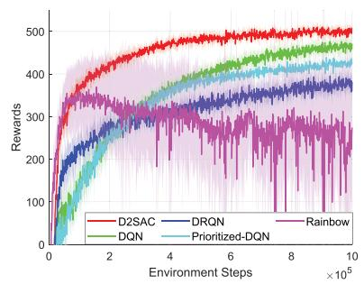

line

| Environment Steps (x10^5) | D2SAC | DRQN | DQN | Prioritized-DQN | Rainbow |
| -------------------------- | ----- | ---- | --- | --------------- | ------- |
| 0                          | 0     | 0    | 0   | 0               | 0       |
| 2                          | 400   | 300  | 350 | 300             | 350     |
| 4                          | 450   | 350  | 400 | 350             | 350     |
| 6                          | 480   | 380  | 420 | 380             | 380     |
| 8                          | 490   | 390  | 430 | 390             | 390     |
| 10                         | 500   | 400  | 440 | 400             | 400     |

(a)D2SAC vs DQN,DRQN,Prioritized-DQN,and Rainbow

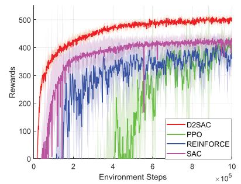

line

| Environment Steps (x10^5) | D2SAC | PPO | REINFORCE | SAC |
| -------------------------- | ----- | --- | --------- | --- |
| 0                          | 0     | 0   | 0         | 0   |
| 2                          | 400   | 350 | 300       | 350 |
| 4                          | 450   | 380 | 350       | 400 |
| 6                          | 480   | 400 | 380       | 420 |
| 8                          | 490   | 410 | 390       | 430 |
| 10                         | 500   | 420 | 400       | 440 |

(b) D2SAC vs REINFORCE,PPO,and SAC

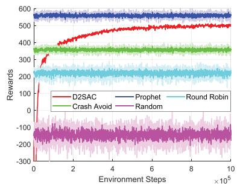

line

| Environment Steps (×10⁵) | D2SAC | Prophet | Round Robin | Crash Avoid | Random |
| ------------------------ | ----- | ------- | ----------- | ----------- | ------ |
| 0                        | -300  | 600     | 250         | 350         | -200   |
| 2                        | 400   | 600     | 250         | 350         | -200   |
| 4                        | 450   | 600     | 250         | 350         | -200   |
| 6                        | 480   | 600     | 250         | 350         | -200   |
| 8                        | 490   | 600     | 250         | 350         | -200   |
| 10                       | 500   | 600     | 250         | 350         | -200   |

(c） D2SAC vs Prophet,Round Robin, Crash Avoid,and Random policies

Fig. 5. Comparison of test reward curves of D2SAC and benchmarks.   
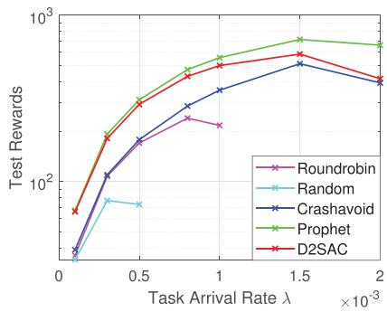

line

| Task Arrival Rate λ (×10⁻³) | Roundrobin | Random | Crashavoid | Prophet | D2SAC |
| --------------------------- | ---------- | ------ | ---------- | ------- | ----- |
| 0                           | 50         | 50     | 50         | 50      | 50    |
| 0.5                         | 150        | 80     | 120        | 200     | 250   |
| 1                           | 200        | 100    | 250        | 400     | 450   |
| 1.5                         | 300        | 200    | 400        | 600     | 550   |
| 2                           | 350        | 250    | 450        | 700     | 500   |

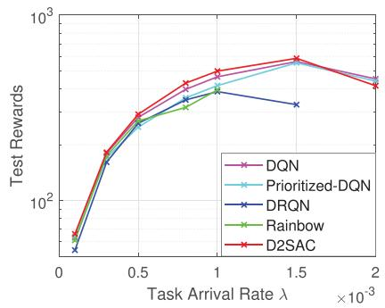

line

| Task Arrival Rate λ (×10⁻³) | DQN   | Prioritized-DQN | DRQN  | Rainbow | D2SAC |
| --------------------------- | ----- | -------------- | ----- | ------- | ----- |
| 0                           | 50    | 50             | 50    | 50      | 50    |
| 0.5                         | 200   | 200            | 200   | 200     | 200   |
| 1                           | 300   | 300            | 300   | 300     | 300   |
| 1.5                         | 400   | 400            | 350   | 350     | 400   |
| 2                           | 350   | 350            | 350   | 350     | 350   |

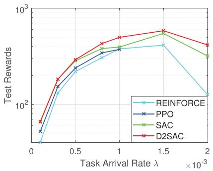

line

| Task Arrival Rate λ (×10⁻³) | REINFORCE | PPO   | SAC   | D2SAC |
| --------------------------- | --------- | ----- | ----- | ----- |
| 0                           | 50        | 60    | 70    | 80    |
| 0.5                         | 200       | 250   | 300   | 350   |
| 1                           | 300       | 350   | 400   | 450   |
| 1.5                         | 400       | 450   | 500   | 550   |
| 2                           | 150       | 300   | 350   | 400   |

Fig. 6. Cumulative test rewards over different task arrival rates. Negative reward values are not displayed.

No Longer Large Denoising Step: The diffusion chain in diffusion-based generation models refers to the sequential spread of information from one state to another, with the length of the chain represented by the denoising step T . Selecting an appropriate value for T involves a trade-off between computational efficiency and accuracy. To ensure accuracy, a large value of T is recommended, but this comes at the cost of longer computation times. However, a small value of T reduces computation time but can increase the risk of instability and numerical errors. In a recent study [31], a value of $T = 5 0 0$ was found to strike a = 500balance between accuracy and computational efficiency.

TABLE IV ACCUMULATED REWARD COMPARISONS ON GENERAL BENCHMARK TASKS 

<table><tr><td colspan="2">Policy</td><td>Acrobot-v1</td><td>CartPole-v1</td><td>CoinRun-v0</td><td>Maze-v0</td></tr><tr><td rowspan="7">DRL</td><td>DQN</td><td>-81.81 ± 17.19</td><td>499.80 ± 0.14</td><td>6.00 ± 4.90</td><td>3.00 ± 4.58</td></tr><tr><td>Prioritized-DQN</td><td>-105.20 ± 14.74</td><td>498.70 ± 1.43</td><td>5.00 ± 5.00</td><td>2.00 ± 4.00</td></tr><tr><td>DRQN</td><td>-82.26 ± 14.34</td><td>132.50 ± 69.79</td><td>-</td><td>-</td></tr><tr><td>REINFORCE</td><td>-104.80 ± 14.51</td><td>500.00 ± 0.00</td><td>0.00 ± 0.00</td><td>0.00 ± 0.00</td></tr><tr><td>PPO</td><td>-77.22 ± 8.45</td><td>499.90 ± 0.33</td><td>0.00 ± 0.00</td><td>2.00 ± 4.00</td></tr><tr><td>Rainbow</td><td>-158.10 ± 55.48</td><td>478.30 ± 29.28</td><td>5.00 ± 5.00</td><td>2.00 ± 4.00</td></tr><tr><td>SAC</td><td>-121.00 ± 35.31</td><td>500.00 ± 0.00</td><td>10.00 ± 0.00</td><td>3.00 ± 4.58</td></tr><tr><td rowspan="8">Online [47, 48]</td><td>A2C</td><td>-86.62 ± 25.10</td><td>499.90 ± 1.67</td><td>-</td><td>-</td></tr><tr><td>ACER</td><td>-90.85 ± 32.80</td><td>498.62 ± 23.86</td><td>-</td><td>-</td></tr><tr><td>ACKTR</td><td>-91.28 ± 32.52</td><td>487.57 ± 63.87</td><td>-</td><td>-</td></tr><tr><td>PPO2</td><td>-85.14 ± 26.27</td><td>500.00 ± 0.00</td><td>-</td><td>-</td></tr><tr><td>DQN</td><td>-88.10 ± 33.04</td><td>500.00 ± 0.00</td><td>-</td><td>-</td></tr><tr><td>TRPO</td><td>-</td><td>485.39 ± 70.51</td><td>-</td><td>-</td></tr><tr><td>PPO + IMPALA</td><td>-</td><td>-</td><td>8.95</td><td>9.88</td></tr><tr><td>Rainbow + IMPALA</td><td>-</td><td>-</td><td>5.50</td><td>4.24</td></tr><tr><td>Ours</td><td>D2SAC</td><td>-70.77 ± 4.12</td><td>500.00 ± 0.00</td><td>10.00 ± 0.00</td><td>7.00 ± 4.58</td></tr></table>

TABLE V TASK PERFORMANCE COMPARISONS OF D2SAC AND BENCHMARKS 

<table><tr><td colspan="2">Policy</td><td>Finished  $Rate^6$ </td><td>Obtained Utility</td><td>Crashed Rate</td><td>Lost Utility</td></tr><tr><td rowspan="4">Heuristic</td><td>Random</td><td>70.2%</td><td>215</td><td>27.7%</td><td>93</td></tr><tr><td>Round Robin</td><td>90.3%</td><td>309</td><td>7.6%</td><td>32</td></tr><tr><td>Crash Avoid</td><td>97.7%</td><td>357</td><td>0%</td><td>0</td></tr><tr><td>Prophet</td><td>97.7%</td><td>548</td><td>0%</td><td>0</td></tr><tr><td rowspan="7">DRL</td><td>DQN</td><td>97.7%</td><td>479</td><td>0.0%</td><td>0</td></tr><tr><td>Prioritized-DQN</td><td>97.7%</td><td>433</td><td>0.0%</td><td>0</td></tr><tr><td>DRQN</td><td>94.3%</td><td>433</td><td>3.8%</td><td>17</td></tr><tr><td>REINFORCE</td><td>95.8%</td><td>458</td><td>1.9%</td><td>10</td></tr><tr><td>PPO</td><td>97.0%</td><td>457</td><td>0.7%</td><td>4</td></tr><tr><td>Rainbow</td><td>97.7%</td><td>419</td><td>0.0%</td><td>0</td></tr><tr><td>SAC</td><td>94.3%</td><td>412</td><td>3.5%</td><td>11</td></tr><tr><td>Ours</td><td>D2SAC</td><td>96.6%</td><td>494</td><td>1.1%</td><td>5</td></tr></table>

However, in D2SAC, the relationship between the denoising step, reward, and computational time did not follow the above rule. Specifically, in Fig. 7, we vary the denoising step T ∈ , , , , , , . We observe that the reward first increased, 1 2 3 4 5 10 15but then decreased as the number of denoising step increased, while the training time consistently increased. This finding suggests that there is an optimal denoising step at the inflection point of the reward curve, which appears to be $T = 5$ . Moreover, = 5we discovered that the optimal denoising step was significantly fewer than the one used in [31], indicating that the trade-off between learning performance and computational efficiency was no longer present. Thus, taking a small T can achieve a satisfying reward while maintaining high computational efficiency.

Understand the Reverse Diffusion Process: Diffusion-based generative models employ the reverse diffusion process to generate new samples from a noise distribution. A denoising network is used to predict and remove noise at each step, gradually resulting in a high-quality and coherent sample. Fig. 8 illustrates how the distribution of action probability changes during each step of the reverse diffusion process at various training iterations. The starting point, represented by the step 0 column, is the softmax of a random normal distribution, which reflects the initial uncertainty of the diffusion model. As the process progresses, the decision probability, i.e., the output of the AGOD, becomes more peaked and approaches the optimal action predicted by the prophet policy, as shown by the vertical dotted lines.

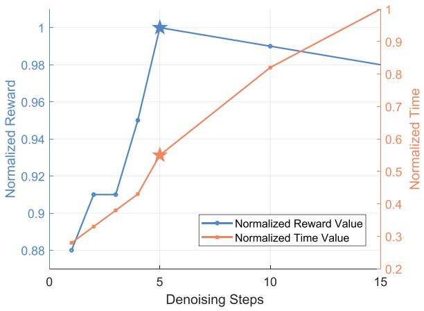

line

| Denoising Steps | Normalized Reward Value | Normalized Time Value |
| --------------- | ------------------------ | ---------------------- |
| 0               | 0.88                     | 0.2                    |
| 5               | 1.0                      | 0.5                    |
| 10              | 0.98                     | 0.8                    |
| 15              | 0.96                     | 1.0                    |

Fig. 7. Denoising step impact on reward and training time, normalized to their maximum value.

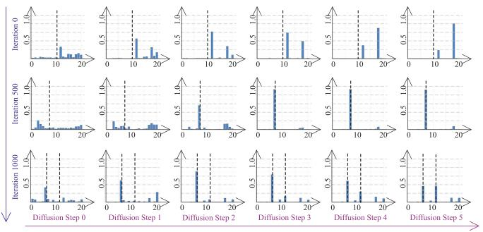  
Fig. 8. Illustration of the “moving” action probability distribution during the reverse diffusion process, i.e., AGOD algorithm. The vertical dotted lines represent the optimal action(s) predicted by the prophet policy.

Fig. 8 highlights two important aspects of D2SAC. First, as the learning process progresses, D2SAC can predict the optimal action decision probability distribution. This is evident in the third row of Fig. 8, where D2SAC can successfully predict multiple optimal actions. Second, D2SAC maintains uncertainty after several denoising step of denoising, allowing for exploration, which is crucial in DRL. However, as the number of denoising step increases, the exploration ability decreases, leading to suboptimal solutions. This explains the reason for the decrease in reward in Fig. 7 when T is larger than 5. The exploration-exploitation trade-off feature of D2SAC in discrete action spaces is distinct and novel, different from approaches in continuous action spaces. In the problem with continuous action spaces, other techniques, such as noise exploration, should be used to enhance exploration. Our approach is thus innovative and different from other approaches [24], [38].

Balance Exploration and Exploitation with Action Entropy: To balance exploration and exploitation in D2SAC, it is crucial to determine the strength of inherent exploration ability. A smaller value of the denoising step T can increase uncertainty, causing the agent to explore actions that may not yield high rewards. Conversely, a larger T can decrease uncertainty but may cause the agent to stay with suboptimal solutions. The action entropy regularization proposed in [20] addresses this challenge by adding a penalty to the expected reward, which is controlled by the temperature coefficient α. This regularization balances the trade-off between exploration and exploitation by modulating the extent to which the agent can explore less likely actions.

Fig. 9 illustrates the impact of the action entropy regularization on the expected reward of D2SAC for varying entropy temperature values (α). The results suggest an optimal value of $\alpha = 0 . 0 5$ , which balances exploration and exploitation performance. A lower α hinders the agent from selecting actions with high uncertainty, leading to greedy behavior and missing out on discovering better actions. Conversely, a higher α encourages the agent to become random, resulting in slow or no progress in learning the optimal policy. By maintaining an appropriate level of entropy, D2SAC achieves a balance between exploration and exploitation, resulting in a fast convergence to the optimal policy.

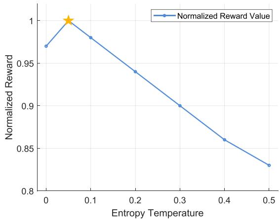

line

| Entropy Temperature | Normalized Reward |
| ------------------- | ----------------- |
| 0.0                 | 0.97              |
| 0.05                | 1.00              |
| 0.1                 | 0.98              |
| 0.2                 | 0.94              |
| 0.3                 | 0.90              |
| 0.4                 | 0.86              |
| 0.5                 | 0.83              |

Fig. 9. Effects of entropy regularization at different temperatures. Values are normalized by their maximum.

# VII. CONCLUSION

We have proposed an innovative edge-enabled AaaS architecture to enable ubiquitous AIGC functionality. To tackle the challenges of environmental uncertainty and variability, we have developed the AGOD based on the diffusion model, which is used in DRL to create the D2SAC algorithm for efficient and optimal ASP selection. Our extensive experimental results have demonstrated the effectiveness of the proposed algorithm, which outperformed seven representative DRL algorithms in both the ASP selection problem and various standard control tasks. Our proposed approach provides a practical and effective solution for the ubiquitous AIGC service in Metaverse. More importantly, the AGOD algorithm can potentially be applied to various optimization problems in wireless networks. In our future research, we intend to collect and employ real-world datasets related to edge-enabled ASP selections, allowing us to validate and refine our algorithm in practical scenarios effectively.

# REFERENCES

[1] A. M. Turing, Computing Machinery and Intelligence. Berlin, Germany: Springer, 2009.   
[2] Y. Wang et al., “A survey on metaverse: Fundamentals, security, and privacy,” IEEE Commun. Surv. Tut., vol. 25, no. 1, pp. 319–352, First Quarter 2023.   
[3] S. John and K. Matt, “Sizing the prize: What’s the real value of AI for your business and how can you capitalise?,” PwC AI Anal. Rep., 2020. [Online]. Available: https://www.pwc.com/gx/en/news-room/docs/report-pwc-aianalysis-sizing-the-prize.pdf   
[4] M. Aljanabi et al., “ChatGpt: Open possibilities,” Iraqi J. Comput. Sci. Math., vol. 4, no. 1, pp. 62–64, Jan. 2023.   
[5] A. Ulhaq, N. Akhtar, and G. Pogrebna, “Efficient diffusion models for vision: A survey,” 2022, arXiv:2210.09292.   
[6] H. Du et al., “Enabling AI-generated content (AIGC) services in wireless edge networks,” IEEE Wireless Commun., 2023.

[7] Y. Lin et al., “Blockchain-aided secure semantic communication for AI-generated content in metaverse,” IEEE Open J. Comput. Soc., vol. 4, pp. 72–83, 2023.   
[8] H. Du et al., “The age of generative AI and AI-generated everything,” 2023, arXiv:2311.00947.   
[9] G. Harshvardhan, M. K. Gourisaria, M. Pandey, and S. S. Rautaray, “A comprehensive survey and analysis of generative models in machine learning,” Comput. Sci. Rev., vol. 38, 2020, Art. no. 100285.   
[10] H. Du et al., “Attention-aware resource allocation and QoE analysis for metaverse xURLLC services,” IEEE J. Sel. Areas Commun., vol. 41, no. 7, pp. 2158–2175, Jul. 2023.   
[11] J. Ren et al., “An efficient two-layer task offloading scheme for MEC system with multiple services providers,” in Proc. IEEE Conf. Comput. Commun., 2022, pp. 1519–1528.   
[12] I. Osband, C. Blundell, A. Pritzel, and B. Van Roy, “Deep exploration via bootstrapped DQN” in Proc. Adv. Neural Inf. Process. Syst., 2016, pp. 1–9.   
[13] H. Du et al., “Beyond deep reinforcement learning: A tutorial on generative diffusion models in network optimization,” 2023, arXiv:2308.05384.   
[14] V. Mnih et al., “Human-level control through deep reinforcement learning,” Nature, vol. 518, no. 7540, pp. 529–533, 2015.   
[15] M. Hausknecht and P. Stone, “Deep recurrent Q-learning for partially observable MDPs,” in Proc. AAAI Fall Symp. Ser., 2015, pp. 29–37.   
[16] T. Schaul, J. Quan, I. Antonoglou, and D. Silver, “Prioritized experience replay,” 2015, arXiv:1511.05952.   
[17] M. Hessel et al., “Rainbow: Combining improvements in deep reinforcement learning,” in Proc. AAAI Conf. Artif. Intell., 2018, pp. 3215–3222.   
[18] R. J. Williams, “Simple statistical gradient-following algorithms for connectionist reinforcement learning,” Reinforcement Learn., vol. 8, pp. 229–256, 1992.   
[19] J. Schulman, F. Wolski, P. Dhariwal, A. Radford, and O. Klimov, “Proximal policy optimization algorithms,” 2017, arXiv: 1707.06347.   
[20] T. Haarnoja, A. Zhou, P. Abbeel, and S. Levine, “Soft actor-critic: Offpolicy maximum entropy deep reinforcement learning with a stochastic actor,” in Proc. Int. Conf. Mach. Learn., 2018, pp. 1861–1870.   
[21] H. Du et al., “Exploring collaborative distributed diffusion-based AIgenerated content (AIGC) in wireless networks,” IEEE Netw., IEEE Netw., 2023, doi: 10.1109/MNET.006.2300223.   
[22] Y. Liu et al., “Blockchain-empowered lifecycle management for AIgenerated content (AIGC) products in edge networks,” IEEE Wireless Commun., 2023.   
[23] S. Yue, J. Ren, J. Xin, D. Zhang, Y. Zhang, and W. Zhuang, “Efficient federated meta-learning over multi-access wireless networks,” IEEE J. Sel. Areas Commun., vol. 40, no. 5, pp. 1556–1570, May 2022.   
[24] Z. Wang, J. J. Hunt, and M. Zhou, “Diffusion policies as an expressive policy class for offline reinforcement learning,” 2022, arXiv:2208.06193.   
[25] H. Du, J. Wang, D. Niyato, J. Kang, Z. Xiong, and D. I. Kim, “AIgenerated incentive mechanism and full-duplex semantic communications for information sharing,” IEEE J. Sel. Areas Commun., vol. 41, no. 9, pp. 2981–2997, Sep. 2023.   
[26] X. Chen et al., “Reinforcement learning–based QoS/QoE-aware service function chaining in software-driven 5G slices,” Trans. Emerg. Telecommun. Technol., vol. 29, no. 11, Nov. 2018, Art. no. e3477.   
[27] K. Arulkumaran, M. P. Deisenroth, M. Brundage, and A. A. Bharath, “Deep reinforcement learning: A brief survey,” IEEE Signal Process. Mag., vol. 34, no. 6, pp. 26–38, Nov. 2017.   
[28] G. Sun, Z. Xu, H. Yu, and V. Chang, “Dynamic network function provisioning to enable network in box for industrial applications,” IEEE Trans. Ind. Inform., vol. 17, no. 10, pp. 7155–7164, Oct. 2020.   
[29] G. Sun, L. Sheng, L. Luo, and H. Yu, “Game theoretic approach for multipriority data transmission in 5G vehicular networks,” IEEE Trans. Intell. Transp. Syst., vol. 23, no. 12, pp. 24672–24685, Dec. 2022.   
[30] M. Dai, L. Luo, J. Ren, H. Yu, and G. Sun, “PSACCF: Prioritized online slice admission control considering fairness in 5G/B5G networks,” IEEE Trans. Netw. Sci. Eng., vol. 9, no. 6, pp. 4101–4114, Nov./Dec. 2022.   
[31] J. Ho, A. Jain, and P. Abbeel, “Denoising diffusion probabilistic models,” Proc. Adv. Neural Inf. Process. Syst., 2020, pp. 6840–6851.   
[32] S. AI, “Stable diffusion,” 2024. [Online]. Available: https://stability.ai/   
[33] J. B. Mazzola and A. W. Neebe, “Resource-constrained assignment scheduling,” Oper. Res., vol. 34, no. 4, pp. 560–572, 1986.   
[34] S. Desale, A. Rasool, S. Andhale, and P. Rane, “Heuristic and metaheuristic algorithms and their relevance to the real world: A survey,” Int. J. Comput. Eng. Res. Trends, vol. 351, no. 5, pp. 2349–7084, May 2015.   
[35] A. Mehta et al., “Online matching and ad allocation,” Found. Trends Theor. Comput. Sci., vol. 8, no. 4, pp. 265–368, Apr. 2013.

[36] W. Chen, X. Qiu, T. Cai, H.-N. Dai, Z. Zheng, and Y. Zhang, “Deep reinforcement learning for Internet of Things: A comprehensive survey,” IEEE Commun. Surv. Tut., vol. 23, no. 3, pp. 1659–1692, Third Quarter 2021.   
[37] R. S. Sutton, D. McAllester, S. Singh, and Y. Mansour, “Policy gradient methods for reinforcement learning with function approximation,” in Proc. Adv. Neural Inf. Process. Syst., 1999, pp. 1057–1063.   
[38] M. Janner, Y. Du, J. B. Tenenbaum, and S. Levine, “Planning with diffusion for flexible behavior synthesis,” 2022, arXiv:2205.09991.   
[39] A. Lugmayr, M. Danelljan, A. Romero, F. Yu, R. Timofte, and L. Van Gool, “RePaint: Inpainting using denoising diffusion probabilistic models,” in Proc. IEEE Conf. Comput. Vis. Pattern Recognit., 2022, pp. 11461–11471.   
[40] S. Kastryulin, D. Zakirov, and D. Prokopenko, “PyTorch image quality: Metrics for image quality assessment,” Open-source Softw., 2022. [Online]. Available: https://github.com/photosynthesis-team/piq   
[41] Z. Liu, P. Luo, X. Wang, and X. Tang, “Deep learning face attributes in the wild,” in Proc. IEEE Int. Conf. Comput. Vis., 2015, pp. 3730–3738.   
[42] S.-W. Ko, K. Han, and K. Huang, “Wireless networks for mobile edge computing: Spatial modeling and latency analysis,” IEEE Trans. Wireless Commun., vol. 17, no. 8, pp. 5225–5240, Aug. 2018.   
[43] S.-P. Chung and J.-C. Lee, “Performance analysis and overflowed traffic characterization in multiservice hierarchical wireless networks,” IEEE Trans. Wireless Commun., vol. 4, no. 3, pp. 904–918, May 2005.   
[44] A. Vaswani et al., “Attention is all you need,” in Proc. Adv. Neural Inf. Process. Syst., 2017, pp. 1–11.   
[45] D. P. Kingma and J. Ba, “Adam: A method for stochastic optimization,” in Proc. Int. Conf. Learn. Representations, 2015, pp. 1–15.   
[46] F. Garcia-Carballeira, A. Calderon, and J. Carretero, “Enhancing the power of two choices load balancing algorithm using round robin policy,” Cluster Comput., vol. 24, no. 2, pp. 611–624, Feb. 2021.   
[47] K. Cobbe, C. Hesse, J. Hilton, and J. Schulman, “Leveraging procedural generation to benchmark reinforcement learning,” in Proc. Int. Conf. Mach. Learn., 2020, pp. 2048–2056.   
[48] A. Raffin, “RL baselines zoo,” 2018. [Online]. Available: https://github. com/araffin/rl-baselines-zoo

natural_image

Portrait of a young man wearing glasses and a dark shirt, with a sculptural background (no text or symbols visible)

Hongyang Du (Graduate Student Member, IEEE) received the BSc degree from Beijing Jiaotong University, Beijing, China, in 2021. He is currently working toward the PhD degree with the School of Computer Science and Engineering, Energy Research Institute @ NTU, Nanyang Technological University, Singapore, under the Interdisciplinary Graduate Program. He is the Editor-in-chief assistant of IEEE Communications Surveys & Tutorials (2022-2024). He was recognized as an exemplary reviewer of the IEEE Transactions on Communications and IEEE Commu-

nications Letters in 2021. He was the recipient of the IEEE Daniel E. Noble Fellowship Award from the IEEE Vehicular Technology Society, in 2022, the recipient of the IEEE Signal Processing Society Scholarship from the IEEE Signal Processing Society, in 2023, the recipient of Chinese Government Award for Outstanding Students Abroad, in 2023, and the recipient of the Singapore Data Science Consortium (SDSC) Dissertation Research Fellowship in 2023. He won the Honorary Mention award in the ComSoc Student Competition from IEEE Communications Society, in 2023, and the First and Second Prizes in the 2024 ComSoc Social Network Technical Committee (SNTC) Student Competition. His research interests include semantic communications, generative AI, and resource allocation.

natural_image

Portrait of a young man wearing glasses and a collared shirt (no text or symbols visible)

Zonghang Li received the BS degree in UESTC. He is currently working toward the PhD degree with the School of Information and Communication Engineering in University of Electronic Science and Technology of China (UESTC). His research interests include intelligent communication systems, distributed machine learning and federated learning. He was awarded the 2021 Leading and Innovative Technology Achievement Award by China Institute of Communications. He was ever a visiting student with the Nanyang Technological University and the Oxford University.

natural_image

Portrait of a person wearing glasses and a dark jacket, outdoors with blurred building background (no visible text or symbols)

Dusit Niyato (Fellow, IEEE) received BEng degree from King Mongkut’s Institute of Technology Ladkrabang (KMITL), Thailand, in 1999 and the PhD degree in electrical and computer engineering from the University of Manitoba, Canada, in 2008. He is currently a professor in the School of Computer Science and Engineering, with Nanyang Technological University, Singapore. His research interests are in the areas of the Internet of Things (IoT), machine learning, and incentive mechanism design.

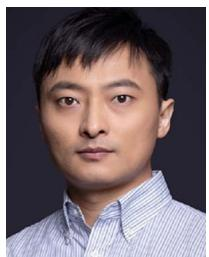

natural_image

Portrait of a man in a striped shirt against a dark background (no text or symbols visible)

Huawei Huang (Senior Member, IEEE) received the PhD degree in computer science and engineering from the University of Aizu, Japan. He has worked as a research Fellow of JSPS and an assistant professor with Kyoto University, Japan. He is currently an associate professor with the School of Software Engineering, Sun Yat-sen University, China. His research interests include blockchain and distributed protocols/systems. He served as a Lead guest editor for a Special Issue on Blockchain of IEEE Journal on Selected Areas in Communications and the

Operation-Committee Chair for the Inaugural IEEE Symposium on Blockchain 2021.

natural_image

Portrait of a man wearing glasses and a white shirt with patterned tie against a blue background (no text or symbols visible)

Jiawen Kang (Senior Member, IEEE) received the PhD degree from the Guangdong University of Technology, China, in 2018. He was a postdoc with Nanyang Technological University, Singapore from 2018 to 2021. He currently is a full professor with Guangdong University of Technology. His research interests mainly focus on blockchain, security, and privacy protection in wireless communications and networking.

natural_image

Portrait of a man wearing glasses and a suit against a blue background (no text or symbols visible)

Shiwen Mao (Fellow, IEEE) is a professor and Earle C. Williams Eminent Scholar, and director of the Wireless Engineering Research and Education Center with Auburn University. He is research interest includes wireless networks, multimedia communications, and smart grid. He is a distinguished lecturer of IEEE Communications Society and IEEE Council of RFID (2021-2022), and the editor-in-chief of IEEE Transactions on Cognitive Communications and Networking. He received the IEEE ComSoc MMTC Outstanding Researcher Award, in 2023, the SEC

(Southeastern Conference) 2023 Faculty Achievement Award for Auburn, the IEEE ComSoc TC-CSR Distinguished Technical Achievement Award in 2019, the Auburn University Creative Research & Scholarship Award in 2018, the NSF CAREER Award, in 2010, and several service awards from the IEEE. He is a co-recipient of several journal and conference best paper awards from the IEEE.

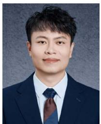

natural_image

Portrait of a man in formal suit and tie against a plain background (no text or symbols visible)

Zehui Xiong (Senior Member, IEEE) received the BEng degree in the highest honors in Telecommunications Engineering from the Huazhong University of Science and Technology (HUST), Wuhan, China, and the PhD degree in computer science and engineering from the Nanyang Technological University (NTU), Singapore. He is an assistant professor with Singapore University of Technology and Design (SUTD), and also an Honorary Adjunct Senior Research Scientist with Alibaba-NTU Singapore Joint Research Institute, Singapore. He was a visiting scholar with

Department of Electrical Engineering at Princeton University and a visiting scholar with Broadband Communications Research (BBCR) Lab in Department of Electrical and Computer Engineering at University of Waterloo. His research interests include wireless communications, Internet of Things, blockchain, edge intelligence, and Metaverse. Recognized as a Highly Cited Researcher, he has published more than 200 peer-reviewed research papers in leading journals and flagship conferences. He has won more than 10 Best Paper Awards in international conferences. In 2023, he was featured on the list of Forbes Asia 30 under 30. He is now serving as the associate director of Future Communications R&D Programme.