# Digital Twin-Assisted Space-Air-Ground Integrated Multi-Access Edge Computing for Low-Altitude Economy: An Online Decentralized Optimization Approach

Long He, Geng Sun , Senior Member, IEEE, Zemin Sun , Jiacheng Wang , Hongyang Du , Dusit Niyato , Fellow, IEEE, Jiangchuan Liu , Fellow, IEEE, and Victor C. M. Leung , Life Fellow, IEEE

Abstract—The emergence of space-air-ground integrated multiaccess edge computing (SAGIMEC) networks opens a significant opportunity for the rapidly growing low altitude economy (LAE), facilitating the development of various applications by offering efficient communication and computing services. However, the heterogeneous nature of SAGIMEC networks, coupled with the stringent computational and communication requirements of diverse applications in the LAE, introduces considerable challenges in integrating SAGIMEC into the LAE. In this work, we first present a digital twin-assisted SAGIMEC paradigm for LAE, where digital twin enables reliable network monitoring and management, while SAGIMEC provides efficient computing offloading services for Internet of Things sensor devices (ISDs). Then, a joint satellite selection, computation offloading, communication resource allocation,

Digital Object Identifier 10.1109/TMC.2025.3623636

computation resource allocation and uncrewed aerial vehicle (UAV) trajectory control optimization problem (JSC4OP) is formulated to maximize the quality of service (QoS) of ISDs. Given the complexity of JSC4OP, we propose an online decentralized optimization approach (ODOA) to address the problem. Specifically, JSC4OP is first transformed into a real-time decision-making optimization problem (RDOP) by leveraging Lyapunov optimization. Then, to solve the RDOP, we introduce an online learning-based latency prediction method to predict the uncertain system environment and a game theoretic decision-making method to make real-time decisions. Finally, theoretical analysis confirms the effectiveness of the ODOA. Simulation results show that the proposed ODOA outperforms various benchmark approaches and improves the QoS of ISDs by at least 14.5% compared to deep reinforcement learning (DRL)-based approaches, thereby validating the superiority of the proposed approach.

Index Terms—Space-air-ground integrated network, multiaccess edge computing, computation offloading, trajectory control.

## I. INTRODUCTION

S AN emerging sector in modern economic development, the low-altitude economy (LAE) is increasingly becoming a key driver of regional economic growth and technological ad vancement. Specifically, by efficiently developing and utilizing low-altitude airspace resources (typically referring to altitudes below 1,000 meters), the LAE encompasses a wide range of applications, including environmental monitoring, aerial inspections, and low-altitude tourism [1]. Accordingly, several companies have already ventured into unprecedented commercial opportunities presented by the LAE, including Kespry in inspection and surveying, Da-Jiang in manufacturing aircrafts, and Amazon Prime in logistics and delivery [2].

With the rapid development of the LAE, uncrewed and crewed aircraft, such as uncrewed aerial vehicle (UAVs) and electric vertical take-off and landing (eVTOL), have been widely deployed across various domains. In particular, UAV-assisted multi-access edge computing (MEC) is recognized as a highly promising application in the LAE. Specifically, Internet of Things sensor devices (ISDs) are experiencing explosive growth, driving the development of numerous intelligent applications such as autonomous driving, augmented reality (AR), and virtual reality (VR) [3], thereby creating significant social and commercial value. However, a critical challenge lies in the fact that these intelligent applications often involve computationally intensive and latency-sensitive tasks, which conflict with the limited computational resources and energy capacity of ISDs [4]. In traditional terrestrial networking, terrestrial MEC has been proposed to provide energy-efficient and low-latency computational offloading services for resource-limited ISDs. However, terrestrial MEC heavily relies on ground-based infrastructure, which limits its effectiveness in remote areas lacking infrastructure or in disaster-stricken regions where infrastructure is damaged. In LAE networking, the UAVs equipped with communication and computing capabilities can effectively compensate for the shortcomings of terrestrial MEC, owing to high line-of-sight (LoS) probability, cost-effectiveness, and flexible mobility. Consequently, UAV-assisted MEC has gained significant attention and has become a focal point of research [5], [6], [7]. Nevertheless, the limited onboard capabilities of UAVs, particularly their constrained computational resources and energy supplies, remain a critical bottleneck restricting the improvement of system performance [8].

Thanks to the rapid deployment of mega-Low Earth Orbit (LEO) satellite constellations such as Starlink, OneWeb, and Kuiper, space-air-ground integrated MEC (SAGIMEC) network is emerging as a promising architecture to provide seamless computation offloading services. Specifically, SAGIMEC is usually a three-tier computing architecture that integrates heterogeneous network components, including a terrestrial network, an aerial UAV network, and a space low earth orbit (LEO) satellite network [9]. On the one hand, due to the wide coverage of LEO satellites and flexible mobility of UAVs, SAGIMEC greatly expands the application scenarios and coverage of edge computing. On the other hand, the low transmission latency and seamless connectivity of LEO satellites enable SAGIMEC to effectively combine cloud-edge computing resources to improve the resource utilization.

Nevertheless, fully exploring the benefits of the SAGIMEC network faces several fundamental challenges. i) Computation Offloading. The heterogeneity of the networks in SAGIMEC leads to an uneven distribution of resources. Moreover, different ISDs usually have diverse computing requirements for resources [10]. As a result, the heterogeneous resource distribution and ISD requirements lead to the complexity of computation offloading decisions. ii) Satellite Selection. The dynamic topology of satellite networks leads to time-varying and uncertain satellite link conditions [11]. Therefore, when multiple satellites are accessible, it is challenging to select appropriate satellites as relay nodes for the efficient use of cloud computing services based on satellite networks. iii) Resource Management. Tasks of ISDs are often computation-hungry and latency-sensitive, imposing strict requirements on computing and communication resources. However, UAV networks usually have limited computing and spectrum resources. Therefore, the strict computing requirements make resource allocation difficult in resource-constrained UAV networks [7]. iv) Trajectory Control. While the mobility of UAVs enhances the elasticity and flexibility of MEC, the limited onboard battery capacity of UAVs leads to finite service time [12], which makes it challenging to balance both the service time of UAVs and the QoS of ISDs. Furthermore, the complexity and dynamics of the SAGIMEC network pose significant challenges in achieving efficient network management to meet the robustness requirements of the LAE.

To address the aforementioned challenges, we incorporate digital twin technology into the SAGIMEC network. By constructing digital space models to evaluate the state information of physical entities within the network, digital twin technology facilitates real-time network monitoring and network management, while providing insights for decision-making. Moreover, we propose a novel online decentralized optimization approach (ODOA) for SAGIMEC networks that enables the joint optimization of computation offloading, satellite selection, communication resource allocation, computation resource allocation, and UAV trajectory control, to maximize the QoS of ISDs. Our main contributions can be briefly outlined as follows:

New MEC Paradigm for LAE: We propose a novel digital twin-assisted SAGIMEC paradigm for LAE. In this paradigm, a UAV and a cloud center are seamlessly connected via a satellite network to facilitate high-quality computing offload services. Meanwhile, the digital twin facilitates real-time network management and provides insights for decision-making through comprehensive network monitoring. Notably, our proposed architecture is inherently scalable, enabling a seamless transition to multi-UAV scenarios. Moreover, within this framework, we consider the time-varying computing requirements of ISDs, the resource and energy constraints of the UAV, as well as the dynamics and uncertainties of the satellite links to more accurately capture the real-world physical characteristics of the SAGIMEC network.

QoS-Oriented Optimization Problem Formulation: We formulate a joint satellite selection, computation offloading, communication and computation resource allocation, and UAV trajectory control optimization problem (JSC4OP) to maximize the QoS of ISDs. Additionally, we develop a QoS assessment model, which integrates task completion latency and ISD energy consumption. Moreover, we demonstrate that JSC4OP is inherently challenging to be solved directly due to its reliance on future information, the presence of uncertain network parameters, and its nonconvex and NP-hard characteristics.

\- Novel Online Approach Design: To solve the JSC OP, we propose an online decentralized optimization approach (ODOA). Specifically, we first transform the JSC OP into a real-time decision-making optimization problem (RDOP) that only depends on current information by using the Lyapunov optimization. Then, for the RDOP, we propose an online learning-based latency prediction method to predict uncertain network parameters and a game theoretic decision-making method to make real-time decisions.

Theoretical Analysis and Simulation Experiments: The effectiveness and performance of the designed ODOA are confirmed through theoretical analysis and simulation experiments. In particular, the theoretical analysis establishes that the ODOA not only satisfies the UAV energy consumption constraint, but also exhibits low computational complexity. Additionally, the simulation results demonstrate that the ODOA outperforms other alternative approaches in terms of overall system performance.

The subsequent sections of this work are structured as follows. In Section II, an overview of the related work is provided. Section III details the relevant system models. Section IV presents the problem formulation and analysis. The Lyapunovbased problem transformation is described in Section V. In Section VI, the algorithm design and theoretical analysis are provided. Then, the simulation results are presented in Section VII, followed by a detailed discussion in Section VIII. Finally, this work is concluded in Section IX.

## II. RELATED WORK

In this section, we provide a comprehensive review of the relevant studies pertaining to SAGIMEC network architecture, formulation of optimization problems, and optimization approaches. Furthermore, we emphasize the key distinctions between our work and the existing research.

## A. Space-Air-Ground Integrated Multi-Access Edge Computing Network

As an emerging technology, SAGIMEC networks have attracted extensive attention and research. Various network architectures have been proposed to enhance the efficiency of computation offloading services. For example, in [10], [13], the authors investigated the SAGIMEC architecture consisting of multiple ground base stations, UAVs, and LEO satellites to meet computation-intensive requests from ground devices. Du et al. [14] explored the architecture of single satellite and multiple UAVs collaboration to provide computation offloading services for Internet of Things devices. Huang et al. [15] conducted a study on the integration of hybrid multi-cloud services and MEC within SAGIMEC, focusing on the dynamic access capabilities of UAVs, multi-satellite access, and cloud service selection. Shen et al. [16] introduced a slice-oriented task offloading framework for space-air-ground integrated vehicular networks, aiming to deliver differentiated quality-of-service guarantees for high-speed vehicles. Yu et al. [17] proposed an space-air-ground integrated network framework to provide various Internet of Vehicles services for vehicles in remote areas. Qin et al. [18] proposed a novel cluster-non-orthogonal multiple access-enabled SAGIMEC network and developed an efficient approach that significantly reduces the average system delay. Liu et al. [19] conducted an innovative study on the integration of wireless power transfer with SAGIMEC networks and considered comprehensive optimization metrics to effectively enhance system performance.

Compared to the aforementioned studies, the innovations of our work are summarized as follows. First, unlike previous works that rely on model-based approaches to analyze UAV-satellite communications, our work adopts a data-driven method, which is more suitable for the considered dynamic scenario. Moreover, the aforementioned studies primarily focus on optimizing system-level performance and therefore adopt centralized approaches to achieve global optimality. In contrast, our work emphasizes user-side performance and accordingly develops a decentralized approach to ensure the QoS of individual users.

## B. Formulation of Optimization Problems

The formulation of the optimization problem is critical for enhancing the performance of the SAGIMEC networks. For example, Gao et al. [10] conducted a study on task hosting, computing offloading, computing resource allocation, and association control in a SAGIMEC network, with the aim of minimizing the time-averaged network cost. Huang et al. [15] investigated a partial task offloading strategy and jointly optimized task offloading, task partitioning, UAV trajectory, and computing resource allocation to minimize system energy consumption and latency. To maximize the number of tasks meeting the delay constraints, Zhang et al. [20] formulated a joint optimization problem for offloading destinations and offloading quantities. Cheng et al. [21] proposed an online computation offloading method to learn optimal offloading decisions, thereby effectively reducing the overall system cost. Nguyen et al. [12] formulated an optimization problem that jointly considers user scheduling, computation resource and bandwidth allocation, bit allocation, partial offloading control, and UAV trajectory control, aiming to minimize system energy consumption.

This work differs from the aforementioned research in the following aspects. First, we incorporate a more comprehensive set of optimization metrics, including satellite selection, task offloading, communication and computing resource allocation, and UAV trajectory control, to fully exploit the benefit of the SAGIMEC network. Moreover, we consider a long-term energy consumption constraint for the UAV, which provides a flexible control mechanism to balance service quality and service sustainability.

## C. Optimization Approaches

To address complex optimization problems, numerous studies have focused on designing efficient optimization approaches. Some of these studies have proposed high-performance offline approaches, which typically assume that the edge computing scenarios is static or that the computational demands of terminal devices are known in advance [22], [23], [24], [25], [26]. How ever, in many edge computing scenarios, such as the metaverse or real-time video analytics, computational demands arrive in a stochastic manner. Additionally, satellites and UAVs in SAG-IMEC networks exhibit inherent dynamic mobility. Therefore, online approaches are essential for SAGIMEC networks to make real-time decisions without knowledge of future information.

Several studies have also explored online approaches. For example, Zhou et al. [27] developed a two time-scale online approach for caching and task offloading by leveraging the Lyapunov optimization framework. Miao et al. [28] proposed a deep deterministic policy gradient (DDPG)-based algorithm to optimize the computational resources allocation and UAV flight trajectory for UAV-assisted MEC. To minimize the average power consumption of the system with randomly arriving user tasks, Hoang et al. [29] developed a Lyapunov-guided deep reinforcement learning (DRL) framework. Cai et al. [30] proposed an online approach based on graph DRL to optimize task offloading and resource allocation decisions.

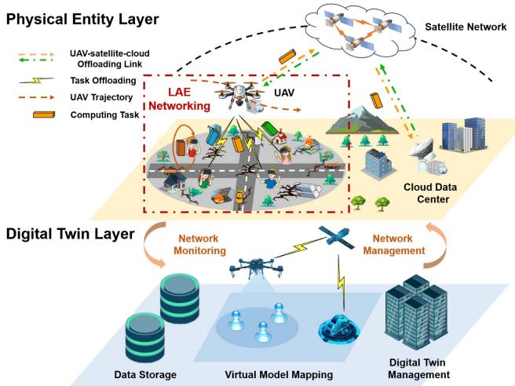  
Fig. 1. The proposed digital twin-assisted SAGIMEC architecture consists of a physical entity layer and a digital twin layer.

The Lyapunov-based optimization framework and DRL represent two viable methodologies for developing online approaches. While DRL is a powerful technique for training agents to make real-time decisions, it necessitates a substantial amount of sample data to learn optimal strategies and incurs significant computational overhead. Therefore, we employ the Lyapunovbased optimization framework to devise our online approach. In a departure from existing research, we propose a novel decentralized decision-making method based on game theory within the Lyapunov-based optimization framework. This proposed approach demonstrates both low computational complexity and superior performance.

## III. SYSTEM MODEL

As shown in Fig. 1, we propose a digital twin-driven SAG-IMEC paradigm for the LAE, which consists of a physical entity layer and a digital twin layer, detailed as follows.

Physical Entity Layer: In the spatial dimension, the physical entity layer is structured as a hierarchical architecture comprising a terrestrial layer, an aerial layer, and a space layer. At the terrestrial layer, a set of ISDs $\mathcal { M } = \{ 1 , \dots , M \}$ are distributed in the considered area to carry out specific activities such as real-time image recognition or video analysis1 [14], [31], and generate corresponding tasks with time-varying computational demands. Moreover, a cloud center c is deployed far away from the considered service area, which can provide robust cloud computing services. However, due to the destruction of ground infrastructure, e.g., during natural disasters, the ISDs are unable to access the cloud center via the terrestrial network. At the aerial layer, a rotary-wing UAV u equipped with computational and communication capabilities is employed in close proximity to the ISDs to provide flexible computing offloading services. At the space layer, we consider a satellite constellation consisting of N LEO satellites. This network provides seamless communication connectivity between the UAV and the cloud computing center, thereby making cloud computing services accessible.

In the temporal dimension, the physical entity layer operates in a discrete time slot manner. Specifically, the system time is divided into T equal time slots with $t \in { \mathcal { T } } = \{ 1 , . . . , T \}$ , wherein each time slot has a duration of τ [27]. Furthermore, τ is chosen to be sufficiently small such that each time slot can be considered as quasi-static [32].

Digital Twin Layer: The digital twin layer is the virtual representation of the physical entity layer, which is deployed in the cloud center to facilitate real-time monitoring and management of the physical network. Specifically, the digital twin layer consists of three key components, i.e., data storage, virtual model mapping, and digital twin management. First, the data storage is responsible for storing and collecting real-time information related to physical layer entities and network states. Second, the virtual model mapping involves creating virtual models of physical entities and simulating the interactions between these entities. Finally, the digital twin management is responsible for updating and maintaining the mapping between the virtual model and the physical network, while providing essential network control feedback to the physical network.

In real-world applications, the UAV can be deployed by a ground rescue team. Then, the ground remote control center can serve as the cloud component of the proposed architecture, providing cloud computing services and supporting real-time monitoring and management through digital twin technologies. Moreover, the proposed algorithm can be deployed on the UAV to enable real-time decision-making.

## A. Digital Twin Models

The proposed system comprises three types of physical entities, i.e., ISD, UAV, and satellite. The cloud center creates corresponding digital twin models to record the real-time states of these physical entities, as detailed below.

ISD Digital Twin Model: We consider that each ISD generates one computing task per time slot [33], [34]. At time slot t, the digital twin model of ISD m ∈ M can be characterized as $\mathbf { S t } _ { m } ( t ) = ( f _ { m } ^ { \mathrm { I S D } } , E _ { m } ( t ) , \Phi _ { m } ( t ) , \mathbf { q } _ { m } )$ , wherein $f _ { m } ^ { \mathrm { I S D } }$ and $E _ { m } ( t )$ ( ) = ( ( ) ( ) ) ( )denote the local computing capability and energy consumption of ISD $m _ { : }$ respectively. Furthermore, the set $\Phi _ { m } ( t ) =$ $\{ D _ { m } ( t ) , \eta _ { m } ( t ) , T _ { m } ^ { \mathrm { m a x } } ( t ) \}$ ( ) =represents the attributes of the com-( ) ( ) ( )puting task generated by ISD $m$ , wherein $D _ { m } ( t )$ indicates the task data size (in bits), $\eta _ { m } ( t )$ denotes the computation density (in cycles/bit), and $T _ { m } ^ { \mathrm { m a x } } ( t )$ ( )is the deadline of the task (in s). Moreover, $\mathbf { q } _ { m } = [ x _ { m } ( t ) , y _ { m } ( t ) ]$ stands for the location coordinates of ISD m.

UAV Digital Twin Model: Similar to [35], we consider that the UAV flies at a constant altitude H to mitigate additional energy consumption associated with frequent altitude changes. Therefore, the digital twin model of the UAV u can be characterized by $\mathbf { S t } _ { u } ( t ) = ( \mathbf { q } _ { u } ^ { t } , H , E _ { u } ( t ) , B _ { u } , F _ { u } ^ { \operatorname* { m a x } } )$ , wherein $\mathbf { q } _ { u } ^ { t } = [ x _ { u } ^ { t } , y _ { u } ^ { t } ]$ and H represent the horizontal coordinates and flight height, respectively. $E _ { u } ( t )$ signifies the energy consumption of the UAV. Moreover, $B _ { u }$ and $F _ { u } ^ { \mathrm { m a x } }$ denote the available bandwidth resources and computing resources of the UAV, respectively.

Satellite Digital Twin Model: The satellite digital twin model is developed to simulate the dynamic mobility characteristics of the satellite constellation. Specifically, due to the movement of satellites, the connectivity between the UAV and satellites varies over time, leading to a time-varying subset of accessible satellites ${ \mathbf { } } S ( t )$ . Furthermore, due to the periodic nature of satellite movements, the concept of snapshots can be utilized to model the changes of the accessible subset [11]. Specifically, every $\Delta$ consecutive time slots form a snapshot epoch, where the accessible subset remains constant within each snapshot epoch but varies across different snapshot epochs [36].

## B. Task Computing Model

The task $\Phi _ { m } ( t )$ generated by ISD m can be carried out locally on the ISD (referred to as local computing), offloaded to UAV u for execution (referred to as UAV-assisted computing), or offloaded to cloud c for execution (referred to as cloud-assisted computing), which is decided by the offloading decision of the ISD. Therefore, we define a variable $a _ { m } ( t ) \in \{ l , u , c \}$ to indicate the offloading decision of ISD m at time slot t, wherein $a _ { m } ( t ) = l$ indicates the local computing, $a _ { m } ( t ) = u$ represents the UAV-assisted computing, and $a _ { m } ( t ) = c$ signifies the cloudassisted computing. Furthermore, both local computing and computation offloading generally involve overheads in terms of latency and energy, which are explained in detail below.

1) Local Computing: If task $\Phi _ { m } ( t )$ is executed locally by ISD m at time slot $t ,$ ( ) the ISD utilizes its local computational resources for task execution.

Task Completion Latency: The task completion latency for local computing is computed as

$$
T _ { m } ^ { \mathrm { L C } } ( t ) = \frac { \eta _ { m } ( t ) D _ { m } ( t ) } { f _ { m } ^ { \mathrm { I S D } } } ,\tag{1}
$$

where $f _ { m } ^ { \mathrm { I S D } }$ represents the computing capability of ISD m.

ISD Energy Consumption: The energy consumption of ISD m to execute task $\Phi _ { m } ( t )$ is calculated as

$$
E _ { m } ^ { \mathrm { L C } } ( t ) = k ( f _ { m } ^ { \mathrm { I S D } } ) ^ { 3 } T _ { m } ^ { \mathrm { L C } } ( t ) ,\tag{2}
$$

wherein k is the effective switched capacitance coefficient dependent on the CPU chip architecture. [37].

2) UAV-Assisted Computing: If task $\Phi _ { m } ( t )$ is offloaded to ( )UAV u for execution at time slot t, the UAV establishes a communication connection with ISD m to receive the task, allocates computing resources for task execution, and transmits the processed results to the ISD. Note that we ignore the latency and energy consumption associated with the result feedback due to the short-distance transmission and the small data size of the results [11].

ISD-UAV Communication: The widely used orthogonal frequency-division multiple access (OFDMA) is employed to simultaneously serve multiple ISDs by the UAV [38]. Moreover, considering that the ISD-UAV link may experience obstruction from environmental obstacles, the channel power gain between ISD $m$ and UAV u at time slot t is calculated by incorporating the commonly used probabilistic line-of-sight (LoS) channel model [39] with the large-scale and small-scale fadings as follows:

$$
\begin{array} { r } { g _ { u , m } ( t ) = \rho _ { u , m } ^ { \mathrm { L o S } } ( t ) g _ { u , m } ^ { \mathrm { L o S } } ( t ) + ( 1 - \rho _ { u , m } ^ { \mathrm { L o S } } ( t ) ) g _ { u , m } ^ { \mathrm { N L o S } } ( t ) , } \end{array}\tag{3}
$$

where $\rho _ { u , m } ^ { \mathrm { L o S } } ( t )$ denotes the probability of LoS transmission. Moreover, $g _ { u , m } ^ { x } ( t ) \ ~ ( x \in \{ \mathrm { L o S } , \mathrm { N L o S } \} )$ denotes the channel power gain under either LoS or non-LoS (NLoS) conditions, which is expressed as $g _ { u , m } ( t ) = | h _ { u , m } ^ { x } ( t ) | ^ { 2 } ( L _ { u , m } ^ { x } ( t ) ) ^ { - 1 }$ , where $h _ { u , m } ^ { x } ( t )$ and $L _ { u , m } ^ { x } ( t )$ denote the parameters of small-scale fading and large-scale fading, respectively [40].

First, for the ISD-UAV link, an extensively employed LoS probability is calculated as [41]

$$
\rho _ { u , m } ^ { \mathrm { L o S } } ( t ) = \frac { 1 } { 1 + c _ { 1 } \exp { \left( - c _ { 2 } \left( \frac { 1 8 0 } { \pi } \arcsin { \frac { H } { d _ { u , m } ( t ) } } - c _ { 1 } \right) \right) } } ,\tag{4}
$$

where $c _ { 1 }$ and $c _ { 2 }$ are the constants depending on the environment [42], and $d _ { u , m } ( t )$ means the straight-line distance between UAV u and ISD m.

Second, the small-scale fading for ISD-UAV communication at time slot t is modeled as a parametric-scalable and good fitting generalized fading,i.e., Nakagami-m fading [43], which is given as

$$
\begin{array} { r l r } {  { h _ { u , m } ^ { x } ( t ) \sim f ^ { \mathrm { N a k } } ( h _ { u , m } ^ { x } ( t ) , \theta ^ { x } ) = \frac { 2 ( \theta ^ { x } ) ^ { \theta ^ { x } } } { \Gamma ( \theta ^ { x } ) ( \bar { p } ) ^ { \theta ^ { x } } } ( h _ { u , m } ^ { x } ( t ) ) ^ { 2 \theta ^ { x } - 1 } } } \\ & { } & { \times \exp ( - \frac { \theta ^ { x } } { \bar { p } } ( h _ { u , m } ^ { x } ( t ) ) ^ { 2 } ) , \qquad ( 5 ) } \end{array}
$$

where $\bar { p }$ is the average received power, $\Gamma ( \cdot )$ is the Gamma function, and $\theta ^ { x } \left( x \in \{ \mathrm { L o S } , \mathrm { N L o S } \} \right)$ is the Nakagami-m fading parameters for LoS or NLoS conditions.

Finally, the large-scale fading for MD-UAV communication at time slot t can be given as [44]

$$
L _ { u , m } ^ { x } ( t ) = \frac { ( 4 \pi d _ { u , m } ( t ) f _ { u } ) ^ { 2 } } { v _ { c } ^ { 2 } } \eta ^ { x } ,\tag{6}
$$

where $v _ { c }$ denotes the speed of light, $f _ { u }$ is the carrier frequency, and $\eta ^ { x }$ is the attenuation factor associated with the LoS or NLoS conditions.

Based on the above analysis, the data transmission rate from ISD m to UAV u at time slot t can be calculated using Shannon’s formula as follows:

$$
R _ { u , m } ( t ) = w _ { u , m } ^ { t } B _ { u } \log _ { 2 } \left( 1 + P _ { m } g _ { u , m } ( t ) / \varpi _ { 0 } \right) ,\tag{7}
$$

where $w _ { u , m } ^ { t }$ represents the resource allocation coefficient of ISD m, $B _ { u }$ denotes the bandwidth resources available to $\mathrm { U A V } u , P _ { m }$ indicates the transmission power of ISD $m , g _ { u , m } ( t )$ means the channel gain, and $\varpi _ { 0 }$ is the noise power.

Task Completion Latency: The task completion latency mainly consists of the transmission and execution latency, which is calculated as

$$
T _ { m } ^ { \mathrm { U C } } ( t ) = \frac { D _ { m } ( t ) } { R _ { u , m } ( t ) } + \frac { \eta _ { m } ( t ) D _ { m } ( t ) } { F _ { u , m } ^ { t } } ,\tag{8}
$$

where $F _ { u , m } ^ { t }$ stands for the computational resources assigned by UAV u to ISD m at time slot t.

ISD Energy Consumption: The transmission energy consumption of ISD for UAV-assisted computing is computed as

$$
E _ { m } ^ { \mathrm { U C } } ( t ) = \frac { P _ { m } D _ { m } ( t ) } { R _ { u , m } ( t ) } .\tag{9}
$$

UAV Energy Consumption: The computational energy consumption of UAV for UAV-assisted computing is given as

$$
E _ { u , m } ^ { \mathrm { c o m p } } ( t ) = \ w \eta _ { m } ( t ) D _ { m } ( t ) ,\tag{10}
$$

where  represents the energy consumption per unit CPU cycle of the UAV [33].

Therefore, at time slot t, the total computational energy consumption of the UAV is expressed as

$$
E _ { u } ^ { \mathrm { c o m p } } ( t ) = \sum _ { m \in \mathcal { M } } I _ { \{ a _ { m } ( t ) = u \} } E _ { u , m } ^ { \mathrm { c o m p } } ( t ) ,\tag{11}
$$

where $I _ { \{ X \} }$ represents an indicator function, which equals 1 if X is true, and 0 otherwise.

3) Cloud-Assisted Computing: If task $\Phi _ { m } ( t )$ is offloaded to cloud c for execution at time slot t, the task is first offloaded to the UAV. Then, the UAV further offloads the task to the cloud via the satellite network relay and receives the result feedback from the cloud. However, unlike ISD-UAV communication, the UAV-satellite-cloud channel is severely affected by long-distance transmission, unpredictable weather conditions, high-speed satellite mobility, and dynamic satellite network topology [45]. Therefore, measuring the round-trip latency of tasks for UAV-satellite-cloud transmission accurately is challenging. Moreover, there are multiple accessible satellites ${ \mathbf { } } S ( t )$ per time slot. The selection of different satellite relays may result in varying round-trip latency. To this end, we introduce variables $b _ { u } ^ { t } \in S ( t )$ and $L _ { s } ( t )$ to represent the satellite selection decision and the unit data round-trip latency for satellite s $\in S ( t )$ , respectively. Specifically, the variable $L _ { s } ( t ) \ ( L _ { s } ^ { \mathrm { m i n } } \leq L _ { s } ( t ) \leq L _ { s } ^ { \mathrm { m a x } } )$ stands for a random variable with an unknown mean, assumed to be independently and identically distributed across time slots [46].

Task Completion Latency: The task completion latency mainly consists of the transmission latency from ISD m to the UAV, the round-trip latency from the UAV to the cloud, and the cloud computing latency. Considering that cloud computing has sufficient computational resources, we ignore the corresponding computing delay. Therefore, the task completion latency is given as

$$
T _ { m } ^ { \mathrm { C C } } ( t ) = \frac { D _ { m } } { R _ { u , m } ( t ) } + \sum _ { s \in \mathcal { S } ( t ) } I _ { \{ b _ { u } ^ { t } = s \} } D _ { m } ( t ) L _ { s } ( t ) .\tag{12}
$$

ISD Energy Consumption: For cloud-assisted computing, the ISD incurs transmission energy consumption, i.e.,

$$
E _ { m } ^ { \mathrm { C C } } ( t ) = \frac { P _ { m } D _ { m } ( t ) } { R _ { u , m } ( t ) } .\tag{13}
$$

UAV Energy Consumption: Similarly, the UAV also incurs transmission energy consumption for cloud-assisted computing,

which is calculated as

$$
E _ { u , m } ^ { \mathrm { t r a n s } } = \sum _ { s \in { \cal S } ( t ) } I _ { \{ b _ { u } ^ { t } = s \} } D _ { m } ( t ) Z _ { s } ( t ) ,\tag{14}
$$

where $Z _ { s } ( t )$ represents the energy consumption of transmitting per bit of data between the UAV and satellite s at time slot t. Therefore, the total transmission energy consumption of the UAV is obtained as

$$
E _ { u } ^ { \mathrm { t r a n s } } ( t ) = \sum _ { m \in \mathcal { M } } I _ { \{ a _ { m } ^ { t } = c \} } E _ { u , m } ^ { \mathrm { t r a n s } } ( t ) .\tag{15}
$$

Remark 1: Note that although employing satellites as relays to access cloud computing may introduce considerable roundtrip latency, the abundant computational resources provided by the cloud significantly enhance network capacity, thereby reducing the computational load of the UAV and improving overall network performance. Therefore, integrating cloud computing is essential for the proposed network.

## C. Performance Metrics

1) QoS of ISD: In this work, considering the latency sensitivity of computing tasks and the limited energy resources of ISDs, we evaluate the QoS of each ISD in each time slot by jointly considering the task completion latency cost and the ISD energy consumption cost. Specifically, the task completion latency of ISD m at time slot t is represented as

$$
\begin{array} { r } { T _ { m } ( t ) = I _ { \{ a _ { m } ^ { t } = l \} } T _ { m } ^ { \mathrm { L C } } + I _ { \{ a _ { m } ^ { t } = u \} } T _ { m } ^ { \mathrm { U C } } + I _ { \{ a _ { m } ^ { t } = c \} } T _ { m } ^ { \mathrm { C C } } . } \end{array}\tag{16}
$$

Accordingly, at time slot t, the energy consumption of ISD m is described as

$$
\begin{array} { r } { E _ { m } ( t ) = I _ { \{ a _ { m } ^ { t } = l \} } E _ { m } ^ { \mathrm { L C } } + I _ { \{ a _ { m } ^ { t } = u \} } E _ { m } ^ { \mathrm { U C } } + I _ { \{ a _ { m } ^ { t } = c \} } E _ { m } ^ { \mathrm { C C } } . } \end{array}\tag{17}
$$

Similar to [47], [48], at time slot t, the cost of ISD m is formulated as

$$
\begin{array} { r } { C _ { m } ( t ) = \gamma ^ { \mathrm { { T } } } T _ { m } ( t ) + \gamma ^ { \mathrm { { E } } } E _ { m } ( t ) , } \end{array}\tag{18}
$$

where $\gamma ^ { \mathrm { T } }$ and $\gamma ^ { \mathrm { E } }$ (with $\gamma ^ { \mathrm { T } } + \gamma ^ { \mathrm { E } } = 1 )$ denote the weight coefficients of latency and energy consumption, respectively. Clearly, minimizing the cost of ISDs is equivalent to maximizing the QoS of ISDs.

2) UAV Energy Consumption: At time slot t, the total energy consumption of the UAV includes transmission energy consumption, computation energy consumption, and propulsion energy consumption. Similar to [49], [50], [51], the propulsion power for a rotary-wing UAV with speed $v _ { u }$ is given as

$$
P _ { u } ( v _ { u } ) = \underbrace { C _ { 1 } \left( 1 + \frac { 3 v _ { u } ^ { 2 } } { U _ { \mathrm { p } } ^ { 2 } } \right) } _ { \mathrm { b l a d e \ p r o f l e } } + \underbrace { C _ { 2 } \sqrt { \sqrt { C _ { 3 } + \frac { v _ { u } ^ { 4 } } { 4 } } - \frac { v _ { u } ^ { 2 } } { 2 } } } _ { \mathrm { i n d u c e d } } + \underbrace { C _ { 4 } v _ { u } ^ { 3 } } _ { \mathrm { p a r a s i t e } } ,\tag{19}
$$

where $U _ { \mathrm { p } }$ refers to the rotor’s tip speed, $C 1 , C 2 , C 3 .$ , and C are constants defined in [49]. Therefore, at time slot $t ,$ the total energy consumption of the UAV is calculated as

$$
E _ { u } ( t ) = E _ { u } ^ { \mathrm { c o m p } } ( t ) + E _ { u } ^ { \mathrm { t r a n s } } ( t ) + E _ { u } ^ { \mathrm { p r o p } } ( t ) ,\tag{20}
$$

where $\begin{array} { r } { E _ { u } ^ { \mathrm { p r o p } } ( t ) = P _ { u } ( v _ { u } ( t ) ) \tau } \end{array}$ denotes the propulsion energy consumption at time slot t. In addition, we define the energy consumption constraints of the UAV as follows:

$$
\operatorname* { l i m } _ { T  + \infty } \frac { 1 } { T } \sum _ { t = 1 } ^ { T } \mathbb { E } \{ E _ { u } ( t ) \} \leq \bar { E } _ { u } ,\tag{21}
$$

where $\bar { E } _ { u } = \gamma E _ { u } ^ { \mathrm { m a x } }$ represents the upper limit of the average per-slot energy consumption of the $\mathrm { U A V } , \gamma \in ( 0 , 1 ]$ denotes the energy constraint coefficient, and $E _ { u } ^ { \mathrm { m a x } }$ refers to the maximum total energy consumption per time slot. In practical applications, the value of $\bar { E } _ { u }$ should be determined according to the characteristics of the specific scenario. For instance, in scenarios where users are spatially dispersed or computation tasks are highly delay-sensitive, the energy constraint coefficient $\gamma$ can be set to a larger value to allocate more energy for computation and propulsion. In contrast, when users are more densely distributed and the demand for computation task processing is higher, a smaller γ value can more effectively conserve energy and prevent UAV overload.

Remark 2: Note that although in practical applications the UAV may replace or recharge its battery when energy is depleted, it is still essential to impose the energy consumption constraint. First, the constraint can affect the computation offloading strategy and UAV trajectory planning to improve the UAV energy efficiency. Moreover, reducing energy consumption allows the UAV to sustain longer operational periods, thereby decreasing the frequency of recharging interruptions and enhancing the reliability and continuity of computation offloading services.

## IV. PROBLEM FORMULATION

In this section, we formally formulate the optimization problem. Furthermore, we analyze the challenges of solving this problem and then explain the motivation behind the proposed approach.

## A. Optimization Problem

To minimize the average costs of all ISDs over time (i.e., time-averaged ISD cost), this work jointly optimizes the computation offloading $\mathbf { A } = \{ \mathcal { A } ^ { t } | \mathcal { A } ^ { t } = \{ a _ { m } ^ { t } \} _ { m \in \mathcal { M } } \} _ { t \in \mathcal { T } }$ , satellite selection $\mathbf { B } = \{ b _ { u } ^ { t } \} _ { t \in \mathcal { T } }$ , computing resource allocation ${ \bf F } =$ $\{ \mathcal { F } ^ { t } | \mathcal { F } ^ { t } = \{ F _ { u , m } ^ { t } \} _ { m \in \mathcal { M } } \} _ { t \in \mathcal { T } }$ , communication resource allocation $\mathbf { W } = \{ \mathcal { W } ^ { t } | \mathcal { W } ^ { t } = \{ w _ { u , m } ^ { t } \} _ { m \in \mathcal { M } } \} _ { t \in \mathcal { T } }$ , and trajectory control $\mathbf { Q } = \{ \mathbf { q } _ { u } ^ { t } \} _ { t \in \mathcal { T } }$ . Mathematically, we can formulate this optimization problem as follows:

$$
\mathbf { P } : \operatorname* { m i n } _ { \mathbf { A } , \mathbf { B } , \mathbf { F } , \mathbf { W } , \mathbf { Q } } \frac { 1 } { T } \sum _ { t = 1 } ^ { T } \sum _ { m = 1 } ^ { M } C _ { m } ( t )\tag{22}
$$

$$
\mathrm { s . t . } \operatorname* { l i m } _ { T  + \infty } \frac { 1 } { T } \sum _ { t = 1 } ^ { T } \mathbb { E } \{ E _ { u } ( t ) \} \leq \bar { E } _ { u } ,
$$

$$
a _ { m } ^ { t } \in \{ l , u , c \} , \forall m \in \mathcal { M } , t \in \mathcal { T } ,\tag{22a}
$$

$$
I _ { \{ a _ { m } ^ { t } = u \} } T _ { m } ^ { \mathrm { U C } } ( t ) + I _ { \{ a _ { m } ^ { t } = c \} } T _ { m } ^ { \mathrm { C C } } ( t )\tag{22b}
$$

$$
\leq T _ { m } ^ { \operatorname* { m a x } } , \forall m \in \mathcal { M } , t \in \mathcal { T } ,\tag{22c}
$$

$$
b _ { u } ^ { t } \in S ( t ) , \forall t \in T ,
$$

$$
0 < F _ { u , m } ^ { t } \leq F _ { u } ^ { \operatorname* { m a x } } , \forall m \in \mathcal { M } , t \in \mathcal { T } ,\tag{22d}
$$

(22e)

$$
\sum _ { m = 1 } ^ { M } I _ { \left\{ a _ { m } ^ { t } = u \right\} } F _ { u , m } ^ { t } \leq F _ { u } ^ { \operatorname* { m a x } } , \forall t \in { \mathcal { T } } ,\tag{22f}
$$

$$
0 < w _ { u , m } ^ { t } \leq 1 , \forall m \in \mathcal { M } , \forall t \in \mathcal { T } ,\tag{22g}
$$

$$
\sum _ { m = 1 } ^ { M } I _ { \left\{ a _ { m } ^ { t } \in \{ u , c \} \right\} } w _ { u , m } ^ { t } \leq 1 , \forall t \in T ,\tag{22h}
$$

$$
\mathbf { q } _ { u } ^ { t = 1 } = \mathbf { q } ^ { \mathrm { i n i } } ,
$$

$$
| | \mathbf { q } _ { u } ^ { t + 1 } - \mathbf { q } _ { u } ^ { t } | | \leq v _ { u } ^ { \operatorname* { m a x } } \tau , \forall t \in T ,\tag{22i}
$$

(22j)

where ${ \bf q } ^ { \mathrm { i n i } }$ represents the initial position of the UAV. Constraint (22a) ensures that the long-term energy consumption of the UAV does not exceed a predefined threshold. Constraint (22b) defines the feasible decision space for task offloading. Constraint (22c) requires that the completion latency of offloaded tasks does not exceed their respective deadlines. Constraint (22d) stipulates that the UAV can communicate with only one satellite from its set of connectable satellites. Constraints (22e) and (22f) specify that the allocated computational resources must be positive and should not exceed the total available resources of the UAV. Constraints $( 2 2 \mathrm { g } )$ and (22h) ensure that the communication resource allocation coefficients are positive and do not surpass the maximum allowable allocation. Constraint (22i) defines the initial position of the UAV. Finally, constraint (22j) imposes a limit on the flying speed of the UAV in each time slot, ensuring it does not exceed the maximum speed.

## B. Problem Analysis

1) Challenges of Problem Solving: There are three main challenges in optimally solving the problem P. i) Futuredependent. Obtaining the optimal solution of the problem requires complete future information, e.g., computing demands of all ISDs across all time slots. However, acquiring the future information is very challenging in the considered time-varying scenario. ii) Uncertainty. Since the problem involves an uncertain network parameter, i.e., the task round-trip latency between the UAV and the cloud, it is challenging to make relevant decisions under uncertain network dynamics. iii) Non-convex and NP-hard. The problem involves both continuous variables (i.e., resource allocation {F, W} and UAV trajectory control Q) and discrete variables (i.e., computation offloading decision A and satellite selection decision B). Therefore, it is a mixedinteger non-linear programming (MINLP) problem, which can be proven to be non-convex and NP-hard [52], [53].

2) Motivation of Proposing ODOA: Given the aforementioned challenges, while deep reinforcement learning (DRL) is often considered a viable approach, it may not be suitable for the considered system for the following reasons. First, DRL typically requires a large amount of training samples to learn effective strategies. However, it is difficult to obtain real sample data due to the time-varying and uncertain nature of the system. Furthermore, the formulated optimization problem involves numerous constraints, a high-dimensional decision space, and heterogeneous decision variables. Using DRL to solve this problem faces convergence challenges. Moreover, DRL is highly sensitive to environmental changes and lacks interpretability, which makes it difficult to meet the system’s requirements for scalability and adaptability.

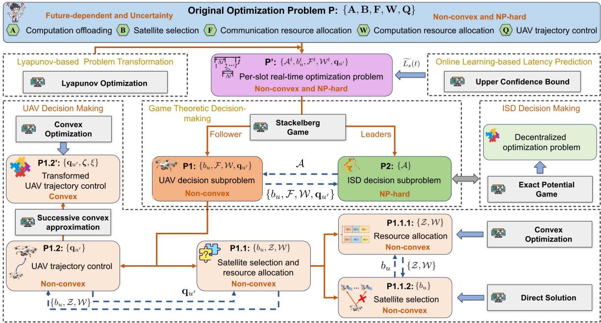  
Fig. 2. The framework of ODOA. The original problem P, which depends on future information, is first transformed into a per-slot real-time optimization problem $\mathbf { P } ^ { \tilde { \prime } }$ using the Lyapunov optimization framework. Subsequently, an online learning-based latency prediction method is proposed to estimate the uncertain parameter $L _ { s }$ in problem P	. Finally, problem $\mathbf { P ^ { \prime } }$ is solved by the proposed Stackelberg game.

Therefore, we proposed an efficient approach, i.e., ODOA, by leveraging Lyapunov optimization, online learning and game theory to transform and decompose the original problem based on the specific characteristics of the considered system and the optimization problem. Compared to DRL, the proposed approach does not require sample data and explicit knowledge of the system dynamics. Additionally, the proposed approach offers interpretability and broader adaptability. Finally, the proposed approach has low computational complexity, making it suitable for real-time decision-making. Fig. 2 shows the framework of the proposed ODOA. The details are elaborated in the following sections.

## V. LYAPUNOV-BASED PROBLEM TRANSFORMATION

Since problem P is future-dependent, an online approach is necessary for real-time decision making without foreseeing the future. The Lyapunov optimization is a commonly used framework for online approach design, as it does not require direct knowledge of the network dynamics while providing guaranteed performance [49]. Therefore, we first utilize the Lyapunov optimization to transform problem P into a per-slot real-time optimization problem.

Specifically, to meet the long-term UAV energy constraint (22a), the UAV digital twin model first defines two virtual energy queues $Q _ { u 1 } ( t )$ and $Q _ { u 2 } ( t )$ , which represent the total transmission and computing energy queue, as well as the propulsion energy queue, respectively. Moreover, these queues are set as zero at the initial time slot, $\mathrm { i . e . , } Q _ { u 1 } ( 1 ) = 0 \mathrm { a n d } Q _ { u 2 } ( 1 ) = 0$ Based on real-time monitoring of the UAV energy consumption, the virtual energy queues are updated as

$$
\begin{array} { r } { \{ Q _ { u 1 } ( t + 1 ) = \operatorname* { m a x } \{ Q _ { u 1 } ( t ) + E _ { u 1 } ( t ) - \bar { E _ { u 1 } } , 0 \} , } \\ { Q _ { u 2 } ( t + 1 ) = \operatorname* { m a x } \{ Q _ { u 2 } ( t ) + E _ { u 2 } ( t ) - \bar { E _ { u 2 } } , 0 \} , } \end{array}\tag{23}
$$

where $\begin{array} { r } { E _ { u 1 } ( t ) = E _ { u } ^ { \mathrm { c o m p } } ( t ) + E _ { u } ^ { \mathrm { t r a n s } } ( t ) } \end{array}$ and $E _ { u 2 } ( t ) = E _ { u } ^ { \mathrm { p r o p } } ( t )$ 1( )Furthermore, $\bar { E _ { u 1 } }$ and $\bar { E _ { u 2 } }$ +(with $\bar { E _ { u 1 } } + \bar { E _ { u 2 } } = \bar { E _ { u } } )$ represent the computing and transmission energy budgets per slot, as well as the propulsion energy budgets per slot, respectively.

Second, the Lyapunov function, which represents a scalar measurement of the queue backlogs, is defined as

$$
L ( \Theta ( t ) ) = ( ( Q _ { u 1 } ( t ) ) ^ { 2 } + ( Q _ { u 2 } ( t ) ) ^ { 2 } ) / 2 ,\tag{24}
$$

where $\Theta ( t ) = [ Q _ { u 1 } ( t ) , Q _ { u 2 } ( t ) ]$ is the vector of current queue ( ) = [ 1( ) 2( )]backlogs. Third, the one-slot conditional Lyapunov drift can be defined as

$$
\Delta L ( \Theta ( t ) ) \triangleq \mathbb { E } \{ L ( \Theta ( t + 1 ) ) - L ( \Theta ( t ) ) \mid \Theta ( t ) \} .\tag{25}
$$

Finally, the drift-plus-penalty can be given as

$$
\begin{array} { r } { D ( \Theta ( t ) ) = \Delta L ( \Theta ( t ) ) + V \mathbb { E } \left\{ C _ { s } ( t ) \vert \Theta ( t ) \right\} , } \end{array}\tag{26}
$$

where $\begin{array} { r } { C _ { s } ( t ) = \sum _ { m = 1 } ^ { M } C _ { m } ( t ) } \end{array}$ is the total cost of all ISDs at time slot $t ,$ =1and V is a control parameter to trade off the total cost and the queue stability. Next, we provide an upper bound on the drift-plus-penalty, as stated in Theorem 1.

Theorem 1: For all t and all possible queue backlogs $\Theta ( t )$ the drift-plus-penalty is upper bounded as

$$
D ( \Theta ( t ) ) \leq W + Q _ { u 1 } ( t ) ( E _ { u 1 } ( t ) - \bar { E _ { u 1 } } )
$$

$$
+ Q _ { u 2 } ( t ) ( E _ { u 2 } ( t ) - \bar { E _ { u 2 } } ) + V \times C _ { s } ( t ) ,\tag{27}
$$

where $W { = } \textstyle \frac { 1 } { 2 } \operatorname* { m a x } \{ ( \bar { E _ { u 1 } } ) ^ { 2 } , ( \bar { E _ { u 1 } ^ { \mathrm { m a x } } } { - } \bar { E _ { u 1 } } ) ^ { 2 } \} { + } \textstyle \frac { 1 } { 2 } \operatorname* { m a x } \{ ( \bar { E _ { u 2 } } ) ^ { 2 }$ $( E _ { u 2 } ^ { \mathrm { m a x } } - \bar { E _ { u 2 } } \bar { ) } ]$ 1is a finite constant.

2Proof: The proof is presented in Appendix A of the supplementary material, available online. 

According to the Lyapunov optimization framework, we minimize the right-hand side of inequality (27). Therefore, the problem P is converted into the problem $\mathbf { P ^ { \prime } }$ that relies solely on current information to make real-time decisions, which is presented as follows:

$$
\begin{array} { r l } { \mathbf { P } ^ { \prime } : } & { \underset { \mathcal { A } ^ { t } , b _ { u } ^ { t } , \mathcal { F } ^ { t } , \mathcal { W } ^ { t } , \mathbf { q } _ { u ^ { \prime } } } { \mathrm { m i n } } Q _ { u 1 } ( t ) E _ { u 1 } ( t ) } \\ & { + Q _ { u 2 } ( t ) E _ { u 2 } ( t ) + V \displaystyle \sum _ { m = 1 } ^ { M } C _ { m } ( t ) } \\ { \mathrm { s . t . } } & { ( 2 2 \mathsf { b } ) - ( 2 2 \mathsf { i } ) , } \end{array}\tag{28}
$$

where $\mathbf { q } _ { u ^ { \prime } } = \mathbf { q } _ { u } ^ { t + 1 }$ represents the UAV position at time slot $t { + } 1$ , and V is control parameter. Note that although solving problem $\mathbf { P ^ { \prime } }$ does not require future information, the problem still involves unknown network parameters, and it is an MINLP problem. Therefore, solving $\mathbf { P ^ { \prime } }$ still remains challenging. To this end, in the following section, we design efficient algorithms to solve the problem.

## VI. ALGORITHM DESIGN

In this section, efficient algorithms are proposed to solve the problem $\mathbf { P ^ { \prime } }$ . Specifically, considering the uncertain task roundtrip latency in $\mathbf { P ^ { \prime } }$ , we present an online learning-based latency prediction algorithm. Since $\mathbf { P ^ { \prime } }$ is an MINLP problem, we further propose a game theoretic decision-making algorithm.

## A. Online Learning-Based Latency Prediction Method

Since the unit data round-trip latency $L _ { s } ( t )$ in problem $\mathbf { P ^ { \prime } }$ is not precisely known before decision-making, online learning should be incorporated into the decision-making process to implicitly evaluate the statistics of the unit data round-trip latency based on network feedback. Specifically, if there are tasks requested for cloud computing services in each time slot, the UAV needs to choose a satellite s from the available satellite set ${ \mathbf { } } S ( t )$ as a relay to transmit the tasks to the cloud. Then, the task processing results are relayed back to the UAV, and the corresponding unit data round-trip latency for satellite s can be obtained. With the assistance of the digital twin, the information of the unit data round-trip delay can be stored in the digital twin in real time. By leveraging the accumulated historical information, the digital twin can predict the round-trip delay of different satellites as relays, thus providing insights for making high-quality offloading decisions.

More specifically, the latency prediction can be modeled as a multi-armed bandit (MAB) problem [54], wherein the UAV is considered as an agent and the satellite nodes in the available satellite set are treated as arms. However, a key issue for solving the MAB problem is the trade-off between exploitation and exploration. Specifically, when the UAV selects a satellite node, it can either exploit satellites with empirically lower round-trip latency to obtain better short-term benefits, or explore less frequently selected satellites to acquire new knowledge about their latency. Inspired by [55], we utilize the upper confidence bound (UCB) method to balance the trade-off between exploitation and exploration. Specifically, the prediction model for the unit data round-trip latency is presented as follows:

$$
\widetilde { L _ { s } } ( t ) = \left\{ \begin{array} { l l } { L _ { s } ^ { \mathrm { m i n } } , \mathrm { i f } t = 1 \mathrm { o r } h _ { s } ( t - 1 ) = 0 , } \\ { \mathrm { m a x } \left\{ \bar { L _ { s } } ( t - 1 ) - \omega _ { 0 } \sqrt { \frac { 3 \log ( \Delta _ { s } ( t ) ) } { 2 h _ { s } ( t - 1 ) } } , L _ { s } ^ { \mathrm { m i n } } \right\} , \mathrm { o t h e r w i s e } , } \end{array} \right.\tag{29}
$$

where $\begin{array} { r } { \omega _ { 0 } = L _ { s } ^ { \mathrm { m a x } } - L _ { s } ^ { \mathrm { m i n } } , \Delta _ { s } ( t ) = \sum _ { k = 1 } ^ { t } I _ { \{ s \in S ( k ) \} } } \end{array}$ represents =1 ( )the number of time slots during which satellite s is an accessible satellite until time slot $\begin{array} { r } { t , h _ { s } ( t - 1 ) = \sum _ { k = 1 } ^ { t - 1 } I _ { \{ b _ { u } ^ { t } = s \} } } \end{array}$ denotes the =1 =number of time slots during which satellite s was selected before time slot t, and $\begin{array} { r } { \bar { L _ { s } } ( t - 1 ) { = } \sum _ { k { = 1 } } ^ { t { - } 1 } { I _ { \{ b _ { n } ^ { t } = s \} } L _ { s } ( k ) / h _ { s } ( t { - } 1 ) } } \end{array}$ is the =1 =observed average of the unit data round-trip latency for satellite s based on collected historical feedback information. In this prediction model, $\omega _ { 0 } \sqrt { 3 \log ( \Delta _ { s } ( t ) ) / ( 2 h _ { s } ( t - 1 ) ) }$ and $\bar { L _ { s } } ( t - 1 )$ are associated with exploration and exploitation, respectively.

Based on the predicted unit data round-trip latency, the realtime decisions can be made by solving the problem $\mathbf { P } ^ { \prime } .$ . Next, we introduce the proposed decision-making algorithm. Similar to [56], we omit the time index for variables for the convenience of the following description.

## B. Game Theoretic Decision-Making Method

Since problem $\mathbf { P ^ { \prime } }$ is non-convex and NP-hard, a centralized algorithm could impose significant computational overhead on decision-making, which might not be appropriate for the considered real-time decision-making scenario. Therefore, we propose a game-theoretic decentralized algorithm for real-time decision making, which is detailed as follows.

1) Stackelberg Game Formulation: For the problem $\mathbf { P ^ { \prime } } _ { : }$ , we can find that the computing offloading decision $( \mathrm { i . e . , ~ } A )$ for ISDs should be determined first, and then based on the obtained offloading decision, the corresponding decisions (i.e., $\{ b _ { u } , \mathcal { F } , \mathcal { W } , \mathbf { q } _ { u ^ { \prime } } \} )$ ) can be made by the UAV. Therefore, the problem $\mathbf { P ^ { \prime } }$ can be modeled as a Stackelberg game.

Specifically, in the Stackelberg game, participants are categorized into two roles, i.e., leaders and followers, where the leaders possess the privilege of making decisions first, while the followers determine their strategies in response to the actions of the leaders. More specifically, we formulate problem $\mathbf { P ^ { \prime } }$ as a multi-leader common-follower Stackelberg game, where the ISDs act as the leaders and the UAV serves as the follower. Based on the Stackelberg game, the problem $\mathbf { P ^ { \prime } }$ can be decomposed into two subproblems, i.e., the leader decision subproblem and the follower decision subproblem, which are detailed as follows.

Follower Decision Subproblem: Define $\begin{array} { r } { a _ { - m } = ( a _ { 1 } , \dots , } \end{array}$ $a _ { m - 1 } , a _ { m + 1 } , \dots , a _ { M } )$ to denote the offloading decisions of the other ISDs except ISD m. Given an arbitrary offloading decision $\{ a _ { m } , a _ { - m } \}$ of all ISDs, the problem $\mathbf { P ^ { \prime } }$ can be converted into the follwer decision subproblem P1 to make the relevant decisions $\Pi _ { u } = \{ b _ { u } , \mathcal { F } , \mathcal { W } , \mathbf { q } _ { u ^ { \prime } } \}$ of the UAV, which can be given as

$$
\mathbf { P 1 } : \operatorname* { m i n } _ { \Pi _ { u } } U _ { u } \left( a _ { m } , a _ { - m } , \Pi _ { u } \right) = \sum _ { m \in { \mathcal { M } } _ { l } ( { \mathcal { A } } ) } V \left( \gamma ^ { \mathrm { T } } T _ { m } ^ { \mathrm { L C } } + \gamma ^ { \mathrm { E } } E _ { m } ^ { \mathrm { L C } } \right)
$$

$$
\begin{array} { r l r } {  { + \sum _ { m \in \mathcal { M } _ { u } ( \boldsymbol { A } ) } [ V ( \gamma ^ { \mathrm { T } } T _ { m } ^ { \mathrm { U C } } + \gamma ^ { \mathrm { E } } E _ { m } ^ { \mathrm { U C } } ) + Q _ { u 1 } \varpi \eta _ { m } D _ { m } ] } } \\ & { } & \\ & { + \sum _ { m \in \mathcal { M } _ { c } ( \boldsymbol { A } ) } \sum _ { s \in \mathcal { S } } I _ { \{ b _ { u } = s \} } [ V ( \gamma ^ { \mathrm { T } } T _ { m } ^ { \mathrm { C C } } + \gamma ^ { \mathrm { E } } E _ { m } ^ { \mathrm { C C } } )  } \\ & { } & \\ & {  + Q _ { u 1 } D _ { m } Z _ { s } ] + Q _ { u 2 } P _ { u } ( v _ { u } ) \tau } \\ & { } & \\ & { \mathrm { s . t . ~ } ( 2 2 \mathrm { d } ) - ( 2 2 ) ) , } \end{array}\tag{30}
$$

where $U _ { u } ( a _ { m } , a _ { - m } , \Pi _ { u } )$ denotes the payoff of the UAV (i.e., the follower). Moreover, $\mathcal { M } _ { l } ( \boldsymbol { \mathcal { A } } )$ represents the set of ISDs for local computing, $\mathcal { M } _ { u } ( A )$ denotes the set of ISDs for UAV-assisted computing, and $\mathcal { M } _ { c } ( A )$ is the set of ISDs for cloud-assisted ( )computing, which is known based on the offloading decision $\mathcal { A }$ of ISDs.

Leader Decision Subproblem: For ISD $m .$ , let us define $U _ { m } ^ { \mathrm { L C } }$ as the payoff of local computing, $U _ { m } ^ { \mathrm { U C } }$ as the payoff of UAV-assisted computing, and $U _ { m } ^ { \mathrm { C C } }$ as the payoff of cloud-assisted computing, which can be given as follows:

$$
\begin{array} { r } { U _ { m } ^ { \mathrm { L C } } = \gamma ^ { \mathrm { T } } T _ { m } ^ { \mathrm { L C } } + \gamma ^ { \mathrm { E } } E _ { m } ^ { \mathrm { L C } } , } \end{array}\tag{31}
$$

$$
U _ { m } ^ { \mathrm { U C } } = Q _ { u 1 } E _ { u , m } ^ { \mathrm { c o m p / } } V + \gamma ^ { \mathrm { T } } T _ { m } ^ { \mathrm { U C } } + \gamma ^ { \mathrm { E } } E _ { m } ^ { \mathrm { U C } } ,\tag{32}
$$

$$
U _ { m } ^ { \mathrm { C C } } = Q _ { u 1 } E _ { u , m } ^ { \mathrm { t r a n s } } / V + \gamma ^ { \mathrm { T } } T _ { m } ^ { \mathrm { C C } } + \gamma ^ { \mathrm { E } } E _ { m } ^ { \mathrm { C C } } .\tag{33}
$$

Therefore, the payoff of ISD m can be expressed as

$$
\begin{array} { r } { U _ { m } ( A ) = \left\{ \begin{array} { l l } { U _ { m } ^ { \mathrm { L C } } , a _ { m } = l , } \\ { U _ { m } ^ { \mathrm { U C } } , a _ { m } = u , } \\ { U _ { m } ^ { \mathrm { C C } } , a _ { m } = c . } \end{array} \right. } \end{array}\tag{34}
$$

According to the announced decisions $\Pi _ { u }$ of the UAV and removing irrelevant constant terms, the problem $\mathbf { P ^ { \prime } }$ can be transformed into the problem P2 to make the offloading decisions $a _ { m }$ for each ISD, which can be given as

$$
\begin{array} { l l } { { \mathrm { \bf P 2 } : \quad \displaystyle \operatorname* { m i n } _ { a _ { m } } U _ { m } \big ( a _ { m } , a _ { - m } , \Pi _ { u } \big ) } } \\ { { \mathrm { \bf ~ s . t . } \quad ( 2 2 \mathrm { b } ) \mathrm { \ a n d \ } ( 2 2 \mathrm { c } ) , } } \end{array}\tag{35}
$$

where each ISD seeks to optimize its payoff by selecting an appropriate offloading strategy.

2) Participant Decision-Making: This section details decision making by the follower and leaders.

1) Follower Decision Making: To solve the problem P1, assuming a feasible UAV position $\mathbf { q } _ { u ^ { \prime } }$ , we first optimize the satellite selection $b _ { u }$ and resource allocation $\{ \mathcal { F } , \mathcal { W } \}$ . Then, based on the obtained $b _ { u } ^ { * }$ and $\{ \mathcal { F } ^ { * } , \mathcal { W } ^ { * } \}$ , we optimize the UAV position $\mathbf { q } _ { u ^ { \prime } }$ . The details are described as follows.

Satellite Selection and Resource Allocation: Assuming a feasible $\mathbf { q } _ { u ^ { \prime } }$ , P1 can be transformed into a satellite selection and resource allocation subproblem P1.1. Defining $z _ { u , m } =$ $F _ { u , m } / F _ { u } ^ { \mathrm { m a x } }$ and removing irrelevant constant terms, the subproblem can be be formulated as

$$
\mathbf { P 1 . 1 } : \operatorname* { m i n } _ { b _ { u } , \mathcal { Z } , \mathcal { W } } \sum _ { m \in \mathcal { M } _ { u } ( \mathcal { A } ) } V \left[ \gamma ^ { \mathrm { T } } \left( \frac { D _ { m } } { w _ { u , m } r _ { u , m } } + \frac { D _ { m } \eta _ { m } } { z _ { u , m } F _ { u } ^ { \operatorname* { m a x } } } \right) \right.
$$

$$
\begin{array} { r l } { { } } & { { + \displaystyle \left. \frac { \gamma ^ { \mathrm { E } } P _ { m } D _ { m } } { w _ { u , m } r _ { u , m } } \right] + \sum _ { m \in \mathcal { M } _ { c } ( A ) } \sum _ { s \in \mathcal { S } } I _ { \{ b _ { u } = s \} } \left\{ V \left[ \displaystyle \frac { \gamma ^ { \mathrm { E } } P _ { m } D _ { m } } { w _ { u , m } r _ { u , m } } \right. \right. } } \\ { { } } & { { + \left. \left. \gamma ^ { \mathrm { T } } \left( \displaystyle \frac { D _ { m } } { w _ { u , m } r _ { u , m } } + D _ { m } L _ { s } \right) \right] + Q _ { u 1 } D _ { m } Z _ { s } \right\} } } \end{array}
$$

s.t. (22d)−(22h),

(36)

where $\begin{array} { r } { r _ { u , m } = B _ { u } \log _ { 2 } \left( 1 + \frac { P _ { m } g _ { u , m } ( t ) } { { \varpi _ { 0 } } } \right) } \end{array}$ and $\mathcal { Z } =$ $\{ z _ { u , m } \} _ { m \in { \mathcal M } _ { u } ( A ) }$ . Then, by solving the problem P1.1, we can obtain the closed-form optimal solutions for resource allocation and satellite selection, which are described in Theorems 2 and 3, respectively.

Theorem 2: The optimal resource allocation can be given as follows:

$$
\begin{array} { r } { \left\{ { z } _ { u , m } ^ { * } = \frac { \sqrt { \gamma ^ { \mathrm { T } } \eta _ { m } D _ { m } / F _ { u } ^ { \mathrm { m a x } } } } { \sum _ { i \in \mathcal { M } _ { u } ( A ) } \sqrt { \gamma ^ { \mathrm { T } } \eta _ { i } D _ { i } / F _ { u } ^ { \mathrm { m a x } } } } , \right. } \\ { w _ { u , m } ^ { * } = \frac { \sqrt { \left( \gamma ^ { \mathrm { T } } D _ { m } + \gamma ^ { \mathrm { E } } P _ { m } D _ { m } \right) / r _ { u , m } } } { \sum _ { i \in \mathcal { M } _ { o } ( A ) } \sqrt { \left( \gamma ^ { \mathrm { T } } D _ { i } + \gamma ^ { \mathrm { E } } P _ { i } D _ { i } \right) / r _ { u , i } } } , } \end{array}\tag{37}
$$

where $\mathcal { M } _ { o } ( \mathcal { A } ) = \mathcal { M } _ { u } ( \mathcal { A } ) \cup \mathcal { M } _ { c } ( \mathcal { A } )$ represents the set of ISDs who perform computation offloading.

Proof: The proof is presented in Appendix B of the supplementary material, available online. 

Theorem 3: The optimal satellite selection can be given as

$$
b _ { u } ^ { * } \in S ^ { \mathrm { s e l } } = \arg \operatorname* { m i n } _ { s \in \mathcal { S } } \left( V \gamma ^ { \mathrm { T } } L _ { s } + Q _ { u 1 } Z _ { s } \right) ,\tag{38}
$$

where $\boldsymbol { S } ^ { \mathrm { s e l } }$ represents the candidate satellite set. Note that if $\boldsymbol { S } ^ { \mathrm { s e l } }$ contains multiple satellite nodes, the UAV would randomly select one from $\boldsymbol { S } ^ { \mathrm { s e l } }$

Proof: The proof is presented in Appendix C of the supplementary material, available online. 

UAV Trajectory Control: Given the optimal satellite selection decision $b _ { u } ^ { * }$ , resource allocation $\{ \mathcal { F } ^ { * } , \mathcal { W } ^ { * } \}$ , and removing irrelevant constant terms, the problem P1 can be converted into the subproblem P1.2 to decide the UAV trajectory control, i.e.,

$$
\mathbf { P 1 . 2 : } \operatorname* { m i n } _ { \mathbf { q } _ { u ^ { \prime } } } V \sum _ { m \in \mathcal { M } _ { o } ( A ) } \frac { \gamma ^ { \mathrm { T } } D _ { m } + \gamma ^ { \mathrm { E } } P _ { m } D _ { m } } { w _ { u , m } ^ { * } B _ { u } \log _ { 2 } \left( 1 + \frac { \phi _ { m } } { \| \mathbf { q } _ { u ^ { \prime } } - \mathbf { q } _ { m } \| ^ { 2 } + H ^ { 2 } } \right) } +
$$

$$
Q _ { u 2 } \left( C _ { 1 } \left( 1 + \frac { 3 v _ { u } ^ { 2 } } { U _ { \mathrm { p } } ^ { 2 } } \right) + C _ { 2 } \sqrt { \sqrt { C _ { 3 } + \frac { v _ { u } ^ { 4 } } { 4 } } - \frac { v _ { u } ^ { 2 } } { 2 } } + C _ { 4 } v _ { u } ^ { 3 } \right) \tau
$$

s.t. (22i) − (22j),

(39)

where $\mathbf { q } _ { u ^ { \prime } } = \mathbf { q } _ { u } ^ { t + 1 } , \mathbf { q } _ { u } = \mathbf { q } _ { u } ^ { t } , v _ { n } = | | \mathbf { q } _ { u ^ { \prime } } - \mathbf { q } _ { u } | | / \tau$ , and $\phi _ { m } =$ $\frac { P _ { m } c ^ { 2 } [ \rho _ { u , m } ^ { \mathrm { L o S } } | h _ { u , m } ^ { \mathrm { L o S } } | ^ { \overline { { 2 } } } \eta ^ { \mathrm { N L o S } } + ( 1 - \rho _ { u , m } ^ { \mathrm { L o \overline { { 5 } } } } ) | h _ { u , m } ^ { \mathrm { N L o S } } | ^ { 2 } \eta ^ { \mathrm { L o S } } ] } { ( 4 \pi f _ { u } ) ^ { 2 } \varpi _ { 0 } \eta ^ { \mathrm { L o S } } \eta ^ { \mathrm { N L o S } } }$ . Clearly, the function (4 )(39) is non-convex concerning $\mathbf { q } _ { n ^ { \prime } }$ due to the following nonconvex terms

$$
\begin{array} { r } { \left\{ \begin{array} { l l } { T M _ { m } = \frac { 1 } { \log _ { 2 } \left( 1 + \frac { \phi _ { m } } { \| \mathbf { q } _ { u ^ { \prime } } - \mathbf { q } _ { m } \| ^ { 2 } + H ^ { 2 } } \right) } , \forall m \in \mathcal { M } _ { o } ( \mathcal { A } ) , } \\ { T M _ { 0 } = \sqrt { \sqrt { C _ { 3 } + v _ { u } ^ { 4 } / 4 } - v _ { u } ^ { 2 } / 2 } . } \end{array} \right. } \end{array}\tag{40}
$$

Next, we transform the objective function into a convex function by introducing slack variables.

For the non-convex term $T M _ { 0 }$ , we introduce the slack variable ξ such that $\xi = T M _ { 0 }$ and add the following constraint

$$
\xi \ge \sqrt { \sqrt { C _ { 3 } + v _ { u } ^ { 4 } / 4 } - v _ { u } ^ { 2 } / 2 } \Longrightarrow C _ { 3 } / \xi ^ { 2 } \le \xi ^ { 2 } + v _ { u } ^ { 2 } .\tag{41}
$$

For the non-convex term $T M _ { m }$ , we introduce the slack variable $\zeta _ { m }$ such that $1 / \zeta _ { m } = T M _ { m }$ and add the following constraint

$$
\zeta _ { m } \leq \log _ { 2 } \left( 1 + \frac { \phi _ { m } } { H ^ { 2 } + \vert \vert \mathbf { q } _ { u ^ { \prime } } - \mathbf { q } _ { m } \vert \vert ^ { 2 } } \right) , \forall m \in \mathcal { M } _ { o } ( \mathcal { A } ) .\tag{42}
$$

According to the abovementioned relaxation transformation, the problem P1.2 can be equivalently transformed as

$$
\begin{array} { r l } & { \mathbf { P 1 . 2 ^ { \prime } : } \underset { \mathbf { q } _ { u ^ { \prime } } , \zeta , \xi } { \operatorname* { m i n } } V \underset { m \in \mathcal { M } _ { o } ( A ) } { \sum } \frac { \gamma ^ { \mathrm { T } } D _ { m } + \gamma ^ { \mathrm { E } } P _ { m } D _ { m } } { w _ { u , m } ^ { * } B _ { u } \zeta _ { m } } } \\ & { + Q _ { u 2 } \left( C _ { 1 } \left( 1 + 3 v _ { u } ^ { 2 } / U _ { \mathrm { p } } ^ { 2 } \right) + C _ { 2 } \xi _ { n } + C _ { 4 } v _ { u } ^ { 3 } \right) \tau } \\ & { \mathrm { s . t . } \ ( 2 2 \mathrm { i } ) - ( 2 2 \mathrm { j } ) , ( 4 1 ) \mathrm { a n d } \ ( 4 2 ) , } \end{array}\tag{43}
$$

where $\zeta = \{ \zeta _ { m } \} _ { m \in \mathcal { M } _ { o } ( \mathcal { A } ) }$ . For problem $\mathbf { P 1 . 2 ^ { \prime } }$ , the optimization objective (39) is convex but constraints (41) and (42) are still non-convex. Similar to [25], the successive convex approximation (SCA) method can be adopted to handle the non-convexity of above constraints, which is demonstrated in the following Theorems 4 and 5.

Theorem 4: Let $f ( \mathbf { q } _ { u ^ { \prime } } , \boldsymbol { \xi } ) = \boldsymbol { \xi } ^ { 2 } + v _ { u } ^ { 2 }$ , and given a local point $\mathbf { q } _ { u ^ { \prime } } ^ { ( i ) }$ at the i-th iteration, a global concave lower bound of $f ( \mathbf { q } _ { u ^ { \prime } } , \boldsymbol { \xi } )$ can be obtained as follows:

$$
+ 2 / \tau ^ { 2 } ( { \bf q } _ { u ^ { \prime } } ^ { ( i ) } - { \bf q } _ { u } ) ^ { T } \left( { \bf q } _ { u ^ { \prime } } - { \bf q } _ { u } \right) ,\tag{44}
$$

where $\xi ^ { ( i ) }$ is defined as

$$
\xi ^ { ( i ) } = \sqrt { \sqrt { C _ { 3 } + \frac { \lvert | \mathbf { q } _ { u ^ { \prime } } ^ { ( i ) } - \mathbf { q } _ { u } \rvert | ^ { 4 } } { 4 \tau ^ { 4 } } } } - \frac { \lvert | \mathbf { q } _ { u ^ { \prime } } ^ { ( i ) } - \mathbf { q } _ { u } \rvert | ^ { 2 } } { 2 \tau ^ { 2 } } .\tag{45}
$$

Proof: The proof is presented in Appendix D of the supplementary material, available online. 

Theorem 5: Let $\begin{array} { r } { g _ { m } ( \mathbf { q } _ { u ^ { \prime } } ) = \log _ { 2 } \left( 1 + \frac { \phi _ { m } } { H ^ { 2 } + | | \mathbf { q } _ { u ^ { \prime } } - \mathbf { q } _ { m } | | ^ { 2 } } \right) } \end{array}$ , and given a local point $\mathbf { q } _ { u ^ { \prime } } ^ { ( i ) }$ at the i-th iteration, a global concave lower bound of $g _ { m } (  { \mathbf { q } } _ { u ^ { \prime } } )$ can be obtained as follows:

$$
\begin{array} { l } { { g _ { m } ^ { ( i ) } ( { \bf { q } } _ { u ^ { \prime } } ) \triangleq \log _ { 2 } \left( 1 + \frac { \phi _ { m } } { H ^ { 2 } + \vert \vert { \bf { q } } _ { u ^ { \prime } } ^ { ( i ) } - { \bf { q } } _ { m } \vert \vert ^ { 2 } } \right) } } \\ { { - \frac { \phi _ { m } ( \log _ { 2 } e ) ( \vert \vert { \bf { q } } _ { u ^ { \prime } } - { \bf { q } } _ { m } \vert \vert ^ { 2 } - \vert \vert { \bf { q } } _ { u ^ { \prime } } ^ { ( i ) } - { \bf { q } } _ { m } \vert \vert ^ { 2 } ) } { ( \phi _ { m } + H ^ { 2 } + \vert \vert { \bf { q } } _ { u ^ { \prime } } ^ { ( i ) } - { \bf { q } } _ { m } \vert \vert ^ { 2 } ) ( H ^ { 2 } + \vert \vert { \bf { q } } _ { u ^ { \prime } } ^ { ( i ) } - { \bf { q } } _ { m } \vert \vert ^ { 2 } ) } . } } \end{array}\tag{46}
$$

Proof: The proof is presented in Appendix E of the supplementary material, available online. 

According to Theorems 4 and 5, at the i-th iteration, constraints (41) and (42) can be approximated as

$$
\frac { C _ { 3 } } { \xi ^ { 2 } } \leq f ^ { ( i ) } ( \mathbf { q } _ { u ^ { \prime } } , \xi ) ,\tag{47}
$$

$$
\zeta _ { m } \leq g _ { m } ^ { ( i ) } (  { \mathbf { q } } _ { u ^ { \prime } } ) ,\tag{48}
$$

which are convex. Therefore, the problem $\mathbf { P 1 . 2 ^ { \prime } }$ is converted into a convex optimization problem, which can be efficiently resolved by off-the-shelf optimization tools such as CVX [57].

2) Leader Decision Making: To decide the offloading decisions of ISDs, we can model the problem P2 as a multi-ISDs computation offloading game (MISD-TOG).

Game Formulation: Specifically, the MISD-TOG can be defined as a triplet $\Gamma = \{ \mathcal { M } , \mathbb { A } , ( U _ { m } ( \mathcal { A } ) ) _ { m \in \mathcal { M } } \}$

$\mathcal { M } = \{ 1 , 2 , \dots , M \}$ ( ( ))denotes the set of players, i.e., all =ISDs.

$\mathbb { A } = \mathbf { A } _ { 1 } \times \cdot \cdot \cdot \times \mathbf { A } _ { M }$ represents the strategy space, = 1wherein ${ \bf A } _ { m } = \{ l , u , c \}$ is the set of offloading strategies for player m $( m \in \mathcal { M } ) , a _ { m } \in \mathbf { A } _ { m }$ denotes the offloading decision of player $m ,$ and $\mathcal { A } = ( a _ { 1 } , \dotsc , a _ { M } ) \in \mathbb { A }$ denotes a strategy profile.

$( U _ { m } ( \mathcal { A } ) ) _ { m \in \mathcal { M } }$ is the utility function of player m that assigns a real number to each strategy profile A.

The Solution of MISD-TOG: To determine the solution of MISD-TOG, we begin by introducing the concept of Nash equilibrium. A Nash equilibrium stands for a state in which no player is motivated to change their current strategy unilaterally. Definition 1 presents the formal definition.

Definition 1: If and only if a strategy profile $\boldsymbol { \mathcal { A } } ^ { * } =$ $( a _ { 1 } ^ { * } , \ldots , a _ { M } ^ { * } )$ satisfies the following condition, it is a Nash 1equilibrium of game

$$
U _ { m } ( a _ { m } ^ { * } , a _ { - m } ^ { * } ) \leq U _ { m } ( a _ { m } ^ { \prime } , a _ { - m } ^ { * } ) \forall a _ { m } ^ { \prime } \in \mathbf { A } _ { m } , m \in \mathcal { M } .\tag{49}
$$

Next, we introduce an important framework called the exact potential game [58] through Definitions 2 and 3, to analyze whether there is a Nash equilibrium for MISD-TOG and how to obtain a Nash equilibrium.

Definition 2: If the game has a potential function $F ( A )$ that satisfies the following condition, it can be regarded as an exact potential game.

$$
U _ { m } ( a _ { m } , a _ { - m } ) - U _ { m } ( a _ { m } ^ { \prime } , a _ { - m } ) = F ( a _ { m } , a _ { - m } ) - F ( a _ { m } ^ { \prime } , a _ { - m } ) ,
$$

$$
\forall ( a _ { m } , a _ { - m } ) , ( a _ { m } ^ { \prime } , a _ { - m } ) \in \mathbb { A } ,\tag{50}
$$

Definition 3: A Nash equilibrium and a finite improvement path (FIP) always exist for an exact potential game with finite strategy sets [58], [59].

The FIP implies that a Nash equilibrium can be obtained in a finite number of iterations by any best-response correspondence. Specifically, the best-response correspondence can be formally defined as follows:

Definition 4: For each player $m \in { \mathcal { M } }$ , their best response correspondence corresponds to a set-valued mapping ${ \bf B } _ { m } ( a _ { - m } ) \colon { \bf A } _ { - m } \longmapsto { \bf A } _ { m }$ such that

$$
{ \bf B } _ { m } ( a _ { - m } ) = \left\{ a _ { m } ^ { * } \mid a _ { m } ^ { * } \in \underset { a _ { m } \in { \bf A } _ { m } } { \arg \operatorname* { m a x } } U _ { m } \left( a _ { m } , a _ { - m } \right) \right\} .\tag{51}
$$

Therefore, by demonstrating that the MISD-TOG is an exact potential game, we can obtain a Nash equilibrium solution for it. The proof for this is provided in Theorem 6. Moreover, Theorem 7 establishes that there exists an upper bound on the number of iterations required for MISD-TOG to reach a Nash equilibrium.

Theorem 6: The MISD-TOG is an exact potential game with the potential function as follows:

$$
\begin{array} { r l } & { \displaystyle { F ( \mathcal { A } ) = \sum _ { i \in \mathcal { M } } I _ { \{ a _ { i } = u \} } \left( Q _ { u 1 } E _ { u , i } ^ { \mathrm { c o m p } } / V + \phi _ { i } \sum _ { j \leq i } I _ { \{ a _ { j } = u \} } \phi _ { j } \right) } } \\ & { ~ + \displaystyle { \sum _ { i \in \mathcal { M } } I _ { \{ a _ { i } = c \} } \sum _ { s \in \mathcal { S } } I _ { \{ b _ { u } ^ { * } = s \} } \left( Q _ { u 1 } E _ { u , i } ^ { \mathrm { t r a n s } } / V + \gamma ^ { \mathrm { T } } D _ { i } L _ { s } \right) } } \\ & { ~ + \displaystyle { \sum _ { i \in \mathcal { M } } I _ { \{ a _ { i } \in \{ u , c \} \} } \gamma _ { i } \sum _ { j \leq i } I _ { \{ a _ { j } \in \{ u , c \} \} } \gamma _ { j } + \sum _ { i \in \mathcal { M } } I _ { \{ a _ { i } = l \} } U _ { i } ^ { \mathrm { L C } } } , } \end{array}\tag{52}
$$

where $\begin{array} { r } { \phi _ { i } = \sqrt { \frac { \gamma ^ { \mathrm { T } } \eta _ { i } D _ { i } } { F _ { u } ^ { \mathrm { m a x } } } } } \end{array}$ , and $\begin{array} { r } { \gamma _ { i } = \sqrt { \frac { \gamma ^ { \mathrm { T } } D _ { i } + \gamma ^ { \mathrm { E } } P _ { i } D _ { i } } { r _ { u , i } } } } \end{array}$

Proof: The proof is presented in Appendix F of the supplementary material, available online. 

Theorem $7 ;$ The number of iterations $I _ { c }$ required for MISD-TOG to converge to a Nash equilibrium is upper bounded as follows:

$$
I _ { c } \leq \frac { M ^ { 2 } ( \phi _ { \operatorname* { m a x } } ^ { 2 } + \gamma _ { \operatorname* { m a x } } ^ { 2 } ) + M ( Q _ { \operatorname* { m a x } } + U _ { \operatorname* { m a x } } ^ { \mathrm { L C } } ) } { \epsilon _ { \operatorname* { m i n } } } .\tag{53}
$$

Proof: The proof is presented in Appendix G of the supplementary material, available online. 

Finally, let us explore the impact of the constraint (22c) on the game . This constraint may render some strategy profiles in A becoming infeasible, and this leads to a new game $\Gamma ^ { \prime } = \{ \mathcal { M } , \mathbb { A } ^ { \prime } , ( U _ { m } ( \mathcal { A } ) ) _ { m \in \mathcal { M } } \}$ . Theorem 8 demonstrates that the game $\Gamma ^ { \prime }$ is also an exact potential game.

Theorem 8: 	 possesses the same potential function as , which also is an exact potential game.

Proof: The proof is presented in Appendix H of the supplementary material, available online. 

3) Equilibrium Analysis: For the proposed Stackelberg game, the subgame perfect equilibrium (SPE) is typically regarded as the solution concept. Specifically, an SPE represents a strategy combination in which neither the ISDs nor the UAV has any incentive to unilaterally deviate from their current strategy. The formal definition of SPE is provided in Definition 5.

Definition 5: Let $\Pi _ { u } ^ { * }$ be a solution of problem P1, and $a _ { m } ^ { * }$ be a solution of problem P2. Then, the strategy combination $( a _ { m } ^ { * } , a _ { - m } ^ { * } , \Pi _ { u } ^ { * } )$ is an SPE of the proposed Stackelberg game if ( Π )for any feasible strategy $( a _ { m } , a _ { - m } , \Pi _ { u } )$ the following conditions are satisfied

$$
U _ { u } ( a _ { m } ^ { * } , a _ { - m } ^ { * } , \Pi _ { u } ^ { * } ) \leq U _ { u } ( a _ { m } ^ { * } , a _ { - m } ^ { * } , \Pi _ { u } ) .\tag{54}
$$

$$
U _ { m } ( a _ { m } ^ { * } , a _ { - m } ^ { * } , \Pi _ { u } ^ { * } ) \leq U _ { m } ( a _ { m } , a _ { - m } ^ { * } , \Pi _ { u } ^ { * } ) , \forall m \in \mathcal { M } .\tag{55}
$$

Based on the above definition of SPE, we can demonstrate that an SPE for the formulated Stackelberg game exists, which is presented in Theorem 9.

Theorem 9: The formulated Stackelberg game possesses an SPE.

Proof: The proof is presented in Appendix I of the supplementary material, available online. 

The proposed Stackelberg game may admit multiple SPEs. To evaluate the performance of the equilibrium solution, PoA is introduced to quantify the gap between the worst-case equilibrium and the centralized optimal solutions, which can provide a bound on the sub-optimality of our proposed algorithm. Let $C ^ { \prime }$ represent the optimization objective of problem $\mathbf { P } ^ { \prime }$ , D denote the set of all feasible strategies, and $\mathcal { D } ^ { * }$ indicate the set of equilibrium of the Stackelberg game. Then the PoA can be given as

$$
\mathrm { P o A } = \frac { \operatorname* { m a x } _ { ( a _ { m } , a _ { - m } , \Pi _ { u } ) \in { \mathcal { D } ^ { * } } } C ^ { \prime } ( a _ { m } , a _ { - m } , \Pi _ { u } ) } { \operatorname* { m i n } _ { ( a _ { m } , a _ { - m } , \Pi _ { u } ) \in { \mathcal { D } } } C ^ { \prime } ( a _ { m } , a _ { - m } , \Pi _ { u } ) } .\tag{56}
$$

Clearly, a larger PoA indicates better performance of the obtained equilibrium solution. In the following, we illustrate the bound of the PoA through Theorem 10.

Theorem 10: Let $\mathcal { A } ^ { \ast } = ( a _ { m } ^ { \ast } , a _ { - m } ^ { \ast } )$ indicates a Nash equilibrium strategy, and $\hat { \cal A } = \left( \hat { a } _ { m } , \hat { a } _ { - m } \right)$ denotes the centralized optimal strategy. For the formulated Stackelberg game, the PoA defined in (56) satisfies:

$$
1 \leq \mathrm { P o A } \leq 1 + \frac { ( \sum _ { m \in \mathcal { M } } \phi _ { m } ) ^ { 2 } + ( \sum _ { m \in \mathcal { M } } \gamma _ { m } ) ^ { 2 } } { C ^ { \prime } ( \hat { a } _ { m } , \hat { a } _ { - m } , \Pi _ { u } ( \hat { A } ) ) } .\tag{57}
$$

Proof: The proof is presented in Appendix J of the supplementary material, available online. 

Remark 3: Note that although the proposed Stackelberg game is formulated as a perfect-information game, the required information can still be obtained in real word scenarios through a centralized manner. Specifically, in practical applications, the proposed scheme can be deployed on the UAV. At the beginning of each time slot, the ISDs offload their task offloading requests to the UAV via wireless communication links, including ISDspecific parameter information. In addition, environment-related information can be obtained by the UAV through various sensing or measurement techniques. As a result, the UAV can have perfect information to make all necessary decisions.

## C. Main Steps of ODOA and Performance Analysis

In this section, the main steps of ODOA are described in Algorithm 1, and the corresponding analysis is provided.

Specifically, at each time slot, all ISDs upload their task request information to the UAV (line 3). Meanwhile, the UAV obtains predicted satellite relay round-trip delays (line 4). Based on the acquired information, the UAV runs the proposed algorithm to generate task offloading decisions (line 5). According to the derived offloading strategy, the UAV performs satellite selection, resource allocation, and trajectory planning (lines 6 and 7). Then, each ISD executes its assigned task according to the offloading strategy and receives the corresponding cost (line 8). Finally, the time-averaged UD cost and the energy consumption queues are updated (lines 9 to 11).

Theorem $I l { : }$ The proposed ODOA can satisfy the UAV energy constraint defined in (21).

Proof: The proof is presented in Appendix K of the supplementary material, available online. 

Theorem 12: The proposed ODOA has a worst-case polynomial complexity per time slot, i.e., $\mathcal { O } \left( I _ { c } M + M ^ { 3 . 5 } \log _ { 2 } \left( \frac { 1 } { \varepsilon } \right) \right)$

Algorithm 1: ODOA.   
1 Initialization: $\begin{array} { r } { T U C = 0 , \mathbf q _ { u } ( 0 ) , Q _ { u 1 } ( 0 ) , Q _ { u 2 } ( 0 ) ; } \end{array}$   
2 for t = 1 to t = T do   
3 Acquire the ISD information $\{ \mathbf { S t } _ { m } ^ { \mathrm { I S D } } ( t ) \} _ { m \in \mathcal { M } } ;$   
4 Calculate $L _ { s } ( t ) ~ ( s \in S ( t ) )$ based on (29);   
5 Based on (37) and (38), obtain $\mathcal { A } ^ { \ast }$ by   
utilizing the exact potential game;   
6 Calculate $\{ b _ { u } ^ { * } , \mathcal { F } ^ { * } , \mathcal { \dot { W } } ^ { * } \}$ based on (37)   
and (38);   
7 Obtain $\mathbf { q } _ { u ^ { \prime } } ^ { * }$ by solving problem P1.2;   
8 All ISDs execute their tasks according to $\mathcal { A } ^ { \ast }$ and   
obtain the respective cost $C _ { m } ^ { * } ( t ) ;$   
9 Obtain system cost $\begin{array} { r } { C _ { s } ( t ) = \sum _ { m = 1 } ^ { M } C _ { m } ^ { * } ( t ) ; } \end{array}$   
10 $T U C = \mathit { \dot { T } } U C + C _ { s } ( t ) ; \mathit { \Theta }$   
11 Update the queues $Q _ { u 1 } ( t + 1 )$ and $Q _ { u 2 } ( t + 1 )$ in   
the digital twin based on (23);   
12 Update t = t + 1;   
13 end   
14 $T U C = T U C / T ;$   
15 return Time-averaged ISD cost TUC.

wherein ε is the accuracy parameter for SCA in solving problem P1.2	.

Proof: The proof is presented in Appendix L of the supplementary material, available online. 

## VII. SIMULATION RESULTS

In this section, the performance of the designed ODOA is evaluated through simulation experiments.

## A. Simulation Setup

1) Scenario Setting: We consider a SAGIMEC network, where a satellite network, a UAV, and a cloud computing center collaborate to provide computing offload services to 20 ISDs within a $\mathrm { 1 6 0 0 \times 6 0 0 ~ m ^ { 2 } }$ service area. Furthermore, each epoch lasts 300 time slots with duration τ s.

2) Parameter Setting: For the satellite network, the unit data round-trip latency $L _ { s } ( t )$ (in s/bit) for each satellite is generated from a truncated Gaussian distribution [46] with a mean of $( L _ { s } ^ { \mathrm { m i n } } + L _ { s } ^ { \mathrm { m a x } } ) / 2$ , where $L _ { s } ^ { \mathrm { m i n } } \in ( 2 5 \times 1 0 ^ { - 8 } , 3 0 \times 1 0 ^ { - 8 } )$ , and $L _ { s } ^ { \mathrm { m a x } } \in ( 3 5 \times 1 0 ^ { - 8 } , 4 0 \times 1 0 ^ { - 8 } )$ . For the UAV, we set the initial position to $\mathbf { q } _ { u } ^ { \mathrm { i n i } } = [ 0 , 0 ]$ m, and the fixed altitude to H m. For the ISDs, the computing capacity of each ISD is randomly taken from { , . , } GHz. The default values for the remaining parameters are listed in Table I.

3) Performance Metrics: We evaluate the overall performance of the proposed approach based on the following performance metrics. i) Time-averaged ISD cost $\begin{array} { r } { \frac { 1 } { T } \sum _ { t = 1 } ^ { \tilde { T } } \dot { \sum } _ { m = 1 } ^ { M } C _ { m } ( t ) } \end{array}$ , which represents the average cumula-=1 =1tive cost of all ISDs per unit time. ii) Average task completion latency $\begin{array} { r } { \frac { 1 } { T } \sum _ { t = 1 } ^ { T } \frac { 1 } { M } \sum _ { m = 1 } ^ { M } T _ { m } ( t ) } \end{array}$ , which indicates the average =1 =1latency for completing a task. iii) Time-averaged ISD energy consumption $\begin{array} { r } { \frac { 1 } { T } \dot { \sum } _ { t = 1 } ^ { T } \dot { \sum } _ { m = 1 } ^ { M } E _ { m } ( t ) } \end{array}$ , which signifies the cumu-=1 =1lative energy consumption of ISDs over the system timeline. iv) Time-averaged UAV energy consumption $\begin{array} { r } { \frac { 1 } { T } \dot { \sum _ { t = 1 } } { E _ { u } ( t ) } } \end{array}$ , which means the average energy consumption of each SUAV per unit time.

<table><tr><td rowspan=1 colspan=1>Symbol</td><td rowspan=1 colspan=1>Meaning</td><td rowspan=1 colspan=1>Value (Unit)</td></tr><tr><td rowspan=1 colspan=1> $D _ { m }$ </td><td rowspan=1 colspan=1>Task size</td><td rowspan=1 colspan=1>[0.5, 3] Mb [7]</td></tr><tr><td rowspan=1 colspan=1> $\eta _ { m }$ </td><td rowspan=1 colspan=1>Computation intensity of tasks</td><td rowspan=1 colspan=1>[500,1500]cycles/bit [7]</td></tr><tr><td rowspan=1 colspan=1> $\overline { { T _ { m } ^ { \mathrm { m a x } } } }$ </td><td rowspan=1 colspan=1>Maximum tolerable delay oftasks</td><td rowspan=1 colspan=1>1 s [8]</td></tr><tr><td rowspan=1 colspan=1> $\overline { { v _ { u } ^ { \mathrm { m a x } } } }$ </td><td rowspan=1 colspan=1>Maximum flight speed of theUAV</td><td rowspan=1 colspan=1>25 m/s [49]</td></tr><tr><td rowspan=1 colspan=1> $\overline { { F _ { u } ^ { \mathrm { m a x } } } }$ </td><td rowspan=1 colspan=1>Computation resources of theUAV</td><td rowspan=1 colspan=1>30 GHz</td></tr><tr><td rowspan=1 colspan=1> $B _ { u }$ </td><td rowspan=1 colspan=1>Bandwidth of the UAV</td><td rowspan=1 colspan=1>20 MHz</td></tr><tr><td rowspan=1 colspan=1> $P _ { m }$ </td><td rowspan=1 colspan=1>Transmission power of ISD m</td><td rowspan=1 colspan=1>20 dBm [60]</td></tr><tr><td rowspan=1 colspan=1> $\varpi _ { 0 }$ </td><td rowspan=1 colspan=1>Noise power</td><td rowspan=1 colspan=1>-98 dBm [7]</td></tr><tr><td rowspan=1 colspan=1> $c _ { 1 } , c _ { 2 }$ </td><td rowspan=1 colspan=1>Parameters for LoS probability</td><td rowspan=1 colspan=1>10, 0.6 [60]</td></tr><tr><td rowspan=1 colspan=1> $\overline { { \eta ^ { \mathrm { L o S } } , \eta ^ { \mathrm { n L o S } } } }$ </td><td rowspan=1 colspan=1>Additional losses for LoS andnLoS links</td><td rowspan=1 colspan=1>1.0 dB, 20 dB [44]</td></tr><tr><td rowspan=1 colspan=1> $k$ </td><td rowspan=1 colspan=1>The effective switched capaci-tance coefficient of ISDs</td><td rowspan=1 colspan=1> $\overline { { 1 0 ^ { - 2 8 } \ [ 7 ] } }$ </td></tr><tr><td rowspan=1 colspan=1> $\varpi$ </td><td rowspan=1 colspan=1>Energy consumption per unitCPU cycle of SUAVs</td><td rowspan=1 colspan=1> $\overline { { 8 . 2 \times 1 0 ^ { - 9 } \mathrm { ~ J ~ } [ 3 3 ] } }$ </td></tr><tr><td rowspan=1 colspan=1> $C _ { 1 } , C _ { 2 } ,$  $C _ { 3 } , C _ { 4 }$ </td><td rowspan=1 colspan=1>UAV propulsion power con-sumption parameters</td><td rowspan=1 colspan=1>80, 22,  263.4,0.0092 [49]</td></tr><tr><td rowspan=1 colspan=1> $\bar { E } _ { u }$ </td><td rowspan=1 colspan=1>Energy budget per time slotfor SUAV n</td><td rowspan=1 colspan=1>260J</td></tr><tr><td rowspan=1 colspan=1> $U _ { \mathrm { p } }$ </td><td rowspan=1 colspan=1>Tip speed of the rotor</td><td rowspan=1 colspan=1>120 m/s [49]</td></tr><tr><td rowspan=1 colspan=1> $\overline { { \gamma ^ { \mathrm { T } } , \gamma ^ { \mathrm { E } } } }$ </td><td rowspan=1 colspan=1>The weight coefficients of taskcompletion delay and energyconsumption for ISD m</td><td rowspan=1 colspan=1>0.7, 0.3</td></tr></table>

TABLE I SIMULATION PARAMETERS

4) Comparative Approaches: To demonstrate the effectiveness of ODOA, we compares ODOA with the following approaches.

i) UAV-assisted computing (UAC): The tasks are either executed locally or offloaded to the UAV for processing, without involving cloud-assisted computation. Moreover, the strategies of computing offloading, resource allocation, and UAV trajectory control are determined based on the proposed methods.

ii) Equal resource allocation (ERA) [61] : The available communication and computation resources of the UAV are evenly allocated to the requesting ISDs, and the strategies of computation offloading and UAV trajectory control are determined based on the proposed methods.

iii) ε-greedy [62] : A ε-greedy-based algorithm is adopted to balance exploration and exploitation for latency prediction. Moreover, the strategies of computing offloading, resource allocation, and UAV trajectory control are determined based on the proposed methods.

iv) Only consider QoS (OCQ) [33] : Ignoring the UAV energy consumption constraint, all strategies are formulated by the proposed methods solely to minimize the time-averaged ISD cost.

v) DDPG-based satellite selection, computation offloading and trajectory control (DSCT) [28]: The strategies of satellite selection, computation offloading, and UAV trajectory control are decided by the DDPG algorithm. The resource allocation strategy is obtained by applying the proposed optimal resource allocation method.

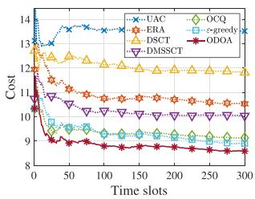  
(a)

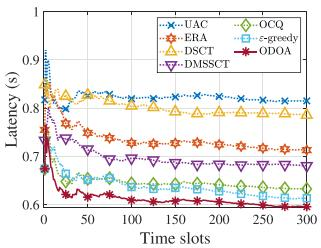  
(b)

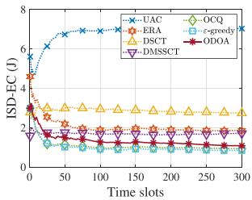  
(c)

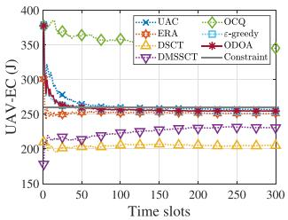  
(d)  
Fig. 3. The impact of time slots on system performance. (a) Time-averaged ISD cost (Cost). (b) Average task completion latency (Latency). (c) Time-averaged ISD energy consumption (ISD-EC). (d) Time-averaged UAV energy consumption (UAV-EC).

vi) Diffusion model-enabled SAC for satellite selection, computation offloading and trajectory control (DMSSCT) [63]: The SAC algorithm is integrated with a diffusion model to jointly make decisions on satellite selection, computation offloading, and trajectory control. The resource allocation strategy is obtained by applying the proposed optimal resource allocation method.

## B. Evaluation Results

1) Impact of Time: Fig. 3(a), (b), (c) and (d) illustrate the dynamics of time-averaged ISD cost, average task completion latency, time-averaged ISD energy consumption, and time-averaged UAV energy consumption among the seven approaches.

First, it can be observed that all performance metrics exhibit a certain degree of fluctuation, primarily due to the dynamic nature of the system, including time-varying computational demands from ISDs and the mobility of the UAV. Notably, as shown in Fig. 3(a) and (b), the proposed ODOA outperforms the benchmark approaches UAC, ERA, ε-greedy, and OCQ in terms of both time-averaged ISD cost and average task completion latency. This superiority can be attributed to several key factors: i) the integration of cloud computing within the three-tier architecture ensures sufficient resource availability; ii) the optimized resource allocation strategy enhances the efficiency of UAV resource utilization; iii) the UCB-based algorithm effectively balances exploration and exploitation, thereby improving the accuracy of latency prediction; and iv) by incorporating the UAV energy consumption constraint, the cost of UAV-assisted computing is increased (as shown in (19)), which prevents performance degradation caused by potential UAV overload. It is also worth noting that the performance improvement of ODOA over ε-greedy and OCQ is relatively modest. This is primarily because all three methods adopt the proposed Stackelberg game-theoretic framework for decision-making, resulting in similar strategic behavior. Finally, compared with DRL-based approaches, i.e., DSCT and DMSSCT, the proposed approach achieves significant improvements, which further exemplifies the effectiveness of the proposed approach.

Second, as shown in Fig. 3(c), the proposed approach achieves only suboptimal performance in terms of the time-averaged ISD energy consumption. This is mainly because our objective is to minimize the time-average cost of all ISDs, which is formulated as a weighted sum of task completion latency and ISD energy consumption (i.e., (21)). However, there exists a trade-off between delay and energy consumption, making it difficult to achieve optimal performance for both simultaneously.

Finally, as shown in Fig. 3(d), the proposed ODOA can satisfy the long-term UAV energy constraint under the real-time guidance of the Lyapunov-based energy queue, which is consistent with the analysis in Theorem 11.

In conclusion, the set of simulation results demonstrates the effectiveness of the ODOA in enhancing overall performance while adhering to the UAV energy constraint.

2) Impact of Task Data Size: Fig. 4(a), (b), (c), and (d) show the impact of different task data sizes on various performance metrics. It is worth noting that, to more clearly demonstrate the performance of the proposed approach under different workload conditions, the task data size was extended to 4 Mb. It can be seen that all performance metrics exhibit an increasing trend as the task data size increases. This is expected since the larger task data size leads to increased computation latency, communication latency, and higher energy consumption for both ISDs and the UAV. In addition, ERA shows significant performance degradation in terms of time-averaged ISD cost, average task completion latency, and time-averaged ISD energy consumption. This is because the growth of task data size intensifies the competition for computing resources, making the impact of resource allocation on system performance more significant.

Finally, compared with UAC, ERA, DSCT, DMSSCT, OCQ and ε-greedy, the proposed ODOA exhibits superior performance with respect to time-averaged ISD cost as the task data size increases, and achieves performance improvements of approximately 10.9%, 16.3%, 11.1%, 5.3%, 7.6%, and 3.3% in terms of average task completion latency when the task data size reaches 4 Mb.

In conclusion, the set of simulation results shows that the proposed ODOA can effectively adapt to heavily loaded scenarios, delivering overall superior performance.

3) Impact of UAV Computation Resources: Fig. 5(a), (b), (c), and (d) compare the impact of different UAV computation resources on various performance metrics for the seven approaches. It can be observed that with the increase of UAV computation resources, all approaches show a decreasing trend in terms of the time-averaged ISD cost and average task completion latency, with performance improvements gradually diminishing. The reasons can be explained as follows. The increase of UAV computation resources provides more computing resource allocation for task execution, reducing the task execution latency. However, as UAV computation resources further increase, communication resources become bottlenecks that limit the improvement of system performance. Moreover, UAC exhibits a significant performance degradation in terms of time-averaged ISD cost and average task completion latency. This is primarily because UAC heavily relies on the computational resources of the UAV, making it sensitive to variations in resource availability.

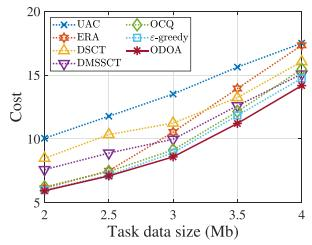  
(a)

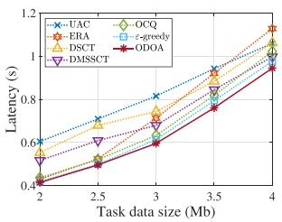  
(b)

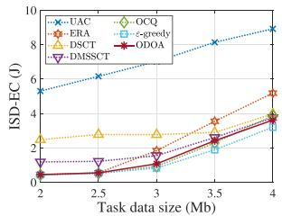  
(c)

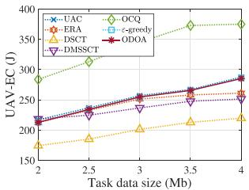  
(d)

Fig. 4. The impact of task data size on system performance. (a) Time-averaged ISD cost (Cost). (b) Average task completion latency (Latency). (c) Time-averaged ISD energy consumption (ISD-EC). (d) Time-averaged UAV energy consumption (UAV-EC).  
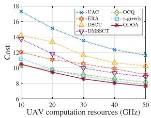  
(a)

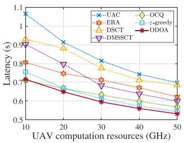  
(b)

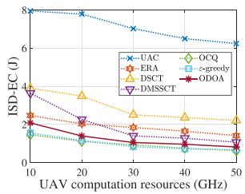  
(c)

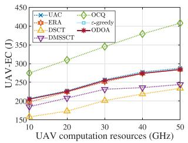  
(d)

Fig. 5. The impact of UAV computation resources on system performance. (a) Time-averaged ISD cost (Cost). (b) Average task completion latency (Latency). (c) Time-averaged ISD energy consumption (ISD-EC). (d) Time-averaged UAV energy consumption (UAV-EC).  
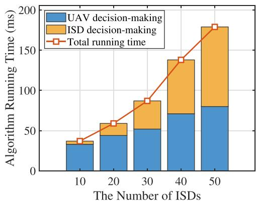  
Fig. 6. The impact of the number of ISDs on algorithm running time.

Finally, when the UAV computational resource is set to 50 GHz, ODOA achieves performance improvements of approximately 34.3%, 16.3%, 25.4%, 13.6%, 6.0% and 2.6% in time-averaged ISD cost, and 23.8%, 22.4%, 14.6%, 11.1%, 6.4%, and 2.1% in average task completion latency, compared to UAC, ERA, DSCT, DMSSCT, OCQ and ε-greedy, respectively. In conclusion, the set of simulation results illustrates the proposed approach enables sustainable utilization of computing resources and prevents resource over-utilization.

4) Algorithm Running Time: Fig. 6 illustrates the impact of the number of ISDs on the actual running time of the proposed algorithm. As shown in the figure, the running time of the proposed algorithm increases gradually with the number of ISDs, which is consistent with the theoretical analysis of its computational complexity. Moreover, under the considered scenario (i.e., the number of ISDs is set to 20 and the duration of each time slot is set to 1 s), the overall running time of the proposed algorithm is only 59 ms, which is acceptable for real-time decision-making. In summary, the set of simulation results demonstrate that the proposed algorithm achieves low running time and can effectively meet the practical requirements of real-time decision-making.

## VIII. DISCUSSION

This section presents a comprehensive and in-depth discussion of the proposed work.

## A. Scalability of the Proposed Algorithms

To demonstrate the scalability of the proposed algorithms, we provide a detailed explanation of their applicability to multi-UAV scenarios. Specifically, in Appendix M of the supplementary material, available online, we first describe the necessary modifications to the system model and problem formulation to accommodate multiple UAVs. Second, we provide a theoretical analysis showing that the proposed algorithms remain applicable to the resulting optimization problem. Finally, we conduct simulation experiments to evaluate the impact of the number of UAVs on overall system performance. As shown in Fig. 1 of the supplementary material, the simulation results indicate that increasing the number of UAVs can further enhance the network performance.

## B. Comparison With Other Multi-Tiered Platforms

To demonstrate the advantages of the proposed platform, we compare it with an alternative ISDs–UAV–edge servers platform, in which the edge servers can be provided by a ground rescue team. The details are provided in Appendix N of the Supplementary Material, available online. In summary, both the ISDs–UAV–edge servers platform and the proposed platform are effective in enhancing network performance and can be regarded as complementary. Moreover, the proposed platform is designed to be compatible with the rapidly evolving 6 G space-air-ground integrated network (SAGIN).

## C. The Overhead of Digital Twin

To justify the reasonableness of ignoring the cost of digital twin during network optimization, we further discuss the overhead associated with digital twins and the procedures of network optimization in Appendix O of the supplementary material, available online. In conclusion, the optimization process operates independently of the digital twin mechanism.

## D. Applicability and Rationality of UAV Mobility Model

To demonstrate the applicability and rationality of the UAV mobility model used in this work, we provide a detailed explanation in Appendix P of the supplementary material, available online. In summary, the adopted mobility model is also a realistic mobility model and is widely adopted in existing research.

## E. Performance Evaluation in a Hardware Environment

To demonstrate the feasibility and effectiveness of the proposed approach in a real-world environment, we conducted experiments on a Raspberry Pi. The details are presented in Appendix Q of the supplementary material, available online. The results indicate that the proposed approach can operate efficiently on actual hardware and achieve satisfactory performance.

## F. Analysis of UAV Cost and Payload

Considering the practical feasibility of deploying the proposed network architecture, we further conduct an analysis of UAV cost and payload. Specifically, in Appendix R of the supplementary material, available online, we first present representative UAV cases that meet the system requirements, together with a detailed assessment of their associated costs and payload capacities. Subsequently, we discuss the forward-looking significance and potential value of the proposed architecture in light of the research context.

## IX. CONCLUSION

In this paper, we explored the integration of computation offloading, satellite selection, resource allocation, and UAV trajectory control in digital twin-assisted SAGIMEC to advance the development of the LAE. We formally formulated the optimization problem to maximize the QoS for all ISDs. To solve this complex problem, we proposed ODOA, which combines the Lyapunov optimization framework for online control, the MAB model for online learning, and game theory for decentralized algorithm design. The mathematical analysis demonstrated that the ODOA not only meets the UAV energy constraint but also features low computational complexity. The simulation results indicate that the ODOA exhibits overall superior performance with respect to the time-averaged ISD cost, average task completion latency, and time-averaged ISD energy consumption.

However, the proposed network incorporates only a single UAV at the edge, which constrains its coverage area and service capacity. Moreover, the satellite network is considered solely as a communication relay, with its potential computational capabilities left unexploited. Therefore, our future work will focus on scaling up the scale of the edge network and integrating satellite computing to further enhance the system-wide performance and scalability.

## REFERENCES

[1] X. Ye, Y. Mao, X. Yu, S. Sun, L. Fu, and J. Xu, “Integrated sensing and communications for low-altitude economy: A deep reinforcement learning approach,” 2024, arXiv:2412.04074.

[2] Y. Jiang et al., “6G non-terrestrial networks enabled low-altitude economy: Opportunities and challenges,” 2023, arXiv:2311.09047.

[3] X. Zhou, S. Ge, P. Liu, and T. Qiu, “DAG-based dependent tasks offloading in MEC-enabled IoT with soft cooperation,” IEEE Trans. Mobile Comput., vol. 23, no. 6, pp. 6908–6920, Jun. 2024.

[4] Y. Mao, C. You, J. Zhang, K. Huang, and K. B. Letaief, “A survey on mobile edge computing: The communication perspective,” IEEE Commun. Surv. Tuts., vol. 19, no. 4, pp. 2322–2358, Fourth Quarter 2017.

[5] G. Sun et al., “Joint task offloading and resource allocation in aerialterrestrial UAV networks with edge and fog computing for post-disaster rescue,” IEEE Trans. Mobile Comput., vol. 23, no. 9, pp. 8582–8600, Sep. 2024.

[6] G. Sun et al., “Multi-objective optimization for multi-UAV-assisted mobile edge computing,” IEEE Trans. Mobile Comput., vol. 23, no. 12, pp. 14803– 14820, Dec. 2024.

[7] Z. Sun et al., “TJCCT: A two-timescale approach for UAV-assisted mobile edge computing,” IEEE Trans. Mobile Comput., vol. 24, no. 4, pp. 3130– 3147, Apr. 2025, doi: 10.1109/TMC.2024.3505155.

[8] Y. Qu et al., “Service provisioning for UAV-enabled mobile edge computing,” IEEE J. Sel. Areas Commun., vol. 39, no. 11, pp. 3287–3305, Nov. 2021.

[9] K. Wang et al., “Task offloading with multi-tier computing resources in next generation wireless networks,” IEEE J. Sel. Areas Commun., vol. 41, no. 2, pp. 306–319, Feb. 2023.

[10] Y. Gao, Z. Ye, and H. Yu, “Cost-efficient computation offloading in SAGIN: A deep reinforcement learning and perception-aided approach,” IEEE J. Sel. Areas Commun., vol. 42, no. 12, pp. 3462–3476, Dec. 2024.

[11] X. Zhang et al., “Energy-efficient computation peer offloading in satellite edge computing networks,” IEEE Trans. Mobile Comput., vol. 23, no. 4, pp. 3077–3091, Apr. 2024.

[12] M. D. Nguyen, L. B. Le, and A. Girard, “Integrated computation offloading, UAV trajectory control, edge-cloud and radio resource allocation in SAGIN,” IEEE Trans. Cloud Comput., vol. 12, no. 1, pp. 100–115, First Quarter 2024.

[13] A. Paul, K. Singh, M. T. Nguyen, C. Pan, and C. Li, “Digital twin-assisted space-air-ground integrated networks for vehicular edge computing,” IEEE J. Sel. Topics Signal Process., vol. 18, no. 1, pp. 66–82, Jan. 2024.

[14] J. Du et al., “Joint optimization in blockchain- and MEC-enabled spaceair-ground integrated networks,” IEEE Internet Things J., vol. 11, no. 19, pp. 31862–31877, Oct. 2024.

[15] C. Huang, G. Chen, P. Xiao, Y. Xiao, Z. Han, and J. A. Chambers, “Joint offloading and resource allocation for hybrid cloud and edge computing in SAGINs: A decision assisted hybrid action space deep reinforcement learning approach,” IEEE J. Sel. Areas Commun., vol. 42, no. 5, pp. 1029– 1043, May 2024.

[16] H. Shen, Y. Tian, T. Wang, and G. Bai, “Slicing-based task offloading in space-air-ground integrated vehicular networks,” IEEE Trans. Mobile Comput., vol. 23, no. 5, pp. 4009–4024, May 2024.

[17] S. Yu, X. Gong, Q. Shi, X. Wang, and X. Chen, “EC-SAGINs: Edgecomputing-enhanced space-air-ground-integrated networks for Internet of Vehicles,” IEEE Internet Things J., vol. 9, no. 8, pp. 5742–5754, Apr. 2022.

[18] P. Qin, M. Fu, Y. Fu, R. Ding, and X. Zhao, “Collaborative edge computing and program caching with routing plan in C-NOMA-enabled space-airground network,” IEEE Trans. Wireless Commun., vol. 23, no. 12, pp. 18302–18315, Dec. 2024.

[19] J. Liu, X. Zhao, P. Qin, S. Geng, Z. Chen, and H. Zhou, “Learning-based multi-UAV assisted data acquisition and computation for information freshness in WPT enabled space-air-ground PIoT,” IEEE Trans. Netw. Sci. Eng., vol. 11, no. 1, pp. 48–63, Jan./Feb. 2024.

[20] S. Zhang, A. Liu, C. Han, X. Liang, X. Xu, and G. Wang, “Multiagent reinforcement learning-based orbital edge offloading in SAGIN supporting Internet of Remote Things,” IEEE Internet Things J., vol. 10, no. 23, pp. 20472–20483, Dec. 2023.

[21] X. Cheng et al., “Space/aerial-assisted computing offloading for IoT applications: A learning-based approach,” IEEE J. Sel. Areas Commun., vol. 37, no. 5, pp. 1117–1129, May 2019.

[22] S. Mao, L. Liu, X. Hou, M. Atiquzzaman, and K. Yang, “Multi-domain resource management for space-air-ground integrated sensing, communication, and computation networks,” IEEE J. Sel. Areas Commun., vol. 42, no. 12, pp. 3380–3394, Dec. 2024.

[23] Y. Chen, J. Zhao, Y. Wu, J. Huang, and X. S. Shen, “Multi-user task offloading in UAV-assisted LEO satellite edge computing: A game-theoretic approach,” IEEE Trans. Mobile Comput., vol. 24, no. 1, pp. 363–378, Jan. 2025.

[24] Y. Xu, T. Zhang, Y. Liu, D. Yang, L. Xiao, and M. Tao, “UAV-assisted MEC networks with aerial and ground cooperation,” IEEE Trans. Wireless Commun., vol. 20, no. 12, pp. 7712–7727, Dec. 2021.

[25] X. Zhang, J. Zhang, J. Xiong, L. Zhou, and J. Wei, “Energy-efficient multi-UAV-enabled multiaccess edge computing incorporating NOMA,” IEEE Internet Things J., vol. 7, no. 6, pp. 5613–5627, Jun. 2020.

[26] Q. Hu, Y. Cai, G. Yu, Z. Qin, M. Zhao, and G. Y. Li, “Joint offloading and trajectory design for UAV-enabled mobile edge computing systems,” IEEE Internet Things J., vol. 6, no. 2, pp. 1879–1892, Apr. 2019.

[27] R. Zhou, X. Wu, H. Tan, and R. Zhang, “Two time-scale joint service caching and task offloading for UAV-assisted mobile edge computing,” in Proc. IEEE Conf. Comput. Commun., 2022, pp. 1189–1198.

[28] J. Miao, S. Bai, S. Mumtaz, Q. Zhang, and J. Mu, “Utility-oriented optimization for video streaming in UAV-aided MEC network: A DRL approach,” IEEE Trans. Green Commun. Netw., vol. 8, no. 2, pp. 878–889, Jun. 2024.

[29] L. T. Hoang, C. T. Nguyen, and A. T. Pham, “Deep reinforcement learningbased online resource management for UAV-assisted edge computing with dual connectivity,” IEEE/ACM Trans. Netw., vol. 31, no. 6, pp. 2761–2776, Dec. 2023.

[30] Y. Cai, P. Cheng, Z. Chen, W. Xiang, B. Vucetic, and Y. Li, “Graphic deep reinforcement learning for dynamic resource allocation in space-airground integrated networks,” IEEE J. Sel. Areas Commun., vol. 43, no. 1, pp. 334–349, Jan. 2025.

[31] H. Cui et al., “Space-air-ground integrated network (SAGIN) for 6G: Requirements, architecture and challenges,” China Commun., vol. 19, no. 2, pp. 90–108, Feb. 2022.

[32] J. Liu, X. Zhao, P. Qin, S. Geng, and S. Meng, “Joint dynamic task offloading and resource scheduling for WPT enabled space-air-ground power Internet of Things,” IEEE Trans. Netw. Sci. Eng., vol. 9, no. 2, pp. 660–677, Mar./Apr. 2022.

[33] H. Jiang, X. Dai, Z. Xiao, and A. Iyengar, “Joint task offloading and resource allocation for energy-constrained mobile edge computing,” IEEE Trans. Mobile Comput., vol. 22, no. 7, pp. 4000–4015, Jul. 2023.

[34] Y. Zhang, J. Hu, and G. Min, “Digital twin-driven intelligent task offloading for collaborative mobile edge computing,” IEEE J. Sel. Areas Commun., vol. 41, no. 10, pp. 3034–3045, Oct. 2023.

[35] B. Li, R. Yang, L. Liu, J. Wang, N. Zhang, and M. Dong, “Robust computation offloading and trajectory optimization for multi-UAV-assisted MEC: A multiagent DRL approach,” IEEE Internet Things J., vol. 11, no. 3, pp. 4775–4786, Feb. 2024.

[36] F. Song et al., “Evolutionary multi-objective reinforcement learning based trajectory control and task offloading in UAV-assisted mobile edge computing,” IEEE Trans. Mobile Comput., vol. 22, no. 12, pp. 7387–7405, Dec. 2023.

[37] Y. Pan, C. Pan, K. Wang, H. Zhu, and J. Wang, “Cost minimization for cooperative computation framework in MEC networks,” IEEE Trans. Wireless Commun., vol. 20, no. 6, pp. 3670–3684, Jun. 2021.

[38] Z. Wei et al., “Sum-rate maximization for IRS-assisted UAV OFDMA communication systems,” IEEE Trans. Wireless Commun., vol. 20, no. 4, pp. 2530–2550, Apr. 2021.

[39] X. Zheng et al., “Reliable and energy-efficient communications via collaborative beamforming for UAV networks,” IEEE Trans. Wireless Commun., vol. 23, no. 10, pp. 13235–13251, Oct. 2024.

[40] G. T. V16.1.0, “Study on channel model for frequencies from 0.5 to 100 GHz (release 16),” 3GPP, Tech. Rep. TR 38.901 V16.1.0, 2020.

[41] G. Sun et al., “UAV-enabled secure communications via collaborative beamforming with imperfect eavesdropper information,” IEEE Trans. Mobile Comput., vol. 23, no. 4, pp. 3291–3308, Apr. 2024.

[42] L. Liu, A. Wang, G. Sun, J. Li, H. Pan, and T. Q. S. Quek, “Multi-objective optimization for data collection in UAV-assisted agricultural IoT,” IEEE Trans. Veh. Technol., vol. 74, no. 4, pp. 6488–6503, Apr. 2025, doi: 10.1109/TVT.2024.3514664.

[43] A. A. Khuwaja, Y. Chen, N. Zhao, M. Alouini, and P. Dobbins, “A survey of channel modeling for UAV communications,” IEEE Commun. Surv. Tut., vol. 20, no. 4, pp. 2804–2821, Fourth Quarter 2018.

[44] J. Tian, D. Wang, H. Zhang, and D. Wu, “Service satisfaction-oriented task offloading and UAV scheduling in UAV-enabled MEC networks,” IEEE Trans. Wireless Commun., vol. 22, no. 12, pp. 8949–8964, Dec. 2023.

[45] C. Niephaus, M. Kretschmer, and G. Ghinea, “QoS provisioning in converged satellite and terrestrial networks: A survey of the state-of-the-art,” IEEE Commun. Surv. Tuts., vol. 18, no. 4, pp. 2415–2441, Fourth Quarter 2016.

[46] X. Gao, J. Wang, X. Huang, Q. Leng, Z. Shao, and Y. Yang, “Energy-constrained online scheduling for satellite-terrestrial integrated networks,” IEEE Trans. Mobile Comput., vol. 22, no. 4, pp. 2163–2176, Apr. 2023.

[47] Y. Chen, J. Zhao, Y. Wu, J. Huang, and X. Shen, “QoE-aware decentralized task offloading and resource allocation for end-edge-cloud systems: A game-theoretical approach,” IEEE Trans. Mobile Comput., vol. 23, no. 1, pp. 769–784, Jan. 2024.

[48] Y. Ding, K. Li, C. Liu, and K. Li, “A potential game theoretic approach to computation offloading strategy optimization in end-edge-cloud computing,” IEEE Trans. Parallel Distrib. Syst., vol. 33, no. 6, pp. 1503–1519, Jun. 2022.

[49] Z. Yang, S. Bi, and Y. A. Zhang, “Online trajectory and resource optimization for stochastic UAV-enabled MEC systems,” IEEE Trans. Wireless Commun., vol. 21, no. 7, pp. 5629–5643, Jul. 2022.

[50] C. Zhang et al., “UAV swarm-enabled collaborative secure relay communications with time-domain colluding eavesdropper,” IEEE Trans. Mobile Comput., vol. 23, no. 9, pp. 8601–8619, Sep. 2024.

[51] J. Huang et al., “Dual AAV cluster-assisted maritime physical-layer secure communications via collaborative beamforming,” IEEE Internet Things J., vol. 12, no. 9, pp. 12589–12607, May 2025, doi: 10.1109/JIOT.2024.3521977.

[52] S. Boyd, S. P. Boyd, and L. Vandenberghe, Convex Optimization. Cambridge, U.K.: Cambridge Univ. Press, 2004.

[53] P. Belotti, C. Kirches, S. Leyffer, J. Linderoth, J. Luedtke, and A. Mahajan, “Mixed-integer nonlinear optimization,” Acta Numerica, vol. 22, pp. 1–131, Apr. 2013.

[54] A. Slivkins, “Introduction to multi-armed bandits,” Found. Trends Mach. Learn., vol. 12, no. 1/2, pp. 1–286, Nov. 2019.

[55] F. Li, J. Liu, and B. Ji, “Combinatorial sleeping bandits with fairness constraints,” IEEE Trans. Netw. Sci. Eng., vol. 7, no. 3, pp. 1799–1813, Third Quarter 2020.

[56] G. Cui et al., “OL-EUA: Online user allocation for NOMA-based mobile edge computing,” IEEE Trans. Mobile Comput., vol. 22, no. 4, pp. 2295– 2306, Apr. 2023.

[57] M. Grant and S. Boyd, “CVX: Matlab software for disciplined convex programming,” Mar. 2014. [Online]. Available: http://cvxr.com/cvx

[58] D. Monderer and L. S. Shapley, “Potential games,” Games Econ. Behav., vol. 14, no. 1, pp. 124–143, 1996.

[59] D. L. Quang, Y. H. Chew, and B. H. Soong, Potential Game Theory. Berlin, Germany: Springer, 2016.

[60] Y. Zeng, J. Xu, and R. Zhang, “Energy minimization for wireless communication with rotary-wing UAV,” IEEE Trans. Wireless Commun., vol. 18, no. 4, pp. 2329–2345, Apr. 2019.

[61] S. Josilo and G. Dán, “Selfish decentralized computation offloading for mobile cloud computing in dense wireless networks,” IEEE Trans. Mobile Comput., vol. 18, no. 1, pp. 207–220, Jan. 2019.

[62] J. Vermorel and M. Mohri, “Multi-armed bandit algorithms and empirical evaluation,” in Proc. Eur. Conf. Mach. Learn., 2005, pp. 437–448.

[63] H. Du et al., “Diffusion-based reinforcement learning for edge-enabled AI-generated content services,” IEEE Trans. Mobile Comput., vol. 23, no. 9, pp. 8902–8918, Sep. 2024.

  
Long He received the BS degree in computer science and technology from the Chengdu University of Technology, Sichuan, China, in 2019. He is currently working toward the PhD degree in computer science and technology with Jilin University, Changchun, China. His research interests include vehicular networks and edge computing.

Geng Sun (Senior Member, IEEE) received the BS degree in communication engineering from Dalian Polytechnic University, in 2011, and the PhD degree in computer science and technology from Jilin University, in 2018. He was a visiting researcher with the School of Electrical and Computer Engineering, Georgia Institute of Technology, USA. He is a professor with the College of Computer Science and Technology, Jilin University. Currently, he is working as a visiting scholar with the College of Computing and Data Science, Nanyang Technological University, Singapore. He has published more than 100 high-quality papers, including the IEEE Transactions on Mobile Computing, IEEE Journal on Selected Areas in Communications, IEEE/ACM Transactions on Networking, IEEE Transactions on Wireless Communications, IEEE Transactions on Communications, IEEE Transactions on Antennas and Propagation, IEEE Internet of Things Journal, IEEE Transactions on Instrumentation and Measurement, IEEE INFOCOM, IEEE GLOBECOM, and IEEE ICC. He serves as the associate editors of the IEEE Communications Surveys & Tutorials, IEEE Transactions on Communications, IEEE Transactions on Vehicular Technology, IEEE Transactions on Network Science and Engineering, IEEE Transactions on Network and Service Management and IEEE Networking Letters. He serves as the lead guest editor of Special Issues for the IEEE Transactions on Network Science and Engineering, IEEE Internet of Things Journal, IEEE Networking Letters. He also serves as the guest editor of Special Issues for the IEEE Transactions on Services Computing, IEEE Communications Magazine, and IEEE Open Journal of the Communications Society. His research interests include low-altitude wireless networks, UAV communications and networking, mobile edge computing (MEC), intelligent reflecting surface (IRS), generative AI and Agentic AI, and deep reinforcement learning.

Zemin Sun received the BS degree in software engineering, and the MS and PhD degrees in computer science and technology from Jilin University, Changchun, China, in 2015, 2018, and 2022, respectively. Her research interests include vehicular networks, edge computing, and game theory.

Jiacheng Wang received the bachelor’s degree from the Department of Science, Kunming University of Science and Technology, in 2015, and the ME and PhD degrees from the Department of Communication and Information Technology, Chongqing University of Posts and Telecommunications, in 2018 and 2022, respectively. He is currently a research associate in computer science and engineering with Nanyang Technological University, Singapore. His research interests include wireless sensing, semantic communications, and metaverse.

Hongyang Du received the BEng degree from the School of Electronic and Information Engineering, Beijing Jiaotong University, Beijing, and the PhD degree from the Interdisciplinary Graduate Program, College of Computing and Data Science, Energy Research Institute @ NTU, Nanyang Technological University, Singapore. He is an assistant professor with the Department of Electrical and Electronic Engineering, University of Hong Kong. He serves as the editor-in-chief assistant of the IEEE Communications Surveys & Tutorials (2022-2024), the editor of the

IEEE Transactions on Vehicular Technology, and the guest editor of the IEEE Vehicular Technology Magazine. He is the recipient of the IEEE Daniel E. Noble Fellowship Award from the IEEE Vehicular Technology Society in 2022, the IEEE Signal Processing Society Scholarship from the IEEE Signal Processing Society in 2023, the Singapore Data Science Consortium (SDSC) Dissertation Research Fellowship in 2023, and NTU Graduate College’s Research Excellence Award in 2024. He was recognized as an exemplary reviewer of the IEEE Transactions on Communications and IEEE Communications Letters. His research interests include edge intelligence, generative AI, semantic communications, and network management.

Dusit Niyato (Fellow, IEEE) received the BEng degree from the King Mongkuts Institute of Technology Ladkrabang (KMITL), Thailand, in 1999, and the PhD degree in electrical and computer engineering from the University of Manitoba, Canada, in 2008. He is currently a professor with the School of Computer Science and Engineering, Nanyang Technological University, Singapore. His research interests include the Internet of Things (IoT), machine learning, and incentive mechanism design.

Jiangchuan Liu (Fellow, IEEE) received the BEng (cum laude) degree in computer science from Tsinghua University, Beijing, China, in 1999, and the PhD degree in computer science from the Hong Kong University of Science and Technology, in 2003. He is currently a full professor (with University Professorship) with the School of Computing Science, Simon Fraser University, BC, Canada. He is a fellow of the Canadian Academy of Engineering and the NSERC E.W.R. Steacie Memorial fellow. He is a steering committee member of the IEEE Transactions

on Mobile Computing. He was a co-recipient of the Test of Time Paper Award of the IEEE INFOCOM, in 2015, the ACM TOMCCAP Nicolas D. Georganas Best Paper Award, in 2013, and the ACM Multimedia Best Paper Award, in 2012. He is an associate editor of the IEEE/ACM Transactions on Networking, IEEE Transactions on Big Data, and IEEE Transactions on Multimedia.

Victor C. M. Leung (Life Fellow, IEEE) is a distinguished professor of computer science and software engineering with Shenzhen University, China. He is also an Emeritus professor of electrical and computer engineering and the director of the Laboratory for Wireless Networks and Mobile Systems, University of British Columbia (UBC). His research is in the broad areas of wireless networks and mobile systems. He has co-authored more than 1300 journal/conference papers and book chapters. He is serving on the editorial boards of the IEEE Transac-

tions on Green Communications and Networking, IEEE Transactions on Cloud Computing, IEEE Access, and several other journals. He received the IEEE Vancouver Section Centennial Award, 2011 UBC Killam Research Prize, 2017 Canadian Award for Telecommunications Research, and 2018 IEEE TCGCC Distinguished Technical Achievement Recognition Award. He co-authored papers that won the 2017 IEEE ComSoc Fred W. Ellersick Prize, 2017 IEEE Systems Journal Best Paper Award, 2018 IEEE CSIM Best Journal Paper Award, and 2019 IEEE TCGCC Best Journal Paper Award. He is a fellow of the Royal Society of Canada, Canadian Academy of Engineering, and Engineering Institute of Canada. He is named in the current Clarivate Analytics list of highly cited researchers.