# Digital Twin-Based Task-Driven Resource Management in Intelligent UAV Swarms

Tianyang Li , Student Member, IEEE, Supeng Leng , Member, IEEE, Xiwen Liao , Student Member, IEEE, and Yan Zhang , Fellow, IEEE

Abstract— UAV swarms offer substantial opportunities for Search and Rescue (SAR) applications. Confronted with numerous concurrent sensing tasks in complicated environment, resource-scarce UAV networks need a dynamic, task-driven deployment and resource configuration strategy for multi-UAV swarm coordination to ensure the efficient execution of sensing tasks. This paper introduces a Digital Twin (DT)-based collaboration architecture for resource management in UAV swarms, connecting realistic task crowdsourcing and virtual traffic flow scheduling to achieve a complementary multi-UAV swarm allocation. We propose an intelligent dynamic task crowdsourcing scheme that manages the swarm scale and membership configuration of multiple UAV swarms based on theoretical evaluation results. The architecture constructs DTs of UAV swarms and shifts the scheduling of traffic flow paths to the virtual world, thereby sidestepping the overhead of routing configuration and network reorganisation. With the aid of a traffic flow allocation algorithm based on Stochastic Network Calculus (SNC), the virtual swarm pre-schedules traffic flows and assesses end-to-end delay theoretically, so as to achieve a collaborative deployment of sensing, computational, and communication resources within the swarm. The simulation results substantiate that our architecture can uphold a 90% achievement ratio for task requirements while keeping UAV costs comparable to other algorithms.

Index Terms— UAV swarm, resource management, digital twin, multi-agent deep reinforcement learning.

## I. INTRODUCTION

munication, Unmanned Aerial Vehicle (UAV) swarms exhibit significant potential for flexibility and scalability in SAR applications. Equipped with computing units and diverse sensors, members of UAV swarms collaboratively engage in intricate detection and surveillance tasks that surpass the capabilities of individual UAVs. However, in a large-scale disaster scenario, the limited UAVs and onboard resources pose challenges in handling the extensive number of pending sensing tasks. Disruptions in terrestrial networks further worsen the situation, leading to a lack of infrastructure for UAV networks to offload data to remote servers. In this case, efficient resource management is critical for sensing task execution.

Current research endeavors concentrate on task orchestration, aiming to decouple the spatial and temporal correlation of tasks through spatio-temporal segmentation. These approaches are employed to alleviate the resource restrictions imposed by a high volume of temporal tasks [1], [2]. However, the spatial distribution of temporally overlapping tasks exhibits variability, posing challenges in the efficient reuse of UAV resources. Confronted with high-precision sensing tasks dispersed in a wide area, the formation of multiple swarms becomes imperative to execute tasks concurrently, thereby addressing the rigorous requirements of time-sensitive tasks.

Given the constrained UAV resources amid the substantial concurrent sensing tasks, the centralised scheme dynamically allocates swarm composition through the central control UAV. This facilitates inter-swarm UAV collaboration and enhances task execution efficiency. Nevertheless, the effectiveness of existing centralised schemes heavily relies on prior information. Due to the high mobility of UAVs and the suddenness of sensing tasks, the central control UAV must continuously collect global information, resulting in communication bottlenecks. Thanks to the restricted range of high-frequency interactions, locally centralised schemes encourage swarm leaders to make partial adjustments with low communication overhead, which has garnered attention from scholars [3], [4].

The unpredictability in task operations presents challenges to resource management, necessitating the dynamic formation of UAV swarms with diverse deployments to meet variable task requirements during execution. Since UAVs serve dual roles as task performers and resource carriers, swarm membership tightly links with resource distribution in heterogeneous UAV networks. The critical constraint for parallel execution of multi-sensing tasks lies in task-driven dynamic resource management of multi-UAV swarm collaboration, encompassing inter-swarm task allocation and intra-swarm resource scheduling. Traditional approaches involve swarm leaders iteratively optimizing swarm scales and resource collaboration to make optimal distributed decisions under fixed task demand constraints. However, this iterative process lacks responsiveness to task changes, hindering the task execution process.

Task crowdsourcing, as an Internet-based task allocation scheme, provides a potential solution by accommodating tasks of various sizes and complexities. Unlike traditional Internet applications where traffic production and processing are separated, UAVs use diverse sensors for accurate sensing data traffic generation and their own computational capabilities for collaborative traffic processing. Meanwhile, load constraints introduce heterogeneity in onboard computational and communication resources for UAVs. Traditional schemes face challenges in dynamically adapting to traffic flow diversity and resource heterogeneity.

Furthermore, task crowdsourcing triggers dynamic changes in swarm membership, disrupting the distribution of network traffic flow. Traditional approaches create service-adaptive traffic paths through trial-and-error route switching, substantially falling behind real-time task execution and leading to drastic network fluctuations. To ensure the timeliness of sensing tasks, the swarm leader needs plan traffic flow paths with delivery and computation order, based on the distribution of heterogeneous resources and service requirements.

To address the above issues, this paper introduces the Digital Twin (DT) and task crowdsourcing into a multi-UAV swarm network, using UAVs as carriers of heterogeneous resources, to combine task allocation with resource scheduling. One UAV within each swarm acts as a coordinator, deploying the DT to the coordinator, which is responsible for swarm member management. Physical swarm entities flexibly adjust the swarm scale by Multi-Agent Deep Reinforcement Learning (MADRL)-based intelligent crowdsourcing decisions, responding to the changing demands of sensing tasks during execution. In the virtual realm, DT plans traffic distribution within the swarm with the aid of end-to-end delay caps determined by Stochastic Network Computing (SNC). UAVs that cannot meet the task latency requirements in the virtual swarm are denied membership by coordinators in the physical world, while additional swarm members are enlisted to ensure sensing accuracy. Planned traffic flow paths are then implemented on the physical entities for task-driven resource management. The main contributions are summarised below.

1) We propose a DT-based collaboration architecture for UAV networks, facilitating the comprehensive optimization of coarse-grained swarm scale control and fine-grained onboard resource scheduling. The architecture constructs virtual swarm DT models with dynamic swarm membership and sensing traffic flow information. DTs preview traffic flow paths and deduce the end-toend delay during task execution, thus eliminating route reconfiguration due to membership adjustment.

2) A MADRL-based dynamic task crowdsourcing algorithm is proposed to realise the construction and member adjustment of multi-UAV swarms with low communication overhead. Combined with imitation learning, UAVs intelligently learn the implicit transformation relationship among task delay requirements and on-board heterogeneous resources, leading to a tightly coupled design for task assignment and resource management.

3) An SNC-based traffic flow allocation algorithm is proposed for adjusting intra-swarm flow paths under the constraints of link bandwidth and UAV computational capability. Using SNC as a positive evaluation tool, DTs predict latency boundaries and achieve complementary collaboration of sensing, computing and communication resources and sequential scheduling of service flow paths. The evaluated traffic flow paths are implemented in the physical swarm, ensuring task latency requirements and increasing task success probability.

The remainder of this paper is organized as follows. We review the resource management schemes in Section II. The network collaboration architecture is presented in Section III. Section IV deduces the analysis model of sensing data traffic and presents the joint optimization model. In Section V, the dynamic configuration supplementation mechanism is described in detail, followed by the simulation results in Section VI. Finally, this article is summarised in Section VII.

## II. RELATED WORK

In large-scale disaster scenarios, scholars aim to efficiently mobilize UAV resources by exploring integrated resource management strategies for UAV swarm deployment and configuration. Current research focuses on temporally and spatially related task scheduling. Tasks are divided based on temporal order, and UAV resources are reused to alleviate resource scarcity [1]. For concurrent tasks in different regions, the resource management problem is decomposed into task allocation and resource scheduling [5], [6]. By combining different solutions to these independent problems, various algorithms are derived to achieve suboptimal solutions.

Facing task allocation, the computational complexity of traditional schemes grows exponentially with UAV scale. Task crowdsourcing eases this by outsourcing sensing tasks to UAVs through open solicitation. UAVs autonomously engage in tasks and adjust swarm scale for dynamic deployment [2]. However, adjusting swarm size impacts resource allocation and traffic distribution within the UAV swarm, dragging down task execution effect. The mismatch between task requirements and onboard resources also challenges task delay constraints.

Deep Reinforcement Learning (DRL) techniques are widely used for intelligent resource management in UAV networks. To address the limited resources of UAVs, [7] explored tiny intelligent trajectory planning algorithms to reduce energy consumption during data collection. MADRL reduces the spatial dimensions of actions and lessens dependence on computational and storage resources through inter-agent collaboration. Reference [8] uses an improved MADRL algorithm to solve the association problem between UAVs and user devices. Leveraging feedback, MADRL enables agents to interact with the environment and update neural network parameters, thereby uncovering the implicit relationship between task requirements and resource allocation [9].

Digital twins (DTs) provide real-time feedback to intelligent systems and show great potential in network pre-scheduling and pre-evaluation [10]. Reference [11] developed a DT-assisted IoV system, enabling edge servers to interact with the dynamic environment for real-time computation offloading and content caching decisions. Reference [4] discusses an intelligent collaboration framework for DTs and UAVs, using empirical datasets in DTs for intelligent MAC protocol selection. This method relies on long-term performance statistics, limiting its ability to provide real-time feedback.

However, these techniques face challenges in task-driven resource management for UAV swarm collaboration. MADRL schemes depend on frequent message exchanges for consistent distributed decisions, while DT construction and maintenance require extensive state information collection and dissemination. This strains limited communication resources. To address this, we integrate MADRL with DT to develop a collaboration architecture for dynamic multi-UAV swarm deployment and configuration with minimal communication overhead.

## III. DIGITAL TWIN BASED CLOSED-LOOP UAV NETWORK COLLABORATION ARCHITECTURE

In the context of scattered concurrent sensing tasks in emergency SAR scenarios, UAV networks with limited resources cooperatively form multi-UAV swarms to execute delay-sensitive sensing tasks in parallel. Since the task requirements change during execution, the deployment and configuration of the UAV swarms need to be dynamically coordinated. Traditional schemes, which adjust swarm membership and network traffic flow routing through routing reconfiguration and swarm reorganization, result in stagnant task execution, service loss, and substantial overhead. Consequently, there is a need to develop a new network architecture that facilitates dynamic replenishment of swarm deployment and preemptive provisioning of the network structure to achieve efficient cooperative resource management within multi-UAV swarms.

In this section, we propose a DT-based closed-loop UAV network collaboration architecture. DT technology bridges the physical and virtual worlds, facilitating the rapid replenishment of UAV swarms and traffic flow pre-scheduling.

## A. System Overview

The proposed DT-based UAV collaboration architecture is shown in Fig. 1. The architecture is conceptually divided into four stages: task crowdsourcing, resource scheduling, pre-assessment, and feedback adjustment. We construct the entire task-driven resource management of multi-UAV swarm collaboration process as a Markov process, where each crowdsourcing cycle performs complementary resource management based on UAV swarms formed in the previous crowdsourcing cycle. Each crowdsourcing cycle contains the four stages described above. The physical world updates the state of UAV swarms after task crowdsourcing to the virtual world, which schedules traffic flow routing and evaluates task execution latency, thus providing feedback to adjust the swarm membership in each crowdsourcing cycle.

UAVs with robust computational capabilities act as coordinators, constructing a DT model of the UAV swarm and managing corresponding swarm members and intra-swarm traffic flow paths. In the physical world, UAVs intelligently respond to task demands issued by the coordinator and autonomously participate in sensing tasks. The coordinator records UAV states and updates the virtual swarm model in a locally centralized manner. In the virtual realm, the coordinator develops a dynamic traffic analysis model for sensing data, abstracting traffic generation, transmission, and processing, and formulates a closed-form expression for traffic delay boundaries under variable traffic conditions. By assessing the end-to-end delay boundary, the coordinator utilises its robust computational capability to plan traffic transmission and computation order and paths in the virtual swarm. Based on delay evaluation results, the coordinator provides feedback and updates swarm members in the physical entity. Considering the sensing accuracy requirements of sensing tasks, the coordinator initiates crowdsourcing applications for the next crowdsourcing cycle.

1) Task Crowdsourcing: Once the coordinator identifies a new task or a change in task requirements, it initiates the task crowdsourcing stage. The coordinator releases task crowdsourcing packets to UAVs, delegating the original complex sensing task to the UAV swarm for cooperative completion. UAVs intelligently decide their task participation. The coordinator then gathers status updates from UAVs that applied for membership and proceeds to the resource scheduling stage.

2) Resource Scheduling: The joining of UAVs brings new flows of sensing data in the swarm. The coordinator rejects UAVs that apply for membership if their inclusion would negatively impact the Quality of Service (QoS) of existing traffic. To evaluate whether to admit additional UAVs, the coordinator creates a DT model consisting of the previous virtual swarm and the UAVs seeking to join. Based on the distribution of computational and communication resources, the coordinator assigns paths for new traffic.

3) Pre-Assessment: The coordinator conducts several rounds of resource scheduling and pre-assessment stages. When a traffic flow path is allocated for UAVs seeking membership, it proceeds to the pre-assessment stage to assess the upper bound of sensing data traffic latency within the virtual network using the SNC technique. If the task execution delay does not meet the latency constraint, the coordinator returns to the resource scheduling stage.

4) Feedback Adjustment: The feedback adjustment stage serves as the bridge between the physical and virtual realms, where adjustments to the crowdsourcing strategy in the physical world are made based on evaluation results from the virtual world. if UAVs seeking membership successfully meet the task latency requirement and enhance task sensing performance, the coordinator sends an acknowledgment packet to accept these UAVs and form a new UAV swarm.

In the proposed architecture, the coordinators facilitate the dynamic replenishment of UAV swarms through bidirectional closed-loop interaction control between the physical and virtual worlds, enhancing resource utilisation. Distributed intelligent crowdsourcing in the physical world uses pre-assessment results from the virtual world as feedback to drive model updates and achieve collaborative adjustments among multiple UAV swarms. By migrating flow scheduling to the virtual world, coordinators leverage SNC as a theoretical evaluation tool for achieving theoretical pre-scheduling of computational and communication resources. This eliminates the inefficient process of calculating experimental data and ensures the fulfillment of task latency requirements.

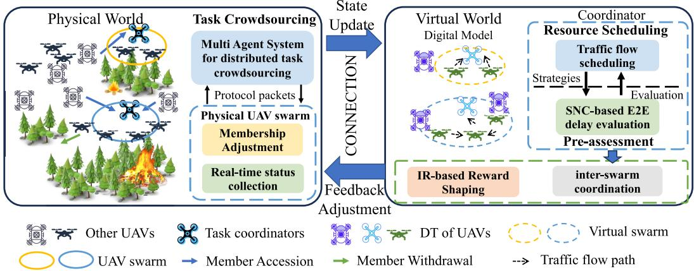  
Fig. 1. The DT based closed-loop UAV network collaboration architecture in emergency SAR applications.

For ease of expression and analysis, the set of task coordinators is defined as ${ \mathcal { K } } = \{ 1 , \cdots , K \}$ , and the set of UAVs is defined as U. The crowdsourcing cycle set is denoted as $\mathcal { M } = \{ 0 , \cdots , M \}$ , and task k reaches the task requirement at crowdsourcing cycle $T _ { k }$ . To describe the generation, forwarding, and processing process of sensing data traffic in UAV swarms, we focus on describing how to build the virtual swarm and establish the data arrival model, link model and processing model based on virtual swarm. In addition, we establish a perceptual correctness model to describe the sensing performance of UAVs.

## B. Digital Twin Model

For each coordinator k, it constructs a virtual twin of the managed UAV swarm and records membership and traffic flow information, characterised as

$$
\begin{array} { r } { D T _ { k } = \{ \mathcal { U } _ { k } ^ { V } , \mathcal { L } _ { k } ^ { V } , \{ \{ x _ { i } ^ { S } , y _ { i } ^ { S } , z _ { i } ^ { S } \} , s _ { i } , p _ { i } , C _ { i } \} , h _ { i , j } , d _ { i , j } , d _ { i , j } ^ { V } \} , } \end{array}\tag{1}
$$

where $\mathcal { U } _ { k }$ and $\mathcal { L } _ { k }$ denote the physical entity of the UAV swarm members and that of the traffic flow routing for task $k ,$ respectively. Correspondingly, ${ { \mathcal { U } } _ { k } ^ { V } }$ and $\mathcal { L } _ { k } ^ { V }$ illustrate the corresponding virtual swarm and virtual routing. DT on coordinator k maintains $\{ \{ x _ { i } ^ { S } , y _ { i } ^ { S } , z _ { i } ^ { S } \} , s _ { i } , p _ { i } , C _ { i } \}$ of $\mathrm { U A V } \ i \in \mathcal { U } _ { k } ^ { V }$ the channel gain $h _ { i , j }$ , and End-to-End (E2E) statistical delay $d _ { i , j }$ and E2E theoretical delay upper bounds latency $d _ { i , j } ^ { V }$ of traffic flow for the simulation of sensing data traffic generation, transmission and processing in virtual swarm, where $s _ { i }$ is the sensing performance parameter related sensors, $p _ { i }$ is the transmission power, $C _ { i }$ is Central Processing Unit (CPU) frequency. $\{ x _ { i } ^ { S } , y _ { i } ^ { S } , z _ { i } ^ { S } \}$ is the position of UAV i in the swarm derived from the formation algorithm. Since this paper does not focus on topology management, we assume that virtual swarms and physical entities use the same formation algorithm to form the network topology.

The construction of the DT and the details of parameter updating and maintenance are discussed in detail in Section V-A. There have been a large number of papers considering data synchronisation and data error correction between digital twins and physical entities, and enough state prediction studies to support our architecture to capture channel gain [12], [13].

## C. Data Arrival Model

We assume that the arrival process of sensing traffic of each UAV obeys an independent Poisson distribution with an average arriving rate $\lambda _ { i } ~ = ~ c \lambda _ { s } s _ { i }$ packets/s, where $\lambda _ { s }$ is the number of packets per unit parameter, c is a constant [14]. It is reasonable to assume that the superiority of UAV sensing performance is positively correlated with the sensing information collected. Let $A _ { i } ( t )$ denote the cumulative number of bits arriving at UAV i during the time interval [0, t]. The Moment Generation Function (MGF) of $A _ { i }$ can be deduced as $M _ { A _ { i } } ( \theta , t ) = E [ e ^ { \theta A _ { i } } ] = E [ e ^ { \theta N _ { i } L } ] =$ $M _ { N _ { i } } ( \theta L , t )$ , where $N _ { i } ( t )$ is the cumulative number of packets arriving at UAV i, L is packet size, θ is a free parameter. According to [15], the MGF of $N _ { i } ( t )$ can be given as $\begin{array} { r } { M _ { N _ { i } } ( \theta , t ) ~ = ~ \sum _ { k = 0 } ^ { + \infty } P \{ N _ { i } ( t ) ~ = ~ k \} e ^ { \theta k } ~ = ~ e ^ { \lambda _ { i } t ( e ^ { \theta } - 1 ) } } \end{array}$ , where $P \{ N _ { i } ( t ) = k \} = e ^ { - \lambda _ { i } t } ( \lambda _ { i } t ) ^ { k } / k ! \ [ 1 6 ]$ . Therefore, $M _ { A _ { i } } ( \theta , t -$ $\tau ) = e ^ { \lambda _ { i } ( t - \tau ) ( e ^ { \theta L } - 1 ) } \leq e ^ { \theta [ \rho _ { i } ^ { A } ( t - \tau ) + \sigma _ { i } ^ { A } ] } = M _ { \widehat { A } _ { i } } ( \theta , t - \tau ) , \widehat { A } _ { i }$ is the stochastic envelope process of $A _ { i }$ with $\rho _ { i } ^ { A } = \lambda _ { i } ( e ^ { \theta L } - 1 ) / \theta$ and $\sigma _ { i } ^ { A } = 0 [ 1 7 ]$

## D. Link Model

To avoid mutual interference among the swarms, each UAV swarm occupies a non-overlapping channel, but UAVs within one swarm share the same channel. In UAV swarms, UAVs mainly consider Line-of-Sight (LoS) communication [18]. The average Signal-to-Noise Ratio (SNR) between UAV i and UAV j can be expressed as $\begin{array} { r } { \gamma _ { i , j } = p _ { i } h _ { i , j } / ( \sum _ { k \neq i } p _ { k , j } h _ { k , j } + N _ { g w } ) } \end{array}$ where $p _ { i }$ is the transmission power, $h _ { i , j } ~ = ~ g _ { i , j } 1 0 ^ { - L _ { i , j } / 1 0 }$ is the channel gain, $g _ { i , j }$ is the channel power gain, $L _ { i , j } =$ 20 log $d _ { i , j } ^ { V ^ { S } } + 2 0 \log f _ { 0 } + 2 0 \log ( 4 \pi / c )$ is the free space propagation loss, $d _ { i , j } ^ { V ^ { S } }$ is the distance among UAVs in the swarm, $f _ { 0 }$ is the carrier frequency of channel, c is the speed of light, and $N _ { g w }$ is the power of the Gaussian white noise [19]. Therefore, the transmission rate from UAV i to UAV j can be calculated by $r _ { i , j } ~ = ~ B \log _ { 2 } ( 1 + \gamma _ { i , j } )$ , where B is the bandwidth. The Memoryless on-off process is used to model the dynamic wireless channel in the virtual swarm. To simplify the model, we assume that the link is always on and served at rate $r _ { i , j } .$ . Same as [15], The MGF of $S _ { i , j } ( t )$ can be written as $M _ { S _ { i , j } } ( - \theta , t ) ~ = ~ E [ e ^ { - \theta \sum _ { v = \tau } ^ { t } X _ { i , j } ( v ) } ] ~ = ~ [ M _ { X _ { i , j } } ( - \theta , t ) ] ^ { t } ~ = ~$ ${ { e } ^ { - \theta t r _ { i , j } } }$ , where link $i , j$ supplies the cumulative service process $S _ { i , j } ( \tau , t )$ for traffic in time period [τ, t]. The above equation satisfies $M _ { S _ { i , j } } ( - \theta , t - \tau ) \le e ^ { - \theta [ \rho _ { i , j } ^ { \mathrm { S } } ( t - \tau ) + \sigma _ { i , j } ^ { \mathrm { S } } ] } = M _ { \widehat { S } _ { i , i } } ( - \theta , t - \tau )$ $\tau ) , \widehat { S } _ { i , j }$ is the stochastic envelope process of $S _ { i , j }$ with $\rho _ { i , j } ^ { S } =$ $r _ { i , j }$ and $\sigma _ { i , j } ^ { S } = 0$

## E. Processing Model

We use the same model as the link model to simulate the service process of UAVs processing data traffic. For UAV i with CPU frequency $C _ { i } ,$ , the processing rate of UAV i can be given as $r _ { i } ~ = ~ C _ { i } / C$ , where C is the CPU computing cycles required per bit of sensing data [19]. UAV i supplies the cumulative service process $\begin{array} { r } { S _ { i } ( \tau , t ) \ = \ \sum _ { v = \tau } ^ { t } X _ { i } ( v ) } \end{array}$ for traffic in time period [τ, t ], where $X _ { i } ( t )$ represents the service provided by the UAV i in the time interval t. The MGF of $S _ { i } ( t )$ can be written as $M _ { S _ { i } } ( - \theta , t ) = [ M _ { X _ { i } } ( - \theta , t ) ] ^ { t } = e ^ { - \theta t r _ { i } }$ . The above equation satisfies $M _ { S _ { i } } ( - \theta , t - \tau ) \le e ^ { - \theta [ \rho _ { i } ^ { S } ( t - \tau ) + \sigma _ { i } ^ { S } ] } =$ $M _ { \widehat { S } _ { i } } ( - \theta , t - \tau )$ , where $\widehat { S } _ { i }$ is the stochastic envelope process of $S _ { i }$ with $\rho _ { i } ^ { S } = r _ { i }$ and $\sigma _ { i } ^ { S } = 0$

## F. Sensing Correctness Model

We utilise the probabilistic sensing model in the virtual swarm to fit the probability of correct sensing [20] in physical world. The probability that UAV i correctly senses task k is expressed as $P _ { i , k } = e ^ { \dot { - } s _ { i } d _ { i , k } ^ { S } }$ , where $s _ { i }$ is the sensor performance related parameter and $d _ { i , k } ^ { S }$ is the distance between the formation position within the swarm of UAV i and the task k. The sensing correctness of UAV cooperative sensing is expressed as $\begin{array} { r } { P _ { k } = 1 - \prod _ { i \in \mathcal { U } _ { \nu } ^ { V } } ( 1 - P _ { i , k } ) } \end{array}$

## IV. PERFORMANCE DERIVATION AND OPTIMIZATION

In this section, in order to explore the relationship between the configuration of the UAV swarm and the upper bound of sensing task execution latency, we deduce the end-to-end delay of sensing data flow in the virtual swarm based on SNC. For task-driven joint dynamic task crowdsourcing and traffic flow pre-scheduling, an integer optimisation model is developed to analyse the ability of UAV swarm member deployment and traffic flow direction to support task QoS.

Due to the communication range of UAVs, in a UAV swarm, UAVs process the sensing data locally or choose others for collaborative processing, and the final sensing results are aggregated to coordinators for uniform collection. Considering the very small amount of data, we ignore the process of transmitting the final sensing results to the coordinator. Assume that $\delta _ { i , j } = 1$ denotes that the sensing data flow of UAV i is handed over to UAV j for co-processing, otherwise $\delta _ { i , j } \ = \ 0$ . The traffic flow path can be expressed as $\mathcal { L } _ { k } = \{ \{ i  \mathbf { \bar { \rho } } j \} , \mathrm { i f } \delta _ { i , j } =$ $1 \} , i , j \in \mathcal { U } _ { k }$

## A. End-to-End Delay Analysis

Virtual swarms avoid routing reconfiguration or swarm reorganisation in the physical world due to swarm member adjustment by pre-constructing traffic flow. To assist virtual swarms in planning traffic flow directions, we use SNC techniques to construct an analytical model of sensing data traffic under the dynamic routing scheduling to assist virtual swarm theory in evaluating task execution delays [14], [21], [22]. Similarly, we use $\delta _ { i , j } ^ { \check { V } } = 1$ to denote that DT planning sensing data flow of UAV i is handed over to UAV j for collaborative processing. The virtual traffic path can be expressed as $\mathcal { L } _ { k } ^ { V } =$ $\{ i \to j \} , \mathrm { i f } \ \delta _ { i . i } ^ { V } = 1 \} , i , j \in \mathcal { U } _ { k } ^ { V }$

Lemma 1: For a steady-state system, after the random envelope process of the sensing data flow $\widehat { A } _ { i }$ passes through the link, the random envelope process $\widehat { D } _ { i , j }$ of cumulative leaving process $D _ { i , j }$ satisfies $\widehat { D } _ { i , j } ( t ) = \widehat { A } _ { i } ( t )$

Proof: According to output characterization $[ 1 7 ] , \widehat { D } _ { i , j }$ can be calculated as $\begin{array} { r } { \widehat { D } _ { i , j } ( t ) = \widehat { A } _ { i } \oslash \widehat { S } _ { i , j } ( t ) = \operatorname* { s u p } _ { s > 0 } [ \widehat { A } _ { i } ( t + s ) - } \end{array}$ $\widehat { S } _ { i , j } ( s ) ]$ . We substitute the values of $\widehat { A _ { i } }$ and $\hat { S _ { i , j } }$ into the above equation, $\begin{array} { r } { \widehat { D } _ { i , j } ( t ) = \operatorname* { s u p } _ { s \geq 0 } [ \rho _ { i } ^ { A } ( t + s ) + \sigma _ { i } ^ { A } - \rho _ { i , j } ^ { S } ( s ) - \sigma _ { i , j } ^ { S } ] . } \end{array}$ For a steady-state system, it must require $\delta _ { i , j } ^ { V } \rho _ { i } ^ { \check { A } } < \delta _ { i , j } ^ { V } \rho _ { i , j } ^ { \check { S } } .$ This is because if DT prearranges UAV i to select $\operatorname { U A V } j$ for co-processing, the arrival process of sensing data traffic of UAV i needs to be smaller than the transmission process provided by the link $i , j ,$ otherwise UAV i will continue to generate a backlog of data packets, leading to packet loss.

However, the service provided by UAV j is not exclusive to the sensing data traffic from UAV i to UAV j , there are cross sensing data traffic from other UAVs to UAV j sharing processing services. $\textstyle \sum _ { l \in \mathcal { U } _ { l } ^ { V } \cap l \neq i } \delta _ { l , j } ^ { V } \widehat { D } _ { l , j } ( t )$ indicates the statistic envelop process of the cross traffic from other UAVs to UAV j, where $\delta _ { l , j } ^ { V } \widehat { D } _ { l , j } ( t )$ means the cumulative leaving process of sensing traffic from UAV l to UAV j, when UAV l selects UAV l for coordinative computing.

Lemma 2: The MGF of cross traffic $\textstyle \sum _ { l \in \mathcal { U } _ { l } ^ { V } \cap l \neq i } \delta _ { l , j } ^ { V } \widehat { D } _ { l , j } ( t )$ can be expressed as $\begin{array} { r l r } { M _ { \sum _ { l \in \mathcal { U } _ { k } ^ { V } \cap l \neq i } \delta _ { l , j } ^ { V } \widehat { D } _ { l , j } } ( \theta , t ) } & { { } } & { = } \end{array}$ $e ^ { \theta t ( \sum _ { l \in \mathcal { U } _ { k } ^ { V } \cap l \neq i } \delta _ { l , j } ^ { V } \rho _ { l } ^ { A } ) }$

Proof: When $\delta _ { l , j } ^ { V } = 0 ;$ , the cross traffic from UAV l to UAV j does not exist and does not occupy the processing service provided by UAV j . In this case, the MGF of this cross traffic will not affect the value of the overall cross traffic passed through UAV j. For the above reasons, we stipulate

$$
M _ { \delta _ { l , j } ^ { V } \widehat { D } _ { l , j } } ( \theta , t ) = \left\{ \begin{array} { l l } { M _ { \widehat { D } _ { l , j } } ( \theta , t ) , } & { \delta _ { l , j } ^ { V } = 1 , } \\ { 1 , } & { o t h e r w i s e , } \end{array} \right. \ = e ^ { \theta \delta _ { l , j } ^ { V } \rho _ { l } ^ { A } t } .\tag{2}
$$

Based on [17], the MGF of cross traffic can be expressed as $\begin{array}{c} \begin{array} { r c l } { { { \cal M } _ { \sum _ { l \in \mathcal { U } _ { k } ^ { V } \cap l \neq i } \delta _ { l , j } ^ { V } \widehat { D } _ { l , j } } ( \theta , t ) } } & { { = } } & { { \prod _ { l \in \mathcal { U } _ { k } ^ { V } \cap l \neq i } { \cal M } _ { \delta _ { l , j } ^ { V } \widehat { D } _ { l , j } } ( \theta , t ) } } \end{array} = \prod _ { l \in \mathcal { U } _ { k } ^ { V } \cap l \neq i } \delta _ { l , j } ^ { }  \end{array}$ $\begin{array} { r } { \prod _ { l \in \mathcal { U } _ { \iota } ^ { V } \cap l \not = i } e ^ { \theta \delta _ { l , j } ^ { V } \rho _ { l } ^ { A } t } = e ^ { \theta t ( \sum _ { l \in \mathcal { U } _ { k } ^ { V } \cap l \not = i } \delta _ { l , j } ^ { V } \rho _ { l } ^ { A } ) } } \end{array}$

Lemma 3: The MGF of the leftover service that UAV j provides for sensing data traffic from UAV i can be given as $\begin{array} { r l r } { M _ { \widehat { S } _ { i } ^ { D _ { i } , j } } ( \theta , t ) } & { = } & { M _ { \widehat { S } _ { j } } ( \theta , t ) M _ { \sum _ { l \in \mathcal { U } _ { L } ^ { V } \cap l \neq i } \delta _ { l , j } ^ { V } \widehat { D } _ { l , j } } ( - \theta , t ) \quad = } \end{array}$ $e ^ { \theta t ( \rho _ { j } ^ { S } - \sum _ { l \in \mathcal { U } _ { k } ^ { V } \cap l \neq i } \delta _ { l , j } ^ { V } \rho _ { l } ^ { A } ) }$ , where $\begin{array} { r l r } { \widehat { S } _ { j } ^ { D _ { i , j } } ( t ) } & { { } = } & { [ \widehat { S } _ { j } \quad - } \end{array}$ $\textstyle \sum _ { l \in \mathcal { U } _ { k } ^ { V } \cap l \not = i } \delta _ { l , j } ^ { V } \widehat { D } _ { l , j } ] ( t )$ is the statistic envelop process of the leftover service.

Proof: The proof can be found in [17].

Lemma 4: When the statistic envelop process of cumulative arrival process $\widehat { A } _ { i } ( t )$ transmits to UAV j , it will be served by link $i , j$ and UAV j . The MGF of the total service received by UAV i is expressed as $M _ { \widehat { A _ { i } } , \widehat { S _ { i } } } ( - \theta , t ) \ \leq$ $\begin{array} { r l r } { M _ { \widehat { S } _ { i , j } } ( - \theta , t ) M _ { \widehat { S } _ { i } ^ { D _ { i , j } } } ( - \theta , t ) } & { = } & { e ^ { - \theta t ( \rho _ { i , j } ^ { S } + \rho _ { j } ^ { S } - \sum _ { l \in \mathcal { U } _ { k } ^ { V } \cap l \neq i } ^ { e } \delta _ { l , j } ^ { V } \rho _ { l } ^ { A } ) } } \end{array}$ To guarantee the stability of the system, we require $\delta _ { i , j } ^ { V } \rho _ { i } ^ { A } <$ $\begin{array} { r } { \delta _ { i , j } ^ { V } ( \rho _ { i , j } ^ { S } + \rho _ { j } ^ { S } - \sum _ { l \in \mathcal { U } _ { k } ^ { V } \cap l \neq i } \delta _ { l , j } ^ { V } \rho _ { l } ^ { A } ) } \end{array}$ , meaning that UAV i only can choose UAVs whose overall service rate is higher than the arrival rate of UAV i for collaborative computing.

Proof: The proof can be found in [17].

Lemma 5: The upper bounds of the delay violation probability of the End-to-End (E2E) delay $d _ { i , j } ^ { V } ( t )$ of the sensing data traffic from UAV i to UAV j satisfies $\forall \theta > 0 , P \{ d _ { i , j } ^ { V } ( t ) > w \} \leq$ $\delta _ { i , j } ^ { V } e ^ { - \theta w \rho _ { \widehat { A } _ { i } , \widehat { S } _ { j } } ^ { S } } \sum _ { s = 0 } ^ { t } e ^ { \theta s ( \rho _ { i } ^ { A } - \rho _ { \widehat { A } _ { i } , \widehat { S } _ { j } } ^ { S } ) }$ , where $\rho _ { \hat { A } _ { i } , \hat { S } _ { j } } ^ { S } = \rho _ { i , j } ^ { S } + \rho _ { j } ^ { S } -$ $\begin{array} { r } { \sum _ { l \in \mathcal { U } _ { k } ^ { V } \cap l \not = i } \delta _ { l , j } ^ { V } \rho _ { l } ^ { A } } \end{array}$

Proof: According to [19], when $\delta _ { i , j } ^ { V } ~ = ~ 1$ , we have $\begin{array} { r } { P \{ d _ { i , j } ^ { V } ( t ) ~ > ~ w \} ~ \leq ~ \sum _ { s = 0 } ^ { t } M _ { \widehat { A _ { i } } } ( \theta , s ) M _ { \widehat { A _ { i } } , \widehat { S _ { j } } } ( - \theta , s + w ) ~ = } \end{array}$ $e ^ { - \theta w \bar { \rho } _ { \widehat { A } _ { i } , \widehat { S } _ { j } } ^ { S } } \sum _ { s = 0 } ^ { t } e ^ { \theta s ( \rho _ { i } ^ { A } - \rho _ { \widehat { A } _ { i } , \widehat { S } _ { j } } ^ { S } ) }$ . When $\delta _ { i , j } ^ { V } ~ = ~ 0 .$ , there is no E2E sensing data traffic from UAV i to UAV j, so $d _ { i , j } ^ { V } ( t ) = 0$ Since $w > 0$ , it must have $P \{ d _ { i , j } ^ { V } ( t ) > w \} = 0$ . Combining the above cases, we can deduce the lemma.

For the sake of solving, when $P \{ d _ { i , j } ^ { V } ( t ) > w \} \le \epsilon _ { k }$ , where $\epsilon _ { k }$ is a very small constant.

Theorem 1: When given the target delay violation probability $\epsilon _ { k }$ , the upper bounds of the End-to-End (E2E) delay $d _ { i , j } ^ { V }$ of the sensing data traffic from UAV i to UAV j under the stability condition can be given as $\forall \delta _ { i , j } ^ { V } = 1 , d _ { i , j } ^ { V } =$ $\begin{array} { r } { \operatorname* { i n f } _ { \theta > 0 } [ - \frac { \ln { ( \epsilon _ { k } ( 1 - e ^ { \theta ( \underset { i } { A _ { i } } - \rho _ { \widehat { A _ { i } } , \widehat { S _ { j } } } ^ { S } ) } ) } ) } { \theta \rho _ { \widehat { A _ { i } } , \widehat { S _ { i } } } ^ { S } } ] . } \end{array}$

Proof: For a steady-state system, it requires $\delta _ { i , j } ^ { V } \rho _ { i } ^ { A } \ <$ $\delta _ { i , j } ^ { V } \rho _ { \widehat { A } _ { i } \widehat { S } _ { j } } ^ { S }$ . By bringing $\begin{array} { r l r } { t } & { { } = } & { + \infty } \end{array}$ into Lemma $5 ,$ $\begin{array} { r } { \sum _ { s = 0 } ^ { + \infty } e ^ { \theta s ( \rho _ { i } ^ { A } - \rho _ { \widehat { A } _ { i } , \widehat { S } _ { j } } ^ { S } ) } } \end{array}$ is a convergent series approximately equal to $\begin{array} { r } { 1 / ( 1 - e ^ { \theta ( \rho _ { i } ^ { A } - \rho _ { \widehat { A } _ { i } , \widehat { S } _ { j } } ^ { S } ) } ) } \end{array}$ . The end-to-end upper bound delay is defined as $\begin{array} { r } { d _ { i , j } ^ { V } = \operatorname* { i n f } _ { \theta > 0 } \{ w : \sum _ { s = 0 } ^ { t } M _ { \widehat { A _ { i } } } ( \bar { \theta } , s ) M _ { \widehat { A _ { i } } , \widehat { S _ { j } } } ( - \theta , s + } \end{array}$ $w ) \leq \epsilon _ { k } \}$

We can derive that $P \{ d _ { i , j } ^ { V } ( t ) > w \} \le \epsilon _ { k }$ is established, only when $\begin{array} { r } { \forall \theta > 0 , \delta _ { i , j } ^ { V } = 1 , w ~ \ge ~ - \frac { \ln { ( \epsilon _ { k } ( 1 - e ^ { \theta ( \rho _ { i } ^ { A } - \rho _ { \hat { A } _ { i } } ^ { S } , \hat { S } _ { j } } ) ) } ) } { \theta \rho _ { \hat { A } _ { i } } ^ { S } \hat { S } _ { j } } ~ = ~ f ( \theta ) } \end{array}$ Therefore, $d _ { i , j } ^ { V } = \operatorname { i n f } _ { \theta > 0 } [ f ( \theta ) ]$

## B. Problem Formulation

UAVs applying to join in crowdsourcing cycle k will compete for channel bandwidth and UAV computing capability, which may lead to the traffic flow formed in the previous crowdsourcing cycle $k - 1$ cannot meet task latency requirements. To solve this problem, DT will plan the traffic flow paths of UAVs joining in this crowdsourcing cycle $\delta _ { i , j } ^ { V } , i , j \in$ $\{ \mathcal { U } _ { k } ^ { V } ( m ) { - } \mathcal { U } _ { k } ^ { V } ( m { - } 1 ) \}$ based on the previous service flow paths, so as to select matching UAVs and provide traffic routing schemes.

To have more idle UAVs on standby for unexpected tasks, the coordinator expects fewer UAVs to form UAV swarms to safeguard sensing performance under delay constraints. Combined with our proposed architecture, the coordinator will update the physical entities $\boldsymbol { \mathcal { U } } _ { k } , \boldsymbol { \mathcal { L } } _ { K }$ with the virtual swarm parameters at the end of each crowdsourcing cycle, thus the above problem is equivalent to solving for the optimal virtual swarm membership $\mathcal { U } _ { k } ^ { V } , k \in \mathcal { K }$ and traffic flow paths $\delta _ { i , j } ^ { V } , i , j \in \mathcal { U } _ { k } ^ { V }$ . Based on Markov process, the optimization problem is formulated as

$$
P : \operatorname* { m i n } _ { \mathcal { U } _ { k } ^ { V } ( m ) , \delta _ { i , j } ^ { V } ( m ) , m \in \mathcal { M } } \ \sum _ { m \in T _ { k } } \sum _ { k \in { \mathcal { K } } } | \mathcal { U } _ { k } ^ { V } ( m ) - \mathcal { U } _ { k } ^ { V } ( m - 1 ) |
$$

$$
\lceil C 1 : P _ { k } ( T _ { k } ) \geq \overline { { P } } _ { k } ( T _ { k } ) ,
$$

$$
\begin{array} { r } { \left| C 2 : d _ { i , j } ^ { V } \leq \tau _ { k } , \forall \delta _ { i , j } ^ { V } = 1 , i , j \in \mathcal { U } _ { k } ^ { V } , k \in \mathcal { K } , \right. } \end{array}
$$

$$
| C 3 : | \mathcal { U } _ { k } ^ { V } | \leq \overline { { N } } _ { U } , \dot { k } \in \mathcal { K } ,
$$

$$
\begin{array} { r } { \left| C 4 : \mathcal { U } _ { k } ^ { \ddot { V } } \cap \mathcal { U } _ { k ^ { \prime } } ^ { V } = \varnothing , k \neq k ^ { \prime } , k , k ^ { \prime } \in \mathcal { K } , \right. } \end{array}
$$

$$
\begin{array} { r } { \operatorname { \mathbb { E } } 5 : I _ { i } = 1 , \tilde { i } \in \mathcal { U } _ { k } ^ { V } , k \in \mathcal { K } , } \end{array}
$$

$$
\begin{array} { r } { \boxed { C 6 : \delta _ { i , j } ^ { V } = \{ 0 , 1 \} , \stackrel {  } { i } , j \in \mathcal { U } _ { k } ^ { V } , k \in \mathcal { K } , } } \end{array}
$$

$$
\begin{array} { r } { \boxed { C 7 : \sum _ { j \in \mathcal { U } _ { \iota } ^ { V } } \delta _ { i , j } ^ { V } = 1 , i \in \mathcal { U } _ { k } ^ { V } , k \in \mathcal { K } , } } \end{array}
$$

$$
\begin{array} { r } { \left| C 8 : \delta _ { i , j } ^ { V } \rho _ { i } ^ { A ^ { \ast } } < \delta _ { i , j } ^ { V } \rho _ { \widehat { A } _ { i } , \widehat { S } _ { i } } ^ { S } , i , j \in \mathcal { U } _ { k } ^ { V } \cap \delta _ { i , j } = 1 , \right. } \end{array}
$$

$$
\begin{array} { r } { \left. C 9 : \delta _ { i , j } ^ { V } \rho _ { i } ^ { A } < \delta _ { i , j } ^ { V } \rho _ { i , j } ^ { S ^ { \ast } } , i , j \in \mathcal { U } _ { k } ^ { V } \cap \delta _ { i , j } = 1 , \right. } \end{array}\tag{3}
$$

where $P _ { k }$ is the sensing correctness of $\mathrm { U A V } \ i \ \in \mathcal { U } _ { k } ^ { V }$ cooperative sensing. C1 is a task sensing correctness constraint. C2 requires that the end-to-end delay of any service flow in the formed UAV swarm ${ \mathcal { U } } _ { k } ^ { V }$ must not exceed the task delay cap. C3 to C5 are task allocation constraints, which means that the number of UAVs performing the same task cannot be too many, one UAV can only participate in one task, and the UAV must be in an idle state, respectively. C6, C7 are variable constraints, and C8, C9 are stability constraints.

The above integer programming problem is non-convex and the swarm membership decision $\mathcal { \bar { U } } _ { k } ^ { V }$ is tightly coupled with the traffic flow path decision $\delta _ { i , j } ^ { V }$ , which makes it difficult to be solved by traditional optimisation algorithms, such as the branch-and-bound algorithm [23]. This crowdsourcing cycle decision $\mathcal { U } _ { k } ^ { V } ( m ) , \delta _ { i , j } ^ { V } ( m )$ needs to be given the antecedent crowdsourcing cycle decision and the state information. The traditional combinatorial optimisation process iteratively solves the optimal strategy under each crowdsourcing cycle individually, which hinders the task execution process.

## V. UAV SWARM-BASED DYNAMIC CONFIGURATION SUPPLEMENTATION MECHANISM

In the previous section, we formulate task-driven resource management as an integer nonlinear optimization problem. To address this, this section presents a digital twin-assisted dynamic allocation supplementation mechanism.

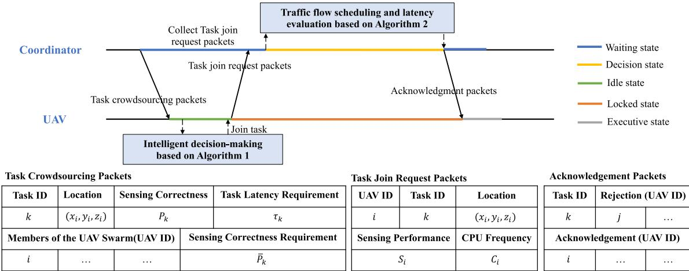  
Fig. 2. The interactive time diagram of UAV swarm-based dynamic configuration supplementation protocol.

To address the high computational complexity resulting from increased swarm scale, task crowdsourcing enables distributed task scheduling by inviting UAVs with heterogeneous resources. However, traditional schemes ignore the impact of UAV scale adjustments on resource and traffic distribution. These adjustments disrupt the network structure, causing transmission inefficiencies from route reconfiguration. Traffic through the same UAV or link must share limited bandwidth and processing power, creating potential communication bottlenecks and challenging latency constraints for sensing tasks. To overcome these issues, we propose a dynamically configured supplementary mechanism. By leveraging digital twins, this mechanism replenishes swarm members and plans traffic with minimal communication overhead, maintaining the efficiency of data traffic within the original UAV swarm.

## A. Framework of Mechanism

The core idea of the proposed mechanism is to progressively and cautiously replenish UAV swarms with adapted UAVs. Two algorithms are included in the mechanism and protocols are designed to drive the multi-cycle interaction process in the proposed mechanism. The protocol timing and related packet contents are shown in Fig. 2. Specifically, in each crowdsourcing cycle, DTs facilitate a two-way interaction between the physical and virtual worlds. The relationships between the components are illustrated in Fig. 3.

In the physical world, coordinators release task demands and crowdsource nearby UAVs to join the task. The current swarm status and resource distribution of these UAVs are updated to the virtual world, helping coordinators build virtual UAV swarms. Based on swarm scale, resource constraints, and traffic distribution, coordinators pre-allocate traffic flow paths for sensing data and evaluate the end-to-end delay. In the virtual world, DTs assess if the new traffic flow from the applying UAVs will cause existing flows to violate delay requirements. If constraints are not met, DTs feedback to the physical world to reject those UAVs, avoiding route reconfiguration. If constraints are satisfied, coordinators accept the UAVs, form complementary swarms in the physical world, and provide a traffic path plan. By previewing the traffic flow generation, transmission, and processing in the virtual swarm, UAV swarms avoid trial-and-error route switching and long-term performance statistics, enabling quick responses to changing task requirements. We will further detail the workflow of the proposed mechanism and elucidate the construction, parameter updates, and maintenance methods of DTs.

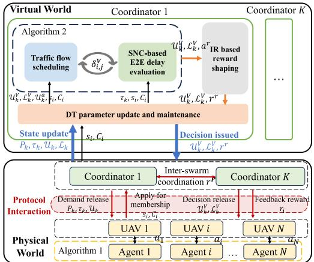  
Fig. 3. The relationships between the parts of UAV swarm-based dynamic configuration supplementation mechanism.

1) Step 1: During task execution, UAVs in $\mathcal { U } _ { k }$ periodically report traffic flow, link, and node information to coordinator k. When task requirements change and existing traffic flows cannot meet them, coordinator k removes these traffic flows and the corresponding UAVs, forming the initial virtual swarm ${ \mathcal { U } } _ { k } ^ { V } ( 0 )$ and link set $\mathcal { L } _ { k } ^ { V } ( 0 )$ . The physical entities $\mathcal { U } _ { k } ( 0 )$ and $\mathcal { L } _ { k } ( 0 )$ are also updated.

2) Step 2: In crowdsourcing cycle $m \in \{ 1 , \cdots , M \}$ , the coordinator checks if the virtual swarm $\mathcal { U } _ { k } ^ { V } ( m - 1 )$ and the virtual service flow $\mathcal { L } _ { k } ^ { V } ( m - 1 )$ meet task requirements. If not, the coordinator publishes task crowdsourcing packets in the physical world.

3) Step 3: UAVs forward and disseminate the received task crowdsourcing packets. Idle UAVs collect task states and decide whether to join and which task to join according to Algorithm 1. UAVs that decide to join send task join request packets to the coordinator and await a response.

Algorithm 1 Distributed Task Dynamic Crowdsourcing Algorithm 2 Traffic Flow Allocation (TFA) Algorithm   
(DTDC) Algorithm 1: The coordinator k sorts UAVs by $s _ { i }$ to form $\overline { { { \mathcal { U } } _ { k } ^ { a } } } ;$   
1: for each $\overline { { \mathrm { U A V } , i \in \mathcal { U } } }$ do 2: Initialize iteration $i = 0 ;$   
2: Initialize replay memory, action-value function $Q ,$ ,target 3: Initialize $\mathcal { U } _ { k } ^ { V } ( m ) = \mathcal { U } _ { k } ^ { V } ( m - 1 ) , \mathcal { L } _ { k } ^ { V } \underline { { { ( m ) } } } = \mathcal { L } _ { k } ^ { V } ( m - 1 ) ;$   
action-value function $\bar { \hat { Q } }$ 4: while i <= min(I $, | \mathcal { \ddot { U } } _ { k } ^ { a } | )$ and $P _ { k } < \overline { { P } } _ { k }$ do   
3: end for 5: Calculate $( x _ { i } ^ { S } , y _ { i } ^ { S } , z _ { i } ^ { S } )$ for UAV i based on any forma-  
4: for episode $= 1$ to T do tion algorithms;   
5: Initialize task requirements $\overline { { P } } _ { k } , \tau _ { k } .$ , swarm configuration 6: Create virtual swarm $\mathcal { U } _ { k } ^ { V , p } ( m , i ) = \mathcal { U } _ { k } ^ { V } ( m ) \cap i ;$   
$\mathcal { U } _ { k } ( 0 ) , \mathcal { U } _ { k } ^ { V } ( 0 )$ and traffic flow paths $\mathcal { L } _ { k } ( 0 ) , \mathcal { L } _ { k } ^ { V } ( 0 ) ;$ 7: Sorting UAVs form ${ \mathcal { U } } _ { k } ^ { V , s } ( m , i )$ by $r _ { j } ^ { i } = \rho _ { i , j } ^ { S } + \rho _ { j } ^ { S } , j \in$   
7: 6: for each crowdsourcing cycle, for each $\mathrm { U A V } , i \in \mathcal { U }$ do $t = 1$ to M do $\mathcal { U } _ { k } ^ { V , p } ( m , i ) ;$   
8: $\begin{array} { r } { F \ddot { l } a g _ { i } = F a l s e , . j = 0 ; } \end{array}$   
8: Receive packets, update observation $o _ { i } ;$ 9: while $j < = | \mathcal { U } _ { k } ^ { V , s } ( m , i ) |$ and $F l a g _ { i } = F a l s e$ do   
9: Update available action space $\{ u _ { i } \} ;$   
10: Select $a _ { i } \in \{ u _ { i } \}$ based on ϵ-greedy; 10: ${ \mathcal L } _ { k } ^ { V , p } ( m , i ) \stackrel {  } { = } { \mathcal L } _ { k } ^ { V } ( m ) \cap \{ i  j \} , \delta _ { i , j } ^ { V } = 1 ;$   
11: end for 11: Calculate $d _ { l , l ^ { \prime } } ^ { V } , l , l ^ { \prime } \in \mathcal { U } _ { k } ^ { V , p } ( m , i ) ;$   
12: Coordinators determine $a ^ { r }$ based on Algorithm 2; 12: if $\forall d _ { l , l ^ { \prime } } ^ { V } \le \tau _ { k } ^ { 3 }$ and satisfy constraint C8, C9 then   
13: for each $\mathrm { U A V } , i \in \mathcal { U }$ do 13: Update $\begin{array} { r l r } { \mathcal { U } _ { k } ^ { V } ( m ) } & { { } = } & { \mathcal { U } _ { k } ^ { V , p } ( m , i ) , \mathcal { L } _ { k } ^ { V } ( m ) \quad = } \end{array}$   
14: Observe $r _ { i }$ and new observation $o _ { i } ^ { \prime } , o _ { i } \gets o _ { i } ^ { \prime } ;$ $\begin{array} { r } { \mathcal { L } _ { k } ^ { V , p } ( m , i ) , ^ { \stackrel {  } { \ r } l a g _ { i } } = T r u e ; } \end{array}$   
15: Store transition $( o _ { i } , a _ { i } , r _ { i } , o _ { i } ^ { \prime } ) ;$   
14: end if   
16: Sample random minibatch of transitions;   
15: $j + = 1$   
17: Set $y ^ { j } ~ = ~ r _ { j } + ( 1 - t _ { j } ) \gamma \operatorname * { m a x } _ { a ^ { \prime } } \hat { Q } ( o _ { j } ^ { \prime } , a ^ { \prime } ; \vartheta ^ { - } ) .$   
16: end while   
if episode ends at step $j + 1 , t _ { j } = 1 ,$ otherwise   
17: i+ = 1   
$t _ { j } = 0 ;$ 18: end while   
18: Perform a gradient descent step on $( y _ { j } \textrm { -- }$ 19: Update $\mathcal { U } _ { k } ( m ) = \mathcal { U } _ { k } ^ { V } ( m ) , \mathcal { L } _ { k } ( m ) = \mathcal { L } _ { k } ^ { V } ( m ) ;$   
$Q ( o _ { j } , a _ { j } , \vartheta ) ) ^ { 2 } \ ;$   
19: Every $X$ steps reset $\hat { Q } = Q$   
20: end for   
21: end for B. MADRL Based Distributed Task Dynamic   
22: end for Crowdsourcing (DTDC) Algorithm

4) Step 4: The coordinator collects task join request packets within a time period, forming the collection of UAVs applying for membership $\mathcal { U } _ { k } ^ { a } ( m )$ . Using Algorithm 2, the coordinator schedules the traffic path $\mathcal { L } _ { k } ^ { \breve { V } } ( m )$ , determines traffic direction, and evaluates end-to-end delay for sensing data traffic. DT selects suitable $\mathrm { U A V s       \ } i \in \mathcal { U } _ { k } ^ { a } ( m )$ to join the virtual swarm ${ \mathcal { U } } _ { k } ^ { V } ( m )$ until task demand is met or no suitable UAVs remain. Virtual swarm members ${ \mathcal { U } } _ { k } ^ { V } ( m )$ and virtual traffic flow paths $\mathcal { L } _ { k } ^ { V } ( m )$ are sent to update physical entities. The coordinator then sends acknowledgment packets to the UAVs, confirming or rejecting their membership. If task requirements are unmet, the process returns to Step 2 for the next crowdsourcing cycle.

As shown in Fig. 2, the task crowdsourcing and confirmation packets will be broadcast throughout the network, with the key difference being the number of task join request packets. The more drones seeking to join, the higher the communication and computational overhead. The entire mechanism consists of two algorithms, where the algorithm 1 prompts drones to participate in the task in a distributed manner. Algorithm 2 selects adapted UAVs among those that apply to join and schedules traffic paths to ensure that the E2E delay meets the latency requirements. Combined with imitation learning, we improve the reward design in algorithm 1 to achieve the optimisation goal at a lower communication cost. The following section describes these algorithms in detail.

Supporting centralized decision-making for UAVs has become highly challenging due to limitations in communication distance and the impractical overhead of obtaining global state information. Partial observability motivates a distributed strategy for highly dynamic UAV swarm scenarios. MADRL algorithms empower agents to learn task requirements, UAV and onboard resource matching strategies through environmental feedback. Given the sensing range constraints of a single agent, it becomes challenging for agents to observe the global state. Agents must infer the state distribution and make decisions based on partial regional observations. In a fully cooperative scenario, the Value Decomposition Network (VDN) and QMIX provide solutions by fitting a joint action value function to address agent laziness in a partially observed Markov process [24], [25], [26]. However, in our problem, UAVs not only need to achieve inter-swarm collaboration to maximize overall task requirement attainment but also must compete with each other to participate in resource adaptation tasks and reduce communication overhead.

To address these challenges, we propose a MADRL-based Distributed Task Dynamic Crowdsourcing (DTDC) algorithm. The entire task-driven resource management based on a multi-UAV swarm collaboration process is modeled as a Partially Observable Markov Decision Process (POMDP). Each crowdsourcing cycle is considered a time step. In each step, each ordinary UAV acts as an agent that intelligently decides whether and which task it joins. The decisions made by UAVs impact the subsequent swarm scale, member structure, traffic flow scheduling, and task performance. A DQN structure is employed within the agent to maintain the evaluation network and the target network, and an experience replay buffer is utilized to eliminate data correlation [27]. Through an iterative learning process, the neural network uncovers implicit relationships between task requirements and UAV resources, prompting the UAVs to adaptively match more suitable tasks. In the following, we specify each element of the formulated POMDP, including the states, actions, and rewards.

Observation: The observation of a single agent can be expressed as $o _ { i } ~ = ~ \{ i , t , \{ x _ { i } , y _ { i } , z _ { i } \} , I _ { i } , C _ { i } , s _ { i } , o _ { k } \} , k ~ \in ~ \mathcal { K } ,$ where i, t are the index of UAV and the current step number, respectively. $\{ x _ { i } , y _ { i } , z _ { i } \}$ is the 3D coordinates of UAV i and $I _ { i }$ characterises whether UAV i is currently idle or not. $C _ { i } , s _ { i }$ are CPU frequency and sensing performance parameters of sensors of UAV i. $o _ { k } = \{ \{ x _ { k } , y _ { k } , z _ { k } \} , P _ { k } , \overline { { P } } _ { k } , \tau _ { k } , | \mathcal { U } _ { k } | , \eta _ { k } \}$ is the information collected from the task crowdsourcing packets, $\{ x _ { k } , y _ { k } , z _ { k } \}$ is the 3D coordinates of task k, $P _ { k } , \overline { { P } } _ { k } , \tau _ { k }$ are the current sensing correctness, sensing correctness requirement, and task execution latency requirement of task k. $| \mathcal { U } _ { k } |$ is the number of UAVs in current swarm ${ { \mathcal { U } } _ { k } } ,$ and $\eta _ { k } = \{ \eta _ { i , k } , i \in \mathcal { U } \}$ describes the members for UAV swarm $\mathcal { U } _ { k }$ , wherein $\begin{array} { r l } { \eta _ { i , k } } & { { } = } \end{array}$ 1 indicates UAV i has joined the task $k ,$ otherwise $\eta _ { i , k } = 0 .$

Action: Each agent intelligently decides whether and which task it joins. We stipulate that $a _ { i } ~ \in ~ \{ 0 , 1 , \cdots , K \}$ , where $a _ { i } = 0$ means that UAV i does not apply to join any task, otherwise $a _ { i } = k ,$ , UAV i requests to become a member of task k. UAV i determines available action space based on its own state as well as the information it receives from task crowdsourcing packets. If $I _ { i } ~ = ~ 0$ , UAV i is not in idle state, $a _ { i } = 0$ . In addition, if UAV i does not receive a task crowdsourcing packet from task k, it cannot opt-in to the corresponding task. The evaluation network evaluates the action value function $Q$ for different tasks and then selects $a _ { i }$ with the highest Q value from the available action space.

Reward: The reward function $r _ { i } = \alpha _ { 1 } r _ { i } ^ { p } + \alpha _ { 2 } r _ { i } ^ { r }$ is designed to consist of two parts, the task performance reward $r _ { i } ^ { p }$ as well as the real action reward $r _ { i } ^ { r }$ , where $\alpha _ { 1 }$ and $\alpha _ { 2 }$ are parametric factors. The task performance reward $r _ { i } ^ { p } =$ $\begin{array} { r } { \sum _ { k \in \mathcal { K } } \operatorname* { m i n } ( 0 , \overline { { P } } _ { k } - P _ { k } ) } \end{array}$ motivates UAVs to join the task to meet the task requirements. The coordinator selects UAVs according to Algorithm 2 based on the principles of not affecting the original traffic transmission and generating only sensing data traffic that meets the task execution delay requirements. The real action $a _ { i } ^ { r }$ is the result of the selection of the coordinator. If the UAV is selected to join the swarm successfully, the original action $a _ { i }$ is the real action, otherwise, the UAV is rejected to join, the real action should be 0. The real action reward can be expressed as

$$
r _ { i } ^ { r } = \left\{ \begin{array} { l l } { + P _ { r } , } & { a _ { i } ^ { r } = a _ { i } ~ \& ~ a _ { i } ^ { r } \neq 0 , } \\ { - P _ { r } , } & { a _ { i } ^ { r } \neq a _ { i } , } \\ { 0 , } & { o t h e r w i s e , } \end{array} \right.\tag{4}
$$

where $P _ { r }$ is a constant.

The details of the DTDC algorithm are shown in Algorithm 1. By introducing the real action reward, the communication overhead incurred in the case that the UAV

applies for joining but is rejected is reduced. The principles of real action rewards are described in Section V-D.

## C. SNC Based Traffic Flow Allocation (TFA) Algorithm

In Section IV, we give an analytical model for sensing data traffic in dynamic UAV swarm networks and derive a closed-form expression for the delay bounds based on SNC theory. According to the proposed traffic analysis model, the task execution delay can be directly calculated theoretically, which eliminates the statistical process of the actual network execution delay. However, due to its theoretical abstraction and computational complexity, SNC-based task delay estimation must be based on the known swarm scale and traffic flow direction, and can only serve as a positive assessment tool. Moreover, the traffic of newly added UAVs may congest the traffic of the original swarm, potentially violating task latency requirements and hindering continuous task execution.

Combining DT and SNC, we propose the Traffic Assignment (TFA) algorithm to solve the above problem, which is detailed in Algorithm 2. The TFA algorithm ranks the UAVs applying for joining based on the sensing capability $s _ { i }$ to form $\mathcal { U } _ { k } ^ { a }$ and selects the UAVs one by one to construct a temporary virtual swarm $\mathcal { U } _ { k } ^ { V , p }$ . Using a greedy-based approach, new joining UAVs are pre-assigned to current resource-rich operational paths $\{ i  j \}$ . The virtual swarm previews the network service status during its task execution and evaluates the end-to-end delay cap of the virtual swarm $d _ { l , l ^ { \prime } } ^ { V }$ . The algorithm accepts only UAVs with corresponding traffic to join without causing the generated and original traffic to violate the task latency requirements. Previewing and evaluating in the virtual world saves the overhead incurred by network reconfiguration and avoids fluctuations caused by frequent attempts at network routing. To control the corresponding time of the protocol, we limit the maximum number of UAVs evaluated per crowdsourcing cycle I .

The TFA algorithm guarantees the optimisation goal by limiting the membership scale through the sensing correctness. UAVs with higher sensing capability are prioritised by the algorithm. Only UAVs whose E2E delay meets the task delay requirements will be allowed to join the task, avoiding swarm membership expansion from the other side. Once the swarm sensing accuracy reaches the task sensing correctness rate requirement, the mechanism will immediately stop crowdsourcing UAVs to join the task.

## D. Imitative Learning Based Reward-Shaping

As discussed earlier, the primary source of communication overhead in the protocol originates from task join request packets generated by UAVs applying for membership. Algorithm 2 optimally limits swarm scale by selecting suitable UAVs. If task sensing performance alone serves as feedback, UAVs tend to join tasks more frequently, generating significant communication overhead to ensure collaboration performance.

Imitation Learning (IL) proves effective in solving sequential decision-making problems. IL provides agents with expert-demonstrated behaviors, enabling them to replicate and simulate these behaviors in new situations. Often used as pre-training for large-scale reinforcement learning, IL allows agents to perform well from the outset and improve continuously from self-generated data to expedite training [28], [29]. Drawing inspiration from IL, in our algorithm, Algorithm 2 acts as an expert. The coordinator evaluates UAVs applying for membership according to Algorithm 1 and corrects the original action based on demonstrated behaviors of the expert to meet task requirements. If a UAV can simultaneously learn the strategy of selecting UAVs in Algorithm 1 and other UAVs applying for membership, it may choose not to join the task to reduce communication overhead if it is not sufficiently adapted for the task while ensuring task execution performance.

TABLE I  
SIMULATION PARAMETERS
<table><tr><td rowspan=1 colspan=1>Parameters</td><td rowspan=1 colspan=1>Values</td></tr><tr><td rowspan=1 colspan=1>Distribution range of tasks</td><td rowspan=1 colspan=1> $\overline { { x _ { k } , y _ { k } } } \in [ 1 5 0 0 , 3 5 0 0 ] ~ \mathrm { m }$ </td></tr><tr><td rowspan=1 colspan=1>Distribution range of UAVs</td><td rowspan=1 colspan=1> $\overline { { x _ { i } , y _ { i } \in [ 0 , 5 0 0 0 ] ~ \mathrm { m } } }$  $z _ { i } \in [ 1 0 0 , 5 0 0 ] ~ \mathrm { m }$ </td></tr><tr><td rowspan=1 colspan=1>Sensing requirements for tasks</td><td rowspan=1 colspan=1> $\overline { { P } } _ { k } \in \left[ 0 . 8 3 , 0 . 9 3 \right]$ </td></tr><tr><td rowspan=1 colspan=1>Time constraints for tasks</td><td rowspan=1 colspan=1> $\overline { { \tau _ { k } \in [ 5 e ^ { - 4 } , 8 e ^ { - 4 } ] \mathrm { ~ s ~ } } }$ </td></tr><tr><td rowspan=1 colspan=1>Sensing performance parameters of UAVs</td><td rowspan=1 colspan=1> $\overline { { s _ { i } \in \{ 2 e ^ { - 3 } , 3 e ^ { - 3 } \} } }$ </td></tr><tr><td rowspan=1 colspan=1>CPU frequency of UAVs</td><td rowspan=1 colspan=1> $\overline { { C _ { i } \in [ 1 e ^ { 9 } , 2 e ^ { 9 } ] \mathrm { ~ H z ~ } } }$ </td></tr><tr><td rowspan=1 colspan=1>The number of packets per unit parameter</td><td rowspan=1 colspan=1> $\overline { { \lambda _ { s } = 5 0 0 \ p a c { \bf k } \mathrm { e t s / s } } }$ </td></tr><tr><td rowspan=1 colspan=1>Packet size</td><td rowspan=1 colspan=1> $\overline { { L = 3 2 \mathrm { ~ b y t e s } } }$ </td></tr><tr><td rowspan=1 colspan=1>Carrier frequency of channel</td><td rowspan=1 colspan=1> $\overline { { f _ { 0 } = 3 e ^ { 9 } ~ \mathrm { H z } } }$ </td></tr><tr><td rowspan=1 colspan=1>Chanel power gain</td><td rowspan=1 colspan=1> $\overline { { g _ { i , j } = - 5 0 ~ \mathrm { d B m } } }$ </td></tr><tr><td rowspan=1 colspan=1>Transmission power</td><td rowspan=1 colspan=1> $\overline { { p _ { i } = 2 5 \ \mathrm { d B m } } }$ </td></tr><tr><td rowspan=1 colspan=1>Bandwidth</td><td rowspan=1 colspan=1> $\overline { { B = 1 e ^ { 6 } ~ \mathrm { H z } } }$ </td></tr><tr><td rowspan=1 colspan=1>Power of Gaussian white noise</td><td rowspan=1 colspan=1> $\overline { { N _ { g w } = - 1 6 9 ~ \mathrm { d B m } } }$ </td></tr><tr><td rowspan=1 colspan=1>CPU computing cycles requiredper bit of sensing data</td><td rowspan=1 colspan=1> $C = 5 0 0$ </td></tr><tr><td rowspan=1 colspan=1>Target delay upper bound</td><td rowspan=1 colspan=1> $\epsilon _ { k } = e ^ { - 4 }$ </td></tr></table>

However, unlike traditional IL, which prompts agents to learn expert strategies by adding expert demonstration behaviors to the replay buffer, Algorithm 2 cannot directly provide expert strategies and relies on the actions of Algorithm 1 as preconditions. If the UAVs selected for inclusion in Algorithm 1 are not suited to task requirements, Algorithm 2 cannot complement traffic flow paths. Similarly, if a UAV does not apply for membership, Algorithm 2 cannot evaluate it. Therefore, as depicted in Fig. 3, we incorporate task performance reward $r _ { i } ^ { p }$ and real action reward $r _ { i } ^ { r }$ in the reward function to guide Algorithm 1 to learn the strategy of Algorithm 2, encouraging UAVs matching the task to join and achieve task requirements with minimal communication overhead and UAV scale.

## VI. PERFORMANCE EVALUATION

In this section, we assess the performance of the proposed UAV swarm-based dynamic configuration mechanism using an intelligent UAV network simulator built with the PyTorch framework. SimPy is employed to simulate real traffic transmission. Due to several symbolic operations involved in deriving the SNC, we use Sympy-based symbolic operations to construct the sensing data traffic analysis model and solve the end-to-end delay by iterating θ [30]. Table I lists the key parameter settings, with the wireless channel environment of the UAV swarm referenced from [19]. Each episode includes up to three steps, with UAV distribution and onboard resources randomized to evaluate the performance of our mechanism in various network environments. UAV positions within the swarm obey a uniform distribution in the range of $\{ x _ { k } \pm$ $5 0 0 , y _ { k } \pm 5 0 0 , 3 0 0 \}$ . Dynamic changes in swarm formation positions affect the channel quality between UAVs, reflecting the dynamic nature of the environment. Before each episode starts, the task delay demand $\tau _ { k }$ and the sensing accuracy demand $\overline { { P } } _ { k }$ are randomly generated to reflect dynamic changes in task QoS during execution. As task requirements evolve, the coordinator deletes traffic flows and UAVs that violate delay constraints to form initial task swarms. Thus, during the simulation, UAVs and their corresponding service paths are randomly clustered to form initial U (0) and $\mathcal { L } _ { k } ( 0 )$

We evaluate the proposed algorithms in two key areas. First, we simulate the impact of a traditional greedy algorithm-based distributed task crowdsourcing with random-based trial-anderror routing path scheduling on network performance to validate the efficiency of our task-oriented resource management mechanism. In the greedy scheme, coordinators select UAVs with superior capabilities until sensing requirements are met, while in the random scheme, UAVs randomly select others for collaborative data processing. Second, we assess the necessity of competitive collaboration in multi-task resource management by comparing our algorithm with purely collaborative QMIX and purely competitive Independent DQN (IDQN). QMIX rewards all agents based on overall task attainment, whereas IDQN encourages individual competition among agents to join tasks.

Fig. 4 illustrates the multi-cycle distributed crowdsourcing of UAV swarms and the process of traffic flow supplementation. Initially, both tasks 1 and 2 start with a minimal swarm scale of one UAV each, as shown in Fig. 4(a), with their initial traffic paths depicted by the black lines in Fig. 4(f). As the first crowdsourcing cycle begins as Fig. 4(b), coordinators send out crowdsourcing packets, and idle UAVs decide whether to join a task based on the proposed IR-based reward-shaping scheme. This approach helps ensure that only the necessary UAVs join, meeting the task requirements efficiently. During the second cycle, the demand for task 2 is fully met, so idle UAVs no longer join it. Instead, coordinator 1 continues to crowdsource UAVs for task 1 in Fig. 4(d). As the sensing accuracy for task 1 is nearly fulfilled, only a few UAVs apply to join. Figures 4(e) and 4(f) show the traffic flow pre-scheduling process. Our algorithm supplements the traffic flow without disrupting the existing UAV swarm traffic, preventing packet loss and retransmission due to repeated reorganization, and ensuring that service latency requirements are met.

Fig. 5 demonstrates the fluctuation of rewards, confirming the convergence of the algorithm. In our algorithm, UAVs utilize task performance rewards and real action rewards as feedback to steer UAVs toward collaborative distributed decision-making. In the initial training phases, multiple UAVs apply for swarm membership. Although they can achieve task requirements, fewer UAVs are actually selected to join the task, generating substantial redundant communication overhead, which is penalized through the real action reward. As the agent learns the TFA algorithm and the crowdsourcing joining strategy for other UAVs, only a few adapted UAVs join the task. As training continues, the reward stabilizes and each crowdsourcing cycle pursues maximum task performance improvement with a small real action penalty and task performance penalty.

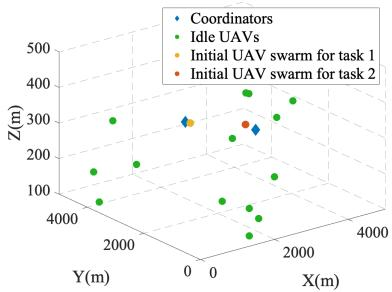  
(a)

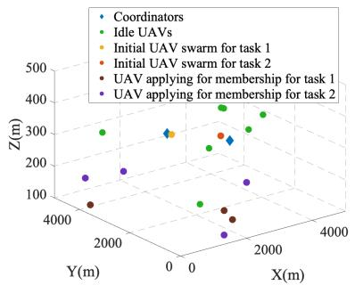  
(b)

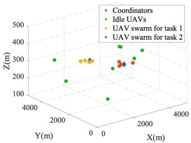  
(c)

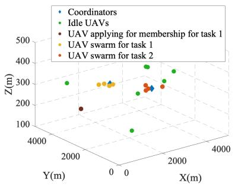  
(d)

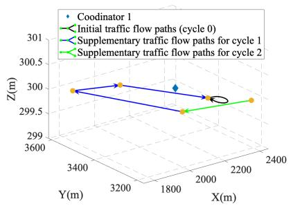  
(e)

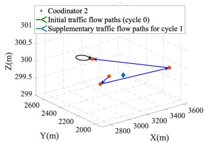  
(f)

Fig. 4. The multi-cycle process of UAV swarm member and traffic flow supplementation when $| \mathcal { K } | = 2 , | \mathcal { U } | = 1 6 .$ (a) Initial swarm configuration. (b) In crowdsourcing cycle 1, UAVs applying for memberships for different tasks. (c) Formed supplemented UAV swarms for different tasks in crowdsourcing cycle 1. (d) In crowdsourcing cycle 2, UAVs applying for memberships for different tasks. (e) Traffic flow path replenishment process for UAV swarm belonging to task 1. (f) Traffic flow path replenishment process for UAV swarm belonging to task 2.  
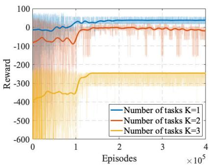  
Fig. 5. Average rewards for UAVs during training for different numbers of tasks.

In Fig. 6, we compare the average theoretical end-to-end delay and the simulated end-to-end delay of the UAV swarm for different delay violation probabilities $\epsilon _ { k } .$ . In general, the theoretical end-to-end delay calculated by SNC exceeds the actual simulated end-to-end delay. Consequently, it is reasonable to employ the theoretical end-to-end delay to assess whether the network can fulfill QoS requirements in the worstcase scenario. In addition, the disparity between the theoretical end-to-end delay and the actual simulated end-to-end delay steadily widens as the probability of delay violation decreases. Therefore, an appropriate delay violation probability can be selected based on the task type and task requirements in the real-world applications.

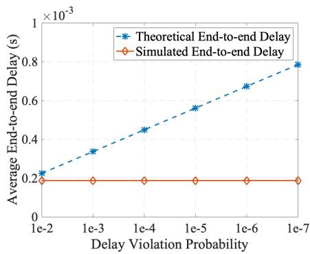  
Fig. 6. The average end-to-end latency of sensing tasks at different delay violation probability $\epsilon _ { k } .$

The task requirement achievement ratio for different schemes is shown in Fig. 7. We evaluate the performance of the proposed algorithm using the task requirement achievement ratio $A = 1 / | \mathcal { K } | \textstyle \sum _ { k \in \mathcal { K } }$ min{1, $P _ { k } / \overline { { P } } _ { k } \}$ . The inclusion of DT in our architecture ensures that only UAVs meeting the latency and service requirements join the swarm, thereby upholding task latency constraints. Our algorithms perform similarly to IDQN and QMIX, but outperform the greedybased approaches. The random scheme fails to consider the distribution of computational and communication resources, leading to resource-limited UAVs being overburdened with tasks. In contrast, the TFA algorithm strategically allocates service flows based on resource distribution and evaluates delay constraints using SNC, adjusting the resource scheduling strategy accordingly. The performance of the greedy-based scheme declines significantly when the number of UAVs is low because it prioritizes UAVs with the most resources for individual tasks, neglecting the needs of other tasks and leaving no available UAVs for tasks with tight deadlines. When there are fewer UAVs than task demands, IDQN underperforms due to the lack of multi-task collaboration. Although IDQN fosters competition, UAVs still manage to select appropriate tasks to achieve their objectives. When there are enough UAVs, task demands are met. However, our algorithm and QMIX utilize sensing accuracy feedback to enhance collaboration among UAVs, effectively addressing multitasking requirements.

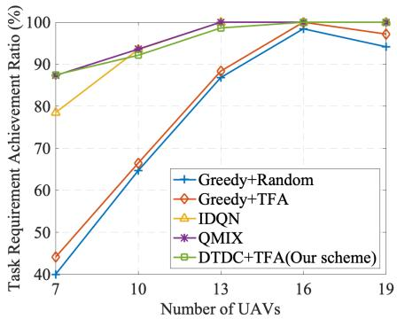  
Fig. 7. The comparison of average task requirement achievement ratio under different scenarios of the number of UAVs.

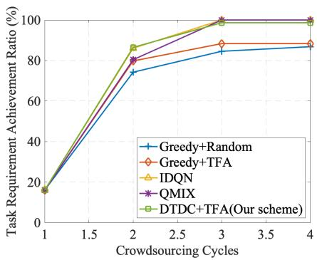  
Fig. 8. The comparison of average task requirement achievement ratio in various crowdsourcing cycles when $| \mathcal { U } | = 1 3 , \mathbf { \dot { \left| K \right| } } = 2$

In Fig. 8, we examine the performance of different schemes across varying crowdsourcing cycles. All schemes show an improved task demand satisfaction ratio, as our mechanism allows only UAVs that meet latency requirements and do not interfere with other traffic flows to join tasks. This prevents repeated network reorganization and reconfiguration. However, as the number of crowdsourcing cycles increases, the improvement rate decreases. Each cycle builds on the previous one, reducing the pool of candidate UAVs. Our algorithm, which calculates the state-action value function Q to optimize rewards over multiple cycles, outperforms greedy-based schemes that select UAVs with abundant resources but offer inferior single-step improvements.

We compare the task requirement achievement ratio in Fig. 7 with the average number of swarm members in Fig. 9. When the task requirement achievement ratio is above 90%, the average number of swarm members for different algorithms is almost equal. This is because the virtual swarm stops accepting UAVs once the task demand is met. However, as the number of UAVs decreases, the task fulfillment rate of greedy schemes drops drastically, reducing the number of UAV members. Greedy approaches rely solely on perceived correctness, ignoring the relationship between resources and E2E delay. This oversight, along with the lack of consideration for the joining order of UAVs, leads to a shortage of suitable UAVs for subsequent cycles. Our algorithm maintains a high task requirement satisfaction rate and the number of swarm members is always in the range of 4 − 6. Our algorithm, in contrast, maintains a low or flat number of swarm members compared to QMIX and IDQN. This is because our algorithm learns optimal UAV joining orders and traffic allocation strategies, balancing communication overhead and system performance to meet different task requirements across crowdsourcing cycles.

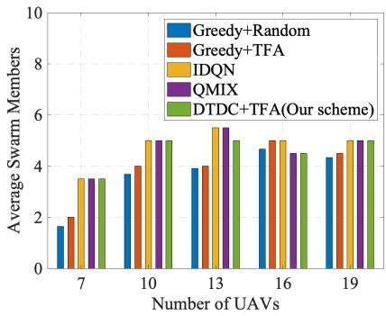  
Fig. 9. The comparison of average swarm members under different scenarios of the number of UAVs.

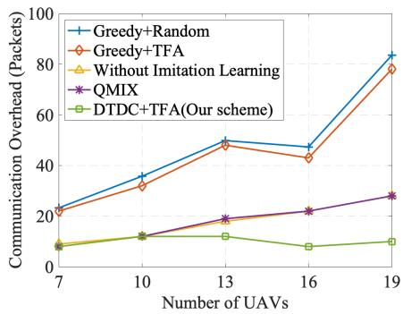  
Fig. 10. Average communications overhead for different number of UAVs.

In Fig. 10, we compare the communication overhead for different UAV scales, focusing on packets related to UAV state collection and task join requests. Greedy schemes incur extensive communication overhead as they collect state information from all idle UAVs. The TFA scheme outperforms the random-based approach because the latter generates many streams that fail to meet latency requirements, necessitating more state information collection from idle UAVs. When the number of UAVs is small, our scheme performs similarly to QMIX and IDQN since most UAVs need to join tasks to meet requirements. However, as the number of UAVs increases, our algorithm minimizes communication overhead. Unlike QMIX and IDQN, which seek to maximize task demand satisfaction by having as many UAVs join as possible, our algorithm reduces overhead by rewarding UAVs based on actual task join success.

## VII. CONCLUSION

With unforeseen tasks and time-varying task requirements, this paper introduces a DT-based closed-loop network collaboration architecture for task-driven resource management of UAV swarms. The coordinators construct a highly dynamic sensing data traffic analysis model and theoretically derive the task execution delay boundary, accelerating the learning iteration process. To avoid network reconfiguration due to irrational configuration, a dynamic configuration supplementation mechanism is further designed to supplement the UAV swarm configuration and traffic flow with low task cost and communication overhead. The simulation results demonstrate the advantages of the proposed architecture and associated mechanisms, achieving over 90% of task requirements with an average of only 4 − 6 swarm members. When the number of UAVs is sufficient, our mechanism reduces communication costs by over 80% compared to the greedy scheme, and by over 50% compared to both purely collaborative QMIX and purely competitive IDQN. However, our algorithm faces challenges in large UAV swarms, particularly due to the increased difficulty in achieving convergence in MADRL as the swarm size grows. The complexities introduced by multi-hop relaying require additional coupling variables to accurately represent the time-varying, multi-hop transmission paths. These factors impede the ability of SNC method to precisely derive end-to-end delay limits. Future efforts will focus on enhancing the algorithm with evaluation networks to accelerate adaptation and training, as well as refining the time-varying multi-hop UAV network model to improve scalability.

## REFERENCES

[1] W. Husheng, L. Hao, and X. Renbin, “A blockchain bee colony double inhibition labor division algorithm for spatio-temporal coupling task with application to UAV swarm task allocation,” J. Syst. Eng. Electron., vol. 32, no. 5, pp. 1180–1199, Oct. 2021.

[2] B. Guo, Y. Liu, L. Wang, V. O. Li, J. C. Lam, and Z. Yu, “Task allocation in spatial crowdsourcing: Current state and future directions,” IEEE Internet Things J., vol. 5, no. 3, pp. 1749–1764, Jun. 2018.

[3] T. Shuyan, Q. Zheng, and X. Jiankuan, “Collaborative task assignment scheme for multi-UAV based on cluster structure,” in Proc. 2nd Int. Conf. Intell. Hum.-Mach. Syst. Cybern., vol. 2, Aug. 2010, pp. 285–289.

[4] L. Lei, G. Shen, L. Zhang, and Z. Li, “Toward intelligent cooperation of UAV swarms: When machine learning meets digital twin,” IEEE Netw., vol. 35, no. 1, pp. 386–392, Jan./Feb. 2021.

[5] J. Wang et al., “HyTasker: Hybrid task allocation in mobile crowd sensing,” IEEE Trans. Mobile Comput., vol. 19, no. 3, pp. 598–611, Mar. 2020.

[6] L. Zhou, S. Leng, Q. Liu, and Q. Wang, “Intelligent UAV swarm cooperation for multiple targets tracking,” IEEE Internet Things J., vol. 9, no. 1, pp. 743–754, Jan. 2022.

[7] X. Kong, C. Ni, G. Duan, G. Shen, Y. Yang, and S. K. Das, “Energy consumption optimization of UAV-assisted traffic monitoring scheme with tiny reinforcement learning,” IEEE Internet Things J., vol. 11, no. 12, pp. 21135–21145, Jun. 2024.

[8] C. Dai, K. Zhu, and E. Hossain, “Multi-agent deep reinforcement learning for joint decoupled user association and trajectory design in full-duplex multi-UAV networks,” IEEE Trans. Mobile Comput., vol. 22, no. 10, pp. 6056–6070, Oct. 2023.

[9] C. Xu, Z. Tang, H. Yu, P. Zeng, and L. Kong, “Digital twin-driven collaborative scheduling for heterogeneous task and edge-end resource via multi-agent deep reinforcement learning,” IEEE J. Sel. Areas Commun., vol. 41, no. 10, pp. 3056–3069, Oct. 2023.

[10] K. Xiong, Z. Wang, S. Leng, and J. He, “A digital-twinempowered lightweight model-sharing scheme for multirobot systems,” IEEE Internet Things J., vol. 10, no. 19, pp. 17231–17242, Oct. 2023.

[11] X. Kong, X. Yang, S. Shen, and G. Shen, “Energy-delay joint optimization for task offloading in digital twin-assisted Internet of Vehicles,” ACM Trans. Sensor Netw., Apr. 2024.

[12] J. Liu et al., “Digital twins based intelligent state prediction method for maneuvering-target tracking,” IEEE J. Sel. Areas Commun., vol. 41, no. 11, pp. 3589–3606, Nov. 2023.

[13] M. Li, C. Chen, X. Yang, J. T. Zhou, T. Zhang, and Y. Li, “Toward communication-efficient digital twin via AI-powered transmission and reconstruction,” IEEE J. Sel. Areas Commun., vol. 41, no. 11, pp. 3624–3635, Nov. 2023.

[14] Y. Zhu, W. Bai, M. Sheng, J. Li, D. Zhou, and Z. Han, “Joint UAV access and GEO satellite backhaul in IoRT networks: Performance analysis and optimization,” IEEE Internet Things J., vol. 8, no. 9, pp. 7126–7139, May 2021.

[15] W. Miao et al., “Stochastic performance analysis of network function virtualization in future internet,” IEEE J. Sel. Areas Commun., vol. 37, no. 3, pp. 613–626, Mar. 2019.

[16] M. G. Bulmer, Principles of Statistics. North Chelmsford, MA, USA: Courier Corporation, 1979.

[17] Y. Jiang and Y. Liu, Stochastic Network Calculus, vol. 1. Cham, Switzerland: Springer, 2008.

[18] H. Zhao, H. Wang, W. Wu, and J. Wei, “Deployment algorithms for UAV airborne networks toward on-demand coverage,” IEEE J. Sel. Areas Commun., vol. 36, no. 9, pp. 2015–2031, Sep. 2018.

[19] Y.-J. Chen, K.-M. Liao, and Y.-F. Chen, “End-to-end delay analysis in aerial-terrestrial heterogeneous networks,” IEEE Trans. Veh. Technol., vol. 70, no. 2, pp. 1793–1806, Feb. 2021.

[20] A. Hossain, S. Chakrabarti, and P. K. Biswas, “Impact of sensing model on wireless sensor network coverage,” IET Wireless Sensor Syst., vol. 2, no. 3, pp. 272–281, Sep. 2012.

[21] J.-Y. Le Boudec and P. Thiran, Network Calculus: A Theory of Deterministic Queuing Systems for the Internet. Cham, Switzerland: Springer, 2001.

[22] J.-Y. Le Boudec, “Application of network calculus to guaranteed service networks,” IEEE Trans. Inf. Theory, vol. 44, no. 3, pp. 1087–1096, May 1998.

[23] G. T. Ross and R. M. Soland, “A branch and bound algorithm for the generalized assignment problem,” Math. Program., vol. 8, no. 1, pp. 91–103, 1975.

[24] P. Sunehag et al., “Value-decomposition networks for cooperative multiagent learning,” 2017, arXiv:1706.05296.

[25] T. Rashid, M. Samvelyan, C. S. De Witt, G. Farquhar, J. Foerster, and S. Whiteson, “Monotonic value function factorisation for deep multiagent reinforcement learning,” J. Mach. Learn. Res., vol. 21, no. 1, pp. 7234–7284, 2020.

[26] H. Zhang, S. Leng, H. Yin, and S. Yu, “Intelligent consensus enhanced spectrum sharing in heterogeneous wireless networks,” IEEE Internet Things J., vol. 11, no. 19, pp. 30939–30952, Oct. 2024.

[27] V. Mnih, “Human-level control through deep reinforcement learning,” Nature, vol. 518, pp. 529–533, Feb. 2015.

[28] T. Hester et al., “Deep Q-learning from demonstrations,” in Proc. AAAI, vol. 32, no. 1, Apr. 2018.

[29] S. Reddy, A. D. Dragan, and S. Levine, “SQIL: Imitation learning via reinforcement learning with sparse rewards,” 2019, arXiv:1905.11108.

[30] S. Schiessl, J. Gross, M. Skoglund, and G. Caire, “Delay performance of the multiuser MISO downlink under imperfect CSI and finite-length coding,” IEEE J. Sel. Areas Commun., vol. 37, no. 4, pp. 765–779, Apr. 2019.

  
Tianyang Li (Student Member, IEEE) received the B.Eng. degree in communication engineering from Shandong University, Shandong, China, in 2019. She is currently pursuing the Ph.D. degree with the University of Electronic Science and Technology of China. Her research interests include the Internet of Things, digital twins, and multi-agent reinforcement learning.

Xiwen Liao (Student Member, IEEE) received the B.Eng. degree in communication engineering from Beijing Jiaotong University, Beijing, China, in 2020. She is currently pursuing the dual Ph.D. degree with the University of Electronic Science and Technology of China, Chengdu, China, and the University of Glasgow, Glasgow, U.K. Her research interests include the Internet of Vehicles, digital twins, and multi-agent reinforcement learning.

Supeng Leng (Member, IEEE) received the Ph.D. degree from Nanyang Technological University (NTU), Singapore, in 2005. He is currently a Full Professor with the School of Information and Communication Engineering, University of Electronic Science and Technology of China (UESTC), Chengdu, China. He is also with Shenzhen Institute for Advanced Study, UESTC, Shenzhen, China. He is also the Director of Sichuan International Joint Research Center for Ubiquitous Wireless Networks. He published over 200 research articles and four books/book chapters in recent years. His research interests include resource, spectrum, energy, routing, and networking in the Internet of Things, vehicular networks, broadband wireless access networks, and the next-generation intelligent mobile networks. He is an editorial member of four international journals. He got the best paper awards at four IEEE international conferences. He serves as an organizing committee chair and a TPC member for many international conferences.

Yan Zhang (Fellow, IEEE) received the Ph.D. degree from the School of Electrical and Electronic Engineering, Nanyang Technological University, Singapore, in 2006. He is currently a Full Professor with the Department of Informatics, University of Oslo, Oslo, Norway. His research interests include next generation wireless networks leading to 6G, and green and secure cyber-physical systems. He is a fellow of IET and an elected member of Academia Europaea, the Royal Norwegian Society of Sciences and Letters, and the Norwegian Academy of Technological Sciences. He was a recipient of the Global “Highly Cited Researcher” Award (Web of Science Top 1% Most Cited Worldwide) since 2018. He is an editor (or an area editor, a senior editor, and an associate editor) of several IEEE TRANSACTIONS/magazine.