# Digital-Twin-Empowered Cluster Formation via Over-the-Air Computation in UAV Swarm Networks

Lu Zhang , Xuan Li , Senior Member, IEEE, Yuhang Zhang , Yansong Huang , Haiyan Li , Zixuan Zhang , and Mugen Peng , Fellow, IEEE

Abstract—Uncrewed Aerial Vehicle (UAV) swarms are key enablers for cooperative intelligent tasks in Internet of Everything (IoE) environments, like environmental monitoring and disaster response. Meanwhile, Digital Twin (DT) technology is rapidly advancing in academia and industry due to its potential to design, test, and optimize evolving IoE networks. While DT-empowered UAV swarms provide a compelling solution for complex tasks, challenges remain in jointly designing swarm control and service provision strategies, especially in dynamic IoE environments. To harness the potential of UAV swarm intelligence, we propose a DT-empowered cluster formation technique employing the Over-the-Air Computation (AirComp) transmission scheme for energy-efficient IoE data aggregation, where UAV and IoE device clusters are dynamically constructed and adjusted. Furthermore, we consider the limited power resources by maximizing energy efficiency, which leads to a joint cluster formation, multi-UAV trajectory design, and power allocation problem under the constraint of AirComp signal distortion. To efficiently solve this mixed-integer nonlinear fractional programming problem, we develop a low-complexity iterative algorithm based on the block coordinate descent method. Simulation results show that the proposed DT-empowered AirComp cluster formation technique achieves up to 42% higher energy efficiency and 34% greater throughput than the baselines, validating its potential for efficient data aggregation tasks.

Index Terms—Digital twin, UAV swarm, over-the-air computation, energy efficiency.

## I. INTRODUCTION

## A. Background

ing of numerous autonomous units operating in coordination [1], provide significant advantages across diverse sectors, ranging from environmental monitoring [2], disaster response [3], to traffic inspection [4]. They have become integral to intelligent applications requiring distributed, scalable, and resilient frameworks, owing to their adaptability to evolving scenarios and unforeseen contingencies. The integration of UAV swarms into Internet of Everything (IoE) environments presents a promising solution for cooperative intelligent tasks. This growing interest has spurred extensive academic research and collaborative projects, including path planning in smart transportation systems [5], task offloading in mobile edge computing networks [6], and global efforts toward UAV networking standardization for cooperative tasks [7].

With these advancements in UAV swarm applications, ensuring efficient deployment and coordination has become a critical challenge, requiring innovations in both communication and control strategies. The deployment of UAV swarm systems essentially relies on the advancements in wireless communication techniques, as well as on the continuous improvement of swarm coordination capabilities. Naturally, challenges arise when jointly designing communication service provision and swarm coordination strategies, since the system has to obey the classic trade-offs among multiple performance metrics, including communication quality, computational efficiency, and task execution effectiveness [8], etc. Thanks to the growing popularity of Digital Twin (DT) techniques, which create a digital mirror of physical systems [9], UAV swarms may be designed, tested, and optimized via the automated bidirectional flow of information between the virtual DT and the physical entity for diverse intelligent tasks in the dynamic IoE networks [10]. To this end, DT-empowered UAV swarms may constitute a highly resilient and adaptable component for bolstering the efficiency of evolving IoE applications [11].

As a massive volume of data is generated by numerous IoE devices, the processes of data collection and transmission become crucial, as they constitute a fundamental operational stage in intelligent tasks facilitated by DT systems [12]. These processes may collectively be referred to as data aggregation, for the sake of enabling real-time decision making and intelligent automation. Among various data aggregation scenarios, UAV swarms play a particularly critical role due to their mobility and ability to cover large-scale IoE environments [13]. To elaborate, in a UAV swarm executing a specific monitoring task, each UAV collects and transmits IoE data within its coverage while simultaneously navigating toward its destination, avoiding collisions with neighboring UAVs. Extensive research has focused on enhancing data aggregation in DT-empowered UAV systems, particularly by increasing data quantity through deep reinforcement learning techniques [14], by improving data transmission reliability with reconfigurable intelligent surface techniques [15] as well as by enhancing data security with the aid of differential privacy techniques [16].

TABLE I  
SUMMARY AND COMPARISON OF OUR WORK WITH RELATED STUDIES
<table><tr><td rowspan=1 colspan=3>Feature</td><td rowspan=1 colspan=1>[5]</td><td rowspan=1 colspan=1>[6]</td><td rowspan=1 colspan=1>[11]</td><td rowspan=1 colspan=2>[12]</td><td rowspan=1 colspan=1>[13]</td><td rowspan=1 colspan=1>[14]</td><td rowspan=1 colspan=1>[17]</td><td rowspan=1 colspan=1>[18]</td><td rowspan=1 colspan=1>[19]</td><td rowspan=1 colspan=1>[20]</td><td rowspan=1 colspan=1>[21]</td><td rowspan=1 colspan=1>[22]</td><td rowspan=1 colspan=1>Our</td><td rowspan=1 colspan=1>Work</td></tr><tr><td rowspan=7 colspan=3>Digital Twin IntegrationTask OffloadingMulti-User AccessUAV AssistanceUAV Energy ConsumptionMulti-UAV CoordinationTrajectory OptimizationAirCompResource AllocationDynamic Cluster Formation</td><td rowspan=3 colspan=1>X√√√××××××</td><td rowspan=1 colspan=1></td><td rowspan=1 colspan=1></td><td rowspan=1 colspan=2>√</td><td rowspan=1 colspan=1></td><td rowspan=1 colspan=1></td><td rowspan=1 colspan=1></td><td rowspan=1 colspan=1></td><td rowspan=2 colspan=1>X</td><td rowspan=1 colspan=1></td><td rowspan=5 colspan=1>XVVVVXVXVX</td><td rowspan=5 colspan=1>XVV××××V√X</td><td rowspan=5 colspan=1>√</td><td rowspan=5 colspan=1></td></tr><tr><td rowspan=2 colspan=1></td><td rowspan=1 colspan=1>√</td><td rowspan=1 colspan=1></td><td rowspan=1 colspan=1></td><td rowspan=1 colspan=1>√</td><td rowspan=1 colspan=1>√</td><td rowspan=1 colspan=1>√</td><td rowspan=1 colspan=1>√</td><td rowspan=4 colspan=1>VVVXVXXVX</td><td rowspan=4 colspan=1>XV√××VV×√×</td></tr><tr><td rowspan=1 colspan=1></td><td rowspan=1 colspan=2></td><td rowspan=1 colspan=1></td><td rowspan=1 colspan=1></td><td rowspan=1 colspan=1></td><td rowspan=3 colspan=1>X√√××××√√×</td></tr><tr><td rowspan=1 colspan=2>ization</td><td rowspan=1 colspan=1></td><td rowspan=2 colspan=1>×</td><td rowspan=2 colspan=1>x</td><td rowspan=1 colspan=1>X</td><td rowspan=1 colspan=2>X</td><td rowspan=1 colspan=1>√</td><td rowspan=1 colspan=1>X</td><td rowspan=1 colspan=1>√</td></tr><tr><td rowspan=1 colspan=1>√</td><td rowspan=1 colspan=2>X</td><td rowspan=1 colspan=1>X</td><td rowspan=1 colspan=1>X</td><td rowspan=1 colspan=1>X</td></tr><tr><td rowspan=1 colspan=1></td><td rowspan=2 colspan=1></td><td rowspan=2 colspan=1></td><td rowspan=1 colspan=2>X</td><td rowspan=1 colspan=1>X</td><td rowspan=1 colspan=1>√</td><td rowspan=1 colspan=1>√</td><td rowspan=2 colspan=1></td><td rowspan=2 colspan=1></td><td rowspan=2 colspan=1></td><td rowspan=2 colspan=1></td><td rowspan=2 colspan=1></td><td rowspan=2 colspan=1></td><td rowspan=2 colspan=1></td></tr><tr><td rowspan=1 colspan=1>X</td><td rowspan=1 colspan=2>x</td><td rowspan=1 colspan=1></td><td rowspan=1 colspan=1>X</td><td rowspan=1 colspan=1>X</td></tr></table>

Whilst there are valuable studies to improve various performance metrics, there is a paucity of investigations on designing energy-efficient DT-empowered UAV swarm networks to support IoE data aggregation tasks. This gap in research highlights the need for novel approaches that not only enhance data aggregation but also address Energy Efficiency (EE) constraints in UAV swarm networks. Ideally, the additional power consumption associated with communication and computation should be minimized while ensuring a required minimum level of data aggregation quality. However, when UAVs aggregate data from multiple IoE devices, escalating communication interference and computational delays may significantly degrade system performance, leading to a substantial reduction in EE. To mitigate these challenges, an effective UAV-device clustering strategy is required to balance communication load and computational overhead. As a result, careful UAV-device cluster formation becomes essential, as it directly impacts overall system performance and task execution efficiency.

## B. Motivation

To reduce the computational delay of post-processing at the receiving UAV and improve data aggregation efficiency, we introduce Over-the-Air Computation (AirComp). AirComp leverages the superposition properties of wireless channels, enabling simultaneous transmission and aggregation of data from multiple devices [23]. To compensate for channel fading in AirComp and enhance aggregation performance, existing studies have designed beamforming vectors to control Mean Squared Error (MSE) [24], or minimize it [25]. References [26] and [27] propose optimal designs for transmission power and receive normalizing factors. However, these studies focus on single-task AirComp scenarios. In contrast, IoE environments often involve diverse tasks and heterogeneous devices, such as those found in smart cities, environmental monitoring, or industrial applications.

To this end, AirComp can be performed across multiple clusters simultaneously, enabling the aggregation of various types of IoE data [28]. However, the results in [22] indicate that when transmission power is relatively high, the aggregation performance of AirComp is negatively impacted by inter-cluster interference. Most of the existing work focuses on reducing the aggregation error by optimizing the power control. In [18] and [22], power allocation optimization is utilized to reduce MSE.

In the meantime, the cluster formation of UAVs and their trajectories are equally critical, as they play a significant role in reducing inter-cluster interference and in minimizing the distance between UAVs and their corresponding device groups in AirComp. In this context, dynamically adjusting the cluster structure formation between UAVs and IoE devices becomes a key area of investigation. As seen in [17], joint construction of node clusters is leveraged to improve the EE of data collection systems, while [19] focuses on determining the transmission power and deployment altitude of UAVs to enhance the timeliness of data transmission. Moreover, in [20], the mission allocation and flight trajectory of UAVs are jointly considered to enhance task efficiency. Similarly, [21] integrates UAV trajectory optimization with node access scheme optimization to maximize energy utilization. This motivates us to design an energy-efficient UAV-device cluster formation technique by employing the advanced AirComp transmission scheme in the radically new context of DT-empowered UAV swarm networks. Table I contextualizes our contributions by comparing our work against key representative studies.

## C. Contributions and Organization

We propose a DT-empowered cluster formation technique relying on the sophisticated AirComp transmission scheme for supporting energy-efficient IoE data aggregation tasks, while jointly considering multi-UAV trajectory design and power allocation. To be more specific,

• a DT-empowered UAV-device cluster formation technique is proposed, and the AirComp transmission scheme is employed within the clusters. The beneficial construction of AirComp clusters constitutes the basis of a structurally energy-efficient IoE network;

• we carefully formulate the systems’ EE maximization problem by taking into account the practical constraints of AirComp signal distortion, safe flight distance, power limitation, etc;

• we propose an efficient iterative algorithm based on the Block Coordinate Descent (BCD) method to solve the original Mixed-Integer Nonlinear Fractional Programming (MINLP-FP) problem, which is decomposed into DT-empowered UAV-device cluster formation, qualityaware AirComp factor coordination, device-side power allocation and UAV swarm trajectory design;

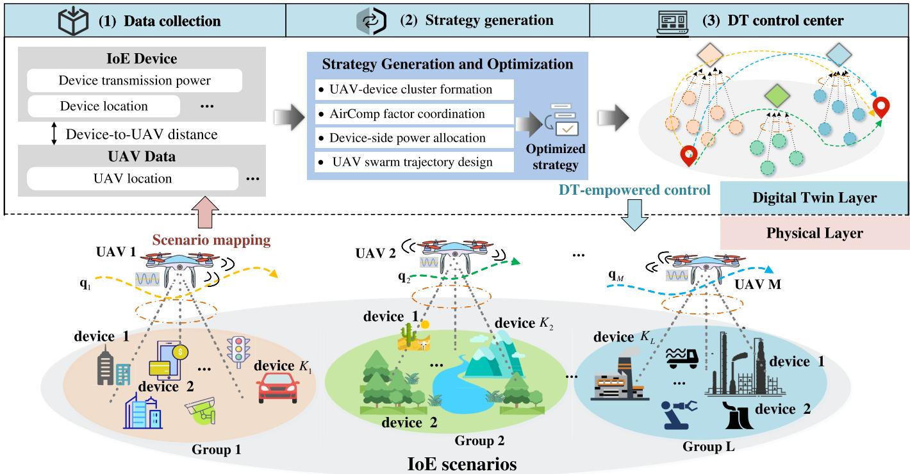  
Fig. 1. Illustration of DT-empowered cluster formation via over-the-air computation in UAV swarm networks. The physical layer consists of UAV swarms and device groups in the IoE scenario. The DT layer maps the physical layer’s IoE scenario and includes algorithms for real-time dynamic optimization of the AirComp cluster formation, swarm trajectory design as well as the service provision strategy.

• we evaluate the proposed DT-empowered cluster formation technique for diverse IoE scenarios as well as UAV swarm settings, and compare our design - in terms of its achievable EE and throughput - to the conventional orthogonal transmission scheme as well as to the cluster formation strategies with fixed trajectory design and constant AirComp factors.

The rest of this paper is organized as follows. Section II demonstrates the proposed DT-empowered cluster formation framework and its mathematical formulation in a typical UAV swarm network for IoE data aggregation tasks. Section III introduces the low-complexity iterative algorithm based on the BCD framework. Simulation results and performance evaluations are provided in Section IV, and conclusions are drawn in Section V.

## II. PROBLEM FORMULATION

As shown in Fig. 1, this paper considers a DT-empowered AirComp cluster formation framework for an IoE data aggregation system. The physical layer consists of a UAV swarm and IoE device groups, which together create the overall scenario, with the device groups distributed across various task regions. The DT layer performs iterative decision optimization based on the swarm state information obtained from the physical layer. The resulting control strategies, including cluster trajectory planning and power allocation policies, are transmitted to the physical UAVs, thereby establishing closedloop control framework. Specifically, the clusters of UAV and devices are dynamically constructed and adjusted. The UAV swarm navigates toward its destination while employing cooperative path planning to prevent intra-swarm collisions and to reduce inter-cluster interference. The transmission power is allocated for each device, and meanwhile the AirComp scale factors are coordinated in order to mitigate both intercluster and intra-cluster interference and further to improve the EE of data aggregation. UAVs are essential for supporting wireless communication and over-the-air aggregation tasks for IoE devices [29]. Due to the limited energy reserve of UAVs, we assume each UAV can assist a finite number of groups simultaneously, necessitating efficient energy management for optimal data aggregation performance.

## A. System Model

The system consists of M UAVs assisting L IoE device groups in performing data aggregation via AirComp. Each group l contains $K _ { l }$ IoE devices, and the set of ground devices in group l is denoted by ${ { \cal K } _ { l } = \{ 1 , 2 , \dots , { \cal K } _ { l } \} }$ . The set of all UAVs is denoted by $\mathcal { M } = \{ 1 , 2 , \dots , M \}$ , while the set of groups is represented by $\mathcal { L } ~ = ~ \{ 1 , 2 , \ldots , L \}$ . The IoE devices are collectively represented by $\textstyle { \mathcal { K } } = \bigcup _ { l \in { \mathcal { L } } } { \mathcal { K } } _ { l }$ , where $\boldsymbol { \mathcal { K } } _ { i } \cap \boldsymbol { \mathcal { K } } _ { j } = \boldsymbol { \emptyset }$ , for all $i \neq j , i , j \in \mathcal { L }$

The communication channel between the UAV and IoE devices is predominantly characterized by line-of-sight (LoS) links, as the UAV can obtain a LoS link by adjusting its position relative to the ground devices. This assumption is valid in many practical scenarios, especially in open environments or areas with limited obstructions [30], where LoS conditions dominate in UAV-assisted communication networks. We also assume that sensors transmit data coherently, meaning the signals are synchronized in both time and phase. This assumption is common in AirComp-based systems, as coherent aggregation enhances signal strength and improves data aggregation accuracy [26]. Furthermore, we assume perfect compensation for the Doppler effect, which is reasonable when relative speeds between UAVs and devices are low. The uplink channel gain between UAV m and device k at time slot n is given by

$$
h _ { k , m } [ n ] = \sqrt { \beta _ { 0 } d _ { k , m } ^ { - \gamma } [ n ] } e ^ { - j \theta _ { k , m } [ n ] } ,\tag{1}
$$

where $\gamma$ is the path loss exponent. $\beta _ { 0 }$ is the channel power gain at the reference distance $d _ { 0 } = 1$ meter and $\theta _ { k , m } [ n ]$ is the phase shift component. For AirComp data aggregation, we use an arithmetic averaging function. For instance, a group collects temperature data, the UAV computes the average temperature from the received signals.

To circumvent the complexities inherent in continuous trajectory modeling, which could lead to an unmanageable infinity of variables, we opt to discretize time into N finite intervals. The time slot length is denoted by $\delta _ { t } = T / N _ { : }$ , and the set of all time slots is given by $\mathcal { N } = \{ 1 , 2 , \dots , \dot { N } \}$

In DT-empowered IoE system, a digital replica of the physical network is constructed and updated periodically to guide dynamic decision-making. The UAVs operate at a fixed altitude $H ,$ and their horizontal position at time slot n is denoted by $\pmb q _ { m } [ n ] = \left[ x _ { m } [ n ] , y _ { m } [ n ] \right]$ for UAV m. We define the overall UAV swarm trajectory as $Q \ = \ \{ q _ { m } [ n ] \ | \ m \in { \mathcal { M } } , n \in { \mathcal { N } } \}$ and the digital twin state of UAV m at slot n in is $\tilde { \mathbf { q } } _ { m } [ n ]$ which is constructed from the UAV state $\mathbf { \Delta } q _ { m } [ n - \tau ]$ . Where $\tau \in \{ 0 , 1 , \ldots , \Delta _ { t } \}$ is the synchronization delay, and $\Delta _ { t }$ denotes the DT update interval [31]. It specifies the DT update cycle and captures the balance between timely decision updates and the associated synchronization cost.

The coordinates of a IoE device k are represented by ${ \mathbf w } _ { k } =$ $[ x _ { k } , y _ { k } ] , k \in \mathcal { K }$ . The distance between UAV m and device k at time slot n is thus defined as

$$
d _ { k , m } [ n ] = \sqrt { H ^ { 2 } + \| q _ { m } [ n ] - \mathbf { w } _ { k } \| ^ { 2 } } ,\tag{2}
$$

where $H > 0$ represents the fixed altitude of the UAVs. The UAVs’ mobility is subject to several constraints. The speed constraint for UAV m between two consecutive time slots is given by

$$
\parallel q _ { m } [ n ] - q _ { m } [ n - 1 ] \parallel \leq V _ { \operatorname* { m a x } } \delta _ { t } .\tag{3}
$$

$V _ { \mathrm { m a x } }$ is the maximum allowable speed of the UAV. Additionally, to avoid collisions between UAVs, the minimum distance between UAV m and UAV i must be maintained as

$$
\left\| \pmb q _ { m } [ n ] - \pmb q _ { i } [ n ] \right\| ^ { 2 } \geq d _ { \operatorname* { m i n } } ^ { 2 } ,\tag{4}
$$

the minimum safe distance between UAVs is denoted as $d _ { \mathrm { m i n } } .$ We assume that the UAVs follow a straight-line trajectory within each time slot, based on this assumption, the UAV’s speed at time slot n is

$$
V _ { m } [ n ] = { \frac { 1 } { \delta _ { t } } } \parallel q _ { m } [ n ] - q _ { m } [ n - 1 ] \parallel .\tag{5}
$$

The power consumption model for rotary-wing UAV m at time slot n is defined as follows. This model encapsulates the energy dynamics of the UAV, taking into account the various factors that contribute to its power draw [32].

$$
P _ { U } ^ { m } [ n ] = P _ { B } \left( 1 + \frac { 3 V _ { m } [ n ] ^ { 2 } } { U _ { t i p } ^ { 2 } } \right)
$$

$$
+ P _ { I } \left( \sqrt { 1 + \frac { V _ { m } [ n ] ^ { 4 } } { 4 v _ { 0 } ^ { 4 } } } - \frac { V _ { m } [ n ] ^ { 2 } } { 2 v _ { 0 } ^ { 4 } } \right) ^ { \frac { 1 } { 2 } } + \frac { 1 } { 2 } d _ { 0 } \rho s A V _ { m } [ n ] ^ { 3 } ,\tag{6}
$$

where $P _ { B } , P _ { I } , U _ { \mathrm { t i p } } , v _ { 0 } , d _ { 0 } , \rho , s ,$ and A are constants related to the $\mathrm { U A V } \mathbf { \hat { s } }$ power consumption model.

1) Over-the-Air Aggregation in DT-Empowered IoE System: The signal transmitted from the IoE device k in time interval n is given by $s _ { k } [ n ] \ = \ \psi _ { k } ( x _ { k } [ n ] ) , \forall k \ \in \ K ,$ where $x _ { k } [ n ]$ represents the measured data from the IoE device, and $\psi _ { k }$ is a preprocessing function. To take inter-cluster interference into account in DT-empowered cluster formation in UAV swarm networks, we assume that the measured data from different devices is uncorrelated. The signal $s _ { k } [ n ]$ are independent and identically distributed random variables (i.i.d.) with zero mean and unit variance. $\mathbb { E } ( s _ { k } [ n ] ) = 0 ,$ , and $\mathbb { E } [ s _ { k } [ n ] ^ { 2 } ] = 1$ Additionally, we assume that the cross-correlation between the signals is zero, i.e., $\mathbb { E } [ s _ { i } [ n ] s _ { j } [ n ] ^ { \mathsf { H } } ] = 0 , \forall i \neq j . i , j \in K$ . The received signal $r _ { l , m } [ n ]$ at UAV m at time slot n is expressed as

$$
\begin{array} { l } { r _ { l , m } [ n ] = \displaystyle \sum _ { k \in \mathcal { K } _ { l } } b _ { k } [ n ] h _ { k , m } [ n ] s _ { k } [ n ] } \\ { \displaystyle + \sum _ { j \neq l } \sum _ { i \in \mathcal { K } _ { j } } b _ { i } [ n ] h _ { i , m } [ n ] s _ { i } [ n ] + e _ { m } [ n ] , } \end{array}\tag{7}
$$

where $\forall j \in { \mathcal { L } } .$ , and $e _ { m } [ n ]$ denotes the additive white Gaussian noise (AWGN) at UAV m, $m \in \mathcal { M }$ and $e [ n ] \sim { \mathcal { C N } } ( 0 , \sigma ^ { 2 } )$ For the UAVs to receive the real arithmetic average of the signals transmitted by the devices in the cluster, AirComp uses channel reciprocity to allow each IoE device to measure its uplink to UAVs with very low overhead [33]. In (7), the transmit precoding coefficient $b _ { k } [ n ] ~ \in ~ \mathbb { C }$ is employed to adjust the amplitude and phase of transmitted signals, compensating for channel disparities, which ensures alignment of signals from different devices at UAVs, thereby enhancing the accuracy of the aggregated data. We assume perfect synchronization and Doppler compensation among devices and UAVs, as commonly done in AirComp studies [34], [35].

With the arithmetic mean aggregation function, the expected aggregated signal for group l at the receiving UAV is

$$
f _ { l } [ n ] = \frac { 1 } { K _ { l } } \sum _ { k \in \mathcal { K } _ { l } } s _ { k } [ n ] ,\tag{8}
$$

where $K _ { l }$ represents the number of devices in group l. The post-processed and scale signal received at the UAV m is

$$
\hat { f } _ { l , m } [ n ] = \cfrac { 1 } { K _ { l } } \eta _ { l , m } [ n ] \cdot r _ { m } [ n ] ,\tag{9}
$$

$\eta _ { l , m } [ n ] \in \mathbb { R } ^ { + }$ is the AirComp post-processed and scale factor at the UAV m for the received signal from group l at the time slot n. Each device $k \in K _ { l }$ in group l transmit with power $P _ { k , l } [ n ]$ at time slot n, and $_ { r }$ is the set of all such transmit powers across devices and time. We define $b _ { k } [ n ]$ as follows

$$
b _ { k } [ n ] = \frac { \sqrt { P _ { k , l } [ n ] } h _ { k , m } ^ { \dagger } [ n ] } { | h _ { k , m } [ n ] | } .\tag{10}
$$

This definition is based on the work presented in [36], where the received signal equation in the context of Air-Comp was derived. By substituting (10) into the received signal equation (7), we focus on power allocation and the scale factor of the aggregated signal. This allows us to analyze the performance of AirComp in terms of the MSE. Here, (·)<sup>†</sup> denotes the conjugate transpose.

2) Performance Metrics of UAV Swarm AirComp Data Aggregation: The performance of the UAV-assisted multigroup AirComp data aggregation system between UAV m and group l at time slot n can be quantified using the instantaneous MSE, defined as

$$
\begin{array} { l } {  { \mathrm { m s e } _ { l , m , n } = \mathbb { E } [ | \hat { f } _ { l , m } [ n ] - f _ { l } [ n ] | ^ { 2 } ] } \qquad } \\ & { = \frac { 1 } { K _ { l } ^ { 2 } } [ \sum _ { k \in { \cal K } _ { l } } ( \eta _ { l , m } [ n ] \sqrt { P _ { k , l } [ n ] } | h _ { k , m } [ n ] | - 1 ) ^ { 2 }  } \\ & {  \qquad +  \eta _ { l , m } ^ { 2 } [ n ] ( \sum _ { j \neq l } \sum _ { i \in { \cal K } _ { j } } P _ { i , j } [ n ] | h _ { i , m } [ n ] | ^ { 2 } + \sigma ^ { 2 } ) ] . } \end{array}\tag{11}
$$

The first term $\begin{array} { r } { \frac { 1 } { K _ { \iota } ^ { 2 } } \sum _ { k \in \mathcal { K } _ { l } } \Big ( \eta _ { l , m } [ n ] \sqrt { P _ { k , l } [ n ] } | h _ { k , m } [ n ] | - 1 \Big ) ^ { 2 } } \end{array}$ represents the signal misalignment error. The second component $\begin{array} { r } { \frac { 1 } { K _ { \iota } ^ { 2 } } \eta _ { l , m } ^ { 2 } [ n ] \sum _ { j \neq l } \sum _ { i \in { \mathcal K } _ { j } } P _ { i , j } [ n ] | h _ { i , m } [ n ] | ^ { 2 } } \end{array}$ denotes the inter-cluster interference-induced error, caused by signals from other clusters interfering with the intended signal reception. The last term $\begin{array} { r } { \frac { 1 } { K _ { \iota } ^ { 2 } } \eta _ { l , m } ^ { 2 } [ n ] \sigma ^ { 2 } } \end{array}$ represents the impact of random noise. The instantaneous aggregated MSE for group l at time slot n is defined as

$$
\mathsf { M S E } _ { l , n } = \sum _ { m = 1 } ^ { M } a _ { l , m } [ n ] \mathsf { m s e } _ { l , m , n } .\tag{12}
$$

where $a _ { l , m } [ n ] ~ \in ~ \{ 0 , 1 \}$ is the cluster formation indicator variable, which denotes whether $\mathrm { U A V } \ m \ \in \ { \mathcal { M } }$ is assigned to serve group $l \in \mathcal L$ at time slot $n \in { \mathcal { N } } .$ . To ensure reliable performance in the AirComp system, the MSE for each group l at every time slot n must satisfy the constraint $\mathsf { M S E } _ { l , n } < \epsilon _ { l } .$ $\forall l \in \mathcal { L } , n \in \mathcal { N }$ . Note that in our AirComp aggregation model, all $K _ { l }$ devices in group l simultaneously transmit to the associated UAV in each time slot. Each device adjusts its transmit power using its precoding coefficient $b _ { k } [ n ]$ , ensuring that the aggregated MSE constraint is satisfied for the entire group, and that all devices contribute to the aggregation.

Similar to the UAV trajectories, the location of device $\mathbf { w } _ { k }$ is digitally represented as $\tilde { \mathbf { w } } _ { k } .$ , and its transmission power at time slot n is denoted by $\tilde { P } _ { k } [ n ]$ . We assume that the DT states of both UAVs and devices are updated at a fixed interval $\Delta _ { t } ,$ , reflecting the data synchronization frequency between the physical and digital layers.

## B. System Performance Assessment

In AirComp systems, the Signal-to-Interference-plus-Noise Ratio (SINR) is calculated as follows

$$
\mathrm { S I N R } _ { l , m } [ n ] = \frac { \mathbb { E } [ | \hat { f } _ { l , m } [ n ] | ^ { 2 } ] - \mathbb { E } [ | \hat { f } _ { l , m } [ n ] - f _ { l } [ n ] | ^ { 2 } ] } { \mathbb { E } [ | \hat { f } _ { l , m } [ n ] - f _ { l } [ n ] | ^ { 2 } ] } .\tag{13}
$$

In terms of communication, using SINR, the transmission rate between UAV m and group l at time slot n is defined as

$$
R _ { l , m } [ n ] = B \log _ { 2 } ( 1 + \mathrm { S I N R } _ { l , m } [ n ] ) ,\tag{14}
$$

where B is bandwidth. This transmission rate quantifies the maximum data throughput that can be achieved over the communication channel between UAVs and IoE devices. In DT-assisted IoE systems, frequent synchronization between the physical environment and its digital counterpart incurs overhead in terms of sensing, communication, and computation. To capture this cost,we define a DT update overhead function, following the methodology in [37], as

$$
\phi _ { p } ( \Delta _ { t } ; M , K ) = \left( \omega _ { 0 } + \frac { T \omega _ { 1 } } { \Delta _ { t } } \right) \cdot ( M + \kappa K ) ,\tag{15}
$$

where $\Delta _ { t }$ is a fixed time interval between updates, $\omega _ { 0 } ~ > ~ 0$ accounts for the baseline DT operation cost, and $\omega _ { 1 } ~ > ~ 0$ reflects the marginal cost increase under more frequent updates. The term $( M + \kappa K )$ accounts for the number of UAVs and IoE devices, where the weight factor $0 < \kappa < 1$ indicates that IoE devices consume less synchronized energy compared to UAVs. To evaluate the performance of the DTempowered UAV swarm over-the-air aggregation, EE is used as a performance indicator. The EE is given as

$$
E E ( \boldsymbol { Q } , \boldsymbol { A } , \boldsymbol { P } , \eta ) = \frac { \sum _ { n = 1 } ^ { N } \sum _ { l = 1 } ^ { L } \sum _ { m = 1 } ^ { M } a _ { l , m } [ n ] R _ { l , m } [ n ] \delta _ { t } } { \sum _ { m = 1 } ^ { M } \sum _ { n = 1 } ^ { N } \delta _ { t } \cdot P _ { U } ^ { m } [ n ] + \phi _ { p } } .\tag{16}
$$

The numerator represents the total aggregated transmission data across all groups l and UAVs m and the denominator represents the total power consumption of the DT-empowered IoE data aggregation system. By optimizing $E E ( Q , \bar { A } , P , \eta )$ the system can balance transmission performance with energy use, emphasizing sustainability and practical deployment in UAV swarm AirComp data aggregation networks.

## C. Problem Formulation

In this paper, we aim to maximize the system EE by jointly optimizing the DT-empowered cluster formation indicator variable A, power allocation P at the device side, AirComp signal scale factor η at UAVs, and the UAV swarm trajectory design $Q .$ The formulated optimization problem is as follows

$$
\begin{array} { r l } { \mathcal { P } : \underset { \boldsymbol { Q } , \boldsymbol { A } , \boldsymbol { P } , \boldsymbol { \eta } } { \mathrm { m a x i m i z e } } } & { { } \frac { \sum _ { n = 1 } ^ { N } \sum _ { l = 1 } ^ { L } \sum _ { m = 1 } ^ { M } a _ { l , m } [ n ] R _ { l , m } [ n ] } { \sum _ { m = 1 } ^ { M } \sum _ { n = 1 } ^ { N } P _ { U } ^ { m } [ n ] + \phi _ { p } } } \end{array}
$$

$$
\mathrm { s . t . } \sum _ { m = 1 } ^ { M } a _ { l , m } [ n ] \mathrm { m s e } _ { l , m , n } \leq \epsilon _ { l } , \quad \forall n , \forall l\tag{17a}
$$

$$
\eta _ { l , m } [ n ] > 0 , \quad \forall l , \forall m , \forall n\tag{17b}
$$

$$
0 \leq P _ { k , l } [ n ] \leq P _ { \mathrm { m a x } } , \quad \forall k , \forall n , \forall l\tag{17c}
$$

$$
\| \pmb { q } _ { m } [ n ] - \pmb { q } _ { m } [ n - 1 ] \| \leq V _ { \operatorname* { m a x } } \delta _ { t } , \quad \forall n , \forall m\tag{17d}
$$

$$
\| \pmb { q } _ { m } [ n ] - \pmb { q } _ { i } [ n ] \| ^ { 2 } \geq d _ { \operatorname* { m i n } } ^ { 2 } , \quad \forall m \neq i , i , m \in \mathcal { M } , \forall n
$$

$$
\sum _ { m = 1 } ^ { M } a _ { l , m } [ n ] \leq 1 , \quad \forall l \in \mathcal { L } , n \in \mathcal { N }\tag{17e}
$$

(17f)

$$
\sum _ { l = 1 } ^ { L } a _ { l , m } [ n ] \leq 1 , \quad \forall m \in \mathcal { M } , n \in \mathcal { N }\tag{17g}
$$

$$
a _ { l , m } [ n ] \in \{ 0 , 1 \} , \quad \forall l \in \mathcal { L } , \forall m \in \mathcal { M } , n \in \mathcal { N }\tag{17h}
$$

The constraints in problem P are summarized as follows: (17a) ensures reliable system performance by keeping the MSE of each group l at time slot n below a predefined threshold. (17b) and (17c) specify the valid ranges for the scale factor and power allocation, respectively. (17d) imposes the maximum UAV speed limit, while (17e) sets a minimum distance $d _ { \mathrm { m i n } }$ between UAVs to ensure safety. (17f) and (17g) are formation constraints limiting each group and UAV to a single association per slot. Finally, (17h) requires the formation variables to be binary.

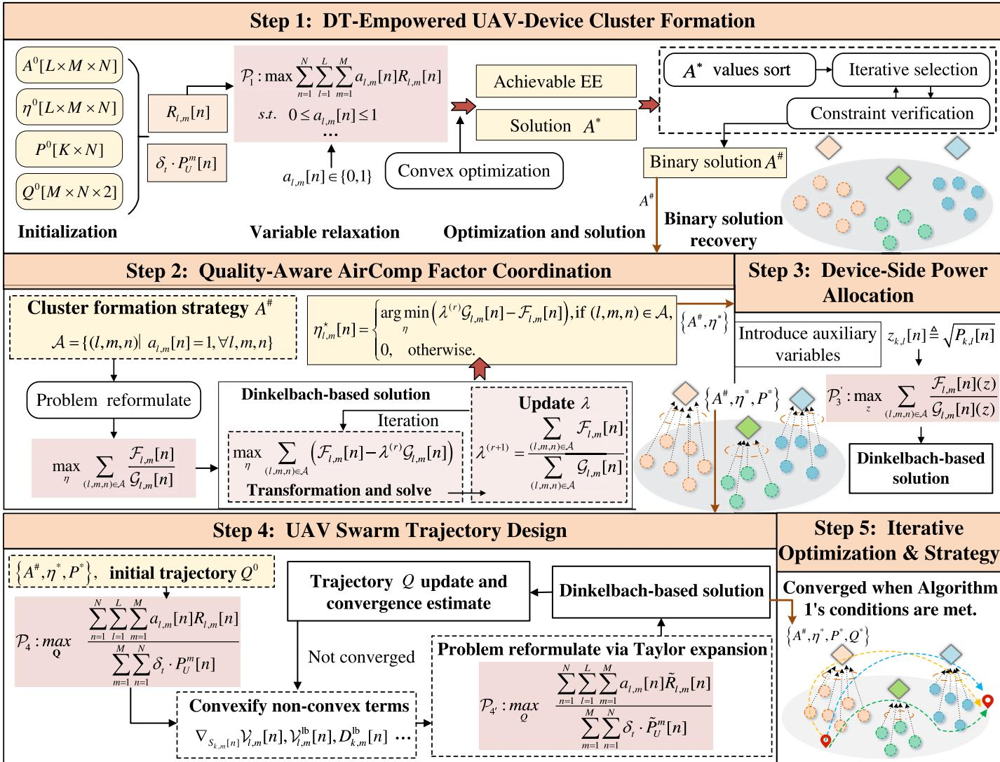  
Fig. 2. The DT-AirComp co-design system framework for strategy generation in DT layer of UAV-assisted IoE systems. This process encompasses four key steps: (1) DT-powered UAV-device cluster formation, (2) quality-aware AirComp factor coordination, (3) device-side power allocation, and (4) UAV swarm trajectory design. The iterative refinement in each step leverages Dinkelbach-based solutions, ensuring convergence to an optimal strategy that enhances energ efficiency across the system.

The main challenges in solving problem P are as follows. First, the fractional objective function and binary formation variables A introduce considerable complexity. Second, the coupling between A and continuous variables $\{ P , Q , \eta \}$ further complicates the problem. Additionally, non-convex discrete constraints, trajectory limits, and the complex UAV energy model increase the nonlinear complexity. Overall, P is a MINLP-FP problem, making it hard to find the global optimum directly. To address this, we propose a low-complexity algorithm to obtain an efficient suboptimal solution.

## III. PROPOSED ALGORITHM

This section presents an iterative algorithm to solve P by decomposing it into four subproblems within the

BCD framework: DT-enabled UAV-device cluster formation, quality-aware AirComp factor coordination, device-side power allocation, and UAV trajectory design. As shown in Fig. 2, the procedure begins by relaxing binary clustering variables into continuous ones, enabling linear programming for efficient approximation (step 1). The AirComp scaling factors are then optimized via fractional programming using the Dinkelbach method to ensure convergence (step 2). Given the updated clustering and scaling factors, power control is reformulated and solved with the Dinkelbach approach (step 3). The non-convex UAV trajectory design is addressed using Successive Convex Approximation (SCA) to obtain a highquality suboptimal solution (step 4). These steps are repeated until convergence, as determined by thresholds on variable updates or objective improvement (step 5).

## A. DT-Empowered UAV-Device Cluster Formation

We first focus on the DT-empowered cluster formation optimization subproblem. For a given $\{ P , Q , \eta \}$ , the original

problem $\mathcal { P }$ can be simplified as follows

$$
\begin{array} { l } { \mathcal { P } _ { 1 } : \underset { A } { \operatorname* { m a x } } \quad \displaystyle \sum _ { n = 1 } ^ { N } \sum _ { l = 1 } ^ { L } \sum _ { m = 1 } ^ { M } a _ { l , m } [ n ] R _ { l , m } [ n ] } \\ { \mathrm { s . t . c o n s t r a i n t s ~ } ( 1 7 \mathrm { a } ) , ~ \mathrm { a n d ~ } ( 1 7 \mathrm { f } ) - ( 1 7 \mathrm { h } ) . } \end{array}\tag{18}
$$

```tcl
Algorithm 1 Global Iterative Optimization via Block Coordi
nate Descent (GIO-BCD)
INITIALIZE $( A ^ { 0 } , P ^ { 0 } , Q ^ { 0 } , \eta ^ { 0 } )$
Set maximum iterations $T _ { \mathrm { m a x } }$ and tolerance 
Set iteration counter $t \gets 0$
Repeat
Obtain $A ^ { t + 1 }$ by solving the UAV-device cluster formation
subproblem via Algorithm 2 (UDCF-RLP).
Obtain $\eta ^ { t + 1 }$ by solving the AirComp scale factor subprob
lem via Algorithm 3 (FPO-ACSF).
Obtain $P ^ { t + 1 }$ by solving the power allocation subproblem
via Algorithm 4 (DB-DPA).
Obtain $\scriptstyle { \dot { \boldsymbol { Q } } } ^ { t + 1 }$ by solving the UAV trajectory subproblem via
Algorithm 5 (SDB-USTD).
Check convergence:
$\| \mathbf { f } \| \mathbf { \boldsymbol { A } } ^ { t + 1 } - \mathbf { \boldsymbol { A } } ^ { t } \| _ { F } < \epsilon$ and $\| \boldsymbol { P } ^ { t + 1 } - \boldsymbol { P } ^ { t } \| _ { F } < \epsilon _ { p }$ and $\| Q ^ { t + 1 } -$
$Q ^ { t } \parallel _ { F } < \epsilon _ { q }$ and $\lVert \pmb { \eta } ^ { t + 1 } - \pmb { \eta } ^ { t } \rVert _ { F } < \epsilon$
OR
$\| f ( A ^ { t + 1 } , P ^ { t + 1 } , Q ^ { t + 1 } , \eta ^ { t + 1 } ) - f ( A ^ { t } , P ^ { t } , Q ^ { t } , \eta ^ { t } ) \| < \epsilon$
break
$t \gets t + 1$
Until $t \geq T _ { \operatorname* { m a x } }$ or the convergence condition in Item 5
Check convergence is satisfied.
return $( A ^ { t + 1 } , P ^ { t + 1 } , Q ^ { t + 1 } , \eta ^ { t + 1 } )$
```

This problem is a typical Mixed-Integer Nonlinear Programming problem, with a linear objective function, it can be solved using classical established optimization tools. However, the presence of integer variables A increases the computational complexity. To simplify the solution process, we relax the integer constraint by allowing the binary variable $a _ { l , m } [ n ] \in$ {0, 1} to become a continuous variable $0 \leq a _ { l , m } [ n ] \leq 1 ,$ thereby transforming the problem into a more tractable convex optimization problem.

Algorithm 2 UAV–Device Cluster Formation via Relaxed   
Linear Programming(UDCF-RLP)   
Input: $\{ A ^ { t } , \eta ^ { t } , P ^ { t } , Q ^ { t } \}$   
SOLVE $\mathcal { P } _ { 1 }$ for $0 \leq a _ { l , m } [ n ] \leq 1$ , obtain $A ^ { * }$   
Post-processing: convert $A ^ { * }$ to binary $A ^ { \# }$ by Post-  
Relaxation Processing and meet (17a), (17f)–(17h).   
Return $A ^ { \# }$

Post-Relaxation Processing: To obtain a binary solution $A ^ { \# }$ from the relaxed result, we sort the continuous values and iteratively select the largest entries, validating constraint satisfaction at each step. If a violation occurs, the selection is reverted. This process ensures feasibility while retaining the optimality properties of the relaxed solution, and significantly reduces computational complexity.

## B. Quality-Aware AirComp Factor Coordination

According to the property of the function and the result of $\mathcal { P } _ { 1 }$ , the problem of optimizing the AirComp scale factors with fixed $Q , P$ , and A, can be formulated as follows

$$
\begin{array} { r l } & { \mathcal { P } _ { 2 } : \underset { \eta } { \operatorname* { m a x } } \quad \displaystyle \sum _ { n = 1 } ^ { N } \sum _ { l = 1 } ^ { L } \sum _ { m = 1 } ^ { M } a _ { l , m } [ n ] R _ { l , m } [ n ] } \\ & { \mathrm { s . t . c o n s t r a i n t s ~ } ( 1 7 \mathrm { a } ) \mathrm { ~ a n d ~ } ( 1 7 \mathrm { b } ) . } \end{array}\tag{19}
$$

By substituting A into the constraints, we obtain $\mathsf { M S E } _ { l , n } =$ ${ \mathfrak { m s e } } _ { l , m , n } ,$ , where ${ \mathcal A } = \{ ( l , m , n ) | a _ { l , m } [ n ] = 1 , \forall l , m , n \} .$ otherwise 0. Based on the transmission rate equation, the problem $\mathcal { P } _ { 2 }$ can be reformulated.

$$
\begin{array} { r l r } {  { \operatorname* { m a x } _ { \boldsymbol { \eta } } \sum _ { ( l , m , n ) \in \mathcal { A } } \frac { \mathbb { E } [ | \hat { f } _ { l , m } [ n ] | ^ { 2 } ] - \mathbb { E } [ | \hat { f } _ { l , m } [ n ] - f _ { l } [ n ] | ^ { 2 } ] } { \mathbb { E } [ | \hat { f } _ { l , m } [ n ] - f _ { l } [ n ] | ^ { 2 } ] } } } \\ & { } & { \mathrm { s . t . } \frac { 1 } { K _ { l } ^ { 2 } } [ \sum _ { k \in \mathcal { K } _ { l } } ( \eta _ { l , m } [ n ] \sqrt { P _ { k , l } [ n ] } | h _ { k , m } [ n ] | - 1 ) ^ { 2 }  } \\ & { } & {  +  \eta _ { l , m } ^ { 2 } [ n ] ( \hat { I } _ { l , m } [ n ] + \sigma ^ { 2 } ) ] \leq \epsilon _ { l } , \forall ( l , m , n ) \in \mathcal { A } ,  } \\ & { } & { \mathrm { c o n s t r a i n t ~ } ( 1 7 \mathrm { b } ) . } \end{array}\tag{a}
$$

Where $\begin{array} { r } { \hat { I } _ { l , m } [ n ] \stackrel { \triangle } { = } \sum _ { j \neq l } \sum _ { i \in { \mathcal { K } _ { i } } } P _ { i , j } [ n ] | h _ { i , m } [ n ] | ^ { 2 } } \end{array}$ . To address the fractional structure of problem 20a, which prevents a direct treatment by standard convex programming rules, we adopt Dinkelbach’s method and convert the original fractional objective into a sequence of parametric auxiliary problems. Specifically, we define

$$
\begin{array} { l } { \mathcal { F } _ { l , m } [ n ] \triangleq \mathop { \mathbb { E } } [ | \hat { f } _ { l , m } [ n ] | ^ { 2 } ] - \mathop { \mathbb { E } } [ | \hat { f } _ { l , m } [ n ] - f _ { l } [ n ] | ^ { 2 } ] } \\ { \displaystyle \qquad = \frac { 1 } { { K _ { l } } ^ { 2 } } \sum _ { k \in { \mathcal { K } } _ { l } } ( 2 \eta _ { l , m } [ n ] \sqrt { P _ { k , l } [ n ] } | h _ { k , m } [ n ] | - 1 ) , } \end{array}\tag{21}
$$

and let $\mathcal { G } _ { l , m } [ n ]$ represent the MSE between UAV m and group l at time slot n. By using the Dinkelbach approach, the fractional objective function in (20) is expressed as

$$
\operatorname* { m a x } _ { \eta } \sum _ { ( l , m , n ) \in \mathcal { A } } \frac { \mathcal { F } _ { l , m } [ n ] } { \mathcal { G } _ { l , m } [ n ] } .\tag{22}
$$

Here $\mathcal { F } _ { l , m } [ n ]$ represents the desired signal power and $\mathcal { G } _ { l , m } [ n ]$ represents the interference plus noise term. To convert this fractional form into an auxiliary objective, we introduce an auxiliary variable $\lambda ^ { ( r ) }$ , where r denotes the iteration index. The auxiliary problem at iteration r is formulated as

$$
\begin{array} { r l } & { \mathcal { P } _ { 2 - 1 } ^ { ( r ) } : \underset { \eta } { \operatorname* { m a x } } \ \underset { ( l , m , n ) \in \mathcal { A } } { \sum } \left( \mathcal { F } _ { l , m } [ n ] - \lambda ^ { ( r ) } \mathcal { G } _ { l , m } [ n ] \right) } \\ & { \quad \mathrm { s . t . } \quad \mathrm { c o n s t r a i n t s ~ } ( 2 0 a ) \mathrm { ~ a n d ~ } ( 1 7 a ) . } \end{array}\tag{23a}
$$

For any fixed $\lambda ^ { ( r ) }$ , the objective above is concave in $\mathbf { \eta } _ { \eta } ,$ and the constraints (20a), (17b) are convex; hence $\mathcal { P } _ { 2 - 1 } ^ { ( r ) }$ is a standard concave maximization over a convex set. Equivalently, one may solve the convex minimization form

$$
\begin{array} { l l } { \displaystyle \mathcal { P } _ { 2 - 2 } ^ { ( r ) } : \displaystyle \operatorname* { m i n } _ { \eta } \sum _ { ( l , m , n ) \in \mathcal { A } } \left( \lambda ^ { ( r ) } \mathcal { G } _ { l , m } [ n ] - \mathcal { F } _ { l , m } [ n ] \right) } \\ { \mathrm { s . t . } \quad \mathrm { c o n s t r a i n t s ~ } ( 2 0 \mathrm { a } ) \mathrm { ~ a n d ~ } ( 1 7 \mathrm { a } ) , } \end{array}\tag{24a}
$$

which is equivalent to $\mathcal { P } _ { 2 - 1 } ^ { ( r ) }$ by sign change. We adopt this latter form in implementation. During each iteration, the

value of $\lambda ^ { ( r ) }$ is updated based on the solution obtained from the auxiliary problem $\mathcal { P } _ { 2 - 2 } ^ { ( r ) }$ . After obtaining $\pmb { \eta } ^ { ( r ) }$ from the auxiliary problem, the parameter is updated by

$$
\lambda ^ { ( r + 1 ) } = \frac { \sum _ { ( l , m , n ) \in \mathcal { A } } \mathcal { F } _ { l , m } [ n ] } { \sum _ { ( l , m , n ) \in \mathcal { A } } \mathcal { G } _ { l , m } [ n ] } .\tag{25}
$$

The iterations terminate when a standard Dinkelbach stopping rule is met, $\mathrm { e . g . }$ .,

$$
\begin{array} { r l } & { \displaystyle  \sum _ { ( l , m , n ) \in A } ( \lambda ^ { ( r ) } \mathcal { G } _ { l , m } [ n ] - \mathcal { F } _ { l , m } [ n ] ) } \\ & { \displaystyle - \sum _ { ( l , m , n ) \in A } ( \lambda ^ { ( r - 1 ) } \mathcal { G } _ { l , m } [ n ] - \mathcal { F } _ { l , m } [ n ] ) \Bigg \rvert < \theta , } \end{array}\tag{26}
$$

where $\theta > 0$ controls the convergence accuracy.

Remark $\mathit { l } \cdot$ The Dinkelbach method guarantees convergence to the optimal solution for concave-convex fractional programs, i.e., when the numerator $\mathcal { F } _ { l , m } [ n ]$ is concave (linear in our case), the denominator $\mathcal { G } _ { l , m } [ n ]$ is positive and convex, and the feasible set is convex. These conditions are satisfied in our formulation. Therefore, the problem can be efficiently solved by iteratively tackling $\mathcal { P } _ { 2 - 2 } ^ { ( r ) }$ and updating $\lambda ^ { ( r ) }$ until convergence.

Algorithm 3 Fractional Programming Optimization for $\operatorname { A i r } -$   
Comp Scaled Factor (FPO-ACSF)   
Input: $A ^ { ( t + 1 ) }$ , initial $\{ \eta ^ { t } , P ^ { t } , Q ^ { t } \}$   
Set iteration index $r \gets 0 ,$ and convergence tolerance $\theta .$   
Repeat:   
SOLVE Auxiliary Problem $\mathcal { P } _ { 2 - 2 } ^ { ( r ) }$ with subject to (23a).   
Update $\lambda ^ { ( r + 1 ) }$ based on solution according to (25).   
If convergence condition (26) is met, converged.   
Else set $r  r + 1$ and repeat.   
Return $\eta ^ { \star }$   
Through the above analysis and proof, the optimal solution   
$\eta _ { l , m } ^ { \star } [ n ]$ to $\mathcal { P } _ { 2 }$ equals to   
$\begin{array} { r } { \eta _ { l , m } ^ { \star } [ n ] = \left\{ \begin{array} { l l } { \underset { \eta } { \arg \operatorname* { m i n } } \left( \lambda ^ { ( r ) } \mathcal { G } _ { l , m } [ n ] - \mathcal { F } _ { l , m } [ n ] \right) , \mathrm { i f : ~ } ( l , m , n ) \in \mathcal { A } , } \\ { 0 , \quad \mathrm { o t h e r w i s e } . } \end{array} \right. } \end{array}$   
(27)   
Dynamic adjustment of $\lambda ^ { ( r ) }$ enables the optimization to iter  
atively refine the AirComp scale factors $\eta _ { l , m } [ n ]$ , ensuring an   
optimal balance between the signal power and interference.

## C. Device-Side Power Allocation

In this section, we aim to optimize the transmission power allocation for each IoE device in every IoE group. For given A and $\mathbf { \eta } _ { \eta } ,$ with fixed initial $Q ,$ the transmit power optimization subproblem can be expressed as

$$
\begin{array} { r l } & { \mathcal { P } _ { 3 } : \displaystyle \operatorname* { m a x } _ { P } \displaystyle \sum _ { ( l , m , n ) \in { \cal A } } \frac { \mathcal { F } _ { l , m } [ n ] } { \mathcal { G } _ { l , m } [ n ] } } \\ & { \mathrm { s . t . } \displaystyle \sum _ { k \in { \cal K } _ { l } } \bigg ( \theta _ { l , k , m } [ n ] \sqrt { P _ { k , l } [ n ] } - 1 \bigg ) ^ { 2 } + \phi _ { l , m } [ n ] } \end{array}
$$

Algorithm 4 Dinkelbach-Based Device Power Allocation   
(DB-DPA)   
Input: $\left\{ A ^ { ( t + 1 ) } , \pmb { \eta } ^ { ( t + 1 ) } \right\}$ , initial $\{ P ^ { t } , Q ^ { t } \}$   
Initialize: convergence tolerance  , max iterations $\epsilon _ { p } ,$ $r _ { \mathrm { m a x } } ^ { p } .$   
Set iteration counter $r \gets 0$   
Set $z _ { k , l } [ n ] \triangleq \sqrt { P _ { k , l } [ n ] }$ , reformulate $\mathcal { P } _ { 3 }$ as $\mathcal { P } _ { 3 } ^ { \prime } .$   
repeat   
SOLVE $\mathcal { P } _ { 3 } ^ { \prime }$ and update $\lambda ^ { ( r ) }$   
Set $r  r + 1 .$   
until $\| z ^ { ( r ) } - z ^ { ( r - 1 ) } \| \leq \epsilon _ { p }$ or $r \geq r _ { \operatorname* { m a x } } ^ { p }$   
Return $P ^ { * }$ with $P _ { k , l } [ n ] \stackrel { \textstyle \cdot } { = } ( z _ { k , l } ^ { * } [ n ] ) ^ { 2 } .$

$$
+ \sum _ { j \neq l } \sum _ { i \in \mathcal { K } _ { j } } \theta _ { l , i , m } ^ { 2 } [ n ] P _ { i , j } [ n ] \leq \epsilon _ { l } , \quad \forall ( l , m , n ) \in \mathcal { A }\tag{28a}
$$

constraint (17c).

Where $\theta _ { l , k , m } [ n ] \triangleq \eta _ { l , m } [ n ] | h _ { k , m } [ n ] |$ and $\phi _ { l , m } [ n ] \triangleq \eta _ { l , m } ^ { 2 } [ n ] \sigma ^ { 2 }$ Unlike the previous optimization subproblem, $\mathcal { F } _ { l , m } [ n ]$ is nonconvex with respect to $P ,$ making the Dinkelbach method inapplicable in its current form. To address this non-convexity,

$$
z _ { k , l } [ n ] \triangleq \sqrt { P _ { k , l } [ n ] } , \quad \forall k \in \mathcal { K } _ { l } , \forall ( l , m , n ) \in \mathcal { A } .\tag{29}
$$

With this transformation,

P<sup>0</sup><sub>3</sub> : max<sub>z</sub> <sup>X</sup> <sup>Fl,m[n](z)</sup><sub>G [n](z)</sub>   
(l,m,n)∈A   
s.t. $\sum _ { k \in \mathcal { K } _ { l } } \left( \theta _ { l , k , m } [ n ] z _ { k , l } [ n ] - 1 \right) ^ { 2 } + \phi _ { l , m } [ n ]$   
+ <sup>X X</sup> θ<sup>2</sup><sub>l,i,m</sub>[n]z<sup>2</sup><sub>i,j</sub> [n] ≤ <sub>l</sub>, ∀(l, m, n) ∈ A,   
j6=l i∈K<sub>j</sub>   
(30a)   
0 ≤ z<sub>k,l</sub>[n] ≤ <sup>p</sup>P<sub>max</sub>, ∀k ∈ K<sub>l</sub>, ∀(l, m, n) ∈ A.

(30b)

After the above derivation, $\mathcal { F } _ { l , m } [ n ] ( z )$ becomes linear w.r.t z due to the replacement, while $\mathcal { G } _ { l , m } [ n ] ( z )$ remains convex. Consequently, $\mathcal { F } _ { l , m } [ n ] ( z )$ and $\mathcal { G } _ { l , m } [ n ] ( z )$ are now more tractable for fractional programming techniques. We employ the Dinkelbach method, similar to the previous subproblem, to iteratively transform the fractional objective into a sequence of simpler subproblems that can be solved efficiently.

## D. UAV Swarm Trajectory Design

For given $\{ A , \eta , P \}$ , the UAV swarm trajectory optimization subproblem can be expressed as

$$
\begin{array} { r l } & { \mathcal { P } _ { 4 } : \underset { \boldsymbol { Q } } { \operatorname* { m a x } } \quad \frac { \sum _ { n = 1 } ^ { N } \sum _ { l = 1 } ^ { L } \sum _ { m = 1 } ^ { M } a _ { l , m } [ n ] R _ { l , m } [ n ] } { \sum _ { m = 1 } ^ { M } \sum _ { n = 1 } ^ { N } P _ { U } ^ { m } [ n ] + \phi _ { p } } } \\ & { \quad \mathrm { s . t . ~ c o n s t r a i n t s ~ } ( 1 7 { \mathrm { a } } ) , ( 1 7 { \mathrm { d } } ) ~ \mathrm { a n d ~ } ( 1 7 { \mathrm { e } } ) . } \end{array}
$$

Due to the non-convex nature of the objective function and constraints, problem $\mathcal { P } _ { 4 }$ is inherently a non-convex optimization problem, making direct solution challenging and computationally expensive. Therefore, in this section, we adopt the SCA algorithm to iteratively approximate the original nonconvex problem by a series of convex subproblems.

$$
\mathcal { N } _ { l , m } [ n ] \triangleq \eta _ { l , m } ^ { 2 } [ n ] \sum _ { l ^ { \prime } \in \mathcal { L } } \sum _ { k \in \mathcal { K } _ { l ^ { \prime } } } \frac { P _ { k , l } [ n ] \beta _ { 0 } } { ( H ^ { 2 } + \Vert \mathbf { q } _ { m } [ n ] - \mathbf { w } _ { k } \Vert ^ { 2 } ) ^ { \frac { \gamma } { 2 } } } ,\tag{31}
$$

$$
\mathcal { V } _ { l , m } [ n ] \triangleq 2 \eta _ { l , m } [ n ] \sum _ { k \in { \mathcal { K } } _ { l } } \frac { \sqrt { \beta _ { 0 } P _ { k , l } [ n ] } } { ( H ^ { 2 } + \Vert \mathbf { q } _ { m } [ n ] - \mathbf { w } _ { k } \Vert ^ { 2 } ) ^ { \frac { \gamma } { 4 } } } ,\tag{32}
$$

$$
\mathcal { C } _ { l , m } [ n ] \triangleq \left. : \eta _ { l , m } ^ { 2 } [ n ] \sigma ^ { 2 } , \mathrm { i f } \ a _ { l , m } [ n ] = 1 , \right.\tag{33}
$$

Based on the previous steps, by substituting A into (17a), the MSE constraint can be rewritten as follows

$$
\mathcal { N } _ { l , m } [ n ] - \mathcal { V } _ { l , m } [ n ] + \mathcal { C } _ { l , m } [ n ] \leq \epsilon _ { l } K _ { l } ^ { 2 } , \quad \forall ( l , m , n ) \in \mathcal { A } ,\tag{34}
$$

where $\mathcal { N } _ { l , m } [ n ]$ and $\nu _ { l , m } [ n ]$ are convex w.r.t $\| \pmb q _ { m } [ n ] - \mathbf w _ { k } \| ^ { 2 }$ We introduce $S _ { k , m } [ n ] \stackrel { \Delta } { = } \| \pmb { q } _ { m } [ n ] - \mathbf { w } _ { k } \| ^ { 2 } , \forall k$ , ∀m, ∀n, to tackle the non-convexity of $\mathcal { N } _ { l , m } [ n ]$ . And $\phi _ { p }$ is constant w.r.t. $Q$ due to fixed $\Delta _ { t } , \mathcal { P } _ { 4 }$ is transformed into

$$
\begin{array} { r l } & { \underset { \boldsymbol { Q } } { \operatorname* { m a x } } ~ \frac { \sum _ { n = 1 } ^ { N } \sum _ { l = 1 } ^ { L } \sum _ { m = 1 } ^ { M } a _ { l , m } [ n ] R _ { l , m } [ n ] } { \sum _ { m = 1 } ^ { M } \sum _ { n = 1 } ^ { N } P _ { U } ^ { m } [ n ] } } \\ & { \mathrm { s . t . } ~ \tilde { \mathcal { N } } _ { l , m } [ n ] - \mathcal { V } _ { l , m } [ n ] + \mathcal { C } _ { l , m } [ n ] \leq \epsilon _ { l } K _ { l } ^ { 2 } , \forall ( l , m , n ) \in \mathcal { A } , } \end{array}
$$

$$
S _ { k , m } [ n ] \leq \left\| \pmb { q } _ { m } [ n ] - \mathbf { w } _ { k } \right\| ^ { 2 } , \quad \forall k , : \forall m , \forall n ,\tag{35a}
$$

(35b)

constraints (17d) and (17e).

Where $\begin{array} { r l r } { \tilde { \mathcal { N } } _ { l , m } [ n ] } & { = } & { \eta _ { l , m } ^ { 2 } [ n ] \sum _ { l ^ { \prime } \in \mathcal { L } } \sum _ { k \in { \mathcal K } _ { l ^ { \prime } } } \frac { P _ { k , l } [ n ] \beta _ { 0 } } { ( H ^ { 2 } + S _ { k , m } [ n ] ) ^ { \frac { \gamma } { 2 } } } . } \end{array}$ However, problem (35) is still non-convex due to the nonconvex constraints and objective function. $\nu _ { l , m } [ n ]$ is convex w.r.t $S _ { k , m } [ n ] , S _ { k , m } [ n ]$ and $\| \pmb q _ { m } [ n ] - \pmb q _ { i } [ n ] \| ^ { 2 }$ are convex w.r.t $Q .$ To handle the non-convexity of (35), the SCA technique is applied to obtain a suboptimal solution. First, the lower bound of $\nu _ { l , m } [ n ]$ is obtained using its first-order Taylor expansion.

$$
\begin{array} { r } { \mathscr { V } _ { l , m } ^ { ( r ) } [ n ] + \nabla _ { S _ { k , m } } [ n ] \mathscr { V } _ { l , m } [ n ] \left( S _ { k , m } [ n ] - S _ { k , m } ^ { ( r ) } [ n ] \right) \triangleq \mathscr { V } _ { l , m } ^ { \mathrm { l b } } [ n ] , } \end{array}\tag{36}
$$

where $\gamma _ { l , m } ^ { ( r ) } [ n ]$ is the reference point of the r-th iteration $\nabla _ { S _ { k , m } [ n ] } \mathcal { V } _ { l , m } [ n ]$ is the gradient of $\nu _ { l , m } [ n ]$ with respect to $S _ { k , m } [ n ] .$ , and $\nu _ { l , m } ^ { \mathrm { { l b } } } [ n ]$ represents the lower bound obtained from the first-order Taylor expansion, and it’s easily verified is concave with regard to. Moreover, we have $\mathcal { V } _ { l , m } [ n ] \geq \mathcal { V } _ { l , m } ^ { \mathrm { l b } } [ n ]$ The constraints (35a) are transformed into

$$
\tilde { \mathcal { N } } _ { l , m } [ n ] - \mathcal { V } _ { l , m } ^ { \mathrm { l b } } [ n ] + \mathcal { C } _ { l , m } [ n ] \leq \epsilon _ { l } K _ { l } ^ { 2 } , \quad \forall ( l , m , n ) \in \mathcal { A } .\tag{37}
$$

The constraint (37) is thus transformed into a convex constraint. Similarly, perform a first-order Taylor expansion on $\lVert \mathbf { q } _ { m } ^ { ( r ) } [ n ] - \mathbf { w } _ { k } \rVert ^ { 2 }$ at the point $\mathbf { \Delta } q _ { m } ^ { ( r ) } [ n ]$

$$
\begin{array} { r l } & { \| \pmb { q } _ { m } [ n ] - \mathbf { w } _ { k } \| _ { 2 } ^ { 2 } } \\ & { \quad \geq \| \pmb { q } _ { m } ^ { ( r ) } [ n ] - \mathbf { w } _ { k } \| _ { 2 } ^ { 2 } } \\ & { \qquad + 2 ( \pmb { q } _ { m } ^ { ( r ) } [ n ] - \mathbf { w } _ { k } ) ^ { \top } ( \pmb { q } _ { m } [ n ] - \pmb { q } _ { m } ^ { ( r ) } [ n ] ) \triangleq D _ { k , m } ^ { \mathrm { l b } } [ n ] . } \end{array}\tag{38}
$$

where $D _ { k , m } ^ { \mathrm { l b } } [ n ]$ is a linear function w.r.t $\mathbf { \delta } q _ { m } [ n ]$ . Likewise, $\| \pmb q _ { m } [ n ] - \pmb q _ { i } [ n ] \| ^ { 2 }$ in constraint (17e) is lower-bounded by [38]

$$
\lVert \pmb q _ { m } [ n ] - \pmb q _ { i } [ n ] \rVert ^ { 2 } \geq \lVert \pmb q _ { m } ^ { ( r ) } [ n ] - \pmb q _ { i } ^ { ( r ) } [ n ] \rVert ^ { 2 }
$$

$$
+ 2 ( { \pmb q } _ { m } ^ { ( r ) } [ n ] - { \pmb q } _ { i } ^ { ( r ) } [ n ] ) ^ { \top } ( { \pmb q } _ { m } [ n ] - { \pmb q } _ { i } [ n ] ) \triangleq d _ { m , i } ^ { \mathrm { l b } } [ n ] .\tag{39}
$$

Based on the expansions in (37), (38), and (39), problem (35) can be approximated as follows when $Q ^ { ( r ) }$ is given

$$
\begin{array} { r l } { \underset { \mathbf { \ * } } { \operatorname* { m a x } } } & { { } \frac { \sum _ { n = 1 } ^ { N } \sum _ { l = 1 } ^ { L } \sum _ { m = 1 } ^ { M } a _ { l , m } [ n ] R _ { l , m } [ n ] } { \sum _ { m = 1 } ^ { M } \sum _ { n = 1 } ^ { N } P _ { U } ^ { m } [ n ] } } \end{array}
$$

$$
\mathrm { s . t . 0 } \leq S _ { k , m } [ n ] \leq D _ { k , m } ^ { \mathrm { l b } } [ n ] , \quad \forall k , : \forall m , \forall n\tag{40a}
$$

$$
d _ { m , i } ^ { \mathrm { l b } } [ n ] \geq d _ { \operatorname* { m i n } } ^ { 2 } , \quad \forall m \neq i , i , m \in \mathcal { M } , \forall n\tag{40b}
$$

constraints (17d) and (37).

All constraints of the optimization problem (40) are now convex. However, the term $P _ { U } ^ { m } [ n ]$ in constraint (40) remains non-convex with respect to $Q$ and requires linearization. Notably, $P _ { U } ^ { m } [ n ]$ depends on trajectory variables from two consecutive time slots, specifically $\mathbf { \delta } q _ { m } [ n ]$ and $\mathbf { \delta } q _ { m } [ n - 1 ]$ . We defined $\Delta \mathbf { q } _ { m } [ n ] \ \triangleq \ \pmb { q } _ { m } [ n ] - \mathbf { q } _ { m } ^ { ( r ) } [ n ] ,$ , and $\Delta \boldsymbol { q } _ { m } [ n - 1 ] \ \triangleq$ ${ \bf q } _ { m } [ n \mathrm { ~ - ~ } 1 ] \mathrm { ~ - ~ } { \bf q } _ { m } ^ { ( r ) } [ n \mathrm { ~ - ~ } 1 ]$ . To address this dependency, a multivariate first-order Taylor expansion of $P _ { U } ^ { m } [ n ]$ is employed

(41)

where $\nabla _ { \pmb { q } _ { m } [ n ] } P _ { U } ^ { m } [ n ]$ and $\nabla _ { \pmb { q } _ { m } [ n - 1 ] } P _ { U } ^ { m } [ n ]$ represent the gradient of $\hat { P } _ { U } ^ { m } [ n ]$ w.r.t $\mathbf { \delta } q _ { m } [ n ]$ and $\mathbf { \Delta } q _ { m } [ n - 1 ]$

Algorithm 5 SCA-Dinkelbach-Based UAV Swarm Trajectory   
Design (SDB-USTD)   
Input $\left\{ A ^ { ( t + 1 ) } , \pmb { \eta } ^ { ( t + 1 ) } , \pmb { P } ^ { ( t + 1 ) } \right\}$ , initial trajectory ${ Q } ^ { ( t ) }$   
Set convergence tolerance $\epsilon _ { q }$ and maximum iterations   
$r _ { \mathrm { m a x } } ^ { q }$   
Set iteration counter $r \gets 0$   
Repeat:   
Compute gradient $\nabla _ { S _ { k , m } [ n ] } \mathcal { V } _ { l , m } [ n ] , \mathcal { V } _ { l , m } ^ { \mathrm { l b } } [ n ] , D _ { k , m } ^ { \mathrm { l b } } [ n ] .$   
$d _ { m , i } ^ { \mathrm { l b } } [ n ]$ and other terms.   
Compute V<sup>lb</sup><sub>l,m</sub>[n] via Taylor expansion of $\nu _ { l , m } [ n ]$   
Update constraints (37), (40b) and others.   
Reformulate problem $\mathcal { P } _ { 4 } ^ { \prime } .$   
SOLVE Auxiliary Problem $\mathcal { P } _ { 4 } ^ { ( r ) }$   
Update $\lambda ^ { ( r ) }$ and update the trajectory $\boldsymbol { Q } ^ { ( r + 1 ) }$ using the   
solution of the convex subproblem.   
Set $r \gets r + 1$   
Until $\lVert Q ^ { ( r ) } - Q ^ { ( r - 1 ) } \rVert \leq \epsilon _ { q } \mathrm { ~ o r ~ } r \geq r _ { \operatorname* { m a x } } ^ { q }$   
Return $Q ^ { * }$

Furthermore, we reformulate $R _ { l , m } [ n ]$ by defining $\tilde { R } _ { l , m } [ n ] =$ $B \log _ { 2 } ( 1 + \gamma _ { l , m } [ n ] ) . \ \tilde { R } _ { l , m } [ n ]$ is concave w.r.t $\gamma _ { l , m } [ n ]$ , we proceed to linearize $\gamma _ { l , m } [ n ]$ to simplify the optimization. We define the variation $\Delta S _ { k , m } [ n ] \triangleq S _ { k , m } [ n ] - S _ { k , m } ^ { ( r ) } [ n ]$ and linearize $\gamma _ { l , m } [ n ]$ as

$$
\begin{array} { r } { \widetilde { \gamma } _ { l , m } [ n ] \triangleq \gamma _ { l , m } ^ { ( r ) } [ n ] + \nabla _ { S _ { k , m } [ n ] } \gamma _ { l , m } [ n ] \big | _ { S _ { k , m } ^ { ( r ) } [ n ] } \Delta S _ { k , m } [ n ] . } \end{array}\tag{42}
$$

After the process above, problem (41) can be approximated as

$$
\mathcal { P } _ { 4 } ^ { \prime } : \operatorname* { m a x } _ { Q } \quad \frac { \sum _ { n = 1 } ^ { N } \sum _ { l = 1 } ^ { L } \sum _ { m = 1 } ^ { M } a _ { l , m } [ n ] \tilde { R } _ { l , m } [ n ] } { \sum _ { m = 1 } ^ { M } \sum _ { n = 1 } ^ { N } \tilde { P } _ { U } ^ { m } [ n ] }
$$

$$
\begin{array} { r l } & { \mathrm { s . t . } \ \gamma _ { l , m } [ n ] \leq \tilde { \gamma } _ { l , m } [ n ] , \quad \forall l , \forall m , \forall n , } \\ & { \qquad \mathrm { c o n s t r a i n t s ~ } ( 1 7 \mathrm { d } ) , ( 3 7 ) , ( 4 0 \mathrm { a } ) \ \mathrm { a n d } \ ( 4 0 \mathrm { b } ) . } \end{array}\tag{43a}
$$

The objective of problem $\mathcal { P } _ { 4 } ^ { \prime }$ is a fractional function with a concave numerator and a linear denominator in terms of $Q .$ The reformulated problem is given by:

$$
\begin{array} { r l } & { \mathcal { P } _ { 4 } ^ { ( r ) } : \displaystyle \operatorname* { m a x } _ { Q } \sum _ { n = 1 } ^ { N } \sum _ { l = 1 } ^ { L } \sum _ { m = 1 } ^ { M } a _ { l , m } \big [ n \big ] \tilde { R } _ { l , m } \big [ n \big ] - \lambda ^ { ( r ) } \sum _ { m = 1 } ^ { M } \sum _ { n = 1 } ^ { N } \tilde { P } _ { U } ^ { m } \big [ n \big ] } \\ & { \mathrm { s . t . ~ c o n s t r a i n t s ~ } ( 1 7 \mathrm { d } ) , ( 3 7 ) , ( 4 0 \mathrm { a } ) , ( 4 0 \mathrm { b } ) \mathrm { ~ a n d ~ } ( 4 3 \mathrm { a } ) . } \end{array}
$$

Given that $f ( Q )$ and $g ( Q )$ satisfy the necessary convexity conditions, with $g ( Q ) > 0$ for all feasible $Q ,$ and that the convexity conditions required for the Dinkelbach algorithm are fully satisfied in our optimization problem, it follows that the Dinkelbach algorithm converges to the global optimal solution in the subproblem $\mathcal { P } _ { 4 } ^ { ( r ) }$ . Problem $\mathcal { P } _ { 4 } ^ { ( r ) }$ has been reformulated as a standard convex optimization problem; consequently, this subproblem can be solved using convex optimization techniques.

## E. Analysis of Proposed Overall Algorithm

1) Computational Complexity Analysis: In this subsection, the computational complexity of the joint optimization algorithm is given as follows. The algorithm uses the BCD framework with four successive subproblems. Let $T _ { \mathrm { B C D } }$ represent the number of global BCD iterations, if $C _ { A } , \ C _ { \eta } ,$ $C _ { P }$ , and $C _ { Q }$ are the computational complexities of the four subproblems, respectively, the total complexity is:

$$
\mathrm { C o m p l e x i t y } _ { \mathrm { t o t a l } } = T _ { \mathrm { B C D } } \cdot \left( C _ { A } + C _ { \eta } + C _ { P } + C _ { Q } \right) .\tag{44}
$$

For the LP problem in the cluster formation subproblem, the number of optimization variables is $L \times M \times N$ , leading to a polynomial complexity of $\mathcal { O } \Big ( ( L M N ) ^ { 3 . 5 } \Big )$ and postprocessing complexity of $\mathcal { O } \Bigl ( L M N \log ( L M N ) \Bigr )$ . Therefore, the complexity is given by

$$
C _ { A } = \mathcal { O } \Big ( ( L M N ) ^ { 3 . 5 } \Big ) + \mathcal { O } \Big ( L M N \log ( L M N ) \Big ) .\tag{45}
$$

The second subproblem is solved iteratively over the active set A. If $T _ { \mathrm { D } }$ is the number of Dinkelbach iterations, the complexity is $C _ { \eta } ~ = ~ \mathcal { O } \Big ( T _ { \mathrm { D } } ( L M N ) ^ { 3 } \Big )$ . For power allocation, the complexity of solving a single auxiliary problem is $\mathcal { O } \Big ( ( K N ) ^ { 3 } \Big )$ , leading to $C _ { P } = \mathcal { O } \Big ( T _ { \mathrm { D } } ^ { \prime } ( K N ) ^ { 3 } \Big )$ . Using the SCA method with $T _ { \mathrm { S C A } }$ iterations and an inner Dinkelbach loop requiring $T _ { \mathrm { D } } ^ { \prime \prime }$ iterations, the complexity of trajectory optimization is $C _ { Q } = \mathcal { O } \Big ( T _ { \mathrm { S C A } } T _ { \mathrm { D } } ^ { \prime \prime } ( 2 K M N ) ^ { 3 . 5 } \Big )$ . Thus, the total complexity is:

$$
\begin{array} { r l } & { C _ { \mathrm { t o t a l } } \sim T _ { \mathrm { B C D } } \Big [ \mathcal { O } \Big ( ( L M N ) ^ { 3 . 5 } \Big ) + \mathcal { O } \Big ( T _ { \mathrm { D } } ( L M N ) ^ { 3 } \Big ) } \\ & { \qquad + \mathcal { O } \Big ( T _ { \mathrm { D } } ^ { \prime } ( K N ) ^ { 3 } \Big ) + \mathcal { O } \Big ( T _ { \mathrm { S C A } } T _ { \mathrm { D } } ^ { \prime \prime } ( 2 K M N ) ^ { 3 . 5 } \Big ) \Big ] , } \end{array}\tag{46}
$$

$T _ { \mathrm { D } } , T _ { \mathrm { D } } ^ { \prime } , T _ { \mathrm { S C A } }$ and $T _ { \mathrm { D } } ^ { \prime \prime }$ denote the number of internal iterations for each subproblem, and $T _ { \mathrm { B C D } }$ is the number of global iterations.

The complexity of the optimal solution is dominated by discrete search and non-convex continuous optimization.

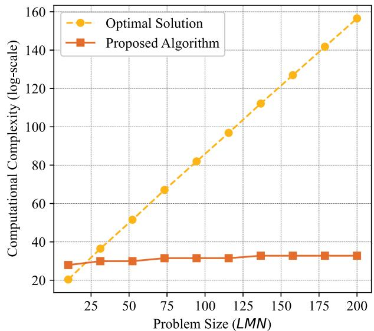  
Fig. 3. Complexity comparison showing the exponential growth of the optimal solution versus the polynomial growth of the proposed algorithm.

For A of dimension $L \times M \times N$ , exhaustive enumeration has complexity $\mathcal { O } ( 2 ^ { L M N } )$ . Given a feasible A, solving the continuous subproblem requires joint optimization with complexity $\mathcal { O } ( ( K N \mathbf { \bar { \nu } } + L M N + 2 M \bar { N } ) ^ { 3 } )$ . Thus, the overall complexity is $\stackrel { \cdot } { \cal O } \left( 2 ^ { L M N } \cdot ( K N + L M N + 2 M N ) ^ { 3 . 5 } \right)$ . To illustrate the complexity growth, we set the x-axis as $L M N$ , treating other parameters as constants. As shown in Fig. 3, the optimal solution’s complexity grows exponentially with $L M N$ , while the proposed algorithm exhibits polynomial growth, reducing computational overhead for applications.

2) Algorithmic Feasibility Analysis: The proposed algorithm provides periodic decision support for the DT system by solving the joint optimization problem to update cluster formation, power allocation, and trajectory planning of the UAV swarm. Each optimization cycle is designed to complete within a few seconds to maintain synchronization between digital and physical layers.

Feasibility is evaluated under DT latency constraints in a scenario with $L = 5 , M = 5$ , and $N = 3 0 \ ( L M N = 7 5 0 )$ Owing to the fast convergence of the BCD framework, the number of global iterations $T _ { \mathrm { B C D } }$ is typically 10–15. The dominant computational complexity is $\dot { \mathcal { O } } ( ( L M \mathbf { \bar { N } } ) ^ { 3 . 5 } )$ , significantly lower than the exhaustive search $\dot { \mathcal { O } } ( 2 ^ { L M N } )$ . This time scale is consistent with the task-level strategy update frequency in DT systems, thereby fulfilling the DT requirements for decision-making support.

3) Convergence Analysis: We adopt the BCD framework to decompose problem $\mathcal { P }$ into four subproblems, which are solved iteratively. Owing to power and trajectory constraints as well as a fixed terminal position, the throughput is upper bounded, while the $\mathrm { U A V } ^ { \ , } \mathbf { s }$ power consumption in the denominator is lower bounded, ensuring that P has an upper bound.

At iteration $t ,$ given the feasible solution $( A ^ { t } , \bar { \eta } ^ { t } , P ^ { t } , Q ^ { t } )$ we solve a relaxed linear program and recover a binary solution via post-processing, which guarantees

$$
F \big ( A ^ { t + 1 } , \eta ^ { t } , P ^ { t } , Q ^ { t } \big ) \geq F \big ( A ^ { t } , \eta ^ { t } , P ^ { t } , Q ^ { t } \big ) .\tag{47}
$$

TABLE II SIMULATION PARAMETERS
<table><tr><td rowspan=1 colspan=1>Parameter</td><td rowspan=1 colspan=1>Description</td><td rowspan=1 colspan=1>Value</td></tr><tr><td rowspan=1 colspan=1> $\overline { { H } }$ </td><td rowspan=1 colspan=1>The fixed altitude of the UAV</td><td rowspan=1 colspan=1>50 m</td></tr><tr><td rowspan=1 colspan=1> $K _ { l }$ </td><td rowspan=1 colspan=1>Number of IoE groups</td><td rowspan=1 colspan=1>5</td></tr><tr><td rowspan=1 colspan=1> $V _ { m a x }$ </td><td rowspan=1 colspan=1>Maximum allowable speed of the UAV</td><td rowspan=1 colspan=1>60 m/s</td></tr><tr><td rowspan=1 colspan=1> $d _ { \mathrm { m i n } }$ </td><td rowspan=1 colspan=1>Minimum inter-UAV distance</td><td rowspan=1 colspan=1>5 m</td></tr><tr><td rowspan=1 colspan=1> $\overline { { T } }$ </td><td rowspan=1 colspan=1>Task execution time</td><td rowspan=1 colspan=1>120 s</td></tr><tr><td rowspan=1 colspan=1> $\overline { { B } }$ </td><td rowspan=1 colspan=1>Bandwidth of uplink channel</td><td rowspan=1 colspan=1>20 MHz</td></tr><tr><td rowspan=1 colspan=1> $P _ { m a x }$ </td><td rowspan=1 colspan=1>Maximum uplink power limit</td><td rowspan=1 colspan=1>5W</td></tr><tr><td rowspan=1 colspan=1> $\beta _ { 0 }$ </td><td rowspan=1 colspan=1>The channel power gain at the referencedistance $d _ { 0 } = 1 \mathrm { m }$ .</td><td rowspan=1 colspan=1> $\overline { { 1 . 4 2 \times 1 0 ^ { - 4 } } }$ </td></tr><tr><td rowspan=1 colspan=1> $\overline { { \sigma ^ { 2 } } }$ </td><td rowspan=1 colspan=1>Noise power at the UAV</td><td rowspan=1 colspan=1>-90 dBm</td></tr><tr><td rowspan=1 colspan=1> $\underline { { \boldsymbol { \gamma } } }$ </td><td rowspan=1 colspan=1>Path loss exponent</td><td rowspan=1 colspan=1>2</td></tr><tr><td rowspan=1 colspan=1> $\varepsilon _ { l }$ </td><td rowspan=1 colspan=1>The target AirComp MSE threshold forall clusters</td><td rowspan=1 colspan=1>-20 dB</td></tr><tr><td rowspan=1 colspan=1> $P _ { B }$ </td><td rowspan=1 colspan=1>Basic power consumption</td><td rowspan=1 colspan=1>1000 W</td></tr><tr><td rowspan=1 colspan=1> $P _ { I }$ </td><td rowspan=1 colspan=1>Induced power consumption</td><td rowspan=1 colspan=1>400 W</td></tr><tr><td rowspan=1 colspan=1> $\overline { { U _ { \mathrm { t i p } } } }$ </td><td rowspan=1 colspan=1>Tip speed of the rotor blade</td><td rowspan=1 colspan=1>200 m/s</td></tr><tr><td rowspan=1 colspan=1> $v _ { 0 }$ </td><td rowspan=1 colspan=1>Mean rotor induced velocity in hover</td><td rowspan=1 colspan=1>7.2 m/s</td></tr><tr><td rowspan=1 colspan=1> $d _ { \mathrm { 0 } }$ </td><td rowspan=1 colspan=1>Fuselage drag ratio</td><td rowspan=1 colspan=1>0.3</td></tr><tr><td rowspan=1 colspan=1> $s$ </td><td rowspan=1 colspan=1>Rotor solidity</td><td rowspan=1 colspan=1>0.05</td></tr><tr><td rowspan=1 colspan=1> $\overline { { A } }$ </td><td rowspan=1 colspan=1>Rotor disc area</td><td rowspan=1 colspan=1> $\overline { { 0 . 7 9 \mathrm { ~ m } ^ { 2 } } }$ </td></tr></table>

For ${ \mathcal { P } } _ { 2 } ,$ with $A ^ { t + 1 } , P ^ { t }$ , and $Q ^ { t }$ fixed, the objective is a fractional function with a linear numerator $\mathcal { F } ( \eta )$ and a convex denominator $\mathcal { G } ( \eta )$ . The Dinkelbach method ensures convergence to the optimal solution:

$$
F \big ( A ^ { t + 1 } , \eta ^ { t + 1 } , P ^ { t } , Q ^ { t } \big ) \geq F \big ( A ^ { t + 1 } , \eta ^ { t } , P ^ { t } , Q ^ { t } \big ) .\tag{48}
$$

Similarly, $\mathcal { P } _ { 3 } ^ { \prime }$ exhibits monotonic improvement. For ${ \mathcal { P } } _ { 4 } ,$ we apply the SCA method. A first-order Taylor expansion around the current point yields a convex approximation of the non-convex constraints. This results in a pseudo-convex objective that satisfies continuity conditions. Incorporating the Dinkelbach method further accelerates convergence:

$$
F \big ( A ^ { t + 1 } , \eta ^ { t + 1 } , { \cal P } ^ { t + 1 } , { \cal Q } ^ { t + 1 } \big ) \ge F \big ( A ^ { t + 1 } , \eta ^ { t + 1 } , { \cal P } ^ { t + 1 } , { \cal Q } ^ { t } \big ) .\tag{49}
$$

Combining all updates in each global iteration t, the overall objective satisfies

$$
F \bigl ( A ^ { t + 1 } , \eta ^ { t + 1 } , { \cal P } ^ { t + 1 } , { \cal Q } ^ { t + 1 } \bigr ) \geq F \bigl ( A ^ { t } , \eta ^ { t } , { \cal P } ^ { t } , { \cal Q } ^ { t } \bigr ) .\tag{50}
$$

Since F is upper bounded and the sequence $\{ F ^ { t } \}$ is monotonically non-decreasing, convergence is guaranteed.

## IV. SIMULATION AND RESULT

In this section, we present the simulation results that highlight the effectiveness of the proposed DT-empowered Air-Comp cluster formation for the IoE data aggregating system. The section is structured into three parts: simulation setup, detailed results, and comparison with other methods.

## A. Configuration and Parameters of the Simulation Scenario

1) Parameter Settings: The simulation scenario involves multiple UAVs and IoE device groups, designed to map realworld IoE environments characterized by widespread device distribution and dynamic operational conditions. The key configurations and parameters of the simulation are summarized in Table II. The UAV flight and aerodynamic parameters $( P _ { B } , \ P _ { I } , \ U _ { \mathrm { t i p } } , \ v _ { 0 } , \ d _ { 0 } , \ s , \ A )$ are adopted from [32]. For communication-related parameters such as $\sigma ^ { 2 } , B$ , and $\beta _ { 0 } .$ , we employ the configurations commonly used in UAV communication studies [39], [40].

2) Initialization Settings: In this scenario, we consider a total of 5 IoE device groups, with devices randomly distributed in proximity to the center of their respective groups within a $1 0 0 0 \times 1 0 0 0 m ^ { 2 }$ . During the task period $T = 1 2 0 s$ , the UAV swarm travels from a designated starting point to an endpoint.

a) Power Allocation Initialization: The power allocations of the IoE devices are initialized with equal values across all time slots. Specifically, the transmit powers are set as: $P \ = \ P _ { 1 } \ = \ \cdots \ = \ P _ { K } \ = \ 0 . 6 \mathrm { W }$ . b) Trajectory Design Initialization: The UAV trajectory is initialized via linear interpolation between the predefined start and end points, $\mathbf { q } _ { m } [ 1 ] \ = \ [ 0 , 0 ]$ , and ${ \bf q } _ { m } [ N ] ~ = ~ [ 1 0 0 0 , 1 0 0 0 ]$ This initialization yields a feasible straight-line path that satisfies the UAV mobility and velocity constraints in (17d) and (17e). This initialization assumes a predetermined flight path for the UAVs, which may not be optimal. These points connect the starting position to the terminal position, ensuring the trajectory adheres to the required path. c) AirComp Cluster Formation Initialization: AirComp cluster formation variables are initialized within a uniform distribution, under constraints (17f), (17g), and (17h). d) AirComp scale factor Initialization: The AirComp scale factors, denoted as $\eta _ { l , m } [ n ]$ , are initialized to the same value of $\eta _ { l , m } [ n ] = 1 \times 1 0 ^ { 3 }$ for all $( l , m , n ) \in { \mathcal { A } } .$ e) DT Synchronization and Update Overhead Parameters: In alignment with the theoretical framework established in [41], which provides a analysis of the energy expenditure associated with DT synchronization, the energy overhead introduced by DT synchronization is captured by (15), with the following parameters: baseline DT energy $\omega _ { 0 } = 1 \mathrm { W }$ , update-frequency dependent cost factor $\omega _ { 1 } = 2 . 5 \mathbf { W } \cdot \mathbf { s } ,$ and IoE device cost scaling factor $\kappa = 0 . 0 8$ . The DT update interval is fixed at $\Delta _ { t } = 1 \mathrm { s }$ unless specified otherwise.

## B. Performance Analysis of the DT-Empowered System

In this part, the analysis is conducted from several perspectives, including EE, system throughput, and UAV mobility.

1) Analysis of Performance in Various IoE Scenarios: We consider two IoE scenarios in this part, both scenarios involve $L \ = \ 5$ groups, with a maximum device transmit power of $P _ { m a x } \ = \ 5 W$ . In the first task scenario (Fig. 4(a)-(c)), the system is equipped with $M = 3 ~ \mathrm { U A V s }$ , and each IoE group contains $K _ { l } = 1 0$ IoE devices with $\Delta _ { t } = 1 \mathrm { s }$ . In the second scenario $\mathrm { ( F i g . ~ 5 ( a )  – ( c ) ) }$ , the number of UAVs increases to $M = 5 ,$ , and the number of IoE devices per group is $K _ { l } = 2 0$ with $\Delta _ { t } = 1 \mathrm { s }$

In the first IoE scenario, Fig. 4(a) illustrates the dynamic mobility of the UAV swarm, showing their speed variations across time slots. The results indicate that UAVs adjust their trajectories in real time to maintain proximity to the devices within their formations, ensuring efficient data aggregation. Fig. 4(b) depicts the UAV swarm trajectory design, demonstrating effective coordination that avoids collisions and redundant paths while ensuring complete coverage of all ground clusters in the simulation area. Fig. 4(c) visualizes the time slot allocation for each group, where different colors represent specific UAVs assigned to form formations with the groups during the given time slots. These results highlight the dynamic task allocation strategy, which ensures efficient data transmission without overlaps in UAV responsibilities.

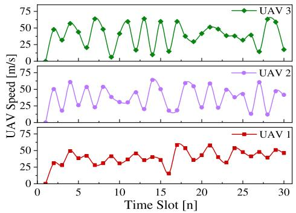  
(a)

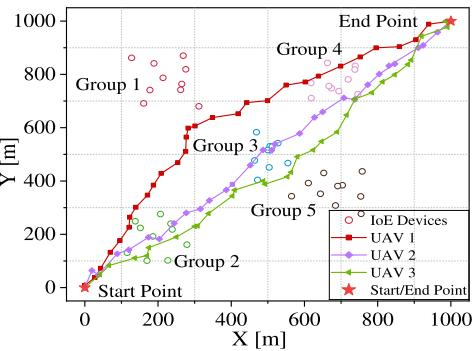  
(b)

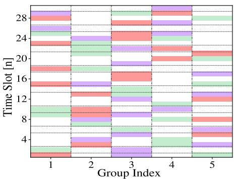  
(c)

Fig. 4. Simulation results for the IoE scenario with $M = 3 ~ \mathrm { U A V s }$ and $K _ { l } = 1 0$ in each group. (a) UAV speed variations across time slots; (b) UAV swarm trajectory and group coverage; (c) Time slot allocation showing UAV-cluster formations, where red, purple, and green bars indicate UAV 1, UAV 2, and UAV 3, respectively.  
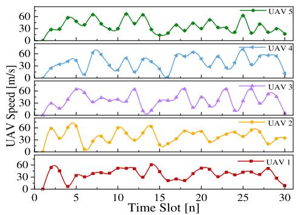  
(a)

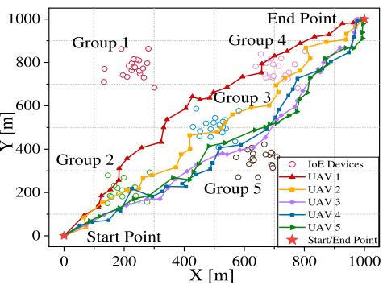  
(b)

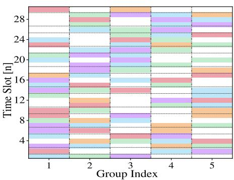  
(c)  
Fig. 5. Simulation results for the IoE scenario with $M = 5 ~ \mathrm { U A V s }$ and $K _ { l } = 2 0$ in each group. (a) UAV speed variations across time slots; (b) UAV trajectories demonstrating enhanced spatial coordination; (c) Time slot allocation with UAV-cluster formations, where red, orange, purple, blue, and green bars correspond to UAV 1 to UAV 5, respectively.

In the second scenario of Fig. 5, with $M \ = \ 5 \ \mathrm { \ U A V s }$ and $K _ { l } ~ = ~ 2 0$ IoE devices per group, the system exhibits enhanced task handling capacity and spatial coordination. As expected, upon increasing the number of UAVs, both the EE and throughput are increased with or without AirComp transmission, trajectory design, and scale factor coordination. Our proposed strategy is capable of offering the highest EE and throughput in all scenarios considered.

2) Effect of Parameter on Optimization and Performance: To validate the proposed algorithm, extensive simulations were conducted under varying UAV numbers, device densities, and power levels. AirComp-CF denotes our DT-enabled UAVdevice clustering method using the AirComp scheme. Results were compared with three baselines to evaluate energy efficiency and throughput.

Specifically, the baseline methods include: (1) OT-CF: This approach employs DT-empowered cluster formation, with UAV swarm service provision to devices via orthogonal frequency-division multiplexing. In this scheme, multiple devices within the same cluster can share the same frequency band by dividing it into multiple orthogonal subchannels. The achievable communication capacity between UAV n and the IoE cluster is given by $R _ { l . m } ^ { n } [ n ] = W \log _ { 2 } ( 1 + \mathrm { S I N R } _ { l , m } [ n ] )$ W is the bandwidth of a subchannel between UAV and IoE device in the cluster. (2) AirComp-CF Fixed-Traj. Design: This method employs DT-empowered cluster formation and uses AirComp for IoE data aggregation, but with a fixed UAV swarm trajectory that is not optimized. (3) AirComp-CF Fixed-Scal. Factor: This method employs DT-empowered cluster formation and uses AirComp for data aggregation, while service provision utilizes a fixed constant AirComp scaling factor.

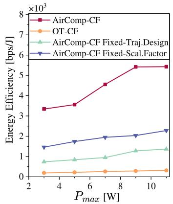  
(a)

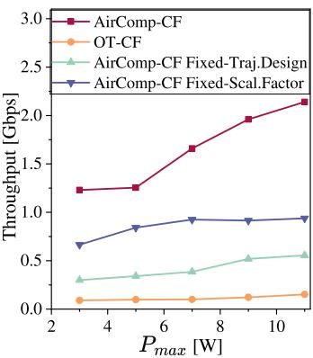  
(b)  
Fig. 6. (a) EE and (b) throughput of the IoE data aggregation task assisted by DT-empowered AirComp-based clusters under varying values of $P _ { m a x } .$

In Fig. 6(a) and (b), the simulations were set with $M = 3$ UAVs, $L \ = \ 5$ ground IoE groups, and $K _ { l } ~ = ~ 1 0$ devices per group, which illustrate the system’s performance under varying maximum transmit power levels, $P _ { m a x }$ . The proposed algorithm AirComp-CF achieves significantly higher EE compared to the baseline methods, with improvements becoming more pronounced as $P _ { m a x }$ increases. This is attributed to the optimization under the AirComp data aggregation scheme, which efficiently aggregates signals and minimizes energy consumption, while also benefiting from the fact that the synchronization overhead of DT is independent of $P _ { m a x }$ . The throughput results follow a similar trend, with the AirComp-CF achieving up to 6× the throughput of the OT-CF method at high power levels. The AirComp-CF Fixed-Traj. Design and AirComp-CF Fixed-Scal. Factor baselines exhibit limited scalability, emphasizing the necessity of dynamic optimization in such scenarios.

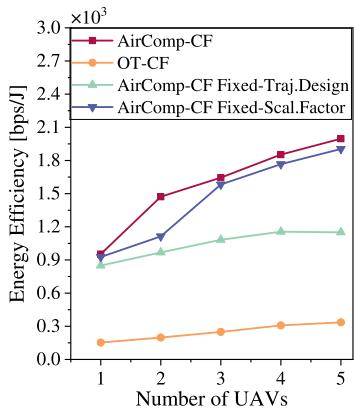  
(a)

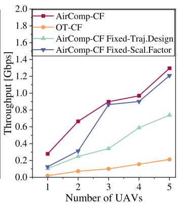  
(b)  
Fig. 7. (a) EE and (b) throughput of the IoE data aggregation task assisted by DT-empowered AirComp clusters for various number of UAVs, where $K _ { l } = 1 0$ in each cluster. As the number of UAVs increases, the size of the data aggregation task is proportionally scale up.

The impact of increasing the number of UAVs on system performance is shown in Fig. 7(a) and (b). The simulations were set with $P _ { m a x } = 5 W$ , L = 5 groups, and $K _ { l } = 1 0$ device per IoE group. The proposed algorithm demonstrates its superiority in multi-UAV tasks, leveraging the flexibility of UAV trajectory design optimization and dynamic task allocation to achieve enhanced EE and throughput. As the number of UAVs increases, the algorithm ensures balanced resource utilization, resulting in a coordinated and efficient system. Although the DT synchronization overhead increases with the number of UAVs, the overall system efficiency still improves as the number of UAVs rises. These results highlight the proposed algorithm’s ability to dynamically adapt to increasing task demands and efficiently coordinate multiple UAVs, making it particularly advantageous in complex IoE environments.

In Fig. 8, we fix $M = 3 , P _ { \mathrm { m a x } } = 5 W$ , and $L = 5 ,$ , and evaluate performance with varying device densities per group. The proposed algorithm achieves up to 6.2× higher energy efficiency than OT-CF by alleviating communication bottlenecks in multi-device aggregation. As device density increases, the DT synchronization overhead also rises, which impacts the EE of the system. However, the proposed algorithm still outperforms OT-CF, as the increase in system throughput compensates for the higher synchronization costs. In contrast, OT-CF suffers from rigid spectrum allocation, leading to resource underutilization as density grows. These results highlight the algorithm’s effectiveness in complex IoE settings, with throughput analysis further validating its robustness.

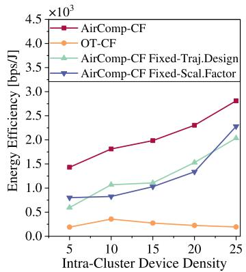  
(a)

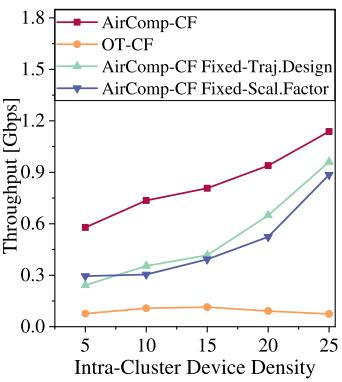  
(b)  
Fig. 8. (a) EE and (b) throughput of the IoE data aggregation task assisted by DT-empowered AirComp clusters for various intra-cluster device density.

## C. Comparison of DT-Empowered and Pre-Set Scheme

This section aims to validate the effectiveness of the DT in enhancing variable optimization for IoE data aggregation tasks through comparative experiments. To this end, we design two categories of schemes: DT-assisted optimization schemes and baseline schemes without DT (pre-set strategy). This pre-set strategy is a widely adopted approach in current UAV swarm missions, in which parameters are predetermined and kept constant throughout execution to avoid real-time optimization complexity.

1) Comparison Scheme Design: (1) DT-CF-AirComp: DT-assisted UAV cooperative cluster formation combined with AirComp-based parallel transmission. (2) DT-CF-OT: DT-assisted cluster formation combined with orthogonal transmission. (3) Pre-set-AirComp: All task-related variables (e.g., UAV trajectory, cluster formation) are pre-determined and remain static, while intra-cluster communication still adopts the AirComp strategy. (4) Pre-set-OT: task variables are pre-determined and fixed, and orthogonal transmission is employed. The DT-enabled schemes leverage synchronized models of the UAV swarm network to jointly optimize UAV trajectories, cluster formation, and power allocation based on current and historical state information. In contrast, pre-set schemes rely on fixed, manually configured variables and lack the ability to adapt to real-time network dynamics.

2) Experimental Configuration: The transmit power of each IoE device is initialized to the maximum value $P _ { m a x } ,$ and the trajectory of each UAV follows the shortest path from its starting point to the destination, while satisfying constraint (17e). Each UAV is assigned a pre-defined cluster associated with its task, and the AirComp scaling factors are uniformly initialized as $\eta _ { l , m } [ n ] = 1 \times 1 0 ^ { 3 }$ for all $( l , m , n ) \in { \mathcal { A } }$

3) Results and Analysis: As shown in Fig. 9, the results illustrate the impact of different schemes on energy efficiency and throughput as the number of UAVs increases. Compared to their respective pre-set baselines, DT-enabled schemes demonstrate notable improvements. The DT-CF-AirComp scheme achieves approximately 42% higher energy efficiency than Pre-set-AirComp, while DT-CF-OT yields an improvement of around 44% over Pre-set-OT. In terms of throughput, DT-CF-AirComp outperforms Pre-set-AirComp by approximately 34%, and DT-CF-OT achieves about 245% improvement over Pre-set-OT. These results verify that the DT-enabled framework enhances system performance by synchronizing the physical UAV swarm state with the DT layer and enabling iterative decision optimization, leading to superior performance over static pre-set methods.

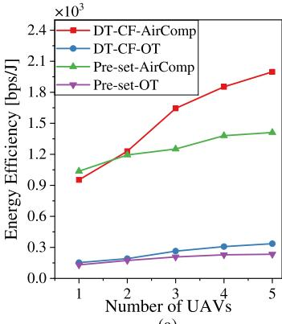  
(a)

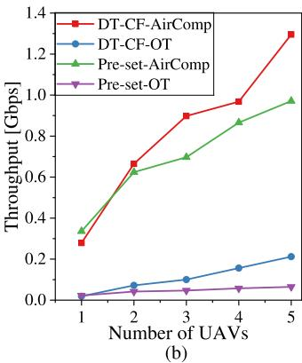  
Fig. 9. Comparison of (a) EE and (b) throughput performance under different numbers of UAVs for DT-empowered and Pre-set schemes, demonstrating the effectiveness of DT-assisted IoE data aggregation scheme.

## V. CONCLUSION

This paper presents a DT-empowered UAV-device cluster formation framework, with AirComp-based transmission for efficient IoE data aggregation. We jointly optimize cluster formation, AirComp scaling, power allocation, and UAV trajectory to maximize energy efficiency and throughput under signal distortion constraints. To solve the resulting MINLP-FP problem, a low-complexity BCD-based algorithm is developed. Simulation results show that the proposed approach outperforms non-DT baselines by up to 42% in energy efficiency and 34% in throughput. These findings demonstrate the effectiveness of DT-enabled swarm coordination and highlight its potential for scalable and intelligent IoE network design. Future work may explore more scalable coordination mechanisms under uncertain or adversarial environments as well as the integration of learning-based approaches to enhance realtime decision-making in dynamic IoE scenarios.

## REFERENCES

[1] Y. Zhao et al., “Joint content caching, service placement, and task offloading in UAV-enabled mobile edge computing networks,” IEEE J. Sel. Areas Commun., vol. 43, no. 1, pp. 51–63, Jan. 2025.

[2] B. Yang, H. Shi, and X. Xia, “Federated imitation learning for UAV swarm coordination in urban traffic monitoring,” IEEE Trans. Ind. Informat., vol. 19, no. 4, pp. 6037–6046, Apr. 2023.

[3] T. Do-Duy, L. D. Nguyen, T. Q. Duong, S. R. Khosravirad, and H. Claussen, “Joint optimisation of real-time deployment and resource allocation for UAV-aided disaster emergency communications,” IEEE J. Sel. Areas Commun., vol. 39, no. 11, pp. 3411–3424, Nov. 2021.

[4] L. Tong et al., “TriRNet: Real-time rail recognition network for UAVbased railway inspection,” IEEE Trans. Intell. Transp. Syst., vol. 25, no. 5, pp. 3927–3943, May 2024.

[5] H. Menouar, I. Guvenc, K. Akkaya, A. S. Uluagac, A. Kadri, and A. Tuncer, “UAV-enabled intelligent transportation systems for the smart city: Applications and challenges,” IEEE Commun. Mag., vol. 55, no. 3, pp. 22–28, Mar. 2017.

[6] C. Li, Y. Gan, Y. Zhang, and Y. Luo, “A cooperative computation offloading strategy with on-demand deployment of multi-UAVs in UAVaided mobile edge computing,” IEEE Trans. Netw. Service Manage., vol. 21, no. 2, pp. 2095–2110, Apr. 2024.

[7] A. M. Vegni, V. Loscr´ı, C. T. Calafate, and P. Manzoni, “Communication technologies enabling effective UAV networks: A standards perspective,” IEEE Commun. Standards Mag., vol. 5, no. 4, pp. 33–40, Dec. 2021.

[8] J. Wu, C. Luo, G. Min, and S. McClean, “Formation control algorithms for multi-UAV systems with unstable topologies and hybrid delays,” IEEE Trans. Veh. Technol., vol. 73, no. 9, pp. 12358–12369, Sep. 2024.

[9] M. Zhao, X. Li, Y. Huang, H. Li, B. Zhang, and M. Peng, “IC2Sswarm: When digital twin meets collaborative ISR,” IEEE Commun. Mag., vol. 63, no. 4, pp. 221–227, Apr. 2025.

[10] Y. Wu, K. Zhang, and Y. Zhang, “Digital twin networks: A survey,” IEEE Internet Things J., vol. 8, no. 18, pp. 13789–13804, Sep. 2021.

[11] B. Jiang, J. Du, C. Jiang, Z. Han, A. Alhammadi, and M. Debbah, “Overthe-air federated learning in digital twins empowered UAV swarms,” IEEE Trans. Wireless Commun., vol. 23, no. 11, pp. 17619–17634, Nov. 2024.

[12] S. Xu et al., “Deep reinforcement learning based data-driven mapping mechanism of digital twin for Internet of Energy,” IEEE Trans. Netw. Sci. Eng., vol. 11, no. 4, pp. 3876–3890, Jul. 2024.

[13] Z. Sun, Z. Wei, N. Yang, and X. Zhou, “Two-tier communication for UAV-enabled massive IoT systems: Performance analysis and joint design of trajectory and resource allocation,” IEEE J. Sel. Areas Commun., vol. 39, no. 4, pp. 1132–1146, Apr. 2021.

[14] B. Hazarika, K. Singh, C.-P. Li, A. Schmeink, and K. F. Tsang, “RADiT: Resource allocation in digital twin-driven UAV-aided Internet of Vehicle networks,” IEEE J. Sel. Areas Commun., vol. 41, no. 11, pp. 3369–3385, Nov. 2023.

[15] M. Wu, Y. Xiao, Y. Gao, and M. Xiao, “Digital twin for UAV-RIS assisted vehicular communication systems,” IEEE Trans. Wireless Commun., vol. 23, no. 7, pp. 7638–7651, Jul. 2024.

[16] A. Islam and S. Y. Shin, “A digital twin-based drone-assisted secure data aggregation scheme with federated learning in artificial intelligence of things,” IEEE Netw., vol. 37, no. 2, pp. 278–285, Mar. 2023.

[17] M. Kang and S.-W. Jeon, “Energy-efficient data aggregation and collection for multi-UAV-enabled IoT networks,” IEEE Wireless Commun. Lett., vol. 13, no. 4, pp. 1004–1008, Apr. 2024.

[18] J. Wang, Y. Li, Q. Li, and Q. Zhang, “Optimal power allocation for overthe-air computation with correlated data,” IEEE Wireless Commun. Lett., vol. 13, no. 11, pp. 3079–3083, Nov. 2024.

[19] Y. Ma, K. Liu, Y. Liu, and L. Zhu, “Timeliness and secrecy-aware uplink data aggregation for large-scale UAV-IoT networks,” IEEE Internet Things J., vol. 11, no. 10, pp. 17341–17356, May 2024.

[20] M. Li, S. He, and H. Li, “Minimizing mission completion time of UAVs by jointly optimizing the flight and data collection trajectory in UAV-enabled WSNs,” IEEE Internet Things J., vol. 9, no. 15, pp. 13498–13510, Mar. 2022.

[21] D. Han, T. Shi, T. Han, and Z. Zhou, “Joint optimization of trajectory and node access in UAV-aided data collection system,” IEEE Syst. J., vol. 17, no. 2, pp. 2574–2585, Jun. 2023.

[22] X. Cao, G. Zhu, J. Xu, and K. Huang, “Cooperative interference management for over-the-air computation networks,” IEEE Trans. Wireless Commun., vol. 20, no. 4, pp. 2634–2651, Apr. 2021.

[23] Z. Wang, Y. Shi, Y. Zhou, H. Zhou, and N. Zhang, “Wirelesspowered over-the-air computation in intelligent reflecting surface-aided IoT networks,” IEEE Internet Things J., vol. 8, no. 3, pp. 1585–1598, Feb. 2021.

[24] Y. Huang, X. Li, M. Zhao, H. Li, and M. Peng, “Asynchronous federated learning via over-the-air computation in LEO satellite networks,” IEEE Trans. Wireless Commun., vol. 23, no. 12, pp. 19885–19901, Dec. 2024.

[25] S. Jing and C. Xiao, “Transceiver beamforming for over-the-air computation in massive MIMO systems,” IEEE Trans. Wireless Commun., vol. 22, no. 10, pp. 6978–6992, Oct. 2023.

[26] W. Liu, X. Zang, Y. Li, and B. Vucetic, “Over-the-air computation systems: Optimization, analysis and scaling laws,” IEEE Trans. Wireless Commun., vol. 19, no. 8, pp. 5488–5502, Aug. 2020.

[27] X. Cao, G. Zhu, J. Xu, and K. Huang, “Optimized power control for over-the-air computation in fading channels,” IEEE Trans. Wireless Commun., vol. 19, no. 11, pp. 7498–7513, Nov. 2020.

[28] M. Fu, Y. Zhou, Y. Shi, C. Jiang, and W. Zhang, “UAV-assisted multi-cluster over-the-air computation,” IEEE Trans. Wireless Commun., vol. 22, no. 7, pp. 4668–4682, Jul. 2023.

[29] Z. Wei et al., “UAV-assisted data collection for Internet of Things: A survey,” IEEE Internet Things J., vol. 9, no. 17, pp. 15460–15483, Sep. 2022.

[30] Y. Bian et al., “Joint trajectory control, power control, and collection schedule in UAV-assisted anti-jamming wireless data collection with imperfect CSI,” IEEE Commun. Lett., vol. 28, no. 12, pp. 2839–2843, Dec. 2024.

[31] P. Jia, X. Wang, and X. Shen, “Accurate and efficient digital twin construction using concurrent end-to-end synchronization and multiattribute data resampling,” IEEE Internet Things J., vol. 10, no. 6, pp. 4857–4870, Mar. 2023.

[32] Y. Zeng, J. Xu, and R. Zhang, “Energy minimization for wireless communication with rotary-wing UAV,” IEEE Trans. Wireless Commun., vol. 18, no. 4, pp. 2329–2345, Apr. 2019.

[33] A. S¸ ahin and R. Yang, “A survey on over-the-air computation,” IEEE Commun. Surv. Tut., vol. 25, no. 3, pp. 1877–1908, 3rd Quart., Mar. 2023.

[34] Y. Li, M. Jiang, G. Zhang, and M. Cui, “Joint optimization for multiantenna AF-relay aided over-the-air computation,” IEEE Trans. Veh. Technol., vol. 71, no. 6, pp. 6744–6749, Jun. 2022.

[35] J. Liu, Y. Gong, and K. Huang, “Digital over-the-air computation: Achieving high reliability via bit-slicing,” IEEE Trans. Wireless Commun., vol. 24, no. 5, pp. 4101–4114, May 2025.

[36] M. Fu, Y. Zhou, Y. Shi, T. Wang, and W. Chen, “UAV-assisted overthe-air computation,” in Proc. IEEE Int. Conf. Commun., Jun. 2021, pp. 1–6.

[37] Y. Zhang, W. Liang, Z. Xu, and X. Jia, “Mobility-aware service provisioning in edge computing via digital twin replica placements,” IEEE Trans. Mobile Comput., vol. 23, no. 12, pp. 11295–11311, Dec. 2024.

[38] Y. Li, H. Zhang, K. Long, C. Jiang, and M. Guizani, “Joint resource allocation and trajectory optimization with QoS in UAV-based NOMA wireless networks,” IEEE Trans. Wireless Commun., vol. 20, no. 10, pp. 6343–6355, Oct. 2021.

[39] Y. Zeng and R. Zhang, “Energy-efficient UAV communication with trajectory optimization,” IEEE Trans. Wireless Commun., vol. 16, no. 6, pp. 3747–3760, Jun. 2017.

[40] W. Khawaja, I. Guvenc, D. W. Matolak, U. C. Fiebig, and N. Schneckenburger, “A survey of air-to-ground propagation channel modeling for unmanned aerial vehicles,” IEEE Commun. Surv. Tut., vol. 21, no. 3, pp. 2361–2391, 3rd Quart., Mar. 2019.

[41] Y. Li, W. Liang, Z. Xu, W. Xu, and X. Jia, “Budget-constrained digital twin synchronization and its application on fidelity-aware queries in edge computing,” IEEE Trans. Mobile Comput., vol. 24, no. 1, pp. 165–182, Jan. 2025.


Yuhang Zhang received the B.S. degree in Internet of Things engineering from BUPT, China, in 2024, and the B.S. degree (Hons.) from the Queen Mary University of London (QMUL), U.K., in 2024. He is currently pursuing the master’s degree in communication engineering with BUPT. His research interests include intent-driven network management and UAV swarm networks.


Yansong Huang received the B.S. degree in electronic engineering from Beijing University of Posts and Telecommunications (BUPT), China, in 2022, where he is currently pursuing the master’s degree in information and communication engineering. His research interests include integrated sensing, communication, and computation in 6G.


Haiyan Li received the B.S. degree in information management and information systems from Jilin University, Jilin, China, in 2020, and the M.S. degree in computer science and technology from the National Innovation Institute of Defense Technology, Beijing, China, in 2023. He is currently pursuing the Ph.D. degree in information and communication engineering with BUPT, Beijing. His current research interests include UAV clustering and resource allocation.

  
Lu Zhang received the B.S. degree in electronic information engineering from Nanjing University of Posts and Telecommunications, China, in 2023. She is currently pursuing the master’s degree in communication engineering with Beijing University of Posts and Telecommunications (BUPT), China. Her research interests include UAV swarm networks and AI-driven networks.


Zixuan Zhang received the Ph.D. degree from the National University of Defense Technology in 2022. He is currently an Assistant Researcher with the Intelligent Gaming and Decision-Making Laboratory, China. His research interests include Uncrewed swarm intelligence.


Xuan Li (Senior Member, IEEE) received the B.Eng. degree from Beijing Institute of Technology, China, and the Ph.D. degree from the University of Southampton (UoS), U.K. She has been an Associate Professor with BUPT, China, since 2021. Before joining BUPT, she was a Post-Doctoral Research Fellow with UoS and then a Senior Data Scientist with Trilateral Research Ltd., U.K. Her research interests include AI-driven networks, UAV swarm network management, and human-swarm interaction.


Mugen Peng (Fellow, IEEE) received the Ph.D. degree in communication and information systems from BUPT, Beijing, China, in 2005. Afterward, he joined BUPT, where he has been a Full Professor with the School of Information and Communication Engineering since 2012. In 2014, he was an Academic Visiting Fellow with Princeton University, USA. He leads a Research Group focusing on wireless transmission and networking technologies with the State Key Laboratory of Networking and Switching Technology, BUPT. He was a recipient of the 2018 Heinrich Hertz Prize Paper Award, the 2014 IEEE ComSoc AP Outstanding Young Researcher Award, and the Best Paper Award in the JCN 2016. He has been on the editorial/associate editorial board of IEEE Communications Magazine, the Internet of Things journal, and IEEE ACCESS.