# Digital Twins for Low-Altitude UAV Networks–Cooperation and Learning

Longyu Zhou , Member, IEEE, Supeng Leng , Senior Member, IEEE, Yuchen Liu , Member, IEEE, Zehui Xiong , Senior Member, IEEE, and Tony Q. S. Quek , Fellow, IEEE

Abstract—The Digital Twin (DT) system has become a new paradigm to empower Uncrewed Aerial Vehicles (UAV) networks for low-altitude applications, such as parcel delivery. However, due to high computing complexity, traditional DT technology might confront challenges to imitating highly dynamic UAVs in largescale parcel delivery scenarios. It causes a negative influence on low-latency and high-accuracy delivery. To address the issue, we propose a terminal-edge cooperative multi-scale DT framework. It can perform a cooperative DT implementation with a cross-layer computing resource orchestration based on a multi-scale imitation manner. Explicitly, we propose a graph matching network based DT algorithm to run macro-scale DTs at the edge. It can assist edge UAVs in exploring feasible delivery associations among UAV groups and parcel clusters based on information on UAV topology and parcel destinations for a high successful delivery ratio. We then propose a Competitive and Cooperative Reinforcement Learning (CCRL) based DT algorithm to implement micro-scale DTs at the terminal. It can enable UAVs to implement low-latency delivery by optimizing delivery paths with low energy consumption. We demonstrate the effectiveness of the proposed framework with verifications under multiple metrics. The results show that our solution provides a real-time UAV delivery performance, with up to 94% successful delivery ratio, under a low system latency compared to the state-of-the-art solutions.

Index Terms—Digital twin, low-altitude UAVs, macro-scale DT, micro-scale DT.

## I. INTRODUCTION

HE development of Artificial Intelligence (AI) and the gies has created a virtuous cycle through mutual empowerment and evolution [1], [2]. The interplay marks the beginning of

Internet of Things (IoT) applications transitioning into the era of the Internet of Everything (IoE). It also spurs many emerging IoT application paradigms. With the advantages of miniaturization and flexibility of Uncrewed Aerial Vehicles (UAVs), the low-altitude UAV network is booming to embrace future IoT applications in the context of 6G ultra-low latency and global connection, such as parcel delivery, smart agriculture, and low-altitude autonomous driving [3]. Taking the parcel delivery as an instance, UAVs can collect physical environment information to transmit to the cloud server. The server can also receive the delivery mission information from warehouses. This information can be jointly processed to explore real-time and accurate delivery paths [4], [5].

However, several challenges restrict the delivery efficiency of UAVs in the traditional centralized pattern [6], [7]. Explicitly, UAVs may not deliver distant parcels due to limited flight energy in large-scale delivery scenarios. The energy limitation also makes implementing heavyweight parcel delivery in complex physical environments difficult. A multi-UAV cooperation manner is a feasible solution to achieve large-scale parcel delivery for low-latency delivery requirements. Unfortunately, UAVs cannot accurately estimate the changes in physical environments due to the discrete computing resource distribution. In this case, UAVs might implement infeasible path planning decisions to perform low-efficiency delivery cooperation with the risk of physical collisions and high energy consumption. It can significantly reduce the successful delivery ratio. In addition, UAVs can experience further performance declines due to inefficient cooperation considering changes in the number of parcels and delivery destinations.

Motivated by the Computing Power Network (CPN) [8], [9], we can orchestrate the discrete computing resources of UAVs to a virtual computing resource pool. It slices the computing resources for diverse delivery based on different requirements. Nonetheless, the cloud CPN pattern incurs high latency due to the remote data transmission. We can construct an edge CPN to shorten the transmission distance. However, it cannot always ensure accurate parcel delivery due to the confining network management ability of edge servers in dynamic delivery scenarios.

As one of the most popular 6G technologies, the Digital Twin (DT) can assist edge servers in enhancing network management ability by constructing a virtual UAV delivery scenario [10], [11]. We can ensure synchronous virtual mapping for accurate UAV delivery imitations by integrating sensing and communication resources of UAVs [12]. The high-fidelity mapping also assists UAVs in scheduling feasible computing resources for suitable cooperative delivery decisions with collision avoidance [13] and a high successful delivery ratio. Regrettably, when there are changes in delivery destinations, the existing DT solutions cannot always derive feasible delivery paths due to high computing complexity.

This paper proposes a terminal-edge cooperative multi-scale DT framework to ensure low-latency UAV delivery with a high successful delivery ratio. We can deploy multiple edge UAVs with small-sized base stations to fly to assigned air spaces with multiple terminal UAVs. For each group, edge UAVs receive positions, energy, and load of UAVs as well as environment information to construct a macro-scale DT model based on delivery missions. It can collaborate computing resources of UAVs to make UAV groups match feasible delivery missions for a high successful delivery ratio. The terminal UAVs construct a micro-scale DT model based on surrounding environment data to plan delivery paths for low-latency delivery cooperation autonomously. In this context, our framework realizes the decoupling of traditional high-complexity DT framework with a multi-scale cooperative DT imitation. The main contributions are summarized as follows.

We propose a multi-scale DT framework. Different from the existing terminal-edge cooperation pattern, it is the first exploration of multi-scale DT cooperation for UAV delivery systems. The cooperation reduces the existing system complexity by decoupling the delivery mission into two independent sub-tasks. Specifically, edge UAVs construct macro-scale DT models based on information on parcels, UAVs, and the environment. The DT can explore feasible delivery associations between UAV groups and parcel clusters. With the associations, terminal UAVs then construct micro-scale DT models based on local environment information, parcels, and self-information. The DT can autonomously plan feasible delivery paths through cooperative environment estimation.

To achieve accurate delivery associations for a high successful delivery ratio, we propose a graph matching network based DT algorithm. Explicitly, our algorithm enables macro-scale DT models to imitate the current states of UAV topology and parcel clusters simultaneously through a cross-graph aggregation operation. The imitation decisions are used to derive optimal delivery associations among UAV groups and parcel clusters for accurate delivery. In addition, our algorithm can flexibly adjust the association relations by jointly estimating changes in delivery environments and weights of parcels.

We propose a Competitive and Cooperative Reinforcement Learning (CCRL) based DT algorithm for real-time delivery. On the one hand, our algorithm enables micro-scale DT models to derive suitable delivery paths through a competitive learning manner based on the estimation of delivery latency for energy savings. On the other hand, our algorithm optimizes path planning decisions through lightweight information exchanges among UAVs to shorten delivery paths considering collision avoidance under a cooperative learning manner. Our algorithm can also assign feasible numbers of UAVs to perform cooperative delivery for heavy parcels. This pattern can obviously reduce the delivery frequency for low-latency delivery with low communication energy consumption.

The remainder of this paper is organized as follows. Section II summarizes the related work. Section III describes our framework. The objective is formulated in Section IV. The proposed algorithm is presented in Section V. We summarize the work in Section VII.

## II. RELATED WORK

In this section, we provide the background of DT and stateof-the-art investigations of DT-based UAV delivery.

## A. Background

DT system: The DT concept originates from the NASA early space program approximately [14]. With the development of Machine Learning (ML) and IoT, the DT system has evolved to serve emerging 5G and 6G applications. Currently, the DT system is defined as “a collection of various services (e.g., monitoring, optimization, predictive maintenance, etc)” [15]. With the latest definition, we can categorize the DT system into sensing DT, imitation DT, prediction DT, and maintenance DT [16]. The sensing DT collects diverse physical information from the physical space to enrich the virtual space through a specific interface. In the virtual space, the imitation DT can simulate the status of the components for customized services. The prediction DT can provide real-time status update for accurate services. The whole DT operation is monitored by the maintenance DT to cope with emergencies.

Advantages of DT for UAV delivery: Based on the above discussion, one of the most important advantages is the continued lifetimes between the real and virtual spaces [17], [18]. It can assist UAVs in obtaining complete delivery mission information for real-time delivery. In addition, it can make UAVs invite feasible neighbors to implement cooperative delivery based on the estimation of physical scenarios. On the other hand, the DT can implement flexible imitations of physical scenarios for diverse delivery application requirements with an elastic imitation function [19]. It can make UAV delivery systems adaptively cope with different mission requirements, such as delivery latency and successful delivery ratio, in dynamic physical scenarios.

## B. DT-Based UAV Delivery

The DT-based UAV delivery is one of the most attractive applications for the low-altitude economy. Firstly, the authors in [20] developed a five-dimensional structure model of the UAV parcel delivery system. The model could design an overall framework of a logistics distribution system. It provided insight into the construction of DT for UAV delivery systems. We discuss the state-of-the-art investigations from perspectives of real time and accuracy of delivery.

To ensure an accurate delivery performance, the authors in [21] proposed a concept of shop-floor logistics and manufacturing synchronization. It synchronized the manufacturing system, information sharing, decision-making, and operations. In addition, the authors designed a mixed-integer programmingbased synchronization mechanism for accurate delivery performance. Based on this, the authors in [22] developed a selfadaptive collaborative control solution to improve delivery accuracy by optimizing delivery decisions. The decision optimization was ensured by using a hybrid automata that can accurately model the dynamic behaviors of UAVs. Nonetheless, it is challenging to achieve high-accuracy UAV delivery in large-scale delivery scenarios due to the limited computing resources of UAVs.

On the other hand, to guarantee real-time UAV delivery, the authors in [23] developed a DT platform for UAV delivery. The UAV flight data and parcel information are uploaded to the Ali cloud through the 5G communication technology. The digital twin platform imitates the UAV delivery process to make real-time decisions. Motivated by the platform, the authors in [24] proposed a large-scale UAV delivery network simulation solution to reduce parcel delivery delay due to the sudden increase in parcel delivery numbers. The simulation software could complete the delivery of a month with almost 500 million parcels in less than 30 minutes. Unfortunately, the existing work cannot always ensure low-latency delivery when the delivery destinations change during the delivery process.

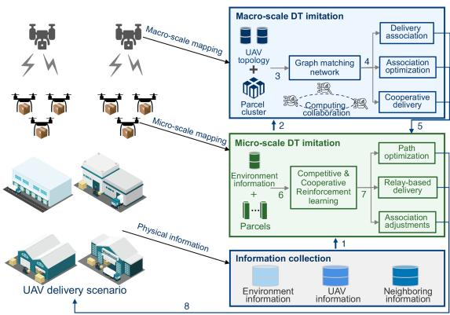  
Fig. 1. Illustration of terminal-edge cooperative multi-scale DT framework.

The existing DT solutions implement the UAV delivery mission effectively in simple delivery scenarios. However, the existing DT-based delivery solutions cannot effectively cope with changes in physical environments to meet the requirements of low latency and high successful delivery ratio simultaneously due to limited adaptation ability. In addition, it is time-consuming to support large-scale DT imitations using the existing cloud computing-based DT solution due to the high computing complexity of the traditional DT. It cannot guarantee real-time parcel delivery. It might be feasible to design a multi-scale DT paradigm to ensure low-latency delivery with a high successful delivery ratio.

## III. SYSTEM MODEL

In this section, we describe our terminal-edge cooperative multi-scale DT framework in details.

## A. Preliminary

In Fig. 1, we illustrate the terminal-edge cooperative multiscale DT framework with two main components: parcel cluster and UAV group. Specifically, the edge UAVs are deployed in different airspace to manage multiple terminal UAVs. The index of edge UAVs is $\mathcal { N } = \{ 1 , \bar { 2 } , \dots , \bar { N } \}$ . The index of terminal UAVs is $; { \mathcal { M } } = \{ 1 , 2 , \dots , { \dot { M } } \}$ <sup>2</sup>. The managers of warehouses can trans-<sup>= 1 2</sup>mit parcel delivery missions to edge UAVs via a data center. Edge UAVs cluster these missions based on delivery destinations. The index of parcel clusters is denoted as $\mathcal { A } = \mathbf { \bar { \{ } } 1 ,  2 , \ldots , A \}$ . The parcels in the cluster a are indexed by $\mathcal { A } _ { a } = \{ a _ { 1 } , a _ { 2 } , \ldots , a _ { k } \}$ <sup>=</sup>With information on parcel delivery and UAV topology, edge UAVs implement a macro-DT imitation operation to select feasible parcel clusters to undertake corresponding delivery missions autonomously. Terminal UAVs can implement a micro-DT imitation operation based on information about physical delivery environments. It can collaborate with feasible neighbor UAVs to construct optimal delivery paths with low energy consumption. We give key characteristics of parcel clusters and UAV groups.

Parcel clusters: Parcel clusters have different delivery destinations, various delivery latencies, and weights. There is also a possibility of changes in delivery destinations.

UAV groups: An edge UAV can manage a UAV group with multiple terminal UAVs. UAV groups have different numbers of UAVs with various energies.

## B. Macro-Scale DT Imitation

The macro-scale DT models can perform three prominent functions: adaptive delivery association, cooperative parcel delivery, and dynamic computing collaboration.

Adaptive delivery association: For the parcel k, we can quantify the parcel information $h _ { k }$ as $h _ { k } = \{ t _ { k } , d _ { k } , w _ { k } , p _ { k } , P _ { k } \}$ where $t _ { k }$ <sup>=</sup>is the expected delivery latency; $d _ { k }$ is the physical delivery distance; $w _ { k }$ is the weight of parcel k which can directly affect energy consumption of UAVs; pk is position of parcel k which is used to record delivery path; $P _ { k }$ is the destination position of parcel k. We can allow logistics managers to push up-todate delivery information to the center server. It ensures the edge UAVs can perform accurate delivery assignments. For UAV i, we can represent the UAV state $h _ { i }$ as $\dot { h } _ { i } = \{ p _ { i } , v _ { i } , \alpha _ { i } , \mathrm { E n } _ { i } , \{ e _ { i , j } \} \}$ where $p _ { i } , v _ { i } ,$ , and $\alpha _ { i }$ <sup>=</sup>are position, velocity, and posture of UAV $i ,$ respectively; $\operatorname { E n } _ { i }$ is the usable energy; $\{ \boldsymbol { e } _ { i , j } \}$ is the set of association relation of UAV i and $j .$ The element of the set $e _ { i , j }$ is a binary indicator, where $e _ { i , j } = 1$ denotes that UAV i can directly implement information exchanges with UAV j, and vice versa.

We allow edge UAV n to formulate UAV topology model $G ^ { n } ( V ^ { n } , E ^ { n } )$ with the nth UAV group using a graph represen-<sup>( )</sup>tation method [25], where $V ^ { n }$ is the set of UAV members of the nth group managed by edge UAV n and $E ^ { n } = \{ e _ { i , j } \}$ is the <sup>=</sup>incidence relation between any two UAVs. To acquire the UAV topology information with position relations, edge UAVs enable macro-scale DTs to implement position prediction for all the UAV members. The prediction results are shared among edge UAVs using a beamforming technology for reliable data transmission (The transmission model is formulated by 9). However, traditional UAV prediction algorithms, such as the Kalman filter method, cannot achieve accurate position estimation under the hypothesis of linear UAV systems. AI-based position prediction methods can improve prediction accuracy while incurring high computing complexity. It is difficult to serve the real-time UAV delivery scenario. We design a joint particle filter prediction algorithm that is implemented at the edge side. For UAV group n with $V ^ { n }$ UAV members, edge UAV n receives initial UAV position information via available communication bandwidth. The initial position of UAV member $V _ { i } ^ { n }$ is denoted as $x ( i ^ { n } ) =$ $\left[ x _ { i } , y _ { i } , z _ { i } , v _ { x _ { i } } , v _ { y _ { i } } , v _ { z _ { i } } \right]$ , where $x _ { i } , y _ { i } , z _ { i }$ and $v _ { x _ { i } } , v _ { y _ { i } } , v _ { z _ { i } }$ <sup>( ) =</sup>are position and velocity vectors, respectively. At time $t ,$ the positions of $V ^ { n }$ UAVs are presented as $\dot { X } _ { t } = [ x \dot { ( } 1 ^ { n } ) , x ( 2 ^ { n } ) , \ldots \dot { } , x ( V ^ { n } ) ]$ <sup>= [ (1 ) (2 ) ( )]</sup>With the information, edge UAV n implements the prediction based on a state transfer model for each particle a [26]:

$$
X _ { t } ^ { [ a ] } = f \left( X _ { t - 1 } ^ { [ a ] } \right) + \epsilon _ { t } ^ { [ a ] } ,\tag{1}
$$

where $f ( * )$ is a joint motion model; $\epsilon _ { t } ^ { [ a ] }$ is a process noise. With <sup>( )</sup>the prediction result, edge UAVs can obtain a posterior distribution p $X _ { t } )$ of UAV positions $\begin{array} { r } { p ( X _ { t } ) = \sum _ { a = 1 } ^ { A } \omega _ { t } ^ { [ a ] } \delta ( X _ { t } - X _ { t } ^ { [ a ] } ) } \end{array}$ where $\omega _ { t } ^ { [ a ] }$ is weight of particle a. In return, the posterior distribution then guides the edge UAV to update the weight ω as $\omega _ { t + 1 } ^ { [ a ] } $ $\omega _ { t } ^ { [ a ] } p ( X _ { t } ^ { [ a ] } )$ for accurate position estimation. Consequently, the position prediction result $\hat { X } _ { t + 1 } = [ \hat { x } ( 1 ^ { n } ) , \hat { x } ( 2 ^ { n } ) , \dots , \hat { x } ( V ^ { n } ) ]$ is formulated by

$$
\hat { X } _ { t + 1 } = \sum _ { a = 1 } ^ { A } \omega _ { t + 1 } ^ { [ a ] } X _ { t } ^ { [ a ] } .\tag{2}
$$

With the vector $\hat { X } _ { t + 1 }$ , the edge UAV can construct the topology $G ^ { n }$ with position relation among UAVs. To achieve highefficiency delivery cooperation, our DT models can implement reliable topology information sharing among different UAV groups using the beamforming technology [27]. We give the detailed transmission analysis in Sec. IV. Nonetheless, the highdynamic position changes of UAVs can lead to extra communication overhead. In this case, our DT models enable an event trigger mechanism. It can guide edge UAVs to share the UAV position information only when delivery requirements change, such as changes in the number of parcels and delivery latencies. This way significantly reduces the communication overhead for cooperative UAV delivery. With the topology information, our proposed graph matching network based DT algorithm can allow the macro-scale DT models to imitate the dynamic UAV topology based on parcel information. The imitation results can assist edge UAVs in deriving feasible delivery association decisions.

Cooperative parcel delivery: It is a fact that UAV group n cannot complete delivery missions independently with limited flight energy. To further ensure accurate parcel delivery, we can enable edge UAVs to explore suitable neighbor UAV groups to implement cooperative parcel delivery. We can allow the macro-scale DT models to imitate the global UAV topology. The imitation results can derive the position relations among different UAV groups. The edge UAVs can explore optimal UAV groups as delivery collaborators to implement accurate parcel delivery with deep intra-group cooperation.

Dynamic computing collaboration: It is computing-intensive to implement macro-scale DT constructions. In this context, we implement a dynamic computing resource collaboration operation that can provide sufficient computing resources for accurate DT construction through resource sharing with a high computing resource utilization. The high-accuracy DT models can assist edge UAVs in precisely associating feasible parcel clusters and cope with changes in delivery requirements, such as delivery destinations. When edge UAVs receive information on destination modification, our macro-scale DT models can implement a directional environment imitation instead of a global environment imitation to explore feasible associations toward updated destinations. The directional DT imitation manner can effectively cope with diverse delivery requirements with a low implementation latency.

Based on this, we abstract the macro-scale DT model:

$$
\mathrm { D T } _ { \mathrm { M A } } = \mathcal { F } \left( s \left( h _ { a } , h _ { n } \right) \right) = \hat { s } _ { \mathrm { M A } } ( P _ { a } , p _ { n } , \mathrm { E n } _ { n } , e _ { m , n } ) ,\tag{3}
$$

where $s ( h _ { a } , h _ { n } )$ is the real state with UAV group $h _ { n }$ and parcel cluster $h _ { a } ; \mathcal { F } ( s ( h _ { a } , h _ { n } ) )$ is a macro-scale mapping function <sup>( ( ))</sup>from the physical world to the virtual world; s<sub>MA</sub> is the imitation state; $P _ { a } , p _ { n } , \mathrm { E n } _ { n } , e _ { m , n }$ <sup>ˆ</sup>are state parameters that need to be synchronized; $P _ { a }$ is destination information of parcel cluster $a ; p _ { n } , \mathrm { E n } _ { n } , e _ { m , n }$ are positions and usable energy of UAV group n and current association relation between UAV group m and n. We can achieve a high-fidelity imitation by constraining

synchronization error $\delta _ { \mathrm { M A } }$

$$
\delta _ { \mathrm { M A } } = \Vert \hat { s } _ { \mathrm { M A } } - s ( h _ { a } , h _ { n } ) \Vert \leq 0 . 0 0 5 ,\tag{4}
$$

Where $\delta _ { \mathrm { M A } }$ is usually less than 0.5% [28]. We can acquire the real state information through sensing and communication resources. The $P _ { n }$ is acquired by sending requests to a delivery center based on the communication resource. The UAV information is collected by enabling onboard sensors based on the sensing resource. In this case, we can obtain accurate derivation decisions $a _ { \mathrm { M A } }$ for feasible delivery associations based on the accurate imitation:

$$
a _ { \mathrm { M A } } = [ \beta _ { n , a } , G ^ { n } , h ^ { n } , \mathrm { E n } _ { n } ] ,\tag{5}
$$

where $\beta _ { n , a }$ denotes the association relation between UAV group n and parcel cluster $a ; G ^ { n }$ is the UAV topology of the nth UAV group managed by edge UAV n; $h ^ { n }$ is the state information of UAV group n; Enn is the energy of group n.

## C. Micro-Scale DT Imitation

We provide a micro-scale DT imitation process in a given UAV delivery scenario based on open datasets [29], [30]. In the open datasets, 15 DJI Matrice-100 UAVs take off from different locations to assigned destinations with corresponding parcels. Meanwhile, UAVs enable onboard sensors, including cameras, Inertial Measurement Units (IMU), ultrasonics, and lidar sensors, to collect information about surrounding neighbor UAVs and local environments. These data are processed and analyzed by the Manifold [31], a high-performance onboard computer for aerial platforms. The processing results are used to construct a virtual mapping scenario with the same number of neighbors through the onboard computing resources. In the virtual scenario, each UAV enables our Competitive and Cooperative Reinforcement Learning (CCRL)-based DT method to imitate the performance by selecting different neighbors as relays for low-latency parcel delivery. In addition, our method can predict environmental changes based on historical learning experiences for each UAV. The prediction results are used to assist each UAV in deriving new delivery associations with updated delivery paths in the virtual mapping. The derivation decisions are transmitted to the UAV control module for delivery implementation in the physical scenario via Controller Area Network (CAN) Bus [32]. The CAN is the interface between the physical and virtual scenarios. In addition, UAVs can share derivation decisions with neighbors to improve the DT accuracy for accurate delivery. In this context, our micro-scale DT performs three obvious functions: flexible relay selection, cooperative association adjustments, and autonomous path planning.

Flexible relay selection: Based on the association decisions, we can enable terminal UAVs to implement micro-scale DTs by collecting the local physical environment. The micro-scale DT models can assist UAVs in deriving the changes in local physical environments to acquire feasible delivery paths. However, it is challenging to assign a single UAV to complete complicated delivery missions. We propose a Competitive and Cooperative Reinforcement Learning (CCRL)-based DT algorithm to instruct UAVs to select feasible collaborators as relays for cooperative delivery. It can assist UAVs in selecting different collaborators to ensure a high-efficiency parcel delivery based on the imitation of local physical environments.

Cooperative association adjustments: It is difficult to cope with unexpected conditions, such as sudden changes in delivery destinations. Our micro-scale DT models can enable UAVs to invite feasible numbers of neighbors to adjust delivery association through computing resource collaboration. The collaboration of computing resources can reduce the delay of association adjustments to meet the delivery requirements. In addition, it can assist UAVs in accelerating DT imitation with sufficient computing capability to perform accurate environment estimation for feasible path planning.

Autonomous path planning: UAVs can only sometimes plan optimal delivery paths for real-time delivery. We can implement a lightweight model parameter exchange operation among UAVs to acquire accurate neighbor information. It can instruct UAVs to update micro-scale DT models to plan delivery paths cooperatively. When destinations changes, the micro-scale DT models can still update path planning decisions for UAVs in real-time to ensure low-latency delivery services.

Based on this, we abstract the micro-scale DT model:

$$
\begin{array} { r } { \mathrm { D T _ { M I } } = \mathcal { F } \left( s ( h _ { k } , h _ { i } ) \right) = \hat { s } _ { \mathrm { M I } } ( t _ { k } , d _ { k } , w _ { k } , p _ { k } , p _ { i } , v _ { i } , \alpha _ { i } ) , } \end{array}\tag{6}
$$

where $\mathcal { F } ( s ( h _ { k } , h _ { i } ) )$ is a micro-scale mapping function. The remaining parameters are defined in Sec. III-B. Based on this, we can collaborate UAVs to implement a cooperative imitation using our proposed CCRL-based DT implementation algorithm. To guarantee the high-fidelity imitation, we also introduce a synchronization error $\delta _ { \mathrm { M I } }$ [28]:

$$
\delta _ { \mathrm { M I } } = \Vert \hat { s } _ { \mathrm { M I } } - s ( h _ { i } , h _ { k } ) \Vert \leq 0 . 0 0 5 ,\tag{7}
$$

The high-fidelity imitation can assist UAVs in deriving accurate path planning decision $a _ { \mathrm { M I } } \colon$

$$
a _ { \mathrm { M I } } = [ \zeta _ { i , k } , h _ { k } , \mathrm { E n } _ { i } ] ,\tag{8}
$$

where $\zeta _ { i , k }$ is the association relation between UAV i and parcel k; $h _ { k }$ is the information of parcel k; Eni is the usable energy.

## D. Terminal-Edge Cooperative Multi-Scale DT Imitation

We design a terminal-edge cooperative multi-scale DT imitation solution. From the perspective of DT implementation, in the physical UAV delivery scenarios, we can enable UAVs to collect physical environment information (step 1). With the information, UAVs can transmit self-state data to edge UAVs for macro-scale DT model constructions (step 2). In the virtual macro-scale spaces, edge UAVs can replicate the physical UAV delivery scenarios to imitate the changes in UAV topology through the estimation of delivery missions. In the process of DT imitation, we use our proposed graph matching network based DT algorithm to assist edge UAVs in acquiring feasible delivery association decisions among UAV groups and parcel clusters through the derivation of UAV topology (steps 3 and 4) for accurate UAV delivery performance. Then, our propose CCRL-based DT algorithm can conduct UAVs to flexibly adjust mission associations for low-energy UAV delivery based on the environment estimation (steps 5, 6 and 7). It can ensure real-time parcel delivery services with inter-group cooperation (step 8).

From the aspect of framework design, at the stage of macroscale DT imitation, the edge UAVs (e.g., group leaders) enable UAVs to implement complete information collection through cooperative sensing with an information exchange operation. The information is used to construct macro-scale DT models that can guide UAV groups to derive feasible delivery associations by jointly analyzing UAV status and parcel delivery requirements. The derivation results are transmitted to UAVs to construct micro-scale DT models based on local physical information for real-time parcel delivery with the advantage of high flexibility. The micro-scale DT can assist UAVs in deriving reasonable delivery paths using our proposed CCRL-based DT algorithm. In return, edge UAVs can adopt the derivation results to update delivery association decisions for cooperative delivery dynamically. Overall, our multi-scale DT pattern can achieve accurate and real-time parcel delivery for complicated delivery scenarios.

## IV. PROBLEM FORMULATION

In this section, based on the Lyapunov theory, we formulate a UAV delivery optimization model for real-time parcel delivery with a high successful delivery ratio.

## A. Analysis of Information Collection and Transmission

The terminal UAVs can collect information on local environments and surrounding UAVs using their sensing resources. For UAV i, we can equip  onboard sensors with different sensing rates for information collection. The sensing latency $t _ { i } ^ { s }$ for UAV i is formulated as $\begin{array} { r } { t _ { i } ^ { s } = \operatorname* { m a x } \{ \frac { \eta _ { i , 1 } } { \kappa _ { i , 1 } } , \frac { \eta _ { i , 2 } } { \kappa _ { i , 2 } } , \ldots , \frac { \eta _ { i , \epsilon } } { \kappa _ { i , \epsilon } } \} } \end{array}$ , where $\eta _ { i , \epsilon }$ denotes the required data size (bits) for accurate DT model construction. $\kappa _ { i , \epsilon }$ is the sensing rate of  (bit/s). For UAV i, the sensing energy consumption $E _ { i , \mathrm { s e n } }$ is then formulated as $\begin{array} { r } { E _ { \mathrm { s e n } } = \sum _ { e = 1 } ^ { \epsilon } \frac { P _ { i , e } \eta _ { i , e } } { \kappa _ { i , e } } } \end{array}$ , where $P _ { i , e }$ is the allocated sensing power using onboard sensor e by UAV i. UAVs can transmit the data to corresponding edge UAVs for macro-scale DT construction. UAVs can then build local DT models based on the sensing data and macro-scale DT decisions. UAVs can also exchange their lightweight DT model parameters to ensure feasible path planning with a high successful delivery ratio. We can use the WiFi 6 technology with the beamforming function to formulate the data transmission model between UAV i and the edge UAV n [33]:

$$
\begin{array} { l } { r _ { i , n } = \displaystyle \sum _ { l = 1 } ^ { L } B _ { i , n } ( l ) \log _ { 2 } } \\ { \displaystyle \qquad \times \left( 1 + \frac { P _ { i , n } ( l ) g _ { i , n } ( l ) G _ { i , n } ^ { \mathrm { t x } } ( l ) G _ { n , i } ^ { \mathrm { t x } } ( l ) } { \sum _ { j \in \mathcal { T } } P _ { j , n } ( l ) G _ { j , n } ^ { \mathrm { t x } } ( l ) G _ { n , j } ^ { \mathrm { t x } } ( l ) g _ { j , n } ( l ) g _ { j , n } ( l ) a _ { i } ^ { f _ { i } } \sigma ^ { 2 } } \right) , } \end{array}\tag{9}
$$

where L is the number of sub-carriers, $B _ { i , n } ( l )$ is the transmission <sup>( )</sup>bandwidth of sub-carrier l between UAV i and edge UAV n, $P _ { i , n } ( l )$ and $g _ { i , n } ( l )$ are the transmission power and power gain <sup>( )</sup>of sub-carrier $, g _ { i , n } ( l ) \sim f ( x | v , \delta )$ is a standard rice distribution with $v = 0$ and $\delta = 0 . 5 ; G _ { i , n } ^ { \mathrm { t x } } ( l )$ <sup>)</sup>and $G _ { n , i } ^ { \mathrm { r x } } ( l )$ are the gain of trans-<sup>= 0 = 0 5 ( ) ( )</sup>mission beams of UAV i towards edge UAV n and the gain of receiving beams of edge UAV n towards UAV i, respectively; I is the set of UAVs that cause communication interference to UAV i; $a _ { i } ^ { f _ { i } } \in \{ 0 , 1 \}$ is the assigned channel index with spectrum $f _ { i } .$ <sup>0 1</sup>It is proportional to the bandwidth of sub-carrier l. Namely, the wider the bandwidth of the sub-carrier l, the higher the power of the background noise $\sigma ; \sigma \sim N ( 0 , \delta ^ { 2 } )$ is the zero mean Gaussian <sup>(0 )</sup>random variables with a standard deviation of δ.Notably, the data transmission rate among UAVs $r _ { i , j }$ is similar to (9) with different transmission bandwidths. UAV i firstly implements the data transmission with edge UAVs and then implements information exchange with one-hop neighbors. The communication latency of UAV i is $\begin{array} { r } { t _ { i } ^ { c } = \frac { \eta _ { i } } { r _ { i , n } } + \operatorname* { m a x } \{ \frac { \hat { \eta } _ { i } } { r _ { i , 1 } } , \frac { \hat { \eta } _ { i } } { r _ { i , 2 } } , \dots , \frac { \hat { \eta } _ { i } } { r _ { i , m } } \} } \end{array}$ , where $\eta _ { i }$ is the collected data size of UAV i; ηi is the data size of lightweight micro-scale DT model parameter of UAV i. We formulate a constraint condition for real-time delivery:

$$
t _ { i } ^ { s } + t _ { i } ^ { c } \le t _ { i , \operatorname* { m a x } } , \forall i \in \mathcal { M } ,\tag{10}
$$

where $t _ { i , \mathrm { m a x } }$ is the acceptable latency. For UAV i, we calculate the communication energy consumption $E _ { \mathrm { { c o m } } }$ based on (9):

$$
E _ { i , \mathrm { c o m } } = \sum _ { l = 1 } ^ { L } \left( \frac { P _ { i , n } ( l ) \eta _ { i } } { r _ { i , n } } + \sum _ { j = 1 , j \neq i } ^ { M } \frac { P _ { j , i } ( l ) \hat { \eta } _ { i } } { r _ { i , j } } \right) .\tag{11}
$$

## B. Analysis of DT Model Construction

For the macro-scale DT models, edge UAV n can use the received $\begin{array} { r } { \eta _ { n } = \sum _ { i = 1 } ^ { M } ( \eta _ { i } + \hat { \eta } _ { i } ) } \end{array}$ bits of data to implement the <sup>= ( + ˆ )</sup>macro-scale DT model training. The latency of macro-scale DT model construction is $\begin{array} { r } { t _ { \mathrm { D T _ { M A , } } n } = \frac { \eta _ { n } } { c _ { n } } } \end{array}$ , where $c _ { n }$ denotes the frequency of Central Processing Unit (CPU) cycles of edge UAV n for a bit of data. The computing consumption Enn is $\begin{array} { r } { \mathrm { E n } _ { n } = \sum _ { w = 1 } ^ { b _ { n } \eta _ { n } } \nu _ { n } c _ { n , w } ^ { 3 } , } \end{array}$ where $\nu _ { n }$ is the capacitance coefficient <sup>=</sup>relevant to the clipping characteristic of edge UAV n; $b _ { n }$ is the number of CPU cycles for a bit of data. The DT construction latency for UAV i is formulated as $\begin{array} { r } { t _ { \mathrm { D T } _ { \mathrm { M I } } , i } = \frac { \eta _ { i } + \sum _ { j = 1 , j \neq i } ^ { M } \eta _ { j } + \hat { \eta } _ { n } } { c _ { i } } } \end{array}$ ， where $\eta _ { j }$ is the received data from one-hop neighbor $j ; \hat { \eta } _ { n }$ is <sup>ˆ</sup>the data size of the macro-scale DT model of edge UAV n. The relevant computing consumption is $\begin{array} { r } { \mathrm { E n } _ { i } = \sum _ { w = 1 } ^ { b _ { i } \iota _ { i } } \nu _ { i } c _ { i , w } ^ { 3 } , } \end{array}$ where $\begin{array} { r } { \iota _ { i } = \eta _ { i } + \sum _ { j = 1 , j \neq i } ^ { M } \eta _ { j } + \hat { \eta } _ { n } } \end{array}$ .The latency of DT model <sup>= +</sup>construction is constrained by

$$
\begin{array} { r l } & { t _ { \mathrm { D T } } = \underset { i } { \operatorname* { m a x } } \{ t _ { \mathrm { D T } _ { \mathrm { M I } } , 1 } , t _ { \mathrm { D T _ { M I } } , 2 } , \dotsc , t _ { \mathrm { D T _ { M I } } , M } \} } \\ & { \quad \quad + \underset { n } { \operatorname* { m a x } } \{ t _ { \mathrm { D T _ { M A , 1 } } } , t _ { \mathrm { D T _ { M A , 2 } } } , \dotsc , t _ { \mathrm { D T _ { M A , n } } } \} \leq t _ { \mathrm { D T } , \operatorname* { m a x } } , } \end{array}\tag{12}
$$

where $t _ { \mathrm { D T , m a x } }$ is the maximal DT construction latency.

## C. Analysis of DT Implementation

The DT implementation is divided into macro-scale DT implementation and micro-scale DT implementation, respectively. The macro-scale DT implementation can ensure accurate delivery. We can implement accurate trajectory prediction of UAVs to select feasible UAV groups for accurate delivery. In the virtual space, we can use the extended Kalman Filter method to acquire prediction results with two steps: prediction and update. For each UAV i in the same UAV group n, we acquire the initial coordinate of the UAV i as $x _ { t + 1 | t } = F x _ { t } + \omega _ { t }$ in the prediction stage, <sup>= +</sup>where F is transfer matrix; ωt is Gaussian White noise. The prediction result is evaluated based on $\boldsymbol { P _ { t + 1 | t } } = \boldsymbol { F } \times \boldsymbol { P _ { t } } \times \boldsymbol { F ^ { T } }$ <sup>=</sup>The estimation result is used in the update process. A covariance function $S _ { t + 1 } = P _ { t } + H _ { t + 1 } P _ { t + 1 | t } \hat { H } _ { t + 1 } ^ { T }$ is formulated to obtain the Kalman gain $K _ { t + 1 } = P _ { t + 1 | t } \times H _ { t + 1 } ^ { T } \times S _ { t + 1 } ^ { - 1 }$ , where H is a <sup>=</sup>measurement matrix. The predicted position is represented as $x _ { t + 1 } = x _ { t + 1 | t } + K _ { t + 1 } \widetilde { y } .$ , where y is measurement residual. The <sup>= +</sup>error is defined as $\xi _ { i } ^ { n } ( t ) = ( x _ { t } - x _ { t \mid t - 1 } )$ . For the UAV group $n ,$ <sup>( ) = (</sup>we constrain the prediction error as

$$
\Lambda _ { n } = \frac { 1 } { M } \sum _ { i = 1 } ^ { M } \alpha _ { i } ^ { n } ( t ) \leq \Lambda _ { n , \operatorname* { m a x } } ,\tag{13}
$$

where $\Lambda _ { n , \mathrm { m a x } }$ is the maximal trajectory prediction error. We <sup>Λ</sup>need to ensure low-latency parcel delivery with an accurate UAV group selection decision. It can be achieved by optimizing UAV delivery paths. We can explore the shortest path for each parcel mission with the lowest energy consumption. It can also motivate macro-scale DT models to instruct UAVs to select the most feasible UAV groups for accurate delivery. We need to consider the flight energy consumption with two stages: the hover stage and the cruise stage. For UAV i, at the stage of hover, the energy consumption is mainly relevant to the weight of parcels, air density $\rho ,$ and disc area of the propeller $A _ { d }$ . The hover energy consumption $E _ { \mathrm { h o } }$ is

$$
E _ { i , \mathrm { h o } } = \frac { c _ { a } ( m _ { i } + \omega _ { k } ) ^ { 3 / 2 } } { \sqrt { 2 \rho A _ { d } } } t _ { i , \mathrm { h o } } ,\tag{14}
$$

where $c _ { a }$ is an adjusting factor that is limited to [1, 1.2]; $m _ { i }$ is the weight of $\mathrm { U A V } ; \omega _ { k }$ is the weight of parcel k (found in Section III); $t _ { i , \mathrm { h o } }$ is the hover time. At the stage of the cruise, the cruise energy consumption is closely relevant to flight power $p _ { f }$ air resistance $b _ { r }$ , and cruise speed $v _ { c }$ . We formulate the cruise energy consumption $E _ { \mathrm { c r } }$ by

$$
E _ { i , \mathrm { c r } } = ( p _ { i , f } + b _ { r } v _ { i } ^ { 3 } ) \frac { d _ { \mathrm { c r } } } { v _ { i } } ,\tag{15}
$$

where $d _ { i , \mathrm { c r } }$ is the cruise distance of UAV i. With a bias factor $b _ { o } ,$ we obtain the flight energy consumption as

$$
E _ { i , f } = E _ { i , \mathrm { c r } } + E _ { i , \mathrm { h o } } + b _ { o } .\tag{16}
$$

We implement an empirical validation for (16) with detailed descriptions in the supplement file. We formulate the energy consumption constraint model for delivering parcel k:

$$
E _ { k } = \sum _ { i = 1 } ^ { M } \sum _ { n = 1 } ^ { N } \left( E _ { i , \mathrm { s e n } } + E _ { i , \mathrm { c o m } } + \mathrm { E n } _ { i } + \mathrm { E n } _ { n } + E _ { i , f } \right) \leq E _ { k , \mathrm { m a x } } .
$$

We can reduce energy consumption by conducting UAVs to explore feasible delivery paths for low-latency parcel delivery.

(17)

## D. Objective Formulation

With the joint performance analysis of sensing, communication, and computing, we formulate the optimization objective based on the Lyapunov theory:

$$
\begin{array} { r l } & { P 1 : \operatorname* { m i n } \{ \underset { T  \infty } { \operatorname* { l i m } } \frac { 1 } { T } \underset { t = 0 } { \overset { T } { \sum } } [ \underset { n = 1 } { \overset { N } { \sum } } \varsigma _ { 1 } \Delta \Lambda _ { n } + \underset { i = 1 } { \overset { M } { \sum } } \varsigma _ { 2 } \Delta E _ { k } ] \} , } \\ & { \mathrm { s . t . } \{ \begin{array} { l l } { C 1 : ( 1 0 ) , ( 1 2 ) , ( 1 7 ) } \\ { C 2 : \sum _ { i = 1 } ^ { M } \mathrm { E n } _ { i } + \sum _ { n = 1 } ^ { N } \mathrm { E n } _ { n } \leq \mathrm { E n } _ { \operatorname* { m a x } } , } \\ { C 3 : r _ { i } \geq r _ { \operatorname* { m i n } } , } \end{array}  } \end{array}
$$

where $\varsigma _ { 1 }$ and $\varsigma _ { 2 }$ are the weight coefficients with $\varsigma _ { 1 } + \varsigma _ { 2 } = 1$ <sup>+ = 1</sup>which are dynamically adjusted based on different delivery scenarios. When there are a large number of UAVs involved, we can increase the weight $\varsigma _ { 1 }$ to improve the accuracy of trajectory prediction for safe parcel delivery with collision avoidance. When UAVs confront the challenge of remote-distance delivery in a large-scale delivery scenario, we can increase the weight $\varsigma _ { 2 }$ to effectively reduce energy consumption by optimizing delivery paths for persistent parcel delivery. is the difference between a real and a virtual backlog. $\Delta \Lambda _ { n } ^ { - } = L _ { 1 , n } - L _ { 2 , n }$ , where $\boldsymbol { L } _ { 1 , n }$ and $L _ { 2 , n }$ <sup>ΔΛ =</sup>are the real prediction error and expected prediction error for UAV group n. We expect to minimize the difference between $\boldsymbol { L } _ { 1 , n }$ and $L _ { 2 , n }$ for accurate UAV delivery.In terms of C1, (10) constrains the latency of environment collection and estimation. (12) constrains the DT implementation latency. C2 constrains the computing resource consumption with the maximal energy budget $\bar { E } _ { \mathrm { m a x } }$ . C3 can guarantee the low-latency data transmission for each UAV i. The P 1 is proved to be NP-Hard with detailed process of proof in the supplement file.

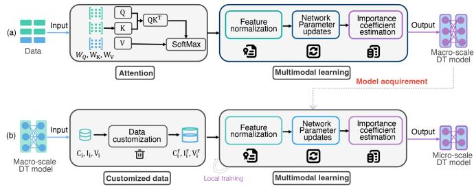  
Fig. 2. Illustration of DT model construction.

## V. MULTI-SCALE DT-BASED UAV DELIVERY ALGORITHM

We propose a multi-scale DT-based UAV delivery solution with three relevant algorithms for clarity: DT model construction, macro-scale DT imitation, and micro-scale DT imitation.

In practical UAV delivery scenarios, the number of parcels is changing with various delivery latencies and weights due to dynamic orders from customers. The customers also change the delivery destinations unexpectedly. In the context, the UAV delivery system is expected to perform accurate parcel delivery under the required delivery latency in the dynamic physical delivery scenario. The expectation motivates us to design our UAV delivery system with the mentioned three main modules.

## A. DT Model Construction

We propose a multi-modal model construction algorithm to ensure macro-scale DT model construction. Based on this, we add an attention mechanism to select adequate data for microscale DT model construction.

As shown in Fig. 2(a), the data is divided into three categories: contents, images, and videos. The data is represented $\begin{array} { r l } { \mathrm { a s } } & { { } ^ { \smile } { \mathcal { C } } = \{ C _ { 1 } , C _ { 2 } , \dots , { \bar { C } } _ { m } \} , \quad { \mathcal { T } } = \{ I _ { 1 } , I _ { 2 } , \dots , I _ { m } \} } \end{array}$ and ${ \mathcal { V } } = \{ V _ { 1 } , \tilde { V _ { 2 } } , . . . , V _ { m } \}$ <sup>=</sup>, respectively. For the contents, we first <sup>=</sup>use the attention mechanism to acquire the content feature $f _ { C } { : }$

Sig QK<sup>T</sup>   
fC Q, K, V SoftMax tanh <sup>d</sup><sub>K</sub> V , 1+Sig Sig <sup>QKT</sup> √ Δ<sup>T</sup> <sup>d</sup><sub>K</sub>   
where $Q = W _ { Q } C , K \doteq W _ { K } \hat { C } , \mathrm { a n d } V = \dot { W _ { V } C }$ are <sup>= = =</sup>corresponding query, key, and value with relevant weight matrix $W _ { Q } , \ W _ { K }$ , and $W _ { V }$ based on the input C. We normalize the feature $f _ { C }$ as $\begin{array} { r } { \hat { f } _ { C } = \frac { f _ { C } - \mu _ { C } } { \sqrt { \varpi _ { C } + \chi } } } \end{array}$ , where $\mu _ { C }$ and $\varpi _ { C }$ are the mean value and variance value, which are respectively computed as $\begin{array} { r } { \mu _ { C , B _ { C } } = \frac { 1 } { | B _ { C } | } \sum _ { y = 1 } ^ { | B _ { C } | } f _ { y , I } } \end{array}$ and $\begin{array} { r } { \varpi _ { C , B _ { C } } = \frac { 1 } { | B _ { C } | } \sum _ { y = 1 } ^ { | B _ { C } | } ( f _ { y , C } - \mu _ { C , B _ { C } } ) ^ { 2 } , } \end{array}$ where $B _ { C }$ is an min-batch with size of $y ,$ where $B _ { C } = [ B _ { C , 1 } , B _ { C , 2 } , \ldots , B _ { C , y } ]$ <sup>= [ ]</sup>Specifically, we build a 2-layer multi-head self-attention architecture with 128 hidden size and 4 attention heads. The Sinusoidal positional encoding method is used to encode the position of each data. We use the Adam method to optimize the training direction with a learning rate of $1 0 ^ { - 4 ^ { \bullet } }$ and a <sup>10</sup>batch size of 64. These parameters are selected and tuning using a grid search method by estimating a reward prediction accuracy [34]. We also test the robustness of our designed attention mechanism in Fig. 3 with various numbers of parcels. We see that UAVs can pay attention to all the parcels with a

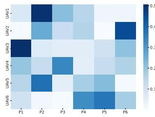

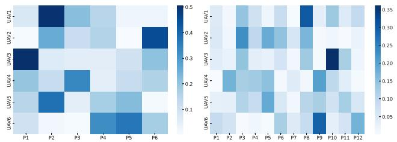  
Fig. 3. Results of robustness of attention.

focused attention distribution (see left subfigure). When the number of parcels doubles (see right subfigure), the attention distribution maintains a global perspective while preserving strong focus on key regions.

Based on this, we can implement a network parameter update operation to ensure accurate network training with a decay parameter $\varrho \colon$

$$
\mu _ { C } = \varrho \mu _ { C , B _ { C } } + ( 1 - \varrho ) \mu _ { C } ,\tag{18}
$$

$$
\varpi _ { C } = \varrho \varpi _ { C , B _ { C } } + ( 1 - \varrho ) \varpi _ { C } .\tag{19}
$$

With the parameter update, we can formulate the loss function to instruct edge UAVs to explore feasible directions acquired for accurate DT models:

$$
L _ { C } = \sum _ { m = 1 } ^ { M } \sum _ { m \neq y } \varphi [ f _ { C , m } | f _ { C , y } ] ,\tag{20}
$$

where $\varphi [ f _ { I , m } | f _ { I , y } ]$ is a distance function between $f _ { I , m }$ and $f _ { I , y } .$ <sup>[ ]</sup>We can minimize the distance to acquire desired data for accurate data training. To achieve this, we compute importance degree $\begin{array} { r } { \lambda _ { C , m } , \lambda _ { C , m } = \frac { e ^ { \hat { f } _ { C , l } } } { \sum _ { m = 1 } ^ { M } e ^ { \hat { f } _ { C , l } } } } \end{array}$ , for each modality m of content information, where l is the l-th dimension of feature $\hat { f } _ { C }$ . We acquire the $\mathrm { D T _ { M A } }$ by

$$
\mathrm { D T } _ { \mathrm { M A } } \big ( \beta _ { n , a } , G ^ { n } , h _ { n } , \mathrm { E n } _ { n } \big ) \equiv \frac { \partial L _ { C } } { \partial \hat { f } } \frac { \partial \hat { f } } { \partial \hat { f } _ { C } } \frac { \partial \hat { f } _ { C } } { \partial f _ { C } } \propto \frac { \partial L _ { C } } { \partial \hat { f } _ { C } } \lambda _ { C } .\tag{21}
$$

We can compute the gradient to conduct edge UAVs to implement feasible explorations for acquiring the macro-scale DT models. Similarly, our algorithm can implement high efficiency for image and video information for accurate macro-DT model construction. However, the algorithm cannot implement customized DT based on UAV status and delivery requirements. We invoke a data customization operation for micro-DT model construction. As shown in Fig. 2(b), we extract the desired content data from the $C _ { i }$ with a data deletion operation [35]. It is formulated as $C _ { i } ^ { r } = f _ { \mathcal { R } } ( C _ { i } , ( C _ { i } ^ { u } : \mathrm { D T _ { M A } } ) )$ , where $C _ { i } ^ { r }$ and $C _ { i } ^ { u }$ <sup>= ( ( : ))</sup>are updated data and deleted data, respectively; $f _ { \mathcal { R } }$ is a data deletion function. Similarly, we can assist UAVs in acquiring desired image and video information $I _ { i } ^ { r }$ and $V _ { i } ^ { r }$ . We obtain the micro-scale DT model with the gradient derivation:

$$
\mathrm { D T } _ { \mathrm { M I } } ( \zeta _ { i , k } , h _ { k } , \mathrm { E n } _ { i } ) \equiv \frac { \partial L _ { C _ { i } ^ { r } } } { \partial \hat { f } } \frac { \partial \hat { f } } { \partial \hat { f } _ { C _ { i } ^ { r } } } \frac { \partial \hat { f } _ { C _ { i } ^ { r } } } { \partial f _ { C _ { i } ^ { r } } } \propto \frac { \partial L _ { C _ { i } ^ { r } } } { \partial \hat { f } _ { C _ { i } ^ { r } } } \lambda _ { C _ { i } ^ { r } } .\tag{22}
$$

## B. Macro-Scale DT for Accurate UAV Delivery

We propose a graph matching network-based DT algorithm to achieve high successful delivery ratio. Unlike the existing graph embedding network [36], our algorithm can implement crossgraph matching to explore feasible delivery associations by computing matching similarity shown in Fig. 4. Our algorithm is divided into graph node encoder, cross-graph propagation, and graph aggregation.

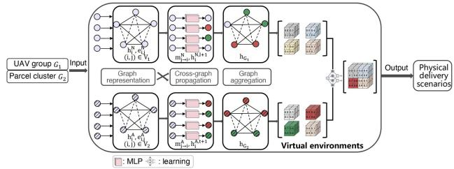  
Fig. 4. Illustration of macro-scale DT.

Graph node encoder: We first select a UAV group and a parcel cluster randomly, where the UAV group and the parcel cluster are quantified as $G ^ { n } ( V , E )$ and $G ^ { \bar { a } } ( V , \bar { E } )$ , respectively. <sup>( ) ( )</sup>We can represent UAVs and parcels as nodes by formulating initial feature vectors $h _ { i } ^ { N }$ and $\mathbf { \bar { \boldsymbol { h } } } _ { i } ^ { A }$ , respectively:

$$
\begin{array} { r } { h _ { i } ^ { N } = \mathrm { M L P } ( \mathrm { D T } _ { \mathrm { M A } } ( V _ { i } , G ^ { n } ) ) , } \\ { h _ { i } ^ { A } = \mathrm { M L P } ( \mathrm { D T } _ { \mathrm { M A } } ( V _ { i } , G ^ { a } ) ) , } \end{array}\tag{23}
$$

where $( V _ { i } , G ^ { n } )$ and $( V _ { i } , G ^ { a } )$ are the graph node representation <sup>( ) ( )</sup>of UAV group n and parcel cluster $a .$ Similarly, the edge i, j can be represented with feature vector $e _ { i , j } ^ { N }$ and $\mathit { \Pi } _ { e _ { i , j } ^ { A } }$ :

$$
\begin{array} { l } { { e _ { i , j } ^ { N } = \mathrm { M L P } ( \mathrm { D T } _ { \mathrm { M A } } ( E _ { i , j } , G ^ { n } ) ) } } \\ { { } } \\ { { e _ { i , j } ^ { A } = \mathrm { M L P } ( \mathrm { D T } _ { \mathrm { M A } } ( E _ { i , j } , G ^ { a } ) ) , } } \end{array}\tag{24}
$$

where $( E _ { i , j } , G ^ { n } )$ and $( E _ { i , j } , G ^ { a } )$ are the edge representation of <sup>( ) ( )</sup>UAV group n and parcel cluster a.

Cross-graph propagation: We can implement the feature propagation of all the nodes along different paths to acquire the graph feature for association results. We deploy multiple propagation layers to implement the propagation:

$$
\begin{array} { l } { { \displaystyle h _ { i + 1 } ^ { N } = f _ { \mathrm { n o d e } } ^ { N } ( h _ { i } ^ { N } , \sum _ { j } m _ { j  i } ^ { N } , \sum _ { j } \mu _ { j  i } ^ { N } ) , } } \\ { { \displaystyle h _ { i + 1 } ^ { A } = f _ { \mathrm { n o d e } } ^ { A } ( h _ { i } ^ { A } , \sum _ { j } m _ { j  i } ^ { A } , \sum _ { j } \mu _ { j  i } ^ { A } ) , } } \end{array}\tag{25}
$$

where $f _ { \mathrm { n o d e } } ^ { N }$ and $f _ { \mathrm { n o d e } } ^ { A }$ are the neural network core functions, respectively; $m _ { j  i } ^ { N }$ and $m _ { j  i } ^ { A }$ are concatenate units:

$$
\begin{array} { l } { { m _ { j \to i } ^ { N } = f _ { \mathrm { i n f } } ^ { N } ( h _ { i } ^ { N } , h _ { j } ^ { N } , e _ { i , j } ^ { N } ) , } } \\ { { { } } } \\ { { m _ { j \to i } ^ { A } = f _ { \mathrm { i n f } } ^ { A } ( h _ { i } ^ { A } , h _ { j } ^ { A } , e _ { i , j } ^ { A } ) , } } \end{array}\tag{26}
$$

where $f _ { \mathrm { i n f } } ^ { N }$ and $f _ { \mathrm { i n f } } ^ { A }$ is the concatenate function between node i and $j ; \mu _ { j  i } ^ { N }$ and $\mu _ { j  i } ^ { A }$ are estimation unit that is used to estimate the differences among features of nodes:

$$
\begin{array} { l } { { \mu _ { j \to i } ^ { N } = f _ { \mathrm { m a t c h } } ^ { N } ( h _ { i } ^ { N } , h _ { j } ^ { N } ) , } } \\ { { \mu _ { j \to i } ^ { A } = f _ { \mathrm { m a t c h } } ^ { A } ( h _ { i } ^ { A } , h _ { j } ^ { A } ) , } } \end{array}\tag{27}
$$

where $f _ { \mathrm { m a t c h } } ^ { N }$ and $f _ { \mathrm { m a t c h } } ^ { A }$ are estimation functions, respectively. Graph aggregation: Based on this, we can use the MLP network to acquire graph feature representations:

$$
\begin{array} { l } { { h _ { G ^ { n } } = f _ { G } ( h _ { 1 } ^ { N } , \dots , h _ { i } ^ { N } , \dots , h _ { n } ^ { N } ) , } } \\ { { { } } } \\ { { h _ { G ^ { a } } = f _ { G } ( h _ { 1 } ^ { A } , \dots , h _ { i } ^ { A } , \dots , h _ { a } ^ { A } ) , } } \end{array}\tag{28}
$$

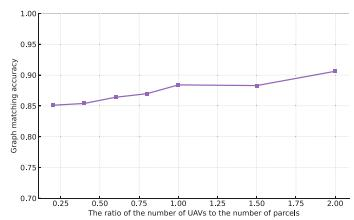  
Fig. 5. Estimation of algorithm robustness.

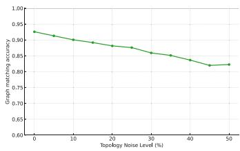  
Fig. 6. Algorithm performance with topology noises.

where $f _ { G ^ { n } }$ and $f _ { G ^ { a } }$ two different MLP network training functions. We can conduct the training process towards performance enhancement with a well-performed loss function using the Euclidean similarity [37]:

$$
L _ { G ^ { n } , G ^ { a } } = \mathrm { E } _ { G ^ { n } , G ^ { a } } \left[ \operatorname* { m a x } \{ 0 , \Gamma - \Upsilon ( 1 - \left| h _ { G ^ { n } } - h _ { G ^ { a } } \right| | ^ { 2 } ) \} \right] , \nonumber\tag{29}
$$

where $\Gamma \in \{ - 1 , 1 \}$ and $\Upsilon > 0$ are the label and a margin parameter, respectively. With the training performance, we can acquire the similarity ${ \cal { S } } G ^ { n } , G ^ { a }$ between two graphs:

$$
s _ { G ^ { n } , G ^ { a } } = f _ { s } ( h _ { G ^ { n } } , h _ { G ^ { a } } ) ,\tag{30}
$$

where $f _ { s }$ is a vector space similarity between $h _ { G ^ { n } }$ and $h _ { G ^ { a } }$ To ensure smooth implementation, we deploy a 2-layer perception network for graph encoder. The propagation layer is constructed with 3-layer cross-graph attention. We use the attention-weighted mean pooling to aggregate graphs with an Adam optimizer. The learning rate is set as $1 0 ^ { - 3 }$ with a batch <sup>10</sup>size of 32. These network parameters are defined using the grid search method. In addition, the robustness of our graph matching network is evaluated by changing the ratio of the number of UAVs to the number of parcels in Fig. 5. We use the graph matching accuracy (the ratio of number of correctly matched associations to the total number of associations) to assess the algorithm robustness. With 20 UAVs, we see that the graph matching accuracy always maintain a high accuracy of up to 85% even the number of parcels reaches 40. On the other hand, we consider the impact of topology noise on algorithm robustness. As shown in Fig. 6, we add and delete associations among UAV groups and parcel clusters randomly to imitate the topology noise. The x-axis represents the topology noise level where 10% denotes 10% associations are disturbed. We find that our graph matching method can always maintain a high matching accuracy as the topology noise increases. The 80% graph matching accuracy can still be maintained when 50% associations are disturbed. It implies that our graph matching method can perform accurate delivery associations in practical delivery scenarios.The detailed implementation process is shown in Algorithm 1.

```powershell
Algorithm 1: The Macro-Scale DT.
Input: Feature information $\overline { { h _ { i } ^ { n } } }$ and $h _ { i } ^ { a }$ , parcel
information $h _ { k } .$ , environment information.
Output: Accurate delivery decisions.
Definition: $\Gamma = \{ - 1 , 1 \}$ , Y = 0.5.
1 DT Model Acquisition
2 for each UAV i do
3 Acquire sensed information C, I, and V
4 for each iteration do
5 Compute feature information
6 Normalize the feature information
7 Update network parameters using (18) and (19)
8 Compute loss function using (20)
9 Acquire $\mathrm { D T _ { M A } }$
10 Micro-scale DT Imitation
11 while each iteration do
12 for each UAV group n do
13 for each parcel cluster a do
14 Compute $h _ { i } ^ { N }$ and $h _ { i } ^ { A }$ using (23)
15 Compute $e _ { i , j } ^ { N }$ and $e _ { i , j } ^ { A }$ using (24)
16 Implement a cross-graph propagation
using (25)
17 Update parameters using (26) and (27)
18 Acquire graph features using (28)
19 Compute loss function using (29)
20 Acquire feasible association decisions using (30)
```

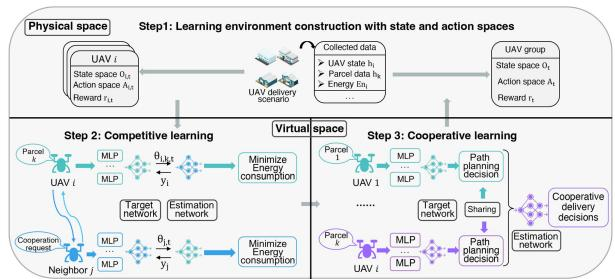  
Fig. 7. Illustration of micro-scale DT.

## C. Micro-Scale DT for Real-Time UAV Delivery

We propose a Competitive and Cooperative Reinforcement Learning (CCRL) based DT algorithm to empower highefficiency DT imitation with inter-group cooperation. As shown in Fig. 7, it can implement a competitive RL method among UAVs to reduce the delivery energy consumption. Meanwhile, the micro-scale DT models implement cooperative path planning for low-latency delivery using a cooperative RL method. Our solution is divided into three parts: virtual space construction, competitive learning, and cooperative learning.

Virtual space construction: We first construct a virtual delivery environment for each group implemented in the edge. With the environment information from the macro-scale DT, we quantify the states of UAVs and parcels using a state-action pair. Explicitly, at the time slot t, we can build the state and action spaces $O _ { i , t }$ and $A _ { i , t }$ based on $h _ { i }$ and $h _ { k }$

State space: For the competitive learning, we specify the state of each UAV with the state space $O _ { i , t } .$ . It is represented as $O _ { i , t } = \{ \mathrm { E n } _ { i , t } , T _ { i , k } , h _ { i , t } , h _ { k , t } , \mathrm { D } \bar { \mathrm { T } } _ { \mathrm { M A } , t } \}$ , where $\mathrm { E n } _ { i , t }$ is the <sup>=</sup>usable energy of UAV i at time t; $T _ { i , k }$ is the estimation time that UAV i implements the delivery mission $k ; h _ { i , t }$ and $h _ { k , t }$ are feature information of UAV i and parcel k at time t, respectively. $\mathrm { D T _ { M A } } , t$ is the intra-group cooperation decision at time t. For the cooperative learning, we can integrate all the states of UAVs to build the state space $O _ { t } = \{ O _ { 1 , t } , \stackrel { - } { O } _ { 2 , t } , . . . , O _ { m , t } \}$ . This <sup>=</sup>state information can be used to replicate the physical delivery scenario to implement scenario imitation and derivation for accurate UAV delivery.

Action space: Considering the competitive learning, we construct the action space $A _ { i , t }$ . It is formulated as $A _ { i , t } =$ $\{ \zeta _ { i , k } , v _ { i } , p _ { i } \}$ , where $\zeta _ { i , k } = \{ 0 , 1 \}$ <sup>=</sup>represents the association re-<sup>= 0 1</sup>lation between UAV i and parcel k. $v _ { i }$ is the velocity of UAV i; $p _ { i }$ is the position of UAV i. We can imitate the current delivery scenario with $O _ { i , t }$ to acquire feasible delivery actions selected from $A _ { i , t }$ for energy saving. Considering the cooperative learning, we can collaborate all the actions of UAVs to build the action space $A _ { t } = \left\{ A _ { 1 , t } , A _ { 2 , t } , \ldots , A _ { m , t } \right\}$ . It can conduct the <sup>=</sup>macro-scale DT models to explore feasible UAV delivery paths for low-latency delivery with physical collision avoidance. We can implement scenario imitation with the state space and action space to derive feasible delivery decisions using our CCRL algorithm.

Competitive learning: We construct two neural networks, a target network and an estimation network in the virtual space. The target network can learn a delivery action based on $O _ { i , t }$ in the target network. The action can then be estimated using ${ r } _ { i , t }$ in the estimation network for energy saving:

$$
r _ { i , t } = \frac { 1 } { u _ { i , t } } \sum _ { j = 1 } ^ { u _ { i , t } } \Delta E _ { j } ,\tag{31}
$$

where $\Delta E _ { j } = E _ { j , t - 1 } - E _ { j , t }$ is the energy difference between <sup>Δ</sup>the last time $t - 1$ and the current time $t ; u _ { i , t }$ is the number of neighbors of UAV i at the time t. To maximize the reward for significant energy saving, we can conduct the estimation network to explore a feasible direction by minimizing the difference between the expected reward and the real reward with a loss function $L ( \theta _ { i } )$

$$
\operatorname* { m i n } L ( \theta _ { i } ) = \frac { 1 } { 2 } \mathrm { E } _ { O _ { i , t } , A _ { i , t } } [ y _ { i , t } - Q _ { i } ( \theta _ { i } ) ) ^ { 2 } ] ,\tag{32}
$$

where $\theta _ { i }$ is the hyper-parameter of the estimation network; $Q _ { i }$ is a estimation function. The $y _ { i , t } , \ y _ { i , t } = r _ { i , t } +$ γ max $_ { A _ { i , t } } Q ( O _ { i , t } , A _ { i , t } , \hat { \theta } _ { i } )$ , is the expected reward representation, where $\hat { \theta } _ { i }$ is the optimal hyper-parameter value. When we acquire a satisfied result with the loss function, we can update the state information $O _ { i , t }$ to $O _ { i , t + 1 } = \{ \mathrm { E n } _ { i , t } - \mathrm { E n } _ { i , k , t } , \bar { T _ { i , k } } -$ $1 , h _ { i , t } , h _ { k , t } \}$ <sup>=</sup>for implementation of target network, where $\mathrm { E n } _ { i , k , t }$ <sup>1</sup>is the estimated energy consumption for parcel k.

Cooperative learning: Competitive learning can ensure significant energy savings. Unfortunately, it can cause physical collisions among UAVs due to potential path overlapping. In this case, we invoke a cooperative learning method for collaborative path planning with an inter-group delivery cooperation manner. Explicitly, in the virtual UAV delivery space, we construct the same two neural networks, target and estimation networks, as those of competitive learning. We can implement data training to acquire feasible cooperative path decisions based on $O _ { t }$ in the target network. The decisions can be optimized in the estimation network, which can be quantified based on a cooperative reward function $r _ { t } \colon$

Algorithm 2: The Micro-scale DT.   
Input: Feature information $h _ { t } ,$ parcel information $h _ { k }$   
environment information, $\theta _ { i }$   
Output: Low-latency delivery decisions   
Definition: $\Gamma \in ( 0 , 1 )$   
1 for each UAV in a same group do   
2 for each time slot t da   
3 Build state and action space $O _ { i , t }$ and $A _ { i , t }$   
4 Construct a virtual micro-scale space based on $O _ { i , t }$   
5 Build target and estimation networks   
6 Competitive learning implementation   
7 for each iteration do   
8 Formulate the competitive reward using (31)   
9 Implement training using (32)   
10 Acquire rewards and update network parameters   
11 Update the state information of the next time slot   
12 Acquire feasible competition decisions   
13 Cooperative learning implementation   
14 for each iteration do   
15 Set reward coefficient $\alpha _ { i }$   
16 Acquire cooperative reward using (33)   
17 Formulate the learning function using (34)   
18 Update network parameter   
19 Obtain feasible cooperative decisions

$$
r _ { t } = \sum _ { i = 1 } ^ { M } \left( \Delta L _ { i } | \alpha _ { i } ( \sum _ { i = 1 } ^ { M } r _ { i , t } ) \right) ,\tag{33}
$$

where $L _ { i } = L _ { i , t - 1 } - L _ { i , t }$ is the time difference for delivery <sup>=</sup>implementation between the last time t − and the current time t. $\begin{array} { r } { \alpha _ { i } = \frac { \frac { e ^ { \mathrm { E n } _ { i } } } { T _ { i } } } { \sum _ { i = 1 } ^ { M } e ^ { \frac { \mathrm { E n } _ { i } } { T } } } } \end{array}$ is a weight function. We then formulate a cooperative loss function $L ( \theta _ { t } )$

$$
L ( \theta _ { t } ) = \frac { 1 } { 2 } \mathrm { E } _ { O _ { t } , A _ { t } } [ ( y _ { t } - Q _ { t } ( \theta _ { t } ) ) ^ { 2 } ] ,\tag{34}
$$

where $\begin{array} { r } { y _ { t } = r _ { t } + \gamma \operatorname* { m a x } _ { A _ { i } } Q ( O _ { t } , A _ { t } , \hat { \theta } _ { t } ) } \end{array}$ is the expected reward, where $ { \hat { \theta } } _ { t } =  { \mathrm { a r g m i n } } L ( \theta _ { t - 1 } )$ is the optimal hyper-parameter <sup>= ( )</sup>value. It is used to update the delivery decisions. The CCRL algorithm enables the micro-scale DT models to perform a low-latency UAV delivery with energy saving. The DT models can dynamically adjust associations among UAVs and parcels to optimize the delivery paths for collision avoidance. To ensure smooth learning, we use the same grid search method to tune the network parameters. The target and estimation networks are built with 2-layer network where each layer is filled by 128 neural units. We still use the Adam optimizer to explore feasible learning directions with a learning rate of $1 0 ^ { - 4 }$ in the target network and a learning rate of $1 0 ^ { - 3 }$ <sup>10</sup>in the estimation <sup>10</sup>network. We set a replay buffer size of $1 0 ^ { 5 }$ by enabling a <sup>10</sup>policy sharing manner. We add the topology disturbance to the network by adding and deleting edges in UAV topology $G ^ { n }$ for evaluation of algorithm robustness in Fig. 8. we see that our

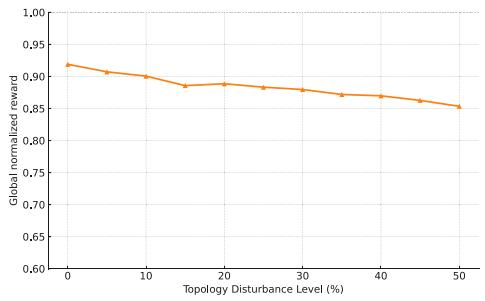  
Fig. 8. Algorithm performance with topology disturbance.

CCRL method can always perform a high reward with up to 85%. It is because we enable the CCRL to record important topology information as historical experiences. This way can enable UAVs to perform a strongly robust training for real-time parcel delivery in practical scenarios.The implementation process is presented in algorithm 2.

Overall, our solution is implemented with three stages: model acquisition, accurate UAV delivery, and real-time UAV delivery. Firstly, we enable an attention mechanism to select adequate heterogeneous data for the acquisition of micro-scale DT models. The mechanism can accelerate the macro-scale DT construction by reducing the latency of model pruning using our invoked data deletion algorithm. In return, the data deletion results can guide the attention mechanism to perform accurate data selection by analyzing the data characteristics. Then, our graph matching network-based DT algorithm can assist macro-scale DTs in deriving delivery associations among parcel clusters and UAV groups by estimating the requirements of parcels and positions of UAVs. The algorithm provides guidance on path planning for low-latency UAV delivery at the stage of real-time UAV delivery. Conversely, our CCRL algorithm can share the path planning decisions with which the edge UAVs can improve the accuracy of the graph matching algorithm by optimizing the feature propagation using (25).

We consider the change in UAV delivery scenarios with the changes in number of parcels, the changes in number of UAVs, and the changes in weights of parcels. Specifically, we collect diverse information of parcels and UAVs to construct multiple DT models. We can enable UAVs to select the most suitable DT models to serve the corresponding UAV delivery scenario using a template matching method [38]. When all the DT models cannot satisfied the requirements of current UAV delivery scenario well, instead of re-training with high latency overheads, we can use the attention mechanism to select key information to optimize the micro-scale DT models. The lightweight optimization results are transmitted to the edge UAVs to construct the macro-scale DT models using our designed data deletion operation. The way can assist DT models in performing high adaption ability to new UAV delivery scenarios with a low implementation latency.

## VI. PERFORMANCE EVALUATION

We design a parcel delivery scenario, where we can deploy multiple UAVs to implement parcel delivery in the Gazebo, a system simulation software [39]. The detailed implementation flow is shown in Fig. 9. We can enable UAVs to equip onboard sensors, such as camera, ultrasonic, radar, and temperature and humidity sensors, to collect delivery scenario information based on the parcel delivery dataset. The UAV status can be acquired through the UAV delivery dataset. The information is transmitted to edge UAVs for data processing and construction of virtual space using NVIDIA 4070 GPU. We implement the macro-scale DT in edge UAVs using our algorithm 1. We then use our algorithm 2 to implement the micro-scale DT for terminal UAVs. As shown in Fig. 10, we record the UAV status, such as flight speed, postures, and acceleration, to monitor the change in energy consumption for high-efficiency UAV delivery. In addition, the recorded information is used to enrich the physical data for DT construction and implementation.

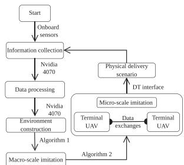  
Fig. 9. Illustration of implementation process.

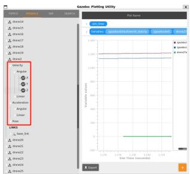  
Fig. 10. Illustration of state monitoring and recording.

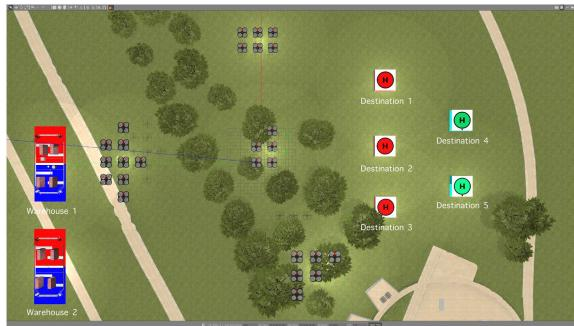  
Fig. 11. Illustration of UAV delivery system imitation.

Macro-scale digital twin: Based on information on parcel missions and UAV states, we construct a virtual delivery scenario in the Gazebo shown in Fig. 11. We deploy five edge UAVs to manage five air spaces with five UAV groups. Notably, there are different numbers of UAVs in different UAV groups. With five parcel clusters from two warehouses, we enable the edge UAVs to derive feasible mission associations with the five UAV groups using our proposed graph matching network based DT algorithm for accurate UAV delivery.

Micro-scale digital twin: Based on the macro-scale DT decisions, we can enable the terminal UAVs to implement the micro-scale DT using our proposed CCRL-based DT algorithm.

TABLE I EXPERIMENT PARAMETERS
<table><tr><td>Parameter description</td><td>Value</td></tr><tr><td>Delivery area</td><td>[2 km × 2 km] [40]</td></tr><tr><td>Number of UAVs</td><td>[20, 60] [41]</td></tr><tr><td>Number of delivery missions</td><td>[30, 80] [41]</td></tr><tr><td>Number of missions w/ changes of destinations</td><td>≤ 10% [42]</td></tr><tr><td>Maximum payload of the UAV</td><td>30 kg [43]</td></tr><tr><td>Average weight of the parcel</td><td>[8 kg, 16 kg] [43]</td></tr><tr><td>Average flight velocity of UAVs</td><td>36 km/h [43]</td></tr><tr><td>Transmission power</td><td>[60 mW, 80 mW] [43]</td></tr><tr><td>Communication bandwidth</td><td>[50 MHz, 100 MHz] [43]</td></tr><tr><td>Minimal safe flight distance of the UAVs</td><td>5 m [43]</td></tr><tr><td>The average rate of data collection of UAVs</td><td>1 MByte/s [43]</td></tr><tr><td>Horizontal sensing distance of the UAVs</td><td>[0 m, 30 m] [43]</td></tr><tr><td>Gaussian White Noise</td><td>-96 dBm/Hz</td></tr><tr><td>The acceptable maximal delivery latency</td><td>2 mins [40]</td></tr><tr><td>The acceptable successful delivery ratio</td><td>85% [44]</td></tr></table>

We deploy five different delivery destinations in the virtual space. The micro-scale DT models can assist terminal UAVs in planning low-energy delivery paths through a competitive learning manner. Meanwhile, our micro-scale DT models can also instruct UAVs to dynamically adjust delivery paths for collision avoidance through lightweight information exchanges. The main parameters are summarized in Table I.

We give several system metrics to estimate our framework:

1) Energy consumption: We use the metric to evaluate the change in energy. It includes four parts: flight energy consumption, computing energy consumption, communication energy consumption, and sensing energy consumption.

2) Physical collision: We leverage the metric to further evaluate the performance of path planning under the constraint of low delivery latency.

3) System latency overhead: We leverage the metric to reflect the real-time UAV delivery.

4) Successful delivery ratio: We formulate the successful delivery ratio as $\begin{array} { r } { p _ { k } = \operatorname* { l i m } _ { T \to \infty } \frac { 1 } { T } \sum _ { t = 1 } ^ { T } \frac { \sum _ { i = 1 } ^ { M } \sum _ { k = 1 } ^ { K } m _ { k } } { M K } } \end{array}$ where $m _ { k } \in \{ 0 , 1 \}$ $m _ { k } = 1$ denotes that UAV m im-<sup>0 1 = 1</sup>plement delivery mission k successfully; $m _ { k } = 0$ , otherwise [45].

We compare the following benchmark algorithms:

1) Centralized DT manner [46]: It uses a deep reinforcement learning method to implement exploration of UAV delivery paths with a centralized imitation.

2) Distributed DT [47]: It leverages a DT model migration method with a model exchange operation to perform cooperative imitation in a distributed DT architecture.

3) Genetic Algorithm (GA)-based UAV delivery solution [48]: It enables a genetic algorithm to assist UAVs in exploring feasible paths.

4) Energy-effective UAV delivery algorithm [49]: UAVs implement effective computing with the aid of edge servers for a high successful delivery ratio.

5) Reactive-based UAV delivery algorithm [50]: It implements a computing resource collaboration in a cloud server for a high successful delivery ratio.

6) Mavbench [51]: It implements a data aggregation operation with a closed-loop simulation platform to explore feasible path planning for high-efficiency UAV delivery.

7) DroneUp [52]: The DroneUp system achieves a 4D path generations to perform accurate path planning in UAV delivery scenarios.

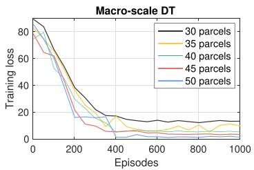  
Fig. 12. Training loss vs. episodes.

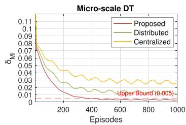  
Fig. 15. Imitation error (Micro-scale DT) vs. episodes.

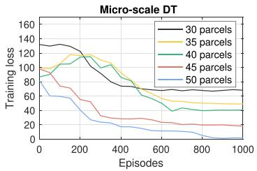  
Fig. 13. Training loss vs. episodes.

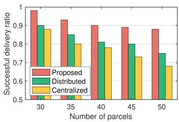  
Fig. 16. Successful delivery ratio vs. number of parcels.

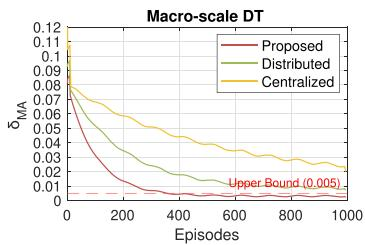  
Fig. 14. Imitation error (Macro-scale DT) vs. episodes.

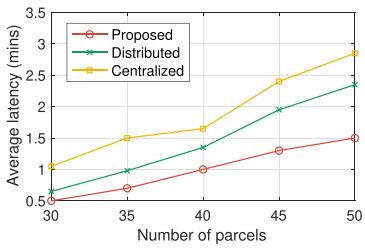  
Fig. 17. System latency vs. number of parcels.

## A. Evaluation of Multi-Scale DT Framework

We evaluate the learning performance of our macro-scale and micro-scale DT algorithms shown in Fig. 12 and Fig. 13, respectively. Given the 30 UAVs and different parcel numbers with an average weight of 10 kg, we obtain convergence status and find that the more parcels there are, the better the convergence. It is because edge UAVs can collect abundant data in the UAV delivery scenarios with amounts of parcels for learning performance enhancement. Comparing the two experiment results, we find that the convergence speed of the macro-scale DT is greater than that of the micro-scale DT. It is because terminal UAVs need to implement frequent information exchanges with one-hop neighbors. Our solution can derive feasible delivery association among UAV groups and parcel clusters and micro-scale delivery cooperation with dynamic path planning.

Based on the parcel delivery dataset and UAV delivery dataset, we test imitation errors $\delta _ { \mathrm { M A } }$ and $\delta _ { \mathrm { M I } }$ for macro-scale and microscale DT imitation in the Gazebo. We obtain the imitative information via a Robot Operation System (ROS) interface [53]. The information is used to measure the imitation error using (4) and (7). For the macro-scale DT imitation shown in Fig. 14, we see that our graph matching network-based DT implementation performs an accurate imitation to achieve approximate synchronization mapping between the physical delivery scenario and the virtual scenario. It implies that our high-fidelity DT imitation can also assist edge UAVs in deriving feasible delivery associations using (5) with a low imitation error of almost 0.2%. Regarding the micro-scale DT imitation illustrated in Fig. 15, the imitation error can still meet the requirement of the UAV delivery system $( \delta _ { \mathrm { M I } } \leq 0 . 5 \% )$ when our CCRL-based DT implementation algorithm reaches a convergence status. The excellent performance can support accurate derivation of path planning for low-latency UAV delivery with energy saving using (8). Consequently, our framework can achieve high-fidelity DT imitation performance to assist UAVs with accurate DT models.

Based on the accurate DT models, we evaluate the performance of our DT framework. With the same deployment as that of Fig. 12, we first give the comparison of the successful delivery ratio shown in Fig. 16. Our multi-scale DT framework always performs the highest successful delivery ratio compared to the benchmarks. This is because our framework can enable the macro-scale DT model to derive feasible association relations among UAV groups and parcel clusters based on estimating requirements. In addition, it can instruct UAV groups to implement cooperative delivery for a high successful delivery ratio. We compare system latency in Fig. 17 with the same deployment as Fig. 16. We see that our framework still performs the lowest delivery latency with different numbers of parcel missions. It implies that our micro-scale DT models can plan feasible delivery paths to ensure low-latency parcel delivery based on the joint derivation of delivery requirements and delivery environments. Our micro-scale DT models can flexibly adjust delivery paths through information exchanges with neighbors for cooperative delivery.

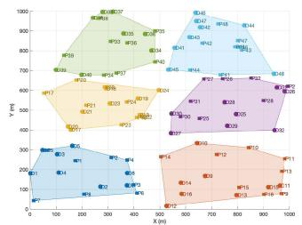  
(a) 50 UAVs deliver 50 parcels.

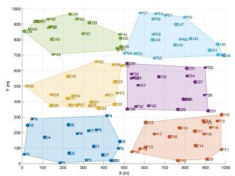  
(b) 50 UAVs deliver 60 parcels.

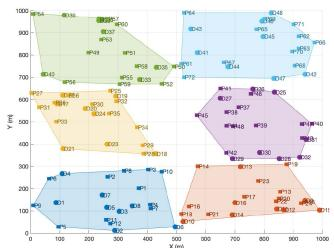  
(c) 50 UAVs deliver 70 parcels

Fig. 18. Evaluation of our proposed macro-scale DT.  
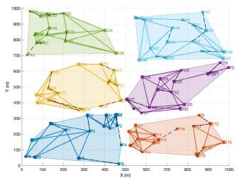  
(a) 50 UAVs deliver 50 parcels.

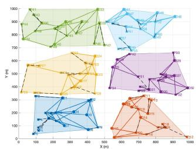  
(b) 50 UAVs deliver 60 parcels.

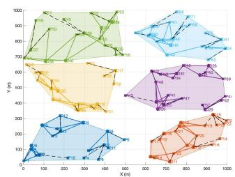  
(c) 50 UAVs deliver 70 parcels.  
Fig. 19. Evaluation of our proposed micro-scale DT.

## B. Evaluation of Macro-Scale DT

We assess the performance of imitation and derivation of macro-scale DT in Fig. 18. We use $ { ^ 6 } \mathrm { D } ^ { \prime }$ to represent UAV with a circle and ‘P’ to denote a parcel with a square. In Fig. 18(a), we showcase the scenario of 55 UAVs delivering 50 parcels with an average weight of 10 kg. UAVs are decomposed into six groups with six edge UAVs to be involved in implementing the cooperative delivery mission. The 50 parcels are divided into six parcel clusters based on delivery destinations. Our macro-scale DT models assist edge UAVs in associating feasible parcel clusters for a high successful delivery ratio. To cope with changes in delivery destinations, our DT makes UAV ‘D 45’ and UAV ‘D 41’ deliver ‘Parcel 44’ cooperatively for a high successful delivery ratio.

With the increase in the number of parcels, we give the delivery performance in Fig. 18(b). We find that our macro-scale DT models still allocate feasible numbers of edge UAVs to implement cooperative parcel delivery based on estimations of UAV positions and delivery requirements. In addition, we find that Parcel ‘P 20’ is cooperatively delivered by ‘D 20’ and ‘D 18’ from different UAV groups considering the change of delivery destination. It implies that our macro-scale DT models perform robust parcel delivery to meet diverse delivery requirements with low implementation latency. Fig. 18(c) showcases the delivery performance with 50 UAVs and 70 parcels. In this case, our macro-scale DT can invite six edge UAVs to implement cooperative delivery missions based on six different delivery destinations. During the delivery process, edge UAVs allocate feasible numbers of UAVs to implement delivery missions by jointly estimating energy consumption and parcel weights. When ‘P 50’, ‘P 61’, and ‘P 72’ change the delivery destinations, edge UAVs can transmit the information to neighbor UAV groups with similar delivery destinations to implement cooperative delivery missions. Our macro-scale DT guarantees a high successful delivery ratio in dynamic delivery scenarios.

## C. Evaluation of Micro-Scale DT

We evaluate the performance of our micro-scale DT in Fig. 19. Fig. 19(a) illustrates the delivery of 50 parcels using 50 UAVs. Our micro-scale DT models conduct UAVs to associate feasible parcels through self-energy estimation. In addition, at least one UAV delivers a parcel to meet the low-latency delivery requirement. Furthermore, we see that UAV ‘D 42’ and ‘D $4 6 ^ { \bar { , } }$ can implement cooperative parcel delivery for parcel ‘P 46’ with the consideration of energy saving and low delivery latency. When parcels increase to 60, our micro-scale DT can still ensure low-latency delivery, as shown in Fig. 19(b). We discover that most parcels can associate with feasible UAVs to implement realtime delivery through inter-group cooperation. Additionally, our micro-scale DT models can implement low-latency responses to those parcels with changes in delivery destinations. For example, UAV ‘D 32’ can deliver parcels ‘P 31’ and ‘P 32’ simultaneously.

The high-efficiency delivery is further verified in Fig. 19(c) with 50 UAVs and 70 parcels. Our micro-scale DT models can instruct UAVs to explore feasible parcel missions for lowlatency delivery based on the self-energy and weights of parcels. Furthermore, UAVs can implement model parameter exchanges to share delivery decisions with delivery paths. The decisions are optimized to adjust delivery paths for real-time delivery with collision avoidance. Additionally, we see that UAVs can autonomously undertake other delivery missions with changes in delivery destinations. Our micro-scale DT models can ensure low-latency parcel delivery with inter-group delivery cooperation.

Based on the high-efficiency cooperative delivery performance, we further evaluate the CCRL-based micro-scale DT implementation algorithm from the perspective of training performance. Fig. 20 illustrates the obtained normalized reward as the training episodes increase. We enable 10 UAVs as 10 agents to implement CCRL training in a ‘centralized training and distributed execution’ manner, in which five agents are involved in implementing cooperative learning for the exploration of delivery paths. The other five agents are enabled to participate in competitive learning for energy saving during the delivery process. We find that both learning manners reach stable status after almost 800 episodes. It implies that our RRCL method can collaborate with UAVs to optimize energy consumption and delivery latency simultaneously for real-time delivery. In addition, the stable convergence of the competitive learning shows that UAVs can achieve an energy equilibrium with a satisfied negotiation for persistent UAV delivery in large-scale delivery scenarios. The stable convergence of cooperative learning demonstrates that UAVs can explore feasible delivery paths through joint estimations of delivery environments and latency. Overall, our CCRL method can meet the requirements of energy consumption and delivery latency simultaneously through stable training.

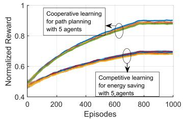  
Fig. 20. Convergence stability vs. Episodes.

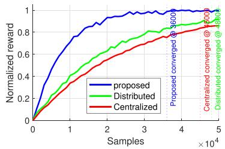  
Fig. 21. Sample efficiency vs. samples.

We evaluate the sample efficiency of our CCRL method by comparing it to existing typical benchmarks. We set different convergence threshold values, namely the difference between two continued episodes, to evaluate the corresponding number of samples. When we set the convergence threshold value as 0.0003, Fig. 21 shows the sample efficiency with normalized rewards. We discover that our method reaches convergence with the fewest samples $( 3 . 6 \times 1 0 ^ { 4 } )$ . This is because our method can <sup>3 6 10</sup>collaborate with multiple UAVs to share learning decisions. In addition, the UAV collaboration performance can facilitate the sharing of training samples among UAVs for real-time path planning. Our method ensures accurate micro-scale DT imitation for high-efficiency UAV delivery.

## D. Evaluation of Multi-Scale DT

We compare energy consumption with different numbers of UAVs in Fig. 22. Given the 60 parcels with an average weight of 10 kg, we see that our solution reduces energy consumption as the number of UAVs increases. It is because our DT achieves a cross-layer collaboration to ensure accurate DT imitation for dynamic path planning. It derives the changes in environments to adjust delivery paths in advance for energy saving. On the other hand, the increasing number of UAVs allows UAVs to easily find feasible cooperators to optimize delivery paths for low-energy delivery. Compared to the energy-efficient, reactive, and GA-based algorithms, ours reduces the energy consumption by 6.7%, 8.6%, and 9.6%, respectively. Fig. 23 compares energy consumption. Given 30 UAVs, we see that energy is consumed incrementally as the number of parcels increases for all the solutions. Our solution obtains the lowest rate of growth for low-energy delivery. It is because our DT model derives feasible collaborative delivery decisions to shorten delivery paths based on relative positions and velocities of UAVs. The derivation results assists UAVs in implementing multi-parcel delivery to reduce delivery frequency for energy savings. Ours reduces the energy cost by 4.4%, 7.1%, and 7.8%, respectively, compared to the energy-efficient, reactive, and GA-based algorithms.

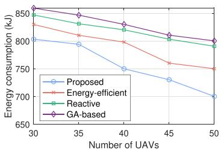  
Fig. 22. Energy consumption vs. Number of UAVs.

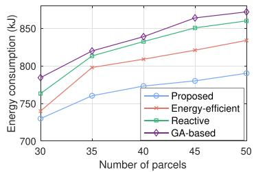  
Fig. 23. Energy consumption vs. Number of parcels.

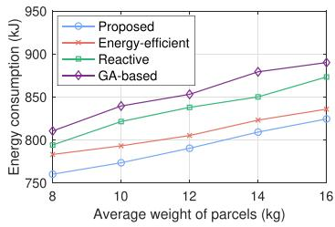  
Fig. 24. Energy consumption vs. weight of parcels.

The low-energy delivery performance is also verified in Fig. 24. Given 30 UAVs and 45 parcels, we find that our solution still performs the lowest energy consumption than all the benchmarks. In addition, the speed of increase of energy consumption is basically constant, with the weights of parcels increasing for our solution. It implies that our DT models always allocate a feasible number of UAVs for parcels of different weights to implement cooperative delivery by estimating the usable energy of UAVs. In addition, our solution enables UAVs to fly autonomously to optimal positions with the shortest flight paths for cooperative delivery. Our solution experiences energy consumption reduction by 1.9%, 5.7%, and 7.4%, respectively, compared to the energy-efficient, reactive, and GA-based algorithms. We also give the cooperative delivery performance by analyzing physical collisions in Fig. 25. Notably, the number of physical collisions increases when the physical distance between two UAVs is less than the given threshold value, namely

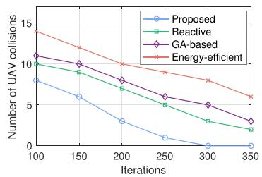  
Fig. 25. Number of collisions vs. iterations.

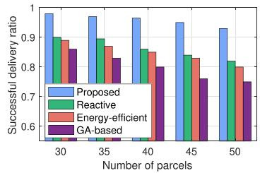  
Fig. 26. Successful delivery ratio vs. number of parcels.

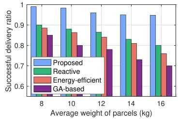  
Fig. 27. Successful delivery ratio vs. weight of parcels.

3 m. Given that 30 UAVs deliver 45 parcels with an average weight of 10 kg, we see that all the solutions reduce the collision numbers with the iteration increasing. However, only our solution achieves collision avoidance with almost 300 iterations. It demonstrates that ours performs reliable delivery cooperation for safe implementation in practical physical scenarios.

Fig. 26 provides the comparison of the successful delivery ratio with different numbers of parcels. Given 30 UAVs and an average weight of 10 kg, ours always acquires a high successful delivery ratio of up to 90% as the number of parcels increases. It is because our macro-scale DT can adjust matching decisions to cope with parcels whose destinations change during delivery. Our solution improves the successful delivery ratio by 12.2%, 13.5%, and 20.6%, respectively, compared to the reactive, energy-efficient, and GA-based algorithms. We also compare the successful delivery ratio with different weights of parcels in Fig. 27. With the given 30 UAVs and 45 parcels, only our solution can maintain a high successful delivery ratio of up to 94% even when the average weight reaches 16 kg. It is because our solution assigns those UAVs flying at feasible air spaces with usable energy to match optimal parcel clusters based on environmental derivation. The reactive-based UAV delivery algorithm performs the highest successful delivery ratio compared to other benchmarks, benefiting from the cross-layer computing collaboration. However, it experiences a noticeable performance decline when the average weight is weightier than 14 kg with high exploration latency. Our solution improves the successful delivery ratio by 11.6%, 14.3%, and 23.1%, respectively, compared to the reactive, energy-efficient, and GA-based algorithms.

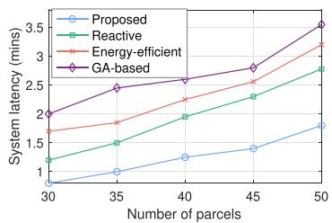  
Fig. 28. System latency vs. number of parcels.

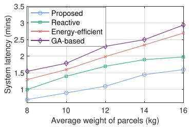  
Fig. 29. System latency vs. weight of parcels.

We also evaluate system latency in Fig. 28 with different numbers of parcels and an average weight of 10 kg. Given 30 UAVs, we see that only our solution ensures low-latency UAV delivery within 2 minutes. It is because our micro-scale DT models can enable UAVs to implement information exchanges. It assists UAVs in inviting feasible neighbors to deliver multiple parcels cooperatively simultaneously for real-time delivery. Our DT models can enable UAVs to implement cooperative path planning to shorten delivery path length for low-latency delivery. Our solution reduces the system latency by 35.9%, 44.4%, and 52.0%, respectively, compared to the reactive, energy-efficient, and GA-based algorithms.

Fig. 29 showcases the comparison of system latency with different weights of parcels. With 30 UAVs and 45 parcels, our solution performs low-latency delivery with a slow latency growth trend. Our micro-scale DT models instruct UAVs to fly to feasible positions for smooth delivery cooperation. It reduces the system latency by alleviating wait time for parcel relays. In addition, UAVs can invite a feasible number of neighbors to implement cooperative delivery for multiple overweight parcel missions. It can reduce the delivery frequency. Based on this, our solution reduces the system latency by 35.3%, 44.7%, and 52.2%, compared to the reactive, energy-efficient, GA-based algorithms, respectively.

We further evaluate our solution by comparing it to two popular industry solutions: DroneUp and MavBench solutions. Fig. 30 shows the comparison of the successful delivery ratio. With the same deployment as Fig. 22, we find that all solutions maintain accurate delivery performance with a high successful delivery ratio (> ). The two benchmarks experience <sup>85%</sup>performance decline as the number of parcels increases, while our solution maintains a high successful delivery ratio of up to 90%. This is because our solution can enable UAVs to perform feasible delivery associations. The association decisions not only can reduce communication energy consumption by inviting suitable numbers of cooperators but also can save UAV energy by controlling the number of UAVs involved. Ours improves the successful delivery ratio by 13.5% and 23.7% compared to the DroneUp and MavBench, respectively.

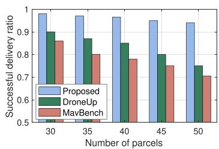  
Fig. 30. Successful delivery ratio vs. number of parcels.

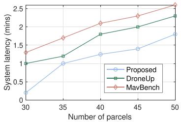  
Fig. 31. System latency vs. number of parcels.

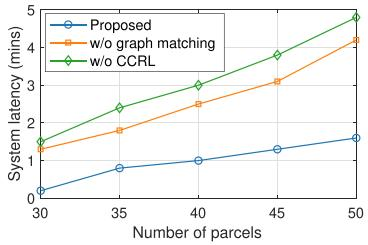  
Fig. 32. System latency vs. number of parcels.

Fig. 31 illustrates the performance of system latency with various numbers of parcels. With the same deployment as Fig. 30, we find that our solution always keeps the lowest delivery latency based on the double-scale DT implementation pattern. This is because our solution can jointly estimate delivery latency and UAV positions to explore reasonable delivery paths with collision avoidance. Ours meets the requirement of delivery latency even if the number of parcels reaches 50. This is because our solution can dynamically allocate feasible numbers of UAVs to implement cooperative delivery with low energy consumption. Ours reduces the system latency by 30.5% and 45.2%, respectively.

## E. Performance Discussion

We provide further analysis using two ablation studies from the perspectives of system module and feature data. As shown in Fig. 32, we test the system performance by removing different system modules. System latency experiences increases after removing any one system module. It implies that both system modules are necessary to ensure real-time UAV delivery in complicated physical scenarios. Furthermore, the system latency increases obviously after we remove the CCRL module (namely, stopping the micro-scale DT implementation). This is because UAVs cannot plan suitable delivery paths in such dynamic delivery scenarios. In this case, our system design is feasible with the necessary system module.

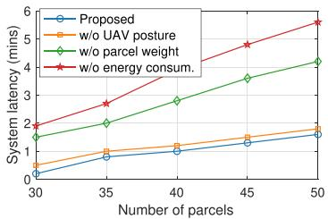  
Fig. 33. System latency vs. number of parcels.

We further validate our system design by removing different kinds of feature data shown in Fig. 33. We find that the system latency can remain consistent when we remove the UAV posture feature from the given dataset. It implies that the feature data is not quite important for our system design. However, the UAV posture data is essential to optimize UAV sensing directions for accurate DT constructions in practical delivery scenarios. On the other hand, when we remove the parcel weight data and the energy consumption data, the system latency increases obviously. This is because the macro-scale DT models cannot assist UAV groups in associating feasible neighbors with suitable energy due to the lack of parcels’ weight data. Similarly, the microscale DT models cannot plan reasonable delivery paths to incur high delivery latency without energy consumption data. Overall, these feature data are essential to design a high-efficiency UAV delivery system.

In the UAV delivery system, the delivery performance is affected by changes in the environment as well as the density of UAVs. The changes in the environment include the number of UAVs, the number of parcels, and the weights of parcels. The different UAV densities and environmental changes can affect system metrics. In this case, we analyze the sensitivity of three main system metrics on environment changes and the UAV density: system delivery latency, energy consumption, and successful delivery ratio.

As a significant metric, the system delivery time can reflect the algorithm’s practicability. It includes data sensing latency, DT construction latency, communication latency among UAVs, and flight latency. In Fig. 28, we find that the system latency is always less than 2 s in the dynamic delivery environment with various numbers of parcels. The delivery latency still maintains a mild increase even if the number of parcels is overloaded. In other words, our system can ensure the real-time delivery requirement with excess loads. It is lower than all the benchmarks.

The energy consumption is given to analyze the effectiveness of micro-scale DTs. The UAV flights are the main source of energy consumption from (16). In Fig. 22, our system can reduce energy consumption in a high UAV density. It is because our system can assist UAVs in planning feasible delivery paths by involving a small number of UAVs. When the UAV density decreases, our system also maintains the lowest energy consumption compared to the other two benchmarks. In this case, the changes in the number and density of UAVs cannot incur high energy consumption for our UAV delivery system. Our system can reduce energy consumption by 8.6% compared to the reactive benchmark.

With stable system performance, As shown in Fig. 27, our system achieves a high successful delivery ratio of up to 90% when the delivery environment changes with undetermined weights of parcels. From Fig. 26, we also observe that 30 UAVs with an average flight speed of 36 km/h can accurately deliver 50 parcels with an average weight of 10 kg. It ensures an excellent high successful delivery ratio (94%) in the given km × km area. <sup>2 2</sup>Consequently, our system can provide accurate and real-time delivery performance even in dynamic delivery scenarios with a large number of parcels.

## VII. CONCLUSION

We have designed a multi-scale DT solution to ensure realtime parcel delivery in low-altitude UAV application scenarios. First, we presented an attention-based multi-modal model construction algorithm to assist the UAV delivery system in accurately constructing macro and micro-scale DT models. Then, we propose a graph matching based DT algorithm in the framework to implement macro-scale delivery associations among UAV groups and parcel clusters with intra-group delivery cooperation. Finally, based on the DT decisions, we have represented a CCRL-based DT algorithm to achieve inter-group cooperation for low-latency UAV delivery. The results have demonstrated that our solution realizes a low-latency parcel delivery with a high successful delivery ratio. Our work provides a foundation for DT-based UAV delivery scenarios. It also motivates us to explore the potential of DT for diverse UAV scenarios. In the future, we will investigate optimizing DT performance to enhance UAV delivery capability.

## REFERENCES

[1] D. Wen, X. Jiao, P. Liu, G. Zhu, Y. Shi, and K. Huang, “Task-oriented over-the-air computation for multi-device edge AI,” IEEE Trans. Wireless Commun., vol. 23, no. 3, pp. 2039–2053, Mar. 2024.

[2] S. Mahboob, “Revolutionizing future connectivity: A contemporary survey on AI-empowered satellite-based non-terrestrial networks in 6G,” IEEE Commun. Surveys Tut., vol. 26, no. 2, pp. 1279–1321, Secondquarter 2024.

[3] Y. Zhu, M. Chen, S. Wang, Y. Hu, Y. Liu, and C. Yin, “Collaborative reinforcement learning based unmanned aerial vehicle (UAV) trajectory design for 3D UAV tracking,” IEEE Trans. Mobile Comput., vol. 23, no. 12, pp. 10787–10802, Dec. 2024.

[4] Y. Qin, M. A. Kishk, and M.-S. Alouini, “Stochastic-geometry-based analysis of multipurpose UAVs for package and data delivery,” IEEE Internet Things J., vol. 10, no. 5, pp. 4664–4676, Mar. 2023.

[5] J. Gao, Y. Pan, Z. Li, and Q. Han, “Poster: Data-driven studies of UAVsharing in parcel delivery and surveillance,” in Proc. IEEE Int. Conf. Netw. Protoc., 2022, vol. 1, no. 2, pp. 1–2.

[6] P. Du, Y. Shi, and H. Cao, “AI-enabled trajectory optimization of logistics UAVs with wind impacts in smart cities,” IEEE Trans. Consum. Electron., vol. 70, no. 1, pp. 3885–3897, Feb. 2024.

[7] H. Huang, C. Hu, J. Zhu, M. Wu, and R. Malekian, “Stochastic task scheduling in UAV-based intelligent on-demand meal delivery system,” IEEE Trans. Intell. Transp. Syst., vol. 23, no. 8, pp. 13040–13054, Aug. 2022.

[8] S. Yukun et al., “Computing power network: A survey,” China Commun., vol. 21, no. 9, pp. 109–145, Sep. 2024.

[9] L. Lin, J. Wu, Z. Zhou, J. Zhao, P. Li, and J. Xiong, “Computing power networking meets blockchain: A reputation-enhanced trading framework for decentralized IoT cloud services,” IEEE Internet Things J., vol. 11, no. 10, pp. 17082–17096, May. 2024.

[10] K. Xiong, Z. Wang, S. Leng, and J. He, “A digital-twin-empowered lightweight model-sharing scheme for multirobot systems,” IEEE Internet Things J., vol. 10, no. 19, pp. 17231–17242, Oct. 2023.

[11] W. Yang, W. Xiang, Y. Yang, and P. Cheng, “Optimizing federated learning with deep reinforcement learning for digital twin empowered industrial IoT,” IEEE Trans Ind. Inform., vol. 19, no. 2, pp. 1884–1893, Feb. 2023.

[12] Y. Zhang, J. Wang, G. Du, J. Chen, J. Wang, and Q. Li, “ISAC-aided UAV swarms: From networked perception to capability evolution,” IEEE Commun. Mag., vol. 62, no. 9, pp. 60–66, Sep. 2024.

[13] M. Chen, F. Shu, M. Zhu, D. Wu, Y. Yao, and Q. Zhang, “Reinforcementlearning-based UAV 3-D target tracking and digital-twin-assisted collision

avoidance with integrated sensing and communication,” IEEE Internet Things J., vol. 12, no. 13, pp. 24916–24928, Jul. 2025.

[14] H. X. Nguyen, R. Trestian, D. To, and M. Tatipamula, “Digital twin for 5G and beyond,” IEEE Commun. Mag., vol. 59, no. 2, pp. 10–15, Feb. 2021.

[15] M. Matulis and C. Harvey, “A robot arm digital twin utilising reinforcement learning,” Comput. Graph., vol. 95, pp. 106–114, 2021.

[16] L. U. Khan, W. Saad, D. Niyato, Z. Han, and C. S. Hong, “Digital-twinenabled 6G: Vision, architectural trends, and future directions,” IEEE Commun. Mag., vol. 60, no. 1, pp. 74–80, Jan. 2022.

[17] Z. Lv, D. Chen, H. Feng, A. K. Singh, W. Wei, and H. Lv, “Computational intelligence in security of digital twins big graphic data in cyber-physical systems of smart cities,” ACM Trans. Manage. Inf. Syst., vol. 13, no. 4, pp. 1–17, Aug. 2022.

[18] B. Fan, Z. Su, Y. Chen, Y. Wu, C. Xu, and T. Q. S. Quek, “Ubiquitous control over heterogeneous vehicles: A digital twin empowered edge AI approach,” IEEE Wireless Commun., vol. 30, no. 1, pp. 166–173, Feb. 2023.

[19] S. Wang, H.-M. Chen, and Y. Ouyang, “Elastic digital twin network modeling fulfilling twining dynamic in network life cycle,” in Proc. IEEE 3rd Conf. Digit. Twins Parallel Intell., 2023, pp. 1–7.

[20] L. Liu and Y. Fan, “Research on digital twin optimization algorithm of logistics distribution based on computer virtual reality technology,” in Proc. IEEE Int. Conf. Elect. Eng., Big Data Algorithms, 2023, pp. 425–430.

[21] D. Guo, R. Y. Zhong, Y. Rong, and G. G. Q. Huang, “Synchronization of shop-floor logistics and manufacturing under IIoT and digital twin-enabled graduation intelligent manufacturing system,” IEEE Trans. Cybern., vol. 53, no. 3, pp. 2005–2016, Mar. 2023.

[22] Z. Guo, Y. Zhang, X. Zhao, and X. Song, “CPS-based self-adaptive collaborative control for smart production-logistics systems,” IEEE Trans. Cybern., vol. 51, no. 1, pp. 188–198, Jan. 2021.

[23] S. Chen, W. Meng, W. Xu, Z. Liu, J. Liu, and F. Wu, “A warehouse management system with UAV based on digital twin and 5G technologies,” in Proc. Int. Conf. Inf., Cybern., Comput. Social Syst., 2020, pp. 864–869.

[24] L. Sheng, Z. Xiaotian, Y. Liang, W. Yu, and W. Shengnan, “Large scale logistics network simulation and its application in JD logistics,” in Proc. IEEE Winter Simul. Conf., 2023, pp. 1605–1616.

[25] F. Scarselli, M. Gori, A. C. Tsoi, M. Hagenbuchner, and G. Monfardini, “The graph neural network model,” IEEE Trans. Neural Netw., vol. 20, no. 1, pp. 61–80, Jan. 2009.

[26] L. Cui, W. Li, D. Liu, and H. Wang, “A novel robust dual unscented particle filter method for remaining useful life prediction of rolling bearings,” IEEE Trans. Instrum. Meas., vol. 73, 2024, Art. no. 3509009.

[27] H. Wang, Q. Wu, and W. Chen, “Movable antenna enabled interference network: Joint antenna position and beamforming design,” IEEE Wirel. Commun. Lett., vol. 13, no. 9, pp. 2517–2521, Sep. 2024.

[28] H. Song, M. Song, and X. Liu, “Online autonomous calibration of digital twins using machine learning with application to nuclear power plants,” Appl. Energy, vol. 326, Sep. 2022, Art. no. 119995.

[29] G. Rigoni, C. M. Pinotti, D. Bhumika Das, and S. K. Das, “Delivery with UAVs: A simulated dataset via ATS,” in Proc. IEEE 95th Veh. Technol. Conf., 2022, pp. 1–6.

[30] T. A. Rodrigues et al., “In-flight positional and energy use data set of a DJI matrice 100 quadcopter for small package delivery,” Sci. Data, vol. 8, no. 1, 2021, Art. no. 155.

[31] X. Hui, J. Bian, Y. Yu, X. Zhao, and M. Tan, “A novel autonomous navigation approach for UAV power line inspection,” in Proc. IEEE Int. Conf. Robot. Biomimetics, 2017, pp. 634–639.

[32] F. Amato, L. Coppolino, F. Mercaldo, F. Moscato, R. Nardone, and A. Santone, “CAN-Bus attack detection with deep learning,” IEEE Trans. Intell. Transp. Syst., vol. 22, no. 8, pp. 5081–5090, Aug. 2021.

[33] C.-A. Cai, K.-Y. Kai, and W.-J. Liao, “A WLAN/WiFi-6E MIMO antenna design for handset devices,” in Proc. Int. Symp. Antennas Propag., 2021, pp. 1–2.

[34] Y. Zhao, W. Zhang, and X. Liu, “Grid search with a weighted error function: Hyper-parameter optimization for financial time series forecasting,” Appl. Soft Comput., vol. 154, Nov. 2024, Art. no. 111362.

[35] R. Chourasia and N. Shah, “Forget unlearning: Towards true datadeletion in machine learning,” in Proc. Int. Conf. Mach. Learn., 2023, pp. 6028–6073.

[36] K. Rusek, J. Suárez-Varela, P. Almasan, P. Barlet-Ros, and A. Cabellos-Aparicio, “RouteNet: Leveraging graph neural networks for network modeling and optimization in SDN,” IEEE J. Sel. Areas Commun., vol. 38, no. 10, pp. 2260–2270, Oct. 2022.

[37] L. Cheng and P. Zhu, “Time series classification by euclidean distancebased visibility graph,” Physica A, Statist. Mech. Appl., vol. 625, Oct. 2023, Art. no. 129010.

[38] Y. Ye, C. Yang, G. Gong, P. Yang, D. Quan, and J. Li, “Robust optical and SAR image matching using attention-enhanced structural features,” IEEE Trans. Geosci. Remote Sens., vol. 62, 2024, Art. no. 5610212.

[39] N. Koenig and A. Howard, “Design and use paradigms for Gazebo, an open-source multi-robot simulator,” in Proc. IEEE/RSJ Int. Conf. Intell. Robots Syst., 2004, pp. 2149–2154.

[40] B. Liu, W. Ni, R. P. Liu, Y. J. Guo, and H. Zhu, “Optimal routing of unmanned aerial vehicle for joint goods delivery and in-situ sensing,” IEEE Trans. Intell. Transp. Syst., vol. 24, no. 3, pp. 3594–3599, Mar. 2023.

[41] M. Sellami, H. Mezni, H. Elmannai, and R. Alkanhel, “Drone-as-a-service: Proximity-aware composition of UAV-based delivery services,” Cluster Comput., vol. 28, no. 5, pp. 1–27, Aug. 2025.

[42] Z. Chen, Z. Hu, Z. Bao, and W. Xu, “UAV charging station planning and route optimization considering stochastic delivery demand,” IEEE Trans. Transport. Electrific., vol. 10, no. 4, pp. 9328–9341, Dec. 2024.

[43] DJI, “DJI flycart 30 - specs,” 2024. Accessed: May 01, 2025. [Online] Available: https://www.dji.com/flycart-30/specs

[44] Z. Kutpanova, M. Kadhim, and X. Zheng, “Multi-UAV path planning for multiple emergency payloads delivery in natural disaster scenarios,” J. Electron. Sci. Technol., vol. 23, no. 2, Aug. 2025, Art. no. 100303.

[45] T. J. Ma, “Remote sensing detection enhancement,” J. Big Data, vol. 8, no. 1, pp. 1–13, 2021.

[46] J. Han et al., “Cloud-edge hosted digital twins for coordinated control of distributed energy resources,” IEEE Trans. Cloud Comput., vol. 11, no. 2, pp. 1242–1256, Apr.–Jun. 2023.

[47] Z. Chen, W. Yi, A. Nallanathan, and J. A. Chambers, “Distributed digital twin migration in multi-tier computing systems,” IEEE J. Sel. Top. Signal Process., vol. 18, no. 1, pp. 109–123, Jan. 2024.

[48] P. Du, X. He, and H. Cao, “AI-based energy-efficient path planning of multiple logistics UAVs in intelligent transportation systems,” Comput. Commun., vol. 207, pp. 46–55, Jul. 2023.

[49] L. Chu, X. Li, J. Xu, A. G. Neiat, and X. Liu, “A holistic service provision strategy for drone-as-a-service in MEC-based UAV delivery,” in Proc. IEEE Int. Conf. Web Serv., 2021, pp. 669–674.

[50] W. Lee, B. Shahzaad, B. Alkouz, and A. Bouguettaya, “Reactive composition of UAV delivery services in urban environments,” IEEE Trans. Intell. Transp. Syst., vol. 25, no. 10, pp. 13453–13466, Oct. 2024.

[51] B. Boroujerdian, H. Genc, S. Krishnan, W. Cui, A. Faust, and V. Reddi, “MAVbench: Micro aerial vehicle benchmarking,” in Proc. 51st Annu. IEEE/ACM Int. Symp. Microarchitecture, 2018, pp. 894–907.

[52] DroneUp, “Droneup official website,” Feb. 2024. Accessed: May 13, 2025. https://www.droneup.com/

[53] P. Marin-Plaza, A. Hussein, D. Martin, and A. de la Escalera, “iCab use case for ROS-based architecture,” Robot Auton. Syst., vol. 118, pp. 251–262, Feb. 2019.


Longyu Zhou (Member, IEEE) received the PhD degree (with a MD-PhD dual degree) from the School of Information and Communication Engineering, University of Electronic Science and Technology of China (UESTC), in 2023. He was a research fellow with the Singapore University of Technology and Design, Singapore and Embedded Systems (ES) group, Delft University of Technology (TU Delft), the Netherlands, as a visiting student. He is currently a research manager (PI) with China Telecom Singapore Innovation Research Institute and project coordinator

with the Singapore University of Technology and Design. His research interests include Internet of Things, AI-RAN, and digital twins. He was the recipient of best paper awards at multiple international conferences such as 20th IEEE ICCT and IEEE IWCMC, the Young Scientist Award at 10th IEEE ICCCS. He is/was a TPC member for several conferences, such as IEEE Global Communications Conference (Globecom) and IEEE International Conference on Communications (ICC). He is also a reviewer of several journals and conferences such as IEEE Transactions on Mobile Computing and IEEE Journal on Selected Areas in Communications.


Supeng Leng (Senior Member, IEEE) is currently a full professor with the School of Information & Communication Engineering, University of Electronic Science and Technology of China (UESTC). He is also the director with the Sichuan International Joint Research Center for Ubiquitous Wireless Networks. He has authored or coauthored more than 200 research papers and four books/book chapters in recent years. His research interests include resource, spectrum, energy, routing and networking in Internet of Things, vehicular networks, broadband wireless

access networks, and the next generation intelligent mobile networks. He got the Best Paper Awards at four IEEE international conferences. He was an organizing committee chair and TPC member of many international conferences. He is the editorial member of four international journals and reviewer for more than 20 well-known academic international journals.


Yuchen Liu (Member, IEEE) received the PhD degree from the Georgia Institute of Technology, USA. He is currently an assistant professor with the Department of Computer Science, North Carolina State University, USA. His research interests include wireless networking, digital twins, generative AI, distributed learning, mobile computing, and software simulation. He was the recipient of multiple best paper awards at IEEE and ACM conferences. He is also an associate editor of IEEE Transactions on Green Communications and Networking.

Zehui Xiong (Senior Member, IEEE) received the PhD degree from Nanyang Technological University (NTU). He was with the Singapore University of Technology and Design, and NTU. He was a visiting scholar with Princeton University and University of Waterloo. He is currently a full professor with the School of Electronics, Electrical Engineering and Computer Science, Queen’s University Belfast, U.K. He was recognized as a Clarivate Highly Cited Researcher. He has authored or coauthored more than 250 peer-reviewed research papers in leading journals. Featured in Forbes Asia 30U30, he was the Editor of many leading journals and Chair of numerous international conferences. His honors include numerous Best Paper Awards from international flagship conferences, IEEE Asia Pacific Outstanding Young Researcher Award, IEEE VTS Early Career Award, IEEE Early Career Award for Excellence in Scalable Computing, IEEE Technical Committee on Blockchain and Distributed Ledger Technologies Early Career Award, IEEE Internet Technical Committee Early Achievement Award, IEEE TCSVC Rising Star Award, IEEE TCI Rising Star Award, IEEE TCCLD Rising Star Award, IEEE ComSoc Outstanding Paper Award, IEEE Best Land Transport Paper Award, IEEE Asia Pacific Outstanding Paper Award, IEEE CSIM Technical Committee Best Journal Paper Award, IEEE SPCC Technica Committee Best Paper Award, and IEEE Big Data Best Influential Conference Paper Award.


Tony Q. S. Quek (Fellow, IEEE) received the BE and ME degrees in electrical and electronics engineering from the Tokyo Institute of Technology, in 1998 and 2000, respectively, and the PhD degree in electrical engineering and computer science from the Massachusetts Institute of Technology, in 2008. He is currently the Cheng Tsang Man chair professor with the Singapore University of Technology and Design (SUTD) and ST Engineering distinguished professor. He is also the director with Future Communications R&D Programme, head with ISTD Pillar, and deputy

director with SUTD-ZJU IDEA. His current research interests include wireless communications and networking, network intelligence, non-terrestrial networks, open radio access network, and 6G. Dr. Quek has been actively involved in organizing and chairing sessions. He was a member of Technical Program Committee and symposium chairs in a number of international conferences. He is an area editor of IEEE Transactions on Wireless Communications. Dr. Quek was honored with the 2008 Philip Yeo Prize for Outstanding Achievement in Research, 2012 IEEE William R. Bennett Prize, 2015 SUTD Outstanding Education Awards – Excellence in Research, 2020 IEEE Stephen O. Rice Prize, 2020 Nokia Visiting Professor, and 2022 IEEE Signal Processing Society Best Paper Award. He is a fellow of the Academy of Engineering Singapore.