# Distance-Attention Augmented Reinforcement Learning: A Robust Approach for 3D Cooperative UAV Navigation in Dense Urban Environments

Lijuan Zhang\*, Hang Lin, Shihong Zhao, Fei Wang, Chao Yan, Pan Gao

Abstract—Autonomous navigation is one of the key techniques of the extensive applications of unmanned aerial vehicles (UAVs) in various fields, such as urban traffic management, disaster response, and intelligent logistics. However, 3D cooperative navigation of UAVs in dense urban environments continues to face significant challenges, including extensive state spaces, trajectory smoothness, collaborative operations, and complex motion control. To address these challenges, we propose a distanceattention augmented reinforcement learning (DA2RL) algorithm to enable safe and smooth cooperative navigation of UAVs. In DA2RL, a distance-attention-based actor network is developed to refine the observation space and capture sequential information during training. A historical feature flow-based critic network is then developed for more accurate action decision evaluation. Additionally, several non-sparse reward functions are designed to further accelerate the training process. Finally, numerical experiments and comparison results demonstrate that DA2RL achieves superior navigation performance and generalization capability compared to recent benchmark works.

Index Terms—multiple UAVs, cooperative navigation, 3D navigation, partially observable Markov decision process, deep reinforcement learning, attention mechanism.

## I. INTRODUCTION

Multi-UAV systems have gained increasing attention due to their inherent advantages, including synergy, flexibility, costefficiency, and enhanced system robustness. These characteristics have enabled their successful deployment in a wide range of applications, such as urban traffic monitoring, emergency response, and intelligent logistics systems [1]–[3]. However, one of the key challenges in cooperative navigation of multiple UAVs is the collaborative collision avoidance with both environmental obstacles and other UAVs [4]. This challenge is especially significant in high-density urban environments, where each UAV must perceive its surroundings in real time and respond swiftly to ensure flight safety. An optimal cluster operation should enable seamless transitions within threedimensional (3D) space and optimized path selection, ensuring that all UAVs can not only independently accomplish their respective tasks but also function as a cohesive unit. Thus, in addition to considering the navigation performance of individual UAVs, it is crucial to evaluate the overall efficiency and stability of the entire UAV swarms.

Autonomous navigation is a crucial element of UAV autonomy. Researchers have proposed a variety of algorithms, including traditional optimization [5]–[9] and swarm intelligence [10]–[12] algorithms. Traditional optimization algorithms primarily utilize environmental information within the workspace to search for the shortest path. However, these algorithms heavily rely on environmental information and often encounter difficulties when dealing with dynamic changes. In contrast, swarm intelligence algorithms solve for optimal paths by imitating the behaviors of animal swarms or biological evolution processes. These algorithms can adaptively adjust their search strategies according to environmental changes. Nevertheless, when dealing with high-dimensional problems, the convergence speed of these algorithms tends to be slower.

To address the limitations mentioned above, deep reinforcement learning (DRL) has emerged as a promising approach for handling complex, dynamic environments. Over the past decade, DRL has demonstrated significant potential in the realms of real-time control and online decision-making [14]– [16], [18]–[23]. For instance, in [14], Zhao et al. proposed a DRL approach for autonomous UAV exploration, integrating comprehensive modules for mapping, decision-making, planning, and tracking to facilitate autonomous exploration. Wang et al. [15] introduced a DRL algorithm for UAV path planning based on cumulative rewards and region segmentation, which effectively reduces the likelihood of agents becoming trapped in local optima. Zhang et al. [16] proposed an efficient reinforcement learning-based cooperative navigation (RL-CN) algorithm with staged-tuning, incorporating two sub-actor networks and enhanced prioritized experience replay strategies. Wu et al. [18] proposed a two-stream graph multi-agent proximal policy optimization algorithm to enhance coordination and safety through graph-structured perception and dual-stream policy learning. Although these algorithms can effectively guide UAVs to their destinations, they are largely confined to two-dimensional scenarios, where UAV flight control primarily considers speed and deflection angle. The absence of altitude control makes UAVs susceptible to significant directional deviations when encountering obstacles, resulting in an unsmooth flight path and consequently affecting flight safety.

In complex environments with dense obstacles, UAV flight control in 3D space can ensure the safety and path optimality of UAV’s trajectory. Ren et al. [19] proposed a potential fieldguided DRL algorithm that combines artificial potential field with improved twin delayed deep deterministic policy gradient and virtual obstacles for 3D UAV path planning. However, the enlarged state and action spaces significantly increase the difficulty of the training process. To address this, Bo et al. [22] proposed a low-rank adaptive transfer reinforcement learning method to achieve 3D path planning in unknown environments. Zhang et al. [23] divided the perception-related state and the target-related state into two sub-networks to create a more effective action network. Nevertheless, these works primarily focus on the 3D navigation of a single UAV, making it challenging to directly apply these methods to multi-UAV scenarios.

In recent research, several studies have explored the navigation of multiple UAVs in 3D environments. Wang et al. [24] proposed a DRL-based 3D trajectory optimization algorithm to improve user access and fairness under dense, random user distributions of multi-UAV aerial base stations. Wang et al. [25] proposed a DRL algorithm for UAV path planning in cluttered 3D environments based on 3D spatial information compression. Walker et al. [26] proposed a multi-agent objectfinding framework that integrates online partially observable Markov decision process (POMDP) with DRL control. This framework empowers multiple agents to accurately locate a target within 3D simulated test environments, even when confronted with unknown obstacles. Zhao et al. [27] presented an enhanced multi-agent joint proximal policy optimization algorithm, which utilizes moving window averaging to improve collaboration among UAVs in a 3D environment. However, the performance of these algorithms needs further enhancement to achieve efficient collaboration and optimize 3D navigation, especially in narrow passages.

Thus far, the 3D cooperative navigation of UAVs in complex urban environments continues to confront substantial challenges, including extensive state spaces, trajectory smoothness, collaborative operations, and complex motion control. To address these issues, a novel 3D cooperative navigation algorithm is proposed to enable safe and smooth cooperative trajectory planning for UAVs. In summary, the main contributions of this work are in four folds as follows:

• The 3D cooperative navigation of UAVs is formulated as a POMDP model, where a multilayer circumferential perception model is introduced for UAVs to comprehensively sense the environment.

• A distance-attention augmented reinforcement learning (DA2RL) algorithm is proposed for efficient 3D cooperative navigation of UAVs in complex urban environments. In DA2RL, a historical queue-based multiple agent deep reinforcement learning (MADRL) framework is introduced to handle historical observations and cooperative training.

• Two new deep neural networks are designed to facilitate the training process and improve the navigation performance of UAVs. First, a distance-attention-based actor network is developed to refine the observation space and capture sequential information during training. Next, a historical feature flow-based critic network is presented for more accurate action decision evaluation.

• Non-sparse reward functions, including targetapproaching reward, obstacle avoidance reward, inter-UAV anti-collision reward, connectivity-maintenance reward, and time-step reward, are well designed to accelerate the training process.

Finally, extensive simulation results are presented to demonstrate the superior navigation performance and strong generalization capability of DA2RL in 3D dense urban environments.

The proposed DA2RL framework is motivated by both technical innovation and practical necessity. Previous studies indicate that conventional DRL approaches often exhibit inefficient perception modeling and poor generalization in narrow and dynamic environments, which significantly impede their deployment in complex urban environments. To overcome these challenges, our framework introduces a distance-attention mechanism that enables spatially selective perception, alongside a historical feature flow that enhances policy stability through improved temporal coherence. Beyond its algorithmic contributions, this work also carries notable practical implications for emerging applications such as urban air mobility, autonomous drone swarms for emergency response, and large-scale aerial logistics, where safe, efficient, and scalable multiagent coordination is essential.

The remainder of this paper is organized as follows: Section II details the system model, which encompasses the environmental perception model, UAV dynamics model, and POMDP model. Section III provides an in-depth description of the proposed DA2RL algorithm, including the historical queue-based MADRL framework, distance-attention-based actor network, historical feature flow-based critic network, and non-sparse reward functions. Section IV presents comprehensive comparative results of various cooperative navigation algorithms and the ablation study results of DA2RL. Finally, Section V offers concluding remarks.

## II. SYSTEM MODEL

In this study, we consider a typical scenario where multiple UAVs are launched from an arbitrary ground starting point. As depicted in Figure 1(a), their mission is to collaboratively navigate through a complex urban environment, filled with buildings and dynamic obstacles, in order to reach their designated target area.

## A. Environmental Perception Model

When executing tasks, UAVs typically rely on LIDAR to perceive their surroundings within a limited range. However, in complex urban environments, making navigation decisions based solely on local observation information is highly challenging. Specifically, the lack of global environmental awareness can easily lead UAVs into local traps, such as mazelike corners, greatly affecting their safe arrival at the target area. Furthermore, the unpredictable and unknown behavior of other aircraft or flying objects in the complex environment significantly heightens the decision-making complexity for agents navigating in partially observable spaces.

To address the aforementioned challenges, we introduce a multilayer circumferential perception model for 3D complex environments. As shown in Figure 1(b), each UAV is equipped with a LIDAR detector capable of scanning 16 distinct directions on the horizontal plane, denoted as $[ d _ { 1 } ^ { i } , \ldots , d _ { 1 6 } ^ { i } ]$ for UAV i. Here, $d _ { j } ^ { i }$ returns the distance whenever an object is detected in the j-th direction without distinguishing between different types of objects (e.g., obstacles or other UAVs). To further augment the perception of the surrounding environment, multi-layer distance sensors are strategically arranged in each vertical plane. Consequently, the environmental obstacle observation information for UAV i is characterized by $[ d _ { j , 1 } ^ { i } , d _ { j , 2 } ^ { i } , . . . , d _ { j , L _ { v } } ^ { i } ]$ , where $j ~ \in ~ [ 1 , 1 6 ]$ signifies the horizontal detection direction, and $L _ { v }$ indicates the number of sensors in the vertical direction. Following the layered vertical sensing paradigm in [34], we set $L _ { v } \ = \ 3$ with sensors oriented $\mathrm { a t - 1 0 ^ { \circ } , 0 ^ { \circ } }$ , and $+ 1 0 ^ { \circ }$ relative to the flight horizon. Each sensor features a beam width of $1 0 ^ { \circ } ~ ( \pi / 1 8 )$ providing a total vertical field-of-view (FOV) of $2 0 ^ { \circ }$ , a balance between environmental awareness and learning efficiency for cooperative navigation in structured 3D spaces. Overall, this multilayer circumferential detection model significantly enhances the UAVs’ comprehensive understanding of their surrounding environments.

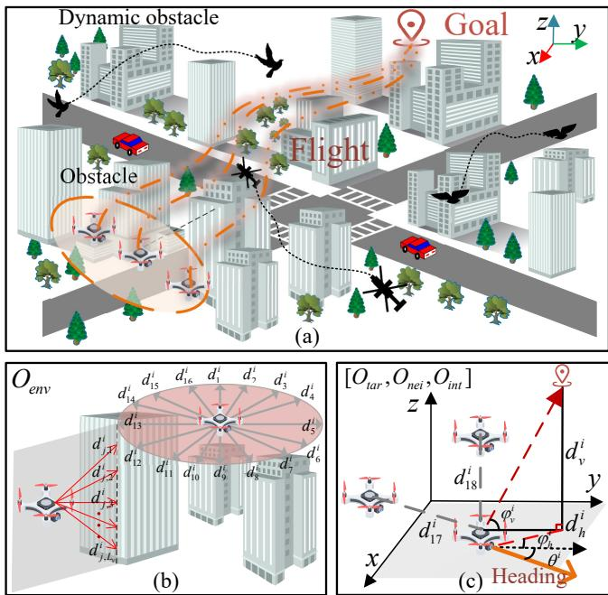  
Fig. 1. 3D Cooperative navigation of UAVs in dense urban environments: (a) Mission environment; (b) Multilayer circumferential perception and obstacle observation; (c) Dynamics and other observations.

## B. UAV Dynamics Model

In dense urban environments, UAVs often face challenges such as sharp turns and the need to reverse direction while navigating horizontally to avoid obstacles. Properly adjusting the flight altitude can effectively smooth the UAV’s flight path and enhance the safety of autonomous operations. However, to simplify UAV control, most previous works have only considered controlling the velocity and direction of UAVs in the X-Y plane by assuming a constant flying altitude [16], [35]. In 3D environments, obtaining a smooth and feasible trajectory without considering the control of flying altitude is highly challenging. In this work, we overcome this limitation by defining the UAV’s motion in 3D through three key signals: yaw angle $( \theta ^ { i } )$ , speed $( v ^ { i } )$ , and altitude change rate $( \omega ^ { i } )$ . To ensure smooth operation, three continuous control elements, i.e., yaw rate $( \phi ^ { i } )$ , acceleration $( a ^ { i } )$ , and vertical acceleration $( \kappa ^ { i } )$ , are introduced. Specifically, $\phi ^ { i }$ controls the angular velocity around the vertical axis (i.e., the rate of yaw change), $a ^ { i }$ governs the tangential acceleration along the current flight direction (thus modulating forward speed), and $\kappa ^ { i }$ determines the rate of change of vertical velocity, effectively acting as the vertical acceleration that adjusts how quickly the UAV climbs or descends. Let $( x ^ { i } , y ^ { i } , z ^ { i } )$ be the position of UAV i. The dynamic functions are given by

$$
\begin{array} { r } { \left\{ \begin{array} { l l } { x _ { t + 1 } ^ { i } = x _ { t } ^ { i } + v _ { t + 1 } ^ { i } \cos ( \theta _ { t + 1 } ^ { i } ) } \\ { y _ { t + 1 } ^ { i } = y _ { t } ^ { i } + v _ { t + 1 } ^ { i } \sin ( \theta _ { t + 1 } ^ { i } ) } \\ { z _ { t + 1 } ^ { i } = z _ { t } ^ { i } + \omega _ { t + 1 } ^ { i } } \\ { \theta _ { t + 1 } ^ { i } = \theta _ { t } ^ { i } + \phi _ { t + 1 } ^ { i } } \\ { v _ { t + 1 } ^ { i } = v _ { t } ^ { i } + a _ { t + 1 } ^ { i } } \\ { \omega _ { t + 1 } ^ { i } = \omega _ { t } ^ { i } + \kappa _ { t + 1 } ^ { i } } \end{array} \right. } \end{array}\tag{1}
$$

## C. POMDP Model

The 3D cooperative navigation of UAVs is formulated as a POMDP model with seven tuples, $\mathrm { i . e . , }$ $( \mathcal { S } , \{ \mathcal { A } _ { i } \} _ { i \in \mathbb { N } } , \{ \mathcal { O } _ { i } \} _ { i \in \mathbb { N } } , \mathcal { P } , \mathcal { Z } , \gamma , \mathcal { R } )$ . Here, $s$ denotes the joint state space of all agents; $\mathbf { \mathcal { A } } _ { i }$ and $\mathcal { O } _ { i }$ respectively represent the action space and observation space of agent $i ;$ P: $s \times \mathcal { A } \to \mathcal { S }$ is the transition function that returns the conditional probability $\mathcal { P } ( s ^ { \prime } | s , A )$ , where $\mathcal { A } \triangleq [ A _ { 1 } , . . . , A _ { \mathbb { N } } ]$ is the joint action space; $\mathcal { Z }$ is the observation function that represents the probability $\mathcal { P } ( o ^ { \prime } | s ^ { \prime } , a )$ that agents perform a joint action $a \in { \mathcal { A } }$ and then transition to state $s ^ { \prime } \in \mathcal { S } .$ , at which point joint observations $o ^ { \prime } \in \mathcal { O }$ is observed; $\gamma \in ( 0 , 1 )$ is a scalar discount factor; and $\mathcal { R } \colon S \times \mathcal { A }$ is the reward function.

Based on the environmental perception model, the observation space consists of four key components as illustrated in Figures 1(b) and 1(c):

• Sensed obstacle state $\mathcal { O } _ { e n v } .$ The UAV senses its nearby environment using on-board range finders with the multilayer circumferential detection model. The distances between the UAV and obstacles in both horizontal and vertical directions are given by $\{ d _ { j , 1 } ^ { i } , \ d _ { j , 2 } ^ { i } , \cdot \cdot \cdot \ , \ d _ { j , L _ { v } } ^ { i } \}$ $j = 1 \cdots 1 6 ;$

• UAV internal state $\mathcal { O } _ { i n t } .$ The internal states of the UAV include its heading direction $\theta _ { t }$ (relative to the north), speed $v _ { t } .$ , and flight height change $\omega _ { t }$ at time step t. These are collectively denoted as $[ \theta ^ { i } , ~ v ^ { i } , ~ \omega ^ { i } ]$

• Neighboring UAV state $\mathcal { O } _ { n e i } .$ The relationship between UAV i and other UAVs is described by $[ d _ { 1 7 } ^ { i } , \ d _ { 1 8 } ^ { i } ]$ . Here, $d _ { 1 7 } ^ { i }$ and $d _ { 1 8 } ^ { i }$ represent the distances between UAV i and its two nearest neighbors. Similarly, if there are no UAVs in the vicinity, the maximum sensing range is returned. Note that the neighbor distances are obtained from the periodically exchanged echo or automatic dependent surveillance-broadcast (ADS-B) messages [17] and the maximum sensing range is constrained by the quality of the aerial-to-aerial (A2A) wireless communication link.

• Relative target state $\mathcal { O } _ { t a r } .$ The target information is represented by the relative distance and angle of the UAV to the destination. Let $d _ { h } ^ { i }$ and $d _ { v } ^ { i }$ be the relative distances of UAV i to the destination in the horizontal and vertical directions, respectively. $\varphi _ { v } ^ { i }$ and $\varphi _ { h } ^ { i }$ represent the vertical and horizontal angle relationships, respectively. Thus, the observations related to the destination are denoted as $[ d _ { v } ^ { i } , \ d _ { h } ^ { i } , \ \varphi _ { v } ^ { i } , \ \varphi _ { h } ^ { i } ]$

To summarize, the observation space of UAV i can be represented by

$$
\mathcal { O } _ { i } = [ \mathcal { O } _ { e n v } , \mathcal { O } _ { i n t } , \mathcal { O } _ { n e i } , \mathcal { O } _ { t a r } ] .\tag{2}
$$

Next, based on the dynamic model in (1), the action space of UAV i is defined as $\mathcal { A } _ { i } ~ = ~ \left[ a ^ { i } , \phi ^ { i } , \kappa ^ { i } \right]$ , where $a ^ { i } , \ \phi ^ { i }$ and $\kappa ^ { i }$ denote the horizontal acceleration $( m / s ^ { 2 } )$ , yaw rate $( r a d / s )$ , and vertical acceleration $( m / s ^ { 2 } )$ , respectively. To ensure stable learning, the agent outputs a normalized action vector $\mathbf { u } _ { \mathrm { n o r m } } ^ { i } ~ = ~ [ a _ { \mathrm { n o r m } } ^ { i } , \phi _ { \mathrm { n o r m } } ^ { i } , \kappa _ { \mathrm { n o r m } } ^ { i } ] ^ { \dagger } ~ \in ~ [ - 1 , 1 ] ^ { 3 }$ , which is linearly mapped to the physical control inputs during execution. Consequently, the total action space is characterized by $\mathbb { A } = [ { \mathcal { A } } _ { 1 } , { \mathcal { A } } _ { 2 } , \ \cdot \cdot \cdot , { \mathcal { A } } _ { \mathbb { N } } ]$

Building on the aforementioned models, we introduces an MADRL framework to train the UAVs and generate decision outputs. The primary objective is to prevent collisions among UAVs and between UAVs and environmental obstacles, thereby enabling safe and efficient collaborative navigation of multiple UAVs.

## III. PROPOSED DA2RL ALGORITHM

In this section, we present our comprehensive solution for 3D cooperative navigation of UAVs in dense urban environments, supported by our carefully designed reward functions. To begin with, we introduce a MADRL framework that leverages extensive historical observation sequences to overcome the complexities of the partially observable space. Subsequently, we detail our well-designed distance-attention-based actor network and historical feature flow-based critic network, both of which are specially designed to facilitate optimal decisionmaking. Lastly, we construct non-sparse reward functions to further accelerate the training process.

## A. Historical Queue-based MADRL Framework

To achieve efficient model training and facilitate decentralized decision-making for UAVs, we adopt a centralized training with decentralized execution MADRL framework. $\mathbf { A } s$ depicted in Figure 2, each UAV is equipped with its own actor and critic networks. During training, all UAVs collect experiences simultaneously and store them in a shared replay buffer. According to [16], [28], the replay buffer is set to be $1 0 ^ { 6 }$ . The critic networks leverage global environmental information to update the policies, thereby improving collaboration and decision-making efficiency. In contrast, during execution, each UAV’s actor network operates independently, selecting actions based only on its local observations.

Owing to the inherent limitations of the partially observable space, a discrepancy arises between the observation $o _ { t }$ acquired by the UAV at time step t and the true state of the environment. Relying solely on the current observation poses significant challenges for the UAV in effectively gathering information about the environment, which in turn impacts the selection of an effective action. To mitigate this issue, we incorporate historical observation information to aid in updating the policy function. Specifically, at time step t in training, UAV i inputs the historical observation set $\mathbf { x } _ { t } = [ \mathbf { o } _ { t } ^ { 1 } , \cdots , \mathbf { o } _ { t } ^ { N } ]$ and action set $\mathbf { A } _ { t } = [ A _ { t } ^ { 1 } , \cdot \cdot \cdot , A _ { t } ^ { N } ]$ into the critic network. The critic network then outputs the evaluation $Q ( \mathbf { x } _ { t } , \mathbf { A } _ { t } )$ of the UAV’s behavior. Here, $\mathbf { o } _ { t } ^ { i }$ comprises the historical observations from the previous L time steps, that is

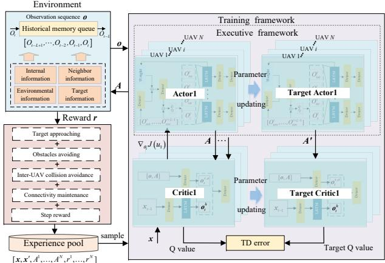  
Fig. 2. Historical queue-based MADRL framework of DA2RL.

$$
\mathbf { o } _ { t } ^ { i } = \left[ O _ { t - L + 1 } ^ { i } , \cdots , O _ { t - 3 } ^ { i } , O _ { t - 2 } ^ { i } , O _ { t - 1 } ^ { i } , O _ { t } ^ { i } \right] .\tag{3}
$$

Denote the strategy of each agent by $\mu ^ { i }$ . Building upon the concept of deterministic strategies, the gradient of the agent’s expected return $J ( u ^ { i } )$ can be expressed as

$$
\begin{array} { r l } & { \nabla _ { \theta ^ { i } } J ( \mu ^ { i } ) = \mathbb { E } _ { \mathbf { x } , a \sim \mathcal { D } } [ \nabla _ { \theta ^ { i } } u ^ { i } ( a ^ { i } \mid \mathbf { o } ^ { i } )  } \\ & { \qquad \nabla _ { a ^ { i } } Q _ { \mu } ^ { i } ( \mathbf { x } , a ^ { 1 } , \ldots , a ^ { \mathrm { N } } ) | _ { a ^ { i } = u ^ { i } ( \mathbf { o } ^ { i } ) } ] , } \end{array}\tag{4}
$$

Here, $Q _ { \mu } ^ { i } \left( \mathbf { x } , a ^ { 1 } , \ldots , a ^ { \mathbb { N } } \right)$ denotes a centralized action-value function, which serves as the model for the critic network. The experience replay buffer D stores tuples of the form $( \mathbf { x } , a ^ { 1 } , \ldots , a ^ { \mathbb { N } } , R _ { 1 } , \ldots , R ^ { \mathbb { N } } , \mathbf { x } _ { n e x t } )$ , which records the experiences of all agents. Here, x and ${ \bf x } _ { n e x t }$ represent the observations at the beginning and end of the current time step, respectively. Meanwhile, $a ^ { i }$ and $R ^ { i }$ denote the action and reward values of UAV i in the current time step, respectively. The $Q _ { \mu } ^ { i }$ function is then updated using the following loss function:

$$
\begin{array} { r } { \mathcal { L } \left( \boldsymbol { \theta } ^ { i } \right) = \mathbb { E } _ { \mathbf { x } , a , R , \mathbf { x } ^ { \prime } } \left[ \left( Q _ { \mu } ^ { i } \left( \mathbf { x } , a ^ { 1 } , \ldots , a ^ { \mathrm { N } } \right) - y \right) ^ { 2 } \right] , } \end{array}\tag{5}
$$

$$
y = R ^ { i } + \left. \gamma Q _ { \mu } ^ { i } ^ { \prime } \left( \mathbf { x } ^ { \prime } , a ^ { 1 ^ { \prime } } , \ldots , a ^ { \mathbb { N } ^ { \prime } } \right) \right| _ { a ^ { j ^ { \prime } } = u ^ { j } / \left( o ^ { j } \right) } .\tag{6}
$$

Here $u ^ { \prime } = \left\{ u _ { \theta ^ { 1 ^ { \prime } } } , \dots , u _ { \theta ^ { \mathrm { N } ^ { \prime } } } \right\}$ denotes the set of target strategies, where $\theta ^ { i ^ { \prime } }$ represents the delay parameter for each strategy.

## B. Distance-Attention-based Actor Network

To bridge the gap between the UAV’s observation space and the real environment, we integrate an LSTM network into the actor network. This integration enables the network to effectively capture and simulate long-term dependencies in sequential data. However, the incorporation of the LST-M network complicates the structure of the actor network, thereby increasing the difficulty of achieving convergence. Moreover, to enhance the UAV’s obstacle avoidance capability, we employ a multilayer circumferential detection model to comprehensively perceive the surrounding environment. As the dimensionality of the UAV’s observation space increases, the complexity of the neural network is further increased, causing a sharp rise in the difficulty of training the actor network.

In this work, we develop an innovative distance-attentionbased actor network to reduce the number of parameters in the deep neural network, thereby minimizing computational complexity during the training phase. Specifically, we first reshape the perceived obstacle state $\mathcal { O } _ { e n v } ^ { t }$ at time step t into a structured vector $\mathcal { V } _ { t } ~ = ~ \{ v _ { t } ^ { j } ~ | ~ j ~ \in ~ [ 1 , L v ] \}$ and input it into the fully connected layer, as shown in Figure 3(a). Here, $\boldsymbol { v } _ { t } ^ { j } = [ d _ { 1 , j } ^ { t } , d _ { 2 , j } ^ { t } , \cdot \cdot \cdot , d _ { 1 6 , j } ^ { t } ] , d _ { i , j } ^ { t }$ is the detected obstacle distance signal in 3D space at time step t, and $i , j$ separately indicate the horizontal and vertical directions.

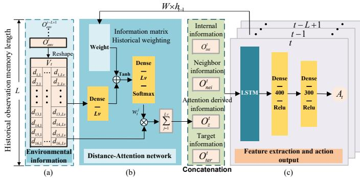  
Fig. 3. Distance-attention-based actor network of DA2RL.

Next, a special distance-attention network, which consists of two fully connected layers and a Softmax activation function, is designed to create a semantically enhanced representation of the obstacle state, as depicted in Figure 3(b). Specifically, the structured vector $\nu _ { t }$ is fed into the initial fully connected layer of the distance-attention network. The output is then combined with a weighted historical information matrix, obtained by multiplying the hidden state $h _ { t - 1 }$ of the previous time step of the LSTM network by a weight matrix $W ,$ and input into the subsequent fully connected layer. Subsequently, after processing by the Softmax activation function, the attention weight vector $\mathcal { W } _ { t } = \{ w _ { t } ^ { j } | j \in [ 1 , L v ] \}$ is generated, that is:

$$
\mathscr { W } _ { t } = \operatorname { S o f t m a x } ( L i n e a r ( \operatorname { T a n h } ( L i n e a r ( \mathscr { V } _ { t } ) + W \cdot h _ { t - 1 } ) ) ) .\tag{7}
$$

The weight vector ${ \mathcal { W } } _ { t }$ quantifies the relative importance of $\nu _ { t }$ , effectively highlighting the characteristics of obstacle information in different spatial directions. Subsequently, the product of $v _ { t } ^ { j }$ and the weight vector $w _ { t } ^ { j } .$ , denoted as $O _ { z }$ , is taken as the output result of the attention network, i.e.,

$$
O _ { z } = \sum _ { j = 1 } ^ { L v } w _ { t } ^ { j } \cdot v _ { t } ^ { j } .\tag{8}
$$

Here, $O _ { z }$ is the attention-derived vector, representing the weighted sum of all vectors in $\nu _ { t } .$ . This vector serves as a semantically enhanced representation of the obstacle state, effectively reducing the dimensionality of the feature vector. Thus, by aggregating the obstacle distance information with the learned attention weights to obtain $O _ { z } ,$ the UAV’s ability to perceive and interpret the distribution of obstacles in the environment can be significantly enhanced.

Finally, $O _ { z }$ is concatenated with the UAV’s internal state $O _ { i n t }$ , neighboring UAV state $O _ { n e i }$ and relative target state $O _ { t a r }$ to form the input to the LSTM network. The LSTM network then outputs the action policy through two fully connected layers, as depicted in Figure 3(c). Meanwhile, based on the information at the current time step and the hidden state from the previous moment, the LSTM network updates and outputs a new hidden state. This process enables the capture of temporal and long-term dependencies in sequential data, thereby better predicting future outcomes. During the training of the network, the attention network participates in backpropagation as a component of the actor network to update the parameters.

## C. Historical Feature Flow-based Critic Network

The temporal dependencies among multiple agents in partially observable environments pose significant challenges for accurately evaluating the strategic intent of other agents. This often results in systematic bias in $Q$ value estimation and leads to local optimization. To address this issue, we develop a historical feature flow-based critic network that effectively integrates historical state information, current global state data, and action data to enhance the accuracy of action value evaluations as presented in Figure 4.

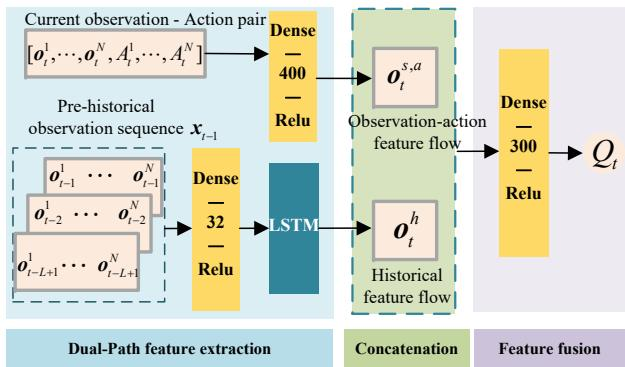  
Fig. 4. Historical feature flow-based critic network of DA2RL.

In the dual-path feature extraction phase, the input to the global critic network comprises of the observation-action pairs, i.e., $\bigl [ \mathbf { o } _ { t } ^ { 1 } , \mathbf { o } _ { t } ^ { 2 } , . . . , \mathbf { o } _ { t } ^ { N } , \boldsymbol { A } _ { t } ^ { 1 } , \mathbf { \bar { { A } } } _ { t } ^ { 2 } , . . . , \boldsymbol { A } _ { t } ^ { N } \bigr ]$ , and the historical observation sequence $\mathbf { x } _ { t - 1 }$ of all UAVs at time step t. Here, $\mathbf { x } _ { t - 1 } = [ \mathbf { o } _ { t - 1 } ^ { i } , \mathbf { o } _ { t - 2 } ^ { i } , \dots , \mathbf { o } _ { t - L + 1 } ^ { i } ] ,$ , and L denotes the length of the historical observation sequence. Initially, the UAVs integrate the current observation-action pairs and feed them into a fully connected layer for feature extraction, thereby ensuring that the interaction features of actions among multiple agents are fully captured. Concurrently, the historical observation sequence $\mathbf { x } _ { t - 1 }$ is processed through a fully connected layer and an LSTM module to extract the hidden state $\mathbf { o } _ { t } ^ { h }$ from the time series data, effectively addressing the limitations of partially observable information obtained at a single moment.

Then, the feature flow $o _ { t } ^ { s , a }$ extracted from the current observation-action pair is concatenated with the historical feature flow $o _ { t } ^ { h }$ generated by the LSTM network, thereby forming a composite feature vector. Then, the composite feature vector is fed into a two-layer fully connected network, which performs a nonlinear mapping to further extract higherorder features while simultaneously reducing dimensionality. This process ultimately yields the action values Q for each UAV. With integrated historical feature information, the accuracy of the action value can be effectively assessed and the convergence efficiency of the model is notably improved.

## D. Non-sparse Reward Functions

DRL enables agents to learn and optimize policies through exploration and exploitation within the environment. Welldesigned reward functions can effectively guide UAVs to navigate safely towards the target area while prompting them to select optimal behavioral strategies to optimize their trajectories. This is crucial to achieve collaborative goals and ensure efficient model training. The proposed algorithm involves five key components in the reward functions, i.e., the targetapproaching reward, obstacle avoidance reward, inter-UAV anti-collision reward, connectivity-maintenance reward, and time-step reward.

• Target-approaching reward: To encourage the UAV to head towards the target position, actions that bring the UAV closer to the destination should be awarded, while other actions should be penalized. Let $d _ { g \cdot t } ^ { i }$ denote the distance between UAV i and its destination at time step t. The reward function for approaching the destination is defined as

$$
r _ { 1 } ^ { i } = \left\{ \begin{array} { l } { C _ { 1 } , \qquad \quad d _ { g \cdot t } ^ { i } > D _ { 0 } } \\ { \frac { d _ { g \cdot t - 1 } ^ { i } - d _ { g \cdot t } ^ { i } } { \left| d _ { g \cdot t - 1 } ^ { i } - d _ { g \cdot t } ^ { i } \right| } e ^ { 0 . 0 5 \left( \left| d _ { g \cdot t - 1 } ^ { i } - d _ { g \cdot t } ^ { i } \right| \right) } , o t h e r w i s e . } \end{array} \right.\tag{9}
$$

where $D _ { 0 }$ is a positive constant that prevents the UAV from deviating too far from the target position.

• Obstacles-avoidance reward: To ensure the safe flight of the UAV, it is essential to impose appropriate penalties when it approaches obstacles. Unlike traditional approaches that set this reward as a discrete value, we define the collision penalty as a continuous function of the distance between the UAV and the obstacle. This can more effectively encourage the UAV to stay away from obstacles, that is,

$$
\begin{array} { c } { { r _ { 2 } ^ { i } = \sigma \left( \displaystyle \frac { d ^ { i } } { D _ { r } } - 1 \right) , } } \\ { { d ^ { i } = \displaystyle \operatorname* { m i n } ( d _ { j , 1 } ^ { i } , . . . , d _ { j , L _ { v } } ^ { i } ) , j = 1 . . . 1 6 . } } \end{array}\tag{10}
$$

Here, σ is a positive constant, $D _ { r }$ is the effective detection range of the LiDAR, and $d _ { i }$ gives the minimum distance detected by UAV i to obstacles in all directions.

• Inter-UAV anti-collision reward: The anti-collision behavior among UAVs is fundamental to ensure the safety of collaborative flight in UAV swarms. Given the high speed movement of UAVs during mission execution, neighboring UAVs can be regarded as rapidly moving dynamic obstacles. To effectively avoid collisions between UAVs, each UAV exchanges position information with its two nearest neighboring UAVs in real time to perceive their relative positions. When the distance between neighboring UAVs becomes too close, a corresponding penalty should be imposed. Therefore, the inter-UAV anticollision reward is defined as

$$
r _ { 3 } ^ { i } = \left\{ C _ { 2 } , \begin{array} { l l } { C _ { 2 } , } & { i f \operatorname* { m i n } \left( d _ { 1 7 } ^ { i } , d _ { 1 8 } ^ { i } \right) < d _ { n e i } } \\ { 0 , } & { o t h e r w i s e } \end{array} \right.\tag{11}
$$

That is, when the minimum distance to a neighboring UAV is less than the safe flight distance $d _ { n e i }$ , the UAV will be penalized by $C _ { 2 }$ . Given the high speed of UAVs, the value of $d _ { n e i }$ should be large enough to ensure safe flight.

• Connectivity-maintenance reward: To effectively obtain information from neighboring UAVs and maintain speed consistency among them, it is necessary to ensure that each UAV maintains communication connectivity with at least one neighboring UAV. When a UAV is about to lose communication with its nearest neighbor, a penalty is given to constrain and avoid the impact of communication disconnection on task coordination, thereby ensuring the overall stability and efficiency of the swarm flight. That is

$$
r _ { 4 } ^ { i } = \left\{ C _ { 3 } , \begin{array} { l l } { { C _ { 3 } , } } & { { i f \operatorname* { m i n } \left( d _ { 1 7 } ^ { i } , d _ { 1 8 } ^ { i } \right) > r _ { c o m } } } \\ { { 0 , } } & { { o t h e r w i s e } } \end{array} \right.\tag{12}
$$

Here, $r _ { c o m }$ is the maximum communication range between UAVs and its value is set according to [40]. Note that the distance constraint represents a composite measure of multiple factors and is not the only metric for link quality.

• Time-step reward: In order to push the UAV to reach the target area in as little time as possible, a fixed penalty will be given for each move, that is $r _ { 5 } ^ { i } = - 1$

To summarize, the total reward of UAV i can be formulated as:

$$
\mathcal { R } _ { i } = r _ { 1 } ^ { i } + r _ { 2 } ^ { i } + r _ { 3 } ^ { i } + r _ { 4 } ^ { i } + r _ { 5 } ^ { i } .\tag{13}
$$

Finally, Algorithm 1 gives the pseudo-code of DA2RL.

## E. Computational and Memory Requirements

The computational complexity of DA2RL arises from the decentralized actor and centralized two-stream critic networks. Let b denote the batch size, N be the number of UAVs, L be the historical observation memory length, H (resp. $H _ { c } )$ be the hidden size of the actor (resp. critic) LSTM, $| O _ { i } |$ be the peragent observation dimension, and $| A _ { i } |$ be the action dimension per agent.

Algorithm 1: Pseudo-code of DA2RL Algorithm.   
1 Initialize critic network $Q _ { i } ^ { u } \left( \mathbf { x } , \mathcal { A } _ { 1 } , \ldots , \mathcal { A } _ { \mathbb { N } } \right)$ , actor   
network $u _ { i } ( \mathbf { o } _ { i } )$ , target network $Q _ { i } ^ { u ^ { \prime } } ( \cdot )$ and $u _ { i } ^ { \prime } ( \cdot )$ , replay   
buffer $\mathcal { D } ;$   
2 for episode=1 to M do   
3 Initialize environment and receive an initial state   
$\mathbf { x } = \{ \mathbf { o } _ { 1 } , \mathbf { o } _ { 2 } , \ldots , \mathbf { o } _ { \mathbb { N } } \}$   
4 for time-step=1 to T do   
5 for $U A V { = } I \ t$ N do   
6 Reshape $o _ { e n v }$ from $o _ { t } .$ , and perform action   
$\begin{array} { r } { \mathcal { A } _ { i } = u _ { i } ( { \bf o } _ { t } ) + \mathcal { N } , } \end{array}$   
7 where $\mathcal { N }$ is a random Gaussian noise;   
8 end   
9 UAVs execute actions $\mathbb { A } _ { t } = \{ \mathcal { A } _ { 1 } , \mathcal { A } _ { 2 } , . . . , \mathcal { A } _ { \mathbb { N } } \}$   
and obtain reward $R _ { t } = \{ R _ { 1 } , R _ { 2 } , \ldots , R _ { \mathbb { N } } \}$ and   
the next state of next time-step $\mathbf { x } _ { t + 1 } ;$   
10 Store $\left( \mathbf { x } _ { t } , { \mathcal { A } } _ { t } , R _ { t } , \mathbf { x } _ { t + 1 } \right)$ into D and update state   
$\mathbf { x } _ { t } \gets \mathbf { x } _ { t + 1 } ;$   
11 if the capacity of D is full then   
12 for $U A V { = } I$ to N do   
13 sample a random minibatch of K   
transitions $( { \bf x } _ { j } , { \mathcal A } _ { j } , R _ { j } , { \bf x } _ { j + 1 } )$ from $\mathcal { D } ;$   
14 Update critic network by minimizing the   
loss with (5);   
15 Update actor network using (4);   
16 end   
17 Update target network parameters for each   
agent: $\theta _ { i } ^ { \prime }  \tau \theta _ { i } + ( 1 - \tau ) \theta _ { i } ^ { \prime } ;$   
18 end   
19 end   
20 end

Actor (per agent): As is shown in Figure 3, the computational cost of the actor network are in four main folds:

• The environmental observation $\mathbf { O } _ { \mathrm { e n v } } \in \mathbb { R } ^ { d _ { e } \cdot L _ { v } }$ (with $L _ { v } = 3 )$ is reshaped at $O ( d _ { e } \cdot L _ { v } )$ cost and processed by a lightweight distance-aware attention mechanism over the $L _ { v }$ vertical layers.

• In the attention network, layer-wise features are processed by two $L _ { v }$ linear projections, a context projection $( L _ { v } \cdot H )$ from the LSTM hidden state $\mathbf { h } _ { t - 1 }$ , and a weighted sum over the $L _ { v }$ layers, incurring total cost $O ( L _ { v } ^ { 2 } + H L _ { v } + L _ { v } )$

• The attention features are concatenated with local state (UAV pose, neighbor info, goal) to form an L-step sequence of dimension |Oi|, which is encoded by an LSTM (hidden size H) at cost $O ( b L ( | O _ { i } | H + H ^ { 2 } ) )$

• The feature extraction and action output part consists of $N _ { \mathrm { f c } }$ fully connected hidden layers, each of width $D ,$ followed by a linear output layer mapping to $| A _ { i } |$ dimensions. The final LSTM hidden state passes through the policy multilayer perceptron (MLP), contributing a total cost of $O \big ( b ( \dot { H } \cdot \bar { D } + ( \bar { N } _ { \mathrm { f c } } - 1 ) D ^ { 2 } + D | A _ { i } | ) \big )$

Summing these, the total per-agent actor complexity is:

$$
\begin{array} { r l } & { { \cal O } \biggl ( \underbrace { b d _ { e } \cdot L _ { v } } _ { \mathrm { r e s h a p i n g } } + \underbrace { b ( L _ { v } ^ { 2 } + H L _ { v } + L _ { v } ) } _ { \mathrm { a t t e n t i o n ~ m e c h a n i s m } } + \underbrace { b L ( | { \cal O } _ { i } | H + H ^ { 2 } ) } _ { \mathrm { L S T M ~ e n c o d i n g } } } \\ & { ~ + \underbrace { b H D + b ( N _ { \mathrm { f c } } - 1 ) D ^ { 2 } + b D | A _ { i } | } _ { \mathrm { f e a t u r e ~ e x t r a c t i o n ~ a n d ~ o u t p u t } } \biggr ) . } \end{array}\tag{14}
$$

Critic (centralized): As is shown in Figure 4, the computational cost of the critic network are in three main folds:

• The current joint observation-action input of dimension $N ( | O _ { i } | + | A _ { i } | )$ is projected through a dense layer of width $D _ { b 1 }$ , costing $O ( b N ( | O _ { i } | + | A _ { i } | ) D _ { b 1 } )$ ;

• The historical joint observation sequence (length L, perstep dimension $N | O _ { i } | )$ is first encoded per timestep by a dense layer of width $D _ { b 2 }$ at cost $O ( b L N | O _ { i } | D _ { b 2 } )$ then processed by an LSTM with hidden size $H _ { c }$ at cost $O ( b L ( D _ { b 2 } H _ { c } + H _ { c } ^ { 2 } ) )$

• The two stream outputs (dimensions $D _ { b 1 }$ and $H _ { c } )$ are fused via a shared MLP (with $N _ { \mathrm { f c } }$ layers and hidden width D, matching the actors policy head), incurring fusion cost $O \big ( b ( ( D _ { b 1 } + H _ { c } ) D + ( N _ { \mathrm { f c } } - 2 ) D ^ { 2 } + D ) \big )$

Summing these, the total critic complexity is:

$$
\begin{array} { r l } {  { O \bigg ( \underbrace { b N ( | O _ { i } | + | A _ { i } | ) D _ { b 1 } } _ { \mathrm { c u r r e n t ~ s t a t e - a c t i o n ~ p r o j e c t i o n } } } } \\ & { + \underbrace { b L N | O _ { i } | D _ { b 2 } + b L ( D _ { b 2 } H _ { c } + H _ { c } ^ { 2 } ) } _ { \mathrm { h i s t o r i c a l ~ o b s e r v a t i o n ~ p r o j e c t i o n ~ a n d ~ L S T M ~ e n c o d i n g } } } \\ & { + \underbrace { b ( D _ { b 1 } + H _ { c } ) D + b ( N _ { \mathrm { f c } } - 2 ) D ^ { 2 } + b D } _ { \mathrm { f e a u r r ~ f u s i o n ~ a n d ~ o u r p u t } } \bigg ) . } \end{array}\tag{15}
$$

Regarding memory, let R denote the replay buffer capacity and $P$ be the total number of trainable parameters across N actor networks and one shared critic. The space complexity of offline training is dominated by the replay buffer and model storage, scaling as $O ( R + b P )$ , where the $O ( b P )$ term accounts for runtime activations $( \mathrm { e . g . }$ , intermediate tensors and gradients) during back-propagation. At inference, the critic is discarded, and each UAV executes only its local actor, requiring ${ \cal O } ( P / N )$ model memory and $O ( L | O _ { i } | + H )$ peragent runtime memory for observation history and recurrent states. This decoupling ensures that deployment scales gracefully with the number of agents and remains feasible on resource-constrained onboard platforms without centralized coordination.

## IV. EVALUATION

In this section, we evaluate the navigation performance and generalization capabilities of DA2RL through a series of comparative and ablation experiments conducted in complex 3D urban environments.

## A. Parameter Settings

The 3D cooperative navigation experiments are constructed based on the work in [16], [23], [36] and OpenAI Gym [37]. Specifically, training is conducted within a rectangular area of $1 5 0 0 \times 1 5 0 0 \ m ^ { 2 }$ populated with randomly distributed obstacles. To evaluate the UAV’s obstacle avoidance capability, a complex environment with densely distributed obstacles is considered. The obstacles are modeled as vertical cylinders with a radius of 65 m and heights ranging from 40 m to 200 m. Notably, narrow passages with a minimum width of 50 m are present between adjacent obstacles, posing significant challenges for autonomous navigation. To better characterize the complex urban environment, three parameters are used according to the ITU-R Recommendation in [38] as follows:

• α: the ratio of land area covered by obstacles to total land area (dimensionless);

• β: the mean number of obstacles per unit area $( \mathrm { o b s t a c l e s } / k m ^ { 2 } )$

• γ: a variable determining the obstacle height distribution.

In training, $\alpha ~ = ~ 0 . 4 , ~ \beta ~ = ~ 3 0 ~ \mathrm { o b s t a c l e s } / k m ^ { 2 } , ~ \gamma ~ \sim$ Uniform{40, 200} meters.1 It should be noted that in test environments, parameter α is increased by expanding obstacle radii rather than adding more obstacles. This approach enables effective monitoring of UAV navigation through extremely narrow passages. To execute cooperative navigation missions, UAVs are randomly deployed in the departure area, ensuring they are located at least 200 meters away from the destination. The maximum speed of the UAV is set to 20 m/s [39]. Based on the Line-of-Sight (LoS) channel model between UAVs and commonly used parameter settings [40], the maximum communication distance is $r _ { c o m } = 1 5 0 ~ m$

TABLE I  
PARAMETER SETTINGS.
<table><tr><td rowspan=1 colspan=1>Hyperparameters</td><td rowspan=1 colspan=1>Values</td></tr><tr><td rowspan=1 colspan=1>Episode length</td><td rowspan=1 colspan=1>300</td></tr><tr><td rowspan=1 colspan=1>Episode number</td><td rowspan=1 colspan=1>2000</td></tr><tr><td rowspan=1 colspan=1>Batch size M</td><td rowspan=1 colspan=1>256</td></tr><tr><td rowspan=1 colspan=1>Discount factor γ</td><td rowspan=1 colspan=1>0.95</td></tr><tr><td rowspan=1 colspan=1>Soft update factor τ</td><td rowspan=1 colspan=1>0.001</td></tr><tr><td rowspan=1 colspan=1>Number of UAVs N</td><td rowspan=1 colspan=1>3</td></tr><tr><td rowspan=1 colspan=1>Vertical detection length $L _ { v }$ </td><td rowspan=1 colspan=1>3</td></tr><tr><td rowspan=1 colspan=1>Detection range of range finders $D _ { r }$ </td><td rowspan=1 colspan=1>100m</td></tr><tr><td rowspan=1 colspan=1>Penalty values $C _ { 1 } , C _ { 2 } , C _ { 3 }$ in (9), (11), (12)</td><td rowspan=1 colspan=1>-30</td></tr><tr><td rowspan=1 colspan=1>Hidden-size of LSTM network</td><td rowspan=1 colspan=1>64</td></tr></table>

## B. Evaluation Metrics

In the experiment, we evaluate the cooperative navigation algorithm using five key metrics based on [16] and [23]:

• Success rate: In the cooperative navigation mission, the mission is deemed successful only when all UAVs reach the target area. The success rate is defined as the ratio of the number of successful missions to the total number of missions.

• Collision rate: A collision occurs when a UAV collides with environmental obstacles or other UAVs. The collision rate is defined as the ratio of the number of missions failed due to collisions to the total number of missions.

• Time-out rate: A mission is considered a failure if UAVs do not reach the target area within the maximum time step, referred to as a time-out mission. The time-out rate is defined as the ratio of the number of time-out missions to the total number of missions.

• Velocity consistency: For cooperative missions, it is crucial that the velocities of UAVs remain synchronized. Inspired by the Boids model in [41], the velocity consistency of UAVs is defined as

$$
C _ { v } = \frac { \Vert \mathbf { v } ^ { i } + \sum _ { j \in \mathcal { N } _ { i } } \mathbf { v } ^ { j } \Vert _ { 2 } } { \Vert \mathbf { v } ^ { i } \Vert _ { 2 } + \Vert \sum _ { j \in \mathcal { N } _ { i } } \mathbf { v } ^ { j } \Vert _ { 2 } } ,\tag{16}
$$

where $C _ { v } \in [ 0 , \ 1 ]$ . And a higher value of $C _ { v }$ indicates greater velocity consistency;

• Path length: The path length is calculated as the average distance traveled by all UAVs in all successful missions.

## C. Learning rates determination

In reinforcement learning, the learning rate stands as one of the most critical hyperparameters, governing the fundamental trade-off between training stability and flexibility. Its appropriate configuration is essential for the successful training of reinforcement learning agents. In this study, the optimal learning rates for the actor and critic networks, designated as $\alpha _ { a }$ and $\alpha _ { c }$ respectively, are determined through systematic empirical experiments. According to [16], [28], these values are generally confined to the interval $[ 1 0 ^ { - 3 } , 1 0 ^ { - 4 } ] .$ . To elucidate the hyperparameter tuning procedure, simulation results in five representative learning rate configurations $S _ { 1 }$ to $S _ { 5 }$ are given in Figure 5 and Table II as follows,

$$
S _ { 1 } \colon \alpha _ { a } = 0 . 0 0 0 1 , \alpha _ { c } = 0 . 0 0 0 5 ;
$$

$$
S _ { 2 } \colon \alpha _ { a } = 0 . 0 0 0 1 , \alpha _ { c } = 0 . 0 0 1 ;
$$

$$
S _ { 3 } \colon \alpha _ { a } = 0 . 0 0 0 2 , \alpha _ { c } = 0 . 0 0 1 ;
$$

$$
S _ { 4 } \colon \alpha _ { a } = 0 . 0 0 0 2 , \alpha _ { c } = 0 . 0 0 2 ;
$$

$$
S _ { 5 } \colon \alpha _ { a } = 0 . 0 0 0 4 , \alpha _ { c } = 0 . 0 0 2 .
$$

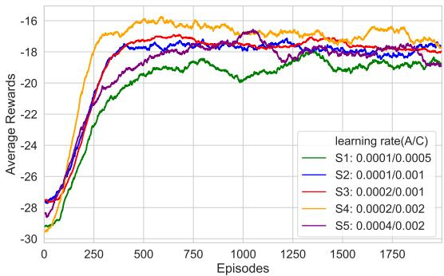  
Fig. 5. Learning curves of the average rewards with different learning rates.

As is shown in Figure 5, the average reward increases progressively from scenario $S _ { 1 }$ to $S _ { 4 }$ , followed by a sharp decline in $S _ { 5 }$ . The learning curve for $S _ { 4 }$ converges more rapidly than those of other configurations and maintains a higher reward level, with $S _ { 3 }$ exhibiting the next best performance. It is worth noting, however, that the $S _ { 4 }$ curve displays greater fluctuation compared to that of $S _ { 3 }$ . Table II summarizes the navigation performance of the five scenarios with the optimal result in each column emphasized in bold. The results show that scenario $S _ { 3 }$ achieves the highest success rate and the lowest collision rate among all tested configurations. Although its timeout rate is the highest across all scenarios, the increase in timeout is modest in absolute terms and reflects a policy that prioritizes goal-directed navigation over conservative timing. Moreover, the path length in $S _ { 3 }$ is only slightly longer than the shortest path observed in $S _ { 4 }$ and remains substantially shorter than those in other scenarios. Given that successful task completion and collision avoidance are critical for realworld autonomous navigation, the learning rate configuration from scenario $S _ { 3 } , \mathrm { i . e . , ~ } \alpha _ { a } = 0 . 0 0 0 2 , \alpha _ { c } = 0 . 0 0 1$ , is selected for use in subsequent experiments.

TABLE II  
Navigation performance with different learning rates.
<table><tr><td rowspan=1 colspan=1>IndexScenarios</td><td rowspan=1 colspan=1>Successrate</td><td rowspan=1 colspan=1>Collisionrate</td><td rowspan=1 colspan=1>Timeoutrate</td><td rowspan=1 colspan=1>Velocityconsis-tency</td><td rowspan=1 colspan=1>Pathlength(m)</td></tr><tr><td rowspan=1 colspan=1> $S _ { 1 }$ </td><td rowspan=1 colspan=1>91.6%</td><td rowspan=1 colspan=1>8.37%</td><td rowspan=1 colspan=1>0.03%</td><td rowspan=1 colspan=1>0.891</td><td rowspan=1 colspan=1>1022.00</td></tr><tr><td rowspan=1 colspan=1> $S _ { 2 }$ </td><td rowspan=1 colspan=1>93.0%</td><td rowspan=1 colspan=1>6.90%</td><td rowspan=1 colspan=1>0.10%</td><td rowspan=1 colspan=1>0.908</td><td rowspan=1 colspan=1>989.57</td></tr><tr><td rowspan=1 colspan=1> $S _ { 3 }$ </td><td rowspan=1 colspan=1>94.6%</td><td rowspan=1 colspan=1>5.17%</td><td rowspan=1 colspan=1>0.23%</td><td rowspan=1 colspan=1>0.908</td><td rowspan=1 colspan=1>985.30</td></tr><tr><td rowspan=1 colspan=1> $S _ { 4 }$ </td><td rowspan=1 colspan=1>93.6%</td><td rowspan=1 colspan=1>6.32%</td><td rowspan=1 colspan=1>0.08%</td><td rowspan=1 colspan=1>0.910</td><td rowspan=1 colspan=1>968.57</td></tr><tr><td rowspan=1 colspan=1> $S _ { 5 }$ </td><td rowspan=1 colspan=1>92.6%</td><td rowspan=1 colspan=1>7.32%</td><td rowspan=1 colspan=1>0.08%</td><td rowspan=1 colspan=1>0.904</td><td rowspan=1 colspan=1>992.68</td></tr></table>

## D. Comparative Analysis of the Training Results

1) Training Performance: In the experiments, we compare the performance of DA2RL with two closely related benchmark methods: MADDPG and MARDPG. To ensure a fair evaluation, both MADDPG and MARDPG algorithms utilize the same POMDP model and reward functions as DA2RL. MADDPG serves as the baseline for 3D cooperative navigation, while MARDPG incorporates recurrent neural networks (RNNs) in both the actor and critic networks to capture the dependencies between historical states and actions. Additionally, the recently proposed RL-CN algorithm [16], which has demonstrated superior performance in UAV cooperative navigation tasks in complex environments, is included as a comparative method. It is worth noting that RL-CN employs two-dimensional action and observation spaces with specially designed reward functions. All simulation results are averaged from 200 tests with random start and target positions to ensure robustness and reliability.

Figure 6 illustrates the convergence characteristics of the algorithms under comparison. It should be noted that the convergence curve of RL-CN is excluded due to its unique reward function design. The results indicate that both MARDPG and DA2RL exhibit significantly faster convergence speeds compared to MADDPG. Specifically, MADDPG requires approximately 1,750 training episodes to reach a stable state, while MARDPG and DA2RL achieve convergence within just 400 episodes and obtain better average rewards. This performance difference highlights the effectiveness of utilizing historical sequences in the architectures of both DA2RL and MARDPG. Notably, MARDPG outperforms the other two algorithms in terms of reward maximization, achieving substantially higher average rewards. However, this advantage comes at the expense of practical navigation performance. Because the optimization strategy of MARDPG appears to be overly focused on reward acquisition rather than enhancing functional navigation capabilities.

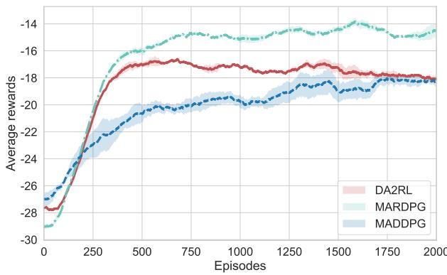  
Fig. 6. Learning curves of the average rewards.

2) Qualitative Results: To quantitatively evaluate navigation performance, Figure 7 and Figure 8 present the comparative visualization of 3D trajectories generated by four algorithms under identical test conditions. These trajectories reveal distinct behavioral patterns in obstacle negotiation and trajectory-smoothing capabilities. In Figures 7(a) and 8(a), the three UAVs controlled by DA2RL follow smooth trajectories. They dynamically adjust their flight directions and altitudes, enabling efficient navigation through narrow obstacle passages and successful arrival at their destinations. Compared to the other algorithms, the UAVs controlled by DA2RL exhibit tighter flight paths, signifying a notable enhancement in both consistency and collaboration performance. Conversely, Figures 7(b) and 8(b) illustrate that the flight paths of UAVs using the MADDPG algorithm are highly divergent and lack effective cooperation, highlighting the limitations of this algorithm in maintaining coordinated navigation. Moreover, Figures 7(c) and 8(c) show more pronounced distortions in the trajectories of UAVs when they are governed by the MARDPG algorithm. Notably, as shown in Figures 7(d) and 8(d), the three UAVs controlled by RL-CN generate distinctly different navigation trajectories. When confronted with narrow passages, the UAVs tend to avoid traversing shared passages simultaneously, opting for separate routes instead. It impairs path optimality and results in suboptimal overall mission performance in terms of both path length and execution efficiency.

Regarding cooperative behaviors, Figure 9 systematically presents the velocity profiles of UAVs at each timestep in a representative training-environment trial. The terminal points of all trajectories confirm successful arrival at the target zone. As explicitly shown in Figure 9, DA2RL outperforms other baseline methods in both mission completion time and speed adjustment consistency. Specifically, DA2RL reduces the mission completion time by approximately 16% compared to RL-CN and MARDPG, and 6.5% to MADDPG. As illustrated in Figure 9(a), all DA2RL-controlled UAVs achieve smooth speed convergence while maintaining tight velocity synchronization. This is attributed to a twofold mechanism: (a) The distance-attention-based actor network enables dynamic action adjustment to avoid collisions and maintain formation consistency; (b) The historical feature flow-based critic network leverages historical interaction patterns to optimize cooperative policies, such as sequential coordination during narrow-passage navigation.

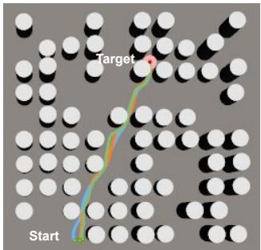  
(a) DA2RL

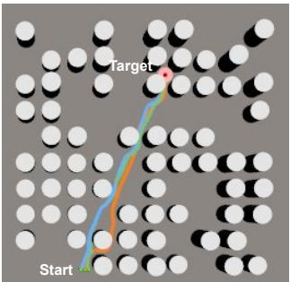  
(b) MARDPG

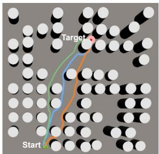  
(c) MADDPG

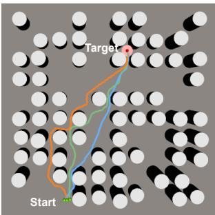  
(d) RL-CN

Fig. 7. Navigation trajectories in the training environment: (a) DA2RL; (b) MADDPG; (c) MARDPG; (d) RL-CN.  
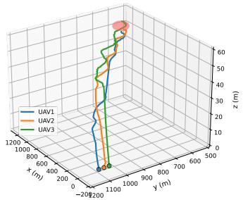  
(a) DA2RL

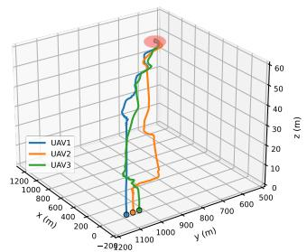  
(b) MARDPG

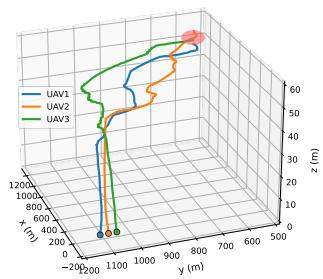  
(c) MADDPG

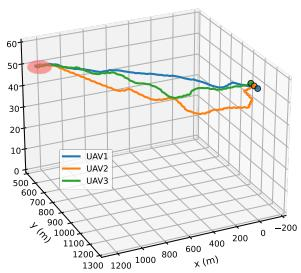  
(d) RL-CN

Fig. 8. 3D trajectories in the training environment: (a) DA2RL; (b) MADDPG; (c) MARDPG; (d) RL-CN.  
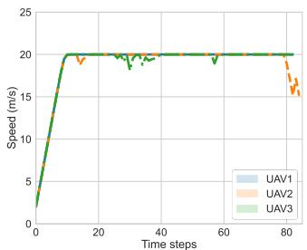  
(a) DA2RL

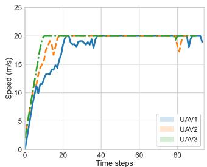  
(b) MADDPG

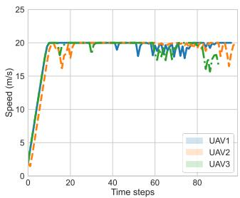  
(c) MARDPG

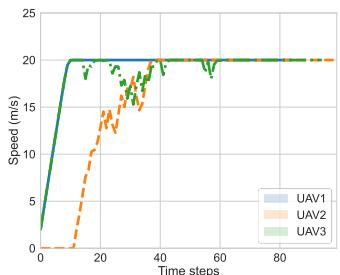  
(d) RL-CN  
Fig. 9. Speed change curves in the training environment: (a) DA2RL; (b) MADDPG; (c) MARDPG; (d) RL-CN.

In contrast, as shown in Figures 9(b) and 9(d), UAVs controlled by MADDPG and RL-CN exhibit significant velocity jitter during acceleration phases, requiring substantially longer durations to reach velocity consensus. Specifically, Figure 9(b) reveals that UAV1 and UAV2 under MADDPG show pronounced fluctuations and delayed convergence before stabilization. The large speed variance of MADDPG-controlled UAVs necessitates frequent formation adjustments, directly indicating low inter-agent coordination efficiency. For RL-CN, UAV2’s delayed acceleration during takeoff (Figure 9(d)) not only underscores its limitations in narrow-passage navigation but also highlights the asynchrony of multi-UAV actions, reflecting a critical insufficiency in the coordination mechanism. MARDPG, as demonstrated in Figure 9(c), exhibits notable instability in maintaining cruise speeds, which is attributed to its over-reliance on historical sequence patterns.

3) Quantitative Results: Table III provides a comprehensive comparison of the navigation performance of all benchmarked algorithms in the training environment. As observed, the proposed DA2RL algorithm achieves the highest success rate of 94.6%, coupled with the lowest collision rate of

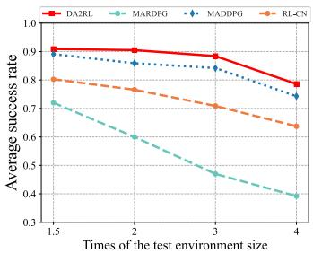  
(a)

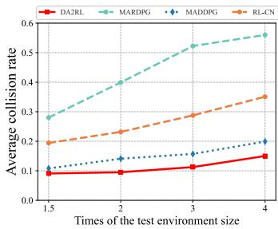  
(b)

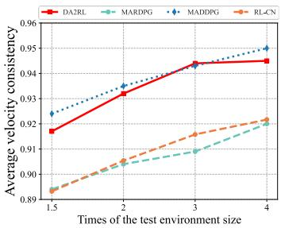  
(c)

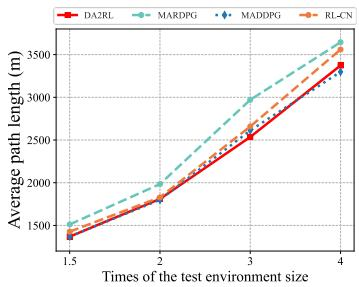  
(d)  
Fig. 10. Navigation performance in generalized environments with different enlarged areas: (a) Success rate; (b) Collision rate; (c) Velocity consistency; (d) Path length.

5.17%. In terms of relative improvement, DA2RL outperforms MADDPG, MARDPG, and RL-CN by approximately 3.6%, 17.9%, and 9.4% in success rate, respectively. This underscores DA2RL’s remarkable advantage in enabling UAVs to safely reach the target area during 3D cooperative navigation missions. Additionally, DA2RL exhibits the highest speed consistency, with a value of approximately 0.908. This demonstrates its superior capability in maintaining constant velocity, thereby enhancing the robustness of navigation tasks. Moreover, it attains a relatively short average path length (only marginally longer than that of RL-CN). Considering RL-CN’s inherent 2D constraints, DA2RL’s performance in 3D space remains highly commendable. Although DA2RL exhibits a slightly higher timeout rate in long-range missions, this is a deliberate trade-off resulting from its strong emphasis on collision avoidance, which significantly enhances flight safety at the cost of occasional time-budget overruns.

TABLE III  
Navigation performance under the training environment.
<table><tr><td rowspan=1 colspan=1>AlgorithmsIndex</td><td rowspan=1 colspan=1>DA2RL</td><td rowspan=1 colspan=1>MADDPG</td><td rowspan=1 colspan=1>MARDPG</td><td rowspan=1 colspan=1>RL-CN</td></tr><tr><td rowspan=1 colspan=1>Success rate</td><td rowspan=1 colspan=1>94.6%</td><td rowspan=1 colspan=1>91.3%</td><td rowspan=1 colspan=1>80.2%</td><td rowspan=1 colspan=1>85.5%</td></tr><tr><td rowspan=1 colspan=1>Collision rate</td><td rowspan=1 colspan=1>5.17%</td><td rowspan=1 colspan=1>8.61%</td><td rowspan=1 colspan=1>19.80%</td><td rowspan=1 colspan=1>14.42%</td></tr><tr><td rowspan=1 colspan=1>Timeout rate</td><td rowspan=1 colspan=1>0.23%</td><td rowspan=1 colspan=1>0.09%</td><td rowspan=1 colspan=1>0.00%</td><td rowspan=1 colspan=1>0.08%</td></tr><tr><td rowspan=1 colspan=1>Velocityconsistency</td><td rowspan=1 colspan=1>0.908</td><td rowspan=1 colspan=1>0.903</td><td rowspan=1 colspan=1>0.876</td><td rowspan=1 colspan=1>0.879</td></tr><tr><td rowspan=1 colspan=1>Path length (m)</td><td rowspan=1 colspan=1>985.3</td><td rowspan=1 colspan=1>986.0</td><td rowspan=1 colspan=1>1072.6</td><td rowspan=1 colspan=1>980.4</td></tr></table>

It is crucial to highlight that, despite MARDPG demonstrating remarkable performance on the reward convergence curve shown in Figure 6, its actual navigation performance significantly lags behind other algorithms. This divergence originates from MARDPG’s integration of RNNs in both its actor and critic networks. While this architecture enables more comprehensive modeling of dependencies between historical states and actions, it simultaneously introduces instability in learning long-term dependencies and elevates training complexity. In contrast, DA2RL, featuring a meticulously designed distanceattention-based actor network and a historical feature flowbased critic network, effectively circumvents these issues. Our approach ensures stable learning of long-term dependencies and maintains training robustness, thereby achieving superior navigation performance.

In summary, the DA2RL algorithm demonstrates comprehensive advantages over comparative methods: it simultaneously reduces mission completion time, improves speed consistency across all UAVs during flight operations, increases the success rate, and shortens the average path length. These quantitative and qualitative results collectively validate DA2RL’s enhanced capability in cooperative UAV navigation tasks, underscoring its practical superiority in complex 3D navigation scenarios.

## E. Generalization Capability

In practice, UAV mission environments are highly complex and dynamic. To evaluate generalization capability, we enhance the complexity of the test environment in four ways: varying the environment size, adjusting the obstacle density, introducing dynamic elements, and enlarging the swarm size.

1) Varying Environment Size: We assess the generalization capabilities of comparative algorithms across environments with varying spatial dimensions. During testing, the training environment’s area is incrementally expanded by a factor of $x _ { a } ,$ where $x _ { a }$ ranges from 1 to 4. The navigation performance metrics in these enlarged environments are depicted in Figure 10. As illustrated in Figure 10(a), the success rates of DA2RL and MADDPG exhibit a marginal decline with increasing environment size, yet maintain a high overall level. In contrast, MARDPG and RL-CN are more greatly affected by environmental complexity, resulting in a steeper drop in success rates. DA2RL consistently outperforms other algorithms, achieving a 78.6% success rate when $x _ { a } = 4 .$ . This represents an improvement of 5.8%, 23.2%, and 100.5% compared to MADDPG, RL-CN, and MARDPG, respectively. These results underscore DA2RL’s stability in large-scale scenarios and its robust adaptability to environmental size variations. Similarly, Figure 10(b) reveals that the collision rates of most algorithms rise with environment size expansion. Notably, DA2RL maintains a consistently low collision rate, demonstrating the superiority of its obstacle avoidance capability in variable environments.

Moreover, Figure 10(c) depicts velocity consistency metrics across environment scales. Most algorithms show improved stability with expanded environments. DA2RL and MADDPG stands out with higher consistency, demonstrating a continuous upward trend as environment size increases. In stark contrast, MARDPG and RL-CN start with low initial consistency, despite marginal improvements with scale, they persistently trail DA2RL and MADDPG, highlighting inadequate adaptability of their motion control strategies in complex scenarios. Additionally, Figure 10(d) reveals that path lengths increase monotonically for all algorithms as environments expand. DA2RL, MADDPG, and RL-CN show similar path efficiency, whereas MARDPG consistently yields the longest trajectories, which is largely due to excessive detouring in complex setups. Collectively, these findings confirm that DA2RL outperforms competitors in overall navigation performance, demonstrating superior robustness and generalization capability across scaled environments.

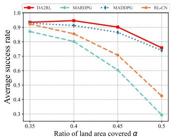  
(a)

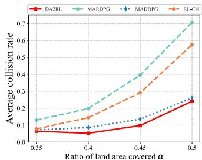  
(b)

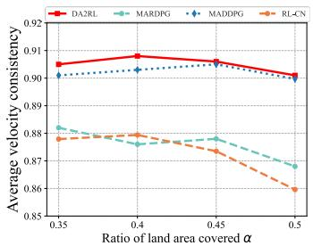  
(c)

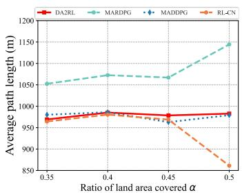  
(d)  
Fig. 11. Generalization performance in different obstacle density environments: (a) Success rate; (b) Collision rate; (c) Velocity consistency; (d) Path length.

2) Varying Obstacle Density: We evaluate the navigation performance of trained models across environments with varying obstacle densities. Specifically, we adjust the ratio of land area covered with obstacles, α, within the range [0.35, 0.5] to simulate scenarios with different obstacle densities and narrow passages. Notably, as α increases, more narrow passages are likely to form. This is because α is increased by expanding the radius of obstacles rather than increasing their quantity. Figure 11 visualizes the navigation performance in these test environments.

Figures 11(a) and 11(b) present the success rates and collision rates of the comparative algorithms, respectively. As shown, DA2RL consistently achieves the highest success rate and the lowest collision rate, while MARDPG performs much worse than the other algorithms. As the environment becomes denser, the success rates of DA2RL and MADDPG follow a(a) Time step (b) Time step relatively similar trend. In contrast, the success rates of RL-CN and MARDPG decrease significantly, and their collision rates rise rapidly. When $\alpha = 0 . 4 5$ , the success rate of DA2RL reaches 90.2%, which is 4.3%, 27.4%, and 49.3% higher than those of MADDPG, RL-CN, and MARDPG, respectively. Figure 11(c) highlights that DA2RL and MADDPG achieve markedly superior velocity consistency compared to the other two algorithms. Moreover, Figure 11(d) indicates that DA2RL, MADDPG and RL-CN consistently maintain shorter average path lengths with less fluctuation. In contrast, MARDPG exhibits a notable increase in average path length as the environment becomes denser. These results reflect DA2RL’s improved stability in responding to environmental changes and its ability to adapt to different environments.

3) Dynamic Environments: To simulate a dynamically evolving environment, the positions of obstacles are periodically refreshed at intervals of $x _ { f }$ steps, where $x _ { f } \in [ 2 0 , 5 0 ]$ . The dynamics of the environment are characterized by this obstacle refresh interval, such that a shorter interval corresponds to greater environmental dynamism and unpredictability. Due to the frequent and stochastic nature of obstacle refreshment, the environment maintains a persistent state of variability.

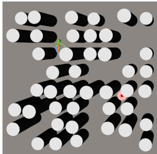

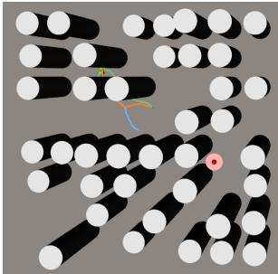  
(b) Time step (b) Time step ??1??

(a) Time step (a) Time step ??0??  
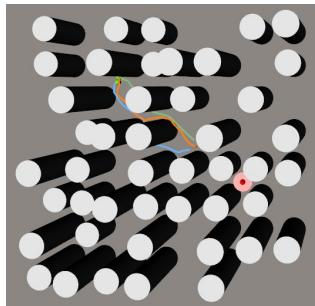

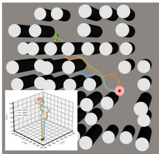  
(c) Time step $t _ { 2 }$  
(d) Time step $t _ { 3 }$  
Fig. 12. Navigation trajectories of DA2RL under dynamic environments: (a) initial state at time step t0; (b) UAVs’ trajectories at time step t1; (c) UAVs’ trajectories at time step t2; (d) UAVs’ trajectories at time step $t _ { 3 } .$ Note that $t _ { 0 } < t _ { 1 } < t _ { 2 } < t _ { 3 } .$

As visualized in Figure 12, the navigation process of DA2RL in a dynamic environment with $x _ { f } = 2 0$ is systematically presented. Specifically, Figure 12(a) captures the initial configuration at $t _ { 0 } .$ illustrating the UAVs’ starting coordinates and the baseline obstacle topology. Figures 12(b)-12(d) chronicle the spatio-temporal evolution of the UAVs’ trajectories at consecutive time steps $t _ { 1 } , t _ { 2 } , t _ { 3 }$ . As demonstrated, the UAVs have successfully navigated around dynamically repositioned obstacles, preserving trajectory smoothness while incorporating some detours due to the dynamic nature of the environment. Across these temporal stages, DA2RL exhibits robust adaptive capabilities, with the UAVs adaptively circumventing newly emergent obstacles while keeping a smooth trajectory toward the target. This reflects DA2RL’s robustness in dynamic environments. The inset in Figure 12(d) further illustrates the UAVs’ trajectories in three-dimensional space, underscoring its effectiveness in navigating complex, dynamically perturbed scenarios.

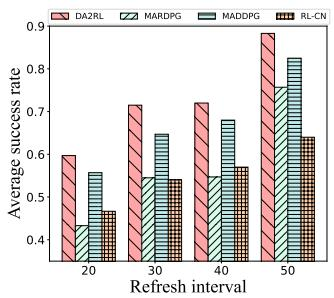  
(a)

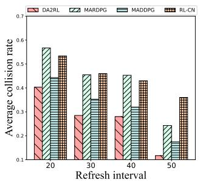  
(b)

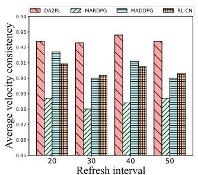  
(c)

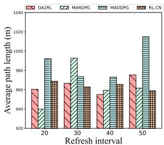  
(d)  
Fig. 13. Generalization performance of the comparative algorithms with dynamic obstacles: (a) Success rate; (b) Collision rate; (c) Velocit consistency; (d) Path length.

TABLE IV Performance with more numbers of UAVs.
<table><tr><td rowspan=1 colspan=1>N</td><td rowspan=1 colspan=1>IndexAlgorithm</td><td rowspan=1 colspan=1>Success rate</td><td rowspan=1 colspan=1>Collision rate</td><td rowspan=1 colspan=1>Timeout rate</td><td rowspan=1 colspan=1>Velocity consistency</td><td rowspan=1 colspan=1>Average path length (m)</td></tr><tr><td rowspan=2 colspan=1>3</td><td rowspan=1 colspan=1>DA2RL</td><td rowspan=1 colspan=1>94.6%</td><td rowspan=1 colspan=1>5.17%</td><td rowspan=1 colspan=1>0.23%</td><td rowspan=1 colspan=1>0.908</td><td rowspan=1 colspan=1>985.3</td></tr><tr><td rowspan=1 colspan=1>MADDPG</td><td rowspan=1 colspan=1>91.3%</td><td rowspan=1 colspan=1>8.61%</td><td rowspan=1 colspan=1>0.09%</td><td rowspan=1 colspan=1>0.903</td><td rowspan=1 colspan=1>986.0</td></tr><tr><td rowspan=2 colspan=1>5</td><td rowspan=1 colspan=1>DA2RL</td><td rowspan=1 colspan=1>93.1%</td><td rowspan=1 colspan=1>6.77%</td><td rowspan=1 colspan=1>0.13%</td><td rowspan=1 colspan=1>0.922</td><td rowspan=1 colspan=1>954.1</td></tr><tr><td rowspan=1 colspan=1>MADDPG</td><td rowspan=1 colspan=1>81.2%</td><td rowspan=1 colspan=1>18.63%</td><td rowspan=1 colspan=1>0.17%</td><td rowspan=1 colspan=1>0.915</td><td rowspan=1 colspan=1>1007.3</td></tr><tr><td rowspan=2 colspan=1>7</td><td rowspan=1 colspan=1>DA2RL</td><td rowspan=1 colspan=1>89.1%</td><td rowspan=1 colspan=1>10.83%</td><td rowspan=1 colspan=1>0.07%</td><td rowspan=1 colspan=1>0.903</td><td rowspan=1 colspan=1>1013.1</td></tr><tr><td rowspan=1 colspan=1>MADDPG</td><td rowspan=1 colspan=1>69.2%</td><td rowspan=1 colspan=1>30.75%</td><td rowspan=1 colspan=1>0.05%</td><td rowspan=1 colspan=1>0.890</td><td rowspan=1 colspan=1>1070.0</td></tr><tr><td rowspan=2 colspan=1>10</td><td rowspan=1 colspan=1>DA2RL</td><td rowspan=1 colspan=1>84.9%</td><td rowspan=1 colspan=1>15.01%</td><td rowspan=1 colspan=1>0.09%</td><td rowspan=1 colspan=1>0.889</td><td rowspan=1 colspan=1>1072.2</td></tr><tr><td rowspan=1 colspan=1>MADDPG</td><td rowspan=1 colspan=1>54.4%</td><td rowspan=1 colspan=1>45.52%</td><td rowspan=1 colspan=1>0.08%</td><td rowspan=1 colspan=1>0.878</td><td rowspan=1 colspan=1>1091.5</td></tr><tr><td rowspan=2 colspan=1>12</td><td rowspan=1 colspan=1>DA2RL</td><td rowspan=1 colspan=1>79.6%</td><td rowspan=1 colspan=1>20.35%</td><td rowspan=1 colspan=1>0.05%</td><td rowspan=1 colspan=1>0.871</td><td rowspan=1 colspan=1>1147.6</td></tr><tr><td rowspan=1 colspan=1>MADDPG</td><td rowspan=1 colspan=1>47.7%</td><td rowspan=1 colspan=1>52.27%</td><td rowspan=1 colspan=1>0.03%</td><td rowspan=1 colspan=1>0.872</td><td rowspan=1 colspan=1>1122.0</td></tr></table>

In addition, Figure 13 presents the navigation performance of the comparative algorithms across various dynamic environments. To isolate the impact of environmental dynamics on algorithm adaptability, starting and target positions are fixed in each test case. As shown in Figure 13(a) and 13(b), the success rate increases with the refresh interval, while the collision rate decreases reciprocally. This trend is attributed to the extended response window in slower-changing environments, enabling UAVs to make more informed action decisions and thus achieve higher success rates and lower collision rates. Notably, the proposed DA2RL algorithm consistently outperforms others in both metrics. For instance, when the refresh interval $x _ { f } = 2 0$ , DA2RL improves the success rate by 37.9% (vs. MARDPG), 7.2% (vs. MADDPG), and 27.8% (vs. RL-CN), while reducing the collision rate by 28.9%, 9.0%, and 24.4%, respectively.

Besides, as illustrated in Figure 13(c), DA2RL demonstrates consistently high velocity consistency (above 0.92), outperforming all other algorithms. In contrast, MARDPG exhibits significantly lower velocity consistency, due to the inclusion of RNNs in its actor-critic networks, which may lead to less stable control. In terms of average path length in Figure 13(c), DA2RL shows strong performance, with path lengths consistently below 980 meters. This stems from DA2RL’s meticulously designed distance-attention-based actor network and historical feature flow-based critic network, which effectively mitigate control instability. The architecture ensures stable learning of long-term dependencies and maintains training robustness, thereby achieving superior navigation performance. Notably, MARDPG outperforms MADDPG in overall average path length across most dynamic scenarios. This suggests that MARDPG’s network architecture enables it to identify optimized paths to some extent by leveraging historical information, albeit in an unstable manner, thus balancing path efficiency with environmental adaptability.

4) Enlarging swarm size: To evaluate the effect of larger swarms, the trained model is tested when the number of UAVs increases from 3 to 12. The simulation results are presented in Table IV.

As anticipated, both algorithms experience a decline in success rate as the number of UAVs increases. This decline stems primarily from the fact that the model was trained with only 3 UAVs. When deployed in scenarios with more UAVs, they are unable to effectively perceive their surrounding environment, particularly other flying objects. This lack of sufficient observation leads to an increased collision rate, which in turn reduces the overall success rate.2 Nevertheless, it can be observed that the proposed DA2RL algorithm not only maintains a consistently higher navigation success rate but also exhibits a more gradual performance degradation compared to MADDPG as the swarm size increases. This robust performance underscores the superior generalization capability inherent in our design. Consequently, these results affirm that our approach establishes a scalable and effective foundation for swarm navigation.

## F. Energy Consumption

To evaluate the energy cost of the navigation algorithms, the energy consumption model consisting three key components, i.e., processor computation energy, LiDAR detection energy and propulsion energy, are considered. First, the processor computation energy for a single inference of the actor network can be expressed as the sum of operational and memory access energies as follows,3

$$
E _ { c } = \underbrace { N _ { o p s } E _ { o } } _ { \mathrm { o p e r a t i o n ~ e n e r g y } } + \underbrace { ( I _ { r } E _ { m r } + I _ { w } E _ { m w } ) } _ { \mathrm { m e m o r y ~ a c c e s s ~ e n e r g y } } ,\tag{17}
$$

Second, let $P _ { l }$ be the power consumption of the LiDAR detection module. Following the DJI Zenmuse L2 specification in [30], $P _ { l }$ is set to 28 W. Third, for the propulsion energy cost, we adopt the reference model widely used in the literature [29], [31] as follows,4

$$
\begin{array} { r l } & { P _ { p } = \underbrace { \frac { \delta } { 8 } \left( \frac { | | \mathbf { v } | | } { c r \rho \mathcal { A } } + 3 | | \mathbf { v } | | ^ { 2 } \right) \sqrt { \frac { \rho s ^ { 2 } A | | \mathbf { T } | | } { c r } } } _ { \mathrm { b i a t e ~ p o i d t e ~ p o w e r } } } \\ & { \quad + \underbrace { ( 1 + c _ { f } ) | | \mathbf { T } | \left( \sqrt { \frac { | | \mathbf { T } | | ^ { 2 } } { ( 2 \rho A ) ^ { 2 } } + \frac { | | \mathbf { v } | | ^ { 4 } } { 4 } } - \frac { | | \mathbf { v } | | ^ { 2 } } { 2 } \right) ^ { \frac { 1 } { 2 } } } _ { \mathrm { i n d u c e d ~ o p w e r } } } \\ & { \quad + \underbrace { m | | \mathbf { g } | | | | \mathbf { v } | | \sin \tau _ { c } } _ { \mathrm { g a r i t y ~ c o n p o r o u t } } + \underbrace { \frac { 1 } { 2 } \rho S _ { F P } | | \mathbf { v } | | ^ { 3 } } _ { \mathrm { p a r s i t e ~ f l u e s i t e ~ p r o w e r } } . } \end{array}\tag{18}
$$

2It is noteworthy that we can also train a larger number of UAVs equipped with full neighbor observations to improve situational awareness and coordination capabilities. However, the expanded observation space introduces significant challenges in terms of increased model complexity and training difficulty, which necessitates the adoption of advanced techniques to address.

3In (17), $N _ { o p s }$ denotes the number of operations in the actor network’s forward pass. $I _ { r }$ (resp. $I _ { w } )$ is the bits of data read from (resp. write to) memory, and $E _ { m r }$ (resp. $E _ { m w } )$ is the corresponding energy cost. According to $[ 2 9 ] , [ 3 0 ] , \ \stackrel { \cdot } { N _ { o p s } } \ \stackrel { \cdot } { = } \ 1 . 3 3 e ^ { - 1 2 } \ \mathrm { J / F L O P , } \ ^ { \cdot } E _ { m r } \ \stackrel { \cdot } { = } \ 1 . \stackrel {  } { 6 } 6 e ^ { - 1 4 } \ \mathrm { J / b i t }$ , and $E _ { m w } = 4 . 5 e ^ { - 1 5 } \mathrm { \ ' J / b i t } .$

4In (18), δ is the profile drag coefficient, v is the velocity vector of the UAV, cT is the thrust coefficient on disc area, $\rho$ is the air density, A is the disc area, s is the solidity of the blade, and $c _ { f }$ is the induced power coefficient. Additionally, $m , \ \mathbf { g } , \ \tau _ { c } ,$ and $S _ { F P }$ denote the UAV mass, gravitational acceleration, pitch angle, and fuselage equivalent flat area, respectively. The thrust generated by the rotors, denoted by T, is given by $| | \bar { \mathbf { T } } | | = | | \bar { m } \mathbf { a } + \textstyle \frac { 1 } { 2 } \rho S _ { F P } \mathbf { \bar { | | v | | v } } - m \mathbf { \bar { g } | | }$ , where a is the UAV’s acceleration.

Experiments are conducted with parameters configured according to the specifications of the DJI Matrice 350 RTK [32] and the DJI Zenmuse L2 [31].

TABLE V  
Energy consumption in training environment.
<table><tr><td rowspan=1 colspan=1>AlgorithmEnergy costs $\eqno ( \mathrm { k J } ) \sim \sim$ </td><td rowspan=1 colspan=1>DA2RL</td><td rowspan=1 colspan=1>MADDPG</td><td rowspan=1 colspan=1>MARDPG</td><td rowspan=1 colspan=1>RL-CN</td></tr><tr><td rowspan=1 colspan=1>Processorcomputation energy</td><td rowspan=1 colspan=1> $2 . 6 2 e ^ { - 8 }$ </td><td rowspan=1 colspan=1> $3 . 5 8 e ^ { - 8 }$ </td><td rowspan=1 colspan=1> $6 . 0 8 e ^ { - 8 }$ </td><td rowspan=1 colspan=1> $2 . 4 4 e ^ { - 8 }$ </td></tr><tr><td rowspan=1 colspan=1>LiDAR detectionenergy</td><td rowspan=1 colspan=1>2.41</td><td rowspan=1 colspan=1>3.50</td><td rowspan=1 colspan=1>4.72</td><td rowspan=1 colspan=1>1.45</td></tr><tr><td rowspan=1 colspan=1>Propulsion energy</td><td rowspan=1 colspan=1>145.75</td><td rowspan=1 colspan=1>146.86</td><td rowspan=1 colspan=1>212.62</td><td rowspan=1 colspan=1>135.56</td></tr><tr><td rowspan=1 colspan=1>Total energy costs</td><td rowspan=1 colspan=1>148.16</td><td rowspan=1 colspan=1>150.36</td><td rowspan=1 colspan=1>217.34</td><td rowspan=1 colspan=1>137.01</td></tr></table>

The comparative results are presented in Table V. As can be observed:

(1) The computational energy is negligible across all algorithms, ranging from $2 . 4 4 \times 1 0 ^ { - 8 }$ kJ (RL-CN) to $6 . 0 8 \times 1 0 ^ { - 8 }$ kJ (MARDPG). These values are orders of magnitude smaller than the other components and thus have little influence on the overall energy outcomes. It can also be observed that the computational cost of DA2RL is slightly higher than that of the most efficient baseline, RL-CN;

(2) For LiDAR detection cost, RL-CN incurs the lowest energy, as it utilizes only a 2D observation configuration in the horizontal plane. In contrast, the other algorithms employ multi-layer perception models to support 3D observations. Among the 3D-capable methods, DA2RL achieves notably lower detection energy than MADDPG and MARDPG, with reductions of approximately 31.14% and 48.94%, respectively. This advantage stems from DA2RL’s ability to plan shorter and more efficient trajectories;

(3) Propulsion constitutes the dominant energy component, accounting for over 98% of the total consumption in all cases. Operating with simplified 2D flight control, RL-CN incurs the lowest propulsion cost, as it avoids energyintensive altitude adjustments. Among the 3D-enabled algorithms, DA2RL again performs best, consuming 145.75 kJ, compared to 146.86 kJ for MADDPG and 212.62 kJ for MARDPG. The markedly higher propulsion energy of MADDPG and MARDPG can be attributed to their less efficient motion policies and longer flight paths.

Overall, the proposed DA2RL achieves a competitive total energy consumption of 148.16 kJ, outperforming other full 3D baselines such as MADDPG (150.36 kJ) and MARDPG (217.34 kJ). While RL-CN records the lowest overall energy (137.01 kJ), this is largely attributable to its restricted 2D action space, which does not support realistic 3D navigation requirements. In contrast, DA2RL effectively balances full 3D maneuverability with energy efficiency, making it a practical candidate for UAV applications where both operational capability and endurance are essential.

## G. Ablation Experiments

1) Effect of the neural networks: To enhance 3D cooperative navigation, we have augmented the MADDPG algorithm with two innovative neural networks: the distance-attentionbased actor network and the historical feature flow-based critic network. To further validate the effectiveness of these enhancements, we conducted a series of ablation experiments within the training environment. Specifically, Table VI presents the navigation performance of four algorithms: MADDPG, MADDPG+Act, MADDPG+Cri, and DA2RL. It is important to note that MADDPG+Act and MADDPG+Cri respectively denote the enhanced MADDPG algorithm with the distanceattention-based actor network and the historical feature flowbased critic network. Table VI highlights the navigation performance of these four comparative algorithms, with the superior results in each row emphasized in bold.

TABLE VI  
Navigation performance of the network ablation experiments.
<table><tr><td rowspan=1 colspan=1>AlgorithmsIndex</td><td rowspan=1 colspan=1>MADDPG</td><td rowspan=1 colspan=1>MADDPG+Act</td><td rowspan=1 colspan=1>MADDPG+Cri</td><td rowspan=1 colspan=1>DA2RL</td></tr><tr><td rowspan=1 colspan=1>Success rate</td><td rowspan=1 colspan=1>91.3%</td><td rowspan=1 colspan=1>94.3%</td><td rowspan=1 colspan=1>91.7%</td><td rowspan=1 colspan=1>94.6%</td></tr><tr><td rowspan=1 colspan=1>Collision rate</td><td rowspan=1 colspan=1>8.61%</td><td rowspan=1 colspan=1>5.70%</td><td rowspan=1 colspan=1>8.30%</td><td rowspan=1 colspan=1>5.17%</td></tr><tr><td rowspan=1 colspan=1>Timeout rate</td><td rowspan=1 colspan=1>0.09%</td><td rowspan=1 colspan=1>0.00%</td><td rowspan=1 colspan=1>0.00%</td><td rowspan=1 colspan=1>0.23%</td></tr><tr><td rowspan=1 colspan=1>Velocityconsistency</td><td rowspan=1 colspan=1>0.903</td><td rowspan=1 colspan=1>0.893</td><td rowspan=1 colspan=1>0.905</td><td rowspan=1 colspan=1>0.908</td></tr><tr><td rowspan=1 colspan=1>Path length (m)</td><td rowspan=1 colspan=1>986.0</td><td rowspan=1 colspan=1>1013.7</td><td rowspan=1 colspan=1>980.7</td><td rowspan=1 colspan=1>985.3</td></tr></table>

As illustrated in Table VI, the distance-attention-based actor network in MADDPG+Act significantly enhances the success rate and reduces the collision rate of MADDPG, albeit with a slight trade-off in velocity consistency. However, the average path length increases by approximately 2.8%. This indicates that while the novel attention mechanism effectively boosts the success rate, it leads to longer planned trajectories. The primary reason is that this mechanism prompts agents to adopt more conservative path strategies during decision-making to avoid potential risks, thereby resulting in longer planning paths. Conversely, incorporating only the historical feature flowbased critic network results in the MADDPG+Cri algorithm showing a modest increase in the success rate but a substantial reduction in the average path length. When historical information is significantly reduced (e.g., by eliminating historical feature flows in MADDPG), the evaluative capacity of the Critic network diminishes. This leads to suboptimal strategies and increased path lengths, further highlighting the importance of historical information in optimizing long-term returns.

To fully leverage the strengths of both strategies, we integrate the distance-attention-based actor network and the historical feature flow-based critic network into our proposed DA2RL algorithm. As shown in the results, DA2RL achieves the highest success rate among its baseline counterparts while effectively balancing the average path length between MAD-DPG+Act and MADDPG+Cri. In summary, the proposed DA2RL can efficiently guide UAVs in 3D cooperative navigation missions in complex environments.

2) Effect of the reward functions: To evaluate the contribution of each reward component, we conducted a series of ablation experiments. Specifically, we incrementally composed the reward function by starting with the target-approaching reward $( r _ { \mathrm { t a r } } )$ and sequentially adding the time-step reward $( r _ { \mathrm { t i m e } } ) .$ , obstacle-avoidance reward $( r _ { \mathrm { o b s } } )$ , inter-UAV collision reward $( r _ { \mathrm { i n t } } ) .$ , and finally the connectivity-maintenance reward $( r _ { \mathrm { c o n } } )$ . The results of these experiments, denoted by $r _ { \mathrm { t a r } } , ~ r _ { \mathrm { t a r } } + r _ { \mathrm { t i m e } } , ~ r _ { \mathrm { t a r } } + r _ { \mathrm { t i m e } } + r _ { \mathrm { o b s } } , ~ r _ { \mathrm { t a r } } + r _ { \mathrm { t i m e } } + r _ { \mathrm { o b s } } + r _ { \mathrm { i n t } } ,$ $r _ { \mathrm { t a r } } + r _ { \mathrm { t i m e } } + r _ { \mathrm { o b s } } + r _ { \mathrm { i n t } } + r _ { \mathrm { c o n } }$ separately, are presented in Table VII.

TABLE VII  
Navigation performance of the reward ablation experiments.
<table><tr><td rowspan=1 colspan=1>RewardsIndex</td><td rowspan=1 colspan=1>Itar</td><td rowspan=1 colspan=1> $r _ { \mathrm { t a r } } +$  $r _ { \mathrm { t i m e } }$ </td><td rowspan=1 colspan=1> $r _ { \mathrm { t a r } } +$  $r _ { \mathrm { t i m e } } +$  $r _ { \mathrm { o b s } }$ </td><td rowspan=1 colspan=1> $r _ { \mathrm { t a r } } +$  $r _ { \mathrm { t i m e } } +$  $r _ { \mathrm { o b s } } +$  $r _ { \mathrm { i n t } }$ </td><td rowspan=1 colspan=1> $r _ { \mathrm { t a r } } \cdot$ 十 $r _ { \mathrm { { i m e } } } +$  $r _ { \mathrm { { o b s } } } +$  $r _ { \mathrm { i n t } } +$  $r _ { \mathrm { { c o n } } }$ </td></tr><tr><td rowspan=1 colspan=1>Success rate</td><td rowspan=1 colspan=1>58.1%</td><td rowspan=1 colspan=1>62.3%</td><td rowspan=1 colspan=1>84.6%</td><td rowspan=1 colspan=1>93.9%</td><td rowspan=1 colspan=1>94.6%</td></tr><tr><td rowspan=1 colspan=1>Collision rate</td><td rowspan=1 colspan=1>41.81%</td><td rowspan=1 colspan=1>37.58%</td><td rowspan=1 colspan=1>15.20%</td><td rowspan=1 colspan=1>5.98%</td><td rowspan=1 colspan=1>5.17%</td></tr><tr><td rowspan=1 colspan=1>Timeout rate</td><td rowspan=1 colspan=1>0.09%</td><td rowspan=1 colspan=1>0.12%</td><td rowspan=1 colspan=1>0.20%</td><td rowspan=1 colspan=1>0.12%</td><td rowspan=1 colspan=1>0.23%</td></tr><tr><td rowspan=1 colspan=1>Velocityconsistency</td><td rowspan=1 colspan=1>0.86</td><td rowspan=1 colspan=1>0.884</td><td rowspan=1 colspan=1>0.879</td><td rowspan=1 colspan=1>0.858</td><td rowspan=1 colspan=1>0.908</td></tr><tr><td rowspan=1 colspan=1>Path length(m)</td><td rowspan=1 colspan=1>1288.75</td><td rowspan=1 colspan=1>916.01</td><td rowspan=1 colspan=1>937.57</td><td rowspan=1 colspan=1>915.85</td><td rowspan=1 colspan=1>985.3</td></tr></table>

First, the target-approaching reward motivates the UAVs to move closer to their destination. As shown in Table ${ \mathrm { V I I } } ,$ with only $r _ { \mathrm { t a r } }$ reward, DA2RL achieves a success rate of 58.1% on average. Second, the time-step reward encourages the UAVs to find the shortest path to the target. This is reflected in Table VII, where the average path length under $r _ { \mathrm { t a r } } + r _ { \mathrm { t i m e } }$ is significantly shorter than that under $r _ { \mathrm { t a r } }$ setting. Nevertheless, the collision rate remains high. Third, the obstacle-avoidance reward compels the UAVs to avoid environmental obstacles and identify feasible trajectories. As can be observed that incorporating $r _ { \mathrm { o b s } }$ into $r _ { \mathrm { t a r } } + r _ { \mathrm { t i m e } }$ leads to an approximately 35.79% improvement in success rate. However, due to the highly mobility of the UAVs, nearby agents remain difficult to avoid with $r _ { \mathrm { o b s } }$ alone. To further mitigate inter-UAV collisions, the anti-collision reward $r _ { \mathrm { i n t } }$ is introduced, discouraging selfish paths that could result in crashes. Accordingly, the fifth column expresses a further increase in success rate in $r _ { \mathrm { t a r } } + r _ { \mathrm { t i m e } } + r _ { \mathrm { o b s } } + r _ { \mathrm { i n t } }$ . Finally, by including the connectivity-maintenance reward $r _ { \mathrm { { c o n } } } ,$ the full reward formulation $r _ { \mathrm { t a r } } + r _ { \mathrm { t i m e } } + r _ { \mathrm { o b s } } + r _ { \mathrm { i n t } } + r _ { \mathrm { c o n } }$ further improves velocity consistency and success rate. This reward term encourages UAVs to stay within communication range, ensuring the swarm operates as a coordinated network capable of data sharing and collaborative task execution. However, this coordination may require some UAVs to take less direct paths, leading to a longer average path length as observed in the results.

Furthermore, the comparative results presented in the last two columns of Table VII demonstrate a trade-off between task efficiency and cooperative robustness when balancing the timestep-based reward and the connectivity maintenance reward $r _ { c o n } .$ As shown, excluding $r _ { c o n }$ from the reward function allows UAVs to reach the target area more rapidly and with shorter flight paths. In contrast, the inclusion of $r _ { c o n }$ leads to increased path lengths, as UAVs must reduce speed to preserve connectivity. Nevertheless, incorporating $r _ { c o n }$ improves both mission success rate and velocity consistency while correspondingly lowering the collision rate. This indicates that $r _ { c o n }$ enhances swarm coordination by encouraging UAVs to maintain closer proximity and more synchronized speeds, thereby reducing erratic maneuvers and inter-agent conflicts. In summary, the modest increase in travel distance resulting from $r _ { c o n }$ represents a deliberate and advantageous compromise that facilitates stable communication and cooperative group behavior.

## V. CONCLUSION

This paper introduces a novel reinforcement learning algorithm to address the 3D cooperative navigation problem for UAVs in dense obstacle and dynamic environments. By integrating a distance-attention-based actor network, a historical feature flow-based critic network, and non-sparse reward functions, our proposed DA2RL algorithm significantly enhances the training process and boosts UAVs’ cooperative navigation performance. Numerical simulations and comparative experiments validate the effectiveness and generalization capabilities of DA2RL. In future work, we will construct a physical quadcopter testbed to validate the core navigation algorithms in real-world conditions. We further plan to systematically investigate the impact of communication impairments, such as delays and packet loss, on multi-agent coordination stability. The framework will also be extended to address heterogeneous UAV systems with diverse roles and capabilities. These steps are designed to systematically bridge the simulation-to-reality gap and enhance the robustness and practical applicability of our approach for real-world urban air mobility deployment.

## REFERENCES

[1] P. Cao, L. Lei, S. Cai, et al., “Computational Intelligence Algorithms for UAV Swarm Networking and Collaboration: A Comprehensive Survey and Future Directions,” IEEE Communications Surveys & Tutorials, vol. 26, no. 4, pp. 2684-2728, 2024.

[2] S. Zhang and J. Liu, “Analysis and Optimization of Multiple Unmanned Aerial Vehicle-Assisted Communications in Post-Disaster Areas,” IEEE Transactions on Vehicular Technology, vol. 67, no. 12, pp. 12049-12060, 2018.

[3] Z. Wei, Z. Meng, M. Lai, et al., “Anti-collision technologies for unmanned aerial vehicles: recent advances and future trends,” IEEE Internet of things journal, vol 9, no, 10, pp. 7619-7639, 2022.

[4] S. Huang, R.S.H. Teo, and K.K. Tan, “Collision avoidance of multi unmanned aerial vehicles: A review,” Annual Reviews in Control, vol 48, pp. 147-164, 2019.

[5] L. Yang, J. Ye, Z. Yuan, et al., “A semantic SLAM-based method for navigation and landing of UAVs in indoor environments.” Knowledge-Based Systems, vol. 293, pp. 111693, 2024.

[6] X. Liu, G.V. Nardari, F. Cladera, et al., “Large-Scale Autonomous Flight With Real-Time Semantic SLAM Under Dense Forest Canopy,” IEEE Robotics and Automation Letters, vol. 7, no. 2, pp. 5512-5519, Apr. 2022.

[7] C. Lin, C. Bing-Hong and J. Jyun-Yu, “IoT-Based Obstacle Avoidance and Navigation for UGVs in Wooded Environments Using Adaptive Fuzzy Artificial Potential Field.” Internet of Things, pp. 101524, 2025.

[8] J. Rao, C. Xiang, J. Xi, et al., “Path planning for dual UAVs cooperative suspension transport based on artificial potential field-A\* algorithm.” Knowledge-Based Systems, vol. 277, pp. 110797, 2023.

[9] D. Dayan, K. Solovey, M. Pavone, et al., “Near-Optimal Multi-Robot Motion Planning with Finite Sampling,” IEEE Transactions on Robotics, vol. 39, no. 5, pp. 3422-3436, Oct. 2023.

[10] Q. Xia, S. Liu , M. Guo , et al., “Multi-UAV trajectory planning using gradient-based sequence minimal optimization,” Robotics and Autonomous Systems, vol. 137, pp.103728, 2021.

[11] J. Yang, F. Yan , J. Zhang, et al., “Hybrid Chaos Game and Grey Wolf Optimization algorithms for UAV path planning.,” Applied Mathematical Modelling, vol. 142, pp. 115979, Jun. 2025.

[12] J. Wu, Y. Sun, J. Bi, et al., “A Novel Hybrid Enhanced Particle Swarm Optimization for UAV Path Planning,” IEEE Transactions on Vehicular Technology, 2025.

[13] M. Golchoubian, M. Ghafurian, K. Dautenhahn, et al., “Uncertainty-Aware DRL for Autonomous Vehicle Crowd Navigation in Shared Space,” IEEE Transactions on Intelligent Vehicles, 2024.

[14] Z. Yumin , Z. Jianlei, Z. Chunyan , “Deep-learning based autonomousexploration for UAV navigation,” Knowledge-Based Systems, vol. 297, pp. 111925, 1 Aug. 2024.

[15] Z. Wang, S.X. Ng and M. EI-Hajjar, “Deep Reinforcement Learning Assisted UAV Path Planning Relying on Cumulative Reward Mode and Region Segmentation,” IEEE Open Journal of Vehicular Technology, vol. 5, pp. 737-751, 2024.

[16] L. Zhang, W. Yi, H. Lin, et al., “An Efficient Reinforcement Learning-Based Cooperative Navigation Algorithm for Multiple UAVs in Complex Environments,” IEEE Transactions on Industrial Informatics, vol. 20, no. 10, pp. 12396-12406, 2024.

[17] C. Dong, Y. Zhang, Z. Jia, et al., “Three-dimension collision-free trajectory planning of UAVs based on ADS-B information in low-altitude urban airspace” Chinese Journal of Aeronautics, vol. 38, no. 2, pp. 103170-103181, 2025.

[18] D. Wu, Z. Cao, X. Lin, F. Shu and Z. Feng, “A Learning-Based Cooperative Navigation Approach for Multi-UAV Systems Under Communication Coverage,” IEEE Transactions on Network Science and Engineering, vol. 12, no. 2, pp. 763-773, Mar. 2025.

[19] X. Ren, N. Geng, Y. Zhang, L. Xiao and D. Gong, “PG-ITD3: A Potential Field-Guided Deep Reinforcement Learning Approach for UAV Path Planning After Disaster,” IEEE Transactions on Automation Science and Engineering, vol. 22, pp. 20221-20233, 2025.

[20] C. Yan, C. Wang, H. Zhou, et. al, “Multi-Agent Reinforcement Learning With SpatialTemporal Attention for Flocking With Collision Avoidance of a Scalable Fixed-Wing UAV Fleet,” IEEE Transactions on Intelligent Transportation Systems, vol. 26, no. 2, pp. 1769-1782, 2025.

[21] C. Yan, C. Wang, X. Xiang, et al., “Collision-Avoiding Flocking With Multiple Fixed-Wing UAVs in Obstacle-Cluttered Environments: A Task-Specific Curriculum- Based MADRL Approach,” IEEE Transactions on Neural Networks and Learning Systems, vol. 35, no. 8, pp. 10894-10908 2024.

[22] L. Bo , T. Zhang , H. Zhang, et al., “3D UAV path planning in unknown environment: A transfer reinforcement learning method based on lowrank adaption,” Advanced Engineering Informatics, vol. 62, pp. 102920, 2024.

[23] L. Zhang, J. Peng, W. Yi, et al., “A State-Decomposition DDPG Algorithm for UAV Autonomous Navigation in 3-D Complex Environments,” IEEE Internet of Things Journal, vol. 11, no. 6, pp. 10778-10790, 2024.

[24] P. Wang, H. Yang, G. Han, et al., “Decentralized Navigation With Heterogeneous Federated Reinforcement Learning for UAV-Enabled Mobile Edge Computing,” IEEE Transactions on Mobile Computing, vol. 23, no. 12, pp. 13621-13638, Dec. 2024.

[25] Z. Wang, S.X. Ng and M. El-Hajjar, “A 3D Spatial Information Compression Based Deep Reinforcement Learning Technique for UAV Path Planning in Cluttered Environments,” IEEE Open Journal of Vehicular Technology, vol. 6, pp. 647-661, 2025.

[26] O. Walker, F. Vanegas, and F. Gonzalez, “A Framework for Multi-Agent UAV Exploration and Target-Finding in GPS-Denied and Partially Observable Environments,” Sensors, vol. 20, no. 17, pp. 4739, 2020.

[27] W. Zhao, H. Chu, X. Miao, et al., “Research on the Multiagent Joint Proximal Policy Optimization Algorithm Controlling Cooperative Fixed-Wing UAV Obstacle Avoidance,” Sensors, vol. 20, no. 16, pp. 4546, 2020.

[28] J. Wu, D. Li, Y. Yu, L. Gao, J. Wu and G. Han, “An Attention Mechanism and Adaptive Accuracy Triple-Dependent MADDPG Formation Control Method for Hybrid UAVs,” IEEE Transactions on Intelligent Transportation Systems, vol. 25, no. 9, pp. 11648-11663, Sept. 2024.

[29] K. Xu, H. Zhang, Y. Li, Y. Zhang, R. Lai and Y. Liu, ”An Ultra-Low Power TinyML System for Real-Time Visual Processing at Edge,” in

IEEE Transactions on Circuits and Systems II: Express Briefs, vol. 70, no. 7, pp. 2640-2644, July 2023.

[30] D. -T. Nguyen, A. Bhattacharjee, A. Moitra and P. Panda, ”MCAIMem: A Mixed SRAM and eDRAM Cell for Area and Energy-Efficient On-Chip AI Memory,” in IEEE Transactions on Very Large Scale Integration (VLSI) Systems, vol. 32, no. 11, pp. 2023-2036, Nov. 2024.

[31] DJI Zenmuse L user manual, v1.2, Online, 2024.07, https://dl.djicdn.com /downloads/Zenmuse L2/20240718/Zenmuse L2 User Manual v1.2 CHSII.pdf

[32] DJI Matrice 350 RTK, Online, 2025, https://enterprise.dji.com/cn/mobile /matrice-350-rtk.

[33] L. A. b. Burhanuddin, X. Liu, Y. Deng, U. Challita and A. Zahemszky, “QoE Optimization for Live Video Streaming in UAV-to-UAV Communications via Deep Reinforcement Learning,” in IEEE Transactions on Vehicular Technology, vol. 71, no. 5, pp. 5358-5370, May 2022.

[34] S. Park, S. Fei, A. Habib, “UAV-assisted scan planning for improved forest inventory using a mobile backpack LiDAR system,” Computers and Electronics in Agriculture, vol. 239, pp. 111147, 2025.

[35] W. Wang, L. Wang, J. Wu, et al., “Oracle-Guided Deep Reinforcement Learning for Large-Scale Multi-UAVs Flocking and Navigation,” IEEE Transactions on Vehicular Technology, vol. 71, no. 10, pp. 10280-10292, 2022.

[36] C. Wang, J. Wang, J. Wang, et al., “Deep-Reinforcement-Learning-Based Autonomous UAV Navigation with Sparse Rewards,” IEEE Internet of Things Journal, vol. 7, no. 7, pp. 6180-6190, 2020.

[37] G. Brockman, V. Cheung, L. Pettersson, et al., OpenAI gym, 2016.

[38] P. Series, “Propagation data and prediction methods required for the design of terrestrial broadband radio access systems operating in a frequency range from 3 to 60 GHz,” Recommendation ITU-R, pp. 1410- 1415, 2013.

[39] DJI air 3, https://www.dji.com/air-3/specs [online].

[40] Z. Ma, B. Ai, R. He, et al., “A Wideband Non-Stationary Air-to-Air Channel Model for UAV Communications,” IEEE Transactions on Vehicular Technology, vol. 69, no. 2, pp. 1214-1226, 2020.

[41] T. Vicsek, A. Czirk, E. Ben-Jacob, et al., “Novel type of phase transition in a system of self-deriven particles,” Physical Review Letters, vol. 75, no. 6, pp. 12261229, 1995.

Lijuan Zhang received the BEng degree in information security from the University of Southwest Jiaotong University, Chengdu, China, in 2010, and the PhD degree in electronic engineering from James Cook University, Cairns, Australia, in 2018. She is currently an associate professor in the College of Electronic and Information Engineering, Nanjing University of Aeronautics and Astronautics, Nanjing, China. Her research interests include cooperative control of UAV swarms, reinforcement learning algorithms, IoT networks.

Hang Lin received the B.S. degree in information engineering from Huaqiao University, Quanzhou, China, in 2023, where he is currently pursuing the M.S. degree in electronic and information engineering in Nanjing University of Aeronautics and Astronautics,Nanjing, China. His research interests are in reinforcement learning and cooperative control of UAV swarms.

Shihong Zhao received the B.S. degree in communication engineering from Civil Aviation University of China, Tianjin, China, in 2024, where he is currently pursuing the M.S. degree in electronic and information engineering in Nanjing University of Aeronautics and Astronautics, Nanjing, China. His research interests are in reinforcement learning and cooperative control of UAV swarms.

Fei Wang received the B.S. degree in information engineering from Nanjing University of Aeronautics and Astronautics, Nanjing, China, in 2024, where he is currently pursuing the M.S. degree in electronic and information engineering in Nanjing University of Aeronautics and Astronautics, Nanjing, China. His research interests are in reinforcement learning and cooperative control of UAV swarms.

Chao Yan (Member, IEEE) received the B.E. degree in electrical engineering and automation from China University of Mining and Technology, Xuzhou, China, in 2017, and the M.S. and Ph.D. degrees in control science and engineering from the National University of Defense Technology, Changsha, China, in 2019, and 2023, respectively. He was a Visiting Ph.D. Student with the School of Mechanical and Aerospace Engineering, Nanyang Technological University, Singapore, from 2021 to 2022. He is currently an Associate Professor with the College of

Automation Engineering, Nanjing University of Aeronautics and Astronautics, Nanjing, China. His research interests include deep reinforcement learning and coordination control of AAV swarms.

Pan Gao received the Ph.D. degree in electronic engineering from University of Southern Queensland (USQ), Toowoomba, Australia, in 2017. Since 2016, he has been with the College of Computer Science and Technology, Nanjing University of Aeronautics and Astronautics, Nanjing, China, where he is currently an Associate Professor. From 2018 to 2019, he was a Postdoctoral Research Fellow at the School of Computer Science and Statistics, Trinity College Dublin, Dublin, Ireland, working on the V-SENSE project. He has authored or coauthored more than 50

publications in scientific journals and international conferences. His research interests include deep learning, computer vision, and artificial intelligence.