# Distributed Game-Based Joint Task Ofloading Over UAV-Assisted Inland Waterways Edge Networks

Baiyi Li , Jian Zhao , Nan Li , Member, IEEE, Xinghan Wang , and Tingting Yang , Senior Member, IEEE

Abstract—To enhance the ability of uncrewed surface vessels (USVs) to execute computationally intensive and latency-sensitive tasks in Autonomous Inland Waterway Transportation Systems (AIWTS) under time-varying network topologies and communication conditions, we propose a novel cluster-based distributed computation ofloading framework. Specifically, to avoid the increased computational complexity that arises in centralized frameworks as the number of users grows, we design a distributed task ofloading game based on exact potential game (EPG) and multi-agent graph reinforcement learning (MAGRL), which aims to maximize overall ofloading eficiency by considering dynamically changing device-to-device (D2D) communication quality and cluster topologies. On this basis, to rationally utilize computing and communication resources, we formulate a global delay minimization problem. By designing heuristic algorithms and employing convex optimization methods, we address task allocation and bandwidth allocation problems to achieve global delay minimization. Finally, the simulation results validate that the framework can efectively reduce the safety-critical decision latency by up to 28.6% compared with the traditional ofloading mechanism.

Index Terms—Mobile-edge computing, task ofloading, game theory, reinforcement learning, device-to-device communications.

## I. INTRODUCTION

NLAND waterway shipping occupies an important position in the transportation systems of various countries, and the construction of a modern, integrated transportation network has become a new trend and direction in the development of waterborne transportation [1]. However, unlike conventional intelligent transportation systems (ITS), AIWTS face distinct challenges. Constrained by geographical environments and hardware limitations, USVs sufer from limited onboard computing capability and dificulty maintaining stable wireless connectivity with external infrastructure. Meanwhile, to ensure safe and eficient autonomous navigation, USVs need to execute computation-intensive or latency-sensitive tasks such as

vision-based navigation, image recognition, and safety-critical decision making [2]. These workloads require processing large volumes of raw data; when computation delays exceed permissible thresholds, the timeliness of perception and control degrades, directly compromising navigation safety within AIWTS [3], [4].

To realize the safe and eficient navigation of USVs in AIWTS, ship-to-shore wireless communication has garnered considerable attention. Its primary goal is to leverage terrestrial base stations (TBSs) to provide advanced computing capabilities that support the communication and computational needs of USVs. Mobile edge computing (MEC) built upon 5G/6G wireless technologies ofers a potential remedy by pushing abundant computing resources from cloud servers to the network edge, thereby addressing USVs’ growing computational and communication demands. Even so, achieving satisfactory Quality of Service (QoS) for computation-intensive or latencysensitive tasks generated by USVs remains challenging [5]. One key limitation is that MEC servers are typically co-located with fixed-position TBSs, hindering the ability to deploy them flexibly at any time and place. Moreover, inland wireless communication systems must not only operate in dynamic and heterogeneous environments but also flexibly and promptly provide on-demand coverage for hotspot areas and temporary services.

Since D2D communication can realize data transmission between adjacent users, it efectively mitigates AIWTS limitations arising from obstacle-rich waterways and heterogeneous coverage. First, D2D self-organizing networking for collaborative perception and information sharing alleviates occlusion efects and enhances situational awareness even under real-world asynchrony and packet loss [6]. Second, when shore-side infrastructure is sparse or congested, multihop D2D relaying and multicast dissemination sustain timely data exchange [7], [8]. Finally, cluster-level edge ofloading and load balancing reduce end-to-end decision latency by jointly considering both communication and storage paths, and ofer energy-aware trade-ofs relevant to environmental impact. Nevertheless, the relative motion of USVs leads to frequent reconfiguration of adjacency, thereby raising the cost of tracking and maintaining a rapidly changing network topology. Furthermore, when nodes fail within the USV D2D mesh, brief link disruptions may occur, adversely afecting the smooth execution of ongoing tasks [9].

Uncrewed aerial vehicles (UAVs), due to their low cost, flexible deployment, and the ability to establish line-of-sight (LoS) links, have gained significant attention and have been widely deployed in wireless communication fields as relay nodes, base stations, and flying MEC servers [10], [11]. Firstly, in networks with dynamic topologies, UAVs can quickly respond to communication needs, signal strength, or network congestion, adjusting their relay positions to provide optimal communication quality. This flexibility significantly enhances the reliability and data transmission eficiency of the network. Secondly, in cases of high network trafic, UAVs can efectively alleviate bottlenecks, ensuring that critical data is prioritized for transmission. Finally, in communication networks, USVs may experience signal attenuation or network congestion due to transmission distance or geographic obstacles, such as buildings or mountains. By acting as relay nodes, UAVs can bypass these obstacles, create shorter and more stable transmission paths, and reduce packet loss rates and transmission delays [12]. Given these technical advantages, UAV-assisted MEC is expected to play a crucial role in shipto-shore wireless data transmission, compensating for the lack of telecommunications infrastructure deployment. Although UAV-assisted MEC pushes computing resources from remote clouds to the network edge, it still remains challenging for USVs to handle computationally intensive or latencysensitive tasks on their own. For instance, when multiple USVs simultaneously ofload tasks to the edge cloud within inland waterways, resource competition inevitably arises, directly afecting user experience.

To address the aforementioned challenges, a novel Clusterbased Distributed Task Ofloading (CDTO) framework was proposed, aiming to leverage both UAV mobility and USVs’ limited computational and communication resources within D2D-assisted edge networks [13], [14], thereby facilitating the safe and eficient operation of AIWTS. Specifically, CDTO constructs a graph neural network (GNN), called TRGNN, centered on D2D communication links to capture the topology of USVs in inland waterways and extracts informational features from dynamically varying D2D transmission rates to generate embeddings for policy learning in reinforcement learning (RL). Subsequently, based on the learned features, CDTO employs a shared policy network to generate optimal ofloading links for each computationally intensive USV individually. This reduces the original problem of assigning routes for multiple computationally intensive USVs at the global level down to a local route allocation problem for a single USV, making the learning process more manageable and feasible. To coordinate independently determined demands and prevent link competition, CDTO utilizes multiagent reinforcement learning (MARL) based on EPG to train the D2D model (GNNs and Policy Network) to optimize CDTO’s global objectives. Once the optimal ofloading links have been selected for each computationally intensive USV, a UAV serving as the cluster head (CH) [15], [16] adjusts its position to provide coverage for the communication links. Our main contributions are listed as follows:

To achieve eficient distributed optimization, we model the USV clustering problem as an EPG integrated with GNN-based MARL. We prove the existence of Nash equilibrium (NE) to guarantee convergence, and design a novel GNN to extract dynamic features from D2D links. The proposed method reduces the learning dimension while overcoming the scalability limitations of centralized methods.

• To fully optimize the overall ofloading eficiency, we design a lightweight heuristic algorithm to allocate tasks in proportion to each USV’s computational capacity, and then achieve optimal bandwidth allocation by solving a convex optimization problem and performing onedimensional search iterations respectively.

The simulation results under various realistic scenarios and system settings demonstrate that our proposed framework can efectively reduce the safety-critical decision latency while making full use of the available communication and computing resources.

The remainder of the paper is structured as follows. The preliminaries on UAV-assisted MEC in ITS and application of game theory in MEC are presented in Section II. Section III presents the proposed CDTO system model and develops the global delay mathematical formulation. In Section IV, we present a detailed analysis of the issues identified in Section III and ofer corresponding solutions. Extensive experiments are conducted in Section V. Finally, the conclusion of this work and discussion of the future direction is given in Section VI.

## II. RELATED WORK

## A. UAV-Assisted MEC in ITS

Driven by the potential benefits, numerous research studies have been conducted on UAV-assisted edge computing in ITS. In [17], the authors integrate bandwidth allocation and UAV positioning to minimize task delay. In [18], the authors optimize the task ofloading ratio by establishing a two-tier architecture consisting of users and UAVs. In [19], the authors formulate a UAV energy minimization problem by comprehensively considering the USVs’ task execution methods, UAV trajectories, UAV arrival times, and UAV hovering coordinates. In [20], the proposed approach involves a USV-UAV cooperative platform where UAVs dynamically position themselves and land on USVs with low latency to perform tasks. Another proposal introduces a UAV-assisted maritime IoT network, enabling USVs to ofload computationally intensive tasks to UAVs [21]. In [22], the authors maximize energy eficiency by iteratively optimizing UAV trajectories. In [23], the authors enhance UAV energy eficiency by jointly optimizing UAV trajectories, user transmission power, and computational load distribution. In [24], the authors propose a penalty dual decomposition-based algorithm that minimizes the maximum delay among all users by jointly optimizing UAV trajectories, task ofloading ratios, and user scheduling. In [25], the authors minimize the total energy consumption by optimizing user association, power control, computational resource allocation, and UAV positioning in UAV-assisted MEC networks. In [26], the authors leverage UAVs as computational and relay nodes, jointly optimizing UAV placement, user association, and communication resource allocation to significantly reduce the average user delay.

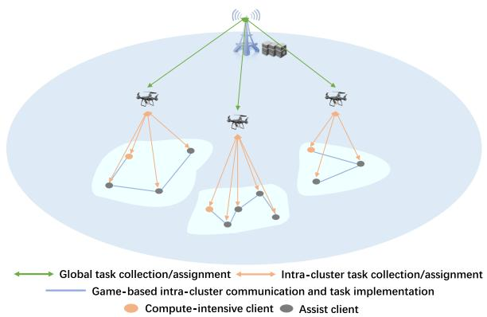  
Fig. 1. The proposed UAV-assisted D2D cluster task ofloading architecture.

## B. Application of Game Theory in MEC

Game theory provides an efective theoretical foundation for multi-agent resource allocation, incentive mechanism design, and system-wide collaborative optimization. The construction of suitable game-theoretic models enables the capture of the evolution of each participant’s strategy under mutual influence, thereby helping the system maximize overall utility or payof under limited resources. In [27] and [28], game theory is used to manage communication resources. By modeling the channel selection problem as an EPG, a balance between delay and energy consumption is achieved. In [29], a stochastic congestion game based on EPG was proposed to investigate the load balancing issue in MEC, aiming to minimize the delay of task execution. In [30], EPG is used for federated split learning. On the basis of Breadth-First Search (BFS), the distributed machine learning with low latency cost is realized through EPG and resource optimization. In [31], the authors model the decision process in the task ofloading and resource allocation as a potential game, which achieves eficient, distributed task ofloading and resource allocation with convergence guarantee in large-scale U-MEC network.

## III. SYSTEM MODEL AND PROBLEM FORMULATION

## A. System Model

Fig. 1 provides a concise overview of the application scenario model proposed in this paper and illustrates how distributed cluster-based ofloading is applied within the AIWTS. The AIWTS under consideration comprises two types of distributed USVs: computationally intensive clients (CCs) and assisting clients (ACs). There are L CCs that can participate in task ofloading by contributing their local tasks, and the number of UAVs acting as CH is the same as the number of CCs. In the vicinity of each CC, there are H ACs that can help the CC complete tasks by providing backup computing and communication resources, represented as $\mathcal { H } = \{ 1 , 2 , \dots , H \}$ Consequently, each CC collaborates with nearby ACs through D2D links to form L distinct learning clusters, represented as $\mathcal { L } = \{ 1 , 2 , \dots , L \}$ , thereby mitigating computational and communication resource constraints. Within a three-dimensional AIWTS, USVs are assumed to continuously navigate along predefined inland waterway lanes. Let $z _ { i } = ( x _ { i } \left( t \right) , y _ { i } \left( t \right) , 0 )$ and $\nu _ { i } ( t )$ denote the 3D position and speed of USV i at discrete decision step t with time interval $\Delta t .$ The kinematic update is given by

$$
\begin{array} { r } { \Big \{ x _ { i } ( t + \Delta t ) = x _ { i } ( t ) + \nu _ { i } ( t ) \cos \phi _ { i } ( t ) \Delta t , } \\ { \big | y _ { i } ( t + \Delta t ) = y _ { i } ( t ) + \nu _ { i } ( t ) \sin \phi _ { i } ( t ) \Delta t , } \end{array}\tag{1}
$$

where $\phi _ { i } ( t )$ is the heading angle constrained by the inland waterway layout. Thus, the D2D adjacency between USVs is inherently time-varying and depends on their relative motion.

When UAV l serves cluster l at a fixed flight and hovering height $\omega ,$ its three-dimensional coordinates at time step t can be represented as $z _ { l } = \left( x _ { l } \left( t \right) , y _ { l } \left( t \right) , \omega \right)$ . To provide persistent LoS connectivity for moving USVs, the UAV periodically adjusts its hovering point according to the barycenter of the associated cluster, i.e.,

$$
( x _ { l } ( t ) , y _ { l } ( t ) ) = \mathrm { P r o j } _ { \cal A } \left( \frac { 1 } { n _ { l } + 1 } \sum _ { i \in \{ 0 \} \cup N _ { l } } ( x _ { i } ( t ) , y _ { i } ( t ) ) \right) ,\tag{2}
$$

where A denotes the admissible flight region constrained by the inland waterway layout and aviation regulations. This design explicitly couples UAV mobility with the cluster of USVs in AIWTS.

To simplify the analysis and avoid resource sharing conflicts among ACs, each cluster contains only one CC and each AC can only join at most one cluster. This setting reflects that the dispatch discipline in inland waterway trafic control, where deterministic associations simplify safety assurance and scheduling. Without loss of generality, assume that cluster l is associated with a total of n ACs, represented as $\mathcal { N } _ { l } \ =$ $\{ 1 , 2 , \ldots , n _ { l } \}$ . Given binary variables $s _ { l , h }$ represent the association status between ACs and cluster, if an AC is selected by a cluster, then $s _ { l , h } = 1$ , otherwise $s _ { l , h } = 0$ . Thus, we can get

$$
\sum _ { l = 1 } ^ { L } s _ { l , h } \leq 1 , \quad \forall h \in \mathcal { H } .\tag{3}
$$

In AIWTS, the compute-intensive and latency-sensitive tasks under consideration are concretely defined as safetycritical perception tasks requiring low latency and high reliability, such as obstacle detection and collision avoidance. Our proposed method aims to collaboratively complete tasks by splitting a complete task into multiple subtasks within each learning cluster and assigning these subtasks to cluster members based on their computational capabilities. For simplicity, we consider that each task can be divided into up to the sum of the number of USVs within the cluster subtasks, with M splittable layers, represented as $M = \{ 1 , 2 , \dots , M \}$ . Let the binary variable $k _ { l , m }$ indicates the selection status of splitter $m \in M ,$ where $k _ { l , m } = 1$ signifies that layer m is selected, and otherwise $k _ { l , m } ~ = ~ 0 .$ Therefore, the task allocation corresponding to cluster l can be denoted as the vector $k _ { l } = \{ k _ { l , 1 } , k _ { l , 2 } , \ldots , k _ { l , M } \}$ , , , , . . . , ,It is noteworthy that since tasks always start from the CC, the applicable computation ofloading strategy should always assign the initial subtask segments to the CC. According to the task allocation strategy $k _ { l } ,$ each cluster member can hold only one subtask. In this manner, cluster members can form a chain based on the sequence of subtasks. Therefore, the USV clustering and task assignment strategies should adhere to the following constraints

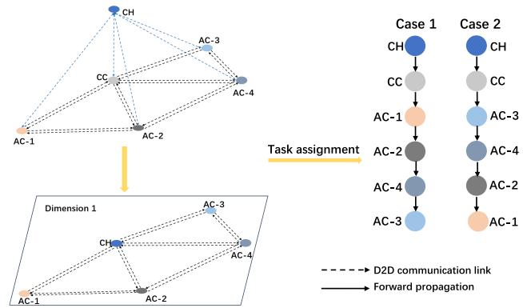  
Fig. 2. Illustration of the D2D multidimensional communication graph within a cluster.

$$
\sum _ { m = 1 } ^ { M } k _ { l , m } \leqslant M , \quad \forall l \in \mathcal { L } .\tag{4}
$$

Eq. (4) means that if the UAV, serving as a communication relay, does not have any computing resources, it will be regarded as executing a virtual work segment with a workload of zero. To facilitate further analysis of this scenario, we introduce the definitions as follows.

Definition 1 (Connected graph): Considering a graph $\mathcal { G } = ( V , E , c )$ , where each node (V) represents a USV, edges (E) between nodes denote communication links established through wireless connections, and $c : E \to R ^ { + }$ represents link allocation constraints. Let $n = | V |$ denote the number of USVs. If every pair of distinct vertices in V is connected, the graph is termed a connected graph G.

In order to more clearly illustrate the interplay between the clustering strategy and the task allocation approach, Fig. 2 provides an example of a feasible task allocation strategy under a given D2D clustering configuration. As shown, the cluster contains 4 ACs and 1 CC, which means the task must be divided into 5 segments and then assigned to each cluster member.

By successively merging all the subtasks of cluster l, we obtain the complete task of that cluster, denoted as $Q _ { l } \ =$ $\{ Q _ { l , 0 } , Q _ { l , 1 } , \ldots , Q _ { l , n _ { l } } \}$ . Here, $Q _ { l , i }$ represents the subtask held by AC i, and $\ i \ = \ 0$ indicates the subtask held by the CC. Therefore, for a global task, the execution strategy involves completing tasks sequentially within each cluster, while all clusters work in parallel at the overall system level. If cluster members hold diferent subtasks, having all USVs simultaneously transmit their task segments to the TBS would result in severe bandwidth conflicts. More critically, this situation also poses significant challenges for the TBS in broadcasting tasks downstream. Therefore, we propose utilizing a UAV as a designated CH responsible for downloading and uploading global tasks, as well as distributing and aggregating subtasks within the cluster.

The UAV serving as a CH downloads or uploads the global task using the bandwidth $B _ { l } .$ , which is allocated by the TBS.

The TBS’s allocation policy of bandwidth is represented by $B = \{ B _ { 1 } , B _ { 2 } , \ldots , B _ { L } \}$ , which satisfies the following conditions

$$
\sum _ { l = 1 } ^ { L } B _ { l } = B , \quad \forall B _ { l } > 0 ,\tag{5}
$$

where B indicates the total available bandwidth of the TBS.

## B. Problem Formulation

Building upon the discussion from the previous subsection, the proposed distributed task ofloading framework consists of three main phases: global task distribution, intra-cluster processing and local subtask uploading. We treat the cluster’s end-to-end processing and communication time as safetycritical decision latency in the perception-decision loop for trafic safety and operations. The delays incurred in each phase are analysed in detail.

Global Task Distribution: When the computation tasks commence, the TBS broadcasts the global task to the CH of each cluster. The downlink data transfer rate from TBS to CH l in a cluster can be expressed as

$$
R _ { l } ^ { D L } = B _ { l } \log _ { 2 } \left( 1 + \frac { p h _ { l } } { N _ { 0 } } \right) ,\tag{6}
$$

where $p$ is the transmit power of the TBS, $h _ { l }$ is the channel power gain between the UAV and the TBS, and $N _ { 0 }$ is the noise power. The transmission delay from the TBS to the CH l can be expressed as

$$
t _ { l } ^ { D L } = \frac { Q _ { l } } { R _ { l } ^ { D L } } ,\tag{7}
$$

where $Q _ { l }$ represents the data size of a safety-critical perception task, which is assumed to be identical for all clusters.

Intra-Cluster Processing: Intra-cluster task execution comprises three main sub-phases: intra-cluster task assignment, task execution process, and task collection by the CH. When the CH receives the latest global task from the TBS, it distributes the task segments to other USVs based on the prescribed task distribution strategy. Subsequently, the CC initiates the task execution process. After all USVs sequentially complete their respective local task segments, the CH collects and assembles the completed segments from the USVs.

• Intra-Cluster Task Assignment: This method designates the UAV as a selected CH within the cluster to serve as a communication relay, and USV i reaches the CH via wireless cellular link. Therefore, the delay of intra-cluster task assignment from the CH to USV i can be expressed as

$$
t _ { t a , i } = \frac { Q _ { l , i } } { R _ { i } } ,\tag{8}
$$

where $R _ { i }$ represents the data transmission rate between the CH and USV $i ,$ measured in bits per second, and $Q _ { l , i }$ denotes the size of the task processed by USV i.

• Task Execution Process: After the intra-cluster task allocation is completed, the task execution process is initialized and executed on USV i. Therefore, the task execution delay of USV i can be expressed as

$$
t _ { l , i } ^ { c o m p } = \frac { C _ { i } Q _ { l , i } } { f _ { i } } ,\tag{9}
$$

where $C _ { i }$ represents the number of CPU cycles required to process a data sample, and $f _ { i }$ denotes the CPU computation frequency of USV i.

The intermediate data transmitted from USV i to USV j after USV i completes local computation is defined as $Q _ { l , i } ^ { i d } .$ ,Therefore, the transmission delay from USV i to USV j can be expressed as

$$
t _ { l , i } ^ { c o m m } = \frac { Q _ { l , i } ^ { i d } } { R _ { i , j } } ,\tag{10}
$$

where $R _ { i , j }$ denotes the D2D data transmission rate between the USV i and USV $j .$

• Task Collection by the CH: After the task execution process is completed, the CH requests that the USVs within the cluster assemble their respective subtask segments to form the complete task. Since the task collection process is almost identical to the intra-cluster task distribution process, the delay of model collection $t _ { t c , i }$ is equal to $t _ { t a , i }$

Finally, the total intra-cluster processing delay can be calculated as

$$
t _ { l } ^ { T T E } = \sum _ { i = 0 } ^ { n _ { l } } ( 2 t _ { t a , i } + t _ { l , i } ^ { c o m m } + t _ { l , i } ^ { c o m p } ) .\tag{11}
$$

Local Subtask Uploading: After each cluster completes its tasks, the UAV acting as the CH uploads the fully assembled local task to the TBS for evaluation. The transmission rate from the CH to the TBS can be calculated as

$$
R _ { l } ^ { U L } = { \cal B } _ { l } \log _ { 2 } \left( 1 + \frac { p _ { l } h _ { l } } { N _ { 0 } } \right) ,\tag{12}
$$

where $p _ { l }$ denotes the transmission power of the CH, and the corresponding task upload delay can be expressed as

$$
t _ { l } ^ { U L } = \frac { Q _ { l } } { R _ { l } ^ { U L } } .\tag{13}
$$

Finally, under the USV clustering strategy, task allocation strategy, and joint bandwidth allocation strategy, the safetycritical decision latency for cluster l can be expressed as

$$
T _ { l } = t _ { l } ^ { D L } + t _ { l } ^ { T T E } + t _ { l } ^ { U L } .\tag{14}
$$

In AIWTS, safety-critical perception and decision-making form a closed-loop process whose efectiveness is not only determined by the average latency, but also by whether a strict response deadline can be met and how much reaction slack remains for subsequent control actions such as evasive maneuvers. Therefore, our optimization objective can be formulated as

$$
\operatorname* { m a x } _ { \{ \mathbf { n } _ { l } , \mathbf { s } _ { l } , \mathbf { B } _ { l } \} } : \eta = \sum _ { l = 1 } ^ { L } ( T _ { \mathrm { c r i t } } - T _ { l } ) ,\tag{15}
$$

where $T _ { \mathrm { c r i t } }$ denotes the maximum tolerable end-to-end decision latency for safety-critical perception tasks.

From the AIWTS perspective, since $T _ { \mathrm { c r i t } }$ is set to a constant value, the metric $T _ { l }$ directly determines the reaction margins for safety-critical perception tasks, such as collision avoidance. Subject to the constraints imposed by limited computing and communication resources on USVs, this paper jointly optimizes the USV clustering scheme, the task allocation strategy, and the joint bandwidth allocation strategy for each CC. The optimization objective is changed from (15) to minimize the safety-critical decision latency across all L CCs, subject to the following formal constraints

$$
\begin{array} { r l r } { \displaystyle \operatorname* { m i n } _ { \{ \mathbf { n } _ { l } , \mathbf { s } _ { l } , \mathbf { B } _ { l } \} } : T = \sum _ { l = 1 } ^ { L } T _ { l } } & { } & \\ { \mathrm { s . t . } \quad } & { ( 3 ) - ( 5 ) . } \end{array}\tag{16}
$$

## IV. PROBLEM DECOMPOSITION AND PROPOSED METHOD

The joint task assignment and clustering strategy in (16) leads to exponential complexity. To tackle this, we decompose the problem into independent sub-problems (as shown in Fig. 3) and derived suboptimal solutions for each part, thus reducing the need for long-term repetitive optimization. This decomposition complies with AIWTS real-time constraints: each subproblem admits an eficient decomposition, and under limited onboard resources the overall complexity remains within the acceptable bounds for safety-critical decision making. Specifically, we first propose a USV clustering framework based on graph reinforcement learning and potential game theory (as illustrated in Fig. 4). Subsequently, we implement a two-stage optimization process: a convex optimization algorithm is employed for bandwidth allocation, while a greedy heuristic algorithm is adopted for task allocation. This approach ultimately achieves eficient resource optimization through coordinated strategy design.

## A. GRL-Based Distributed Game Clustering

The core concept of distributed game-based clustering using Graph Reinforcement Learning (GRL) is that, within an exact potential game framework, GRL can be employed to optimize the selection of ofloading links within each cluster. Each CC selects the optimal ofloading path based on the current network state through a reinforcement learning model, and this localized strategy is subsequently fed back into the game process. The proposed algorithm will be illustrated from both the perspectives of TRGNN and game-based MARL.

TRGNN: We assume stable communication within each time window. By discretizing time-varying transmission rates into demands, TRGNN leverages the representational power of GNNs and the feature learning capabilities of Deep Neural Networks (DNNs) to achieve more eficient performance optimization in path selection tasks. Specially, the GNN encodes paths based on topological information, while the DNN generates path selection probabilities according to demands. This combination enables TRGNN to establish a link between network topology and trafic demand, leading to more efective decision-making.

Game-Based Multi-Agent Reinforcement Learning: By taking the embeddings generated by TRGNN as input features, CDTO employs a shared MARL policy network, where each CC independently selects optimal paths based on the current network state. This shared policy architecture significantly reduces dimensionality and simplifies training, allowing simultaneous batch processing across clusters and greatly decreasing parameter complexity. Furthermore, through local rewards and counterfactual reasoning, CDTO eficiently converts longterm returns [32] into manageable one-step returns, efectively implementing centralized training and decentralized execution (CTDE), and closely aligning training with real-time decisionmaking processes.

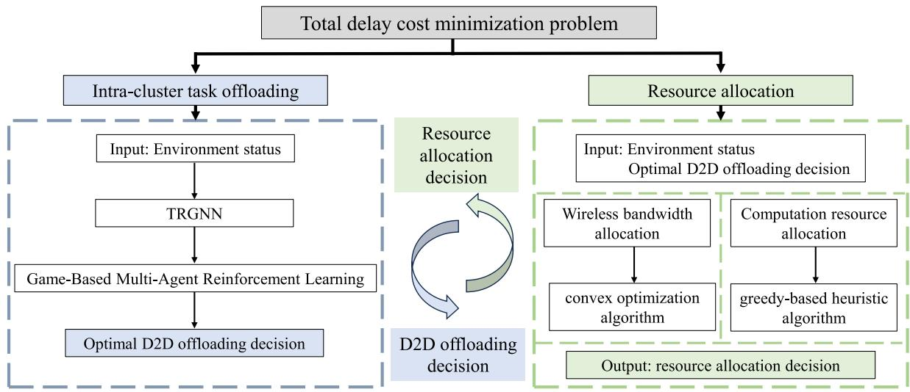  
Fig. 3. Illustration of proposed problem decomposition and solution approach.

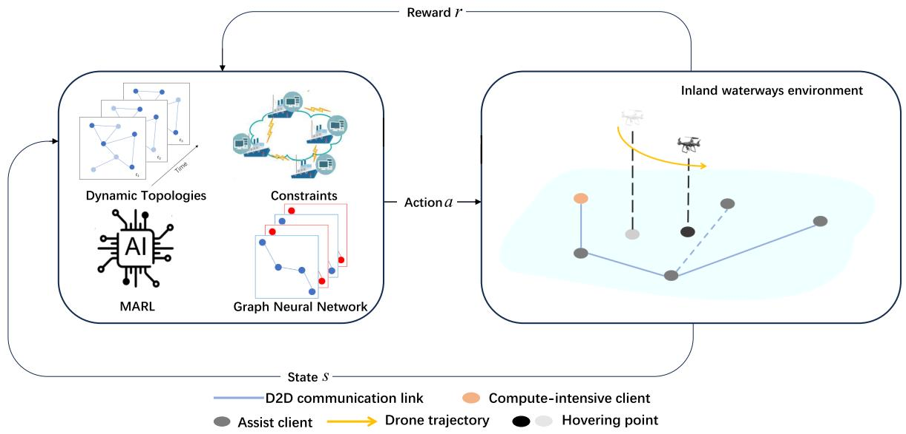  
Fig. 4. Illustration of cluster-based distributed task ofloading framework.

Under the framework of a distributed game, each agent not only considers its own delay but also accounts for the impact of its actions on the overall network state. More specifically, the clustering strategy $s _ { l } \in S _ { l }$ is defined for each computationally intensive user. Thus, the strategy of the L clusters can be represented as $s = \{ s _ { 1 } , s _ { 2 } , . . . , s _ { L } \}$ . In particular, $s _ { - l }$ denotes the clustering strategies of all clusters except for cluster l. Here, we employ the concept of marginal utility [33], [34] to evaluate the overall impact of these strategies. Furthermore, with respect to the optimization objective in equation (16), the following utility function of the cluster is

defined

$$
U _ { l } ( s _ { l } , s _ { - l } ) = - \psi _ { l } ( s _ { l } , s _ { - l } ) + \sum _ { j \neq l } [ ( - \psi _ { j } ( s _ { j } , s _ { - j } ) + \psi _ { j } ( s _ { j } , s _ { - j \backslash l } ) ] ,\tag{17}
$$

where $- \psi _ { j } ( s _ { j } , s _ { - j \backslash l } )$ denotes the utility of cluster j under the condition that cluster l does not take any action. Therefore, $\begin{array} { r } { \sum _ { j \neq l } [ ( - \psi _ { j } ( s _ { j } , s _ { - j } ) + \psi _ { j } ( s _ { j } , s _ { - j \backslash l } ) ] } \end{array}$ signifies the change in the aggregate utility of the other clusters induced by the strategic action of cluster l.

The primary goal of the distributed cluster strategy is to diminish intra-cluster conflicts and enhance each cluster’s utility, which depends on the existence of a NE within the distributed cluster framework.

Definition 2 (Nash Equilibrium [35]): A joint strategy $s ^ { * } =$ $\{ s _ { 1 } ^ { * } , \ldots , s _ { L } ^ { * } \}$ is called a NE of the formulated game if and only if, holding all other clusters’ strategies fixed, no single cluster can improve its utility by unilaterally altering its own strategy. In other words

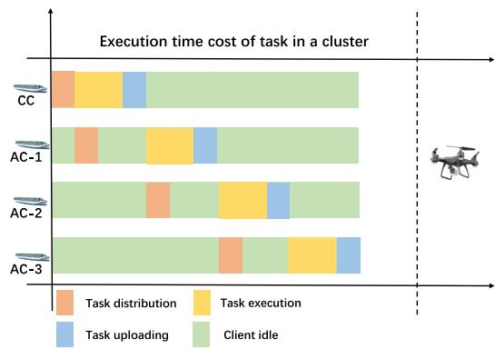  
Fig. 5. Illustration of intra-cluster bandwidth allocation.

$$
U _ { l } ( s _ { l } ^ { * } , s _ { - l } ^ { * } ) \geq U _ { l } ( s _ { l } , s _ { - l } ^ { * } ) , \quad \forall l \in \mathcal { L } , \quad s _ { l } \in S _ { l } .\tag{18}
$$

To ensure that the proposed game-based method possesses a NE and achieves convergence, we introduce the concept of EPG and further explore the existence of a NE under its theoretical framework.

Definition 3 (Exact potential game [36]): If there exists an exact potential function $\mu ( s _ { l } , s _ { - l } )$ that satisfies the following conditions, then the game is called an EPG

$$
U _ { l } ( s _ { l } ^ { \prime } , s _ { - l } ) - U _ { l } ( s _ { l } , s _ { - l } ) = \mu ( s _ { l } ^ { \prime } , s _ { - l } ) - \mu ( s _ { l } , s _ { - l } ) ,\tag{19}
$$

where $s _ { l } ^ { \prime } , s _ { - l } \in S _ { l } .$

,Theorem 1: A distributed USV clustering game is an EPG if and only if there exists at least one pure-strategy NE point. Proof: More details are shown in the Appendix, available online as supplementary material. 厂

After modeling the distributed USV clustering problem as an EPG, we still need to consider which metrics should be set to guide each USV clustering process toward achieving a NE. Since (11) is determined by the bandwidth allocation strategy, and $t ^ { T E }$ is governed by the task allocation strategy, it is natural to further decompose the problem into two subproblems: the task allocation strategy and the bandwidth allocation strategy.

## B. Task and Bandwidth Allocation Optimization Under Given Clustering Strategy

We propose a greedy-based heuristic algorithm that proportionally assigns computational loads based on each USV’s resources. UAVs within clusters execute a zero-workload virtual segment, ensuring feasibility of task allocation. The detailed procedure is presented in Algorithm 1.

To efectively optimize bandwidth allocation under given fixed clustering and task allocation strategies, we separately optimize the TBS-UAV and UAV-USV communication processes. During the UAV-USV communication phase in the task allocation stage, since the computational capabilities of each USV within the cluster and the task allocation strategies are known, we can estimate the computational delay for each USV within the cluster. Based on these estimated computational delays, we employ a bandwidth allocation strategy based on Time Division Multiplexing (TDM), as illustrated in Fig. 5.

Specifically, the UAV first assigns the subtask segment that initiates the task to the CC. Upon receiving the task, the CC enters the task execution phase. Simultaneously, the UAV assigns the necessary tasks to AC-1. Once the CC completes its task, it uploads the completed task segment to the UAV while simultaneously transmitting intermediate values to AC-1 via D2D communication. AC-1 then begins task execution, and this process continues iteratively until the final AC completes the uploading of its task segment. By integrating the task allocation and task uploading processes, this approach can more eficiently utilize time and communication resources, thereby enabling more compact and synchronized task execution within the USV cluster.

For the TBS-UAV communication phase, constrained by the heterogeneous factors of the UAV itself, we propose separate delay minimization problems under bandwidth and power constraints for $t _ { l } ^ { D L }$ and $t _ { l } ^ { U L }$ . For $t _ { l } ^ { D L }$ , it can be mathematically formulated as

$$
\begin{array} { l } { { \displaystyle \operatorname* { m i n } _ { B _ { l } } : \sum _ { l = 1 } ^ { L } t _ { l } ^ { D L } } , } \\ { { \displaystyle s . t . \sum _ { l = 1 } ^ { L } B _ { l } = B . } } \end{array}\tag{20}
$$

It is evident that (20) is a convex function. Therefore, we can solve it using the method of Lagrange multipliers, as follows

$$
F ( B _ { l } , \lambda ) = \sum _ { l = 1 } ^ { L } \frac { d _ { l } } { B _ { l } } + \lambda \left( \sum _ { l = 1 } ^ { L } B _ { l } - B \right) ,\tag{21}
$$

where $\begin{array} { r l r } { d _ { l } } & { { } = } & { Q _ { l } \frac { 1 } { \log _ { 2 } \left( 1 + \frac { p h _ { l } } { N _ { 0 } } \right) } } \end{array}$ . By taking the first-order partial derivative of $B _ { l }$ and setting it equal to zero, we obtain

$$
\begin{array} { l } { \displaystyle \frac { \partial F } { \partial B _ { l } } = - \frac { d _ { l } } { B _ { l } ^ { 2 } } + \lambda = 0 , } \\ { \displaystyle B _ { l } = \sqrt { \frac { d _ { l } } { \lambda } } . } \end{array}\tag{22}
$$

Substituting the obtained $B _ { l }$ into (5), we get

$$
\begin{array} { l } { { \displaystyle \sum _ { l = 1 } ^ { L } B _ { l } = \sum _ { l = 1 } ^ { L } \sqrt { \frac { d _ { l } } { \lambda } } = B , } } \\ { { \lambda = \displaystyle \left( \frac { \sum _ { l = 1 } ^ { L } \sqrt { d _ { l } } } { B } \right) ^ { 2 } . } } \end{array}\tag{23}
$$

Substituting  back into the expression for $B _ { l }$ solves for the optimal bandwidth allocation

$$
B _ { l } ^ { * } = \frac { B \sqrt { d _ { l } } } { \sum _ { l = 1 } ^ { L } \sqrt { d _ { l } } } .\tag{24}
$$

For $t _ { l } ^ { U L }$ , the heterogeneous factors of UAVs lead to differences in uplink transmission times. Our objective is to optimize the UAV l with the longest uplink transmission delay, which can be mathematically expressed as

$$
\operatorname* { m i n } _ { B _ { l } } \operatorname* { m a x } _ { l \in \mathcal { L } } : t _ { l } ^ { U L }\tag{25}
$$

$$
s . t . \quad \quad \frac { Q _ { l } p _ { l } } { B _ { l } \log _ { 2 } \left( 1 + \frac { p _ { l } h _ { l } } { N _ { 0 } } \right) } \leq E _ { t r a n s } ^ { l } , \quad \forall l \in \mathcal { L }\tag{26}
$$

$$
\sum _ { l = 1 } ^ { \mathcal { L } } B _ { l } = B ,\tag{27}
$$

$$
0 \leq B _ { l } \leq B _ { l } ^ { \mathrm { m a x } } .\tag{28}
$$

(25) presents a min-max problem, and it cannot yield an optimal solution without further manipulation. To tackle this, we treat the maximization problem in its entirety. Observing that (26) imposes a lower bound on the value of $B _ { l }$ due to energy constraints, we combine (26) and (28). This allows us to rewrite the problem as

$$
\operatorname* { m i n } _ { B _ { l } } t _ { l , \operatorname* { m a x } } ^ { U P }\tag{29}
$$

$$
s . t . \ \frac { Q _ { l } } { B _ { l } \log _ { 2 } \left( 1 + \frac { p _ { l } h _ { l } } { N _ { 0 } } \right) } \leq t _ { l , \operatorname* { m a x } } ^ { U P } ,\tag{30}
$$

$$
\sum _ { l = 1 } ^ { \mathcal { L } } B _ { l } = B ,\tag{31}
$$

$$
\frac { Q _ { l } p _ { l } } { E _ { t r a n s } ^ { l } \log _ { 2 } \left( 1 + \frac { p _ { l } h _ { l , i } } { N _ { 0 } } \right) } \leq B _ { l } \leq B _ { l } ^ { \operatorname* { m a x } } .\tag{32}
$$

Obviously, (29) is a convex function, and we construct the Lagrangian function as follows

$$
L = t _ { l , \mathrm { m a x } } ^ { U P } + \lambda \left( \sum _ { l = 1 } ^ { L } B _ { l } - B \right) + \sum _ { l = 1 } ^ { L } \mu _ { l } \left( \frac { Q _ { l } } { B _ { l } R _ { l } } - t _ { \mathrm { m a x } } \right) .\tag{33}
$$

We take the partial derivatives of $B _ { l }$ and $t _ { l , m a x } ^ { U P }$ separately, ,and set to zero, resulting in the following equations

$$
\frac { \partial L } { \partial B _ { l } } = \lambda - \mu _ { l } \left( \frac { Q _ { l } } { B _ { l } ^ { 2 } R _ { l } } \right) = 0 .\tag{34}
$$

$$
\frac { \partial L } { \partial t _ { l , \operatorname* { m a x } } ^ { U P } } = 1 - \sum _ { l = 1 } ^ { \mathcal { L } } \mu _ { l } = 0 .\tag{35}
$$

Combining the KKT conditions with the above partial derivative results and through simple calculations, the optimal solution for (25) can be obtained as

$$
B _ { l } = \frac { Q _ { l } } { t _ { \operatorname* { m a x } } ^ { * } R _ { l } } ,\tag{36}
$$

where $t _ { m a x } ^ { * }$ is the optimal solution that satisfies the constraint (31) and (32). However, to obtain a closed-form solution for $B _ { l } ,$ we must determine the specific value of $t _ { m a x } ^ { * } .$ . By establishing reasonable boundaries for $t _ { m a x } ^ { * } ,$ , we employ a onedimensional search algorithm to find its optimal value. The boundary-solving process as shown in Corollary 1

Corollary 1: The value of $t _ { m a x } ^ { * }$ complies with

$$
\begin{array} { r l } & { m a x _ { l \in \mathcal { L } } \left\{ \frac { Q _ { l } } { B _ { l } ^ { * } \log _ { 2 } { \left( 1 + \frac { p _ { l } h _ { l } } { N _ { 0 } } \right) } } \right\} \leq T _ { l , \mathrm { m a x } } ^ { * } } \\ & { \leq m a x _ { l \in \mathcal { L } } \left\{ \frac { Q _ { l } L } { \mathrm { B } \log _ { 2 } { \left( 1 + \frac { p _ { l } h _ { l } } { N _ { 0 } } \right) } } \right\} . } \end{array}\tag{37}
$$

Proof: More details are shown in the Appendix, available online as supplementary material. 

Algorithm 1 Task Ofloading Algorithm for Given Clustering Strategy

Input: Clustering strategy: sl; Computing capability of each USV: $\{ f _ { 1 } , f _ { 2 } , \dotsc , f _ { n _ { l } + 1 } \} ;$ Transmission rates between nodes: $\{ R _ { 1 , 2 } , R _ { 2 , 3 } , \ldots , R _ { n _ { l } , n _ { l } + 1 } \} ;$ Computation workload , , , ,of all M layers: $\{ Q _ { 1 } , Q _ { 2 } , . . . , Q _ { M } \}$ ; Transmitted inter-, , . . . ,mediate data size between corresponding M layers: $\{ Q _ { 1 , 2 } ^ { i d } , Q _ { 2 , 3 } ^ { i d } , . . . , Q _ { M - 1 , M } ^ { i d } \} .$

, , ,Output: Task splitting and allocation strategy: $k _ { l } ;$ Delays in task execution: $t ^ { T \bar { E } }$

1: Initialize the last selected split layer $m = 0 ;$

2: Calculate the initial computation workload of each USV i as $\begin{array} { r } { Q _ { i } = \frac { f _ { i } \sum _ { m = 1 } ^ { M } Q _ { m } } { \sum _ { i = 1 } ^ { n _ { i } + 1 } f _ { i } } ; } \end{array}$

3: Calculate the initial communication cost of each USV i as $\begin{array} { r } { c o m m _ { i } = \frac { Q _ { m , m + 1 } ^ { \iota a } } { R _ { i , i + 1 } } , i \in \mathcal { N } _ { l } , m \in M ; } \end{array}$

4: for each $\mathrm { U S V } ^ { * } i = 1 , \dots , n _ { l } + 1$ do

5: , . . . ,Calculate accumulated computation workload starting from split layer m to a new split layer $m ^ { \prime } ;$

6: while $\sum _ { m } ^ { m ^ { \prime } } Q _ { m } \approx Q _ { i }$ do

7: Update $m = m ^ { \prime } , k _ { l , m } \gets 1 ;$

8: Update commi;

9: end while

10: end for

C. Overview of Clustering-Based Distributed Task Ofloading Algorithms

Considering the other clusters’ policy profiles $s _ { - l } ,$ each cluster updates its policy by selecting policy $s _ { l } ^ { \prime }$ in order to

$$
s _ { l } ^ { \prime } = \operatorname * { a r g m a x } _ { s _ { l } ^ { \prime } \in S _ { l } } U _ { l } ( s _ { l } ^ { \prime } , s _ { - l } ) .\tag{38}
$$

We define the policy network parameters as and the global state as $q ,$ which contains complete information about the environment at the current moment. Here, q denotes the local state of CC i. For CC i, we evaluate the performance of the current policy through an advantage function $A _ { l } ( q , s )$ , defined as

$$
A _ { l } ( q , s ) = R ( q , s ) - \sum _ { s _ { l } ^ { \prime } } \pi _ { \theta } ( s _ { l } ^ { \prime } | q _ { l } ) R ( q , ( s _ { l } ^ { \prime } , s _ { - l } ) ) ,\tag{39}
$$

where reward $R ( q , s )$ is defined as the negative global latency of AIWTS, and we perform Monte Carlo sampling $s _ { l } ^ { \prime } \sim$ $\pi _ { \theta } ( \cdot | q _ { l } )$ . The gradient of  is then given by

$$
g = \mathbb { E } _ { \boldsymbol { \pi } } \left[ \sum _ { l } A _ { l } ( \boldsymbol { q } , \boldsymbol { s } ) \nabla _ { \boldsymbol { \theta } } \log \pi _ { \boldsymbol { \theta } } ( \boldsymbol { s } _ { l } | \boldsymbol { q } _ { l } ) \right] .\tag{40}
$$

After obtaining the gradient of , the parameters of the θpolicy network are updated by Adam. The detailed procedure is presented in Algorithm 2.

## D. Convergence and Complexity Analysis

In this subsection, we conduct a brief convergence and computational complexity analysis of the proposed CDTO framework during the training process. The solution obtained from NE is not necessarily optimal. We use the Price of Anarchy (PoA) to quantify the worst-case scenario of NE. As described in Definition 2, let $s ^ { * } = \{ s _ { 1 } ^ { * } , \ldots , s _ { L } ^ { * } \}$ be a NE strategy profile and $U _ { l } ( s _ { l } ^ { * } , s _ { - l } ^ { * } )$ denote maximizing utility, then the PoA can be expressed as

Algorithm 2 Overview of Clustering-Based Distributed Task   
Ofloading Algorithm   
Input: D2D network topology: ${ \overline { { \mathcal { G } \ = \ ( V , E , c ) ; } } }$ Computing   
capability of each USV: $\{ f _ { 1 } , f _ { 2 } , \dotsc , f _ { n _ { l } + 1 } \} ;$ Transmission   
rates between nodes: $\{ R _ { 1 , 2 } , R _ { 2 , 3 } , \ldots , R _ { n _ { l } , n _ { l } + 1 } \}$ ; Computation   
, ,workload of all M layers: $\{ Q _ { 1 } , Q _ { 2 } , . . . , Q _ { M } \}$ ; Transmitted   
, , . . . ,intermediate data size between corresponding M layers:   
$\{ Q _ { 1 , 2 } ^ { i d } , Q _ { 2 , 3 } ^ { i d } , . . . , Q _ { M - 1 , M } ^ { i d } \} ;$ Policy network parameter $\theta ;$   
Output: Optimal global latency $\begin{array} { r } { T = \sum _ { l = 1 } ^ { L } T _ { l } ; } \end{array}$   
1: Initialize the last selected split layer $m = 0 ;$   
2: Initialize the iteration index $k = 0 ;$   
3: Initialize the decision-making process for each CC by   
assigning each user a randomly selected strategy from the   
available strategy space;   
4: Repeat iteration   
5: Calculate the global utility by calling Algorithm 1 and   
bandwidth allocation algorithm;   
6: for each cluster $l \in \mathcal { L }$ do   
7: Calculate the advantage function according to Eq. (39);   
8: end for   
9: $\begin{array} { r } { g \gets \mathbb { E } _ { \boldsymbol { \pi } } \left[ \sum _ { l } A _ { l } ( \boldsymbol { q } , \boldsymbol { s } ) \nabla _ { \boldsymbol { \theta } } \log \pi _ { \boldsymbol { \theta } } ( \boldsymbol { s } _ { l } | \boldsymbol { q } _ { l } ) \right] ; } \end{array}$   
π10: ← Adam( g);   
θ θ,11: until Convergence   
12: return Optimal global latency $\begin{array} { r } { T = \sum _ { l = 1 } ^ { L } T _ { l } } \end{array}$

$$
P o A = \frac { m a x _ { s _ { l } ^ { * } \in s ^ { * } } \sum _ { l \in \mathcal { L } } U _ { l } ( s _ { l } ^ { * } , s _ { - l } ^ { * } ) } { m i n _ { s _ { l } \in S _ { l } } \sum _ { l \in \mathcal { L } } U _ { l } ( s _ { l } , s _ { - l } ) } .\tag{41}
$$

Theorem 2: The maximum value of the PoA for the distributed USV clustering game is

$$
\frac { \sum _ { l \in \mathcal { L } } ( t _ { l } ^ { D L } + t _ { l } ^ { l o c a l } + t _ { l } ^ { U L } ) } { \sum _ { l \in \mathcal { L } } m i n ( T _ { l } ^ { l o c a l } , T _ { l } ^ { D 2 D } ) } .\tag{42}
$$

Proof: More details are shown in the Appendix, available online as supplementary material. 

Theorem 1shows that the distributed USV clustering game is an EPG, and the decision change of any cluster will induce identical fluctuations in both the potential function and the cluster’s utility function. Because the numbers of CCs and ACs are finite, the strategy space is finite and each cluster utility is therefore bounded. Whenever a cluster increases its utility, the potential function (i.e., the optimization objective) improves accordingly. Therefore, the proposed algorithm is guaranteed to converge, reaching a local or global optimum when no cluster has an incentive to deviate from its current decision. Furthermore, Theorem 2 establishes that even if the algorithm converges to the worst NE, the overall optimization objective cannot deteriorate arbitrarily. In summary, the proposed CDTO framework is guaranteed to converge to a NE after a finite number of iterations, and even in the worst case, its performance stays within a constant factor of the centralized optimum.

The computational complexity of TRGNN primarily depends on the number of edges E and nodes V in the graph. Let $F _ { d } ^ { i }$ denote the output feature dimension of the ith DNN layer, where $F _ { d } ^ { 0 }$ represents the initial node feature dimension. Let $F _ { g } ^ { i }$ denote the output feature dimension of the i-th GNN layer, $\ { } ^ { \mathrm { { o } } } H _ { g } ^ { i }$ denote the hidden layer width of the ith GNN layer, and $H _ { d } ^ { i }$ denote the hidden layer width of the i-th DNN layer. TRGNN comprises m interleaved GNN and DNN layers, so its computational complexity can be expressed as $\begin{array} { r } { \mathcal { O } \left( \sum _ { i = 1 } ^ { m } ( E { \cdot } F _ { d } ^ { i - 1 } { \cdot } H _ { g } ^ { \bar { i } } + V { \cdot } H _ { g } ^ { i } { \cdot } F _ { g } ^ { i } + V { \cdot } F _ { g } ^ { \bar { i } } { \cdot } H _ { d } ^ { i } + V { \cdot } \bar { H _ { d } ^ { i } } { \cdot } F _ { d } ^ { i } ) \right) } \end{array}$ Consequently, the overall computational complexity of the shared policy network is $\begin{array} { r } { \mathcal { O } \big ( K \cdot L \cdot \sum _ { i = 1 } ^ { m } ( E \cdot F _ { d } ^ { i - 1 } \cdot H _ { g } ^ { i } + V \cdot } \end{array}$ $H _ { g } ^ { i } \cdot F _ { g } ^ { i } + V \cdot F _ { g } ^ { i } \cdot H _ { d } ^ { i } + V \cdot H _ { d } ^ { i } \cdot F _ { d } ^ { i } ) )$ . For the critic network, the computational complexity becomes negligible compared to the policy network. This is achieved by simplifying longterm return into one-step return for current actions, thereby avoiding recursive computation of future state values. Furthermore, the use of finite Monte Carlo sampling replaces complex counterfactual baseline calculations, ensuring controllable complexity without neural network inference. The computational complexity of Algorithm 1 is denoted as O(nl), while the computational complexity of bandwidth allocation strategy is denoted as $\mathcal { O } ( L \cdot ( I + 1 ) )$ , where I represents the number of iterations in the one-dimensional search algorithm. After omitting constant terms, the overall complexity of CDTO is derived as $\begin{array} { r } { \mathcal { O } \big ( K { \cdot } L { \cdot } \big [ \sum _ { i = 1 } ^ { m } ( E { \cdot } F _ { d } ^ { i - 1 } { \cdot } H _ { g } ^ { i } + V { \cdot } H _ { g } ^ { i } { \cdot } F _ { g } ^ { i } + V { \cdot } F _ { g } ^ { i } { \cdot } H _ { d } ^ { i } + V . } \end{array}$ $H _ { d } ^ { i } { \cdot } F _ { d } ^ { i } ) + n _ { l } + I ] )$ . In summary, the computational complexity of CDTO is acceptable, and this design is well-suited for scenarios with high real-time performance requirements and limited resources.

## V. EXPERIMENTAL EVALUATION

In this section, we employ Python and PyTorch to simulate the proposed framework. By comparing the CDTO framework with diferent ofloading methods under the same conditions, we aim to evaluate its overall performance.

## A. Parameter Settings

In order to better match practical AIWTS in the actual application scenario, we consider a sector-shaped area near the shore, centered on the TBS, representing the free movement range of UAVs. Within this region, multiple ACs and CCs are deployed. Since UAVs act as CHs, the number of UAVs matches the number of CCs. The sector radius is 500 m, and thus the coordinates of the TBS are (500, 0). Both the UAV flight altitude and the D2D communication distance threshold are set to 50 m. For D2D communication links between USV i and USV $j ,$ the transmission power of USV i is fixed at 24 dBm, identical for all USVs. The bandwidth of each D2D link between any two USVs is set to 5 MHz. To preserve suficient decision slack for USVs, the latency threshold for safety-critical perception tasks is set to 7 s. For each CC, such a task is modeled as a 5 Mbits workload with a linear topology. For all USVs, the required CPU cycles per bit are uniformly distributed in [1500, 2000] cycles/bit. The computing resources for CC and AC are configured as $f _ { c } \in [ 0 . 5 , 2 ] \times 1 0 ^ { 9 }$ CPU cycles/s and $f _ { a } \in [ 6 , 1 0 ] \times 1 0 ^ { 9 }$ CPU cycles/s, respectively [33]. For the TBS, its transmit power P is 46 dBm, the default communication bandwidth is 5 MHz, and the computing capability is $f _ { t b s } = 4 0 \times 1 0 ^ { 9 }$ CPU cycles/s. For the proposed TRGNN, the default setting uses 6 layers. The global model is initialized with a normal distribution. The policy network’s learning rate lr is set to 0.001, and the Adam optimizer is employed to perform policy gradient descent.

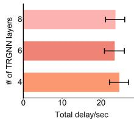  
(a) TRGNN layers

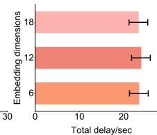  
(b) Embedding sizes

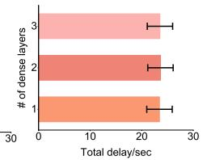  
(c) Dense layers

Fig. 6. Sensitivity analysis of CDTO’s hyperparameters.  
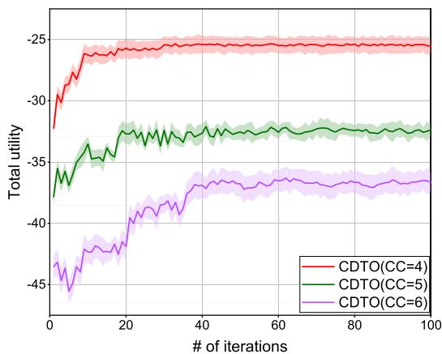  
Fig. 7. The convergence of the total utility.

## B. Hyperparameters Sensitivity and Convergence Behavior

We first analyzed the hyperparameters sensitivity and convergence behavior of CDTO. The experiments are conducted using a topology with 4 CCs and 8 ACs by default. Fig. 6(a) shows the impact of changing the number of TRGNN layers on CDTO. As the number of layers increases from 4 to 6, the overall delay of CDTO decreases from 24.635 s to 23.445 s. However, when the number of layers exceeds 6, the overall performance slightly declines. In addition, we explored the influence of diferent embedding dimensions on CDTO’s overall performance by increasing the dimension of each layer in TRGNN. As shown in Fig. 6(b), increasing the dimension has a negligible efect on CDTO’s overall performance. In Fig. 6(c), by varying the number of dense layers in the multi-agent reinforcement learning policy network of CDTO, we observe that the overall performance is not significantly afected. This result aligns with expectations since TRGNN already captures complex variable relationships within its architecture. Hence, the multi-agent reinforcement learning component only requires a lightweight structure to map embeddings into path selection probabilities.

Fig. 7 demonstrates the convergence behavior of the CDTO algorithm under varying numbers of CCs. We conduct 500 independent experiments under diferent network topologies. As expected, when employing the CDTO algorithm, we observe a decrease in system latency as training iterations progress, with convergence achieved after approximately 50 iterations. Combined with the theoretical analysis from Theorems 1 and 2, these results confirm that the CDTO algorithm exhibits favorable convergence properties and converges rapidly within a finite number of iterations.

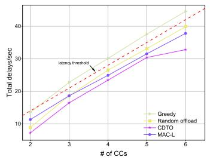  
(a)

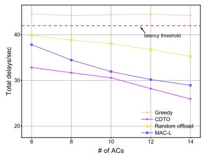  
(b)  
Fig. 8. Comparison of local performance under four mechanisms for varying number of CCs and ACs.

## C. Performance Comparison

Next, we demonstrate the superiority of the proposed algorithm by comparing it against other ofloading mechanisms from two perspectives: intra-cluster ofloading mechanisms and global ofloading mechanisms. To ensure a fair comparison across baselines, we evaluate all methods using average total delay and enforce the same resource budgets and constraints.

1) Local Ofloading Mechanisms: For ease of comparison, we define three alternative local ofloading mechanisms. The first is a random ofloading scheme without using Algorithm 1, which may fail to ensure that tasks are ofloaded to the most suitable nodes, potentially resulting in suboptimal performance. The second is a greedy algorithm that ofloads the entire task to the nearest and most computationally powerful AC without task splitting. The last ofloading mechanism models complex computation tasks as “task flows” with dependencies and employs the multi-actors-critic (MAC)- based MARL approach. For ease of comparison, we assume the tasks to be linear.

Fig. 8(a) compares the CDTO algorithm with these three alternative intra-cluster ofloading mechanisms. As the number of CC increases, the Greedy algorithm consistently fails to complete tasks within the latency threshold. In contrast to the three algorithms operating within the latency threshold, CDTO achieves the maximized safety margin, thus providing a solid guarantee for the execution of safety-critical perception tasks. Fig. 8(b) shows the performance of the three algorithms as the number of AC increases. Here, we fix the number of CC at 6 to evaluate their performance under varying AC quantities. Because the greedy algorithm simply ofloads the entire task to the nearest AC with the highest computing capacity, increasing the number of ACs does not significantly improve its overall performance. The random ofloading scheme without using Algorithm 1 may encounter resource conflicts and other issues, making its performance inferior to CDTO. In addition, MAC-L is the method whose performance is closest to CDTO among the three methods, because the impact of resource conflicts on MAC-L task scheduling is gradually decreasing with the increase of AC number. Consequently, CDTO remains the best-performing method among the four.

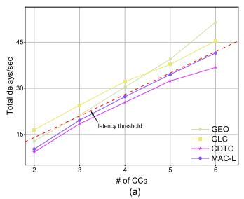

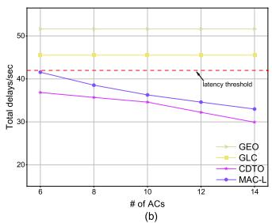  
Fig. 9. Comparison of global performance under four mechanisms for varying number of CCs and $\mathsf { A } \breve { \mathsf { C } } \mathsf { s }$

2) Global Ofloading Mechanisms: For ease of comparison, we define three alternative global ofloading mechanisms. The first is global local computing (GLC) mechanism, in which each CC independently handles its own computing tasks. The second is a global edge ofloading (GEO) mechanism based on Algorithm 1, where part of the task is ofloaded to the edge server. The last one is MAC-L which considers the communication delay caused by task uploading to TBS. Fig. 9(a) compares the CDTO algorithm with these three global ofloading mechanisms. As the number of CCs increases, CDTO is the only one among the four algorithms that completes safety-critical perception tasks within the prescribed latency threshold, further underscoring its contribution to eficient and safe AIWTS operations. Fig. 9(b) illustrates the comparison of global performance under three mechanisms for varying number of ACs. Because the performance of both GEO and GLC is independent of the number of ACs, their results form a line parallel to the coordinate axis. In contrast, CDTO’s overall delay decreases as the number of ACs increases. This declining trend does not continue indefinitely as AC numbers grow, since a balance point will be reached where the intracluster communication and computing overhead ofsets the benefit gained from adding more ACs.

We further evaluate the performance of the proposed framework from both a global and local perspective under constraints such as data size and D2D bandwidth.

3) Impact of Data Size and D2D Bandwidth: We compare CDTO with two global ofloading strategies and two local ofloading strategies. To highlight the impact of data size on overall delay, we assume that all CCs have a uniform data size, meaning each CC faces the same computational workload. As shown in Fig. 10, all ofloading mechanisms experience an increase in delay as the data size grows, which aligns with our expectations. The reason for this phenomenon is straightforward: as the data size increases, both computation and communication delays also increase. Under these circumstances, CDTO continues to outperform the other ofloading mechanisms. Next, we assess the influence of D2D bandwidth on the delay of various ofloading mechanisms, as illustrated in Fig. 11. Since the performance of GEO and GLC is independent of D2D bandwidth, their overall delay remains unchanged. In contrast, for the Greedy, Random ofload, and CDTO mechanisms, delay decreases as bandwidth increases.

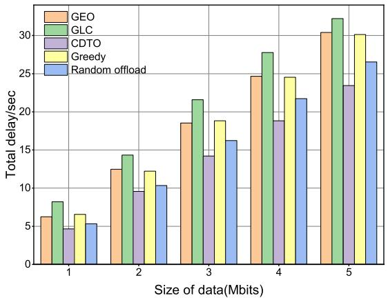  
Fig. 10. Performance comparison under diferent data sizes.

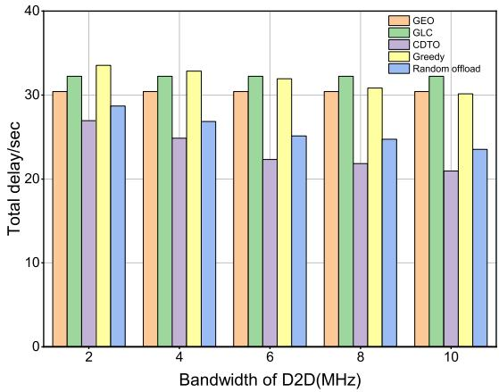  
Fig. 11. Performance comparison under diferent D2D bandwidth.

Nevertheless, CDTO still proves to be the most optimal ofloading mechanism among these options.

4) Energy Trade-of and Reacting to Link Failure: We further evaluate the trade-of between latency and transmission energy consumption in CDTO by incorporating an energy consumption term into the utility function, which is now expressed as

$$
\psi _ { l } ( s _ { l } , s _ { - l } ) = \alpha T _ { l } + ( 1 - \alpha ) \sum _ { i \in l } p _ { i } ^ { d 2 d } t _ { l , i } ^ { c o m m } ,\tag{43}
$$

where  denotes the weight factor and $p _ { i } ^ { d 2 d }$ represents the transmission power of USV i.

Fig. 12 depicts the trade-of between latency and transmission energy consumption, demonstrating how the system is dynamically adjusted based on the weighting factor . When $\alpha > 0 . 5$ , the system prioritizes latency optimization, emphasizing the reduction of delays in both communication and computation processes. This design choice is particularly suitable for scenarios where minimizing task processing and transmission time is critical. Conversely, when $\alpha < 0 . 5 $ , the system shifts its focus to optimizing communication energy consumption at the expense of increased latency.

We investigate the performance of CDTO when transient link failures occur during intra-cluster D2D task ofloading. As shown in Fig. 13(a), when transient link failures arise within a cluster (with the bandwidth of the failed link drops to zero), the real-time computation capability of CDTO enables it to eficiently compute the intra-cluster D2D task ofloading links with millisecond-level response times, outperforming the traditional EPG method based on linear programming. MADDPG is the method closest to CDTO. However, MADDPG may sufer from policy collapse or performance degradation due to link disconnection. As illustrated in Fig. 13(b), we plot the performance of CDTO under diferent numbers of link failures, with no link failures serving as a baseline. As the number of CCs and link failures increases, CDTO’s performance exhibits the expected declining trend. However, it is noteworthy that the performance degradation induced by transient link failures can be efectively compensated by rapid recomputation.

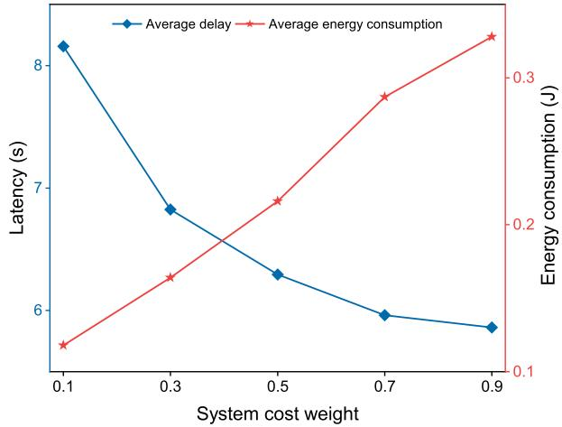  
Fig. 12. Average delay and transmission energy consumption under the varying weight factor.

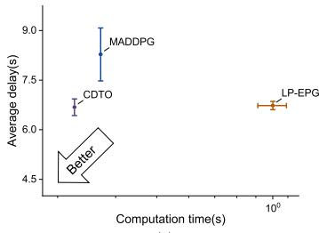  
(a)

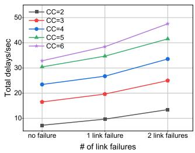  
(b)  
Fig. 13. Performance of CDTO under link failures.

5) Deadline Satisfaction Ratio for Each CC and AC: We further evaluated the deadline satisfaction ratio of CDTO under varying numbers of CCs and ACs through five hundred independent experiments. As shown in Fig. 14(a), using the maximum tolerable end-to-end decision latency for safetycritical perception tasks $T _ { c r i t }$ as the criterion, we calculated the proportion of cluster tasks whose end-to-end safety-critical decision latency $T _ { l }$ does not exceed the deadline. As the number of CCs increases from 2 to 6, the deadline satisfaction ratio dropped from approximately 97% to approximately 81%. This indicates that, under fixed wireless and edge resources, more CCs introduce higher computational/transmission concurrency demands and intra-cluster competition, making it more likely for some clusters’ closed-loop decision latency to exceed the deadline. Meanwhile, the error bars become wider as the number of CCs increases, indicating that under heavier load the system is more sensitive to stochastic topology variations and channel fluctuations. Consequently, the deadline satisfaction ratio exhibits higher dispersion/uncertainty, which further highlights the necessity of the proposed approach for guaranteeing the real-time requirements of safety-critical tasks in resource-constrained scenarios. In contrast, as shown in Fig. 14(b), the deadline satisfaction ratio exhibits an upward trend as the number of ACs increases, indicating that more ACs help reduce intra-cluster competition.

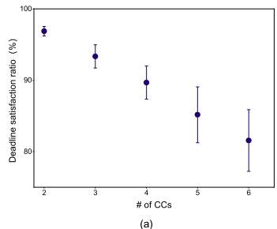

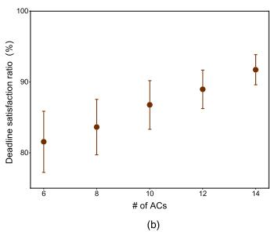  
Fig. 14. Deadline satisfaction ratio of CDTO under the varying number of CCs and ACs.

## VI. CONCLUSION AND DISCUSSION

## A. Conclusion

In this paper, we address safety and eficiency challenges for USVs in AIWTS under resource constraints by proposing a cluster-based distributed computation ofloading framework. Considering the practical communication constraints and application requirements of inland waterway scenarios, the framework employs potential game theory to model the USV clustering optimization problem as a distributed computation ofloading game. Its primary goal is to minimize the execution delay of decision-making tasks by taking into account dynamically varying D2D communication quality and the structure of cluster topologies. To rationally utilize computing and communication resources, a global delay minimization problem has been formulated. By designing heuristic algorithms and applying convex optimization methods, tasks and bandwidth are allocated in a way that achieves global delay minimization. Finally, experimental results demonstrate CDTO’s superiority in computational and communication eficiency. These properties render the proposed solution particularly well-suited for deployment in resource-constrained, time-critical settings, such as USV obstacle detection and collision avoidance in AIWTS.

## B. Discussion

Although the distributed computational ofloading framework proposed in this paper demonstrates efectiveness and outperforms numerous widely-used schemes in reducing safety-critical decision latency, there still needs further eforts for improvement in this work. On the one hand, as shown in Fig. 8, the increase in the number of CCs within inland waterways leads to elevated safety-critical decision latency. The introduction of digital twin (DT) technology could ofer a novel approach to ensuring safety and QoS in high-density CC regions [37]. On the other hand, building upon the CDTO framework, critical challenges including UAV energy consumption optimization and trajectory tracking require further investigation. Considering the motion characteristics of USVs, methods such as particle filter-based Received Signal Strength (RSS) positioning, multi-agent Q-Learning for trajectory tracking [38], and MARL for dynamic resource allocation [39] can be considered as a future research direction. Moreover, investigating the trustworthiness of D2D computation ofloading has become a hot research topic. While ofloading tasks from a CC to a neighboring AC can alleviate the computational deficit of a single CC, it simultaneously introduces risks of untrusted nodes potentially providing erroneous results or malicious interference. The Fuzzy Comprehensive Trust Evaluation (FCTE) algorithm, which has been successfully applied in vehicular edge computing task ofloading frameworks, serves as an efective solution for enhancing ofloading security and could be adopted as a potential approach to improve ofloading safety [40].

## REFERENCES

[1] U. M. Malik, M. A. Javed, S. Zeadally, and S. u. Islam, “Energyeficient fog computing for 6G-enabled massive IoT: Recent trends and future opportunities,” IEEE Internet Things J., vol. 9, no. 16, pp. 14572–14594, Aug. 2022.

[2] J.-B. Wang, C. Zeng, C. Ding, H. Zhang, M. Lin, and J. Wang, “Unmanned surface vessel assisted maritime wireless communication toward 6G: Opportunities and challenges,” IEEE Wireless Commun., vol. 29, no. 6, pp. 72–79, Dec. 2022.

[3] A. Hesselbarth, D. Medina, R. Ziebold, M. Sandler, M. Hoppe, and M. Uhlemann, “Enabling assistance functions for the safe navigation of inland waterways,” IEEE Intell. Transp. Syst. Mag., vol. 12, no. 3, pp. 123–135, Fall. 2020.

[4] F. S. Alqurashi, A. Trichili, N. Saeed, B. S. Ooi, and M.-S. Alouini, “Maritime communications: A survey on enabling technologies, opportunities, and challenges,” IEEE Internet Things J., vol. 10, no. 4, pp. 3525–3547, Feb. 2023.

[5] Y. Liao, X. Chen, S. Xia, Q. Ai, and Q. Liu, “Energy minimization for UAV swarm-enabled wireless inland ship MEC network with time windows,” IEEE Trans. Green Commun. Netw., vol. 7, no. 2, pp. 594–608, Jun. 2023.

[6] M.-Q. Dao, J. S. Berrio, V. Fremont, M. Shan, E. H ´ ery, and S. Worrall,´ “Practical collaborative perception: A framework for asynchronous and multi-agent 3D object detection,” IEEE Trans. Intell. Transp. Syst., vol. 25, no. 9, pp. 12163–12175, Sep. 2024.

[7] L. Liu, M. Zhao, M. Yu, M. A. Jan, D. Lan, and A. Taherkordi, “Mobility-aware multi-hop task ofloading for autonomous driving in vehicular edge computing and networks,” IEEE Trans. Intell. Transp. Syst., vol. 24, no. 2, pp. 2169–2182, Feb. 2023.

[8] X. Lyu, C. Zhang, C. Ren, and Y. Hou, “Distributed graph-based optimization of multicast data dissemination for Internet of Vehicles,” IEEE Trans. Intell. Transp. Syst., vol. 24, no. 3, pp. 3117–3128, Mar. 2023.

[9] Y. Wu, X. Fang, G. Min, H. Chen, and C. Luo, “Intelligent ofloading balance for vehicular edge computing and networks,” IEEE Trans. Intell. Transp. Syst., vol. 26, no. 5, pp. 5792–5803, May 2025.

[10] L. Tan, S. Guo, P. Zhou, Z. Kuang, S. Long, and Z. Li, “Multi-UAV-enabled collaborative edge computing: Deployment, ofloading and resource optimization,” IEEE Trans. Intell. Transp. Syst., vol. 25, no. 11, pp. 18305–18320, Nov. 2024.

[11] J. Park, S. Choi, T. Kim, C. Lee, and S. Lee, “Public bus-assisted task ofloading for UAVs,” IEEE Trans. Intell. Transp. Syst., vol. 25, no. 12, pp. 20561–20573, Dec. 2024.

[12] Y. Du, K. Wang, K. Yang, and G. Zhang, “Energy-eficient resource allocation in UAV based MEC system for IoT devices,” in Proc. IEEE Global Commun. Conf. (GLOBECOM), Dec. 2018, pp. 1–6.

[13] D. Wu, J. Wang, R. Q. Hu, Y. Cai, and L. Zhou, “Energyeficient resource sharing for mobile device-to-device multimedia communications,” IEEE Trans. Veh. Technol., vol. 63, no. 5, pp. 2093–2103, Jun. 2014.

[14] Y. He, J. Ren, G. Yu, and Y. Cai, “D2D communications meet mobile edge computing for enhanced computation capacity in cellular networks,” IEEE Trans. Wireless Commun., vol. 18, no. 3, pp. 1750–1763, Mar. 2019.

[15] J. Wang, K. Zhu, B. Chen, and Z. Han, “Distributed clustering-based cooperative vehicular edge computing for real-time ofloading requests,” IEEE Trans. Veh. Technol., vol. 71, no. 1, pp. 653–669, Jan. 2022.

[16] K. Rohoden, R. Estrada, H. Otrok, and Z. Dziong, “Stable femtocells cluster formation and resource allocation based on cooperative game theory,” Comput. Commun., vol. 134, pp. 30–41, Jan. 2019.

[17] Q. Wu, M. Cui, G. Zhang, F. Wang, Q. Wu, and X. Chu, “Latency minimization for UAV-enabled URLLC-based mobile edge computing systems,” IEEE Trans. Wireless Commun., vol. 23, no. 4, pp. 3298–3311, Apr. 2024.

[18] X. Zhang, J. Wang, B. Wang, and F. Jiang, “Ofloading strategy for UAV-assisted mobile edge computing based on reinforcement learning,” in Proc. IEEE/CIC Int. Conf. Commun. China (ICCC), Aug. 2022, pp. 702–707.

[19] Y. Liao, X. Chen, J. Liu, Y. Han, N. Xu, and Z. Yuan, “Cooperative UAV-USV MEC platform for wireless inland waterway communications,” IEEE Trans. Consum. Electron., vol. 70, no. 1, pp. 3064–3076, Feb. 2024.

[20] L. Lyu, Z. Chu, B. Lin, Y. Dai, and N. Cheng, “Fast trajectory planning for UAV-enabled maritime IoT systems: A Fermat-point based approach,” IEEE Wireless Commun. Lett., vol. 11, no. 2, pp. 328–332, Feb. 2022.

[21] L. P. Qian, H. Zhang, Q. Wang, Y. Wu, and B. Lin, “Joint multi-domain resource allocation and trajectory optimization in UAV-assisted maritime IoT networks,” IEEE Internet Things J., vol. 10, no. 1, pp. 539–552, Jan. 2023.

[22] M. Li, N. Cheng, J. Gao, Y. Wang, L. Zhao, and X. Shen, “Energyeficient UAV-assisted mobile edge computing: Resource allocation and trajectory optimization,” IEEE Trans. Veh. Technol., vol. 69, no. 3, pp. 3424–3438, Mar. 2020.

[23] J. Zhang et al., “Stochastic computation ofloading and trajectory scheduling for UAV-assisted mobile edge computing,” IEEE Internet Things J., vol. 6, no. 2, pp. 3688–3699, Apr. 2019.

[24] Q. Hu, Y. Cai, G. Yu, Z. Qin, M. Zhao, and G. Y. Li, “Joint ofloading and trajectory design for UAV-enabled mobile edge computing systems,” IEEE Internet Things J., vol. 6, no. 2, pp. 1879–1892, Apr. 2019.

[25] Z. Yang, C. Pan, K. Wang, and M. Shikh-Bahaei, “Energy eficient resource allocation in UAV-enabled mobile edge computing networks,” IEEE Trans. Wireless Commun., vol. 18, no. 9, pp. 4576–4589, Sep. 2019.

[26] L. Zhang and N. Ansari, “Latency-aware IoT service provisioning in UAV-aided mobile-edge computing networks,” IEEE Internet Things J., vol. 7, no. 10, pp. 10573–10580, Oct. 2020.

[27] X. Chen, L. Jiao, W. Li, and X. Fu, “Eficient multi-user computation ofloading for mobile-edge cloud computing,” IEEE/ACM Trans. Netw., vol. 24, no. 5, pp. 2795–2808, Oct. 2016.

[28] Q. Jiang et al., “Potential game based distributed IoV service ofloading with graph attention networks in mobile edge computing,” IEEE Trans. Intell. Transp. Syst., vol. 25, no. 9, pp. 10912–10925, Sep. 2024.

[29] F. Zhang and M. M. Wang, “Stochastic congestion game for load balancing in mobile-edge computing,” IEEE Internet Things J., vol. 8, no. 2, pp. 778–790, Jan. 2021.

[30] Z. Cheng et al., “CHEESE: Distributed clustering-based hybrid federated split learning over edge networks,” IEEE Trans. Parallel Distrib. Syst., vol. 34, no. 12, pp. 3174–3191, Dec. 2023.

[31] H. He, X. Yang, F. Huang, H. Shen, and H. Tian, “Enhancing QoE in large-scale U-MEC networks via joint optimization of task ofloading and UAV trajectories,” IEEE Internet Things J., vol. 11, no. 21, pp. 35710–35723, Nov. 2024.

[32] X. Li et al., “Two-stage ofloading for an enhancing distributed vehicular edge computing and networks: Model and algorithm,” IEEE Trans. Intell. Transp. Syst., vol. 25, no. 11, pp. 17744–17761, Nov. 2024.

[33] T. Fang, F. Yuan, L. Ao, and J. Chen, “Joint task ofloading, D2D pairing, and resource allocation in device-enhanced MEC: A potential game approach,” IEEE Internet Things J., vol. 9, no. 5, pp. 3226–3237, Mar. 2022.

[34] Q. Wu, D. Wu, Y. Xu, and J. Wang, “Demand-aware multichannel opportunistic spectrum access: A local interaction game approach with reduced information exchange,” IEEE Trans. Veh. Technol., vol. 64, no. 10, pp. 4899–4904, Oct. 2015.

[35] M. J. Osborne and A. Rubinstein, A Course in Game Theory. Cambridge, MA, USA: MIT Press, 1994.

[36] D. Monderer and L. S. Shapley, “Potential games,” Games Econ. Behav., vol. 14, no. 1, pp. 124–143, May 1996.

[37] H. Guo, X. Zhou, J. Wang, J. Liu, and A. Benslimane, “Intelligent task ofloading and resource allocation in digital twin based aerial computing networks,” IEEE J. Sel. Areas Commun., vol. 41, no. 10, pp. 3095–3110, Oct. 2023.

[38] S. A. Soleymani, S. Goudarzi, and P. Xiao, “Multi-agent Q-learning with particle filtering for UAV tracking in open-ran environment,” IEEE Trans. Aerosp. Electron. Syst., vol. 61, no. 4, pp. 10439–10458, 2025.

[39] S. Zhu, L. Gui, D. Zhao, N. Cheng, Q. Zhang, and X. Lang, “Learningbased computation ofloading approaches in UAVs-assisted edge computing,” IEEE Trans. Veh. Technol., vol. 70, no. 1, pp. 928–944, Jan. 2021.

[40] H. Guo, X. Chen, X. Zhou, and J. Liu, “Trusted and eficient task ofloading in vehicular edge computing networks,” IEEE Trans. Cognit. Commun. Netw., vol. 10, no. 6, pp. 2370–2382, Dec. 2024.

  
Baiyi Li received the B.S. degree in marine technology from the Navigation College, Dalian Maritime University (DMU), Dalian, China, in 2022. He is currently pursuing the M.S. degree in nautical science and technology with DMU. His current research interests include federated learning, mobile edge computing, and resource allocation in wireless communications.

Xinghan Wang is currently a Post-Doctoral Researcher at the Peng Cheng Laboratory, China. His research interests include federated learning, distributed optimization, and edge intelligence.

  
Jian Zhao received the joint B.Sc. degree from Dalian Maritime University and Singapore Maritime Academy in 2005 and the M.Sc. degree from World Maritime University in 2010, where he is currently pursuing the Ph.D. degree. His M.Sc. degree was sponsored by the MOT (Ministry of Transport) Scholarship. He joined DMU as a Lecturer in 2006. His research interests include safety of ship, E-navigation, ship operations, and maritime communications.

Nan Li (Member, IEEE) received the Ph.D. degree in electrical engineering from the KTH Royal Institute of Technology, Stockholm, Sweden, in March 2018. She is currently an Associate Professor with the Peng Cheng Laboratory, Shenzhen, China. Her research interests include wireless communications, information theory, networks, and information security. Recently, she has been probing into interdisciplinary areas including wireless foundation models and deep generative models.

Tingting Yang (Senior Member, IEEE) received the B.Sc. and Ph.D. degrees from Dalian Maritime University, China, in 2004 and 2010, respectively. She is currently a Professor at Dalian Maritime University and the Peng Cheng Laboratory. Her research interests include space–air–ground–sea integrated networks and network AI. She serves as the Associate Editor-in-Chief for IET Communications and an Advisory Editor for SpringerPlus.