# Distributed Deep Joint Source-Channel Coding of Videos in Unmanned Aerial Vehicle Networks

Zhenguo Zhang , Student Member, IEEE, Qianqian Yang , Member, IEEE, Yiping Duan , Member, IEEE, Zhiguo Shi , Fellow, IEEE, Shibo He , Senior Member, IEEE, Xiaoming Tao , Senior Member, IEEE Jiming Chen , Fellow, IEEE

Abstract—In unmanned aerial vehicle (UAV) networks, ef-z ficient video transmission is crucial for applications such as surveillance, disaster response, and remote sensing, yet it remainsU (x ,y ,h ) challenging due to limited computational resources and energy constraints. This paper presents a novel video transmission framework that simultaneously enhances communication quality and energy efficiency in resource-constrained UAV networks. To address computational limitations while ensuring high-quality video reconstruction, we design a joint source–channel coding (JSCC) scheme with a lightweight encoder that incorporates distributed video coding. To further improve system endurance,x we employ deep reinforcement learning (DRL) to dynamically optimize relay node selection. Simulation results demonstrate that the proposed lightweight feature extraction model requires only 1.81% of the complexity of deep contextual video compression (DCVC) and 16.56% of low-complexity deep video compression (L-DVC), while achieving comparable or superior reconstruction performance under diverse channel conditions. Moreover, the proposed scheme significantly improves energy efficiency, thereby extending UAV hover time compared to the baseline.k k k k

Index Terms—DeepJSCC, deep reinforcement learning, energy efficiency, video transmission.

## I. INTRODUCTION

During natural disasters and other emergency scenarios, rescue teams must operate in unfamiliar environments within limited time windows, often encountering challenging terrain that hampers mobility [1]. In such contexts, unmanned aerial vehicles (UAVs) provide an effective means of communication and search, serving as aerial base stations (BSs) or surveillance platforms to enhance connectivity and environmental awareness [2], [3]. In UAV-assisted communication networks, UAVs can capture and transmit information—typically videos and images—to ground rescue teams while maintaining inter-UAV connectivity to relay data across broader regions. To deliver real-time situational awareness, UAVs must maneuver rapidly

and exchange information frequently with ground users, as illustrated in Fig. 1. However, the transmission of video content is data-intensive, and the limited on-board energy and computational capacity of UAVs impose significant challenges on existing communication frameworks. Consequently, there is an urgent need for alternative communication and resource allocation strategies to improve transmission efficiency and optimize energy utilization in dynamic UAV environments.

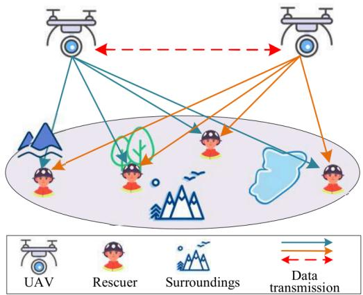  
Fig. 1. UAV assisted rescue communication networks.

Deep learning (DL)-based joint source–channel coding (JSCC) schemes have demonstrated substantial gains in transmission efficiency compared to traditional separation-based methods [4]–[13]. By leveraging DL, these schemes directly map source signals to channel symbols at the transmitter and reconstruct the original data at the receiver, thereby eliminating the need for explicit source and channel coding [14]. For example, [15] introduce resilient deep coding neural networks (RDCNN), which leverage the Information Bottleneck principle for rate optimization in semantic image communication, achieving improved image fidelity under adverse conditions. Additionally, [16] proposes a robust image transmission framework using low-rank guided diffusion models, enhancing image reconstruction quality and addressing visual fidelity challenges while reducing the transmitted data size. [17] proposed an end-to-end video transmission framework that unifies video compression, channel coding, and modulation into a single neural transform, while employing reinforcement learning (RL) to optimize frame-level bandwidth allocation for enhanced video quality. Similarly, [18] introduced an adaptive panoramic video semantic transmission network that dynamically extracts and encodes semantic features of panoramic frames, incorporating transmission rate control based on entropy and latitude-adaptive models to improve bandwidth efficiency. In [19], a semantic-related compacting framework was developed that employs bi-optical flow to estimate residual inter-frame details, thereby improving reconstruction quality. Furthermore, [20] explored a service-aware Web realtime communication system based on scalable video coding (SVC), which adapts to heterogeneous user requirements by sampling contextual features, discarding low-motion frames, and dynamically adjusting to communication environments to ensure low latency and high visual quality. Despite these advancements, most existing approaches remain impractical for UAV systems due to their limited computational and communication resources, as well as the high complexity of neural network–based encoders.

Distributed video compression (DVC) methods provide useful insights for designing lightweight encoders suitable for resource-constrained UAV platforms. Building on the Slepian–Wolf (SW) and Wyner–Ziv (WZ) theorems [21], these methods shift the computational burden of video feature extraction and coding from the transmitter to the receiver. In particular, the encoder performs only lightweight tasks such as capturing and encoding raw video data, while the decoder exploits side information to reconstruct the video with minimal quality degradation. This design alleviates the need for highperformance hardware at the transmitter while maintaining acceptable video quality at the receiver. Prior research [22] has demonstrated that DVC can serve as a promising complement to conventional video compression techniques in multimedia applications. However, its encoding efficiency remains limited, primarily due to inaccuracies in side information for frame prediction. Moreover, DVC typically requires a feedback channel between the receiver and transmitter for iterative verification, which introduces non-negligible transmission delays.

The dynamic mobility of UAVs presents additional challenges for video transmission, particularly given their limited energy capacity, which necessitates optimized communication link selection and adaptive transmission power control. Prior research has explored several aspects of this problem. For instance, [23] developed an optimal beamforming and path-planning strategy for dual-hop amplify-and-forward relay networks, where UAVs relay signals between mobile access points and fixed base stations. Their approach maximizes output SNR while adjusting UAV heading to reduce communication outages. Similarly, [24] proposed a UAV-assisted relay scheme that improves network coverage through resource sharing and time/frequency division among relay nodes. In [25], energy consumption in UAV relay networks was minimized by jointly optimizing communication time and transmission power. While joint UAV positioning and power optimization have been effective in conventional communication systems [26], [27], existing studies have not sufficiently investigated how wireless transmission power influences the overall energy distribution of mobile UAVs. This limitation is particularly pronounced in complex environments involving simultaneously mobile ground users and UAVs. Such an oversight directly constrains operational performance, reducing both UAV swarm hover time and exploration range. Therefore, developing integrated solutions that leverage real-time UAV position and energy information to improve both communication performance and energy efficiency remains a critical research challenge.

To address the challenges of video transmission in UAV systems, we propose a lightweight transmission architecture consisting of two main components: (1) a distributed JSCC-based video transmission module with lightweight JSCC encoder, and (2) a signal power coordination scheme that optimizes energy efficiency among UAVs. The video processing module enhances reconstruction robustness under complex channel conditions. Built on a JSCC-assisted distributed video compression framework, our design eliminates the need for a feedback channel through joint optimization, thereby improving transmission efficiency and reducing latency. In parallel, the signal power coordination scheme employs RL to dynamically optimize both communication links and transmission power based on real-time UAV position data. This dual optimization achieves higher energy efficiency while preserving video quality. The key contributions of this work are as follows:

• We introduce a novel distributed JSCC-based video transmission framework tailored for UAV deployments. To address UAV mobility constraints and limited computational and energy resources in dynamic environments, the optimization is decoupled into (1) a JSCC video transmission module for efficient feature extraction and (2) a signal power coordination controller for adaptive transmission. This dual-component design enhances both video quality and energy efficiency, thereby extending UAV runtime and improving situational awareness.

• We design a computationally efficient JSCC encoder specifically for UAV platforms, integrating a hierarchical feature extraction module that captures multi-scale spatiotemporal features, robustly fused with Wyner–Ziv (WZ) frame features. This design significantly improves reconstruction fidelity while maintaining minimal computational overhead at the UAV’s side, achieving video reconstruction with 1.81% to 16.56% of the computational complexity of existing methods across diverse channel conditions.

• We develop a DRL-based communication link optimization framework that maximizes energy efficiency while satisfying UAV energy capacity, communication range, and quality-of-service (QoS) constraints. The adaptive link selection algorithm achieves substantial gains, extending UAV operational time by an average of 17.34% and expanding effective coverage compared to baseline approaches.

The remainder of this paper is organized as follows. Section II describes the system model and problem formulation. The proposed model is presented in Section III. Numerical results are discussed in Section IV. In Section V, we discuss the limitations of the proposed method and our future work. Finally, we conclude our work in Section VI.

## II. SYSTEM MODEL AND PROBLEM FORMULATIONz

We consider a multi-user UAV-enabled video transmission system, as illustrated in Fig. 2, where UAVs transmit video data to ground users. UAVs adaptively select target groundU1(x1,y1,h) users based on channel conditions, while the ground usersU (x ,y ,h perform data fusion and reconstruction and synchronize the received videos with other users. The objective is to improve2 2 2 video delivery efficiency and reconstruction quality by dynamically optimizing communication links and managing UAV energy consumption to extend the overall network lifetime.Um(xm,ym,0)

## A. System Model

The UAV-enabled video transmission system considered in this paper is illustrated in Fig. 2. The communication network consists of a set of U UAVs $\mathcal { U } = \{ { 1 , . . . , U } \}$ operating at varying altitudes, and a set of K ground users ${ \mathcal { K } } = \{ U + 1 , . . . , U + K \}$ . UAVs serve as aerial relays that transmit video data to users while maintaining inter-UAV communication for multi-hop relaying. Time is divided into discrete slots of duration T , and the network topology is updated at each slot. The position of UAV $u \in \mathcal { U }$ at time t is denoted as $R _ { u } ( t ) = \{ x _ { u } ( t ) , y _ { u } ( t ) , h _ { u } ( t ) \}$ , where $h _ { u } ( t )$ is the UAV altitude. The position of ground user $k \in \mathcal { K }$ is denoted as $C _ { k } ( t ) = \{ a _ { k } ( t ) , b _ { k } ( t ) , c _ { k } \}$ , where $c _ { k }$ is the fixed user altitude.

The video content to be transmitted is represented by a sequence $S = \{ S ^ { n } \} _ { n = 1 } ^ { N }$ , where each group-of-pictures (GoP) ${ \pmb S } ^ { n } = \{ { \pmb s } _ { 1 } ^ { n } , \ldots , { \pmb s } _ { M + 1 } ^ { n } \}$ contains $M + 1$ frames. Each frame $\pmb { s } _ { i } ^ { n } \in \mathbb { R } ^ { \hat { H } \times W \times 3 }$ has spatial resolution $H \times W$ . All UAVs share the same frequency band. To mitigate co-channel interference, the transmit power of UAV u is constrained as:

$$
0 \leq P _ { u } ( t ) \leq P _ { \operatorname * { M a x } } ( t ) ,
$$

where $P _ { \mathrm { M a x } } ( t )$ is the maximum allowable transmit power at time $t . \ \mathrm { ~ A ~ }$ binary variable $L _ { u , d } ( t ) ~ \in ~ \{ 0 , 1 \}$ , where $d \_ =$ $1 , \dots , U + K - 1$ , is used to indicate whether UAV u is connected to node d (either another UAV if $d \leq U$ , or a user otherwise):

$$
L _ { u , d } ( t ) = { \left\{ \begin{array} { l l } { 1 , } & { { \mathrm { i f ~ U A V ~ } } u { \mathrm { ~ i s ~ c o n n e c t e d ~ t o ~ n o d e ~ } } d , } \\ { 0 , } & { { \mathrm { o t h e r w i s e . } } } \end{array} \right. }\tag{1}
$$

In emergency rescue scenarios, both UAVs and ground users may move in response to dynamic conditions. We model their mobility using the random walk model from [28].The random mobility model is adopted to emulate highly dynamic network conditions, thereby providing a stress-test scenario to evaluate the robustness and adaptability of the proposed framework. While user altitudes remain constant, their speed and direction, as well as those of the UAVs, are re-initialized at the start of each time slot. Specifically, user k and UAV u sample speeds $v _ { k } ( t )$ and $s _ { u } ( t )$ from uniform distributions over $\left[ v _ { k } ^ { \operatorname* { m i n } } , v _ { k } ^ { \operatorname* { m a x } } \right]$ and $\left[ s _ { u } ^ { \operatorname* { m i n } } , s _ { u } ^ { \operatorname* { m a x } } \right]$ , respectively. Movement directions are sampled uniformly from [0, 2π] in all three spatial dimensions. The velocity vectors are denoted as $\boldsymbol { v } _ { k } ( t ) \ = \ \{ v _ { k } ^ { x } , v _ { k } ^ { y } , v _ { k } ^ { z } \}$ and $s _ { u } ( t ) = \{ s _ { u } ^ { x } , s _ { u } ^ { y } , s _ { u } ^ { z } \}$ . Consequently, the updated positions at time $t + 1$ are computed as:

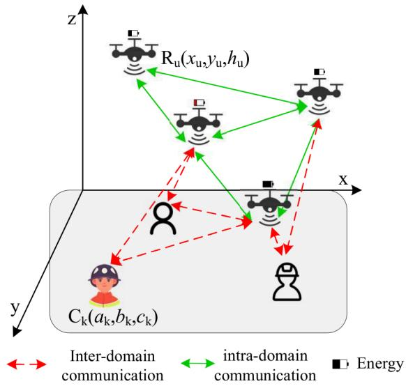  
Fig. 2. An illustration of the system model.

$$
\begin{array} { r } { R _ { u } ( t + 1 ) = R _ { u } ( t ) + s _ { u } ( t ) T , } \\ { C _ { k } ( t + 1 ) = C _ { k } ( t ) + v _ { k } ( t ) T . } \end{array}\tag{2}
$$

To avoid collisions, a minimum separation distance is enforced between any two UAVs:

$$
\| R _ { u } ( t ) - R _ { u ^ { \prime } } ( t ) \| \geq d _ { \operatorname* { m i n } } , \quad \forall u \neq u ^ { \prime } .\tag{3}
$$

We assume that within each time slot, the network topology and channel state information remain quasi-static. UAV communication channels are characterized by both Line-of-Sight (LoS) and Non-Line-of-Sight (NLoS) components [29]. The LoS probability between UAV u and node d at time t is modeled as [30]:

$$
P _ { u , d , \mathrm { L o S } } ( t ) = \frac { 1 } { 1 + \eta _ { a } \exp { \left[ - \eta _ { b } ( \eta _ { u , d } ( t ) - \eta _ { a } ) \right] } } ,\tag{4}
$$

where:

$$
\eta _ { u , d } ( t ) = \arcsin \left( \frac { | h _ { u } ( t ) - h _ { d } ( t ) | } { d i s _ { u , d } ( t ) } \right) ,
$$

and $d i s _ { u , d } ( t )$ is the Euclidean distance between UAV u and node d (either another UAV or a user). Parameters $\eta _ { a }$ and $\eta _ { b }$ are positive constants defined by the propagation environment. The NLoS probability is given by:

$$
P _ { u , d , \mathrm { N L o S } } ( t ) = 1 - P _ { u , d , \mathrm { L o S } } ( t ) .
$$

The total path loss between UAV u and node d is expressed as:

$$
\begin{array} { r } { P L _ { u , d } ( t ) = L F ( t ) + P _ { u , d , \mathrm { L o S } } ( t ) \eta _ { \mathrm { L o S } } + P _ { u , d , \mathrm { N L o S } } ( t ) \eta _ { \mathrm { N L o S } } , } \end{array}\tag{5}
$$

where $L F ( t )$ denotes free-space path loss, and $\eta _ { \mathrm { L o S } } .$ ηNLoS are the additional loss coefficients for LoS and NLoS paths, respectively. As shown in [31]–[33], the communication links between the UAVs and IoT devices are primarily dominated by LoS connections. Furthermore, the Doppler effect resulting from UAV movement is considered to be perfectly mitigated at the receiving end [34]–[37]. The signal-to-noise ratio (SNR) is then given by:

$$
\gamma _ { u , d } ( t ) = \frac { P L _ { u , d } ( t ) \cdot 1 0 ^ { - P L _ { u , d } ( t ) / 1 0 } } { B _ { u , d } ( t ) \cdot n _ { 0 } } ,\tag{6}
$$

where $P _ { u , d } ( t )$ is the transmission power, $B _ { u , d } ( t )$ is the bandwidth allocated at time $t ,$ and $n _ { 0 }$ is the power spectral density of additive white Gaussian noise (AWGN).

From (4) and (6), it is evident that time-varying communication distances introduce multi-scale fading, directly impacting $\gamma _ { u , d } ( t )$ . To maintain communication quality and conserve energy, we propose an adaptive power control strategy. The UAV’s transmit power is adjusted according to:

$$
\boldsymbol { P _ { u , d } } ( t ) = \boldsymbol { \vartheta _ { u , d } } ( t ) \cdot \boldsymbol { P _ { \mathrm { M a x } } } ,\tag{7}
$$

where $\vartheta _ { u , d } ( t ) ~ \in ~ [ 0 , 1 ]$ is an adjustable power ratio. Our goal is to jointly design adaptive power control and user association strategies that minimize energy consumption and extend network lifetime, while ensuring high-quality video transmission and robust communication performance.

## B. Distributed Video Coding

To enable lightweight video encoding on the UAV side, we employ a distributed video coding (DVC) paradigm. Each GoP contains two key frames—the first and last frames—denoted by $\pmb { x } _ { 1 } ^ { n }$ and $\pmb { x } _ { M + 1 } ^ { n }$ , respectively, as well as M − 1 predictive frames, which adopt a Wyner-Ziv-inspired (WZ-style) decoding paradigm, denoted by $\mathbf { \Delta } \mathbf { x } _ { i } ^ { n } .$ , where $i ~ = ~ 2 , \dots , M$ , and $n ~ = ~ 1 , \ldots , N$ indicates the GoP index. Notably, the first key frame of GoP n is shared with the last key frame of GoP n − 1, i.e., $x ^ { 1 ^ { n } } = x _ { M + 1 } ^ { n - 1 }$ . For analytical tractability, we assume that the last key frame of ${ \mathrm { G o P } } ( n - 1 )$ coincides with the first key frame of GoP(n) to simplify cross-GoP modeling and avoid double counting at boundaries. Although this idealized abstraction may not strictly hold in practical UAV video streams, it is consistent with common boundary regularization practices in prior video coding and streaming optimization studies. Key frames and the WZ-style predictive frames (WZ frames) are encoded independently at the UAV. At the receiver, the key frames are first decoded and then used as side information to assist in decoding the associated WZ frames. This design follows the Wyner-Ziv principle that side information is exploited only at the decoder, while the encoder operates without access to this side information. Although each key frame appears in two GoPs, it is transmitted only once to reduce redundancy.

Different from classical Wyner-Ziv codecs that explicitly perform binning or syndrome-based rate control in the source coding stage, our framework leverages an end-to-end JSCC strategy. In particular, the communication cost is constrained through a bandwidth ratio, rather than an explicit bit rate or bin index length. Therefore, WZ frames emphasize the decoderside information structure rather than claiming an explicit binning-based Wyner–Ziv implementation. Building on this decoder-centric formulation, latency is controlled through an asymmetric Wyner–Ziv-inspired design that confines all high-), complexity neural modules to the decoder, while keeping the(r UAV-side encoder lightweight. This architecture minimizes onboard processing delay and supports real-time transmission,h w with computationally intensive reconstruction handled off-Encoder Encoder Encoder Decoder board on resource-rich platforms.Semantic Transmitter Ch

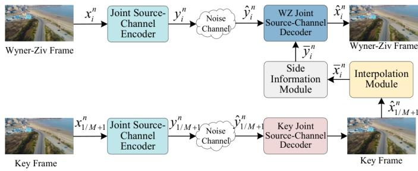  
Fig. 3. Architecture of the proposed distributed video transmission network.

The independent joint source-channel encoding processes for key and WZ frames are defined as:

$$
\begin{array} { r } { { \pmb y } _ { 1 / M + 1 } ^ { n } = f _ { \mathrm { K e y } } ( { \pmb x } _ { 1 / M + 1 } ^ { n } ; \delta _ { 1 } ) , \qquad } \\ { { \pmb y } _ { i } ^ { n } = f _ { \mathrm { W Z } } ( { \pmb x } _ { i } ^ { n } ; \delta _ { 2 } ) , \quad i = 2 , \dots , M , } \end{array}\tag{8}
$$

where $f _ { \mathrm { K e y } } ( \cdot )$ (hand $f _ { \mathrm { W Z } } ( \cdot )$ denote the joint source-channel concatenatekencoders for key and WZ frames, respectively, with parameters $\delta _ { 1 }$ and $\delta _ { 2 }$

The encoded symbol sequences $\pmb { y } _ { 1 / M + 1 } ^ { n } \in \mathbb { C } ^ { l _ { 1 } }$ and $\mathbf { \Psi } _ { { \pmb { y } } _ { i } ^ { n } } ^ { n } \in$ $\mathbb { C } ^ { l _ { 2 } }$ are normalized to satisfy the average power constraint:

$$
\bar { y } _ { i } ^ { n } = \sqrt { l P } \cdot \frac { y _ { i } ^ { n } } { \sqrt { ( y _ { i } ^ { n } ) ^ { \sf H } y _ { i } ^ { n } } } , \quad i = 1 , \ldots , M + 1 ,\tag{9}
$$

where $( \cdot ) ^ { \mathsf { H } }$ denotes the Hermitian (conjugate transpose) operator, and $\bar { \pmb { y } } _ { i } ^ { n }$ is the normalized transmission sequence. Each real-valued sequence is mapped to complex-valued symbols by pairing adjacent real components. The resulting complex sequences are then transmitted directly over the noisy channel. The received signal at the decoder for each frame is modeled as:

$$
\pmb { \hat { y } } _ { i } ^ { n } = h \cdot \pmb { \bar { y } } _ { i } ^ { n } + \pmb { n } _ { c } , \quad i = 1 , \ldots , M + 1 ,\tag{10}
$$

where $h$ is the channel gain coefficient, and $\pmb { n } _ { c } \sim \mathcal { C N } ( 0 , \sigma ^ { 2 } \pmb { I } )$ is the circularly symmetric complex Gaussian noise.

The decoder reconstructs the key frames via a JSCC decoder:

$$
\hat { \pmb { x } } _ { 1 / M + 1 } ^ { n } = g _ { \mathrm { K e y } } ( \hat { \pmb { y } } _ { 1 / M + 1 } ^ { n } ; \delta _ { 3 } ) ,\tag{11}
$$

where $g _ { \mathrm { K e y } } ( \cdot )$ is the key frame decoding function parameterized by $\delta _ { 3 }$ . The reconstruction of WZ frames is defined as:

$$
\hat { \pmb { x } } _ { i } ^ { n } = g _ { \mathrm { W Z } } \left( g _ { S } \left( g _ { I } ( \hat { \pmb { x } } _ { 1 } ^ { n } , \hat { \pmb { x } } _ { M + 1 } ^ { n } ; \delta _ { 4 } ) ; \delta _ { 5 } \right) , \hat { \pmb { y } } _ { i } ^ { n } ; \delta _ { 6 } \right) ,\tag{12}
$$

where $g _ { I } ( \cdot )$ is the interpolation module that captures temporal correlation between the key frames and produces an initial estimate $\bar { x } _ { i } ^ { n } ; g _ { S } ( \cdot )$ is the side information refinement module that adjusts the dimensionality and accuracy of the side information to generate $\bar { y } _ { i } ^ { n } ; g _ { \mathrm { w Z } } ( \cdot )$ is the WZ JSCC decoder, which reconstructs the final WZ frame using $\bar { \pmb { y } } _ { i } ^ { n }$ and the received symbols $\hat { \mathbf { { y } } } _ { i } ^ { n }$ . Parameters $\delta _ { 4 } , \delta _ { 5 }$ , and $\delta _ { 6 }$ govern the interpolation, side information refinement, and WZ decoding processes, respectively. This distributed coding framework ensures efficient encoding at the UAV side while maintaining high reconstruction fidelity at the receiver.

## C. Communication Link Optimization

We consider a heterogeneous UAV swarm in which each UAV is initialized with a distinct energy budget. Due to variations in communication distances arising from UAV mobility, maintaining a minimum required video reconstruction quality $L _ { \mathrm { m i n } }$ necessitates dynamic transmission power adaptation to sustain the target SNR. This requirement, however, exacerbates energy disparities across UAVs and shortens the operational lifetime of energy-depleted nodes. Consider three nodes, denote by $u , u ^ { \prime }$ and $k ,$ with node $u ^ { \prime }$ as the relay node. Let $\gamma _ { u , u ^ { \prime } } , \gamma _ { u ^ { \prime } , k }$ , and $\gamma _ { u , k }$ denote the SNR of the respective transmission links [38]. The instantaneous capacity of the three-node cooperative amplify-and-forward (AF) transmission is given by

$$
C _ { A F } = \log _ { 2 } ( 1 + g ( \gamma _ { u , u ^ { \prime } } , \gamma _ { u ^ { \prime } , k } ) ) ) ,\tag{13}
$$

where $g ( \cdot )$ is the equivalent SNR function, and the equivalent SNR of the relay path is

$$
\gamma _ { e q } = g ( \gamma _ { u , u ^ { \prime } } , \gamma _ { u ^ { \prime } , k } ) = \frac { \gamma _ { u , u ^ { \prime } } \cdot \gamma _ { u ^ { \prime } , k } } { 1 + \gamma _ { u , u ^ { \prime } } + \gamma _ { u ^ { \prime } , k } } ,\tag{14}
$$

Accordingly, we design a two-phase energy control mechanism that ensures reliable SNR levels while improving energy utilization efficiency. To enhance swarm-level coverage and prolong network lifetime, our objective is to maximize UAV hovering time and overall operational duration by balancing energy consumption through optimized communication link selection. We formulate an optimization problem under a DVC scheme, subject to mobility, power, energy, and qualityof-service (QoS) constraints. Let the system state at time slot t include UAV locations $R _ { u } ( t )$ , user locations $C _ { k } ( t )$ UAV energy resources $E _ { u } ( t )$ , association indicators $L _ { u , k } ( t )$ maximum transmission power $P _ { \mathrm { M a x } }$ , channel noise variance $\sigma ^ { 2 }$ , and the video coding function $f _ { \mathrm { D V C } } ( \cdot )$ . The objective is to jointly optimize channel access and transmission parameters to improve both energy efficiency and video quality:

$$
\operatorname* { m a x } _ { R _ { u } ( t ) , C _ { k } ( t ) , } \sum _ { t \in { \mathcal T } } \sum _ { u \in { \mathcal U } } \sum _ { k \in { \mathcal K } } L _ { u , k } ( t ) \Bigl ( \phi E _ { u } ( t ) + \mu f _ { \mathrm { D V C } } ( s _ { u } , \gamma _ { u , k } ( t ) ) \Bigr )\tag{15a}
$$

$$
\mathrm { s . t . } \quad x _ { u } ( t ) , a _ { k } ( t ) \in [ x _ { \operatorname* { m i n } } , x _ { \operatorname* { m a x } } ] , \quad \forall u \in \mathcal { U } , \forall k \in \mathcal { K } ,\tag{15b}
$$

$$
y _ { u } ( t ) , b _ { k } ( t ) \in [ y _ { \operatorname* { m i n } } , y _ { \operatorname* { m a x } } ] , \quad \forall u \in \mathcal { U } , \forall k \in \mathcal { K } ,\tag{15c}
$$

$$
h _ { u } ( t ) \in [ h _ { \operatorname* { m i n } } , h _ { \operatorname* { m a x } } ] , \quad \forall u \in \mathcal { U } ,\tag{15d}
$$

$$
0 \leq E _ { u } ( t ) \leq E _ { \operatorname* { m a x } } , \quad \forall u \in \mathcal { U } ,\tag{15e}
$$

$$
0 \leq P _ { u } ( t ) \leq P _ { \mathrm { M a x } } , \quad \forall u \in \mathcal { U } ,
$$

$$
L _ { u , k } ( t ) \in \{ 0 , 1 \} , \quad \forall u \in \mathcal { U } , \forall k \in \mathcal { K } ,\tag{15f}
$$

$$
\sum L _ { u , k } ( t ) \leq 1 , \quad \forall u \in \mathcal { U } , \forall k \in \mathcal { K } ,\tag{15g}
$$

(15h)

$$
f _ { \mathrm { D V C } } ( \boldsymbol { s } _ { u } , \gamma _ { u , k } ( t ) ) \geq L _ { \mathrm { m i n } } , \quad \forall u \in \mathcal { U } , \forall k \in \mathcal { K } ,\tag{15i}
$$

$$
\gamma _ { u , k } ( t ) = \left\{ \begin{array} { l l } { \frac { \gamma _ { u , u ^ { \prime } } ( t ) \cdot \gamma _ { u ^ { \prime } , k } ( t ) } { 1 + \gamma _ { u , u ^ { \prime } } ( t ) + \gamma _ { u ^ { \prime } , k } ( t ) } , } & { \mathrm { i f ~ U A V ~ } u \mathrm { ~ s e l e c t s ~ A F } , } \\ { \gamma _ { u , k } ( t ) , } & { \mathrm { o t h e r w i s e ~ } , } \end{array} \right.\tag{15j}
$$

$$
P _ { u , k } ( t ) = \left\{ \begin{array} { l l } { P _ { u , u ^ { \prime } } ( t ) + P _ { u ^ { \prime } , k } ( t ) , } & { \mathrm { i f ~ U A V ~ } u \mathrm { ~ s e l e c t s ~ A F , } } \\ { P _ { u , k } ( t ) , } & { \mathrm { o t h e r w i s e ~ , } } \end{array} \right.\tag{15k}
$$

where $\phi$ and µ are weight coefficients that balance energy conservation and video quality; xmin, xmax, ymin, ymax, $h _ { \operatorname* { m i n } } , h _ { \operatorname* { m a x } }$ defines spatial boundaries for UAV/user mobility; $E _ { u } ( t )$ denotes remaining energy at UAV u; $P _ { u } ( t )$ is the transmission power; $L _ { u , k } ( t )$ is the binary link indicator variable; $u ^ { \prime }$ is the relay node selection made by u based on environmental information. $\gamma _ { u , k } ( t )$ is the resulting SNR; $f _ { \mathrm { D V C } } ( \boldsymbol { s } _ { u } , \gamma _ { u , k } ( t ) )$ quantifies the achievable video quality $( \mathrm { e . g . }$ , PSNR or reconstruction accuracy) given the SNR of different UAV $u .$ Constraints (15b)–(15d) define feasible motion regions for UAVs and users. Constraint (15e) limits UAV energy within capacity bounds. Constraint (15f) ensures that transmission powers do not exceed hardware-imposed limits. Constraints (15g) and (15h) enforce binary associations and limit each UAV to serve at most one user or UAV per slot. Constraint (15i) guarantees the received video quality exceeds the threshold $L _ { \mathrm { m i n } }$ . Constraint (15j) models the SNR dynamics based on physical-layer parameters and current network topology. Finally, constraint (15k) determines the corresponding transmission power based on the communication link conditions.

As the number of agents increases, multi-agent deep reinforcement learning (MADRL) may, in worst-case fully centralized formulations, encounter exponential growth in the joint state and action spaces. However, this scalability issue is not inherent to practical multi-UAV systems. In typical deployments, UAVs are homogeneous and primarily interact within local neighborhoods, enabling structured and scalable policy design. By exploiting parameter sharing among homogeneous agents, relying on local observations rather than global state aggregation, and adopting factorized action representations instead of explicit joint action modeling, the effective state and action spaces can be rendered independent of the total number of UAVs. Consequently, the model size and computational complexity scale in a controlled manner as the UAV population grows, thereby alleviating the curse of dimensionality associated with exponential joint spaces in practice [39], [40].

## D. Performance Metrics

In accordance with existing literature on JSCC [41], [42], we define the channel output length of the encoder as $l ,$ and the size of each GoP as $g .$ Since the key frame at the beginning of the next GoP is identical to the last key frame of the previous one, it does not incur additional transmission cost. The bandwidth compression ratio, denoted by $\rho ,$ is given by:

$$
\rho = \frac { l } { g } = \frac { l } { 3 H W N } .\tag{16}
$$

To evaluate video reconstruction quality at the receiver, we adopt two widely used distortion metrics: the Peak Signal-to-

Noise Ratio (PSNR) and the Multi-Scale Structural Similarity Index Measure (MS-SSIM) [43]. The PSNR is defined as:

$$
\mathrm { P S N R } = 1 0 \log _ { 1 0 } \left( \frac { \mathrm { M A X } ^ { 2 } } { d ( \pmb { s } , \pmb { \hat { s } } ) } \right) \ ( \mathrm { d B } ) ,\tag{17}
$$

where s and sˆ represent the original and reconstructed image frames, respectively; $d ( s , { \hat { s } } )$ is the mean squared error (MSE); and MAX is the maximum possible pixel value (e.g., 255 for 8-bit RGB images). The MS-SSIM metric is computed as:

$$
\mathrm { M S - S S I M } = \left[ l _ { u } ( \pmb { s } , \hat { \pmb { s } } ) \right] ^ { \alpha _ { m } } \prod _ { j = 1 } ^ { M } \left[ c _ { o } ( \pmb { s } , \hat { \pmb { s } } ) \right] ^ { \beta _ { j } } \left[ s _ { t } ( \pmb { s } , \hat { \pmb { s } } ) \right] ^ { \gamma _ { j } } ,\tag{18}
$$

where $l _ { u } ( \cdot ) , c _ { o } ( \cdot )$ , and $s _ { t } ( \cdot )$ represent the luminance, contrast, and structural comparison components, defined respectively as:

$$
l _ { u } ( s , \hat { s } ) = \frac { 2 \mu _ { s } \mu _ { \hat { s } } + c _ { 1 } } { \mu _ { s } ^ { 2 } + \mu _ { \hat { s } } ^ { 2 } + c _ { 1 } } ,\tag{19}
$$

$$
c _ { o } ( s , \hat { s } ) = \frac { 2 \sigma _ { s } \sigma _ { \hat { s } } + c _ { 2 } } { \sigma _ { s } ^ { 2 } + \sigma _ { \hat { s } } ^ { 2 } + c _ { 2 } } ,\tag{20}
$$

$$
s _ { t } ( s , \hat { s } ) = \frac { 2 \sigma _ { s \hat { s } } + c _ { 3 } } { \sigma _ { s } ^ { 2 } + \sigma _ { \hat { s } } ^ { 2 } + c _ { 3 } } ,\tag{21}
$$

where $\mu _ { s }$ and $\mu _ { \hat { s } }$ are the means of the original and reconstructed frames, $\sigma _ { s }$ and $\sigma _ { \hat { s } }$ are their respective standard deviations, $\sigma _ { s \hat { s } }$ is the covariance between s and sˆ, c1, $^ { C _ { 2 } , }$ and $c _ { 3 }$ are constants to stabilize the division operations, $\alpha _ { m } ,$ $\beta _ { j } ,$ , and $\gamma _ { j }$ are scale-dependent weighting factors. These two在广度和深度上探 metrics jointly assess reconstruction performance in terms of pixel-level fidelity (PSNR) and perceptual similarity (MS-SSIM), and are used as objective criteria in both systemnv ...... optimization and experimental evaluation.C

## III. PROPOSED METHODn

In this section, we present the proposed distributed JSCCon T U T U framework for UAV-based video transmission. We first de-on Re N on Re scribe the architecture of the joint source-channel encoder and decoder, followed by the design of the WZ reconstruction process. Finally, we outline the DRL-based scheme for adaptive energy management.

## A. Distributed Joint Source-Channel Codings(State s

To accommodate the limited computational and storage,ae Re capabilities of UAV platforms, we design a lightweight JSCCs(ory ay architecture. Specifically, we employ an efficient source en-targetChannel Quality coder to extract compact feature representations from video1)UAV Energy frames. Since feature maps often exhibit strong inter-channel(t correlations, we exploit this redundancy by selectively utilizingt) a subset of input channels for spatial feature extraction. The( normalized feature representations of the input key frames $\pmb { x } _ { 1 } ^ { n }$ and WZ frames $\mathbf { \Delta } \mathbf { x } _ { i } ^ { n }$ are passed through the JSCC encoder. Theh w architecture of the encoder is illustrated in Fig. 4. The encoderSemantic Channel begins with an embedding layer (3×3 convolution, stride 2) to enhance feature dimensionality, followed by a merging layerEnvironment $( 3 \times 3$ convolution, stride 2) for spatial downsampling. The resulting features are processed by a FastNet module, which balances efficiency and expressiveness. After convolutional processing, the feature maps are split into two parts. One part is processed through a $3 \times 3$ convolution (stride 1), while the other is left unchanged. The two parts are then concatenatedConvolution Layer and and passed through a 1×1 convolution to reweight the combined features. Finally, a convolutional layer transforms the latent representation to match the target bandwidth.

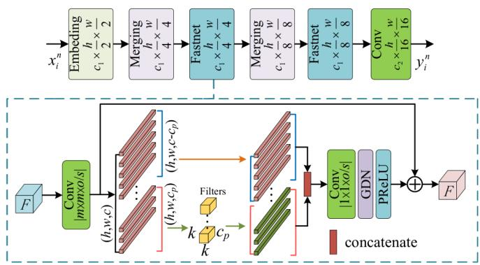  
Fig. 4. Architecture of the proposed joint source-channel encoder.

)The encoded feature representations are transmitted over +the wireless channel to the ground receivers. The received s(State scomplex-valued symbols embed rich semantic information. At (tLocation of Receiverthe receiver, key frame reconstruction is performed indepen-),m epdently using the key frame decoder, illustrated in Fig. 5. The s(ry ydecoder employs convolutional blocks with $m \times m$ kernels, ψ FunctionChannel Qualityo output channels, and stride s. Each convolutional layer is ))followed by an Inverse Generalized Divisive Normalization +(IGDN) layer, which replaces conventional batch normal-,sization (BN), and a parametric ReLU (PReLU) activationDeformable  o N i  v (function to enhance learning capacity. To further improve ro-Convolutionn C Target DNN(r(t),s(t+1))bustness, we integrate Noise Attention (NA) [19] and Attention  nyˆ CNN block Feature (AF) modules [44] into the feature extraction pipeline.Module on

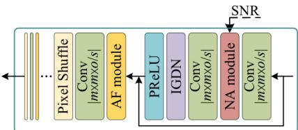  
Decision makingFig. 5. Architecture of the key decoder.

icThe goal of the WZ JSCC decoder is to restore the original nction Communication LinkWZ frame as accurately as possible. This module requires the joint use of WZ frame feature information $\hat { \mathbf { { y } } } _ { i } ^ { n }$ and side information $\bar { \pmb { y } } _ { i } ^ { n }$ to reconstruct the WZ frames. In a standard video sequence $( I _ { 0 } , I _ { a } , I _ { 1 } )$ , motion between successive frames typically exhibits small variations. The interpolation module predicts the intermediate frame $I _ { a }$ based on two reference frames. We employ a motion video interpolation network [45] to generate the current side information frame $I _ { a }$ based on two previously decoded frames $( \hat { \pmb x } _ { 1 }$ and ${ \hat { \pmb x } } _ { M + 1 } )$ . Although $\bar { \pmb { x } } _ { i } ^ { n }$ closely approximates the WZ frame $\mathbf { \Delta } \mathbf { x } _ { i } ^ { n }$ , it may lack fine-grained motion details. To address this, we use a side information module to map $\bar { \pmb { x } } _ { i } ^ { n }$ into a latent representation $\bar { \mathbf { \pmb { y } } } _ { i } ^ { n }$ that can guide the final reconstruction. As shown in Fig. 6, we explore the side information frame features both in depth and width. A dense block extracts the short-term spatiotemporal features of the side information, which enhances feature propagation across the network and leads to better feature representation. Additionally, we introduce a UNet architecture with a noise attention (NA) module, which captures highlevel image details through the upper layers and low-frequency contour information through the lower layers. Finally, skip connections are used to link the different feature information, ensuring the completeness of the image representation. The outputs of the side information module are as follows:

$$
\bar { y } _ { i } ^ { n } = [ f _ { C } \left( f _ { A F } \left( f _ { D } \left( f _ { C } \left( \bar { x } _ { i } ^ { n } \right) \right) \right) \right) , f _ { U } \left( f _ { C } \left( \bar { x } _ { i } ^ { n } \right) \right) ] ,\tag{22}
$$

where $f _ { C }$ is the convolutional layer, $f _ { U }$ is the UNet structured network, $f _ { D }$ and $f _ { A F }$ represent the dense block and AF module, respectively. [·, ·] denotes the concatenation operation of matrices.

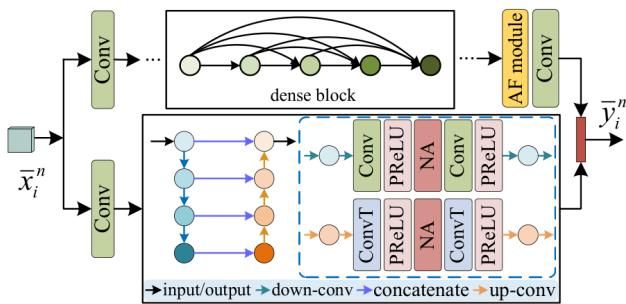  
)Fig. 6. Network architecture of the side information module.

,s(State sThe WZ JSCC decoder refines the side information $\bar { \mathbf { \pmb { y } } } _ { i } ^ { n }$ using Location of Receithe WZ features $\hat { \mathbf { { y } } } _ { i } ^ { n }$ (tMand reconstructs the WZ frame he fused t)mo pl olLocation of UAVlatent representations. We design distinct network structures ( Loss updatey yfor different feature contents to improve feature complementarity. For WZ features $\hat { \pmb { y } } _ { i } ^ { n }$ , which offer detailed and corrective 1UAV Energyinformation, we integrate a Squeeze-and-Excitation (SE) mod-(Communication distanceule to emphasize informative channels. For the predicted frame features $\bar { \pmb { y } } _ { i } ^ { n }$ (t), we apply a deformable convolution module that (focuses on the critical regions of the predicted frame, enabling a more effective combination with the WZ features to improve wthe detailed description of key areas. Finally, we upsample the Semantic Channel Channel feature dimensions using a decoder CNN block, which has the Encoder Encodersame structure as the key frame decoder.

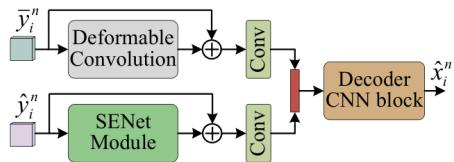  
Fig. 7. Wyner-Ziv decoder network architecture.

## Encoder DecoderChannel  R IG C xmel  m mC xmC xmB. DRL-Assisted UAV Communication Link Policy

ey Frame KePIn this section, we introduce a DRL-based algorithm deployed on the UAV to solve the problem in Eq. (14). In

DRL [46]–[48], agents are able to take actions based on information from their surrounding environment. Then, they can learn the optimal policy based on the feedback from the environment resulting from those actions, which is grounded in the procedure of effectively finding the optimal policy for a finite Markov Decision Process (MDP). The formulated problem can be modeled as a finite MDP with the tuple $( \cal S , A , \mathscr { P } , \mathscr { R } )$ , where S indicates the set of states, A is the set of alternative actions, P is the probability transition distribution function , and R is the reward function for taking action $a \in A$ . At each time step t, each UAV u observes the state $s _ { u } ( t ) ~ \in ~ S$ and takes action $a _ { u } ( t ) ~ \in { \mathcal { A } }$ according to the policy $\pi : S \longmapsto A .$ , which maps the state space to the action space. Then, the state transitions from $s _ { u } ( t )$ to $s _ { u } ( t + 1 )$ with probability $\mathcal { P } ( s _ { u } ( t + 1 ) | s _ { u } ( t ) , a ( t ) )$ , and the UAV receives a reward $r _ { u } ( t )$ . The goal of DRL is to learn the optimal policy π to maximize the long-term expected return $E [ G ( n ) ]$ which is given by:

$$
G ( n ) \triangleq \sum _ { k = 0 } ^ { \infty } \gamma ^ { k } R ( n + k ) ,\tag{23}
$$

where $G ( n )$ is the accumulated discounted return, and $0 \leq$ $\gamma < 1$ e eis the discount factor that controls the relative impor-U N v o/u du duv o/v o/tance of future rewards in the long-term return.

R IG C xel  C xC xIn the context of the described problem, we define the state $s _ { u } ( t )$ P, action $a _ { u } ( t )$ , and reward $r _ { u } ( t )$ at each time instant t as follows:

State Space: The system state at time step t is $s _ { u } ( t ) \ =$ $\{ R _ { u } ( t ) , \bar { C } _ { k } ( t ) , \sigma ( t ) , E _ { u } ( t ) \}$ . The location of UAVs and ground users is normalized by the minimum and maximum values. In this regard, the location of UAV u and ground users k can be Communication expressed as $\begin{array} { r } { R _ { u } = \big \{ \frac { x _ { u } ( t ) } { x _ { \mathrm { m a x } } - x _ { \mathrm { m i n } } } , \frac { y _ { u } \big ( \overline { { t } } \big ) } { y _ { \mathrm { m a x } } - y _ { \mathrm { m i n } } } , \frac { h _ { u } ( t ) } { h _ { \mathrm { m a x } } - h _ { \mathrm { m i n } } } \big \} } \end{array}$ and $\begin{array} { r l } & { C _ { k } = \{ \frac { a _ { k } ( t ) } { x _ { \mathrm { m a x } } - x _ { \mathrm { m i n } } } , \frac { b _ { k } ( t ) } { y _ { \mathrm { m a x } } - y _ { \mathrm { m i n } } } , 0 \} } \\ & { \mathrm { n o r m a l i z e d ~ b y ~ } E _ { \mathrm { m i n } } \mathrm { ~ a n d ~ } E _ { \mathrm { m a x } } . } \end{array}$ . The energy $E _ { u } ( t )$ is also

Action aAction Space: The action with respect to state $s ( t )$ is defined as $a _ { u } ( t ) = \{ P _ { u } ( t ) , L _ { u , k / u ^ { \prime } } ( t ) \}$ . The action space is determined by the constraints of Eq. (15f) and Eq. (15g).

Reward Function: Since our goal is to maximize the lifetime of UAV swarms while maintaining the required reconstructionquality for video transmission, the key is to reduce communication energy consumption and balance energy utilization over time. In each time slot, the system needs to make online decisions on the link mode (AF relaying or direct transmission), association, and transmit power under time-varying channels, dynamic topology, and binary association constraints, which ation  makes it difficult to solve the long-horizon global objective uleexactly in a per-slot manner. Hence, we convert the lifetimeoriented objective into a tractable instantaneous reward by combining a base utility for effective transmission with an energy-consumption penalty. In addition, energy-aware adaptive weights increase the penalty on high-power actions when ameresidual energy is low, guiding the policy toward energyefficient decisions and delaying battery depletion. We define

the reward function $r _ { u } ( t )$ as

$$
\boldsymbol { r } _ { u } ( t ) = \left\{ \begin{array} { l l } { \boldsymbol { r } _ { n } - \boldsymbol { w } _ { A F } \cdot ( P _ { u , u ^ { \prime } } ( t ) + P _ { u ^ { \prime } , k } ( t ) ) + \delta _ { r } , } & { \mathrm { i f ~ U A V ~ } u } \\ & { \mathrm { s e l e c t s ~ \boldsymbol { A F } } , } \\ { \boldsymbol { r } _ { n } - \boldsymbol { w } _ { D } \cdot P _ { u , k } ( t ) + \delta _ { r } , } & { \mathrm { o t h e r w i s e ~ } , } \end{array} \right.\tag{24}
$$

where $r _ { n }$ is the base reward designed to motivate the agent to complete effective information transmission tasks. $w _ { A F } =$ $\begin{array} { r } { 0 . 5 + \mathrm { { \hat { 0 } } } . 5 \cdot \left( \operatorname { t a n h } \left( 1 - \frac { E _ { u } ( t ) } { E _ { u i } ( t ) } \right) \right) } \end{array}$ and $w _ { D } ~ = ~ 0 . 5 + 0 . 5$ $\begin{array} { r } { \left( \operatorname { t a n h } { \left( 1 - \frac { \dot { E } _ { u } ( t ) + \dot { E } _ { u } ^ { \prime } ( t ) } { E _ { u i } ( t ) + E _ { u ^ { \prime } i } ( t ) } \right) } \right) } \end{array}$ are penalty weights for differ-le ent strategies. They are bounded and increase monotonicallyCo Co m x as residual energy decreases. This realizes a soft energy-y n nat feasibility modulation.nc $E _ { u } ( t ) , \ E _ { u } ^ { \prime } ( t ) , \ E _ { u i }$ , andRe N Co $E _ { u ^ { \prime } i }$ denote the residual energy of UAVs u and on $u ^ { \prime }$ at time t, and the initialT U T U energy capacity, respectively. $P _ { u , k } ( t ) , P _ { u , u ^ { \prime } } ( t )$ , and Co PR $P _ { u ^ { \prime } , k } ( t )$ represent the transmission energy. The terminput/output down-conv concaten $\delta _ { r }$ is a small up-conv offset to mitigate sparse-reward effects and maintain necessary exploration. Based on users’ video-quality demands, a targetS' ResNet SNR at the receiver is specified, which subsequently guides在广度和F F'' the adaptive control of transmit power.F' F R

In the DRL method, the model is represented by a setConvolution Layer and of weights and biases within a neural network, commonly referred to as the Q-network. As shown in Fig. 8, we use replay memory, ϵ-greedy and target network, to aid the learn-i ky  ing of the Q-function. To optimize the learning process, weConvolutionv ing 2 w ng 4 w et 4 w ng 8w et 8w 16w introduce replay memory $\mathcal { D } _ { u }$ to update the Q-network. In this regard, experiences are stored in a fixed-size memory buffer.Module To update the agent’s parameters, a batch of experiences is-cp) randomly sampled from the replay memory. This prevents the| (h, Uv /s| states from being correlated and improves data utilization andLUhu dv o/Co xm w,c) PC|1x . .. G computational efficiency, which is an efficient technique forPxel F C mxconcatenate(h, k . cp learning from earlier experiences.

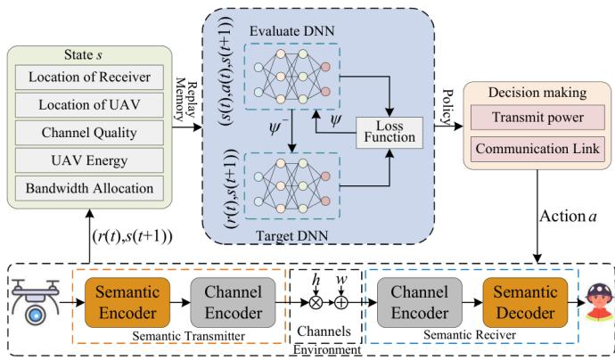  
Fig. 8. Multi UAV-enabled video transmission DRL framework.

To take an action, we use ϵ-greedy to explore its action space, which chooses a random action with probability ϵ, and it can be defined as follows

$$
a _ { u } ( t ) = \left\{ \begin{array} { l l } { \arg \operatorname* { m a x } _ { a \in \mathcal { A } } q _ { \psi } ( s _ { u } ( t ) , a ) , } & { \mathrm { w . p . ~ } 1 - \epsilon } \\ { \mathrm { U n i f o r m } ( \mathcal { A } ) , } & { \mathrm { w . p . ~ } \epsilon } \end{array} \right.\tag{25}
$$

where Uniform $( \mathcal { A } )$ denotes the action $a ( t )$ randomly chosen from the action set $A . \epsilon$ is adaptively updated according to the following expression:

$$
\epsilon = \epsilon _ { e n d } + ( \epsilon _ { i n i t } - \epsilon _ { e n d } ) \exp ( - \frac { \tau _ { e } } { \epsilon _ { d e c a y } } ) ,\tag{26}
$$

where $\epsilon _ { i n i t }$ and $\epsilon _ { e n d }$ represent the initial and final values of the ϵ-greedy threshold, respectively. $\epsilon _ { d e c a y }$ is the decay rate, and $\tau _ { e }$ denotes the number of steps taken in the action selection process.

Each UAV utilizes two neural networks-a policy network and a target network, which have identical structures but distinct parameters, as shown in Fig. 8. The architecture consists of five layers with 256, 256, 256, 256, and A neurons, respectively. PReLU activations are used throughout. To train the model, the weights and biases of both networks are initialized randomly. We use target parameters $\psi ^ { - }$ to compute the DRL loss function:

$$
\begin{array} { c l } { \mathcal { L } _ { D } ( \psi ) = ( { { r } _ { u } } \left( t \right) + { { \gamma } _ { r } } \underset { a } { \operatorname* { m a x } } \left\{ { { q } _ { \psi ^ { - } } } \left( { { s } _ { u } } \left( t + 1 \right) , a \right) \right\} } \\ { - { { q } _ { \psi } } \left( { { s } _ { u } } \left( t \right) , { { a } _ { u } } \left( t \right) \right) ) ^ { 2 } } \end{array}\tag{27}
$$

where $q _ { \psi }$ is the DRL function parameterized by $\psi ,$ the target parameters $\psi ^ { - }$ are copied from $\psi .$ . The parameters $\psi$ are then updated through gradient descent based on the gradient $\nabla _ { \psi } L _ { D } ( \psi )$ . In our framework, each UAV has a dedicated DQN whose weights are individually learned and kept separate from Decoder     those of the other UAVs. Algorithm 2 presents the proposed approach in pseudocode form.

## C. Training Procedure

on mxmoIn this section, we describe the training process of the |N| proposed distributed JSCC framework for UAV-based video transmission, which introduces a two-stage training strategy to jointly optimize video reconstruction quality and UAV energy efficiency. In UAV video transmission systems, it is crucial to consider both the effects of wireless channel noise and the mobility-induced uneven energy distribution among UAVs. To address these issues, we divide the training process into two stages.

In the first stage, the distributed JSCC model is trained under varying channel conditions, as shown in Algorithm 1. Since WZ frames are generated based on interpolation from key frames and refined using syndrome information, we separate the training into two phases. First, we train the model for independent key frame transmission. Then, we freeze the trained key frame model and train the other parts of the network, including the WZ JSC encoder, WZ JSC decoder, interpolation module, and side information module, under a physical channel with random SNR. Specifically, we use the Mean Square Error (MSE) function to evaluate the input video frame $s _ { r }$ and the reconstructed one $\hat { s } _ { r } .$ , and the loss function is defined as follows

$$
\mathcal { L } _ { M S E } = \frac { 1 } { N } \sum _ { k = 1 } ^ { N } d ( \pmb { s } _ { k } , \hat { \pmb { s } } _ { k } ) ,\tag{28}
$$

where $\begin{array} { r } { d ( \pmb { \mathscr { s } } _ { k } , \hat { \pmb { s } } _ { k } ) = \frac { 1 } { n } | | \pmb { \mathscr { s } } _ { k } - \hat { \pmb { s } } _ { k } | | ^ { 2 } } \end{array}$ is the mean squared error distribution, and $N$ is the number of samples.

Algorithm 1 Training algorithm of the first stage.   
Input: Video frames $\overline { { s _ { i } ^ { n } } }$ from DTB, UAVDT, and UAV123   
dataset, fading channel $^ { h , }$ noise w.   
// key frame transmission   
1: while stop criterion is not met do   
2: Generate a batch normalized signal $\pmb { x } _ { 1 / M + 1 } ^ { n }$ from input   
kye frames.   
3: The transmitter encodes $\pmb { x } _ { 1 / M + 1 } ^ { n }$ with $f _ { K e y } ( \cdot ) .$   
4: Transmit $y _ { 1 / M + 1 } ^ { n }$ and receive $\hat { y } _ { 1 / M + 1 } ^ { n }$ via Eq. (10).   
5: The receiver obtains $\hat { \pmb { x } } _ { 1 / M + 1 } ^ { n }$ by $\mathop { \mathrm { : } } { \mathcal { D } } _ { K e y } ( \cdot )$   
6: Calculate reconstruction loss $\mathcal { L } _ { M S E }$ using Eq. (28).   
7: Update system parameters by SGD.   
8: end while   
9: Trained key frame JSCC networks.   
// WZ frame transmission   
10: while stop criterion is not met do   
11: Generate a batch normalized signal $\pmb { x } _ { 1 / M + 1 } ^ { n }$ and $\pmb { x } _ { i } ^ { n }$   
from input key and WZ frames.   
12: Output $\hat { \pmb x } _ { 1 } ^ { n }$ and $\hat { \pmb { x } } _ { M + 1 } ^ { n }$ based on the trained key frame   
JSCC codecs.   
13: Output $\bar { \pmb { x } } _ { i } ^ { n }$ from $\hat { \pmb x } _ { 1 } ^ { n }$ and $\hat { \pmb { x } } _ { M + 1 } ^ { n }$ by interpolation module   
$g _ { I } ( \cdot )$   
14: Extract feature maps $\bar { \pmb { y } } _ { i } ^ { n }$ using $g _ { S } ( \cdot )$ from $\bar { \pmb { x } } _ { i } ^ { n } .$   
15: Output $\pmb { y } _ { i } ^ { n }$ from $\pmb { x } _ { i } ^ { n }$ by WZ frame transmitter $f _ { W Z } ( \cdot )$   
16: Transmit $\pmb { y } _ { i } ^ { n }$ over physical channel and receive $\hat { \mathbf { \mathbf { y } } } _ { i } ^ { n }$   
17: Output reconstructed WZ frames $\hat { \pmb { x } } _ { i } ^ { n }$ from $\hat { \mathbf { \mathbf { y } } } _ { i } ^ { n }$ and $\bar { \pmb { y } } _ { i } ^ { n }$   
by $g _ { W Z } ( \cdot )$   
18: Calculate reconstruction loss $\mathcal { L } _ { M S E }$ using Eq. (28).   
19: Update system parameters by SGD.   
20: end while   
Output: Trained distributed JSCC video transmission net  
works.

In the second stage, we aim to optimize the UAV video transmission path by jointly training the JSCC video transmission model, achieving significant energy efficiency, specially targeting harsh channel environments and energy imbalances across UAVs, as shown in Algorithm 2. At the beginning of each episode, UAVs are initialized with specific positions and energy levels. At each time slot, the positions of the UAV and ground users change over time. If any position changes violate the boundary constraints, the positions are adjusted to align with the corresponding limits. The UAV selects an action $a ( t )$ based on the policy π, determining the video transmission link. Subsequently, the UAV receives a reward $r ( t )$ and the next state s(t + 1), storing the corresponding transition tuple in the replay buffer $\mathcal { D } _ { u }$ . During each episode, batches of experiences are sampled to update the target networks by minimizing the loss. The training procedures are summarized in Algorithm 1 and 2, respectively.

## IV. NUMERICAL EVALUATION

## A. Simulation Settings

In our simulations, users and UAVs are uniformly distributed within a $5 0 0 0 \times 5 0 0 0 ~ \mathrm { m ^ { 2 } }$ area. The UAV altitude is constrained between $h _ { \operatorname* { m i n } } = 2 0$ m and $h _ { \operatorname* { m a x } } = 1 5 0$ m.

Algorithm 2 Training algorithm of the second stage.   
1: Initialize evaluate network $q _ { \psi } ( s ; \psi )$ and $q _ { \psi ^ { - } } ( \cdot )$ with   
weights $\psi ^ { - } ~ = ~ \psi , ~ \forall u ~ \in ~ \mathcal { U } , \forall k ~ \in ~ \mathcal { K }$ , Initialize replay   
memory $\mathcal { D } _ { u } .$ , lower bound of video quality Lmin.   
2: for each episode do   
3: UAV and ground user initialization: $R _ { u } ( 0 ) , \ E _ { u } ( 0 )$   
$\forall u \in \{ 1 , \ldots , \mathcal { U } \} , C _ { k } ( 0 ) , \forall k \in \{ 1 , \ldots , K \}$   
4: for each time slot t do   
5: Update $R _ { u } ( t )$ and $C _ { k } ( t )$ based on the random walk   
mobility model.   
6: if the $\mathrm { U A V } \mathbf { \hat { s } }$ movement exceeds the boundary con  
straint or falls below the safety distance from other   
UAVs then   
7: Readjust the location to the corresponding limit   
boundary   
8: end if   
9: for each $u \in \mathcal { U }$ do   
10: Obtain the distance information between the UAV,   
ground users, and between UAVs. Then, the UAV   
formulates the state $s _ { u } ( t )$   
11: Select an action according to Eq. (25)   
12: Update the ground user association indicators ac  
cording to Eq. (15g) and (15h).   
13: Adjust the transmission power to meet condition   
Lm using Eq. (7).   
14: Obtain the reward $r _ { u } ( t )$ according to Eq. (24) and   
update the state $s _ { u } ( t + 1 )$   
15: end for   
16: Store the transition sample $<$   
$s _ { u } ( t ) , a _ { u } ( t ) , r _ { u } ( t ) , s _ { u } ( t + 1 ) > \to \mathcal { D } _ { u } .$   
17: Sample a stochastic minibatch of samples from $\mathcal { D } _ { u } .$   
18: Update evaluate network $\psi$ by minimizing the loss   
Eq. (27).   
19: Update the target network parameters $\psi ^ { - } = \psi .$   
20: end for   
21: end for   
Output: Trained DRL network.

The maximum available bandwidth is $B _ { \mathrm { m a x } } = 1 5 0 0 ~ \mathrm { k H z }$ , and each UAV has a maximum transmit power of $P _ { \mathrm { m a x } } = 6 ~ \mathrm { W }$ The initial energy of each UAV is uniformly sampled from [1750, 2500]J. The system operates in discrete time slots of duration $T _ { s } = 1 s$ . The mobility speeds of ground users and UAVs are uniformly distributed in [0, 1.3]m/s and [0, 15]m/s, respectively. The physical channel parameters are set to $\eta _ { a } = 1 2 . 0 8 ,$ $\eta _ { b } = 0 . 1 1 , \eta _ { \mathrm { L o S } } = 1 . 6 ~ \mathrm { d B }$ , and $\eta _ { \mathrm { N L o S } } = 2 3$ dB. For the DQN training, we adopt the following hyperparameters: discount factor $\gamma _ { r } ~ = ~ 0 . 9 9$ , exploration rate $\epsilon _ { \mathrm { i n i t } } = 0 . 9 , \epsilon _ { \mathrm { e n d } } = 0 . 0 5$ $\epsilon _ { \mathrm { d e c a y } } = 2 0 0 $ , and replay memory size $\left| \mathcal { D } _ { u } \right| = 5 0 0 0$

We evaluate our approach using three UAV video benchmarks: 1) DTB [53], 2) UAV123 [54], and 3) UAVDT [55]. The dataset is partitioned into training and validation sets with an 8:2 split. For JSCC network training, the learning rate is set to $1 \times 1 0 ^ { - 4 }$ , and the target SNR is uniformly sampled from [−4, 20] dB. For performance comparison, we consider both traditional and DL-based baselines. Traditional methods use

TABLE I  
COMPLEXITY OF KEY COMPONENTS BY DIFFERENT VIDEO CODECS ON 1080P VIDEOS.
<table><tr><td rowspan=2 colspan=1>FLOPs</td><td rowspan=1 colspan=3>Motion</td><td rowspan=1 colspan=1>Residual/WZ</td><td rowspan=1 colspan=1>Transmitter</td><td rowspan=1 colspan=1>Motion Decoding/</td><td rowspan=2 colspan=1>Motion Compensation/SI Generation</td><td rowspan=2 colspan=1>Residual/WZReconstruction</td><td rowspan=2 colspan=1>ReceiverTotal</td></tr><tr><td rowspan=1 colspan=1>Estimation</td><td rowspan=1 colspan=1>Compensation</td><td rowspan=1 colspan=1>Compression</td><td rowspan=1 colspan=1>Compression</td><td rowspan=1 colspan=1>Total</td><td rowspan=1 colspan=1>Interpolation</td></tr><tr><td rowspan=1 colspan=1>DCVC [49]</td><td rowspan=1 colspan=1>1253.65G</td><td rowspan=1 colspan=1>732.83G</td><td rowspan=1 colspan=1>1049.95G</td><td rowspan=1 colspan=1>1557.32G</td><td rowspan=1 colspan=1>4593.79G</td><td rowspan=1 colspan=1>975.41G</td><td rowspan=1 colspan=1>1004.27G</td><td rowspan=1 colspan=1>1212.07G</td><td rowspan=1 colspan=1>3191.75G</td></tr><tr><td rowspan=1 colspan=1>DVC [50]</td><td rowspan=1 colspan=1>1253.65G</td><td rowspan=1 colspan=1>783.14G</td><td rowspan=1 colspan=1>635.04G</td><td rowspan=1 colspan=1>187.3G</td><td rowspan=1 colspan=1>2859.12G</td><td rowspan=1 colspan=1>503.99G</td><td rowspan=1 colspan=1>858.04G</td><td rowspan=1 colspan=1>152.82G</td><td rowspan=1 colspan=1>1415.21G</td></tr><tr><td rowspan=1 colspan=1>L-DVC [51]</td><td rowspan=1 colspan=1>0</td><td rowspan=1 colspan=1>0</td><td rowspan=1 colspan=1>0</td><td rowspan=1 colspan=1>500.45G</td><td rowspan=1 colspan=1>500.45G</td><td rowspan=1 colspan=1>366.96G</td><td rowspan=1 colspan=1>469.98G</td><td rowspan=1 colspan=1>1889.87G</td><td rowspan=1 colspan=1>2726.81G</td></tr><tr><td rowspan=1 colspan=1>FIVSSC [52]</td><td rowspan=1 colspan=1>0</td><td rowspan=1 colspan=1>0</td><td rowspan=1 colspan=1>0</td><td rowspan=1 colspan=1>503.66G</td><td rowspan=1 colspan=1>503.66G</td><td rowspan=1 colspan=1>986.07G</td><td rowspan=1 colspan=1>0</td><td rowspan=1 colspan=1>788.24G</td><td rowspan=1 colspan=1>1774.31G</td></tr><tr><td rowspan=1 colspan=1>Proposed</td><td rowspan=1 colspan=1>0</td><td rowspan=1 colspan=1>0</td><td rowspan=1 colspan=1>0</td><td rowspan=1 colspan=1>82.88G</td><td rowspan=1 colspan=1>82.88G</td><td rowspan=1 colspan=1>372.44G</td><td rowspan=1 colspan=1>1936.21G</td><td rowspan=1 colspan=1>964.25G</td><td rowspan=1 colspan=1>3272.9G</td></tr></table>

H.264 and H.265 for source compression, with low-density parity-check (LDPC) codes and QAM for channel coding and modulation. DL-based benchmarks include DCVC [49], DVC [50], L-DVC [51], and FIVSSC [52].

## B. Numerical Results

We first compare the computational complexity of the key components of different approaches, as illustrated in Table I. DL-based video codecs exhibit a heavy concentration of computation, with approximately 65%–90% of processing devoted to motion-related network components. This not only demands substantial computational and storage resources at the transmitter but also makes such solutions impractical for lightweight scenarios-particularly for UAV platforms, which are inherently constrained by limited processing capacity and energy reserves. In contrast, the computational complexity of our proposed distributed video coding network is significantly lower, requiring only 1.81% and 2.89% of the complexity of DCVC and DVC, respectively. Moreover, compared with L-DVC, our method consumes just 16.56% of its computational workload. These reductions substantially alleviate the transmitter-side processing burden while maintaining competitive video reconstruction quality. It is worth noting that FIVSSC, as a recent semantic transmission framework designed for frame-interpolation-based video delivery, transmits only key frames at the transmitter, while the remaining frames are reconstructed at the receiver using a frame interpolation network. As a result, this design maintains relatively low computational complexity at both the transmitting and receiving sides. Nevertheless, the proposed method in this paper still achieves lower computational complexity at the transmitter compared to FIVSSC. At the receiver side, the computational complexity of the proposed method is relatively disadvantageous compared with existing approaches. However, compared with DCVC, which has a similar level of decoding complexity, our method achieves significantly better video frame reconstruction quality, demonstrating the effectiveness and rationality of the proposed network design. Moreover, considering that computational resources and energy supply are generally more accessible at the ground station, the relatively higher decoding complexity does not pose a critical limitation in practical deployments. Through this asymmetric architecture design, we substantially reduce the computational burden on the UAV side, making the overall system more suitable for the considered UAV systems.

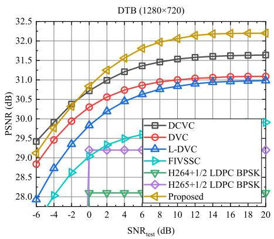  
(a) PSNR

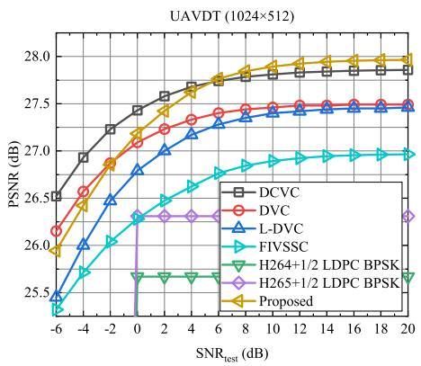  
(b) PSNR

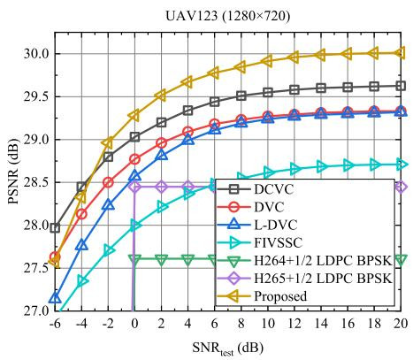

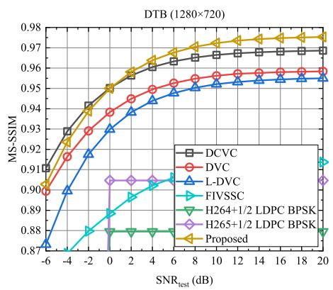  
(d) MS-SSIM

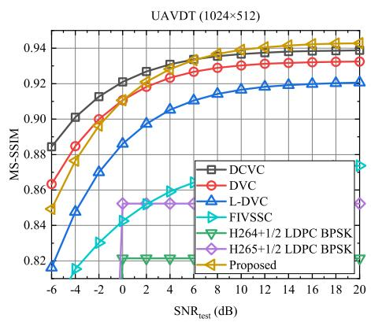  
(e) MS-SSIM

(c) PSNR  
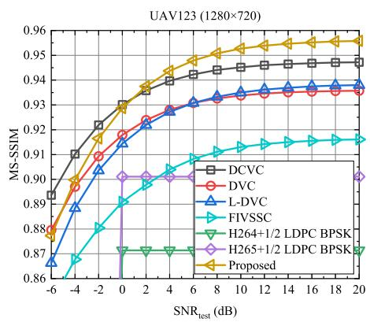  
(f) MS-SSIM  
Fig. 9. Performance comparison of different approaches with bandwidth compression ratio $\rho = 0 . 0 3 1$

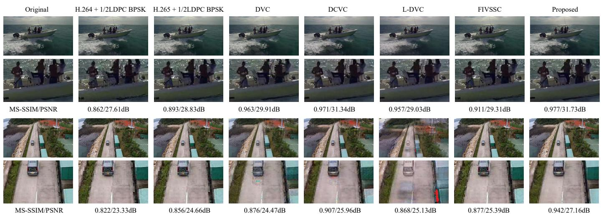  
Fig. 10. Visual comparison of the reconstructed video frame at SNR=8 dB and bandwidth compression ratio ρ = 0.031.

We then compare the reconstruction quality of different approaches in terms of Peak Signal-to-Noise Ratio (PSNR) and Multi-Scale Structural Similarity Index Measure (MS-SSIM), as shown in Fig. 9, at a fixed compression ratio of $\rho = 0 . 0 3 1$ evaluated under various wireless channel conditions. Based on the Shannon capacity formula, the maximum achievable transmission rate is given by $R _ { \mathrm { m a x } } = l \log _ { 2 } { ( 1 + \mathrm { S N R } ) }$ , where channel capacity is determined using the average SNR. When channel fading causes the actual capacity to fall below the required threshold, the compressed data cannot be reliably transmitted, leading to decoding failure and degraded reconstruction quality. As illustrated in Fig. 9, conventional video transmission systems are highly susceptible to channel conditions, exhibiting a pronounced “cliff effect”, where reconstruction quality drops sharply under low SNR scenarios. In contrast, deep learning-based wireless video transmission schemes effectively mitigate this effect by enabling adaptive and robust encoding strategies. These approaches provide a smoother and more graceful degradation in video quality as SNR decreases, thereby improving resilience to adverse channel fluctuations.

We also observe from Fig. 9 that the proposed approach generally performs worse than DL-based video coding schemes under adverse channel conditions, mainly due to differences in motion estimation strategies. DL-based codecs employ dedi cated networks to capture inter-frame differences with high precision, whereas the proposed approach relies on previously reconstructed frames and intermediate-frame features, which inherently limits prediction accuracy. The lightweight encoders used in distributed schemes further restrict feature extraction depth, reducing the semantic richness of the encoded representation and leading to weaker reconstruction under poor channel conditions. Under favorable channel conditions, however, the proposed DVC method can allocate additional resources to transmit more informative feature symbols, while the independent transmission of key frames improves fine-grained detail reconstruction and enhances intermediate-frame prediction. By exploiting intermediate-frame refinement, our approach achieves visual quality comparable to, or even exceeding, that of DL-based baselines, while requiring only 1.81%–16.56% of their computational complexity. This substantial efficiency gain underscores the practicality of the method for resourceconstrained UAV platforms. To further investigate whether the semantic information of remaining frames can be sufficiently inferred solely from key frames, we additionally incorporate FIVSSC as a comparison baseline. FIVSSC is a framework in which only key frames are transmitted, and the remaining frames are reconstructed at the receiver via a frame interpolation network without explicit transmission of temporal residual information. Experimental results across multiple datasets demonstrate that FIVSSC exhibits noticeable performance degradation compared to other DL-based wireless video transmission schemes, particularly in scenarios involving complex motion. This observation indicates that the semantic information contained in remaining frames cannot be perfectly learned or inferred from key frames alone, highlighting the necessity of explicitly modeling inter-frame semantic depen dencies.

We present a visual comparison of different video coding approaches using the second frame from the Car4 and Yacht2 sequences in the DTB dataset, evaluated at an SNR of 8dB and a bandwidth compression ratio of 0.031, as shown in Fig.10. The proposed method outperforms both traditional and DL-based schemes, effectively suppressing blocking artifacts commonly found in traditional codecs. While DL-based methods such as DVC and DCVC reduce these artifacts, they still exhibit incomplete background reconstruction, revealing limited robustness to channel noise. Additionally, L-DVC suffers from noticeable ghosting artifacts on moving objects, caused by inadequate verification information and poor noise tolerance. As a representative interpolation-based approach, FIVSSC still falls short in preserving fine visual details in the generated frames, particularly around pixel boundaries where delicate structures are more difficult to reconstruct accurately. In contrast, our approach integrates noise modeling through an attention mechanism, improving resilience under noisy conditions. To enhance motion representation accuracy, we also incorporate deformable convolution and SENet modules, which adaptively model motion dynamics and feature importance, enabling more precise reconstruction in challenging environments.

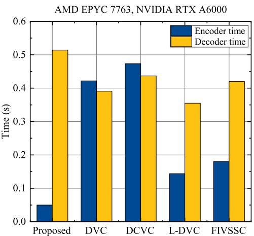  
Fig. 11. Runtime comparison of different methods evaluated on the DTB dataset.

Fig. 11 illustrates the encoding and decoding times of the different schemes. As observed, the proposed method significantly outperforms other DL-based approaches in terms of encoding time. However, the decoding time is the highest among all schemes. This can be attributed to the use of a more powerful neural network that extracts deeper latent semantic information from compressed and noisy data under the same data volume. Although this leads to increased decoding latency, the additional computational cost is justified by notable improvements in video reconstruction quality and system robustness. From another perspective, despite the increased decoding time, the advantages in video quality and system stability offered by our proposed method make this trade-off worthwhile, especially in applications that require high-quality video reconstruction and robustness.

We then conduct ablation studies to evaluate the individual contributions of key modules within the proposed framework, as shown in Fig. 12. All models are trained and tested on the DTB dataset for consistent evaluation. Removing the side information (SI) module reduces PSNR by 0.642 dB and MS-

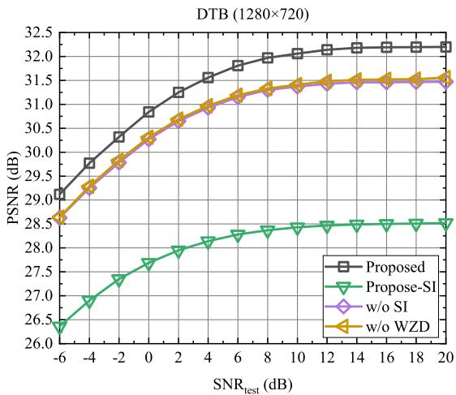  
(a) PSNR

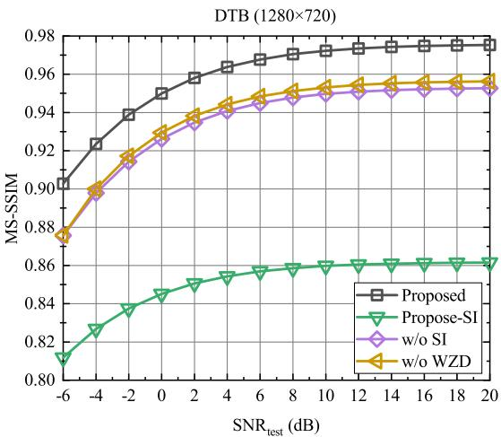  
(b) MS-SSIM  
Fig. 12. Ablation study at a bandwidth compression ratio of $\rho = 0 . 0 3 1$ 1) Proposed-SI: reconstruction using only SI prediction frames. 2) w/o SI: model with the SI module removed at the decoder. 3) w/o WZD: model with the Wyner–Ziv decoder removed.

SSIM by 0.023, underscoring its critical role in accurate motion prediction. Likewise, eliminating the Wyner–Ziv decoder (WZD) module degrades performance by 0.596 dB in PSNR and 0.021 in MS-SSIM, highlighting its importance in leveraging attention to emphasize salient features and effectively fuse side information with syndrome data. Reconstruction results based solely on SI prediction frames show considerable deviation from the originals, further confirming the essential contributions of both the syndrome and refinement modules. Fig. 12 also illustrates the effect of noise on motion estimation and reconstruction. Under low-SNR conditions, transmission symbols are primarily used to mitigate channel noise, limiting the feature information available for reconstruction. As SNR improves, the ability of each module to extract semantically rich features becomes increasingly critical, widening the reconstruction quality gap among different schemes and demonstrating the value of each component in achieving highfidelity video recovery.

We then evaluate the proposed communication link selection strategy in a scenario with five ground users and a varying number of UAVs (from 4 to 12). The initial positions and mobility patterns of the UAVs are configured as described previously. Fig. 13 presents the number of completed video transmission rounds before any UAV exhausts its transmission energy. Since propulsion typically accounts for more than 80% of the total energy consumption of a UAV and lies beyond the scope of this work, we focus exclusively on the transmission energy cost. Specifically, the UAV flight trajectories and associated flight parameters are assumed to be predetermined, under which propulsion energy consumption remains constant across different communication schemes. Accordingly, our optimization targets the communication-related energy, which is controllable at the network layer and directly impacts the transmission performance of UAV systems. Furthermore, the proposed lightweight video transmission framework reduces computational overhead, allowing the associated computational energy consumption to be neglected. For comparison, we adopt a greedy baseline that always selects the nearest ground user to minimize transmission energy consumption.

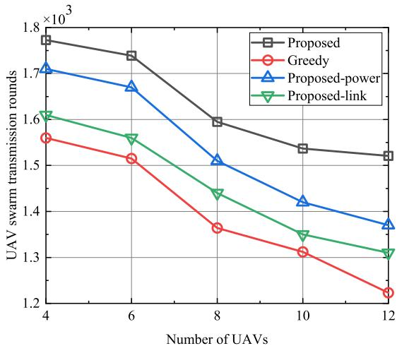  
(a) UAV swarm transmission rounds

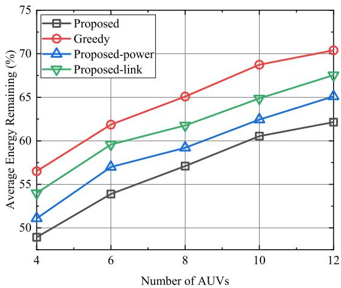  
(b) Average energy remaining  
Fig. 13. Comparison of the proposed scheme and the baseline in terms of the number of transmission rounds and residual energy at the time when any UAV depletes its energy.

Fig. 13(a) illustrates the impact of the number of UAVs on the number of completed video transmission rounds. As the swarm size increases, the average number of completed rounds decreases. This trend is primarily attributed to the higher likelihood of including UAVs with low residual energy in larger swarms, which increases the probability of premature system termination. In contrast, the proposed method consistently achieves a greater number of completed rounds by identifying energy-efficient relay links that alleviate the transmission burden on energy-constrained UAVs. Specifically, compared with the greedy baseline, the proposed approach improves the number of completed rounds by 13.62% with 4 UAVs, and the gain further increases to 24.36% with 12 UAVs. These results demonstrate that the proposed strategy becomes increasingly advantageous as the swarm size grows, as UAVs with lower residual energy benefit from more flexible routing decisions that mitigate long-distance transmission costs. Fig. 13(b) further illustrates the relationship between the number of UAVs and the average residual energy of the network. The results reveal the adverse impact of extreme cases (i.e., UAVs with critically low residual energy) on overall swarm performance. By explicitly promoting energy balancing among UAVs, the proposed method mitigates the imbalance in residual energy distribution, thereby enabling more sustainable network operation. Compared with the baseline, the average residual energy is reduced by 8.03%, indicating that energy is utilized more efficiently prior to system termination. Consequently, the proposed strategy extends the overall operational lifetime of the UAV swarm by 17.34% on average relative to the greedy algorithm.

Finally, we conduct an ablation study to evaluate the individual contributions of transmission power optimization and relay link optimization. Specifically, we compare the full proposed scheme with two reduced variants: Proposed-power, which performs adaptive transmission power optimization while selecting the shortest communication links, and Proposed-link, which optimizes relay selection without adaptive power control. As shown in Fig. 13, the joint optimization consistently achieves the highest number of completed transmission rounds and the lowest average residual energy at termination across all swarm sizes. Although both reduced variants outperform the greedy baseline, neither matches the performance of the full scheme, indicating that transmission power control and relay link optimization play complementary roles. Moreover, transmission power optimization contributes more significantly to performance improvement than link optimization alone. Specifically, optimizing only relay links reduces the UAV hovering time by 11.04% compared with the full scheme, whereas optimizing only transmission power results in a smaller reduction of 6.07%. These results demonstrate that adaptive power allocation is critical for mitigating premature energy depletion, while relay link optimization provides additional gains by alleviating long-distance transmission overhead. Only their joint optimization can fully exploit cooperative routing benefits and effectively prolong the swarm lifetime.

Note that, to address the uneven distribution of residual energy in UAV networks, we explicitly incorporate each UAV’s remaining energy as a key state variable in the RL decision process, enabling an adaptive trade-off between video quality and network lifetime. When a UAV has low residual energy, the learned policy reduces its energy burden by assigning less energy-intensive roles, such as avoiding long-distance relaying or high-power video transmission, thereby preventing premature node failure. Meanwhile, UAVs with sufficient energy are more likely to undertake heavier transmission tasks to maintain overall service quality. It is important to emphasize that our objective is not to maximize the instantaneous performance of an individual UAV under extremely low-energy conditions; rather, we aim to achieve long-term energy balance and service continuity at the network level by jointly considering video quality, energy consumption, and residual energy distribution in the reward design. As a result, both the overall hovering time and the operational lifetime of the UAV network are effectively extended, thereby enhancing system sustainability and robustness.

## V. DISCUSSION

Limitations: Although the proposed DRL-based link selection strategy demonstrates stable and efficient performance in small-scale scenarios, several limitations remain when extending to large-scale swarms. First, as UAV density increases, inter-UAV interference and communication contention become more pronounced, which complicates the environment dynamics. In highly dense deployments, the locality assumption may weaken, as indirect coupling effects among distant UAVs can accumulate through interference propagation. Additionally, the current framework adopts an individual decisionmaking paradigm, where each UAV optimizes its own energy efficiency objective. While this design ensures scalability and low inference complexity, it does not explicitly optimize global swarm-level performance metrics. As the swarm size grows, coordination overhead, signaling congestion, and emergent collective behaviors may introduce performance gaps between locally optimal and globally optimal solutions. Therefore, while the proposed approach scales computationally, its system-level optimality in large-scale swarms remains to be further validated.

Future Work: Future research will expand the current framework to large-scale swarm intelligence and multi-agent optimization. We plan to explore multi-agent DRL under a centralized training and decentralized execution (CTDE) paradigm, incorporating global energy efficiency and network performance into the learning objectives while maintaining scalable decentralized inference. Additionally, we will focus on reducing inference time by employing model compression techniques such as pruning and knowledge distillation to reduce the DRL policy network size. To enhance system reliability in extreme channel conditions, such as in disaster recovery UAV networks, we will integrate anti-jamming techniques like adaptive frequency hopping and interference mitigation methods into the semantic communication systems. We also aim to investigate the use of generative models for improving WZ frame reconstruction, particularly under ultralow SNR conditions, and integrate them with WZ frames for better video quality. Lastly, combining trajectory optimization algorithms with our framework will allow joint adjustments of UAV positions, communication links, and transmission power, maximizing swarm endurance while maintaining coverage and video quality. This approach will provide a more robust and efficient solution for UAV swarm communication in dynamic environments.

## VI. CONCLUSION

In this paper, we proposed a novel DL-based JSCC system tailored for wireless video transmission in UAV networks, addressing the critical challenge of ensuring robust video delivery under UAV mobility and resource constraints. The proposed framework integrates a lightweight encoder and a side information module to accommodate the limited computational and energy resources of UAV platforms, while compensating for the typically low-quality SI available in dynamic scenarios. To further improve adaptability, we designed a DRL-based network that jointly optimizes communication link selection and transmission power. By adapting to real-time variations in channel conditions and bandwidth availability, the DRL strategy enables efficient link management while preserving video quality, thereby extending the operational lifetime of UAV networks without compromising reconstruction performance. The proposed system achieves a balanced trade-off between computational complexity and visual quality. Experimental results validate that it requires only 1.81% to 16.56% of the computational cost of existing DL-based schemes, yet achieves comparable or even superior reconstruction fidelity. Moreover, it effectively extends detection duration of UAV swarms, demonstrating its practical applicability to real-world, resource-constrained aerial video transmission scenarios.

## REFERENCES

[1] G. Sun, L. He, Z. Sun, Q. Wu, S. Liang, J. Li, D. Niyato, and V. C. M. Leung, “Joint task offloading and resource allocation in aerial-terrestrial uav networks with edge and fog computing for post-disaster rescue,” IEEE. Trans. Mob. Comput., vol. 23, no. 9, pp. 8582–8600, Sept. 2024.

[2] R. G. Ribeiro, L. P. Cota, T. A. M. Euzebio, J. A. Ram´ ´ırez, and F. G. Guimaraes, “Unmanned-aerial-vehicle routing problem with mobile˜ charging stations for assisting search and rescue missions in postdisaster scenarios,” IEEE Trans. Syst. Man Cybern. -Syst., vol. 52, no. 11, pp. 6682–6696, Nov. 2022.

[3] J. Xu, X. Fan, H. Jian, C. Xu, W. Bei, Q. Ge, and T. Zhao, “YoloOW: A spatial scale adaptive real-time object detection neural network for open water search and rescue from UAV aerial imagery,” IEEE Trans. Geosci. Remote Sensing, vol. 62, pp. 1–15, May 2024.

[4] Z. Bao, H. Liang, C. Dong, C. Li, X. Xu, and P. Zhang, “MDVSCefficient wireless model division video semantic communication,” IEEE Internet Things J., vol. 12, no. 2, pp. 1109–1124, Sept. 2025.

[5] X. Qi, N. Ma, Z. Bao, Y. Liu, C. Dong, and X. Xu, “WAFI-VSC: Wireless adaptive frame interpolation video semantic communication,” in Proc. Int. Conf. Wirel. Commun. Signal Process. (WCSP), Hefei, China, Jan. 2024, pp. 1503–1508.

[6] M. Shi, H. Liang, Z. Bao, C. Dong, X. Xu, and Q. Wang, “DSCS: A decoupled semantic communication system for video conferencing,” in Proc. Int. Conf. Comput. Commun. Syst. (ICCCS), Xi’an, China, Apr. 2024, pp. 321–326.

[7] H. Li, H. Tong, S. Wang, N. Yang, Z. Yang, and C. Yin, “Video semantic communication with major object extraction and contextual video encoding,” in Proc. IEEE Wireless Commun. Networking Conf. (WCNC), Dubai, United Arab Emirates, Apr. 2024, pp. 1–6.

[8] H. Tong, H. Li, H. Du, Z. Yang, C. Yin, and D. Niyato, “Multimodal semantic communication for generative audio-driven video conferencing,” IEEE Wirel. Commun. Lett., vol. 14, no. 1, pp. 93–97, Jan. 2025.

[9] W. Gong, H. Tong, S. Wang, Z. Yang, X. He, and C. Yin, “Adaptive bitrate video semantic communication over wireless networks,” in Proc. IEEE Int. Conf. Wirel. Commun. Signal Process. (WCSP), Hangzhou, China, Nov. 2023, pp. 122–127.

[10] B. Zhang, Z. Qin, and G. Y. Li, “Compression ratio learning and semantic communications for video imaging,” IEEE J. Sel. Top. Signal Process., vol. 18, no. 3, pp. 312–324, May 2024.

[11] P. Jiang, C.-K. Wen, S. Jin, and G. Y. Li, “Wireless semantic communications for video conferencing,” IEEE J. Sel. Areas Commun., vol. 41, no. 1, pp. 230–244, Jan. 2023.

[12] Y. Huang, B. Bai, Y. Zhu, X. Qiao, X. Su, L. Yang, and P. Zhang, “ISCom: Interest-aware semantic communication scheme for point cloud video streaming on metaverse XR devices,” IEEE J. Sel. Areas Commun., vol. 42, no. 4, pp. 1003–1021, Apr. 2024.

[13] C. Li, H. Cao, X. Wang, M. Xu, S. Fan, H. Liang, Z. Bao, and T.-X. Zheng, “Video semantic communication system based on key semantic protection,” in Proc. Int. Conf. Comput., Big Data Artif. Intell (ICCBDAI), Jingdezhen, China, Nov. 2024, pp. 294–300.

[14] D. Gund ¨ uz, Z. Qin, I. E. Aguerri, H. S. Dhillon, Z. Yang, A. Yener,¨ K. K. Wong, and C.-B. Chae, “Beyond transmitting bits: Context, semantics, and task-oriented communications,” IEEE J. Sel. Areas Commun., vol. 41, no. 1, pp. 5–41, Jan. 2022.

[15] W. Wang, C. Wang, Z. Zhang, W. Xu, P. Zhang, F. Jiang, J. Xu, Y. Cai, M. Pang, L. Xu, and T. Q. S. Quek, “Resilient image semantic communication based on rate-optimized information bottleneck theory,” IEEE Trans. Cogn. Commun. Netw., vol. 13, pp. 3127–3143, 2026.

[16] Z. Zhao, C. Wu, Y. Lin, L. Zhong, Y. Ji, T. Ohtsuki, and M. Bennis, “Lrgd: Low-rank guided diffusion for robust image transmission in semantic communication,” IEEE Trans. Cogn. Commun. Netw., vol. 12, pp. 2439–2454, 2026.

[17] T.-Y. Tung and D. Gund¨ uz, “DeepWiVe: Deep-learning-aided wireless¨ video transmission,” IEEE J. Sel. Areas Commun., vol. 40, no. 9, pp. 2570–2583, Jul. 2022.

[18] H. Gao, M. Sun, X. Xu, and S. Han, “Semantic communication-enabled wireless adaptive panoramic video transmission,” in Proc. IEEE Wireless Commun. Networking Conf. (WCNC), Dubai, United Arab Emirates, Apr. 2024, pp. 1–6.

[19] Z. Zhang, Q. Yang, S. He, and J. Chen, “Deep learning enabled semantic communication systems for video transmission,” in Proc. IEEE Veh. Technol. Conf. (VTC2023-Fall), Hong Kong, Oct. 2023, pp. 1–5.

[20] Y. Wen, Z. Zhang, J. Sun, J. Li, C. S. Chen, and G. Niu, “SAW: Semantic-aware webrtc transmission using diffusion-based scalable video coding,” IEEE Internet Things J., vol. 12, no. 5, pp. 5346–5359, Mar. 2025.

[21] A. Wyner and J. Ziv, “The rate-distortion function for source coding with side information at the decoder,” IEEE Trans. Inf. Theory, vol. 22, no. 1, pp. 1–10, Jan. 1976.

[22] J. Chen, M. Wang, P. Zhang, S. Wang, and S. Wang, “Sparse-to-Dense: High efficiency rate control for end-to-end scale-adaptive video coding,” IEEE Trans. Circuits Syst. Video Technol., vol. 34, no. 5, pp. 4027–4039, May 2024.

[23] J. Ouyang, Y. Zhuang, M. Lin, and J. Liu, “Optimization of beamforming and path planning for UAV-assisted wireless relay networks,” Chin. J. Aeronaut., vol. 27, no. 2, pp. 313–320, Apr. 2014.

[24] M. Mozaffari, W. Saad, M. Bennis, and M. Debbah, “Drone small cells in the clouds: Design, deployment and performance analysis,” in Proc. IEEE Glob. Commun. Conf. (GLOBECOM). San Diego, CA, USA: IEEE, Dec. 2015, pp. 1–6.

[25] Z. Sun, D. Yang, L. Xiao, L. Cuthbert, F. Wu, and Y. Zhu, “Joint energy and trajectory optimization for UAV-enabled relaying network with multi-pair users,” IEEE Trans. Cogn. Commun. Netw., vol. 7, no. 3, pp. 939–954, Sept. 2020.

[26] D. Hu, Q. Zhang, Q. Li, and J. Qin, “Joint position, decoding order, and power allocation optimization in UAV-based noma downlink communications,” IEEE Syst. J., vol. 14, no. 2, pp. 2949–2960, Sept. 2019.

[27] L. Lin, W. Xu, W. Chen, F. Wang, G. Li, and M. Pan, “Prioritized delay optimization for NOMA-based multi-UAV emergency networks,” IEEE Trans. Veh. Technol., vol. 71, no. 10, pp. 11 222–11 227, Oct. 2022.

[28] T. Camp, J. Boleng, and V. Davies, “A survey of mobility models for ad hoc network research,” Wirel. Commun. Mob. Comput., vol. 2, no. 5, pp. 483–502, Sept. 2002.

[29] B. Duo, Q. Wu, X. Yuan, and R. Zhang, “Anti-jamming 3D trajectory design for UAV-enabled wireless sensor networks under probabilistic LoS channel,” IEEE Trans. Veh. Technol., vol. 69, no. 12, pp. 16 288– 16 293, Dec. 2020.

[30] R. Ding, F. Gao, and X. S. Shen, “3D UAV trajectory design and frequency band allocation for energy-efficient and fair communication: A deep reinforcement learning approach,” IEEE Trans. Wirel. Commun., vol. 19, no. 12, pp. 7796–7809, Dec. 2020.

[31] Z. Lyu, G. Zhu, and J. Xu, “Joint maneuver and beamforming design for uav-enabled integrated sensing and communication,” IEEE Trans. Wirel. Commun., vol. 22, no. 4, pp. 2424–2440, 2023.

[32] X. Jing, F. Liu, C. Masouros, and Y. Zeng, “Isac from the sky: Uav trajectory design for joint communication and target localization,” IEEE Trans. Wirel. Commun., vol. 23, no. 10, pp. 12 857–12 872, 2024.

[33] K. Meng, Q. Wu, S. Ma, W. Chen, and T. Q. S. Quek, “Uav trajectory and beamforming optimization for integrated periodic sensing and communication,” IEEE Wirel. Commun. Lett., vol. 11, no. 6, pp. 1211– 1215, 2022.

[34] A. Bejaoui, K.-H. Park, and M.-S. Alouini, “A qos-oriented trajectory optimization in swarming unmanned-aerial-vehicles communications,” IEEE Wirel. Commun. Lett., vol. 9, no. 6, pp. 791–794, 2020.

[35] S. Shen, K. Yang, K. Wang, G. Zhang, and H. Mei, “Number and operation time minimization for multi-uav-enabled data collection system with time windows,” IEEE Internet Things J., vol. 9, no. 12, pp. 10 149– 10 161, 2022.

[36] O. S. Oubbati, A. Lakas, and M. Guizani, “Multiagent deep reinforcement learning for wireless-powered uav networks,” IEEE Internet Things J., vol. 9, no. 17, pp. 16 044–16 059, 2022.

[37] C. Deng, X. Fang, and X. Wang, “Integrated sensing, communication, and computation with adaptive dnn splitting in multi-uav networks,” IEEE Trans. Wirel. Commun., vol. 23, no. 11, pp. 17 429–17 445, 2024.

[38] S. S. Soliman, V. C. Leung, N. C. Beaulieu, and J. Cheng, “Analysis of general dual-hop af systems over rician fading links,” in Proc. IEEE Glob. Commun. Conf. (GLOBECOM). San Diego, CA, USA: IEEE, Dec. 2015, pp. 1–6.

[39] G. Jing, H. Bai, J. George, A. Chakrabortty, and P. K. Sharma, “Distributed multiagent reinforcement learning based on graph-induced local value functions,” IEEE Transactions on Automatic Control, vol. 69, no. 10, pp. 6636–6651, 2024.

[40] X. Xu, “Symmetry-driven ctde: Enhancing scalability and sample efficiency in marl,” in 2025 10th International Conference on Intelligent Computing and Signal Processing (ICSP), 2025, pp. 744–748.

[41] Z. Lyu, G. Zhu, J. Xu, B. Ai, and S. Cui, “Semantic communications for image recovery and classification via deep joint source and channel coding,” IEEE Trans. Wirel. Commun., vol. 23, no. 8, pp. 8388–8404, Aug. 2024.

[42] E. Erdemir, T.-Y. Tung, P. L. Dragotti, and D. Gund ¨ uz, “Generative joint¨ source-channel coding for semantic image transmission,” IEEE J. Sel. Areas Commun., vol. 41, no. 8, pp. 2645–2657, Aug. 2023.

[43] Z. Wang, E. Simoncelli, and A. Bovik, “Multiscale structural similarity for image quality assessment,” in Proc. 37th Asilomar Conf. Signals, Syst. Comput., vol. 2, Pacific Grove, CA, USA, Nov. 2003, pp. 1398– 1402 Vol.2.

[44] Z. Cheng, H. Sun, M. Takeuchi, and J. Katto, “Learned image compression with discretized gaussian mixture likelihoods and attention modules,” in Proc. IEEE Conf. Comput. Vis. Pattern Recognit. (CVPR), Seattle, WA, USA, Jun. 2020, pp. 7936–7945.

[45] G. Zhang, Y. Zhu, H. Wang, Y. Chen, G. Wu, and L. Wang, “Extracting motion and appearance via inter-frame attention for efficient video frame interpolation,” in Proc. IEEE Conf. Comput. Vis. Pattern Recognit (CVPR), Vancouver, BC, Canada, Jun. 2023, pp. 5682–5692.

[46] Z. Dai, C. H. Liu, R. Han, G. Wang, K. K. Leung, and J. Tang, “Delaysensitive energy-efficient UAV crowdsensing by deep reinforcement learning,” IEEE. Trans. Mob. Comput., vol. 22, no. 4, pp. 2038–2052, Apr. 2023.

[47] Y. Zhao, C. H. Liu, T. Yi, G. Li, and D. Wu, “Energy-efficient ground-air-space vehicular crowdsensing by hierarchical multi-agent deep reinforcement learning with diffusion models,” IEEE J. Sel. Areas Commun., vol. 42, no. 12, pp. 3566–3580, Sept. 2024.

[48] Q. Luo, T. H. Luan, W. Shi, and P. Fan, “Deep reinforcement learning based computation offloading and trajectory planning for multi-UAV cooperative target search,” IEEE J. Sel. Areas Commun., vol. 41, no. 2, pp. 504–520, Feb. 2023.

[49] J. Li, B. Li, and Y. Lu, “Deep contextual video compression,” Adv. neural inf. proces. syst. (NeurIPS ), vol. 34, pp. 18 114–18 125, Dec 2021.

[50] G. Lu, W. Ouyang, D. Xu, X. Zhang, C. Cai, and Z. Gao, “DVC: An end-to-end deep video compression framework,” in Proc. IEEE Conf. Comput. Vis. Pattern Recognit. (CVPR), Long Beach, CA, United states, Jun. 2019, pp. 11 006–11 015.

[51] X. Zhang, J. Shao, and J. Zhang, “Low-complexity deep video compression with a distributed coding architecture,” in Proc. IEEE Int. Conf. Multimedia Expo. (ICME), Brisbane, Australia, Aug 2023, pp. 2537– 2542.

[52] X. Qi, N. Ma, Y. Lin, W. Liu, Z. Bao, and P. Zhang, “Adaptive frame interpolation symbolic semantic communication for low latency wireless

video transmission,” IEEE Trans. Cogn. Commun. Netw., vol. 12, pp. 6175–6190, 2026.

[53] S. Li and D.-Y. Yeung, “Visual object tracking for unmanned aerial vehicles: A benchmark and new motion models,” in Proc. AAAI Conf. Artif. Intell., vol. 31, no. 1, San Francisco, CA, United states, Feb. 2017.

[54] M. Mueller, N. Smith, and B. Ghanem, “A benchmark and simulator for UAV tracking,” in Proc. Eur. Conf. Comput. Vis. (ECCV), Amsterdam, Netherlands, Oct. 2016, pp. 445–461.

[55] D. Du, Y. Qi, H. Yu, Y. Yang, K. Duan, G. Li, W. Zhang, Q. Huang, and Q. Tian, “The unmanned aerial vehicle benchmark: Object detection and tracking,” in Proc. Eur. Conf. Comput. Vis. (ECCV), Munich, Germany, Dec. 2018, pp. 370–386.