# Distributed Energy-Efficient Multi-UAV Navigation for Long-Term Communication Coverage by Deep Reinforcement Learning

Chi Harold Liu , Senior Member, IEEE, Xiaoxin Ma, Xudong Gao, and Jian Tang , Fellow, IEEE

Abstract—In this paper, we aim to design a fully-distributed control solution to navigate a group of unmanned aerial vehicles (UAVs), as the mobile Base Stations (BSs) to fly around a target area, to provide long-term communication coverage for the ground mobile users. Different from existing solutions that mainly solve the problem from optimization perspectives. we proposed a decentralized deep reinforcement learning (DRL) based framework to control each UAV in a distributed manner. Our goal is to maximize the temporal average coverage score achieved by all UAVs in a task, maximize the geographical fairness of all considered point-of-interests (PoIs), and minimize the total energy consumptions, while keeping them connected and not flying out of the area border. We designed the state, observation, action space, and reward in an explicit manner, and model each UAV by deep neural networks (DNNs). We conducted extensive simulations and found the appropriate set of hyperparameters. including experience replay buffer size, number of neural units for two fully-connected hidden layers of actor, critic, and their target networks, and the discount factor for remembering the future reward. The simulation results justified the superiority of the proposed model over the state-of-the-art DRL-EC approach based on deep deterministic policy gradient (DDPG), and three other baselines

Index Terms—UAV control, deep reinforcement learning, energy efficiency, communication coverage

## 1 INTRODUCTION

Base Stations (BSs) can be deployed to enhance both the coverage and performance of communication networks in a target area without enough existing infrastructure support [1], [2]. Typical scenarios are disaster rescue like earthquake and flood, or emergence situations like crowd gatherings. For example, Merwaday et al. explored the use of UAV BSs for public safety communications during natural disasters where part of the communication infrastructure becomes damaged and dysfunctional (e.g., as in the aftermath of the 2011 earthquake and tsunami in Japan) [3], [4], and target tracking [5]. Other scenarios include the cellular traffic offloading from overloaded ground base stations especially for some hot-spot areas [6], and participatory data collection [7], [8]. The above applications highly leverage UAVs’ maneuverability and flexibility, that they are easy to deploy to almost everywhere and can be manipulated at anytime; also, UAVs typically have high possibility of Line-of-Sight (LoS) communication links to ground users, compared to ground BSs. However, it is not always practical to use the ground controllers to manually navigate UAVs, since the service environment might be quite complex, and flying speed and/or directions cannot be easily adjusted by humans. Therefore, fully autonomous, multiple UAV flight without an external controller that is both safe and robust at dynamic speeds and directions in complex environments is of significant research interests and as the focus of this paper.

As illustrated in Fig. 1, we explicitly consider a scenario where a group of UAVs work as a team to cooperatively provide effective communication coverage for a long period of time, where each UAV is equipped with certain access network technology like WiFi (or other short range communications technologies like LoRa and NB-IoT) that aids them to be interconnected without cellular network support (when emergency comes, cellular towers/network may be interrupted). In this situation, there is an access point (AP) that can be flexibly deployed to route the data between UAVs and the Internet. Therefore, every one of UAVs needs to maintain at least one connectivity to another UAV to avoid being isolated in the network. UAVs work as BSs to provide data services to a set of ground point-of-interests (PoIs). PoIs are identified as service points within which a circled region needs to be covered. Therefore, in this scenario, UAVs are constrained with limited communication range, coverage range, and most importantly battery lifetime. Since UAVs are independent agents, a fully distributed control policy for all of them is demanded. Then, our goal is to navigate a group of UAVs to fly around the area to provide long-term communication coverage, while energy consumption needs to be minimized. This problem turns out to be very challenging due to the following reasons. First, it is usually not possible to have sufficient amount of UAVs deployed in the area, due to their high price, thus statically deployment is not possible. UAVs need to continuously fly around to cover PoIs in a geographically fair and coverage-aware manner. Second, since UAV movements need to consume energy, the trade-off between saving energy and improving coverage needs to be explicitly addressed. Third, keeping connected at all times may restrict its movement for better PoI coverage and geographical fairness, i.e., a good group movement is expected than single optimized UAV trajectory.

In order to address these issues, by leveraging the emerging deep reinforcement learning (DRL) techniques, we propose a distributed DRL-based algorithm for multi-UAV navigation. Specifically, the main contributions of this paper are summarized as follows.

We propose a novel distributed DRL-based control solution, as a deep neural network (DNN), to navigate a group of UAVs, where a reward function is defined to achieve the energy efficiency (including maximizing average coverage score, geographical fairness, and minimizing their energy consumption). We explicitly define the state, observation, and action space. UAVs have their own actor and critic networks. During training, the critic of a UAV is trained using environment state information. While in testing, the actor of a UAV only uses its own observations to obtain an action.

We conducted extensive simulations to find the most appropriate set of hyperparameters including the number of neurons in fully connected layer, discount factor, and experience replay buffer size.

We compared with state-of-art solution DDPG and two other baselines. Results show that our proposed algorithm consistently outperforms the others.

The rest of the paper is organized as follows. We review related work in Section 2. We define our system model and problem statement in Section 3. We give a necessary background introduction about DRL in Section 4. We describe our solution in Section 5. We introduce simulation settings, measurement metrics, and present experimental results and analysis in Section 6. Finally, we conclude the paper in Section 8.

## 2 RELATED WORK

UAV based wireless networks have been studied recently. In [9], the authors categorized UAV networks into four types: centralized UAV network, UAV ad-hoc network, multi-group UAV network and multi-layer UAV ad-hoc network. Our work is related to the UAV deployment and path planning, and UAV control. In this section, we review the related works and point out the differences between theirs and our work.

## 2.1 UAV Deployment and Path Planning

In [10], the authors proposed a decentralized solution, by tuning a set of parameters intended to model the behavior of the UAVs while taking into account UAV mutual distances, path planning, dynamic choice of the leader, etc. Considering the UAV heterogeneity (e.g., flying speed, operating altitude and coverage radius), in [11] the authors studied two deployment problems: minimize the maximum deployment delay among all UAVs for fairness, and minimize the total deployment delay for efficiency until covering the whole target area. Both of these two works considered UAVs as fixed aerial stations without movement, and there are also works devoted to design a path for navigating UAVs. The authors in [12] studied the application of drones in distributed systems which need fixed stations to collect the position of the components devices. Then, they proposed three planning algorithms to find a convenient path for a drone to do this for all devices. Another work in [13] also proposed distributed coverage path planning algorithms to find the optimal UAV relaying positions for network reconstruction problems. In [14], two algorithms for deploying UAVs as aerial stations are proposed, where a centralized deployment algorithm requires the positions of user equipments (UEs) and provides the optimal deployment result, and a distributed algorithm enables each UAV to autonomously control its motion, to find the UEs. The authors in [15] proposed to use UAVs to provide wireless coverage for indoor users inside a high-rise building. They studied the problem of efficient placement of a single UAV, where the objective is to minimize the total transmit power required to cover the entire high-rise building. The authors of [16] proposed a framework for optimized deployment and mobility of multiple UAVs for the purpose of energy-efficient uplink data collection from ground IoT devices. Furthermore, by using the mathematical framework of optimal transport theory, in [17], Mozaffari et al. proposed a framework to maximize the average data service that is delivered to users based on the maximum possible hover times. In [18], the authors proposed an effective mixed 3D mobility model for UAV movement and analyzed the coverage probability of a UAV server for a ground reference user equipment. In [19], the authors aimed to analyze the coverage performance of UAV-assisted terrestrial cellular networks, where partially energy harvesting-powered UAVs with caching functionalities are randomly deployed in 3D space with a maximum and minimum altitude.

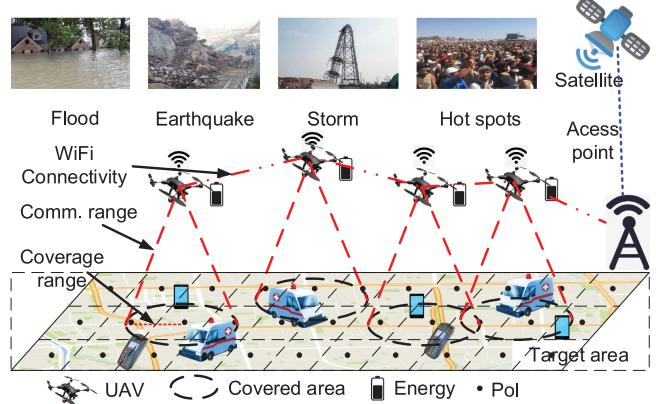  
Fig. 1. Overall considered distributed multi-UAV navigation scenario.

## 2.2 Effective UAV Control

UAV control has also been studied recently. In [20], the authors proposed a framework tjat allows the programming and management of smart drones and the coordination of teams of drones, enabled by specific executive parameters and system conditions (i.e., residual energy, computational power, abilities offered by specific on board sensors). The authors of [21] developed a novel distributed algorithm for July 05,2026 at 12:27:12 UTC from IEEE Xplore. Restrictions apply.

coordination and communications of multiple UAVs engaging multiple targets, where coordination of UAV motion is achieved by implementing a simple behavioral flocking algorithm utilizing a tree topology for distributed flight coordination. In [22], a passivity-based decentralized approach was proposed for bilaterally teleoperating a group of UAVs composing the slave side of the teleoperation system, ensuring high flexibility to the group topology (e.g., possibility to autonomously split or join during the motion). In [23], Dierks et al. proposed a new nonlinear controller for UAV using neural networks, which learns complete dynamics of UAVs online, and outputs feedback. For single UAV control, the authors of [24] proposed a method to figure out an altitude for maximizing coverage region, which can guarantee a minimum outage performance. Although the authors of [25] presented an adaptation of an optimal terrain coverage algorithm, which could ensure a complete coverage of the terrain, a single UAV has to fly more than 10 hours to finish it, which requires a large power supply. The need for a rapid-todeploy solution to providing wireless cellular services can be realized by UAV-BSs. The authors of [26] studied a 3D UAV-BS placement problem that maximizes the number of covered users with different Quality-of-Service (QoS) requirements. In [1], the authors considered the hardware impelmentation perspective. They built and deployed a fully functional system called “SkyCore” on a two-UAV LTE network and showcase its (i) ability to interoperate with commercial LTE BSs as well as smartphones, (ii) support for both hotspot and standalone multi-UAV deployments, and (iii) superior control and data plane performance compared to other EPC variants in this environment

Some research efforts have considered energy efficiency for UAV control. In [27], the authors proposed an optimal placement algorithm for UAV-BSs, which maximizes the number of covered users by using the minimum transmission power. The authors of [28] developed a framework to determine the optimal 3D locations of the UAVs in order to maximize the downlink coverage performance with minimum transmission power. In [29], Chen, et al. proposed a framework that leverages user-centric information to deploy cache-enabled UAVs while maximizing users’ Quality-of-Experience (QoE) using minimum total transmission power. The authors of [30] presented a solution to UAV energy saving problem, ensuring a continuous tracking of a mobile target. They computed the energy consumption caused by transmitting images and by vertical and horizontal UAV movements. In [31], Di et al. proposed an energy model which is derived from real measurements to find the power consumption as a function of the UAV dynamic in different operating conditions.

Different from all the above research works, our work considers the scenario of dynamic UAV control, to fairly cover the entire target area spatiotemporally to achieve the longterm communications coverage in temporal domain. Also, we focus on energy consumption for UAV movements (with consideration for communication coverage and connectivity), rather than energy used for data transmissions [27], [28], [29], [30], which has been well studied in the literature of radio resource management. Moreover, we consider the problem of jointly maximizing coverage and fairness and minimizing energy consumption, which is mathematically different from those problems studied in these related works.

Our earlier work [32] studied the similar problem and proposed an approach called DRL-EC3, which only uses one agent to output all actions for all UAVs. However in this paper, we explicitly consider a much more practical scenario where each UAV has its own inherited control logic to navigate in the area, as a distributed multi-agent control problem. Furthermore, we compare our proposal in this paper with DRL-EC (which serves as the state-of-the-art solution); see Section 6. Results well confirm that it outperforms DRL-EC in terms of energy efficiency.

## 2.3 DRL

DRL has recently attracted much attention from both industry and academia. In a pioneering work, the authors of [33] introduced a RL framework that uses a DQN as the function approximator, and two new techniques, experience replay and target network to improve learning stability. Also there are many extensions have been proposed to addressed the limitation in DQN, such as DDQN in [34] decoupling deep Q-network and target network to avoid overestimating, prioritized replay [35] to give the reply experience priority, dueling networks [36] to generalize action, multi-step learning [37] to shift the bias-variance trade-off, distributed RL [38] to learn a categorical distribution of discount returns and noisy nets [39] for exploitation. Finally in [40], the authors combined all above six methods in one model called Rainbow, and achieved excellent performance. To solve problems with continuous action spaces, the authors in [41] presented an actor-critic, model-free algorithm based on the deterministic policy gradient that can operate over a continuous action space. In [42], the authors presented another actor-critic method that considers action policies of other agents and is able to successfully learn policies that require complex multiagent coordination. Other recent works on DRL for continuous control include [37], [43]. Although DRL has made remarkable successes on a few game-playing tasks, its applicability and effectiveness on complex communication system control remain unexplored.

## 3 SYSTEM MODEL AND PROBLEM STATEMENT

In this section, we consider our scenario of efficient multi-UAV control for fair communication coverage in a 2D target region which was divided into K cells, as shown in Fig. 1. Let $\mathcal { N } \triangleq \{ i = 1 , 2 , \dots , N \}$ be a set of UAVs, which serve as N f ¼ 1 2 . . . gmobile BSs at a fixed altitude to provide network service for ground users. Each UAV has a connectivity constraint, as communication range R, they will lose connection to other UAVs when their distance is bigger than R. Since UAVs fly at a certain altitude, so the coverage range $R ^ { \prime } \leq R$ always holds. Without loss of generality, a PoI in the center of a cell is considered as the service point of that cell.

We consider a task as that all UAVs fly around to cover PoIs for T timeslots with equal durations. At beginning of the task, UAVs take off from random locations, and learn either to move with a direction $\vartheta _ { i } ^ { t } \in [ 0 , 2 \pi )$ and distance $l _ { t } ^ { i } \in ( 0 , { l _ { { \mathrm { m a x } } } } ] ,$ or simply hover at current position, i.e., $\bar { \vartheta } _ { i } ^ { t } = 0 , l _ { t } ^ { i } = 0$ . Here, we consider the energy consumption $e _ { t } ^ { i } , \forall i$ for either flying (up to maximum distance within a 8timeslot) and hovering (remain in one place in the air). For UAV flight, it is simply proportional to flying distance, $\mathrm { i . e . , }$ $e _ { { t } } ^ { i } = \kappa l _ { i } ^ { t } ;$ for hovering, it is treated as a constant, i.e., $e _ { t } ^ { i } =$ ¼ k July 05,2026 at 12:27:12 UTC from IEEE Xplore. Restrictions apply.

TABLE 1 List of Important Notations Used in the Paper
<table><tr><td>Notation</td><td>Explanation</td></tr><tr><td> $k , K$ </td><td>PoI index, the number of PoIs</td></tr><tr><td> $t , T$ </td><td>Timeslot index, total no. of timeslots in one task</td></tr><tr><td> $i , N$ </td><td>UAV index, total UAV number</td></tr><tr><td> ${ \dot { R } } , R ^ { \prime }$ </td><td>Communication range, coverage range</td></tr><tr><td> $o _ { t } ^ { i } , \pmb { a } _ { t } ^ { i } , r _ { t } ^ { i }$ </td><td>Observation, action and reward of UAV i at t</td></tr><tr><td> $s _ { t } , o _ { t } , a _ { t }$ </td><td>State, observation, action of all UAVs at t</td></tr><tr><td> $s , \mathcal { O } , A$ </td><td>State, observation and action space</td></tr><tr><td> $c _ { t } ( k ) , c _ { t } , c _ { T }$ </td><td>Coverage score of PoI k at t, average value of all PoIs at  $t ,$  and in one task</td></tr><tr><td> $f _ { t } , f _ { T }$ </td><td>Fairness index at t and in one task</td></tr><tr><td> $e _ { t } ^ { i } , e _ { T }$ </td><td>Energy consumption of UAV i at  $t ,$  and total consumption in one task</td></tr><tr><td> $\Delta \eta _ { t } , \eta _ { T }$ </td><td>Energy efficiency of all UAVs at  $t ,$  and it final value in a task</td></tr></table>

. Note that other practical modelings of $\phi$ can be const fdirectly applied here, but this is not the focus of this paper.

Table 1 show the list of important notations used in this paper.

We next define three important metrics used in this paper, and describe the problem statement. First is average coverage score which is a “spatiotemporal” metric, to measure how a specific PoI at a location has been covered by any UAV in the past t timeslots, while in any timeslot $t ,$ if that PoI falls into the covered area of any one of the $\mathrm { U A V s } ,$ we refer this as “covered”, otherwise not covered in t. Therefore, we have

$$
c _ { t } ( k ) = \frac { w _ { t } ( k ) } { t } , \quad \forall k \in { 1 , \dots , K } , t ,\tag{}
$$

where $w _ { t } ( k )$ is the number of timeslots a PoI k was covered ð Þup to timeslot $t ;$ and $c _ { t } ( k ) \in [ 0 , 1 ]$ always holds. Upon finishing a task of $T$ ð Þ 2 ½0 1timeslots, we can compute the average achieved coverage score for that task at timeslot $t ,$ as

$$
c _ { t } = \frac { \sum _ { k = 1 } ^ { K } c _ { t } ( k ) } { K } ,\tag{}
$$

and the final average coverage score for a task is $c _ { T } = c _ { t } | _ { t = T } .$

¼ j ¼On the other hand, average coverage score of all PoIs can be really high if most of them are covered, but some PoIs may never be serviced, which leads to geographical unfairness. In practice, like earthquakes or emergence rescue, we still want (nearly) all of them can have the communication link. Therefore, we use Jain’s fairness index to define geographical fairness, as

$$
f _ { t } = \frac { ( \sum _ { k = 1 } ^ { K } c _ { t } ( k ) ) ^ { 2 } } { K \sum _ { k = 1 } ^ { K } c _ { t } ( k ) ^ { 2 } } ,\tag{}
$$

where $f _ { t } \in [ \frac { 1 } { K } , 1 ]$ . When all $c _ { t } ( k )$ ; k are equal, $f _ { t } = 1$ . Upon 2 ½ 1 ð Þ 8finishing a task, its final achieved fairness index is $f _ { T } = f _ { t } | _ { t = T } .$

Finally, UAV movements cost energy $e _ { t } ^ { i } , \forall i$ ¼ j ¼at each time-8slot, and we use e to denote the total energy consumption of all UAVs for a task as $\begin{array} { r } { e _ { T } = \sum _ { t = 1 } ^ { T } \sum _ { i = 1 } ^ { N } e _ { t } ^ { i } } \end{array}$ . Therefore, our goal ¼ ¼1 ¼1is to find a multi-UAV control policy to navigate N UAVs to provide communication services for K PoIs in a distributed manner, to simultaneously (a) maximize average coverage score $c _ { T } , \mathrm { ( b ) }$ maximize geographical fairness $f _ { T } ,$ and (c)

minimize the total energy consumption $e _ { T }$ , while (d) keeping all UAVs connected and not flying across the area border.

## 4 PRELIMINARIES

We consider the standard reinforcement learning (RL) framework, where an agent and environment interact at each of a sequence of discrete timeslots. At each timeslot $t ,$ the agent receives an environment state $\boldsymbol { s } _ { t } ,$ takes an action $\pmb { a } _ { t }$ according to an agent’s policy $\pi ,$ and receives a reward $r _ { t }$ . Policy is a pmapping from states to probabilities of selecting each possible action which is denoted $\pi ( a _ { t } | \boldsymbol s _ { t } )$ . The goal of an agent is to pð j Þlearn a policy that maximizes the discounted future reward as

$$
R _ { t } = \sum _ { t ^ { \prime } = t } ^ { T } \gamma ^ { t ^ { \prime } - t } r _ { t ^ { \prime } } ,\tag{}
$$

where $T$ is a final timeslot, $\gamma$ is discounted factor, $0 \leq \gamma \leq 1 .$ $r _ { t }$ is reward at timeslot t.

One basic idea of RL is to use a function approximator to estimate a value function, which can either be a table, or a (non) linear function. Q-learning is a method that uses table to learn the value of the state-action pairs. If in state $\scriptstyle { s _ { t } , }$ the agent executes the action $\mathbf { } \mathbf { } \mathbf { } \mathbf { } \mathbf { } \mathbf { } \mathbf { } \mathbf { } \mathbf { } \mathbf { } \mathbf { } \mathbf { } \mathbf { } \mathbf { } \mathbf { } \mathbf { } \mathbf { } \mathbf { } \mathbf { } \mathbf { } \mathbf { } \mathbf { } \mathbf { } \mathbf { } \mathbf { } \mathbf { } \mathbf { } \mathbf { } \mathbf { } \mathbf { } \mathbf { } \mathbf { } \mathbf { } \mathbf { } \mathbf { } \mathbf { } \mathbf { } \mathbf { } \mathbf { } \mathbf { } \mathbf { } \mathbf { } \mathbf { } \mathbf { } \mathbf { } \mathbf { } \mathbf { } \mathbf { } \mathbf { } \mathbf { } \mathbf { } \mathbf { } \mathbf { } \mathbf { } \mathbf { } \mathbf { } \mathbf { } \mathbf { } \mathbf { } \mathbf { } \mathbf { } \mathbf { } \mathbf { } \mathbf { } \mathbf { } \mathbf { } \mathbf { } \mathbf { } \mathbf { } \mathbf { } \mathbf { } \mathbf { } \mathbf { } \mathbf { } \mathbf { } \mathbf { } \mathbf { } \mathbf { } \mathbf { } \mathbf { } \mathbf { } \mathbf { } \mathbf { } \mathbf { } \mathbf { } \mathbf { } \mathbf { } \mathbf { } \mathbf { } \mathbf { } \mathbf { } \mathbf { } \mathbf { } \mathbf { } \mathbf { } \mathbf { } \mathbf { } \mathbf { } \mathbf { } \mathbf \Psi \mathbf { } \mathbf { } \mathbf { } \mathbf \otimes \mathbf { } \mathbf { } \mathbf { } \mathbf { } \mathbf { } \mathbf \mathbf { } \mathbf { } \mathbf { } \mathbf \mathbf { } \mathbf { } \mathbf \otimes \mathbf { } \mathbf { } \mathbf { } \mathbf \mathbf { } \mathbf \otimes \mathbf { } \mathbf { } \mathbf \mathbf { } \mathbf \mathbf { } \mathbf \otimes \mathbf { } \mathbf \mathbf { } \mathbf \mathbf { } \mathbf \mathbf { } \mathbf \mathbf { } \mathbf \mathbf { } \mathbf \mathbf \otimes \mathbf { } \mathbf \mathbf \otimes \mathbf { } \mathbf \mathbf \otimes \mathbf { } \mathbf \mathbf \mathbf { } \mathbf \mathbf \mathbf { } \mathbf \mathbf \mathbf \otimes \mathbf { } \mathbf \mathbf \mathbf \otimes \mathbf \otimes \mathbf \otimes \mathbf \otimes \mathbf \mathbf { } \mathbf \mathbf \mathbf \mathbf \otimes \mathbf \mathbf \otimes \mathbf \otimes \mathbf \mathbf \otimes \mathbf \mathbf \otimes \mathbf \mathbf \otimes \mathbf \mathbf \otimes \mathbf \mathbf \otimes $ at time $t ,$ value function $Q ( \pmb { s } _ { t }$ $\check { \mathbf { } a _ { t } } ) = \mathbb { E } [ R _ { t } | \mathbf { \mathit { s } } _ { t } , \mathbf { \mathit { a } } _ { t } ]$ ð, which can be written as Bellman equation:

$$
Q _ { j + 1 } ( \pmb { s } _ { t } , \pmb { a } _ { t } ) = \mathbb { E } [ r _ { t } + \gamma \operatorname* { m a x } _ { \pmb { a } _ { t + 1 } } Q _ { j } ( \pmb { s } _ { t + 1 } , \pmb { a } _ { t + 1 } ) ] .\tag{}
$$

Such value iteration algorithms can converge to the optimal action-value function $\mathrm { \bar { \it Q } ^ { \ast } }$ as iteration times $j \to \infty$ . DQN ! 1[44] is a variant of Q-learning which uses a DNN as the function approximator. It can be trained by minimizing the loss function

$$
L ( \theta _ { j } ^ { Q } ) = \mathbb { E } \big [ y _ { t } - Q ( s _ { t } , { a } _ { t } | \theta _ { j } ^ { Q } ) \big ] ,\tag{}
$$

where $\theta _ { j } ^ { Q }$ are parameters of a DNN, $y _ { t }$ is target value, which ucan be estimated by

$$
y _ { t } = r _ { t } ( s _ { t } , \pmb { a } _ { t } ) + \gamma \operatorname* { m a x } _ { \pmb { a } _ { t + 1 } } Q ^ { \prime } ( s _ { t + 1 } , \pmb { a } _ { t + 1 } | \theta _ { j - 1 } ^ { Q ^ { \prime } } ) .\tag{}
$$

Here $Q ^ { \prime } ( \cdot )$ is a target network, which has the same structure as $Q ( \cdot )$ ðÞ, but its parameters are slowly updated with the ðÞmost recent $\theta _ { j } ^ { Q ^ { \prime } }$ . Another design is experience replay mecha-unism, which used a big experience replay buffer to store state transition experience tuples $\left( { { s _ { t } } , { a _ { t } } , { r _ { t } } , { s _ { t + 1 } } } \right)$ Bwhich are ð þ1Þgenerated by at timeslot t. This buffer helps break the cor-prelations between samples and therefore reduces the variance of updates. These two techniques $( \mathrm { i . e . , }$ target network and experience replay buffer) both can avoid divergence and stabilize learning. However both Q-learning and DQN are hard to apply to continuous tasks, because the greedy policy they adopted needs to find optimal $\pmb { a } _ { t }$ at each time while it is impossible when action space is innumerable.

Policy gradient methods [45] can learn a parameterized policy that selects actions without consulting any value function which allows the action space to be continuous. Let $\theta ^ { \pi }$ denote the policy’s parameters. Given environment state $\mathbf { \boldsymbol { s } } _ { t }$ uat timeslot $t ,$ we use $\hat { \pi } ( a _ { t } | \boldsymbol s _ { t } , \boldsymbol \theta ^ { \pi } )$ to represent the probability of taking action $\mathbf { } \mathbf { } \mathbf { } \mathbf { } \mathbf { } \mathbf { } \mathbf { } \mathbf { } \mathbf { } \mathbf { } \mathbf { } \mathbf { } \mathbf { } \mathbf { } \mathbf { } \mathbf { } \mathbf { } \mathbf { } \mathbf { } \mathbf { } \mathbf { } \mathbf { } \mathbf { } \mathbf { } \mathbf { } \mathbf { } \mathbf { } \mathbf { } \mathbf { } \mathbf { } \mathbf { } \mathbf { } \mathbf { } \mathbf { } \mathbf { } \mathbf { } \mathbf { } \mathbf { } \mathbf { } \mathbf { } \mathbf { } \mathbf { } \mathbf { } \mathbf { } \mathbf { } \mathbf { } \mathbf { } \mathbf { } \mathbf { } \mathbf { } \mathbf { } \mathbf { } \mathbf { } \mathbf { } \mathbf { } \mathbf { } \mathbf { } \mathbf { } \mathbf { } \mathbf { } \mathbf { } \mathbf { } \mathbf { } \mathbf { } \mathbf { } \mathbf { } \mathbf { } \mathbf { } \mathbf { } \mathbf { } \mathbf { } \mathbf { } \mathbf { } \mathbf { } \mathbf { } \mathbf { } \mathbf { } \mathbf { } \mathbf { } \mathbf { } \mathbf { } \mathbf { } \mathbf { } \mathbf { } \mathbf { } \mathbf { } \mathbf { } \mathbf { } \mathbf { } \mathbf { } \mathbf { } \mathbf { } \mathbf { } \mathbf { } \mathbf { } \mathbf { } \mathbf { } \mathbf { } \mathbf { } \mathbf { } \mathbf { } \mathbf { } \mathbf { } \mathbf { } \mathbf { } \mathbf { } \mathbf { } \mathbf { } \mathbf { } \mathbf { } \mathbf { } \mathbf { } \mathbf { } \mathbf { } \mathbf { } \mathbf { } \mathbf { } \mathbf { } \mathbf { } \mathbf \nabla { } \mathbf { } \mathbf { } \mathbf { } \mathbf { } \mathbf { } \mathbf { } \mathbf { } \mathbf \nabla { } \mathbf { } \mathbf { } \mathbf \mathbf { } \mathbf { } \mathbf { } \mathbf \nabla { } \mathbf \mathbf { } \mathbf { } \mathbf \nabla \mathbf { } \mathbf { } \mathbf \mathbf { } \mathbf \nabla { } \mathbf \mathbf { } \mathbf \nabla \mathbf { } \mathbf \nabla \mathbf { } \mathbf \nabla \mathbf { } \mathbf \mathbf { } \mathbf \mathbf { } \mathbf \mathbf \nabla \nabla \nabla \mathbf { } \mathbf \mathbf \nabla \nabla \mathbf { } \mathbf \mathbf \nabla \mathbf \nabla \nabla \mathbf { } \mathbf \mathbf \mathbf $ pð j u Þ. Policy gradient methods update $\theta ^ { \pi }$ based on the gradient of performance measurement ${ \cal J } ( \theta ^ { \pi } ) =$ $\mathbb { E } _ { s \sim \rho ^ { \pi } , a \sim \pi _ { \theta } } [ R _ { 1 } ]$ ðu Þ ¼. The goal is trying to maximize the performance rp pu ½ 1 July 05,2026 at 12:27:12 UTC from IEEE Xplore. Restrictions apply.

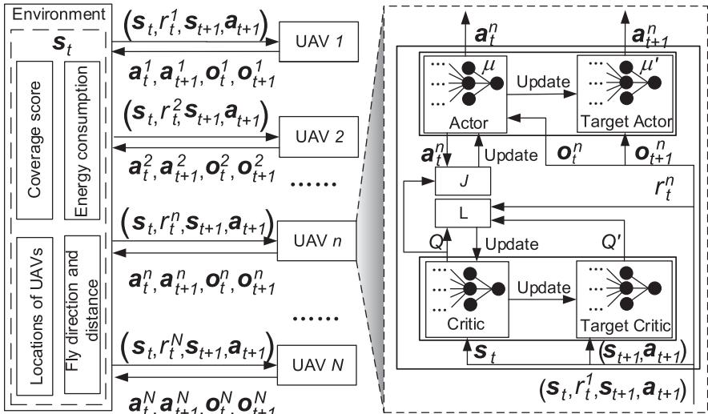  
Fig. 2. Proposed distributed control process and DNN model for each UAV.

by applying gradient ascent $\theta _ { j + 1 } = \theta _ { j } + \alpha \nabla J ( \theta _ { j } )$ , where in simulation, we set $\alpha = 0 . 0 1$ u þ1 ¼ u þ ar ðu Þas advised by [42]. We have

$$
\nabla _ { \theta ^ { \pi } } J ( \theta ^ { \pi } ) = \mathbb { E } _ { s \sim \rho ^ { \pi } , a \sim \pi _ { \theta } } \Big [ \nabla _ { \theta } \log \pi _ { \theta } ( a _ { t } | s _ { t } , \theta ^ { \pi } ) Q ( s _ { t } , a _ { t } ) \Big ] .\tag{}
$$

In order to obtain the value of $Q ( s _ { t } , \pmb { a } _ { t } )$ , a method called ð Þ“REINFORCE” [46] uses samples to return $R _ { t }$ for estimations at t, but it does not learn a value function.

Methods that learn both a policy and a value function are called actor-critic method, where policy function approximator is called actor and the value function approximator is called critic. DDPG [41] is a kind of actor-critic methods, whose critic network can be written as $Q ( s _ { t } , \pmb { a } _ { t } | \theta ^ { Q } )$ , that can be trained by minimizing loss in (6). Actor network can be updated by

$$
\nabla _ { \theta ^ { \mu } } J ( \theta ^ { \mu } ) = \mathbb { E } _ { s \sim \rho ^ { \mu } } \left[ \nabla _ { \theta ^ { \mu } } \mu ( s _ { t } | \theta ^ { \mu } ) \nabla _ { a _ { t } } Q ( s _ { t } , a _ { t } | \theta ^ { Q } ) \Big | _ { a _ { t } = \mu ( s _ { t } | \theta ^ { \mu } ) } \right] .\tag{}
$$

The actor and critic networks of DDPG are both DNNs, and it uses the experience reply and target network to improve the performance.

## 5 PROPOSED DRL-BASED DECENTRALIZED CONTROL SOLUTION FOR MULTI-UAV NAVIGATION

In this section, we present the proposed DRL-based distributed multi-UAV control solution for ensuring long-term communication coverage. Each UAV learns a policy for controlling and optimizing its trajectory in a fully distributed manner. Training and testing processes are different. Fig. 2 shows the training process and modeling of each UAV by DNNs. We formulate our problem as a Partially Observable Markov Decision Process (POMDP), where each UAV can only observe its own local environment.

## 5.1 Observation Space and State Space

For each UAV i at timeslot $t ,$ its observation $o _ { t } ^ { i }$ consists of five elements, energy consumption $e _ { t } ^ { i } ,$ UAV positions $\{ x _ { t } ^ { i } , y _ { t } ^ { i } \}$ , flying directions $\check { \vartheta } _ { t } ^ { i } \in [ 0 , 2 \dot { \pi } )$ and distance $l _ { t } ^ { i } \in [ 0 , { i } _ { \operatorname* { m a x } } ]$ gof all $\mathrm { U } \breve { \mathrm { A V s } } , \mathrm { i . e . , } o _ { t } ^ { i } = \bar { \{ } e _ { t } ^ { i } , \bar { x } _ { t } ^ { i } , y _ { t } ^ { i } , l _ { t } ^ { i } , \vartheta _ { t } ^ { i } \}$ 2 ½0 max; i. Thus, observation space $\mathcal { O } \triangleq \{ o _ { t } ^ { i } | i \in \dot { \mathcal { N } } , t = 1 , 2 , . . . T \} . \ \mathrm { ~ }$ g 8Although we formulate our problem as a POMDP, but in our scenario the environment is fully observable, and thus state space is composed of all UAVs’ observations together with the coverage scores of all PoIs which UAVs may not see fully, as: $\begin{array} { r } { S \triangleq \{ s _ { t } \} = } \end{array}$ $\mathcal { O } \bigcup \{ c _ { t } ( k ) \} _ { \lvert \cdot \rvert _ { k = 1 , 2 , \ldots , K } } ,$ where $\{ c _ { t } ( k ) \} | _ { \forall k = 1 , 2 , \ldots , K }$ S f g ¼represents coverage score of all PoIs.

## 5.2 Action Space

For each UAV i at timeslot $t ,$ its $a _ { t } ^ { i } = \{ \vartheta _ { t } ^ { i } , l _ { t } ^ { i } \}$ . Therefore, ${ \pmb a } _ { t } =$ $\{ \pmb { a } _ { t } ^ { i } | i \in \mathcal { N } \}$ ¼ f g, and for one task, the action space $\mathcal { A } \triangleq \left\{ a _ { t } \vert t = \right.$ $1 , 2 , \ldots , T \}$

## 5.3 Reward Function $r _ { t } ^ { i }$

It consists of two parts. One is penalty $p _ { t } ^ { i } ,$ if UAV i flies out of the target area or loses connectivity to all of rest of UAVs within communication range R; another is time-varying energy efficiency, defined as

$$
\Delta \eta _ { t } = \frac { f _ { t } \sum _ { k = 1 } ^ { K } \Delta c _ { t } ( k ) } { \sum _ { i = 1 } ^ { N } \Delta e _ { t } ^ { i } } ,\tag{}
$$

where $\Delta c _ { t } ( k ) = c _ { t } ( k ) - c _ { t - 1 } ( k )$ is the PoI coverage score incre-ðment of cell $k ,$ ¼ ðand $\Delta e _ { t } ^ { i } = e _ { t } ^ { i } - e _ { t - 1 } ^ { i }$ is energy consumption difference. Therefore

$$
\boldsymbol { r } _ { t } ^ { i } = \Delta \eta _ { t } - \boldsymbol { p } _ { t } ^ { i } , \quad \forall i \in \mathcal { N } , t ,\tag{}
$$

and $r _ { t } = \{ r _ { t } ^ { i } | i \in \mathcal { N } \}$

¼ f j 2 N gPenalties will drive UAVs to avoid actions which result in flying out the area or losing connectivity to the network. Time dependent energy efficiency $\Delta \eta _ { t }$ can be considered as hthe accumulative reward, which measures the increment between two timeslots. It is worth noting that during training all UAVs share the same $\Delta \eta _ { t }$ , since all UAVs contribute to dif-hferent PoI coverage scores and entire geographical fairness index cooperatively, but they may have different penalties.

## 5.4 Training Process

We use target network which was first proposed in [33] to address instability issue when directly implementing Qlearning with neural networks. Similar to DDPG [41], our July 05,2026 at 12:27:12 UTC from IEEE Xplore. Restrictions apply.

method is an actor-critic approach, but it is distributed and thus each UAV i has a separate actor and critic network. Target networks of one UAV is a copy of the actor network and the critic network of that UAV. However, the weights of target networks are not directly copied. They are slowly updated by $\theta ^ { Q ^ { \prime i } } = \tau \theta ^ { Q ^ { i } } + ( 1 - \tau ) \theta ^ { Q ^ { \prime i } }$ , and $\theta ^ { \mu ^ { \prime } i } = \tau \theta ^ { \mu ^ { i } } + ( 1 - \tau ) \theta ^ { \mu ^ { \prime } i } .$ , sep-u ¼ tu þ ð1  tÞuarately. In simulation, we set $\tau = 0 . 0 1$ ¼ tu þ ð1  tÞuas advised by [42].

t ¼ 0 01Since our algorithm is model-free, it directly learns from experiences. Transition samples are generated and stored in an experience replay buffer [44] of size B which can store B transitions, including state, action, and reward. During training, at each timeslot actors and critics of all UAVs are updated by a randomly sampled mini-batch (of size $H ( \ll \bar { B } ) )$ from experience reply buffer.

ð	 ÞSpecifically, we update the critic network of UAV i by minimizing the loss function $L \big ( \theta ^ { Q ^ { i } } \big ) , \forall i ,$ which is defined as

$$
L \Big ( \theta ^ { Q ^ { i } } \Big ) = \frac { 1 } { H } \sum _ { j = 1 } ^ { H } \Big ( y _ { j } ^ { i } - Q ^ { i } \big ( s _ { j } , a _ { j } | \theta ^ { Q ^ { i } } \big ) \Big ) ^ { 2 } ,\tag{}
$$

which takes state and action of all UAVs as input. Target value $y _ { j } ^ { i } ,$ produced by critic’s target network, is calculated by

$$
y _ { j } ^ { i } = r _ { j } ^ { i } + \gamma Q ^ { \prime i } ( s _ { j + 1 } , a _ { j + 1 } \big \vert \theta ^ { Q ^ { \prime i } } ) \big \vert _ { a _ { j + 1 } ^ { i } = \mu ^ { \prime i } ( o _ { j + 1 } ^ { i } \mid \theta ^ { \mu ^ { \prime i } } ) } .\tag{}
$$

We update the weights $\theta ^ { \mu ^ { i } }$ of the actor network for UAV ui by applying the policy gradient method, as

$$
\begin{array} { r } { \nabla _ { \boldsymbol { \theta } ^ { \boldsymbol { \mu } ^ { i } } } J ( \boldsymbol { \theta } ^ { \boldsymbol { \mu } ^ { i } } ) \approx \displaystyle \frac { 1 } { H } \sum _ { j = 1 } ^ { H } \nabla _ { \boldsymbol { \theta } ^ { \boldsymbol { \mu } ^ { i } } } \mu ^ { i } ( \boldsymbol { o } _ { j } ^ { i } | \boldsymbol { \theta } ^ { \boldsymbol { \mu } ^ { i } } ) } \\ { \nabla _ { \boldsymbol { a } _ { j } ^ { i } } Q ^ { i } ( \boldsymbol { s } _ { j } , \boldsymbol { a } _ { j } ) \big | _ { \boldsymbol { a } _ { j } ^ { i } = \boldsymbol { \mu } ^ { i } ( \boldsymbol { o } _ { j } ^ { i } | \boldsymbol { \theta } ^ { \boldsymbol { \mu } ^ { i } } ) } , } \end{array}\tag{}
$$

where only its own observation $o _ { j } ^ { i }$ is used.

Pseudocode for training our approach is presented in Algorithm 1. First, we initialize the replay buffer with capacity B (Line 1). As for Lines 2-5, the algorithm randomly initializes a set of N critic networks $Q ^ { i } ( \cdot )$ and actor networks $\mu ^ { i } ( \cdot )$ of each UAV i, with parameters $\theta ^ { Q ^ { i } }$ and $\theta ^ { \mu ^ { i } }$ (Line 3). The tar-u uget network proposed in DQN [44] is used here. We initialize the parameters of $N$ target networks $Q ^ { \prime i } ( \cdot )$ and $\mu ^ { \prime i } ( \cdot )$ with parameters $\theta ^ { Q ^ { \prime } i } = \theta ^ { Q ^ { i } }$ and $\theta ^ { \mu ^ { \prime } } = \theta ^ { \mu ^ { i } }$ ðÞ m ðÞ(Line 4). They have the u ¼ u u ¼ usame structure as critic and actor networks.

The training loop has total M episodes (i.e., tasks) and one episode has T timeslots. We first reset the environment, every UAV can receive the environment state $s _ { 1 } .$ . For each UAV, it chooses an action according to the actor $\mu ^ { i } ( \cdot )$ with input ${ \pmb { o } } _ { t } ^ { i } .$ . In m ðÞorder to keep explorations, we also add a noise - of Gaussian distribution to the action, where it decreases over time. After executing these actions, every UAV gets a reward as in Eqn. (10) and state becomes $\mathbf { \boldsymbol { s } } _ { t + 1 }$ . If these actions lead UAVs to fly þ1out of area or lose connections with all UAVs, we give a penalty to punish them (Lines 11-17).

Last part is to update the parameters of actor and critic networks. As shown in Lines 19-25, each UAV trains its own actor and critic network. At timeslot $t ,$ each UAV randomly chooses a mini-batch of H samples from experience replay buffer $B ,$ calculate the target value $y _ { j } ^ { i }$ using target critic network $Q ^ { \prime i } ( \cdot )$ . Then, it updates critic network weights $\theta ^ { Q ^ { i } }$ ðÞby minimizing the loss function $L ( \theta ^ { Q ^ { i } } )$ . The actor net-u ðu Þwork weights can be updated by policy gradient method.

Finally, it updates the target networks weights $\theta ^ { Q ^ { \prime } i }$ and $\theta ^ { \mu ^ { \prime } i }$ by using $\theta ^ { Q ^ { i } }$ and $\theta ^ { \mu ^ { i } }$ , respectively.

Algorithm 1. Our Approach (Training Process)   
1: Initialize replay buffer to capacity B   
2: for $\mathrm { U A V } i { \dot { : = } } 1 , \ldots , N$ Bdo   
3: :¼ 1 . . .Randomly initialize critic network $Q ^ { i } ( s _ { t } , a _ { t } | \theta ^ { Q ^ { i } } )$ and   
actor network $\mu ^ { i } ( o _ { t } ^ { i } | \theta ^ { \mu ^ { i } } )$ with weighs $\theta ^ { Q ^ { i } }$ and $\theta ^ { \mu ^ { i } } ;$   
4: m ð ju ÞInitialize target networks $Q ^ { \prime i } ( \cdot )$ uand $\mu ^ { \prime i } ( \cdot )$ uwith weights   
$\theta ^ { Q ^ { \prime } { } ^ { i } } = \theta ^ { Q ^ { i } }$ and $\theta ^ { \mu ^ { \prime } i } = \theta ^ { \mu ^ { i } } .$   
u ¼ u5: end for   
6: for episode ; ; M do   
7: Initialize environment and receive an initial state $s _ { 1 }$   
8: for $t : = 1 , \dots , T$ do   
9: :¼ 1 . . . i ${ \pmb a } _ { t } ^ { i } = \mu ^ { i } ( { \pmb o } _ { t } ^ { i } ) + \epsilon$   
10: Execute actions ${ \pmb a } _ { t } = ( { \pmb a } _ { t } ^ { 1 } , \dots , { \pmb a } _ { t } ^ { N } )$ , get reward $r _ { t } =$   
$( r _ { t } ^ { 1 } , \ldots , r _ { t } ^ { N } )$ and new state $s _ { t + 1 }$   
11: Þfor $\mathrm { U A V } i : = 1 , \dots , N$ do   
12: :¼ 1 . . .if UAV i flies beyond the border or discon  
nected then   
13: $r _ { t } ^ { i } = \Delta \eta _ { t } - p _ { t } ^ { i }$   
14: ¼ h Cancel the movement of UAV i   
15: Update $o _ { t } ^ { i }$ accordingly   
16: end if   
17: end for   
18: Store $\left( { { s _ { t } } , { a _ { t } } , { r _ { t } } , { s _ { t + 1 } } } \right)$ in $B ,$ and $\boldsymbol { s } _ { t } \gets \boldsymbol { s } _ { t + 1 }$   
19: for $\mathrm { U A V } i : = 1 , \dots , N$ Bdo   
20: :¼ 1 . . .Get H random samples $( s _ { j } , a _ { j } , r _ { j } , s _ { j + 1 } ) \in \mathcal { B }$   
21: Set target value $y _ { j } ^ { i }$ ðby Eqn. (13)   
22: Update critic network weights $\theta ^ { Q ^ { i } }$ by minimiz  
ing loss $L ( \theta ^ { Q ^ { i } } )$ in Eqn. (12)   
23: ÞUpdate actor network weights $\theta ^ { \mu ^ { i } }$ by $\nabla _ { \theta ^ { \mu ^ { i } } } J ( \theta ^ { \mu ^ { i } } )$   
in Eqn. (14)   
24: Update two target network weights $\theta ^ { Q ^ { \prime } i } , \theta ^ { \mu ^ { \prime } i }$   
25: end for   
26: end for   
27: end for

## 5.5 Testing Process

During testing, since our scenario is a fully distributed as a POMDP, each UAV can only see its own observation $o _ { t } ^ { i }$ Also, we only need its own actor network to produce action $a _ { t } ^ { i }$ by going through the DNN of weights $\theta ^ { \mu ^ { i } }$ , given its own observation $o _ { t } ^ { i } .$ uThen, environment state gives each UAV i its own reward $r _ { t } ^ { i } ,$ and changes its observation to $o _ { t + 1 } ^ { i } .$ þ1Therefore, our algorithm is a fully distributed control solution that during execution it does not need any other UAV’s information, nor the state information.

## 6 PERFORMANCE EVALUATION

## 6.1 Simulation Setting

We implemented our model using tensorflow 1.2, on a Ubuntu 16.04.3 server with 4 NVIDIA Titan XP graphic cards. We set the target region as $1 0 \times 1 0$ units, and the communication range of UAV is $R = 5$ 10  10units. In addition, when any UAV ¼ 5flies out of the target area, we give a penalty $p _ { t } ^ { i } = 1 0 ,$ and we ¼ 10penalize whenever a UAV loses connections with all UAVs as $p _ { t } ^ { i } = 1$ . We trained the proposed model for 4 k episodes, ¼ 1each of which has $T = 5 0 0$ timeslots. We saved the trained ¼ 500 July 05,2026 at 12:27:12 UTC from IEEE Xplore. Restrictions apply.

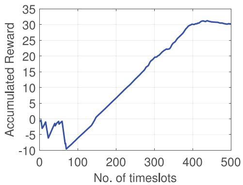  
Fig. 3. Accumulated reward over one episode during testing.

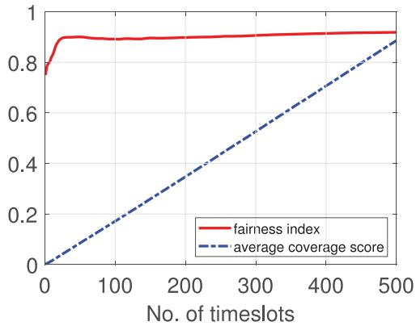  
Fig. 4. Average coverage score and fairness index over one episode during testing.

model every 100 episodes and thus we have 40 models. During testing period, we tested each model 100 times, took the average and chose the best one out of 40 models.

## 6.2 Metrics

We chose three metrics for performance evaluation, average coverage score $( c _ { T } ) _ { \perp }$ , geographic fairness index $( f _ { T } )$ , and most importantly, the average energy efficiency $( \eta _ { T } ) .$ , as

$$
\eta _ { T } = \frac { f _ { T } * c _ { T } } { \bar { e } _ { T } } ,\tag{}
$$

where $\bar { e } _ { T }$ is normalized and averaged from $e _ { T }$ by a constant $N * T * \phi ( l _ { \mathrm { m a x } } )$ . It trades three metrics in a way that none of   fð maxÞthem is solely considered.

## 6.3 Neural Network Convergence

We first show the convergence of our proposed neural network model, by showing the trend of reward, average coverage score and fairness index over one episode during testing, as shown in Figs. 3 and 4. In this scenario, we used 6 UAVs and set coverage range $R ^ { \prime } = 3 . 0$ units. The normal-¼ 3 0ized energy consumption for flying maximum distance is set as : unit, if simply hovering also costs 0.5 unit energy, i.e., $\phi ( l _ { \mathrm { m a x } } ) = 0 . 5$ . Note that this is to used to show fð maxÞ ¼ 0 5how much energy a UAV hovers and flies cost, given different brand/manufactureed product may have different specifications. We observe that in first 80 timeslots, reward is fluctuating. After, it keeps rising and stabilizes after 400 timeslots. This is because that at the beginning, all UAVs take off randomly and may easily lose connections, and thus penalties are given. Then, they try to fly around to connect to the UAV network which results in positive reward (increased fairness index and coverage score). From Fig. 4, we see that initial fairness value is around 0.78, then reaches the peak at nearly 40 timeslots, but never falls down after. Average coverage score increases linearly over time and eventually reaches a high value. These curves show that our method can learn a good policy for multi-UAV navigation.

TABLE 2  
Impact of Neuron Number and Buffer Size on Energy Efficiency
<table><tr><td rowspan="2">Neuron number</td><td colspan="3">Buffer size B</td></tr><tr><td>1M</td><td>1.25M</td><td>1.50M</td></tr><tr><td>64</td><td>0.934582</td><td>0.908695</td><td>0.967525</td></tr><tr><td>96</td><td>0.970919</td><td>0.945846</td><td>1.142523</td></tr><tr><td>128</td><td>1.121932</td><td>1.198563</td><td>1.173579</td></tr><tr><td>160</td><td>1.382106</td><td>1.225902</td><td>1.242328</td></tr><tr><td>192</td><td>1.395086</td><td>1.214436</td><td>1.209742</td></tr><tr><td>224</td><td>1.383377</td><td>1.171916</td><td>1.223336</td></tr><tr><td>256</td><td>1.258631</td><td>1.106900</td><td>1.018820</td></tr></table>

TABLE 3  
Impact of Discount Factor and Buffer Size on Energy Efficiency
<table><tr><td rowspan="2">Discount factor γ</td><td colspan="5">Buffer size B</td></tr><tr><td>0.5M</td><td>0.75M</td><td>1M</td><td>1.25M</td><td>1.50M</td></tr><tr><td>0.80</td><td>0.616180</td><td>0.722009</td><td>1.231682</td><td>0.745518</td><td>1.177653</td></tr><tr><td>0.83</td><td>0.630127</td><td>0.780517</td><td>1.435410</td><td>1.218594</td><td>1.248636</td></tr><tr><td>0.86</td><td>0.874861</td><td>0.772719</td><td>1.268352</td><td>1.339767</td><td>1.185653</td></tr><tr><td>0.89</td><td>0.709419</td><td>0.637378</td><td>1.382106</td><td>1.225902</td><td>1.242328</td></tr><tr><td>0.92</td><td>0.653900</td><td>0.618905</td><td>1.220660</td><td>1.044111</td><td>1.013395</td></tr><tr><td>0.95</td><td>0.459354</td><td>0.591725</td><td>0.936937</td><td>1.160177</td><td>1.128080</td></tr><tr><td>0.98</td><td>0.929197</td><td>0.608951</td><td>1.093284</td><td>1.130232</td><td>1.062056</td></tr></table>

## 6.4 Finding Appropriate Hyperparameters

Next, we present the experimental results trying to find appropriate hyperparameters of the proposed neural network model for each UAV. Here we select the discount factor (representing the forgetting effect of future reward), num-gber of neurons in each layer of a four-layer DNN where actor, critic, and target networks of each UAV is composed of, and experience replay buffer size B (representing the learning capacity). Results are shown in Tables 2 and 3. Our evaluation metric is energy efficiency $\eta _ { T }$ in Eqn. (15). In Table 2, we hfirst show the impact of neuron numbers on when we fix discount factor $\gamma = 0 . 8 9$ h(which is randomly picked). Table 3 g ¼ 0 89shows that how discount factor and buffer size affect $\eta _ { T } ,$ hwhen fixing the neuron number to 160. From two tables, we can make the following observations.

(1) As shown in Table 2, energy efficiency first goes up then drops down when fixing buffer size B. For example, when setting batch size $B = 1 M ,$ increasing the neuron ¼ 1number from 64 to 192 and further to 256 with step size 32, average energy efficiency increases from 0.934 to 1.395 and then slightly drops to 1.258, i.e., our model gets the highest energy efficiency when neuron number is 192, and this number decreases to 160, when buffer size is 1.25 and 1.5 M. Overall, using 160 neurons is generally better than the other settings. Intuitively, increasing the neuron number of DNNs can help better to learn the July 05,2026 at 12:27:12 UTC from IEEE Xplôre. Restrictions apply.

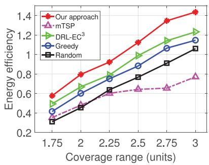  
(a)

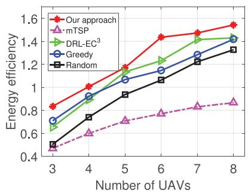  
(b)

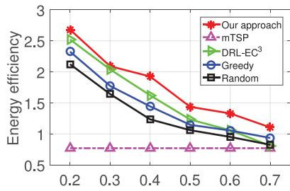  
Normalized energy consumption for flying with max distance (unit)  
(c)  
Fig. 5. The impact of (a) coverage range, (b) number of UAVs, and (c) normalized energy consumption for flying maximum distance on energy efficiency.

representation of complex and non-linear correlations among state, action and reward; while going too deep makes the nonlinear function approximator too complicated, which may lead to overfitting issue.

(2) Table 3 shows how discount factor $\gamma$ affects $\eta _ { T } .$ . Specifically, when increasing $\gamma ,$ g henergy efficiency generally goes gup first, then drop down, and slightly fluctuates but still below the peak value. Overall, no matter what values buffer size takes, $\eta _ { T }$ gets the maximum value when $\gamma$ is around h g0.83. We hypothesize that the reason why lower performs gbad is that future reward does not count much and thus they take actions relatively to maximize the immediate reward of a few steps ahead, which is not ideal. Increasing the discount factor gives more attention to benefits that future actions may bring, which well captures the essence of our defined “temporal” coverage score and geographical fairness, and thus $\eta _ { T }$ is increased. However, with the dis-hcount factor further growth, UAVs care too much about the future, and thus immediate actions may not be good, and sometimes will lead to punishment (e.g., flying outside the area or disconnected from the network).

(3) When fixing and changing the buffer size B, energy gefficiency also varies. From two tables, we can conclude that buffer size 1 M is generally better than the rest of settings. This is because that smaller buffer size will lead to insufficient transition sampling storage or less randomness, but if too big, then good records will have fewer chance of being replayed during training.

Therefore, we choose 160 neurons for 2 layer fullyconnected hidden layers of actor, critic and target networks of each UAV, discount factor $\gamma = 0 . 8 3$ , and experience replay buffer size $B = 1 M$ g ¼ 0 83, for the rest of simulations.

## 6.5 State-of-Art Approach and Baselines

We compared our approach with DRL-EC [32], which is a state-of-art approach to navigate a group of UAVs to provide long-term communications coverage. It is a policy gradient based approach for continuous control tasks, which uses only one actor network and one critic network to output control decisions for all UAVs by employing DDPG [41]. In the training phase of $\mathrm { { D R L - E C ^ { 3 } } }$ , it trains the underlying DNN model 1,500 times and chooses the best one to do testing. Then, it tests 100 episodes and selects the best result. Here we use the same way of training, but adopt a slightly different way of testing, that we take the average obtained value of 100 testing episodes; in other words, we show the average result.

Meanwhile, we compared out approach with three other commonly used baselines as:

Greedy: at each timeslot $t ,$ each UAV tries to find an action that may lead to maximum immediate reward $r _ { \mathrm { \Delta t } } ^ { i }$ in a distributed manner. Since in our scenario the action space is continuous, we have to discretize the $\vartheta _ { i } ^ { t }$ into $\dot { 3 } 0$ equal radius, and we set their flying distance as $l _ { \mathrm { m a x } }$ . Note that this solution is different from maxthe one used in [32], which employs one agent to compute the total reward and output actions for all UAVs, although also in a greedy way; however our greedy solution uses different rewards for different UAVs so that they distinguish with each other to learn to cooperate and compete [42].

mTSP [47]: a straight-forward solution is to formulate our considered problem as a multiple traveling salesmen problem (mTSP), where all UAVs work together to find the least costly path to cover all PoIs, and then repeat the routes for all epochs. Since mTSP requires the known UAV location as a priori, to implement this, we set each UAV to fly between adjacent PoIs in consecutive timeslots, i.e., their energy consumption for each action is 1.

Random: at each timeslot $t ,$ all UAVs randomly choose a direction, fly a distance.

## 6.6 Comparing with State-of-Art Approach and Baselines

In this section, we compare with four state-of-art solutions in Section 6.5. The actor and critic networks in our method are both four-layer DNNs including input layer, two 160- neuron fully-connected hidden layers and an output layer. The input layer of actor network receives the observation ${ \pmb O } _ { t } ^ { i }$ of UAV i and output layer is an action. The input layer of critic network receives the environment state and actions of all UAVs and output layer produces a $Q ( \pmb { s } _ { t } , \pmb { a } _ { t } )$ value. Since ð Þtarget networks are copies of actor and critic network, target networks have the same structure with actor and critic network. Other hyperparameters in our model include experience reply buffer size $B = 1 M ,$ and discount factor $\gamma = 0 . 8 3$ ¼ 1 g ¼ 0We first examine the impact of UAV coverage range $R ^ { \prime } ,$ number of UAVs, and normalized energy consumption for flying with maximum distance on energy efficiency $\eta _ { T } ,$ as hshown in Fig. 5. Then, we show the impact of coverage range between $\left[ 1 . 7 5 , 3 . 0 \right]$ with a step size 0.25 (when fixing $\mathrm { U A V }$ numbers to $N = 6$ and energy consumption for flying ¼ 6 July 05,2026 at 12:27:12 UTC from IEEE Xplore. Restrictions apply.

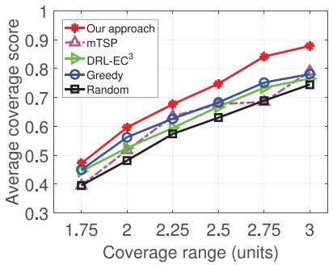  
(a)  
Fig. 6. Impact of UAV coverage range on three metrics.

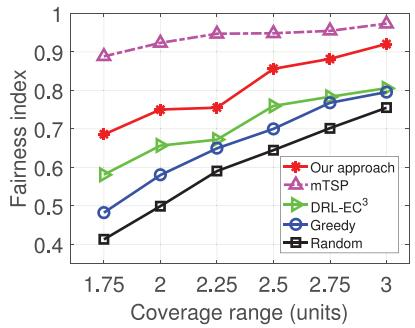  
(b)  
(c)

maximum distance is 0.5), in Fig. 6. After, we show the impact of UAV number when we set coverage range to $R ^ { \prime } = 3 . 0$ and energy consumption is 0.5, and change N from ¼ 3 03 to 8. Finally, in Fig. $8 ,$ we fix coverage range to $R ^ { \prime } = 3 . 0$ and UAV numbers to $^ { 6 , }$ ¼ 3 0and change flight energy costs from 0.2 to 0.7.

From Fig. 5, we can make the following observations.

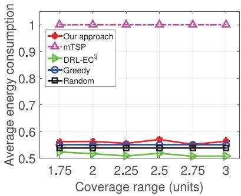

(1) First, our method consistently outperforms all the baselines in terms of energy efficiency. For example, in Fig. 5a, our method increases energy efficiency by 16.7, 19.1, 16.9, 13.6, 18.0, 16.5 percent for coverage range $R ^ { \prime } =$ ¼: ; ; : ; : ; : ; , respectively, compared to DRL-$\mathrm { { E C ^ { 3 } } }$ 5 2 2 25 2 5 2 75 3gapproach. Figs. 5b and 5c show that our model leads to 12 and 17.7 percent increase on energy efficiency, respectively, on average. We suspect that $\mathrm { { D R L } \mathrm { { - } \mathrm { { E C } ^ { 3 } } } }$ uses one policy to control multiple UAVs that cannot well coordinate their actions. This is because that traditional RL methods such as DDPG uses one actor network and one critic network to train multiple agents which may have potential conflicts. For example, when we calculate the gradient by Eqn. (9), UAV i has a gradient that leads to the left while the action gradient of UAV i may lead to the right, and thus one single $J$ (see Eqn. (9)) cannot satisfy multiple agents simultaneously when updating actor parameters. However in our approach, since each UAV i has its own actor and critic networks, and we update the actor by Eqn. (14) that calculates the action gradient of that particular UAV, which avoids the inconsistent gradient [42]. This is particularly useful when a competitive and cooperative environment is enforced like ours, where UAVs cooperate to cover more PoIs, however overlapping coverage (i.e., the competitive nature of UAVs) will cost useless energy.

(2) We can also see that greedy approach performs consistently better than random. This is because that the former determines a best action for each UAV at each timeslot while Random chooses an action which may lead to either unfair coverage, disconnection from other UAVs, or even flying out of border. Also, $\mathrm { { D R L } \mathrm { { - } E C ^ { 3 } } }$ performs always better than greedy, mTSP, and random approaches. The mTSP approach gets the worst result. Although it can get the highest fairness since UAVs work together to visit all PoIs as a sequence (see Figs. 6a, 7a, 8a) and the medium coverage score (see Figs. 6b, 7b, 8b), mTSP uses the most average energy consumption to fly between PoIs (see Figs. 6c, 7c, 8c). This is because that at each timeslot $t ,$ each UAV flies from one PoI to neighboring one costs corresponding energy consumption $\phi ( l _ { \mathrm { m a x } } )$ and thus average energy consumption is 1.

(3) From Figs. 5a and 5b, we see that energy efficiencies given by all methods increase with coverage range and number of UAVs. This is obvious that increasing R and more UAVs will lead to more covered PoIs. When $N > 6 ,$ 6energy efficiency by our method starts to saturate. This is because that 6 UAVs can already achieve pretty high $c _ { T } , f _ { T } ,$ and thus deploying more UAVs will incur coverage overlaps and fairness is rarely increased. This is confirmed in Figs. 7a, 7b, and ${ 7 } \mathrm { c } ,$ where $c _ { T } , f _ { T }$ saturate after $N = 6 ,$ ¼ 6increase of average coverage score and fairness index is slow when $N = 7$ and $N = 8$

¼ 7 ¼ 8(4) From Fig. 5c, we observe an opposite trend compared with Figs. 5a and 5b. Energy efficiencies of all methods except mTSP drop with the increased energy consumption for flying, which refers to the case that flying for a distance $l _ { t } ^ { i }$ costs more energy. This is because that the goal of mTSP approach is only to visit all PoIs as a sequence, without adjusting flying speed/directions when time progresses.

Next, we show the break-down results on how coverage range, UAV number and normalized energy consumption for flying affect energy efficiency in detail. We first show the impact of the coverage range on three metrics in Fig. $^ { 6 , }$ from which we can make the following observations.

(1) Our method outperforms all baselines in terms of the average coverage score and fairness index except mTSP approach.

As for mTSP, although it attains the highest fairness index (which is by definition true that UAVs circles around a loop to visit all PoIs), its cost of energy is high and the benefit of fairness is not enough to make up the coverage score, nor energy consumption. In terms of energy consumption, our method costs slightly more energy than others except mTSP, however, it achieves higher fairness value and coverage score, thus receiving the highest energy efficiency.

(2) From Fig. 6c, we observe that average energy consumption for greedy and random approaches are constant while our method and $\mathrm { { D R L } \mathrm { { - } E C ^ { 3 } } }$ have fluctuations. This is because for greedy approach, it always selects an action that maximizes the immediate reward and thus it is more likely that an action with smallest energy cost is always chosen; and random approach filters out the selection randomness from time being. $\mathrm { { D R L } \mathrm { { - } E C ^ { 3 } } }$ and ours take advantage of the change of $R ^ { \prime }$ in different settings, and thus energy consumption will fluctuate. However, our approach costs more since it learned to cooperate while competing to cover more UAVs by producing non-conflicting actions given by consistent gradient signals.

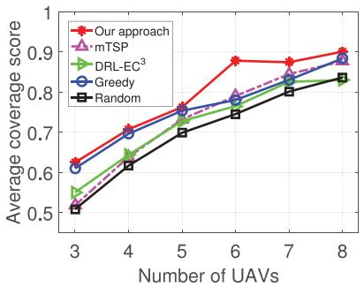  
(a)

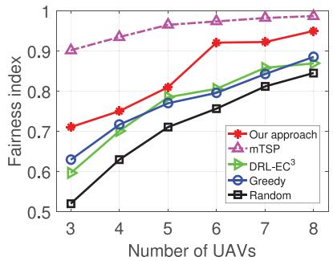  
(b)

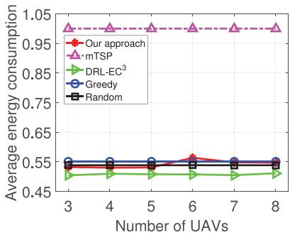  
(c)

Fig. 7. Impact of number of UAVs on three metrics.  
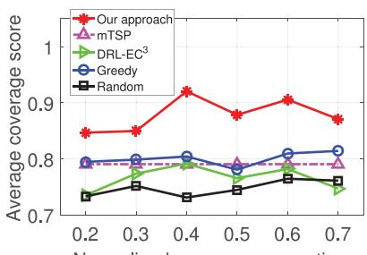  
Normalized energy consumption for flying with max distance (unit)  
(a)

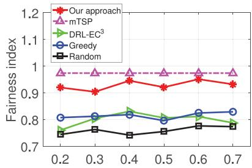  
Normalized energy consumption for flying with max distance (unit)  
(b)

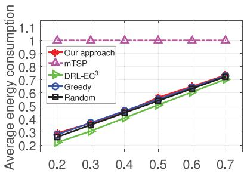  
Normalized energy consumption for flying with max distance (unit)  
(c)  
Fig. 8. Impact of UAV normalized energy consumption for flying with maximum distance on three metrics.

Then, we show the impact of the UAV number on the average coverage score, fairness index and average energy consumption in Fig. 7. We can make following observations:

(1) Our method outperforms all four baselines in terms of the average coverage score and all three baselines except mTSP in terms of fairness index. For example, in Fig. 7a, when UAV number is 7, our method gives 5 percent improvement compared to greedy, while the latter outperforms DRL-EC and random performs the worst. The reason why mTSP gets the highest fairness index is same as stated earlier.

(2) From Fig. 7c, it is observed that average energy consumption almost does not change for all methods, because for greedy and random approaches, N does not affect their policy, and for DRL-EC , as discussed, it does not fully take advantage the competitive and cooperative nature of multiagent environment and thus increasing N will not affect their policy much.

Finally, Fig. 8 shows the impact of the normalized energy consumption for flying with maximum distance on three metrics. In other words, UAV hovering will cost the rest of portion out of 1. We have the similar observations that our method outperform all baselines in terms of the average coverage score and fairness index. For example, when energy consumption for flying with maximum distance is 0.4, c of our method is 0.92 compared to 0.79 given by DRL-EC , which represents a 13 percent improvement. Furthermore, the average coverage score and fairness index of greedy and random approaches do not have an obvious trend as in Figs. 8a and 8b. Our approach increases the coverage score slightly after 0.3 and drops down after 0.6, with more energy spending on movement. This is because that the lower the ratio is, the UAVs will tend to constantly fly around thus increasing the coverage score may not good enough; similarly, the higher the ratio is, the UAVs tend to stay in its own place since it costs less energy which results in poor coverage. Therefore, the ratio between hovering and flight impact on the movement of UAVs. Furthermore, the reason why greedy and random approaches do not perform well is that, they do not explicitly consider the energy consumption impact in a long run when taking an action, but our approach fully utilizes the energy consumption cost in calculating reward ri; i; t, and thus it shows the robustness 8of our approach. Also, all four methods except mTSP have the same linear increase trend of energy consumption as in Fig. 8c, where we see that our approach does not cost significantly more energy than others, but achieves good performance. For mTSP, average coverage score, fairness index and normalized average energy consumption, energy efficiency all are constant. This is because that regardless of the value taken for energy consumption of flying, UAVs in mTSP always take 1 energy cost, which does not affect the average score and fairness index and thus get a constant energy efficiency.

## 7 PRACTICAL IMPLEMENTATION DETAILS

## 7.1 Binary Temporal Coverage Scores

In Eqn. (1), we define the communications coverage for a PoI as the ratio between covered times and total number of timeslots as the binary coverage. This is under the assumption that for any given timeslot, the received signal-to-noise ratio for a UAV is higher than the predefined threshold thus data quality is guaranteed, where in our paper the threshold is modeled by the sensing range since we are not dealing with physical layer communications.

## 7.2 Signaling Overhead Between UAVs

Regarding the signaling overhead incurred by exchanging information between UAVs, since we formulate the problem as a POMDP, each UAV can only see its own observation and get its own information (including location and remaining energy), which will be sent to other UAVs so that each one of them to have a global view of the entire state. In this way, the signaling overhead is bounded by the number of UAVs.

## 7.3 Computational Complexity for Testing Phase

During the testing phase, given the state information as input, each UAV distributedly utilizes its own actor network $\pi ^ { u } ( \cdot )$ to p ðÞoutput an action. According to [48], the time complexity for a DNN with fully connected layers is computed as the number of multiplications: $O ( \sum _ { f = 1 } ^ { F } n _ { f } \cdot n _ { f - 1 } )$ , where $n _ { f }$ is the number ð ¼1  1Þof neural units in fully-connected layer $f .$

## 8 CONCLUSION

In this paper, we proposed a DRL-based approach for distributed and energy-efficient multi-UAV navigation to ensure long-term communication coverage, in a fully distributed manner. Considering temporal coverage scores of PoIs, their geographical fairness, UAV energy consumptions and connectivity, we define the state, observation, action space, and reward functions. We also proposed a distributed interaction and modeling of UAVs distributedly by DNNs. We conducted extensive simulations to find an appropriate set of hyperparameters, i.e., 160 neurons for 2 fully-connected hidden layers, discount factor 0.83, and experience replay buffer size M, for the best performance. Compared with state-of-art 1approach DRL $\mathrm { - E C ^ { 3 } }$ approach based on DDPG, and three other baselines, results justified the superiority of our model in terms of energy efficiency.

## ACKNOWLEDGMENTS

Chi Harold Liu’s research was supported by National Natural Science Foundation of China (No. 61772072). Jian Tang’s research was supported by US National Science Foundation grants 1525920 and 1704662.

## REFERENCES

[1] M. Moradi, K. Sundaresan, E. Chai, S. Rangarajan, and Z. M. Mao, “SkyCore: Moving core to the edge for untethered and reliable UAV-based LTE networks,” in Proc. ACM Annu. Int. Conf. Mobile Comput. Netw., 2018, pp. 35–49.

[2] C. H. Liu, T. He, K. Lee, K. K. Leung, and A. Swami, “Dynamic control of data ferries under partial observations,” in Proc. IEEE Wireless Commun. Netw. Conf., Apr. 2010, pp. 1–6.

[3] A. Merwaday and I. Guvenc, “UAV assisted heterogeneous networks for public safety communications,” in Proc. IEEE Wireless Commun. Netw. Conf. Workshop, 2015, pp. 329–334.

[4] C. Wang, J. Wang, Y. Shen, and X. Zhang, “Autonomous navigation of UAVs in large-scale complex environments: A deep reinforcement learning approach,” IEEE Trans. Veh. Technol., vol. 68, no. 3, pp. 2124–2136, Mar. 2019.

[5] W. Zhang, K. Song, X. Rong, and Y. Li, “Coarse-to-fine UAV target tracking with deep reinforcement learning,” IEEE Trans. Autom. Sci. Eng., 2018.

[6] A. Osseiran, F. Boccardi, V. Braun, K. Kusume, P. Marsch, M. Maternia, O. Queseth, M. Schellmann, H. Schotten, H. Taoka, et al.,“Scenarios for 5G mobile and wireless communications: The vision of the METIS project,” IEEE Commun. Mag., vol. 52, no. 5, pp. 26–35, May 2014.

[7] C. H. Liu, J. Zhao, H. Zhang, S. Guo, K. K. Leung, and J. Crowcroft, “Energy-efficient event detection by participatory sensing under budget constraints,” IEEE Syst. J., vol. 11, no. 4, pp. 2490–2501, Dec. 2017.

[8] C. H. Liu, J. Fan, J. W. Branch, and K. K. Leung, “Toward QoI and energy-efficiency in internet-of-things sensory environments,” IEEE Trans. Emerging Topics Comput., vol. 2, no. 4, pp. 473–487, Dec. 2014.

[9] J. Li, Y. Zhou, and L. Lamont, “Communication architectures and protocols for networking unmanned aerial vehicles,” in Proc. IEEE Globecom Workshops, 2013, pp. 1415–1420.

[10] M. De Benedetti , F. D’Urso, G. Fortino, F. Messina, G. Pappalardo, and C. Santoro, “A fault-tolerant self-organizing flocking approach for UAV aerial survey,” J. Netw. Comput. Appl., vol. 96, no. C, pp. 14–30, Oct. 2017.

[11] X. Zhang and L. Duan, “Fast deployment of UAV networks for optimal wireless coverage,” IEEE Trans. Mobile Comput., vol. 18, no. 3, pp. 588–601, Mar. 2019.

[12] P. Perazzo, F. B. Sorbelli, M. Conti, G. Dini, and C. M. Pinotti, “Drone path planning for secure positioning and secure position verification,” IEEE Trans. Mobile Comput., vol. 16, no. 9, pp. 2478–2493, Sep.2017.

[13] S.-Y. Park, C. S. Shin, D. Jeong, and H. Lee, “DroneNetX: Network reconstruction through connectivity probing and relay deployment bv multiple UAVs in ad-hoc networks," IEEE Trans. Veh. Technol., vol. 67, no. 11, pp. 11192–11207, Nov. 2018.

[14] H. Zhao, H. Wang, W. Wu, and J. Wei, “Deployment algorithms for UAV airborne networks towards on-demand coverage,” IEEE J. Sel. Areas Commun., vol. 36, no. 9, pp. 2015–2031, Sep. 2018.

[15] H. Shakhatreh, A. Khreishah, and I. Khalil, “Indoor mobile coverage problem using UAVs,” IEEE Syst. J., vol. 12, no. 4, pp. 3837–3848, Dec. 2018.

[16] M. Mozaffari, W. Saad, M. Bennis, and M. Debbah, “Mobile unmanned aerial vehicles (UAVs) for energy-efficient internet of things communications,” IEEE Trans. Wireless Commun., vol. 16, no. 11, pp. 7574–7589, Nov. 2017.

[17] M. Mozaffari, W. Saad, M. Bennis, and M. Debbah, “Wireless communication using unmanned aerial vehicles (UAVs): Optimal transport theory for hover time optimization,” IEEE Trans. Wireless Commun., vol. 16, no. 12, pp. 8052–8066, Dec. 2017.

[18] P. K. Sharma and D. I. Kim, “Coverage probability of 3D mobile UAV networks,” in IEEE Wireless Commun. Lett., vol. 8, no. 1, pp. 97–100, Feb. 2019.

[19] H. Wu, X. Tao, N. Zhang, and X. S. Shen, “Cooperative UAV cluster assisted terrestrial cellular networks for ubiquitous coverage,” IEEE J. Sel. Areas Commun., vol. 36, no. 9, pp. 2045–2058, Sep. 2018.

[20] P. Pace, G. Aloi, G. Caliciuri, and G. Fortino, “A mission-oriented coordination framework for teams of mobile aerial and terrestrial smart objects,” Mobile Netw. Appl., vol. 21, no. 4, pp. 708–725, Aug. 2016.

[21] A. Richards, J. Bellingham, M. Tillerson, and J. How, “Coordination and control of multiple UAVs,” in Proc. AIAA Guid. Navigat. Control Conf., 2002.

[22] A. Richards and J. How, “Decentralized model predictive control of cooperating UAVs,” in Proc. 43rd IEEE Conf. Decision Control, 2004, pp. 4286–4291.

[23] T. Dierks and S. Jagannathan, “Output feedback control of a quadrotor UAV using neural networks,” IEEE Trans. Neural Netw., vol. 21, no. 1, pp. 50–66, Jan. 2010.

[24] M. M. Azari, F. Rosas, K. Chen, and S. Pollin, “Ultra reliable UAV communication using altitude and cooperation diversity,” IEEE Trans. Commun., vol. 66, no. 1, pp. 330–344, Jan. 2018.

[25] A. Xu, C. Viriyasuthee, and I. Rekleitis, “Optimal complete terrain coverage using an unmanned aerial vehicle,” in Proc. IEEE Int. Conf. Robot. Autom., 2011, pp. 2513–2519.

[26] M. Alzenad, A. El-Keyi, F. Lagum, and H. Yanikomeroglu, “3D placement of an unmanned aerial vehicle base station (UAV-BS) for Energy-Efficient Maximal Coverage,” in IEEE Wireless Commun. Lett., vol. 6, no. 4, pp. 434–437, Aug. 2017.

[27] H. Shakhatreh, A. Khreishah, A. Alsarhan, I. Khalil, A. Sawalmeh, and N. S. Othman, “Efficient 3D placement of a UAV using particle swarm optimization,” in Proc. IEEE 8th Int. Conf. Inf. Commun. Syst., 2017, pp. 258–263.

[28] M. Mozaffari, W. Saad, M. Bennis, and M. Debbah, “Efficient deployment of multiple unmanned aerial vehicles for optimal wireless coverage,” IEEE Commun. Lett., vol. 20, no. 8, pp. 1647– 1650, Aug. 2016.

Authorized licensed use limited to: Guangxi University. Downloaded on July 05,2026 at 12:27:12 UTC from IEEE Xplore. Restrictions apply.

[29] M. Chen, M. Mozaffari, W. Saad, C. Yin, M. Debbah, and C. S. Hong, “Caching in the sky: Proactive deployment of cache-enabled unmanned aerial vehicles for optimized quality-of-experience,” IEEE J. Sel. Areas Commun., vol. 35, no. 5, pp. 1046–1061, May 2017.

[30] M. Elloumi, B. Escrig, R. Dhaou, H. Idoudi, and L. A. Saidane, “Designing an energy efficient UAV tracking algorithm,” in Proc. IEEE Int. Wireless Commun. Mobile Comput. Conf., 2017, pp. 127–132.

[31] C. Di Franco and G. Buttazzo, “Energy-aware coverage path planning of UAVs,” in Proc. IEEE Int. Conf. Auton. Robot Syst. Competitions, 2015, pp. 111–117.

[32] C. H. Liu, Z. Chen, J. Tang, J. Xu, and C. Piao, “Energy-efficient UAV control for effective and fair communication coverage: A deep reinforcement learning approach,” IEEE J. Sel. Areas Commun., vol. 36, no. 9, pp. 2059–2070, Sep. 2018.

[33] V. Mnih, K. Kavukcuoglu, D. Silver, A. A. Rusu, J. Veness, M. G. Bellemare, A. Graves, M. Riedmiller, A. K. Fidjeland, G. Ostrovski, et al., “Human-level control through deep reinforcement learning,” Nature, vol. 518, no. 7540, pp. 529–533, 2015.

[34] H. Van Hasselt, A. Guez, and D. Silver, “Deep reinforcement learning with double Q-learning,” in Proc. 13th AAAI Conf. Artif. Intell., 2016, pp. 2094–2100.

[35] T. Schaul, J. Quan, I. Antonoglou, and D. Silver, “Prioritized experience replay,” in Proc. Int. Conf. Learn. Representations, 2016.

[36] Z. Wang, T. Schaul, M. Hessel, H. Van Hasselt, M. Lanctot, and N. De Freitas, “Dueling network architectures for deep reinforcement learning,” in Proc. Int. Conf. Mach. Learn., 2016, pp. 1995–2003.

[37] V. Mnih, A. P. Badia, M. Mirza, A. Graves, T. Lillicrap, T. Harley, D. Silver, and K. Kavukcuoglu, “Asynchronous methods for deep reinforcement learning,” in Proc. Int. Conf. Mach. Learn., 2016, pp. 1928–1937.

[38] M. G. Bellemare, W. Dabney, and R. Munos, “A distributional perspective on reinforcement learning,” in Proc. Int. Conf. Mach. Learn., 2017, pp. 449–458.

[39] M. Fortunato, M. G. Azar, B. Piot, J. Menick, I. Osband, A. Graves, V. Mnih, R. Munos, D. Hassabis, O. Pietquin, et al., “Noisy networks for exploration,” in Proc. Int. Conf. Learn. Representations, 2018.

[40] M. Hessel, J. Modayil, H. Van Hasselt, T. Schaul, G. Ostrovski, W. Dabney, D. Horgan, B. Piot, M. Azar, and D. Silver, “Rainbow: Combining improvements in deep reinforcement learning,” in Proc. AAAI Conf. Artif. Intell., 2018, pp. 3215–3222.

[41] T. P. Lillicrap, J. J. Hunt, A. Pritzel, N. Heess, T. Erez, Y. Tassa, D. Silver, and D. Wierstra, “Continuous control with deep reinforcement learning,” in Proc. Int. Conf. Learn. Representations, 2016.

[42] R. Lowe, Y. Wu, A. Tamar, J. Harb, O. P. Abbeel, and I. Mordatch, “Multi-agent actor-critic for mixed cooperative-competitive environments,” in Proc. Int. Conf. Neural Inf. Process. Syst., 2017, pp. 6379–6390.

[43] S. Gu, T. Lillicrap, Z. Ghahramani, R. E. Turner, and S. Levine, “Q-Prop: Sample-efficient policy gradient with an off-policy critic,” in Proc. Int. Conf. Learn. Representations, 2017.

[44] V. Mnih, K. Kavukcuoglu, D. Silver, A. Graves, I. Antonoglou, D. Wierstra, and M. Riedmiller, “Playing atari with deep reinforcement learning,” in Proc. NIPS Deep Learn. Workshop, 2013.

[45] R. S. Sutton, D. A. McAllester, S. P. Singh, and Y. Mansour, “Policy gradient methods for reinforcement learning with function approximation,” in Proc. Int. Conf. Neural Inf. Process. Syst., 2000, pp. 1057–1063.

[46] R. J. Williams, “Simple statistical gradient-following algorithms for connectionist reinforcement learning,” Mach. Learn., vol. 8, no. 3/4, pp. 229–256, 1992.

[47] M. Assaf and M. Ndiaye, “Multi travelling salesman problem formulation,” in Proc. 4th Int. Conf. Ind. Eng. Appl., Apr. 2017, pp. 292–295.

[48] I. Goodfellow, Y. Bengio, and A. Courville, Deep Learning. Cambridge, MA, USA: MIT Press, 2016. [Online]. Available: http:// www.deeplearningbook.org

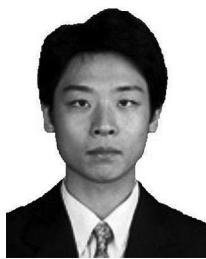

Chi Harold Liu (SM’15) received the BEng degree from Tsinghua University, China, in 2006, and the PhD degree from Imperial College, United Kingdom, in 2010. He is currently a full professor and vice dean with the School of Computer Science and Technology, Beijing Institute of Technology, China. He is also the director of IBM Mainframe Excellence Center (Beijing), director of the IBM Big Data Technology Center, and director of the National Laboratory of Data Intelligence for China Light Industry. Before mov-

ing to academia, he joined IBM Research - China as a staff researcher and project manager, after working as a postdoctoral researcher with Deutsche Telekom Laboratories, Germany, and a visiting scholar with IBM T. J. Watson Research Center. His current research interests include the Internet-of-Things (IoT), mobile crowdsensing, and deep learning. He has received numerous awards and was interviewed by EEWeb.com as the featured engineer in 2011. He has published more than 90 prestigious conference and journal papers and owned more than 14 EU/U.S./U.K./China patents, with Google Scholar H index 25. He serves as IEEE ICC’20 symposium chair on Network Generation Networking, area editor of the KSII Transactions on Internet and Infor-mation Systems and the book editor for six books published by Taylor & Francis Group, USA and China Machinery Press. He also has served as the general chair of numerous conference workshops. He served as a consultant to Asian Development Bank, Bain & Company, and KPMG, and a peer reviewer for Qatar National Research Foundation, and National Science Foundation, China. He is a senior member of the IEEE and a fellow of the IET.

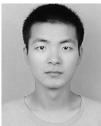

Xiaoxin Ma received the BEng degree from the Beijing Institute of Technology, China, in 2018. He is currently working toward the MSc degree under the supervision of Prof. Chi Harold Liu in the School of Computer Science and Technology, Beijing Institute of Technology, China. He has been working on crowd flow prediction problem by deep learning, and he is now working on the multi-UAV navigation problems to ensure communications coverage by applying deep learning methods.

Xudong Gao is currently working toward the MSc degree under the supervision of Prof. Chi Harold Liu in the School of Computer Science and Technology, Beijing Institute of Technology, China. He has interned with IBM AI Lab Services with interests on multi-agent deep reinforcement learning and Q&A systems for banking industry.

Jian Tang (F’19) received the PhD degree in computer science from Arizona State University, in 2006. He is a professor with the Department of Electrical Engineering and Computer Science, Syracuse University. His research interests lie in the areas of wireless networking, machine learning, big data, and cloud computing. He has published more than 120 papers in premier journals and conferences. He received an NSF CAREER award in 2009, and numerous best paper awards. He has served as an editor for a few IEEE journals. In addition, he served as a TPC co-chair, the TPC vice chair, and as an area TPC chair for numerous conferences. He is also the vice chair of the Communications Switching and Routing Committee of the IEEE Communications Society. He is a fellow of the IEEE.

" For more information on this or any other computing topic, please visit our Digital Library at www.computer.org/csdl.