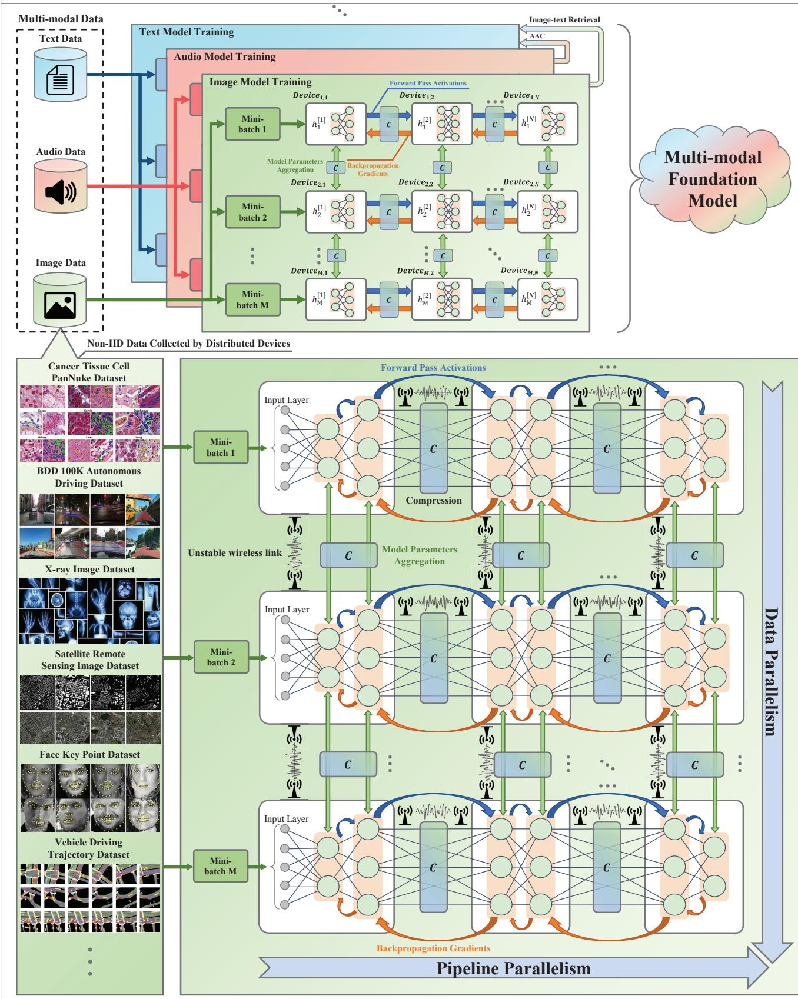
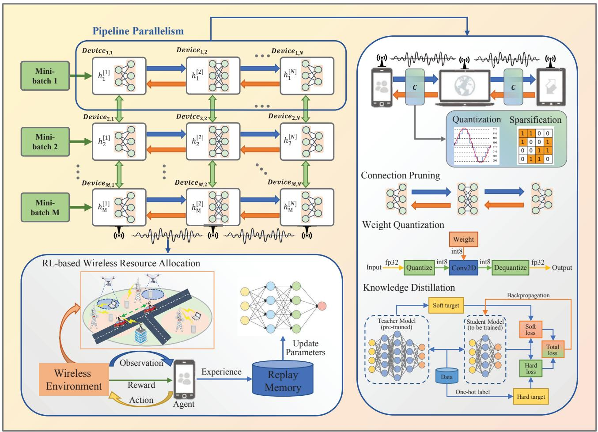
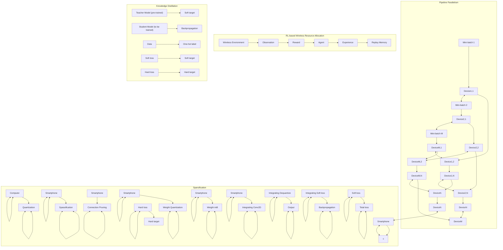
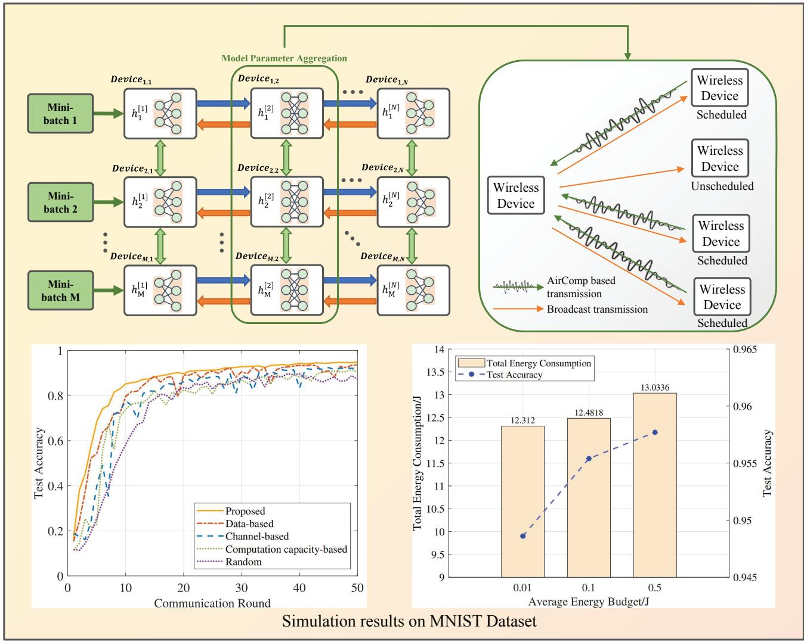

# Distributed Foundation Models for Multi-Modal Learning in 6G Wireless Networks

Jun Du, Tianyi Lin, Chunxiao Jiang, Qianqian Yang, C. Faouzi Bader, and Zhu Han

# Abstra ct

Benefiting from the ability to process and integrate data from various modalities, multi-modal foundation models (FMs) facilitate potential applications across a range of fields, including computer vision (CV), natural language processing (NLP), and diverse multi-modal applications such as imagetext retrieval. Currently, FMs are deployed on computing clusters for training and inference to meet their considerable computational demands. In the foreseeable future, the parameter size of FMs is expected to evolve further, posing challenges to both computation resources and energy supply. Fortunately, leveraging the next-generation wireless networks (6G) to aggregate substantial computation resources and multi-modal data from myriad wireless devices holds promise for handling the aforementioned challenges. In this work, we delve into state-of-the-art artificial intelligence (AI) techniques, specifically focusing on pipeline parallelism, data parallelism, and multi-modal learning, with the aim of supporting the sustainable development of distributed multi-modal FMs in the 6G era. In the context of pipeline parallelism, compressing activations and gradients while intelligently allocating communication resources can overcome communication bottlenecks caused by unstable wireless links. For data parallelism, federated learning (FL) with over-the-air computation (AirComp) seamlessly integrates communication and computation, significantly expediting gradient aggregation. Furthermore, by following the recent success of large language models (LLMs) and incorporating multi-modal learning into FMs, we can seamlessly integrate NLP and CV, along with the broader AI community, establishing the cornerstone for the intrinsic AI within 6G wireless networks.

# Motiva tion a nd Cha llenges

With the rapid development of foundation models (FMs) in recent years, exemplified by large language models (LLMs), the research paradigm in artificial intelligence (AI) is undergoing a transition from specialized models tailored to particular tasks toward FMs capable of addressing a variety of downstream tasks. FMs are pre-trained on vast amounts of multi-modal data, and their extensive parameter size endows them with emergence ability. Furthermore, employing zeroshot or few-shot learning, FMs demonstrate the capability for rapid adaptation to diverse tasks, achieving performance levels that approximate those of specialized models. However, the further development of FMs faces two significant challenges. One challenge lies in the limited sources, quality, and scale of multi-modal training data of FMs collected and curated from Internet content. Most data within networks are presently dispersed and poised for extraction from wireless devices. The other challenge arises from the exponentially growing parameter sizes of FMs, demanding training and inference on large-scale computing clusters comprised of high-performance GPUs, as outlined in Table 1. This trend leads to considerable energy consumption and hardware expenses, impeding the sustainable development of FMs. Huggingface’s research on the BLOOM model, with 176 billion parameters, highlights the high energy demands of FMs. BLOOM’s initial training consumes 433,000 kWh of electricity, equal to the yearly usage of 117 households.

Fortunately, the vision of the next-generation wireless networks, for example, 6G, regarding ubiquitous, high-speed, and reliable connectivity for numerous wireless devices, along with its high integration with AI, offers a promising technological pathway to overcome the challenges above [1]. From the perspective of training data scarcity, massive wireless devices distributed across various application scenarios, such as the healthcare Internet of Things (IoT), industrial IoT, vehicular networks, and cellular networks can collect fresh multi-modal data for training. These data will be more authentic, accurate, and timely in reflecting the real world than the current training data obtained from the Internet. Based on these higher-quality training data, FMs will achieve new breakthroughs in inference and comprehension capabilities. From the perspective of mitigating the computational scarcity resulting from the explosive parameter sizes of FMs, computation resources distributed across numerous wireless devices will be efficiently integrated and employed for training with the support of advanced wireless communication technologies in 6G [2]. Moreover, shifting data processing and model training to edge devices diminishes the necessity for data transmission to the cloud or remote computing clusters. Consequently, this leads to reduced network traffic and lower bandwidth costs, mitigating the data security risks associated with data transmission.

<table><tr><td></td><td>BERT</td><td>GPT-2</td><td>GPT-3</td><td>PaLM</td><td>LLaMA</td><td>GPT-4</td><td>PaLM-2</td><td>LLaMA-2</td></tr><tr><td>Release time</td><td>2018-10</td><td>2019-02</td><td>2020-06</td><td>2022-04</td><td>2023-02</td><td>2023-03</td><td>2023-05</td><td>2023-07</td></tr><tr><td>Developer</td><td>Google</td><td>OpenAI</td><td>OpenAI</td><td>Google</td><td>Meta</td><td>OpenAI</td><td>Google</td><td>Meta</td></tr><tr><td>Number of parameters (Million → Billion)</td><td>340M</td><td>1.5B</td><td>175B</td><td>540B</td><td>65B</td><td>—</td><td>340B</td><td>70B</td></tr><tr><td>Corpus tokens size (Million → Billion → Trillion)</td><td>3.3B</td><td>10B</td><td>300B</td><td>768B</td><td>1.4T</td><td>—</td><td>3.6T</td><td>2T</td></tr><tr><td>Training cost (petaFLOP-day)</td><td>9</td><td>—</td><td>3,640</td><td>29,250</td><td>6,300</td><td>—</td><td>85,000</td><td>—</td></tr></table>

TABLE 1. Comparison of key indicators between FMs.

Therefore, conducting distributed training of FMs with the support of 6G networks will be conducive to overcoming the two major bottlenecks in the current development of FMs, that is, data scarcity and computation resource scarcity. In addition, embedding FMs into wireless networks is a longterm vision for the inherent AI in 6G networks. This vision involves completing the entire life-cycle of AI workflows, including data collection, model training and model inference within the architecture of the 6G networks. The deep integration design aligns the computation resources, training data, algorithms, and wireless connectivity required for AI with the 6G networks, aiming to achieve a high level of network autonomy, ultimate user experience and real-time intelligent services.

However, the distributed training of FMs in wireless environments poses several critical challenges. Specifically, due to the diversity of wireless devices, the collected data will be multi-modal, heterogeneous, non-independent and identically distributed (non-IID), distinct from carefully curated and cleaned existing datasets, presenting difficulties for the training of FMs. Moreover, the inherent instability of wireless links poses a challenge in avoiding occasional device disconnections, impacting training performance. Additionally, the heterogeneity in terms of computation resources, storage capacity, and communication bandwidth can readily lead to the emergence of “straggler devices” in the collaborative training and inference of FMs. Hence, the management and scheduling strategies for integrating the distributed computation resources of wireless devices will deviate from the existing schemes designed for GPU clusters, where fast and homogeneous wired links interconnect devices.

In conclusion, it is imperative to devise sophisticated mechanisms, encompassing device scheduling, model partitioning and aggregation, communication resource allocation, information compression, and other strategies, to address challenges in the distributed training of FMs effectively. In this work, we will focus on incorporating state-of-the-art AI technologies into the distributed training architecture of FMs in 6G, aiming to extend the applications of FMs in wireless communication scenarios.

# Distributed Architecture of Multi-m oda l FMs in 6G

With the widespread proliferation and application of AI over the past decades, computation resources have become increasingly scarce. The growth in computation capacities of individual devices has slowed down due to the limitations imposed by semiconductor manufacturing bottleneck. Specifically, the primary challenge during model training is the GPU memory constraint. As the parameter size of FMs increases, completing training on a single GPU has become impossible. High-speed interconnect technologies, such as NVLink, have risen to prominence, which allows multiple GPUs within the centralized computing cluster to share memory and participate in rapid parallel computing. However, with the increasing demand for FMs and their applications across various industries, the centralized paradigms of FMs may struggle to cope with the anticipated surge in workloads [3].

To address the challenges aforementioned, we will present a distributed training architecture for FMs within the wireless communications environment in this section, as depicted in Fig. 1. This architecture deconstructs the training of FMs from three dimensions: pipeline parallelism, data parallelism, and multi-modal learning. In this section, we will briefly overview the general framework spanning three dimensions, with detailed discussions of relevant technologies in the following sections.

# Decentra lized Architecture of Single-m oda l FMs

The current scale of FMs has far surpassed the processing capabilities of even the most powerful computing devices. Therefore, distributed computing has become unavoidable for training the FMs [4]. The existing distributed training methods for FMs typically encompass the following key processes, that is, data collection and segmentation, pipeline-style forward pass and backward propagation, and gradient aggregation among devices.

Data Collection and Segmentation: The extensive data generated by wireless devices and sensors lies the immense potential for machine learning models to enhance a wide range of applications, spanning from personal assistants to healthcare diagnostics and intelligent transportation solutions. However, the data is characterized by statistical heterogeneity, including variations in data modals and distribution disparities resulting from differing sources. Data collected from various devices is gathered at the edge and partitioned into mini-batches based on similarities in modality and distribution for training. Additionally, data segmentation, a critical step to enhance training efficiency, uses techniques like random segmentation, stratified sampling, and time-series segmentation. This process can pose security risks such as data leakage and reconstruction attacks. To counter these risks, strategies like data anonymization, differential privacy, and federated learning are used to ensure data, even if compromised, remains unlinked to individuals and that sensitive data stays local, sharing only necessary model parameters or weights to central servers. It is essential to acknowledge that model bias resulting from data heterogeneity is unavoidable, which will be mitigated through gradient aggregation schemes and multi-modal learning.

Pipeline-Style Forward Pass and Backward Propagation: The primary approach for distributed training involves partitioning FMs into smaller blocks to accommodate the limited computation

resources on wireless devices. These smaller blocks necessitate the exchange of activations during forward passes, followed by gradient computations through backpropagation. Unlike the traditional cluster-based distributed training frameworks, the architecture presented in this work requires the transmission of all activations and gradients over heterogeneous wireless networks with limited bandwidth and signifi cant latency, rather than fast and homogeneous buses. Furthermore, the computational capabilities, available power, and memory sizes of wireless devices vary, posing challenges in model partitioning and task allocation, which places higher demands on resources and device scheduling within wireless links [5]. Individual devices typically have a signifi cant delay between forward pass and backward propagations. To enhance computation effi ciency, pipeline techniques can be introduced to utilize the delay time for processing subsequent data rather than remaining idle. Additionally, compressing activations and gradients can assist in alleviating communication overhead for bandwidth-constrained wireless devices.



<details>
<summary>flowchart</summary>

```mermaid
graph TD
    A["Multi-modal Data"] --> B["Text Data"]
    C["Audio Data"] --> D["Image Data"]
    B --> E["Text Model Training"]
    D --> E
    E --> F["Image Model Training"]
    F --> G["Mini-batch 1"]
    F --> H["Mini-batch 2"]
    F --> I["Mini-batch M"]
    G --> J["Device1,1"]
    H --> K["Device2,1"]
    I --> L["DeviceM,1"]
    J --> M["Backpropagation Gradients"]
    K --> N["Backpropagation Gradients"]
    L --> O["Backpropagation Gradients"]
    M --> P["Forward Pass Activations"]
    N --> Q["Forward Pass Activations"]
    O --> R["Forward Pass Activations"]
    P --> S["Forward Pass Activations"]
    Q --> T["Forward Pass Activations"]
    R --> U["Device1,2"]
    S --> V["Device2,2"]
    T --> W["DeviceM,2"]
    U --> X["DeviceN,2"]
    V --> Y["DeviceM,N"]
    W --> Z["DeviceN,N"]
    X --> AA["DeviceM,N"]
    Y --> AB["DeviceM,N"]
    Z --> AC["DeviceM,N"]
    AA --> AD["DeviceM,N"]
    AB --> AE["DeviceM,N"]
    AC --> AF["Non-IID Data Collected by Distributed Devices"]
    AD --> AG["Cancer Tissue Cell PanNuke Dataset"]
    AE --> AH["BDD 100K Autonomous Driving Dataset"]
    AF --> AI["X-ray Image Dataset"]
    AG --> AJ["Satellite Remote Sensing Image Dataset"]
    AH --> AK["Face Key Point Dataset"]
    AI --> AL["Vehicle Driving Trajectory Dataset"]
    AJ --> AM["..."]
    
    subgraph Multi-modal Foundation Model
        AN["Multi-modal Data"] --> AO["Text Data"]
        AP["Audio Data"] --> AQ["Image Data"]
    end
    
    subgraph Cancer Tissue Cell PanNuke Dataset
        AR["Mini-batch 1"] --> AS["Unstable wireless link"]
        AR --> AT["Data Parallelism"]
        AU["Mini-batch 2"] --> AV["Data Parallelism"]
        AW["Mini-batch M"] --> AX["Data Parallelism"]
        AY["Image Text"] --> AZ["AAC"]
        BA["Text Model Training"] --> BB["Image-text Retrieval"]
        BC["Image Model Training"] --> BD["Image-text Retrieval"]
        BE["Image Model Training"] --> BF["Image-text Retrieval"]
        BG["Image Model Training"] --> BH["Image-text Retrieval"]
        BI["Image Model Training"] --> BJ["Image-text Retrieval"]
        BK["Image Model Training"] --> BL["Image-text Retrieval"]
        BM["Image Model Training"] --> BN["Image-text Retrieval"]
        BO["Image Model Training"] --> BP["Image-text Retrieval"]
        BQ["Input Layer"] --> BR["C"]
        BS["Model Parameters Aggregation"] --> BT["C"]
        BU["COMPRESSION"] --> BV["C"]
        BW["CAMPS"] --> BX["C"]
        BY["CAMPS"] --> BZ["C"]
        CA["CAMPS"] --> CB["C"]
        CC["CAMPS"] --> CD["C"]
        CE["CAMPS"] --> CF["C"]
        DG["CAMPS"] --> DH["C"]
        DI["CAMPS"] --> DJ["C"]
        DK["CAMPS"] --> DL["C"]
        DM["CAMPS"] --> DJ
        DB["CAMPS"] --> DC["C"]
        DD["CAMPS"] --> DL
        DBC["CAMPS"] --> DL
        DBD["CAMPS"] --> DL
        DBE["CAMPS"] --> DL
        DBF["CAMPS"] --> DL
        DBG["CAMPS"] --> DL
        DBH["CAMPS"] --> DL
        DBI["CAMPS"] --> DL
        DBJ["CAMPS"] --> DL
        DBK["CAMPS"] --> DL
        DBL["CAMPS"] --> DL
        DBM["CAMPS"] --> DL
        DBN["CAMPS"] --> DL
        DBO["CAMPS"] --> DL
        DBP["CAMPS"] --> DL
        DBQ["CAMPS"] --> DL
        DBR["CAMPS"] --> DL
        DBS["CAMPS"] --> DL
        DBT["CAMPS"] --> DL
        DBU["CAMPS"] --> DL
        DBV["CAMPS"] --> DL
        DBW["CAMPS"] --> DL
        DBX["CAMPS"] --> DL
        DBY["CAMPS"] --> DL
        DBZ["CAMPS"] --> DL
        DBW["CAMPS"] --> DL
        DBX["CAMPS"] --> DL
        DBY["CAMPS"] --> DL
        DBZ["CAMPS"] --> DL
    end
    
    subgraph Cancer Tissue Cell PanNuke Dataset
        AG["Mini-batch 1"] --> AH["Unstable wireless link"]
        AH --> AI["Data Parallelism"]
        AJ["Mini-batch 2"] --> AK["Data Parallelism"]
        AL["Mini-batch M"] --> AM["Data Parallelism"]
    end
    
    subgraph Cancer Tissue Cell PanNuke Dataset
        AO["Mini-batch 1"] --> AP["Unstable wireless link"]
        AP --> AQ["Data Parallelism"]
        AR["Mini-batch 2"] --> AS["Data Parallelism"]
        AT["Mini-batch M"] --> AT
        AU["Mini-batch 1"] --> AV["Data Parallelism"]
        AW["Mini-batch 2"] --> AW
        AX["Mini-batch M"] --> AX
        AY["Mini-batch 1"] --> AZ["Data Parallelism"]
        AY --> BA["Data Parallelism"]
        BB["Mini-batch 2"] --> BC["Data Parallelism"]
        BC --> BD["X-ray Image Dataset"]
        BD --> BE["Satellite Remote Sensing Image Dataset"]
        BF["X-ray Image Dataset"] & BG["X-ray Image Dataset"] & BH["X-ray Image Dataset"] & BI["X-ray Image Dataset"] & BJ["X-ray Image Dataset"] & BK["X-ray Image Dataset"] & BL["X-ray Image Dataset"] & BM["X-ray Image Dataset"]
    end
    
    subgraph Cancer Tissue Cell PanNuke Dataset
        AM["Mini-batch 1"] --> AN["Unstable wireless link"]
        AN --> AO["Data Parallelism"]
        AP["Mini-batch 2"] --> AQ["Data Parallelism"]
        AR["Mini-batch M"] --> AR
        AS["Mini-batch 1"] --> ASB["CAMPS Aggregation"]
        AT["Mini-batch 2"] --> ATB["CAMPS Aggregation"]
        AU["Mini-batch M"] --> AUB["CAMPS Aggregation"]
        AV["Mini-batch 1"] --> AVB["CAMPS Aggregation"]
        AW["Mini-batch 2"] --> AWB["CAMPS Aggregation"]
        AX["Mini-batch M"] --> AXB["CAMPS Aggregation"]
        AZ["Mini-batch 1"] --> AZB["CAMPS Aggregation"]
        BA["Mini-batch 2"] --> BA_B["CAMPS Aggregation"]
        BB["X-ray Image Dataset"] & BC["X-ray Image Dataset"] & BD["X-ray Image Dataset"] & BE["X-ray Image Dataset"] & BF["X-ray Image Dataset"] & BG["X-ray Image Dataset"] & BH["X-ray Image Dataset"] & BI["X-ray Image Dataset"]
    end
    
    subgraph Cancer Tissue Cell PanNuke Dataset
        BI["X-ray Image Dataset"] & BJ["X-ray Image Dataset"] & BK["X-ray Image Dataset"] & BL["X-ray Image Dataset"] & BM["X-ray Image Dataset"]
    end
    
    subgraph Cancer Tissue Cell PanNuke Dataset
        BN["X-ray Image Dataset"] & BO["Satellite Remote Sensing Image Dataset"] & BR["X-ray Image Dataset"] & BS["X-ray Image Dataset"] & BT["X-ray Image Dataset"] & BU["X-ray Image Dataset"] & BV["X-ray Image Dataset"] & BW["X-ray Image Dataset"]
    end
    
    subgraph Cancer Tissue Cell PanNuke Dataset
        BX["X-ray Image Dataset"] & BY["Satellite Remote Sensing Image Dataset"] & BR["X-ray Image Dataset"] & BS["X-ray Image Dataset"] & BT["X-ray Image Dataset"] & BU["X-ray Image Dataset"]
    end
    
    subgraph Cancer Tissue Cell PanNuke Dataset
        CA["X-ray Image Dataset"] & CB["X-ray Image Dataset"] & DC["X-ray Image Dataset"] & BEX["X-ray Image Dataset"]
    end
    
    subgraph Cancer Tissue Cell PanNuke Dataset
        CBX["X-ray Image Dataset"] & CAX["X-ray Image Dataset"] & DDXX["X-ray Image Dataset"]
    end
    
    subgraph Cancer Tissue Cell PanNuke Dataset
        DEX["X-ray Image Dataset"] & DFX["X-ray Image Dataset"] & DGX["X-ray Image Dataset"]
    end
    
    subgraph Cancer Tissue Cell PanNuke Dataset
        DFX["X-ray Image Dataset"] & DGX["X-ray Image Dataset"]
    end
    
    subgraph Cancer Tissue Cell PanNuke Dataset
        DGXX["X-ray Image Dataset"] & DVX["X-ray Image Dataset"]
    end
    
    subgraph Cancer Tissue Cell PanNuke Dataset
        DVXX["X-ray Image Dataset"] & DWX["X-ray Image Dataset"]
    end
    
    subgraph Cancer Tissue Cell PanNuke Dataset
        DWXX["X-ray Image Dataset"] & DWXX["X-ray Image Dataset"]
    end
    
    subgraph Cancer Tissue Cell PanNuke Dataset
        DWXXX["X-ray Image Dataset"] & DWXXX["X-ray Image Dataset"]
    end
    
    subgraph Cancer Tissue Cell PanNuke Dataset
        DWXXXX["X-ray Image Dataset"] & DWXXXX["X-ray Image Dataset"]
    end
    
    subgraph Cancer Tissue Cell PanNuke Dataset
        DWXXXX["X-ray Image Dataset"] & DWXXXX["X-ray Image Dataset"]
    end
    
    subgraph Cancer Tissue Cell PanNuke Dataset
        DWXXXXX["X-ray Image Dataset"] & DWXXXXX["X-ray Image Dataset"]
    end
    
    subgraph Cancer Tissue Cell PanNuke Dataset
        DWXXXXX["X-ray Image Dataset"] & DWXXXXX["X-ray Image Dataset"]
    end
    
    subgraph Cancer Tissue Cell PanNuke Dataset
        DWXXXXX["X-ray Image Dataset"] & DWXXXXX["X-ray Image Dataset"]
    end
    
    subgraph Cancer Tissue Cell PanNuge Data Collection
        BCA[Mini-batch 1: Forward Pass Activations, Compression, Backpropagation Gradients, C/C/C/C/C/C/C/C/C/C/C/C/C/C/C/C/C/C/C/C/C/C/C/C/C/C/C/C/C/C/C/C/C/C/C/C/C/C/C/C/C/C/C/C/C/C/C/C/C/C/C/C/C/C/C/C/C/C/C/C/C/C/C/C/C/C/C/C/C/C/C/C/C/C/C/C/C/C/C/C/C/C/C/C/C/C/C/C/C/C/C/C/C/C/C/C/C/C/C/C/C-C/C/C/C/C/C/C/C/C/C/C/C/C/C/C/C/C/C/C/C/C/C/C/C/C/C/C/C/C/C/C/C/C/C/C/C/C/C/C/C/C/C/C/C/C/C/C/C/C/C/C/C/C/C/C/C/C/C/C/C/C/C/C/C/C/C/C/C/C/C/C/C/C/C/C/C/C/C/C/C/C/C/C/C/C/C/C/C/C/C/C/C/C/C/C/C/C/C/C/4.3.3.3.3.3.3.3.3.3.3.3.3.3.3.3.3.3.3.3.3.3.3.3.3.3.3.3.3.3.3.3.3.3.3.3.3.3.3.3.3.3.3.3.3.3.3.3.3.3.3.6.5.5.5.5.5.5.5.5.5.5.5.5.5.5.5.5.5.5.5.5.5.5.5.5.5.5.5.5.5.5.5.5.5.5.5.5.5.5.5.5.5.5.5.5.6.
```
</details>

FIGURE 1. Illustration of distributed FMs in 6G wireless networks.

Model Parameters Aggregation in Data Parallelism: Wireless devices training on different mini-batch require gradient aggregation to update the parameters of the global model. Specifi cally, the training devices with identical model blocks need to autonomously decide whether to participate in the current round of gradient aggregation, determine the degree of compression for gradient information, and adaptively adjust their transmission power to cope with deteriorating channel conditions. Furthermore, by leveraging the inherent superposition characteristics of the wireless channel, over-the-air computation (AirComp) can be used to integrate communication with gradient aggregation, achieving a seamless fusion of computation and communication.

# Multi-ModAl leArning in fMs

Inspired by the success of large-scale pre-trained models in natural language processing (NLP) and generation tasks, such as early models like BERT and recent popular ones like ChatGPT, there is growing interest in pretraining techniques across various domains, including text, speech, vision, and multi-modality. Specifi cally, multi-modal tasks can be represented as a pair of modalities (M1, M2), where M1 represents the input modality and M2 represents the output modality. To facilitate the transformation between different modalities, multi-modal FMs incorporate three key components: multi-modal embedding, inference on FMs, and multi-modal generating.

Multi-modal embedding aims to align input multi-modal data by transforming them into a unifi ed representation, typically a vector. The FMs contain a large number of parameters, allowing them to capture intricate patterns in the embedded input data and provide inference results to the generator. Additionally, by evaluating and fine-tuning on multi-modal data, the FMs can adapt to specific tasks. Multi-modal generating is responsible for customizing the output from the FMs to match the desired data format. In classifi cation tasks, the generator often employs a multi-layer perceptron with a softmax layer for prediction. For image-related tasks, more advanced techniques like stable diff usion models or generative adversarial networks (GANs) are utilized. In the following subsections, we will provide a detailed analysis of multi-modal learning through two specifi c application scenarios: image-text retrieval and automated audio captioning (AAC).

Image-Text Retrieval: In the context of imagetext retrieval tasks, the contrastive language-image pretraining (CLIP) paradigm serves as a fundamental framework. CLIP involves embedding both texts and images, where texts are encoded using transformers to capture semantic meaning, and images are encoded using convolutional neural networks (CNNs) to extract visual features. These encoding processes generate embedding vectors for both texts and images. The core idea of CLIP is to map the embedding vectors of texts and images into a shared semantic space. This shared space establishes a meaningful correspondence between text and image representations, enabling mutual matching. Contrastive learning is employed to minimize the distance between positive samples (matching imagetext pairs) and maximize the distance between negative samples (non-matching image-text pairs). Models trained using this approach include ALIGN, Florence, and OpenCLIP, among others. Recent advancements, such as ImageBind, propose integrating six modalities into a shared embedding space by leveraging pretrained CLIP models.

AAC: AAC is the task of describing the content of an audio clip using natural language, representing a multi-modal translation challenge at the intersection of audio signal processing and NLP. The encoder-decoder framework is the standard solution for AAC tasks. In this framework, the encoder is responsible for extracting audio features from the input audio clip, while the decoder generates subtitles based on these extracted audio features. The effectiveness of audio analysis heavily relies on acquiring robust audio features. Various types of neural networks, including recurrent neural networks (RNNs), CNNs, and transformers, have been utilized as encoders and decoders to learn feature representations. In addition to the encoder-decoder framework, the availability of audio captioning datasets is limited due to the time-consuming nature of collecting and annotating audio data. To overcome the challenge of data scarcity, transfer learning has been widely adopted in AAC, allowing models to leverage pre-existing knowledge from related tasks or domains.

Additionally, the contributions of different modalities in multi-modal learning to specifi c tasks vary. Gradient-based evaluation methods analyze changes in model weight gradients within neural networks to assess the importance of data. Techniques such as Local Interpretable Model-agnostic Explanations (LIME) or SHapley Additive exPlanations (SHAP) can be utilized to partially interpret the model’s predictions and ascertain the contributions of various modalities.

# PiPeline PArAllelisM over the Wireless links

The computation of FMs is parallelized across multiple wireless devices in the pipeline, where each device handles a specific portion of the FMs. As the transmission of activations and gradients needs to be accomplished over the wireless links with heterogeneous bandwidth and latency, communication-related challenges within the pipeline are introduced, which encompass the compression of interaction information and communication resource allocation. Additionally, computational issues arising from the heterogeneity of computing devices include the compression and partition of FMs and computation offloading. In this section, we will introduce the state-of-the-art approaches and techniques to address the above challenges.

To enhance computation effi ciency, pipeline techniques can be introduced to utilize the delay time for processing subsequent data rather than remaining idle. Additionally, compressing activations and gradients can assist in alleviating communication overhead for bandwidth-constrained wireless devices.



<details>
<summary>flowchart</summary>


</details>

FIGURE 2. Pipeline parallelism framework in FMs training architecture.

# coMMunicAtion chAllenges in the Model trAining PiPeline

To efficiently transmit interaction information, that is, activations and gradients, over wireless networks with limited bandwidth, it is essential to employ compression techniques like quantization and sparsification. However, these compression methods can potentially impact the convergence of models. For instance, due to the nonlinear activation functions in neural networks, the stochastic and unbiased quantization of activations during the forward pass can introduce biases in the gradients of backpropagation. Therefore, it is important to limit the degree of compression to ensure convergence and provide rate guarantees for wireless links. Adaptive resource allocation for wireless links is also necessary to address instability challenges caused by the heterogeneous, densely deployed, and dynamic nature of 6G networks [6]. Furthermore, leveraging the trained FMs as the knowledge base (KB) for semantic communication can assist in compressing the training data transmitted from various devices.

The Compression of Activations, Gradients and Training Data: Researchers have conducted extensive studies on compressing activations and gradients, focusing on two main areas: sparsification and quantization.

The main idea of sparsification is identifying the insignifi cant gradients and fi ltering them. As a typical representative, heuristic gradient sparsification methods truncate the minor gradients and transmit only the remaining large ones. Nonetheless, the magnitude of gradients refl ects the current optimization direction, which may not accurately indicate the importance of the parameters, leading to delayed updates for signifi cant parameters. Therefore, there have been some adaptive gradient sparsifi cation frameworks that compress gradients based on the probability distribution of gradients.

Among the quantization works, TernGrad and QSGD stand out as pivotal contributions. Tern-Grad is renowned for proving the convergence of gradient quantization methods, albeit in a scenario where the quantization level is set to 2. On the other hand, QSGD takes a broader approach, considering the trade-off between quantization level and convergence speed. Traditional quantization methods are often heuristic or predetermined, lacking a universally optimal approach due to changing gradient distributions during training. As a result, recent research has focused on adaptive quantization, which adjusts gradient encoding based on suffi cient statistics of parameter distributions. Additionally, incorporating reinforcement learning (RL) enhances the adaptability of quantizers, allowing dynamic parameter adjustments.

Data redundancy and error correction mechanisms are implemented to improve training robustness against wireless channel issues to protect data integrity despite channel noise and potential corruption. The system can recover from transmission errors, preserving training data quality and learning process stability with error detection and correction codes.

<table><tr><td>Application</td><td>Typical Research</td><td>State</td><td>Action</td><td>Reward</td><td>Algorithm</td></tr><tr><td>Task offloading</td><td>Shang et al. 2020</td><td>Channel gains</td><td>offloading decisions, channel assignment, and power allocation</td><td>Negative of computational overhead</td><td>PPO</td></tr><tr><td>Resource management</td><td>Ortiz-Gomez et al. 2021</td><td>Traffic demand and current resources</td><td>Allocating power, bandwidth, and beamwidth</td><td>Gap between capacity and traffic demand</td><td>Multi-agent DQN</td></tr><tr><td>QoS guarantee</td><td>Tian et al. 2022</td><td>QoS requirements, interference situation, and channel power status</td><td>Channel allocation and power control</td><td>Utility function and QoS penalty</td><td>MADDPG</td></tr><tr><td>Online service placement</td><td>Liu et al. 2023</td><td>Service placement condition, arrivals of tasks, and connection condition of the base station</td><td>Service placement and computation resource allocation</td><td>Total latency of arrived tasks</td><td>DQN</td></tr><tr><td>Network slicing</td><td>Mason et al. 2023</td><td>Information flow status, network associated element and rate resources</td><td>Demanding resources</td><td>Average throughput and delay performance</td><td>A2C</td></tr><tr><td>Privacy preserving</td><td>Xu et al. 2023</td><td>Reservation strategy and on demand deployment strategy</td><td>Reservation strategy profile of QKD resource allocation deployment</td><td>Ratio of near-minimal deployment cost to current deployment cost.</td><td>Federated DRL</td></tr></table>

TABLE 2. Typical RL-based resource allocation mechanisms.

Furthermore, the transfer of large amounts of training data between data collection devices and computation devices presents a signifi cant communication bottleneck. To address this challenge, one promising approach is to leverage the multi-modal FMs as the KB. By utilizing the rich semantic information contained within the FMs, it becomes possible to retain the essential aspects of the data while discarding redundant or less important information, reducing data size before transmission [7]. On the computation devices, the compressed data can be effi ciently restored to its original form through KB.

Resource Allocation of Wireless Links: As depicted in Fig. 2, the wireless devices involved in training and inference for the multi-modal FMs require stable, high-speed, and low-latency wireless links. The transmission rate of these links directly aff ects the level of compression for activations and gradients, while their latency impacts the speed of model updates. Both factors play a crucial role in achieving optimal convergence performance for the FMs.

However, in the upcoming 6G networks, a multitude of wireless devices will need to operate within a limited spectrum, engaging in ultra-dense mobile communication. This poses challenges in terms of spectrum allocation and power management. Additionally, the propagation characteristics of the terahertz (THz) band, which may be utilized in 6G, are relatively poor compared to the 3.5GHz frequency band commonly used in 5G networks. The THz band is also subject to signifi - cant environmental fl uctuations.

To tackle the challenges in the wireless environment, RL emerges as a novel framework for the dynamic allocation of resources in wireless settings, enabling agents to interact with their environment and optimize decisions for cumulative rewards [8]. These rewards often focus on enhancing model performance and energy efficiency or finding an optimal balance. RL agents adeptly prioritize the transmission of activations and gradients by considering the current state of the wireless network, including Quality of Service (QoS), channel conditions, and computational demands of the training process. Enhancing resource allocation with RL, multi-objective optimization aids in harmonizing the trade-off s among training speed, energy expenditure, and network traffi c.

Additionally, leveraging decentralized MARL strategies promotes cooperative decision-making across network devices, optimizing resource use and adapting to wireless environment changes, streamlining the approach toward more eff ective and adaptive resource management in wireless networks. Table 2 provides a summary of typical RL-based resource allocation mechanisms found in recent studies.

coMPutAtion chAllenges in the Model trAining PiPeline To address the challenges of pipeline parallelism in multi-modal FMs with the vast amounts of parameters, several approaches can be taken to control and reduce training time and costs. These approaches involve slicing and compressing the model to reduce computational complexity and utilizing the heterogeneous computing infrastructure to coordinate computation resources across different devices. In the following subsections, we will explore solutions and potential research directions for tackling partition, compression, and computing off loading in the context of FMs.

Partition and Compression of FMs: Based on the diff erent computational capabilities and memory sizes of wireless devices, the FMs are partitioned into blocks and distributed among devices for computation. The idle time of devices is affected by cross-device scheduling methods, which can be categorized into synchronous scheduling, such as GPipe, and asynchronous scheduling, such as PipeDream. In synchronous scheduling, the forward pass of all micro-batches within a mini-batch must be completed before proceeding backpropagation. In asynchronous scheduling, each microbatch starts the backward pass immediately after completing the forward pass, without waiting for other micro-batch. Synchronous scheduling results in more idle time on devices, while asynchronous scheduling, although minimizing idle time, may introduce parameter mismatch issues due to non-periodic parameter updates. In order to tackle these challenges, PipeDream incorporates a weight stashing scheme, while PipeDream-flush introduces a periodic global synchronization scheme that combines elements of both synchronous and asynchronous approaches.

<table><tr><td>Issue</td><td>Relevant Techniques</td><td>Objective Function</td><td>Method</td><td>Category</td></tr><tr><td rowspan="5">Non-IID</td><td>Jamali-Rad et al.2022</td><td>Minimize average lossacross all devices</td><td>Re-distribution</td><td>Data processing</td></tr><tr><td>Rizk et al. 2022</td><td>Minimize average loss across all devices</td><td>Importance Sampling</td><td>Device scheduling</td></tr><tr><td>Li et al. 2020</td><td>Minimize average loss across all devices</td><td>constraint distance</td><td>Algorithm design</td></tr><tr><td>Li et al. 2020</td><td>Maximize Fairness</td><td>Reduces the variance of the accuracy distribution</td><td>Algorithm design</td></tr><tr><td>Karimireddy et al. 2021</td><td>Minimize average loss across all devices</td><td>Variance reduction</td><td>Algorithm design</td></tr><tr><td rowspan="2">Separated communication and computation</td><td>Bouzinis et al. 2023</td><td>Reduce parameter volume</td><td>quantization</td><td>Reduced communications</td></tr><tr><td>Sun et al. 2022</td><td>Reduce number of transmissions</td><td>Quantifying equipment contribution</td><td>Reduced communications</td></tr><tr><td rowspan="6">Integrated communication and computation</td><td>Zou et al. 2023</td><td>Minimize optimality gap</td><td>Alternating minimization algorithm</td><td>Power control</td></tr><tr><td>Yu et al. 2023</td><td>Minimize optimality gap</td><td>Lagrange-dual method</td><td>Power control</td></tr><tr><td>Du et al. 2023</td><td>Maximize the quantity and qualities of devices</td><td>Lyapunov optimization framework</td><td>Device scheduling</td></tr><tr><td>Bereyhi et al. 2023</td><td>Minimize the computation error</td><td>Matching pursuit</td><td>Device scheduling</td></tr><tr><td>Fan et al. 2022</td><td>Minimize optimality gap</td><td>Optimal finite-set search method</td><td>Joint optimization</td></tr><tr><td>Guo et al. 2022</td><td>Minimize optimality gap</td><td>Semidefinite relaxation</td><td>Joint optimization</td></tr></table>

TABLE 3. Typical research considering data heterogeneity and communication bottleneck in data parallelism.

Expanding on model partitioning, additional compression techniques can further reduce the computational burden of model blocks. Some popular techniques for model compression include connection pruning, weight quantization, and knowledge distillation (KD).

Connection Pruning: Connection pruning removes connections deemed irrelevant while constraining the dimensions of weight matrices. The most straightforward pruning strategy, known as amplitude-based pruning, involves setting a threshold to decide which connections to remove. In another class of pruning methods, regularization terms such as L2 norms are applied to drive some parameters to zero, thus achieving pruning. Furthermore, pruning can also be executed through alternate optimization strategies, such as genetic algorithms, ant colony algorithms, and particle swarm optimization.

Weight Quantization: Similar to the compression of activations and gradients, quantizing model weights accelerates training and reduces storage requirements. In general, current research covers a range of quantization techniques, from double-precision floating-point numbers to single-precision floating-point numbers, and even extreme cases of binary quantization. The challenge lies in finding the right balance between quantization errors and model acceleration performance.

KD: KD is a model compression technique that transfers knowledge from a sophisticated teacher to a simplified student model [9]. The process of KD begins with training a pre-trained, large teacher model using a designated dataset, followed by the generation of soft labels to guide the training of the student model. Fine-tuning hyperparameters, such as temperature parameters, can optimize the student model’s performance. After training, the smaller and shallower student model has distilled knowledge from the teacher model and is ready for deployment in real-world scenarios.

Computation Task Offloading: Considering that the computation workload of some blocks of FMs exceeds the processing capacity of devices, computation task offloading is the approach for coordinating and balancing computation resources among devices. Given the limited energy resources of wireless devices, the goal of computation task offloading is to minimize energy consumption while meeting certain Quality of Service (QoS) constraints, such as queue delay or offloading failure rate [10]. Similar to the communication resource allocation, DRL are also used in computation task offloading to adapt to complex and dynamic device environments. The task offloading problem is often formulated as a Constrained Markov Decision Process (CMDP) due to various constraints involved, which can be solved using a combination of Lagrangian methods and RL algorithms such as deep Q network (DQN), deep deterministic policy gradient (DDPG), soft actor-critic (SAC), proximal policy optimization (PPO), and so on, Split learning (SL) is another innovative distributed learning method that optimizes computation resources by dividing the training between local devices and cloud or edge servers. This setup starts with local devices processing initial layers, typically for feature extraction, and then sending intermediate features to servers to complete the training. SL enhances privacy by transmitting only non-sensitive features, reduces bandwidth, and boosts efficiency by allocating lighter tasks to local devices and heavier computations to servers. This method balances computational load, conserves bandwidth, and safeguards privacy, making it suitable for distributed learning across devices with varying computation resources.

# Da ta Pa ra llelism over the Wireless Links

To accelerate the FMs training, wireless devices from different pipelines can work collaboratively. As an emerging distributed paradigm, federated learning (FL) is well-suited for assisting the data parallelism [11]. Specifically, FL facilitates collaborative training across devices and servers, utilizing distributed datasets and computation resources. In the proposed architecture, the devices in each pipeline serve the role of a central server when aggregating parameters. Only model parameters or their gradients are transmitted during the training process to mitigate privacy concerns and minimize latency issues. Within the framework of FL, efforts have been dedicated to bolstering the training of FMs, with a specific emphasis on addressing the issues of data heterogeneity and communication bottlenecks. Some relevant researches are summarized in Table 3. Next, we break down the solutions of the two issues in the following subsections.

# Da ta Heterogeneity in Da ta Pa ra llelism Design

The federated averaging (FedAvg) aggregation method finds widespread application under the assumption of IID data patterns. However, data heterogeneity poses significant challenges. Specifically, training FMs are often composed of devices that vary in energy levels, communication network conditions, data processing capabilities, and so on. Due to these diverse factors, wireless devices may possess imbalanced and dissimilar datasets (i.e., differing in sample sizes, label proportions, and features). In other words, wireless devices across the entire network collect local data samples in a non-IID manner [12]. Since non-IID datasets exhibit statistical dissimilarity, obtaining globally optimized models using vanilla FedAvg methods becomes challenging.

The non-IID data challenge in FL significantly affects FMs, leading to overfitting, biases, and misrepresenting data structures, thereby degrading model generalization and accuracy. Addressing non-IID data challenges involves developing effective training frameworks. A straightforward strategy is distributing shared data among clients, though this incurs higher communication and privacy risks. Research has also concentrated on efficient aggregation techniques, like choosing optimal device subsets for improved server-side training efficiency. Another method involves adjusting FL algorithms to correct “client drift” from data heterogeneity during local updates, aiming to counteract the negative impacts of non-IID data on FL.

# Comm unica tion Bottleneck in Da ta Pa ra llelism Design

In FL frameworks, the vast scale of edge devices and the nearly depleted spectrum continue to pose severe constraints on the spectrum resources for the communication link between wireless devices and central servers. The periodic uploading of model parameters has emerged as a critical communication bottleneck in FL [13]. In this regard, the development of communication-efficient methods is of paramount importance in addressing the challenge.

Numerous studies aim to mitigate communication bottlenecks, mainly through quantization, compression, or reducing update frequency, but often separate communication and computation, overlooking the benefits of utilizing the physical channel’s superposition properties. We categorize these as separated-communication-and-computation methods, highlighting that servers primarily need the aggregated sums from edge devices, not individual uploads. AirComp, as an alternative, leverages the superposition principle of wireless channels to combine signals from multiple devices into a single receiver signal, thereby boosting data processing efficiency and speed by aggregating data during transmission, diverging from conventional sequential approaches [14].

As illustrated in Fig. 3, an AirComp-enabled FL system typically comprises an edge server and several devices. In each training round, each device performs local model updates by the stochastic gradient descent (SGD) algorithm. Then, a subset of selected devices concurrently transmits model parameters or their gradients via AirComp. After receiving the aggregated information for the subsequent training, the central server performs post-processing and global model updates. Although AirComp has addressed the communication bottleneck issue, the employment of AirComp introduces an essential design trade-off between enhanced communication efficiency and degraded learning performance [15]. In the presence of wireless channel perturbations, channel fading and noise are superimposed during transmission, which leads to aggregation errors in the received signal, thus introducing channel distortion. Indeed, the distortion induced by fading and noisy channels holds significance for the learning task, as more significant aggregation errors can deteriorate the training performance. Recent research in AirComp-enabled FL has focused on mitigating aggregation errors using the following techniques.

Power Control: The design of power control strategies plays a crucial role in mitigating fading effects and ensuring robust signal reception for users in weak channels, thus enhancing the performance of AirComp-enabled FL systems. Current research primarily focuses on addressing power control problems by minimizing optimality gaps and obtaining optimal power allocation factors. Additionally, various existing works aim to achieve power control by minimizing the optimality gap in each round.

Device Scheduling: In the AirComp-enabled FL systems, some factors such as the size of local data and channel quality often impact the significance of local updates for each user. When it is not feasible to aggregate data from all users, selecting the most “important” users for participation in training becomes necessary, as this choice significantly influences system performance.

Joint Optimization: There is a growing interest in simultaneously optimizing user selection and power control in AirComp-enabled FL systems. Researchers have recognized that joint design may only sometimes guarantee optimality for each objective due to the transformation or decomposition of the original problem. However, this collaborative approach can enhance system robustness by further improving system design.

The federated averaging (FedAvg) aggregation method finds widespread application under the assumption of IID data patterns. However, data heterogeneity poses significant challenges. Specifically, training FMs are often composed of devices that vary in energy levels, communication network conditions, data processing capabilities, and so on.

  
FIGURE 3. Framework and simulation results of AirComp-enabled FL in FMs training architecture.

To enable communication and computation-effi cient training of FMs, we have carried out some preliminary work focusing on designing the device scheduling strategy in AirComp-enabled FL systems. As shown in Fig. 3, we propose a heterogeneity-and-energy-aware device scheduling strategy based on the probabilistic scheduling framework to enable an unbiased aggregation. Specifically, the central server evaluates each device’s contribution to global model training convergence using a metric that considers channel quality, computational capacity, and the L2 norm of model parameter gradients. Devices with higher metric scores are prioritized in the scheduling process. We evaluate diverse algorithms to emphasize the integration of channel quality, computational capacity, and model parameter gradients for improved training performance. The baseline focusing on model gradients favors devices with higher gradient norms, while the channel and computational capacity baselines select devices based on optimal channel conditions and lower CPU frequencies for energy effi ciency, respectively. The random baseline schedules devices without preference. Our simulations show that our algorithm achieves the highest test accuracy and stable convergence, outperforming the baselines by eff ectively balancing these factors.

# conclusion

To achieve sustainable distributed multi-modal FMs in wireless networks, we have introduced solutions from pipeline parallelism, data parallelism, and multi-modal learning. Pipeline parallelism in wireless networks faces bottlenecks in communication and computation. Therefore, we illustrated overcoming the communication bottleneck by compressing activations and gradients and assisting in intelligent wireless communication resource allocation. We also addressed the computation bottleneck by partitioning and compressing the model, coupled with intelligent edge computing scheduling. In the context of data parallelism, FL is adapted to scenarios with heterogeneous data by employing data sharing and scheduling mechanisms. The integration of communication and computation through Aircomp technology has been introduced, significantly accelerating parameter aggregation. Furthermore, by associating data from different modalities by mapping them into a unifi ed representation space, multi-modal learning has given rise to numerous promising applications in recent years, such as image-text retrieval and AAC.

In summary, multi-modal FMs are pivotal for advanced AI development in wireless networks, integrating diverse sensor data to improve perception accuracy and understand complex scenarios, thus supporting sophisticated decision-making and adaptive optimization. This vision also holds practical significance in widely deployed 5G networks by leveraging Network Function Virtualization (NFV) and Software-Defined Networking (SDN) to address non-IID data and communication bottlenecks. SDN enhances data handling and distribution by dynamically routing and organizing data, while NFV supports edge computing, reducing server load and transmission traffic by processing and tuning models locally, illustrating the synergy between advanced network technologies and multi-modal FMs for efficient and intelligent network operations.

# Cha llenges a nd Op en Issues

Apart from the studies above on multi-modal FMs in distributed wireless environments, many challenges persist in pipeline parallelism, data parallelism, and multi-modal learning for wireless devices with limited power, memory, storage, and computing resources. Investigating how to modify FMs, which involve high complexity and extensive computation, to align with sustainable implementation warrants further exploration. Concerning pipeline parallelism, future advancements encompass exploring more efficient compression algorithms to minimize data transmission, researching adaptive model partitioning algorithms to achieve load balancing, and optimizing communication resource management to enhance channel quality. Regarding data parallelism, while AirComp has showcased the potential of integrated communication and computation, further exploration is crucial in areas such as synchronization, interference control, and waveform design to enhance the precision and efficiency of computations. In terms of multi-modal learning, ongoing research primarily concentrates on two modalities. Future research directions lie in fostering a more integrated approach to understanding complex multi-modal data, which necessitates profound exploration in representation, transformation, alignment, fusion, and collaborative learning. FMs like OpenAI’s CLIP and DALL-E have successfully bridged textual and visual modalities using transformer-based architectures and pre-training methods. Cross-modal attention and multi-modal fusion networks further enhance the integration of different data types.

# Acknow ledgm ent

This work was partially supported by Technology Innovation Institute $\mathsf { L L C } ,$ partially supported by the National Natural Science Foundation China under project 62325108, 62341131, U23A20281, 61971257, and the Young Elite Scientist Sponsorship Program by CAST under Grant 2020QNRC001, and partially supported by NSF CNS-2107216, CNS-2128368, CMMI-2222810, ECCS-2302469, US Department of Transportation, Toyota and Amazon.

# References

[1] X. Tong et al., “Joint Multi-User Communication and Sensing Exploiting Both Signal and Environment Sparsity,” IEEE J. Sel. Top. Signal Process., vol. 15, no. 6, Nov. 2021, pp. 1409–22.   
[2] W. Xu et al., “Edge Learning for B5G Networks With Distributed Signal Processing: Semantic Communication, Edge Computing, and Wireless Sensing,” IEEE J. Sel. Top. Signal Process., vol. 17, no. 1, Jan. 2023, pp. 9–39.   
[3] B. Yuan et al., “Decentralized Training of Foundation Models

in Heterogeneous Environments,” Proc. Adv. Neural Inf. Process. Syst., vol. 35, Nov. 2022, pp. 25,464–77.   
[4] Z. Lai et al., “Merak: An Efficient Distributed Dnn Training Framework With Automated 3D Parallelism for Giant Foundation Models,” IEEE Trans. Parallel Distrib. Syst., vol. 34, no. 5, Feb. 2023, pp. 1466–78.   
[5] Z. Tian et al., “Distributed Learning Over Networks With Graph-Attention-Based Personalization,” IEEE Trans. Signal Process., vol. 71, June 2023, pp. 2071–86.   
[6] M. Chafii et al., “Twelve Scientific Challenges for 6G: Rethinking the Foundations of Communications Theory,” IEEE Commun. Surv. Tutor., vol. 25, no. 2, Feb. 2023, pp. 868–904.   
[7] Z. Yang et al., “Energy Efficient Semantic Communication Over Wireless Networks With Rate Splitting,” IEEE J. Sel. Areas Commun., vol. 41, no. 5, Jan. 2023, pp. 1484–95.   
[8] C. Huang et al., “Multi-Hop RISempowered Terahertz Communications: A DRL-Based Hybrid Beamforming Design,” IEEE J. Sel. Areas Commun., vol. 39, no. 6, Apr. 2021, pp. 1663–77.   
[9] Q. Zhang et al., “Quantifying the Knowledge in a DNN to Explain Knowledge Distillation for Classification,” IEEE Trans. Pattern Anal. Mach. Intell., vol. 45, no. 4, Aug. 2023, pp. 5099–5113.   
[10] D. Wen et al., “Task-Oriented Sensing, Computation, and Communication Integration for Multi-Device Edge AI,” IEEE Trans. Wirel. Commun., early access, Aug. 2023.   
[11] E. T. M. Beltrán et al., “Decentralized Federated Learning: Fundamentals, State of the Art, Frameworks, Trends, and Challenges,” IEEE Commun. Surv. Tutor., early access, Sept. 2023.   
[12] M. Chen et al., “Distributed Learning in Wireless Networks: Recent Progress and Future Challenges,” IEEE J. Sel. Areas Commun., vol. 39, no. 12, Oct. 2021, pp. 3579–3605.   
[13] S. Kalra et al., “Decentralized Federated Learning Through Proxy Model Sharing,” Nat. Commun., vol. 14, no. 1, May 2023, p. 2899.   
[14] Y. Yang et al., “Implementing Graph Neural Networks Over Wireless Networks via Over-the-Air Computing: A Joint Communication and Computation Framework,” IEEE Wirel. Commun., vol. 30, no. 3, June 2023, pp. 62–69.   
[15] J. Du et al., “Gradient and Channel Aware Dynamic Scheduling for Over-the-Air Computation in Federated Edge Learning Systems,” IEEE J. Sel. Areas Commun., vol. 41, no. 4, Feb. 2023, pp. 1035–50.

# Biograp hies

Jun Du [SM] received her B.S. in information and communication engineering from Beijing Institute of Technology, in 2009, and her M.S. and Ph.D. in information and communication engineering from Tsinghua University, Beijing, in 2014 and 2018, respectively. From Oct. 2016–Sept. 2017, she was a sponsored researcher, and she visited Imperial College London. Currently she is an assistant professor in the Department of Electrical Engineering, Tsinghua University. Her research interests are mainly in communications, networking, resource allocation and system security problems of heterogeneous networks and space-based information networks. She is the recipient of the Best Student Paper Award from IEEE GlobalSIP in 2015, the Best Paper Award from IEEE ICC 2019, and the Best Paper Award from IWCMC in 2020.

Tianyi Lin [S] received the B.S. degree in communication engineering from Beijing University of Posts and Telecommunications, Beijing, China, in 2023. He is currently pursuing the M.S. degree in electronics and communication engineering at Tsinghua University, Beijing, China. His primary research interests encompass foundation model training in wireless networks, reinforcement learning for resource allocation and distributed federated learning.

Chunxiao Jiang [SM] is an associate professor in School of Information Science and Technology, Tsinghua University. He received the B.S. degree in information engineering from Beihang University, Beijing in 2008 and the Ph.D. degree in electronic engineering from Tsinghua University, Beijing in 2013, both with the highest honors. From 2011 to 2012 (as a Joint Ph.D) and 2013 to 2016 (as a Postdoc), he was in the Department of Electrical and Computer Engineering at University of Maryland College Park under the supervision of Prof. K. J. Ray Liu. His research interests include application of game theory, optimization, and statistical theories to communication, networking, and resource allocation problems, in particular space networks and heterogeneous networks. He has served as an Editor of IEEE Trans. Communications, IEEE Internet of Things Journal, IEEE Wireless Commun., IEEE Trans. Network Science and Engineering, IEEE Network, IEEE Communications Letters, and a Guest Editor of IEEE Commun. Mag., IEEE Trans. Network

To achieve sustainable distributed multi-modal

FMs in wireless networks, we have introduced solutions from pipeline parallelism, data parallelism, and multi-modal learning.

Pipeline parallelism in wireless networks faces bottlenecks in communication and computation.

Science and Engineering and IEEE Trans. Cognitive Communications and Networking. He has also served as a member of the technical program committee as well as the Symposium Chair for a number of international conferences. He is the recipient of the Best Paper Award from IEEE GLOBECOM in 2013, IEEE Communications Society Young Author Best Paper Award in 2017, the Best Paper Award from ICC 2019, IEEE VTS Early Career Award 2020, IEEE ComSoc Asia-Pacific Best Young Researcher Award 2020, IEEE VTS Distinguished Lecturer 2021, and IEEE ComSoc Best Young Professional Award in Academia 2021. He received the Chinese National Second Prize in Technical Inventions Award in 2018 and Natural Science Foundation of China Excellent Young Scientists Fund Award in 2019. He is a Senior Member of IEEE and a Fellow of IET.

Qianq ian Yang [M] received the B.Sc. degree in automation from Chongqing University, Chongqing, China, in 2011, the M.S. degree in control engineering from Zhejiang University, Hangzhou, China, in 2014, and the Ph.D. degree in electrical and electronic engineering from Imperial College London, U.K. She has held visiting positions at CentraleSupelec in 2016 and the New York University Tandon School of Engineering from 2017 to 2018. After her Ph.D., she worked as a Post-Doctoral Research Associate with Imperial College London, and as a Machine Learning Researcher with Sensyne Health Plc. She is currently a Tenure-Tracked Professor with the Department of Information Science and Electronic Engineering, Zhejiang University. Her main research interests include wireless communications, information theory, and semantic communications. She serves as a Reviewer for the IEEE Trans. INFORMATION THEO-RY, IEEE Trans. COMMUNICATIONS, and IEEE Trans. WIRELESS COMMUNICATIONS. She has organized several workshops at conferences, such as IEEE ICC 2023, IEEE WCNC 2022, IEEE VTC 2022, and IEEE HPCC 2021.

C. Faouzi Bad er [SM] received the Ph.D. degree (Hons.) in telecommunications from Universidad Politécnica de Madrid (UPM), Madrid, Spain, in 2001. He joined the Centre Technologic de Telecomunicacions de Catalunya (CTTC), Barcelona, Spain, as a Research Associate, in 2002, and from 2006 to 2013, he was a Senior Research Associate. From June 2013 to December 2013, he was an Associate Professor with CentraleSupélec, France. Since 2017, he has been an Honorary Adjunct Professor with the University of Technology Sydney, Australia, and from 2018 to 2019, he was the Head of the Signals and Communications Department, Institute of Electronics and Digital Technologies (IETR), Rennes, France. From 2020 to 2021, he was the Director of Research with Institut Supérieur déElectronique de Paris (ISEP), France. Since December 2021, he has been the Director Telecom of the DSRC Centre, Technology Innovation Institute (TII), Abu Dhabi, United Arab Emirates. His research interests include IMT-advanced systems, such as 5G networks and systems, cognitive radio communication environment, and THz wireless communications (6G). He has been involved in several European projects from the fifth to seventh EC research frameworks (eight EU funded projects and ten national projects). He has been the main Coordinator of the BRAVE ANR French Project, CentraleSupélec, where the main goal was the achievement of efficient waveform for THz/ Terabits wireless communication devices. He has published over 45 journals, 136 papers in peer-reviewed international conferences, more than 13 book chapters, and four edited books. He served as a Technical Program Committee Member of major IEEE ComSoc and VTS Conferences (ICC, PIMRC, VTC spring/ fall, WCNC, ISWCS, GLOBECOM, and ICT).

Zhu Han [F] received the B.S. degree in electronic engineering from Tsinghua University, in 1997, and the M.S. and Ph.D. degrees in electrical and computer engineering from the University of Maryland, College Park, in 1999 and 2003, respectively. From 2000 to 2002, he was an R&D Engineer of JDSU, Germantown, Maryland. From 2003 to 2006, he was a Research Associate at the University of Maryland. From 2006 to 2008, he was an assistant professor at Boise State University, Idaho. Currently, he is a John and Rebecca Moores Professor in the Electrical and Computer Engineering Department as well as in the Computer Science Department at the University of Houston, Texas. His main research targets on the novel game-theory related concepts critical to enabling efficient and distributive use of wireless networks with limited resources. His other research interests include wireless resource allocation and management, wireless communications and networking, quantum computing, data science, smart grid, security and privacy. He received an NSF Career Award in 2010, the Fred W. Ellersick Prize of the IEEE Communication Society in 2011, the EURASIP Best Paper Award for the Journal on Advances in Signal Processing in 2015, IEEE Leonard G. Abraham Prize in the field of Communications Systems (best paper award in IEEE JSAC) in 2016, and several best paper awards in IEEE conferences. He was an IEEE Communications Society Distinguished Lecturer from 2015- 2018, AAAS fellow since 2019, and ACM distinguished Member since 2019. He is a 1 percent highly cited researcher since 2017 according to Web of Science. He is also the winner of the 2021 IEEE Kiyo Tomiyasu Award, for outstanding early to mid-career contributions to technologies holding the promise of innovative applications, with the following citation: “for contributions to game theory and distributed management of autonomous communication networks.”