# Distributed and Energy-Efficient Mobile Crowdsensing with Charging Stations by Deep Reinforcement Learning

Chi Harold Liu , Senior Member, IEEE, Zipeng Dai, Yinuo Zhao, Jon Crowcroft , Fellow, IEEE, Dapeng Wu, Fellow, IEEE, and Kin K. Leung, Fellow, IEEE

Abstract—Mobile crowdsensing (MCS) represents a new sensing paradigm that utilizes the smart mobile devices to collect and share data. Traditional MCS systems mainly leverages the people carried smartphones and other wearable devices which are constrained by the limited sensing capability and battery power. With the popularity of unmanned vehicles like unmanned aerial vehicles (UAVs) and driverless cars, they can provide much more reliable, accurate and cost-efficient sensing services due to to their equipped more powerful sensors. In this paper, we propose a distributed control framework for energy-efficient and DIstributed VEhicle navigation with chaRging sTations, called “e-Divert”. It is a distributed multi-agent deep reinforcement learning (DRL) solution, which uses a convolutional neural network (CNN) to extract useful spatial features as the input to the actor-critic network to produce a real-time action. Also, e-Divert incorporates a distributed prioritized experience replay for better exploration and exploitation, and a long short-term memory (LSTM) enabled N-step temporal seguence modeling module. The solution fully explores the spatiotemporal nature of the considered scenario for better vehicle cooperation and competition between themselves and charging stations, to maximize the energy efficiency, data collection ratio, geographic fairness, and minimize the energy consumption simultaneously. Through extensive simulations, we find an appropriate set of hyperparameters that achieve the best performance, i.e., 5 actors in Ape-X architecture, priority exponent 0.5, and LSTM sequence length 3. Finally, we compare with four baselines including one state-of-the-art approach MADDPG. Results show that our proposed e-Divert significantly improves the energy efficiency, as compared to MADDPG, by 3.62 and 2.36 times on average when varying different numbers of vehicles and charging stations, respectively.

Index Terms—Mobile crowdsensing, charging stations, deep reinforcement learning

## 1 INTRODUCTION

professionals, uses the group intelligence from common citizens’ smart mobile devices (e.g, smartphones and other wearable devices) to form a large-scale perception cluster. It is able to provide various services like vehicle parking, object movement tracking, environmental monitoring and forecasting [4], [5], [6], [7], [8], etc.

However, a MCS system usually suffers from problem of the uncontrollable user mobility and uncertain quality of smartphones, which will result in poor data quality and user dissatisfaction. Complement to the human-centric MCS, in this paper we explicitly consider a MCS system with unmanned vehicles including unmanned aerial vehicles (UAVs) and driverless cars for more reliable and efficient data collection [9], [10], [11]. These vehicles are usually equipped with high-precision sensors and able to collect data within a larger range compared to smartphones. To facilitate this, an effective control solution is needed, where unmanned vehicles should learn to navigate in the target area collaboratively without crashing into the obstacles on the way. Also, for more practical considerations, multiple charging stations are deployed in the area, but when/where to charge leaves to the individual vehicle’s decision, with the compromise of fewer data collection during that period.


To this end, in this paper, we focus on the design of an efficient algorithm to navigate a group of unmanned vehicles within the sensing area, given limited initial energy reserve, scattered charging stations and obstacles. Existing approaches based on optimization theory require the precise model and definite pay-off function to be given, hence it is not suitable for such challenging tasks. This is because that our problem has many objectives to achieve simultaneously, including data collection ratio, cooperative interactions among vehicles, obstacle avoidance, and battery charging in time. Recent research output along the direction of deep reinforcement learning (DRL) paves the way for possible alternative solution, which outperformed humans on several game-playing task (e.g., Atari Games), by using powerful deep neural networks (DNNs) for model representation. However, it is still quite challenging to directly apply any of the existing DRL methods because of the complicated environment we are considering, practical issues like when/where to charge themselves, and how to achieve a stable strategy of cooperation among them. The main contributions of this paper can be summarized as follows:

TABLE 1  
List of Important Notations Used in This Paper
<table><tr><td>Notation</td><td>Explanation</td></tr><tr><td> $v , V$ </td><td>Index of a vehicle, total # of vehicles</td></tr><tr><td> $p , P$ </td><td>Index of a PoI, total # of PoIs</td></tr><tr><td> $t , T$ </td><td>Timeslot, total # of timeslots for a task</td></tr><tr><td> $D _ { T } , \omega _ { T } , R$ </td><td>Total collected data and geographical fairness, sensing range of a vehicle</td></tr><tr><td> $Q ( \cdot ) , \pi ( \cdot ) , L ( \cdot )$ </td><td>Q function, policy function, loss function</td></tr><tr><td> $s _ { t } , o _ { t } ^ { v } , a _ { t } ^ { v } , r _ { t } ^ { v }$ </td><td>State at timeslot  $t ,$  observation, action and reward for a vehicle v at t</td></tr><tr><td> $d _ { t } ( p ) , h _ { t } ( p ) , d _ { t } ^ { v }$ </td><td>Current remaining data of PoI  $p ,$  accumulated visited times of PoI  $p ,$  current collected data of vehicle v at timeslot t</td></tr><tr><td> $\theta _ { t } ^ { v } , l _ { t } ^ { v }$ </td><td>Moving direction and distance of a vehicle</td></tr><tr><td> $\rho _ { t } ^ { v }$ </td><td>v at timeslot t Penalty of a vehicle v at timeslot t</td></tr></table>

1) We propose an effective control framework for Energy-efficient and DIstributed VEhicle scheduling with chaRging sTations, called “e-Divert”.

2) We present a novel DNN model for each unmanned vehicle, which is based on a multi-agent actor-critic method, with enhancement of applying the Ape-X architecture with multiple actor-single learner interactions, while using a convolutional neural network (CNN) to extract spatial features as the input.

3) We integrate a distributed prioritized experience replay and a long short-term memory (LSTM) enabled N-step temporal sequence modeling for better exploration/exploitation in our task.

4) We find an appropriate set of hyperparameters that achieves the best performance in terms of priority exponent, number of actors and LSTM sequence length. Compared with state-of-the-art approach MADDPG [12] and three other baselines, the effectiveness, robustness and superiority of the proposed algorithm have been extensive evaluated in terms of diverse metrics.

The remainder of the paper is organized as follows: Section 2 reviews the related research activities and introduces necessary background of DRL. Section 3 presents system model and problem definition. Section 4 presents problem formulation. Section 5 and 6 present our proposed approach ${ \bf \Pi } ^ { \prime \prime } \mathrm { e - }$ Divert”. Section 7 describes the simulation results. Section 8 describes practical implementation issues. Finally, Section 9 concludes the paper. The list of important notations used in this paper is shown in Table 1.

## 2 RELATED WORK

## 2.1 Task Allocation and Participant Selection for MCS

Our considered unmanned vehicle navigation problem for data collection relates to the task allocation and participant selection problem in MCS. In [13], Karaliopoulos et al. considered scenarios with deterministic node mobility and formulated the selection of users as a minimum-cost set cover problem with a submodular objective function. Barnes et al. in [14], [15] designed "iCrowd" and "CrowdMind", which took two data collection goals into consideration, to maximize overall spatial-temporal coverage, while minimizing total incentive payment. Wang et al. in [16], [17] both re-examined the fundamental issue of matching workers to their assigned tasks, by considering the spatiotemporal worker mobility and task arrivals. In [18], Zhu et al. developed solutions to exploit the mobility of the crowd and manage the sensing capability of participating devices, to meet application/user demands for hybrid urban sensing applications. Crowcroft et al. in [19] studied the problem of efficient data gathering in sensor networks for arbitrary sensor node deployments. They proposed a few constructions with various tradeoffs between total energy consumption, transport capacity, latency and quality of the transmissions. In [20], Zhou et al. designed a robust architecture called “RMCS” to ensure reliable service provisioning and cost-efficient operation of a MCS system. In [21], Jing et al. proposed a novel object tracking system based on MCS called “CrowdTracker”, which recruits people to collaboratively take photographs of the object to achieve object movement prediction and tracking. Work [22] is most relevant to our work in this paper, where Zhou et al. investigated the joint task assignment and route planning problem in UAV-aided MCS systems from an energy efficiency perspective. Liu et al. in [11], [23] also studied the problem of unmanned vehicular crowdsensing, but [11] assumed only one UAV in an area (which makes the problem fundamentally different and much easier to solve than ours in this paper). Also, neither of them explicitly consider the presence of multiple charging stations. The authors in [24] proposed a DDPG [25] based DRL model to solve the problem of navigating multiple UAVs to ensure long-term communications coverage, which is different from our scenario. This work was extended by a multi-agent distributed solution [26].

We sum up these existing works as follows. First, most works have not considered to use unmanned vehicles which can provide more reliable and efficient data collection service for MCS. Although Zhou et al. in [22] started to use vehicles for sensing and designed an incentive mechanism, they are based on the design of heuristic methods to solve a predefined optimization problem, which cannot achieve the best performance and usually does not scale well with the size of state space. Second, these works did not consider obstacle avoidance, nor the energy charging issue, which is not feasible in practical situations.

## 2.2 DRL

Reinforcement learning (RL) has been considered quite successful recently to solve complex sequential decision-making problems. It addresses the problem of an agent interacting with a local environment $E$ in discrete timeslots. At each timeslot $t = 0 , 1 , 2 . . . ,$ the environment provides the agent <sup>¼</sup>with a state $\scriptstyle { s _ { t } , }$ <sup>1 2 . . .</sup>which is usually equal to the observation $\mathbf { } _ { o _ { t } }$ in fully-observed scene, the agent responds by selecting an action $\mathbf { } _ { \pmb { a } _ { t } , }$ and then the environment provides a scalar reward $r _ { t } .$ . On the agent side, action selection is given by a policy p that defines a probability distributions over $\mathbf { } \mathbf { } \mathbf { } \mathbf { } \mathbf { } \mathbf { } \mathbf { } \mathbf { } \mathbf { } \mathbf { } \mathbf { } \mathbf { } \mathbf { } \mathbf { } \mathbf { } \mathbf { } \mathbf { } \mathbf { } \mathbf { } \mathbf { } \mathbf { } \mathbf { } \mathbf { } \mathbf { } \mathbf { } \mathbf { } \mathbf { } \mathbf { } \mathbf { } \mathbf { } \mathbf { } \mathbf { } \mathbf { } \mathbf { } \mathbf { } \mathbf { } \mathbf { } \mathbf { } \mathbf { } \mathbf { } \mathbf { } \mathbf { } \mathbf { } \mathbf { } \mathbf { } \mathbf { } \mathbf { } \mathbf { } \mathbf { } \mathbf { } \mathbf { } \mathbf { } \mathbf { } \mathbf { } \mathbf { } \mathbf { } \mathbf { } \mathbf { } \mathbf { } \mathbf { } \mathbf { } \mathbf { } \mathbf { } \mathbf { } \mathbf { } \mathbf { } \mathbf { } \mathbf { } \mathbf { } \mathbf { } \mathbf { } \mathbf { } \mathbf { } \mathbf { } \mathbf { } \mathbf { } \mathbf { } \mathbf { } \mathbf { } \mathbf { } \mathbf { } \mathbf { } \mathbf { } \mathbf { } \mathbf { } \mathbf { } \mathbf { } \mathbf { } \mathbf { } \mathbf { } \mathbf { } \mathbf { } \mathbf { } \mathbf { } \mathbf { } \mathbf { } \mathbf { } \mathbf { } \mathbf { } \mathbf { } \mathbf { } \mathbf { } \mathbf { } \mathbf { } \mathbf { } \mathbf { } \mathbf { } \mathbf { } \mathbf { } \mathbf { } \mathbf { } \mathbf { } \mathbf { } \mathbf \mathbf { } \mathbf { } \mathbf { } \mathbf { } \mathbf { } \mathbf \mathbf { } \mathbf { } \mathbf { } \mathbf \mathbf { } \mathbf { } \mathbf { } \mathbf \mathbf { } \mathbf { } \mathbf \mathbf { } \mathbf \Psi { } \mathbf \mathbf { } \mathbf { } \mathbf \Psi \mathbf { } \mathbf { } \mathbf \Psi \mathbf { } \mathbf \Psi \mathbf { } \mathbf \Psi \Psi \mathbf { } \mathbf \mathbf { } \mathbf \Psi \mathbf { } \mathbf \mathbf \Psi \Psi \Psi \mathbf { } \mathbf \mathbf \Psi \Psi \mathbf { } \mathbf \mathbf \Psi \Psi \mathbf \Psi \Psi \mathbf \Psi \Psi \mathbf \Psi \Psi \mathbf \Psi \mathbf \Psi \mathbf \Psi \Psi \mathbf \Psi \mathbf \Psi \mathbf \Psi \Psi \mathbf \Psi \mathbf \Psi $ for each state $\mathbf { \boldsymbol { s } } _ { t }$ . This is usually modeled as a Markov Decision Problem (MDP) by defining a reward function $r ( \pmb { s } _ { t } , \pmb { a } _ { t } )$ . Thus, the <sup>ð Þ</sup>return from a state is replaced by the sum of discounted future reward $\begin{array} { r } { R t = \sum _ { i = t } ^ { T } \dot { \gamma } ^ { ( i - t ) } r ( s _ { t } , \mathbf { \dot { a } } _ { t } ) } \end{array}$ , with a discount factor $\gamma \in [ 0 , 1 ]$ <sup>¼ ¼ ð Þ</sup>. We estimate the expected return $Q$ with given $\mathbf { \boldsymbol { s } } _ { t }$ and $\mathbf { } \mathbf { } \mathbf { } \mathbf { } \mathbf { } \mathbf { } \mathbf { } \mathbf { } \mathbf { } \mathbf { } \mathbf { } \mathbf { } \mathbf { } \mathbf { } \mathbf { } \mathbf { } \mathbf { } \mathbf { } \mathbf { } \mathbf { } \mathbf { } \mathbf { } \mathbf { } \mathbf { } \mathbf { } \mathbf { } \mathbf { } \mathbf { } \mathbf { } \mathbf { } \mathbf { } \mathbf { } \mathbf { } \mathbf { } \mathbf { } \mathbf { } \mathbf { } \mathbf { } \mathbf { } \mathbf { } \mathbf { } \mathbf { } \mathbf { } \mathbf { } \mathbf { } \mathbf { } \mathbf { } \mathbf { } \mathbf { } \mathbf { } \mathbf { } \mathbf { } \mathbf { } \mathbf { } \mathbf { } \mathbf { } \mathbf { } \mathbf { } \mathbf { } \mathbf { } \mathbf { } \mathbf { } \mathbf { } \mathbf { } \mathbf { } \mathbf { } \mathbf { } \mathbf { } \mathbf { } \mathbf { } \mathbf { } \mathbf { } \mathbf { } \mathbf { } \mathbf { } \mathbf { } \mathbf { } \mathbf { } \mathbf { } \mathbf { } \mathbf { } \mathbf { } \mathbf { } \mathbf { } \mathbf { } \mathbf { } \mathbf { } \mathbf { } \mathbf { } \mathbf { } \mathbf { } \mathbf { } \mathbf { } \mathbf { } \mathbf { } \mathbf { } \mathbf { } \mathbf { } \mathbf { } \mathbf { } \mathbf { } \mathbf { } \mathbf { } \mathbf { } \mathbf { } \mathbf { } \mathbf { } \mathbf { } \mathbf { } \mathbf { } \mathbf { } \mathbf { } \mathbf \nabla { } \mathbf { } \mathbf { } \mathbf { } \mathbf { } \mathbf { } \mathbf { } \mathbf \nabla { } \mathbf { } \mathbf \nabla \mathbf { } \mathbf { } \mathbf { } \mathbf \nabla \mathbf { } \mathbf { } \mathbf { } \mathbf \nabla \nabla \mathbf { } \mathbf { } \mathbf \nabla \nabla \mathbf { } \mathbf \nabla \nabla \mathbf { } \mathbf \nabla \mathbf { } \mathbf \nabla \nabla \mathbf { } \mathbf \nabla \mathbf { } \mathbf \nabla \mathbf \nabla \nabla \nabla \mathbf \nabla \nabla \nabla \mathbf \nabla \mathbf \nabla \nabla \mathbf \nabla \nabla \mathbf \nabla \nabla \mathbf \nabla \mathbf \nabla \nabla \mathbf \nabla \mathbf \nabla \mathbf \nabla \mathbf \nabla \mathbf \nabla \nabla \mathbf \nabla \mathbf \mathbf \nabla \mathbf \nabla \mathbf \nabla \mathbf \nabla \mathbf $ by a value function as:

$$
Q ^ { \pi } ( s _ { t } , a _ { t } ) = \mathbb { E } _ { \pi } [ R _ { t } \mid s _ { t } , a _ { t } ] .\tag{}
$$

The earliest popular solution of DRL was the Deep $\mathrm { Q } \mathrm { - }$ Networks (DQN [27]), which can learn from set of sequential frames to play many Atari games at human-level performance. To represent large state or action spaces in learning of $Q$ values, DQN has successfully combined RL with a DNN $( \mathrm { e . g . }$ , a CNN) to approximate $Q ^ { \pi } ( \boldsymbol { s } _ { t } , \boldsymbol { a } _ { t } )$ . The DQN <sup>ð Þ</sup>model is optimized by using stochastic gradient descent to minimize the loss $L ,$ as:

$$
L \left( \theta ^ { Q } \right) = \mathbb { E } \Bigg [ \bigg ( r _ { t } + \gamma \operatorname* { m a x } _ { a _ { t + 1 } } Q \big ( s _ { t + 1 } , a _ { t + 1 } | \theta ^ { Q ^ { \prime } } \big ) - Q \big ( s _ { t } , a _ { t } | \theta ^ { Q } \big ) \bigg ) ^ { 2 } \Bigg ] .\tag{}
$$

where $\theta ^ { Q }$ is the parameter of the online network where the gradient of $L$ is back-propagated, and the term $\theta ^ { Q ^ { \prime } }$ represents the parameters of the target network which is a periodic copy of the online network. At each timeslot, based on the current state $\boldsymbol { s } _ { t } ,$ the agent selects an action $\mathbf { } \mathbf { } \mathbf { } \mathbf { } \mathbf { } \mathbf { } \mathbf { } \mathbf { } \mathbf { } \mathbf { } \mathbf { } \mathbf { } \mathbf { } \mathbf { } \mathbf { } \mathbf { } \mathbf { } \mathbf { } \mathbf { } \mathbf { } \mathbf { } \mathbf { } \mathbf { } \mathbf { } \mathbf { } \mathbf { } \mathbf { } \mathbf { } \mathbf { } \mathbf { } \mathbf { } \mathbf { } \mathbf { } \mathbf { } \mathbf { } \mathbf { } \mathbf { } \mathbf { } \mathbf { } \mathbf { } \mathbf { } \mathbf { } \mathbf { } \mathbf { } \mathbf { } \mathbf { } \mathbf { } \mathbf { } \mathbf { } \mathbf { } \mathbf { } \mathbf { } \mathbf { } \mathbf { } \mathbf { } \mathbf { } \mathbf { } \mathbf { } \mathbf { } \mathbf { } \mathbf { } \mathbf { } \mathbf { } \mathbf { } \mathbf { } \mathbf { } \mathbf { } \mathbf { } \mathbf { } \mathbf { } \mathbf { } \mathbf { } \mathbf { } \mathbf { } \mathbf { } \mathbf { } \mathbf { } \mathbf { } \mathbf { } \mathbf { } \mathbf { } \mathbf { } \mathbf { } \mathbf { } \mathbf { } \mathbf { } \mathbf { } \mathbf { } \mathbf { } \mathbf { } \mathbf { } \mathbf { } \mathbf { } \mathbf { } \mathbf { } \mathbf { } \mathbf { } \mathbf { } \mathbf { } \mathbf { } \mathbf { } \mathbf { } \mathbf { } \mathbf { } \mathbf { } \mathbf { } \mathbf { } \mathbf { } \mathbf { } \mathbf { } \mathbf { } \mathbf { } \mathbf { } \mathbf { } \mathbf { } \mathbf { } \mathbf { } \mathbf { } \mathbf { } \mathbf \nabla { } \mathbf { } \mathbf { } \mathbf { } \mathbf { } \mathbf { } \mathbf { } \mathbf { } \mathbf \nabla { } \mathbf { } \mathbf { } \mathbf \mathbf { } \mathbf { } \mathbf { } \mathbf \nabla { } \mathbf \mathbf { } \mathbf { } \mathbf \nabla \mathbf { } \mathbf { } \mathbf \mathbf { } \mathbf \nabla { } \mathbf \mathbf { } \mathbf \nabla \mathbf { } \mathbf \nabla \mathbf { } \mathbf \nabla \mathbf { } \mathbf \mathbf { } \mathbf \mathbf { } \mathbf \mathbf \nabla \nabla \nabla \mathbf { } \mathbf \mathbf \nabla \nabla \mathbf { } \mathbf \mathbf \nabla \mathbf \nabla \nabla \mathbf { } \mathbf \mathbf \mathbf $ with respect to $\mathrm { ( w . r . t . ) }$ the action values of the online network, and adds a transition $\left( \boldsymbol { s } _ { t } , \boldsymbol { a } _ { t } , \boldsymbol { r } _ { t } , \boldsymbol { s } _ { t + 1 } \right)$ to a replay memory buffer, which contains state <sup>ð Þþ1</sup>transition samples. The network samples a mini-batch of transitions from the buffer and update its parameters. With lower correlations and higher independence between samples, the use of experience replay enables relatively stable learning of $Q$ values. Since then, many extensions have been proposed to improve its speed or stability [28]. For example, prioritized experience replay [29] improves data efficiency by replaying important transitions more frequently.

However, the control of unmanned vehicles in the real world is in continuous action space, thus we cannot directly apply DQN in this paper. Instead, here we use an actor-critic approach called DDPG [25] as the start point of our design, which maintains a parameterized critic and actor function. The critic $Q ( s _ { t } , a _ { t } )$ is a value function learned as in DQN and it uses <sup>ð Þ</sup>the same loss function in Eq. (2) for training. The actor specifies the current policy $\pi ( s _ { t } | \boldsymbol { \theta } ^ { \pi } )$ by deterministically mapping $\mathbf { \boldsymbol { s } } _ { t }$ to specific $\mathbf { \delta } _ { \mathbf { \alpha } \mathbf { \alpha } \mathbf { \alpha } \mathbf { \alpha } } \mathbf { \alpha } \mathbf { \alpha } \mathbf { \alpha } \mathbf { \alpha } \mathbf { \alpha } \mathbf { \alpha } \mathbf { \alpha } \mathbf { \alpha } \mathbf { \alpha } \mathbf { \alpha } \mathbf { \alpha } \mathbf { \alpha } \mathbf { \alpha } \mathbf { \alpha } \mathbf { \alpha } \mathbf { \alpha } \mathbf { \alpha } \mathbf { \alpha } \mathbf { \alpha } \mathbf { \alpha } \mathbf { \alpha } \mathrm { \alpha } \mathbf { \alpha } \mathbf { \alpha } \mathrm { \alpha } \mathbf { \alpha } \mathrm { \alpha } \mathbf { \alpha } \mathrm { \alpha } \mathbf { \alpha } \mathrm { \alpha } \mathbf { \alpha } \mathrm { \alpha } \mathbf { \alpha } \mathrm { \alpha } \mathrm { \bf \alpha } \mathbf { \alpha } \mathrm { \alpha } \mathrm { \bf \alpha } \mathrm { \bf \alpha } \mathrm { \bf \alpha } \mathrm { \bf \alpha } \mathrm { \bf \alpha } \mathrm { \bf \alpha } \mathrm { \bf \alpha } \mathrm { \bf \alpha } \mathrm { \bf \alpha } \mathrm \mathrm { \alpha } \mathrm \mathrm { \alpha \alpha } \mathrm \mathrm { \alpha } \mathrm \mathrm { \alpha \alpha } \mathrm \mathrm { \alpha \mathrm } \mathrm \mathrm { \alpha \alpha } \mathrm \mathrm { \alpha \mathrm \alpha } \mathrm \mathrm { \alpha \mathrm \alpha } \mathrm \mathrm \mathrm { \alpha \mathrm \alpha \mathrm } \mathrm \mathrm  \alpha \mathrm \mathrm \alpha \mathrm \mathrm { \alpha \alpha } \mathrm \mathrm \mathrm \mathrm \mathrm { \alpha \alpha \alpha \alpha \mathrm } \mathrm \mathrm \mathrm \mathrm \mathrm \mathrm \mathrm \mathrm  \alpha \alpha \alpha \alpha \mathrm \mathrm \mathrm \alpha \mathrm \mathrm \alpha \mathrm \mathrm \alpha \mathrm \mathrm \alpha \mathrm \mathrm \mathrm \mathrm \alpha \mathrm \mathrm \mathrm \mathrm \alpha \mathrm \mathrm \alpha \mathrm \mathrm \mathrm \mathrm \alpha \mathrm \mathrm \mathrm \mathrm \alpha \mathrm \mathrm \mathrm \mathrm \alpha \mathrm \mathrm \mathrm \mathrm \mathrm \mathrm \mathrm \alpha \mathrm \mathrm \mathrm \mathrm \mathrm \mathrm \mathrm \mathrm \alpha \mathrm \mathrm \mathrm \mathrm \mathrm \mathrm \mathrm \mathrm \mathrm \mathrm \mathrm \mathrm \mathrm \mathrm \mathrm \mathrm \mathrm \mathrm \mathrm \mathrm \mathrm \mathrm \mathrm \mathrm \mathrm \mathrm \mathrm \mathrm \mathrm \mathrm \mathrm \mathrm \mathrm \mathrm \mathrm \mathrm \mathrm \mathrm \mathrm \mathrm \mathrm \mathrm \mathrm \mathrm \mathrm \mathrm \mathrm \mathrm \mathrm \mathrm \mathrm \mathrm \mathrm $ . The expected return of the actor is updated by following the gradient of the policy’s performance from the distribution $J ( \theta ^ { \pi } )$ w.r.t. the actor parameters $\theta ^ { \pi }$

$$
\begin{array} { r l } & { \nabla _ { \theta ^ { \pi } } J \approx \mathbb { E } \left[ \nabla _ { \theta ^ { \pi } } Q \big ( s , a \vert \theta ^ { Q } \big ) \vert _ { s = s _ { t } , a = \pi ( s _ { t } \vert \theta ^ { \pi } ) } \right] } \\ & { \qquad = \mathbb { E } \left[ \nabla _ { a } Q \big ( s , a \vert \theta ^ { Q } \big ) \vert _ { s = s _ { t } , a = \pi ( s _ { t } ) \nabla _ { \theta ^ { \pi } } \pi ( s \vert \theta ^ { \pi } ) \vert _ { s = s _ { t } } } \right] . } \end{array}\tag{}
$$

Recently, OpenAI presented a new method specific to multi-agent domains called MADDPG [12]. It considered a game with N agents and let $\pi = \{ \pi ^ { 1 } , \cdot \cdot \cdot , \pi ^ { N } \}$ be the set of <sup>¼   </sup>all agent policies. Then the gradient of the expected return for agent i can be written as:

$$
\nabla _ { \theta ^ { \pi ^ { i } } } J = \mathbb { E } \left[ \nabla _ { \theta ^ { \pi ^ { i } } } Q ^ { i } \Big ( s , a ^ { 1 } , \cdot \cdot \cdot , a ^ { N } | \theta ^ { Q ^ { i } } \Big ) | _ { s = s _ { t } ^ { i } , a ^ { i } = \pi ^ { i } \left( s _ { t } ^ { i } | \theta ^ { \pi ^ { i } } \right) } \right] ,\tag{}
$$

where $Q ^ { i } \left( s , { { a } ^ { 1 } } , \cdot \cdot \cdot , { { a } ^ { N } } \right)$ is a centralized action-value function <sup>  </sup>that takes as input the state $\mathbf { \boldsymbol { s } } _ { t } ^ { i }$ of the agent and the actions $\pmb { a } ^ { 1 } , . . . , \pmb { a } ^ { N }$ of all agents. Therefore, MADDPG can be seen as <sup>. . .</sup>a multi-agent actor-critic approach. It learns approximate models of other agents online and use them to optimize their own policies in a distributed structure other than the previous centralized functions. Results show that MADDPG outperforms $\mathrm { D D P G } ,$ , and thus it is considered as the state-ofthe-art approach for multi-agent DRL.

However, directly applying MADDPG into our considered MCS problem also does not work well, since we are dealing with a multi-task (energy charging and data collection) scenario with shared continuous action space (both are moving around). On the other hand, we need to achieve multiple objectives, including to maximize the data collection ratio and geographic fairness, while minimizing the energy usage for all vehicles. Therefore, we seek to design an efficient algorithm to enable this.

## 3 SYSTEM MODEL AND PROBLEM DEFINITION

## 3.1 System Model

We consider that there are a set $\mathcal { V } \triangleq \{ v | v = 1 , 2 , \ldots , V \}$ of <sup>V f j ¼ 1 2 . . . g</sup>unmanned vehicles which can be scheduled for movement to collect data and charge themselves in a 2D target area. The area has a fixed border that vehicles cannot go beyond. In addition, there are a set $\boldsymbol { B } \triangleq \{ b | b = 1 , 2 , \dots , B \}$ of obstacles <sup>B f j ¼ 1 2 . . . g</sup>(e.g., engineering work like road repair, tall building like skyscrapers, etc.) in the target area which vehicles should avoid. Without loss of generality, we assume that there are a set $\mathcal { P } \triangleq \{ p | p = 1 , 2 , \ldots , P \}$ of PoIs, each of which is associated with certain amount of data $d ( p )$ ; p that needs to be collected. Let set $\mathcal { C } \triangleq \{ c | c = 1 , 2 , \dots , C \}$ be $C$ charging stations <sup>C f j ¼ 1 2 . . . g</sup>deployed in the area, each of which has sufficient power supply. We assume that a data collection task lasts for $T$ timeslots. At the beginning, all vehicles are deployed at the same origin with fully charged battery. Then, at each timeslot $t ,$ each vehicle moves to a certain direction $\theta _ { t } ^ { v } \in [ 0 , 2 \pi )$ for a distance $l _ { t } ^ { v } \in [ 0 , { l _ { { \mathrm { m a x } } } } ] .$ , where $l _ { \mathrm { m a x } }$ <sup>2 ½0 2 Þ</sup>denotes the maximum distance <sup>2 ½0 max max</sup>that a vehicle can move to in a timeslot (which corresponds to the maximum speed for given t). Take UAVs for example, they are low-flying in the target area that we need to make sure that they are not crashing into obstacles like high-rise buildings. Different for driverless cars, they are running along the road and should comply with driving regulation, so their direction $\theta _ { t } ^ { v }$ is discrete, which makes the DRL problem much easier to train than the UAV case. We define a vehicle v’s sensing capability as its sensing range $R ,$ i.e., for any PoI $p \in \mathcal P$ within range $\dot { R }$ are considered to be sensed and col-<sup>2 P</sup>lected. However, since each PoI is associated with different amount of data, which can be far more than the capability of one single sensing in t. We therefore consider that each v collects a portion of data from each PoI in a timeslot (denoted by $d _ { t } ^ { v } ( p ) , \bar { \forall } p , v , t )$ , and leaving the rest to be collected in later time-<sup>ð Þ 8</sup>slots. This practical consideration will bring further challenge to our problem since vehicles need to “optimize” their trajectories moving back and forth until all PoIs’ data buckets become empty.

We use f<sup>v</sup> (given the action $\theta _ { t } ^ { v } , l _ { t } ^ { v } )$ to denote a vehicle v’s total energy consumption in a timeslot t. Apparently, when energy level is low, it needs to go to the charging stations in July 05,2026 at 12:38:43 UTC from IEEE Xplore. Restrictions apply.

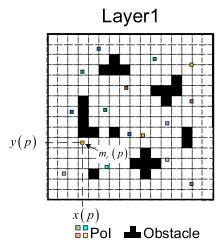  
(a)

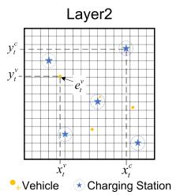

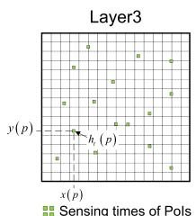  
(b)  
(c)  
Fig. 1. The input state of the considered problem.

time. We use $f _ { t } ^ { v } ( c ) , \forall c , v , i$ t to denote the power supply from <sup>ð Þ 8</sup>charging station c to a vehicle v in a timeslot t.

## 3.2 Problem Definition

In this section, we describe a distributed, energy-efficient, multi-vehicle navigation problem for MCS. When a task completes, we calculate the sum of all vehicles’ collected data by a navigation policy $\pi ,$ which is denoted by $D _ { T }$ , as:

$$
D _ { T } ( \pi ) = \sum _ { p = 1 } ^ { P } \varphi ( \pi ; p ) ,\tag{}
$$

where $\varphi ( \pi ; p )$ denotes the total amount of collected data from PoI $p$ by a given policy p. Then, one of our objectives is to maximize $D _ { T } ( \pi )$ by optimizing the policy p. However, <sup>ð Þ</sup>this may lead to an unfair data collection process that some PoIs are less visited or never sensed. Therefore, we explicitly consider the geographical fairness $\omega _ { T } ( \pi )$ of collected <sup>ð Þ</sup>data among all PoIs, which can be expressed by the Jain’s fairness index [30] as a popularly used metric. With a policy $\pi ,$ it is defined as:

$$
\omega _ { T } ( \pi ) = \frac { \left( \sum _ { p = 1 } ^ { P } \varphi ( \pi ; p ) \right) ^ { 2 } } { P \sum _ { p = 1 } ^ { P } \varphi \left( \pi ; p \right) ^ { 2 } } .\tag{}
$$

Obviously, if data are more evenly collected from all PoIs, the value of $\omega _ { T } ( \pi )$ will be closer to 1. Then, our another <sup>ð Þ</sup>objective is to maximize $\omega _ { T } ( \pi )$ for a p.

<sup>ð Þ</sup>Meanwhile, we aim to save as much energy as possible for all vehicles, in order to prolong the network lifetime. Note that here we also aim to save energy supplies of charging stations, since they are counted as part of the total energy consumption. Therefore, our objective is to find a policy p which can simultaneously (1) maximize data collection amount and (2) fairness, while (3) minimizing energy consumptions of all vehicles. It is quite challenging to achieve all these objectives at the same time. This is because that vehicles have to consistently move around in the target area to sense different PoIs, which will increase the energy consumption due to long distance movement, and to certain extend, some movement may not result in effective collection when time progresses (since data becomes fewer or even empty at some PoIs). On the other hand, saving energy with the presence of charging stations is challenging. When there is no need to charge, guiding vehicles to stumble in a relative small region saves much energy, which will cause unfair amount of collected data among PoIs. When vehicles need to charge, how much and when/where to charge becomes an issue. For example, frequently going to and from the same charging station will consume a lot of unnecessary energy, compared to effectively using different charging stations from time to time.

## 4 PROBLEM FORMULATION

We model the considered problem as a partially observable Markov decision process (POMDP [31]), defined as $\mathcal { M } = <$ $s , \ r { A } , \ r { K } , \ R , \ o { O } , \Omega , \bar { \gamma } >$

## 4.1 State Space

${ \mathcal { S } } { \triangleq } \{ \pmb { \mathscr { s } } _ { t } = ( { \pmb { S } } _ { 1 } , { \pmb { S } } _ { 2 } , { \pmb { S } } _ { 3 } ) \}$ denotes the state of a POMDP, which <sup>S f ¼ ðS1 S2 S3Þg</sup>includes three components.

1) Fig. 1a shows the first channel of state ${ \cal S } _ { 1 } ,$ including <sup>S1</sup>the positions (x; y coordinates) of the obstacles and PoIs, and remaining data amount of each PoI $d _ { t } ( p )$

2) Fig. 1b shows the second channel of state $S _ { 2 }$ <sup>ð Þ</sup>including position $( x , y$ <sup>S2</sup>coordinates) and remaining energy of all vehicles, $\mathrm { i . e . , } S _ { 2 } = \{ \{ ( x _ { t } ( v ) , y _ { t } ( v ) , e _ { t } ( v ) ) \} _ { v \in \mathcal { V } , t = 1 , 2 , \ldots , T } ,$ where $e _ { t } ( v ) \in [ 0 , 1 ]$ <sup>¼ ffð ð Þ ð Þ ð ÞÞg 2V ¼1 2</sup>denotes the current energy reserve (as a percentage) of a vehicle v.

3) Fig. 1c shows the third channel of state $S _ { 3 }$ which con-<sup>S3</sup>tains accumulated sensing times for a PoI up to timeslot $t ,$ defined as $h _ { t } ( p ) \in [ 0 , T ]$ . For example, if a PoI $p$ <sup>ð Þ 2 ½0 </sup>is sensed and its data is collected in timeslot $t + 1$ the $h _ { t + 1 } ( p )$ is calculated as $h _ { t + 1 } ( p ) = h _ { t } ( p ) + 1$

## 4.2 Observation Space

$\mathcal { O } \triangleq \left\{ o _ { t } ^ { v } = \left( \mathcal { O } _ { 1 } ^ { v } , \mathcal { O } _ { 2 } ^ { v } , \mathcal { O } _ { 3 } ^ { v } \right) \right\} _ { v \in \mathcal { V } }$ denotes a finite set of observa-<sup>O ¼ ¼ O1 O2 O3 2V</sup> tions each vehicle can experience of its world. $\mathcal { O } _ { 1 } ^ { v }$ and $\mathcal { O } _ { 3 } ^ { v }$ <sup>O1 O3</sup>contain PoI information within the sensing range R. Similarly, $\mathcal { O } _ { 2 } ^ { v }$ only contains the position and energy reserve of <sup>O2</sup>vehicle v in addition to the overall information of all charging stations. In POMDP, a vehicle cannot get any implicit information of other PoIs or vehicles.

## 4.3 Action Space

$\mathcal { A } \triangleq \left\{ \boldsymbol { a } _ { t } = ( \boldsymbol { \theta } _ { t } ^ { v } , \boldsymbol { l } _ { t } ^ { v } ) _ { v \in \mathcal { V } } | \boldsymbol { \theta } _ { t } ^ { v } \in [ 0 , 2 \pi ) , \boldsymbol { l } _ { t } ^ { v } \in [ 0 , \boldsymbol { l } _ { \operatorname* { m a x } } ] \right\}$ denotes the action <sup>2V</sup>set which consists of the direction $\theta _ { t } ^ { v }$ and moving distance $l _ { t } ^ { v }$ of all vehicles. is continuous.

## 4.4 State Transition Function

$K : S \times \mathcal { A } \times \mathcal { S }  \Pi ( S )$ is the state-transition function, giv-<sup>: S  A  S ! ðSÞ</sup>ing for each world state and vehicle action, a probability distribution over world states (we write $K \big ( s _ { t } , \bar { \{ \mathbf { \psi } _ { t } \} } _ { \forall v \in \mathcal { V } } , \bar { \mathbf { \psi } } _ { s _ { t + 1 } } \big )$ for the probability of ending in state $\scriptstyle { s _ { t + 1 } } ,$ <sup>f g8 2V þ1</sup>, given we start from $\mathbf { \boldsymbol { s } } _ { t }$ and take the actions $\{ \pmb { a } _ { t } ^ { v } \} _ { \forall v \in \mathcal { V } }$ <sup>þ1</sup>of all vehicles.

## 4.5 Observation Function

$\Omega : \mathcal { S } \times \mathcal { A } \times \mathcal { O }  \Pi ( \mathcal { O } )$ denotes the observation function, <sup>: S  A  O ! ð ÞO</sup>which gives, for each action and resulting state, a probability distribution over possible observations. Like the state transition function, we write $\Omega \big ( s _ { t + 1 } , \{ \boldsymbol { a } _ { t } ^ { v } \} _ { \forall v \in \mathcal { V } } , \{ \boldsymbol { o } _ { t } ^ { v } \} _ { \forall v \in \mathcal { V } } \big )$ for the probability of making observations $\{ o _ { t } ^ { v } \} _ { \forall v \in \mathcal { V } }$ <sup>8 2V</sup>for each vehicle, given that actions $\{ \pmb { a } _ { t } ^ { v } \} _ { \forall v \in \mathcal { V } }$ <sup>f g8 2V</sup>are taken and landed in state $\mathbf { \boldsymbol { s } } _ { t + 1 }$

## 4.6 Reward Function

$s \times \mathcal { A } \to \mathbb { R }$ expresses the expected immediate reward <sup>S  A !</sup>received after the state is transitioned from s to $\mathbf { \Delta } _ { \mathbf { \mathcal { S } } _ { t + 1 } , }$ , by taking

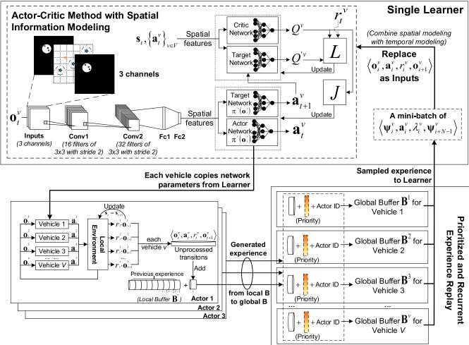  
Fig. 2. Distributed actor-critic method with spatial information modeling.

action $\{ \pmb { a } _ { t } ^ { v } \} _ { \forall v \in \mathcal { V } } .$ In order to explain our reward function more <sup>f g8 2V</sup>intuitively, we first design the energy consumption model with two unit weights $\beta$ and $\kappa ,$ as:

$$
\phi ( d _ { t } ^ { v } , l _ { t } ^ { v } ) = \beta \cdot d _ { t } ^ { v } + \kappa \cdot l _ { t } ^ { v } , \quad \forall v \in \mathcal { V } ,\tag{}
$$

where $\beta$ and $\kappa$ denote the energy consumption per unit data collected, and per distance traveled, respectively. Thus, for each timeslot $t , ~ e _ { t } ( v ) = e _ { t - 1 } ( v ) - \phi ( d _ { t } ^ { v } , l _ { t } ^ { v } )$ represents the <sup>ð Þ ¼ 1</sup>decrease of its energy reserve.

Then, the reward function is defined in an “energy efficiency” way to incorporate three objectives, namely: collected data amount, fairness and energy consumption:

$$
r _ { t } ^ { v } = \frac { \omega _ { t } d _ { t } ^ { v } } { \phi \Big ( d _ { t } ^ { v } , l _ { t } ^ { v } \Big ) } + \frac { \omega _ { t } f _ { t } ^ { v } } { \phi \Big ( 0 , l _ { t } ^ { v } \Big ) } - \rho _ { t } ^ { v } , \quad \forall v \in \mathcal { V } .\tag{}
$$

Here $d _ { t } ^ { v }$ is the vehicle v’s collected data at timeslot $t ,$ while $f _ { t } ^ { v }$ denotes how much a vehicle v’s battery is charged at timeslot $t , \ \omega _ { t }$ is defined as the same way in Eq. (6), but taking $h _ { t } ( p )$ as the input. $\rho _ { t } ^ { v }$ denotes the penalty applied to each <sup>ð Þ</sup>vehicle v at timeslot t, when it hits an obstacle or does not collect any data (and not going for charging).

## 4.7 Problem Formulation

When state transition K and reward function $r _ { t } ^ { v } ,$ v; t is predetermined, for each vehicle $v ,$ <sup>8</sup>our problem can be formulated as,

$$
\begin{array} { l } { { \displaystyle { V } ^ { v , * } ( \boldsymbol { s } _ { t } ) = \operatorname* { m a x } _ { a _ { t } ^ { v } } \Big [ r _ { t } ^ { v } ( \boldsymbol { s } _ { t } , a _ { t } ^ { v } ) } } \\ { { + \left. \gamma \int _ { \boldsymbol { s } _ { t + 1 } \in S } \mathrm { K } ( \boldsymbol { s } _ { t } , a _ { t } ^ { v } , \boldsymbol { s } _ { t + 1 } ) V ^ { v , * } ( \boldsymbol { s } _ { t + 1 } ) \right] , \forall v \in \mathcal { V } , } } \end{array}\tag{}
$$

where $0 < \gamma < 1$ is the discount factor, which shows the importance between future rewards and present reward. The optimal strategies of the unmanned vehicle is given by

$$
\begin{array} { r l } & { \pi ^ { v , * } = \arg \operatorname* { m a x } _ { a _ { t } ^ { v } } \Bigl [ r _ { t } ^ { v } ( s _ { t } , { a } _ { t } ^ { v } ) } \\ & { \qquad + \gamma \displaystyle \int _ { s _ { t + 1 } \in S } \mathrm { K } ( s _ { t } , a _ { t } ^ { v } , s _ { t + 1 } ) V ^ { v , * } ( s _ { t + 1 } ) \Bigr ] , \forall v \in \mathcal { V } . } \end{array}\tag{}
$$

Obviously, it is a continuous control problem that cannot be solved via conventional dynamic programming method, which is a model based approach. We opt to use DRL to find suboptimal solutions. However, since our scenario is fully distributed as a multi-agent environment, a vehicle’s reward is affected by the actions of many other vehicles. In this way, traditional policy gradient based methods require that the reward only depends on a vehicle’s own action, and thus it is challenging to directly apply any existing DRL approach, such as DDPG, to this problem.

## 5 PROPOSED SOLUTION: E-DIVERT

Our proposed solution “e-Divert” is composed of two parts, which are described in following sections.

## 5.1 Distributed Actor-Critic Method with Spatial Information Modeling

## 5.1.1 Actor-Critic Network with a CNN

For POMDP, we use a CNN to extract the spatial features from $o _ { t } ^ { v } ,$ by applying batch normalization [32] and dropout [33]. Our design is based on DDPG but a distributed actor-critic method. As shown in Fig. 2, for each vehicle $v ,$ four DNNs are implemented as actor network $\pi ^ { v } ( o _ { t } ^ { v } )$ , critic network $Q ^ { v } ( \pmb { s } _ { t } , \pmb { a } _ { t } )$ and their target networks $Q ^ { \prime v } ( \cdot ) , \pi ^ { \prime v } ( \cdot )$ <sup>ð Þ ðÞ ðÞ</sup>The interaction process between vehicles and environment is as follows. At each timeslot $t ,$ each v obtains an observation ${ \mathbf { } } o _ { t } ^ { v }$ and then its actor network $\pi ^ { v } ( \cdot )$ will decide on an action $\mathbf { } \mathbf { } a _ { t } ^ { v }$ <sup>ðÞ</sup>to take. After receiving all vehicles’ actions, the environment returns corresponding reward $r _ { t } ^ { v }$ ; v of the cur-<sup>8</sup>rent state to each vehicle. Next, the environment updates the state, including data distributions $d _ { t } ( p )$ , respective residual energy $e _ { t } ( v )$ <sup>ð Þ</sup>, vehicle locations, and the times $h _ { t } ( p )$ a PoI <sup>ð Þ ð Þ</sup>has been visited so far. Finally, each v stores its own state transition, including the observation $o _ { t } ^ { v } ,$ , action ${ \boldsymbol { a } } _ { t } ^ { v } .$ , reward $r _ { t } ^ { v }$ into its own experience replay buffer, as the flat cylinders shown in Fig. 2. This cycle repeats for T timeslots.

During training, we first sample a mini-batch of state transitions. For each $v ,$ the target actor network $\pi ^ { \prime } { } ^ { v } ( \cdot )$ gives a target action $\mathbf { \pmb { a } } _ { t + 1 } ^ { v }$ with given observations $\mathbf { \sigma } _ { o _ { t + 1 } } ^ { v }$ <sup>ðÞ</sup>from the <sup>þ1</sup>mini-batch. Then, critic network $Q ^ { v }$ <sup>þ1</sup>is updated by minimizing a loss function:

$$
L ( \theta ^ { Q ^ { v } } ) = \big [ y _ { t } ^ { v } - Q ^ { v } ( s _ { t } , \ a _ { t } ^ { 1 } , \dots , a _ { t } ^ { V } | \theta ^ { Q ^ { v } } ) \big ] ^ { 2 } ,\tag{}
$$

where the target Q-value $y _ { t } ^ { v }$ is computed by:

$$
y _ { t } ^ { v } = r _ { t } ^ { v } + \gamma . Q ^ { \prime v } \Big ( \mathbf { s } _ { t + 1 } , \mathbf { a } _ { t + 1 } ^ { 1 } , \dots , \mathbf { a } _ { t + 1 } ^ { V } | \theta ^ { Q ^ { \prime v } } \Big ) .\tag{}
$$

Finally, actor network $\pi ^ { v }$ is updated using gradients as:

$$
\begin{array} { r l } & { \nabla _ { \boldsymbol { \theta } ^ { \pi ^ { v } } } J \approx [ \nabla _ { \boldsymbol { \theta } ^ { \pi ^ { v } } } \pi ^ { v } ( \boldsymbol { o } | \boldsymbol { \theta } ^ { \pi ^ { v } } ) | _ { \boldsymbol { o } = \boldsymbol { o } _ { t } } } \\ & { \qquad \cdot ~ \nabla _ { \boldsymbol { a } } Q ^ { v } ( \boldsymbol { s } , \boldsymbol { a } _ { t } ^ { 1 } , \cdot \cdot \cdot , \boldsymbol { a } _ { t } ^ { V } | \boldsymbol { \theta } ^ { Q ^ { v } } ) | _ { \boldsymbol { a } _ { t } ^ { v } = \pi ^ { v } ( \boldsymbol { o } _ { t } ^ { v } ) } ] . } \end{array}\tag{}
$$

## 5.1.2 Ape-X with Multiple Actors and One Learner

Considering the size of sensing area, it may take long for vehicles to fully explore, and thus abundant transitions are needed. We apply Ape-X architecture as in [34], which contains multiple Ape-X actors and a learner to overcome this problem (see Fig. 2). Specifically, we decompose our July 05,2026 at 12:38:43 UTC from IEEE Xplore. Restrictions apply.

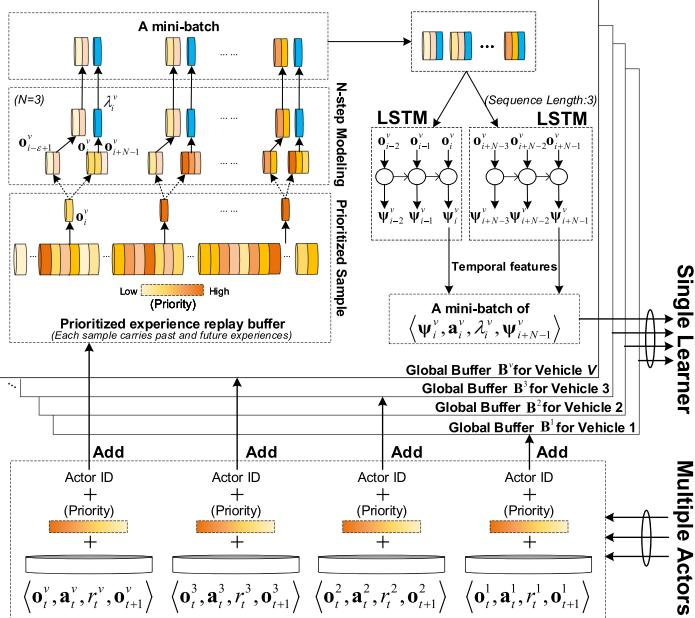  
Fig. 3. Prioritized and recurrent experience replay.

architecture into two parts. The first part consists of the interaction with an local environment, evaluating a policy p implemented as a DNN, and storing the observed data in a replay memory. We refer this as actor. The second part consists of sampling batches of data from the memory to update policy parameters $\theta ^ { \pi }$ . We refer this as learner.

Each independent actor has a copy of all vehicles’ models $( \mathrm { i . e . }$ , our four DNNs) which are periodically updated with the latest network parameters from the learner. For each v, each actor has a local memory buffer $\mathbf { B ^ { \prime } }$ (see Fig. 2) while the learner has a global buffer $\check { B } ^ { \mathrm { v } }$ <sup>B</sup>(see Fig. 3 as in Section 5.2). Each only stores the transition in order, which is generated <sup>B</sup>in the actor’s own local environment. Whenever $\mathbf { B } ^ { \top }$ is full, it sends all data to $B ^ { v }$ <sup>B</sup>. Since actors and learner are functionally parallel, both of them can be distributedly deployed. In our experiments, actors run on CPUs to generate abundant data and a single learner running on a GPU samples the most useful experience to learn. In other words, more vehicles are simulated to generate more transitions. Besides, with different exploration policies, vehicles can explore different regions in the target area and obtain various and non-correlated transitions.

## 5.2 Prioritized and Recurrent Experience Replay 5.2.1 Prioritized Experience Replay

Since the number of transitions rapidly grows in an experience replay buffer, a randomly sampled mini-batch may have an uncertain effect on learning a better policy. The batch of transitions determines the value of loss function $L ( \theta ^ { Q ^ { v } } )$ of the <sup>ð Þ</sup>critic network. If the policy from the transitions is quite usual or even awful to our four policy decision networks, the loss will be very small. With a small loss, the smooth descent of gradients will make it difficult to update the DNN weights. $\mathrm { A s }$ a result, training process will slow down or even stop. Thus, we integrate the prioritized experience replay [29] into our framework to focus on learning from the most “effective” transitions, which is defined by a priority value, measured by the magnitude of temporal difference error (TD-error), as:

$$
\delta _ { i } ^ { v } : = \Big | y _ { i } ^ { v } - Q ^ { v } \big ( s _ { i } , \pmb { a } _ { i } ^ { 1 } , . . . , \pmb { a } _ { i } ^ { V } \big ) \Big | , \quad \forall v , i ,\tag{}
$$

where $y _ { i } ^ { v }$ is given by Eq. (12). This priority value is initialized when the transition at timeslot i is generated by actors by calculating the probability of sampling:

$$
\varsigma ( i ) = \frac { ( \delta _ { i } ^ { v } ) ^ { \alpha } } { \Sigma _ { k } { ( \delta _ { k } ^ { v } ) } ^ { \alpha } } , \quad \forall i ,\tag{}
$$

where exponent a weights the importance of a vehicle v’s priority to be selected by sampling, with $\alpha = 0$ corresponding to <sup>¼ 0</sup>the uniform case. Then, as shown in Fig. 3, transitions with higher $\varsigma ( i )$ will be replayed more frequently, which will <sup>ð Þ</sup>bring a greater loss to expedite the update process. Finally, this priority value will be updated by Eq. (14) and (15) after the learner’ critic network is trained by the sampled transitions. With the help of the prioritized experience replay, e-Divert tends to replay important transitions and therefore learns more effectively to reach the best policy.

## 5.2.2 LSTM-Enabled N-Step Temporal Sequence Modeling

In a single timeslot t, each observation $o _ { t } ^ { v }$ only represents the current observation of a vehicle and similarly each reward $r _ { t } ^ { v }$ is just an indicator to measure gains or losses at this moment. However, reaching a charging station or some PoI may require a vehicle to move multiple steps due to limited maximum distance it can travel within t. Furthermore, some vehicles may tend to only use a specific charging station which is not an optimal choice; or they may return and charge frequently without benefiting from the reward by data collecting. Therefore, exploiting the temporal sequence of movements is critical to a good design.

To look to the future, for each reward $\boldsymbol { r } _ { t } ^ { v } ,$ we calculate the N-Step expected discounted reward. By reward definition in Eq. (8), it tends to select an action to a position having some PoI or charging station, however reaching there may take several timeslots for long distance travel. Also, conditions like either to improve the fairness, or collect data from a particular PoI may also lead to the increase of reward. However, it happens that a vehicle may not sense any PoI when moving around, and there will not be any positive reward until it reaches a PoI or a charging station. Thus, the value of preceding observation and action depending only on $Q ^ { v } \big ( s _ { t + 1 } , \pmb { a } _ { t + 1 } ^ { v } \big )$ <sup>þ1</sup>may not be precise at the beginning of training. To give a more precise approximation, we calculate the N-step reward [35] for N preceding observations as:

$$
\lambda _ { t } ^ { v } = r _ { t } ^ { v } + \gamma r _ { t + 1 } ^ { v } + \cdot \cdot \cdot + \gamma ^ { N - 1 } r _ { t + N - 1 } ^ { v } , \forall v \in V .\tag{}
$$

Then, the new transition will take the start and ending observations $( o _ { t } ^ { v } , o _ { t + N - 1 } ^ { v } )$ as the new start and ending obser-<sup>ð þ 1Þ</sup>vations, and the first action $\mathbf { \Delta } \mathbf { a } _ { t } ^ { v }$ as the new action; thus forming a new transition $( o _ { t } ^ { v } , \pmb { a } _ { t } ^ { v } , \lambda _ { t } ^ { v } , \pmb { o } _ { t + N - 1 } ^ { v } )$

<sup>ð þ 1Þ</sup>To look back for including more sequential information, we integrate an LSTM network to improve long-term performance of our model, as shown in Fig. 3. For any v and a transition starts from t ends $t + N - 1$ , by considering the N-<sup>þ  1</sup>Step reward, we use two sequences of observations $\{ o _ { t - \varepsilon + 1 } ^ { v } ,$ $o _ { t - \varepsilon + 2 } ^ { v } , \cdot \cdot \cdot , o _ { t } ^ { v } \} , \{ o _ { t + N - \varepsilon } ^ { v } , o _ { t + N - \varepsilon + 1 } ^ { v } , \cdot \cdot \cdot , o _ { t + N - 1 } ^ { v } \}$ <sup>f  þ1</sup>, as " immediate <sup> þ2    g f þ  þ  þ1 . . . þ 1g</sup>previous observations for start observation $o _ { t } ^ { v }$ and end July 05,2026 at 12:38:43 UTC from IEEE Xplore. Restrictions apply.

observation $o _ { t + N - 1 } ^ { v } ,$ , to feed into an LSTM network to produce <sup>þ </sup>new observations $\Psi _ { t } ^ { v }$ and $\Psi _ { t + N - 1 } ^ { v } ,$ respectively. Note that " is <sup>þ 1</sup>also the LSTM sequence length. Therefore, after LSTMenabled N-Step modeling, we get a new transition $( \Psi _ { t } ^ { v } , a _ { t } ^ { v }$ $\lambda _ { t } ^ { v } , \Psi _ { t + N - 1 } ^ { v } )$ <sup>ð</sup>. In this way, when a vehicle learns from the <sup>þ 1Þ</sup>mini-batch, it looks back a few timeslots and learns the effect of a series of actions and decisions. Furthermore, when/ where to charge or collect data can be jointly learned from this improvement. Besides, vehicles are expected to learn to circle around a group of PoIs since one single sensing may not be enough to collect all of its associated data.

The above process can be considered as further processing of a prioritized sampled mini-batch. That is, before spatial information is extracted, we first calculate the N-Step reward using Eq. (16). Then, we use an LSTM with suitable layer normalization [36] and dropout [37] to extract temporal features from a sequence. Finally, we feed them to the actor-critic networks with a CNN, replacing the previous inputs respectively, as shown in Fig. 2.

## 6 DETAILS OF THE ALGORITHM

In detail, e-Divert is composed of two parts: one Learner and multiple Actors. The Learner is to sample batches of data from the memory to update the policy. Each Actor is to step through an environment, evaluate a policy p copied by Learner, and store the observed transition data in its replay memory. For each vehicle $v ,$ these Actors send all data of their memory to Learner periodically and asynchronously. Pseudocode of “e-Divert” is shown in Algorithm 1, 2, 3, 4. After adequate training, the model $( \mathrm { i . e . , }$ the parameters in those networks) is saved for testing.

Algorithm 1. Learner (in the Single Background Thread)   
1: Initialize discount factor $\gamma ,$ update rate t;   
2: for vehicle $v = 1 , 2 , . . . , V$ do   
3: <sup>¼ 1 2</sup>Initialize the critic network $Q ^ { v } ( s _ { 0 } , { \pmb a } _ { 0 } | \theta ^ { Q ^ { v } } )$ and actor net  
work $\pi ^ { v } ( o _ { 0 } | \theta ^ { \pi ^ { v } } )$ with weights $\theta _ { 0 } ^ { Q ^ { v } }$ and $\theta _ { 0 } ^ { \pi ^ { v } } ;$   
4: <sup>ð 0j Þ</sup>Initialize target critic network $Q ^ { \prime v } ( \cdot )$ <sup>0</sup>and $\pi ^ { \mathit { \prime } v } ( \cdot )$ with   
weights $\theta ^ { Q ^ { \prime \upsilon } } : = \theta _ { 0 } ^ { Q ^ { \upsilon } } , \theta ^ { \pi ^ { \prime \upsilon } } : = \theta _ { 0 } ^ { \pi ^ { \upsilon } } .$   
<sup>:¼ 0 :¼ 0</sup>5: Initialize global prioritized replay buffer $B ^ { v } ;$   
6: end for   
7: for episode $\mathbf { \Phi } = 0 , 1 , \cdots , M - 1$ do   
for vehicle $v = 1 , 2 , . . . , V$ <sup>1</sup>do   
9: $\mathbf { i f } ~ S i z e ( B ^ { v } ) \geq H$ then   
10: <sup>ð Þ 	</sup>Sample a prioritized mini-batch of H transitions,   
using Prioritized and Recurrent Experience Replay   
(see Algorithm 2);   
11: Update actor-critic network weights (see Algorithm 3);   
12: Update the priorities $\delta _ { i } ^ { v }$ of the H transitions in $B ^ { v }$ by   
calculating new TD error, using Eq. (14);   
13: if $B ^ { v }$ is full then   
14: Remove oldest experience from replay memory $B ^ { v } ;$   
15: end if   
16: end if   
17: end for   
18: end for

## 6.1 Learner: Algorithm 1

The learner is running in a single background thread. At the beginning, we define the discount factor $\gamma ,$ update rate t (Line 1). For each vehicle $v ,$ we initialize its critic network $Q ^ { v } \left( s _ { 0 } , { { a } _ { 0 } } | \theta ^ { Q ^ { v } } \right)$ and an actor network $\pi ^ { v } \big ( o _ { 0 } | \theta ^ { \pi ^ { v } } \big )$ with ran-<sup>0 0j</sup>domly initialized weights $\theta _ { 0 } ^ { Q ^ { v } }$ and $\theta _ { 0 } ^ { \pi ^ { v } }$ <sup>0j</sup>, respectively (Line 3). <sup>0 0</sup>Then, two target networks with parameters $\theta ^ { Q ^ { \prime \upsilon } } , \theta ^ { \bar { \pi } ^ { \prime \upsilon } }$ are copied from their critic and actor networks (Line 4). Since we use the distributed prioritized experience replay buffer, each vehicle owns a private buffer $\bar { B ^ { v } } _ { \iota }$ which receives transitions from multiple actors asynchronously (Line 5).

The overall training process is running in the learner. It starts when the amount of transitions collected in $B ^ { v }$ is sufficient for sampling. For each vehicle v, we first sample a prioritized mini-batch of H transitions by using Prioritized and Recurrent Experience Replay (Line 10, and in Section 6.1.1). With all samples processed, all vehicles are trained in turn and the training process for each vehicle is identical. The actor-critic network weights then get updated (Line 11, and in Section 6.1.2). After training, the priorities of H transitions in $B ^ { v }$ are updated by calculating new TD-error (Line 12). Every time when a global buffer $B ^ { v }$ of the learner is full, the oldest experience will be removed (Lines 13-14).

## 6.1.1 Prioritized and Recurrent Experience Replay

As shown in Algorithm 2, LSTM sequence length ", N-Step size N are both given (Line 1). The index i denotes a uniform and temporal index in a global buffer $B ^ { v }$ and it is always consistent in prioritized sampling of each vehicle v (Line 3). As mentioned in Section 5.2.2, we process the sampled minibatch by LSTM-enabled N-step temporal sequence modeling. First, we calculate $\lambda _ { i } ^ { v } ,$ , using Eq. (16) (Line 5). Then, we get a sequence of observations $\{ \pmb { o } _ { i - \varepsilon + 1 } ^ { v } , \pmb { o } _ { i - \varepsilon + 2 } ^ { v } , \cdot \cdot \cdot , \pmb { o } _ { i } ^ { v } \}$ from $B ^ { v }$ <sup>f  þ1  þ2    g</sup>(Line 6). Similarly, we get a sequence of observations $\{ o _ { i + N - \varepsilon } ^ { v } ,$ $\pmb { o } _ { i + N - \varepsilon + 1 } ^ { v } , \cdot \cdot \cdot , \pmb { o } _ { i + N - 1 } ^ { v } \}$ (Line $7 ) .$ <sup>f þ </sup>. With the help of LSTM, we <sup>þ  þ1    þ 1g</sup>extract temporal information ${ \Psi } _ { i } ^ { v } , { \Psi } _ { i + N - 1 } ^ { v }$ (Line 8). Finally, each sampled transition $( o _ { i } ^ { v } , a _ { i } ^ { v } , r _ { i } ^ { v } , o _ { i + 1 } ^ { v } )$ <sup>1</sup>is replaced by $( \Psi _ { i } ^ { v } ,$ $a _ { i } ^ { v } , \lambda _ { i } ^ { v } , { \Psi _ { i + N - 1 } ^ { v } } )$ (Line 9).

Algorithm 2. Prioritized and Recurrent Experience Replay   
1: Given parameters: sequence length " of LSTM, N-Step size $N ;$   
2: for vehicle $v = 1 , 2 , \Vec { \ldots } , \bar { V }$ do   
<sup>¼ 1 2</sup>3: Sample a prioritized mini-batch of H transitions with the   
same index i from each global buffer $B ^ { v }$   
4: for sampled transition $( \bar { o } _ { i } ^ { v } , { \bf { a } } _ { i } ^ { v } , r _ { i } ^ { v } , o _ { i + 1 } ^ { v } )$ in H do   
5: Calculate N-Step reward $\lambda _ { i } ^ { v } ,$ <sup>þ1</sup>using Eq. (16);   
6: Get a sequence of observations $\{ \pmb { o } _ { i - \varepsilon + 1 } ^ { v } , \pmb { o } _ { i - \varepsilon + 2 } ^ { v } , \cdot \cdot \cdot , \pmb { o } _ { i } ^ { v } \}$   
from $B ^ { v } )$   
7: Get $\{ \pmb { o } _ { i + N - \varepsilon } ^ { v } , \pmb { o } _ { i + N - \varepsilon + 1 } ^ { v } , \cdot \cdot \cdot , \pmb { o } _ { i + N - 1 } ^ { v } \}$ similarly;   
8: <sup>þ  þ  þ1 þ</sup>Extract temporal information $\Psi _ { i } ^ { v } , \Psi _ { i + N - 1 } ^ { v }$ by LSTM;   
9: Use $( \Psi _ { i } ^ { v } , \pmb { a } _ { i } ^ { v } , \lambda _ { i } ^ { v } , \pmb { \Psi } _ { i + N - 1 } ^ { v } )$ to replace $\begin{array} { r l } { ( o _ { i } ^ { v } , \pmb { a } _ { i } ^ { v } , r _ { i } ^ { v } , \pmb { o } _ { i + 1 } ^ { v } ) ; } \end{array}$   
<sup>ð</sup>10: end for   
11: end for

## 6.1.2 Update Actor-Critic Network Weights

As shown in Algorithm $^ { 3 , }$ we first extract spatial information by the CNN of vehicle v (Line 1). Due to the influence of N-step function, we then compute the target Q-value in a mini-batch by:

$$
y _ { i } ^ { v } = \lambda _ { i } ^ { v } + \gamma \cdot Q ^ { \prime v } \Bigl ( s _ { i + N - 1 } , a _ { i + N - 1 } ^ { 1 } , \ldots , a _ { i + N - 1 } ^ { V } | \theta ^ { Q ^ { \prime v } } \Bigr ) ,\tag{}
$$

where ${ \pmb a } _ { i + N - 1 } ^ { v } = { \pmb \pi } ^ { \prime v } ( \pmb { \Psi } _ { i + N - 1 } ^ { v } )$ . Next, we use actor-critic <sup>þ 1 ¼ þ 1</sup>method proposed in Section 5.1.1. As in Eqs. (11) and (13), critic network is updated by minimizing the loss function, while we use the gradients to updated actor network (Lines 3-4). Finally, we update target network’s weights with softupdate (Lines 5-8).

Algorithm 3. Update actor-critic network weights   
1: Extract spatial information by the CNN of vehicle v;   
2: Compute the target Q-value in mini-batch, using Eq. (17);   
3: Update critic network $\theta ^ { Q ^ { v } }$ using Eq. (11);   
4: Update actor network $\theta ^ { \pi ^ { v } }$ using Eq. (13)   
5: Soft-update the target critic network using:   
6: $\theta ^ { Q ^ { \prime \upsilon } } : = \tau \theta ^ { Q ^ { \upsilon } } + ( 1 - \tau ) \theta ^ { Q ^ { \prime \upsilon } } ;$   
<sup>:¼ þ ð Þ1 </sup>7: Soft-update the target actor network using:   
8: $\begin{array} { r } { \theta ^ { \pi ^ { \prime \upsilon } } : = \tau \theta ^ { \pi ^ { \upsilon } } + ( 1 - \tau ) \theta ^ { \pi ^ { \prime \upsilon } } ; } \end{array}$

## 6.2 Actor: Algorithm 4

Multiple actors work asynchronously in local threads. In each episode, we initialize the local environment and obtain a initial state $s _ { 0 }$ (Line 2). Then, we initialize its local memory buffer $B ^ { \prime }$ , where each transition in the local environment is stored (Line 3). By remotely calling for the latest network parameters from the learner, we initialize the local policy $\pi ^ { v } ( \cdot )$ of each vehicle with weights $\theta _ { 0 } ^ { \pi ^ { v } }$ to select actions (Line <sup>ðÞ 0</sup>7). After that, the data collection task that lasts for $T$ timeslots is started.

At the beginning of timeslot $t , \mathsf { a }$ vehicle v selects an action ${ \mathbf { } } _ { \mathbf { } } ^ { \mathbf { } } \mathbf { } ^ { \mathbf { } } \mathbf { } a _ { t } ^ { v }$ according to its current observation $o _ { t } ^ { v }$ from local environment. For exploration, a random noise is added, which follows the Gaussian distribution in our implementation (Line 10). Then, the environment executes all actions ${ \pmb a } _ { t } ^ { v } .$ ; v, obtains a new state $\mathbf { \boldsymbol { s } } _ { t + 1 }$ <sup>8</sup>and gives a set of corresponding rewards $r _ { t }$ <sup>þ1</sup>to all vehicles (Line 12). Next, each v gets current reward $r _ { t } ^ { v }$ and the next observation ${ \pmb { o } } _ { t + 1 } ^ { v }$ from local environ-<sup>þ1</sup>ment (Line 14-15). As mentioned in Section 5.2.1, we calculate initial priorities d for the experience by calculating absolute TD-error (Line 16). Finally, the local buffer $\breve { B ^ { \prime } }$ stores the transition $\left( o _ { t } ^ { v } , \pmb { a } _ { t } ^ { v } , r _ { t } ^ { v } , o _ { t + 1 } ^ { v } , \delta , \overline { { j } } \right)$ , where j is the index <sup>þ1</sup>of current actor (Line 17). As discussed earlier, to ensure that each transition has an opportunity to be sampled, d is slightly higher than all other transitions’ priorities which are already in $B ^ { \prime } .$ Every time when $B ^ { \prime }$ is full, it sends all data to $B ^ { v }$ (Line 18-19). In this way, each vehicle stores its transition into its own buffer $B ^ { v }$

For multiple actors, each $\pi ^ { v }$ can be easily updated with weights $\theta _ { t } ^ { \pi ^ { v } }$ by remotely calling for the latest network parameters from the learner at any moment before we use (Algorithm 4: Line 21). After we use $\pi ^ { v }$ to interact with the local environment and get the transition $\left( o _ { t } ^ { v } , \pmb { a } _ { t } ^ { v } , r _ { t } ^ { v } , o _ { t + 1 } ^ { v } , \delta , j \right)$ for $B ^ { \prime }$ of each vehicle $v ,$ <sup>þ1</sup> we update the current state (Algorithm 4: Line 23), and then start the loop again. The loop repeats until T .

## 6.3 Testing Process

After adequate training, the model $( \mathrm { i . e . , }$ the parameters in those networks) is saved for testing. During testing, for each vehicle $v ,$ we only use the trained actor network to output its action $ { \boldsymbol { a } } _ { t } ^ { v }$ by going through the weights $\theta ^ { \pi ^ { v } }$ , given its own observation ${ \pmb O } _ { t } ^ { v } .$ . Then, environment state gives vehicle v reward $\boldsymbol { r } _ { t } ^ { v } ,$ and changes its observation to $\ \pmb { o } _ { t + 1 } ^ { v } .$ . Therefore, <sup>þ1</sup>our algorithm is a fully distributed, that during execution it does not need any other vehicle’s information, nor the entire state information.

```latex
Algorithm 4. Actor (in each Local Thread)
1: for episode $: = 0 , 1 , \cdots , M - 1$ do
2: <sup>¼ 0 1     1</sup>Initialize the local environment, receive initial state
$\begin{array} { r } { \pmb { s } _ { t } : = \pmb { s } _ { 0 } ; } \end{array}$
3: <sup>:¼ 0</sup>Initialize the local memory buffer $B ^ { \prime } ;$
4: for timeslot $t = 0 , 1 , \cdots , \dot { T } - 1$ do
5: for vehicle $v = 1 , 2 , . . . , V$ <sup> 1</sup><sub>do</sub>
6: if $t = 0$ <sup>¼</sup>then
$7 { : }$ <sup>¼ 0</sup>Initialize the local policy $\pi ^ { v }$ with weight $\theta _ { 0 } ^ { \pi ^ { v } }$ by
<sup>0</sup>remotely calling for the latest network parameters
from the learner;
8: end if
9: Get the current observation ${ \pmb O } _ { t } ^ { v }$ from local
environment;
10: Select an action ${ \pmb a } _ { t } ^ { v } = \pi _ { \theta _ { * } ^ { \pi ^ { v } } } \left( { \pmb O } _ { t } ^ { v } \right)$ by the current policy
<sup>¼ t</sup> and add a noise for exploration;
11: end for
12: Execute ${ \pmb a } _ { t } : = \left( { \pmb a } _ { t } ^ { 1 } , { \pmb a } _ { t } ^ { 2 } , \cdot \cdot \cdot , { \pmb a } _ { t } ^ { v } \right)$ in local environment;
<sup>:¼</sup>obtain rewards $\dot { \boldsymbol { r } } _ { t } : = \left( \boldsymbol { r } _ { t } ^ { 1 } , \boldsymbol { r } _ { t } ^ { 2 } , \cdot \cdot \cdot , \boldsymbol { r } _ { t } ^ { v } \right)$ and next state $s _ { t + 1 } ;$
13: for vehicle $v = 1 , 2 , . . . , V \mathbf { d o }$
14: <sup>¼ 1 2</sup>Get the current reward $r _ { t } ^ { v }$ from set of rewards $\boldsymbol { r } _ { t } ;$
15: Get the next observation $o _ { t + 1 } ^ { v }$ from local environment;
16: <sup>þ1</sup>Calculate initial priorities d for experience by
calculating absolute TD error, using Eq. (14);
17: Add transition $\left( \pmb { o } _ { t } ^ { v } , \pmb { a } _ { t } ^ { v } , r _ { t } ^ { v } , \pmb { o } _ { t + 1 } ^ { v } , \delta , j \right)$ to local buffer $B ^ { \prime } ,$
where $j$ <sup>þ1</sup>is the index of current actor.
18: if $B ^ { \prime }$ is full then
19: Send all data from $B ^ { \prime }$ to $B ^ { v } ;$
20: end if
21: Update $\pi ^ { v }$ with weight $\theta _ { t } ^ { \pi ^ { v } }$ by remotely calling for the
latest network parameters from the learner;
22: end for
23: $s _ { t } : = s _ { t + 1 }$
24: <sup>:¼</sup>end for
25: end for
```

We can calculate the computational complexity during the testing process as follows. First is CNN part. According to [38], the time complexity of a CNN is $\begin{array} { r } { \mathrm { O } ( \sum _ { l = 1 } ^ { L } k _ { l } ^ { 2 } \cdot a _ { l } ^ { 2 } . } \end{array}$ $n _ { l - 1 } \cdot n _ { l } )$ , where l is the layer index, and $L$ <sup>Oð ¼1  </sup>is the number of <sup>1  Þ</sup>layers, and $k _ { l } , a _ { l } , n _ { l - 1 } , n _ { l }$ are kernel size, output feature map <sup>1</sup>size, input channel and output channel, respectively. Second is LSTM part. From [39], the total number of parameters in a standard LSTM network is $M = 4 n _ { c } n _ { c } + 4 n _ { i } n _ { c } + n _ { c } n _ { o } + 3 n _ { c } ,$ where $n _ { c } , n _ { i } , n _ { o }$ <sup>¼ 4 þ 4 þ þ 3</sup>are number of memory cells, input neuron units, output neuron units, respectively. Since the computational complexity of learning LSTM per weight per timeslot is ${ \mathrm { O } } ( 1 )$ , then the overall computational complexity per time-<sup>Oð1Þ</sup>slot is $\mathrm { O } ( M )$ . Third is actor networks and critic networks <sup>Oð Þ</sup>with fully connected layers, whose the computation complexity is $\textstyle \operatorname { O } ( \sum _ { g = 1 } ^ { G } n _ { g - 1 } \cdot { \dot { n } } _ { g } )$ where $n _ { g }$ is the number of neural <sup>Oð ¼1 1  Þ</sup>units in fully-connected layer $g .$ Since input observation is processed by a CNN, an LSTM, and an actor network (i.e., a DNN) in a sequence, the total computational complexity is the sum of individual ones above.

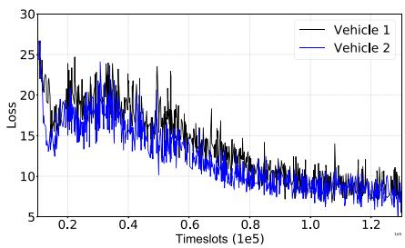  
(a)

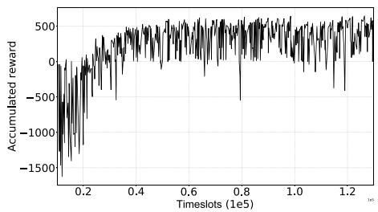  
(b)

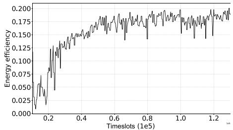  
(c)  
Fig. 4. (a) Loss, (b) accumulated reward, (c) energy-efficiency, all over time during training.

## 7 PERFORMANCE EVALUATION

## 7.1 Setting

In our simulation, we set the target area as a 2D square with a size of $1 6 \times 1 6$ units, where 256 PoIs and a few charging sta-<sup>16  16</sup>tions are uniformly distributed in the area. We randomly initialize the associated data for each PoI within ; . Each <sup>ð0 1</sup>vehicle starts with 50 units of energy reserve (as a full battery). We set $\beta = 0 . 1$ and $\kappa = 1$ in our implementation, i.e., <sup>¼ 0 1 ¼ 1</sup>for energy cost between a unit data collected and a unit distance a vehicle moving around, the ratio is $\beta : \kappa = 1 : 1 0$ . We set penalty $\rho _ { t } ^ { v } = 1 . 0$ <sup>:</sup>for obstacle collisions, and $\rho _ { t } ^ { v } = 1 . 0 * l _ { t } ^ { v }$ <sup>¼ 1 0 ¼ 1 0 </sup>for not getting valid data collection or charging in each timeslot t. Then, we set $\mu = 0 . 2 , \mathrm { i . e . }$ ., the proportion each vehicle can collect from a PoI’s all data is 20 percent in a timeslot.

In our implementation, a DNN with two hidden layers was utilized as actor, critic and target networks, respectively. We use ReLU function for activation of all hidden layers. To avoid overfitting, we use $L _ { \mathrm { 2 } }$ weight decay of $1 0 ^ { - 2 }$ . To avoid explosion gradient, gradient clipping was used. Batch normalization in CNN and layer normalization in LSTM can also help avoid gradient explosion as well.

We use the following four metrics to measure the performance.

Data collection ratio: calculated as a ratio between the total amount of collected data $D _ { T }$ and initial amount $\textstyle \sum _ { p } d ( p )$ when a task completes $( T$ timeslots).

<sup>ð Þ</sup>Geographical fairness $( \omega _ { T } ) \mathrm { : }$ calculated by Eq. (6) to show geographically how evenly the data associated with PoIs are collected by all vehicles when a task completes (T timeslots).

Energy consumption ratio (e ): calculated as a ratio between the total consumed energy (for both moving around and collecting data) by all vehicles and the initial energy reserve when a task completes (T timeslots).

Energy efficiency (n): defined similar to the reward function, as

$$
\nu = \frac { \omega _ { T } \cdot D _ { T } } { e _ { T } \sum _ { p } d ( p ) } .\tag{}
$$

## 7.2 DNN Training Convergence

We first show the change of loss function (see Fig. 4a), accumulated reward function (see Fig. 4b) and energy efficiency (see Fig. 4c) over time during training. In this simulation, we set the number of vehicles $V = 2 ,$ the number of charging stations $C = 5$ <sup>¼</sup>and sensing range $R = 1 . 1$

In Fig. 4a, we observe that both losses reduce very quickly at the beginning. This is because the approximation is not precise which causes a large loss value. With the help of Ape-X with Multiple Actors and One Learner and LSTM-enabled Nstep Temporal Sequence Modeling, the loss can be rapidly minimized. After 100,000 timeslots, both losses become stabilized, which means that two vehicles learned to cooperate and our e-Divert algorithm converges.

In Fig. 4b and 4c, we can see that the accumulated reward and energy efficiency both grow over time. That is, our model is learning a better policy that can concurrently increase the data collection ratio, fairness and decrease the energy consumption. When reaching around 60,000 timeslots, they start to saturate with slight fluctuations. This is because our losses have stabilized gradually and the best policy has been found.

## 7.3 Finding Appropriate Hyperparameters

Suitable hyperparameters in a DNN will significantly improve the overall performance. For most parameters we simply reused common settings as in other DRL algorithms, like DQN [27] and DDPG [25]. That is, we set the initial learning rate as 0.0005, discount factor $\gamma = 0 . 9 5$ , update factor $\tau = 0 . 0 0 1$ , buffer size to $2 \times 1 0 ^ { 5 }$ <sup>¼ 0 95</sup>and batch size $\bar { H } = 5 1 2$ . For <sup>¼ 0 001 2  10 ¼ 512</sup>more stable training, we set a learning rate decay as 0.99995 per 100 training timeslots. According to [25], [27], a 3-layer fully-connected neural network is used as actor, critic and target networks, with 64 neurons in each layer. We set the number of CNN hidden layers to 3, while in i-th layer of CNN, there are $1 6 \times 2 ^ { ( i - 1 ) }$ filters of $3 \times 3$ with stride 2. We set <sup>16  2 3  3</sup>gain to 1.0, shift to 0.0 for the layer normalization in LSTM.

Here, we explicitly consider the exponent a of prioritized sampling in Eq. (15), the number of actors, and the sequence length " for LSTM, as the three most important ones in our e-Divert model. Specifically, we vary a from the set : ; : ; <sup>f0 4 0 5</sup>: ; : . The higher a we use, the more concern about prioriti-<sup>0 6 0 7g</sup>zation occurs when sampling from buffers. We vary the number of actors from the set ; ; ; and the sequence length <sup>f2 5 8 10g</sup>" in LSTM is taken within the set ; ; . We consider the sce-<sup>f2 3</sup>nario of 2 vehicles and sensing range $R = 1 . 1$ units. To obtain <sup>¼ 1 1</sup>a fair comparison, we use the energy efficiency as the ultimate performance metric, and we will not stop the training process for each parameter combination until the energy efficiency value stops increasing. For testing, we ran each model for $T = 5 0 0$ timeslots and repeated 10 times to take an average. <sup>¼ 500</sup>We can make the following observations from Table 2:

1) With the increase of $\alpha ,$ energy efficiency increases at the beginning and then begins to drop. For example, with 5 actors and LSTM sequence length 3, energy efficiency increases to 0.181 when a increases from 0.4 to 0.5. This is because the higher a leads the training to most effective transitions, and thus the quality of learning is improved. However, when a further increases from 0.5 to 0.6, efficiency drops from 0.181 to 0.178. This is because the transitions with higher priority value are replayed so frequently that other transitions can hardly be sampled which will lead to the overfitting.

TABLE 2  
Impact of Different Hyperparameters
<table><tr><td rowspan="2" colspan="2"># of Actors LSTM sequence length</td><td colspan="3">2 Actors</td><td colspan="3">5 Actors</td><td colspan="3">8 Actors</td><td colspan="3">10 Actors</td></tr><tr><td>2</td><td>3</td><td>4</td><td>2</td><td>3</td><td>4</td><td>2</td><td>3</td><td>4</td><td>2</td><td>3</td><td>4</td></tr><tr><td rowspan="3"> $\alpha = 0 . 4$ </td><td>Data Collection Ratio Geographical fairness</td><td>0.639 0.708</td><td>0.765 0.809</td><td>0.812 0.852</td><td>0.925 0.941</td><td>0.813 0.864</td><td>0.884 0.921</td><td>0.712 0.787</td><td>0.700 0.751</td><td>0.710 0.771</td><td>0.811 0.855</td><td>0.819 0.864</td><td>0.768 0.812</td></tr><tr><td>Energy consumption</td><td>3.438</td><td>3.709</td><td>3.936</td><td>4.290</td><td>3.287</td><td>3.902</td><td>2.725</td><td>2.818</td><td>2.963</td><td>3.475</td><td>3.217</td><td>2.889</td></tr><tr><td>Energy efficiency</td><td>0.106</td><td>0.136</td><td>0.141</td><td>0.166</td><td>0.171</td><td>0.170</td><td>0.165</td><td>0.150</td><td>0.150</td><td>0.159</td><td>0.176</td><td>0.173</td></tr><tr><td rowspan="3"> $\alpha = 0 . 5$ </td><td>Data collection Ratio</td><td>0.699</td><td>0.682</td><td>0.692</td><td>0.888</td><td>0.943</td><td>0.925</td><td>0.847</td><td>0.873</td><td>0.508</td><td>0.351</td><td>0.754</td><td>0.818</td></tr><tr><td>Geographical fairness</td><td>0.753</td><td>0.733</td><td>0.751</td><td>0.917</td><td>0.958</td><td>0.943</td><td>0.883</td><td>0.902</td><td>0.548</td><td>0.422</td><td>0.816</td><td>0.861</td></tr><tr><td>Energy consumption</td><td>3.650</td><td>3.438</td><td>3.320</td><td>3.785</td><td>4.000</td><td>4.008</td><td>3.549</td><td>3.598</td><td>2.210</td><td>1.524</td><td>3.078</td><td>3.220</td></tr><tr><td rowspan="3"></td><td>Energy efficiency</td><td>0.118</td><td>0.117</td><td>0.127</td><td>0.175</td><td>0.181</td><td>0.174</td><td>0.171</td><td>0.176</td><td>0.103</td><td>0.075</td><td>0.161</td><td>0.177</td></tr><tr><td>Data collection Ratio</td><td>0.769</td><td>0.750</td><td>0.809</td><td>0.885</td><td>0.888</td><td>0.921</td><td>0.808</td><td>0.866</td><td>0.809</td><td>0.863</td><td>0.913</td><td>0.881</td></tr><tr><td>Geographical fairness</td><td>0.820</td><td>0.816</td><td>0.850</td><td>0.905</td><td>0.921</td><td>0.943</td><td>0.863</td><td>0.907</td><td>0.864</td><td>0.903</td><td>0.939</td><td>0.919</td></tr><tr><td rowspan="3"> $\alpha = 0 . 6$ </td><td>Energy consumption</td><td>3.887</td><td>3.629</td><td>3.975</td><td>3.640</td><td>3.372</td><td>3.889</td><td>3.248</td><td>3.475</td><td>3.332</td><td>3.604</td><td>3.846</td><td>3.648</td></tr><tr><td>Energy efficiency</td><td>0.130</td><td>0.134</td><td>0.141</td><td>0.180</td><td>0.178</td><td>0.180</td><td>0.173</td><td>0.181</td><td>0.169</td><td>0.175</td><td>0.180</td><td>0.181</td></tr><tr><td>Data collection Ratio</td><td>0.708</td><td>0.735</td><td>0.723</td><td>0.340</td><td>0.912</td><td>0.741</td><td>0.824</td><td>0.820</td><td>0.182</td><td>0.011</td><td>0.739</td><td>0.832</td></tr><tr><td rowspan="3"> $\alpha = 0 . 7$ </td><td>Geographical fairness</td><td>0.763</td><td>0.781</td><td>0.776</td><td>0.404</td><td>0.936</td><td>0.792</td><td>0.857</td><td>0.870</td><td>0.172</td><td>0.008</td><td>0.781</td><td>0.879</td></tr><tr><td>Energy consumption</td><td>3.527</td><td>3.533</td><td>3.426</td><td>2.746</td><td>3.945</td><td>2.984</td><td>3.250</td><td>3.346</td><td>0.732</td><td>1.923</td><td>2.770</td><td>3.633</td></tr><tr><td>Energy efficiency</td><td>0.125</td><td>0.134</td><td>0.134</td><td>0.040</td><td>0.175</td><td>0.160</td><td>0.178</td><td>0.173</td><td>0.037</td><td>0.001</td><td>0.167</td><td>0.163</td></tr></table>

2) With more actors, experience replay can generate more transitions and explore better. For example, with $\alpha = 0 . 6$ and $\varepsilon = 3$ , when the number of actors increases from 2 to 5, efficiency improves from 0.134 to 0.178, by 32.8 percent. However, too many actors are not favored. For example, when this number goes from 5 to 10, the data collection ratio and energy consumption ratio both decrease. This occurs because the speed of filling the experience replay buffer is so fast that most of the transitions are always up-to-date. Old transitions (which may be useful ones) cannot be fully reused before quickly replaced by new ones, which makes vehicles lose the vision of overall situation and not willing to move to some remote PoIs.

3) With the increase of ", we find that $\varepsilon = 3$ can help training process to converge every time. Other choices like $\varepsilon = 2 ,$ can bring more unpredicatable cases. For example, 10 actors, $\alpha = 0 . 7$ and $\varepsilon = 2$ make the policy <sup>¼ 0 7</sup>gradients suddenly explode.

Therefore, we find that 5 actors with $\alpha = 0 . 5$ and $\varepsilon = 3$ <sup>¼ 0 5 ¼ 3</sup>give the best performance in terms of energy efficiency that will be used for the rest of performance comparisons.

## 7.4 Illustrative Vehicles Moving Trajectories

We next show moving trajectories for vehicles with 5 <sup>2 4</sup>charging stations in Fig. 5. All vehicles start from the center of the map. For a PoI, lighter the color is, more data it contains.

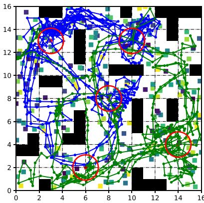  
(a) 2 vehicles.

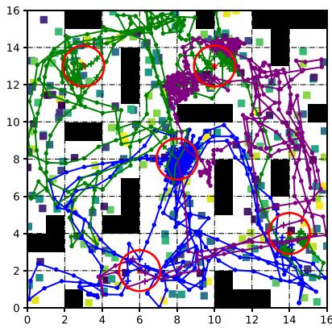  
(b) 3 vehicles.

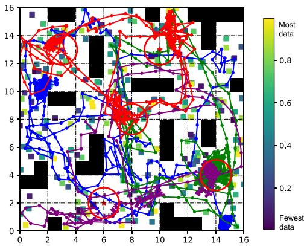  
(c) 4 vehicles.  
Fig. 5. Vehicle trajectories (sguares for Pols. black blocks for obstacles, stars for charging stations), where small dots indicates data collection, plus sign indicates charging). (a) 2 vehicles learn to be responsible for an almost disjoint region, and move around like a circle to repeatedly collect data. Most of the time they work independently. but sometimes the green vehicle goes to the upper right corner to help the blue one collect some corner case data. (b) 3 vehicles are deployed and each is responsible for a smaller region compared to (a). Blue and purple trajectories intertwine at the bottom part since it is associated with densely deployed PoIs. (c) 4 vehicles are deployed, to fully utilize the distributed charging stations nearby. Authorized licensed use limited to: Guangxi University. Downloaded on July 05,2026 at 12:38:43 UTC from IEEE Xplore. Restrictions apply.

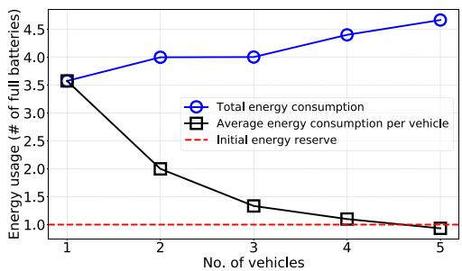

(a)  
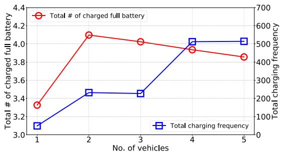  
(b)  
Fig. 6. A detailed look on (a) total/average energy consumption, (b) charging amount and frequency, w.r.t different number of vehicles.

As shown in Fig. 5a, two vehicles learn to cooperate, that each is responsible for almost half of the area, without crashing into any of the obstacles, nor going beyond the border. Most of the time, each vehicle takes a strategy of moving around like a circle and works separately. We next explain the rationality behind this:

1) Since each vehicle has limited sensing range and data collection capability, one single sensing to collect 20 percent of PoIs’ data is not enough, so both vehicles successfully learn to circulate around a small area until data is fully collected from a particular PoI.

2) When energy is insufficient, vehicles should move to charging stations in time and a good policy will lead them to a nearby station at an appropriate time, but not sticking to a specific one. Thus, we see two vehicles learn to explore more charging stations and use them in a good way, that sometimes even though stations may not be closely nearby, but it collects data on the way there first.

3) In order to obtain a relatively fairer data collection, two vehicles usually slightly change their circular routes to cover more PoIs. For example, the green vehicle even goes to the upper right corner for collecting some corner case data.

With more deployed vehicles, we find a more obvious cooperation among them. Comparing Fig. 5a, 5b and 5c, we find that the moving length for 2 vehicles is obviously longer on average. This is because that in order to keep a fairer data collection, two vehicles must sense PoIs which are rarely sensed and thus hopping back and forth cannot be avoided. This inevitably leads to an increase in demand for energy.

To have a closer examination of how vehicles charge batteries, we show the impact of number of vehicles on total/ average energy usage, and total charged amount/frequecies, in Fig. 6a and 6b, respectively. Note that the energy amount is translated into the number of fully charged batteries, for easy comparison. We see from Fig. 6a that with the increasing number of vehicles, e-Divert reduces the average consumption of each vehicle. When $V = 5 ,$ , the <sup>¼ 5</sup>value is even lower than the initial energy reserve. Also, from Fig. 6b, we see the total charging amount of 2 vehicles is the most. This is because that they tend to explore more charging stations instead of only using one single station, which can also be seen by the lower charging frequency in Fig. 6b. Furthermore, when more vehicles are available, the charging frequency is increased that they successfully learn to just charge a little which suffices its needs in the responsible area. This also indicates that more vehicles can handle a larger sensing map.

## 7.5 Comparing with State-of-the-Art and Baselines We use four approaches to compare with our algorithm.

MADDPG [12]: It is considered as the state-of-theart approach by OpenAI in NIPS’17, as a distrbiuted multi-agent DRL solution. Empirically, it has been proved to outperform all other DRL algorithms including DDPG in cooperative and competitive multi-agent environments.

e-Divert w/o Ape-X: During training, we only use a local environment to execute the selected actions and update parameters of the model, without using multiactor/single-learner architecture (as in Section 5.1.2).

e-Divert w/o LSTM: In decision-making process, its policy only uses the current observation ${ \mathbf { } } o _ { t } ^ { v }$ in timeslot t rather than being processed by the proposed LSTM-enabled N-Step temporal sequence modeling (as in Section 5.2.2).

GA-based approach [22]: It investigates the joint optimization of route planning and task assignment for UAV-aided MCS. However, it does not consider obstacle avoidance, nor the presence of charging stations. To adopt it in our simulations, we also equally divide our area into regions (according to [22]), and treat the distance as infinite for two adjacent PoIs if go acrossing an obstacle. Furthermore, vehicles passing by the charging station will automatically trigger the energy charging action. Then, we are able to turn our MCS problem into a route planning problem by using genetic algorithm (GA) as in [22]. We use the variance of latest 50 generations to justify if GA converges. When it is lower than $1 0 ^ { - 4 }$ , we stop the train-<sup>10</sup>ing process and then save the best route for testing.

During testing, certain settings are given, including maximum distance $l _ { \mathrm { m a x } } ,$ sensing range R, the number of vehicles <sup>max</sup>V . Then, all algorithms are running for 500 timeslots. Note that each DRL algorithm is repeatedly tested for 10 times to take an average, while GA-based approach is tested only once since it produces the fixed results and does not have any randomness.

We conduct four sets of simulations by varying sensing ranges $R ,$ number of vehicles V , number of charging stations $C ,$ and charging proportion. We show their results in terms of energy efficiency, data collection ratio, geographical fairness, and energy consumption ratio. We also calculate the theoretical maximum energy consumption as a reference by: July 05,2026 at 12:38:43 UTC from IEÉE Xplore. Restrictions apply.

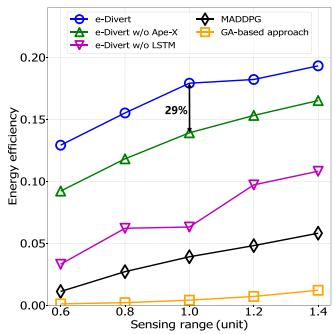  
(a)

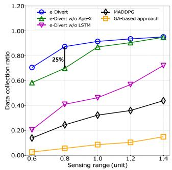  
(b)  
Fig. 7. Impact of sensing range on four metrics.

$$
\begin{array} { r l } & { e _ { T } ^ { \operatorname* { m a x } } = \left[ \displaystyle \sum _ { t = 1 } ^ { T } \displaystyle \sum _ { v = 1 } ^ { V } \phi \big ( d _ { t } ^ { v } , l _ { t } ^ { v } \big ) \right] _ { \operatorname* { m a x } } = \left[ \displaystyle \sum _ { t = 1 } ^ { T } \displaystyle \sum _ { v = 1 } ^ { V } \big ( \beta \cdot d _ { t } ^ { v } + \kappa \cdot l _ { t } ^ { v } \big ) \right] _ { \operatorname* { m a x } } } \\ & { \qquad = \displaystyle \sum _ { t = 1 } ^ { T } \displaystyle \sum _ { v = 1 } ^ { V } \big ( \beta \cdot d _ { t } ^ { v } + \kappa \cdot l _ { \operatorname* { m a x } } \big ) | _ { D _ { T } = 1 , 0 , \omega _ { T } = 1 , 0 } } \\ & { \qquad = \beta \cdot \displaystyle \sum _ { p = 1 } ^ { P } d ( p ) + T \cdot V \cdot \kappa \cdot l _ { \operatorname* { m a x } } , } \end{array}\tag{}
$$

<sup>19</sup>under the assumption that all data are collected and each action takes the maximum length. Note that this is a theoretical maximal, but does not mean a policy behind it.

## 7.5.1 Impact of Sensing Range

We first show the impact of sensing range on energy efficiency, data collection ratio, geographical fairness, energy consumption ratio, as shown in Fig. 7. We fix $V = 2 , C = { 5 } ,$ <sup>¼ 2 ¼ 5</sup>charging proportion to 20 percent, while we changed the sensing range from $R = 0 . 6$ to $R = 1 . 4$ with a step size of <sup>¼ 0 6 ¼ 1 4</sup>0.2. From Eq. (19), the maximum energy consumption is 4.62. From Fig. 7, we can make the following observations:

1) e-Divert consistently outperforms all four baselines in terms of energy efficiency. For example, in Fig. $^ { 7 } \mathrm { a } ,$ when the sensing range is 1.0, e-Divert achieves an energy efficiency of 0.179, compared to 0.139 given by the best baseline e-Divert w/o Ape-X, with a 29 percent improvement. On average, for energy efficiency, e-Divert significantly improves 27 percent, 1.58 times, 4.84 times and $5 { \dot { 7 } } . 6 7$ times over e-Divert w/o Ape-X, e-Divert w/o LSTM, MADDPG and GA-based approach, respectively.

2) From Fig. 7a, we can see that the energy efficiency of e-Divert increases monotonically with the sensing range. This is because that the data collection ratio and geographical fairness of e-Divert both keep increasing, as shown in Fig. 7b and 7c. The fairness index nearly reaches the upper bound 1.0. Furthermore, a larger sensing range means less average moving distance. For example, from Fig. 7d, we see the energy consumption shows some small declines with increasing R. There exists similar laws in all other algorithms but they cannot well balance data collection and energy consumption togehter.

e-Divert outperforms all other baselines for any R. For example, in Fig. 7b and ${ 7 } \mathrm { c } ,$ when $R = 1 . 0 \mathrm { , e - D i v e r t }$

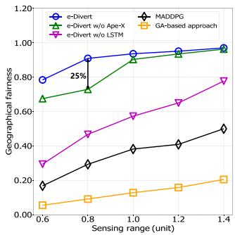  
(c)

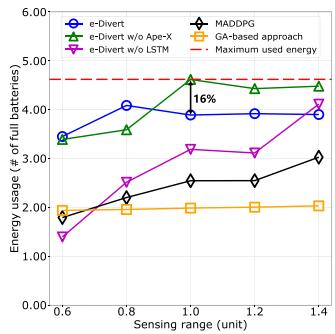  
(d)  
improves the data collection ratio and fairness slightly, but it saves 16 percent of energy consumption as shown in Fig. 7d, while the energy consumption of e-Divert w/o Ape-X almost reaches the maximal. This is because the Ape-X architecture focuses more on learning from the most effective transitions rather than some local optimal ones. However, without sequential modeling by LSTM, e-Divert w/o LSTM ignores or forgets long-term benefits, including some unutilized charging stations and uncollected data. Finally, with the help of LSTM-enabled N-Step Temporal Sequence Modeling, e-Divert has a significantly better performance than the state-of-the-art approach MADDPG in data collection, geographical fairness and energy efficiency. We can see that GAbased approach can hardly collect any data. This is because that 256 PoIs generate huge state space that GA based approach cannot solve in polynomial time. As a result, it shows the worst performance because of inefficient energy usage and potential obstacle collision.

## 7.5.2 Impact of Number of Vehicles

Next, we present the impact of number of vehicles in Fig. 8. We fixed $R = 1 . 1 , \bar { C } = 5$ , the charging proportion to <sup>¼ 1 1 ¼ 5</sup>20 percent, while we change V from 1 to 5. In this case, the maximum energy usage is : ; : ; : ; : ; : , <sup>½3 62 4 6</sup>respectively. From Fig. 8, we observe that:

1) e-Divert consistently outperforms four baselines in terms of energy efficiency. For example, in Fig. 8a, when $V = 4 ,$ e-Divert achieves an energy efficiency of 0.158, compared to 0.091 given by the best baseline e-Divert w/o Ape-X, with a 74 percent improvement. On average, for energy efficiency, e-Divert significantly improves 53 percent, 76 percent, 3.62 times, 14.93 times over e-Divert w/o Ape-X, e-Divert w/o LSTM, MADDPG and GA-based approach, respectively.

2) From Fig. 8a, we can see that the energy efficiency of e-Divert decreases slightly with more vehicles. This is because larger V will lead to the increase in total energy consumption, as shown in Fig. 8d. In addition, more vehicles also increase the competition when collecting PoIs at the border of their responsible areas. As a result, from Fig. 8b and $8 { \mathrm { c } } ,$ , the data collection ratio and fairness reach the bottleneck. However, from Fig. 6 we see that the average energy consumption keeps reducing because of their cooperations. Therefore, with the improvement of 23 and 17 percent on data collection ratio and fairness, e-Divert ultimately saves 15 percent of energy consumption compared to the best baseline e-Divert w/o Ape-X.

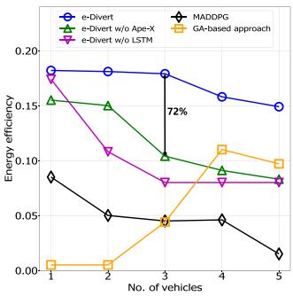  
(a)

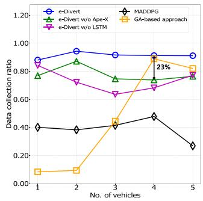  
(b)

Fig. 8. Impact of number of vehicles on four metrics.  
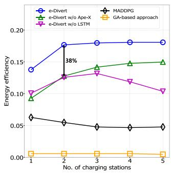  
(a)

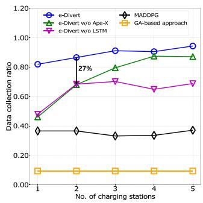  
(b)  
Fig. 9. Impact of number of charging stations on four metrics.

From Fig. 8, when $V = 1$ , two self-contrast baselines <sup>¼ 1</sup>achieve similar results in terms of energy efficiency and energy consumption. However, for more V , they use a lot more energy than e-Divert. Meanwhile, they cannot cope well with the collaboration between vehicles as we do. This is because the prioritized sampling of experience, spatial features and temporal association all bring certain benefits to the learning process. Without LSTM-enabled N-Step Temporal Sequence Modeling and $A p e { - } X$ with Multiple Actors and One Learner, even the state-of-the-art solution MADDPG cannot produce a good policy. For example, when $V = 5 ,$ MADDPG has a high energy <sup>¼ 5</sup>consumption but very poor data collection ratio and fairness. By revisiting its trajectories, we find that the 5 vehicles move in the same direction without any cooperation nor the division of labor. Interestingly, when the number of vehicles is between 2 and 4, the data collection ratio and geographical fairness of GA-based approach both rise sharply, even approaching the performance of e-Divert. This is because the running time of getting the optimal route is directly related to the state complexity. Since it divides the whole area in to regions, more vehicles implies smaller regions and fewer PoIs for each vehicle to cover on average. Therefore, GA-based approach behaves better to avoid

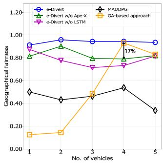  
(c)

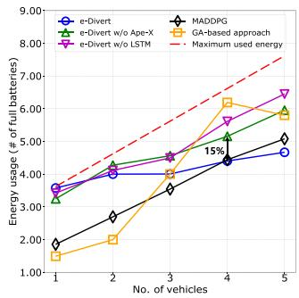  
(d)

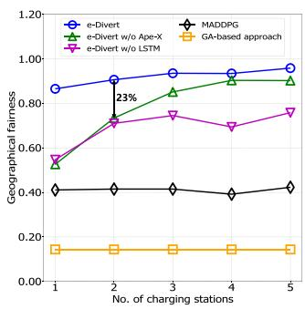  
(c)

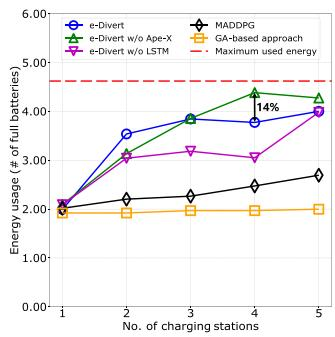  
(d)  
some obstacles and make a decision for charging. However, when more than 4 vehicles are used, its data collection ratio and fairness decrease. This is because excessive vehicles make each task region too small, which will increase the possibility of obstacle collision.

## 7.5.3 Impact of Number of Charging Stations

Fig. 9 shows the impact of number of charging stations. We fixed $R = 1 . 1 , ~ \bar { V } = 2 ,$ , the charging proportion to 20 <sup>¼ 1 1 ¼ 2</sup>percent, while we change C from 1 to 5. From Eq. (19), the maximum energy consumption is 4.62. We can make following observations:

1) e-Divert consistently outperforms four baselines in terms of energy efficiency. For example, in Fig. 9a, when $C = 2 ,$ , e-Divert achieves an energy efficiency of <sup>¼ 2</sup>0.177, compared to 0.128 given by the best baseline e-Divert w/o Ape-X, with a 38 percent improvement. On average, for energy efficiency, our proposal e-Divert significantly improves 33, 48 percent, 2.36 times and 28.77 times over e-Divert w/o Ape-X, e-Divert w/o LSTM, MADDPG and GA-based approach, respectively.

2) From Fig. 9a, we can see that the energy efficiency of e-Divert increases at the beginning and then tends to be stable after $C = 2 .$ . This is because that insufficient <sup>¼ 2</sup>amount of stations will lead the vehicles to consume much energy traveling back and forth from PoIs. On the other hand, setting up more charging stations also brings benefits for vehicles to explore remote, corner case subareas; as confirmed in Fig. 9b and 9c, and ultimately the energy efficiency in Fig. 9a. Furthermore, our e-Divert scheme can learn how to better use the nearest charging station in most cases, and thus overall energy consumption does not increase much after $C = 2 .$

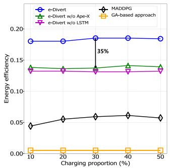  
(a)

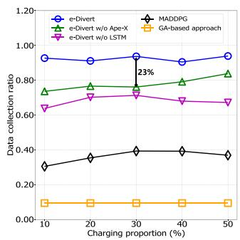  
(b)  
Fig. 10. Impact of charging proportion on four metrics.

<sup>¼ 2</sup>3) Four baselines show the importance of spatiotemporal modeling for distributed cooperation and competition by e-Divert again. Vehicles learn not only to be responsible for a smaller area but also utilize the charging station in its own area. This reduces the energy consumption for long-distance movement while ensuring the data collection ratio, and geographic fairness. For example, in Fig. 9b, 9c and 9d, when $C = 4 ,$ e-Divert improves the data collection <sup>¼ 4</sup>ratio and fairness slightly, but it saves 14 percent of energy. Since GA-based approach does not consider charging, the number of charging stations hardly affects its performance.

## 7.5.4 Impact of Different Charging Proportions

Finally, we show the impact of charging proportion in Fig. 10. We fixed $R = 1 . 1 , { \stackrel { \textstyle - } { V } } = 2 , C = 3 ,$ while we changed <sup>¼ 1 1 ¼ 2 ¼ 3</sup>the charging proportion from 10 to 50 percent of full battery with a step size of 10 percent. This reflects the charging speed in practical scenarios. e-Divert outperforms all baselines in terms of energy efficiency, data collection ratio and geographic fairness. GA-based approach performs worst. This is due to our spatiotemporal cooperative mechanism enabled by LSTM-enabled N-Step Temporal Sequence Modeling and Ape-X with Multiple Actors and One Learner, where none of other four baselines fully explore them.

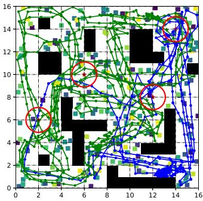  
(a)

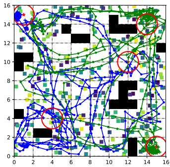  
(b)  
Fig. 11. Moving trajectories of different environments: (a) different obstacle distributions, (b) different vehicle starting points and charging station distributions. ns.

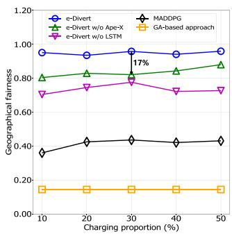  
(c)

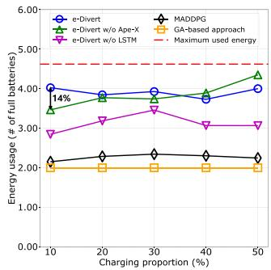  
(d)

## 8 PRACTICAL IMPLEMENTATION ISSUES

In this section, we discuss three practical implementation issues, namely (a) extension to new environments, (b) compatibility with the real-time implementation, and (c) performance of GA-based approach in small scale MCS networks.

## 8.1 Practical Applications of e-Divert

Practically, e-Divert can be used in scenarios like emergency rescue, crowd flow detection, etc. For example, when emergencies like earthquake and flooding suddenly come, existing 4G/LTE network may be temporarily unavailable. Rescue teams need to have a detailed and globle view of the target area before taking any physical actions. CCTV cameras (i.e., PoIs in this paper) are deployed anywhere in the city that are mounted on the roof top, light pole, etc., but they cannot connect to the Internet through existing communications network in this case, and connecting through satellite is usually very expensive and not practically feasible to have each CCTV camera equipped with a satellite module. Here, small drones can be navigated to fly over the area to crowdsense and collect data from CCTV cameras and transported back to the data center. Their video streams are generated without stopping and thus any one single sensing in a time slot by a drone’s equipped sensor is far from enough. Furthermore, these emergent scenarios requires all CCTV cameras’ data but not any of a specific one. Therefore, drones need to learn to fly back and forth to collect more data from these cameras, so that the overall data collection ratio, geographic fairness among PoIs can be maximized simultaneously.

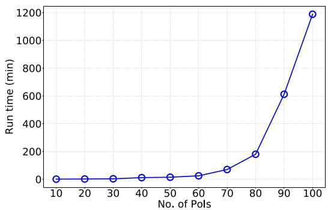

TABLE 3  
Comparison in Different Sensing Ranges and Number of Vehicles with 80 PoIs and No Obstacles
<table><tr><td rowspan="2"></td><td rowspan="2"></td><td colspan="5">Sensing range</td><td colspan="5">Number of vehicles</td></tr><tr><td>0.6</td><td>0.8</td><td>1.0</td><td>1.2</td><td>1.4</td><td>1</td><td>2</td><td>3</td><td>4</td><td>5</td></tr><tr><td rowspan="4">e-Divert</td><td>Data Collection Ratio</td><td>0.704</td><td>0.719</td><td>0.746</td><td>0.880</td><td>0.950</td><td>0.841</td><td>0.852</td><td>0.902</td><td>0.942</td><td>0.940</td></tr><tr><td>Geographical fairness</td><td>0.755</td><td>0.766</td><td>0.801</td><td>0.910</td><td>0.957</td><td>0.862</td><td>0.878</td><td>0.921</td><td>0.943</td><td>0.939</td></tr><tr><td>Energy consumption</td><td>1.320</td><td>1.329</td><td>1.459</td><td>1.570</td><td>1.805</td><td>1.380</td><td>1.784</td><td>2.010</td><td>2.493</td><td>2.670</td></tr><tr><td>Energy efficiency</td><td>0.357</td><td>0.362</td><td>0.371</td><td>0.382</td><td>0.4</td><td>0.386</td><td>0.371</td><td>0.349</td><td>0.311</td><td>0.302</td></tr><tr><td rowspan="4">GA-based approach</td><td>Data collection Ratio</td><td>0.905</td><td>0.917</td><td>0.930</td><td>0.952</td><td>0.974</td><td>0.893</td><td>0.992</td><td>0.999</td><td>0.999</td><td>0.999</td></tr><tr><td>Geographical fairness</td><td>0.919</td><td>0.935</td><td>0.950</td><td>0.963</td><td>0.980</td><td>0.936</td><td>0.988</td><td>0.999</td><td>0.999</td><td>0.999</td></tr><tr><td>Energy consumption</td><td>3.855</td><td>4.219</td><td>4.234</td><td>4.250</td><td>4.270</td><td>3.395</td><td>4.324</td><td>4.941</td><td>7.402</td><td>7.996</td></tr><tr><td>Energy efficiency</td><td>0.189</td><td>0.178</td><td>0.183</td><td>0.189</td><td>0.196</td><td>0.213</td><td>0.194</td><td>0.179</td><td>0.118</td><td>0.102</td></tr></table>

## 8.2 Extension to New Environments

Our approach is a model-free DRL method, i.e., we do not need to redesign our deep model for adapting a new environment. For different MCS tasks, e.g., in a different city, we simply run the training process again with the same hyperparameters, and thus obtaining different weights for the underlying deep model. To show this, we vary the obstacle distributions, vehicle starting points and charging station positions as in Fig. 11. We observe that e-Divert achieves the similar and satisfactory results.

On the other hand, if we expect to service MCS tasks in multiple regions simultaneously but we only want the model to be trained once, we can consider to leverage a new framework called “IMPALA” [40]. It solves a large collection of tasks effectively using a single DRL agent with a single set of parameters. However, IMPALA can only be applied to tasks of same input state size and action space, such as Atari games. We do not directly adopt IMPALA in our method for three reasons. First, it cannot cope with the task transfer in continuous action space. Second, IMPALA essentially uses data from a set of ongoing tasks but it will not behave well for a new task that it has never experienced before. Third, IMPALA only uses one agent as a centralized solution, but our problem requires a distributed multi-agent solution.

## 8.3 Compatibility with the Real-Time Implementation

Since e-Divert can be end-to-end trained, where the input is vehicle observation, and the output is its specific action, the execution process only uses the trained CNN, LSTM and actor network, and thus the computational complexity is small (see Section 6.3). For real-time implementations, take UAVs for example, commercially available ones like DJI M100 is capable of having an embedded system to load the neural network to process the inputs and generate output actions.

## 8.4 Performance of GA-Based Approach in Smaller Scale MCS Networks

We here discuss the performance of GA-based approach both in terms of four metrics and the algorithm run time in smaller scale MCS networks. In Section 7.5, it has the worst performance mainly because for large MCS network like 256 PoIs, it may not find the optimal solution to avoidable obstacles within polynomial time. To better illustrate this, we show its run time w.r.t. the number of PoIs in Fig. 12. We find that more than 80 PoIs will significantly incur the algorithm run time, and thus we choose 80 PoIs to re-do some of the performance evaluations, as shown in Table 3. Here we also remove all obstacles, since GA-based approach cannot achieve this. We vary different sensing ranges and number of vehicles, which have shown greater impact in Section 7.5. From the results, we observe that the performance of the GA-based approach has improved a lot in this much simpler task. For example, when 5 vehicles are considered, its data collection ratio and geographical fairness have both reached 99.9 percent. This is because that GA-based approach in essence is a centralized solution, where it is always aware all the state information. However, our proposal e-Divert is a distributed solution, which is formulated as a POMDP. Meanwhile, we see that e-Divert achieves much more efficient energy usage in reaching satisfactory data collection ratio and geographic fairness, as the metric “energy-efficiency” indicates.

## 9 CONCLUSION

In this paper, we explicitly consider a MCS system with presence of multiple unmanned vehicles and charging stations for data collection. Our goal is to maximize the data collection ratio, geographical fairness among PoIs and minimize the energy consumptions of all vehicles. To enable this, specifically, we propose a fully distributed control framework called “e-Divert”, which is a multi-agent actor-critic method integrating CNN for spatial feature extraction. Furthermore, we make two important improvements, by integrating Ape-X with Multiple Actors and One Learner and LSTM-enabled N-Step Temporal Sequence Modeling. In this way, e-Divert can effectively extract spatial and temporal features to improve the learning speed and quality of the DNN models. Last, we find a set of hyperparameters including 5 actors, priority exponent 0.5, and LSTM sequence length 3, which achieves the best performance. Compared with state-of-the-art solution MADDPG, e-Divert significantly improves 3.62 and 2.36 times of energy efficiency on average with different numbers of vehicles and charging stations, respectively.

## ACKNOWLEDGMENTS

This paper was financially supported by National Natural Science Foundation of China (No. 61772072).

## REFERENCES

[1] A. T. Campbell, S. B. Eisenman, N. D. Lane, E. Miluzzo, R. A. Peterson, H. Lu, X. Zheng, M. Musolesi, K. Fodor, and G. Ahn, “The rise of people-centric sensing,” IEEE Internet Comput., vol. 12, no. 4, pp. 12–21, Jul./Aug. 2008.

[2] H. Gao, C. H. Liu, J. Tang, D. Yang, P. Hui, and W. Wang, “Online quality-aware incentive mechanism for mobile crowd sensing with extra bonus,” IEEE Trans. Mobile Comput., 2018. doi: 10.1109/ TMC.2018.2877459.

[3] Y. Zhan, C. H. Liu, Y. Zhao, J. Zhang, and J. Tang, “Free market of multi-leader multi-follower mobile crowdsensing: An incentive mechanism design by deep reinforcement learning,” IEEE Trans. Mobile Comput., 2019. doi: 10.1109/TMC.2019.2927314.

[4] N. D. Lane, E. Miluzzo, H. Lu, D. Peebles, T. Choudhury, and A. T. Campbell, “A survey of mobile phone sensing,” IEEE Commun. Mag., vol. 48, no. 9, pp. 140–150, Sep. 2010.

[5] B. Guo, Z. Wang, Z. Yu, Y. Wang, N. Y. Yen, R. Huang, and X. Zhou, “Mobile crowd sensing and computing: The review of an emerging human-powered sensing paradigm,” ACM Comput. Sur., vol. 48, no. 1, pp. 7:1–7:32, 2015.

[6] D. Zhang, L. Wang, H. Xiong, and B. Guo, “4w1h in mobile crowd sensing,” IEEE Commun. Mag., vol. 52, no. 8, pp. 42–48, Aug. 2014.

[7] P. E. Carnelli, J. Yeh, M. Sooriyabandara, and A. Khan, “Parkus: A novel vehicle parking detection system,” in Proc. 31st AAAI Conf. Artif. Intell., 2017, pp. 4650–4656.

[8] Y. Jing, B. Guo, Z. Wang, V. O. K. Li, J. C. K. Lam, and Z. Yu, “Crowdtracker: Optimized urban moving object tracking using mobile crowd sensing,” IEEE Internet Things J., vol. 5, no. 5, pp. 3452–3463, Oct. 2018.

[9] S. Xu, X. Chen, X. Pi, C. Joe-Wong, P. Zhang, and H. Y. Noh, “ilocus: Incentivizing vehicle mobility to optimize sensing distribution in crowd sensing,” IEEE Trans. Mobile Comput., 2019. doi: 10.1109/ TMC.2019.2915838.

[10] H. Gao, C. H. Liu, and W. Wang, “Hybrid vehicular crowdsourcing with driverless cars: Challenges and a solution,” Comput., vol. 51, no. 12, pp. 24–31, Dec. 2018.

[11] B. Zhang, C. H. Liu, J. Tang, Z. Xu, J. Ma, and W. Wang, “Learningbased energy-efficient data collection by unmanned vehicles in smart cities,” IEEE Trans. Ind. Informat., vol. 14, no. 4, pp. 1666–1676, Apr. 2018.

[12] R. Lowe, Y. Wu, A. Tamar, J. Harb, O. P. Abbeel, and I. Mordatch, “Multi-agent actor-critic for mixed cooperative-competitive environments,” in Proc. 31st Int. Conf. Neural Inf. Process. Syst., 2017, pp. 6379–6390.

[13] M. Karaliopoulos, O. Telelis, and I. Koutsopoulos, “User recruitment for mobile crowdsensing over opportunistic networks,” in Proc. IEEE Conf. Comput. Commun., Apr. 2015, pp. 2254–2262.

[14] H. Xiong, D. Zhang, G. Chen, L. Wang, V. Gauthier, and L. E. Barnes, “icrowd: Near-optimal task allocation for piggyback crowdsensing,” IEEE Trans. Mobile Comput., vol. 15, no. 8, pp. 2010–2022, Aug. 2016.

[15] H. Xiong, D. Zhang, Z. Guo, G. Chen, and L. E. Barnes, “Nearoptimal incentive allocation for piggyback crowdsensing,” IEEE Commun. Mag., vol. 55, no. 6, pp. 120–125, Jun. 2017.

[16] X. Wang, R. Jia, X. Tian, X. Gan, L. Fu, and X. Wang, “Location-aware crowdsensing: Dynamic task assignment and truth inference,” IEEE Trans. Mobile Comput.

[17] X. Wang, R. Jia, X. Tian, and X. Gan, “Dynamic task assignment in crowdsensing with location awareness and location diversity,” in Proc. IEEE Conf. Comput. Commun., Apr. 2018, pp. 2420–2428.

[18] Q. Zhu, M. Y. S. Uddin, N. Venkatasubramanian, and C. Hsu, “Spatiotemporal scheduling for crowd augmented urban sensing,” in Proc. IEEE Conf. Comput. Commun., Apr. 2018, pp. 1997–2005.

[19] J. Crowcroft, M. Segal, and L. Levin, “Improved structures for data collection in wireless sensor networks,” in Proc. IEEE Conf. Comput. Commun., Apr. 2014, pp. 1375–1383.

[20] Z. Zhou, H. Liao, B. Gu, K. M. S. Huq, S. Mumtaz, and J. Rodriguez, “Robust mobile crowd sensing: When deep learning meets edge computing,” IEEE Netw., vol. 32, no. 4, pp. 54–60, Jul. 2018.

[21] Y. Jing, B. Guo, Z. Wang, V. O. K. Li, J. C. K. Lam, and Z. Yu, “Crowdtracker: Optimized urban moving object tracking using mobile crowd sensing,” IEEE Internet Things J., vol. 5, no. 5, pp. 3452–3463, Oct. 2018.

[22] Z. Zhou, J. Feng, B. Gu, B. Ai, S. Mumtaz, J. Rodriguez, and M. Guizani, “When mobile crowd sensing meets uav: Energyefficient task assignment and route planning,” IEEE Trans. Commun., vol. 66, no. 11, pp. 5526–5538, Nov. 2018.

[23] C. H. Liu, Z. Chen, and Y. Zhan, “Energy-efficient distributed mobile crowd sensing: A deep learning approach,” IEEE J. Select. Areas Commun., vol. 37, no. 6, pp. 1262–1276, Jun. 2019.

[24] C. H. Liu, Z. Chen, J. Tang, J. Xu, and C. Piao, “Energy-efficient uav control for effective and fair communication coverage: A deep reinforcement learning approach,” IEEE J. Select. Areas Commun., vol. 36, no. 9, pp. 2059–2070, Sep. 2018.

[25] T. P. Lillicrap, J. J. Hunt, A. Pritzel, N. Heess, T. Erez, Y. Tassa, D. Silver, and D. Wierstra, “Continuous control with deep reinforcement learning,” in Proc. Int. Conf. Learn. Representations, 2016.

[26] C. H. Liu, X. Ma, X. Gao, and J. Tang, “Distributed energy-efficient multi-UAV navigation for long-term communication coverage by deep reinforcement learning,” IEEE Trans. Mobile Comput., 2019. doi: 10.1109/TMC.2019.2908171.

[27] V. Mnih, K. Kavukcuoglu, D. Silver, A. A. Rusu, J. Veness, M. G. Bellemare, A. Graves, M. Riedmiller, A. K. Fidjeland, G. Ostrovski, et al., “Human-level control through deep reinforcement learning," Nature, vol. 518, no. 7540, 2015, Art. no. 529.

[28] M. Hessel, J. Modayil, H. Van Hasselt, T. Schaul, G. Ostrovski, W. Dabney, D. Horgan, B. Piot, M. Azar, and D. Silver, “Rainbow: Combining improvements in deep reinforcement learning,” in Proc. Assoc. Advancement Artif. Intell., 2018, pp. 3215–3222.

[29] T. Schaul, J. Quan, I. Antonoglou, and D. Silver, “Prioritized experience replay,” in Proc. Int. Conf. Learn. Representations, 2016.

[30] R. Jain, D.-M. Chiu, and W. R. Hawe, A Quantitative Measure of Fairness and Discrimination for Resource Allocation in Shared Computer System, vol. 38, pp. 1–37, 1984.

[31] L. P. Kaelbling, M. L. Littman, and A. R. Cassandra, “Planning and acting in partially observable stochastic domains,” Artif. Intell., vol. 101, no. 1–2, pp. 99–134, May 1998.

[32] S. Ioffe and C. Szegedy, “Batch normalization: Accelerating deep network training by reducing internal covariate shift,” in Proc. 32nd Int. Conf. Int. Conf. Mach. Learn. - Vol. 37, 2015, pp. 448–456.

[33] N. Srivastava, G. Hinton, A. Krizhevsky, I. Sutskever, and R. Salakhutdinov, “Dropout: A simple way to prevent neural networks from overfitting,” J. Mach. Learn. Res., vol. 15, pp. 1929–1958, 2014.

[34] D. Horgan, J. Quan, D. Budden, G. Barth-Maron, M. Hessel, H. van Hasselt, and D. Silver, “Distributed prioritized experience replay,” in Proc. Int. Conf. Learn. Representations, 2018.

[35] R. Sutton and A. Barto, Reinforcement Learning: An Introduction, Adaptive Computation and Machine Learning Series. Cambridge, MA, USA: MIT Press, 1998.

[36] J. Lei Ba, J. R. Kiros, and G. E. Hinton, “Layer Normalization,” arXiv: 1607.06450, Jul. 2016.

[37] W. Zaremba, I. Sutskever, and O. Vinyals, “Recurrent Neural Network Regularization,” arXiv: 1409.2329, Sep. 2014.

[38] K. He and J. Sun, “Convolutional neural networks at constrained time cost,” in Proc. IEEE Conf. Comput. Vis. Pattern Recognit., 2015, pp. 5353–5360.

[39] H. Sak, A. Senior, and F. Beaufays, “Long short-term memory recurrent neural network architectures for large scale acoustic modeling,” in Proc. 15th Annu. Conf. Int. Speech Commun. Assoc., 2014, pp. 338–342.

[40] E. Lasse, S. Hubert, and M. Remi, “IMPALA: Scalable distributed deep-RL with importance weighted actor-learner architectures,” in Proc. Int. Conf. Mach. Learn., 2018, pp. 1406–1415.

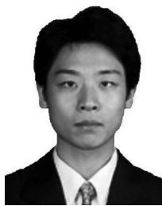

Chi Harold Liu (SM’15) received the BEng degree from Tsinghua University, China, in 2006 and the PhD degree from Imperial College, United Kingdom, in 2010. He is currently a full professor and vice dean with the School of Computer Science and Technology, Beijing Institute of Technology, China. Before moving to academia, he joined IBM Research - China as a staff researcher, after working as a postdoctoral researcher with Deutsche Telekom Laboratories, Germany, and a visiting scholar with IBM T. J. Watson Research Center,

USA. His current research interests include the mobile crowdsensing and deep learning. He received the IBM First Plateau Invention Achievement Award in 2012, and was interviewed by EEWeb.com as the featured engineer in 2011. He has published more than 90 prestigious conference and journal papers and owned more than 14 EU/U.S./U.K./China patents. He serves as the area editor for the KSII Transactions on Internet and Information Systems and the book editor for six books published by Taylor & Francis Group and China Machinery Press. He also has served as the TPC member of IEEE INFOCOM’18, IWQoS’19, and Chair for ICC’20 Next Generation Networking Symposium. He served as the consultant to Asian Development Bank, Bain & Company, and KPMG, USA, and the peer reviewer for Qatar National Research Foundation, and National Science Foundation, China. He is a senior member of the IEEE and a fellow of IET.


Zipeng Dai is currently working toward the MSc degree under the supervision of Prof. Chi Harold Liu in the School of Computer Science and Technology, Beijing Institute of Technology, China. He is now working on the problems of mobile crowdsensing and deep reinforcement learning.


Yinuo Zhao is working toward the MSc degree under the supervision of Prof. Chi Harold Liu in the School of Computer Science and Technology, Beijing Institute of Technology, China. She is now working on the incentive mechanism design for mobile crowdsensing with deep reinforcement learning.


Jon Crowcroft (F’04) received the graduate degree in physics from Trinity College, Cambridge University, United Kingdom, in 1979, the MSc degree in computing in 1981, and the PhD degree from University College London (UCL), United Kingdom, in 1993. He is currently the Marconi professor of communications systems with the Computer Lab, University of Cambridge, United Kingdom. He is a fellow of the United Kingdom Royal Academy of Engineering, a fellow of the IEEE, a fellow of the ACM, and a fellow of IET. He was a recipient of the ACM Sigcomm Award in 2009.


Dapeng Wu (S’98-M’04-SM’06-F’13) received the PhD degree in electrical and computer engineering from Carnegie Mellon University, Pittsburgh, Pennsylvania, in 2003. He is currently a professor with the Department of Electrical and Computer Engineering, University of Florida, Gainesville, Florida. His research interests include networking, communications, signal processing, computer vision, machine learning, smart grid, and information and network security. He is currently the editor-in-chief of the IEEE Transactions on Network Science and Engineering. He is a fellow of the IEEE.


Kin K. Leung (F’01) received the BS degree from the Chinese University of Hong Kong, in 1980, and the MS and PhD degrees from the University of California at Los Angeles, Los Angeles, California, in 1982 and 1985, respectively. He joined AT&T Bell Labs, New Jersey, in 1986 and worked at its successors, AT&T Labs and Lucent Technologies Bell Labs, until 2004. Since 2004, he has been the Tanaka chair professor with the Electrical and Electronic Engineering (EEE) and the Computing Departments, Imperial College, in

London, United Kingdom. He is currently the Head of the Communications and Signal Processing Group, EEE Department. His current research focuses on protocols, optimization, and modeling of various wireless networks, with applications of novel deep learning techniques. He received the distinguished member of Technical Staff Award from AT&T Bell Labs (1994), and was a co-recipient of the Lanchester Prize Honorable Mention Award (1997). He received the Royal Society Wolfson Research Merits Award (2004-2009) and became a member of Academia Europaea (2012). He also received several best paper awards, and actively served on conference committees and as journal editors. He is a fellow of the IEEE.

" For more information on this or any other computing topic, please visit our Digital Library at www.computer.org/csdl.