# Distributionally Robust Computation Offloading and Trajectory Optimization in Low-Altitude Wireless Networks

Ziye Jia, Member, IEEE, Guanwang Jiang, Lijun He, Member, IEEE, Yian Zhu, Qihui Wu, Fellow, IEEE, Chau Yuen, Fellow, IEEE, and Zhu Han, Fellow, IEEE

Abstract—The low-altitude wireless network, combining the flexibility of unmanned aerial vehicles (UAVs) and wide coverage of high-altitude platforms (HAPs), is promising to meet the rising computation demands. However, it is challenging to consider both the uncertain task sizes from users with heterogeneous demands and high mobility of UAVs when providing computation offloading services for ground users (GUs). In this paper, we consider the cooperation of the UAVs and HAP to provide computation offloading for the GUs. To characterize the uncertainty of task sizes, we construct diverse uncertainty sets related with different probability metrics, i.e., the L1 norm, L norm, and Fortet-Mourier metrics. Based on the uncertainty sets, the distributionally robust optimization problem is formulated to minimize the worst expected delay by jointly optimizing the offloading decisions and UAV trajectories, which is an NP-hard mixed-integer min-max problem. To make it tractable, we iteratively solve the outer-layer minimization problem with the probability distribution, and the inner-layer maximization problem with offloading decisions and UAV trajectories. The outer-layer problem is convex and can be solved by the optimization toolkit. To handle the inner-layer mixedinteger problem, we design the algorithm based on the Benders decomposition and successive convex approximation. Simulation results demonstrate that the proposed algorithm outperforms traditional optimization methods in terms of the worst expected delay and robustness against probability distribution shifts.

Index Terms—Low-altitude wireless network, computation offloading, UAV trajectory, distributionally robust optimization.

## I. INTRODUCTION

various aircrafts such as unmanned aerial vehicles (UAVs) and high-altitude platforms (HAPs), has attracted increasing attentions in recent years [1]–[3]. LAWN can enable the ondemand connectivity in disaster-stricken regions, bridge digital gaps in remote areas, and support the real-time data collection [4]–[6]. Moreover, LAWN is promising to meet the great computation requirements in the scenario where the computing power of the ground equipment is insufficient [7]–[9]. As main components of LAWN, UAVs generally operating below the altitude of 3km, provide high flexibilities to adapt to the time-varying demands, such as the temporary hot-spots in the crowded events or disaster-stricken areas requiring urgent connectivities [10]–[13]. HAPs operating at the altitude of 20km, can provide the wide-area coverage with stable communication links [14]. Therefore, the combination of the on-demand service capabilities of UAVs with the large-scale coverage of HAPs, can enhance the coverage, capacity, and delay performance of LAWN [15].

Regardless of the advantage of LAWN, there still exist many challenges. It is pivotal to optimize the UAV trajectories while considering the spatial distributions of ground users (GUs), as it reduces the offloading transmission distances and eases burdens of HAPs in hot-spots. Besides, the task sizes are generally stochastic and varying due to the behaviors of users (e.g., sudden bursts of the video streaming), application types (e.g., varying resolution in augmented reality tasks), and environmental conditions (e.g., data compression adjustments under the poor channel quality) [16]–[18]. Traditional methods can address the uncertainty of task sizes, but they remain insufficient in various aspects. For example, the stochastic optimization (SO) relies on the known probability distribution function (PDF) of the stochastic tasks, which is impractical in real-world scenarios [19]. Besides, the robust optimization (RO) considering the performance in the worst-case may result in overly conservative solutions, thereby resulting in an unnecessary waste of resources [20]. In contrast, by optimizing the expected performance within the constructed uncertainty set, the distributionally robust optimization (DRO) can achieve a balance between the robustness and optimality [21], [22].

To deal with the above challenges, we consider LAWN with UAVs and HAP collaboratively providing computation offloading services for GUs with uncertain tasks. To characterize the uncertain task sizes, we adopt different uncertainty sets based on diverse probability distance metrics for two probability distributions. Based on the constructed uncertainty sets, a DRO problem jointly optimizing the offloading decisions and UAV trajectories is formulated to minimize the delay under the worst probability distribution of task sizes. To deal with the proposed NP-hard mixed-integer min-max problem, we design a distributionally robust computation offloading and trajectory optimization (DRCOTO) algorithm. In detail, since the DRO problem is in the form of the min-max optimization, we alternatively solve the problem of the outer and inner layers. The outerlayer minimization problem with the probability distribution is linear and can be solved directly by the optimizer such as Gurobi. To solve the inner-layer mixed-integer maximization problem, we design the computation offloading and trajectory optimization algorithm based on the Benders decomposition (BD) and successive convex approximation (SCA). The main contributions of this paper are summarized as follows.

To model the uncertainty of task sizes in LAWN, we leverage the historical data to construct uncertainty sets. Moreover, to capture the effectiveness and robustness of various uncertainty sets based on different probability metrics, we leverage the $L _ { 1 }$ norm, $L _ { \infty }$ norm, and Fortet-Mourier (FM) metrics to construct uncertainty sets.

We formulate the coordination between multiple UAVs and a HAP to provide computation offloading for GUs in LAWN as an optimization problem. Then, a DRO problem is formulated to jointly optimize the offloading decisions and UAV trajectories, aiming to minimize the worst expected delay within the uncertainty sets.

We design the DRCOTO algorithm to handle the proposed DRO problem by iteratively solving the decomposed outerlayer and inner-layer problems. The outer-layer problem is convex and can be solved by the optimization toolkit. Moreover, since the inner-layer problem is a mixed-integer optimization, we decompose it into the sub-problem and master problem based on BD. Then, the algorithm is designed based on SCA to solve the non-convex subproblem with UAV trajectories. Moreover, the masterproblem with offloading decisions is a 0-1 programming problem, which can be solved by the optimization solver.

We conduct the simulations and the results demonstrate that the proposed DRCOTO algorithm outperforms traditional optimization methods in terms of the trade-off between the optimized delay and robustness, maintaining the stable performance across probability distribution shifts.

The remainder of this paper is organized as follows. Section II reviews related works. Section III presents the system model, and formulates the DRO problem. Section IV proposes the algorithms. Section V conducts simulations and discusses the performance. Finally, Section VI draws the conclusion.

## II. RELATED WORKS

The integration of UAVs with computation offloading has attracted research interests due to the flexibility and on-demand deployment capabilities. For example, focusing on the energy efficiency and service fairness, [23] jointly optimized the UAV trajectories and computation offloading, and developed an optimization-embedded multi-agent deep reinforcement learning (MADRL) algorithm to adapt to dynamic demands. [24] considered a dual-UAV-aided mobile edge computing (MEC) network, and proposed a distributed UAV function switching and trajectory design algorithm to reduce the delay and enhance the network communication security. In a multi-UAV system equipped with the reconfigurable intelligent surfaces, the MADRL was employed in [25] to optimize the computation offloading strategies, UAV trajectories, and reconfigurable intelligent surface phase shifts, aiming to minimize the delay while ensuring the fairness among ground terminals. In [26], the proximal policy optimization method was adopted to jointly address the UAV deployment and computation offloading, balancing the computational loads and energy consumption while minimizing the end-to-end delay. [27] jointly designed the flight trajectory of UAV and communication scheduling strategies among multiple ground terminals, to minimize the total delay including the task offloading and computing processing.

These studies primarily focus on systems solely composed of UAVs. However, UAVs are constrained by the limited endurance and coverage, which hinders the effectiveness of UAVs in the large-scale and long-duration missions. To address the challenge, several studies have been conducted in LAWN by combining UAVs and HAPs. For example, [28] jointly optimized the resource allocation and task offloading of the UAVs and HAP to maximize the number of computed tasks. In [29], a hierarchical offloading computing model assisted by the UAV and HAP was established, with the optimization of the offloading decision and UAV trajectory to minimize the task computing delay and UAV energy consumption. In the heterogeneous aerial access Internet of Things, [30] studied the integrated decision-making regarding the device association, partial task offloading, and communication resource allocation, enhancing the service satisfaction while reducing the overall energy consumption. [31] minimized the total energy cost under chance constraints, considering the inaccuracies in the channel state information induced by unpredictable environmental conditions within an aerial MEC network aided by the UAVs and HAPs.

However, these works predominantly assumed that the task sizes are static or predictable, overlooking the stochastic nature of tasks in the real world. Therefore, addressing the task uncertainty in LAWN remains a critical research issue. In the aerial access networks scenario, [32] addressed the uncertainty of task sizes by formulating a DRO problem, and minimized the delay through optimizing the computation offloading decisions. However, [32] failed to fully account for the coupling between integer variables and UAV trajectories. [33] investigated a UAV-MEC system with stochastic computing tasks, reducing the average weighted energy consumption of smart mobile devices and UAVs under the constraints of the computation offloading, resource allocation, and flight trajectory scheduling. To address the stochastic nature of task arrivals and channel variations, [34] formulated a stochastic optimization problem aiming to minimize the average weighted sum of the energy consumption. Both [33] and [34] adopted SO, but it is difficult to accurately obtain the probability distribution function in realworld application scenarios.

Notably, these existing studies incorporated the synergistic collaboration between UAVs and HAPs, and some works accounted for the UAV trajectories, but the uncertain task sizes are rarely considered in these studies. Hence, we focus on developing a DRO framework that jointly optimizes the computation offloading decisions and UAV trajectories in LAWN, to minimize the worst expected delay under uncertain task sizes, thereby bridging the gap between the theoretical model assumptions and practical operational constraints.

## III. SYSTEM MODEL AND PROBLEM FORMULATION

In this section, the LAWN model is proposed in Section III-A. Then, the uncertainty sets, computation model, communication model, and trajectory model are proposed in Sections III-B, III-C, III-D, and III-E, respectively. The problem formulation is detailed in Section III-F.

## A. LAWN Model

As shown in Fig. 1, LAWN is composed of GUs with uncertain tasks, UAVs in cruising state, and one HAP hovering in the air. Both the UAVs and HAP carry computation resources to provide computation services for GUs. Specifically, the tasks of GUs can be computed locally or offloaded to the UAVs or HAP. Before the task is offloaded, it will be collected by the UAV firstly, and then computed on the UAV or relayed to the HAP for further processing. In detail, the GUs, UAVs and HAP are denoted by $i \in \mathcal { T } = \{ 1 , 2 , . . . , I \} , j \in \mathcal { I } = \{ 1 , 2 , . . . , J \}$ , and H, respectively. The considered time period of T is divided into N time slots, each with a duration τ and indexed by $n \in \mathcal { N } = \{ 1 , 2 , . . . , N \}$ . The slot length τ is sufficiently small so that the flying distance of UAVs within each time slot is negligible, and the channel gain can be regarded as constant during each slot.

A three-dimensional Cartesian coordinate is considered to characterize the positions of the GUs, UAVs and HAP. The coordinate of GU i is $q _ { i } ^ { g } = ( q _ { i } ^ { g x } , q _ { i } ^ { g y } , 0 )$ . UAVs cruise at the constant height $q ^ { u z }$ above the ground with a constant flight speed $v ^ { u f }$ , to concentrate on the core horizontal trajectory planning and offloading decisions while complying with typical operational constraints. The position of UAV j at time slot n is $q _ { j , n } ^ { u } = ( q _ { j , n } ^ { u x } , q _ { j , n } ^ { u y } , q ^ { u z } )$ . The fixed location of the HAP is $q ^ { h } = ( q ^ { h x } , q ^ { \tilde { h } y } , q ^ { \tilde { h } z } )$ . According to the Euclidean formula, the distance between UAV j and GU i in time slot n is

$$
d _ { i , j , n } ^ { u g } = | | q _ { j , n } ^ { u } - q _ { i } ^ { g } | | ,\tag{1}
$$

and the distance between UAV $j$ and HAP H in time slot $n$ is

$$
d _ { j , n } ^ { u h } = | | q _ { j , n } ^ { u } - q ^ { h } | | .\tag{2}
$$

## B. Uncertainty Set for Task Size

Each GU has a computation-intensive task $\phi _ { i } ~ = ~ \{ s _ { i } , c _ { i } \}$ during the entire period T , where $s _ { i }$ is the task size in bits, and $c _ { i }$ is the number of CPU cycles required per bit. To maintain the analytical tractability while capturing the essential coupling between the task offloading and trajectory planning, we assume that each task can be evenly divided into N independent parts, with one part $\phi _ { i }$ processed in each time slot [35]. This assumption enables us to focus on the core challenge of integrating DRO with the joint optimization of discrete offloading decisions and continuous UAV trajectories under uncertain task sizes. Hence, the data size of task $\phi _ { i }$ to be computed in time slot n is $s _ { i , n } = s _ { i } / N$

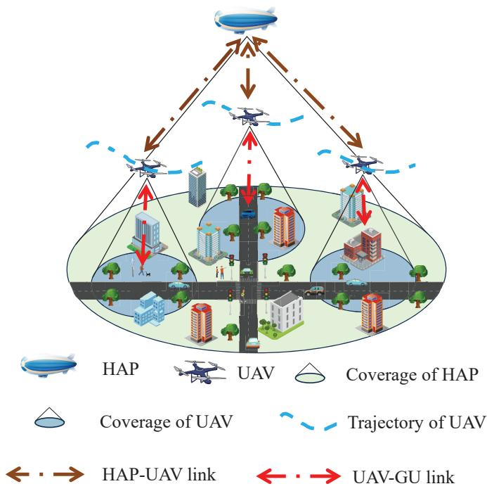  
Fig. 1. Scenario of LAWN.

In most scenarios, the data sizes of tasks are uncertain, with the probability distributions unspecified. To strengthen the robustness of the model, we designate the probability distribution of $s _ { i }$ as $\mathbb { P } _ { i }$ , and the reference distribution of $s _ { i }$ as $\mathbb { P } _ { i } ^ { 0 }$ , which is derived from the historical data. Then, based on $\mathbb { P } _ { i } ^ { 0 }$ , we define the uncertainty set $\mathcal { D } _ { i }$ as

$$
\mathcal { D } _ { i } = \{ \mathbb { P } _ { i } | d ( \mathbb { P } _ { i } ^ { 0 } , \mathbb { P } _ { i } ) \leq \epsilon \} ,\tag{3}
$$

where $d ( \mathbb { P } _ { i } ^ { 0 } , \mathbb { P } _ { i } )$ is a predefined distance metric between $\mathbb { P } _ { i } ^ { 0 }$ and $\mathbb { P } _ { i } ,$ , and ϵ is the corresponding tolerance value. The sample space Ω comprises K discrete possible values for the task size, and $\Omega = \{ s ^ { k } | \forall k = 1 , 2 , . . . , K \}$ . The sample size $s ^ { k }$ corresponds to the k-th interval $[ d ^ { k } , d ^ { k + 1 } )$ , where $d ^ { k }$ is the boundary of the k-th interval. Additionally, each $s _ { i }$ is assumed to share the same sample space Ω while adhering to its own probability distribution $\mathbb { P } _ { i } .$ . Given historical data samples with total number Q, the reference distribution is $\mathbb { P } _ { i } ^ { 0 } = \{ p _ { i , 1 } ^ { 0 } , p _ { i , 2 } ^ { 0 } , . . . , p _ { i , K } ^ { 0 } \}$ , where $p _ { i , k } ^ { 0 }$ indicates the probability of $\phi ^ { k }$ in the reference distribution, i.e.,

$$
p _ { i , k } ^ { 0 } = \frac { \sum _ { q = 1 } ^ { Q } \delta ^ { k } ( s _ { i } ) } { Q } , \forall k = 1 , 2 , . . . , K .\tag{4}
$$

Here, if $d ^ { k } \leq s _ { i } < d ^ { k + 1 } , \delta ^ { k } ( s _ { i } ) = 1$ , and otherwise $\delta ^ { k } ( s _ { i } ) \mathrm { = } 0$

However, the varying metrics typically result in different measured distances between two distributions, which in turn exert a notable influence on the effectiveness and robustness. To capture these effects, three different distance measurements, including $d _ { L _ { 1 } } ( \mathbb { P } _ { i } ^ { 0 } , \mathbb { P } _ { i } ) , d _ { L _ { \infty } } ( \mathbb { P } _ { i } ^ { 0 } , \mathbb { P } _ { i } )$ and $d _ { F M } ( \mathbb { P } _ { i } ^ { 0 } , \mathbb { P } _ { i } )$ , are constructed by different probabilistic metrics, i.e., the $L _ { 1 }$ norm, $L _ { \infty }$ norm, and FM metric, respectively, i.e.,

$$
d _ { L _ { 1 } } ( \mathbb { P } _ { i } ^ { 0 } , \mathbb { P } _ { i } ) = | | \mathbb { P } _ { i } ^ { 0 } - \mathbb { P } _ { i } | | _ { 1 } = \sum _ { k = 1 } ^ { K } | p _ { i , k } - p _ { i , k } ^ { 0 } | ,\tag{5}
$$

$$
d _ { L _ { \infty } } ( \mathbb { P } _ { i } ^ { 0 } , \mathbb { P } _ { i } ) = | | \mathbb { P } _ { i } ^ { 0 } - \mathbb { P } _ { i } | | _ { \infty } = \operatorname* { m a x } _ { 1 \leq k \leq K } | p _ { i , k } - p _ { i , k } ^ { 0 } | ,\tag{6}
$$

and

$$
d _ { F M } ( \mathbb { P } _ { i } ^ { 0 } , \mathbb { P } _ { i } ) = \operatorname* { m a x } _ { h \in \mathcal { H } } \left| \int _ { \Omega } h d \mathbb { P } _ { i } - \int _ { \Omega } h d \mathbb { P } _ { i } ^ { 0 } \right| .\tag{7}
$$

Here, $p _ { i , k }$ denotes the probability of $s ^ { k }$ in the distribution of $s _ { i } , \ \mathcal { H } \ = \ \{ h \ : \ | | h | | _ { L } \ \leq \ 1 \}$ , and $| | h | | _ { L } \quad =$ $s u p \{ ( h ( x ) - h ( y ) ) / \rho ( x , y ) : x \neq y \quad \in \quad \Omega \}$ , where $\rho ( x , y )$ is the distance between the variables x and y [17].

## C. Computation Model

Due to the limited computation resources of GUs, it may not be feasible to complete a task locally. In this case, we employ a binary offloading mode. In detail, data $s _ { i , n }$ of GU i in time slot n is first collected by a UAV. Then, data $s _ { i , n }$ is determined either to be computed on the UAV directly or relayed to the HAP for further processing. The relevant variables concerning computation offloading decision-making are defined as

$$
x _ { i , j , n } = { \left\{ \begin{array} { l l } { 1 , } & { { \mathrm { i f ~ } } s _ { i , n } { \mathrm { ~ i s ~ f i r s t l y ~ c o l l e c t e d ~ b y ~ U A V ~ } } j , } \\ { 0 , } & { { \mathrm { o t h e r w i s e } } , } \end{array} \right. }\tag{8}
$$

$$
y _ { i , j , n } = { \left\{ \begin{array} { l l } { 1 , } & { { \mathrm { i f ~ } } s _ { i , n } { \mathrm { ~ i s ~ c o m p u t e d ~ o n ~ U A V ~ } } j , } \\ { 0 , } & { { \mathrm { o t h e r w i s e } } , } \end{array} \right. }\tag{9}
$$

and

$$
z _ { i , j , n } = \left\{ { \begin{array} { l l } { 1 , } & { { \mathrm { i f ~ } } s _ { i , n } { \mathrm { ~ i s ~ r e l a y e d ~ f r o m ~ U A V ~ } } j { \mathrm { ~ t o ~ t h e ~ H A P } } , } \\ { 0 , } & { { \mathrm { o t h e r w i s e . } } } \end{array} } \right.\tag{10}
$$

1) GU based Computation Model: The delay for $s _ { i , n }$ locally computed on GU i is

$$
T _ { i , n } ^ { g c p } = \frac { \Bigg ( 1 - \sum _ { j = 1 } ^ { J } x _ { i , j , n } \Bigg ) s _ { i , n } c _ { i } } { f ^ { g c p } } ,\tag{11}
$$

where $f ^ { g c p }$ is the processor capabilities (cycles/s) of GUs. The energy consumption of GU i to compute data $s _ { i , n }$ is

$$
E _ { i , n } ^ { g c p } = ( 1 - \sum _ { j = 1 } ^ { J } x _ { i , j , n } ) \eta ^ { g } s _ { i , n } c _ { i } ( f ^ { g c p } ) ^ { 2 } ,\tag{12}
$$

where $\eta ^ { g }$ is the computation capacity coefficient of GUs.

2) UAV based Computation Model: The delay for $s _ { i , n }$ computed on UAV j is

$$
\begin{array} { r } { T _ { i , j , n } ^ { u c p } = \frac { s _ { i , n } y _ { i , j , n } c _ { i } } { f ^ { u c p } } , } \end{array}\tag{13}
$$

where $f ^ { u c p }$ is the processor capabilities (cycles/s) of UAV j. The energy cost of UAV j to compute data $s _ { i , n }$ is

$$
E _ { i , j , n } ^ { u c p } = \eta ^ { u } y _ { i , j , n } s _ { i , n } c _ { i } ( f ^ { u c p } ) ^ { 2 } ,\tag{14}
$$

where $\eta ^ { u }$ indicates the computation capacity of UAVs.

3) HAP based Computation Model: The delay for $s _ { i , n }$ computed on HAP H is

$$
\begin{array} { r } { T _ { i , j , n } ^ { h c p } = \frac { s _ { i , n } z _ { i , j , n } c _ { i } } { f ^ { h c p } } , } \end{array}\tag{15}
$$

where $f ^ { h c p }$ is the processor capabilities (cycles/s) of HAP H. The energy consumption of HAP H for computing data $s _ { i , n }$ relayed from UAV j is

$$
E _ { i , j , n } ^ { h c p } = { \eta } ^ { h } s _ { i , n } c _ { i } ( f ^ { h c p } ) ^ { 2 } z _ { i , j , n } ,\tag{16}
$$

where $\eta ^ { h }$ is the computation capacity coefficient of HAP H.

## D. Communication Model

1) GU to UAV: The link between the GU and UAV may be blocked by buildings. We leverage the probabilistic line-of-sight (LoS) channel model for the mixture of LoS and non-line-ofsight (NLoS) environments [36]. The probability of the LoS link $P _ { L o S } ( \theta _ { i , j , n } )$ depends on the angle between GU i and UAV j in time slot n, calculated as

$$
P _ { L o S } ( \theta _ { i , j , n } ) = \frac { 1 } { 1 + a e ^ { - b ( \theta _ { i , j , n } - a ) } } ,\tag{17}
$$

where a and b are the environment related parameters. Moreover, $\theta _ { i , j , n } \ =$ arcsin $\left( q ^ { u z } / d _ { i , j , n } ^ { u g } \right)$ is the angle between GU i and UAV j in time slot n [15]. The probability of NLoS is $P _ { N L o S } ( \theta _ { i , j , n } ) = 1 - P _ { L o S } ( \theta _ { i , j , n } )$ . Thus, the channel gain between GU i and UAV j in time slot n is

$$
\begin{array} { r l } & { g _ { i , j , n } ^ { u g } = { P _ { L o S } } ( \theta _ { i , j , n } ) \beta _ { 0 } ( d _ { i , j , n } ^ { u g } ) ^ { - \alpha } } \\ & { \qquad + { P _ { N L o S } } ( \theta _ { i , j , n } ) \kappa \beta _ { 0 } ( d _ { i , j , n } ^ { u g } ) ^ { - \alpha } , } \end{array}\tag{18}
$$

where $\beta _ { 0 }$ is the path loss at a reference distance of 1m for LoS environments, α is the path loss exponent, and κ is the attenuation loss for NLoS links. According to the Shannon theory, the data transmission rate from GU i to UAV j in time slot n is

$$
R _ { i , j , n } ^ { u g } = B ^ { u g } \log _ { 2 } \left( 1 + \frac { p ^ { g t r } g _ { i , j , n } ^ { u g } } { \sigma ^ { 2 } + I ^ { u g } } \right) ,\tag{19}
$$

where $B ^ { u g }$ is the channel bandwidth between GUs and UAVs, $p ^ { g t r }$ is the maximum transmission power of ${ \mathrm { G U s } } , \sigma ^ { 2 }$ is the noise power, and $I ^ { u g }$ is the average interference from other GUs, sharing the same sub-channel [37]. The average interference term $I ^ { u g }$ is adopted for the tractability in the high-level joint optimization of offloading decisions and trajectories. This static model provides a performance estimate, as it systematically underestimates the achievable data rate, thereby ensuring the robustness of the derived solution. Therefore, the transmission delay for sending data $s _ { i , n }$ from GU i to UAV j is

$$
T _ { i , j , n } ^ { g u t r } = \frac { s _ { i , n } x _ { i , j , n } } { R _ { i , j , n } ^ { u g } } .\tag{20}
$$

The energy consumption of GU i to transmit data $s _ { i , n }$ is

$$
E _ { i , n } ^ { g u t r } = p ^ { g t r } \sum _ { j = 1 } ^ { J } T _ { i , j , n } ^ { g u t r } .\tag{21}
$$

Therefore, the total energy consumption of GU i to transmit and compute data $s _ { i , n }$ is

$$
E _ { i , n } ^ { g } = E _ { i , n } ^ { g u t r } + E _ { i , n } ^ { g c p } .\tag{22}
$$

2) UAV to HAP: Since the HAP operates at a relatively high altitude, the fading effects caused by the reflection and diffraction in the surrounding environments can be ignored [38]. Thus, we take the free-space path loss into consideration [39]. Moreover, to avoid the interference from other links, the orthogonal frequency division multiplexing is applied to the link between the UAV and HAP [40]. The achievable data transmission rate from UAV j to HAP H in time slot n is

$$
R _ { j , n } ^ { u h } = B ^ { u h } \log _ { 2 } \left( 1 + \frac { p ^ { u t r } G ^ { u h } L _ { l } L _ { j , n } ^ { u h } } { B ^ { u h } K _ { B } T _ { s } } \right) ,\tag{23}
$$

where $B ^ { u h }$ is the bandwidth between the UAV and HAP, Guh is the antenna gain, $p ^ { u t r }$ is the transmit power of the UAV, $L _ { l }$ is the total path loss, $K _ { B }$ is the Boltzmann constant, $T _ { s }$ is the system noise temperature, and $L _ { j , n } ^ { u h } = \left( c / ( 4 \pi d _ { j , n } ^ { u h } f _ { c } ^ { u h } ) \right) ^ { 2 }$ is the free-space path loss. Parameter c is the speed of light and $f _ { c } ^ { u h }$ is the central frequency. Then, the transmission delay for sending data $s _ { i , n }$ from UAV j to HAP H is

$$
T _ { i , j , n } ^ { u h t r } = \frac { s _ { i , n } z _ { i , j , n } } { R _ { j , n } ^ { u h } } .\tag{24}
$$

The energy cost for UAV j to transmit data $s _ { i , n }$ to the HAP is

$$
E _ { i , j , n } ^ { u h t r } = p ^ { u t r } T _ { i , j , n } ^ { u h t r } .\tag{25}
$$

The total delay for computing data $s _ { i , n }$ is

$$
T _ { i , n } = T _ { i , n } ^ { g c p } + T _ { i , n } ^ { c o } ,\tag{26}
$$

where $T _ { i , n } ^ { c o }$ is the overall delay for computation offloading, i.e.,

$$
T _ { i , n } ^ { c o } = \sum _ { j = 1 } ^ { J } \left( T _ { i , j , n } ^ { g u t r } + T _ { i , j , n } ^ { u h t r } + T _ { i , j , n } ^ { u c p } + T _ { i , j , n } ^ { h c p } \right) .\tag{27}
$$

## E. Trajectory Model for UAVs

The UAVs operating within the specific area can leverage the inherent flexibility to deliver computing services with elastic characteristics. Moreover, the UAV trajectories are constrained within the operation area, defined by

$$
0 < q _ { j , n } ^ { u x } < X _ { m a x } , \forall j \in \mathcal { I } , n \in \mathcal { N } ,\tag{28}
$$

and

$$
0 < q _ { j , n } ^ { u y } < Y _ { m a x } , \forall j \in \mathcal { I } , n \in \mathcal { N } ,\tag{29}
$$

where $X _ { m a x }$ and $Y _ { m a x }$ are the horizontal boundaries. Moreover, the maximum horizontal flight distance in a single time slot is limited by

$$
| | q _ { j , n } ^ { u } - q _ { j , n - 1 } ^ { u } | | \leq v ^ { u f } \tau , \forall j \in \mathcal { I } , n \in \mathcal { N } .\tag{30}
$$

For the aerial safety, a minimum safe distance $D _ { m i n }$ must be maintained between any two UAVs, i.e.,

$$
| | q _ { j , n } ^ { u } - q _ { j ^ { \prime } , n } ^ { u } | | \geq D _ { m i n } , \forall j , j ^ { ' } \in \mathcal { I } , j \neq j ^ { ' } , n \in \mathcal { N } .\tag{31}
$$

The flight power $p ^ { u f }$ of the UAV is

$$
\begin{array} { c } { { p ^ { u f } = P _ { 1 } \left( 1 + \displaystyle \frac { 3 | | v ^ { u f } | | ^ { 2 } } { U _ { t i p } ^ { 2 } } \right) + \displaystyle \frac { 1 } { 2 } d _ { 0 } { \varsigma _ { 0 } } s A | | v ^ { u f } | | ^ { 3 } } } \\ { { + P _ { 2 } \left( \sqrt { 1 + \displaystyle \frac { | | v ^ { u f } | | ^ { 4 } } { 4 v _ { 0 } ^ { 2 } } } - \displaystyle \frac { | | v ^ { u f } | | ^ { 2 } } { 2 v _ { 0 } ^ { 2 } } \right) ^ { \frac { 1 } { 2 } } , } } \end{array}\tag{32}
$$

where $P _ { 1 }$ is the power of the UAV blade, $U _ { t i p }$ represents the blade tip speed, $d _ { 0 }$ denotes the fuselage drag ratio, $\varsigma _ { 0 }$ is the air density, s is the rotor solidity, A is the rotor area, $P _ { 2 }$ is the induced power during hovering, and $v _ { 0 }$ is the mean velocity of rotors [41]. Thereby, the hovering power of UAVs is

$$
p ^ { u h o v } = P _ { 1 } + P _ { 2 } .\tag{33}
$$

Hence, the time cost for UAV j flying in time slot n is

$$
T _ { u , n } ^ { f l y } = \frac { | | q _ { j , n } ^ { u } - q _ { j , n - 1 } ^ { u } | | } { v ^ { u f } } .\tag{34}
$$

Therefore, the energy cost of UAV j flying and hovering in time slot n is

$$
E _ { j , n } ^ { u f } = p ^ { u f } T _ { u , n } ^ { f l y } + p ^ { u h o v } ( \tau - T _ { u , n } ^ { f l y } ) .\tag{35}
$$

The energy consumption $E _ { j } ^ { u }$ of UAV j to compute or transmit all datas of GUs in all time slots mainly consists of three parts: the communication cost $E _ { i , j , n } ^ { u h t r }$ , computing cost $E _ { i , j , n } ^ { u c p }$ and movement cost $E _ { j , n } ^ { u f }$ , i.e.,

$$
E _ { j } ^ { u } = \sum _ { i = 1 } ^ { I } \sum _ { n = 1 } ^ { N } E _ { i , j , n } ^ { u h t r } + \sum _ { i = 1 } ^ { I } \sum _ { n = 1 } ^ { N } E _ { i , j , n } ^ { u c p } + \sum _ { n = 1 } ^ { N } E _ { j , n } ^ { u f } .\tag{36}
$$

## F. Problem Formulation

Based on the constructed uncertainty sets, we formulate the DRO problem P0, jointly optimizing the computation offloading strategies and UAV trajectories to minimize the maximum expected total delay, i.e.,

$$
\mathbf { P 0 } { \mathrm { : } } \operatorname* { m i n } _ { \substack { x , y , z , q } } \operatorname* { m a x } \sum _ { p } ^ { I } \sum _ { i = 1 } ^ { N } \sum _ { n = 1 } ^ { N } \mathbb { E } _ { \mathbb { P } _ { i } } \left( T _ { i , n } \right)
$$

s.t. (28) − (31),

$$
\sum _ { j = 1 } ^ { J } x _ { i , j , n } \leq 1 , \forall i \in \mathcal { T } , n \in \mathcal { N } ,\tag{37}
$$

$$
\sum _ { i = 1 } ^ { I } y _ { i , j , n } \leq N ^ { u } , \forall j \in \mathcal { I } , n \in \mathcal { N } ,\tag{38}
$$

$$
\sum _ { i = 1 } ^ { I } \sum _ { j = 1 } ^ { J } z _ { i , j , n } \leq N ^ { h } , \forall n \in \mathcal { N } ,\tag{39}
$$

$$
y _ { i , j , n } + z _ { i , j , n } = x _ { i , j , n } , \forall i \in \mathcal { I } , j \in \mathcal { I } , n \in \mathcal { N } ,\tag{40}
$$

$$
\mathbb { E } _ { \mathbb { P } _ { i } } \left( T _ { i , n } \right) \le \tau , \forall i \in \mathcal { I } , n \in \mathcal { N } ,\tag{41}
$$

$$
\sum _ { n = 1 } ^ { N } \mathbb { E } _ { \mathbb { P } _ { i } } \left( E _ { i , n } ^ { g } \right) \leq E ^ { g m a x } , \forall i \in \mathbb { Z } ,\tag{42}
$$

$$
\mathbb { E } _ { \mathbb { P } _ { i } } \left( E _ { j } ^ { u } \right) \leq E ^ { u m a x } , \forall j \in \mathcal { I } ,\tag{43}
$$

$$
\sum _ { i = 1 } ^ { I } \sum _ { j = 1 } ^ { J } \sum _ { n = 1 } ^ { N } \mathbb { E } _ { \mathbb { P } _ { i } } \left( E _ { i , j , n } ^ { h c p } \right) \leq E ^ { h m a x } ,\tag{44}
$$

$$
\mathbb { P } _ { i } \in \mathcal { D } _ { i } , \forall i \in \mathcal { I } ,\tag{45}
$$

$$
x _ { i , j , n } \in \{ 0 , 1 \} , \forall i \in \mathcal { T } , j \in \mathcal { I } , n \in \mathcal { N } ,\tag{46}
$$

$$
y _ { i , j , n } \in \{ 0 , 1 \} , \forall i \in \mathcal { T } , j \in \mathcal { I } , n \in \mathcal { N } ,\tag{47}
$$

$$
z _ { i , j , n } \in \{ 0 , 1 \} , \forall i \in \mathcal { T } , j \in \mathcal { I } , n \in \mathcal { N } ,\tag{48}
$$

where $\mathbb { E } _ { \mathbb { P } _ { i } } \left( T _ { i , n } \right)$ is the expectation of $T _ { i , n }$ under the probability distribution $\mathbb { P } _ { i } , \textbf { \em x } = \{ x _ { i , j , n } , \forall i \in \mathcal { I } , j \in \mathcal { I } , n \in \mathcal { N } \}$ ${ \pmb y } ~ = ~ \{ y _ { i , j , n } , \forall i ~ \in ~ { \mathcal { Z } } , j ~ \in ~ { \mathcal { I } } , n ~ \in ~ { \mathcal { N } } \} , ~ z ~ = ~ \{ z _ { i , j , n } , \forall i ~ \in ~ { \mathcal { Q } } ^ { \prime } \}$ ${ \mathcal { Z } } , j ~ \in ~ { \mathcal { I } } , n ~ \in ~ { \mathcal { N } } \} , ~ q ~ = ~ \{ q _ { j , n } ^ { u } , \forall j ~ \in ~ { \mathcal { I } } , n ~ \in ~ { \mathcal { N } } \}$ , and $p = \{ \mathbb { P } _ { i } , \forall i \in \mathcal { T } \}$ . Constraint (37) implies that each task is collected by at most one UAV within a time slot. Constraints (38) and (39) limit the numbers of GUs served by UAV j and HAP H to their maximum capacities $N ^ { u }$ and $N ^ { h }$ , respectively. Constraint (40) indicates the data flow balancing on the UAV. Constraint (41) denotes that the execution time of data $s _ { i , n }$ can not exceed the length of time slot $\tau .$ Constraints (42), (43) and (44) restrict the energy consumption of each GU, UAV, and HAP to be within the maximum capacities of $E ^ { g m a x }$ $E ^ { u m a x } .$ and $E ^ { h m a x }$ , respectively. Here, $E ^ { h m a x }$ denotes the operational resource budget of HAP, reflecting its finite computational load-bearing capacity. Constraint (45) implies that probability distribution $\mathbb { P } _ { i }$ for each GU belongs to uncertainty set $\mathcal { D } _ { i }$

It is observed that the formulated problem P0 is related with random parameter $s _ { i }$ under uncertainty set $\mathcal { D } _ { i }$ . Besides, P0 is a mixed-integer problem, concerning binary variables x, y, and z, and continuous variables p and ${ \mathbf { } } q ,$ and the time complexity is exponential with the problem scale growing. Therefore, it is intractable to solve P0 directly with efficiency.

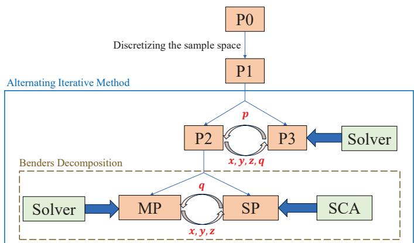  
Fig. 2. Flow chart of the DRCOTO algorithm.

## IV. ALGORITHM DESIGN

As shown in Section III, the coupled and mixed-integer variables as well as the uncertainty sets bring great challenges in solving P0. To address these issues, we first design the DRO-based alternating iterations algorithm in Section IV-A. Then, the problem is further processed via BD and SCA in Section IV-B. In Section IV-C, we reformulate the constraints of the uncertainty sets based on the FM metric. In Section IV-D, we design the global algorithm DRCOTO for solving the overall problem, and analyze the computational complexity of the proposed algorithm. For clarity, Fig. 2 shows the flow chart of the DRCOTO algorithm.

## A. DRO-based Alternating Iterative Algorithm

In this subsection, we reformulate and decompose the original problem P0, and then design a DRO-based alternating iterative algorithm. First, we discretize the sample space into K samples, denoted as $\Omega = \{ s ^ { k } | \forall k = 1 , 2 , . . . , K \}$ . Based on the discretization, problem P0 is reformulated as

$$
\begin{array} { r l r } {  { \mathbf { P 1 } \colon \operatorname* { m i n } _ { x , y , z , q } \operatorname* { m a x } \sum _ { p } ^ { I } \sum _ { i = 1 } ^ { N } \sum _ { h = 1 } ^ { K } p _ { i , k } T _ { i , n , k } } } \\ & { } & { \mathrm { s } . \mathrm { t } . \ ( 2 8 ) - ( 3 1 ) , ( 3 7 ) - ( 4 8 ) , } \end{array}
$$

where

$$
\begin{array} { l } { { \displaystyle T _ { i , n , k } = \sum _ { j = 1 } ^ { J } \bigg ( T _ { i , n , k } ^ { g c p } + T _ { i , j , n , k } ^ { g u t r } + T _ { i , j , n , k } ^ { u h t r } } } \\ { { \qquad + T _ { i , j , n , k } ^ { u c p } + T _ { i , j , n , k } ^ { h c p } \bigg ) , } } \end{array}\tag{49}
$$

$$
T _ { i , n , k } ^ { g c p } = \frac { \displaystyle \left( 1 - \sum _ { j = 1 } ^ { J } x _ { i , j , n } \right) s ^ { k } c _ { i } } { f ^ { g c p } } ,\tag{50}
$$

$$
T _ { i , j , n , k } ^ { g u t r } = \frac { s ^ { k } x _ { i , j , n } } { R _ { i , j , n } ^ { u g } } ,\tag{51}
$$

$$
T _ { i , j , n , k } ^ { u h t r } = \frac { s ^ { k } z _ { i , j , n } } { R _ { j , n } ^ { u h } } ,\tag{52}
$$

$$
T _ { i , j , n , k } ^ { u c p } = \frac { s ^ { k } y _ { i , j , n } c _ { i } } { f ^ { u c p } } ,\tag{53}
$$

and

$$
T _ { i , j , n , k } ^ { h c p } = \frac { s ^ { k } z _ { i , j , n } c _ { i } } { f ^ { h c p } } .\tag{54}
$$

To solve problem P1, we first fix $p _ { i , k }$ in the inner-layer maximization problem, and then we have P2 as

$$
\begin{array} { r l } & { \mathbf { P 2 } \mathrm { { : } } \underset { x , y , z , q } { \operatorname* { m i n } } \underset { i = 1 } { \sum } \underset { n = 1 } { \sum } \underset { k = 1 } { \sum } p _ { i , k } T _ { i , n , k } } \\ & { \mathrm { s . t . } \ ( 2 8 ) - ( 3 1 ) , ( 3 7 ) - ( 4 4 ) , ( 4 6 ) - ( 4 8 ) . } \end{array}
$$

By solving problem $\mathbf { P 2 } , x , y , z$ , and q are obtained, and P1 is transformed to P3, i.e.,

$$
\begin{array} { r l } & { \mathbf { P 3 } { \mathrm { : ~ } } \underset { \pmb { p } } { \operatorname* { m a x } } \displaystyle \sum _ { i = 1 } ^ { I } \sum _ { n = 1 } ^ { N } \sum _ { k = 1 } ^ { K } p _ { i , k } T _ { i , n , k } } \\ & { \mathrm { ~ s . t . ~ } ( 4 1 ) - ( 4 5 ) . } \end{array}
$$

Accordingly, we handle P1 by solving P2 and P3 through alternating iterations.

## B. BD-SCA for Computation Offloading and UAV Trajectories

Problem P2 is intractable to solve due to the coupled continuous decision variables q as well as the integer decision variables x, y, and z. To address this, we design the computation offloading and trajectory optimization algorithm based on BD and SCA. First, we decompose P2 into a sub-problem SP and a master problem MP based on BD. Problem SP only involves the continuous variables q while MP only involves binary decision variables x, y, and z. Particularly, the solutions of $\mathbf { S P }$ and MP provide the upper and lower bounds for P2, respectively. We iteratively solve these two problems until the gap between the upper and lower bound converges. The details of SP and MP are outlined as follows.

1) Sub-problem: Given the binary variables generated by MP at the ω-th iteration, the sub-problem is formulated as

$$
\begin{array} { r l } {  { \operatorname { S P } \mathrm { : } \operatorname* { m i n } \sum _ { \pmb { q } } ^ { I } \sum _ { n = 1 } ^ { N } \sum _ { k = 1 } ^ { K } p _ { i , k } T _ { i , n , k } } } \\ & { \mathrm { ~ s . t . ~ } ( 2 8 ) - ( 3 1 ) , ( 4 1 ) - ( 4 3 ) . } \end{array}
$$

To solve this non-convex problem, we design the algorithm based on SCA to achieve a local optimal solution. The key idea of SCA is to iteratively approximate the non-convex function with a convex function [42]. First, at the m-th iteration of SCA, we perform the first-order Taylor series expansions of $T _ { i , n , k }$ and $E _ { j , n } ^ { u f }$ to obtain the approximated functions $\hat { T } _ { i , n , k } ^ { m }$ and $\hat { E } _ { j , n } ^ { m u f }$ , i.e.,

$$
\begin{array} { r } { \hat { T } _ { i , n , k } ^ { m } = T _ { i , n , k } ( \pmb { q } ^ { m - 1 } ) + \nabla T _ { i , n , k } ( \pmb { q } ^ { m - 1 } ) ( \pmb { q } ^ { m } - \pmb { q } ^ { m - 1 } ) , } \end{array}\tag{55}
$$

and

$$
\hat { E } _ { j , n } ^ { m u f } = E _ { j , n } ^ { u f } ( \pmb { q } ^ { m - 1 } ) + \nabla E _ { j , n } ^ { u f } ( \pmb { q } ^ { m - 1 } ) ( \pmb { q } ^ { m } - \pmb { q } ^ { m - 1 } ) .\tag{56}
$$

Here, $\pmb q ^ { m - 1 }$ is the solution obtained at the (m − 1)-th iteration of the SCA. $T _ { i , n , k } ( \pmb q ^ { m - 1 } )$ and $E _ { j , n } ^ { u f } ( q ^ { m - 1 } )$ are the values of $T _ { i , n , k }$ and $E _ { j , n } ^ { u f }$ at point $\pmb q ^ { m - 1 }$ , respectively. Additionally, $\nabla f ( x )$ represents the derivative of $f ( x )$ at x. Then, at the mth iteration of the SCA, problem SP becomes

$$
\begin{array} { r l } {  { \mathbf { S P } ^ { \prime } \colon \underset { \ b { q } } { \operatorname* { m i n } } \sum _ { i = 1 } ^ { I } \sum _ { n = 1 } ^ { N } \sum _ { k = 1 } ^ { K } p _ { i , k } \hat { T } _ { i , n , k } ^ { m } } } \\ & { \mathrm { ~ s . t . ~ } ( 2 8 ) - ( 3 1 ) , ( 4 1 ) - ( 4 3 ) . } \end{array}
$$

Then, the Lagrangian function of problem $\mathbf { S P ^ { \prime } }$ at the ω-th iteration of the BD is calculated as

$$
\begin{array} { l } { { \displaystyle { \cal L } \left( { \pmb x } ^ { \omega - 1 } , { \pmb y } ^ { \omega - 1 } , { \pmb z } ^ { \omega - 1 } , { \pmb q } \right) } \ ~ } \\ { { \displaystyle = \sum _ { i = 1 } ^ { I } \sum _ { n = 1 } ^ { N } \sum _ { k = 1 } ^ { K } p _ { i , k } T _ { i , n , k } + ( \pmb \lambda ^ { \omega } ) ^ { T } ( G \left( { \pmb x } ^ { \omega - 1 } , { \pmb y } ^ { \omega - 1 } , { \pmb z } ^ { \omega - 1 } , { \pmb q } \right) ) } , } \end{array}\tag{57}
$$

where $\lambda ^ { \omega }$ is the vector of dual factors, $( \lambda ^ { \omega } ) ^ { T }$ is the transpose of $\lambda ^ { \omega }$ and $G \left( { { \pmb x } ^ { \omega - 1 } } , { { \pmb y } ^ { \omega - 1 } } , { z ^ { \omega - 1 } } , { \pmb q } \right)$ is the constraints set for SP′, defined as

$$
\begin{array} { r l } & { G ( x ^ { - \alpha - 1 } , y ^ { \alpha - 1 } , z ^ { \alpha - 1 } , q ) = } \\ & { ( \begin{array} { l } { - q _ { \alpha \beta \gamma } ^ { \beta \alpha } \check { y } ^ { \beta } \dot { f } \mathcal { I } , \pi \in \mathcal { N } , } \\ { - q _ { \alpha \beta \gamma } ^ { \beta \alpha } \check { y } ^ { \beta } \dot { f } \mathcal { F } , q \mathcal { N } \in \mathcal { N } , } \\ { - q _ { \alpha \beta \gamma } ^ { \beta \alpha } \check { y } \dot { f } \mathcal { F } , q \mathcal { N } \in \mathcal { N } , } \\ { q _ { \alpha \gamma } ^ { \beta \alpha } - { X } _ { m a x } , \forall j \dot { \mathcal { G } } \mathcal { I } , \pi \in \mathcal { N } , } \end{array} ) } \\ & { ~ } \\ & { | \begin{array} { l } { q _ { \alpha \beta } ^ { \beta \alpha } - { Y } _ { m a x } , } \\ { q _ { \beta \gamma } ^ { \beta \alpha } - { Y } _ { m a x } , } \end{array} | = \mathcal { T } ^ { \boldsymbol { u } \alpha \beta } , } \\ & { ~ } \\  | \begin{array} { l } { { Y } _ { m \alpha } - q _ { \beta \gamma - 1 } [ ( { Z } _ { m } ^ { \beta \alpha } - { Z } _ { \gamma } ^ { \beta \alpha } ) ] ( \mathcal { I } , \pi \in \mathcal { I } , { \beta } \in \mathcal { N } , } \\ { - { Y } _ { m \alpha } ^ { \beta \alpha } [ ( { Z } _ { m } ^ { \beta \alpha } , { Z } _ { \gamma } ^ { \beta \alpha } ) ] ) , } \\  { P } _ { \alpha \beta } - { { ( { Z } _ { m } ^ { \beta \alpha } , { Z } _ { \gamma } ^ { \beta \alpha } ) } - { Z } _ { m \alpha \beta } ^ { \beta \alpha } } \mathrm { e } ^ { - \mathcal { J } _ { m } ^ { \beta \alpha } \mathcal { J } _ { \gamma } } \mathcal { F } \mathcal { I } , { \beta } \in \mathcal  N  \end{array} \end{array}\tag{58}
$$

2) Master Problem: After solving SP, we obtain the optimality cut at the ω-th iteration. Problem MP at the ω-th iteration is formulated as

$$
\begin{array} { r l } & { \mathbf { M P } \colon \displaystyle \operatorname* { m i n } _ { x , y , z } \xi } \\ & { \quad \mathrm { s . t . ~ } \big ( 3 7 \big ) - \big ( 4 4 \big ) , ( 4 6 ) - ( 4 8 ) , } \\ & { \quad \quad \quad L \big ( x , y , z , q ^ { \omega } \big ) \leq \xi . } \end{array}\tag{59}
$$

By adding the Benders cut as constraint (59), the search space for the globally optimal solution is gradually reduced [43]. Besides, the objective value of problem MP is the lower bound of problem P2. Then, we can solve MP directly by the optimization solver such as Gurobi.

## C. Reformulation of Constraints for Uncertainty Set

In P3, constraint (45) is particularly complex since different metrics are employed. When the $L _ { 1 }$ norm or $L _ { \infty }$ norm is selected, $d ( \mathbb { P } _ { i } ^ { 0 } , \mathbb { P } ^ { 0 } )$ in (3) is substituted with $d _ { L _ { 1 } } ( \mathbb { P } _ { i } ^ { 0 } , \mathbb { P } ^ { 0 } )$ and $d _ { L _ { \infty } } ( \mathbb { P } _ { i } ^ { 0 } , \mathbb { P } ^ { 0 } )$ as presented in (5) and (6), respectively. Furthermore, in the case of the FM metric, it is required to transform the uncertainty set into a tractable form. In a discrete space, the definition of the FM metric is

$$
\begin{array} { l } { \displaystyle \operatorname* { m a x } _ { h _ { k } } \left( \sum _ { k = 1 } ^ { K } h _ { k } p _ { k } - \sum _ { k = 1 } ^ { K } h _ { k } p _ { k } ^ { 0 } \right) } \\ { \mathrm { s . t . ~ } | h _ { x } - h _ { y } | \leq \rho ( \xi _ { x } , \xi _ { y } ) , \xi _ { x } \neq \xi _ { y } , \xi _ { x } , \xi _ { y } \in \Omega . } \end{array}\tag{60}
$$

To handle (60), we initially construct an $L \times K$ matrix with $L$ rows and K columns. For each row, two columns are randomly selected, with one assigned a value of 1 and $\mathrm { ~ a ~ } \mathrm { ~ - ~ }$ 1, resulting in $L = K \times ( K - 1 )$ combinations. This allows constraint $| h _ { x } - h _ { y } | \leq \rho ( \xi _ { x } , \xi _ { y } ) , \xi _ { x } \neq \xi _ { y }$ to be reconstructed as $\textstyle \sum _ { k = 1 } ^ { K } a _ { l k } \dot { h } _ { k } \le b _ { l }$ for all $l = 1 , 2 , \ldots , L$ . Here, bl represents the distance between the sample $\xi _ { x }$ and $\xi _ { y }$ corresponding to the two columns selected in the l-th row. It is noted that $b _ { l }$ has a physical interpretation as a distance, rather than the absolute difference [16]. On this basis, when we construct the uncertainty sets related with the FM metric between $\mathbb { P } _ { i }$ and $\mathbb { P } _ { i } ^ { 0 }$ , the following problem is considered:

$$
\begin{array} { l } { \displaystyle \mathbf { P F M 1 } \colon \displaystyle \operatorname* { m a x } _ { h _ { k } } \left( \displaystyle \sum _ { k = 1 } ^ { K } h _ { k } \mathbb { P } _ { i } - \displaystyle \sum _ { k = 1 } ^ { K } h _ { k } \mathbb { P } _ { i } ^ { 0 } \right) } \\ { \displaystyle \qquad \mathrm { s . t . } \sum _ { k = 1 } ^ { K } a _ { l k } h _ { k } \le b _ { l } , ~ \forall l = 1 , 2 , \ldots , L . } \end{array}\tag{61}
$$

To facilitate the solution computation, PFM1 is dualized as

$$
\begin{array} { l } { { \displaystyle { \bf P } { \bf F } { \bf M } 2 ; ~ \operatorname* { m i n } _ { u _ { l } } \sum _ { l = 1 } ^ { L } u _ { l } b _ { l } } \ ~ } \\ { { \displaystyle \mathrm { s . t . } \sum _ { l = 1 } ^ { L } u _ { l } a _ { l k } \geq p _ { i , k } - p _ { i , k } ^ { 0 } , ~ \forall k = 1 , 2 , \ldots , K , } } \\ { { \displaystyle u _ { l } \geq 0 , \forall l = 1 , 2 , \ldots , L , } } \end{array}\tag{62}
$$

(63)

where $u _ { l }$ is the dual variable corresponding to constraint (61). When the FM metric is applied, constraint (45) can be replaced by constraints $\begin{array} { r } { \sum _ { l = 1 } ^ { L } u _ { l } b _ { l } \le \epsilon , } \end{array}$ , (62), and (63).

## D. DRCOTO Algorithm

The overall algorithm of the DRCOTO is summarized in Algorithm 1 following an iterative procedure. We first initialize

Algorithm 1 DRCOTO Algorithm   
Initialization: $r = \omega = m = 0 , D _ { 1 } ^ { r } = D _ { 2 } ^ { \omega } = D _ { 3 } ^ { m } = \mathbf { U } \mathbf { B } =$ +∞, LB = −∞. Set x, y, z, p, and $\pmb q$ to $\pmb { x } ^ { 0 } , \pmb { y } ^ { 0 } , \pmb { z } ^ { 0 } , \pmb { p } ^ { 0 }$ , and $ { \boldsymbol { q } } ^ { 0 }$ subject to the constraints of P1.

1: repeat   
2: $r = r + 1 .$   
3: Substitute $p ^ { \mathbf { 0 } }$ into P1 to obtain $\mathbf { P 2 } .$   
4: repeat   
5: $\omega = \omega + 1 .$   
6: Substitute $\mathbf { \boldsymbol { x } } ^ { 0 } , \mathbf { \boldsymbol { y } } ^ { 0 } ;$ , and $z ^ { 0 }$ into P2 to obtain SP.   
7: repeat   
8: $m = m + 1 .$   
9: Perform the first-order Taylor expansion of $T _ { i , n , k }$   
and $E _ { j , n } ^ { u f }$ at point $\pmb q ^ { 0 } .$   
10: Solve $\mathbf { \bar { S } P ^ { \prime } }$ to get $\pmb q ^ { m }$ and the delay $D _ { 3 } ^ { m }$   
11: $\pmb q ^ { 0 } = \pmb q ^ { m } .$   
12: until $| D _ { 3 } ^ { \bar { m } - 1 } - D _ { 3 } ^ { m } | \leq \varrho \mathrm { o r } m = m ^ { \mathrm { m a x } } .$   
13: $\mathbf { \pmb q } = \mathbf { \pmb q } ^ { m } .$   
14: UB = min{UB, Dm}.   
15: Calculate the Benders cut according to (59) and then   
add it to master problem MP.   
16: Solve MP to obtain $\boldsymbol { x } ^ { \omega } , \boldsymbol { y } ^ { \omega } , z ^ { \omega }$ and the delay $D _ { 2 } ^ { \omega }$   
17: $\pmb { x } ^ { 0 } = \pmb { x } ^ { \omega } , \pmb { y } ^ { 0 } = \pmb { y } ^ { \omega }$ , and $z ^ { 0 } = z ^ { \omega }$   
18: LB = max{LB, Dω}.   
19: until $\mathbf { U } \mathbf { B } \ - \ \mathbf { L } \mathbf { B } \leq \delta \ \mathrm { o r } \ \omega = \omega ^ { \mathrm { m a x } } .$   
20: $\pmb { x } = \pmb { x } ^ { \omega } , \pmb { y } = \pmb { y } ^ { \omega } .$ , and $z = z ^ { \omega } ,$   
21: Substitute $x , y , z , q$ into P1 to get P3.   
22: Solve P3 by the optimizer to get $p ^ { r }$ and the delay $D _ { 3 } ^ { r } .$   
23: $\begin{array} { r } { \pmb { p } ^ { 0 } = \pmb { p } ^ { r } . } \end{array}$   
24: until $| D _ { 3 } ^ { r - 1 } - D _ { 3 } ^ { r } | \leq \zeta \mathrm { o r } r = r ^ { m a x } .$   
25: $\pmb { p } = \pmb { p } ^ { r }$   
Output: x, y, z, q, and $\mathbf { \delta } _ { p . }$

the variables $p ^ { 0 } , \mathbf { { \boldsymbol { x } } } ^ { 0 } , \mathbf { { \boldsymbol { y } } } ^ { 0 } , \mathbf { { \boldsymbol { z } } } ^ { 0 } , \mathbf { { \boldsymbol { \mathbf { q } } } } ^ { 0 }$ , as well as other parameters. At the r-th iteration, we obtain problem P2 with the fixed $ { \boldsymbol { p } } ^ { 0 }$ in P1 (line 3). Then, we substitute $\boldsymbol { x } ^ { 0 } , \boldsymbol { y } ^ { 0 } ,$ , and $z ^ { 0 }$ into P2 to obtain problem SP (line 6). To solve problem SP, the SCA is applied (lines 7-12). With the objective value $D _ { 3 } ^ { m }$ of problem $\mathbf { S P ^ { \prime } }$ , the upper bound of problem P2 is updated (line 14). Then, we calculate the Benders cut according to (59) and add it to master problem MP (line 15). By solving problem MP, the lower bound of problem P2 is updated (lines 16-18). Repeat the steps from line 8 to 18 until the BD converges. The computation offloading related variables are obtained by the BD algorithm (line 20). By substituting these variables and UAV trajectories into problem P1, we obtain problem P3 (line 21). By solving problem P3, the possible distribution of task sizes is updated (lines 22-23). Repeat steps 2-23 until the DRCOTO is convergent. Finally, we obtain the computation offloading related variables x, y, z, and UAV trajectories $\mathbf { \delta } _ { q . }$

The complexity analysis of Algorithm 1 for reaching ι- optimal solutions is as follows. For sub-problem P3, the numbers of variables and constraints are $M _ { 1 } ~ = ~ I K$ and $Q _ { 1 } = 2 I N + I J + 1$ , respectively. Its computational complexity

TABLE I. SIMULATION PARAMETERS
<table><tr><td rowspan=1 colspan=1>Parameter</td><td rowspan=1 colspan=1>Value</td><td rowspan=1 colspan=1>Parameter</td><td rowspan=1 colspan=1>Value</td></tr><tr><td rowspan=1 colspan=1> $\beta _ { 0 }$ </td><td rowspan=1 colspan=1> $7 \times 1 0 ^ { - 5 }$ </td><td rowspan=1 colspan=1> $f _ { c } ^ { u h }$ </td><td rowspan=1 colspan=1>2.4GHz</td></tr><tr><td rowspan=1 colspan=1>α</td><td rowspan=1 colspan=1>2</td><td rowspan=1 colspan=1> $f ^ { g c p }$ </td><td rowspan=1 colspan=1> $1 0 ^ { 7 } \mathrm { c y c l e s } / \mathrm { s }$ </td></tr><tr><td rowspan=1 colspan=1>κ</td><td rowspan=1 colspan=1>0.01</td><td rowspan=1 colspan=1> $c _ { i }$ </td><td rowspan=1 colspan=1>50cycles/bit</td></tr><tr><td rowspan=1 colspan=1>a</td><td rowspan=1 colspan=1>11.95</td><td rowspan=1 colspan=1> $f ^ { u c p }$ </td><td rowspan=1 colspan=1> $1 0 ^ { 9 } \mathrm { c y c l e s / s }$ </td></tr><tr><td rowspan=1 colspan=1> $^ { b }$ </td><td rowspan=1 colspan=1>0.14</td><td rowspan=1 colspan=1> $f ^ { h c p }$ </td><td rowspan=1 colspan=1> $5 \times 1 0 ^ { 1 0 } \mathrm { c y c l e s / s }$ </td></tr><tr><td rowspan=1 colspan=1> $B ^ { u g }$ </td><td rowspan=1 colspan=1>1MHz</td><td rowspan=1 colspan=1> $\eta ^ { g }$ </td><td rowspan=1 colspan=1> $1 0 ^ { - 2 8 }$ </td></tr><tr><td rowspan=1 colspan=1> $p ^ { g t r }$ </td><td rowspan=1 colspan=1>1W</td><td rowspan=1 colspan=1> $\eta ^ { u }$ </td><td rowspan=1 colspan=1>10-28</td></tr><tr><td rowspan=1 colspan=1> $\sigma ^ { 2 }$ </td><td rowspan=1 colspan=1>-110dBm</td><td rowspan=1 colspan=1> $P _ { 1 }$ </td><td rowspan=1 colspan=1>59.03W</td></tr><tr><td rowspan=1 colspan=1> $I ^ { u g }$ </td><td rowspan=1 colspan=1>-90dBm</td><td rowspan=1 colspan=1> $U _ { t i p }$ </td><td rowspan=1 colspan=1>120m/s</td></tr><tr><td rowspan=1 colspan=1> $B ^ { u h }$ </td><td rowspan=1 colspan=1>20MHz</td><td rowspan=1 colspan=1> $D _ { m i n }$ </td><td rowspan=1 colspan=1>20m</td></tr><tr><td rowspan=1 colspan=1> $p ^ { u t r }$ </td><td rowspan=1 colspan=1>10W</td><td rowspan=1 colspan=1> $P _ { 2 }$ </td><td rowspan=1 colspan=1>79.07W</td></tr><tr><td rowspan=1 colspan=1> $G ^ { u h }$ </td><td rowspan=1 colspan=1>15dB</td><td rowspan=1 colspan=1> $\overline { { v _ { u } ^ { f l y } } }$ </td><td rowspan=1 colspan=1>20m/s</td></tr><tr><td rowspan=1 colspan=1> $L _ { l }$ </td><td rowspan=1 colspan=1>-23dB</td><td rowspan=1 colspan=1> $d _ { 0 }$ </td><td rowspan=1 colspan=1>0.6</td></tr><tr><td rowspan=1 colspan=1> $K _ { B }$ </td><td rowspan=1 colspan=1> $1 . 3 8 \times 1 0 ^ { 2 3 } \mathrm { J } / \mathrm { K }$ </td><td rowspan=1 colspan=1> $\varsigma _ { 0 }$ </td><td rowspan=1 colspan=1> $1 . 2 9 3 \mathrm { k g } / m ^ { 3 }$ </td></tr><tr><td rowspan=1 colspan=1> $T _ { s }$ </td><td rowspan=1 colspan=1>1000K</td><td rowspan=1 colspan=1> $s$ </td><td rowspan=1 colspan=1>0.05</td></tr><tr><td rowspan=1 colspan=1> $^ c$ </td><td rowspan=1 colspan=1> $3 \times 1 0 ^ { 8 } \mathrm { m / s }$ </td><td rowspan=1 colspan=1> $A$ </td><td rowspan=1 colspan=1> $0 . 5 0 3 m ^ { 2 }$ </td></tr><tr><td rowspan=1 colspan=1>v0</td><td rowspan=1 colspan=1> $3 . 6 \mathrm { { m } / \mathrm { { s } } }$ </td><td rowspan=1 colspan=1> $\eta ^ { h }$ </td><td rowspan=1 colspan=1> $1 0 ^ { - 2 8 }$ </td></tr><tr><td rowspan=1 colspan=1>Q</td><td rowspan=1 colspan=1>200</td><td rowspan=1 colspan=1> $K$ </td><td rowspan=1 colspan=1> $^ 5$ </td></tr><tr><td rowspan=1 colspan=1> $N$ </td><td rowspan=1 colspan=1>15</td><td rowspan=1 colspan=1> $\tau$ </td><td rowspan=1 colspan=1> $2 \mathrm { s }$ </td></tr><tr><td rowspan=1 colspan=1> $q ^ { u z }$ </td><td rowspan=1 colspan=1>200m</td><td rowspan=1 colspan=1> $q _ { H } ^ { z }$ </td><td rowspan=1 colspan=1>20km</td></tr><tr><td rowspan=1 colspan=1> $N ^ { u }$ </td><td rowspan=1 colspan=1>3</td><td rowspan=1 colspan=1> $N ^ { h }$ </td><td rowspan=1 colspan=1>7</td></tr></table>

is $\mathcal { O } \big ( \sqrt { Q _ { 1 } } \ln ( 1 / \iota ) ( M _ { 1 } Q _ { 1 } + M _ { 1 } ^ { 2 } Q _ { 1 } + M _ { 1 } ^ { 3 } ) \big )$ . For sub-problem $\mathbf { S P ^ { \prime } }$ , we have $M _ { 2 } ~ = ~ J N$ and $Q _ { 2 } \ = \ 4 J N + I N + J ^ { 2 } +$ $I + J ,$ , yielding complexity $\mathcal { O } \left( \sqrt { Q _ { 2 } } \ln ( 1 / \iota \right) \left( M _ { 2 } Q _ { 2 } + M _ { 2 } ^ { 2 } Q _ { 2 } + \right.$ $M _ { 2 } ^ { 3 } ) m ^ { \mathrm { m a x } } )$ , where ${ m } ^ { \mathrm { m a x } }$ is the maximum number of iterations in Algorithm 1. For sub-problem MP, the total complexity 2IJN 1   
over all cuts is $\mathcal { O } ( \sum _ { \cdot } ^ { } , 2 \sqrt { Q _ { 3 } + t + 1 } \ln ( 1 / \iota ) ( M _ { 3 } ( Q _ { 3 } \ +$ t=1   
$t \ + \ 1 ) \ + \ M _ { 3 } ^ { 2 } ( Q _ { 3 } \ + \ \tilde { t } \ + \ 1 ) \ + \ M _ { 3 } ^ { 3 } ) )$ . which simplifies to $\mathcal { O } \left( \ln ( 1 / \iota ) \operatorname { p o l y } ( I , J , N , K ) \right)$ , where $\mathrm { p o l y } ( \cdot )$ denotes a polynomial function. Therefore, the overall computational complexity of Algorithm 1 is $\mathcal { O } \big ( \ln ( 1 / \iota ) \operatorname { p o l y } ( I , J , N , K ) \omega ^ { \mathrm { m a x } } r ^ { \mathrm { m a x } } \big )$ where $\omega ^ { \mathrm { m a x } }$ and $r ^ { \mathrm { m a x } }$ are the maximum numbers of iterations in Algorithm 1. Therefore, the overall computational complexity is polynomial, which guarantees the scalability of Algorithm 1.

## V. SIMULATION RESULTS

In this section, we evaluate the robustness and effectiveness of the DRCOTO algorithm in comparison with the deterministic optimization (DO), SO and RO approaches. Additionally, the analysis is conducted on various metrics related with the uncertainty sets under different parameters.

## A. Simulation Setup

In LAWN, we consider a scenario where $I = 1 5$ GUs are randomly distributed over a $X _ { m a x } { \times } Y _ { m a x } =$ 1km× 1km ground areas, with J = 3 UAVs and 1 HAP collaborating to provide computation offloading for GUs. The sample space of the task size is $\Omega = \{ 0 . 2 , 0 . 5 , 1 , 1 . 5 , 2 \}$ Mbit. The remaining parameters are summarized in Table I. Parameters related to communication are referred to in [14], [15], while those related to UAV flight can be found in [37], [44].

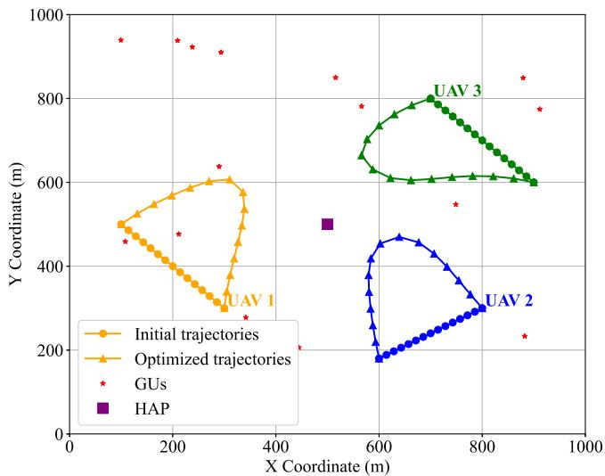  
Fig. 3. The UAV trajectories and locations of GUs and HAP.

To evaluate the robustness performance of the proposed DRCOTO algorithm, we compare it with the following baselines, including DO, SO, RO, and a classic reinforcement learning algorithm, i.e., multi-agent proximal policy optimization (MAPPO). In DO, task sizes are treated as deterministic parameters, ignoring the uncertainty entirely. The probability distribution of task sizes is known in SO. The core logic of RO is to consider all feasible scenarios. It assumes that if a decision is feasible under the worst-case scenario, it will also be feasible under all other scenarios. Therefore, RO focuses on optimizing for the worst-case scenario, which is typically represented by setting the task sizes to the maximum values. Additionally, MAPPO uses the deterministic task sizes same as that used in DO.

## B. Numerical Results

Fig. 3 illustrates the initial and optimized UAV trajectories as well as locations of GUs and HAP. The $L _ { 1 }$ norm metric is employed to construct the uncertainty set, with the radius of the uncertainty set to $\epsilon = 0 . 3 .$ . Additionally, the initial and terminal positions of UAVs are fixed. It can be observed that all the optimized UAV trajectory curves toward the center of the map, since the central area of the map has a relatively dense distribution of GUs. Consequently, the UAVs flying toward the center can reduce the transmission delays.

Fig. 4 compares the diverse performance of DO, SO, DRCOTO-FM, $\mathrm { D R C O T O } – L _ { 1 }$ DRCOTO-L , RO, and MAPPO, with varying numbers of GUs. In DRCOTO-FM, $\mathrm { D R C O T O } – L _ { 1 }$ , and $\mathrm { D R C O T O } – L _ { \infty }$ , the uncertainty sets are constructed by the $L _ { 1 }$ norm, $L _ { \infty }$ norm and FM metrics, respectively.

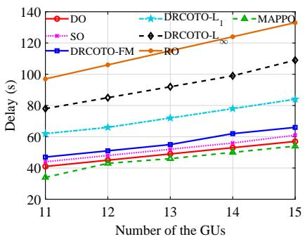  
(a) The optimized delay.

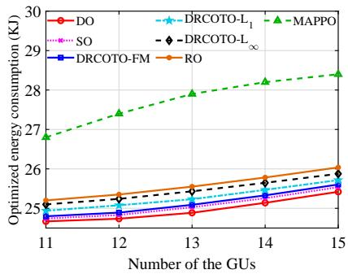  
(b) The optimized energy consumption.

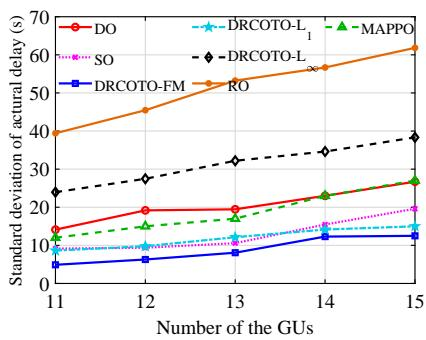  
(c) The standard deviation between actual delays and optimized delays.

Fig. 4. Comparison of multi-dimensional performance of various optimization methods.  
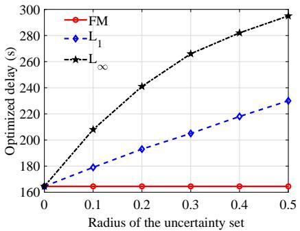  
(a) The influence of the uncertainty set radius on the delay.

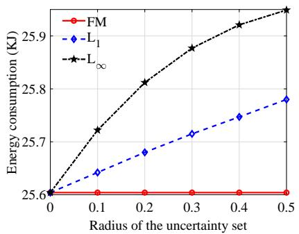  
(b) The influence of the uncertainty set radius on the energy consumption

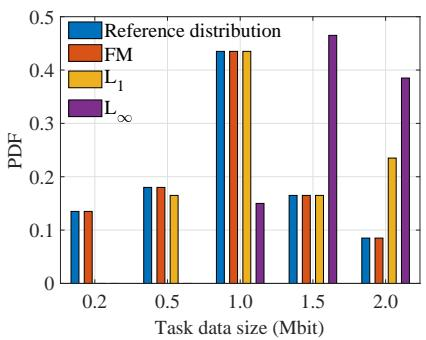  
(c) The influence of the uncertainty set constructions on the PDFs.  
Fig. 5. The relationships between the delay, energy consumption, optimized PDF and uncertainty set radius under different uncertainty set construction mechanisms.

As shown in Fig. 4a, with the increment in the number of GUs, the delay obtained by all optimization methods exhibits an upward trend. This is because a larger number of GUs leads to an increment in the number of tasks to be processed, thereby resulting in higher delays. For the same number of GUs, the optimized delays obtained by MAPPO, DO, SO, DRCOTO-FM, $\mathrm { D R C O T O } – L _ { 1 }$ $\mathrm { D R C O T O } – \boldsymbol { L } _ { \infty } .$ , and RO increase sequentially. It indicates that the scenarios considered by these methods become increasingly conservative. Notably, MAPPO achieves the lowest delay among all methods, which suggests that the learned policy can effectively reduce the latency. However, this performance comes at the cost of extensive offline training, which is impractical for scenarios requiring the rapid deployment or adaptation.

Fig. 4b explores the relationship between the energy consumption and number of GUs with different optimization methods. The trend is consistent with that in Fig. 4a, as the increment in GUs results in a higher task load, ultimately leading to more energy consumption. In contrast to its delay advantage, MAPPO exhibits the highest energy consumption, indicating that the learned policy prioritizes latency reduction at the expense of energy efficiency. This trade-off highlights the importance of multi-objective considerations in real-world deployments.

As illustrated in Fig. 4c, for the same optimization method, the standard deviation between actual delays and optimized delays increases as the number of GUs grows. Here, the "actual delays" refers to the delays measured after processing five different data sets using the computation offloading strategies and UAV trajectories obtained through the optimization. The increment in the standard deviation is due to the inherent characteristic discrepancy between the optimized and actual data. As the number of GUs grows, the deviation between the actual and optimized delays gradually expands, resulting in a higher standard deviation. However, for the same number of GUs, the standard deviations of different methods follow a descending order: RO, $\mathrm { D R C O T O } –  { L _ { \infty } } .$ , DO, MAPPO, SO, $\mathrm { D R C O T O } – L _ { 1 }$ and DRCOTO-FM. Specifically, the RO considers the worstcase scenario among all possible values of task sizes, which sets the task size to the maximum value. The significant deviation from actual conditions results in a larger standard deviation. Similarly, when constructing the uncertainty set, the DRCOTO-$L _ { \infty }$ focuses on the probability that the possible distribution deviates most from the reference distribution, leading to a higher proportion of worst-case values and thus a larger standard deviation. As shown in Fig. 4c, the uncertainty set constructed by FM yields the smallest standard deviation, indicating the superior stability. The standard deviation of MAPPO is close to that of DO. This similarity arises since both methods rely on the same deterministic task size.

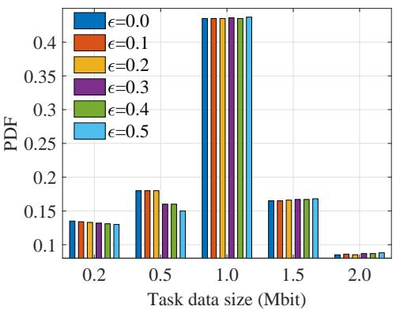  
(a) FM

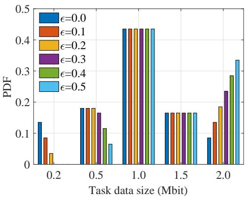  
(b) $L _ { 1 }$

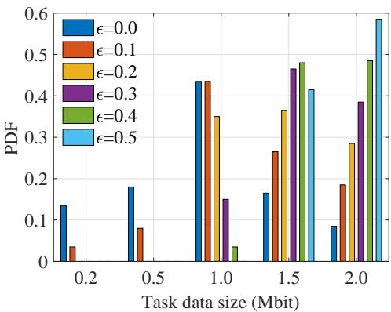  
(c) $L _ { \infty }$  
Fig. 6. The relationships between the PDF and the uncertainty set radius under different uncertainty set construction methods.

Fig. 5 explores the relationships between the delay, energy consumption, optimized PDF and uncertainty set radius under different uncertainty set construction mechanisms. As shown in Figs. 5a and 5b, both the optimized delay and energy consumption increase as the radius of the uncertainty set increases. This is because a larger radius covers more worse possible probability distributions, which raises the delay and energy consumption. Additionally, for the same radius, the delay and energy consumption optimized by the FM method are the smallest, followed by the $L _ { 1 }$ metric, and the results of the $L _ { \infty }$ metric are the largest. This difference arises from their distinct mechanisms for calculating distances between probability distributions. Fig. 5c illustrates the influence of the uncertainty set constructions on the PDFs. The optimized PDF from the FM metric-based uncertainty set deviates slightly from the reference distribution. Among the three metrics of FM, $L _ { 1 }$ and $L _ { \infty }$ , the probability of larger data sizes increases sequentially, which explains the gradual increment in the optimized delay and energy consumption observed in Figs. 5a and 5b.

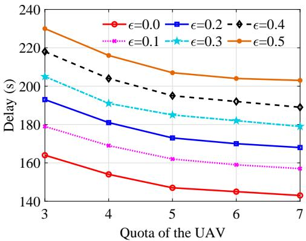  
(a) The relationships between the delay and quota of the UAV.

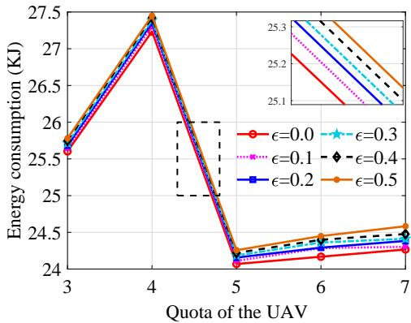  
(b) The relationships between the energy cost and quota of the UAV.  
Fig. 7. The relationships between the delay, energy cost and quota of the UAV under the different uncertainty set radius.

Fig. 6 shows the relationships between the PDF and uncertainty set radius under different uncertainty set construction mechanisms. As shown in Fig. 6, with increasing uncertainty set radius, the probabilities of larger values in the PDFs optimized by the three construction methods all rise. The FM method results in the smallest change, while the $L _ { \infty }$ method shows the most significant change, and $L _ { 1 }$ method lies in between, with the change gradient consistent with Fig. 5. The reason lies in that with the larger uncertainty set radius, the worse scenario is considered. In other words, the probability of big data size such as 2.0 Mbit is larger. Moreover, the definitions of the $L _ { 1 }$ norm, $L _ { \infty }$ norm and FM metrics are different, resulting in the different change trends when the radius of the uncertainty set changes. For example, the $L _ { 1 }$ norm metric considers the total distances of all samples in the two PDFs while the $L _ { \infty }$ norm metric considers the maximum distances. As a result, the PDFs of possible task sizes optimized by the $L _ { \infty }$ norm metric change more significantly than the $L _ { 1 }$ norm metric.

Fig. 7 illustrates the relationships among the UAV quotas, delay, and energy consumption under varying uncertainty set radius. For a given quota, a smaller radius corresponds to the lower delay and energy consumption. In Fig. 7a, for a fixed radius, the delay decreases as the quota increases, and there is a turning point when the quota of UAV reaches 5. Specifically, the delay declines more rapidly when the quota is below 5 and more slowly when it is above 5. This phenomenon can be explained as: with 15 GUs and 3 UAVs, when the UAV quota is less than 5, tasks have to be offloaded to the HAP. Since the transmission delay from UAV to HAP is significantly higher than the margin in the computation delay between the UAV and HAP, as the UAV quota increases from 3 to 5, more tasks can be computed on the UAV instead of the HAP, thus avoiding the substantial transmission delay of UAV-to-HAP. Consequently, the overall delay decreases rapidly in this quota range. When the quota is 5 or higher, all tasks can be offloaded to UAVs. At this point, as the quota increases, the delay still decreases because the computation delay on the UAV is less than that on the GU, although the rate of decrease is slower compared to the situation when the quota is less than 5. In Fig. 7b, the energy consumption shows an increasing trend when the quota increases from 3 to 4 and from 5 to 7, but drops sharply from 4 to 5. This is because the UAV computation consumes more energy than local computation, causing the energy consumption to rise as the quota increases from 3 to 4 and from 5 to 7. When the UAV quota increases from 4 to 5, there is no task computed on the HAP, avoiding the higher UAV-to-HAP transmission and computation energy consumption of HAP, leading to a sharp drop in the energy consumption.

Fig. 8 compares the optimized delay and average running time of different algorithms under varying numbers of GUs. Among them, the branch and bound (BB) obtains the optimal solution of the problem, but due to its exponential time complexity, it is only applicable to small-scale scenarios and serves as an upper-bound.

Fig. 8a illustrates the trend of the optimized delay obtained by each algorithm as the number of GUs increases. It can be observed that the delay of all algorithms rises with the increase in the number of GUs, which is an inevitable result of the growing total task load. The BB algorithm achieves the lowest delay under all user scales, verifying its validity as an exact optimal solution. The DRCOTO algorithm yields delays almost identical to BB when the number of GUs is small, and as the number of GUs increases, its optimized delay is slightly higher than BB but lower than that of BCD algorithm, demonstrating the superiority of DRCOTO in terms of solution quality. The delay of BCD is slightly higher than that of DRCOTO, indicating that BCD can also converge to a near-optimal solution when the problem scale is small. ADMM exhibits significantly higher delays than the previous three algorithms, and the gap widens as the number of GUs grows. This stems from the fact that ADMM tends to fall into local optima when dealing with mixed-integer non-convex problems, and its multiplier update mechanism struggles to guarantee the global convergence. GA yields the highest delay, which is attributed to the inherent limitations of heuristic random search methods: they cannot stably obtain high-quality solutions under complex constraints, and their search efficiency further deteriorates as the problem scale expands.

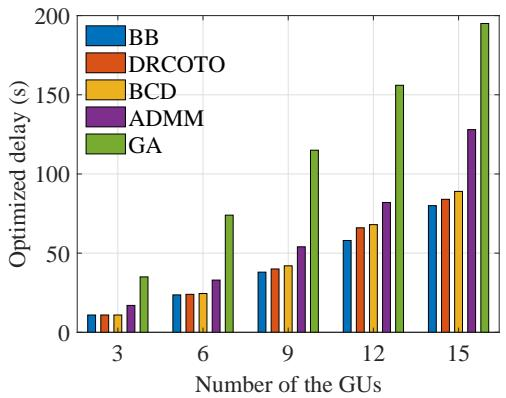  
(a) The optimized delay.

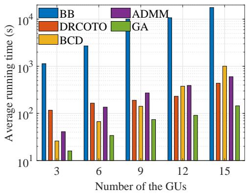  
(b) The average running time.  
Fig. 8. Comparison of the performance of different algorithms under numbers of GUs.

Fig. 8b compares the average running time of the algorithms. The running time of all algorithms increases with the number of GUs, but the growth rates differ significantly. The running time of BB increases exponentially, making it completely impractical for real-world applications, which underscores the necessity of designing efficient algorithms. DRCOTO exhibits the most moderate growth in the running time, demonstrating the excellent scalability. Notably, when the number of GUs is less than 9, BCD has a lower running time than DRCOTO, because in small-scale problems, BCD’s block coordinate update strategy can quickly optimize the sub-problems alternately. However, when the number of GUs reaches 12, the running time of DRCOTO begins to fall below that of BCD, and the advantage further expands at 15 GUs. The reason for this shift lies in the fact that as the problem scale grows, the coupling among the sub-problems in BCD intensifies, leading to a significant slowdown in the convergence of alternating iterations. In contrast, DRCOTO employs a BD-SCA framework that decomposes the original problem into a sub-problem containing only continuous variables and a master problem containing only integer variables, and uses SCA to handle the non-convexity. This effectively avoids an exponential explosion of computational effort as the scale increases, thereby achieving higher solution efficiency in large-scale scenarios. The running time of ADMM falls between that of DRCOTO and BCD, but its delay performance is poor, indicating that it fails to strike a good balance between the convergence speed and solution quality. GA has the shortest running time, but at the cost of extremely poor delay performance, confirming the limitations of heuristic methods in optimization problems with high precision requirements.

In summary, DRCOTO achieves the best balance between the solution optimality and computational efficiency: its delay performance approaches that of the exact algorithm, while its running time significantly outperforms traditional decomposition methods in large-scale scenarios, demonstrating its potential for practical deployment.

## VI. CONCLUSION

In this paper, we propose an LAWN architecture with multiple UAVs and a HAP cooperatively providing computation offloading for GUs. To address the uncertainties of task sizes, we construct different uncertainty sets based on three probability metrics, and formulate the DRO problem to jointly optimize the computation offloading decisions and UAV trajectories to minimize the worst-case delay. Then, the DRCOTO algorithm is designed based on BD and SCA to solve the proposed DRO problem. Numerical results validate the robustness and superiority of the DRCOTO compared to the traditional optimization methods and other typical algorithm. Additionally, we conclude that the FM-based uncertainty set offers the stability against distribution shifts compared to the other metrics, providing a useful guideline for deploying robust aerial computing systems. Future works can extend this framework to support the adaptive task segmentation and real-time trajectory replanning.

## REFERENCES

[1] Y. He, D. Wang, F. Huang, R. Zhang, X. Gu, and J. Pan, “Downlink and uplink sum rate maximization for HAP-LAP cooperated networks,” IEEE Trans. Veh. Technol., vol. 71, no. 9, pp. 9516–9531, May 2022.

[2] Z. Jia, J. He, Y. Cui, Q. Zhu, L. Yuan, F. Zhou, Q. Wu, D. Niyato, and Z. Han, “Hierarchical low-altitude wireless network empowered air traffic management,” 2025, arXiv:2509.03386.

[3] Y. Chen, Q. Zhu, J. Wang, Z. Jia, X. Wang, Z. Lin, Y. Huang, Q. Wu, and C. Briso-Rodríguez, “UAV-aided efficient informative path planning for autonomous 3D spectrum mapping,” IEEE Trans. Cognit. Commun. Networking, vol. 12, pp. 1664–1677, Aug. 2026.

[4] M. M. Azari, S. Solanki, S. Chatzinotas, O. Kodheli, H. Sallouha, A. Colpaert, J. F. Mendoza Montoya, S. Pollin, A. Haqiqatnejad, A. Mostaani, E. Lagunas, and B. Ottersten, “Evolution of non-terrestrial networks from 5G to 6G: A survey,” IEEE Commun. Surv. Tutorials, vol. 24, no. 4, pp. 2633–2672, 4th Quart. 2022.

[5] G. K. Pandey, D. S. Gurjar, S. Yadav, Y. Jiang, and C. Yuen, “UAVassisted communications with RF energy harvesting: A comprehensive survey,” IEEE Commun. Surv. Tutorials, vol. 27, no. 2, pp. 782–838, Apr. 2025.

[6] F. Wang, S. Zhang, J. Shi, Z. Li, and T. Q. S. Quek, “Sustainable UAV mobility support in integrated terrestrial and non-terrestrial networks,” IEEE Trans. Wireless Commun., vol. 23, no. 11, pp. 17 115–17 128, Nov. 2024.

[7] D. C. Nguyen, M. Ding, P. N. Pathirana, A. Seneviratne, J. Li, D. Niyato, O. Dobre, and H. V. Poor, “6G Internet of Things: A comprehensive survey,” IEEE Internet Things J., vol. 9, no. 1, pp. 359–383, Jan. 2022.

[8] S. Zhang, N. Yi, and Y. Ma, “A survey of computation offloading with task types,” IEEE Trans. Intell. Transport. Syst., vol. 25, no. 8, pp. 8313– 8333, Aug. 2024.

[9] F. Wang, S. Zhang, E.-K. Hong, and T. Q. S. Quek, “Constellation as a service: Tailored connectivity management in direct-satellite-to-device networks,” IEEE Commun. Mag., vol. 63, no. 11, pp. 30–36, Nov. 2025.

[10] J. Chen, Z. Kuang, Y. Zhang, S. Lin, and A. Liu, “Blockchain-enabled computing offloading and resource allocation in multi-UAVs MEC network: A stackelberg game learning approach,” IEEE Trans. Inf. Forensic Secur., vol. 20, pp. 3632–3645, Mar. 2025.

[11] Y. Luo, Y. Wang, Y. Lei, C. Wang, D. Zhang, and W. Ding, “Decentralized user allocation and dynamic service for multi-UAV-enabled MEC system,” IEEE Trans. Veh. Technol., vol. 73, no. 1, pp. 1306–1321, Jan. 2024.

[12] Z. Sun, G. Sun, Q. Wu, L. He, S. Liang, H. Pan, D. Niyato, C. Yuen, and V. C. M. Leung, “TJCCT: A two-timescale approach for UAV-assisted mobile edge computing,” IEEE Trans. Mob. Comput., vol. 24, no. 4, pp. 3130–3147, Apr. 2025.

[13] J. Huang, J. Zhang, W. Xia, Y. Wu, and C. Yuen, “Advanced optimization in caching AAVs-assisted wireless networks with energy constraint,” IEEE Trans. Intelligent Transport. Syst., vol. 26, no. 4, pp. 4469–4480, Apr. 2025.

[14] Z. Jia, Q. Wu, C. Dong, C. Yuen, and Z. Han, “Hierarchical aerial computing for Internet of Things via cooperation of HAPs and UAVs,” IEEE Internet Things J., vol. 10, no. 7, pp. 5676–5688, Apr. 2023.

[15] H. Cao, G. Yu, and Z. Chen, “Cooperative task offloading and dispatching optimization for large-scale users via UAVs and HAP,” in IEEE Wireless Commun. Networking Conf. (WCNC), Glasgow, UK, Mar. 2023.

[16] Y. Chen, B. Ai, Y. Niu, H. Zhang, and Z. Han, “Energy-constrained computation offloading in space-air-ground integrated networks using distributionally robust optimization,” IEEE Trans. Veh. Technol., vol. 70, no. 11, pp. 12 113–12 125, Sep. 2021.

[17] L. Li, D. Shi, R. Hou, R. Chen, B. Lin, and M. Pan, “Energy-efficient proactive caching for adaptive video streaming via data-driven optimization,” IEEE Internet Things J., vol. 7, no. 6, pp. 5549–5561, Jun. 2020.

[18] Z. Wei, M. Zhu, N. Zhang, L. Wang, Y. Zou, Z. Meng, H. Wu, and Z. Feng, “UAV-assisted data collection for Internet of Things: A survey,” IEEE Internet Things J., vol. 9, no. 17, pp. 15 460–15 483, Sep. 2022.

[19] X. Li, S. Cheng, H. Ding, M. Pan, and N. Zhao, “When UAVs meet cognitive radio: Offloading traffic under uncertain spectrum environment via deep reinforcement learning,” IEEE Trans. Wireless Commun., vol. 22, no. 2, pp. 824–838, Feb. 2023.

[20] H.-G. Beyer and B. Sendhoff, “Robust optimization-A comprehensive survey,” Comput. Method Appl. M., vol. 196, no. 33-34, pp. 3190–3218, Jul. 2007.

[21] C. Zhao and Y. Guan, “Data-driven stochastic unit commitment for integrating wind generation,” IEEE Trans. Power Syst., vol. 31, no. 4, pp. 2587–2596, Jul. 2016.

[22] B. Li, Y. Tan, A.-G. Wu, and G.-R. Duan, “A distributionally robust

optimization based method for stochastic model predictive control,” IEEE Trans. Autom. Control, vol. 67, no. 11, pp. 5762–5776, Nov. 2022.

[23] X. Li, X. Du, N. Zhao, and X. Wang, “Computing over the sky: Joint UAV trajectory and task offloading scheme based on optimization-embedding multi-agent deep reinforcement learning,” IEEE Trans. Commun., vol. 72, no. 3, pp. 1355–1369, Mar. 2024.

[24] L. Zhong, Y. Liu, X. Deng, C. Wu, S. Liu, and L. T. Yang, “Distributed optimization of multi-role UAV functionality switching and trajectory for security task offloading in UAV-assisted MEC,” IEEE Trans. Veh. Technol., vol. 73, no. 12, pp. 19 432–19 447, Dec. 2024.

[25] S. Wang, X. Song, T. Song, and Y. Yang, “Fairness-aware computation offloading with trajectory optimization and phase-shift design in RISassisted multi-UAV MEC network,” IEEE Internet Things J., vol. 11, no. 11, pp. 20 547–20 561, Jun. 2024.

[26] Y. Wang, J. Farooq, H. Ghazzai, and G. Setti, “Joint positioning and computation offloading in multi-UAV MEC for low latency applications: A proximal policy optimization approach,” IEEE Trans. Mob. Comput., vol. 24, no. 10, pp. 9584–9598, Oct. 2025.

[27] Y. Gao, X. Yuan, D. Yang, Y. Hu, Y. Cao, and A. Schmeink, “UAVassisted MEC system with mobile ground terminals: DRL-based joint terminal scheduling and UAV 3D trajectory design,” IEEE Trans. Veh. Technol., vol. 73, no. 7, pp. 10 164–10 180, Jul. 2024.

[28] H. Kang, X. Chang, J. Mii, V. B. Mii, J. Fan, and Y. Liu, “Cooperative UAV resource allocation and task offloading in hierarchical aerial computing systems: A MAPPO-based approach,” IEEE Internet Things J., vol. 10, no. 12, pp. 10 497–10 509, Jun. 2023.

[29] Z. Hu, Y. Yang, W. Gu, Y. Chen, and J. Huang, “DRL-based trajectory optimization and task offloading in hierarchical aerial MEC,” IEEE Internet Things J., vol. 12, no. 3, pp. 3410–3423, Feb. 2025.

[30] D. S. Lakew, A.-T. Tran, N.-N. Dao, and S. Cho, “Intelligent offloading and resource allocation in heterogeneous aerial access IoT networks,” IEEE Internet Things J., vol. 10, no. 7, pp. 5704–5718, Apr. 2023.

[31] Z. Jia, C. Cui, C. Dong, Q. Wu, Z. Ling, D. Niyato, and Z. Han, “Distributionally robust optimization for aerial multi-access edge computing via cooperation of UAVs and HAPs,” IEEE Trans. Mob. Comput., vol. 24, no. 10, pp. 10 853–10 867, Oct. 2025.

[32] G. Jiang, Z. Jia, L. He, C. Dong, Q. Wu, and Z. Han, “Distributionally robust optimization for computation offloading in aerial access networks,” in IEEE Glob. Commun. Conf. (GLOBECOM), Cape Town, South Africa, Dec. 2024.

[33] J. Zhang, L. Zhou, Q. Tang, E. C.-H. Ngai, X. Hu, H. Zhao, and J. Wei, “Stochastic computation offloading and trajectory scheduling for UAVassisted mobile edge computing,” IEEE Internet Things J., vol. 6, no. 2, pp. 3688–3699, Apr. 2019.

[34] Y. Xu, T. Zhang, Y. Liu, D. Yang, L. Xiao, and M. Tao, “Cellularconnected multi-UAV MEC networks: An online stochastic optimization approach,” IEEE Trans. Commun., vol. 70, no. 10, pp. 6630–6647, Oct. 2022.

[35] L. Li, D. Shi, R. Hou, R. Chen, B. Lin, and M. Pan, “Energy-efficient proactive caching for adaptive video streaming via data-driven optimiza tion,” IEEE Internet Things J., vol. 7, no. 6, pp. 5549–5561, Jun. 2020.

[36] H. El Hammouti, M. Benjillali, B. Shihada, and M.-S. Alouini, “Learnas-you-fly: A distributed algorithm for joint 3D placement and user association in multi-UAVs networks,” IEEE Trans. Wireless Commun., vol. 18, no. 12, pp. 5831–5844, Dec. 2019.

[37] W. Fan, Y. Su, J. Liu, S. Li, W. Huang, F. Wu, and Y. Liu, “Joint task offloading and resource allocation for vehicular edge computing based on V2I and V2V modes,” IEEE Trans. Intell. Transp. Syst., vol. 24, no. 4, pp. 4277–4292, Apr. 2023.

[38] D. D. Mrema and S. Shimamoto, “Performance of quadrifilar helix antenna on EAD channel model for UAV to LEO satellite link,” in Int. Conf. Collabor. Technol. Syst. (CTS), Denver, CO, May 2012.

[39] Z. Jia, J. He, L. He, M. Sheng, J. Liu, Q. Wu, and Z. Han, “Dynamic trajectory optimization and power control for hierarchical UAV swarms in 6G aerial access network,” IEEE Trans. Wireless Commun., vol. 25, pp. 3349–3362, Sep. 2026.

[40] L. Pu, X. Chen, G. Mao, Q. Xie, and J. Xu, “Chimera: An energy-efficient and deadline-aware hybrid edge computing framework for vehicular crowdsensing applications,” IEEE Internet Things J., vol. 6, no. 1, pp. 84–99, Feb. 2019.

[41] Y. Zeng, J. Xu, and R. Zhang, “Energy minimization for wireless communication with rotary-wing UAV,” IEEE Trans. Wireless Commun., vol. 18, no. 4, pp. 2329–2345, Apr. 2019.

[42] M. Razaviyayn, M. Hong, Z.-Q. Luo, and J.-S. Pang, “Parallel successive convex approximation for nonsmooth nonconvex optimization,” in Adv Neural Inf. Process. Syst. (NeurIPS), Montreal, Canada, Dec. 2014.

[43] R. Rahmaniani, T. G. Crainic, M. Gendreau, and W. Rei, “The Benders decomposition algorithm: A literature review,” EUR. J. OPER. RES., vol. 259, no. 3, pp. 801–817, Jun. 2017.

[44] S. Peng, B. Li, L. Liu, Z. Fei, and D. Niyato, “Trajectory design and resource allocation for multi-UAV-assisted sensing, communication, and edge computing integration,” IEEE Trans. Commun., vol. 73, no. 4, pp. 2847–2861, Apr. 2025.

Ziye Jia (Member, IEEE) received the B.E., M.S., and Ph.D. degrees in communication and information systems from Xidian University, Xi’an, China, in 2012, 2015, and 2021, respectively. From 2018 to 2020, she was a Visiting Ph.D. Student with the Department of Electrical and Computer Engineering, University of Houston. She is currently an Associate Professor with the Key Laboratory of Dynamic Cognitive System of Electromagnetic Spectrum Space, Ministry of Industry and Information Technology, Nanjing University of Aeronautics and Astronautics, Nanjing, China. Her current research interests include space-air-ground networks, aerial access networks, UAV networking, resource optimization, machine learning, etc.

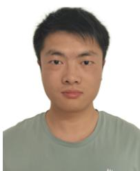

Guanwang Jiang is currently pursuing the master’s degree with the College of Electronic and Information Engineering, Nanjing University of Aeronautics and Astronautics, Nanjing, China. His current research interests include multi-UAV path planning and lowaltitude intelligent network.

Lijun He (Member, IEEE) received the B.S. degree in electronic information science and technology from Anqing Normal University, Anhui, China, in 2013, and the Ph.D. degree in military communications from the State Key Laboratory of ISN, Xidian University, Xian, China, in 2020. From 2018 to 2019, he was with the University of Toronto, Toronto, ON, Canada, as a Visiting Scholar funded by the China Scholarship Council (CSC). From 2020 to 2022, he was a Postdoctoral Researcher with the School of Software, Northwestern Polytechnical University (NPU). From 2022 to 2024, he was an Associate Professor with the School of Software, NPU. He is currently an Associate Professor with the School of Information and Control Engineering, China University of Mining and Technology, Xuzhou, China. His research interests include satellite communication networks, unmanned aerial vehicle networks, and Internet of Things.

Yian Zhu is currently pursuing the master’s degree with the College of Electronic and Information Engineering, Nanjing University of Aeronautics and Astronautics, Nanjing, China. His current research interests include multi-UAV path planning, UAV surveillance technology, and low-altitude intelligent network.

Qihui Wu (Fellow, IEEE) received the B.S. degree in communications engineering and the M.S. and Ph.D. degrees in communications and information systems from the Institute of Communications Engineering, Nanjing, China, in 1994, 1997, and 2000, respectively. From 2003 to 2005, he was a Post-Doctoral Research Associate with Southeast University, Nanjing. From 2005 to 2007, he was an Associate Professor with the College of Communications Engineering, PLA University of Science and Technology, Nanjing, where he was a Full Professor, from 2008 to 2016. From

March 2011 to September 2011, he was an Advanced Visiting Scholar with the Stevens Institute of Technology, Hoboken, NJ, USA. Since May 2016, he has been a Full Professor with the College of Electronic and Information Engineering, Nanjing University of Aeronautics and Astronautics, Nanjing. His current research interests include wireless communications and statistical signal processing, with an emphasis on system design of software defined radio, cognitive radio, and smart radio.  

Zhu Han (S’01-M’04-SM’09-F’14) received the B.S. degree in electronic engineering from Tsinghua University, in 1997, and the M.S. and Ph.D. degrees in electrical and computer engineering from the University of Maryland, College Park, in 1999 and 2003, respectively. From 2000 to 2002, he was an R&D Engineer of JDSU, Germantown, Maryland. From 2003 to 2006, he was a Research Associate at the University of Maryland. From 2006 to 2008, he was an assistant professor at Boise State University, Idaho. Currently, he is a John and Rebecca Moores Professor

Chau Yuen (Fellow, IEEE) received the B.Eng. and Ph.D. degrees from Nanyang Technological University, Singapore, in 2000 and 2004, respectively. He was a Postdoctoral Fellow with Lucent Technologies Bell Labs, Murray Hill, in 2005. From 2006 to 2010, he was with the Institute for Infocomm Research, Singapore. From 2010 to 2023, he was with the Engineering Product Development Pillar, Singapore University of Technology and Design, Singapore. Since 2023, he has been with the School of Electrical and Electronic Engineering, Nanyang Technological

University. He is currently the Provosts Chair in wireless communications, and Assistant Dean of Graduate College. He holds 4 US patents and has authored or coauthored more than 400 research papers at international journals. Dr. Yuen received IEEE Communications Society Leonard G. Abraham Prize (2024), IEEE Communications Society Best Tutorial Paper Award (2024), IEEE Communications Society Fred W. Ellersick Prize (2023), IEEE Marconi Prize Paper Award in Wireless Communications (2021), IEEE APB Outstanding Paper Award (2023), and EURASIP Best Paper Award for Journal on Wireless Communications and Networking (2021). He is the Editor-in-Chief of Springer Nature Computer Science, Editor for IEEE Transactions on Vehicular Technology, IEEE System Journal, and IEEE Transactions on Network Science and Engineering, where he was awarded as IEEE TNSE Excellent Editor Award and Top Associate Editor for TVT from 2009 to 2015. He was also the Guest Editor for several special issues, including IEEE JOURNAL ON SELECTED AREAS IN COMMUNICATIONS, IEEE WIRELESS COMMUNICATIONS MAGAZINE, IEEE COMMUNICATIONS MAGAZINE, IEEE VEHICULAR TECHNOLOGY MAGAZINE, IEEE TRANSACTIONS ON COGNITIVE COMMUNICATIONS AND NETWORKING, and ELSEVIER APPLIED EN ERGY. He is a Distinguished Lecturer of IEEE Vehicular Technology Society, Top 2% Scientists by Stanford University, and also a Highly Cited Researcher by Clarivate Web of Science.

in the Electrical and Computer Engineering Department as well as in the Computer Science Department at the University of Houston, Texas. Dr. Hans main research targets on the novel game-theory related concepts critical to enabling efficient and distributive use of wireless networks with limited resources. His other research interests include wireless resource allocation and management, wireless communications and networking, quantum computing, data science, smart grid, carbon neutralization, security and privacy. Dr. Han received an NSF Career Award in 2010, the Fred W. Ellersick Prize of the IEEE Communication Society in 2011, the EURASIP Best Paper Award for the Journal on Advances in Signal Processing in 2015, IEEE Leonard G. Abraham Prize in the field of Communications Systems (best paper award in IEEE JSAC) in 2016, IEEE Vehicular Technology Society 2022 Best Land Transportation Paper Award, and several best paper awards in IEEE conferences. Dr. Han was an IEEE Communications Society Distinguished Lecturer from 2015 to 2018 and ACM Distinguished Speaker from 2022 to 2025, AAAS fellow since 2019, and ACM Fellow since 2024. Dr. Han is also the winner of the 2021 IEEE Kiyo Tomiyasu Award (an IEEE Field Award), for outstanding early to mid-career contributions to technologies holding the promise of innovative applications, with the following citation: “for contributions to game theory and distributed management of autonomous communication networks." Dr. Han is honored Lifetime Chair Professor of National Yang Ming Chiao Tung University, Taiwan, Eminent Scholar of Kyung Hee University, South Korea and Global Professor of Keio University, Japan.