# Double-Edge-Assisted Computation Offloading and Resource Allocation for Space-Air-Marine Integrated Networks

Zhen Wang , Graduate Student Member, IEEE, Bin Lin , Senior Member, IEEE, and Qiang Ye , Senior Member, IEEE

Abstract—In this paper, we propose a double-edge-assisted computation offloading and resource allocation scheme tailored for space-air-marine integrated networks (SAMINs). Specifically, we consider a scenario where both uncrewed aerial vehicles (UAVs) and a low earth orbit (LEO) satellite are equipped with edge servers, providing computing services for maritime autonomous surface ships (MASSs). Partial computation workloads of MASSs can be offloaded to both UAVs and the LEO satellite, concurrently, for processing via a multi-access approach. To minimize the energy consumption of SAMINs under latency constraints, we formulate an optimization problem and propose energy efficient algorithms to jointly optimize offloading mode, offloading volume, and computing resource allocation of the LEO satellite and the UAVs, respectively. We further exploit an alternating optimization (AO) method and a layered approach to decompose the original problem to attain the optimal solutions. Finally, we conduct simulations to validate the effectiveness and efficiency of the proposed scheme in comparison with benchmark algorithms.

Index Terms—Space-air-marine integrated networks (SAMINs), 6G, maritime multi-access edge computing, double-edge-assisted computation offloading, offloading mode and volume, computing resource allocation.

# I. INTRODUCTION

W ITH the unprecedented development of maritime activ-ities (e.g., marine resource exploration, object recogni- ities (e.g., marine resource exploration,objectrecognition, and intelligence reconnaissance), a significant proliferation of marine wireless devices is underway to gather immense amounts of oceanic data for diverse maritime services [1], [2], [3]. For instance, in the context of marine environmental monitoring and real-time data processing, maritime autonomous surface ships (MASSs) are equipped with a variety of sensors, including cameras, Light Detection and Ranging (LiDAR),

Received 10 January 2025; revised 12 March 2025; accepted 8 April 2025. Date of publication 16 April 2025; date of current version 19 September 2025. This work was supported by the National Natural Science Foundation of China under Grant 62371085 and Grant 51939001. The review of this article was coordinated by Prof. Nan Cheng. (Corresponding author: Bin Lin.)

Zhen Wang is with the Information Science and Technology College, Dalian Maritime University, Dalian 116026, China, and also with the Communication Engineering, Dalian Neusoft University of Information, Dalian 116023, China (e-mail: wangzhen\_jsj@neusoft.edu.cn).

Bin Lin is with the Information Science and Technology College, Dalian Maritime University, Dalian 116026, China (e-mail: binlin@dlmu.edu.cn).

Qiang Ye is with the Department of Electrical and Software Engineering, Schulich School of Engineering, University of Calgary, Calgary, AB T2N 1N4, Canada (e-mail: qiang.ye@ucalgary.ca).

Digital Object Identifier 10.1109/TVT.2025.3561346

millimeter-wave radar, inertial measurement units (IMUs), and global positioning systems (GPS), which enable the MASSs to collect multidimensional data on weather conditions, water quality, and marine biological activities in real-time. In marine disaster relief, MASSs are employed to capture images and videos of search and rescue scenes to verify the targets and subsequently enhance the overall efficiency and effectiveness of the rescue endeavors [4], [5]. However, the scarcity of conventional maritime communication and computing resources poses a significant challenge in fulfilling the stringent requirements of such high-reliability and low-latency applications [6]. To mitigate the impediment, it is imperative to conduct more efficient communication and computing in maritime networks, which has garnered substantial interest from both academia and industry in recent years.

Multi-access edge computing (MEC) has emerged as a highly effective approach, significantly enhancing computing efficiency and minimizing decision-making latency for resourceconstrained marine devices [7], [8], [9], [10]. Leveraging MEC, the MASSs are able to rapidly offload and process large volumes of sensor data and generate real-time environmental insights. Moreover, the MASSs can also perform path planning and autonomous navigation based on the environmental data collected in real time. Recently, significant research efforts have been put towards providing innovative methodologies for maritime MEC to bolster the performance and efficiency of marine networks. In [11], Li et al. focused on the applications of uncrewed aerial vehicles (UAVs) for autonomous detection and tracking in a maritime environment and proposed a task offloading scheme to minimize the system energy consumption. In [12], Zeng et al. introduced an energy-efficient collaborative computation offloading scheme utilizing unmanned surface vehicle (USV) fleets to support smart maritime services, where UAVs act as service requesters and USV fleets serve as helpers facilitating the computation offloading process. In the paradigm of MEC, the offloading and computing efficiency can be improved by segmenting computation loads into multiple parts which are then offloaded to different edge servers for further processing [13], [14]. This distributed approach can improve the system performance, through parallel processing, and cost efficiency by sharing resources, making it ideal for Big Data, real-time applications, and global systems [15], [16].

The evolution of the six generation (6G) wireless technologies is driving the integration of multidimensional wireless communication resources, encompassing space, air, sea, and ground networks, to achieve ubiquitous communication coverages [17], [18], [19], [20]. In this context, a space-air-marine integrated network (SAMIN) emerges to proficiently harness diverse resources to empower intelligent network control and efficient wireless communication services for marine applications. Lin et al. proposed a space-air-ground-sea integrated network architecture and jointly optimized the offloading strategies and resource allocation to minimize the energy consumption of the whole system in [21]. Wang et al. proposed a double-edge secure offloading scheme for SAMINs, where computing workloads can be processed on both base stations (BSs) and satellites for delay-sensitive applications in [22]. The MEC paradigm exhibits immense potential in supporting various services facilitated by satellite-assisted networks, for addressing the computationintensive and delay-sensitive service requirements in the oceanic realm. Given the energy and computing constraints of a single edge node, a viable solution to bolster edge computing efficiency involves distributing oceanic task computing workloads simultaneously among space, air, and marine devices for parallel processing.

The combination of UAVs and MEC has been studied to enhance edge computing performance in marine environments [4], [8], [23], [24], [25]. Considering the typical constraints and dynamics in communication, computation, and energy resources associated with a single UAV edge, a double-edge-assisted SAMIN architecture can make better utilization of various resources to improve computing efficiency for marine devices. The “double-edge” emphasizes on the collaborative and hierarchical nature of the two edge computing layers, i.e., the UAVs as the first edge layer and the low earth orbit (LEO) satellite as the second edge layer. The UAVs provide computation resources in close proximity to the MASSs, which is particularly effective in handling time-sensitive tasks due to low-latency communication and efficient task offloading. The LEO satellites act as the second edge computing layer, offering broader coverage and significant computational capabilities, which is suitable for handling computationally intensive tasks and provides backup when UAVs are unavailable or overloaded. By leveraging the complementary strengths of UAVs (proximity and low latency) and LEO satellites (extensive coverage and powerful computation), the double-edge-assisted SAMIN provides a robust and flexible solution for task offloading in maritime environments. This dual-layer approach ensures that MASSs can offload tasks efficiently, even in dynamic and challenging conditions, such as varying channel quality, mobility, and resource availability. However, there are also key technical challenges to overcome under this layered edge computing architecture: 1) where to offload tasks for processing; 2) how to assign tasks to different edge servers; 3) how computing and communication resources are allocated among edge computing nodes to facilitate efficient task processing for MASSs.

In this paper, we propose a double-edge-assisted MEC system for an SAMIN, where an LEO satellite and UAVs are equipped with edge computing resources, enabling them to concurrently provide computational services for marine devices. The computation workloads of marine devices can be offloaded to the LEO satellite and UAVs simultaneously via a multi-access approach. To our knowledge, no pertinent research exists on employing UAVs and satellites as double-edge servers to furnish edge computing services for MASSs at the same time. The key contributions of this paper mainly include the following aspects:

- Double-edge-assisted Task Offloading Framework: We propose a novel double-edge-assisted computation offloading framework for an SAMIN. In this framework, both the LEO satellite and UAVs serve as BSs equipped with edge servers to provide computing services for MASSs. The tasks generated by the MASSs are divisible and can be offloaded in parallel to the LEO satellite and UAVs for processing through a multi-access approach. This duallayer architecture leverages the complementary strengths of UAVs and the LEO satellite, enabling efficient and flexible task offloading in dynamic maritime environments.   
Optimization and Implementation Methodologies: To capitalize on the heterogeneous computing resources provided by the UAVs and the LEO satellite, we propose a joint computation offloading and resource allocation scheme to enhance the communication and computing efficiency with the objective of minimizing the energy consumption of the SAMIN. We employ the alternating optimization (OA) method and propose a layered approach to solve the complex optimization problem. Specifically, we jointly optimize the offloading mode, the offloading volume, and the computing resource allocation of both the LEO satellite and UAVs, respectively, to attain an efficient and scalable solution that adapts to the dynamic nature of the SAMIN.   
Performance Evaluation: We perform extensive numerical analysis to validate the efficacy of the proposed computation offloading and resource allocation scheme. The numerical results demonstrate that the proposed algorithms significantly minimize the energy dissipation of the SAMIN and confirm the effectiveness and efficiency of the algorithms when compared to the state-of-the-art.

The remainder of this paper is organized as follows. Section II presents the related work. Section III describes the system model of the SAMIN under consideration. The problem formulation and the energy-efficient double-edge-assisted task offloading framework are presented in Sections IV and V, respectively. Section VI presents the performance evaluation, and Section VII draws concluding remarks and discusses future research directions.

# II. RELATED WORK

# A. Terrestrial/Air-Assisted MEC in Maritime Networks

Existing studies have developed approaches for terrestrial/airassisted maritime MEC to enhance the computing efficiency of marine applications and services. Current research endeavors can be mainly categorized into two representative approaches to facilitate computation offloading for marine devices. One approach focused on an offshore scenario where the computing workloads of marine devices are directly offloaded or relayed to coastal BSs for further processing [23], [26], [27]. Dai et al. proposed a UAV-assisted data offloading scheme where each UAV served as a relay node for smart containers to transfer workloads to coastal BSs in [27]. In [26], Wang et al. established an MEC-enabled sea lane monitoring network (MSLMN) architecture where tasks can be offloaded to buoys or coastal base stations for processing. The second approach explored the utilization of UAVs [28], high altitude platforms (HAPs) [29], sea surface-stations [30], floating platforms [31] or satellites as edge computing platforms to carry out task computation. In [29], Li et al. exploited a HAP to perform computation offloading and provide cooperative jamming for the communication security of USVs. In [32], Dai et al. proposed a multi-UAV facilitated MEC framework tailored specifically for marine networks, aiming to optimize both operational efficiency and resource utilization.

Considering multiple tiers of terrestrial/air network platforms, how to efficiently utilize the communication and computing resources of different network tiers is the key to improving the processing performance of maritime computing workloads.

# B. SAMIN-Assisted Communication and Computing

The 6G wireless networks are poised to transcend geographical boundaries, achieving seamless global coverage and effectively alleviating traffic congestion with the integration of satellite networks [33]. As an enhancement to conventional terrestrial networks, SAMINs can provide reliable network connectivity and distributed computing resources from marine edge nodes [34], [35], [36]. Li et al. [37] proposed a space-air-groundocean-integrated network (SAGOI-Net) framework, where an intelligent autonomous underwater glider (AUG) is employed to serve marine applications. Jung et al. proposed an innovative hybrid approach that integrates LEO satellite with UAVs to provide computing services in space-air-sea integrated networks for marine Internet-of-Things (IoT) systems [38]. Guo et al. [39] proposed a bidirectional multibeam transmit reflect array (TRA) antenna for a space-air-ground-sea integrated network (SAGSIN) to facilitate tri-beam transmission and dual-beam reflection. To provide good quality-of-service (QoS) for SAGOI-Net, Zhang et al. proposed a multi-domain virtual network embedding solution [40], while Lin et al. proposed two resource management schemes based on deep reinforcement learning (DRL) to satisfying QoS requirements for SAGSINs [41].

Although most existing studies focus on MEC-enabled marine networks and SAMIN-assisted communication and computing, several crucial aspects remain unexplored: 1) limited resource availability on marine edge servers; 2) integrating satellites with UAVs to provide double-edge-assisted computing services to marine devices; 3) joint optimization of computation offloading and resource allocation within a double-edge-assisted SAMIN architecture.

# III. SYSTEM MODEL

This section first introduces a double-edge-assisted SAMIN, where MASSs can offload their tasks to UAVs and an LEO satellite edge simultaneously. Then, the communication, computing, and task offloading models are presented.

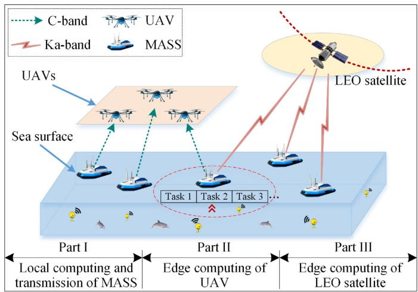

flowchart

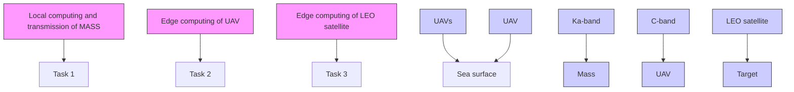

Fig. 1. Network model.

# A. Network Model

We consider an SAMIN consisting of one LEO satellite and multiple UAVs, cooperatively supporting task offloading for connected MASSs, as shown in Fig. 1. In the considered scenario, an LEO satellite with edge computing capacity coordinates with each UAV to assist the task processing of MASSs. A group of MASSs are distributed on the sea surface to monitor the marine environment and collect oceanic data (e.g., aquaculture monitoring videos, real-time data sensing). Meanwhile, a certain number of UAVs equipped with computing capacities are dispatched to receive critical data collected by MASSs. We assume each UAV serves N MASSs, and the set of UAVs and the set of MASSs under each UAV are denoted as $\mathcal { M } = \{ 1 , 2 , . . . , m , . . . , M \}$ and $\mathcal { N } = \{ 1 , 2 , . . . , n , . . . , N \}$ , = =respectively. For convenience, we denote the m-th UAV and its connected n-th MASS as $U _ { m }$ and $M _ { m n }$ , respectively, where we have m $\in \mathcal { M }$ and $n \in \mathcal N$ . The input task data size (in bits) of $M _ { m n }$ is denoted as $S _ { m n } ,$ , with $s _ { m n }$ indicating the number of bits intended for offloading, and the task is processed only locally when $s _ { m n } = 0$ . We denote $a _ { m n } \in [ 0 , 1 ]$ as the offloading ratio of $s _ { m n }$ =from $M _ { m n }$ to $U _ { m }$ [ ]. Then, the task workloads of $M _ { m n }$ offloaded to a LEO satellite is denoted as $( 1 - a _ { m n } ) s _ { m n }$ .

( )Specifically, the overall execution process of double-edgeassisted computing for one task comprises three parts: 1) One MASS executes local task computing and uploads its partial workloads (if any) to one UAV and/or the LEO satellite for further computation; 2) The UAV receives and processes the offloaded data from the MASS; 3) The LEO satellite receives the offloaded data from the MASS for processing.

The orthogonal frequency-division multiple access (OFDMA) protocol is employed for each UAV or the LEO satellite channel access. Specifically, different UAVs reuse the same portion of spectrum resources within C-band, which are then equally divided and allocated to MASSs. With OFDMA and the assumption of non-overlapping UAV coverages, the intra-cell interference among MASSs under each UAV and the inter-cell interference among UAVs are assumed to be negligible.

We utilize a three-dimensional (3D) Cartesian coordinate to delineate the positions of UAVs and MASSs. The proximity between MASSs and UAVs affects the channel link quality. Note that we assume the locations of MASSs and UAVs remain stable during the data transmission. Let $\mathbf { q } _ { m } = [ x _ { m } , y _ { m } , z _ { m } ] ^ { T } \in \mathbb { R } ^ { 3 \times 1 }$ denote the spatial coordinates of $U _ { m }$ = [, in which $x _ { m } , y _ { m } ,$ and $z _ { m }$ correspond to the longitude, latitude, and height of $U _ { m } ,$ respectively. Let $\mathbf { q } _ { m n } = [ \bar { x } _ { m n } , y _ { m n } , z _ { m n } ] ^ { T } \in \mathbb { R } ^ { 3 \times 1 }$ denote the spatial coordinates of $M _ { m n }$ .

To ensure the wireless channel quality during the data transmission, we impose a constraint that the distance between $U _ { m }$ and $M _ { m n }$ must not surpass the maximum allowable communication distance $d ^ { \mathrm { m a x } }$ , which is expressed as

$$
\left| \left| \mathbf {q} _ {m} - \mathbf {q} _ {m n} \right| \right| \leq d ^ {\max}. \tag {1}
$$

# B. Communication Model

1) Communication Model from MASSs to UAVs: We assume that the altitude of the UAVs is sufficient for line-of-sight (LoS) transmission. Considering the uniqueness of the marine environment, e.g., the strong direct signal, the primary factors affecting the overseas wireless channel are multi-path effects caused by ocean waves and extreme weather conditions. We model the communication between an MASS and a UAV as an air-sea channel exhibiting Rician fading [42], [43], which is considered a combination of large-scale and small-scale fading, as explained below.

The large-scale path loss model is expressed as

$$
L _ {m n} ^ {U} (d B) = L _ {0} + 1 0 \zeta \log_ {1 0} \left(\frac {d _ {m n} ^ {U}}{d _ {0}}\right) + X _ {\sigma_ {X}} + \xi F, \tag {2}
$$

where $d _ { m n } ^ { U } = \sqrt { ( x _ { m } - x _ { m n } ) ^ { 2 } + ( y _ { m } - y _ { m n } ) ^ { 2 } + ( z _ { m } - z _ { m n } ) ^ { 2 } }$ = ( )denotes the distance between $U _ { m }$ and $M _ { m n }$ + ( ), L0 is the path loss at the reference distance $d _ { 0 } , ~ \zeta$ indicates the path-loss exponent due to the ducting effect over the sea surface [44], $X _ { \sigma _ { X } } \in \mathcal { C N } ( 0 , \sigma _ { X } )$ denotes the shadow fading caused by, e.g., sea waves under high sea state conditions, $F$ is an adjustment parameter for direction of travel, and ξ is set to 1 or −1 to indicate the moving direction of the UAVs (towards or away from the ground site) [44].

The small-scale Rician fading $\tilde { \Lambda } _ { m n } ^ { U }$ is represented as

$$
\tilde {\Lambda} _ {m n} ^ {U} = \sqrt {\frac {K _ {0}}{1 + K _ {0}}} + \sqrt {\frac {1}{1 + K _ {0}}} o _ {m n} ^ {U}, \tag {3}
$$

where $o _ { m n } ^ { U } \in \mathcal { C N } ( 0 , 1 )$ and $K _ { 0 }$ is the Rician factor. Then, the ( )channel coefficient is formulated as

$$
G _ {m n} ^ {U} = \left(L _ {m n} ^ {U}\right) ^ {- 1 / 2} \tilde {\Lambda} _ {m n} ^ {U}. \tag {4}
$$

The channel gain between $U _ { m }$ and $M _ { m n }$ is expressed as

$$
g _ {m n} ^ {U} = G ^ {U} G ^ {M} \mid G _ {m n} ^ {U} \mid^ {2} \tag {5}
$$

where $G ^ { U }$ and $G ^ { M }$ are the antenna gain of the UAVs and MASSs, respectively. According to the Shannon capacity theorem, the transmission rate (link capacity) $R _ { m n } ^ { U }$ between $U _ { m }$ and $M _ { m n }$ is calculated as

$$
R _ {m n} ^ {U} = W _ {m n} ^ {U} \log_ {2} \left(1 + \frac {p _ {m n} ^ {U} g _ {m n} ^ {U}}{\sigma^ {2}}\right) \tag {6}
$$

where W Umn $W _ { m n } ^ { U }$ denotes the transmission bandwidth of $M _ { m n }$ and $\sigma ^ { 2 }$ is the spectral power of the additive white Gaussian noise (AWGN). Let $t _ { m n } ^ { U }$ denote the transmission time for offloading partial workloads $a _ { m n } s _ { m n }$ from $M _ { m n }$ to $U _ { m } .$ , satisfying

$$
t _ {m n} ^ {U} = \frac {a _ {m n} s _ {m n}}{R _ {m n} ^ {U}}. \tag {7}
$$

Based on (3) and (4), we obtain the required transmission power of $M _ { m n }$ for offloading workloads $a _ { m n } s _ { m n }$ to $U _ { m }$ as

$$
p _ {m n} ^ {U} = \frac {\sigma^ {2}}{g _ {m n} ^ {U}} \left(2 ^ {\frac {a _ {m n} s _ {m n}}{t _ {m n} ^ {U} W _ {m n} ^ {U}}} - 1\right). \tag {8}
$$

Then, the corresponding energy consumption is expressed as

$$
e _ {m n} ^ {U} = p _ {m n} ^ {U} t _ {m n} ^ {U} = \frac {t _ {m n} ^ {U} \sigma^ {2}}{g _ {m n} ^ {U}} \left(2 ^ {\frac {a _ {m n} s _ {m n}}{t _ {m n} ^ {U} W _ {m n} ^ {U}}} - 1\right). \tag {9}
$$

2) Communication Model from MASSs to the LEO satellite:

i) Coverage Time Model of the LEO satellite: Different from the terrestrial MEC network model, the location of the LEO satellite changes dynamically. Hence, an MASS cannot always communicate with the LEO satellite at any time. We obtain the maximum communication time between $M _ { m n }$ and LEO satellite, denoted as

$$
T ^ {\max} = \frac {2 (R _ {e} + h) \cdot \phi_ {m n} ^ {L}}{v ^ {L}} \tag {10}
$$

where $v ^ { L } = \sqrt { K _ { 0 } / ( R _ { e } + h ) }$ is the moving speed of the LEO = ( + )satellite, h represents the height of the LEO satellite orbit, $R _ { e }$ denotes the radius of the earth, $\phi _ { m n } ^ { L }$ is the geocentric angle between $M _ { m n }$ and the LEO satellite, which is expressed as

$$
\phi_ {m n} ^ {L} = \arccos \left(\frac {R _ {e}}{R _ {e} + h} \cdot \cos \theta_ {m n} ^ {L}\right) - \theta_ {m n} ^ {L}. \tag {11}
$$

In (11), θLmn $\theta _ { m n } ^ { L }$ is the elevation angle between $M _ { m n }$ and the LEO satellite. Considering the LEO satellite is with high moving speed, the communication between ground users and the LEO satellite is limited by the user coverage time of the LEO satellite.

ii) Communication Model from MASSs to the LEO satellite: For the LEO satellite communications, we assume that the position information of the LEO satellite is known to all MASSs due to the orbital pre-planning within one time slot. For simplicity, we consider a quasi-static fading channel model. Then, the transmission rate of $M _ { m n }$ is formulated as

$$
R _ {m n} ^ {L} = W _ {m n} ^ {L} \log_ {2} \left(1 + \frac {p _ {m n} ^ {L} \mid h _ {m n} ^ {L} \mid^ {2}}{W _ {m n} ^ {L} N _ {0}}\right). \tag {12}
$$

In (9), we have $h _ { m n } ^ { L } = g _ { m n } ^ { L } \cdot \beta _ { m n } ^ { L } \cdot ( d _ { m n } ^ { L } ) ^ { - \gamma / 2 }$ , where $g _ { m n } ^ { L }$ ing, $\beta _ { m n } ^ { L }$ denotes the fading involving shadowing, rain, and other fading, γ is the path exponent, and $d _ { m n } ^ { L } =$ $\sqrt { R _ { e } ^ { 2 } + ( R _ { e } + h ) ^ { 2 } - 2 R _ { e } ( R _ { e } + h ) }$ cos $\overline { { \phi _ { m n } ^ { L } } }$ =represents the dis-+ (tance from $M _ { m n }$ ) ( + ) coto the LEO satellite.

However, the distance between $M _ { m n }$ and the LEO satellite is relatively long, causing $M _ { m n }$ to be affected by the propagation delay when communicating with the LEO satellite. Thus, the transmission time $t _ { m n } ^ { L }$ consists of the propagation delay and the transmission delay, which is expressed as

$$
t _ {m n} ^ {L} = \frac {(1 - a _ {m n}) s _ {m n}}{R _ {m n} ^ {L}} + \frac {2 d _ {m n} ^ {L}}{c} \tag {13}
$$

where c denotes the speed of light. Based on (9) and (10), we obtain the required transmission power of $M _ { m n }$ for offloading partial workloads to the LEO satellite as

$$
p _ {m n} ^ {L} = \frac {W _ {m n} ^ {L} N _ {0}}{\left| h _ {m n} ^ {L} \right| ^ {2}} \left[ 2 ^ {\frac {(1 - a _ {m n}) s _ {m n}}{\left(t _ {m n} ^ {L} - \frac {2 d _ {m n} ^ {L}}{c}\right) W _ {m n} ^ {L}}} - 1 \right]. \tag {14}
$$

The corresponding energy consumption is formulated as

$$
e _ {m n} ^ {L} = p _ {m n} ^ {L} t _ {m n} ^ {L} = \frac {t _ {m n} ^ {L} W _ {m n} ^ {L} N _ {0}}{\mid h _ {m n} ^ {L} \mid^ {2}} \left[ 2 ^ {\frac {(1 - a _ {m n}) s _ {m n}}{\left(t _ {m n} ^ {L} - \frac {2 d _ {m n} ^ {L}}{c}\right) W _ {m n} ^ {L}}} - 1 \right]. \tag {15}
$$

# C. Computation Model

1) Local computing at MASSs: Considering the case that the task of $M _ { m n }$ is partially processed locally, we denote $\rho _ { m n } ^ { l }$ as the CPU computing capacity of $M _ { m n }$ , which is quantified by the number of CPU cycles per second. Then, the execution time of local computing for $M _ { m n }$ is given by

$$
T _ {m n} ^ {l} = \frac {(S _ {m n} - s _ {m n}) c _ {m n}}{\rho_ {m n} ^ {l}} \tag {16}
$$

where $c _ { m n }$ denotes the number of CPU cycles for processing one bit of data by $M _ { m n }$ . The corresponding energy consumption $E _ { m n } ^ { l }$ is computed as

$$
E _ {m n} ^ {l} = P _ {m n} ^ {l} T _ {m n} ^ {l} = P _ {m n} ^ {l} \frac {(S _ {m n} - s _ {m n}) c _ {m n}}{\rho_ {m n} ^ {l}} \tag {17}
$$

where $P _ { m n } ^ { l }$ is the power consumption of $M _ { m n }$ for local computing.

2) Edge computing at UAVs: When partial task of $M _ { m n }$ is offloaded to $U _ { m }$ , we denote $\rho _ { m n } ^ { U }$ and $\rho _ { m } ^ { \mathrm { m a x } }$ as the computation capacity of $U _ { m }$ allocated to $M _ { m n }$ and the maximum number of executable CPU cycles at $U _ { m }$ , respectively, satisfying $\begin{array} { r } { \sum _ { n \in \mathcal { N } } \rho _ { m n } ^ { U } \le \rho _ { m } ^ { \mathrm { m a x } } } \end{array}$ . Then, the processing latency of $U _ { m }$ to complete the assigned workloads is denoted as

$$
T _ {m n} ^ {U} = \frac {a _ {m n} s _ {m n} c _ {m}}{\rho_ {m n} ^ {U}} \tag {18}
$$

where $c _ { m }$ denotes the number of CPU cycles for processing one bit of data by $U _ { m }$ .

The corresponding energy consumption $E _ { m n } ^ { U }$ is computed as:

$$
E _ {m n} ^ {U} = P _ {m n} ^ {U} T _ {m n} ^ {U} = P _ {m n} ^ {U} \frac {a _ {m n} s _ {m n} c _ {m}}{\rho_ {m n} ^ {U}} \tag {19}
$$

where P Umn $P _ { m n } ^ { U }$ is the power consumption of $U _ { m }$ for edge computing.

3) Edge computing at the LEO satellite: When partial task of $M _ { m n }$ is offloaded to the LEO satellite, we denote $\rho _ { m n } ^ { L }$ and

$\rho _ { \mathrm { m a x } } ^ { L }$ as the computational capacity of the LEO satellite allocated to $M _ { m n }$ and the maximum number of executable CPU cycles at LEO satellite, respectively, satisfying $\begin{array} { r } { \sum _ { m \in \mathcal { M } } \sum _ { n \in \mathcal { N } } \rho _ { m n } ^ { \dot { L } } \leq } \end{array}$ $\rho _ { \mathrm { m a x } } ^ { L } .$ . Then, the processing latency at the LEO satellite to complete the assigned workloads is denoted as

$$
T _ {m n} ^ {L} = \frac {(1 - a _ {m n}) s _ {m n} c ^ {L}}{\rho_ {m n} ^ {L}} \tag {20}
$$

where $c ^ { L }$ denotes the number of CPU cycles for processing one bit of data by the LEO satellite. The corresponding energy consumption is calculated as

$$
E _ {m n} ^ {L} = P _ {m n} ^ {L} T _ {m n} ^ {L} = P _ {m n} ^ {L} \frac {(1 - a _ {m n}) s _ {m n} c ^ {L}}{\rho_ {m n} ^ {L}} \tag {21}
$$

where $P _ { m n } ^ { L }$ is power consumption of the LEO satellite for edge computing.

The overall latency and energy consumption associated with completing $M _ { m n } \mathrm { ' s }$ workloads is denoted as

$$
T _ {m n} ^ {t o t} = \max \left\{T _ {m n} ^ {l}, t _ {m n} ^ {U} + T _ {m n} ^ {U}, t _ {m n} ^ {L} + T _ {m n} ^ {L} \right\} \tag {22}
$$

and

$$
\begin{array}{l} E _ {m n} ^ {t o t} = E _ {m n} ^ {l} + e _ {m n} ^ {U} + e _ {m n} ^ {L} + E _ {m n} ^ {U} + E _ {m n} ^ {L} \\ = P _ {m n} ^ {l} \frac {(S _ {m n} - s _ {m n}) c _ {m n}}{\rho_ {m n} ^ {l}} + P _ {m n} ^ {U} \frac {a _ {m n} s _ {m n} c _ {m}}{\rho_ {m n} ^ {U}} \\ + \frac {t _ {m n} ^ {U} \sigma^ {2}}{g _ {m n} ^ {U}} \left(2 ^ {\frac {a _ {m n} s _ {m n}}{t _ {m n} ^ {U} W _ {m n} ^ {U}}} - 1\right) + P _ {m n} ^ {L} \frac {(1 - a _ {m n}) s _ {m n} c ^ {L}}{\rho_ {m n} ^ {L}} \\ + \frac {t _ {m n} ^ {L} W _ {m n} ^ {L} N _ {0}}{\left| h _ {m n} ^ {L} \right| ^ {2}} \left[ 2 ^ {\frac {(1 - a _ {m n}) s _ {m n}}{\left(t _ {m n} ^ {L} - \frac {2 d _ {m n} ^ {L}}{c}\right) W _ {m n} ^ {L}}} - 1 \right], \tag {23} \\ \end{array}
$$

respectively. Thus, the overall energy dissipation of the proposed system is formulated as

$$
E ^ {t o t} = \sum_ {m \in \mathcal {M}} \sum_ {n \in \mathcal {N}} E _ {m n} ^ {t o t}. \tag {24}
$$

# D. Offloading Model

Due to the concurrent availability of both UAVs and the LEO satellite, it is flexible for an MASS to offload its task to the LEO satellite and UAVs for processing whenever its computation capacity is insufficient to fulfill the task processing demands. It is crucial to note that the optimization of the offloading policy is undertaken at the LEO satellite level. To fulfill the computation objectives of MASSs, we present an offloading model comprising the following four phases, as illustrated in Fig. 2.

1) Offloading Request: At the beginning of each time slot, $M _ { m n }$ sends its offloading request to its serving $U _ { m }$ and the LEO satellite over the C-band and/or the Ka-band, respectively.   
2) Resource Information Notification: Upon receiving the request message, $U _ { m }$ promptly reports its resource status to the LEO satellite.   
3) Offloading Policy: Upon receiving the request message and resource status of UAVs, the LEO satellite devises an offloading

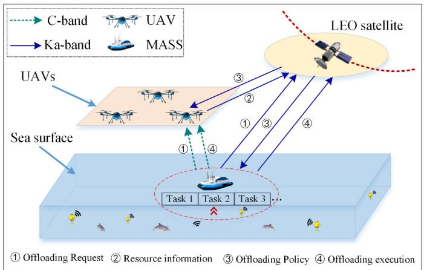

flowchart

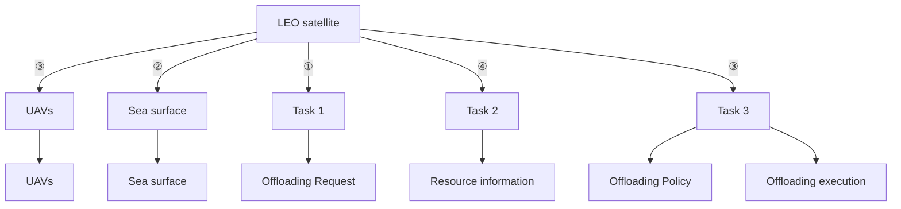

Fig. 2. Offloading process.

policy aiming at allocating the requested communication and computing resources for each MASS and disseminates the policy to all MASSs and UAVs.

4) Offloading Execution: Based on the received policies, each MASS offloads its tasks to UAVs or the LEO satellite for further processing.

# IV. PROBLEM FORMULATION

In this section, we formulate the research problem for minimizing the cumulative energy consumption of the double-edgeassisted computation offloading system, encompassing the energy expenditure of all the MASSs, UAVs, and the LEO satellite. The primary goal is to optimize the energy efficiency of the system while ensuring that each component operates within its respective constraints, particularly focusing on the energy usage of the UAVs, MASSs, and LEO satellite, as well as meeting the required latency constraints.

Based on the offloading model illustrated in Fig. 2, the system architecture consists of multiple MASSs, UAVs, and an LEO satellite working collaboratively to handle computationintensive tasks. The MASSs, which are often resourceconstrained in terms of computing resource and energy, offload their tasks to nearby UAVs or the LEO satellite for further processing. The UAVs act as intermediate edge computing nodes, providing additional computing resources closer to the MASSs, while the LEO satellite serves as a high-altitude computing platform with broader coverage and significant computational capabilities.

Our objective is to minimize the system energy dissipation while adhering to latency requirement of each MASS, by jointly optimizing the offloading decision matrix $\pmb { a } = \{ a _ { m n } \} _ { m \in \mathcal { M } , n \in \mathcal { N } }$ , the offloading volume matrix $s =$ $\{ s _ { m n } \} _ { m \in \mathcal { M } , n \in \mathcal { N } }$ =, the computing resource allocation matrix of UAVs $\pmb { \rho } ^ { U } = \{ \rho _ { m n } ^ { U } \} _ { m \in \mathcal { M } , n \in \mathcal { N } }$ , and the computing resource al-=location matrix of the LEO satellite $\rho ^ { L } = \{ \rho _ { m n } ^ { L } \} _ { m \in \mathcal { M } , n \in \mathcal { N } }$ , re-=spectively. The system energy consumption minimization problem is formulated as

(P0):

$$
\min _ {\boldsymbol {a}, \boldsymbol {s}, \boldsymbol {\rho} ^ {U}, \boldsymbol {\rho} ^ {L}} E ^ {t o t} \tag {25}
$$

$$
s. t.
$$

$$
0 \leq a _ {m n} \leq 1, \forall m \in \mathcal {M}, \forall n \in \mathcal {N}, \tag {25a}
$$

$$
0 \leq s _ {m n} \leq S _ {m n}, \forall m \in \mathcal {M}, \forall n \in \mathcal {N}, \tag {25b}
$$

$$
T _ {m n} ^ {t o t} \leq T _ {m n} ^ {\max}, \forall m \in \mathcal {M}, \forall n \in \mathcal {N}, \tag {25c}
$$

$$
t _ {m n} ^ {L} + T _ {m n} ^ {L} \leq T ^ {\max}, \forall m \in \mathcal {M}, \forall n \in \mathcal {N}, \tag {25d}
$$

$$
\left| \left| \mathbf {q} _ {m} - \mathbf {q} _ {m n} \right| \right| \leq d ^ {\max}, \forall m \in \mathcal {M}, \forall n \in \mathcal {N}, \tag {25e}
$$

$$
\sum_ {n \in \mathcal {N}} \rho_ {m n} ^ {U} \leq \rho_ {m} ^ {\max}, \forall n \in \mathcal {N}, \tag {25f}
$$

$$
\sum_ {m \in \mathcal {M}} \sum_ {n \in \mathcal {N}} \rho_ {m n} ^ {L} \leq \rho_ {\max} ^ {L}, \forall m \in \mathcal {M}, \forall n \in \mathcal {N}, \tag {25g}
$$

$$
\rho_ {m n} ^ {l} \geq 0, \rho_ {m n} ^ {U} \geq 0, \rho_ {m n} ^ {L} \geq 0, \forall m \in \mathcal {M}, \forall n \in \mathcal {N}, \tag {25h}
$$

$$
p _ {m n} ^ {U} \leq P _ {\max} ^ {U}, \forall m \in \mathcal {M}, \forall n \in \mathcal {N}, \tag {25i}
$$

$$
p _ {m n} ^ {L} \leq P _ {\max} ^ {L}, \forall m \in \mathcal {M}, \forall n \in \mathcal {N}, \tag {25j}
$$

$$
\sum_ {n \in \mathcal {N}} E _ {m n} ^ {U} \leq E _ {m} ^ {\max}, \forall n \in \mathcal {N}, \tag {25k}
$$

$$
\sum_ {m \in \mathcal {M}} \sum_ {n \in \mathcal {N}} E _ {m n} ^ {L} \leq E _ {\max} ^ {L}, \forall m \in \mathcal {M}, \forall n \in \mathcal {N}. \tag {251}
$$

In (P0), constraint (25a) denotes that the offloading ratio of $M _ { m n }$ is between 0 and 1, constraint (25b) indicates that the uploading data of $M _ { m n }$ cannot exceed the total workloads $S _ { m n }$ , constraint (25c) guarantees a delay bound of $M _ { m n }$ for task offloading, constraint (25d) provides the maximum latency guarantee for offloading task workloads to the LEO satellite, constraint (25e) guarantees the maximum communication distance between $M _ { m n }$ and $U _ { m } ,$ constraints (25f) and (25g) indicate the total computational capability of UAVs and the LEO satellite is bounded by $\rho _ { m } ^ { \mathrm { m a x } }$ and $\rho _ { \mathrm { m a x } } ^ { L } .$ respectively, constraint (25i) ensures that the transmission power to $U _ { m }$ cannot exceed the maximum P U $P _ { \mathrm { m a x } } ^ { U }$ , constraint (25j) provides the maximum transmission power guarantee for offloading partial workloads to the LEO satellite, and constraints (25k) and (25l) indicate the total energy consumption of $U _ { m }$ and the LEO satellite is bounded by $E _ { m } ^ { \mathrm { m a x } }$ x nd ELma a $E _ { \mathrm { m a x } } ^ { L }$ , respectively.

# V. ENERGY-EFFICIENT DOUBLE-EDGE-ASSISTED TASK OFFLOADING FRAMEWORK

In (P0), there are four sets of optimization variables, namely, the offloading mode decisions, the offloading volume decisions, the computing resource allocation decisions of UAVs, and the computing resource allocation decisions of the LEO satellite. To achieve an optimal solution with minimal computation overhead, the AO method [45] is employed and a layered approach is proposed to approximate the solution efficiently. We first optimize the offloading mode and the offloading volume decisions by fixing the computing resource allocation of UAVs and the

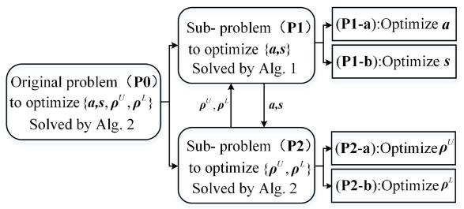

flowchart

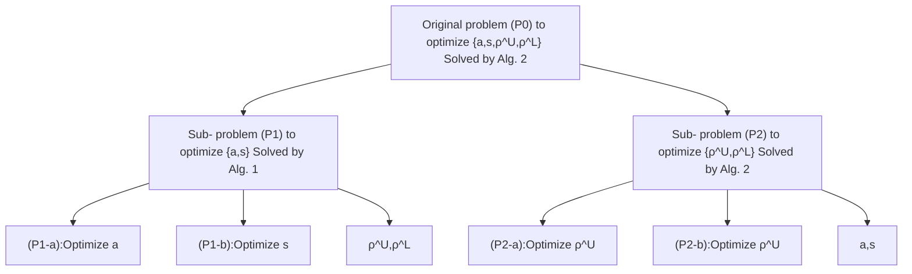

Fig. 3. The proposed solution approach.

LEO satellite with a multi-round iterative search algorithm. Then, we decompose the joint optimization problem of the computing resource allocation of UAVs and the LEO satellite by exploiting the convex structure and applying the Lagrangian dual decomposition method. The proposed solution framework is shown in Fig. 3.

# A. Joint Optimization of Offloading Mode and Volume

Given the computing resource allocation of UAVs and the LEO satellite, i.e., fixing $\rho ^ { U }$ and $\rho ^ { L }$ , (P0) is reformulated as (P1):

$$
\min _ {\boldsymbol {a}, \boldsymbol {s}} E ^ {t o t} \tag {26}
$$

$$
\text { s.t. } (2 5 \mathrm{a}) \sim (2 5 \mathrm{d}), (2 5 \mathrm{i}) \sim (2 5 \mathrm{l}). \tag {26a}
$$

With (25) and constraint (25c), we obtain the upper and lower bounds of $a _ { m n }$ as

$$
a _ {m n} ^ {U} = \min \left\{1, \frac {\rho_ {m n} ^ {U} \left(T _ {m n} ^ {\max} - t _ {m n} ^ {U}\right)}{s _ {m n} c _ {m}} \right\}, \tag {27}
$$

and

$$
a _ {m n} ^ {L} = \max \left\{0, 1 - \frac {\rho_ {m n} ^ {L} \left(T _ {m n} ^ {\max} - t _ {m n} ^ {L}\right)}{s _ {m n} c ^ {L}} \right\}. \tag {28}
$$

Similarly, the upper and lower bounds of $s _ { m n }$ are denoted, respectively, as

$$
s _ {m n} ^ {U} =
$$

$$
\min \left\{S _ {m n}, \frac {\rho_ {m n} ^ {U} \left(T _ {m n} ^ {\max} - t _ {m n} ^ {U}\right)}{a _ {m n} c _ {m}}, \frac {\rho_ {m n} ^ {L} \left(T _ {m n} ^ {\max} - t _ {m n} ^ {L}\right)}{\left(1 - a _ {m n}\right) c ^ {L}} \right\}, \tag {29}
$$

and

$$
s _ {m n} ^ {L} = \max \left\{0, S _ {m n} - \frac {T _ {m n} ^ {\max} \rho_ {m n} ^ {l}}{c _ {m n}} \right\}. \tag {30}
$$

1) Offloading Mode Optimization: We first optimize the offloading mode decision matrix a, while fixing the offloading volume decision matrix s, the computing resource allocation matrix $\rho ^ { U }$ of UAVs, and the computing resource allocation matrix $\rho ^ { L }$ of the LEO satellite, yielding

(P1-a):

$$
\min _ {\boldsymbol {a}} E ^ {t o t} \tag {31}
$$

$$
\text { s.t. } (2 5 \mathrm{a}), (2 5 \mathrm{c}), (2 5 \mathrm{d}), (2 5 \mathrm{i}) \sim (2 5 \mathrm{l}). \tag {31a}
$$

Let $E ( a _ { m n } ) = E ^ { t o t }$ , the first derivative of $E ( a _ { m n } )$ with respect to $a _ { m n }$ ) =is expressed as

$$
\begin{array}{l} E ^ {\prime} (a _ {m n}) = \frac {\partial E (a _ {m n})}{\partial a _ {m n}} = \frac {\sigma^ {2} s _ {m n} \ln 2}{g _ {m n} ^ {U} W _ {m n} ^ {U}} 2 ^ {\frac {a _ {m n} s _ {m n}}{t _ {m n} ^ {U} W _ {m n} ^ {U}}} \\ - \frac {t _ {m n} ^ {L} N _ {0} s _ {m n} \ln 2}{| h _ {m n} ^ {L} | ^ {2} \left(t _ {m n} ^ {L} - \frac {2 d _ {m n} ^ {L}}{c}\right)} 2 ^ {\overline {{\left(t _ {m n} ^ {L} - \frac {2 d _ {m n} ^ {L}}{c}\right) W _ {m n} ^ {L}}}} \\ + P _ {m n} ^ {U} \frac {s _ {m n} c _ {m}}{\rho_ {m n} ^ {U}} - P _ {m n} ^ {L} \frac {s _ {m n} c ^ {L}}{\rho_ {m n} ^ {L}}. \tag {32} \\ \end{array}
$$

The second derivative of $E ( a _ { m n } )$ with respect to $a _ { m n }$ is expressed as

$$
\begin{array}{l} E ^ {\prime \prime} (a _ {m n}) = \frac {\partial^ {2} E (a _ {m n})}{\partial^ {2} a _ {m n}} = \frac {\sigma^ {2}}{t _ {m n} ^ {U} g _ {m n} ^ {U}} \left(\frac {s _ {m n} \ln 2}{W _ {m n} ^ {U}}\right) ^ {2} 2 ^ {\frac {a _ {m n} s _ {m n}}{t _ {m n} ^ {U} W _ {m n} ^ {U}}} \\ + \frac {t _ {m n} ^ {L} N _ {0}}{\left| h _ {m n} ^ {L} \right| ^ {2} W _ {m n} ^ {L}} \left(\frac {- s _ {m n} \ln 2}{t _ {m n} ^ {L} - \frac {2 d _ {m n} ^ {L}}{c}}\right) ^ {2} 2 ^ {\frac {(1 - a _ {m n}) s _ {m n}}{\left(t _ {m n} ^ {L} - \frac {2 d _ {m n} ^ {L}}{c}\right) W _ {m n} ^ {L}}}. \tag {33} \\ \end{array}
$$

As $E ^ { \prime \prime } ( a _ { m n } ) \geq 0 , E ( a _ { m n } )$ is convex with respect to $a _ { m n }$ , and ( )the first derivative $E ^ { \prime } ( a _ { m n } )$ increases with $a _ { m n }$ in the interval $[ a _ { m n } ^ { L } , a _ { m n } ^ { U } ]$ ( ) . Then, we obtain the optimal offloading decision $a _ { m n } ^ { * }$ as

$$
a _ {m n} ^ {*} = \left\{ \begin{array}{l l} a _ {m n} ^ {L}, & \mathrm{E} ^ {\prime} (a _ {m n} ^ {L}) > 0, \\ a _ {m n} ^ {\Delta}, & \mathrm{E} ^ {\prime} (a _ {m n} ^ {L}) \leq 0 \leq E ^ {\prime} (a _ {m n} ^ {U}), \\ a _ {m n} ^ {U}, & \mathrm{E} ^ {\prime} (a _ {m n} ^ {U}) <   0, \end{array} \right. \tag {34}
$$

where $a _ { m n } ^ { \Delta }$ is the root of $E ^ { \prime } ( a _ { m n } ) = 0$ . Here, we propose a ( ) =multi-round iterative search (MRIS) algorithm to obtain the value of $a _ { m n } ^ { * }$ , as shown in Algorithm 1.

2) Offloading Volume Optimization: We then optimize the offloading volume matrix s, while fixing the offloading decision matrix a, the computing resource allocation matrix $\rho ^ { U }$ of UAVs, and the computing resource allocation matrix $\rho ^ { L }$ of LEO satellite, yielding

(P1-b):

$$
\min _ {s} E ^ {t o t} \tag {35}
$$

$$
\text { s.t. } (2 5 \mathrm{b}) \sim (2 5 \mathrm{d}), (2 5 \mathrm{i}) \sim (2 5 \mathrm{l}). \tag {35a}
$$

Let $E ( s _ { m n } ) = E ^ { t o t }$ , the first derivative of $E ( s _ { m n } )$ with respect to $s _ { m n }$ ( ) =is expressed as

$$
\begin{array}{l} E ^ {\prime} (s _ {m n}) = \frac {\partial E (s _ {m n})}{\partial s _ {m n}} = - P _ {m n} ^ {l} \frac {c _ {m n}}{\rho_ {m n} ^ {l}} + \frac {\sigma^ {2} a _ {m n} \ln 2}{g _ {m n} ^ {U} W _ {m n} ^ {U}} 2 ^ {\frac {a _ {m n} s _ {m n}}{t _ {m n} ^ {U} W _ {m n} ^ {U}}} \\ + \frac {t _ {m n} ^ {L} N _ {0} (1 - a _ {m n}) \ln 2}{| h _ {m n} ^ {L} | ^ {2} \left(t _ {m n} ^ {L} - \frac {2 d _ {m n} ^ {L}}{c}\right)} 2 ^ {\overline {{\left(t _ {m n} ^ {L} - \frac {2 d _ {m n} ^ {L}}{c}\right) W _ {m n} ^ {L}}}} \\ + P _ {m n} ^ {U} \frac {a _ {m n} c _ {m}}{\rho_ {m n} ^ {U}} + P _ {m n} ^ {L} \frac {(1 - a _ {m n}) c ^ {L}}{\rho_ {m n} ^ {L}}. \tag {36} \\ \end{array}
$$

Algorithm 1: MRIS Algorithm.   
Input: Given the tolerable computation-error $\delta$ ;
Output: The optimal value $\{a_{mn}^{*}\}$ ;

1 Initialization: Set the current best solutions of $\{a_{mn}^{*}\} = \emptyset$ ;

2 Calculate the upper bound $a_{mn}^{U}$ with Eq. (27);

3 Calculate the lower bound $a_{mn}^{L}$ with Eq. (28);

4 if $E'(a_{mn}^{L}) > 0$ then

5 | Set $a_{mn}^{*} = a_{mn}^{L}$ ;

6 end

7 if $E'(a_{mn}^{U}) < 0$ then

8 | Set $a_{mn}^{*} = a_{mn}^{U}$ ;

9 end

10 if $E'(a_{mn}^{L}) \leq 0 \leq E'(a_{mn}^{U})$ then

11 while $|a_{mn}^{U} - a_{mn}^{L}| > \delta$ do

12 Update the current value of $a_{mn}^{cur} = \frac{1}{2}(a_{mn}^{U} + a_{mn}^{L})$ ;

13 Calculate the value of $E'(a_{mn}^{cur})$ with Eq. (32);

14 if $E'(a_{mn}^{cur}) < 0$ then

15 Update the lower bound of the search range as $a_{mn}^{L} = a_{mn}^{cur}$ ;

16 else

17 if $E'(a_{mn}^{cur}) > 0$ then

18 Update the upper bound of the search range as $a_{mn}^{U} = a_{mn}^{cur}$ ;

19 else

20 Set $a_{mn}^{*} = a_{mn}^{cur}$ ;

21 end

22 end

23 end

24 end

The second derivative of $E ( s _ { m n } )$ with respect to $s _ { m n }$ is expressed as

$$
\begin{array}{l} E ^ {\prime \prime} (s _ {m n}) = \frac {\partial^ {2} E (s _ {m n})}{\partial^ {2} s _ {m n}} = \frac {\sigma^ {2}}{t _ {m n} ^ {U} g _ {m n} ^ {U}} \left(\frac {a _ {m n} \ln 2}{W _ {m n} ^ {U}}\right) ^ {2} 2 ^ {\frac {a _ {m n} s _ {m n}}{t _ {m n} ^ {U} W _ {m n} ^ {U}}} \\ + \frac {t _ {m n} ^ {L} N _ {0}}{\left| h _ {m n} ^ {L} \right| ^ {2} W _ {m n} ^ {L}} \left(\frac {(1 - a _ {m n}) \ln 2}{t _ {m n} ^ {L} - \frac {2 d _ {m n} ^ {L}}{c}}\right) ^ {2} 2 ^ {\frac {(1 - a _ {m n}) s _ {m n}}{\left(t _ {m n} ^ {L} - \frac {2 d _ {m n} ^ {L}}{c}\right) W _ {m n} ^ {L}}}. \tag {37} \\ \end{array}
$$

As $E ^ { \prime \prime } ( s _ { m n } ) \geq 0 , E ( s _ { m n } )$ is convex with respect to $s _ { m n }$ , and ( )the first derivative $E ^ { \prime } ( s _ { m n } )$ )is increasing with $s _ { m n }$ in the interval $[ s _ { m n } ^ { L } , s _ { m n } ^ { U } ]$ ( ). Then, we obtain the optimal $s _ { m n } ^ { * }$ as

$$
s _ {m n} = \left\{ \begin{array}{l l} s _ {m n} ^ {L}, & \mathrm{E} ^ {\prime} (s _ {m n} ^ {L}) > 0, \\ s _ {m n} ^ {\Delta}, & \mathrm{E} ^ {\prime} (s _ {m n} ^ {L}) \leq 0 \leq E ^ {\prime} (s _ {m n} ^ {U}), \\ s _ {m n} ^ {U}, & \mathrm{E} ^ {\prime} (s _ {m n} ^ {U}) <   0, \end{array} \right. \tag {38}
$$

where $s _ { m n } ^ { \Delta }$ is the root of $E ^ { \prime } ( s _ { m n } ) = 0 .$ . Similarly, we employ ( ) =the MRIS algorithm to obtain the value of $s _ { m n } ^ { * }$ .

# B. Joint Optimization of Computing Resource Allocation

Given the offloading decision matrix a and offloading volume matrix s, (P0) is reformulated as

(P2):

$$
\min _ {\boldsymbol {\rho} ^ {U}, \boldsymbol {\rho} ^ {L}} E ^ {t o t} \tag {39}
$$

s.t. (25c), (25d), (25f), (25g), (25k), (25l). (39a)

(P2) can be decomposed into the following two sub-problems.

1) Optimization of UAV Computing Resource Allocation: We first optimize the computing resource allocation matrix $\rho ^ { U }$ of UAVs, given the offloading mode decision matrix $^ { a , }$ the offloading volume decision matrix s, and the computing resource allocation matrix $\rho ^ { L }$ of the LEO satellite, yielding

(P2-a):

$$
\min _ {\rho^ {U}} E ^ {t o t} \tag {40}
$$

s.t. (25f),

$$
t _ {m n} ^ {U} + \frac {a _ {m n} s _ {m n} c _ {m}}{\rho_ {m n} ^ {U}} \leq T _ {m n} ^ {\max}, \forall m \in \mathcal {M}, \forall n \in \mathcal {N}, \tag {40a}
$$

$$
\sum_ {n \in \mathcal {N}} P _ {m n} ^ {U} \frac {a _ {m n} s _ {m n} c _ {m}}{\rho_ {m n} ^ {U}} \leq E _ {m} ^ {\max}, \forall n \in \mathcal {N}. \tag {40b}
$$

The constraints of (P2-a) are convex with respect to ρUmn. $\rho _ { m n } ^ { U }$ The second derivative of the objective function $E ^ { t o { \bar { t } } }$ with respect to $\rho _ { m n } ^ { U }$ is formulated as

$$
\frac {\partial^ {2} E ^ {t o t} (\rho_ {m n} ^ {U})}{\partial^ {2} \rho_ {m n} ^ {U}} = \frac {2 P _ {m n} ^ {U} a _ {m n} s _ {m n} c _ {m}}{\rho_ {m n} ^ {U 3}} \geq 0. \tag {41}
$$

The objective function $E ^ { t o t }$ is convex with respect to $\rho _ { m n } ^ { U } .$ Then, (P2-a) is formulated as a convex optimization problem, which is solved with the Karush-Kuhn-Tucker (KKT) conditions [46], [47].

Specifically, the Lagrangian function of (P2-a) is formulated by

$$
\begin{array}{l} \mathcal {L} (\boldsymbol {\rho} ^ {U}, \lambda_ {1}, \lambda_ {2}, \lambda_ {3}) \\ = \sum_ {m \in \mathcal {M}} \sum_ {n \in \mathcal {N}} P _ {m n} ^ {l} \frac {(S _ {m n} - s _ {m n}) c _ {m n}}{\rho_ {m n} ^ {l}} + P _ {m n} ^ {U} \frac {a _ {m n} s _ {m n} c _ {m}}{\rho_ {m n} ^ {U}} \\ + \frac {t _ {m n} ^ {U} \sigma^ {2}}{g _ {m n} ^ {U}} \left(2 ^ {\frac {a _ {m n} s _ {m n}}{t _ {m n} ^ {U} W _ {m n} ^ {U}}} - 1\right) + P _ {m n} ^ {L} \frac {(1 - a _ {m n}) s _ {m n} c ^ {L}}{\rho_ {m n} ^ {L}} \\ + \frac {t _ {m n} ^ {L} W _ {m n} ^ {L} N _ {0}}{| h _ {m n} ^ {L} | ^ {2}} \left[ 2 ^ {\frac {(1 - a _ {m n}) s _ {m n}}{\left(t _ {m n} ^ {L} - \frac {2 d _ {m n} ^ {L}}{c}\right) W _ {m n} ^ {L}}} - 1 \right] \\ - \sum_ {m \in \mathcal {M}} \sum_ {n \in \mathcal {N}} \lambda_ {m n} ^ {1} \left(t _ {m n} ^ {U} + \frac {a _ {m n} s _ {m n} c _ {m}}{\rho_ {m n} ^ {U}} - T _ {m n} ^ {\max}\right) \\ - \sum_ {m \in \mathcal {M}} \lambda_ {m} ^ {2} \left(\sum_ {n \in \mathcal {N}} \rho_ {m n} ^ {U} - \rho_ {m} ^ {\max}\right) \\ - \sum_ {m \in \mathcal {M}} \lambda_ {m} ^ {3} \left(\sum_ {n \in \mathcal {N}} P _ {m n} ^ {U} \frac {a _ {m n} s _ {m n} c _ {m}}{\rho_ {m n} ^ {U}} - E _ {m} ^ {\max}\right) \tag {42} \\ \end{array}
$$

where $\pmb { \lambda } _ { 1 } = \{ \lambda _ { m n } ^ { 1 } \} , \ \pmb { \lambda } _ { 2 } = \{ \lambda _ { m } ^ { 2 } \} , \ \pmb { \lambda } _ { 3 } = \{ \lambda _ { m } ^ { 3 } \}$ are the nonnegative Lagrange multipliers. The optimal computing resource allocation ρ ∗ mn $\bar { \rho } _ { m n } ^ { U * }$ at $U _ { m }$ and the optimal Lagrange multipliers should satisfy the following KKT conditions for ∀m $\in { \mathcal { M } }$ , ∀n ∈ ${ \mathcal { N } } .$ , given by

$$
\frac {\partial \mathcal {L}}{\partial \rho_ {m n} ^ {U}} = \frac {- P _ {m n} ^ {U} a _ {m n} s _ {m n} c _ {m}}{\rho_ {m n} ^ {U * 2}} + \lambda_ {m n} ^ {1 *} \frac {a _ {m n} s _ {m n} c _ {m}}{\rho_ {m n} ^ {U * 2}}
$$

$$
- \lambda_ {m} ^ {2 *} + \lambda_ {m} ^ {3 *} \frac {P _ {m n} ^ {U} a _ {m n} s _ {m n} c _ {m}}{\rho_ {m n} ^ {U * 2}} = 0, \tag {43}
$$

$$
\sum_ {m \in \mathcal {M}} \sum_ {n \in \mathcal {N}} \lambda_ {m n} ^ {1 *} \left(t _ {m n} ^ {U} + \frac {a _ {m n} s _ {m n} c _ {m}}{\rho_ {m n} ^ {U *}} - T _ {m n} ^ {\max}\right) = 0, \tag {44}
$$

$$
\sum_ {m \in \mathcal {M}} \lambda_ {m} ^ {2 *} \left(\sum_ {n \in \mathcal {N}} \rho_ {m n} ^ {U *} - \rho_ {m} ^ {\max}\right) = 0, \tag {45}
$$

$$
\sum_ {m \in \mathcal {M}} \lambda_ {m} ^ {3 *} \left(\sum_ {n \in \mathcal {N}} P _ {m n} ^ {U} \frac {a _ {m n} s _ {m n} c _ {m}}{\rho_ {m n} ^ {U *}} - E _ {m} ^ {\max}\right) = 0. \tag {46}
$$

Based on (43)–(46), we obtain the value of $\rho _ { m n } ^ { U * }$ as

$$
\rho_ {m n} ^ {U *} = \frac {a _ {m n} s _ {m n} c _ {m}}{T _ {m n} ^ {\max} - T _ {m n} ^ {U t}}. \tag {47}
$$

2) Optimization of LEO Satellite Computing Resource Allocation: Then, we optimize the computing resource allocation matrix $\rho ^ { L }$ of the LEO satellite, given the offloading mode decision matrix a, the offloading volume decision matrix s, and the computing resource allocation matrix $\rho ^ { U }$ of UAVs, yielding (P2-b):

$$
\min _ {\rho^ {L}} E ^ {t o t} \tag {48}
$$

s.t. (25g),

$$
t _ {m n} ^ {L} + \frac {(1 - a _ {m n}) s _ {m n} c _ {m}}{\rho_ {m n} ^ {L}} \leq T _ {m n} ^ {\max}, \forall m \in \mathcal {M}, \forall n \in \mathcal {N}, \tag {48a}
$$

$$
t _ {m n} ^ {L} + \frac {(1 - a _ {m n}) s _ {m n} c _ {m}}{\rho_ {m n} ^ {L}} \leq T ^ {\max}, \forall m \in \mathcal {M}, \forall n \in \mathcal {N}, \tag {48b}
$$

$$
\sum_ {m \in \mathcal {M}} \sum_ {n \in \mathcal {N}} P _ {m n} ^ {L} \frac {a _ {m n} s _ {m n} c ^ {L}}{\rho_ {m n} ^ {L}} \leq E _ {\max} ^ {L}, \forall m \in \mathcal {M}, \forall n \in \mathcal {N}. \tag {48c}
$$

Similarly, the constraints of (P2-b) are convex with respect to $\rho _ { m n } ^ { L }$ . The second derivative of the objective function $E ^ { t o t }$ with respect to $\rho _ { m n } ^ { L }$ is formulated as

$$
\frac {\partial^ {2} E ^ {t o t} (\rho_ {m n} ^ {L})}{\partial^ {2} \rho_ {m n} ^ {L}} = \frac {2 P _ {m n} ^ {L} (1 - a _ {m n}) s _ {m n} c ^ {L}}{\rho_ {m n} ^ {L 3}} \geq 0. \tag {49}
$$

We observe that $E ^ { t o t }$ is also convex with respect to $\rho _ { m n } ^ { L }$ . Thus, (P2-b) is formulated as a convex optimization problem, which can be solved with KKT conditions. Specifically, we assume $T _ { m n } ^ { \mathrm { m a x } } \leq T ^ { \mathrm { m a x } }$ , the Lagrangian function of (P2-b) is expressed as

$$
\begin{array}{l} \mathcal {L} (\boldsymbol {\rho} ^ {L}, \boldsymbol {\mu} _ {1}, \mu_ {2}, \mu_ {3}) \\ = \sum_ {m \in \mathcal {M}} \sum_ {n \in \mathcal {N}} P _ {m n} ^ {l} \frac {(S _ {m n} - s _ {m n}) c _ {m n}}{\rho_ {m n} ^ {l}} + P _ {m n} ^ {U} \frac {a _ {m n} s _ {m n} c _ {m}}{\rho_ {m n} ^ {U}} \\ + \frac {t _ {m n} ^ {U} \sigma^ {2}}{g _ {m n} ^ {U}} \left(2 ^ {\frac {a _ {m n} s _ {m n}}{t _ {m n} ^ {U} W _ {m n} ^ {U}}} - 1\right) + P _ {m n} ^ {L} \frac {(1 - a _ {m n}) s _ {m n} c ^ {L}}{\rho_ {m n} ^ {L}} \\ + \frac {t _ {m n} ^ {L} W _ {m n} ^ {L} N _ {0}}{| h _ {m n} ^ {L} | ^ {2}} \left(2 ^ {\frac {(1 - a _ {m n}) s _ {m n}}{\left(t _ {m n} ^ {L} - \frac {2 d _ {m n} ^ {L}}{c}\right) W _ {m n} ^ {L}}} - 1\right) \\ - \sum_ {m \in \mathcal {M}} \sum_ {n \in \mathcal {N}} \mu_ {m n} ^ {1} \left(t _ {m n} ^ {L} + \frac {(1 - a _ {m n}) s _ {m n} c ^ {L}}{\rho_ {m n} ^ {L}} - T _ {m n} ^ {\max}\right) \\ - \mu_ {2} \left(\sum_ {m \in \mathcal {M}} \sum_ {n \in \mathcal {N}} \rho_ {m n} ^ {L} - \rho_ {\max} ^ {L}\right) \\ - \mu_ {3} \left(\sum_ {m \in \mathcal {M}} \sum_ {n \in \mathcal {N}} P _ {m n} ^ {L} \frac {\left(1 - a _ {m n}\right) s _ {m n} c ^ {L}}{\rho_ {m n} ^ {L}} - E _ {\max} ^ {L}\right) \tag {50} \\ \end{array}
$$

where ${ \pmb { \mu } } _ { 1 } = \{ \mu _ { m n } ^ { 1 } \} , \mu _ { 2 }$ and $\mu _ { 3 }$ are the non-negative Lagrange =multipliers. The optimal computing resource allocation $\rho _ { m n } ^ { L * }$ of the LEO satellite and the optimal Lagrange multipliers should satisfy the following KKT conditions for $\forall m \in \mathcal { M } , \forall n \in \mathcal { N }$ , given by

$$
\begin{array}{l} \frac {\partial \mathcal {L}}{\partial \rho_ {m n} ^ {L}} = \frac {- P _ {m n} ^ {L} (1 - a _ {m n}) s _ {m n} c ^ {L}}{\rho_ {m n} ^ {L * 2}} + \mu_ {m n} ^ {1 *} \frac {(1 - a _ {m n}) s _ {m n} c ^ {L}}{\rho_ {m n} ^ {L * 2}} \\ - \mu_ {2} ^ {*} + \mu_ {3} ^ {*} \frac {P _ {m n} ^ {L} (1 - a _ {m n}) s _ {m n} c ^ {L}}{\rho_ {m n} ^ {L * 2}} = 0, \tag {51} \\ \end{array}
$$

$$
\sum_ {m \in \mathcal {M}} \sum_ {n \in \mathcal {N}} \mu_ {m n} ^ {1 *} \left(t _ {m n} ^ {L} + \frac {(1 - a _ {m n}) s _ {m n} c ^ {L}}{\rho_ {m n} ^ {L *}} - T _ {m n} ^ {\max}\right) = 0, \tag {52}
$$

$$
\mu_ {2} ^ {*} \left(\sum_ {m \in \mathcal {M}} \sum_ {n \in \mathcal {N}} \rho_ {m n} ^ {L *} - \rho_ {\max} ^ {L}\right) = 0, \tag {53}
$$

$$
\mu_ {3} ^ {*} \left(\sum_ {m \in \mathcal {M}} \sum_ {n \in \mathcal {N}} P _ {m n} ^ {L} \frac {(1 - a _ {m n}) s _ {m n} c ^ {L}}{\rho_ {m n} ^ {L *}} - E _ {\max} ^ {L}\right) = 0. \tag {54}
$$

Then, we obtain the value of $\rho _ { m n } ^ { L * }$ as

$$
\rho_ {m n} ^ {L *} = \frac {(1 - a _ {m n}) s _ {m n} c ^ {L}}{T _ {m n} ^ {\max} - T _ {m n} ^ {L t}}. \tag {55}
$$

Based on the above derivations, the solution to (P0) (STP) is articulated in Algorithm 2.

# C. Complexity Analysis

As presented in Fig. 3, to solve (P0), we propose a layered structure and decompose the original problem (P0) into two subproblems, (P1) and (P2). (P1) jointly optimizes the offloading mode and volume, respectively, and (P2) jointly optimizes the computing resource allocation of the UAVs and the LEO satellite, respectively. Specifically, to solve (P1), Algorithm 1 is proposed to find the optimal $\{ a _ { m n } \} _ { m \in \mathcal { M } , n \in \mathcal { N } } ^ { * }$ and $\{ s _ { m n } \} _ { m \in \mathcal { M } , n \in \mathcal { N } } ^ { * }$ for each MASS. We denote the number of iterations of Algorithm 1 as K. Then, we obtain the computation complexity of Algorithm 1 as $\mathcal { O } ( N \log _ { 2 } K )$ for N MASSs. ( log )For Algorithm 2, the complexity of the computing resource allocation is $\mathcal { O } ( N )$ for all MASSs. Assuming that T represents ( )the number of iterations required for the algorithm to converge, the total computational complexity of the proposed Algorithm 2 is $\mathcal { O } ( T N \log _ { 2 } K )$ . Therefore, the proposed algorithms have low complexity, which shows good scalability.

Algorithm 2: STP Algorithm. 

<table><tr><td>1</td><td>Initialization: Set the maximum number of iterations T, set the initial value as t = 0 of the iterations;</td></tr><tr><td>2</td><td>while t &lt; T do</td></tr><tr><td>3</td><td>Given ρU and ρL, calculate a and s with Algorithm 1;</td></tr><tr><td>4</td><td>Given a, s and ρL, calculate ρU with Eq. (47);</td></tr><tr><td>5</td><td>Given a, s and ρU, calculate ρL with Eq. (55);</td></tr><tr><td>6</td><td>Update t ← t + 1;</td></tr><tr><td>7</td><td>end</td></tr><tr><td>8</td><td>Set a* = a, s* = s, ρU* = ρU, ρL* = ρL;</td></tr><tr><td></td><td>Output: The optimal value a*, s*, ρU* and ρL*;</td></tr></table>

# VI. PERFORMANCE EVALUATION

In this section, we conduct numerical analysis to validate the effectiveness of the proposed algorithms. Specifically, we evaluate the impact of key parameters on the energy consumption and compare the proposed scheme with the following three benchmark schemes.

a) Paired offloading of multiple tasks (POMT) scheme [48]: In this scheme, each MASS can only execute its task locally or entirely offload it to one edge server for processing.   
b) Equal offloading scheme (EOS): Similar to the Round Robin method in [49] and [50], in this scheme, $M _ { m n } , U _ { m }$ , and the LEO satellite each complete an identical amount of workloads for every MASS.   
c) Even allocation of computing resource (EACR) scheme: In this scheme, the computing resources of $U _ { m }$ and the LEO satellite are evenly allocated among all MASSs.

# A. System Setup

We conduct all the numerical analysis with MATLAB on a PC configured using a Core i7-10510 U 1.80 GHz CPU and 8 GB of RAM. We consider a double-edge-assisted SAMIN comprised of one LEO satellite and four UAVs hovering in the air with the positions of (125,125,100)m, (125,375,100)m, (375,125,100)m, (375,375,100)m, respectively. Each UAV covers 5 MASSs which navigate autonomously. The LEO satellite is responsible for determining offloading strategies and computing resource allocation policies for all MASSs. We assume each

TABLE I SIMULATION PARAMETER SETTINGS 

<table><tr><td>Parameters</td><td>Values</td></tr><tr><td>Maximum latency for processing tasks of  $M_{mn}$  $(T_{mn}^{\text{max}})$ </td><td>1s</td></tr><tr><td>Spectral power of the additive white Gaussian noise ( $\sigma^{2}$ )</td><td>7.9e-9 mW</td></tr><tr><td>Transmission bandwidth of  $M_{mn}$  to  $U_{m}$  ( $W_{mn}^{U}$ )</td><td>12 MHz</td></tr><tr><td>Transmission time between  $M_{mn}$  and  $U_{m}$  ( $t_{mn}^{U}$ )</td><td>0.4s</td></tr><tr><td>Channel power gain exponent ( $\chi$ )</td><td>1</td></tr><tr><td>Elevation angle ( $\theta$ )</td><td>30°</td></tr><tr><td>Path loss exponent ( $\zeta$ )</td><td>1.6</td></tr><tr><td>Transmission time between  $M_{mn}$  and LEO satellite ( $t_{mn}^{L}$ )</td><td>0.7s</td></tr><tr><td>Transmission bandwidth of  $M_{mn}$  to LEO satellite ( $W_{mn}^{L}$ )</td><td>15 MHz</td></tr><tr><td>Height of the LEO satellite ( $h$ )</td><td>784 km</td></tr><tr><td>Path loss exponent ( $\gamma$ )</td><td>2</td></tr><tr><td>Speed of light ( $c$ )</td><td> $3 \times 10^{8}$ m/s</td></tr><tr><td>Number of CPU cycles for processing one bit of data by  $M_{mn}$  ( $c_{mn}$ )</td><td> $1 \times 10^{3}$ </td></tr><tr><td>Number of CPU cycles for processing one bit of data by  $U_{m}$  ( $c_{m}$ )</td><td> $1 \times 10^{3}$ </td></tr><tr><td>Number of CPU cycles for processing one bit of data by the LEO satellite ( $c^{L}$ )</td><td> $1 \times 10^{3}$ </td></tr><tr><td>CPU computing capability of  $M_{mn}$  ( $\rho_{mn}^{l}$ )</td><td> $7 \times 10^{9}$  cycles/s</td></tr></table>

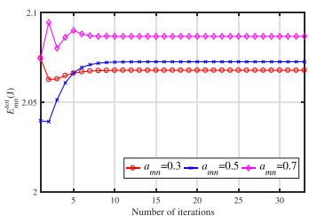

line

| Number of iterations | a = 0.3 | a = 0.5 | a = 0.7 |
| -------------------- | ------- | ------- | ------- |
| 0                    | 2.05    | 2.05    | 2.1     |
| 5                    | 2.05    | 2.05    | 2.1     |
| 10                   | 2.05    | 2.05    | 2.1     |
| 15                   | 2.05    | 2.05    | 2.1     |
| 20                   | 2.05    | 2.05    | 2.1     |
| 25                   | 2.05    | 2.05    | 2.1     |
| 30                   | 2.05    | 2.05    | 2.1     |

(a)

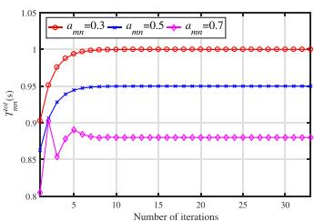

line

| Number of iterations | a = 0.3 | a = 0.5 | a = 0.7 |
| -------------------- | ------- | ------- | ------- |
| 0                    | 0.8     | 0.8     | 0.8     |
| 5                    | 1.0     | 0.95    | 0.85    |
| 10                   | 1.0     | 0.95    | 0.88    |
| 15                   | 1.0     | 0.95    | 0.88    |
| 20                   | 1.0     | 0.95    | 0.88    |
| 25                   | 1.0     | 0.95    | 0.88    |
| 30                   | 1.0     | 0.95    | 0.88    |

Fig. 4. The total energy consumption and overall latency associated with completing ${ M _ { m n } } ^ { \prime }$ s workloads under different values of amn with fixed $t _ { m n } ^ { U } =$ 0.4 s and $\bar { t } _ { m n } ^ { L } = 0 . 7 \varepsilon$ . (a) $E _ { m n } ^ { t o t }$ vs. $E _ { m n } ^ { a } . \left( \mathbf { b } \right) T _ { m n } ^ { t o t }$ vs. $E _ { m n } ^ { a } .$ 二，

$M _ { m n }$ has a total task volume of 10 Mbits. Each MASS communicates with UAV via C-band, utilizing a channel bandwidth of 12 MHz, and each MASS communicates with the LEO satellite through Ka-band, employing a channel bandwidth of 15 MHz. The main parameters are shown in Table I.

# B. Performance Evaluation and Analysis

Fig. 4 illustrates the total energy consumption and the overall latency associatferent values of $a _ { m n }$ ith completing and iteration i $M _ { m n } \mathrm { ' s }$ workloaith fixed $t _ { m n } ^ { U } = 0$ dif-.4 s and tot $t _ { m n } ^ { L } = 0 . 7 s ,$ respectively. We observe that both $E _ { m n } ^ { t o t }$ and $T _ { m n } ^ { t o t }$ =converge. Furthermore, as the value of $a _ { m n }$ increases, the overall latency $T _ { m n } ^ { t o t }$ decreases, while the total energy consumption $E _ { m n } ^ { t o t }$ increases. This arises because an increase in $a _ { m n }$ leads to an increased workloads for $U _ { m } ,$ , which in turn requires more energy to handle additional tasks. Conversely, the expedited transmission between $M _ { m n }$ and $U _ { m }$ helps reduce the overall latency.

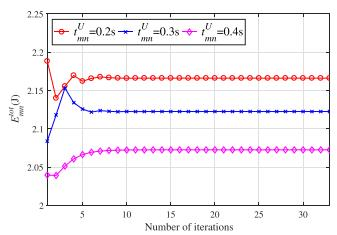

line

| Number of iterations | E_m^fit(U) for i_m^U=0.2s | E_m^fit(U) for i_m^U=0.3s | E_m^fit(U) for i_m^U=0.4s |
| -------------------- | -------------------------- | -------------------------- | -------------------------- |
| 0                    | 2.2                        | 2.1                        | 2.05                       |
| 5                    | 2.15                       | 2.1                        | 2.07                       |
| 10                   | 2.15                       | 2.1                        | 2.08                       |
| 15                   | 2.15                       | 2.1                        | 2.08                       |
| 20                   | 2.15                       | 2.1                        | 2.08                       |
| 25                   | 2.15                       | 2.1                        | 2.08                       |
| 30                   | 2.15                       | 2.1                        | 2.08                       |

(a)

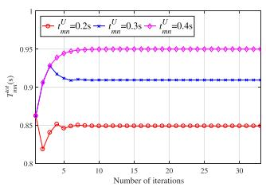

line

| Number of iterations | T_mn^α (s) for t_mn^U=0.2s | T_mn^α (s) for t_mn^U=0.3s | T_mn^α (s) for t_mn^U=0.4s |
| -------------------- | -------------------------- | -------------------------- | -------------------------- |
| 0                    | 0.85                       | 0.85                       | 0.85                       |
| 5                    | 0.85                       | 0.90                       | 0.95                       |
| 10                   | 0.85                       | 0.90                       | 0.95                       |
| 15                   | 0.85                       | 0.90                       | 0.95                       |
| 20                   | 0.85                       | 0.90                       | 0.95                       |
| 25                   | 0.85                       | 0.90                       | 0.95                       |
| 30                   | 0.85                       | 0.90                       | 0.95                       |

(b)

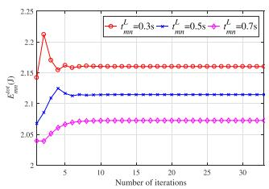

line

| Number of iterations | t_mn^L=0.3s | t_mn^L=0.5s | t_mn^L=0.7s |
|---|---|---|---|
| 1 | 2.15 | 2.05 | 2.04 |
| 2 | 2.22 | 2.10 | 2.06 |
| 3 | 2.18 | 2.12 | 2.07 |
| 4 | 2.16 | 2.13 | 2.08 |
| 5 | 2.16 | 2.13 | 2.09 |
| 10 | 2.16 | 2.13 | 2.09 |
| 20 | 2.16 | 2.13 | 2.09 |
| 30 | 2.16 | 2.13 | 2.09 |

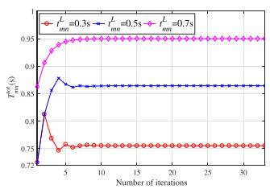

line

| Number of iterations | T_min^α(s) for I_L^mn=0.3s | T_min^α(s) for I_L^mn=0.5s | T_min^α(s) for I_L^mn=0.7s |
| -------------------- | -------------------------- | -------------------------- | -------------------------- |
| 0                    | 0.72                       | 0.72                       | 0.72                       |
| 5                    | 0.75                       | 0.85                       | 0.95                       |
| 10                   | 0.75                       | 0.85                       | 0.95                       |
| 15                   | 0.75                       | 0.85                       | 0.95                       |
| 20                   | 0.75                       | 0.85                       | 0.95                       |
| 25                   | 0.75                       | 0.85                       | 0.95                       |
| 30                   | 0.75                       | 0.85                       | 0.95                       |

(d)   
Fig. 5. Illustration of total energy consumption and overall latency under different values of $t _ { m n } ^ { U }$ and $t _ { m n } ^ { L } ,$ respectively. (a) $E _ { m n } ^ { t o t }$ vs. $t _ { m n } ^ { U }$ . (b) $T _ { m n } ^ { t o t }$ vs. $t _ { m n } ^ { U } .$ (c) $E _ { m n } ^ { t o t }$ vs. $t _ { m n } ^ { L } . \left( \mathrm { d } \right) T _ { m n } ^ { t o t }$ vs. $t _ { m n } ^ { \check { L } ^ { - } }$ 8，

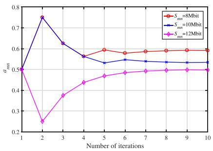

line

| Number of iterations | S_mn = 8Mbit | S_mn = 10Mbit | S_mn = 12Mbit |
| -------------------- | ------------ | ------------- | ------------- |
| 1                    | 0.5          | 0.5           | 0.5           |
| 2                    | 0.75         | 0.75          | 0.25          |
| 3                    | 0.6          | 0.6           | 0.35          |
| 4                    | 0.55         | 0.55          | 0.4           |
| 5                    | 0.6          | 0.5           | 0.45          |
| 6                    | 0.55         | 0.5           | 0.45          |
| 7                    | 0.55         | 0.5           | 0.45          |
| 8                    | 0.55         | 0.5           | 0.45          |
| 9                    | 0.55         | 0.5           | 0.45          |
| 10                   | 0.55         | 0.5           | 0.45          |

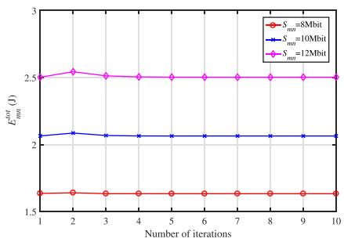

line

| Number of iterations | S_mn = 8Mbit | S_mn = 10Mbit | S_mn = 12Mbit |
| -------------------- | ------------ | ------------- | ------------- |
| 1                    | 1.6          | 2.05          | 2.5           |
| 2                    | 1.6          | 2.05          | 2.55          |
| 3                    | 1.6          | 2.05          | 2.5           |
| 4                    | 1.6          | 2.05          | 2.5           |
| 5                    | 1.6          | 2.05          | 2.5           |
| 6                    | 1.6          | 2.05          | 2.5           |
| 7                    | 1.6          | 2.05          | 2.5           |
| 8                    | 1.6          | 2.05          | 2.5           |
| 9                    | 1.6          | 2.05          | 2.5           |
| 10                   | 1.6          | 2.05          | 2.5           |

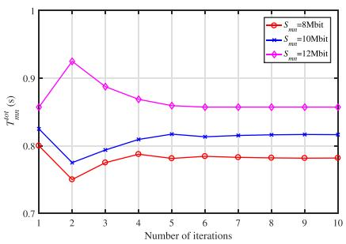

line

| Number of iterations | S_min=8Mbit | S_min=10Mbit | S_min=12Mbit |
| -------------------- | ----------- | ------------ | ------------ |
| 1                    | 0.80        | 0.83         | 0.86         |
| 2                    | 0.75        | 0.77         | 0.93         |
| 3                    | 0.78        | 0.80         | 0.89         |
| 4                    | 0.79        | 0.82         | 0.87         |
| 5                    | 0.78        | 0.82         | 0.86         |
| 6                    | 0.78        | 0.82         | 0.86         |
| 7                    | 0.78        | 0.82         | 0.86         |
| 8                    | 0.78        | 0.82         | 0.86         |
| 9                    | 0.78        | 0.82         | 0.86         |
| 10                   | 0.78        | 0.82         | 0.86         |

（c）

Fig. 6. Illustration of offloading ratio, energy consumption and overall latency under different values of $S _ { m n }$ and iteration index. (a) $a _ { m n }$ vs. $S _ { m n }$ . (b) $E _ { m n } ^ { t o t }$ vs. Smn. (c) $T _ { m n } ^ { t o t }$ vs. Smn.   
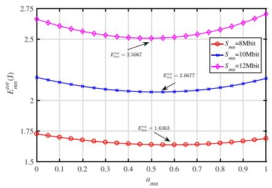

line

| a_mn | S_mn=8Mbit | S_mn=10Mbit | S_mn=12Mbit |
|------|------------|-------------|-------------|
| 0.0  | 1.75       | 2.15        | 2.75        |
| 0.1  | 1.74       | 2.12        | 2.72        |
| 0.2  | 1.73       | 2.10        | 2.70        |
| 0.3  | 1.72       | 2.08        | 2.68        |
| 0.4  | 1.71       | 2.06        | 2.66        |
| 0.5  | 1.70       | 2.05        | 2.65        |
| 0.6  | 1.69       | 2.04        | 2.64        |
| 0.7  | 1.68       | 2.03        | 2.63        |
| 0.8  | 1.67       | 2.02        | 2.62        |
| 0.9  | 1.66       | 2.01        | 2.61        |
| 1.0  | 1.65       | 2.00        | 2.60        |

(a)

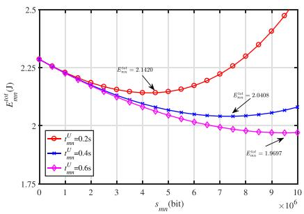

line

| s_mn (bit) | E^tot(t) for t_mn^U = 0.2s | E^tot(t) for t_mn^U = 0.4s | E^tot(t) for t_mn^U = 0.6s |
| ---------- | -------------------------- | -------------------------- | -------------------------- |
| 0          | 2.3                        | 2.3                        | 2.3                        |
| 1          | 2.25                       | 2.2                        | 2.2                        |
| 2          | 2.2                        | 2.1                        | 2.1                        |
| 3          | 2.15                       | 2.05                       | 2.05                       |
| 4          | 2.1                        | 2.0                        | 2.0                        |
| 5          | 2.1                        | 2.0                        | 1.95                       |
| 6          | 2.15                       | 2.0                        | 1.95                       |
| 7          | 2.2                        | 2.0                        | 1.95                       |
| 8          | 2.3                        | 2.0                        | 1.95                       |
| 9          | 2.4                        | 2.0                        | 1.95                       |
| 10         | 2.5                        | 2.0                        | 1.95                       |

(b)

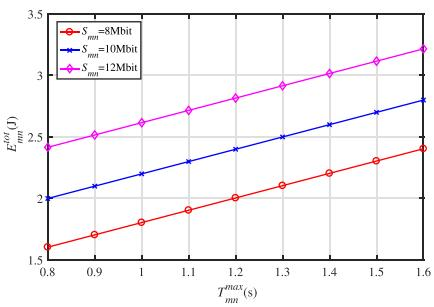

line

| T_max_mn (s) | S_mn=8Mbit | S_mn=10Mbit | S_mn=12Mbit |
| ------------ | ---------- | ----------- | ----------- |
| 0.8          | 1.5        | 2.0         | 2.4         |
| 0.9          | 1.6        | 2.1         | 2.5         |
| 1.0          | 1.7        | 2.2         | 2.6         |
| 1.1          | 1.8        | 2.3         | 2.7         |
| 1.2          | 1.9        | 2.4         | 2.8         |
| 1.3          | 2.0        | 2.5         | 2.9         |
| 1.4          | 2.1        | 2.6         | 3.0         |
| 1.5          | 2.2        | 2.7         | 3.1         |
| 1.6          | 2.3        | 2.8         | 3.2         |

（c）  
Fig. 7. The overall energy consumption under different values of $a _ { m n } , s _ { m n }$ and $T _ { m n } ^ { \mathrm { m a x } }$ . (a) $E _ { m n } ^ { t o t }$ vs. $a _ { m n }$ . (b) $E _ { m n } ^ { t o t }$ vs. $s _ { m n } .$ (c) $E _ { m n } ^ { t o t }$ vs. $T _ { m n } ^ { \mathrm { m a x } }$

Fig. 5 illustrates the impact of transmission time $( \mathrm { i } . \mathrm { e } . , t _ { m n } ^ { U } .$ $t _ { m n } ^ { L } )$ on the total energy consumption $E _ { m n } ^ { t o t }$ and the overall latency $T _ { m n } ^ { t o t } .$ respectively. We observe that both $E _ { m n } ^ { t o t }$ and $T _ { m n } ^ { t o t }$ converge as the number of iterations increases. Specifically, Fig. 5(a) and (c) show that the total energy consumption decreases with increased transmission time, while Fig. 5(b) and (d) show that the overall latency increases with increased transmission time. This demonstrates the trade-off between energy consumption and latency. Within practical limits, a controlled increase in delay can lead to significant energy savings, ultimately enhancing the overall network performance.

Fig. 6 illustrates the impact of the total task volume $S _ { m n }$ on the offloading ratio $a _ { m n } ,$ the total energy consumption Etot , $E _ { m n } ^ { t o t } ,$ and the overall latency $T _ { m n } ^ { t o t }$ , respectively. Specifically, Fig. 6(a) highlights a decrease in $a _ { m n }$ as $S _ { m n }$ increases, due to the limitation in $\mathrm { U A V s } '$ computing capabilities, which requires the support of the LEO satellite to handle the additional computation workloads. Fig. 6(b) and (c) indicate that both $E _ { m n } ^ { t o t }$ and $T _ { m n } ^ { t o t }$ increase in tandem with the increase of $S _ { m n }$ . As $S _ { m n }$ becomes higher, the MASSs, UAVs, and LEO satellite all require additional resources to execute the increased workloads, leading to a surge in energy expenditure and an extension of the overall latency.

Fig. 7 demonstrates the overall energy consumption under different values of offloading ratio $a _ { m n }$ , offloading volume $s _ { m n }$ and tolerable delay of $M _ { m n }$ , respectively. In Fig. 7(a), we observe that as $a _ { m n }$ increases, the total energy consumption initially decreases, followed by a subsequent increase. The variation indicates the existence of an optimal value of $a _ { m n }$ , where the total energy consumption reaches its minimum. The reason for this stems from the workloads distribution between UAVs and the LEO satellite. When $a _ { m n }$ is low, the LEO satellite undertakes a heavy workloads, resulting in increased total energy consumption. Conversely, as $a _ { m n }$ increases, the workloads shifts to UAVs, which are more energy-efficient for specific tasks, thereby reducing the overall energy expenditure. It is essential to select an appropriate value of $a _ { m n }$ to minimize total energy consumption. Fig. respect to the variation of indicates the trend of under different valu $E _ { m n } ^ { t o t }$ $s _ { m n }$ $t _ { m n } ^ { U } .$ As $s _ { m n }$ increases, $E _ { m n } ^ { t o t }$ initially decreases and then rises, and there is always an optimal value of $s _ { m n }$ that minimizes $E _ { m n } ^ { t o t }$ . This is because when $s _ { m n }$ is small, the workloads carried by $M _ { m n }$ is substantial, leading to higher energy consumption. As $s _ { m n }$ increases, the workloads carried by UAVs and the LEO satellite gradually increases, which helps reduce the total energy consumption. However, the value of $s _ { m n }$ cannot increase indefinitely, as a larger $s _ { m n }$ would lead to higher transmission energy consumption. Fig. 7(c) shows the impact of $M _ { m n } \mathrm { ' s }$ tolerable $T _ { m n } ^ { \mathrm { m a x } }$ on the overall eoes an increase as consumption. We see thatescalates. In our formulated $E _ { m n } ^ { t o t }$ $T _ { m n } ^ { \mathrm { m a x } }$ em, inc $T _ { m n } ^ { \mathrm { m a x } }$ represents a limiting factor. When the value of, both UAVs and the LEO satellite can fulfill the $T _ { m n } ^ { \mathrm { m a x } }$ computation workloads within the prescribed time with reduced computation resources, which results in an increase in energy consumption according to (17) and (21).

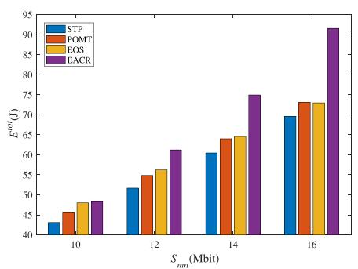

bar

| S_mn (Mbit) | STP  | POMT | EOS  | EACR |
|-------------|------|------|------|------|
| 10          | 43   | 46   | 48   | 49   |
| 12          | 52   | 55   | 56   | 61   |
| 14          | 60   | 63   | 64   | 75   |
| 16          | 70   | 73   | 73   | 92   |

(a)

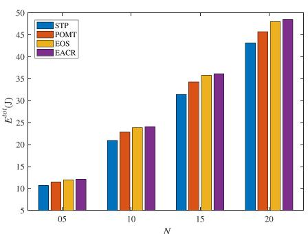

bar

| N | STP | POMT | EOS | EACR |
|---|---|---|---|---|
| 05 | 11 | 11.5 | 12 | 12.5 |
| 10 | 21 | 23 | 24 | 24.5 |
| 15 | 32 | 34.5 | 36 | 36.5 |
| 20 | 43.5 | 45.5 | 47.5 | 48.5 |

(b)

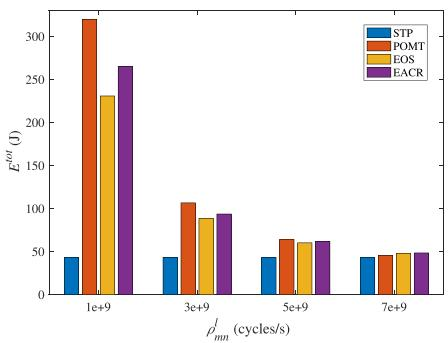

bar

| ρ_mn^l (cycles/s) | STP  | POMT | EOS  | EACR |
| ----------------- | ---- | ---- | ---- | ---- |
| 1e+9              | 45   | 320  | 230  | 265  |
| 3e+9              | 45   | 105  | 85   | 95   |
| 5e+9              | 40   | 60   | 60   | 60   |
| 7e+9              | 40   | 45   | 45   | 45   |

(（c）  
Fig. 8. Performance comparison of our proposed scheme with other benchmarks under different parameters (i.e., $S _ { m n }$ , N , $\rho _ { m n } ^ { l } )$ . (a) $E ^ { t o t }$ vs. $S _ { m n }$ . (b) $E ^ { t o t }$ vs. N . (c) $E ^ { t o t }$ vs. $\rho _ { m n } ^ { l } .$ .

Fig. 8 illustrates the performance comparison of the proposed scheme with other three benchmarks under different parameters (i.e., the total workloads, the number of MASSs, and the computational capability of $M _ { m n } )$ . Fig. 8(a), (b), and (c) clearly demonstrate the superiority of our proposed scheme, which effectively diminishes the overall energy consumption. The reason is that we determine the optimal computation offloading decisions and resource allocation strategies by minimizing the total energy consumption.

# VII. CONCLUSION AND FUTURE WORK

In this paper, we have considered an SAMIN and proposed a double-edge assisted computation offloading scheme for MASSs by jointly optimizing the offloading mode, the offloading volume, the computing resource allocation of UAVs and the LEO satellite, respectively, to improve the efficiency of computation offloading. We define a scenario where both UAVs and the LEO satellite are equipped with edge-servers providing marine computing services. The computation workloads of MASSs can be offloaded to UAVs and the LEO satellite in parallel via a multi-access approach. Then, we formulate an optimization problem and propose energy-efficient algorithms to minimize the energy consumption of SAMIN under latency constraints. Specifically, we exploit an alternating optimization (AO) method and a layered approach to decompose the original problem into four optimization problems (i.e., offloading mode optimization, offloading volume optimization, resource allocation of UAVs, and resource allocation of the LEO satellite) to obtain the optimal solutions. Numerical results are provided to verify the efficiency and effectiveness of the proposed scheme. For future work, we plan to leverage artificial intelligence (AI) techniques, such as reinforcement learning or predictive analytics, to dynamically optimize resource allocation and task scheduling in response to varying environmental conditions and system demands. Additionally, we will incorporate advanced mobility models (e.g., stochastic mobility models) for MASSs to describe their movement patterns, for MASS collaborative trajectory planning and optimization.

# REFERENCES

[1] H. Zeng, Z. Su, Q. Xu, K. Zhang, and Q. Ye, “Game theoretical incentive for USV fleet-assisted data sharing in maritime communication networks,” IEEE Trans. Netw. Sci. Eng., vol. 11, no. 2, pp. 1398–1412, Mar./Apr. 2024.   
[2] X. Li et al., “An identity-based data integrity auditing scheme for cloudbased maritime transportation systems,” IEEE Trans. Intell. Transp. Syst., vol. 24, no. 2, pp. 2556–2567, Feb. 2023.   
[3] D. Han et al., “Two-timescale learning-based task offloading for remote IoT in integrated satellite–terrestrial networks,” IEEE Internet Things J., vol. 10, no. 12, pp. 10131–10145, Jun. 2023.   
[4] S. Qi, B. Lin, Y. Deng, X. Chen, and Y. Fang, “Minimizing maximum latency of task offloading for multi-UAV-assisted maritime search and rescue,” IEEE Trans. Veh. Technol., vol. 73, no. 9, pp. 13625–13638, Sep. 2024.   
[5] C. Lei, S. Wu, Y. Yang, J. Xue, and Q. Zhang, “Joint trajectory and communication optimization for heterogeneous vehicles in maritime SAR: Multi-agent reinforcement learning,” IEEE Trans. Veh. Technol., vol. 73, no. 9, pp. 12328–12344, Sep. 2024.   
[6] G. Zhang, S. Liu, X. Zhang, and W. Zhang, “Event-triggered cooperative formation control for autonomous surface vehicles under the maritime search operation,” IEEE Trans. Intell. Transp. Syst., vol. 23, no. 11, pp. 21392–21404, Nov. 2022.

[7] D. Jia and Q. J. Ye, “Mobility-adaptive digital twin modeling for postdisaster network traffic prediction,” in Proc. IEEE 100th Veh. Technol. Conf., 2024, pp. 1–7.   
[8] T. Lyu, H. Xu, F. Liu, M. Li, L. Li, and Z. Han, “Computing offloading and resource allocation of NOMA-based UAV emergency communication in marine Internet of Things,” IEEE Internet Things J., vol. 11, no. 9, pp. 15571–15586, May 2024.   
[9] Q. Ye, W. Shi, K. Qu, H. He, W. Zhuang, and X. Shen, “Joint RAN slicing and computation offloading for autonomous vehicular networks: A learning-assisted hierarchical approach,” IEEE Open J. Veh. Technol., vol. 2, pp. 272–288, 2021.   
[10] F. Wu, F. Lyu, H. Wu, J. Ren, Y. Zhang, and X. Shen, “Characterizing user association patterns for optimizing small-cell edge system performance,” IEEE Netw., vol. 37, no. 3, pp. 210–217, May/Jun. 2023.   
[11] H. Li, S. Wu, J. Jiao, X. -H. Lin, N. Zhang, and Q. Zhang, “Energy-efficient task offloading of edge-aided maritime UAV systems,” IEEE Trans. Veh. Technol., vol. 72, no. 1, pp. 1116–1126, Jan. 2023.   
[12] H. Zeng et al., “USV fleet-assisted collaborative computation offloading for smart maritime services: An energy-efficient design,” IEEE Trans. Veh. Technol., vol. 73, no. 10, pp. 14718–14733, Oct. 2024.   
[13] G. Chen and X. Huang, “IRS-enhanced parallel computing and partial offloading for latency sensitive MEC,” IEEE Wireless Commun. Lett., vol. 13, no. 11, pp. 2980–2984, Nov. 2024.   
[14] Q. Ye, W. Zhuang, S. Zhang, A.-L. Jin, X. Shen, and X. Li, “Dynamic radio resource slicing for a two-tier heterogeneous wireless network,” IEEE Trans. Veh. Technol., vol. 67, no. 10, pp. 9896–9910, Oct. 2018.   
[15] X. Sun, Y. He, D. Wu, and J. Z. Huang, “Survey of distributed computing frameworks for supporting Big Data analysis,” Big Data Mining Analytics, vol. 6, no. 2, pp. 154–169, 2023.   
[16] V. Niazmand and Q. Ye, “Joint task offloading, DNN pruning, and computing resource allocation for fault detection with dynamic constraints in industrial IoT,” IEEE Trans. Cogn. Commun. Netw., doi: 10.1109/TCCN.2025.3529688.   
[17] Y. Lin et al., “Satellite-MEC integration for 6G Internet of Things: Minimal structures, advances, and prospects,” IEEE Open J. Commun. Soc., vol. 5, pp. 3886–3903, 2024.   
[18] Q. Ye, J. Li, K. Qu, W. Zhuang, X. S. Shen, and X. Li, “End-to-end quality of service in 5G networks: Examining the effectiveness of a network slicing framework,” IEEE Veh. Technol. Mag., vol. 13, no. 2, pp. 65–74, Jun. 2018.   
[19] Q. Wang, X. Chen, and Q. Qi, “Energy-efficient design of satelliteterrestrial computing in 6G wireless networks,” IEEE Trans. Commun., vol. 72, no. 3, pp. 1759–1772, Mar. 2024.   
[20] J. Zhang et al., “Learning-assisted dynamic VNF selection and chaining for 6G satellite-ground integrated networks,” IEEE Trans. Veh. Technol., vol. 74, no. 1, pp. 1504–1519, Jan. 2025.   
[21] Z. Lin, J. Yang, Y. Chen, C. Xu, and X. Zhang, “Maritime distributed computation offloading in space-air-ground-sea integrated networks,” IEEE Commun. Lett., vol. 28, no. 7, pp. 1614–1618, Jul. 2024.   
[22] D. Wang, T. He, Y. Lou, L. Pang, Y. He, and H. -H. Chen, “Double-edge computation offloading for secure integrated space–air–aqua networks,” IEEE Internet Things J., vol. 10, no. 17, pp. 15581–15593, Sep. 2023.   
[23] M. Dai et al., “Latency minimization oriented hybrid offshore and aerial-based multi-access computation offloading for marine communication networks,” IEEE Trans. Commun., vol. 71, no. 11, pp. 6482–6498, Nov. 2023.   
[24] C. Luo, J. Zhang, J. Guo, Y. Hong, Z. Chen, and S. Gu, “Energy efficiency maximization in RISs-assisted UAVs-based edge computing network using deep reinforcement learning,” Big Data Mining Analytics, vol. 7, no. 4, pp. 1065–1083, 2024.   
[25] M. Dai, N. Huang, Y. Wu, J. Gao, and Z. Su, “Unmanned-aerial-vehicleassisted wireless networks: Advancements, challenges, and solutions,” IEEE Internet Things J., vol. 10, no. 5, pp. 4117–4147, Mar. 2023.   
[26] Z. Wang, B. Lin, Q. Ye, Y. Fang, and X. Han, “Joint computation offloading and resource allocation for maritime MEC with energy harvesting,” IEEE Internet Things J., vol. 11, no. 11, pp. 19898–19913, Jun. 2024.   
[27] Y. Dai, B. Lin, Y. Che, and L. Lyu, “UAV-assisted data offloading for smart container in offshore maritime communications,” China Commun., vol. 19, no. 1, pp. 153–165, 2022.   
[28] Z. Luo, M. Dai, Y. Wu, L. Qian, B. Lin, and Z. Su, “UAV-aided twotier computation offloading for marine communication networks: An incentive-based approach,” in Proc. 2023 IEEE Wireless Commun. Netw. Conf., 2023, pp. 1–6.   
[29] M. Li, L. P. Qian, X. Dong, B. Lin, Y. Wu, and X. Yang, “Secure computation offloading for marine IoT: An energy-efficient design via cooperative

jamming,” IEEE Trans. Veh. Technol., vol. 72, no. 5, pp. 6518–6531, May 2023.   
[30] X. Hou, J. Wang, T. Bai, Y. Deng, Y. Ren, and L. Hanzo, “Environmentaware AUV trajectory design and resource management for multi-tier underwater computing,” IEEE J. Sel. Areas Commun., vol. 41, no. 2, pp. 474–490, Feb. 2023.   
[31] G. Yue, C. Huang, and X. Xiong, “A task offloading scheme in maritime edge computing network,” J. Commun. Inf. Netw., vol. 8, no. 2, pp. 171–186, 2023.   
[32] M. Dai, C. Dou, Y. Wu, L. Qian, R. Lu, and T. Q. S. Quek, “Multi-UAV aided multi-access edge computing in marine communication networks: A joint system-welfare and energy-efficient design,” IEEE Trans. Commun., vol. 72, no. 9, pp. 5517–5531, Sep. 2024.   
[33] S. Mahboob and L. Liu, “Revolutionizing future connectivity: A contemporary survey on ai-empowered satellite-based non-terrestrial networks in 6G,” IEEE Commun. Surveys Tuts., vol. 26, no. 2, pp. 1279–1321, Second Quarter 2024.   
[34] S. S. Hassan, D. H. Kim, Y. K. Tun, N. H. Tran, W. Saad, and C. S. Hong, “Seamless and energy-efficient maritime coverage in coordinated 6G space–air–sea non-terrestrial networks,” IEEE Internet Things J., vol. 10, no. 6, pp. 4749–4769, Mar. 2023.   
[35] Z. Wang, B. Lin, Q. Ye, and H. Peng, “Two-tier task offloading for satellite-assisted marine networks: A hybrid stackelberg-bargaining game approach,” IEEE Internet Things J., doi: 10.1109/JIOT.2024.3523527.   
[36] J. Xu, M. A. Kishk, and M. -S. Alouini, “Space-air-ground-sea integrated networks: Modeling and coverage analysis,” IEEE Trans. Wireless Commun., vol. 22, no. 9, pp. 6298–6313, Sep. 2023.   
[37] Z. Li, J. Wen, J. Yang, J. He, T. Ni, and Y. Li, “Energy-efficient space–air– ground–ocean-integrated network based on intelligent autonomous underwater glider,” IEEE Internet Things J., vol. 10, no. 11, pp. 9329–9341, Jun. 2023.   
[38] S. Jung, S. Jeong, J. Kang, and J. Kang, “Marine IoT systems with space– air–sea integrated networks: Hybrid LEO and UAV edge computing,” IEEE Internet Things J., vol. 10, no. 23, pp. 20498–20510, Dec. 2023.   
[39] X. Guo, Y. Luo, N. Yan, W. An, and K. Ma, “Multibeam transmit-reflectarray antenna using alternating transmission and reflection elements for space–air–ground–sea integrated network,” IEEE Trans. Antennas Propag., vol. 71, no. 11, pp. 8668–8676, Nov. 2023.   
[40] Y. Zhang, P. Zhang, C. Jiang, S. Wang, H. Zhang, and C. Rong, “QoS aware virtual network embedding in space-air-ground-ocean integrated network,” IEEE Trans. Serv. Comput., vol. 17, no. 4, pp. 1712–1723, Jul./Aug. 2024.   
[41] Y. Lin et al., “Resource management for QoS-guaranteed marine data feedback based on space–air–ground–sea network,” IEEE Syst. J., vol. 18, no. 3, pp. 1741–1752, Sep. 2024.   
[42] X. Li, W. Feng, Y. Chen, C. -X. Wang, and N. Ge, “Maritime coverage enhancement using UAVs coordinated with hybrid satellite-terrestrial networks,” IEEE Trans. Commun., vol. 68, no. 4, pp. 2355–2369, Apr. 2020.   
[43] D. W. Matolak and R. Sun, “Air–ground channel characterization for unmanned aircraft systems—Part I: Methods, measurements, and models for over-water settings,” IEEE Trans. Veh. Technol., vol. 66, no. 1, pp. 26–44, Jan. 2017.   
[44] J. Wang et al., “Wireless channel models for maritime communications,” IEEE Access, vol. 6, pp. 68070–68088, 2018.   
[45] X. Cao et al., “Edge-assisted multi-layer offloading optimization of LEO satellite-terrestrial integrated networks,” IEEE J. Sel. Areas Commun., vol. 41, no. 2, pp. 381–398, Feb. 2023.   
[46] B. Li, J. Liao, W. Wu, and Y. Li, “Intelligent reflecting surface assisted secure computation of wireless powered MEC system,” IEEE Trans. Mobile Comput., vol. 23, no. 4, pp. 3048–3059, Apr. 2024.   
[47] Y. Li, Y. Zou, H. Hui, J. Zhu, and B. Ning, “Improving computing capability for active RIS-assisted NOMA-MEC networks,” IEEE Wireless Commun. Lett., vol. 13, no. 4, pp. 939–943, Apr. 2024.   
[48] Y. Yang, Z. Liu, X. Yang, K. Wang, X. Hong, and X. Ge, “POMT: Paired offloading of multiple tasks in heterogeneous fog networks,” IEEE Internet Things J., vol. 6, no. 5, pp. 8658–8669, Oct. 2019.   
[49] F. Chai, Q. Zhang, H. Yao, X. Xin, R. Gao, and M. Guizani, “Joint multitask offloading and resource allocation for mobile edge computing systems in satellite IoT,” IEEE Trans. Veh. Technol., vol. 72, no. 6, pp. 7783–7795, Jun. 2023.   
[50] H. Wu, X. Yang, and Z. Bu, “Task offloading with service migration for satellite edge computing: A deep reinforcement learning approach,” IEEE Access, vol. 12, pp. 25844–25856, 2024.

natural_image

Portrait photo of a woman in business attire against a blue background (no text or symbols visible)

Zhen Wang (Graduate Student Member, IEEE) received the B.S. degree in communication engineering from Tianjin University, Tianjin, China, in 2010, and the M.S. degree in communication and information systems from the Beijing University of Posts and Telecommunications, Beijing, China, in 2015. She is currently working toward the Ph.D. degree in information and communication engineering with Dalian Maritime University, Dalian, China. She is currently a Lecturer with the Department of Communication Engineering, Dalian Neusoft University of Information, Dalian. Her research interests include maritime communication, edge/fog computing, resource allocation, and artificial intelligence.

natural_image

Portrait photo of a woman in a black collared shirt (no text or symbols visible)

Bin Lin (Senior Member, IEEE) received the B.S. and M.S. degrees from Dalian Maritime University, Dalian, China, in 1999 and 2003, respectively, and the Ph.D. degree from the Broadband Communications Research Group, Department of Electrical and Computer Engineering, University of Waterloo, Waterloo, ON, Canada, in 2009. She was a Visiting Scholar with George Washington University, Washington, DC, USA, from 2015 to 2016. She is currently a Full Professor and the Dean of Communication Engineering Department, School of Information Science and Technology, Dalian Maritime University. Her current research interests include wireless communications, network dimensioning and optimization, resource allocation, artificial intelligence, maritime communication networks, edge/cloud computing, wireless sensor networks, and Internet of Things. She is an Associate Editor for IEEE TRANSACTION ON VEHICULAR TECHNOLOGY and IEEE INTERNET OF THINGS JOURNAL.

natural_image

Portrait of a man wearing glasses and a light blue shirt (no text or symbols visible)

Qiang (John) Ye (Senior Member, IEEE) received the Ph.D. degree in electrical and computer engineering from the University of Waterloo, Waterloo, ON, Canada, in 2016. He was with the Department of Electrical and Computer Engineering, University of Waterloo as a Postdoctoral Fellow and then a Research Associate, from 2016 to 2019. He was with the Department of Electrical and Computer Engineering and Technology, Minnesota State University, Mankato, MN, USA, from 2019 to 2021. He was an Assistant Professor with the Department of Computer Science, Memorial University of Newfoundland, St. John’s, NL, Canada, from 2021 to 2023. Since 2023, he has been an Assistant Professor with the Department of Electrical and Software Engineering, Schulich School of Engineering, University of Calgary, Calgary, AB, Canada. He has authored or coauthored more than 80 research papers in top-ranked journals and conference proceedings. He is/was a general, publication, publicity, TPC, or symposium Co-Chair for different reputable international conferences and workshops (such as IEEE INFOCOM, GLOBECOM, VTC, ICCC, ICCT, WISEE, SWC). He is/was also the IEEE Vehicular Technology Society (VTS) Region 7 Chapter Coordinator in 2024, IEEE Communications Society (ComSoc) Southern Alberta Chapter Vice Chair from 2024, and the VTS Regions 1-7 Chapters Coordinator from 2022 to 2023. He is the leading Co-Chair of a special interest group (SIG) in the IEEE ComSoc - Internet of Things, Ad Hoc & Sensor Networks (IoT-AHSN) Technical Committee. Dr. Ye is an Associate Editor for prestigious IEEE journals, such as IEEE INTERNET OF THINGS JOURNAL, IEEE TRANSACTIONS ON VEHICULAR TECHNOLOGY, IEEE TRANSACTIONS ON COGNITIVE COMMUNICATIONS AND NETWORKING,andIEEE OPEN JOURNAL OF THE COMMUNICATIONS SOCIETY. He was the recipient of the Best Paper Award in the IEEE/CIC International Conference on Communications in China (ICCC) in 2024, IEEE Transactions on Cognitive Communications and Networking Exemplary Editor Award in 2023, and the Early Career Research Excellence Award, Schulich School of Engineering, University of Calgary, in 2024. He has been selected as an IEEE ComSoc Distinguished Lecturer for the class of 2025–2026.