# Drone Swarm Path Planning for Mobile Edge Computing in Industrial Internet of Things

Yiming Miao , Kai Hwang , Life Fellow, IEEE, Di Wu , Senior Member, IEEE, Yixue Hao , Member, IEEE, and Min Chen , Fellow, IEEE

Abstract—Drone-swarm-assisted mobile edge computing (MEC) provides extra computation and storage capacity for smart city applications and the Industrial Internet of Things. To solve the problems of traditional fixed base stations in a complex terrain, including cost of deployment, transmission loss of telecommunication, and limited coverage, this article brings forward the unmanned aerial vehicles (UAVs) as MEC nodes in the air. For the purpose of matching the dynamic mobile devices and UAV trajectory, this article raises a multi-UAVs-assisted MEC offloading algorithm based on global and local path planning controlled by ground station and onboard computer. Firstly, this article considers a drone swarm scheduling and allocation strategy based on the priority of monitoring areas, UAVs residual energy and distance to target points, so as to minimize the global flight length and energy consumption. Secondly, based on user mobility, this article calculates the optimal communication coverage of a UAV, and jointly optimizes the local path planning and computing offloading, so as to maximize the number of offloading services and minimize the total latency in completing the computation task. Finally, based on the total latency and energy consumption of path planning and computation offloading, a UAV cluster computation offloading strategy with optimized energy efficiency is realized. Experimental results prove that the proposed algorithm can provide more offloading services while obtaining shorter path length and greater energy efficiency.

Manuscript received 1 June 2022; accepted 21 July 2022. Date of publication 4 August 2022; date of current version 4 May 2023. This work was supported in part by Guangdong-Shenzhen Young Scientists Program of China under Grant 2021A1515110353 and in part by Shenzhen Institute of Artificial Intelligence and Robotics for Society (AIRS). Paper no. TII-22-2338. (Corresponding authors: Yixue Hao and Min Chen.)

Yiming Miao and Kai Hwang are with the School of Data Science, The Chinese University of Hong Kong, Shenzhen 518172, China, and also with the Shenzhen Institute of Artificial Intelligence and Robotics for Society, Shenzhen 518172, China (e-mail: yimingmiao@ieee.org; hwangkai@cuhk.edu.cn).

Di Wu is with the School of Computer Science and Engineering, Sun Yat-Sen University, Guangzhou 510006, China, and also with the Guangdong Key Laboratory of Big Data Analysis and Processing, Guangzhou 510006, China (e-mail: wudi27@mail.sysu.edu.cn).

Yixue Hao and Min Chen are with the School of Computer Science and Technology, Huazhong University of Science and Technology, Wuhan 430074, China (e-mail: yixuehao@hust.edu.cn; minchen@ieee.org).

Color versions of one or more figures in this article are available at https://doi.org/10.1109/TII.2022.3196392.

Digital Object Identifier 10.1109/TII.2022.3196392

Index Terms—Air–ground communication, energy efficiency, mobile edge computing (MEC), path planning, unmanned aerial vehicle (UAV).

# I. INTRODUCTION

W ITH the application of the 5th generation of mobilecommunication technology (5G) in a smart city and in- communication technology (5G) in a smart city and industry, the blowout growth of smart devices and the massive big data become challenges facing the new generation of Internet of Things (IoT), including data perception, transmission, storage, analysis, and application. MEC, as one of the key supporting technologies for 5G and future 6G network, shows advantages in distributed computing, wireless connection, and short-range communication [1]. Among research studies on MEC, cellular base station and wireless access point with storage and computing capability, can provide computing offloading services to mobile devices (MDs) and maximize computational efficiency by minimizing energy consumption and computation latency [2]. Existing popular strategies include data-driven [3], [4], taskdriven [5], [6], and traffic-driven [7], [8] computing offloading. However, the above strategies use fixed base stations or servers as edge computing nodes. Big defects exist in these traditional solutions, such as the fixed and limited scope of service, channel attenuation resulted from long communication distance, huge cost of large-scale edge server deployment, etc. How to deploy edge computing nodes in specific service scenarios or complex terrains and further shorten the communication distance are problems to be considered when building the next generation of MEC network [9].

As an IoT device equipped with onboard computer, UAV has been widely used in many fields, such as industry, military, logistics, aerial photography, and smart city. Due to its mobility and autonomy, UAV becomes a potential choice as a MEC node [10]. Within a UAV-assisted MEC network, traditional MEC base stations can still exist while UAVs can be used as backup base stations in case of fixed base stations are damaged or destroyed by natural disasters. In UAV flight missions controlled by ground station, with the help of dynamic trajectory, computation offloading or caching services with better performance can be realized. Therefore, UAV is more suitable as a low-cost MEC node in some critical monitoring areas of crowd-gathering places or complex terrains such as desert, wilderness, and ocean [11].

Researches on UAV-assisted MEC offloading are mainly divided into two aspects: 1) computation offloading strategies based on path planning are used to reduce task latency and energy consumption by optimizing the UAV trajectory in dynamic environment; 2) computation offloading strategies based on resources allocation are used to reduce task latency by allocating UAV’s communication and computing resources to access devices. For the latter one, many studies focus on how to adjust the UAV’s flight height so that to provide the users with offloading service by an aerial server which is similar to fixed MEC base stations [12], [13]. However, this kind of research is more suitable for the application of static devices in a simple environment, which cannot be used in a dynamic environment with high user mobility scenarios. Thus, this article will focus on the research of UAV-assisted computation offloading based on path planning.

Regarding path-planning-based computation offloading, most works focus on single-UAV single-area multiuser scenarios. Zhan et al. [14] proposed a UAV trajectory optimization algorithm with the tradeoff objective of minimizing the UAV energy consumption and completion time. Qian et al. [15] solved the maximum offloading data size based on joint optimization of access numbers, UAV trajectory, and transmission power. Luo et al. [16] made a research on the bit-allocation strategy of the uplink, airborne computer and downlink when optimizing the UAV flight path. Liu et al. [17] described the UAV-assisted computation offloading as a Markov decision-making process, and made joint modeling toward the UAV trajectory and user access under the constraint of service quality. However, these studies do not consider the cluster scheduling and computing offloading of multimachine and multiarea, which is not in line with the actual UAV cluster task scenarios. Valavanis and Vachtsevanos [18] studied some UAV-cluster-aided computation offloading strategies and made joint optimization toward user access, CPU frequency, power, spectrum resource allocation, and trajectory. Zeng and Zhang [19] optimized task allocation and path to enable the UAV cluster to complete data acquisition and computation tasks while minimizing system energy consumption. Xu et al. [20] solved a security problem when two drones provided edge computing services. Nevertheless, none of the above works have taken into consideration the mission division controlled by ground station or the joint optimization of flight, communication, and computing energy consumption controlled by onboard computer. For UAVs system using Pixhawk-v4 flight control hardware and QGroundControl (QGC) ground station software [9], UAV control modes include manual control, single device following, and ground station remote control. The cluster mission division and scheduling have been applied in the practice of ground station. However, the theoretical research on computation offloading by ground-station-controlled drone swarm is still in the area of single-assisted or multi-agency inter-predictive collaboration. From a practical perspective, the research combining ground station and onboard control, drone swarm, MDs and edge computation offloading theory is necessary and urgent.

Therefore, this article puts forward a ground–air controlled global and local path planning (GAGLPP) algorithm for multi-UAVs-assisted MEC offloading. By comprehensive modeling and jointly optimizing the trajectory, energy consumption and task completion latency of UAV-assisted MEC offloading, the proposed algorithm realizes a shorter path length and reduces the latency in completing the computation tasks, while reaching greater energy efficiency.

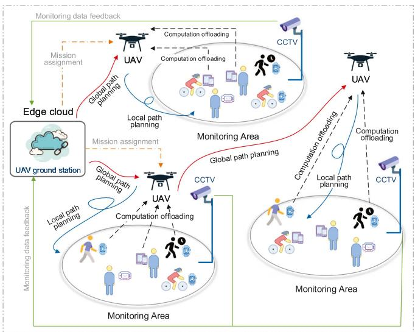

flowchart

```mermaid
graph TD
    A["Edge cloud"] --> B["Mission assignment"]
    B --> C["UAV"]
    C --> D["Computation offloading"]
    D --> E["CCTV"]
    E --> F["Monitoring Area"]
    F --> G["UAV"]
    G --> H["Computation offloading"]
    H --> I["CCTV"]
    I --> J["Monitoring Area"]
    J --> K["UAV"]
    K --> L["Computation offloading"]
    L --> M["CCTV"]
    M --> N["Monitoring Area"]
    N --> O["UAV"]
    O --> P["Computation offloading"]
    P --> Q["CCTV"]
    Q --> R["Monitoring Area"]
    R --> S["UAV"]
    S --> T["Computation offloading"]
    T --> U["CCTV"]
    U --> V["Monitoring Area"]
    V --> W["UAV"]
    W --> X["Computation offloading"]
    X --> Y["CCTV"]
    Y --> Z["Monitoring Area"]
    Z --> AA["UAV"]
    AA --> AB["Computation offloading"]
    AB --> AC["CCTV"]
    AC --> AD["Monitoring Area"]
    AD --> AE["UAV"]
    AE --> AF["Computation offloading"]
    AF --> AG["CCTV"]
    AG --> AH["Monitoring Area"]
    AH --> AI["UAV"]
    AI --> AJ["Computation offloading"]
    AJ --> AK["CCTV"]
    AK --> AL["Monitoring Area"]
    AL --> AM["UAV"]
    AM --> AN["Computation offloading"]
    AN --> AO["CCTV"]
    AO --> AP["Monitoring Area"]
    AP --> AQ["UAV"]
    AQ --> AR["Computation offloading"]
    AR --> AS["CCTV"]
    AS --> AT["Monitoring Area"]
```

Fig. 1. Scenario and system architecture.

In summary, the main contributions of this article are as follows.

1) Considering comprehensively the mission division and cluster scheduling controlled by ground station, and the computation offloading based on path planning automatically controlled by onboard computer.   
2) Developing an onboard double-loop iterative optimization of UAV swarm energy efficiency algorithm to maximize the offloading service numbers and minimize the path length by considering the user mobility, task completion latency, and communication coverage of UAV.   
3) Proposing GAGLPP algorithm to maximize the energy efficiency and minimize the flight energy consumption and the total task latency by using a small amount of computational energy compensation.

The rest of this article is organized as follows. Section II introduces the drone swarm application scenarios and system architecture that jointly controlled by ground station and airborne computer. In Section III, the energy consumption of path planning and computation offloading, and the total completion latency of computation tasks are modeled, the optimization model aiming at maximizing energy efficiency is established. Section IV solves the above objective function by proposing a UAV cluster computing offloading algorithm based on energy efficiency coupling of joint ground–air controlled path planning. Our experimental results and discussions are given in Section V. Finally, Section VI concludes the article.

# II. SYSTEM ARCHITECTURE

This section introduces the system architecture as well as the challenges for realizing the drone-swarm-assisted edge computing offloading. Fig. 1 shows a scenario with multi-UAVs, multiusers, and multiareas edge offloading.

The system design of drone-swarm-assisted computation offloading can be divided into three parts, including: 1) global path planning controlled by ground station. Every round of ground station mission assignment for the drone will depend on its onboard status and target area parameters; 2) droneassisted computation offloading fully controlled by the airborne computer; 3) local path planning automatically controlled by airborne computer. But the drone will be recalled by ground station if there is barely enough power left for a return trip.

The entire procedure of the control flow [9] is as follows.

1) Ground station assigns the mission to the Pixhawk-v4 flight controller equipped in UAV through underlying command.   
2) UAVs fly to the target waypoint above the monitoring area according.   
3) MDs connect to the WIFI channel of UAV within its monitoring area through 4x4 multi-user multiple-input multiple-output (MU-MIMO).   
4) UAV sends acknowledge character (ACK) to those devices that meet the requirements.   
5) MDs conduct data transmission with UAV once they received the ACK message.   
6) During the whole flight, the ground station can always see the waypoint coordination of all UAVs based on their GPS data, as well as other status like fly height, speed, direction, battery condition, etc.   
7) Ground station recalls the corresponding drone in case of its power warning.   
8) The UAV flies back to the location of ground station.

Based on the above architecture, there are two main challenges that will influence the design and performance of the algorithm: 1) mobility of computing nodes. Due to the mobility of MDs and UAVs, the design and implementation of UAV-assisted computing offloading strategy need to make dynamic planning according to the actual positions, so as to ensure that UAVs can provide more services on their flight path; 2) Coupling of multivariate energy consumption. When the UAV enters the target area, it will provide service for users, and bear the energy consumption caused by flight, communication, and computing, so that the task completion time is lower than the time of local computing, which provides better quality of user experience (QoE).

# III. PROBLEM FORMULATION

This section models the problem of drone-swarm-assisted computation offloading, including multisource energy consumption and time latency of path-planning-based task offloading.

# A. Problem Overview

To minimize the task completion latency, a certain amount of UAV energy consumption needs to be compensated during the whole offloading process, including the energy consumption of global flight, computation task offloading, and local flight. The purpose is to minimize the total energy consumption of drone swarm on the premise that more computation offloading services can be provided, i.e., to maximize the energy efficiency.

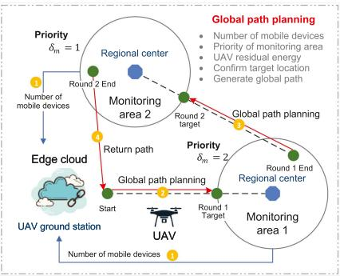

flowchart

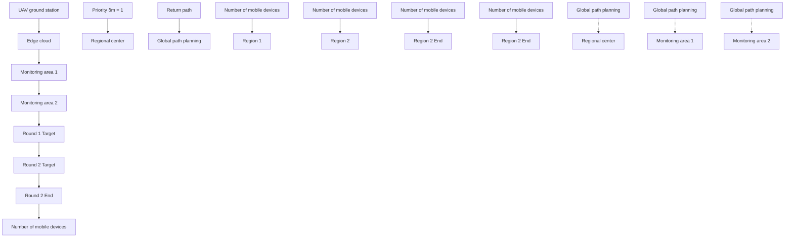

Fig. 2. Global path planning.

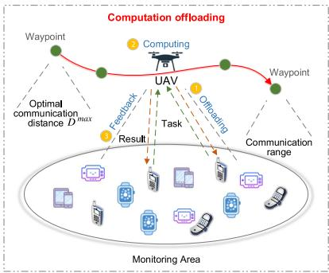

flowchart

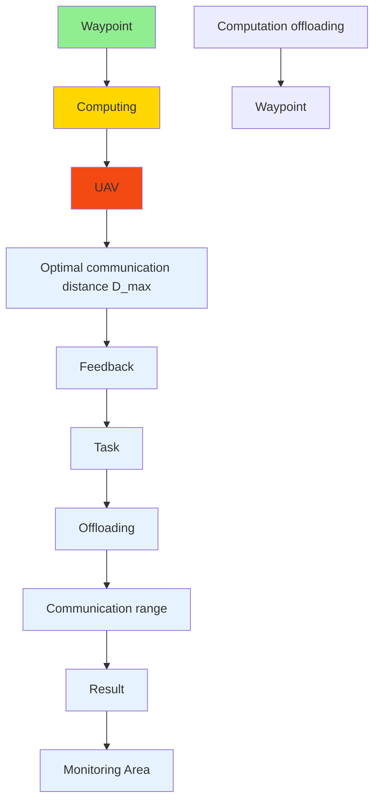

Fig. 3. Task offloading.

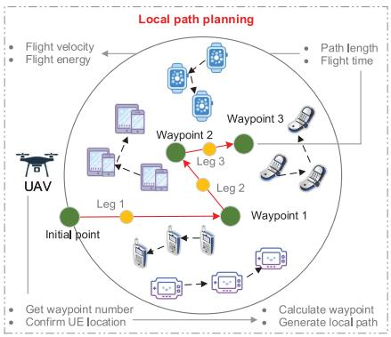

flowchart

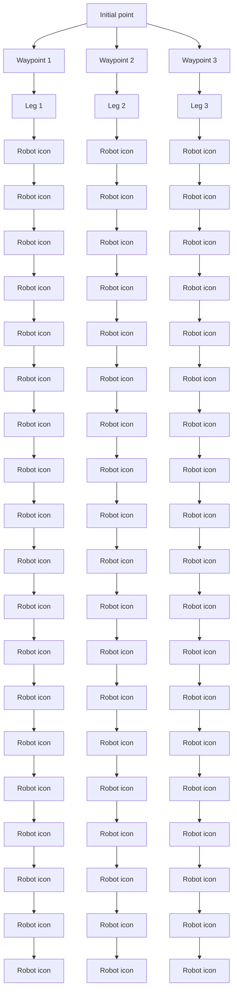

Fig. 4. Local path planning.

During the global path planning shown in Fig. 2, the priority of monitor areas, the residual energy of UAVs, and the distance between UAV and target area shall be considered simultaneously. The computation offloading strategy shown in Fig. 3 needs to consider the change of communication distance caused by user mobility, as well as the communication and computing delay caused by transmission rate. Besides, in local path planning shown in Fig. 4, the number of users and the location of UAV affect the determination of waypoints to provide better computing offloading services. In the following subsections, we will describe in detail the three processes of computation offloading based on global and local path planning, and model the energy efficiency problem. Table I shows the main notations used in this article.

TABLE I SUMMARY TABLE OF IMPORTANT NOTATIONS 

<table><tr><td>Notation</td><td>Meaning</td></tr><tr><td> $N$ </td><td>Set of MD in a single monitoring area</td></tr><tr><td> $U$ </td><td>Set of UAVs</td></tr><tr><td> $M$ </td><td>Set of monitoring areas</td></tr><tr><td> $I$ </td><td>Set of UAV waypoints</td></tr><tr><td> $E_{u}^{\text{Gl}}$ </td><td>The global flight energy consumption of a UAV</td></tr><tr><td> $P_{u,i}$ </td><td>The waypoint coordinate of a UAV</td></tr><tr><td> $p_{n,i}^{d}$ </td><td>The coordinate of an MD</td></tr><tr><td> $v_{n,i}^{d}$ </td><td>The movement speed of an MD</td></tr><tr><td> $\theta_{n,i}^{d}$ </td><td>The movement direction of an MD</td></tr><tr><td> $Q^{n}$ </td><td>Computation task of an MD</td></tr><tr><td> $T_{Q^{n}}^{d}$ </td><td>The local processing latency of an MD for a task</td></tr><tr><td> $E_{u}^{Ta}$ </td><td>The computation offloading energy consumption of a UAV</td></tr><tr><td> $E_{u}^{\text{Lo}}$ </td><td>The local flight energy consumption of a UAV</td></tr><tr><td> $F_{u}^{\text{fl}}$ </td><td>The flight power of UAVs</td></tr><tr><td> $F_{u}^{\text{Ho}}$ </td><td>The hovering power of UAVs</td></tr><tr><td> $\mu_{n}$ </td><td>Task offloading index of an MD</td></tr><tr><td> $T_{u,i}^{Ta}$ </td><td>The total task completion time for all MDs during a waypoint</td></tr><tr><td> $\delta_{m}$ </td><td>The priority of a monitoring area</td></tr><tr><td> $E_{u}^{\text{total}}$ </td><td>The total energy consumption of a UAV</td></tr><tr><td> $\eta$ </td><td>The energy efficiency of UAV</td></tr></table>

# B. Energy Consumption of Ground-Station-Controlled Global Path Planning

The priority of the monitoring area m is determined by the crowd density captured by the CCTV camera deployed at the regional center. Generally speaking, the higher the crowd density of an area, the more MDs there are. Based on this, it can be assumed that the greater the possibility that the region needs UAV to provide computing offloading services, the higher the priority of the region. The priority of monitoring area changes along with the real-time changes of the number of users. Here, we define the set of MDs and the set of monitor areas as $n = \{ 1 , 2 , \ldots , N \}$ and $m = \{ 1 , 2 , \dots , M \}$ =, respectively. Setting preferential service =strategy helps to provide computation offloading services firstly to more users when the UAV resources are limited. Moreover, such a strategy helps the ground station make more reasonable UAV cluster scheduling. Fig. 2 shows the schematic diagram of the global path planning strategy.

Assume the central coordinate of a target area is $p _ { m } =$ $\left( x _ { m } , y _ { m } \right)$ =and the radius of this area is r. The priority of the area (is $\delta _ { m }$ ), where $\delta _ { m } = \{ 1 , 2 , \ldots , M - 1 , M \}$ , which means the =priority of monitoring areas will be ranked in sequence according to the number of users within the area (higher to lower) and reevaluated whenever global task allocation is made. When the UAV u finishes last round of local flight mission, the coordinate of the end point of last local flight is $P _ { u , I } = ( X _ { u , I } , Y _ { u , I } , H )$ , where $u = \{ 1 , 2 , \dots , U \}$ and $i = \{ 1 , 2 , \dots , I \}$ ). At this point, = =the ground station gets the value of crowd density of all monitoring areas and schedules the UAV cluster. Assumed UAV is at the waypoint i  I when getting the instruction of the ground =station and no obstacle exists in the UAV’s flight path. Then, the shortest global path for UAV u to fly from the current position to the designated monitoring area is the Euclidean distance, i.e.,

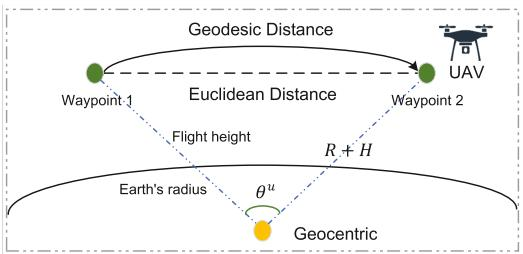

flowchart

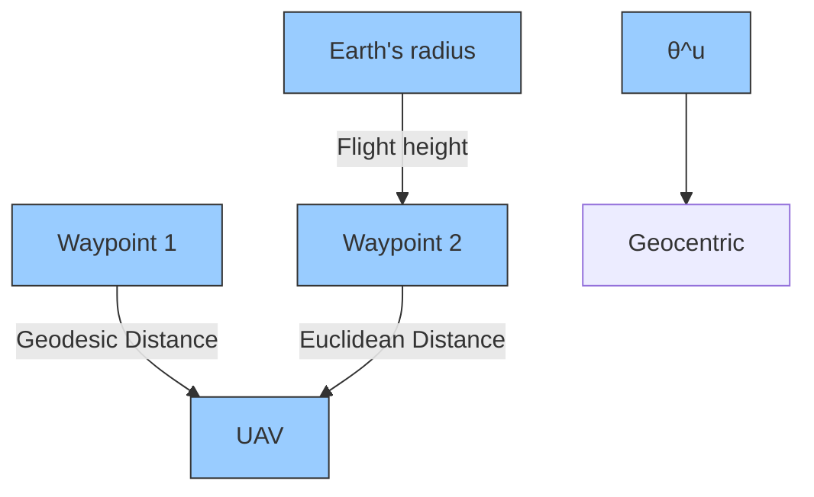

Fig. 5. Geodesic distance expression.

$$
E D _ {u, m} ^ {\mathrm{Gl}} \text { is }
$$

$$
E D _ {u, m} ^ {\mathrm{Gl}} = \sqrt {(X _ {u , I} - x _ {m}) ^ {2} + (Y _ {u , I} - y _ {m}) ^ {2}} - r. \tag {1}
$$

However, the actual flight distance of a UAV looks like an arc relative to the geocentric and thus cannot be computed simply as Euclidean distance. The central angle θ of the sector is made by the starting point, end point, and geocentric. As shown in Fig. 5 [16], it can be calculated by the earth’s radius R and the flight height H of UAV u

$$
\theta^ {u} = 2 a r c \sin \left(\frac {E D _ {u , m} ^ {\mathrm{Gl}}}{2 (R + H)}\right). \tag {2}
$$

Thus, (1) can be reformulated as geodesic distance [16]

$$
G D _ {u, m} ^ {\mathrm{Gl}} = \theta^ {u} (R + H). \tag {3}
$$

Assume the safe flight speed of UAV is $V _ { u }$ . The global flight time $T _ { u } ^ { \mathrm { G l } }$ of UAV u can be expressed as $\begin{array} { r } { T _ { u } ^ { \mathrm { G l } } = \frac { \bar { G ^ { } D } _ { u , m } ^ { \mathrm { G l } } } { V _ { u } } } \end{array}$ Vu . We assume $F _ { u } ^ { \mathrm { f } }$ =is the flight power of UAV. Thus, the energy consumption $E _ { u } ^ { \mathrm { G l } }$ of global path planning is

$$
E _ {u} ^ {\mathrm{Gl}} = T _ {u} ^ {\mathrm{Gl}} F _ {u} ^ {\mathrm{fl}}. \tag {4}
$$

When UAV u enters the monitor area, i.e., when it finishes the global flight and arrives at the starting waypoint i  1 of the next round of local path, its coordinate $P _ { u , i = 1 }$ =at moment $t = t + T _ { u } ^ { \mathrm { G l } }$ can be expressed as

$$
p _ {u, i = 1} = \left\{ \begin{array}{l} X _ {u, i = 1} = X _ {u, I} + \frac {\left(E D _ {u , m} ^ {\mathrm{Gl}} - r\right) \left(x _ {m} - X _ {u , I}\right)}{E D _ {u , m} ^ {\mathrm{Gl}}} \\ Y _ {u, i = 1} = Y _ {u, I} + \frac {\left(E D _ {u , m} ^ {\mathrm{Gl}} - r\right) \left(y _ {m} - Y _ {u , I}\right)}{E D _ {u , m} ^ {\mathrm{Gl}}} \\ H. \end{array} \right. \tag {5}
$$

# C. Energy Consumption of Onboard-Computer-Assisted Computation Task Offloading

Assumed that all the users are distributed randomly in their monitoring area at the initial moment and their height h keeps unchanged. When UAV reaches each waypoint i, the coordinate of MD n is $p _ { n , i } ^ { d } = ( x _ { n , i } ^ { d } , y _ { n , i } ^ { d } , h )$ . Assuming that the UAV broad-= ( )cast to provide computing offloading service at each waypoint, the user who meets the communication distance condition can choose to access the UAV channel and offload the task to the onboard computer for edge computing.

Due to the temporal dependency, user mobility is governed by physical laws of motion and its current movement is dependent on its movement history [23]. According to Gauss–Markov (GM) mobility model [17], the user is given with the initial position $p _ { n , i = 1 } ^ { d }$ , speed $v _ { n , i = 1 } ^ { d }$ , and mobility direction $\theta _ { n , i = 1 } ^ { d } .$ Then, its speed and direction in a tridimensional rectangular coordinate system will follow two independent Gaussian distribution functions

$$
\left\{ \begin{array}{l} v _ {n, i} ^ {d} = \alpha v _ {n, i - 1} ^ {d} + (1 - \alpha) \overline {{v _ {n , i} ^ {d}}} + \omega_ {n} \sqrt {1 - \alpha^ {2}} \\ \theta_ {n, i} ^ {d} = \beta \theta_ {n, i - 1} ^ {d} + (1 - \beta) \overline {{\theta_ {n , i} ^ {d}}} + \varphi_ {n} \sqrt {1 - \beta^ {2}} \end{array} \right. \tag {6}
$$

where, $v _ { n , i - 1 } ^ { d }$ and $\theta _ { n , i - 1 } ^ { d }$ refer to the mobility speed and the rela-u $n ,$ the broadcast for providing service at the waypoint $i - 1 . \ { \overline { { v _ { n } ^ { d } } } }$ and $\overline { { \theta _ { n } ^ { d } } }$ are the mean speed and absolute mobility direction of MD n, respectively. α and $\beta$ are used to adjust the influence of the previous time state on the current time state, where $0 \leq \alpha$ and $\beta \leq 1 . \ \omega _ { n }$ and $\varphi _ { n }$ are two irrelevant random Gaussian processes obeying mean and variance. Therefore, we can update the position information $p _ { n , i } ^ { d }$ according to the dynamic $v _ { n , i } ^ { d }$ and $\theta _ { n , \astrosun } ^ { d }$ i

$$
\left\{ \begin{array}{l} x _ {n, i} ^ {d} = x _ {n, i - 1} ^ {d} + v _ {n, i} ^ {d} \cos \theta_ {n, i - 1} ^ {d} \Delta_ {i - 1, i} \\ y _ {n, i} ^ {d} = y _ {n, i - 1} ^ {d} + V _ {n, i} ^ {d} \sin \theta_ {n, i - 1} ^ {d} \Delta_ {i - 1, i} \\ h. \end{array} \right. \tag {7}
$$

We assume that device n needs to process several computation tasks during its movement in the monitoring area. For each computation task $Q ^ { n }$ , it will release one computing request, the data size of each task is $b _ { n }$ b. Let the computing resources (CPU cycles) required by 1-b data is $C ,$ the CPU frequency of an MD is $f _ { d } .$ and the effective switch rate of an MD is $\gamma _ { d } .$ Therefore, we can obtain the time for device n to complete task $Q ^ { n }$ is $\begin{array} { r } { T _ { Q ^ { n } } ^ { d } = \frac { b _ { n } C } { f _ { d } } } \end{array}$ . fd

=Thus, the energy consumption of device n in completing the computation task $Q ^ { n }$ is $E _ { Q ^ { n } } ^ { d } = \gamma _ { d } f _ { d } ^ { 3 } T _ { Q ^ { n } } ^ { d }$ .

=In view of the limited computing capability of the MD, we can choose to offload the computing task in order to get the computation result in a shorter time. In the UAV-assisted computation offloading scenario, UAV energy consumption includes the energy consumption $E _ { u } ^ { \mathrm { O f } }$ of receiving the task offloaded from MDs, the task computing energy consumption $E _ { u } ^ { \mathrm { C o } }$ , the result feedback energy consumption $\bar { E } _ { u } ^ { D o }$ , and the local flight energy consumption $\bar { E } _ { u } ^ { \mathrm { L o } }$ from the starting waypoint to the end. This process will be fully controlled by the onboard computer to avoid the communication latency between UAV and ground station. Since the data size of the computational result is very small, the downlink transmission delay can be ignored. Therefore, the energy consumption $E _ { u } ^ { D o }$ of computational results feedback will not be considered in this article. Moreover, in view of the coupling between the energy consumption of local flight and the total latency of computation offloading, more discussions will be given in Section III-D, and the detailed problem formulation will be presented in Section III-E. Fig. 3 shows a schematic diagram of UAV-assisted computation offloading.

Assume device n is ready to offload task when UAV u reaches the waypoint i and replays echo request to the device. It is necessary to access UAV’s communication channel before offloading the task. We can use $\mu _ { n } = [ 0 , 1 ]$ to indicate whether = [ ]the user has accessed to the channel or not. $\mu _ { n } = 1$ means the user can access it while $\mu _ { n } = 0$ means the opposite. The above =judgement means when the total delay of the task is less than the local computing time, the user can be access to the channel. Therefore, the data size $S _ { Q ^ { n } , i } ^ { \mathrm { { o f } } }$ offloaded from device n to UAV u at waypoint i is $S _ { Q ^ { n } , i } ^ { \mathrm { o f } } = \dot { \mu } _ { n , i } b _ { n , i } , \mu _ { n , i } = [ 0 , 1 ]$ .

= = [ ]At waypoint i, the relative distance between UAV u and device n is

$$
D _ {u, n, i} = \sqrt {(X _ {u , i} - x _ {n , i} ^ {d}) ^ {2} + (Y _ {u , i} - y _ {n , i} ^ {d}) ^ {2} + (H - h) ^ {2}}. \tag {8}
$$

Thus, according to the uplink transmission model, we can get the data transmission rate between these two nodes at waypoint i

$$
R _ {n, u, i} ^ {\mathrm{Tr}} = \frac {B}{\sum_ {n = 1} ^ {N} \mu_ {n , i}} \log_ {2} \left(1 + \frac {F _ {d} ^ {\mathrm{tr}} \frac {\rho_ {0}}{D _ {u , n , i}}}{\sigma^ {2}}\right) \tag {9}
$$

where, $B$ is the channel bandwidth. $\frac { B } { \sum _ { n = 1 } ^ { N } \mu _ { n , i } }$ represents the bandwidth is equally allocated by the UAV to each accessed device at waypoint i. $F _ { d } ^ { \mathrm { t r } }$ is the maximum transmission power of the MD, $\rho _ { 0 }$ is the channel attenuation index, and $\sigma ^ { 2 }$ is the Gaussian white noise power.

In conjunction with the offloaded data size, we can get the transmission time tional task at way $T _ { n , u , i } ^ { \mathrm { T r } }$ $\begin{array} { r } { T _ { n , u , i } ^ { \mathrm { T r } } = \frac { S _ { Q ^ { n } , i } ^ { \mathrm { o f } } } { R _ { n , u , i } ^ { T r } } } \end{array}$ eiving the computa-.

Therefore, with the data size, the corresponding transmission time, and the communication power $F _ { u } ^ { \mathrm { t r } }$ of UAV, we can get the n at waypoint i as task offloading energy consumptio $E _ { u , n , i } ^ { \mathrm { O f } } = F _ { u } ^ { \mathrm { t r } } T _ { n , u , i } ^ { \mathrm { T r } } .$ F tr T Tr n EOf $E _ { u , n , i } ^ { \mathrm { O f } }$ of UAV u for device

=Thus, the total task offloading energy consumption of UAV u at waypoint i, for all MDs within the monitoring area, namely, EOf. $E _ { u , i } ^ { \mathrm { O f } }$ EOfu,i, can be expressed as EOfu,i $\begin{array} { r } { E _ { u , i } ^ { \mathrm { O f } } = \sum _ { n = 1 } ^ { N } E _ { u , n , i } ^ { \mathrm { O f } } } \end{array}$ .

=Similarly, according to the computing resources $C$ required by the 1-b data, the CPU frequency $f _ { u }$ (cycles/sec) of the UAV, and its effective switch rate UAV u to finish the task fro $\gamma _ { u }$ , we can gevice n as $T _ { u , n , i } ^ { \mathrm { C o } }$ for. $\begin{array} { r } { T _ { u , n , i } ^ { \mathrm { C o } } = \frac { S _ { Q ^ { n } , i } ^ { \mathrm { o f } } C } { f _ { u } } } \end{array}$

Based on this, the task computing enof UAV u for device n at waypoint i is $E _ { u , n , i } ^ { \mathrm { C o } }$ $E _ { u , n , i } ^ { \mathrm { C o } } = \gamma _ { u } f _ { u } ^ { 3 } T _ { u , n , i } ^ { \mathrm { C o } }$

=Thus, the total task computing energy consumption $E _ { u } ^ { \mathrm { C o } }$ of UAV u to finish tasks from all MDs at waypoint i can be denoted as $\begin{array} { r } { E _ { u , i } ^ { \mathrm { C o } } = \sum _ { n = 1 } ^ { N } E _ { u , n , i } ^ { \mathrm { C o } } } \end{array}$ .

=Based on the above, in the procedure of UAV-assisted computation offloading, we can define the total time $T _ { u , n , i } ^ { T a }$ of UAV u in providing computing offloading service for device n at waypoint i as $T _ { u , n , i } ^ { T a ^ { - } } = \bar { T } _ { u , n , i } ^ { \mathrm { T r } } + T _ { u , n , i } ^ { \mathrm { C o } }$ .

= +In order to ensure that UAV provides high-quality offloading service for MDs, it is deemed in this article that the total latency of task completion using airborne computer cannot be longer than that of local computation. The restriction can be expressed as follows:

$$
T _ {u, n, i} ^ {T a} \leq T _ {Q ^ {n}} ^ {d}. \tag {10}
$$

According to the above discussion, one monitoring area covers multiple MDs and the data transmission time of each accessed device is different because of the different communication distance, the UAV will execute immediately when task data are received. Therefore, the task offloading time at each waypoint shall be the minimum task transmission time. Note that all the tasks will be computed by the way of allocating CPU cycle resources. Hence, the total computation time is the sum of all tasks’ computation time. Thus, the total completion time $T _ { u , i } ^ { T a }$ of UAV u in providing offloading services simultaneously for all MDs is

$$
T _ {u, i} ^ {T a} = \min _ {n} T _ {u, n, i} ^ {\mathrm{Tr}} + \sum_ {n = 1} ^ {N} T _ {u, n, i} ^ {\mathrm{Co}}. \tag {11}
$$

Therefore, the total energy consumption E T a $E _ { u , i } ^ { T a }$ of UAV u in providing single-time computation offloading service to all MDs at waypoint i can be expressed as

$$
E _ {u, i} ^ {T a} = E _ {u, i} ^ {\mathrm{Of}} + E _ {u, i} ^ {\mathrm{Co}}. \tag {12}
$$

# D. Energy Consumption of Onboard-Computer-Controlled Local Path Planning

From the discussion of Section III-C, in order to complete computation offloading, the UAV and MDs should keep relative static within $T _ { u , i } ^ { T a }$ . Assuming a constant wind speed, the hovering power of UAV $F _ { u } ^ { \mathrm { h o } }$ is fixed [18]. Thus, the hovering energy consumption $E _ { u , t } ^ { \mathrm { H o } }$ r equired by the UAV in completing a single round of offloading service for all devices at waypoint i, can be donated as $E _ { u , t } ^ { \mathrm { H o } } = F _ { u } ^ { \mathrm { h o } } T _ { u , i } ^ { T a }$ .

=In the flight phase between waypoints, the position of UAV changes dynamically, and the trajectory composed of different positions at different times can be regarded as the local path planning controlled by the airborne computer, which is different from the global path planning controlled by the ground station. This part of the flight energy consumption is very important for the next round decision of cluster scheduling after the UAV completes current local fight mission. Fig. 4 shows a schematic diagram of local path planning in this article.

According to the geodesic distance described in Section III-B, we can obtain the flight distance of UAV u between waypoint i  1 and i as follows:

$$
\begin{array}{l} \theta_ {i + 1, i} ^ {u} \\ = 2 \arcsin \left(\frac {\sqrt {(X _ {u , i + 1} - X _ {u , i}) ^ {2} + (Y _ {u , i + 1} - Y _ {u , i + 1}) ^ {2}}}{2 (R + H)}\right) \tag {13} \\ \end{array}
$$

$$
G D _ {u, i + 1, i} ^ {l o} = \theta_ {i + 1, i} ^ {u} (R + H). \tag {14}
$$

Given the flight time $\Delta _ { i + 1 , i }$ of a leg, the time slot $T _ { u , i + 1 , i } ^ { l o }$ T u,i+1,i of ΔUAV u from last waypoints to the next can be associated with its hovering time (the time of providing the offloading service) as ${ \cal T } _ { u , i + 1 , i } ^ { l o } = \Delta _ { i + 1 , i } + { \cal T } _ { u , i } ^ { T a }$ i+1,i T T au,i . Tu,i.

= Δ +Assume the total local flight time of UAV u is $T _ { u } ^ { \mathrm { L o } }$ and the number of waypoints is I, the relationship between $T _ { u } ^ { \mathrm { L o } }$ and $T _ { u , i + 1 , i } ^ { l o }$ can be expressed as $\begin{array} { r } { T _ { u } ^ { \mathrm { L o } } = \sum _ { i = 1 } ^ { I } T _ { u , i + 1 , i } ^ { l o } . } \end{array}$ .

=Simultaneously, we can obtain the full length of local path $G D _ { u } ^ { l o }$ as $\begin{array} { r } { G D _ { u } ^ { l o } = \sum _ { i = 1 } ^ { I } G D _ { u , i + 1 , i } ^ { l o } . } \end{array}$

=Therefore, the flight energy consumption of UAV u from waypoint $i + 1$ and i given the flight power $F _ { u } ^ { \mathrm { f } }$ is

$$
E _ {u, i + 1, i} ^ {\mathrm{lo}} = \Delta_ {i + 1, i} F _ {u} ^ {\mathrm{fl}} \tag {15}
$$

where, the $F _ { u } ^ { \mathrm { f } }$ is a velocity-dependent convex function, which is fixed during each segment when velocity is uniform [19].

Thus, it is clear that the total flight energy consumption $E _ { u } ^ { \mathrm { L o } }$ of local path planning is the sum of the hovering and flight energy consumption, i.e., $\begin{array} { r } { \mathbf { \tilde { \rho } } ^ { E _ { u } ^ { \mathrm { L o } } } = \sum _ { i = 1 } ^ { I } [ E _ { u , i } ^ { \mathrm { H o } } + E _ { u , i + 1 , i } ^ { \mathrm { l o } } ] } \end{array}$ E lo u,i+1,i .

= [ + ]Note that if the ground station judges that the remaining power of the UAV cannot support the subsequent mission, the UAV will be recalled. At that moment, the energy consumption $E _ { u } ^ { B a }$ of a UAV for flying back to ground station can be expressed as $\begin{array} { r } { E _ { u } ^ { B a } = \frac { X _ { u , i } ^ { 2 } + Y _ { u , i } ^ { 2 } + H ^ { 2 } } { V _ { u } } F _ { u } ^ { f } } \end{array}$ Vu 2 F fu .

# E. Problem Formulation

The ground station controls U UAVs to carry out cluster offloading services. During such a process, it needs to guarantee that each monitoring area was allocated to the corresponding UAV with the best global path planning strategy, which is highly associated with the remaining energy of each UAV in the last round of mission and the current priority of each monitoring area. To be specific, ground station will allocate the closest UAV according to the regional priority in the order of high to low to ensure the minimum energy consumption I $E _ { u } ^ { \mathrm { t o t a l } } =$ $\begin{array} { r } { E _ { u } ^ { \mathrm { G l } } + \sum _ { i = 1 } ^ { I } E _ { u } ^ { T a } + E _ { u } ^ { \mathrm { L o } } } \end{array}$ i=1 of cluster scheduling. In

\+ +Assume the initial energy of each UAV is $E _ { u } ^ { \mathrm { I n } }$ u . We can build an optimized UAV energy efficiency model $\begin{array} { r } { \eta = \frac { E _ { u } ^ { \mathrm { t o t a l } } } { T _ { t a } ^ { \mathrm { t o t a l } } } } \end{array}$ E total u with the goal of minimizing the total latency of task completion by using the multi-UAVs-assisted computation offloading controlled by both ground station and onboard computer

$$
\mathbf {P}: \max _ {\delta_ {m}, \mu_ {n}, I, T} \eta \tag {16}
$$

$\mathrm { s u b j e c t ~ t o } ~ C 1 : \mu _ { n , i } = [ 0 , 1 ] , \forall n , \forall i \in I$ (17)

$$
C 2: \sum_ {n = 1} ^ {N} \mu_ {n, i} \leq N, \forall i \in I \tag {18}
$$

$$
C 3: T _ {u, n, i} ^ {T a} \leq T _ {Q ^ {n}} ^ {d}, \exists u, n, i \tag {19}
$$

$$
C 4: T _ {u, i} ^ {T a} \leq T _ {u, i + 1, i} ^ {l o}, \forall u, n, i \tag {20}
$$

$$
C 5: \sum_ {n = 1} ^ {N} \left[ \frac {b _ {n , i}}{\frac {B}{N} \log_ {2} (1 + \frac {F _ {d} ^ {\mathrm{tr}} \frac {\rho_ {0}}{D _ {u , n , i}}}{\sigma^ {2}})} + \frac {C b _ {n , i}}{f _ {u}} \right]
$$

$$
\leq T _ {t a} ^ {\text { total }} \leq \frac {C \sum_ {n = 1} ^ {N} b _ {n , i}}{f _ {d}}, \forall u, n, i \tag {21}
$$

$$
C 6: 0 \leq E _ {u} ^ {\text { total }} \leq E _ {u} ^ {\text { In }} - E _ {u, i} ^ {B a}
$$

$$
\exists \delta_ {m}, u, n, i, T \tag {22}
$$

$$
C 7: \sqrt {(X _ {u , i} - x _ {m}) ^ {2} + (Y _ {u , i} - y _ {m}) ^ {2}}
$$

$$
\leq r, \exists \delta_ {m}, \forall u, \forall i \in I. \tag {23}
$$

# IV. DOUBLE-LOOP ITERATIVE OPTIMIZATION OF UAV CLUSTER ENERGY EFFICIENCY

Due to the definite initial energy of UAV and the recall principle of constrain $C 6 ,$ when the maximum energy consumption $E _ { u } ^ { \mathrm { t o t a l } }$ is satisfied, it is clear from P that the biggest η will be reached while the total latency $\boldsymbol { T } _ { t a } ^ { \mathrm { t o t a l } }$ of the computation tasks is shortest. In such a circumstance, the problem P can be reformulated as a subproblem P1 with regard to $T _ { t a } ^ { \mathrm { t o t a l } }$ l

$$
\mathbf {P 1}: \min _ {\delta_ {m}, \mu_ {n}, I, T} \sum_ {n = 1} ^ {N} b _ {n, i} \left[ \frac {\mu_ {n , i}}{R _ {n , u , i} ^ {T r}} + \frac {\mu_ {n , i} C}{f _ {u}} + \frac {(1 - \mu_ {n , i}) C}{f _ {d}} \right] \tag {24}
$$

$\mathrm { s u b j e c t t o } C 1 \sim C 5 , C 7 .$ (25)

Nevertheless, when carrying out more computation offloading services, $E _ { u } ^ { \mathrm { t o t a l } }$ increases with the decrease of $\boldsymbol { T } _ { t a } ^ { \mathrm { t o t a l } }$ ta . In this case, the problem P can be reformulated as a subproblem P2 with regard to $E _ { u } ^ { \mathrm { t o t a l } }$

$$
\mathbf {P 2}: \min _ {\delta_ {m}, \mu_ {n}, I, T} \sum_ {u = 1} ^ {U} \left[ E _ {u} ^ {\mathrm{Gl}} + \sum_ {i = 1} ^ {I} E _ {u} ^ {T a} + E _ {u} ^ {\mathrm{Lo}} \right] \tag {26}
$$

$\mathrm { s u b j e c t t o } C 1 \sim C 4 , C 6 , C 7 .$ (27)

In the scenario described in this article, UAV performs flight for the purpose of providing computing offloading services. Under the condition of $\begin{array} { r } { \mathrm { l } _ { \mu _ { n } , I } [ \frac { \mathbf { \bar { \mu } } _ { n , i } ^ { - } b \mathbf { \check { C } } } { f _ { u } } + \frac { ( 1 - \mu _ { n , i } ) \mathbf { \bar { b } } C } { f _ { d } } + } \end{array}$ μn,ibC (1−μn,i)bC $\begin{array} { r } { \frac { \mu _ { n , i } b } { R _ { n , u , i } ^ { T r } } ] , \exists D _ { u , n , i } , \forall u , n , i } \end{array}$ min [ u + d +, we need to get shorter total completion latency of tasks by compensating the UAV energy consumption for computation offloading. Therefore, in this article, doubleloop iterative approximate numerical solution solves problem P to get the optimal allocation scheme when the ground station releases monitoring mission at each round, the dynamic local path of each UAV and task offloading strategy. Next, we give the detailed introduction to the solution process of P1 and P2.

# A. Iterative Task Duration Minimization of Waypoint and Task Offloading

To solve P1, we need first to find the local trajectory which meets the lowest energy consumption of offloading services and local flight. The local path is generated by connecting all the waypoints. When the waypoints number I of the local path is confirmed and the coordinates of start and end points are known, we need to get the position of each midwaypoint.

Since the task transmission time is associated with the distance between the UAV and MD, we can infer that the waypoint is also associated with the time when it provides computation offloading services to the devices. When $\mu _ { n , i } = 1$ , the device =is considered to be accessible to the channel. Nevertheless, not all the devices are required to offload the task. When the total completion time of the computation task is longer than the local computing time, the loss outweighs the gain from the user’s perspective.

Therefore, when the above-mentioned situation is satisfied and the device chooses to perform offloading operation, we can obtain the restriction on communication distance $D _ { u , n , i }$ according to C3 as follows:

$$
T _ {u, n, i} ^ {T a} \leq T _ {Q ^ {n}} ^ {d}
$$

$$
\Rightarrow 0 \leq D _ {u, n, i} \leq \frac {F _ {d} ^ {\mathrm{tr}} \rho_ {0}}{\sigma^ {2} \left(2 ^ {\frac {N}{B (\frac {C}{f _ {d}} - \frac {C}{f _ {u}})} - 1}\right)}. \tag {28}
$$

Proof:

$$
\begin{array}{l} T _ {u, n, i} ^ {T a} \leq T _ {Q ^ {n}} ^ {d} \Rightarrow \frac {b _ {n , i}}{R _ {n , u , i} ^ {T r}} + \frac {b _ {n , i} C}{f _ {u}} \leq \frac {b _ {n , i} C}{f _ {d}} \\ \Rightarrow \log_ {2} \left(1 + \frac {F _ {d} ^ {\mathrm{tr}} \rho_ {0}}{\sigma^ {2} D _ {u , n , i}}\right) \geq \frac {\sum_ {n = 1} ^ {N} \mu_ {n , i}}{B \left(\frac {C}{f _ {d}} - \frac {C}{f _ {u}}\right)}, \mu_ {n, i} = [ 0, 1 ]. \tag {29} \\ \end{array}
$$

Given $B , C , f _ { d } .$ , and $\begin{array} { r } { f _ { u } , B \big ( \frac { C } { f _ { d } } - \frac { C } { f _ { u } } \big ) } \end{array}$ is a fixed value, and 2 1   d 0σ2Du,n,i $\begin{array} { r } { \log _ { 2 } ( 1 + \frac { F _ { d } ^ { \mathrm { t r } } \rho _ { 0 } } { \sigma ^ { 2 } D _ { u , n , i } } ) } \end{array}$ and $\textstyle \sum _ { n = 1 } ^ { N } \mu _ { n , i }$ are both monotonically increasing functions. Thus, the left side value of (29) is larger than the maximum value of the right side. The physical significance is that the maximum value of $\begin{array} { r l } & { \frac { \sum _ { n = 1 } ^ { N } \mu _ { n , i } } { B ( \frac { C } { f _ { d } } - \frac { C } { f _ { u } } ) } \mathrm { ~ i s ~ } \frac { N } { B ( \frac { C } { f _ { d } } - \frac { C } { f _ { u } } ) } } \\ & { \quad B ( \frac { C } { f _ { d } } - \frac { C } { f _ { u } } ) } \end{array}$ =1 μn,i is when all N devices are accessed. Then, 1  F d ρ0σ2Du,n,i $\begin{array} { r } { 1 + \frac { F _ { d } ^ { \mathrm { t r } } \rho _ { 0 } } { \sigma ^ { 2 } D _ { u , n , i } } \geq 2 ^ { \frac { \Vec { C } ^ { * } } { B ( \frac { C } { f _ { d } } - \frac { C } { f _ { u } } ) } } } \end{array}$ can be further obtained when the maximum number of access devices is satisfied. Therefore, the maximum communication distance between the UAV and device can be expressed as

$$
D _ {u, n, i} ^ {\max} = \frac {F _ {d} ^ {\mathrm{tr}} \rho_ {0}}{\sigma^ {2} \left(2 ^ {\frac {N}{B (\frac {C}{f _ {d}} - \frac {C}{f _ {u}})}} - 1\right)}. \tag {30}
$$

Theorem 1: When and only when $0 \leq D _ { u , n , i } \leq D _ { u , n , i } ^ { \mathrm { m a x } } ,$ $\mu _ { n , i } = 1$ . When UAV provides computation offloading services =to all the devices that satisfy the above requirement at each waypoint, the total completion time of tasks will for sure be smaller than or at least equal to the local computing time. Only in such a circumstance, performing computing offloading services is meaningful. At this time, devices choose to access to the UAV channel and offload their tasks to the airborne computer for execution.

Furthermore, due to $D _ { u , n , i } { = } \sqrt { ( x _ { u , i } ^ { u } { - } x _ { n , i } ^ { d } ) ^ { 2 } { + } ( y _ { u , i } ^ { u } { - } y _ { n , i } ^ { d } ) ^ { 2 } { + } ( H { - } h ) ^ { 2 } }$ , =the coordinate of waypoint should obey the following distribution:

$$
\begin{array}{l} \sqrt {(X _ {u , i} - x _ {n , i} ^ {d}) ^ {2} + (Y _ {u , i} - y _ {n , i} ^ {d}) ^ {2} + (H - h) ^ {2}} \leq D _ {u, n, i} ^ {\max} \\ \Rightarrow \left(X _ {u, i} - x _ {n, i} ^ {d}\right) ^ {2} + \left(Y _ {u, i} - y _ {n, i} ^ {d}\right) ^ {2} \leq D _ {u, n, i} ^ {\max} - (H - h) ^ {2} \tag {31} \\ \end{array}
$$

thereinto, we can obtain the coordinates of all MDs when the UAV arrives at waypoint i by giving $\Delta _ { i + 1 , i }$ .

ΔThe goal of problem P1 is to provide more offloading services with limited UAV energy while minimizing the total completion delay of tasks. Thus, we need to enlarge the number of devices served by the UAV at each waypoint. To satisfy the maximum access number as much as possible, i.e., access more devices within the maximum communication distance $D _ { u , n , i } ^ { \operatorname* { m a x } } ,$ we can calculate the waypoint coordinate according to the position of devices. Then, this problem becomes to solve the center coordinates when the maximum number of points is covered by giving a fixed circle radius. In this section, the dynamic waypoint planning strategy based on user mobility is used to solve the waypoint coordinates, as shown in Algorithm 1.

Algorithm 1: Dynamic Waypoint Planning Based on User Mobility.   
Require: Device number: N, Device coordinate: $p^{d}$ , Maximum communication radius: $D_{u,n,i}^{max}$ .

Ensure: UAV waypoint: $P^{u}$ , Access number: $\mu$ 1: Initial waypoint and access number

2: repeat

3: for Device $n \in N$ then

4: $d_{n+1,n} = \parallel p_{n+1}^{d} - p_{n}^{d} \parallel$ 5: if $d_{n+1,n} \leq D_{u,n,i}^{max}$ do

6: Inverse tangent value of $\theta = (p_{n+1}^{d}, p_{n}^{d})$ 7: $P^{u} = (\frac{x_{n+1}^{d} + x_{n}^{d}}{2} + (D_{u,n,i}^{max2} - d_{n+1,n}^{2}) \cos \theta, \frac{y_{n+1}^{d} + y_{n}^{d}}{2} + (D_{u,n,i}^{max2} - d_{n+1,n}^{2}) \sin \theta)$ 8: for Device $n \in N$ then

9: $d_{u,n} = \parallel P^{u} - p_{n}^{d} \parallel$ 10: if $d_{u,n} \leq D_{u,n,i}^{max}$ do

11: $\mu + 1$ 12: end

So far, we have got the coordinate of each midwaypoint, i.e., $P _ { u , i } , i \in \{ 2 , 3 , \ldots , I - 1 \}$ }. In order to obtain the total energy consumption of local path planning, we need to calculate the total time of UAV in providing offloading services for all devices at each waypoint. Regarding this problem, we can obtain $T _ { u , \ast } ^ { l o }$ i+1,i and flight time by following the model built in Section III-C, so that to solve the local energy consumption.

# B. Iterative Energy Efficiency Optimization of Path Planning and Task Offloading

Through modeling toward the UAV’s local energy consumption, we can know that the more offloading services are provided within a leg duration, the higher UAV energy consumption will be. However, in UAV-assisted MEC offloading scenario, the optimization of energy consumption of UAV must meet the precondition of minimum task completion delay, i.e., we can deem that when the completion time of a single task is lower than its local computing time, it is necessary to sacrifice the energy consumption of UAV for the purpose of improving user the quality of user experience (QoE). This is a kind of compromise mode for energy consumption to provide more services for users when the energy of local devices and UAVs is limited. However, in order to enable the UAV to perform more services, it is still expected that the energy consumption of UAV in completing local path planning should be as small as possible when the above conditions are met, i.e., we need to solve P2.

Assume UAV u receives mission instruction at waypoint i  I =and takes off from the ground station. According to (5), we can denote that when the ground station allocates UAVs to monitoring areas in the sequence of their priority, the coordinate of each UAV entering the corresponding area after finishing the global flight path can be solved and confirmed. Before that, the central coordinate of each area allocated to the nearest UAV is determined by the priority of all areas asking for UAV in sequence.

Since the solution of each waypoint is the same, we can simply consider that the total energy consumption of local path planning equals the sum of the offloading and flight energy consumption between multiple waypoints. Thus, we can obtain the UAV trajectory and total energy consumption by using the local path iterative algorithm on the basis of solving the energy consumption at one specific waypoint. In this section, we will show the details of the algorithm by solving the second waypoint’s coordinate and energy consumption.

Let the initial energy of each UAV is the maximum storage capacity of its battery. According to the most recent priority principle, in the first round of mission, the time and position of UAV u arriving at the edge of the assigned monitoring area are confirmed, i.e., we can obtain the coordinate $P _ { u , i = 1 }$ of the starting waypoint (the first point) of the UAV’s local path and its corresponding moment $t _ { i = 1 }$ as follows:

$$
p _ {u, i = 1} = \left\{ \begin{array}{l} X _ {u, i = 1} = X _ {u, i = I} + \frac {\left(E D _ {u , m} ^ {\mathrm{Gl}} - r\right) \left(x _ {m} - X _ {u , i = I}\right)}{E D _ {u , m} ^ {G l}} \\ Y _ {u, i = 1} = Y _ {u, i = I} + \frac {\left(E D _ {u , m} ^ {\mathrm{Gl}} - r\right) \left(y _ {m} - Y _ {u , i = I}\right)}{E D _ {u , m} ^ {G l}} \\ H \end{array} \right. \tag {32}
$$

$$
\begin{array}{l} t _ {i = 1} = 0 + T _ {u} ^ {\mathrm{Gl}} = \frac {G D _ {u , m} ^ {\mathrm{Gl}}}{V _ {u}} \\ = \frac {2 (R + H) \arcsin (\frac {\sqrt {(X _ {u , i = 1} - x _ {m}) ^ {2} + (Y _ {u , i = 1} - y _ {m}) ^ {2} - r}}{2 (R + H)})}{V _ {u}}. \tag {33} \\ \end{array}
$$

Then, according to (6) and (7), we can obtain the coordinate $p _ { n , i = 1 } ^ { d } = ( x _ { n , i = 1 } ^ { d } , y _ { n , i = 1 } ^ { d } , h )$ of device n when i  1.

= ( ) =Since each device performs computation task only once within a leg duration $T _ { u , i + 1 , i } ^ { l o }$ T lou,i+1,i, we can calculate the service time provided by UAV u at the waypoint i for each accessed device through (11). The task completion time based on computation offloading includes the time of data transmission and task computing. When the position $p _ { n , i = 1 } ^ { d }$ of each device and the position $P _ { u , i = 1 }$ of UAV u at moment $t _ { i = 1 }$ are confirmed, we can obtain the time T T au,n,i $T _ { u , n , i = 1 } ^ { T a }$ for providing a single-task offloading service within the communication restriction $D _ { u , n , i } ^ { \mathrm { m a x } }$ is

$$
S _ {Q ^ {n}, i} ^ {\text { off }} = \mu_ {n, i} b _ {n, i}, \mu_ {n, i} = [ 0, 1 ] \tag {34}
$$

$$
\begin{array}{l} T _ {u, n, i = 1} ^ {\mathrm{Tr}} = \frac {S _ {Q ^ {n} , i} ^ {\mathrm{of}}}{R _ {u , n , i} ^ {T r}} \\ = \frac {\mu_ {n , i} b _ {n , i}}{\frac {B}{\sum_ {n = 1} ^ {N} \mu_ {n , i}} \log_ {2} \left(1 + \frac {F _ {d} ^ {\mathrm{tr}} \rho_ {0}}{\sigma^ {2} \| P _ {u , i = 1} - p _ {n , t _ {i = 1}} ^ {d} \|}\right)}, \mu_ {n, i} = [ 0, 1 ] \tag {35} \\ \end{array}
$$

$$
T _ {u, n, i} ^ {\mathrm{Co}} = \frac {S _ {Q ^ {n} , i} ^ {\mathrm{of}} C}{f _ {u}} = \frac {\mu_ {n , i} b _ {n , i} C}{f _ {u}}, \mu_ {n, i} = [ 0, 1 ] \tag {36}
$$

where $\parallel P _ { u , i = 1 } - p _ { n , t _ { i = 1 } } ^ { d } \parallel$ represents the straight line distancen i

Therefore, according to (11), we can get the total service time of UAV for all devices in performing computation offloading at waypoint $i = 1 ,$ , i.e., the total tasks completion time T  u,i=1 at $T _ { u , i = 1 } ^ { T a }$ moment $t = T _ { u } ^ { \mathrm { G l } }$ can be expressed as follows:

$$
\begin{array}{l} T _ {u, i = 1} ^ {T a} = \sum_ {n = 1} ^ {N} T _ {u, n, i} ^ {\mathrm{Co}} + \min _ {n} T _ {u, n, i} ^ {\mathrm{Tr}} = \sum_ {n = 1} ^ {N} \frac {\mu_ {n , i} b _ {n , i} C}{f _ {u}} \\ + \min _ {n} \frac {\mu_ {n , i} b _ {n , i}}{\frac {B}{\sum_ {n = 1} ^ {N} \mu_ {n , i}} \log_ {2} \left(1 + \frac {F _ {d} ^ {\mathrm{tr}} \rho_ {0}}{\sigma^ {2} \| P _ {u , i = 1} - P _ {n , t _ {i = 1}} ^ {d} \|}\right)}, \mu_ {n, i} = [ 0, 1 ]. \tag {37} \\ \end{array}
$$

Meanwhile, the total amount of computation of UAV in the current round of service is

$$
S _ {u, i} ^ {\mathrm{Co}} = \sum_ {n = 1} ^ {N} S _ {Q ^ {n}, i} ^ {\mathrm{of}} = \sum_ {n = 1} ^ {N} \mu_ {n, i} b _ {n, i}, \mu_ {n, i} = [ 0, 1 ]. \tag {38}
$$

Thus, we can obtain the total energy consumption of UAV in providing computation offloading services at waypoint i

$$
\begin{array}{l} E _ {u, i} ^ {T a} = E _ {u, i} ^ {\mathrm{Of}} + E _ {u, i} ^ {\mathrm{Co}} = \sum_ {n = 1} ^ {N} E _ {u, n, i} ^ {\mathrm{Of}} + \sum_ {n = 1} ^ {N} E _ {u, n, i} ^ {\mathrm{Co}} \\ = \sum_ {n = 1} ^ {N} \frac {\mu_ {n , i} b _ {n , i} F _ {u} ^ {\mathrm{tr}}}{\frac {B}{\sum_ {n = 1} ^ {N} \mu_ {n , i}} \log_ {2} \left(1 + \frac {F _ {d} ^ {\mathrm{tr}} \rho_ {0}}{\sigma^ {2} \| P _ {u , i = 1} - p _ {n , t _ {i = 1}} ^ {d} \|}\right)} \\ + \gamma_ {u} f _ {u} ^ {2} S _ {u, i} ^ {\mathrm{Co}} C, \mu_ {n, i} = [ 0, 1 ]. \tag {39} \\ \end{array}
$$

In conjunction with the hovering power, the hovering energy consumption at waypoint i  1 can be expressed as

$$
\begin{array}{l} E _ {u, i} ^ {\mathrm{Ho}} = F _ {u} ^ {\mathrm{ho}} T _ {u, i} ^ {T a} = F _ {u} ^ {\mathrm{ho}} \left[ \sum_ {n = 1} ^ {N} \frac {\mu_ {n , i} b _ {n , i} C}{f _ {u}} \right. \\ + \min _ {n} \frac {\mu_ {n , i} b _ {n , i}}{\frac {B}{\sum_ {n = 1} ^ {N} \mu_ {n , i}} \log_ {2} \left(1 + \frac {F _ {d} ^ {\mathrm{tr}} \rho_ {0}}{\sigma^ {2} \| P _ {u , i = 1} - p _ {n , t _ {i = 1}} ^ {d} \|}\right)} \\ \mu_ {n, i} = [ 0, 1 ]. \tag {40} \\ \end{array}
$$

Given the flight speed and power of the UAV, we can obtain the flight energy consumption of a single leg according to (15)

$$
E _ {u, i} ^ {\text { total }} = E _ {u, i} ^ {T a} + E _ {u, i} ^ {\mathrm{Ho}} + E _ {u, i + 1, i} ^ {\mathrm{lo}}. \tag {41}
$$

Furthermore, when UAV u arrives at waypoint i 2, the time $t _ { i = 2 }$ and the mean speed $\overline { { V _ { i + 1 , i } } }$ =can be expressed as

$$
t _ {i = 2} = t _ {i = 1} + \Delta_ {i + 1, i} + T _ {u, i} ^ {T a} \tag {42}
$$

$$
\overline {{{V _ {i + 1 , i}}}} = \frac {\left\| P _ {u , i = 1} - p _ {n , t _ {i = 1}} ^ {d} \right\|}{\Delta_ {i + 1 , i}}. \tag {43}
$$

Similarly, between all the midwaypoints (starting and ending waypoints excluded) of the local flight path, the optimal solution of offloading and flight energy consumption in P2 can be obtained based on the aforesaid solution process. Finally, we Algorithm 2: Ground-Air Controlled Global and Local Path Planning for Multi-UAVs-Assisted MEC Offloading Strategy (GAGLPP).

Require: Set of monitoring areas: M , Set of UAVs: U , Set of mobile devices: N, Set of device coordinates: $p ^ { d } ,$ , Maximum communication radius: $D _ { u , n , i } ^ { m a x }$ , Waypoint number: $I ,$ Time interval: $\Delta _ { i + 1 , i }$

ΔEnsure: Energy efficiency η

1: repeat   
2: Given $M , U$ and N, find $P _ { u , i = 0 }$ and $E _ { u } ^ { G l }$ by Eq. (4) and (5)   
3: Given $P _ { u , i = 0 } , p _ { n , i = 0 } ^ { d }$ and $D _ { u , n , i } ^ { m a x }$ , find $T _ { i = 0 } ^ { t a }$ and ET au,i $E _ { u , i } ^ { T a }$ by Eq. (11) and (12)   
4: Given $T _ { i = 0 } ^ { t a } , \Delta _ { i + 1 , i }$ and $p _ { n , i = 0 } ^ { d } ,$ find $p _ { n , i = 1 } ^ { d }$ by Eq. (7)   
5: Given $p _ { n , i = 1 } ^ { d }$ Δand $D _ { u , n , i } ^ { m a x }$ , find $P _ { u , i = 1 }$ by Algorithm 1   
6: Given $p _ { n , i = 1 } ^ { d }$ and $P _ { u , i = 1 }$ , find Elou,i+1,i by Eq. (15) $E _ { u , i + 1 , i } ^ { l o }$   
7: Given EGlu , $E _ { u } ^ { G l } , E _ { u , i } ^ { T a }$ and $E _ { u , i + 1 , i } ^ { l o } ,$ u,i+1,i, find $E _ { u , i } ^ { t o t a l }$ by Eq. (41)   
8: $i  i + 1 .$   
9: Until $i = I$   
10: if $E _ { u } ^ { t o t a l } \le E _ { u } ^ { I n } - E _ { u , i } ^ { B a }$ EIn EBa do   
11: $\begin{array} { r } { \eta = \frac { E _ { u } ^ { t o t a l } } { T _ { t a } ^ { t o t a l } } } \\ { . } \end{array}$ Etotal   
12: end

can solve $\begin{array} { r } { \eta = \frac { E _ { u } ^ { \mathrm { t o t a l } } } { T _ { t a } ^ { \mathrm { t o t a l } } } } \end{array}$ ta regarding P. Further details of the GAGLPP algorithm is shown in Algorithm 2.

# V. PERFORMANCE EVALUATION

In order to evaluate the proposed strategies, this section describes the simulation setup and analyzes the comparison results.

# A. Experiment Setup

For the purpose of evaluating the performance of GAGLPP algorithm, simulation experiments are conducted in this section. In the scenario of $2 4 0 \times 2 4 0 \mathrm { m } .$ , four monitor areas with radius r of 50 m are built, and the central coordinates of them are { 70, 70 , 180, 70 , 70, 180 , 180, 180 }. In this scenario, the ( ) ( ) ( ) ( )initial coordinates of all devices are generated randomly and will change over time. When performing computing offloading services, the position of UAV and devices keeps unchanged. Let the position of ground station as the origin of the coordinate axis (0,0). All UAVs take off from the ground station at the initial moment when they receiving flight mission command, and will perform task offloading strategy based on the proposed path planning algorithm. In this section, three extensively-used methods for local path planning, i.e., circle, diameter [24], and reinforcement learning (RL)-based strategy [15], [17], are adopted for comparison experiments under the same simulation scenarios and parameters, so that to validate the superiority of the GAGLPP algorithm. The performance evaluation includes the following four aspects:

1) UAV path length;   
2) number of offloading services;   
3) latency of computation tasks;

TABLE II EXPERIMENTAL PARAMETERS 

<table><tr><td>Parameter</td><td>Value</td></tr><tr><td>Set of UAV waypoints,  $I$ </td><td>[1,2,3,4,5,6,7,8,9,10]</td></tr><tr><td>Set of monitoring area,  $M$ </td><td>[1,2,3,4]</td></tr><tr><td>Set of UAVs,  $U$ </td><td>[1,2,3]</td></tr><tr><td>Number of devices within an area,  $N$ </td><td>[10,20,30,40]</td></tr><tr><td>Flight speed of UAV,  $V_u$ </td><td>3~20 m/s</td></tr><tr><td>Initial speed of MDs,  $v_{n,i=1}^d$ </td><td>1 m/s</td></tr><tr><td>Initial direction of MDs,  $\theta_{n,i=1}^d$ </td><td>10°</td></tr><tr><td>Gaussian probability distribution parameters of user speed and direction,  $\omega, \varphi$ </td><td>{(5,10),(50,100)}</td></tr><tr><td>Influence of last waypoint status on user&#x27;s current speed,  $\alpha$ </td><td>0.6</td></tr><tr><td>Influence of last waypoint status on user&#x27;s current direction,  $\beta$ </td><td>0.5</td></tr><tr><td>The amount of data per computation task requested by devices,  $b_{n,i}$ </td><td>[0.5, 1, 1.5] Mb</td></tr><tr><td>CPU cycles required by 1-b data</td><td>0.5</td></tr><tr><td>The maximum transmission power of MD,  $F_d^{tr}$ </td><td>10 dB</td></tr><tr><td>CPU frequency of MD,  $f_d$ </td><td>0.02 GHz</td></tr><tr><td>CPU frequency of UAV,  $f_u$ </td><td>0.5 GHz</td></tr><tr><td>CPU switch efficiency of MD,  $\gamma_d$ </td><td> $10^{-27}$ </td></tr><tr><td>CPU switch efficiency of UAV,  $\gamma_u$ </td><td> $10^{-5}$ </td></tr><tr><td>Channel bandwidth,  $B$ </td><td>10 Mhz</td></tr><tr><td>Channel attenuation index,  $\rho_0$ </td><td>0.6 dB</td></tr><tr><td>Gaussian white noise power,  $\sigma^2$ </td><td>2 dB</td></tr><tr><td>Hight of MD,  $h$ </td><td>1.5 m</td></tr><tr><td>UAV flight time between waypoints,  $\Delta_{i+1,i}$ </td><td>4 s</td></tr><tr><td>Flight hight of UAV,  $H$ </td><td>27 m</td></tr><tr><td>Communication power of UAV,  $F_u^{tr}$ </td><td>10 dB</td></tr></table>

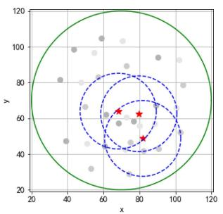

scatter

| x    | y    |
| ---- | ---- |
| 60   | 60   |
| 80   | 50   |
| 100  | 40   |
| 90   | 30   |
| 70   | 20   |
| 60   | 10   |
| 50   | 5    |
| 40   | 10   |
| 30   | 20   |
| 20   | 30   |
| 10   | 40   |
| 5    | 50   |
| 0    | 60   |
| -1   | 70   |
| -2   | 80   |
| -3   | 90   |
| -4   | 100  |
| -5   | 110  |
| -6   | 120  |
| -7   | 130  |
| -8   | 140  |
| -9   | 150  |
| -10  | 160  |
| -11  | 170  |
| -12  | 180  |
| -13  | 190  |
| -14  | 200  |
| -15  | 210  |
| -16  | 220  |
| -17  | 230  |
| -18  | 240  |
| -19  | 250  |
| -20  | 260  |
| -21  | 270  |
| -22  | 280  |
| -23  | 290  |
| -24  | 300  |
| -25  | 310  |
| -26  | 320  |
| -27  | 330  |
| -28  | 340  |
| -29  | 350  |
| -30  | 360  |
| -31  | 370  |
| -32  | 380  |
| -33  | 390  |
| -34  | 400  |
| -35  | 410  |
| -36  | 420  |
| -37  | 430  |
| -38  | 440  |
| -39  | 450  |
| -40  | 460  |
| -41  | 470  |
| -42  | 480  |
| -43  | 490  |
| -44  | 500  |
| -45  | 510  |
| -46  | 520  |
| -47  | 530  |
| -48  | 540  |
| -49  | 550  |
| -50  | 560  |
| -51  | 570  |
| -52  | 580  |
| -53  | 590  |
| -54  | 600  |
| -55  | 610  |
| -56  | 620  |
| -57  | 630  |
| -58  | 640  |
| -59  | 650  |
| -60  | 660  |
| -61  | 670  |
| -62  | 680  |
| -63  | 690  |
| -64  | 700  |
| -65  | 710  |
| -66  | 720  |
| -67  | 730  |
| -68  | 740  |
| -69  | 750  |
| -70  | 760  |
| -71  | 770  |
| -72  | 780  |
| -73  | 790  |
| -74  | 800  |
| -75  | 810  |
| -76  | 820  |
| -77  | 830  |
| -78  | 840  |
| -79  | 850  |
| -80  | 860  |
| -81  | 870  |
| -82  | 880  |
| -83  | 890  |
| -84  | 900  |
| -85  | 910  |
| -86  | 920  |
| -87  | 930  |
| -88  | 940  |
| -89  | 950  |
| -90  | 960  |
| -91  | 970  |
| -92+ |       |

(a)

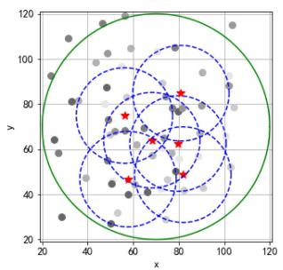  
(b)   
Fig. 6. Dynamic UAV trajectory and service area. (a) Waypoint and distribution (I = 3). (b) Waypoint and distribution (I = 6).

# 4) UAV energy efficiency.

Table II shows the main parameters used in the experiments.

# B. Performance Analysis

This section analyzes the comparison results from the aspects of trajectory comparison, service capacity, task latency, path length, and energy efficiency.

1) Trajectory Comparison: Since the local path planning in GAGLPP algorithm of all the monitor areas adopt Algorithm 1 to generate the UAV waypoints, the trajectory of users and UAV of a single monitoring area can reflect the situation of multiple areas. Fig. 6 shows the vertical view result of UAV’s local path planning by considering the users’ mobility in a single area when the number of waypoints varies from 1 to 6. Fig. 6(a) shows

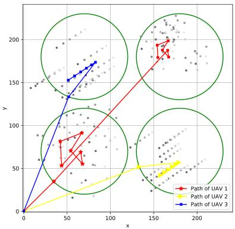

scatter

| Path of UAV | x    | y    |
|-------------|------|------|
| Path of UAV 1 | 150  | 180  |
| Path of UAV 2 | 160  | 170  |
| Path of UAV 3 | 80   | 160  |

Fig. 7. Cluster path planning.

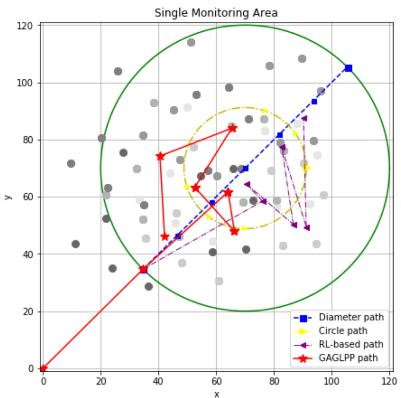

scatter

| Path Type       | x    | y    |
| --------------- | ---- | ---- |
| Diameter path   | 105  | 108  |
| Circle path     | 90   | 85   |
| RL-based path   | 85   | 75   |
| GAGLPP path     | 60   | 80   |

Fig. 8. Path comparison.

the 3rd coordinate of the users and the position of the first local waypoint of UAV generated under the principle that “the optimal communication distance covers the largest number of users.” In Fig. 6(b), the users’ coordinates change over time. This section uses gray scale dots to represent user locations updated over time. Furthermore, the red stars represent the UAV waypoints, and the blue dotted circles represent the best computing and offloading service range provided by UAV, which both varies with the movement of users.

In the process of UAV cluster scheduling, the ground station first determines the priority of the monitoring areas based on the number of users in each region. Then, according to the UAV’s residual energy, it allocates the target area for each UAV in the order of high priority and flight distance. Fig. 7 shows the result of cluster path planning using the proposed GAGLPP algorithm. In the experiment, the initial positions of users in the four service areas are set randomly, and the Gaussian mobility distribution parameters are different with line and curve properties, so the local path trajectory shape in each area is different, and dynamically adjusted with the user’s movement direction. It can be seen that cluster path planning can schedule idle UAVs according to the local flight and residual energy of UAVs, and assist to realize multi-UAVs, multiusers and multiareas computing offloading mode.

Take a single monitoring area as an example, Fig. 8 shows the waypoint results generated from three local path planning algorithms (the global path planning is the same). It is obvious that GAGLPP can plan the UAV waypoint position dynamically according to the user’s mobility, and the UAV flies to denser areas to provide more offloading services. Such intelligent performance cannot be seen in the UAV traces generated by the other algorithms.

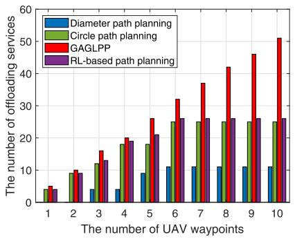

bar

| The number of UAV waypoints | Diameter path planning | Circle path planning | GAGLPP | RL-based path planning |
| --------------------------- | ---------------------- | -------------------- | ------ | ---------------------- |
| 1                           | 4                      | 5                    | 5      | 4                      |
| 2                           | 5                      | 8                    | 9      | 10                     |
| 3                           | 4                      | 12                   | 16     | 13                     |
| 4                           | 4                      | 18                   | 20     | 19                     |
| 5                           | 9                      | 18                   | 26     | 21                     |
| 6                           | 11                     | 25                   | 32     | 26                     |
| 7                           | 11                     | 25                   | 37     | 26                     |
| 8                           | 11                     | 25                   | 42     | 26                     |
| 9                           | 11                     | 25                   | 46     | 26                     |
| 10                          | 11                     | 25                   | 51     | 26                     |

Fig. 9. Offloading service capacity.

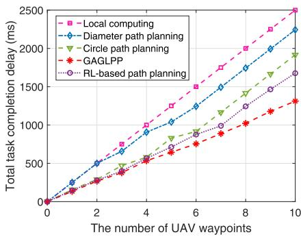

line

| The number of UAV waypoints | Local computing | Diameter path planning | Circle path planning | GAGLPP | RL-based path planning |
| --------------------------- | --------------- | ---------------------- | -------------------- | ------ | ---------------------- |
| 0                           | 0               | 0                      | 0                    | 0      | 0                      |
| 2                           | 500             | 500                    | 300                  | 200    | 200                    |
| 4                           | 1000            | 1000                   | 600                  | 400    | 400                    |
| 6                           | 1500            | 1500                   | 900                  | 600    | 800                    |
| 8                           | 2000            | 2000                   | 1200                 | 800    | 1200                   |
| 10                          | 2500            | 2500                   | 1500                 | 1300   | 1700                   |

Fig. 10. Total task delay comparison.

2) Service Capacity: In the scenario of this article, for the purpose of improving the user’s experience, UAV needs to provide more computing offloading services to the users to minimize the total completion latency of computational tasks. Therefore, in this section, statistics are made on offloading service quantity provided by the three algorithms at different waypoint positions and a comparison is made between the results of total completion times along with changes in the waypoint quantity. As shown in Fig. 9, the service quantity using GAGLPP is the largest and always greater than that using diameter, circle, and RL-based path planning. The reason is that in GAGLPP, the UAV always flies to user aggregation area as the waypoint generation principle and the service quantity accumulates constantly along with the increase of waypoint number and thus further highlighting the advantages.

3) Task Latency: Moreover, since our method provides more service quantity, receives more computational tasks from users and the airborne computer performance (CPU frequency and switch efficiency) is better than that of a MD greatly, the total task completion latency of GAGLPP is greatly shorter than the other path planning algorithms, as shown in Fig. 10. Because the diameter and circle path planning algorithms do not consider the users’ mobility, and the RL-based strategy follows the fine tuning of circle mode that adopts weak user mobility, the number of services they provide at waypoint i > 6 has reached the maximum, and the total delay of computing tasks will not be reduced. However, the number of services provided by GAGLPP algorithm continues to increase due to the intelligence

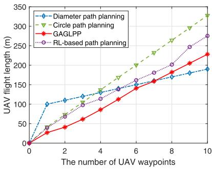

line

| The number of UAV waypoints | Diameter path planning | Circle path planning | GAGLPP | RL-based path planning |
| --------------------------- | ---------------------- | -------------------- | ------ | ---------------------- |
| 0                           | 0                      | 0                    | 0      | 0                      |
| 2                           | 100                    | 50                   | 30     | 60                     |
| 4                           | 120                    | 100                  | 80     | 100                    |
| 6                           | 140                    | 150                  | 120    | 140                    |
| 8                           | 160                    | 200                  | 160    | 180                    |
| 10                          | 180                    | 250                  | 200    | 220                    |

Fig. 11. Path length comparison.

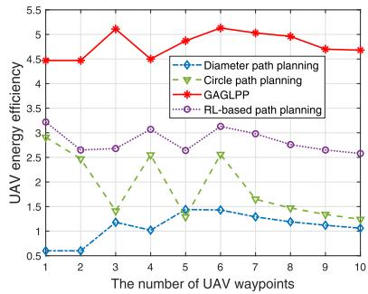

line

| The number of UAV waypoints | Diameter path planning | Circle path planning | GAGLPP | RL-based path planning |
| --------------------------- | ---------------------- | -------------------- | ------ | ---------------------- |
| 1                           | 0.5                    | 3.0                  | 4.5    | 3.0                    |
| 2                           | 0.5                    | 2.5                  | 4.5    | 2.7                    |
| 3                           | 1.2                    | 1.5                  | 5.2    | 2.8                    |
| 4                           | 1.0                    | 2.5                  | 4.5    | 3.0                    |
| 5                           | 1.3                    | 1.5                  | 4.8    | 2.7                    |
| 6                           | 1.4                    | 2.5                  | 5.2    | 3.0                    |
| 7                           | 1.3                    | 1.7                  | 5.0    | 2.9                    |
| 8                           | 1.2                    | 1.5                  | 4.8    | 2.8                    |
| 9                           | 1.1                    | 1.3                  | 4.7    | 2.7                    |
| 10                          | 1.0                    | 1.2                  | 4.6    | 2.6                    |

Fig. 12. Energy efficiency comparison.

of UAV waypoint generation algorithm, so the total delay can be significantly reduced with the increase of the number of waypoints.

4) Path Length: Fig. 11 shows the comparison results of the UAV’s flight length using these algorithms. Since the radius of the monitoring area keeps unchanged in the simulation experiment, the lag length of diameter and circle algorithms remains unchanged, the total path length obtained by these two algorithms shows linear growth along with the increase of waypoints. Due to the mobility of users, the UAV in GAGLPP algorithm performs less movement with the change of user coordinates than the other algorithms in the range of i ∈ 1, 7 . So the total [ ]path length is shorter and the flight energy consumption is smaller. When i > 7, the path length of GAGLPP algorithm is larger than that of diameter path planning, but still smaller than that of circle path planning. This shows that with the increase of the waypoints, our algorithm can obtain the number of services far greater than the reference diameter path planning through minimal flight energy consumption, and its flight efficiency is far higher than that of circle path planning.

5) Energy Efficiency: Fig. 12 shows the comparison results of UAV energy efficiency. The energy efficiency of GAGLPP algorithm keeps at [4.5,5.5], while diameter algorithm is always lower than 1.5, RL-based strategy keeps at [2.5,3.5] and circle algorithm is lower than 2.5 and very unstable. Although the energy consumption of UAV’s computation offloading services in GAGLPP algorithm is relatively greater than the other two algorithms, the total task completion latency in the process of flight is reduced greatly and thus the energy efficiency is sharply higher than that of other algorithms. It further proves that it is feasible to get shorter task completion time and improved user experience with little compensation to UAV energy consumption.

# VI. CONCLUSION

In order to solve the problem of drone swarm routing strategies for smart city and industrial IoT, this article puts forward a ground-air controlled global and local path planning for multi-UAVs-assisted MEC offloading strategy. In the cluster scheduling and area allocation controlled by ground station, this article allocated UAVs with more residual energy and shorter flight distance to monitoring areas with higher priority, so that to minimize the energy consumption of UAV cluster global path planning. In the onboard computer-assisted computation offloading based on path planning, for the purpose of maximizing the access quantity and minimizing the task completion latency, this article determined the UAV waypoint based on the users’ mobility and the optimal communication coverage, and finally get shorter local flight length and greater energy efficiency in computing offloading. In simulation experiments, this article conducted comparisons between GAGLPP and other prevailing algorithms in aspects of the waypoint and path generation of single-UAV and single-area, the cluster path planning of multi-UAVs and multiareas, the quantity of offloading services, the path length, the total task completion latency, and energy efficiency. The experimental results finally validate the effectiveness and superiority of the proposed GAGLPP algorithm. In the future, to solve the practical limitations of the proposed scheme such as variable speed and rotor wing flight, we will further discuss and make research studies on the UAV-assisted computation offloading in motion, the air speed self-learning, the energy efficiency, and latency compromised path planning.

# REFERENCES

[1] W. Lu et al., “Resource and trajectory optimization for secure communications in dual unmanned aerial vehicle mobile edge computing systems,” IEEE Trans. Ind. Inform., vol. 18, no. 4, pp. 2704–2713, Apr. 2022.   
[2] L. Chen et al., “Intelligent ubiquitous computing for future UAV-enabled MEC network systems,” Cluster Comput., vol. 25, pp. 2417–2427, 2022, doi: 10.1007/s10586-021-03434-w.   
[3] M. Chen, Y. Qian, Y. Hao, Y. Li, and J. Song, “Data-driven computing and caching in 5G networks: Architecture and delay analysis,” IEEE Wireless Commun., vol. 25, no. 1, pp. 70–75, Feb. 2018.   
[4] C. You et al., “Energy-efficient resource allocation for mobile-edge computation offloading,” IEEE Trans. Wireless Commun., vol. 16, no. 3, pp. 1397–1411, Mar. 2017.   
[5] M. Du, Y. Wang, K. Ye, and C. Xu, “Algorithmics of cost-driven computation offloading in the edge-cloud environment,” IEEE Trans. Comput., vol. 69, no. 10, pp. 1519–1532, Oct. 2020, doi: 10.1109/TC.2020.2976996.   
[6] S. Yu, X. Chen, L. Yang, D. Wu, M. Bennis, and J. Zhang, “Intelligent edge: Leveraging deep imitation learning for mobile edge computation offloading,” IEEE Wireless Commun., vol. 27, no. 1, pp. 92–99, Feb. 2020.   
[7] M. Chen, Y. Miao, H. Gharavi, L. Hu, and I. Humar, “Intelligent traffic adaptive resource allocation for edge computing-based 5G networks,” IEEE Trans. Cogn. Commun. Netw., vol. 6, no. 2, pp. 499–508, Jun. 2020.   
[8] M. Chen, Y. Hao, K. Lin, Z. Yuan, and L. Hu, “Label-less learning for traffic control in an edge network,” IEEE Netw., vol. 32, no. 6, pp. 8–14, Nov./Dec. 2018.   
[9] Y. Miao, J. Xu, M. Chen, and K. Hwang, “Drone enabled smart air-agent for 6G network,” in Proc. IEEE Int. Conf. Commun., 2022, pp. 1–6.   
[10] Q. Pham et al., “A survey of multi-access edge computing in 5G and beyond: Fundamentals, technology integration, and state-of-the-art,” IEEE Access, vol. 8, pp. 116974–117017, 2020.   
[11] F. Zhou, R. Q. Hu, Z. Li, and Y. Wang, “Mobile edge computing in unmanned aerial vehicle networks,” IEEE Wireless Commun., vol. 27, no. 1, pp. 140–146, Feb. 2020.

[12] F. Costanzo, P. D. Lorenzo, and S. Barbarossa, “Dynamic resource optimization and altitude selection in uav-based multi-access edge computing,” in Proc. IEEE Int. Conf. Acoust., Speech Signal Process., 2020, pp. 4985–4989.   
[13] Y. Chen et al., “Cost-efficient computation offloading in UAV-enabled edge computing,” IET Commun., vol. 14, no. 15, pp. 2462–2471, 2020.   
[14] C. Zhan, H. Hu, X. Sui, Z. Liu, and D. Niyato, “Completion time and energy optimization in the UAV-Enabled mobile-edge computing system,” IEEE Internet Things J., vol. 7, no. 8, pp. 7808–7822, Aug. 2020.   
[15] Y. Qian, F. Wang, J. Li, L. Shi, K. Cai, and F. Shu, “User association and path planning for UAV-aided mobile edge computing with energy restriction,” IEEE Wireless Commun. Lett., vol. 8, no. 5, pp. 1312–1315, Oct. 2019.   
[16] Y. Luo et al., “Optimization of bits allocation and path planning with trajectory constraint in UAV-enabled mobile edge computing system,” Chin. J. Aeronaut., vol. 33, no. 10, pp. 2716–2727, 2020.   
[17] Q. Liu et al., “Path planning for UAV-Mounted mobile edge computing with deep reinforcement learning,” IEEE Trans. Veh. Technol., vol. 69, no. 5, pp. 5723–5728, May 2020.   
[18] K. Valavanis and G. Vachtsevanos, Eds., Handbook of Unmanned Aerial Vehicles. Dordrecht, Netherlands: Springer, 2015, ISBN 978-90-481- 9708-8.   
[19] Y. Zeng and R. Zhang, “Energy-efficient UAV communication with trajectory optimization,” IEEE Trans. Wireless Commun., vol. 16, no. 6, pp. 3747–3760, Jun. 2017.   
[20] Y. Xu et al., “UAV-assisted MEC networks with aerial and ground cooperation,” IEEE Trans. Wireless Commun., vol. 20, no. 12, pp. 7712–7727, Dec. 2021.   
[21] M. Y. Arafat and S. Moh, “Localization and clustering based on swarm intelligence in UAV networks for emergency communications,” IEEE Internet Things J., vol. 6, no. 5, pp. 8958–8976, Oct. 2019.   
[22] A. Al-Hilo, M. Samir, C. Assi, S. Sharafeddine, and D. Ebrahimi, “UAV-assisted content delivery in intelligent transportation systemsjoint trajectory planning and cache management,” IEEE Trans. Intell. Transp. Syst., vol. 22, no. 8, pp. 5155–5167, Aug. 2021, doi: 10.1109/TITS.2020.3020220.   
[23] S. Batabyal and P. Bhaumik, “Mobility models, traces and impact of mobility on opportunistic routing algorithms: A survey,” IEEE Commun. Surv. Tut., vol. 17, no. 3, pp. 1679–1707, Jul.–Sep. 2015.   
[24] L. Wang et al., “Multi-agent deep reinforcement learning based trajectory planning for Multi-UAV assisted mobile edge computing,” IEEE Trans. Cogn. Commun. Netw., vol. 7, no. 1, pp. 73–84, Mar. 2021.

natural_image

Portrait photo of a woman in formal attire against a blue background (no text or symbols visible)

Yiming Miao received the Ph.D. degree in computer architecture from the Huazhong University of Science and Technology, Wuhan, China, in 2021.

She is currently a Research Assistant Professor with the School of Data Science, The Chinese University of Hong Kong, Shenzhen, China. Her research interests include Internet of Things, edge computing, and communication system.

natural_image

Portrait of an older man wearing glasses and a blue shirt with arms crossed (no text or symbols visible)

Kai Hwang (Life Fellow, IEEE) received the Ph.D. degree in electrical engineering and computer science from the University of California at Berkeley, Berkeley, CA, USA, in 1972.

He was with Purdue University, IN, USA and the University of Southern California, CA, for many years. Since 2018, he has been a Presidential Chair Professor with the Chinese University of Hong Kong (CUHK), Shenzhen, China. He has authored or coauthored ten scientific books and more than 280 scientific

# papers.

Dr. Hwang was a recipient of the Outstanding Achievement Award in 2005 from China Computer Federation, the Lifetime Achievement Award from the IEEE CloudCom 2012, and the 10th Wu Wenjun Artificial Intelligence Natural Science Award in 2020 from China’s Artificial Intelligence Association for his recent work on AI-oriented clouds/datacenters.

natural_image

Portrait photo of a man in formal attire against a blue background (no text or symbols visible)

Di Wu (Senior Member, IEEE) received the B.S. degree in computer science and technology from the University of Science and Technology of China, Hefei, China, the M.S. degree in computer architecture from the Institute of Computing Technology, Chinese Academy of Sciences, Beijing, China, and the Ph.D. degree in computer science and engineering from the Chinese University of Hong Kong, Hong Kong, China, in 2000, 2003, and 2007, respectively.

From 2007 to 2009, he was a Postdoctoral

Researcher with the Department of Computer Science and Engineering, Polytechnic Institute of New York University, Brooklyn, NY, USA, advised by Prof. K. W. Ross. He is currently a Professor and the Associate Dean with the School of Computer Science and Engineering, Sun Yat-sen University, Guangzhou, China. His research interests include edge/cloud computing, multimedia communication, internet measurement, and network security.

Dr. Wu was the recipient of the IEEE International Conference on Computer Communications (INFOCOM) 2009 Best Paper Award, IEEE Jack Neubauer Memorial Award, etc.

natural_image

Portrait of a man wearing glasses and a dark jacket (no visible text or symbols)

Min Chen (Fellow, IEEE) received the Ph.D degree from the School of Electronic and Communication Engineering, South China University of Technology, Guangzhou, China, in 2004.

He has been a Full Professor with the School of Computer Science and Technology, Huazhong University of Science and Technology (HUST), Wuhan, China, since February 2012. He was a Postdoctoral Fellow with the Department of Electrical and Computer Engineering, University of British Columbia (UBC),

Vancouver, BC, Canada, for three years. He is the Director of Embedded and Pervasive Computing Lab, and the Director of Data Engineering Institute, HUST. His Google Scholar Citations reached 36 800+ with an h-index of 91.

Prof. Chen is the Founding Chair of the IEEE Computer Society Special Technical Communities on big data.

natural_image

Portrait of a man wearing glasses and a suit against a blue background (no text or symbols visible)

Yixue Hao (Member, IEEE) received the Ph.D. degree in computer science from the Huazhong University of Science and Technology (HUST), Wuhan, China, in 2017.

He is an Associate Professor with the School of Computer Science and Technology, HUST. His current research interests include 5G network, Internet of Things, edge computing, edge caching, and cognitive computing.