# Dubins Path Planning of Heterogeneous UAV Collaborative Data Collection for IoT Network

Jinyu Fu , Member, IEEE, Guanghui Sun , Senior Member, IEEE, Weiran Yao , Member, IEEE, Chengwei Wu , Member, IEEE, and Ligang Wu , Fellow, IEEE

Abstract—Ground-to-air communication is a critical technology for establishing an Internet of Things (IoT) network system, especially in emergency situations. We are investigating the trajectory planning problem of a data collection IoT network assisted by an unmanned aerial vehicle (UAV). This article aims to solve the data collection Dubins traveling salesman problem (DCDTSP) for UAVs in a three-dimensional and complex obstacle environment. To optimize the paths for UAVs in data collection from terminals to UAVs, a novel releasing-collecting-recycling (RCR) framework has been established for heterogeneous multi-UAVs. In the UAV release step, we propose a multi-height hierarchical target clustering (MHTC) algorithm to enhance the eficiency of multi-target clustering. In the data collection step, a bundling ant colony system (BACS) is developed to minimize the length of the obstacle avoidance path while still meeting the communication throughput constraint. Meanwhile, the dynamic adaptive window probabilistic roadmap (DAWPRM) algorithm has been enhanced to address the obstacle avoidance distance in BACS. In the UAV recycling step, we propose a time synchronous Dubins recycling strategy to plan the simultaneous arrival trajectory for multiple UAVs with a constrained turning radius. The results of simulation experiments showed that the proposed RCR framework is optimal for finding Pareto solutions for DCDTSP.

Index Terms—IoT network, data collection, obstacle avoidance, RCR framework of multi-UAV.

## I. INTRODUCTION

NTERNET of vehicles (IoV) technology is crucial for achieving real-time remote information sharing [1]. In emergency situations, such as earthquakes and other natural disasters, communication failures can lead to network outages. The collected data is widely used to support real-time management applications, such as military reconnaissance [2], trafic control [3], autonomous driving [4], air-ground coordinated sensing [5], [6], wireless sensor networks [7], machine-type communication [8], Internet of Things [9], disaster rescue, etc. In this case, the freshness of the data collected is critical to the quality of informed decision-making. To quantify the freshness of collected data [10], communication transmission time or energy minimization was used as the performance metrics [11]. The data collection communication services [12] rate was enhanced by a UAV-assisted backbone network for wireless communication [13]. The solution for collaborative distributed data collection Dubins traveling salesman problem (DCDTSP) [14] of heterogeneous UAVs is constrained by communication distance [4], turning radius, and optimal coverage [15] in a complex obstacle environment. Data collection requested that the transport UAV (T-UAV) releases the communication UAV (C-UAV) at the release point. The optimal solution of DCDTSP can reduce the length of the C-UAV visits to an ordered set of terminals. The sub-problems of IoT network data collection are solved by involving multi-terminal clustering, obstacle avoidance, DTSP [16], and tracking control [17], etc.

For the UAV-assisted data collection IoT network [18], the trajectory planning algorithm for UAVs was addressed using a deep neural network and deep reinforcement learning [19] for feature extraction [20]. The collected video data from a group of ground cameras along the road was transmitted to the UAV through 60 GHz communication [21]. A joint speed control and energy replenishment optimization for the UAVassisted IoT data collection method was presented with deep reinforcement transfer learning [22]. In the process of data collection, task time can be reduced by addressing multitarget clustering. A greedy learning clustering algorithm and an artificial energy map were employed to improve the solution eficiency of multiple communication devices into clusters [23]. The spatial area of sensor networks was divided using a clustering algorithm [24]. Multiple terminal clustering for heterogeneous UAVs requires communication UAVs to complete communication tasks. In the complex terrain obstacles environment, obstacles will seriously afect communication data transmission. It is necessary to construct a clustering method to meet the C-UAVs flying at diferent altitudes of communication. Based on eficient terminal resource allocation

Digital Object Identifier 10.1109/TITS.2025.3645094 and clustering, UAV-assisted networking was established as a reliable and flexible emergency communication network in the event of a disaster and communication blocked [25]. The planned path of data collection at an appropriate voyage time and ensuring the completion of communication data tasks need to be considered [26]. Solving a solution to Dubins TSP [27] can shorten the total path for C-UAV and T-UAV in a complex obstacle environment.

Dorigoin [28] proposed a classic heuristic optimization algorithm known as ant colony optimization (ACO), to solve the solution of TSP and enhance calculation speed [29]. A multi-population ant colony systems (ACS) was proposed with knowledge-based local search for multi-objective supply chain configuration [30]. A multi-objective ACS was proposed based on co-evolutionary multiple populations and an objective framework [31]. An eficient double-layer ACO (DL-ACO) algorithm was presented for autonomous robot navigation [32]. An excellent global path was iterated and clustered with the density clustering algorithm for dynamic data streams using ACO [33]. ACO-A\* was proposed by ACO combined with the A\* algorithm, which was realized to travel in a 3-D dense obstacle environment [34]. The dificulty of solving ACS is increased for DCDTSP in a large-scale obstacle environment. In the process of ground-to-air communication, existing ACS algorithms are dificult for UAVs to plan the trajectory with joint terrain obstacles and task time constraints.

The probabilistic roadmaps (PRM) algorithm is efective for planning obstacle avoidance paths for ACS. Asymptotically optimal motion planners ensure that solutions approach the optimal and minimize the computational cost of generating the roadmaps for the PRM\* algorithm [35]. A distributed path-planning problem was solved with low communication overhead [36]. A guidance mechanism was presented based on reinforcement learning (RL) [37] that the well-connected roadmaps and the sampling-based planner were constructed by PRM-RL and AutoRL, respectively [38]. For further consideration, the turning radius, as a motion constraint for T-UAV and C-UAV, cannot be ignored [39] in the implementation of IoT network tasks. The DCDTSP path was generated to combine the PRM algorithm with the Dubins method [40]. The path planning of the C-UAV was formulated as a DTSP with a dynamic neighborhood and the coupled variables were solved with dynamic constraints [41]. The trajectory planning of the UAV was constrained by IoT network and kinematics in the process of data collection [42]. In complex obstacles and large scenarios, IoT UAV-assisted wireless communication increases the dificulty in data collection. Additionally, the decentralization of multiple targets also reduces the eficiency of coverage tasks. A single communication UAV has low eficiency during data collection tasks. The ability of trajectory planning to adjust trajectory length is weak with spatiotemporal and communication constraints.

T-UAV operations are challenging due to their high velocity and large turning radius. The C-UAV has flexible movement and can easily avoid obstacles. However, C-UAVs reach communication areas slowly. Motivated by addressing planning dificulties caused by kinematic diferences in heterogeneous data collection IoT systems, a framework for a cooperative heterogeneous UAV IoT network data collection is designed. This framework focuses on motion dynamic adaptability and communication efectiveness. To improve the eficiency of data collection, the advantages of T-UAV and T-UAV are combined with obstacle avoidance, turning radius, and communication status constraints. The main contributions of the current paper are as follows:

1) A novel releasing-collecting-recycling (RCR) framework is proposed to reduce the time required for IoT data collection by heterogeneous UAVs. Meanwhile, multi-height hierarchical target clustering (MHTC) is developed to enhance the eficiency of IoT construction for the RCR framework in a complex obstacle environment.

2) An optimal trajectory planning algorithm is addressed for multiple C-UAVs, considering constraints such as minimum turning radius, communication and obstacle avoidance. An improved bundle ACS (BACS) is designed to solve the optimal solution of chain DTSP. Compared to traditional ACS algorithms, the applicability of BACS is enhanced in an obstacle environment by combining it with the improved dynamic adaptive windows PRM (DAWPRM) algorithm.

3) A time synchronous Dubins recycling strategy (TSDRS) for UAVs is established to solve recycling and rendezvous problems. Multiple constraints, including the data transmission status, recycling distance, and relative motion attitude of the UAV, have been considered in TSDRS. An homotopy and C-S trajectory elongation algorithms are designed to make C-UAV and T-UAV arrive at the recycling point simultaneously.

The rest of the paper is organized as follows. The problem statement is given in Section II. The task allocation and multiobjective coverage path and Dubins path algorithm framework are proposed in Section III. Our method is comparatively simulated in Section IV. In the end, the conclusion is given in Section V. Additionally, diferent notations in this paper are listed in Table I with their descriptions.

## II. PRELIMINARIES AND PROBLEM STATEMENT

To realize the wireless communication of the Internet of Things in a three-dimensional space environment, one transport UAV (T-UAV) carries K communication UAVs (C-UAV), starting from the base, and releasing the C-UAVs at an appropriate position. The process scenario is as shown in Fig. 1. The C-UAVs perform data collection tasks through communication with the N ground terminal. After data collection, the recycling task of the C-UAV is executed. All C-UAVs are recycled, and the T-UAV returns to the base. The time for UAV data collection can be reduced through optimal trajectory planning.

The Dubins traveling salesman problem (DTSP) solution of heterogeneous multi-UAV distributed collaborative data collection is expressed by Eq. (1).

$$
[ \mathcal { T } ^ { * } , K ^ { * } ] = \arg \operatorname* { m i n } _ { C _ { \mathrm { T } } \in \mathcal { C } } \sum _ { k = 1 } ^ { 2 K + 1 } \varpi ( \mathcal { C } _ { \mathrm { T } } ( k ) , \mathcal { C } _ { \mathrm { T } } ( k + 1 ) )
$$

TABLE I  
LIST OF USED NOTATIONS WITH THEIR DESCRIPTIONS
<table><tr><td rowspan=1 colspan=2>Notations                         Descriptions</td></tr><tr><td rowspan=1 colspan=1> $\tau ^ { * }$ </td><td rowspan=1 colspan=1>Task execution time of T-UAV</td></tr><tr><td rowspan=1 colspan=1> $\mathcal { T } _ { R } ^ { * }$ </td><td rowspan=1 colspan=1>Time of releasing all C-UAVs task</td></tr><tr><td rowspan=1 colspan=1> $\mathcal { T } _ { C } ^ { * } ( k )$ </td><td rowspan=1 colspan=1>Data transmission time of the kth C-UAV</td></tr><tr><td rowspan=1 colspan=1> $\mathcal { T } _ { J }$ </td><td rowspan=1 colspan=1>Time of T-UAV recycle C-UAV</td></tr><tr><td rowspan=1 colspan=1> $K$ </td><td rowspan=1 colspan=1>Number of C-UAVs or clusters</td></tr><tr><td rowspan=1 colspan=1> $N$ and $\mathcal { C }$ </td><td rowspan=1 colspan=1>The number and coordinates of ground terminals</td></tr><tr><td rowspan=1 colspan=1> $\mathcal { C } _ { \mathrm { T } }$ and $\mathcal { C } _ { \mathrm { C } }$ </td><td rowspan=1 colspan=1>Coordinates of T-UAV and C-UAV</td></tr><tr><td rowspan=1 colspan=1> $\mathcal { O } _ { k }$ </td><td rowspan=1 colspan=1>The kth cluster center point</td></tr><tr><td rowspan=1 colspan=1> $C _ { k } ^ { D }$ and $C _ { k } ^ { U }$ </td><td rowspan=1 colspan=1>The kth releasing point and recycling point</td></tr><tr><td rowspan=1 colspan=1> $B _ { i }$ </td><td rowspan=1 colspan=1>Channel bandwidth of the ith terminal</td></tr><tr><td rowspan=1 colspan=1> $\mathcal { R } _ { i }$ </td><td rowspan=1 colspan=1>Real time communication rate</td></tr><tr><td rowspan=1 colspan=1> $\rho _ { 0 }$ </td><td rowspan=1 colspan=1>The channel characteristic parameter</td></tr><tr><td rowspan=1 colspan=1> $\psi _ { i }$ </td><td rowspan=1 colspan=1>The power allocated by the sub-channel</td></tr><tr><td rowspan=1 colspan=1> $\mathcal { I } _ { \sim }$ </td><td rowspan=1 colspan=1>The index of recycling</td></tr><tr><td rowspan=1 colspan=1> $\lambda _ { 1 }$ and λ₂</td><td rowspan=1 colspan=1>Angle calibration parameters</td></tr><tr><td rowspan=1 colspan=1> $\epsilon$ </td><td rowspan=1 colspan=1>The angle margin</td></tr><tr><td rowspan=1 colspan=1> $L _ { \mathrm { n } }$ and $L _ { \mathrm { m } }$ </td><td rowspan=1 colspan=1>The length and width of map</td></tr><tr><td rowspan=1 colspan=1> $\mathcal { P } _ { i j } ^ { \kappa }$ </td><td rowspan=1 colspan=1>Probability of path in BACS algorithm</td></tr><tr><td rowspan=1 colspan=1> $\ddot { D }$ </td><td rowspan=1 colspan=1>BACS obstacle avoidance distance table</td></tr><tr><td rowspan=1 colspan=1>r1 and $r _ { 2 }$ </td><td rowspan=1 colspan=1>Minimum turning radius of T-UAV and C-UAV</td></tr><tr><td rowspan=1 colspan=1> $p$ </td><td rowspan=1 colspan=1>UAVs locations and angle of velocity</td></tr><tr><td rowspan=1 colspan=1> $\theta$ </td><td rowspan=1 colspan=1>Vertical velocity angle of T-UAV</td></tr><tr><td rowspan=1 colspan=1>α and β</td><td rowspan=1 colspan=1>Horizontal velocity angle of T-UAV and C-UAV</td></tr><tr><td rowspan=1 colspan=1> $v _ { \mathrm { T } }$ </td><td rowspan=1 colspan=1>Velocity of T-UAV</td></tr><tr><td rowspan=1 colspan=1> $v _ { \mathrm { C } }$ </td><td rowspan=1 colspan=1>Horizontal and vertical velocity of C-UAV</td></tr><tr><td rowspan=1 colspan=1> $\mathcal { L } _ { g }$ </td><td rowspan=1 colspan=1>The globally optimal path for BACS</td></tr><tr><td rowspan=1 colspan=1> $\rho$ </td><td rowspan=1 colspan=1>Attenuation coefficient of pheromone for BACS</td></tr><tr><td rowspan=1 colspan=1> $Q$ </td><td rowspan=1 colspan=1>Ant pheromone for BACS</td></tr></table>

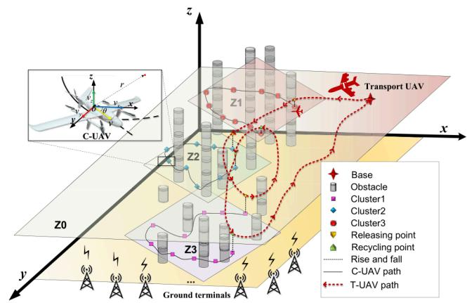  
Fig. 1. Schematic diagram of data collection for DCDTSP. $Z _ { \sim }$ is the flight altitude plane of a certain UAV.

$$
\mathcal { C } _ { \mathrm { T } } = [ H , C _ { 1 } ^ { D } , \cdot \cdot \cdot , C _ { K } ^ { D } , C _ { 1 } ^ { U } , \cdot \cdot \cdot , C _ { K } ^ { U } , H ]\tag{1}
$$

where K is the quantity of UAVs, $k = 1 , \cdots , K . \ T ^ { * }$ is the optimal task time of the T-UAV Dubins path. $K ^ { * }$ is the optimal number of terminal clusters. $\varpi ( \mathcal { C } _ { \mathrm { T } } ( k ) , \mathcal { C } _ { \mathrm { T } } ( k + 1 ) )$ is the Dubins path from ${ \mathcal { C } } _ { \mathrm { T } } ( k )$ to $\mathcal { C } _ { \mathrm { T } } ( k + 1 )$ . H is the base location. $C _ { k } ^ { D }$ and $\bar { C } _ { k } ^ { U }$ are the kth releasing point and recycling point.

## A. Releasing-Collecting-Recycling Framework

We proposed a releasing-collecting-recycling framework to collect data using collaborative heterogeneous UAVs.

Definition 1 (Releasing-collecting-recycling Framework) The RCR is a proposed framework of collaborative data collection for heterogeneous UAVs. The RCR framework involves a three-stage task: T-UAV releases the C-UAV, the C-UAV collects data, and the T-UAV recycles the C-UAV.

Some assumptions and constraints of the RCR framework are as follows:

1) The coordinates of IoT terminals and maps of the terrain are known. The status of T-UAV and C-UAV is updated to the global controller at a fixed sampling interval. All trajectories are planned by a global controller. C-UAV and T-UAV will not be damaged during the mission process.

2) $d _ { e } ( k , i )$ represents the Euclidean distance between the kth ,C-UAV and the ith communication terminal. $d _ { * }$ denotes the maximum efective transmission distance. Data can be transmitted when $d _ { e } ( k , i ) < d _ { * }$

3) In the recovery process, if the horizontal coordinates of the T-UAV and the C-UAV to be recovered are aligned, and the altitude diference is less than 1 m, the recovery is deemed successful. Meanwhile, the recycling operation time is being ignored.

To improve the eficiency of data collection, the terminals are clustered. First, the cluster center is used to solve the optimal TSP sequence. From the base starting, each release point is found among the members corresponding to the cluster center according to the TSP sequence. The solution of releasing point selection can be expressed as

$$
\mathcal { T } _ { R } ^ { * } = \underset { \xi = 1 , \cdots , \mathcal { L } ( \mathcal { C } _ { k } ) , _ { k = 1 } } { \arg \operatorname* { m i n } } \Vert \mathcal { O } _ { k } ( \xi ) - \mathcal { O } _ { k + 1 } ( \zeta ) \Vert _ { 2 } / \nu _ { \mathrm { T } }\tag{2}
$$

where $k = 1$ represents start point $H , { \mathcal { O } } _ { k } ( \xi )$ represents the kth cluster center point and the th point in this cluster.

1) Data Collection Dubins Traveling Salesman Problem: The position of releasing point is important to afect path planning for multi-target multi-UAV optimal communication coverage, especially. The N ground terminal coordinates are $\mathcal { C } = \{ c _ { 1 } , \cdots , c _ { N } \}$ , where $\boldsymbol { c } _ { i } \in \mathbb { R } ^ { 3 } , i = 1 , \ldots , N$ . The multi-UAV distributed data collection Dubins traveling salesman problem (DCDTSP) path of C-UAV is expressed as

$$
\begin{array} { r l } & { \mathcal { T } _ { C } ^ { * } ( k ) = \underset { i , j < l } { \mathrm { a r g } } \underset { i , j < l } { \mathrm { m i n } } \ \underset { i = 1 } { \overset { l } { \sum } } \varpi ( \mathcal { C } _ { k } ( i ) , \mathcal { C } _ { k } ( j ) ) / \nu _ { \mathrm { C } } } \\ & { \quad \quad \quad \quad \mathrm { s u b j e c t ~ t o } } \\ & { \quad \quad \quad \quad \mathcal { R } _ { i } ( t ) = B _ { i } \log _ { 2 } \left( 1 + \frac { \psi _ { i } ( t ) } { \rho _ { 0 } d _ { e } ^ { 2 } ( k , i ) } \right) , } \\ & { \quad \quad \quad \quad \int _ { 0 } ^ { t } \mathcal { R } _ { i } ( t ) d t > \iota } \end{array}\tag{3}
$$

where $I ~ = ~ { \mathcal { L } } ( { \mathcal { C } } _ { k } ) . ~ { \mathcal { R } } _ { i } ( t )$ is the data receiving rate for ith communication terminal at time $t . ~ \mathcal { C } _ { k } ( i )$ is the kth cluster and the ith communication terminal. $B _ { i }$ is the sub-channel bandwidth of the communication terminal. $\psi$ is the power allocated by the sub-channel parameter. is the packet capacity to be transmitted from the N communication terminals.

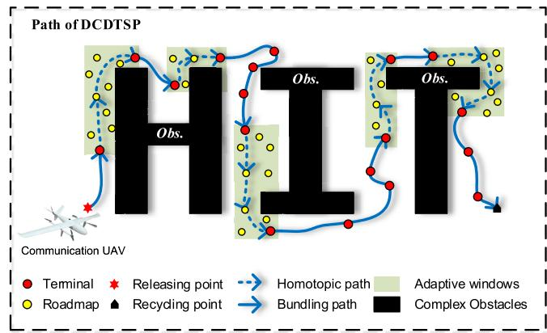  
Fig. 2. The path of DCDTSP for terminals with obstacle and communication constraints. The red and yellow dots represent the terminals and roadmaps.

To realize the communication between UAV and terminal, this paper proposes a hybrid ant colony system (ACS) and Dubins algorithm method to solve DCDTSP. To shorten the voyage of the Dubins path, some constraints are considered, including obstacle avoidance path planning and covering all communication terminals. To improve the obstacle avoidance path solution speed, the improved dynamic adaptive windows PRM (DAWPRM) algorithm is proposed, which is a special homotopy. The path of DCDTSP is as shown in Fig. 2. The distance list D of the ant colony systems algorithm (ACS) is optimized by DAWPRM. By judging whether there are obstacles in the linear connection between ground terminals, the distance construction method is selected. If there are no obstacles, it is saved into the distance list with the linear distance. Otherwise, the obstacle avoidance distance is saved in the distance list.

Definition 2 (Bundling Group [43]) Among the terminals in the same group after clustering, the order is obtained by solving TSP. The coordinated set of adjacent terminals that can be connected in a straight line and do not pass through obstacles is called the binding group.

UAV starts from the releasing point and follows the path generated by the solution of DCDTSP. The UAV passes through the bundling group with the Dubins path, but the adjacent bundling group is linked through the DAWPRM trajectory to avoid obstacles, then the Dubins trajectory can be generated.

Remark 1: The solution of the proposed DCDTSP is a chain path while traditional TSP is the complete ring. After data collection, the C-UAV directly climbs to the height to be recycled.

When the C-UAV completes data collection, cooperative motion planning of C-UAVs and T-UAVs is addressed to realize recovery. The recovery index $\mathcal { I } ~ = ~ [ \mathcal { I } _ { 1 } , \mathcal { I } _ { 2 } , \mathcal { I } _ { 3 } ]$ are represented as

$$
\left\{ \begin{array} { l l } { \mathcal { I } _ { 1 } = \arg \operatorname* { m a x } _ { N _ { l } < N _ { D } } \sum _ { k = 1 } ^ { K } \sum _ { t = 1 } ^ { N _ { f } } \int _ { 0 } ^ { T _ { c } ( k ) } R _ { f } ( t ) d t - I _ { t } } \\ { \mathcal { I } _ { 2 } = \arg \operatorname* { m i n } _ { \mathcal { C } _ { c } , \mathcal { C } _ { \mathrm { T } } \in \mathbb { B } ^ { 3 } } \sum _ { k = 1 } ^ { K } \| \mathcal { C } _ { \mathrm { C } } ( k ) - \mathcal { C } _ { \mathrm { T } } \| _ { 2 } + h _ { 0 } } \\ { \mathcal { I } _ { 3 } = \arg \operatorname* { m i n } _ { | \epsilon | < \alpha _ { \varepsilon } } \lambda _ { 1 } | \alpha - \beta | + \lambda _ { 2 } | \alpha + \beta - \pi | - \epsilon } \end{array} \right.\tag{4}
$$

subject to

$$
N _ { D } = \sum _ { i = 1 } ^ { I - 1 } \mathcal { L } \left( \varpi \left( \mathcal { C } _ { k } ( i ) , \mathcal { C } _ { k } ( i + 1 ) \right) \right)
$$

where $\mathcal { I } _ { 1 }$ is the data transmission evaluation index, representing data transmission between communication UAV and terminal. $\mathcal { I } _ { 2 }$ is the Euclidean distance between the T-UAV and each C-UAV. The initial height diference, $h _ { 0 } ,$ is set to 1 m in the simulation. $\mathcal { T } _ { 3 }$ is the relationship between the T-UAV and each C-UAV of motion direction.  is the angle margin. $\alpha _ { e }$ is the maximum allowable angle error. $[ \lambda _ { 1 } , \lambda _ { 2 } ] = [ 1 \ 0 ] \ \mathrm { o r } \ [ 0 \ 1 ] .$ which represents recycling in the same direction and recycling in the opposite direction.

## B. UAV Dubins Kinematics

In the process of building the IoT network, the cooperative motion planning of T-UAV and C-UAV is required to realize data collection. The movement of T-UAV and C-UAV is limited by the turning radius. The C-UAV cruises one cluster of communication terminals with a communication distance constraint. Some actual constraints are as follows:

1) Homogeneity: The C-UAVs and multi-target communication tasks are homogeneous, i.e., a task can be executed by an arbitrary C-UAV.

2) UAV kinematics model: The UAV is seen as a particle Dubins model. In the process of obstacle avoidance, the turning radius of the UAV cannot be ignored. The C-UAV is a vertical takeof and landing (VTOL) UAV, but it cannot hover in the air.

3) Data transmission: The data transmission between the UAV and ground terminal has priority, and the next terminal can be communicated only after the current terminal data transmitted is completed within the communication range. If a sudden communication failure occurs, only one additional communication is allowed.

The T-UAV has the characteristics of fast speed and a large turning radius. The speed of the C-UAV is slower than that of the T-UAV, but the turning radius is small and the movement is flexible. The three-dimensional dynamic model of the UAV in an inertial Cartesian frame can be expressed as

$$
\dot { p } = \left[ \begin{array} { c } { \dot { x } _ { \mathrm { T } } } \\ { \dot { y } _ { \mathrm { T } } } \\ { \dot { z } _ { \mathrm { T } } } \\ { \dot { x } } \\ { \dot { x } _ { \mathrm { C } } } \\ { \dot { y } _ { \mathrm { C } } } \\ { \dot { z } _ { \mathrm { C } } } \\ { \dot { \beta } } \end{array} \right] = \left[ \begin{array} { c } { \nu _ { \mathrm { T } } \cdot \cos \alpha \sin \theta } \\ { \nu _ { \mathrm { T } } \cdot \sin \alpha \sin \theta } \\ { \nu _ { \mathrm { T } } \cos \theta } \\ { u _ { 1 } \nu _ { \mathrm { T } } / r _ { 1 } } \\ { \nu _ { \mathrm { C } } \cdot \cos \beta } \\ { \nu _ { \mathrm { C } } \cdot \sin \beta } \\ { \nu _ { \mathrm { C } } } \\ { u _ { 2 } \nu _ { \mathrm { C } } / r _ { 2 } } \end{array} \right]\tag{5}
$$

where $p$ represents the locations of UAV and angle of velocity. $u _ { 1 }$ and $u _ { 2 }$ are state variables $, - 1 \le u _ { 1 } \le 1 , - 1 \le u _ { 2 } \le 1$ . The subscripts $\mathbf { \tau } ^ { \bullet } \mathbf { T } ^ { \bullet }$ and $\mathbf { \tilde { C } } \mathbf { \Psi }$ represent variables related to T-UAV and C-UAV, respectively.

## C. Curvature-Constraint Path

For the T-UAV and C-UAVs, the motion of the UAV is limited by curvature. The flight altitude of a T-UAV is not restricted by obstacles, while the flight altitude of a C-UAV is restricted by obstacles. In this case, the Dubins path needs to obtain the obstacle avoidance path through the DAWPRM algorithm.

Lemma 1 (The shortest path [14]) The starting point $\mathcal { C } _ { s }$ and ending point $\mathcal { C } _ { e }$ are determined, the shortest Dubins trajectory is afected by the angle of the $\mathcal { C } _ { s }$ and $\mathcal { C } _ { e }$

A set of Dubins curves can be represented by a set of curves and straight lines. The letter $C$ represents the curve, and the letter S represents the straight line. Under the DCDTSP studied in this paper, the Dubins of adjacent segments have a coupling relationship, and the $\mathcal { C } _ { e }$ of the Dubins path of the ith segment is the $\mathcal { C } _ { s }$ of the curve path of the (i + 1)th segment. We construct the expectation function of coupled Dubins path as

$$
\begin{array} { r l } { \mathcal { D } _ { c } ^ { * } = \arg \underset { \mathcal { D } _ { c } \in \Omega } { \operatorname* { m i n } } \mathcal { L } ( \mathcal { D } _ { c } ( \mathcal { P } _ { \mathrm { d } } , r , \phi , \varphi ) ) . } & { } \\ { \mathrm { s u b j e c t ~ t o } } & { } \\ { \mathcal { D } _ { c } ( \mathcal { P } _ { \mathrm { d } } , r , \phi , \varphi ) = \mathcal { D } ( \mathcal { P } _ { \mathrm { d _ { 1 } } } , \mathcal { P } _ { \mathrm { d _ { 2 } } } , r , \phi _ { 1 } , \phi _ { 2 } , \varphi _ { 1 } , \varphi _ { 2 } ) } & { } \\ { \cup \dots \cup \mathcal { D } ( \mathcal { P } _ { \mathrm { d } _ { n - 1 } } , \mathcal { P } _ { \mathrm { d } _ { n } } , r , \phi _ { n - 1 } , \phi _ { n } , \varphi _ { n - 1 } , \varphi _ { n } ) } & { ( 6 } \end{array}\tag{}
$$

where $\mathcal { P } _ { \mathrm { d } }$ is the optimal coupled Dubins path of $\mathcal { D } _ { c } . ~ r$ is the minimum turning radius. $\phi$ and $\varphi$ are angles sets of velocity at the starting point and ending point. Ω is a function space, $\mathcal { D } _ { c } \in \Omega$

## III. OVERALL OF PROPOSED ALGORITHMS

The releasing-collecting-recycling framework is proposed to release C-UAVs, collect data, and recycle C-UAVs. The RCR framework is composed of RPDTSP and DCDTSP algorithms, etc. The order of execution of the tasks is as follows.

## A. Communication UAV Releasing Path DTSP (RPDTSP)

First, a multi-height hierarchical target clustering (MHTC) algorithm is proposed to improve the eficiency of multitarget DC. The MHTC is a three-dimensional projection classification method. The N projections of the communication terminal are clustered as K layers. K UAVs perform tasks at diferent layer altitudes. MHTC is a kind of adjustment rule that uses an iterative algorithm to find extreme values as Eq. (7). Compared with the 3D Euclidean distance K-means clustering, MHTC can efectively improve the eficiency of multi-UAV communication with terminals. By projecting the three-dimensional coordinate points to the Z-plane, the flight plane of a T-UAV is $Z _ { 0 } ,$ and the flight planes of C-UAVs are $Z _ { 1 }$ to $Z _ { K }$

$$
\left[ \begin{array} { l } { \boldsymbol { O } _ { 1 } ^ { * } , \cdots , \boldsymbol { O } _ { K } ^ { * } } \\ { \mathcal { C } _ { 1 } ^ { * } , \cdots , \mathcal { C } _ { K } ^ { * } } \end{array} \right] = \arg \operatorname* { m i n } _ { \mathcal { C } _ { k } \subset \mathcal { C } } \sum _ { k = 1 } ^ { K } \sum _ { n = 1 } ^ { N _ { k } } \lVert \mathcal { C } _ { k } ( n ) - \boldsymbol { O } _ { k } \rVert _ { 2 } ^ { 2 }\tag{7}
$$

where $O _ { k }$ is the kth cluster center point. $\mathcal { C } _ { k }$ is the kth cluster location. $\mathcal { C } _ { k } ( n ) , k = 1 , \cdots , K$ , is the coordinate of the nth point in $\mathcal { C } _ { k }$

The height results of multi-layer clustering are obtained. The K occupancy grid maps are constructed using the contour line as shown in Eq. (8).

$$
M _ { k } ( x , y ) = \left\{ { 1 , \qquad z ( x , y ) \geq Z ( k ) } \right.\tag{8}
$$

where $M _ { k }$ is the kth cluster occupancy grid map, which is discrete and related to the minimum resolution. $I _ { d }$ is the fixedinflated parameter of the occupancy grid map. $( x , y ) \in M _ { I } . ~ M _ { I }$ is an inflated occupancy grid map.

According to Eq. (2), the release planning trajectory is obtained including base H. In order to consider the turning radius constraint, the trajectory with curvature constraint needs to be constructed. The coupled Dubins is constructed with turning radius constraints. The distance $\mathcal { P } _ { d }$ between $\mathcal { C } _ { s }$ and $\mathcal { C } _ { e } ,$ and the angle between current velocity and $\mathcal { C } _ { s }$ and $\mathcal { C } _ { e }$ connecting lines are important factors afecting the Dubins path. The velocity angle of the starting point is a very important parameter. The optimal parameters can make the C curve short, it can ensure that the coupled-Dubins can still avoid obstacles. The completed RPDTSP trajectory is generated. After the C-UAV is released, it will start the data collection mission.

## B. DCDTSP Path Planning

The DCDTSP algorithm is composed of a BACS algorithm and improved DAWPRM for communication between UAVs and terminals.

1) DAWPRM: After multi-objective clustering, it is very ineficient to select a probabilistic roadmap from the whole map. The density of the roadmap is limited and scattered. To improve the search speed of the obstacle avoidance path, the improved DAWPRM algorithm is addressed. The algorithm responsible for calculating the obstacle avoidance distance in the whole framework is calculated using DAWPRM. The DAWPRM is expressed as

$$
[ \mathcal { P } , \mathcal { L } _ { p } ] = \mathcal { H } ( \mathcal { C } _ { s } , \mathcal { C } _ { e } , \mathcal { P } _ { n } , \mathcal { P } _ { d } , W _ { r } )\tag{9}
$$

where $\mathcal { C } _ { s }$ and $\mathcal { C } _ { e }$ are the starting and ending of homotopic DAWPRM. $\mathcal { P } _ { n }$ and $\mathcal { P } _ { d }$ are the number and distance of roadmaps. $W _ { r }$ is the window range of the DAWPRM algorithm. $\mathcal { P }$ is the location of homotopic DAWPRM. ${ \mathcal { L } } _ { p }$ is the voyage of homotopic DAWPRM. The DAWPRM can be abbreviated as $\mathcal { H } ( \mathcal { C } _ { s } , \mathcal { C } _ { e } )$

In the process of building the distance list of BACS, the obstacle avoidance distance needs to be used in largescale ${ \mathcal { P } } _ { d } .$ The large-scale $\mathcal { P } _ { d }$ of DAWPRM can improve the speed of solving the ACS trajectory. The chain trajectory binding sequence is obtained through BACS, and the binding information is retained. The whole sequence is obtained with dense $\mathcal { P } _ { d }$ with certain rules, which can reduce the C trajectory of subsequent Dubins trajectories. DAWPRM finds the best path faster than traditional PRM. Meanwhile, the density of DAWPRM points will be improved. DAWPRM is apart from the original map matrix into block matrices shown in Eq.(10).

$$
M _ { \mathrm { F } } = \left[ \overset { M _ { 1 } } { \overbar { M } _ { 4 } } \overset { M _ { 2 } } { \overbar { M } _ { 5 } } \overset { M _ { 3 } } { \overbar { M } _ { 6 } } \right]\tag{10}
$$

where $M _ { 1 }$ to $M _ { 9 }$ except $M _ { 5 }$ are all 1 matrices. $W _ { r }$ is window spread range. $x _ { \mathrm { m a x } }$ and $y _ { \mathrm { { m a x } } }$ are the max values of someone’s cluster communication terminals locations x and y. Similarly, $y _ { \mathrm { { m i n } } }$ and $x _ { \mathrm { m i n } }$ are the minimum values. $M _ { F }$ is an adaptive window occupancy grid map. $x \in [ x _ { \operatorname* { m i n } } \mathrm { - W } _ { r } , \ x _ { \operatorname* { m a x } } \mathrm { + W } _ { r } ]$ and $y \in [ y _ { \operatorname* { m i n } } . \mathbf { W } _ { r } , y _ { \operatorname* { m a x } } + \mathbf { W } _ { r } ]$

2) Improved Bundling Ant Colony System (BACS): The proposed BACS algorithm has characteristic probabilistic advantages and heuristic search. The calculation of the amount of obstacle avoidance distance is much larger than the straightline Euclidean distance. Therefore, giving priority to the Euclidean distance can improve the solving speed of the ant colony algorithm for TSP. Through grid sampling between terminals, the sampling points are mapped to the occupancy grid map and accumulated to obtain the criterion parameter $s _ { o } .$ The BACS distance matrix D is as shown in Eq. (11)

$$
D = \left[ \begin{array} { c c c } { d _ { 1 1 } } & { \cdots } & { d _ { 1 ( N _ { k } + 1 ) } } \\ { \vdots } & { \ddots } & { \vdots } \\ { d _ { ( N _ { k } + 1 ) 1 } \cdots d _ { ( N _ { k } + 1 ) ( N _ { k } + 1 ) } } \end{array} \right] _ { ( N _ { k } + 1 ) \times ( N _ { k } + 1 ) }
$$

subject to

$$
d _ { j i } = d _ { i j } = \Lambda ( c _ { i } , c _ { j } ) = \left\{ \begin{array} { l l } { \mathcal { H } ( c _ { i } , c _ { j } ) , } & { s _ { o } > 0 , } \\ { \parallel c _ { i } - c _ { j } \parallel _ { 2 } , } & { s _ { o } = 0 , } \\ { \emptyset , } & { \mathrm { o t h e r w i s e } . } \end{array} \right.\tag{11}
$$

where H is a distance-solving function between terminals. $i <$ $j \le N _ { k } + 1 . d _ { i j }$ <is the direct navigation distance or obstacle avoidance distance from the ith target to the jth target, which depends on $f _ { d } .$ . H is solving obstacle avoidance distance by DAWPRM.

After each UAV takes one step or completes the traversal of all n terminals, the concentration of pheromones in the path is updated to avoid submerging the heuristic information due to the residual information pheromone excessively. The BACS path probability function represents from the ith terminal to the jth terminal for the th ant, which is as shown in Eq. (12).

$$
\begin{array} { l l } { \displaystyle \mathcal { P } _ { i j } ^ { \kappa } = \frac { \tau _ { i j } \eta _ { i j } ^ { \kappa } } { \displaystyle \sum _ { w \in \mathcal { I } _ { k } } \tau _ { i w } \eta _ { i w } ^ { \kappa } } , \qquad j \in J _ { k } , } \\ { \displaystyle } \\ { \displaystyle } \\ { \displaystyle } \\ { \displaystyle } \\ { \displaystyle } \\ { \displaystyle } \\ { \left\{ \boldsymbol { \tau } _ { i j } ( n + 1 ) \gets ( 1 - \rho ) \cdot \boldsymbol { \tau } _ { i j } ( n ) + \rho \cdot \displaystyle \sum _ { y = 1 } ^ { \Gamma } \Delta \tau _ { i j } ^ { \gamma } \right. } \\ { \displaystyle } \\ { \displaystyle } \\ { \displaystyle } { \Delta \tau _ { i j } ^ { \gamma } = Q / \mathcal { L } _ { g } , \qquad j \in J _ { k } = \{ 1 , \ldots , N _ { k } + 1 \} } \end{array}\tag{12}
$$

where Γ is the number of ants. $n = 1 , \ldots , N _ { k \cdot \chi }$ is a heuristic factor of the short path for ant. $\eta _ { i j }$ is a heuristic function. $\eta _ { i j } = 1 / d _ { i j } . \ 0 < \rho < 1 . \ \mathcal { L } _ { g }$ ηis the globally optimal path.

The heuristic ability of the algorithm is improved by BACS. The link paths between adjacent bundling-group are generated by homotopic DAWPRM. DAWPRM improves the calculation eficiency of the path by using probabilistic roadmaps to solve the solution. If the communication transmission task cannot be completed, the length of the path of T-UAV will be elongated above the terminal. Herein $S _ { D }$ is the amount of data transmitted by a single the terminal. The detailed solution description of the DCDTSP is shown in Algorithm 1.

## C. Time Synchronous Dubins Recycling Strategy

In the UAV recycle phase, the strategy of heterogeneous UAV cooperation will afect the mission time. According to the indicators of suitability of recovery state proposed by realtime monitoring, the UAV recovery mission is carried out. The rules for UAV recovery are as follows:

Algorithm 1 The Single UAV DCDTSP Path Planning   
Input: The kth cluster terminal coordinate $\mathcal { C } _ { k } ,$ , the number of   
cluster K, releasing point $C _ { K } ^ { D } ,$ and elevation map M   
Output: Dubins path $\mathcal { D } _ { k } ,$ data transmission status $\mathcal { T } _ { 1 }$   
1: Use MHTC to cluster multi-target terminals   
2: for i = 1 to K do   
3: Generate BACS path and $\mathcal { D } _ { c }$ of cover terminals   
4: end for   
5: while $\mathcal { I } _ { 1 } = 0$ do   
6: for i = to $\mathcal { L } ( \mathcal { D } _ { k } ) / \nu _ { C }$ do   
7: if $C _ { N } > \mathcal { L } ( \mathcal { C } _ { k } )$ /then   
8: Real-time communicate with terminals   
9: else if $S _ { D } > \iota$ & $d _ { e } < d _ { 0 }$ then   
10: $C _ { N } \gets C _ { N } + 1$   
11: else   
12: $S _ { D } \gets S _ { D } + \mathcal { R } _ { i } ( t ) \tau$   
13: end if   
14: end for   
15: end while

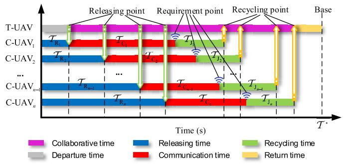  
Fig. 3. The Gantt chart of the time synchronization mechanism between C-UAVs and the T-UAV. T-UAV time serves as a synchronization timeline.

(1) The recycling strategy is that the earlier releasing occurs, the earlier recycling occurs. The initialized recycling sequence is the release order.

(2) The C-UAV that sends the recycling request first can jump the queue for recycling based on Rule 1. If two or more C-UAVs simultaneously send recycling requests, they will still follow the order of Rule 1.

(3) When no C-UAV sends a request, the T-UAV elongate length of trajectory around the preset recycling point and waits.

Time synchronization and real-time response mechanism is constructed to improve C-UAV recovery eficiency. The time of the T-UAV is taken as the reference time axis for time synchronization in Fig. 3. The subsequent recycling C-UAV needs to take the time point of successful recycling as the time synchronization node. Iterative response recycling is designed until all C-UAVs are recovered, and then the T-UAV returns to the base. The detailed process of UAV recovery is shown in Algorithm 2. Herein, $L _ { d _ { i T } }$ is the distance between the ith

53.4 (a) Staypoint   
53.2   
53   
Y(km) 52.8   
52.6 6   
5   
() 4r + 2π1   
52.4 4   
4   
52.2   
Adjustpoint 2 20 40 60 80   
A   
52   
30 30,2 30,4 30,6 30,8 31 31.2 31,4 31.6   
X(km)

Algorithm 2 Communication UAV Recycling   
Input: Real time position of T-UAV and C-UAV   
Output: Recycling point, recovery track, recovery time   
1: while $N _ { k } < K$ do   
2: Recycle C-UAV in order of request   
3: Detecte of the recovery conditions   
4: if $\mathcal T _ { R _ { i } } + \mathcal T _ { C _ { i } } > \mathcal T _ { J _ { i + 1 } }$ then   
5: >i + 1th C-UAV goes to the recovery point of ith   
6: else if ${ \mathcal T } _ { R _ { i } } + { \mathcal T } _ { C _ { i } } < { \mathcal T } _ { I _ { i + 1 } } + L _ { d _ { i T } } / \nu _ { T }$ then   
7: < /Encounter and skips the preset recycle point   
8: else   
9: T-UAV flies near the recycling point   
10: end if   
11: end while

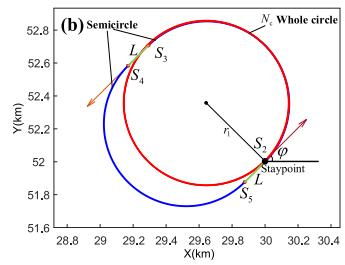  
Fig. 4. Staying time trajectory elongation planning algorithm. (a) Homotopic trajectory elongation method. (b) C-S elongation method. The blue line is a semicircular arc. The red line is the $N _ { c }$ whole circle. The green line L is a straight line. $\varphi = \pi / 4 , r _ { 1 } = 0 . 5$ km.

C-UAV and T-UAV. $N _ { k }$ is the number of UAVs that have been recycled.

The recycling process requires the T-UAV and the C-UAV to arrive at the designated recycling position at the same time. If the T-UAV arrives at the recovery point early, the trajectory elongation method is adopted to increase the stay time of the T-UAV, which is expressed as

$$
\mathcal { H } _ { e } = \mathcal { D } _ { c } ( A _ { 1 } , A _ { 2 } , \gamma _ { 1 } , \gamma _ { 2 } ) \cup \dots \cup \mathcal { D } _ { c } ( A _ { n } , S _ { 1 } , \gamma _ { 1 } , \gamma _ { 2 } ) ,\tag{13}
$$

where $A _ { 1 } , A _ { 2 }$ , and $A _ { n }$ are the adjustpoints. $S _ { 1 }$ is the staypoint.   
$\gamma _ { 1 }$ and $\gamma _ { 2 }$ are the motion angles of C-UAV at $A _ { 1 }$ and $S _ { 1 }$ .

A trajectory elongation algorithm is constructed to elongate the length range to contain [0, +∞]. The elongation algorithm can be represented by multi-segment Dubins trajectories as

$$
\mathcal { H } _ { e } = \left\{ \begin{array} { l l } { \mathcal { D } _ { c } ( A _ { 1 } , A _ { 2 } , 0 , 0 ) \cup \mathcal { D } _ { c } ( A _ { 2 } , S _ { 1 } , 0 , 0 ) , ~ \nu _ { \mathrm { T } } \mathcal { T } _ { e } < 2 \pi r _ { 1 } , } \\ { \qquad } \\ { \mathcal { D } _ { c } ( S _ { 2 } , S _ { 3 } , 0 , \pi ) \cup \mathcal { D } _ { c } ( S _ { 3 } , S _ { 4 } , \pi , \pi ) \cup } \\ { \mathcal { D } _ { c } ( S _ { 4 } , S _ { 5 } , \pi , 0 ) \cup \mathcal { D } _ { c } ( S _ { 5 } , S _ { 2 } , 0 , 0 ) \cup } \\ { \qquad \quad \nu _ { c } \cdot \mathcal { D } _ { c } ( S _ { 2 } , S _ { 2 } , 0 , 0 ) , \qquad \nu _ { \mathrm { T } } \mathcal { T } _ { e } \geq 2 \pi r _ { 1 } , } \end{array} \right.\tag{14}
$$

If the elongation distance is less than $2 \pi r _ { 1 }$ (stay time is less than or equal to $2 \pi r _ { 1 } / \nu _ { \mathrm { T } } )$ , the homotopic elongation is adopted π /in Fig. 4 (a). This homotopy $\mathcal { H } _ { e }$ is an injective function, and the continuous mapping space is $[ 4 r _ { 1 } , 4 r _ { 1 } + 2 \pi r _ { 1 } ]$

$$
\begin{array} { r } { \left\{ A _ { 1 } = S _ { 1 } - [ 4 r _ { 1 } , 0 ] , \qquad \quad \lambda _ { i } \in [ 0 , 1 ] \right. } \\ { \left. \left. A _ { 2 } = S _ { 1 } - [ 2 r _ { 1 } , \lambda _ { i } r _ { 1 } ] , \right. \qquad \quad \lambda _ { i } \in [ 0 , 1 ] \right. } \end{array}\tag{15}
$$

Otherwise, the multi-circle elongation method is adopted in Fig. 4 (b). The connection points and parameters are calculated as

$$
\begin{array} { r l } & { \left\{ \begin{array} { l l } { S _ { 3 } = S _ { 2 } + [ 0 , 2 r _ { 1 } ] , } \\ { S _ { 4 } = S _ { 3 } - [ L , 0 ] , } \\ { S _ { 5 } = S _ { 4 } - [ 0 , 2 r _ { 1 } ] . } \end{array} \right. } \\ & { \left\{ \begin{array} { l l } { L = \mathrm { m o d } ( \nu _ { \mathrm { T } } \mathcal { T } _ { e } , 2 \pi r _ { 1 } ) / 2 , } \\ { N _ { c } = ( \nu _ { \mathrm { T } } \mathcal { T } _ { e } - 2 L ) / 2 \pi r _ { 1 } - 1 } \end{array} \right. } \end{array}\tag{16}
$$

(17)

where mod(∼) is a function for solving remainder. $N _ { c }$ is the number of circles in a whole circle. $r _ { 1 }$ is the turning radius of T-UAV. $\mathcal { T } _ { e }$ is the stay time.

The elongation algorithm can be applied to general situations through transformation matrix. The transformation matrix includes translation and rotation. The matrix M is as

$$
\begin{array} { c } { { M = M _ { 1 } M _ { 2 } M _ { 3 } , } } \\ { { \mathrm { s u b j e c t ~ t o } } } \\ { { M _ { 1 } = \left[ \begin{array} { c } { { 1 \ 0 \ t _ { x } } } \\ { { 0 \ 1 \ t _ { y } } } \\ { { 0 \ 0 \ 1 } } \end{array} \right] , \quad M _ { 3 } = \left[ \begin{array} { c } { { 1 \ 0 \ - t _ { x } } } \\ { { 0 \ 1 \ - t _ { y } } } \\ { { 0 \ 0 \ 1 } } \end{array} \right] , } } \\ { { M _ { 2 } = \left[ \begin{array} { c } { { \cos \varphi \ - \sin \varphi \ 0 } } \\ { { \sin \varphi \ \cos \varphi \ 0 } } \\ { { 0 \ \ 0 \ 1 } } \end{array} \right] } } \end{array}\tag{18}
$$

where $t _ { x }$ and $t _ { y }$ are the amount of translation in the $x -$ and y-axis. $\varphi$ is the rotation angle. $M _ { 1 }$ and $M _ { 3 }$ are translation matrices. $M _ { 2 }$ is the rotation matrix. The overall RCR framework is summarized in Algorithm 3.

Algorithm 3 Releasing-Collecting-Recycling Framework   
Input: Base H, terminals C, map M   
Output: T-UAV path, C-UAVs paths   
1: Generate DTSP path and point of releasing using Eq. (2)   
2: for i = 1 to K do   
3: Obtain the C-UAV path goto Algorithm 1   
4: end for   
5: while All communication UAVs are recycled do   
6: for i = 1 to K do   
7: Synchronize time goto Algorithm 2   
8: if Recovery state then   
9: Recycle C-UAV and goto next C-UAV   
10: else   
11: Recycle rendezvous path planning   
12: end if   
13: end for   
14: end while   
15: Return to the base

This algorithm is an ofline algorithm. Therefore, when the T-UAV and C-UAVs are dispatched to collect data, the number and trajectories are predetermined in the simulation.

## IV. EXPERIMENTAL RESULTS AND ANALYSIS

In this section, simulation results are presented to demonstrate the feasibility of the proposed algorithms. The $\tau ^ { * }$ and

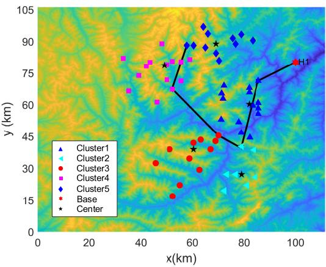  
Fig. 5. The cluster results of terminals and releasing path of T-UAV.

$K ^ { * }$ of the proposed RCR framework are sets of Pareto solutions. $K ^ { * }$ dominates the results of $\tau ^ { * }$ . We can temporarily fix the number of C-UAVs in the experimental process, which can provide a set of optimal solutions. The $N = 5 7$ communication ground terminals are distributed in a 3D map. The location of the Base is set as (100 km, 80 km). A T-UAV carries K C-UAVs to perform missions. The kinematic parameters of T-UAV and C-UAV are as follows: $r _ { 1 } = 0 . 5$ km, $r _ { 2 } = 0 . 1 5$ km, vT= 30 m/s, vC= 15 m/s $\nu _ { \mathrm { C } _ { z } } \mathrm { = 1 0 ~ m / s }$

## A. Multi-Target Task Allocation and C-UAV Releasing

The C-UAV release is the first step in the RCR framework. The proposed multi-height hierarchical target clustering (MHTC) algorithm to obtain the classification result of multiple communication terminals. The sum of Euclidean distance between terminals and cluster center has been reduced. Starting from the base, the next release point is the closest point in the next cluster from the current T-UAV position, and the release trajectory of the minimum turning radius constraint is obtained through the Dubins algorithm. The optimal release route of the Dubins communicator obtained from Eq. (2). The terminals are clustered and the multi-layer occupancy grid maps are constructed by the MHTC algorithm as shown in Fig. 5. Meanwhile, environmental terrain obstacle factors are considered an important input for classification. The members quantity of each group communication terminal by MHTC are 14, 7, 11, 14 and 11. The flight altitudes of each UAV are 3839 m, 3775 m, 4014 m, 4115 m, and 4116 m. The optimal release trajectory is planned by RPDTSP algorithm. The T-UAV begin at an altitude of 4500 m above the base.

## B. Data Collection by Ground-to-Air Communication

The data collection is the second step in the RCR framework. There are three stages in the whole DCDTSP solution process. The first stage is to find the optimal obstacle avoidance trajectory of the TSP using the proposed DAWPRM combined with the BACS algorithm. Unlike traditional TSP, the solution path of DCDTSP is a chain rather than a closed loop. The second stage is to solve the curvature-constrained trajectory of the obtained path using the coupled Dubins algorithm. The third stage is to adjust the trajectory appropriately by transmitting the feedback state to the base station. BACS and DAWPRM have been developed to enhance the calculation capabilities for obstacle avoidance. The path planning for communication between the communication UAV and the base station is solved based on the proposed BACS algorithm, and the obstacle avoidance path is planned by DAWPRM. The number of obstacle avoidance distance calculations is reduced by BACS. The best paths are shown in Fig. 6 (a1) to (e1). The transmission history curve of its communication data is shown in Fig. 6 (a2) to (e2). The iterative convergence process of BACS for obstacle avoidance is shown in Fig. 6 (a3) to (e3). According to the planned communication trajectory, the final actual communication flight trajectory is shown in Fig. 6 (a4) to (e4). The process of data transmission is the integration process of transmission rate with respect to time between the C-UAV and the ground terminal as shown in Fig. 7.

## C. Recycling Trajectories Planning of T-UAV and C-UAV

The recycling is the third step in the RCR framework. After all C-UAV releasing tasks are completed, C-UAV recycling are executed. According to the actual recycling request sequence, C-UAV recycling is carried out based on the proposed TSDRS. According to periodic time synchronization, when the T-UAV is carrying out the recycle task of a C-UAV, the next UAV that has made a recycle request will meet the T-UAV at the predetermined recycle location, thereby reducing waiting time and improving eficiency. The historical trajectory of the entire T-UAV and C-UAV are shown in Fig. 8.

The motion angles of T-UAV and C-UAV are complementary except at the original preset recycle point, that is $[ \lambda _ { 1 } , \lambda _ { 2 } ] = [ 0 \ 1 ]$ , the two UAVs are recycled face-to-face. The sequence of the UAVs requesting recycling is $S _ { R } = [ 2 \ 1 \ 3$ $5 \ 4 ] .$ . According to Fig. 8, it can be observed that the T-UAV releases the C-UAV at the release point. After completing the communication task, the UAV sends a recycle request and rises to the corresponding height. The T-UAV performs the C-UAV recycle task. After completing the recycling task, T-UAV returns to the base. During the entire task process, there are multiple relationships of parameter coupling. Too many clusters will result in a trajectory that is too long, while too few clusters will result in a waiting time for the T-UAV that is too long. Both scenarios will also impact the completion time of the task. By fixing clustering parameters, K is set to 3, 4, 5, and 6. The planning trajectories of C-UAV and T-UAV obtained from diferent cluster numbers are shown in Fig. 9.

## D. Compared With Previous Studies

Through 30 Monte Carlo experiments, the optimal value of $K { = } 5$ can be obtained by analyzing the staying time (ST) and task time (TT) of the T-UAV. ST is a subset of TT, as indicated by the experimental results. When $K = 5 ,$ , the waiting time is $6 9 3 9 . 5 \ \mathrm { s } ,$ which is 9213.3 s less than when $K \ = \ 4$ and 2063.0 s less than when $K \ = \ 6$ . The results have been shown in Fig. 10. The staying time accounted for 72.63 %, 64.46 %, 37.65 %, and 67.44 % of the total task time, respectively. The existing methods are not directly applicable to heterogeneous multi-UAV data collection, and traditional algorithms, such as k-means, ACS, and PRM, can only achieve partial functionality. Compared with [4], [13], and [18], the task time can be reduced by implementing a heterogeneous collaboration strategy that takes into account complex obstacle and communication bandwidth constraints. The proposed RCR framework has successfully achieved Dubins path planning in complex obstacle environments. The problem of short endurance in communication UAVs has been solved through heterogeneous collaboration.

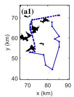

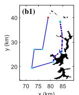

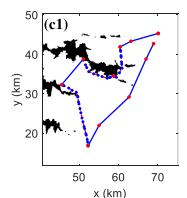

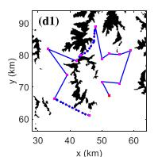

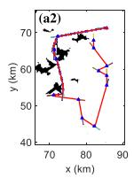

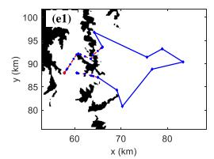

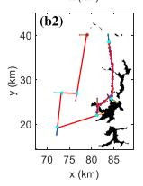

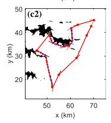

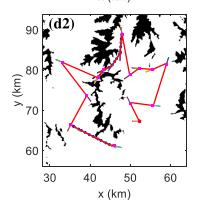

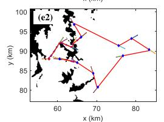

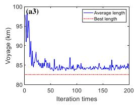

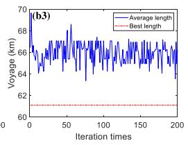

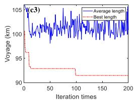

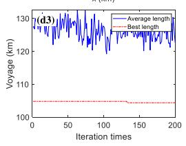

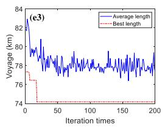

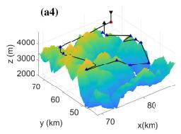

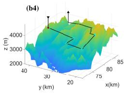

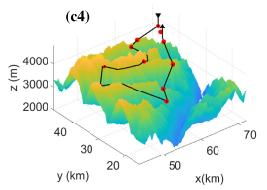

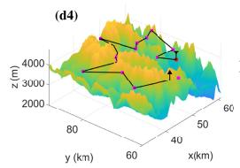

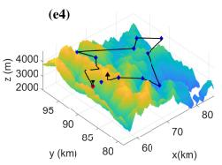

Fig. 6. Trajectories of total C-UAVs in the data process. (a1)-(e1) are the best paths. The inflated distance $I _ { d }$ is set as a single resolution (38.5 m). The stage of the DAWPRM selects suitable $\mathcal { P } _ { d }$ to avoid obstacles, which also afects the quality of subsequent Dubins trajectories. (a2)-(e2) are the transmission history curve paths. (a3)-(e3) are the iterative convergence process of BACS. The constraints of the Dubins path are that the $\mathcal { C } _ { s }$ and $\mathcal { C } _ { e }$ have an appropriate distance. The DCDTSP path voyages of five clusters are 77.19 km, 53.14 km, 88.32 km, 95.84 km, and 68.79 km. (a4)-(e4) are the final actual communication flight trajectory.  
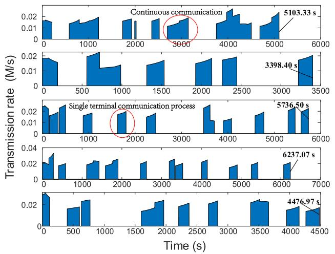  
Fig. 7. The multi-UAV data collection from communication terminals. When the transmission rate increases, the C-UAV is approaching the communication base station, and when the rate decreases, it is far away from the base station. The sudden change of rate indicates that the C-UAV is in the range where both base stations can communicate. The communication time are 5103.33 s, 3398.40 s, 5736.50 s, 6237.07 s, and 4476.97 s.

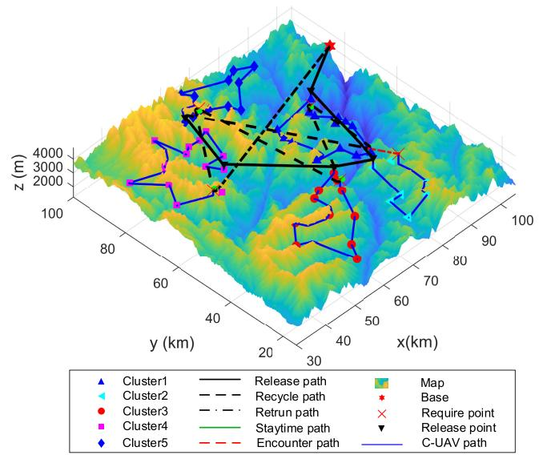  
Fig. 8. The multi-layer 3D Dubins path of C-UAVs and T-UAV. ST5 = 0 7061 × 104 s, TT5 = 1 8938 × 104 s.

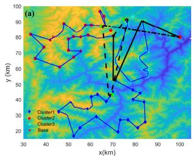

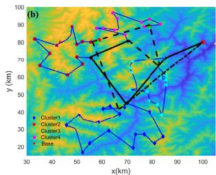

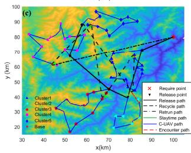

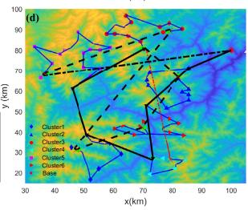  
Fig. 9. Vertical view trajectories of C-UAVs and T-UAV. (a)-(d) are planned trajectories corresponding to K=3,K=4, K=5, and K=6, respectively.

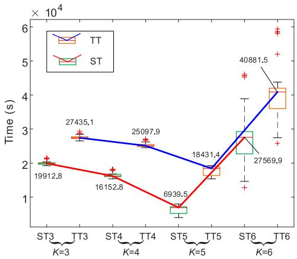  
Fig. 10. The T-UAV mission time box plots of diferent K. STK is the Kth staying time, and TTK is the Kth task time.

## V. CONCLUSION

In this work, we established a RCR framework for IoT network data collection with heterogeneous UAV-assisted. The eficiency of data collection can be improved by utilizing heterogeneous IoT for multi-target terminals. The simulation results demonstrate the efectiveness of the RCR framework in comparison to other traditional algorithms, including k-means, ACS, and PRM. The conclusions are as follows:

The optimal trajectories are planned based on the spatial distribution of service terminals, communication conditions, and obstacle constraints. The proposed MHTC algorithm improves the eficiency of releasing and recycling. The flight altitude of a C-UAV is determined by the maximum altitude of all communication terminal members within the cluster. The Pareto solution trajectory of UAV-based data collection is solved in terms of the number of cluster numbers K, task time T , environmental terrain, and terminal distribution. By adjusting other parameters and modifying the value of K, it is possible to achieve diferent task durations. If K is gradually increased, the task time will first decrease and then increase. To ensure the minimum number of clusters, the optimal solution is selected when K=5. The trajectory elongation algorithm can account for the staying time for diferent arc lengths. The experimental results show that the smaller the proportion of staying time, the shorter the overall task time. Therefore, the staying time is an important parameter and is influenced by the value of K in the recycling process.

## REFERENCES

[1] Z. Jia, Q. Wu, C. Dong, C. Yuen, and Z. Han, “Hierarchical aerial computing for Internet of Things via cooperation of HAPs and UAVs,” IEEE Internet Things J., vol. 10, no. 7, pp. 5676–5688, Apr. 2023.

[2] J. Fu, G. Sun, W. Yao, and L. Wu, “On trajectory homotopy to explore and penetrate dynamically of multi-UAV,” IEEE Trans. Intell. Transp. Syst., vol. 23, no. 12, pp. 24008–24019, Dec. 2022.

[3] M. Samir, C. Assi, S. Sharafeddine, D. Ebrahimi, and A. Ghrayeb, “Age of information aware trajectory planning of UAVs in intelligent transportation systems: A deep learning approach,” IEEE Trans. Veh. Technol., vol. 69, no. 11, pp. 12382–12395, Nov. 2020.

[4] X. Li, J. Tan, A. Liu, P. Vijayakumar, N. Kumar, and M. Alazab, “A novel UAV-enabled data collection scheme for intelligent transportation system through UAV speed control,” IEEE Trans. Intell. Transp. Syst., vol. 22, no. 4, pp. 2100–2110, Apr. 2021.

[5] Z. Cui, T. Yang, X. Wu, and B. Hu, “An air-ground coordinated sensing, relay and ofloading for emergency disposal in ITS system,” IEEE Trans. Intell. Transp. Syst., vol. 24, no. 11, pp. 13240–13249, Nov. 2023.

[6] Q. Wang, H. Wang, W. Sun, N. Zhao, H.-N. Dai, and W. Zhang, “Aerial bridge: A secure tunnel against eavesdropping in terrestrialsatellite networks,” IEEE Trans. Wireless Commun., vol. 22, no. 11, pp. 8096–8113, Nov. 2023.

[7] G. Li, B. He, Z. Wang, X. Cheng, and J. Chen, “Blockchain-enhanced spatiotemporal data aggregation for UAV-assisted wireless sensor networks,” IEEE Trans. Ind. Informat., vol. 18, no. 7, pp. 4520–4530, Jul. 2022.

[8] L. Shen, N. Wang, D. Zhang, J. Chen, X. Mu, and K. M. Wong, “Energyaware dynamic trajectory planning for UAV-enabled data collection in mMTC networks,” IEEE Trans. Green Commun. Netw., vol. 6, no. 4, pp. 1957–1971, Dec. 2022.

[9] Q. Wang, H.-N. Dai, Q. Wang, M. K. Shukla, W. Zhang, and C. G. Soares, “On connectivity of UAV-assisted data acquisition for underwater Internet of Things,” IEEE Internet Things J., vol. 7, no. 6, pp. 5371–5385, Jun. 2020.

[10] Z. Yang, J. Fu, Y. Sun, and Y. Li, “A pseudo-trajectory homotopy method for UMVs information collection IoT system with an underwater communication constraint,” IEEE Internet Things J., vol. 12, no. 20, pp. 43255–43267, Oct. 2025.

[11] J. Fu, G. Sun, J. Liu, W. Yao, and L. Wu, “On hierarchical multi-UAV Dubins traveling salesman problem paths in a complex obstacle environment,” IEEE Trans. Cybern., vol. 54, no. 1, pp. 123–135, Jan. 2024.

[12] W. Wang, N. Zhao, L. Chen, X. Liu, Y. Chen, and D. Niyato, “UAVassisted time-eficient data collection via uplink NOMA,” IEEE Trans. Commun., vol. 69, no. 11, pp. 7851–7863, Nov. 2021.

[13] A. I. Ameur, O. S. Oubbati, A. Lakas, A. Rachedi, and M. B. Yagoubi, “Eficient vehicular data sharing using aerial P2P backbone,” IEEE Trans. Intell. Vehicles, vol. 10, no. 1, pp. 413–426, Jan. 2025.

[14] Z. Zhang, H. Liu, M. Zhou, and J. Wang, “Solving dynamic traveling salesman problems with deep reinforcement learning,” IEEE Trans. Neural Netw. Learn. Syst., vol. 34, no. 4, pp. 2119–2132, Apr. 2023.

[15] Y. Hu, Y. Yao, Q. Ren, and X. Zhou, “3D multi-UAV cooperative velocity-aware motion planning,” Future Gener. Comput. Syst., vol. 102, pp. 762–774, Jan. 2020.

[16] J. Drchal, J. Faigl, and P. Vana, “WiSM: Windowing surrogate model for evaluation of curvature-constrained tours with Dubins vehicle,” IEEE Trans. Cybern., vol. 52, no. 2, pp. 1302–1311, Feb. 2022.

[17] J. Fu, H. Zhu, K. Zhang, T. Ma, J. Liu, and Y. Li, “Online exploratory coverage path planning of incremental SLAM for autonomous vehicles,” IEEE Trans. Ind. Informat., early access, Nov. 26, 2025, doi: 10.1109/ TII.2025.3632027.

[18] K. Messaoudi, A. Baz, O. Sami Oubbati, A. Rachedi, T. Bendouma, and M. Atiquzzaman, “UGV charging stations for UAV-assisted AoI-aware data collection,” IEEE Trans. Cognit. Commun. Netw., vol. 10, no. 6, pp. 2325–2343, Dec. 2024.

[19] C. Dutriez, O. S. Oubbati, C. Gueguen, and A. Rachedi, “Energy eficiency relaying election mechanism for 5G Internet of Things: A deep reinforcement learning technique,” in Proc. IEEE Wireless Commun. Netw. Conf. (WCNC), Apr. 2024, pp. 1–6.

[20] M. Sun, X. Xu, X. Qin, and P. Zhang, “AoI-energy-aware UAVassisted data collection for IoT networks: A deep reinforcement learning method,” IEEE Internet Things J., vol. 8, no. 24, pp. 17275–17289, Dec. 2021.

[21] W. Wu, S. Sun, F. Shan, M. Yang, and J. Luo, “Energy-constrained UAV flight scheduling for IoT data collection with 60 GHz communication,” IEEE Trans. Veh. Technol., vol. 71, no. 10, pp. 10991–11005, Oct. 2022.

[22] N. H. Chu, D. T. Hoang, D. N. Nguyen, N. Van Huynh, and E. Dutkiewicz, “Joint speed control and energy replenishment optimization for UAV-assisted IoT data collection with deep reinforcement transfer learning,” IEEE Internet Things J., vol. 10, no. 7, pp. 5778–5793, Apr. 2023.

[23] L. Shen et al., “UAV-enabled data collection over clustered machine-type communication networks: AEM modeling and trajectory planning,” IEEE Trans. Veh. Technol., vol. 71, no. 9, pp. 10016–10032, Sep. 2022.

[24] J. Fu et al., “Multirobot cooperative path optimization approach for multiobjective coverage in a congestion risk environment,” IEEE Trans. Syst., Man, Cybern., Syst., vol. 54, no. 3, pp. 1816–1827, Mar. 2024.

[25] N. Zhao et al., “UAV-assisted emergency networks in disasters,” IEEE Wireless Commun., vol. 26, no. 1, pp. 45–51, Feb. 2019.

[26] Z. Wang, R. Liu, Q. Liu, J. S. Thompson, and M. Kadoch, “Energyeficient data collection and device positioning in UAV-assisted IoT,” IEEE Internet Things J., vol. 7, no. 2, pp. 1122–1139, Feb. 2020.

[27] J. Ny, E. Feron, and E. Frazzoli, “On the Dubins traveling salesman problem,” IEEE Trans. Autom. Control, vol. 57, no. 1, pp. 265–270, Jan. 2012.

[28] A. Colorni, M. Dorigo, V. Maniezzo, F. J. Varela, and P. Bourgine, “Distributed optimization by ant colonies,” in Proc. Eur. Conf. Artif. Life, 1992, pp. 134–142.

[29] X. Wang, T.-M. Choi, H. Liu, and X. Yue, “Novel ant colony optimization methods for simplifying solution construction in vehicle routing problems,” IEEE Trans. Intell. Transp. Syst., vol. 17, no. 11, pp. 3132–3141, Nov. 2016.

[30] X. Zhang, Z.-H. Zhan, W. Fang, P. Qian, and J. Zhang, “Multipopulation ant colony system with knowledge-based local searches for multiobjective supply chain configuration,” IEEE Trans. Evol. Comput., vol. 26, no. 3, pp. 512–526, Jun. 2022.

[31] W.-N. Chen, D.-Z. Tan, Q. Yang, T. Gu, and J. Zhang, “Ant colony optimization for the control of pollutant spreading on social networks,” IEEE Trans. Cybern., vol. 50, no. 9, pp. 4053–4065, Sep. 2020.

[32] H. Yang, J. Qi, Y. Miao, H. Sun, and J. Li, “A new robot navigation algorithm based on a double-layer ant algorithm and trajectory optimization,” IEEE Trans. Ind. Electron., vol. 66, no. 11, pp. 8557–8566, Nov. 2019.

[33] C. Fahy, S. Yang, and M. Gongora, “Ant colony stream clustering: A fast density clustering algorithm for dynamic data streams,” IEEE Trans. Cybern., vol. 49, no. 6, pp. 2215–2228, Jun. 2019.

[34] X. Yu, W.-N. Chen, T. Gu, H. Yuan, H. Zhang, and J. Zhang, “ACO—A: Ant colony optimization plus A for 3-D traveling in environments with dense obstacles,” IEEE Trans. Evol. Comput., vol. 23, no. 4, pp. 617–631, Aug. 2019.

[35] J. D. Marble and K. E. Bekris, “Asymptotically near-optimal planning with probabilistic roadmap spanners,” IEEE Trans. Robot., vol. 29, no. 2, pp. 432–444, Apr. 2013.

[36] Z. Yao and K. Gupta, “Distributed roadmaps for robot navigation in sensor networks,” IEEE Trans. Robot., vol. 27, no. 5, pp. 997–1004, Oct. 2011.

[37] R. Sandstrom, D. Uwacu, J. Denny, and N. M. Amato, “Topology-¨ guided roadmap construction with dynamic region sampling,” IEEE Robot. Autom. Lett., vol. 5, no. 4, pp. 6161–6168, Oct. 2020.

[38] A. Francis et al., “Long-range indoor navigation with PRM-RL,” IEEE Trans. Robot., vol. 36, no. 4, pp. 1115–1134, Aug. 2020.

[39] J. Faigl and P. Vana, “Surveillance planning with bzier curves,” IEEE Robot. Autom. Lett., vol. 3, no. 2, pp. 750–757, Apr. 2018.

[40] J. Fu, W. Yao, G. Sun, H. Tian, and L. Wu, “An FTSA trajectory elliptical homotopy for unmanned vehicles path planning with multi-objective constraints,” IEEE Trans. Intell. Vehicles, vol. 8, no. 3, pp. 2415–2425, Mar. 2023.

[41] Y. Ding, B. Xin, L. Dou, J. Chen, and B. M. Chen, “A memetic algorithm for curvature-constrained path planning of messenger UAV in air-ground coordination,” IEEE Trans. Autom. Sci. Eng., vol. 19, no. 4, pp. 3735–3749, Oct. 2022.

[42] H. Hu, K. Xiong, G. Qu, Q. Ni, P. Fan, and K. B. Letaief, “AoI-minimal trajectory planning and data collection in UAV-assisted wireless powered IoT networks,” IEEE Internet Things J., vol. 8, no. 2, pp. 1211–1223, Jan. 2021.

[43] J. Fu, W. Yao, G. Sun, J. Liu, and L. Wu, “Full coverage path planning recombination framework for unmanned vehicles with multi-objective constraints,” IEEE Trans. Ind. Electron., vol. 71, no. 8, pp. 9276–9286, Aug. 2024.

Jinyu Fu (Member, IEEE) received the B.S. degree in automation from Dalian University, Dalian, China, in 2016, the M.S. degree in navigation science and technology from Dalian Maritime University, Dalian, in 2019, and the Ph.D. degree in control science and engineering from Harbin Institute of Technology, Harbin, China, in 2023.

He is currently an Associate Research Fellow and the Assistant Director of the National Key Laboratory of Autonomous Marine Vehicle Technology and the College of Shipbuilding Engineering, Harbin

Engineering University. He has been selected for the Young Elite Scientist Sponsorship (YESS) Program by CAST. His current research interests include mission planning of multirobot and intelligent transportation systems.

Dr. Fu is a peer reviewer of IEEE TRANSACTIONS ON ROBOTICS, IEEE TRANSACTIONS ON INDUSTRIAL INFORMATICS, and various international journals.

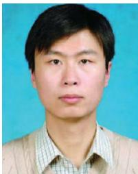

Guanghui Sun (Senior Member, IEEE) received the B.S. degree in automation and the M.S. and Ph.D. degrees in control science and engineering from Harbin Institute of Technology, Harbin, China, in 2005, 2007, and 2010, respectively.

He is currently a Professor wth the Department of Control Science and Engineering, Harbin Institute of Technology. His research interests include fractional order systems, nonlinear control systems, and sliding mode control.

Weiran Yao (Member, IEEE) received the bachelor’s (Hons.), master’s, and Ph.D. degrees in aeronautical and astronautical science and technology from the School of Astronautics, Harbin Institute of Technology (HIT), Harbin, China, in 2013, 2015, and 2020, respectively.

He is currently a Professor with the School of Astronautics, HIT. His research interests include unmanned vehicles and multi-agent control systems.

Chengwei Wu (Member, IEEE) received the B.S. degree in management from the Arts and Science College, Bohai University, Jinzhou, China, in 2013, the M.S. degree from Bohai University in 2016, and the Ph.D. degree in control science and engineering from Harbin Institute of Technology, Harbin, China, in 2021.

He is currently an Associate Professor with Harbin Institute of Technology. His research interests include sliding mode control, reinforcement learning, and networked control systems.

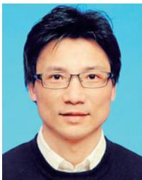

Ligang Wu (Fellow, IEEE) received the B.S. degree in automation from Harbin University of Science and Technology, China, in 2001, and the M.E. degree in navigation guidance and control and the Ph.D. degree in control theory and control engineering from Harbin Institute of Technology, China, in 2003 and 2006, respectively.

He is currently a Professor with Harbin Institute of Technology. His current research interests include intelligent robotic and autonomous systems. He has been a Highly Cited Researcher since 2015. He also

serves as an Associate Editor for several journals, including IEEE TRANSAC-TIONS ON AUTOMATIC CONTROL, IEEE TRANSACTIONS ON INDUSTRIAL ELECTRONICS, and IEEE/ASME TRANSACTIONS ON MECHATRONICS.