IEEE TRANSACTIONS ON INTELLIGENT TRANSPORTATION SYSTEMS

# Dwell-Time-Constrained Joint Task Ofloading and Resource Allocation for Multi-Layer Aerial Vehicular Edge Computing Networks

Yue Zhang , Student Member, IEEE, Zhenyu Na , Member, IEEE, Laiwei Jiang , Member, IEEE, Arumugam Nallanathan , Fellow, IEEE, and Xin Liu , Senior Member, IEEE

Abstract—The rapid advancement of autonomous driving technologies has imposed stringent requirements on low-latency and high-reliability computation, which often exceed the capabilities of onboard processors. Vehicular edge computing (VEC) provides a promising solution by ofloading computation to external servers; however, terrestrial infrastructure sufers from fragmented coverage and limited scalability, particularly in highway and rural scenarios. To address these limitations, this paper considers a multi-layer aerial VEC network integrating a highaltitude platform and multiple unmanned aerial vehicles (UAVs) to jointly provide wide-area coverage and proximity services. Diferent from existing works that primarily focus on latency minimization under homogeneous resources, this paper explicitly models the heterogeneous leasing pricing of aerial platforms and investigates its impact on task ofloading decisions. A joint task ofloading and resource allocation problem is formulated to minimize the total system cost, defined as a weighted combination of latency and economic expenditure. To ensure the feasibility of UAV-assisted ofloading under high mobility, a dwell-time constraint is incorporated to restrict task execution within the efective service duration. The resulting problem is formulated as a mixed-integer nonlinear programming problem, which is solved via a low-complexity iterative algorithm based on Lagrangian duality, linear relaxation, and the alternating direction method of multipliers. Simulation results demonstrate that the proposed scheme achieves significant cost reduction compared with benchmark strategies, especially under high-mobility conditions.

Index Terms—High-altitude platform, unmanned aerial vehicle, vehicular edge computing, task ofloading, resource allocation.

## I. INTRODUCTION

forming the automotive industry, evolving from simple driver assistance to fully automated systems [1]. However, enabling high-level autonomy necessitates the execution of mission-critical tasks—such as real-time object detection, simultaneous localization and mapping, and dynamic path planning—with stringent millisecond-level latency requirements. Achieving such responsiveness demands onboard computing power on the order of 1000 tera operations per second (TOPS) [2]. In stark contrast, current vehicle-mounted processors typically ofer only 50 to 100 TOPS, creating a substantial performance gap. Bridging this gap solely through hardware upgrades is impractical, as high-end processors introduce prohibitive energy and thermal overheads. For instance, a high-performance computing module consuming 2 kW can reduce the driving range of an electric vehicle by up to 25% under urban driving conditions [3]. Consequently, there is an urgent need to augment vehicular intelligence by leveraging external computing resources.

To alleviate these computational bottlenecks, vehicular edge computing (VEC) has emerged as a promising paradigm, enabling the ofloading of tasks to proximate edge servers, such as roadside units (RSUs) [4]. Despite its potential, however, terrestrial VEC infrastructure confronts fundamental limitations that hinder ubiquitous service provisioning. First, the communication range of RSUs is typically confined to 300-500 m, resulting in fragmented coverage that is often restricted to urban intersections while leaving extensive blind spots along highways and in rural areas [5]. Second, in complex environments, signal blockage and non-line-ofsight (NLoS) propagation frequently degrade link reliability. Furthermore, the substantial deployment cost of RSUs, potentially exceeding \$50 000 per unit, renders continuous coverage along extended transportation corridors economically prohibitive [6], [7]. Finally, the fixed nature of ground infrastructure renders it vulnerable to physical damage and power outages during natural disasters, precisely when resilient computational support is most critical.

TABLE I  
COMPARISON OF OUR WORK WITH RELATED STUDIES
<table><tr><td>Reference</td><td>[16]</td><td>[17]</td><td>[18]</td><td>[19], [32]</td><td>[22], [25]</td><td>[23]</td><td>[24]</td><td>[26]</td><td>[27]</td><td>[28]</td><td>[29]</td><td>[30]</td><td>[31]</td><td>[33], [34]</td><td>[35]</td><td>[36]</td><td>Our Work</td></tr><tr><td>Multi-layer aerial architecture</td><td></td><td></td><td></td><td>1</td><td>×</td><td>×</td><td>×</td><td>×</td><td>×</td><td>×</td><td>×</td><td>×</td><td>×</td><td>×</td><td>×</td><td>×</td><td>√</td></tr><tr><td>Dwell-time constraint</td><td>√</td><td></td><td>×</td><td>√</td><td>×</td><td>×</td><td>×</td><td>×</td><td>×</td><td>×</td><td>√</td><td>√</td><td>√</td><td>×</td><td>×</td><td>×</td><td>√</td></tr><tr><td>Pricing asymmetry</td><td></td><td></td><td></td><td></td><td>–</td><td></td><td></td><td>一</td><td></td><td></td><td></td><td>1</td><td></td><td>×</td><td>×</td><td>√</td><td>√</td></tr><tr><td>UAV energy constraint</td><td></td><td></td><td></td><td></td><td>×</td><td>√</td><td>√</td><td>×</td><td>了</td><td>×</td><td>×</td><td>×</td><td></td><td>√</td><td>×</td><td>√</td><td>√</td></tr><tr><td>VU energy constraint</td><td></td><td></td><td>√</td><td>×</td><td>√</td><td>×</td><td>×</td><td>一</td><td></td><td>×</td><td>×</td><td>×</td><td>√</td><td>■</td><td>√</td><td>√</td><td>√</td></tr><tr><td>Bidirectional highways</td><td>×</td><td></td><td>√</td><td>√</td><td>×</td><td>×</td><td>√</td><td>×</td><td>×</td><td>×</td><td>×</td><td>V</td><td>×</td><td>×</td><td>×</td><td>√</td><td>√</td></tr></table>

Recognizing these infrastructural deficits, multi-layer aerial computing architectures—integrating high-altitude platforms (HAPs) and unmanned aerial vehicles (UAVs)—have garnered significant attention as a resilient alternative [8]. In this heterogeneous ecosystem, the two platforms play complementary roles: HAPs, operating in the stratosphere, ofer stable, wide-area line-of-sight (LoS) connectivity [9], whereas UAVs, deployed at lower altitudes, provide agile, proximitybased services with reduced transmission latency [10]. This hierarchical structure efectively synergizes the ubiquity of HAPs with the flexibility of UAVs, holding immense potential for delivering continuous and robust VEC services across diverse trafic scenarios.

To address the above challenges, this paper develops a costeficient solution for multi-layer aerial VEC in bidirectional highway scenarios. By explicitly capturing the interaction among resource heterogeneity, vehicular mobility, and service feasibility constraints, the proposed design enables an efective tradeof between latency performance and economic expenditure. The main contributions of this paper are summarized as follows.

Despite these advancements, existing studies often rely on simplified mobility assumptions and homogeneous resource models, which fail to capture the complexity of realistic highway environments [11]. In practice, bidirectional multilane trafic introduces significant spatial-temporal variability, leading to dynamic and uneven service demand. This setting gives rise to three critical challenges. First, the pricing heterogeneity between the HAP and UAVs necessitates cost-aware decision-making, a dimension often overlooked in latencycentric studies [12], [13]. Second, due to the limited coverage of UAVs and high vehicular mobility, the available service duration becomes a key factor afecting ofloading feasibility, as tasks assigned to UAVs may not be completed within the efective contact time [14]. Third, UAVs and vehicles operate under strict energy constraints, which further restrict the resource allocation space and system sustainability [15]. These coupled challenges necessitate a unified optimization framework that jointly considers mobility-induced service constraints, resource heterogeneity, and economic factors. To facilitate a clear comparison with existing works, Table I summarizes representative studies and highlights the key distinctions of the proposed design.

Cost-aware multi-layer aerial VEC architecture. We develop a multi-layer aerial VEC architecture for bidirectional highway scenarios, where an HAP and multiple UAVs jointly provide wide-area and proximity services. The heterogeneous coverage and pricing characteristics of diferent aerial platforms are explicitly captured, enabling cost-aware service provisioning.

TABLE II  
KEY NOTATION
<table><tr><td>Notation</td><td>Description</td></tr><tr><td> $K , \kappa$ </td><td>Number and set of VUs</td></tr><tr><td> $J , \mathcal { T }$ </td><td>Number and set of lanes</td></tr><tr><td> $w , v _ { k }$ </td><td>Lane width and speed of VU k</td></tr><tr><td> $\mathbf { w } _ { \mathrm { U } } , \mathbf { w } _ { \mathrm { H } }$ </td><td>3D coordinates of UAV and HAP</td></tr><tr><td> $R _ { \mathrm { c o v } }$ </td><td>Coverage radius of UAV</td></tr><tr><td> $T ^ { \mathrm { d w e l l } }$   $\boldsymbol { \mathscr { I } } _ { k , \mathrm { U } } ^ { \mathrm { e } }$ </td><td>Dwell time of VU k within UAV coverage</td></tr><tr><td> $d _ { k , \mathrm { U } } , d _ { k , \mathrm { H } }$ </td><td>Distances from VU k to aerial platforms</td></tr><tr><td> $f _ { c } , W _ { \mathrm { U } } , W _ { \mathrm { H } }$ </td><td>Carrier frequency and bandwidths</td></tr><tr><td> $\alpha _ { \mathrm { P L } }$ </td><td>Path loss exponent</td></tr><tr><td> $\sigma ^ { 2 }$ </td><td>Noise power</td></tr><tr><td> $G$ </td><td>HAP directional antenna gain</td></tr><tr><td> $\boldsymbol { \theta } _ { k , \mathrm { U } }$ </td><td>Elevation angle from VU k to UAV</td></tr><tr><td> $\chi _ { 1 } , \chi _ { 2 }$ </td><td>Environment-specific LoS probability parameters</td></tr><tr><td> $K _ { c }$ </td><td>Rician K-factor for HAP link</td></tr><tr><td> $p _ { k }$ </td><td>Transmit power of VU k</td></tr><tr><td> $L _ { k } ( d _ { k } , c _ { k } )$ </td><td>Task tuple (data size, computation intensity)</td></tr><tr><td> $\psi _ { k , \mathrm { U } } , \varpi _ { k , \mathrm { H } }$ </td><td>Binary offloading decisions</td></tr><tr><td> $\alpha _ { k , \mathrm { U } } , \beta _ { k , \mathrm { H } }$ </td><td>Bandwidth allocation ratios</td></tr><tr><td> $f _ { k , \mathrm { U } } , f _ { k , \mathrm { H } }$ </td><td>Allocated computation resources</td></tr><tr><td> $F _ { \mathrm { U } } ^ { \mathrm { i n a x } } , \ : F _ { \mathrm { H } } ^ { \mathrm { m a x } }$ </td><td>Maximum computation capacities</td></tr><tr><td> $N _ { \mathrm { m a x } }$ </td><td>Maximum concurrent VUs at UAV</td></tr><tr><td>κ</td><td>Effective switched capacitance coefficient</td></tr><tr><td> $E _ { \boldsymbol { k } } ^ { \mathrm { m a x } } , E _ { \textrm { I I } } ^ { \mathrm { m a x } }$ </td><td>Residual energy budgets of VU k and UAV</td></tr><tr><td> $P _ { \mathrm { ~ \tiny ~ r ~ / ~ } } ^ { \mathrm { \tiny ~ f ^ { \nu } ~ o v e r } }$ </td><td>UAV hovering power consumption</td></tr><tr><td> $\tilde { P } _ { \mathrm { U } } , \tilde { P } _ { \mathrm { H } }$ </td><td>Unit price per CPU cycle at UAV and HAP</td></tr><tr><td> $\omega _ { 1 } , \omega _ { 2 }$ </td><td>Weighting factors for latency and expenditure</td></tr></table>

• Joint ofloading and resource allocation under mobility constraints. We formulate a mixed-integer nonlinear programming (MINLP) problem to minimize the total system cost, defined as the weighted sum of task latency and leasing expenditure. A dwell-time-based feasibility constraint is introduced to ensure that UAV-assisted ofloading decisions remain valid under high mobility, while resource coupling constraints across communication, computation, and energy are jointly incorporated.

• Low-complexity algorithm design and performance validation. We develop an eficient iterative algorithm based on block coordinate descent (BCD), where the original problem is decomposed into tractable subproblems and solved via Lagrangian duality, linear relaxation, and the alternating direction method of multipliers (ADMM). Simulation results demonstrate that the proposed scheme reduces the total system cost by 8.26% to 58.11% relative to benchmark strategies.

The remainder of this paper is organized as follows. Section II reviews related works, while Section III presents the system model. The optimization problem is formulated in Section IV, followed by the solution algorithms in Section V. Simulation results are provided in Section VI. Finally, Section VII concludes the paper and outlines future research directions. Table II lists the key notations used throughout this paper.

## II. RELATED WORKS

## A. Ground-Based VEC

Early research in VEC primarily relies on ground-based infrastructures, particularly RSUs, as the backbone for computation ofloading. A major research focus lies in the joint optimization of task scheduling and resource allocation. For example, Nan et al. [16] jointly optimized ofloading decisions, uplink bandwidth, and RSU-side computation resources while explicitly considering result feedback latency. Beyond latency, energy sustainability has also been investigated. Zhang et al. [17] proposed an energy-information collaboration framework in which RSUs mitigate energy shortages via task migration and microgrid energy trading. To improve system flexibility, mobile resources have been incorporated into VEC systems. Fan et al. [18] utilized vehicle-to-vehicle communication to ofload tasks to idle vehicles, while Yue et al. [19] leveraged connected and automated vehicles as transient computing nodes in mixed trafic environments. However, such designs inherently depend on the stochastic availability of neighboring vehicles, leading to unstable service quality. Deployment strategies have also been studied to enhance coverage and reliability. Yu et al. [20] optimized RSU placement based on trafic demand, while Liang et al. [21] further incorporated stochastic failures into deployment design.

Despite these eforts, ground-based VEC remains fundamentally constrained by limited communication range, high deployment expenditure, and reduced service availability in high-mobility scenarios, particularly along highways and rural areas. These limitations motivate the integration of aerial platforms to provide wide-area and flexible computing services.

## B. UAV-Enabled VEC

UAV-enabled VEC has emerged as a flexible paradigm to extend service coverage and provide proximity-based computation resources. Early studies mainly focused on single-UAV systems. Song et al. [22] employed UAVs as aerial relays to mitigate NLoS transmission issues and adopted deep reinforcement learning for ofloading decisions. Liu et al. [23] investigated UAV-assisted VEC with wireless power transfer to sustain UAV operation under energy constraints. To improve service capability, multi-UAV collaborative designs have been further explored. Liu et al. [24] developed a cost-eficient UAV deployment strategy with caching capabilities, while Li et al. [25] proposed a federated meta-learning scheme for distributed model training across UAVs. In addition, UAV placement and trajectory design have been optimized to improve communication and computation eficiency [26], [27].

Despite these advances, UAV-enabled VEC remains fundamentally constrained by limited onboard computation capacity, finite energy supply, and localized service coverage. These limitations restrict its ability to provide stable and scalable services in large-scale vehicular environments. As a result, relying solely on UAVs is insuficient for supporting persistent and wide-area vehicular computing, motivating the integration of HAPs as complementary aerial platforms.

## C. HAP-Enabled and Multi-Layer VEC

To overcome the limitations of UAV-only systems, HAPs have been introduced into VEC architectures to provide wide-area coverage and enhanced computation capability. Ren et al. [28] proposed a three-tier architecture integrating vehicles, RSUs, and HAPs, where task execution depends on cached data availability. Their subsequent work [29] further enabled task partitioning across layers to improve resource utilization. Other studies [30], [31] explored collaborative mechanisms such as asynchronous scheduling and federated learning to enhance system robustness. More recently, multilayer aerial VEC architectures integrating HAPs and UAVs have been investigated. However, existing studies primarily focus on latency-oriented optimization or assume homogeneous resource characteristics, without explicitly modeling the economic diferences between aerial platforms [32], [33], [34]. In addition, while vehicular mobility is often considered at a high level, the impact of limited UAV service duration on ofloading feasibility is rarely incorporated into resource allocation decisions [35], [36].

Therefore, existing works still lack a unified optimization framework that jointly captures heterogeneous aerial pricing, UAV service feasibility under limited coverage duration, and multi-dimensional resource constraints. This gap motivates the proposed cost-aware ofloading and resource allocation scheme for multi-layer aerial VEC networks.

## III. SYSTEM MODEL

We consider a multi-layer aerial VEC network, as illustrated in Fig. 1, consisting of an HAP, multiple rotary-wing UAVs, and vehicle users (VUs) traveling along a bidirectional highway. UAVs are deployed over disjoint road segments to provide proximity-based computation services with limited coverage, while the HAP ofers wide-area service with global coverage. For analytical tractability, we focus on a representative UAV-covered segment and omit the UAV index without loss of generality. Let ${ \cal K } = \{ 1 , 2 , . . . , K \}$ denote the set of VUs within the considered UAV coverage. Each VU k generates a computation task $L _ { k } \ = \ ( d _ { k } , c _ { k } )$ , where $d _ { k }$ is the input data size and $c _ { k }$ is the required CPU cycles per bit. Due to limited onboard computation capability, each task is entirely ofloaded to either the UAV or the HAP. Let $\psi _ { k , \mathrm { U } } \in \{ 0 , 1 \}$ and $\varpi _ { k , \mathrm { H } } \in \{ 0 , 1 \}$ } denote the ofloading decisions, ψ ,with $\psi _ { k , \mathrm { U } } + \varpi _ { k , \mathrm { H } } = 1$ . All vehicle-to-aerial communications operate over a shared frequency band to enhance spectral eficiency. Due to the significant altitude diference between the UAV and the HAP, the large-scale path loss and directional transmission characteristics provide suficient spatial isolation, allowing inter-layer interference to be reasonably neglected. Under this assumption, each platform independently allocates its bandwidth, denoted by $W _ { \mathrm { U } }$ and $W _ { \mathrm { H } }$ , respectively. Within each layer, orthogonal frequency-division multiple access is adopted to mitigate intra-layer interference among VUs.

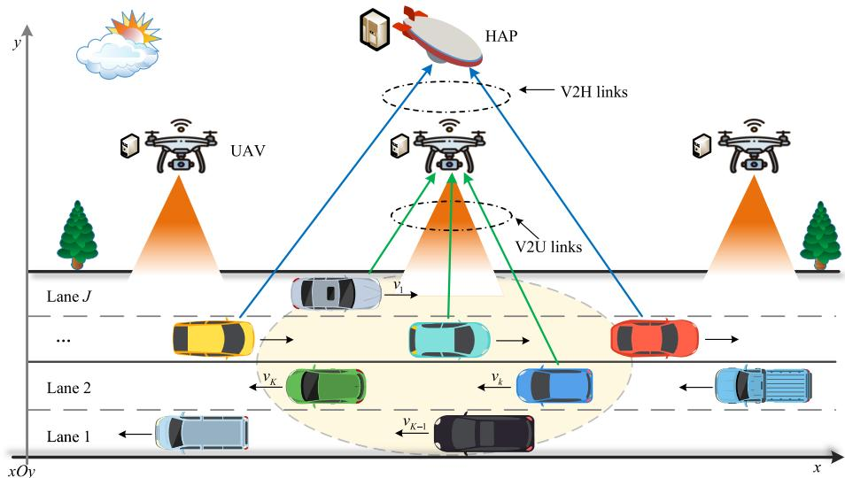  
Fig. 1. System model of the proposed multi-layer aerial VEC network.

## A. Vehicular Mobility and Communication Model

A three-dimensional Cartesian coordinate system is adopted, where the x-y plane represents the ground and the z-axis denotes altitude. The positions of the UAV and the HAP are denoted by ${ \bf w } _ { \mathrm { U } } = ( x _ { \mathrm { U } } , y _ { \mathrm { U } } , h _ { \mathrm { U } } ) ^ { \mathrm { T } }$ and ${ \bf w } _ { \mathrm { H } } = ( x _ { \mathrm { H } } , y _ { \mathrm { H } } , h _ { \mathrm { H } } ) ^ { \mathrm { T } }$ respectively. The highway consists of J parallel lanes aligned with the x-axis. Each VU k moves at a constant speed $\nu _ { k }$ along lane $j _ { k } \in \mathcal { I } .$ , with longitudinal position $x _ { k }$ and lateral position $\begin{array} { r } { y _ { k } = \left( j _ { k } - \frac { 1 } { 2 } \right) } \end{array}$ w. The altitude of all VUs is assumed to be zero. The Euclidean distances from VU k to the UAV and the HAP are defined as

$$
d _ { k , \mathrm { U } } = { \sqrt { ( x _ { \mathrm { U } } - x _ { k } ) ^ { 2 } + ( y _ { \mathrm { U } } - y _ { k } ) ^ { 2 } + h _ { \mathrm { U } } ^ { 2 } } } , \forall k ,\tag{1a}
$$

$$
d _ { k , \mathrm { H } } = { \sqrt { ( x _ { \mathrm { H } } - x _ { k } ) ^ { 2 } + ( y _ { \mathrm { H } } - y _ { k } ) ^ { 2 } + h _ { \mathrm { H } } ^ { 2 } } } , \forall k .\tag{1b}
$$

A VU is considered within UAV coverage if

$$
d _ { k , \mathrm { U } } \leq R _ { \mathrm { c o v } } , \forall k ,\tag{2}
$$

where $R _ { \mathrm { c o v } }$ denotes the UAV coverage radius.

Due to the limited coverage of UAVs and vehicular mobility, the available service duration becomes a critical factor in ofloading decisions. Specifically, tasks assigned to UAVs must be completed before the vehicle exits the coverage region. To capture this feasibility condition, we introduce a dwell-time constraint. The remaining distance from VU k to the UAV coverage boundary along its moving direction is

$$
\Pi _ { k , \mathrm { U } } = { \ { \sqrt { R _ { \mathrm { c o v } } ^ { 2 } - h _ { \mathrm { U } } ^ { 2 } - ( y _ { \mathrm { U } } - y _ { k } ) ^ { 2 } } } } + \mathrm { s g n } ( \nu _ { k } ) ( x _ { \mathrm { U } } - x _ { k } ) , \forall k ,\tag{3}
$$

where sgn(·) denotes the sign function. The corresponding dwell time is

$$
T _ { k , \mathrm { U } } ^ { \mathrm { d w e l l } } = \frac { \operatorname* { m a x } ( 0 , \Pi _ { k , \mathrm { U } } ) } { | \nu _ { k } | } , \forall k .\tag{4}
$$

1) Communication Model for V2U Links: The V2U link is subject to probabilistic LoS and NLoS propagation due to environmental blockage and multipath efects [37]. The channel condition depends on the elevation angle between VU k and the UAV. Specifically, the elevation angle (in degrees) is given by

$$
\theta _ { k , \mathrm { U } } = \frac { 1 8 0 } { \pi } \arcsin \left( \frac { h _ { \mathrm { U } } } { d _ { k , \mathrm { U } } } \right) , \forall k .\tag{5}
$$

The probabilities of LoS and NLoS conditions are modeled as

$$
\left\{ \begin{array} { l l } { \displaystyle \mathbb { P } _ { \mathrm { L o S } } ( \theta _ { k , \mathrm { U } } ) = \frac { 1 } { 1 + \chi _ { 1 } \exp \left( - \chi _ { 2 } ( \theta _ { k , \mathrm { U } } - \chi _ { 1 } ) \right) } } \\ { \displaystyle \mathbb { P } _ { \mathrm { N L o S } } ( \theta _ { k , \mathrm { U } } ) = 1 - \mathbb { P } _ { \mathrm { L o S } } ( \theta _ { k , \mathrm { U } } ) , } \end{array} \right.\tag{6}
$$

where $\chi _ { 1 }$ and $\chi _ { 2 }$ are environment-dependent parameters.

Under channel condition $\xi \in \{ \mathrm { L o S } , \mathrm { N L o S } \}$ , the path loss is expressed as

$$
L _ { k , \mathrm { U } } ^ { \xi } = \phi _ { \xi } \left( \frac { 4 \pi d _ { k , \mathrm { U } } f _ { c } } { c } \right) ^ { \alpha _ { \mathrm { P L } } } ,\tag{7}
$$

where $f _ { c }$ is the carrier frequency, c is the speed of light, $\alpha _ { \mathrm { P L } }$ is the path loss exponent, and $\phi _ { \xi }$ denotes the excessive attenuation factor under LoS or NLoS conditions. The average path loss is then obtained as

$$
\bar { L } _ { k , \mathrm { U } } = \mathbb { P } _ { \mathrm { L o S } } ( \theta _ { k , \mathrm { U } } ) L _ { k , \mathrm { U } } ^ { \mathrm { L o S } } + \mathbb { P } _ { \mathrm { N L o S } } ( \theta _ { k , \mathrm { U } } ) L _ { k , \mathrm { U } } ^ { \mathrm { N L o S } } , \forall k .\tag{8}
$$

The corresponding channel power gain is given by $G _ { k , \mathrm { U } } =$ $1 / \bar { L } _ { k , \mathrm { U } }$ . Accordingly, the achievable data rate from VU k to the UAV is expressed as

$$
R _ { k , \mathrm { U } } = \alpha _ { k , \mathrm { U } } W _ { \mathrm { U } } \log _ { 2 } \left( 1 + \frac { p _ { k } G _ { k , \mathrm { U } } } { \sigma ^ { 2 } } \right) , \forall k ,\tag{9}
$$

where $\alpha _ { k , \mathrm { U } } ~ \in ~ [ 0 , 1 ]$ is the bandwidth allocation ratio, $p _ { k }$ is the transmit power, and $\sigma ^ { 2 }$ denotes the noise power. The bandwidth allocation satisfies

$$
\sum _ { k = 1 } ^ { K } \psi _ { k , \mathrm { U } } \alpha _ { k , \mathrm { U } } \leq 1 .\tag{10}
$$

2) Communication Model for V2H Links: Due to the high altitude of the HAP, the V2H link is modeled as a LoSdominant channel with Rician small-scale fading [29]. The channel power gain is expressed as

$$
G _ { k , \mathrm { H } } = G \left( \frac { c } { 4 \pi d _ { k , \mathrm { H } } f _ { c } } \right) ^ { 2 } | g _ { k , \mathrm { H } } | ^ { 2 } , \forall k ,\tag{11}
$$

where $G$ is the directional antenna gain of the HAP. The smallscale fading coeficient $g _ { k , \mathrm { H } }$ follows a Rician distribution:

$$
g _ { k , \mathrm { H } } = \sqrt { \frac { K _ { c } } { K _ { c } + 1 } } h _ { \mathrm { L o S } } + \sqrt { \frac { 1 } { K _ { c } + 1 } } h _ { \mathrm { N L o S } } ,\tag{12}
$$

where $K _ { c }$ is the Rician K-factor, $h _ { \mathrm { { L o S } } }$ is the deterministic component, and $h _ { \mathrm { N L o S } } \sim \mathcal { C N } ( 0 , 1 )$ . The achievable data rate ,from VU k to the HAP is given by

$$
R _ { k , \mathrm { H } } = \beta _ { k , \mathrm { H } } W _ { \mathrm { H } } \log _ { 2 } \left( 1 + \frac { p _ { k } G _ { k , \mathrm { H } } } { \sigma ^ { 2 } } \right) , \forall k ,\tag{13}
$$

where $\beta _ { k , \mathrm { H } } \in [ 0 , 1 ]$ is the bandwidth allocation ratio satisfying

$$
\sum _ { k = 1 } ^ { K } \varpi _ { k , \mathrm { H } } \beta _ { k , \mathrm { H } } \le 1 .\tag{14}
$$

## B. Latency Model

The total latency of each task consists of transmission and computation phases. The latency associated with result downloading is omitted, consistent with standard assumptions in VEC literature [7], [11]. This is justified because the size of computation results is typically negligible compared to input data, and aerial platforms generally support high-capacity downlink transmission. The transmission latency for ofloading task $L _ { k }$ from VU k to the UAV is given by

$$
t _ { k , \mathrm { U } } ^ { \mathrm { t r } } = \frac { d _ { k } } { R _ { k , \mathrm { U } } } , \forall k ,\tag{15}
$$

while the transmission latency to the HAP is

$$
t _ { k , \mathrm { H } } ^ { \mathrm { t r } } = \frac { d _ { k } } { R _ { k , \mathrm { H } } } , \forall k .\tag{16}
$$

The computation latency at the UAV and the HAP is respectively expressed as

$$
t _ { k , \mathrm { U } } ^ { \mathrm { e x e } } = \frac { d _ { k } c _ { k } } { f _ { k , \mathrm { U } } } , \forall k ,\tag{17}
$$

$$
t _ { k , \mathrm { H } } ^ { \mathrm { e x e } } = \frac { d _ { k } c _ { k } } { f _ { k , \mathrm { H } } } , \forall k ,\tag{18}
$$

where $f _ { k , \mathrm { U } }$ and $f _ { k , \mathrm { H } }$ denote the computation resources allocated to VU k by the UAV and the HAP, respectively.

Due to the limited coverage of UAVs and high vehicular mobility, tasks assigned to the UAV must be completed within the available service duration. To ensure the feasibility of UAV-assisted ofloading, the following dwell-time constraint is imposed:

$$
\psi _ { k , \mathrm { U } } \left( t _ { k , \mathrm { U } } ^ { \mathrm { t r } } + t _ { k , \mathrm { U } } ^ { \mathrm { e x e } } \right) \leq T _ { k , \mathrm { U } } ^ { \mathrm { d w e l l } } , \forall k .\tag{19}
$$

## C. Energy Consumption Model

Given its stratospheric altitude and large surface area, the HAP benefits from sustained solar exposure and extensive battery reserves. Consistent with established literature [15], the HAP is modeled as an energy-unconstrained node throughout the service duration. Consequently, our energy consumption analysis focuses on the power-limited UAV and VUs.

1) Energy Consumption of VUs: The energy consumption of VU k is primarily determined by data transmission. The energy incurred for ofloading task $L _ { k }$ to the UAV and the HAP is respectively calculated as

$$
e _ { k , \mathrm { U } } ^ { \mathrm { t r } } = p _ { k } t _ { k , \mathrm { U } } ^ { \mathrm { t r } } = \frac { p _ { k } d _ { k } } { R _ { k , \mathrm { U } } } , \forall k ,\tag{20}
$$

$$
e _ { k , \mathrm { H } } ^ { \mathrm { t r } } = p _ { k } t _ { k , \mathrm { H } } ^ { \mathrm { t r } } = \frac { p _ { k } d _ { k } } { R _ { k , \mathrm { H } } } , \forall k ,\tag{21}
$$

The total energy consumption for VU k is thus

$$
E _ { k } = \psi _ { k , \mathrm { U } } e _ { k , \mathrm { U } } ^ { \mathrm { t r } } + \varpi _ { k , \mathrm { H } } e _ { k , \mathrm { H } } ^ { \mathrm { t r } } , \forall k .\tag{22}
$$

2) Energy Consumption of the UAV: For the UAV computation, energy consumption is modeled based on the CPU frequency, following the widely adopted dynamic power model of CMOS-based processors, where energy consumption is proportional to the cube of the CPU frequency [39], [40]. Specifically, it is given by

$$
E _ { \mathrm { U } } ^ { \mathrm { e x e } } = \sum _ { k = 1 } ^ { K } \psi _ { k , \mathrm { U } } \kappa ( f _ { k , \mathrm { U } } ) ^ { 3 } t _ { k , \mathrm { U } } ^ { \mathrm { e x e } } = \sum _ { k = 1 } ^ { K } \psi _ { k , \mathrm { U } } \kappa ( f _ { k , \mathrm { U } } ) ^ { 2 } d _ { k } c _ { k } ,\tag{23}
$$

where is the efective switched capacitance coeficient of the UAV processor. Regarding flight energy, we assume the system operates within a quasi-static decision epoch of duration T . The UAV must maintain stable hovering coverage throughout this period. According to momentum theory, the hovering power $\bar { P } _ { \mathrm { U } } ^ { \mathrm { h o v e r } }$ is determined by the aircraft’s physical parameters [38]. For a fixed altitude and payload, $P _ { \mathrm { U } } ^ { \mathrm { h o v e r } }$ can be regarded as a constant. Therefore, the hovering energy consumption during the decision epoch is $E _ { \mathrm { [ { J } } } ^ { \mathrm { { h o v e r } } } = P _ { \mathrm { [ { J } } } ^ { \mathrm { { h o v e r } } } T$ The total energy consumption of the UAV is $E _ { \mathrm { U } } = E _ { \mathrm { U } } ^ { \mathrm { e x e } } + E _ { \mathrm { U } } ^ { \mathrm { h o v e r } }$ To ensure operational sustainability, energy constraints are imposed as $E _ { k } \ \leq \ E _ { k } ^ { \mathrm { m a x } }$ for each VU and $E _ { \mathrm { U } } ~ \ \le ~ E _ { \mathrm { U } } ^ { \mathrm { m a x } }$ for the UAV, where $E _ { k } ^ { \mathrm { m a x } }$ and $E _ { \mathrm { U } } ^ { \mathrm { m a x } }$ represent the residual energy budgets for the current epoch, respectively.

## IV. PROBLEM FORMULATION

In this section, we formulate the joint optimization problem for the proposed multi-layer aerial VEC system. The objective is to minimize the total system cost, which includes both latency and expenditure, while satisfying the communication, computation, and energy constraints. The total latency for completing task $L _ { k }$ for VU k is given by

$$
T _ { k } ^ { \mathrm { t o t } } = \psi _ { k , \mathrm { U } } \left( t _ { k , \mathrm { U } } ^ { \mathrm { t r } } + t _ { k , \mathrm { U } } ^ { \mathrm { e x e } } \right) + \varpi _ { k , \mathrm { H } } \left( t _ { k , \mathrm { H } } ^ { \mathrm { t r } } + t _ { k , \mathrm { H } } ^ { \mathrm { e x e } } \right) , \forall k .\tag{24}
$$

Let $\tilde { P } _ { \mathrm { U } }$ and $\tilde { P } _ { \mathrm { H } }$ denote the unit prices charged per CPU cycle by the UAV and the HAP, respectively. The expenditure for VU $k ,$ incurred by leasing computation resources, is

$$
P _ { k } ^ { \mathrm { t o t } } = d _ { k } c _ { k } \left( \psi _ { k , \mathrm { U } } \tilde { P } _ { \mathrm { U } } + \varpi _ { k , \mathrm { H } } \tilde { P } _ { \mathrm { H } } \right) , \forall k .\tag{25}
$$

The total cost for VU k is then defined as

$$
C _ { k } = \omega _ { 1 } T _ { k } ^ { \mathrm { t o t } } + \omega _ { 2 } P _ { k } ^ { \mathrm { t o t } } , \forall k ,\tag{26}
$$

where $\omega _ { 1 }$ and $\omega _ { 2 }$ are non-negative weighting parameters. Although $T _ { k } ^ { \mathrm { t o t } }$ ωand $P _ { k } ^ { \mathrm { t o t } }$ have diferent physical units, the objective function is not intended to represent a physical quantity, but rather a dimensionless system-level cost index that captures the trade-of between service performance and economic expenditure. Such a formulation maps heterogeneous metrics into a unified decision criterion, which is a common practice in multi-objective optimization [24], [25].

The objective is to minimize the system cost by jointly optimizing the bandwidth allocation ratios $\alpha = \{ \alpha _ { k , \mathrm { U } } , \forall k \}$ and $\beta =$ $\{ \beta _ { k , \mathrm { H } } , \forall k \}$ , computation resource allocation $f = \{ f _ { k , \mathrm { U } } , f _ { k , \mathrm { H } } , \forall k \}$ and the binary ofloading decisions $\psi = \{ \psi _ { k , \mathrm { U } } , \forall k \}$ and $\varpi =$ $\{ \varpi _ { k , \mathrm { H } } , \forall k \}$ . The optimization problem is thus formulated as

$$
\begin{array} { r } { \mathcal { P } _ { 1 } : \quad \underset { \alpha , \beta , f , \psi , \varpi } { \operatorname* { m i n } } ~ et { } { ' } \sum _ { k = 1 } ^ { K } C _ { k } } \end{array}\tag{27a}
$$

$$
\mathrm { s . t . } \mathrm { C } 1 \colon \psi _ { k , \mathrm { U } } + \varpi _ { k , \mathrm { H } } = 1 , \ \forall k ,\tag{27b}
$$

$$
\mathrm { C 2 } \colon \psi _ { k , \mathrm { U } } , \varpi _ { k , \mathrm { H } } \in \{ 0 , 1 \} , ~ \forall k ,\tag{27c}
$$

$$
{ \mathrm { C } } 3 \colon \psi _ { k , \mathrm { U } } \left( t _ { k , \mathrm { U } } ^ { \mathrm { t r } } + t _ { k , \mathrm { U } } ^ { \mathrm { e x e } } \right) \leq T _ { k , \mathrm { U } } ^ { \mathrm { d w e l l } } , ~ \forall k ,\tag{27d}
$$

$$
{ \mathrm { C 4 : ~ } } \sum _ { k = 1 } ^ { K } \psi _ { k , \mathrm { U } } \alpha _ { k , \mathrm { U } } \leq 1 ,\tag{27e}
$$

$$
{ \mathrm { C } } 5 \colon 0 \leq \alpha _ { k , \mathrm { U } } \leq 1 , ~ \forall k ,\tag{27f}
$$

$$
{ \mathrm { C 6 } } \colon \sum _ { k = 1 } ^ { K } { \varpi _ { k , \mathrm { H } } \beta _ { k , \mathrm { H } } } \le 1 ,\tag{27g}
$$

$$
{ \mathrm { C 7 } } \colon 0 \leq \beta _ { k , \mathrm { H } } \leq 1 , \ \forall k ,\tag{27h}
$$

$$
\begin{array} { r } { \mathbf { C 8 : \sum } \sum _ { k = 1 } ^ { K } { \psi _ { k , \mathrm { U } } f _ { k , \mathrm { U } } } \leq F _ { \mathrm { U } } ^ { \operatorname* { m a x } } , } \end{array}\tag{27i}
$$

$$
{ \mathrm { C } } 9 \colon \sum _ { k = 1 } ^ { K } { \varpi _ { k , \mathrm { H } } f _ { k , \mathrm { H } } } \le F _ { \mathrm { H } } ^ { \operatorname* { m a x } } ,
$$

$$
{ \mathrm { C 1 0 : ~ } } f _ { k , \mathrm { U } } \geq 0 , ~ f _ { k , \mathrm { H } } \geq 0 , ~ \forall k ,\tag{27j}
$$

(27k)

$$
\mathrm { 1 1 : ~ } \sum _ { k = 1 } ^ { K } \psi _ { k , \mathrm { U } } \leq N _ { \operatorname* { m a x } } ,\tag{27l}
$$

$$
{ \mathrm { C 1 } } 2 \colon \psi _ { k , \mathrm { U } } e _ { k , \mathrm { U } } ^ { \mathrm { t r } } + \varpi _ { k , \mathrm { H } } e _ { k , \mathrm { H } } ^ { \mathrm { t r } } \leq E _ { k } ^ { \mathrm { m a x } } , \ \forall k ,\tag{27m}
$$

$$
\mathrm { C } 1 3 \colon E _ { \mathrm { U } } ^ { \mathrm { e x e } } + E _ { \mathrm { U } } ^ { \mathrm { h o v e r } } \le E _ { \mathrm { U } } ^ { \mathrm { m a x } } ,\tag{27n}
$$

where $F _ { \mathrm { U } } ^ { \mathrm { m a x } }$ and $F _ { \mathrm { H } } ^ { \mathrm { m a x } }$ denote the maximum computation capacities of the UAV and HAP, respectively, and $N _ { \mathrm { m a x } }$ is the maximum number of concurrent VUs supported by the UAV. Constraints C1 and C2 ensure exclusive ofloading decisions. C3 guarantees that UAV-ofloaded tasks are completed within the available dwell time. Constraints C4-C7 regulate bandwidth allocation, while C8 and C9 limit computation resources per platform. C10 enforces non-negative resource allocations, and C11 limits the maximum number of concurrent VUs at the UAV. C12 and C13 enforce energy budget constraints for VUs and the UAV.

$\mathcal { P } _ { 1 }$ is an MINLP problem, which is NP-hard due to several structural challenges: 1) binary ofloading decisions introduce a combinatorial solution space; 2) the objective function involves fractional terms (e.g., transmission and computation latency) coupled with discrete variables, breaking joint convexity; and 3) multi-dimensional constraints across time (dwell time), frequency (bandwidth), and power (energy) create a disjoint and highly coupled feasible region. As a result, standard convex optimization techniques or exhaustive search are computationally infeasible. This motivates the development of the decomposition-based algorithm presented in the following section.

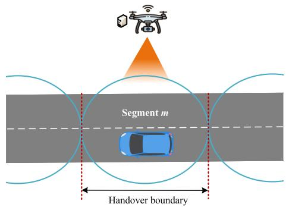  
Fig. 2. UAV coverage boundary and service duration illustration.

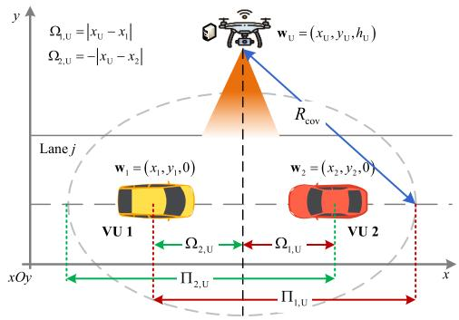  
Fig. 3. Geometric modeling for dwell time calculation and handover analysis.

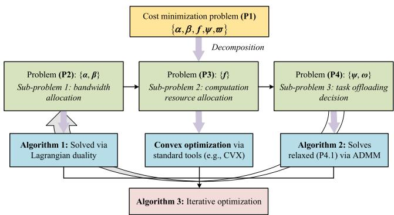  
Fig. 4. Overview of the decomposition-based iterative optimization algorithm.

## V. ALGORITHM DESIGN

The coexistence of binary ofloading decisions and continuous resource allocation variables, along with the non-convex objective function and multi-dimensional constraints, makes direct optimization computationally intractable. To address this challenge, we propose a computationally eficient framework based on BCD. The core idea is to decompose the primal problem $\mathcal { P } _ { 1 }$ into three tractable sub-problems by iteratively optimizing one set of variables while fixing others. Specifically, the optimization variables are partitioned into three blocks: 1) bandwidth allocation ratios and , 2) computation resource allocation f , and 3) task ofloading decisions $\psi$ and . The decomposition framework is illustrated in Fig. 4, which shows the iterative procedure that optimizes these blocks until convergence is achieved.

## A. Bandwidth Allocation Optimization

Given the fixed computation resource allocation $f ,$ and task ofloading decisions $\psi$ and , the bandwidth allocation subproblem is formulated as

$$
\begin{array} { r l } { \mathcal { P } _ { 2 } : } & { { } \underset { \alpha , \beta } { \operatorname* { m i n } } \sum _ { k = 1 } ^ { K } C _ { k } } \end{array}\tag{28a}
$$

$$
\mathrm { s . t . } \ \mathrm { C 3 } \colon \psi _ { k , \mathrm { U } } \left( t _ { k , \mathrm { U } } ^ { \mathrm { t r } } + t _ { k , \mathrm { U } } ^ { \mathrm { e x e } } \right) \leq T _ { k , \mathrm { U } } ^ { \mathrm { d w e l l } } , \ \forall k ,\tag{28b}
$$

$$
{ \mathrm { C 4 : ~ } } \sum _ { k = 1 } ^ { K } \psi _ { k , \mathrm { U } } \alpha _ { k , \mathrm { U } } \leq 1 ,\tag{28c}
$$

$$
{ \mathrm { C 5 } } \colon 0 \leq \alpha _ { k , \mathrm { U } } \leq 1 , ~ \forall k ,\tag{28d}
$$

$$
{ \mathrm { C 6 } } \colon \sum _ { k = 1 } ^ { K } { \varpi _ { k , \mathrm { H } } \beta _ { k , \mathrm { H } } } \le 1 ,\tag{28e}
$$

$$
{ \mathrm { C 7 } } \colon 0 \leq \beta _ { k , \mathrm { H } } \leq 1 , \ \forall k ,\tag{28f}
$$

$$
{ \mathrm { C } } 1 2 \colon \psi _ { k , \mathrm { U } } e _ { k , \mathrm { U } } ^ { \mathrm { t r } } + \varpi _ { k , \mathrm { H } } e _ { k , \mathrm { H } } ^ { \mathrm { t r } } \le E _ { k } ^ { \mathrm { m a x } } , ~ \forall k .\tag{28g}
$$

Theorem 1: The bandwidth allocation subproblem $\mathcal { P } _ { 2 }$ is convex.

Proof: The objective function involves transmission latency terms $t _ { k , \mathrm { U } } ^ { \mathrm { t r } }$ and $t _ { k , \mathrm { H } } ^ { \mathrm { t r } } ,$ which are strictly convex with respect to $\alpha _ { k , \mathrm { U } }$ ,and $\beta _ { k , \mathrm { H } }$ , (form $f ( x ) \ \propto \ 1 / x$ for $x \ > \ 0 )$ . Since the non-negative weighted sum preserves convexity, the objective function is convex. Regarding the constraints, C4 and C6 are linear inequalities. Constraints C3 and C12 involve the transmission time and energy, which are also convex functions of the bandwidth allocation ratios. Consequently, $\mathcal { P } _ { 2 }$ is a convex optimization problem defined over a convex feasible set.

To improve computational eficiency within the iterative BCD framework, we solve the bandwidth allocation subproblem using the Lagrangian dual method rather than relying on general-purpose convex solvers such as CVX. Although $\mathcal { P } _ { 2 }$ is a convex problem, it exhibits a specific separable structure that enables the derivation of closed-form update rules. By exploiting this structure, the proposed approach avoids repeated numerical optimization and enables closedform updates, thereby significantly reducing computational overhead and making it more suitable for iterative execution. The Lagrangian function $\mathcal { L } ( \alpha , \beta , \lambda , \mu , \eta )$ is defined as

$$
\begin{array} { r l r } {  { \mathcal { L } = \sum _ { k = 1 } ^ { K } C _ { k } + \sum _ { k = 1 } ^ { K } \lambda _ { k } ( \psi _ { k , \mathrm { U } } ( t _ { k , \mathrm { U } } ^ { \mathrm { r } } + t _ { k , \mathrm { U } } ^ { \mathrm { e x e } } ) - T _ { k , \mathrm { U } } ^ { \mathrm { d w e l l } } ) } } \\ & { } & { + \mu _ { 1 } ( \sum _ { k = 1 } ^ { K } \psi _ { k , \mathrm { U } } \alpha _ { k , \mathrm { U } } - 1 ) + \mu _ { 2 } ( \sum _ { k = 1 } ^ { K } \varpi _ { k , \mathrm { H } } \beta _ { k , \mathrm { H } } - 1 ) } \\ & { } & { + \sum _ { k = 1 } ^ { K } \eta _ { k } ( \psi _ { k , \mathrm { U } } e _ { k , \mathrm { U } } ^ { \mathrm { r } } + \varpi _ { k , \mathrm { H } } e _ { k , \mathrm { H } } ^ { \mathrm { t r } } - E _ { k } ^ { \mathrm { m a x } } ) , } \end{array}\tag{29}
$$

where $\lambda ~ = ~ \{ \lambda _ { k } \} , ~ \mu ~ = ~ \{ \mu _ { 1 } , \mu _ { 2 } \}$ , and $\eta ~ = ~ \{ \eta _ { k } \}$ are nonnegative Lagrange multipliers associated with the dwell time, bandwidth capacity, and energy constraints, respectively. Note that the boundary constraints $0 \leq \alpha , \beta \leq 1$ are handled subsequently through projection. The dual problem is expressed as

$$
\mathcal { D } _ { 2 } : \operatorname* { m a x } _ { \lambda , \mu , \eta \geq 0 } \operatorname* { m i n } _ { \alpha , \beta } \mathcal { L } ( \alpha , \beta , \lambda , \mu , \eta ) .\tag{30}
$$

Since $\mathcal { P } _ { 2 }$ satisfies Slater’s condition, strong duality holds, and the Karush-Kuhn-Tucker conditions are suficient for optimality.

1) Optimal Bandwidth Allocation: By taking the partial derivatives of $\mathcal { L }$ with respect to $\alpha _ { k , \mathrm { U } }$ and $\beta _ { k , \mathrm { H } }$ and setting them to zero, we obtain the stationary points. The optimal bandwidth allocation ratios are derived in closed form as

$$
\alpha _ { k , \mathrm { U } } ^ { * } = \left[ \sqrt { \frac { \psi _ { k , \mathrm { U } } ( \omega _ { 1 } + \lambda _ { k } + \eta _ { k } p _ { k } ) d _ { k } } { \mu _ { 1 } W _ { \mathrm { U } } \log _ { 2 } ( 1 + \mathrm { S N R } _ { k , \mathrm { U } } ) } } \right] _ { 0 } ^ { 1 } ,\tag{31}
$$

$$
\beta _ { k , \mathrm { H } } ^ { * } = \left[ \sqrt { \frac { \varpi _ { k , \mathrm { H } } ( \omega _ { 1 } + \eta _ { k } p _ { k } ) d _ { k } } { \mu _ { 2 } W _ { \mathrm { H } } \log _ { 2 } ( 1 + \mathrm { S N R } _ { k , \mathrm { H } } ) } } \right] _ { 0 } ^ { 1 } ,\tag{32}
$$

where $[ x ] _ { 0 } ^ { 1 } \ = \ \operatorname* { m i n } ( \operatorname* { m a x } ( x , 0 ) , 1 )$ denotes the projection onto the feasible domain, and $\begin{array} { r } { \mathrm { S N R } _ { k , \mathrm { U } } = \frac { p _ { k } G _ { k , \mathrm { U } } } { \sigma ^ { 2 } } } \end{array}$ . The derived solu-σtions manifest a water-filling structure. Specifically, VUs with higher latency weights ( 1), tighter dwell time constraints (larger $\lambda _ { k } )$ , or strict energy budgets (larger $\eta _ { k } )$ are allocated more bandwidth to accelerate transmission.

2) Lagrange Multiplier Update: The dual function is inherently concave but might be non-diferentiable. Hence, we adopt the subgradient method to update the multipliers through an iterative process. The multiplier updates at iteration i are defined as

$$
\begin{array} { r l } & { \lambda _ { k } ^ { ( i + 1 ) } = \left[ \lambda _ { k } ^ { ( i ) } + \gamma ^ { ( i ) } \left( \psi _ { k , \mathrm { U } } ( t _ { k , \mathrm { U } } ^ { \mathrm { t r } } + t _ { k , \mathrm { U } } ^ { \mathrm { e x e } } ) - T _ { k , \mathrm { U } } ^ { \mathrm { d v e l l } } \right) \right] ^ { + } , } \\ & { \mu _ { 1 } ^ { ( i + 1 ) } = \left[ \mu _ { 1 } ^ { ( i ) } + \gamma ^ { ( i ) } \left( \sum _ { k = 1 } ^ { K } \psi _ { k , \mathrm { U } } \alpha _ { k , \mathrm { U } } ^ { * } - 1 \right) \right] ^ { + } , } \\ & { \mu _ { 2 } ^ { ( i + 1 ) } = \left[ \mu _ { 2 } ^ { ( i ) } + \gamma ^ { ( i ) } \left( \sum _ { k = 1 } ^ { K } \varpi _ { k , \mathrm { H } } \beta _ { k , \mathrm { H } } ^ { * } - 1 \right) \right] ^ { + } , } \\ & { \eta _ { k } ^ { ( i + 1 ) } = \left[ \eta _ { k } ^ { ( i ) } + \gamma ^ { ( i ) } \left( E _ { k } ^ { \mathrm { v a r r } } - E _ { k } ^ { \mathrm { m a x } } \right) \right] ^ { + } , } \end{array}\tag{33}
$$

where $\gamma ^ { ( i ) }$ denotes the diminishing step size and $[ x ] ^ { + } =$ max(x 0) is the standard projection onto the non-negative orthant. The iteration continues until the Euclidean norm of the residual for the dual variables falls below a convergence tolerance . This custom iterative procedure, summarized in Algorithm 1, leverages the problem structure to achieve eficient updates, making it more suitable than general-purpose convex solvers within the iterative framework.

## B. Computation Resource Allocation Optimization

Given the optimized bandwidth allocation ratios  and α, and the fixed task ofloading decisions  and , the optimization problem with respect to the computation resource allocation variables f is formulated as

$$
\mathcal { P } _ { 3 } : \operatorname* { m i n } _ { f } \sum _ { k = 1 } ^ { K } C _ { k }\tag{34a}
$$

$$
\mathrm { s . t . } ~ \mathrm { C 3 } \colon \psi _ { k , \mathrm { U } } \left( t _ { k , \mathrm { U } } ^ { \mathrm { t r } } + t _ { k , \mathrm { U } } ^ { \mathrm { e x e } } \right) \leq T _ { k , \mathrm { U } } ^ { \mathrm { d w e l l } } , ~ \forall k ,\tag{34b}
$$

$$
\begin{array} { r } { \mathbf { C 8 : \sum } \sum _ { k = 1 } ^ { K } { \psi _ { k , \mathrm { U } } f _ { k , \mathrm { U } } } \leq F _ { \mathrm { U } } ^ { \operatorname* { m a x } } , } \end{array}\tag{34c}
$$

$$
{ \mathrm { C } } 9 \colon \sum _ { k = 1 } ^ { K } { \varpi _ { k , \mathrm { H } } f _ { k , \mathrm { H } } } \le F _ { \mathrm { H } } ^ { \operatorname* { m a x } } ,\tag{34d}
$$

$$
{ \mathrm { C 1 0 : ~ } } f _ { k , \mathrm { U } } \geq 0 , ~ f _ { k , \mathrm { H } } \geq 0 , ~ \forall k ,\tag{34e}
$$

$$
{ \mathrm { C } } 1 3 \colon E _ { \mathrm { U } } ^ { \mathrm { e x e } } \leq E _ { \mathrm { U } } ^ { \mathrm { m a x } } - E _ { \mathrm { U } } ^ { \mathrm { h o v e r } } .\tag{34f}
$$

Algorithm 1 Optimal Bandwidth Allocation via Lagrangian   
Duality   
1: Input: Fixed computation allocation $f ,$ ofloading deci  
sions $\psi$ and $\varpi ,$ and system parameters.   
2: Initialize Lagrange multipliers $\lambda ^ { ( 0 ) } , \mu ^ { ( 0 ) } , \eta ^ { ( 0 ) } \geq 0 .$ , step   
sizes $\gamma ^ { ( 0 ) }$ λ , µ ,, tolerance , and iteration index $i \gets 0$   
3: repeat   
4: //Step 1: Optimal Primal Update (Closed-form)   
5: for all $k \in \mathcal { K }$ do   
6: Calculate optimal bandwidth $\alpha _ { k , \mathrm { U } } ^ { ( i ) }$ using (31) based   
on current multipliers   
7: Calculate optimal bandwidth $\beta _ { k , \mathrm { H } } ^ { ( i ) }$ using (32) based   
on current multipliers   
8: end for   
9: //Step 2: Dual Variable Update   
10: Update multipliers $\lambda ^ { ( i + 1 ) } , \dot { \pmb \mu } ^ { ( i + 1 ) } , \pmb \eta ^ { ( i + 1 ) }$ using subgradi  
ent method in (33)   
11: Update step size $\gamma ^ { ( i + 1 ) } \left( \mathrm { e . g . } \right.$ , diminishing rule)   
12: $i \gets i + 1$   
13: until Convergence of multipliers: $\left\| \pmb { x } ^ { ( i ) } - \pmb { x } ^ { ( i - 1 ) } \right\| _ { 2 } ~ \leq ~ \epsilon .$   
where $\pmb { x } = [ \lambda , \mu , \eta ]$   
14: Return optimal bandwidth allocation $\alpha ^ { * } , \beta ^ { * }$

Theorem 2: The computation resource allocation subproblem $\mathcal { P } _ { 3 }$ is convex.

Proof: The objective function $C _ { k }$ depends on the computation latency $\begin{array} { r } { t _ { k , \mathrm { U } } ^ { \mathrm { e x e } } = \frac { d _ { k } c _ { k } } { f _ { k , \mathrm { U } } } } \end{array}$ (or $t _ { k , \mathrm { H } } ^ { \mathrm { e x e } } )$ , which is a convex function of $f$ (of the form $1 / x \operatorname { f o r } x > 0 )$ ,. Note that the expenditure term in $C _ { k }$ is constant with respect to $f .$ Regarding the constraints, C8, C9, and C10 are linear. C3 can be rewritten as $\begin{array} { r } { f _ { k , \mathrm { U } } \geq \frac { d _ { k } c _ { k } } { T _ { k , \mathrm { U } } ^ { \mathrm { d w e l l } } - t _ { k , \mathrm { U } } ^ { \mathrm { t r } } } } \end{array}$ , ,which defines a convex set. C13 involves the UAV execution energy $\begin{array} { r } { E _ { \mathrm { U } } ^ { \mathrm { e x e } } ~ = ~ \sum _ { k } { \epsilon } f _ { k , \mathrm { U } } ^ { 2 } d _ { k } c _ { k } } \end{array}$ , which is a quadratic function ,and thus convex. Since optimizing a convex objective over a convex feasible set constitutes a convex optimization problem, $\mathcal { P } _ { 3 }$ is convex.

Since $\mathcal { P } _ { 3 }$ is a convex optimization problem but does not admit a tractable closed-form solution due to the coupled nonlinear terms, it is eficiently solved using interior-point methods provided by standard solvers such as CVX [39].

## C. Task Ofloading Decision Optimization

Given the optimized bandwidth allocation and $\beta ,$ and computation resource allocation $f ,$ the task ofloading optimization problem is formulated as

$$
\mathcal { P } _ { 4 } : \operatorname* { m i n } _ { \psi , \varpi } \sum _ { k = 1 } ^ { K } C _ { k }\tag{35a}
$$

$$
\mathrm { ~ s . t . ~ } \mathrm { C 1 } \colon \psi _ { k , \mathrm { U } } + \varpi _ { k , \mathrm { H } } = 1 , \ \forall k ,\tag{35b}
$$

$$
\mathrm { C 2 } \colon \psi _ { k , \mathrm { U } } , \varpi _ { k , \mathrm { H } } \in \{ 0 , 1 \} , ~ \forall k ,\tag{35c}
$$

$$
{ \mathrm { C } } 3 \colon \psi _ { k , \mathrm { U } } \left( t _ { k , \mathrm { U } } ^ { \mathrm { t r } } + t _ { k , \mathrm { U } } ^ { \mathrm { e x e } } \right) \leq T _ { k , \mathrm { U } } ^ { \mathrm { d w e l l } } , ~ \forall k ,
$$

$$
C 4 , C 6 , C 8 , C 9 , C 1 1 , C 1 2 , C 1 3 .\tag{35d}
$$

Note that constraints C4, C6, C8, C9, C11, and C13 involve global coupling among users, while C3 and C12 are local constraints. $\mathcal { P } _ { 4 }$ is an NP-hard binary integer programming problem. To enable eficient distributed optimization, we relax the binary constraints C2 to continuous intervals [0 1], yielding the relaxed problem ${ \mathcal { P } } _ { 4 . }$ 1:

$$
\mathcal { P } _ { 4 . 1 } : \ \operatorname* { m i n } _ { \psi , \varpi } \ \sum _ { k = 1 } ^ { K } C _ { k }\tag{36a}
$$

$$
\mathrm { ~ s . t . ~ C 1 , ~ C 3 \mathrm { - } C 4 , ~ C 6 , ~ C 8 \mathrm { - } C 1 3 , }\tag{36b}
$$

$$
{ \mathrm { C } } 2 ^ { \prime } \colon 0 \leq \psi _ { k , \mathrm { U } } \leq 1 , ~ 0 \leq \varpi _ { k , \mathrm { H } } \leq 1 , ~ \forall k .\tag{36c}
$$

To solve $\mathcal { P } _ { 4 . 1 }$ efectively, the ADMM is employed. Auxiliary variables $\hat { \psi }$ and ˆ are introduced to decouple the complex constraints, enforcing consistency through the relations $\psi _ { k , \mathrm { U } } =$ $\hat { \psi } _ { k , \mathrm { U } }$ and $\varpi _ { k , \mathrm { H } } = \hat { \varpi } _ { k , \mathrm { H } }$ . The resulting augmented Lagrangian function is defined as

$$
\begin{array} { r l r } {  { \mathcal { L } _ { \rho } = \sum _ { k = 1 } ^ { K } C _ { k } } } \\ & { } & { + \sum _ { k = 1 } ^ { K } [ \upsilon _ { k } ( \psi _ { k , \mathrm { U } } - \hat { \psi } _ { k , \mathrm { U } } ) + \vartheta _ { k } ( \varpi _ { k , \mathrm { H } } - \hat { \varpi } _ { k , \mathrm { H } } ) ] } \\ & { } & { + \displaystyle \frac { \rho } { 2 } \sum _ { k = 1 } ^ { K } [ ( \psi _ { k , \mathrm { U } } - \hat { \psi } _ { k , \mathrm { U } } ) ^ { 2 } + ( \varpi _ { k , \mathrm { H } } - \hat { \varpi } _ { k , \mathrm { H } } ) ^ { 2 } ] , \quad } \end{array}\tag{37}
$$

where $\upsilon _ { k }$ and $\vartheta _ { k }$ denote the Lagrange multipliers and $\rho > 0$ represents the penalty parameter.

1) Primal Variable Update: At each iteration t, the primal variables are updated by minimizing $\mathcal { L } _ { \rho }$ subject to the local constraints C1, C3, and C12. By substituting $\varpi _ { k , \mathrm { H } } = 1 - \psi _ { k , \mathrm { U } } .$ the problem decomposes into K parallel sub-problems. The update for user k is formulated as

$$
\psi _ { k , \mathrm { U } } ^ { ( t + 1 ) } = \ast a r g m i n _ { 0 \leq \psi \leq 1 } \ Q _ { k } ( \psi ) \mathrm { s . t . } \ \psi \in \mathcal { F } _ { k } ,\tag{38}
$$

where $\mathcal { Q } _ { k } ( \boldsymbol { \psi } )$ collects the linear and quadratic terms related to $\psi$ from (37). The coeficients of the linear terms, denoted by $a _ { k }$ and $b _ { k } ,$ , represent the weighted cost of ofloading to the UAV and HAP, respectively, and are defined as

$$
\begin{array} { r } { a _ { k } = \omega _ { 1 } ( t _ { k , \mathrm { U } } ^ { \mathrm { t r } } + t _ { k , \mathrm { U } } ^ { \mathrm { e x e } } ) + \omega _ { 2 } \tilde { P } _ { \mathrm { U } } d _ { k } c _ { k } , } \\ { b _ { k } = \omega _ { 1 } ( t _ { k , \mathrm { H } } ^ { \mathrm { t r } } + t _ { k , \mathrm { H } } ^ { \mathrm { e x e } } ) + \omega _ { 2 } \tilde { P } _ { \mathrm { H } } d _ { k } c _ { k } . } \end{array}\tag{39}
$$

The local feasible set $\mathcal { F } _ { k }$ is determined by C3 and C12:

$$
\mathcal { F } _ { k } = \left\{ \psi \in [ 0 , 1 ] \left| \begin{array} { l l } { \psi ( t _ { k , \mathrm { U } } ^ { \mathrm { t r } } + t _ { k , \mathrm { U } } ^ { \mathrm { e x e } } ) \leq T _ { k , \mathrm { U } } ^ { \mathrm { d w e l l } } , } \\ { \psi e _ { k , \mathrm { U } } ^ { \mathrm { t r } } + ( 1 - \psi ) e _ { k , \mathrm { H } } ^ { \mathrm { t r } } \leq E _ { k } ^ { \mathrm { m a x } } \right\} . } \end{array} \right.\tag{40}
$$

The optimal solution is obtained by projecting the unconstrained minimizer onto $\mathcal { F } _ { k }$

$$
{ \psi } _ { k , \mathrm { U } } ^ { \mathrm { u n p r o j } } = \frac { 1 + \hat { \psi } _ { k , \mathrm { U } } ^ { ( t ) } - \hat { \varpi } _ { k , \mathrm { H } } ^ { ( t ) } } { 2 } - \frac { a _ { k } - b _ { k } + { \upsilon } _ { k } ^ { ( t ) } - { \vartheta } _ { k } ^ { ( t ) } } { 2 \rho } ,\tag{41}
$$

$$
\psi _ { k , \mathrm { U } } ^ { ( t + 1 ) } = \mathcal { P } _ { \mathcal { F } _ { k } } \big ( \psi _ { k , \mathrm { U } } ^ { \mathrm { u n p r o j } } \big ) , \quad \varpi _ { k , \mathrm { H } } ^ { ( t + 1 ) } = 1 - \psi _ { k , \mathrm { U } } ^ { ( t + 1 ) } .\tag{42}
$$

2) Auxiliary Variable Update: The auxiliary variables are updated to minimize $\mathcal { L } _ { \rho }$ . Since the global coupling constraints are handled in the subsequent recovery phase, the unconstrained closed-form updates are derived as

$$
\hat { \psi } _ { k , \mathrm { U } } ^ { ( t + 1 ) } = \psi _ { k , \mathrm { U } } ^ { ( t + 1 ) } + \frac { \upsilon _ { k } ^ { ( t ) } } { \rho } , \quad \hat { \varpi } _ { k , \mathrm { H } } ^ { ( t + 1 ) } = \varpi _ { k , \mathrm { H } } ^ { ( t + 1 ) } + \frac { \vartheta _ { k } ^ { ( t ) } } { \rho } .\tag{43}
$$

3) Lagrange Multiplier Update: Multipliers are updated via the standard dual ascent method:

$$
\begin{array} { r l } & { \boldsymbol { v } _ { k } ^ { ( t + 1 ) } = \boldsymbol { \upsilon } _ { k } ^ { ( t ) } + \rho \big ( \boldsymbol { \psi } _ { k , \mathrm { U } } ^ { ( t + 1 ) } - \hat { \boldsymbol { \psi } } _ { k , \mathrm { U } } ^ { ( t + 1 ) } \big ) , } \\ & { \boldsymbol { \vartheta } _ { k } ^ { ( t + 1 ) } = \boldsymbol { \vartheta } _ { k } ^ { ( t ) } + \rho \big ( \boldsymbol { \varpi } _ { k , \mathrm { H } } ^ { ( t + 1 ) } - \hat { \boldsymbol { \varpi } } _ { k , \mathrm { H } } ^ { ( t + 1 ) } \big ) . } \end{array}\tag{44}
$$

4) Algorithm Stopping Criterion: The ADMM process terminates when both the primal residual $\mathbf { r } _ { \mathrm { p r i m } }$ and the dual residual $\mathbf { r } _ { \mathrm { d u a l } }$ fall below predefined tolerances $\epsilon _ { \mathrm { { p r i m } } }$ and ${ \epsilon } _ { \mathrm { d u a l } }$ These residuals are defined as

$$
\left. \mathbf { r } _ { \mathrm { p r i m } } ^ { ( t + 1 ) } \right. _ { 2 } = \mathbf { \sqrt { \left\| \psi ^ { ( t + 1 ) } - \hat { \psi } ^ { ( t + 1 ) } \right\| _ { 2 } ^ { 2 } + \left\| \varpi ^ { ( t + 1 ) } - \hat { \pmb { \varpi } } ^ { ( t + 1 ) } \right\| _ { 2 } ^ { 2 } } } ,\tag{45}
$$

$$
\left\| \mathbf { r } _ { \mathrm { d u a l } } ^ { ( t + 1 ) } \right\| _ { 2 } = \rho \sqrt { \left\| \hat { \pmb { \psi } } ^ { ( t + 1 ) } - \hat { \pmb { \psi } } ^ { ( t ) } \right\| _ { 2 } ^ { 2 } + \left\| \hat { \pmb { \varpi } } ^ { ( t + 1 ) } - \hat { \pmb { \varpi } } ^ { ( t ) } \right\| _ { 2 } ^ { 2 } } .\tag{46}
$$

Algorithm 2 Task Ofloading Optimization via ADMM   
1: Input: Bandwidth $\alpha , \beta ,$ computation f , penalty parameter   
$\rho > 0 ,$ tolerances $\epsilon _ { \mathrm { p r i m } } , \epsilon _ { \mathrm { d u a l } } .$   
2: Initialize primal variables $\psi ^ { ( 0 ) } , \varpi ^ { ( 0 ) }$ , auxiliary variables   
$\hat { \pmb { \psi } } ^ { ( 0 ) } , \hat { \pmb { \varpi } } ^ { ( 0 ) }$ , Lagrange multipliers $\boldsymbol { \upsilon } ^ { ( 0 ) } , \boldsymbol { \vartheta } ^ { ( 0 ) }$ , and $t  0 .$   
3: Compute cost coeficients $a _ { k }$ and $b _ { k }$ ϑusing (39).   
4: repeat   
5: //Step 1: Primal Variable Update   
6: for all $k \in \mathcal { K }$ do   
7: Compute unconstrained minimizer $\psi _ { k , \mathrm { U } } ^ { \mathrm { u n p r o j } }$ via (41).   
8: Update $\psi _ { k , \mathrm { U } } ^ { ( t + 1 ) }$ by projecting onto $\mathcal { F } _ { k }$ via (42).   
9: Set $\varpi _ { k , \mathrm { H } } ^ { ( t + 1 ) }  1 - \psi _ { k , \mathrm { U } } ^ { ( t + 1 ) } .$   
10: end for   
11: //Step 2: Auxiliary Variable Update   
12: for all $k \in \mathcal { K }$ do   
13: Update $\hat { \psi } _ { k , \mathrm { U } } ^ { ( t + 1 ) }$ and $\hat { \varpi } _ { k , \mathrm { H } } ^ { ( t + 1 ) }$ via (43).   
14: end for   
15: //Step 3: Lagrange Multiplier Update   
16: for all $k \in \mathcal { K }$ do   
17: Update multipliers $\upsilon _ { k } ^ { ( t + 1 ) }$ and $\vartheta _ { k } ^ { ( t + 1 ) }$ via (44).   
18: end for   
19: Calculate residuals $\| \mathbf { r } _ { \mathrm { p r i m } } ^ { ( t + 1 ) } \| _ { 2 }$ and $\| \mathbf { r } _ { \mathrm { d u a l } } ^ { ( t + 1 ) } \| _ { 2 }$ via (45)-(46).   
20: $t \gets t + 1 .$   
21: until $\| \mathbf { r } _ { \mathrm { p r i m } } ^ { ( t ) } \| _ { 2 } \leq \epsilon _ { \mathrm { p r i m } }$ and $\| \mathbf { r } _ { \mathrm { d u a l } } ^ { ( t ) } \| _ { 2 } \leq \epsilon _ { \mathrm { d u a l } }$   
22: Return Relaxed solutions $\psi ^ { * } , \varpi ^ { * } \gets \psi ^ { ( t ) } , \varpi ^ { ( t ) } .$

5) Binary Solution Recovery: The ADMM procedure yields continuous fractional solutions $\psi ^ { * }$ and $\varpi ^ { * }$ , which require a recovery process to obtain feasible binary decisions. To this end, we adopt a randomized rounding capability-aware scheme. Compared with deterministic threshold-based rounding, which may introduce biased decisions and lead to frequent violations of coupling constraints, randomized rounding preserves the probabilistic structure of the relaxed solution. Specifically, each task is assigned to the UAV with a probability proportional to its relaxed value, which helps maintain consistency with the original optimization outcome in expectation. To ensure feasibility, a capability-aware adjustment stage is further incorporated. After rounding, global coupling constraints such as C4, C6, and C11 are explicitly checked. If violations occur, tasks are iteratively reassigned from the UAV to the HAP based on the minimal increase in system cost. This process guarantees that the final solution satisfies all system constraints while maintaining a close approximation to the relaxed solution. Algorithm 2 and Fig. 5 respectively summarize the detailed procedure and the structural flow of the proposed optimization framework.

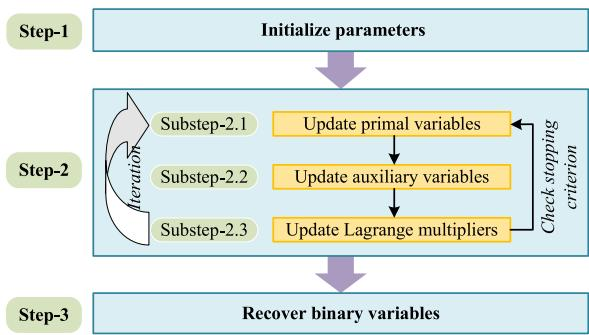  
Fig. 5. ADMM algorithm flow for solving ${ \mathcal { P } } _ { 4 } .$

## D. Overall Algorithm and Analysis

The coordination of the subproblem solutions derived in the preceding subsections is synthesized into a unified iterative framework. Algorithm 3 delineates the complete execution flow for the joint optimization of resource allocation and task ofloading decisions. This BCD-based algorithm orchestrates the sequential updates of variable blocks to ensure a monotonic reduction in the aggregate system cost until the convergence criterion is satisfied.

Algorithm 3 Joint Resource Allocation and Task Ofloading   
Algorithm   
1: Initialize bandwidth ${ \alpha ^ { ( 0 ) } , \beta ^ { ( 0 ) } } ,$ , computation $\pmb { f } ^ { ( 0 ) }$ , relaxed   
ofloading strategies $\psi ^ { ( 0 ) } , \bar { \varpi } ^ { ( 0 ) }$ , and iteration index $l  0 .$   
2: Set convergence tolerance $\delta > 0$ and max iterations $L _ { \mathrm { m a x } } .$   
3: repeat   
4: Update $\alpha ^ { ( l + 1 ) } , \beta ^ { ( l + 1 ) }$ by solving $\mathcal { P } _ { 2 }$ via Algorithm 1   
given $\mathbf { \Delta } f ^ { ( l ) } , \psi ^ { ( l ) } , \mathbf { \dot { \varpi } } ^ { ( l ) } .$   
5: Update $\pmb { f } ^ { ( l + 1 ) }$ by solving $\mathcal { P } _ { 3 }$ via CVX given   
$\pmb { \alpha } ^ { ( l + 1 ) } , \pmb { \beta } ^ { ( l + 1 ) } , \pmb { \psi } ^ { ( l ) } , \pmb { \dot { \varpi } } ^ { ( l ) }$   
6: α , β , ψUpdate relaxed $\dot { \psi } ^ { ( l + 1 ) } , \pmb { \varpi } ^ { ( l + 1 ) }$ by solving $\mathcal { P } _ { 4 . 1 }$ via Algo  
rithm 2 given $\dot { \pmb { \alpha } } ^ { ( l + 1 ) } , \pmb { \beta } ^ { ( l + 1 ) } , \pmb { f } ^ { ( \bar { l } + 1 ) }$   
7: α ,Calculate system cost $C ^ { ( l + 1 ) }$ based on relaxed vari  
ables.   
8: $l  l + 1 .$   
9: until $\left| C ^ { ( l ) } - C ^ { ( l - 1 ) } \right| / C ^ { ( l - 1 ) } \leq \delta \ \mathrm { o r } \ l \geq L _ { \operatorname* { m a x } }$   
10: Return Converged solutions $\pmb { \alpha } ^ { ( l ) } , \pmb { \beta } ^ { ( l ) } , \pmb { f } ^ { ( l ) } , \pmb { \psi } ^ { ( l ) } , \pmb { \varpi } ^ { ( l ) } .$

Proposition 1: The computational complexity of Algorithm 3 is $\mathcal { O } ( L _ { \mathrm { B C D } } ( I _ { \mathrm { s u b } } K + M _ { \mathrm { I P M } } K ^ { 3 . 5 } + T _ { \mathrm { A D M M } } K ) )$ Proof: The complexity depends on the number of outer BCD iterations, denoted by $L _ { \mathrm { B C D } } ,$ , and the cost of solving the three subproblems. 1) Solving $\mathcal { P } _ { 2 }$ via Algorithm 1 involves updating Lagrange multipliers iteratively. With $I _ { \mathrm { s u b } }$ dual iterations and closed-form primal updates of complexity $\mathcal O ( K )$ , the complexity is $\mathcal { O } ( I _ { \mathrm { s u b } } K ) . 2 )$ Solving $\mathcal { P } _ { 3 }$ involves optimizing $2 K$ variables using interior-point methods. The worst-case complexity is $\mathcal { O } ( \bar { M } _ { \mathrm { I P M } } ( 2 K ) ^ { 3 . 5 } ) \approx \mathcal { O } ( M _ { \mathrm { I P M } } K ^ { 3 . 5 } )$ , where $M _ { \mathrm { I P M } }$ is the number of Newton iterations. 3) Solving $\mathcal { P } _ { 4 . 1 }$ via ADMM requires $T _ { \mathrm { { \Delta } } }$ DMM iterations. Each iteration involves closed-form updates for 2K scalar variables, with a complexity of O(K), resulting in a total cost of $\mathcal { O } ( T _ { \mathrm { A D M M } } K )$ . Summing these components, the total complexity is $\mathcal { O } ( L _ { \mathrm { B C D } } ( I _ { \mathrm { s u b } } K + M _ { \mathrm { I P M } } K ^ { 3 . 5 } + T _ { \mathrm { A D M M } } K ) )$ Given that K is the number of VUs, the algorithm scales polynomially with the network size. 

## VI. SIMULATION RESULTS AND DISCUSSIONS

## A. Simulation Setup

We consider a multi-layer aerial VEC system covering a 15 km bidirectional highway segment with $J \ = \ 4$ parallel lanes. As illustrated in the system model, an HAP provides ubiquitous wide-area coverage while three rotary-wing UAVs are strategically deployed to serve non-overlapping 5 km subregions [29]. To evaluate performance under realistic trafic loads, a snapshot of K = 100 VUs is simulated with a uniform spatial distribution. The movement of trafic is bidirectional, where lanes 1-2 and lanes 3-4 support eastbound and westbound trafic respectively. The vehicular velocities and task attributes are configured to reflect the dynamic nature of highmobility environments. Specifically, the speeds of the vehicles follow a truncated Gaussian distribution, while the computation tasks are characterized by heterogeneous data sizes and intensities [32], [37]. Regarding the weighting configuration, $\omega _ { 1 }$ and $\omega _ { 2 }$ are set to 0.5 to represent a balanced optimization preference. This choice is supported by the adopted system parameters, where the latency and expenditure terms are observed to reside within a comparable numerical range under the considered task sizes, computation intensities, and pricing model. As a result, the objective function remains sensitive to both components without being dominated by a single metric [40], [41]. To ensure operational feasibility, $E _ { k } ^ { \mathrm { m a x } }$ and $E _ { \mathrm { U } } ^ { \mathrm { m a x } }$ are defined as the residual energy budgets allocated for the current decision epoch rather than the total physical battery capacities.

The feasibility of the joint optimization problem is ensured by the hierarchical service mechanism across layers. Specifically, when the dwell-time constraint at the UAV layer cannot be satisfied due to high mobility, the correspond ing tasks are redirected to the HAP, which provides full coverage and suficient computation capacity. This fallback mechanism guarantees that all tasks can be feasibly served without interruption, thereby preventing infeasibility of $\mathcal { P } _ { 1 }$ under stringent dwell-time constraints. For the single-layer benchmark schemes, where such cross-layer cooperation is not available, a penalty mechanism is introduced to account for infeasible task assignments. The penalty cost is defined as $C _ { \mathrm { p e n } } ~ = ~ \phi \bar { C }$ , where C¯ denotes the average system cost obtained from the HAP-only scheme, and $\phi$ is a penalty multiplier specified in Table III. This penalty is applied to each task that violates dwell-time or resource constraints, ensuring a consistent and fair comparison across diferent schemes. The comprehensive simulation parameters are summarized in Table III.

## B. Simulation Results and Performance Analysis

To validate the efectiveness of the proposed joint optimization scheme, we compare its performance against four representative baseline schemes. These baselines are selected to isolate the gains provided by specific components of our algorithm (e.g., resource allocation, ofloading optimization) and to demonstrate the benefits of the multi-layer architecture.

• Equal resource allocation (ERA). The bandwidth and computation resources of the UAV and HAP are equally distributed among the associated VUs. However, the binary task ofloading decisions are optimized to minimize the system cost under these fixed resource constraints.

TABLE III  
SIMULATION PARAMETERS
<table><tr><td>Parameter</td><td>Notation</td><td>Value</td></tr><tr><td>Number of lanes</td><td> $\overline { { J } }$ </td><td>4</td></tr><tr><td>Lane width</td><td> $w$ </td><td> $3 . 7 5 \mathrm { ~ m ~ }$ </td></tr><tr><td>Altitude of HAP / UAV</td><td> $h _ { \mathrm { H } } , h _ { \mathrm { U } }$ </td><td>20 km, 200 m</td></tr><tr><td>Carrier frequency</td><td> $f _ { c }$ </td><td>2 GHz</td></tr><tr><td>LoS probability parameters</td><td> $\chi _ { 1 } , \chi _ { 2 }$ </td><td>9.6, 0.28</td></tr><tr><td>Total number of VUs</td><td> $K$ </td><td>100</td></tr><tr><td>Speed of VU k</td><td> $v _ { k }$ </td><td> $\mathcal { N } ( 1 0 0 , 1 0 ^ { 2 } )$  km/h</td></tr><tr><td>Data size of task  $L _ { k }$ </td><td> $d _ { k }$ </td><td>[2, 7] MB</td></tr><tr><td>Computing intensity</td><td> $c _ { k }$ </td><td>[500, 1500] cycles/bit</td></tr><tr><td>Transmit power of VU k</td><td> $p _ { k }$ </td><td>23 dBm</td></tr><tr><td>Noise power</td><td> $\sigma ^ { 2 }$ </td><td> $- 1 7 4$  dBm/Hz</td></tr><tr><td>Hardware-dependent coefficient</td><td> $\kappa$ </td><td> $1 0 ^ { - 2 8 }$ </td></tr><tr><td>Residual energy budget of VUs</td><td> $E _ { k } ^ { \mathrm { m a x } }$ </td><td>1 kJ</td></tr><tr><td>Bandwidth of UAV / HAP</td><td> $W _ { \mathrm { U } } , W _ { \mathrm { H } }$ </td><td>20 MHz, 50 MHz</td></tr><tr><td>Compute capacity (UAV)</td><td> $F _ { \mathrm { r } \mathrm { r } } ^ { \mathrm { m a x } }$ </td><td>10 GHz</td></tr><tr><td>Compute capacity (HAP)</td><td> $F _ { \mathrm { H } } ^ { \mathrm { \ ` m a x } }$ </td><td>15 GHz</td></tr><tr><td>Max concurrent VUs (UAV)</td><td> $N _ { \mathrm { m a x } }$ </td><td>55</td></tr><tr><td>Residual energy budget of UAV</td><td> $E _ { \mathrm { I } \mathrm { J } } ^ { \mathrm { m a x } }$ </td><td> $5 \ \mathrm { k J }$ </td></tr><tr><td>Unit price (UAV / HAP)</td><td> $\tilde { P } _ { \mathrm { U } } , \tilde { P } _ { \mathrm { H } }$ </td><td> $1 \times 1 0 ^ { - 9 } , 1 . 5 \times 1 0 ^ { - 9 }$ </td></tr><tr><td>Penalty multiplier</td><td> $\phi$ </td><td>3</td></tr><tr><td>Cost weights</td><td> $\omega _ { 1 } , \omega _ { 2 }$ </td><td> $0 . 5 , \ 0 . 5$ </td></tr><tr><td>Convergence tolerance</td><td> $\delta$ </td><td> $1 0 ^ { - 4 }$ </td></tr></table>

• Random ofloading (RO). Each VU randomly selects an ofloading target (UAV or HAP) with equal probability, respecting the coverage and capability constraints. Given these fixed ofloading decisions, the bandwidth and computation resources are optimized using the proposed algorithms.

• UAV-only. A single-layer paradigm where all tasks must be ofloaded to the UAV. The bandwidth and computation resources are optimized within the UAV’s capacity limits. Tasks that violate the UAV’s dwell time or capacity constraints are deemed infeasible and incur a penalty.

• HAP-only. A single-layer paradigm where all tasks are ofloaded to the HAP. Resources are optimized, but the UAV is bypassed entirely. This and the UAV-only scheme serve to validate the necessity of the proposed multi-layer collaborative architecture.

Fig. 6 illustrates the convergence performance of the proposed algorithm across diverse system configurations. The total system cost undergoes a rapid decline during the initial iterations, which is consistent with the monotonic convergence property of the BCD framework. For the scenario with $K = 6 0$ and $d _ { k } \ = \ 2 \ \mathrm { \bf ~ M B }$ , the objective function reaches a plateau after the seventh iteration because the iterative updates for ofloading and resource allocation variables efectively navigate the feasible region to reach a stationary point. When the task size or the number of VUs increases, the converged cost values shift upward. This behavior is mathematically explained by the structure of the objective function, where both latency and expenditure are positively correlated with the task data size and the cumulative resource demand. Furthermore, the slower convergence observed for K = 120 reflects the increased dimensionality of the optimization variables and the heightened competition for finite computation and bandwidth resources, which requires more iterations to satisfy the predefined convergence tolerance.

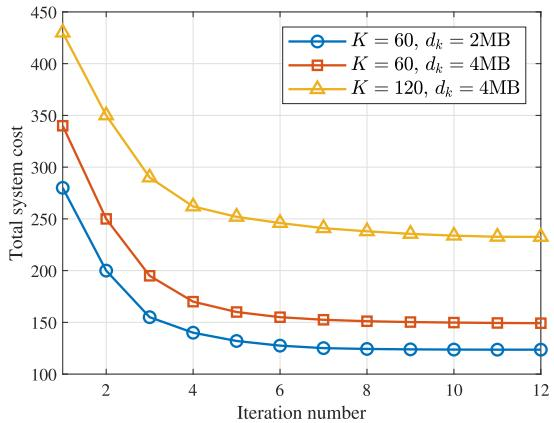  
Fig. 6. Total system cost versus iteration number for diferent scenarios.  
Fig. 8. Total system cost versus VU transmit power for diferent schemes.

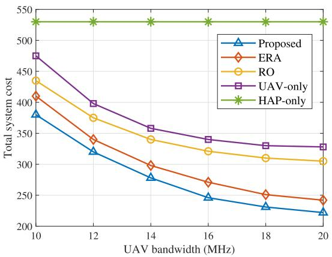  
Fig. 7. Total system cost versus UAV bandwidth for diferent schemes.

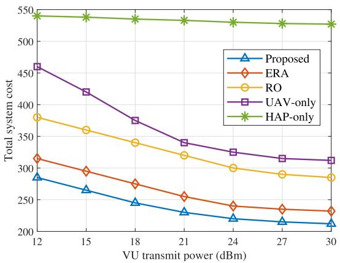

Fig. 7 presents the total system cost versus UAV bandwidth for diferent schemes. An initial expansion of bandwidth facilitates a sharp cost reduction by accelerating data transmission and mitigating the communication bottleneck. However, the performance gains eventually saturate as the curves reach a plateau. This behavior is explained by the fundamental structure of the objective function, where the total cost is constrained by computation latency and leasing expenditures that do not vary with bandwidth. Once the transmission latency becomes a marginal contributor, these invariant factors establish a performance floor. The proposed scheme consistently achieves the lowest cost by coordinating the ofloading decisions to maximize the utility of available resources. These observations confirm that the enhancement of the communication capacity yields diminishing returns once the computation and economic components become the dominant factors of the system cost.

Fig. 8 examines the influence of vehicular transmit power on the total system cost. Enhancing the transmit power improves the signal quality and uplink transmission rates, which directly minimizes the communication latency component of the objective function. The curves demonstrate a sharp initial decline followed by a distinct plateau. This stabilization occurs because the transmission rate follows a logarithmic growth pattern relative to the transmit power, which results in marginal improvements in communication speed at higher power levels. Consequently, the execution latency and leasing expenditures, which are independent of transmission capabilities, establish a persistent performance floor. While all schemes benefit from higher power, the proposed joint optimization maintains the lowest cost across the entire power range. This advantage is attributed to the ability of the proposed framework to dynamically synchronize ofloading targets with power adjustments. In contrast, the performance of the baseline schemes is constrained by fixed or random decision-making, which prevents them from fully exploiting the gains in transmission capacity.

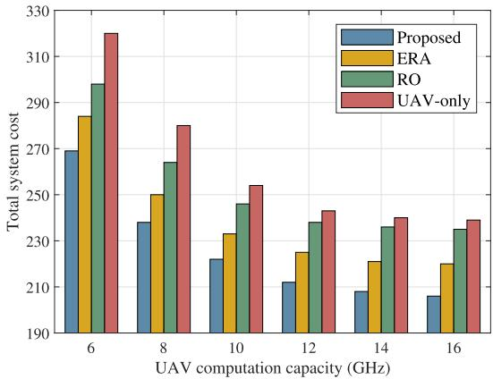  
Fig. 9. Total system cost versus UAV computation capacity for diferent schemes.

Fig. 9 presents the total system cost versus UAV computation capacity for diferent schemes. Expanding the capabilities enables higher allocated CPU frequencies for the VUs, which directly reduces the execution latency component of the objective function. As a result, the system cost for all evaluated schemes decreases as the computation resources become more abundant. This cost reduction is most pronounced in the lower capacity range and gradually saturates as the curves reach a plateau. Such a stabilization occurs because the total cost is lower-bounded by the transmission latency and the leasing expenditures, which are independent of the computation capacity. The proposed joint optimization scheme consistently achieves the best performance by dynamically orchestrating the resource allocation to maximize the processing eficiency. In contrast, the ERA and RO exhibit higher costs due to their sub-optimal use of the available capacity. The UAV-only scheme incurs the most significant cost because it lacks the flexibility of the multi-layer architecture to ofload tasks when the computation capacity or dwell-time constraints become limiting factors.

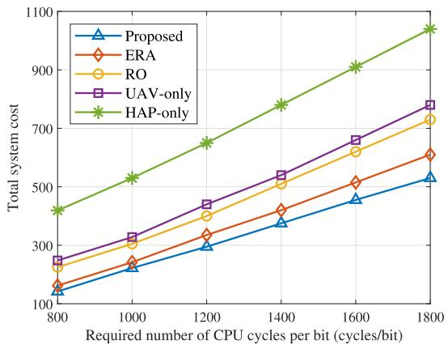  
Fig. 10. Total system cost versus computation density for diferent schemes.

Fig. 10 investigates the influence of computation density on the total system cost. As the required number of CPU cycles per bit increases, the system cost for all evaluated schemes escalates linearly. This growth pattern is directly explained by the mathematical structure of the objective function, where both the execution latency and the leasing expenditures are proportional to the computation intensity. Specifically, a higher computation density necessitates more processing time for a given task size and simultaneously increases the cumulative number of CPU cycles that must be leased from the aerial platforms. The proposed scheme maintains the most stable performance because it efectively mitigates the rising processing load through coordinated resource allocation and ofloading optimization. In contrast, the HAP-only scheme exhibits the steepest cost increase because its higher unit pricing for computation resources magnifies the financial impact of rising computation demands. The widening performance gap between the proposed scheme and the benchmarks further validates the efectiveness of the joint optimization in resourceintensive scenarios.

Fig. 11 presents the total system cost versus vehicular speed for diferent schemes. The experimental results indicate that the system cost for all schemes escalates as the vehicle speed increases from 60 km/h to 140 km/h. This upward trend is fundamentally rooted in the reduction of the efective service duration within the UAV coverage regions. According to the dwell-time constraint in C3, a higher speed shrinks the feasibility set for task ofloading at the UAV layer. Consequently, a greater proportion of computation tasks must be redirected to the HAP to ensure service continuity, which inevitably increases the leasing expenditure. The proposed joint optimization consistently achieves the most stable cost profile by proactively balancing the ofloading decisions between layers based on the mobility-induced constraints. In contrast, the UAV-only scheme exhibits the most significant sensitivity to speed variations. Because the UAV-only scheme lacks the hierarchical redundancy of the HAP layer, the frequent violations of the dwell-time limitations at high speeds lead to substantial performance penalties and service failures.

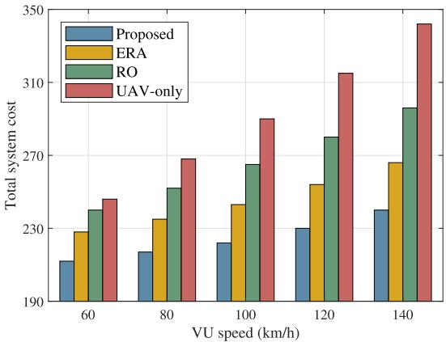  
Fig. 11. Total system cost versus VU speed for diferent schemes.

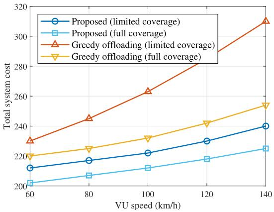  
Fig. 12. Total system cost versus VU speed under proposed and greedy ofloading with diferent UAV coverage assumptions.

Fig. 12 presents the total system cost versus vehicular speed under diverse ofloading strategies and coverage assumptions. To clarify the role of the additional schemes, the greedy strategy and the full-coverage setting are introduced to isolate the impact of the dwell-time constraint defined in C3. The results show that the total cost increases with vehicular speed because the efective service duration within the UAV coverage region is progressively reduced. Specifically, the greedy ofloading scheme exhibits a sharp cost escalation under limited coverage conditions, as it prioritizes immediate cost minimization without verifying dwell-time feasibility. Consequently, infeasible UAV-assisted ofloading decisions may incur substantial penalties. In contrast, the proposed scheme mitigates these mobility-induced risks by reallocating tasks to the HAP when UAV-assisted execution is constrained by the available service duration. The widening performance gap between the limitedcoverage and full-coverage configurations further quantifies the mobility-induced overhead and validates the robustness of the proposed multi-layer collaborative architecture.

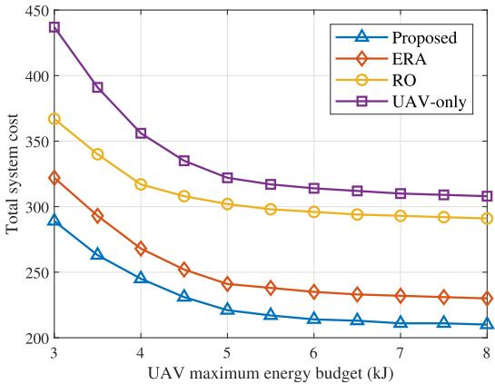  
Fig. 13. Total system cost versus UAV maximum energy budget for diferent schemes.

Fig. 13 presents the total system cost versus the UAV maximum energy budget for diferent schemes. The results indicate that the system cost for all evaluated paradigms declines as the available energy budget increases. This downward trend is explained by the relaxation of the energy constraints that govern the UAV processing capabilities. A higher energy budget allows the UAV to process more complex tasks, which reduces the necessity of ofloading to the high-cost HAP layer. However, the performance gains eventually saturate as the curves reach a plateau. This stabilization occurs because the system cost is lower-bounded by the transmission latency and the fixed leasing expenditures once the energy constraint is no longer the active bottleneck. The proposed scheme consistently maintains the lowest cost by optimizing the resource allocation to achieve the highest energy eficiency. This comparison substantiates that the system performance is highly sensitive to the energy budget in resource-constrained regimes while being limited by the intrinsic communication and economic parameters in energy-abundant scenarios.

## VII. CONCLUSION

This paper investigated the joint optimization of task ofloading and resource allocation in a multi-layer aerial VEC architecture. A comprehensive framework was developed to minimize the weighted system cost by coordinating the synergistic capabilities of the HAP and the UAV. To address the challenges of high vehicular mobility, the study explicitly incorporated a dwell-time feasibility constraint to ensure reliable service delivery in dynamic environments. The resulting MINLP optimization problem was resolved through a BCDbased iterative algorithm that efectively managed the complex inter-dependencies between ofloading decisions and resource management. Extensive simulation results demonstrated the proposed joint optimization scheme consistently outperforms single-layer and non-coordinated benchmarks. The results revealed that the integration of the HAP layer significantly enhances system robustness by providing a performance floor when the service duration of the UAV is compromised by high speeds. Furthermore, the sensitivity analysis confirmed that the proposed scheme efectively mitigates systemic overhead within resource-constrained regimes.

Future research eforts may focus on extending this work to multi-layer networks involving multiple HAPs and UAVs where inter-cell interference management and cooperative beamforming become essential. The application of deep reinforcement learning for real-time trajectory control and proactive resource slicing represents another critical direction. Additionally, incorporating physical layer security or integrated sensing and communications into the VEC environment could further enhance the resilience and multi-functionality of aerial-assisted computing infrastructures.

## REFERENCES

[1] S. Wandelt and C. Zheng, “Toward smart skies: Reviewing the state of the art and challenges for intelligent air transportation systems (IATS),” IEEE Trans. Intell. Transp. Syst., vol. 25, no. 10, pp. 12943–12953, Oct. 2024.

[2] C. Creß, Z. Bing, and A. C. Knoll, “Intelligent transportation systems using roadside infrastructure: A literature survey,” IEEE Trans. Intell. Transp. Syst., vol. 25, no. 7, pp. 6309–6327, Jul. 2024.

[3] S. A. Ullah et al., “From nodes to roads: Surveying DRL applications in MEC-enhanced terrestrial wireless networks,” IEEE Commun. Surveys Tuts., vol. 28, pp. 1169–1208, 2026.

[4] Y. Peng et al., “Computing and communication cost-aware service migration enabled by transfer reinforcement learning for dynamic vehicular edge computing networks,” IEEE Trans. Mobile Comput., vol. 23, no. 1, pp. 257–269, Jan. 2024.

[5] Y. Wang, W. Shao, Y. Zhou, Y. Guo, and G. Zheng, “Cooperative sensing and ofloading in NOMA-based vehicular network: A quantuminspired approach,” IEEE Commun. Lett., vol. 30, pp. 457–461, 2026.

[6] X. Gu et al., “Digital twin technology for intelligent vehicles and transportation systems: A survey on applications, challenges and future directions,” IEEE Commun. Surveys Tuts., vol. 28, pp. 3235–3271, 2026.

[7] Z. Guo, J. Cao, X. Wang, Y. Zhang, B. Niu, and H. Li, “UAVA: Unmanned aerial vehicle assisted vehicular authentication scheme in edge computing networks,” IEEE Internet Things J., vol. 11, no. 12, pp. 22091–22106, Jun. 2024.

[8] A. Nabi and S. Moh, “Joint ofloading decision, user association, and resource allocation in hierarchical aerial computing: Collaboration of UAVs and HAP,” IEEE Trans. Mobile Comput., vol. 24, no. 8, pp. 7267–7282, Aug. 2025.

[9] A. Traspadini, M. Giordani, G. Giambene, and M. Zorzi, “Real-time HAP-assisted vehicular edge computing for rural areas,” IEEE Wireless Commun. Lett., vol. 12, no. 4, pp. 674–678, Apr. 2023.

[10] J. Wang, Z. Na, and X. Liu, “Collaborative design of multi-UAV trajectory and resource scheduling for 6G-enabled Internet of Things,” IEEE Internet Things J., vol. 8, no. 20, pp. 15096–15106, Oct. 2021.

[11] J. Zeng, Z. Kuang, R. Chen, and A. Liu, “Delay-sensitive dependent tasks ofloading and resource allocation in VEC: A deepreinforcement learning approach,” IEEE Internet Things J., vol. 12, no. 16, pp. 34190–34203, Aug. 2025.

[12] Z. Chen, Y. Yang, J. Xu, Y. Chen, and J. Huang, “Task ofloading and resource pricing based on game theory in UAV-assisted edge computing,” IEEE Trans. Services Comput., vol. 18, no. 1, pp. 440–452, Jan. 2025.

[13] Y. K. Tun, T. N. Dang, K. Kim, M. Alsenwi, W. Saad, and C. S. Hong, “Collaboration in the sky: A distributed framework for task ofloading and resource allocation in multi-access edge computing,” IEEE Internet Things J., vol. 9, no. 23, pp. 24221–24235, Dec. 2022.

[14] P. Lang, D. Tian, X. Duan, J. Zhou, Z. Sheng, and V. C. M. Leung, “Blockchain-based cooperative computation ofloading and secure handover in vehicular edge computing networks,” IEEE Trans. Intell. Vehicles, vol. 8, no. 7, pp. 3839–3853, Jul. 2023.

[15] H. Li, X. Li, M. Zhang, and B. Ulziinyam, “System-wide energy eficient computation ofloading in vehicular edge computing with speed adjustment,” IEEE Trans. Green Commun. Netw., vol. 8, no. 2, pp. 701–715, Jun. 2024.

[16] Z. Nan, S. Zhou, Y. Jia, and Z. Niu, “Joint task ofloading and resource allocation for vehicular edge computing with result feedback delay,” IEEE Trans. Wireless Commun., vol. 22, no. 10, pp. 6547–6561, Oct. 2023.

[17] J. Zhang, B. Zhang, and Z. Han, “Coalition formation game based information-energy collaboration in vehicle edge computing networks,” IEEE Trans. Veh. Technol., vol. 72, no. 6, pp. 7717–7727, Jun. 2023.

[18] W. Fan et al., “Joint task ofloading and resource allocation for vehicular edge computing based on V2I and V2V modes,” IEEE Trans. Intell. Transp. Syst., vol. 24, no. 4, pp. 4277–4292, Apr. 2023.

[19] P. Yue, W. Yue, P. Duan, Y. Fan, and C. Li, “CAVs as a mobile computing platform: Task ofloading strategy in mixed trafic systems,” IEEE Internet Things J., vol. 11, no. 20, pp. 33592–33603, Oct. 2024.

[20] H. Yu, R. Liu, Z. Li, Y. Ren, and H. Jiang, “An RSU deployment strategy based on trafic demand in vehicular ad hoc networks (VANETs),” IEEE Internet Things J., vol. 9, no. 9, pp. 6496–6505, May 2022.

[21] B. Liang, F. Wang, and B. Ran, “Optimizing roadside unit deployment in VANETs: A study on consideration of failure,” IEEE Trans. Intell. Transp. Syst., vol. 25, no. 9, pp. 10835–10850, Sep. 2024.

[22] X. Song, W. Zhang, L. Lei, X. Zhang, and L. Zhang, “UAV-assisted heterogeneous multi-server computation ofloading with enhanced deep reinforcement learning in vehicular networks,” IEEE Trans. Netw. Sci. Eng., vol. 11, no. 6, pp. 5323–5335, Nov. 2024.

[23] Y. Liu et al., “Joint communication and computation resource scheduling of a UAV-assisted mobile edge computing system for platooning vehicles,” IEEE Trans. Intell. Transp. Syst., vol. 23, no. 7, pp. 8435–8450, Jul. 2022.

[24] Y. Liu, C. Yang, Y. Tang, H. Zhao, Y. Liu, and S. Xie, “Cost-eficient deployment optimization for multi-UAV-assisted vehicular edge computing networks,” IEEE Internet Things J., vol. 12, no. 6, pp. 6158–6170, Mar. 2025.

[25] C. Li, C. Deng, Y. Zhang, and S. Wan, “Federated meta-learning based computation ofloading approach with energy-delay tradeofs in UAV-assisted VEC,” IEEE Trans. Mobile Comput., vol. 24, no. 10, pp. 10978–10991, Oct. 2025.

[26] X. Deng, J. Zhao, Z. Kuang, X. Chen, Q. Guo, and F. Tang, “Computation eficiency maximization in multi-UAV-enabled mobile edge computing systems based on 3D deployment optimization,” IEEE Trans. Emerg. Topics Comput., vol. 11, no. 3, pp. 778–790, Jul. 2023.

[27] H. Hao, C. Xu, W. Zhang, S. Yang, and G.-M. Muntean, “Joint task ofloading, resource allocation, and trajectory design for multi-UAV cooperative edge computing with task priority,” IEEE Trans. Mobile Comput., vol. 23, no. 9, pp. 8649–8663, Sep. 2024.

[28] Q. Ren, O. Abbasi, G. K. Kurt, H. Yanikomeroglu, and J. Chen, “Caching and computation ofloading in high altitude platform station (HAPS) assisted intelligent transportation systems,” IEEE Trans. Wireless Commun., vol. 21, no. 11, pp. 9010–9024, Nov. 2022.

[29] Q. Ren, O. Abbasi, G. K. Kurt, H. Yanikomeroglu, and J. Chen, “Handof-aware distributed computing in high altitude platform station (HAPS)–assisted vehicular networks,” IEEE Trans. Wireless Commun., vol. 22, no. 12, pp. 8814–8827, Dec. 2023.

[30] L. Liu, J. Feng, X. Mu, Q. Pei, D. Lan, and M. Xiao, “Asynchronous deep reinforcement learning for collaborative task computing and on-demand resource allocation in vehicular edge computing,” IEEE Trans. Intell. Transp. Syst., vol. 24, no. 12, pp. 15513–15526, Dec. 2023.

[31] S. S. Shinde, A. Bozorgchenani, D. Tarchi, and Q. Ni, “On the design of federated learning in latency and energy constrained computation ofloading operations in vehicular edge computing systems,” IEEE Trans. Veh. Technol., vol. 71, no. 2, pp. 2041–2057, Feb. 2022.

[32] B. Ko, K. Liu, S. H. Son, and K.-J. Park, “RSU-assisted adaptive scheduling for vehicle-to-vehicle data sharing in bidirectional road scenarios,” IEEE Trans. Intell. Transp. Syst., vol. 22, no. 2, pp. 977–989, Feb. 2021.

[33] M. Wang, L. Zhang, P. Gao, X. Yang, K. Wang, and K. Yang, “Stackelberg-game-based intelligent ofloading incentive mechanism for a multi-UAV-assisted mobile-edge computing system,” IEEE Internet Things J., vol. 10, no. 17, pp. 15679–15689, Sep. 2023.

[34] X. Huang, Y. Zhang, Y. Qi, C. Huang, and M. S. Hossain, “Energyeficient UAV scheduling and probabilistic task ofloading for digital twin-empowered consumer electronics industry,” IEEE Trans. Consum. Electron., vol. 70, no. 1, pp. 2145–2154, Feb. 2024.

[35] P. Qin, Y. Fu, R. Ding, and H. He, “Competition-awareness partial task ofloading and UAV deployment for multitier parallel computational Internet of Vehicles,” IEEE Syst. J., vol. 18, no. 3, pp. 1753–1764, Sep. 2024.

[36] J. Yan, X. Zhao, and Z. Li, “Deep-reinforcement-learning-based computation ofloading in UAV-assisted vehicular edge computing networks,” IEEE Internet Things J., vol. 11, no. 11, pp. 19882–19897, Jun. 2024.

[37] Y. Ma, Y. Deng, Z. Fang, L. Yuan, X. Chen, and Y. Fang, “RAISE: Optimizing RIS placement to maximize task throughput in multi-server vehicular edge computing,” IEEE Trans. Wireless Commun., vol. 25, pp. 9185–9199, 2026.

[38] Y. Wang, C. Zhang, T. Ge, and M. Pan, “Computation ofloading via multi-agent deep reinforcement learning in aerial hierarchical edge computing systems,” IEEE Trans. Netw. Sci. Eng., vol. 11, no. 6, pp. 5253–5266, Nov. 2024.

[39] D. S. Lakew, A.-T. Tran, N.-N. Dao, and S. Cho, “Intelligent ofloading and resource allocation in heterogeneous aerial access IoT networks,” IEEE Internet Things J., vol. 10, no. 7, pp. 5704–5718, Apr. 2023.

[40] S. Li et al., “Joint computation ofloading and multidimensional resource allocation in air–ground integrated vehicular edge computing network,” IEEE Internet Things J., vol. 11, no. 20, pp. 32687–32700, Oct. 2024.

[41] S. Lei, H. Tang, C. Li, X. Zhang, C. Xu, and H. Wu, “Federated MADDPG-based collaborative scheduling strategy in vehicular edge computing,” IEEE Trans. Mobile Comput., vol. 25, no. 1, pp. 54–66, Jan. 2026.

  
Yue Zhang (Student Member, IEEE) received the M.S. degree in computer technology from the School of Information Engineering, Dalian University, Dalian, China, in 2021, and the Ph.D. degree in information and communication engineering from the School of Information Science and Technology, Dalian Maritime University, Dalian, in 2025. Her research interests include vehicular edge computing, aerial networks, task ofloading, resource allocation, and integrated sensing, communication, computing, and caching.

Zhenyu Na (Member, IEEE) received the B.S. degree in communication engineering from the School of Astronautics, Harbin Institute of Technology, China, in 2004, and the M.S. and Ph.D. degrees in information and communication engineering from the Communication Research Centre, Harbin Institute of Technology, in 2007 and 2010, respectively. He is currently a Full Professor with the School of Information Science and Technology, Dalian Maritime University, China. His research interests include space–air–ground integrated net-

works (SAGINs), UAV communications, satellite networks, integration of communication, sensing, and computing in SAGINs, MEC, and AI-based wireless communications.

Laiwei Jiang (Member, IEEE) received the B.S., M.S. and Ph.D. degrees in information and communication engineering from Harbin Institute of Technology, in 2009, 2011, and 2017, respectively. From 2010 to 2011, she stayed in Tokyo Institute of Technology to study as an Exchange Student. From 2013 to 2014, she stayed in Columbia University as a Visiting Ph.D. Student. She is currently a Lecture with the Civil Aviation University of China. Her research interests include UAV communications and networking, radio resource management, and cyberspace security.

Arumugam Nallanathan (Fellow, IEEE) received the B.Eng. degree (Hons.) in electrical and electronic engineering from the University of Peradeniya, Sri Lanka, in 1991, the CPGS degree in electrical and electronic engineering from the University of Cambridge, Cambridge, U.K., in 1994, and the Ph.D. degree in electrical and electronic engineering from The University of Hong Kong, Hong Kong, in 2000.

He was an Assistant Professor with the Department of Electrical and Computer Engineering, National University of Singapore, Singapore, from

August 2000 to December 2007. He was with the Department of Informatics, King’s College London, London, from December 2007 to August 2017, where he was a Professor of wireless communications from April 2013 to August 2017, and a Visiting Professor from September 2017 to August 2020. He has been a Professor of wireless communications and the Head of the Communication Systems Research Group with the School of Electronic Engineering and Computer Science, Queen Mary University of London, London, U.K., since September 2017. He has published more than 700 technical papers in scientific journals and international conferences. His research interests include artificial intelligence for wireless systems, beyond 5G wireless networks, and the Internet of Things.

Dr. Nallanathan was a co-recipient of the Best Paper Awards presented at the IEEE International Conference on Communications 2016 (ICC’2016), IEEE Global Communications Conference 2017 (GLOBECOM’2017), and IEEE Vehicular Technology Conference 2018 (VTC’2018). He was also a co-recipient of IEEE Communications Society Leonard G. Abraham Prize in 2022. He has been selected as a Web of Science Highly Cited Researcher in 2016, 2022, and 2023. He received the IEEE Communications Society SPCE Outstanding Service Award 2012 and IEEE Communications Society RCC

Outstanding Service Award 2014. He was a Senior Editor for IEEE WIRE-LESS COMMUNICATIONS LETTERS, an Editor for IEEE TRANSACTIONS ON WIRELESS COMMUNICATIONS, IEEE TRANSACTIONS ON COMMUNICA-TIONS, IEEE TRANSACTIONS ON VEHICULAR TECHNOLOGY, and IEEE SIGNAL PROCESSING LETTERS. He served as the Chair for the Signal Processing and Communication Electronics Technical Committee of IEEE Communications Society and a technical program chair and a member of technical program committees for numerous IEEE conferences. He is an IEEE Distinguished Lecturer.

Xin Liu (Senior Member, IEEE) received the M.Eng. and Ph.D. degrees in communication engineering from Harbin Institute of Technology, Harbin, China, in 2008 and 2012, respectively. From 2012 to 2013, he was a Research Fellow with the School of Electrical and Electronic Engineering, Nanyang Technological University, Singapore. From 2013 to 2016, he was a Lecturer with the College of Astronautics, Nanjing University of Aeronautics and Astronautics, Nanjing, China. He is currently an Associate Professor with the School of Informa-

tion and Communication Engineering, Dalian University of Technology, Dalian, China. His research interests include communication signal processing, cognitive radio, spectrum resource allocation, and broadband satellite communications.