# Dynamic Computation Offloading and Server Deployment for UAV-Enabled Multi-Access Edge Computing

Zhaolong Ning , Yuxuan Yang, Xiaojie Wang , Lei Guo , Xinbo Gao , Song Guo , Fellow, IEEE, and Guoyin Wang

Abstract—Driven by the increasing demand of real-time mobile application processing, Multi-access Edge Computing (MEC) has been envisioned as a promising paradigm for pushing computational resources to network edges. In this paper, we investigate an MEC network enabled by Unmanned Aerial Vehicles (UAV), and consider both the multi-user computation offloading and edge server deployment to minimize the system-wide computation cost under dynamic environment, where users generate tasks according to time-varying probabilities. We decompose the minimization problem by formulating two stochastic games for multi-user computation offloading and edge server deployment respectively, and prove that each formulated stochastic game has at least one Nash Equilibrium (NE). Two learning algorithms are proposed to reach the NEs with polynomial-time computational complexities. We further incorporate these two algorithms into a chess-like asynchronous updating algorithm to solve the system-wide computation cost minimization problem. Finally, performance evaluations based on real-world data are conducted and analyzed, corroborating that the proposed algorithms can achieve efficient computation offloading coupled with proper server deployment under dynamic environment for multiple users and MEC servers.

Index Terms—UAV-enabled communications, multi-user computation offloading, edge server placement, game theory

## 1 INTRODUCTION

HE proliferation of mobile devices, such as smart phones Tand smart bracelets, renders the explosive growth of data, thereby inducing the emergence of both computationintensive and latency-critical mobile applications like

Zhaolong Ning, Xiaojie Wang, and Lei Guo are with the School of Communication and Information Engineering, Chongqing University of Posts and Telecommunications, Chongqing 400065, China. E-mail: {z.ning, xiaojie.kara.wang}@ieee.org, guolei@cqupt.edu.cn.

Yuxuan Yang is with the School of Software, Dalian University of Technology, Dalian 116024, China. E-mail: yuxuanyang@mail.dlut.edu.cn.

Xinbo Gao is with the Chongqing Key Laboratory of Image Cognition, Chongqing University of Posts and Telecommunications, Chongqing 400065, China. E-mail: gaoxb@cqupt.edu.cn.

Song Guo is with the Department of Computing, The Hong Kong Polytechnic University, Hong Kong, China. E-mail: song.guo@polyu.edu.hk.

Guoyin Wang is with the Chongqing Key Laboratory of Computational Intelligence, Chongqing University of Posts and Telecommunications, Chongqing 400065, China. E-mail: wanggy@cqupt.edu.cn.

interactive gaming, face recognition and augmented reality [1]. Multi-access Edge Computing (MEC) is envisioned as a promising technology for its competence of supporting those resource-hungry applications with a satisfactory performance [2]. Correspondingly, users are able to offload their computation tasks to resource-rich infrastructures, e.g., macro Base Stations (BS) co-located with MEC servers or Unmanned Aerial Vehicles (UAV) [3].

Generally, limited communication and computation resources hinder users from receiving real-time mobile services if a prudent design of multi-user computation offloading strategy is absent [4]. Server deployment affects the channel conditions between edge servers and mobile devices, which in turn has impacts on computation offloading strategy [5]. Consequently, computation offloading strategies of users and the deployment of MEC servers are strongly coupled with each other, which requires joint consideration to achieve satisfied quality of services for users.

Such an interaction is suitable to be modeled and analyzed by game theory, since minimizing the system-wide computation cost (usually including processing latency and energy consumption) requires the rational decision-making of both users and MEC service providers [6], [7]. Generally, users are selfish, so they compete with each other on computation and communication resources to minimize their computation costs, which implies the utility conflict in the multi-user computation offloading process. In addition, MEC service providers need to select locations for mobile edge servers to meet computational demands of users. This causes the utility conflict among servers as well, since they provide services for different groups of users. Specifically,

This work was supported by the National Natural Science Foundation of China under Grants 61872310, 61971084, 62025105, and 62001073, the Natural Science Foundation of Chongqing under Grants cstc2019jcyj-cxttX0002, cstc2021ycjh-bgzxm0013, cstc2021ycjh-bgzxm0039 and cstc2021jcyj-msxm X0031, the Chongqing Municipal Education Commission (key cooperation project HZ2021008 and CXQT21019), the Support Program for Overseas Students to Return to China for Entrepreneurship and Innovation under Grants cx2021003 and cx2021053, the Dalian Young Science and Technology Star 2020RQ002, the funding from Hong Kong RGC Research Impact Fund (RIF) with the Project No. R5060-19, General Research Fund (GRF) with the Project No. 152221/19E and 15220320/20E, and Shenzhen Science and Technology Innovation Commission under Grant R2020A045. (Corresponding authors: Xiaojie Wang and Lei Guo.)

each user or edge server can be modeled as a selfish game player, who conducts rational actions (or strategies) based on the observation of others. By analyzing the existence and performance of Nash Equilibrium (NE) in such game, both efficient computation offloading for users and proper location selection for MEC servers are promising to be achieved. Meanwhile, game theoretical method enables decentralized system management, which can largely reduce the communication overhead [8].

## 1.1 Motivations

Varying server deployment inevitably results in changing users’ offloading strategies. However, current researches mainly focus on either solving the computation offloading problem with fixed locations of edge servers, or the opposite, i.e., neglecting the interaction between users’ offloading strategies and servers deployment. UAV-enabled MEC architecture has been envisioned as a promising approach for solving computation offloading and server deployment problems simultaneously, due to its high Line-of-Sight (LoS) throughput coupled with the convenient deployment, especially in the scenario without infrastructure coverage [9]. Although location and trajectory optimizations of UAV have been discussed in previous studies [10], [11], [12], there is no work to comprehensively solve the computation offloading for users and the deployment of MEC servers, not to mention distributedly under dynamic environment, to the best of our knowledge.

With the inspirations of previous works, we summarize our motivations as follows:

We intend to realize the optimization of system-wide computation cost under dynamic environment, which involves both efficient computation offloading and proper edge server placement.

We attempt to reveal the relationship between users’ computation offloading strategies and the placement of mobile edge servers, which provides theoretical basis for designing not only UAV-enabled networks, but also other general scenarios based on MEC.

## 1.2 Contributions

To model such a complex system involved with multiple users and mobile edge servers into one single game is challenging, let alone in the case of dynamic requirements of mobile applications. In this paper, we formulate a UAVenabled MEC network, where multiple UAVs equipped with computational capabilities hover over the area with multiple users. Each UAV serves as an MEC server (referred as the UAV-MEC server) and processes tasks offloaded by users. The main contributions of this paper are summarized as follows:

We decompose the system-wide computation cost minimization problem into two stochastic games, i.e., one for users’ computation offloading process, and the other for modeling location selections of UAV-MEC servers. We study cases from static to dynamic environments, and prove that: 1) the game of users is equivalent to a weighted potential game, and 2) the game of UAVs can be transformed into an exact potential game, implying that either game at least has one NE.

We propose two learning algorithms based on the strategy selection probability for the two games. In addition, we prove that each proposed algorithm can converge to the pure-strategy NE of its corresponding game under dynamic environment. Moreover, the computational complexity of each learning algorithm is proved to be polynomial-time.

We propose a chess-like asynchronous updating algorithm, which alternately conducts the above two learning algorithms. That is, the output of one learning algorithm is used as the input for the other one, to solve the formulated optimization problem in a distributed manner.

With meticulous theoretical analysis and numerical simulation results, we demonstrate the relationship between users’ computation offloading strategies and UAVs’ location selections, thereby providing general designing guidelines for the scenarios involving multiple users and mobile edge servers.

The rest of this paper is organized as follows. Related work is illustrated in Section 2. In Section 3, we construct the system model. In Section 4, we formulate a series of games to investigate the process of users’ computation offloading and UAVs’ location selections. In Section 5, we propose one chess-like algorithm and two learning algorithms, to solve the optimization problem of the system-wide computation cost under dynamic environment. In Section 6, the convergence properties of our proposed algorithms are analyzed and two metrics are introduced to evaluate their performance. In Section 7, simulation results are illustrated and analyzed. Conclusions are drawn in Section 8.

## 2 RELATED WORK

Previous studies have investigated multi-user computation offloading in MEC environments [6], [13], [14], [15], [16], [17], [18]. There are basically two types of computation offloading, i.e., partial and binary computation offloading. Partial offloading allows users to offload parts of their tasks on MEC servers, while binary offloading does not allow task split and requires tasks to be processed either on MEC servers or local devices. For instance, the authors in [13] applied the prospect theory and tragedy of the commons to maximize the perceived satisfaction of each user, who offloads portion of its computing tasks to different MEC servers. A partial computation offloading and adaptive task scheduling framework was proposed in [14] to maximize the overall system-wide profit in 5G-enabled vehicular networks with the integration of game theory and convex optimization. For binary computation offloading, the authors in [16] formulated the offloading decision problem as a multiclass classification problem, and designed a feedforward neural network model for the joint optimization of both offloading decision and computational resource allocation. In [17], the offloading strategy selections of patients were modeled into a decentralized noncooperative game for minimizing the system-wide cost in beyond-wireless body area networks. A more complicated scenario was discussed in [18], where joint server selection, July 05,2026 at 12:27:12 UTC from IEEE Xplore. Restrictions apply.

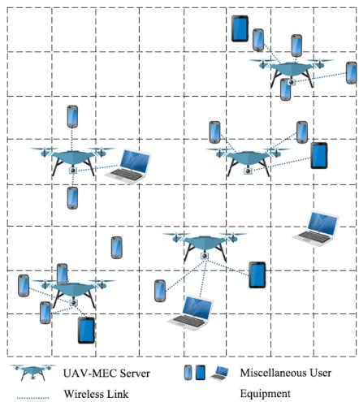  
Fig. 1. An illustration of UAV-enabled MEC networks.

cooperative offloading, and handover in the multi-access edge wireless network were jointly considered.

To shift the capability of the cloud computing network to that of the edge network is the essential motivation of MEC, which requires the proper deployment of edge servers. The authors in [5] utilized a mixed integer programming to balance workloads among edge servers and minimize the access delay of mobile users by placing edge servers optimally. A framework was presented in [19] to optimize the system-wide cost by discovering proper unforeseen edge locations. In [20], local search algorithms were applied to find the best solution of the edge server deployment problem within the least number of solution space explorations.

UAV-enabled MEC architecture has been proved to improve the performance compared with conventional wireless networks. In [11], the authors minimized the sum of the maximum delay of all users with the joint optimization of UAV trajectory, tasks offloading ratio and user scheduling by a novel penalty dual decomposition-based algorithm. In [21], the authors considered the UAV-enabled MEC system involving Internet of Things devices, UAV and edge clouds, and a successive convex-approximation-based algorithm was proposed to optimize UAV position, communication and computing resource allocation, and task splitting decisions jointly. Resource trading within the edge computing-assisted UAV network was discussed in [22], and an efficient bilateral negotiation scheme was proposed to achieve the optimal transmission power. The authors designed a 5G-enabled UAV-to-community offloading system in [23], where an auction algorithm and a dynamic task admission algorithm were proposed to determine the trajectory of UAVs and task scheduling, respectively.

A UAV-enabled MEC network was studied in [12], where the power minimization problem with latency and coverage constraints was decomposed into three subproblems. Optimal power control, computation capacity allocation and location planning were reached iteratively. In [24], the authors optimized the trajectory planning of UAVs and computation resource allocation by converting these two problems into convex ones, and solved them with an efficient iterative algorithm. The authors in [25] considered both ground and UAV-mounted MEC servers for data offloading of users and captured their risk-aware behaviors via prospect theory to conduct a non-cooperative game.

However, the above UAV-enabled studies either considered one UAV (e.g., [11], [21], [22], [23]) or relied on centralized mechanisms (e.g., [12], [24]). In addition, the location of the UAV was always fixed in some work (e.g., [22], [25]). No work has investigated the distributed mechanism for both computation offloading and the deployment of MEC servers, to the best of our knowledge.

## 3 SYSTEM MODEL

As illustrated in Fig. 1, miscellaneous User Equipment (UE) processes tasks either via offloading to UAVs or locally. We consider N UEs and M UAVs in the system, where the sets of UEs and UAVs are denoted by $\mathcal { N } \overset { \cdot } { = } \left\{ 1 , \ldots , N \right\}$ and $\mathcal { M } =$ $\{ 1 , \dots , M \}$ <sup>N ¼ f g M ¼</sup>, respectively. The computation offloading strat-<sup>f g</sup>egy of UE i can be denoted by $\begin{array} { r } { \bar { s _ { i } } \in S _ { i } = \{ 0 \} \bigcup \mathcal { M } , i \in \mathcal { N } , } \end{array}$ where $s _ { i } ~ > ~ 0$ <sup>2 ¼ f g M 2 N</sup>denotes that UE i chooses edge computing, and $s _ { i } = 0$ represents that UE i processes its task locally. For <sup>¼</sup>each UAV, its goal is to find an appropriate location for hovering. For simplification, we divide the considered area into several discrete locations, each of which represents a strategy of UAVs. In an area with L discrete locations, the set of these locations is denoted by $\mathcal { L } = \{ 1 , \ldots , L \}$ , and the loca-<sup>L ¼ f g</sup>tion hovering strategy of UAV j can thus be denoted as $a _ { j } \in$ $A _ { j } = \mathcal { L } , j \in \bar { \mathcal { M } } . ^ { 1 }$

<sup>¼ L 2 M</sup>At each period (equals to several time slots since the system can be operated in a time-slotted manner), UE i may generate task $\boldsymbol { \mathcal { T } } _ { i }$ . Specifically, each UE generates computa-<sup>T</sup>tional demands with a probability $\theta _ { i } \in ( 0 , 1 ]$ . Main notations are illustrated in Table 1.

## 3.1 Communication Model

If UE $i \in \mathcal N$ requires task processing through edge computing, i.e., $s _ { i } > 0 ,$ , the uplink data rate can be computed by:

$$
R _ { i } ( \mathbf { s } , \mathbf { a } ) = \sum _ { j \in \mathcal { M } } l \{ s _ { i } = j \} B \log _ { 2 } \Bigg ( 1 +\tag{1}
$$

where $\mathbf { s } = ( s _ { 1 } , \ldots , s _ { N } )$ and $\mathbf { a } = ( a _ { 1 } , \dots , a _ { M } )$ represent the <sup>s ¼ ð Þ a ¼ ð Þ</sup>strategy profiles of UEs and UAVs, respectively. Symbol B is the bandwidth of the wireless channel, and $p _ { i }$ is the transmission power of UE i. Variable $g _ { i , j }$ stands for the instantaneous channel gain of UE i when it chooses UAV j for computation offloading.<sup>2</sup> Many privious work adopted the free space path loss model when modeling channels, since UAV communication links are LoS channels, which are much predominant [11]. In our model, we take the small scale-fading into account, which is described by a Rician distribution according to [26].

TABLE 1 Main Notations
<table><tr><td>Notation</td><td>Description</td></tr><tr><td>N, M, L  $\mathcal { N } , \mathcal { M } , \mathcal { L }$ </td><td>Number of UEs ,UAVs and locations, respectively Set of UEs ,UAVs and locations, respectively</td></tr><tr><td> $s _ { i } , a _ { j }$ </td><td>Strategy of UE i and UAV j, respectively</td></tr><tr><td> $\theta _ { i }$ </td><td>Task generation probability of UE i</td></tr><tr><td> $R _ { i }$ </td><td>Data rate of UE i</td></tr><tr><td> $T _ { i } ^ { c } , T _ { i } ^ { l }$ </td><td>Edge and local computing delays of UE  $i ,$ </td></tr><tr><td> $E _ { i } ^ { c } , E _ { i } ^ { l }$ </td><td>respectively Edge and local computing energy consumptions</td></tr><tr><td></td><td>of UE i, respectively</td></tr><tr><td> $T _ { j }$ </td><td>Computational delay of UAV j</td></tr><tr><td> $\check { E _ { j } }$ </td><td>Energy consumption of UAV j</td></tr><tr><td> $\mu _ { i } ^ { \dot { T } } , \mu _ { i } ^ { E }$ </td><td>UE i&#x27;s weight of computational delay and energy</td></tr><tr><td> $\lambda _ { j } ^ { T } , \lambda _ { j } ^ { E }$ </td><td>consumption, respectively UAV j&#x27;s weight of computational delay and</td></tr><tr><td></td><td>energy consumption, respectively</td></tr><tr><td> $u _ { i } ^ { o } , \hat { u } _ { j } ^ { o }$ </td><td>UE i&#x27;s and  $\mathrm { U A V } \ : \dot { j ^ { \prime } } \mathrm { s }$  utility for original static game  $\mathcal { G } _ { c o } ^ { o }$  and  $\mathcal { G } _ { l s } ^ { o } ,$  respectively</td></tr><tr><td> $u _ { i } , \hat { u } _ { j }$ </td><td>UÉ i&#x27;s and UAV j&#x27;s utility for equivalent static</td></tr><tr><td> $u _ { i } ^ { s } , \hat { u } _ { j } ^ { s }$ </td><td>game  $\bar { \mathcal { G } } _ { c o } ^ { e }$  and  $\mathcal { G } _ { l s } ^ { e } ,$  respectively UÉ i&#x27;s and UAV j&#x27;s utility for stochastic game</td></tr></table>

Parameter l indicates a binary variable. If UE i off-<sup>fg</sup>loads its tasks to UAV j, then $l \{ s _ { i } = { \dot { j } } \} = 1 .$ , otherwise $\begin{array} { r l } {  { l \{ s _ { i } = } }  \end{array}$ $j \} = 0$ <sup>f ¼ g ¼ f ¼</sup>. Similarly, if UEs i and i’ select the same UAV for <sup>g ¼</sup>data offloading, then $l \{ s _ { i ^ { \prime } } = s _ { i } \} = 1 .$ , otherwise $l \{ s _ { i ^ { \prime } } = s _ { i } \} =$ 0. And $\sigma _ { 0 }$ <sup>f ¼ g ¼ f ¼ g ¼</sup>denotes the background noise power. Code Division Multiple Access (CDMA) can be adopted for wireless communications among multiple UEs, which allows them to share the same spectrum resource simultaneously. However, excessive sharing may result in severe interference, incurring low offloading rates. On the contrary, orthogonal frequency resources are assigned for UAVs to avoid interference, even their coverage areas may overlap.

## 3.2 Computation Model

At each time slot, UE i may generate a task $\boldsymbol { { \mathcal { T } } } _ { i } = ( D _ { i } , C _ { i } ^ { c } , C _ { i } ^ { l } ) .$ where $D _ { i }$ is the data size of task $\boldsymbol { \tau } _ { i } ;$ $C _ { i } ^ { c }$ <sup>T</sup>denote the required numbers of CPU cycles for task $\boldsymbol { \mathcal { T } } _ { i }$ in edge computing and local computing, respectively.

## 3.2.1 Computation Cost of UEs

If UE i chooses edge computing for task processing, it focuses on the energy consumption of transmission and the delays of both transmission and computing execution. If UE i chooses to process tasks locally, merely computing execution delay and energy consumption are taken into account. Thus, the total edge computing delay $T _ { i } ^ { c } ( \mathbf { s } , \mathbf { a } )$ and local execution delay $T _ { i } ^ { l } ( s _ { i } )$ <sup>ðs aÞ</sup>of UE i can be computed by:

$$
\begin{array} { r } { \left\{ \begin{array} { l l } { T _ { i } ^ { c } ( \mathbf { s } , \mathbf { a } ) = \frac { D _ { i } } { R _ { i } ( \mathbf { s } , \mathbf { a } ) } + \frac { C _ { i } ^ { c } } { F _ { i } ^ { c } } , } & { i f \ s _ { i } > 0 , } \\ { T _ { i } ^ { l } ( s _ { i } ) = \frac { C _ { i } ^ { l } } { F _ { i } ^ { l } } , } & { i f \ s _ { i } = 0 , } \end{array} \right. } \end{array}\tag{2}
$$

where $F _ { i } ^ { c }$ denotes the computation capability $( \mathrm { i . e . }$ , CPU cycles per second) of the chosen UAV assigned to UE i, and $\check { F } _ { i } ^ { l }$ is the local computation capability of UE i. Generally, mobile edge servers have much larger computing resources than those of local devices, thus we consider that all the computing requirements of UEs can be satisfied via edge computing. Then, edge and local energy consumptions $( E _ { i } ^ { c } ( \mathbf { s } , \mathbf { a } )$ and $E _ { i } ^ { l } ( s _ { i } ) )$ ) of UE i can be computed by:

$$
\begin{array} { r } { \left\{ \begin{array} { l l } { E _ { i } ^ { c } ( \mathbf { s } , \mathbf { a } ) = \frac { p _ { i } D _ { i } } { R _ { i } ( \mathbf { s } , \mathbf { a } ) } , } & { i f ~ s _ { i } > 0 , } \\ { E _ { i } ^ { l } ( s _ { i } ) = \kappa _ { i } C _ { i } ^ { l } , } & { i f ~ s _ { i } = 0 , } \end{array} \right. } \end{array}\tag{3}
$$

where $\kappa _ { i }$ is a positive coefficient denoting the energy consumption per CPU cycle of UE i. According to equations 2 and 3 , we formulate edge and local computation costs $( Z _ { i } ^ { c } ( { \bf s } , { \bf a } )$ and $Z _ { i } ^ { l } ( s _ { i } ) )$ of UE i as follows:

$$
\left\{ \begin{array} { l l } { Z _ { i } ^ { c } ( \mathbf { s } , \mathbf { a } ) = \mu _ { i } ^ { T } T _ { i } ^ { c } ( \mathbf { s } , \mathbf { a } ) + \mu _ { i } ^ { E } E _ { i } ^ { c } ( \mathbf { s } , \mathbf { a } ) , } & { i f ~ s _ { i } > 0 , } \\ { Z _ { i } ^ { l } ( s _ { i } ) = \mu _ { i } ^ { T } T _ { i } ^ { l } ( s _ { i } ) + \mu _ { i } ^ { E } E _ { i } ^ { l } ( s _ { i } ) , } & { i f ~ s _ { i } = 0 , } \end{array} \right.\tag{4}
$$

where $\mu _ { i } ^ { T }$ and $\mu _ { i } ^ { E } \in [ 0 , 1 ]$ denote the weights of processing <sup>2 ½ </sup>delay and energy consumption of UE i, respectively. According to the multiple criteria decision-making theory [27], the unit of $\mu _ { i } ^ { T }$ is the reciprocal of Second and the unit of $\mu _ { i } ^ { E }$ is the reciprocal of Joule. These two weighting parameters reflect the difference in the UE i’s emphasis on processing time and energy consumption of decision making.

## 3.2.2 Computation Cost of UAVs

For UAVs, their core mission is serving UEs for task offloading. The computation delay of UAV j can be obtained as follows:

$$
T _ { j } ( \mathbf { s } , \mathbf { a } ) = \frac { 1 } { K _ { j } } \sum _ { i \in \cal N } T _ { i } ^ { c } ( \mathbf { s } , \mathbf { a } ) l \{ s _ { i } = j \} ,\tag{5}
$$

where $\begin{array} { r } { K _ { j } = \sum _ { i \in \mathcal { N } } l \{ s _ { i } = j \} } \end{array}$ denotes the total number of UEs <sup>¼ 2N f ¼ g</sup>choosing UAV j for edge computing. We do not take all the energy consumptions into account, but focus on those caused by processing UEs’ tasks. Thus, the average energy consumption related to edge computing on $\mathrm { U A V } ~ j$ can be computed by:

$$
E _ { j } ( \mathbf { s } , \mathbf { a } ) = \frac { 1 } { K _ { j } } \sum _ { i \in \mathcal { N } } ( E _ { i } ^ { c } ( \mathbf { s } , \mathbf { a } ) + \hat { \kappa } _ { j } C _ { i } ^ { c } ) l \{ s _ { i } = j \} ,\tag{6}
$$

where $\hat { \kappa } _ { j }$ is a positive coefficient denoting the energy consumption per CPU cycle of UAV j. Note that it is possible for $\bar { K } _ { j } = \bar { 0 _ { \ast } }$ , i.e., no UE selects UAV j for task offloading. <sup>¼</sup>Such a case will be discussed in Section 5 detailedly. Similarly, we formulate the computation cost of UAV j by weights $\lambda _ { j } ^ { T }$ and $\lambda _ { j } ^ { E } , j \in { \mathcal { M } } :$

$$
\bar { Z } _ { j } ( \mathbf { s } , \mathbf { a } ) = \lambda _ { j } ^ { T } T _ { j } ( \mathbf { s } , \mathbf { a } ) + \lambda _ { j } ^ { E } E _ { j } ( \mathbf { s } , \mathbf { a } ) ,\tag{7}
$$

where $\lambda _ { j } ^ { T }$ and $\lambda _ { i } ^ { E }$ share the same properties with $\mu _ { i } ^ { T }$ and $\mu _ { i } ^ { E } .$ In the real scenario, although each UAV edge server is equipped with large computing capacity, there exists limitation caused by the total amount of data, which can be processed at the same time. Thus, we apply $\bar { D } _ { j }$ as the threshold data value of $\mathrm { { U A V } } ~ j ,$ i.e., the upper amount of data that July 05,2026 at 12:27:12 UTC from IEEE Xplore. Restrictions apply.

UAV j can process at the same time. If $\sum _ { i \in N } D _ { i } l \{ s _ { i } = j \} \ >$ ${ \bar { D } } _ { j } ,$ <sup>2N f ¼ g</sup>then UAV j is not able to provide edge computing for all UEs. We call this case as the offline or unavailability of UAV. Those UEs who choose the offline UAV for fail to offload tasks.

In order to meet the UEs’ offloading requirements and reduce the increase in the computing costs of UEs caused by the unavailability of UAV, we design a low computing cost mechanism named UAV Availability Response (UAR) mechanism, which is applied before UEs formally delivering their computing tasks to the local devices or UAV-MEC servers for processing, and to help both UEs and UAVs make rational decisions. The UAR mechanism can be summarized as follows:

1) First, each UE conducts preliminary offloading strategy selection based on the hovering locations of UAVs, and sends the value of data size rather than the entire data packet to its chosen UAV.

2) After receiving values from UEs, each UAV determines whether the total value exceeds its threshold $\bar { D } _ { j } , j \in \mathcal { M }$ . That is, whether it can provide edge com-<sup>2 M</sup>puting services to all UEs who select it at the same time. $\begin{array} { r } { \mathrm { ~ \bar { I f } ~ } \sum _ { i \in \mathcal { N } } D _ { i } l \{ s _ { i } = j \} \le \bar { D } _ { j } , } \end{array}$ each UAV sends the <sup>2N f ¼ g </sup>value of the assigned computation capability $F _ { i } ^ { c }$ to UE $i ,$ where $\begin{array} { r } { s _ { i } = \bar { j } , i \in \mathcal { N } . \hat { \mathrm { H } } \sum _ { i \in \mathcal { N } } D _ { i } l \hat { \{ s _ { i } = j \} } > \bar { D } _ { j } , } \end{array}$ <sup>¼ 2 N 2N f ¼ g</sup>for the purpose of minimizing its computational cost, the UAV can sequentially delete the UE with the highest computational cost from its service list until the threshold is not exceeded. For those UEs who remain on the service list, the UAV sends the corresponding values of the assigned computation capabilities to them. For those UEs who are deleted from the service list, the UAV does not assign computation capability and sends value 0 to them.

3) If the assigned computation capability value received by the UE is not 0, it transmits its data packet to the selected UAV. Otherwise, according to equations 2 and 4 , if the assigned computation <sup>ð Þ ð Þ</sup>capability is 0, then the computational cost of edge computing is infinite. Similarly, for the purpose of minimizing the computational cost, those UEs, who received value 0, will choose local computing instead.

In general, the UAR mechanism subtly transforms the problems caused by the unavailability of UAVs through the assigning of computation capability into the rational decision-making problems of UEs and UAVs, which will be discussed in detail through the game theory model in Section 4. In addition, the computational overhead involved in UAR mechanism can be ignored. Specifically, the communication cost only involves sending the size of the data packet and the value of the assigned computation capability. For the calculation cost, the UAV needs to calculate the computation costs of UEs who select it, and find the maximal one.

## 3.3 Assumptions

In Sections 3.1 and 3.2, we describe the communication and computation models of UEs and UAVs. In this section, we give more detailed assumptions before eliciting systemwide calculation costs. In our model, we do not take signaling overhead, bandwidth overhead and the downlink transmission into account.

1) For signaling overhead, we design a distributed asynchronous update framework in Section 5, where UEs and UAVs learn the optimal strategy selections. It can be seen from Algorithms 2 and 3 that, both UEs and UAVs update the selection probability of the strategy according to the rewards brought by their own strategy selections. Therefore, both UEs and UAVs do not need much signaling during the whole period. Compared with the computational overhead consumed by data transmissions, the overhead of signaling can be negligible.

2) For bandwidth overhead, non-orthogonal multiple access is used to facilitate the efficient task offloading in our model. According to existing studies, such as [25], [24] and [22], we make the assumption that bandwidth resources are sufficient.

3) For the downlink transmission, we neglect the delay and energy consumption caused by sending results back to UEs. This is because, compared with the data size of the computing task, the data size of the result is relatively small, which takes little communication resources. Besides, disregarding the download of results will not noticeably affect the system performance, and has been adopted by numerous studies, including [24], [11], [28], [29] and [30].

## 3.4 System-wide Computation Cost Minimization

According to Equations (5) and (6), we reorganize the computation costs described above into a composite computation cost as follows:

$$
Z _ { i } ( \mathbf { s } , \mathbf { a } ) = \left\{ \begin{array} { l l } { Z _ { i } ^ { c } ( \mathbf { s } , \mathbf { a } ) + \sum _ { j \in \mathcal { M } } \hat { \kappa } _ { j } C _ { i } ^ { c } l \{ s _ { i } = j \} , } & { i f \ s _ { i } > 0 , } \\ { Z _ { i } ^ { l } ( s _ { i } ) , } & { i f \ s _ { i } = 0 . } \end{array} \right.\tag{8}
$$

Then, we can formulate the system-wide computation cost minimization problem as follows:

$$
\begin{array} { c } { \displaystyle \operatorname* { m i n } _ { { \bf s } , { \bf a } } \displaystyle \sum _ { i \in \mathcal { N } } Z _ { i } ( { \bf s } , { \bf a } ) , } \\ { \displaystyle \mathrm { s . t . } \sum _ { m \in \mathcal { M } \cup \{ 0 \} } l \{ s _ { i } = m \} \le 1 , { \bf s } = [ s _ { i } ] _ { \forall i \in \mathcal { N } } , } \\ { \displaystyle \sum _ { l \in \mathcal { L } } l \{ a _ { j } = l \} = 1 , { \bf a } = [ a _ { j } ] _ { \forall j \in \mathcal { M } } . } \end{array}\tag{9}
$$

According to above models, the hovering locations of UAVs can affect UEs’ strategy selections, i.e., whether to choose local computing or edge computing. If edge computing is selected, UEs need to further select which UAV is suitable for data offloading. These strategy selections (of both UAVs and UEs), which result from the system-wide computing and transmission conditions, determine the systemwide computation cost. Therefore, better UAVs’ hovering locations and UEs’ offloading strategies will bring less computational cost.

Solving such an optimal problem is challenging (NPhard), since it involves a combinatorial optimization with July 05,2026 at 12:27:12 UTC from IEEE Xplore. Restrictions apply.

solution space $\left( | \mathcal { M } | + 1 \right) ^ { N } \cdot | \mathcal { L } | ^ { M }$ , let alone in a dynamic <sup>ð Mj j þ Þ  Lj j</sup>environment. First, the more UEs choose to offload tasks to the same UAV, the more they suffer from dramatically increasing interference. When the interference becomes intolerable, local computing is preferred. In addition, for UAVs with the fixed strategy profiles of UEs, by choosing different hovering locations, the changes in UAVs’ strategies result in the variation of the interference encountered by UEs, and thus affect the computation costs of UAVs. Besides, there is a tight connection between strategy profiles and . Specifically, UEs’ task offloading decisions directly <sup>s a</sup>affect the computation costs of their chosen UAVs. Meanwhile, the hovering patterns of UAVs determine UEs’ strategies of task processing in return. As a result, we decompose the optimization problem in 9 and analyze the <sup>ð Þ</sup>games among UEs and UAVs respectively, to minimize the system-wide computation cost.

## 4 GAME FOR MULTI-UE COMPUTATIONOFFLOADING AND UAV LOCATION SELECTION

In this section, we formulate a series of game theoretic models to reshape the system-wide computation cost optimization problem. We consider the static case first, then extend to the dynamic one, where task generation of UEs is stochastic with time-varying probability.

## 4.1 Static Case

As mentioned in Section $^ { 3 , }$ channel state and the generations of UEs’ computing tasks are all stochastic. Specifically, as described in Section 3.1, we consider the small scale-fading in channels, which is described by a Rician distribution. Besides, every UE generates computational demands with a probability $\theta _ { i } \in ( 0 , 1 ]$ . To simplify, we consider the static <sup>2 ð </sup>case in this section, i.e., only fixed channel and UEs with computing tasks are considered. A static case can also be viewed as a certain event or a realization of the probability space (will be discussed mathematically in Section 4.2).

Based on the previous modeling of computation costs, the negative utility<sup>3</sup> (i.e., the cost) of UE i can be computed by:

$$
\begin{array} { r } { u _ { i } ^ { o } ( \mathbf { s } , \mathbf { a } ) = \left\{ \begin{array} { l l } { Z _ { i } ^ { c } ( \mathbf { s } , \mathbf { a } ) , \quad i f \ s _ { i } > 0 , } \\ { Z _ { i } ^ { l } ( s _ { i } ) , \quad i f \ s _ { i } = 0 , } \end{array} \right. } \end{array}\tag{10}
$$

where $Z _ { i } ^ { c } ( \mathbf { s } , \mathbf { a } )$ and $Z _ { i } ^ { l } ( s _ { i } )$ are defined in equation 4 . For <sup>ðs aÞ ð Þ</sup>UAVs, the utility of UAV j can be computed by:

$$
\hat { u } _ { j } ^ { o } ( \mathbf { s } , \mathbf { a } ) = \bar { Z } _ { j } ( \mathbf { s } , \mathbf { a } ) .\tag{11}
$$

The strategy selections of UEs and UAVs are independent with each other relatively. If the hovering locations of UAVs are fixed, each UE’s utility is merely affected by other UEs’ strategies. Each UAV’s utility is determined by its location selection with fixed UEs’ offloading strategies. Besides, based on the communication and computation models of UEs and UAVs, it can be observed that the computation costs of UEs and UAVs focus on different parts of the system overhead. Specifically, when UEs choose edge computing, they simply take total latency and transmission energy consumption into account, while the energy consumption of edge computing is vital to UAVs. Therefore, we decompose the system-wide computation cost minimization problem into two games, i.e., the multi-UE computation offloading game $\mathcal { G } _ { c o } ^ { o }$ and the UAV location selection game $\mathcal { G } _ { l s } ^ { o }$ . Game $\bar { \mathcal { G } } _ { c o } ^ { o }$ <sup>G</sup>can be formulated as $\mathcal { G } _ { c o } ^ { o } = [ \mathcal { N } , \{ S _ { i } \} _ { i \in \mathcal { N } } ,$ $\{ u _ { i } ^ { o } \} _ { i \in \mathcal { N } } ] .$ <sup>G G ¼ ½N f g 2N</sup>, where the strategy profile of UAVs is considered <sup>f g 2N </sup>to be static, game $\mathcal { G } _ { l s } ^ { o }$ <sup>a</sup>can be formulated as $\mathcal { G } _ { l s } ^ { o } =$ $[ \mathcal { M } , \{ A _ { j } \} _ { j \in \mathcal { M } } , \{ \tilde { u } _ { j } ^ { \tilde { o } } \} _ { j \in \mathcal { M } } ]$ <sup>G G</sup>with a fixed UE’s strategy profile $\mathbf { s } ,$ <sup>½M</sup>i.e.,

$$
\begin{array} { r } { ( \mathcal { G } _ { c o } ^ { o } ) : \underset { s _ { i } \in S _ { i } } { \operatorname* { m i n } } u _ { i } ^ { o } ( s _ { i } , \mathbf { s } _ { - i } , \mathbf { a } ) , \forall i \in \mathcal { N } , } \\ { ( \mathcal { G } _ { l s } ^ { o } ) : \underset { a _ { j } \in A _ { j } } { \operatorname* { m i n } } \hat { u } _ { j } ^ { o } ( a _ { j } , \mathbf { a } _ { - j } , \mathbf { s } ) , \forall j \in \mathcal { M } . } \end{array}\tag{12}
$$

With one strategy profile to be a prerequisite, UEs or UAVs merely need to focus on the minimization of their utilities by conducting advisable strategy selections within their strategy spaces. Specifically, for UEs, if the hovering locations of UAVs are fixed, UEs can minimize their utilities by reaching the optimal strategy profile, as it is for all UAVs. We consider such an optimal strategy profile as an NE of the game, which is defined as follows:

Definition 1 (NE of $\mathcal { G } _ { c o } ^ { o } )$ . A computation offloading strategy profile $\mathbf { s } ^ { * } = [ s _ { i } ^ { * } ] _ { \forall i \in \mathcal { N } }$ <sup>G</sup>is a (pure-strategy) NE of game $\mathcal { G } _ { c o } ^ { o } .$ , if and <sup>s ¼ ½ 8 2N G</sup>only if no UE can minimize its utility u<sup>o</sup> by unilaterally deviating, i.e.,

$$
u _ { i } ^ { o } ( s _ { i } ^ { * } , s _ { - i } ^ { * } , a ) \leq u _ { i } ^ { o } ( s _ { i } , s _ { - i } ^ { * } , a ) , \forall i \in \mathcal { N } , \forall s _ { i } \in S _ { i } ,\tag{13}
$$

where is treated as a known constant.

Definition 2 (NE of $\mathcal { G } _ { l s } ^ { o } )$ . A location hovering strategy profile $\mathbf { a } ^ { * } = [ a _ { j } ^ { * } ] _ { \forall j \in \mathcal { M } }$ <sup>G</sup>is a (pure-strategy) NE of game $\mathcal { G } _ { l s } ^ { o } .$ , if and only <sup>a ¼ ½ 8 2M G</sup>if no UAV can minimize its utility u^<sup>o</sup> by unilaterally deviating, $i . e .$

$$
\hat { u } _ { j } ^ { o } ( a _ { j } ^ { * } , a _ { - j } ^ { * } , s ) \leq \hat { u } _ { j } ^ { o } ( a _ { j } , a _ { - j } ^ { * } , s ) , \forall j \in \mathcal { M } , \forall a _ { j } \in A _ { j } ,\tag{14}
$$

where is treated as a known constant.

According to equation 10 and Definition 1, we define <sup>ð Þ</sup>the concept of edge and local benefits as follows:

Definition 3. Strategy profile is edge beneficial to UE $i ,$ if <sup>s</sup>choosing edge computing can yield better utility than choosing local computing, i.e., $u _ { i } ^ { o } ( s _ { i } , s _ { - i } , a ) \leq u _ { i } ^ { o } ( 0 , s _ { - i } , a )$ , where $s _ { i } \ >$ <sup>ð </sup>0. Otherwise, is local beneficial.

According to Equations (2) and (3), whether strategy profile is edge or local beneficial to UE i strongly depends on <sup>s</sup>uplink data rate $R _ { i } ( \mathbf { s } , \mathbf { a } )$ . Moreover, we can observe from <sup>ðs aÞ</sup>Equation (1) that the uplink data rate of UE i is determined by its encountered interference. We denote the interference of UE i by $\begin{array} { r } { I _ { i } ( \mathbf { s } , \mathbf { a } ) = \sum _ { i ^ { \prime } \in \mathcal { N } \backslash \{ i \} } p _ { i ^ { \prime } } g _ { i ^ { \prime } , j } l \{ s _ { i ^ { \prime } } = s _ { i } \} } \end{array}$ , when $s _ { i } = j \in$ <sup>ðs aÞ ¼ 02Nnf g f ¼ g</sup>. Therefore, we can obtain the following lemma:

Lemma 1. Strategy profile is edge beneficial to UE i, if the interference $I _ { i } ( s , a )$ generated by edge computing is lower than threshold $Q _ { i } , i . e . , I _ { i } ( s , a ) \leq Q _ { i }$ , where

$$
Q _ { i } = \frac { p _ { i } g _ { i , j } } { \gamma \psi _ { i } \mathrm { ~ \tiny ~ - ~ } 1 } - \sigma _ { 0 } ,
$$

$$
\psi _ { i } = ( \mu _ { i } ^ { T } + \mu _ { i } ^ { E } p _ { i } ) D _ { i } / [ B \mu _ { i } ^ { T } ( C _ { i } ^ { l } / F _ { i } ^ { l } - C _ { i } ^ { c } / F _ { i } ^ { c } ) + \mu _ { i } ^ { E } \kappa _ { i } C _ { i } ^ { l } ] .
$$

Otherwise it’s local beneficial.

Proof. See Appendix A, which can be found on the Computer Society Digital Library at http://doi.ieeecomputersociety. org/10.1109/TMC.2021.3129785. □

Based on Lemma 1, we can construct the equivalent form of each original game, i.e., game $\mathcal { G } _ { c o } ^ { o }$ can be transformed into game $\mathcal { G } _ { c o } ^ { e } ,$ and game $\mathcal { G } _ { l s } ^ { o }$ <sup>G</sup>is equivalent to game $\mathcal { G } _ { l s } ^ { e }$ (details <sup>G G</sup>will be shown with proofs in Lemmas $2 , 3$ <sup>G</sup>and Theorems 1, 2). We design $\mathcal { G } _ { c o } ^ { e }$ and $\mathcal { G } _ { l s } ^ { e }$ as follows:

$$
\begin{array} { r } { ( \mathcal { G } _ { c o } ^ { e } ) : \underset { s _ { i } \in S _ { i } } { \operatorname* { m i n } } u _ { i } ( s _ { i } , \mathbf { s } _ { - i } , \mathbf { a } ) , \forall i \in \mathcal { N } , } \\ { ( \mathcal { G } _ { l s } ^ { e } ) : \underset { a _ { j } \in A _ { j } } { \operatorname* { m i n } } \hat { u } _ { j } ( a _ { j } , \mathbf { a } _ { - j } , \mathbf { s } ) , \forall j \in \mathcal { M } , } \end{array}\tag{15}
$$

where the utilities of UEs are estimated by the interference their suffered, and the utilities of UAVs are evaluated by the total interference of those UEs they served. Specifically, with strategy profile pair $( \mathbf { s } , \mathbf { a } )$ , UE $\dot { i } ^ { \prime } \mathrm { s }$ utility $u _ { i } ( \mathbf { s } , \mathbf { a } )$ and UAV j’s utility $\hat { u } _ { j } ( \mathbf { s } , \mathbf { a } )$ <sup>ðs aÞ</sup>in games $\mathcal { G } _ { c o } ^ { e }$ and $\mathcal { G } _ { l s } ^ { e }$ <sup>ðs aÞ</sup>are defined by:

$$
u _ { i } ( \mathbf { s } , \mathbf { a } ) = \left\{ { \begin{array} { l l } { I _ { i } ( \mathbf { s } , \mathbf { a } ) , } & { i f \ s _ { i } > 0 , } \\ { Q _ { i } , } & { i f \ s _ { i } = 0 , } \end{array} } \right.\tag{16}
$$

$$
\hat { u } _ { j } ( \mathbf { s } , \mathbf { a } ) = \frac { 1 } { K _ { j } } \sum _ { i \in \mathcal { N } } I _ { i } ( \mathbf { s } , \mathbf { a } ) l \{ s _ { i } = j \} .\tag{17}
$$

According to the above analysis and Lemma 1, we can obtain Lemmas 2 and 3 as follows:

Lemma 2. The preference of UEs’ strategy selections in game $\mathcal { G } _ { c o } ^ { e }$ is equivalent to $\mathcal { G } _ { c o } ^ { o } ,$ i.e., for constant a and any $\boldsymbol { s } _ { i } ^ { \prime } \neq \boldsymbol { s } _ { i }$ <sup>G</sup>, i <sup>G</sup>, the following equivalence is founded, i.e.,

$$
\begin{array} { r l } & { u _ { i } ^ { o } ( s _ { i } ^ { \prime } , s _ { - i } , a ) \leq u _ { i } ^ { o } ( s _ { i } , s _ { - i } , a ) \Leftrightarrow } \\ & { u _ { i } ( s _ { i } ^ { \prime } , s _ { - i } , a ) \leq u _ { i } ( s _ { i } , s _ { - i } , a ) . } \end{array}\tag{18}
$$

Proof. See Appendix B, available in the online supplemental material. □

Lemma 3. The preference of $U A V s ^ { \prime }$ strategy selections in game $\mathcal { G } _ { l s } ^ { e }$ is equivalent to $\mathcal { G } _ { l s } ^ { o } ,$ , i.e., for constant and any a<sub>0</sub> $\neq a _ { j } ,$ $\forall j \in { \mathcal { M } }$ <sup>G s</sup>, the following equivalence is founded, i.e.,

$$
\begin{array} { r l } & { \hat { u } _ { j } ^ { o } ( a _ { j } ^ { \prime } , a _ { - j } , s ) \leq \hat { u } _ { j } ^ { o } ( a _ { j } , a _ { - j } , s ) \Leftrightarrow } \\ & { \hat { u } _ { j } ( a _ { j } ^ { \prime } , a _ { - j } , s ) \leq \hat { u } _ { j } ( a _ { j } , a _ { - j } , s ) . } \end{array}\tag{19}
$$

Proof. See Appendix C, available in the online supplemental material. □

By summarizing the above two lemmas, we can obtain the following theorems.

Theorem 1. Game $\mathcal { G } _ { c o } ^ { o }$ is equivalent to game $\mathcal { G } _ { c o } ^ { e } .$ . That $i s ,$ each NE of game $\mathcal { G } _ { c o } ^ { o }$ <sup>G</sup>is an NE of game $\mathcal { G } _ { c o ^ { \prime } } ^ { e }$ <sup>G</sup>, and vice versa.

Proof. See Appendix D, available in the online supplemental material. □ tuAuthorized licensed use limited to: Guangxi University. Downloaded o

Theorem 2. Game $\mathcal { G } _ { l s } ^ { o }$ is equivalent to game $\mathcal { G } _ { l s } ^ { e }$ . That is, each NE of game $\mathcal { G } _ { l s } ^ { o }$ <sup>G</sup>is an NE of game $\mathcal { G } _ { l s } ^ { e } ,$ <sup>G</sup>, and vice versa.

Proof. See Appendix $\scriptstyle \mathrm { E , }$ available in the online supplemental material. □

With the formulation of equivalent games, we are able to analyze the existence of the NEs of original ones, since they share the same NE sets. To proceed, we resort to the concept of potential game [31]. A game is called as a potential game if and only if the change of its utility is proportional to the change of a single global function $( \mathrm { i . e . , }$ the potential function), which can be utilized to describe the global utility of all players in the game. Thus, by formulating potential functions of equivalent games $\mathcal { G } _ { c o } ^ { e }$ and $\mathcal { G } _ { l s } ^ { e } ,$ we can obtain the following theorems.

Theorem 3. Game $\mathcal { G } _ { c o } ^ { e }$ is a weighted potential game which has at <sup>G</sup>least one NE. The potential function is defined by:

$$
\begin{array} { r l } & { \Phi ( s , a ) } \\ & { \ = \displaystyle \frac { 1 } { 2 } \sum _ { i \in \mathcal { N } } \displaystyle \sum _ { i ^ { \prime } \in \mathcal { N } \setminus \{ i \} } \sum _ { j \in \mathcal { M } } p _ { i } g _ { i , j } p _ { i ^ { \prime } } g _ { i ^ { \prime } , j } l \{ s _ { i ^ { \prime } } = s _ { i } \} l \{ s _ { i } = j \} } \\ & { \quad + \displaystyle \sum _ { i \in \mathcal { N } } p _ { i } g _ { i , j } Q _ { i } l \{ s _ { i } = 0 \} . } \end{array}\tag{20}
$$

Proof. See Appendix ${ \mathrm { F } } ,$ available in the online supplemental material. □

Theorem 4. Game $\mathcal { G } _ { l s } ^ { e }$ is an exact potential game which has at <sup>G</sup>least one NE. The potential function is defined by:

$$
\begin{array} { l } { \hat { \Phi } ( s , a ) } \\ { = \displaystyle \sum _ { j \in \mathcal { M } } \frac { 1 } { K _ { j } } \sum _ { i \in \mathcal { N } } \displaystyle \sum _ { i ^ { \prime } \in \mathcal { N } \backslash \{ i \} } p _ { i ^ { \prime } } g _ { i ^ { \prime } , j } l \{ s _ { i ^ { \prime } } = s _ { i } \} l \{ s _ { i } = j \} . } \end{array}\tag{21}
$$

Proof. See Appendix $G ,$ available in the online supplemental material. □

With Theorems 1, 2, 3, and 4, we conclude that both games $\mathcal { G } _ { c o } ^ { e }$ and $\mathcal { G } _ { l s } ^ { e }$ have at least one pure strategy NE, and <sup>G G</sup>they share the same NE set with $\mathcal { G } _ { c o } ^ { o }$ and $\mathcal { G } _ { l s . } ^ { o }$ , respectively. Thus, by extending games $\mathcal { G } _ { c o } ^ { e }$ <sup>G</sup>and $\mathcal { G } _ { l s } ^ { e }$ <sup>G</sup>into corresponding stochastic games, characteristics of the dynamic scenario can be revealed.

## 4.2 Dynamic Case

In the dynamic case, channels are time-varing and every UE generates tasks with a probability. A static case L can be seen as an event in the sample space V. Then the random vector is defined by $\Theta ( \Lambda ) = \mathbf { \dot { [ z ( \Lambda ) , g ( \Lambda ) ] } } : \Omega \to 2 ^ { N } \times \mathbb { R } ^ { N \times M }$ where $\mathbf { z } = [ z _ { i } ] _ { \forall i \in \mathcal { N } } .$ <sup>ð Þ</sup>. Herein, $z _ { i } \in \{ 0 , 1 \} , i \in \mathcal { N }$ <sup>! </sup>is a binary-state <sup>z ¼ ½ 8 2N 2 f g 2 N</sup>variable, which represents whether UE i has tasks to be processed (1 for positive, and 0 for negative) with probability $\theta _ { i } \in ( 0 , 1 ]$ . And $\mathbf { g } = [ g _ { i , j } ] _ { \forall i \in N , j \in M }$ follows Rician fading. <sup>2 ð  g ¼ ½ 8 2N 2M</sup>We define the expected utility functions of UE i and UAV j as follows:

$$
u _ { i } ^ { s } ( \mathbf { s } , \mathbf { a } ) = \mathbb { E } [ u _ { i } ( \mathbf { s } , \mathbf { a } ) , \Theta ] = \left\{ \begin{array} { l l } { \mathbb { E } [ I _ { i } ( \mathbf { s } , \mathbf { a } ) , \Theta ] , } & { i f \ s _ { i } > 0 , } \\ { \bar { Q } _ { i } , } & { i f \ s _ { i } = 0 , } \end{array} \right.\tag{22}
$$

$$
\hat { u } _ { j } ^ { s } ( \mathbf { s } , \mathbf { a } ) = \mathbb { E } [ \hat { u } _ { j } ( \mathbf { s } , \mathbf { a } ) , \Theta ] = \frac { 1 } { K _ { j } } \sum _ { i \in \cal N } \mathbb { E } [ I _ { i } ( \mathbf { s } , \mathbf { a } ) , \Theta ] l \{ s _ { i } = j \} ,\tag{23}
$$

where $\begin{array} { r } { \bar { Q } _ { i } = \frac { p _ { i } \bar { g } _ { i , j } } { \gamma _ { i - 1 } } - \sigma _ { 0 } , } \end{array}$ , and $\bar { g } _ { i , j }$ is the expected channel gain <sup>¼</sup>from UE i to $\mathrm { ~ \ i J A V ~ } j$ . Based on equations 22 and 23 , we <sup>ð Þ ð</sup>formulate the corresponding stochastic games $\mathcal { G } _ { c o } ^ { s } = { }$ $[ \mathcal { N } , \Theta , \{ S _ { i } \} _ { i \in \mathcal { N } } , \{ u _ { i } ^ { s } \} _ { i \in \mathcal { N } } ]$ and $\mathcal { G } _ { l s } ^ { s } = [ \mathcal { M } , \Theta , \{ A _ { j } \} _ { j \in \mathcal { M } } ^ { - } , \{ \hat { u } _ { j } ^ { s } \} _ { j \in \mathcal { M } } ] ,$ <sup>½N f g 2N f g 2N  G ¼ ½M f g 2M f g 2M</sup>where each UE or UAV employs adjustments on strategy selection to decline its expected utility. Thus, these two stochastic games can be expressed by:

$$
\begin{array} { r } { ( \mathscr { G } _ { c o } ^ { s } ) : \underset { s _ { i } \in S _ { i } } { \operatorname* { m i n } } u _ { i } ^ { s } ( s _ { i } , \mathbf { s } _ { - i } , \mathbf { a } ) , \forall i \in \mathcal { N } , } \\ { ( \mathscr { G } _ { l s } ^ { s } ) : \underset { a _ { j } \in A _ { j } } { \operatorname* { m i n } } \hat { u } _ { j } ^ { s } ( a _ { j } , \mathbf { a } _ { - j } , \mathbf { s } ) , \forall j \in \mathcal { M } . } \end{array}\tag{24}
$$

Similar to properties of $\mathcal { G } _ { c o } ^ { e }$ and $\mathcal { G } _ { l s } ^ { e } ,$ we obtain the following theorems.

Theorem 5. Stochastic game $\mathcal { G } _ { c o } ^ { s }$ is a weighted potential game <sup>G</sup>with at least one NE. The expected potential function is defined by:

$$
\begin{array} { l } { { \Phi ^ { s } ( s , a ) = \mathbb { E } [ \Phi ( s , a , \Theta ) ] } } \\ { { { } = \displaystyle \frac { 1 } { 2 } \sum _ { i \in \mathcal { N } } \displaystyle \sum _ { i ^ { \prime } \in \mathcal { N } \setminus \{ i \} : s _ { i ^ { \prime } } = s _ { i } } \displaystyle \sum _ { j \in \mathcal { M } } \theta _ { i } \theta _ { i ^ { \prime } } p _ { i } \bar { g } _ { i , j } p _ { i ^ { \prime } } \bar { g } _ { i ^ { \prime } , j } l \{ s _ { i } = j \} } } \\ { { { } + \displaystyle \sum _ { i \in \mathcal { N } } \theta _ { i } p _ { i } \bar { g } _ { i , j } \bar { Q } _ { i } l \{ s _ { i } = 0 \} . } } \end{array}\tag{25}
$$

Proof. See Appendix H, available in the online supplemental material. □

Theorem 6. Stochastic game $\mathcal { G } _ { l s } ^ { s }$ is an exact potential game with <sup>G</sup>at least one NE. The expected potential function is defined by:

$$
\begin{array} { l } { \displaystyle \hat { \Phi } ^ { s } ( s , a ) = \mathbb { E } [ \hat { \Phi } ^ { s } ( s , a , \Theta ) ] } \\ { \displaystyle = \sum _ { j \in \mathcal { M } } \frac { 1 } { K _ { j } } \sum _ { i \in \mathcal { N } } \sum _ { i ^ { \prime } \in \mathcal { N } \setminus \{ i \} : s _ { i ^ { \prime } } = s _ { i } } \theta _ { i } \theta _ { i ^ { \prime } } p _ { i ^ { \prime } } \bar { g } _ { i ^ { \prime } , j } l \{ s _ { i } = j \} . } \end{array}\tag{26}
$$

Proof. See Appendix I, available in the online supplemental material. □

So far, we have analyzed the existence of NE in both static and dynamic cases. In summary, for UEs, the game with the constant strategy profile of UAVs always has at least one pure strategy NE. Similarly for UAVs, the game with the fixed strategy profile of UEs always has at least one pure strategy NE as well. However, to solve the systemwide computation cost minimization problem, both optimal strategy profiles of UEs and UAVs are required. In the next section, we propose a chess-like algorithm to solve the formulated optimization problem, where UEs and UAVs update their strategy profiles alternately.

## 5 CHESS-LIKE ALGORITHM FOR SYSTEM-WIDE COMPUTATION COST MINIMIZATION

In this section, we aim to achieve optimal strategy profiles of both UEs and UAVs, i.e., the optimal solution of the

system-wide computation cost minimization problem, under the dynamic environment in a distributed manner.

## 5.1 Main Algorithm Design

Inspired by chess play, we propose a Chess-like Optimization Algorithm (referred as CO-Algorithm), where groups of UEs and UAVs are regarded as two players and alternately update their strategies, to approach the optimal solution step by step. For instance, we denote UEs’ and UAVs’ strategy profiles at time $t = 0 , 1 , 2 \ldots \operatorname { a s } \mathbf { s } ( t )$ and t respec-<sup>¼ sð Þ að Þ</sup>tively, and then the flow of the CO-Algorithm can be presented as follows:

$$
{ \pmb { \mathscr { a } } } ( 0 ) { \overset { t = 0 } { \longrightarrow } } { \pmb { \mathscr { s } } } ( 0 ) { \overset { t = 1 } { \longrightarrow } } { \pmb { \mathscr { a } } } ( 1 ) { \overset { t = 2 } { \longrightarrow } } { \pmb { \mathscr { s } } } ( 1 ) \ { \overset { \cdots } { \longrightarrow } } \ { \cdots } \ .
$$

Opening by UEs’ or UAVs’ strategy selections or UAVs’ is equivalent, since there is no utility conflict between groups of UEs and UAVs (unlike zero-sum game). We start such an asynchronous optimizational process with random strategy selections of all UAVs, which is denoted as a 0 . <sup>ð Þ</sup>Then, UEs or UAVs make their optimal responses at each iteration, which are also the NE of $\phantom { } \overline { { \mathcal { G } _ { c o } ^ { s } } }$ or $\mathcal { G } _ { l s } ^ { s }$ . To achieve the NE of stochastic game $\mathcal { G } _ { c o } ^ { s }$ $\mathcal { G } _ { l s } ^ { s } ,$ existing game theoretic <sup>G G</sup>algorithms are insufficient [6], since they simply update players’ strategies based on instantaneous utilities.

Algorithm 1. Chess-Like Optimization Algorithm   
Initialization:   
All UAVs employ random strategy selections, i.e., each   
UAV randomly chooses a location to hover.   
repeat for $t = { \dot { 0 } } , 1 , \dots$   
<sup>¼</sup>if t is even then   
UEs call for strategy selection probability learning   
(Algorithm 2) to get s(<sup>t</sup>).   
if UE i with tasks satisfies $\begin{array} { r } { u _ { i } ( \mathbf { s } ( \frac { t } { 2 } ) , \mathbf { a } ( \frac { t } { 2 } ) ) < u _ { i } ( \mathbf { s } ( \frac { t } { 2 } - } \end{array}$   
$\begin{array} { r } { 1 ) , \mathbf { a } ( \frac { t } { 2 } ) ) , \forall i \in \mathcal { N } , } \end{array}$   
<sup>Þ að</sup>then   
UEs update their strategies with $\begin{array} { r } { { \mathbf s } ( \frac { t } { 2 } ) . } \end{array}$   
else   
UEs maintain their strategies.   
end   
else   
UAVs call for strategy selection probability learning   
(Algorithm 3) to get a(<sup>t 1</sup>).   
if UAV j with tasks satisfies $\hat { u } _ { j } ( \mathbf s ( \frac { t - 1 } { 2 } ) , \mathbf a ( \frac { t + 1 } { 2 } ) ) \ < $   
$\begin{array} { r } { \hat { u } _ { j } \big ( \mathbf { s } ( \frac { t - 1 } { 2 } ) , \mathbf { a } ( \frac { t - 1 } { 2 } ) \big ) , \forall j \in \mathcal { M } , } \end{array}$ then   
<sup>ðsð Þ að ÞÞ 8 2 M</sup>UAVs update their strategies with $\begin{array} { r l } {  { \pmb { a } ( \frac { t + 1 } { 2 } ) } } \end{array}$   
else   
UAVs maintain their strategies.   
end   
end   
until strategy profiles of UEs and UAVs do not change any   
more.   
return ;

Inspired by learning automata theory [32], we propose two Probability-based Strategy Selection Learning Algorithms for UEs and UAVs (referred as UEPSSL-Algorithm and UAVPSSL-Algorithm), where strategies with higher rewards can be selected with higher probabilities, otherwise the probabilities are lowered. The entire process of solving the formulated optimization problem is conducted by a July 05,2026 at 12:27:12 UTC from IEEE Xplore. Restrictions apply.

main algorithm and two sub-algorithms. CO-Algorithm acts the main one shown in Algorithm 1, UEPSSL-Algorithm and UAVPSSL-Algorithm are two sub-ones shown in Algorithm 2 and Algorithm 3, respectively.

As shown in Algorithm 1, the main process is manipulated in an iterative manner, where each round refers to a period of processing (time). Each UAV hovers randomly over the target area at time t 0. UEs’ and UAVs’ strategy <sup>¼</sup>selections are executed alternatively based on the odevity of time t. Specifically, for even time $( { \mathrm { i . e . , ~ } } t = 2 k , k \in \mathbb { N } )$ , UEs <sup>¼ 2</sup>employ UEPSSL-Algorithm to achieve the NE of game $\mathcal { G } _ { c o } ^ { s }$ $( \mathrm { i . e . , ~ \bf { s } ( \it t / 2 ) } )$ based on $\mathbf { a } ( t / 2 )$ <sup>G</sup>For odd time (i.e., $t = 2 k + 1 , k \in \mathbb { N } )$ <sup>að Þ</sup>, with solution $\mathbf { s } ( t - 1 / 2 )$ of last time, <sup>¼ þ 2 sð  Þ</sup>UAVs apply UAVPSSL-Algorithm to achieve $\mathbf { a } ( t + 1 / 2 )$ as <sup>að þ Þ</sup>the result of strategy selections. After that, we calculate utilities for each UE and UAV with tasks according to equations 16 and 17 as the basis of decision updating.

<sup>Þ ð Þ</sup>For instance, at even time t, we first calculate utility $\begin{array} { r } { u _ { i } ( \mathbf { s } ( \frac { t } { 2 } ) , \mathbf { a } ( \frac { t } { 2 } ) ) } \end{array}$ for UE i who has tasks to be processed, and <sup>ðsð Þ að ÞÞ</sup>then compare it with the utility of last time $\begin{array} { r } { u _ { i } ( \mathbf { s } ( \frac { t } { 2 } - 1 ) , \mathbf { a } ( \frac { t } { 2 } ) ) } \end{array}$ If $u _ { i } ( { \mathbf { s } } ( \frac { t } { 2 } ) , \mathbf { \tilde { a } } ( \frac { t } { 2 } ) ) < u _ { i } ( { \mathbf { s } } ( \frac { t } { 2 } - 1 ) , \mathbf { \tilde { a } } ( \frac { t } { 2 } ) ) , \ \forall z _ { i } = 1 , i \in \tilde { \mathcal { N } } ,$ , strategy <sup>ðs</sup>profile $s ( t / 2 )$ <sup>Þ ðsð  Þ að ÞÞ 8 ¼ 2 N</sup>can be adopted. Otherwise, UEs keep their <sup>ð Þ</sup>strategies unchanged. The process is similar when it comes to the odd time. Such an asynchronous updating process terminates when the performance cannot be improved by any adjustments of UEs’ or UAVs’ strategies (convergence property will be revealed in Section 6.1).

```latex
Algorithm 2. UEPSSL Algorithm
Initialization:
Each strategy of UE $i , i \in \mathcal { N } ,$ has equal selection probabil
ity, i.e., $\begin{array} { r } { X _ { i } ^ { 0 } = ( \frac { 1 } { M + 1 } , \dots , \frac { 1 } { M + 1 } ) } \end{array}$ is the initial strategy selec-
<sup>¼ ð þ þ Þ</sup>tion probability vector of UE i.
repeat for $\tau = 0 , 1 , \dots$ and $i \in \mathcal N \colon$
<sup>¼ 2 N</sup>if UE i asks for task processing, then
Selecting strategy:
UE i chooses the offloading strategy $s _ { i } ^ { \tau } \in \{ 0 \} \cup \mathcal { M }$
according to the current strategy selection probability
vector $X _ { i } ^ { \tau }$ and UAR mechanism.
Calculating utility:
With strategy profiles of UEs and UAVs, UE i calcu
lates its utility u<sup>t t</sup> ; according to equation 16 .
<sup>ðs aÞ</sup>Updating strategy selection probability:
With reward $r _ { i } ^ { \tau } ( \mathbf { s } ^ { \tau } , \mathbf { a } ) .$ , UE i updates its strategy selec-
<sup>ðs aÞ</sup>tion probability vector by equation 28 .
else
$X _ { i } ^ { \tau + 1 } = X _ { i } ^ { \tau } .$
end
until no UE changes its strategy.
return
```

## 5.2 Sub-Algorithm Design

To solve the two sub-problems, i.e., reaching the NEs of stochastic games $\mathcal { G } _ { c o } ^ { s }$ and $\mathcal { G } _ { l s } ^ { s } ,$ we propose two probability-based <sup>G G</sup>strategy selection learning algorithms as shown in Algorithm $\bar { 2 }$ and Algorithm 3. The proposed UEPSSL-Algorithm in Algorithm 2 is conducted in an iterative manner. Noted that, each round of iteration serves as a counter, which measures the progress of strategy selection probability learning. To distinguish it from time t in the main algorithm, we employ notation t to count the number of iterations (round) in Algorithm 2 (the same for Algorithm 3). At each round, every UE with tasks selects its strategy based on the UAR mechanism and a probability vector, denoted by $X _ { i } ^ { \tau } ,$ , and receives the corresponding reward. Specifically, $X _ { i } ^ { \tau } = ( x _ { i , 0 } ^ { \tau } , x _ { i , 1 } ^ { \tau } , \ldots , x _ { i , M } ^ { \tau } ) , i \in \mathrm { \widetilde { N } } ,$ where $x _ { i , m } ^ { \tau } , m \in$ $\{ 0 \} \cup { \dot { M } } ,$ <sup>¼ ð Þ 2 N 2</sup>, denotes the probability of UE i selecting strategy $s _ { i } ^ { \tau } = m$ at round t. Then we define the received reward <sup>¼</sup>when UE i chooses strategy $s _ { i } ^ { \tau }$ as follows:

$$
r _ { i } ^ { \tau } ( \mathbf { s } ^ { \tau } , \mathbf { a } ) = 1 - \delta _ { i } u _ { i } ^ { \tau } ( \mathbf { s } ^ { \tau } , \mathbf { a } ) ,\tag{27}
$$

where $\mathbf { s } ^ { \tau } = ( s _ { i } ^ { \tau } ) \vert _ { i \in \mathcal { N } }$ denotes the strategy profile of UEs at <sup>s ¼ ð Þ j</sup>round t, symbol $\delta _ { i } \leq 1 / m a x _ { \tau } \{ u _ { i } ^ { \tau } \}$ is a scaling factor to <sup> f g</sup>ensure the positivity of the reward. Apparently, a strategy leading to a smaller utility (i.e., less cost) results in a larger reward. Then, the strategy selection probability vector of UE i with tasks is updated based on the following equation:

$$
X _ { i } ^ { \tau + 1 } = X _ { i } ^ { \tau } + b _ { 1 } r _ { i } ^ { \tau } ( \mathbf { e } _ { s _ { i } ^ { \tau } } - X _ { i } ^ { \tau } ) ,\tag{28}
$$

where $b _ { 1 } \in ( 0 , 1 )$ is the learning rate. Vector $\mathbf { e } _ { s _ { i } ^ { \tau } }$ is a unit vec-<sup>2 ð Þ</sup>tor with M 1 dimensions, and the $s _ { i } ^ { \tau . }$ <sup>e</sup> th element $e _ { s _ { i } ^ { \tau } } = 1$ <sup>ð þ Þ</sup> <sup>¼</sup>Such an updating allows that a strategy is assigned with a larger probability of being selected for the next round, if it results in a larger reward. For those UEs without tasks, their strategy selection probability vectors keep unchanged.

Algorithm 3. UAVPSSL Algorithm   
Initialization:   
Each strategy of $\mathrm { U A V } j , j \in { \mathcal { M } } ,$ has equal selection prob  
ability, $\mathrm { i . e . , } \check { Y } _ { j } ^ { 0 } = ( \textstyle { \frac { 1 } { L } } , \cdot \cdot \cdot , \bar { \frac { 1 } { L } } )$ <sup>2 M</sup>is the initial strategy selection   
<sup>¼ ð Þ</sup>probability vector of UAV j.   
repeat for $\tau = 0 , 1 , \dots$ and $j \in \mathcal { M } ;$   
<sup>¼</sup>Selecting strategy:   
UAV j chooses the hovering location $a _ { j } ^ { \tau } \in \mathcal { L }$ according to   
<sup>2 L</sup>the current strategy selection probability vector $Y _ { j } ^ { \tau }$   
if UAV j is selected by at least one UE, i.e., $K _ { j } > 0 ,$ then   
Calculating utility:   
With strategy profiles of UEs and UAVs, UAV $j$ calcu  
lates its utility $\hat { u } _ { i } ^ { \tau } ( \mathbf { s } , \mathbf { a } ^ { \tau } )$ according to UAR mechanism   
and equation 17 .   
<sup>ð Þ</sup>Updating strategy selection probability:   
With reward $\hat { r } _ { j } ^ { \tau } ( \mathbf { s } , \mathbf { a } ^ { \tau } ) .$ , UAV j updates its strategy selec-  
<sup>ðs a Þ</sup>tion probability vector by equation 30 .   
else   
$Y _ { j } ^ { \tau + 1 } = Y _ { j } ^ { \tau } .$   
end   
until no UAV changes its strategy.   
return

Similarly, as shown in Algorithm 3, we denote the probability vector of UAV j at round t by $Y _ { j } ^ { \tau } =$ $( y _ { j , 0 } ^ { \tau } , y _ { j , 1 } ^ { \tau } , \ldots , y _ { j , L } ^ { \tau } ) , j \in \mathcal { M } ,$ where $y _ { j , l } ^ { \tau } , l \in \mathcal { L } ,$ <sup>¼</sup>denotes the <sup>ð Þ 2 M</sup>probability for UAV j to select strategy $a _ { j } ^ { \tau } = l$ at round t. When UAV j chooses strategy $a _ { j } ^ { \tau } ,$ <sup>¼</sup> the received reward is defined as follows:

$$
\hat { r } _ { j } ^ { \tau } ( \mathbf { s } , \mathbf { a } ^ { \tau } ) = 1 - \gamma _ { j } \hat { u } _ { j } ^ { \tau } ( \mathbf { s } , \mathbf { a } ^ { \tau } ) ,\tag{29}
$$

where $\mathbf { a } ^ { \tau } = ( a _ { j } ^ { \tau } ) \vert _ { j \in \mathcal { M } }$ denotes the strategy profile of UAVs at round $\tau ,$ <sup>¼ ð Þ j</sup>variable $\gamma _ { j } \leq 1 / m a x _ { \tau } \{ \hat { u } _ { j } ^ { \tau } \}$ is also a scaling factor to <sup> f g</sup>ensure the positivity of reward. The strategy selection July 05,2026 at 12:27:12 UTC from IEEE Xplore. Restrictions apply.

probability vector of $\mathrm { U A V } ~ j$ with tasks is updated based on the following equation:

$$
Y _ { j } ^ { \tau + 1 } = Y _ { j } ^ { \tau } + b _ { 2 } \hat { r } _ { j } ^ { \tau } ( \mathbf { e } _ { a _ { j } ^ { \tau } } - Y _ { j } ^ { \tau } ) ,\tag{30}
$$

where $b _ { 2 } \in ( 0 , 1 )$ is the learning rate, vector $\mathbf { e } _ { a _ { i } ^ { \tau } }$ is a unit vec-<sup>2 ð Þ e</sup>tor with L dimensions and the a<sup>t</sup>th element $e _ { a _ { \cdot } ^ { \tau } } = 1$ . Still, a <sup>¼</sup>strategy with a larger reward gains a larger probability. However, it is possible that $K _ { j } = 0 , j \in \mathcal { M } , \mathrm { i . e . } ,$ , UAV j is not <sup>¼ 2 M</sup>assigned with computing tasks. To analyze this, we state a common sense that adding more mobile edge servers to a circumscribed area will not increase the system overhead. If any UAV is not assigned with computing tasks, it is probable that the system has reached the equilibrium (a feasible solution to the system overhead optimization problem). Under such a circumstance, UAV j should maintain its strategy, and the strategy selection probability vector remains for the next round.

Eventually, each UE or UAV can select its optimal strategy with probability 1, thereby, reaching the NE of the stochastic game. More importantly, the CO-Algorithm, UEPSSL-Algorithm and UAVPSSL-Algorithm are distributed in both strategy selecting and updating.

## 6 PERFORMANCE ANALYSIS

First, we analyze the convergence properties of our proposed algorithms. Then, to analyze their performance, we introduce the concept of Price of Anarchy (PoA) defined in [33], which compares the worst solution of our proposed algorithm with centralized optimal ones over two metrics, i.e., the number of beneficial edge computing UEs and the system-wide computation cost.

## 6.1 Convergence Analysis

It can be noted that both UEPSSL-Algorithm and UAVPSSL-Algorithm are formulated based on Linear Reward-Inaction (LR-I) algorithm, converging to a pure strategy NE according to [34]. However, UEs generate tasks probabilistically in our work, thus we can rewrite Equations (28) and (30) as follows:

$$
X _ { i } ^ { \tau + 1 } = \left\{ \begin{array} { l l } { X _ { i } ^ { \tau } + b _ { 1 } r _ { i } ^ { \tau } ( { \bf e } _ { s _ { i } ^ { \tau } } - X _ { i } ^ { \tau } ) , } & { i f \ z _ { i } = 1 , } \\ { X _ { i } ^ { \tau } , } & { i f \ z _ { i } = 0 , } \end{array} \right.\tag{31}
$$

$$
Y _ { j } ^ { \tau + 1 } = \left\{ \begin{array} { l l } { Y _ { j } ^ { \tau } + b _ { 2 } \hat { r } _ { j } ^ { \tau } ( { \bf e } _ { a _ { j } ^ { \tau } } - Y _ { j } ^ { \tau } ) , } & { i f \ \hat { z } _ { j } = 1 , } \\ { Y _ { j } ^ { \tau } , } & { i f \ \hat { z } _ { j } = 0 , } \end{array} \right.\tag{32}
$$

where $\hat { z } _ { j } = l \{ K _ { j } > 0 \}$ . We then reform the above equations <sup>¼ f</sup>respectively by:

$$
\begin{array} { r } { \mathbf { X } ^ { \tau + 1 } = \mathbf { X } ^ { \tau } + b _ { 1 } \mathbf { g } _ { 1 } ( \mathbf { X } ^ { \tau } , \mathbf { z } ^ { \tau } , \mathbf { s } ^ { \tau } , \mathbf { r } ^ { \tau } ) , } \end{array}\tag{33}
$$

$$
\mathbf { Y } ^ { \tau + 1 } = \mathbf { Y } ^ { \tau } + b _ { 2 } \mathbf { g } _ { 2 } ( \mathbf { Y } ^ { \tau } , \hat { \mathbf { z } } ^ { \tau } , \mathbf { a } ^ { \tau } , \hat { \mathbf { r } } ^ { \tau } ) ,\tag{34}
$$

where UEs’ strategy selection probability matrix is $\mathbf { X } ^ { \tau } =$ $\left( X _ { i } ^ { \tau } \right) | _ { \forall i \in \mathcal { N } } ,$ binary-state vector $\mathbf { z } ^ { \bar { \tau } } = ( z _ { i } ^ { \tau } ) \mathbf { \tau } | _ { \forall i \in \mathcal { N } } ,$ <sup>X ¼</sup>UEs’ strategy <sup>ð Þ j 8</sup>vector $\begin{array} { r } { \bar { \bf s } ^ { \tau } = ( s _ { i } ^ { \tau } ) \vert _ { \forall i \in \mathcal { N } } , } \end{array}$ <sup>z ¼ ð Þ j 8 2N</sup>UEs’ reward vector $\mathbf { r } ^ { \tau } = ( r _ { i } ^ { \tau } )$ <sub>i</sub> , <sup>s ¼ ð Þ j 8 2N r ¼ ð</sup>and UAVs’ strategy selection probability matrix $\mathbf { Y } ^ { \bar { \tau } } =$ $( Y _ { j } ^ { \tau } ) \mid _ { \forall j \in { \mathcal { M } } } ,$ binary-state vector $\hat { \mathbf { z } } ^ { \tau } = ( \hat { z _ { j } } ^ { \tau } ) | _ { \forall i \in \mathcal { M } } , \mathrm { U A V s ^ { \prime } }$ <sup>Y ¼</sup>strat-$\mathrm { e g y }$ <sup>j 8 2M</sup>vector $\mathbf { a } ^ { \tau } \dot { = } ( a _ { i } ^ { \tau } ) | _ { \forall i \in M } , \mathrm { U A V s } ^ { \prime }$ <sup>Þ j 8 2M</sup>reward vector $\hat { \mathbf { r } } ^ { \tau } =$ $\left( \hat { r _ { j } } ^ { \tau } \right) \big | _ { \forall j \in { \mathcal { M } } }$ . Moreover, Equations (33) and (34) are mathe-<sup>ð Þ j 8 2M</sup>matically equivalent to:

$$
\frac { { \bf X } ^ { \tau + 1 } - { \bf X } ^ { \tau } } { b _ { 1 } } = \mathrm { g } _ { 1 } ( { \bf X } ^ { \tau } , { \bf z } ^ { \tau } , { \bf s } ^ { \tau } , { \bf r } ^ { \tau } ) ,\tag{35}
$$

$$
\frac { \mathbf { Y } ^ { \tau + 1 } - \mathbf { Y } ^ { \tau } } { b _ { 2 } } = \mathrm { g } _ { 2 } ( \mathbf { Y } ^ { \tau } , \hat { \mathbf { z } } ^ { \tau } , \mathbf { a } ^ { \tau } , \hat { \mathbf { r } } ^ { \tau } ) .\tag{36}
$$

$\operatorname { I f } b _ { 1 }$ and $b _ { 2 }$ are small enough, i.e., $b _ { 1 } \to 0$ and $b _ { 2 } \to 0 ,$ accord-<sup>! !</sup>ing to Theorem 3.1 in [34], it can be derived that sequences $\{ \mathbf { X } ^ { \tau } \}$ and $\{ \mathbf { Y } ^ { \tau } \}$ converge weakly to the solutions of the fol-<sup>fX g fY g</sup>lowing Ordinary Differential Equations (ODEs), respectively.

$$
\frac { \mathrm { d } \mathbf { X } } { \mathrm { d } \tau } = f _ { 1 } ( \mathbf { X } ) , \ \mathbf { X } ^ { 0 } = \left[ \frac { 1 } { M + 1 } \right] _ { N \times ( M + 1 ) } ,\tag{37}
$$

$$
\frac { \mathrm { d } { \mathbf { Y } } } { \mathrm { d } \tau } = f _ { 2 } ( { \mathbf { Y } } ) , \ { \mathbf { Y } } ^ { 0 } = \left[ \frac { 1 } { L } \right] _ { M \times L } ,\tag{38}
$$

where $f _ { 1 } ( \mathbf { X } ) = \mathbb { E } _ { \boldsymbol { \Theta } } [ \mathrm { g } ^ { 1 } ( \mathbf { X } ^ { \tau } , \mathbf { z } ^ { \tau } , \mathbf { s } ^ { \tau } , \mathbf { r } ^ { \tau } , \boldsymbol { \Theta } ) \mid \mathbf { X } ^ { \tau } = \mathbf { X } ] ,$ , and $f _ { 2 } ( \mathbf { Y } )$ $= \mathbb { E } _ { \boldsymbol { \Theta } } [ \mathrm { g } ^ { 2 } ( \mathbf { Y } ^ { \tau } , \hat { \mathbf { z } } ^ { \tau } , \mathbf { a } ^ { \tau } , \hat { \mathbf { r } } ^ { \tau } , \boldsymbol { \Theta } ) | \mathbf { Y } ^ { \tau } = \mathbf { Y } ] .$ <sup>Þ j X ¼ X ð ÞY</sup>It has been proved by <sup>¼ ½ ðY z a r Þ j Y ¼ Y</sup>Theorem 3.2 in [34] that all NEs of stochastic game $\mathcal { G } _ { c o } ^ { s }$ are <sup>G</sup>stationary points of ODE (37), which also holds true for game $\mathcal { G } _ { l s } ^ { s } \dot { }$ and ODE (38). Thus, since sequences $\{ \mathbf { X } ^ { \tau } \}$ and $\left\{ { \bf Y } ^ { \tau } \right\}$ <sup>G fX g</sup>converge weakly to solutions of ODEs, the conver-<sup>fY g</sup>gence of our proposed UEPSSL-Algorithm and UAVPSSL-Algorithm can be transformed into proving their convergence to the stationary points of ODEs. Inspired by Lemma 5 in [35], we can prove it based on the potential function. The derivative of potential functions (25) and (26) to iteration t can be written as follows:

$$
\frac { \mathrm { d } \Phi ^ { s } ( \mathbf { X } ) } { \mathrm { d } \tau } = \sum _ { m \in \{ 0 \} \cup \mathcal { M } } \sum _ { i \in \cal N } \frac { \partial \Phi ^ { s } ( \mathbf { X } ) } { \partial x _ { i , m } } \frac { \mathrm { d } x _ { i , m } } { \mathrm { d } \tau } ,\tag{39}
$$

$$
\frac { \mathrm { d } \hat { \Phi } ^ { s } ( \mathbf { Y } ) } { \mathrm { d } \tau } = \sum _ { l \in \mathcal { L } } \sum _ { j \in \mathcal { M } } \frac { \partial \hat { \Phi } ^ { s } ( \mathbf { Y } ) } { \partial y _ { j , l } } \frac { \mathrm { d } y _ { j , l } } { \mathrm { d } \tau } ,\tag{40}
$$

where $\Phi ^ { s } ( \mathbf { X } )$ is the expected potential function with proba-<sup>ðXÞ</sup>bility profile of all UEs, and $\hat { \Phi } ^ { s } ( \mathbf { Y } )$ is the expected poten-<sup>X ðYÞ</sup>tial function with probability profile of all UAVs. Noted <sup>Y</sup>that, for strategy m of UE i, the derivative function of the expected potential function with respect to t can be obtained by multiplying ${ \partial { \Phi ^ { s } } ( \mathbf { X } ) } / { \partial { x _ { i , m } } }$ and $\mathrm { d } x _ { i , m } / \mathrm { d } \tau$ , which <sup>ð ÞX</sup>denotes the value of expected potential function $\Phi ^ { s } ( \mathbf { X } )$ with <sup>ð ÞX</sup>UE i choosing strategy m and derivative of strategy selection probability $x _ { i , m }$ with respect to t. Similarly, for UAV j with strategy $l , \partial \hat { \Phi } ^ { s } ( \mathbf { Y } ) / \partial y _ { j , l }$ and $\mathrm { d } y _ { j , l } / \mathrm { d } \cdot$ t are crucial.

<sup>ð ÞY</sup>From UEPSSL-Algorithm and UAVPSSL-Algorithm, rewards and utilities are negatively correlated. In addition, according to Theorems 5 and 6, the change of the expected potential function is proportional to that of the utility positively. Thus, the change of the expected potential function is proportional to that of the reward negatively. What’s more, the change of the strategy selection probability is also proportional to that of the reward positively, since Algorithms 2 and 3 are designed based on linear rewards.

With above analysis, the following conclusions can be derived, i.e., $\frac { \mathrm { d } \Phi ^ { s } ( \mathbf { X } ) } { \mathrm { d } \tau } \overset { ^ { } } { \leq } 0 .$ , and $\frac { \mathrm { d } \hat { \Phi } ^ { s } ( \mathbf { Y } ) } { \mathrm { d } \tau } \leq \stackrel { \llangle } { 0 }$ (details of proof are <sup> </sup>shown by Lemma 5 in [35]). It is known that $\boldsymbol { \Phi } ^ { \bar { s } } ( \mathbf { X } )$ and $\hat { \Phi } ^ { s } ( \mathbf { Y } )$ are lower bounded by 0, i.e., $\Phi ^ { s } ( \mathbf { X } ) \geq 0 .$ , and $\hat { \Phi } ^ { s } ( \mathbf { Y } ) \geq$ $0 ,$ <sup>ðYÞ</sup>thus $\Phi ^ { s } ( \mathbf { X } )$ and $\hat { \Phi } ^ { s } ( \mathbf { Y } )$ <sup>ðXÞ 	 ðYÞ 	</sup>monotonously decline with iterations and converge when $\begin{array} { r } { \frac { \mathrm { d } \Phi ^ { s } ( \mathbf { X } ) } { \mathrm { d } \tau } = 0 } \end{array}$ and $\begin{array} { r } { \frac { \mathrm { d } \hat { \Phi } ^ { s } ( \mathbf { Y } ) } { \mathrm { d } \tau } = 0 } \end{array}$ are <sup>¼ ¼</sup>founded, which are the stationary points of ODEs 37 and 38 , respectively. Since

$$
\frac { \partial \Phi ^ { s } ( { \bf X } ) } { \partial x _ { i , m } } = \sum _ { { \bf s } _ { - i } \in { \bf S } _ { - i } } \Phi ^ { s } ( m , { \bf s } _ { - i } , { \bf a } ) \prod _ { i ^ { \prime } \in \mathcal { N } \backslash \{ i \} } x _ { i ^ { \prime } , s _ { i ^ { \prime } } } > 0 ,
$$

$$
\frac { \partial \hat { \Phi } ^ { s } ( \mathbf { Y } ) } { \partial y _ { j , l } } = \sum _ { \mathbf { a } _ { - j } \in \mathbf { A } _ { - j } } \hat { \Phi } ^ { s } ( l , \mathbf { a } _ { - j } , \mathbf { s } ) \prod _ { j ^ { \prime } \in \mathcal { M } \backslash \{ j \} } y _ { j ^ { \prime } , s _ { j ^ { \prime } } } > 0 ,
$$

always hold, $\begin{array} { r } { \frac { \mathrm { d } \Phi ^ { s } ( \mathbf { X } ) } { \mathrm { d } \tau } = 0 } \end{array}$ equals to $\begin{array} { r } { \frac { \mathrm { d } x _ { i , m } } { \mathrm { d } \tau } = 0 } \end{array}$ for $\forall i , m ,$ and $\begin{array} { r } { \frac { \mathrm { d } \Phi ^ { s } ( \mathbf { Y } ) } { \mathrm { d } \mathbf { \overline { { \Gamma } } } } = 0 } \end{array}$ <sup>¼</sup>is equivalent to $\begin{array} { r } { \frac { ^ { \bot } \mathrm { d } y _ { j , l } } { \mathrm { d } \tau } = 0 } \end{array}$ for $\forall j , l ,$ i.e., $\begin{array} { r } { \frac { \mathrm { d } \mathbf { X } } { \mathrm { d } \tau } = 0 } \end{array}$ and $\begin{array} { r } { \frac { \mathrm { d } \mathbf { Y } } { \mathrm { d } \tau } { } ^ { \mathrm { d } \tau } = 0 . } \end{array}$ <sup>¼</sup>. Hence, sequences $\{ \breve { \mathbf { X } } ^ { \tau } \}$ and $\{ \mathbf { Y } ^ { \tau } \}$ <sup>¼</sup>converge to the <sup>¼ fX g fY g</sup>stationary points of ODEs 37 and 38 respectively. Thus, <sup>ð Þ ð Þ</sup>the following corollaries can be derived:

Corollary 1. UEPSSL-Algorithm converges to the stationary point of ODE 37 , i.e., the pure-strategy NE of game $\mathcal { G } _ { c o } ^ { s } ,$ with sufficiently small learning rate $b _ { 1 }$

Corollary 2. UAVPSSL-Algorithm converges to the stationary point of ODE 38 , i.e., the pure-strategy NE of game $\mathcal { G } _ { l s } ^ { s }$ , with <sup>ð Þ</sup>sufficiently small learning rate $b _ { 2 }$

Based on Corollarys 1 and 2, we notice that every updated strategy profile is the NE of stochastic game $\mathcal { G } _ { c o } ^ { s }$ or $\mathcal { G } _ { l s } ^ { s } ,$ which <sup>G G</sup>results in the decline of UEs’ or UAVs’ total utilities. Besides, the strategy spaces of UEs and UAVs are finite, thus CO-Algorithm can converge within the finite number of improvements.

We then analyze the computational time complexity of the proposed algorithms. For UEPSSL-Algorithm, the update of strategy selection probability involves two summations of vectors, the multiplication of one scalar and one vector, and the multiplication of scalars. It is similar with UAVPSSL-Algorithm. Thus, the computational time complexities of UEPSSL-Algorithm and UAVPSSL-Algorithm are 3M 1 and $\mathcal { O } ( 3 L + 1 )$ , respectively. The execution <sup>Oð þ Þ Oð þ Þ</sup>number of UEPSSL-Algorithm is denoted by $\eta _ { 1 } ,$ thus its total computational complexity is $\mathcal { O } ( 3 \eta _ { 1 } M + \mathbf { \dot { \eta } } _ { 1 } )$ . Similarly, <sup>Oð þ Þ</sup>the total computational complexity of UAVPSSL-Algorithm is $\mathcal { O } ( 3 \eta _ { 2 } L + \bar { \eta } _ { 2 } )$ , where $\eta _ { 2 }$ denotes its execution number. <sup>Oð þ Þ</sup>Thus, we obtain the following result:

Theorem 7. The computational complexity of CO-Algorithm is $\mathcal { O } ( \lfloor \frac { \eta } { 2 } \rfloor 3 M + \lceil \frac { \eta } { 2 } \rceil 3 L + \eta )$ , where $\eta = \eta _ { 1 } + \eta _ { 2 }$ is a small value.

Proof. See Appendix J, available in the online supplemental material. □

Remark 1. By reviewing the chess-like manipulation of UEs and UAVs to minimize the system-wide computation cost, the whole process can be summarized as follows: there are two processes operated alternately: 1) UEs are considered as rational and selfish agents, and act as players in the game; 2) UEs are divided into several groups, and play games with each group considered as a player. With the alternate conduction of above processes, each

UE participates in competitions among UEs as individuals one time, and cooperates with other UEs as a member of a group to compete with other groups in the following. Therefore, there are both competition and cooperation among UEs, eventually resulting in the trend that UEs achieve the same utility. It will be verified in Section 7.

## 6.2 Number of Beneficial Edge Computing UEs

For the worst case in terms of the number of beneficial edge computing UEs, it can be achieved by minimizing such number. Thus, the $\mathrm { P o A } _ { \triangle }$ is defined by:

$$
\mathrm { P o A } _ { \triangle } = \frac { \operatorname* { m i n } _ { ( \mathbf { s } , \mathbf { a } ) \in \Upsilon } \sum _ { i \in \mathcal { N } } l \{ s _ { i } > 0 \} } { \sum _ { i \in \mathcal { N } } l \{ s _ { i } ^ { * } > 0 \} } ,\tag{41}
$$

where  is the set of feasible solutions. $( s _ { i } ^ { * } , a _ { i } ^ { * } ) \in ( \mathbf { s } ^ { * } , \mathbf { a } ^ { * } )$ is the centralized optimal solution, $\mathrm { i . e . , ~ } \left( \mathbf { s } ^ { * } , \mathbf { a } ^ { * } \right) = \arg \operatorname* { m a x } _ { ( \mathbf { s } , \mathbf { a } ) \in \Upsilon }$ $\textstyle \sum _ { i \in { \mathcal { N } } } l \{ s _ { i } > { \dot { 0 } } \}$ <sup>ðs a Þ ¼ ðs aÞ2</sup>. We then define several notations to analyze <sup>2N f</sup>the bound of $\mathrm { P o A } _ { \triangle } \colon V _ { m i n } \triangleq$ min $\scriptstyle \ i \in { \mathcal { N } } \left\{ p _ { i } { \bar { g } } _ { i , j } \right\}$ , $V _ { m a x } \triangleq \operatorname* { m a x } _ { i \in \mathcal { N } }$ $\begin{array} { r } { \{ p _ { i } \bar { g } _ { i , j } \} , \quad \bar { Q } _ { m i n } \triangleq \operatorname* { m i n } _ { i \in \mathcal { N } } \{ \bar { Q } _ { i } \} , \quad \bar { Q } _ { m a x } \triangleq \operatorname* { m a x } _ { i \in \mathcal { N } } \{ \bar { Q } _ { i } \} , \quad \theta _ { m i n } \triangleq } \end{array}$ <sup>f</sup>min $_ { \cdot i \in \mathcal { N } } \{ \theta _ { i } \}$ and $\theta _ { m a x } \triangleq \operatorname* { m a x } _ { i \in \mathcal { N } } \{ \theta _ { i } \}$ <sup>2N f g</sup>. The following theorem <sup>2N f g</sup>can be derived:

Theorem 8. The $P o A _ { \triangle }$ of the number of beneficial edge computing UEs satisfies:

$$
\frac { \left\lfloor \frac { \bar { Q } _ { m i n } } { V _ { m a x } \theta _ { m a x } } \right\rfloor } { \left\lfloor \frac { \bar { Q } _ { m a x } } { V _ { m i n } \theta _ { m i n } } \right\rfloor + 1 } \leq \mathrm { P o A } _ { \bigtriangleup } \leq 1 .\tag{42}
$$

Proof. See Appendix $\mathrm { K } ,$ available in the online supplemental material. □

Theorem 8 implies that the smaller the gap between the maximum and minimum values of Q<sup>-</sup>, V and u is, the closer the worst solution produced by our algorithm is to the centralized optimal solution.

## 6.3 System-Wide Computation Cost

According to Equation (8), we rewrite UE i’s utility as $Z _ { i } ( \mathbf { s } , \mathbf { a } )$ . Based on the concept of PoA, we define the $\mathrm { P o A } _ { \triangledown }$ of <sup>ðs aÞ</sup>system-wide computation cost as follows:

$$
\mathrm { P o A } _ { \triangledown } = \frac { \operatorname* { m a x } _ { ( \mathbf { s } , \mathbf { a } ) \in \Upsilon } \sum _ { i \in N } \theta _ { i } Z _ { i } ( \mathbf { s } , \mathbf { a } ) } { \sum _ { i \in N } \theta _ { i } Z _ { i } ( \mathbf { s } ^ { * } , \mathbf { a } ^ { * } ) } .\tag{43}
$$

In addition, we define the upper and lower bounds of UE i’s utility when it chooses edge computing as follows:

$$
Z _ { i , m a x } ^ { c } = \frac { ( \mu _ { i } ^ { T } + \mu _ { i } ^ { E } p _ { i } ) D _ { i } } { R _ { i , m i n } } + \bigg ( \frac { \mu _ { i } ^ { T } } { F _ { i } ^ { c } } + \hat { \kappa } _ { j } \bigg ) C _ { i } ^ { c } ,\tag{44}
$$

$$
Z _ { i , m i n } ^ { c } = \frac { ( \mu _ { i } ^ { T } + \mu _ { i } ^ { E } p _ { i } ) D _ { i } } { R _ { i , m a x } } + \bigg ( \frac { \mu _ { i } ^ { T } } { F _ { i } ^ { c } } + \hat { \kappa } _ { j } \bigg ) C _ { i } ^ { c } .\tag{45}
$$

Herein, $R _ { i , m a x }$ and $R _ { i , m i n }$ denote the upper and lower bounds of the expected uplink data rate respectively, which are defined by:

$$
R _ { i , m a x } = { \cal B } { \log } _ { 2 } \bigg ( 1 + { \frac { p _ { i } \bar { g } _ { i , j } } { \sigma _ { 0 } } } \bigg ) ,\tag{46}
$$

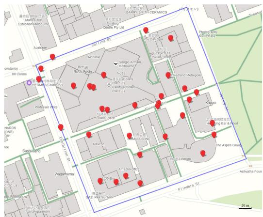  
Fig. 2. A real-world map used in the simulation.

$$
R _ { i , m i n } = B \mathrm { l o g } _ { 2 } \left( 1 + \frac { p _ { i } \bar { g } _ { i , j } } { \sigma _ { 0 } + ( \sum _ { i ^ { \prime } \in \mathcal { N } \backslash \{ i \} } \theta _ { i ^ { \prime } } p _ { i ^ { \prime } } \bar { g } _ { i ^ { \prime } , j } ) / M } \right) .\tag{47}
$$

We then show the following theorem:

Theorem 9. The PoA<sub>Ï</sub> of system-wide computation cost satisfies:

$$
\frac { \sum _ { i \in \mathcal { N } } \theta _ { i } \mathrm { m i n } \{ Z _ { i } ^ { l } , Z _ { i , m a x } ^ { c } \} } { \sum _ { i \in \mathcal { N } } \theta _ { i } \mathrm { m i n } \{ Z _ { i } ^ { l } , Z _ { i , m i n } ^ { c } \} } \ge \mathrm { P o A } _ { \triangledown \triangledown } \ge 1 .\tag{48}
$$

Proof. See Appendix L, available in the online supplemental material. □

Theorem 9 indicates that richer computation resources (i.e., more MEC servers) and lower probability of task generation narrow the gap between the worst case of our algorithm and the centralized optimum.

## 7 PERFORMANCE EVALUATIONS

In this section, we carry out simulations based on real-world data sources [36], containing communication and computation data involved in the Melbourne CBD area, Australia. With the aid of IP lookup service (IP-API), geographical locations of UEs can be obtained based on their IP addresses provided by Asia Pacific network information centre.

## 7.1 Simulation Setup

We circumscribe the area into a square block with its side length of 300 meters. As illustrated in Fig. 2, in the square block enclosed by blue lines, there exists 32 UEs (marked by red markers) scattered over the block (i.e., N 32). We employ 5 UAV-MEC servers $( \mathrm { i . e . , } M = 5 )$ <sup>¼</sup>hovering over the <sup>¼</sup>area, which are accessible for UEs. We segment the involved area into grids, where each intersection point represents a feasible location for UAVs. For clearly expounding the hovering locations of UAVs, we introduce the concept of scale $s ,$ whose unit is Meter. For instance, if we set $s = 5 0 \mathrm { m } .$ , the whole area can be divided into $( 3 0 0 / s + 1 ) ^ { 2 }$ <sup>¼</sup>locations, $( \mathrm { i . e . , }$ $L = ( 3 0 0 / 5 0 + 1 ) ^ { 2 } = 4 9 )$ <sup>ð þ Þ</sup>. The smaller the scale s is, the larger <sup>¼ ð þ Þ ¼</sup>strategy space of UAVs will be.

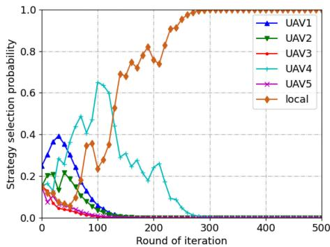  
Fig. 3. Convergence of UE 0’s strategy selection probability.

For communication process, the communication channel bandwidth is $B = 5 \mathrm { M H z } ,$ and the transmission power of UE $i \in \mathcal N$ is $p _ { i } = 1 0 0 \mathrm { m W }$ . The channel gain is $g _ { i , j } = d _ { i , j } ^ { - \alpha }$ , where $d _ { i , j }$ <sup>N ¼</sup>denotes the distance between UE i and $\mathrm { U A V } ~ j ,$ and the path loss factor is set by $\alpha = 4 .$ . The background noise is set by $\sigma _ { 0 } = - 1 0 0 \mathrm { d B m } .$ <sup>¼</sup>. For computation process, we consider <sup>¼ </sup>face recognition application data, and the size of data generated by UE i is $\hat { D _ { i } } = 5 \mathrm { M B }$ . The required numbers of CPU <sup>¼</sup>cycles for edge and local computing are set by $C _ { i } ^ { c } = 1 2 0 0$ Megacycles and $C _ { i } ^ { l } = 1 0 0 0$ <sup>¼</sup>Megacycles, respectively. Corre-<sup>¼</sup>spondingly, the computational capabilities assigned to UE i in edge and local computing are $F _ { i } ^ { c } = 1 2 $ GHz and $F _ { i } ^ { l } \in$ <sup>¼ 2</sup>0:5; 0:8; 1:0 GHz, respectively [6], [37]. Energy consump-<sup>f g</sup>tions per CPU cycle $\kappa _ { i }$ and $\hat { \kappa } _ { j }$ are randomly set from 1=400; 1=500; 1=600 [35]. There are three cases for UEs with tasks to process, i.e., power-insufficient, latency-sensitive and general case. For each case, the weights of computational time and energy can be set by $( \mu _ { i } ^ { \breve { T } } , \mu _ { i } ^ { E } ) \in \{ ( \stackrel { \cdot } { 0 , 1 } )$ 1; 0 ; 0:5; 0:5 . Generally, we consider UAVs to have an <sup>ð Þ ð Þg</sup>equal concern for latency and energy consumption, i.e., $( \grave { \lambda _ { i } ^ { T } } , \lambda _ { i } ^ { E } ) = ( 0 . 5 , 0 . 5 )$ , and UEs’ trade-off of weights is com-<sup>ð Þ ¼ ð Þ</sup>monly unknown to them. Besides, $\mathrm { U E } i \in \mathcal { N }$ generates tasks with probability $\theta _ { i } \in ( 0 , 1 ] ,$ , which varies over time.

## 7.2 Numerical Results

With setup, i.e., $N = 3 2 , M = 5 , L = 4 9 ( s = 5 0 \mathrm { m } )$ and learn-<sup>¼ ¼</sup>ing rates of UEPSSL-Algorithm $b _ { 1 } = 0 . 1$ <sup>¼ Þ</sup>, and UAVPSSL-Algorithm $b _ { 2 } = 0 . 1$ <sup>¼</sup>(the impact of learning rate and scale <sup>¼</sup>will be discussed later), we first study the convergence of UEPSSL-Algorithm and UAVPSSL-Algorithm.<sup>4</sup>

For UEPSSL-Algorithm, Fig. 3 shows the trend of UE 0’s strategy selection probabilities over iterations. For initial moment, each UE selects the strategy from its strategy space with equal probability. As the iteration progress proceeds, the strategy resulting in better performance gains a larger probability, which eventually reaches a pure-strategy (local computing prevails in this case) around 300 iterations. Similarly, UAVPSSL-Algorithm allows each UAV to choose a location for hovering with probability 1 around 360 iterations.

Fig. 4 illustrates the impact of learning rate $b _ { 1 }$ on the performance of UEPSSL-Algorithm, where each line denotes the average of 50 results under one learning rate. As proved previously, a sufficiently small learning rate allows the learning algorithm to achieve the NE, and the value of learning rate is vital to the verity of reaching the NE. With the value of learning rate $b _ { 1 }$ declining from 0.3 to 0.1, the rate of convergence gradually decreases. However, in terms of the total utility of all UEs, the decline of the learning rate provides smaller results, which infers that $b _ { 1 }$ equals to 0.3 and 0.2 may only reach a feasible solution rather than the NE. Generally, there exists a trade-off between the convergence result and speed. If the value of learning rate $b _ { 1 }$ is further decreased to 0.05, the total utility no longer declines while resulting in a worse rate of convergence, which means that $b _ { 1 } = 0 . 1$ is sufficiently small to achieve the NE. There-<sup>¼</sup>fore, we set $b _ { 1 } = 0 . 1$ for the following simulations.

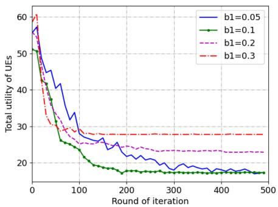  
Fig. 4. The impact of learning rate $b _ { 1 }$

<sup>¼</sup>For UAVPSSL-Algorithm, we evaluate the impact of learning rate $b _ { 2 }$ varying among 0:3; 0:2; 0:1; 0:05 . As illustrated in Fig. 5, when $b _ { 2 }$ <sup>f g</sup>decreases, the learning algorithm gets closer to the NE. However, when $b _ { 2 }$ is below 0.1, a slower convergence speed exists. As a result, $b _ { 2 } = 0 . 1$ is the <sup>¼</sup>suitable option on balance. Noted that, instead of using system-wide computation cost, we employ total utility as the metric, since UEs’ or UAVs’ utilities involve part of the system overhead.

Then we study the impact of scale s. Theoretically, area subdivision provides large strategy spaces for UAVs. The smaller scale s is, the more locations for UAVs to choose for hovering. We conduct 50 simulations for each scenario, where the value of scale s is set among 10; 30; 50 m. As shown in Fig. $^ { 6 , }$ <sup>f g</sup>different segmentation scales share similar performance in UAVPSSL-Algorithm, whether in terms of convergence result or speed.

Moreover, we carry out experiments on the impact of scale s in CO-Algorithm, since the variation of segmentation scale leads to the changes of the element in the game (i.e., strategy space of UAVs), thereby influences the chess-like process. Fig. 7 shows that the system-wide computation costs have similar trends when s is 10, 30 and 50. In addition, it also reveals that the relative distance among UEs, who choose the same UAV for task offloading, has a greater impact than the direct distance between the UAV and its serving UEs. Therefore, no matter how finely divided it is, the system overhead cannot be greatly reduced. This property allows our algorithm to be employed in the scenes of various scales by proper segmentation.

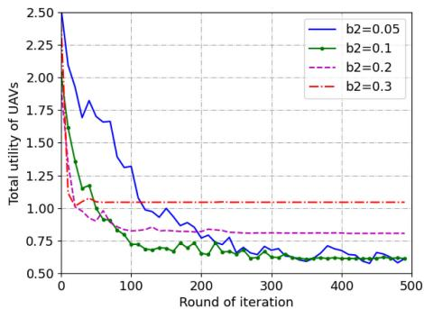

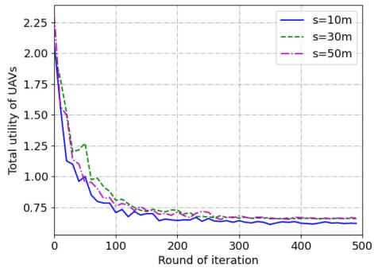  
Fig. 6. The impact of scales on UAVPSSL-Algorithm.

After detailed discussion of variable parameters, we evaluate the performance of our proposed algorithms. We employ the short-sighted updating algorithm (referred as SU-Algorithm) for convergence comparison, which is operated in an iterative manner [6]. In SU-Algorithm, each UE or UAV updates its strategy according to the instantaneous utility. Such a scheme can be achieved by traversing UE’s or UAV’s strategy space to figure out the strategy leading to the best outcome, based on the other players’ strategies of last iteration. It can be seen in Fig. 8 that both UEPSSL-Algorithm and UAVPSSL-Algorithm converge quickly, while SU-Algorithm cannot converge, let alone to reach the NE. This is because that SU-Algorithm updates players’ strategies based on instantaneous utilities, while dynamic environment requires the knowledge of network long-term property.

As illustrated in Fig. 9, the comparison involves two scenarios and five algorithms. Specifically, UAV-MEC denotes our proposed CO-Algorithm conducted in UAV-MEC scenario. UAV-RS (Random Selection), UE-RS and Both-RS are three benchmark algorithms also conducted in UAV-MEC scenario. For UAV-RS, UEs still operate UEPSSL-Algorithm for strategy selections, while UAVs hover over the area randomly. In UE-RS, UAVs operate UAVPSSL-Algorithm with UEs’ random offloading decisions. Correspondingly, Both-RS represents that both UEs and UAVs employ random strategy selections.

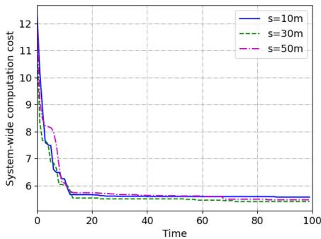  
Fig. 5. The impact of learning rate b . Fig. 5. The impact of learning rate b2.  
Fig. 7. The impact of scales on CO-Algorithm. Fig. 7. The impact of scales on CO-Algorithm. Authorized licensed use limited to: Guangxi University. Downloaded on July 05,2026 at 12:27:12 UTC from IEEE Xplore. Restrictions apply.

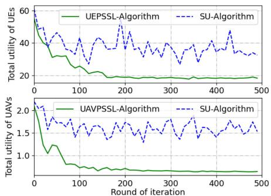  
Fig. 8. Convergence comparison.

We discuss another scenario, where the locations of edge computing servers are fixed (coordinates are picked from real-world data [36]), so it simply involves UEs’ conduction of UEPSSL-Algorithm over time (referred as Fixed-EC). In terms of the convergence speed, Fixed-EC prevails since only one learning process is involved. UAV-MEC follows with a fast speed and converges around 25 iterations. For the rest three algorithms, since either one or two strategy selection processes are random, they all result in unsatisfactory speeds of convergence. The performance of UAV-RS is relatively better compared with the other two, which can be concluded that proper UEs’ strategy selections lay greater impacts on the optimization of system-wide computation cost than UAVs’ strategy selections. It is reasonable since the utility of each UAV is determined by utilities of UEs it served to a great extent. When it comes to convergence results, all algorithms conducted in the UAV-enabled MEC scenario outperform the one with fixed edge servers. Compared with Fixed-EC, the system-wide computation cost of CO-Algorithm is reduced by 50%. Noted that, since the strategy space of each UE and UAV is finite, and only the strategy profile with better outcome will be updated, the scheme of random strategy selection mainly influences the convergence speed rather than the ultimate result. Therefore, in the following performance evaluation, we focus on the comparison of UAV-MEC and Fixed-EC.

We then consider the situation with different numbers of UEs, where 32 of them are based on real-world data, the rest is randomly generated (or deleted) and scattered over the involved block. For each set of UEs with different numbers, we conduct 100 times for the average results in two metrics, i.e., the system-wide computation cost and the number of beneficial edge computing UEs, which are shown in Figs. 10 and 11, respectively. We see that with any number of UEs, UAV-MEC outdoes Fixed-EC for both metrics, especially in terms of system-wide computation cost. In addition, with the increasing number of UEs, results of UAV-MEC display linear growth for both metrics, while results of Fixed-EC grow exponentially for system-wide computation cost, and logarithmically for the number of beneficial edge computing UEs. Such a linear growth demonstrates the robustness of our algorithm.

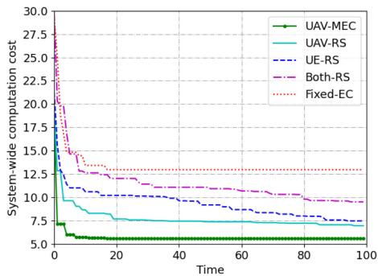

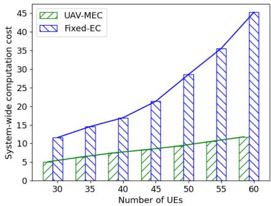  
Fig. 10. Comparison of system-wide computation cost with different numbers of UEs.

Then we study the impact of UAV offline on our algorithm. We set the data value threshold of UAV to 20, 30, 40 and 50MB, respectively. 50 simulations are conducted for each threshold value to study the change of system-wide computation cost over time. In one time slot, assuming that all UEs require for edge computing, the threshold value of each UAV is at least 5MB\*32/5=32MB to realize the edge computing requests of all UEs. As shown in Fig. 12, when the UAV has a small threshold value (20 and 30MB), the system-wide computation cost is high and the convergence speed is slow.

This is because, not all the edge computing requests of UEs can be met, even if all UAVs perform edge computing at full load, which results in some UEs having to process their computing tasks locally, leading to high system-wide computation cost. In addition, when the UAV threshold value is small, the probability of the UAV being offline is high, so some UEs will modify their strategy selections according to the UAR mechanism described in Section 3.2.2. This affects the learning of the UEs’ strategy selections, resulting in a slow convergence rate of the chess-like asynchronous updating algorithm. With the increase of the threshold, the system-wide computation cost decreases, and the convergence speed gets faster. Once the minimum value (32MB) is exceeded, it can be seen from the comparison of the 40MB and 50MB curves in Fig. 12 that further increasing the threshold cannot optimize the system performance. This means that under this face recognition application, all UEs’ edge computing requests are satisfied.

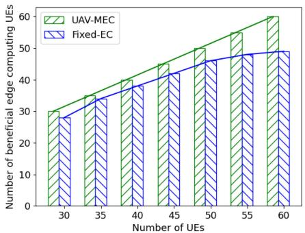  
9 Fig. 9. Overhead and convergence performance comparison. with different numbers of UEs. with different numbers of UEs. Authorized licensed use limited to: Guangxi University. Downloaded on July 05,2026 at 12:27:12 UTC from IEEE Xplore. Restrictions apply.  
Fig. 11. Comparison of the number of beneficial edge computing UEs

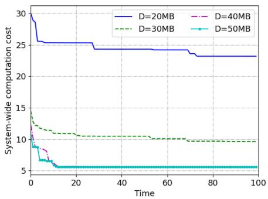  
Fig. 12. Comparison of system-wide computation cost with different UAV data value thresholds.

Specifically, we compared the strategy selections of UEs under different UAV threshold values. As shown in Fig. 13, we display the most frequent results in 50 simulations under each threshold value. When the threshold value is small (20 and 30MB), the amount of data that the UAV can process at the same time is small, so more UEs select local computing. As the threshold increases, fewer and fewer UEs select local computing until all UEs’ edge computing requests are satisfied. This again shows that as long as the UAV threshold is higher than the minimum value (32MB) of the considered application scenario, all UEs’ edge computing requests can be met.

In addition, as shown in Fig. 13, it can also be seen from the numbers of UEs who select edge computing that regardless of the threshold conditions, UEs who require edge computing select UAVs uniformly. This illustrates the effectiveness and robustness of our algorithm. Under various computing conditions, through chess-like games between UEs and UAVs, the uniform distribution of computing tasks in the network is ensured, and the congestion and cost caused by the conflicts of strategy selections are alleviated. Although it may happen during processing too many UEs that choose the same UAV to bring about its unavailability, our algorithm can always coordinate this congestion, as far as possible to satisfy the edge computing requests of UEs, and UAVs do not need to preset high thresholds for possible congestion.

According to our research on UAV products, hybrid UAVs are able to process hundreds of megabytes at the same time, for example UAVOS UVH-500 and ANAVIA HT-100. Therefore, in our simulation, the UAV threshold is high enough, and the probability that the UAV is unavailable is very low.

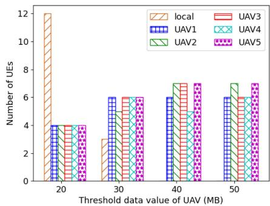

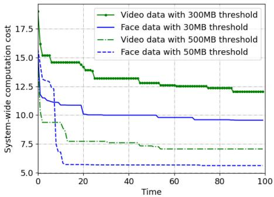  
Fig. 14. Performance comparison under different computation intensities.

Finally, we simulate for computing tasks of different intensities under various threshold conditions. Fig. 14 compares the convergence of our algorithm in four situations, that is, two threshold conditions for two data types. We consider face recognition application data (referred to as face data) and video data, whose sizes are 5MB and 50MB, respectively. Assuming that all UEs ask for edge computing at the same time, the minimum thresholds required for the two data types are 5MB\*32/5= 32MB and 50MB\*32/ 5=320MB, respectively. If it is lower than the minimum value, we various the threshold as the low threshold, otherwise it is the high threshold. For face data (or low-intensity computation), we consider 30MB as the low threshold and 50MB as the high threshold. For video data (or high-intensity computation), we consider 300MB as the low threshold and 500MB as the high threshold.

By comparing the curves of face data and video data under the same threshold condition (high or low), we can see that when the data size is large, the computation cost increases and the convergence speed becomes slow. For low-intensity computation, the cost of edge computing is usually lower than that of local computing, so the main problem for each UE is which UAV to select for data offloading (unless the UAV is not available). However, for high-intensity computation, large data size will lead to large transmission and edge computing cost. Even under high threshold condition, the probability of UEs choosing local computing will increase. This expands the strategy space compared to low-intensity computation, so the convergence speed also slows down, since UEs require more time to learn optimal strategies.

Although the low threshold and high-intensity computation will slow down the convergence speed and increase the system-wide computation cost, our algorithm still guarantees a relatively low system-wide computation cost. Even the heaviest computing situation (video data with 300MB) in our algorithm, it has similar convergence results with the lightest computing situation of the edge computing network with fixed servers locations (the Fixed-EC curve in Fig. 9, which simulates in face data with 50MB threshold).

## 8 CONCLUSION

In this paper, we design a UAV-enabled MEC network to minimize the system-wide computation cost by efficient computation offloading and proper server deployment in dynamic environment. We formulate two stochastic games July 05,2026 at 12:27:12 UTC from IEEE Xplore. Restrictions apply

dynamic environment. We formulate two stochastic gamesFig. 13. UEs strategy selections with different UAV data value thresholds. Authorized licensed use limited to: Guangxi University. Downloaded on July 05,2026 at 12:27:12 UTC from IEEE Xplore. Restrictions apply.

i.e., multi-UE computation offloading game and UAV location selection game, to decompose the minimization problem, and prove the existences of NEs with potential game theory. To achieve the NE of each stochastic game, we propose two probability-based strategy selection learning algorithms. By conducting them alternately, our proposed chess-like optimization algorithm minimizes the systemwide computation cost in a distributed manner. Numerical results validate the effectiveness and advantages of our proposed algorithms. Besides, the relationship between users’ computation offloading strategies and UAVs’ location selections is revealed, thereby providing general designing guidelines for MEC scenarios.

## REFERENCES

[1] A. U. R. Khan, M. OthmanS. A. Madani, and S. U. Khan, “A survey of mobile cloud computing application models,” IEEE Commun. Surveys Tuts., vol. 16, no. 1, pp. 393–413, First Quarter 2013.

[2] Y. Mao, C. You, J. Zhang, K. Huang, and K. B. Letaief, “A survey on mobile edge computing: The communication perspective,” IEEE Commun. Surveys Tuts., vol. 19, no. 4, pp. 2322–2358, Fourth Quarter 2017.

[3] N. H. Motlagh, M. Bagaa, and T. Taleb, “UAV-Based IoT platform: A crowd surveillance use case,” IEEE Commun. Mag., vol. 55, no. 2, pp. 128–134, Feb. 2017.

[4] M. V. Barbera, S. Kosta, A. Mei, and J. Stefa, “To offload or not to offload? The bandwidth and energy costs of mobile cloud computing,” in Proc. IEEE INFOCOM, 2013, pp. 1285–1293.

[5] S. Wang, Y. Zhao, J. Xu, J. Yuan, and C.-H. Hsu, “Edge server placement in mobile edge computing,” J. Parallel Distrib. Comput., vol. 127, pp. 160–168, 2019.

[6] X. Chen, L. Jiao, W. Li, and X. Fu, “Efficient multi-user computation offloading for mobile-edge cloud computing,” IEEE/ACM Trans. Netw., vol. 24, no. 5, pp. 2795–2808, Oct. 2016.

[7] Z. Ning et al., “Distributed and dynamic service placement in pervasive edge computing networks,” IEEE Trans. Parallel Distrib. Syst., vol. 32, no. 6, pp. 1277–1292, Jun. 2021.

[8] X. Chen, “Decentralized computation offloading game for mobile cloud computing,” IEEE Trans. Parallel Distrib. Syst., vol. 26, no. 4, pp. 974–983, Apr. 2015.

[9] R. Amorim, H. Nguyen, P. Mogensen, I. Z. KovAacs, J. Wigard, and T. B. SAcrensen, “Radio channel modeling for UAV commu-¸ nication over cellular networks,” IEEE Wireless Commun. Lett., vol. 6, no. 4, pp. 514–517, Aug. 2017.

[10] Y. Zeng and R. Zhang, “Energy-efficient UAV communication with trajectory optimization,” IEEE Trans. Wireless Commun., vol. 16, no. 6, pp. 3747–3760, Jun. 2017.

[11] Q. Hu, Y. Cai, G. Yu, Z. Qin, M. Zhao, and G. Y. Li, “Joint offloading and trajectory design for UAV-Enabled mobile edge computing systems,” IEEE Internet of Things J., vol. 6, no. 2, pp. 1879–1892, Apr. 2019.

[12] Z. Yang, C. Pan, K. Wang, and M. Shikh-Bahaei, “Energy efficient resource allocation in UAV-Enabled mobile edge computing networks,” IEEE Trans. Wireless Commun., vol. 18, no. 9, pp. 4576– 4589,Sep.2019.

[13] P. A. Apostolopoulos, E. E. Tsiropoulou, and S. Papavassiliou, “Risk-aware data offloading in multi-server multi-access edge computing environment,” IEEE/ACM Trans. Netw., vol. 28, no. 3, pp. 1405–1418, Jun. 2020.

[14] Z. Ning et al., “Partial computation offloading and adaptive task scheduling for 5G-enabled vehicular networks,” IEEE Trans. Mobile Comput., to be published, doi: 10.1109/TMC.2020.3025116.

[15] X. Xia et al., “Data, user and power allocations for caching in multi-access edge computing,” IEEE Trans. Parallel Distrib. Syst., vol. 33, no. 5, pp. 1144–1155, May 2021.

[16] B. Yang, X. Cao, J. Bassey, X. Li, and L. Qian, “Computation offloading in multi-access edge computing: A multi-task learning approach,” IEEE Trans. Mobile Comput., vol. 20, no. 9, pp. 2745– 2762, Sep. 2021.

[17] Z. Ning et al., “Mobile edge computing enabled 5G health monitoring for Internet of medical things: A decentralized game theoretic approach,” IEEE J. Sel. Areas Commun., vol. 39, no. 2, pp. 463– 478, Feb. 2021.

[18] T. M. Ho and K.-K. Nguyen, “Joint server selection, cooperative offloading and handover in multi-access edge computing wireless network: A deep reinforcement learning approach,” IEEE Trans. Mobile Comput., to be published, doi: 10.1109/TMC.2020.3043736.

[19] H. Yin et al., “Edge provisioning with flexible server placement,” IEEE Trans. Parallel Distrib. Syst., vol. 28, no. 4, pp. 1031–1045, Apr. 2017.

[20] S. K. Kasi et al., “Heuristic edge server placement in industrial Internet of things and cellular networks,” IEEE Internet of Things J., vol. 8, no. 13, pp. 10308–10317, Jul. 2021.

[21] Z. Yu, Y. Gong, S. Gong, and Y. Guo, “Joint task offloading and resource allocation in UAV-enabled mobile edge computing,” IEEE Internet of Things J., vol. 7, no. 4, pp. 3147–3159, Apr. 2020.

[22] M. Liwang, Z. Gao, and X. Wang, “Let’s trade in the future! a futures-enabled fast resource trading mechanism in edge computing-assisted UAV networks,” IEEE J. Sel. Areas Commun., vol. 39, no. 11, pp. 3252–3270, Nov. 2021.

[23] Z. Ning et al., “5G-enabled UAV-to-community offloading: Joint trajectory design and task scheduling,” IEEE J. Sel. Areas Commun., vol. 39, no. 11, pp. 3306–3320, Nov. 2021.

[24] X. Zhang, J. Zhang, J. Xiong, L. Zhou, and J. Wei, “Energy-efficient multi-UAV-enabled multiaccess edge computing incorporating NOMA,” IEEE Internet of Things J., vol. 7, no. 6, pp. 5613–5627, Jun. 2020.

[25] P. A. Apostolopoulos, G. Fragkos, E. E. Tsiropoulou, and S. Papavassiliou, “Data offloading in UAV-assisted multi-access edge computing systems under resource uncertainty,” IEEE Trans. Mobile Comput., to be published, doi: 10.1109/TMC.2021.3069911.

[26] J. Speidel, Introduction to Digital Communications. Berlin, Germany: Springer, 2019.

[27] T. J. Stewart, “A critical survey on the status of multiple criteria decision making theory and practice,” Omega, vol. 20, no. 5–6, pp. 569–586, 1992.

[28] J. Zhang et al., “Stochastic computation offloading and trajectory scheduling for UAV-assisted mobile edge computing,” IEEE Internet of Things J., vol. 6, no. 2, pp. 3688–3699, Apr. 2019.

[29] Y. Du, K. Wang, K. Yang, and G. Zhang, “Energy-efficient resource allocation in UAV based MEC system for IoT devices,” in Proc. IEEE Global Commun. Conf., 2018, pp. 1–6.

[30] F. Zhou, Y. Wu, R. Q. Hu, and Y. Qian, “Computation rate maximization in UAV-enabled wireless-powered mobile-edge computing systems,” IEEE J. Sel. Areas Commun., vol. 36, no. 9, pp. 1927– 1941, Sep. 2018.

[31] D. Monderer and L. S. Shapley, “Potential games,” Games Econ. Behav., vol. 14, no. 1, pp. 124–143, 1996.

[32] K. Najim and A. S. Poznyak, Learning Automata: Theory and Applications. Amsterdam, The Netherlands: Elsevier, 2014.

[33] T. Roughgarden, Selfish Routing and the Price of Anarchy. Cambridge, MA, USA: MIT Press, 2005.

[34] P. Sastry, V. Phansalkar, and M. Thathachar, “Decentralized learning of Nash equilibria in multi-person stochastic games with incomplete information,” IEEE Trans. Syst., Man, Cybern., vol. 24, no. 5, pp. 769–777, May 1994.

[35] J. Zheng, Y. Cai, Y. Wu, and X. Shen, “Dynamic computation offloading for mobile cloud computing: A stochastic game-theoretic approach,” IEEE Trans. Mobile Comput., vol. 18, no. 4, pp. 771–786, Apr. 2019.

[36] S. I. Eunus, “Edge computing / edge servers,” 2020. [Online]. Available: https://www.kaggle.com/salmaneunus/edgecomputing-edge-servers.

[37] T. Soyata, R. Muraleedharan, C. Funai, M. Kwon, and W. Heinzelman, “Cloud-vision: Real-time face recognition using a mobilecloudlet-cloud acceleration architecture,” in Proc. IEEE Symp. Comput. Commun., 2012, pp. 59–66.

  
Zhaolong Ning received the MS and PhD degrees from Northeastern University, Shenyang, China. He was an associate professor with the Dalian University of Technology, China. Currently, he is currently a full professor with the Chongqing University of Posts and Telecommunications, China. He has published more than 100 scientific papers in international journals and conferences. His research interests include Internet of things, mobile edge computing, and artificial intelligence. He is a Highly Cited Researcher.


Yuxuan Yang received the BS degree from Dalian Maritime University, Dalian, China, in 2019. He is currently working toward the MS degree in software engineering at the Dalian University of Technology. His research interests include mobile edge computing, network computation offloading and resource management.


Xiaojie Wang received the PhD degree from Dalian University of Technology, Dalian, China, in 2019. After that, she was a postdoctoral in the Hong Kong Polytechnic University. She is currently a distinguished professor with the College of Communication and Information Engineering, the Chongqing University of Posts and Telecommunications, Chongqing, China. Her research interests are wireless networks, mobile edge computing and machine learning. She has published more than 40 scientific papers in international journals and conferences, such as IEEE JSAC, IEEE TMC, IEEETPDSandIEEECOMST.


Lei Guo received the PhD degree from the University of Electronic Science and Technology of China, Chengdu, China, in 2006. He is currently a full professor with the Chongqing University of Posts and Telecommunications, Chongqing, China. He has authored or coauthored more than 200 technical papers in international journals and conferences. He is an editor for several international journals. His current research interests include communication networks, optical communications, and wireless communications.


Xinbo Gao received the BEng, MSc, and PhD degrees in electronic engineering, signal and information processing from Xidian University, Xi’an, China, in 1994, 1997, and 1999, respectively. From 1997 to 1998, he was a research fellow with the Department of Computer Science, Shizuoka University, Shizuoka, Japan. From 2000 to 2001, he was a postdoctoral research fellow with the Department of Information Engineering, Chinese University of Hong Kong, Hong Kong. Since 2001, he has been with the School of Electronic Engineering, Xidian University, where he is currently a Cheung Kong professor of Ministry of Education, and a professor of Pattern Recognition and Intelligent System, and a professor of Computer Science and Technology with the Chongqing University of Posts and Telecommunications, Chongqing, China. He has published six books and around 300 technical articles in refereed journals and proceedings. His research interests include Image processing, computer vision, multimedia analysis, machine learning, and pattern recognition. He is on the editorial boards of several journals, including Signal Processing (Elsevier) and Neurocomputing (Elsevier). He served as the General chair/co-Chair, the Program Committee chair/co-Chair, or a PC Member for around 30 major international conferences. He is a fellow of the Institute of Engineering and Technology and the Chinese Institute of Electronics.


Song Guo (Fellow, IEEE) is currently a full professor with the Department of Computing, The Hong Kong Polytechnic University. He also holds a Changjiang chair professorship awarded by the Ministry of Education of China. He is a fellow of the Canadian Academy of Engineering and a fellow of the IEEE (Computer Society). His research interests include mainly in big data, edge AI, mobile computing, and distributed systems. He published many papers in top venues with wide impact in these areas and was recognized as a

Highly Cited Researcher (Clarivate Web of Science). He is the recipient of over a dozen best paper awards from IEEE/ACM conferences, journals, and technical committees. He is the editor-in-chief of IEEE Open Journal of the Computer Society and the chair of IEEE Communications Society (ComSoc) Space and Satellite Communications Technical Committee. He was an IEEE ComSoc distinguished lecturer and a member of IEEE ComSoc Board of Governors. He has served for IEEE Computer Society on Fellow Evaluation Committee, and been named on editorial board of a number of prestigious international journals like IEEE Transactions on Parallel and Distributed Systems, IEEE Transactions on Cloud Computing, IEEE Transactions on Emerging Topics in Computing, etc. He has also served as chairs of organizing and technical committees of many international conferences.


Guoyin Wang received the BS, MS, and PhD degrees in computer science and technology from Xi’an Jiaotong University, Xi’an, China, in 1992, 1994, and 1996, respectively. During 1998- 1999, he was a visiting scholar with the University of North Texas, Denton, TX, and the University of Regina, Regina, SK, Canada. Since 1996, he has been with the Chongqing University of Posts and Telecommunications, Chongqing, China, where he is currently a professor, a vice-president of the University, and the director with Chongqing Key

Laboratory of Computational Intelligence. He was appointed as the director of Institute of Electronic Information Technology, Chongqing Institute of Green and Intelligent Technology, Chinese Academy of Sciences, Chongqing, in 2011. He is the author of ten books and has more than 300 reviewed research publications. His research interests include rough set, granular computing, knowledge technology, data mining, neural network, and cognitive computing. He is the editor of dozens of proceedings of international and national conferences. He was the president of International Rough Set Society (IRSS) from 2014 to 2017. He is currently a vice-president of the Chinese Association for Artificial Intelligence (CAAI) and a Council Member of the China Computer Federation (CCF).

" For more information on this or any other computing topic, please visit our Digital Library at www.computer.org/csdl.