# Dynamic Computation Offloading for Mobile-Edge Computing With Energy Harvesting Devices

Yuyi Mao, Student Member, IEEE, Jun Zhang, Senior Member, IEEE, and Khaled B. Letaief, Fellow, IEEE

Abstract— Mobile-edge computing (MEC) is an emerging paradigm to meet the ever-increasing computation demands from mobile applications. By offloading the computationally intensive workloads to the MEC server, the quality of computation experience, e.g., the execution latency, could be greatly improved. Nevertheless, as the on-device battery capacities are limited, computation would be interrupted when the battery energy runs out. To provide satisfactory computation performance as well as achieving green computing, it is of significant importance to seek renewable energy sources to power mobile devices via energy harvesting (EH) technologies. In this paper, we will investigate a green MEC system with EH devices and develop an effective computation offloading strategy. The execution cost, which addresses both the execution latency and task failure, is adopted as the performance metric. A low-complexity online algorithm is proposed, namely, the Lyapunov optimization-based dynamic computation offloading algorithm, which jointly decides the offloading decision, the CPU-cycle frequencies for mobile execution, and the transmit power for computation offloading. A unique advantage of this algorithm is that the decisions depend only on the current system state without requiring distribution information of the computation task request, wireless channel, and EH processes. The implementation of the algorithm only requires to solve a deterministic problem in each time slot, for which the optimal solution can be obtained either in closed form or by bisection search. Moreover, the proposed algorithm is shown to be asymptotically optimal via rigorous analysis. Sample simulation results shall be presented to corroborate the theoretical analysis as well as validate the effectiveness of the proposed algorithm.

Index Terms— Mobile-edge computing (MEC), energy harvesting (EH), dynamic voltage and frequency scaling (DVFS), power control, QoE, Lyapunov optimization.

# I. INTRODUCTION

HE growing popularity of mobile devices, such as smart phones, tablet computers and wearable devices, is accelerating the advent of the Internet of Things (IoT) and triggering a revolution of mobile applications [1]. With the support of on-device cameras and embedded sensors, new applications

Manuscript received January 29, 2016; revised May 10, 2016; accepted August 4, 2016. Date of publication September 20, 2016; date of current version December 29, 2016. This work was supported by the Hong Kong Research Grants Council under Grant No. 16200214.

Y. Mao and J. Zhang are with the Department of Electronic and Computer Engineering, Hong Kong University of Science and Technology, Hong Kong (e-mail: ymaoac@ust.hk; eejzhang@ust.hk).

K. B. Letaief is with the Department of Electronic and Computer Engineering, Hong Kong University of Science and Technology, Hong Kong, and also with Hamad bin Khalifa University, Doha, Qatar (e-mail: eekhaled@ust.hk; kletaief@hbku.edu.qa).

Color versions of one or more of the figures in this paper are available online at http://ieeexplore.ieee.org.

Digital Object Identifier 10.1109/JSAC.2016.2611964

with advanced features, e.g., navigation, face recognition and interactive online gaming, have been created. Nevertheless, the tension between resource-limited devices and computationintensive applications becomes the bottleneck for providing satisfactory quality of experience (QoE), and hence may defer the advent of a mature mobile application market [2].

Mobile-edge computing (MEC), which provides cloud computing capabilities within the radio access network (RAN), offers a new paradigm to liberate the mobile devices from heavy computation workloads [3], [4]. In conventional cloud computing systems, remote public clouds, e.g., Amazon Web Services, Google Cloud Platform, and Microsoft Azure, are leveraged, and thus long latency may be incurred due to data exchange in wide area networks (WANs). In contrast, MEC has the potential to significantly reduce latency, avoid congestion and prolong the battery lifetime of mobile devices, by offloading the computation tasks from the mobile devices to a physically proximate MEC server [5]–[7]. Thus, lots of recent efforts have been attracted from both industry [3], [4] and academia [5]–[8].

Unfortunately, although computation offloading is effective in exploiting the powerful computational resources at cloud servers, for conventional battery-powered devices, the computation performance may be compromised due to insufficient battery energy for task offloading, i.e., mobile applications will be terminated and mobile devices will be out of service when the battery energy is exhausted. This can possibly be overcome by using larger batteries or recharging the batteries regularly. However, using larger batteries at the mobile devices implies increased hardware cost, which is not desirable. On the other hand, recharging batteries frequently is reported as the most unfavorable characteristic of mobile phones,1 and it may even be impossible in certain application scenarios, e.g., in the wireless sensor networks (WSNs) and the IoT for surveillance where the nodes are typically hard-to-reach. Meanwhile, the rapidly increasing energy consumption of the information and communication technology (ICT) sector also brings a strong need for green computing [9]. Energy harvesting (EH) is a promising technology to resolve these issues, which can capture ambient recyclable energy, including solar radiation, wind, as well as human motion energy [10], and thus it facilitates self-sustainability and perpetual operation [11].

By integrating EH techniques into MEC, satisfactory and sustained computation performance can be achieved.

1CNN.com, “Battery life concerns mobile users,” available on http://edition.cnn.com/2005/TECH/ptech/09/22/phone.study/.

While MEC with EH devices opens new possibilities for cloud computing, it also brings new design challenges. In particular, the computation offloading strategies dedicated for MEC systems with battery-powered devices cannot take full benefits of the renewable energy sources. In this paper, we will develop new design methodologies for MEC systems with EH devices.

# A. Related Works

Computation offloading for mobile computing systems has attracted significant attention in recent years. To increase the batteries’ lifetime and improve the computation performance, various code offloading frameworks, e.g., MAUI [12] and ThinkAir [13], were proposed. However, the efficiency of computation offloading highly depends on the wireless channel condition, as the implementation of computation offloading requires data transmission. This calls for computation offloading policies that incorporate the characteristics of wireless channels [14]–[17]. In [14], a stochastic control algorithm adapted to the time-varying wireless channel was proposed, which determines the offloaded software components. For the femto-cloud computing systems, where the cloud server is formed by a set of femto access points, the transmit power, precoder and computation load distribution were jointly optimized in [15]. In addition, a delay-optimal task scheduling policy for single-user MEC systems was developed in [16], and a gametheoretic decentralized computation offloading algorithm was proposed for multi-user mobile cloud computing systems in [17]. Nevertheless, these works assume non-adjustable processing capabilities of the central processing units (CPUs) at the mobile devices, which is not energy efficient since the CPU energy consumption increases super-linearly with the CPU-cycle frequency [18]. With dynamic voltage and frequency scaling (DVFS) techniques, the local execution energy consumption for applications with strict deadline constraints was minimized by controlling the CPU-cycle frequencies [19]. Besides, a joint allocation of communication and computational resources for multi-cell MIMO cloud computing systems was proposed in [20]. More recently, the energydelay tradeoff of mobile cloud systems with heterogeneous types of computation tasks was investigated by a Lyapunov optimization algorithm, which decides the offloading policy, task allocation, CPU clock speeds and selected network interfaces [21]. Furthermore, the power-delay tradeoff of multi-user MEC systems was investigated in [22] via joint management of radio and computational resources.

Energy harvesting was introduced to communication systems for its potential to realize self-sustainable and green communications [23]–[25]. With non-causal side information (SI),2 including the channel side information (CSI) and energy side information (ESI), the maximum throughput of point-to-point EH fading channels can be achieved by the directional water-filling (DWF) algorithm [26]. The study was later extended to EH networks with causal SI [27].

2‘Causal SI’ refers to the case that, at any time instant, only the past and current SI is known, while non-causal SI means that the future SI is also available.

Cellular networks with renewable energy supplies have also been widely investigated. Resource allocation policies that maximize the energy efficiency in OFDMA systems with hybrid energy supplies (HES), i.e., both grid and harvested energy are accessible to base stations, were proposed in [28]. To save the grid energy consumption, a sleep control scheme for cellular networks with HES was developed in [29], and a low-complexity online base station assignment and power control algorithm based on Lyapunov optimization was proposed in [30]. Moreover, communication systems with EH receivers have also been widely investigated [31], [32].

The design principles for MEC systems with EH devices are different from those for EH communication systems or MEC systems with battery-powered devices. On one hand, compared to EH communication systems, computation offloading policies require a joint design of the offloading decision, i.e., whether to offload a task, the CPU-cycle frequencies for mobile execution,3 and the transmission policy for task offloading, which makes it much more challenging. On the other hand, compared to MEC systems with battery-powered devices, the design objective is shifted from minimizing the battery energy consumption to optimizing the computation performance, as the harvested energy comes for free. In addition, taking care of the ESI is a new design consideration, and the time-correlated battery energy dynamics poses another challenge.

# B. Contributions

In this paper, we will investigate MEC systems with EH devices and develop an effective dynamic computation offloading algorithm. Our major contributions are summarized as follows:

• We consider an EH device served by an MEC server, where the computation tasks can be executed locally at the device or be offloaded to the MEC server for mobileedge (cloud) execution.4 An execution cost that incorporates the execution delay and task failure is adopted as the performance metric, while DVFS and power control are adopted to optimize the mobile execution process and data transmission for computation offloading, respectively.

• The execution cost minimization (ECM) problem, which is an intractable high-dimensional Markov decision problem, is formulated assuming causal SI, and a lowcomplexity online Lyapunov optimization-based dynamic computation offloading (LODCO) algorithm is proposed. In each time slot, the system operation, including the offloading decision, the CPU-cycle frequencies for mobile execution, and the transmit power for computation offloading, only depends on the optimal solution of a deterministic optimization problem, which can be obtained either in closed form or by bisection search.

3We use “local execution” and “mobile execution” interchangeably in this paper.

4It is worthwhile to point out that powering mobile devices in MEC systems with wireless energy harvesting was proposed in [33], where the harvested energy is radiated from a hybrid access point and fully controllable. This is different from the system considered in this paper where the EH process is random and uncontrollable.

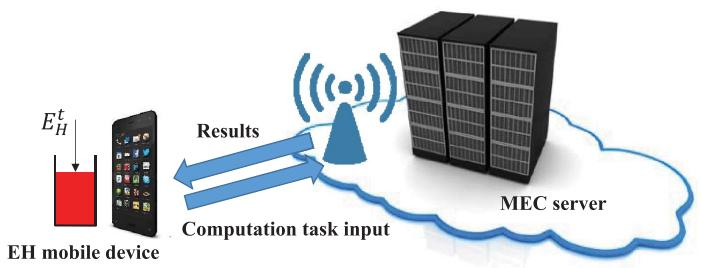

flowchart

Fig. 1. Mobile-edge computing system with an EH mobile device.

• We identify a non-decreasing property of the scheduled CPU-cycle frequencies (the transmit power) with respect to the battery energy level, which shows that a larger amount of available energy leads to a shorter execution delay for mobile execution (MEC server execution). Performance analysis for the LODCO algorithm is also conducted. It is shown that the proposed algorithm can achieve asymptotically optimal performance of the ECM problem by tuning a two-tuple of control parameters. Moreover, it does not require statistical information of the involved stochastic processes, including the computation task request, wireless channel, and EH processes, which makes it applicable even in unpredictable environments.   
• Simulation results are provided to verify the theoretical analysis, especially the asymptotic optimality of the LODCO algorithm. Moreover, the effectiveness of the proposed algorithm is demonstrated by comparisons with three benchmark policies with greedy harvested energy allocation. It is shown that the LODCO algorithm not only achieves significant performance improvement in terms of execution cost, but also effectively reduces task failure.

The organization of this paper is as follows. In Section $\mathrm { I I } ,$ we introduce the system model. The ECM problem is formulated in Section III. The LODCO algorithm for the ECM problem is proposed in Section IV and its performance analysis is conducted in Section V. We show the simulation results in Section VI and conclude this paper in Section VII.

# II. SYSTEM MODEL

In this section, we will introduce the system model studied in this paper, i.e., a mobile-edge computing (MEC) system with an EH device. Both the computation model and energy harvesting model will be discussed.

# A. Mobile-Edge Computing Systems With EH Devices

We consider an MEC system consisting of a mobile device and an MEC server as shown in Fig. 1. In particular, the mobile device is equipped with an EH component and powered purely by the harvested renewable energy. The MEC server, which could be a small data center managed by the telecom operator, is located at a distance of d meters away and can be accessed by the mobile device through the wireless channel. The mobile device is associated with a system-level clone at

TABLE I SUMMARY OF KEY NOTATIONS 

<table><tr><td>Notation</td><td>Description</td></tr><tr><td> $d$ </td><td>Distance between the mobile device and the MEC server</td></tr><tr><td> $\mathcal{T}$ </td><td>Index set of the time slots</td></tr><tr><td> $h^{t}$ </td><td>Channel power gain from the mobile device to the MEC server in time slot  $t$ </td></tr><tr><td> $A(L,\tau_{d})$ </td><td>Computation task with  $L$  bits input and deadline  $\tau_{d}$ </td></tr><tr><td> $\{I_{j}^{t}\}$ </td><td>Computation mode indicators at time slot  $t$ </td></tr><tr><td> $\zeta^{t}$ </td><td>Task request indicator at time slot  $t$ </td></tr><tr><td> $X(W)$ </td><td>Number of CPU cycles required to process one bit task input ( $A(L,\tau_{d})$ )</td></tr><tr><td> $\{f_{w}^{t}\}$ </td><td>Scheduled CPU-cycle frequencies for local execution in time slot  $t$ </td></tr><tr><td> $p^{t}$ </td><td>Transmit power for computation offloading in time slot  $t$ </td></tr><tr><td> $f_{\text{CPU}}^{\text{max}} (p_{\text{tx}}^{\text{max}})$ </td><td>Maximum allowable CPU-cycle frequency (transmit power)</td></tr><tr><td> $D_{\text{mobile}}^{t}(D_{\text{server}}^{t})$ </td><td>Execution delay of local execution (MEC server execution) at time slot  $t$ </td></tr><tr><td> $E_{\text{mobile}}^{t}(E_{\text{server}}^{t})$ </td><td>Energy consumption of local execution (MEC server execution) in time slot  $t$ </td></tr><tr><td> $e^{t}(E_{H}^{t})$ </td><td>Harvested (harvestable) energy at time slot  $t$ </td></tr><tr><td> $E_{H}^{\text{max}}$ </td><td>Maximum value of  $E_{H}^{t}$ </td></tr><tr><td> $B^{t}$ </td><td>Battery energy level at the beginning of time slot  $t$ </td></tr><tr><td> $\phi$ </td><td>The weight of the task dropping cost</td></tr></table>

the MEC server, namely, the cloud clone, which runs a virtual machine and can execute the computation tasks on behalf of the mobile device [6], [19]. By offloading the computation tasks for mobile-edge execution, the computation experience can be improved significantly [6]–[8].

We assume that time is slotted, and denote the time slot length and the time slot index set by τ and ${ \mathcal { T } } \triangleq \{ 0 , 1 , \cdots \}$ , respectively. The wireless channel is assumed to be independent and identically distributed (i.i.d.) block fading, i.e., the channel remains static within each time slot, but varies among different time slots. Denote the channel power gain at the tth time slot as $h ^ { t }$ , and $h ^ { t } \sim F _ { H } \left( x \right) , t \in \mathcal { T }$ , where $F _ { H } \left( x \right)$ is the cumulative distribution function (CDF) of $h ^ { t } .$ . For ease of reference, we list the key notations of our system model in Table I.

# B. Computation Model

We use $A ( L , \tau _ { d } )$ to represent a computation task, where L (in bits) is the input size of the task, and $\tau _ { d }$ is the execution deadline, i.e., if it is decided that task $A ( L , \tau _ { d } )$ is to be executed, it should be completed within time $\tau _ { d } .$ . The computation tasks requested by the applications running at the mobile device are modeled as an i.i.d. Bernoulli process. Specifically, at the beginning of each time slot, a computation task $A \ : ( L , \tau _ { d } )$ is requested with probability $\rho ,$ and with probability $1 - \rho ,$ there is no request. Denote $\zeta ^ { t } = 1$ if a computation task is requested at the tth time slot and $\zeta ^ { t } = 0$ if otherwise, i.e., $\mathbb { P } \left( \zeta ^ { t } = 1 \right) ~ = ~ 1 - \mathbb { P } \left( \zeta ^ { t } = 0 \right) ~ = ~ \rho , t ~ \in ~ \mathcal { T }$ . We focus on delay-sensitive applications with execution deadline no greater than the time slot length, i.e., $\tau _ { d } \leq \tau \ [ 1 4 ]$ , [15], [17], [20], [34], and assume no buffer is available for queueing the computation requests.

Each computation task can either be executed locally at the mobile device, or be offloaded to and executed by the MEC server. It may also happen that neither of these two computation modes is feasible, e.g., when energy is insufficient at the mobile device, and hence the computation task will be dropped. Denote $I _ { j } ^ { t } ~ \in ~ \{ 0 , 1 \}$ with $j ~ = ~ \{ \mathrm { m } , \mathrm { s } , \mathrm { d } \}$ as the computation mode indicators, where $I _ { \mathrm { m } } ^ { t } ~ = ~ 1$ and $I _ { \mathrm { s } } ^ { t } ~ = ~ 1$ indicate that the computation task requested at the tth time slot is executed at the mobile device and offloaded to the MEC server, respectively, while $I _ { \mathrm { d } } ^ { t } ~ = ~ 1$ means the computation task is dropped. Thus, the computation mode indicators should satisfy the following operation constraint:

$$
I _ {\mathrm{m}} ^ {t} + I _ {\mathrm{s}} ^ {t} + I _ {\mathrm{d}} ^ {t} = 1, \quad t \in \mathcal {T}. \tag {1}
$$

1) Local Execution Model: The number of CPU cycles required to process one bit input is denoted as X , which varies from different applications and can be obtained through off-line measurement [35]. In other words, $\begin{array} { r } { \begin{array} { r c l } { W } & { = } & { L X } \end{array} } \end{array}$ CPU cycles are needed in order to successfully execute task $A ( L , \tau _ { d } )$ . The frequencies scheduled for the W CPU cycles in the tth time slot are denoted as $f _ { w } ^ { t } , w \ = \ 1 , \cdot \cdot \cdot , W$ , which can be implemented by adjusting the chip voltage with DVFS techniques [36]. As a result, the delay for executing the computation task requested at the t th time slot locally at the mobile device can be expressed as

$$
D _ {\text { mobile }} ^ {t} = \sum_ {w = 1} ^ {W} \left(f _ {w} ^ {t}\right) ^ {- 1}. \tag {2}
$$

Accordingly, the energy consumption for local execution by the mobile device is given by

$$
E _ {\text { mobile }} ^ {t} = \kappa \sum_ {w = 1} ^ {W} \left(f _ {w} ^ {t}\right) ^ {2}, \tag {3}
$$

where κ is the effective switched capacitance that depends on the chip architecture [18]. Moreover, we assume the CPU-cycle frequencies are constrained by f maxCPU, i.e., $f _ { w } ^ { t } \ \leq$ $f _ { \mathrm { C P [ \mathrm { J } } } ^ { \operatorname* { m a x } } , \forall w = 1 , \cdot \cdot \cdot , W$ .

2) Mobile-Edge Execution Model: In order to offload the computation task for mobile-edge execution, the input bits of $A ( L , \tau _ { d } )$ should be transmitted to the MEC server. We assume sufficient computational resource, e.g., a high-speed multicore CPU, is available at the MEC server, and thus ignore its execution delay [19], [21], [22], [33]. It is further assumed that the output of the computation is of small size so the transmission delay for feedback is negligible. Denote the transmit power as $p ^ { t }$ , which should be less than the maximum transmit power $p _ { \mathrm { t x } } ^ { \mathrm { m a x } } ,$ . According to the Shannon-Hartley formula, the achievable rate in the tth time slot is given by $r \left( h ^ { t } , p ^ { t } \right) =$ ω log2 $\begin{array} { r } { \left( 1 + \frac { h ^ { t } p ^ { t } } { \sigma } \right) } \end{array}$ , where ω is the system bandwidth and σ is the noise power at the receiver. Consequently, if the computation task is executed by the MEC server, the execution delay equals the transmission delay for the input bits,5 i.e.,

$$
D _ {\text { server }} ^ {t} = \frac {L}{r (h ^ {t} , p ^ {t})}, \tag {4}
$$

and the energy consumed by the mobile device is given by

$$
E _ {\text { server }} ^ {t} = p ^ {t} \cdot D _ {\text { server }} ^ {t} = p ^ {t} \cdot \frac {L}{r (h ^ {t} , p ^ {t})}. \tag {5}
$$

# C. Energy Harvesting Model

The EH process is modeled as successive energy packet arrivals, i.e., $E _ { H } ^ { t }$ units of energy arrive at the mobile device at the beginning of the tth time slot. We assume $E _ { H } ^ { t } \mathrm { { ^ { s } } }$ in different time slots are i.i.d. with the maximum value of $E _ { H } ^ { \mathrm { m a x } }$ Although the i.i.d. model is simple, it captures the stochastic and intermittent nature of the renewable energy processes [27], [30], [32], [37]. In each time slot, part of the arrived energy, denoted as $e ^ { t } .$ , satisfying

$$
0 \leq e ^ {t} \leq E _ {H} ^ {t}, t \in \mathcal {T}, \tag {6}
$$

will be harvested and stored in a battery, and it will be available for either local execution or computation offloading starting from the next time slot. We start by assuming that the battery capacity is sufficiently large. Later we will show that by picking the values of $e ^ { t } { \boldsymbol { \mathbf { \mathit { s } } } } ,$ the battery energy level is deterministically upper-bounded under the proposed computation offloading policy, and thus we only need a finitecapacity battery in actual implementation. More importantly, including $e ^ { t } \mathrm { { ^ { , } } s }$ as optimization variables facilitates the derivation and performance analysis of the proposed algorithm. Similar techniques were adopted in previous studies, such as [27], [30], and [37]. Denote the battery energy level at the beginning of time slot t as Bt . Without loss of generality, we assume $B ^ { 0 } = 0$ and $B ^ { t } \ < \ + \infty , t \ \in \ \mathcal { T } .$ . In this paper, energy consumed for purposes other than local computation and transmission is ignored for simplicity, while more general energy models can be handled by the proposed algorithm with minor modifications.6 Denote the energy consumed by the mobile device in time slot t as $\mathcal { L } \left( I ^ { t } , f ^ { t } , p ^ { t } \right)$ , which depends on the selected computation mode, scheduled CPUcycle frequencies and allocated transmit power, and can be expressed as

$$
\mathcal {E} \left(\boldsymbol {I} ^ {t}, \boldsymbol {f} ^ {t}, p ^ {t}\right) = I _ {\mathrm{m}} ^ {t} E _ {\text { mobile }} ^ {t} + I _ {\mathrm{s}} ^ {t} E _ {\text { server }} ^ {t}, \tag {7}
$$

subject to the following energy causality constraint:

$$
\mathcal {E} \left(\boldsymbol {I} ^ {t}, \boldsymbol {f} ^ {t}, p ^ {t}\right) \leq B ^ {t} <   + \infty , \quad t \in \mathcal {T}. \tag {8}
$$

Thus, the battery energy level evolves according to the following equation:

$$
B ^ {t + 1} = B ^ {t} - \mathcal {E} \left(\boldsymbol {I} ^ {t}, \boldsymbol {f} ^ {t}, p ^ {t}\right) + e ^ {t}, \quad t \in \mathcal {T}. \tag {9}
$$

5When the execution delay in the MEC server is non-negligible, the proposed algorithm can still be applied by modifying the expression of $D _ { \mathrm { s e r v e r } } ^ { t }$ in (4) as $D _ { \mathrm { s e r v e r } } ^ { \zeta } = L / r \left( h ^ { t } , p ^ { t } \right) + \tau _ { \mathrm { s e r v e r } }$ , where τserver denotes the execution delay in the MEC server. Note that $E _ { \mathrm { s e r v e r } } ^ { t } = p ^ { t } L / r \left( h ^ { t } , p ^ { t } \right) \leq p ^ { t } D _ { \mathrm { s e r v e r } } ^ { t }$ in this case.

6We will demonstrate how to adapt the proposed algorithm to more general energy models of mobile devices, e.g., by taking the power consumption of screens and operating systems into account, in Section IV-A.

With EH mobile devices, the computation offloading policy design for MEC systems becomes much more complicated compared to that of conventional mobile cloud computing systems with battery-powered devices. Specifically, both the ESI and CSI need to be handled, and the temporally correlated battery energy level makes the system decisions coupled in different time slots. Consequently, an optimal computation offloading strategy should strike a good balance between the computation performance of the current and future computation tasks.

# III. PROBLEM FORMULATION

In this section, we will first introduce the performance metric, namely, the execution cost. The execution cost minimization (ECM) problem will then be formulated and its unique technical challenges will be identified.

# A. Execution Cost Minimization Problem

Execution delay is one of the key measures for users’ QoE [14]–[17], [19]–[22], which will be adopted to optimize the computation offloading policy for the considered MEC system. Nevertheless, due to the intermittent and sporadic nature of the harvested energy, some of the requested computation tasks may not be executed but have to be dropped, e.g., due to lacking of energy for local computation, while the wireless channel from the mobile device to the MEC server is in deep fading, i.e., the input of the tasks cannot be delivered. To take this aspect into consideration, we penalize each dropped task by a unit of cost. Thus, we define the execution cost as the weighted sum of the execution delay and the task dropping cost, which can be expressed by the following formula:

$$
\mathrm{cost} ^ {t} = \mathcal {D} \left(\boldsymbol {I} ^ {t}, \boldsymbol {f} ^ {t}, p ^ {t}\right) + \phi \cdot \mathbf {1} \left(\zeta^ {t} = 1, I _ {\mathrm{d}} ^ {t} = 1\right), \tag {10}
$$

where $\phi$ (in second) is the weight of the task dropping cost, 1 (·) is the indicator function, and $\mathcal { D } \left( I ^ { t } , f ^ { t } , p ^ { t } \right)$ is given by

$$
\mathcal {D} \left(\boldsymbol {I} ^ {t}, \boldsymbol {f} ^ {t}, p ^ {t}\right) = \mathbf {1} \left(\zeta^ {t} = 1\right) \cdot \left(I _ {\mathrm{m}} ^ {t} D _ {\text {mobile}} ^ {t} + I _ {\mathrm{s}} ^ {t} D _ {\text {server}} ^ {t}\right). \tag {11}
$$

Without loss of generality, we assume that executing a task successfully is preferred to dropping a task, i.e., $\tau _ { d } \leq \phi$ .

If it is decided that a task is to be executed, i.e., $I _ { \mathrm { m } } ^ { t } = 1$ or $I _ { \mathrm { s } } ^ { t } = 1$ , it should be completed before the deadline $\tau _ { d } .$ . In other words, the following deadline constraint should be met:

$$
\mathcal {D} \left(\boldsymbol {I} ^ {t}, \boldsymbol {f} ^ {t}, p ^ {t}\right) \leq \tau_ {d}, t \in \mathcal {T}. \tag {12}
$$

Consequently, the ECM problem is formulated as:

$$
\mathcal {P} _ {1}: \min _ {\boldsymbol {I} ^ {t}, \boldsymbol {f} ^ {t}, p ^ {t}, e ^ {t}} \lim _ {T \rightarrow + \infty} \frac {1}{T} \mathbb {E} \left[ \sum_ {t = 0} ^ {T - 1} \cos t ^ {t} \right]
$$

$$
\text { s.t. } (1), (6), (8), (1 2)
$$

$$
I _ {\mathrm{m}} ^ {t} + I _ {\mathrm{s}} ^ {t} \leq \zeta^ {t}, \quad t \in \mathcal {T} \tag {13}
$$

$$
\mathcal {E} \left(\boldsymbol {I} ^ {t}, \boldsymbol {f} ^ {t}, p ^ {t}\right) \leq E _ {\max}, \quad t \in \mathcal {T} \tag {14}
$$

$$
0 \leq p ^ {t} \leq p _ {\mathrm{tx}} ^ {\max} \cdot \mathbf {1} \left(I _ {\mathrm{s}} ^ {t} = 1\right), \quad t \in \mathcal {T} \tag {15}
$$

$$
0 \leq f _ {w} ^ {t} \leq f _ {\mathrm{CPU}} ^ {\max} \cdot \mathbf {1} \left(I _ {\mathrm{m}} ^ {t} = 1\right), \tag {16}
$$

$$
w = 1, \dots , W, t \in \mathcal {T}
$$

$$
I _ {\mathrm{m}} ^ {t}, I _ {\mathrm{s}} ^ {t}, I _ {\mathrm{d}} ^ {t} \in \{0, 1 \}, \quad t \in \mathcal {T}, \tag {17}
$$

where (13) indicates that if there is no computation task requested, neither mobile execution nor MEC server execution is feasible. (14) is the battery discharging constraint, i.e., the amount of battery output energy cannot exceed $E _ { \mathrm { m a x } }$ in each time slot, which is essential for preventing the battery from over-discharging [37], [38]. The maximum allowable transmit power and the maximum CPU-cycle frequency constraints are imposed by (15) and (16), respectively, while the zero-one indicator constraint for the computation mode indicators is represented by (17).

# B. Problem Analysis

In the considered MEC system, the system state is composed of the task request, the harvestable energy, the battery energy level, as well as the channel state, and the action is the energy harvesting and the computation offloading decision, including the scheduled CPU-cycle frequencies and the allocated transmit power. It can be checked that the allowable action set depends only on the current system state, and is irrelevant with the state and action history. Besides, the objective is the long-term average execution cost. Thus, $\mathcal { P } _ { 1 }$ is a Markov decision process (MDP) problem. In principle, $\mathcal { P } _ { 1 }$ can be solved optimally by standard MDP algorithms, $\mathrm { e . g . }$ ., the relative value iteration algorithm and the linear programming reformulation approach [39]. Nevertheless, for both algorithms, we need to use finite states to characterize the system, and discretize the feasible action set. For example, if we use $K \ : = \ : 2 0$ states to quantize the wireless channel, $M = 2 0$ states to characterize the battery energy level, $E = 5$ states to describe the harvestable energy, and admits $L _ { T } = 1 0$ non-zero transmit power levels and $L _ { F } = 1 0$ non-zero CPUcycle frequencies, there are $2 K M E = 4 0 0 0$ possible system states in total. For the relative value iteration algorithm, this will take a long time to converge as there will be as many as $L _ { T } + L _ { F } ^ { W } + 1$ feasible actions in some states. For the linear programming (LP) reformulation approach, we need to solve an LP problem with $2 K M E \times \left( L _ { T } + L _ { F } ^ { W } + 1 \right)$ variables, which will be practically infeasible even for a small value of $W ,$ $\mathrm { e . g . }$ , 1000. In addition, it will be difficult to obtain solution insights with the MDP algorithms as they are based on numerical iteration. Moreover, quantizing the state and feasible action set may lead to severe performance degradation, and the memory requirement for storing the optimal policy will yet be another big challenge.

In the following section, we will propose a Lyapunov optimization-based dynamic computation offloading (LODCO) algorithm to solve P1, which enjoys the following favorable properties:

• There is no need to quantize the system state and feasible action set, and the decision of the LODCO algorithm within each time slot is of low complexity. In addition, there is no memory requirement for storing the optimal policy.   
• The LODCO algorithm has no prior information requirement on the channel statistics, the distribution of the renewable energy process, or the computation task request process.

• The performance of the LODCO algorithm is controlled by a two-tuple of control parameters. Theoretically, the proposed algorithm can behave arbitrarily close to the optimal performance of $\mathcal { P } _ { 1 }$ by adjusting these parameters.   
• An upper bound of the required battery capacity can be obtained, which shall provide guidelines for practical installation of the EH components and energy storage units.

# IV. DYNAMIC COMPUTATION OFFLOADING: THE LODCO ALGORITHM

In this section, we will develop the LODCO algorithm to solve $\mathcal { P } _ { 1 }$ . We will first show an important property of the optimal CPU-cycle frequencies, which helps to simplify $\mathcal { P } _ { 1 }$ . In order to take advantages of Lyapunov optimization, we will introduce a modified ECM problem to assist the algorithm design. The LODCO algorithm will be then proposed for the modified problem, which also provides a feasible solution for P1. In Section V, we will show that this solution is asymptotically optimal for $\mathcal { P } _ { 1 }$ .

# A. The LODCO Algorithm

We first show that the optimal CPU-cycle frequencies of the W CPU cycles scheduled for a single computation task should be the same, as stated in the following lemma.

Lemma 1: If a task requested at the tth time slot is being executed locally, the optimal frequencies of the W CPU cycles should be the same, i.e., $f _ { w } ^ { t } = f ^ { t } , w = 1 , \cdots , W$ .

Proof: The proof can be obtained by contradiction, which is omitted for brevity.

The property of the optimal CPU-cycle frequencies in Lemma 1 indicates that we can optimize a scalar $f ^ { t }$ instead of a W -dimensional vector $f ^ { t }$ for each computation task, which helps to reduce the number of optimization variables. Nevertheless, due to the energy causality constraint (8), the system’s decisions are coupled among different time slots, which makes the design challenging. This is a common difficulty for the design of EH systems. We find that by introducing a non-zero lower bound, $E _ { \mathrm { m i n } }$ , on the battery output energy at each time slot, such coupling effect can be eliminated and the system operation can be optimized by ignoring (8) at each time slot. Thus, we first introduce a modified version of $\mathcal { P } _ { 1 }$ as

$$
\begin{array}{l} \mathcal {P} _ {2}: \min _ {\boldsymbol {I} ^ {t}, f ^ {t}, p ^ {t}, e ^ {t}} \lim _ {T \rightarrow + \infty} \frac {1}{T} \mathbb {E} \left[ \sum_ {t = 0} ^ {T - 1} \operatorname{cost} ^ {t} \right] \\ \text { s.t. } (1), (6), (8), (1 2) - (1 7) \\ \mathcal {E} \left(\boldsymbol {I} ^ {t}, f ^ {t}, p ^ {t}\right) \in \{0 \} \bigcup \left[ E _ {\min}, E _ {\max} \right], \quad t \in \mathcal {T}, \tag {18} \\ \end{array}
$$

where $0 ~ < ~ E _ { \mathrm { m i n } } ~ \le ~ E _ { \mathrm { m a x } }$ . Compared to $\mathcal { P } _ { 1 }$ , only a scalar $f ^ { t }$ needs to be determined for mobile execution, which preserves optimality according to Lemma 1, and thus $D _ { \mathrm { m o b i l e } } ^ { t } =$ W $\left( f ^ { t } \right) ^ { - 1 }$ and $E _ { \mathrm { m o b i l e } } ^ { t } = W \kappa \left( f ^ { t } \right) ^ { 2 }$ . Besides, all constraints $\mathcal { P } _ { 1 }$ $\mathcal { P } _ { 2 }$ battery output energy is imposed by (18). Hence, P2 is a tightened version of $\mathcal { P } _ { 1 }$ . Denote the optimal values of $\mathcal { P } _ { 1 }$ and $\mathcal { P } _ { 2 }$ as $\mathrm { E C } _ { \mathcal { P } _ { 1 } } ^ { * }$ and $\mathrm { E C } _ { \mathcal { P } _ { 2 } } ^ { * }$ , respectively. The following proposition reveals the relationship between $\mathrm { E C } _ { \mathcal { P } _ { 1 } } ^ { * }$ and $\mathrm { E C } _ { \mathcal { P } } ^ { * }$ , which will later help show the asymptotic optimality of the proposed algorithm.

Proposition 1: The optimal value of P2 is greater than that of $\mathcal { P } _ { 1 }$ , but smaller than the optimal value of $\mathcal { P } _ { 1 }$ plus a positive constant ν (Emin), i.e.,

$$
\mathrm{EC} _ {\mathcal {P} _ {1}} ^ {*} \leq \mathrm{EC} _ {\mathcal {P} _ {2}} ^ {*} \leq \mathrm{EC} _ {\mathcal {P} _ {1}} ^ {*} + \nu (E _ {\min}), \tag {19}
$$

where $\begin{array} { r c l } { \nu \left( E _ { \mathrm { m i n } } \right) } & { = } & { \rho [ \phi \left( 1 - F _ { H } \left( \eta \right) \right) + \mathbf { 1 } \left( E _ { \mathrm { m i n } } \geq E _ { \mathrm { m i n } } ^ { \tau _ { d } } \right) } \end{array}$ $\left( \phi - \tau _ { E _ { \mathrm { m i n } } } \right) ]$ . Here, $\eta ~ = ~ \left( 2 ^ { \frac { L } { \tau _ { d } \omega } } - 1 \right) \sigma \tau _ { d } E _ { \mathrm { m i n } } ^ { - 1 } , ~ E _ { \mathrm { m i n } } ^ { \tau _ { d } } ~ =$ $\kappa W ^ { 3 } \tau _ { d } ^ { - 2 }$ and $\tau _ { E _ { \mathrm { m i n } } } = \kappa ^ { \frac { 1 } { 2 } } W ^ { \frac { 3 } { 2 } } E _ { \mathrm { m i n } } ^ { - \frac { 1 } { 2 } } .$

Proof: Please refer to Appendix A.

In general, the upper bound in Proposition 1 is not tight. However, as $E _ { \mathrm { m i n } }$ goes to zero, $\nu \left( E _ { \mathrm { m i n } } \right)$ diminishes as shown in the following corollary.

Corollary 1: By letting $E _ { \mathrm { m i n } }$ approach zero, $\operatorname { E C } _ { \mathcal { P } } ^ { * }$ can be made arbitrarily close to $\mathrm { E C } _ { \mathcal { P } _ { 1 } } ^ { * }$ , i.e., $\operatorname* { l i m } _ { E _ { \mathrm { m i n } }  0 } \nu ( E _ { \mathrm { m i n } } ) \stackrel { - } { = } 0$ .

Proof: The proof is omitted due to space limitation.

Proposition 1 bounds the optimal value of $\mathcal { P } _ { 2 }$ by that of $\mathcal { P } _ { 1 }$ , while Corollary 1 shows that the performance of both problems can be made arbitrarily close. Actually, Corollary 1 fits our intuition, since when $E _ { \mathrm { m i n } }  0 ,$ P2 reduces to P1. However, owing to the temporally correlated battery energy levels, the system’s decisions are time-dependent, and thus the vanilla version of Lyapunov optimization techniques, where the allowable action sets in different time slots are i.i.d., cannot be applied directly. Fortunately, the weighted perturbation method offers an effective solution to circumvent this issue [40]. In order to present the algorithm, we first define the perturbation parameter and the virtual energy queue at the mobile device, which are two critical elements.

Definition 1: The perturbation parameter θ for the EH mobile device is a bounded constant satisfying

$$
\theta \geq \tilde {E} _ {\max} + V \phi \cdot E _ {\min} ^ {- 1}, \tag {20}
$$

where $\tilde { E } _ { \mathrm { m a x } } ~ = ~ \mathrm { m i n } \{ \mathrm { m a x } \{ \kappa W \left( f _ { \mathrm { C P U } } ^ { \mathrm { m a x } } \right) ^ { 2 } , p _ { \mathrm { t x } } ^ { \mathrm { m a x } } \tau \} , E _ { \mathrm { m a x } } \}$ , and $0 < V < + \infty$ is a control parameter in the LODCO algorithm with unit as $\mathbf { J } ^ { 2 } \cdot \sec { \operatorname { c o n d } ^ { - 1 } } .$ .7

Definition 2: The virtual energy queue $\tilde { B } ^ { t }$ is defined as $\tilde { B } ^ { t } = B ^ { t } - \theta$ , which is a shifted version of the actual battery energy level at the mobile device.

As will be elaborated later, the proposed algorithm minimizes the weighted sum of the net harvested energy and the execution cost in each time slot, with weights of the virtual energy queue length $\tilde { B } ^ { t }$ , and the control parameter $V ,$ respectively, which tends to stabilize $B ^ { t }$ around θ and meanwhile minimize the execution cost. The LODCO algorithm is summarized in Algorithm 1. In each time slot, the system operation is determined by solving a deterministic per-time slot problem, which is parameterized by the current system state and with all constraints in $\mathcal { P } _ { 2 }$ except the energy causality constraint (8).

7Since the right-hand side of (20) increases with $\phi \left( \phi \in \left[ \tau _ { d } , + \infty \right) \right) ,$ a larger value of φ will result in a larger value of θ , i.e., a higher perturbed energy level in the proposed algorithm.

# Algorithm 1 The LODCO Algorithm

1: At the beginning of time slot t , obtain the task request indicator $\zeta ^ { t }$ , the virtual energy queue length $\tilde { B } ^ { t }$ , the harvestable energy $E _ { H } ^ { t }$ , and the channel power gain $h ^ { t }$ .   
2: Decide $e ^ { t } , I ^ { t } , f ^ { t }$ and $p ^ { t }$ by solving the following deterministic problem:

$$
\begin{array}{l} \min _ {\boldsymbol {I} ^ {t}, p ^ {t}, f ^ {t}, e ^ {t}} \tilde {B} ^ {t} \left[ e ^ {t} - \mathcal {E} \left(\boldsymbol {I} ^ {t}, f ^ {t}, p ^ {t}\right) \right] \\ + V \left[ \mathcal {D} \left(\boldsymbol {I} ^ {t}, f ^ {t}, p ^ {t}\right) + \phi \cdot \mathbf {1} \left(\zeta^ {t} = 1, I _ {\mathrm{d}} ^ {t} = 1\right) \right] \\ \text { s.t. } (1), (6), (1 2) - (1 8). \\ \end{array}
$$

3: Update the virtual energy queue according to (9) and Definition 2.   
4: Set $t = t + 1 .$

Remark 1: When the power consumption for maintaining the basic operations at the mobile device, denoted as $P _ { \mathrm { b a s i c } } ,$ is considered, there will be four computation modes for the time slots with $\zeta ^ { t } ~ = ~ 1$ , i.e., mobile execution $( I _ { \mathrm { m } } ^ { t } ~ = ~ 1 )$ , MEC server execution $( I _ { \mathrm { s } } ^ { t } ~ = ~ 1 )$ , dropping the task while maintaining the basic operations $( I _ { \mathrm { d } } ^ { t } = 1 )$ , as well as dropping the task and disabling the basic operations $( I _ { \mathrm { f } } ^ { t } \ = \ 1 ) ;$ ; while for the time slots with $\zeta ^ { t } = 0$ , two modes exist, i.e., the basic operations are maintained $( I _ { \mathrm { d } } ^ { t } = 1 )$ or disabled $( I _ { \mathrm { f } } ^ { t } = 1 )$ . As a result, the energy consumetth time slot can be written as $\begin{array} { r } { \mathcal { E } \left( I ^ { t } , f ^ { t } , p ^ { t } \right) = I _ { \mathrm { m } } ^ { t } E _ { \mathrm { m o b i l e } } ^ { t } + } \end{array}$ $I _ { \mathrm { s } } ^ { t } E _ { \mathrm { s e r v e r } } ^ { t } + \left( I _ { \mathrm { m } } ^ { t } + I _ { \mathrm { s } } ^ { t } + I _ { \mathrm { d } } ^ { t } \right) P _ { \mathrm { b a s i c } } \tau$ . We introduce a unit of cost to penalize the interruption of basic operations, and thus the execution cost can be expressed as $\mathrm { c o s t } ^ { t } = \mathcal { D } \left( I ^ { t } , f ^ { t } , p ^ { t } \right) + \phi$ · $\mathbf { 1 } \left( \zeta ^ { t } = 1 , I _ { \mathrm { d } } ^ { t } \right.$ or $I _ { \mathrm { f } } ^ { t } = 1 \big ) + \boldsymbol { \psi } \cdot \mathbf { 1 } \left( I _ { \mathrm { f } } ^ { t } = 1 \right)$ , where $\psi > 0$ is the weight of the basic operations interruption cost. It is worthwhile to note that the framework of the proposed LODCO algorithm can be modified for this case, where the major changes lie on the selection of the perturbation parameter θ and the solution for the per-time slot problem, and will not be detailed in this paper.

# B. Optimal Computation Offloading in Each Time Slot

In this subsection, we will develop the optimal solution for the per-time slot problem, which consists of two components: the optimal energy harvesting, i.e., to determine $e ^ { t } .$ , as well as the optimal computation offloading decision, i.e., to determine $I ^ { t } , \ f ^ { t }$ and $p ^ { t }$ . The results obtained in this subsection are essential for feasibility verification and performance analysis of the LODCO algorithm in Section V.

1) Optimal Energy Harvesting: It is straightforward to show that the optimal amount of harvested energy $e ^ { t * }$ can be obtained by solving the following LP problem:

$$
\min _ {0 \leq e ^ {t} \leq E _ {H} ^ {t}} \tilde {B} ^ {t} e ^ {t}, \tag {21}
$$

and its optimal solution is given by

$$
e ^ {t *} = E _ {H} ^ {t} \cdot \mathbf {1} \{\tilde {B} ^ {t} \leq 0 \}. \tag {22}
$$

2) Optimal Computation Offloading: After decoupling $e ^ { t }$ from the objective function, we can then simplify the per-time slot problem into the following optimization problem PCO:

$$
\begin{array}{l} \mathcal {P} _ {\mathrm{CO}}: \min _ {\boldsymbol {I} ^ {t}, f ^ {t}, p ^ {t}} - \tilde {\boldsymbol {B}} ^ {t} \cdot \mathcal {E} \left(\boldsymbol {I} ^ {t}, f ^ {t}, p ^ {t}\right) \\ + V \left[ \left(\mathcal {D} \left(\boldsymbol {I} ^ {t}, f ^ {t}, p ^ {t}\right) + \phi \cdot \mathbf {1} \left(\zeta^ {t} = 1, I _ {\mathrm{d}} ^ {t} = 1\right) \right] \right. \\ \text { s.t. } (1), (1 2) - (1 8). \\ \end{array}
$$

Denote the feasible action set and the objective function of $\mathcal { P } _ { \mathrm { C O } }$ as $\mathcal { F } _ { \mathrm { C O } } ^ { t }$ and $J _ { \mathrm { C O } } ^ { t } \left( I ^ { t } , f ^ { t } , p ^ { t } \right)$ , respectively. For the time slots without computation task request, i.e., $\zeta ^ { t } = 0 ;$ , there is a single feasible solution for $\mathcal { P } _ { \mathrm { C O } }$ due to (13), which is given by $I _ { \mathrm { m } } ^ { t } =$ $I _ { \mathrm { s } } ^ { t } = 0 , I _ { \mathrm { d } } ^ { t } = 1 , f ^ { t } = 0 .$ , and $p ^ { t } = 0 .$ . Thus, we will focus on the time slots with computation task requests in the following. First, we obtain the optimal CPU-cycle frequency for a task being executed locally at the mobile device by solving the following optimization problem $\mathcal { R } _ { \mathrm { M E } }$ :

$$
\begin{array}{l} \mathcal {P} _ {\mathrm{ME}}: \min _ {f ^ {t}} - \tilde {B} ^ {t} \cdot \kappa W (f ^ {t}) ^ {2} + V \cdot \frac {W}{f ^ {t}} \\ \text { s.t. } 0 <   f ^ {t} \leq f _ {\mathrm{CPU}} ^ {\max} (23) \\ \frac {W}{f ^ {t}} \leq \tau_ {d} (24) \\ \kappa W \left(f ^ {t}\right) ^ {2} \in [ E _ {\min}, E _ {\max} ], (25) \\ \end{array}
$$

which is obtained by plugging $I _ { \mathrm { m } } ^ { t } = 1 , I _ { \mathrm { s } } ^ { t } = I _ { \mathrm { d } } ^ { t } = 0$ and $p ^ { t } = 0$ into ${ \mathcal { P } } _ { \mathrm { C O } } .$ , and using the fact that $f ^ { t } ~ > ~ 0$ for local execution. (24) is the execution delay constraint for mobile execution, and (25) is the CPU energy consumption constraint obtained by combining (14) and (18). We denote the objective function of $\mathcal { R } _ { \mathrm { M E } }$ as $J _ { \mathrm { m } } ^ { t } \left( f ^ { t } \right)$ . Note that mobile execution is not necessarily feasible due to limited computation capability of the processing unit at the mobile device as indicated by (23). In the following proposition, we develop the feasibility condition and the optimal solution for $\mathcal { P } _ { \mathrm { M E } }$ given it is feasible.

Proposition 2: $\mathcal { R } _ { \mathrm { M E } }$ is feasible if and only if $f _ { L } ~ \leq ~ f _ { U }$ , where $\begin{array} { r } { f _ { L } = \operatorname* { m a x } \{ \sqrt { \frac { E _ { \mathrm { m i n } } } { \kappa W } } , \frac { W } { \tau _ { d } } \} } \end{array}$ and $\begin{array} { r } { f _ { U } = \operatorname* { m i n } \{ \sqrt { \frac { E _ { \mathrm { m a x } } } { \kappa W } } , f _ { \mathrm { C P U } } ^ { \mathrm { m a x } } \} } \end{array}$ . If $\mathcal { R } _ { \mathrm { M E } }$ is feasible, its optimal solution is given by:

$$
f ^ {t *} = \left\{ \begin{array}{l l} f _ {U}, & \tilde {B} ^ {t} \geq 0 \text {   or   } \tilde {B} ^ {t} <   0, \quad f _ {0} ^ {t} > f _ {U} \\ f _ {0} ^ {t}, & \tilde {B} ^ {t} <   0, \quad f _ {L} \leq f _ {0} ^ {t} \leq f _ {U} \\ f _ {L}, & \tilde {B} ^ {t} <   0, \quad f _ {0} ^ {t} <   f _ {L}, \end{array} \right. \tag {26}
$$

where $\begin{array} { r } { f _ { 0 } ^ { t } = \left( \frac { V } { - 2 \tilde { B } ^ { t } \kappa } \right) ^ { \frac { 1 } { 3 } } } \end{array}$

Proof: We first show the feasibility condition. Due to (24), $f ^ { t }$ should be no less than $W / \tau _ { d }$ in order to meet the delay constraint. Besides, since the CPU energy consumption increases with $f ^ { t } { } _ { ; }$ , the battery output energy constraint can be equivalently expressed as $\begin{array} { r } { \sqrt { \frac { E _ { \mathrm { m i n } } } { \kappa W } } \le f ^ { t } \le \sqrt { \frac { E _ { \mathrm { m a x } } } { \kappa W } } } \end{array}$ Emin EmaxκW . By incorporating (23), we rewrite the feasible CPU-cycle frequency set as $\begin{array} { r } { f _ { L } = \operatorname* { m a x } \{ \sqrt { \frac { E _ { \mathrm { m i n } } } { \kappa W } } , W / \tau _ { d } \} \leq f ^ { t } \leq f _ { U } = \operatorname* { m i n } \{ \sqrt { \frac { E _ { \mathrm { m a x } } } { \kappa W } } , f _ { \mathrm { C P U } } ^ { \operatorname* { m a x } } \} , } \end{array}$ Eminκ W , W /τd } ≤ f t ≤ fU = min{  Emax i.e., $\mathcal { R } _ { \mathrm { M E } }$ is feasible if and only if $f _ { L } \leq f _ { U }$ .

Next, we proceed to show the optimality of (26) when $\mathcal { R } _ { \mathrm { M E } }$ is feasible. When $\tilde { B } ^ { t } \geq 0 , J _ { \mathrm { m } } ^ { t } \left( \bar { f } ^ { t } \right)$ decreases with $f ^ { t } ,$ , i.e., the minimum value is achieved by $\mathbf { \nabla } _ { f ^ { t } } = f _ { U }$ . When $\tilde { B } ^ { t } < 0 .$ , $J _ { \mathrm { m } } ^ { t } \left( f ^ { t } \right)$ is convex with respect to $f ^ { t }$ as both $- \tilde { B } ^ { t } \kappa W \left( f ^ { t } \right) ^ { 2 }$ and $V W / f ^ { t }$ are convex functions of $f ^ { t }$ . By taking the firstorder derivative of $J _ { \mathrm { m } } ^ { t } \left( f ^ { t } \right)$ and setting it to zero, we obtain a unique solution $\begin{array} { r } { f _ { 0 } ^ { t } = \left( \frac { V } { - 2 \tilde { B } ^ { t } \kappa } \right) ^ { \frac { 1 } { 3 } } > 0 . \mathrm { ~ I f ~ } f _ { 0 } ^ { t } < f _ { L } , J _ { \mathrm { m } } ^ { t } \left( f ^ { t } \right) } \end{array}$ is increasing in $[ f _ { L } , f _ { U } ] ,$ , and thus $f ^ { t * } = f _ { L } ; { \mathrm { i f } } \ f _ { 0 } ^ { t } > f _ { U }$ , $J _ { \mathrm { m } } ^ { t } \left( f ^ { t } \right)$ is decreasing in $[ f _ { L } , f _ { U } ]$ , and thus $\begin{array} { r l } { f ^ { t * } { \bf \Pi } = { \bf \Pi } f _ { U } ; } \end{array}$ otherwise, if $f _ { L } \leq f _ { 0 } ^ { t } \leq f _ { U } , J _ { \mathrm { m } } ^ { t } \left( f ^ { t } \right)$ is decreasing in $\left[ f _ { L } , f _ { 0 } ^ { t } \right]$ and increasing in $\left( f _ { 0 } ^ { t } , f _ { U } \right]$ , and we have $f ^ { t * } = f _ { 0 } ^ { t }$ .

It can be seen from Proposition 2 that the optimal CPU-cycle frequency is chosen by balancing the cost of the harvested energy and the execution cost. Interestingly, we find that a higher CPU-cycle frequency, i.e., lower execution delay, can be supported with a greater amount of available harvested energy, which is because that the cost of renewable energy is reduced and more energy can be used to enhance the user’s QoE, as demonstrated in Corollary 2.

Corollary 2: The optimal CPU-cycle frequency for local execution $f ^ { t * }$ is independent with the channel power gain $h ^ { t } ,$ and non-decreasing with the virtual energy queue length $\tilde { B } ^ { t }$ .

Proof: Since PME does not depend on $h ^ { t }$ , the optimal CPU-cycle frequency is independent with the channel state. As $f _ { L }$ and $f _ { U }$ are constants independent with $\tilde { B } ^ { t }$ , and $f _ { 0 } ^ { t }$ increases with $\tilde { B } ^ { t }$ for $\tilde { B } ^ { t } \mathrm { ~  ~ { ~ < ~ } ~ } 0 .$ , we can conclude that $f ^ { t * }$ is non-decreasing with $\tilde { B } ^ { t }$ based on (26). ■

Next, we will consider the case that the task is executed by the MEC server, where the optimal transmit power for computation offloading can be obtained by solving the following optimization problem PSE:

$$
\mathcal {P} _ {\mathrm{SE}}: \min _ {p ^ {t}} - \tilde {B} ^ {t} \cdot \frac {p ^ {t} L}{r (h ^ {t} , p ^ {t})} + V \cdot \frac {L}{r (h ^ {t} , p ^ {t})}
$$

$\mathrm { s . t . } 0 < p ^ { t } \le p _ { \mathrm { t x } } ^ { \mathrm { m a x } }$ (27)

$$
\frac {L}{r \left(h ^ {t} , p ^ {t}\right)} \leq \tau_ {d} \tag {28}
$$

$$
\frac {p ^ {t} L}{r \left(h ^ {t} , p ^ {t}\right)} \in \left[ E _ {\min}, E _ {\max} \right], \tag {29}
$$

which is obtained by plugging ${ \cal I } _ { \mathrm { s } } ^ { t } \ = \ 1 , \ { \cal I } _ { \mathrm { m } } ^ { t } \ = \ { \cal I } _ { \mathrm { d } } ^ { t } \ = \ 0$ and $f ^ { t } = 0$ into ${ \mathcal { P } } _ { \mathrm { C O } } .$ , and using the fact that $p ^ { t } ~ > ~ 0$ for computation offloading. (28) and (29) stand for the execution delay constraint and the battery output energy constraint for mobile-edge execution, respectively. We denote the objective function of $\mathcal { P } \mathrm { S E }$ as $J _ { \mathrm { s } } ^ { t } \left( p ^ { t } \right)$ . Due to the wireless fading, it may happen that computation offloading is infeasible. In order to derive the feasibility condition and the optimal solution for PSE given it is feasible, we first provide the following lemma to facilitate the analysis.

Lemma 2: For $\begin{array} { r l r } { h } & { { } > } & { 0 , } \end{array}$ g1 $\begin{array} { r l r } { ( h , p ) } & { { } \triangleq } & { \frac { p } { r ( h , p ) } } \end{array}$ is an increasing function of $p \ ( p \ > \ 0 )$ that takes value from $\left( \sigma \ln 2 { ( \omega h ) ^ { - 1 } } , + \infty \right)$ .

Proof: The proof is omitted due to space limitation.

Based on Lemma 2, we combine constraints (27)-(29) into an inequality and obtain the feasibility condition for PSE, as demonstrated in the following lemma.

Lemma 3: PSE is feasible if and only if $p _ { L } ^ { t } \le p _ { U } ^ { t }$ , where $p _ { L } ^ { t }$ and $p _ { U } ^ { t }$ are defined as

$$
p _ {L} ^ {t} \triangleq \left\{ \begin{array}{l l} p _ {L, \tau_ {d}} ^ {t}, & \frac {\sigma L \ln 2}{\omega h ^ {t}} \geq E _ {\min} \\ \max \{p _ {L, \tau_ {d}} ^ {t}, p _ {E _ {\min}} ^ {t} \}, & \frac {\sigma L \ln 2}{\omega h ^ {t}} <   E _ {\min}, \end{array} \right.
$$

and

$$
p _ {U} ^ {t} \triangleq \left\{ \begin{array}{l l} \min \left\{p _ {\mathrm{tx}} ^ {\max}, p _ {E _ {\max}} ^ {t} \right\}, & \frac {\sigma L \ln 2}{\omega h ^ {t}} <   E _ {\max} \\ 0, & \frac {\sigma L \ln 2}{\omega h ^ {t}} \geq E _ {\max}, \end{array} \right. \tag {30}
$$

respectively. In (30), $\begin{array} { r c l } { p _ { L , \tau _ { d } } ^ { t } } & { \triangleq } & { \left( 2 ^ { \frac { L } { \omega \tau _ { d } } } - 1 \right) \sigma / h ^ { t } , ~ p _ { E _ { \mathrm { m i n } } } ^ { t } } \end{array}$ is the unique solution for $\begin{array} { r c l } { p L } & { = } & { r \left( h ^ { t } , { \bf \dot { p } } \right) E _ { \mathrm { m i n } } } \end{array}$ given σ L ln $2 \left( \omega h ^ { t } \right) ^ { - 1 } < E _ { \operatorname* { m i n } }$ , and $p _ { E _ { \mathrm { m a x } } } ^ { t }$ is the unique solution for $p L = r \left( h ^ { t } , p \right) E _ { \operatorname* { m a x } }$ given σ L ln $\overline { { 2 } } \left( \omega h ^ { t } \right) ^ { - 1 } < E _ { \operatorname* { m a x } }$ .

Proof: The proof can be obtained based on Lemma $^ { 2 , }$ which is omitted for brevity.

We now develop the optimal solution for PSE as specified in the following proposition.

Proposition 3: If PSE is feasible, i.e., $p _ { L } ^ { t } \leq p _ { U } ^ { t }$ , its optimal solution is given by

$$
p ^ {t *} = \left\{ \begin{array}{l l} p _ {U} ^ {t}, & \tilde {B} ^ {t} \geq 0 \text {   or   } \tilde {B} ^ {t} <   0, \quad p _ {U} ^ {t} <   p _ {0} ^ {t} \\ p _ {L} ^ {t}, & \tilde {B} ^ {t} <   0, \quad p _ {L} ^ {t} > p _ {0} ^ {t} \\ p _ {0} ^ {t}, & \tilde {B} ^ {t} <   0, \quad p _ {L} ^ {t} \leq p _ {0} ^ {t} \leq p _ {U} ^ {t}, \end{array} \right. \tag {31}
$$

where $p _ { 0 } ^ { t }$ is the unique solution for equation $\Xi \left( h ^ { t } , p , \check { B } ^ { t } \right) = 0$ and $\begin{array} { r } { \Xi \left( h , p , \tilde { B } \right) \triangleq - \tilde { B } \log _ { 2 } \left( 1 + \frac { h p } { \sigma } \right) - } \end{array}$ $\dot { \overline { { ( \sigma + h p ) \ln 2 } } } \left( \dot { V } - \tilde { B } p \right)$ .

Proof: When $\tilde { B } ^ { t } \geq 0$ , since both terms in $J _ { \mathrm { s } } ^ { t } \left( p ^ { t } \right)$ are non-increasing with $p ^ { t }$ , we have $p ^ { t * } = p _ { U } ^ { t }$ . When $\tilde { B } ^ { t } < 0 .$ , we define $\begin{array} { r } { g _ { 2 } \left( h , p , \tilde { B } \right) \triangleq - \frac { \tilde { B } p } { r ( h , p ) } + \frac { V } { r ( h , p ) } } \end{array}$ , and thus

$$
\begin{array}{l} \frac {d g _ {2} \left(h ^ {t} , p , \tilde {B} ^ {t}\right)}{d p} \\ = \frac {- \tilde {B} ^ {t} \log_ {2} \left(1 + \frac {h ^ {t} p}{\sigma}\right) - \frac {h ^ {t}}{\left(h ^ {t} p + \sigma\right) \ln 2} \left(- \tilde {B} ^ {t} p + V\right)}{\omega \log_ {2} ^ {2} \left(1 + \frac {h ^ {t} p}{\sigma}\right)} \\ \triangleq \frac {\Xi \left(h ^ {t} , p , \tilde {B} ^ {t}\right)}{\omega \log_ {2} ^ {2} \left(1 + \frac {h ^ {t} p}{\sigma}\right)}. \tag {32} \\ \end{array}
$$

Since d 
  ht , p,B˜ t d p > 0, 
  ht , p, B˜ t  increases with p. $\frac { d \Xi \left( h ^ { t } , p , \tilde { B } ^ { t } \right) } { d p } > 0 , \Xi \left( h ^ { t } , p , \tilde { B } ^ { t } \right)$ dp $p .$

In addition, as $\begin{array} { r l r } { \Xi \left( h ^ { t } , 0 , \tilde { B } ^ { t } \right) } & { { } = } & { - \frac { h ^ { t } V } { \sigma \ln 2 } \mathrm { ~  ~ \rho ~ } < \mathrm { ~  ~ 0 ~ } } \end{array}$ and $\operatorname * { l i m } _ { p  + \infty } \Xi ( h ^ { t } , p , \tilde { B } ^ { t } ) \ = \ + \infty$ , there exists a unique $p _ { 0 } ^ { t } \in$

$( 0 , + \infty )$ satisfying $\Xi \left( h ^ { t } , p _ { 0 } ^ { t } , \tilde { B } ^ { t } \right) = 0 , \forall h ^ { t } > 0$ . Since the denominator of (32) is positive for $h ^ { t } \ > \ 0$ and $p \ > \ 0$ , $\frac { d g _ { 2 } \big ( h ^ { t } , p , \tilde { B } ^ { t } \big ) } { d p } \quad < \quad 0$ for $\begin{array} { r l r } { p } & { { } \in } & { \left( 0 , p _ { 0 } ^ { t } \right) } \end{array}$ , i.e., $g _ { 2 } \left( h ^ { t } , p , \tilde { B } ^ { t } \right)$

is decreasing, and $\frac { d g _ { 2 } \left( h ^ { t } , p , \tilde { B } ^ { t } \right) } { d p } \geq 0$ for $p ~ \in ~ \left[ p _ { 0 } ^ { t } , + \infty \right)$ , i.e., $g _ { 2 } \left( h ^ { t } , p , \tilde { B } ^ { t } \right)$ is increasing. Consequently, when $\tilde { B } ^ { t } < 0$ and $p _ { L } ^ { t } \ \stackrel { \cdot } { = } \ p _ { 0 } ^ { t } \ \le \ \stackrel { \prime } { p _ { U } ^ { t } } , \ J _ { s } ^ { t } \left( p ^ { t } \right)$ is non-increasing in $\left[ p _ { L } ^ { t } , p _ { 0 } ^ { t } \right)$ while non-decreasing in $\left( \dot { p } _ { 0 } ^ { t } , \dot { p } _ { U } ^ { t } \right]$ , and thus $p ^ { t * } = \bar { p _ { 0 } ^ { t } } ;$ when $\tilde { B } ^ { t } < 0$ and $p _ { L } ^ { t } > p _ { 0 } ^ { t } , J _ { \mathrm { s } } ^ { t } \left( p ^ { t } \right)$ is non-decreasing in the feasible domain, and thus $p ^ { t * } = p _ { L } ^ { t }$ ; otherwise when $\tilde { B } ^ { t } ~ < ~ 0$ and $p _ { U } ^ { t } < p _ { 0 } ^ { t } , { \ J _ { \mathrm { s } } ^ { t } \left( p ^ { t } \right) }$ is non-increasing in the feasible domain, we have $p ^ { t * } = p _ { U } ^ { t }$ .

Similar to mobile execution, we find a monotonic behavior of the optimal transmit power for computation offloading, as shown in the following corollary.

Corollary 3: For a given $h ^ { t }$ such that $\mathcal { P } _ { \mathrm { S E } }$ is feasible, the optimal transmit power for computation offloading $p ^ { t * }$ is nondecreasing with ${ \bf \bar { \boldsymbol { B } } } ^ { t }$ .

Proof: Please refer to Appendix B.

Remark 2: We can see from (31) that the optimal transmit power for computation offloading depends on both the battery energy level and the channel state. In Corollary 3, we show a higher battery energy level awakes a higher transmit power, and thus incurs smaller execution latency. However, the monotonicity of $p ^ { t * }$ with respect to $h ^ { t }$ does not necessarily hold. This is due to the battery output energy constraint, which makes the feasible set of $p ^ { t }$ change with $h ^ { t }$ .

Based on Proposition 2 and 3, the optimal computation offloading decision can be obtained by evaluating the optimal values of $\mathcal { P } _ { \mathrm { C O } }$ for the three computation modes, i.e., dropping the task, mobile execution and MEC server execution, which can be explicitly expressed as

$$
\langle \boldsymbol {I} ^ {t *}, f ^ {t *}, p ^ {t *} \rangle = \arg \min _ {\left\langle \boldsymbol {I} ^ {t}, f ^ {t}, p ^ {t} \right\rangle \in \mathcal {F} _ {\mathrm{CO}} ^ {t}} J _ {\mathrm{CO}} ^ {t} \left(\boldsymbol {I} ^ {t}, f ^ {t}, p ^ {t}\right), \tag {33}
$$

where $J _ { \mathrm { C O } } ^ { t } \left( I ^ { t } , f ^ { t } , p ^ { t } \right) \ = \ I _ { \mathrm { m } } ^ { t } \ \cdot \ J _ { \mathrm { m } } ^ { t } \left( f ^ { t } \right) + \ I _ { \mathrm { s } } ^ { t } \ \cdot \ J _ { \mathrm { s } } ^ { t } \left( p ^ { t } \right) \ +$ $\mathbf { 1 } \left( I _ { \mathrm { d } } ^ { t } = \bar { 1 , \zeta } ^ { t } = \bar { 1 } \right) \cdot V \phi$ , and V φ is the value of $J _ { \mathrm { C O } } ^ { t } \left( I ^ { t } , \dot { f } ^ { t } , \dot { p } ^ { t } \right)$  when a computation task is dropped. Note that when $\zeta ^ { t } = \mathrm { 1 }$ and $\mathcal { F } _ { \mathrm { C O } } ^ { t } = \{ \langle \left[ I _ { \mathrm { m } } ^ { t } = 0 , I _ { \mathrm { s } } ^ { t } = 0 , \bar { I } _ { \mathrm { d } } ^ { t } = 1 \right] , 0 , 0 \rangle \}$ , the computation task has to be dropped, as $\mathcal { P } _ { \mathrm { C O } }$ has only one feasible solution. It is also worth mentioning that bisection search can be applied to obtain $p _ { L } ^ { t } , \ p _ { U } ^ { t }$ and $p _ { 0 } ^ { t } ,$ i.e., solving $\mathcal { P } _ { \mathrm { C O } }$ is of low complexity.

# V. PERFORMANCE ANALYSIS

In this section, we will first prove the feasibility of the LODCO algorithm for ${ \mathcal { P } } _ { 2 } .$ , and the achievable performance of the proposed algorithm will then be analyzed.

# A. Feasibility

We verify the feasibility of the LODCO algorithm by showing that under the optimal solution for the pertime slot problem, the energy causality constraint in (8) is always satisfied, as demonstrated in the following proposition.

Proposition 4: Under the optimal solution for the per-time slot problem, when $B ^ { t } < \tilde { E } _ { \mathrm { m a x } } , \ : I _ { \mathrm { d } } ^ { t } = 1 , I _ { \mathrm { m } } ^ { t } = I _ { \mathrm { s } } ^ { t } = 0 , \ : f ^ { t } = 0 .$ , and $p ^ { t } = 0 ;$ , and the energy causality constraint in (8) will not be violated, i.e., the LODCO algorithm is feasible for $\mathcal { P } _ { 2 }$ (also feasible for P1).

Proof: When $B ^ { t } ~ < ~ \tilde { E } _ { \mathrm { m a x } } .$ , we will show by contradiction that with the optimal computation offloading decision, $\mathcal { Z } \left( I ^ { t } , f ^ { t } , p ^ { t } \right) \ = \ 0$ . Suppose there exists an optimal computation offloading decision $\langle I ^ { t * } , f ^ { t * } , p ^ { t * } \rangle$ with either $I _ { \mathrm { m } } ^ { t * } = 1$ or $I _ { \mathrm { s } } ^ { t * } = 1 , \mathrm { i . e . , } \ { \mathcal { Z } } \left( I ^ { t * } , f ^ { t * } , p ^ { t * } \right) > 0$ . With this solution, due to the non-zero lower bound of the battery output energy, i.e., (18), the value of $J _ { \mathrm { C O } } ^ { t } \left( I ^ { t * } , f ^ { t * } , p ^ { t * } \right)$ will be no less than $- \tilde { B } ^ { t } E _ { \mathrm { m i n } } .$ , which is greater than $\dot { V } \phi$ as achieved by the solution with $I _ { \mathrm { d } } ^ { t } \ = \ 1 , \ \mathrm { i . e . , } \ \langle I ^ { t * } , f ^ { t * } , p ^ { t * } \rangle$ is not optimal for the per-time slot problem. When $B ^ { t } \geq$ $\tilde { E } _ { \mathrm { m a x } } , \mathrm { a s } \underset { \prime t ^ { t } \notin \{ \ t _ { \mathrm { \Gamma } } ^ { t } \} \subset \mathcal { F } ^ { t } } { \operatorname* { m a x } } \quad \mathcal { E } \left( I ^ { t } , f ^ { t } , p ^ { t } \right) \leq \tilde { E } _ { \mathrm { m a x } } , \mathcal { E } \left( I ^ { t } , f ^ { t } , p ^ { t } \right) \leq$ I t , f t , pt ∈F tCO $B ^ { t } , \forall \langle I ^ { t } , f ^ { t } , p ^ { t } \rangle \in \mathcal { F } _ { \mathrm { C O } } ^ { t }$ . Thus, (8) holds under the LODCO algorithm.

Based on the optimal energy harvesting decision and Proposition $^ { 4 , }$ we show the battery energy level is confined within an interval as shown in the following corollary.

Corollary 4: Under the LODCO algorithm, the battery energy level at the mobile device $B ^ { \bar { t } }$ is confined within $\left\lceil 0 , \bar { \theta + E _ { H } ^ { \mathrm { m a x } } } \right\rceil , \forall t \in \mathcal { T } .$

Proof: The lower bound of $B ^ { t }$ is straightforward as the energy causality constraint is not violated according to Proposition 4. The upper bound of $B ^ { t }$ can be obtained based on the optimal energy harvesting in (22): Suppose $\theta < B ^ { t } \le$ $\theta + E _ { H } ^ { \mathrm { m a x } }$ , since $e ^ { t * } = 0 .$ , we have $B ^ { t + 1 } \leq B ^ { t } \leq \theta + E _ { H } ^ { \operatorname* { m a x } } ;$ otherwise, if $B ^ { t } ~ \leq ~ \theta$ , since $e ^ { t * } \ = \ E _ { H } ^ { t }$ = E tH , we have $B ^ { t + 1 ^ { * } } \leq$ $B ^ { t } + e ^ { t * } \leq \theta + e ^ { t * } \leq \theta + E _ { H } ^ { \operatorname* { m a x } }$ . Consequently, we have $B ^ { t } \in \left[ 0 , \theta + E _ { H } ^ { \operatorname* { m a x } } \right] , \forall t \in \mathcal { T }$ .

As will be seen in the next subsection, the bounds of the battery energy level are useful for deriving the main result on the performance of the proposed algorithm. In addition, Corollary 4 indicates that, given the size of the available energy storage $C _ { B } .$ , we can determine the control parameter V as $\phi ^ { - 1 } \cdot \left( C _ { B } - E _ { H } ^ { \operatorname* { m a x } } - \tilde { E } _ { \operatorname* { m a x } } \right) E _ { \operatorname* { m i n } }$ , where $C _ { B }$ should be greater than $\tilde { E } _ { \mathrm { m a x } } + E _ { H } ^ { \mathrm { m a x } }$ in order to guarantee $V > 0$ . This is instructive for installation of EH and storage units at the mobile devices.

# B. Asymptotic Optimality

In this subsection, we will analyze the performance of the LODCO algorithm, where an auxiliary optimization problem $\mathcal { P } _ { 3 }$ will be introduced to bridge the optimal performance of $\mathcal { P } _ { 2 }$ and the performance achieved by the proposed algorithm. This will demonstrate the asymptotic optimality of the LODCO algorithm for P1 conjointly with Proposition 1.

Firstly, we define the Lyapunov function as

$$
L \left(\tilde {B} ^ {t}\right) = \frac {1}{2} \left(\tilde {B} ^ {t}\right) ^ {2} = \frac {1}{2} \left(B ^ {t} - \theta\right) ^ {2}. \tag {34}
$$

Accordingly, the Lyapunov drift function and the Lyapunov drift-plus-penalty function can be expressed as

$$
\Delta \left(\tilde {B} ^ {t}\right) = \mathbb {E} \left[ L \left(\tilde {B} ^ {t + 1}\right) - L \left(\tilde {B} ^ {t}\right) | \tilde {B} ^ {t} \right] \tag {35}
$$

and

$$
\begin{array}{l} \Delta_ {V} \left(\tilde {B} ^ {t}\right) = \Delta \left(\tilde {B} ^ {t}\right) + V \mathbb {E} \left[ \mathcal {D} \left(I ^ {t}, f ^ {t}, p ^ {t}\right) \right. \\ \left. + \phi \cdot \mathbf {1} \left(\zeta^ {t} = 1, I _ {\mathrm{d}} ^ {t} = 1\right) | \tilde {B} ^ {t} \right], \tag {36} \\ \end{array}
$$

respectively.

In the following lemma, we derive an upper bound for $\Delta _ { V } \left( \tilde { B } ^ { t } \right)$ , which will play an important part throughout the analysis of the LODCO algorithm.

Lemma 4: For arbitrary feasible decision variables $e ^ { t } , \ I ^ { t }$ , $f ^ { t }$ and $p ^ { t }$ for $\mathcal { P } _ { 2 } , \Delta _ { V } \left( \tilde { B ^ { t } } \right)$ is upper bounded by

$$
\begin{array}{l} \Delta_ {V} \left(\tilde {B} ^ {t}\right) \leq C + \mathbb {E} \left[ \tilde {B} ^ {t} \left[ e ^ {t} - \mathcal {E} \left(I ^ {t}, f ^ {t}, p ^ {t}\right) \right] \right. \\ \left. + V \left[ \mathcal {D} \left(\boldsymbol {I} ^ {t}, f ^ {t}, p ^ {t}\right) + \phi \cdot \mathbf {1} \left(\zeta^ {t} = 1, I _ {\mathrm{d}} ^ {t} = 1\right) \right] | \tilde {B} ^ {t} \right], \tag {37} \\ \end{array}
$$

where $\begin{array} { r } { C = \frac { 1 } { 2 } \left( \left( E _ { H } ^ { \operatorname* { m a x } } \right) ^ { 2 } + \tilde { E } _ { \operatorname* { m a x } } ^ { 2 } \right) } \end{array}$ .

Proof: Please refer to Appendix C.

Note that the terms inside the conditional expectation of the upper bound derived in Lemma 4 coincide with the objective function of the per-time slot problem in the LODCO algorithm. To facilitate the performance analysis, we define the following auxiliary problem $\mathcal { P } _ { 3 }$ :

$$
\begin{array}{l} \mathcal {P} _ {3}: \min _ {\boldsymbol {I} ^ {t}, f ^ {t}, p ^ {t}, e ^ {t}} \lim _ {T \rightarrow + \infty} \frac {1}{T} \mathbb {E} \left[ \sum_ {t = 0} ^ {T - 1} \cos^ {t} \right] \\ \text { s   .   t   . } (1), (6), (1 2) - (1 8) \\ \lim _ {T \rightarrow + \infty} \frac {1}{T} \sum_ {t = 0} ^ {T - 1} \mathbb {E} \left[ \mathcal {E} \left(\boldsymbol {I} ^ {t}, f ^ {t}, p ^ {t}\right) - e ^ {t} \right] = 0. \tag {38} \\ \end{array}
$$

In ${ \mathcal { P } } _ { 3 } .$ , the average harvested energy consumption equals the average harvested energy, i.e., the energy causality constraint in $\mathcal { P } _ { 2 }$ is replaced by (38). Denote the optimal value of $\mathcal { P } _ { 3 }$ as $\mathrm { E C } _ { \mathcal { P } _ { 3 } } ^ { * }$ . In the following lemma, we will show that $\mathcal { P } _ { 3 }$ is a relaxation of $\mathcal { P } _ { 2 } .$ .

Lemma 5: $\mathcal { P } _ { 3 }$ is a relaxation of ${ \mathcal { P } } _ { 2 } .$ , i.e., $\mathrm { E C } _ { \mathcal { P } _ { 3 } } ^ { * } \leq \mathrm { E C } _ { \mathcal { P } _ { 3 } } ^ { * }$

Proof: The proof can be obtained by showing any feasible solution for $\mathcal { P } _ { 2 }$ is also feasible for $\mathcal { P } _ { 3 }$ , which is omitted for brevity.

Besides, in the following lemma, we show the existence of a stationary and randomized policy [41], where the decisions are i.i.d. among different time slots and depend only on $E _ { H } ^ { t } , \zeta ^ { t }$ and $h ^ { t }$ , that behaves arbitrarily close to the optimal solution of $\mathcal { P } _ { 3 }$ , meanwhile, the difference between $\mathbb { E } \left[ e ^ { \bar { t } } \right]$ and $\mathbb { E } \left[ \mathcal { E } \left( I ^ { t } , f ^ { t } , p ^ { t } \right) \right]$ is arbitrarily small.

Lemma 6: For an arbitrary $\delta > 0$ , there exists a stationary and randomized policy  for P3, which decides $e ^ { t \Pi } , \ I ^ { t \Pi }$ , $f ^ { t \Pi }$ and $p ^ { t \Pi }$ , such that (1), (6), (12)-(18) are met, and the following inequalities are satisfied:

$$
\begin{array}{l} \mathbb {E} \left[ \mathcal {D} \left(\boldsymbol {I} ^ {t \Pi}, f ^ {t \Pi}, p ^ {t \Pi}\right) + \phi \cdot \mathbf {1} \left(\zeta^ {t} = 1, I _ {\mathrm{d}} ^ {t \Pi}\right) \right] \\ \leq \mathrm{EC} _ {\mathcal {P} _ {3}} ^ {*} + \delta , t \in \mathcal {T}, \tag {39} \\ \end{array}
$$

$$
\left| \mathbb {E} \left[ \mathcal {E} \left(\boldsymbol {I} ^ {t \Pi}, f ^ {t \Pi}, p ^ {t \Pi}\right) - e ^ {t \Pi} \right] \right| \leq \varrho \delta , \quad t \in \mathcal {T}, \tag {40}
$$

where $\varrho$ is a scaling constant.

Proof: The proof can be obtained by [41, Th. 4.5], which is omitted for brevity.

In Section IV, we bounded the optimal performance of the modified ECM problem $\mathcal { P } _ { 2 }$ with that of the original ECM problem $\mathcal { P } _ { 1 }$ , while in Lemma 5, we showed the auxiliary problem $\mathcal { P } _ { 3 }$ is a relaxation of $\mathcal { P } _ { 2 }$ . With the assistance of these results, next, we will provide the main result in this subsection, which characterizes the worst-case performance of the LODCO algorithm.

Theorem 1: The execution cost achieved by the proposed LODCO algorithm, denoted as $\mathrm { E C _ { L O D C O } }$ , is upper bounded by

$$
\mathrm{EC} _ {\text {LODCO}} \leq \mathrm{EC} _ {\mathcal {P} _ {1}} ^ {*} + \nu (E _ {\min}) + C \cdot V ^ {- 1}. \tag {41}
$$

Proof: Please refer to Appendix D.

Remark 3: Theorem 1 indicates that the execution cost upper bound can be made arbitrarily tight by letting $V \to + \infty , E _ { \mathrm { m i n } } \to 0$ , that is, the proposed algorithm asymptotically achieves the optimal performance of the original design problem P1. However, the optimal performance of $\mathcal { P } _ { 1 }$ is achieved at the price of a higher battery capacity requirement and longer convergence time to the optimal performance. This is because the battery energy level will be stabilized around θ under the LODCO algorithm. As $E _ { \mathrm { m i n } }$ decreases or V increases, θ increases accordingly, and it will need a longer time to accumulate the harvested energy, which postpones the arrival of the system stability and hence delays the convergence. Thus, by adjusting the control parameters, we can balance the system performance and the battery capacity/convergence time. Similar phenomenon was observed in our previous work [30].

# VI. SIMULATION RESULTS

In this section, we will verify the theoretical results derived in Section V and evaluate the performance of the proposed LODCO algorithm through simulations. In simulations, $E _ { H } ^ { t }$ is uniformly distribpower given by $E _ { H } ^ { \mathrm { m a x } }$ with the average EHd the channel power $P _ { H } = E _ { H } ^ { \mathrm { m a x } } ( 2 \tau ) ^ { - 1 }$ gains are exponentially distributed with mean $g _ { 0 } \left( d _ { 0 } / d \right) ^ { 4 }$ , where $g _ { 0 } = - 4 0$ dB is the path-loss constant and $d _ { 0 } = 1$ m is the reference distance. In addition, $\kappa = 1 0 ^ { - 2 8 } , \tau =$ $\phi \ : = \ : 2$ ms, ω = 1 MHz, σ = 10−13 W, $p _ { \mathrm { t x } } ^ { \mathrm { m a x } } \ = \ 1 \ \mathrm { W } ,$ $f _ { \mathrm { C P U } } ^ { \mathrm { m a x } } ~ = ~ 1 . 5$ GHz, $E _ { \operatorname* { m a x } } ~ = ~ 2$ mJ, and $L ~ = ~ 1 0 0 0$ bits. Besides, $X ~ = ~ 5 9 0 0$ cycles per byte, which corresponds to the workload of processing the English main page of Wikipedia [35]. Moreover, $P _ { H } = 1 2 $ mW, $d \ : = \ : 5 0$ m and $\tau _ { d } = 2$ ms unless otherwise specified. For comparison, we introduce three benchmark policies, namely, mobile execution with greedy energy allocation (Mobile Execution (GD)), MEC server execution with greedy energy allocation (MEC Server Execution (GD)) and dynamic offloading with greedy energy allocation (Dynamic Offloading (GD)), which minimize the execution cost at the current time slot. They work as follows:

• Mobile Execution (GD): Compute the maximum feasible CPU-cycle frequency as $\begin{array} { r } { f _ { U } ^ { t } = \operatorname* { m i n } \{ f _ { \mathrm { C P U } } ^ { \operatorname* { m a x } } , \sqrt { \frac { \operatorname* { m i n } \{ B ^ { t } , E _ { \mathrm { m a x } } \} } { \kappa W } } \} } \end{array}$ when $\zeta ^ { t } ~ = ~ 1$ . If $W / f _ { U } ^ { t } ~ \le ~ \tau _ { d }$ , the computation task will be executed locally with CPU-cycle frequency $f _ { U } ^ { t }$ ; otherwise, mobile execution is infeasible and the task will be dropped. Note that computation offloading is disabled in this policy.   
• MEC Server Execution (GD): When $\begin{array} { r l r l } { \zeta ^ { t } } & { { } = } & { 1 } \end{array}$ , compute the maximum feasible transmit power as $p _ { U } ^ { t } ~ = ~ \operatorname* { m i n } \{ p _ { \mathrm { t x } } ^ { \operatorname* { m a x } } , p _ { \operatorname* { m i n } \{ B ^ { t } , E _ { \operatorname* { m a x } } \} } ^ { t } \}$ if $\sigma { \cal L } \ln 2 \bigl ( \dot { \omega } h ^ { t } \bigr ) ^ { - 1 } <$

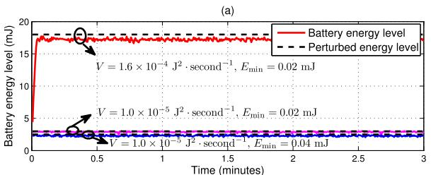

line

| Time (minutes) | Battery energy level (mJ) | Perturbed energy level (mJ) |
| -------------- | ------------------------- | --------------------------- |
| 0              | ~18                       | ~18                         |
| 0.5            | ~18                       | ~18                         |
| 1.0            | ~18                       | ~18                         |
| 1.5            | ~18                       | ~18                         |
| 2.0            | ~18                       | ~18                         |
| 2.5            | ~18                       | ~18                         |
| 3.0            | ~18                       | ~18                         |

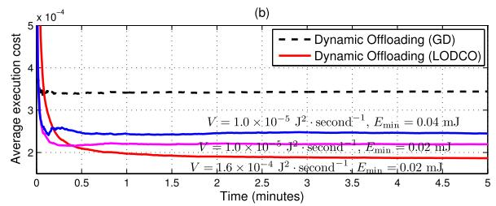

line

| Time (minutes) | Dynamic Offloading (GD) | Dynamic Offloading (LODCO) |
| -------------- | ------------------------ | --------------------------- |
| 0              | 3.5e-4                   | 5.0e-4                      |
| 0.5            | 3.5e-4                   | 2.5e-4                      |
| 1.0            | 3.5e-4                   | 2.2e-4                      |
| 1.5            | 3.5e-4                   | 2.1e-4                      |
| 2.0            | 3.5e-4                   | 2.0e-4                      |
| 2.5            | 3.5e-4                   | 2.0e-4                      |
| 3.0            | 3.5e-4                   | 2.0e-4                      |
| 3.5            | 3.5e-4                   | 2.0e-4                      |
| 4.0            | 3.5e-4                   | 2.0e-4                      |
| 4.5            | 3.5e-4                   | 2.0e-4                      |
| 5.0            | 3.5e-4                   | 2.0e-4                      |

Fig. 2. Battery energy level and average execution cost vs. time, $\rho = 0 . 6 .$

min $\cdot B ^ { t } , E _ { \mathrm { m a x } } \}$ , where $P _ { \operatorname* { m i n } \{ B ^ { t } , E _ { \operatorname* { m a x } } \} } ^ { t }$ is the unique solution of $p L = r \left( h ^ { t } , p \right)$ min $\{ B ^ { t } , E _ { \operatorname* { m a x } } \}$ . If $L / r \left( h ^ { t } , p _ { U } ^ { t } \right) \leq \tau _ { d } .$ , the computation task will be offloaded to the MEC server with transmit power $p _ { U } ^ { t }$ ; otherwise, MEC server execution is infeasible and the computation task will be dropped. Note that the computation tasks are always offloaded to the MEC server in this policy.

• Dynamic Offloading (GD): When $\zeta ^ { t } ~ = ~ 1$ , compute $f _ { U } ^ { t }$ and $p _ { U } ^ { t }$ as in the Mobile Execution (GD) and MEC Server Execution (GD) policies, respectively, and check if they can meet the delay requirement. Then the feasible computation mode that incurs smaller execution delay will be chosen. If neither computation modes is feasible, the computation task will be dropped.

# A. Theoretical Results Verification

In this subsection, we will verify the feasibility and asymptotic optimality of the LODCO algorithm developed in Proposition 4, Corollary 4, and Theorem 1, respectively. The value of θ is chosen as the value of the right-hand side of (20). In Fig. 2(a), the battery energy level is depicted to demonstrate the feasibility of the LODCO algorithm for P2 (P1). First, we observe that the harvested energy keeps accumulating at the beginning, and finally stabilizes around the perturbed energy level. This is due to the fact that in the proposed algorithm the upper bound of the Lyapunov drift-plus-penalty function is minimized at each time slot. From the curves, with a larger value of V or a smaller value of $E _ { \mathrm { m i n } }$ , the stabilized battery energy level becomes higher, which agrees with the definition of the perturbation parameter in (20). Also, we see that the battery energy level is confined within $\left[ 0 , \theta + E _ { H } ^ { \operatorname* { m a x } } \right]$ , which verifies Corollary 4 and confirms that the energy causality constraint is not violated, i.e., Proposition 4 holds. The evolution of the average execution cost with respect to time is shown in Fig. 2(b). It can be seen that, a larger value of V or a smaller value of $E _ { \mathrm { m i n } }$ results in a smaller long-term average execution cost. Nonetheless, the algorithm converges more slowly to the stable performance. Besides, if $\langle E _ { \operatorname* { m i n } } , V \rangle$ are properly selected, the proposed algorithm will achieve significant performance gain compared to the benchmark policies.

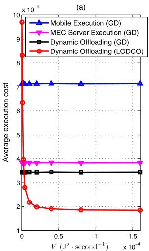

line

| V (J² · second⁻¹) | Mobile Execution (GD) | MEC Server Execution (GD) | Dynamic Offloading (GD) | Dynamic Offloading (LODCO) |
| ----------------- | --------------------- | ------------------------- | ----------------------- | -------------------------- |
| 0                 | 7.0                   | 4.0                       | 3.5                     | 6.0                        |
| 1.5e-4            | 7.0                   | 4.0                       | 3.5                     | 1.8                        |

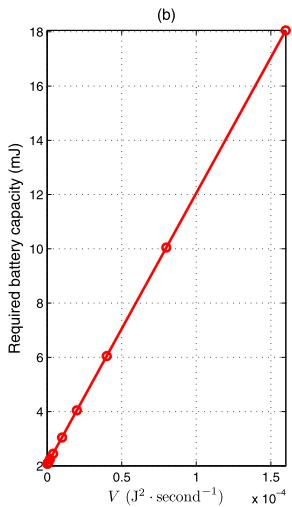

line

| V (J² - second⁻¹) x 10⁻⁴ | Required battery capacity (mJ) |
| ------------------------ | ------------------------------ |
| 0.0                      | 2.0                            |
| 0.1                      | 3.0                            |
| 0.2                      | 4.0                            |
| 0.3                      | 6.0                            |
| 0.7                      | 10.0                           |
| 1.5                      | 18.0                           |

Fig. 3. Average execution cost and required battery capacity vs. $V , \rho = 0 . 6$ and $E _ { \mathrm { m i n } } = 0 . { \overset { \cdot } { 0 } } 2$ mJ.

The relationship between the average execution cost/required battery capacity and V is shown in Fig. 3. We see from Fig. 3(a) that the execution cost achieved by the proposed algorithm decreases inversely proportional to $V ,$ and eventually it converges to the optimal value of $\mathcal { P } _ { 2 } .$ , which verifies the asymptotic optimality developed in Theorem 1. However, as shown from Fig. 3(b), the required battery capacity grows linearly with V since the value of θ increases linearly with V . Thus, V should be chosen to balance the achievable performance, convergence time and required battery capacity. For instance, if a battery with 18 mJ capacity is available, we can choose $V = 1 . 6 \times \stackrel { \cdot } { 1 0 ^ { - 4 } } \mathrm { J } ^ { 2 }$ · second−1 for the LODCO algorithm, and then 74.4%, 51.8% and 46.3% performance gain compared to the Mobile Execution (GD), MEC Server Execution (GD) and Dynamic Offloading (GD) policies, respectively, will be obtained.

# B. Performance Evaluation

We will show the effectiveness of the proposed algorithm and demonstrate the impacts of various system parameters in this subsection. First, the impacts of the task request probability $\rho$ on the system performance, including the execution cost, the average completion time of the executed tasks and the task drop ratio, are illustrated in Fig. 4. We see in Fig. 4(a) that the execution cost increases with $\rho ,$ which is in accordance with our intuition. Besides, the LODCO algorithm achieves significant execution cost reduction compared to the benchmark policies. In Fig. 4(b), the average completion time of the executed tasks and the task drop ratio are shown. We see that the LODCO algorithm achieves a near-zero task drop ratio, while those achieved by the benchmark policies increase rapidly with $\rho .$ In terms of the average completion time, the LODCO algorithm outperforms the benchmark policies when $\rho$ is small. However, when $\rho$ is large, the average completion time achieved by the LODCO algorithm is slightly longer than that achieved by the MEC Server Execution (GD) policy. The reason is, in order to minimize the execution cost, the LODCO algorithm suppresses the task drop ratio at the expense of a minor execution delay performance degradation.

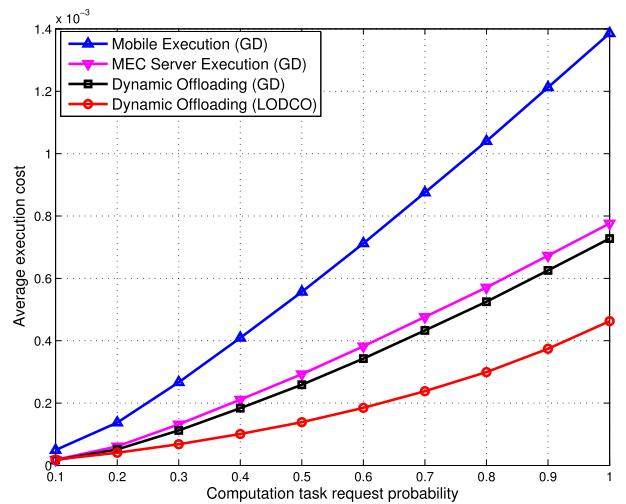

line

| Computation task request probability | Mobile Execution (GD) | MEC Server Execution (GD) | Dynamic Offloading (GD) | Dynamic Offloading (LODCO) |
| ------------------------------------ | --------------------- | ------------------------- | ----------------------- | -------------------------- |
| 0.1                                  | 0.0000                | 0.0000                    | 0.0000                  | 0.0000                     |
| 0.2                                  | 0.0001                | 0.0001                    | 0.0001                  | 0.0001                     |
| 0.3                                  | 0.0002                | 0.0002                    | 0.0002                  | 0.0002                     |
| 0.4                                  | 0.0004                | 0.0004                    | 0.0004                  | 0.0004                     |
| 0.5                                  | 0.0006                | 0.0006                    | 0.0006                  | 0.0006                     |
| 0.6                                  | 0.0008                | 0.0008                    | 0.0008                  | 0.0008                     |
| 0.7                                  | 0.001                 | 0.001                     | 0.001                   | 0.001                      |
| 0.8                                  | 0.0012                | 0.0012                    | 0.0012                  | 0.0012                     |
| 0.9                                  | 0.0014                | 0.0014                    | 0.0014                  | 0.0014                     |
| 1.0                                  | 0.0016                | 0.0016                    | 0.0016                  | 0.0016                     |

(a) Execution cost vs. p

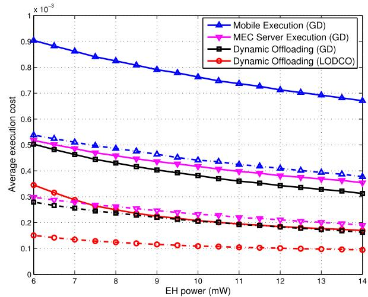

line

| EH power (mW) | Mobile Execution (GD) | MEC Server Execution (GD) | Dynamic Offloading (GD) | Dynamic Offloading (LODCO) |
| ------------- | --------------------- | ------------------------- | ----------------------- | -------------------------- |
| 6             | 0.9                   | 0.5                       | 0.5                     | 0.3                        |
| 7             | 0.85                  | 0.48                      | 0.48                    | 0.25                       |
| 8             | 0.8                   | 0.45                      | 0.45                    | 0.2                        |
| 9             | 0.75                  | 0.42                      | 0.42                    | 0.18                       |
| 10            | 0.7                   | 0.4                       | 0.4                     | 0.15                       |
| 11            | 0.68                  | 0.38                      | 0.38                    | 0.14                       |
| 12            | 0.65                  | 0.36                      | 0.36                    | 0.13                       |
| 13            | 0.63                  | 0.34                      | 0.34                    | 0.12                       |
| 14            | 0.6                   | 0.32                      | 0.32                    | 0.1                        |

(a) Execution cost vs. $P _ { H }$

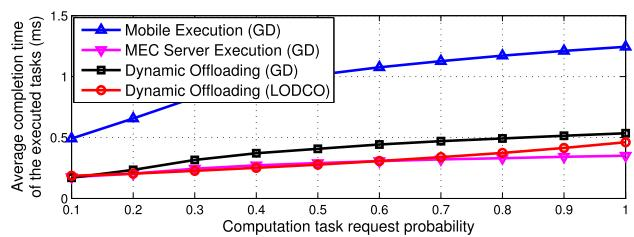

line

| Computation task request probability | Mobile Execution (GD) | MEC Server Execution (GD) | Dynamic Offloading (GD) | Dynamic Offloading (LODCO) |
| ------------------------------------ | --------------------- | ------------------------- | ----------------------- | -------------------------- |
| 0.1                                  | 0.5                   | 0.2                       | 0.2                     | 0.1                        |
| 0.2                                  | 0.7                   | 0.3                       | 0.3                     | 0.2                        |
| 0.3                                  | 0.9                   | 0.4                       | 0.4                     | 0.3                        |
| 0.4                                  | 1.0                   | 0.5                       | 0.5                     | 0.4                        |
| 0.5                                  | 1.1                   | 0.6                       | 0.6                     | 0.5                        |
| 0.6                                  | 1.2                   | 0.7                       | 0.7                     | 0.6                        |
| 0.7                                  | 1.3                   | 0.8                       | 0.8                     | 0.7                        |
| 0.8                                  | 1.4                   | 0.9                       | 0.9                     | 0.8                        |
| 0.9                                  | 1.5                   | 1.0                       | 1.0                     | 0.9                        |
| 1.0                                  | 1.6                   | 1.1                       | 1.1                     | 1.0                        |

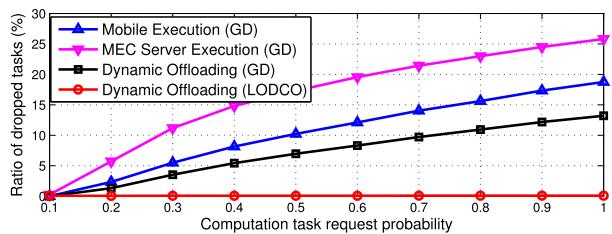

line

| Computation task request probability | Mobile Execution (GD) | MEC Server Execution (GD) | Dynamic Offloading (GD) | Dynamic Offloading (LODCO) |
| ------------------------------------ | ---------------------- | -------------------------- | ----------------------- | -------------------------- |
| 0.1                                  | 0                      | 0                          | 0                       | 0                          |
| 0.2                                  | 2                      | 6                          | 2                       | 0                          |
| 0.3                                  | 6                      | 12                         | 4                       | 0                          |
| 0.4                                  | 9                      | 16                         | 6                       | 0                          |
| 0.5                                  | 11                     | 18                         | 7                       | 0                          |
| 0.6                                  | 13                     | 20                         | 8                       | 0                          |
| 0.7                                  | 15                     | 22                         | 9                       | 0                          |
| 0.8                                  | 17                     | 24                         | 10                      | 0                          |
| 0.9                                  | 19                     | 26                         | 11                      | 0                          |
| 1.0                                  | 21                     | 28                         | 12                      | 0                          |

(b) Average completion time/task drop ratio vs. $\rho$

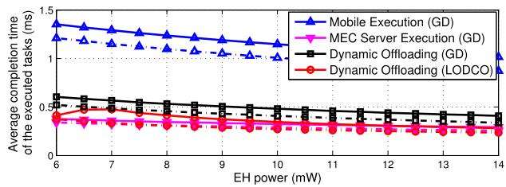

line

| EH power (mW) | Mobile Execution (GD) | MEC Server Execution (GD) | Dynamic Offloading (GD) | Dynamic Offloading (LODCO) |
| ------------- | --------------------- | ------------------------- | ----------------------- | -------------------------- |
| 6             | 1.3                   | 0.5                       | 0.6                     | 0.4                        |
| 7             | 1.2                   | 0.45                      | 0.55                    | 0.35                       |
| 8             | 1.1                   | 0.4                       | 0.5                     | 0.3                        |
| 9             | 1.0                   | 0.35                      | 0.45                    | 0.25                       |
| 10            | 0.9                   | 0.3                       | 0.4                     | 0.2                        |
| 11            | 0.8                   | 0.25                      | 0.35                    | 0.15                       |
| 12            | 0.7                   | 0.2                       | 0.3                     | 0.1                        |
| 13            | 0.6                   | 0.15                      | 0.25                    | 0.05                       |
| 14            | 0.5                   | 0.1                       | 0.2                     | 0.0                        |

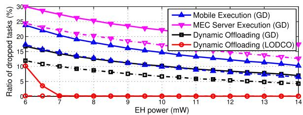

line

| EH power (mW) | Mobile Execution (GD) | MEC Server Execution (GD) | Dynamic Offloading (GD) | Dynamic Offloading (LODCO) |
| ------------- | --------------------- | ------------------------- | ----------------------- | -------------------------- |
| 6             | 25.0                  | 30.0                      | 18.0                    | 10.0                       |
| 7             | 22.0                  | 28.0                      | 16.0                    | 5.0                        |
| 8             | 20.0                  | 26.0                      | 14.0                    | 0.0                        |
| 9             | 18.0                  | 24.0                      | 12.0                    | 0.0                        |
| 10            | 16.0                  | 22.0                      | 10.0                    | 0.0                        |
| 11            | 14.0                  | 20.0                      | 8.0                     | 0.0                        |
| 12            | 12.0                  | 18.0                      | 6.0                     | 0.0                        |
| 13            | 10.0                  | 16.0                      | 4.0                     | 0.0                        |
| 14            | 8.0                   | 14.0                      | 2.0                     | 0.0                        |

(b) Average completion time/task drop ratio vs. $P _ { H }$   
Fig. 4. System performance vs. task request probability.   
Fig. 5. System performance vs. EH rate, the solid curves correspond to $\rho = 0 . 6$ and the dash-solid curves correspond to $\rho = 0 . 4$ .

The system performance versus the EH rate, i.e., $P _ { H }$ , is shown in Fig. 5, where the effectiveness of the LODCO algorithm is again validated. In addition, we see the execution cost decreases as the EH rate increases since consuming the renewable energy incurs no cost. Similar to the execution cost, the task drop ratios achieved by different policies decrease with the EH rate. Interestingly, under the LODCO algorithm, an increase of the EH rate does not necessarily reduce the average completion time, e.g., when $\rho = 0 . 6$ and $P _ { H }$ increases from 6 to 7 mW, the LODCO algorithm has introduced a 0.07 ms extra average completion time, but secured a 10% task drop reduction. Since the optimization objective is the execution cost, eliminating task drops brings more benefits in terms of system cost when the system resource is scarce, i.e., the harvested energy is insufficient compared to the relatively intense computation workload.

In Fig. 6, we reveal the relationship between the execution deadline $\tau _ { d }$ and the system performance. As $\tau _ { d }$ decreases, i.e., the computation requirement becomes more stringent, the execution costs and the task drop ratios achieved by all four policies increase, while the average completion time of the executed tasks decreases. It can be seen that when $\tau _ { d } \leq 0 . 4$ ms, the execution cost achieved by the Mobile Execution (GD) policy becomes a constant $\rho \phi .$ , and the task drop ratio is 100%. Meanwhile, the MEC Server Execution (GD) and the Dynamic Offloading (GD) policies converge. In these scenarios, the mobile device is not able to conduct any computation because of hardware limitation, i.e., $f ^ { t } \leq f _ { \mathrm { C P U } } ^ { \operatorname* { m a x } } =$ 1.5 GHz, and all the computation tasks have to be offloaded to the MEC server for mobile-edge execution. The results in Fig. 6(b) confirms the benefits of MEC as around 50% tasks are successfully executed for $\tau _ { d } ~ = ~ 0 . 2$ ms even under the greedy offloading policy. Note that for a small value of $\tau _ { d } ,$ $\mathrm { e . g . } , \ \tau _ { d } \ \leq \ 0 . 8$ ms, the average completion time achieved by the LODCO algorithm is slightly longer than those of the other two policies with computation offloading, but the task drop ratio is reduced noticeably by more than 20%. This phenomenon is similar to what was observed in Fig. 4(b), where the LODCO algorithm tends to avoid dropping tasks by prolonging the average completion time in order to achieve a minimum execution cost.

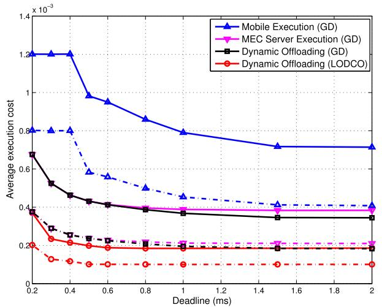

line

| Deadline (ms) | Mobile Execution (GD) | MEC Server Execution (GD) | Dynamic Offloading (GD) | Dynamic Offloading (LODCO) |
| ------------- | --------------------- | ------------------------- | ----------------------- | -------------------------- |
| 0.2           | 0.0012                | 0.0008                    | 0.0007                  | 0.0003                     |
| 0.4           | 0.0012                | 0.0008                    | 0.0005                  | 0.0002                     |
| 0.6           | 0.0010                | 0.0006                    | 0.0004                  | 0.0002                     |
| 0.8           | 0.0009                | 0.0005                    | 0.0004                  | 0.0002                     |
| 1.0           | 0.0008                | 0.0004                    | 0.0003                  | 0.0002                     |
| 1.2           | 0.0007                | 0.0004                    | 0.0003                  | 0.0002                     |
| 1.4           | 0.0007                | 0.0004                    | 0.0003                  | 0.0002                     |
| 1.6           | 0.0007                | 0.0004                    | 0.0003                  | 0.0002                     |
| 1.8           | 0.0007                | 0.0004                    | 0.0003                  | 0.0002                     |
| 2.0           | 0.0007                | 0.0004                    | 0.0003                  | 0.0002                     |

(a) Execution cost vs. Td

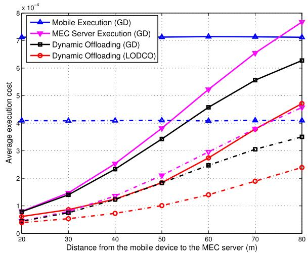

line

| Distance from the mobile device to the MEC server (m) | Mobile Execution (GD) | MEC Server Execution (GD) | Dynamic Offloading (GD) | Dynamic Offloading (LODCO) |
| ---------------------------------------------------- | --------------------- | ------------------------- | ----------------------- | -------------------------- |
| 20                                                   | 4.0                   | 0.5                       | 0.5                     | 0.5                        |
| 30                                                   | 4.0                   | 1.5                       | 0.7                     | 0.7                        |
| 40                                                   | 4.0                   | 2.5                       | 1.2                     | 1.0                        |
| 50                                                   | 4.0                   | 3.8                       | 1.8                     | 1.5                        |
| 60                                                   | 4.0                   | 5.2                       | 2.5                     | 2.8                        |
| 70                                                   | 4.0                   | 6.5                       | 3.0                     | 3.8                        |
| 80                                                   | 4.0                   | 7.8                       | 3.5                     | 4.5                        |

(a) Execution cost vs.d

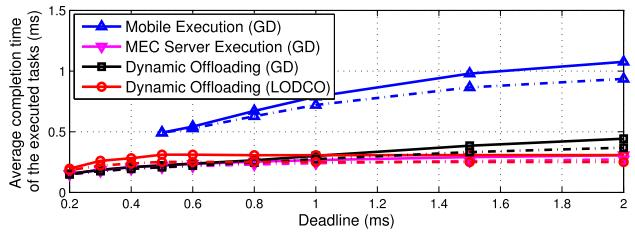

line

| Deadline (ms) | Mobile Execution (GD) | MEC Server Execution (GD) | Dynamic Offloading (GD) | Dynamic Offloading (LODCO) |
| ------------- | --------------------- | ------------------------- | ----------------------- | -------------------------- |
| 0.2           | 0.1                   | 0.1                       | 0.1                     | 0.1                        |
| 0.4           | 0.5                   | 0.1                       | 0.1                     | 0.2                        |
| 0.6           | 0.7                   | 0.1                       | 0.1                     | 0.3                        |
| 0.8           | 0.9                   | 0.1                       | 0.1                     | 0.3                        |
| 1.0           | 1.0                   | 0.1                       | 0.1                     | 0.3                        |
| 1.2           | 1.1                   | 0.1                       | 0.1                     | 0.3                        |
| 1.4           | 1.2                   | 0.1                       | 0.1                     | 0.3                        |
| 1.6           | 1.3                   | 0.1                       | 0.1                     | 0.3                        |
| 1.8           | 1.4                   | 0.1                       | 0.1                     | 0.3                        |
| 2.0           | 1.5                   | 0.1                       | 0.1                     | 0.3                        |

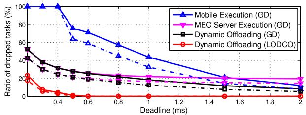

line

| Deadline (ms) | Mobile Execution (GD) | MEC Server Execution (GD) | Dynamic Offloading (GD) | Dynamic Offloading (LODCO) |
| ------------- | --------------------- | ------------------------- | ----------------------- | -------------------------- |
| 0.2           | 100                   | 50                        | 50                      | 20                         |
| 0.4           | 100                   | 40                        | 30                      | 10                         |
| 0.6           | 80                    | 30                        | 25                      | 5                          |
| 0.8           | 60                    | 25                        | 20                      | 5                          |
| 1.0           | 40                    | 20                        | 15                      | 5                          |
| 1.2           | 30                    | 15                        | 10                      | 5                          |
| 1.4           | 20                    | 15                        | 5                       | 5                          |
| 1.6           | 15                    | 15                        | 5                       | 5                          |
| 1.8           | 10                    | 15                        | 5                       | 5                          |
| 2.0           | 5                     | 15                        | 5                       | 5                          |

(b） Average completion time/task drop ratio vs. Td

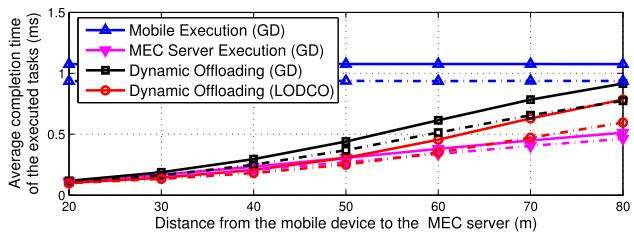

line

| Distance from the mobile device to the MEC server (m) | Mobile Execution (GD) | MEC Server Execution (GD) | Dynamic Offloading (GD) | Dynamic Offloading (LODCO) |
| -------------------------------------------------- | --------------------- | ------------------------- | ----------------------- | -------------------------- |
| 20                                                 | 1.0                   | 0.1                       | 0.1                     | 0.1                        |
| 40                                                 | 1.0                   | 0.2                       | 0.3                     | 0.2                        |
| 60                                                 | 1.0                   | 0.4                       | 0.5                     | 0.4                        |
| 70                                                 | 1.0                   | 0.5                       | 0.7                     | 0.6                        |
| 80                                                 | 1.0                   | 0.6                       | 0.8                     | 0.7                        |

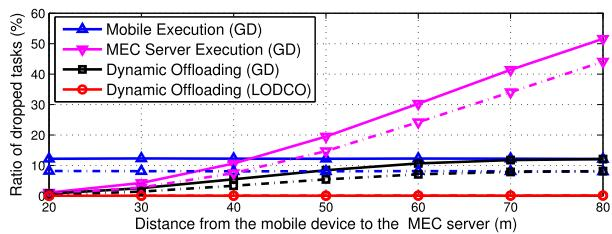

line

| Distance from the mobile device to the MEC server (m) | Mobile Execution (GD) | MEC Server Execution (GD) | Dynamic Offloading (GD) | Dynamic Offloading (LODCO) |
| -------------------------------------------------- | --------------------- | ------------------------- | ----------------------- | -------------------------- |
| 20                                                 | 10                    | 0                         | 0                       | 0                          |
| 30                                                 | 10                    | 5                         | 5                       | 0                          |
| 40                                                 | 10                    | 10                        | 10                      | 0                          |
| 50                                                 | 10                    | 20                        | 15                      | 0                          |
| 60                                                 | 10                    | 30                        | 20                      | 0                          |
| 70                                                 | 10                    | 40                        | 25                      | 0                          |
| 80                                                 | 10                    | 50                        | 30                      | 0                          |

(b)Average completion time/task drop ratio vs.d   
Fig. 6. System performance vs. execution deadline, the solid curves correspond to $\rho = 0 . 6$ and the dash-solid curves correspond to $\rho = 0 . 4$ .   
Fig. 7. System performance vs. distance, the solid curves correspond to $\rho = 0 . 6$ and the dash-solid curves correspond to ρ = 0.4.

Finally, we show the relationship between the system performance and d, i.e., the distance from the mobile device to the MEC server, in Fig. 7. The performance of the computation offloading policies, including the MEC Server Execution (GD) and the Dynamic Offloading (GD) policies, as well as the LODCO algorithm, deteriorates as d becomes large. As can be seen from Fig. 7(a), when the mobile device is close to the MEC server, the three computation offloading policies converge and greatly outperform the Mobile Execution (GD) policy. In such scenarios, the mobile device is able to offload the computation tasks to the MEC server with a small amount of harvested energy due to small path loss. With a large value of d, e.g., d = 80 m, offloading the tasks greedily cannot bring any execution cost reduction compared the Mobile Execution (GD) policy, while the LODCO algorithm offers more than 40% performance gain. From Fig. 7(b), we see that although the MEC Server Execution (GD) policy incurs the least completion time for the executed tasks, its task failure performance sharply degrades. In contrast, the proposed LODCO algorithm achieves a near-zero task drop ratio with an improved completion time performance compared to the Mobile Execution (GD) and Dynamic Offloading (GD) policies.

# VII. CONCLUSIONS

In this paper, we investigated mobile-edge computing (MEC) systems with EH mobile devices. The execution cost, which addresses the execution delay and task failure, was adopted as the performance metric. A dynamic computation offloading policy, namely, the Lyapunov optimizationbased dynamic computation offloading (LODCO) algorithm, was then developed. It is a low-complexity online algorithm and requires little prior knowledge. We found the monotonic properties of the CPU-cycle frequencies (transmit power) for mobile execution (computation offloading) with respect to the battery energy level, which uncovers the impact of EH to the system operations. Performance analysis was conducted which revealed the asymptotic optimality of the proposed algorithm. Simulation results showed that the proposed LODCO algorithm not only significantly outperforms the benchmark greedy policies in terms of execution cost, but also reduces computation failures noticeably at an expense of minor execution delay performance degradation. Our study provides a viable approach to design future MEC systems with renewable energy-powered devices. It would be interesting to extend the proposed algorithm to more general MEC systems with multiple mobile devices, as well as consider resourcelimited MEC servers. Another extension is to combine the concepts of wireless energy transfer and energy harvesting by deploying a power beacon co-located with the MEC server so that the energy deficit incurred by the renewable energy sources can be compensated by the controllable radio frequency energy.

# APPENDIX

# A. Proof for Proposition 1

Since $\mathcal { P } _ { 2 }$ is a tightened version of $\mathcal { P } _ { 1 }$ , we have $\begin{array} { r l } { \operatorname { E C } _ { \mathcal { P } _ { 1 } } ^ { * } ~ \leq } \end{array}$ $\mathrm { E C } _ { \mathcal { P } _ { 2 } } ^ { * }$ . The other side of the inequality can be obtained by constructing a feasible solution for $\mathcal { P } _ { 2 }$ (denoted as $\langle \dot { e } _ { \mathcal { P } _ { 2 } } ^ { t } , I _ { \mathcal { P } _ { 2 } } ^ { t } , f _ { \mathcal { P } _ { 2 } } ^ { t } , \bar { p _ { \mathcal { P } _ { 2 } } ^ { t } } \rangle )$ based on the optimal solution for $\mathcal { P } _ { 1 }$ (denoted as $\langle e _ { \mathcal { P } _ { 1 } } ^ { t ^ {  } } , I _ { \mathcal { P } _ { 1 } } ^ { t } , f _ { \mathcal { P } _ { 1 } } ^ { t } , p _ { \mathcal { P } _ { 1 } } ^ { t } \rangle ) ^ { 8 } \colon$ i) If $\mathscr { E } \left( I _ { \mathcal { P } _ { 1 } } ^ { t } , f _ { \mathcal { P } _ { 1 } } ^ { t } , p _ { \mathcal { P } _ { 1 } } ^ { t } \right)$ ∈ $( 0 , E _ { \mathrm { m i n } } )$ , then the computation task will be dropped in the constructed solution and no harvested energy will be consumed, i.e., $\begin{array} { r l r } { \mathrm { c o s t } _ { \mathcal { P } _ { 3 } } ^ { t } } & { { } = } & { \phi ; } \end{array}$ ii) If $\mathscr { E } \left( I _ { \mathcal { P } _ { 1 } } ^ { t } , f _ { \mathcal { P } _ { 1 } } ^ { t } , p _ { \mathcal { P } _ { 1 } } ^ { t } \right)$ ∈ $\{ 0 \} \bigcup [ E _ { \mathrm { m i n } } , E _ { \mathrm { m a x } } ]$ , the constructed solution for the t th time slot will be the same as the optimal solution for $\mathcal { P } _ { 1 } ; \mathbf { i i i } )$ The EH decision $e _ { \mathcal { P } _ { \mathcal { P } } } ^ { t }$ is determined by $\begin{array} { r l r } { e _ { \mathcal P _ { 9 } } ^ { t } } & { { } = } & { \operatorname* { m a x } \{ B _ { \mathcal P _ { 1 } } ^ { t } \ - \ } \end{array}$ $\mathcal { Z } \left( I _ { \mathcal { P } _ { 1 } } ^ { t } , f _ { \mathcal { P } _ { 1 } } ^ { t } , p _ { \mathcal { P } _ { 1 } } ^ { t } \right) \dot { + } e _ { \mathcal { P } _ { 1 } } ^ { t } - B _ { \mathcal { P } _ { 2 } } ^ { t } + \mathcal { Z } \left( I _ { \mathcal { P } _ { 2 } } ^ { t } , f _ { \mathcal { P } _ { 2 } } ^ { t } , \bar { p } _ { \mathcal { P } _ { 2 } } ^ { t } \right) , 0 \}$ , where $\mathsf { \Pi } _ { B _ { \mathcal { P } _ { 1 } } ^ { t } }$ and $B _ { \mathcal { P } } ^ { t }$ are the battery energy levels at the beginning of the tth time slot under $\{ \langle e _ { \mathcal { P } _ { 1 } } ^ { t } , \overline { { I _ { \mathcal { P } _ { 1 } } ^ { t } , f _ { \mathcal { P } _ { 1 } } ^ { t } } } , p _ { \mathcal { P } _ { 1 } } ^ { t } \rangle \}$ and $\{ \langle e _ { \mathcal { P } _ { 2 } } ^ { t } , I _ { \mathcal { P } _ { 2 } } ^ { t } , f _ { \mathcal { P } _ { 2 } } ^ { t } , p _ { \mathcal { P } _ { 2 } } ^ { t } \rangle \}$ , respectively.

It is not difficult to show $B _ { \mathcal { P } _ { 1 } } ^ { t } \le B _ { \mathcal { P } _ { 3 } } ^ { t } < + \infty$ , and thus the 1 constructed solution is feasible to $\mathcal { P } _ { 2 }$ 2 . If $E _ { \mathrm { m i n } } \ge E _ { \mathrm { m i n } } ^ { \tau _ { d } } .$ , where E τd $E _ { \operatorname* { m i n } } ^ { \tau _ { d } } = \kappa W ^ { 3 } \tau _ { d } ^ { - 2 }$ is the minimum amount of energy required to meet the deadline constraint for mobile execution, for a time slot with $I _ { \mathrm { m } , \mathcal { P } _ { 1 } } ^ { t } = 1$ and $\mathcal { Z } \left( I _ { \mathcal { P } _ { 1 } } ^ { t } , f _ { \mathcal { P } _ { 1 } } ^ { t } , p _ { \mathcal { P } _ { 1 } } ^ { t } \right) \in \left( 0 , E _ { \operatorname* { m i n } } \right)$ , the constructed solution incurs $\left( \phi - \tau _ { E _ { \mathrm { m i n } } } \right)$ units of extra execution cost in the worst case. Here, $\tau _ { E _ { \mathrm { m i n } } } = \kappa ^ { \frac { 1 } { 2 } } W ^ { \frac { 3 } { 2 } } E _ { \mathrm { m i n } } ^ { - \frac { 1 } { 2 } }$ is the minimum execution delay corresponds to $E _ { \mathrm { m i n } }$ amount of energy consumption for mobile execution; otherwise, if Emin < E τd , $E _ { \mathrm { m i n } } < E _ { \mathrm { m i n } } ^ { \tau _ { d } } , I _ { \mathrm { m } , \mathcal { P } _ { 1 } } ^ { t } = 1$ and $\mathcal { Z } \left( I _ { \mathcal { P } _ { 1 } } ^ { t } , f _ { \mathcal { P } _ { 1 } } ^ { t } , p _ { \mathcal { P } _ { 1 } } ^ { t } \right) \in \left( 0 , E _ { \operatorname* { m i n } } \right)$ is infeasible as the deadline constraint cannot be met. Besides, the probability of offloading a task to the MEC server successfully with energy consumption less than $E _ { \mathrm { m i n } }$ is no greater than $\begin{array} { r } { \mathbb { P } \{ \omega \tau _ { d } \log _ { 2 } \left( 1 + \frac { h ^ { t } E _ { \mathrm { m i n } } } { \tau _ { d } \sigma } \right) ~ \geq ~ L \} ~ = ~ 1 - ~ F _ { H } \left( \eta \right) } \end{array}$ , where $\eta \triangleq \left( 2 ^ { \frac { L } { \omega \tau _ { d } } } - 1 \right) \dot { \tau } _ { d } \sigma E _ { \operatorname* { m i n } } ^ { - 1 }$ , and the constructed solution will incur at most $\phi$ units of extra execution cost as $\mathrm { c o s t } _ { \mathcal { P } _ { 1 } } ^ { t } > 0$ . By further incorporating the task request probability $\rho ,$ , we can obtain the desired result.

8For simplicity, we assume the optimal solution for $\mathcal { P } _ { 1 }$ satisfies the property of the optimal CPU-cycle frequencies in Lemma 1.

# B. Proof for Corollary 3

For $\tilde { B } ^ { t } < 0 ,$ since $\Xi \left( h ^ { t } , p _ { 0 } ^ { t } , \tilde { B } ^ { t } \right) = 0$ , with some manipulations, we have $\begin{array} { r } { \tilde { B } ^ { t } \cdot k \left( h ^ { t } , p _ { 0 } ^ { t } \right) = \frac { h ^ { t } V } { \ln 2 } } \end{array}$ , where $\begin{array} { r } { k \left( h , p \right) = \frac { h p } { \ln 2 } - } \end{array}$ $\begin{array} { r } { ( h p + \sigma ) \log _ { 2 } \left( 1 + \frac { h p } { \sigma } \right) } \end{array}$ , and $\begin{array} { r } { \frac { \partial k ( h , p ) } { \partial p } = - h \log _ { 2 } \left( 1 + \frac { h p } { \sigma } \right) < 0 . } \end{array}$ i.e., $k ( h , p )$ decreases with $p$ for $p \ > \ 0$ . Denote $\tilde { B } _ { - } ^ { t } \mathrm { ~  ~ \ l ~ }$ $\tilde { B } _ { + } ^ { t } < 0$ and the corresponding solutions for $\Xi \left( h ^ { t } , p , \tilde { B } ^ { t } \right) = 0$ as $p _ { 0 , - } ^ { t }$ and $p _ { 0 , + } ^ { t }$ , respectively. Since $\tilde { B } _ { + } ^ { t } k \left( h ^ { t } , p _ { 0 , + } ^ { t } \right) \ =$ = $\tilde { B } _ { - } ^ { t } k \left( h ^ { t } , p _ { 0 , - } ^ { t } \right) > 0$ , we have k $\left( h ^ { t } , p _ { 0 , + } ^ { t } \right) < k \left( h ^ { t } , p _ { 0 , - } ^ { t } \right) < 0 .$ , i.e., $p _ { 0 , + } ^ { t } > p _ { 0 , - } ^ { t }$ . Since $p _ { L } ^ { t }$ and $p _ { U } ^ { t }$ are invariant with $\tilde { B } ^ { t }$ , according to (31), $p ^ { t * }$ is non-decreasing with $\tilde { B } ^ { t }$ for $\tilde { B } ^ { t } < 0$ . Besides, as $p ^ { t * } = p _ { U } ^ { t }$ when $\tilde { B } ^ { t } \geq 0$ , we can conclude that $p ^ { t * }$ is non-decreasing with ${ \tilde { B } } ^ { t }$ .

# C. Proof for Lemma 4

By subtracting θ at both sides of (9), we have $\tilde { B } ^ { t + 1 } =$ $\tilde { B } ^ { t } \dot { + } e ^ { t } - \mathcal { E } \left( I ^ { t } , \mathsf { \bar { { f } } } ^ { t } , p ^ { t } \right)$ . Squaring both sides of this equality, we have

$$
\begin{array}{l} \left(\tilde {B} ^ {t + 1}\right) ^ {2} = \left(\tilde {B} ^ {t} + e ^ {t} - \mathcal {E} \left(\boldsymbol {I} ^ {t}, f ^ {t}, p ^ {t}\right)\right) ^ {2} \\ \leq \left(\tilde {B} ^ {t}\right) ^ {2} + 2 \tilde {B} ^ {t} \left(e ^ {t} - \mathcal {E} \left(I ^ {t}, f ^ {t}, p ^ {t}\right)\right) \\ + \left(e ^ {t}\right) ^ {2} + \mathcal {E} ^ {2} \left(\boldsymbol {I} ^ {t}, f ^ {t}, p ^ {t}\right) \\ \leq \left(\tilde {B} ^ {t}\right) ^ {2} + 2 \tilde {B} ^ {t} \left(e ^ {t} - \mathcal {E} \left(I ^ {t}, f ^ {t}, p ^ {t}\right)\right) \\ + \left(E _ {H} ^ {\max}\right) ^ {2} + \tilde {E} _ {\max} ^ {2}. \tag {42} \\ \end{array}
$$

Dividing both sides of (42) by 2, adding $V [ \mathcal { D } \left( I ^ { t } , f ^ { t } , p ^ { t } \right) +$ $\phi \cdot { \bf 1 } \left( \zeta ^ { t } = 1 , I _ { \mathrm { d } } ^ { t } = 1 \right) ]$ , as well as taking the expectation conditioned on $\tilde { B } ^ { t }$ on both sides of the inequality, we can obtain the desired result.

# D. Proof for Theorem 1

Since the LODCO algorithm obtains the optimal solution of the per-time slot problem, the following inequality holds:

$$
\begin{array}{l} \Delta_ {V} \left(\tilde {B} ^ {t}\right) \\ \leq \mathbb {E} \left[ \tilde {B} ^ {t} \left[ e ^ {t *} - \mathcal {E} \left(\boldsymbol {I} ^ {t *}, f ^ {t *}, p ^ {t *}\right) \right] + V \cdot \cos^ {t *} | \tilde {B} ^ {t} \right] + C \\ \leq \mathbb {E} \left[ \tilde {B} ^ {t} \left[ e ^ {t \Pi} - \mathcal {E} \left(\boldsymbol {I} ^ {t \Pi}, f ^ {t \Pi}, p ^ {t \Pi}\right) \right] + V \cdot \cos^ {t \Pi} | \tilde {B} ^ {t} \right] + C \\ \stackrel {(\dagger)} {=} \tilde {B} ^ {t} \mathbb {E} \left[ e ^ {t \Pi} - \mathcal {E} \left(\boldsymbol {I} ^ {t \Pi}, f ^ {t \Pi}, p ^ {t \Pi}\right) \right] + V \cdot \mathbb {E} \left[ \cos^ {t \Pi} \right] + C \\ \stackrel {(\ddagger)} {\leq} \max \left\{\theta , E _ {H} ^ {\max} \right\} \cdot \varrho \delta + V \left(\mathrm{EC} _ {\mathcal {P} _ {3}} ^ {*} + \delta\right) + C, \tag {43} \\ \end{array}
$$

where costt∗ and $\cos t ^ { t \Pi }$ are the execution cost at the tth time slot under $\langle I ^ { t * } , f ^ { t * } , p ^ { t * } \rangle$ and $\langle I ^ { t \Pi } , f ^ { t \Pi } , p ^ { t \Pi } \rangle$ , respectively. (†) is because that policy  is independent of the battery energy level $B ^ { t }$ , and (‡) is due to Corollary 4 and Lemma $^ { 6 . }$ By letting δ go to zero, we obtain

$$
\Delta_ {V} \left(\tilde {B} ^ {t}\right) \leq V E C _ {\mathcal {P} _ {3}} ^ {*} + C. \tag {44}
$$

Taking the expectation on both sides of (44), summing up the inequalities for $t = 0 , \cdots T - 1$ , dividing by T and letting T go to infinity, we have ECLODCO $\begin{array} { r } { \le \mathrm { { E C } } _ { \mathcal { P } _ { 3 } } ^ { * } + \frac { C } { V } } \end{array}$ . By further utilizing Proposition 1 and Lemma 5, the theorem is proved.

# REFERENCES

[1] J. Gubbi, R. Buyya, S. Marusic, and M. Palaniswami, “Internet of Things (IoT): A vision, architectural elements, and future directions,” Future Generat. Comput. Syst., vol. 29, no. 7, pp. 1645–1660, 2013.   
[2] A. R. Khan, M. Othman, S. A. Madani, and S. U. Khan, “A survey of mobile cloud computing application models,” IEEE Commun. Surveys Tuts., vol. 16, no. 1, pp. 393–413, Feb. 2014.   
[3] ETSI, Sophia Antipolis, France, “Mobile-edge computing-Introductory technical white paper,” Sep. 2014. [Online]. Available: https:// portal.etsi.org/portals/0/tbpages/mec/docs/mobile-edge\_computing\_- \_introductory\_technical\_white\_paper\_v1%2018-09-14.pdf   
[4] Intel, Santa Clara, CA, USA, “Real-world impact of mobile edge computing (MEC),” Jan. 2016. [Online]. Available: https://builders. intel.com/docs/networkbuilders/Real-world-impact-of-mobile-edgecomputing-MEC.pdf   
[5] K. Kumar, J. Liu, Y.-H. Lu, and B. Bhargava, “A survey of computation offloading for mobile systems,” Mobile Netw. Appl., vol. 18, no. 1, pp. 129–140, Feb. 2013.   
[6] M. Satyanarayanan, P. Bahl, R. Caceres, and N. Davies, “The case for vm-based cloudlets in mobile computing,” IEEE Pervasive Comput., vol. 8, no. 4, pp. 14–23, Oct./Dec. 2009.   
[7] K. Kumar and Y.-H. Lu, “Cloud computing for mobile users: Can offloading computation save energy?” Computer, vol. 43, no. 4, pp. 51–56, Apr. 2010.   
[8] S. Barbarossa, S. Sardellitti, and P. D. Lorenzo, “Communicating while computing: Distributed mobile cloud computing over 5G heterogeneous networks,” IEEE Signal Process. Mag., vol. 31, no. 6, pp. 45–55, Nov. 2014.   
[9] S. Lambert, W. Van Heddeghem, W. Vereecken, B. Lannoo, D. Colle, and M. Pickavet, “Worldwide electricity consumption of communication networks,” Opt. Exp., vol. 20, no. 26, pp. B513–B524, Mar. 2012.   
[10] S. Sudevalayam and P. Kulkarni, “Energy harvesting sensor nodes: Survey and implications,” IEEE Commun. Surveys Tuts., vol. 13, no. 3, pp. 443–461, Sep. 2011.   
[11] S. Ulukus et al., “Energy harvesting wireless communications: A review of recent advances,” IEEE J. Sel. Areas Commun., vol. 33, no. 3, pp. 360–381, Mar. 2015.   
[12] E. Cuervo et al., “MAUI: Making smartphones last longer with code offload,” in Proc. ACM Int. Conf. Mobile Syst. Appl. Serv. (MobiSys), San Francisco, CA, USA, Jun. 2010, pp. 49–62.   
[13] S. Kosta, A. Aucinas, P. Hui, R. Mortier, and X. Zhang, “ThinkAir: Dynamic resource allocation and parallel execution in the cloud for mobile code offloading,” in Proc. IEEE Int. Conf. Comput. Commun. (INFOCOM), Orlando, FL, USA, Mar. 2012, pp. 945–953.   
[14] D. Huang, P. Wang, and D. Niyato, “A dynamic offloading algorithm for mobile computing,” IEEE Trans. Wireless Commun., vol. 11, no. 6, pp. 1991–1995, Jun. 2012.   
[15] O. Munoz, A. Pascual-Iserte, and J. Vidal, “Optimization of radio and computational resources for energy efficiency in latency-constrained application offloading,” IEEE Trans. Veh. Technol., vol. 64, no. 10, pp. 4738–4755, Oct. 2015.   
[16] J. Liu, Y. Mao, J. Zhang, and K. B. Letaief, “Delay-optimal computation task scheduling for mobile-edge computing systems,” in Proc. IEEE Int. Symp. Inf. Theory (ISIT), Barcelona, Spain, Jul. 2016, pp. 1451–1455.   
[17] X. Chen, “Decentralized computation offloading game for mobile cloud computing,” IEEE Trans. Parallel Distrib. Syst., vol. 26, no. 4, pp. 974–983, Apr. 2015.   
[18] T. D. Burd and R. W. Brodersen, “Processor design for portable systems,” J. VLSI Signal Process. Syst., vol. 13, nos. 2–3, pp. 203–221, Aug. 1996.   
[19] W. Zhang, Y. Wen, K. Guan, D. Kilper, H. Luo, and D. O. Wu, “Energy-optimal mobile cloud computing under stochastic wireless channel,” IEEE Trans. Wireless Commun., vol. 12, no. 9, pp. 4569–4581, Sep. 2013.   
[20] S. Sardellitti, G. Scutari, and S. Barbarossa, “Joint optimization of radio and computational resources for multicell mobile-edge computing,” IEEE Trans. Signal Inf. Process. Over Netw., vol. 1, no. 2, pp. 89–103, Jun. 2015.   
[21] J. Kwak, Y. Kim, J. Lee, and S. Chong, “DREAM: Dynamic resource and task allocation for energy minimization in mobile cloud systems,” IEEE J. Sel. Areas Commun., vol. 33, no. 12, pp. 2510–2523, Dec. 2015.

[22] Y. Mao, J. Zhang, S. H. Song, and K. B. Letaief, “Power-delay tradeoff in multi-user mobile-edge computing systems,” in Proc. IEEE Global Commun. Conf. (GLOBECOM), Washington, DC, USA, Dec. 2016, pp. 1–6.   
[23] G. Piro et al., “HetNets powered by renewable energy sources: Sustainable next-generation cellular networks,” IEEE Internet Comput., vol. 17, no. 1, pp. 32–39, Jan./Feb. 2013.   
[24] Y. Mao, Y. Luo, J. Zhang, and K. B. Letaief, “Energy harvesting small cell networks: Feasibility, deployment, and operation,” IEEE Commun. Mag., vol. 53, no. 6, pp. 94–101, Jun. 2015.   
[25] Y. Mao, J. Zhang, and K. B. Letaief, “Grid energy consumption and QoS tradeoff in hybrid energy supply wireless networks,” IEEE Trans. Wireless Commun., vol. 15, no. 5, pp. 3573–3586, May 2016.   
[26] O. Ozel, K. Tutuncuoglu, J. Yang, S. Ulukus, and A. Yener, “Transmission with energy harvesting nodes in fading wireless channels: Optimal policies,” IEEE J. Sel. Areas Commun., vol. 29, no. 8, pp. 1732–1743, Sep. 2011.   
[27] L. Huang and M. J. Neely, “Utility optimal scheduling in energyharvesting networks,” IEEE/ACM Trans. Netw., vol. 21, no. 4, pp. 1117–1130, Aug. 2013.   
[28] D. W. K. Ng, E. S. Lo, and R. Schober, “Energy-efficient resource allocation in OFDMA systems with hybrid energy harvesting base station,” IEEE Trans. Wireless Commun., vol. 12, no. 7, pp. 3412–3427, Jul. 2013.   
[29] J. Gong, J. S. Thompson, S. Zhou, and Z. Niu, “Base station sleeping and resource allocation in renewable energy powered cellular networks,” IEEE Trans. Commun., vol. 62, no. 11, pp. 3801–3813, Nov. 2014.   
[30] Y. Mao, J. Zhang, and K. B. Letaief, “A lyapunov optimization approach for green cellular networks with hybrid energy supplies,” IEEE J. Sel. Areas Commun., vol. 33, no. 12, pp. 2463–2477, Dec. 2015.   
[31] R. D. Yates and H. Mahdavi-Doost, “Energy harvesting receivers: Packet sampling and decoding policies,” IEEE J. Sel. Areas Commun., vol. 33, no. 3, pp. 558–570, Mar. 2015.   
[32] Y. Mao, J. Zhang, and K. B. Letaief, “ARQ with adaptive feedback for energy harvesting receivers,” in Proc. IEEE Wireless Commun. Netw. Conf. (WCNC), Doha, Qatar, Apr. 2016, pp. 1–6.   
[33] C. You, K. Huang, and H. Chae, “Energy efficient mobile cloud computing powered by wireless energy transfer,” IEEE J. Sel. Areas Commun., vol. 34, no. 5, pp. 1757–1771, May 2016.   
[34] Z. Jiang and S. Mao, “Energy delay trade-off in cloud offloading for multi-core mobile devices,” in Proc. IEEE Global Commun. Conf. (GLOBECOM), San Diego, CA, USA, Dec. 2015, pp. 1–6.   
[35] A. P. Miettinen and J. K. Nurminen, “Energy efficiency of mobile clients in cloud computing,” in Proc. USENIX Conf. Hot Topics Cloud Comput. (HotCloud), Boston, MA, USA, Jun. 2010, pp. 1–7.   
[36] J. M. Rabaey, A. Chandrakasan, and B. Nikoli´c, Digital Integrated Circuits: A Design Perspective, 2nd ed. Upper Saddle River, NJ, USA: Prentice-Hall, 2003.   
[37] S. Lakshminarayana, T. Q. S. Quek, and H. V. Poor, “Cooperation and storage tradeoffs in power grids with renewable energy resources,” IEEE J. Sel. Areas Commun., vol. 32, no. 7, pp. 1386–1397, Jul. 2014.   
[38] S. Sun, M. Dong, and B. Liang, “Distributed real-time power balancing in renewable-integrated power grids with storage and flexible loads,” IEEE Trans. Smart Grid, vol. 7, no. 5, pp. 2337–2349, Sep. 2016.   
[39] D. P. Bertsekas, Dynamic Programming and Optimal Control, 3rd ed. Belmonth, MA, USA: Athens Scientific, 2005.   
[40] M. J. Neely and L. Huang, “Dynamic product assembly and inventory control for maximum profit,” in Proc. IEEE Conf. Decision Control (CDC), Atlanta, GA, USA, Dec. 2010, pp. 2805–2812.   
[41] M. J. Neely, Stochastic Network Optimization With Application to Communication Queueing Systems. San Rafael, CA, USA: Morgan and Calypool, 2010.

natural_image

Portrait photo of a young man in a light pink shirt (no text or symbols visible)

Yuyi Mao (S’14) received the B.Eng. degree in information and communication engineering from Zhejiang University, Hangzhou, China, in 2013. He is currently pursuing the Ph.D. degree in electronic and computer engineering at the Hong Kong University of Science and Technology (HKUST), Hong Kong. His current research interests include cooperative communications, energy harvesting communications, green cellular networks with hybrid energy supplies, mobile-edge computing, and stochastic optimization.

natural_image

Portrait of a smiling man wearing glasses and a striped polo shirt (no text or symbols visible)

Jun Zhang (S’06–M’10–SM’15) received the B.Eng. degree in electronic engineering from the University of Science and Technology of China, Hefei, China, in 2004, the M.Phil. degree in information engineering from the Chinese University of Hong Kong, Hong Kong, in 2006, and the Ph.D. degree in electrical and computer engineering from the University of Texas at Austin, Austin, TX, USA, in 2009. He is currently a Research Assistant Professor with the Department of Electronic and Computer Engineering, the Hong Kong University of Science and Technology (HKUST), Hong Kong. He has co-authored the book entitled Fundamentals of LTE (Prentice-Hall, 2010). His research interests include wireless communications and networking, green communications and computing, and signal processing. He was a recipient of four Best Paper Awards, including the 2016 Marconi Prize Paper Award in Wireless Communications, the 2014 Best Paper Award for the EURASIP Journal on Advances in Signal Processing, the Best Paper Award of the IEEE ICC 2016, and the Best Paper Award of the IEEE PIMRC 2014. He is an Editor of the IEEE TRANSACTIONS ON WIRELESS COMMUNICATIONS and served as a MAC Track Co-Chair for the IEEE WCNC 2011.

natural_image

Portrait of a man in business attire with a yellow tie (no visible text or symbols)

Khaled B. Letaief (S’85–M’86–SM’97–F’03) received the B.S. (Hons.), M.S., and Ph.D. degrees in electrical engineering from Purdue University, West Lafayette, IN, USA, in 1984, 1986, and 1990, respectively. From 1990 to 1993, he was a Faculty Member with the University of Melbourne, Melbourne, Australia. He has been with the Hong Kong University of Science and Technology (HKUST), Hong Kong. He was with HKUST as the Head of the Department of Electronic and Computer Engineering, the Director of the Center for Wireless IC Design, the Director of Huawei Innovation Laboratory, and the Director of the Hong Kong Telecom Institute of Information Technology. He has also served as a Chair Professor and the Dean of the HKUST School of Engineering. Under his leadership, the School of Engineering has dazzled in international rankings (ranked #14 in the world in 2015 according to QS World University Rankings). Since 2015, he has been with Hamad bin Khalifa University, Doha, Qatar, as a Provost to help establish a research-intensive university in Qatar in partnership with strategic partners that include Northwestern University, Carnegie Mellon University, Cornell University, and Texas A&M University.

Dr. Letaief is a world-renowned leader in wireless communications and networks. In these areas, he has authored over 500 journal and conference papers and given invited keynote talks as well as courses all over the world. He has made six major contributions to the IEEE Standards along with 13 patents including 11 U.S. patents.

He served as a consultant for different organizations and is the Founding Editor-in-Chief of the prestigious IEEE TRANSACTIONS ON WIRELESS COM-MUNICATIONS. He has served as the Editor-in-Chief on the Editorial Board of other prestigious journals, including the IEEE JOURNAL ON SELECTED AREARS IN COMMUNICATIONS-Wireless Series. He has been involved in organizing a number of major international conferences.

Dr. Letaief has been a Dedicated Educator committed to excellence in teaching and scholarship. He received the Mangoon Teaching Award from Purdue University in 1990, the HKUST Engineering Teaching Excellence Award (four times), and the Michael Gale Medal for Distinguished Teaching (Highest University-Wide Teaching Award at HKUST).

He was also a recipient of many other distinguished awards, including the 2007 IEEE Joseph LoCicero Publications Exemplary Award, the 2009 IEEE Marconi Prize Award in Wireless Communications, the 2010 Purdue University Outstanding Electrical and Computer Engineer Award, the 2011 IEEE Harold Sobol Award, the 2011 IEEE Wireless Communications Technical Committee Recognition Award, the 2016 IEEE Marconi Prize Award in Wireless Communications, and 13 IEEE Best Paper Awards.

He served the IEEE in many leadership positions, including the IEEE ComSoc Vice-President, the IEEE ComSoc Director of Journals, and member of the IEEE Publications Services and Products Board, the IEEE ComSoc Board of Governors, the IEEE TAB Periodicals Committee, and the IEEE Fellow Committee. He is a Fellow of IEEE and a Fellow of HKIE. He is also recognized by Thomson Reuters as an ISI Highly Cited Researcher.